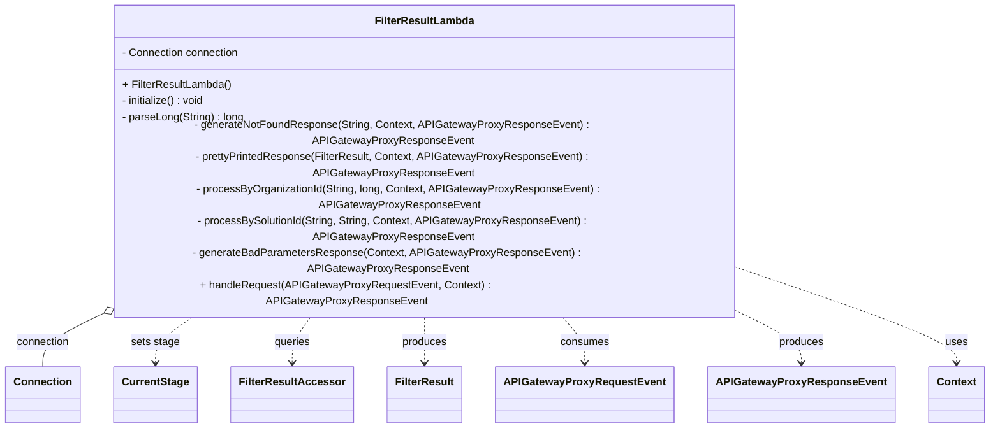

# Diagram: platform-java-lambdas/shipment/src/main/java/com/freightverify/shipment/lambda/FilterResultLambda.java


> Auto-generated by Obscura crawlers

## Diagram 1



### SVG

<svg id="container" width="1416.1875" xmlns="http://www.w3.org/2000/svg" class="classDiagram" height="510" viewBox="0 0 1416.1875 510" role="graphics-document document" aria-roledescription="class"><style>#container{font-family:"trebuchet ms",verdana,arial,sans-serif;font-size:16px;fill:#333;}@keyframes edge-animation-frame{from{stroke-dashoffset:0;}}@keyframes dash{to{stroke-dashoffset:0;}}#container .edge-animation-slow{stroke-dasharray:9,5!important;stroke-dashoffset:900;animation:dash 50s linear infinite;stroke-linecap:round;}#container .edge-animation-fast{stroke-dasharray:9,5!important;stroke-dashoffset:900;animation:dash 20s linear infinite;stroke-linecap:round;}#container .error-icon{fill:#552222;}#container .error-text{fill:#552222;stroke:#552222;}#container .edge-thickness-normal{stroke-width:1px;}#container .edge-thickness-thick{stroke-width:3.5px;}#container .edge-pattern-solid{stroke-dasharray:0;}#container .edge-thickness-invisible{stroke-width:0;fill:none;}#container .edge-pattern-dashed{stroke-dasharray:3;}#container .edge-pattern-dotted{stroke-dasharray:2;}#container .marker{fill:#333333;stroke:#333333;}#container .marker.cross{stroke:#333333;}#container svg{font-family:"trebuchet ms",verdana,arial,sans-serif;font-size:16px;}#container p{margin:0;}#container g.classGroup text{fill:#9370DB;stroke:none;font-family:"trebuchet ms",verdana,arial,sans-serif;font-size:10px;}#container g.classGroup text .title{font-weight:bolder;}#container .nodeLabel,#container .edgeLabel{color:#131300;}#container .edgeLabel .label rect{fill:#ECECFF;}#container .label text{fill:#131300;}#container .labelBkg{background:#ECECFF;}#container .edgeLabel .label span{background:#ECECFF;}#container .classTitle{font-weight:bolder;}#container .node rect,#container .node circle,#container .node ellipse,#container .node polygon,#container .node path{fill:#ECECFF;stroke:#9370DB;stroke-width:1px;}#container .divider{stroke:#9370DB;stroke-width:1;}#container g.clickable{cursor:pointer;}#container g.classGroup rect{fill:#ECECFF;stroke:#9370DB;}#container g.classGroup line{stroke:#9370DB;stroke-width:1;}#container .classLabel .box{stroke:none;stroke-width:0;fill:#ECECFF;opacity:0.5;}#container .classLabel .label{fill:#9370DB;font-size:10px;}#container .relation{stroke:#333333;stroke-width:1;fill:none;}#container .dashed-line{stroke-dasharray:3;}#container .dotted-line{stroke-dasharray:1 2;}#container #compositionStart,#container .composition{fill:#333333!important;stroke:#333333!important;stroke-width:1;}#container #compositionEnd,#container .composition{fill:#333333!important;stroke:#333333!important;stroke-width:1;}#container #dependencyStart,#container .dependency{fill:#333333!important;stroke:#333333!important;stroke-width:1;}#container #dependencyStart,#container .dependency{fill:#333333!important;stroke:#333333!important;stroke-width:1;}#container #extensionStart,#container .extension{fill:transparent!important;stroke:#333333!important;stroke-width:1;}#container #extensionEnd,#container .extension{fill:transparent!important;stroke:#333333!important;stroke-width:1;}#container #aggregationStart,#container .aggregation{fill:transparent!important;stroke:#333333!important;stroke-width:1;}#container #aggregationEnd,#container .aggregation{fill:transparent!important;stroke:#333333!important;stroke-width:1;}#container #lollipopStart,#container .lollipop{fill:#ECECFF!important;stroke:#333333!important;stroke-width:1;}#container #lollipopEnd,#container .lollipop{fill:#ECECFF!important;stroke:#333333!important;stroke-width:1;}#container .edgeTerminals{font-size:11px;line-height:initial;}#container .classTitleText{text-anchor:middle;font-size:18px;fill:#333;}#container .label-icon{display:inline-block;height:1em;overflow:visible;vertical-align:-0.125em;}#container .node .label-icon path{fill:currentColor;stroke:revert;stroke-width:revert;}#container :root{--mermaid-font-family:"trebuchet ms",verdana,arial,sans-serif;}</style><g><defs><marker id="container_class-aggregationStart" class="marker aggregation class" refX="18" refY="7" markerWidth="190" markerHeight="240" orient="auto"><path d="M 18,7 L9,13 L1,7 L9,1 Z"></path></marker></defs><defs><marker id="container_class-aggregationEnd" class="marker aggregation class" refX="1" refY="7" markerWidth="20" markerHeight="28" orient="auto"><path d="M 18,7 L9,13 L1,7 L9,1 Z"></path></marker></defs><defs><marker id="container_class-extensionStart" class="marker extension class" refX="18" refY="7" markerWidth="190" markerHeight="240" orient="auto"><path d="M 1,7 L18,13 V 1 Z"></path></marker></defs><defs><marker id="container_class-extensionEnd" class="marker extension class" refX="1" refY="7" markerWidth="20" markerHeight="28" orient="auto"><path d="M 1,1 V 13 L18,7 Z"></path></marker></defs><defs><marker id="container_class-compositionStart" class="marker composition class" refX="18" refY="7" markerWidth="190" markerHeight="240" orient="auto"><path d="M 18,7 L9,13 L1,7 L9,1 Z"></path></marker></defs><defs><marker id="container_class-compositionEnd" class="marker composition class" refX="1" refY="7" markerWidth="20" markerHeight="28" orient="auto"><path d="M 18,7 L9,13 L1,7 L9,1 Z"></path></marker></defs><defs><marker id="container_class-dependencyStart" class="marker dependency class" refX="6" refY="7" markerWidth="190" markerHeight="240" orient="auto"><path d="M 5,7 L9,13 L1,7 L9,1 Z"></path></marker></defs><defs><marker id="container_class-dependencyEnd" class="marker dependency class" refX="13" refY="7" markerWidth="20" markerHeight="28" orient="auto"><path d="M 18,7 L9,13 L14,7 L9,1 Z"></path></marker></defs><defs><marker id="container_class-lollipopStart" class="marker lollipop class" refX="13" refY="7" markerWidth="190" markerHeight="240" orient="auto"><circle stroke="black" fill="transparent" cx="7" cy="7" r="6"></circle></marker></defs><defs><marker id="container_class-lollipopEnd" class="marker lollipop class" refX="1" refY="7" markerWidth="190" markerHeight="240" orient="auto"><circle stroke="black" fill="transparent" cx="7" cy="7" r="6"></circle></marker></defs><g class="root"><g class="clusters"></g><g class="edgePaths"><path d="M144.163,350.034L130.34,355.195C116.517,360.356,88.872,370.678,75.049,382.006C61.227,393.333,61.227,405.667,61.227,411.833L61.227,418" id="id_FilterResultLambda_Connection_1" class="edge-thickness-normal edge-pattern-solid relation" style=";;;" data-edge="true" data-et="edge" data-id="id_FilterResultLambda_Connection_1" data-points="W3sieCI6MTYwLjMyMjgyNzc0MzkwMjQ1LCJ5IjozNDR9LHsieCI6NjEuMjI2NTYyNSwieSI6MzgxfSx7IngiOjYxLjIyNjU2MjUsInkiOjQxOH1d" marker-start="url(#container_class-aggregationStart)"></path><path d="M293.98,344L282.37,350.167C270.76,356.333,247.54,368.667,235.93,380C224.32,391.333,224.32,401.667,224.32,406.833L224.32,412" id="id_FilterResultLambda_CurrentStage_2" class="edge-thickness-normal edge-pattern-dashed relation" style=";;;" data-edge="true" data-et="edge" data-id="id_FilterResultLambda_CurrentStage_2" data-points="W3sieCI6MjkzLjk4MDE0NDgxNzA3MzE1LCJ5IjozNDR9LHsieCI6MjI0LjMyMDMxMjUsInkiOjM4MX0seyJ4IjoyMjQuMzIwMzEyNSwieSI6NDE4fV0=" marker-end="url(#container_class-dependencyEnd)"></path><path d="M454.528,344L448.811,350.167C443.094,356.333,431.66,368.667,425.943,380C420.227,391.333,420.227,401.667,420.227,406.833L420.227,412" id="id_FilterResultLambda_FilterResultAccessor_3" class="edge-thickness-normal edge-pattern-dashed relation" style=";;;" data-edge="true" data-et="edge" data-id="id_FilterResultLambda_FilterResultAccessor_3" data-points="W3sieCI6NDU0LjUyNzcwNTc5MjY4MjksInkiOjM0NH0seyJ4Ijo0MjAuMjI2NTYyNSwieSI6MzgxfSx7IngiOjQyMC4yMjY1NjI1LCJ5Ijo0MTh9XQ==" marker-end="url(#container_class-dependencyEnd)"></path><path d="M610.273,344L610.273,350.167C610.273,356.333,610.273,368.667,610.273,380C610.273,391.333,610.273,401.667,610.273,406.833L610.273,412" id="id_FilterResultLambda_FilterResult_4" class="edge-thickness-normal edge-pattern-dashed relation" style=";;;" data-edge="true" data-et="edge" data-id="id_FilterResultLambda_FilterResult_4" data-points="W3sieCI6NjEwLjI3MzQzNzUsInkiOjM0NH0seyJ4Ijo2MTAuMjczNDM3NSwieSI6MzgxfSx7IngiOjYxMC4yNzM0Mzc1LCJ5Ijo0MTh9XQ==" marker-end="url(#container_class-dependencyEnd)"></path><path d="M798.486,344L805.395,350.167C812.303,356.333,826.12,368.667,833.029,380C839.938,391.333,839.938,401.667,839.938,406.833L839.938,412" id="id_FilterResultLambda_APIGatewayProxyRequestEvent_5" class="edge-thickness-normal edge-pattern-dashed relation" style=";;;" data-edge="true" data-et="edge" data-id="id_FilterResultLambda_APIGatewayProxyRequestEvent_5" data-points="W3sieCI6Nzk4LjQ4NTkzNzUsInkiOjM0NH0seyJ4Ijo4MzkuOTM3NSwieSI6MzgxfSx7IngiOjgzOS45Mzc1LCJ5Ijo0MTh9XQ==" marker-end="url(#container_class-dependencyEnd)"></path><path d="M1049.897,344L1066.034,350.167C1082.171,356.333,1114.445,368.667,1130.582,380C1146.719,391.333,1146.719,401.667,1146.719,406.833L1146.719,412" id="id_FilterResultLambda_APIGatewayProxyResponseEvent_6" class="edge-thickness-normal edge-pattern-dashed relation" style=";;;" data-edge="true" data-et="edge" data-id="id_FilterResultLambda_APIGatewayProxyResponseEvent_6" data-points="W3sieCI6MTA0OS44OTY5MTMxMDk3NTYsInkiOjM0NH0seyJ4IjoxMTQ2LjcxODc1LCJ5IjozODF9LHsieCI6MTE0Ni43MTg3NSwieSI6NDE4fV0=" marker-end="url(#container_class-dependencyEnd)"></path><path d="M1074.449,301.578L1123.377,314.815C1172.305,328.052,1270.16,354.526,1319.088,372.93C1368.016,391.333,1368.016,401.667,1368.016,406.833L1368.016,412" id="id_FilterResultLambda_Context_7" class="edge-thickness-normal edge-pattern-dashed relation" style=";;;" data-edge="true" data-et="edge" data-id="id_FilterResultLambda_Context_7" data-points="W3sieCI6MTA3NC40NDkyMTg3NSwieSI6MzAxLjU3ODM3ODQwNjI0Mzg3fSx7IngiOjEzNjguMDE1NjI1LCJ5IjozODF9LHsieCI6MTM2OC4wMTU2MjUsInkiOjQxOH1d" marker-end="url(#container_class-dependencyEnd)"></path></g><g class="edgeLabels"><g class="edgeLabel" transform="translate(61.2265625, 381)"><g class="label" data-id="id_FilterResultLambda_Connection_1" transform="translate(-40.40625, -12)"><foreignObject width="80.8125" height="24"><div xmlns="http://www.w3.org/1999/xhtml" class="labelBkg" style="display: table-cell; white-space: nowrap; line-height: 1.5; max-width: 200px; text-align: center;"><span class="edgeLabel"><p>connection</p></span></div></foreignObject></g></g><g class="edgeLabel" transform="translate(224.3203125, 381)"><g class="label" data-id="id_FilterResultLambda_CurrentStage_2" transform="translate(-36.078125, -12)"><foreignObject width="72.15625" height="24"><div xmlns="http://www.w3.org/1999/xhtml" class="labelBkg" style="display: table-cell; white-space: nowrap; line-height: 1.5; max-width: 200px; text-align: center;"><span class="edgeLabel"><p>sets stage</p></span></div></foreignObject></g></g><g class="edgeLabel" transform="translate(420.2265625, 381)"><g class="label" data-id="id_FilterResultLambda_FilterResultAccessor_3" transform="translate(-27.2421875, -12)"><foreignObject width="54.484375" height="24"><div xmlns="http://www.w3.org/1999/xhtml" class="labelBkg" style="display: table-cell; white-space: nowrap; line-height: 1.5; max-width: 200px; text-align: center;"><span class="edgeLabel"><p>queries</p></span></div></foreignObject></g></g><g class="edgeLabel" transform="translate(610.2734375, 381)"><g class="label" data-id="id_FilterResultLambda_FilterResult_4" transform="translate(-33.4765625, -12)"><foreignObject width="66.953125" height="24"><div xmlns="http://www.w3.org/1999/xhtml" class="labelBkg" style="display: table-cell; white-space: nowrap; line-height: 1.5; max-width: 200px; text-align: center;"><span class="edgeLabel"><p>produces</p></span></div></foreignObject></g></g><g class="edgeLabel" transform="translate(839.9375, 381)"><g class="label" data-id="id_FilterResultLambda_APIGatewayProxyRequestEvent_5" transform="translate(-36.375, -12)"><foreignObject width="72.75" height="24"><div xmlns="http://www.w3.org/1999/xhtml" class="labelBkg" style="display: table-cell; white-space: nowrap; line-height: 1.5; max-width: 200px; text-align: center;"><span class="edgeLabel"><p>consumes</p></span></div></foreignObject></g></g><g class="edgeLabel" transform="translate(1146.71875, 381)"><g class="label" data-id="id_FilterResultLambda_APIGatewayProxyResponseEvent_6" transform="translate(-33.4765625, -12)"><foreignObject width="66.953125" height="24"><div xmlns="http://www.w3.org/1999/xhtml" class="labelBkg" style="display: table-cell; white-space: nowrap; line-height: 1.5; max-width: 200px; text-align: center;"><span class="edgeLabel"><p>produces</p></span></div></foreignObject></g></g><g class="edgeLabel" transform="translate(1368.015625, 381)"><g class="label" data-id="id_FilterResultLambda_Context_7" transform="translate(-16.4921875, -12)"><foreignObject width="32.984375" height="24"><div xmlns="http://www.w3.org/1999/xhtml" class="labelBkg" style="display: table-cell; white-space: nowrap; line-height: 1.5; max-width: 200px; text-align: center;"><span class="edgeLabel"><p>uses</p></span></div></foreignObject></g></g></g><g class="nodes"><g class="node default" id="classId-FilterResultLambda-0" transform="translate(610.2734375, 176)"><g class="basic label-container"><path d="M-464.17578125 -168 L464.17578125 -168 L464.17578125 168 L-464.17578125 168" stroke="none" stroke-width="0" fill="#ECECFF" style=""></path><path d="M-464.17578125 -168 C-199.1659485157847 -168, 65.84388421843062 -168, 464.17578125 -168 M-464.17578125 -168 C-125.47861583140434 -168, 213.21854958719132 -168, 464.17578125 -168 M464.17578125 -168 C464.17578125 -70.60459612131264, 464.17578125 26.790807757374722, 464.17578125 168 M464.17578125 -168 C464.17578125 -44.20564931949069, 464.17578125 79.58870136101862, 464.17578125 168 M464.17578125 168 C176.43739929009922 168, -111.30098266980156 168, -464.17578125 168 M464.17578125 168 C148.80502182421026 168, -166.56573760157949 168, -464.17578125 168 M-464.17578125 168 C-464.17578125 57.07764031217003, -464.17578125 -53.844719375659935, -464.17578125 -168 M-464.17578125 168 C-464.17578125 51.480032399999914, -464.17578125 -65.03993520000017, -464.17578125 -168" stroke="#9370DB" stroke-width="1.3" fill="none" stroke-dasharray="0 0" style=""></path></g><g class="annotation-group text" transform="translate(0, -144)"></g><g class="label-group text" transform="translate(-71.1328125, -144)"><g class="label" style="font-weight: bolder" transform="translate(0,-12)"><foreignObject width="142.265625" height="24"><div xmlns="http://www.w3.org/1999/xhtml" style="display: table-cell; white-space: nowrap; line-height: 1.5; max-width: 190px; text-align: center;"><span class="nodeLabel markdown-node-label" style=""><p>FilterResultLambda</p></span></div></foreignObject></g></g><g class="members-group text" transform="translate(-452.17578125, -96)"><g class="label" style="" transform="translate(0,-12)"><foreignObject width="177.84375" height="24"><div xmlns="http://www.w3.org/1999/xhtml" style="display: table-cell; white-space: nowrap; line-height: 1.5; max-width: 235px; text-align: center;"><span class="nodeLabel markdown-node-label" style=""><p>- Connection connection</p></span></div></foreignObject></g></g><g class="methods-group text" transform="translate(-452.17578125, -48)"><g class="label" style="" transform="translate(0,-12)"><foreignObject width="162.9375" height="24"><div xmlns="http://www.w3.org/1999/xhtml" style="display: table-cell; white-space: nowrap; line-height: 1.5; max-width: 220px; text-align: center;"><span class="nodeLabel markdown-node-label" style=""><p>+ FilterResultLambda()</p></span></div></foreignObject></g><g class="label" style="" transform="translate(0,12)"><foreignObject width="126.640625" height="24"><div xmlns="http://www.w3.org/1999/xhtml" style="display: table-cell; white-space: nowrap; line-height: 1.5; max-width: 184px; text-align: center;"><span class="nodeLabel markdown-node-label" style=""><p>- initialize() : void</p></span></div></foreignObject></g><g class="label" style="" transform="translate(0,36)"><foreignObject width="182.703125" height="24"><div xmlns="http://www.w3.org/1999/xhtml" style="display: table-cell; white-space: nowrap; line-height: 1.5; max-width: 241px; text-align: center;"><span class="nodeLabel markdown-node-label" style=""><p>- parseLong(String) : long</p></span></div></foreignObject></g><g class="label" style="" transform="translate(0,60)"><foreignObject width="818.59375" height="24"><div xmlns="http://www.w3.org/1999/xhtml" style="display: table-cell; white-space: nowrap; line-height: 1.5; max-width: 876px; text-align: center;"><span class="nodeLabel markdown-node-label" style=""><p>- generateNotFoundResponse(String, Context, APIGatewayProxyResponseEvent) : APIGatewayProxyResponseEvent</p></span></div></foreignObject></g><g class="label" style="" transform="translate(0,84)"><foreignObject width="819.84375" height="24"><div xmlns="http://www.w3.org/1999/xhtml" style="display: table-cell; white-space: nowrap; line-height: 1.5; max-width: 877px; text-align: center;"><span class="nodeLabel markdown-node-label" style=""><p>- prettyPrintedResponse(FilterResult, Context, APIGatewayProxyResponseEvent) : APIGatewayProxyResponseEvent</p></span></div></foreignObject></g><g class="label" style="" transform="translate(0,108)"><foreignObject width="833.21875" height="24"><div xmlns="http://www.w3.org/1999/xhtml" style="display: table-cell; white-space: nowrap; line-height: 1.5; max-width: 891px; text-align: center;"><span class="nodeLabel markdown-node-label" style=""><p>- processByOrganizationId(String, long, Context, APIGatewayProxyResponseEvent) : APIGatewayProxyResponseEvent</p></span></div></foreignObject></g><g class="label" style="" transform="translate(0,132)"><foreignObject width="813.453125" height="24"><div xmlns="http://www.w3.org/1999/xhtml" style="display: table-cell; white-space: nowrap; line-height: 1.5; max-width: 871px; text-align: center;"><span class="nodeLabel markdown-node-label" style=""><p>- processBySolutionId(String, String, Context, APIGatewayProxyResponseEvent) : APIGatewayProxyResponseEvent</p></span></div></foreignObject></g><g class="label" style="" transform="translate(0,156)"><foreignObject width="806.234375" height="24"><div xmlns="http://www.w3.org/1999/xhtml" style="display: table-cell; white-space: nowrap; line-height: 1.5; max-width: 864px; text-align: center;"><span class="nodeLabel markdown-node-label" style=""><p>- generateBadParametersResponse(Context, APIGatewayProxyResponseEvent) : APIGatewayProxyResponseEvent</p></span></div></foreignObject></g><g class="label" style="" transform="translate(0,180)"><foreignObject width="663.046875" height="24"><div xmlns="http://www.w3.org/1999/xhtml" style="display: table-cell; white-space: nowrap; line-height: 1.5; max-width: 721px; text-align: center;"><span class="nodeLabel markdown-node-label" style=""><p>+ handleRequest(APIGatewayProxyRequestEvent, Context) : APIGatewayProxyResponseEvent</p></span></div></foreignObject></g></g><g class="divider" style=""><path d="M-464.17578125 -120 C-215.76973786702814 -120, 32.63630551594372 -120, 464.17578125 -120 M-464.17578125 -120 C-193.29773895280982 -120, 77.58030334438035 -120, 464.17578125 -120" stroke="#9370DB" stroke-width="1.3" fill="none" stroke-dasharray="0 0" style=""></path></g><g class="divider" style=""><path d="M-464.17578125 -72 C-248.9263413047003 -72, -33.676901359400574 -72, 464.17578125 -72 M-464.17578125 -72 C-166.1271083663529 -72, 131.9215645172942 -72, 464.17578125 -72" stroke="#9370DB" stroke-width="1.3" fill="none" stroke-dasharray="0 0" style=""></path></g></g><g class="node default" id="classId-Connection-1" transform="translate(61.2265625, 460)"><g class="basic label-container"><path d="M-53.2265625 -42 L53.2265625 -42 L53.2265625 42 L-53.2265625 42" stroke="none" stroke-width="0" fill="#ECECFF" style=""></path><path d="M-53.2265625 -42 C-25.850081409504714 -42, 1.526399680990572 -42, 53.2265625 -42 M-53.2265625 -42 C-21.994017591387383 -42, 9.238527317225234 -42, 53.2265625 -42 M53.2265625 -42 C53.2265625 -11.21576148678503, 53.2265625 19.56847702642994, 53.2265625 42 M53.2265625 -42 C53.2265625 -23.002703665757913, 53.2265625 -4.005407331515826, 53.2265625 42 M53.2265625 42 C23.285578027929567 42, -6.655406444140866 42, -53.2265625 42 M53.2265625 42 C26.604708772963203 42, -0.01714495407359351 42, -53.2265625 42 M-53.2265625 42 C-53.2265625 11.496755904649007, -53.2265625 -19.006488190701987, -53.2265625 -42 M-53.2265625 42 C-53.2265625 9.56244888830718, -53.2265625 -22.87510222338564, -53.2265625 -42" stroke="#9370DB" stroke-width="1.3" fill="none" stroke-dasharray="0 0" style=""></path></g><g class="annotation-group text" transform="translate(0, -18)"></g><g class="label-group text" transform="translate(-41.2265625, -18)"><g class="label" style="font-weight: bolder" transform="translate(0,-12)"><foreignObject width="82.453125" height="24"><div xmlns="http://www.w3.org/1999/xhtml" style="display: table-cell; white-space: nowrap; line-height: 1.5; max-width: 132px; text-align: center;"><span class="nodeLabel markdown-node-label" style=""><p>Connection</p></span></div></foreignObject></g></g><g class="members-group text" transform="translate(-41.2265625, 30)"></g><g class="methods-group text" transform="translate(-41.2265625, 60)"></g><g class="divider" style=""><path d="M-53.2265625 6 C-24.982552666357652 6, 3.2614571672846964 6, 53.2265625 6 M-53.2265625 6 C-22.68587412913229 6, 7.8548142417354185 6, 53.2265625 6" stroke="#9370DB" stroke-width="1.3" fill="none" stroke-dasharray="0 0" style=""></path></g><g class="divider" style=""><path d="M-53.2265625 24 C-16.991940348165592 24, 19.242681803668816 24, 53.2265625 24 M-53.2265625 24 C-11.185973156628954 24, 30.854616186742092 24, 53.2265625 24" stroke="#9370DB" stroke-width="1.3" fill="none" stroke-dasharray="0 0" style=""></path></g></g><g class="node default" id="classId-CurrentStage-2" transform="translate(224.3203125, 460)"><g class="basic label-container"><path d="M-59.8671875 -42 L59.8671875 -42 L59.8671875 42 L-59.8671875 42" stroke="none" stroke-width="0" fill="#ECECFF" style=""></path><path d="M-59.8671875 -42 C-29.792207854784383 -42, 0.2827717904312337 -42, 59.8671875 -42 M-59.8671875 -42 C-13.93423709029134 -42, 31.99871331941732 -42, 59.8671875 -42 M59.8671875 -42 C59.8671875 -13.437396153019968, 59.8671875 15.125207693960064, 59.8671875 42 M59.8671875 -42 C59.8671875 -16.424271692320378, 59.8671875 9.151456615359244, 59.8671875 42 M59.8671875 42 C26.213021801538765 42, -7.441143896922469 42, -59.8671875 42 M59.8671875 42 C31.144318518404162 42, 2.421449536808325 42, -59.8671875 42 M-59.8671875 42 C-59.8671875 14.286101492760558, -59.8671875 -13.427797014478884, -59.8671875 -42 M-59.8671875 42 C-59.8671875 12.939836482954874, -59.8671875 -16.120327034090252, -59.8671875 -42" stroke="#9370DB" stroke-width="1.3" fill="none" stroke-dasharray="0 0" style=""></path></g><g class="annotation-group text" transform="translate(0, -18)"></g><g class="label-group text" transform="translate(-47.8671875, -18)"><g class="label" style="font-weight: bolder" transform="translate(0,-12)"><foreignObject width="95.734375" height="24"><div xmlns="http://www.w3.org/1999/xhtml" style="display: table-cell; white-space: nowrap; line-height: 1.5; max-width: 143px; text-align: center;"><span class="nodeLabel markdown-node-label" style=""><p>CurrentStage</p></span></div></foreignObject></g></g><g class="members-group text" transform="translate(-47.8671875, 30)"></g><g class="methods-group text" transform="translate(-47.8671875, 60)"></g><g class="divider" style=""><path d="M-59.8671875 6 C-32.2676648576224 6, -4.668142215244799 6, 59.8671875 6 M-59.8671875 6 C-14.014939841141008 6, 31.837307817717985 6, 59.8671875 6" stroke="#9370DB" stroke-width="1.3" fill="none" stroke-dasharray="0 0" style=""></path></g><g class="divider" style=""><path d="M-59.8671875 24 C-22.886674065496152 24, 14.093839369007696 24, 59.8671875 24 M-59.8671875 24 C-18.627554518969752 24, 22.612078462060495 24, 59.8671875 24" stroke="#9370DB" stroke-width="1.3" fill="none" stroke-dasharray="0 0" style=""></path></g></g><g class="node default" id="classId-APIGatewayProxyRequestEvent-3" transform="translate(839.9375, 460)"><g class="basic label-container"><path d="M-125.65625 -42 L125.65625 -42 L125.65625 42 L-125.65625 42" stroke="none" stroke-width="0" fill="#ECECFF" style=""></path><path d="M-125.65625 -42 C-60.69479978002293 -42, 4.266650439954134 -42, 125.65625 -42 M-125.65625 -42 C-66.65112654624627 -42, -7.646003092492535 -42, 125.65625 -42 M125.65625 -42 C125.65625 -21.67041220599264, 125.65625 -1.340824411985281, 125.65625 42 M125.65625 -42 C125.65625 -8.933122774952892, 125.65625 24.133754450094216, 125.65625 42 M125.65625 42 C50.6058017743613 42, -24.444646451277407 42, -125.65625 42 M125.65625 42 C33.88428388596287 42, -57.887682228074254 42, -125.65625 42 M-125.65625 42 C-125.65625 14.418315418097844, -125.65625 -13.163369163804312, -125.65625 -42 M-125.65625 42 C-125.65625 9.624282571851936, -125.65625 -22.75143485629613, -125.65625 -42" stroke="#9370DB" stroke-width="1.3" fill="none" stroke-dasharray="0 0" style=""></path></g><g class="annotation-group text" transform="translate(0, -18)"></g><g class="label-group text" transform="translate(-113.65625, -18)"><g class="label" style="font-weight: bolder" transform="translate(0,-12)"><foreignObject width="227.3125" height="24"><div xmlns="http://www.w3.org/1999/xhtml" style="display: table-cell; white-space: nowrap; line-height: 1.5; max-width: 273px; text-align: center;"><span class="nodeLabel markdown-node-label" style=""><p>APIGatewayProxyRequestEvent</p></span></div></foreignObject></g></g><g class="members-group text" transform="translate(-113.65625, 30)"></g><g class="methods-group text" transform="translate(-113.65625, 60)"></g><g class="divider" style=""><path d="M-125.65625 6 C-75.17742390299567 6, -24.69859780599134 6, 125.65625 6 M-125.65625 6 C-30.72883148123782 6, 64.19858703752436 6, 125.65625 6" stroke="#9370DB" stroke-width="1.3" fill="none" stroke-dasharray="0 0" style=""></path></g><g class="divider" style=""><path d="M-125.65625 24 C-33.280262681366565 24, 59.09572463726687 24, 125.65625 24 M-125.65625 24 C-73.73686525586035 24, -21.817480511720703 24, 125.65625 24" stroke="#9370DB" stroke-width="1.3" fill="none" stroke-dasharray="0 0" style=""></path></g></g><g class="node default" id="classId-APIGatewayProxyResponseEvent-4" transform="translate(1146.71875, 460)"><g class="basic label-container"><path d="M-131.125 -42 L131.125 -42 L131.125 42 L-131.125 42" stroke="none" stroke-width="0" fill="#ECECFF" style=""></path><path d="M-131.125 -42 C-59.665377339469174 -42, 11.794245321061652 -42, 131.125 -42 M-131.125 -42 C-52.50159239661299 -42, 26.121815206774016 -42, 131.125 -42 M131.125 -42 C131.125 -20.003933212259994, 131.125 1.9921335754800111, 131.125 42 M131.125 -42 C131.125 -12.433869088496564, 131.125 17.13226182300687, 131.125 42 M131.125 42 C64.88789696577838 42, -1.3492060684432374 42, -131.125 42 M131.125 42 C53.29382160375634 42, -24.537356792487316 42, -131.125 42 M-131.125 42 C-131.125 13.794490596353857, -131.125 -14.411018807292287, -131.125 -42 M-131.125 42 C-131.125 15.488003770995231, -131.125 -11.023992458009538, -131.125 -42" stroke="#9370DB" stroke-width="1.3" fill="none" stroke-dasharray="0 0" style=""></path></g><g class="annotation-group text" transform="translate(0, -18)"></g><g class="label-group text" transform="translate(-119.125, -18)"><g class="label" style="font-weight: bolder" transform="translate(0,-12)"><foreignObject width="238.25" height="24"><div xmlns="http://www.w3.org/1999/xhtml" style="display: table-cell; white-space: nowrap; line-height: 1.5; max-width: 284px; text-align: center;"><span class="nodeLabel markdown-node-label" style=""><p>APIGatewayProxyResponseEvent</p></span></div></foreignObject></g></g><g class="members-group text" transform="translate(-119.125, 30)"></g><g class="methods-group text" transform="translate(-119.125, 60)"></g><g class="divider" style=""><path d="M-131.125 6 C-47.221995013882875 6, 36.68100997223425 6, 131.125 6 M-131.125 6 C-63.64515758295754 6, 3.834684834084925 6, 131.125 6" stroke="#9370DB" stroke-width="1.3" fill="none" stroke-dasharray="0 0" style=""></path></g><g class="divider" style=""><path d="M-131.125 24 C-31.560892797121753 24, 68.0032144057565 24, 131.125 24 M-131.125 24 C-56.70088161723818 24, 17.723236765523637 24, 131.125 24" stroke="#9370DB" stroke-width="1.3" fill="none" stroke-dasharray="0 0" style=""></path></g></g><g class="node default" id="classId-Context-5" transform="translate(1368.015625, 460)"><g class="basic label-container"><path d="M-40.171875 -42 L40.171875 -42 L40.171875 42 L-40.171875 42" stroke="none" stroke-width="0" fill="#ECECFF" style=""></path><path d="M-40.171875 -42 C-14.197880162694602 -42, 11.776114674610795 -42, 40.171875 -42 M-40.171875 -42 C-23.91445684949556 -42, -7.657038698991123 -42, 40.171875 -42 M40.171875 -42 C40.171875 -16.3758677085109, 40.171875 9.248264582978202, 40.171875 42 M40.171875 -42 C40.171875 -9.697368603422419, 40.171875 22.605262793155163, 40.171875 42 M40.171875 42 C18.68873150094804 42, -2.794411998103918 42, -40.171875 42 M40.171875 42 C20.703401494295445 42, 1.23492798859089 42, -40.171875 42 M-40.171875 42 C-40.171875 24.03462193924746, -40.171875 6.069243878494923, -40.171875 -42 M-40.171875 42 C-40.171875 17.914423932740533, -40.171875 -6.171152134518934, -40.171875 -42" stroke="#9370DB" stroke-width="1.3" fill="none" stroke-dasharray="0 0" style=""></path></g><g class="annotation-group text" transform="translate(0, -18)"></g><g class="label-group text" transform="translate(-28.171875, -18)"><g class="label" style="font-weight: bolder" transform="translate(0,-12)"><foreignObject width="56.34375" height="24"><div xmlns="http://www.w3.org/1999/xhtml" style="display: table-cell; white-space: nowrap; line-height: 1.5; max-width: 105px; text-align: center;"><span class="nodeLabel markdown-node-label" style=""><p>Context</p></span></div></foreignObject></g></g><g class="members-group text" transform="translate(-28.171875, 30)"></g><g class="methods-group text" transform="translate(-28.171875, 60)"></g><g class="divider" style=""><path d="M-40.171875 6 C-17.55143990295618 6, 5.068995194087641 6, 40.171875 6 M-40.171875 6 C-19.213653266949965 6, 1.7445684661000698 6, 40.171875 6" stroke="#9370DB" stroke-width="1.3" fill="none" stroke-dasharray="0 0" style=""></path></g><g class="divider" style=""><path d="M-40.171875 24 C-8.199225030611618 24, 23.773424938776763 24, 40.171875 24 M-40.171875 24 C-15.271415449870439 24, 9.629044100259122 24, 40.171875 24" stroke="#9370DB" stroke-width="1.3" fill="none" stroke-dasharray="0 0" style=""></path></g></g><g class="node default" id="classId-FilterResult-6" transform="translate(610.2734375, 460)"><g class="basic label-container"><path d="M-54.0078125 -42 L54.0078125 -42 L54.0078125 42 L-54.0078125 42" stroke="none" stroke-width="0" fill="#ECECFF" style=""></path><path d="M-54.0078125 -42 C-11.917910482849202 -42, 30.171991534301597 -42, 54.0078125 -42 M-54.0078125 -42 C-23.20019578002911 -42, 7.6074209399417825 -42, 54.0078125 -42 M54.0078125 -42 C54.0078125 -20.217236335054334, 54.0078125 1.5655273298913315, 54.0078125 42 M54.0078125 -42 C54.0078125 -23.0178271185857, 54.0078125 -4.0356542371714, 54.0078125 42 M54.0078125 42 C28.603694056056135 42, 3.1995756121122696 42, -54.0078125 42 M54.0078125 42 C29.12005260197229 42, 4.23229270394458 42, -54.0078125 42 M-54.0078125 42 C-54.0078125 12.326996728122417, -54.0078125 -17.346006543755166, -54.0078125 -42 M-54.0078125 42 C-54.0078125 20.289199078000635, -54.0078125 -1.4216018439987295, -54.0078125 -42" stroke="#9370DB" stroke-width="1.3" fill="none" stroke-dasharray="0 0" style=""></path></g><g class="annotation-group text" transform="translate(0, -18)"></g><g class="label-group text" transform="translate(-42.0078125, -18)"><g class="label" style="font-weight: bolder" transform="translate(0,-12)"><foreignObject width="84.015625" height="24"><div xmlns="http://www.w3.org/1999/xhtml" style="display: table-cell; white-space: nowrap; line-height: 1.5; max-width: 133px; text-align: center;"><span class="nodeLabel markdown-node-label" style=""><p>FilterResult</p></span></div></foreignObject></g></g><g class="members-group text" transform="translate(-42.0078125, 30)"></g><g class="methods-group text" transform="translate(-42.0078125, 60)"></g><g class="divider" style=""><path d="M-54.0078125 6 C-14.852648906582658 6, 24.302514686834684 6, 54.0078125 6 M-54.0078125 6 C-26.288988084245705 6, 1.4298363315085894 6, 54.0078125 6" stroke="#9370DB" stroke-width="1.3" fill="none" stroke-dasharray="0 0" style=""></path></g><g class="divider" style=""><path d="M-54.0078125 24 C-25.017587491669516 24, 3.972637516660967 24, 54.0078125 24 M-54.0078125 24 C-18.606837250151735 24, 16.79413799969653 24, 54.0078125 24" stroke="#9370DB" stroke-width="1.3" fill="none" stroke-dasharray="0 0" style=""></path></g></g><g class="node default" id="classId-FilterResultAccessor-7" transform="translate(420.2265625, 460)"><g class="basic label-container"><path d="M-86.0390625 -42 L86.0390625 -42 L86.0390625 42 L-86.0390625 42" stroke="none" stroke-width="0" fill="#ECECFF" style=""></path><path d="M-86.0390625 -42 C-37.36538311766483 -42, 11.308296264670346 -42, 86.0390625 -42 M-86.0390625 -42 C-39.53897887702284 -42, 6.961104745954316 -42, 86.0390625 -42 M86.0390625 -42 C86.0390625 -9.384603663776026, 86.0390625 23.230792672447947, 86.0390625 42 M86.0390625 -42 C86.0390625 -23.677300824199598, 86.0390625 -5.354601648399196, 86.0390625 42 M86.0390625 42 C17.346507249651467 42, -51.34604800069707 42, -86.0390625 42 M86.0390625 42 C44.974555259488675 42, 3.910048018977349 42, -86.0390625 42 M-86.0390625 42 C-86.0390625 13.291309160055889, -86.0390625 -15.417381679888223, -86.0390625 -42 M-86.0390625 42 C-86.0390625 24.925286748437912, -86.0390625 7.850573496875825, -86.0390625 -42" stroke="#9370DB" stroke-width="1.3" fill="none" stroke-dasharray="0 0" style=""></path></g><g class="annotation-group text" transform="translate(0, -18)"></g><g class="label-group text" transform="translate(-74.0390625, -18)"><g class="label" style="font-weight: bolder" transform="translate(0,-12)"><foreignObject width="148.078125" height="24"><div xmlns="http://www.w3.org/1999/xhtml" style="display: table-cell; white-space: nowrap; line-height: 1.5; max-width: 196px; text-align: center;"><span class="nodeLabel markdown-node-label" style=""><p>FilterResultAccessor</p></span></div></foreignObject></g></g><g class="members-group text" transform="translate(-74.0390625, 30)"></g><g class="methods-group text" transform="translate(-74.0390625, 60)"></g><g class="divider" style=""><path d="M-86.0390625 6 C-35.10407080184956 6, 15.830920896300881 6, 86.0390625 6 M-86.0390625 6 C-38.794846905383395 6, 8.44936868923321 6, 86.0390625 6" stroke="#9370DB" stroke-width="1.3" fill="none" stroke-dasharray="0 0" style=""></path></g><g class="divider" style=""><path d="M-86.0390625 24 C-45.485413464475435 24, -4.931764428950871 24, 86.0390625 24 M-86.0390625 24 C-19.478842317995927 24, 47.08137786400815 24, 86.0390625 24" stroke="#9370DB" stroke-width="1.3" fill="none" stroke-dasharray="0 0" style=""></path></g></g></g></g></g></svg>

## Diagram 2

```mermaid
flowchart TD
  Start((Start))
  InputCheck{input != null && input.queryStringParameters != null?}
  Extract[/Extract key, solutionId, organizationIdString and parse organizationId/]
  RequiredCheck{sourceKey != null && (solutionId != null || organizationId != -1)?}
  SolutionCheck{solutionId != null?}
  ProcSolution[processBySolutionId(sourceKey, solutionId)]
  ProcOrganization[processByOrganizationId(sourceKey, organizationId)]
  DBSolution[[FilterResultAccessor.getBySolutionIdAndKey]]
  DBOrganization[[FilterResultAccessor.getByOrganizationIdAndKey]]
  Pretty[prettyPrintedResponse -> 200 or generateNotFoundResponse -> 404]
  BadParams[generateBadParametersResponse -> 400]
  End((Return response))
  Start --> InputCheck
  InputCheck -- yes --> Extract
  InputCheck -- no --> BadParams
  Extract --> RequiredCheck
  RequiredCheck -- no --> BadParams
  RequiredCheck -- yes --> SolutionCheck
  SolutionCheck -- yes --> ProcSolution
  SolutionCheck -- no --> ProcOrganization
  ProcSolution --> DBSolution --> Pretty --> End
  ProcOrganization --> DBOrganization --> Pretty --> End
  BadParams --> End
```

> SVG rendering failed for this diagram.
