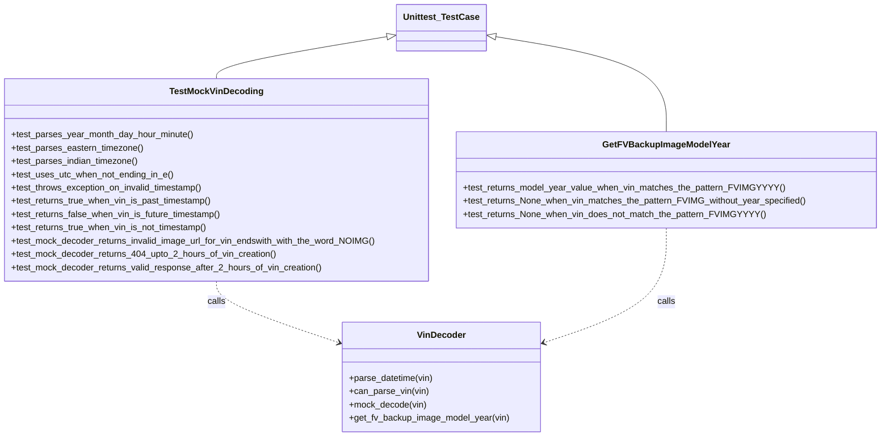
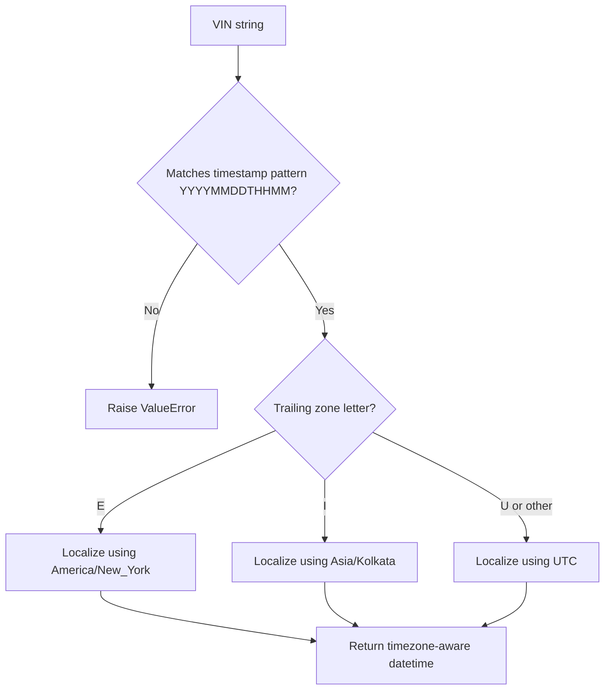

# Diagram: platform/mocks/tests/test_mock_vin_decoder.py


> Auto-generated by Obscura crawlers

## Diagram 1



### SVG

<svg id="container" width="1581.921875" xmlns="http://www.w3.org/2000/svg" class="classDiagram" height="788" viewBox="0 0 1581.921875 788" role="graphics-document document" aria-roledescription="class"><style>#container{font-family:"trebuchet ms",verdana,arial,sans-serif;font-size:16px;fill:#333;}@keyframes edge-animation-frame{from{stroke-dashoffset:0;}}@keyframes dash{to{stroke-dashoffset:0;}}#container .edge-animation-slow{stroke-dasharray:9,5!important;stroke-dashoffset:900;animation:dash 50s linear infinite;stroke-linecap:round;}#container .edge-animation-fast{stroke-dasharray:9,5!important;stroke-dashoffset:900;animation:dash 20s linear infinite;stroke-linecap:round;}#container .error-icon{fill:#552222;}#container .error-text{fill:#552222;stroke:#552222;}#container .edge-thickness-normal{stroke-width:1px;}#container .edge-thickness-thick{stroke-width:3.5px;}#container .edge-pattern-solid{stroke-dasharray:0;}#container .edge-thickness-invisible{stroke-width:0;fill:none;}#container .edge-pattern-dashed{stroke-dasharray:3;}#container .edge-pattern-dotted{stroke-dasharray:2;}#container .marker{fill:#333333;stroke:#333333;}#container .marker.cross{stroke:#333333;}#container svg{font-family:"trebuchet ms",verdana,arial,sans-serif;font-size:16px;}#container p{margin:0;}#container g.classGroup text{fill:#9370DB;stroke:none;font-family:"trebuchet ms",verdana,arial,sans-serif;font-size:10px;}#container g.classGroup text .title{font-weight:bolder;}#container .nodeLabel,#container .edgeLabel{color:#131300;}#container .edgeLabel .label rect{fill:#ECECFF;}#container .label text{fill:#131300;}#container .labelBkg{background:#ECECFF;}#container .edgeLabel .label span{background:#ECECFF;}#container .classTitle{font-weight:bolder;}#container .node rect,#container .node circle,#container .node ellipse,#container .node polygon,#container .node path{fill:#ECECFF;stroke:#9370DB;stroke-width:1px;}#container .divider{stroke:#9370DB;stroke-width:1;}#container g.clickable{cursor:pointer;}#container g.classGroup rect{fill:#ECECFF;stroke:#9370DB;}#container g.classGroup line{stroke:#9370DB;stroke-width:1;}#container .classLabel .box{stroke:none;stroke-width:0;fill:#ECECFF;opacity:0.5;}#container .classLabel .label{fill:#9370DB;font-size:10px;}#container .relation{stroke:#333333;stroke-width:1;fill:none;}#container .dashed-line{stroke-dasharray:3;}#container .dotted-line{stroke-dasharray:1 2;}#container #compositionStart,#container .composition{fill:#333333!important;stroke:#333333!important;stroke-width:1;}#container #compositionEnd,#container .composition{fill:#333333!important;stroke:#333333!important;stroke-width:1;}#container #dependencyStart,#container .dependency{fill:#333333!important;stroke:#333333!important;stroke-width:1;}#container #dependencyStart,#container .dependency{fill:#333333!important;stroke:#333333!important;stroke-width:1;}#container #extensionStart,#container .extension{fill:transparent!important;stroke:#333333!important;stroke-width:1;}#container #extensionEnd,#container .extension{fill:transparent!important;stroke:#333333!important;stroke-width:1;}#container #aggregationStart,#container .aggregation{fill:transparent!important;stroke:#333333!important;stroke-width:1;}#container #aggregationEnd,#container .aggregation{fill:transparent!important;stroke:#333333!important;stroke-width:1;}#container #lollipopStart,#container .lollipop{fill:#ECECFF!important;stroke:#333333!important;stroke-width:1;}#container #lollipopEnd,#container .lollipop{fill:#ECECFF!important;stroke:#333333!important;stroke-width:1;}#container .edgeTerminals{font-size:11px;line-height:initial;}#container .classTitleText{text-anchor:middle;font-size:18px;fill:#333;}#container .label-icon{display:inline-block;height:1em;overflow:visible;vertical-align:-0.125em;}#container .node .label-icon path{fill:currentColor;stroke:revert;stroke-width:revert;}#container :root{--mermaid-font-family:"trebuchet ms",verdana,arial,sans-serif;}</style><g><defs><marker id="container_class-aggregationStart" class="marker aggregation class" refX="18" refY="7" markerWidth="190" markerHeight="240" orient="auto"><path d="M 18,7 L9,13 L1,7 L9,1 Z"></path></marker></defs><defs><marker id="container_class-aggregationEnd" class="marker aggregation class" refX="1" refY="7" markerWidth="20" markerHeight="28" orient="auto"><path d="M 18,7 L9,13 L1,7 L9,1 Z"></path></marker></defs><defs><marker id="container_class-extensionStart" class="marker extension class" refX="18" refY="7" markerWidth="190" markerHeight="240" orient="auto"><path d="M 1,7 L18,13 V 1 Z"></path></marker></defs><defs><marker id="container_class-extensionEnd" class="marker extension class" refX="1" refY="7" markerWidth="20" markerHeight="28" orient="auto"><path d="M 1,1 V 13 L18,7 Z"></path></marker></defs><defs><marker id="container_class-compositionStart" class="marker composition class" refX="18" refY="7" markerWidth="190" markerHeight="240" orient="auto"><path d="M 18,7 L9,13 L1,7 L9,1 Z"></path></marker></defs><defs><marker id="container_class-compositionEnd" class="marker composition class" refX="1" refY="7" markerWidth="20" markerHeight="28" orient="auto"><path d="M 18,7 L9,13 L1,7 L9,1 Z"></path></marker></defs><defs><marker id="container_class-dependencyStart" class="marker dependency class" refX="6" refY="7" markerWidth="190" markerHeight="240" orient="auto"><path d="M 5,7 L9,13 L1,7 L9,1 Z"></path></marker></defs><defs><marker id="container_class-dependencyEnd" class="marker dependency class" refX="13" refY="7" markerWidth="20" markerHeight="28" orient="auto"><path d="M 18,7 L9,13 L14,7 L9,1 Z"></path></marker></defs><defs><marker id="container_class-lollipopStart" class="marker lollipop class" refX="13" refY="7" markerWidth="190" markerHeight="240" orient="auto"><circle stroke="black" fill="transparent" cx="7" cy="7" r="6"></circle></marker></defs><defs><marker id="container_class-lollipopEnd" class="marker lollipop class" refX="1" refY="7" markerWidth="190" markerHeight="240" orient="auto"><circle stroke="black" fill="transparent" cx="7" cy="7" r="6"></circle></marker></defs><g class="root"><g class="clusters"></g><g class="edgePaths"><path d="M699.244,65.691L647.683,74.243C596.121,82.794,492.998,99.897,441.437,112.615C389.875,125.333,389.875,133.667,389.875,137.833L389.875,142" id="id_Unittest_TestCase_TestMockVinDecoding_1" class="edge-thickness-normal edge-pattern-solid relation" style=";;;" data-edge="true" data-et="edge" data-id="id_Unittest_TestCase_TestMockVinDecoding_1" data-points="W3sieCI6NzE2LjI2MTcxODc1LCJ5Ijo2Mi44Njg4OTI1NjMyNjIwN30seyJ4IjozODkuODc1LCJ5IjoxMTd9LHsieCI6Mzg5Ljg3NSwieSI6MTQyfV0=" marker-start="url(#container_class-extensionStart)"></path><path d="M888.467,65.691L940.028,74.243C991.59,82.794,1094.713,99.897,1146.274,128.615C1197.836,157.333,1197.836,197.667,1197.836,217.833L1197.836,238" id="id_Unittest_TestCase_GetFVBackupImageModelYear_2" class="edge-thickness-normal edge-pattern-solid relation" style=";;;" data-edge="true" data-et="edge" data-id="id_Unittest_TestCase_GetFVBackupImageModelYear_2" data-points="W3sieCI6ODcxLjQ0OTIxODc1LCJ5Ijo2Mi44Njg4OTI1NjMyNjIwN30seyJ4IjoxMTk3LjgzNTkzNzUsInkiOjExN30seyJ4IjoxMTk3LjgzNTkzNzUsInkiOjIzOH1d" marker-start="url(#container_class-extensionStart)"></path><path d="M389.875,508L389.875,514.167C389.875,520.333,389.875,532.667,426.66,551.217C463.444,569.767,537.014,594.534,573.798,606.918L610.583,619.301" id="id_TestMockVinDecoding_VinDecoder_3" class="edge-thickness-normal edge-pattern-dashed relation" style=";;;" data-edge="true" data-et="edge" data-id="id_TestMockVinDecoding_VinDecoder_3" data-points="W3sieCI6Mzg5Ljg3NSwieSI6NTA4fSx7IngiOjM4OS44NzUsInkiOjU0NX0seyJ4Ijo2MTYuMjY5NTMxMjUsInkiOjYyMS4yMTU3MDUwNDQ1Mjc2fV0=" marker-end="url(#container_class-dependencyEnd)"></path><path d="M1197.836,412L1197.836,434.167C1197.836,456.333,1197.836,500.667,1161.051,535.217C1124.267,569.767,1050.697,594.534,1013.913,606.918L977.128,619.301" id="id_GetFVBackupImageModelYear_VinDecoder_4" class="edge-thickness-normal edge-pattern-dashed relation" style=";;;" data-edge="true" data-et="edge" data-id="id_GetFVBackupImageModelYear_VinDecoder_4" data-points="W3sieCI6MTE5Ny44MzU5Mzc1LCJ5Ijo0MTJ9LHsieCI6MTE5Ny44MzU5Mzc1LCJ5Ijo1NDV9LHsieCI6OTcxLjQ0MTQwNjI1LCJ5Ijo2MjEuMjE1NzA1MDQ0NTI3Nn1d" marker-end="url(#container_class-dependencyEnd)"></path></g><g class="edgeLabels"><g class="edgeLabel"><g class="label" data-id="id_Unittest_TestCase_TestMockVinDecoding_1" transform="translate(0, 0)"><foreignObject width="0" height="0"><div xmlns="http://www.w3.org/1999/xhtml" class="labelBkg" style="display: table-cell; white-space: nowrap; line-height: 1.5; max-width: 200px; text-align: center;"><span class="edgeLabel"></span></div></foreignObject></g></g><g class="edgeLabel"><g class="label" data-id="id_Unittest_TestCase_GetFVBackupImageModelYear_2" transform="translate(0, 0)"><foreignObject width="0" height="0"><div xmlns="http://www.w3.org/1999/xhtml" class="labelBkg" style="display: table-cell; white-space: nowrap; line-height: 1.5; max-width: 200px; text-align: center;"><span class="edgeLabel"></span></div></foreignObject></g></g><g class="edgeLabel" transform="translate(389.875, 545)"><g class="label" data-id="id_TestMockVinDecoding_VinDecoder_3" transform="translate(-16.4453125, -12)"><foreignObject width="32.890625" height="24"><div xmlns="http://www.w3.org/1999/xhtml" class="labelBkg" style="display: table-cell; white-space: nowrap; line-height: 1.5; max-width: 200px; text-align: center;"><span class="edgeLabel"><p>calls</p></span></div></foreignObject></g></g><g class="edgeLabel" transform="translate(1197.8359375, 545)"><g class="label" data-id="id_GetFVBackupImageModelYear_VinDecoder_4" transform="translate(-16.4453125, -12)"><foreignObject width="32.890625" height="24"><div xmlns="http://www.w3.org/1999/xhtml" class="labelBkg" style="display: table-cell; white-space: nowrap; line-height: 1.5; max-width: 200px; text-align: center;"><span class="edgeLabel"><p>calls</p></span></div></foreignObject></g></g></g><g class="nodes"><g class="node default" id="classId-VinDecoder-0" transform="translate(793.85546875, 681)"><g class="basic label-container"><path d="M-177.5859375 -99 L177.5859375 -99 L177.5859375 99 L-177.5859375 99" stroke="none" stroke-width="0" fill="#ECECFF" style=""></path><path d="M-177.5859375 -99 C-105.21929611100403 -99, -32.852654722008054 -99, 177.5859375 -99 M-177.5859375 -99 C-90.21186189927685 -99, -2.8377862985537092 -99, 177.5859375 -99 M177.5859375 -99 C177.5859375 -47.79972285522649, 177.5859375 3.400554289547017, 177.5859375 99 M177.5859375 -99 C177.5859375 -56.437764709345984, 177.5859375 -13.875529418691968, 177.5859375 99 M177.5859375 99 C41.12912850715426 99, -95.32768048569147 99, -177.5859375 99 M177.5859375 99 C89.95682565000945 99, 2.3277138000188984 99, -177.5859375 99 M-177.5859375 99 C-177.5859375 46.10927436436753, -177.5859375 -6.781451271264942, -177.5859375 -99 M-177.5859375 99 C-177.5859375 28.410199613243947, -177.5859375 -42.17960077351211, -177.5859375 -99" stroke="#9370DB" stroke-width="1.3" fill="none" stroke-dasharray="0 0" style=""></path></g><g class="annotation-group text" transform="translate(0, -75)"></g><g class="label-group text" transform="translate(-41.828125, -75)"><g class="label" style="font-weight: bolder" transform="translate(0,-12)"><foreignObject width="83.65625" height="24"><div xmlns="http://www.w3.org/1999/xhtml" style="display: table-cell; white-space: nowrap; line-height: 1.5; max-width: 134px; text-align: center;"><span class="nodeLabel markdown-node-label" style=""><p>VinDecoder</p></span></div></foreignObject></g></g><g class="members-group text" transform="translate(-165.5859375, -27)"></g><g class="methods-group text" transform="translate(-165.5859375, 3)"><g class="label" style="" transform="translate(0,-12)"><foreignObject width="153.21875" height="24"><div xmlns="http://www.w3.org/1999/xhtml" style="display: table-cell; white-space: nowrap; line-height: 1.5; max-width: 211px; text-align: center;"><span class="nodeLabel markdown-node-label" style=""><p>+parse_datetime(vin)</p></span></div></foreignObject></g><g class="label" style="" transform="translate(0,12)"><foreignObject width="143.46875" height="24"><div xmlns="http://www.w3.org/1999/xhtml" style="display: table-cell; white-space: nowrap; line-height: 1.5; max-width: 201px; text-align: center;"><span class="nodeLabel markdown-node-label" style=""><p>+can_parse_vin(vin)</p></span></div></foreignObject></g><g class="label" style="" transform="translate(0,36)"><foreignObject width="140.265625" height="24"><div xmlns="http://www.w3.org/1999/xhtml" style="display: table-cell; white-space: nowrap; line-height: 1.5; max-width: 198px; text-align: center;"><span class="nodeLabel markdown-node-label" style=""><p>+mock_decode(vin)</p></span></div></foreignObject></g><g class="label" style="" transform="translate(0,60)"><foreignObject width="289.34375" height="24"><div xmlns="http://www.w3.org/1999/xhtml" style="display: table-cell; white-space: nowrap; line-height: 1.5; max-width: 347px; text-align: center;"><span class="nodeLabel markdown-node-label" style=""><p>+get_fv_backup_image_model_year(vin)</p></span></div></foreignObject></g></g><g class="divider" style=""><path d="M-177.5859375 -51 C-95.10236537373066 -51, -12.618793247461326 -51, 177.5859375 -51 M-177.5859375 -51 C-35.728834293911916 -51, 106.12826891217617 -51, 177.5859375 -51" stroke="#9370DB" stroke-width="1.3" fill="none" stroke-dasharray="0 0" style=""></path></g><g class="divider" style=""><path d="M-177.5859375 -27 C-44.59112546564745 -27, 88.4036865687051 -27, 177.5859375 -27 M-177.5859375 -27 C-97.92587094681923 -27, -18.26580439363846 -27, 177.5859375 -27" stroke="#9370DB" stroke-width="1.3" fill="none" stroke-dasharray="0 0" style=""></path></g></g><g class="node default" id="classId-TestMockVinDecoding-1" transform="translate(389.875, 325)"><g class="basic label-container"><path d="M-381.875 -183 L381.875 -183 L381.875 183 L-381.875 183" stroke="none" stroke-width="0" fill="#ECECFF" style=""></path><path d="M-381.875 -183 C-134.76503807887184 -183, 112.34492384225632 -183, 381.875 -183 M-381.875 -183 C-214.83550915456584 -183, -47.79601830913168 -183, 381.875 -183 M381.875 -183 C381.875 -61.182066742390745, 381.875 60.63586651521851, 381.875 183 M381.875 -183 C381.875 -104.56711960720982, 381.875 -26.134239214419637, 381.875 183 M381.875 183 C77.8687946464608 183, -226.1374107070784 183, -381.875 183 M381.875 183 C142.13389468979565 183, -97.6072106204087 183, -381.875 183 M-381.875 183 C-381.875 99.84742167489529, -381.875 16.694843349790574, -381.875 -183 M-381.875 183 C-381.875 40.049657985679346, -381.875 -102.90068402864131, -381.875 -183" stroke="#9370DB" stroke-width="1.3" fill="none" stroke-dasharray="0 0" style=""></path></g><g class="annotation-group text" transform="translate(0, -159)"></g><g class="label-group text" transform="translate(-79.9375, -159)"><g class="label" style="font-weight: bolder" transform="translate(0,-12)"><foreignObject width="159.875" height="24"><div xmlns="http://www.w3.org/1999/xhtml" style="display: table-cell; white-space: nowrap; line-height: 1.5; max-width: 208px; text-align: center;"><span class="nodeLabel markdown-node-label" style=""><p>TestMockVinDecoding</p></span></div></foreignObject></g></g><g class="members-group text" transform="translate(-369.875, -111)"></g><g class="methods-group text" transform="translate(-369.875, -81)"><g class="label" style="" transform="translate(0,-12)"><foreignObject width="329.625" height="24"><div xmlns="http://www.w3.org/1999/xhtml" style="display: table-cell; white-space: nowrap; line-height: 1.5; max-width: 387px; text-align: center;"><span class="nodeLabel markdown-node-label" style=""><p>+test_parses_year_month_day_hour_minute()</p></span></div></foreignObject></g><g class="label" style="" transform="translate(0,12)"><foreignObject width="238.75" height="24"><div xmlns="http://www.w3.org/1999/xhtml" style="display: table-cell; white-space: nowrap; line-height: 1.5; max-width: 296px; text-align: center;"><span class="nodeLabel markdown-node-label" style=""><p>+test_parses_eastern_timezone()</p></span></div></foreignObject></g><g class="label" style="" transform="translate(0,36)"><foreignObject width="230.734375" height="24"><div xmlns="http://www.w3.org/1999/xhtml" style="display: table-cell; white-space: nowrap; line-height: 1.5; max-width: 288px; text-align: center;"><span class="nodeLabel markdown-node-label" style=""><p>+test_parses_indian_timezone()</p></span></div></foreignObject></g><g class="label" style="" transform="translate(0,60)"><foreignObject width="293.5625" height="24"><div xmlns="http://www.w3.org/1999/xhtml" style="display: table-cell; white-space: nowrap; line-height: 1.5; max-width: 351px; text-align: center;"><span class="nodeLabel markdown-node-label" style=""><p>+test_uses_utc_when_not_ending_in_e()</p></span></div></foreignObject></g><g class="label" style="" transform="translate(0,84)"><foreignObject width="350.875" height="24"><div xmlns="http://www.w3.org/1999/xhtml" style="display: table-cell; white-space: nowrap; line-height: 1.5; max-width: 408px; text-align: center;"><span class="nodeLabel markdown-node-label" style=""><p>+test_throws_exception_on_invalid_timestamp()</p></span></div></foreignObject></g><g class="label" style="" transform="translate(0,108)"><foreignObject width="365.734375" height="24"><div xmlns="http://www.w3.org/1999/xhtml" style="display: table-cell; white-space: nowrap; line-height: 1.5; max-width: 423px; text-align: center;"><span class="nodeLabel markdown-node-label" style=""><p>+test_returns_true_when_vin_is_past_timestamp()</p></span></div></foreignObject></g><g class="label" style="" transform="translate(0,132)"><foreignObject width="382.578125" height="24"><div xmlns="http://www.w3.org/1999/xhtml" style="display: table-cell; white-space: nowrap; line-height: 1.5; max-width: 440px; text-align: center;"><span class="nodeLabel markdown-node-label" style=""><p>+test_returns_false_when_vin_is_future_timestamp()</p></span></div></foreignObject></g><g class="label" style="" transform="translate(0,156)"><foreignObject width="359.09375" height="24"><div xmlns="http://www.w3.org/1999/xhtml" style="display: table-cell; white-space: nowrap; line-height: 1.5; max-width: 416px; text-align: center;"><span class="nodeLabel markdown-node-label" style=""><p>+test_returns_true_when_vin_is_not_timestamp()</p></span></div></foreignObject></g><g class="label" style="" transform="translate(0,180)"><foreignObject width="659.8125" height="24"><div xmlns="http://www.w3.org/1999/xhtml" style="display: table-cell; white-space: nowrap; line-height: 1.5; max-width: 717px; text-align: center;"><span class="nodeLabel markdown-node-label" style=""><p>+test_mock_decoder_returns_invalid_image_url_for_vin_endswith_with_the_word_NOIMG()</p></span></div></foreignObject></g><g class="label" style="" transform="translate(0,204)"><foreignObject width="478.515625" height="24"><div xmlns="http://www.w3.org/1999/xhtml" style="display: table-cell; white-space: nowrap; line-height: 1.5; max-width: 536px; text-align: center;"><span class="nodeLabel markdown-node-label" style=""><p>+test_mock_decoder_returns_404_upto_2_hours_of_vin_creation()</p></span></div></foreignObject></g><g class="label" style="" transform="translate(0,228)"><foreignObject width="563.078125" height="24"><div xmlns="http://www.w3.org/1999/xhtml" style="display: table-cell; white-space: nowrap; line-height: 1.5; max-width: 620px; text-align: center;"><span class="nodeLabel markdown-node-label" style=""><p>+test_mock_decoder_returns_valid_response_after_2_hours_of_vin_creation()</p></span></div></foreignObject></g></g><g class="divider" style=""><path d="M-381.875 -135 C-147.82539971320662 -135, 86.22420057358676 -135, 381.875 -135 M-381.875 -135 C-200.21032345557825 -135, -18.545646911156496 -135, 381.875 -135" stroke="#9370DB" stroke-width="1.3" fill="none" stroke-dasharray="0 0" style=""></path></g><g class="divider" style=""><path d="M-381.875 -111 C-133.01238244105713 -111, 115.85023511788575 -111, 381.875 -111 M-381.875 -111 C-183.8243019094098 -111, 14.226396181180405 -111, 381.875 -111" stroke="#9370DB" stroke-width="1.3" fill="none" stroke-dasharray="0 0" style=""></path></g></g><g class="node default" id="classId-GetFVBackupImageModelYear-2" transform="translate(1197.8359375, 325)"><g class="basic label-container"><path d="M-376.0859375 -87 L376.0859375 -87 L376.0859375 87 L-376.0859375 87" stroke="none" stroke-width="0" fill="#ECECFF" style=""></path><path d="M-376.0859375 -87 C-223.14216597071592 -87, -70.19839444143184 -87, 376.0859375 -87 M-376.0859375 -87 C-185.8424263901164 -87, 4.401084719767198 -87, 376.0859375 -87 M376.0859375 -87 C376.0859375 -43.053158967739236, 376.0859375 0.8936820645215278, 376.0859375 87 M376.0859375 -87 C376.0859375 -47.363254481236176, 376.0859375 -7.7265089624723515, 376.0859375 87 M376.0859375 87 C166.98832023544725 87, -42.109297029105505 87, -376.0859375 87 M376.0859375 87 C192.7914567338748 87, 9.49697596774962 87, -376.0859375 87 M-376.0859375 87 C-376.0859375 25.3313961624499, -376.0859375 -36.3372076751002, -376.0859375 -87 M-376.0859375 87 C-376.0859375 38.60089543427067, -376.0859375 -9.798209131458663, -376.0859375 -87" stroke="#9370DB" stroke-width="1.3" fill="none" stroke-dasharray="0 0" style=""></path></g><g class="annotation-group text" transform="translate(0, -63)"></g><g class="label-group text" transform="translate(-108.734375, -63)"><g class="label" style="font-weight: bolder" transform="translate(0,-12)"><foreignObject width="217.46875" height="24"><div xmlns="http://www.w3.org/1999/xhtml" style="display: table-cell; white-space: nowrap; line-height: 1.5; max-width: 265px; text-align: center;"><span class="nodeLabel markdown-node-label" style=""><p>GetFVBackupImageModelYear</p></span></div></foreignObject></g></g><g class="members-group text" transform="translate(-364.0859375, -15)"></g><g class="methods-group text" transform="translate(-364.0859375, 15)"><g class="label" style="" transform="translate(0,-12)"><foreignObject width="571.40625" height="24"><div xmlns="http://www.w3.org/1999/xhtml" style="display: table-cell; white-space: nowrap; line-height: 1.5; max-width: 629px; text-align: center;"><span class="nodeLabel markdown-node-label" style=""><p>+test_returns_model_year_value_when_vin_matches_the_pattern_FVIMGYYYY()</p></span></div></foreignObject></g><g class="label" style="" transform="translate(0,12)"><foreignObject width="619.4375" height="24"><div xmlns="http://www.w3.org/1999/xhtml" style="display: table-cell; white-space: nowrap; line-height: 1.5; max-width: 677px; text-align: center;"><span class="nodeLabel markdown-node-label" style=""><p>+test_returns_None_when_vin_matches_the_pattern_FVIMG_without_year_specified()</p></span></div></foreignObject></g><g class="label" style="" transform="translate(0,36)"><foreignObject width="538.609375" height="24"><div xmlns="http://www.w3.org/1999/xhtml" style="display: table-cell; white-space: nowrap; line-height: 1.5; max-width: 596px; text-align: center;"><span class="nodeLabel markdown-node-label" style=""><p>+test_returns_None_when_vin_does_not_match_the_pattern_FVIMGYYYY()</p></span></div></foreignObject></g></g><g class="divider" style=""><path d="M-376.0859375 -39 C-119.39696239501882 -39, 137.29201270996236 -39, 376.0859375 -39 M-376.0859375 -39 C-93.36422407686126 -39, 189.35748934627748 -39, 376.0859375 -39" stroke="#9370DB" stroke-width="1.3" fill="none" stroke-dasharray="0 0" style=""></path></g><g class="divider" style=""><path d="M-376.0859375 -15 C-206.3593871932802 -15, -36.632836886560426 -15, 376.0859375 -15 M-376.0859375 -15 C-194.2869916124163 -15, -12.488045724832602 -15, 376.0859375 -15" stroke="#9370DB" stroke-width="1.3" fill="none" stroke-dasharray="0 0" style=""></path></g></g><g class="node default" id="classId-Unittest_TestCase-3" transform="translate(793.85546875, 50)"><g class="basic label-container"><path d="M-77.59375 -42 L77.59375 -42 L77.59375 42 L-77.59375 42" stroke="none" stroke-width="0" fill="#ECECFF" style=""></path><path d="M-77.59375 -42 C-35.21967942935201 -42, 7.154391141295974 -42, 77.59375 -42 M-77.59375 -42 C-31.696190925737483 -42, 14.201368148525034 -42, 77.59375 -42 M77.59375 -42 C77.59375 -12.421059729578502, 77.59375 17.157880540842996, 77.59375 42 M77.59375 -42 C77.59375 -20.365075603127664, 77.59375 1.2698487937446714, 77.59375 42 M77.59375 42 C17.27408970825264 42, -43.04557058349472 42, -77.59375 42 M77.59375 42 C35.99602843608807 42, -5.601693127823864 42, -77.59375 42 M-77.59375 42 C-77.59375 8.562150445388042, -77.59375 -24.875699109223916, -77.59375 -42 M-77.59375 42 C-77.59375 20.930434699021674, -77.59375 -0.1391306019566514, -77.59375 -42" stroke="#9370DB" stroke-width="1.3" fill="none" stroke-dasharray="0 0" style=""></path></g><g class="annotation-group text" transform="translate(0, -18)"></g><g class="label-group text" transform="translate(-65.59375, -18)"><g class="label" style="font-weight: bolder" transform="translate(0,-12)"><foreignObject width="131.1875" height="24"><div xmlns="http://www.w3.org/1999/xhtml" style="display: table-cell; white-space: nowrap; line-height: 1.5; max-width: 178px; text-align: center;"><span class="nodeLabel markdown-node-label" style=""><p>Unittest_TestCase</p></span></div></foreignObject></g></g><g class="members-group text" transform="translate(-65.59375, 30)"></g><g class="methods-group text" transform="translate(-65.59375, 60)"></g><g class="divider" style=""><path d="M-77.59375 6 C-39.08439743191009 6, -0.5750448638201817 6, 77.59375 6 M-77.59375 6 C-17.538082766542118 6, 42.517584466915764 6, 77.59375 6" stroke="#9370DB" stroke-width="1.3" fill="none" stroke-dasharray="0 0" style=""></path></g><g class="divider" style=""><path d="M-77.59375 24 C-17.774667676239183 24, 42.044414647521634 24, 77.59375 24 M-77.59375 24 C-21.424257142325388 24, 34.745235715349224 24, 77.59375 24" stroke="#9370DB" stroke-width="1.3" fill="none" stroke-dasharray="0 0" style=""></path></g></g></g></g></g></svg>

## Diagram 2



### SVG

<svg id="container" width="826.140625" xmlns="http://www.w3.org/2000/svg" class="flowchart" height="948.734375" viewBox="0 0 826.140625 948.734375" role="graphics-document document" aria-roledescription="flowchart-v2"><style>#container{font-family:"trebuchet ms",verdana,arial,sans-serif;font-size:16px;fill:#333;}@keyframes edge-animation-frame{from{stroke-dashoffset:0;}}@keyframes dash{to{stroke-dashoffset:0;}}#container .edge-animation-slow{stroke-dasharray:9,5!important;stroke-dashoffset:900;animation:dash 50s linear infinite;stroke-linecap:round;}#container .edge-animation-fast{stroke-dasharray:9,5!important;stroke-dashoffset:900;animation:dash 20s linear infinite;stroke-linecap:round;}#container .error-icon{fill:#552222;}#container .error-text{fill:#552222;stroke:#552222;}#container .edge-thickness-normal{stroke-width:1px;}#container .edge-thickness-thick{stroke-width:3.5px;}#container .edge-pattern-solid{stroke-dasharray:0;}#container .edge-thickness-invisible{stroke-width:0;fill:none;}#container .edge-pattern-dashed{stroke-dasharray:3;}#container .edge-pattern-dotted{stroke-dasharray:2;}#container .marker{fill:#333333;stroke:#333333;}#container .marker.cross{stroke:#333333;}#container svg{font-family:"trebuchet ms",verdana,arial,sans-serif;font-size:16px;}#container p{margin:0;}#container .label{font-family:"trebuchet ms",verdana,arial,sans-serif;color:#333;}#container .cluster-label text{fill:#333;}#container .cluster-label span{color:#333;}#container .cluster-label span p{background-color:transparent;}#container .label text,#container span{fill:#333;color:#333;}#container .node rect,#container .node circle,#container .node ellipse,#container .node polygon,#container .node path{fill:#ECECFF;stroke:#9370DB;stroke-width:1px;}#container .rough-node .label text,#container .node .label text,#container .image-shape .label,#container .icon-shape .label{text-anchor:middle;}#container .node .katex path{fill:#000;stroke:#000;stroke-width:1px;}#container .rough-node .label,#container .node .label,#container .image-shape .label,#container .icon-shape .label{text-align:center;}#container .node.clickable{cursor:pointer;}#container .root .anchor path{fill:#333333!important;stroke-width:0;stroke:#333333;}#container .arrowheadPath{fill:#333333;}#container .edgePath .path{stroke:#333333;stroke-width:2.0px;}#container .flowchart-link{stroke:#333333;fill:none;}#container .edgeLabel{background-color:rgba(232,232,232, 0.8);text-align:center;}#container .edgeLabel p{background-color:rgba(232,232,232, 0.8);}#container .edgeLabel rect{opacity:0.5;background-color:rgba(232,232,232, 0.8);fill:rgba(232,232,232, 0.8);}#container .labelBkg{background-color:rgba(232, 232, 232, 0.5);}#container .cluster rect{fill:#ffffde;stroke:#aaaa33;stroke-width:1px;}#container .cluster text{fill:#333;}#container .cluster span{color:#333;}#container div.mermaidTooltip{position:absolute;text-align:center;max-width:200px;padding:2px;font-family:"trebuchet ms",verdana,arial,sans-serif;font-size:12px;background:hsl(80, 100%, 96.2745098039%);border:1px solid #aaaa33;border-radius:2px;pointer-events:none;z-index:100;}#container .flowchartTitleText{text-anchor:middle;font-size:18px;fill:#333;}#container rect.text{fill:none;stroke-width:0;}#container .icon-shape,#container .image-shape{background-color:rgba(232,232,232, 0.8);text-align:center;}#container .icon-shape p,#container .image-shape p{background-color:rgba(232,232,232, 0.8);padding:2px;}#container .icon-shape rect,#container .image-shape rect{opacity:0.5;background-color:rgba(232,232,232, 0.8);fill:rgba(232,232,232, 0.8);}#container .label-icon{display:inline-block;height:1em;overflow:visible;vertical-align:-0.125em;}#container .node .label-icon path{fill:currentColor;stroke:revert;stroke-width:revert;}#container :root{--mermaid-font-family:"trebuchet ms",verdana,arial,sans-serif;}</style><g><marker id="container_flowchart-v2-pointEnd" class="marker flowchart-v2" viewBox="0 0 10 10" refX="5" refY="5" markerUnits="userSpaceOnUse" markerWidth="8" markerHeight="8" orient="auto"><path d="M 0 0 L 10 5 L 0 10 z" class="arrowMarkerPath" style="stroke-width: 1; stroke-dasharray: 1, 0;"></path></marker><marker id="container_flowchart-v2-pointStart" class="marker flowchart-v2" viewBox="0 0 10 10" refX="4.5" refY="5" markerUnits="userSpaceOnUse" markerWidth="8" markerHeight="8" orient="auto"><path d="M 0 5 L 10 10 L 10 0 z" class="arrowMarkerPath" style="stroke-width: 1; stroke-dasharray: 1, 0;"></path></marker><marker id="container_flowchart-v2-circleEnd" class="marker flowchart-v2" viewBox="0 0 10 10" refX="11" refY="5" markerUnits="userSpaceOnUse" markerWidth="11" markerHeight="11" orient="auto"><circle cx="5" cy="5" r="5" class="arrowMarkerPath" style="stroke-width: 1; stroke-dasharray: 1, 0;"></circle></marker><marker id="container_flowchart-v2-circleStart" class="marker flowchart-v2" viewBox="0 0 10 10" refX="-1" refY="5" markerUnits="userSpaceOnUse" markerWidth="11" markerHeight="11" orient="auto"><circle cx="5" cy="5" r="5" class="arrowMarkerPath" style="stroke-width: 1; stroke-dasharray: 1, 0;"></circle></marker><marker id="container_flowchart-v2-crossEnd" class="marker cross flowchart-v2" viewBox="0 0 11 11" refX="12" refY="5.2" markerUnits="userSpaceOnUse" markerWidth="11" markerHeight="11" orient="auto"><path d="M 1,1 l 9,9 M 10,1 l -9,9" class="arrowMarkerPath" style="stroke-width: 2; stroke-dasharray: 1, 0;"></path></marker><marker id="container_flowchart-v2-crossStart" class="marker cross flowchart-v2" viewBox="0 0 11 11" refX="-1" refY="5.2" markerUnits="userSpaceOnUse" markerWidth="11" markerHeight="11" orient="auto"><path d="M 1,1 l 9,9 M 10,1 l -9,9" class="arrowMarkerPath" style="stroke-width: 2; stroke-dasharray: 1, 0;"></path></marker><g class="root"><g class="clusters"></g><g class="edgePaths"><path d="M328.023,62L328.023,66.167C328.023,70.333,328.023,78.667,328.023,86.333C328.023,94,328.023,101,328.023,104.5L328.023,108" id="L_VIN_TIMESTAMP_MATCH_0" class="edge-thickness-normal edge-pattern-solid edge-thickness-normal edge-pattern-solid flowchart-link" style=";" data-edge="true" data-et="edge" data-id="L_VIN_TIMESTAMP_MATCH_0" data-points="W3sieCI6MzI4LjAyMzQzNzUsInkiOjYyfSx7IngiOjMyOC4wMjM0Mzc1LCJ5Ijo4N30seyJ4IjozMjguMDIzNDM3NSwieSI6MTEyfV0=" marker-end="url(#container_flowchart-v2-pointEnd)"></path><path d="M272.007,333.984L261.542,349.486C251.078,364.989,230.148,395.995,219.683,428.892C209.219,461.789,209.219,496.578,209.219,513.973L209.219,531.367" id="L_TIMESTAMP_MATCH_ERROR_0" class="edge-thickness-normal edge-pattern-solid edge-thickness-normal edge-pattern-solid flowchart-link" style=";" data-edge="true" data-et="edge" data-id="L_TIMESTAMP_MATCH_ERROR_0" data-points="W3sieCI6MjcyLjAwNzE5MjYzNDQ5MDU0LCJ5IjozMzMuOTgzNzU1MTM0NDkwNTR9LHsieCI6MjA5LjIxODc1LCJ5Ijo0Mjd9LHsieCI6MjA5LjIxODc1LCJ5Ijo1MzUuMzY3MTg3NX1d" marker-end="url(#container_flowchart-v2-pointEnd)"></path><path d="M384.04,333.984L394.504,349.486C404.969,364.989,425.899,395.995,436.363,416.997C446.828,438,446.828,449,446.828,454.5L446.828,460" id="L_TIMESTAMP_MATCH_ZONE_0" class="edge-thickness-normal edge-pattern-solid edge-thickness-normal edge-pattern-solid flowchart-link" style=";" data-edge="true" data-et="edge" data-id="L_TIMESTAMP_MATCH_ZONE_0" data-points="W3sieCI6Mzg0LjAzOTY4MjM2NTUwOTQ2LCJ5IjozMzMuOTgzNzU1MTM0NDkwNTR9LHsieCI6NDQ2LjgyODEyNSwieSI6NDI3fSx7IngiOjQ0Ni44MjgxMjUsInkiOjQ2NH1d" marker-end="url(#container_flowchart-v2-pointEnd)"></path><path d="M378.438,592.344L338.365,609.909C298.292,627.474,218.146,662.604,178.073,685.669C138,708.734,138,719.734,138,725.234L138,730.734" id="L_ZONE_EAST_0" class="edge-thickness-normal edge-pattern-solid edge-thickness-normal edge-pattern-solid flowchart-link" style=";" data-edge="true" data-et="edge" data-id="L_ZONE_EAST_0" data-points="W3sieCI6Mzc4LjQzODA0MjQ3OTM3ODEsInkiOjU5Mi4zNDQyOTI0NzkzNzh9LHsieCI6MTM4LCJ5Ijo2OTcuNzM0Mzc1fSx7IngiOjEzOCwieSI6NzM0LjczNDM3NX1d" marker-end="url(#container_flowchart-v2-pointEnd)"></path><path d="M446.828,660.734L446.828,666.901C446.828,673.068,446.828,685.401,446.828,699.068C446.828,712.734,446.828,727.734,446.828,735.234L446.828,742.734" id="L_ZONE_INDIA_0" class="edge-thickness-normal edge-pattern-solid edge-thickness-normal edge-pattern-solid flowchart-link" style=";" data-edge="true" data-et="edge" data-id="L_ZONE_INDIA_0" data-points="W3sieCI6NDQ2LjgyODEyNSwieSI6NjYwLjczNDM3NX0seyJ4Ijo0NDYuODI4MTI1LCJ5Ijo2OTcuNzM0Mzc1fSx7IngiOjQ0Ni44MjgxMjUsInkiOjc0Ni43MzQzNzV9XQ==" marker-end="url(#container_flowchart-v2-pointEnd)"></path><path d="M512.753,594.81L547.61,611.964C582.468,629.118,652.183,663.426,687.041,688.08C721.898,712.734,721.898,727.734,721.898,735.234L721.898,742.734" id="L_ZONE_UTC_0" class="edge-thickness-normal edge-pattern-solid edge-thickness-normal edge-pattern-solid flowchart-link" style=";" data-edge="true" data-et="edge" data-id="L_ZONE_UTC_0" data-points="W3sieCI6NTEyLjc1MjYzOTcwNzc3MTgsInkiOjU5NC44MDk4NjAyOTIyMjgyfSx7IngiOjcyMS44OTg0Mzc1LCJ5Ijo2OTcuNzM0Mzc1fSx7IngiOjcyMS44OTg0Mzc1LCJ5Ijo3NDYuNzM0Mzc1fV0=" marker-end="url(#container_flowchart-v2-pointEnd)"></path><path d="M138,812.734L138,816.901C138,821.068,138,829.401,186.946,840.893C235.892,852.385,333.785,867.036,382.731,874.361L431.677,881.686" id="L_EAST_RESULT_0" class="edge-thickness-normal edge-pattern-solid edge-thickness-normal edge-pattern-solid flowchart-link" style=";" data-edge="true" data-et="edge" data-id="L_EAST_RESULT_0" data-points="W3sieCI6MTM4LCJ5Ijo4MTIuNzM0Mzc1fSx7IngiOjEzOCwieSI6ODM3LjczNDM3NX0seyJ4Ijo0MzUuNjMyODEyNSwieSI6ODgyLjI3ODQzMTEyMjkxNX1d" marker-end="url(#container_flowchart-v2-pointEnd)"></path><path d="M446.828,800.734L446.828,806.901C446.828,813.068,446.828,825.401,453.976,835.418C461.124,845.435,475.419,853.136,482.567,856.987L489.715,860.837" id="L_INDIA_RESULT_0" class="edge-thickness-normal edge-pattern-solid edge-thickness-normal edge-pattern-solid flowchart-link" style=";" data-edge="true" data-et="edge" data-id="L_INDIA_RESULT_0" data-points="W3sieCI6NDQ2LjgyODEyNSwieSI6ODAwLjczNDM3NX0seyJ4Ijo0NDYuODI4MTI1LCJ5Ijo4MzcuNzM0Mzc1fSx7IngiOjQ5My4yMzYyMDYwNTQ2ODc1LCJ5Ijo4NjIuNzM0Mzc1fV0=" marker-end="url(#container_flowchart-v2-pointEnd)"></path><path d="M721.898,800.734L721.898,806.901C721.898,813.068,721.898,825.401,712.342,835.482C702.785,845.562,683.672,853.39,674.115,857.304L664.559,861.218" id="L_UTC_RESULT_0" class="edge-thickness-normal edge-pattern-solid edge-thickness-normal edge-pattern-solid flowchart-link" style=";" data-edge="true" data-et="edge" data-id="L_UTC_RESULT_0" data-points="W3sieCI6NzIxLjg5ODQzNzUsInkiOjgwMC43MzQzNzV9LHsieCI6NzIxLjg5ODQzNzUsInkiOjgzNy43MzQzNzV9LHsieCI6NjYwLjg1NzE3NzczNDM3NSwieSI6ODYyLjczNDM3NX1d" marker-end="url(#container_flowchart-v2-pointEnd)"></path></g><g class="edgeLabels"><g class="edgeLabel"><g class="label" data-id="L_VIN_TIMESTAMP_MATCH_0" transform="translate(0, 0)"><foreignObject width="0" height="0"><div xmlns="http://www.w3.org/1999/xhtml" class="labelBkg" style="display: table-cell; white-space: nowrap; line-height: 1.5; max-width: 200px; text-align: center;"><span class="edgeLabel"></span></div></foreignObject></g></g><g class="edgeLabel" transform="translate(209.21875, 427)"><g class="label" data-id="L_TIMESTAMP_MATCH_ERROR_0" transform="translate(-10.140625, -12)"><foreignObject width="20.28125" height="24"><div xmlns="http://www.w3.org/1999/xhtml" class="labelBkg" style="display: table-cell; white-space: nowrap; line-height: 1.5; max-width: 200px; text-align: center;"><span class="edgeLabel"><p>No</p></span></div></foreignObject></g></g><g class="edgeLabel" transform="translate(446.828125, 427)"><g class="label" data-id="L_TIMESTAMP_MATCH_ZONE_0" transform="translate(-12.03125, -12)"><foreignObject width="24.0625" height="24"><div xmlns="http://www.w3.org/1999/xhtml" class="labelBkg" style="display: table-cell; white-space: nowrap; line-height: 1.5; max-width: 200px; text-align: center;"><span class="edgeLabel"><p>Yes</p></span></div></foreignObject></g></g><g class="edgeLabel" transform="translate(138, 697.734375)"><g class="label" data-id="L_ZONE_EAST_0" transform="translate(-4.28125, -12)"><foreignObject width="8.5625" height="24"><div xmlns="http://www.w3.org/1999/xhtml" class="labelBkg" style="display: table-cell; white-space: nowrap; line-height: 1.5; max-width: 200px; text-align: center;"><span class="edgeLabel"><p>E</p></span></div></foreignObject></g></g><g class="edgeLabel" transform="translate(446.828125, 697.734375)"><g class="label" data-id="L_ZONE_INDIA_0" transform="translate(-2.3671875, -12)"><foreignObject width="4.734375" height="24"><div xmlns="http://www.w3.org/1999/xhtml" class="labelBkg" style="display: table-cell; white-space: nowrap; line-height: 1.5; max-width: 200px; text-align: center;"><span class="edgeLabel"><p>I</p></span></div></foreignObject></g></g><g class="edgeLabel" transform="translate(721.8984375, 697.734375)"><g class="label" data-id="L_ZONE_UTC_0" transform="translate(-36.9921875, -12)"><foreignObject width="73.984375" height="24"><div xmlns="http://www.w3.org/1999/xhtml" class="labelBkg" style="display: table-cell; white-space: nowrap; line-height: 1.5; max-width: 200px; text-align: center;"><span class="edgeLabel"><p>U or other</p></span></div></foreignObject></g></g><g class="edgeLabel"><g class="label" data-id="L_EAST_RESULT_0" transform="translate(0, 0)"><foreignObject width="0" height="0"><div xmlns="http://www.w3.org/1999/xhtml" class="labelBkg" style="display: table-cell; white-space: nowrap; line-height: 1.5; max-width: 200px; text-align: center;"><span class="edgeLabel"></span></div></foreignObject></g></g><g class="edgeLabel"><g class="label" data-id="L_INDIA_RESULT_0" transform="translate(0, 0)"><foreignObject width="0" height="0"><div xmlns="http://www.w3.org/1999/xhtml" class="labelBkg" style="display: table-cell; white-space: nowrap; line-height: 1.5; max-width: 200px; text-align: center;"><span class="edgeLabel"></span></div></foreignObject></g></g><g class="edgeLabel"><g class="label" data-id="L_UTC_RESULT_0" transform="translate(0, 0)"><foreignObject width="0" height="0"><div xmlns="http://www.w3.org/1999/xhtml" class="labelBkg" style="display: table-cell; white-space: nowrap; line-height: 1.5; max-width: 200px; text-align: center;"><span class="edgeLabel"></span></div></foreignObject></g></g></g><g class="nodes"><g class="node default" id="flowchart-VIN-0" transform="translate(328.0234375, 35)"><rect class="basic label-container" style="" x="-65.2109375" y="-27" width="130.421875" height="54"></rect><g class="label" style="" transform="translate(-35.2109375, -12)"><rect></rect><foreignObject width="70.421875" height="24"><div xmlns="http://www.w3.org/1999/xhtml" style="display: table-cell; white-space: nowrap; line-height: 1.5; max-width: 200px; text-align: center;"><span class="nodeLabel"><p>VIN string</p></span></div></foreignObject></g></g><g class="node default" id="flowchart-TIMESTAMP_MATCH-1" transform="translate(328.0234375, 251)"><polygon points="139,0 278,-139 139,-278 0,-139" class="label-container" transform="translate(-138.5, 139)"></polygon><g class="label" style="" transform="translate(-100, -24)"><rect></rect><foreignObject width="200" height="48"><div xmlns="http://www.w3.org/1999/xhtml" style="display: table; white-space: break-spaces; line-height: 1.5; max-width: 200px; text-align: center; width: 200px;"><span class="nodeLabel"><p>Matches timestamp pattern YYYYMMDDTHHMM?</p></span></div></foreignObject></g></g><g class="node default" id="flowchart-ERROR-3" transform="translate(209.21875, 562.3671875)"><rect class="basic label-container" style="" x="-89.2421875" y="-27" width="178.484375" height="54"></rect><g class="label" style="" transform="translate(-59.2421875, -12)"><rect></rect><foreignObject width="118.484375" height="24"><div xmlns="http://www.w3.org/1999/xhtml" style="display: table-cell; white-space: nowrap; line-height: 1.5; max-width: 200px; text-align: center;"><span class="nodeLabel"><p>Raise ValueError</p></span></div></foreignObject></g></g><g class="node default" id="flowchart-ZONE-5" transform="translate(446.828125, 562.3671875)"><polygon points="98.3671875,0 196.734375,-98.3671875 98.3671875,-196.734375 0,-98.3671875" class="label-container" transform="translate(-97.8671875, 98.3671875)"></polygon><g class="label" style="" transform="translate(-71.3671875, -12)"><rect></rect><foreignObject width="142.734375" height="24"><div xmlns="http://www.w3.org/1999/xhtml" style="display: table-cell; white-space: nowrap; line-height: 1.5; max-width: 200px; text-align: center;"><span class="nodeLabel"><p>Trailing zone letter?</p></span></div></foreignObject></g></g><g class="node default" id="flowchart-EAST-7" transform="translate(138, 773.734375)"><rect class="basic label-container" style="" x="-130" y="-39" width="260" height="78"></rect><g class="label" style="" transform="translate(-100, -24)"><rect></rect><foreignObject width="200" height="48"><div xmlns="http://www.w3.org/1999/xhtml" style="display: table; white-space: break-spaces; line-height: 1.5; max-width: 200px; text-align: center; width: 200px;"><span class="nodeLabel"><p>Localize using America/New_York</p></span></div></foreignObject></g></g><g class="node default" id="flowchart-INDIA-9" transform="translate(446.828125, 773.734375)"><rect class="basic label-container" style="" x="-128.828125" y="-27" width="257.65625" height="54"></rect><g class="label" style="" transform="translate(-98.828125, -12)"><rect></rect><foreignObject width="197.65625" height="24"><div xmlns="http://www.w3.org/1999/xhtml" style="display: table-cell; white-space: nowrap; line-height: 1.5; max-width: 200px; text-align: center;"><span class="nodeLabel"><p>Localize using Asia/Kolkata</p></span></div></foreignObject></g></g><g class="node default" id="flowchart-UTC-11" transform="translate(721.8984375, 773.734375)"><rect class="basic label-container" style="" x="-96.2421875" y="-27" width="192.484375" height="54"></rect><g class="label" style="" transform="translate(-66.2421875, -12)"><rect></rect><foreignObject width="132.484375" height="24"><div xmlns="http://www.w3.org/1999/xhtml" style="display: table-cell; white-space: nowrap; line-height: 1.5; max-width: 200px; text-align: center;"><span class="nodeLabel"><p>Localize using UTC</p></span></div></foreignObject></g></g><g class="node default" id="flowchart-RESULT-13" transform="translate(565.6328125, 901.734375)"><rect class="basic label-container" style="" x="-130" y="-39" width="260" height="78"></rect><g class="label" style="" transform="translate(-100, -24)"><rect></rect><foreignObject width="200" height="48"><div xmlns="http://www.w3.org/1999/xhtml" style="display: table; white-space: break-spaces; line-height: 1.5; max-width: 200px; text-align: center; width: 200px;"><span class="nodeLabel"><p>Return timezone-aware datetime</p></span></div></foreignObject></g></g></g></g></g></svg>

## Diagram 3

```mermaid
flowchart TD
IN[VIN string] --> NOIMG{Ends with NOIMG?}
NOIMG -->|Yes| IMG[Return invalid ImageURL; Make=Test Vehicle; Model=Without Image]
NOIMG -->|No| TS{Contains timestamp?}
TS -->|Yes| AGE{Vin age < 2 hours?}
AGE -->|Yes| EMPTY[Return {}]
AGE -->|No| VALID[Return full vehicle dict (Chevrolet Corvette 2025) with ImageURL]
TS -->|No| VALID
```

> SVG rendering failed for this diagram.
