# Diagram: platform/partview_core/partview_service/.gitlab-ci.yml

> Auto-generated by Obscura crawlers

## Mermaid

```mermaid
flowchart TD
  subgraph TEMPLATES[Templates]
    tpl_platform_python[".platform-python-partview-service"]
    tpl_platform_swagger[".platform-partview-swagger"]
    tpl_pyright[".pyright"]
    tpl_ruff[".ruff"]
    tpl_pytest_template[".py-test-template"]
    tpl_sls[".sls"]
    tpl_sls_manual[".sls-manual"]
    tpl_sls_pv_service[".sls-pv-service"]
    tpl_sls_pv_scheduler[".sls-pv-scheduler"]
    tpl_sls_pv_grants[".sls-pv-grants"]
  end
  subgraph JOBS[Jobs]
    job_pv_tests["pv-tests"]
    job_pyright["platform-partview-pyright"]
    job_ruff["platform-partview-ruff"]
    job_swagger_validate["platform-partview-swagger-validate"]
    job_sls_manual_service["sls-manual-deploy-partview"]
    job_sls_manual_scheduler["sls-manual-deploy-partview-scheduler"]
    job_sls_manual_grants["sls-manual-deploy-partview-grants"]
    job_sls_deploy["sls-deploy-pv-layer-on-push"]
  end
  anchor_deploy_paths["*deploy-partview-lambdas-change-paths"]
  changes_api_definition["platform/partview_core/.../api_definition/**/*"]

  job_pv_tests -- "extends" --> tpl_platform_python
  job_pv_tests -- "extends" --> tpl_pytest_template

  job_pyright -- "extends" --> tpl_platform_python
  job_pyright -- "extends" --> tpl_pyright

  job_ruff -- "extends" --> tpl_platform_python
  job_ruff -- "extends" --> tpl_ruff

  job_swagger_validate -- "extends" --> tpl_platform_swagger
  job_swagger_validate -- "changes" --> changes_api_definition

  tpl_sls_pv_service -- "extends" --> tpl_sls
  tpl_sls_pv_scheduler -- "extends" --> tpl_sls
  tpl_sls_pv_grants -- "extends" --> tpl_sls

  job_sls_manual_service -- "extends" --> tpl_sls_pv_service
  job_sls_manual_service -- "extends" --> tpl_sls_manual
  job_sls_manual_service -- "changes" --> anchor_deploy_paths

  job_sls_manual_scheduler -- "extends" --> tpl_sls_pv_scheduler
  job_sls_manual_scheduler -- "extends" --> tpl_sls_manual
  job_sls_manual_scheduler -- "changes" --> anchor_deploy_paths

  job_sls_manual_grants -- "extends" --> tpl_sls_pv_grants
  job_sls_manual_grants -- "extends" --> tpl_sls_manual
  job_sls_manual_grants -- "changes" --> anchor_deploy_paths

  job_sls_deploy -- "extends" --> tpl_sls_pv_service
  job_sls_deploy -- "extends" --> tpl_sls_pv_grants
  job_sls_deploy -- "extends" --> tpl_sls_pv_scheduler
  job_sls_deploy -- "changes" --> anchor_deploy_paths
```

### SVG

<svg id="container" width="3475.44140625" xmlns="http://www.w3.org/2000/svg" class="flowchart" height="474" viewBox="0 0 3475.44140625 474" role="graphics-document document" aria-roledescription="flowchart-v2"><g><marker id="container_flowchart-v2-pointEnd" class="marker flowchart-v2" viewBox="0 0 10 10" refX="5" refY="5" markerUnits="userSpaceOnUse" markerWidth="8" markerHeight="8" orient="auto"><path d="M 0 0 L 10 5 L 0 10 z" class="arrowMarkerPath" style="stroke-width: 1; stroke-dasharray: 1, 0;"></path></marker><marker id="container_flowchart-v2-pointStart" class="marker flowchart-v2" viewBox="0 0 10 10" refX="4.5" refY="5" markerUnits="userSpaceOnUse" markerWidth="8" markerHeight="8" orient="auto"><path d="M 0 5 L 10 10 L 10 0 z" class="arrowMarkerPath" style="stroke-width: 1; stroke-dasharray: 1, 0;"></path></marker><marker id="container_flowchart-v2-circleEnd" class="marker flowchart-v2" viewBox="0 0 10 10" refX="11" refY="5" markerUnits="userSpaceOnUse" markerWidth="11" markerHeight="11" orient="auto"><circle cx="5" cy="5" r="5" class="arrowMarkerPath" style="stroke-width: 1; stroke-dasharray: 1, 0;"></circle></marker><marker id="container_flowchart-v2-circleStart" class="marker flowchart-v2" viewBox="0 0 10 10" refX="-1" refY="5" markerUnits="userSpaceOnUse" markerWidth="11" markerHeight="11" orient="auto"><circle cx="5" cy="5" r="5" class="arrowMarkerPath" style="stroke-width: 1; stroke-dasharray: 1, 0;"></circle></marker><marker id="container_flowchart-v2-crossEnd" class="marker cross flowchart-v2" viewBox="0 0 11 11" refX="12" refY="5.2" markerUnits="userSpaceOnUse" markerWidth="11" markerHeight="11" orient="auto"><path d="M 1,1 l 9,9 M 10,1 l -9,9" class="arrowMarkerPath" style="stroke-width: 2; stroke-dasharray: 1, 0;"></path></marker><marker id="container_flowchart-v2-crossStart" class="marker cross flowchart-v2" viewBox="0 0 11 11" refX="-1" refY="5.2" markerUnits="userSpaceOnUse" markerWidth="11" markerHeight="11" orient="auto"><path d="M 1,1 l 9,9 M 10,1 l -9,9" class="arrowMarkerPath" style="stroke-width: 2; stroke-dasharray: 1, 0;"></path></marker><g class="root"><g class="clusters"><g class="cluster" id="JOBS" data-look="classic"><rect style="" x="27.015625" y="8" width="3430.73828125" height="128"></rect><g class="cluster-label" transform="translate(1726.783203125, 8)"><foreignObject width="31.203125" height="24">

Jobs

</foreignObject></g></g><g class="cluster" id="TEMPLATES" data-look="classic"><rect style="" x="437.859375" y="210" width="2369.68359375" height="256"></rect><g class="cluster-label" transform="translate(1585.513671875, 210)"><foreignObject width="74.375" height="24">

Templates

</foreignObject></g></g></g><g class="edgePaths"><path d="M116.403,99L112.693,105.167C108.982,111.333,101.561,123.667,97.851,136C94.141,148.333,94.141,160.667,188.147,173C282.154,185.333,470.167,197.667,575.285,207.777C680.402,217.887,702.625,225.775,713.736,229.718L724.848,233.662" id="L_job_pv_tests_tpl_platform_python_0" class="edge-thickness-normal edge-pattern-solid edge-thickness-normal edge-pattern-solid flowchart-link" style=";" data-edge="true" data-et="edge" data-id="L_job_pv_tests_tpl_platform_python_0" data-points="W3sieCI6MTE2LjQwMjk1NDEwMTU2MjUsInkiOjk5fSx7IngiOjk0LjE0MDYyNSwieSI6MTM2fSx7IngiOjk0LjE0MDYyNSwieSI6MTczfSx7IngiOjY1OC4xNzk2ODc1LCJ5IjoyMTB9LHsieCI6NzI4LjYxNzMwOTU3MDMxMjUsInkiOjIzNX1d" marker-end="url(#container_flowchart-v2-pointEnd)"></path><path d="M165.804,99L173.376,105.167C180.948,111.333,196.093,123.667,203.666,136C211.238,148.333,211.238,160.667,306.145,173C401.052,185.333,590.866,197.667,665.696,209.81C740.525,221.953,700.371,233.906,680.294,239.882L660.217,245.859" id="L_job_pv_tests_tpl_pytest_template_0" class="edge-thickness-normal edge-pattern-solid edge-thickness-normal edge-pattern-solid flowchart-link" style=";" data-edge="true" data-et="edge" data-id="L_job_pv_tests_tpl_pytest_template_0" data-points="W3sieCI6MTY1LjgwMzUyNzgzMjAzMTI1LCJ5Ijo5OX0seyJ4IjoyMTEuMjM4MjgxMjUsInkiOjEzNn0seyJ4IjoyMTEuMjM4MjgxMjUsInkiOjE3M30seyJ4Ijo3ODAuNjc5Njg3NSwieSI6MjEwfSx7IngiOjY1Ni4zODI4MTI1LCJ5IjoyNDd9XQ==" marker-end="url(#container_flowchart-v2-pointEnd)"></path><path d="M453.853,99L442.57,105.167C431.288,111.333,408.722,123.667,397.439,136C386.156,148.333,386.156,160.667,459.995,173C533.833,185.333,681.51,197.667,755.859,207.34C830.208,217.014,831.229,224.028,831.739,227.535L832.249,231.042" id="L_job_pyright_tpl_platform_python_0" class="edge-thickness-normal edge-pattern-solid edge-thickness-normal edge-pattern-solid flowchart-link" style=";" data-edge="true" data-et="edge" data-id="L_job_pyright_tpl_platform_python_0" data-points="W3sieCI6NDUzLjg1MzMzMjUxOTUzMTI1LCJ5Ijo5OX0seyJ4IjozODYuMTU2MjUsInkiOjEzNn0seyJ4IjozODYuMTU2MjUsInkiOjE3M30seyJ4Ijo4MjkuMTg3NSwieSI6MjEwfSx7IngiOjgzMi44MjUxOTUzMTI1LCJ5IjoyMzV9XQ==" marker-end="url(#container_flowchart-v2-pointEnd)"></path><path d="M548.332,99L558.628,105.167C568.923,111.333,589.514,123.667,599.81,136C610.105,148.333,610.105,160.667,665.806,173C721.507,185.333,832.908,197.667,917.562,211.711C1002.216,225.755,1060.123,241.509,1089.077,249.386L1118.031,257.264" id="L_job_pyright_tpl_pyright_0" class="edge-thickness-normal edge-pattern-solid edge-thickness-normal edge-pattern-solid flowchart-link" style=";" data-edge="true" data-et="edge" data-id="L_job_pyright_tpl_pyright_0" data-points="W3sieCI6NTQ4LjMzMTkwOTE3OTY4NzUsInkiOjk5fSx7IngiOjYxMC4xMDU0Njg3NSwieSI6MTM2fSx7IngiOjYxMC4xMDU0Njg3NSwieSI6MTczfSx7IngiOjk0NC4zMDg1OTM3NSwieSI6MjEwfSx7IngiOjExMjEuODkwNjI1LCJ5IjoyNTguMzEzNzc3NTg1ODkxOTZ9XQ==" marker-end="url(#container_flowchart-v2-pointEnd)"></path><path d="M746.894,99L736.932,105.167C726.97,111.333,707.045,123.667,697.083,136C687.121,148.333,687.121,160.667,755.805,173C824.49,185.333,961.858,197.667,1009.402,209.023C1056.946,220.379,1014.665,230.757,993.525,235.946L972.385,241.136" id="L_job_ruff_tpl_platform_python_0" class="edge-thickness-normal edge-pattern-solid edge-thickness-normal edge-pattern-solid flowchart-link" style=";" data-edge="true" data-et="edge" data-id="L_job_ruff_tpl_platform_python_0" data-points="W3sieCI6NzQ2Ljg5Mzc5ODgyODEyNSwieSI6OTl9LHsieCI6Njg3LjEyMTA5Mzc1LCJ5IjoxMzZ9LHsieCI6Njg3LjEyMTA5Mzc1LCJ5IjoxNzN9LHsieCI6MTA5OS4yMjY1NjI1LCJ5IjoyMTB9LHsieCI6OTY4LjUsInkiOjI0Mi4wODkxNzM4ODMwNzkxM31d" marker-end="url(#container_flowchart-v2-pointEnd)"></path><path d="M836.656,99L847.195,105.167C857.734,111.333,878.812,123.667,889.352,136C899.891,148.333,899.891,160.667,972.06,173C1044.229,185.333,1188.568,197.667,1260.737,209.333C1332.906,221,1332.906,232,1332.906,237.5L1332.906,243" id="L_job_ruff_tpl_ruff_0" class="edge-thickness-normal edge-pattern-solid edge-thickness-normal edge-pattern-solid flowchart-link" style=";" data-edge="true" data-et="edge" data-id="L_job_ruff_tpl_ruff_0" data-points="W3sieCI6ODM2LjY1NTk0NDgyNDIxODgsInkiOjk5fSx7IngiOjg5OS44OTA2MjUsInkiOjEzNn0seyJ4Ijo4OTkuODkwNjI1LCJ5IjoxNzN9LHsieCI6MTMzMi45MDYyNSwieSI6MjEwfSx7IngiOjEzMzIuOTA2MjUsInkiOjI0N31d" marker-end="url(#container_flowchart-v2-pointEnd)"></path><path d="M1065.28,111L1062.886,115.167C1060.491,119.333,1055.703,127.667,1053.308,138C1050.914,148.333,1050.914,160.667,1135.418,173C1219.922,185.333,1388.93,197.667,1473.434,207.333C1557.938,217,1557.938,224,1557.938,227.5L1557.938,231" id="L_job_swagger_validate_tpl_platform_swagger_0" class="edge-thickness-normal edge-pattern-solid edge-thickness-normal edge-pattern-solid flowchart-link" style=";" data-edge="true" data-et="edge" data-id="L_job_swagger_validate_tpl_platform_swagger_0" data-points="W3sieCI6MTA2NS4yODAyMTI0MDIzNDM4LCJ5IjoxMTF9LHsieCI6MTA1MC45MTQwNjI1LCJ5IjoxMzZ9LHsieCI6MTA1MC45MTQwNjI1LCJ5IjoxNzN9LHsieCI6MTU1Ny45Mzc1LCJ5IjoyMTB9LHsieCI6MTU1Ny45Mzc1LCJ5IjoyMzV9XQ==" marker-end="url(#container_flowchart-v2-pointEnd)"></path><path d="M1112.93,111L1115.627,115.167C1118.323,119.333,1123.716,127.667,1126.413,138C1129.109,148.333,1129.109,160.667,975.163,173C821.216,185.333,513.323,197.667,359.376,209.333C205.43,221,205.43,232,205.43,237.5L205.43,243" id="L_job_swagger_validate_changes_api_definition_0" class="edge-thickness-normal edge-pattern-solid edge-thickness-normal edge-pattern-solid flowchart-link" style=";" data-edge="true" data-et="edge" data-id="L_job_swagger_validate_changes_api_definition_0" data-points="W3sieCI6MTExMi45MzA0ODA5NTcwMzEyLCJ5IjoxMTF9LHsieCI6MTEyOS4xMDkzNzUsInkiOjEzNn0seyJ4IjoxMTI5LjEwOTM3NSwieSI6MTczfSx7IngiOjIwNS40Mjk2ODc1LCJ5IjoyMTB9LHsieCI6MjA1LjQyOTY4NzUsInkiOjI0N31d" marker-end="url(#container_flowchart-v2-pointEnd)"></path><path d="M2246.691,301L2246.691,309.167C2246.691,317.333,2246.691,333.667,2288.875,350.869C2331.06,368.071,2415.428,386.143,2457.612,395.179L2499.796,404.214" id="L_tpl_sls_pv_service_tpl_sls_0" class="edge-thickness-normal edge-pattern-solid edge-thickness-normal edge-pattern-solid flowchart-link" style=";" data-edge="true" data-et="edge" data-id="L_tpl_sls_pv_service_tpl_sls_0" data-points="W3sieCI6MjI0Ni42OTE0MDYyNSwieSI6MzAxfSx7IngiOjIyNDYuNjkxNDA2MjUsInkiOjM1MH0seyJ4IjoyNTAzLjcwNzAzMTI1LCJ5Ijo0MDUuMDUyMjE1OTc1OTQ0Nn1d" marker-end="url(#container_flowchart-v2-pointEnd)"></path><path d="M2471.324,301L2471.324,309.167C2471.324,317.333,2471.324,333.667,2477.965,347.564C2484.605,361.462,2497.886,372.924,2504.527,378.655L2511.168,384.387" id="L_tpl_sls_pv_scheduler_tpl_sls_0" class="edge-thickness-normal edge-pattern-solid edge-thickness-normal edge-pattern-solid flowchart-link" style=";" data-edge="true" data-et="edge" data-id="L_tpl_sls_pv_scheduler_tpl_sls_0" data-points="W3sieCI6MjQ3MS4zMjQyMTg3NSwieSI6MzAxfSx7IngiOjI0NzEuMzI0MjE4NzUsInkiOjM1MH0seyJ4IjoyNTE0LjE5NTgwMDc4MTI1LCJ5IjozODd9XQ==" marker-end="url(#container_flowchart-v2-pointEnd)"></path><path d="M2693.191,301L2693.191,309.167C2693.191,317.333,2693.191,333.667,2676.147,349.218C2659.102,364.77,2625.013,379.54,2607.969,386.925L2590.924,394.31" id="L_tpl_sls_pv_grants_tpl_sls_0" class="edge-thickness-normal edge-pattern-solid edge-thickness-normal edge-pattern-solid flowchart-link" style=";" data-edge="true" data-et="edge" data-id="L_tpl_sls_pv_grants_tpl_sls_0" data-points="W3sieCI6MjY5My4xOTE0MDYyNSwieSI6MzAxfSx7IngiOjI2OTMuMTkxNDA2MjUsInkiOjM1MH0seyJ4IjoyNTg3LjI1MzkwNjI1LCJ5IjozOTUuOTAwNDYwMTQ3MDM1NDZ9XQ==" marker-end="url(#container_flowchart-v2-pointEnd)"></path><path d="M1961.473,100.166L1933.908,106.138C1906.342,112.111,1851.212,124.055,1823.647,136.194C1796.082,148.333,1796.082,160.667,1796.082,173C1796.082,185.333,1796.082,197.667,1856.837,212.462C1917.593,227.258,2039.103,244.516,2099.859,253.145L2160.614,261.774" id="L_job_sls_manual_service_tpl_sls_pv_service_0" class="edge-thickness-normal edge-pattern-solid edge-thickness-normal edge-pattern-solid flowchart-link" style=";" data-edge="true" data-et="edge" data-id="L_job_sls_manual_service_tpl_sls_pv_service_0" data-points="W3sieCI6MTk2MS40NzI2NTYyNSwieSI6MTAwLjE2NjA5MzYyNjAyNDg2fSx7IngiOjE3OTYuMDgyMDMxMjUsInkiOjEzNn0seyJ4IjoxNzk2LjA4MjAzMTI1LCJ5IjoxNzN9LHsieCI6MTc5Ni4wODIwMzEyNSwieSI6MjEwfSx7IngiOjIxNjQuNTc0MjE4NzUsInkiOjI2Mi4zMzY5MDQ4ODU3NDV9XQ==" marker-end="url(#container_flowchart-v2-pointEnd)"></path><path d="M1997.284,111L1987.221,115.167C1977.158,119.333,1957.032,127.667,1946.969,138C1936.906,148.333,1936.906,160.667,1936.906,173C1936.906,185.333,1936.906,197.667,1946.509,209.654C1956.113,221.642,1975.319,233.284,1984.922,239.105L1994.525,244.927" id="L_job_sls_manual_service_tpl_sls_manual_0" class="edge-thickness-normal edge-pattern-solid edge-thickness-normal edge-pattern-solid flowchart-link" style=";" data-edge="true" data-et="edge" data-id="L_job_sls_manual_service_tpl_sls_manual_0" data-points="W3sieCI6MTk5Ny4yODM3NTI0NDE0MDYyLCJ5IjoxMTF9LHsieCI6MTkzNi45MDYyNSwieSI6MTM2fSx7IngiOjE5MzYuOTA2MjUsInkiOjE3M30seyJ4IjoxOTM2LjkwNjI1LCJ5IjoyMTB9LHsieCI6MTk5Ny45NDU4NjE4MTY0MDYyLCJ5IjoyNDd9XQ==" marker-end="url(#container_flowchart-v2-pointEnd)"></path><path d="M2221.473,103.134L2244.345,108.611C2267.217,114.089,2312.962,125.045,2335.835,136.689C2358.707,148.333,2358.707,160.667,2448.93,173C2539.152,185.333,2719.598,197.667,2833.042,209.273C2946.486,220.879,2992.928,231.758,3016.15,237.197L3039.371,242.636" id="L_job_sls_manual_service_anchor_deploy_paths_0" class="edge-thickness-normal edge-pattern-solid edge-thickness-normal edge-pattern-solid flowchart-link" style=";" data-edge="true" data-et="edge" data-id="L_job_sls_manual_service_anchor_deploy_paths_0" data-points="W3sieCI6MjIyMS40NzI2NTYyNSwieSI6MTAzLjEzMzcxOTIzMDU0NDM0fSx7IngiOjIzNTguNzA3MDMxMjUsInkiOjEzNn0seyJ4IjoyMzU4LjcwNzAzMTI1LCJ5IjoxNzN9LHsieCI6MjkwMC4wNDI5Njg3NSwieSI6MjEwfSx7IngiOjMwNDMuMjY1NjI1LCJ5IjoyNDMuNTQ4NjQ1MzY0MjE0NzR9XQ==" marker-end="url(#container_flowchart-v2-pointEnd)"></path><path d="M2482.177,111L2474.631,115.167C2467.085,119.333,2451.994,127.667,2444.448,138C2436.902,148.333,2436.902,160.667,2368.269,173C2299.635,185.333,2162.368,197.667,2152.026,212.194C2141.684,226.721,2258.267,243.442,2316.558,251.802L2374.849,260.163" id="L_job_sls_manual_scheduler_tpl_sls_pv_scheduler_0" class="edge-thickness-normal edge-pattern-solid edge-thickness-normal edge-pattern-solid flowchart-link" style=";" data-edge="true" data-et="edge" data-id="L_job_sls_manual_scheduler_tpl_sls_pv_scheduler_0" data-points="W3sieCI6MjQ4Mi4xNzY2OTY3NzczNDM4LCJ5IjoxMTF9LHsieCI6MjQzNi45MDIzNDM3NSwieSI6MTM2fSx7IngiOjI0MzYuOTAyMzQzNzUsInkiOjE3M30seyJ4IjoyMDI1LjEwMTU2MjUsInkiOjIxMH0seyJ4IjoyMzc4LjgwODU5Mzc1LCJ5IjoyNjAuNzMwODM5NTk5NzY1NH1d" marker-end="url(#container_flowchart-v2-pointEnd)"></path><path d="M2552.445,111L2552.407,115.167C2552.368,119.333,2552.292,127.667,2552.253,138C2552.215,148.333,2552.215,160.667,2493.986,173C2435.757,185.333,2319.298,197.667,2246.238,209.753C2173.177,221.839,2143.514,233.678,2128.683,239.598L2113.852,245.517" id="L_job_sls_manual_scheduler_tpl_sls_manual_0" class="edge-thickness-normal edge-pattern-solid edge-thickness-normal edge-pattern-solid flowchart-link" style=";" data-edge="true" data-et="edge" data-id="L_job_sls_manual_scheduler_tpl_sls_manual_0" data-points="W3sieCI6MjU1Mi40NDUyNTE0NjQ4NDM4LCJ5IjoxMTF9LHsieCI6MjU1Mi4yMTQ4NDM3NSwieSI6MTM2fSx7IngiOjI1NTIuMjE0ODQzNzUsInkiOjE3M30seyJ4IjoyMjAyLjgzOTg0Mzc1LCJ5IjoyMTB9LHsieCI6MjExMC4xMzY1OTY2Nzk2ODc1LCJ5IjoyNDd9XQ==" marker-end="url(#container_flowchart-v2-pointEnd)"></path><path d="M2623.433,111L2630.978,115.167C2638.524,119.333,2653.616,127.667,2661.161,138C2668.707,148.333,2668.707,160.667,2734.763,173C2800.819,185.333,2932.931,197.667,3005.459,207.661C3077.987,217.655,3090.931,225.309,3097.403,229.137L3103.874,232.964" id="L_job_sls_manual_scheduler_anchor_deploy_paths_0" class="edge-thickness-normal edge-pattern-solid edge-thickness-normal edge-pattern-solid flowchart-link" style=";" data-edge="true" data-et="edge" data-id="L_job_sls_manual_scheduler_anchor_deploy_paths_0" data-points="W3sieCI6MjYyMy40MzI2NzgyMjI2NTYyLCJ5IjoxMTF9LHsieCI6MjY2OC43MDcwMzEyNSwieSI6MTM2fSx7IngiOjI2NjguNzA3MDMxMjUsInkiOjE3M30seyJ4IjozMDY1LjA0Mjk2ODc1LCJ5IjoyMTB9LHsieCI6MzEwNy4zMTc0NDM4NDc2NTYyLCJ5IjoyMzV9XQ==" marker-end="url(#container_flowchart-v2-pointEnd)"></path><path d="M2792.177,111L2784.631,115.167C2777.085,119.333,2761.994,127.667,2754.448,138C2746.902,148.333,2746.902,160.667,2670.924,173C2594.947,185.333,2442.991,197.667,2420.155,212.291C2397.32,226.914,2503.605,243.829,2556.747,252.286L2609.89,260.743" id="L_job_sls_manual_grants_tpl_sls_pv_grants_0" class="edge-thickness-normal edge-pattern-solid edge-thickness-normal edge-pattern-solid flowchart-link" style=";" data-edge="true" data-et="edge" data-id="L_job_sls_manual_grants_tpl_sls_pv_grants_0" data-points="W3sieCI6Mjc5Mi4xNzY2OTY3NzczNDM4LCJ5IjoxMTF9LHsieCI6Mjc0Ni45MDIzNDM3NSwieSI6MTM2fSx7IngiOjI3NDYuOTAyMzQzNzUsInkiOjE3M30seyJ4IjoyMjkxLjAzNTE1NjI1LCJ5IjoyMTB9LHsieCI6MjYxMy44Mzk4NDM3NSwieSI6MjYxLjM3MTgyMzc2MjUzMDF9XQ==" marker-end="url(#container_flowchart-v2-pointEnd)"></path><path d="M2862.445,111L2862.407,115.167C2862.368,119.333,2862.292,127.667,2862.253,138C2862.215,148.333,2862.215,160.667,2782.682,173C2703.148,185.333,2544.082,197.667,2420.131,212.133C2296.179,226.599,2207.343,243.198,2162.924,251.497L2118.506,259.796" id="L_job_sls_manual_grants_tpl_sls_manual_0" class="edge-thickness-normal edge-pattern-solid edge-thickness-normal edge-pattern-solid flowchart-link" style=";" data-edge="true" data-et="edge" data-id="L_job_sls_manual_grants_tpl_sls_manual_0" data-points="W3sieCI6Mjg2Mi40NDUyNTE0NjQ4NDM4LCJ5IjoxMTF9LHsieCI6Mjg2Mi4yMTQ4NDM3NSwieSI6MTM2fSx7IngiOjI4NjIuMjE0ODQzNzUsInkiOjE3M30seyJ4IjoyMzg1LjAxNTYyNSwieSI6MjEwfSx7IngiOjIxMTQuNTc0MjE4NzUsInkiOjI2MC41MzEwMDIzMTUwNTI0fV0=" marker-end="url(#container_flowchart-v2-pointEnd)"></path><path d="M2933.433,111L2940.978,115.167C2948.524,119.333,2963.616,127.667,2971.161,138C2978.707,148.333,2978.707,160.667,3020.596,173C3062.486,185.333,3146.264,197.667,3184.9,207.501C3223.535,217.336,3217.027,224.672,3213.773,228.34L3210.519,232.008" id="L_job_sls_manual_grants_anchor_deploy_paths_0" class="edge-thickness-normal edge-pattern-solid edge-thickness-normal edge-pattern-solid flowchart-link" style=";" data-edge="true" data-et="edge" data-id="L_job_sls_manual_grants_anchor_deploy_paths_0" data-points="W3sieCI6MjkzMy40MzI2NzgyMjI2NTYyLCJ5IjoxMTF9LHsieCI6Mjk3OC43MDcwMzEyNSwieSI6MTM2fSx7IngiOjI5NzguNzA3MDMxMjUsInkiOjE3M30seyJ4IjozMjMwLjA0Mjk2ODc1LCJ5IjoyMTB9LHsieCI6MzIwNy44NjQzMTg4NDc2NTYyLCJ5IjoyMzV9XQ==" marker-end="url(#container_flowchart-v2-pointEnd)"></path><path d="M3102.259,111L3094.7,115.167C3087.14,119.333,3072.021,127.667,3064.462,138C3056.902,148.333,3056.902,160.667,2963.605,173C2870.307,185.333,2683.712,197.667,2563.009,210.837C2442.306,224.008,2387.495,238.016,2360.09,245.019L2332.684,252.023" id="L_job_sls_deploy_tpl_sls_pv_service_0" class="edge-thickness-normal edge-pattern-solid edge-thickness-normal edge-pattern-solid flowchart-link" style=";" data-edge="true" data-et="edge" data-id="L_job_sls_deploy_tpl_sls_pv_service_0" data-points="W3sieCI6MzEwMi4yNTkwOTQyMzgyODEyLCJ5IjoxMTF9LHsieCI6MzA1Ni45MDIzNDM3NSwieSI6MTM2fSx7IngiOjMwNTYuOTAyMzQzNzUsInkiOjE3M30seyJ4IjoyNDk3LjExNzE4NzUsInkiOjIxMH0seyJ4IjoyMzI4LjgwODU5Mzc1LCJ5IjoyNTMuMDEzNzQyMjIwMjgxMDd9XQ==" marker-end="url(#container_flowchart-v2-pointEnd)"></path><path d="M3170.702,111L3170.455,115.167C3170.208,119.333,3169.713,127.667,3169.466,138C3169.219,148.333,3169.219,160.667,3065.286,173C2961.354,185.333,2753.49,197.667,2663.164,209.735C2572.839,221.803,2600.053,233.606,2613.66,239.507L2627.267,245.408" id="L_job_sls_deploy_tpl_sls_pv_grants_0" class="edge-thickness-normal edge-pattern-solid edge-thickness-normal edge-pattern-solid flowchart-link" style=";" data-edge="true" data-et="edge" data-id="L_job_sls_deploy_tpl_sls_pv_grants_0" data-points="W3sieCI6MzE3MC43MDE5MDQyOTY4NzUsInkiOjExMX0seyJ4IjozMTY5LjIxODc1LCJ5IjoxMzZ9LHsieCI6MzE2OS4yMTg3NSwieSI6MTczfSx7IngiOjI1NDUuNjI1LCJ5IjoyMTB9LHsieCI6MjYzMC45MzY4Mjg2MTMyODEyLCJ5IjoyNDd9XQ==" marker-end="url(#container_flowchart-v2-pointEnd)"></path><path d="M3217.633,111L3222.4,115.167C3227.167,119.333,3236.701,127.667,3241.468,138C3246.234,148.333,3246.234,160.667,3143.434,173C3040.634,185.333,2835.034,197.667,2717.617,209.75C2600.201,221.833,2570.967,233.666,2556.351,239.583L2541.734,245.499" id="L_job_sls_deploy_tpl_sls_pv_scheduler_0" class="edge-thickness-normal edge-pattern-solid edge-thickness-normal edge-pattern-solid flowchart-link" style=";" data-edge="true" data-et="edge" data-id="L_job_sls_deploy_tpl_sls_pv_scheduler_0" data-points="W3sieCI6MzIxNy42MzMzMDA3ODEyNSwieSI6MTExfSx7IngiOjMyNDYuMjM0Mzc1LCJ5IjoxMzZ9LHsieCI6MzI0Ni4yMzQzNzUsInkiOjE3M30seyJ4IjoyNjI5LjQzMzU5Mzc1LCJ5IjoyMTB9LHsieCI6MjUzOC4wMjY2MTEzMjgxMjUsInkiOjI0N31d" marker-end="url(#container_flowchart-v2-pointEnd)"></path><path d="M3303.016,103.427L3325.472,108.856C3347.928,114.285,3392.841,125.142,3415.298,136.738C3437.754,148.333,3437.754,160.667,3437.754,173C3437.754,185.333,3437.754,197.667,3415.987,209.1C3394.22,220.534,3350.687,231.068,3328.92,236.335L3307.153,241.602" id="L_job_sls_deploy_anchor_deploy_paths_0" class="edge-thickness-normal edge-pattern-solid edge-thickness-normal edge-pattern-solid flowchart-link" style=";" data-edge="true" data-et="edge" data-id="L_job_sls_deploy_anchor_deploy_paths_0" data-points="W3sieCI6MzMwMy4wMTU2MjUsInkiOjEwMy40MjcyNjQ1NDQ4Nzc3Nn0seyJ4IjozNDM3Ljc1MzkwNjI1LCJ5IjoxMzZ9LHsieCI6MzQzNy43NTM5MDYyNSwieSI6MTczfSx7IngiOjM0MzcuNzUzOTA2MjUsInkiOjIxMH0seyJ4IjozMzAzLjI2NTYyNSwieSI6MjQyLjU0MzAyOTczMDE2ODgzfV0=" marker-end="url(#container_flowchart-v2-pointEnd)"></path></g><g class="edgeLabels"><g class="edgeLabel" transform="translate(94.140625, 173)"><g class="label" data-id="L_job_pv_tests_tpl_platform_python_0" transform="translate(-28.5078125, -12)"><foreignObject width="57.015625" height="24">

extends

</foreignObject></g></g><g class="edgeLabel" transform="translate(211.23828125, 173)"><g class="label" data-id="L_job_pv_tests_tpl_pytest_template_0" transform="translate(-28.5078125, -12)"><foreignObject width="57.015625" height="24">

extends

</foreignObject></g></g><g class="edgeLabel" transform="translate(386.15625, 173)"><g class="label" data-id="L_job_pyright_tpl_platform_python_0" transform="translate(-28.5078125, -12)"><foreignObject width="57.015625" height="24">

extends

</foreignObject></g></g><g class="edgeLabel" transform="translate(610.10546875, 173)"><g class="label" data-id="L_job_pyright_tpl_pyright_0" transform="translate(-28.5078125, -12)"><foreignObject width="57.015625" height="24">

extends

</foreignObject></g></g><g class="edgeLabel" transform="translate(687.12109375, 173)"><g class="label" data-id="L_job_ruff_tpl_platform_python_0" transform="translate(-28.5078125, -12)"><foreignObject width="57.015625" height="24">

extends

</foreignObject></g></g><g class="edgeLabel" transform="translate(899.890625, 173)"><g class="label" data-id="L_job_ruff_tpl_ruff_0" transform="translate(-28.5078125, -12)"><foreignObject width="57.015625" height="24">

extends

</foreignObject></g></g><g class="edgeLabel" transform="translate(1050.9140625, 173)"><g class="label" data-id="L_job_swagger_validate_tpl_platform_swagger_0" transform="translate(-28.5078125, -12)"><foreignObject width="57.015625" height="24">

extends

</foreignObject></g></g><g class="edgeLabel" transform="translate(1129.109375, 173)"><g class="label" data-id="L_job_swagger_validate_changes_api_definition_0" transform="translate(-29.6875, -12)"><foreignObject width="59.375" height="24">

changes

</foreignObject></g></g><g class="edgeLabel" transform="translate(2246.69140625, 350)"><g class="label" data-id="L_tpl_sls_pv_service_tpl_sls_0" transform="translate(-28.5078125, -12)"><foreignObject width="57.015625" height="24">

extends

</foreignObject></g></g><g class="edgeLabel" transform="translate(2471.32421875, 350)"><g class="label" data-id="L_tpl_sls_pv_scheduler_tpl_sls_0" transform="translate(-28.5078125, -12)"><foreignObject width="57.015625" height="24">

extends

</foreignObject></g></g><g class="edgeLabel" transform="translate(2693.19140625, 350)"><g class="label" data-id="L_tpl_sls_pv_grants_tpl_sls_0" transform="translate(-28.5078125, -12)"><foreignObject width="57.015625" height="24">

extends

</foreignObject></g></g><g class="edgeLabel" transform="translate(1796.08203125, 173)"><g class="label" data-id="L_job_sls_manual_service_tpl_sls_pv_service_0" transform="translate(-28.5078125, -12)"><foreignObject width="57.015625" height="24">

extends

</foreignObject></g></g><g class="edgeLabel" transform="translate(1936.90625, 173)"><g class="label" data-id="L_job_sls_manual_service_tpl_sls_manual_0" transform="translate(-28.5078125, -12)"><foreignObject width="57.015625" height="24">

extends

</foreignObject></g></g><g class="edgeLabel" transform="translate(2358.70703125, 173)"><g class="label" data-id="L_job_sls_manual_service_anchor_deploy_paths_0" transform="translate(-29.6875, -12)"><foreignObject width="59.375" height="24">

changes

</foreignObject></g></g><g class="edgeLabel" transform="translate(2436.90234375, 173)"><g class="label" data-id="L_job_sls_manual_scheduler_tpl_sls_pv_scheduler_0" transform="translate(-28.5078125, -12)"><foreignObject width="57.015625" height="24">

extends

</foreignObject></g></g><g class="edgeLabel" transform="translate(2552.21484375, 173)"><g class="label" data-id="L_job_sls_manual_scheduler_tpl_sls_manual_0" transform="translate(-28.5078125, -12)"><foreignObject width="57.015625" height="24">

extends

</foreignObject></g></g><g class="edgeLabel" transform="translate(2668.70703125, 173)"><g class="label" data-id="L_job_sls_manual_scheduler_anchor_deploy_paths_0" transform="translate(-29.6875, -12)"><foreignObject width="59.375" height="24">

changes

</foreignObject></g></g><g class="edgeLabel" transform="translate(2746.90234375, 173)"><g class="label" data-id="L_job_sls_manual_grants_tpl_sls_pv_grants_0" transform="translate(-28.5078125, -12)"><foreignObject width="57.015625" height="24">

extends

</foreignObject></g></g><g class="edgeLabel" transform="translate(2862.21484375, 173)"><g class="label" data-id="L_job_sls_manual_grants_tpl_sls_manual_0" transform="translate(-28.5078125, -12)"><foreignObject width="57.015625" height="24">

extends

</foreignObject></g></g><g class="edgeLabel" transform="translate(2978.70703125, 173)"><g class="label" data-id="L_job_sls_manual_grants_anchor_deploy_paths_0" transform="translate(-29.6875, -12)"><foreignObject width="59.375" height="24">

changes

</foreignObject></g></g><g class="edgeLabel" transform="translate(3056.90234375, 173)"><g class="label" data-id="L_job_sls_deploy_tpl_sls_pv_service_0" transform="translate(-28.5078125, -12)"><foreignObject width="57.015625" height="24">

extends

</foreignObject></g></g><g class="edgeLabel" transform="translate(3169.21875, 173)"><g class="label" data-id="L_job_sls_deploy_tpl_sls_pv_grants_0" transform="translate(-28.5078125, -12)"><foreignObject width="57.015625" height="24">

extends

</foreignObject></g></g><g class="edgeLabel" transform="translate(3246.234375, 173)"><g class="label" data-id="L_job_sls_deploy_tpl_sls_pv_scheduler_0" transform="translate(-28.5078125, -12)"><foreignObject width="57.015625" height="24">

extends

</foreignObject></g></g><g class="edgeLabel" transform="translate(3437.75390625, 173)"><g class="label" data-id="L_job_sls_deploy_anchor_deploy_paths_0" transform="translate(-29.6875, -12)"><foreignObject width="59.375" height="24">

changes

</foreignObject></g></g></g><g class="nodes"><g class="node default" id="flowchart-tpl_platform_python-0" transform="translate(838.5, 274)"><rect class="basic label-container" style="" x="-130" y="-39" width="260" height="78"></rect><g class="label" style="" transform="translate(-100, -24)"><rect></rect><foreignObject width="200" height="48">

.platform-python-partview-service

</foreignObject></g></g><g class="node default" id="flowchart-tpl_platform_swagger-1" transform="translate(1557.9375, 274)"><rect class="basic label-container" style="" x="-130" y="-39" width="260" height="78"></rect><g class="label" style="" transform="translate(-100, -24)"><rect></rect><foreignObject width="200" height="48">

.platform-partview-swagger

</foreignObject></g></g><g class="node default" id="flowchart-tpl_pyright-2" transform="translate(1179.546875, 274)"><rect class="basic label-container" style="" x="-57.65625" y="-27" width="115.3125" height="54"></rect><g class="label" style="" transform="translate(-27.65625, -12)"><rect></rect><foreignObject width="55.3125" height="24">

.pyright

</foreignObject></g></g><g class="node default" id="flowchart-tpl_ruff-3" transform="translate(1332.90625, 274)"><rect class="basic label-container" style="" x="-45.03125" y="-27" width="90.0625" height="54"></rect><g class="label" style="" transform="translate(-15.03125, -12)"><rect></rect><foreignObject width="30.0625" height="24">

.ruff

</foreignObject></g></g><g class="node default" id="flowchart-tpl_pytest_template-4" transform="translate(565.6796875, 274)"><rect class="basic label-container" style="" x="-92.8203125" y="-27" width="185.640625" height="54"></rect><g class="label" style="" transform="translate(-62.8203125, -12)"><rect></rect><foreignObject width="125.640625" height="24">

.py-test-template

</foreignObject></g></g><g class="node default" id="flowchart-tpl_sls-5" transform="translate(2545.48046875, 414)"><rect class="basic label-container" style="" x="-41.7734375" y="-27" width="83.546875" height="54"></rect><g class="label" style="" transform="translate(-11.7734375, -12)"><rect></rect><foreignObject width="23.546875" height="24">

.sls

</foreignObject></g></g><g class="node default" id="flowchart-tpl_sls_manual-6" transform="translate(2042.48828125, 274)"><rect class="basic label-container" style="" x="-72.0859375" y="-27" width="144.171875" height="54"></rect><g class="label" style="" transform="translate(-42.0859375, -12)"><rect></rect><foreignObject width="84.171875" height="24">

.sls-manual

</foreignObject></g></g><g class="node default" id="flowchart-tpl_sls_pv_service-7" transform="translate(2246.69140625, 274)"><rect class="basic label-container" style="" x="-82.1171875" y="-27" width="164.234375" height="54"></rect><g class="label" style="" transform="translate(-52.1171875, -12)"><rect></rect><foreignObject width="104.234375" height="24">

.sls-pv-service

</foreignObject></g></g><g class="node default" id="flowchart-tpl_sls_pv_scheduler-8" transform="translate(2471.32421875, 274)"><rect class="basic label-container" style="" x="-92.515625" y="-27" width="185.03125" height="54"></rect><g class="label" style="" transform="translate(-62.515625, -12)"><rect></rect><foreignObject width="125.03125" height="24">

.sls-pv-scheduler

</foreignObject></g></g><g class="node default" id="flowchart-tpl_sls_pv_grants-9" transform="translate(2693.19140625, 274)"><rect class="basic label-container" style="" x="-79.3515625" y="-27" width="158.703125" height="54"></rect><g class="label" style="" transform="translate(-49.3515625, -12)"><rect></rect><foreignObject width="98.703125" height="24">

.sls-pv-grants

</foreignObject></g></g><g class="node default" id="flowchart-job_pv_tests-10" transform="translate(132.6484375, 72)"><rect class="basic label-container" style="" x="-59.25" y="-27" width="118.5" height="54"></rect><g class="label" style="" transform="translate(-29.25, -12)"><rect></rect><foreignObject width="58.5" height="24">

pv-tests

</foreignObject></g></g><g class="node default" id="flowchart-job_pyright-11" transform="translate(503.25390625, 72)"><rect class="basic label-container" style="" x="-124.9453125" y="-27" width="249.890625" height="54"></rect><g class="label" style="" transform="translate(-94.9453125, -12)"><rect></rect><foreignObject width="189.890625" height="24">

platform-partview-pyright

</foreignObject></g></g><g class="node default" id="flowchart-job_ruff-12" transform="translate(790.51171875, 72)"><rect class="basic label-container" style="" x="-112.3125" y="-27" width="224.625" height="54"></rect><g class="label" style="" transform="translate(-82.3125, -12)"><rect></rect><foreignObject width="164.625" height="24">

platform-partview-ruff

</foreignObject></g></g><g class="node default" id="flowchart-job_swagger_validate-13" transform="translate(1087.69140625, 72)"><rect class="basic label-container" style="" x="-130" y="-39" width="260" height="78"></rect><g class="label" style="" transform="translate(-100, -24)"><rect></rect><foreignObject width="200" height="48">

platform-partview-swagger-validate

</foreignObject></g></g><g class="node default" id="flowchart-job_sls_manual_service-14" transform="translate(2091.47265625, 72)"><rect class="basic label-container" style="" x="-130" y="-39" width="260" height="78"></rect><g class="label" style="" transform="translate(-100, -24)"><rect></rect><foreignObject width="200" height="48">

sls-manual-deploy-partview

</foreignObject></g></g><g class="node default" id="flowchart-job_sls_manual_scheduler-15" transform="translate(2552.8046875, 72)"><rect class="basic label-container" style="" x="-130" y="-39" width="260" height="78"></rect><g class="label" style="" transform="translate(-100, -24)"><rect></rect><foreignObject width="200" height="48">

sls-manual-deploy-partview-scheduler

</foreignObject></g></g><g class="node default" id="flowchart-job_sls_manual_grants-16" transform="translate(2862.8046875, 72)"><rect class="basic label-container" style="" x="-130" y="-39" width="260" height="78"></rect><g class="label" style="" transform="translate(-100, -24)"><rect></rect><foreignObject width="200" height="48">

sls-manual-deploy-partview-grants

</foreignObject></g></g><g class="node default" id="flowchart-job_sls_deploy-17" transform="translate(3173.015625, 72)"><rect class="basic label-container" style="" x="-130" y="-39" width="260" height="78"></rect><g class="label" style="" transform="translate(-100, -24)"><rect></rect><foreignObject width="200" height="48">

sls-deploy-pv-layer-on-push

</foreignObject></g></g><g class="node default" id="flowchart-anchor_deploy_paths-18" transform="translate(3173.265625, 274)"><rect class="basic label-container" style="" x="-130" y="-39" width="260" height="78"></rect><g class="label" style="" transform="translate(-100, -24)"><rect></rect><foreignObject width="200" height="48">

*deploy-partview-lambdas-change-paths

</foreignObject></g></g><g class="node default" id="flowchart-changes_api_definition-19" transform="translate(205.4296875, 274)"><rect class="basic label-container" style="" x="-197.4296875" y="-27" width="394.859375" height="54"></rect><g class="label" style="" transform="translate(-167.4296875, -12)"><rect></rect><foreignObject width="334.859375" height="24">

platform/partview_core/.../api_definition/**/*

</foreignObject></g></g></g></g></g></svg>
