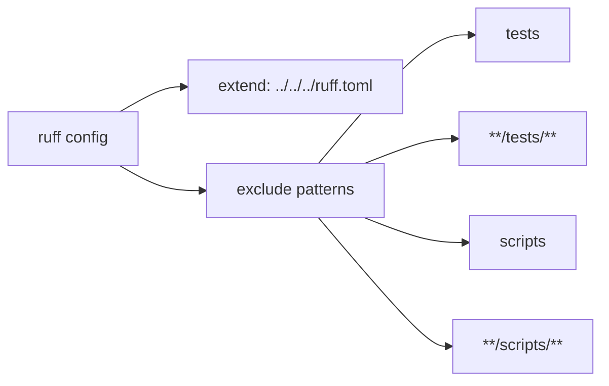

# Diagram: platform/partview_core/partview_service/.ruff.toml

> Auto-generated by Obscura crawlers

## Mermaid

### SVG

<svg id="container" width="598.6875" xmlns="http://www.w3.org/2000/svg" class="flowchart" height="382" viewBox="0 0 598.6875 382" role="graphics-document document" aria-roledescription="flowchart-v2"><g><marker id="container_flowchart-v2-pointEnd" class="marker flowchart-v2" viewBox="0 0 10 10" refX="5" refY="5" markerUnits="userSpaceOnUse" markerWidth="8" markerHeight="8" orient="auto"><path d="M 0 0 L 10 5 L 0 10 z" class="arrowMarkerPath" style="stroke-width: 1; stroke-dasharray: 1, 0;"></path></marker><marker id="container_flowchart-v2-pointStart" class="marker flowchart-v2" viewBox="0 0 10 10" refX="4.5" refY="5" markerUnits="userSpaceOnUse" markerWidth="8" markerHeight="8" orient="auto"><path d="M 0 5 L 10 10 L 10 0 z" class="arrowMarkerPath" style="stroke-width: 1; stroke-dasharray: 1, 0;"></path></marker><marker id="container_flowchart-v2-circleEnd" class="marker flowchart-v2" viewBox="0 0 10 10" refX="11" refY="5" markerUnits="userSpaceOnUse" markerWidth="11" markerHeight="11" orient="auto"><circle cx="5" cy="5" r="5" class="arrowMarkerPath" style="stroke-width: 1; stroke-dasharray: 1, 0;"></circle></marker><marker id="container_flowchart-v2-circleStart" class="marker flowchart-v2" viewBox="0 0 10 10" refX="-1" refY="5" markerUnits="userSpaceOnUse" markerWidth="11" markerHeight="11" orient="auto"><circle cx="5" cy="5" r="5" class="arrowMarkerPath" style="stroke-width: 1; stroke-dasharray: 1, 0;"></circle></marker><marker id="container_flowchart-v2-crossEnd" class="marker cross flowchart-v2" viewBox="0 0 11 11" refX="12" refY="5.2" markerUnits="userSpaceOnUse" markerWidth="11" markerHeight="11" orient="auto"><path d="M 1,1 l 9,9 M 10,1 l -9,9" class="arrowMarkerPath" style="stroke-width: 2; stroke-dasharray: 1, 0;"></path></marker><marker id="container_flowchart-v2-crossStart" class="marker cross flowchart-v2" viewBox="0 0 11 11" refX="-1" refY="5.2" markerUnits="userSpaceOnUse" markerWidth="11" markerHeight="11" orient="auto"><path d="M 1,1 l 9,9 M 10,1 l -9,9" class="arrowMarkerPath" style="stroke-width: 2; stroke-dasharray: 1, 0;"></path></marker><g class="root"><g class="clusters"></g><g class="edgePaths"><path d="M122.793,112L130.166,107.833C137.539,103.667,152.285,95.333,163.158,91.167C174.031,87,181.031,87,184.531,87L188.031,87" id="L_Config_Extend_0" class="edge-thickness-normal edge-pattern-solid edge-thickness-normal edge-pattern-solid flowchart-link" style=";" data-edge="true" data-et="edge" data-id="L_Config_Extend_0" data-points="W3sieCI6MTIyLjc5Mjk2ODc1LCJ5IjoxMTJ9LHsieCI6MTY3LjAzMTI1LCJ5Ijo4N30seyJ4IjoxOTIuMDMxMjUsInkiOjg3fV0=" marker-end="url(#container_flowchart-v2-pointEnd)"></path><path d="M122.793,166L130.166,170.167C137.539,174.333,152.285,182.667,166.594,186.833C180.904,191,194.776,191,201.712,191L208.648,191" id="L_Config_Exclude_0" class="edge-thickness-normal edge-pattern-solid edge-thickness-normal edge-pattern-solid flowchart-link" style=";" data-edge="true" data-et="edge" data-id="L_Config_Exclude_0" data-points="W3sieCI6MTIyLjc5Mjk2ODc1LCJ5IjoxNjZ9LHsieCI6MTY3LjAzMTI1LCJ5IjoxOTF9LHsieCI6MjEyLjY0ODQzNzUsInkiOjE5MX1d" marker-end="url(#container_flowchart-v2-pointEnd)"></path><path d="M326.991,164L345.784,142.5C364.578,121,402.164,78,427.036,56.5C451.909,35,464.068,35,470.147,35L476.227,35" id="L_Exclude_Tests_0" class="edge-thickness-normal edge-pattern-solid edge-thickness-normal edge-pattern-solid flowchart-link" style=";" data-edge="true" data-et="edge" data-id="L_Exclude_Tests_0" data-points="W3sieCI6MzI2Ljk5MTI4NjA1NzY5MjMsInkiOjE2NH0seyJ4Ijo0MzkuNzUsInkiOjM1fSx7IngiOjQ4MC4yMjY1NjI1LCJ5IjozNX1d" marker-end="url(#container_flowchart-v2-pointEnd)"></path><path d="M374.193,164L385.119,159.833C396.045,155.667,417.898,147.333,433.442,143.167C448.987,139,458.224,139,462.842,139L467.461,139" id="L_Exclude_TestsGlob_0" class="edge-thickness-normal edge-pattern-solid edge-thickness-normal edge-pattern-solid flowchart-link" style=";" data-edge="true" data-et="edge" data-id="L_Exclude_TestsGlob_0" data-points="W3sieCI6Mzc0LjE5MjYwODE3MzA3NjksInkiOjE2NH0seyJ4Ijo0MzkuNzUsInkiOjEzOX0seyJ4Ijo0NzEuNDYwOTM3NSwieSI6MTM5fV0=" marker-end="url(#container_flowchart-v2-pointEnd)"></path><path d="M374.193,218L385.119,222.167C396.045,226.333,417.898,234.667,433.772,238.833C449.646,243,459.542,243,464.49,243L469.438,243" id="L_Exclude_Scripts_0" class="edge-thickness-normal edge-pattern-solid edge-thickness-normal edge-pattern-solid flowchart-link" style=";" data-edge="true" data-et="edge" data-id="L_Exclude_Scripts_0" data-points="W3sieCI6Mzc0LjE5MjYwODE3MzA3NjksInkiOjIxOH0seyJ4Ijo0MzkuNzUsInkiOjI0M30seyJ4Ijo0NzMuNDM3NSwieSI6MjQzfV0=" marker-end="url(#container_flowchart-v2-pointEnd)"></path><path d="M326.991,218L345.784,239.5C364.578,261,402.164,304,424.457,325.5C446.75,347,453.75,347,457.25,347L460.75,347" id="L_Exclude_ScriptsGlob_0" class="edge-thickness-normal edge-pattern-solid edge-thickness-normal edge-pattern-solid flowchart-link" style=";" data-edge="true" data-et="edge" data-id="L_Exclude_ScriptsGlob_0" data-points="W3sieCI6MzI2Ljk5MTI4NjA1NzY5MjMsInkiOjIxOH0seyJ4Ijo0MzkuNzUsInkiOjM0N30seyJ4Ijo0NjQuNzUsInkiOjM0N31d" marker-end="url(#container_flowchart-v2-pointEnd)"></path></g><g class="edgeLabels"><g class="edgeLabel"><g class="label" data-id="L_Config_Extend_0" transform="translate(0, 0)"><foreignObject width="0" height="0">

</foreignObject></g></g><g class="edgeLabel"><g class="label" data-id="L_Config_Exclude_0" transform="translate(0, 0)"><foreignObject width="0" height="0">

</foreignObject></g></g><g class="edgeLabel"><g class="label" data-id="L_Exclude_Tests_0" transform="translate(0, 0)"><foreignObject width="0" height="0">

</foreignObject></g></g><g class="edgeLabel"><g class="label" data-id="L_Exclude_TestsGlob_0" transform="translate(0, 0)"><foreignObject width="0" height="0">

</foreignObject></g></g><g class="edgeLabel"><g class="label" data-id="L_Exclude_Scripts_0" transform="translate(0, 0)"><foreignObject width="0" height="0">

</foreignObject></g></g><g class="edgeLabel"><g class="label" data-id="L_Exclude_ScriptsGlob_0" transform="translate(0, 0)"><foreignObject width="0" height="0">

</foreignObject></g></g></g><g class="nodes"><g class="node default" id="flowchart-Config-0" transform="translate(75.015625, 139)"><rect class="basic label-container" style="" x="-67.015625" y="-27" width="134.03125" height="54"></rect><g class="label" style="" transform="translate(-37.015625, -12)"><rect></rect><foreignObject width="74.03125" height="24">

ruff config

</foreignObject></g></g><g class="node default" id="flowchart-Extend-1" transform="translate(303.390625, 87)"><rect class="basic label-container" style="" x="-111.359375" y="-27" width="222.71875" height="54"></rect><g class="label" style="" transform="translate(-81.359375, -12)"><rect></rect><foreignObject width="162.71875" height="24">

extend: ../../../ruff.toml

</foreignObject></g></g><g class="node default" id="flowchart-Exclude-2" transform="translate(303.390625, 191)"><rect class="basic label-container" style="" x="-90.7421875" y="-27" width="181.484375" height="54"></rect><g class="label" style="" transform="translate(-60.7421875, -12)"><rect></rect><foreignObject width="121.484375" height="24">

exclude patterns

</foreignObject></g></g><g class="node default" id="flowchart-Tests-3" transform="translate(527.71875, 35)"><rect class="basic label-container" style="" x="-47.4921875" y="-27" width="94.984375" height="54"></rect><g class="label" style="" transform="translate(-17.4921875, -12)"><rect></rect><foreignObject width="34.984375" height="24">

tests

</foreignObject></g></g><g class="node default" id="flowchart-TestsGlob-4" transform="translate(527.71875, 139)"><rect class="basic label-container" style="" x="-56.2578125" y="-27" width="112.515625" height="54"></rect><g class="label" style="" transform="translate(-26.2578125, -12)"><rect></rect><foreignObject width="52.515625" height="24">

<strong>/tests/</strong>

</foreignObject></g></g><g class="node default" id="flowchart-Scripts-5" transform="translate(527.71875, 243)"><rect class="basic label-container" style="" x="-54.28125" y="-27" width="108.5625" height="54"></rect><g class="label" style="" transform="translate(-24.28125, -12)"><rect></rect><foreignObject width="48.5625" height="24">

scripts

</foreignObject></g></g><g class="node default" id="flowchart-ScriptsGlob-6" transform="translate(527.71875, 347)"><rect class="basic label-container" style="" x="-62.96875" y="-27" width="125.9375" height="54"></rect><g class="label" style="" transform="translate(-32.96875, -12)"><rect></rect><foreignObject width="65.9375" height="24">

<strong>/scripts/</strong>

</foreignObject></g></g></g></g></g></svg>
