# Diagram: platform/partview_core/partview_service/config.cat.yml


> Auto-generated by Obscura crawlers

## Diagram 1

```mermaid
classDiagram
    class Config {
        +logLevel
        +cloudwatchOn
        +eventAuditOn
        +sqsConfig
        +pythonRequirements
    }
    class LogLevel {
        dev: "info"
        dev2: "info"
        qa: "warning"
        qa2: "warning"
        test: "warning"
        staging: "warning"
        prod: "warning"
    }
    class CloudwatchOn {
        dev: true
        dev2: true
        qa: true
        qa2: true
        test: true
        staging: true
        prod_a: true
        prod_b: true
    }
    class EventAuditOn {
        dev: true
        dev2: true
        qa: true
        qa2: true
        test: true
        staging: true
        prod_a: true
        prod_b: true
    }
    class SQSConfig {
        prod: post-full-asn-order-consumer(150), part-to-container-consumer(150), package-container-event-consumer(50), package-container-exception-consumer(50), event-scheduler-sqs-consumer(50), last-mile-package-eta(10), partview_open_search_data_sync_consumer(100), event-replay-sqs-consumer(100), package-container-asn-consumer(50), trip-leg-consumer(20), trip-leg-to-container-consumer(20), pv-shipment-asn-event-handler(10)
        staging: post-full-asn-order-consumer(50), part-to-container-consumer(50), package-container-exception-consumer(50), event-scheduler-sqs-consumer(5), last-mile-package-eta(10), package-container-event-consumer(50), partview_open_search_data_sync_consumer(100), event-replay-sqs-consumer(5), package-container-asn-consumer(50), trip-leg-consumer(50), trip-leg-to-container-consumer(50), pv-shipment-asn-event-handler(10)
        dev: post-full-asn-order-consumer(10), part-to-container-consumer(10), package-container-exception-consumer(10), event-scheduler-sqs-consumer(5), last-mile-package-eta(10), package-container-event-consumer(10), partview_open_search_data_sync_consumer(10), event-replay-sqs-consumer(5), package-container-asn-consumer(10), trip-leg-consumer(5), trip-leg-to-container-consumer(5), pv-shipment-asn-event-handler(10)
    }
    class PythonRequirements {
        dockerizePip: "non-linux"
        dockerImage: "public.ecr.aws/sam/emulation-python3.9:latest"
        dockerSsh: true
        useDownloadCache: false
        useStaticCache: false
        slim: true
    }
    Config --> LogLevel
    Config --> CloudwatchOn
    Config --> EventAuditOn
    Config --> SQSConfig
    Config --> PythonRequirements
```



### SVG

<svg id="container" width="4547.96875" xmlns="http://www.w3.org/2000/svg" class="classDiagram" height="570" viewBox="0 0 4547.96875 570" role="graphics-document document" aria-roledescription="class"><style>#container{font-family:"trebuchet ms",verdana,arial,sans-serif;font-size:16px;fill:#333;}@keyframes edge-animation-frame{from{stroke-dashoffset:0;}}@keyframes dash{to{stroke-dashoffset:0;}}#container .edge-animation-slow{stroke-dasharray:9,5!important;stroke-dashoffset:900;animation:dash 50s linear infinite;stroke-linecap:round;}#container .edge-animation-fast{stroke-dasharray:9,5!important;stroke-dashoffset:900;animation:dash 20s linear infinite;stroke-linecap:round;}#container .error-icon{fill:#552222;}#container .error-text{fill:#552222;stroke:#552222;}#container .edge-thickness-normal{stroke-width:1px;}#container .edge-thickness-thick{stroke-width:3.5px;}#container .edge-pattern-solid{stroke-dasharray:0;}#container .edge-thickness-invisible{stroke-width:0;fill:none;}#container .edge-pattern-dashed{stroke-dasharray:3;}#container .edge-pattern-dotted{stroke-dasharray:2;}#container .marker{fill:#333333;stroke:#333333;}#container .marker.cross{stroke:#333333;}#container svg{font-family:"trebuchet ms",verdana,arial,sans-serif;font-size:16px;}#container p{margin:0;}#container g.classGroup text{fill:#9370DB;stroke:none;font-family:"trebuchet ms",verdana,arial,sans-serif;font-size:10px;}#container g.classGroup text .title{font-weight:bolder;}#container .nodeLabel,#container .edgeLabel{color:#131300;}#container .edgeLabel .label rect{fill:#ECECFF;}#container .label text{fill:#131300;}#container .labelBkg{background:#ECECFF;}#container .edgeLabel .label span{background:#ECECFF;}#container .classTitle{font-weight:bolder;}#container .node rect,#container .node circle,#container .node ellipse,#container .node polygon,#container .node path{fill:#ECECFF;stroke:#9370DB;stroke-width:1px;}#container .divider{stroke:#9370DB;stroke-width:1;}#container g.clickable{cursor:pointer;}#container g.classGroup rect{fill:#ECECFF;stroke:#9370DB;}#container g.classGroup line{stroke:#9370DB;stroke-width:1;}#container .classLabel .box{stroke:none;stroke-width:0;fill:#ECECFF;opacity:0.5;}#container .classLabel .label{fill:#9370DB;font-size:10px;}#container .relation{stroke:#333333;stroke-width:1;fill:none;}#container .dashed-line{stroke-dasharray:3;}#container .dotted-line{stroke-dasharray:1 2;}#container #compositionStart,#container .composition{fill:#333333!important;stroke:#333333!important;stroke-width:1;}#container #compositionEnd,#container .composition{fill:#333333!important;stroke:#333333!important;stroke-width:1;}#container #dependencyStart,#container .dependency{fill:#333333!important;stroke:#333333!important;stroke-width:1;}#container #dependencyStart,#container .dependency{fill:#333333!important;stroke:#333333!important;stroke-width:1;}#container #extensionStart,#container .extension{fill:transparent!important;stroke:#333333!important;stroke-width:1;}#container #extensionEnd,#container .extension{fill:transparent!important;stroke:#333333!important;stroke-width:1;}#container #aggregationStart,#container .aggregation{fill:transparent!important;stroke:#333333!important;stroke-width:1;}#container #aggregationEnd,#container .aggregation{fill:transparent!important;stroke:#333333!important;stroke-width:1;}#container #lollipopStart,#container .lollipop{fill:#ECECFF!important;stroke:#333333!important;stroke-width:1;}#container #lollipopEnd,#container .lollipop{fill:#ECECFF!important;stroke:#333333!important;stroke-width:1;}#container .edgeTerminals{font-size:11px;line-height:initial;}#container .classTitleText{text-anchor:middle;font-size:18px;fill:#333;}#container .label-icon{display:inline-block;height:1em;overflow:visible;vertical-align:-0.125em;}#container .node .label-icon path{fill:currentColor;stroke:revert;stroke-width:revert;}#container :root{--mermaid-font-family:"trebuchet ms",verdana,arial,sans-serif;}</style><g><defs><marker id="container_class-aggregationStart" class="marker aggregation class" refX="18" refY="7" markerWidth="190" markerHeight="240" orient="auto"><path d="M 18,7 L9,13 L1,7 L9,1 Z"></path></marker></defs><defs><marker id="container_class-aggregationEnd" class="marker aggregation class" refX="1" refY="7" markerWidth="20" markerHeight="28" orient="auto"><path d="M 18,7 L9,13 L1,7 L9,1 Z"></path></marker></defs><defs><marker id="container_class-extensionStart" class="marker extension class" refX="18" refY="7" markerWidth="190" markerHeight="240" orient="auto"><path d="M 1,7 L18,13 V 1 Z"></path></marker></defs><defs><marker id="container_class-extensionEnd" class="marker extension class" refX="1" refY="7" markerWidth="20" markerHeight="28" orient="auto"><path d="M 1,1 V 13 L18,7 Z"></path></marker></defs><defs><marker id="container_class-compositionStart" class="marker composition class" refX="18" refY="7" markerWidth="190" markerHeight="240" orient="auto"><path d="M 18,7 L9,13 L1,7 L9,1 Z"></path></marker></defs><defs><marker id="container_class-compositionEnd" class="marker composition class" refX="1" refY="7" markerWidth="20" markerHeight="28" orient="auto"><path d="M 18,7 L9,13 L1,7 L9,1 Z"></path></marker></defs><defs><marker id="container_class-dependencyStart" class="marker dependency class" refX="6" refY="7" markerWidth="190" markerHeight="240" orient="auto"><path d="M 5,7 L9,13 L1,7 L9,1 Z"></path></marker></defs><defs><marker id="container_class-dependencyEnd" class="marker dependency class" refX="13" refY="7" markerWidth="20" markerHeight="28" orient="auto"><path d="M 18,7 L9,13 L14,7 L9,1 Z"></path></marker></defs><defs><marker id="container_class-lollipopStart" class="marker lollipop class" refX="13" refY="7" markerWidth="190" markerHeight="240" orient="auto"><circle stroke="black" fill="transparent" cx="7" cy="7" r="6"></circle></marker></defs><defs><marker id="container_class-lollipopEnd" class="marker lollipop class" refX="1" refY="7" markerWidth="190" markerHeight="240" orient="auto"><circle stroke="black" fill="transparent" cx="7" cy="7" r="6"></circle></marker></defs><g class="root"><g class="clusters"></g><g class="edgePaths"><path d="M440.355,147.13L383.87,164.108C327.385,181.087,214.415,215.043,157.93,237.188C101.445,259.333,101.445,269.667,101.445,274.833L101.445,280" id="id_Config_LogLevel_1" class="edge-thickness-normal edge-pattern-solid relation" style=";;;" data-edge="true" data-et="edge" data-id="id_Config_LogLevel_1" data-points="W3sieCI6NDQwLjM1NTQ2ODc1LCJ5IjoxNDcuMTMwMDgyODA4MDU4MzV9LHsieCI6MTAxLjQ0NTMxMjUsInkiOjI0OX0seyJ4IjoxMDEuNDQ1MzEyNSwieSI6Mjg2fV0=" marker-end="url(#container_class-dependencyEnd)"></path><path d="M440.355,179.908L421.694,191.423C403.033,202.938,365.71,225.969,347.048,240.651C328.387,255.333,328.387,261.667,328.387,264.833L328.387,268" id="id_Config_CloudwatchOn_2" class="edge-thickness-normal edge-pattern-solid relation" style=";;;" data-edge="true" data-et="edge" data-id="id_Config_CloudwatchOn_2" data-points="W3sieCI6NDQwLjM1NTQ2ODc1LCJ5IjoxNzkuOTA3NTg4MzA2NzIyfSx7IngiOjMyOC4zODY3MTg3NSwieSI6MjQ5fSx7IngiOjMyOC4zODY3MTg3NSwieSI6Mjc0fV0=" marker-end="url(#container_class-dependencyEnd)"></path><path d="M543.922,224L543.922,228.167C543.922,232.333,543.922,240.667,543.922,248C543.922,255.333,543.922,261.667,543.922,264.833L543.922,268" id="id_Config_EventAuditOn_3" class="edge-thickness-normal edge-pattern-solid relation" style=";;;" data-edge="true" data-et="edge" data-id="id_Config_EventAuditOn_3" data-points="W3sieCI6NTQzLjkyMTg3NSwieSI6MjI0fSx7IngiOjU0My45MjE4NzUsInkiOjI0OX0seyJ4Ijo1NDMuOTIxODc1LCJ5IjoyNzR9XQ==" marker-end="url(#container_class-dependencyEnd)"></path><path d="M647.488,123.826L923.591,144.688C1199.694,165.55,1751.9,207.275,2028.003,240.804C2304.105,274.333,2304.105,299.667,2304.105,312.333L2304.105,325" id="id_Config_SQSConfig_4" class="edge-thickness-normal edge-pattern-solid relation" style=";;;" data-edge="true" data-et="edge" data-id="id_Config_SQSConfig_4" data-points="W3sieCI6NjQ3LjQ4ODI4MTI1LCJ5IjoxMjMuODI1NTA4NzAyNzA1NDZ9LHsieCI6MjMwNC4xMDU0Njg3NSwieSI6MjQ5fSx7IngiOjIzMDQuMTA1NDY4NzUsInkiOjMzMX1d" marker-end="url(#container_class-dependencyEnd)"></path><path d="M647.488,119.706L1249.758,141.255C1852.029,162.804,3056.569,205.902,3658.839,234.618C4261.109,263.333,4261.109,277.667,4261.109,284.833L4261.109,292" id="id_Config_PythonRequirements_5" class="edge-thickness-normal edge-pattern-solid relation" style=";;;" data-edge="true" data-et="edge" data-id="id_Config_PythonRequirements_5" data-points="W3sieCI6NjQ3LjQ4ODI4MTI1LCJ5IjoxMTkuNzA1NTc5MDI0ODAwMzN9LHsieCI6NDI2MS4xMDkzNzUsInkiOjI0OX0seyJ4Ijo0MjYxLjEwOTM3NSwieSI6Mjk4fV0=" marker-end="url(#container_class-dependencyEnd)"></path></g><g class="edgeLabels"><g class="edgeLabel"><g class="label" data-id="id_Config_LogLevel_1" transform="translate(0, 0)"><foreignObject width="0" height="0"><div xmlns="http://www.w3.org/1999/xhtml" class="labelBkg" style="display: table-cell; white-space: nowrap; line-height: 1.5; max-width: 200px; text-align: center;"><span class="edgeLabel"></span></div></foreignObject></g></g><g class="edgeLabel"><g class="label" data-id="id_Config_CloudwatchOn_2" transform="translate(0, 0)"><foreignObject width="0" height="0"><div xmlns="http://www.w3.org/1999/xhtml" class="labelBkg" style="display: table-cell; white-space: nowrap; line-height: 1.5; max-width: 200px; text-align: center;"><span class="edgeLabel"></span></div></foreignObject></g></g><g class="edgeLabel"><g class="label" data-id="id_Config_EventAuditOn_3" transform="translate(0, 0)"><foreignObject width="0" height="0"><div xmlns="http://www.w3.org/1999/xhtml" class="labelBkg" style="display: table-cell; white-space: nowrap; line-height: 1.5; max-width: 200px; text-align: center;"><span class="edgeLabel"></span></div></foreignObject></g></g><g class="edgeLabel"><g class="label" data-id="id_Config_SQSConfig_4" transform="translate(0, 0)"><foreignObject width="0" height="0"><div xmlns="http://www.w3.org/1999/xhtml" class="labelBkg" style="display: table-cell; white-space: nowrap; line-height: 1.5; max-width: 200px; text-align: center;"><span class="edgeLabel"></span></div></foreignObject></g></g><g class="edgeLabel"><g class="label" data-id="id_Config_PythonRequirements_5" transform="translate(0, 0)"><foreignObject width="0" height="0"><div xmlns="http://www.w3.org/1999/xhtml" class="labelBkg" style="display: table-cell; white-space: nowrap; line-height: 1.5; max-width: 200px; text-align: center;"><span class="edgeLabel"></span></div></foreignObject></g></g></g><g class="nodes"><g class="node default" id="classId-Config-0" transform="translate(543.921875, 116)"><g class="basic label-container"><path d="M-103.56640625 -108 L103.56640625 -108 L103.56640625 108 L-103.56640625 108" stroke="none" stroke-width="0" fill="#ECECFF" style=""></path><path d="M-103.56640625 -108 C-51.52795792448929 -108, 0.5104904010214142 -108, 103.56640625 -108 M-103.56640625 -108 C-59.699378942041896 -108, -15.832351634083793 -108, 103.56640625 -108 M103.56640625 -108 C103.56640625 -24.38232630383196, 103.56640625 59.23534739233608, 103.56640625 108 M103.56640625 -108 C103.56640625 -45.235529044239996, 103.56640625 17.528941911520008, 103.56640625 108 M103.56640625 108 C32.69203620878123 108, -38.182333832437536 108, -103.56640625 108 M103.56640625 108 C49.638043170446124 108, -4.290319909107751 108, -103.56640625 108 M-103.56640625 108 C-103.56640625 44.975182090515354, -103.56640625 -18.049635818969293, -103.56640625 -108 M-103.56640625 108 C-103.56640625 43.439741026371735, -103.56640625 -21.12051794725653, -103.56640625 -108" stroke="#9370DB" stroke-width="1.3" fill="none" stroke-dasharray="0 0" style=""></path></g><g class="annotation-group text" transform="translate(0, -84)"></g><g class="label-group text" transform="translate(-22.9296875, -84)"><g class="label" style="font-weight: bolder" transform="translate(0,-12)"><foreignObject width="45.859375" height="24"><div xmlns="http://www.w3.org/1999/xhtml" style="display: table-cell; white-space: nowrap; line-height: 1.5; max-width: 96px; text-align: center;"><span class="nodeLabel markdown-node-label" style=""><p>Config</p></span></div></foreignObject></g></g><g class="members-group text" transform="translate(-91.56640625, -36)"><g class="label" style="" transform="translate(0,-12)"><foreignObject width="67.703125" height="24"><div xmlns="http://www.w3.org/1999/xhtml" style="display: table-cell; white-space: nowrap; line-height: 1.5; max-width: 125px; text-align: center;"><span class="nodeLabel markdown-node-label" style=""><p>+logLevel</p></span></div></foreignObject></g><g class="label" style="" transform="translate(0,12)"><foreignObject width="111.46875" height="24"><div xmlns="http://www.w3.org/1999/xhtml" style="display: table-cell; white-space: nowrap; line-height: 1.5; max-width: 169px; text-align: center;"><span class="nodeLabel markdown-node-label" style=""><p>+cloudwatchOn</p></span></div></foreignObject></g><g class="label" style="" transform="translate(0,36)"><foreignObject width="107.109375" height="24"><div xmlns="http://www.w3.org/1999/xhtml" style="display: table-cell; white-space: nowrap; line-height: 1.5; max-width: 164px; text-align: center;"><span class="nodeLabel markdown-node-label" style=""><p>+eventAuditOn</p></span></div></foreignObject></g><g class="label" style="" transform="translate(0,60)"><foreignObject width="77.390625" height="24"><div xmlns="http://www.w3.org/1999/xhtml" style="display: table-cell; white-space: nowrap; line-height: 1.5; max-width: 135px; text-align: center;"><span class="nodeLabel markdown-node-label" style=""><p>+sqsConfig</p></span></div></foreignObject></g><g class="label" style="" transform="translate(0,84)"><foreignObject width="160.203125" height="24"><div xmlns="http://www.w3.org/1999/xhtml" style="display: table-cell; white-space: nowrap; line-height: 1.5; max-width: 218px; text-align: center;"><span class="nodeLabel markdown-node-label" style=""><p>+pythonRequirements</p></span></div></foreignObject></g></g><g class="methods-group text" transform="translate(-91.56640625, 108)"></g><g class="divider" style=""><path d="M-103.56640625 -60 C-31.64282651135956 -60, 40.28075322728088 -60, 103.56640625 -60 M-103.56640625 -60 C-58.75311919062561 -60, -13.939832131251222 -60, 103.56640625 -60" stroke="#9370DB" stroke-width="1.3" fill="none" stroke-dasharray="0 0" style=""></path></g><g class="divider" style=""><path d="M-103.56640625 84 C-45.588738036593 84, 12.388930176814 84, 103.56640625 84 M-103.56640625 84 C-20.980109269187466 84, 61.60618771162507 84, 103.56640625 84" stroke="#9370DB" stroke-width="1.3" fill="none" stroke-dasharray="0 0" style=""></path></g></g><g class="node default" id="classId-LogLevel-1" transform="translate(101.4453125, 418)"><g class="basic label-container"><path d="M-93.4453125 -132 L93.4453125 -132 L93.4453125 132 L-93.4453125 132" stroke="none" stroke-width="0" fill="#ECECFF" style=""></path><path d="M-93.4453125 -132 C-35.181998961909166 -132, 23.08131457618167 -132, 93.4453125 -132 M-93.4453125 -132 C-23.503475964506606 -132, 46.43836057098679 -132, 93.4453125 -132 M93.4453125 -132 C93.4453125 -40.40436913377077, 93.4453125 51.19126173245846, 93.4453125 132 M93.4453125 -132 C93.4453125 -75.45811363265709, 93.4453125 -18.916227265314177, 93.4453125 132 M93.4453125 132 C35.02147339044499 132, -23.402365719110023 132, -93.4453125 132 M93.4453125 132 C46.042179096410806 132, -1.360954307178389 132, -93.4453125 132 M-93.4453125 132 C-93.4453125 41.25963378931361, -93.4453125 -49.48073242137278, -93.4453125 -132 M-93.4453125 132 C-93.4453125 35.105278788776474, -93.4453125 -61.78944242244705, -93.4453125 -132" stroke="#9370DB" stroke-width="1.3" fill="none" stroke-dasharray="0 0" style=""></path></g><g class="annotation-group text" transform="translate(0, -108)"></g><g class="label-group text" transform="translate(-32.078125, -108)"><g class="label" style="font-weight: bolder" transform="translate(0,-12)"><foreignObject width="64.15625" height="24"><div xmlns="http://www.w3.org/1999/xhtml" style="display: table-cell; white-space: nowrap; line-height: 1.5; max-width: 113px; text-align: center;"><span class="nodeLabel markdown-node-label" style=""><p>LogLevel</p></span></div></foreignObject></g></g><g class="members-group text" transform="translate(-81.4453125, -60)"><g class="label" style="" transform="translate(0,-12)"><foreignObject width="75.28125" height="24"><div xmlns="http://www.w3.org/1999/xhtml" style="display: table-cell; white-space: nowrap; line-height: 1.5; max-width: 125px; text-align: center;"><span class="nodeLabel markdown-node-label" style=""><p>dev: "info"</p></span></div></foreignObject></g><g class="label" style="" transform="translate(0,12)"><foreignObject width="82.984375" height="24"><div xmlns="http://www.w3.org/1999/xhtml" style="display: table-cell; white-space: nowrap; line-height: 1.5; max-width: 133px; text-align: center;"><span class="nodeLabel markdown-node-label" style=""><p>dev2: "info"</p></span></div></foreignObject></g><g class="label" style="" transform="translate(0,36)"><foreignObject width="96.875" height="24"><div xmlns="http://www.w3.org/1999/xhtml" style="display: table-cell; white-space: nowrap; line-height: 1.5; max-width: 147px; text-align: center;"><span class="nodeLabel markdown-node-label" style=""><p>qa: "warning"</p></span></div></foreignObject></g><g class="label" style="" transform="translate(0,60)"><foreignObject width="104.796875" height="24"><div xmlns="http://www.w3.org/1999/xhtml" style="display: table-cell; white-space: nowrap; line-height: 1.5; max-width: 155px; text-align: center;"><span class="nodeLabel markdown-node-label" style=""><p>qa2: "warning"</p></span></div></foreignObject></g><g class="label" style="" transform="translate(0,84)"><foreignObject width="106.171875" height="24"><div xmlns="http://www.w3.org/1999/xhtml" style="display: table-cell; white-space: nowrap; line-height: 1.5; max-width: 156px; text-align: center;"><span class="nodeLabel markdown-node-label" style=""><p>test: "warning"</p></span></div></foreignObject></g><g class="label" style="" transform="translate(0,108)"><foreignObject width="130.8125" height="24"><div xmlns="http://www.w3.org/1999/xhtml" style="display: table-cell; white-space: nowrap; line-height: 1.5; max-width: 181px; text-align: center;"><span class="nodeLabel markdown-node-label" style=""><p>staging: "warning"</p></span></div></foreignObject></g><g class="label" style="" transform="translate(0,132)"><foreignObject width="112.71875" height="24"><div xmlns="http://www.w3.org/1999/xhtml" style="display: table-cell; white-space: nowrap; line-height: 1.5; max-width: 163px; text-align: center;"><span class="nodeLabel markdown-node-label" style=""><p>prod: "warning"</p></span></div></foreignObject></g></g><g class="methods-group text" transform="translate(-81.4453125, 132)"></g><g class="divider" style=""><path d="M-93.4453125 -84 C-40.623045141639814 -84, 12.199222216720372 -84, 93.4453125 -84 M-93.4453125 -84 C-36.34316036519189 -84, 20.758991769616216 -84, 93.4453125 -84" stroke="#9370DB" stroke-width="1.3" fill="none" stroke-dasharray="0 0" style=""></path></g><g class="divider" style=""><path d="M-93.4453125 108 C-49.492944504772275 108, -5.54057650954455 108, 93.4453125 108 M-93.4453125 108 C-18.887002245320986 108, 55.67130800935803 108, 93.4453125 108" stroke="#9370DB" stroke-width="1.3" fill="none" stroke-dasharray="0 0" style=""></path></g></g><g class="node default" id="classId-CloudwatchOn-2" transform="translate(328.38671875, 418)"><g class="basic label-container"><path d="M-83.49609375 -144 L83.49609375 -144 L83.49609375 144 L-83.49609375 144" stroke="none" stroke-width="0" fill="#ECECFF" style=""></path><path d="M-83.49609375 -144 C-43.81548005715858 -144, -4.134866364317162 -144, 83.49609375 -144 M-83.49609375 -144 C-30.56591969920818 -144, 22.36425435158364 -144, 83.49609375 -144 M83.49609375 -144 C83.49609375 -86.10634536938062, 83.49609375 -28.212690738761225, 83.49609375 144 M83.49609375 -144 C83.49609375 -84.01168723959533, 83.49609375 -24.023374479190664, 83.49609375 144 M83.49609375 144 C46.12815060647813 144, 8.76020746295626 144, -83.49609375 144 M83.49609375 144 C36.11174235139412 144, -11.272609047211759 144, -83.49609375 144 M-83.49609375 144 C-83.49609375 48.62484409021073, -83.49609375 -46.75031181957854, -83.49609375 -144 M-83.49609375 144 C-83.49609375 73.6344128115553, -83.49609375 3.2688256231105868, -83.49609375 -144" stroke="#9370DB" stroke-width="1.3" fill="none" stroke-dasharray="0 0" style=""></path></g><g class="annotation-group text" transform="translate(0, -120)"></g><g class="label-group text" transform="translate(-52.7109375, -120)"><g class="label" style="font-weight: bolder" transform="translate(0,-12)"><foreignObject width="105.421875" height="24"><div xmlns="http://www.w3.org/1999/xhtml" style="display: table-cell; white-space: nowrap; line-height: 1.5; max-width: 155px; text-align: center;"><span class="nodeLabel markdown-node-label" style=""><p>CloudwatchOn</p></span></div></foreignObject></g></g><g class="members-group text" transform="translate(-71.49609375, -72)"><g class="label" style="" transform="translate(0,-12)"><foreignObject width="64.234375" height="24"><div xmlns="http://www.w3.org/1999/xhtml" style="display: table-cell; white-space: nowrap; line-height: 1.5; max-width: 114px; text-align: center;"><span class="nodeLabel markdown-node-label" style=""><p>dev: true</p></span></div></foreignObject></g><g class="label" style="" transform="translate(0,12)"><foreignObject width="71.921875" height="24"><div xmlns="http://www.w3.org/1999/xhtml" style="display: table-cell; white-space: nowrap; line-height: 1.5; max-width: 122px; text-align: center;"><span class="nodeLabel markdown-node-label" style=""><p>dev2: true</p></span></div></foreignObject></g><g class="label" style="" transform="translate(0,36)"><foreignObject width="56.34375" height="24"><div xmlns="http://www.w3.org/1999/xhtml" style="display: table-cell; white-space: nowrap; line-height: 1.5; max-width: 106px; text-align: center;"><span class="nodeLabel markdown-node-label" style=""><p>qa: true</p></span></div></foreignObject></g><g class="label" style="" transform="translate(0,60)"><foreignObject width="64.265625" height="24"><div xmlns="http://www.w3.org/1999/xhtml" style="display: table-cell; white-space: nowrap; line-height: 1.5; max-width: 114px; text-align: center;"><span class="nodeLabel markdown-node-label" style=""><p>qa2: true</p></span></div></foreignObject></g><g class="label" style="" transform="translate(0,84)"><foreignObject width="65.640625" height="24"><div xmlns="http://www.w3.org/1999/xhtml" style="display: table-cell; white-space: nowrap; line-height: 1.5; max-width: 116px; text-align: center;"><span class="nodeLabel markdown-node-label" style=""><p>test: true</p></span></div></foreignObject></g><g class="label" style="" transform="translate(0,108)"><foreignObject width="90.28125" height="24"><div xmlns="http://www.w3.org/1999/xhtml" style="display: table-cell; white-space: nowrap; line-height: 1.5; max-width: 140px; text-align: center;"><span class="nodeLabel markdown-node-label" style=""><p>staging: true</p></span></div></foreignObject></g><g class="label" style="" transform="translate(0,132)"><foreignObject width="88.890625" height="24"><div xmlns="http://www.w3.org/1999/xhtml" style="display: table-cell; white-space: nowrap; line-height: 1.5; max-width: 139px; text-align: center;"><span class="nodeLabel markdown-node-label" style=""><p>prod_a: true</p></span></div></foreignObject></g><g class="label" style="" transform="translate(0,156)"><foreignObject width="90.015625" height="24"><div xmlns="http://www.w3.org/1999/xhtml" style="display: table-cell; white-space: nowrap; line-height: 1.5; max-width: 140px; text-align: center;"><span class="nodeLabel markdown-node-label" style=""><p>prod_b: true</p></span></div></foreignObject></g></g><g class="methods-group text" transform="translate(-71.49609375, 144)"></g><g class="divider" style=""><path d="M-83.49609375 -96 C-21.38597172854518 -96, 40.72415029290964 -96, 83.49609375 -96 M-83.49609375 -96 C-44.72373407467757 -96, -5.951374399355146 -96, 83.49609375 -96" stroke="#9370DB" stroke-width="1.3" fill="none" stroke-dasharray="0 0" style=""></path></g><g class="divider" style=""><path d="M-83.49609375 120 C-36.57212658294421 120, 10.351840584111585 120, 83.49609375 120 M-83.49609375 120 C-33.34113050362756 120, 16.81383274274488 120, 83.49609375 120" stroke="#9370DB" stroke-width="1.3" fill="none" stroke-dasharray="0 0" style=""></path></g></g><g class="node default" id="classId-EventAuditOn-3" transform="translate(543.921875, 418)"><g class="basic label-container"><path d="M-82.0390625 -144 L82.0390625 -144 L82.0390625 144 L-82.0390625 144" stroke="none" stroke-width="0" fill="#ECECFF" style=""></path><path d="M-82.0390625 -144 C-42.59092817605441 -144, -3.1427938521088237 -144, 82.0390625 -144 M-82.0390625 -144 C-20.115969550852355 -144, 41.80712339829529 -144, 82.0390625 -144 M82.0390625 -144 C82.0390625 -57.7897299901273, 82.0390625 28.420540019745403, 82.0390625 144 M82.0390625 -144 C82.0390625 -77.81968988579226, 82.0390625 -11.639379771584515, 82.0390625 144 M82.0390625 144 C45.05960761257792 144, 8.080152725155841 144, -82.0390625 144 M82.0390625 144 C17.045413854683872 144, -47.948234790632256 144, -82.0390625 144 M-82.0390625 144 C-82.0390625 42.76222400684415, -82.0390625 -58.4755519863117, -82.0390625 -144 M-82.0390625 144 C-82.0390625 71.15323294242006, -82.0390625 -1.6935341151598777, -82.0390625 -144" stroke="#9370DB" stroke-width="1.3" fill="none" stroke-dasharray="0 0" style=""></path></g><g class="annotation-group text" transform="translate(0, -120)"></g><g class="label-group text" transform="translate(-49.796875, -120)"><g class="label" style="font-weight: bolder" transform="translate(0,-12)"><foreignObject width="99.59375" height="24"><div xmlns="http://www.w3.org/1999/xhtml" style="display: table-cell; white-space: nowrap; line-height: 1.5; max-width: 149px; text-align: center;"><span class="nodeLabel markdown-node-label" style=""><p>EventAuditOn</p></span></div></foreignObject></g></g><g class="members-group text" transform="translate(-70.0390625, -72)"><g class="label" style="" transform="translate(0,-12)"><foreignObject width="64.234375" height="24"><div xmlns="http://www.w3.org/1999/xhtml" style="display: table-cell; white-space: nowrap; line-height: 1.5; max-width: 114px; text-align: center;"><span class="nodeLabel markdown-node-label" style=""><p>dev: true</p></span></div></foreignObject></g><g class="label" style="" transform="translate(0,12)"><foreignObject width="71.921875" height="24"><div xmlns="http://www.w3.org/1999/xhtml" style="display: table-cell; white-space: nowrap; line-height: 1.5; max-width: 122px; text-align: center;"><span class="nodeLabel markdown-node-label" style=""><p>dev2: true</p></span></div></foreignObject></g><g class="label" style="" transform="translate(0,36)"><foreignObject width="56.34375" height="24"><div xmlns="http://www.w3.org/1999/xhtml" style="display: table-cell; white-space: nowrap; line-height: 1.5; max-width: 106px; text-align: center;"><span class="nodeLabel markdown-node-label" style=""><p>qa: true</p></span></div></foreignObject></g><g class="label" style="" transform="translate(0,60)"><foreignObject width="64.265625" height="24"><div xmlns="http://www.w3.org/1999/xhtml" style="display: table-cell; white-space: nowrap; line-height: 1.5; max-width: 114px; text-align: center;"><span class="nodeLabel markdown-node-label" style=""><p>qa2: true</p></span></div></foreignObject></g><g class="label" style="" transform="translate(0,84)"><foreignObject width="65.640625" height="24"><div xmlns="http://www.w3.org/1999/xhtml" style="display: table-cell; white-space: nowrap; line-height: 1.5; max-width: 116px; text-align: center;"><span class="nodeLabel markdown-node-label" style=""><p>test: true</p></span></div></foreignObject></g><g class="label" style="" transform="translate(0,108)"><foreignObject width="90.28125" height="24"><div xmlns="http://www.w3.org/1999/xhtml" style="display: table-cell; white-space: nowrap; line-height: 1.5; max-width: 140px; text-align: center;"><span class="nodeLabel markdown-node-label" style=""><p>staging: true</p></span></div></foreignObject></g><g class="label" style="" transform="translate(0,132)"><foreignObject width="88.890625" height="24"><div xmlns="http://www.w3.org/1999/xhtml" style="display: table-cell; white-space: nowrap; line-height: 1.5; max-width: 139px; text-align: center;"><span class="nodeLabel markdown-node-label" style=""><p>prod_a: true</p></span></div></foreignObject></g><g class="label" style="" transform="translate(0,156)"><foreignObject width="90.015625" height="24"><div xmlns="http://www.w3.org/1999/xhtml" style="display: table-cell; white-space: nowrap; line-height: 1.5; max-width: 140px; text-align: center;"><span class="nodeLabel markdown-node-label" style=""><p>prod_b: true</p></span></div></foreignObject></g></g><g class="methods-group text" transform="translate(-70.0390625, 144)"></g><g class="divider" style=""><path d="M-82.0390625 -96 C-35.68521789720483 -96, 10.668626705590341 -96, 82.0390625 -96 M-82.0390625 -96 C-28.623878134931786 -96, 24.791306230136428 -96, 82.0390625 -96" stroke="#9370DB" stroke-width="1.3" fill="none" stroke-dasharray="0 0" style=""></path></g><g class="divider" style=""><path d="M-82.0390625 120 C-38.22299069933149 120, 5.59308110133702 120, 82.0390625 120 M-82.0390625 120 C-31.12937387774604 120, 19.78031474450792 120, 82.0390625 120" stroke="#9370DB" stroke-width="1.3" fill="none" stroke-dasharray="0 0" style=""></path></g></g><g class="node default" id="classId-SQSConfig-4" transform="translate(2304.10546875, 418)"><g class="basic label-container"><path d="M-1628.14453125 -87 L1628.14453125 -87 L1628.14453125 87 L-1628.14453125 87" stroke="none" stroke-width="0" fill="#ECECFF" style=""></path><path d="M-1628.14453125 -87 C-610.1849823946511 -87, 407.77456646069777 -87, 1628.14453125 -87 M-1628.14453125 -87 C-588.5866024521024 -87, 450.9713263457952 -87, 1628.14453125 -87 M1628.14453125 -87 C1628.14453125 -26.485083450392743, 1628.14453125 34.029833099214514, 1628.14453125 87 M1628.14453125 -87 C1628.14453125 -18.282893296464138, 1628.14453125 50.434213407071724, 1628.14453125 87 M1628.14453125 87 C823.777210246798 87, 19.4098892435959 87, -1628.14453125 87 M1628.14453125 87 C834.6606776024433 87, 41.176823954886686 87, -1628.14453125 87 M-1628.14453125 87 C-1628.14453125 39.6172674405357, -1628.14453125 -7.765465118928603, -1628.14453125 -87 M-1628.14453125 87 C-1628.14453125 38.37455364006998, -1628.14453125 -10.250892719860033, -1628.14453125 -87" stroke="#9370DB" stroke-width="1.3" fill="none" stroke-dasharray="0 0" style=""></path></g><g class="annotation-group text" transform="translate(0, -63)"></g><g class="label-group text" transform="translate(-37.6015625, -63)"><g class="label" style="font-weight: bolder" transform="translate(0,-12)"><foreignObject width="75.203125" height="24"><div xmlns="http://www.w3.org/1999/xhtml" style="display: table-cell; white-space: nowrap; line-height: 1.5; max-width: 124px; text-align: center;"><span class="nodeLabel markdown-node-label" style=""><p>SQSConfig</p></span></div></foreignObject></g></g><g class="members-group text" transform="translate(-1616.14453125, -15)"></g><g class="methods-group text" transform="translate(-1616.14453125, 15)"><g class="label" style="" transform="translate(0,-12)"><foreignObject width="3194.6875" height="24"><div xmlns="http://www.w3.org/1999/xhtml" style="display: table-cell; white-space: nowrap; line-height: 1.5; max-width: 3245px; text-align: center;"><span class="nodeLabel markdown-node-label" style=""><p>prod: post-full-asn-order-consumer(150), part-to-container-consumer(150), package-container-event-consumer(50), package-container-exception-consumer(50), event-scheduler-sqs-consumer(50), last-mile-package-eta(10), partview_open_search_data_sync_consumer(100), event-replay-sqs-consumer(100), package-container-asn-consumer(50), trip-leg-consumer(20), trip-leg-to-container-consumer(20), pv-shipment-asn-event-handler(10)</p></span></div></foreignObject></g><g class="label" style="" transform="translate(0,12)"><foreignObject width="3174.375" height="24"><div xmlns="http://www.w3.org/1999/xhtml" style="display: table-cell; white-space: nowrap; line-height: 1.5; max-width: 3224px; text-align: center;"><span class="nodeLabel markdown-node-label" style=""><p>staging: post-full-asn-order-consumer(50), part-to-container-consumer(50), package-container-exception-consumer(50), event-scheduler-sqs-consumer(5), last-mile-package-eta(10), package-container-event-consumer(50), partview_open_search_data_sync_consumer(100), event-replay-sqs-consumer(5), package-container-asn-consumer(50), trip-leg-consumer(50), trip-leg-to-container-consumer(50), pv-shipment-asn-event-handler(10)</p></span></div></foreignObject></g><g class="label" style="" transform="translate(0,36)"><foreignObject width="3114.515625" height="24"><div xmlns="http://www.w3.org/1999/xhtml" style="display: table-cell; white-space: nowrap; line-height: 1.5; max-width: 3165px; text-align: center;"><span class="nodeLabel markdown-node-label" style=""><p>dev: post-full-asn-order-consumer(10), part-to-container-consumer(10), package-container-exception-consumer(10), event-scheduler-sqs-consumer(5), last-mile-package-eta(10), package-container-event-consumer(10), partview_open_search_data_sync_consumer(10), event-replay-sqs-consumer(5), package-container-asn-consumer(10), trip-leg-consumer(5), trip-leg-to-container-consumer(5), pv-shipment-asn-event-handler(10)</p></span></div></foreignObject></g></g><g class="divider" style=""><path d="M-1628.14453125 -39 C-680.5577507548101 -39, 267.0290297403799 -39, 1628.14453125 -39 M-1628.14453125 -39 C-631.1457484786895 -39, 365.85303429262103 -39, 1628.14453125 -39" stroke="#9370DB" stroke-width="1.3" fill="none" stroke-dasharray="0 0" style=""></path></g><g class="divider" style=""><path d="M-1628.14453125 -15 C-724.1203370979512 -15, 179.90385705409767 -15, 1628.14453125 -15 M-1628.14453125 -15 C-855.0369020931879 -15, -81.92927293637581 -15, 1628.14453125 -15" stroke="#9370DB" stroke-width="1.3" fill="none" stroke-dasharray="0 0" style=""></path></g></g><g class="node default" id="classId-PythonRequirements-5" transform="translate(4261.109375, 418)"><g class="basic label-container"><path d="M-278.859375 -120 L278.859375 -120 L278.859375 120 L-278.859375 120" stroke="none" stroke-width="0" fill="#ECECFF" style=""></path><path d="M-278.859375 -120 C-57.68801144216272 -120, 163.48335211567456 -120, 278.859375 -120 M-278.859375 -120 C-63.36807921614903 -120, 152.12321656770195 -120, 278.859375 -120 M278.859375 -120 C278.859375 -43.12095830765375, 278.859375 33.7580833846925, 278.859375 120 M278.859375 -120 C278.859375 -35.81583159923244, 278.859375 48.36833680153512, 278.859375 120 M278.859375 120 C56.0220871177186 120, -166.8152007645628 120, -278.859375 120 M278.859375 120 C65.5796087904661 120, -147.7001574190678 120, -278.859375 120 M-278.859375 120 C-278.859375 37.392653912629726, -278.859375 -45.21469217474055, -278.859375 -120 M-278.859375 120 C-278.859375 34.52031880068991, -278.859375 -50.959362398620186, -278.859375 -120" stroke="#9370DB" stroke-width="1.3" fill="none" stroke-dasharray="0 0" style=""></path></g><g class="annotation-group text" transform="translate(0, -96)"></g><g class="label-group text" transform="translate(-76.890625, -96)"><g class="label" style="font-weight: bolder" transform="translate(0,-12)"><foreignObject width="153.78125" height="24"><div xmlns="http://www.w3.org/1999/xhtml" style="display: table-cell; white-space: nowrap; line-height: 1.5; max-width: 202px; text-align: center;"><span class="nodeLabel markdown-node-label" style=""><p>PythonRequirements</p></span></div></foreignObject></g></g><g class="members-group text" transform="translate(-266.859375, -48)"><g class="label" style="" transform="translate(0,-12)"><foreignObject width="183.96875" height="24"><div xmlns="http://www.w3.org/1999/xhtml" style="display: table-cell; white-space: nowrap; line-height: 1.5; max-width: 234px; text-align: center;"><span class="nodeLabel markdown-node-label" style=""><p>dockerizePip: "non-linux"</p></span></div></foreignObject></g><g class="label" style="" transform="translate(0,12)"><foreignObject width="456.828125" height="24"><div xmlns="http://www.w3.org/1999/xhtml" style="display: table-cell; white-space: nowrap; line-height: 1.5; max-width: 507px; text-align: center;"><span class="nodeLabel markdown-node-label" style=""><p>dockerImage: "public.ecr.aws/sam/emulation-python3.9:latest"</p></span></div></foreignObject></g><g class="label" style="" transform="translate(0,36)"><foreignObject width="113.140625" height="24"><div xmlns="http://www.w3.org/1999/xhtml" style="display: table-cell; white-space: nowrap; line-height: 1.5; max-width: 163px; text-align: center;"><span class="nodeLabel markdown-node-label" style=""><p>dockerSsh: true</p></span></div></foreignObject></g><g class="label" style="" transform="translate(0,60)"><foreignObject width="183.828125" height="24"><div xmlns="http://www.w3.org/1999/xhtml" style="display: table-cell; white-space: nowrap; line-height: 1.5; max-width: 234px; text-align: center;"><span class="nodeLabel markdown-node-label" style=""><p>useDownloadCache: false</p></span></div></foreignObject></g><g class="label" style="" transform="translate(0,84)"><foreignObject width="152.296875" height="24"><div xmlns="http://www.w3.org/1999/xhtml" style="display: table-cell; white-space: nowrap; line-height: 1.5; max-width: 202px; text-align: center;"><span class="nodeLabel markdown-node-label" style=""><p>useStaticCache: false</p></span></div></foreignObject></g><g class="label" style="" transform="translate(0,108)"><foreignObject width="68.453125" height="24"><div xmlns="http://www.w3.org/1999/xhtml" style="display: table-cell; white-space: nowrap; line-height: 1.5; max-width: 118px; text-align: center;"><span class="nodeLabel markdown-node-label" style=""><p>slim: true</p></span></div></foreignObject></g></g><g class="methods-group text" transform="translate(-266.859375, 120)"></g><g class="divider" style=""><path d="M-278.859375 -72 C-61.2817443808903 -72, 156.2958862382194 -72, 278.859375 -72 M-278.859375 -72 C-155.6831683266062 -72, -32.506961653212386 -72, 278.859375 -72" stroke="#9370DB" stroke-width="1.3" fill="none" stroke-dasharray="0 0" style=""></path></g><g class="divider" style=""><path d="M-278.859375 96 C-93.65165581772396 96, 91.55606336455207 96, 278.859375 96 M-278.859375 96 C-118.3198244145332 96, 42.2197261709336 96, 278.859375 96" stroke="#9370DB" stroke-width="1.3" fill="none" stroke-dasharray="0 0" style=""></path></g></g></g></g></g></svg>

## Diagram 2

```mermaid
flowchart TB
    SQSConfig[[SQS Config]]
    SQSConfig --> ProdEnv[prod]
    SQSConfig --> StagingEnv[staging]
    SQSConfig --> DevEnv[dev]

    subgraph Prod["prod (SQS Consumers)"]
      direction TB
      p1[post-full-asn-order-consumer (150)]
      p2[part-to-container-consumer (150)]
      p3[package-container-event-consumer (50)]
      p4[package-container-exception-consumer (50)]
      p5[event-scheduler-sqs-consumer (50)]
      p6[last-mile-package-eta (10)]
      p7[partview_open_search_data_sync_consumer (100)]
      p8[event-replay-sqs-consumer (100)]
      p9[package-container-asn-consumer (50)]
      p10[trip-leg-consumer (20)]
      p11[trip-leg-to-container-consumer (20)]
      p12[pv-shipment-asn-event-handler (10)]
    end
    ProdEnv --> p1

    subgraph Staging["staging (SQS Consumers)"]
      direction TB
      s1[post-full-asn-order-consumer (50)]
      s2[part-to-container-consumer (50)]
      s3[package-container-exception-consumer (50)]
      s4[event-scheduler-sqs-consumer (5)]
      s5[last-mile-package-eta (10)]
      s6[package-container-event-consumer (50)]
      s7[partview_open_search_data_sync_consumer (100)]
      s8[event-replay-sqs-consumer (5)]
      s9[package-container-asn-consumer (50)]
      s10[trip-leg-consumer (50)]
      s11[trip-leg-to-container-consumer (50)]
      s12[pv-shipment-asn-event-handler (10)]
    end
    StagingEnv --> s1

    subgraph Dev["dev (SQS Consumers)"]
      direction TB
      d1[post-full-asn-order-consumer (10)]
      d2[part-to-container-consumer (10)]
      d3[package-container-exception-consumer (10)]
      d4[event-scheduler-sqs-consumer (5)]
      d5[last-mile-package-eta (10)]
      d6[package-container-event-consumer (10)]
      d7[partview_open_search_data_sync_consumer (10)]
      d8[event-replay-sqs-consumer (5)]
      d9[package-container-asn-consumer (10)]
      d10[trip-leg-consumer (5)]
      d11[trip-leg-to-container-consumer (5)]
      d12[pv-shipment-asn-event-handler (10)]
    end
    DevEnv --> d1
```

> SVG rendering failed for this diagram.
