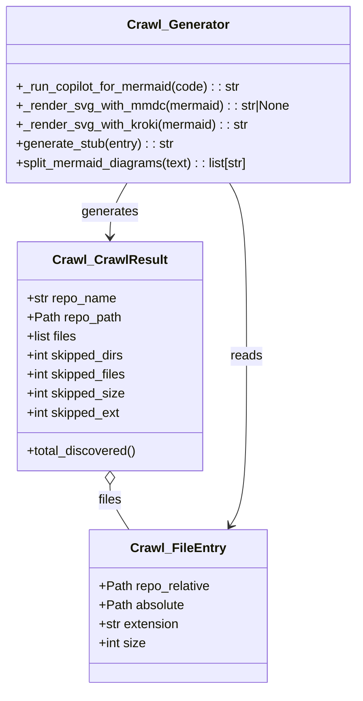
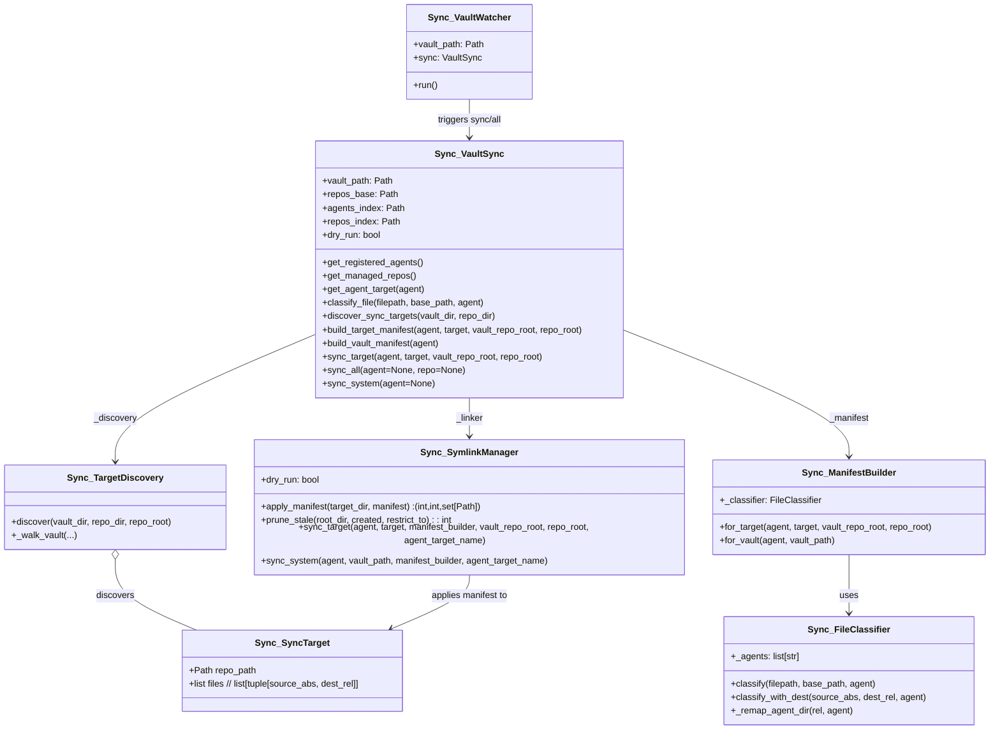

# Diagram: platform/partview_core/partview_service/partview_service/core/__init__.py


> Auto-generated by Obscura crawlers

## Diagram 1



### SVG

<svg id="container" width="446.6875" xmlns="http://www.w3.org/2000/svg" class="classDiagram" height="866" viewBox="0 0 446.6875 866" role="graphics-document document" aria-roledescription="class"><style>#container{font-family:"trebuchet ms",verdana,arial,sans-serif;font-size:16px;fill:#333;}@keyframes edge-animation-frame{from{stroke-dashoffset:0;}}@keyframes dash{to{stroke-dashoffset:0;}}#container .edge-animation-slow{stroke-dasharray:9,5!important;stroke-dashoffset:900;animation:dash 50s linear infinite;stroke-linecap:round;}#container .edge-animation-fast{stroke-dasharray:9,5!important;stroke-dashoffset:900;animation:dash 20s linear infinite;stroke-linecap:round;}#container .error-icon{fill:#552222;}#container .error-text{fill:#552222;stroke:#552222;}#container .edge-thickness-normal{stroke-width:1px;}#container .edge-thickness-thick{stroke-width:3.5px;}#container .edge-pattern-solid{stroke-dasharray:0;}#container .edge-thickness-invisible{stroke-width:0;fill:none;}#container .edge-pattern-dashed{stroke-dasharray:3;}#container .edge-pattern-dotted{stroke-dasharray:2;}#container .marker{fill:#333333;stroke:#333333;}#container .marker.cross{stroke:#333333;}#container svg{font-family:"trebuchet ms",verdana,arial,sans-serif;font-size:16px;}#container p{margin:0;}#container g.classGroup text{fill:#9370DB;stroke:none;font-family:"trebuchet ms",verdana,arial,sans-serif;font-size:10px;}#container g.classGroup text .title{font-weight:bolder;}#container .nodeLabel,#container .edgeLabel{color:#131300;}#container .edgeLabel .label rect{fill:#ECECFF;}#container .label text{fill:#131300;}#container .labelBkg{background:#ECECFF;}#container .edgeLabel .label span{background:#ECECFF;}#container .classTitle{font-weight:bolder;}#container .node rect,#container .node circle,#container .node ellipse,#container .node polygon,#container .node path{fill:#ECECFF;stroke:#9370DB;stroke-width:1px;}#container .divider{stroke:#9370DB;stroke-width:1;}#container g.clickable{cursor:pointer;}#container g.classGroup rect{fill:#ECECFF;stroke:#9370DB;}#container g.classGroup line{stroke:#9370DB;stroke-width:1;}#container .classLabel .box{stroke:none;stroke-width:0;fill:#ECECFF;opacity:0.5;}#container .classLabel .label{fill:#9370DB;font-size:10px;}#container .relation{stroke:#333333;stroke-width:1;fill:none;}#container .dashed-line{stroke-dasharray:3;}#container .dotted-line{stroke-dasharray:1 2;}#container #compositionStart,#container .composition{fill:#333333!important;stroke:#333333!important;stroke-width:1;}#container #compositionEnd,#container .composition{fill:#333333!important;stroke:#333333!important;stroke-width:1;}#container #dependencyStart,#container .dependency{fill:#333333!important;stroke:#333333!important;stroke-width:1;}#container #dependencyStart,#container .dependency{fill:#333333!important;stroke:#333333!important;stroke-width:1;}#container #extensionStart,#container .extension{fill:transparent!important;stroke:#333333!important;stroke-width:1;}#container #extensionEnd,#container .extension{fill:transparent!important;stroke:#333333!important;stroke-width:1;}#container #aggregationStart,#container .aggregation{fill:transparent!important;stroke:#333333!important;stroke-width:1;}#container #aggregationEnd,#container .aggregation{fill:transparent!important;stroke:#333333!important;stroke-width:1;}#container #lollipopStart,#container .lollipop{fill:#ECECFF!important;stroke:#333333!important;stroke-width:1;}#container #lollipopEnd,#container .lollipop{fill:#ECECFF!important;stroke:#333333!important;stroke-width:1;}#container .edgeTerminals{font-size:11px;line-height:initial;}#container .classTitleText{text-anchor:middle;font-size:18px;fill:#333;}#container .label-icon{display:inline-block;height:1em;overflow:visible;vertical-align:-0.125em;}#container .node .label-icon path{fill:currentColor;stroke:revert;stroke-width:revert;}#container :root{--mermaid-font-family:"trebuchet ms",verdana,arial,sans-serif;}</style><g><defs><marker id="container_class-aggregationStart" class="marker aggregation class" refX="18" refY="7" markerWidth="190" markerHeight="240" orient="auto"><path d="M 18,7 L9,13 L1,7 L9,1 Z"></path></marker></defs><defs><marker id="container_class-aggregationEnd" class="marker aggregation class" refX="1" refY="7" markerWidth="20" markerHeight="28" orient="auto"><path d="M 18,7 L9,13 L1,7 L9,1 Z"></path></marker></defs><defs><marker id="container_class-extensionStart" class="marker extension class" refX="18" refY="7" markerWidth="190" markerHeight="240" orient="auto"><path d="M 1,7 L18,13 V 1 Z"></path></marker></defs><defs><marker id="container_class-extensionEnd" class="marker extension class" refX="1" refY="7" markerWidth="20" markerHeight="28" orient="auto"><path d="M 1,1 V 13 L18,7 Z"></path></marker></defs><defs><marker id="container_class-compositionStart" class="marker composition class" refX="18" refY="7" markerWidth="190" markerHeight="240" orient="auto"><path d="M 18,7 L9,13 L1,7 L9,1 Z"></path></marker></defs><defs><marker id="container_class-compositionEnd" class="marker composition class" refX="1" refY="7" markerWidth="20" markerHeight="28" orient="auto"><path d="M 18,7 L9,13 L1,7 L9,1 Z"></path></marker></defs><defs><marker id="container_class-dependencyStart" class="marker dependency class" refX="6" refY="7" markerWidth="190" markerHeight="240" orient="auto"><path d="M 5,7 L9,13 L1,7 L9,1 Z"></path></marker></defs><defs><marker id="container_class-dependencyEnd" class="marker dependency class" refX="13" refY="7" markerWidth="20" markerHeight="28" orient="auto"><path d="M 18,7 L9,13 L14,7 L9,1 Z"></path></marker></defs><defs><marker id="container_class-lollipopStart" class="marker lollipop class" refX="13" refY="7" markerWidth="190" markerHeight="240" orient="auto"><circle stroke="black" fill="transparent" cx="7" cy="7" r="6"></circle></marker></defs><defs><marker id="container_class-lollipopEnd" class="marker lollipop class" refX="1" refY="7" markerWidth="190" markerHeight="240" orient="auto"><circle stroke="black" fill="transparent" cx="7" cy="7" r="6"></circle></marker></defs><g class="root"><g class="clusters"></g><g class="edgePaths"><path d="M138.34,609.25L138.34,612.542C138.34,615.833,138.34,622.417,142.281,631.875C146.222,641.333,154.105,653.667,158.046,659.833L161.988,666" id="id_Crawl_CrawlResult_Crawl_FileEntry_1" class="edge-thickness-normal edge-pattern-solid relation" style=";;;" data-edge="true" data-et="edge" data-id="id_Crawl_CrawlResult_Crawl_FileEntry_1" data-points="W3sieCI6MTM4LjMzOTg0Mzc1LCJ5Ijo1OTJ9LHsieCI6MTM4LjMzOTg0Mzc1LCJ5Ijo2Mjl9LHsieCI6MTYxLjk4NzU0Njk5MjQ4MTIsInkiOjY2Nn1d" marker-start="url(#container_class-aggregationStart)"></path><path d="M159.591,230L156.049,236.167C152.507,242.333,145.424,254.667,141.882,266C138.34,277.333,138.34,287.667,138.34,292.833L138.34,298" id="id_Crawl_Generator_Crawl_CrawlResult_2" class="edge-thickness-normal edge-pattern-solid relation" style=";;;" data-edge="true" data-et="edge" data-id="id_Crawl_Generator_Crawl_CrawlResult_2" data-points="W3sieCI6MTU5LjU5MDgyMDMxMjUsInkiOjIzMH0seyJ4IjoxMzguMzM5ODQzNzUsInkiOjI2N30seyJ4IjoxMzguMzM5ODQzNzUsInkiOjMwNH1d" marker-end="url(#container_class-dependencyEnd)"></path><path d="M287.097,230L290.639,236.167C294.18,242.333,301.264,254.667,304.806,291C308.348,327.333,308.348,387.667,308.348,448C308.348,508.333,308.348,568.667,304.945,604.157C301.542,639.648,294.737,650.296,291.334,655.62L287.931,660.944" id="id_Crawl_Generator_Crawl_FileEntry_3" class="edge-thickness-normal edge-pattern-solid relation" style=";;;" data-edge="true" data-et="edge" data-id="id_Crawl_Generator_Crawl_FileEntry_3" data-points="W3sieCI6Mjg3LjA5NjY3OTY4NzUsInkiOjIzMH0seyJ4IjozMDguMzQ3NjU2MjUsInkiOjI2N30seyJ4IjozMDguMzQ3NjU2MjUsInkiOjQ0OH0seyJ4IjozMDguMzQ3NjU2MjUsInkiOjYyOX0seyJ4IjoyODQuNjk5OTUzMDA3NTE4OCwieSI6NjY2fV0=" marker-end="url(#container_class-dependencyEnd)"></path></g><g class="edgeLabels"><g class="edgeLabel" transform="translate(138.33984375, 629)"><g class="label" data-id="id_Crawl_CrawlResult_Crawl_FileEntry_1" transform="translate(-15.0078125, -12)"><foreignObject width="30.015625" height="24"><div xmlns="http://www.w3.org/1999/xhtml" class="labelBkg" style="display: table-cell; white-space: nowrap; line-height: 1.5; max-width: 200px; text-align: center;"><span class="edgeLabel"><p>files</p></span></div></foreignObject></g></g><g class="edgeLabel" transform="translate(138.33984375, 267)"><g class="label" data-id="id_Crawl_Generator_Crawl_CrawlResult_2" transform="translate(-35.46875, -12)"><foreignObject width="70.9375" height="24"><div xmlns="http://www.w3.org/1999/xhtml" class="labelBkg" style="display: table-cell; white-space: nowrap; line-height: 1.5; max-width: 200px; text-align: center;"><span class="edgeLabel"><p>generates</p></span></div></foreignObject></g></g><g class="edgeLabel" transform="translate(308.34765625, 448)"><g class="label" data-id="id_Crawl_Generator_Crawl_FileEntry_3" transform="translate(-20.0078125, -12)"><foreignObject width="40.015625" height="24"><div xmlns="http://www.w3.org/1999/xhtml" class="labelBkg" style="display: table-cell; white-space: nowrap; line-height: 1.5; max-width: 200px; text-align: center;"><span class="edgeLabel"><p>reads</p></span></div></foreignObject></g></g></g><g class="nodes"><g class="node default" id="classId-Crawl_FileEntry-0" transform="translate(223.34375, 762)"><g class="basic label-container"><path d="M-110.23828125 -96 L110.23828125 -96 L110.23828125 96 L-110.23828125 96" stroke="none" stroke-width="0" fill="#ECECFF" style=""></path><path d="M-110.23828125 -96 C-46.25709594898615 -96, 17.724089352027704 -96, 110.23828125 -96 M-110.23828125 -96 C-23.919073441067596 -96, 62.40013436786481 -96, 110.23828125 -96 M110.23828125 -96 C110.23828125 -40.10062408822183, 110.23828125 15.798751823556344, 110.23828125 96 M110.23828125 -96 C110.23828125 -32.11003912735434, 110.23828125 31.77992174529132, 110.23828125 96 M110.23828125 96 C53.53186110579987 96, -3.174559038400261 96, -110.23828125 96 M110.23828125 96 C46.80292950888009 96, -16.63242223223982 96, -110.23828125 96 M-110.23828125 96 C-110.23828125 21.879254250195544, -110.23828125 -52.24149149960891, -110.23828125 -96 M-110.23828125 96 C-110.23828125 45.67111482230503, -110.23828125 -4.6577703553899426, -110.23828125 -96" stroke="#9370DB" stroke-width="1.3" fill="none" stroke-dasharray="0 0" style=""></path></g><g class="annotation-group text" transform="translate(0, -72)"></g><g class="label-group text" transform="translate(-56.1640625, -72)"><g class="label" style="font-weight: bolder" transform="translate(0,-12)"><foreignObject width="112.328125" height="24"><div xmlns="http://www.w3.org/1999/xhtml" style="display: table-cell; white-space: nowrap; line-height: 1.5; max-width: 160px; text-align: center;"><span class="nodeLabel markdown-node-label" style=""><p>Crawl_FileEntry</p></span></div></foreignObject></g></g><g class="members-group text" transform="translate(-98.23828125, -24)"><g class="label" style="" transform="translate(0,-12)"><foreignObject width="140.3125" height="24"><div xmlns="http://www.w3.org/1999/xhtml" style="display: table-cell; white-space: nowrap; line-height: 1.5; max-width: 198px; text-align: center;"><span class="nodeLabel markdown-node-label" style=""><p>+Path repo_relative</p></span></div></foreignObject></g><g class="label" style="" transform="translate(0,12)"><foreignObject width="107.78125" height="24"><div xmlns="http://www.w3.org/1999/xhtml" style="display: table-cell; white-space: nowrap; line-height: 1.5; max-width: 165px; text-align: center;"><span class="nodeLabel markdown-node-label" style=""><p>+Path absolute</p></span></div></foreignObject></g><g class="label" style="" transform="translate(0,36)"><foreignObject width="102.328125" height="24"><div xmlns="http://www.w3.org/1999/xhtml" style="display: table-cell; white-space: nowrap; line-height: 1.5; max-width: 160px; text-align: center;"><span class="nodeLabel markdown-node-label" style=""><p>+str extension</p></span></div></foreignObject></g><g class="label" style="" transform="translate(0,60)"><foreignObject width="59.484375" height="24"><div xmlns="http://www.w3.org/1999/xhtml" style="display: table-cell; white-space: nowrap; line-height: 1.5; max-width: 117px; text-align: center;"><span class="nodeLabel markdown-node-label" style=""><p>+int size</p></span></div></foreignObject></g></g><g class="methods-group text" transform="translate(-98.23828125, 96)"></g><g class="divider" style=""><path d="M-110.23828125 -48 C-52.0060623197102 -48, 6.226156610579594 -48, 110.23828125 -48 M-110.23828125 -48 C-42.75233671245989 -48, 24.733607825080213 -48, 110.23828125 -48" stroke="#9370DB" stroke-width="1.3" fill="none" stroke-dasharray="0 0" style=""></path></g><g class="divider" style=""><path d="M-110.23828125 72 C-61.30593614955427 72, -12.37359104910854 72, 110.23828125 72 M-110.23828125 72 C-26.896831938434545 72, 56.44461737313091 72, 110.23828125 72" stroke="#9370DB" stroke-width="1.3" fill="none" stroke-dasharray="0 0" style=""></path></g></g><g class="node default" id="classId-Crawl_CrawlResult-1" transform="translate(138.33984375, 448)"><g class="basic label-container"><path d="M-115 -144 L115 -144 L115 144 L-115 144" stroke="none" stroke-width="0" fill="#ECECFF" style=""></path><path d="M-115 -144 C-29.84497798108052 -144, 55.31004403783896 -144, 115 -144 M-115 -144 C-66.85919149721065 -144, -18.71838299442129 -144, 115 -144 M115 -144 C115 -33.83842812219359, 115 76.32314375561282, 115 144 M115 -144 C115 -73.85289835261509, 115 -3.7057967052301706, 115 144 M115 144 C40.30109660861659 144, -34.39780678276682 144, -115 144 M115 144 C28.673851770202603 144, -57.652296459594794 144, -115 144 M-115 144 C-115 69.04736835053241, -115 -5.905263298935182, -115 -144 M-115 144 C-115 35.275991017036844, -115 -73.44801796592631, -115 -144" stroke="#9370DB" stroke-width="1.3" fill="none" stroke-dasharray="0 0" style=""></path></g><g class="annotation-group text" transform="translate(0, -120)"></g><g class="label-group text" transform="translate(-67.265625, -120)"><g class="label" style="font-weight: bolder" transform="translate(0,-12)"><foreignObject width="134.53125" height="24"><div xmlns="http://www.w3.org/1999/xhtml" style="display: table-cell; white-space: nowrap; line-height: 1.5; max-width: 182px; text-align: center;"><span class="nodeLabel markdown-node-label" style=""><p>Crawl_CrawlResult</p></span></div></foreignObject></g></g><g class="members-group text" transform="translate(-103, -72)"><g class="label" style="" transform="translate(0,-12)"><foreignObject width="113.4375" height="24"><div xmlns="http://www.w3.org/1999/xhtml" style="display: table-cell; white-space: nowrap; line-height: 1.5; max-width: 171px; text-align: center;"><span class="nodeLabel markdown-node-label" style=""><p>+str repo_name</p></span></div></foreignObject></g><g class="label" style="" transform="translate(0,12)"><foreignObject width="118.96875" height="24"><div xmlns="http://www.w3.org/1999/xhtml" style="display: table-cell; white-space: nowrap; line-height: 1.5; max-width: 176px; text-align: center;"><span class="nodeLabel markdown-node-label" style=""><p>+Path repo_path</p></span></div></foreignObject></g><g class="label" style="" transform="translate(0,36)"><foreignObject width="64.6875" height="24"><div xmlns="http://www.w3.org/1999/xhtml" style="display: table-cell; white-space: nowrap; line-height: 1.5; max-width: 122px; text-align: center;"><span class="nodeLabel markdown-node-label" style=""><p>+list files</p></span></div></foreignObject></g><g class="label" style="" transform="translate(0,60)"><foreignObject width="124.859375" height="24"><div xmlns="http://www.w3.org/1999/xhtml" style="display: table-cell; white-space: nowrap; line-height: 1.5; max-width: 182px; text-align: center;"><span class="nodeLabel markdown-node-label" style=""><p>+int skipped_dirs</p></span></div></foreignObject></g><g class="label" style="" transform="translate(0,84)"><foreignObject width="127.375" height="24"><div xmlns="http://www.w3.org/1999/xhtml" style="display: table-cell; white-space: nowrap; line-height: 1.5; max-width: 185px; text-align: center;"><span class="nodeLabel markdown-node-label" style=""><p>+int skipped_files</p></span></div></foreignObject></g><g class="label" style="" transform="translate(0,108)"><foreignObject width="125.265625" height="24"><div xmlns="http://www.w3.org/1999/xhtml" style="display: table-cell; white-space: nowrap; line-height: 1.5; max-width: 183px; text-align: center;"><span class="nodeLabel markdown-node-label" style=""><p>+int skipped_size</p></span></div></foreignObject></g><g class="label" style="" transform="translate(0,132)"><foreignObject width="119.484375" height="24"><div xmlns="http://www.w3.org/1999/xhtml" style="display: table-cell; white-space: nowrap; line-height: 1.5; max-width: 177px; text-align: center;"><span class="nodeLabel markdown-node-label" style=""><p>+int skipped_ext</p></span></div></foreignObject></g></g><g class="methods-group text" transform="translate(-103, 120)"><g class="label" style="" transform="translate(0,-12)"><foreignObject width="138.734375" height="24"><div xmlns="http://www.w3.org/1999/xhtml" style="display: table-cell; white-space: nowrap; line-height: 1.5; max-width: 196px; text-align: center;"><span class="nodeLabel markdown-node-label" style=""><p>+total_discovered()</p></span></div></foreignObject></g></g><g class="divider" style=""><path d="M-115 -96 C-35.55079905785999 -96, 43.89840188428002 -96, 115 -96 M-115 -96 C-25.530538521834117 -96, 63.938922956331766 -96, 115 -96" stroke="#9370DB" stroke-width="1.3" fill="none" stroke-dasharray="0 0" style=""></path></g><g class="divider" style=""><path d="M-115 96 C-51.09216735932074 96, 12.81566528135852 96, 115 96 M-115 96 C-48.68928325462957 96, 17.621433490740856 96, 115 96" stroke="#9370DB" stroke-width="1.3" fill="none" stroke-dasharray="0 0" style=""></path></g></g><g class="node default" id="classId-Crawl_Generator-2" transform="translate(223.34375, 119)"><g class="basic label-container"><path d="M-215.34375 -111 L215.34375 -111 L215.34375 111 L-215.34375 111" stroke="none" stroke-width="0" fill="#ECECFF" style=""></path><path d="M-215.34375 -111 C-116.85922881565315 -111, -18.374707631306308 -111, 215.34375 -111 M-215.34375 -111 C-46.33540816803273 -111, 122.67293366393454 -111, 215.34375 -111 M215.34375 -111 C215.34375 -44.58940683057581, 215.34375 21.821186338848378, 215.34375 111 M215.34375 -111 C215.34375 -43.89791891199964, 215.34375 23.20416217600072, 215.34375 111 M215.34375 111 C53.14522542631417 111, -109.05329914737166 111, -215.34375 111 M215.34375 111 C63.528151294341455 111, -88.28744741131709 111, -215.34375 111 M-215.34375 111 C-215.34375 40.38774880344394, -215.34375 -30.224502393112118, -215.34375 -111 M-215.34375 111 C-215.34375 35.13085385382561, -215.34375 -40.738292292348774, -215.34375 -111" stroke="#9370DB" stroke-width="1.3" fill="none" stroke-dasharray="0 0" style=""></path></g><g class="annotation-group text" transform="translate(0, -87)"></g><g class="label-group text" transform="translate(-60.734375, -87)"><g class="label" style="font-weight: bolder" transform="translate(0,-12)"><foreignObject width="121.46875" height="24"><div xmlns="http://www.w3.org/1999/xhtml" style="display: table-cell; white-space: nowrap; line-height: 1.5; max-width: 170px; text-align: center;"><span class="nodeLabel markdown-node-label" style=""><p>Crawl_Generator</p></span></div></foreignObject></g></g><g class="members-group text" transform="translate(-203.34375, -39)"></g><g class="methods-group text" transform="translate(-203.34375, -9)"><g class="label" style="" transform="translate(0,-12)"><foreignObject width="284.328125" height="24"><div xmlns="http://www.w3.org/1999/xhtml" style="display: table-cell; white-space: nowrap; line-height: 1.5; max-width: 343px; text-align: center;"><span class="nodeLabel markdown-node-label" style=""><p>+_run_copilot_for_mermaid(code) : : str</p></span></div></foreignObject></g><g class="label" style="" transform="translate(0,12)"><foreignObject width="345.953125" height="24"><div xmlns="http://www.w3.org/1999/xhtml" style="display: table-cell; white-space: nowrap; line-height: 1.5; max-width: 403px; text-align: center;"><span class="nodeLabel markdown-node-label" style=""><p>+_render_svg_with_mmdc(mermaid) : : str|None</p></span></div></foreignObject></g><g class="label" style="" transform="translate(0,36)"><foreignObject width="292.4375" height="24"><div xmlns="http://www.w3.org/1999/xhtml" style="display: table-cell; white-space: nowrap; line-height: 1.5; max-width: 351px; text-align: center;"><span class="nodeLabel markdown-node-label" style=""><p>+_render_svg_with_kroki(mermaid) : : str</p></span></div></foreignObject></g><g class="label" style="" transform="translate(0,60)"><foreignObject width="199.625" height="24"><div xmlns="http://www.w3.org/1999/xhtml" style="display: table-cell; white-space: nowrap; line-height: 1.5; max-width: 258px; text-align: center;"><span class="nodeLabel markdown-node-label" style=""><p>+generate_stub(entry) : : str</p></span></div></foreignObject></g><g class="label" style="" transform="translate(0,84)"><foreignObject width="298.40625" height="24"><div xmlns="http://www.w3.org/1999/xhtml" style="display: table-cell; white-space: nowrap; line-height: 1.5; max-width: 356px; text-align: center;"><span class="nodeLabel markdown-node-label" style=""><p>+split_mermaid_diagrams(text) : : list[str]</p></span></div></foreignObject></g></g><g class="divider" style=""><path d="M-215.34375 -63 C-111.82479017142322 -63, -8.305830342846434 -63, 215.34375 -63 M-215.34375 -63 C-118.78606662782967 -63, -22.228383255659338 -63, 215.34375 -63" stroke="#9370DB" stroke-width="1.3" fill="none" stroke-dasharray="0 0" style=""></path></g><g class="divider" style=""><path d="M-215.34375 -39 C-115.14704758905829 -39, -14.950345178116578 -39, 215.34375 -39 M-215.34375 -39 C-105.45025682871892 -39, 4.443236342562159 -39, 215.34375 -39" stroke="#9370DB" stroke-width="1.3" fill="none" stroke-dasharray="0 0" style=""></path></g></g></g></g></g></svg>

## Diagram 2

```mermaid
flowchart LR
    CR[crawl_repo(repo_path)] --> R[CrawlResult]
    R --> WO[write_output(result, output_dir)]
    WO --> PROC{for each FileEntry}
    PROC --> GS[generate_stub(entry)]
    GS --> COP[_run_copilot_for_mermaid(code)]
    COP --> SPLIT[split_mermaid_diagrams(raw_mermaid)]
    SPLIT --> WRITE_MD[write fenced Mermaid blocks]
    COP --> REND{render SVG}
    REND --> MM[_render_svg_with_mmdc]
    REND --> KR[_render_svg_with_kroki]
    MM --> WRITE_MD
    KR --> WRITE_MD
    WRITE_MD --> FS[write .md files + INDEX.md]
```

> SVG rendering failed for this diagram.

## Diagram 3



### SVG

<svg id="container" width="1777.421875" xmlns="http://www.w3.org/2000/svg" class="classDiagram" height="1270" viewBox="0 0 1777.421875 1270" role="graphics-document document" aria-roledescription="class"><style>#container{font-family:"trebuchet ms",verdana,arial,sans-serif;font-size:16px;fill:#333;}@keyframes edge-animation-frame{from{stroke-dashoffset:0;}}@keyframes dash{to{stroke-dashoffset:0;}}#container .edge-animation-slow{stroke-dasharray:9,5!important;stroke-dashoffset:900;animation:dash 50s linear infinite;stroke-linecap:round;}#container .edge-animation-fast{stroke-dasharray:9,5!important;stroke-dashoffset:900;animation:dash 20s linear infinite;stroke-linecap:round;}#container .error-icon{fill:#552222;}#container .error-text{fill:#552222;stroke:#552222;}#container .edge-thickness-normal{stroke-width:1px;}#container .edge-thickness-thick{stroke-width:3.5px;}#container .edge-pattern-solid{stroke-dasharray:0;}#container .edge-thickness-invisible{stroke-width:0;fill:none;}#container .edge-pattern-dashed{stroke-dasharray:3;}#container .edge-pattern-dotted{stroke-dasharray:2;}#container .marker{fill:#333333;stroke:#333333;}#container .marker.cross{stroke:#333333;}#container svg{font-family:"trebuchet ms",verdana,arial,sans-serif;font-size:16px;}#container p{margin:0;}#container g.classGroup text{fill:#9370DB;stroke:none;font-family:"trebuchet ms",verdana,arial,sans-serif;font-size:10px;}#container g.classGroup text .title{font-weight:bolder;}#container .nodeLabel,#container .edgeLabel{color:#131300;}#container .edgeLabel .label rect{fill:#ECECFF;}#container .label text{fill:#131300;}#container .labelBkg{background:#ECECFF;}#container .edgeLabel .label span{background:#ECECFF;}#container .classTitle{font-weight:bolder;}#container .node rect,#container .node circle,#container .node ellipse,#container .node polygon,#container .node path{fill:#ECECFF;stroke:#9370DB;stroke-width:1px;}#container .divider{stroke:#9370DB;stroke-width:1;}#container g.clickable{cursor:pointer;}#container g.classGroup rect{fill:#ECECFF;stroke:#9370DB;}#container g.classGroup line{stroke:#9370DB;stroke-width:1;}#container .classLabel .box{stroke:none;stroke-width:0;fill:#ECECFF;opacity:0.5;}#container .classLabel .label{fill:#9370DB;font-size:10px;}#container .relation{stroke:#333333;stroke-width:1;fill:none;}#container .dashed-line{stroke-dasharray:3;}#container .dotted-line{stroke-dasharray:1 2;}#container #compositionStart,#container .composition{fill:#333333!important;stroke:#333333!important;stroke-width:1;}#container #compositionEnd,#container .composition{fill:#333333!important;stroke:#333333!important;stroke-width:1;}#container #dependencyStart,#container .dependency{fill:#333333!important;stroke:#333333!important;stroke-width:1;}#container #dependencyStart,#container .dependency{fill:#333333!important;stroke:#333333!important;stroke-width:1;}#container #extensionStart,#container .extension{fill:transparent!important;stroke:#333333!important;stroke-width:1;}#container #extensionEnd,#container .extension{fill:transparent!important;stroke:#333333!important;stroke-width:1;}#container #aggregationStart,#container .aggregation{fill:transparent!important;stroke:#333333!important;stroke-width:1;}#container #aggregationEnd,#container .aggregation{fill:transparent!important;stroke:#333333!important;stroke-width:1;}#container #lollipopStart,#container .lollipop{fill:#ECECFF!important;stroke:#333333!important;stroke-width:1;}#container #lollipopEnd,#container .lollipop{fill:#ECECFF!important;stroke:#333333!important;stroke-width:1;}#container .edgeTerminals{font-size:11px;line-height:initial;}#container .classTitleText{text-anchor:middle;font-size:18px;fill:#333;}#container .label-icon{display:inline-block;height:1em;overflow:visible;vertical-align:-0.125em;}#container .node .label-icon path{fill:currentColor;stroke:revert;stroke-width:revert;}#container :root{--mermaid-font-family:"trebuchet ms",verdana,arial,sans-serif;}</style><g><defs><marker id="container_class-aggregationStart" class="marker aggregation class" refX="18" refY="7" markerWidth="190" markerHeight="240" orient="auto"><path d="M 18,7 L9,13 L1,7 L9,1 Z"></path></marker></defs><defs><marker id="container_class-aggregationEnd" class="marker aggregation class" refX="1" refY="7" markerWidth="20" markerHeight="28" orient="auto"><path d="M 18,7 L9,13 L1,7 L9,1 Z"></path></marker></defs><defs><marker id="container_class-extensionStart" class="marker extension class" refX="18" refY="7" markerWidth="190" markerHeight="240" orient="auto"><path d="M 1,7 L18,13 V 1 Z"></path></marker></defs><defs><marker id="container_class-extensionEnd" class="marker extension class" refX="1" refY="7" markerWidth="20" markerHeight="28" orient="auto"><path d="M 1,1 V 13 L18,7 Z"></path></marker></defs><defs><marker id="container_class-compositionStart" class="marker composition class" refX="18" refY="7" markerWidth="190" markerHeight="240" orient="auto"><path d="M 18,7 L9,13 L1,7 L9,1 Z"></path></marker></defs><defs><marker id="container_class-compositionEnd" class="marker composition class" refX="1" refY="7" markerWidth="20" markerHeight="28" orient="auto"><path d="M 18,7 L9,13 L1,7 L9,1 Z"></path></marker></defs><defs><marker id="container_class-dependencyStart" class="marker dependency class" refX="6" refY="7" markerWidth="190" markerHeight="240" orient="auto"><path d="M 5,7 L9,13 L1,7 L9,1 Z"></path></marker></defs><defs><marker id="container_class-dependencyEnd" class="marker dependency class" refX="13" refY="7" markerWidth="20" markerHeight="28" orient="auto"><path d="M 18,7 L9,13 L14,7 L9,1 Z"></path></marker></defs><defs><marker id="container_class-lollipopStart" class="marker lollipop class" refX="13" refY="7" markerWidth="190" markerHeight="240" orient="auto"><circle stroke="black" fill="transparent" cx="7" cy="7" r="6"></circle></marker></defs><defs><marker id="container_class-lollipopEnd" class="marker lollipop class" refX="1" refY="7" markerWidth="190" markerHeight="240" orient="auto"><circle stroke="black" fill="transparent" cx="7" cy="7" r="6"></circle></marker></defs><g class="root"><g class="clusters"></g><g class="edgePaths"><path d="M1525.957,972L1525.957,982.167C1525.957,992.333,1525.957,1012.667,1525.957,1028C1525.957,1043.333,1525.957,1053.667,1525.957,1058.833L1525.957,1064" id="id_Sync_ManifestBuilder_Sync_FileClassifier_1" class="edge-thickness-normal edge-pattern-solid relation" style=";;;" data-edge="true" data-et="edge" data-id="id_Sync_ManifestBuilder_Sync_FileClassifier_1" data-points="W3sieCI6MTUyNS45NTcwMzEyNSwieSI6OTcyfSx7IngiOjE1MjUuOTU3MDMxMjUsInkiOjEwMzN9LHsieCI6MTUyNS45NTcwMzEyNSwieSI6MTA3MH1d" marker-end="url(#container_class-dependencyEnd)"></path><path d="M564.773,593.225L504.746,618.188C444.719,643.15,324.664,693.075,264.637,728.704C204.609,764.333,204.609,785.667,204.609,796.333L204.609,807" id="id_Sync_VaultSync_Sync_TargetDiscovery_2" class="edge-thickness-normal edge-pattern-solid relation" style=";;;" data-edge="true" data-et="edge" data-id="id_Sync_VaultSync_Sync_TargetDiscovery_2" data-points="W3sieCI6NTY0Ljc3MzQzNzUsInkiOjU5My4yMjUwODk2NDk2NzY2fSx7IngiOjIwNC42MDkzNzUsInkiOjc0M30seyJ4IjoyMDQuNjA5Mzc1LCJ5Ijo4MTN9XQ==" marker-end="url(#container_class-dependencyEnd)"></path><path d="M841.855,706L841.855,712.167C841.855,718.333,841.855,730.667,841.855,742C841.855,753.333,841.855,763.667,841.855,768.833L841.855,774" id="id_Sync_VaultSync_Sync_SymlinkManager_3" class="edge-thickness-normal edge-pattern-solid relation" style=";;;" data-edge="true" data-et="edge" data-id="id_Sync_VaultSync_Sync_SymlinkManager_3" data-points="W3sieCI6ODQxLjg1NTQ2ODc1LCJ5Ijo3MDZ9LHsieCI6ODQxLjg1NTQ2ODc1LCJ5Ijo3NDN9LHsieCI6ODQxLjg1NTQ2ODc1LCJ5Ijo3ODB9XQ==" marker-end="url(#container_class-dependencyEnd)"></path><path d="M1118.938,585.333L1186.774,611.611C1254.611,637.889,1390.284,690.444,1458.12,725.889C1525.957,761.333,1525.957,779.667,1525.957,788.833L1525.957,798" id="id_Sync_VaultSync_Sync_ManifestBuilder_4" class="edge-thickness-normal edge-pattern-solid relation" style=";;;" data-edge="true" data-et="edge" data-id="id_Sync_VaultSync_Sync_ManifestBuilder_4" data-points="W3sieCI6MTExOC45Mzc1LCJ5Ijo1ODUuMzMzMDk1NDE0ODM0N30seyJ4IjoxNTI1Ljk1NzAzMTI1LCJ5Ijo3NDN9LHsieCI6MTUyNS45NTcwMzEyNSwieSI6ODA0fV0=" marker-end="url(#container_class-dependencyEnd)"></path><path d="M204.609,980.25L204.609,989.042C204.609,997.833,204.609,1015.417,228.965,1034.375C253.321,1053.333,302.033,1073.667,326.389,1083.833L350.745,1094" id="id_Sync_TargetDiscovery_Sync_SyncTarget_5" class="edge-thickness-normal edge-pattern-solid relation" style=";;;" data-edge="true" data-et="edge" data-id="id_Sync_TargetDiscovery_Sync_SyncTarget_5" data-points="W3sieCI6MjA0LjYwOTM3NSwieSI6OTYzfSx7IngiOjIwNC42MDkzNzUsInkiOjEwMzN9LHsieCI6MzUwLjc0NDc1NzQwMTMxNTgsInkiOjEwOTR9XQ==" marker-start="url(#container_class-aggregationStart)"></path><path d="M841.855,996L841.855,1002.167C841.855,1008.333,841.855,1020.667,818.422,1036.615C794.989,1052.563,748.123,1072.126,724.69,1081.907L701.257,1091.689" id="id_Sync_SymlinkManager_Sync_SyncTarget_6" class="edge-thickness-normal edge-pattern-solid relation" style=";;;" data-edge="true" data-et="edge" data-id="id_Sync_SymlinkManager_Sync_SyncTarget_6" data-points="W3sieCI6ODQxLjg1NTQ2ODc1LCJ5Ijo5OTZ9LHsieCI6ODQxLjg1NTQ2ODc1LCJ5IjoxMDMzfSx7IngiOjY5NS43MjAwODYzNDg2ODQyLCJ5IjoxMDk0fV0=" marker-end="url(#container_class-dependencyEnd)"></path><path d="M841.855,176L841.855,182.167C841.855,188.333,841.855,200.667,841.855,212C841.855,223.333,841.855,233.667,841.855,238.833L841.855,244" id="id_Sync_VaultWatcher_Sync_VaultSync_7" class="edge-thickness-normal edge-pattern-solid relation" style=";;;" data-edge="true" data-et="edge" data-id="id_Sync_VaultWatcher_Sync_VaultSync_7" data-points="W3sieCI6ODQxLjg1NTQ2ODc1LCJ5IjoxNzZ9LHsieCI6ODQxLjg1NTQ2ODc1LCJ5IjoyMTN9LHsieCI6ODQxLjg1NTQ2ODc1LCJ5IjoyNTB9XQ==" marker-end="url(#container_class-dependencyEnd)"></path></g><g class="edgeLabels"><g class="edgeLabel" transform="translate(1525.95703125, 1033)"><g class="label" data-id="id_Sync_ManifestBuilder_Sync_FileClassifier_1" transform="translate(-16.4921875, -12)"><foreignObject width="32.984375" height="24"><div xmlns="http://www.w3.org/1999/xhtml" class="labelBkg" style="display: table-cell; white-space: nowrap; line-height: 1.5; max-width: 200px; text-align: center;"><span class="edgeLabel"><p>uses</p></span></div></foreignObject></g></g><g class="edgeLabel" transform="translate(204.609375, 743)"><g class="label" data-id="id_Sync_VaultSync_Sync_TargetDiscovery_2" transform="translate(-38.375, -12)"><foreignObject width="76.75" height="24"><div xmlns="http://www.w3.org/1999/xhtml" class="labelBkg" style="display: table-cell; white-space: nowrap; line-height: 1.5; max-width: 200px; text-align: center;"><span class="edgeLabel"><p>_discovery</p></span></div></foreignObject></g></g><g class="edgeLabel" transform="translate(841.85546875, 743)"><g class="label" data-id="id_Sync_VaultSync_Sync_SymlinkManager_3" transform="translate(-24.84375, -12)"><foreignObject width="49.6875" height="24"><div xmlns="http://www.w3.org/1999/xhtml" class="labelBkg" style="display: table-cell; white-space: nowrap; line-height: 1.5; max-width: 200px; text-align: center;"><span class="edgeLabel"><p>_linker</p></span></div></foreignObject></g></g><g class="edgeLabel" transform="translate(1525.95703125, 743)"><g class="label" data-id="id_Sync_VaultSync_Sync_ManifestBuilder_4" transform="translate(-35.8984375, -12)"><foreignObject width="71.796875" height="24"><div xmlns="http://www.w3.org/1999/xhtml" class="labelBkg" style="display: table-cell; white-space: nowrap; line-height: 1.5; max-width: 200px; text-align: center;"><span class="edgeLabel"><p>_manifest</p></span></div></foreignObject></g></g><g class="edgeLabel" transform="translate(204.609375, 1033)"><g class="label" data-id="id_Sync_TargetDiscovery_Sync_SyncTarget_5" transform="translate(-34.0546875, -12)"><foreignObject width="68.109375" height="24"><div xmlns="http://www.w3.org/1999/xhtml" class="labelBkg" style="display: table-cell; white-space: nowrap; line-height: 1.5; max-width: 200px; text-align: center;"><span class="edgeLabel"><p>discovers</p></span></div></foreignObject></g></g><g class="edgeLabel" transform="translate(841.85546875, 1033)"><g class="label" data-id="id_Sync_SymlinkManager_Sync_SyncTarget_6" transform="translate(-69.96875, -12)"><foreignObject width="139.9375" height="24"><div xmlns="http://www.w3.org/1999/xhtml" class="labelBkg" style="display: table-cell; white-space: nowrap; line-height: 1.5; max-width: 200px; text-align: center;"><span class="edgeLabel"><p>applies manifest to</p></span></div></foreignObject></g></g><g class="edgeLabel" transform="translate(841.85546875, 213)"><g class="label" data-id="id_Sync_VaultWatcher_Sync_VaultSync_7" transform="translate(-58.3828125, -12)"><foreignObject width="116.765625" height="24"><div xmlns="http://www.w3.org/1999/xhtml" class="labelBkg" style="display: table-cell; white-space: nowrap; line-height: 1.5; max-width: 200px; text-align: center;"><span class="edgeLabel"><p>triggers sync/all</p></span></div></foreignObject></g></g></g><g class="nodes"><g class="node default" id="classId-Sync_SyncTarget-0" transform="translate(523.232421875, 1166)"><g class="basic label-container"><path d="M-201.2578125 -72 L201.2578125 -72 L201.2578125 72 L-201.2578125 72" stroke="none" stroke-width="0" fill="#ECECFF" style=""></path><path d="M-201.2578125 -72 C-70.97008610922961 -72, 59.317640281540776 -72, 201.2578125 -72 M-201.2578125 -72 C-116.12744737949608 -72, -30.99708225899215 -72, 201.2578125 -72 M201.2578125 -72 C201.2578125 -27.206039219304664, 201.2578125 17.587921561390672, 201.2578125 72 M201.2578125 -72 C201.2578125 -21.773016788180712, 201.2578125 28.453966423638576, 201.2578125 72 M201.2578125 72 C92.02182500221002 72, -17.214162495579956 72, -201.2578125 72 M201.2578125 72 C92.97579336614493 72, -15.306225767710146 72, -201.2578125 72 M-201.2578125 72 C-201.2578125 24.276604836794434, -201.2578125 -23.446790326411133, -201.2578125 -72 M-201.2578125 72 C-201.2578125 32.97182968228464, -201.2578125 -6.056340635430715, -201.2578125 -72" stroke="#9370DB" stroke-width="1.3" fill="none" stroke-dasharray="0 0" style=""></path></g><g class="annotation-group text" transform="translate(0, -48)"></g><g class="label-group text" transform="translate(-61.328125, -48)"><g class="label" style="font-weight: bolder" transform="translate(0,-12)"><foreignObject width="122.65625" height="24"><div xmlns="http://www.w3.org/1999/xhtml" style="display: table-cell; white-space: nowrap; line-height: 1.5; max-width: 170px; text-align: center;"><span class="nodeLabel markdown-node-label" style=""><p>Sync_SyncTarget</p></span></div></foreignObject></g></g><g class="members-group text" transform="translate(-189.2578125, 0)"><g class="label" style="" transform="translate(0,-12)"><foreignObject width="118.96875" height="24"><div xmlns="http://www.w3.org/1999/xhtml" style="display: table-cell; white-space: nowrap; line-height: 1.5; max-width: 176px; text-align: center;"><span class="nodeLabel markdown-node-label" style=""><p>+Path repo_path</p></span></div></foreignObject></g><g class="label" style="" transform="translate(0,12)"><foreignObject width="317.1875" height="24"><div xmlns="http://www.w3.org/1999/xhtml" style="display: table-cell; white-space: nowrap; line-height: 1.5; max-width: 375px; text-align: center;"><span class="nodeLabel markdown-node-label" style=""><p>+list files  // list[tuple[source_abs, dest_rel]]</p></span></div></foreignObject></g></g><g class="methods-group text" transform="translate(-189.2578125, 72)"></g><g class="divider" style=""><path d="M-201.2578125 -24 C-82.70242618278361 -24, 35.85296013443278 -24, 201.2578125 -24 M-201.2578125 -24 C-62.684284607649516 -24, 75.88924328470097 -24, 201.2578125 -24" stroke="#9370DB" stroke-width="1.3" fill="none" stroke-dasharray="0 0" style=""></path></g><g class="divider" style=""><path d="M-201.2578125 48 C-48.764534515654304 48, 103.72874346869139 48, 201.2578125 48 M-201.2578125 48 C-98.99853105899199 48, 3.2607503820160275 48, 201.2578125 48" stroke="#9370DB" stroke-width="1.3" fill="none" stroke-dasharray="0 0" style=""></path></g></g><g class="node default" id="classId-Sync_FileClassifier-1" transform="translate(1525.95703125, 1166)"><g class="basic label-container"><path d="M-219.10546875 -96 L219.10546875 -96 L219.10546875 96 L-219.10546875 96" stroke="none" stroke-width="0" fill="#ECECFF" style=""></path><path d="M-219.10546875 -96 C-61.29492533600251 -96, 96.51561807799499 -96, 219.10546875 -96 M-219.10546875 -96 C-71.37614336301073 -96, 76.35318202397855 -96, 219.10546875 -96 M219.10546875 -96 C219.10546875 -46.88552615185464, 219.10546875 2.2289476962907173, 219.10546875 96 M219.10546875 -96 C219.10546875 -47.56626771202808, 219.10546875 0.867464575943842, 219.10546875 96 M219.10546875 96 C103.64657279213067 96, -11.812323165738661 96, -219.10546875 96 M219.10546875 96 C75.60538778103884 96, -67.89469318792231 96, -219.10546875 96 M-219.10546875 96 C-219.10546875 46.58897962577802, -219.10546875 -2.8220407484439534, -219.10546875 -96 M-219.10546875 96 C-219.10546875 53.45906288459112, -219.10546875 10.91812576918224, -219.10546875 -96" stroke="#9370DB" stroke-width="1.3" fill="none" stroke-dasharray="0 0" style=""></path></g><g class="annotation-group text" transform="translate(0, -72)"></g><g class="label-group text" transform="translate(-67.4296875, -72)"><g class="label" style="font-weight: bolder" transform="translate(0,-12)"><foreignObject width="134.859375" height="24"><div xmlns="http://www.w3.org/1999/xhtml" style="display: table-cell; white-space: nowrap; line-height: 1.5; max-width: 183px; text-align: center;"><span class="nodeLabel markdown-node-label" style=""><p>Sync_FileClassifier</p></span></div></foreignObject></g></g><g class="members-group text" transform="translate(-207.10546875, -24)"><g class="label" style="" transform="translate(0,-12)"><foreignObject width="122.921875" height="24"><div xmlns="http://www.w3.org/1999/xhtml" style="display: table-cell; white-space: nowrap; line-height: 1.5; max-width: 180px; text-align: center;"><span class="nodeLabel markdown-node-label" style=""><p>+_agents: list[str]</p></span></div></foreignObject></g></g><g class="methods-group text" transform="translate(-207.10546875, 24)"><g class="label" style="" transform="translate(0,-12)"><foreignObject width="259.34375" height="24"><div xmlns="http://www.w3.org/1999/xhtml" style="display: table-cell; white-space: nowrap; line-height: 1.5; max-width: 317px; text-align: center;"><span class="nodeLabel markdown-node-label" style=""><p>+classify(filepath, base_path, agent)</p></span></div></foreignObject></g><g class="label" style="" transform="translate(0,12)"><foreignObject width="346.78125" height="24"><div xmlns="http://www.w3.org/1999/xhtml" style="display: table-cell; white-space: nowrap; line-height: 1.5; max-width: 404px; text-align: center;"><span class="nodeLabel markdown-node-label" style=""><p>+classify_with_dest(source_abs, dest_rel, agent)</p></span></div></foreignObject></g><g class="label" style="" transform="translate(0,36)"><foreignObject width="215.875" height="24"><div xmlns="http://www.w3.org/1999/xhtml" style="display: table-cell; white-space: nowrap; line-height: 1.5; max-width: 273px; text-align: center;"><span class="nodeLabel markdown-node-label" style=""><p>+_remap_agent_dir(rel, agent)</p></span></div></foreignObject></g></g><g class="divider" style=""><path d="M-219.10546875 -48 C-109.89742882233388 -48, -0.6893888946677578 -48, 219.10546875 -48 M-219.10546875 -48 C-85.63052605486158 -48, 47.84441664027685 -48, 219.10546875 -48" stroke="#9370DB" stroke-width="1.3" fill="none" stroke-dasharray="0 0" style=""></path></g><g class="divider" style=""><path d="M-219.10546875 0 C-83.11658730720461 0, 52.87229413559078 0, 219.10546875 0 M-219.10546875 0 C-49.78994553637554 0, 119.52557767724892 0, 219.10546875 0" stroke="#9370DB" stroke-width="1.3" fill="none" stroke-dasharray="0 0" style=""></path></g></g><g class="node default" id="classId-Sync_TargetDiscovery-2" transform="translate(204.609375, 888)"><g class="basic label-container"><path d="M-196.609375 -75 L196.609375 -75 L196.609375 75 L-196.609375 75" stroke="none" stroke-width="0" fill="#ECECFF" style=""></path><path d="M-196.609375 -75 C-104.5479516646391 -75, -12.486528329278201 -75, 196.609375 -75 M-196.609375 -75 C-73.11833523213403 -75, 50.37270453573194 -75, 196.609375 -75 M196.609375 -75 C196.609375 -23.929570836868848, 196.609375 27.140858326262304, 196.609375 75 M196.609375 -75 C196.609375 -19.43279392235138, 196.609375 36.13441215529724, 196.609375 75 M196.609375 75 C73.58688337248955 75, -49.435608255020895 75, -196.609375 75 M196.609375 75 C88.29840967684632 75, -20.012555646307362 75, -196.609375 75 M-196.609375 75 C-196.609375 41.03630371810898, -196.609375 7.0726074362179645, -196.609375 -75 M-196.609375 75 C-196.609375 33.46932813103635, -196.609375 -8.061343737927302, -196.609375 -75" stroke="#9370DB" stroke-width="1.3" fill="none" stroke-dasharray="0 0" style=""></path></g><g class="annotation-group text" transform="translate(0, -51)"></g><g class="label-group text" transform="translate(-79.421875, -51)"><g class="label" style="font-weight: bolder" transform="translate(0,-12)"><foreignObject width="158.84375" height="24"><div xmlns="http://www.w3.org/1999/xhtml" style="display: table-cell; white-space: nowrap; line-height: 1.5; max-width: 205px; text-align: center;"><span class="nodeLabel markdown-node-label" style=""><p>Sync_TargetDiscovery</p></span></div></foreignObject></g></g><g class="members-group text" transform="translate(-184.609375, -3)"></g><g class="methods-group text" transform="translate(-184.609375, 27)"><g class="label" style="" transform="translate(0,-12)"><foreignObject width="289.796875" height="24"><div xmlns="http://www.w3.org/1999/xhtml" style="display: table-cell; white-space: nowrap; line-height: 1.5; max-width: 347px; text-align: center;"><span class="nodeLabel markdown-node-label" style=""><p>+discover(vault_dir, repo_dir, repo_root)</p></span></div></foreignObject></g><g class="label" style="" transform="translate(0,12)"><foreignObject width="113.234375" height="24"><div xmlns="http://www.w3.org/1999/xhtml" style="display: table-cell; white-space: nowrap; line-height: 1.5; max-width: 171px; text-align: center;"><span class="nodeLabel markdown-node-label" style=""><p>+_walk_vault(...)</p></span></div></foreignObject></g></g><g class="divider" style=""><path d="M-196.609375 -27 C-71.92377549789502 -27, 52.761824004209956 -27, 196.609375 -27 M-196.609375 -27 C-66.81727965107666 -27, 62.97481569784668 -27, 196.609375 -27" stroke="#9370DB" stroke-width="1.3" fill="none" stroke-dasharray="0 0" style=""></path></g><g class="divider" style=""><path d="M-196.609375 -3 C-42.011245568350944 -3, 112.58688386329811 -3, 196.609375 -3 M-196.609375 -3 C-95.37427081555593 -3, 5.860833368888137 -3, 196.609375 -3" stroke="#9370DB" stroke-width="1.3" fill="none" stroke-dasharray="0 0" style=""></path></g></g><g class="node default" id="classId-Sync_ManifestBuilder-3" transform="translate(1525.95703125, 888)"><g class="basic label-container"><path d="M-243.46484375 -84 L243.46484375 -84 L243.46484375 84 L-243.46484375 84" stroke="none" stroke-width="0" fill="#ECECFF" style=""></path><path d="M-243.46484375 -84 C-124.39964452647507 -84, -5.334445302950144 -84, 243.46484375 -84 M-243.46484375 -84 C-129.92809833206888 -84, -16.391352914137798 -84, 243.46484375 -84 M243.46484375 -84 C243.46484375 -34.56727057135367, 243.46484375 14.865458857292666, 243.46484375 84 M243.46484375 -84 C243.46484375 -21.22263441881813, 243.46484375 41.55473116236374, 243.46484375 84 M243.46484375 84 C112.78253392436972 84, -17.89977590126057 84, -243.46484375 84 M243.46484375 84 C115.44210845475337 84, -12.580626840493267 84, -243.46484375 84 M-243.46484375 84 C-243.46484375 29.87349844357066, -243.46484375 -24.25300311285868, -243.46484375 -84 M-243.46484375 84 C-243.46484375 30.435332589394754, -243.46484375 -23.12933482121049, -243.46484375 -84" stroke="#9370DB" stroke-width="1.3" fill="none" stroke-dasharray="0 0" style=""></path></g><g class="annotation-group text" transform="translate(0, -60)"></g><g class="label-group text" transform="translate(-79.4609375, -60)"><g class="label" style="font-weight: bolder" transform="translate(0,-12)"><foreignObject width="158.921875" height="24"><div xmlns="http://www.w3.org/1999/xhtml" style="display: table-cell; white-space: nowrap; line-height: 1.5; max-width: 207px; text-align: center;"><span class="nodeLabel markdown-node-label" style=""><p>Sync_ManifestBuilder</p></span></div></foreignObject></g></g><g class="members-group text" transform="translate(-231.46484375, -12)"><g class="label" style="" transform="translate(0,-12)"><foreignObject width="177.625" height="24"><div xmlns="http://www.w3.org/1999/xhtml" style="display: table-cell; white-space: nowrap; line-height: 1.5; max-width: 236px; text-align: center;"><span class="nodeLabel markdown-node-label" style=""><p>+_classifier: FileClassifier</p></span></div></foreignObject></g></g><g class="methods-group text" transform="translate(-231.46484375, 36)"><g class="label" style="" transform="translate(0,-12)"><foreignObject width="383.46875" height="24"><div xmlns="http://www.w3.org/1999/xhtml" style="display: table-cell; white-space: nowrap; line-height: 1.5; max-width: 441px; text-align: center;"><span class="nodeLabel markdown-node-label" style=""><p>+for_target(agent, target, vault_repo_root, repo_root)</p></span></div></foreignObject></g><g class="label" style="" transform="translate(0,12)"><foreignObject width="207.734375" height="24"><div xmlns="http://www.w3.org/1999/xhtml" style="display: table-cell; white-space: nowrap; line-height: 1.5; max-width: 265px; text-align: center;"><span class="nodeLabel markdown-node-label" style=""><p>+for_vault(agent, vault_path)</p></span></div></foreignObject></g></g><g class="divider" style=""><path d="M-243.46484375 -36 C-94.79725115853446 -36, 53.87034143293107 -36, 243.46484375 -36 M-243.46484375 -36 C-90.4078531521804 -36, 62.64913744563921 -36, 243.46484375 -36" stroke="#9370DB" stroke-width="1.3" fill="none" stroke-dasharray="0 0" style=""></path></g><g class="divider" style=""><path d="M-243.46484375 12 C-106.56523026485871 12, 30.334383220282575 12, 243.46484375 12 M-243.46484375 12 C-75.43856191851069 12, 92.58771991297863 12, 243.46484375 12" stroke="#9370DB" stroke-width="1.3" fill="none" stroke-dasharray="0 0" style=""></path></g></g><g class="node default" id="classId-Sync_SymlinkManager-4" transform="translate(841.85546875, 888)"><g class="basic label-container"><path d="M-390.63671875 -108 L390.63671875 -108 L390.63671875 108 L-390.63671875 108" stroke="none" stroke-width="0" fill="#ECECFF" style=""></path><path d="M-390.63671875 -108 C-133.1416500128367 -108, 124.35341872432662 -108, 390.63671875 -108 M-390.63671875 -108 C-133.94490895656702 -108, 122.74690083686596 -108, 390.63671875 -108 M390.63671875 -108 C390.63671875 -64.77718211632234, 390.63671875 -21.554364232644673, 390.63671875 108 M390.63671875 -108 C390.63671875 -45.503149995218855, 390.63671875 16.99370000956229, 390.63671875 108 M390.63671875 108 C224.7804707493325 108, 58.92422274866499 108, -390.63671875 108 M390.63671875 108 C171.03395896084513 108, -48.56880082830975 108, -390.63671875 108 M-390.63671875 108 C-390.63671875 61.264939093239704, -390.63671875 14.529878186479408, -390.63671875 -108 M-390.63671875 108 C-390.63671875 51.065674536040575, -390.63671875 -5.86865092791885, -390.63671875 -108" stroke="#9370DB" stroke-width="1.3" fill="none" stroke-dasharray="0 0" style=""></path></g><g class="annotation-group text" transform="translate(0, -84)"></g><g class="label-group text" transform="translate(-81.6015625, -84)"><g class="label" style="font-weight: bolder" transform="translate(0,-12)"><foreignObject width="163.203125" height="24"><div xmlns="http://www.w3.org/1999/xhtml" style="display: table-cell; white-space: nowrap; line-height: 1.5; max-width: 211px; text-align: center;"><span class="nodeLabel markdown-node-label" style=""><p>Sync_SymlinkManager</p></span></div></foreignObject></g></g><g class="members-group text" transform="translate(-378.63671875, -36)"><g class="label" style="" transform="translate(0,-12)"><foreignObject width="105.265625" height="24"><div xmlns="http://www.w3.org/1999/xhtml" style="display: table-cell; white-space: nowrap; line-height: 1.5; max-width: 163px; text-align: center;"><span class="nodeLabel markdown-node-label" style=""><p>+dry_run: bool</p></span></div></foreignObject></g></g><g class="methods-group text" transform="translate(-378.63671875, 12)"><g class="label" style="" transform="translate(0,-12)"><foreignObject width="401.125" height="24"><div xmlns="http://www.w3.org/1999/xhtml" style="display: table-cell; white-space: nowrap; line-height: 1.5; max-width: 458px; text-align: center;"><span class="nodeLabel markdown-node-label" style=""><p>+apply_manifest(target_dir, manifest) :(int,int,set[Path])</p></span></div></foreignObject></g><g class="label" style="" transform="translate(0,12)"><foreignObject width="346.90625" height="24"><div xmlns="http://www.w3.org/1999/xhtml" style="display: table-cell; white-space: nowrap; line-height: 1.5; max-width: 404px; text-align: center;"><span class="nodeLabel markdown-node-label" style=""><p>+prune_stale(root_dir, created, restrict_to) : : int</p></span></div></foreignObject></g><g class="label" style="" transform="translate(0,36)"><foreignObject width="675.671875" height="24"><div xmlns="http://www.w3.org/1999/xhtml" style="display: table-cell; white-space: nowrap; line-height: 1.5; max-width: 733px; text-align: center;"><span class="nodeLabel markdown-node-label" style=""><p>+sync_target(agent, target, manifest_builder, vault_repo_root, repo_root, agent_target_name)</p></span></div></foreignObject></g><g class="label" style="" transform="translate(0,60)"><foreignObject width="514.671875" height="24"><div xmlns="http://www.w3.org/1999/xhtml" style="display: table-cell; white-space: nowrap; line-height: 1.5; max-width: 572px; text-align: center;"><span class="nodeLabel markdown-node-label" style=""><p>+sync_system(agent, vault_path, manifest_builder, agent_target_name)</p></span></div></foreignObject></g></g><g class="divider" style=""><path d="M-390.63671875 -60 C-197.96289093210174 -60, -5.289063114203486 -60, 390.63671875 -60 M-390.63671875 -60 C-145.37969460614949 -60, 99.87732953770103 -60, 390.63671875 -60" stroke="#9370DB" stroke-width="1.3" fill="none" stroke-dasharray="0 0" style=""></path></g><g class="divider" style=""><path d="M-390.63671875 -12 C-145.2761236215304 -12, 100.08447150693922 -12, 390.63671875 -12 M-390.63671875 -12 C-100.93189739125671 -12, 188.77292396748658 -12, 390.63671875 -12" stroke="#9370DB" stroke-width="1.3" fill="none" stroke-dasharray="0 0" style=""></path></g></g><g class="node default" id="classId-Sync_VaultSync-5" transform="translate(841.85546875, 478)"><g class="basic label-container"><path d="M-277.08203125 -228 L277.08203125 -228 L277.08203125 228 L-277.08203125 228" stroke="none" stroke-width="0" fill="#ECECFF" style=""></path><path d="M-277.08203125 -228 C-126.38257230408169 -228, 24.316886641836618 -228, 277.08203125 -228 M-277.08203125 -228 C-57.76978550379522 -228, 161.54246024240956 -228, 277.08203125 -228 M277.08203125 -228 C277.08203125 -72.68388642211283, 277.08203125 82.63222715577433, 277.08203125 228 M277.08203125 -228 C277.08203125 -64.21203119451329, 277.08203125 99.57593761097343, 277.08203125 228 M277.08203125 228 C130.8492293395156 228, -15.383572570968795 228, -277.08203125 228 M277.08203125 228 C154.61954653266724 228, 32.15706181533449 228, -277.08203125 228 M-277.08203125 228 C-277.08203125 79.15971808715261, -277.08203125 -69.68056382569478, -277.08203125 -228 M-277.08203125 228 C-277.08203125 59.55041924175583, -277.08203125 -108.89916151648833, -277.08203125 -228" stroke="#9370DB" stroke-width="1.3" fill="none" stroke-dasharray="0 0" style=""></path></g><g class="annotation-group text" transform="translate(0, -204)"></g><g class="label-group text" transform="translate(-56.6015625, -204)"><g class="label" style="font-weight: bolder" transform="translate(0,-12)"><foreignObject width="113.203125" height="24"><div xmlns="http://www.w3.org/1999/xhtml" style="display: table-cell; white-space: nowrap; line-height: 1.5; max-width: 162px; text-align: center;"><span class="nodeLabel markdown-node-label" style=""><p>Sync_VaultSync</p></span></div></foreignObject></g></g><g class="members-group text" transform="translate(-265.08203125, -156)"><g class="label" style="" transform="translate(0,-12)"><foreignObject width="125.796875" height="24"><div xmlns="http://www.w3.org/1999/xhtml" style="display: table-cell; white-space: nowrap; line-height: 1.5; max-width: 183px; text-align: center;"><span class="nodeLabel markdown-node-label" style=""><p>+vault_path: Path</p></span></div></foreignObject></g><g class="label" style="" transform="translate(0,12)"><foreignObject width="131.15625" height="24"><div xmlns="http://www.w3.org/1999/xhtml" style="display: table-cell; white-space: nowrap; line-height: 1.5; max-width: 189px; text-align: center;"><span class="nodeLabel markdown-node-label" style=""><p>+repos_base: Path</p></span></div></foreignObject></g><g class="label" style="" transform="translate(0,36)"><foreignObject width="143.90625" height="24"><div xmlns="http://www.w3.org/1999/xhtml" style="display: table-cell; white-space: nowrap; line-height: 1.5; max-width: 201px; text-align: center;"><span class="nodeLabel markdown-node-label" style=""><p>+agents_index: Path</p></span></div></foreignObject></g><g class="label" style="" transform="translate(0,60)"><foreignObject width="136.9375" height="24"><div xmlns="http://www.w3.org/1999/xhtml" style="display: table-cell; white-space: nowrap; line-height: 1.5; max-width: 194px; text-align: center;"><span class="nodeLabel markdown-node-label" style=""><p>+repos_index: Path</p></span></div></foreignObject></g><g class="label" style="" transform="translate(0,84)"><foreignObject width="105.265625" height="24"><div xmlns="http://www.w3.org/1999/xhtml" style="display: table-cell; white-space: nowrap; line-height: 1.5; max-width: 163px; text-align: center;"><span class="nodeLabel markdown-node-label" style=""><p>+dry_run: bool</p></span></div></foreignObject></g></g><g class="methods-group text" transform="translate(-265.08203125, -12)"><g class="label" style="" transform="translate(0,-12)"><foreignObject width="178.15625" height="24"><div xmlns="http://www.w3.org/1999/xhtml" style="display: table-cell; white-space: nowrap; line-height: 1.5; max-width: 236px; text-align: center;"><span class="nodeLabel markdown-node-label" style=""><p>+get_registered_agents()</p></span></div></foreignObject></g><g class="label" style="" transform="translate(0,12)"><foreignObject width="164.984375" height="24"><div xmlns="http://www.w3.org/1999/xhtml" style="display: table-cell; white-space: nowrap; line-height: 1.5; max-width: 222px; text-align: center;"><span class="nodeLabel markdown-node-label" style=""><p>+get_managed_repos()</p></span></div></foreignObject></g><g class="label" style="" transform="translate(0,36)"><foreignObject width="180.75" height="24"><div xmlns="http://www.w3.org/1999/xhtml" style="display: table-cell; white-space: nowrap; line-height: 1.5; max-width: 238px; text-align: center;"><span class="nodeLabel markdown-node-label" style=""><p>+get_agent_target(agent)</p></span></div></foreignObject></g><g class="label" style="" transform="translate(0,60)"><foreignObject width="289.390625" height="24"><div xmlns="http://www.w3.org/1999/xhtml" style="display: table-cell; white-space: nowrap; line-height: 1.5; max-width: 347px; text-align: center;"><span class="nodeLabel markdown-node-label" style=""><p>+classify_file(filepath, base_path, agent)</p></span></div></foreignObject></g><g class="label" style="" transform="translate(0,84)"><foreignObject width="309.046875" height="24"><div xmlns="http://www.w3.org/1999/xhtml" style="display: table-cell; white-space: nowrap; line-height: 1.5; max-width: 366px; text-align: center;"><span class="nodeLabel markdown-node-label" style=""><p>+discover_sync_targets(vault_dir, repo_dir)</p></span></div></foreignObject></g><g class="label" style="" transform="translate(0,108)"><foreignObject width="473.5625" height="24"><div xmlns="http://www.w3.org/1999/xhtml" style="display: table-cell; white-space: nowrap; line-height: 1.5; max-width: 531px; text-align: center;"><span class="nodeLabel markdown-node-label" style=""><p>+build_target_manifest(agent, target, vault_repo_root, repo_root)</p></span></div></foreignObject></g><g class="label" style="" transform="translate(0,132)"><foreignObject width="212.078125" height="24"><div xmlns="http://www.w3.org/1999/xhtml" style="display: table-cell; white-space: nowrap; line-height: 1.5; max-width: 269px; text-align: center;"><span class="nodeLabel markdown-node-label" style=""><p>+build_vault_manifest(agent)</p></span></div></foreignObject></g><g class="label" style="" transform="translate(0,156)"><foreignObject width="396.359375" height="24"><div xmlns="http://www.w3.org/1999/xhtml" style="display: table-cell; white-space: nowrap; line-height: 1.5; max-width: 454px; text-align: center;"><span class="nodeLabel markdown-node-label" style=""><p>+sync_target(agent, target, vault_repo_root, repo_root)</p></span></div></foreignObject></g><g class="label" style="" transform="translate(0,180)"><foreignObject width="250.78125" height="24"><div xmlns="http://www.w3.org/1999/xhtml" style="display: table-cell; white-space: nowrap; line-height: 1.5; max-width: 308px; text-align: center;"><span class="nodeLabel markdown-node-label" style=""><p>+sync_all(agent=None, repo=None)</p></span></div></foreignObject></g><g class="label" style="" transform="translate(0,204)"><foreignObject width="196.03125" height="24"><div xmlns="http://www.w3.org/1999/xhtml" style="display: table-cell; white-space: nowrap; line-height: 1.5; max-width: 253px; text-align: center;"><span class="nodeLabel markdown-node-label" style=""><p>+sync_system(agent=None)</p></span></div></foreignObject></g></g><g class="divider" style=""><path d="M-277.08203125 -180 C-68.91796604227011 -180, 139.24609916545978 -180, 277.08203125 -180 M-277.08203125 -180 C-113.4640300321328 -180, 50.153971185734406 -180, 277.08203125 -180" stroke="#9370DB" stroke-width="1.3" fill="none" stroke-dasharray="0 0" style=""></path></g><g class="divider" style=""><path d="M-277.08203125 -36 C-59.40857108186336 -36, 158.26488908627329 -36, 277.08203125 -36 M-277.08203125 -36 C-106.78335206489396 -36, 63.51532712021208 -36, 277.08203125 -36" stroke="#9370DB" stroke-width="1.3" fill="none" stroke-dasharray="0 0" style=""></path></g></g><g class="node default" id="classId-Sync_VaultWatcher-6" transform="translate(841.85546875, 92)"><g class="basic label-container"><path d="M-109.625 -84 L109.625 -84 L109.625 84 L-109.625 84" stroke="none" stroke-width="0" fill="#ECECFF" style=""></path><path d="M-109.625 -84 C-53.345710893434386 -84, 2.933578213131227 -84, 109.625 -84 M-109.625 -84 C-25.82654825807809 -84, 57.97190348384382 -84, 109.625 -84 M109.625 -84 C109.625 -41.32736036410657, 109.625 1.3452792717868647, 109.625 84 M109.625 -84 C109.625 -18.385962704401123, 109.625 47.22807459119775, 109.625 84 M109.625 84 C46.47809619057929 84, -16.668807618841413 84, -109.625 84 M109.625 84 C50.517892654188806 84, -8.589214691622388 84, -109.625 84 M-109.625 84 C-109.625 28.462614098867355, -109.625 -27.07477180226529, -109.625 -84 M-109.625 84 C-109.625 36.17250440247594, -109.625 -11.654991195048126, -109.625 -84" stroke="#9370DB" stroke-width="1.3" fill="none" stroke-dasharray="0 0" style=""></path></g><g class="annotation-group text" transform="translate(0, -60)"></g><g class="label-group text" transform="translate(-69.453125, -60)"><g class="label" style="font-weight: bolder" transform="translate(0,-12)"><foreignObject width="138.90625" height="24"><div xmlns="http://www.w3.org/1999/xhtml" style="display: table-cell; white-space: nowrap; line-height: 1.5; max-width: 187px; text-align: center;"><span class="nodeLabel markdown-node-label" style=""><p>Sync_VaultWatcher</p></span></div></foreignObject></g></g><g class="members-group text" transform="translate(-97.625, -12)"><g class="label" style="" transform="translate(0,-12)"><foreignObject width="125.796875" height="24"><div xmlns="http://www.w3.org/1999/xhtml" style="display: table-cell; white-space: nowrap; line-height: 1.5; max-width: 183px; text-align: center;"><span class="nodeLabel markdown-node-label" style=""><p>+vault_path: Path</p></span></div></foreignObject></g><g class="label" style="" transform="translate(0,12)"><foreignObject width="118.421875" height="24"><div xmlns="http://www.w3.org/1999/xhtml" style="display: table-cell; white-space: nowrap; line-height: 1.5; max-width: 176px; text-align: center;"><span class="nodeLabel markdown-node-label" style=""><p>+sync: VaultSync</p></span></div></foreignObject></g></g><g class="methods-group text" transform="translate(-97.625, 60)"><g class="label" style="" transform="translate(0,-12)"><foreignObject width="43.21875" height="24"><div xmlns="http://www.w3.org/1999/xhtml" style="display: table-cell; white-space: nowrap; line-height: 1.5; max-width: 101px; text-align: center;"><span class="nodeLabel markdown-node-label" style=""><p>+run()</p></span></div></foreignObject></g></g><g class="divider" style=""><path d="M-109.625 -36 C-43.65283830732022 -36, 22.319323385359553 -36, 109.625 -36 M-109.625 -36 C-49.04435643690954 -36, 11.536287126180923 -36, 109.625 -36" stroke="#9370DB" stroke-width="1.3" fill="none" stroke-dasharray="0 0" style=""></path></g><g class="divider" style=""><path d="M-109.625 36 C-46.249097362091746 36, 17.12680527581651 36, 109.625 36 M-109.625 36 C-53.562203092010336 36, 2.500593815979329 36, 109.625 36" stroke="#9370DB" stroke-width="1.3" fill="none" stroke-dasharray="0 0" style=""></path></g></g></g></g></g></svg>
