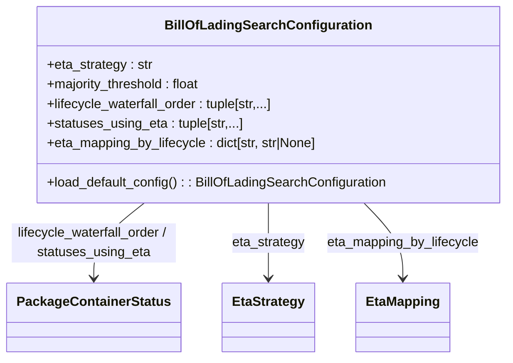

# Diagram: platform/partview_core/partview_service/partview_service/core/business/BillOfLadingSearchConfiguration.py


> Auto-generated by Obscura crawlers

## Diagram 1



### SVG

<svg id="container" width="601.9140625" xmlns="http://www.w3.org/2000/svg" class="classDiagram" height="438" viewBox="0 0 601.9140625 438" role="graphics-document document" aria-roledescription="class"><style>#container{font-family:"trebuchet ms",verdana,arial,sans-serif;font-size:16px;fill:#333;}@keyframes edge-animation-frame{from{stroke-dashoffset:0;}}@keyframes dash{to{stroke-dashoffset:0;}}#container .edge-animation-slow{stroke-dasharray:9,5!important;stroke-dashoffset:900;animation:dash 50s linear infinite;stroke-linecap:round;}#container .edge-animation-fast{stroke-dasharray:9,5!important;stroke-dashoffset:900;animation:dash 20s linear infinite;stroke-linecap:round;}#container .error-icon{fill:#552222;}#container .error-text{fill:#552222;stroke:#552222;}#container .edge-thickness-normal{stroke-width:1px;}#container .edge-thickness-thick{stroke-width:3.5px;}#container .edge-pattern-solid{stroke-dasharray:0;}#container .edge-thickness-invisible{stroke-width:0;fill:none;}#container .edge-pattern-dashed{stroke-dasharray:3;}#container .edge-pattern-dotted{stroke-dasharray:2;}#container .marker{fill:#333333;stroke:#333333;}#container .marker.cross{stroke:#333333;}#container svg{font-family:"trebuchet ms",verdana,arial,sans-serif;font-size:16px;}#container p{margin:0;}#container g.classGroup text{fill:#9370DB;stroke:none;font-family:"trebuchet ms",verdana,arial,sans-serif;font-size:10px;}#container g.classGroup text .title{font-weight:bolder;}#container .nodeLabel,#container .edgeLabel{color:#131300;}#container .edgeLabel .label rect{fill:#ECECFF;}#container .label text{fill:#131300;}#container .labelBkg{background:#ECECFF;}#container .edgeLabel .label span{background:#ECECFF;}#container .classTitle{font-weight:bolder;}#container .node rect,#container .node circle,#container .node ellipse,#container .node polygon,#container .node path{fill:#ECECFF;stroke:#9370DB;stroke-width:1px;}#container .divider{stroke:#9370DB;stroke-width:1;}#container g.clickable{cursor:pointer;}#container g.classGroup rect{fill:#ECECFF;stroke:#9370DB;}#container g.classGroup line{stroke:#9370DB;stroke-width:1;}#container .classLabel .box{stroke:none;stroke-width:0;fill:#ECECFF;opacity:0.5;}#container .classLabel .label{fill:#9370DB;font-size:10px;}#container .relation{stroke:#333333;stroke-width:1;fill:none;}#container .dashed-line{stroke-dasharray:3;}#container .dotted-line{stroke-dasharray:1 2;}#container #compositionStart,#container .composition{fill:#333333!important;stroke:#333333!important;stroke-width:1;}#container #compositionEnd,#container .composition{fill:#333333!important;stroke:#333333!important;stroke-width:1;}#container #dependencyStart,#container .dependency{fill:#333333!important;stroke:#333333!important;stroke-width:1;}#container #dependencyStart,#container .dependency{fill:#333333!important;stroke:#333333!important;stroke-width:1;}#container #extensionStart,#container .extension{fill:transparent!important;stroke:#333333!important;stroke-width:1;}#container #extensionEnd,#container .extension{fill:transparent!important;stroke:#333333!important;stroke-width:1;}#container #aggregationStart,#container .aggregation{fill:transparent!important;stroke:#333333!important;stroke-width:1;}#container #aggregationEnd,#container .aggregation{fill:transparent!important;stroke:#333333!important;stroke-width:1;}#container #lollipopStart,#container .lollipop{fill:#ECECFF!important;stroke:#333333!important;stroke-width:1;}#container #lollipopEnd,#container .lollipop{fill:#ECECFF!important;stroke:#333333!important;stroke-width:1;}#container .edgeTerminals{font-size:11px;line-height:initial;}#container .classTitleText{text-anchor:middle;font-size:18px;fill:#333;}#container .label-icon{display:inline-block;height:1em;overflow:visible;vertical-align:-0.125em;}#container .node .label-icon path{fill:currentColor;stroke:revert;stroke-width:revert;}#container :root{--mermaid-font-family:"trebuchet ms",verdana,arial,sans-serif;}</style><g><defs><marker id="container_class-aggregationStart" class="marker aggregation class" refX="18" refY="7" markerWidth="190" markerHeight="240" orient="auto"><path d="M 18,7 L9,13 L1,7 L9,1 Z"></path></marker></defs><defs><marker id="container_class-aggregationEnd" class="marker aggregation class" refX="1" refY="7" markerWidth="20" markerHeight="28" orient="auto"><path d="M 18,7 L9,13 L1,7 L9,1 Z"></path></marker></defs><defs><marker id="container_class-extensionStart" class="marker extension class" refX="18" refY="7" markerWidth="190" markerHeight="240" orient="auto"><path d="M 1,7 L18,13 V 1 Z"></path></marker></defs><defs><marker id="container_class-extensionEnd" class="marker extension class" refX="1" refY="7" markerWidth="20" markerHeight="28" orient="auto"><path d="M 1,1 V 13 L18,7 Z"></path></marker></defs><defs><marker id="container_class-compositionStart" class="marker composition class" refX="18" refY="7" markerWidth="190" markerHeight="240" orient="auto"><path d="M 18,7 L9,13 L1,7 L9,1 Z"></path></marker></defs><defs><marker id="container_class-compositionEnd" class="marker composition class" refX="1" refY="7" markerWidth="20" markerHeight="28" orient="auto"><path d="M 18,7 L9,13 L1,7 L9,1 Z"></path></marker></defs><defs><marker id="container_class-dependencyStart" class="marker dependency class" refX="6" refY="7" markerWidth="190" markerHeight="240" orient="auto"><path d="M 5,7 L9,13 L1,7 L9,1 Z"></path></marker></defs><defs><marker id="container_class-dependencyEnd" class="marker dependency class" refX="13" refY="7" markerWidth="20" markerHeight="28" orient="auto"><path d="M 18,7 L9,13 L14,7 L9,1 Z"></path></marker></defs><defs><marker id="container_class-lollipopStart" class="marker lollipop class" refX="13" refY="7" markerWidth="190" markerHeight="240" orient="auto"><circle stroke="black" fill="transparent" cx="7" cy="7" r="6"></circle></marker></defs><defs><marker id="container_class-lollipopEnd" class="marker lollipop class" refX="1" refY="7" markerWidth="190" markerHeight="240" orient="auto"><circle stroke="black" fill="transparent" cx="7" cy="7" r="6"></circle></marker></defs><g class="root"><g class="clusters"></g><g class="edgePaths"><path d="M168.442,248L158.524,256.167C148.605,264.333,128.767,280.667,118.848,296C108.93,311.333,108.93,325.667,108.93,332.833L108.93,340" id="id_BillOfLadingSearchConfiguration_PackageContainerStatus_1" class="edge-thickness-normal edge-pattern-solid relation" style=";;;" data-edge="true" data-et="edge" data-id="id_BillOfLadingSearchConfiguration_PackageContainerStatus_1" data-points="W3sieCI6MTY4LjQ0MjMwNzY5MjMwNzY4LCJ5IjoyNDh9LHsieCI6MTA4LjkyOTY4NzUsInkiOjI5N30seyJ4IjoxMDguOTI5Njg3NSwieSI6MzQ2fV0=" marker-end="url(#container_class-dependencyEnd)"></path><path d="M314.188,248L314.188,256.167C314.188,264.333,314.188,280.667,314.188,296C314.188,311.333,314.188,325.667,314.188,332.833L314.188,340" id="id_BillOfLadingSearchConfiguration_EtaStrategy_2" class="edge-thickness-normal edge-pattern-solid relation" style=";;;" data-edge="true" data-et="edge" data-id="id_BillOfLadingSearchConfiguration_EtaStrategy_2" data-points="W3sieCI6MzE0LjE4NzUsInkiOjI0OH0seyJ4IjozMTQuMTg3NSwieSI6Mjk3fSx7IngiOjMxNC4xODc1LCJ5IjozNDZ9XQ==" marker-end="url(#container_class-dependencyEnd)"></path><path d="M427.281,248L434.978,256.167C442.674,264.333,458.068,280.667,465.764,296C473.461,311.333,473.461,325.667,473.461,332.833L473.461,340" id="id_BillOfLadingSearchConfiguration_EtaMapping_3" class="edge-thickness-normal edge-pattern-solid relation" style=";;;" data-edge="true" data-et="edge" data-id="id_BillOfLadingSearchConfiguration_EtaMapping_3" data-points="W3sieCI6NDI3LjI4MTA2NTA4ODc1NzQsInkiOjI0OH0seyJ4Ijo0NzMuNDYwOTM3NSwieSI6Mjk3fSx7IngiOjQ3My40NjA5Mzc1LCJ5IjozNDZ9XQ==" marker-end="url(#container_class-dependencyEnd)"></path></g><g class="edgeLabels"><g class="edgeLabel" transform="translate(108.9296875, 297)"><g class="label" data-id="id_BillOfLadingSearchConfiguration_PackageContainerStatus_1" transform="translate(-100, -24)"><foreignObject width="200" height="48"><div xmlns="http://www.w3.org/1999/xhtml" class="labelBkg" style="display: table; white-space: break-spaces; line-height: 1.5; max-width: 200px; text-align: center; width: 200px;"><span class="edgeLabel"><p>lifecycle_waterfall_order / statuses_using_eta</p></span></div></foreignObject></g></g><g class="edgeLabel" transform="translate(314.1875, 297)"><g class="label" data-id="id_BillOfLadingSearchConfiguration_EtaStrategy_2" transform="translate(-44.71875, -12)"><foreignObject width="89.4375" height="24"><div xmlns="http://www.w3.org/1999/xhtml" class="labelBkg" style="display: table-cell; white-space: nowrap; line-height: 1.5; max-width: 200px; text-align: center;"><span class="edgeLabel"><p>eta_strategy</p></span></div></foreignObject></g></g><g class="edgeLabel" transform="translate(473.4609375, 297)"><g class="label" data-id="id_BillOfLadingSearchConfiguration_EtaMapping_3" transform="translate(-93.984375, -12)"><foreignObject width="187.96875" height="24"><div xmlns="http://www.w3.org/1999/xhtml" class="labelBkg" style="display: table-cell; white-space: nowrap; line-height: 1.5; max-width: 200px; text-align: center;"><span class="edgeLabel"><p>eta_mapping_by_lifecycle</p></span></div></foreignObject></g></g></g><g class="nodes"><g class="node default" id="classId-BillOfLadingSearchConfiguration-0" transform="translate(314.1875, 128)"><g class="basic label-container"><path d="M-279.7265625 -120 L279.7265625 -120 L279.7265625 120 L-279.7265625 120" stroke="none" stroke-width="0" fill="#ECECFF" style=""></path><path d="M-279.7265625 -120 C-149.97707892964593 -120, -20.227595359291854 -120, 279.7265625 -120 M-279.7265625 -120 C-124.40308384575923 -120, 30.920394808481547 -120, 279.7265625 -120 M279.7265625 -120 C279.7265625 -42.209868084945086, 279.7265625 35.58026383010983, 279.7265625 120 M279.7265625 -120 C279.7265625 -69.08103399315388, 279.7265625 -18.162067986307747, 279.7265625 120 M279.7265625 120 C162.41223758091212 120, 45.09791266182421 120, -279.7265625 120 M279.7265625 120 C120.30199869015794 120, -39.12256511968411 120, -279.7265625 120 M-279.7265625 120 C-279.7265625 49.95586247335406, -279.7265625 -20.08827505329188, -279.7265625 -120 M-279.7265625 120 C-279.7265625 46.520850277770165, -279.7265625 -26.95829944445967, -279.7265625 -120" stroke="#9370DB" stroke-width="1.3" fill="none" stroke-dasharray="0 0" style=""></path></g><g class="annotation-group text" transform="translate(0, -96)"></g><g class="label-group text" transform="translate(-118.890625, -96)"><g class="label" style="font-weight: bolder" transform="translate(0,-12)"><foreignObject width="237.78125" height="24"><div xmlns="http://www.w3.org/1999/xhtml" style="display: table-cell; white-space: nowrap; line-height: 1.5; max-width: 284px; text-align: center;"><span class="nodeLabel markdown-node-label" style=""><p>BillOfLadingSearchConfiguration</p></span></div></foreignObject></g></g><g class="members-group text" transform="translate(-267.7265625, -48)"><g class="label" style="" transform="translate(0,-12)"><foreignObject width="129.15625" height="24"><div xmlns="http://www.w3.org/1999/xhtml" style="display: table-cell; white-space: nowrap; line-height: 1.5; max-width: 187px; text-align: center;"><span class="nodeLabel markdown-node-label" style=""><p>+eta_strategy : str</p></span></div></foreignObject></g><g class="label" style="" transform="translate(0,12)"><foreignObject width="191.15625" height="24"><div xmlns="http://www.w3.org/1999/xhtml" style="display: table-cell; white-space: nowrap; line-height: 1.5; max-width: 249px; text-align: center;"><span class="nodeLabel markdown-node-label" style=""><p>+majority_threshold : float</p></span></div></foreignObject></g><g class="label" style="" transform="translate(0,36)"><foreignObject width="280.1875" height="24"><div xmlns="http://www.w3.org/1999/xhtml" style="display: table-cell; white-space: nowrap; line-height: 1.5; max-width: 338px; text-align: center;"><span class="nodeLabel markdown-node-label" style=""><p>+lifecycle_waterfall_order : tuple[str,...]</p></span></div></foreignObject></g><g class="label" style="" transform="translate(0,60)"><foreignObject width="240.515625" height="24"><div xmlns="http://www.w3.org/1999/xhtml" style="display: table-cell; white-space: nowrap; line-height: 1.5; max-width: 298px; text-align: center;"><span class="nodeLabel markdown-node-label" style=""><p>+statuses_using_eta : tuple[str,...]</p></span></div></foreignObject></g><g class="label" style="" transform="translate(0,84)"><foreignObject width="336.546875" height="24"><div xmlns="http://www.w3.org/1999/xhtml" style="display: table-cell; white-space: nowrap; line-height: 1.5; max-width: 394px; text-align: center;"><span class="nodeLabel markdown-node-label" style=""><p>+eta_mapping_by_lifecycle : dict[str, str|None]</p></span></div></foreignObject></g></g><g class="methods-group text" transform="translate(-267.7265625, 96)"><g class="label" style="" transform="translate(0,-12)"><foreignObject width="416.5625" height="24"><div xmlns="http://www.w3.org/1999/xhtml" style="display: table-cell; white-space: nowrap; line-height: 1.5; max-width: 474px; text-align: center;"><span class="nodeLabel markdown-node-label" style=""><p>+load_default_config() : : BillOfLadingSearchConfiguration</p></span></div></foreignObject></g></g><g class="divider" style=""><path d="M-279.7265625 -72 C-101.51205133222177 -72, 76.70245983555645 -72, 279.7265625 -72 M-279.7265625 -72 C-65.29739281904574 -72, 149.13177686190852 -72, 279.7265625 -72" stroke="#9370DB" stroke-width="1.3" fill="none" stroke-dasharray="0 0" style=""></path></g><g class="divider" style=""><path d="M-279.7265625 72 C-84.91171483058346 72, 109.90313283883307 72, 279.7265625 72 M-279.7265625 72 C-94.77791629670153 72, 90.17072990659693 72, 279.7265625 72" stroke="#9370DB" stroke-width="1.3" fill="none" stroke-dasharray="0 0" style=""></path></g></g><g class="node default" id="classId-PackageContainerStatus-1" transform="translate(108.9296875, 388)"><g class="basic label-container"><path d="M-100.9296875 -42 L100.9296875 -42 L100.9296875 42 L-100.9296875 42" stroke="none" stroke-width="0" fill="#ECECFF" style=""></path><path d="M-100.9296875 -42 C-57.437732602125536 -42, -13.945777704251071 -42, 100.9296875 -42 M-100.9296875 -42 C-39.30734516106443 -42, 22.314997177871135 -42, 100.9296875 -42 M100.9296875 -42 C100.9296875 -18.341664387814408, 100.9296875 5.316671224371184, 100.9296875 42 M100.9296875 -42 C100.9296875 -17.8264383608802, 100.9296875 6.3471232782396, 100.9296875 42 M100.9296875 42 C58.42442312927324 42, 15.919158758546473 42, -100.9296875 42 M100.9296875 42 C40.60555758135291 42, -19.718572337294177 42, -100.9296875 42 M-100.9296875 42 C-100.9296875 21.83407036666052, -100.9296875 1.6681407333210387, -100.9296875 -42 M-100.9296875 42 C-100.9296875 23.916450492865728, -100.9296875 5.832900985731456, -100.9296875 -42" stroke="#9370DB" stroke-width="1.3" fill="none" stroke-dasharray="0 0" style=""></path></g><g class="annotation-group text" transform="translate(0, -18)"></g><g class="label-group text" transform="translate(-88.9296875, -18)"><g class="label" style="font-weight: bolder" transform="translate(0,-12)"><foreignObject width="177.859375" height="24"><div xmlns="http://www.w3.org/1999/xhtml" style="display: table-cell; white-space: nowrap; line-height: 1.5; max-width: 224px; text-align: center;"><span class="nodeLabel markdown-node-label" style=""><p>PackageContainerStatus</p></span></div></foreignObject></g></g><g class="members-group text" transform="translate(-88.9296875, 30)"></g><g class="methods-group text" transform="translate(-88.9296875, 60)"></g><g class="divider" style=""><path d="M-100.9296875 6 C-50.56006376734624 6, -0.19044003469248594 6, 100.9296875 6 M-100.9296875 6 C-37.152004904680304 6, 26.625677690639392 6, 100.9296875 6" stroke="#9370DB" stroke-width="1.3" fill="none" stroke-dasharray="0 0" style=""></path></g><g class="divider" style=""><path d="M-100.9296875 24 C-59.068026371397366 24, -17.206365242794732 24, 100.9296875 24 M-100.9296875 24 C-44.43389381299652 24, 12.061899874006954 24, 100.9296875 24" stroke="#9370DB" stroke-width="1.3" fill="none" stroke-dasharray="0 0" style=""></path></g></g><g class="node default" id="classId-EtaStrategy-2" transform="translate(314.1875, 388)"><g class="basic label-container"><path d="M-54.328125 -42 L54.328125 -42 L54.328125 42 L-54.328125 42" stroke="none" stroke-width="0" fill="#ECECFF" style=""></path><path d="M-54.328125 -42 C-24.35678109246304 -42, 5.614562815073917 -42, 54.328125 -42 M-54.328125 -42 C-14.379809085690425 -42, 25.56850682861915 -42, 54.328125 -42 M54.328125 -42 C54.328125 -10.656313071580946, 54.328125 20.687373856838107, 54.328125 42 M54.328125 -42 C54.328125 -12.782641528447737, 54.328125 16.434716943104526, 54.328125 42 M54.328125 42 C19.33034565982905 42, -15.667433680341901 42, -54.328125 42 M54.328125 42 C29.16580171532561 42, 4.003478430651221 42, -54.328125 42 M-54.328125 42 C-54.328125 15.552577321705282, -54.328125 -10.894845356589435, -54.328125 -42 M-54.328125 42 C-54.328125 23.02651386562957, -54.328125 4.053027731259142, -54.328125 -42" stroke="#9370DB" stroke-width="1.3" fill="none" stroke-dasharray="0 0" style=""></path></g><g class="annotation-group text" transform="translate(0, -18)"></g><g class="label-group text" transform="translate(-42.328125, -18)"><g class="label" style="font-weight: bolder" transform="translate(0,-12)"><foreignObject width="84.65625" height="24"><div xmlns="http://www.w3.org/1999/xhtml" style="display: table-cell; white-space: nowrap; line-height: 1.5; max-width: 132px; text-align: center;"><span class="nodeLabel markdown-node-label" style=""><p>EtaStrategy</p></span></div></foreignObject></g></g><g class="members-group text" transform="translate(-42.328125, 30)"></g><g class="methods-group text" transform="translate(-42.328125, 60)"></g><g class="divider" style=""><path d="M-54.328125 6 C-17.46313918091205 6, 19.401846638175897 6, 54.328125 6 M-54.328125 6 C-22.505646122653832 6, 9.316832754692335 6, 54.328125 6" stroke="#9370DB" stroke-width="1.3" fill="none" stroke-dasharray="0 0" style=""></path></g><g class="divider" style=""><path d="M-54.328125 24 C-19.926448790018632 24, 14.475227419962735 24, 54.328125 24 M-54.328125 24 C-27.262989946405213 24, -0.197854892810426 24, 54.328125 24" stroke="#9370DB" stroke-width="1.3" fill="none" stroke-dasharray="0 0" style=""></path></g></g><g class="node default" id="classId-EtaMapping-3" transform="translate(473.4609375, 388)"><g class="basic label-container"><path d="M-54.9453125 -42 L54.9453125 -42 L54.9453125 42 L-54.9453125 42" stroke="none" stroke-width="0" fill="#ECECFF" style=""></path><path d="M-54.9453125 -42 C-29.72359448191732 -42, -4.501876463834641 -42, 54.9453125 -42 M-54.9453125 -42 C-28.303147112132436 -42, -1.6609817242648717 -42, 54.9453125 -42 M54.9453125 -42 C54.9453125 -18.31934466315589, 54.9453125 5.361310673688223, 54.9453125 42 M54.9453125 -42 C54.9453125 -8.74960591205079, 54.9453125 24.50078817589842, 54.9453125 42 M54.9453125 42 C29.483542524293746 42, 4.021772548587492 42, -54.9453125 42 M54.9453125 42 C20.719451419145123 42, -13.506409661709753 42, -54.9453125 42 M-54.9453125 42 C-54.9453125 16.760194757327266, -54.9453125 -8.479610485345468, -54.9453125 -42 M-54.9453125 42 C-54.9453125 11.354831294005429, -54.9453125 -19.290337411989142, -54.9453125 -42" stroke="#9370DB" stroke-width="1.3" fill="none" stroke-dasharray="0 0" style=""></path></g><g class="annotation-group text" transform="translate(0, -18)"></g><g class="label-group text" transform="translate(-42.9453125, -18)"><g class="label" style="font-weight: bolder" transform="translate(0,-12)"><foreignObject width="85.890625" height="24"><div xmlns="http://www.w3.org/1999/xhtml" style="display: table-cell; white-space: nowrap; line-height: 1.5; max-width: 136px; text-align: center;"><span class="nodeLabel markdown-node-label" style=""><p>EtaMapping</p></span></div></foreignObject></g></g><g class="members-group text" transform="translate(-42.9453125, 30)"></g><g class="methods-group text" transform="translate(-42.9453125, 60)"></g><g class="divider" style=""><path d="M-54.9453125 6 C-20.201069088709758 6, 14.543174322580484 6, 54.9453125 6 M-54.9453125 6 C-25.49428518451706 6, 3.9567421309658783 6, 54.9453125 6" stroke="#9370DB" stroke-width="1.3" fill="none" stroke-dasharray="0 0" style=""></path></g><g class="divider" style=""><path d="M-54.9453125 24 C-16.33093949238979 24, 22.283433515220423 24, 54.9453125 24 M-54.9453125 24 C-31.33213094543661 24, -7.71894939087322 24, 54.9453125 24" stroke="#9370DB" stroke-width="1.3" fill="none" stroke-dasharray="0 0" style=""></path></g></g></g></g></g></svg>

## Diagram 2

```mermaid
flowchart TD
    Start([Start]) --> CreateConfig[Create BillOfLadingSearchConfiguration]
    CreateConfig --> SetEta[eta_strategy = EtaStrategy.MOST_FREQUENT_THEN_FURTHEST]
    CreateConfig --> SetMajority[majority_threshold = 0.5]
    CreateConfig --> SetLifecycle[lifecycle_waterfall_order = (DELIVERED_STATE, INROUTE_STATE, DELAYED_STATE, CREATED_STATE)]
    CreateConfig --> SetStatuses[statuses_using_eta = (INROUTE_STATE,)]
    CreateConfig --> SetEtaMapping[eta_mapping_by_lifecycle]
    SetEtaMapping --> M1[DELIVERED_STATE: None]
    SetEtaMapping --> M2[DELAYED_STATE: EtaMapping.TBD]
    SetEtaMapping --> M3[INROUTE_STATE: "datetime"]
    SetEtaMapping --> M4[CREATED_STATE: EtaMapping.TBD]
    SetEtaMapping --> Return[Return BillOfLadingSearchConfiguration instance]
    Return --> End([End])
```

> SVG rendering failed for this diagram.
