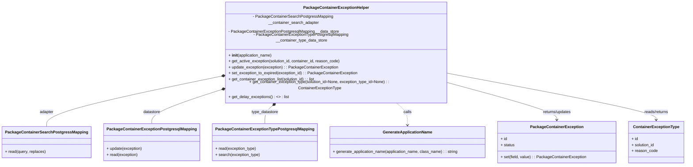

# Diagram: platform/partview_core/partview_service/partview_service/core/business/PackageContainerExceptionHelper.py

> Auto-generated by Obscura crawlers

## Mermaid

### SVG

<svg id="container" width="2695.8125" xmlns="http://www.w3.org/2000/svg" class="classDiagram" height="594" viewBox="0 0 2695.8125 594" role="graphics-document document" aria-roledescription="class"><g><defs><marker id="container_class-aggregationStart" class="marker aggregation class" refX="18" refY="7" markerWidth="190" markerHeight="240" orient="auto"><path d="M 18,7 L9,13 L1,7 L9,1 Z"></path></marker></defs><defs><marker id="container_class-aggregationEnd" class="marker aggregation class" refX="1" refY="7" markerWidth="20" markerHeight="28" orient="auto"><path d="M 18,7 L9,13 L1,7 L9,1 Z"></path></marker></defs><defs><marker id="container_class-extensionStart" class="marker extension class" refX="18" refY="7" markerWidth="190" markerHeight="240" orient="auto"><path d="M 1,7 L18,13 V 1 Z"></path></marker></defs><defs><marker id="container_class-extensionEnd" class="marker extension class" refX="1" refY="7" markerWidth="20" markerHeight="28" orient="auto"><path d="M 1,1 V 13 L18,7 Z"></path></marker></defs><defs><marker id="container_class-compositionStart" class="marker composition class" refX="18" refY="7" markerWidth="190" markerHeight="240" orient="auto"><path d="M 18,7 L9,13 L1,7 L9,1 Z"></path></marker></defs><defs><marker id="container_class-compositionEnd" class="marker composition class" refX="1" refY="7" markerWidth="20" markerHeight="28" orient="auto"><path d="M 18,7 L9,13 L1,7 L9,1 Z"></path></marker></defs><defs><marker id="container_class-dependencyStart" class="marker dependency class" refX="6" refY="7" markerWidth="190" markerHeight="240" orient="auto"><path d="M 5,7 L9,13 L1,7 L9,1 Z"></path></marker></defs><defs><marker id="container_class-dependencyEnd" class="marker dependency class" refX="13" refY="7" markerWidth="20" markerHeight="28" orient="auto"><path d="M 18,7 L9,13 L14,7 L9,1 Z"></path></marker></defs><defs><marker id="container_class-lollipopStart" class="marker lollipop class" refX="13" refY="7" markerWidth="190" markerHeight="240" orient="auto"><circle stroke="black" fill="transparent" cx="7" cy="7" r="6"></circle></marker></defs><defs><marker id="container_class-lollipopEnd" class="marker lollipop class" refX="1" refY="7" markerWidth="190" markerHeight="240" orient="auto"><circle stroke="black" fill="transparent" cx="7" cy="7" r="6"></circle></marker></defs><g class="root"><g class="clusters"></g><g class="edgePaths"><path d="M837.899,261.193L728.43,281.161C618.96,301.129,400.021,341.064,290.552,370.699C181.082,400.333,181.082,419.667,181.082,429.333L181.082,439" id="id_PackageContainerExceptionHelper_PackageContainerSearchPostgressMapping_1" class="edge-thickness-normal edge-pattern-solid relation" style=";;;" data-edge="true" data-et="edge" data-id="id_PackageContainerExceptionHelper_PackageContainerSearchPostgressMapping_1" data-points="W3sieCI6ODU0Ljg2OTE0MDYyNSwieSI6MjU4LjA5NzkwMDE1MzQ1MjN9LHsieCI6MTgxLjA4MjAzMTI1LCJ5IjozODF9LHsieCI6MTgxLjA4MjAzMTI1LCJ5Ijo0Mzl9XQ==" marker-start="url(#container_class-compositionStart)"></path><path d="M838.283,309.382L796.521,321.319C754.759,333.255,671.235,357.127,629.473,376.73C587.711,396.333,587.711,411.667,587.711,419.333L587.711,427" id="id_PackageContainerExceptionHelper_PackageContainerExceptionPostgresqlMapping_2" class="edge-thickness-normal edge-pattern-solid relation" style=";;;" data-edge="true" data-et="edge" data-id="id_PackageContainerExceptionHelper_PackageContainerExceptionPostgresqlMapping_2" data-points="W3sieCI6ODU0Ljg2OTE0MDYyNSwieSI6MzA0LjY0MTg1NTYyNjg3MDQ0fSx7IngiOjU4Ny43MTA5Mzc1LCJ5IjozODF9LHsieCI6NTg3LjcxMDkzNzUsInkiOjQyN31d" marker-start="url(#container_class-compositionStart)"></path><path d="M1059.218,354.124L1053.039,358.603C1046.859,363.083,1034.5,372.041,1028.32,384.187C1022.141,396.333,1022.141,411.667,1022.141,419.333L1022.141,427" id="id_PackageContainerExceptionHelper_PackageContainerExceptionTypePostgresqlMapping_3" class="edge-thickness-normal edge-pattern-solid relation" style=";;;" data-edge="true" data-et="edge" data-id="id_PackageContainerExceptionHelper_PackageContainerExceptionTypePostgresqlMapping_3" data-points="W3sieCI6MTA3My4xODUxODQ4MzIzMTcyLCJ5IjozNDR9LHsieCI6MTAyMi4xNDA2MjUsInkiOjM4MX0seyJ4IjoxMDIyLjE0MDYyNSwieSI6NDI3fV0=" marker-start="url(#container_class-compositionStart)"></path><path d="M1536.725,344L1545.232,350.167C1553.74,356.333,1570.755,368.667,1579.262,383.5C1587.77,398.333,1587.77,415.667,1587.77,424.333L1587.77,433" id="id_PackageContainerExceptionHelper_GenerateApplicationName_4" class="edge-thickness-normal edge-pattern-dashed relation" style=";;;" data-edge="true" data-et="edge" data-id="id_PackageContainerExceptionHelper_GenerateApplicationName_4" data-points="W3sieCI6MTUzNi43MjQ5NzE0MTc2ODI4LCJ5IjozNDR9LHsieCI6MTU4Ny43Njk1MzEyNSwieSI6MzgxfSx7IngiOjE1ODcuNzY5NTMxMjUsInkiOjQzOX1d" marker-end="url(#container_class-dependencyEnd)"></path><path d="M1755.041,280.636L1826.993,297.363C1898.945,314.09,2042.85,347.545,2114.802,369.439C2186.754,391.333,2186.754,401.667,2186.754,406.833L2186.754,412" id="id_PackageContainerExceptionHelper_PackageContainerException_5" class="edge-thickness-normal edge-pattern-solid relation" style=";;;" data-edge="true" data-et="edge" data-id="id_PackageContainerExceptionHelper_PackageContainerException_5" data-points="W3sieCI6MTc1NS4wNDEwMTU2MjUsInkiOjI4MC42MzU2NzY4MDU4ODk5NH0seyJ4IjoyMTg2Ljc1MzkwNjI1LCJ5IjozODF9LHsieCI6MjE4Ni43NTM5MDYyNSwieSI6NDE4fV0=" marker-end="url(#container_class-dependencyEnd)"></path><path d="M1755.041,248.398L1892.435,270.498C2029.828,292.599,2304.615,336.799,2442.009,364.066C2579.402,391.333,2579.402,401.667,2579.402,406.833L2579.402,412" id="id_PackageContainerExceptionHelper_ContainerExceptionType_6" class="edge-thickness-normal edge-pattern-solid relation" style=";;;" data-edge="true" data-et="edge" data-id="id_PackageContainerExceptionHelper_ContainerExceptionType_6" data-points="W3sieCI6MTc1NS4wNDEwMTU2MjUsInkiOjI0OC4zOTgxNDQ0MTYxNjA4fSx7IngiOjI1NzkuNDAyMzQzNzUsInkiOjM4MX0seyJ4IjoyNTc5LjQwMjM0Mzc1LCJ5Ijo0MTh9XQ==" marker-end="url(#container_class-dependencyEnd)"></path></g><g class="edgeLabels"><g class="edgeLabel" transform="translate(181.08203125, 381)"><g class="label" data-id="id_PackageContainerExceptionHelper_PackageContainerSearchPostgressMapping_1" transform="translate(-28.4609375, -12)"><foreignObject width="56.921875" height="24">

adapter

</foreignObject></g></g><g class="edgeLabel" transform="translate(587.7109375, 381)"><g class="label" data-id="id_PackageContainerExceptionHelper_PackageContainerExceptionPostgresqlMapping_2" transform="translate(-34.625, -12)"><foreignObject width="69.25" height="24">

datastore

</foreignObject></g></g><g class="edgeLabel" transform="translate(1022.140625, 381)"><g class="label" data-id="id_PackageContainerExceptionHelper_PackageContainerExceptionTypePostgresqlMapping_3" transform="translate(-54.3671875, -12)"><foreignObject width="108.734375" height="24">

type_datastore

</foreignObject></g></g><g class="edgeLabel" transform="translate(1587.76953125, 381)"><g class="label" data-id="id_PackageContainerExceptionHelper_GenerateApplicationName_4" transform="translate(-16.4453125, -12)"><foreignObject width="32.890625" height="24">

calls

</foreignObject></g></g><g class="edgeLabel" transform="translate(2186.75390625, 381)"><g class="label" data-id="id_PackageContainerExceptionHelper_PackageContainerException_5" transform="translate(-59.59375, -12)"><foreignObject width="119.1875" height="24">

returns/updates

</foreignObject></g></g><g class="edgeLabel" transform="translate(2579.40234375, 381)"><g class="label" data-id="id_PackageContainerExceptionHelper_ContainerExceptionType_6" transform="translate(-50.1875, -12)"><foreignObject width="100.375" height="24">

reads/returns

</foreignObject></g></g></g><g class="nodes"><g class="node default" id="classId-PackageContainerExceptionHelper-0" transform="translate(1304.955078125, 176)"><g class="basic label-container"><path d="M-450.0859375 -168 L450.0859375 -168 L450.0859375 168 L-450.0859375 168" stroke="none" stroke-width="0" fill="#ECECFF" style=""></path><path d="M-450.0859375 -168 C-108.73433849467722 -168, 232.61726051064556 -168, 450.0859375 -168 M-450.0859375 -168 C-168.48890928449197 -168, 113.10811893101607 -168, 450.0859375 -168 M450.0859375 -168 C450.0859375 -69.0983977804531, 450.0859375 29.803204439093804, 450.0859375 168 M450.0859375 -168 C450.0859375 -37.01098617519281, 450.0859375 93.97802764961438, 450.0859375 168 M450.0859375 168 C157.27115507399395 168, -135.5436273520121 168, -450.0859375 168 M450.0859375 168 C171.95982291497972 168, -106.16629167004055 168, -450.0859375 168 M-450.0859375 168 C-450.0859375 99.75388673282987, -450.0859375 31.50777346565974, -450.0859375 -168 M-450.0859375 168 C-450.0859375 91.07020587389901, -450.0859375 14.140411747798026, -450.0859375 -168" stroke="#9370DB" stroke-width="1.3" fill="none" stroke-dasharray="0 0" style=""></path></g><g class="annotation-group text" transform="translate(0, -144)"></g><g class="label-group text" transform="translate(-125.671875, -144)"><g class="label" style="font-weight: bolder" transform="translate(0,-12)"><foreignObject width="251.34375" height="24">

PackageContainerExceptionHelper

</foreignObject></g></g><g class="members-group text" transform="translate(-438.0859375, -96)"><g class="label" style="" transform="translate(0,-12)"><foreignObject width="528.03125" height="24">

- PackageContainerSearchPostgressMapping __container_search_adapter

</foreignObject></g><g class="label" style="" transform="translate(0,12)"><foreignObject width="446.125" height="24">

- PackageContainerExceptionPostgresqlMapping __data_store

</foreignObject></g><g class="label" style="" transform="translate(0,36)"><foreignObject width="595.234375" height="24">

- PackageContainerExceptionTypePostgresqlMapping __container_type_data_store

</foreignObject></g></g><g class="methods-group text" transform="translate(-438.0859375, 0)"><g class="label" style="" transform="translate(0,-12)"><foreignObject width="177.984375" height="24">

+ <strong>init</strong>(application_name)

</foreignObject></g><g class="label" style="" transform="translate(0,12)"><foreignObject width="455.421875" height="24">

+ get_active_exception(solution_id, container_id, reason_code)

</foreignObject></g><g class="label" style="" transform="translate(0,36)"><foreignObject width="442.828125" height="24">

+ update_exception(exception) : : PackageContainerException

</foreignObject></g><g class="label" style="" transform="translate(0,60)"><foreignObject width="521.0625" height="24">

+ set_exception_to_expired(exception_id) : : PackageContainerException

</foreignObject></g><g class="label" style="" transform="translate(0,84)"><foreignObject width="355.515625" height="24">

+ get_container_exception_list(solution_id) : : list

</foreignObject></g><g class="label" style="" transform="translate(0,108)"><foreignObject width="750.5" height="24">

+ get_container_exception_type(solution_id=None, exception_type_id=None) : : ContainerExceptionType

</foreignObject></g><g class="label" style="" transform="translate(0,132)"><foreignObject width="241.21875" height="24">

+ get_delay_exceptions() : &lt;&gt; : list

</foreignObject></g></g><g class="divider" style=""><path d="M-450.0859375 -120 C-226.0686341639175 -120, -2.051330827834988 -120, 450.0859375 -120 M-450.0859375 -120 C-97.6546102428249 -120, 254.7767170143502 -120, 450.0859375 -120" stroke="#9370DB" stroke-width="1.3" fill="none" stroke-dasharray="0 0" style=""></path></g><g class="divider" style=""><path d="M-450.0859375 -24 C-262.6073010144467 -24, -75.12866452889341 -24, 450.0859375 -24 M-450.0859375 -24 C-236.45228117199702 -24, -22.81862484399403 -24, 450.0859375 -24" stroke="#9370DB" stroke-width="1.3" fill="none" stroke-dasharray="0 0" style=""></path></g></g><g class="node default" id="classId-PackageContainerSearchPostgressMapping-1" transform="translate(181.08203125, 502)"><g class="basic label-container"><path d="M-173.08203125 -63 L173.08203125 -63 L173.08203125 63 L-173.08203125 63" stroke="none" stroke-width="0" fill="#ECECFF" style=""></path><path d="M-173.08203125 -63 C-69.28592437879072 -63, 34.51018249241855 -63, 173.08203125 -63 M-173.08203125 -63 C-95.97159770674443 -63, -18.861164163488866 -63, 173.08203125 -63 M173.08203125 -63 C173.08203125 -36.26182855757556, 173.08203125 -9.523657115151124, 173.08203125 63 M173.08203125 -63 C173.08203125 -14.562305682224483, 173.08203125 33.87538863555103, 173.08203125 63 M173.08203125 63 C65.39575245173509 63, -42.290526346529816 63, -173.08203125 63 M173.08203125 63 C53.858779660081865 63, -65.36447192983627 63, -173.08203125 63 M-173.08203125 63 C-173.08203125 25.50240533759228, -173.08203125 -11.995189324815442, -173.08203125 -63 M-173.08203125 63 C-173.08203125 20.472520101180976, -173.08203125 -22.05495979763805, -173.08203125 -63" stroke="#9370DB" stroke-width="1.3" fill="none" stroke-dasharray="0 0" style=""></path></g><g class="annotation-group text" transform="translate(0, -39)"></g><g class="label-group text" transform="translate(-157.1953125, -39)"><g class="label" style="font-weight: bolder" transform="translate(0,-12)"><foreignObject width="314.390625" height="24">

PackageContainerSearchPostgressMapping

</foreignObject></g></g><g class="members-group text" transform="translate(-161.08203125, 9)"></g><g class="methods-group text" transform="translate(-161.08203125, 39)"><g class="label" style="" transform="translate(0,-12)"><foreignObject width="164.96875" height="24">

+ read(query, replaces)

</foreignObject></g></g><g class="divider" style=""><path d="M-173.08203125 -15 C-92.40628978941815 -15, -11.730548328836306 -15, 173.08203125 -15 M-173.08203125 -15 C-39.87007952336637 -15, 93.34187220326726 -15, 173.08203125 -15" stroke="#9370DB" stroke-width="1.3" fill="none" stroke-dasharray="0 0" style=""></path></g><g class="divider" style=""><path d="M-173.08203125 9 C-38.783248287152304 9, 95.51553467569539 9, 173.08203125 9 M-173.08203125 9 C-50.12993344679167 9, 72.82216435641666 9, 173.08203125 9" stroke="#9370DB" stroke-width="1.3" fill="none" stroke-dasharray="0 0" style=""></path></g></g><g class="node default" id="classId-PackageContainerExceptionPostgresqlMapping-2" transform="translate(587.7109375, 502)"><g class="basic label-container"><path d="M-183.546875 -75 L183.546875 -75 L183.546875 75 L-183.546875 75" stroke="none" stroke-width="0" fill="#ECECFF" style=""></path><path d="M-183.546875 -75 C-76.66683311761349 -75, 30.213208764773015 -75, 183.546875 -75 M-183.546875 -75 C-100.23637799783168 -75, -16.925880995663363 -75, 183.546875 -75 M183.546875 -75 C183.546875 -18.673196199276596, 183.546875 37.65360760144681, 183.546875 75 M183.546875 -75 C183.546875 -35.28850387327097, 183.546875 4.422992253458062, 183.546875 75 M183.546875 75 C66.31686500810358 75, -50.91314498379285 75, -183.546875 75 M183.546875 75 C67.40052745426293 75, -48.745820091474144 75, -183.546875 75 M-183.546875 75 C-183.546875 28.001820921397922, -183.546875 -18.996358157204156, -183.546875 -75 M-183.546875 75 C-183.546875 40.34550303447361, -183.546875 5.6910060689472175, -183.546875 -75" stroke="#9370DB" stroke-width="1.3" fill="none" stroke-dasharray="0 0" style=""></path></g><g class="annotation-group text" transform="translate(0, -51)"></g><g class="label-group text" transform="translate(-171.546875, -51)"><g class="label" style="font-weight: bolder" transform="translate(0,-12)"><foreignObject width="343.09375" height="24">

PackageContainerExceptionPostgresqlMapping

</foreignObject></g></g><g class="members-group text" transform="translate(-171.546875, -3)"></g><g class="methods-group text" transform="translate(-171.546875, 27)"><g class="label" style="" transform="translate(0,-12)"><foreignObject width="144.703125" height="24">

+ update(exception)

</foreignObject></g><g class="label" style="" transform="translate(0,12)"><foreignObject width="125.875" height="24">

+ read(exception)

</foreignObject></g></g><g class="divider" style=""><path d="M-183.546875 -27 C-75.33515838035086 -27, 32.87655823929828 -27, 183.546875 -27 M-183.546875 -27 C-85.37352869874053 -27, 12.799817602518942 -27, 183.546875 -27" stroke="#9370DB" stroke-width="1.3" fill="none" stroke-dasharray="0 0" style=""></path></g><g class="divider" style=""><path d="M-183.546875 -3 C-54.87018496155619 -3, 73.80650507688762 -3, 183.546875 -3 M-183.546875 -3 C-56.42751872176672 -3, 70.69183755646657 -3, 183.546875 -3" stroke="#9370DB" stroke-width="1.3" fill="none" stroke-dasharray="0 0" style=""></path></g></g><g class="node default" id="classId-PackageContainerExceptionTypePostgresqlMapping-3" transform="translate(1022.140625, 502)"><g class="basic label-container"><path d="M-200.8828125 -75 L200.8828125 -75 L200.8828125 75 L-200.8828125 75" stroke="none" stroke-width="0" fill="#ECECFF" style=""></path><path d="M-200.8828125 -75 C-87.7490413569068 -75, 25.384729786186398 -75, 200.8828125 -75 M-200.8828125 -75 C-111.78074717901937 -75, -22.678681858038743 -75, 200.8828125 -75 M200.8828125 -75 C200.8828125 -38.69097154153533, 200.8828125 -2.3819430830706665, 200.8828125 75 M200.8828125 -75 C200.8828125 -30.690767407737596, 200.8828125 13.618465184524808, 200.8828125 75 M200.8828125 75 C59.109866301550994 75, -82.66307989689801 75, -200.8828125 75 M200.8828125 75 C49.73389115620475 75, -101.4150301875905 75, -200.8828125 75 M-200.8828125 75 C-200.8828125 27.557098007733366, -200.8828125 -19.88580398453327, -200.8828125 -75 M-200.8828125 75 C-200.8828125 31.324007338383772, -200.8828125 -12.351985323232455, -200.8828125 -75" stroke="#9370DB" stroke-width="1.3" fill="none" stroke-dasharray="0 0" style=""></path></g><g class="annotation-group text" transform="translate(0, -51)"></g><g class="label-group text" transform="translate(-188.8828125, -51)"><g class="label" style="font-weight: bolder" transform="translate(0,-12)"><foreignObject width="377.765625" height="24">

PackageContainerExceptionTypePostgresqlMapping

</foreignObject></g></g><g class="members-group text" transform="translate(-188.8828125, -3)"></g><g class="methods-group text" transform="translate(-188.8828125, 27)"><g class="label" style="" transform="translate(0,-12)"><foreignObject width="165.671875" height="24">

+ read(exception_type)

</foreignObject></g><g class="label" style="" transform="translate(0,12)"><foreignObject width="180.59375" height="24">

+ search(exception_type)

</foreignObject></g></g><g class="divider" style=""><path d="M-200.8828125 -27 C-63.198989241152276 -27, 74.48483401769545 -27, 200.8828125 -27 M-200.8828125 -27 C-68.17941313276398 -27, 64.52398623447203 -27, 200.8828125 -27" stroke="#9370DB" stroke-width="1.3" fill="none" stroke-dasharray="0 0" style=""></path></g><g class="divider" style=""><path d="M-200.8828125 -3 C-93.33758189371528 -3, 14.207648712569437 -3, 200.8828125 -3 M-200.8828125 -3 C-51.91183430700465 -3, 97.0591438859907 -3, 200.8828125 -3" stroke="#9370DB" stroke-width="1.3" fill="none" stroke-dasharray="0 0" style=""></path></g></g><g class="node default" id="classId-ContainerExceptionType-4" transform="translate(2579.40234375, 502)"><g class="basic label-container"><path d="M-108.41015625 -84 L108.41015625 -84 L108.41015625 84 L-108.41015625 84" stroke="none" stroke-width="0" fill="#ECECFF" style=""></path><path d="M-108.41015625 -84 C-61.76530583909815 -84, -15.120455428196294 -84, 108.41015625 -84 M-108.41015625 -84 C-34.64900388434431 -84, 39.11214848131138 -84, 108.41015625 -84 M108.41015625 -84 C108.41015625 -47.72128319373101, 108.41015625 -11.442566387462023, 108.41015625 84 M108.41015625 -84 C108.41015625 -42.15692057953821, 108.41015625 -0.31384115907641785, 108.41015625 84 M108.41015625 84 C27.814512787534312 84, -52.781130674931376 84, -108.41015625 84 M108.41015625 84 C52.34018831097076 84, -3.7297796280584805 84, -108.41015625 84 M-108.41015625 84 C-108.41015625 17.332352882973197, -108.41015625 -49.335294234053606, -108.41015625 -84 M-108.41015625 84 C-108.41015625 25.02838654497168, -108.41015625 -33.94322691005664, -108.41015625 -84" stroke="#9370DB" stroke-width="1.3" fill="none" stroke-dasharray="0 0" style=""></path></g><g class="annotation-group text" transform="translate(0, -60)"></g><g class="label-group text" transform="translate(-88.6328125, -60)"><g class="label" style="font-weight: bolder" transform="translate(0,-12)"><foreignObject width="177.265625" height="24">

ContainerExceptionType

</foreignObject></g></g><g class="members-group text" transform="translate(-96.41015625, -12)"><g class="label" style="" transform="translate(0,-12)"><foreignObject width="26.3125" height="24">

+ id

</foreignObject></g><g class="label" style="" transform="translate(0,12)"><foreignObject width="94.453125" height="24">

+ solution_id

</foreignObject></g><g class="label" style="" transform="translate(0,36)"><foreignObject width="104.1875" height="24">

+ reason_code

</foreignObject></g></g><g class="methods-group text" transform="translate(-96.41015625, 84)"></g><g class="divider" style=""><path d="M-108.41015625 -36 C-53.0526228390836 -36, 2.3049105718328065 -36, 108.41015625 -36 M-108.41015625 -36 C-55.06955723466489 -36, -1.7289582193297832 -36, 108.41015625 -36" stroke="#9370DB" stroke-width="1.3" fill="none" stroke-dasharray="0 0" style=""></path></g><g class="divider" style=""><path d="M-108.41015625 60 C-50.00444877456115 60, 8.401258700877705 60, 108.41015625 60 M-108.41015625 60 C-45.53868227322938 60, 17.332791703541247 60, 108.41015625 60" stroke="#9370DB" stroke-width="1.3" fill="none" stroke-dasharray="0 0" style=""></path></g></g><g class="node default" id="classId-PackageContainerException-5" transform="translate(2186.75390625, 502)"><g class="basic label-container"><path d="M-234.23828125 -84 L234.23828125 -84 L234.23828125 84 L-234.23828125 84" stroke="none" stroke-width="0" fill="#ECECFF" style=""></path><path d="M-234.23828125 -84 C-130.975532021506 -84, -27.712782793012053 -84, 234.23828125 -84 M-234.23828125 -84 C-139.07150029182216 -84, -43.90471933364432 -84, 234.23828125 -84 M234.23828125 -84 C234.23828125 -27.018502609091897, 234.23828125 29.962994781816207, 234.23828125 84 M234.23828125 -84 C234.23828125 -44.25177960986646, 234.23828125 -4.503559219732921, 234.23828125 84 M234.23828125 84 C62.62292204014085 84, -108.9924371697183 84, -234.23828125 84 M234.23828125 84 C56.92704672828458 84, -120.38418779343084 84, -234.23828125 84 M-234.23828125 84 C-234.23828125 26.479412195817808, -234.23828125 -31.041175608364384, -234.23828125 -84 M-234.23828125 84 C-234.23828125 41.73461801752802, -234.23828125 -0.5307639649439579, -234.23828125 -84" stroke="#9370DB" stroke-width="1.3" fill="none" stroke-dasharray="0 0" style=""></path></g><g class="annotation-group text" transform="translate(0, -60)"></g><g class="label-group text" transform="translate(-101.1484375, -60)"><g class="label" style="font-weight: bolder" transform="translate(0,-12)"><foreignObject width="202.296875" height="24">

PackageContainerException

</foreignObject></g></g><g class="members-group text" transform="translate(-222.23828125, -12)"><g class="label" style="" transform="translate(0,-12)"><foreignObject width="26.3125" height="24">

+ id

</foreignObject></g><g class="label" style="" transform="translate(0,12)"><foreignObject width="56.625" height="24">

+ status

</foreignObject></g></g><g class="methods-group text" transform="translate(-222.23828125, 60)"><g class="label" style="" transform="translate(0,-12)"><foreignObject width="343.328125" height="24">

+ set(field, value) : : PackageContainerException

</foreignObject></g></g><g class="divider" style=""><path d="M-234.23828125 -36 C-125.30068055842119 -36, -16.363079866842384 -36, 234.23828125 -36 M-234.23828125 -36 C-50.82398685109129 -36, 132.59030754781742 -36, 234.23828125 -36" stroke="#9370DB" stroke-width="1.3" fill="none" stroke-dasharray="0 0" style=""></path></g><g class="divider" style=""><path d="M-234.23828125 36 C-50.639103201507766 36, 132.96007484698447 36, 234.23828125 36 M-234.23828125 36 C-113.58159851789279 36, 7.075084214214428 36, 234.23828125 36" stroke="#9370DB" stroke-width="1.3" fill="none" stroke-dasharray="0 0" style=""></path></g></g><g class="node default" id="classId-GenerateApplicationName-6" transform="translate(1587.76953125, 502)"><g class="basic label-container"><path d="M-314.74609375 -63 L314.74609375 -63 L314.74609375 63 L-314.74609375 63" stroke="none" stroke-width="0" fill="#ECECFF" style=""></path><path d="M-314.74609375 -63 C-112.90126118812418 -63, 88.94357137375164 -63, 314.74609375 -63 M-314.74609375 -63 C-106.95757908788681 -63, 100.83093557422637 -63, 314.74609375 -63 M314.74609375 -63 C314.74609375 -29.067151379329303, 314.74609375 4.865697241341394, 314.74609375 63 M314.74609375 -63 C314.74609375 -17.967399495137904, 314.74609375 27.06520100972419, 314.74609375 63 M314.74609375 63 C94.6709489530977 63, -125.40419584380459 63, -314.74609375 63 M314.74609375 63 C132.45566843794106 63, -49.834756874117886 63, -314.74609375 63 M-314.74609375 63 C-314.74609375 35.144444775177604, -314.74609375 7.288889550355201, -314.74609375 -63 M-314.74609375 63 C-314.74609375 31.853870838382996, -314.74609375 0.7077416767659912, -314.74609375 -63" stroke="#9370DB" stroke-width="1.3" fill="none" stroke-dasharray="0 0" style=""></path></g><g class="annotation-group text" transform="translate(0, -39)"></g><g class="label-group text" transform="translate(-95.8203125, -39)"><g class="label" style="font-weight: bolder" transform="translate(0,-12)"><foreignObject width="191.640625" height="24">

GenerateApplicationName

</foreignObject></g></g><g class="members-group text" transform="translate(-302.74609375, 9)"></g><g class="methods-group text" transform="translate(-302.74609375, 39)"><g class="label" style="" transform="translate(0,-12)"><foreignObject width="509.671875" height="24">

+ generate_application_name(application_name, class_name) : : string

</foreignObject></g></g><g class="divider" style=""><path d="M-314.74609375 -15 C-131.5200173567852 -15, 51.70605903642962 -15, 314.74609375 -15 M-314.74609375 -15 C-117.96609572187316 -15, 78.81390230625368 -15, 314.74609375 -15" stroke="#9370DB" stroke-width="1.3" fill="none" stroke-dasharray="0 0" style=""></path></g><g class="divider" style=""><path d="M-314.74609375 9 C-154.12702886671477 9, 6.4920360165704665 9, 314.74609375 9 M-314.74609375 9 C-141.30372441254076 9, 32.13864492491848 9, 314.74609375 9" stroke="#9370DB" stroke-width="1.3" fill="none" stroke-dasharray="0 0" style=""></path></g></g></g></g></g></svg>
