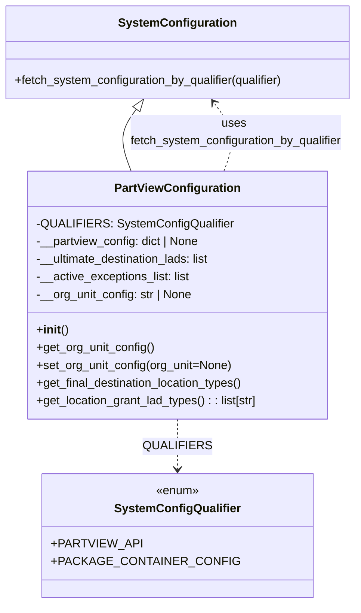

# Diagram: platform/partview_core/partview_service/partview_service/core/business/PartViewConfiguration.py

> Auto-generated by Obscura crawlers

## Mermaid

### SVG

<svg id="container" width="487.875" xmlns="http://www.w3.org/2000/svg" class="classDiagram" height="818" viewBox="0 0 487.875 818" role="graphics-document document" aria-roledescription="class"><g><defs><marker id="container_class-aggregationStart" class="marker aggregation class" refX="18" refY="7" markerWidth="190" markerHeight="240" orient="auto"><path d="M 18,7 L9,13 L1,7 L9,1 Z"></path></marker></defs><defs><marker id="container_class-aggregationEnd" class="marker aggregation class" refX="1" refY="7" markerWidth="20" markerHeight="28" orient="auto"><path d="M 18,7 L9,13 L1,7 L9,1 Z"></path></marker></defs><defs><marker id="container_class-extensionStart" class="marker extension class" refX="18" refY="7" markerWidth="190" markerHeight="240" orient="auto"><path d="M 1,7 L18,13 V 1 Z"></path></marker></defs><defs><marker id="container_class-extensionEnd" class="marker extension class" refX="1" refY="7" markerWidth="20" markerHeight="28" orient="auto"><path d="M 1,1 V 13 L18,7 Z"></path></marker></defs><defs><marker id="container_class-compositionStart" class="marker composition class" refX="18" refY="7" markerWidth="190" markerHeight="240" orient="auto"><path d="M 18,7 L9,13 L1,7 L9,1 Z"></path></marker></defs><defs><marker id="container_class-compositionEnd" class="marker composition class" refX="1" refY="7" markerWidth="20" markerHeight="28" orient="auto"><path d="M 18,7 L9,13 L1,7 L9,1 Z"></path></marker></defs><defs><marker id="container_class-dependencyStart" class="marker dependency class" refX="6" refY="7" markerWidth="190" markerHeight="240" orient="auto"><path d="M 5,7 L9,13 L1,7 L9,1 Z"></path></marker></defs><defs><marker id="container_class-dependencyEnd" class="marker dependency class" refX="13" refY="7" markerWidth="20" markerHeight="28" orient="auto"><path d="M 18,7 L9,13 L14,7 L9,1 Z"></path></marker></defs><defs><marker id="container_class-lollipopStart" class="marker lollipop class" refX="13" refY="7" markerWidth="190" markerHeight="240" orient="auto"><circle stroke="black" fill="transparent" cx="7" cy="7" r="6"></circle></marker></defs><defs><marker id="container_class-lollipopEnd" class="marker lollipop class" refX="1" refY="7" markerWidth="190" markerHeight="240" orient="auto"><circle stroke="black" fill="transparent" cx="7" cy="7" r="6"></circle></marker></defs><g class="root"><g class="clusters"></g><g class="edgePaths"><path d="M186.799,147.843L182.442,153.702C178.085,159.562,169.37,171.281,168.148,185.307C166.925,199.333,173.193,215.667,176.327,223.833L179.462,232" id="id_SystemConfiguration_PartViewConfiguration_1" class="edge-thickness-normal edge-pattern-solid relation" style=";;;" data-edge="true" data-et="edge" data-id="id_SystemConfiguration_PartViewConfiguration_1" data-points="W3sieCI6MTk3LjA5MTc5Njg3NSwieSI6MTM0fSx7IngiOjE2MC42NTYyNSwieSI6MTgzfSx7IngiOjE3OS40NjE2OTM1NDgzODcxLCJ5IjoyMzJ9XQ==" marker-start="url(#container_class-extensionStart)"></path><path d="M243.938,568L243.938,574.167C243.938,580.333,243.938,592.667,243.938,604C243.938,615.333,243.938,625.667,243.938,630.833L243.938,636" id="id_PartViewConfiguration_SystemConfigQualifier_2" class="edge-thickness-normal edge-pattern-dashed relation" style=";;;" data-edge="true" data-et="edge" data-id="id_PartViewConfiguration_SystemConfigQualifier_2" data-points="W3sieCI6MjQzLjkzNzUsInkiOjU2OH0seyJ4IjoyNDMuOTM3NSwieSI6NjA1fSx7IngiOjI0My45Mzc1LCJ5Ijo2NDJ9XQ==" marker-end="url(#container_class-dependencyEnd)"></path><path d="M308.413,232L311.548,223.833C314.682,215.667,320.95,199.333,318.609,183.802C316.267,168.272,305.315,153.543,299.839,146.179L294.363,138.815" id="id_PartViewConfiguration_SystemConfiguration_3" class="edge-thickness-normal edge-pattern-dashed relation" style=";;;" data-edge="true" data-et="edge" data-id="id_PartViewConfiguration_SystemConfiguration_3" data-points="W3sieCI6MzA4LjQxMzMwNjQ1MTYxMjksInkiOjIzMn0seyJ4IjozMjcuMjE4NzUsInkiOjE4M30seyJ4IjoyOTAuNzgzMjAzMTI1LCJ5IjoxMzR9XQ==" marker-end="url(#container_class-dependencyEnd)"></path></g><g class="edgeLabels"><g class="edgeLabel"><g class="label" data-id="id_SystemConfiguration_PartViewConfiguration_1" transform="translate(0, 0)"><foreignObject width="0" height="0">

</foreignObject></g></g><g class="edgeLabel" transform="translate(243.9375, 605)"><g class="label" data-id="id_PartViewConfiguration_SystemConfigQualifier_2" transform="translate(-41.390625, -12)"><foreignObject width="82.78125" height="24">

QUALIFIERS

</foreignObject></g></g><g class="edgeLabel" transform="translate(324.65977, 179.55857)"><g class="label" data-id="id_PartViewConfiguration_SystemConfiguration_3" transform="translate(-146.5625, -24)"><foreignObject width="293.125" height="48">

uses fetch_system_configuration_by_qualifier

</foreignObject></g></g></g><g class="nodes"><g class="node default" id="classId-SystemConfiguration-0" transform="translate(243.9375, 71)"><g class="basic label-container"><path d="M-235.9375 -63 L235.9375 -63 L235.9375 63 L-235.9375 63" stroke="none" stroke-width="0" fill="#ECECFF" style=""></path><path d="M-235.9375 -63 C-56.518643506261384 -63, 122.90021298747723 -63, 235.9375 -63 M-235.9375 -63 C-99.7398718045122 -63, 36.45775639097559 -63, 235.9375 -63 M235.9375 -63 C235.9375 -21.172564657482248, 235.9375 20.654870685035505, 235.9375 63 M235.9375 -63 C235.9375 -33.773135519992465, 235.9375 -4.54627103998493, 235.9375 63 M235.9375 63 C67.40730440420421 63, -101.12289119159158 63, -235.9375 63 M235.9375 63 C93.31347621007973 63, -49.310547579840545 63, -235.9375 63 M-235.9375 63 C-235.9375 24.303586887878744, -235.9375 -14.392826224242512, -235.9375 -63 M-235.9375 63 C-235.9375 19.83838130246309, -235.9375 -23.323237395073818, -235.9375 -63" stroke="#9370DB" stroke-width="1.3" fill="none" stroke-dasharray="0 0" style=""></path></g><g class="annotation-group text" transform="translate(0, -39)"></g><g class="label-group text" transform="translate(-75.921875, -39)"><g class="label" style="font-weight: bolder" transform="translate(0,-12)"><foreignObject width="151.84375" height="24">

SystemConfiguration

</foreignObject></g></g><g class="members-group text" transform="translate(-223.9375, 9)"></g><g class="methods-group text" transform="translate(-223.9375, 39)"><g class="label" style="" transform="translate(0,-12)"><foreignObject width="371.953125" height="24">

+fetch_system_configuration_by_qualifier(qualifier)

</foreignObject></g></g><g class="divider" style=""><path d="M-235.9375 -15 C-85.22784420849922 -15, 65.48181158300156 -15, 235.9375 -15 M-235.9375 -15 C-119.75345373728221 -15, -3.5694074745644286 -15, 235.9375 -15" stroke="#9370DB" stroke-width="1.3" fill="none" stroke-dasharray="0 0" style=""></path></g><g class="divider" style=""><path d="M-235.9375 9 C-51.15589901442132 9, 133.62570197115735 9, 235.9375 9 M-235.9375 9 C-49.263531854058726 9, 137.41043629188255 9, 235.9375 9" stroke="#9370DB" stroke-width="1.3" fill="none" stroke-dasharray="0 0" style=""></path></g></g><g class="node default" id="classId-SystemConfigQualifier-1" transform="translate(243.9375, 726)"><g class="basic label-container"><path d="M-163.07421875 -84 L163.07421875 -84 L163.07421875 84 L-163.07421875 84" stroke="none" stroke-width="0" fill="#ECECFF" style=""></path><path d="M-163.07421875 -84 C-56.00145479871529 -84, 51.07130915256943 -84, 163.07421875 -84 M-163.07421875 -84 C-49.346181651551035 -84, 64.38185544689793 -84, 163.07421875 -84 M163.07421875 -84 C163.07421875 -24.274109151178138, 163.07421875 35.451781697643725, 163.07421875 84 M163.07421875 -84 C163.07421875 -45.390366104508836, 163.07421875 -6.780732209017671, 163.07421875 84 M163.07421875 84 C47.01979626622463 84, -69.03462621755074 84, -163.07421875 84 M163.07421875 84 C68.59689757671804 84, -25.88042359656393 84, -163.07421875 84 M-163.07421875 84 C-163.07421875 27.823940338767514, -163.07421875 -28.352119322464972, -163.07421875 -84 M-163.07421875 84 C-163.07421875 23.392634391147254, -163.07421875 -37.21473121770549, -163.07421875 -84" stroke="#9370DB" stroke-width="1.3" fill="none" stroke-dasharray="0 0" style=""></path></g><g class="annotation-group text" transform="translate(-29.53125, -60)"><g class="label" style="" transform="translate(0,-12)"><foreignObject width="59.0625" height="24">

«enum»

</foreignObject></g></g><g class="label-group text" transform="translate(-80.9296875, -36)"><g class="label" style="font-weight: bolder" transform="translate(0,-12)"><foreignObject width="161.859375" height="24">

SystemConfigQualifier

</foreignObject></g></g><g class="members-group text" transform="translate(-151.07421875, 12)"><g class="label" style="" transform="translate(0,-12)"><foreignObject width="109.0625" height="24">

+PARTVIEW_API

</foreignObject></g><g class="label" style="" transform="translate(0,12)"><foreignObject width="221.21875" height="24">

+PACKAGE_CONTAINER_CONFIG

</foreignObject></g></g><g class="methods-group text" transform="translate(-151.07421875, 84)"></g><g class="divider" style=""><path d="M-163.07421875 -12 C-59.41773963387614 -12, 44.23873948224772 -12, 163.07421875 -12 M-163.07421875 -12 C-95.54017935343458 -12, -28.006139956869163 -12, 163.07421875 -12" stroke="#9370DB" stroke-width="1.3" fill="none" stroke-dasharray="0 0" style=""></path></g><g class="divider" style=""><path d="M-163.07421875 60 C-61.29817375560249 60, 40.47787123879502 60, 163.07421875 60 M-163.07421875 60 C-96.46369308301547 60, -29.853167416030942 60, 163.07421875 60" stroke="#9370DB" stroke-width="1.3" fill="none" stroke-dasharray="0 0" style=""></path></g></g><g class="node default" id="classId-PartViewConfiguration-2" transform="translate(243.9375, 400)"><g class="basic label-container"><path d="M-205.515625 -168 L205.515625 -168 L205.515625 168 L-205.515625 168" stroke="none" stroke-width="0" fill="#ECECFF" style=""></path><path d="M-205.515625 -168 C-102.8087590518065 -168, -0.1018931036130084 -168, 205.515625 -168 M-205.515625 -168 C-78.18033686335428 -168, 49.15495127329143 -168, 205.515625 -168 M205.515625 -168 C205.515625 -88.52012265204881, 205.515625 -9.040245304097624, 205.515625 168 M205.515625 -168 C205.515625 -44.54357458325704, 205.515625 78.91285083348592, 205.515625 168 M205.515625 168 C42.74777076865311 168, -120.02008346269378 168, -205.515625 168 M205.515625 168 C92.58594028471616 168, -20.343744430567682 168, -205.515625 168 M-205.515625 168 C-205.515625 43.91592311652917, -205.515625 -80.16815376694166, -205.515625 -168 M-205.515625 168 C-205.515625 100.77967647852286, -205.515625 33.55935295704572, -205.515625 -168" stroke="#9370DB" stroke-width="1.3" fill="none" stroke-dasharray="0 0" style=""></path></g><g class="annotation-group text" transform="translate(0, -144)"></g><g class="label-group text" transform="translate(-81.65625, -144)"><g class="label" style="font-weight: bolder" transform="translate(0,-12)"><foreignObject width="163.3125" height="24">

PartViewConfiguration

</foreignObject></g></g><g class="members-group text" transform="translate(-193.515625, -96)"><g class="label" style="" transform="translate(0,-12)"><foreignObject width="256.15625" height="24">

-QUALIFIERS: SystemConfigQualifier

</foreignObject></g><g class="label" style="" transform="translate(0,12)"><foreignObject width="224.28125" height="24">

-__partview_config: dict | None

</foreignObject></g><g class="label" style="" transform="translate(0,36)"><foreignObject width="242.15625" height="24">

-__ultimate_destination_lads: list

</foreignObject></g><g class="label" style="" transform="translate(0,60)"><foreignObject width="211.28125" height="24">

-__active_exceptions_list: list

</foreignObject></g><g class="label" style="" transform="translate(0,84)"><foreignObject width="214.34375" height="24">

-__org_unit_config: str | None

</foreignObject></g></g><g class="methods-group text" transform="translate(-193.515625, 48)"><g class="label" style="" transform="translate(0,-12)"><foreignObject width="42.796875" height="24">

+<strong>init</strong>()

</foreignObject></g><g class="label" style="" transform="translate(0,12)"><foreignObject width="161.125" height="24">

+get_org_unit_config()

</foreignObject></g><g class="label" style="" transform="translate(0,36)"><foreignObject width="267.546875" height="24">

+set_org_unit_config(org_unit=None)

</foreignObject></g><g class="label" style="" transform="translate(0,60)"><foreignObject width="286.4375" height="24">

+get_final_destination_location_types()

</foreignObject></g><g class="label" style="" transform="translate(0,84)"><foreignObject width="305.375" height="24">

+get_location_grant_lad_types() : : list[str]

</foreignObject></g></g><g class="divider" style=""><path d="M-205.515625 -120 C-77.90553863637277 -120, 49.704547727254464 -120, 205.515625 -120 M-205.515625 -120 C-87.64904145959663 -120, 30.217542080806737 -120, 205.515625 -120" stroke="#9370DB" stroke-width="1.3" fill="none" stroke-dasharray="0 0" style=""></path></g><g class="divider" style=""><path d="M-205.515625 24 C-107.32160524435419 24, -9.127585488708377 24, 205.515625 24 M-205.515625 24 C-76.46116644403355 24, 52.5932921119329 24, 205.515625 24" stroke="#9370DB" stroke-width="1.3" fill="none" stroke-dasharray="0 0" style=""></path></g></g></g></g></g></svg>
