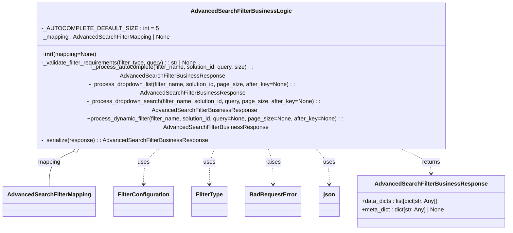

# Diagram: platform/partview_core/partview_service/partview_service/core/business/open_search/AdvancedSearchFilterBusinessLogic.py


> Auto-generated by Obscura crawlers

## Diagram 1



### SVG

<svg id="container" width="1378.0390625" xmlns="http://www.w3.org/2000/svg" class="classDiagram" height="546" viewBox="0 0 1378.0390625 546" role="graphics-document document" aria-roledescription="class"><style>#container{font-family:"trebuchet ms",verdana,arial,sans-serif;font-size:16px;fill:#333;}@keyframes edge-animation-frame{from{stroke-dashoffset:0;}}@keyframes dash{to{stroke-dashoffset:0;}}#container .edge-animation-slow{stroke-dasharray:9,5!important;stroke-dashoffset:900;animation:dash 50s linear infinite;stroke-linecap:round;}#container .edge-animation-fast{stroke-dasharray:9,5!important;stroke-dashoffset:900;animation:dash 20s linear infinite;stroke-linecap:round;}#container .error-icon{fill:#552222;}#container .error-text{fill:#552222;stroke:#552222;}#container .edge-thickness-normal{stroke-width:1px;}#container .edge-thickness-thick{stroke-width:3.5px;}#container .edge-pattern-solid{stroke-dasharray:0;}#container .edge-thickness-invisible{stroke-width:0;fill:none;}#container .edge-pattern-dashed{stroke-dasharray:3;}#container .edge-pattern-dotted{stroke-dasharray:2;}#container .marker{fill:#333333;stroke:#333333;}#container .marker.cross{stroke:#333333;}#container svg{font-family:"trebuchet ms",verdana,arial,sans-serif;font-size:16px;}#container p{margin:0;}#container g.classGroup text{fill:#9370DB;stroke:none;font-family:"trebuchet ms",verdana,arial,sans-serif;font-size:10px;}#container g.classGroup text .title{font-weight:bolder;}#container .nodeLabel,#container .edgeLabel{color:#131300;}#container .edgeLabel .label rect{fill:#ECECFF;}#container .label text{fill:#131300;}#container .labelBkg{background:#ECECFF;}#container .edgeLabel .label span{background:#ECECFF;}#container .classTitle{font-weight:bolder;}#container .node rect,#container .node circle,#container .node ellipse,#container .node polygon,#container .node path{fill:#ECECFF;stroke:#9370DB;stroke-width:1px;}#container .divider{stroke:#9370DB;stroke-width:1;}#container g.clickable{cursor:pointer;}#container g.classGroup rect{fill:#ECECFF;stroke:#9370DB;}#container g.classGroup line{stroke:#9370DB;stroke-width:1;}#container .classLabel .box{stroke:none;stroke-width:0;fill:#ECECFF;opacity:0.5;}#container .classLabel .label{fill:#9370DB;font-size:10px;}#container .relation{stroke:#333333;stroke-width:1;fill:none;}#container .dashed-line{stroke-dasharray:3;}#container .dotted-line{stroke-dasharray:1 2;}#container #compositionStart,#container .composition{fill:#333333!important;stroke:#333333!important;stroke-width:1;}#container #compositionEnd,#container .composition{fill:#333333!important;stroke:#333333!important;stroke-width:1;}#container #dependencyStart,#container .dependency{fill:#333333!important;stroke:#333333!important;stroke-width:1;}#container #dependencyStart,#container .dependency{fill:#333333!important;stroke:#333333!important;stroke-width:1;}#container #extensionStart,#container .extension{fill:transparent!important;stroke:#333333!important;stroke-width:1;}#container #extensionEnd,#container .extension{fill:transparent!important;stroke:#333333!important;stroke-width:1;}#container #aggregationStart,#container .aggregation{fill:transparent!important;stroke:#333333!important;stroke-width:1;}#container #aggregationEnd,#container .aggregation{fill:transparent!important;stroke:#333333!important;stroke-width:1;}#container #lollipopStart,#container .lollipop{fill:#ECECFF!important;stroke:#333333!important;stroke-width:1;}#container #lollipopEnd,#container .lollipop{fill:#ECECFF!important;stroke:#333333!important;stroke-width:1;}#container .edgeTerminals{font-size:11px;line-height:initial;}#container .classTitleText{text-anchor:middle;font-size:18px;fill:#333;}#container .label-icon{display:inline-block;height:1em;overflow:visible;vertical-align:-0.125em;}#container .node .label-icon path{fill:currentColor;stroke:revert;stroke-width:revert;}#container :root{--mermaid-font-family:"trebuchet ms",verdana,arial,sans-serif;}</style><g><defs><marker id="container_class-aggregationStart" class="marker aggregation class" refX="18" refY="7" markerWidth="190" markerHeight="240" orient="auto"><path d="M 18,7 L9,13 L1,7 L9,1 Z"></path></marker></defs><defs><marker id="container_class-aggregationEnd" class="marker aggregation class" refX="1" refY="7" markerWidth="20" markerHeight="28" orient="auto"><path d="M 18,7 L9,13 L1,7 L9,1 Z"></path></marker></defs><defs><marker id="container_class-extensionStart" class="marker extension class" refX="18" refY="7" markerWidth="190" markerHeight="240" orient="auto"><path d="M 1,7 L18,13 V 1 Z"></path></marker></defs><defs><marker id="container_class-extensionEnd" class="marker extension class" refX="1" refY="7" markerWidth="20" markerHeight="28" orient="auto"><path d="M 1,1 V 13 L18,7 Z"></path></marker></defs><defs><marker id="container_class-compositionStart" class="marker composition class" refX="18" refY="7" markerWidth="190" markerHeight="240" orient="auto"><path d="M 18,7 L9,13 L1,7 L9,1 Z"></path></marker></defs><defs><marker id="container_class-compositionEnd" class="marker composition class" refX="1" refY="7" markerWidth="20" markerHeight="28" orient="auto"><path d="M 18,7 L9,13 L1,7 L9,1 Z"></path></marker></defs><defs><marker id="container_class-dependencyStart" class="marker dependency class" refX="6" refY="7" markerWidth="190" markerHeight="240" orient="auto"><path d="M 5,7 L9,13 L1,7 L9,1 Z"></path></marker></defs><defs><marker id="container_class-dependencyEnd" class="marker dependency class" refX="13" refY="7" markerWidth="20" markerHeight="28" orient="auto"><path d="M 18,7 L9,13 L14,7 L9,1 Z"></path></marker></defs><defs><marker id="container_class-lollipopStart" class="marker lollipop class" refX="13" refY="7" markerWidth="190" markerHeight="240" orient="auto"><circle stroke="black" fill="transparent" cx="7" cy="7" r="6"></circle></marker></defs><defs><marker id="container_class-lollipopEnd" class="marker lollipop class" refX="1" refY="7" markerWidth="190" markerHeight="240" orient="auto"><circle stroke="black" fill="transparent" cx="7" cy="7" r="6"></circle></marker></defs><g class="root"><g class="clusters"></g><g class="edgePaths"><path d="M213.438,326.029L199.602,331.191C185.766,336.353,158.094,346.676,144.258,363.005C130.422,379.333,130.422,401.667,130.422,412.833L130.422,424" id="id_AdvancedSearchFilterBusinessLogic_AdvancedSearchFilterMapping_1" class="edge-thickness-normal edge-pattern-solid relation" style=";;;" data-edge="true" data-et="edge" data-id="id_AdvancedSearchFilterBusinessLogic_AdvancedSearchFilterMapping_1" data-points="W3sieCI6MjI5LjYwMDI2NzE2MzIxMjQ0LCJ5IjozMjB9LHsieCI6MTMwLjQyMTg3NSwieSI6MzU3fSx7IngiOjEzMC40MjE4NzUsInkiOjQyNH1d" marker-start="url(#container_class-aggregationStart)"></path><path d="M433.82,320L425.363,326.167C416.906,332.333,399.992,344.667,391.535,361C383.078,377.333,383.078,397.667,383.078,407.833L383.078,418" id="id_AdvancedSearchFilterBusinessLogic_FilterConfiguration_2" class="edge-thickness-normal edge-pattern-dashed relation" style=";;;" data-edge="true" data-et="edge" data-id="id_AdvancedSearchFilterBusinessLogic_FilterConfiguration_2" data-points="W3sieCI6NDMzLjgxOTgyNjc0ODcwNDY2LCJ5IjozMjB9LHsieCI6MzgzLjA3ODEyNSwieSI6MzU3fSx7IngiOjM4My4wNzgxMjUsInkiOjQyNH1d" marker-end="url(#container_class-dependencyEnd)"></path><path d="M578.049,320L575.294,326.167C572.538,332.333,567.027,344.667,564.271,361C561.516,377.333,561.516,397.667,561.516,407.833L561.516,418" id="id_AdvancedSearchFilterBusinessLogic_FilterType_3" class="edge-thickness-normal edge-pattern-dashed relation" style=";;;" data-edge="true" data-et="edge" data-id="id_AdvancedSearchFilterBusinessLogic_FilterType_3" data-points="W3sieCI6NTc4LjA0OTEwMTM2MDEwMzYsInkiOjMyMH0seyJ4Ijo1NjEuNTE1NjI1LCJ5IjozNTd9LHsieCI6NTYxLjUxNTYyNSwieSI6NDI0fV0=" marker-end="url(#container_class-dependencyEnd)"></path><path d="M717.467,320L720.222,326.167C722.978,332.333,728.489,344.667,731.244,361C734,377.333,734,397.667,734,407.833L734,418" id="id_AdvancedSearchFilterBusinessLogic_BadRequestError_4" class="edge-thickness-normal edge-pattern-dashed relation" style=";;;" data-edge="true" data-et="edge" data-id="id_AdvancedSearchFilterBusinessLogic_BadRequestError_4" data-points="W3sieCI6NzE3LjQ2NjUyMzYzOTg5NjQsInkiOjMyMH0seyJ4Ijo3MzQsInkiOjM1N30seyJ4Ijo3MzQsInkiOjQyNH1d" marker-end="url(#container_class-dependencyEnd)"></path><path d="M840.074,320L847.676,326.167C855.279,332.333,870.483,344.667,878.085,361C885.688,377.333,885.688,397.667,885.688,407.833L885.688,418" id="id_AdvancedSearchFilterBusinessLogic_json_5" class="edge-thickness-normal edge-pattern-dashed relation" style=";;;" data-edge="true" data-et="edge" data-id="id_AdvancedSearchFilterBusinessLogic_json_5" data-points="W3sieCI6ODQwLjA3NDAzNjU5MzI2NDMsInkiOjMyMH0seyJ4Ijo4ODUuNjg3NSwieSI6MzU3fSx7IngiOjg4NS42ODc1LCJ5Ijo0MjR9XQ==" marker-end="url(#container_class-dependencyEnd)"></path><path d="M1067.106,320L1083.682,326.167C1100.259,332.333,1133.413,344.667,1149.99,356C1166.566,367.333,1166.566,377.667,1166.566,382.833L1166.566,388" id="id_AdvancedSearchFilterBusinessLogic_AdvancedSearchFilterBusinessResponse_6" class="edge-thickness-normal edge-pattern-dashed relation" style=";;;" data-edge="true" data-et="edge" data-id="id_AdvancedSearchFilterBusinessLogic_AdvancedSearchFilterBusinessResponse_6" data-points="W3sieCI6MTA2Ny4xMDU2OTEzODYwMTAyLCJ5IjozMjB9LHsieCI6MTE2Ni41NjY0MDYyNSwieSI6MzU3fSx7IngiOjExNjYuNTY2NDA2MjUsInkiOjM5NH1d" marker-end="url(#container_class-dependencyEnd)"></path></g><g class="edgeLabels"><g class="edgeLabel" transform="translate(130.421875, 357)"><g class="label" data-id="id_AdvancedSearchFilterBusinessLogic_AdvancedSearchFilterMapping_1" transform="translate(-31.8203125, -12)"><foreignObject width="63.640625" height="24"><div xmlns="http://www.w3.org/1999/xhtml" class="labelBkg" style="display: table-cell; white-space: nowrap; line-height: 1.5; max-width: 200px; text-align: center;"><span class="edgeLabel"><p>mapping</p></span></div></foreignObject></g></g><g class="edgeLabel" transform="translate(383.078125, 357)"><g class="label" data-id="id_AdvancedSearchFilterBusinessLogic_FilterConfiguration_2" transform="translate(-16.4921875, -12)"><foreignObject width="32.984375" height="24"><div xmlns="http://www.w3.org/1999/xhtml" class="labelBkg" style="display: table-cell; white-space: nowrap; line-height: 1.5; max-width: 200px; text-align: center;"><span class="edgeLabel"><p>uses</p></span></div></foreignObject></g></g><g class="edgeLabel" transform="translate(561.515625, 357)"><g class="label" data-id="id_AdvancedSearchFilterBusinessLogic_FilterType_3" transform="translate(-16.4921875, -12)"><foreignObject width="32.984375" height="24"><div xmlns="http://www.w3.org/1999/xhtml" class="labelBkg" style="display: table-cell; white-space: nowrap; line-height: 1.5; max-width: 200px; text-align: center;"><span class="edgeLabel"><p>uses</p></span></div></foreignObject></g></g><g class="edgeLabel" transform="translate(734, 357)"><g class="label" data-id="id_AdvancedSearchFilterBusinessLogic_BadRequestError_4" transform="translate(-21.25, -12)"><foreignObject width="42.5" height="24"><div xmlns="http://www.w3.org/1999/xhtml" class="labelBkg" style="display: table-cell; white-space: nowrap; line-height: 1.5; max-width: 200px; text-align: center;"><span class="edgeLabel"><p>raises</p></span></div></foreignObject></g></g><g class="edgeLabel" transform="translate(885.6875, 357)"><g class="label" data-id="id_AdvancedSearchFilterBusinessLogic_json_5" transform="translate(-16.4921875, -12)"><foreignObject width="32.984375" height="24"><div xmlns="http://www.w3.org/1999/xhtml" class="labelBkg" style="display: table-cell; white-space: nowrap; line-height: 1.5; max-width: 200px; text-align: center;"><span class="edgeLabel"><p>uses</p></span></div></foreignObject></g></g><g class="edgeLabel" transform="translate(1166.56640625, 357)"><g class="label" data-id="id_AdvancedSearchFilterBusinessLogic_AdvancedSearchFilterBusinessResponse_6" transform="translate(-26.265625, -12)"><foreignObject width="52.53125" height="24"><div xmlns="http://www.w3.org/1999/xhtml" class="labelBkg" style="display: table-cell; white-space: nowrap; line-height: 1.5; max-width: 200px; text-align: center;"><span class="edgeLabel"><p>returns</p></span></div></foreignObject></g></g></g><g class="nodes"><g class="node default" id="classId-AdvancedSearchFilterBusinessResponse-0" transform="translate(1166.56640625, 466)"><g class="basic label-container"><path d="M-203.47265625 -72 L203.47265625 -72 L203.47265625 72 L-203.47265625 72" stroke="none" stroke-width="0" fill="#ECECFF" style=""></path><path d="M-203.47265625 -72 C-116.19477549909821 -72, -28.916894748196427 -72, 203.47265625 -72 M-203.47265625 -72 C-71.22511040664699 -72, 61.02243543670602 -72, 203.47265625 -72 M203.47265625 -72 C203.47265625 -40.79363943280319, 203.47265625 -9.587278865606379, 203.47265625 72 M203.47265625 -72 C203.47265625 -18.459811999508425, 203.47265625 35.08037600098315, 203.47265625 72 M203.47265625 72 C74.05557851945446 72, -55.361499211091086 72, -203.47265625 72 M203.47265625 72 C79.50783779609584 72, -44.456980657808316 72, -203.47265625 72 M-203.47265625 72 C-203.47265625 28.212462511581187, -203.47265625 -15.575074976837627, -203.47265625 -72 M-203.47265625 72 C-203.47265625 23.513138931592657, -203.47265625 -24.973722136814686, -203.47265625 -72" stroke="#9370DB" stroke-width="1.3" fill="none" stroke-dasharray="0 0" style=""></path></g><g class="annotation-group text" transform="translate(0, -48)"></g><g class="label-group text" transform="translate(-146.6953125, -48)"><g class="label" style="font-weight: bolder" transform="translate(0,-12)"><foreignObject width="293.390625" height="24"><div xmlns="http://www.w3.org/1999/xhtml" style="display: table-cell; white-space: nowrap; line-height: 1.5; max-width: 340px; text-align: center;"><span class="nodeLabel markdown-node-label" style=""><p>AdvancedSearchFilterBusinessResponse</p></span></div></foreignObject></g></g><g class="members-group text" transform="translate(-191.47265625, 0)"><g class="label" style="" transform="translate(0,-12)"><foreignObject width="219.015625" height="24"><div xmlns="http://www.w3.org/1999/xhtml" style="display: table-cell; white-space: nowrap; line-height: 1.5; max-width: 276px; text-align: center;"><span class="nodeLabel markdown-node-label" style=""><p>+data_dicts : list[dict[str, Any]]</p></span></div></foreignObject></g><g class="label" style="" transform="translate(0,12)"><foreignObject width="236.25" height="24"><div xmlns="http://www.w3.org/1999/xhtml" style="display: table-cell; white-space: nowrap; line-height: 1.5; max-width: 294px; text-align: center;"><span class="nodeLabel markdown-node-label" style=""><p>+meta_dict : dict[str, Any] | None</p></span></div></foreignObject></g></g><g class="methods-group text" transform="translate(-191.47265625, 72)"></g><g class="divider" style=""><path d="M-203.47265625 -24 C-94.20034431357476 -24, 15.07196762285048 -24, 203.47265625 -24 M-203.47265625 -24 C-60.58376947548399 -24, 82.30511729903202 -24, 203.47265625 -24" stroke="#9370DB" stroke-width="1.3" fill="none" stroke-dasharray="0 0" style=""></path></g><g class="divider" style=""><path d="M-203.47265625 48 C-100.62958115004368 48, 2.213493949912646 48, 203.47265625 48 M-203.47265625 48 C-82.19066845418075 48, 39.091319341638496 48, 203.47265625 48" stroke="#9370DB" stroke-width="1.3" fill="none" stroke-dasharray="0 0" style=""></path></g></g><g class="node default" id="classId-AdvancedSearchFilterBusinessLogic-1" transform="translate(647.7578125, 164)"><g class="basic label-container"><path d="M-581.26953125 -156 L581.26953125 -156 L581.26953125 156 L-581.26953125 156" stroke="none" stroke-width="0" fill="#ECECFF" style=""></path><path d="M-581.26953125 -156 C-189.37417626862032 -156, 202.52117871275937 -156, 581.26953125 -156 M-581.26953125 -156 C-147.90155656512422 -156, 285.46641811975155 -156, 581.26953125 -156 M581.26953125 -156 C581.26953125 -59.35670186715872, 581.26953125 37.28659626568256, 581.26953125 156 M581.26953125 -156 C581.26953125 -51.69302797249523, 581.26953125 52.61394405500954, 581.26953125 156 M581.26953125 156 C167.06786147228001 156, -247.13380830543997 156, -581.26953125 156 M581.26953125 156 C342.4434210056488 156, 103.61731076129769 156, -581.26953125 156 M-581.26953125 156 C-581.26953125 86.72190648638903, -581.26953125 17.443812972778062, -581.26953125 -156 M-581.26953125 156 C-581.26953125 50.153862187911514, -581.26953125 -55.69227562417697, -581.26953125 -156" stroke="#9370DB" stroke-width="1.3" fill="none" stroke-dasharray="0 0" style=""></path></g><g class="annotation-group text" transform="translate(0, -132)"></g><g class="label-group text" transform="translate(-130.3203125, -132)"><g class="label" style="font-weight: bolder" transform="translate(0,-12)"><foreignObject width="260.640625" height="24"><div xmlns="http://www.w3.org/1999/xhtml" style="display: table-cell; white-space: nowrap; line-height: 1.5; max-width: 307px; text-align: center;"><span class="nodeLabel markdown-node-label" style=""><p>AdvancedSearchFilterBusinessLogic</p></span></div></foreignObject></g></g><g class="members-group text" transform="translate(-569.26953125, -84)"><g class="label" style="" transform="translate(0,-12)"><foreignObject width="289.375" height="24"><div xmlns="http://www.w3.org/1999/xhtml" style="display: table-cell; white-space: nowrap; line-height: 1.5; max-width: 347px; text-align: center;"><span class="nodeLabel markdown-node-label" style=""><p>-_AUTOCOMPLETE_DEFAULT_SIZE : int = 5</p></span></div></foreignObject></g><g class="label" style="" transform="translate(0,12)"><foreignObject width="360.796875" height="24"><div xmlns="http://www.w3.org/1999/xhtml" style="display: table-cell; white-space: nowrap; line-height: 1.5; max-width: 418px; text-align: center;"><span class="nodeLabel markdown-node-label" style=""><p>-_mapping : AdvancedSearchFilterMapping | None</p></span></div></foreignObject></g></g><g class="methods-group text" transform="translate(-569.26953125, -12)"><g class="label" style="" transform="translate(0,-12)"><foreignObject width="152.796875" height="24"><div xmlns="http://www.w3.org/1999/xhtml" style="display: table-cell; white-space: nowrap; line-height: 1.5; max-width: 242px; text-align: center;"><span class="nodeLabel markdown-node-label" style=""><p>+<strong>init</strong>(mapping=None)</p></span></div></foreignObject></g><g class="label" style="" transform="translate(0,12)"><foreignObject width="443.109375" height="24"><div xmlns="http://www.w3.org/1999/xhtml" style="display: table-cell; white-space: nowrap; line-height: 1.5; max-width: 500px; text-align: center;"><span class="nodeLabel markdown-node-label" style=""><p>-_validate_filter_requirements(filter_type, query) : : str | None</p></span></div></foreignObject></g><g class="label" style="" transform="translate(0,36)"><foreignObject width="754.09375" height="24"><div xmlns="http://www.w3.org/1999/xhtml" style="display: table-cell; white-space: nowrap; line-height: 1.5; max-width: 811px; text-align: center;"><span class="nodeLabel markdown-node-label" style=""><p>-_process_autocomplete(filter_name, solution_id, query, size) : : AdvancedSearchFilterBusinessResponse</p></span></div></foreignObject></g><g class="label" style="" transform="translate(0,60)"><foreignObject width="872.1875" height="24"><div xmlns="http://www.w3.org/1999/xhtml" style="display: table-cell; white-space: nowrap; line-height: 1.5; max-width: 930px; text-align: center;"><span class="nodeLabel markdown-node-label" style=""><p>-_process_dropdown_list(filter_name, solution_id, page_size, after_key=None) : : AdvancedSearchFilterBusinessResponse</p></span></div></foreignObject></g><g class="label" style="" transform="translate(0,84)"><foreignObject width="946.4375" height="24"><div xmlns="http://www.w3.org/1999/xhtml" style="display: table-cell; white-space: nowrap; line-height: 1.5; max-width: 1004px; text-align: center;"><span class="nodeLabel markdown-node-label" style=""><p>-_process_dropdown_search(filter_name, solution_id, query, page_size, after_key=None) : : AdvancedSearchFilterBusinessResponse</p></span></div></foreignObject></g><g class="label" style="" transform="translate(0,108)"><foreignObject width="1008.21875" height="24"><div xmlns="http://www.w3.org/1999/xhtml" style="display: table-cell; white-space: nowrap; line-height: 1.5; max-width: 1066px; text-align: center;"><span class="nodeLabel markdown-node-label" style=""><p>+process_dynamic_filter(filter_name, solution_id, query=None, page_size=None, after_key=None) : : AdvancedSearchFilterBusinessResponse</p></span></div></foreignObject></g><g class="label" style="" transform="translate(0,132)"><foreignObject width="460.421875" height="24"><div xmlns="http://www.w3.org/1999/xhtml" style="display: table-cell; white-space: nowrap; line-height: 1.5; max-width: 518px; text-align: center;"><span class="nodeLabel markdown-node-label" style=""><p>-_serialize(response) : : AdvancedSearchFilterBusinessResponse</p></span></div></foreignObject></g></g><g class="divider" style=""><path d="M-581.26953125 -108 C-318.8055765983384 -108, -56.34162194667681 -108, 581.26953125 -108 M-581.26953125 -108 C-142.2407749332553 -108, 296.7879813834894 -108, 581.26953125 -108" stroke="#9370DB" stroke-width="1.3" fill="none" stroke-dasharray="0 0" style=""></path></g><g class="divider" style=""><path d="M-581.26953125 -36 C-209.1657396284332 -36, 162.93805199313363 -36, 581.26953125 -36 M-581.26953125 -36 C-216.66507961670334 -36, 147.93937201659332 -36, 581.26953125 -36" stroke="#9370DB" stroke-width="1.3" fill="none" stroke-dasharray="0 0" style=""></path></g></g><g class="node default" id="classId-AdvancedSearchFilterMapping-2" transform="translate(130.421875, 466)"><g class="basic label-container"><path d="M-122.421875 -42 L122.421875 -42 L122.421875 42 L-122.421875 42" stroke="none" stroke-width="0" fill="#ECECFF" style=""></path><path d="M-122.421875 -42 C-35.11941062110506 -42, 52.18305375778988 -42, 122.421875 -42 M-122.421875 -42 C-58.47628555020133 -42, 5.469303899597335 -42, 122.421875 -42 M122.421875 -42 C122.421875 -17.54531796746515, 122.421875 6.909364065069703, 122.421875 42 M122.421875 -42 C122.421875 -14.250921568201136, 122.421875 13.498156863597728, 122.421875 42 M122.421875 42 C39.28287269003464 42, -43.85612961993073 42, -122.421875 42 M122.421875 42 C32.846147621115094 42, -56.72957975776981 42, -122.421875 42 M-122.421875 42 C-122.421875 14.34109464314091, -122.421875 -13.317810713718181, -122.421875 -42 M-122.421875 42 C-122.421875 21.521749674979276, -122.421875 1.0434993499585516, -122.421875 -42" stroke="#9370DB" stroke-width="1.3" fill="none" stroke-dasharray="0 0" style=""></path></g><g class="annotation-group text" transform="translate(0, -18)"></g><g class="label-group text" transform="translate(-110.421875, -18)"><g class="label" style="font-weight: bolder" transform="translate(0,-12)"><foreignObject width="220.84375" height="24"><div xmlns="http://www.w3.org/1999/xhtml" style="display: table-cell; white-space: nowrap; line-height: 1.5; max-width: 269px; text-align: center;"><span class="nodeLabel markdown-node-label" style=""><p>AdvancedSearchFilterMapping</p></span></div></foreignObject></g></g><g class="members-group text" transform="translate(-110.421875, 30)"></g><g class="methods-group text" transform="translate(-110.421875, 60)"></g><g class="divider" style=""><path d="M-122.421875 6 C-66.98647455610023 6, -11.551074112200482 6, 122.421875 6 M-122.421875 6 C-70.04247420455829 6, -17.663073409116578 6, 122.421875 6" stroke="#9370DB" stroke-width="1.3" fill="none" stroke-dasharray="0 0" style=""></path></g><g class="divider" style=""><path d="M-122.421875 24 C-24.51512590303284 24, 73.39162319393432 24, 122.421875 24 M-122.421875 24 C-38.493329717813936 24, 45.43521556437213 24, 122.421875 24" stroke="#9370DB" stroke-width="1.3" fill="none" stroke-dasharray="0 0" style=""></path></g></g><g class="node default" id="classId-FilterConfiguration-3" transform="translate(383.078125, 466)"><g class="basic label-container"><path d="M-80.234375 -42 L80.234375 -42 L80.234375 42 L-80.234375 42" stroke="none" stroke-width="0" fill="#ECECFF" style=""></path><path d="M-80.234375 -42 C-37.59889456684013 -42, 5.03658586631974 -42, 80.234375 -42 M-80.234375 -42 C-19.360669132576398 -42, 41.513036734847205 -42, 80.234375 -42 M80.234375 -42 C80.234375 -14.409764147394963, 80.234375 13.180471705210074, 80.234375 42 M80.234375 -42 C80.234375 -15.63463127212491, 80.234375 10.73073745575018, 80.234375 42 M80.234375 42 C26.737017684460447 42, -26.760339631079106 42, -80.234375 42 M80.234375 42 C41.00512637625285 42, 1.775877752505707 42, -80.234375 42 M-80.234375 42 C-80.234375 11.173806972988693, -80.234375 -19.652386054022614, -80.234375 -42 M-80.234375 42 C-80.234375 18.82739798079222, -80.234375 -4.3452040384155595, -80.234375 -42" stroke="#9370DB" stroke-width="1.3" fill="none" stroke-dasharray="0 0" style=""></path></g><g class="annotation-group text" transform="translate(0, -18)"></g><g class="label-group text" transform="translate(-68.234375, -18)"><g class="label" style="font-weight: bolder" transform="translate(0,-12)"><foreignObject width="136.46875" height="24"><div xmlns="http://www.w3.org/1999/xhtml" style="display: table-cell; white-space: nowrap; line-height: 1.5; max-width: 184px; text-align: center;"><span class="nodeLabel markdown-node-label" style=""><p>FilterConfiguration</p></span></div></foreignObject></g></g><g class="members-group text" transform="translate(-68.234375, 30)"></g><g class="methods-group text" transform="translate(-68.234375, 60)"></g><g class="divider" style=""><path d="M-80.234375 6 C-30.428358570544155 6, 19.37765785891169 6, 80.234375 6 M-80.234375 6 C-44.31098466538679 6, -8.387594330773581 6, 80.234375 6" stroke="#9370DB" stroke-width="1.3" fill="none" stroke-dasharray="0 0" style=""></path></g><g class="divider" style=""><path d="M-80.234375 24 C-41.53694201256078 24, -2.839509025121558 24, 80.234375 24 M-80.234375 24 C-32.29441359232558 24, 15.645547815348834 24, 80.234375 24" stroke="#9370DB" stroke-width="1.3" fill="none" stroke-dasharray="0 0" style=""></path></g></g><g class="node default" id="classId-FilterType-4" transform="translate(561.515625, 466)"><g class="basic label-container"><path d="M-48.203125 -42 L48.203125 -42 L48.203125 42 L-48.203125 42" stroke="none" stroke-width="0" fill="#ECECFF" style=""></path><path d="M-48.203125 -42 C-16.226280305879342 -42, 15.750564388241315 -42, 48.203125 -42 M-48.203125 -42 C-19.442462863373276 -42, 9.318199273253448 -42, 48.203125 -42 M48.203125 -42 C48.203125 -15.52629333737304, 48.203125 10.947413325253919, 48.203125 42 M48.203125 -42 C48.203125 -23.28187824673395, 48.203125 -4.563756493467899, 48.203125 42 M48.203125 42 C20.574990704308803 42, -7.053143591382394 42, -48.203125 42 M48.203125 42 C19.30790662482978 42, -9.58731175034044 42, -48.203125 42 M-48.203125 42 C-48.203125 19.047579323386046, -48.203125 -3.9048413532279085, -48.203125 -42 M-48.203125 42 C-48.203125 13.12583543555374, -48.203125 -15.748329128892522, -48.203125 -42" stroke="#9370DB" stroke-width="1.3" fill="none" stroke-dasharray="0 0" style=""></path></g><g class="annotation-group text" transform="translate(0, -18)"></g><g class="label-group text" transform="translate(-36.203125, -18)"><g class="label" style="font-weight: bolder" transform="translate(0,-12)"><foreignObject width="72.40625" height="24"><div xmlns="http://www.w3.org/1999/xhtml" style="display: table-cell; white-space: nowrap; line-height: 1.5; max-width: 121px; text-align: center;"><span class="nodeLabel markdown-node-label" style=""><p>FilterType</p></span></div></foreignObject></g></g><g class="members-group text" transform="translate(-36.203125, 30)"></g><g class="methods-group text" transform="translate(-36.203125, 60)"></g><g class="divider" style=""><path d="M-48.203125 6 C-12.003279592390427 6, 24.196565815219145 6, 48.203125 6 M-48.203125 6 C-16.450154607575083 6, 15.302815784849834 6, 48.203125 6" stroke="#9370DB" stroke-width="1.3" fill="none" stroke-dasharray="0 0" style=""></path></g><g class="divider" style=""><path d="M-48.203125 24 C-17.73784954438458 24, 12.727425911230839 24, 48.203125 24 M-48.203125 24 C-11.002569110077424 24, 26.197986779845152 24, 48.203125 24" stroke="#9370DB" stroke-width="1.3" fill="none" stroke-dasharray="0 0" style=""></path></g></g><g class="node default" id="classId-BadRequestError-5" transform="translate(734, 466)"><g class="basic label-container"><path d="M-74.28125 -42 L74.28125 -42 L74.28125 42 L-74.28125 42" stroke="none" stroke-width="0" fill="#ECECFF" style=""></path><path d="M-74.28125 -42 C-33.82271350329691 -42, 6.63582299340618 -42, 74.28125 -42 M-74.28125 -42 C-18.2175634320583 -42, 37.8461231358834 -42, 74.28125 -42 M74.28125 -42 C74.28125 -10.728203071890384, 74.28125 20.543593856219232, 74.28125 42 M74.28125 -42 C74.28125 -14.613875851927805, 74.28125 12.77224829614439, 74.28125 42 M74.28125 42 C22.86394118105146 42, -28.553367637897082 42, -74.28125 42 M74.28125 42 C32.63897783235579 42, -9.003294335288416 42, -74.28125 42 M-74.28125 42 C-74.28125 12.369167838092824, -74.28125 -17.26166432381435, -74.28125 -42 M-74.28125 42 C-74.28125 13.009157631664412, -74.28125 -15.981684736671177, -74.28125 -42" stroke="#9370DB" stroke-width="1.3" fill="none" stroke-dasharray="0 0" style=""></path></g><g class="annotation-group text" transform="translate(0, -18)"></g><g class="label-group text" transform="translate(-62.28125, -18)"><g class="label" style="font-weight: bolder" transform="translate(0,-12)"><foreignObject width="124.5625" height="24"><div xmlns="http://www.w3.org/1999/xhtml" style="display: table-cell; white-space: nowrap; line-height: 1.5; max-width: 174px; text-align: center;"><span class="nodeLabel markdown-node-label" style=""><p>BadRequestError</p></span></div></foreignObject></g></g><g class="members-group text" transform="translate(-62.28125, 30)"></g><g class="methods-group text" transform="translate(-62.28125, 60)"></g><g class="divider" style=""><path d="M-74.28125 6 C-27.569525567501216 6, 19.142198864997567 6, 74.28125 6 M-74.28125 6 C-25.61160577649872 6, 23.05803844700256 6, 74.28125 6" stroke="#9370DB" stroke-width="1.3" fill="none" stroke-dasharray="0 0" style=""></path></g><g class="divider" style=""><path d="M-74.28125 24 C-43.91774372990716 24, -13.554237459814324 24, 74.28125 24 M-74.28125 24 C-23.94258862120757 24, 26.39607275758486 24, 74.28125 24" stroke="#9370DB" stroke-width="1.3" fill="none" stroke-dasharray="0 0" style=""></path></g></g><g class="node default" id="classId-json-6" transform="translate(885.6875, 466)"><g class="basic label-container"><path d="M-27.40625 -42 L27.40625 -42 L27.40625 42 L-27.40625 42" stroke="none" stroke-width="0" fill="#ECECFF" style=""></path><path d="M-27.40625 -42 C-8.64534664043736 -42, 10.11555671912528 -42, 27.40625 -42 M-27.40625 -42 C-15.136087429813722 -42, -2.8659248596274445 -42, 27.40625 -42 M27.40625 -42 C27.40625 -18.17686938770395, 27.40625 5.646261224592102, 27.40625 42 M27.40625 -42 C27.40625 -23.418402999303407, 27.40625 -4.836805998606813, 27.40625 42 M27.40625 42 C6.653553551028615 42, -14.09914289794277 42, -27.40625 42 M27.40625 42 C6.602448601686753 42, -14.201352796626495 42, -27.40625 42 M-27.40625 42 C-27.40625 20.838169983414744, -27.40625 -0.32366003317051195, -27.40625 -42 M-27.40625 42 C-27.40625 22.24169225551975, -27.40625 2.483384511039503, -27.40625 -42" stroke="#9370DB" stroke-width="1.3" fill="none" stroke-dasharray="0 0" style=""></path></g><g class="annotation-group text" transform="translate(0, -18)"></g><g class="label-group text" transform="translate(-15.40625, -18)"><g class="label" style="font-weight: bolder" transform="translate(0,-12)"><foreignObject width="30.8125" height="24"><div xmlns="http://www.w3.org/1999/xhtml" style="display: table-cell; white-space: nowrap; line-height: 1.5; max-width: 82px; text-align: center;"><span class="nodeLabel markdown-node-label" style=""><p>json</p></span></div></foreignObject></g></g><g class="members-group text" transform="translate(-15.40625, 30)"></g><g class="methods-group text" transform="translate(-15.40625, 60)"></g><g class="divider" style=""><path d="M-27.40625 6 C-10.315301073240857 6, 6.7756478535182865 6, 27.40625 6 M-27.40625 6 C-14.145355007944914 6, -0.8844600158898288 6, 27.40625 6" stroke="#9370DB" stroke-width="1.3" fill="none" stroke-dasharray="0 0" style=""></path></g><g class="divider" style=""><path d="M-27.40625 24 C-12.931072465378627 24, 1.5441050692427467 24, 27.40625 24 M-27.40625 24 C-13.167964756400895 24, 1.0703204871982095 24, 27.40625 24" stroke="#9370DB" stroke-width="1.3" fill="none" stroke-dasharray="0 0" style=""></path></g></g></g></g></g></svg>

## Diagram 2

```mermaid
flowchart TD
Start([Start])
GetFT[Get filter_type = FilterConfiguration.get_filter_type(filter_name, query)]
Start --> GetFT
GetFT --> CheckFT{filter_type present?}
CheckFT -- No --> ReturnEmpty[Return AdvancedSearchFilterBusinessResponse()]
CheckFT -- Yes --> RawQuery[raw_query = "" if query is None else query]
RawQuery --> Validate[validation_error = _validate_filter_requirements(filter_type, raw_query)]
Validate --> CheckVal{validation_error?}
CheckVal -- Yes --> Raise[Throw BadRequestError(validation_error)]
CheckVal -- No --> Match{filter_type}
Match -- AUTOCOMPLETE --> ProcAC[_process_autocomplete(filter_name, solution_id, query=raw_query, size=page_size or _AUTOCOMPLETE_DEFAULT_SIZE)]
Match -- DROPDOWN_LIST --> ProcDL[_process_dropdown_list(filter_name, solution_id, page_size=page_size or 20, after_key=after_key)]
Match -- DROPDOWN_SEARCH --> ProcDS[_process_dropdown_search(filter_name, solution_id, query=raw_query, page_size=page_size or 20, after_key=after_key)]
ProcAC --> Serialize[_serialize(response)]
ProcDL --> Serialize
ProcDS --> Serialize
Serialize --> ReturnResp[Return AdvancedSearchFilterBusinessResponse]
ReturnResp --> End([End])
```

> SVG rendering failed for this diagram.
