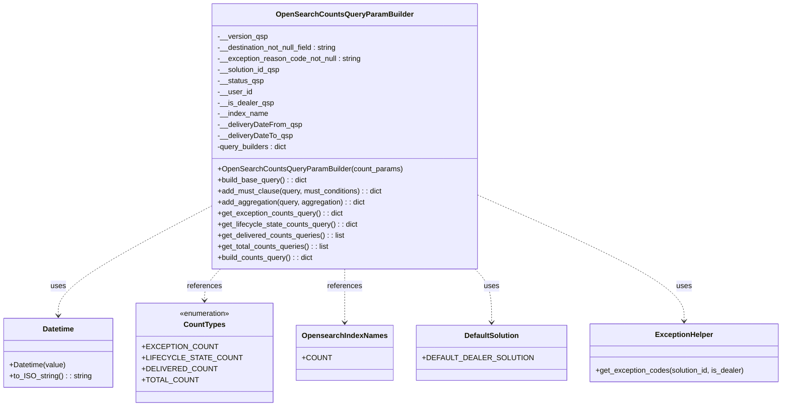

# Diagram: platform/partview_core/partview_service/partview_service/core/business/open_search/OpenSearchCountsQueryParamBuilder.py


> Auto-generated by Obscura crawlers

## Diagram 1



> SVG rendering failed for this diagram.

## Diagram 2

```mermaid
flowchart TD
  A[build_counts_query(version)] --> B{version in query_builders?}
  B -- No --> C[Raise ValueError: "Unknown query type"]
  B -- Yes --> D[query_builder = query_builders[version]]
  D --> QB[QueryBuilders mapping]
  subgraph QueryBuilders
    EXC[CountTypes.EXCEPTION_COUNT] --> GE[get_exception_counts_query()]
    LIF[CountTypes.LIFECYCLE_STATE_COUNT] --> GL[get_lifecycle_state_counts_query()]
    DEL[CountTypes.DELIVERED_COUNT] --> GD[get_delivered_counts_queries()]
    TOT[CountTypes.TOTAL_COUNT] --> GT[get_total_counts_queries()]
  end
  QB --> GE
  QB --> GL
  QB --> GD
  QB --> GT
  GE --> R1[Adds filters, may add terms filter, must_not Delivered, adds exceptionCodes aggregation]
  GL --> R2[Adds lifecycle_state_counts aggregation and returns query]
  GD --> R3[Builds arrival_ts_query and destination_eta_query (with date range must clauses) and returns list]
  GT --> R4[Returns [exceptionCountsQuery, lifecycleStateQuery, arrivalTsQuery, destinationEtaQuery]]
  R1 --> End[Return query or queries]
  R2 --> End
  R3 --> End
  R4 --> End
```

> SVG rendering failed for this diagram.
