# Diagram: platform/partview_core/partview_service/partview_service/core/business/open_search/OpenSearchQueryParamBuilder.py


> Auto-generated by Obscura crawlers

## Diagram 1

```mermaid
classDiagram
    class OpenSearchQueryParamBuilder {
        - __everything_qsp
        - __page_number_qsp
        - __page_size_qsp
        - __destination_not_null_field
        - __version_qsp
        - __is_async_qsp
        - __has_async_key
        - __batch_type_qsp
        - __batch_list_qsp
        - __is_part_seller_qsp
        - __search_after_qsp
        - __solution_id_qsp
        - __status_qsp
        - __trackingNumber_contains_qsp
        - __partNumber_contains_qsp
        - __orderNumber_contains_qsp
        - __shipmentId_contains_qsp
        - __billOfLading_contains_qsp
        - __trailerEquipmentNumber_contains_qsp
        - __sort_column_qsp
        - __reverse_sort_qsp
        - __user_id
        - __originCode_qsp
        - __originCode_contains_qsp
        - __originCode_is_null_qsp
        - __originCode_is_not_null_qsp
        - __destinationCode_qsp
        - __destinationCode_contains_qsp
        - __destinationCode_is_null_qsp
        - __destinationCode_is_not_null_qsp
        - __carrier_qsp
        - __carrier_contains_qsp
        - __carrier_is_null_qsp
        - __carrier_is_not_null_qsp
        - __partNumber_qsp
        - __partNumber_is_null_qsp
        - __partNumber_is_not_null_qsp
        - __trailerEquipmentNumber_qsp
        - __trailerEquipmentNumber_is_null_qsp
        - __trailerEquipmentNumber_is_not_null_qsp
        - __lifecycleState_qsp
        - __lifecycleState_contains_qsp
        - __lifecycleState_is_null_qsp
        - __lifecycleState_is_not_null_qsp
        - __exception_qsp
        - __exception_contains_qsp
        - __exception_is_null_qsp
        - __exception_is_not_null_qsp
        - __orderPriority_qsp
        - __orderPriority_contains_qsp
        - __orderPriority_is_null_qsp
        - __orderPriority_is_not_null_qsp
        - __orderDateFrom_qsp
        - __orderDateTo_qsp
        - __deliveryDateFrom_qsp
        - __deliveryDateTo_qsp
        - __deliveryDateType_qsp
        - __last_milestone_code_qsp
        - __last_milestone_code_contains_qsp
        - __last_milestone_code_is_null_qsp
        - __last_milestone_code_is_not_null_qsp
        - __current_location_code_qsp
        - __current_location_code_contains_qsp
        - __current_location_code_is_null_qsp
        - __current_location_code_is_not_null_qsp
        - __final_mile_origin_location_code_qsp
        - __final_mile_origin_location_code_contains_qsp
        - __final_mile_origin_location_code_is_null_qsp
        - __final_mile_origin_location_code_is_not_null_qsp
        - default_sort_mapping
        + build_query_params()
        + generate_where_clause()
        + get_generic_filter_query(values, contains, is_null, is_not_null, col_name, query_type="must")
        + get_fuzzy_clause(value, col_name)
        + build_search_clause(field_value, field_name, partial_match_max_len=25)
        + get_batch_search_clause()
        + wrap_nested(path, inner_clause)
        + get_search_clause(value, col_name)
        + get_search_by_tracking_number_clause()
        + get_search_by_part_number_clause()
        + get_search_by_order_number_clause()
        + get_search_by_shipment_id_clause()
        + get_search_by_bill_of_lading_clause()
        + get_search_by_trailer_equipment_number_clause()
        + get_solution_id_clause()
        + get_destination_not_null_clause()
        + get_status_clause()
        + solution_id_search_clause()
        + destination_not_null_clause()
        + status_search_clause()
        + get_search_clauses()
        + get_origin_code_filter_clause()
        + get_destination_code_filter_clause()
        + get_carrier_filter_clause()
        + get_part_number_clause()
        + get_trailer_equipment_number_clause()
        + get_lifecycle_state_clause()
        + get_exception_clause()
        + get_order_priority_clause()
        + get_order_date_clause()
        + get_delivery_date_clause()
        + get_last_milestone_code_filter_clause()
        + get_current_location_code_filter_clause()
        + get_final_mile_origin_location_code_filter_clause()
        + get_sort_column()
        + get_order_direction()
        + get_order_by_clause()
        + generate_search_after_clause()
    }

    class Datetime
    class VersionOptions
    class BatchSearch
    class DeliveryDateSearchTypes
    class SortKey

    OpenSearchQueryParamBuilder --> Datetime : converts dates
    OpenSearchQueryParamBuilder --> VersionOptions : checks version
    OpenSearchQueryParamBuilder --> BatchSearch : looks up batch fields
    OpenSearchQueryParamBuilder --> DeliveryDateSearchTypes : maps delivery types to fields
    OpenSearchQueryParamBuilder --> SortKey : resolves sort keys
```



### SVG

<svg id="container" width="899.65625" xmlns="http://www.w3.org/2000/svg" class="classDiagram" height="2886" viewBox="0 0 899.65625 2886" role="graphics-document document" aria-roledescription="class"><style>#container{font-family:"trebuchet ms",verdana,arial,sans-serif;font-size:16px;fill:#333;}@keyframes edge-animation-frame{from{stroke-dashoffset:0;}}@keyframes dash{to{stroke-dashoffset:0;}}#container .edge-animation-slow{stroke-dasharray:9,5!important;stroke-dashoffset:900;animation:dash 50s linear infinite;stroke-linecap:round;}#container .edge-animation-fast{stroke-dasharray:9,5!important;stroke-dashoffset:900;animation:dash 20s linear infinite;stroke-linecap:round;}#container .error-icon{fill:#552222;}#container .error-text{fill:#552222;stroke:#552222;}#container .edge-thickness-normal{stroke-width:1px;}#container .edge-thickness-thick{stroke-width:3.5px;}#container .edge-pattern-solid{stroke-dasharray:0;}#container .edge-thickness-invisible{stroke-width:0;fill:none;}#container .edge-pattern-dashed{stroke-dasharray:3;}#container .edge-pattern-dotted{stroke-dasharray:2;}#container .marker{fill:#333333;stroke:#333333;}#container .marker.cross{stroke:#333333;}#container svg{font-family:"trebuchet ms",verdana,arial,sans-serif;font-size:16px;}#container p{margin:0;}#container g.classGroup text{fill:#9370DB;stroke:none;font-family:"trebuchet ms",verdana,arial,sans-serif;font-size:10px;}#container g.classGroup text .title{font-weight:bolder;}#container .nodeLabel,#container .edgeLabel{color:#131300;}#container .edgeLabel .label rect{fill:#ECECFF;}#container .label text{fill:#131300;}#container .labelBkg{background:#ECECFF;}#container .edgeLabel .label span{background:#ECECFF;}#container .classTitle{font-weight:bolder;}#container .node rect,#container .node circle,#container .node ellipse,#container .node polygon,#container .node path{fill:#ECECFF;stroke:#9370DB;stroke-width:1px;}#container .divider{stroke:#9370DB;stroke-width:1;}#container g.clickable{cursor:pointer;}#container g.classGroup rect{fill:#ECECFF;stroke:#9370DB;}#container g.classGroup line{stroke:#9370DB;stroke-width:1;}#container .classLabel .box{stroke:none;stroke-width:0;fill:#ECECFF;opacity:0.5;}#container .classLabel .label{fill:#9370DB;font-size:10px;}#container .relation{stroke:#333333;stroke-width:1;fill:none;}#container .dashed-line{stroke-dasharray:3;}#container .dotted-line{stroke-dasharray:1 2;}#container #compositionStart,#container .composition{fill:#333333!important;stroke:#333333!important;stroke-width:1;}#container #compositionEnd,#container .composition{fill:#333333!important;stroke:#333333!important;stroke-width:1;}#container #dependencyStart,#container .dependency{fill:#333333!important;stroke:#333333!important;stroke-width:1;}#container #dependencyStart,#container .dependency{fill:#333333!important;stroke:#333333!important;stroke-width:1;}#container #extensionStart,#container .extension{fill:transparent!important;stroke:#333333!important;stroke-width:1;}#container #extensionEnd,#container .extension{fill:transparent!important;stroke:#333333!important;stroke-width:1;}#container #aggregationStart,#container .aggregation{fill:transparent!important;stroke:#333333!important;stroke-width:1;}#container #aggregationEnd,#container .aggregation{fill:transparent!important;stroke:#333333!important;stroke-width:1;}#container #lollipopStart,#container .lollipop{fill:#ECECFF!important;stroke:#333333!important;stroke-width:1;}#container #lollipopEnd,#container .lollipop{fill:#ECECFF!important;stroke:#333333!important;stroke-width:1;}#container .edgeTerminals{font-size:11px;line-height:initial;}#container .classTitleText{text-anchor:middle;font-size:18px;fill:#333;}#container .label-icon{display:inline-block;height:1em;overflow:visible;vertical-align:-0.125em;}#container .node .label-icon path{fill:currentColor;stroke:revert;stroke-width:revert;}#container :root{--mermaid-font-family:"trebuchet ms",verdana,arial,sans-serif;}</style><g><defs><marker id="container_class-aggregationStart" class="marker aggregation class" refX="18" refY="7" markerWidth="190" markerHeight="240" orient="auto"><path d="M 18,7 L9,13 L1,7 L9,1 Z"></path></marker></defs><defs><marker id="container_class-aggregationEnd" class="marker aggregation class" refX="1" refY="7" markerWidth="20" markerHeight="28" orient="auto"><path d="M 18,7 L9,13 L1,7 L9,1 Z"></path></marker></defs><defs><marker id="container_class-extensionStart" class="marker extension class" refX="18" refY="7" markerWidth="190" markerHeight="240" orient="auto"><path d="M 1,7 L18,13 V 1 Z"></path></marker></defs><defs><marker id="container_class-extensionEnd" class="marker extension class" refX="1" refY="7" markerWidth="20" markerHeight="28" orient="auto"><path d="M 1,1 V 13 L18,7 Z"></path></marker></defs><defs><marker id="container_class-compositionStart" class="marker composition class" refX="18" refY="7" markerWidth="190" markerHeight="240" orient="auto"><path d="M 18,7 L9,13 L1,7 L9,1 Z"></path></marker></defs><defs><marker id="container_class-compositionEnd" class="marker composition class" refX="1" refY="7" markerWidth="20" markerHeight="28" orient="auto"><path d="M 18,7 L9,13 L1,7 L9,1 Z"></path></marker></defs><defs><marker id="container_class-dependencyStart" class="marker dependency class" refX="6" refY="7" markerWidth="190" markerHeight="240" orient="auto"><path d="M 5,7 L9,13 L1,7 L9,1 Z"></path></marker></defs><defs><marker id="container_class-dependencyEnd" class="marker dependency class" refX="13" refY="7" markerWidth="20" markerHeight="28" orient="auto"><path d="M 18,7 L9,13 L14,7 L9,1 Z"></path></marker></defs><defs><marker id="container_class-lollipopStart" class="marker lollipop class" refX="13" refY="7" markerWidth="190" markerHeight="240" orient="auto"><circle stroke="black" fill="transparent" cx="7" cy="7" r="6"></circle></marker></defs><defs><marker id="container_class-lollipopEnd" class="marker lollipop class" refX="1" refY="7" markerWidth="190" markerHeight="240" orient="auto"><circle stroke="black" fill="transparent" cx="7" cy="7" r="6"></circle></marker></defs><g class="root"><g class="clusters"></g><g class="edgePaths"><path d="M91.98,2696L89.993,2704.167C88.005,2712.333,84.03,2728.667,82.042,2744C80.055,2759.333,80.055,2773.667,80.055,2780.833L80.055,2788" id="id_OpenSearchQueryParamBuilder_Datetime_1" class="edge-thickness-normal edge-pattern-solid relation" style=";;;" data-edge="true" data-et="edge" data-id="id_OpenSearchQueryParamBuilder_Datetime_1" data-points="W3sieCI6OTEuOTgwNDA5ODYxODA5MDUsInkiOjI2OTZ9LHsieCI6ODAuMDU0Njg3NSwieSI6Mjc0NX0seyJ4Ijo4MC4wNTQ2ODc1LCJ5IjoyNzk0fV0=" marker-end="url(#container_class-dependencyEnd)"></path><path d="M249.729,2696L248.7,2704.167C247.671,2712.333,245.613,2728.667,244.584,2744C243.555,2759.333,243.555,2773.667,243.555,2780.833L243.555,2788" id="id_OpenSearchQueryParamBuilder_VersionOptions_2" class="edge-thickness-normal edge-pattern-solid relation" style=";;;" data-edge="true" data-et="edge" data-id="id_OpenSearchQueryParamBuilder_VersionOptions_2" data-points="W3sieCI6MjQ5LjcyOTE1MzU4MDQwMiwieSI6MjY5Nn0seyJ4IjoyNDMuNTU0Njg3NSwieSI6Mjc0NX0seyJ4IjoyNDMuNTU0Njg3NSwieSI6Mjc5NH1d" marker-end="url(#container_class-dependencyEnd)"></path><path d="M419.086,2696L419.086,2704.167C419.086,2712.333,419.086,2728.667,419.086,2744C419.086,2759.333,419.086,2773.667,419.086,2780.833L419.086,2788" id="id_OpenSearchQueryParamBuilder_BatchSearch_3" class="edge-thickness-normal edge-pattern-solid relation" style=";;;" data-edge="true" data-et="edge" data-id="id_OpenSearchQueryParamBuilder_BatchSearch_3" data-points="W3sieCI6NDE5LjA4NTkzNzUsInkiOjI2OTZ9LHsieCI6NDE5LjA4NTkzNzUsInkiOjI3NDV9LHsieCI6NDE5LjA4NTkzNzUsInkiOjI3OTR9XQ==" marker-end="url(#container_class-dependencyEnd)"></path><path d="M623.9,2696L625.145,2704.167C626.389,2712.333,628.878,2728.667,630.123,2744C631.367,2759.333,631.367,2773.667,631.367,2780.833L631.367,2788" id="id_OpenSearchQueryParamBuilder_DeliveryDateSearchTypes_4" class="edge-thickness-normal edge-pattern-solid relation" style=";;;" data-edge="true" data-et="edge" data-id="id_OpenSearchQueryParamBuilder_DeliveryDateSearchTypes_4" data-points="W3sieCI6NjIzLjkwMDAwNzg1MTc1ODgsInkiOjI2OTZ9LHsieCI6NjMxLjM2NzE4NzUsInkiOjI3NDV9LHsieCI6NjMxLjM2NzE4NzUsInkiOjI3OTR9XQ==" marker-end="url(#container_class-dependencyEnd)"></path><path d="M812.825,2696L815.217,2704.167C817.61,2712.333,822.395,2728.667,824.787,2744C827.18,2759.333,827.18,2773.667,827.18,2780.833L827.18,2788" id="id_OpenSearchQueryParamBuilder_SortKey_5" class="edge-thickness-normal edge-pattern-solid relation" style=";;;" data-edge="true" data-et="edge" data-id="id_OpenSearchQueryParamBuilder_SortKey_5" data-points="W3sieCI6ODEyLjgyNDYzMDk2NzMzNjcsInkiOjI2OTZ9LHsieCI6ODI3LjE3OTY4NzUsInkiOjI3NDV9LHsieCI6ODI3LjE3OTY4NzUsInkiOjI3OTR9XQ==" marker-end="url(#container_class-dependencyEnd)"></path></g><g class="edgeLabels"><g class="edgeLabel" transform="translate(80.0546875, 2745)"><g class="label" data-id="id_OpenSearchQueryParamBuilder_Datetime_1" transform="translate(-53.0703125, -12)"><foreignObject width="106.140625" height="24"><div xmlns="http://www.w3.org/1999/xhtml" class="labelBkg" style="display: table-cell; white-space: nowrap; line-height: 1.5; max-width: 200px; text-align: center;"><span class="edgeLabel"><p>converts dates</p></span></div></foreignObject></g></g><g class="edgeLabel" transform="translate(243.5546875, 2745)"><g class="label" data-id="id_OpenSearchQueryParamBuilder_VersionOptions_2" transform="translate(-53.1953125, -12)"><foreignObject width="106.390625" height="24"><div xmlns="http://www.w3.org/1999/xhtml" class="labelBkg" style="display: table-cell; white-space: nowrap; line-height: 1.5; max-width: 200px; text-align: center;"><span class="edgeLabel"><p>checks version</p></span></div></foreignObject></g></g><g class="edgeLabel" transform="translate(419.0859375, 2745)"><g class="label" data-id="id_OpenSearchQueryParamBuilder_BatchSearch_3" transform="translate(-75.296875, -12)"><foreignObject width="150.59375" height="24"><div xmlns="http://www.w3.org/1999/xhtml" class="labelBkg" style="display: table-cell; white-space: nowrap; line-height: 1.5; max-width: 200px; text-align: center;"><span class="edgeLabel"><p>looks up batch fields</p></span></div></foreignObject></g></g><g class="edgeLabel" transform="translate(631.3671875, 2745)"><g class="label" data-id="id_OpenSearchQueryParamBuilder_DeliveryDateSearchTypes_4" transform="translate(-100, -24)"><foreignObject width="200" height="48"><div xmlns="http://www.w3.org/1999/xhtml" class="labelBkg" style="display: table; white-space: break-spaces; line-height: 1.5; max-width: 200px; text-align: center; width: 200px;"><span class="edgeLabel"><p>maps delivery types to fields</p></span></div></foreignObject></g></g><g class="edgeLabel" transform="translate(827.1796875, 2745)"><g class="label" data-id="id_OpenSearchQueryParamBuilder_SortKey_5" transform="translate(-64.4765625, -12)"><foreignObject width="128.953125" height="24"><div xmlns="http://www.w3.org/1999/xhtml" class="labelBkg" style="display: table-cell; white-space: nowrap; line-height: 1.5; max-width: 200px; text-align: center;"><span class="edgeLabel"><p>resolves sort keys</p></span></div></foreignObject></g></g></g><g class="nodes"><g class="node default" id="classId-OpenSearchQueryParamBuilder-0" transform="translate(419.0859375, 1352)"><g class="basic label-container"><path d="M-411.0859375 -1344 L411.0859375 -1344 L411.0859375 1344 L-411.0859375 1344" stroke="none" stroke-width="0" fill="#ECECFF" style=""></path><path d="M-411.0859375 -1344 C-153.56524270123447 -1344, 103.95545209753107 -1344, 411.0859375 -1344 M-411.0859375 -1344 C-142.1663801537295 -1344, 126.75317719254099 -1344, 411.0859375 -1344 M411.0859375 -1344 C411.0859375 -446.16430693182906, 411.0859375 451.6713861363419, 411.0859375 1344 M411.0859375 -1344 C411.0859375 -688.8137030243257, 411.0859375 -33.62740604865144, 411.0859375 1344 M411.0859375 1344 C115.19604363115013 1344, -180.69385023769973 1344, -411.0859375 1344 M411.0859375 1344 C175.22092436588062 1344, -60.64408876823876 1344, -411.0859375 1344 M-411.0859375 1344 C-411.0859375 544.8872244162086, -411.0859375 -254.2255511675828, -411.0859375 -1344 M-411.0859375 1344 C-411.0859375 700.7649041979561, -411.0859375 57.52980839591214, -411.0859375 -1344" stroke="#9370DB" stroke-width="1.3" fill="none" stroke-dasharray="0 0" style=""></path></g><g class="annotation-group text" transform="translate(0, -1320)"></g><g class="label-group text" transform="translate(-115.28125, -1320)"><g class="label" style="font-weight: bolder" transform="translate(0,-12)"><foreignObject width="230.5625" height="24"><div xmlns="http://www.w3.org/1999/xhtml" style="display: table-cell; white-space: nowrap; line-height: 1.5; max-width: 279px; text-align: center;"><span class="nodeLabel markdown-node-label" style=""><p>OpenSearchQueryParamBuilder</p></span></div></foreignObject></g></g><g class="members-group text" transform="translate(-399.0859375, -1272)"><g class="label" style="" transform="translate(0,-12)"><foreignObject width="138.0625" height="24"><div xmlns="http://www.w3.org/1999/xhtml" style="display: table-cell; white-space: nowrap; line-height: 1.5; max-width: 195px; text-align: center;"><span class="nodeLabel markdown-node-label" style=""><p>- __everything_qsp</p></span></div></foreignObject></g><g class="label" style="" transform="translate(0,12)"><foreignObject width="159.90625" height="24"><div xmlns="http://www.w3.org/1999/xhtml" style="display: table-cell; white-space: nowrap; line-height: 1.5; max-width: 217px; text-align: center;"><span class="nodeLabel markdown-node-label" style=""><p>- __page_number_qsp</p></span></div></foreignObject></g><g class="label" style="" transform="translate(0,36)"><foreignObject width="131.65625" height="24"><div xmlns="http://www.w3.org/1999/xhtml" style="display: table-cell; white-space: nowrap; line-height: 1.5; max-width: 189px; text-align: center;"><span class="nodeLabel markdown-node-label" style=""><p>- __page_size_qsp</p></span></div></foreignObject></g><g class="label" style="" transform="translate(0,60)"><foreignObject width="219.28125" height="24"><div xmlns="http://www.w3.org/1999/xhtml" style="display: table-cell; white-space: nowrap; line-height: 1.5; max-width: 277px; text-align: center;"><span class="nodeLabel markdown-node-label" style=""><p>- __destination_not_null_field</p></span></div></foreignObject></g><g class="label" style="" transform="translate(0,84)"><foreignObject width="114.40625" height="24"><div xmlns="http://www.w3.org/1999/xhtml" style="display: table-cell; white-space: nowrap; line-height: 1.5; max-width: 172px; text-align: center;"><span class="nodeLabel markdown-node-label" style=""><p>- __version_qsp</p></span></div></foreignObject></g><g class="label" style="" transform="translate(0,108)"><foreignObject width="122.03125" height="24"><div xmlns="http://www.w3.org/1999/xhtml" style="display: table-cell; white-space: nowrap; line-height: 1.5; max-width: 179px; text-align: center;"><span class="nodeLabel markdown-node-label" style=""><p>- __is_async_qsp</p></span></div></foreignObject></g><g class="label" style="" transform="translate(0,132)"><foreignObject width="133.78125" height="24"><div xmlns="http://www.w3.org/1999/xhtml" style="display: table-cell; white-space: nowrap; line-height: 1.5; max-width: 191px; text-align: center;"><span class="nodeLabel markdown-node-label" style=""><p>- __has_async_key</p></span></div></foreignObject></g><g class="label" style="" transform="translate(0,156)"><foreignObject width="141.796875" height="24"><div xmlns="http://www.w3.org/1999/xhtml" style="display: table-cell; white-space: nowrap; line-height: 1.5; max-width: 199px; text-align: center;"><span class="nodeLabel markdown-node-label" style=""><p>- __batch_type_qsp</p></span></div></foreignObject></g><g class="label" style="" transform="translate(0,180)"><foreignObject width="132.9375" height="24"><div xmlns="http://www.w3.org/1999/xhtml" style="display: table-cell; white-space: nowrap; line-height: 1.5; max-width: 190px; text-align: center;"><span class="nodeLabel markdown-node-label" style=""><p>- __batch_list_qsp</p></span></div></foreignObject></g><g class="label" style="" transform="translate(0,204)"><foreignObject width="159.125" height="24"><div xmlns="http://www.w3.org/1999/xhtml" style="display: table-cell; white-space: nowrap; line-height: 1.5; max-width: 216px; text-align: center;"><span class="nodeLabel markdown-node-label" style=""><p>- __is_part_seller_qsp</p></span></div></foreignObject></g><g class="label" style="" transform="translate(0,228)"><foreignObject width="150.390625" height="24"><div xmlns="http://www.w3.org/1999/xhtml" style="display: table-cell; white-space: nowrap; line-height: 1.5; max-width: 208px; text-align: center;"><span class="nodeLabel markdown-node-label" style=""><p>- __search_after_qsp</p></span></div></foreignObject></g><g class="label" style="" transform="translate(0,252)"><foreignObject width="143.9375" height="24"><div xmlns="http://www.w3.org/1999/xhtml" style="display: table-cell; white-space: nowrap; line-height: 1.5; max-width: 201px; text-align: center;"><span class="nodeLabel markdown-node-label" style=""><p>- __solution_id_qsp</p></span></div></foreignObject></g><g class="label" style="" transform="translate(0,276)"><foreignObject width="105.796875" height="24"><div xmlns="http://www.w3.org/1999/xhtml" style="display: table-cell; white-space: nowrap; line-height: 1.5; max-width: 163px; text-align: center;"><span class="nodeLabel markdown-node-label" style=""><p>- __status_qsp</p></span></div></foreignObject></g><g class="label" style="" transform="translate(0,300)"><foreignObject width="246.078125" height="24"><div xmlns="http://www.w3.org/1999/xhtml" style="display: table-cell; white-space: nowrap; line-height: 1.5; max-width: 303px; text-align: center;"><span class="nodeLabel markdown-node-label" style=""><p>- __trackingNumber_contains_qsp</p></span></div></foreignObject></g><g class="label" style="" transform="translate(0,324)"><foreignObject width="218.25" height="24"><div xmlns="http://www.w3.org/1999/xhtml" style="display: table-cell; white-space: nowrap; line-height: 1.5; max-width: 276px; text-align: center;"><span class="nodeLabel markdown-node-label" style=""><p>- __partNumber_contains_qsp</p></span></div></foreignObject></g><g class="label" style="" transform="translate(0,348)"><foreignObject width="227.4375" height="24"><div xmlns="http://www.w3.org/1999/xhtml" style="display: table-cell; white-space: nowrap; line-height: 1.5; max-width: 285px; text-align: center;"><span class="nodeLabel markdown-node-label" style=""><p>- __orderNumber_contains_qsp</p></span></div></foreignObject></g><g class="label" style="" transform="translate(0,372)"><foreignObject width="213.90625" height="24"><div xmlns="http://www.w3.org/1999/xhtml" style="display: table-cell; white-space: nowrap; line-height: 1.5; max-width: 271px; text-align: center;"><span class="nodeLabel markdown-node-label" style=""><p>- __shipmentId_contains_qsp</p></span></div></foreignObject></g><g class="label" style="" transform="translate(0,396)"><foreignObject width="219.359375" height="24"><div xmlns="http://www.w3.org/1999/xhtml" style="display: table-cell; white-space: nowrap; line-height: 1.5; max-width: 277px; text-align: center;"><span class="nodeLabel markdown-node-label" style=""><p>- __billOfLading_contains_qsp</p></span></div></foreignObject></g><g class="label" style="" transform="translate(0,420)"><foreignObject width="310.765625" height="24"><div xmlns="http://www.w3.org/1999/xhtml" style="display: table-cell; white-space: nowrap; line-height: 1.5; max-width: 368px; text-align: center;"><span class="nodeLabel markdown-node-label" style=""><p>- __trailerEquipmentNumber_contains_qsp</p></span></div></foreignObject></g><g class="label" style="" transform="translate(0,444)"><foreignObject width="152.25" height="24"><div xmlns="http://www.w3.org/1999/xhtml" style="display: table-cell; white-space: nowrap; line-height: 1.5; max-width: 210px; text-align: center;"><span class="nodeLabel markdown-node-label" style=""><p>- __sort_column_qsp</p></span></div></foreignObject></g><g class="label" style="" transform="translate(0,468)"><foreignObject width="151.5" height="24"><div xmlns="http://www.w3.org/1999/xhtml" style="display: table-cell; white-space: nowrap; line-height: 1.5; max-width: 209px; text-align: center;"><span class="nodeLabel markdown-node-label" style=""><p>- __reverse_sort_qsp</p></span></div></foreignObject></g><g class="label" style="" transform="translate(0,492)"><foreignObject width="79.65625" height="24"><div xmlns="http://www.w3.org/1999/xhtml" style="display: table-cell; white-space: nowrap; line-height: 1.5; max-width: 137px; text-align: center;"><span class="nodeLabel markdown-node-label" style=""><p>- __user_id</p></span></div></foreignObject></g><g class="label" style="" transform="translate(0,516)"><foreignObject width="139.59375" height="24"><div xmlns="http://www.w3.org/1999/xhtml" style="display: table-cell; white-space: nowrap; line-height: 1.5; max-width: 197px; text-align: center;"><span class="nodeLabel markdown-node-label" style=""><p>- __originCode_qsp</p></span></div></foreignObject></g><g class="label" style="" transform="translate(0,540)"><foreignObject width="209.046875" height="24"><div xmlns="http://www.w3.org/1999/xhtml" style="display: table-cell; white-space: nowrap; line-height: 1.5; max-width: 266px; text-align: center;"><span class="nodeLabel markdown-node-label" style=""><p>- __originCode_contains_qsp</p></span></div></foreignObject></g><g class="label" style="" transform="translate(0,564)"><foreignObject width="195.953125" height="24"><div xmlns="http://www.w3.org/1999/xhtml" style="display: table-cell; white-space: nowrap; line-height: 1.5; max-width: 253px; text-align: center;"><span class="nodeLabel markdown-node-label" style=""><p>- __originCode_is_null_qsp</p></span></div></foreignObject></g><g class="label" style="" transform="translate(0,588)"><foreignObject width="228.78125" height="24"><div xmlns="http://www.w3.org/1999/xhtml" style="display: table-cell; white-space: nowrap; line-height: 1.5; max-width: 286px; text-align: center;"><span class="nodeLabel markdown-node-label" style=""><p>- __originCode_is_not_null_qsp</p></span></div></foreignObject></g><g class="label" style="" transform="translate(0,612)"><foreignObject width="180.484375" height="24"><div xmlns="http://www.w3.org/1999/xhtml" style="display: table-cell; white-space: nowrap; line-height: 1.5; max-width: 238px; text-align: center;"><span class="nodeLabel markdown-node-label" style=""><p>- __destinationCode_qsp</p></span></div></foreignObject></g><g class="label" style="" transform="translate(0,636)"><foreignObject width="249.9375" height="24"><div xmlns="http://www.w3.org/1999/xhtml" style="display: table-cell; white-space: nowrap; line-height: 1.5; max-width: 307px; text-align: center;"><span class="nodeLabel markdown-node-label" style=""><p>- __destinationCode_contains_qsp</p></span></div></foreignObject></g><g class="label" style="" transform="translate(0,660)"><foreignObject width="236.859375" height="24"><div xmlns="http://www.w3.org/1999/xhtml" style="display: table-cell; white-space: nowrap; line-height: 1.5; max-width: 294px; text-align: center;"><span class="nodeLabel markdown-node-label" style=""><p>- __destinationCode_is_null_qsp</p></span></div></foreignObject></g><g class="label" style="" transform="translate(0,684)"><foreignObject width="269.671875" height="24"><div xmlns="http://www.w3.org/1999/xhtml" style="display: table-cell; white-space: nowrap; line-height: 1.5; max-width: 327px; text-align: center;"><span class="nodeLabel markdown-node-label" style=""><p>- __destinationCode_is_not_null_qsp</p></span></div></foreignObject></g><g class="label" style="" transform="translate(0,708)"><foreignObject width="108.078125" height="24"><div xmlns="http://www.w3.org/1999/xhtml" style="display: table-cell; white-space: nowrap; line-height: 1.5; max-width: 165px; text-align: center;"><span class="nodeLabel markdown-node-label" style=""><p>- __carrier_qsp</p></span></div></foreignObject></g><g class="label" style="" transform="translate(0,732)"><foreignObject width="177.53125" height="24"><div xmlns="http://www.w3.org/1999/xhtml" style="display: table-cell; white-space: nowrap; line-height: 1.5; max-width: 235px; text-align: center;"><span class="nodeLabel markdown-node-label" style=""><p>- __carrier_contains_qsp</p></span></div></foreignObject></g><g class="label" style="" transform="translate(0,756)"><foreignObject width="164.4375" height="24"><div xmlns="http://www.w3.org/1999/xhtml" style="display: table-cell; white-space: nowrap; line-height: 1.5; max-width: 222px; text-align: center;"><span class="nodeLabel markdown-node-label" style=""><p>- __carrier_is_null_qsp</p></span></div></foreignObject></g><g class="label" style="" transform="translate(0,780)"><foreignObject width="197.25" height="24"><div xmlns="http://www.w3.org/1999/xhtml" style="display: table-cell; white-space: nowrap; line-height: 1.5; max-width: 255px; text-align: center;"><span class="nodeLabel markdown-node-label" style=""><p>- __carrier_is_not_null_qsp</p></span></div></foreignObject></g><g class="label" style="" transform="translate(0,804)"><foreignObject width="148.796875" height="24"><div xmlns="http://www.w3.org/1999/xhtml" style="display: table-cell; white-space: nowrap; line-height: 1.5; max-width: 206px; text-align: center;"><span class="nodeLabel markdown-node-label" style=""><p>- __partNumber_qsp</p></span></div></foreignObject></g><g class="label" style="" transform="translate(0,828)"><foreignObject width="205.15625" height="24"><div xmlns="http://www.w3.org/1999/xhtml" style="display: table-cell; white-space: nowrap; line-height: 1.5; max-width: 263px; text-align: center;"><span class="nodeLabel markdown-node-label" style=""><p>- __partNumber_is_null_qsp</p></span></div></foreignObject></g><g class="label" style="" transform="translate(0,852)"><foreignObject width="237.96875" height="24"><div xmlns="http://www.w3.org/1999/xhtml" style="display: table-cell; white-space: nowrap; line-height: 1.5; max-width: 295px; text-align: center;"><span class="nodeLabel markdown-node-label" style=""><p>- __partNumber_is_not_null_qsp</p></span></div></foreignObject></g><g class="label" style="" transform="translate(0,876)"><foreignObject width="241.296875" height="24"><div xmlns="http://www.w3.org/1999/xhtml" style="display: table-cell; white-space: nowrap; line-height: 1.5; max-width: 299px; text-align: center;"><span class="nodeLabel markdown-node-label" style=""><p>- __trailerEquipmentNumber_qsp</p></span></div></foreignObject></g><g class="label" style="" transform="translate(0,900)"><foreignObject width="297.671875" height="24"><div xmlns="http://www.w3.org/1999/xhtml" style="display: table-cell; white-space: nowrap; line-height: 1.5; max-width: 355px; text-align: center;"><span class="nodeLabel markdown-node-label" style=""><p>- __trailerEquipmentNumber_is_null_qsp</p></span></div></foreignObject></g><g class="label" style="" transform="translate(0,924)"><foreignObject width="330.484375" height="24"><div xmlns="http://www.w3.org/1999/xhtml" style="display: table-cell; white-space: nowrap; line-height: 1.5; max-width: 388px; text-align: center;"><span class="nodeLabel markdown-node-label" style=""><p>- __trailerEquipmentNumber_is_not_null_qsp</p></span></div></foreignObject></g><g class="label" style="" transform="translate(0,948)"><foreignObject width="158.140625" height="24"><div xmlns="http://www.w3.org/1999/xhtml" style="display: table-cell; white-space: nowrap; line-height: 1.5; max-width: 216px; text-align: center;"><span class="nodeLabel markdown-node-label" style=""><p>- __lifecycleState_qsp</p></span></div></foreignObject></g><g class="label" style="" transform="translate(0,972)"><foreignObject width="227.59375" height="24"><div xmlns="http://www.w3.org/1999/xhtml" style="display: table-cell; white-space: nowrap; line-height: 1.5; max-width: 285px; text-align: center;"><span class="nodeLabel markdown-node-label" style=""><p>- __lifecycleState_contains_qsp</p></span></div></foreignObject></g><g class="label" style="" transform="translate(0,996)"><foreignObject width="214.5" height="24"><div xmlns="http://www.w3.org/1999/xhtml" style="display: table-cell; white-space: nowrap; line-height: 1.5; max-width: 272px; text-align: center;"><span class="nodeLabel markdown-node-label" style=""><p>- __lifecycleState_is_null_qsp</p></span></div></foreignObject></g><g class="label" style="" transform="translate(0,1020)"><foreignObject width="247.3125" height="24"><div xmlns="http://www.w3.org/1999/xhtml" style="display: table-cell; white-space: nowrap; line-height: 1.5; max-width: 305px; text-align: center;"><span class="nodeLabel markdown-node-label" style=""><p>- __lifecycleState_is_not_null_qsp</p></span></div></foreignObject></g><g class="label" style="" transform="translate(0,1044)"><foreignObject width="132.15625" height="24"><div xmlns="http://www.w3.org/1999/xhtml" style="display: table-cell; white-space: nowrap; line-height: 1.5; max-width: 190px; text-align: center;"><span class="nodeLabel markdown-node-label" style=""><p>- __exception_qsp</p></span></div></foreignObject></g><g class="label" style="" transform="translate(0,1068)"><foreignObject width="201.609375" height="24"><div xmlns="http://www.w3.org/1999/xhtml" style="display: table-cell; white-space: nowrap; line-height: 1.5; max-width: 259px; text-align: center;"><span class="nodeLabel markdown-node-label" style=""><p>- __exception_contains_qsp</p></span></div></foreignObject></g><g class="label" style="" transform="translate(0,1092)"><foreignObject width="188.515625" height="24"><div xmlns="http://www.w3.org/1999/xhtml" style="display: table-cell; white-space: nowrap; line-height: 1.5; max-width: 246px; text-align: center;"><span class="nodeLabel markdown-node-label" style=""><p>- __exception_is_null_qsp</p></span></div></foreignObject></g><g class="label" style="" transform="translate(0,1116)"><foreignObject width="221.34375" height="24"><div xmlns="http://www.w3.org/1999/xhtml" style="display: table-cell; white-space: nowrap; line-height: 1.5; max-width: 279px; text-align: center;"><span class="nodeLabel markdown-node-label" style=""><p>- __exception_is_not_null_qsp</p></span></div></foreignObject></g><g class="label" style="" transform="translate(0,1140)"><foreignObject width="153.6875" height="24"><div xmlns="http://www.w3.org/1999/xhtml" style="display: table-cell; white-space: nowrap; line-height: 1.5; max-width: 211px; text-align: center;"><span class="nodeLabel markdown-node-label" style=""><p>- __orderPriority_qsp</p></span></div></foreignObject></g><g class="label" style="" transform="translate(0,1164)"><foreignObject width="223.140625" height="24"><div xmlns="http://www.w3.org/1999/xhtml" style="display: table-cell; white-space: nowrap; line-height: 1.5; max-width: 281px; text-align: center;"><span class="nodeLabel markdown-node-label" style=""><p>- __orderPriority_contains_qsp</p></span></div></foreignObject></g><g class="label" style="" transform="translate(0,1188)"><foreignObject width="210.0625" height="24"><div xmlns="http://www.w3.org/1999/xhtml" style="display: table-cell; white-space: nowrap; line-height: 1.5; max-width: 267px; text-align: center;"><span class="nodeLabel markdown-node-label" style=""><p>- __orderPriority_is_null_qsp</p></span></div></foreignObject></g><g class="label" style="" transform="translate(0,1212)"><foreignObject width="242.875" height="24"><div xmlns="http://www.w3.org/1999/xhtml" style="display: table-cell; white-space: nowrap; line-height: 1.5; max-width: 300px; text-align: center;"><span class="nodeLabel markdown-node-label" style=""><p>- __orderPriority_is_not_null_qsp</p></span></div></foreignObject></g><g class="label" style="" transform="translate(0,1236)"><foreignObject width="170.0625" height="24"><div xmlns="http://www.w3.org/1999/xhtml" style="display: table-cell; white-space: nowrap; line-height: 1.5; max-width: 227px; text-align: center;"><span class="nodeLabel markdown-node-label" style=""><p>- __orderDateFrom_qsp</p></span></div></foreignObject></g><g class="label" style="" transform="translate(0,1260)"><foreignObject width="150.421875" height="24"><div xmlns="http://www.w3.org/1999/xhtml" style="display: table-cell; white-space: nowrap; line-height: 1.5; max-width: 208px; text-align: center;"><span class="nodeLabel markdown-node-label" style=""><p>- __orderDateTo_qsp</p></span></div></foreignObject></g><g class="label" style="" transform="translate(0,1284)"><foreignObject width="188.609375" height="24"><div xmlns="http://www.w3.org/1999/xhtml" style="display: table-cell; white-space: nowrap; line-height: 1.5; max-width: 246px; text-align: center;"><span class="nodeLabel markdown-node-label" style=""><p>- __deliveryDateFrom_qsp</p></span></div></foreignObject></g><g class="label" style="" transform="translate(0,1308)"><foreignObject width="168.984375" height="24"><div xmlns="http://www.w3.org/1999/xhtml" style="display: table-cell; white-space: nowrap; line-height: 1.5; max-width: 226px; text-align: center;"><span class="nodeLabel markdown-node-label" style=""><p>- __deliveryDateTo_qsp</p></span></div></foreignObject></g><g class="label" style="" transform="translate(0,1332)"><foreignObject width="185.96875" height="24"><div xmlns="http://www.w3.org/1999/xhtml" style="display: table-cell; white-space: nowrap; line-height: 1.5; max-width: 243px; text-align: center;"><span class="nodeLabel markdown-node-label" style=""><p>- __deliveryDateType_qsp</p></span></div></foreignObject></g><g class="label" style="" transform="translate(0,1356)"><foreignObject width="210.59375" height="24"><div xmlns="http://www.w3.org/1999/xhtml" style="display: table-cell; white-space: nowrap; line-height: 1.5; max-width: 268px; text-align: center;"><span class="nodeLabel markdown-node-label" style=""><p>- __last_milestone_code_qsp</p></span></div></foreignObject></g><g class="label" style="" transform="translate(0,1380)"><foreignObject width="280.0625" height="24"><div xmlns="http://www.w3.org/1999/xhtml" style="display: table-cell; white-space: nowrap; line-height: 1.5; max-width: 337px; text-align: center;"><span class="nodeLabel markdown-node-label" style=""><p>- __last_milestone_code_contains_qsp</p></span></div></foreignObject></g><g class="label" style="" transform="translate(0,1404)"><foreignObject width="266.96875" height="24"><div xmlns="http://www.w3.org/1999/xhtml" style="display: table-cell; white-space: nowrap; line-height: 1.5; max-width: 324px; text-align: center;"><span class="nodeLabel markdown-node-label" style=""><p>- __last_milestone_code_is_null_qsp</p></span></div></foreignObject></g><g class="label" style="" transform="translate(0,1428)"><foreignObject width="299.78125" height="24"><div xmlns="http://www.w3.org/1999/xhtml" style="display: table-cell; white-space: nowrap; line-height: 1.5; max-width: 357px; text-align: center;"><span class="nodeLabel markdown-node-label" style=""><p>- __last_milestone_code_is_not_null_qsp</p></span></div></foreignObject></g><g class="label" style="" transform="translate(0,1452)"><foreignObject width="223.890625" height="24"><div xmlns="http://www.w3.org/1999/xhtml" style="display: table-cell; white-space: nowrap; line-height: 1.5; max-width: 281px; text-align: center;"><span class="nodeLabel markdown-node-label" style=""><p>- __current_location_code_qsp</p></span></div></foreignObject></g><g class="label" style="" transform="translate(0,1476)"><foreignObject width="293.359375" height="24"><div xmlns="http://www.w3.org/1999/xhtml" style="display: table-cell; white-space: nowrap; line-height: 1.5; max-width: 351px; text-align: center;"><span class="nodeLabel markdown-node-label" style=""><p>- __current_location_code_contains_qsp</p></span></div></foreignObject></g><g class="label" style="" transform="translate(0,1500)"><foreignObject width="280.265625" height="24"><div xmlns="http://www.w3.org/1999/xhtml" style="display: table-cell; white-space: nowrap; line-height: 1.5; max-width: 338px; text-align: center;"><span class="nodeLabel markdown-node-label" style=""><p>- __current_location_code_is_null_qsp</p></span></div></foreignObject></g><g class="label" style="" transform="translate(0,1524)"><foreignObject width="313.078125" height="24"><div xmlns="http://www.w3.org/1999/xhtml" style="display: table-cell; white-space: nowrap; line-height: 1.5; max-width: 370px; text-align: center;"><span class="nodeLabel markdown-node-label" style=""><p>- __current_location_code_is_not_null_qsp</p></span></div></foreignObject></g><g class="label" style="" transform="translate(0,1548)"><foreignObject width="292.953125" height="24"><div xmlns="http://www.w3.org/1999/xhtml" style="display: table-cell; white-space: nowrap; line-height: 1.5; max-width: 350px; text-align: center;"><span class="nodeLabel markdown-node-label" style=""><p>- __final_mile_origin_location_code_qsp</p></span></div></foreignObject></g><g class="label" style="" transform="translate(0,1572)"><foreignObject width="362.40625" height="24"><div xmlns="http://www.w3.org/1999/xhtml" style="display: table-cell; white-space: nowrap; line-height: 1.5; max-width: 420px; text-align: center;"><span class="nodeLabel markdown-node-label" style=""><p>- __final_mile_origin_location_code_contains_qsp</p></span></div></foreignObject></g><g class="label" style="" transform="translate(0,1596)"><foreignObject width="349.328125" height="24"><div xmlns="http://www.w3.org/1999/xhtml" style="display: table-cell; white-space: nowrap; line-height: 1.5; max-width: 407px; text-align: center;"><span class="nodeLabel markdown-node-label" style=""><p>- __final_mile_origin_location_code_is_null_qsp</p></span></div></foreignObject></g><g class="label" style="" transform="translate(0,1620)"><foreignObject width="382.140625" height="24"><div xmlns="http://www.w3.org/1999/xhtml" style="display: table-cell; white-space: nowrap; line-height: 1.5; max-width: 440px; text-align: center;"><span class="nodeLabel markdown-node-label" style=""><p>- __final_mile_origin_location_code_is_not_null_qsp</p></span></div></foreignObject></g><g class="label" style="" transform="translate(0,1644)"><foreignObject width="171.515625" height="24"><div xmlns="http://www.w3.org/1999/xhtml" style="display: table-cell; white-space: nowrap; line-height: 1.5; max-width: 230px; text-align: center;"><span class="nodeLabel markdown-node-label" style=""><p>- default_sort_mapping</p></span></div></foreignObject></g></g><g class="methods-group text" transform="translate(-399.0859375, 432)"><g class="label" style="" transform="translate(0,-12)"><foreignObject width="171.140625" height="24"><div xmlns="http://www.w3.org/1999/xhtml" style="display: table-cell; white-space: nowrap; line-height: 1.5; max-width: 229px; text-align: center;"><span class="nodeLabel markdown-node-label" style=""><p>+ build_query_params()</p></span></div></foreignObject></g><g class="label" style="" transform="translate(0,12)"><foreignObject width="191.859375" height="24"><div xmlns="http://www.w3.org/1999/xhtml" style="display: table-cell; white-space: nowrap; line-height: 1.5; max-width: 249px; text-align: center;"><span class="nodeLabel markdown-node-label" style=""><p>+ generate_where_clause()</p></span></div></foreignObject></g><g class="label" style="" transform="translate(0,36)"><foreignObject width="682.890625" height="24"><div xmlns="http://www.w3.org/1999/xhtml" style="display: table-cell; white-space: nowrap; line-height: 1.5; max-width: 740px; text-align: center;"><span class="nodeLabel markdown-node-label" style=""><p>+ get_generic_filter_query(values, contains, is_null, is_not_null, col_name, query_type="must")</p></span></div></foreignObject></g><g class="label" style="" transform="translate(0,60)"><foreignObject width="260.671875" height="24"><div xmlns="http://www.w3.org/1999/xhtml" style="display: table-cell; white-space: nowrap; line-height: 1.5; max-width: 318px; text-align: center;"><span class="nodeLabel markdown-node-label" style=""><p>+ get_fuzzy_clause(value, col_name)</p></span></div></foreignObject></g><g class="label" style="" transform="translate(0,84)"><foreignObject width="540.265625" height="24"><div xmlns="http://www.w3.org/1999/xhtml" style="display: table-cell; white-space: nowrap; line-height: 1.5; max-width: 598px; text-align: center;"><span class="nodeLabel markdown-node-label" style=""><p>+ build_search_clause(field_value, field_name, partial_match_max_len=25)</p></span></div></foreignObject></g><g class="label" style="" transform="translate(0,108)"><foreignObject width="204.328125" height="24"><div xmlns="http://www.w3.org/1999/xhtml" style="display: table-cell; white-space: nowrap; line-height: 1.5; max-width: 262px; text-align: center;"><span class="nodeLabel markdown-node-label" style=""><p>+ get_batch_search_clause()</p></span></div></foreignObject></g><g class="label" style="" transform="translate(0,132)"><foreignObject width="247.90625" height="24"><div xmlns="http://www.w3.org/1999/xhtml" style="display: table-cell; white-space: nowrap; line-height: 1.5; max-width: 305px; text-align: center;"><span class="nodeLabel markdown-node-label" style=""><p>+ wrap_nested(path, inner_clause)</p></span></div></foreignObject></g><g class="label" style="" transform="translate(0,156)"><foreignObject width="272.390625" height="24"><div xmlns="http://www.w3.org/1999/xhtml" style="display: table-cell; white-space: nowrap; line-height: 1.5; max-width: 330px; text-align: center;"><span class="nodeLabel markdown-node-label" style=""><p>+ get_search_clause(value, col_name)</p></span></div></foreignObject></g><g class="label" style="" transform="translate(0,180)"><foreignObject width="310.59375" height="24"><div xmlns="http://www.w3.org/1999/xhtml" style="display: table-cell; white-space: nowrap; line-height: 1.5; max-width: 368px; text-align: center;"><span class="nodeLabel markdown-node-label" style=""><p>+ get_search_by_tracking_number_clause()</p></span></div></foreignObject></g><g class="label" style="" transform="translate(0,204)"><foreignObject width="282.71875" height="24"><div xmlns="http://www.w3.org/1999/xhtml" style="display: table-cell; white-space: nowrap; line-height: 1.5; max-width: 340px; text-align: center;"><span class="nodeLabel markdown-node-label" style=""><p>+ get_search_by_part_number_clause()</p></span></div></foreignObject></g><g class="label" style="" transform="translate(0,228)"><foreignObject width="290.609375" height="24"><div xmlns="http://www.w3.org/1999/xhtml" style="display: table-cell; white-space: nowrap; line-height: 1.5; max-width: 348px; text-align: center;"><span class="nodeLabel markdown-node-label" style=""><p>+ get_search_by_order_number_clause()</p></span></div></foreignObject></g><g class="label" style="" transform="translate(0,252)"><foreignObject width="279.71875" height="24"><div xmlns="http://www.w3.org/1999/xhtml" style="display: table-cell; white-space: nowrap; line-height: 1.5; max-width: 337px; text-align: center;"><span class="nodeLabel markdown-node-label" style=""><p>+ get_search_by_shipment_id_clause()</p></span></div></foreignObject></g><g class="label" style="" transform="translate(0,276)"><foreignObject width="287.796875" height="24"><div xmlns="http://www.w3.org/1999/xhtml" style="display: table-cell; white-space: nowrap; line-height: 1.5; max-width: 345px; text-align: center;"><span class="nodeLabel markdown-node-label" style=""><p>+ get_search_by_bill_of_lading_clause()</p></span></div></foreignObject></g><g class="label" style="" transform="translate(0,300)"><foreignObject width="382.421875" height="24"><div xmlns="http://www.w3.org/1999/xhtml" style="display: table-cell; white-space: nowrap; line-height: 1.5; max-width: 440px; text-align: center;"><span class="nodeLabel markdown-node-label" style=""><p>+ get_search_by_trailer_equipment_number_clause()</p></span></div></foreignObject></g><g class="label" style="" transform="translate(0,324)"><foreignObject width="190.171875" height="24"><div xmlns="http://www.w3.org/1999/xhtml" style="display: table-cell; white-space: nowrap; line-height: 1.5; max-width: 248px; text-align: center;"><span class="nodeLabel markdown-node-label" style=""><p>+ get_solution_id_clause()</p></span></div></foreignObject></g><g class="label" style="" transform="translate(0,348)"><foreignObject width="259.953125" height="24"><div xmlns="http://www.w3.org/1999/xhtml" style="display: table-cell; white-space: nowrap; line-height: 1.5; max-width: 317px; text-align: center;"><span class="nodeLabel markdown-node-label" style=""><p>+ get_destination_not_null_clause()</p></span></div></foreignObject></g><g class="label" style="" transform="translate(0,372)"><foreignObject width="152.03125" height="24"><div xmlns="http://www.w3.org/1999/xhtml" style="display: table-cell; white-space: nowrap; line-height: 1.5; max-width: 209px; text-align: center;"><span class="nodeLabel markdown-node-label" style=""><p>+ get_status_clause()</p></span></div></foreignObject></g><g class="label" style="" transform="translate(0,396)"><foreignObject width="215.0625" height="24"><div xmlns="http://www.w3.org/1999/xhtml" style="display: table-cell; white-space: nowrap; line-height: 1.5; max-width: 272px; text-align: center;"><span class="nodeLabel markdown-node-label" style=""><p>+ solution_id_search_clause()</p></span></div></foreignObject></g><g class="label" style="" transform="translate(0,420)"><foreignObject width="229.40625" height="24"><div xmlns="http://www.w3.org/1999/xhtml" style="display: table-cell; white-space: nowrap; line-height: 1.5; max-width: 287px; text-align: center;"><span class="nodeLabel markdown-node-label" style=""><p>+ destination_not_null_clause()</p></span></div></foreignObject></g><g class="label" style="" transform="translate(0,444)"><foreignObject width="176.921875" height="24"><div xmlns="http://www.w3.org/1999/xhtml" style="display: table-cell; white-space: nowrap; line-height: 1.5; max-width: 234px; text-align: center;"><span class="nodeLabel markdown-node-label" style=""><p>+ status_search_clause()</p></span></div></foreignObject></g><g class="label" style="" transform="translate(0,468)"><foreignObject width="162.875" height="24"><div xmlns="http://www.w3.org/1999/xhtml" style="display: table-cell; white-space: nowrap; line-height: 1.5; max-width: 220px; text-align: center;"><span class="nodeLabel markdown-node-label" style=""><p>+ get_search_clauses()</p></span></div></foreignObject></g><g class="label" style="" transform="translate(0,492)"><foreignObject width="233.546875" height="24"><div xmlns="http://www.w3.org/1999/xhtml" style="display: table-cell; white-space: nowrap; line-height: 1.5; max-width: 291px; text-align: center;"><span class="nodeLabel markdown-node-label" style=""><p>+ get_origin_code_filter_clause()</p></span></div></foreignObject></g><g class="label" style="" transform="translate(0,516)"><foreignObject width="274.4375" height="24"><div xmlns="http://www.w3.org/1999/xhtml" style="display: table-cell; white-space: nowrap; line-height: 1.5; max-width: 332px; text-align: center;"><span class="nodeLabel markdown-node-label" style=""><p>+ get_destination_code_filter_clause()</p></span></div></foreignObject></g><g class="label" style="" transform="translate(0,540)"><foreignObject width="195.34375" height="24"><div xmlns="http://www.w3.org/1999/xhtml" style="display: table-cell; white-space: nowrap; line-height: 1.5; max-width: 253px; text-align: center;"><span class="nodeLabel markdown-node-label" style=""><p>+ get_carrier_filter_clause()</p></span></div></foreignObject></g><g class="label" style="" transform="translate(0,564)"><foreignObject width="201.78125" height="24"><div xmlns="http://www.w3.org/1999/xhtml" style="display: table-cell; white-space: nowrap; line-height: 1.5; max-width: 259px; text-align: center;"><span class="nodeLabel markdown-node-label" style=""><p>+ get_part_number_clause()</p></span></div></foreignObject></g><g class="label" style="" transform="translate(0,588)"><foreignObject width="301.5" height="24"><div xmlns="http://www.w3.org/1999/xhtml" style="display: table-cell; white-space: nowrap; line-height: 1.5; max-width: 359px; text-align: center;"><span class="nodeLabel markdown-node-label" style=""><p>+ get_trailer_equipment_number_clause()</p></span></div></foreignObject></g><g class="label" style="" transform="translate(0,612)"><foreignObject width="211.109375" height="24"><div xmlns="http://www.w3.org/1999/xhtml" style="display: table-cell; white-space: nowrap; line-height: 1.5; max-width: 268px; text-align: center;"><span class="nodeLabel markdown-node-label" style=""><p>+ get_lifecycle_state_clause()</p></span></div></foreignObject></g><g class="label" style="" transform="translate(0,636)"><foreignObject width="178.375" height="24"><div xmlns="http://www.w3.org/1999/xhtml" style="display: table-cell; white-space: nowrap; line-height: 1.5; max-width: 236px; text-align: center;"><span class="nodeLabel markdown-node-label" style=""><p>+ get_exception_clause()</p></span></div></foreignObject></g><g class="label" style="" transform="translate(0,660)"><foreignObject width="207.484375" height="24"><div xmlns="http://www.w3.org/1999/xhtml" style="display: table-cell; white-space: nowrap; line-height: 1.5; max-width: 265px; text-align: center;"><span class="nodeLabel markdown-node-label" style=""><p>+ get_order_priority_clause()</p></span></div></foreignObject></g><g class="label" style="" transform="translate(0,684)"><foreignObject width="186.0625" height="24"><div xmlns="http://www.w3.org/1999/xhtml" style="display: table-cell; white-space: nowrap; line-height: 1.5; max-width: 243px; text-align: center;"><span class="nodeLabel markdown-node-label" style=""><p>+ get_order_date_clause()</p></span></div></foreignObject></g><g class="label" style="" transform="translate(0,708)"><foreignObject width="205.421875" height="24"><div xmlns="http://www.w3.org/1999/xhtml" style="display: table-cell; white-space: nowrap; line-height: 1.5; max-width: 263px; text-align: center;"><span class="nodeLabel markdown-node-label" style=""><p>+ get_delivery_date_clause()</p></span></div></foreignObject></g><g class="label" style="" transform="translate(0,732)"><foreignObject width="297.859375" height="24"><div xmlns="http://www.w3.org/1999/xhtml" style="display: table-cell; white-space: nowrap; line-height: 1.5; max-width: 355px; text-align: center;"><span class="nodeLabel markdown-node-label" style=""><p>+ get_last_milestone_code_filter_clause()</p></span></div></foreignObject></g><g class="label" style="" transform="translate(0,756)"><foreignObject width="311.15625" height="24"><div xmlns="http://www.w3.org/1999/xhtml" style="display: table-cell; white-space: nowrap; line-height: 1.5; max-width: 369px; text-align: center;"><span class="nodeLabel markdown-node-label" style=""><p>+ get_current_location_code_filter_clause()</p></span></div></foreignObject></g><g class="label" style="" transform="translate(0,780)"><foreignObject width="380.21875" height="24"><div xmlns="http://www.w3.org/1999/xhtml" style="display: table-cell; white-space: nowrap; line-height: 1.5; max-width: 438px; text-align: center;"><span class="nodeLabel markdown-node-label" style=""><p>+ get_final_mile_origin_location_code_filter_clause()</p></span></div></foreignObject></g><g class="label" style="" transform="translate(0,804)"><foreignObject width="144.015625" height="24"><div xmlns="http://www.w3.org/1999/xhtml" style="display: table-cell; white-space: nowrap; line-height: 1.5; max-width: 201px; text-align: center;"><span class="nodeLabel markdown-node-label" style=""><p>+ get_sort_column()</p></span></div></foreignObject></g><g class="label" style="" transform="translate(0,828)"><foreignObject width="164.53125" height="24"><div xmlns="http://www.w3.org/1999/xhtml" style="display: table-cell; white-space: nowrap; line-height: 1.5; max-width: 222px; text-align: center;"><span class="nodeLabel markdown-node-label" style=""><p>+ get_order_direction()</p></span></div></foreignObject></g><g class="label" style="" transform="translate(0,852)"><foreignObject width="171" height="24"><div xmlns="http://www.w3.org/1999/xhtml" style="display: table-cell; white-space: nowrap; line-height: 1.5; max-width: 228px; text-align: center;"><span class="nodeLabel markdown-node-label" style=""><p>+ get_order_by_clause()</p></span></div></foreignObject></g><g class="label" style="" transform="translate(0,876)"><foreignObject width="237.1875" height="24"><div xmlns="http://www.w3.org/1999/xhtml" style="display: table-cell; white-space: nowrap; line-height: 1.5; max-width: 295px; text-align: center;"><span class="nodeLabel markdown-node-label" style=""><p>+ generate_search_after_clause()</p></span></div></foreignObject></g></g><g class="divider" style=""><path d="M-411.0859375 -1296 C-123.39628086050959 -1296, 164.29337577898082 -1296, 411.0859375 -1296 M-411.0859375 -1296 C-216.22206826199616 -1296, -21.358199023992313 -1296, 411.0859375 -1296" stroke="#9370DB" stroke-width="1.3" fill="none" stroke-dasharray="0 0" style=""></path></g><g class="divider" style=""><path d="M-411.0859375 408 C-106.59902001152523 408, 197.88789747694955 408, 411.0859375 408 M-411.0859375 408 C-202.04764985838736 408, 6.9906377832252815 408, 411.0859375 408" stroke="#9370DB" stroke-width="1.3" fill="none" stroke-dasharray="0 0" style=""></path></g></g><g class="node default" id="classId-Datetime-1" transform="translate(80.0546875, 2836)"><g class="basic label-container"><path d="M-45.3984375 -42 L45.3984375 -42 L45.3984375 42 L-45.3984375 42" stroke="none" stroke-width="0" fill="#ECECFF" style=""></path><path d="M-45.3984375 -42 C-21.385103150112016 -42, 2.6282311997759678 -42, 45.3984375 -42 M-45.3984375 -42 C-23.40643446090286 -42, -1.4144314218057232 -42, 45.3984375 -42 M45.3984375 -42 C45.3984375 -24.678872124779595, 45.3984375 -7.35774424955919, 45.3984375 42 M45.3984375 -42 C45.3984375 -15.177630575875636, 45.3984375 11.644738848248728, 45.3984375 42 M45.3984375 42 C17.517368173696383 42, -10.363701152607234 42, -45.3984375 42 M45.3984375 42 C18.973479691160957 42, -7.451478117678086 42, -45.3984375 42 M-45.3984375 42 C-45.3984375 18.466626152066677, -45.3984375 -5.0667476958666455, -45.3984375 -42 M-45.3984375 42 C-45.3984375 24.87486297723291, -45.3984375 7.7497259544658235, -45.3984375 -42" stroke="#9370DB" stroke-width="1.3" fill="none" stroke-dasharray="0 0" style=""></path></g><g class="annotation-group text" transform="translate(0, -18)"></g><g class="label-group text" transform="translate(-33.3984375, -18)"><g class="label" style="font-weight: bolder" transform="translate(0,-12)"><foreignObject width="66.796875" height="24"><div xmlns="http://www.w3.org/1999/xhtml" style="display: table-cell; white-space: nowrap; line-height: 1.5; max-width: 116px; text-align: center;"><span class="nodeLabel markdown-node-label" style=""><p>Datetime</p></span></div></foreignObject></g></g><g class="members-group text" transform="translate(-33.3984375, 30)"></g><g class="methods-group text" transform="translate(-33.3984375, 60)"></g><g class="divider" style=""><path d="M-45.3984375 6 C-18.253964566273474 6, 8.890508367453052 6, 45.3984375 6 M-45.3984375 6 C-15.543756131917977 6, 14.310925236164046 6, 45.3984375 6" stroke="#9370DB" stroke-width="1.3" fill="none" stroke-dasharray="0 0" style=""></path></g><g class="divider" style=""><path d="M-45.3984375 24 C-11.306050344542903 24, 22.786336810914193 24, 45.3984375 24 M-45.3984375 24 C-16.726148093983184 24, 11.946141312033632 24, 45.3984375 24" stroke="#9370DB" stroke-width="1.3" fill="none" stroke-dasharray="0 0" style=""></path></g></g><g class="node default" id="classId-VersionOptions-2" transform="translate(243.5546875, 2836)"><g class="basic label-container"><path d="M-68.1015625 -42 L68.1015625 -42 L68.1015625 42 L-68.1015625 42" stroke="none" stroke-width="0" fill="#ECECFF" style=""></path><path d="M-68.1015625 -42 C-39.38260771498493 -42, -10.663652929969857 -42, 68.1015625 -42 M-68.1015625 -42 C-27.88052420047316 -42, 12.340514099053678 -42, 68.1015625 -42 M68.1015625 -42 C68.1015625 -11.605453117433072, 68.1015625 18.789093765133856, 68.1015625 42 M68.1015625 -42 C68.1015625 -11.83372010305484, 68.1015625 18.33255979389032, 68.1015625 42 M68.1015625 42 C29.483911333866693 42, -9.133739832266613 42, -68.1015625 42 M68.1015625 42 C31.33800355931401 42, -5.425555381371979 42, -68.1015625 42 M-68.1015625 42 C-68.1015625 22.654681253238415, -68.1015625 3.3093625064768304, -68.1015625 -42 M-68.1015625 42 C-68.1015625 9.736665319760405, -68.1015625 -22.52666936047919, -68.1015625 -42" stroke="#9370DB" stroke-width="1.3" fill="none" stroke-dasharray="0 0" style=""></path></g><g class="annotation-group text" transform="translate(0, -18)"></g><g class="label-group text" transform="translate(-56.1015625, -18)"><g class="label" style="font-weight: bolder" transform="translate(0,-12)"><foreignObject width="112.203125" height="24"><div xmlns="http://www.w3.org/1999/xhtml" style="display: table-cell; white-space: nowrap; line-height: 1.5; max-width: 161px; text-align: center;"><span class="nodeLabel markdown-node-label" style=""><p>VersionOptions</p></span></div></foreignObject></g></g><g class="members-group text" transform="translate(-56.1015625, 30)"></g><g class="methods-group text" transform="translate(-56.1015625, 60)"></g><g class="divider" style=""><path d="M-68.1015625 6 C-38.77261495889608 6, -9.443667417792156 6, 68.1015625 6 M-68.1015625 6 C-22.3815409655941 6, 23.338480568811804 6, 68.1015625 6" stroke="#9370DB" stroke-width="1.3" fill="none" stroke-dasharray="0 0" style=""></path></g><g class="divider" style=""><path d="M-68.1015625 24 C-38.71051432734338 24, -9.319466154686765 24, 68.1015625 24 M-68.1015625 24 C-26.910425465679502 24, 14.280711568640996 24, 68.1015625 24" stroke="#9370DB" stroke-width="1.3" fill="none" stroke-dasharray="0 0" style=""></path></g></g><g class="node default" id="classId-BatchSearch-3" transform="translate(419.0859375, 2836)"><g class="basic label-container"><path d="M-57.4296875 -42 L57.4296875 -42 L57.4296875 42 L-57.4296875 42" stroke="none" stroke-width="0" fill="#ECECFF" style=""></path><path d="M-57.4296875 -42 C-26.396701284264317 -42, 4.636284931471366 -42, 57.4296875 -42 M-57.4296875 -42 C-15.063073817966469 -42, 27.303539864067062 -42, 57.4296875 -42 M57.4296875 -42 C57.4296875 -14.3296649054842, 57.4296875 13.340670189031599, 57.4296875 42 M57.4296875 -42 C57.4296875 -18.362998392778284, 57.4296875 5.274003214443432, 57.4296875 42 M57.4296875 42 C16.187602873795463 42, -25.054481752409075 42, -57.4296875 42 M57.4296875 42 C28.98366056158495 42, 0.5376336231699028 42, -57.4296875 42 M-57.4296875 42 C-57.4296875 17.94291163617911, -57.4296875 -6.114176727641777, -57.4296875 -42 M-57.4296875 42 C-57.4296875 20.438401829680494, -57.4296875 -1.1231963406390122, -57.4296875 -42" stroke="#9370DB" stroke-width="1.3" fill="none" stroke-dasharray="0 0" style=""></path></g><g class="annotation-group text" transform="translate(0, -18)"></g><g class="label-group text" transform="translate(-45.4296875, -18)"><g class="label" style="font-weight: bolder" transform="translate(0,-12)"><foreignObject width="90.859375" height="24"><div xmlns="http://www.w3.org/1999/xhtml" style="display: table-cell; white-space: nowrap; line-height: 1.5; max-width: 140px; text-align: center;"><span class="nodeLabel markdown-node-label" style=""><p>BatchSearch</p></span></div></foreignObject></g></g><g class="members-group text" transform="translate(-45.4296875, 30)"></g><g class="methods-group text" transform="translate(-45.4296875, 60)"></g><g class="divider" style=""><path d="M-57.4296875 6 C-20.036546452742037 6, 17.356594594515926 6, 57.4296875 6 M-57.4296875 6 C-27.80159581232378 6, 1.8264958753524425 6, 57.4296875 6" stroke="#9370DB" stroke-width="1.3" fill="none" stroke-dasharray="0 0" style=""></path></g><g class="divider" style=""><path d="M-57.4296875 24 C-22.73407702100002 24, 11.961533457999963 24, 57.4296875 24 M-57.4296875 24 C-33.263284360892825 24, -9.096881221785651 24, 57.4296875 24" stroke="#9370DB" stroke-width="1.3" fill="none" stroke-dasharray="0 0" style=""></path></g></g><g class="node default" id="classId-DeliveryDateSearchTypes-4" transform="translate(631.3671875, 2836)"><g class="basic label-container"><path d="M-104.8515625 -42 L104.8515625 -42 L104.8515625 42 L-104.8515625 42" stroke="none" stroke-width="0" fill="#ECECFF" style=""></path><path d="M-104.8515625 -42 C-32.460288259552485 -42, 39.93098598089503 -42, 104.8515625 -42 M-104.8515625 -42 C-22.81375084974549 -42, 59.22406080050902 -42, 104.8515625 -42 M104.8515625 -42 C104.8515625 -9.0168324969923, 104.8515625 23.9663350060154, 104.8515625 42 M104.8515625 -42 C104.8515625 -17.257832283560898, 104.8515625 7.484335432878204, 104.8515625 42 M104.8515625 42 C57.526769261710925 42, 10.20197602342185 42, -104.8515625 42 M104.8515625 42 C45.236434235013604 42, -14.378694029972792 42, -104.8515625 42 M-104.8515625 42 C-104.8515625 14.154209476413179, -104.8515625 -13.691581047173642, -104.8515625 -42 M-104.8515625 42 C-104.8515625 9.57469042957343, -104.8515625 -22.85061914085314, -104.8515625 -42" stroke="#9370DB" stroke-width="1.3" fill="none" stroke-dasharray="0 0" style=""></path></g><g class="annotation-group text" transform="translate(0, -18)"></g><g class="label-group text" transform="translate(-92.8515625, -18)"><g class="label" style="font-weight: bolder" transform="translate(0,-12)"><foreignObject width="185.703125" height="24"><div xmlns="http://www.w3.org/1999/xhtml" style="display: table-cell; white-space: nowrap; line-height: 1.5; max-width: 232px; text-align: center;"><span class="nodeLabel markdown-node-label" style=""><p>DeliveryDateSearchTypes</p></span></div></foreignObject></g></g><g class="members-group text" transform="translate(-92.8515625, 30)"></g><g class="methods-group text" transform="translate(-92.8515625, 60)"></g><g class="divider" style=""><path d="M-104.8515625 6 C-23.820779468521977 6, 57.21000356295605 6, 104.8515625 6 M-104.8515625 6 C-59.610740647453206 6, -14.369918794906411 6, 104.8515625 6" stroke="#9370DB" stroke-width="1.3" fill="none" stroke-dasharray="0 0" style=""></path></g><g class="divider" style=""><path d="M-104.8515625 24 C-30.478431985836977 24, 43.894698528326046 24, 104.8515625 24 M-104.8515625 24 C-22.774315228272556 24, 59.30293204345489 24, 104.8515625 24" stroke="#9370DB" stroke-width="1.3" fill="none" stroke-dasharray="0 0" style=""></path></g></g><g class="node default" id="classId-SortKey-5" transform="translate(827.1796875, 2836)"><g class="basic label-container"><path d="M-40.9609375 -42 L40.9609375 -42 L40.9609375 42 L-40.9609375 42" stroke="none" stroke-width="0" fill="#ECECFF" style=""></path><path d="M-40.9609375 -42 C-24.01371478313245 -42, -7.0664920662649 -42, 40.9609375 -42 M-40.9609375 -42 C-11.25504229813685 -42, 18.4508529037263 -42, 40.9609375 -42 M40.9609375 -42 C40.9609375 -9.847400279948133, 40.9609375 22.305199440103735, 40.9609375 42 M40.9609375 -42 C40.9609375 -15.236586795790146, 40.9609375 11.526826408419709, 40.9609375 42 M40.9609375 42 C16.333870076999766 42, -8.293197346000468 42, -40.9609375 42 M40.9609375 42 C10.186386282217615 42, -20.58816493556477 42, -40.9609375 42 M-40.9609375 42 C-40.9609375 14.51776441175031, -40.9609375 -12.96447117649938, -40.9609375 -42 M-40.9609375 42 C-40.9609375 10.447248040398545, -40.9609375 -21.10550391920291, -40.9609375 -42" stroke="#9370DB" stroke-width="1.3" fill="none" stroke-dasharray="0 0" style=""></path></g><g class="annotation-group text" transform="translate(0, -18)"></g><g class="label-group text" transform="translate(-28.9609375, -18)"><g class="label" style="font-weight: bolder" transform="translate(0,-12)"><foreignObject width="57.921875" height="24"><div xmlns="http://www.w3.org/1999/xhtml" style="display: table-cell; white-space: nowrap; line-height: 1.5; max-width: 106px; text-align: center;"><span class="nodeLabel markdown-node-label" style=""><p>SortKey</p></span></div></foreignObject></g></g><g class="members-group text" transform="translate(-28.9609375, 30)"></g><g class="methods-group text" transform="translate(-28.9609375, 60)"></g><g class="divider" style=""><path d="M-40.9609375 6 C-11.167195895123154 6, 18.626545709753692 6, 40.9609375 6 M-40.9609375 6 C-21.497664217698453 6, -2.0343909353969067 6, 40.9609375 6" stroke="#9370DB" stroke-width="1.3" fill="none" stroke-dasharray="0 0" style=""></path></g><g class="divider" style=""><path d="M-40.9609375 24 C-16.27904358314024 24, 8.40285033371952 24, 40.9609375 24 M-40.9609375 24 C-9.443698237720884 24, 22.07354102455823 24, 40.9609375 24" stroke="#9370DB" stroke-width="1.3" fill="none" stroke-dasharray="0 0" style=""></path></g></g></g></g></g></svg>

## Diagram 2

```mermaid
flowchart TB
    start([generate_where_clause()])
    A[get_search_clauses()] --> B{primary_search_results?}
    B -- yes --> C[append primary search to must_clause]
    B -- no --> C2[skip primary search]
    C --> D[append status, solution_id, destination_not_null to must_clause]
    C2 --> D
    D --> E[conditions = [origin, destination, carrier, partNumber, trailer, lifecycle, exception, orderPriority, orderDate, deliveryDate, batch, lastMilestone, currentLocation, finalMileOrigin]]
    E --> F{iterate condition}
    F --> G{condition is tuple?}
    G -- yes --> H{condition[1] == must / must_not / should}
    H -- must --> I[append condition[0] to must_clause]
    H -- must_not --> J[append condition[0] to must_not_clause]
    H -- should --> K[append condition[0] to should_clause]
    G -- no --> L[ignore condition]
    I --> M[next condition]
    J --> M
    K --> M
    L --> M
    M --> N{must_clause present?}
    N -- yes --> O[where_clause["must"] = join(must_clause,",")]
    N -- no --> P[skip must]
    O --> Q{must_not_clause present?}
    P --> Q
    Q -- yes --> R[where_clause["must_not"] = join(must_not_clause,",")]
    Q -- no --> S[skip must_not]
    R --> T{should_clause present?}
    S --> T
    T -- yes --> U[where_clause["should"] = join(should_clause,",")\nwhere_clause["minimum_should_match"]=1]
    T -- no --> V[skip should]
    U --> end([return where_clause])
    V --> end
```

> SVG rendering failed for this diagram.
