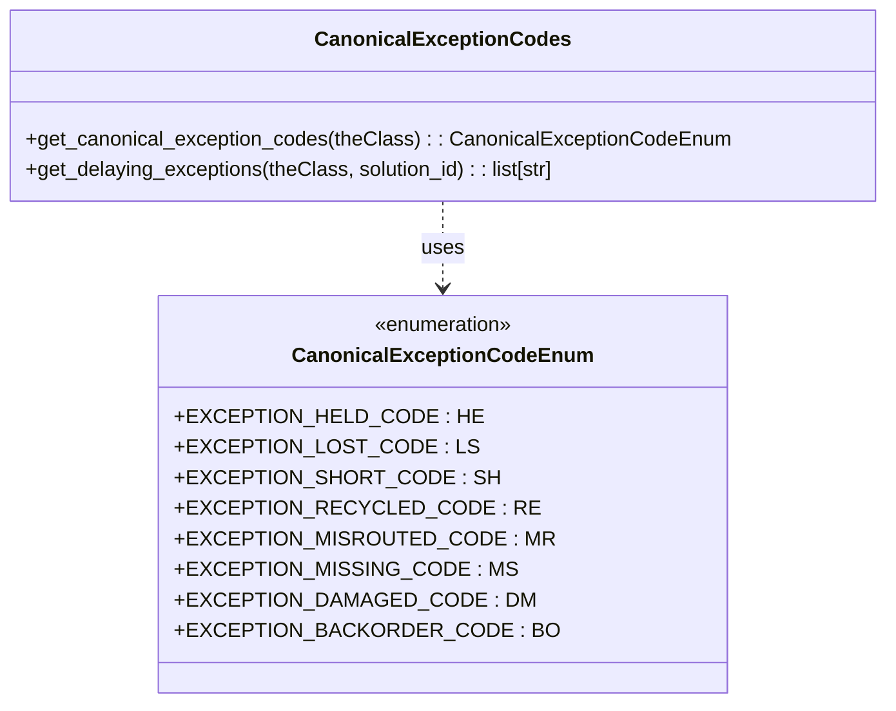

# Diagram: platform/partview_core/partview_service/partview_service/core/business/package_container/CanonicalExceptionCodes.py


> Auto-generated by Obscura crawlers

## Diagram 1



### SVG

<svg id="container" width="680.65625" xmlns="http://www.w3.org/2000/svg" class="classDiagram" height="552" viewBox="0 0 680.65625 552" role="graphics-document document" aria-roledescription="class"><style>#container{font-family:"trebuchet ms",verdana,arial,sans-serif;font-size:16px;fill:#333;}@keyframes edge-animation-frame{from{stroke-dashoffset:0;}}@keyframes dash{to{stroke-dashoffset:0;}}#container .edge-animation-slow{stroke-dasharray:9,5!important;stroke-dashoffset:900;animation:dash 50s linear infinite;stroke-linecap:round;}#container .edge-animation-fast{stroke-dasharray:9,5!important;stroke-dashoffset:900;animation:dash 20s linear infinite;stroke-linecap:round;}#container .error-icon{fill:#552222;}#container .error-text{fill:#552222;stroke:#552222;}#container .edge-thickness-normal{stroke-width:1px;}#container .edge-thickness-thick{stroke-width:3.5px;}#container .edge-pattern-solid{stroke-dasharray:0;}#container .edge-thickness-invisible{stroke-width:0;fill:none;}#container .edge-pattern-dashed{stroke-dasharray:3;}#container .edge-pattern-dotted{stroke-dasharray:2;}#container .marker{fill:#333333;stroke:#333333;}#container .marker.cross{stroke:#333333;}#container svg{font-family:"trebuchet ms",verdana,arial,sans-serif;font-size:16px;}#container p{margin:0;}#container g.classGroup text{fill:#9370DB;stroke:none;font-family:"trebuchet ms",verdana,arial,sans-serif;font-size:10px;}#container g.classGroup text .title{font-weight:bolder;}#container .nodeLabel,#container .edgeLabel{color:#131300;}#container .edgeLabel .label rect{fill:#ECECFF;}#container .label text{fill:#131300;}#container .labelBkg{background:#ECECFF;}#container .edgeLabel .label span{background:#ECECFF;}#container .classTitle{font-weight:bolder;}#container .node rect,#container .node circle,#container .node ellipse,#container .node polygon,#container .node path{fill:#ECECFF;stroke:#9370DB;stroke-width:1px;}#container .divider{stroke:#9370DB;stroke-width:1;}#container g.clickable{cursor:pointer;}#container g.classGroup rect{fill:#ECECFF;stroke:#9370DB;}#container g.classGroup line{stroke:#9370DB;stroke-width:1;}#container .classLabel .box{stroke:none;stroke-width:0;fill:#ECECFF;opacity:0.5;}#container .classLabel .label{fill:#9370DB;font-size:10px;}#container .relation{stroke:#333333;stroke-width:1;fill:none;}#container .dashed-line{stroke-dasharray:3;}#container .dotted-line{stroke-dasharray:1 2;}#container #compositionStart,#container .composition{fill:#333333!important;stroke:#333333!important;stroke-width:1;}#container #compositionEnd,#container .composition{fill:#333333!important;stroke:#333333!important;stroke-width:1;}#container #dependencyStart,#container .dependency{fill:#333333!important;stroke:#333333!important;stroke-width:1;}#container #dependencyStart,#container .dependency{fill:#333333!important;stroke:#333333!important;stroke-width:1;}#container #extensionStart,#container .extension{fill:transparent!important;stroke:#333333!important;stroke-width:1;}#container #extensionEnd,#container .extension{fill:transparent!important;stroke:#333333!important;stroke-width:1;}#container #aggregationStart,#container .aggregation{fill:transparent!important;stroke:#333333!important;stroke-width:1;}#container #aggregationEnd,#container .aggregation{fill:transparent!important;stroke:#333333!important;stroke-width:1;}#container #lollipopStart,#container .lollipop{fill:#ECECFF!important;stroke:#333333!important;stroke-width:1;}#container #lollipopEnd,#container .lollipop{fill:#ECECFF!important;stroke:#333333!important;stroke-width:1;}#container .edgeTerminals{font-size:11px;line-height:initial;}#container .classTitleText{text-anchor:middle;font-size:18px;fill:#333;}#container .label-icon{display:inline-block;height:1em;overflow:visible;vertical-align:-0.125em;}#container .node .label-icon path{fill:currentColor;stroke:revert;stroke-width:revert;}#container :root{--mermaid-font-family:"trebuchet ms",verdana,arial,sans-serif;}</style><g><defs><marker id="container_class-aggregationStart" class="marker aggregation class" refX="18" refY="7" markerWidth="190" markerHeight="240" orient="auto"><path d="M 18,7 L9,13 L1,7 L9,1 Z"></path></marker></defs><defs><marker id="container_class-aggregationEnd" class="marker aggregation class" refX="1" refY="7" markerWidth="20" markerHeight="28" orient="auto"><path d="M 18,7 L9,13 L1,7 L9,1 Z"></path></marker></defs><defs><marker id="container_class-extensionStart" class="marker extension class" refX="18" refY="7" markerWidth="190" markerHeight="240" orient="auto"><path d="M 1,7 L18,13 V 1 Z"></path></marker></defs><defs><marker id="container_class-extensionEnd" class="marker extension class" refX="1" refY="7" markerWidth="20" markerHeight="28" orient="auto"><path d="M 1,1 V 13 L18,7 Z"></path></marker></defs><defs><marker id="container_class-compositionStart" class="marker composition class" refX="18" refY="7" markerWidth="190" markerHeight="240" orient="auto"><path d="M 18,7 L9,13 L1,7 L9,1 Z"></path></marker></defs><defs><marker id="container_class-compositionEnd" class="marker composition class" refX="1" refY="7" markerWidth="20" markerHeight="28" orient="auto"><path d="M 18,7 L9,13 L1,7 L9,1 Z"></path></marker></defs><defs><marker id="container_class-dependencyStart" class="marker dependency class" refX="6" refY="7" markerWidth="190" markerHeight="240" orient="auto"><path d="M 5,7 L9,13 L1,7 L9,1 Z"></path></marker></defs><defs><marker id="container_class-dependencyEnd" class="marker dependency class" refX="13" refY="7" markerWidth="20" markerHeight="28" orient="auto"><path d="M 18,7 L9,13 L14,7 L9,1 Z"></path></marker></defs><defs><marker id="container_class-lollipopStart" class="marker lollipop class" refX="13" refY="7" markerWidth="190" markerHeight="240" orient="auto"><circle stroke="black" fill="transparent" cx="7" cy="7" r="6"></circle></marker></defs><defs><marker id="container_class-lollipopEnd" class="marker lollipop class" refX="1" refY="7" markerWidth="190" markerHeight="240" orient="auto"><circle stroke="black" fill="transparent" cx="7" cy="7" r="6"></circle></marker></defs><g class="root"><g class="clusters"></g><g class="edgePaths"><path d="M340.328,158L340.328,164.167C340.328,170.333,340.328,182.667,340.328,194C340.328,205.333,340.328,215.667,340.328,220.833L340.328,226" id="id_CanonicalExceptionCodes_CanonicalExceptionCodeEnum_1" class="edge-thickness-normal edge-pattern-dashed relation" style=";;;" data-edge="true" data-et="edge" data-id="id_CanonicalExceptionCodes_CanonicalExceptionCodeEnum_1" data-points="W3sieCI6MzQwLjMyODEyNSwieSI6MTU4fSx7IngiOjM0MC4zMjgxMjUsInkiOjE5NX0seyJ4IjozNDAuMzI4MTI1LCJ5IjoyMzJ9XQ==" marker-end="url(#container_class-dependencyEnd)"></path></g><g class="edgeLabels"><g class="edgeLabel" transform="translate(340.328125, 195)"><g class="label" data-id="id_CanonicalExceptionCodes_CanonicalExceptionCodeEnum_1" transform="translate(-16.4921875, -12)"><foreignObject width="32.984375" height="24"><div xmlns="http://www.w3.org/1999/xhtml" class="labelBkg" style="display: table-cell; white-space: nowrap; line-height: 1.5; max-width: 200px; text-align: center;"><span class="edgeLabel"><p>uses</p></span></div></foreignObject></g></g></g><g class="nodes"><g class="node default" id="classId-CanonicalExceptionCodeEnum-0" transform="translate(340.328125, 388)"><g class="basic label-container"><path d="M-196.89453125 -156 L196.89453125 -156 L196.89453125 156 L-196.89453125 156" stroke="none" stroke-width="0" fill="#ECECFF" style=""></path><path d="M-196.89453125 -156 C-40.619642521987856 -156, 115.65524620602429 -156, 196.89453125 -156 M-196.89453125 -156 C-39.452358958394115 -156, 117.98981333321177 -156, 196.89453125 -156 M196.89453125 -156 C196.89453125 -68.8837520625312, 196.89453125 18.232495874937598, 196.89453125 156 M196.89453125 -156 C196.89453125 -82.78537403518618, 196.89453125 -9.57074807037236, 196.89453125 156 M196.89453125 156 C88.31679401494407 156, -20.26094322011187 156, -196.89453125 156 M196.89453125 156 C53.887836178987726 156, -89.11885889202455 156, -196.89453125 156 M-196.89453125 156 C-196.89453125 51.618344444483114, -196.89453125 -52.76331111103377, -196.89453125 -156 M-196.89453125 156 C-196.89453125 53.36986319011537, -196.89453125 -49.260273619769265, -196.89453125 -156" stroke="#9370DB" stroke-width="1.3" fill="none" stroke-dasharray="0 0" style=""></path></g><g class="annotation-group text" transform="translate(-55.5546875, -132)"><g class="label" style="" transform="translate(0,-12)"><foreignObject width="111.109375" height="24"><div xmlns="http://www.w3.org/1999/xhtml" style="display: table-cell; white-space: nowrap; line-height: 1.5; max-width: 161px; text-align: center;"><span class="nodeLabel markdown-node-label" style=""><p>«enumeration»</p></span></div></foreignObject></g></g><g class="label-group text" transform="translate(-109.6015625, -108)"><g class="label" style="font-weight: bolder" transform="translate(0,-12)"><foreignObject width="219.203125" height="24"><div xmlns="http://www.w3.org/1999/xhtml" style="display: table-cell; white-space: nowrap; line-height: 1.5; max-width: 269px; text-align: center;"><span class="nodeLabel markdown-node-label" style=""><p>CanonicalExceptionCodeEnum</p></span></div></foreignObject></g></g><g class="members-group text" transform="translate(-184.89453125, -60)"><g class="label" style="" transform="translate(0,-12)"><foreignObject width="209.78125" height="24"><div xmlns="http://www.w3.org/1999/xhtml" style="display: table-cell; white-space: nowrap; line-height: 1.5; max-width: 267px; text-align: center;"><span class="nodeLabel markdown-node-label" style=""><p>+EXCEPTION_HELD_CODE : HE</p></span></div></foreignObject></g><g class="label" style="" transform="translate(0,12)"><foreignObject width="203.875" height="24"><div xmlns="http://www.w3.org/1999/xhtml" style="display: table-cell; white-space: nowrap; line-height: 1.5; max-width: 262px; text-align: center;"><span class="nodeLabel markdown-node-label" style=""><p>+EXCEPTION_LOST_CODE : LS</p></span></div></foreignObject></g><g class="label" style="" transform="translate(0,36)"><foreignObject width="220.0625" height="24"><div xmlns="http://www.w3.org/1999/xhtml" style="display: table-cell; white-space: nowrap; line-height: 1.5; max-width: 277px; text-align: center;"><span class="nodeLabel markdown-node-label" style=""><p>+EXCEPTION_SHORT_CODE : SH</p></span></div></foreignObject></g><g class="label" style="" transform="translate(0,60)"><foreignObject width="241.703125" height="24"><div xmlns="http://www.w3.org/1999/xhtml" style="display: table-cell; white-space: nowrap; line-height: 1.5; max-width: 299px; text-align: center;"><span class="nodeLabel markdown-node-label" style=""><p>+EXCEPTION_RECYCLED_CODE : RE</p></span></div></foreignObject></g><g class="label" style="" transform="translate(0,84)"><foreignObject width="258.984375" height="24"><div xmlns="http://www.w3.org/1999/xhtml" style="display: table-cell; white-space: nowrap; line-height: 1.5; max-width: 317px; text-align: center;"><span class="nodeLabel markdown-node-label" style=""><p>+EXCEPTION_MISROUTED_CODE : MR</p></span></div></foreignObject></g><g class="label" style="" transform="translate(0,108)"><foreignObject width="234.359375" height="24"><div xmlns="http://www.w3.org/1999/xhtml" style="display: table-cell; white-space: nowrap; line-height: 1.5; max-width: 292px; text-align: center;"><span class="nodeLabel markdown-node-label" style=""><p>+EXCEPTION_MISSING_CODE : MS</p></span></div></foreignObject></g><g class="label" style="" transform="translate(0,132)"><foreignObject width="245" height="24"><div xmlns="http://www.w3.org/1999/xhtml" style="display: table-cell; white-space: nowrap; line-height: 1.5; max-width: 302px; text-align: center;"><span class="nodeLabel markdown-node-label" style=""><p>+EXCEPTION_DAMAGED_CODE : DM</p></span></div></foreignObject></g><g class="label" style="" transform="translate(0,156)"><foreignObject width="260.1875" height="24"><div xmlns="http://www.w3.org/1999/xhtml" style="display: table-cell; white-space: nowrap; line-height: 1.5; max-width: 318px; text-align: center;"><span class="nodeLabel markdown-node-label" style=""><p>+EXCEPTION_BACKORDER_CODE : BO</p></span></div></foreignObject></g></g><g class="methods-group text" transform="translate(-184.89453125, 156)"></g><g class="divider" style=""><path d="M-196.89453125 -84 C-84.17192774439648 -84, 28.55067576120703 -84, 196.89453125 -84 M-196.89453125 -84 C-42.64973702914048 -84, 111.59505719171904 -84, 196.89453125 -84" stroke="#9370DB" stroke-width="1.3" fill="none" stroke-dasharray="0 0" style=""></path></g><g class="divider" style=""><path d="M-196.89453125 132 C-105.41187454143159 132, -13.929217832863173 132, 196.89453125 132 M-196.89453125 132 C-50.85073074586677 132, 95.19306975826646 132, 196.89453125 132" stroke="#9370DB" stroke-width="1.3" fill="none" stroke-dasharray="0 0" style=""></path></g></g><g class="node default" id="classId-CanonicalExceptionCodes-1" transform="translate(340.328125, 83)"><g class="basic label-container"><path d="M-332.328125 -75 L332.328125 -75 L332.328125 75 L-332.328125 75" stroke="none" stroke-width="0" fill="#ECECFF" style=""></path><path d="M-332.328125 -75 C-146.69630564123605 -75, 38.9355137175279 -75, 332.328125 -75 M-332.328125 -75 C-94.63171999653076 -75, 143.06468500693848 -75, 332.328125 -75 M332.328125 -75 C332.328125 -21.041902217568428, 332.328125 32.916195564863145, 332.328125 75 M332.328125 -75 C332.328125 -33.58499613856308, 332.328125 7.8300077228738445, 332.328125 75 M332.328125 75 C125.84686753125641 75, -80.63438993748719 75, -332.328125 75 M332.328125 75 C195.61252793502294 75, 58.89693087004588 75, -332.328125 75 M-332.328125 75 C-332.328125 28.062857978229218, -332.328125 -18.874284043541564, -332.328125 -75 M-332.328125 75 C-332.328125 41.66477727466217, -332.328125 8.329554549324342, -332.328125 -75" stroke="#9370DB" stroke-width="1.3" fill="none" stroke-dasharray="0 0" style=""></path></g><g class="annotation-group text" transform="translate(0, -51)"></g><g class="label-group text" transform="translate(-93.390625, -51)"><g class="label" style="font-weight: bolder" transform="translate(0,-12)"><foreignObject width="186.78125" height="24"><div xmlns="http://www.w3.org/1999/xhtml" style="display: table-cell; white-space: nowrap; line-height: 1.5; max-width: 235px; text-align: center;"><span class="nodeLabel markdown-node-label" style=""><p>CanonicalExceptionCodes</p></span></div></foreignObject></g></g><g class="members-group text" transform="translate(-320.328125, -3)"></g><g class="methods-group text" transform="translate(-320.328125, 27)"><g class="label" style="" transform="translate(0,-12)"><foreignObject width="547.265625" height="24"><div xmlns="http://www.w3.org/1999/xhtml" style="display: table-cell; white-space: nowrap; line-height: 1.5; max-width: 605px; text-align: center;"><span class="nodeLabel markdown-node-label" style=""><p>+get_canonical_exception_codes(theClass) : : CanonicalExceptionCodeEnum</p></span></div></foreignObject></g><g class="label" style="" transform="translate(0,12)"><foreignObject width="420.140625" height="24"><div xmlns="http://www.w3.org/1999/xhtml" style="display: table-cell; white-space: nowrap; line-height: 1.5; max-width: 478px; text-align: center;"><span class="nodeLabel markdown-node-label" style=""><p>+get_delaying_exceptions(theClass, solution_id) : : list[str]</p></span></div></foreignObject></g></g><g class="divider" style=""><path d="M-332.328125 -27 C-99.88516329899144 -27, 132.5577984020171 -27, 332.328125 -27 M-332.328125 -27 C-116.36595415737517 -27, 99.59621668524966 -27, 332.328125 -27" stroke="#9370DB" stroke-width="1.3" fill="none" stroke-dasharray="0 0" style=""></path></g><g class="divider" style=""><path d="M-332.328125 -3 C-89.21088611335136 -3, 153.90635277329727 -3, 332.328125 -3 M-332.328125 -3 C-113.36569548919837 -3, 105.59673402160325 -3, 332.328125 -3" stroke="#9370DB" stroke-width="1.3" fill="none" stroke-dasharray="0 0" style=""></path></g></g></g></g></g></svg>

## Diagram 2

```mermaid
flowchart TD
    A[CanonicalExceptionCodes.get_delaying_exceptions(solution_id)]
    A --> B[returns list of canonical codes]
    B --> LS[LS]
    B --> HE[HE]
    B --> MR[MR]
    B --> MS[MS]
    B --> SH[SH]
    B --> RE[RE]
```

> SVG rendering failed for this diagram.
