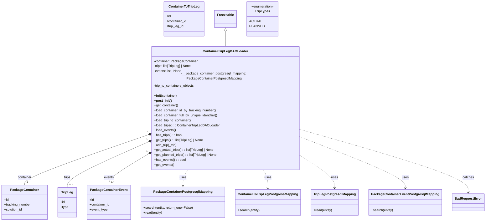
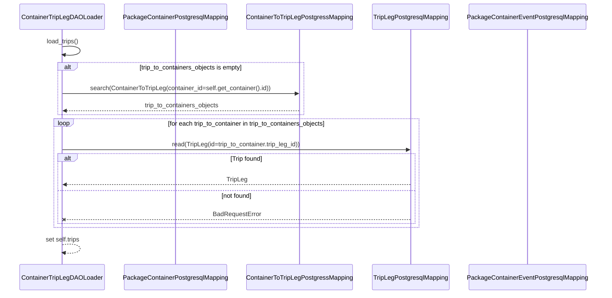

# Diagram: platform/partview_core/partview_service/partview_service/core/business/package_container/ContainerTripLegDAOLoader.py

> Auto-generated by Obscura crawlers

## Diagram 1

### SVG

<svg id="container" width="2289.359375" xmlns="http://www.w3.org/2000/svg" class="classDiagram" height="1052" viewBox="0 0 2289.359375 1052" role="graphics-document document" aria-roledescription="class"><g><defs><marker id="container_class-aggregationStart" class="marker aggregation class" refX="18" refY="7" markerWidth="190" markerHeight="240" orient="auto"><path d="M 18,7 L9,13 L1,7 L9,1 Z"></path></marker></defs><defs><marker id="container_class-aggregationEnd" class="marker aggregation class" refX="1" refY="7" markerWidth="20" markerHeight="28" orient="auto"><path d="M 18,7 L9,13 L1,7 L9,1 Z"></path></marker></defs><defs><marker id="container_class-extensionStart" class="marker extension class" refX="18" refY="7" markerWidth="190" markerHeight="240" orient="auto"><path d="M 1,7 L18,13 V 1 Z"></path></marker></defs><defs><marker id="container_class-extensionEnd" class="marker extension class" refX="1" refY="7" markerWidth="20" markerHeight="28" orient="auto"><path d="M 1,1 V 13 L18,7 Z"></path></marker></defs><defs><marker id="container_class-compositionStart" class="marker composition class" refX="18" refY="7" markerWidth="190" markerHeight="240" orient="auto"><path d="M 18,7 L9,13 L1,7 L9,1 Z"></path></marker></defs><defs><marker id="container_class-compositionEnd" class="marker composition class" refX="1" refY="7" markerWidth="20" markerHeight="28" orient="auto"><path d="M 18,7 L9,13 L1,7 L9,1 Z"></path></marker></defs><defs><marker id="container_class-dependencyStart" class="marker dependency class" refX="6" refY="7" markerWidth="190" markerHeight="240" orient="auto"><path d="M 5,7 L9,13 L1,7 L9,1 Z"></path></marker></defs><defs><marker id="container_class-dependencyEnd" class="marker dependency class" refX="13" refY="7" markerWidth="20" markerHeight="28" orient="auto"><path d="M 18,7 L9,13 L14,7 L9,1 Z"></path></marker></defs><defs><marker id="container_class-lollipopStart" class="marker lollipop class" refX="13" refY="7" markerWidth="190" markerHeight="240" orient="auto"><circle stroke="black" fill="transparent" cx="7" cy="7" r="6"></circle></marker></defs><defs><marker id="container_class-lollipopEnd" class="marker lollipop class" refX="1" refY="7" markerWidth="190" markerHeight="240" orient="auto"><circle stroke="black" fill="transparent" cx="7" cy="7" r="6"></circle></marker></defs><g class="root"><g class="clusters"></g><g class="edgePaths"><path d="M1077.443,151.25L1077.443,159.542C1077.443,167.833,1077.443,184.417,1077.443,196.875C1077.443,209.333,1077.443,217.667,1077.443,221.833L1077.443,226" id="id_Freezeable_ContainerTripLegDAOLoader_1" class="edge-thickness-normal edge-pattern-solid relation" style=";;;" data-edge="true" data-et="edge" data-id="id_Freezeable_ContainerTripLegDAOLoader_1" data-points="W3sieCI6MTA3Ny40NDMzNTkzNzUsInkiOjEzNH0seyJ4IjoxMDc3LjQ0MzM1OTM3NSwieSI6MjAxfSx7IngiOjEwNzcuNDQzMzU5Mzc1LCJ5IjoyMjZ9XQ==" marker-start="url(#container_class-extensionStart)"></path><path d="M703.746,640.631L606.179,673.692C508.612,706.754,313.478,772.877,215.911,812.105C118.344,851.333,118.344,863.667,118.344,869.833L118.344,876" id="id_ContainerTripLegDAOLoader_PackageContainer_2" class="edge-thickness-normal edge-pattern-solid relation" style=";;;" data-edge="true" data-et="edge" data-id="id_ContainerTripLegDAOLoader_PackageContainer_2" data-points="W3sieCI6NzIwLjA4Mzk4NDM3NSwieSI6NjM1LjA5NDYxMzg4NTUwMDV9LHsieCI6MTE4LjM0Mzc1LCJ5Ijo4Mzl9LHsieCI6MTE4LjM0Mzc1LCJ5Ijo4NzZ9XQ==" marker-start="url(#container_class-compositionStart)"></path><path d="M704.245,674.994L640.882,702.329C577.519,729.663,450.793,784.331,387.429,819.832C324.066,855.333,324.066,871.667,324.066,879.833L324.066,888" id="id_ContainerTripLegDAOLoader_TripLeg_3" class="edge-thickness-normal edge-pattern-solid relation" style=";;;" data-edge="true" data-et="edge" data-id="id_ContainerTripLegDAOLoader_TripLeg_3" data-points="W3sieCI6NzIwLjA4Mzk4NDM3NSwieSI6NjY4LjE2MTYwMDUwMTkwNjh9LHsieCI6MzI0LjA2NjQwNjI1LCJ5Ijo4Mzl9LHsieCI6MzI0LjA2NjQwNjI1LCJ5Ijo4ODh9XQ==" marker-start="url(#container_class-compositionStart)"></path><path d="M705.205,732.365L674.909,750.138C644.613,767.91,584.022,803.455,553.726,827.394C523.43,851.333,523.43,863.667,523.43,869.833L523.43,876" id="id_ContainerTripLegDAOLoader_PackageContainerEvent_4" class="edge-thickness-normal edge-pattern-solid relation" style=";;;" data-edge="true" data-et="edge" data-id="id_ContainerTripLegDAOLoader_PackageContainerEvent_4" data-points="W3sieCI6NzIwLjA4Mzk4NDM3NSwieSI6NzIzLjYzNzA1OTEwMzQ4ODR9LHsieCI6NTIzLjQyOTY4NzUsInkiOjgzOX0seyJ4Ijo1MjMuNDI5Njg3NSwieSI6ODc2fV0=" marker-start="url(#container_class-compositionStart)"></path><path d="M900.135,802L896.338,808.167C892.542,814.333,884.949,826.667,881.152,839.5C877.355,852.333,877.355,865.667,877.355,872.333L877.355,879" id="id_ContainerTripLegDAOLoader_PackageContainerPostgresqlMapping_5" class="edge-thickness-normal edge-pattern-dashed relation" style=";;;" data-edge="true" data-et="edge" data-id="id_ContainerTripLegDAOLoader_PackageContainerPostgresqlMapping_5" data-points="W3sieCI6OTAwLjEzNDcwNTUyODg0NjEsInkiOjgwMn0seyJ4Ijo4NzcuMzU1NDY4NzUsInkiOjgzOX0seyJ4Ijo4NzcuMzU1NDY4NzUsInkiOjg4NX1d" marker-end="url(#container_class-dependencyEnd)"></path><path d="M1254.752,802L1258.549,808.167C1262.345,814.333,1269.938,826.667,1273.735,841.5C1277.531,856.333,1277.531,873.667,1277.531,882.333L1277.531,891" id="id_ContainerTripLegDAOLoader_ContainerToTripLegPostgressMapping_6" class="edge-thickness-normal edge-pattern-dashed relation" style=";;;" data-edge="true" data-et="edge" data-id="id_ContainerTripLegDAOLoader_ContainerToTripLegPostgressMapping_6" data-points="W3sieCI6MTI1NC43NTIwMTMyMjExNTQsInkiOjgwMn0seyJ4IjoxMjc3LjUzMTI1LCJ5Ijo4Mzl9LHsieCI6MTI3Ny41MzEyNSwieSI6ODk3fV0=" marker-end="url(#container_class-dependencyEnd)"></path><path d="M1434.803,741.829L1460.205,758.024C1485.608,774.22,1536.413,806.61,1561.816,831.472C1587.219,856.333,1587.219,873.667,1587.219,882.333L1587.219,891" id="id_ContainerTripLegDAOLoader_TripLegPostgresqlMapping_7" class="edge-thickness-normal edge-pattern-dashed relation" style=";;;" data-edge="true" data-et="edge" data-id="id_ContainerTripLegDAOLoader_TripLegPostgresqlMapping_7" data-points="W3sieCI6MTQzNC44MDI3MzQzNzUsInkiOjc0MS44MjkzNTE5MjgxMjR9LHsieCI6MTU4Ny4yMTg3NSwieSI6ODM5fSx7IngiOjE1ODcuMjE4NzUsInkiOjg5N31d" marker-end="url(#container_class-dependencyEnd)"></path><path d="M1434.803,652.711L1514.791,683.759C1594.78,714.808,1754.757,776.904,1834.746,816.619C1914.734,856.333,1914.734,873.667,1914.734,882.333L1914.734,891" id="id_ContainerTripLegDAOLoader_PackageContainerEventPostgresqlMapping_8" class="edge-thickness-normal edge-pattern-dashed relation" style=";;;" data-edge="true" data-et="edge" data-id="id_ContainerTripLegDAOLoader_PackageContainerEventPostgresqlMapping_8" data-points="W3sieCI6MTQzNC44MDI3MzQzNzUsInkiOjY1Mi43MTEzODU1MzY5Njk0fSx7IngiOjE5MTQuNzM0Mzc1LCJ5Ijo4Mzl9LHsieCI6MTkxNC43MzQzNzUsInkiOjg5N31d" marker-end="url(#container_class-dependencyEnd)"></path><path d="M1434.803,616.814L1563.515,653.845C1692.228,690.876,1949.653,764.938,2078.366,814.136C2207.078,863.333,2207.078,887.667,2207.078,899.833L2207.078,912" id="id_ContainerTripLegDAOLoader_BadRequestError_9" class="edge-thickness-normal edge-pattern-dashed relation" style=";;;" data-edge="true" data-et="edge" data-id="id_ContainerTripLegDAOLoader_BadRequestError_9" data-points="W3sieCI6MTQzNC44MDI3MzQzNzUsInkiOjYxNi44MTM1ODIyMzg0NTE3fSx7IngiOjIyMDcuMDc4MTI1LCJ5Ijo4Mzl9LHsieCI6MjIwNy4wNzgxMjUsInkiOjkxOH1d" marker-end="url(#container_class-dependencyEnd)"></path></g><g class="edgeLabels"><g class="edgeLabel"><g class="label" data-id="id_Freezeable_ContainerTripLegDAOLoader_1" transform="translate(0, 0)"><foreignObject width="0" height="0">

</foreignObject></g></g><g class="edgeLabel" transform="translate(118.34375, 839)"><g class="label" data-id="id_ContainerTripLegDAOLoader_PackageContainer_2" transform="translate(-34.6015625, -12)"><foreignObject width="69.203125" height="24">

container

</foreignObject></g></g><g class="edgeLabel" transform="translate(324.06640625, 839)"><g class="label" data-id="id_ContainerTripLegDAOLoader_TripLeg_3" transform="translate(-16.7265625, -12)"><foreignObject width="33.453125" height="24">

trips

</foreignObject></g></g><g class="edgeLabel" transform="translate(523.4296875, 839)"><g class="label" data-id="id_ContainerTripLegDAOLoader_PackageContainerEvent_4" transform="translate(-23.90625, -12)"><foreignObject width="47.8125" height="24">

events

</foreignObject></g></g><g class="edgeLabel" transform="translate(877.35546875, 839)"><g class="label" data-id="id_ContainerTripLegDAOLoader_PackageContainerPostgresqlMapping_5" transform="translate(-16.4921875, -12)"><foreignObject width="32.984375" height="24">

uses

</foreignObject></g></g><g class="edgeLabel" transform="translate(1277.53125, 839)"><g class="label" data-id="id_ContainerTripLegDAOLoader_ContainerToTripLegPostgressMapping_6" transform="translate(-16.4921875, -12)"><foreignObject width="32.984375" height="24">

uses

</foreignObject></g></g><g class="edgeLabel" transform="translate(1587.21875, 839)"><g class="label" data-id="id_ContainerTripLegDAOLoader_TripLegPostgresqlMapping_7" transform="translate(-16.4921875, -12)"><foreignObject width="32.984375" height="24">

uses

</foreignObject></g></g><g class="edgeLabel" transform="translate(1914.734375, 839)"><g class="label" data-id="id_ContainerTripLegDAOLoader_PackageContainerEventPostgresqlMapping_8" transform="translate(-16.4921875, -12)"><foreignObject width="32.984375" height="24">

uses

</foreignObject></g></g><g class="edgeLabel" transform="translate(2207.078125, 839)"><g class="label" data-id="id_ContainerTripLegDAOLoader_BadRequestError_9" transform="translate(-27.4765625, -12)"><foreignObject width="54.953125" height="24">

catches

</foreignObject></g></g><g class="edgeTerminals" transform="translate(698.6956948011243, 626.5044393300973)"><g class="inner" transform="translate(0, 0)"><foreignObject style="width: 9px; height: 12px;">
1
</foreignObject></g></g><g class="edgeTerminals" transform="translate(698.0738156425365, 661.3203697503781)"><g class="inner" transform="translate(0, 0)"><foreignObject style="width: 9px; height: 12px;">
1
</foreignObject></g></g><g class="edgeTerminals" transform="translate(697.3996964622621, 719.5537868844656)"><g class="inner" transform="translate(0, 0)"><foreignObject style="width: 9px; height: 12px;">
1
</foreignObject></g></g><g class="edgeTerminals" transform="translate(128.34375, 853.5)"><g class="inner" transform="translate(0, 0)"></g><foreignObject style="width: 9px; height: 12px;">
1
</foreignObject></g><g class="edgeTerminals" transform="translate(334.0664081249999, 865.5000016071428)"><g class="inner" transform="translate(0, 0)"></g><foreignObject style="width: 36px; height: 12px;">
0..*
</foreignObject></g><g class="edgeTerminals" transform="translate(533.42968875, 853.5000010714286)"><g class="inner" transform="translate(0, 0)"></g><foreignObject style="width: 36px; height: 12px;">
0..*
</foreignObject></g></g><g class="nodes"><g class="node default" id="classId-ContainerTripLegDAOLoader-0" transform="translate(1077.443359375, 514)"><g class="basic label-container"><path d="M-357.359375 -288 L357.359375 -288 L357.359375 288 L-357.359375 288" stroke="none" stroke-width="0" fill="#ECECFF" style=""></path><path d="M-357.359375 -288 C-166.5208496908292 -288, 24.317675618341582 -288, 357.359375 -288 M-357.359375 -288 C-187.81188355140142 -288, -18.264392102802844 -288, 357.359375 -288 M357.359375 -288 C357.359375 -117.0266242301804, 357.359375 53.946751539639195, 357.359375 288 M357.359375 -288 C357.359375 -119.38818948360014, 357.359375 49.22362103279971, 357.359375 288 M357.359375 288 C185.94669834915922 288, 14.53402169831844 288, -357.359375 288 M357.359375 288 C194.77007947542407 288, 32.18078395084814 288, -357.359375 288 M-357.359375 288 C-357.359375 99.39542066950955, -357.359375 -89.2091586609809, -357.359375 -288 M-357.359375 288 C-357.359375 115.83996848390575, -357.359375 -56.3200630321885, -357.359375 -288" stroke="#9370DB" stroke-width="1.3" fill="none" stroke-dasharray="0 0" style=""></path></g><g class="annotation-group text" transform="translate(0, -264)"></g><g class="label-group text" transform="translate(-103.25, -264)"><g class="label" style="font-weight: bolder" transform="translate(0,-12)"><foreignObject width="206.5" height="24">

ContainerTripLegDAOLoader

</foreignObject></g></g><g class="members-group text" transform="translate(-345.359375, -216)"><g class="label" style="" transform="translate(0,-12)"><foreignObject width="212.453125" height="24">

-container: PackageContainer

</foreignObject></g><g class="label" style="" transform="translate(0,12)"><foreignObject width="186.59375" height="24">

-trips: list[TripLeg] | None

</foreignObject></g><g class="label" style="" transform="translate(0,36)"><foreignObject width="138.09375" height="24">

-events: list | None

</foreignObject></g><g class="label" style="" transform="translate(0,60)"><foreignObject width="587.46875" height="24">

-__package_container_postgresql_mapping: PackageContainerPostgresqlMapping

</foreignObject></g><g class="label" style="" transform="translate(0,84)"><foreignObject width="199.640625" height="24">

-trip_to_containers_objects

</foreignObject></g></g><g class="methods-group text" transform="translate(-345.359375, -72)"><g class="label" style="" transform="translate(0,-12)"><foreignObject width="112" height="24">

+<strong>init</strong>(container)

</foreignObject></g><g class="label" style="" transform="translate(0,12)"><foreignObject width="83.921875" height="24">

+<strong>post_init</strong>()

</foreignObject></g><g class="label" style="" transform="translate(0,36)"><foreignObject width="118.125" height="24">

+get_container()

</foreignObject></g><g class="label" style="" transform="translate(0,60)"><foreignObject width="305.21875" height="24">

+load_container_id_by_tracking_number()

</foreignObject></g><g class="label" style="" transform="translate(0,84)"><foreignObject width="316.90625" height="24">

+load_container_full_by_unique_identifier()

</foreignObject></g><g class="label" style="" transform="translate(0,108)"><foreignObject width="183.828125" height="24">

+load_trip_to_container()

</foreignObject></g><g class="label" style="" transform="translate(0,132)"><foreignObject width="315.515625" height="24">

+load_trips() : : ContainerTripLegDAOLoader

</foreignObject></g><g class="label" style="" transform="translate(0,156)"><foreignObject width="106.234375" height="24">

+load_events()

</foreignObject></g><g class="label" style="" transform="translate(0,180)"><foreignObject width="138.15625" height="24">

+has_trips() : : bool

</foreignObject></g><g class="label" style="" transform="translate(0,204)"><foreignObject width="241.46875" height="24">

+get_trips() : : list[TripLeg] | None

</foreignObject></g><g class="label" style="" transform="translate(0,228)"><foreignObject width="114.046875" height="24">

+add_trip(_trip)

</foreignObject></g><g class="label" style="" transform="translate(0,252)"><foreignObject width="294.140625" height="24">

+get_actual_trips() : : list[TripLeg] | None

</foreignObject></g><g class="label" style="" transform="translate(0,276)"><foreignObject width="309.640625" height="24">

+get_planned_trips() : : list[TripLeg] | None

</foreignObject></g><g class="label" style="" transform="translate(0,300)"><foreignObject width="152.515625" height="24">

+has_events() : : bool

</foreignObject></g><g class="label" style="" transform="translate(0,324)"><foreignObject width="96.734375" height="24">

+get_events()

</foreignObject></g></g><g class="divider" style=""><path d="M-357.359375 -240 C-114.3945150529477 -240, 128.5703448941046 -240, 357.359375 -240 M-357.359375 -240 C-212.16024269524866 -240, -66.96111039049731 -240, 357.359375 -240" stroke="#9370DB" stroke-width="1.3" fill="none" stroke-dasharray="0 0" style=""></path></g><g class="divider" style=""><path d="M-357.359375 -96 C-118.67063019191599 -96, 120.01811461616802 -96, 357.359375 -96 M-357.359375 -96 C-130.96294233614464 -96, 95.43349032771073 -96, 357.359375 -96" stroke="#9370DB" stroke-width="1.3" fill="none" stroke-dasharray="0 0" style=""></path></g></g><g class="node default" id="classId-PackageContainer-1" transform="translate(118.34375, 960)"><g class="basic label-container"><path d="M-110.34375 -84 L110.34375 -84 L110.34375 84 L-110.34375 84" stroke="none" stroke-width="0" fill="#ECECFF" style=""></path><path d="M-110.34375 -84 C-35.85188695925335 -84, 38.6399760814933 -84, 110.34375 -84 M-110.34375 -84 C-44.06591598902186 -84, 22.21191802195628 -84, 110.34375 -84 M110.34375 -84 C110.34375 -21.183686668662446, 110.34375 41.63262666267511, 110.34375 84 M110.34375 -84 C110.34375 -24.19881645803865, 110.34375 35.6023670839227, 110.34375 84 M110.34375 84 C62.63830202257733 84, 14.932854045154656 84, -110.34375 84 M110.34375 84 C34.969084771360926 84, -40.40558045727815 84, -110.34375 84 M-110.34375 84 C-110.34375 42.006319117433605, -110.34375 0.01263823486721094, -110.34375 -84 M-110.34375 84 C-110.34375 32.69989115035885, -110.34375 -18.600217699282297, -110.34375 -84" stroke="#9370DB" stroke-width="1.3" fill="none" stroke-dasharray="0 0" style=""></path></g><g class="annotation-group text" transform="translate(0, -60)"></g><g class="label-group text" transform="translate(-65.453125, -60)"><g class="label" style="font-weight: bolder" transform="translate(0,-12)"><foreignObject width="130.90625" height="24">

PackageContainer

</foreignObject></g></g><g class="members-group text" transform="translate(-98.34375, -12)"><g class="label" style="" transform="translate(0,-12)"><foreignObject width="22.078125" height="24">

+id

</foreignObject></g><g class="label" style="" transform="translate(0,12)"><foreignObject width="131.234375" height="24">

+tracking_number

</foreignObject></g><g class="label" style="" transform="translate(0,36)"><foreignObject width="90.21875" height="24">

+solution_id

</foreignObject></g></g><g class="methods-group text" transform="translate(-98.34375, 84)"></g><g class="divider" style=""><path d="M-110.34375 -36 C-29.962427855418895 -36, 50.41889428916221 -36, 110.34375 -36 M-110.34375 -36 C-45.35084965845169 -36, 19.642050683096613 -36, 110.34375 -36" stroke="#9370DB" stroke-width="1.3" fill="none" stroke-dasharray="0 0" style=""></path></g><g class="divider" style=""><path d="M-110.34375 60 C-47.25274876368777 60, 15.838252472624461 60, 110.34375 60 M-110.34375 60 C-55.23967894417101 60, -0.13560788834202242 60, 110.34375 60" stroke="#9370DB" stroke-width="1.3" fill="none" stroke-dasharray="0 0" style=""></path></g></g><g class="node default" id="classId-TripLeg-2" transform="translate(324.06640625, 960)"><g class="basic label-container"><path d="M-45.37890625 -72 L45.37890625 -72 L45.37890625 72 L-45.37890625 72" stroke="none" stroke-width="0" fill="#ECECFF" style=""></path><path d="M-45.37890625 -72 C-23.341540792804068 -72, -1.3041753356081358 -72, 45.37890625 -72 M-45.37890625 -72 C-16.332661633929924 -72, 12.713582982140153 -72, 45.37890625 -72 M45.37890625 -72 C45.37890625 -26.649786368564193, 45.37890625 18.700427262871614, 45.37890625 72 M45.37890625 -72 C45.37890625 -27.34231760206808, 45.37890625 17.315364795863843, 45.37890625 72 M45.37890625 72 C17.79632099132617 72, -9.786264267347661 72, -45.37890625 72 M45.37890625 72 C20.468232575098167 72, -4.442441099803666 72, -45.37890625 72 M-45.37890625 72 C-45.37890625 29.59818344413977, -45.37890625 -12.803633111720458, -45.37890625 -72 M-45.37890625 72 C-45.37890625 23.267387449173597, -45.37890625 -25.465225101652806, -45.37890625 -72" stroke="#9370DB" stroke-width="1.3" fill="none" stroke-dasharray="0 0" style=""></path></g><g class="annotation-group text" transform="translate(0, -48)"></g><g class="label-group text" transform="translate(-27.0546875, -48)"><g class="label" style="font-weight: bolder" transform="translate(0,-12)"><foreignObject width="54.109375" height="24">

TripLeg

</foreignObject></g></g><g class="members-group text" transform="translate(-33.37890625, 0)"><g class="label" style="" transform="translate(0,-12)"><foreignObject width="22.078125" height="24">

+id

</foreignObject></g><g class="label" style="" transform="translate(0,12)"><foreignObject width="39.703125" height="24">

+type

</foreignObject></g></g><g class="methods-group text" transform="translate(-33.37890625, 72)"></g><g class="divider" style=""><path d="M-45.37890625 -24 C-9.24555566159713 -24, 26.88779492680574 -24, 45.37890625 -24 M-45.37890625 -24 C-9.284294458250699 -24, 26.810317333498602 -24, 45.37890625 -24" stroke="#9370DB" stroke-width="1.3" fill="none" stroke-dasharray="0 0" style=""></path></g><g class="divider" style=""><path d="M-45.37890625 48 C-19.066149183743132 48, 7.246607882513736 48, 45.37890625 48 M-45.37890625 48 C-10.903054590280057 48, 23.572797069439886 48, 45.37890625 48" stroke="#9370DB" stroke-width="1.3" fill="none" stroke-dasharray="0 0" style=""></path></g></g><g class="node default" id="classId-ContainerToTripLeg-3" transform="translate(879.490234375, 92)"><g class="basic label-container"><path d="M-96.7578125 -84 L96.7578125 -84 L96.7578125 84 L-96.7578125 84" stroke="none" stroke-width="0" fill="#ECECFF" style=""></path><path d="M-96.7578125 -84 C-48.55450816939344 -84, -0.351203838786887 -84, 96.7578125 -84 M-96.7578125 -84 C-23.86508653389035 -84, 49.0276394322193 -84, 96.7578125 -84 M96.7578125 -84 C96.7578125 -37.632665329551614, 96.7578125 8.734669340896772, 96.7578125 84 M96.7578125 -84 C96.7578125 -21.33494209084227, 96.7578125 41.33011581831546, 96.7578125 84 M96.7578125 84 C46.81041007774506 84, -3.1369923445098777 84, -96.7578125 84 M96.7578125 84 C56.35739831952459 84, 15.956984139049183 84, -96.7578125 84 M-96.7578125 84 C-96.7578125 49.247612820973075, -96.7578125 14.49522564194615, -96.7578125 -84 M-96.7578125 84 C-96.7578125 47.9064680614488, -96.7578125 11.812936122897597, -96.7578125 -84" stroke="#9370DB" stroke-width="1.3" fill="none" stroke-dasharray="0 0" style=""></path></g><g class="annotation-group text" transform="translate(0, -60)"></g><g class="label-group text" transform="translate(-71.203125, -60)"><g class="label" style="font-weight: bolder" transform="translate(0,-12)"><foreignObject width="142.40625" height="24">

ContainerToTripLeg

</foreignObject></g></g><g class="members-group text" transform="translate(-84.7578125, -12)"><g class="label" style="" transform="translate(0,-12)"><foreignObject width="22.078125" height="24">

+id

</foreignObject></g><g class="label" style="" transform="translate(0,12)"><foreignObject width="98.3125" height="24">

+container_id

</foreignObject></g><g class="label" style="" transform="translate(0,36)"><foreignObject width="85.828125" height="24">

+trip_leg_id

</foreignObject></g></g><g class="methods-group text" transform="translate(-84.7578125, 84)"></g><g class="divider" style=""><path d="M-96.7578125 -36 C-23.981473311245452 -36, 48.794865877509096 -36, 96.7578125 -36 M-96.7578125 -36 C-32.02163753267793 -36, 32.71453743464414 -36, 96.7578125 -36" stroke="#9370DB" stroke-width="1.3" fill="none" stroke-dasharray="0 0" style=""></path></g><g class="divider" style=""><path d="M-96.7578125 60 C-44.0962276962813 60, 8.565357107437407 60, 96.7578125 60 M-96.7578125 60 C-20.041966684443807 60, 56.673879131112386 60, 96.7578125 60" stroke="#9370DB" stroke-width="1.3" fill="none" stroke-dasharray="0 0" style=""></path></g></g><g class="node default" id="classId-PackageContainerEvent-4" transform="translate(523.4296875, 960)"><g class="basic label-container"><path d="M-103.984375 -84 L103.984375 -84 L103.984375 84 L-103.984375 84" stroke="none" stroke-width="0" fill="#ECECFF" style=""></path><path d="M-103.984375 -84 C-58.124543675401206 -84, -12.264712350802412 -84, 103.984375 -84 M-103.984375 -84 C-36.945281430851026 -84, 30.09381213829795 -84, 103.984375 -84 M103.984375 -84 C103.984375 -31.616296609106683, 103.984375 20.767406781786633, 103.984375 84 M103.984375 -84 C103.984375 -31.140162322667095, 103.984375 21.71967535466581, 103.984375 84 M103.984375 84 C51.16835499417992 84, -1.6476650116401572 84, -103.984375 84 M103.984375 84 C55.166111081385566 84, 6.3478471627711315 84, -103.984375 84 M-103.984375 84 C-103.984375 25.52414886732241, -103.984375 -32.95170226535518, -103.984375 -84 M-103.984375 84 C-103.984375 18.372765858808336, -103.984375 -47.25446828238333, -103.984375 -84" stroke="#9370DB" stroke-width="1.3" fill="none" stroke-dasharray="0 0" style=""></path></g><g class="annotation-group text" transform="translate(0, -60)"></g><g class="label-group text" transform="translate(-85.65625, -60)"><g class="label" style="font-weight: bolder" transform="translate(0,-12)"><foreignObject width="171.3125" height="24">

PackageContainerEvent

</foreignObject></g></g><g class="members-group text" transform="translate(-91.984375, -12)"><g class="label" style="" transform="translate(0,-12)"><foreignObject width="22.078125" height="24">

+id

</foreignObject></g><g class="label" style="" transform="translate(0,12)"><foreignObject width="98.3125" height="24">

+container_id

</foreignObject></g><g class="label" style="" transform="translate(0,36)"><foreignObject width="88.125" height="24">

+event_type

</foreignObject></g></g><g class="methods-group text" transform="translate(-91.984375, 84)"></g><g class="divider" style=""><path d="M-103.984375 -36 C-33.43038894186519 -36, 37.12359711626962 -36, 103.984375 -36 M-103.984375 -36 C-29.937171272313876 -36, 44.11003245537225 -36, 103.984375 -36" stroke="#9370DB" stroke-width="1.3" fill="none" stroke-dasharray="0 0" style=""></path></g><g class="divider" style=""><path d="M-103.984375 60 C-24.768556855809294 60, 54.44726128838141 60, 103.984375 60 M-103.984375 60 C-61.15024194871988 60, -18.31610889743976 60, 103.984375 60" stroke="#9370DB" stroke-width="1.3" fill="none" stroke-dasharray="0 0" style=""></path></g></g><g class="node default" id="classId-PackageContainerPostgresqlMapping-5" transform="translate(877.35546875, 960)"><g class="basic label-container"><path d="M-199.94140625 -75 L199.94140625 -75 L199.94140625 75 L-199.94140625 75" stroke="none" stroke-width="0" fill="#ECECFF" style=""></path><path d="M-199.94140625 -75 C-57.39354773034168 -75, 85.15431078931664 -75, 199.94140625 -75 M-199.94140625 -75 C-56.58235890871609 -75, 86.77668843256782 -75, 199.94140625 -75 M199.94140625 -75 C199.94140625 -29.98359392568583, 199.94140625 15.032812148628338, 199.94140625 75 M199.94140625 -75 C199.94140625 -38.87215122258134, 199.94140625 -2.744302445162674, 199.94140625 75 M199.94140625 75 C73.99965546243588 75, -51.942095325128236 75, -199.94140625 75 M199.94140625 75 C44.41005119894447 75, -111.12130385211105 75, -199.94140625 75 M-199.94140625 75 C-199.94140625 36.630786886353995, -199.94140625 -1.7384262272920097, -199.94140625 -75 M-199.94140625 75 C-199.94140625 39.109239312292736, -199.94140625 3.2184786245854724, -199.94140625 -75" stroke="#9370DB" stroke-width="1.3" fill="none" stroke-dasharray="0 0" style=""></path></g><g class="annotation-group text" transform="translate(0, -51)"></g><g class="label-group text" transform="translate(-135.8515625, -51)"><g class="label" style="font-weight: bolder" transform="translate(0,-12)"><foreignObject width="271.703125" height="24">

PackageContainerPostgresqlMapping

</foreignObject></g></g><g class="members-group text" transform="translate(-187.94140625, -3)"></g><g class="methods-group text" transform="translate(-187.94140625, 27)"><g class="label" style="" transform="translate(0,-12)"><foreignObject width="240.03125" height="24">

+search(entity, return_one=False)

</foreignObject></g><g class="label" style="" transform="translate(0,12)"><foreignObject width="92.84375" height="24">

+read(entity)

</foreignObject></g></g><g class="divider" style=""><path d="M-199.94140625 -27 C-64.3096780938472 -27, 71.3220500623056 -27, 199.94140625 -27 M-199.94140625 -27 C-95.66757460055626 -27, 8.606257048887471 -27, 199.94140625 -27" stroke="#9370DB" stroke-width="1.3" fill="none" stroke-dasharray="0 0" style=""></path></g><g class="divider" style=""><path d="M-199.94140625 -3 C-116.0755051666411 -3, -32.20960408328219 -3, 199.94140625 -3 M-199.94140625 -3 C-72.97361433385274 -3, 53.994177582294526 -3, 199.94140625 -3" stroke="#9370DB" stroke-width="1.3" fill="none" stroke-dasharray="0 0" style=""></path></g></g><g class="node default" id="classId-ContainerToTripLegPostgressMapping-6" transform="translate(1277.53125, 960)"><g class="basic label-container"><path d="M-150.234375 -63 L150.234375 -63 L150.234375 63 L-150.234375 63" stroke="none" stroke-width="0" fill="#ECECFF" style=""></path><path d="M-150.234375 -63 C-75.59264213970458 -63, -0.95090927940916 -63, 150.234375 -63 M-150.234375 -63 C-76.72247203932744 -63, -3.210569078654885 -63, 150.234375 -63 M150.234375 -63 C150.234375 -21.822081928003563, 150.234375 19.355836143992875, 150.234375 63 M150.234375 -63 C150.234375 -13.321591640767231, 150.234375 36.35681671846554, 150.234375 63 M150.234375 63 C54.2939753605353 63, -41.6464242789294 63, -150.234375 63 M150.234375 63 C55.68860795535443 63, -38.857159089291144 63, -150.234375 63 M-150.234375 63 C-150.234375 13.354048278074465, -150.234375 -36.29190344385107, -150.234375 -63 M-150.234375 63 C-150.234375 31.18157312539301, -150.234375 -0.6368537492139765, -150.234375 -63" stroke="#9370DB" stroke-width="1.3" fill="none" stroke-dasharray="0 0" style=""></path></g><g class="annotation-group text" transform="translate(0, -39)"></g><g class="label-group text" transform="translate(-138.234375, -39)"><g class="label" style="font-weight: bolder" transform="translate(0,-12)"><foreignObject width="276.46875" height="24">

ContainerToTripLegPostgressMapping

</foreignObject></g></g><g class="members-group text" transform="translate(-138.234375, 9)"></g><g class="methods-group text" transform="translate(-138.234375, 39)"><g class="label" style="" transform="translate(0,-12)"><foreignObject width="107.765625" height="24">

+search(entity)

</foreignObject></g></g><g class="divider" style=""><path d="M-150.234375 -15 C-60.85261143565566 -15, 28.52915212868868 -15, 150.234375 -15 M-150.234375 -15 C-54.792774243125564 -15, 40.64882651374887 -15, 150.234375 -15" stroke="#9370DB" stroke-width="1.3" fill="none" stroke-dasharray="0 0" style=""></path></g><g class="divider" style=""><path d="M-150.234375 9 C-44.376654516649154 9, 61.48106596670169 9, 150.234375 9 M-150.234375 9 C-71.9663499743393 9, 6.301675051321411 9, 150.234375 9" stroke="#9370DB" stroke-width="1.3" fill="none" stroke-dasharray="0 0" style=""></path></g></g><g class="node default" id="classId-TripLegPostgresqlMapping-7" transform="translate(1587.21875, 960)"><g class="basic label-container"><path d="M-109.453125 -63 L109.453125 -63 L109.453125 63 L-109.453125 63" stroke="none" stroke-width="0" fill="#ECECFF" style=""></path><path d="M-109.453125 -63 C-43.89371496411539 -63, 21.66569507176922 -63, 109.453125 -63 M-109.453125 -63 C-57.63833185140687 -63, -5.823538702813735 -63, 109.453125 -63 M109.453125 -63 C109.453125 -19.008747179430138, 109.453125 24.982505641139724, 109.453125 63 M109.453125 -63 C109.453125 -29.244843575057317, 109.453125 4.510312849885366, 109.453125 63 M109.453125 63 C25.151338580752707 63, -59.150447838494586 63, -109.453125 63 M109.453125 63 C43.04842325162521 63, -23.35627849674958 63, -109.453125 63 M-109.453125 63 C-109.453125 20.33974191781258, -109.453125 -22.320516164374837, -109.453125 -63 M-109.453125 63 C-109.453125 27.111906452684146, -109.453125 -8.776187094631709, -109.453125 -63" stroke="#9370DB" stroke-width="1.3" fill="none" stroke-dasharray="0 0" style=""></path></g><g class="annotation-group text" transform="translate(0, -39)"></g><g class="label-group text" transform="translate(-97.453125, -39)"><g class="label" style="font-weight: bolder" transform="translate(0,-12)"><foreignObject width="194.90625" height="24">

TripLegPostgresqlMapping

</foreignObject></g></g><g class="members-group text" transform="translate(-97.453125, 9)"></g><g class="methods-group text" transform="translate(-97.453125, 39)"><g class="label" style="" transform="translate(0,-12)"><foreignObject width="92.84375" height="24">

+read(entity)

</foreignObject></g></g><g class="divider" style=""><path d="M-109.453125 -15 C-24.63317456767055 -15, 60.1867758646589 -15, 109.453125 -15 M-109.453125 -15 C-34.48552494376652 -15, 40.48207511246696 -15, 109.453125 -15" stroke="#9370DB" stroke-width="1.3" fill="none" stroke-dasharray="0 0" style=""></path></g><g class="divider" style=""><path d="M-109.453125 9 C-44.17365147106284 9, 21.10582205787432 9, 109.453125 9 M-109.453125 9 C-48.47055472129897 9, 12.512015557402066 9, 109.453125 9" stroke="#9370DB" stroke-width="1.3" fill="none" stroke-dasharray="0 0" style=""></path></g></g><g class="node default" id="classId-PackageContainerEventPostgresqlMapping-8" transform="translate(1914.734375, 960)"><g class="basic label-container"><path d="M-168.0625 -63 L168.0625 -63 L168.0625 63 L-168.0625 63" stroke="none" stroke-width="0" fill="#ECECFF" style=""></path><path d="M-168.0625 -63 C-64.01721190662475 -63, 40.028076186750496 -63, 168.0625 -63 M-168.0625 -63 C-38.69251027325774 -63, 90.67747945348452 -63, 168.0625 -63 M168.0625 -63 C168.0625 -28.406870765667286, 168.0625 6.186258468665429, 168.0625 63 M168.0625 -63 C168.0625 -16.994332972619787, 168.0625 29.011334054760425, 168.0625 63 M168.0625 63 C94.32522047473044 63, 20.587940949460886 63, -168.0625 63 M168.0625 63 C37.14802799740002 63, -93.76644400519996 63, -168.0625 63 M-168.0625 63 C-168.0625 18.114705553905182, -168.0625 -26.770588892189636, -168.0625 -63 M-168.0625 63 C-168.0625 25.91679464849159, -168.0625 -11.166410703016822, -168.0625 -63" stroke="#9370DB" stroke-width="1.3" fill="none" stroke-dasharray="0 0" style=""></path></g><g class="annotation-group text" transform="translate(0, -39)"></g><g class="label-group text" transform="translate(-156.0625, -39)"><g class="label" style="font-weight: bolder" transform="translate(0,-12)"><foreignObject width="312.125" height="24">

PackageContainerEventPostgresqlMapping

</foreignObject></g></g><g class="members-group text" transform="translate(-156.0625, 9)"></g><g class="methods-group text" transform="translate(-156.0625, 39)"><g class="label" style="" transform="translate(0,-12)"><foreignObject width="107.765625" height="24">

+search(entity)

</foreignObject></g></g><g class="divider" style=""><path d="M-168.0625 -15 C-84.9876405426147 -15, -1.9127810852293976 -15, 168.0625 -15 M-168.0625 -15 C-61.617342546932605 -15, 44.82781490613479 -15, 168.0625 -15" stroke="#9370DB" stroke-width="1.3" fill="none" stroke-dasharray="0 0" style=""></path></g><g class="divider" style=""><path d="M-168.0625 9 C-36.90917412496023 9, 94.24415175007954 9, 168.0625 9 M-168.0625 9 C-53.35093927050315 9, 61.360621458993705 9, 168.0625 9" stroke="#9370DB" stroke-width="1.3" fill="none" stroke-dasharray="0 0" style=""></path></g></g><g class="node default" id="classId-Freezeable-9" transform="translate(1077.443359375, 92)"><g class="basic label-container"><path d="M-51.1953125 -42 L51.1953125 -42 L51.1953125 42 L-51.1953125 42" stroke="none" stroke-width="0" fill="#ECECFF" style=""></path><path d="M-51.1953125 -42 C-26.26991343963361 -42, -1.344514379267217 -42, 51.1953125 -42 M-51.1953125 -42 C-12.383969039529205 -42, 26.42737442094159 -42, 51.1953125 -42 M51.1953125 -42 C51.1953125 -19.214919215693335, 51.1953125 3.5701615686133295, 51.1953125 42 M51.1953125 -42 C51.1953125 -18.641081576235948, 51.1953125 4.717836847528105, 51.1953125 42 M51.1953125 42 C19.802671726917872 42, -11.589969046164256 42, -51.1953125 42 M51.1953125 42 C20.136007307209876 42, -10.923297885580247 42, -51.1953125 42 M-51.1953125 42 C-51.1953125 16.04821312673812, -51.1953125 -9.903573746523762, -51.1953125 -42 M-51.1953125 42 C-51.1953125 20.873239137721235, -51.1953125 -0.25352172455752964, -51.1953125 -42" stroke="#9370DB" stroke-width="1.3" fill="none" stroke-dasharray="0 0" style=""></path></g><g class="annotation-group text" transform="translate(0, -18)"></g><g class="label-group text" transform="translate(-39.1953125, -18)"><g class="label" style="font-weight: bolder" transform="translate(0,-12)"><foreignObject width="78.390625" height="24">

Freezeable

</foreignObject></g></g><g class="members-group text" transform="translate(-39.1953125, 30)"></g><g class="methods-group text" transform="translate(-39.1953125, 60)"></g><g class="divider" style=""><path d="M-51.1953125 6 C-12.073519385745051 6, 27.048273728509898 6, 51.1953125 6 M-51.1953125 6 C-20.164858736769318 6, 10.865595026461364 6, 51.1953125 6" stroke="#9370DB" stroke-width="1.3" fill="none" stroke-dasharray="0 0" style=""></path></g><g class="divider" style=""><path d="M-51.1953125 24 C-20.416678419315886 24, 10.361955661368228 24, 51.1953125 24 M-51.1953125 24 C-16.73547678112336 24, 17.72435893775328 24, 51.1953125 24" stroke="#9370DB" stroke-width="1.3" fill="none" stroke-dasharray="0 0" style=""></path></g></g><g class="node default" id="classId-BadRequestError-10" transform="translate(2207.078125, 960)"><g class="basic label-container"><path d="M-74.28125 -42 L74.28125 -42 L74.28125 42 L-74.28125 42" stroke="none" stroke-width="0" fill="#ECECFF" style=""></path><path d="M-74.28125 -42 C-37.91391016127434 -42, -1.5465703225486749 -42, 74.28125 -42 M-74.28125 -42 C-20.3817428090521 -42, 33.5177643818958 -42, 74.28125 -42 M74.28125 -42 C74.28125 -8.523441798384688, 74.28125 24.953116403230624, 74.28125 42 M74.28125 -42 C74.28125 -21.4945194746403, 74.28125 -0.989038949280598, 74.28125 42 M74.28125 42 C38.47388812963713 42, 2.6665262592742636 42, -74.28125 42 M74.28125 42 C36.6498394647186 42, -0.9815710705627936 42, -74.28125 42 M-74.28125 42 C-74.28125 19.487050021929527, -74.28125 -3.0258999561409468, -74.28125 -42 M-74.28125 42 C-74.28125 19.9150518569441, -74.28125 -2.1698962861118005, -74.28125 -42" stroke="#9370DB" stroke-width="1.3" fill="none" stroke-dasharray="0 0" style=""></path></g><g class="annotation-group text" transform="translate(0, -18)"></g><g class="label-group text" transform="translate(-62.28125, -18)"><g class="label" style="font-weight: bolder" transform="translate(0,-12)"><foreignObject width="124.5625" height="24">

BadRequestError

</foreignObject></g></g><g class="members-group text" transform="translate(-62.28125, 30)"></g><g class="methods-group text" transform="translate(-62.28125, 60)"></g><g class="divider" style=""><path d="M-74.28125 6 C-15.582883548105428 6, 43.11548290378914 6, 74.28125 6 M-74.28125 6 C-32.345908926218165 6, 9.58943214756367 6, 74.28125 6" stroke="#9370DB" stroke-width="1.3" fill="none" stroke-dasharray="0 0" style=""></path></g><g class="divider" style=""><path d="M-74.28125 24 C-33.09890775652727 24, 8.083434486945464 24, 74.28125 24 M-74.28125 24 C-24.750157232472233 24, 24.780935535055534 24, 74.28125 24" stroke="#9370DB" stroke-width="1.3" fill="none" stroke-dasharray="0 0" style=""></path></g></g><g class="node default" id="classId-TripTypes-11" transform="translate(1251.994140625, 92)"><g class="basic label-container"><path d="M-73.35546875 -84 L73.35546875 -84 L73.35546875 84 L-73.35546875 84" stroke="none" stroke-width="0" fill="#ECECFF" style=""></path><path d="M-73.35546875 -84 C-20.163347605517608 -84, 33.028773538964785 -84, 73.35546875 -84 M-73.35546875 -84 C-19.587511206221336 -84, 34.18044633755733 -84, 73.35546875 -84 M73.35546875 -84 C73.35546875 -29.242430330510587, 73.35546875 25.515139338978827, 73.35546875 84 M73.35546875 -84 C73.35546875 -22.92319914022957, 73.35546875 38.15360171954086, 73.35546875 84 M73.35546875 84 C26.12638778059062 84, -21.102693188818762 84, -73.35546875 84 M73.35546875 84 C39.86971474329335 84, 6.383960736586701 84, -73.35546875 84 M-73.35546875 84 C-73.35546875 45.680848677892335, -73.35546875 7.3616973557846705, -73.35546875 -84 M-73.35546875 84 C-73.35546875 38.17433522197456, -73.35546875 -7.651329556050882, -73.35546875 -84" stroke="#9370DB" stroke-width="1.3" fill="none" stroke-dasharray="0 0" style=""></path></g><g class="annotation-group text" transform="translate(-55.5546875, -60)"><g class="label" style="" transform="translate(0,-12)"><foreignObject width="111.109375" height="24">

«enumeration»

</foreignObject></g></g><g class="label-group text" transform="translate(-35.5234375, -36)"><g class="label" style="font-weight: bolder" transform="translate(0,-12)"><foreignObject width="71.046875" height="24">

TripTypes

</foreignObject></g></g><g class="members-group text" transform="translate(-61.35546875, 12)"><g class="label" style="" transform="translate(0,-12)"><foreignObject width="53.65625" height="24">

ACTUAL

</foreignObject></g><g class="label" style="" transform="translate(0,12)"><foreignObject width="67.15625" height="24">

PLANNED

</foreignObject></g></g><g class="methods-group text" transform="translate(-61.35546875, 84)"></g><g class="divider" style=""><path d="M-73.35546875 -12 C-21.70976249960289 -12, 29.935943750794223 -12, 73.35546875 -12 M-73.35546875 -12 C-41.12109166451973 -12, -8.886714579039463 -12, 73.35546875 -12" stroke="#9370DB" stroke-width="1.3" fill="none" stroke-dasharray="0 0" style=""></path></g><g class="divider" style=""><path d="M-73.35546875 60 C-30.732752393103212 60, 11.889963963793576 60, 73.35546875 60 M-73.35546875 60 C-42.06124251411525 60, -10.767016278230493 60, 73.35546875 60" stroke="#9370DB" stroke-width="1.3" fill="none" stroke-dasharray="0 0" style=""></path></g></g></g></g></g></svg>

## Diagram 2

### SVG

<svg id="container" width="1641" xmlns="http://www.w3.org/2000/svg" height="777" viewBox="-50 -10 1641 777" role="graphics-document document" aria-roledescription="sequence"><g><rect x="1214" y="691" fill="#eaeaea" stroke="#666" width="327" height="65" name="EventMap" rx="3" ry="3" class="actor actor-bottom"></rect><text x="1377.5" y="723.5" dominant-baseline="central" alignment-baseline="central" class="actor actor-box" style="text-anchor: middle; font-size: 16px; font-weight: 400;"><tspan x="1377.5" dy="0">PackageContainerEventPostgresqlMapping</tspan></text></g><g><rect x="953" y="691" fill="#eaeaea" stroke="#666" width="211" height="65" name="TripMap" rx="3" ry="3" class="actor actor-bottom"></rect><text x="1058.5" y="723.5" dominant-baseline="central" alignment-baseline="central" class="actor actor-box" style="text-anchor: middle; font-size: 16px; font-weight: 400;"><tspan x="1058.5" dy="0">TripLegPostgresqlMapping</tspan></text></g><g><rect x="611" y="691" fill="#eaeaea" stroke="#666" width="292" height="65" name="CTLMap" rx="3" ry="3" class="actor actor-bottom"></rect><text x="757" y="723.5" dominant-baseline="central" alignment-baseline="central" class="actor actor-box" style="text-anchor: middle; font-size: 16px; font-weight: 400;"><tspan x="757" dy="0">ContainerToTripLegPostgressMapping</tspan></text></g><g><rect x="274" y="691" fill="#eaeaea" stroke="#666" width="287" height="65" name="PCMap" rx="3" ry="3" class="actor actor-bottom"></rect><text x="417.5" y="723.5" dominant-baseline="central" alignment-baseline="central" class="actor actor-box" style="text-anchor: middle; font-size: 16px; font-weight: 400;"><tspan x="417.5" dy="0">PackageContainerPostgresqlMapping</tspan></text></g><g><rect x="0" y="691" fill="#eaeaea" stroke="#666" width="224" height="65" name="Loader" rx="3" ry="3" class="actor actor-bottom"></rect><text x="112" y="723.5" dominant-baseline="central" alignment-baseline="central" class="actor actor-box" style="text-anchor: middle; font-size: 16px; font-weight: 400;"><tspan x="112" dy="0">ContainerTripLegDAOLoader</tspan></text></g><g><line id="actor4" x1="1377.5" y1="65" x2="1377.5" y2="691" class="actor-line 200" stroke-width="0.5px" stroke="#999" name="EventMap"></line><g id="root-4"><rect x="1214" y="0" fill="#eaeaea" stroke="#666" width="327" height="65" name="EventMap" rx="3" ry="3" class="actor actor-top"></rect><text x="1377.5" y="32.5" dominant-baseline="central" alignment-baseline="central" class="actor actor-box" style="text-anchor: middle; font-size: 16px; font-weight: 400;"><tspan x="1377.5" dy="0">PackageContainerEventPostgresqlMapping</tspan></text></g></g><g><line id="actor3" x1="1058.5" y1="65" x2="1058.5" y2="691" class="actor-line 200" stroke-width="0.5px" stroke="#999" name="TripMap"></line><g id="root-3"><rect x="953" y="0" fill="#eaeaea" stroke="#666" width="211" height="65" name="TripMap" rx="3" ry="3" class="actor actor-top"></rect><text x="1058.5" y="32.5" dominant-baseline="central" alignment-baseline="central" class="actor actor-box" style="text-anchor: middle; font-size: 16px; font-weight: 400;"><tspan x="1058.5" dy="0">TripLegPostgresqlMapping</tspan></text></g></g><g><line id="actor2" x1="757" y1="65" x2="757" y2="691" class="actor-line 200" stroke-width="0.5px" stroke="#999" name="CTLMap"></line><g id="root-2"><rect x="611" y="0" fill="#eaeaea" stroke="#666" width="292" height="65" name="CTLMap" rx="3" ry="3" class="actor actor-top"></rect><text x="757" y="32.5" dominant-baseline="central" alignment-baseline="central" class="actor actor-box" style="text-anchor: middle; font-size: 16px; font-weight: 400;"><tspan x="757" dy="0">ContainerToTripLegPostgressMapping</tspan></text></g></g><g><line id="actor1" x1="417.5" y1="65" x2="417.5" y2="691" class="actor-line 200" stroke-width="0.5px" stroke="#999" name="PCMap"></line><g id="root-1"><rect x="274" y="0" fill="#eaeaea" stroke="#666" width="287" height="65" name="PCMap" rx="3" ry="3" class="actor actor-top"></rect><text x="417.5" y="32.5" dominant-baseline="central" alignment-baseline="central" class="actor actor-box" style="text-anchor: middle; font-size: 16px; font-weight: 400;"><tspan x="417.5" dy="0">PackageContainerPostgresqlMapping</tspan></text></g></g><g><line id="actor0" x1="112" y1="65" x2="112" y2="691" class="actor-line 200" stroke-width="0.5px" stroke="#999" name="Loader"></line><g id="root-0"><rect x="0" y="0" fill="#eaeaea" stroke="#666" width="224" height="65" name="Loader" rx="3" ry="3" class="actor actor-top"></rect><text x="112" y="32.5" dominant-baseline="central" alignment-baseline="central" class="actor actor-box" style="text-anchor: middle; font-size: 16px; font-weight: 400;"><tspan x="112" dy="0">ContainerTripLegDAOLoader</tspan></text></g></g><g></g><defs><symbol id="computer" width="24" height="24"><path transform="scale(.5)" d="M2 2v13h20v-13h-20zm18 11h-16v-9h16v9zm-10.228 6l.466-1h3.524l.467 1h-4.457zm14.228 3h-24l2-6h2.104l-1.33 4h18.45l-1.297-4h2.073l2 6zm-5-10h-14v-7h14v7z"></path></symbol></defs><defs><symbol id="database" fill-rule="evenodd" clip-rule="evenodd"><path transform="scale(.5)" d="M12.258.001l.256.004.255.005.253.008.251.01.249.012.247.015.246.016.242.019.241.02.239.023.236.024.233.027.231.028.229.031.225.032.223.034.22.036.217.038.214.04.211.041.208.043.205.045.201.046.198.048.194.05.191.051.187.053.183.054.18.056.175.057.172.059.168.06.163.061.16.063.155.064.15.066.074.033.073.033.071.034.07.034.069.035.068.035.067.035.066.035.064.036.064.036.062.036.06.036.06.037.058.037.058.037.055.038.055.038.053.038.052.038.051.039.05.039.048.039.047.039.045.04.044.04.043.04.041.04.04.041.039.041.037.041.036.041.034.041.033.042.032.042.03.042.029.042.027.042.026.043.024.043.023.043.021.043.02.043.018.044.017.043.015.044.013.044.012.044.011.045.009.044.007.045.006.045.004.045.002.045.001.045v17l-.001.045-.002.045-.004.045-.006.045-.007.045-.009.044-.011.045-.012.044-.013.044-.015.044-.017.043-.018.044-.02.043-.021.043-.023.043-.024.043-.026.043-.027.042-.029.042-.03.042-.032.042-.033.042-.034.041-.036.041-.037.041-.039.041-.04.041-.041.04-.043.04-.044.04-.045.04-.047.039-.048.039-.05.039-.051.039-.052.038-.053.038-.055.038-.055.038-.058.037-.058.037-.06.037-.06.036-.062.036-.064.036-.064.036-.066.035-.067.035-.068.035-.069.035-.07.034-.071.034-.073.033-.074.033-.15.066-.155.064-.16.063-.163.061-.168.06-.172.059-.175.057-.18.056-.183.054-.187.053-.191.051-.194.05-.198.048-.201.046-.205.045-.208.043-.211.041-.214.04-.217.038-.22.036-.223.034-.225.032-.229.031-.231.028-.233.027-.236.024-.239.023-.241.02-.242.019-.246.016-.247.015-.249.012-.251.01-.253.008-.255.005-.256.004-.258.001-.258-.001-.256-.004-.255-.005-.253-.008-.251-.01-.249-.012-.247-.015-.245-.016-.243-.019-.241-.02-.238-.023-.236-.024-.234-.027-.231-.028-.228-.031-.226-.032-.223-.034-.22-.036-.217-.038-.214-.04-.211-.041-.208-.043-.204-.045-.201-.046-.198-.048-.195-.05-.19-.051-.187-.053-.184-.054-.179-.056-.176-.057-.172-.059-.167-.06-.164-.061-.159-.063-.155-.064-.151-.066-.074-.033-.072-.033-.072-.034-.07-.034-.069-.035-.068-.035-.067-.035-.066-.035-.064-.036-.063-.036-.062-.036-.061-.036-.06-.037-.058-.037-.057-.037-.056-.038-.055-.038-.053-.038-.052-.038-.051-.039-.049-.039-.049-.039-.046-.039-.046-.04-.044-.04-.043-.04-.041-.04-.04-.041-.039-.041-.037-.041-.036-.041-.034-.041-.033-.042-.032-.042-.03-.042-.029-.042-.027-.042-.026-.043-.024-.043-.023-.043-.021-.043-.02-.043-.018-.044-.017-.043-.015-.044-.013-.044-.012-.044-.011-.045-.009-.044-.007-.045-.006-.045-.004-.045-.002-.045-.001-.045v-17l.001-.045.002-.045.004-.045.006-.045.007-.045.009-.044.011-.045.012-.044.013-.044.015-.044.017-.043.018-.044.02-.043.021-.043.023-.043.024-.043.026-.043.027-.042.029-.042.03-.042.032-.042.033-.042.034-.041.036-.041.037-.041.039-.041.04-.041.041-.04.043-.04.044-.04.046-.04.046-.039.049-.039.049-.039.051-.039.052-.038.053-.038.055-.038.056-.038.057-.037.058-.037.06-.037.061-.036.062-.036.063-.036.064-.036.066-.035.067-.035.068-.035.069-.035.07-.034.072-.034.072-.033.074-.033.151-.066.155-.064.159-.063.164-.061.167-.06.172-.059.176-.057.179-.056.184-.054.187-.053.19-.051.195-.05.198-.048.201-.046.204-.045.208-.043.211-.041.214-.04.217-.038.22-.036.223-.034.226-.032.228-.031.231-.028.234-.027.236-.024.238-.023.241-.02.243-.019.245-.016.247-.015.249-.012.251-.01.253-.008.255-.005.256-.004.258-.001.258.001zm-9.258 20.499v.01l.001.021.003.021.004.022.005.021.006.022.007.022.009.023.01.022.011.023.012.023.013.023.015.023.016.024.017.023.018.024.019.024.021.024.022.025.023.024.024.025.052.049.056.05.061.051.066.051.07.051.075.051.079.052.084.052.088.052.092.052.097.052.102.051.105.052.11.052.114.051.119.051.123.051.127.05.131.05.135.05.139.048.144.049.147.047.152.047.155.047.16.045.163.045.167.043.171.043.176.041.178.041.183.039.187.039.19.037.194.035.197.035.202.033.204.031.209.03.212.029.216.027.219.025.222.024.226.021.23.02.233.018.236.016.24.015.243.012.246.01.249.008.253.005.256.004.259.001.26-.001.257-.004.254-.005.25-.008.247-.011.244-.012.241-.014.237-.016.233-.018.231-.021.226-.021.224-.024.22-.026.216-.027.212-.028.21-.031.205-.031.202-.034.198-.034.194-.036.191-.037.187-.039.183-.04.179-.04.175-.042.172-.043.168-.044.163-.045.16-.046.155-.046.152-.047.148-.048.143-.049.139-.049.136-.05.131-.05.126-.05.123-.051.118-.052.114-.051.11-.052.106-.052.101-.052.096-.052.092-.052.088-.053.083-.051.079-.052.074-.052.07-.051.065-.051.06-.051.056-.05.051-.05.023-.024.023-.025.021-.024.02-.024.019-.024.018-.024.017-.024.015-.023.014-.024.013-.023.012-.023.01-.023.01-.022.008-.022.006-.022.006-.022.004-.022.004-.021.001-.021.001-.021v-4.127l-.077.055-.08.053-.083.054-.085.053-.087.052-.09.052-.093.051-.095.05-.097.05-.1.049-.102.049-.105.048-.106.047-.109.047-.111.046-.114.045-.115.045-.118.044-.12.043-.122.042-.124.042-.126.041-.128.04-.13.04-.132.038-.134.038-.135.037-.138.037-.139.035-.142.035-.143.034-.144.033-.147.032-.148.031-.15.03-.151.03-.153.029-.154.027-.156.027-.158.026-.159.025-.161.024-.162.023-.163.022-.165.021-.166.02-.167.019-.169.018-.169.017-.171.016-.173.015-.173.014-.175.013-.175.012-.177.011-.178.01-.179.008-.179.008-.181.006-.182.005-.182.004-.184.003-.184.002h-.37l-.184-.002-.184-.003-.182-.004-.182-.005-.181-.006-.179-.008-.179-.008-.178-.01-.176-.011-.176-.012-.175-.013-.173-.014-.172-.015-.171-.016-.17-.017-.169-.018-.167-.019-.166-.02-.165-.021-.163-.022-.162-.023-.161-.024-.159-.025-.157-.026-.156-.027-.155-.027-.153-.029-.151-.03-.15-.03-.148-.031-.146-.032-.145-.033-.143-.034-.141-.035-.14-.035-.137-.037-.136-.037-.134-.038-.132-.038-.13-.04-.128-.04-.126-.041-.124-.042-.122-.042-.12-.044-.117-.043-.116-.045-.113-.045-.112-.046-.109-.047-.106-.047-.105-.048-.102-.049-.1-.049-.097-.05-.095-.05-.093-.052-.09-.051-.087-.052-.085-.053-.083-.054-.08-.054-.077-.054v4.127zm0-5.654v.011l.001.021.003.021.004.021.005.022.006.022.007.022.009.022.01.022.011.023.012.023.013.023.015.024.016.023.017.024.018.024.019.024.021.024.022.024.023.025.024.024.052.05.056.05.061.05.066.051.07.051.075.052.079.051.084.052.088.052.092.052.097.052.102.052.105.052.11.051.114.051.119.052.123.05.127.051.131.05.135.049.139.049.144.048.147.048.152.047.155.046.16.045.163.045.167.044.171.042.176.042.178.04.183.04.187.038.19.037.194.036.197.034.202.033.204.032.209.03.212.028.216.027.219.025.222.024.226.022.23.02.233.018.236.016.24.014.243.012.246.01.249.008.253.006.256.003.259.001.26-.001.257-.003.254-.006.25-.008.247-.01.244-.012.241-.015.237-.016.233-.018.231-.02.226-.022.224-.024.22-.025.216-.027.212-.029.21-.03.205-.032.202-.033.198-.035.194-.036.191-.037.187-.039.183-.039.179-.041.175-.042.172-.043.168-.044.163-.045.16-.045.155-.047.152-.047.148-.048.143-.048.139-.05.136-.049.131-.05.126-.051.123-.051.118-.051.114-.052.11-.052.106-.052.101-.052.096-.052.092-.052.088-.052.083-.052.079-.052.074-.051.07-.052.065-.051.06-.05.056-.051.051-.049.023-.025.023-.024.021-.025.02-.024.019-.024.018-.024.017-.024.015-.023.014-.023.013-.024.012-.022.01-.023.01-.023.008-.022.006-.022.006-.022.004-.021.004-.022.001-.021.001-.021v-4.139l-.077.054-.08.054-.083.054-.085.052-.087.053-.09.051-.093.051-.095.051-.097.05-.1.049-.102.049-.105.048-.106.047-.109.047-.111.046-.114.045-.115.044-.118.044-.12.044-.122.042-.124.042-.126.041-.128.04-.13.039-.132.039-.134.038-.135.037-.138.036-.139.036-.142.035-.143.033-.144.033-.147.033-.148.031-.15.03-.151.03-.153.028-.154.028-.156.027-.158.026-.159.025-.161.024-.162.023-.163.022-.165.021-.166.02-.167.019-.169.018-.169.017-.171.016-.173.015-.173.014-.175.013-.175.012-.177.011-.178.009-.179.009-.179.007-.181.007-.182.005-.182.004-.184.003-.184.002h-.37l-.184-.002-.184-.003-.182-.004-.182-.005-.181-.007-.179-.007-.179-.009-.178-.009-.176-.011-.176-.012-.175-.013-.173-.014-.172-.015-.171-.016-.17-.017-.169-.018-.167-.019-.166-.02-.165-.021-.163-.022-.162-.023-.161-.024-.159-.025-.157-.026-.156-.027-.155-.028-.153-.028-.151-.03-.15-.03-.148-.031-.146-.033-.145-.033-.143-.033-.141-.035-.14-.036-.137-.036-.136-.037-.134-.038-.132-.039-.13-.039-.128-.04-.126-.041-.124-.042-.122-.043-.12-.043-.117-.044-.116-.044-.113-.046-.112-.046-.109-.046-.106-.047-.105-.048-.102-.049-.1-.049-.097-.05-.095-.051-.093-.051-.09-.051-.087-.053-.085-.052-.083-.054-.08-.054-.077-.054v4.139zm0-5.666v.011l.001.02.003.022.004.021.005.022.006.021.007.022.009.023.01.022.011.023.012.023.013.023.015.023.016.024.017.024.018.023.019.024.021.025.022.024.023.024.024.025.052.05.056.05.061.05.066.051.07.051.075.052.079.051.084.052.088.052.092.052.097.052.102.052.105.051.11.052.114.051.119.051.123.051.127.05.131.05.135.05.139.049.144.048.147.048.152.047.155.046.16.045.163.045.167.043.171.043.176.042.178.04.183.04.187.038.19.037.194.036.197.034.202.033.204.032.209.03.212.028.216.027.219.025.222.024.226.021.23.02.233.018.236.017.24.014.243.012.246.01.249.008.253.006.256.003.259.001.26-.001.257-.003.254-.006.25-.008.247-.01.244-.013.241-.014.237-.016.233-.018.231-.02.226-.022.224-.024.22-.025.216-.027.212-.029.21-.03.205-.032.202-.033.198-.035.194-.036.191-.037.187-.039.183-.039.179-.041.175-.042.172-.043.168-.044.163-.045.16-.045.155-.047.152-.047.148-.048.143-.049.139-.049.136-.049.131-.051.126-.05.123-.051.118-.052.114-.051.11-.052.106-.052.101-.052.096-.052.092-.052.088-.052.083-.052.079-.052.074-.052.07-.051.065-.051.06-.051.056-.05.051-.049.023-.025.023-.025.021-.024.02-.024.019-.024.018-.024.017-.024.015-.023.014-.024.013-.023.012-.023.01-.022.01-.023.008-.022.006-.022.006-.022.004-.022.004-.021.001-.021.001-.021v-4.153l-.077.054-.08.054-.083.053-.085.053-.087.053-.09.051-.093.051-.095.051-.097.05-.1.049-.102.048-.105.048-.106.048-.109.046-.111.046-.114.046-.115.044-.118.044-.12.043-.122.043-.124.042-.126.041-.128.04-.13.039-.132.039-.134.038-.135.037-.138.036-.139.036-.142.034-.143.034-.144.033-.147.032-.148.032-.15.03-.151.03-.153.028-.154.028-.156.027-.158.026-.159.024-.161.024-.162.023-.163.023-.165.021-.166.02-.167.019-.169.018-.169.017-.171.016-.173.015-.173.014-.175.013-.175.012-.177.01-.178.01-.179.009-.179.007-.181.006-.182.006-.182.004-.184.003-.184.001-.185.001-.185-.001-.184-.001-.184-.003-.182-.004-.182-.006-.181-.006-.179-.007-.179-.009-.178-.01-.176-.01-.176-.012-.175-.013-.173-.014-.172-.015-.171-.016-.17-.017-.169-.018-.167-.019-.166-.02-.165-.021-.163-.023-.162-.023-.161-.024-.159-.024-.157-.026-.156-.027-.155-.028-.153-.028-.151-.03-.15-.03-.148-.032-.146-.032-.145-.033-.143-.034-.141-.034-.14-.036-.137-.036-.136-.037-.134-.038-.132-.039-.13-.039-.128-.041-.126-.041-.124-.041-.122-.043-.12-.043-.117-.044-.116-.044-.113-.046-.112-.046-.109-.046-.106-.048-.105-.048-.102-.048-.1-.05-.097-.049-.095-.051-.093-.051-.09-.052-.087-.052-.085-.053-.083-.053-.08-.054-.077-.054v4.153zm8.74-8.179l-.257.004-.254.005-.25.008-.247.011-.244.012-.241.014-.237.016-.233.018-.231.021-.226.022-.224.023-.22.026-.216.027-.212.028-.21.031-.205.032-.202.033-.198.034-.194.036-.191.038-.187.038-.183.04-.179.041-.175.042-.172.043-.168.043-.163.045-.16.046-.155.046-.152.048-.148.048-.143.048-.139.049-.136.05-.131.05-.126.051-.123.051-.118.051-.114.052-.11.052-.106.052-.101.052-.096.052-.092.052-.088.052-.083.052-.079.052-.074.051-.07.052-.065.051-.06.05-.056.05-.051.05-.023.025-.023.024-.021.024-.02.025-.019.024-.018.024-.017.023-.015.024-.014.023-.013.023-.012.023-.01.023-.01.022-.008.022-.006.023-.006.021-.004.022-.004.021-.001.021-.001.021.001.021.001.021.004.021.004.022.006.021.006.023.008.022.01.022.01.023.012.023.013.023.014.023.015.024.017.023.018.024.019.024.02.025.021.024.023.024.023.025.051.05.056.05.06.05.065.051.07.052.074.051.079.052.083.052.088.052.092.052.096.052.101.052.106.052.11.052.114.052.118.051.123.051.126.051.131.05.136.05.139.049.143.048.148.048.152.048.155.046.16.046.163.045.168.043.172.043.175.042.179.041.183.04.187.038.191.038.194.036.198.034.202.033.205.032.21.031.212.028.216.027.22.026.224.023.226.022.231.021.233.018.237.016.241.014.244.012.247.011.25.008.254.005.257.004.26.001.26-.001.257-.004.254-.005.25-.008.247-.011.244-.012.241-.014.237-.016.233-.018.231-.021.226-.022.224-.023.22-.026.216-.027.212-.028.21-.031.205-.032.202-.033.198-.034.194-.036.191-.038.187-.038.183-.04.179-.041.175-.042.172-.043.168-.043.163-.045.16-.046.155-.046.152-.048.148-.048.143-.048.139-.049.136-.05.131-.05.126-.051.123-.051.118-.051.114-.052.11-.052.106-.052.101-.052.096-.052.092-.052.088-.052.083-.052.079-.052.074-.051.07-.052.065-.051.06-.05.056-.05.051-.05.023-.025.023-.024.021-.024.02-.025.019-.024.018-.024.017-.023.015-.024.014-.023.013-.023.012-.023.01-.023.01-.022.008-.022.006-.023.006-.021.004-.022.004-.021.001-.021.001-.021-.001-.021-.001-.021-.004-.021-.004-.022-.006-.021-.006-.023-.008-.022-.01-.022-.01-.023-.012-.023-.013-.023-.014-.023-.015-.024-.017-.023-.018-.024-.019-.024-.02-.025-.021-.024-.023-.024-.023-.025-.051-.05-.056-.05-.06-.05-.065-.051-.07-.052-.074-.051-.079-.052-.083-.052-.088-.052-.092-.052-.096-.052-.101-.052-.106-.052-.11-.052-.114-.052-.118-.051-.123-.051-.126-.051-.131-.05-.136-.05-.139-.049-.143-.048-.148-.048-.152-.048-.155-.046-.16-.046-.163-.045-.168-.043-.172-.043-.175-.042-.179-.041-.183-.04-.187-.038-.191-.038-.194-.036-.198-.034-.202-.033-.205-.032-.21-.031-.212-.028-.216-.027-.22-.026-.224-.023-.226-.022-.231-.021-.233-.018-.237-.016-.241-.014-.244-.012-.247-.011-.25-.008-.254-.005-.257-.004-.26-.001-.26.001z"></path></symbol></defs><defs><symbol id="clock" width="24" height="24"><path transform="scale(.5)" d="M12 2c5.514 0 10 4.486 10 10s-4.486 10-10 10-10-4.486-10-10 4.486-10 10-10zm0-2c-6.627 0-12 5.373-12 12s5.373 12 12 12 12-5.373 12-12-5.373-12-12-12zm5.848 12.459c.202.038.202.333.001.372-1.907.361-6.045 1.111-6.547 1.111-.719 0-1.301-.582-1.301-1.301 0-.512.77-5.447 1.125-7.445.034-.192.312-.181.343.014l.985 6.238 5.394 1.011z"></path></symbol></defs><defs><marker id="arrowhead" refX="7.9" refY="5" markerUnits="userSpaceOnUse" markerWidth="12" markerHeight="12" orient="auto-start-reverse"><path d="M -1 0 L 10 5 L 0 10 z"></path></marker></defs><defs><marker id="crosshead" markerWidth="15" markerHeight="8" orient="auto" refX="4" refY="4.5"><path fill="none" stroke="#000000" stroke-width="1pt" d="M 1,2 L 6,7 M 6,2 L 1,7" style="stroke-dasharray: 0, 0;"></path></marker></defs><defs><marker id="filled-head" refX="15.5" refY="7" markerWidth="20" markerHeight="28" orient="auto"><path d="M 18,7 L9,13 L14,7 L9,1 Z"></path></marker></defs><defs><marker id="sequencenumber" refX="15" refY="15" markerWidth="60" markerHeight="40" orient="auto"><circle cx="15" cy="15" r="6"></circle></marker></defs><g><line x1="101" y1="153" x2="768" y2="153" class="loopLine"></line><line x1="768" y1="153" x2="768" y2="294" class="loopLine"></line><line x1="101" y1="294" x2="768" y2="294" class="loopLine"></line><line x1="101" y1="153" x2="101" y2="294" class="loopLine"></line><polygon points="101,153 151,153 151,166 142.6,173 101,173" class="labelBox"></polygon><text x="126" y="166" text-anchor="middle" dominant-baseline="middle" alignment-baseline="middle" class="labelText" style="font-size: 16px; font-weight: 400;">alt</text><text x="459.5" y="171" text-anchor="middle" class="loopText" style="font-size: 16px; font-weight: 400;"><tspan x="459.5">[trip_to_containers_objects is empty]</tspan></text></g><g><line x1="101" y1="397" x2="1069.5" y2="397" class="loopLine"></line><line x1="1069.5" y1="397" x2="1069.5" y2="583" class="loopLine"></line><line x1="101" y1="583" x2="1069.5" y2="583" class="loopLine"></line><line x1="101" y1="397" x2="101" y2="583" class="loopLine"></line><line x1="101" y1="495" x2="1069.5" y2="495" class="loopLine" style="stroke-dasharray: 3, 3;"></line><polygon points="101,397 151,397 151,410 142.6,417 101,417" class="labelBox"></polygon><text x="126" y="410" text-anchor="middle" dominant-baseline="middle" alignment-baseline="middle" class="labelText" style="font-size: 16px; font-weight: 400;">alt</text><text x="610.25" y="415" text-anchor="middle" class="loopText" style="font-size: 16px; font-weight: 400;"><tspan x="610.25">[Trip found]</tspan></text><text x="585.25" y="513" text-anchor="middle" class="loopText" style="font-size: 16px; font-weight: 400;">[not found]</text></g><g><line x1="91" y1="304" x2="1079.5" y2="304" class="loopLine"></line><line x1="1079.5" y1="304" x2="1079.5" y2="593" class="loopLine"></line><line x1="91" y1="593" x2="1079.5" y2="593" class="loopLine"></line><line x1="91" y1="304" x2="91" y2="593" class="loopLine"></line><polygon points="91,304 141,304 141,317 132.6,324 91,324" class="labelBox"></polygon><text x="116" y="317" text-anchor="middle" dominant-baseline="middle" alignment-baseline="middle" class="labelText" style="font-size: 16px; font-weight: 400;">loop</text><text x="610.25" y="322" text-anchor="middle" class="loopText" style="font-size: 16px; font-weight: 400;"><tspan x="610.25">[for each trip_to_container in trip_to_containers_objects]</tspan></text></g><text x="113" y="80" text-anchor="middle" dominant-baseline="middle" alignment-baseline="middle" class="messageText" dy="1em" style="font-size: 16px; font-weight: 400;">load_trips()</text><path d="M 113,113 C 173,103 173,143 113,133" class="messageLine0" stroke-width="2" stroke="none" marker-end="url(#arrowhead)" style="fill: none;"></path><text x="433" y="203" text-anchor="middle" dominant-baseline="middle" alignment-baseline="middle" class="messageText" dy="1em" style="font-size: 16px; font-weight: 400;">search(ContainerToTripLeg(container_id=self.get_container().id))</text><line x1="113" y1="236" x2="753" y2="236" class="messageLine0" stroke-width="2" stroke="none" marker-end="url(#arrowhead)" style="fill: none;"></line><text x="436" y="251" text-anchor="middle" dominant-baseline="middle" alignment-baseline="middle" class="messageText" dy="1em" style="font-size: 16px; font-weight: 400;">trip_to_containers_objects</text><line x1="756" y1="284" x2="116" y2="284" class="messageLine1" stroke-width="2" stroke="none" marker-end="url(#arrowhead)" style="stroke-dasharray: 3, 3; fill: none;"></line><text x="584" y="354" text-anchor="middle" dominant-baseline="middle" alignment-baseline="middle" class="messageText" dy="1em" style="font-size: 16px; font-weight: 400;">read(TripLeg(id=trip_to_container.trip_leg_id))</text><line x1="113" y1="387" x2="1054.5" y2="387" class="messageLine0" stroke-width="2" stroke="none" marker-end="url(#arrowhead)" style="fill: none;"></line><text x="587" y="447" text-anchor="middle" dominant-baseline="middle" alignment-baseline="middle" class="messageText" dy="1em" style="font-size: 16px; font-weight: 400;">TripLeg</text><line x1="1057.5" y1="480" x2="116" y2="480" class="messageLine1" stroke-width="2" stroke="none" marker-end="url(#arrowhead)" style="stroke-dasharray: 3, 3; fill: none;"></line><text x="587" y="540" text-anchor="middle" dominant-baseline="middle" alignment-baseline="middle" class="messageText" dy="1em" style="font-size: 16px; font-weight: 400;">BadRequestError</text><line x1="1057.5" y1="573" x2="116" y2="573" class="messageLine1" stroke-width="2" stroke="none" marker-end="url(#crosshead)" style="stroke-dasharray: 3, 3; fill: none;"></line><text x="113" y="608" text-anchor="middle" dominant-baseline="middle" alignment-baseline="middle" class="messageText" dy="1em" style="font-size: 16px; font-weight: 400;">set self.trips</text><path d="M 113,641 C 173,631 173,671 113,661" class="messageLine1" stroke-width="2" stroke="none" marker-end="url(#arrowhead)" style="stroke-dasharray: 3, 3; fill: none;"></path></svg>
