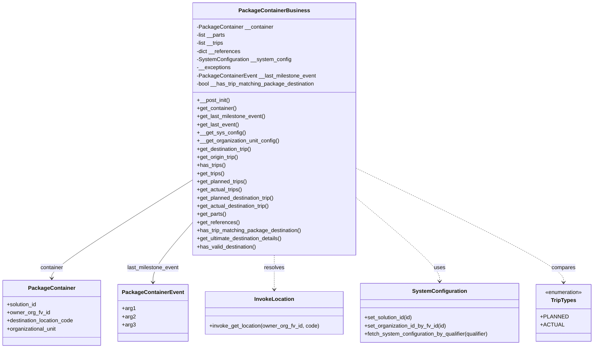

# Diagram: platform/partview_core/partview_service/partview_service/core/business/package_container/PackageContainerBusiness.py


> Auto-generated by Obscura crawlers

## Diagram 1



> SVG rendering failed for this diagram.

## Diagram 2

```mermaid
flowchart TD
    Start([Start])
    Start --> CheckPlanned{Has planned_trips AND planned_destination_trip AND container.destination_location_code?}
    CheckPlanned -->|No| EndFalse([False])
    CheckPlanned -->|Yes| Compare{planned_dest_trip.destination_location_code == container.destination_location_code?}
    Compare -->|Yes| EndTrue([True])
    Compare -->|No| Resolve[InvokeLocation.invoke_get_location(owner_organization_fv_id, container.destination_location_code)]
    Resolve --> HasResolved{resolved_container_destination exists?}
    HasResolved -->|No| EndFalse
    HasResolved -->|Yes| CompareResolved{resolved_container_destination.get("code") == planned_destination_trip.destination_location_code?}
    CompareResolved -->|Yes| EndTrue
    CompareResolved -->|No| EndFalse
```

> SVG rendering failed for this diagram.

## Diagram 3

```mermaid
flowchart TD
    Start2([Start])
    Start2 --> FetchLads[ultimate_destination_lads = __get_organization_unit_config().get("ultimate_destination_lads", [])]
    FetchLads --> CheckMatch{has_trip_matching_package_destination()?}
    CheckMatch -->|Yes| ReturnTrue([True])
    CheckMatch -->|No| HasLadsAndTrips{ultimate_destination_lads AND has_trips()?}
    HasLadsAndTrips -->|No| ReturnTrue
    HasLadsAndTrips -->|Yes| GetLad[get_ultimate_destination_details().get("lad", {}).get("name")]
    GetLad --> LadCheck{lad_name in ultimate_destination_lads OR lower(lad_name) in ["unresolved","unclassified"]?}
    LadCheck -->|Yes| ReturnTrue
    LadCheck -->|No| ReturnFalse([False])
```

> SVG rendering failed for this diagram.
