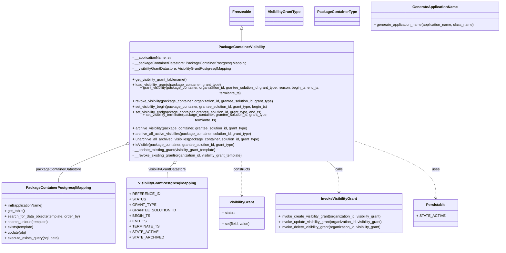
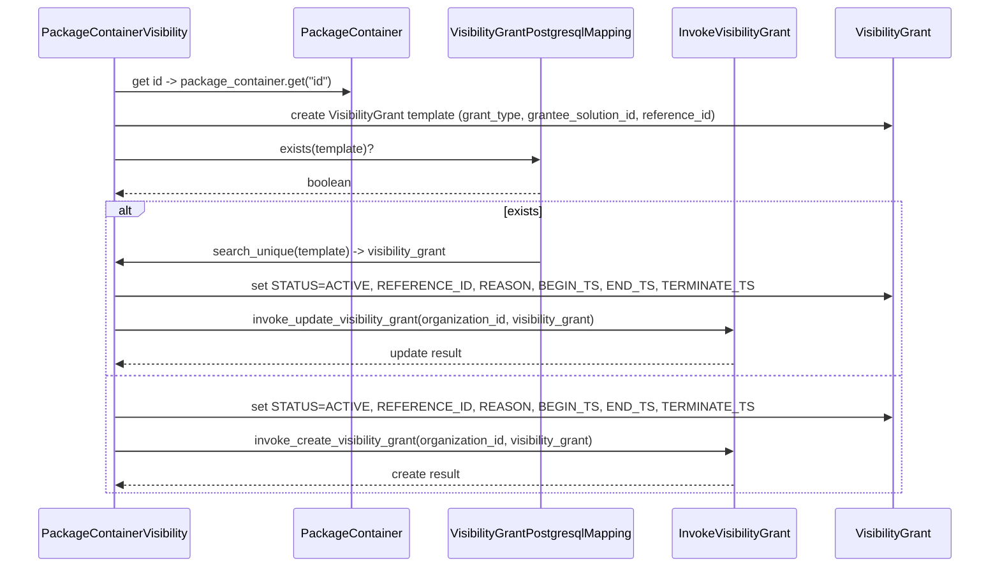

# Diagram: platform/partview_core/partview_service/partview_service/core/business/package_container/PackageContainerVisibilityGrant.py


> Auto-generated by Obscura crawlers

## Diagram 1



### SVG

<svg id="container" width="2160.5390625" xmlns="http://www.w3.org/2000/svg" class="classDiagram" height="1058" viewBox="0 0 2160.5390625 1058" role="graphics-document document" aria-roledescription="class"><style>#container{font-family:"trebuchet ms",verdana,arial,sans-serif;font-size:16px;fill:#333;}@keyframes edge-animation-frame{from{stroke-dashoffset:0;}}@keyframes dash{to{stroke-dashoffset:0;}}#container .edge-animation-slow{stroke-dasharray:9,5!important;stroke-dashoffset:900;animation:dash 50s linear infinite;stroke-linecap:round;}#container .edge-animation-fast{stroke-dasharray:9,5!important;stroke-dashoffset:900;animation:dash 20s linear infinite;stroke-linecap:round;}#container .error-icon{fill:#552222;}#container .error-text{fill:#552222;stroke:#552222;}#container .edge-thickness-normal{stroke-width:1px;}#container .edge-thickness-thick{stroke-width:3.5px;}#container .edge-pattern-solid{stroke-dasharray:0;}#container .edge-thickness-invisible{stroke-width:0;fill:none;}#container .edge-pattern-dashed{stroke-dasharray:3;}#container .edge-pattern-dotted{stroke-dasharray:2;}#container .marker{fill:#333333;stroke:#333333;}#container .marker.cross{stroke:#333333;}#container svg{font-family:"trebuchet ms",verdana,arial,sans-serif;font-size:16px;}#container p{margin:0;}#container g.classGroup text{fill:#9370DB;stroke:none;font-family:"trebuchet ms",verdana,arial,sans-serif;font-size:10px;}#container g.classGroup text .title{font-weight:bolder;}#container .nodeLabel,#container .edgeLabel{color:#131300;}#container .edgeLabel .label rect{fill:#ECECFF;}#container .label text{fill:#131300;}#container .labelBkg{background:#ECECFF;}#container .edgeLabel .label span{background:#ECECFF;}#container .classTitle{font-weight:bolder;}#container .node rect,#container .node circle,#container .node ellipse,#container .node polygon,#container .node path{fill:#ECECFF;stroke:#9370DB;stroke-width:1px;}#container .divider{stroke:#9370DB;stroke-width:1;}#container g.clickable{cursor:pointer;}#container g.classGroup rect{fill:#ECECFF;stroke:#9370DB;}#container g.classGroup line{stroke:#9370DB;stroke-width:1;}#container .classLabel .box{stroke:none;stroke-width:0;fill:#ECECFF;opacity:0.5;}#container .classLabel .label{fill:#9370DB;font-size:10px;}#container .relation{stroke:#333333;stroke-width:1;fill:none;}#container .dashed-line{stroke-dasharray:3;}#container .dotted-line{stroke-dasharray:1 2;}#container #compositionStart,#container .composition{fill:#333333!important;stroke:#333333!important;stroke-width:1;}#container #compositionEnd,#container .composition{fill:#333333!important;stroke:#333333!important;stroke-width:1;}#container #dependencyStart,#container .dependency{fill:#333333!important;stroke:#333333!important;stroke-width:1;}#container #dependencyStart,#container .dependency{fill:#333333!important;stroke:#333333!important;stroke-width:1;}#container #extensionStart,#container .extension{fill:transparent!important;stroke:#333333!important;stroke-width:1;}#container #extensionEnd,#container .extension{fill:transparent!important;stroke:#333333!important;stroke-width:1;}#container #aggregationStart,#container .aggregation{fill:transparent!important;stroke:#333333!important;stroke-width:1;}#container #aggregationEnd,#container .aggregation{fill:transparent!important;stroke:#333333!important;stroke-width:1;}#container #lollipopStart,#container .lollipop{fill:#ECECFF!important;stroke:#333333!important;stroke-width:1;}#container #lollipopEnd,#container .lollipop{fill:#ECECFF!important;stroke:#333333!important;stroke-width:1;}#container .edgeTerminals{font-size:11px;line-height:initial;}#container .classTitleText{text-anchor:middle;font-size:18px;fill:#333;}#container .label-icon{display:inline-block;height:1em;overflow:visible;vertical-align:-0.125em;}#container .node .label-icon path{fill:currentColor;stroke:revert;stroke-width:revert;}#container :root{--mermaid-font-family:"trebuchet ms",verdana,arial,sans-serif;}</style><g><defs><marker id="container_class-aggregationStart" class="marker aggregation class" refX="18" refY="7" markerWidth="190" markerHeight="240" orient="auto"><path d="M 18,7 L9,13 L1,7 L9,1 Z"></path></marker></defs><defs><marker id="container_class-aggregationEnd" class="marker aggregation class" refX="1" refY="7" markerWidth="20" markerHeight="28" orient="auto"><path d="M 18,7 L9,13 L1,7 L9,1 Z"></path></marker></defs><defs><marker id="container_class-extensionStart" class="marker extension class" refX="18" refY="7" markerWidth="190" markerHeight="240" orient="auto"><path d="M 1,7 L18,13 V 1 Z"></path></marker></defs><defs><marker id="container_class-extensionEnd" class="marker extension class" refX="1" refY="7" markerWidth="20" markerHeight="28" orient="auto"><path d="M 1,1 V 13 L18,7 Z"></path></marker></defs><defs><marker id="container_class-compositionStart" class="marker composition class" refX="18" refY="7" markerWidth="190" markerHeight="240" orient="auto"><path d="M 18,7 L9,13 L1,7 L9,1 Z"></path></marker></defs><defs><marker id="container_class-compositionEnd" class="marker composition class" refX="1" refY="7" markerWidth="20" markerHeight="28" orient="auto"><path d="M 18,7 L9,13 L1,7 L9,1 Z"></path></marker></defs><defs><marker id="container_class-dependencyStart" class="marker dependency class" refX="6" refY="7" markerWidth="190" markerHeight="240" orient="auto"><path d="M 5,7 L9,13 L1,7 L9,1 Z"></path></marker></defs><defs><marker id="container_class-dependencyEnd" class="marker dependency class" refX="13" refY="7" markerWidth="20" markerHeight="28" orient="auto"><path d="M 18,7 L9,13 L14,7 L9,1 Z"></path></marker></defs><defs><marker id="container_class-lollipopStart" class="marker lollipop class" refX="13" refY="7" markerWidth="190" markerHeight="240" orient="auto"><circle stroke="black" fill="transparent" cx="7" cy="7" r="6"></circle></marker></defs><defs><marker id="container_class-lollipopEnd" class="marker lollipop class" refX="1" refY="7" markerWidth="190" markerHeight="240" orient="auto"><circle stroke="black" fill="transparent" cx="7" cy="7" r="6"></circle></marker></defs><g class="root"><g class="clusters"></g><g class="edgePaths"><path d="M1031.695,130.25L1031.695,135.042C1031.695,139.833,1031.695,149.417,1031.695,158.375C1031.695,167.333,1031.695,175.667,1031.695,179.833L1031.695,184" id="id_Freezeable_PackageContainerVisibility_1" class="edge-thickness-normal edge-pattern-solid relation" style=";;;" data-edge="true" data-et="edge" data-id="id_Freezeable_PackageContainerVisibility_1" data-points="W3sieCI6MTAzMS42OTUzMTI1LCJ5IjoxMTN9LHsieCI6MTAzMS42OTUzMTI1LCJ5IjoxNTl9LHsieCI6MTAzMS42OTUzMTI1LCJ5IjoxODR9XQ==" marker-start="url(#container_class-extensionStart)"></path><path d="M501.118,613.437L460.243,628.031C419.369,642.625,337.62,671.812,296.746,696.073C255.871,720.333,255.871,739.667,255.871,749.333L255.871,759" id="id_PackageContainerVisibility_PackageContainerPostgresqlMapping_2" class="edge-thickness-normal edge-pattern-solid relation" style=";;;" data-edge="true" data-et="edge" data-id="id_PackageContainerVisibility_PackageContainerPostgresqlMapping_2" data-points="W3sieCI6NTE3LjM2MzI4MTI1LCJ5Ijo2MDcuNjM2OTIzNDMzMjQzOX0seyJ4IjoyNTUuODcxMDkzNzUsInkiOjcwMX0seyJ4IjoyNTUuODcxMDkzNzUsInkiOjc1OX1d" marker-start="url(#container_class-aggregationStart)"></path><path d="M746.812,675.414L741.98,679.678C737.148,683.943,727.484,692.471,722.652,702.902C717.82,713.333,717.82,725.667,717.82,731.833L717.82,738" id="id_PackageContainerVisibility_VisibilityGrantPostgresqlMapping_3" class="edge-thickness-normal edge-pattern-solid relation" style=";;;" data-edge="true" data-et="edge" data-id="id_PackageContainerVisibility_VisibilityGrantPostgresqlMapping_3" data-points="W3sieCI6NzU5Ljc0NTg1NDAxNjI0NTQsInkiOjY2NH0seyJ4Ijo3MTcuODIwMzEyNSwieSI6NzAxfSx7IngiOjcxNy44MjAzMTI1LCJ5Ijo3Mzh9XQ==" marker-start="url(#container_class-aggregationStart)"></path><path d="M1031.695,664L1031.695,670.167C1031.695,676.333,1031.695,688.667,1031.695,714C1031.695,739.333,1031.695,777.667,1031.695,796.833L1031.695,816" id="id_PackageContainerVisibility_VisibilityGrant_4" class="edge-thickness-normal edge-pattern-dashed relation" style=";;;" data-edge="true" data-et="edge" data-id="id_PackageContainerVisibility_VisibilityGrant_4" data-points="W3sieCI6MTAzMS42OTUzMTI1LCJ5Ijo2NjR9LHsieCI6MTAzMS42OTUzMTI1LCJ5Ijo3MDF9LHsieCI6MTAzMS42OTUzMTI1LCJ5Ijo4MjJ9XQ==" marker-end="url(#container_class-dependencyEnd)"></path><path d="M1409.217,664L1418.917,670.167C1428.617,676.333,1448.018,688.667,1457.718,711.5C1467.418,734.333,1467.418,767.667,1467.418,784.333L1467.418,801" id="id_PackageContainerVisibility_InvokeVisibilityGrant_5" class="edge-thickness-normal edge-pattern-dashed relation" style=";;;" data-edge="true" data-et="edge" data-id="id_PackageContainerVisibility_InvokeVisibilityGrant_5" data-points="W3sieCI6MTQwOS4yMTY3NDc1MTgwNTA2LCJ5Ijo2NjR9LHsieCI6MTQ2Ny40MTc5Njg3NSwieSI6NzAxfSx7IngiOjE0NjcuNDE3OTY4NzUsInkiOjgwN31d" marker-end="url(#container_class-dependencyEnd)"></path><path d="M1546.027,589.844L1603.482,608.37C1660.936,626.896,1775.845,663.948,1833.299,703.641C1890.754,743.333,1890.754,785.667,1890.754,806.833L1890.754,828" id="id_PackageContainerVisibility_Persistable_6" class="edge-thickness-normal edge-pattern-dashed relation" style=";;;" data-edge="true" data-et="edge" data-id="id_PackageContainerVisibility_Persistable_6" data-points="W3sieCI6MTU0Ni4wMjczNDM3NSwieSI6NTg5Ljg0NDMwMTc2NTY1fSx7IngiOjE4OTAuNzUzOTA2MjUsInkiOjcwMX0seyJ4IjoxODkwLjc1MzkwNjI1LCJ5Ijo4MzR9XQ==" marker-end="url(#container_class-dependencyEnd)"></path></g><g class="edgeLabels"><g class="edgeLabel"><g class="label" data-id="id_Freezeable_PackageContainerVisibility_1" transform="translate(0, 0)"><foreignObject width="0" height="0"><div xmlns="http://www.w3.org/1999/xhtml" class="labelBkg" style="display: table-cell; white-space: nowrap; line-height: 1.5; max-width: 200px; text-align: center;"><span class="edgeLabel"></span></div></foreignObject></g></g><g class="edgeLabel" transform="translate(255.87109375, 701)"><g class="label" data-id="id_PackageContainerVisibility_PackageContainerPostgresqlMapping_2" transform="translate(-99.65625, -12)"><foreignObject width="199.3125" height="24"><div xmlns="http://www.w3.org/1999/xhtml" class="labelBkg" style="display: table-cell; white-space: nowrap; line-height: 1.5; max-width: 200px; text-align: center;"><span class="edgeLabel"><p>packageContainerDatastore</p></span></div></foreignObject></g></g><g class="edgeLabel" transform="translate(717.8203125, 701)"><g class="label" data-id="id_PackageContainerVisibility_VisibilityGrantPostgresqlMapping_3" transform="translate(-85.2734375, -12)"><foreignObject width="170.546875" height="24"><div xmlns="http://www.w3.org/1999/xhtml" class="labelBkg" style="display: table-cell; white-space: nowrap; line-height: 1.5; max-width: 200px; text-align: center;"><span class="edgeLabel"><p>visibilityGrantDatastore</p></span></div></foreignObject></g></g><g class="edgeLabel" transform="translate(1031.6953125, 701)"><g class="label" data-id="id_PackageContainerVisibility_VisibilityGrant_4" transform="translate(-37.84375, -12)"><foreignObject width="75.6875" height="24"><div xmlns="http://www.w3.org/1999/xhtml" class="labelBkg" style="display: table-cell; white-space: nowrap; line-height: 1.5; max-width: 200px; text-align: center;"><span class="edgeLabel"><p>constructs</p></span></div></foreignObject></g></g><g class="edgeLabel" transform="translate(1467.41796875, 701)"><g class="label" data-id="id_PackageContainerVisibility_InvokeVisibilityGrant_5" transform="translate(-16.4453125, -12)"><foreignObject width="32.890625" height="24"><div xmlns="http://www.w3.org/1999/xhtml" class="labelBkg" style="display: table-cell; white-space: nowrap; line-height: 1.5; max-width: 200px; text-align: center;"><span class="edgeLabel"><p>calls</p></span></div></foreignObject></g></g><g class="edgeLabel" transform="translate(1890.75390625, 701)"><g class="label" data-id="id_PackageContainerVisibility_Persistable_6" transform="translate(-16.4921875, -12)"><foreignObject width="32.984375" height="24"><div xmlns="http://www.w3.org/1999/xhtml" class="labelBkg" style="display: table-cell; white-space: nowrap; line-height: 1.5; max-width: 200px; text-align: center;"><span class="edgeLabel"><p>uses</p></span></div></foreignObject></g></g></g><g class="nodes"><g class="node default" id="classId-Freezeable-0" transform="translate(1031.6953125, 71)"><g class="basic label-container"><path d="M-51.1953125 -42 L51.1953125 -42 L51.1953125 42 L-51.1953125 42" stroke="none" stroke-width="0" fill="#ECECFF" style=""></path><path d="M-51.1953125 -42 C-15.29748089143272 -42, 20.60035071713456 -42, 51.1953125 -42 M-51.1953125 -42 C-15.631081663133287 -42, 19.933149173733426 -42, 51.1953125 -42 M51.1953125 -42 C51.1953125 -16.49324218295977, 51.1953125 9.013515634080463, 51.1953125 42 M51.1953125 -42 C51.1953125 -22.039403195420494, 51.1953125 -2.078806390840988, 51.1953125 42 M51.1953125 42 C25.48153305185736 42, -0.23224639628527655 42, -51.1953125 42 M51.1953125 42 C12.869457926186065 42, -25.45639664762787 42, -51.1953125 42 M-51.1953125 42 C-51.1953125 20.609784645971743, -51.1953125 -0.7804307080565138, -51.1953125 -42 M-51.1953125 42 C-51.1953125 22.1873724578913, -51.1953125 2.3747449157825997, -51.1953125 -42" stroke="#9370DB" stroke-width="1.3" fill="none" stroke-dasharray="0 0" style=""></path></g><g class="annotation-group text" transform="translate(0, -18)"></g><g class="label-group text" transform="translate(-39.1953125, -18)"><g class="label" style="font-weight: bolder" transform="translate(0,-12)"><foreignObject width="78.390625" height="24"><div xmlns="http://www.w3.org/1999/xhtml" style="display: table-cell; white-space: nowrap; line-height: 1.5; max-width: 127px; text-align: center;"><span class="nodeLabel markdown-node-label" style=""><p>Freezeable</p></span></div></foreignObject></g></g><g class="members-group text" transform="translate(-39.1953125, 30)"></g><g class="methods-group text" transform="translate(-39.1953125, 60)"></g><g class="divider" style=""><path d="M-51.1953125 6 C-26.34179730970561 6, -1.4882821194112168 6, 51.1953125 6 M-51.1953125 6 C-22.876868536559602 6, 5.441575426880796 6, 51.1953125 6" stroke="#9370DB" stroke-width="1.3" fill="none" stroke-dasharray="0 0" style=""></path></g><g class="divider" style=""><path d="M-51.1953125 24 C-22.008027099886544 24, 7.179258300226913 24, 51.1953125 24 M-51.1953125 24 C-23.562868210037863 24, 4.069576079924275 24, 51.1953125 24" stroke="#9370DB" stroke-width="1.3" fill="none" stroke-dasharray="0 0" style=""></path></g></g><g class="node default" id="classId-PackageContainerVisibility-1" transform="translate(1031.6953125, 424)"><g class="basic label-container"><path d="M-514.33203125 -240 L514.33203125 -240 L514.33203125 240 L-514.33203125 240" stroke="none" stroke-width="0" fill="#ECECFF" style=""></path><path d="M-514.33203125 -240 C-170.419770568147 -240, 173.49249011370603 -240, 514.33203125 -240 M-514.33203125 -240 C-291.1393081389472 -240, -67.9465850278944 -240, 514.33203125 -240 M514.33203125 -240 C514.33203125 -65.27499586713947, 514.33203125 109.45000826572107, 514.33203125 240 M514.33203125 -240 C514.33203125 -94.90606765332166, 514.33203125 50.18786469335669, 514.33203125 240 M514.33203125 240 C141.72015276324663 240, -230.89172572350674 240, -514.33203125 240 M514.33203125 240 C151.76393959823253 240, -210.80415205353495 240, -514.33203125 240 M-514.33203125 240 C-514.33203125 133.7922395295261, -514.33203125 27.584479059052228, -514.33203125 -240 M-514.33203125 240 C-514.33203125 139.6075286210899, -514.33203125 39.215057242179824, -514.33203125 -240" stroke="#9370DB" stroke-width="1.3" fill="none" stroke-dasharray="0 0" style=""></path></g><g class="annotation-group text" transform="translate(0, -216)"></g><g class="label-group text" transform="translate(-97.2421875, -216)"><g class="label" style="font-weight: bolder" transform="translate(0,-12)"><foreignObject width="194.484375" height="24"><div xmlns="http://www.w3.org/1999/xhtml" style="display: table-cell; white-space: nowrap; line-height: 1.5; max-width: 241px; text-align: center;"><span class="nodeLabel markdown-node-label" style=""><p>PackageContainerVisibility</p></span></div></foreignObject></g></g><g class="members-group text" transform="translate(-502.33203125, -168)"><g class="label" style="" transform="translate(0,-12)"><foreignObject width="178.53125" height="24"><div xmlns="http://www.w3.org/1999/xhtml" style="display: table-cell; white-space: nowrap; line-height: 1.5; max-width: 237px; text-align: center;"><span class="nodeLabel markdown-node-label" style=""><p>- __applicationName: str</p></span></div></foreignObject></g><g class="label" style="" transform="translate(0,12)"><foreignObject width="501.125" height="24"><div xmlns="http://www.w3.org/1999/xhtml" style="display: table-cell; white-space: nowrap; line-height: 1.5; max-width: 559px; text-align: center;"><span class="nodeLabel markdown-node-label" style=""><p>- __packageContainerDatastore: PackageContainerPostgresqlMapping</p></span></div></foreignObject></g><g class="label" style="" transform="translate(0,36)"><foreignObject width="445.0625" height="24"><div xmlns="http://www.w3.org/1999/xhtml" style="display: table-cell; white-space: nowrap; line-height: 1.5; max-width: 503px; text-align: center;"><span class="nodeLabel markdown-node-label" style=""><p>- __visibilityGrantDatastore: VisibilityGrantPostgresqlMapping</p></span></div></foreignObject></g></g><g class="methods-group text" transform="translate(-502.33203125, -72)"><g class="label" style="" transform="translate(0,-12)"><foreignObject width="245.640625" height="24"><div xmlns="http://www.w3.org/1999/xhtml" style="display: table-cell; white-space: nowrap; line-height: 1.5; max-width: 303px; text-align: center;"><span class="nodeLabel markdown-node-label" style=""><p>+ get_visibility_grant_tablename()</p></span></div></foreignObject></g><g class="label" style="" transform="translate(0,12)"><foreignObject width="397.140625" height="24"><div xmlns="http://www.w3.org/1999/xhtml" style="display: table-cell; white-space: nowrap; line-height: 1.5; max-width: 455px; text-align: center;"><span class="nodeLabel markdown-node-label" style=""><p>+ load_visibility_grants(package_container, grant_type)</p></span></div></foreignObject></g><g class="label" style="" transform="translate(0,36)"><foreignObject width="907.421875" height="24"><div xmlns="http://www.w3.org/1999/xhtml" style="display: table-cell; white-space: nowrap; line-height: 1.5; max-width: 965px; text-align: center;"><span class="nodeLabel markdown-node-label" style=""><p>+ grant_visibility(package_container, organization_id, grantee_solution_id, grant_type, reason, begin_ts, end_ts, termiante_ts)</p></span></div></foreignObject></g><g class="label" style="" transform="translate(0,60)"><foreignObject width="633.90625" height="24"><div xmlns="http://www.w3.org/1999/xhtml" style="display: table-cell; white-space: nowrap; line-height: 1.5; max-width: 691px; text-align: center;"><span class="nodeLabel markdown-node-label" style=""><p>+ revoke_visibility(package_container, organization_id, grantee_solution_id, grant_type)</p></span></div></foreignObject></g><g class="label" style="" transform="translate(0,84)"><foreignObject width="604.96875" height="24"><div xmlns="http://www.w3.org/1999/xhtml" style="display: table-cell; white-space: nowrap; line-height: 1.5; max-width: 662px; text-align: center;"><span class="nodeLabel markdown-node-label" style=""><p>+ set_visibility_begin(package_container, grantee_solution_id, grant_type, begin_ts)</p></span></div></foreignObject></g><g class="label" style="" transform="translate(0,108)"><foreignObject width="579.109375" height="24"><div xmlns="http://www.w3.org/1999/xhtml" style="display: table-cell; white-space: nowrap; line-height: 1.5; max-width: 636px; text-align: center;"><span class="nodeLabel markdown-node-label" style=""><p>+ set_visibility_end(package_container, grantee_solution_id, grant_type, end_ts)</p></span></div></foreignObject></g><g class="label" style="" transform="translate(0,132)"><foreignObject width="665.453125" height="24"><div xmlns="http://www.w3.org/1999/xhtml" style="display: table-cell; white-space: nowrap; line-height: 1.5; max-width: 723px; text-align: center;"><span class="nodeLabel markdown-node-label" style=""><p>+ set_visibility_terminate(package_container, grantee_solution_id, grant_type, termiante_ts)</p></span></div></foreignObject></g><g class="label" style="" transform="translate(0,156)"><foreignObject width="517.265625" height="24"><div xmlns="http://www.w3.org/1999/xhtml" style="display: table-cell; white-space: nowrap; line-height: 1.5; max-width: 575px; text-align: center;"><span class="nodeLabel markdown-node-label" style=""><p>+ archive_visibility(package_container, grantee_solution_id, grant_type)</p></span></div></foreignObject></g><g class="label" style="" transform="translate(0,180)"><foreignObject width="533.671875" height="24"><div xmlns="http://www.w3.org/1999/xhtml" style="display: table-cell; white-space: nowrap; line-height: 1.5; max-width: 591px; text-align: center;"><span class="nodeLabel markdown-node-label" style=""><p>+ archive_all_active_visibilies(package_container, solution_id, grant_type)</p></span></div></foreignObject></g><g class="label" style="" transform="translate(0,204)"><foreignObject width="571.546875" height="24"><div xmlns="http://www.w3.org/1999/xhtml" style="display: table-cell; white-space: nowrap; line-height: 1.5; max-width: 629px; text-align: center;"><span class="nodeLabel markdown-node-label" style=""><p>+ unarchive_all_archived_visibilies(package_container, solution_id, grant_type)</p></span></div></foreignObject></g><g class="label" style="" transform="translate(0,228)"><foreignObject width="456.34375" height="24"><div xmlns="http://www.w3.org/1999/xhtml" style="display: table-cell; white-space: nowrap; line-height: 1.5; max-width: 514px; text-align: center;"><span class="nodeLabel markdown-node-label" style=""><p>+ isVisible(package_container, grantee_solution_id, grant_type)</p></span></div></foreignObject></g><g class="label" style="" transform="translate(0,252)"><foreignObject width="378.84375" height="24"><div xmlns="http://www.w3.org/1999/xhtml" style="display: table-cell; white-space: nowrap; line-height: 1.5; max-width: 436px; text-align: center;"><span class="nodeLabel markdown-node-label" style=""><p>- __update_existing_grant(visibility_grant_template)</p></span></div></foreignObject></g><g class="label" style="" transform="translate(0,276)"><foreignObject width="496.921875" height="24"><div xmlns="http://www.w3.org/1999/xhtml" style="display: table-cell; white-space: nowrap; line-height: 1.5; max-width: 554px; text-align: center;"><span class="nodeLabel markdown-node-label" style=""><p>- __revoke_existing_grant(organization_id, visibility_grant_template)</p></span></div></foreignObject></g></g><g class="divider" style=""><path d="M-514.33203125 -192 C-106.44248713398304 -192, 301.4470569820339 -192, 514.33203125 -192 M-514.33203125 -192 C-250.70528218297267 -192, 12.921466884054666 -192, 514.33203125 -192" stroke="#9370DB" stroke-width="1.3" fill="none" stroke-dasharray="0 0" style=""></path></g><g class="divider" style=""><path d="M-514.33203125 -96 C-262.5263953062195 -96, -10.720759362439026 -96, 514.33203125 -96 M-514.33203125 -96 C-200.56108276877035 -96, 113.2098657124593 -96, 514.33203125 -96" stroke="#9370DB" stroke-width="1.3" fill="none" stroke-dasharray="0 0" style=""></path></g></g><g class="node default" id="classId-VisibilityGrant-2" transform="translate(1031.6953125, 894)"><g class="basic label-container"><path d="M-99.796875 -72 L99.796875 -72 L99.796875 72 L-99.796875 72" stroke="none" stroke-width="0" fill="#ECECFF" style=""></path><path d="M-99.796875 -72 C-57.59978711434535 -72, -15.402699228690693 -72, 99.796875 -72 M-99.796875 -72 C-29.454232827147095 -72, 40.88840934570581 -72, 99.796875 -72 M99.796875 -72 C99.796875 -32.501566435550984, 99.796875 6.996867128898032, 99.796875 72 M99.796875 -72 C99.796875 -29.715902132351474, 99.796875 12.568195735297053, 99.796875 72 M99.796875 72 C50.45630133904132 72, 1.115727678082635 72, -99.796875 72 M99.796875 72 C26.60822614964765 72, -46.5804227007047 72, -99.796875 72 M-99.796875 72 C-99.796875 14.659011567226202, -99.796875 -42.6819768655476, -99.796875 -72 M-99.796875 72 C-99.796875 34.66216138086876, -99.796875 -2.6756772382624803, -99.796875 -72" stroke="#9370DB" stroke-width="1.3" fill="none" stroke-dasharray="0 0" style=""></path></g><g class="annotation-group text" transform="translate(0, -48)"></g><g class="label-group text" transform="translate(-51.96875, -48)"><g class="label" style="font-weight: bolder" transform="translate(0,-12)"><foreignObject width="103.9375" height="24"><div xmlns="http://www.w3.org/1999/xhtml" style="display: table-cell; white-space: nowrap; line-height: 1.5; max-width: 152px; text-align: center;"><span class="nodeLabel markdown-node-label" style=""><p>VisibilityGrant</p></span></div></foreignObject></g></g><g class="members-group text" transform="translate(-87.796875, 0)"><g class="label" style="" transform="translate(0,-12)"><foreignObject width="56.625" height="24"><div xmlns="http://www.w3.org/1999/xhtml" style="display: table-cell; white-space: nowrap; line-height: 1.5; max-width: 114px; text-align: center;"><span class="nodeLabel markdown-node-label" style=""><p>+ status</p></span></div></foreignObject></g></g><g class="methods-group text" transform="translate(-87.796875, 48)"><g class="label" style="" transform="translate(0,-12)"><foreignObject width="123.625" height="24"><div xmlns="http://www.w3.org/1999/xhtml" style="display: table-cell; white-space: nowrap; line-height: 1.5; max-width: 181px; text-align: center;"><span class="nodeLabel markdown-node-label" style=""><p>+ set(field, value)</p></span></div></foreignObject></g></g><g class="divider" style=""><path d="M-99.796875 -24 C-30.46669313711665 -24, 38.8634887257667 -24, 99.796875 -24 M-99.796875 -24 C-30.70347299154639 -24, 38.38992901690722 -24, 99.796875 -24" stroke="#9370DB" stroke-width="1.3" fill="none" stroke-dasharray="0 0" style=""></path></g><g class="divider" style=""><path d="M-99.796875 24 C-52.193756285392546 24, -4.590637570785091 24, 99.796875 24 M-99.796875 24 C-50.344972331821566 24, -0.8930696636431321 24, 99.796875 24" stroke="#9370DB" stroke-width="1.3" fill="none" stroke-dasharray="0 0" style=""></path></g></g><g class="node default" id="classId-VisibilityGrantType-3" transform="translate(1214.1953125, 71)"><g class="basic label-container"><path d="M-81.3046875 -42 L81.3046875 -42 L81.3046875 42 L-81.3046875 42" stroke="none" stroke-width="0" fill="#ECECFF" style=""></path><path d="M-81.3046875 -42 C-45.6924511555013 -42, -10.080214811002605 -42, 81.3046875 -42 M-81.3046875 -42 C-47.46489579160486 -42, -13.62510408320972 -42, 81.3046875 -42 M81.3046875 -42 C81.3046875 -19.785573071622476, 81.3046875 2.4288538567550475, 81.3046875 42 M81.3046875 -42 C81.3046875 -15.507263509451029, 81.3046875 10.985472981097942, 81.3046875 42 M81.3046875 42 C39.20467561552628 42, -2.895336268947446 42, -81.3046875 42 M81.3046875 42 C23.953040022954752 42, -33.398607454090495 42, -81.3046875 42 M-81.3046875 42 C-81.3046875 23.76786310689345, -81.3046875 5.535726213786901, -81.3046875 -42 M-81.3046875 42 C-81.3046875 13.632209708531967, -81.3046875 -14.735580582936066, -81.3046875 -42" stroke="#9370DB" stroke-width="1.3" fill="none" stroke-dasharray="0 0" style=""></path></g><g class="annotation-group text" transform="translate(0, -18)"></g><g class="label-group text" transform="translate(-69.3046875, -18)"><g class="label" style="font-weight: bolder" transform="translate(0,-12)"><foreignObject width="138.609375" height="24"><div xmlns="http://www.w3.org/1999/xhtml" style="display: table-cell; white-space: nowrap; line-height: 1.5; max-width: 185px; text-align: center;"><span class="nodeLabel markdown-node-label" style=""><p>VisibilityGrantType</p></span></div></foreignObject></g></g><g class="members-group text" transform="translate(-69.3046875, 30)"></g><g class="methods-group text" transform="translate(-69.3046875, 60)"></g><g class="divider" style=""><path d="M-81.3046875 6 C-35.76825036087988 6, 9.768186778240235 6, 81.3046875 6 M-81.3046875 6 C-18.438992218301948 6, 44.426703063396104 6, 81.3046875 6" stroke="#9370DB" stroke-width="1.3" fill="none" stroke-dasharray="0 0" style=""></path></g><g class="divider" style=""><path d="M-81.3046875 24 C-30.945692462436725 24, 19.41330257512655 24, 81.3046875 24 M-81.3046875 24 C-36.45700311862763 24, 8.390681262744735 24, 81.3046875 24" stroke="#9370DB" stroke-width="1.3" fill="none" stroke-dasharray="0 0" style=""></path></g></g><g class="node default" id="classId-PackageContainerPostgresqlMapping-4" transform="translate(255.87109375, 894)"><g class="basic label-container"><path d="M-247.87109375 -135 L247.87109375 -135 L247.87109375 135 L-247.87109375 135" stroke="none" stroke-width="0" fill="#ECECFF" style=""></path><path d="M-247.87109375 -135 C-50.567197811526825 -135, 146.73669812694635 -135, 247.87109375 -135 M-247.87109375 -135 C-69.26475395305548 -135, 109.34158584388905 -135, 247.87109375 -135 M247.87109375 -135 C247.87109375 -36.47209384082349, 247.87109375 62.05581231835302, 247.87109375 135 M247.87109375 -135 C247.87109375 -55.040621381634836, 247.87109375 24.91875723673033, 247.87109375 135 M247.87109375 135 C65.49931956036542 135, -116.87245462926916 135, -247.87109375 135 M247.87109375 135 C87.12601503859312 135, -73.61906367281375 135, -247.87109375 135 M-247.87109375 135 C-247.87109375 78.7704385862449, -247.87109375 22.5408771724898, -247.87109375 -135 M-247.87109375 135 C-247.87109375 66.3738852501389, -247.87109375 -2.2522294997222048, -247.87109375 -135" stroke="#9370DB" stroke-width="1.3" fill="none" stroke-dasharray="0 0" style=""></path></g><g class="annotation-group text" transform="translate(0, -111)"></g><g class="label-group text" transform="translate(-135.8515625, -111)"><g class="label" style="font-weight: bolder" transform="translate(0,-12)"><foreignObject width="271.703125" height="24"><div xmlns="http://www.w3.org/1999/xhtml" style="display: table-cell; white-space: nowrap; line-height: 1.5; max-width: 317px; text-align: center;"><span class="nodeLabel markdown-node-label" style=""><p>PackageContainerPostgresqlMapping</p></span></div></foreignObject></g></g><g class="members-group text" transform="translate(-235.87109375, -63)"></g><g class="methods-group text" transform="translate(-235.87109375, -33)"><g class="label" style="" transform="translate(0,-12)"><foreignObject width="171.21875" height="24"><div xmlns="http://www.w3.org/1999/xhtml" style="display: table-cell; white-space: nowrap; line-height: 1.5; max-width: 261px; text-align: center;"><span class="nodeLabel markdown-node-label" style=""><p>+ <strong>init</strong>(applicationName)</p></span></div></foreignObject></g><g class="label" style="" transform="translate(0,12)"><foreignObject width="90.359375" height="24"><div xmlns="http://www.w3.org/1999/xhtml" style="display: table-cell; white-space: nowrap; line-height: 1.5; max-width: 148px; text-align: center;"><span class="nodeLabel markdown-node-label" style=""><p>+ get_table()</p></span></div></foreignObject></g><g class="label" style="" transform="translate(0,36)"><foreignObject width="335.890625" height="24"><div xmlns="http://www.w3.org/1999/xhtml" style="display: table-cell; white-space: nowrap; line-height: 1.5; max-width: 393px; text-align: center;"><span class="nodeLabel markdown-node-label" style=""><p>+ search_for_data_objects(template, order_by)</p></span></div></foreignObject></g><g class="label" style="" transform="translate(0,60)"><foreignObject width="193.890625" height="24"><div xmlns="http://www.w3.org/1999/xhtml" style="display: table-cell; white-space: nowrap; line-height: 1.5; max-width: 251px; text-align: center;"><span class="nodeLabel markdown-node-label" style=""><p>+ search_unique(template)</p></span></div></foreignObject></g><g class="label" style="" transform="translate(0,84)"><foreignObject width="129.203125" height="24"><div xmlns="http://www.w3.org/1999/xhtml" style="display: table-cell; white-space: nowrap; line-height: 1.5; max-width: 187px; text-align: center;"><span class="nodeLabel markdown-node-label" style=""><p>+ exists(template)</p></span></div></foreignObject></g><g class="label" style="" transform="translate(0,108)"><foreignObject width="97.265625" height="24"><div xmlns="http://www.w3.org/1999/xhtml" style="display: table-cell; white-space: nowrap; line-height: 1.5; max-width: 155px; text-align: center;"><span class="nodeLabel markdown-node-label" style=""><p>+ update(obj)</p></span></div></foreignObject></g><g class="label" style="" transform="translate(0,132)"><foreignObject width="239.65625" height="24"><div xmlns="http://www.w3.org/1999/xhtml" style="display: table-cell; white-space: nowrap; line-height: 1.5; max-width: 297px; text-align: center;"><span class="nodeLabel markdown-node-label" style=""><p>+ execute_exists_query(sql, data)</p></span></div></foreignObject></g></g><g class="divider" style=""><path d="M-247.87109375 -87 C-69.25478873519623 -87, 109.36151627960754 -87, 247.87109375 -87 M-247.87109375 -87 C-93.92436444441833 -87, 60.02236486116334 -87, 247.87109375 -87" stroke="#9370DB" stroke-width="1.3" fill="none" stroke-dasharray="0 0" style=""></path></g><g class="divider" style=""><path d="M-247.87109375 -63 C-121.41480711041761 -63, 5.041479529164775 -63, 247.87109375 -63 M-247.87109375 -63 C-98.70990838528968 -63, 50.45127697942064 -63, 247.87109375 -63" stroke="#9370DB" stroke-width="1.3" fill="none" stroke-dasharray="0 0" style=""></path></g></g><g class="node default" id="classId-VisibilityGrantPostgresqlMapping-5" transform="translate(717.8203125, 894)"><g class="basic label-container"><path d="M-164.078125 -156 L164.078125 -156 L164.078125 156 L-164.078125 156" stroke="none" stroke-width="0" fill="#ECECFF" style=""></path><path d="M-164.078125 -156 C-66.17356008012314 -156, 31.731004839753723 -156, 164.078125 -156 M-164.078125 -156 C-81.82439395652284 -156, 0.4293370869543196 -156, 164.078125 -156 M164.078125 -156 C164.078125 -76.09293409566433, 164.078125 3.814131808671334, 164.078125 156 M164.078125 -156 C164.078125 -71.28692294232414, 164.078125 13.426154115351721, 164.078125 156 M164.078125 156 C49.0245754544748 156, -66.0289740910504 156, -164.078125 156 M164.078125 156 C48.66701735385652 156, -66.74409029228696 156, -164.078125 156 M-164.078125 156 C-164.078125 32.55693038998274, -164.078125 -90.88613922003452, -164.078125 -156 M-164.078125 156 C-164.078125 81.29588736935851, -164.078125 6.591774738717021, -164.078125 -156" stroke="#9370DB" stroke-width="1.3" fill="none" stroke-dasharray="0 0" style=""></path></g><g class="annotation-group text" transform="translate(0, -132)"></g><g class="label-group text" transform="translate(-122.375, -132)"><g class="label" style="font-weight: bolder" transform="translate(0,-12)"><foreignObject width="244.75" height="24"><div xmlns="http://www.w3.org/1999/xhtml" style="display: table-cell; white-space: nowrap; line-height: 1.5; max-width: 290px; text-align: center;"><span class="nodeLabel markdown-node-label" style=""><p>VisibilityGrantPostgresqlMapping</p></span></div></foreignObject></g></g><g class="members-group text" transform="translate(-152.078125, -84)"><g class="label" style="" transform="translate(0,-12)"><foreignObject width="116.921875" height="24"><div xmlns="http://www.w3.org/1999/xhtml" style="display: table-cell; white-space: nowrap; line-height: 1.5; max-width: 174px; text-align: center;"><span class="nodeLabel markdown-node-label" style=""><p>+ REFERENCE_ID</p></span></div></foreignObject></g><g class="label" style="" transform="translate(0,12)"><foreignObject width="63.90625" height="24"><div xmlns="http://www.w3.org/1999/xhtml" style="display: table-cell; white-space: nowrap; line-height: 1.5; max-width: 122px; text-align: center;"><span class="nodeLabel markdown-node-label" style=""><p>+ STATUS</p></span></div></foreignObject></g><g class="label" style="" transform="translate(0,36)"><foreignObject width="102.03125" height="24"><div xmlns="http://www.w3.org/1999/xhtml" style="display: table-cell; white-space: nowrap; line-height: 1.5; max-width: 159px; text-align: center;"><span class="nodeLabel markdown-node-label" style=""><p>+ GRANT_TYPE</p></span></div></foreignObject></g><g class="label" style="" transform="translate(0,60)"><foreignObject width="181.78125" height="24"><div xmlns="http://www.w3.org/1999/xhtml" style="display: table-cell; white-space: nowrap; line-height: 1.5; max-width: 239px; text-align: center;"><span class="nodeLabel markdown-node-label" style=""><p>+ GRANTEE_SOLUTION_ID</p></span></div></foreignObject></g><g class="label" style="" transform="translate(0,84)"><foreignObject width="80.265625" height="24"><div xmlns="http://www.w3.org/1999/xhtml" style="display: table-cell; white-space: nowrap; line-height: 1.5; max-width: 138px; text-align: center;"><span class="nodeLabel markdown-node-label" style=""><p>+ BEGIN_TS</p></span></div></foreignObject></g><g class="label" style="" transform="translate(0,108)"><foreignObject width="65.578125" height="24"><div xmlns="http://www.w3.org/1999/xhtml" style="display: table-cell; white-space: nowrap; line-height: 1.5; max-width: 123px; text-align: center;"><span class="nodeLabel markdown-node-label" style=""><p>+ END_TS</p></span></div></foreignObject></g><g class="label" style="" transform="translate(0,132)"><foreignObject width="116.234375" height="24"><div xmlns="http://www.w3.org/1999/xhtml" style="display: table-cell; white-space: nowrap; line-height: 1.5; max-width: 174px; text-align: center;"><span class="nodeLabel markdown-node-label" style=""><p>+ TERMINATE_TS</p></span></div></foreignObject></g><g class="label" style="" transform="translate(0,156)"><foreignObject width="109.84375" height="24"><div xmlns="http://www.w3.org/1999/xhtml" style="display: table-cell; white-space: nowrap; line-height: 1.5; max-width: 167px; text-align: center;"><span class="nodeLabel markdown-node-label" style=""><p>+ STATE_ACTIVE</p></span></div></foreignObject></g><g class="label" style="" transform="translate(0,180)"><foreignObject width="132.609375" height="24"><div xmlns="http://www.w3.org/1999/xhtml" style="display: table-cell; white-space: nowrap; line-height: 1.5; max-width: 190px; text-align: center;"><span class="nodeLabel markdown-node-label" style=""><p>+ STATE_ARCHIVED</p></span></div></foreignObject></g></g><g class="methods-group text" transform="translate(-152.078125, 156)"></g><g class="divider" style=""><path d="M-164.078125 -108 C-85.9924289362042 -108, -7.906732872408412 -108, 164.078125 -108 M-164.078125 -108 C-48.52965201306583 -108, 67.01882097386834 -108, 164.078125 -108" stroke="#9370DB" stroke-width="1.3" fill="none" stroke-dasharray="0 0" style=""></path></g><g class="divider" style=""><path d="M-164.078125 132 C-76.20969571027297 132, 11.658733579454065 132, 164.078125 132 M-164.078125 132 C-60.760281692484384 132, 42.55756161503123 132, 164.078125 132" stroke="#9370DB" stroke-width="1.3" fill="none" stroke-dasharray="0 0" style=""></path></g></g><g class="node default" id="classId-PackageContainerType-6" transform="translate(1440.2890625, 71)"><g class="basic label-container"><path d="M-94.7890625 -42 L94.7890625 -42 L94.7890625 42 L-94.7890625 42" stroke="none" stroke-width="0" fill="#ECECFF" style=""></path><path d="M-94.7890625 -42 C-30.820332983419547 -42, 33.148396533160906 -42, 94.7890625 -42 M-94.7890625 -42 C-23.559417871457683 -42, 47.670226757084635 -42, 94.7890625 -42 M94.7890625 -42 C94.7890625 -24.716639924795984, 94.7890625 -7.433279849591969, 94.7890625 42 M94.7890625 -42 C94.7890625 -13.263008189313503, 94.7890625 15.473983621372994, 94.7890625 42 M94.7890625 42 C31.780840333980798 42, -31.227381832038404 42, -94.7890625 42 M94.7890625 42 C35.320474998759316 42, -24.148112502481368 42, -94.7890625 42 M-94.7890625 42 C-94.7890625 21.751906546647742, -94.7890625 1.5038130932954843, -94.7890625 -42 M-94.7890625 42 C-94.7890625 13.673450463653051, -94.7890625 -14.653099072693898, -94.7890625 -42" stroke="#9370DB" stroke-width="1.3" fill="none" stroke-dasharray="0 0" style=""></path></g><g class="annotation-group text" transform="translate(0, -18)"></g><g class="label-group text" transform="translate(-82.7890625, -18)"><g class="label" style="font-weight: bolder" transform="translate(0,-12)"><foreignObject width="165.578125" height="24"><div xmlns="http://www.w3.org/1999/xhtml" style="display: table-cell; white-space: nowrap; line-height: 1.5; max-width: 212px; text-align: center;"><span class="nodeLabel markdown-node-label" style=""><p>PackageContainerType</p></span></div></foreignObject></g></g><g class="members-group text" transform="translate(-82.7890625, 30)"></g><g class="methods-group text" transform="translate(-82.7890625, 60)"></g><g class="divider" style=""><path d="M-94.7890625 6 C-47.99365927085812 6, -1.1982560417162347 6, 94.7890625 6 M-94.7890625 6 C-25.95702381277907 6, 42.87501487444186 6, 94.7890625 6" stroke="#9370DB" stroke-width="1.3" fill="none" stroke-dasharray="0 0" style=""></path></g><g class="divider" style=""><path d="M-94.7890625 24 C-20.057013587039478 24, 54.675035325921044 24, 94.7890625 24 M-94.7890625 24 C-53.54639413615043 24, -12.303725772300865 24, 94.7890625 24" stroke="#9370DB" stroke-width="1.3" fill="none" stroke-dasharray="0 0" style=""></path></g></g><g class="node default" id="classId-Persistable-7" transform="translate(1890.75390625, 894)"><g class="basic label-container"><path d="M-87.41015625 -60 L87.41015625 -60 L87.41015625 60 L-87.41015625 60" stroke="none" stroke-width="0" fill="#ECECFF" style=""></path><path d="M-87.41015625 -60 C-23.898814834609368 -60, 39.612526580781264 -60, 87.41015625 -60 M-87.41015625 -60 C-39.16438377919116 -60, 9.081388691617676 -60, 87.41015625 -60 M87.41015625 -60 C87.41015625 -18.65737793503547, 87.41015625 22.68524412992906, 87.41015625 60 M87.41015625 -60 C87.41015625 -22.74372666671109, 87.41015625 14.512546666577819, 87.41015625 60 M87.41015625 60 C27.244392742987877 60, -32.921370764024246 60, -87.41015625 60 M87.41015625 60 C38.29364034463946 60, -10.822875560721073 60, -87.41015625 60 M-87.41015625 60 C-87.41015625 26.952277251538803, -87.41015625 -6.095445496922395, -87.41015625 -60 M-87.41015625 60 C-87.41015625 27.406602110641074, -87.41015625 -5.186795778717851, -87.41015625 -60" stroke="#9370DB" stroke-width="1.3" fill="none" stroke-dasharray="0 0" style=""></path></g><g class="annotation-group text" transform="translate(0, -36)"></g><g class="label-group text" transform="translate(-40.9765625, -36)"><g class="label" style="font-weight: bolder" transform="translate(0,-12)"><foreignObject width="81.953125" height="24"><div xmlns="http://www.w3.org/1999/xhtml" style="display: table-cell; white-space: nowrap; line-height: 1.5; max-width: 130px; text-align: center;"><span class="nodeLabel markdown-node-label" style=""><p>Persistable</p></span></div></foreignObject></g></g><g class="members-group text" transform="translate(-75.41015625, 12)"><g class="label" style="" transform="translate(0,-12)"><foreignObject width="109.84375" height="24"><div xmlns="http://www.w3.org/1999/xhtml" style="display: table-cell; white-space: nowrap; line-height: 1.5; max-width: 167px; text-align: center;"><span class="nodeLabel markdown-node-label" style=""><p>+ STATE_ACTIVE</p></span></div></foreignObject></g></g><g class="methods-group text" transform="translate(-75.41015625, 60)"></g><g class="divider" style=""><path d="M-87.41015625 -12 C-51.41264375470149 -12, -15.415131259402983 -12, 87.41015625 -12 M-87.41015625 -12 C-18.926133078933944 -12, 49.55789009213211 -12, 87.41015625 -12" stroke="#9370DB" stroke-width="1.3" fill="none" stroke-dasharray="0 0" style=""></path></g><g class="divider" style=""><path d="M-87.41015625 36 C-40.21830460295476 36, 6.9735470440904805 36, 87.41015625 36 M-87.41015625 36 C-51.9691252919135 36, -16.528094333827 36, 87.41015625 36" stroke="#9370DB" stroke-width="1.3" fill="none" stroke-dasharray="0 0" style=""></path></g></g><g class="node default" id="classId-InvokeVisibilityGrant-8" transform="translate(1467.41796875, 894)"><g class="basic label-container"><path d="M-285.92578125 -87 L285.92578125 -87 L285.92578125 87 L-285.92578125 87" stroke="none" stroke-width="0" fill="#ECECFF" style=""></path><path d="M-285.92578125 -87 C-87.3730316907176 -87, 111.17971786856481 -87, 285.92578125 -87 M-285.92578125 -87 C-91.5095768428325 -87, 102.906627564335 -87, 285.92578125 -87 M285.92578125 -87 C285.92578125 -40.39259590081126, 285.92578125 6.214808198377483, 285.92578125 87 M285.92578125 -87 C285.92578125 -52.13951903947369, 285.92578125 -17.27903807894738, 285.92578125 87 M285.92578125 87 C103.84492931323277 87, -78.23592262353446 87, -285.92578125 87 M285.92578125 87 C119.43343712797272 87, -47.05890699405455 87, -285.92578125 87 M-285.92578125 87 C-285.92578125 18.37737103844215, -285.92578125 -50.2452579231157, -285.92578125 -87 M-285.92578125 87 C-285.92578125 51.88144808057441, -285.92578125 16.762896161148817, -285.92578125 -87" stroke="#9370DB" stroke-width="1.3" fill="none" stroke-dasharray="0 0" style=""></path></g><g class="annotation-group text" transform="translate(0, -63)"></g><g class="label-group text" transform="translate(-76.3203125, -63)"><g class="label" style="font-weight: bolder" transform="translate(0,-12)"><foreignObject width="152.640625" height="24"><div xmlns="http://www.w3.org/1999/xhtml" style="display: table-cell; white-space: nowrap; line-height: 1.5; max-width: 200px; text-align: center;"><span class="nodeLabel markdown-node-label" style=""><p>InvokeVisibilityGrant</p></span></div></foreignObject></g></g><g class="members-group text" transform="translate(-273.92578125, -15)"></g><g class="methods-group text" transform="translate(-273.92578125, 15)"><g class="label" style="" transform="translate(0,-12)"><foreignObject width="465.046875" height="24"><div xmlns="http://www.w3.org/1999/xhtml" style="display: table-cell; white-space: nowrap; line-height: 1.5; max-width: 522px; text-align: center;"><span class="nodeLabel markdown-node-label" style=""><p>+ invoke_create_visibility_grant(organization_id, visibility_grant)</p></span></div></foreignObject></g><g class="label" style="" transform="translate(0,12)"><foreignObject width="471.53125" height="24"><div xmlns="http://www.w3.org/1999/xhtml" style="display: table-cell; white-space: nowrap; line-height: 1.5; max-width: 529px; text-align: center;"><span class="nodeLabel markdown-node-label" style=""><p>+ invoke_update_visibility_grant(organization_id, visibility_grant)</p></span></div></foreignObject></g><g class="label" style="" transform="translate(0,36)"><foreignObject width="466.0625" height="24"><div xmlns="http://www.w3.org/1999/xhtml" style="display: table-cell; white-space: nowrap; line-height: 1.5; max-width: 523px; text-align: center;"><span class="nodeLabel markdown-node-label" style=""><p>+ invoke_delete_visibility_grant(organization_id, visibility_grant)</p></span></div></foreignObject></g></g><g class="divider" style=""><path d="M-285.92578125 -39 C-169.83727848967018 -39, -53.748775729340366 -39, 285.92578125 -39 M-285.92578125 -39 C-69.55496146357976 -39, 146.81585832284048 -39, 285.92578125 -39" stroke="#9370DB" stroke-width="1.3" fill="none" stroke-dasharray="0 0" style=""></path></g><g class="divider" style=""><path d="M-285.92578125 -15 C-116.41162234382361 -15, 53.10253656235278 -15, 285.92578125 -15 M-285.92578125 -15 C-88.49226813118563 -15, 108.94124498762875 -15, 285.92578125 -15" stroke="#9370DB" stroke-width="1.3" fill="none" stroke-dasharray="0 0" style=""></path></g></g><g class="node default" id="classId-GenerateApplicationName-9" transform="translate(1868.80859375, 71)"><g class="basic label-container"><path d="M-283.73046875 -63 L283.73046875 -63 L283.73046875 63 L-283.73046875 63" stroke="none" stroke-width="0" fill="#ECECFF" style=""></path><path d="M-283.73046875 -63 C-75.91345691478008 -63, 131.90355492043983 -63, 283.73046875 -63 M-283.73046875 -63 C-113.99162444484946 -63, 55.74721986030107 -63, 283.73046875 -63 M283.73046875 -63 C283.73046875 -19.759903054151977, 283.73046875 23.480193891696047, 283.73046875 63 M283.73046875 -63 C283.73046875 -34.64716039614069, 283.73046875 -6.29432079228139, 283.73046875 63 M283.73046875 63 C73.79330929934011 63, -136.14385015131978 63, -283.73046875 63 M283.73046875 63 C147.8446672122277 63, 11.95886567445541 63, -283.73046875 63 M-283.73046875 63 C-283.73046875 33.63296894805184, -283.73046875 4.2659378961036865, -283.73046875 -63 M-283.73046875 63 C-283.73046875 33.008677275509186, -283.73046875 3.0173545510183644, -283.73046875 -63" stroke="#9370DB" stroke-width="1.3" fill="none" stroke-dasharray="0 0" style=""></path></g><g class="annotation-group text" transform="translate(0, -39)"></g><g class="label-group text" transform="translate(-95.8203125, -39)"><g class="label" style="font-weight: bolder" transform="translate(0,-12)"><foreignObject width="191.640625" height="24"><div xmlns="http://www.w3.org/1999/xhtml" style="display: table-cell; white-space: nowrap; line-height: 1.5; max-width: 240px; text-align: center;"><span class="nodeLabel markdown-node-label" style=""><p>GenerateApplicationName</p></span></div></foreignObject></g></g><g class="members-group text" transform="translate(-271.73046875, 9)"></g><g class="methods-group text" transform="translate(-271.73046875, 39)"><g class="label" style="" transform="translate(0,-12)"><foreignObject width="447.640625" height="24"><div xmlns="http://www.w3.org/1999/xhtml" style="display: table-cell; white-space: nowrap; line-height: 1.5; max-width: 505px; text-align: center;"><span class="nodeLabel markdown-node-label" style=""><p>+ generate_application_name(application_name, class_name)</p></span></div></foreignObject></g></g><g class="divider" style=""><path d="M-283.73046875 -15 C-109.18527485414774 -15, 65.35991904170453 -15, 283.73046875 -15 M-283.73046875 -15 C-92.87330710280452 -15, 97.98385454439097 -15, 283.73046875 -15" stroke="#9370DB" stroke-width="1.3" fill="none" stroke-dasharray="0 0" style=""></path></g><g class="divider" style=""><path d="M-283.73046875 9 C-75.39602665879968 9, 132.93841543240063 9, 283.73046875 9 M-283.73046875 9 C-95.67021191360917 9, 92.39004492278167 9, 283.73046875 9" stroke="#9370DB" stroke-width="1.3" fill="none" stroke-dasharray="0 0" style=""></path></g></g></g></g></g></svg>

## Diagram 2



### SVG

<svg id="container" width="1342.5" xmlns="http://www.w3.org/2000/svg" height="779" viewBox="-50 -10 1342.5 779" role="graphics-document document" aria-roledescription="sequence"><g><rect x="1092.5" y="693" fill="#eaeaea" stroke="#666" width="150" height="65" name="VG" rx="3" ry="3" class="actor actor-bottom"></rect><text x="1167.5" y="725.5" dominant-baseline="central" alignment-baseline="central" class="actor actor-box" style="text-anchor: middle; font-size: 16px; font-weight: 400;"><tspan x="1167.5" dy="0">VisibilityGrant</tspan></text></g><g><rect x="872.5" y="693" fill="#eaeaea" stroke="#666" width="170" height="65" name="INV" rx="3" ry="3" class="actor actor-bottom"></rect><text x="957.5" y="725.5" dominant-baseline="central" alignment-baseline="central" class="actor actor-box" style="text-anchor: middle; font-size: 16px; font-weight: 400;"><tspan x="957.5" dy="0">InvokeVisibilityGrant</tspan></text></g><g><rect x="562.5" y="693" fill="#eaeaea" stroke="#666" width="260" height="65" name="VGDS" rx="3" ry="3" class="actor actor-bottom"></rect><text x="692.5" y="725.5" dominant-baseline="central" alignment-baseline="central" class="actor actor-box" style="text-anchor: middle; font-size: 16px; font-weight: 400;"><tspan x="692.5" dy="0">VisibilityGrantPostgresqlMapping</tspan></text></g><g><rect x="362.5" y="693" fill="#eaeaea" stroke="#666" width="150" height="65" name="PC" rx="3" ry="3" class="actor actor-bottom"></rect><text x="437.5" y="725.5" dominant-baseline="central" alignment-baseline="central" class="actor actor-box" style="text-anchor: middle; font-size: 16px; font-weight: 400;"><tspan x="437.5" dy="0">PackageContainer</tspan></text></g><g><rect x="0" y="693" fill="#eaeaea" stroke="#666" width="211" height="65" name="PCV" rx="3" ry="3" class="actor actor-bottom"></rect><text x="105.5" y="725.5" dominant-baseline="central" alignment-baseline="central" class="actor actor-box" style="text-anchor: middle; font-size: 16px; font-weight: 400;"><tspan x="105.5" dy="0">PackageContainerVisibility</tspan></text></g><g><line id="actor4" x1="1167.5" y1="65" x2="1167.5" y2="693" class="actor-line 200" stroke-width="0.5px" stroke="#999" name="VG"></line><g id="root-4"><rect x="1092.5" y="0" fill="#eaeaea" stroke="#666" width="150" height="65" name="VG" rx="3" ry="3" class="actor actor-top"></rect><text x="1167.5" y="32.5" dominant-baseline="central" alignment-baseline="central" class="actor actor-box" style="text-anchor: middle; font-size: 16px; font-weight: 400;"><tspan x="1167.5" dy="0">VisibilityGrant</tspan></text></g></g><g><line id="actor3" x1="957.5" y1="65" x2="957.5" y2="693" class="actor-line 200" stroke-width="0.5px" stroke="#999" name="INV"></line><g id="root-3"><rect x="872.5" y="0" fill="#eaeaea" stroke="#666" width="170" height="65" name="INV" rx="3" ry="3" class="actor actor-top"></rect><text x="957.5" y="32.5" dominant-baseline="central" alignment-baseline="central" class="actor actor-box" style="text-anchor: middle; font-size: 16px; font-weight: 400;"><tspan x="957.5" dy="0">InvokeVisibilityGrant</tspan></text></g></g><g><line id="actor2" x1="692.5" y1="65" x2="692.5" y2="693" class="actor-line 200" stroke-width="0.5px" stroke="#999" name="VGDS"></line><g id="root-2"><rect x="562.5" y="0" fill="#eaeaea" stroke="#666" width="260" height="65" name="VGDS" rx="3" ry="3" class="actor actor-top"></rect><text x="692.5" y="32.5" dominant-baseline="central" alignment-baseline="central" class="actor actor-box" style="text-anchor: middle; font-size: 16px; font-weight: 400;"><tspan x="692.5" dy="0">VisibilityGrantPostgresqlMapping</tspan></text></g></g><g><line id="actor1" x1="437.5" y1="65" x2="437.5" y2="693" class="actor-line 200" stroke-width="0.5px" stroke="#999" name="PC"></line><g id="root-1"><rect x="362.5" y="0" fill="#eaeaea" stroke="#666" width="150" height="65" name="PC" rx="3" ry="3" class="actor actor-top"></rect><text x="437.5" y="32.5" dominant-baseline="central" alignment-baseline="central" class="actor actor-box" style="text-anchor: middle; font-size: 16px; font-weight: 400;"><tspan x="437.5" dy="0">PackageContainer</tspan></text></g></g><g><line id="actor0" x1="105.5" y1="65" x2="105.5" y2="693" class="actor-line 200" stroke-width="0.5px" stroke="#999" name="PCV"></line><g id="root-0"><rect x="0" y="0" fill="#eaeaea" stroke="#666" width="211" height="65" name="PCV" rx="3" ry="3" class="actor actor-top"></rect><text x="105.5" y="32.5" dominant-baseline="central" alignment-baseline="central" class="actor actor-box" style="text-anchor: middle; font-size: 16px; font-weight: 400;"><tspan x="105.5" dy="0">PackageContainerVisibility</tspan></text></g></g><style>#container{font-family:"trebuchet ms",verdana,arial,sans-serif;font-size:16px;fill:#333;}@keyframes edge-animation-frame{from{stroke-dashoffset:0;}}@keyframes dash{to{stroke-dashoffset:0;}}#container .edge-animation-slow{stroke-dasharray:9,5!important;stroke-dashoffset:900;animation:dash 50s linear infinite;stroke-linecap:round;}#container .edge-animation-fast{stroke-dasharray:9,5!important;stroke-dashoffset:900;animation:dash 20s linear infinite;stroke-linecap:round;}#container .error-icon{fill:#552222;}#container .error-text{fill:#552222;stroke:#552222;}#container .edge-thickness-normal{stroke-width:1px;}#container .edge-thickness-thick{stroke-width:3.5px;}#container .edge-pattern-solid{stroke-dasharray:0;}#container .edge-thickness-invisible{stroke-width:0;fill:none;}#container .edge-pattern-dashed{stroke-dasharray:3;}#container .edge-pattern-dotted{stroke-dasharray:2;}#container .marker{fill:#333333;stroke:#333333;}#container .marker.cross{stroke:#333333;}#container svg{font-family:"trebuchet ms",verdana,arial,sans-serif;font-size:16px;}#container p{margin:0;}#container .actor{stroke:hsl(259.6261682243, 59.7765363128%, 87.9019607843%);fill:#ECECFF;}#container text.actor&gt;tspan{fill:black;stroke:none;}#container .actor-line{stroke:hsl(259.6261682243, 59.7765363128%, 87.9019607843%);}#container .innerArc{stroke-width:1.5;stroke-dasharray:none;}#container .messageLine0{stroke-width:1.5;stroke-dasharray:none;stroke:#333;}#container .messageLine1{stroke-width:1.5;stroke-dasharray:2,2;stroke:#333;}#container #arrowhead path{fill:#333;stroke:#333;}#container .sequenceNumber{fill:white;}#container #sequencenumber{fill:#333;}#container #crosshead path{fill:#333;stroke:#333;}#container .messageText{fill:#333;stroke:none;}#container .labelBox{stroke:hsl(259.6261682243, 59.7765363128%, 87.9019607843%);fill:#ECECFF;}#container .labelText,#container .labelText&gt;tspan{fill:black;stroke:none;}#container .loopText,#container .loopText&gt;tspan{fill:black;stroke:none;}#container .loopLine{stroke-width:2px;stroke-dasharray:2,2;stroke:hsl(259.6261682243, 59.7765363128%, 87.9019607843%);fill:hsl(259.6261682243, 59.7765363128%, 87.9019607843%);}#container .note{stroke:#aaaa33;fill:#fff5ad;}#container .noteText,#container .noteText&gt;tspan{fill:black;stroke:none;}#container .activation0{fill:#f4f4f4;stroke:#666;}#container .activation1{fill:#f4f4f4;stroke:#666;}#container .activation2{fill:#f4f4f4;stroke:#666;}#container .actorPopupMenu{position:absolute;}#container .actorPopupMenuPanel{position:absolute;fill:#ECECFF;box-shadow:0px 8px 16px 0px rgba(0,0,0,0.2);filter:drop-shadow(3px 5px 2px rgb(0 0 0 / 0.4));}#container .actor-man line{stroke:hsl(259.6261682243, 59.7765363128%, 87.9019607843%);fill:#ECECFF;}#container .actor-man circle,#container line{stroke:hsl(259.6261682243, 59.7765363128%, 87.9019607843%);fill:#ECECFF;stroke-width:2px;}#container :root{--mermaid-font-family:"trebuchet ms",verdana,arial,sans-serif;}</style><g></g><defs><symbol id="computer" width="24" height="24"><path transform="scale(.5)" d="M2 2v13h20v-13h-20zm18 11h-16v-9h16v9zm-10.228 6l.466-1h3.524l.467 1h-4.457zm14.228 3h-24l2-6h2.104l-1.33 4h18.45l-1.297-4h2.073l2 6zm-5-10h-14v-7h14v7z"></path></symbol></defs><defs><symbol id="database" fill-rule="evenodd" clip-rule="evenodd"><path transform="scale(.5)" d="M12.258.001l.256.004.255.005.253.008.251.01.249.012.247.015.246.016.242.019.241.02.239.023.236.024.233.027.231.028.229.031.225.032.223.034.22.036.217.038.214.04.211.041.208.043.205.045.201.046.198.048.194.05.191.051.187.053.183.054.18.056.175.057.172.059.168.06.163.061.16.063.155.064.15.066.074.033.073.033.071.034.07.034.069.035.068.035.067.035.066.035.064.036.064.036.062.036.06.036.06.037.058.037.058.037.055.038.055.038.053.038.052.038.051.039.05.039.048.039.047.039.045.04.044.04.043.04.041.04.04.041.039.041.037.041.036.041.034.041.033.042.032.042.03.042.029.042.027.042.026.043.024.043.023.043.021.043.02.043.018.044.017.043.015.044.013.044.012.044.011.045.009.044.007.045.006.045.004.045.002.045.001.045v17l-.001.045-.002.045-.004.045-.006.045-.007.045-.009.044-.011.045-.012.044-.013.044-.015.044-.017.043-.018.044-.02.043-.021.043-.023.043-.024.043-.026.043-.027.042-.029.042-.03.042-.032.042-.033.042-.034.041-.036.041-.037.041-.039.041-.04.041-.041.04-.043.04-.044.04-.045.04-.047.039-.048.039-.05.039-.051.039-.052.038-.053.038-.055.038-.055.038-.058.037-.058.037-.06.037-.06.036-.062.036-.064.036-.064.036-.066.035-.067.035-.068.035-.069.035-.07.034-.071.034-.073.033-.074.033-.15.066-.155.064-.16.063-.163.061-.168.06-.172.059-.175.057-.18.056-.183.054-.187.053-.191.051-.194.05-.198.048-.201.046-.205.045-.208.043-.211.041-.214.04-.217.038-.22.036-.223.034-.225.032-.229.031-.231.028-.233.027-.236.024-.239.023-.241.02-.242.019-.246.016-.247.015-.249.012-.251.01-.253.008-.255.005-.256.004-.258.001-.258-.001-.256-.004-.255-.005-.253-.008-.251-.01-.249-.012-.247-.015-.245-.016-.243-.019-.241-.02-.238-.023-.236-.024-.234-.027-.231-.028-.228-.031-.226-.032-.223-.034-.22-.036-.217-.038-.214-.04-.211-.041-.208-.043-.204-.045-.201-.046-.198-.048-.195-.05-.19-.051-.187-.053-.184-.054-.179-.056-.176-.057-.172-.059-.167-.06-.164-.061-.159-.063-.155-.064-.151-.066-.074-.033-.072-.033-.072-.034-.07-.034-.069-.035-.068-.035-.067-.035-.066-.035-.064-.036-.063-.036-.062-.036-.061-.036-.06-.037-.058-.037-.057-.037-.056-.038-.055-.038-.053-.038-.052-.038-.051-.039-.049-.039-.049-.039-.046-.039-.046-.04-.044-.04-.043-.04-.041-.04-.04-.041-.039-.041-.037-.041-.036-.041-.034-.041-.033-.042-.032-.042-.03-.042-.029-.042-.027-.042-.026-.043-.024-.043-.023-.043-.021-.043-.02-.043-.018-.044-.017-.043-.015-.044-.013-.044-.012-.044-.011-.045-.009-.044-.007-.045-.006-.045-.004-.045-.002-.045-.001-.045v-17l.001-.045.002-.045.004-.045.006-.045.007-.045.009-.044.011-.045.012-.044.013-.044.015-.044.017-.043.018-.044.02-.043.021-.043.023-.043.024-.043.026-.043.027-.042.029-.042.03-.042.032-.042.033-.042.034-.041.036-.041.037-.041.039-.041.04-.041.041-.04.043-.04.044-.04.046-.04.046-.039.049-.039.049-.039.051-.039.052-.038.053-.038.055-.038.056-.038.057-.037.058-.037.06-.037.061-.036.062-.036.063-.036.064-.036.066-.035.067-.035.068-.035.069-.035.07-.034.072-.034.072-.033.074-.033.151-.066.155-.064.159-.063.164-.061.167-.06.172-.059.176-.057.179-.056.184-.054.187-.053.19-.051.195-.05.198-.048.201-.046.204-.045.208-.043.211-.041.214-.04.217-.038.22-.036.223-.034.226-.032.228-.031.231-.028.234-.027.236-.024.238-.023.241-.02.243-.019.245-.016.247-.015.249-.012.251-.01.253-.008.255-.005.256-.004.258-.001.258.001zm-9.258 20.499v.01l.001.021.003.021.004.022.005.021.006.022.007.022.009.023.01.022.011.023.012.023.013.023.015.023.016.024.017.023.018.024.019.024.021.024.022.025.023.024.024.025.052.049.056.05.061.051.066.051.07.051.075.051.079.052.084.052.088.052.092.052.097.052.102.051.105.052.11.052.114.051.119.051.123.051.127.05.131.05.135.05.139.048.144.049.147.047.152.047.155.047.16.045.163.045.167.043.171.043.176.041.178.041.183.039.187.039.19.037.194.035.197.035.202.033.204.031.209.03.212.029.216.027.219.025.222.024.226.021.23.02.233.018.236.016.24.015.243.012.246.01.249.008.253.005.256.004.259.001.26-.001.257-.004.254-.005.25-.008.247-.011.244-.012.241-.014.237-.016.233-.018.231-.021.226-.021.224-.024.22-.026.216-.027.212-.028.21-.031.205-.031.202-.034.198-.034.194-.036.191-.037.187-.039.183-.04.179-.04.175-.042.172-.043.168-.044.163-.045.16-.046.155-.046.152-.047.148-.048.143-.049.139-.049.136-.05.131-.05.126-.05.123-.051.118-.052.114-.051.11-.052.106-.052.101-.052.096-.052.092-.052.088-.053.083-.051.079-.052.074-.052.07-.051.065-.051.06-.051.056-.05.051-.05.023-.024.023-.025.021-.024.02-.024.019-.024.018-.024.017-.024.015-.023.014-.024.013-.023.012-.023.01-.023.01-.022.008-.022.006-.022.006-.022.004-.022.004-.021.001-.021.001-.021v-4.127l-.077.055-.08.053-.083.054-.085.053-.087.052-.09.052-.093.051-.095.05-.097.05-.1.049-.102.049-.105.048-.106.047-.109.047-.111.046-.114.045-.115.045-.118.044-.12.043-.122.042-.124.042-.126.041-.128.04-.13.04-.132.038-.134.038-.135.037-.138.037-.139.035-.142.035-.143.034-.144.033-.147.032-.148.031-.15.03-.151.03-.153.029-.154.027-.156.027-.158.026-.159.025-.161.024-.162.023-.163.022-.165.021-.166.02-.167.019-.169.018-.169.017-.171.016-.173.015-.173.014-.175.013-.175.012-.177.011-.178.01-.179.008-.179.008-.181.006-.182.005-.182.004-.184.003-.184.002h-.37l-.184-.002-.184-.003-.182-.004-.182-.005-.181-.006-.179-.008-.179-.008-.178-.01-.176-.011-.176-.012-.175-.013-.173-.014-.172-.015-.171-.016-.17-.017-.169-.018-.167-.019-.166-.02-.165-.021-.163-.022-.162-.023-.161-.024-.159-.025-.157-.026-.156-.027-.155-.027-.153-.029-.151-.03-.15-.03-.148-.031-.146-.032-.145-.033-.143-.034-.141-.035-.14-.035-.137-.037-.136-.037-.134-.038-.132-.038-.13-.04-.128-.04-.126-.041-.124-.042-.122-.042-.12-.044-.117-.043-.116-.045-.113-.045-.112-.046-.109-.047-.106-.047-.105-.048-.102-.049-.1-.049-.097-.05-.095-.05-.093-.052-.09-.051-.087-.052-.085-.053-.083-.054-.08-.054-.077-.054v4.127zm0-5.654v.011l.001.021.003.021.004.021.005.022.006.022.007.022.009.022.01.022.011.023.012.023.013.023.015.024.016.023.017.024.018.024.019.024.021.024.022.024.023.025.024.024.052.05.056.05.061.05.066.051.07.051.075.052.079.051.084.052.088.052.092.052.097.052.102.052.105.052.11.051.114.051.119.052.123.05.127.051.131.05.135.049.139.049.144.048.147.048.152.047.155.046.16.045.163.045.167.044.171.042.176.042.178.04.183.04.187.038.19.037.194.036.197.034.202.033.204.032.209.03.212.028.216.027.219.025.222.024.226.022.23.02.233.018.236.016.24.014.243.012.246.01.249.008.253.006.256.003.259.001.26-.001.257-.003.254-.006.25-.008.247-.01.244-.012.241-.015.237-.016.233-.018.231-.02.226-.022.224-.024.22-.025.216-.027.212-.029.21-.03.205-.032.202-.033.198-.035.194-.036.191-.037.187-.039.183-.039.179-.041.175-.042.172-.043.168-.044.163-.045.16-.045.155-.047.152-.047.148-.048.143-.048.139-.05.136-.049.131-.05.126-.051.123-.051.118-.051.114-.052.11-.052.106-.052.101-.052.096-.052.092-.052.088-.052.083-.052.079-.052.074-.051.07-.052.065-.051.06-.05.056-.051.051-.049.023-.025.023-.024.021-.025.02-.024.019-.024.018-.024.017-.024.015-.023.014-.023.013-.024.012-.022.01-.023.01-.023.008-.022.006-.022.006-.022.004-.021.004-.022.001-.021.001-.021v-4.139l-.077.054-.08.054-.083.054-.085.052-.087.053-.09.051-.093.051-.095.051-.097.05-.1.049-.102.049-.105.048-.106.047-.109.047-.111.046-.114.045-.115.044-.118.044-.12.044-.122.042-.124.042-.126.041-.128.04-.13.039-.132.039-.134.038-.135.037-.138.036-.139.036-.142.035-.143.033-.144.033-.147.033-.148.031-.15.03-.151.03-.153.028-.154.028-.156.027-.158.026-.159.025-.161.024-.162.023-.163.022-.165.021-.166.02-.167.019-.169.018-.169.017-.171.016-.173.015-.173.014-.175.013-.175.012-.177.011-.178.009-.179.009-.179.007-.181.007-.182.005-.182.004-.184.003-.184.002h-.37l-.184-.002-.184-.003-.182-.004-.182-.005-.181-.007-.179-.007-.179-.009-.178-.009-.176-.011-.176-.012-.175-.013-.173-.014-.172-.015-.171-.016-.17-.017-.169-.018-.167-.019-.166-.02-.165-.021-.163-.022-.162-.023-.161-.024-.159-.025-.157-.026-.156-.027-.155-.028-.153-.028-.151-.03-.15-.03-.148-.031-.146-.033-.145-.033-.143-.033-.141-.035-.14-.036-.137-.036-.136-.037-.134-.038-.132-.039-.13-.039-.128-.04-.126-.041-.124-.042-.122-.043-.12-.043-.117-.044-.116-.044-.113-.046-.112-.046-.109-.046-.106-.047-.105-.048-.102-.049-.1-.049-.097-.05-.095-.051-.093-.051-.09-.051-.087-.053-.085-.052-.083-.054-.08-.054-.077-.054v4.139zm0-5.666v.011l.001.02.003.022.004.021.005.022.006.021.007.022.009.023.01.022.011.023.012.023.013.023.015.023.016.024.017.024.018.023.019.024.021.025.022.024.023.024.024.025.052.05.056.05.061.05.066.051.07.051.075.052.079.051.084.052.088.052.092.052.097.052.102.052.105.051.11.052.114.051.119.051.123.051.127.05.131.05.135.05.139.049.144.048.147.048.152.047.155.046.16.045.163.045.167.043.171.043.176.042.178.04.183.04.187.038.19.037.194.036.197.034.202.033.204.032.209.03.212.028.216.027.219.025.222.024.226.021.23.02.233.018.236.017.24.014.243.012.246.01.249.008.253.006.256.003.259.001.26-.001.257-.003.254-.006.25-.008.247-.01.244-.013.241-.014.237-.016.233-.018.231-.02.226-.022.224-.024.22-.025.216-.027.212-.029.21-.03.205-.032.202-.033.198-.035.194-.036.191-.037.187-.039.183-.039.179-.041.175-.042.172-.043.168-.044.163-.045.16-.045.155-.047.152-.047.148-.048.143-.049.139-.049.136-.049.131-.051.126-.05.123-.051.118-.052.114-.051.11-.052.106-.052.101-.052.096-.052.092-.052.088-.052.083-.052.079-.052.074-.052.07-.051.065-.051.06-.051.056-.05.051-.049.023-.025.023-.025.021-.024.02-.024.019-.024.018-.024.017-.024.015-.023.014-.024.013-.023.012-.023.01-.022.01-.023.008-.022.006-.022.006-.022.004-.022.004-.021.001-.021.001-.021v-4.153l-.077.054-.08.054-.083.053-.085.053-.087.053-.09.051-.093.051-.095.051-.097.05-.1.049-.102.048-.105.048-.106.048-.109.046-.111.046-.114.046-.115.044-.118.044-.12.043-.122.043-.124.042-.126.041-.128.04-.13.039-.132.039-.134.038-.135.037-.138.036-.139.036-.142.034-.143.034-.144.033-.147.032-.148.032-.15.03-.151.03-.153.028-.154.028-.156.027-.158.026-.159.024-.161.024-.162.023-.163.023-.165.021-.166.02-.167.019-.169.018-.169.017-.171.016-.173.015-.173.014-.175.013-.175.012-.177.01-.178.01-.179.009-.179.007-.181.006-.182.006-.182.004-.184.003-.184.001-.185.001-.185-.001-.184-.001-.184-.003-.182-.004-.182-.006-.181-.006-.179-.007-.179-.009-.178-.01-.176-.01-.176-.012-.175-.013-.173-.014-.172-.015-.171-.016-.17-.017-.169-.018-.167-.019-.166-.02-.165-.021-.163-.023-.162-.023-.161-.024-.159-.024-.157-.026-.156-.027-.155-.028-.153-.028-.151-.03-.15-.03-.148-.032-.146-.032-.145-.033-.143-.034-.141-.034-.14-.036-.137-.036-.136-.037-.134-.038-.132-.039-.13-.039-.128-.041-.126-.041-.124-.041-.122-.043-.12-.043-.117-.044-.116-.044-.113-.046-.112-.046-.109-.046-.106-.048-.105-.048-.102-.048-.1-.05-.097-.049-.095-.051-.093-.051-.09-.052-.087-.052-.085-.053-.083-.053-.08-.054-.077-.054v4.153zm8.74-8.179l-.257.004-.254.005-.25.008-.247.011-.244.012-.241.014-.237.016-.233.018-.231.021-.226.022-.224.023-.22.026-.216.027-.212.028-.21.031-.205.032-.202.033-.198.034-.194.036-.191.038-.187.038-.183.04-.179.041-.175.042-.172.043-.168.043-.163.045-.16.046-.155.046-.152.048-.148.048-.143.048-.139.049-.136.05-.131.05-.126.051-.123.051-.118.051-.114.052-.11.052-.106.052-.101.052-.096.052-.092.052-.088.052-.083.052-.079.052-.074.051-.07.052-.065.051-.06.05-.056.05-.051.05-.023.025-.023.024-.021.024-.02.025-.019.024-.018.024-.017.023-.015.024-.014.023-.013.023-.012.023-.01.023-.01.022-.008.022-.006.023-.006.021-.004.022-.004.021-.001.021-.001.021.001.021.001.021.004.021.004.022.006.021.006.023.008.022.01.022.01.023.012.023.013.023.014.023.015.024.017.023.018.024.019.024.02.025.021.024.023.024.023.025.051.05.056.05.06.05.065.051.07.052.074.051.079.052.083.052.088.052.092.052.096.052.101.052.106.052.11.052.114.052.118.051.123.051.126.051.131.05.136.05.139.049.143.048.148.048.152.048.155.046.16.046.163.045.168.043.172.043.175.042.179.041.183.04.187.038.191.038.194.036.198.034.202.033.205.032.21.031.212.028.216.027.22.026.224.023.226.022.231.021.233.018.237.016.241.014.244.012.247.011.25.008.254.005.257.004.26.001.26-.001.257-.004.254-.005.25-.008.247-.011.244-.012.241-.014.237-.016.233-.018.231-.021.226-.022.224-.023.22-.026.216-.027.212-.028.21-.031.205-.032.202-.033.198-.034.194-.036.191-.038.187-.038.183-.04.179-.041.175-.042.172-.043.168-.043.163-.045.16-.046.155-.046.152-.048.148-.048.143-.048.139-.049.136-.05.131-.05.126-.051.123-.051.118-.051.114-.052.11-.052.106-.052.101-.052.096-.052.092-.052.088-.052.083-.052.079-.052.074-.051.07-.052.065-.051.06-.05.056-.05.051-.05.023-.025.023-.024.021-.024.02-.025.019-.024.018-.024.017-.023.015-.024.014-.023.013-.023.012-.023.01-.023.01-.022.008-.022.006-.023.006-.021.004-.022.004-.021.001-.021.001-.021-.001-.021-.001-.021-.004-.021-.004-.022-.006-.021-.006-.023-.008-.022-.01-.022-.01-.023-.012-.023-.013-.023-.014-.023-.015-.024-.017-.023-.018-.024-.019-.024-.02-.025-.021-.024-.023-.024-.023-.025-.051-.05-.056-.05-.06-.05-.065-.051-.07-.052-.074-.051-.079-.052-.083-.052-.088-.052-.092-.052-.096-.052-.101-.052-.106-.052-.11-.052-.114-.052-.118-.051-.123-.051-.126-.051-.131-.05-.136-.05-.139-.049-.143-.048-.148-.048-.152-.048-.155-.046-.16-.046-.163-.045-.168-.043-.172-.043-.175-.042-.179-.041-.183-.04-.187-.038-.191-.038-.194-.036-.198-.034-.202-.033-.205-.032-.21-.031-.212-.028-.216-.027-.22-.026-.224-.023-.226-.022-.231-.021-.233-.018-.237-.016-.241-.014-.244-.012-.247-.011-.25-.008-.254-.005-.257-.004-.26-.001-.26.001z"></path></symbol></defs><defs><symbol id="clock" width="24" height="24"><path transform="scale(.5)" d="M12 2c5.514 0 10 4.486 10 10s-4.486 10-10 10-10-4.486-10-10 4.486-10 10-10zm0-2c-6.627 0-12 5.373-12 12s5.373 12 12 12 12-5.373 12-12-5.373-12-12-12zm5.848 12.459c.202.038.202.333.001.372-1.907.361-6.045 1.111-6.547 1.111-.719 0-1.301-.582-1.301-1.301 0-.512.77-5.447 1.125-7.445.034-.192.312-.181.343.014l.985 6.238 5.394 1.011z"></path></symbol></defs><defs><marker id="arrowhead" refX="7.9" refY="5" markerUnits="userSpaceOnUse" markerWidth="12" markerHeight="12" orient="auto-start-reverse"><path d="M -1 0 L 10 5 L 0 10 z"></path></marker></defs><defs><marker id="crosshead" markerWidth="15" markerHeight="8" orient="auto" refX="4" refY="4.5"><path fill="none" stroke="#000000" stroke-width="1pt" d="M 1,2 L 6,7 M 6,2 L 1,7" style="stroke-dasharray: 0, 0;"></path></marker></defs><defs><marker id="filled-head" refX="15.5" refY="7" markerWidth="20" markerHeight="28" orient="auto"><path d="M 18,7 L9,13 L14,7 L9,1 Z"></path></marker></defs><defs><marker id="sequencenumber" refX="15" refY="15" markerWidth="60" markerHeight="40" orient="auto"><circle cx="15" cy="15" r="6"></circle></marker></defs><g><line x1="94.5" y1="267" x2="1178.5" y2="267" class="loopLine"></line><line x1="1178.5" y1="267" x2="1178.5" y2="673" class="loopLine"></line><line x1="94.5" y1="673" x2="1178.5" y2="673" class="loopLine"></line><line x1="94.5" y1="267" x2="94.5" y2="673" class="loopLine"></line><line x1="94.5" y1="509" x2="1178.5" y2="509" class="loopLine" style="stroke-dasharray: 3, 3;"></line><polygon points="94.5,267 144.5,267 144.5,280 136.1,287 94.5,287" class="labelBox"></polygon><text x="120" y="280" text-anchor="middle" dominant-baseline="middle" alignment-baseline="middle" class="labelText" style="font-size: 16px; font-weight: 400;">alt</text><text x="661.5" y="285" text-anchor="middle" class="loopText" style="font-size: 16px; font-weight: 400;"><tspan x="661.5">[exists]</tspan></text></g><text x="270" y="80" text-anchor="middle" dominant-baseline="middle" alignment-baseline="middle" class="messageText" dy="1em" style="font-size: 16px; font-weight: 400;">get id -&gt; package_container.get("id")</text><line x1="106.5" y1="113" x2="433.5" y2="113" class="messageLine0" stroke-width="2" stroke="none" marker-end="url(#arrowhead)" style="fill: none;"></line><text x="635" y="128" text-anchor="middle" dominant-baseline="middle" alignment-baseline="middle" class="messageText" dy="1em" style="font-size: 16px; font-weight: 400;">create VisibilityGrant template (grant_type, grantee_solution_id, reference_id)</text><line x1="106.5" y1="161" x2="1163.5" y2="161" class="messageLine0" stroke-width="2" stroke="none" marker-end="url(#arrowhead)" style="fill: none;"></line><text x="398" y="176" text-anchor="middle" dominant-baseline="middle" alignment-baseline="middle" class="messageText" dy="1em" style="font-size: 16px; font-weight: 400;">exists(template)?</text><line x1="106.5" y1="209" x2="688.5" y2="209" class="messageLine0" stroke-width="2" stroke="none" marker-end="url(#arrowhead)" style="fill: none;"></line><text x="401" y="224" text-anchor="middle" dominant-baseline="middle" alignment-baseline="middle" class="messageText" dy="1em" style="font-size: 16px; font-weight: 400;">boolean</text><line x1="691.5" y1="257" x2="109.5" y2="257" class="messageLine1" stroke-width="2" stroke="none" marker-end="url(#arrowhead)" style="stroke-dasharray: 3, 3; fill: none;"></line><text x="401" y="317" text-anchor="middle" dominant-baseline="middle" alignment-baseline="middle" class="messageText" dy="1em" style="font-size: 16px; font-weight: 400;">search_unique(template) -&gt; visibility_grant</text><line x1="691.5" y1="350" x2="109.5" y2="350" class="messageLine0" stroke-width="2" stroke="none" marker-end="url(#arrowhead)" style="fill: none;"></line><text x="635" y="365" text-anchor="middle" dominant-baseline="middle" alignment-baseline="middle" class="messageText" dy="1em" style="font-size: 16px; font-weight: 400;">set STATUS=ACTIVE, REFERENCE_ID, REASON, BEGIN_TS, END_TS, TERMINATE_TS</text><line x1="106.5" y1="398" x2="1163.5" y2="398" class="messageLine0" stroke-width="2" stroke="none" marker-end="url(#arrowhead)" style="fill: none;"></line><text x="530" y="413" text-anchor="middle" dominant-baseline="middle" alignment-baseline="middle" class="messageText" dy="1em" style="font-size: 16px; font-weight: 400;">invoke_update_visibility_grant(organization_id, visibility_grant)</text><line x1="106.5" y1="446" x2="953.5" y2="446" class="messageLine0" stroke-width="2" stroke="none" marker-end="url(#arrowhead)" style="fill: none;"></line><text x="533" y="461" text-anchor="middle" dominant-baseline="middle" alignment-baseline="middle" class="messageText" dy="1em" style="font-size: 16px; font-weight: 400;">update result</text><line x1="956.5" y1="494" x2="109.5" y2="494" class="messageLine1" stroke-width="2" stroke="none" marker-end="url(#arrowhead)" style="stroke-dasharray: 3, 3; fill: none;"></line><text x="635" y="534" text-anchor="middle" dominant-baseline="middle" alignment-baseline="middle" class="messageText" dy="1em" style="font-size: 16px; font-weight: 400;">set STATUS=ACTIVE, REFERENCE_ID, REASON, BEGIN_TS, END_TS, TERMINATE_TS</text><line x1="106.5" y1="567" x2="1163.5" y2="567" class="messageLine0" stroke-width="2" stroke="none" marker-end="url(#arrowhead)" style="fill: none;"></line><text x="530" y="582" text-anchor="middle" dominant-baseline="middle" alignment-baseline="middle" class="messageText" dy="1em" style="font-size: 16px; font-weight: 400;">invoke_create_visibility_grant(organization_id, visibility_grant)</text><line x1="106.5" y1="615" x2="953.5" y2="615" class="messageLine0" stroke-width="2" stroke="none" marker-end="url(#arrowhead)" style="fill: none;"></line><text x="533" y="630" text-anchor="middle" dominant-baseline="middle" alignment-baseline="middle" class="messageText" dy="1em" style="font-size: 16px; font-weight: 400;">create result</text><line x1="956.5" y1="663" x2="109.5" y2="663" class="messageLine1" stroke-width="2" stroke="none" marker-end="url(#arrowhead)" style="stroke-dasharray: 3, 3; fill: none;"></line></svg>

## Diagram 3

```mermaid
flowchart TD
Start([Start]) --> ValidateInputs{Valid inputs (grantee_solution_id, grant_type, timestamps)?}
ValidateInputs -->|no| AssertionError([AssertionError])
ValidateInputs -->|yes| BuildTemplate[Build VisibilityGrant template]
BuildTemplate --> CheckExists{exists(template)?}
CheckExists -->|yes| FetchExisting[search_unique(template)]
FetchExisting --> SetFieldsExisting[Set fields on existing visibility_grant (status=ACTIVE, reference_id, reason, begin_ts, end_ts, terminate_ts)]
SetFieldsExisting --> InvokeUpdate[InvokeVisibilityGrant.invoke_update_visibility_grant(organization_id, visibility_grant)]
CheckExists -->|no| SetFieldsNew[Set fields on new visibility_grant (status=ACTIVE, reference_id, reason, begin_ts, end_ts, terminate_ts)]
SetFieldsNew --> InvokeCreate[InvokeVisibilityGrant.invoke_create_visibility_grant(organization_id, visibility_grant)]
InvokeUpdate --> End([End])
InvokeCreate --> End
```

> SVG rendering failed for this diagram.
