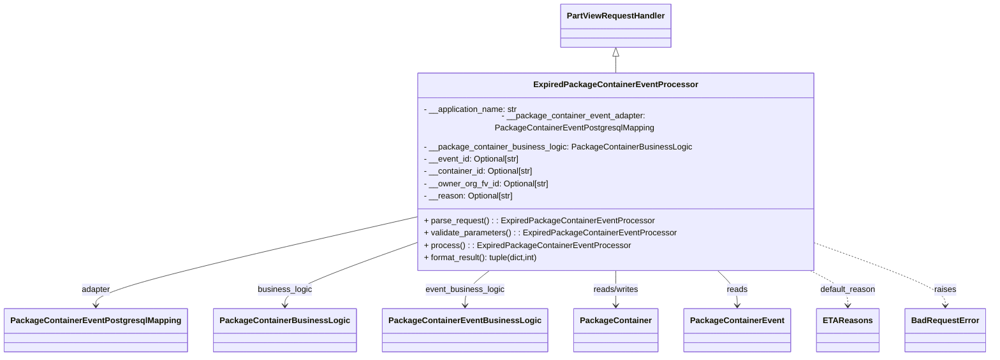
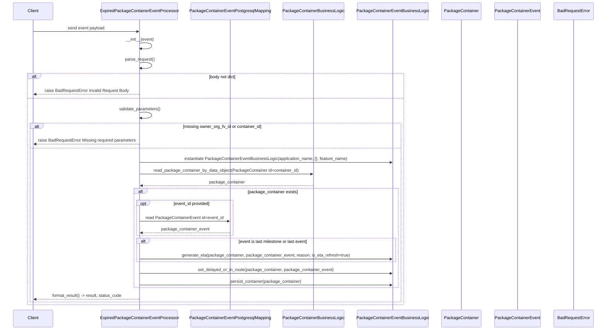

# Diagram: platform/partview_core/partview_service/partview_service/core/business/package_container/event/ExpiredPackageContainerEventProcessor.py

> Auto-generated by Obscura crawlers

## Diagram 1

### SVG

<svg id="container" width="1817.40625" xmlns="http://www.w3.org/2000/svg" class="classDiagram" height="668" viewBox="0 0 1817.40625 668" role="graphics-document document" aria-roledescription="class"><g><defs><marker id="container_class-aggregationStart" class="marker aggregation class" refX="18" refY="7" markerWidth="190" markerHeight="240" orient="auto"><path d="M 18,7 L9,13 L1,7 L9,1 Z"></path></marker></defs><defs><marker id="container_class-aggregationEnd" class="marker aggregation class" refX="1" refY="7" markerWidth="20" markerHeight="28" orient="auto"><path d="M 18,7 L9,13 L1,7 L9,1 Z"></path></marker></defs><defs><marker id="container_class-extensionStart" class="marker extension class" refX="18" refY="7" markerWidth="190" markerHeight="240" orient="auto"><path d="M 1,7 L18,13 V 1 Z"></path></marker></defs><defs><marker id="container_class-extensionEnd" class="marker extension class" refX="1" refY="7" markerWidth="20" markerHeight="28" orient="auto"><path d="M 1,1 V 13 L18,7 Z"></path></marker></defs><defs><marker id="container_class-compositionStart" class="marker composition class" refX="18" refY="7" markerWidth="190" markerHeight="240" orient="auto"><path d="M 18,7 L9,13 L1,7 L9,1 Z"></path></marker></defs><defs><marker id="container_class-compositionEnd" class="marker composition class" refX="1" refY="7" markerWidth="20" markerHeight="28" orient="auto"><path d="M 18,7 L9,13 L1,7 L9,1 Z"></path></marker></defs><defs><marker id="container_class-dependencyStart" class="marker dependency class" refX="6" refY="7" markerWidth="190" markerHeight="240" orient="auto"><path d="M 5,7 L9,13 L1,7 L9,1 Z"></path></marker></defs><defs><marker id="container_class-dependencyEnd" class="marker dependency class" refX="13" refY="7" markerWidth="20" markerHeight="28" orient="auto"><path d="M 18,7 L9,13 L14,7 L9,1 Z"></path></marker></defs><defs><marker id="container_class-lollipopStart" class="marker lollipop class" refX="13" refY="7" markerWidth="190" markerHeight="240" orient="auto"><circle stroke="black" fill="transparent" cx="7" cy="7" r="6"></circle></marker></defs><defs><marker id="container_class-lollipopEnd" class="marker lollipop class" refX="1" refY="7" markerWidth="190" markerHeight="240" orient="auto"><circle stroke="black" fill="transparent" cx="7" cy="7" r="6"></circle></marker></defs><g class="root"><g class="clusters"></g><g class="edgePaths"><path d="M1127.438,109.25L1127.438,110.542C1127.438,111.833,1127.438,114.417,1127.438,119.875C1127.438,125.333,1127.438,133.667,1127.438,137.833L1127.438,142" id="id_PartViewRequestHandler_ExpiredPackageContainerEventProcessor_1" class="edge-thickness-normal edge-pattern-solid relation" style=";;;" data-edge="true" data-et="edge" data-id="id_PartViewRequestHandler_ExpiredPackageContainerEventProcessor_1" data-points="W3sieCI6MTEyNy40Mzc1LCJ5Ijo5Mn0seyJ4IjoxMTI3LjQzNzUsInkiOjExN30seyJ4IjoxMTI3LjQzNzUsInkiOjE0Mn1d" marker-start="url(#container_class-extensionStart)"></path><path d="M746.027,408.996L651.033,430.663C556.039,452.331,366.051,495.665,271.057,522.499C176.063,549.333,176.063,559.667,176.063,564.833L176.063,570" id="id_ExpiredPackageContainerEventProcessor_PackageContainerEventPostgresqlMapping_2" class="edge-thickness-normal edge-pattern-solid relation" style=";;;" data-edge="true" data-et="edge" data-id="id_ExpiredPackageContainerEventProcessor_PackageContainerEventPostgresqlMapping_2" data-points="W3sieCI6NzQ2LjAyNzM0Mzc1LCJ5Ijo0MDguOTk2MTkzODMxMjk2OH0seyJ4IjoxNzYuMDYyNSwieSI6NTM5fSx7IngiOjE3Ni4wNjI1LCJ5Ijo1NzZ9XQ==" marker-end="url(#container_class-dependencyEnd)"></path><path d="M746.027,458.927L708.854,472.273C671.68,485.618,597.332,512.309,560.158,530.821C522.984,549.333,522.984,559.667,522.984,564.833L522.984,570" id="id_ExpiredPackageContainerEventProcessor_PackageContainerBusinessLogic_3" class="edge-thickness-normal edge-pattern-solid relation" style=";;;" data-edge="true" data-et="edge" data-id="id_ExpiredPackageContainerEventProcessor_PackageContainerBusinessLogic_3" data-points="W3sieCI6NzQ2LjAyNzM0Mzc1LCJ5Ijo0NTguOTI3MDg0MTQxMTM5OTd9LHsieCI6NTIyLjk4NDM3NSwieSI6NTM5fSx7IngiOjUyMi45ODQzNzUsInkiOjU3Nn1d" marker-end="url(#container_class-dependencyEnd)"></path><path d="M898.063,502L890.205,508.167C882.347,514.333,866.63,526.667,858.772,538C850.914,549.333,850.914,559.667,850.914,564.833L850.914,570" id="id_ExpiredPackageContainerEventProcessor_PackageContainerEventBusinessLogic_4" class="edge-thickness-normal edge-pattern-solid relation" style=";;;" data-edge="true" data-et="edge" data-id="id_ExpiredPackageContainerEventProcessor_PackageContainerEventBusinessLogic_4" data-points="W3sieCI6ODk4LjA2MzIyMDA0NjA4MywieSI6NTAyfSx7IngiOjg1MC45MTQwNjI1LCJ5Ijo1Mzl9LHsieCI6ODUwLjkxNDA2MjUsInkiOjU3Nn1d" marker-end="url(#container_class-dependencyEnd)"></path><path d="M1127.438,502L1127.438,508.167C1127.438,514.333,1127.438,526.667,1127.438,538C1127.438,549.333,1127.438,559.667,1127.438,564.833L1127.438,570" id="id_ExpiredPackageContainerEventProcessor_PackageContainer_5" class="edge-thickness-normal edge-pattern-solid relation" style=";;;" data-edge="true" data-et="edge" data-id="id_ExpiredPackageContainerEventProcessor_PackageContainer_5" data-points="W3sieCI6MTEyNy40Mzc1LCJ5Ijo1MDJ9LHsieCI6MTEyNy40Mzc1LCJ5Ijo1Mzl9LHsieCI6MTEyNy40Mzc1LCJ5Ijo1NzZ9XQ==" marker-end="url(#container_class-dependencyEnd)"></path><path d="M1314.164,502L1320.561,508.167C1326.958,514.333,1339.753,526.667,1346.15,538C1352.547,549.333,1352.547,559.667,1352.547,564.833L1352.547,570" id="id_ExpiredPackageContainerEventProcessor_PackageContainerEvent_6" class="edge-thickness-normal edge-pattern-solid relation" style=";;;" data-edge="true" data-et="edge" data-id="id_ExpiredPackageContainerEventProcessor_PackageContainerEvent_6" data-points="W3sieCI6MTMxNC4xNjQxNzA1MDY5MTIzLCJ5Ijo1MDJ9LHsieCI6MTM1Mi41NDY4NzUsInkiOjUzOX0seyJ4IjoxMzUyLjU0Njg3NSwieSI6NTc2fV0=" marker-end="url(#container_class-dependencyEnd)"></path><path d="M1482.532,502L1494.697,508.167C1506.862,514.333,1531.193,526.667,1543.358,538C1555.523,549.333,1555.523,559.667,1555.523,564.833L1555.523,570" id="id_ExpiredPackageContainerEventProcessor_ETAReasons_7" class="edge-thickness-normal edge-pattern-dashed relation" style=";;;" data-edge="true" data-et="edge" data-id="id_ExpiredPackageContainerEventProcessor_ETAReasons_7" data-points="W3sieCI6MTQ4Mi41MzE4MjYwMzY4NjYzLCJ5Ijo1MDJ9LHsieCI6MTU1NS41MjM0Mzc1LCJ5Ijo1Mzl9LHsieCI6MTU1NS41MjM0Mzc1LCJ5Ijo1NzZ9XQ==" marker-end="url(#container_class-dependencyEnd)"></path><path d="M1508.848,458.198L1546.561,471.665C1584.273,485.132,1659.699,512.066,1697.412,530.7C1735.125,549.333,1735.125,559.667,1735.125,564.833L1735.125,570" id="id_ExpiredPackageContainerEventProcessor_BadRequestError_8" class="edge-thickness-normal edge-pattern-dashed relation" style=";;;" data-edge="true" data-et="edge" data-id="id_ExpiredPackageContainerEventProcessor_BadRequestError_8" data-points="W3sieCI6MTUwOC44NDc2NTYyNSwieSI6NDU4LjE5ODI5OTEzNjA2OTF9LHsieCI6MTczNS4xMjUsInkiOjUzOX0seyJ4IjoxNzM1LjEyNSwieSI6NTc2fV0=" marker-end="url(#container_class-dependencyEnd)"></path></g><g class="edgeLabels"><g class="edgeLabel"><g class="label" data-id="id_PartViewRequestHandler_ExpiredPackageContainerEventProcessor_1" transform="translate(0, 0)"><foreignObject width="0" height="0">

</foreignObject></g></g><g class="edgeLabel" transform="translate(176.0625, 539)"><g class="label" data-id="id_ExpiredPackageContainerEventProcessor_PackageContainerEventPostgresqlMapping_2" transform="translate(-28.4609375, -12)"><foreignObject width="56.921875" height="24">

adapter

</foreignObject></g></g><g class="edgeLabel" transform="translate(522.984375, 539)"><g class="label" data-id="id_ExpiredPackageContainerEventProcessor_PackageContainerBusinessLogic_3" transform="translate(-52.9765625, -12)"><foreignObject width="105.953125" height="24">

business_logic

</foreignObject></g></g><g class="edgeLabel" transform="translate(850.9140625, 539)"><g class="label" data-id="id_ExpiredPackageContainerEventProcessor_PackageContainerEventBusinessLogic_4" transform="translate(-77.3046875, -12)"><foreignObject width="154.609375" height="24">

event_business_logic

</foreignObject></g></g><g class="edgeLabel" transform="translate(1127.4375, 539)"><g class="label" data-id="id_ExpiredPackageContainerEventProcessor_PackageContainer_5" transform="translate(-45.9453125, -12)"><foreignObject width="91.890625" height="24">

reads/writes

</foreignObject></g></g><g class="edgeLabel" transform="translate(1352.546875, 539)"><g class="label" data-id="id_ExpiredPackageContainerEventProcessor_PackageContainerEvent_6" transform="translate(-20.0078125, -12)"><foreignObject width="40.015625" height="24">

reads

</foreignObject></g></g><g class="edgeLabel" transform="translate(1555.5234375, 539)"><g class="label" data-id="id_ExpiredPackageContainerEventProcessor_ETAReasons_7" transform="translate(-54.546875, -12)"><foreignObject width="109.09375" height="24">

default_reason

</foreignObject></g></g><g class="edgeLabel" transform="translate(1735.125, 539)"><g class="label" data-id="id_ExpiredPackageContainerEventProcessor_BadRequestError_8" transform="translate(-21.25, -12)"><foreignObject width="42.5" height="24">

raises

</foreignObject></g></g></g><g class="nodes"><g class="node default" id="classId-PartViewRequestHandler-0" transform="translate(1127.4375, 50)"><g class="basic label-container"><path d="M-103.359375 -42 L103.359375 -42 L103.359375 42 L-103.359375 42" stroke="none" stroke-width="0" fill="#ECECFF" style=""></path><path d="M-103.359375 -42 C-59.39083576906341 -42, -15.422296538126815 -42, 103.359375 -42 M-103.359375 -42 C-58.81360707167649 -42, -14.267839143352987 -42, 103.359375 -42 M103.359375 -42 C103.359375 -15.69075927307792, 103.359375 10.618481453844161, 103.359375 42 M103.359375 -42 C103.359375 -10.57433888987028, 103.359375 20.85132222025944, 103.359375 42 M103.359375 42 C45.07042425323713 42, -13.218526493525744 42, -103.359375 42 M103.359375 42 C22.116879374395793 42, -59.12561625120841 42, -103.359375 42 M-103.359375 42 C-103.359375 18.421496958801455, -103.359375 -5.157006082397089, -103.359375 -42 M-103.359375 42 C-103.359375 8.73404869221634, -103.359375 -24.53190261556732, -103.359375 -42" stroke="#9370DB" stroke-width="1.3" fill="none" stroke-dasharray="0 0" style=""></path></g><g class="annotation-group text" transform="translate(0, -18)"></g><g class="label-group text" transform="translate(-91.359375, -18)"><g class="label" style="font-weight: bolder" transform="translate(0,-12)"><foreignObject width="182.71875" height="24">

PartViewRequestHandler

</foreignObject></g></g><g class="members-group text" transform="translate(-91.359375, 30)"></g><g class="methods-group text" transform="translate(-91.359375, 60)"></g><g class="divider" style=""><path d="M-103.359375 6 C-44.64513935208853 6, 14.069096295822945 6, 103.359375 6 M-103.359375 6 C-27.775631107587657 6, 47.80811278482469 6, 103.359375 6" stroke="#9370DB" stroke-width="1.3" fill="none" stroke-dasharray="0 0" style=""></path></g><g class="divider" style=""><path d="M-103.359375 24 C-55.88348383020439 24, -8.407592660408781 24, 103.359375 24 M-103.359375 24 C-52.11196388200004 24, -0.8645527640000807 24, 103.359375 24" stroke="#9370DB" stroke-width="1.3" fill="none" stroke-dasharray="0 0" style=""></path></g></g><g class="node default" id="classId-ExpiredPackageContainerEventProcessor-1" transform="translate(1127.4375, 322)"><g class="basic label-container"><path d="M-381.41015625 -180 L381.41015625 -180 L381.41015625 180 L-381.41015625 180" stroke="none" stroke-width="0" fill="#ECECFF" style=""></path><path d="M-381.41015625 -180 C-99.42273921742611 -180, 182.56467781514777 -180, 381.41015625 -180 M-381.41015625 -180 C-181.04637816514781 -180, 19.31739991970437 -180, 381.41015625 -180 M381.41015625 -180 C381.41015625 -93.08707049148322, 381.41015625 -6.174140982966435, 381.41015625 180 M381.41015625 -180 C381.41015625 -77.94978076199381, 381.41015625 24.100438476012386, 381.41015625 180 M381.41015625 180 C225.89204430553198 180, 70.37393236106396 180, -381.41015625 180 M381.41015625 180 C190.21136115953377 180, -0.9874339309324682 180, -381.41015625 180 M-381.41015625 180 C-381.41015625 39.453962285759616, -381.41015625 -101.09207542848077, -381.41015625 -180 M-381.41015625 180 C-381.41015625 78.25659532980485, -381.41015625 -23.486809340390295, -381.41015625 -180" stroke="#9370DB" stroke-width="1.3" fill="none" stroke-dasharray="0 0" style=""></path></g><g class="annotation-group text" transform="translate(0, -156)"></g><g class="label-group text" transform="translate(-149.1015625, -156)"><g class="label" style="font-weight: bolder" transform="translate(0,-12)"><foreignObject width="298.203125" height="24">

ExpiredPackageContainerEventProcessor

</foreignObject></g></g><g class="members-group text" transform="translate(-369.41015625, -108)"><g class="label" style="" transform="translate(0,-12)"><foreignObject width="185.296875" height="24">

- __application_name: str

</foreignObject></g><g class="label" style="" transform="translate(0,12)"><foreignObject width="589.71875" height="24">

- __package_container_event_adapter: PackageContainerEventPostgresqlMapping

</foreignObject></g><g class="label" style="" transform="translate(0,36)"><foreignObject width="514.03125" height="24">

- __package_container_business_logic: PackageContainerBusinessLogic

</foreignObject></g><g class="label" style="" transform="translate(0,60)"><foreignObject width="190.21875" height="24">

- __event_id: Optional[str]

</foreignObject></g><g class="label" style="" transform="translate(0,84)"><foreignObject width="217.796875" height="24">

- __container_id: Optional[str]

</foreignObject></g><g class="label" style="" transform="translate(0,108)"><foreignObject width="246.109375" height="24">

- __owner_org_fv_id: Optional[str]

</foreignObject></g><g class="label" style="" transform="translate(0,132)"><foreignObject width="176.796875" height="24">

- __reason: Optional[str]

</foreignObject></g></g><g class="methods-group text" transform="translate(-369.41015625, 84)"><g class="label" style="" transform="translate(0,-12)"><foreignObject width="439.609375" height="24">

+ parse_request() : : ExpiredPackageContainerEventProcessor

</foreignObject></g><g class="label" style="" transform="translate(0,12)"><foreignObject width="484.515625" height="24">

+ validate_parameters() : : ExpiredPackageContainerEventProcessor

</foreignObject></g><g class="label" style="" transform="translate(0,36)"><foreignObject width="391.546875" height="24">

+ process() : : ExpiredPackageContainerEventProcessor

</foreignObject></g><g class="label" style="" transform="translate(0,60)"><foreignObject width="228.9375" height="24">

+ format_result(): tuple(dict,int)

</foreignObject></g></g><g class="divider" style=""><path d="M-381.41015625 -132 C-110.41750960298401 -132, 160.57513704403198 -132, 381.41015625 -132 M-381.41015625 -132 C-141.30818956333977 -132, 98.79377712332047 -132, 381.41015625 -132" stroke="#9370DB" stroke-width="1.3" fill="none" stroke-dasharray="0 0" style=""></path></g><g class="divider" style=""><path d="M-381.41015625 60 C-209.4266942653049 60, -37.44323228060978 60, 381.41015625 60 M-381.41015625 60 C-179.70459736163562 60, 22.00096152672876 60, 381.41015625 60" stroke="#9370DB" stroke-width="1.3" fill="none" stroke-dasharray="0 0" style=""></path></g></g><g class="node default" id="classId-PackageContainerEventPostgresqlMapping-2" transform="translate(176.0625, 618)"><g class="basic label-container"><path d="M-168.0625 -42 L168.0625 -42 L168.0625 42 L-168.0625 42" stroke="none" stroke-width="0" fill="#ECECFF" style=""></path><path d="M-168.0625 -42 C-50.43347109958802 -42, 67.19555780082396 -42, 168.0625 -42 M-168.0625 -42 C-65.90535183485258 -42, 36.25179633029484 -42, 168.0625 -42 M168.0625 -42 C168.0625 -20.56707146480604, 168.0625 0.8658570703879178, 168.0625 42 M168.0625 -42 C168.0625 -16.23555710044659, 168.0625 9.528885799106817, 168.0625 42 M168.0625 42 C69.48539556767889 42, -29.091708864642214 42, -168.0625 42 M168.0625 42 C66.10006899077487 42, -35.862362018450256 42, -168.0625 42 M-168.0625 42 C-168.0625 9.034752653020284, -168.0625 -23.93049469395943, -168.0625 -42 M-168.0625 42 C-168.0625 9.899803451152636, -168.0625 -22.20039309769473, -168.0625 -42" stroke="#9370DB" stroke-width="1.3" fill="none" stroke-dasharray="0 0" style=""></path></g><g class="annotation-group text" transform="translate(0, -18)"></g><g class="label-group text" transform="translate(-156.0625, -18)"><g class="label" style="font-weight: bolder" transform="translate(0,-12)"><foreignObject width="312.125" height="24">

PackageContainerEventPostgresqlMapping

</foreignObject></g></g><g class="members-group text" transform="translate(-156.0625, 30)"></g><g class="methods-group text" transform="translate(-156.0625, 60)"></g><g class="divider" style=""><path d="M-168.0625 6 C-85.8996220173491 6, -3.736744034698205 6, 168.0625 6 M-168.0625 6 C-97.88219780032372 6, -27.701895600647447 6, 168.0625 6" stroke="#9370DB" stroke-width="1.3" fill="none" stroke-dasharray="0 0" style=""></path></g><g class="divider" style=""><path d="M-168.0625 24 C-74.14304800239232 24, 19.77640399521536 24, 168.0625 24 M-168.0625 24 C-48.64375380456646 24, 70.77499239086708 24, 168.0625 24" stroke="#9370DB" stroke-width="1.3" fill="none" stroke-dasharray="0 0" style=""></path></g></g><g class="node default" id="classId-PackageContainerBusinessLogic-3" transform="translate(522.984375, 618)"><g class="basic label-container"><path d="M-128.859375 -42 L128.859375 -42 L128.859375 42 L-128.859375 42" stroke="none" stroke-width="0" fill="#ECECFF" style=""></path><path d="M-128.859375 -42 C-30.093765638567476 -42, 68.67184372286505 -42, 128.859375 -42 M-128.859375 -42 C-46.138739208906756 -42, 36.58189658218649 -42, 128.859375 -42 M128.859375 -42 C128.859375 -15.877447833668626, 128.859375 10.245104332662748, 128.859375 42 M128.859375 -42 C128.859375 -21.996839613192538, 128.859375 -1.9936792263850762, 128.859375 42 M128.859375 42 C60.97241452519444 42, -6.914545949611124 42, -128.859375 42 M128.859375 42 C67.50507078941664 42, 6.150766578833256 42, -128.859375 42 M-128.859375 42 C-128.859375 17.104800238829945, -128.859375 -7.79039952234011, -128.859375 -42 M-128.859375 42 C-128.859375 22.379448557181775, -128.859375 2.758897114363549, -128.859375 -42" stroke="#9370DB" stroke-width="1.3" fill="none" stroke-dasharray="0 0" style=""></path></g><g class="annotation-group text" transform="translate(0, -18)"></g><g class="label-group text" transform="translate(-116.859375, -18)"><g class="label" style="font-weight: bolder" transform="translate(0,-12)"><foreignObject width="233.71875" height="24">

PackageContainerBusinessLogic

</foreignObject></g></g><g class="members-group text" transform="translate(-116.859375, 30)"></g><g class="methods-group text" transform="translate(-116.859375, 60)"></g><g class="divider" style=""><path d="M-128.859375 6 C-50.53351571209177 6, 27.79234357581646 6, 128.859375 6 M-128.859375 6 C-37.75408315321255 6, 53.351208693574904 6, 128.859375 6" stroke="#9370DB" stroke-width="1.3" fill="none" stroke-dasharray="0 0" style=""></path></g><g class="divider" style=""><path d="M-128.859375 24 C-60.838735280914776 24, 7.181904438170449 24, 128.859375 24 M-128.859375 24 C-54.34611568155967 24, 20.167143636880667 24, 128.859375 24" stroke="#9370DB" stroke-width="1.3" fill="none" stroke-dasharray="0 0" style=""></path></g></g><g class="node default" id="classId-PackageContainerEventBusinessLogic-4" transform="translate(850.9140625, 618)"><g class="basic label-container"><path d="M-149.0703125 -42 L149.0703125 -42 L149.0703125 42 L-149.0703125 42" stroke="none" stroke-width="0" fill="#ECECFF" style=""></path><path d="M-149.0703125 -42 C-80.70578602465446 -42, -12.341259549308916 -42, 149.0703125 -42 M-149.0703125 -42 C-61.494171253253015 -42, 26.08196999349397 -42, 149.0703125 -42 M149.0703125 -42 C149.0703125 -9.393677697357397, 149.0703125 23.212644605285206, 149.0703125 42 M149.0703125 -42 C149.0703125 -20.249995465013303, 149.0703125 1.5000090699733946, 149.0703125 42 M149.0703125 42 C34.36757218729211 42, -80.33516812541578 42, -149.0703125 42 M149.0703125 42 C87.05660373153538 42, 25.042894963070736 42, -149.0703125 42 M-149.0703125 42 C-149.0703125 20.929712058547647, -149.0703125 -0.1405758829047059, -149.0703125 -42 M-149.0703125 42 C-149.0703125 23.427910530629273, -149.0703125 4.8558210612585455, -149.0703125 -42" stroke="#9370DB" stroke-width="1.3" fill="none" stroke-dasharray="0 0" style=""></path></g><g class="annotation-group text" transform="translate(0, -18)"></g><g class="label-group text" transform="translate(-137.0703125, -18)"><g class="label" style="font-weight: bolder" transform="translate(0,-12)"><foreignObject width="274.140625" height="24">

PackageContainerEventBusinessLogic

</foreignObject></g></g><g class="members-group text" transform="translate(-137.0703125, 30)"></g><g class="methods-group text" transform="translate(-137.0703125, 60)"></g><g class="divider" style=""><path d="M-149.0703125 6 C-35.89457636003722 6, 77.28115977992556 6, 149.0703125 6 M-149.0703125 6 C-74.1638561161439 6, 0.7426002677121915 6, 149.0703125 6" stroke="#9370DB" stroke-width="1.3" fill="none" stroke-dasharray="0 0" style=""></path></g><g class="divider" style=""><path d="M-149.0703125 24 C-59.38439963865896 24, 30.301513222682075 24, 149.0703125 24 M-149.0703125 24 C-61.798483766787584 24, 25.473344966424833 24, 149.0703125 24" stroke="#9370DB" stroke-width="1.3" fill="none" stroke-dasharray="0 0" style=""></path></g></g><g class="node default" id="classId-PackageContainer-5" transform="translate(1127.4375, 618)"><g class="basic label-container"><path d="M-77.453125 -42 L77.453125 -42 L77.453125 42 L-77.453125 42" stroke="none" stroke-width="0" fill="#ECECFF" style=""></path><path d="M-77.453125 -42 C-18.932160033658512 -42, 39.588804932682976 -42, 77.453125 -42 M-77.453125 -42 C-34.33899983939591 -42, 8.77512532120818 -42, 77.453125 -42 M77.453125 -42 C77.453125 -21.668065450312774, 77.453125 -1.3361309006255482, 77.453125 42 M77.453125 -42 C77.453125 -22.031027401821788, 77.453125 -2.0620548036435764, 77.453125 42 M77.453125 42 C40.398772721681944 42, 3.3444204433638873 42, -77.453125 42 M77.453125 42 C20.283206397359535 42, -36.88671220528093 42, -77.453125 42 M-77.453125 42 C-77.453125 11.829055645491131, -77.453125 -18.341888709017738, -77.453125 -42 M-77.453125 42 C-77.453125 23.656447974751465, -77.453125 5.312895949502931, -77.453125 -42" stroke="#9370DB" stroke-width="1.3" fill="none" stroke-dasharray="0 0" style=""></path></g><g class="annotation-group text" transform="translate(0, -18)"></g><g class="label-group text" transform="translate(-65.453125, -18)"><g class="label" style="font-weight: bolder" transform="translate(0,-12)"><foreignObject width="130.90625" height="24">

PackageContainer

</foreignObject></g></g><g class="members-group text" transform="translate(-65.453125, 30)"></g><g class="methods-group text" transform="translate(-65.453125, 60)"></g><g class="divider" style=""><path d="M-77.453125 6 C-28.411404581258076 6, 20.63031583748385 6, 77.453125 6 M-77.453125 6 C-34.07540542611491 6, 9.302314147770176 6, 77.453125 6" stroke="#9370DB" stroke-width="1.3" fill="none" stroke-dasharray="0 0" style=""></path></g><g class="divider" style=""><path d="M-77.453125 24 C-16.359001874075084 24, 44.73512125184983 24, 77.453125 24 M-77.453125 24 C-30.23553182382399 24, 16.98206135235202 24, 77.453125 24" stroke="#9370DB" stroke-width="1.3" fill="none" stroke-dasharray="0 0" style=""></path></g></g><g class="node default" id="classId-PackageContainerEvent-6" transform="translate(1352.546875, 618)"><g class="basic label-container"><path d="M-97.65625 -42 L97.65625 -42 L97.65625 42 L-97.65625 42" stroke="none" stroke-width="0" fill="#ECECFF" style=""></path><path d="M-97.65625 -42 C-24.544414324113973 -42, 48.567421351772055 -42, 97.65625 -42 M-97.65625 -42 C-25.97349090933635 -42, 45.7092681813273 -42, 97.65625 -42 M97.65625 -42 C97.65625 -24.221045376896598, 97.65625 -6.442090753793195, 97.65625 42 M97.65625 -42 C97.65625 -9.630471338694285, 97.65625 22.73905732261143, 97.65625 42 M97.65625 42 C38.17042173653999 42, -21.315406526920015 42, -97.65625 42 M97.65625 42 C40.02236599632499 42, -17.611518007350014 42, -97.65625 42 M-97.65625 42 C-97.65625 13.98868528126847, -97.65625 -14.02262943746306, -97.65625 -42 M-97.65625 42 C-97.65625 24.157173348792185, -97.65625 6.314346697584369, -97.65625 -42" stroke="#9370DB" stroke-width="1.3" fill="none" stroke-dasharray="0 0" style=""></path></g><g class="annotation-group text" transform="translate(0, -18)"></g><g class="label-group text" transform="translate(-85.65625, -18)"><g class="label" style="font-weight: bolder" transform="translate(0,-12)"><foreignObject width="171.3125" height="24">

PackageContainerEvent

</foreignObject></g></g><g class="members-group text" transform="translate(-85.65625, 30)"></g><g class="methods-group text" transform="translate(-85.65625, 60)"></g><g class="divider" style=""><path d="M-97.65625 6 C-44.09576655565325 6, 9.464716888693502 6, 97.65625 6 M-97.65625 6 C-37.546457884719224 6, 22.56333423056155 6, 97.65625 6" stroke="#9370DB" stroke-width="1.3" fill="none" stroke-dasharray="0 0" style=""></path></g><g class="divider" style=""><path d="M-97.65625 24 C-27.905430033399313 24, 41.845389933201375 24, 97.65625 24 M-97.65625 24 C-42.424384667054824 24, 12.807480665890353 24, 97.65625 24" stroke="#9370DB" stroke-width="1.3" fill="none" stroke-dasharray="0 0" style=""></path></g></g><g class="node default" id="classId-ETAReasons-7" transform="translate(1555.5234375, 618)"><g class="basic label-container"><path d="M-55.3203125 -42 L55.3203125 -42 L55.3203125 42 L-55.3203125 42" stroke="none" stroke-width="0" fill="#ECECFF" style=""></path><path d="M-55.3203125 -42 C-33.05890085507846 -42, -10.797489210156925 -42, 55.3203125 -42 M-55.3203125 -42 C-15.330828991461061 -42, 24.658654517077878 -42, 55.3203125 -42 M55.3203125 -42 C55.3203125 -20.631399889696244, 55.3203125 0.7372002206075123, 55.3203125 42 M55.3203125 -42 C55.3203125 -22.84207944950445, 55.3203125 -3.6841588990088994, 55.3203125 42 M55.3203125 42 C15.605316673044435 42, -24.10967915391113 42, -55.3203125 42 M55.3203125 42 C28.322387809896185 42, 1.3244631197923695 42, -55.3203125 42 M-55.3203125 42 C-55.3203125 16.982853605707405, -55.3203125 -8.03429278858519, -55.3203125 -42 M-55.3203125 42 C-55.3203125 22.069538665660183, -55.3203125 2.1390773313203653, -55.3203125 -42" stroke="#9370DB" stroke-width="1.3" fill="none" stroke-dasharray="0 0" style=""></path></g><g class="annotation-group text" transform="translate(0, -18)"></g><g class="label-group text" transform="translate(-43.3203125, -18)"><g class="label" style="font-weight: bolder" transform="translate(0,-12)"><foreignObject width="86.640625" height="24">

ETAReasons

</foreignObject></g></g><g class="members-group text" transform="translate(-43.3203125, 30)"></g><g class="methods-group text" transform="translate(-43.3203125, 60)"></g><g class="divider" style=""><path d="M-55.3203125 6 C-12.829097041013668 6, 29.662118417972664 6, 55.3203125 6 M-55.3203125 6 C-30.380859610255072 6, -5.441406720510145 6, 55.3203125 6" stroke="#9370DB" stroke-width="1.3" fill="none" stroke-dasharray="0 0" style=""></path></g><g class="divider" style=""><path d="M-55.3203125 24 C-32.909006696979176 24, -10.497700893958353 24, 55.3203125 24 M-55.3203125 24 C-18.59899820315146 24, 18.12231609369708 24, 55.3203125 24" stroke="#9370DB" stroke-width="1.3" fill="none" stroke-dasharray="0 0" style=""></path></g></g><g class="node default" id="classId-BadRequestError-8" transform="translate(1735.125, 618)"><g class="basic label-container"><path d="M-74.28125 -42 L74.28125 -42 L74.28125 42 L-74.28125 42" stroke="none" stroke-width="0" fill="#ECECFF" style=""></path><path d="M-74.28125 -42 C-29.061173527638225 -42, 16.15890294472355 -42, 74.28125 -42 M-74.28125 -42 C-31.683478081886967 -42, 10.914293836226065 -42, 74.28125 -42 M74.28125 -42 C74.28125 -21.600331061056067, 74.28125 -1.200662122112135, 74.28125 42 M74.28125 -42 C74.28125 -11.981358438067126, 74.28125 18.03728312386575, 74.28125 42 M74.28125 42 C25.753787849766944 42, -22.773674300466112 42, -74.28125 42 M74.28125 42 C20.005901034984966 42, -34.26944793003007 42, -74.28125 42 M-74.28125 42 C-74.28125 11.003176209407766, -74.28125 -19.99364758118447, -74.28125 -42 M-74.28125 42 C-74.28125 18.688231569903802, -74.28125 -4.623536860192395, -74.28125 -42" stroke="#9370DB" stroke-width="1.3" fill="none" stroke-dasharray="0 0" style=""></path></g><g class="annotation-group text" transform="translate(0, -18)"></g><g class="label-group text" transform="translate(-62.28125, -18)"><g class="label" style="font-weight: bolder" transform="translate(0,-12)"><foreignObject width="124.5625" height="24">

BadRequestError

</foreignObject></g></g><g class="members-group text" transform="translate(-62.28125, 30)"></g><g class="methods-group text" transform="translate(-62.28125, 60)"></g><g class="divider" style=""><path d="M-74.28125 6 C-34.49318724940136 6, 5.294875501197282 6, 74.28125 6 M-74.28125 6 C-41.63479907837581 6, -8.988348156751627 6, 74.28125 6" stroke="#9370DB" stroke-width="1.3" fill="none" stroke-dasharray="0 0" style=""></path></g><g class="divider" style=""><path d="M-74.28125 24 C-27.17384401139735 24, 19.9335619772053 24, 74.28125 24 M-74.28125 24 C-35.812757540727404 24, 2.6557349185451926 24, 74.28125 24" stroke="#9370DB" stroke-width="1.3" fill="none" stroke-dasharray="0 0" style=""></path></g></g></g></g></g></svg>

## Diagram 2

### SVG

<svg id="container" width="2431" xmlns="http://www.w3.org/2000/svg" height="1306" viewBox="-50 -10 2431 1306" role="graphics-document document" aria-roledescription="sequence"><g><rect x="2181" y="1220" fill="#eaeaea" stroke="#666" width="150" height="65" name="Error" rx="3" ry="3" class="actor actor-bottom"></rect><text x="2256" y="1252.5" dominant-baseline="central" alignment-baseline="central" class="actor actor-box" style="text-anchor: middle; font-size: 16px; font-weight: 400;"><tspan x="2256" dy="0">BadRequestError</tspan></text></g><g><rect x="1942" y="1220" fill="#eaeaea" stroke="#666" width="189" height="65" name="PackageContainerEvent" rx="3" ry="3" class="actor actor-bottom"></rect><text x="2036.5" y="1252.5" dominant-baseline="central" alignment-baseline="central" class="actor actor-box" style="text-anchor: middle; font-size: 16px; font-weight: 400;"><tspan x="2036.5" dy="0">PackageContainerEvent</tspan></text></g><g><rect x="1742" y="1220" fill="#eaeaea" stroke="#666" width="150" height="65" name="PackageContainer" rx="3" ry="3" class="actor actor-bottom"></rect><text x="1817" y="1252.5" dominant-baseline="central" alignment-baseline="central" class="actor actor-box" style="text-anchor: middle; font-size: 16px; font-weight: 400;"><tspan x="1817" dy="0">PackageContainer</tspan></text></g><g><rect x="1402" y="1220" fill="#eaeaea" stroke="#666" width="290" height="65" name="PCEBL" rx="3" ry="3" class="actor actor-bottom"></rect><text x="1547" y="1252.5" dominant-baseline="central" alignment-baseline="central" class="actor actor-box" style="text-anchor: middle; font-size: 16px; font-weight: 400;"><tspan x="1547" dy="0">PackageContainerEventBusinessLogic</tspan></text></g><g><rect x="1102" y="1220" fill="#eaeaea" stroke="#666" width="250" height="65" name="PCBL" rx="3" ry="3" class="actor actor-bottom"></rect><text x="1227" y="1252.5" dominant-baseline="central" alignment-baseline="central" class="actor actor-box" style="text-anchor: middle; font-size: 16px; font-weight: 400;"><tspan x="1227" dy="0">PackageContainerBusinessLogic</tspan></text></g><g><rect x="725" y="1220" fill="#eaeaea" stroke="#666" width="327" height="65" name="PCAdapter" rx="3" ry="3" class="actor actor-bottom"></rect><text x="888.5" y="1252.5" dominant-baseline="central" alignment-baseline="central" class="actor actor-box" style="text-anchor: middle; font-size: 16px; font-weight: 400;"><tspan x="888.5" dy="0">PackageContainerEventPostgresqlMapping</tspan></text></g><g><rect x="361" y="1220" fill="#eaeaea" stroke="#666" width="314" height="65" name="Processor" rx="3" ry="3" class="actor actor-bottom"></rect><text x="518" y="1252.5" dominant-baseline="central" alignment-baseline="central" class="actor actor-box" style="text-anchor: middle; font-size: 16px; font-weight: 400;"><tspan x="518" dy="0">ExpiredPackageContainerEventProcessor</tspan></text></g><g><rect x="0" y="1220" fill="#eaeaea" stroke="#666" width="150" height="65" name="Client" rx="3" ry="3" class="actor actor-bottom"></rect><text x="75" y="1252.5" dominant-baseline="central" alignment-baseline="central" class="actor actor-box" style="text-anchor: middle; font-size: 16px; font-weight: 400;"><tspan x="75" dy="0">Client</tspan></text></g><g><line id="actor7" x1="2256" y1="65" x2="2256" y2="1220" class="actor-line 200" stroke-width="0.5px" stroke="#999" name="Error"></line><g id="root-7"><rect x="2181" y="0" fill="#eaeaea" stroke="#666" width="150" height="65" name="Error" rx="3" ry="3" class="actor actor-top"></rect><text x="2256" y="32.5" dominant-baseline="central" alignment-baseline="central" class="actor actor-box" style="text-anchor: middle; font-size: 16px; font-weight: 400;"><tspan x="2256" dy="0">BadRequestError</tspan></text></g></g><g><line id="actor6" x1="2036.5" y1="65" x2="2036.5" y2="1220" class="actor-line 200" stroke-width="0.5px" stroke="#999" name="PackageContainerEvent"></line><g id="root-6"><rect x="1942" y="0" fill="#eaeaea" stroke="#666" width="189" height="65" name="PackageContainerEvent" rx="3" ry="3" class="actor actor-top"></rect><text x="2036.5" y="32.5" dominant-baseline="central" alignment-baseline="central" class="actor actor-box" style="text-anchor: middle; font-size: 16px; font-weight: 400;"><tspan x="2036.5" dy="0">PackageContainerEvent</tspan></text></g></g><g><line id="actor5" x1="1817" y1="65" x2="1817" y2="1220" class="actor-line 200" stroke-width="0.5px" stroke="#999" name="PackageContainer"></line><g id="root-5"><rect x="1742" y="0" fill="#eaeaea" stroke="#666" width="150" height="65" name="PackageContainer" rx="3" ry="3" class="actor actor-top"></rect><text x="1817" y="32.5" dominant-baseline="central" alignment-baseline="central" class="actor actor-box" style="text-anchor: middle; font-size: 16px; font-weight: 400;"><tspan x="1817" dy="0">PackageContainer</tspan></text></g></g><g><line id="actor4" x1="1547" y1="65" x2="1547" y2="1220" class="actor-line 200" stroke-width="0.5px" stroke="#999" name="PCEBL"></line><g id="root-4"><rect x="1402" y="0" fill="#eaeaea" stroke="#666" width="290" height="65" name="PCEBL" rx="3" ry="3" class="actor actor-top"></rect><text x="1547" y="32.5" dominant-baseline="central" alignment-baseline="central" class="actor actor-box" style="text-anchor: middle; font-size: 16px; font-weight: 400;"><tspan x="1547" dy="0">PackageContainerEventBusinessLogic</tspan></text></g></g><g><line id="actor3" x1="1227" y1="65" x2="1227" y2="1220" class="actor-line 200" stroke-width="0.5px" stroke="#999" name="PCBL"></line><g id="root-3"><rect x="1102" y="0" fill="#eaeaea" stroke="#666" width="250" height="65" name="PCBL" rx="3" ry="3" class="actor actor-top"></rect><text x="1227" y="32.5" dominant-baseline="central" alignment-baseline="central" class="actor actor-box" style="text-anchor: middle; font-size: 16px; font-weight: 400;"><tspan x="1227" dy="0">PackageContainerBusinessLogic</tspan></text></g></g><g><line id="actor2" x1="888.5" y1="65" x2="888.5" y2="1220" class="actor-line 200" stroke-width="0.5px" stroke="#999" name="PCAdapter"></line><g id="root-2"><rect x="725" y="0" fill="#eaeaea" stroke="#666" width="327" height="65" name="PCAdapter" rx="3" ry="3" class="actor actor-top"></rect><text x="888.5" y="32.5" dominant-baseline="central" alignment-baseline="central" class="actor actor-box" style="text-anchor: middle; font-size: 16px; font-weight: 400;"><tspan x="888.5" dy="0">PackageContainerEventPostgresqlMapping</tspan></text></g></g><g><line id="actor1" x1="518" y1="65" x2="518" y2="1220" class="actor-line 200" stroke-width="0.5px" stroke="#999" name="Processor"></line><g id="root-1"><rect x="361" y="0" fill="#eaeaea" stroke="#666" width="314" height="65" name="Processor" rx="3" ry="3" class="actor actor-top"></rect><text x="518" y="32.5" dominant-baseline="central" alignment-baseline="central" class="actor actor-box" style="text-anchor: middle; font-size: 16px; font-weight: 400;"><tspan x="518" dy="0">ExpiredPackageContainerEventProcessor</tspan></text></g></g><g><line id="actor0" x1="75" y1="65" x2="75" y2="1220" class="actor-line 200" stroke-width="0.5px" stroke="#999" name="Client"></line><g id="root-0"><rect x="0" y="0" fill="#eaeaea" stroke="#666" width="150" height="65" name="Client" rx="3" ry="3" class="actor actor-top"></rect><text x="75" y="32.5" dominant-baseline="central" alignment-baseline="central" class="actor actor-box" style="text-anchor: middle; font-size: 16px; font-weight: 400;"><tspan x="75" dy="0">Client</tspan></text></g></g><g></g><defs><symbol id="computer" width="24" height="24"><path transform="scale(.5)" d="M2 2v13h20v-13h-20zm18 11h-16v-9h16v9zm-10.228 6l.466-1h3.524l.467 1h-4.457zm14.228 3h-24l2-6h2.104l-1.33 4h18.45l-1.297-4h2.073l2 6zm-5-10h-14v-7h14v7z"></path></symbol></defs><defs><symbol id="database" fill-rule="evenodd" clip-rule="evenodd"><path transform="scale(.5)" d="M12.258.001l.256.004.255.005.253.008.251.01.249.012.247.015.246.016.242.019.241.02.239.023.236.024.233.027.231.028.229.031.225.032.223.034.22.036.217.038.214.04.211.041.208.043.205.045.201.046.198.048.194.05.191.051.187.053.183.054.18.056.175.057.172.059.168.06.163.061.16.063.155.064.15.066.074.033.073.033.071.034.07.034.069.035.068.035.067.035.066.035.064.036.064.036.062.036.06.036.06.037.058.037.058.037.055.038.055.038.053.038.052.038.051.039.05.039.048.039.047.039.045.04.044.04.043.04.041.04.04.041.039.041.037.041.036.041.034.041.033.042.032.042.03.042.029.042.027.042.026.043.024.043.023.043.021.043.02.043.018.044.017.043.015.044.013.044.012.044.011.045.009.044.007.045.006.045.004.045.002.045.001.045v17l-.001.045-.002.045-.004.045-.006.045-.007.045-.009.044-.011.045-.012.044-.013.044-.015.044-.017.043-.018.044-.02.043-.021.043-.023.043-.024.043-.026.043-.027.042-.029.042-.03.042-.032.042-.033.042-.034.041-.036.041-.037.041-.039.041-.04.041-.041.04-.043.04-.044.04-.045.04-.047.039-.048.039-.05.039-.051.039-.052.038-.053.038-.055.038-.055.038-.058.037-.058.037-.06.037-.06.036-.062.036-.064.036-.064.036-.066.035-.067.035-.068.035-.069.035-.07.034-.071.034-.073.033-.074.033-.15.066-.155.064-.16.063-.163.061-.168.06-.172.059-.175.057-.18.056-.183.054-.187.053-.191.051-.194.05-.198.048-.201.046-.205.045-.208.043-.211.041-.214.04-.217.038-.22.036-.223.034-.225.032-.229.031-.231.028-.233.027-.236.024-.239.023-.241.02-.242.019-.246.016-.247.015-.249.012-.251.01-.253.008-.255.005-.256.004-.258.001-.258-.001-.256-.004-.255-.005-.253-.008-.251-.01-.249-.012-.247-.015-.245-.016-.243-.019-.241-.02-.238-.023-.236-.024-.234-.027-.231-.028-.228-.031-.226-.032-.223-.034-.22-.036-.217-.038-.214-.04-.211-.041-.208-.043-.204-.045-.201-.046-.198-.048-.195-.05-.19-.051-.187-.053-.184-.054-.179-.056-.176-.057-.172-.059-.167-.06-.164-.061-.159-.063-.155-.064-.151-.066-.074-.033-.072-.033-.072-.034-.07-.034-.069-.035-.068-.035-.067-.035-.066-.035-.064-.036-.063-.036-.062-.036-.061-.036-.06-.037-.058-.037-.057-.037-.056-.038-.055-.038-.053-.038-.052-.038-.051-.039-.049-.039-.049-.039-.046-.039-.046-.04-.044-.04-.043-.04-.041-.04-.04-.041-.039-.041-.037-.041-.036-.041-.034-.041-.033-.042-.032-.042-.03-.042-.029-.042-.027-.042-.026-.043-.024-.043-.023-.043-.021-.043-.02-.043-.018-.044-.017-.043-.015-.044-.013-.044-.012-.044-.011-.045-.009-.044-.007-.045-.006-.045-.004-.045-.002-.045-.001-.045v-17l.001-.045.002-.045.004-.045.006-.045.007-.045.009-.044.011-.045.012-.044.013-.044.015-.044.017-.043.018-.044.02-.043.021-.043.023-.043.024-.043.026-.043.027-.042.029-.042.03-.042.032-.042.033-.042.034-.041.036-.041.037-.041.039-.041.04-.041.041-.04.043-.04.044-.04.046-.04.046-.039.049-.039.049-.039.051-.039.052-.038.053-.038.055-.038.056-.038.057-.037.058-.037.06-.037.061-.036.062-.036.063-.036.064-.036.066-.035.067-.035.068-.035.069-.035.07-.034.072-.034.072-.033.074-.033.151-.066.155-.064.159-.063.164-.061.167-.06.172-.059.176-.057.179-.056.184-.054.187-.053.19-.051.195-.05.198-.048.201-.046.204-.045.208-.043.211-.041.214-.04.217-.038.22-.036.223-.034.226-.032.228-.031.231-.028.234-.027.236-.024.238-.023.241-.02.243-.019.245-.016.247-.015.249-.012.251-.01.253-.008.255-.005.256-.004.258-.001.258.001zm-9.258 20.499v.01l.001.021.003.021.004.022.005.021.006.022.007.022.009.023.01.022.011.023.012.023.013.023.015.023.016.024.017.023.018.024.019.024.021.024.022.025.023.024.024.025.052.049.056.05.061.051.066.051.07.051.075.051.079.052.084.052.088.052.092.052.097.052.102.051.105.052.11.052.114.051.119.051.123.051.127.05.131.05.135.05.139.048.144.049.147.047.152.047.155.047.16.045.163.045.167.043.171.043.176.041.178.041.183.039.187.039.19.037.194.035.197.035.202.033.204.031.209.03.212.029.216.027.219.025.222.024.226.021.23.02.233.018.236.016.24.015.243.012.246.01.249.008.253.005.256.004.259.001.26-.001.257-.004.254-.005.25-.008.247-.011.244-.012.241-.014.237-.016.233-.018.231-.021.226-.021.224-.024.22-.026.216-.027.212-.028.21-.031.205-.031.202-.034.198-.034.194-.036.191-.037.187-.039.183-.04.179-.04.175-.042.172-.043.168-.044.163-.045.16-.046.155-.046.152-.047.148-.048.143-.049.139-.049.136-.05.131-.05.126-.05.123-.051.118-.052.114-.051.11-.052.106-.052.101-.052.096-.052.092-.052.088-.053.083-.051.079-.052.074-.052.07-.051.065-.051.06-.051.056-.05.051-.05.023-.024.023-.025.021-.024.02-.024.019-.024.018-.024.017-.024.015-.023.014-.024.013-.023.012-.023.01-.023.01-.022.008-.022.006-.022.006-.022.004-.022.004-.021.001-.021.001-.021v-4.127l-.077.055-.08.053-.083.054-.085.053-.087.052-.09.052-.093.051-.095.05-.097.05-.1.049-.102.049-.105.048-.106.047-.109.047-.111.046-.114.045-.115.045-.118.044-.12.043-.122.042-.124.042-.126.041-.128.04-.13.04-.132.038-.134.038-.135.037-.138.037-.139.035-.142.035-.143.034-.144.033-.147.032-.148.031-.15.03-.151.03-.153.029-.154.027-.156.027-.158.026-.159.025-.161.024-.162.023-.163.022-.165.021-.166.02-.167.019-.169.018-.169.017-.171.016-.173.015-.173.014-.175.013-.175.012-.177.011-.178.01-.179.008-.179.008-.181.006-.182.005-.182.004-.184.003-.184.002h-.37l-.184-.002-.184-.003-.182-.004-.182-.005-.181-.006-.179-.008-.179-.008-.178-.01-.176-.011-.176-.012-.175-.013-.173-.014-.172-.015-.171-.016-.17-.017-.169-.018-.167-.019-.166-.02-.165-.021-.163-.022-.162-.023-.161-.024-.159-.025-.157-.026-.156-.027-.155-.027-.153-.029-.151-.03-.15-.03-.148-.031-.146-.032-.145-.033-.143-.034-.141-.035-.14-.035-.137-.037-.136-.037-.134-.038-.132-.038-.13-.04-.128-.04-.126-.041-.124-.042-.122-.042-.12-.044-.117-.043-.116-.045-.113-.045-.112-.046-.109-.047-.106-.047-.105-.048-.102-.049-.1-.049-.097-.05-.095-.05-.093-.052-.09-.051-.087-.052-.085-.053-.083-.054-.08-.054-.077-.054v4.127zm0-5.654v.011l.001.021.003.021.004.021.005.022.006.022.007.022.009.022.01.022.011.023.012.023.013.023.015.024.016.023.017.024.018.024.019.024.021.024.022.024.023.025.024.024.052.05.056.05.061.05.066.051.07.051.075.052.079.051.084.052.088.052.092.052.097.052.102.052.105.052.11.051.114.051.119.052.123.05.127.051.131.05.135.049.139.049.144.048.147.048.152.047.155.046.16.045.163.045.167.044.171.042.176.042.178.04.183.04.187.038.19.037.194.036.197.034.202.033.204.032.209.03.212.028.216.027.219.025.222.024.226.022.23.02.233.018.236.016.24.014.243.012.246.01.249.008.253.006.256.003.259.001.26-.001.257-.003.254-.006.25-.008.247-.01.244-.012.241-.015.237-.016.233-.018.231-.02.226-.022.224-.024.22-.025.216-.027.212-.029.21-.03.205-.032.202-.033.198-.035.194-.036.191-.037.187-.039.183-.039.179-.041.175-.042.172-.043.168-.044.163-.045.16-.045.155-.047.152-.047.148-.048.143-.048.139-.05.136-.049.131-.05.126-.051.123-.051.118-.051.114-.052.11-.052.106-.052.101-.052.096-.052.092-.052.088-.052.083-.052.079-.052.074-.051.07-.052.065-.051.06-.05.056-.051.051-.049.023-.025.023-.024.021-.025.02-.024.019-.024.018-.024.017-.024.015-.023.014-.023.013-.024.012-.022.01-.023.01-.023.008-.022.006-.022.006-.022.004-.021.004-.022.001-.021.001-.021v-4.139l-.077.054-.08.054-.083.054-.085.052-.087.053-.09.051-.093.051-.095.051-.097.05-.1.049-.102.049-.105.048-.106.047-.109.047-.111.046-.114.045-.115.044-.118.044-.12.044-.122.042-.124.042-.126.041-.128.04-.13.039-.132.039-.134.038-.135.037-.138.036-.139.036-.142.035-.143.033-.144.033-.147.033-.148.031-.15.03-.151.03-.153.028-.154.028-.156.027-.158.026-.159.025-.161.024-.162.023-.163.022-.165.021-.166.02-.167.019-.169.018-.169.017-.171.016-.173.015-.173.014-.175.013-.175.012-.177.011-.178.009-.179.009-.179.007-.181.007-.182.005-.182.004-.184.003-.184.002h-.37l-.184-.002-.184-.003-.182-.004-.182-.005-.181-.007-.179-.007-.179-.009-.178-.009-.176-.011-.176-.012-.175-.013-.173-.014-.172-.015-.171-.016-.17-.017-.169-.018-.167-.019-.166-.02-.165-.021-.163-.022-.162-.023-.161-.024-.159-.025-.157-.026-.156-.027-.155-.028-.153-.028-.151-.03-.15-.03-.148-.031-.146-.033-.145-.033-.143-.033-.141-.035-.14-.036-.137-.036-.136-.037-.134-.038-.132-.039-.13-.039-.128-.04-.126-.041-.124-.042-.122-.043-.12-.043-.117-.044-.116-.044-.113-.046-.112-.046-.109-.046-.106-.047-.105-.048-.102-.049-.1-.049-.097-.05-.095-.051-.093-.051-.09-.051-.087-.053-.085-.052-.083-.054-.08-.054-.077-.054v4.139zm0-5.666v.011l.001.02.003.022.004.021.005.022.006.021.007.022.009.023.01.022.011.023.012.023.013.023.015.023.016.024.017.024.018.023.019.024.021.025.022.024.023.024.024.025.052.05.056.05.061.05.066.051.07.051.075.052.079.051.084.052.088.052.092.052.097.052.102.052.105.051.11.052.114.051.119.051.123.051.127.05.131.05.135.05.139.049.144.048.147.048.152.047.155.046.16.045.163.045.167.043.171.043.176.042.178.04.183.04.187.038.19.037.194.036.197.034.202.033.204.032.209.03.212.028.216.027.219.025.222.024.226.021.23.02.233.018.236.017.24.014.243.012.246.01.249.008.253.006.256.003.259.001.26-.001.257-.003.254-.006.25-.008.247-.01.244-.013.241-.014.237-.016.233-.018.231-.02.226-.022.224-.024.22-.025.216-.027.212-.029.21-.03.205-.032.202-.033.198-.035.194-.036.191-.037.187-.039.183-.039.179-.041.175-.042.172-.043.168-.044.163-.045.16-.045.155-.047.152-.047.148-.048.143-.049.139-.049.136-.049.131-.051.126-.05.123-.051.118-.052.114-.051.11-.052.106-.052.101-.052.096-.052.092-.052.088-.052.083-.052.079-.052.074-.052.07-.051.065-.051.06-.051.056-.05.051-.049.023-.025.023-.025.021-.024.02-.024.019-.024.018-.024.017-.024.015-.023.014-.024.013-.023.012-.023.01-.022.01-.023.008-.022.006-.022.006-.022.004-.022.004-.021.001-.021.001-.021v-4.153l-.077.054-.08.054-.083.053-.085.053-.087.053-.09.051-.093.051-.095.051-.097.05-.1.049-.102.048-.105.048-.106.048-.109.046-.111.046-.114.046-.115.044-.118.044-.12.043-.122.043-.124.042-.126.041-.128.04-.13.039-.132.039-.134.038-.135.037-.138.036-.139.036-.142.034-.143.034-.144.033-.147.032-.148.032-.15.03-.151.03-.153.028-.154.028-.156.027-.158.026-.159.024-.161.024-.162.023-.163.023-.165.021-.166.02-.167.019-.169.018-.169.017-.171.016-.173.015-.173.014-.175.013-.175.012-.177.01-.178.01-.179.009-.179.007-.181.006-.182.006-.182.004-.184.003-.184.001-.185.001-.185-.001-.184-.001-.184-.003-.182-.004-.182-.006-.181-.006-.179-.007-.179-.009-.178-.01-.176-.01-.176-.012-.175-.013-.173-.014-.172-.015-.171-.016-.17-.017-.169-.018-.167-.019-.166-.02-.165-.021-.163-.023-.162-.023-.161-.024-.159-.024-.157-.026-.156-.027-.155-.028-.153-.028-.151-.03-.15-.03-.148-.032-.146-.032-.145-.033-.143-.034-.141-.034-.14-.036-.137-.036-.136-.037-.134-.038-.132-.039-.13-.039-.128-.041-.126-.041-.124-.041-.122-.043-.12-.043-.117-.044-.116-.044-.113-.046-.112-.046-.109-.046-.106-.048-.105-.048-.102-.048-.1-.05-.097-.049-.095-.051-.093-.051-.09-.052-.087-.052-.085-.053-.083-.053-.08-.054-.077-.054v4.153zm8.74-8.179l-.257.004-.254.005-.25.008-.247.011-.244.012-.241.014-.237.016-.233.018-.231.021-.226.022-.224.023-.22.026-.216.027-.212.028-.21.031-.205.032-.202.033-.198.034-.194.036-.191.038-.187.038-.183.04-.179.041-.175.042-.172.043-.168.043-.163.045-.16.046-.155.046-.152.048-.148.048-.143.048-.139.049-.136.05-.131.05-.126.051-.123.051-.118.051-.114.052-.11.052-.106.052-.101.052-.096.052-.092.052-.088.052-.083.052-.079.052-.074.051-.07.052-.065.051-.06.05-.056.05-.051.05-.023.025-.023.024-.021.024-.02.025-.019.024-.018.024-.017.023-.015.024-.014.023-.013.023-.012.023-.01.023-.01.022-.008.022-.006.023-.006.021-.004.022-.004.021-.001.021-.001.021.001.021.001.021.004.021.004.022.006.021.006.023.008.022.01.022.01.023.012.023.013.023.014.023.015.024.017.023.018.024.019.024.02.025.021.024.023.024.023.025.051.05.056.05.06.05.065.051.07.052.074.051.079.052.083.052.088.052.092.052.096.052.101.052.106.052.11.052.114.052.118.051.123.051.126.051.131.05.136.05.139.049.143.048.148.048.152.048.155.046.16.046.163.045.168.043.172.043.175.042.179.041.183.04.187.038.191.038.194.036.198.034.202.033.205.032.21.031.212.028.216.027.22.026.224.023.226.022.231.021.233.018.237.016.241.014.244.012.247.011.25.008.254.005.257.004.26.001.26-.001.257-.004.254-.005.25-.008.247-.011.244-.012.241-.014.237-.016.233-.018.231-.021.226-.022.224-.023.22-.026.216-.027.212-.028.21-.031.205-.032.202-.033.198-.034.194-.036.191-.038.187-.038.183-.04.179-.041.175-.042.172-.043.168-.043.163-.045.16-.046.155-.046.152-.048.148-.048.143-.048.139-.049.136-.05.131-.05.126-.051.123-.051.118-.051.114-.052.11-.052.106-.052.101-.052.096-.052.092-.052.088-.052.083-.052.079-.052.074-.051.07-.052.065-.051.06-.05.056-.05.051-.05.023-.025.023-.024.021-.024.02-.025.019-.024.018-.024.017-.023.015-.024.014-.023.013-.023.012-.023.01-.023.01-.022.008-.022.006-.023.006-.021.004-.022.004-.021.001-.021.001-.021-.001-.021-.001-.021-.004-.021-.004-.022-.006-.021-.006-.023-.008-.022-.01-.022-.01-.023-.012-.023-.013-.023-.014-.023-.015-.024-.017-.023-.018-.024-.019-.024-.02-.025-.021-.024-.023-.024-.023-.025-.051-.05-.056-.05-.06-.05-.065-.051-.07-.052-.074-.051-.079-.052-.083-.052-.088-.052-.092-.052-.096-.052-.101-.052-.106-.052-.11-.052-.114-.052-.118-.051-.123-.051-.126-.051-.131-.05-.136-.05-.139-.049-.143-.048-.148-.048-.152-.048-.155-.046-.16-.046-.163-.045-.168-.043-.172-.043-.175-.042-.179-.041-.183-.04-.187-.038-.191-.038-.194-.036-.198-.034-.202-.033-.205-.032-.21-.031-.212-.028-.216-.027-.22-.026-.224-.023-.226-.022-.231-.021-.233-.018-.237-.016-.241-.014-.244-.012-.247-.011-.25-.008-.254-.005-.257-.004-.26-.001-.26.001z"></path></symbol></defs><defs><symbol id="clock" width="24" height="24"><path transform="scale(.5)" d="M12 2c5.514 0 10 4.486 10 10s-4.486 10-10 10-10-4.486-10-10 4.486-10 10-10zm0-2c-6.627 0-12 5.373-12 12s5.373 12 12 12 12-5.373 12-12-5.373-12-12-12zm5.848 12.459c.202.038.202.333.001.372-1.907.361-6.045 1.111-6.547 1.111-.719 0-1.301-.582-1.301-1.301 0-.512.77-5.447 1.125-7.445.034-.192.312-.181.343.014l.985 6.238 5.394 1.011z"></path></symbol></defs><defs><marker id="arrowhead" refX="7.9" refY="5" markerUnits="userSpaceOnUse" markerWidth="12" markerHeight="12" orient="auto-start-reverse"><path d="M -1 0 L 10 5 L 0 10 z"></path></marker></defs><defs><marker id="crosshead" markerWidth="15" markerHeight="8" orient="auto" refX="4" refY="4.5"><path fill="none" stroke="#000000" stroke-width="1pt" d="M 1,2 L 6,7 M 6,2 L 1,7" style="stroke-dasharray: 0, 0;"></path></marker></defs><defs><marker id="filled-head" refX="15.5" refY="7" markerWidth="20" markerHeight="28" orient="auto"><path d="M 18,7 L9,13 L14,7 L9,1 Z"></path></marker></defs><defs><marker id="sequencenumber" refX="15" refY="15" markerWidth="60" markerHeight="40" orient="auto"><circle cx="15" cy="15" r="6"></circle></marker></defs><g><line x1="507" y1="782" x2="899.5" y2="782" class="loopLine"></line><line x1="899.5" y1="782" x2="899.5" y2="923" class="loopLine"></line><line x1="507" y1="923" x2="899.5" y2="923" class="loopLine"></line><line x1="507" y1="782" x2="507" y2="923" class="loopLine"></line><polygon points="507,782 557,782 557,795 548.6,802 507,802" class="labelBox"></polygon><text x="532" y="795" text-anchor="middle" dominant-baseline="middle" alignment-baseline="middle" class="labelText" style="font-size: 16px; font-weight: 400;">opt</text><text x="728.25" y="800" text-anchor="middle" class="loopText" style="font-size: 16px; font-weight: 400;"><tspan x="728.25">[event_id provided]</tspan></text></g><g><line x1="507" y1="933" x2="1558" y2="933" class="loopLine"></line><line x1="1558" y1="933" x2="1558" y2="1026" class="loopLine"></line><line x1="507" y1="1026" x2="1558" y2="1026" class="loopLine"></line><line x1="507" y1="933" x2="507" y2="1026" class="loopLine"></line><polygon points="507,933 557,933 557,946 548.6,953 507,953" class="labelBox"></polygon><text x="532" y="946" text-anchor="middle" dominant-baseline="middle" alignment-baseline="middle" class="labelText" style="font-size: 16px; font-weight: 400;">alt</text><text x="1057.5" y="951" text-anchor="middle" class="loopText" style="font-size: 16px; font-weight: 400;"><tspan x="1057.5">[event is last milestone or last event]</tspan></text></g><g><line x1="497" y1="737" x2="1568" y2="737" class="loopLine"></line><line x1="1568" y1="737" x2="1568" y2="1132" class="loopLine"></line><line x1="497" y1="1132" x2="1568" y2="1132" class="loopLine"></line><line x1="497" y1="737" x2="497" y2="1132" class="loopLine"></line><polygon points="497,737 547,737 547,750 538.6,757 497,757" class="labelBox"></polygon><text x="522" y="750" text-anchor="middle" dominant-baseline="middle" alignment-baseline="middle" class="labelText" style="font-size: 16px; font-weight: 400;">alt</text><text x="1057.5" y="755" text-anchor="middle" class="loopText" style="font-size: 16px; font-weight: 400;"><tspan x="1057.5">[package_container exists]</tspan></text></g><g><line x1="64" y1="475" x2="1578" y2="475" class="loopLine"></line><line x1="1578" y1="475" x2="1578" y2="1190" class="loopLine"></line><line x1="64" y1="1190" x2="1578" y2="1190" class="loopLine"></line><line x1="64" y1="475" x2="64" y2="1190" class="loopLine"></line><line x1="64" y1="573" x2="1578" y2="573" class="loopLine" style="stroke-dasharray: 3, 3;"></line><polygon points="64,475 114,475 114,488 105.6,495 64,495" class="labelBox"></polygon><text x="89" y="488" text-anchor="middle" dominant-baseline="middle" alignment-baseline="middle" class="labelText" style="font-size: 16px; font-weight: 400;">alt</text><text x="846" y="493" text-anchor="middle" class="loopText" style="font-size: 16px; font-weight: 400;"><tspan x="846">[missing owner_org_fv_id or container_id]</tspan></text></g><g><line x1="54" y1="279" x2="1588" y2="279" class="loopLine"></line><line x1="1588" y1="279" x2="1588" y2="1200" class="loopLine"></line><line x1="54" y1="1200" x2="1588" y2="1200" class="loopLine"></line><line x1="54" y1="279" x2="54" y2="1200" class="loopLine"></line><line x1="54" y1="377" x2="1588" y2="377" class="loopLine" style="stroke-dasharray: 3, 3;"></line><polygon points="54,279 104,279 104,292 95.6,299 54,299" class="labelBox"></polygon><text x="79" y="292" text-anchor="middle" dominant-baseline="middle" alignment-baseline="middle" class="labelText" style="font-size: 16px; font-weight: 400;">alt</text><text x="846" y="297" text-anchor="middle" class="loopText" style="font-size: 16px; font-weight: 400;"><tspan x="846">[body not dict]</tspan></text></g><text x="295" y="80" text-anchor="middle" dominant-baseline="middle" alignment-baseline="middle" class="messageText" dy="1em" style="font-size: 16px; font-weight: 400;">send event payload</text><line x1="76" y1="113" x2="514" y2="113" class="messageLine0" stroke-width="2" stroke="none" marker-end="url(#arrowhead)" style="fill: none;"></line><text x="519" y="128" text-anchor="middle" dominant-baseline="middle" alignment-baseline="middle" class="messageText" dy="1em" style="font-size: 16px; font-weight: 400;">__init__(event)</text><path d="M 519,161 C 579,151 579,191 519,181" class="messageLine0" stroke-width="2" stroke="none" marker-end="url(#arrowhead)" style="fill: none;"></path><text x="519" y="206" text-anchor="middle" dominant-baseline="middle" alignment-baseline="middle" class="messageText" dy="1em" style="font-size: 16px; font-weight: 400;">parse_request()</text><path d="M 519,239 C 579,229 579,269 519,259" class="messageLine0" stroke-width="2" stroke="none" marker-end="url(#arrowhead)" style="fill: none;"></path><text x="298" y="329" text-anchor="middle" dominant-baseline="middle" alignment-baseline="middle" class="messageText" dy="1em" style="font-size: 16px; font-weight: 400;">raise BadRequestError Invalid Request Body</text><line x1="517" y1="362" x2="79" y2="362" class="messageLine1" stroke-width="2" stroke="none" marker-end="url(#arrowhead)" style="stroke-dasharray: 3, 3; fill: none;"></line><text x="519" y="402" text-anchor="middle" dominant-baseline="middle" alignment-baseline="middle" class="messageText" dy="1em" style="font-size: 16px; font-weight: 400;">validate_parameters()</text><path d="M 519,435 C 579,425 579,465 519,455" class="messageLine0" stroke-width="2" stroke="none" marker-end="url(#arrowhead)" style="fill: none;"></path><text x="298" y="525" text-anchor="middle" dominant-baseline="middle" alignment-baseline="middle" class="messageText" dy="1em" style="font-size: 16px; font-weight: 400;">raise BadRequestError Missing required parameters</text><line x1="517" y1="558" x2="79" y2="558" class="messageLine1" stroke-width="2" stroke="none" marker-end="url(#arrowhead)" style="stroke-dasharray: 3, 3; fill: none;"></line><text x="1031" y="598" text-anchor="middle" dominant-baseline="middle" alignment-baseline="middle" class="messageText" dy="1em" style="font-size: 16px; font-weight: 400;">instantiate PackageContainerEventBusinessLogic(application_name, {}, feature_name)</text><line x1="519" y1="631" x2="1543" y2="631" class="messageLine0" stroke-width="2" stroke="none" marker-end="url(#arrowhead)" style="fill: none;"></line><text x="871" y="646" text-anchor="middle" dominant-baseline="middle" alignment-baseline="middle" class="messageText" dy="1em" style="font-size: 16px; font-weight: 400;">read_package_container_by_data_object(PackageContainer id=container_id)</text><line x1="519" y1="679" x2="1223" y2="679" class="messageLine0" stroke-width="2" stroke="none" marker-end="url(#arrowhead)" style="fill: none;"></line><text x="874" y="694" text-anchor="middle" dominant-baseline="middle" alignment-baseline="middle" class="messageText" dy="1em" style="font-size: 16px; font-weight: 400;">package_container</text><line x1="1226" y1="727" x2="522" y2="727" class="messageLine1" stroke-width="2" stroke="none" marker-end="url(#arrowhead)" style="stroke-dasharray: 3, 3; fill: none;"></line><text x="702" y="832" text-anchor="middle" dominant-baseline="middle" alignment-baseline="middle" class="messageText" dy="1em" style="font-size: 16px; font-weight: 400;">read PackageContainerEvent id=event_id</text><line x1="519" y1="865" x2="884.5" y2="865" class="messageLine0" stroke-width="2" stroke="none" marker-end="url(#arrowhead)" style="fill: none;"></line><text x="705" y="880" text-anchor="middle" dominant-baseline="middle" alignment-baseline="middle" class="messageText" dy="1em" style="font-size: 16px; font-weight: 400;">package_container_event</text><line x1="887.5" y1="913" x2="522" y2="913" class="messageLine1" stroke-width="2" stroke="none" marker-end="url(#arrowhead)" style="stroke-dasharray: 3, 3; fill: none;"></line><text x="1031" y="983" text-anchor="middle" dominant-baseline="middle" alignment-baseline="middle" class="messageText" dy="1em" style="font-size: 16px; font-weight: 400;">generate_eta(package_container, package_container_event, reason, is_eta_refresh=true)</text><line x1="519" y1="1016" x2="1543" y2="1016" class="messageLine0" stroke-width="2" stroke="none" marker-end="url(#arrowhead)" style="fill: none;"></line><text x="1031" y="1041" text-anchor="middle" dominant-baseline="middle" alignment-baseline="middle" class="messageText" dy="1em" style="font-size: 16px; font-weight: 400;">set_delayed_or_in_route(package_container, package_container_event)</text><line x1="519" y1="1074" x2="1543" y2="1074" class="messageLine0" stroke-width="2" stroke="none" marker-end="url(#arrowhead)" style="fill: none;"></line><text x="1031" y="1089" text-anchor="middle" dominant-baseline="middle" alignment-baseline="middle" class="messageText" dy="1em" style="font-size: 16px; font-weight: 400;">persist_container(package_container)</text><line x1="519" y1="1122" x2="1543" y2="1122" class="messageLine0" stroke-width="2" stroke="none" marker-end="url(#arrowhead)" style="fill: none;"></line><text x="298" y="1147" text-anchor="middle" dominant-baseline="middle" alignment-baseline="middle" class="messageText" dy="1em" style="font-size: 16px; font-weight: 400;">format_result() -&gt; result, status_code</text><line x1="517" y1="1180" x2="79" y2="1180" class="messageLine1" stroke-width="2" stroke="none" marker-end="url(#arrowhead)" style="stroke-dasharray: 3, 3; fill: none;"></line></svg>
