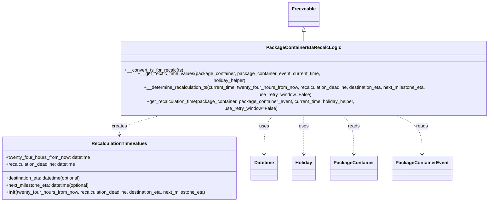
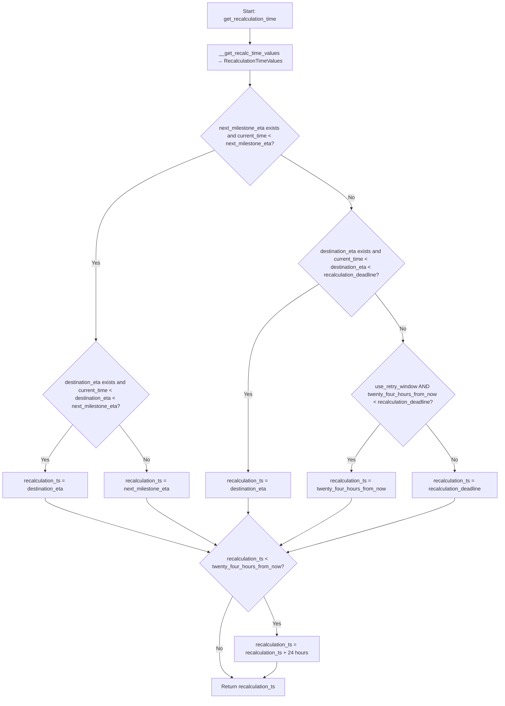

# Diagram: platform/partview_core/partview_service/partview_service/core/business/package_container/event/PackageContainerEtaRecalcLogic.py

> Auto-generated by Obscura crawlers

## Diagram 1

### SVG

<svg id="container" width="1726.6640625" xmlns="http://www.w3.org/2000/svg" class="classDiagram" height="638" viewBox="0 0 1726.6640625 638" role="graphics-document document" aria-roledescription="class"><g><defs><marker id="container_class-aggregationStart" class="marker aggregation class" refX="18" refY="7" markerWidth="190" markerHeight="240" orient="auto"><path d="M 18,7 L9,13 L1,7 L9,1 Z"></path></marker></defs><defs><marker id="container_class-aggregationEnd" class="marker aggregation class" refX="1" refY="7" markerWidth="20" markerHeight="28" orient="auto"><path d="M 18,7 L9,13 L1,7 L9,1 Z"></path></marker></defs><defs><marker id="container_class-extensionStart" class="marker extension class" refX="18" refY="7" markerWidth="190" markerHeight="240" orient="auto"><path d="M 1,7 L18,13 V 1 Z"></path></marker></defs><defs><marker id="container_class-extensionEnd" class="marker extension class" refX="1" refY="7" markerWidth="20" markerHeight="28" orient="auto"><path d="M 1,1 V 13 L18,7 Z"></path></marker></defs><defs><marker id="container_class-compositionStart" class="marker composition class" refX="18" refY="7" markerWidth="190" markerHeight="240" orient="auto"><path d="M 18,7 L9,13 L1,7 L9,1 Z"></path></marker></defs><defs><marker id="container_class-compositionEnd" class="marker composition class" refX="1" refY="7" markerWidth="20" markerHeight="28" orient="auto"><path d="M 18,7 L9,13 L1,7 L9,1 Z"></path></marker></defs><defs><marker id="container_class-dependencyStart" class="marker dependency class" refX="6" refY="7" markerWidth="190" markerHeight="240" orient="auto"><path d="M 5,7 L9,13 L1,7 L9,1 Z"></path></marker></defs><defs><marker id="container_class-dependencyEnd" class="marker dependency class" refX="13" refY="7" markerWidth="20" markerHeight="28" orient="auto"><path d="M 18,7 L9,13 L14,7 L9,1 Z"></path></marker></defs><defs><marker id="container_class-lollipopStart" class="marker lollipop class" refX="13" refY="7" markerWidth="190" markerHeight="240" orient="auto"><circle stroke="black" fill="transparent" cx="7" cy="7" r="6"></circle></marker></defs><defs><marker id="container_class-lollipopEnd" class="marker lollipop class" refX="1" refY="7" markerWidth="190" markerHeight="240" orient="auto"><circle stroke="black" fill="transparent" cx="7" cy="7" r="6"></circle></marker></defs><g class="root"><g class="clusters"></g><g class="edgePaths"><path d="M1057.961,109.25L1057.961,110.542C1057.961,111.833,1057.961,114.417,1057.961,119.875C1057.961,125.333,1057.961,133.667,1057.961,137.833L1057.961,142" id="id_Freezeable_PackageContainerEtaRecalcLogic_1" class="edge-thickness-normal edge-pattern-solid relation" style=";;;" data-edge="true" data-et="edge" data-id="id_Freezeable_PackageContainerEtaRecalcLogic_1" data-points="W3sieCI6MTA1Ny45NjA5Mzc1LCJ5Ijo5Mn0seyJ4IjoxMDU3Ljk2MDkzNzUsInkiOjExN30seyJ4IjoxMDU3Ljk2MDkzNzUsInkiOjE0Mn1d" marker-start="url(#container_class-extensionStart)"></path><path d="M591.86,340L562.826,346.167C533.793,352.333,475.727,364.667,446.693,376C417.66,387.333,417.66,397.667,417.66,402.833L417.66,408" id="id_PackageContainerEtaRecalcLogic_RecalculationTimeValues_2" class="edge-thickness-normal edge-pattern-dashed relation" style=";;;" data-edge="true" data-et="edge" data-id="id_PackageContainerEtaRecalcLogic_RecalculationTimeValues_2" data-points="W3sieCI6NTkxLjg1OTYzMzUwMTgzODMsInkiOjM0MH0seyJ4Ijo0MTcuNjYwMTU2MjUsInkiOjM3N30seyJ4Ijo0MTcuNjYwMTU2MjUsInkiOjQxNH1d" marker-end="url(#container_class-dependencyEnd)"></path><path d="M959.513,340L953.38,346.167C947.248,352.333,934.983,364.667,928.851,387C922.719,409.333,922.719,441.667,922.719,457.833L922.719,474" id="id_PackageContainerEtaRecalcLogic_Datetime_3" class="edge-thickness-normal edge-pattern-dashed relation" style=";;;" data-edge="true" data-et="edge" data-id="id_PackageContainerEtaRecalcLogic_Datetime_3" data-points="W3sieCI6OTU5LjUxMjU4MDQyMjc5NDEsInkiOjM0MH0seyJ4Ijo5MjIuNzE4NzUsInkiOjM3N30seyJ4Ijo5MjIuNzE4NzUsInkiOjQ4MH1d" marker-end="url(#container_class-dependencyEnd)"></path><path d="M1057.961,340L1057.961,346.167C1057.961,352.333,1057.961,364.667,1057.961,387C1057.961,409.333,1057.961,441.667,1057.961,457.833L1057.961,474" id="id_PackageContainerEtaRecalcLogic_Holiday_4" class="edge-thickness-normal edge-pattern-dashed relation" style=";;;" data-edge="true" data-et="edge" data-id="id_PackageContainerEtaRecalcLogic_Holiday_4" data-points="W3sieCI6MTA1Ny45NjA5Mzc1LCJ5IjozNDB9LHsieCI6MTA1Ny45NjA5Mzc1LCJ5IjozNzd9LHsieCI6MTA1Ny45NjA5Mzc1LCJ5Ijo0ODB9XQ==" marker-end="url(#container_class-dependencyEnd)"></path><path d="M1179.743,340L1187.329,346.167C1194.915,352.333,1210.086,364.667,1217.672,387C1225.258,409.333,1225.258,441.667,1225.258,457.833L1225.258,474" id="id_PackageContainerEtaRecalcLogic_PackageContainer_5" class="edge-thickness-normal edge-pattern-dashed relation" style=";;;" data-edge="true" data-et="edge" data-id="id_PackageContainerEtaRecalcLogic_PackageContainer_5" data-points="W3sieCI6MTE3OS43NDMyMjE1MDczNTMsInkiOjM0MH0seyJ4IjoxMjI1LjI1NzgxMjUsInkiOjM3N30seyJ4IjoxMjI1LjI1NzgxMjUsInkiOjQ4MH1d" marker-end="url(#container_class-dependencyEnd)"></path><path d="M1343.61,340L1361.403,346.167C1379.195,352.333,1414.781,364.667,1432.574,387C1450.367,409.333,1450.367,441.667,1450.367,457.833L1450.367,474" id="id_PackageContainerEtaRecalcLogic_PackageContainerEvent_6" class="edge-thickness-normal edge-pattern-dashed relation" style=";;;" data-edge="true" data-et="edge" data-id="id_PackageContainerEtaRecalcLogic_PackageContainerEvent_6" data-points="W3sieCI6MTM0My42MDk2MDQ3Nzk0MTE3LCJ5IjozNDB9LHsieCI6MTQ1MC4zNjcxODc1LCJ5IjozNzd9LHsieCI6MTQ1MC4zNjcxODc1LCJ5Ijo0ODB9XQ==" marker-end="url(#container_class-dependencyEnd)"></path></g><g class="edgeLabels"><g class="edgeLabel"><g class="label" data-id="id_Freezeable_PackageContainerEtaRecalcLogic_1" transform="translate(0, 0)"><foreignObject width="0" height="0">

</foreignObject></g></g><g class="edgeLabel" transform="translate(417.66015625, 377)"><g class="label" data-id="id_PackageContainerEtaRecalcLogic_RecalculationTimeValues_2" transform="translate(-26.171875, -12)"><foreignObject width="52.34375" height="24">

creates

</foreignObject></g></g><g class="edgeLabel" transform="translate(922.71875, 377)"><g class="label" data-id="id_PackageContainerEtaRecalcLogic_Datetime_3" transform="translate(-16.4921875, -12)"><foreignObject width="32.984375" height="24">

uses

</foreignObject></g></g><g class="edgeLabel" transform="translate(1057.9609375, 377)"><g class="label" data-id="id_PackageContainerEtaRecalcLogic_Holiday_4" transform="translate(-16.4921875, -12)"><foreignObject width="32.984375" height="24">

uses

</foreignObject></g></g><g class="edgeLabel" transform="translate(1225.2578125, 377)"><g class="label" data-id="id_PackageContainerEtaRecalcLogic_PackageContainer_5" transform="translate(-20.0078125, -12)"><foreignObject width="40.015625" height="24">

reads

</foreignObject></g></g><g class="edgeLabel" transform="translate(1450.3671875, 377)"><g class="label" data-id="id_PackageContainerEtaRecalcLogic_PackageContainerEvent_6" transform="translate(-20.0078125, -12)"><foreignObject width="40.015625" height="24">

reads

</foreignObject></g></g></g><g class="nodes"><g class="node default" id="classId-RecalculationTimeValues-0" transform="translate(417.66015625, 522)"><g class="basic label-container"><path d="M-409.66015625 -108 L409.66015625 -108 L409.66015625 108 L-409.66015625 108" stroke="none" stroke-width="0" fill="#ECECFF" style=""></path><path d="M-409.66015625 -108 C-199.31644562785257 -108, 11.027264994294853 -108, 409.66015625 -108 M-409.66015625 -108 C-143.56212301451296 -108, 122.53591022097407 -108, 409.66015625 -108 M409.66015625 -108 C409.66015625 -42.54467975718714, 409.66015625 22.91064048562572, 409.66015625 108 M409.66015625 -108 C409.66015625 -43.932908850183196, 409.66015625 20.134182299633608, 409.66015625 108 M409.66015625 108 C120.22833951888362 108, -169.20347721223277 108, -409.66015625 108 M409.66015625 108 C181.40856047125214 108, -46.84303530749571 108, -409.66015625 108 M-409.66015625 108 C-409.66015625 39.18879067579714, -409.66015625 -29.622418648405727, -409.66015625 -108 M-409.66015625 108 C-409.66015625 53.50735453191967, -409.66015625 -0.9852909361606663, -409.66015625 -108" stroke="#9370DB" stroke-width="1.3" fill="none" stroke-dasharray="0 0" style=""></path></g><g class="annotation-group text" transform="translate(0, -84)"></g><g class="label-group text" transform="translate(-90.8359375, -84)"><g class="label" style="font-weight: bolder" transform="translate(0,-12)"><foreignObject width="181.671875" height="24">

RecalculationTimeValues

</foreignObject></g></g><g class="members-group text" transform="translate(-397.66015625, -36)"><g class="label" style="" transform="translate(0,-12)"><foreignObject width="296.546875" height="24">

+twenty_four_hours_from_now: datetime

</foreignObject></g><g class="label" style="" transform="translate(0,12)"><foreignObject width="247.1875" height="24">

+recalculation_deadline: datetime

</foreignObject></g></g><g class="methods-group text" transform="translate(-397.66015625, 36)"><g class="label" style="" transform="translate(0,-12)"><foreignObject width="267" height="24">

+destination_eta: datetime(optional)

</foreignObject></g><g class="label" style="" transform="translate(0,12)"><foreignObject width="295.359375" height="24">

+next_milestone_eta: datetime(optional)

</foreignObject></g><g class="label" style="" transform="translate(0,36)"><foreignObject width="704.484375" height="24">

+<strong>init</strong>(twenty_four_hours_from_now, recalculation_deadline, destination_eta, next_milestone_eta)

</foreignObject></g></g><g class="divider" style=""><path d="M-409.66015625 -60 C-102.31530483869335 -60, 205.0295465726133 -60, 409.66015625 -60 M-409.66015625 -60 C-125.28764542265344 -60, 159.08486540469312 -60, 409.66015625 -60" stroke="#9370DB" stroke-width="1.3" fill="none" stroke-dasharray="0 0" style=""></path></g><g class="divider" style=""><path d="M-409.66015625 12 C-173.580145963401 12, 62.49986432319798 12, 409.66015625 12 M-409.66015625 12 C-202.83714608370505 12, 3.9858640825898988 12, 409.66015625 12" stroke="#9370DB" stroke-width="1.3" fill="none" stroke-dasharray="0 0" style=""></path></g></g><g class="node default" id="classId-PackageContainerEtaRecalcLogic-1" transform="translate(1057.9609375, 241)"><g class="basic label-container"><path d="M-660.703125 -99 L660.703125 -99 L660.703125 99 L-660.703125 99" stroke="none" stroke-width="0" fill="#ECECFF" style=""></path><path d="M-660.703125 -99 C-361.8500429523762 -99, -62.99696090475243 -99, 660.703125 -99 M-660.703125 -99 C-140.8469452460938 -99, 379.0092345078124 -99, 660.703125 -99 M660.703125 -99 C660.703125 -35.75922279701351, 660.703125 27.481554405972986, 660.703125 99 M660.703125 -99 C660.703125 -58.86735823210726, 660.703125 -18.734716464214515, 660.703125 99 M660.703125 99 C197.912329897664 99, -264.878465204672 99, -660.703125 99 M660.703125 99 C326.92805974441046 99, -6.847005511179077 99, -660.703125 99 M-660.703125 99 C-660.703125 49.79197647776523, -660.703125 0.5839529555304637, -660.703125 -99 M-660.703125 99 C-660.703125 56.02822709325694, -660.703125 13.056454186513875, -660.703125 -99" stroke="#9370DB" stroke-width="1.3" fill="none" stroke-dasharray="0 0" style=""></path></g><g class="annotation-group text" transform="translate(0, -75)"></g><g class="label-group text" transform="translate(-119.421875, -75)"><g class="label" style="font-weight: bolder" transform="translate(0,-12)"><foreignObject width="238.84375" height="24">

PackageContainerEtaRecalcLogic

</foreignObject></g></g><g class="members-group text" transform="translate(-648.703125, -27)"></g><g class="methods-group text" transform="translate(-648.703125, 3)"><g class="label" style="" transform="translate(0,-12)"><foreignObject width="200.296875" height="24">

+__convert_ts_for_recalc(ts)

</foreignObject></g><g class="label" style="" transform="translate(0,12)"><foreignObject width="745.625" height="24">

+__get_recalc_time_values(package_container, package_container_event, current_time, holiday_helper)

</foreignObject></g><g class="label" style="" transform="translate(0,36)"><foreignObject width="1177.984375" height="24">

+__determine_recalculation_ts(current_time, twenty_four_hours_from_now, recalculation_deadline, destination_eta, next_milestone_eta, use_retry_window=False)

</foreignObject></g><g class="label" style="" transform="translate(0,60)"><foreignObject width="910.015625" height="24">

+get_recalculation_time(package_container, package_container_event, current_time, holiday_helper, use_retry_window=False)

</foreignObject></g></g><g class="divider" style=""><path d="M-660.703125 -51 C-282.8969341714869 -51, 94.90925665702616 -51, 660.703125 -51 M-660.703125 -51 C-359.65572671613296 -51, -58.60832843226592 -51, 660.703125 -51" stroke="#9370DB" stroke-width="1.3" fill="none" stroke-dasharray="0 0" style=""></path></g><g class="divider" style=""><path d="M-660.703125 -27 C-388.13397680451664 -27, -115.56482860903327 -27, 660.703125 -27 M-660.703125 -27 C-310.252526193341 -27, 40.198072613318004 -27, 660.703125 -27" stroke="#9370DB" stroke-width="1.3" fill="none" stroke-dasharray="0 0" style=""></path></g></g><g class="node default" id="classId-Freezeable-2" transform="translate(1057.9609375, 50)"><g class="basic label-container"><path d="M-51.1953125 -42 L51.1953125 -42 L51.1953125 42 L-51.1953125 42" stroke="none" stroke-width="0" fill="#ECECFF" style=""></path><path d="M-51.1953125 -42 C-22.538741817456284 -42, 6.117828865087432 -42, 51.1953125 -42 M-51.1953125 -42 C-26.11032103802251 -42, -1.0253295760450172 -42, 51.1953125 -42 M51.1953125 -42 C51.1953125 -16.5116957868526, 51.1953125 8.976608426294803, 51.1953125 42 M51.1953125 -42 C51.1953125 -16.50270354453859, 51.1953125 8.994592910922819, 51.1953125 42 M51.1953125 42 C10.380528658045215 42, -30.43425518390957 42, -51.1953125 42 M51.1953125 42 C26.586694905090855 42, 1.9780773101817104 42, -51.1953125 42 M-51.1953125 42 C-51.1953125 17.598629857964603, -51.1953125 -6.802740284070794, -51.1953125 -42 M-51.1953125 42 C-51.1953125 10.07421523942672, -51.1953125 -21.85156952114656, -51.1953125 -42" stroke="#9370DB" stroke-width="1.3" fill="none" stroke-dasharray="0 0" style=""></path></g><g class="annotation-group text" transform="translate(0, -18)"></g><g class="label-group text" transform="translate(-39.1953125, -18)"><g class="label" style="font-weight: bolder" transform="translate(0,-12)"><foreignObject width="78.390625" height="24">

Freezeable

</foreignObject></g></g><g class="members-group text" transform="translate(-39.1953125, 30)"></g><g class="methods-group text" transform="translate(-39.1953125, 60)"></g><g class="divider" style=""><path d="M-51.1953125 6 C-18.414980213803936 6, 14.365352072392128 6, 51.1953125 6 M-51.1953125 6 C-26.425623857906935 6, -1.6559352158138694 6, 51.1953125 6" stroke="#9370DB" stroke-width="1.3" fill="none" stroke-dasharray="0 0" style=""></path></g><g class="divider" style=""><path d="M-51.1953125 24 C-25.438328430729285 24, 0.3186556385414292 24, 51.1953125 24 M-51.1953125 24 C-11.742746868419715 24, 27.70981876316057 24, 51.1953125 24" stroke="#9370DB" stroke-width="1.3" fill="none" stroke-dasharray="0 0" style=""></path></g></g><g class="node default" id="classId-Datetime-3" transform="translate(922.71875, 522)"><g class="basic label-container"><path d="M-45.3984375 -42 L45.3984375 -42 L45.3984375 42 L-45.3984375 42" stroke="none" stroke-width="0" fill="#ECECFF" style=""></path><path d="M-45.3984375 -42 C-23.262384769532567 -42, -1.126332039065133 -42, 45.3984375 -42 M-45.3984375 -42 C-11.541413086492575 -42, 22.31561132701485 -42, 45.3984375 -42 M45.3984375 -42 C45.3984375 -19.90157092142621, 45.3984375 2.196858157147581, 45.3984375 42 M45.3984375 -42 C45.3984375 -19.73095534837225, 45.3984375 2.5380893032554965, 45.3984375 42 M45.3984375 42 C13.666828171268133 42, -18.064781157463734 42, -45.3984375 42 M45.3984375 42 C15.120424247362383 42, -15.157589005275234 42, -45.3984375 42 M-45.3984375 42 C-45.3984375 10.110151147932097, -45.3984375 -21.779697704135806, -45.3984375 -42 M-45.3984375 42 C-45.3984375 16.844444784152387, -45.3984375 -8.311110431695226, -45.3984375 -42" stroke="#9370DB" stroke-width="1.3" fill="none" stroke-dasharray="0 0" style=""></path></g><g class="annotation-group text" transform="translate(0, -18)"></g><g class="label-group text" transform="translate(-33.3984375, -18)"><g class="label" style="font-weight: bolder" transform="translate(0,-12)"><foreignObject width="66.796875" height="24">

Datetime

</foreignObject></g></g><g class="members-group text" transform="translate(-33.3984375, 30)"></g><g class="methods-group text" transform="translate(-33.3984375, 60)"></g><g class="divider" style=""><path d="M-45.3984375 6 C-23.43845522015138 6, -1.4784729403027583 6, 45.3984375 6 M-45.3984375 6 C-25.84317548911511 6, -6.287913478230223 6, 45.3984375 6" stroke="#9370DB" stroke-width="1.3" fill="none" stroke-dasharray="0 0" style=""></path></g><g class="divider" style=""><path d="M-45.3984375 24 C-11.08837039174265 24, 23.2216967165147 24, 45.3984375 24 M-45.3984375 24 C-20.661710676288298 24, 4.075016147423405 24, 45.3984375 24" stroke="#9370DB" stroke-width="1.3" fill="none" stroke-dasharray="0 0" style=""></path></g></g><g class="node default" id="classId-Holiday-4" transform="translate(1057.9609375, 522)"><g class="basic label-container"><path d="M-39.84375 -42 L39.84375 -42 L39.84375 42 L-39.84375 42" stroke="none" stroke-width="0" fill="#ECECFF" style=""></path><path d="M-39.84375 -42 C-22.342435137511476 -42, -4.841120275022952 -42, 39.84375 -42 M-39.84375 -42 C-21.95434456703691 -42, -4.064939134073818 -42, 39.84375 -42 M39.84375 -42 C39.84375 -16.654333631412246, 39.84375 8.691332737175507, 39.84375 42 M39.84375 -42 C39.84375 -10.043189866120478, 39.84375 21.913620267759043, 39.84375 42 M39.84375 42 C10.198549661315258 42, -19.446650677369483 42, -39.84375 42 M39.84375 42 C12.551252924522263 42, -14.741244150955474 42, -39.84375 42 M-39.84375 42 C-39.84375 14.669419527395409, -39.84375 -12.661160945209183, -39.84375 -42 M-39.84375 42 C-39.84375 23.328327989154023, -39.84375 4.656655978308045, -39.84375 -42" stroke="#9370DB" stroke-width="1.3" fill="none" stroke-dasharray="0 0" style=""></path></g><g class="annotation-group text" transform="translate(0, -18)"></g><g class="label-group text" transform="translate(-27.84375, -18)"><g class="label" style="font-weight: bolder" transform="translate(0,-12)"><foreignObject width="55.6875" height="24">

Holiday

</foreignObject></g></g><g class="members-group text" transform="translate(-27.84375, 30)"></g><g class="methods-group text" transform="translate(-27.84375, 60)"></g><g class="divider" style=""><path d="M-39.84375 6 C-10.852524325621005 6, 18.13870134875799 6, 39.84375 6 M-39.84375 6 C-16.89198308814039 6, 6.059783823719222 6, 39.84375 6" stroke="#9370DB" stroke-width="1.3" fill="none" stroke-dasharray="0 0" style=""></path></g><g class="divider" style=""><path d="M-39.84375 24 C-17.179447228406495 24, 5.48485554318701 24, 39.84375 24 M-39.84375 24 C-12.043778259142268 24, 15.756193481715464 24, 39.84375 24" stroke="#9370DB" stroke-width="1.3" fill="none" stroke-dasharray="0 0" style=""></path></g></g><g class="node default" id="classId-PackageContainer-5" transform="translate(1225.2578125, 522)"><g class="basic label-container"><path d="M-77.453125 -42 L77.453125 -42 L77.453125 42 L-77.453125 42" stroke="none" stroke-width="0" fill="#ECECFF" style=""></path><path d="M-77.453125 -42 C-24.419874333429725 -42, 28.61337633314055 -42, 77.453125 -42 M-77.453125 -42 C-25.483379606375806 -42, 26.48636578724839 -42, 77.453125 -42 M77.453125 -42 C77.453125 -18.293203761862326, 77.453125 5.413592476275348, 77.453125 42 M77.453125 -42 C77.453125 -12.612424312664203, 77.453125 16.775151374671594, 77.453125 42 M77.453125 42 C21.993256654809073 42, -33.46661169038185 42, -77.453125 42 M77.453125 42 C24.220846988111283 42, -29.011431023777433 42, -77.453125 42 M-77.453125 42 C-77.453125 9.611568949202514, -77.453125 -22.776862101594972, -77.453125 -42 M-77.453125 42 C-77.453125 8.638868360290502, -77.453125 -24.722263279418996, -77.453125 -42" stroke="#9370DB" stroke-width="1.3" fill="none" stroke-dasharray="0 0" style=""></path></g><g class="annotation-group text" transform="translate(0, -18)"></g><g class="label-group text" transform="translate(-65.453125, -18)"><g class="label" style="font-weight: bolder" transform="translate(0,-12)"><foreignObject width="130.90625" height="24">

PackageContainer

</foreignObject></g></g><g class="members-group text" transform="translate(-65.453125, 30)"></g><g class="methods-group text" transform="translate(-65.453125, 60)"></g><g class="divider" style=""><path d="M-77.453125 6 C-18.583755328936107 6, 40.285614342127786 6, 77.453125 6 M-77.453125 6 C-35.23642586961501 6, 6.980273260769977 6, 77.453125 6" stroke="#9370DB" stroke-width="1.3" fill="none" stroke-dasharray="0 0" style=""></path></g><g class="divider" style=""><path d="M-77.453125 24 C-17.774635240019215 24, 41.90385451996157 24, 77.453125 24 M-77.453125 24 C-43.21647751515739 24, -8.979830030314787 24, 77.453125 24" stroke="#9370DB" stroke-width="1.3" fill="none" stroke-dasharray="0 0" style=""></path></g></g><g class="node default" id="classId-PackageContainerEvent-6" transform="translate(1450.3671875, 522)"><g class="basic label-container"><path d="M-97.65625 -42 L97.65625 -42 L97.65625 42 L-97.65625 42" stroke="none" stroke-width="0" fill="#ECECFF" style=""></path><path d="M-97.65625 -42 C-27.93741581480701 -42, 41.78141837038598 -42, 97.65625 -42 M-97.65625 -42 C-49.43226130332436 -42, -1.2082726066487197 -42, 97.65625 -42 M97.65625 -42 C97.65625 -24.130659797727397, 97.65625 -6.261319595454793, 97.65625 42 M97.65625 -42 C97.65625 -12.878991241154694, 97.65625 16.242017517690613, 97.65625 42 M97.65625 42 C29.424965907610982 42, -38.806318184778036 42, -97.65625 42 M97.65625 42 C23.144463771999426 42, -51.36732245600115 42, -97.65625 42 M-97.65625 42 C-97.65625 9.88495571025986, -97.65625 -22.23008857948028, -97.65625 -42 M-97.65625 42 C-97.65625 23.875944186644304, -97.65625 5.751888373288608, -97.65625 -42" stroke="#9370DB" stroke-width="1.3" fill="none" stroke-dasharray="0 0" style=""></path></g><g class="annotation-group text" transform="translate(0, -18)"></g><g class="label-group text" transform="translate(-85.65625, -18)"><g class="label" style="font-weight: bolder" transform="translate(0,-12)"><foreignObject width="171.3125" height="24">

PackageContainerEvent

</foreignObject></g></g><g class="members-group text" transform="translate(-85.65625, 30)"></g><g class="methods-group text" transform="translate(-85.65625, 60)"></g><g class="divider" style=""><path d="M-97.65625 6 C-52.26024935323232 6, -6.864248706464636 6, 97.65625 6 M-97.65625 6 C-53.53150160128529 6, -9.406753202570584 6, 97.65625 6" stroke="#9370DB" stroke-width="1.3" fill="none" stroke-dasharray="0 0" style=""></path></g><g class="divider" style=""><path d="M-97.65625 24 C-31.026426180149258 24, 35.603397639701484 24, 97.65625 24 M-97.65625 24 C-49.571497734068345 24, -1.4867454681366894 24, 97.65625 24" stroke="#9370DB" stroke-width="1.3" fill="none" stroke-dasharray="0 0" style=""></path></g></g></g></g></g></svg>

## Diagram 2

### SVG

<svg id="container" width="1531.25" xmlns="http://www.w3.org/2000/svg" class="flowchart" height="2132.28125" viewBox="0 0 1531.25 2132.28125" role="graphics-document document" aria-roledescription="flowchart-v2"><g><marker id="container_flowchart-v2-pointEnd" class="marker flowchart-v2" viewBox="0 0 10 10" refX="5" refY="5" markerUnits="userSpaceOnUse" markerWidth="8" markerHeight="8" orient="auto"><path d="M 0 0 L 10 5 L 0 10 z" class="arrowMarkerPath" style="stroke-width: 1; stroke-dasharray: 1, 0;"></path></marker><marker id="container_flowchart-v2-pointStart" class="marker flowchart-v2" viewBox="0 0 10 10" refX="4.5" refY="5" markerUnits="userSpaceOnUse" markerWidth="8" markerHeight="8" orient="auto"><path d="M 0 5 L 10 10 L 10 0 z" class="arrowMarkerPath" style="stroke-width: 1; stroke-dasharray: 1, 0;"></path></marker><marker id="container_flowchart-v2-circleEnd" class="marker flowchart-v2" viewBox="0 0 10 10" refX="11" refY="5" markerUnits="userSpaceOnUse" markerWidth="11" markerHeight="11" orient="auto"><circle cx="5" cy="5" r="5" class="arrowMarkerPath" style="stroke-width: 1; stroke-dasharray: 1, 0;"></circle></marker><marker id="container_flowchart-v2-circleStart" class="marker flowchart-v2" viewBox="0 0 10 10" refX="-1" refY="5" markerUnits="userSpaceOnUse" markerWidth="11" markerHeight="11" orient="auto"><circle cx="5" cy="5" r="5" class="arrowMarkerPath" style="stroke-width: 1; stroke-dasharray: 1, 0;"></circle></marker><marker id="container_flowchart-v2-crossEnd" class="marker cross flowchart-v2" viewBox="0 0 11 11" refX="12" refY="5.2" markerUnits="userSpaceOnUse" markerWidth="11" markerHeight="11" orient="auto"><path d="M 1,1 l 9,9 M 10,1 l -9,9" class="arrowMarkerPath" style="stroke-width: 2; stroke-dasharray: 1, 0;"></path></marker><marker id="container_flowchart-v2-crossStart" class="marker cross flowchart-v2" viewBox="0 0 11 11" refX="-1" refY="5.2" markerUnits="userSpaceOnUse" markerWidth="11" markerHeight="11" orient="auto"><path d="M 1,1 l 9,9 M 10,1 l -9,9" class="arrowMarkerPath" style="stroke-width: 2; stroke-dasharray: 1, 0;"></path></marker><g class="root"><g class="clusters"></g><g class="edgePaths"><path d="M765.625,86L765.625,90.167C765.625,94.333,765.625,102.667,765.625,110.333C765.625,118,765.625,125,765.625,128.5L765.625,132" id="L_S_T_0" class="edge-thickness-normal edge-pattern-solid edge-thickness-normal edge-pattern-solid flowchart-link" style=";" data-edge="true" data-et="edge" data-id="L_S_T_0" data-points="W3sieCI6NzY1LjYyNSwieSI6ODZ9LHsieCI6NzY1LjYyNSwieSI6MTExfSx7IngiOjc2NS42MjUsInkiOjEzNn1d" marker-end="url(#container_flowchart-v2-pointEnd)"></path><path d="M765.625,214L765.625,218.167C765.625,222.333,765.625,230.667,765.625,238.333C765.625,246,765.625,253,765.625,256.5L765.625,260" id="L_T_D1_0" class="edge-thickness-normal edge-pattern-solid edge-thickness-normal edge-pattern-solid flowchart-link" style=";" data-edge="true" data-et="edge" data-id="L_T_D1_0" data-points="W3sieCI6NzY1LjYyNSwieSI6MjE0fSx7IngiOjc2NS42MjUsInkiOjIzOX0seyJ4Ijo3NjUuNjI1LCJ5IjoyNjR9XQ==" marker-end="url(#container_flowchart-v2-pointEnd)"></path><path d="M657.596,457.971L596.83,482.143C536.064,506.314,414.532,554.657,353.766,612.162C293,669.667,293,736.333,293,803C293,869.667,293,936.333,293,975.167C293,1014,293,1025,293,1030.5L293,1036" id="L_D1_D2_0" class="edge-thickness-normal edge-pattern-solid edge-thickness-normal edge-pattern-solid flowchart-link" style=";" data-edge="true" data-et="edge" data-id="L_D1_D2_0" data-points="W3sieCI6NjU3LjU5NjQyODU3MTQyODUsInkiOjQ1Ny45NzE0Mjg1NzE0Mjg2fSx7IngiOjI5MywieSI6NjAzfSx7IngiOjI5MywieSI6ODAzfSx7IngiOjI5MywieSI6MTAwM30seyJ4IjoyOTMsInkiOjEwNDB9XQ==" marker-end="url(#container_flowchart-v2-pointEnd)"></path><path d="M221.831,1294.831L207.859,1312.859C193.887,1330.887,165.944,1366.944,151.972,1390.472C138,1414,138,1425,138,1430.5L138,1436" id="L_D2_R1_0" class="edge-thickness-normal edge-pattern-solid edge-thickness-normal edge-pattern-solid flowchart-link" style=";" data-edge="true" data-et="edge" data-id="L_D2_R1_0" data-points="W3sieCI6MjIxLjgzMDk4NTkxNTQ5Mjk2LCJ5IjoxMjk0LjgzMDk4NTkxNTQ5Mjl9LHsieCI6MTM4LCJ5IjoxNDAzfSx7IngiOjEzOCwieSI6MTQ0MH1d" marker-end="url(#container_flowchart-v2-pointEnd)"></path><path d="M364.169,1294.831L378.141,1312.859C392.113,1330.887,420.056,1366.944,434.028,1390.472C448,1414,448,1425,448,1430.5L448,1436" id="L_D2_R2_0" class="edge-thickness-normal edge-pattern-solid edge-thickness-normal edge-pattern-solid flowchart-link" style=";" data-edge="true" data-et="edge" data-id="L_D2_R2_0" data-points="W3sieCI6MzY0LjE2OTAxNDA4NDUwNzA3LCJ5IjoxMjk0LjgzMDk4NTkxNTQ5Mjl9LHsieCI6NDQ4LCJ5IjoxNDAzfSx7IngiOjQ0OCwieSI6MTQ0MH1d" marker-end="url(#container_flowchart-v2-pointEnd)"></path><path d="M859.621,472.004L895.622,493.837C931.622,515.669,1003.624,559.335,1039.624,586.667C1075.625,614,1075.625,625,1075.625,630.5L1075.625,636" id="L_D1_D3_0" class="edge-thickness-normal edge-pattern-solid edge-thickness-normal edge-pattern-solid flowchart-link" style=";" data-edge="true" data-et="edge" data-id="L_D1_D3_0" data-points="W3sieCI6ODU5LjYyMDk4MzkzNTc0MywieSI6NDcyLjAwNDAxNjA2NDI1NzAzfSx7IngiOjEwNzUuNjI1LCJ5Ijo2MDN9LHsieCI6MTA3NS42MjUsInkiOjY0MH1d" marker-end="url(#container_flowchart-v2-pointEnd)"></path><path d="M975.605,865.98L939.337,888.817C903.07,911.653,830.535,957.327,794.267,1013.497C758,1069.667,758,1136.333,758,1203C758,1269.667,758,1336.333,758,1375.167C758,1414,758,1425,758,1430.5L758,1436" id="L_D3_R3_0" class="edge-thickness-normal edge-pattern-solid edge-thickness-normal edge-pattern-solid flowchart-link" style=";" data-edge="true" data-et="edge" data-id="L_D3_R3_0" data-points="W3sieCI6OTc1LjYwNDk1NjUzMjIzODYsInkiOjg2NS45Nzk5NTY1MzIyMzg2fSx7IngiOjc1OCwieSI6MTAwM30seyJ4Ijo3NTgsInkiOjEyMDN9LHsieCI6NzU4LCJ5IjoxNDAzfSx7IngiOjc1OCwieSI6MTQ0MH1d" marker-end="url(#container_flowchart-v2-pointEnd)"></path><path d="M1147.77,893.855L1162.214,912.046C1176.659,930.237,1205.548,966.618,1219.993,990.684C1234.438,1014.75,1234.438,1026.5,1234.438,1032.375L1234.438,1038.25" id="L_D3_D4_0" class="edge-thickness-normal edge-pattern-solid edge-thickness-normal edge-pattern-solid flowchart-link" style=";" data-edge="true" data-et="edge" data-id="L_D3_D4_0" data-points="W3sieCI6MTE0Ny43Njk3NDgzMDE2ODk2LCJ5Ijo4OTMuODU1MjUxNjk4MzEwNH0seyJ4IjoxMjM0LjQzNzUsInkiOjEwMDN9LHsieCI6MTIzNC40Mzc1LCJ5IjoxMDQyLjI1fV0=" marker-end="url(#container_flowchart-v2-pointEnd)"></path><path d="M1163.289,1292.601L1148.678,1311.001C1134.067,1329.401,1104.846,1366.2,1090.236,1390.1C1075.625,1414,1075.625,1425,1075.625,1430.5L1075.625,1436" id="L_D4_R4_0" class="edge-thickness-normal edge-pattern-solid edge-thickness-normal edge-pattern-solid flowchart-link" style=";" data-edge="true" data-et="edge" data-id="L_D4_R4_0" data-points="W3sieCI6MTE2My4yODg2MTQ3ODgzNjQ0LCJ5IjoxMjkyLjYwMTExNDc4ODM2NDR9LHsieCI6MTA3NS42MjUsInkiOjE0MDN9LHsieCI6MTA3NS42MjUsInkiOjE0NDB9XQ==" marker-end="url(#container_flowchart-v2-pointEnd)"></path><path d="M1305.586,1292.601L1320.197,1311.001C1334.808,1329.401,1364.029,1366.2,1378.639,1390.1C1393.25,1414,1393.25,1425,1393.25,1430.5L1393.25,1436" id="L_D4_R5_0" class="edge-thickness-normal edge-pattern-solid edge-thickness-normal edge-pattern-solid flowchart-link" style=";" data-edge="true" data-et="edge" data-id="L_D4_R5_0" data-points="W3sieCI6MTMwNS41ODYzODUyMTE2MzU2LCJ5IjoxMjkyLjYwMTExNDc4ODM2NDR9LHsieCI6MTM5My4yNSwieSI6MTQwM30seyJ4IjoxMzkzLjI1LCJ5IjoxNDQwfV0=" marker-end="url(#container_flowchart-v2-pointEnd)"></path><path d="M138,1518L138,1522.167C138,1526.333,138,1534.667,221.18,1562.33C304.36,1589.994,470.72,1636.988,553.9,1660.486L637.081,1683.983" id="L_R1_C_0" class="edge-thickness-normal edge-pattern-solid edge-thickness-normal edge-pattern-solid flowchart-link" style=";" data-edge="true" data-et="edge" data-id="L_R1_C_0" data-points="W3sieCI6MTM4LCJ5IjoxNTE4fSx7IngiOjEzOCwieSI6MTU0M30seyJ4Ijo2NDAuOTI5OTA2MjY2NTgwMiwieSI6MTY4NS4wNzAwOTM3MzM0MTk4fV0=" marker-end="url(#container_flowchart-v2-pointEnd)"></path><path d="M448,1518L448,1522.167C448,1526.333,448,1534.667,483.097,1558.662C518.193,1582.657,588.386,1622.314,623.483,1642.142L658.579,1661.971" id="L_R2_C_0" class="edge-thickness-normal edge-pattern-solid edge-thickness-normal edge-pattern-solid flowchart-link" style=";" data-edge="true" data-et="edge" data-id="L_R2_C_0" data-points="W3sieCI6NDQ4LCJ5IjoxNTE4fSx7IngiOjQ0OCwieSI6MTU0M30seyJ4Ijo2NjIuMDYxNjQ0NDk3NDA3MywieSI6MTY2My45MzgzNTU1MDI1OTI3fV0=" marker-end="url(#container_flowchart-v2-pointEnd)"></path><path d="M758,1518L758,1522.167C758,1526.333,758,1534.667,758,1542.333C758,1550,758,1557,758,1560.5L758,1564" id="L_R3_C_0" class="edge-thickness-normal edge-pattern-solid edge-thickness-normal edge-pattern-solid flowchart-link" style=";" data-edge="true" data-et="edge" data-id="L_R3_C_0" data-points="W3sieCI6NzU4LCJ5IjoxNTE4fSx7IngiOjc1OCwieSI6MTU0M30seyJ4Ijo3NTgsInkiOjE1Njh9XQ==" marker-end="url(#container_flowchart-v2-pointEnd)"></path><path d="M1075.625,1518L1075.625,1522.167C1075.625,1526.333,1075.625,1534.667,1039.401,1558.808C1003.177,1582.949,930.728,1622.897,894.504,1642.871L858.28,1662.846" id="L_R4_C_0" class="edge-thickness-normal edge-pattern-solid edge-thickness-normal edge-pattern-solid flowchart-link" style=";" data-edge="true" data-et="edge" data-id="L_R4_C_0" data-points="W3sieCI6MTA3NS42MjUsInkiOjE1MTh9LHsieCI6MTA3NS42MjUsInkiOjE1NDN9LHsieCI6ODU0Ljc3NzA3NTM0MDA3NjcsInkiOjE2NjQuNzc3MDc1MzQwMDc2Nn1d" marker-end="url(#container_flowchart-v2-pointEnd)"></path><path d="M1393.25,1518L1393.25,1522.167C1393.25,1526.333,1393.25,1534.667,1307.633,1562.438C1222.016,1590.21,1050.782,1637.42,965.165,1661.024L879.549,1684.629" id="L_R5_C_0" class="edge-thickness-normal edge-pattern-solid edge-thickness-normal edge-pattern-solid flowchart-link" style=";" data-edge="true" data-et="edge" data-id="L_R5_C_0" data-points="W3sieCI6MTM5My4yNSwieSI6MTUxOH0seyJ4IjoxMzkzLjI1LCJ5IjoxNTQzfSx7IngiOjg3NS42OTI0MTc4MTU0ODI1LCJ5IjoxNjg1LjY5MjQxNzgxNTQ4MjV9XQ==" marker-end="url(#container_flowchart-v2-pointEnd)"></path><path d="M805.861,1820.421L812.479,1834.564C819.097,1848.707,832.334,1876.994,838.952,1896.638C845.57,1916.281,845.57,1927.281,845.57,1932.781L845.57,1938.281" id="L_C_ADJ_0" class="edge-thickness-normal edge-pattern-solid edge-thickness-normal edge-pattern-solid flowchart-link" style=";" data-edge="true" data-et="edge" data-id="L_C_ADJ_0" data-points="W3sieCI6ODA1Ljg2MDcxMzQwOTY5MiwieSI6MTgyMC40MjA1MzY1OTAzMDh9LHsieCI6ODQ1LjU3MDMxMjUsInkiOjE5MDUuMjgxMjV9LHsieCI6ODQ1LjU3MDMxMjUsInkiOjE5NDIuMjgxMjV9XQ==" marker-end="url(#container_flowchart-v2-pointEnd)"></path><path d="M710.139,1820.421L703.521,1834.564C696.903,1848.707,683.666,1876.994,677.048,1903.804C670.43,1930.615,670.43,1955.948,670.43,1979.281C670.43,2002.615,670.43,2023.948,676.873,2038.441C683.317,2052.934,696.204,2060.586,702.648,2064.413L709.091,2068.239" id="L_C_RET_0" class="edge-thickness-normal edge-pattern-solid edge-thickness-normal edge-pattern-solid flowchart-link" style=";" data-edge="true" data-et="edge" data-id="L_C_RET_0" data-points="W3sieCI6NzEwLjEzOTI4NjU5MDMwOCwieSI6MTgyMC40MjA1MzY1OTAzMDh9LHsieCI6NjcwLjQyOTY4NzUsInkiOjE5MDUuMjgxMjV9LHsieCI6NjcwLjQyOTY4NzUsInkiOjE5ODEuMjgxMjV9LHsieCI6NjcwLjQyOTY4NzUsInkiOjIwNDUuMjgxMjV9LHsieCI6NzEyLjUzMDc5OTI3ODg0NjIsInkiOjIwNzAuMjgxMjV9XQ==" marker-end="url(#container_flowchart-v2-pointEnd)"></path><path d="M845.57,2020.281L845.57,2024.448C845.57,2028.615,845.57,2036.948,839.127,2044.941C832.683,2052.934,819.796,2060.586,813.352,2064.413L806.909,2068.239" id="L_ADJ_RET_0" class="edge-thickness-normal edge-pattern-solid edge-thickness-normal edge-pattern-solid flowchart-link" style=";" data-edge="true" data-et="edge" data-id="L_ADJ_RET_0" data-points="W3sieCI6ODQ1LjU3MDMxMjUsInkiOjIwMjAuMjgxMjV9LHsieCI6ODQ1LjU3MDMxMjUsInkiOjIwNDUuMjgxMjV9LHsieCI6ODAzLjQ2OTIwMDcyMTE1MzgsInkiOjIwNzAuMjgxMjV9XQ==" marker-end="url(#container_flowchart-v2-pointEnd)"></path></g><g class="edgeLabels"><g class="edgeLabel"><g class="label" data-id="L_S_T_0" transform="translate(0, 0)"><foreignObject width="0" height="0">

</foreignObject></g></g><g class="edgeLabel"><g class="label" data-id="L_T_D1_0" transform="translate(0, 0)"><foreignObject width="0" height="0">

</foreignObject></g></g><g class="edgeLabel" transform="translate(293, 803)"><g class="label" data-id="L_D1_D2_0" transform="translate(-12.03125, -12)"><foreignObject width="24.0625" height="24">

Yes

</foreignObject></g></g><g class="edgeLabel" transform="translate(138, 1403)"><g class="label" data-id="L_D2_R1_0" transform="translate(-12.03125, -12)"><foreignObject width="24.0625" height="24">

Yes

</foreignObject></g></g><g class="edgeLabel" transform="translate(448, 1403)"><g class="label" data-id="L_D2_R2_0" transform="translate(-10.140625, -12)"><foreignObject width="20.28125" height="24">

No

</foreignObject></g></g><g class="edgeLabel" transform="translate(1075.625, 603)"><g class="label" data-id="L_D1_D3_0" transform="translate(-10.140625, -12)"><foreignObject width="20.28125" height="24">

No

</foreignObject></g></g><g class="edgeLabel" transform="translate(758, 1203)"><g class="label" data-id="L_D3_R3_0" transform="translate(-12.03125, -12)"><foreignObject width="24.0625" height="24">

Yes

</foreignObject></g></g><g class="edgeLabel" transform="translate(1234.4375, 1003)"><g class="label" data-id="L_D3_D4_0" transform="translate(-10.140625, -12)"><foreignObject width="20.28125" height="24">

No

</foreignObject></g></g><g class="edgeLabel" transform="translate(1075.625, 1403)"><g class="label" data-id="L_D4_R4_0" transform="translate(-12.03125, -12)"><foreignObject width="24.0625" height="24">

Yes

</foreignObject></g></g><g class="edgeLabel" transform="translate(1393.25, 1403)"><g class="label" data-id="L_D4_R5_0" transform="translate(-10.140625, -12)"><foreignObject width="20.28125" height="24">

No

</foreignObject></g></g><g class="edgeLabel"><g class="label" data-id="L_R1_C_0" transform="translate(0, 0)"><foreignObject width="0" height="0">

</foreignObject></g></g><g class="edgeLabel"><g class="label" data-id="L_R2_C_0" transform="translate(0, 0)"><foreignObject width="0" height="0">

</foreignObject></g></g><g class="edgeLabel"><g class="label" data-id="L_R3_C_0" transform="translate(0, 0)"><foreignObject width="0" height="0">

</foreignObject></g></g><g class="edgeLabel"><g class="label" data-id="L_R4_C_0" transform="translate(0, 0)"><foreignObject width="0" height="0">

</foreignObject></g></g><g class="edgeLabel"><g class="label" data-id="L_R5_C_0" transform="translate(0, 0)"><foreignObject width="0" height="0">

</foreignObject></g></g><g class="edgeLabel" transform="translate(845.5703125, 1905.28125)"><g class="label" data-id="L_C_ADJ_0" transform="translate(-12.03125, -12)"><foreignObject width="24.0625" height="24">

Yes

</foreignObject></g></g><g class="edgeLabel" transform="translate(670.4296875, 1981.28125)"><g class="label" data-id="L_C_RET_0" transform="translate(-10.140625, -12)"><foreignObject width="20.28125" height="24">

No

</foreignObject></g></g><g class="edgeLabel"><g class="label" data-id="L_ADJ_RET_0" transform="translate(0, 0)"><foreignObject width="0" height="0">

</foreignObject></g></g></g><g class="nodes"><g class="node default" id="flowchart-S-0" transform="translate(765.625, 47)"><rect class="basic label-container" style="" x="-130" y="-39" width="260" height="78"></rect><g class="label" style="" transform="translate(-100, -24)"><rect></rect><foreignObject width="200" height="48">

Start: get_recalculation_time

</foreignObject></g></g><g class="node default" id="flowchart-T-1" transform="translate(765.625, 175)"><rect class="basic label-container" style="" x="-130" y="-39" width="260" height="78"></rect><g class="label" style="" transform="translate(-100, -24)"><rect></rect><foreignObject width="200" height="48">

__get_recalc_time_values → RecalculationTimeValues

</foreignObject></g></g><g class="node default" id="flowchart-D1-3" transform="translate(765.625, 415)"><polygon points="151,0 302,-151 151,-302 0,-151" class="label-container" transform="translate(-150.5, 151)"></polygon><g class="label" style="" transform="translate(-100, -36)"><rect></rect><foreignObject width="200" height="72">

next_milestone_eta exists and current_time &lt; next_milestone_eta?

</foreignObject></g></g><g class="node default" id="flowchart-D2-5" transform="translate(293, 1203)"><polygon points="163,0 326,-163 163,-326 0,-163" class="label-container" transform="translate(-162.5, 163)"></polygon><g class="label" style="" transform="translate(-100, -48)"><rect></rect><foreignObject width="200" height="96">

destination_eta exists and current_time &lt; destination_eta &lt; next_milestone_eta?

</foreignObject></g></g><g class="node default" id="flowchart-R1-7" transform="translate(138, 1479)"><rect class="basic label-container" style="" x="-130" y="-39" width="260" height="78"></rect><g class="label" style="" transform="translate(-100, -24)"><rect></rect><foreignObject width="200" height="48">

recalculation_ts = destination_eta

</foreignObject></g></g><g class="node default" id="flowchart-R2-9" transform="translate(448, 1479)"><rect class="basic label-container" style="" x="-130" y="-39" width="260" height="78"></rect><g class="label" style="" transform="translate(-100, -24)"><rect></rect><foreignObject width="200" height="48">

recalculation_ts = next_milestone_eta

</foreignObject></g></g><g class="node default" id="flowchart-D3-11" transform="translate(1075.625, 803)"><polygon points="163,0 326,-163 163,-326 0,-163" class="label-container" transform="translate(-162.5, 163)"></polygon><g class="label" style="" transform="translate(-100, -48)"><rect></rect><foreignObject width="200" height="96">

destination_eta exists and current_time &lt; destination_eta &lt; recalculation_deadline?

</foreignObject></g></g><g class="node default" id="flowchart-R3-13" transform="translate(758, 1479)"><rect class="basic label-container" style="" x="-130" y="-39" width="260" height="78"></rect><g class="label" style="" transform="translate(-100, -24)"><rect></rect><foreignObject width="200" height="48">

recalculation_ts = destination_eta

</foreignObject></g></g><g class="node default" id="flowchart-D4-15" transform="translate(1234.4375, 1203)"><polygon points="160.75,0 321.5,-160.75 160.75,-321.5 0,-160.75" class="label-container" transform="translate(-160.25, 160.75)"></polygon><g class="label" style="" transform="translate(-109.75, -36)"><rect></rect><foreignObject width="219.5" height="72">

use_retry_window AND twenty_four_hours_from_now &lt; recalculation_deadline?

</foreignObject></g></g><g class="node default" id="flowchart-R4-17" transform="translate(1075.625, 1479)"><rect class="basic label-container" style="" x="-137.625" y="-39" width="275.25" height="78"></rect><g class="label" style="" transform="translate(-107.625, -24)"><rect></rect><foreignObject width="215.25" height="48">

recalculation_ts = twenty_four_hours_from_now

</foreignObject></g></g><g class="node default" id="flowchart-R5-19" transform="translate(1393.25, 1479)"><rect class="basic label-container" style="" x="-130" y="-39" width="260" height="78"></rect><g class="label" style="" transform="translate(-100, -24)"><rect></rect><foreignObject width="200" height="48">

recalculation_ts = recalculation_deadline

</foreignObject></g></g><g class="node default" id="flowchart-C-21" transform="translate(758, 1718.140625)"><polygon points="150.140625,0 300.28125,-150.140625 150.140625,-300.28125 0,-150.140625" class="label-container" transform="translate(-149.640625, 150.140625)"></polygon><g class="label" style="" transform="translate(-111.140625, -24)"><rect></rect><foreignObject width="222.28125" height="48">

recalculation_ts &lt; twenty_four_hours_from_now?

</foreignObject></g></g><g class="node default" id="flowchart-ADJ-31" transform="translate(845.5703125, 1981.28125)"><rect class="basic label-container" style="" x="-130" y="-39" width="260" height="78"></rect><g class="label" style="" transform="translate(-100, -24)"><rect></rect><foreignObject width="200" height="48">

recalculation_ts = recalculation_ts + 24 hours

</foreignObject></g></g><g class="node default" id="flowchart-RET-33" transform="translate(758, 2097.28125)"><rect class="basic label-container" style="" x="-114.234375" y="-27" width="228.46875" height="54"></rect><g class="label" style="" transform="translate(-84.234375, -12)"><rect></rect><foreignObject width="168.46875" height="24">

Return recalculation_ts

</foreignObject></g></g></g></g></g></svg>
