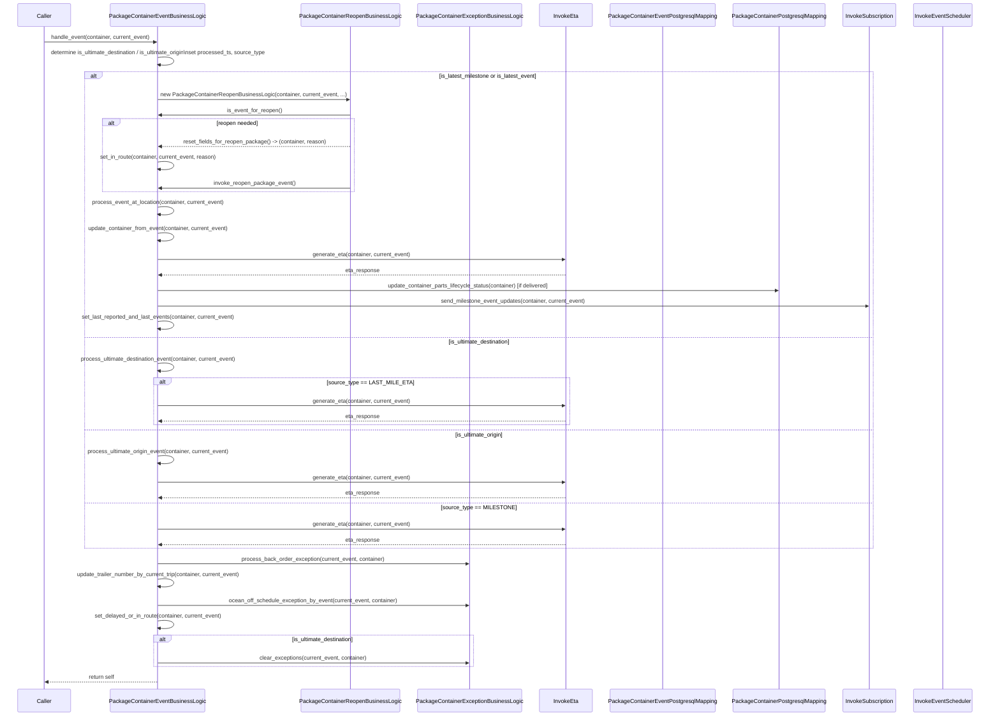

# Diagram: platform/partview_core/partview_service/partview_service/core/business/package_container/event/PackageContainerEventBusinessLogic.py

> Auto-generated by Obscura crawlers

## Diagram 1

```mermaid
classDiagram
    class Freezeable

    class PackageContainerEventBusinessLogic {
        - __application_name
        - __feature_name
        - __event_data_store : PackageContainerEventPostgresqlMapping
        - __life_cycle_history_data_store : PackageContainerLifecycleHistoryPostgresMapping
        - __open_search_producer : OpenSearchDataSyncProducer
        - __event_codes_mapping : PackageContainerEventCodeLookupPostgresqlMapping
        - __package_container_data_store : PackageContainerPostgresqlMapping
        - __dateHelper : DateHelper
        - __package_container_helper : PackageContainerHelper
        - __package_container_exception_helper : PackageContainerExceptionHelper
        - __eta_history_adapter : PackageContainerEtaHistoryPostgresqlMapping
        - __package_container_exception_business_logic : PackageContainerExceptionBusinessLogic
        - __container_loader : ContainerTripLegDAOLoader
        - __holiday_helper : HolidayDatetimeHelper
        + get_application_name()
        + get_holiday_helper()
        + handle_event(container, current_event)
        + handle_event_replay(package_container, package_container_events)
        + generate_eta(container, event, reason=None, is_eta_refresh=False)
        + set_eta(package_container, package_container_event, eta)
        + set_delayed_or_in_route(container, current_event)
        + set_in_route(container, package_container_event, reason=None)
        + set_delivered(package_container, package_container_event)
        + process_ultimate_destination_event(package_container, package_container_event)
        + process_ultimate_origin_event(package_container, package_container_event)
        + update_container_from_event(package_container, package_container_event)
        + send_milestone_event_updates(package_container, package_container_event, is_tbd=False)
    }

    class PackageContainer {
        + id
        + tracking_number
        + destination_eta
        + effective_destination_eta
        + lifecycle_state
        + destination_location_code
        + origin_location_code
        + owner_org_fv_id
        + get(field)
        + set(field, value)
    }

    class PackageContainerEvent {
        + id
        + event_ts
        + event_code
        + event_type
        + event_reason_code
        + location_code
        + location_detail
        + details
        + processed_ts
        + get(field)
        + set(field, value)
        + reset_field(field, value)
    }

    class PackageContainerEventPostgresqlMapping {
        + search(event)
        + write(event)
        + update(event)
        + read(event_id)
        + exists(query)
        + get_unprocessed_trip_leg_events(solution_id, package_container_id, trip_leg_id)
        + update_container_parts_lifecycle_status(container)
    }

    class PackageContainerLifecycleHistoryPostgresMapping {
        + get_event_by_life_cycle_state(container, state)
    }

    class OpenSearchDataSyncProducer {
        + produce_batch_containers(containers)
    }

    class PackageContainerEventCodeLookupPostgresqlMapping {
        + get_event_codes(solution_id, source_type, internal_codes=None)
        + get_by_code_subcode_solution_id(lookup)
    }

    class PackageContainerPostgresqlMapping {
        + update(container)
        + update_batch(containers)
    }

    class DateHelper {
        + get_processing_time()
        + get_destination_eta(eta_date)
        + get_ai_response_eta(ai_response_eta_date)
        + get_next_milestone_eta(eta_date)
    }

    class PackageContainerHelper {
        + set_lifecycle_state(package_container, new_state, changed_by, changed_event_id, reason, allow_duplicates=False)
        + get_container_type_name(container_type_id)
    }

    class PackageContainerExceptionHelper {
        + get_reason_code_by_exception_type_id(exception_type_id)
    }

    class PackageContainerEtaHistoryPostgresqlMapping {
        + write(package_container_eta_history)
    }

    class PackageContainerExceptionBusinessLogic {
        + clear_exceptions(event, package_container)
        + get_active_exceptions(package_container)
        + container_has_delaying_exception(package_container)
        + ocean_missed_pickup_exception_cancel_or_clear(event, package_container)
        + ocean_check_and_set_behind_schedule_exception(package_container, package_container_event)
        + process_back_order_exception(current_event, container)
        + ocean_off_schedule_exception_by_event(current_event, container)
    }

    class ContainerTripLegDAOLoader {
        + get_container()
        + get_planned_trips()
        + get_trips()
        + get_actual_trips()
    }

    class InvokeEta {
        + invoke_get_eta_for_package(package_container, package_container_event, package_container_eta_history, departure, is_next_milestone_eta=False, trip_information=None)
    }

    class PackageContainerEtaTripInfo {
        + lad_name
        + stop_number
        + total_stops
        + next_locations
    }

    class InvokeSubscription {
        + invoke_send_event_to_subscribers(organization_fv_id, package_container, body)
    }

    class InvokeEventScheduler {
        + put(owner_org_fv_id, container_id, topic, message_body, schedule_time_str, recalculation_ts, delivery_mode, state="PENDING", reason=None, use_queue=False)
    }

    class InvokeLocation {
        + invoke_get_location_with_customer_fv_id(org_fv_id, location_code, owner_org_fv_id)
    }

    class InvokeOrganization {
        + invoke_get_organization_by_id(org_id)
        + invoke_get_organization_from_fv_id(fv_id)
    }

    class InvokeLocationGrant {
        + invoke_get_location_grant(org_id, grantee_fv_id, owner_org_fv_id, _)
    }

    class PartViewConfiguration {
        + set_solution_id(solution_id)
        + set_organization_id_by_fv_id(fv_id)
        + get_location_grant_lad_types()
    }

    class PackageContainerReopenBusinessLogic {
        + is_event_for_reopen()
        + reset_fields_for_reopen_package()
        + invoke_reopen_package_event()
    }

    class PackageContainerProgressLogic {
        + get_event_progress(planned_trips, event)
    }

    class PackageContainerTrailerNumberLogic {
        + get_trailer_number_by_current_trip(actual_trips, planned_trips, event, last_event, last_milestone, container)
    }

    Freezeable <|-- PackageContainerEventBusinessLogic
    PackageContainerEventBusinessLogic o-- PackageContainerEventPostgresqlMapping : event_data_store
    PackageContainerEventBusinessLogic o-- PackageContainerLifecycleHistoryPostgresMapping : life_cycle_history_data_store
    PackageContainerEventBusinessLogic o-- OpenSearchDataSyncProducer : open_search_producer
    PackageContainerEventBusinessLogic o-- PackageContainerEventCodeLookupPostgresqlMapping : event_codes_mapping
    PackageContainerEventBusinessLogic o-- PackageContainerPostgresqlMapping : package_container_data_store
    PackageContainerEventBusinessLogic o-- DateHelper : dateHelper
    PackageContainerEventBusinessLogic o-- PackageContainerHelper : package_container_helper
    PackageContainerEventBusinessLogic o-- PackageContainerExceptionHelper : package_container_exception_helper
    PackageContainerEventBusinessLogic o-- PackageContainerEtaHistoryPostgresqlMapping : eta_history_adapter
    PackageContainerEventBusinessLogic o-- PackageContainerExceptionBusinessLogic : package_container_exception_business_logic
    PackageContainerEventBusinessLogic --> ContainerTripLegDAOLoader : get_container_loader()
    PackageContainerEventBusinessLogic ..> InvokeEta : invokes
    PackageContainerEventBusinessLogic ..> InvokeSubscription : notifies
    PackageContainerEventBusinessLogic ..> InvokeEventScheduler : schedules
    PackageContainerEventBusinessLogic ..> InvokeLocation : retrieves
    PackageContainerEventBusinessLogic ..> InvokeOrganization : retrieves
    PackageContainerEventBusinessLogic ..> InvokeLocationGrant : retrieves
    PackageContainerEventBusinessLogic ..> PartViewConfiguration : consults
    PackageContainerEventBusinessLogic ..> PackageContainerReopenBusinessLogic : uses
    PackageContainerEventBusinessLogic ..> PackageContainer : updates
    PackageContainerEventBusinessLogic ..> PackageContainerEvent : processes
    PackageContainerEventPostgresqlMapping --> PackageContainerEvent : persists
    PackageContainerPostgresqlMapping --> PackageContainer : persists
    ContainerTripLegDAOLoader --> TripLeg : returns
    InvokeEta --> PackageContainerEtaTripInfo : returns
    PackageContainerExceptionBusinessLogic ..> PackageContainer : analyzes
```

### SVG

<svg id="container" width="13346.1796875" xmlns="http://www.w3.org/2000/svg" class="classDiagram" height="1738" viewBox="0 0 13346.1796875 1738" role="graphics-document document" aria-roledescription="class"><g><defs><marker id="container_class-aggregationStart" class="marker aggregation class" refX="18" refY="7" markerWidth="190" markerHeight="240" orient="auto"><path d="M 18,7 L9,13 L1,7 L9,1 Z"></path></marker></defs><defs><marker id="container_class-aggregationEnd" class="marker aggregation class" refX="1" refY="7" markerWidth="20" markerHeight="28" orient="auto"><path d="M 18,7 L9,13 L1,7 L9,1 Z"></path></marker></defs><defs><marker id="container_class-extensionStart" class="marker extension class" refX="18" refY="7" markerWidth="190" markerHeight="240" orient="auto"><path d="M 1,7 L18,13 V 1 Z"></path></marker></defs><defs><marker id="container_class-extensionEnd" class="marker extension class" refX="1" refY="7" markerWidth="20" markerHeight="28" orient="auto"><path d="M 1,1 V 13 L18,7 Z"></path></marker></defs><defs><marker id="container_class-compositionStart" class="marker composition class" refX="18" refY="7" markerWidth="190" markerHeight="240" orient="auto"><path d="M 18,7 L9,13 L1,7 L9,1 Z"></path></marker></defs><defs><marker id="container_class-compositionEnd" class="marker composition class" refX="1" refY="7" markerWidth="20" markerHeight="28" orient="auto"><path d="M 18,7 L9,13 L1,7 L9,1 Z"></path></marker></defs><defs><marker id="container_class-dependencyStart" class="marker dependency class" refX="6" refY="7" markerWidth="190" markerHeight="240" orient="auto"><path d="M 5,7 L9,13 L1,7 L9,1 Z"></path></marker></defs><defs><marker id="container_class-dependencyEnd" class="marker dependency class" refX="13" refY="7" markerWidth="20" markerHeight="28" orient="auto"><path d="M 18,7 L9,13 L14,7 L9,1 Z"></path></marker></defs><defs><marker id="container_class-lollipopStart" class="marker lollipop class" refX="13" refY="7" markerWidth="190" markerHeight="240" orient="auto"><circle stroke="black" fill="transparent" cx="7" cy="7" r="6"></circle></marker></defs><defs><marker id="container_class-lollipopEnd" class="marker lollipop class" refX="1" refY="7" markerWidth="190" markerHeight="240" orient="auto"><circle stroke="black" fill="transparent" cx="7" cy="7" r="6"></circle></marker></defs><g class="root"><g class="clusters"></g><g class="edgePaths"><path d="M5670.566,130.25L5670.566,135.042C5670.566,139.833,5670.566,149.417,5670.566,158.375C5670.566,167.333,5670.566,175.667,5670.566,179.833L5670.566,184" id="id_Freezeable_PackageContainerEventBusinessLogic_1" class="edge-thickness-normal edge-pattern-solid relation" style=";;;" data-edge="true" data-et="edge" data-id="id_Freezeable_PackageContainerEventBusinessLogic_1" data-points="W3sieCI6NTY3MC41NjY0MDYyNSwieSI6MTEzfSx7IngiOjU2NzAuNTY2NDA2MjUsInkiOjE1OX0seyJ4Ijo1NjcwLjU2NjQwNjI1LCJ5IjoxODR9XQ==" marker-start="url(#container_class-extensionStart)"></path><path d="M5235.192,609.628L4754.346,668.856C4273.5,728.085,3311.809,846.543,2830.963,911.938C2350.117,977.333,2350.117,989.667,2350.117,995.833L2350.117,1002" id="id_PackageContainerEventBusinessLogic_PackageContainerEventPostgresqlMapping_2" class="edge-thickness-normal edge-pattern-solid relation" style=";;;" data-edge="true" data-et="edge" data-id="id_PackageContainerEventBusinessLogic_PackageContainerEventPostgresqlMapping_2" data-points="W3sieCI6NTI1Mi4zMTI1LCJ5Ijo2MDcuNTE4ODg2ODY5MzY0Mn0seyJ4IjoyMzUwLjExNzE4NzUsInkiOjk2NX0seyJ4IjoyMzUwLjExNzE4NzUsInkiOjEwMDJ9XQ==" marker-start="url(#container_class-aggregationStart)"></path><path d="M5235.114,589.761L4428.472,652.301C3621.83,714.841,2008.546,839.92,1201.904,920.627C395.262,1001.333,395.262,1037.667,395.262,1055.833L395.262,1074" id="id_PackageContainerEventBusinessLogic_PackageContainerLifecycleHistoryPostgresMapping_3" class="edge-thickness-normal edge-pattern-solid relation" style=";;;" data-edge="true" data-et="edge" data-id="id_PackageContainerEventBusinessLogic_PackageContainerLifecycleHistoryPostgresMapping_3" data-points="W3sieCI6NTI1Mi4zMTI1LCJ5Ijo1ODguNDI3NjcxNTM1NTZ9LHsieCI6Mzk1LjI2MTcxODc1LCJ5Ijo5NjV9LHsieCI6Mzk1LjI2MTcxODc1LCJ5IjoxMDc0fV0=" marker-start="url(#container_class-aggregationStart)"></path><path d="M5235.127,593.641L4519.14,655.534C3803.153,717.428,2371.18,841.214,1655.194,921.274C939.207,1001.333,939.207,1037.667,939.207,1055.833L939.207,1074" id="id_PackageContainerEventBusinessLogic_OpenSearchDataSyncProducer_4" class="edge-thickness-normal edge-pattern-solid relation" style=";;;" data-edge="true" data-et="edge" data-id="id_PackageContainerEventBusinessLogic_OpenSearchDataSyncProducer_4" data-points="W3sieCI6NTI1Mi4zMTI1LCJ5Ijo1OTIuMTU1NzUwMTk3MzIwNX0seyJ4Ijo5MzkuMjA3MDMxMjUsInkiOjk2NX0seyJ4Ijo5MzkuMjA3MDMxMjUsInkiOjEwNzR9XQ==" marker-start="url(#container_class-aggregationStart)"></path><path d="M5235.147,599.29L4622.08,660.242C4009.013,721.193,2782.88,843.097,2169.813,920.215C1556.746,997.333,1556.746,1029.667,1556.746,1045.833L1556.746,1062" id="id_PackageContainerEventBusinessLogic_PackageContainerEventCodeLookupPostgresqlMapping_5" class="edge-thickness-normal edge-pattern-solid relation" style=";;;" data-edge="true" data-et="edge" data-id="id_PackageContainerEventBusinessLogic_PackageContainerEventCodeLookupPostgresqlMapping_5" data-points="W3sieCI6NTI1Mi4zMTI1LCJ5Ijo1OTcuNTgzMjA4NDY4NDA1OH0seyJ4IjoxNTU2Ljc0NjA5Mzc1LCJ5Ijo5NjV9LHsieCI6MTU1Ni43NDYwOTM3NSwieSI6MTA2Mn1d" marker-start="url(#container_class-aggregationStart)"></path><path d="M5670.566,945.25L5670.566,948.542C5670.566,951.833,5670.566,958.417,5670.566,977.875C5670.566,997.333,5670.566,1029.667,5670.566,1045.833L5670.566,1062" id="id_PackageContainerEventBusinessLogic_PackageContainerPostgresqlMapping_6" class="edge-thickness-normal edge-pattern-solid relation" style=";;;" data-edge="true" data-et="edge" data-id="id_PackageContainerEventBusinessLogic_PackageContainerPostgresqlMapping_6" data-points="W3sieCI6NTY3MC41NjY0MDYyNSwieSI6OTI4fSx7IngiOjU2NzAuNTY2NDA2MjUsInkiOjk2NX0seyJ4Ijo1NjcwLjU2NjQwNjI1LCJ5IjoxMDYyfV0=" marker-start="url(#container_class-aggregationStart)"></path><path d="M5235.259,622.354L4860.61,679.461C4485.961,736.569,3736.662,850.785,3362.013,920.059C2987.363,989.333,2987.363,1013.667,2987.363,1025.833L2987.363,1038" id="id_PackageContainerEventBusinessLogic_DateHelper_7" class="edge-thickness-normal edge-pattern-solid relation" style=";;;" data-edge="true" data-et="edge" data-id="id_PackageContainerEventBusinessLogic_DateHelper_7" data-points="W3sieCI6NTI1Mi4zMTI1LCJ5Ijo2MTkuNzU0MzQxMjQzMjY2OH0seyJ4IjoyOTg3LjM2MzI4MTI1LCJ5Ijo5NjV9LHsieCI6Mjk4Ny4zNjMyODEyNSwieSI6MTAzOH1d" marker-start="url(#container_class-aggregationStart)"></path><path d="M5235.427,646.861L4981.494,699.884C4727.561,752.907,4219.694,858.954,3965.761,928.143C3711.828,997.333,3711.828,1029.667,3711.828,1045.833L3711.828,1062" id="id_PackageContainerEventBusinessLogic_PackageContainerHelper_8" class="edge-thickness-normal edge-pattern-solid relation" style=";;;" data-edge="true" data-et="edge" data-id="id_PackageContainerEventBusinessLogic_PackageContainerHelper_8" data-points="W3sieCI6NTI1Mi4zMTI1LCJ5Ijo2NDMuMzM0NzE0MDMxODcyNH0seyJ4IjozNzExLjgyODEyNSwieSI6OTY1fSx7IngiOjM3MTEuODI4MTI1LCJ5IjoxMDYyfV0=" marker-start="url(#container_class-aggregationStart)"></path><path d="M5236.083,712.453L5119.191,754.544C5002.3,796.635,4768.517,880.818,4651.626,941.075C4534.734,1001.333,4534.734,1037.667,4534.734,1055.833L4534.734,1074" id="id_PackageContainerEventBusinessLogic_PackageContainerExceptionHelper_9" class="edge-thickness-normal edge-pattern-solid relation" style=";;;" data-edge="true" data-et="edge" data-id="id_PackageContainerEventBusinessLogic_PackageContainerExceptionHelper_9" data-points="W3sieCI6NTI1Mi4zMTI1LCJ5Ijo3MDYuNjA4NDAyNDMwNzYyMX0seyJ4Ijo0NTM0LjczNDM3NSwieSI6OTY1fSx7IngiOjQ1MzQuNzM0Mzc1LCJ5IjoxMDc0fV0=" marker-start="url(#container_class-aggregationStart)"></path><path d="M5238.482,878.05L5219.039,892.542C5199.596,907.034,5160.71,936.017,5141.267,968.675C5121.824,1001.333,5121.824,1037.667,5121.824,1055.833L5121.824,1074" id="id_PackageContainerEventBusinessLogic_PackageContainerEtaHistoryPostgresqlMapping_10" class="edge-thickness-normal edge-pattern-solid relation" style=";;;" data-edge="true" data-et="edge" data-id="id_PackageContainerEventBusinessLogic_PackageContainerEtaHistoryPostgresqlMapping_10" data-points="W3sieCI6NTI1Mi4zMTI1LCJ5Ijo4NjcuNzQxNzQ2MDM4NTI1N30seyJ4Ijo1MTIxLjgyNDIxODc1LCJ5Ijo5NjV9LHsieCI6NTEyMS44MjQyMTg3NSwieSI6MTA3NH1d" marker-start="url(#container_class-aggregationStart)"></path><path d="M6103.585,817.614L6144.243,842.178C6184.902,866.743,6266.218,915.871,6306.877,946.602C6347.535,977.333,6347.535,989.667,6347.535,995.833L6347.535,1002" id="id_PackageContainerEventBusinessLogic_PackageContainerExceptionBusinessLogic_11" class="edge-thickness-normal edge-pattern-solid relation" style=";;;" data-edge="true" data-et="edge" data-id="id_PackageContainerEventBusinessLogic_PackageContainerExceptionBusinessLogic_11" data-points="W3sieCI6NjA4OC44MjAzMTI1LCJ5Ijo4MDguNjkzODYxNjUzNTEwNn0seyJ4Ijo2MzQ3LjUzNTE1NjI1LCJ5Ijo5NjV9LHsieCI6NjM0Ny41MzUxNTYyNSwieSI6MTAwMn1d" marker-start="url(#container_class-aggregationStart)"></path><path d="M6088.82,583.755L7046.352,647.296C8003.883,710.837,9918.945,837.918,10876.477,912.626C11834.008,987.333,11834.008,1009.667,11834.008,1020.833L11834.008,1032" id="id_PackageContainerEventBusinessLogic_ContainerTripLegDAOLoader_12" class="edge-thickness-normal edge-pattern-solid relation" style=";;;" data-edge="true" data-et="edge" data-id="id_PackageContainerEventBusinessLogic_ContainerTripLegDAOLoader_12" data-points="W3sieCI6NjA4OC44MjAzMTI1LCJ5Ijo1ODMuNzU0OTIzOTc1MjI5NH0seyJ4IjoxMTgzNC4wMDc4MTI1LCJ5Ijo5NjV9LHsieCI6MTE4MzQuMDA3ODEyNSwieSI6MTAzOH1d" marker-end="url(#container_class-dependencyEnd)"></path><path d="M6088.82,580.4L7187.617,644.5C8286.414,708.6,10484.008,836.8,11582.805,918.067C12681.602,999.333,12681.602,1033.667,12681.602,1050.833L12681.602,1068" id="id_PackageContainerEventBusinessLogic_InvokeEta_13" class="edge-thickness-normal edge-pattern-dashed relation" style=";;;" data-edge="true" data-et="edge" data-id="id_PackageContainerEventBusinessLogic_InvokeEta_13" data-points="W3sieCI6NjA4OC44MjAzMTI1LCJ5Ijo1ODAuMzk5NTEzNjAxNjA0N30seyJ4IjoxMjY4MS42MDE1NjI1LCJ5Ijo5NjV9LHsieCI6MTI2ODEuNjAxNTYyNSwieSI6MTA3NH1d" marker-end="url(#container_class-dependencyEnd)"></path><path d="M6088.82,668.514L6272.511,717.928C6456.202,767.343,6823.583,866.171,7007.274,932.752C7190.965,999.333,7190.965,1033.667,7190.965,1050.833L7190.965,1068" id="id_PackageContainerEventBusinessLogic_InvokeSubscription_14" class="edge-thickness-normal edge-pattern-dashed relation" style=";;;" data-edge="true" data-et="edge" data-id="id_PackageContainerEventBusinessLogic_InvokeSubscription_14" data-points="W3sieCI6NjA4OC44MjAzMTI1LCJ5Ijo2NjguNTEzODI3NTg0MjU3OH0seyJ4Ijo3MTkwLjk2NDg0Mzc1LCJ5Ijo5NjV9LHsieCI6NzE5MC45NjQ4NDM3NSwieSI6MTA3NH1d" marker-end="url(#container_class-dependencyEnd)"></path><path d="M6088.82,623.055L6444.298,680.046C6799.776,737.037,7510.732,851.018,7866.21,925.176C8221.688,999.333,8221.688,1033.667,8221.688,1050.833L8221.688,1068" id="id_PackageContainerEventBusinessLogic_InvokeEventScheduler_15" class="edge-thickness-normal edge-pattern-dashed relation" style=";;;" data-edge="true" data-et="edge" data-id="id_PackageContainerEventBusinessLogic_InvokeEventScheduler_15" data-points="W3sieCI6NjA4OC44MjAzMTI1LCJ5Ijo2MjMuMDU1MTY1Njk3Njc4OH0seyJ4Ijo4MjIxLjY4NzUsInkiOjk2NX0seyJ4Ijo4MjIxLjY4NzUsInkiOjEwNzR9XQ==" marker-end="url(#container_class-dependencyEnd)"></path><path d="M6088.82,603.649L6617.467,663.874C7146.115,724.099,8203.409,844.55,8732.056,921.941C9260.703,999.333,9260.703,1033.667,9260.703,1050.833L9260.703,1068" id="id_PackageContainerEventBusinessLogic_InvokeLocation_16" class="edge-thickness-normal edge-pattern-dashed relation" style=";;;" data-edge="true" data-et="edge" data-id="id_PackageContainerEventBusinessLogic_InvokeLocation_16" data-points="W3sieCI6NjA4OC44MjAzMTI1LCJ5Ijo2MDMuNjQ4ODM5MzIyMTQ0Nn0seyJ4Ijo5MjYwLjcwMzEyNSwieSI6OTY1fSx7IngiOjkyNjAuNzAzMTI1LCJ5IjoxMDc0fV0=" marker-end="url(#container_class-dependencyEnd)"></path><path d="M6088.82,596.713L6719.397,658.094C7349.974,719.476,8611.128,842.238,9241.704,918.786C9872.281,995.333,9872.281,1025.667,9872.281,1040.833L9872.281,1056" id="id_PackageContainerEventBusinessLogic_InvokeOrganization_17" class="edge-thickness-normal edge-pattern-dashed relation" style=";;;" data-edge="true" data-et="edge" data-id="id_PackageContainerEventBusinessLogic_InvokeOrganization_17" data-points="W3sieCI6NjA4OC44MjAzMTI1LCJ5Ijo1OTYuNzEzMzQwNjI4MjIxOX0seyJ4Ijo5ODcyLjI4MTI1LCJ5Ijo5NjV9LHsieCI6OTg3Mi4yODEyNSwieSI6MTA2Mn1d" marker-end="url(#container_class-dependencyEnd)"></path><path d="M6088.82,591.908L6813.103,654.09C7537.385,716.272,8985.951,840.636,9710.233,919.985C10434.516,999.333,10434.516,1033.667,10434.516,1050.833L10434.516,1068" id="id_PackageContainerEventBusinessLogic_InvokeLocationGrant_18" class="edge-thickness-normal edge-pattern-dashed relation" style=";;;" data-edge="true" data-et="edge" data-id="id_PackageContainerEventBusinessLogic_InvokeLocationGrant_18" data-points="W3sieCI6NjA4OC44MjAzMTI1LCJ5Ijo1OTEuOTA4NDExMjM2NDEwMn0seyJ4IjoxMDQzNC41MTU2MjUsInkiOjk2NX0seyJ4IjoxMDQzNC41MTU2MjUsInkiOjEwNzR9XQ==" marker-end="url(#container_class-dependencyEnd)"></path><path d="M6088.82,588.24L6903.444,651.033C7718.068,713.827,9347.315,839.413,10161.939,915.373C10976.563,991.333,10976.563,1017.667,10976.563,1030.833L10976.563,1044" id="id_PackageContainerEventBusinessLogic_PartViewConfiguration_19" class="edge-thickness-normal edge-pattern-dashed relation" style=";;;" data-edge="true" data-et="edge" data-id="id_PackageContainerEventBusinessLogic_PartViewConfiguration_19" data-points="W3sieCI6NjA4OC44MjAzMTI1LCJ5Ijo1ODguMjQwMTAwNTY0MjkzOH0seyJ4IjoxMDk3Ni41NjI1LCJ5Ijo5NjV9LHsieCI6MTA5NzYuNTYyNSwieSI6MTA1MH1d" marker-end="url(#container_class-dependencyEnd)"></path><path d="M6088.82,585.71L6978.748,648.925C7868.676,712.14,9648.531,838.57,10538.459,914.952C11428.387,991.333,11428.387,1017.667,11428.387,1030.833L11428.387,1044" id="id_PackageContainerEventBusinessLogic_PackageContainerReopenBusinessLogic_20" class="edge-thickness-normal edge-pattern-dashed relation" style=";;;" data-edge="true" data-et="edge" data-id="id_PackageContainerEventBusinessLogic_PackageContainerReopenBusinessLogic_20" data-points="W3sieCI6NjA4OC44MjAzMTI1LCJ5Ijo1ODUuNzEwMTc0NzQ4NzQ1Mn0seyJ4IjoxMTQyOC4zODY3MTg3NSwieSI6OTY1fSx7IngiOjExNDI4LjM4NjcxODc1LCJ5IjoxMDUwfV0=" marker-end="url(#container_class-dependencyEnd)"></path><path d="M5448.793,928L5445.116,934.167C5441.44,940.333,5434.087,952.667,5430.411,987.5C5426.734,1022.333,5426.734,1079.667,5426.734,1137C5426.734,1194.333,5426.734,1251.667,5431.677,1289.617C5436.62,1327.568,5446.505,1346.136,5451.448,1355.42L5456.39,1364.704" id="id_PackageContainerEventBusinessLogic_PackageContainer_21" class="edge-thickness-normal edge-pattern-dashed relation" style=";;;" data-edge="true" data-et="edge" data-id="id_PackageContainerEventBusinessLogic_PackageContainer_21" data-points="W3sieCI6NTQ0OC43OTI1Mjk0MTYyNTksInkiOjkyOH0seyJ4Ijo1NDI2LjczNDM3NSwieSI6OTY1fSx7IngiOjU0MjYuNzM0Mzc1LCJ5IjoxMTM3fSx7IngiOjU0MjYuNzM0Mzc1LCJ5IjoxMzA5fSx7IngiOjU0NTkuMjA5ODIwMjEwMTUyLCJ5IjoxMzcwfV0=" marker-end="url(#container_class-dependencyEnd)"></path><path d="M5252.313,586.402L4384.225,649.502C3516.138,712.601,1779.964,838.801,911.876,930.567C43.789,1022.333,43.789,1079.667,43.789,1137C43.789,1194.333,43.789,1251.667,120.666,1309.157C197.543,1366.647,351.296,1424.294,428.173,1453.118L505.05,1481.941" id="id_PackageContainerEventBusinessLogic_PackageContainerEvent_22" class="edge-thickness-normal edge-pattern-dashed relation" style=";;;" data-edge="true" data-et="edge" data-id="id_PackageContainerEventBusinessLogic_PackageContainerEvent_22" data-points="W3sieCI6NTI1Mi4zMTI1LCJ5Ijo1ODYuNDAyMTAwMDMwODkzfSx7IngiOjQzLjc4OTA2MjUsInkiOjk2NX0seyJ4Ijo0My43ODkwNjI1LCJ5IjoxMTM3fSx7IngiOjQzLjc4OTA2MjUsInkiOjEzMDl9LHsieCI6NTEwLjY2Nzk2ODc1LCJ5IjoxNDg0LjA0Nzg2NDIwOTkyNzJ9XQ==" marker-end="url(#container_class-dependencyEnd)"></path><path d="M2350.117,1272L2350.117,1278.167C2350.117,1284.333,2350.117,1296.667,2092.499,1337.627C1834.882,1378.587,1319.646,1448.175,1062.029,1482.968L804.411,1517.762" id="id_PackageContainerEventPostgresqlMapping_PackageContainerEvent_23" class="edge-thickness-normal edge-pattern-solid relation" style=";;;" data-edge="true" data-et="edge" data-id="id_PackageContainerEventPostgresqlMapping_PackageContainerEvent_23" data-points="W3sieCI6MjM1MC4xMTcxODc1LCJ5IjoxMjcyfSx7IngiOjIzNTAuMTE3MTg3NSwieSI6MTMwOX0seyJ4Ijo3OTguNDY0ODQzNzUsInkiOjE1MTguNTY1MTY5NDExNjcyNX1d" marker-end="url(#container_class-dependencyEnd)"></path><path d="M5670.566,1212L5670.566,1228.167C5670.566,1244.333,5670.566,1276.667,5665.624,1302.117C5660.681,1327.568,5650.796,1346.136,5645.853,1355.42L5640.911,1364.704" id="id_PackageContainerPostgresqlMapping_PackageContainer_24" class="edge-thickness-normal edge-pattern-solid relation" style=";;;" data-edge="true" data-et="edge" data-id="id_PackageContainerPostgresqlMapping_PackageContainer_24" data-points="W3sieCI6NTY3MC41NjY0MDYyNSwieSI6MTIxMn0seyJ4Ijo1NjcwLjU2NjQwNjI1LCJ5IjoxMzA5fSx7IngiOjU2MzguMDkwOTYxMDM5ODQ4LCJ5IjoxMzcwfV0=" marker-end="url(#container_class-dependencyEnd)"></path><path d="M11834.008,1236L11834.008,1248.167C11834.008,1260.333,11834.008,1284.667,11834.008,1327C11834.008,1369.333,11834.008,1429.667,11834.008,1459.833L11834.008,1490" id="id_ContainerTripLegDAOLoader_TripLeg_25" class="edge-thickness-normal edge-pattern-solid relation" style=";;;" data-edge="true" data-et="edge" data-id="id_ContainerTripLegDAOLoader_TripLeg_25" data-points="W3sieCI6MTE4MzQuMDA3ODEyNSwieSI6MTIzNn0seyJ4IjoxMTgzNC4wMDc4MTI1LCJ5IjoxMzA5fSx7IngiOjExODM0LjAwNzgxMjUsInkiOjE0OTZ9XQ==" marker-end="url(#container_class-dependencyEnd)"></path><path d="M12681.602,1200L12681.602,1218.167C12681.602,1236.333,12681.602,1272.667,12681.602,1312C12681.602,1351.333,12681.602,1393.667,12681.602,1414.833L12681.602,1436" id="id_InvokeEta_PackageContainerEtaTripInfo_26" class="edge-thickness-normal edge-pattern-solid relation" style=";;;" data-edge="true" data-et="edge" data-id="id_InvokeEta_PackageContainerEtaTripInfo_26" data-points="W3sieCI6MTI2ODEuNjAxNTYyNSwieSI6MTIwMH0seyJ4IjoxMjY4MS42MDE1NjI1LCJ5IjoxMzA5fSx7IngiOjEyNjgxLjYwMTU2MjUsInkiOjE0NDJ9XQ==" marker-end="url(#container_class-dependencyEnd)"></path><path d="M6347.535,1272L6347.535,1278.167C6347.535,1284.333,6347.535,1296.667,6239.94,1333.675C6132.345,1370.684,5917.155,1432.368,5809.56,1463.21L5701.965,1494.052" id="id_PackageContainerExceptionBusinessLogic_PackageContainer_27" class="edge-thickness-normal edge-pattern-dashed relation" style=";;;" data-edge="true" data-et="edge" data-id="id_PackageContainerExceptionBusinessLogic_PackageContainer_27" data-points="W3sieCI6NjM0Ny41MzUxNTYyNSwieSI6MTI3Mn0seyJ4Ijo2MzQ3LjUzNTE1NjI1LCJ5IjoxMzA5fSx7IngiOjU2OTYuMTk3MjY1NjI1LCJ5IjoxNDk1LjcwNTc0NzAyNTI3Mn1d" marker-end="url(#container_class-dependencyEnd)"></path></g><g class="edgeLabels"><g class="edgeLabel"><g class="label" data-id="id_Freezeable_PackageContainerEventBusinessLogic_1" transform="translate(0, 0)"><foreignObject width="0" height="0">

</foreignObject></g></g><g class="edgeLabel" transform="translate(2350.1171875, 965)"><g class="label" data-id="id_PackageContainerEventBusinessLogic_PackageContainerEventPostgresqlMapping_2" transform="translate(-63.0390625, -12)"><foreignObject width="126.078125" height="24">

event_data_store

</foreignObject></g></g><g class="edgeLabel" transform="translate(395.26171875, 965)"><g class="label" data-id="id_PackageContainerEventBusinessLogic_PackageContainerLifecycleHistoryPostgresMapping_3" transform="translate(-105.390625, -12)"><foreignObject width="210.78125" height="24">

life_cycle_history_data_store

</foreignObject></g></g><g class="edgeLabel" transform="translate(939.20703125, 965)"><g class="label" data-id="id_PackageContainerEventBusinessLogic_OpenSearchDataSyncProducer_4" transform="translate(-83.3515625, -12)"><foreignObject width="166.703125" height="24">

open_search_producer

</foreignObject></g></g><g class="edgeLabel" transform="translate(1556.74609375, 965)"><g class="label" data-id="id_PackageContainerEventBusinessLogic_PackageContainerEventCodeLookupPostgresqlMapping_5" transform="translate(-81.203125, -12)"><foreignObject width="162.40625" height="24">

event_codes_mapping

</foreignObject></g></g><g class="edgeLabel" transform="translate(5670.56640625, 965)"><g class="label" data-id="id_PackageContainerEventBusinessLogic_PackageContainerPostgresqlMapping_6" transform="translate(-110.15625, -12)"><foreignObject width="220.3125" height="24">

package_container_data_store

</foreignObject></g></g><g class="edgeLabel" transform="translate(2987.36328125, 965)"><g class="label" data-id="id_PackageContainerEventBusinessLogic_DateHelper_7" transform="translate(-40.609375, -12)"><foreignObject width="81.21875" height="24">

dateHelper

</foreignObject></g></g><g class="edgeLabel" transform="translate(3711.828125, 965)"><g class="label" data-id="id_PackageContainerEventBusinessLogic_PackageContainerHelper_8" transform="translate(-95.046875, -12)"><foreignObject width="190.09375" height="24">

package_container_helper

</foreignObject></g></g><g class="edgeLabel" transform="translate(4534.734375, 965)"><g class="label" data-id="id_PackageContainerEventBusinessLogic_PackageContainerExceptionHelper_9" transform="translate(-134.421875, -12)"><foreignObject width="268.84375" height="24">

package_container_exception_helper

</foreignObject></g></g><g class="edgeLabel" transform="translate(5121.82421875, 965)"><g class="label" data-id="id_PackageContainerEventBusinessLogic_PackageContainerEtaHistoryPostgresqlMapping_10" transform="translate(-73.0703125, -12)"><foreignObject width="146.140625" height="24">

eta_history_adapter

</foreignObject></g></g><g class="edgeLabel" transform="translate(6347.53515625, 965)"><g class="label" data-id="id_PackageContainerEventBusinessLogic_PackageContainerExceptionBusinessLogic_11" transform="translate(-163.8046875, -12)"><foreignObject width="327.609375" height="24">

package_container_exception_business_logic

</foreignObject></g></g><g class="edgeLabel" transform="translate(11834.0078125, 965)"><g class="label" data-id="id_PackageContainerEventBusinessLogic_ContainerTripLegDAOLoader_12" transform="translate(-81.984375, -12)"><foreignObject width="163.96875" height="24">

get_container_loader()

</foreignObject></g></g><g class="edgeLabel" transform="translate(12681.6015625, 965)"><g class="label" data-id="id_PackageContainerEventBusinessLogic_InvokeEta_13" transform="translate(-27.5859375, -12)"><foreignObject width="55.171875" height="24">

invokes

</foreignObject></g></g><g class="edgeLabel" transform="translate(7190.96484375, 965)"><g class="label" data-id="id_PackageContainerEventBusinessLogic_InvokeSubscription_14" transform="translate(-27.203125, -12)"><foreignObject width="54.40625" height="24">

notifies

</foreignObject></g></g><g class="edgeLabel" transform="translate(8221.6875, 965)"><g class="label" data-id="id_PackageContainerEventBusinessLogic_InvokeEventScheduler_15" transform="translate(-36.453125, -12)"><foreignObject width="72.90625" height="24">

schedules

</foreignObject></g></g><g class="edgeLabel" transform="translate(9260.703125, 965)"><g class="label" data-id="id_PackageContainerEventBusinessLogic_InvokeLocation_16" transform="translate(-31.7734375, -12)"><foreignObject width="63.546875" height="24">

retrieves

</foreignObject></g></g><g class="edgeLabel" transform="translate(9872.28125, 965)"><g class="label" data-id="id_PackageContainerEventBusinessLogic_InvokeOrganization_17" transform="translate(-31.7734375, -12)"><foreignObject width="63.546875" height="24">

retrieves

</foreignObject></g></g><g class="edgeLabel" transform="translate(10434.515625, 965)"><g class="label" data-id="id_PackageContainerEventBusinessLogic_InvokeLocationGrant_18" transform="translate(-31.7734375, -12)"><foreignObject width="63.546875" height="24">

retrieves

</foreignObject></g></g><g class="edgeLabel" transform="translate(10976.5625, 965)"><g class="label" data-id="id_PackageContainerEventBusinessLogic_PartViewConfiguration_19" transform="translate(-30.390625, -12)"><foreignObject width="60.78125" height="24">

consults

</foreignObject></g></g><g class="edgeLabel" transform="translate(11428.38671875, 965)"><g class="label" data-id="id_PackageContainerEventBusinessLogic_PackageContainerReopenBusinessLogic_20" transform="translate(-16.4921875, -12)"><foreignObject width="32.984375" height="24">

uses

</foreignObject></g></g><g class="edgeLabel" transform="translate(5426.734375, 1137)"><g class="label" data-id="id_PackageContainerEventBusinessLogic_PackageContainer_21" transform="translate(-29.4140625, -12)"><foreignObject width="58.828125" height="24">

updates

</foreignObject></g></g><g class="edgeLabel" transform="translate(43.7890625, 1137)"><g class="label" data-id="id_PackageContainerEventBusinessLogic_PackageContainerEvent_22" transform="translate(-35.7890625, -12)"><foreignObject width="71.578125" height="24">

processes

</foreignObject></g></g><g class="edgeLabel" transform="translate(2350.1171875, 1309)"><g class="label" data-id="id_PackageContainerEventPostgresqlMapping_PackageContainerEvent_23" transform="translate(-28.4375, -12)"><foreignObject width="56.875" height="24">

persists

</foreignObject></g></g><g class="edgeLabel" transform="translate(5670.56640625, 1309)"><g class="label" data-id="id_PackageContainerPostgresqlMapping_PackageContainer_24" transform="translate(-28.4375, -12)"><foreignObject width="56.875" height="24">

persists

</foreignObject></g></g><g class="edgeLabel" transform="translate(11834.0078125, 1309)"><g class="label" data-id="id_ContainerTripLegDAOLoader_TripLeg_25" transform="translate(-26.265625, -12)"><foreignObject width="52.53125" height="24">

returns

</foreignObject></g></g><g class="edgeLabel" transform="translate(12681.6015625, 1309)"><g class="label" data-id="id_InvokeEta_PackageContainerEtaTripInfo_26" transform="translate(-26.265625, -12)"><foreignObject width="52.53125" height="24">

returns

</foreignObject></g></g><g class="edgeLabel" transform="translate(6347.53515625, 1309)"><g class="label" data-id="id_PackageContainerExceptionBusinessLogic_PackageContainer_27" transform="translate(-31.0546875, -12)"><foreignObject width="62.109375" height="24">

analyzes

</foreignObject></g></g></g><g class="nodes"><g class="node default" id="classId-Freezeable-0" transform="translate(5670.56640625, 71)"><g class="basic label-container"><path d="M-51.1953125 -42 L51.1953125 -42 L51.1953125 42 L-51.1953125 42" stroke="none" stroke-width="0" fill="#ECECFF" style=""></path><path d="M-51.1953125 -42 C-17.19130411346525 -42, 16.8127042730695 -42, 51.1953125 -42 M-51.1953125 -42 C-26.38211071612472 -42, -1.5689089322494425 -42, 51.1953125 -42 M51.1953125 -42 C51.1953125 -24.167470992855478, 51.1953125 -6.334941985710955, 51.1953125 42 M51.1953125 -42 C51.1953125 -22.403392326557743, 51.1953125 -2.8067846531154856, 51.1953125 42 M51.1953125 42 C16.53281212942504 42, -18.12968824114992 42, -51.1953125 42 M51.1953125 42 C12.038393024465371 42, -27.118526451069258 42, -51.1953125 42 M-51.1953125 42 C-51.1953125 25.123779470377364, -51.1953125 8.247558940754729, -51.1953125 -42 M-51.1953125 42 C-51.1953125 10.474050173232058, -51.1953125 -21.051899653535884, -51.1953125 -42" stroke="#9370DB" stroke-width="1.3" fill="none" stroke-dasharray="0 0" style=""></path></g><g class="annotation-group text" transform="translate(0, -18)"></g><g class="label-group text" transform="translate(-39.1953125, -18)"><g class="label" style="font-weight: bolder" transform="translate(0,-12)"><foreignObject width="78.390625" height="24">

Freezeable

</foreignObject></g></g><g class="members-group text" transform="translate(-39.1953125, 30)"></g><g class="methods-group text" transform="translate(-39.1953125, 60)"></g><g class="divider" style=""><path d="M-51.1953125 6 C-27.86725593178355 6, -4.5391993635671 6, 51.1953125 6 M-51.1953125 6 C-16.628575148756553 6, 17.938162202486893 6, 51.1953125 6" stroke="#9370DB" stroke-width="1.3" fill="none" stroke-dasharray="0 0" style=""></path></g><g class="divider" style=""><path d="M-51.1953125 24 C-13.304065738762382 24, 24.587181022475235 24, 51.1953125 24 M-51.1953125 24 C-15.038510735566035 24, 21.11829102886793 24, 51.1953125 24" stroke="#9370DB" stroke-width="1.3" fill="none" stroke-dasharray="0 0" style=""></path></g></g><g class="node default" id="classId-PackageContainerEventBusinessLogic-1" transform="translate(5670.56640625, 556)"><g class="basic label-container"><path d="M-418.25390625 -372 L418.25390625 -372 L418.25390625 372 L-418.25390625 372" stroke="none" stroke-width="0" fill="#ECECFF" style=""></path><path d="M-418.25390625 -372 C-114.34472137398029 -372, 189.56446350203942 -372, 418.25390625 -372 M-418.25390625 -372 C-144.89473106614008 -372, 128.46444411771984 -372, 418.25390625 -372 M418.25390625 -372 C418.25390625 -115.95565905366573, 418.25390625 140.08868189266855, 418.25390625 372 M418.25390625 -372 C418.25390625 -179.27605366727184, 418.25390625 13.447892665456322, 418.25390625 372 M418.25390625 372 C173.62121810866347 372, -71.01147003267306 372, -418.25390625 372 M418.25390625 372 C219.79240239933077 372, 21.330898548661537 372, -418.25390625 372 M-418.25390625 372 C-418.25390625 112.53607971729093, -418.25390625 -146.92784056541814, -418.25390625 -372 M-418.25390625 372 C-418.25390625 138.7476725525784, -418.25390625 -94.50465489484321, -418.25390625 -372" stroke="#9370DB" stroke-width="1.3" fill="none" stroke-dasharray="0 0" style=""></path></g><g class="annotation-group text" transform="translate(0, -348)"></g><g class="label-group text" transform="translate(-137.0703125, -348)"><g class="label" style="font-weight: bolder" transform="translate(0,-12)"><foreignObject width="274.140625" height="24">

PackageContainerEventBusinessLogic

</foreignObject></g></g><g class="members-group text" transform="translate(-406.25390625, -300)"><g class="label" style="" transform="translate(0,-12)"><foreignObject width="157.796875" height="24">

- __application_name

</foreignObject></g><g class="label" style="" transform="translate(0,12)"><foreignObject width="127.34375" height="24">

- __feature_name

</foreignObject></g><g class="label" style="" transform="translate(0,36)"><foreignObject width="471.71875" height="24">

- __event_data_store : PackageContainerEventPostgresqlMapping

</foreignObject></g><g class="label" style="" transform="translate(0,60)"><foreignObject width="617.03125" height="24">

- __life_cycle_history_data_store : PackageContainerLifecycleHistoryPostgresMapping

</foreignObject></g><g class="label" style="" transform="translate(0,84)"><foreignObject width="425.03125" height="24">

- __open_search_producer : OpenSearchDataSyncProducer

</foreignObject></g><g class="label" style="" transform="translate(0,108)"><foreignObject width="597.484375" height="24">

- __event_codes_mapping : PackageContainerEventCodeLookupPostgresqlMapping

</foreignObject></g><g class="label" style="" transform="translate(0,132)"><foreignObject width="526.359375" height="24">

- __package_container_data_store : PackageContainerPostgresqlMapping

</foreignObject></g><g class="label" style="" transform="translate(0,156)"><foreignObject width="202.1875" height="24">

- __dateHelper : DateHelper

</foreignObject></g><g class="label" style="" transform="translate(0,180)"><foreignObject width="406.828125" height="24">

- __package_container_helper : PackageContainerHelper

</foreignObject></g><g class="label" style="" transform="translate(0,204)"><foreignObject width="556.3125" height="24">

- __package_container_exception_helper : PackageContainerExceptionHelper

</foreignObject></g><g class="label" style="" transform="translate(0,228)"><foreignObject width="526.359375" height="24">

- __eta_history_adapter : PackageContainerEtaHistoryPostgresqlMapping

</foreignObject></g><g class="label" style="" transform="translate(0,252)"><foreignObject width="667.6875" height="24">

- __package_container_exception_business_logic : PackageContainerExceptionBusinessLogic

</foreignObject></g><g class="label" style="" transform="translate(0,276)"><foreignObject width="365.46875" height="24">

- __container_loader : ContainerTripLegDAOLoader

</foreignObject></g><g class="label" style="" transform="translate(0,300)"><foreignObject width="318.1875" height="24">

- __holiday_helper : HolidayDatetimeHelper

</foreignObject></g></g><g class="methods-group text" transform="translate(-406.25390625, 60)"><g class="label" style="" transform="translate(0,-12)"><foreignObject width="184.109375" height="24">

+ get_application_name()

</foreignObject></g><g class="label" style="" transform="translate(0,12)"><foreignObject width="162.328125" height="24">

+ get_holiday_helper()

</foreignObject></g><g class="label" style="" transform="translate(0,36)"><foreignObject width="297.84375" height="24">

+ handle_event(container, current_event)

</foreignObject></g><g class="label" style="" transform="translate(0,60)"><foreignObject width="507.1875" height="24">

+ handle_event_replay(package_container, package_container_events)

</foreignObject></g><g class="label" style="" transform="translate(0,84)"><foreignObject width="491.015625" height="24">

+ generate_eta(container, event, reason=None, is_eta_refresh=False)

</foreignObject></g><g class="label" style="" transform="translate(0,108)"><foreignObject width="432.453125" height="24">

+ set_eta(package_container, package_container_event, eta)

</foreignObject></g><g class="label" style="" transform="translate(0,132)"><foreignObject width="378.28125" height="24">

+ set_delayed_or_in_route(container, current_event)

</foreignObject></g><g class="label" style="" transform="translate(0,156)"><foreignObject width="476.125" height="24">

+ set_in_route(container, package_container_event, reason=None)

</foreignObject></g><g class="label" style="" transform="translate(0,180)"><foreignObject width="446.140625" height="24">

+ set_delivered(package_container, package_container_event)

</foreignObject></g><g class="label" style="" transform="translate(0,204)"><foreignObject width="611.34375" height="24">

+ process_ultimate_destination_event(package_container, package_container_event)

</foreignObject></g><g class="label" style="" transform="translate(0,228)"><foreignObject width="570.4375" height="24">

+ process_ultimate_origin_event(package_container, package_container_event)

</foreignObject></g><g class="label" style="" transform="translate(0,252)"><foreignObject width="565.5625" height="24">

+ update_container_from_event(package_container, package_container_event)

</foreignObject></g><g class="label" style="" transform="translate(0,276)"><foreignObject width="675.4375" height="24">

+ send_milestone_event_updates(package_container, package_container_event, is_tbd=False)

</foreignObject></g></g><g class="divider" style=""><path d="M-418.25390625 -324 C-215.90811334002817 -324, -13.562320430056332 -324, 418.25390625 -324 M-418.25390625 -324 C-96.0811371100055 -324, 226.091632029989 -324, 418.25390625 -324" stroke="#9370DB" stroke-width="1.3" fill="none" stroke-dasharray="0 0" style=""></path></g><g class="divider" style=""><path d="M-418.25390625 36 C-236.03990794640475 36, -53.825909642809506 36, 418.25390625 36 M-418.25390625 36 C-179.38627701435007 36, 59.48135222129986 36, 418.25390625 36" stroke="#9370DB" stroke-width="1.3" fill="none" stroke-dasharray="0 0" style=""></path></g></g><g class="node default" id="classId-PackageContainer-2" transform="translate(5548.650390625, 1538)"><g class="basic label-container"><path d="M-147.546875 -168 L147.546875 -168 L147.546875 168 L-147.546875 168" stroke="none" stroke-width="0" fill="#ECECFF" style=""></path><path d="M-147.546875 -168 C-68.41642828543007 -168, 10.714018429139855 -168, 147.546875 -168 M-147.546875 -168 C-36.48676863391512 -168, 74.57333773216976 -168, 147.546875 -168 M147.546875 -168 C147.546875 -79.74118264526976, 147.546875 8.51763470946048, 147.546875 168 M147.546875 -168 C147.546875 -83.99900053241979, 147.546875 0.0019989351604294825, 147.546875 168 M147.546875 168 C31.85279303589236 168, -83.84128892821528 168, -147.546875 168 M147.546875 168 C67.48763506009881 168, -12.57160487980238 168, -147.546875 168 M-147.546875 168 C-147.546875 83.34642013484904, -147.546875 -1.307159730301919, -147.546875 -168 M-147.546875 168 C-147.546875 64.65982024295133, -147.546875 -38.68035951409735, -147.546875 -168" stroke="#9370DB" stroke-width="1.3" fill="none" stroke-dasharray="0 0" style=""></path></g><g class="annotation-group text" transform="translate(0, -144)"></g><g class="label-group text" transform="translate(-65.453125, -144)"><g class="label" style="font-weight: bolder" transform="translate(0,-12)"><foreignObject width="130.90625" height="24">

PackageContainer

</foreignObject></g></g><g class="members-group text" transform="translate(-135.546875, -96)"><g class="label" style="" transform="translate(0,-12)"><foreignObject width="26.3125" height="24">

+ id

</foreignObject></g><g class="label" style="" transform="translate(0,12)"><foreignObject width="135.5625" height="24">

+ tracking_number

</foreignObject></g><g class="label" style="" transform="translate(0,36)"><foreignObject width="126.453125" height="24">

+ destination_eta

</foreignObject></g><g class="label" style="" transform="translate(0,60)"><foreignObject width="196.59375" height="24">

+ effective_destination_eta

</foreignObject></g><g class="label" style="" transform="translate(0,84)"><foreignObject width="115.875" height="24">

+ lifecycle_state

</foreignObject></g><g class="label" style="" transform="translate(0,108)"><foreignObject width="205.640625" height="24">

+ destination_location_code

</foreignObject></g><g class="label" style="" transform="translate(0,132)"><foreignObject width="164.75" height="24">

+ origin_location_code

</foreignObject></g><g class="label" style="" transform="translate(0,156)"><foreignObject width="130.859375" height="24">

+ owner_org_fv_id

</foreignObject></g></g><g class="methods-group text" transform="translate(-135.546875, 120)"><g class="label" style="" transform="translate(0,-12)"><foreignObject width="77.25" height="24">

+ get(field)

</foreignObject></g><g class="label" style="" transform="translate(0,12)"><foreignObject width="123.625" height="24">

+ set(field, value)

</foreignObject></g></g><g class="divider" style=""><path d="M-147.546875 -120 C-70.89255367467038 -120, 5.7617676506592375 -120, 147.546875 -120 M-147.546875 -120 C-78.04811332812656 -120, -8.549351656253123 -120, 147.546875 -120" stroke="#9370DB" stroke-width="1.3" fill="none" stroke-dasharray="0 0" style=""></path></g><g class="divider" style=""><path d="M-147.546875 96 C-53.30228022674909 96, 40.94231454650182 96, 147.546875 96 M-147.546875 96 C-64.03299751585307 96, 19.480879968293863 96, 147.546875 96" stroke="#9370DB" stroke-width="1.3" fill="none" stroke-dasharray="0 0" style=""></path></g></g><g class="node default" id="classId-PackageContainerEvent-3" transform="translate(654.56640625, 1538)"><g class="basic label-container"><path d="M-143.8984375 -192 L143.8984375 -192 L143.8984375 192 L-143.8984375 192" stroke="none" stroke-width="0" fill="#ECECFF" style=""></path><path d="M-143.8984375 -192 C-75.13242973651145 -192, -6.366421973022909 -192, 143.8984375 -192 M-143.8984375 -192 C-54.00831599568761 -192, 35.88180550862478 -192, 143.8984375 -192 M143.8984375 -192 C143.8984375 -78.08829237354551, 143.8984375 35.82341525290897, 143.8984375 192 M143.8984375 -192 C143.8984375 -77.87050343142693, 143.8984375 36.25899313714615, 143.8984375 192 M143.8984375 192 C34.58788642767533 192, -74.72266464464934 192, -143.8984375 192 M143.8984375 192 C43.62524212862573 192, -56.64795324274854 192, -143.8984375 192 M-143.8984375 192 C-143.8984375 111.54462270563688, -143.8984375 31.089245411273765, -143.8984375 -192 M-143.8984375 192 C-143.8984375 60.479614144427956, -143.8984375 -71.04077171114409, -143.8984375 -192" stroke="#9370DB" stroke-width="1.3" fill="none" stroke-dasharray="0 0" style=""></path></g><g class="annotation-group text" transform="translate(0, -168)"></g><g class="label-group text" transform="translate(-85.65625, -168)"><g class="label" style="font-weight: bolder" transform="translate(0,-12)"><foreignObject width="171.3125" height="24">

PackageContainerEvent

</foreignObject></g></g><g class="members-group text" transform="translate(-131.8984375, -120)"><g class="label" style="" transform="translate(0,-12)"><foreignObject width="26.3125" height="24">

+ id

</foreignObject></g><g class="label" style="" transform="translate(0,12)"><foreignObject width="73.8125" height="24">

+ event_ts

</foreignObject></g><g class="label" style="" transform="translate(0,36)"><foreignObject width="95.53125" height="24">

+ event_code

</foreignObject></g><g class="label" style="" transform="translate(0,60)"><foreignObject width="92.359375" height="24">

+ event_type

</foreignObject></g><g class="label" style="" transform="translate(0,84)"><foreignObject width="152.84375" height="24">

+ event_reason_code

</foreignObject></g><g class="label" style="" transform="translate(0,108)"><foreignObject width="114.34375" height="24">

+ location_code

</foreignObject></g><g class="label" style="" transform="translate(0,132)"><foreignObject width="121.234375" height="24">

+ location_detail

</foreignObject></g><g class="label" style="" transform="translate(0,156)"><foreignObject width="61.5625" height="24">

+ details

</foreignObject></g><g class="label" style="" transform="translate(0,180)"><foreignObject width="107.140625" height="24">

+ processed_ts

</foreignObject></g></g><g class="methods-group text" transform="translate(-131.8984375, 120)"><g class="label" style="" transform="translate(0,-12)"><foreignObject width="77.25" height="24">

+ get(field)

</foreignObject></g><g class="label" style="" transform="translate(0,12)"><foreignObject width="123.625" height="24">

+ set(field, value)

</foreignObject></g><g class="label" style="" transform="translate(0,36)"><foreignObject width="178.140625" height="24">

+ reset_field(field, value)

</foreignObject></g></g><g class="divider" style=""><path d="M-143.8984375 -144 C-56.06420041049691 -144, 31.770036679006182 -144, 143.8984375 -144 M-143.8984375 -144 C-77.68666185356481 -144, -11.474886207129629 -144, 143.8984375 -144" stroke="#9370DB" stroke-width="1.3" fill="none" stroke-dasharray="0 0" style=""></path></g><g class="divider" style=""><path d="M-143.8984375 96 C-31.687820724881874 96, 80.52279605023625 96, 143.8984375 96 M-143.8984375 96 C-67.7313117135496 96, 8.435814072900797 96, 143.8984375 96" stroke="#9370DB" stroke-width="1.3" fill="none" stroke-dasharray="0 0" style=""></path></g></g><g class="node default" id="classId-PackageContainerEventPostgresqlMapping-4" transform="translate(2350.1171875, 1137)"><g class="basic label-container"><path d="M-389.09375 -135 L389.09375 -135 L389.09375 135 L-389.09375 135" stroke="none" stroke-width="0" fill="#ECECFF" style=""></path><path d="M-389.09375 -135 C-202.06360551410202 -135, -15.033461028204044 -135, 389.09375 -135 M-389.09375 -135 C-79.89697398248751 -135, 229.29980203502498 -135, 389.09375 -135 M389.09375 -135 C389.09375 -35.81797783444556, 389.09375 63.364044331108886, 389.09375 135 M389.09375 -135 C389.09375 -79.57945692586549, 389.09375 -24.158913851730986, 389.09375 135 M389.09375 135 C225.8794829646368 135, 62.665215929273586 135, -389.09375 135 M389.09375 135 C176.76287875688595 135, -35.56799248622809 135, -389.09375 135 M-389.09375 135 C-389.09375 59.637720807609355, -389.09375 -15.72455838478129, -389.09375 -135 M-389.09375 135 C-389.09375 80.30225797089128, -389.09375 25.604515941782537, -389.09375 -135" stroke="#9370DB" stroke-width="1.3" fill="none" stroke-dasharray="0 0" style=""></path></g><g class="annotation-group text" transform="translate(0, -111)"></g><g class="label-group text" transform="translate(-156.0625, -111)"><g class="label" style="font-weight: bolder" transform="translate(0,-12)"><foreignObject width="312.125" height="24">

PackageContainerEventPostgresqlMapping

</foreignObject></g></g><g class="members-group text" transform="translate(-377.09375, -63)"></g><g class="methods-group text" transform="translate(-377.09375, -33)"><g class="label" style="" transform="translate(0,-12)"><foreignObject width="110.390625" height="24">

+ search(event)

</foreignObject></g><g class="label" style="" transform="translate(0,12)"><foreignObject width="99.359375" height="24">

+ write(event)

</foreignObject></g><g class="label" style="" transform="translate(0,36)"><foreignObject width="114.28125" height="24">

+ update(event)

</foreignObject></g><g class="label" style="" transform="translate(0,60)"><foreignObject width="117.859375" height="24">

+ read(event_id)

</foreignObject></g><g class="label" style="" transform="translate(0,84)"><foreignObject width="105.8125" height="24">

+ exists(query)

</foreignObject></g><g class="label" style="" transform="translate(0,108)"><foreignObject width="598.125" height="24">

+ get_unprocessed_trip_leg_events(solution_id, package_container_id, trip_leg_id)

</foreignObject></g><g class="label" style="" transform="translate(0,132)"><foreignObject width="384.328125" height="24">

+ update_container_parts_lifecycle_status(container)

</foreignObject></g></g><g class="divider" style=""><path d="M-389.09375 -87 C-143.0870594285836 -87, 102.91963114283283 -87, 389.09375 -87 M-389.09375 -87 C-173.51696066982777 -87, 42.059828660344465 -87, 389.09375 -87" stroke="#9370DB" stroke-width="1.3" fill="none" stroke-dasharray="0 0" style=""></path></g><g class="divider" style=""><path d="M-389.09375 -63 C-220.43761083876103 -63, -51.78147167752206 -63, 389.09375 -63 M-389.09375 -63 C-202.14902096432414 -63, -15.204291928648274 -63, 389.09375 -63" stroke="#9370DB" stroke-width="1.3" fill="none" stroke-dasharray="0 0" style=""></path></g></g><g class="node default" id="classId-PackageContainerLifecycleHistoryPostgresMapping-5" transform="translate(395.26171875, 1137)"><g class="basic label-container"><path d="M-280.68359375 -63 L280.68359375 -63 L280.68359375 63 L-280.68359375 63" stroke="none" stroke-width="0" fill="#ECECFF" style=""></path><path d="M-280.68359375 -63 C-159.03791460181048 -63, -37.39223545362094 -63, 280.68359375 -63 M-280.68359375 -63 C-124.33272464911991 -63, 32.01814445176018 -63, 280.68359375 -63 M280.68359375 -63 C280.68359375 -28.659380030157898, 280.68359375 5.681239939684204, 280.68359375 63 M280.68359375 -63 C280.68359375 -16.562917317698577, 280.68359375 29.874165364602845, 280.68359375 63 M280.68359375 63 C63.91456256334848 63, -152.85446862330303 63, -280.68359375 63 M280.68359375 63 C151.64551549430738 63, 22.60743723861475 63, -280.68359375 63 M-280.68359375 63 C-280.68359375 13.316302740421847, -280.68359375 -36.367394519156306, -280.68359375 -63 M-280.68359375 63 C-280.68359375 32.93425471230945, -280.68359375 2.8685094246188996, -280.68359375 -63" stroke="#9370DB" stroke-width="1.3" fill="none" stroke-dasharray="0 0" style=""></path></g><g class="annotation-group text" transform="translate(0, -39)"></g><g class="label-group text" transform="translate(-187.1328125, -39)"><g class="label" style="font-weight: bolder" transform="translate(0,-12)"><foreignObject width="374.265625" height="24">

PackageContainerLifecycleHistoryPostgresMapping

</foreignObject></g></g><g class="members-group text" transform="translate(-268.68359375, 9)"></g><g class="methods-group text" transform="translate(-268.68359375, 39)"><g class="label" style="" transform="translate(0,-12)"><foreignObject width="350.234375" height="24">

+ get_event_by_life_cycle_state(container, state)

</foreignObject></g></g><g class="divider" style=""><path d="M-280.68359375 -15 C-94.09368936633223 -15, 92.49621501733554 -15, 280.68359375 -15 M-280.68359375 -15 C-151.62037303833128 -15, -22.55715232666256 -15, 280.68359375 -15" stroke="#9370DB" stroke-width="1.3" fill="none" stroke-dasharray="0 0" style=""></path></g><g class="divider" style=""><path d="M-280.68359375 9 C-150.4468481669881 9, -20.21010258397621 9, 280.68359375 9 M-280.68359375 9 C-147.98887120379436 9, -15.294148657588721 9, 280.68359375 9" stroke="#9370DB" stroke-width="1.3" fill="none" stroke-dasharray="0 0" style=""></path></g></g><g class="node default" id="classId-OpenSearchDataSyncProducer-6" transform="translate(939.20703125, 1137)"><g class="basic label-container"><path d="M-213.26171875 -63 L213.26171875 -63 L213.26171875 63 L-213.26171875 63" stroke="none" stroke-width="0" fill="#ECECFF" style=""></path><path d="M-213.26171875 -63 C-99.97802458014526 -63, 13.305669589709481 -63, 213.26171875 -63 M-213.26171875 -63 C-121.85353642128719 -63, -30.445354092574377 -63, 213.26171875 -63 M213.26171875 -63 C213.26171875 -37.203917978488555, 213.26171875 -11.40783595697711, 213.26171875 63 M213.26171875 -63 C213.26171875 -26.153313996628874, 213.26171875 10.693372006742251, 213.26171875 63 M213.26171875 63 C55.3452288236758 63, -102.5712611026484 63, -213.26171875 63 M213.26171875 63 C64.24641368070172 63, -84.76889138859656 63, -213.26171875 63 M-213.26171875 63 C-213.26171875 37.16107671251379, -213.26171875 11.32215342502758, -213.26171875 -63 M-213.26171875 63 C-213.26171875 25.845077235999362, -213.26171875 -11.309845528001276, -213.26171875 -63" stroke="#9370DB" stroke-width="1.3" fill="none" stroke-dasharray="0 0" style=""></path></g><g class="annotation-group text" transform="translate(0, -39)"></g><g class="label-group text" transform="translate(-110.9765625, -39)"><g class="label" style="font-weight: bolder" transform="translate(0,-12)"><foreignObject width="221.953125" height="24">

OpenSearchDataSyncProducer

</foreignObject></g></g><g class="members-group text" transform="translate(-201.26171875, 9)"></g><g class="methods-group text" transform="translate(-201.26171875, 39)"><g class="label" style="" transform="translate(0,-12)"><foreignObject width="291.546875" height="24">

+ produce_batch_containers(containers)

</foreignObject></g></g><g class="divider" style=""><path d="M-213.26171875 -15 C-104.59040795927821 -15, 4.080902831443581 -15, 213.26171875 -15 M-213.26171875 -15 C-102.75496197427732 -15, 7.751794801445357 -15, 213.26171875 -15" stroke="#9370DB" stroke-width="1.3" fill="none" stroke-dasharray="0 0" style=""></path></g><g class="divider" style=""><path d="M-213.26171875 9 C-121.30819990346595 9, -29.354681056931895 9, 213.26171875 9 M-213.26171875 9 C-79.610217294791 9, 54.041284160418 9, 213.26171875 9" stroke="#9370DB" stroke-width="1.3" fill="none" stroke-dasharray="0 0" style=""></path></g></g><g class="node default" id="classId-PackageContainerEventCodeLookupPostgresqlMapping-7" transform="translate(1556.74609375, 1137)"><g class="basic label-container"><path d="M-354.27734375 -75 L354.27734375 -75 L354.27734375 75 L-354.27734375 75" stroke="none" stroke-width="0" fill="#ECECFF" style=""></path><path d="M-354.27734375 -75 C-124.67394249892729 -75, 104.92945875214542 -75, 354.27734375 -75 M-354.27734375 -75 C-182.21132034451927 -75, -10.14529693903853 -75, 354.27734375 -75 M354.27734375 -75 C354.27734375 -40.24201930278841, 354.27734375 -5.4840386055768136, 354.27734375 75 M354.27734375 -75 C354.27734375 -41.524828856029124, 354.27734375 -8.049657712058249, 354.27734375 75 M354.27734375 75 C83.45017035279085 75, -187.3770030444183 75, -354.27734375 75 M354.27734375 75 C139.53053417358063 75, -75.21627540283873 75, -354.27734375 75 M-354.27734375 75 C-354.27734375 43.462490572994724, -354.27734375 11.924981145989442, -354.27734375 -75 M-354.27734375 75 C-354.27734375 24.064766448883184, -354.27734375 -26.870467102233633, -354.27734375 -75" stroke="#9370DB" stroke-width="1.3" fill="none" stroke-dasharray="0 0" style=""></path></g><g class="annotation-group text" transform="translate(0, -51)"></g><g class="label-group text" transform="translate(-201.3359375, -51)"><g class="label" style="font-weight: bolder" transform="translate(0,-12)"><foreignObject width="402.671875" height="24">

PackageContainerEventCodeLookupPostgresqlMapping

</foreignObject></g></g><g class="members-group text" transform="translate(-342.27734375, -3)"></g><g class="methods-group text" transform="translate(-342.27734375, 27)"><g class="label" style="" transform="translate(0,-12)"><foreignObject width="483.21875" height="24">

+ get_event_codes(solution_id, source_type, internal_codes=None)

</foreignObject></g><g class="label" style="" transform="translate(0,12)"><foreignObject width="322.9375" height="24">

+ get_by_code_subcode_solution_id(lookup)

</foreignObject></g></g><g class="divider" style=""><path d="M-354.27734375 -27 C-140.90823212956514 -27, 72.46087949086973 -27, 354.27734375 -27 M-354.27734375 -27 C-81.00530908730718 -27, 192.26672557538564 -27, 354.27734375 -27" stroke="#9370DB" stroke-width="1.3" fill="none" stroke-dasharray="0 0" style=""></path></g><g class="divider" style=""><path d="M-354.27734375 -3 C-133.6518298602341 -3, 86.9736840295318 -3, 354.27734375 -3 M-354.27734375 -3 C-103.92038533646067 -3, 146.43657307707866 -3, 354.27734375 -3" stroke="#9370DB" stroke-width="1.3" fill="none" stroke-dasharray="0 0" style=""></path></g></g><g class="node default" id="classId-PackageContainerPostgresqlMapping-8" transform="translate(5670.56640625, 1137)"><g class="basic label-container"><path d="M-179.41796875 -75 L179.41796875 -75 L179.41796875 75 L-179.41796875 75" stroke="none" stroke-width="0" fill="#ECECFF" style=""></path><path d="M-179.41796875 -75 C-103.87504466765988 -75, -28.332120585319757 -75, 179.41796875 -75 M-179.41796875 -75 C-99.78549046600064 -75, -20.153012182001277 -75, 179.41796875 -75 M179.41796875 -75 C179.41796875 -21.657327939721036, 179.41796875 31.68534412055793, 179.41796875 75 M179.41796875 -75 C179.41796875 -17.1404333093625, 179.41796875 40.719133381275, 179.41796875 75 M179.41796875 75 C93.1187083292067 75, 6.8194479084133945 75, -179.41796875 75 M179.41796875 75 C85.89453657989621 75, -7.628895590207577 75, -179.41796875 75 M-179.41796875 75 C-179.41796875 44.29408461455199, -179.41796875 13.588169229103976, -179.41796875 -75 M-179.41796875 75 C-179.41796875 37.92394696796986, -179.41796875 0.8478939359397231, -179.41796875 -75" stroke="#9370DB" stroke-width="1.3" fill="none" stroke-dasharray="0 0" style=""></path></g><g class="annotation-group text" transform="translate(0, -51)"></g><g class="label-group text" transform="translate(-135.8515625, -51)"><g class="label" style="font-weight: bolder" transform="translate(0,-12)"><foreignObject width="271.703125" height="24">

PackageContainerPostgresqlMapping

</foreignObject></g></g><g class="members-group text" transform="translate(-167.41796875, -3)"></g><g class="methods-group text" transform="translate(-167.41796875, 27)"><g class="label" style="" transform="translate(0,-12)"><foreignObject width="143.140625" height="24">

+ update(container)

</foreignObject></g><g class="label" style="" transform="translate(0,12)"><foreignObject width="198.984375" height="24">

+ update_batch(containers)

</foreignObject></g></g><g class="divider" style=""><path d="M-179.41796875 -27 C-77.2206118597984 -27, 24.976745030403208 -27, 179.41796875 -27 M-179.41796875 -27 C-93.0219685878551 -27, -6.625968425710198 -27, 179.41796875 -27" stroke="#9370DB" stroke-width="1.3" fill="none" stroke-dasharray="0 0" style=""></path></g><g class="divider" style=""><path d="M-179.41796875 -3 C-106.76813873176931 -3, -34.118308713538624 -3, 179.41796875 -3 M-179.41796875 -3 C-77.60775078593619 -3, 24.20246717812762 -3, 179.41796875 -3" stroke="#9370DB" stroke-width="1.3" fill="none" stroke-dasharray="0 0" style=""></path></g></g><g class="node default" id="classId-DateHelper-9" transform="translate(2987.36328125, 1137)"><g class="basic label-container"><path d="M-198.15234375 -99 L198.15234375 -99 L198.15234375 99 L-198.15234375 99" stroke="none" stroke-width="0" fill="#ECECFF" style=""></path><path d="M-198.15234375 -99 C-77.0668310360562 -99, 44.0186816778876 -99, 198.15234375 -99 M-198.15234375 -99 C-76.99315363262473 -99, 44.16603648475055 -99, 198.15234375 -99 M198.15234375 -99 C198.15234375 -53.10327303714988, 198.15234375 -7.206546074299766, 198.15234375 99 M198.15234375 -99 C198.15234375 -22.415825590086968, 198.15234375 54.168348819826065, 198.15234375 99 M198.15234375 99 C61.366480450373444 99, -75.41938284925311 99, -198.15234375 99 M198.15234375 99 C110.43566526161936 99, 22.718986773238726 99, -198.15234375 99 M-198.15234375 99 C-198.15234375 39.850793603469285, -198.15234375 -19.29841279306143, -198.15234375 -99 M-198.15234375 99 C-198.15234375 32.015797370902476, -198.15234375 -34.96840525819505, -198.15234375 -99" stroke="#9370DB" stroke-width="1.3" fill="none" stroke-dasharray="0 0" style=""></path></g><g class="annotation-group text" transform="translate(0, -75)"></g><g class="label-group text" transform="translate(-41.3984375, -75)"><g class="label" style="font-weight: bolder" transform="translate(0,-12)"><foreignObject width="82.796875" height="24">

DateHelper

</foreignObject></g></g><g class="members-group text" transform="translate(-186.15234375, -27)"></g><g class="methods-group text" transform="translate(-186.15234375, 3)"><g class="label" style="" transform="translate(0,-12)"><foreignObject width="171.84375" height="24">

+ get_processing_time()

</foreignObject></g><g class="label" style="" transform="translate(0,12)"><foreignObject width="231" height="24">

+ get_destination_eta(eta_date)

</foreignObject></g><g class="label" style="" transform="translate(0,36)"><foreignObject width="330.90625" height="24">

+ get_ai_response_eta(ai_response_eta_date)

</foreignObject></g><g class="label" style="" transform="translate(0,60)"><foreignObject width="259.671875" height="24">

+ get_next_milestone_eta(eta_date)

</foreignObject></g></g><g class="divider" style=""><path d="M-198.15234375 -51 C-58.02299174066141 -51, 82.10636026867718 -51, 198.15234375 -51 M-198.15234375 -51 C-94.95630420819553 -51, 8.239735333608934 -51, 198.15234375 -51" stroke="#9370DB" stroke-width="1.3" fill="none" stroke-dasharray="0 0" style=""></path></g><g class="divider" style=""><path d="M-198.15234375 -27 C-60.68314025010804 -27, 76.78606324978392 -27, 198.15234375 -27 M-198.15234375 -27 C-95.34088891294736 -27, 7.470565924105273 -27, 198.15234375 -27" stroke="#9370DB" stroke-width="1.3" fill="none" stroke-dasharray="0 0" style=""></path></g></g><g class="node default" id="classId-PackageContainerHelper-10" transform="translate(3711.828125, 1137)"><g class="basic label-container"><path d="M-476.3125 -75 L476.3125 -75 L476.3125 75 L-476.3125 75" stroke="none" stroke-width="0" fill="#ECECFF" style=""></path><path d="M-476.3125 -75 C-113.10723916026654 -75, 250.0980216794669 -75, 476.3125 -75 M-476.3125 -75 C-196.15497867518025 -75, 84.00254264963951 -75, 476.3125 -75 M476.3125 -75 C476.3125 -36.870325186757604, 476.3125 1.2593496264847914, 476.3125 75 M476.3125 -75 C476.3125 -17.563236463163037, 476.3125 39.87352707367393, 476.3125 75 M476.3125 75 C110.03466229539106 75, -256.2431754092179 75, -476.3125 75 M476.3125 75 C245.7114185785222 75, 15.110337157044398 75, -476.3125 75 M-476.3125 75 C-476.3125 33.58851288497614, -476.3125 -7.82297423004772, -476.3125 -75 M-476.3125 75 C-476.3125 36.989151468127254, -476.3125 -1.021697063745492, -476.3125 -75" stroke="#9370DB" stroke-width="1.3" fill="none" stroke-dasharray="0 0" style=""></path></g><g class="annotation-group text" transform="translate(0, -51)"></g><g class="label-group text" transform="translate(-89.96875, -51)"><g class="label" style="font-weight: bolder" transform="translate(0,-12)"><foreignObject width="179.9375" height="24">

PackageContainerHelper

</foreignObject></g></g><g class="members-group text" transform="translate(-464.3125, -3)"></g><g class="methods-group text" transform="translate(-464.3125, 27)"><g class="label" style="" transform="translate(0,-12)"><foreignObject width="838.65625" height="24">

+ set_lifecycle_state(package_container, new_state, changed_by, changed_event_id, reason, allow_duplicates=False)

</foreignObject></g><g class="label" style="" transform="translate(0,12)"><foreignObject width="339.171875" height="24">

+ get_container_type_name(container_type_id)

</foreignObject></g></g><g class="divider" style=""><path d="M-476.3125 -27 C-174.81901718276265 -27, 126.6744656344747 -27, 476.3125 -27 M-476.3125 -27 C-101.74851809008197 -27, 272.81546381983605 -27, 476.3125 -27" stroke="#9370DB" stroke-width="1.3" fill="none" stroke-dasharray="0 0" style=""></path></g><g class="divider" style=""><path d="M-476.3125 -3 C-151.60993505219062 -3, 173.09262989561876 -3, 476.3125 -3 M-476.3125 -3 C-151.2293127224546 -3, 173.85387455509078 -3, 476.3125 -3" stroke="#9370DB" stroke-width="1.3" fill="none" stroke-dasharray="0 0" style=""></path></g></g><g class="node default" id="classId-PackageContainerExceptionHelper-11" transform="translate(4534.734375, 1137)"><g class="basic label-container"><path d="M-296.59375 -63 L296.59375 -63 L296.59375 63 L-296.59375 63" stroke="none" stroke-width="0" fill="#ECECFF" style=""></path><path d="M-296.59375 -63 C-146.49132600387605 -63, 3.611097992247892 -63, 296.59375 -63 M-296.59375 -63 C-66.87743715913967 -63, 162.83887568172065 -63, 296.59375 -63 M296.59375 -63 C296.59375 -17.86810976234129, 296.59375 27.263780475317418, 296.59375 63 M296.59375 -63 C296.59375 -35.691919491989914, 296.59375 -8.383838983979828, 296.59375 63 M296.59375 63 C151.96348122701076 63, 7.33321245402152 63, -296.59375 63 M296.59375 63 C92.01926513879278 63, -112.55521972241445 63, -296.59375 63 M-296.59375 63 C-296.59375 30.576981318525505, -296.59375 -1.8460373629489908, -296.59375 -63 M-296.59375 63 C-296.59375 28.230976694740555, -296.59375 -6.53804661051889, -296.59375 -63" stroke="#9370DB" stroke-width="1.3" fill="none" stroke-dasharray="0 0" style=""></path></g><g class="annotation-group text" transform="translate(0, -39)"></g><g class="label-group text" transform="translate(-125.671875, -39)"><g class="label" style="font-weight: bolder" transform="translate(0,-12)"><foreignObject width="251.34375" height="24">

PackageContainerExceptionHelper

</foreignObject></g></g><g class="members-group text" transform="translate(-284.59375, 9)"></g><g class="methods-group text" transform="translate(-284.59375, 39)"><g class="label" style="" transform="translate(0,-12)"><foreignObject width="443.515625" height="24">

+ get_reason_code_by_exception_type_id(exception_type_id)

</foreignObject></g></g><g class="divider" style=""><path d="M-296.59375 -15 C-159.82192561559245 -15, -23.050101231184897 -15, 296.59375 -15 M-296.59375 -15 C-107.02300463414764 -15, 82.54774073170472 -15, 296.59375 -15" stroke="#9370DB" stroke-width="1.3" fill="none" stroke-dasharray="0 0" style=""></path></g><g class="divider" style=""><path d="M-296.59375 9 C-148.53268514884303 9, -0.4716202976860586 9, 296.59375 9 M-296.59375 9 C-74.82737016579881 9, 146.93900966840238 9, 296.59375 9" stroke="#9370DB" stroke-width="1.3" fill="none" stroke-dasharray="0 0" style=""></path></g></g><g class="node default" id="classId-PackageContainerEtaHistoryPostgresqlMapping-12" transform="translate(5121.82421875, 1137)"><g class="basic label-container"><path d="M-240.49609375 -63 L240.49609375 -63 L240.49609375 63 L-240.49609375 63" stroke="none" stroke-width="0" fill="#ECECFF" style=""></path><path d="M-240.49609375 -63 C-79.81199857857862 -63, 80.87209659284275 -63, 240.49609375 -63 M-240.49609375 -63 C-91.76814431758018 -63, 56.95980511483964 -63, 240.49609375 -63 M240.49609375 -63 C240.49609375 -16.140395110732747, 240.49609375 30.719209778534506, 240.49609375 63 M240.49609375 -63 C240.49609375 -16.020506454072446, 240.49609375 30.958987091855107, 240.49609375 63 M240.49609375 63 C98.37428878933 63, -43.74751617134001 63, -240.49609375 63 M240.49609375 63 C65.16980388517993 63, -110.15648597964014 63, -240.49609375 63 M-240.49609375 63 C-240.49609375 16.911252180047384, -240.49609375 -29.17749563990523, -240.49609375 -63 M-240.49609375 63 C-240.49609375 30.30018106371601, -240.49609375 -2.399637872567979, -240.49609375 -63" stroke="#9370DB" stroke-width="1.3" fill="none" stroke-dasharray="0 0" style=""></path></g><g class="annotation-group text" transform="translate(0, -39)"></g><g class="label-group text" transform="translate(-173.7109375, -39)"><g class="label" style="font-weight: bolder" transform="translate(0,-12)"><foreignObject width="347.421875" height="24">

PackageContainerEtaHistoryPostgresqlMapping

</foreignObject></g></g><g class="members-group text" transform="translate(-228.49609375, 9)"></g><g class="methods-group text" transform="translate(-228.49609375, 39)"><g class="label" style="" transform="translate(0,-12)"><foreignObject width="283.28125" height="24">

+ write(package_container_eta_history)

</foreignObject></g></g><g class="divider" style=""><path d="M-240.49609375 -15 C-99.28933167706455 -15, 41.917430395870895 -15, 240.49609375 -15 M-240.49609375 -15 C-68.75216308499432 -15, 102.99176758001136 -15, 240.49609375 -15" stroke="#9370DB" stroke-width="1.3" fill="none" stroke-dasharray="0 0" style=""></path></g><g class="divider" style=""><path d="M-240.49609375 9 C-123.3760070510959 9, -6.255920352191794 9, 240.49609375 9 M-240.49609375 9 C-110.194898879672 9, 20.106295990656008 9, 240.49609375 9" stroke="#9370DB" stroke-width="1.3" fill="none" stroke-dasharray="0 0" style=""></path></g></g><g class="node default" id="classId-PackageContainerExceptionBusinessLogic-13" transform="translate(6347.53515625, 1137)"><g class="basic label-container"><path d="M-447.55078125 -135 L447.55078125 -135 L447.55078125 135 L-447.55078125 135" stroke="none" stroke-width="0" fill="#ECECFF" style=""></path><path d="M-447.55078125 -135 C-196.51543489448224 -135, 54.51991146103552 -135, 447.55078125 -135 M-447.55078125 -135 C-175.6396890555544 -135, 96.27140313889117 -135, 447.55078125 -135 M447.55078125 -135 C447.55078125 -29.730600625849974, 447.55078125 75.53879874830005, 447.55078125 135 M447.55078125 -135 C447.55078125 -33.410181284091124, 447.55078125 68.17963743181775, 447.55078125 135 M447.55078125 135 C256.1421574259342 135, 64.73353360186843 135, -447.55078125 135 M447.55078125 135 C185.00589188311773 135, -77.53899748376455 135, -447.55078125 135 M-447.55078125 135 C-447.55078125 58.27474204642252, -447.55078125 -18.450515907154966, -447.55078125 -135 M-447.55078125 135 C-447.55078125 58.885666281205744, -447.55078125 -17.228667437588513, -447.55078125 -135" stroke="#9370DB" stroke-width="1.3" fill="none" stroke-dasharray="0 0" style=""></path></g><g class="annotation-group text" transform="translate(0, -111)"></g><g class="label-group text" transform="translate(-152.5546875, -111)"><g class="label" style="font-weight: bolder" transform="translate(0,-12)"><foreignObject width="305.109375" height="24">

PackageContainerExceptionBusinessLogic

</foreignObject></g></g><g class="members-group text" transform="translate(-435.55078125, -63)"></g><g class="methods-group text" transform="translate(-435.55078125, -33)"><g class="label" style="" transform="translate(0,-12)"><foreignObject width="327.578125" height="24">

+ clear_exceptions(event, package_container)

</foreignObject></g><g class="label" style="" transform="translate(0,12)"><foreignObject width="318.09375" height="24">

+ get_active_exceptions(package_container)

</foreignObject></g><g class="label" style="" transform="translate(0,36)"><foreignObject width="408.03125" height="24">

+ container_has_delaying_exception(package_container)

</foreignObject></g><g class="label" style="" transform="translate(0,60)"><foreignObject width="565.421875" height="24">

+ ocean_missed_pickup_exception_cancel_or_clear(event, package_container)

</foreignObject></g><g class="label" style="" transform="translate(0,84)"><foreignObject width="718.546875" height="24">

+ ocean_check_and_set_behind_schedule_exception(package_container, package_container_event)

</foreignObject></g><g class="label" style="" transform="translate(0,108)"><foreignObject width="423.0625" height="24">

+ process_back_order_exception(current_event, container)

</foreignObject></g><g class="label" style="" transform="translate(0,132)"><foreignObject width="497.390625" height="24">

+ ocean_off_schedule_exception_by_event(current_event, container)

</foreignObject></g></g><g class="divider" style=""><path d="M-447.55078125 -87 C-133.28371976041842 -87, 180.98334172916316 -87, 447.55078125 -87 M-447.55078125 -87 C-212.54024664804396 -87, 22.470287953912077 -87, 447.55078125 -87" stroke="#9370DB" stroke-width="1.3" fill="none" stroke-dasharray="0 0" style=""></path></g><g class="divider" style=""><path d="M-447.55078125 -63 C-238.62256071485578 -63, -29.69434017971156 -63, 447.55078125 -63 M-447.55078125 -63 C-232.8180916760835 -63, -18.085402102166995 -63, 447.55078125 -63" stroke="#9370DB" stroke-width="1.3" fill="none" stroke-dasharray="0 0" style=""></path></g></g><g class="node default" id="classId-ContainerTripLegDAOLoader-14" transform="translate(11834.0078125, 1137)"><g class="basic label-container"><path d="M-141.015625 -99 L141.015625 -99 L141.015625 99 L-141.015625 99" stroke="none" stroke-width="0" fill="#ECECFF" style=""></path><path d="M-141.015625 -99 C-78.04553833865296 -99, -15.07545167730592 -99, 141.015625 -99 M-141.015625 -99 C-33.819855390729685 -99, 73.37591421854063 -99, 141.015625 -99 M141.015625 -99 C141.015625 -53.29550421560281, 141.015625 -7.591008431205623, 141.015625 99 M141.015625 -99 C141.015625 -22.638302778350052, 141.015625 53.723394443299895, 141.015625 99 M141.015625 99 C54.67739574227299 99, -31.660833515454016 99, -141.015625 99 M141.015625 99 C63.97878889525241 99, -13.058047209495186 99, -141.015625 99 M-141.015625 99 C-141.015625 50.49498603270804, -141.015625 1.989972065416083, -141.015625 -99 M-141.015625 99 C-141.015625 31.408793242367878, -141.015625 -36.182413515264244, -141.015625 -99" stroke="#9370DB" stroke-width="1.3" fill="none" stroke-dasharray="0 0" style=""></path></g><g class="annotation-group text" transform="translate(0, -75)"></g><g class="label-group text" transform="translate(-103.25, -75)"><g class="label" style="font-weight: bolder" transform="translate(0,-12)"><foreignObject width="206.5" height="24">

ContainerTripLegDAOLoader

</foreignObject></g></g><g class="members-group text" transform="translate(-129.015625, -27)"></g><g class="methods-group text" transform="translate(-129.015625, 3)"><g class="label" style="" transform="translate(0,-12)"><foreignObject width="122.359375" height="24">

+ get_container()

</foreignObject></g><g class="label" style="" transform="translate(0,12)"><foreignObject width="154.78125" height="24">

+ get_planned_trips()

</foreignObject></g><g class="label" style="" transform="translate(0,36)"><foreignObject width="86.59375" height="24">

+ get_trips()

</foreignObject></g><g class="label" style="" transform="translate(0,60)"><foreignObject width="139.265625" height="24">

+ get_actual_trips()

</foreignObject></g></g><g class="divider" style=""><path d="M-141.015625 -51 C-65.42099769782821 -51, 10.173629604343574 -51, 141.015625 -51 M-141.015625 -51 C-47.101773641239575 -51, 46.81207771752085 -51, 141.015625 -51" stroke="#9370DB" stroke-width="1.3" fill="none" stroke-dasharray="0 0" style=""></path></g><g class="divider" style=""><path d="M-141.015625 -27 C-67.24139580891563 -27, 6.5328333821687465 -27, 141.015625 -27 M-141.015625 -27 C-78.42057007820479 -27, -15.82551515640958 -27, 141.015625 -27" stroke="#9370DB" stroke-width="1.3" fill="none" stroke-dasharray="0 0" style=""></path></g></g><g class="node default" id="classId-InvokeEta-15" transform="translate(12681.6015625, 1137)"><g class="basic label-container"><path d="M-656.578125 -63 L656.578125 -63 L656.578125 63 L-656.578125 63" stroke="none" stroke-width="0" fill="#ECECFF" style=""></path><path d="M-656.578125 -63 C-240.79707224523946 -63, 174.98398050952107 -63, 656.578125 -63 M-656.578125 -63 C-214.04529338034058 -63, 228.48753823931884 -63, 656.578125 -63 M656.578125 -63 C656.578125 -24.725607527439493, 656.578125 13.548784945121014, 656.578125 63 M656.578125 -63 C656.578125 -36.762459280417914, 656.578125 -10.524918560835822, 656.578125 63 M656.578125 63 C206.4039137354667 63, -243.77029752906662 63, -656.578125 63 M656.578125 63 C176.95950348328154 63, -302.6591180334369 63, -656.578125 63 M-656.578125 63 C-656.578125 25.552690044918307, -656.578125 -11.894619910163385, -656.578125 -63 M-656.578125 63 C-656.578125 21.816756400454118, -656.578125 -19.366487199091765, -656.578125 -63" stroke="#9370DB" stroke-width="1.3" fill="none" stroke-dasharray="0 0" style=""></path></g><g class="annotation-group text" transform="translate(0, -39)"></g><g class="label-group text" transform="translate(-35.796875, -39)"><g class="label" style="font-weight: bolder" transform="translate(0,-12)"><foreignObject width="71.59375" height="24">

InvokeEta

</foreignObject></g></g><g class="members-group text" transform="translate(-644.578125, 9)"></g><g class="methods-group text" transform="translate(-644.578125, 39)"><g class="label" style="" transform="translate(0,-12)"><foreignObject width="1253.359375" height="24">

+ invoke_get_eta_for_package(package_container, package_container_event, package_container_eta_history, departure, is_next_milestone_eta=False, trip_information=None)

</foreignObject></g></g><g class="divider" style=""><path d="M-656.578125 -15 C-339.2993715659182 -15, -22.020618131836386 -15, 656.578125 -15 M-656.578125 -15 C-160.49650285114484 -15, 335.5851192977103 -15, 656.578125 -15" stroke="#9370DB" stroke-width="1.3" fill="none" stroke-dasharray="0 0" style=""></path></g><g class="divider" style=""><path d="M-656.578125 9 C-232.76582836934057 9, 191.04646826131886 9, 656.578125 9 M-656.578125 9 C-192.1024145439252 9, 272.3732959121496 9, 656.578125 9" stroke="#9370DB" stroke-width="1.3" fill="none" stroke-dasharray="0 0" style=""></path></g></g><g class="node default" id="classId-PackageContainerEtaTripInfo-16" transform="translate(12681.6015625, 1538)"><g class="basic label-container"><path d="M-124.0546875 -96 L124.0546875 -96 L124.0546875 96 L-124.0546875 96" stroke="none" stroke-width="0" fill="#ECECFF" style=""></path><path d="M-124.0546875 -96 C-66.98991184718986 -96, -9.925136194379704 -96, 124.0546875 -96 M-124.0546875 -96 C-37.37164820467481 -96, 49.311391090650375 -96, 124.0546875 -96 M124.0546875 -96 C124.0546875 -26.25909198545645, 124.0546875 43.4818160290871, 124.0546875 96 M124.0546875 -96 C124.0546875 -25.42359796564932, 124.0546875 45.15280406870136, 124.0546875 96 M124.0546875 96 C30.775220872344548 96, -62.504245755310905 96, -124.0546875 96 M124.0546875 96 C67.93095359987221 96, 11.807219699744422 96, -124.0546875 96 M-124.0546875 96 C-124.0546875 41.63009907202053, -124.0546875 -12.739801855958945, -124.0546875 -96 M-124.0546875 96 C-124.0546875 56.32808490068461, -124.0546875 16.656169801369217, -124.0546875 -96" stroke="#9370DB" stroke-width="1.3" fill="none" stroke-dasharray="0 0" style=""></path></g><g class="annotation-group text" transform="translate(0, -72)"></g><g class="label-group text" transform="translate(-105.609375, -72)"><g class="label" style="font-weight: bolder" transform="translate(0,-12)"><foreignObject width="211.21875" height="24">

PackageContainerEtaTripInfo

</foreignObject></g></g><g class="members-group text" transform="translate(-112.0546875, -24)"><g class="label" style="" transform="translate(0,-12)"><foreignObject width="83.9375" height="24">

+ lad_name

</foreignObject></g><g class="label" style="" transform="translate(0,12)"><foreignObject width="108.890625" height="24">

+ stop_number

</foreignObject></g><g class="label" style="" transform="translate(0,36)"><foreignObject width="93.65625" height="24">

+ total_stops

</foreignObject></g><g class="label" style="" transform="translate(0,60)"><foreignObject width="118.5" height="24">

+ next_locations

</foreignObject></g></g><g class="methods-group text" transform="translate(-112.0546875, 96)"></g><g class="divider" style=""><path d="M-124.0546875 -48 C-57.700041527069246 -48, 8.654604445861509 -48, 124.0546875 -48 M-124.0546875 -48 C-52.754997981881175 -48, 18.54469153623765 -48, 124.0546875 -48" stroke="#9370DB" stroke-width="1.3" fill="none" stroke-dasharray="0 0" style=""></path></g><g class="divider" style=""><path d="M-124.0546875 72 C-60.172966533176094 72, 3.7087544336478118 72, 124.0546875 72 M-124.0546875 72 C-32.20790360646542 72, 59.638880287069156 72, 124.0546875 72" stroke="#9370DB" stroke-width="1.3" fill="none" stroke-dasharray="0 0" style=""></path></g></g><g class="node default" id="classId-InvokeSubscription-17" transform="translate(7190.96484375, 1137)"><g class="basic label-container"><path d="M-345.87890625 -63 L345.87890625 -63 L345.87890625 63 L-345.87890625 63" stroke="none" stroke-width="0" fill="#ECECFF" style=""></path><path d="M-345.87890625 -63 C-205.32341188551968 -63, -64.76791752103935 -63, 345.87890625 -63 M-345.87890625 -63 C-171.33692018485144 -63, 3.205065880297127 -63, 345.87890625 -63 M345.87890625 -63 C345.87890625 -24.71236347932431, 345.87890625 13.57527304135138, 345.87890625 63 M345.87890625 -63 C345.87890625 -20.135208300562944, 345.87890625 22.729583398874112, 345.87890625 63 M345.87890625 63 C203.29598812818776 63, 60.71307000637552 63, -345.87890625 63 M345.87890625 63 C145.08849211611877 63, -55.701922017762456 63, -345.87890625 63 M-345.87890625 63 C-345.87890625 29.489374648354577, -345.87890625 -4.021250703290846, -345.87890625 -63 M-345.87890625 63 C-345.87890625 28.47822839674248, -345.87890625 -6.043543206515039, -345.87890625 -63" stroke="#9370DB" stroke-width="1.3" fill="none" stroke-dasharray="0 0" style=""></path></g><g class="annotation-group text" transform="translate(0, -39)"></g><g class="label-group text" transform="translate(-70.8515625, -39)"><g class="label" style="font-weight: bolder" transform="translate(0,-12)"><foreignObject width="141.703125" height="24">

InvokeSubscription

</foreignObject></g></g><g class="members-group text" transform="translate(-333.87890625, 9)"></g><g class="methods-group text" transform="translate(-333.87890625, 39)"><g class="label" style="" transform="translate(0,-12)"><foreignObject width="596.90625" height="24">

+ invoke_send_event_to_subscribers(organization_fv_id, package_container, body)

</foreignObject></g></g><g class="divider" style=""><path d="M-345.87890625 -15 C-189.96651044278477 -15, -34.05411463556953 -15, 345.87890625 -15 M-345.87890625 -15 C-76.66461862050181 -15, 192.54966900899637 -15, 345.87890625 -15" stroke="#9370DB" stroke-width="1.3" fill="none" stroke-dasharray="0 0" style=""></path></g><g class="divider" style=""><path d="M-345.87890625 9 C-150.0550214819747 9, 45.76886328605059 9, 345.87890625 9 M-345.87890625 9 C-119.28740483714893 9, 107.30409657570215 9, 345.87890625 9" stroke="#9370DB" stroke-width="1.3" fill="none" stroke-dasharray="0 0" style=""></path></g></g><g class="node default" id="classId-InvokeEventScheduler-18" transform="translate(8221.6875, 1137)"><g class="basic label-container"><path d="M-634.84375 -63 L634.84375 -63 L634.84375 63 L-634.84375 63" stroke="none" stroke-width="0" fill="#ECECFF" style=""></path><path d="M-634.84375 -63 C-231.3015417345585 -63, 172.240666530883 -63, 634.84375 -63 M-634.84375 -63 C-350.96792632134486 -63, -67.09210264268972 -63, 634.84375 -63 M634.84375 -63 C634.84375 -28.97667664059125, 634.84375 5.046646718817499, 634.84375 63 M634.84375 -63 C634.84375 -27.80979538400168, 634.84375 7.380409231996637, 634.84375 63 M634.84375 63 C263.4065262924976 63, -108.03069741500485 63, -634.84375 63 M634.84375 63 C294.5524841255352 63, -45.73878174892957 63, -634.84375 63 M-634.84375 63 C-634.84375 14.418373512189348, -634.84375 -34.163252975621305, -634.84375 -63 M-634.84375 63 C-634.84375 27.976694116370567, -634.84375 -7.046611767258867, -634.84375 -63" stroke="#9370DB" stroke-width="1.3" fill="none" stroke-dasharray="0 0" style=""></path></g><g class="annotation-group text" transform="translate(0, -39)"></g><g class="label-group text" transform="translate(-81.34375, -39)"><g class="label" style="font-weight: bolder" transform="translate(0,-12)"><foreignObject width="162.6875" height="24">

InvokeEventScheduler

</foreignObject></g></g><g class="members-group text" transform="translate(-622.84375, 9)"></g><g class="methods-group text" transform="translate(-622.84375, 39)"><g class="label" style="" transform="translate(0,-12)"><foreignObject width="1164.34375" height="24">

+ put(owner_org_fv_id, container_id, topic, message_body, schedule_time_str, recalculation_ts, delivery_mode, state="PENDING", reason=None, use_queue=False)

</foreignObject></g></g><g class="divider" style=""><path d="M-634.84375 -15 C-280.31165886598603 -15, 74.22043226802793 -15, 634.84375 -15 M-634.84375 -15 C-156.89368764950132 -15, 321.05637470099737 -15, 634.84375 -15" stroke="#9370DB" stroke-width="1.3" fill="none" stroke-dasharray="0 0" style=""></path></g><g class="divider" style=""><path d="M-634.84375 9 C-344.75210305407114 9, -54.660456108142284 9, 634.84375 9 M-634.84375 9 C-228.56466452671629 9, 177.71442094656743 9, 634.84375 9" stroke="#9370DB" stroke-width="1.3" fill="none" stroke-dasharray="0 0" style=""></path></g></g><g class="node default" id="classId-InvokeLocation-19" transform="translate(9260.703125, 1137)"><g class="basic label-container"><path d="M-354.171875 -63 L354.171875 -63 L354.171875 63 L-354.171875 63" stroke="none" stroke-width="0" fill="#ECECFF" style=""></path><path d="M-354.171875 -63 C-162.08439572012728 -63, 30.00308355974545 -63, 354.171875 -63 M-354.171875 -63 C-144.9348330203472 -63, 64.30220895930557 -63, 354.171875 -63 M354.171875 -63 C354.171875 -14.030950363276062, 354.171875 34.938099273447875, 354.171875 63 M354.171875 -63 C354.171875 -22.323725038344634, 354.171875 18.352549923310733, 354.171875 63 M354.171875 63 C182.9646621866833 63, 11.757449373366626 63, -354.171875 63 M354.171875 63 C81.90014162441884 63, -190.37159175116233 63, -354.171875 63 M-354.171875 63 C-354.171875 27.503900477872087, -354.171875 -7.992199044255827, -354.171875 -63 M-354.171875 63 C-354.171875 19.02612812067413, -354.171875 -24.94774375865174, -354.171875 -63" stroke="#9370DB" stroke-width="1.3" fill="none" stroke-dasharray="0 0" style=""></path></g><g class="annotation-group text" transform="translate(0, -39)"></g><g class="label-group text" transform="translate(-55.703125, -39)"><g class="label" style="font-weight: bolder" transform="translate(0,-12)"><foreignObject width="111.40625" height="24">

InvokeLocation

</foreignObject></g></g><g class="members-group text" transform="translate(-342.171875, 9)"></g><g class="methods-group text" transform="translate(-342.171875, 39)"><g class="label" style="" transform="translate(0,-12)"><foreignObject width="628.640625" height="24">

+ invoke_get_location_with_customer_fv_id(org_fv_id, location_code, owner_org_fv_id)

</foreignObject></g></g><g class="divider" style=""><path d="M-354.171875 -15 C-118.63430055664338 -15, 116.90327388671324 -15, 354.171875 -15 M-354.171875 -15 C-176.55390723638354 -15, 1.0640605272329253 -15, 354.171875 -15" stroke="#9370DB" stroke-width="1.3" fill="none" stroke-dasharray="0 0" style=""></path></g><g class="divider" style=""><path d="M-354.171875 9 C-202.8971475631405 9, -51.622420126280986 9, 354.171875 9 M-354.171875 9 C-122.50553367617164 9, 109.16080764765672 9, 354.171875 9" stroke="#9370DB" stroke-width="1.3" fill="none" stroke-dasharray="0 0" style=""></path></g></g><g class="node default" id="classId-InvokeOrganization-20" transform="translate(9872.28125, 1137)"><g class="basic label-container"><path d="M-207.40625 -75 L207.40625 -75 L207.40625 75 L-207.40625 75" stroke="none" stroke-width="0" fill="#ECECFF" style=""></path><path d="M-207.40625 -75 C-116.75936471733428 -75, -26.112479434668558 -75, 207.40625 -75 M-207.40625 -75 C-43.048640612706066 -75, 121.30896877458787 -75, 207.40625 -75 M207.40625 -75 C207.40625 -19.086459143717093, 207.40625 36.827081712565814, 207.40625 75 M207.40625 -75 C207.40625 -33.94110806555978, 207.40625 7.117783868880437, 207.40625 75 M207.40625 75 C80.83000928340424 75, -45.746231433191525 75, -207.40625 75 M207.40625 75 C83.37524569128566 75, -40.65575861742869 75, -207.40625 75 M-207.40625 75 C-207.40625 35.463232072982194, -207.40625 -4.073535854035612, -207.40625 -75 M-207.40625 75 C-207.40625 19.020384627685985, -207.40625 -36.95923074462803, -207.40625 -75" stroke="#9370DB" stroke-width="1.3" fill="none" stroke-dasharray="0 0" style=""></path></g><g class="annotation-group text" transform="translate(0, -51)"></g><g class="label-group text" transform="translate(-71.046875, -51)"><g class="label" style="font-weight: bolder" transform="translate(0,-12)"><foreignObject width="142.09375" height="24">

InvokeOrganization

</foreignObject></g></g><g class="members-group text" transform="translate(-195.40625, -3)"></g><g class="methods-group text" transform="translate(-195.40625, 27)"><g class="label" style="" transform="translate(0,-12)"><foreignObject width="292.96875" height="24">

+ invoke_get_organization_by_id(org_id)

</foreignObject></g><g class="label" style="" transform="translate(0,12)"><foreignObject width="319.765625" height="24">

+ invoke_get_organization_from_fv_id(fv_id)

</foreignObject></g></g><g class="divider" style=""><path d="M-207.40625 -27 C-68.90169396340158 -27, 69.60286207319683 -27, 207.40625 -27 M-207.40625 -27 C-94.0964332875411 -27, 19.213383424917794 -27, 207.40625 -27" stroke="#9370DB" stroke-width="1.3" fill="none" stroke-dasharray="0 0" style=""></path></g><g class="divider" style=""><path d="M-207.40625 -3 C-87.18834083484762 -3, 33.029568330304755 -3, 207.40625 -3 M-207.40625 -3 C-76.71959251717834 -3, 53.96706496564332 -3, 207.40625 -3" stroke="#9370DB" stroke-width="1.3" fill="none" stroke-dasharray="0 0" style=""></path></g></g><g class="node default" id="classId-InvokeLocationGrant-21" transform="translate(10434.515625, 1137)"><g class="basic label-container"><path d="M-304.828125 -63 L304.828125 -63 L304.828125 63 L-304.828125 63" stroke="none" stroke-width="0" fill="#ECECFF" style=""></path><path d="M-304.828125 -63 C-90.12333356621053 -63, 124.58145786757893 -63, 304.828125 -63 M-304.828125 -63 C-118.9730818044367 -63, 66.8819613911266 -63, 304.828125 -63 M304.828125 -63 C304.828125 -21.4726435530659, 304.828125 20.0547128938682, 304.828125 63 M304.828125 -63 C304.828125 -35.38411007989023, 304.828125 -7.768220159780455, 304.828125 63 M304.828125 63 C165.7359298545611 63, 26.643734709122214 63, -304.828125 63 M304.828125 63 C146.20696387801533 63, -12.41419724396934 63, -304.828125 63 M-304.828125 63 C-304.828125 22.333859802901095, -304.828125 -18.33228039419781, -304.828125 -63 M-304.828125 63 C-304.828125 30.58794798133644, -304.828125 -1.8241040373271176, -304.828125 -63" stroke="#9370DB" stroke-width="1.3" fill="none" stroke-dasharray="0 0" style=""></path></g><g class="annotation-group text" transform="translate(0, -39)"></g><g class="label-group text" transform="translate(-75.875, -39)"><g class="label" style="font-weight: bolder" transform="translate(0,-12)"><foreignObject width="151.75" height="24">

InvokeLocationGrant

</foreignObject></g></g><g class="members-group text" transform="translate(-292.828125, 9)"></g><g class="methods-group text" transform="translate(-292.828125, 39)"><g class="label" style="" transform="translate(0,-12)"><foreignObject width="509.78125" height="24">

+ invoke_get_location_grant(org_id, grantee_fv_id, owner_org_fv_id, _)

</foreignObject></g></g><g class="divider" style=""><path d="M-304.828125 -15 C-181.59815385741484 -15, -58.368182714829715 -15, 304.828125 -15 M-304.828125 -15 C-151.2362508821524 -15, 2.355623235695191 -15, 304.828125 -15" stroke="#9370DB" stroke-width="1.3" fill="none" stroke-dasharray="0 0" style=""></path></g><g class="divider" style=""><path d="M-304.828125 9 C-173.61828315521424 9, -42.408441310428486 9, 304.828125 9 M-304.828125 9 C-167.95560188581808 9, -31.083078771636167 9, 304.828125 9" stroke="#9370DB" stroke-width="1.3" fill="none" stroke-dasharray="0 0" style=""></path></g></g><g class="node default" id="classId-PartViewConfiguration-22" transform="translate(10976.5625, 1137)"><g class="basic label-container"><path d="M-187.21875 -87 L187.21875 -87 L187.21875 87 L-187.21875 87" stroke="none" stroke-width="0" fill="#ECECFF" style=""></path><path d="M-187.21875 -87 C-107.85226328817743 -87, -28.48577657635485 -87, 187.21875 -87 M-187.21875 -87 C-92.25376710436092 -87, 2.711215791278164 -87, 187.21875 -87 M187.21875 -87 C187.21875 -28.549498926544302, 187.21875 29.901002146911395, 187.21875 87 M187.21875 -87 C187.21875 -51.17234288399027, 187.21875 -15.344685767980536, 187.21875 87 M187.21875 87 C67.03611509348909 87, -53.146519813021825 87, -187.21875 87 M187.21875 87 C111.16556779030125 87, 35.112385580602506 87, -187.21875 87 M-187.21875 87 C-187.21875 20.725158149997654, -187.21875 -45.54968370000469, -187.21875 -87 M-187.21875 87 C-187.21875 17.452320947688136, -187.21875 -52.09535810462373, -187.21875 -87" stroke="#9370DB" stroke-width="1.3" fill="none" stroke-dasharray="0 0" style=""></path></g><g class="annotation-group text" transform="translate(0, -63)"></g><g class="label-group text" transform="translate(-81.65625, -63)"><g class="label" style="font-weight: bolder" transform="translate(0,-12)"><foreignObject width="163.3125" height="24">

PartViewConfiguration

</foreignObject></g></g><g class="members-group text" transform="translate(-175.21875, -15)"></g><g class="methods-group text" transform="translate(-175.21875, 15)"><g class="label" style="" transform="translate(0,-12)"><foreignObject width="217.34375" height="24">

+ set_solution_id(solution_id)

</foreignObject></g><g class="label" style="" transform="translate(0,12)"><foreignObject width="268.78125" height="24">

+ set_organization_id_by_fv_id(fv_id)

</foreignObject></g><g class="label" style="" transform="translate(0,36)"><foreignObject width="237.03125" height="24">

+ get_location_grant_lad_types()

</foreignObject></g></g><g class="divider" style=""><path d="M-187.21875 -39 C-50.50843602899727 -39, 86.20187794200547 -39, 187.21875 -39 M-187.21875 -39 C-106.31802682359248 -39, -25.41730364718495 -39, 187.21875 -39" stroke="#9370DB" stroke-width="1.3" fill="none" stroke-dasharray="0 0" style=""></path></g><g class="divider" style=""><path d="M-187.21875 -15 C-91.39514639303701 -15, 4.428457213925981 -15, 187.21875 -15 M-187.21875 -15 C-54.10093332640389 -15, 79.01688334719222 -15, 187.21875 -15" stroke="#9370DB" stroke-width="1.3" fill="none" stroke-dasharray="0 0" style=""></path></g></g><g class="node default" id="classId-PackageContainerReopenBusinessLogic-23" transform="translate(11428.38671875, 1137)"><g class="basic label-container"><path d="M-214.60546875 -87 L214.60546875 -87 L214.60546875 87 L-214.60546875 87" stroke="none" stroke-width="0" fill="#ECECFF" style=""></path><path d="M-214.60546875 -87 C-68.17013641502734 -87, 78.26519591994531 -87, 214.60546875 -87 M-214.60546875 -87 C-125.18380732416402 -87, -35.76214589832804 -87, 214.60546875 -87 M214.60546875 -87 C214.60546875 -41.78689000440476, 214.60546875 3.4262199911904787, 214.60546875 87 M214.60546875 -87 C214.60546875 -20.791830421697767, 214.60546875 45.416339156604465, 214.60546875 87 M214.60546875 87 C91.35105332118955 87, -31.903362107620893 87, -214.60546875 87 M214.60546875 87 C115.53852412916913 87, 16.471579508338266 87, -214.60546875 87 M-214.60546875 87 C-214.60546875 25.142285226348143, -214.60546875 -36.715429547303714, -214.60546875 -87 M-214.60546875 87 C-214.60546875 32.66155747368341, -214.60546875 -21.67688505263318, -214.60546875 -87" stroke="#9370DB" stroke-width="1.3" fill="none" stroke-dasharray="0 0" style=""></path></g><g class="annotation-group text" transform="translate(0, -63)"></g><g class="label-group text" transform="translate(-144.5703125, -63)"><g class="label" style="font-weight: bolder" transform="translate(0,-12)"><foreignObject width="289.140625" height="24">

PackageContainerReopenBusinessLogic

</foreignObject></g></g><g class="members-group text" transform="translate(-202.60546875, -15)"></g><g class="methods-group text" transform="translate(-202.60546875, 15)"><g class="label" style="" transform="translate(0,-12)"><foreignObject width="169.71875" height="24">

+ is_event_for_reopen()

</foreignObject></g><g class="label" style="" transform="translate(0,12)"><foreignObject width="260.640625" height="24">

+ reset_fields_for_reopen_package()

</foreignObject></g><g class="label" style="" transform="translate(0,36)"><foreignObject width="244.96875" height="24">

+ invoke_reopen_package_event()

</foreignObject></g></g><g class="divider" style=""><path d="M-214.60546875 -39 C-67.46547343613733 -39, 79.67452187772534 -39, 214.60546875 -39 M-214.60546875 -39 C-46.333904401793035 -39, 121.93765994641393 -39, 214.60546875 -39" stroke="#9370DB" stroke-width="1.3" fill="none" stroke-dasharray="0 0" style=""></path></g><g class="divider" style=""><path d="M-214.60546875 -15 C-74.51421851440122 -15, 65.57703172119756 -15, 214.60546875 -15 M-214.60546875 -15 C-69.07211215675838 -15, 76.46124443648324 -15, 214.60546875 -15" stroke="#9370DB" stroke-width="1.3" fill="none" stroke-dasharray="0 0" style=""></path></g></g><g class="node default" id="classId-PackageContainerProgressLogic-24" transform="translate(5998.69140625, 71)"><g class="basic label-container"><path d="M-226.9296875 -63 L226.9296875 -63 L226.9296875 63 L-226.9296875 63" stroke="none" stroke-width="0" fill="#ECECFF" style=""></path><path d="M-226.9296875 -63 C-103.08003435480573 -63, 20.769618790388535 -63, 226.9296875 -63 M-226.9296875 -63 C-102.07221482637507 -63, 22.785257847249852 -63, 226.9296875 -63 M226.9296875 -63 C226.9296875 -34.808681150295286, 226.9296875 -6.617362300590571, 226.9296875 63 M226.9296875 -63 C226.9296875 -28.28451821279993, 226.9296875 6.430963574400138, 226.9296875 63 M226.9296875 63 C68.83641555710662 63, -89.25685638578676 63, -226.9296875 63 M226.9296875 63 C53.932575254489905 63, -119.06453699102019 63, -226.9296875 63 M-226.9296875 63 C-226.9296875 12.856544922566648, -226.9296875 -37.2869101548667, -226.9296875 -63 M-226.9296875 63 C-226.9296875 19.794191372302578, -226.9296875 -23.411617255394845, -226.9296875 -63" stroke="#9370DB" stroke-width="1.3" fill="none" stroke-dasharray="0 0" style=""></path></g><g class="annotation-group text" transform="translate(0, -39)"></g><g class="label-group text" transform="translate(-116.265625, -39)"><g class="label" style="font-weight: bolder" transform="translate(0,-12)"><foreignObject width="232.53125" height="24">

PackageContainerProgressLogic

</foreignObject></g></g><g class="members-group text" transform="translate(-214.9296875, 9)"></g><g class="methods-group text" transform="translate(-214.9296875, 39)"><g class="label" style="" transform="translate(0,-12)"><foreignObject width="313.59375" height="24">

+ get_event_progress(planned_trips, event)

</foreignObject></g></g><g class="divider" style=""><path d="M-226.9296875 -15 C-84.23559520721656 -15, 58.458497085566876 -15, 226.9296875 -15 M-226.9296875 -15 C-110.85711796905878 -15, 5.215451561882446 -15, 226.9296875 -15" stroke="#9370DB" stroke-width="1.3" fill="none" stroke-dasharray="0 0" style=""></path></g><g class="divider" style=""><path d="M-226.9296875 9 C-105.11186453070411 9, 16.70595843859178 9, 226.9296875 9 M-226.9296875 9 C-124.02212256307914 9, -21.114557626158273 9, 226.9296875 9" stroke="#9370DB" stroke-width="1.3" fill="none" stroke-dasharray="0 0" style=""></path></g></g><g class="node default" id="classId-PackageContainerTrailerNumberLogic-25" transform="translate(6755.33984375, 71)"><g class="basic label-container"><path d="M-479.71875 -63 L479.71875 -63 L479.71875 63 L-479.71875 63" stroke="none" stroke-width="0" fill="#ECECFF" style=""></path><path d="M-479.71875 -63 C-144.91514296222329 -63, 189.88846407555343 -63, 479.71875 -63 M-479.71875 -63 C-101.29676258190437 -63, 277.12522483619125 -63, 479.71875 -63 M479.71875 -63 C479.71875 -27.66995711312267, 479.71875 7.660085773754659, 479.71875 63 M479.71875 -63 C479.71875 -23.040788558243953, 479.71875 16.918422883512093, 479.71875 63 M479.71875 63 C128.13046263226272 63, -223.45782473547456 63, -479.71875 63 M479.71875 63 C180.3404225565862 63, -119.03790488682762 63, -479.71875 63 M-479.71875 63 C-479.71875 22.56226825154362, -479.71875 -17.875463496912758, -479.71875 -63 M-479.71875 63 C-479.71875 32.90236353392987, -479.71875 2.8047270678597513, -479.71875 -63" stroke="#9370DB" stroke-width="1.3" fill="none" stroke-dasharray="0 0" style=""></path></g><g class="annotation-group text" transform="translate(0, -39)"></g><g class="label-group text" transform="translate(-137.171875, -39)"><g class="label" style="font-weight: bolder" transform="translate(0,-12)"><foreignObject width="274.34375" height="24">

PackageContainerTrailerNumberLogic

</foreignObject></g></g><g class="members-group text" transform="translate(-467.71875, 9)"></g><g class="methods-group text" transform="translate(-467.71875, 39)"><g class="label" style="" transform="translate(0,-12)"><foreignObject width="798.265625" height="24">

+ get_trailer_number_by_current_trip(actual_trips, planned_trips, event, last_event, last_milestone, container)

</foreignObject></g></g><g class="divider" style=""><path d="M-479.71875 -15 C-173.58390310663378 -15, 132.55094378673243 -15, 479.71875 -15 M-479.71875 -15 C-229.9713388048267 -15, 19.7760723903466 -15, 479.71875 -15" stroke="#9370DB" stroke-width="1.3" fill="none" stroke-dasharray="0 0" style=""></path></g><g class="divider" style=""><path d="M-479.71875 9 C-120.42579075766133 9, 238.86716848467734 9, 479.71875 9 M-479.71875 9 C-253.62429580620966 9, -27.529841612419318 9, 479.71875 9" stroke="#9370DB" stroke-width="1.3" fill="none" stroke-dasharray="0 0" style=""></path></g></g><g class="node default" id="classId-TripLeg-26" transform="translate(11834.0078125, 1538)"><g class="basic label-container"><path d="M-39.0546875 -42 L39.0546875 -42 L39.0546875 42 L-39.0546875 42" stroke="none" stroke-width="0" fill="#ECECFF" style=""></path><path d="M-39.0546875 -42 C-20.686968106442627 -42, -2.319248712885255 -42, 39.0546875 -42 M-39.0546875 -42 C-15.501286185833688 -42, 8.052115128332623 -42, 39.0546875 -42 M39.0546875 -42 C39.0546875 -13.017903091696034, 39.0546875 15.964193816607931, 39.0546875 42 M39.0546875 -42 C39.0546875 -16.93176590089046, 39.0546875 8.136468198219077, 39.0546875 42 M39.0546875 42 C13.332143895386306 42, -12.390399709227388 42, -39.0546875 42 M39.0546875 42 C22.676726835804512 42, 6.298766171609024 42, -39.0546875 42 M-39.0546875 42 C-39.0546875 24.19555092035596, -39.0546875 6.391101840711919, -39.0546875 -42 M-39.0546875 42 C-39.0546875 20.356006193996354, -39.0546875 -1.2879876120072922, -39.0546875 -42" stroke="#9370DB" stroke-width="1.3" fill="none" stroke-dasharray="0 0" style=""></path></g><g class="annotation-group text" transform="translate(0, -18)"></g><g class="label-group text" transform="translate(-27.0546875, -18)"><g class="label" style="font-weight: bolder" transform="translate(0,-12)"><foreignObject width="54.109375" height="24">

TripLeg

</foreignObject></g></g><g class="members-group text" transform="translate(-27.0546875, 30)"></g><g class="methods-group text" transform="translate(-27.0546875, 60)"></g><g class="divider" style=""><path d="M-39.0546875 6 C-11.60564294662909 6, 15.843401606741821 6, 39.0546875 6 M-39.0546875 6 C-8.705340990849432 6, 21.644005518301135 6, 39.0546875 6" stroke="#9370DB" stroke-width="1.3" fill="none" stroke-dasharray="0 0" style=""></path></g><g class="divider" style=""><path d="M-39.0546875 24 C-13.67076989316044 24, 11.71314771367912 24, 39.0546875 24 M-39.0546875 24 C-18.0868739606128 24, 2.8809395787744023 24, 39.0546875 24" stroke="#9370DB" stroke-width="1.3" fill="none" stroke-dasharray="0 0" style=""></path></g></g></g></g></g></svg>

## Diagram 2

### SVG

<svg id="container" width="3005.5" xmlns="http://www.w3.org/2000/svg" height="2140" viewBox="-50 -10 3005.5 2140" role="graphics-document document" aria-roledescription="sequence"><g><rect x="2724.5" y="2054" fill="#eaeaea" stroke="#666" width="181" height="65" name="SCHED" rx="3" ry="3" class="actor actor-bottom"></rect><text x="2815" y="2086.5" dominant-baseline="central" alignment-baseline="central" class="actor actor-box" style="text-anchor: middle; font-size: 16px; font-weight: 400;"><tspan x="2815" dy="0">InvokeEventScheduler</tspan></text></g><g><rect x="2514.5" y="2054" fill="#eaeaea" stroke="#666" width="160" height="65" name="SUB" rx="3" ry="3" class="actor actor-bottom"></rect><text x="2594.5" y="2086.5" dominant-baseline="central" alignment-baseline="central" class="actor actor-box" style="text-anchor: middle; font-size: 16px; font-weight: 400;"><tspan x="2594.5" dy="0">InvokeSubscription</tspan></text></g><g><rect x="2177.5" y="2054" fill="#eaeaea" stroke="#666" width="287" height="65" name="DB" rx="3" ry="3" class="actor actor-bottom"></rect><text x="2321" y="2086.5" dominant-baseline="central" alignment-baseline="central" class="actor actor-box" style="text-anchor: middle; font-size: 16px; font-weight: 400;"><tspan x="2321" dy="0">PackageContainerPostgresqlMapping</tspan></text></g><g><rect x="1800.5" y="2054" fill="#eaeaea" stroke="#666" width="327" height="65" name="DBE" rx="3" ry="3" class="actor actor-bottom"></rect><text x="1964" y="2086.5" dominant-baseline="central" alignment-baseline="central" class="actor actor-box" style="text-anchor: middle; font-size: 16px; font-weight: 400;"><tspan x="1964" dy="0">PackageContainerEventPostgresqlMapping</tspan></text></g><g><rect x="1600.5" y="2054" fill="#eaeaea" stroke="#666" width="150" height="65" name="ETA" rx="3" ry="3" class="actor actor-bottom"></rect><text x="1675.5" y="2086.5" dominant-baseline="central" alignment-baseline="central" class="actor actor-box" style="text-anchor: middle; font-size: 16px; font-weight: 400;"><tspan x="1675.5" dy="0">InvokeEta</tspan></text></g><g><rect x="1229.5" y="2054" fill="#eaeaea" stroke="#666" width="321" height="65" name="E" rx="3" ry="3" class="actor actor-bottom"></rect><text x="1390" y="2086.5" dominant-baseline="central" alignment-baseline="central" class="actor actor-box" style="text-anchor: middle; font-size: 16px; font-weight: 400;"><tspan x="1390" dy="0">PackageContainerExceptionBusinessLogic</tspan></text></g><g><rect x="874.5" y="2054" fill="#eaeaea" stroke="#666" width="305" height="65" name="R" rx="3" ry="3" class="actor actor-bottom"></rect><text x="1027" y="2086.5" dominant-baseline="central" alignment-baseline="central" class="actor actor-box" style="text-anchor: middle; font-size: 16px; font-weight: 400;"><tspan x="1027" dy="0">PackageContainerReopenBusinessLogic</tspan></text></g><g><rect x="286" y="2054" fill="#eaeaea" stroke="#666" width="290" height="65" name="B" rx="3" ry="3" class="actor actor-bottom"></rect><text x="431" y="2086.5" dominant-baseline="central" alignment-baseline="central" class="actor actor-box" style="text-anchor: middle; font-size: 16px; font-weight: 400;"><tspan x="431" dy="0">PackageContainerEventBusinessLogic</tspan></text></g><g><rect x="0" y="2054" fill="#eaeaea" stroke="#666" width="150" height="65" name="Caller" rx="3" ry="3" class="actor actor-bottom"></rect><text x="75" y="2086.5" dominant-baseline="central" alignment-baseline="central" class="actor actor-box" style="text-anchor: middle; font-size: 16px; font-weight: 400;"><tspan x="75" dy="0">Caller</tspan></text></g><g><line id="actor8" x1="2815" y1="65" x2="2815" y2="2054" class="actor-line 200" stroke-width="0.5px" stroke="#999" name="SCHED"></line><g id="root-8"><rect x="2724.5" y="0" fill="#eaeaea" stroke="#666" width="181" height="65" name="SCHED" rx="3" ry="3" class="actor actor-top"></rect><text x="2815" y="32.5" dominant-baseline="central" alignment-baseline="central" class="actor actor-box" style="text-anchor: middle; font-size: 16px; font-weight: 400;"><tspan x="2815" dy="0">InvokeEventScheduler</tspan></text></g></g><g><line id="actor7" x1="2594.5" y1="65" x2="2594.5" y2="2054" class="actor-line 200" stroke-width="0.5px" stroke="#999" name="SUB"></line><g id="root-7"><rect x="2514.5" y="0" fill="#eaeaea" stroke="#666" width="160" height="65" name="SUB" rx="3" ry="3" class="actor actor-top"></rect><text x="2594.5" y="32.5" dominant-baseline="central" alignment-baseline="central" class="actor actor-box" style="text-anchor: middle; font-size: 16px; font-weight: 400;"><tspan x="2594.5" dy="0">InvokeSubscription</tspan></text></g></g><g><line id="actor6" x1="2321" y1="65" x2="2321" y2="2054" class="actor-line 200" stroke-width="0.5px" stroke="#999" name="DB"></line><g id="root-6"><rect x="2177.5" y="0" fill="#eaeaea" stroke="#666" width="287" height="65" name="DB" rx="3" ry="3" class="actor actor-top"></rect><text x="2321" y="32.5" dominant-baseline="central" alignment-baseline="central" class="actor actor-box" style="text-anchor: middle; font-size: 16px; font-weight: 400;"><tspan x="2321" dy="0">PackageContainerPostgresqlMapping</tspan></text></g></g><g><line id="actor5" x1="1964" y1="65" x2="1964" y2="2054" class="actor-line 200" stroke-width="0.5px" stroke="#999" name="DBE"></line><g id="root-5"><rect x="1800.5" y="0" fill="#eaeaea" stroke="#666" width="327" height="65" name="DBE" rx="3" ry="3" class="actor actor-top"></rect><text x="1964" y="32.5" dominant-baseline="central" alignment-baseline="central" class="actor actor-box" style="text-anchor: middle; font-size: 16px; font-weight: 400;"><tspan x="1964" dy="0">PackageContainerEventPostgresqlMapping</tspan></text></g></g><g><line id="actor4" x1="1675.5" y1="65" x2="1675.5" y2="2054" class="actor-line 200" stroke-width="0.5px" stroke="#999" name="ETA"></line><g id="root-4"><rect x="1600.5" y="0" fill="#eaeaea" stroke="#666" width="150" height="65" name="ETA" rx="3" ry="3" class="actor actor-top"></rect><text x="1675.5" y="32.5" dominant-baseline="central" alignment-baseline="central" class="actor actor-box" style="text-anchor: middle; font-size: 16px; font-weight: 400;"><tspan x="1675.5" dy="0">InvokeEta</tspan></text></g></g><g><line id="actor3" x1="1390" y1="65" x2="1390" y2="2054" class="actor-line 200" stroke-width="0.5px" stroke="#999" name="E"></line><g id="root-3"><rect x="1229.5" y="0" fill="#eaeaea" stroke="#666" width="321" height="65" name="E" rx="3" ry="3" class="actor actor-top"></rect><text x="1390" y="32.5" dominant-baseline="central" alignment-baseline="central" class="actor actor-box" style="text-anchor: middle; font-size: 16px; font-weight: 400;"><tspan x="1390" dy="0">PackageContainerExceptionBusinessLogic</tspan></text></g></g><g><line id="actor2" x1="1027" y1="65" x2="1027" y2="2054" class="actor-line 200" stroke-width="0.5px" stroke="#999" name="R"></line><g id="root-2"><rect x="874.5" y="0" fill="#eaeaea" stroke="#666" width="305" height="65" name="R" rx="3" ry="3" class="actor actor-top"></rect><text x="1027" y="32.5" dominant-baseline="central" alignment-baseline="central" class="actor actor-box" style="text-anchor: middle; font-size: 16px; font-weight: 400;"><tspan x="1027" dy="0">PackageContainerReopenBusinessLogic</tspan></text></g></g><g><line id="actor1" x1="431" y1="65" x2="431" y2="2054" class="actor-line 200" stroke-width="0.5px" stroke="#999" name="B"></line><g id="root-1"><rect x="286" y="0" fill="#eaeaea" stroke="#666" width="290" height="65" name="B" rx="3" ry="3" class="actor actor-top"></rect><text x="431" y="32.5" dominant-baseline="central" alignment-baseline="central" class="actor actor-box" style="text-anchor: middle; font-size: 16px; font-weight: 400;"><tspan x="431" dy="0">PackageContainerEventBusinessLogic</tspan></text></g></g><g><line id="actor0" x1="75" y1="65" x2="75" y2="2054" class="actor-line 200" stroke-width="0.5px" stroke="#999" name="Caller"></line><g id="root-0"><rect x="0" y="0" fill="#eaeaea" stroke="#666" width="150" height="65" name="Caller" rx="3" ry="3" class="actor actor-top"></rect><text x="75" y="32.5" dominant-baseline="central" alignment-baseline="central" class="actor actor-box" style="text-anchor: middle; font-size: 16px; font-weight: 400;"><tspan x="75" dy="0">Caller</tspan></text></g></g><g></g><defs><symbol id="computer" width="24" height="24"><path transform="scale(.5)" d="M2 2v13h20v-13h-20zm18 11h-16v-9h16v9zm-10.228 6l.466-1h3.524l.467 1h-4.457zm14.228 3h-24l2-6h2.104l-1.33 4h18.45l-1.297-4h2.073l2 6zm-5-10h-14v-7h14v7z"></path></symbol></defs><defs><symbol id="database" fill-rule="evenodd" clip-rule="evenodd"><path transform="scale(.5)" d="M12.258.001l.256.004.255.005.253.008.251.01.249.012.247.015.246.016.242.019.241.02.239.023.236.024.233.027.231.028.229.031.225.032.223.034.22.036.217.038.214.04.211.041.208.043.205.045.201.046.198.048.194.05.191.051.187.053.183.054.18.056.175.057.172.059.168.06.163.061.16.063.155.064.15.066.074.033.073.033.071.034.07.034.069.035.068.035.067.035.066.035.064.036.064.036.062.036.06.036.06.037.058.037.058.037.055.038.055.038.053.038.052.038.051.039.05.039.048.039.047.039.045.04.044.04.043.04.041.04.04.041.039.041.037.041.036.041.034.041.033.042.032.042.03.042.029.042.027.042.026.043.024.043.023.043.021.043.02.043.018.044.017.043.015.044.013.044.012.044.011.045.009.044.007.045.006.045.004.045.002.045.001.045v17l-.001.045-.002.045-.004.045-.006.045-.007.045-.009.044-.011.045-.012.044-.013.044-.015.044-.017.043-.018.044-.02.043-.021.043-.023.043-.024.043-.026.043-.027.042-.029.042-.03.042-.032.042-.033.042-.034.041-.036.041-.037.041-.039.041-.04.041-.041.04-.043.04-.044.04-.045.04-.047.039-.048.039-.05.039-.051.039-.052.038-.053.038-.055.038-.055.038-.058.037-.058.037-.06.037-.06.036-.062.036-.064.036-.064.036-.066.035-.067.035-.068.035-.069.035-.07.034-.071.034-.073.033-.074.033-.15.066-.155.064-.16.063-.163.061-.168.06-.172.059-.175.057-.18.056-.183.054-.187.053-.191.051-.194.05-.198.048-.201.046-.205.045-.208.043-.211.041-.214.04-.217.038-.22.036-.223.034-.225.032-.229.031-.231.028-.233.027-.236.024-.239.023-.241.02-.242.019-.246.016-.247.015-.249.012-.251.01-.253.008-.255.005-.256.004-.258.001-.258-.001-.256-.004-.255-.005-.253-.008-.251-.01-.249-.012-.247-.015-.245-.016-.243-.019-.241-.02-.238-.023-.236-.024-.234-.027-.231-.028-.228-.031-.226-.032-.223-.034-.22-.036-.217-.038-.214-.04-.211-.041-.208-.043-.204-.045-.201-.046-.198-.048-.195-.05-.19-.051-.187-.053-.184-.054-.179-.056-.176-.057-.172-.059-.167-.06-.164-.061-.159-.063-.155-.064-.151-.066-.074-.033-.072-.033-.072-.034-.07-.034-.069-.035-.068-.035-.067-.035-.066-.035-.064-.036-.063-.036-.062-.036-.061-.036-.06-.037-.058-.037-.057-.037-.056-.038-.055-.038-.053-.038-.052-.038-.051-.039-.049-.039-.049-.039-.046-.039-.046-.04-.044-.04-.043-.04-.041-.04-.04-.041-.039-.041-.037-.041-.036-.041-.034-.041-.033-.042-.032-.042-.03-.042-.029-.042-.027-.042-.026-.043-.024-.043-.023-.043-.021-.043-.02-.043-.018-.044-.017-.043-.015-.044-.013-.044-.012-.044-.011-.045-.009-.044-.007-.045-.006-.045-.004-.045-.002-.045-.001-.045v-17l.001-.045.002-.045.004-.045.006-.045.007-.045.009-.044.011-.045.012-.044.013-.044.015-.044.017-.043.018-.044.02-.043.021-.043.023-.043.024-.043.026-.043.027-.042.029-.042.03-.042.032-.042.033-.042.034-.041.036-.041.037-.041.039-.041.04-.041.041-.04.043-.04.044-.04.046-.04.046-.039.049-.039.049-.039.051-.039.052-.038.053-.038.055-.038.056-.038.057-.037.058-.037.06-.037.061-.036.062-.036.063-.036.064-.036.066-.035.067-.035.068-.035.069-.035.07-.034.072-.034.072-.033.074-.033.151-.066.155-.064.159-.063.164-.061.167-.06.172-.059.176-.057.179-.056.184-.054.187-.053.19-.051.195-.05.198-.048.201-.046.204-.045.208-.043.211-.041.214-.04.217-.038.22-.036.223-.034.226-.032.228-.031.231-.028.234-.027.236-.024.238-.023.241-.02.243-.019.245-.016.247-.015.249-.012.251-.01.253-.008.255-.005.256-.004.258-.001.258.001zm-9.258 20.499v.01l.001.021.003.021.004.022.005.021.006.022.007.022.009.023.01.022.011.023.012.023.013.023.015.023.016.024.017.023.018.024.019.024.021.024.022.025.023.024.024.025.052.049.056.05.061.051.066.051.07.051.075.051.079.052.084.052.088.052.092.052.097.052.102.051.105.052.11.052.114.051.119.051.123.051.127.05.131.05.135.05.139.048.144.049.147.047.152.047.155.047.16.045.163.045.167.043.171.043.176.041.178.041.183.039.187.039.19.037.194.035.197.035.202.033.204.031.209.03.212.029.216.027.219.025.222.024.226.021.23.02.233.018.236.016.24.015.243.012.246.01.249.008.253.005.256.004.259.001.26-.001.257-.004.254-.005.25-.008.247-.011.244-.012.241-.014.237-.016.233-.018.231-.021.226-.021.224-.024.22-.026.216-.027.212-.028.21-.031.205-.031.202-.034.198-.034.194-.036.191-.037.187-.039.183-.04.179-.04.175-.042.172-.043.168-.044.163-.045.16-.046.155-.046.152-.047.148-.048.143-.049.139-.049.136-.05.131-.05.126-.05.123-.051.118-.052.114-.051.11-.052.106-.052.101-.052.096-.052.092-.052.088-.053.083-.051.079-.052.074-.052.07-.051.065-.051.06-.051.056-.05.051-.05.023-.024.023-.025.021-.024.02-.024.019-.024.018-.024.017-.024.015-.023.014-.024.013-.023.012-.023.01-.023.01-.022.008-.022.006-.022.006-.022.004-.022.004-.021.001-.021.001-.021v-4.127l-.077.055-.08.053-.083.054-.085.053-.087.052-.09.052-.093.051-.095.05-.097.05-.1.049-.102.049-.105.048-.106.047-.109.047-.111.046-.114.045-.115.045-.118.044-.12.043-.122.042-.124.042-.126.041-.128.04-.13.04-.132.038-.134.038-.135.037-.138.037-.139.035-.142.035-.143.034-.144.033-.147.032-.148.031-.15.03-.151.03-.153.029-.154.027-.156.027-.158.026-.159.025-.161.024-.162.023-.163.022-.165.021-.166.02-.167.019-.169.018-.169.017-.171.016-.173.015-.173.014-.175.013-.175.012-.177.011-.178.01-.179.008-.179.008-.181.006-.182.005-.182.004-.184.003-.184.002h-.37l-.184-.002-.184-.003-.182-.004-.182-.005-.181-.006-.179-.008-.179-.008-.178-.01-.176-.011-.176-.012-.175-.013-.173-.014-.172-.015-.171-.016-.17-.017-.169-.018-.167-.019-.166-.02-.165-.021-.163-.022-.162-.023-.161-.024-.159-.025-.157-.026-.156-.027-.155-.027-.153-.029-.151-.03-.15-.03-.148-.031-.146-.032-.145-.033-.143-.034-.141-.035-.14-.035-.137-.037-.136-.037-.134-.038-.132-.038-.13-.04-.128-.04-.126-.041-.124-.042-.122-.042-.12-.044-.117-.043-.116-.045-.113-.045-.112-.046-.109-.047-.106-.047-.105-.048-.102-.049-.1-.049-.097-.05-.095-.05-.093-.052-.09-.051-.087-.052-.085-.053-.083-.054-.08-.054-.077-.054v4.127zm0-5.654v.011l.001.021.003.021.004.021.005.022.006.022.007.022.009.022.01.022.011.023.012.023.013.023.015.024.016.023.017.024.018.024.019.024.021.024.022.024.023.025.024.024.052.05.056.05.061.05.066.051.07.051.075.052.079.051.084.052.088.052.092.052.097.052.102.052.105.052.11.051.114.051.119.052.123.05.127.051.131.05.135.049.139.049.144.048.147.048.152.047.155.046.16.045.163.045.167.044.171.042.176.042.178.04.183.04.187.038.19.037.194.036.197.034.202.033.204.032.209.03.212.028.216.027.219.025.222.024.226.022.23.02.233.018.236.016.24.014.243.012.246.01.249.008.253.006.256.003.259.001.26-.001.257-.003.254-.006.25-.008.247-.01.244-.012.241-.015.237-.016.233-.018.231-.02.226-.022.224-.024.22-.025.216-.027.212-.029.21-.03.205-.032.202-.033.198-.035.194-.036.191-.037.187-.039.183-.039.179-.041.175-.042.172-.043.168-.044.163-.045.16-.045.155-.047.152-.047.148-.048.143-.048.139-.05.136-.049.131-.05.126-.051.123-.051.118-.051.114-.052.11-.052.106-.052.101-.052.096-.052.092-.052.088-.052.083-.052.079-.052.074-.051.07-.052.065-.051.06-.05.056-.051.051-.049.023-.025.023-.024.021-.025.02-.024.019-.024.018-.024.017-.024.015-.023.014-.023.013-.024.012-.022.01-.023.01-.023.008-.022.006-.022.006-.022.004-.021.004-.022.001-.021.001-.021v-4.139l-.077.054-.08.054-.083.054-.085.052-.087.053-.09.051-.093.051-.095.051-.097.05-.1.049-.102.049-.105.048-.106.047-.109.047-.111.046-.114.045-.115.044-.118.044-.12.044-.122.042-.124.042-.126.041-.128.04-.13.039-.132.039-.134.038-.135.037-.138.036-.139.036-.142.035-.143.033-.144.033-.147.033-.148.031-.15.03-.151.03-.153.028-.154.028-.156.027-.158.026-.159.025-.161.024-.162.023-.163.022-.165.021-.166.02-.167.019-.169.018-.169.017-.171.016-.173.015-.173.014-.175.013-.175.012-.177.011-.178.009-.179.009-.179.007-.181.007-.182.005-.182.004-.184.003-.184.002h-.37l-.184-.002-.184-.003-.182-.004-.182-.005-.181-.007-.179-.007-.179-.009-.178-.009-.176-.011-.176-.012-.175-.013-.173-.014-.172-.015-.171-.016-.17-.017-.169-.018-.167-.019-.166-.02-.165-.021-.163-.022-.162-.023-.161-.024-.159-.025-.157-.026-.156-.027-.155-.028-.153-.028-.151-.03-.15-.03-.148-.031-.146-.033-.145-.033-.143-.033-.141-.035-.14-.036-.137-.036-.136-.037-.134-.038-.132-.039-.13-.039-.128-.04-.126-.041-.124-.042-.122-.043-.12-.043-.117-.044-.116-.044-.113-.046-.112-.046-.109-.046-.106-.047-.105-.048-.102-.049-.1-.049-.097-.05-.095-.051-.093-.051-.09-.051-.087-.053-.085-.052-.083-.054-.08-.054-.077-.054v4.139zm0-5.666v.011l.001.02.003.022.004.021.005.022.006.021.007.022.009.023.01.022.011.023.012.023.013.023.015.023.016.024.017.024.018.023.019.024.021.025.022.024.023.024.024.025.052.05.056.05.061.05.066.051.07.051.075.052.079.051.084.052.088.052.092.052.097.052.102.052.105.051.11.052.114.051.119.051.123.051.127.05.131.05.135.05.139.049.144.048.147.048.152.047.155.046.16.045.163.045.167.043.171.043.176.042.178.04.183.04.187.038.19.037.194.036.197.034.202.033.204.032.209.03.212.028.216.027.219.025.222.024.226.021.23.02.233.018.236.017.24.014.243.012.246.01.249.008.253.006.256.003.259.001.26-.001.257-.003.254-.006.25-.008.247-.01.244-.013.241-.014.237-.016.233-.018.231-.02.226-.022.224-.024.22-.025.216-.027.212-.029.21-.03.205-.032.202-.033.198-.035.194-.036.191-.037.187-.039.183-.039.179-.041.175-.042.172-.043.168-.044.163-.045.16-.045.155-.047.152-.047.148-.048.143-.049.139-.049.136-.049.131-.051.126-.05.123-.051.118-.052.114-.051.11-.052.106-.052.101-.052.096-.052.092-.052.088-.052.083-.052.079-.052.074-.052.07-.051.065-.051.06-.051.056-.05.051-.049.023-.025.023-.025.021-.024.02-.024.019-.024.018-.024.017-.024.015-.023.014-.024.013-.023.012-.023.01-.022.01-.023.008-.022.006-.022.006-.022.004-.022.004-.021.001-.021.001-.021v-4.153l-.077.054-.08.054-.083.053-.085.053-.087.053-.09.051-.093.051-.095.051-.097.05-.1.049-.102.048-.105.048-.106.048-.109.046-.111.046-.114.046-.115.044-.118.044-.12.043-.122.043-.124.042-.126.041-.128.04-.13.039-.132.039-.134.038-.135.037-.138.036-.139.036-.142.034-.143.034-.144.033-.147.032-.148.032-.15.03-.151.03-.153.028-.154.028-.156.027-.158.026-.159.024-.161.024-.162.023-.163.023-.165.021-.166.02-.167.019-.169.018-.169.017-.171.016-.173.015-.173.014-.175.013-.175.012-.177.01-.178.01-.179.009-.179.007-.181.006-.182.006-.182.004-.184.003-.184.001-.185.001-.185-.001-.184-.001-.184-.003-.182-.004-.182-.006-.181-.006-.179-.007-.179-.009-.178-.01-.176-.01-.176-.012-.175-.013-.173-.014-.172-.015-.171-.016-.17-.017-.169-.018-.167-.019-.166-.02-.165-.021-.163-.023-.162-.023-.161-.024-.159-.024-.157-.026-.156-.027-.155-.028-.153-.028-.151-.03-.15-.03-.148-.032-.146-.032-.145-.033-.143-.034-.141-.034-.14-.036-.137-.036-.136-.037-.134-.038-.132-.039-.13-.039-.128-.041-.126-.041-.124-.041-.122-.043-.12-.043-.117-.044-.116-.044-.113-.046-.112-.046-.109-.046-.106-.048-.105-.048-.102-.048-.1-.05-.097-.049-.095-.051-.093-.051-.09-.052-.087-.052-.085-.053-.083-.053-.08-.054-.077-.054v4.153zm8.74-8.179l-.257.004-.254.005-.25.008-.247.011-.244.012-.241.014-.237.016-.233.018-.231.021-.226.022-.224.023-.22.026-.216.027-.212.028-.21.031-.205.032-.202.033-.198.034-.194.036-.191.038-.187.038-.183.04-.179.041-.175.042-.172.043-.168.043-.163.045-.16.046-.155.046-.152.048-.148.048-.143.048-.139.049-.136.05-.131.05-.126.051-.123.051-.118.051-.114.052-.11.052-.106.052-.101.052-.096.052-.092.052-.088.052-.083.052-.079.052-.074.051-.07.052-.065.051-.06.05-.056.05-.051.05-.023.025-.023.024-.021.024-.02.025-.019.024-.018.024-.017.023-.015.024-.014.023-.013.023-.012.023-.01.023-.01.022-.008.022-.006.023-.006.021-.004.022-.004.021-.001.021-.001.021.001.021.001.021.004.021.004.022.006.021.006.023.008.022.01.022.01.023.012.023.013.023.014.023.015.024.017.023.018.024.019.024.02.025.021.024.023.024.023.025.051.05.056.05.06.05.065.051.07.052.074.051.079.052.083.052.088.052.092.052.096.052.101.052.106.052.11.052.114.052.118.051.123.051.126.051.131.05.136.05.139.049.143.048.148.048.152.048.155.046.16.046.163.045.168.043.172.043.175.042.179.041.183.04.187.038.191.038.194.036.198.034.202.033.205.032.21.031.212.028.216.027.22.026.224.023.226.022.231.021.233.018.237.016.241.014.244.012.247.011.25.008.254.005.257.004.26.001.26-.001.257-.004.254-.005.25-.008.247-.011.244-.012.241-.014.237-.016.233-.018.231-.021.226-.022.224-.023.22-.026.216-.027.212-.028.21-.031.205-.032.202-.033.198-.034.194-.036.191-.038.187-.038.183-.04.179-.041.175-.042.172-.043.168-.043.163-.045.16-.046.155-.046.152-.048.148-.048.143-.048.139-.049.136-.05.131-.05.126-.051.123-.051.118-.051.114-.052.11-.052.106-.052.101-.052.096-.052.092-.052.088-.052.083-.052.079-.052.074-.051.07-.052.065-.051.06-.05.056-.05.051-.05.023-.025.023-.024.021-.024.02-.025.019-.024.018-.024.017-.023.015-.024.014-.023.013-.023.012-.023.01-.023.01-.022.008-.022.006-.023.006-.021.004-.022.004-.021.001-.021.001-.021-.001-.021-.001-.021-.004-.021-.004-.022-.006-.021-.006-.023-.008-.022-.01-.022-.01-.023-.012-.023-.013-.023-.014-.023-.015-.024-.017-.023-.018-.024-.019-.024-.02-.025-.021-.024-.023-.024-.023-.025-.051-.05-.056-.05-.06-.05-.065-.051-.07-.052-.074-.051-.079-.052-.083-.052-.088-.052-.092-.052-.096-.052-.101-.052-.106-.052-.11-.052-.114-.052-.118-.051-.123-.051-.126-.051-.131-.05-.136-.05-.139-.049-.143-.048-.148-.048-.152-.048-.155-.046-.16-.046-.163-.045-.168-.043-.172-.043-.175-.042-.179-.041-.183-.04-.187-.038-.191-.038-.194-.036-.198-.034-.202-.033-.205-.032-.21-.031-.212-.028-.216-.027-.22-.026-.224-.023-.226-.022-.231-.021-.233-.018-.237-.016-.241-.014-.244-.012-.247-.011-.25-.008-.254-.005-.257-.004-.26-.001-.26.001z"></path></symbol></defs><defs><symbol id="clock" width="24" height="24"><path transform="scale(.5)" d="M12 2c5.514 0 10 4.486 10 10s-4.486 10-10 10-10-4.486-10-10 4.486-10 10-10zm0-2c-6.627 0-12 5.373-12 12s5.373 12 12 12 12-5.373 12-12-5.373-12-12-12zm5.848 12.459c.202.038.202.333.001.372-1.907.361-6.045 1.111-6.547 1.111-.719 0-1.301-.582-1.301-1.301 0-.512.77-5.447 1.125-7.445.034-.192.312-.181.343.014l.985 6.238 5.394 1.011z"></path></symbol></defs><defs><marker id="arrowhead" refX="7.9" refY="5" markerUnits="userSpaceOnUse" markerWidth="12" markerHeight="12" orient="auto-start-reverse"><path d="M -1 0 L 10 5 L 0 10 z"></path></marker></defs><defs><marker id="crosshead" markerWidth="15" markerHeight="8" orient="auto" refX="4" refY="4.5"><path fill="none" stroke="#000000" stroke-width="1pt" d="M 1,2 L 6,7 M 6,2 L 1,7" style="stroke-dasharray: 0, 0;"></path></marker></defs><defs><marker id="filled-head" refX="15.5" refY="7" markerWidth="20" markerHeight="28" orient="auto"><path d="M 18,7 L9,13 L14,7 L9,1 Z"></path></marker></defs><defs><marker id="sequencenumber" refX="15" refY="15" markerWidth="60" markerHeight="40" orient="auto"><circle cx="15" cy="15" r="6"></circle></marker></defs><g><line x1="254" y1="342" x2="1038" y2="342" class="loopLine"></line><line x1="1038" y1="342" x2="1038" y2="561" class="loopLine"></line><line x1="254" y1="561" x2="1038" y2="561" class="loopLine"></line><line x1="254" y1="342" x2="254" y2="561" class="loopLine"></line><polygon points="254,342 304,342 304,355 295.6,362 254,362" class="labelBox"></polygon><text x="279" y="355" text-anchor="middle" dominant-baseline="middle" alignment-baseline="middle" class="labelText" style="font-size: 16px; font-weight: 400;">alt</text><text x="671" y="360" text-anchor="middle" class="loopText" style="font-size: 16px; font-weight: 400;"><tspan x="671">[reopen needed]</tspan></text></g><g><line x1="420" y1="1120" x2="1686.5" y2="1120" class="loopLine"></line><line x1="1686.5" y1="1120" x2="1686.5" y2="1261" class="loopLine"></line><line x1="420" y1="1261" x2="1686.5" y2="1261" class="loopLine"></line><line x1="420" y1="1120" x2="420" y2="1261" class="loopLine"></line><polygon points="420,1120 470,1120 470,1133 461.6,1140 420,1140" class="labelBox"></polygon><text x="445" y="1133" text-anchor="middle" dominant-baseline="middle" alignment-baseline="middle" class="labelText" style="font-size: 16px; font-weight: 400;">alt</text><text x="1078.25" y="1138" text-anchor="middle" class="loopText" style="font-size: 16px; font-weight: 400;"><tspan x="1078.25">[source_type == LAST_MILE_ETA]</tspan></text></g><g><line x1="197" y1="201" x2="2605.5" y2="201" class="loopLine"></line><line x1="2605.5" y1="201" x2="2605.5" y2="1631" class="loopLine"></line><line x1="197" y1="1631" x2="2605.5" y2="1631" class="loopLine"></line><line x1="197" y1="201" x2="197" y2="1631" class="loopLine"></line><line x1="197" y1="1002" x2="2605.5" y2="1002" class="loopLine" style="stroke-dasharray: 3, 3;"></line><line x1="197" y1="1276" x2="2605.5" y2="1276" class="loopLine" style="stroke-dasharray: 3, 3;"></line><line x1="197" y1="1495" x2="2605.5" y2="1495" class="loopLine" style="stroke-dasharray: 3, 3;"></line><polygon points="197,201 247,201 247,214 238.6,221 197,221" class="labelBox"></polygon><text x="222" y="214" text-anchor="middle" dominant-baseline="middle" alignment-baseline="middle" class="labelText" style="font-size: 16px; font-weight: 400;">alt</text><text x="1426.25" y="219" text-anchor="middle" class="loopText" style="font-size: 16px; font-weight: 400;"><tspan x="1426.25">[is_latest_milestone or is_latest_event]</tspan></text><text x="1401.25" y="1020" text-anchor="middle" class="loopText" style="font-size: 16px; font-weight: 400;">[is_ultimate_destination]</text><text x="1401.25" y="1294" text-anchor="middle" class="loopText" style="font-size: 16px; font-weight: 400;">[is_ultimate_origin]</text><text x="1401.25" y="1513" text-anchor="middle" class="loopText" style="font-size: 16px; font-weight: 400;">[source_type == MILESTONE]</text></g><g><line x1="420" y1="1893" x2="1401" y2="1893" class="loopLine"></line><line x1="1401" y1="1893" x2="1401" y2="1986" class="loopLine"></line><line x1="420" y1="1986" x2="1401" y2="1986" class="loopLine"></line><line x1="420" y1="1893" x2="420" y2="1986" class="loopLine"></line><polygon points="420,1893 470,1893 470,1906 461.6,1913 420,1913" class="labelBox"></polygon><text x="445" y="1906" text-anchor="middle" dominant-baseline="middle" alignment-baseline="middle" class="labelText" style="font-size: 16px; font-weight: 400;">alt</text><text x="935.5" y="1911" text-anchor="middle" class="loopText" style="font-size: 16px; font-weight: 400;"><tspan x="935.5">[is_ultimate_destination]</tspan></text></g><text x="252" y="80" text-anchor="middle" dominant-baseline="middle" alignment-baseline="middle" class="messageText" dy="1em" style="font-size: 16px; font-weight: 400;">handle_event(container, current_event)</text><line x1="76" y1="113" x2="427" y2="113" class="messageLine0" stroke-width="2" stroke="none" marker-end="url(#arrowhead)" style="fill: none;"></line><text x="432" y="128" text-anchor="middle" dominant-baseline="middle" alignment-baseline="middle" class="messageText" dy="1em" style="font-size: 16px; font-weight: 400;">determine is_ultimate_destination / is_ultimate_origin\nset processed_ts, source_type</text><path d="M 432,161 C 492,151 492,191 432,181" class="messageLine0" stroke-width="2" stroke="none" marker-end="url(#arrowhead)" style="fill: none;"></path><text x="728" y="251" text-anchor="middle" dominant-baseline="middle" alignment-baseline="middle" class="messageText" dy="1em" style="font-size: 16px; font-weight: 400;">new PackageContainerReopenBusinessLogic(container, current_event, ...)</text><line x1="432" y1="284" x2="1023" y2="284" class="messageLine0" stroke-width="2" stroke="none" marker-end="url(#arrowhead)" style="fill: none;"></line><text x="731" y="299" text-anchor="middle" dominant-baseline="middle" alignment-baseline="middle" class="messageText" dy="1em" style="font-size: 16px; font-weight: 400;">is_event_for_reopen()</text><line x1="1026" y1="332" x2="435" y2="332" class="messageLine0" stroke-width="2" stroke="none" marker-end="url(#arrowhead)" style="fill: none;"></line><text x="731" y="392" text-anchor="middle" dominant-baseline="middle" alignment-baseline="middle" class="messageText" dy="1em" style="font-size: 16px; font-weight: 400;">reset_fields_for_reopen_package() -&gt; (container, reason)</text><line x1="1026" y1="425" x2="435" y2="425" class="messageLine1" stroke-width="2" stroke="none" marker-end="url(#arrowhead)" style="stroke-dasharray: 3, 3; fill: none;"></line><text x="432" y="440" text-anchor="middle" dominant-baseline="middle" alignment-baseline="middle" class="messageText" dy="1em" style="font-size: 16px; font-weight: 400;">set_in_route(container, current_event, reason)</text><path d="M 432,473 C 492,463 492,503 432,493" class="messageLine0" stroke-width="2" stroke="none" marker-end="url(#arrowhead)" style="fill: none;"></path><text x="731" y="518" text-anchor="middle" dominant-baseline="middle" alignment-baseline="middle" class="messageText" dy="1em" style="font-size: 16px; font-weight: 400;">invoke_reopen_package_event()</text><line x1="1026" y1="551" x2="435" y2="551" class="messageLine0" stroke-width="2" stroke="none" marker-end="url(#arrowhead)" style="fill: none;"></line><text x="432" y="576" text-anchor="middle" dominant-baseline="middle" alignment-baseline="middle" class="messageText" dy="1em" style="font-size: 16px; font-weight: 400;">process_event_at_location(container, current_event)</text><path d="M 432,609 C 492,599 492,639 432,629" class="messageLine0" stroke-width="2" stroke="none" marker-end="url(#arrowhead)" style="fill: none;"></path><text x="432" y="654" text-anchor="middle" dominant-baseline="middle" alignment-baseline="middle" class="messageText" dy="1em" style="font-size: 16px; font-weight: 400;">update_container_from_event(container, current_event)</text><path d="M 432,687 C 492,677 492,717 432,707" class="messageLine0" stroke-width="2" stroke="none" marker-end="url(#arrowhead)" style="fill: none;"></path><text x="1052" y="732" text-anchor="middle" dominant-baseline="middle" alignment-baseline="middle" class="messageText" dy="1em" style="font-size: 16px; font-weight: 400;">generate_eta(container, current_event)</text><line x1="432" y1="765" x2="1671.5" y2="765" class="messageLine0" stroke-width="2" stroke="none" marker-end="url(#arrowhead)" style="fill: none;"></line><text x="1055" y="780" text-anchor="middle" dominant-baseline="middle" alignment-baseline="middle" class="messageText" dy="1em" style="font-size: 16px; font-weight: 400;">eta_response</text><line x1="1674.5" y1="813" x2="435" y2="813" class="messageLine1" stroke-width="2" stroke="none" marker-end="url(#arrowhead)" style="stroke-dasharray: 3, 3; fill: none;"></line><text x="1375" y="828" text-anchor="middle" dominant-baseline="middle" alignment-baseline="middle" class="messageText" dy="1em" style="font-size: 16px; font-weight: 400;">update_container_parts_lifecycle_status(container) [if delivered]</text><line x1="432" y1="861" x2="2317" y2="861" class="messageLine0" stroke-width="2" stroke="none" marker-end="url(#arrowhead)" style="fill: none;"></line><text x="1511" y="876" text-anchor="middle" dominant-baseline="middle" alignment-baseline="middle" class="messageText" dy="1em" style="font-size: 16px; font-weight: 400;">send_milestone_event_updates(container, current_event)</text><line x1="432" y1="909" x2="2590.5" y2="909" class="messageLine0" stroke-width="2" stroke="none" marker-end="url(#arrowhead)" style="fill: none;"></line><text x="432" y="924" text-anchor="middle" dominant-baseline="middle" alignment-baseline="middle" class="messageText" dy="1em" style="font-size: 16px; font-weight: 400;">set_last_reported_and_last_events(container, current_event)</text><path d="M 432,957 C 492,947 492,987 432,977" class="messageLine0" stroke-width="2" stroke="none" marker-end="url(#arrowhead)" style="fill: none;"></path><text x="432" y="1047" text-anchor="middle" dominant-baseline="middle" alignment-baseline="middle" class="messageText" dy="1em" style="font-size: 16px; font-weight: 400;">process_ultimate_destination_event(container, current_event)</text><path d="M 432,1080 C 492,1070 492,1110 432,1100" class="messageLine0" stroke-width="2" stroke="none" marker-end="url(#arrowhead)" style="fill: none;"></path><text x="1052" y="1170" text-anchor="middle" dominant-baseline="middle" alignment-baseline="middle" class="messageText" dy="1em" style="font-size: 16px; font-weight: 400;">generate_eta(container, current_event)</text><line x1="432" y1="1203" x2="1671.5" y2="1203" class="messageLine0" stroke-width="2" stroke="none" marker-end="url(#arrowhead)" style="fill: none;"></line><text x="1055" y="1218" text-anchor="middle" dominant-baseline="middle" alignment-baseline="middle" class="messageText" dy="1em" style="font-size: 16px; font-weight: 400;">eta_response</text><line x1="1674.5" y1="1251" x2="435" y2="1251" class="messageLine1" stroke-width="2" stroke="none" marker-end="url(#arrowhead)" style="stroke-dasharray: 3, 3; fill: none;"></line><text x="432" y="1321" text-anchor="middle" dominant-baseline="middle" alignment-baseline="middle" class="messageText" dy="1em" style="font-size: 16px; font-weight: 400;">process_ultimate_origin_event(container, current_event)</text><path d="M 432,1354 C 492,1344 492,1384 432,1374" class="messageLine0" stroke-width="2" stroke="none" marker-end="url(#arrowhead)" style="fill: none;"></path><text x="1052" y="1399" text-anchor="middle" dominant-baseline="middle" alignment-baseline="middle" class="messageText" dy="1em" style="font-size: 16px; font-weight: 400;">generate_eta(container, current_event)</text><line x1="432" y1="1432" x2="1671.5" y2="1432" class="messageLine0" stroke-width="2" stroke="none" marker-end="url(#arrowhead)" style="fill: none;"></line><text x="1055" y="1447" text-anchor="middle" dominant-baseline="middle" alignment-baseline="middle" class="messageText" dy="1em" style="font-size: 16px; font-weight: 400;">eta_response</text><line x1="1674.5" y1="1480" x2="435" y2="1480" class="messageLine1" stroke-width="2" stroke="none" marker-end="url(#arrowhead)" style="stroke-dasharray: 3, 3; fill: none;"></line><text x="1052" y="1540" text-anchor="middle" dominant-baseline="middle" alignment-baseline="middle" class="messageText" dy="1em" style="font-size: 16px; font-weight: 400;">generate_eta(container, current_event)</text><line x1="432" y1="1573" x2="1671.5" y2="1573" class="messageLine0" stroke-width="2" stroke="none" marker-end="url(#arrowhead)" style="fill: none;"></line><text x="1055" y="1588" text-anchor="middle" dominant-baseline="middle" alignment-baseline="middle" class="messageText" dy="1em" style="font-size: 16px; font-weight: 400;">eta_response</text><line x1="1674.5" y1="1621" x2="435" y2="1621" class="messageLine1" stroke-width="2" stroke="none" marker-end="url(#arrowhead)" style="stroke-dasharray: 3, 3; fill: none;"></line><text x="909" y="1646" text-anchor="middle" dominant-baseline="middle" alignment-baseline="middle" class="messageText" dy="1em" style="font-size: 16px; font-weight: 400;">process_back_order_exception(current_event, container)</text><line x1="432" y1="1679" x2="1386" y2="1679" class="messageLine0" stroke-width="2" stroke="none" marker-end="url(#arrowhead)" style="fill: none;"></line><text x="432" y="1694" text-anchor="middle" dominant-baseline="middle" alignment-baseline="middle" class="messageText" dy="1em" style="font-size: 16px; font-weight: 400;">update_trailer_number_by_current_trip(container, current_event)</text><path d="M 432,1727 C 492,1717 492,1757 432,1747" class="messageLine0" stroke-width="2" stroke="none" marker-end="url(#arrowhead)" style="fill: none;"></path><text x="909" y="1772" text-anchor="middle" dominant-baseline="middle" alignment-baseline="middle" class="messageText" dy="1em" style="font-size: 16px; font-weight: 400;">ocean_off_schedule_exception_by_event(current_event, container)</text><line x1="432" y1="1805" x2="1386" y2="1805" class="messageLine0" stroke-width="2" stroke="none" marker-end="url(#arrowhead)" style="fill: none;"></line><text x="432" y="1820" text-anchor="middle" dominant-baseline="middle" alignment-baseline="middle" class="messageText" dy="1em" style="font-size: 16px; font-weight: 400;">set_delayed_or_in_route(container, current_event)</text><path d="M 432,1853 C 492,1843 492,1883 432,1873" class="messageLine0" stroke-width="2" stroke="none" marker-end="url(#arrowhead)" style="fill: none;"></path><text x="909" y="1943" text-anchor="middle" dominant-baseline="middle" alignment-baseline="middle" class="messageText" dy="1em" style="font-size: 16px; font-weight: 400;">clear_exceptions(current_event, container)</text><line x1="432" y1="1976" x2="1386" y2="1976" class="messageLine0" stroke-width="2" stroke="none" marker-end="url(#arrowhead)" style="fill: none;"></line><text x="255" y="2001" text-anchor="middle" dominant-baseline="middle" alignment-baseline="middle" class="messageText" dy="1em" style="font-size: 16px; font-weight: 400;">return self</text><line x1="430" y1="2034" x2="79" y2="2034" class="messageLine1" stroke-width="2" stroke="none" marker-end="url(#arrowhead)" style="stroke-dasharray: 3, 3; fill: none;"></line></svg>
