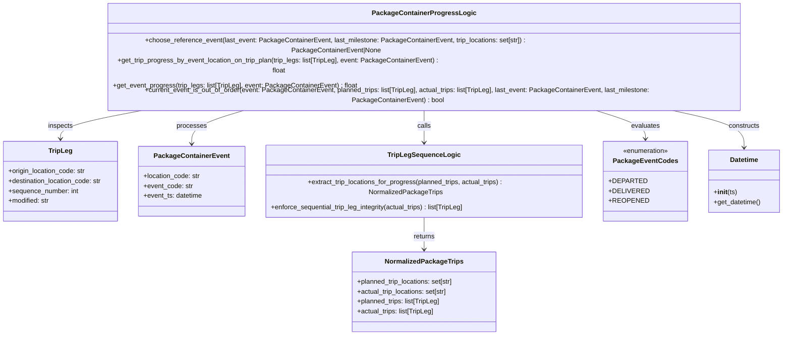

# Diagram: platform/partview_core/partview_service/partview_service/core/business/package_container/event/PackageContainerProgressLogic.py


> Auto-generated by Obscura crawlers

## Diagram 1



### SVG

<svg id="container" width="1866.03125" xmlns="http://www.w3.org/2000/svg" class="classDiagram" height="746" viewBox="0 0 1866.03125 746" role="graphics-document document" aria-roledescription="class"><style>#container{font-family:"trebuchet ms",verdana,arial,sans-serif;font-size:16px;fill:#333;}@keyframes edge-animation-frame{from{stroke-dashoffset:0;}}@keyframes dash{to{stroke-dashoffset:0;}}#container .edge-animation-slow{stroke-dasharray:9,5!important;stroke-dashoffset:900;animation:dash 50s linear infinite;stroke-linecap:round;}#container .edge-animation-fast{stroke-dasharray:9,5!important;stroke-dashoffset:900;animation:dash 20s linear infinite;stroke-linecap:round;}#container .error-icon{fill:#552222;}#container .error-text{fill:#552222;stroke:#552222;}#container .edge-thickness-normal{stroke-width:1px;}#container .edge-thickness-thick{stroke-width:3.5px;}#container .edge-pattern-solid{stroke-dasharray:0;}#container .edge-thickness-invisible{stroke-width:0;fill:none;}#container .edge-pattern-dashed{stroke-dasharray:3;}#container .edge-pattern-dotted{stroke-dasharray:2;}#container .marker{fill:#333333;stroke:#333333;}#container .marker.cross{stroke:#333333;}#container svg{font-family:"trebuchet ms",verdana,arial,sans-serif;font-size:16px;}#container p{margin:0;}#container g.classGroup text{fill:#9370DB;stroke:none;font-family:"trebuchet ms",verdana,arial,sans-serif;font-size:10px;}#container g.classGroup text .title{font-weight:bolder;}#container .nodeLabel,#container .edgeLabel{color:#131300;}#container .edgeLabel .label rect{fill:#ECECFF;}#container .label text{fill:#131300;}#container .labelBkg{background:#ECECFF;}#container .edgeLabel .label span{background:#ECECFF;}#container .classTitle{font-weight:bolder;}#container .node rect,#container .node circle,#container .node ellipse,#container .node polygon,#container .node path{fill:#ECECFF;stroke:#9370DB;stroke-width:1px;}#container .divider{stroke:#9370DB;stroke-width:1;}#container g.clickable{cursor:pointer;}#container g.classGroup rect{fill:#ECECFF;stroke:#9370DB;}#container g.classGroup line{stroke:#9370DB;stroke-width:1;}#container .classLabel .box{stroke:none;stroke-width:0;fill:#ECECFF;opacity:0.5;}#container .classLabel .label{fill:#9370DB;font-size:10px;}#container .relation{stroke:#333333;stroke-width:1;fill:none;}#container .dashed-line{stroke-dasharray:3;}#container .dotted-line{stroke-dasharray:1 2;}#container #compositionStart,#container .composition{fill:#333333!important;stroke:#333333!important;stroke-width:1;}#container #compositionEnd,#container .composition{fill:#333333!important;stroke:#333333!important;stroke-width:1;}#container #dependencyStart,#container .dependency{fill:#333333!important;stroke:#333333!important;stroke-width:1;}#container #dependencyStart,#container .dependency{fill:#333333!important;stroke:#333333!important;stroke-width:1;}#container #extensionStart,#container .extension{fill:transparent!important;stroke:#333333!important;stroke-width:1;}#container #extensionEnd,#container .extension{fill:transparent!important;stroke:#333333!important;stroke-width:1;}#container #aggregationStart,#container .aggregation{fill:transparent!important;stroke:#333333!important;stroke-width:1;}#container #aggregationEnd,#container .aggregation{fill:transparent!important;stroke:#333333!important;stroke-width:1;}#container #lollipopStart,#container .lollipop{fill:#ECECFF!important;stroke:#333333!important;stroke-width:1;}#container #lollipopEnd,#container .lollipop{fill:#ECECFF!important;stroke:#333333!important;stroke-width:1;}#container .edgeTerminals{font-size:11px;line-height:initial;}#container .classTitleText{text-anchor:middle;font-size:18px;fill:#333;}#container .label-icon{display:inline-block;height:1em;overflow:visible;vertical-align:-0.125em;}#container .node .label-icon path{fill:currentColor;stroke:revert;stroke-width:revert;}#container :root{--mermaid-font-family:"trebuchet ms",verdana,arial,sans-serif;}</style><g><defs><marker id="container_class-aggregationStart" class="marker aggregation class" refX="18" refY="7" markerWidth="190" markerHeight="240" orient="auto"><path d="M 18,7 L9,13 L1,7 L9,1 Z"></path></marker></defs><defs><marker id="container_class-aggregationEnd" class="marker aggregation class" refX="1" refY="7" markerWidth="20" markerHeight="28" orient="auto"><path d="M 18,7 L9,13 L1,7 L9,1 Z"></path></marker></defs><defs><marker id="container_class-extensionStart" class="marker extension class" refX="18" refY="7" markerWidth="190" markerHeight="240" orient="auto"><path d="M 1,7 L18,13 V 1 Z"></path></marker></defs><defs><marker id="container_class-extensionEnd" class="marker extension class" refX="1" refY="7" markerWidth="20" markerHeight="28" orient="auto"><path d="M 1,1 V 13 L18,7 Z"></path></marker></defs><defs><marker id="container_class-compositionStart" class="marker composition class" refX="18" refY="7" markerWidth="190" markerHeight="240" orient="auto"><path d="M 18,7 L9,13 L1,7 L9,1 Z"></path></marker></defs><defs><marker id="container_class-compositionEnd" class="marker composition class" refX="1" refY="7" markerWidth="20" markerHeight="28" orient="auto"><path d="M 18,7 L9,13 L1,7 L9,1 Z"></path></marker></defs><defs><marker id="container_class-dependencyStart" class="marker dependency class" refX="6" refY="7" markerWidth="190" markerHeight="240" orient="auto"><path d="M 5,7 L9,13 L1,7 L9,1 Z"></path></marker></defs><defs><marker id="container_class-dependencyEnd" class="marker dependency class" refX="13" refY="7" markerWidth="20" markerHeight="28" orient="auto"><path d="M 18,7 L9,13 L14,7 L9,1 Z"></path></marker></defs><defs><marker id="container_class-lollipopStart" class="marker lollipop class" refX="13" refY="7" markerWidth="190" markerHeight="240" orient="auto"><circle stroke="black" fill="transparent" cx="7" cy="7" r="6"></circle></marker></defs><defs><marker id="container_class-lollipopEnd" class="marker lollipop class" refX="1" refY="7" markerWidth="190" markerHeight="240" orient="auto"><circle stroke="black" fill="transparent" cx="7" cy="7" r="6"></circle></marker></defs><g class="root"><g class="clusters"></g><g class="edgePaths"><path d="M616.147,206L590.829,212.167C565.512,218.333,514.877,230.667,489.56,244C464.242,257.333,464.242,271.667,464.242,278.833L464.242,286" id="id_PackageContainerProgressLogic_PackageContainerEvent_1" class="edge-thickness-normal edge-pattern-solid relation" style=";;;" data-edge="true" data-et="edge" data-id="id_PackageContainerProgressLogic_PackageContainerEvent_1" data-points="W3sieCI6NjE2LjE0NjY1NjcwOTU1ODgsInkiOjIwNn0seyJ4Ijo0NjQuMjQyMTg3NSwieSI6MjQzfSx7IngiOjQ2NC4yNDIxODc1LCJ5IjoyOTJ9XQ==" marker-end="url(#container_class-dependencyEnd)"></path><path d="M385.927,206L346.269,212.167C306.611,218.333,227.296,230.667,187.638,242C147.98,253.333,147.98,263.667,147.98,268.833L147.98,274" id="id_PackageContainerProgressLogic_TripLeg_2" class="edge-thickness-normal edge-pattern-solid relation" style=";;;" data-edge="true" data-et="edge" data-id="id_PackageContainerProgressLogic_TripLeg_2" data-points="W3sieCI6Mzg1LjkyNjcyOTA5MDA3MzU0LCJ5IjoyMDZ9LHsieCI6MTQ3Ljk4MDQ2ODc1LCJ5IjoyNDN9LHsieCI6MTQ3Ljk4MDQ2ODc1LCJ5IjoyODB9XQ==" marker-end="url(#container_class-dependencyEnd)"></path><path d="M1022.594,206L1022.594,212.167C1022.594,218.333,1022.594,230.667,1022.594,245.5C1022.594,260.333,1022.594,277.667,1022.594,286.333L1022.594,295" id="id_PackageContainerProgressLogic_TripLegSequenceLogic_3" class="edge-thickness-normal edge-pattern-solid relation" style=";;;" data-edge="true" data-et="edge" data-id="id_PackageContainerProgressLogic_TripLegSequenceLogic_3" data-points="W3sieCI6MTAyMi41OTM3NSwieSI6MjA2fSx7IngiOjEwMjIuNTkzNzUsInkiOjI0M30seyJ4IjoxMDIyLjU5Mzc1LCJ5IjozMDF9XQ==" marker-end="url(#container_class-dependencyEnd)"></path><path d="M1022.594,451L1022.594,460.667C1022.594,470.333,1022.594,489.667,1022.594,504.5C1022.594,519.333,1022.594,529.667,1022.594,534.833L1022.594,540" id="id_TripLegSequenceLogic_NormalizedPackageTrips_4" class="edge-thickness-normal edge-pattern-solid relation" style=";;;" data-edge="true" data-et="edge" data-id="id_TripLegSequenceLogic_NormalizedPackageTrips_4" data-points="W3sieCI6MTAyMi41OTM3NSwieSI6NDUxfSx7IngiOjEwMjIuNTkzNzUsInkiOjUwOX0seyJ4IjoxMDIyLjU5Mzc1LCJ5Ijo1NDZ9XQ==" marker-end="url(#container_class-dependencyEnd)"></path><path d="M1403.284,206L1426.997,212.167C1450.71,218.333,1498.136,230.667,1521.849,242C1545.563,253.333,1545.563,263.667,1545.563,268.833L1545.563,274" id="id_PackageContainerProgressLogic_PackageEventCodes_5" class="edge-thickness-normal edge-pattern-solid relation" style=";;;" data-edge="true" data-et="edge" data-id="id_PackageContainerProgressLogic_PackageEventCodes_5" data-points="W3sieCI6MTQwMy4yODQyMzcxMzIzNTMsInkiOjIwNn0seyJ4IjoxNTQ1LjU2MjUsInkiOjI0M30seyJ4IjoxNTQ1LjU2MjUsInkiOjI4MH1d" marker-end="url(#container_class-dependencyEnd)"></path><path d="M1568.297,206L1602.288,212.167C1636.28,218.333,1704.263,230.667,1738.255,245.5C1772.246,260.333,1772.246,277.667,1772.246,286.333L1772.246,295" id="id_PackageContainerProgressLogic_Datetime_6" class="edge-thickness-normal edge-pattern-solid relation" style=";;;" data-edge="true" data-et="edge" data-id="id_PackageContainerProgressLogic_Datetime_6" data-points="W3sieCI6MTU2OC4yOTY1NTkwNTMzMDg4LCJ5IjoyMDZ9LHsieCI6MTc3Mi4yNDYwOTM3NSwieSI6MjQzfSx7IngiOjE3NzIuMjQ2MDkzNzUsInkiOjMwMX1d" marker-end="url(#container_class-dependencyEnd)"></path></g><g class="edgeLabels"><g class="edgeLabel" transform="translate(464.2421875, 243)"><g class="label" data-id="id_PackageContainerProgressLogic_PackageContainerEvent_1" transform="translate(-35.7890625, -12)"><foreignObject width="71.578125" height="24"><div xmlns="http://www.w3.org/1999/xhtml" class="labelBkg" style="display: table-cell; white-space: nowrap; line-height: 1.5; max-width: 200px; text-align: center;"><span class="edgeLabel"><p>processes</p></span></div></foreignObject></g></g><g class="edgeLabel" transform="translate(147.98046875, 243)"><g class="label" data-id="id_PackageContainerProgressLogic_TripLeg_2" transform="translate(-30.2421875, -12)"><foreignObject width="60.484375" height="24"><div xmlns="http://www.w3.org/1999/xhtml" class="labelBkg" style="display: table-cell; white-space: nowrap; line-height: 1.5; max-width: 200px; text-align: center;"><span class="edgeLabel"><p>inspects</p></span></div></foreignObject></g></g><g class="edgeLabel" transform="translate(1022.59375, 243)"><g class="label" data-id="id_PackageContainerProgressLogic_TripLegSequenceLogic_3" transform="translate(-16.4453125, -12)"><foreignObject width="32.890625" height="24"><div xmlns="http://www.w3.org/1999/xhtml" class="labelBkg" style="display: table-cell; white-space: nowrap; line-height: 1.5; max-width: 200px; text-align: center;"><span class="edgeLabel"><p>calls</p></span></div></foreignObject></g></g><g class="edgeLabel" transform="translate(1022.59375, 509)"><g class="label" data-id="id_TripLegSequenceLogic_NormalizedPackageTrips_4" transform="translate(-26.265625, -12)"><foreignObject width="52.53125" height="24"><div xmlns="http://www.w3.org/1999/xhtml" class="labelBkg" style="display: table-cell; white-space: nowrap; line-height: 1.5; max-width: 200px; text-align: center;"><span class="edgeLabel"><p>returns</p></span></div></foreignObject></g></g><g class="edgeLabel" transform="translate(1545.5625, 243)"><g class="label" data-id="id_PackageContainerProgressLogic_PackageEventCodes_5" transform="translate(-34.625, -12)"><foreignObject width="69.25" height="24"><div xmlns="http://www.w3.org/1999/xhtml" class="labelBkg" style="display: table-cell; white-space: nowrap; line-height: 1.5; max-width: 200px; text-align: center;"><span class="edgeLabel"><p>evaluates</p></span></div></foreignObject></g></g><g class="edgeLabel" transform="translate(1772.24609375, 243)"><g class="label" data-id="id_PackageContainerProgressLogic_Datetime_6" transform="translate(-37.84375, -12)"><foreignObject width="75.6875" height="24"><div xmlns="http://www.w3.org/1999/xhtml" class="labelBkg" style="display: table-cell; white-space: nowrap; line-height: 1.5; max-width: 200px; text-align: center;"><span class="edgeLabel"><p>constructs</p></span></div></foreignObject></g></g></g><g class="nodes"><g class="node default" id="classId-PackageContainerProgressLogic-0" transform="translate(1022.59375, 107)"><g class="basic label-container"><path d="M-792.640625 -99 L792.640625 -99 L792.640625 99 L-792.640625 99" stroke="none" stroke-width="0" fill="#ECECFF" style=""></path><path d="M-792.640625 -99 C-311.3049705423346 -99, 170.03068391533077 -99, 792.640625 -99 M-792.640625 -99 C-301.4069065694785 -99, 189.82681186104298 -99, 792.640625 -99 M792.640625 -99 C792.640625 -30.61198821152327, 792.640625 37.77602357695346, 792.640625 99 M792.640625 -99 C792.640625 -27.346181023385284, 792.640625 44.30763795322943, 792.640625 99 M792.640625 99 C382.8619124932593 99, -26.916800013481406 99, -792.640625 99 M792.640625 99 C260.16634155156055 99, -272.3079418968789 99, -792.640625 99 M-792.640625 99 C-792.640625 28.143091043012802, -792.640625 -42.713817913974395, -792.640625 -99 M-792.640625 99 C-792.640625 52.555992472181416, -792.640625 6.111984944362831, -792.640625 -99" stroke="#9370DB" stroke-width="1.3" fill="none" stroke-dasharray="0 0" style=""></path></g><g class="annotation-group text" transform="translate(0, -75)"></g><g class="label-group text" transform="translate(-116.265625, -75)"><g class="label" style="font-weight: bolder" transform="translate(0,-12)"><foreignObject width="232.53125" height="24"><div xmlns="http://www.w3.org/1999/xhtml" style="display: table-cell; white-space: nowrap; line-height: 1.5; max-width: 278px; text-align: center;"><span class="nodeLabel markdown-node-label" style=""><p>PackageContainerProgressLogic</p></span></div></foreignObject></g></g><g class="members-group text" transform="translate(-780.640625, -27)"></g><g class="methods-group text" transform="translate(-780.640625, 3)"><g class="label" style="" transform="translate(0,-12)"><foreignObject width="1131.203125" height="24"><div xmlns="http://www.w3.org/1999/xhtml" style="display: table-cell; white-space: nowrap; line-height: 1.5; max-width: 1189px; text-align: center;"><span class="nodeLabel markdown-node-label" style=""><p>+choose_reference_event(last_event: PackageContainerEvent, last_milestone: PackageContainerEvent, trip_locations: set[str]) : PackageContainerEvent|None</p></span></div></foreignObject></g><g class="label" style="" transform="translate(0,12)"><foreignObject width="813.03125" height="24"><div xmlns="http://www.w3.org/1999/xhtml" style="display: table-cell; white-space: nowrap; line-height: 1.5; max-width: 871px; text-align: center;"><span class="nodeLabel markdown-node-label" style=""><p>+get_trip_progress_by_event_location_on_trip_plan(trip_legs: list[TripLeg], event: PackageContainerEvent) : float</p></span></div></foreignObject></g><g class="label" style="" transform="translate(0,36)"><foreignObject width="586.359375" height="24"><div xmlns="http://www.w3.org/1999/xhtml" style="display: table-cell; white-space: nowrap; line-height: 1.5; max-width: 644px; text-align: center;"><span class="nodeLabel markdown-node-label" style=""><p>+get_event_progress(trip_legs: list[TripLeg], event: PackageContainerEvent) : float</p></span></div></foreignObject></g><g class="label" style="" transform="translate(0,60)"><foreignObject width="1445.015625" height="24"><div xmlns="http://www.w3.org/1999/xhtml" style="display: table-cell; white-space: nowrap; line-height: 1.5; max-width: 1503px; text-align: center;"><span class="nodeLabel markdown-node-label" style=""><p>+current_event_is_out_of_order(event: PackageContainerEvent, planned_trips: list[TripLeg], actual_trips: list[TripLeg], last_event: PackageContainerEvent, last_milestone: PackageContainerEvent) : bool</p></span></div></foreignObject></g></g><g class="divider" style=""><path d="M-792.640625 -51 C-420.61831117599945 -51, -48.5959973519989 -51, 792.640625 -51 M-792.640625 -51 C-366.48601014830734 -51, 59.66860470338531 -51, 792.640625 -51" stroke="#9370DB" stroke-width="1.3" fill="none" stroke-dasharray="0 0" style=""></path></g><g class="divider" style=""><path d="M-792.640625 -27 C-406.3291629676876 -27, -20.01770093537516 -27, 792.640625 -27 M-792.640625 -27 C-444.0003006571202 -27, -95.35997631424038 -27, 792.640625 -27" stroke="#9370DB" stroke-width="1.3" fill="none" stroke-dasharray="0 0" style=""></path></g></g><g class="node default" id="classId-TripLeg-1" transform="translate(147.98046875, 376)"><g class="basic label-container"><path d="M-139.98046875 -96 L139.98046875 -96 L139.98046875 96 L-139.98046875 96" stroke="none" stroke-width="0" fill="#ECECFF" style=""></path><path d="M-139.98046875 -96 C-57.09879148994143 -96, 25.782885770117133 -96, 139.98046875 -96 M-139.98046875 -96 C-44.10686454572941 -96, 51.766739658541184 -96, 139.98046875 -96 M139.98046875 -96 C139.98046875 -45.843401895151445, 139.98046875 4.313196209697111, 139.98046875 96 M139.98046875 -96 C139.98046875 -51.55345803535638, 139.98046875 -7.1069160707127566, 139.98046875 96 M139.98046875 96 C48.98142137241162 96, -42.017626005176766 96, -139.98046875 96 M139.98046875 96 C29.535817407320877 96, -80.90883393535825 96, -139.98046875 96 M-139.98046875 96 C-139.98046875 51.116620353729374, -139.98046875 6.233240707458748, -139.98046875 -96 M-139.98046875 96 C-139.98046875 40.02415861734575, -139.98046875 -15.951682765308504, -139.98046875 -96" stroke="#9370DB" stroke-width="1.3" fill="none" stroke-dasharray="0 0" style=""></path></g><g class="annotation-group text" transform="translate(0, -72)"></g><g class="label-group text" transform="translate(-27.0546875, -72)"><g class="label" style="font-weight: bolder" transform="translate(0,-12)"><foreignObject width="54.109375" height="24"><div xmlns="http://www.w3.org/1999/xhtml" style="display: table-cell; white-space: nowrap; line-height: 1.5; max-width: 103px; text-align: center;"><span class="nodeLabel markdown-node-label" style=""><p>TripLeg</p></span></div></foreignObject></g></g><g class="members-group text" transform="translate(-127.98046875, -24)"><g class="label" style="" transform="translate(0,-12)"><foreignObject width="188.015625" height="24"><div xmlns="http://www.w3.org/1999/xhtml" style="display: table-cell; white-space: nowrap; line-height: 1.5; max-width: 246px; text-align: center;"><span class="nodeLabel markdown-node-label" style=""><p>+origin_location_code: str</p></span></div></foreignObject></g><g class="label" style="" transform="translate(0,12)"><foreignObject width="228.90625" height="24"><div xmlns="http://www.w3.org/1999/xhtml" style="display: table-cell; white-space: nowrap; line-height: 1.5; max-width: 287px; text-align: center;"><span class="nodeLabel markdown-node-label" style=""><p>+destination_location_code: str</p></span></div></foreignObject></g><g class="label" style="" transform="translate(0,36)"><foreignObject width="169.90625" height="24"><div xmlns="http://www.w3.org/1999/xhtml" style="display: table-cell; white-space: nowrap; line-height: 1.5; max-width: 227px; text-align: center;"><span class="nodeLabel markdown-node-label" style=""><p>+sequence_number: int</p></span></div></foreignObject></g><g class="label" style="" transform="translate(0,60)"><foreignObject width="100.125" height="24"><div xmlns="http://www.w3.org/1999/xhtml" style="display: table-cell; white-space: nowrap; line-height: 1.5; max-width: 158px; text-align: center;"><span class="nodeLabel markdown-node-label" style=""><p>+modified: str</p></span></div></foreignObject></g></g><g class="methods-group text" transform="translate(-127.98046875, 96)"></g><g class="divider" style=""><path d="M-139.98046875 -48 C-66.7571592304688 -48, 6.466150289062398 -48, 139.98046875 -48 M-139.98046875 -48 C-60.79593526420378 -48, 18.388598221592446 -48, 139.98046875 -48" stroke="#9370DB" stroke-width="1.3" fill="none" stroke-dasharray="0 0" style=""></path></g><g class="divider" style=""><path d="M-139.98046875 72 C-52.28766407964173 72, 35.40514059071654 72, 139.98046875 72 M-139.98046875 72 C-76.33416825730754 72, -12.687867764615078 72, 139.98046875 72" stroke="#9370DB" stroke-width="1.3" fill="none" stroke-dasharray="0 0" style=""></path></g></g><g class="node default" id="classId-PackageContainerEvent-2" transform="translate(464.2421875, 376)"><g class="basic label-container"><path d="M-126.28125 -84 L126.28125 -84 L126.28125 84 L-126.28125 84" stroke="none" stroke-width="0" fill="#ECECFF" style=""></path><path d="M-126.28125 -84 C-61.29386570707453 -84, 3.6935185858509385 -84, 126.28125 -84 M-126.28125 -84 C-34.28446673887879 -84, 57.71231652224242 -84, 126.28125 -84 M126.28125 -84 C126.28125 -41.506305134650844, 126.28125 0.987389730698311, 126.28125 84 M126.28125 -84 C126.28125 -26.91736499751562, 126.28125 30.16527000496876, 126.28125 84 M126.28125 84 C62.8044900064351 84, -0.6722699871297948 84, -126.28125 84 M126.28125 84 C30.690148985329742 84, -64.90095202934052 84, -126.28125 84 M-126.28125 84 C-126.28125 17.03154089608047, -126.28125 -49.93691820783906, -126.28125 -84 M-126.28125 84 C-126.28125 29.74108668685964, -126.28125 -24.517826626280723, -126.28125 -84" stroke="#9370DB" stroke-width="1.3" fill="none" stroke-dasharray="0 0" style=""></path></g><g class="annotation-group text" transform="translate(0, -60)"></g><g class="label-group text" transform="translate(-85.65625, -60)"><g class="label" style="font-weight: bolder" transform="translate(0,-12)"><foreignObject width="171.3125" height="24"><div xmlns="http://www.w3.org/1999/xhtml" style="display: table-cell; white-space: nowrap; line-height: 1.5; max-width: 219px; text-align: center;"><span class="nodeLabel markdown-node-label" style=""><p>PackageContainerEvent</p></span></div></foreignObject></g></g><g class="members-group text" transform="translate(-114.28125, -12)"><g class="label" style="" transform="translate(0,-12)"><foreignObject width="137.609375" height="24"><div xmlns="http://www.w3.org/1999/xhtml" style="display: table-cell; white-space: nowrap; line-height: 1.5; max-width: 196px; text-align: center;"><span class="nodeLabel markdown-node-label" style=""><p>+location_code: str</p></span></div></foreignObject></g><g class="label" style="" transform="translate(0,12)"><foreignObject width="118.796875" height="24"><div xmlns="http://www.w3.org/1999/xhtml" style="display: table-cell; white-space: nowrap; line-height: 1.5; max-width: 177px; text-align: center;"><span class="nodeLabel markdown-node-label" style=""><p>+event_code: str</p></span></div></foreignObject></g><g class="label" style="" transform="translate(0,36)"><foreignObject width="142.90625" height="24"><div xmlns="http://www.w3.org/1999/xhtml" style="display: table-cell; white-space: nowrap; line-height: 1.5; max-width: 200px; text-align: center;"><span class="nodeLabel markdown-node-label" style=""><p>+event_ts: datetime</p></span></div></foreignObject></g></g><g class="methods-group text" transform="translate(-114.28125, 84)"></g><g class="divider" style=""><path d="M-126.28125 -36 C-70.35643442199044 -36, -14.431618843980885 -36, 126.28125 -36 M-126.28125 -36 C-37.09775467420785 -36, 52.0857406515843 -36, 126.28125 -36" stroke="#9370DB" stroke-width="1.3" fill="none" stroke-dasharray="0 0" style=""></path></g><g class="divider" style=""><path d="M-126.28125 60 C-61.323593465185795 60, 3.634063069628411 60, 126.28125 60 M-126.28125 60 C-59.901982866255494 60, 6.477284267489011 60, 126.28125 60" stroke="#9370DB" stroke-width="1.3" fill="none" stroke-dasharray="0 0" style=""></path></g></g><g class="node default" id="classId-NormalizedPackageTrips-3" transform="translate(1022.59375, 642)"><g class="basic label-container"><path d="M-174.8984375 -96 L174.8984375 -96 L174.8984375 96 L-174.8984375 96" stroke="none" stroke-width="0" fill="#ECECFF" style=""></path><path d="M-174.8984375 -96 C-63.16623713157655 -96, 48.5659632368469 -96, 174.8984375 -96 M-174.8984375 -96 C-60.34293765592071 -96, 54.212562188158586 -96, 174.8984375 -96 M174.8984375 -96 C174.8984375 -24.174131717866914, 174.8984375 47.65173656426617, 174.8984375 96 M174.8984375 -96 C174.8984375 -57.237976530099075, 174.8984375 -18.47595306019815, 174.8984375 96 M174.8984375 96 C67.94364593773635 96, -39.0111456245273 96, -174.8984375 96 M174.8984375 96 C40.88931715537265 96, -93.1198031892547 96, -174.8984375 96 M-174.8984375 96 C-174.8984375 37.11975052785085, -174.8984375 -21.760498944298305, -174.8984375 -96 M-174.8984375 96 C-174.8984375 40.652555786663896, -174.8984375 -14.694888426672208, -174.8984375 -96" stroke="#9370DB" stroke-width="1.3" fill="none" stroke-dasharray="0 0" style=""></path></g><g class="annotation-group text" transform="translate(0, -72)"></g><g class="label-group text" transform="translate(-89.734375, -72)"><g class="label" style="font-weight: bolder" transform="translate(0,-12)"><foreignObject width="179.46875" height="24"><div xmlns="http://www.w3.org/1999/xhtml" style="display: table-cell; white-space: nowrap; line-height: 1.5; max-width: 227px; text-align: center;"><span class="nodeLabel markdown-node-label" style=""><p>NormalizedPackageTrips</p></span></div></foreignObject></g></g><g class="members-group text" transform="translate(-162.8984375, -24)"><g class="label" style="" transform="translate(0,-12)"><foreignObject width="236.0625" height="24"><div xmlns="http://www.w3.org/1999/xhtml" style="display: table-cell; white-space: nowrap; line-height: 1.5; max-width: 293px; text-align: center;"><span class="nodeLabel markdown-node-label" style=""><p>+planned_trip_locations: set[str]</p></span></div></foreignObject></g><g class="label" style="" transform="translate(0,12)"><foreignObject width="220.625" height="24"><div xmlns="http://www.w3.org/1999/xhtml" style="display: table-cell; white-space: nowrap; line-height: 1.5; max-width: 278px; text-align: center;"><span class="nodeLabel markdown-node-label" style=""><p>+actual_trip_locations: set[str]</p></span></div></foreignObject></g><g class="label" style="" transform="translate(0,36)"><foreignObject width="202.78125" height="24"><div xmlns="http://www.w3.org/1999/xhtml" style="display: table-cell; white-space: nowrap; line-height: 1.5; max-width: 260px; text-align: center;"><span class="nodeLabel markdown-node-label" style=""><p>+planned_trips: list[TripLeg]</p></span></div></foreignObject></g><g class="label" style="" transform="translate(0,60)"><foreignObject width="187.359375" height="24"><div xmlns="http://www.w3.org/1999/xhtml" style="display: table-cell; white-space: nowrap; line-height: 1.5; max-width: 245px; text-align: center;"><span class="nodeLabel markdown-node-label" style=""><p>+actual_trips: list[TripLeg]</p></span></div></foreignObject></g></g><g class="methods-group text" transform="translate(-162.8984375, 96)"></g><g class="divider" style=""><path d="M-174.8984375 -48 C-69.47302254415148 -48, 35.95239241169705 -48, 174.8984375 -48 M-174.8984375 -48 C-95.43233897642855 -48, -15.966240452857107 -48, 174.8984375 -48" stroke="#9370DB" stroke-width="1.3" fill="none" stroke-dasharray="0 0" style=""></path></g><g class="divider" style=""><path d="M-174.8984375 72 C-103.43677654350701 72, -31.975115587014017 72, 174.8984375 72 M-174.8984375 72 C-95.90489181493072 72, -16.911346129861442 72, 174.8984375 72" stroke="#9370DB" stroke-width="1.3" fill="none" stroke-dasharray="0 0" style=""></path></g></g><g class="node default" id="classId-TripLegSequenceLogic-4" transform="translate(1022.59375, 376)"><g class="basic label-container"><path d="M-382.0703125 -75 L382.0703125 -75 L382.0703125 75 L-382.0703125 75" stroke="none" stroke-width="0" fill="#ECECFF" style=""></path><path d="M-382.0703125 -75 C-140.99579058980856 -75, 100.07873132038287 -75, 382.0703125 -75 M-382.0703125 -75 C-138.2602758324511 -75, 105.5497608350978 -75, 382.0703125 -75 M382.0703125 -75 C382.0703125 -35.86783648175771, 382.0703125 3.2643270364845733, 382.0703125 75 M382.0703125 -75 C382.0703125 -36.8803770845625, 382.0703125 1.2392458308750065, 382.0703125 75 M382.0703125 75 C104.32724275769385 75, -173.4158269846123 75, -382.0703125 75 M382.0703125 75 C101.71851685494897 75, -178.63327879010205 75, -382.0703125 75 M-382.0703125 75 C-382.0703125 39.59940789417778, -382.0703125 4.19881578835556, -382.0703125 -75 M-382.0703125 75 C-382.0703125 19.105745251770884, -382.0703125 -36.78850949645823, -382.0703125 -75" stroke="#9370DB" stroke-width="1.3" fill="none" stroke-dasharray="0 0" style=""></path></g><g class="annotation-group text" transform="translate(0, -51)"></g><g class="label-group text" transform="translate(-81.609375, -51)"><g class="label" style="font-weight: bolder" transform="translate(0,-12)"><foreignObject width="163.21875" height="24"><div xmlns="http://www.w3.org/1999/xhtml" style="display: table-cell; white-space: nowrap; line-height: 1.5; max-width: 211px; text-align: center;"><span class="nodeLabel markdown-node-label" style=""><p>TripLegSequenceLogic</p></span></div></foreignObject></g></g><g class="members-group text" transform="translate(-370.0703125, -3)"></g><g class="methods-group text" transform="translate(-370.0703125, 27)"><g class="label" style="" transform="translate(0,-12)"><foreignObject width="658.53125" height="24"><div xmlns="http://www.w3.org/1999/xhtml" style="display: table-cell; white-space: nowrap; line-height: 1.5; max-width: 716px; text-align: center;"><span class="nodeLabel markdown-node-label" style=""><p>+extract_trip_locations_for_progress(planned_trips, actual_trips) : NormalizedPackageTrips</p></span></div></foreignObject></g><g class="label" style="" transform="translate(0,12)"><foreignObject width="473.828125" height="24"><div xmlns="http://www.w3.org/1999/xhtml" style="display: table-cell; white-space: nowrap; line-height: 1.5; max-width: 531px; text-align: center;"><span class="nodeLabel markdown-node-label" style=""><p>+enforce_sequential_trip_leg_integrity(actual_trips) : list[TripLeg]</p></span></div></foreignObject></g></g><g class="divider" style=""><path d="M-382.0703125 -27 C-114.95556373949961 -27, 152.15918502100078 -27, 382.0703125 -27 M-382.0703125 -27 C-79.69929830555066 -27, 222.6717158888987 -27, 382.0703125 -27" stroke="#9370DB" stroke-width="1.3" fill="none" stroke-dasharray="0 0" style=""></path></g><g class="divider" style=""><path d="M-382.0703125 -3 C-146.73840762811147 -3, 88.59349724377705 -3, 382.0703125 -3 M-382.0703125 -3 C-106.71994812356638 -3, 168.63041625286724 -3, 382.0703125 -3" stroke="#9370DB" stroke-width="1.3" fill="none" stroke-dasharray="0 0" style=""></path></g></g><g class="node default" id="classId-PackageEventCodes-5" transform="translate(1545.5625, 376)"><g class="basic label-container"><path d="M-90.8984375 -96 L90.8984375 -96 L90.8984375 96 L-90.8984375 96" stroke="none" stroke-width="0" fill="#ECECFF" style=""></path><path d="M-90.8984375 -96 C-28.219089893297685 -96, 34.46025771340463 -96, 90.8984375 -96 M-90.8984375 -96 C-37.72274041790343 -96, 15.452956664193138 -96, 90.8984375 -96 M90.8984375 -96 C90.8984375 -55.29168160311021, 90.8984375 -14.583363206220426, 90.8984375 96 M90.8984375 -96 C90.8984375 -37.532299722165696, 90.8984375 20.935400555668608, 90.8984375 96 M90.8984375 96 C41.31405039468896 96, -8.270336710622075 96, -90.8984375 96 M90.8984375 96 C18.723444057016593 96, -53.451549385966814 96, -90.8984375 96 M-90.8984375 96 C-90.8984375 36.4263007210788, -90.8984375 -23.147398557842394, -90.8984375 -96 M-90.8984375 96 C-90.8984375 32.526837986219654, -90.8984375 -30.946324027560692, -90.8984375 -96" stroke="#9370DB" stroke-width="1.3" fill="none" stroke-dasharray="0 0" style=""></path></g><g class="annotation-group text" transform="translate(-55.5546875, -72)"><g class="label" style="" transform="translate(0,-12)"><foreignObject width="111.109375" height="24"><div xmlns="http://www.w3.org/1999/xhtml" style="display: table-cell; white-space: nowrap; line-height: 1.5; max-width: 161px; text-align: center;"><span class="nodeLabel markdown-node-label" style=""><p>«enumeration»</p></span></div></foreignObject></g></g><g class="label-group text" transform="translate(-72.25, -48)"><g class="label" style="font-weight: bolder" transform="translate(0,-12)"><foreignObject width="144.5" height="24"><div xmlns="http://www.w3.org/1999/xhtml" style="display: table-cell; white-space: nowrap; line-height: 1.5; max-width: 192px; text-align: center;"><span class="nodeLabel markdown-node-label" style=""><p>PackageEventCodes</p></span></div></foreignObject></g></g><g class="members-group text" transform="translate(-78.8984375, 0)"><g class="label" style="" transform="translate(0,-12)"><foreignObject width="80.859375" height="24"><div xmlns="http://www.w3.org/1999/xhtml" style="display: table-cell; white-space: nowrap; line-height: 1.5; max-width: 138px; text-align: center;"><span class="nodeLabel markdown-node-label" style=""><p>+DEPARTED</p></span></div></foreignObject></g><g class="label" style="" transform="translate(0,12)"><foreignObject width="85.546875" height="24"><div xmlns="http://www.w3.org/1999/xhtml" style="display: table-cell; white-space: nowrap; line-height: 1.5; max-width: 143px; text-align: center;"><span class="nodeLabel markdown-node-label" style=""><p>+DELIVERED</p></span></div></foreignObject></g><g class="label" style="" transform="translate(0,36)"><foreignObject width="84.765625" height="24"><div xmlns="http://www.w3.org/1999/xhtml" style="display: table-cell; white-space: nowrap; line-height: 1.5; max-width: 142px; text-align: center;"><span class="nodeLabel markdown-node-label" style=""><p>+REOPENED</p></span></div></foreignObject></g></g><g class="methods-group text" transform="translate(-78.8984375, 96)"></g><g class="divider" style=""><path d="M-90.8984375 -24 C-25.349883185932427 -24, 40.198671128135146 -24, 90.8984375 -24 M-90.8984375 -24 C-44.585667296624756 -24, 1.7271029067504884 -24, 90.8984375 -24" stroke="#9370DB" stroke-width="1.3" fill="none" stroke-dasharray="0 0" style=""></path></g><g class="divider" style=""><path d="M-90.8984375 72 C-47.65154788020493 72, -4.40465826040986 72, 90.8984375 72 M-90.8984375 72 C-54.534904594938084 72, -18.171371689876167 72, 90.8984375 72" stroke="#9370DB" stroke-width="1.3" fill="none" stroke-dasharray="0 0" style=""></path></g></g><g class="node default" id="classId-Datetime-6" transform="translate(1772.24609375, 376)"><g class="basic label-container"><path d="M-85.78515625 -75 L85.78515625 -75 L85.78515625 75 L-85.78515625 75" stroke="none" stroke-width="0" fill="#ECECFF" style=""></path><path d="M-85.78515625 -75 C-28.599178464949688 -75, 28.586799320100624 -75, 85.78515625 -75 M-85.78515625 -75 C-50.09217393496377 -75, -14.399191619927535 -75, 85.78515625 -75 M85.78515625 -75 C85.78515625 -42.22486220374881, 85.78515625 -9.449724407497627, 85.78515625 75 M85.78515625 -75 C85.78515625 -29.375896410920653, 85.78515625 16.248207178158694, 85.78515625 75 M85.78515625 75 C31.815170981582263 75, -22.154814286835474 75, -85.78515625 75 M85.78515625 75 C21.117407361771882 75, -43.550341526456236 75, -85.78515625 75 M-85.78515625 75 C-85.78515625 33.97653517989718, -85.78515625 -7.046929640205633, -85.78515625 -75 M-85.78515625 75 C-85.78515625 36.18188541368519, -85.78515625 -2.6362291726296263, -85.78515625 -75" stroke="#9370DB" stroke-width="1.3" fill="none" stroke-dasharray="0 0" style=""></path></g><g class="annotation-group text" transform="translate(0, -51)"></g><g class="label-group text" transform="translate(-33.3984375, -51)"><g class="label" style="font-weight: bolder" transform="translate(0,-12)"><foreignObject width="66.796875" height="24"><div xmlns="http://www.w3.org/1999/xhtml" style="display: table-cell; white-space: nowrap; line-height: 1.5; max-width: 116px; text-align: center;"><span class="nodeLabel markdown-node-label" style=""><p>Datetime</p></span></div></foreignObject></g></g><g class="members-group text" transform="translate(-73.78515625, -3)"></g><g class="methods-group text" transform="translate(-73.78515625, 27)"><g class="label" style="" transform="translate(0,-12)"><foreignObject width="56.046875" height="24"><div xmlns="http://www.w3.org/1999/xhtml" style="display: table-cell; white-space: nowrap; line-height: 1.5; max-width: 145px; text-align: center;"><span class="nodeLabel markdown-node-label" style=""><p>+<strong>init</strong>(ts)</p></span></div></foreignObject></g><g class="label" style="" transform="translate(0,12)"><foreignObject width="114.171875" height="24"><div xmlns="http://www.w3.org/1999/xhtml" style="display: table-cell; white-space: nowrap; line-height: 1.5; max-width: 172px; text-align: center;"><span class="nodeLabel markdown-node-label" style=""><p>+get_datetime()</p></span></div></foreignObject></g></g><g class="divider" style=""><path d="M-85.78515625 -27 C-47.21517315101076 -27, -8.645190052021519 -27, 85.78515625 -27 M-85.78515625 -27 C-23.28117983522459 -27, 39.22279657955082 -27, 85.78515625 -27" stroke="#9370DB" stroke-width="1.3" fill="none" stroke-dasharray="0 0" style=""></path></g><g class="divider" style=""><path d="M-85.78515625 -3 C-20.743547499759913 -3, 44.298061250480174 -3, 85.78515625 -3 M-85.78515625 -3 C-35.36205063196514 -3, 15.06105498606972 -3, 85.78515625 -3" stroke="#9370DB" stroke-width="1.3" fill="none" stroke-dasharray="0 0" style=""></path></g></g></g></g></g></svg>

## Diagram 2

```mermaid
flowchart TD
    A[Start: current_event_is_out_of_order(event, planned_trips, actual_trips, last_event, last_milestone)] --> B[Normalize trips via TripLegSequenceLogic]
    B --> C[Set planned_locations and actual_locations from NormalizedPackageTrips]
    C --> D{event.location_code in planned_locations?}
    D -- Yes --> E[trips_for_progress = normalized_trips.planned_trips]
    D -- No --> F{event.location_code in actual_locations?}
    F -- Yes --> G[trips_for_progress = normalized_trips.actual_trips]
    F -- No --> H[No valid trips_for_progress -> Return False]
    E --> I[Compute locations_on_trip_for_progress (origin/destination codes)]
    G --> I
    I --> J[ref_event = choose_reference_event(last_event, last_milestone, locations_on_trip_for_progress)]
    J --> K{ref_event exists?}
    K -- No --> H
    K -- Yes --> L[current_progress = get_event_progress(trips_for_progress, event)]
    L --> M[ref_progress = get_event_progress(trips_for_progress, ref_event)]
    M --> N{current_progress < ref_progress?}
    N -- Yes --> O[Return True (out of order)]
    N -- No --> H
```

> SVG rendering failed for this diagram.
