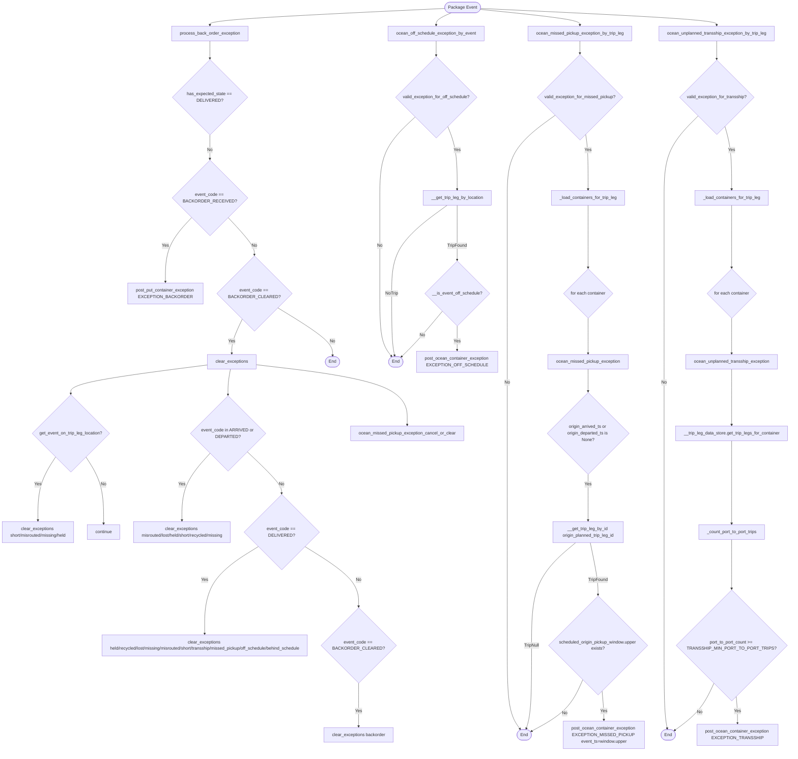

# Diagram: platform/partview_core/partview_service/partview_service/core/business/package_container/exception/package_container_exception_business_logic.py

> Auto-generated by Obscura crawlers

## Diagram 1

```mermaid
classDiagram
    class PackageContainerExceptionBusinessLogic {
      +__init__(application_name, testing_parameters)
      +process_back_order_exception(current_event, package_container)
      +clear_exceptions(event, package_container)
      +get_active_exceptions(container)
      +container_has_delaying_exception(container)
      +__is_delaying_exception(package_container_exception)
      +has_expected_state(package_container, expected_state)
      +__get_trip_leg_by_id(trip_leg_id)
      +__get_trip_leg_by_location(location_code, package_container)
      +__valid_exception_for_container(solution_id, reason_code)
      +ocean_check_and_set_behind_schedule_exception(package_container, event)
      +__is_effective_eta_past_delivery_window(package_container, trip_leg)
      +ocean_off_schedule_exception_by_event(event, package_container)
      +__is_event_off_schedule(trip_leg, event)
      +__is_event_off_schedule_for_window(event, window)
      +ocean_off_schedule_exception_by_schedule_change(trip_leg)
      +_load_containers_for_trip_leg(trip_leg_id)
      +ocean_missed_pickup_exception_by_trip_leg(trip_leg)
      +ocean_missed_pickup_exception(package_container)
      +ocean_missed_pickup_exception_cancel_or_clear(event, package_container)
      +__is_event_before_end_of_scheduled_window(event, package_container)
      +ocean_planned_transship_exception(package_container, references)
      +ocean_unplanned_transship_exception_by_trip_leg(trip_leg)
      +ocean_unplanned_transship_exception(package_container)
      +_count_port_to_port_trips(trips)
      +_is_port_to_port_trip(trip)
    }
    class PackageContainerEvent {
      +get(key)
      +event_ts
      +event_code
      +location_code
      +container_id
    }
    class PackageContainer {
      +id
      +solution_id
      +origin_planned_trip_leg_id
      +destination_planned_trip_leg_id
      +effective_destination_eta
      +origin_arrived_ts
      +origin_departed_ts
      +lifecycle_state
      +get(key)
    }
    class TripLeg {
      +id
      +origin_location_code
      +destination_location_code
      +scheduled_origin_pickup_window
      +scheduled_destination_delivery_window
      +origin_location_details
      +destination_location_details
      +solution_id
    }
    class PackageContainerException {
      +id
      +resolved_ts
      +activation_ts
      +status
      +exception_type_id
      +solution_id
      +get(key)
    }
    class PackageContainerEventPostgresqlMapping {
      +get_event_on_trip_leg_location(event)
    }
    class PackageContainerExceptionPostgresqlMapping {
      +clear_exceptions(...)
      +search(template)
    }
    class PackageContainerExceptionHelper {
      +get_reason_code_by_exception_type_id(id)
      +get_exception_type_id_by_reason_code(solution_id, reason_code)
    }
    class TripLegPostgresqlMapping {
      +get_trip_legs_for_container(container, include_planned, include_actual)
      +read(trip_leg)
    }
    class ContainerTripLegDAOLoader {
      +get_planned_trips()
    }
    class PackageContainerPostgresqlMapping {
      +read(package_container)
    }
    class ContainerToTripLegPostgressMapping {
      +search(template)
    }
    class ContainerToTripLeg {
      +container_id
      +trip_leg_id
      +set(key,value)
    }
    class InvokeContainerException {
      +post_put_container_exception(container, reason_code)
      +post_ocean_container_exception(container, reason_code, event_ts)
    }
    class DateHelper {
      +get_processing_time()
    }
    class Datetime {
      +get_datetime()
      +is_after(other, compare_at_eod)
    }
    class ExceptionStatus <<enumeration>> {
      +ACTIVE
    }
    class CanonicalExceptionCodes {
      +get_delaying_exceptions(solution_id)
    }
    class ExceptionCodes <<enumeration>> {
    }
    class PackageContainerStatus <<enumeration>> {
    }
    class PackageEventCodes <<enumeration>> {
    }

    PackageContainerExceptionBusinessLogic o-- PackageContainerEventPostgresqlMapping : event_data_store
    PackageContainerExceptionBusinessLogic o-- PackageContainerExceptionPostgresqlMapping : exception_data_store
    PackageContainerExceptionBusinessLogic o-- PackageContainerExceptionHelper : helper
    PackageContainerExceptionBusinessLogic o-- TripLegPostgresqlMapping : trip_leg_data_store
    PackageContainerExceptionBusinessLogic o-- DateHelper : dateHelper
    PackageContainerExceptionBusinessLogic --> InvokeContainerException : uses
    PackageContainerExceptionBusinessLogic --> ContainerTripLegDAOLoader : uses_loader
    PackageContainerExceptionBusinessLogic --> PackageContainerPostgresqlMapping : uses_package_mapping
    PackageContainerExceptionBusinessLogic --> ContainerToTripLegPostgressMapping : uses_container_to_trip_mapping
    TripLegPostgresqlMapping --> TripLeg : reads
    PackageContainerEventPostgresqlMapping --> PackageContainerEvent : reads
    PackageContainerExceptionPostgresqlMapping --> PackageContainerException : manages
    ContainerToTripLegPostgressMapping --> ContainerToTripLeg : maps
    PackageContainerPostgresqlMapping --> PackageContainer : reads
    ContainerTripLegDAOLoader --> TripLeg : loads
    PackageContainerExceptionHelper --> CanonicalExceptionCodes : queries
    PackageContainerExceptionHelper --> ExceptionCodes : maps
    PackageContainerExceptionPostgresqlMapping --> ExceptionStatus : uses
```

> SVG rendering failed for this diagram.

## Diagram 2

### SVG

<svg id="container" width="2975.333251953125" xmlns="http://www.w3.org/2000/svg" class="flowchart" height="2704.046875" viewBox="0 0 2975.333251953125 2704.046875" role="graphics-document document" aria-roledescription="flowchart-v2"><g><marker id="container_flowchart-v2-pointEnd" class="marker flowchart-v2" viewBox="0 0 10 10" refX="5" refY="5" markerUnits="userSpaceOnUse" markerWidth="8" markerHeight="8" orient="auto"><path d="M 0 0 L 10 5 L 0 10 z" class="arrowMarkerPath" style="stroke-width: 1; stroke-dasharray: 1, 0;"></path></marker><marker id="container_flowchart-v2-pointStart" class="marker flowchart-v2" viewBox="0 0 10 10" refX="4.5" refY="5" markerUnits="userSpaceOnUse" markerWidth="8" markerHeight="8" orient="auto"><path d="M 0 5 L 10 10 L 10 0 z" class="arrowMarkerPath" style="stroke-width: 1; stroke-dasharray: 1, 0;"></path></marker><marker id="container_flowchart-v2-circleEnd" class="marker flowchart-v2" viewBox="0 0 10 10" refX="11" refY="5" markerUnits="userSpaceOnUse" markerWidth="11" markerHeight="11" orient="auto"><circle cx="5" cy="5" r="5" class="arrowMarkerPath" style="stroke-width: 1; stroke-dasharray: 1, 0;"></circle></marker><marker id="container_flowchart-v2-circleStart" class="marker flowchart-v2" viewBox="0 0 10 10" refX="-1" refY="5" markerUnits="userSpaceOnUse" markerWidth="11" markerHeight="11" orient="auto"><circle cx="5" cy="5" r="5" class="arrowMarkerPath" style="stroke-width: 1; stroke-dasharray: 1, 0;"></circle></marker><marker id="container_flowchart-v2-crossEnd" class="marker cross flowchart-v2" viewBox="0 0 11 11" refX="12" refY="5.2" markerUnits="userSpaceOnUse" markerWidth="11" markerHeight="11" orient="auto"><path d="M 1,1 l 9,9 M 10,1 l -9,9" class="arrowMarkerPath" style="stroke-width: 2; stroke-dasharray: 1, 0;"></path></marker><marker id="container_flowchart-v2-crossStart" class="marker cross flowchart-v2" viewBox="0 0 11 11" refX="-1" refY="5.2" markerUnits="userSpaceOnUse" markerWidth="11" markerHeight="11" orient="auto"><path d="M 1,1 l 9,9 M 10,1 l -9,9" class="arrowMarkerPath" style="stroke-width: 2; stroke-dasharray: 1, 0;"></path></marker><g class="root"><g class="clusters"></g><g class="edgePaths"><path d="M1695.508,30.968L1547.924,37.807C1400.34,44.646,1105.171,58.323,957.587,68.661C810.003,79,810.003,86,810.003,89.5L810.003,93" id="L_S1_P1_0" class="edge-thickness-normal edge-pattern-solid edge-thickness-normal edge-pattern-solid flowchart-link" style=";" data-edge="true" data-et="edge" data-id="L_S1_P1_0" data-points="W3sieCI6MTY5NS41MDgyNDIzMTE3NTY3LCJ5IjozMC45NjgzNDM5NjQ5NDM4fSx7IngiOjgxMC4wMDI4MDI4NDg4MTU5LCJ5Ijo3Mn0seyJ4Ijo4MTAuMDAyODAyODQ4ODE1OSwieSI6OTd9XQ==" marker-end="url(#container_flowchart-v2-pointEnd)"></path><path d="M810.003,151L810.003,155.167C810.003,159.333,810.003,167.667,810.003,178.694C810.003,189.721,810.003,203.443,810.003,210.303L810.003,217.164" id="L_P1_D1_0" class="edge-thickness-normal edge-pattern-solid edge-thickness-normal edge-pattern-solid flowchart-link" style=";" data-edge="true" data-et="edge" data-id="L_P1_D1_0" data-points="W3sieCI6ODEwLjAwMjgwMjg0ODgxNTksInkiOjE1MX0seyJ4Ijo4MTAuMDAyODAyODQ4ODE1OSwieSI6MTc2fSx7IngiOjgxMC4wMDI4MDI4NDg4MTU5LCJ5IjoyMjEuMTY0MDYyNX1d" marker-end="url(#container_flowchart-v2-pointEnd)"></path><path d="M810.003,499.164L810.003,508.691C810.003,518.219,810.003,537.273,810.003,552.301C810.003,567.328,810.003,578.328,810.003,583.828L810.003,589.328" id="L_D1_D2_0" class="edge-thickness-normal edge-pattern-solid edge-thickness-normal edge-pattern-solid flowchart-link" style=";" data-edge="true" data-et="edge" data-id="L_D1_D2_0" data-points="W3sieCI6ODEwLjAwMjgwMjg0ODgxNTksInkiOjQ5OS4xNjQwNjI1fSx7IngiOjgxMC4wMDI4MDI4NDg4MTU5LCJ5Ijo1NTYuMzI4MTI1fSx7IngiOjgxMC4wMDI4MDI4NDg4MTU5LCJ5Ijo1OTMuMzI4MTI1fV0=" marker-end="url(#container_flowchart-v2-pointEnd)"></path><path d="M742.644,803.969L726.29,821.362C709.937,838.755,677.229,873.542,660.876,913.102C644.522,952.661,644.522,996.995,644.522,1019.161L644.522,1041.328" id="L_D2_A1_0" class="edge-thickness-normal edge-pattern-solid edge-thickness-normal edge-pattern-solid flowchart-link" style=";" data-edge="true" data-et="edge" data-id="L_D2_A1_0" data-points="W3sieCI6NzQyLjY0Mzc5NjIyNTU0MTksInkiOjgwMy45NjkxMTgzNzY3MjU5fSx7IngiOjY0NC41MjIzMzQwOTg4MTU5LCJ5Ijo5MDguMzI4MTI1fSx7IngiOjY0NC41MjIzMzQwOTg4MTU5LCJ5IjoxMDQ1LjMyODEyNX1d" marker-end="url(#container_flowchart-v2-pointEnd)"></path><path d="M877.362,803.969L893.715,821.362C910.069,838.755,942.776,873.542,959.13,896.435C975.483,919.328,975.483,930.328,975.483,935.828L975.483,941.328" id="L_D2_D3_0" class="edge-thickness-normal edge-pattern-solid edge-thickness-normal edge-pattern-solid flowchart-link" style=";" data-edge="true" data-et="edge" data-id="L_D2_D3_0" data-points="W3sieCI6ODc3LjM2MTgwOTQ3MjA5MDIsInkiOjgwMy45NjkxMTgzNzY3MjU5fSx7IngiOjk3NS40ODMyNzE1OTg4MTU5LCJ5Ijo5MDguMzI4MTI1fSx7IngiOjk3NS40ODMyNzE1OTg4MTU5LCJ5Ijo5NDUuMzI4MTI1fV0=" marker-end="url(#container_flowchart-v2-pointEnd)"></path><path d="M930.872,1178.717L924.444,1192.319C918.015,1205.921,905.158,1233.124,898.729,1254.226C892.301,1275.328,892.301,1290.328,892.301,1297.828L892.301,1305.328" id="L_D3_C1_0" class="edge-thickness-normal edge-pattern-solid edge-thickness-normal edge-pattern-solid flowchart-link" style=";" data-edge="true" data-et="edge" data-id="L_D3_C1_0" data-points="W3sieCI6OTMwLjg3MjM2Mzg4MzA4MDksInkiOjExNzguNzE3MjE3Mjg0MjY1fSx7IngiOjg5Mi4zMDA3ODEyNSwieSI6MTI2MC4zMjgxMjV9LHsieCI6ODkyLjMwMDc4MTI1LCJ5IjoxMzA5LjMyODEyNX1d" marker-end="url(#container_flowchart-v2-pointEnd)"></path><path d="M1061.398,1137.413L1094.553,1157.899C1127.708,1178.385,1194.019,1219.356,1227.251,1248.676C1260.484,1277.995,1260.639,1295.662,1260.716,1304.495L1260.794,1313.328" id="L_D3_END1_0" class="edge-thickness-normal edge-pattern-solid edge-thickness-normal edge-pattern-solid flowchart-link" style=";" data-edge="true" data-et="edge" data-id="L_D3_END1_0" data-points="W3sieCI6MTA2MS4zOTgyMjk2ODQzOSwieSI6MTEzNy40MTMxNjY5MTQ0MjZ9LHsieCI6MTI2MC4zMjg3MjEwNDY0NDc4LCJ5IjoxMjYwLjMyODEyNX0seyJ4IjoxMjYwLjgyODcyMTA0NjQ0NzgsInkiOjEzMTcuMzI4MTI1fV0=" marker-end="url(#container_flowchart-v2-pointEnd)"></path><path d="M801.98,1347.476L714.411,1358.285C626.841,1369.094,451.702,1390.711,364.132,1408.077C276.563,1425.443,276.563,1438.557,276.563,1445.115L276.563,1451.672" id="L_C1_E1_0" class="edge-thickness-normal edge-pattern-solid edge-thickness-normal edge-pattern-solid flowchart-link" style=";" data-edge="true" data-et="edge" data-id="L_C1_E1_0" data-points="W3sieCI6ODAxLjk4MDQ2ODc1LCJ5IjoxMzQ3LjQ3NjI3NjY3MjU5ODN9LHsieCI6Mjc2LjU2MjUsInkiOjE0MTIuMzI4MTI1fSx7IngiOjI3Ni41NjI1LCJ5IjoxNDU1LjY3MTg3NX1d" marker-end="url(#container_flowchart-v2-pointEnd)"></path><path d="M218.292,1686.714L206.868,1703.65C195.445,1720.585,172.597,1754.457,161.174,1790.922C149.75,1827.388,149.75,1866.448,149.75,1885.978L149.75,1905.508" id="L_E1_C1a_0" class="edge-thickness-normal edge-pattern-solid edge-thickness-normal edge-pattern-solid flowchart-link" style=";" data-edge="true" data-et="edge" data-id="L_E1_C1a_0" data-points="W3sieCI6MjE4LjI5MjE5NDAxNDI5NDIsInkiOjE2ODYuNzE0MDY5MDE0Mjk0Mn0seyJ4IjoxNDkuNzUsInkiOjE3ODguMzI4MTI1fSx7IngiOjE0OS43NSwieSI6MTkwOS41MDc4MTI1fV0=" marker-end="url(#container_flowchart-v2-pointEnd)"></path><path d="M334.833,1686.714L346.257,1703.65C357.68,1720.585,380.528,1754.457,391.951,1792.922C403.375,1831.388,403.375,1874.448,403.375,1895.978L403.375,1917.508" id="L_E1_C1b_0" class="edge-thickness-normal edge-pattern-solid edge-thickness-normal edge-pattern-solid flowchart-link" style=";" data-edge="true" data-et="edge" data-id="L_E1_C1b_0" data-points="W3sieCI6MzM0LjgzMjgwNTk4NTcwNTc2LCJ5IjoxNjg2LjcxNDA2OTAxNDI5NDJ9LHsieCI6NDAzLjM3NSwieSI6MTc4OC4zMjgxMjV9LHsieCI6NDAzLjM3NSwieSI6MTkyMS41MDc4MTI1fV0=" marker-end="url(#container_flowchart-v2-pointEnd)"></path><path d="M886.834,1363.328L885.181,1371.495C883.527,1379.661,880.22,1395.995,878.566,1411.661C876.913,1427.328,876.913,1442.328,876.913,1449.828L876.913,1457.328" id="L_C1_E2_0" class="edge-thickness-normal edge-pattern-solid edge-thickness-normal edge-pattern-solid flowchart-link" style=";" data-edge="true" data-et="edge" data-id="L_C1_E2_0" data-points="W3sieCI6ODg2LjgzNDA1NDk1OTQ0NzcsInkiOjEzNjMuMzI4MTI1fSx7IngiOjg3Ni45MTI5NTkwOTg4MTU5LCJ5IjoxNDEyLjMyODEyNX0seyJ4Ijo4NzYuOTEyOTU5MDk4ODE1OSwieSI6MTQ2MS4zMjgxMjV9XQ==" marker-end="url(#container_flowchart-v2-pointEnd)"></path><path d="M811.313,1673.728L794.242,1692.828C777.172,1711.928,743.031,1750.128,725.961,1788.758C708.891,1827.388,708.891,1866.448,708.891,1885.978L708.891,1905.508" id="L_E2_C1c_0" class="edge-thickness-normal edge-pattern-solid edge-thickness-normal edge-pattern-solid flowchart-link" style=";" data-edge="true" data-et="edge" data-id="L_E2_C1c_0" data-points="W3sieCI6ODExLjMxMjg0ODY0ODI5MjcsInkiOjE2NzMuNzI4MDE0NTQ5NDc2N30seyJ4Ijo3MDguODkwNjI1LCJ5IjoxNzg4LjMyODEyNX0seyJ4Ijo3MDguODkwNjI1LCJ5IjoxOTA5LjUwNzgxMjV9XQ==" marker-end="url(#container_flowchart-v2-pointEnd)"></path><path d="M948.353,1667.888L969.579,1687.961C990.806,1708.035,1033.258,1748.181,1054.485,1773.755C1075.711,1799.328,1075.711,1810.328,1075.711,1815.828L1075.711,1821.328" id="L_E2_E3_0" class="edge-thickness-normal edge-pattern-solid edge-thickness-normal edge-pattern-solid flowchart-link" style=";" data-edge="true" data-et="edge" data-id="L_E2_E3_0" data-points="W3sieCI6OTQ4LjM1MzE0Mzc0NTAzNDUsInkiOjE2NjcuODg3OTQwMzUzNzgxN30seyJ4IjoxMDc1LjcxMDkzNzUsInkiOjE3ODguMzI4MTI1fSx7IngiOjEwNzUuNzEwOTM3NSwieSI6MTgyNS4zMjgxMjV9XQ==" marker-end="url(#container_flowchart-v2-pointEnd)"></path><path d="M995.636,1991.612L959.387,2011.125C923.139,2030.637,850.642,2069.662,814.393,2119.372C778.145,2169.081,778.145,2229.474,778.145,2259.671L778.145,2289.867" id="L_E3_C1d_0" class="edge-thickness-normal edge-pattern-solid edge-thickness-normal edge-pattern-solid flowchart-link" style=";" data-edge="true" data-et="edge" data-id="L_E3_C1d_0" data-points="W3sieCI6OTk1LjYzNTY3ODY3NjcyNzgsInkiOjE5OTEuNjEyMjQxMTc2NzI3OH0seyJ4Ijo3NzguMTQ0NTMxMjUsInkiOjIxMDguNjg3NX0seyJ4Ijo3NzguMTQ0NTMxMjUsInkiOjIyOTMuODY3MTg3NX1d" marker-end="url(#container_flowchart-v2-pointEnd)"></path><path d="M1155.786,1991.612L1192.035,2011.125C1228.283,2030.637,1300.78,2069.662,1337.029,2102.705C1373.277,2135.747,1373.277,2162.807,1373.277,2176.337L1373.277,2189.867" id="L_E3_E4_0" class="edge-thickness-normal edge-pattern-solid edge-thickness-normal edge-pattern-solid flowchart-link" style=";" data-edge="true" data-et="edge" data-id="L_E3_E4_0" data-points="W3sieCI6MTE1NS43ODYxOTYzMjMyNzIyLCJ5IjoxOTkxLjYxMjI0MTE3NjcyNzh9LHsieCI6MTM3My4yNzczNDM3NSwieSI6MjEwOC42ODc1fSx7IngiOjEzNzMuMjc3MzQzNzUsInkiOjIxOTMuODY3MTg3NX1d" marker-end="url(#container_flowchart-v2-pointEnd)"></path><path d="M1373.277,2471.867L1373.277,2486.064C1373.277,2500.26,1373.277,2528.654,1373.277,2552.35C1373.277,2576.047,1373.277,2595.047,1373.277,2604.547L1373.277,2614.047" id="L_E4_C1e_0" class="edge-thickness-normal edge-pattern-solid edge-thickness-normal edge-pattern-solid flowchart-link" style=";" data-edge="true" data-et="edge" data-id="L_E4_C1e_0" data-points="W3sieCI6MTM3My4yNzczNDM3NSwieSI6MjQ3MS44NjcxODc1fSx7IngiOjEzNzMuMjc3MzQzNzUsInkiOjI1NTcuMDQ2ODc1fSx7IngiOjEzNzMuMjc3MzQzNzUsInkiOjI2MTguMDQ2ODc1fV0=" marker-end="url(#container_flowchart-v2-pointEnd)"></path><path d="M982.621,1346.72L1077.657,1357.655C1172.692,1368.59,1362.764,1390.459,1457.799,1427.56C1552.835,1464.661,1552.835,1516.995,1552.835,1543.161L1552.835,1569.328" id="L_C1_O1_0" class="edge-thickness-normal edge-pattern-solid edge-thickness-normal edge-pattern-solid flowchart-link" style=";" data-edge="true" data-et="edge" data-id="L_C1_O1_0" data-points="W3sieCI6OTgyLjYyMTA5Mzc1LCJ5IjoxMzQ2LjcyMDIzNjgzNzk4MTV9LHsieCI6MTU1Mi44MzQ4MzQwOTg4MTYsInkiOjE0MTIuMzI4MTI1fSx7IngiOjE1NTIuODM0ODM0MDk4ODE2LCJ5IjoxNTczLjMyODEyNX1d" marker-end="url(#container_flowchart-v2-pointEnd)"></path><path d="M1715.134,47.5L1705.729,51.583C1696.323,55.667,1677.513,63.833,1668.107,71.417C1658.702,79,1658.702,86,1658.702,89.5L1658.702,93" id="L_S1_O2_0" class="edge-thickness-normal edge-pattern-solid edge-thickness-normal edge-pattern-solid flowchart-link" style=";" data-edge="true" data-et="edge" data-id="L_S1_O2_0" data-points="W3sieCI6MTcxNS4xMzQxNTA2OTc5NDM4LCJ5Ijo0Ny41fSx7IngiOjE2NTguNzAyMDIxNTk4ODE2LCJ5Ijo3Mn0seyJ4IjoxNjU4LjcwMjAyMTU5ODgxNiwieSI6OTd9XQ==" marker-end="url(#container_flowchart-v2-pointEnd)"></path><path d="M1658.702,151L1658.702,155.167C1658.702,159.333,1658.702,167.667,1658.702,176.598C1658.702,185.529,1658.702,195.057,1658.702,199.822L1658.702,204.586" id="L_O2_V1_0" class="edge-thickness-normal edge-pattern-solid edge-thickness-normal edge-pattern-solid flowchart-link" style=";" data-edge="true" data-et="edge" data-id="L_O2_V1_0" data-points="W3sieCI6MTY1OC43MDIwMjE1OTg4MTYsInkiOjE1MX0seyJ4IjoxNjU4LjcwMjAyMTU5ODgxNiwieSI6MTc2fSx7IngiOjE2NTguNzAyMDIxNTk4ODE2LCJ5IjoyMDguNTg1OTM3NX1d" marker-end="url(#container_flowchart-v2-pointEnd)"></path><path d="M1577.829,430.869L1553.912,451.779C1529.996,472.689,1482.162,514.509,1458.245,564.752C1434.329,614.995,1434.329,673.661,1434.329,732.328C1434.329,790.995,1434.329,849.661,1434.329,908.328C1434.329,966.995,1434.329,1025.661,1434.329,1084.328C1434.329,1142.995,1434.329,1201.661,1441.531,1240.218C1448.734,1278.775,1463.138,1297.222,1470.341,1306.445L1477.543,1315.669" id="L_V1_END2_0" class="edge-thickness-normal edge-pattern-solid edge-thickness-normal edge-pattern-solid flowchart-link" style=";" data-edge="true" data-et="edge" data-id="L_V1_END2_0" data-points="W3sieCI6MTU3Ny44MjkxMDIzNjI5NzA4LCJ5Ijo0MzAuODY5MjY4MjY0MTU1fSx7IngiOjE0MzQuMzI4NzIxMDQ2NDQ3OCwieSI6NTU2LjMyODEyNX0seyJ4IjoxNDM0LjMyODcyMTA0NjQ0NzgsInkiOjczMi4zMjgxMjV9LHsieCI6MTQzNC4zMjg3MjEwNDY0NDc4LCJ5Ijo5MDguMzI4MTI1fSx7IngiOjE0MzQuMzI4NzIxMDQ2NDQ3OCwieSI6MTA4NC4zMjgxMjV9LHsieCI6MTQzNC4zMjg3MjEwNDY0NDc4LCJ5IjoxMjYwLjMyODEyNX0seyJ4IjoxNDgwLjAwNDk4OTQyMjQzOSwieSI6MTMxOC44MjE2MjQ0NDA3MDJ9XQ==" marker-end="url(#container_flowchart-v2-pointEnd)"></path><path d="M1695.122,475.322L1699.392,488.823C1703.661,502.324,1712.201,529.326,1716.471,566.994C1720.741,604.661,1720.741,652.995,1720.741,677.161L1720.741,701.328" id="L_V1_G1_0" class="edge-thickness-normal edge-pattern-solid edge-thickness-normal edge-pattern-solid flowchart-link" style=";" data-edge="true" data-et="edge" data-id="L_V1_G1_0" data-points="W3sieCI6MTY5NS4xMjE4MjIyNjY5MzkzLCJ5Ijo0NzUuMzIyMzg2ODMxODc2Nn0seyJ4IjoxNzIwLjc0MDU3Njc0NDA3OTYsInkiOjU1Ni4zMjgxMjV9LHsieCI6MTcyMC43NDA1NzY3NDQwNzk2LCJ5Ijo3MDUuMzI4MTI1fV0=" marker-end="url(#container_flowchart-v2-pointEnd)"></path><path d="M1684.265,759.328L1650.716,784.161C1617.168,808.995,1550.07,858.661,1516.522,912.828C1482.973,966.995,1482.973,1025.661,1482.973,1084.328C1482.973,1142.995,1482.973,1201.661,1484.268,1239.835C1485.563,1278.009,1488.153,1295.69,1489.448,1304.53L1490.743,1313.37" id="L_G1_END2_0" class="edge-thickness-normal edge-pattern-solid edge-thickness-normal edge-pattern-solid flowchart-link" style=";" data-edge="true" data-et="edge" data-id="L_G1_END2_0" data-points="W3sieCI6MTY4NC4yNjQ5MDc2NTI2ODE2LCJ5Ijo3NTkuMzI4MTI1fSx7IngiOjE0ODIuOTczMjUyMjk2NDQ3OCwieSI6OTA4LjMyODEyNX0seyJ4IjoxNDgyLjk3MzI1MjI5NjQ0NzgsInkiOjEwODQuMzI4MTI1fSx7IngiOjE0ODIuOTczMjUyMjk2NDQ3OCwieSI6MTI2MC4zMjgxMjV9LHsieCI6MTQ5MS4zMjI3MzMxNzYzODIsInkiOjEzMTcuMzI4MTI1fV0=" marker-end="url(#container_flowchart-v2-pointEnd)"></path><path d="M1720.741,759.328L1720.741,784.161C1720.741,808.995,1720.741,858.661,1720.741,892.285C1720.741,925.909,1720.741,943.49,1720.741,952.28L1720.741,961.07" id="L_G1_V2_0" class="edge-thickness-normal edge-pattern-solid edge-thickness-normal edge-pattern-solid flowchart-link" style=";" data-edge="true" data-et="edge" data-id="L_G1_V2_0" data-points="W3sieCI6MTcyMC43NDA1NzY3NDQwNzk2LCJ5Ijo3NTkuMzI4MTI1fSx7IngiOjE3MjAuNzQwNTc2NzQ0MDc5NiwieSI6OTA4LjMyODEyNX0seyJ4IjoxNzIwLjc0MDU3Njc0NDA3OTYsInkiOjk2NS4wNzAzMTI1fV0=" marker-end="url(#container_flowchart-v2-pointEnd)"></path><path d="M1720.741,1203.586L1720.741,1213.043C1720.741,1222.5,1720.741,1241.414,1720.741,1256.371C1720.741,1271.328,1720.741,1282.328,1720.741,1287.828L1720.741,1293.328" id="L_V2_A2_0" class="edge-thickness-normal edge-pattern-solid edge-thickness-normal edge-pattern-solid flowchart-link" style=";" data-edge="true" data-et="edge" data-id="L_V2_A2_0" data-points="W3sieCI6MTcyMC43NDA1NzY3NDQwNzk2LCJ5IjoxMjAzLjU4NTkzNzV9LHsieCI6MTcyMC43NDA1NzY3NDQwNzk2LCJ5IjoxMjYwLjMyODEyNX0seyJ4IjoxNzIwLjc0MDU3Njc0NDA3OTYsInkiOjEyOTcuMzI4MTI1fV0=" marker-end="url(#container_flowchart-v2-pointEnd)"></path><path d="M1669.299,1152.145L1655.623,1170.175C1641.946,1188.206,1614.592,1224.267,1589.02,1252.09C1563.448,1279.912,1539.658,1299.497,1527.763,1309.289L1515.868,1319.081" id="L_V2_END2_0" class="edge-thickness-normal edge-pattern-solid edge-thickness-normal edge-pattern-solid flowchart-link" style=";" data-edge="true" data-et="edge" data-id="L_V2_END2_0" data-points="W3sieCI6MTY2OS4yOTk0MzU0ODUxNzQsInkiOjExNTIuMTQ0Nzk2MjQxMDk0NH0seyJ4IjoxNTg3LjIzODg3NzI5NjQ0NzgsInkiOjEyNjAuMzI4MTI1fSx7IngiOjE1MTIuNzc5NDkyOTQ0ODIxMiwieSI6MTMyMS42MjMwNjM1OTQ1NzQ0fV0=" marker-end="url(#container_flowchart-v2-pointEnd)"></path><path d="M1821.16,34.39L1883.107,40.658C1945.054,46.926,2068.947,59.463,2130.894,69.232C2192.84,79,2192.84,86,2192.84,89.5L2192.84,93" id="L_S1_M1_0" class="edge-thickness-normal edge-pattern-solid edge-thickness-normal edge-pattern-solid flowchart-link" style=";" data-edge="true" data-et="edge" data-id="L_S1_M1_0" data-points="W3sieCI6MTgyMS4xNjAyOTQ4NTQyNDA2LCJ5IjozNC4zODk1MzUwNTQ3MjQ0OH0seyJ4IjoyMTkyLjg0MDQzOTc5NjQ0NzgsInkiOjcyfSx7IngiOjIxOTIuODQwNDM5Nzk2NDQ3OCwieSI6OTd9XQ==" marker-end="url(#container_flowchart-v2-pointEnd)"></path><path d="M2192.84,151L2192.84,155.167C2192.84,159.333,2192.84,167.667,2192.84,175.333C2192.84,183,2192.84,190,2192.84,193.5L2192.84,197" id="L_M1_V3_0" class="edge-thickness-normal edge-pattern-solid edge-thickness-normal edge-pattern-solid flowchart-link" style=";" data-edge="true" data-et="edge" data-id="L_M1_V3_0" data-points="W3sieCI6MjE5Mi44NDA0Mzk3OTY0NDc4LCJ5IjoxNTF9LHsieCI6MjE5Mi44NDA0Mzk3OTY0NDc4LCJ5IjoxNzZ9LHsieCI6MjE5Mi44NDA0Mzk3OTY0NDc4LCJ5IjoyMDF9XQ==" marker-end="url(#container_flowchart-v2-pointEnd)"></path><path d="M2098.439,424.927L2066.517,446.827C2034.595,468.727,1970.75,512.528,1938.827,563.761C1906.905,614.995,1906.905,673.661,1906.905,732.328C1906.905,790.995,1906.905,849.661,1906.905,908.328C1906.905,966.995,1906.905,1025.661,1906.905,1084.328C1906.905,1142.995,1906.905,1201.661,1906.905,1243.661C1906.905,1285.661,1906.905,1310.995,1906.905,1336.328C1906.905,1361.661,1906.905,1386.995,1906.905,1430.995C1906.905,1474.995,1906.905,1537.661,1906.905,1600.328C1906.905,1662.995,1906.905,1725.661,1906.905,1783.691C1906.905,1841.721,1906.905,1895.115,1906.905,1948.508C1906.905,2001.901,1906.905,2055.294,1906.905,2119.354C1906.905,2183.414,1906.905,2258.141,1906.905,2332.867C1906.905,2407.594,1906.905,2482.32,1915.028,2530.846C1923.152,2579.371,1939.4,2601.695,1947.524,2612.857L1955.647,2624.019" id="L_V3_END3_0" class="edge-thickness-normal edge-pattern-solid edge-thickness-normal edge-pattern-solid flowchart-link" style=";" data-edge="true" data-et="edge" data-id="L_V3_END3_0" data-points="W3sieCI6MjA5OC40Mzk0NTEyOTE3ODc1LCJ5Ijo0MjQuOTI3MTM2NDk1MzQwMTZ9LHsieCI6MTkwNi45MDQ2MzkyNDQwNzk2LCJ5Ijo1NTYuMzI4MTI1fSx7IngiOjE5MDYuOTA0NjM5MjQ0MDc5NiwieSI6NzMyLjMyODEyNX0seyJ4IjoxOTA2LjkwNDYzOTI0NDA3OTYsInkiOjkwOC4zMjgxMjV9LHsieCI6MTkwNi45MDQ2MzkyNDQwNzk2LCJ5IjoxMDg0LjMyODEyNX0seyJ4IjoxOTA2LjkwNDYzOTI0NDA3OTYsInkiOjEyNjAuMzI4MTI1fSx7IngiOjE5MDYuOTA0NjM5MjQ0MDc5NiwieSI6MTMzNi4zMjgxMjV9LHsieCI6MTkwNi45MDQ2MzkyNDQwNzk2LCJ5IjoxNDEyLjMyODEyNX0seyJ4IjoxOTA2LjkwNDYzOTI0NDA3OTYsInkiOjE2MDAuMzI4MTI1fSx7IngiOjE5MDYuOTA0NjM5MjQ0MDc5NiwieSI6MTc4OC4zMjgxMjV9LHsieCI6MTkwNi45MDQ2MzkyNDQwNzk2LCJ5IjoxOTQ4LjUwNzgxMjV9LHsieCI6MTkwNi45MDQ2MzkyNDQwNzk2LCJ5IjoyMTA4LjY4NzV9LHsieCI6MTkwNi45MDQ2MzkyNDQwNzk2LCJ5IjoyMzMyLjg2NzE4NzV9LHsieCI6MTkwNi45MDQ2MzkyNDQwNzk2LCJ5IjoyNTU3LjA0Njg3NX0seyJ4IjoxOTU4LjAwMTI3MjI3MDI4MzIsInkiOjI2MjcuMjUzMzkwOTQ5OTk0NH1d" marker-end="url(#container_flowchart-v2-pointEnd)"></path><path d="M2205.558,506.61L2206.278,514.896C2206.998,523.183,2208.437,539.755,2209.157,572.208C2209.876,604.661,2209.876,652.995,2209.876,677.161L2209.876,701.328" id="L_V3_L1_0" class="edge-thickness-normal edge-pattern-solid edge-thickness-normal edge-pattern-solid flowchart-link" style=";" data-edge="true" data-et="edge" data-id="L_V3_L1_0" data-points="W3sieCI6MjIwNS41NTg0NTk5NTkwNTkzLCJ5Ijo1MDYuNjEwMTA0ODM3Mzg4MX0seyJ4IjoyMjA5Ljg3NjE5MjA5Mjg5NTUsInkiOjU1Ni4zMjgxMjV9LHsieCI6MjIwOS44NzYxOTIwOTI4OTU1LCJ5Ijo3MDUuMzI4MTI1fV0=" marker-end="url(#container_flowchart-v2-pointEnd)"></path><path d="M2209.876,759.328L2209.876,784.161C2209.876,808.995,2209.876,858.661,2209.876,896.603C2209.876,934.544,2209.876,960.76,2209.876,973.868L2209.876,986.977" id="L_L1_FOR1_0" class="edge-thickness-normal edge-pattern-solid edge-thickness-normal edge-pattern-solid flowchart-link" style=";" data-edge="true" data-et="edge" data-id="L_L1_FOR1_0" data-points="W3sieCI6MjIwOS44NzYxOTIwOTI4OTU1LCJ5Ijo3NTkuMzI4MTI1fSx7IngiOjIyMDkuODc2MTkyMDkyODk1NSwieSI6OTA4LjMyODEyNX0seyJ4IjoyMjA5Ljg3NjE5MjA5Mjg5NTUsInkiOjk5MC45NzY1NjI1fV0=" marker-end="url(#container_flowchart-v2-pointEnd)"></path><path d="M2209.876,1177.68L2209.876,1191.454C2209.876,1205.229,2209.876,1232.779,2209.876,1254.053C2209.876,1275.328,2209.876,1290.328,2209.876,1297.828L2209.876,1305.328" id="L_FOR1_M2_0" class="edge-thickness-normal edge-pattern-solid edge-thickness-normal edge-pattern-solid flowchart-link" style=";" data-edge="true" data-et="edge" data-id="L_FOR1_M2_0" data-points="W3sieCI6MjIwOS44NzYxOTIwOTI4OTU1LCJ5IjoxMTc3LjY3OTY4NzV9LHsieCI6MjIwOS44NzYxOTIwOTI4OTU1LCJ5IjoxMjYwLjMyODEyNX0seyJ4IjoyMjA5Ljg3NjE5MjA5Mjg5NTUsInkiOjEzMDkuMzI4MTI1fV0=" marker-end="url(#container_flowchart-v2-pointEnd)"></path><path d="M2209.876,1363.328L2209.876,1371.495C2209.876,1379.661,2209.876,1395.995,2209.876,1409.661C2209.876,1423.328,2209.876,1434.328,2209.876,1439.828L2209.876,1445.328" id="L_M2_V4_0" class="edge-thickness-normal edge-pattern-solid edge-thickness-normal edge-pattern-solid flowchart-link" style=";" data-edge="true" data-et="edge" data-id="L_M2_V4_0" data-points="W3sieCI6MjIwOS44NzYxOTIwOTI4OTU1LCJ5IjoxMzYzLjMyODEyNX0seyJ4IjoyMjA5Ljg3NjE5MjA5Mjg5NTUsInkiOjE0MTIuMzI4MTI1fSx7IngiOjIyMDkuODc2MTkyMDkyODk1NSwieSI6MTQ0OS4zMjgxMjV9XQ==" marker-end="url(#container_flowchart-v2-pointEnd)"></path><path d="M2209.876,1751.328L2209.876,1757.495C2209.876,1763.661,2209.876,1775.995,2209.876,1801.691C2209.876,1827.388,2209.876,1866.448,2209.876,1885.978L2209.876,1905.508" id="L_V4_G2_0" class="edge-thickness-normal edge-pattern-solid edge-thickness-normal edge-pattern-solid flowchart-link" style=";" data-edge="true" data-et="edge" data-id="L_V4_G2_0" data-points="W3sieCI6MjIwOS44NzYxOTIwOTI4OTU1LCJ5IjoxNzUxLjMyODEyNX0seyJ4IjoyMjA5Ljg3NjE5MjA5Mjg5NTUsInkiOjE3ODguMzI4MTI1fSx7IngiOjIyMDkuODc2MTkyMDkyODk1NSwieSI6MTkwOS41MDc4MTI1fV0=" marker-end="url(#container_flowchart-v2-pointEnd)"></path><path d="M2161.315,1987.508L2136.166,2007.704C2111.018,2027.901,2060.722,2068.294,2035.573,2125.854C2010.425,2183.414,2010.425,2258.141,2010.425,2332.867C2010.425,2407.594,2010.425,2482.32,2005.624,2530.595C2000.823,2578.869,1991.22,2600.692,1986.419,2611.603L1981.618,2622.515" id="L_G2_END3_0" class="edge-thickness-normal edge-pattern-solid edge-thickness-normal edge-pattern-solid flowchart-link" style=";" data-edge="true" data-et="edge" data-id="L_G2_END3_0" data-points="W3sieCI6MjE2MS4zMTQ1Njc3NjI2NzE3LCJ5IjoxOTg3LjUwNzgxMjV9LHsieCI6MjAxMC40MjUyNzM4OTUyNjM3LCJ5IjoyMTA4LjY4NzV9LHsieCI6MjAxMC40MjUyNzM4OTUyNjM3LCJ5IjoyMzMyLjg2NzE4NzV9LHsieCI6MjAxMC40MjUyNzM4OTUyNjM3LCJ5IjoyNTU3LjA0Njg3NX0seyJ4IjoxOTgwLjAwNjU5MTU4NTI1MDQsInkiOjI2MjYuMTc1OTcwNDE1NDI0fV0=" marker-end="url(#container_flowchart-v2-pointEnd)"></path><path d="M2222.423,1987.508L2228.921,2007.704C2235.419,2027.901,2248.414,2068.294,2254.912,2093.991C2261.41,2119.688,2261.41,2130.687,2261.41,2136.187L2261.41,2141.687" id="L_G2_V5_0" class="edge-thickness-normal edge-pattern-solid edge-thickness-normal edge-pattern-solid flowchart-link" style=";" data-edge="true" data-et="edge" data-id="L_G2_V5_0" data-points="W3sieCI6MjIyMi40MjMzODExMDcwNjAzLCJ5IjoxOTg3LjUwNzgxMjV9LHsieCI6MjI2MS40MDk2NDg4OTUyNjM3LCJ5IjoyMTA4LjY4NzV9LHsieCI6MjI2MS40MDk2NDg4OTUyNjM3LCJ5IjoyMTQ1LjY4NzQ5OTk5OTk5OTV9XQ==" marker-end="url(#container_flowchart-v2-pointEnd)"></path><path d="M2277.502,2503.955L2278.334,2512.803C2279.166,2521.652,2280.831,2539.349,2281.663,2553.698C2282.496,2568.047,2282.496,2579.047,2282.496,2584.547L2282.496,2590.047" id="L_V5_A3_0" class="edge-thickness-normal edge-pattern-solid edge-thickness-normal edge-pattern-solid flowchart-link" style=";" data-edge="true" data-et="edge" data-id="L_V5_A3_0" data-points="W3sieCI6MjI3Ny41MDE4MzEzNjg0MjcyLCJ5IjoyNTAzLjk1NDY5MjUyNjgzNn0seyJ4IjoyMjgyLjQ5NTU4NjM5NTI2MzcsInkiOjI1NTcuMDQ2ODc1fSx7IngiOjIyODIuNDk1NTg2Mzk1MjYzNywieSI6MjU5NC4wNDY4NzV9XQ==" marker-end="url(#container_flowchart-v2-pointEnd)"></path><path d="M2199.638,2458.276L2191.53,2474.738C2183.422,2491.199,2167.205,2524.123,2133.513,2553.199C2099.821,2582.275,2048.654,2607.504,2023.071,2620.118L1997.487,2632.732" id="L_V5_END3_0" class="edge-thickness-normal edge-pattern-solid edge-thickness-normal edge-pattern-solid flowchart-link" style=";" data-edge="true" data-et="edge" data-id="L_V5_END3_0" data-points="W3sieCI6MjE5OS42Mzg0NzI3NTAwMTEzLCJ5IjoyNDU4LjI3NTY5ODg1NDc0OH0seyJ4IjoyMTUwLjk4Nzc3Mzg5NTI2MzcsInkiOjI1NTcuMDQ2ODc1fSx7IngiOjE5OTMuODk5NTYwOTM1NDkyNywieSI6MjYzNC41MDEwMTg5ODA4MDY3fV0=" marker-end="url(#container_flowchart-v2-pointEnd)"></path><path d="M1822.007,31.023L1966.574,37.852C2111.14,44.682,2400.273,58.341,2544.839,68.67C2689.405,79,2689.405,86,2689.405,89.5L2689.405,93" id="L_S1_T1_0" class="edge-thickness-normal edge-pattern-solid edge-thickness-normal edge-pattern-solid flowchart-link" style=";" data-edge="true" data-et="edge" data-id="L_S1_T1_0" data-points="W3sieCI6MTgyMi4wMDcxODYzMTk1NjI2LCJ5IjozMS4wMjI1Njc3MzU5MzE1NX0seyJ4IjoyNjg5LjQwNTIzNTI5MDUyNzMsInkiOjcyfSx7IngiOjI2ODkuNDA1MjM1MjkwNTI3MywieSI6OTd9XQ==" marker-end="url(#container_flowchart-v2-pointEnd)"></path><path d="M2689.405,151L2689.405,155.167C2689.405,159.333,2689.405,167.667,2689.405,178.737C2689.405,189.807,2689.405,203.615,2689.405,210.518L2689.405,217.422" id="L_T1_V6_0" class="edge-thickness-normal edge-pattern-solid edge-thickness-normal edge-pattern-solid flowchart-link" style=";" data-edge="true" data-et="edge" data-id="L_T1_V6_0" data-points="W3sieCI6MjY4OS40MDUyMzUyOTA1MjczLCJ5IjoxNTF9LHsieCI6MjY4OS40MDUyMzUyOTA1MjczLCJ5IjoxNzZ9LHsieCI6MjY4OS40MDUyMzUyOTA1MjczLCJ5IjoyMjEuNDIxODc0OTk5OTk5NzJ9XQ==" marker-end="url(#container_flowchart-v2-pointEnd)"></path><path d="M2622.591,432.092L2603.358,452.798C2584.124,473.504,2545.657,514.916,2526.423,564.956C2507.19,614.995,2507.19,673.661,2507.19,732.328C2507.19,790.995,2507.19,849.661,2507.19,908.328C2507.19,966.995,2507.19,1025.661,2507.19,1084.328C2507.19,1142.995,2507.19,1201.661,2507.19,1243.661C2507.19,1285.661,2507.19,1310.995,2507.19,1336.328C2507.19,1361.661,2507.19,1386.995,2507.19,1430.995C2507.19,1474.995,2507.19,1537.661,2507.19,1600.328C2507.19,1662.995,2507.19,1725.661,2507.19,1783.691C2507.19,1841.721,2507.19,1895.115,2507.19,1948.508C2507.19,2001.901,2507.19,2055.294,2507.19,2119.354C2507.19,2183.414,2507.19,2258.141,2507.19,2332.867C2507.19,2407.594,2507.19,2482.32,2509.112,2530.527C2511.034,2578.734,2514.878,2600.421,2516.8,2611.265L2518.723,2622.108" id="L_V6_END4_0" class="edge-thickness-normal edge-pattern-solid edge-thickness-normal edge-pattern-solid flowchart-link" style=";" data-edge="true" data-et="edge" data-id="L_V6_END4_0" data-points="W3sieCI6MjYyMi41OTE0NDUwMDgwMjIsInkiOjQzMi4wOTI0NTk3MTc0OTQzNn0seyJ4IjoyNTA3LjE4OTc5NTQ5NDA3OTYsInkiOjU1Ni4zMjgxMjV9LHsieCI6MjUwNy4xODk3OTU0OTQwNzk2LCJ5Ijo3MzIuMzI4MTI1fSx7IngiOjI1MDcuMTg5Nzk1NDk0MDc5NiwieSI6OTA4LjMyODEyNX0seyJ4IjoyNTA3LjE4OTc5NTQ5NDA3OTYsInkiOjEwODQuMzI4MTI1fSx7IngiOjI1MDcuMTg5Nzk1NDk0MDc5NiwieSI6MTI2MC4zMjgxMjV9LHsieCI6MjUwNy4xODk3OTU0OTQwNzk2LCJ5IjoxMzM2LjMyODEyNX0seyJ4IjoyNTA3LjE4OTc5NTQ5NDA3OTYsInkiOjE0MTIuMzI4MTI1fSx7IngiOjI1MDcuMTg5Nzk1NDk0MDc5NiwieSI6MTYwMC4zMjgxMjV9LHsieCI6MjUwNy4xODk3OTU0OTQwNzk2LCJ5IjoxNzg4LjMyODEyNX0seyJ4IjoyNTA3LjE4OTc5NTQ5NDA3OTYsInkiOjE5NDguNTA3ODEyNX0seyJ4IjoyNTA3LjE4OTc5NTQ5NDA3OTYsInkiOjIxMDguNjg3NX0seyJ4IjoyNTA3LjE4OTc5NTQ5NDA3OTYsInkiOjIzMzIuODY3MTg3NX0seyJ4IjoyNTA3LjE4OTc5NTQ5NDA3OTYsInkiOjI1NTcuMDQ2ODc1fSx7IngiOjI1MTkuNDIwNjYzNzQ2OTIwNiwieSI6MjYyNi4wNDY4NzV9XQ==" marker-end="url(#container_flowchart-v2-pointEnd)"></path><path d="M2725.359,462.952L2730.803,478.515C2736.246,494.078,2747.134,525.203,2752.577,564.932C2758.021,604.661,2758.021,652.995,2758.021,677.161L2758.021,701.328" id="L_V6_L2_0" class="edge-thickness-normal edge-pattern-solid edge-thickness-normal edge-pattern-solid flowchart-link" style=";" data-edge="true" data-et="edge" data-id="L_V6_L2_0" data-points="W3sieCI6MjcyNS4zNTkxNTU3ODM2NTQsInkiOjQ2Mi45NTIzMjk1MDY4NzMzfSx7IngiOjI3NTguMDIwNzIzMzQyODk1NSwieSI6NTU2LjMyODEyNX0seyJ4IjoyNzU4LjAyMDcyMzM0Mjg5NTUsInkiOjcwNS4zMjgxMjV9XQ==" marker-end="url(#container_flowchart-v2-pointEnd)"></path><path d="M2758.021,759.328L2758.021,784.161C2758.021,808.995,2758.021,858.661,2758.021,896.603C2758.021,934.544,2758.021,960.76,2758.021,973.868L2758.021,986.977" id="L_L2_FOR2_0" class="edge-thickness-normal edge-pattern-solid edge-thickness-normal edge-pattern-solid flowchart-link" style=";" data-edge="true" data-et="edge" data-id="L_L2_FOR2_0" data-points="W3sieCI6Mjc1OC4wMjA3MjMzNDI4OTU1LCJ5Ijo3NTkuMzI4MTI1fSx7IngiOjI3NTguMDIwNzIzMzQyODk1NSwieSI6OTA4LjMyODEyNX0seyJ4IjoyNzU4LjAyMDcyMzM0Mjg5NTUsInkiOjk5MC45NzY1NjI1fV0=" marker-end="url(#container_flowchart-v2-pointEnd)"></path><path d="M2758.021,1177.68L2758.021,1191.454C2758.021,1205.229,2758.021,1232.779,2758.021,1254.053C2758.021,1275.328,2758.021,1290.328,2758.021,1297.828L2758.021,1305.328" id="L_FOR2_T2_0" class="edge-thickness-normal edge-pattern-solid edge-thickness-normal edge-pattern-solid flowchart-link" style=";" data-edge="true" data-et="edge" data-id="L_FOR2_T2_0" data-points="W3sieCI6Mjc1OC4wMjA3MjMzNDI4OTU1LCJ5IjoxMTc3LjY3OTY4NzV9LHsieCI6Mjc1OC4wMjA3MjMzNDI4OTU1LCJ5IjoxMjYwLjMyODEyNX0seyJ4IjoyNzU4LjAyMDcyMzM0Mjg5NTUsInkiOjEzMDkuMzI4MTI1fV0=" marker-end="url(#container_flowchart-v2-pointEnd)"></path><path d="M2758.021,1363.328L2758.021,1371.495C2758.021,1379.661,2758.021,1395.995,2758.021,1430.328C2758.021,1464.661,2758.021,1516.995,2758.021,1543.161L2758.021,1569.328" id="L_T2_G3_0" class="edge-thickness-normal edge-pattern-solid edge-thickness-normal edge-pattern-solid flowchart-link" style=";" data-edge="true" data-et="edge" data-id="L_T2_G3_0" data-points="W3sieCI6Mjc1OC4wMjA3MjMzNDI4OTU1LCJ5IjoxMzYzLjMyODEyNX0seyJ4IjoyNzU4LjAyMDcyMzM0Mjg5NTUsInkiOjE0MTIuMzI4MTI1fSx7IngiOjI3NTguMDIwNzIzMzQyODk1NSwieSI6MTU3My4zMjgxMjV9XQ==" marker-end="url(#container_flowchart-v2-pointEnd)"></path><path d="M2758.021,1627.328L2758.021,1654.161C2758.021,1680.995,2758.021,1734.661,2758.021,1783.025C2758.021,1831.388,2758.021,1874.448,2758.021,1895.978L2758.021,1917.508" id="L_G3_Cnt1_0" class="edge-thickness-normal edge-pattern-solid edge-thickness-normal edge-pattern-solid flowchart-link" style=";" data-edge="true" data-et="edge" data-id="L_G3_Cnt1_0" data-points="W3sieCI6Mjc1OC4wMjA3MjMzNDI4OTU1LCJ5IjoxNjI3LjMyODEyNX0seyJ4IjoyNzU4LjAyMDcyMzM0Mjg5NTUsInkiOjE3ODguMzI4MTI1fSx7IngiOjI3NTguMDIwNzIzMzQyODk1NSwieSI6MTkyMS41MDc4MTI1fV0=" marker-end="url(#container_flowchart-v2-pointEnd)"></path><path d="M2758.021,1975.508L2758.021,1997.704C2758.021,2019.901,2758.021,2064.294,2758.021,2092.802C2758.021,2121.31,2758.021,2133.932,2758.021,2140.243L2758.021,2146.555" id="L_Cnt1_V7_0" class="edge-thickness-normal edge-pattern-solid edge-thickness-normal edge-pattern-solid flowchart-link" style=";" data-edge="true" data-et="edge" data-id="L_Cnt1_V7_0" data-points="W3sieCI6Mjc1OC4wMjA3MjMzNDI4OTU1LCJ5IjoxOTc1LjUwNzgxMjV9LHsieCI6Mjc1OC4wMjA3MjMzNDI4OTU1LCJ5IjoyMTA4LjY4NzV9LHsieCI6Mjc1OC4wMjA3MjMzNDI4OTU1LCJ5IjoyMTUwLjU1NDY4NzV9XQ==" marker-end="url(#container_flowchart-v2-pointEnd)"></path><path d="M2773.694,2499.506L2774.596,2509.096C2775.499,2518.686,2777.303,2537.867,2778.205,2554.957C2779.107,2572.047,2779.107,2587.047,2779.107,2594.547L2779.107,2602.047" id="L_V7_A4_0" class="edge-thickness-normal edge-pattern-solid edge-thickness-normal edge-pattern-solid flowchart-link" style=";" data-edge="true" data-et="edge" data-id="L_V7_A4_0" data-points="W3sieCI6Mjc3My42OTQ0NjQ3NDI1MjU3LCJ5IjoyNDk5LjUwNTk0NjEwMDM2OTN9LHsieCI6Mjc3OS4xMDY2NjA4NDI4OTU1LCJ5IjoyNTU3LjA0Njg3NX0seyJ4IjoyNzc5LjEwNjY2MDg0Mjg5NTUsInkiOjI2MDYuMDQ2ODc1fV0=" marker-end="url(#container_flowchart-v2-pointEnd)"></path><path d="M2696.705,2453.864L2687.99,2471.061C2679.275,2488.258,2661.846,2522.653,2636.697,2551.827C2611.549,2581.002,2578.682,2604.957,2562.248,2616.934L2545.814,2628.912" id="L_V7_END4_0" class="edge-thickness-normal edge-pattern-solid edge-thickness-normal edge-pattern-solid flowchart-link" style=";" data-edge="true" data-et="edge" data-id="L_V7_END4_0" data-points="W3sieCI6MjY5Ni43MDQ5MzM5MTE4MTE2LCJ5IjoyNDUzLjg2Mzg5ODA2ODkxNjZ9LHsieCI6MjY0NC40MTYzNTc5OTQwNzk2LCJ5IjoyNTU3LjA0Njg3NX0seyJ4IjoyNTQyLjU4MTcxMDMzMDc0NiwieSI6MjYzMS4yNjc2MTM3NjE4MTg3fV0=" marker-end="url(#container_flowchart-v2-pointEnd)"></path></g><g class="edgeLabels"><g class="edgeLabel"><g class="label" data-id="L_S1_P1_0" transform="translate(0, 0)"><foreignObject width="0" height="0">

</foreignObject></g></g><g class="edgeLabel"><g class="label" data-id="L_P1_D1_0" transform="translate(0, 0)"><foreignObject width="0" height="0">

</foreignObject></g></g><g class="edgeLabel" transform="translate(810.0028028488159, 556.328125)"><g class="label" data-id="L_D1_D2_0" transform="translate(-10.140625, -12)"><foreignObject width="20.28125" height="24">

No

</foreignObject></g></g><g class="edgeLabel" transform="translate(644.5223340988159, 908.328125)"><g class="label" data-id="L_D2_A1_0" transform="translate(-12.03125, -12)"><foreignObject width="24.0625" height="24">

Yes

</foreignObject></g></g><g class="edgeLabel" transform="translate(975.4832715988159, 908.328125)"><g class="label" data-id="L_D2_D3_0" transform="translate(-10.140625, -12)"><foreignObject width="20.28125" height="24">

No

</foreignObject></g></g><g class="edgeLabel" transform="translate(892.30078125, 1260.328125)"><g class="label" data-id="L_D3_C1_0" transform="translate(-12.03125, -12)"><foreignObject width="24.0625" height="24">

Yes

</foreignObject></g></g><g class="edgeLabel" transform="translate(1260.3287210464478, 1260.328125)"><g class="label" data-id="L_D3_END1_0" transform="translate(-10.140625, -12)"><foreignObject width="20.28125" height="24">

No

</foreignObject></g></g><g class="edgeLabel"><g class="label" data-id="L_C1_E1_0" transform="translate(0, 0)"><foreignObject width="0" height="0">

</foreignObject></g></g><g class="edgeLabel" transform="translate(149.75, 1788.328125)"><g class="label" data-id="L_E1_C1a_0" transform="translate(-12.03125, -12)"><foreignObject width="24.0625" height="24">

Yes

</foreignObject></g></g><g class="edgeLabel" transform="translate(403.375, 1788.328125)"><g class="label" data-id="L_E1_C1b_0" transform="translate(-10.140625, -12)"><foreignObject width="20.28125" height="24">

No

</foreignObject></g></g><g class="edgeLabel"><g class="label" data-id="L_C1_E2_0" transform="translate(0, 0)"><foreignObject width="0" height="0">

</foreignObject></g></g><g class="edgeLabel" transform="translate(708.890625, 1788.328125)"><g class="label" data-id="L_E2_C1c_0" transform="translate(-12.03125, -12)"><foreignObject width="24.0625" height="24">

Yes

</foreignObject></g></g><g class="edgeLabel" transform="translate(1075.7109375, 1788.328125)"><g class="label" data-id="L_E2_E3_0" transform="translate(-10.140625, -12)"><foreignObject width="20.28125" height="24">

No

</foreignObject></g></g><g class="edgeLabel" transform="translate(778.14453125, 2108.6875)"><g class="label" data-id="L_E3_C1d_0" transform="translate(-12.03125, -12)"><foreignObject width="24.0625" height="24">

Yes

</foreignObject></g></g><g class="edgeLabel" transform="translate(1373.27734375, 2108.6875)"><g class="label" data-id="L_E3_E4_0" transform="translate(-10.140625, -12)"><foreignObject width="20.28125" height="24">

No

</foreignObject></g></g><g class="edgeLabel" transform="translate(1373.27734375, 2557.046875)"><g class="label" data-id="L_E4_C1e_0" transform="translate(-12.03125, -12)"><foreignObject width="24.0625" height="24">

Yes

</foreignObject></g></g><g class="edgeLabel"><g class="label" data-id="L_C1_O1_0" transform="translate(0, 0)"><foreignObject width="0" height="0">

</foreignObject></g></g><g class="edgeLabel"><g class="label" data-id="L_S1_O2_0" transform="translate(0, 0)"><foreignObject width="0" height="0">

</foreignObject></g></g><g class="edgeLabel"><g class="label" data-id="L_O2_V1_0" transform="translate(0, 0)"><foreignObject width="0" height="0">

</foreignObject></g></g><g class="edgeLabel" transform="translate(1434.3287210464478, 908.328125)"><g class="label" data-id="L_V1_END2_0" transform="translate(-10.140625, -12)"><foreignObject width="20.28125" height="24">

No

</foreignObject></g></g><g class="edgeLabel" transform="translate(1720.7405767440796, 556.328125)"><g class="label" data-id="L_V1_G1_0" transform="translate(-12.03125, -12)"><foreignObject width="24.0625" height="24">

Yes

</foreignObject></g></g><g class="edgeLabel" transform="translate(1482.9732522964478, 1084.328125)"><g class="label" data-id="L_G1_END2_0" transform="translate(-24.1328125, -12)"><foreignObject width="48.265625" height="24">

NoTrip

</foreignObject></g></g><g class="edgeLabel" transform="translate(1720.7405767440796, 908.328125)"><g class="label" data-id="L_G1_V2_0" transform="translate(-36.4453125, -12)"><foreignObject width="72.890625" height="24">

TripFound

</foreignObject></g></g><g class="edgeLabel" transform="translate(1720.7405767440796, 1260.328125)"><g class="label" data-id="L_V2_A2_0" transform="translate(-12.03125, -12)"><foreignObject width="24.0625" height="24">

Yes

</foreignObject></g></g><g class="edgeLabel" transform="translate(1599.12686, 1244.65578)"><g class="label" data-id="L_V2_END2_0" transform="translate(-10.140625, -12)"><foreignObject width="20.28125" height="24">

No

</foreignObject></g></g><g class="edgeLabel"><g class="label" data-id="L_S1_M1_0" transform="translate(0, 0)"><foreignObject width="0" height="0">

</foreignObject></g></g><g class="edgeLabel"><g class="label" data-id="L_M1_V3_0" transform="translate(0, 0)"><foreignObject width="0" height="0">

</foreignObject></g></g><g class="edgeLabel" transform="translate(1906.9046392440796, 1412.328125)"><g class="label" data-id="L_V3_END3_0" transform="translate(-10.140625, -12)"><foreignObject width="20.28125" height="24">

No

</foreignObject></g></g><g class="edgeLabel" transform="translate(2209.8761920928955, 556.328125)"><g class="label" data-id="L_V3_L1_0" transform="translate(-12.03125, -12)"><foreignObject width="24.0625" height="24">

Yes

</foreignObject></g></g><g class="edgeLabel"><g class="label" data-id="L_L1_FOR1_0" transform="translate(0, 0)"><foreignObject width="0" height="0">

</foreignObject></g></g><g class="edgeLabel"><g class="label" data-id="L_FOR1_M2_0" transform="translate(0, 0)"><foreignObject width="0" height="0">

</foreignObject></g></g><g class="edgeLabel"><g class="label" data-id="L_M2_V4_0" transform="translate(0, 0)"><foreignObject width="0" height="0">

</foreignObject></g></g><g class="edgeLabel" transform="translate(2209.8761920928955, 1788.328125)"><g class="label" data-id="L_V4_G2_0" transform="translate(-12.03125, -12)"><foreignObject width="24.0625" height="24">

Yes

</foreignObject></g></g><g class="edgeLabel" transform="translate(2010.4252738952637, 2332.8671875)"><g class="label" data-id="L_G2_END3_0" transform="translate(-28.8046875, -12)"><foreignObject width="57.609375" height="24">

TripNull

</foreignObject></g></g><g class="edgeLabel" transform="translate(2261.4096488952637, 2108.6875)"><g class="label" data-id="L_G2_V5_0" transform="translate(-36.4453125, -12)"><foreignObject width="72.890625" height="24">

TripFound

</foreignObject></g></g><g class="edgeLabel" transform="translate(2282.4955863952637, 2557.046875)"><g class="label" data-id="L_V5_A3_0" transform="translate(-12.03125, -12)"><foreignObject width="24.0625" height="24">

Yes

</foreignObject></g></g><g class="edgeLabel" transform="translate(2121.81943, 2571.42866)"><g class="label" data-id="L_V5_END3_0" transform="translate(-10.140625, -12)"><foreignObject width="20.28125" height="24">

No

</foreignObject></g></g><g class="edgeLabel"><g class="label" data-id="L_S1_T1_0" transform="translate(0, 0)"><foreignObject width="0" height="0">

</foreignObject></g></g><g class="edgeLabel"><g class="label" data-id="L_T1_V6_0" transform="translate(0, 0)"><foreignObject width="0" height="0">

</foreignObject></g></g><g class="edgeLabel" transform="translate(2507.1897954940796, 1412.328125)"><g class="label" data-id="L_V6_END4_0" transform="translate(-10.140625, -12)"><foreignObject width="20.28125" height="24">

No

</foreignObject></g></g><g class="edgeLabel" transform="translate(2758.0207233428955, 556.328125)"><g class="label" data-id="L_V6_L2_0" transform="translate(-12.03125, -12)"><foreignObject width="24.0625" height="24">

Yes

</foreignObject></g></g><g class="edgeLabel"><g class="label" data-id="L_L2_FOR2_0" transform="translate(0, 0)"><foreignObject width="0" height="0">

</foreignObject></g></g><g class="edgeLabel"><g class="label" data-id="L_FOR2_T2_0" transform="translate(0, 0)"><foreignObject width="0" height="0">

</foreignObject></g></g><g class="edgeLabel"><g class="label" data-id="L_T2_G3_0" transform="translate(0, 0)"><foreignObject width="0" height="0">

</foreignObject></g></g><g class="edgeLabel"><g class="label" data-id="L_G3_Cnt1_0" transform="translate(0, 0)"><foreignObject width="0" height="0">

</foreignObject></g></g><g class="edgeLabel"><g class="label" data-id="L_Cnt1_V7_0" transform="translate(0, 0)"><foreignObject width="0" height="0">

</foreignObject></g></g><g class="edgeLabel" transform="translate(2779.1066608428955, 2557.046875)"><g class="label" data-id="L_V7_A4_0" transform="translate(-12.03125, -12)"><foreignObject width="24.0625" height="24">

Yes

</foreignObject></g></g><g class="edgeLabel" transform="translate(2640.23973, 2560.09095)"><g class="label" data-id="L_V7_END4_0" transform="translate(-10.140625, -12)"><foreignObject width="20.28125" height="24">

No

</foreignObject></g></g></g><g class="nodes"><g class="node default" id="flowchart-S1-0" transform="translate(1758.2612113952637, 27.5)"><g class="basic label-container outer-path"><path d="M-43.984375 -19.5 C-19.78406841949719 -19.5, 4.416238161005623 -19.5, 43.984375 -19.5 C43.984375 -19.5, 43.984375 -19.5, 43.984375 -19.5 C44.306884762291155 -19.489657739650493, 44.6293945245823 -19.479315479300986, 45.2337442896239 -19.45993515863156 C45.506447141749156 -19.4336278424602, 45.77914999387441 -19.40732052628884, 46.477979652847864 -19.3399052695533 C46.90367906966298 -19.271081489190916, 47.32937848647809 -19.202257708828533, 47.71196825967676 -19.140403561325776 C48.009924410407926 -19.07239701426698, 48.307880561139086 -19.004390467208182, 48.93063938623539 -18.862249829261074 C49.215988422044475 -18.777559733260592, 49.501337457853566 -18.69286963726011, 50.128985251460605 -18.50658706670804 C50.51873826645967 -18.363154354351007, 50.908491281458744 -18.21972164199397, 51.3020815951478 -18.074876768247425 C51.53826189183149 -17.97032675694513, 51.77444218851518 -17.865776745642833, 52.44510791279238 -17.568892924097174 C52.8193653114619 -17.37364307893459, 53.19362271013142 -17.17839323377201, 53.55336726407678 -16.990714730406097 C53.83458427079102 -16.820239328321357, 54.11580127750526 -16.649763926236613, 54.6223055736057 -16.342718045390892 C54.91062699798659 -16.141597500976083, 55.19894842236748 -15.940476956561275, 55.64753034457871 -15.627565626425154 C55.92337033809728 -15.407590572004601, 56.199210331615845 -15.18761551758405, 56.624828708501866 -14.848196188198123 C56.82468106372554 -14.666695566987539, 57.02453341894922 -14.485194945776954, 57.55018473676799 -14.007812326905688 C57.810349342562816 -13.73917101151115, 58.07051394835764 -13.470529696116614, 58.41979594296865 -13.10986736009568 C58.630232553454995 -12.86267654323607, 58.840669163941335 -12.615485726376459, 59.23008890812658 -12.158051136245305 C59.384172661051814 -11.951592944644165, 59.53825641397704 -11.745134753043025, 59.977733964640635 -11.156274872382312 C60.164784498479506 -10.868915022304597, 60.35183503231837 -10.581555172226881, 60.65965887860425 -10.108655082055241 C60.88689458784135 -9.705175070194086, 61.11413029707845 -9.30169505833293, 61.273061474273504 -9.019496659696287 C61.45520735050333 -8.641266850407636, 61.637353226733154 -8.263037041118984, 61.81542114880834 -7.893275190886684 C61.96549186138041 -7.522597629413835, 62.115562573952474 -7.151920067940986, 62.284509229970325 -6.734618561215508 C62.42503165246374 -6.311387413872868, 62.56555407495714 -5.888156266530229, 62.67839813421488 -5.548287939305138 C62.78398596050437 -5.145635795609933, 62.889573786793854 -4.742983651914729, 62.99546928754556 -4.339158212148133 C63.049389114292076 -4.062291297764176, 63.1033089410386 -3.7854243833802195, 63.234419776581774 -3.1121979531509023 C63.27017327347366 -2.834900891583992, 63.305926770365545 -2.557603830017082, 63.39426770250937 -1.872449005199798 C63.424382852134706 -1.4033812412738875, 63.454498001760044 -0.9343134773479772, 63.47435621591342 -0.6250057626472757 C63.47435621591342 -0.2197300327994665, 63.47435621591342 0.18554569704834267, 63.47435621591342 0.625005762647271 C63.447006607344036 1.0509979923221038, 63.41965699877465 1.4769902219969366, 63.39426770250937 1.8724490051997846 C63.33399497354427 2.3399123888565048, 63.273722244579176 2.8073757725132245, 63.234419776581774 3.1121979531508885 C63.1644368006081 3.471545743868508, 63.09445382463442 3.8308935345861275, 62.99546928754556 4.339158212148129 C62.92980754392138 4.58955489856684, 62.864145800297194 4.839951584985551, 62.67839813421489 5.548287939305125 C62.58823515846244 5.81984445675219, 62.49807218270999 6.091400974199254, 62.284509229970325 6.734618561215495 C62.11832019346817 7.145108694422258, 61.95213115696602 7.555598827629022, 61.81542114880834 7.893275190886679 C61.600244125184815 8.340094884491682, 61.38506710156129 8.786914578096686, 61.273061474273504 9.019496659696284 C61.132165763273576 9.269671261814484, 60.99127005227364 9.519845863932686, 60.65965887860425 10.108655082055236 C60.39333914616373 10.517793707945334, 60.12701941372322 10.926932333835431, 59.97773396464064 11.156274872382301 C59.82487100621256 11.36109731057393, 59.67200804778448 11.565919748765559, 59.23008890812658 12.158051136245302 C58.94961996598944 12.4875059148145, 58.6691510238523 12.816960693383699, 58.41979594296866 13.10986736009567 C58.20015028249418 13.336669537779674, 57.98050462201969 13.563471715463677, 57.55018473676799 14.007812326905684 C57.22754745031381 14.300822973948563, 56.90491016385962 14.59383362099144, 56.62482870850189 14.848196188198111 C56.25618028271269 15.142183497618387, 55.88753185692349 15.436170807038662, 55.64753034457871 15.627565626425152 C55.35894945174327 15.828867164801652, 55.07036855890782 16.030168703178152, 54.62230557360571 16.34271804539089 C54.273586979783104 16.554113306264075, 53.92486838596051 16.76550856713726, 53.55336726407678 16.990714730406093 C53.286799869612246 17.129782769353678, 53.0202324751477 17.268850808301266, 52.44510791279239 17.56889292409717 C52.03782540284737 17.749184809643435, 51.63054289290235 17.9294766951897, 51.302081595147804 18.07487676824742 C50.891557129381454 18.225953566496, 50.4810326636151 18.37703036474458, 50.12898525146062 18.506587066708033 C49.71329411365784 18.62996201440059, 49.29760297585505 18.75333696209315, 48.93063938623541 18.86224982926107 C48.62089415940409 18.932947156008815, 48.31114893257277 19.003644482756563, 47.711968259676766 19.140403561325773 C47.337091464191126 19.20101073440692, 46.962214668705485 19.261617907488073, 46.47797965284788 19.3399052695533 C46.20672191616029 19.366073177176393, 45.9354641794727 19.392241084799487, 45.2337442896239 19.45993515863156 C44.9041347622191 19.470505094629406, 44.57452523481431 19.481075030627252, 43.98437500000001 19.5 C43.98437500000001 19.5, 43.984375 19.5, 43.984375 19.5 C23.292112648305594 19.5, 2.599850296611187 19.5, -43.98437499999999 19.5 C-44.23973312183241 19.491811162057267, -44.495091243664824 19.48362232411453, -45.23374428962389 19.45993515863156 C-45.58408604441189 19.426138110894765, -45.934427799199895 19.39234106315797, -46.47797965284787 19.3399052695533 C-46.73262009511468 19.29873697761372, -46.987260537381495 19.257568685674148, -47.71196825967676 19.140403561325773 C-48.0778883553268 19.05688468734543, -48.443808450976846 18.97336581336509, -48.930639386235384 18.862249829261074 C-49.19115752652346 18.784929412711197, -49.451675666811546 18.70760899616132, -50.12898525146059 18.506587066708043 C-50.543754588532806 18.353948116579748, -50.95852392560502 18.201309166451452, -51.3020815951478 18.074876768247425 C-51.61916898217148 17.93451158807518, -51.93625636919516 17.794146407902932, -52.44510791279238 17.568892924097174 C-52.6793498594871 17.446689050545668, -52.91359180618181 17.324485176994163, -53.55336726407678 16.990714730406097 C-53.96805194027916 16.73933044273456, -54.38273661648154 16.48794615506302, -54.622305573605686 16.3427180453909 C-54.87069723778895 16.16945077315849, -55.11908890197222 15.996183500926085, -55.64753034457871 15.627565626425156 C-56.01057199338772 15.338049572443976, -56.37361364219674 15.048533518462797, -56.624828708501866 14.848196188198125 C-56.81622821332416 14.674372222071913, -57.007627718146445 14.5005482559457, -57.550184736767974 14.007812326905697 C-57.82015696286045 13.729043838333235, -58.090129188952936 13.450275349760773, -58.419795942968655 13.109867360095677 C-58.626820019008846 12.866685100375225, -58.83384409504904 12.623502840654774, -59.230088908126575 12.158051136245307 C-59.452288445407454 11.86032399908321, -59.67448798268833 11.562596861921113, -59.977733964640635 11.156274872382316 C-60.22175950328482 10.781386114992651, -60.46578504192901 10.406497357602987, -60.65965887860425 10.108655082055249 C-60.86891371088956 9.737101937983217, -61.07816854317487 9.365548793911188, -61.273061474273504 9.019496659696289 C-61.48763381322198 8.573932606757195, -61.70220615217047 8.1283685538181, -61.81542114880834 7.893275190886686 C-61.96182003099781 7.531667121448857, -62.10821891318729 7.170059052011028, -62.284509229970325 6.73461856121551 C-62.36339069529927 6.497040155699443, -62.44227216062822 6.259461750183375, -62.67839813421488 5.5482879393051325 C-62.75514821909462 5.2556066019614756, -62.83189830397436 4.962925264617819, -62.99546928754556 4.339158212148136 C-63.085359427441226 3.8775913420716783, -63.17524956733689 3.416024471995221, -63.234419776581774 3.112197953150904 C-63.26665561279064 2.862183173200766, -63.29889144899952 2.612168393250628, -63.39426770250937 1.872449005199809 C-63.41975330236971 1.4754902157690095, -63.44523890223005 1.0785314263382098, -63.47435621591342 0.6250057626472781 C-63.47435621591342 0.19383361509603575, -63.47435621591342 -0.23733853245520664, -63.47435621591342 -0.6250057626472687 C-63.444830263771856 -1.0848963001716778, -63.415304311630294 -1.544786837696087, -63.39426770250937 -1.8724490051997822 C-63.36152836076809 -2.12636887463082, -63.32878901902682 -2.3802887440618576, -63.234419776581774 -3.112197953150895 C-63.15698852897083 -3.509791044533132, -63.07955728135988 -3.907384135915369, -62.99546928754556 -4.339158212148126 C-62.92769308160629 -4.597618259788021, -62.859916875667025 -4.856078307427915, -62.67839813421489 -5.548287939305123 C-62.59422061452587 -5.801817216742066, -62.51004309483684 -6.05534649417901, -62.28450922997033 -6.734618561215485 C-62.166419091014646 -7.026303487553546, -62.04832895205896 -7.317988413891607, -61.81542114880834 -7.893275190886676 C-61.683222876529115 -8.167787731864383, -61.55102460424989 -8.442300272842092, -61.273061474273504 -9.019496659696282 C-61.132802028878416 -9.268541507804203, -60.992542583483335 -9.517586355912124, -60.65965887860425 -10.108655082055243 C-60.476836219560866 -10.38951978110375, -60.29401356051748 -10.670384480152258, -59.97773396464064 -11.156274872382308 C-59.684525720035886 -11.549147208332087, -59.39131747543113 -11.942019544281868, -59.23008890812659 -12.158051136245302 C-59.055494606221394 -12.363139537960354, -58.88090030431621 -12.568227939675408, -58.41979594296866 -13.10986736009567 C-58.18333306252334 -13.354034698119, -57.946870182078015 -13.59820203614233, -57.550184736767996 -14.007812326905677 C-57.18874076351926 -14.336066180126698, -56.82729679027052 -14.66432003334772, -56.62482870850189 -14.848196188198107 C-56.36938600323132 -15.051904948035517, -56.11394329796075 -15.255613707872927, -55.64753034457872 -15.627565626425149 C-55.340544436768006 -15.841705706508137, -55.0335585289573 -16.055845786591124, -54.622305573605715 -16.342718045390885 C-54.24759961149028 -16.569867001641914, -53.872893649374845 -16.797015957892945, -53.55336726407679 -16.99071473040609 C-53.31698583799054 -17.114034768985753, -53.0806044119043 -17.23735480756542, -52.44510791279239 -17.56889292409717 C-52.07422645973912 -17.73307114155644, -51.70334500668586 -17.89724935901571, -51.302081595147804 -18.07487676824742 C-50.880362590104724 -18.230073260431023, -50.458643585061644 -18.385269752614626, -50.12898525146062 -18.506587066708033 C-49.776393844834914 -18.61123434540448, -49.42380243820921 -18.71588162410093, -48.93063938623541 -18.862249829261067 C-48.52770852227407 -18.95421616959063, -48.12477765831272 -19.046182509920193, -47.711968259676766 -19.140403561325773 C-47.30302350418262 -19.206518577980123, -46.89407874868848 -19.27263359463447, -46.47797965284788 -19.3399052695533 C-46.11869701131099 -19.374564833881767, -45.75941436977411 -19.409224398210235, -45.2337442896239 -19.45993515863156 C-44.764283677095435 -19.4749898467257, -44.29482306456698 -19.490044534819837, -43.98437500000001 -19.5 C-43.98437500000001 -19.5, -43.98437500000001 -19.5, -43.984375 -19.5" stroke="none" stroke-width="0" fill="#ECECFF" style=""></path><path d="M-43.984375 -19.5 C-22.99265909360747 -19.5, -2.0009431872149435 -19.5, 43.984375 -19.5 M-43.984375 -19.5 C-14.894818988101651 -19.5, 14.194737023796698 -19.5, 43.984375 -19.5 M43.984375 -19.5 C43.984375 -19.5, 43.984375 -19.5, 43.984375 -19.5 M43.984375 -19.5 C43.984375 -19.5, 43.984375 -19.5, 43.984375 -19.5 M43.984375 -19.5 C44.305901108493835 -19.489689283513208, 44.62742721698766 -19.479378567026416, 45.2337442896239 -19.45993515863156 M43.984375 -19.5 C44.26922522259848 -19.49086540778859, 44.554075445196965 -19.48173081557718, 45.2337442896239 -19.45993515863156 M45.2337442896239 -19.45993515863156 C45.50728087887835 -19.43354741284206, 45.7808174681328 -19.407159667052564, 46.477979652847864 -19.3399052695533 M45.2337442896239 -19.45993515863156 C45.554568897608675 -19.42898559454731, 45.87539350559345 -19.39803603046306, 46.477979652847864 -19.3399052695533 M46.477979652847864 -19.3399052695533 C46.79228917066391 -19.289090144219514, 47.10659868847996 -19.23827501888573, 47.71196825967676 -19.140403561325776 M46.477979652847864 -19.3399052695533 C46.75655041897021 -19.294868108435196, 47.03512118509255 -19.24983094731709, 47.71196825967676 -19.140403561325776 M47.71196825967676 -19.140403561325776 C48.00804890805728 -19.072825085439717, 48.3041295564378 -19.00524660955366, 48.93063938623539 -18.862249829261074 M47.71196825967676 -19.140403561325776 C48.092753260188765 -19.05349186981326, 48.473538260700764 -18.966580178300745, 48.93063938623539 -18.862249829261074 M48.93063938623539 -18.862249829261074 C49.221949601503326 -18.775790486488077, 49.51325981677125 -18.68933114371508, 50.128985251460605 -18.50658706670804 M48.93063938623539 -18.862249829261074 C49.191790080020226 -18.7847416741537, 49.452940773805054 -18.707233519046326, 50.128985251460605 -18.50658706670804 M50.128985251460605 -18.50658706670804 C50.387799246692815 -18.41134112401224, 50.64661324192503 -18.316095181316438, 51.3020815951478 -18.074876768247425 M50.128985251460605 -18.50658706670804 C50.4675459096268 -18.381993614882465, 50.806106567792995 -18.257400163056886, 51.3020815951478 -18.074876768247425 M51.3020815951478 -18.074876768247425 C51.75439389490194 -17.87465153051392, 52.20670619465608 -17.674426292780414, 52.44510791279238 -17.568892924097174 M51.3020815951478 -18.074876768247425 C51.603895700472215 -17.94127261681764, 51.90570980579663 -17.807668465387852, 52.44510791279238 -17.568892924097174 M52.44510791279238 -17.568892924097174 C52.860052026387535 -17.352416845818972, 53.27499613998268 -17.135940767540774, 53.55336726407678 -16.990714730406097 M52.44510791279238 -17.568892924097174 C52.737974821612546 -17.416104445355902, 53.03084173043271 -17.26331596661463, 53.55336726407678 -16.990714730406097 M53.55336726407678 -16.990714730406097 C53.943095275688044 -16.754459319471334, 54.332823287299306 -16.51820390853657, 54.6223055736057 -16.342718045390892 M53.55336726407678 -16.990714730406097 C53.92357698837022 -16.76629141994559, 54.29378671266366 -16.541868109485076, 54.6223055736057 -16.342718045390892 M54.6223055736057 -16.342718045390892 C54.90065695081776 -16.148552174284674, 55.17900832802982 -15.954386303178454, 55.64753034457871 -15.627565626425154 M54.6223055736057 -16.342718045390892 C54.89463119835237 -16.152755478353907, 55.16695682309905 -15.96279291131692, 55.64753034457871 -15.627565626425154 M55.64753034457871 -15.627565626425154 C55.86266827211888 -15.455998854272558, 56.07780619965905 -15.284432082119963, 56.624828708501866 -14.848196188198123 M55.64753034457871 -15.627565626425154 C55.91938228319896 -15.410770939659407, 56.19123422181922 -15.19397625289366, 56.624828708501866 -14.848196188198123 M56.624828708501866 -14.848196188198123 C56.9907372904615 -14.515887695472937, 57.35664587242114 -14.183579202747753, 57.55018473676799 -14.007812326905688 M56.624828708501866 -14.848196188198123 C56.95142834954253 -14.551587035557965, 57.2780279905832 -14.254977882917805, 57.55018473676799 -14.007812326905688 M57.55018473676799 -14.007812326905688 C57.77742729168187 -13.773165731996379, 58.00466984659574 -13.538519137087071, 58.41979594296865 -13.10986736009568 M57.55018473676799 -14.007812326905688 C57.7731100256105 -13.7776236636692, 57.99603531445301 -13.547435000432712, 58.41979594296865 -13.10986736009568 M58.41979594296865 -13.10986736009568 C58.616418315217125 -12.87890353352269, 58.81304068746561 -12.6479397069497, 59.23008890812658 -12.158051136245305 M58.41979594296865 -13.10986736009568 C58.59778008574687 -12.900797058403757, 58.77576422852509 -12.691726756711834, 59.23008890812658 -12.158051136245305 M59.23008890812658 -12.158051136245305 C59.45559067902517 -11.855899306875148, 59.68109244992376 -11.553747477504992, 59.977733964640635 -11.156274872382312 M59.23008890812658 -12.158051136245305 C59.421850822472415 -11.901107640891674, 59.61361273681825 -11.644164145538042, 59.977733964640635 -11.156274872382312 M59.977733964640635 -11.156274872382312 C60.20741730955006 -10.803419575987508, 60.437100654459485 -10.450564279592705, 60.65965887860425 -10.108655082055241 M59.977733964640635 -11.156274872382312 C60.152781105150716 -10.887355457820036, 60.3278282456608 -10.61843604325776, 60.65965887860425 -10.108655082055241 M60.65965887860425 -10.108655082055241 C60.79028681103802 -9.876711960506569, 60.920914743471805 -9.644768838957896, 61.273061474273504 -9.019496659696287 M60.65965887860425 -10.108655082055241 C60.87703558482923 -9.72268072837441, 61.09441229105421 -9.336706374693579, 61.273061474273504 -9.019496659696287 M61.273061474273504 -9.019496659696287 C61.39517028993778 -8.765935091259315, 61.51727910560205 -8.512373522822342, 61.81542114880834 -7.893275190886684 M61.273061474273504 -9.019496659696287 C61.432977611940665 -8.687427378173224, 61.59289374960782 -8.35535809665016, 61.81542114880834 -7.893275190886684 M61.81542114880834 -7.893275190886684 C61.925643052971594 -7.621024956607906, 62.03586495713485 -7.348774722329128, 62.284509229970325 -6.734618561215508 M61.81542114880834 -7.893275190886684 C61.982933451835386 -7.479516563779825, 62.15044575486243 -7.065757936672965, 62.284509229970325 -6.734618561215508 M62.284509229970325 -6.734618561215508 C62.43507239670995 -6.281146291978606, 62.58563556344958 -5.8276740227417045, 62.67839813421488 -5.548287939305138 M62.284509229970325 -6.734618561215508 C62.3890691687383 -6.419700685010221, 62.49362910750628 -6.1047828088049325, 62.67839813421488 -5.548287939305138 M62.67839813421488 -5.548287939305138 C62.778095579644386 -5.168098370736253, 62.87779302507389 -4.787908802167368, 62.99546928754556 -4.339158212148133 M62.67839813421488 -5.548287939305138 C62.76480220591808 -5.218791766139274, 62.85120627762128 -4.88929559297341, 62.99546928754556 -4.339158212148133 M62.99546928754556 -4.339158212148133 C63.074166335961564 -3.9350655011590283, 63.15286338437757 -3.5309727901699235, 63.234419776581774 -3.1121979531509023 M62.99546928754556 -4.339158212148133 C63.086700573124645 -3.870704842438557, 63.17793185870373 -3.4022514727289805, 63.234419776581774 -3.1121979531509023 M63.234419776581774 -3.1121979531509023 C63.2824377806503 -2.7397797958228587, 63.33045578471882 -2.367361638494815, 63.39426770250937 -1.872449005199798 M63.234419776581774 -3.1121979531509023 C63.29691630555645 -2.627487215758857, 63.35941283453113 -2.1427764783668115, 63.39426770250937 -1.872449005199798 M63.39426770250937 -1.872449005199798 C63.414698112481396 -1.5542288787553669, 63.435128522453425 -1.2360087523109358, 63.47435621591342 -0.6250057626472757 M63.39426770250937 -1.872449005199798 C63.41391207751068 -1.566472007900241, 63.43355645251199 -1.2604950106006843, 63.47435621591342 -0.6250057626472757 M63.47435621591342 -0.6250057626472757 C63.47435621591342 -0.30279588768133275, 63.47435621591342 0.01941398728461019, 63.47435621591342 0.625005762647271 M63.47435621591342 -0.6250057626472757 C63.47435621591342 -0.3333368797090437, 63.47435621591342 -0.04166799677081168, 63.47435621591342 0.625005762647271 M63.47435621591342 0.625005762647271 C63.453360648558416 0.9520286715183514, 63.432365081203415 1.2790515803894316, 63.39426770250937 1.8724490051997846 M63.47435621591342 0.625005762647271 C63.454310731645805 0.9372303605390536, 63.434265247378185 1.249454958430836, 63.39426770250937 1.8724490051997846 M63.39426770250937 1.8724490051997846 C63.34899873569144 2.223546172471049, 63.3037297688735 2.574643339742313, 63.234419776581774 3.1121979531508885 M63.39426770250937 1.8724490051997846 C63.35399877841006 2.184766828515521, 63.31372985431075 2.4970846518312575, 63.234419776581774 3.1121979531508885 M63.234419776581774 3.1121979531508885 C63.18300434004119 3.3762053531304494, 63.1315889035006 3.6402127531100104, 62.99546928754556 4.339158212148129 M63.234419776581774 3.1121979531508885 C63.13892890710519 3.602523385910757, 63.043438037628604 4.0928488186706256, 62.99546928754556 4.339158212148129 M62.99546928754556 4.339158212148129 C62.906657665918395 4.677835416612802, 62.81784604429124 5.016512621077475, 62.67839813421489 5.548287939305125 M62.99546928754556 4.339158212148129 C62.907754515465356 4.673652653912643, 62.82003974338515 5.008147095677157, 62.67839813421489 5.548287939305125 M62.67839813421489 5.548287939305125 C62.573963319638025 5.862828961382604, 62.46952850506116 6.177369983460084, 62.284509229970325 6.734618561215495 M62.67839813421489 5.548287939305125 C62.54501345462912 5.9500213422548205, 62.41162877504336 6.351754745204515, 62.284509229970325 6.734618561215495 M62.284509229970325 6.734618561215495 C62.11342654388256 7.1571961035109855, 61.9423438577948 7.579773645806476, 61.81542114880834 7.893275190886679 M62.284509229970325 6.734618561215495 C62.16956454559127 7.018534153936042, 62.054619861212224 7.302449746656589, 61.81542114880834 7.893275190886679 M61.81542114880834 7.893275190886679 C61.700745684384515 8.131401246424618, 61.586070219960696 8.369527301962558, 61.273061474273504 9.019496659696284 M61.81542114880834 7.893275190886679 C61.66836171898224 8.198647243488303, 61.52130228915615 8.504019296089925, 61.273061474273504 9.019496659696284 M61.273061474273504 9.019496659696284 C61.083612047737624 9.355883300345402, 60.89416262120174 9.692269940994521, 60.65965887860425 10.108655082055236 M61.273061474273504 9.019496659696284 C61.14183742741505 9.252498242769102, 61.01061338055659 9.485499825841922, 60.65965887860425 10.108655082055236 M60.65965887860425 10.108655082055236 C60.42229476449958 10.47331010250925, 60.18493065039491 10.837965122963267, 59.97773396464064 11.156274872382301 M60.65965887860425 10.108655082055236 C60.4968134076533 10.358829455567639, 60.33396793670235 10.609003829080043, 59.97773396464064 11.156274872382301 M59.97773396464064 11.156274872382301 C59.7964135390395 11.399227724057239, 59.615093113438355 11.642180575732178, 59.23008890812658 12.158051136245302 M59.97773396464064 11.156274872382301 C59.74694256335446 11.465514324576592, 59.51615116206828 11.774753776770881, 59.23008890812658 12.158051136245302 M59.23008890812658 12.158051136245302 C59.006235776662734 12.421001762066759, 58.78238264519889 12.683952387888217, 58.41979594296866 13.10986736009567 M59.23008890812658 12.158051136245302 C59.056941556515746 12.361439867810804, 58.88379420490491 12.564828599376305, 58.41979594296866 13.10986736009567 M58.41979594296866 13.10986736009567 C58.234781689461244 13.300909766794785, 58.049767435953825 13.491952173493901, 57.55018473676799 14.007812326905684 M58.41979594296866 13.10986736009567 C58.09937707138844 13.440726151880847, 57.778958199808216 13.771584943666022, 57.55018473676799 14.007812326905684 M57.55018473676799 14.007812326905684 C57.2947813580009 14.239762917898858, 57.03937797923381 14.471713508892032, 56.62482870850189 14.848196188198111 M57.55018473676799 14.007812326905684 C57.339702114711294 14.198967075192568, 57.129219492654606 14.390121823479454, 56.62482870850189 14.848196188198111 M56.62482870850189 14.848196188198111 C56.24484093673661 15.15122632428164, 55.86485316497133 15.454256460365169, 55.64753034457871 15.627565626425152 M56.62482870850189 14.848196188198111 C56.30551585772492 15.10283968942092, 55.98620300694795 15.357483190643729, 55.64753034457871 15.627565626425152 M55.64753034457871 15.627565626425152 C55.40486230522265 15.796840345749827, 55.162194265866596 15.9661150650745, 54.62230557360571 16.34271804539089 M55.64753034457871 15.627565626425152 C55.39974997534368 15.800406485764205, 55.15196960610864 15.973247345103257, 54.62230557360571 16.34271804539089 M54.62230557360571 16.34271804539089 C54.22670528825286 16.58253326317711, 53.83110500290002 16.822348480963328, 53.55336726407678 16.990714730406093 M54.62230557360571 16.34271804539089 C54.21888390484 16.58727463176554, 53.81546223607429 16.831831218140184, 53.55336726407678 16.990714730406093 M53.55336726407678 16.990714730406093 C53.20246446853505 17.17378049407625, 52.85156167299331 17.356846257746408, 52.44510791279239 17.56889292409717 M53.55336726407678 16.990714730406093 C53.15101832546887 17.20061991396105, 52.74866938686096 17.410525097516, 52.44510791279239 17.56889292409717 M52.44510791279239 17.56889292409717 C52.06446687102736 17.73739142197122, 51.68382582926235 17.905889919845276, 51.302081595147804 18.07487676824742 M52.44510791279239 17.56889292409717 C52.135807748862966 17.705810931605352, 51.826507584933545 17.842728939113535, 51.302081595147804 18.07487676824742 M51.302081595147804 18.07487676824742 C51.026646599865856 18.176239392604362, 50.75121160458391 18.277602016961307, 50.12898525146062 18.506587066708033 M51.302081595147804 18.07487676824742 C50.971234783642444 18.196631453195792, 50.64038797213709 18.318386138144163, 50.12898525146062 18.506587066708033 M50.12898525146062 18.506587066708033 C49.86702018354324 18.58433692378321, 49.60505511562586 18.662086780858388, 48.93063938623541 18.86224982926107 M50.12898525146062 18.506587066708033 C49.86762777847138 18.584156592797868, 49.60627030548215 18.661726118887703, 48.93063938623541 18.86224982926107 M48.93063938623541 18.86224982926107 C48.46107383392543 18.96942510237423, 47.99150828161545 19.076600375487388, 47.711968259676766 19.140403561325773 M48.93063938623541 18.86224982926107 C48.48529747532953 18.963896214297776, 48.03995556442366 19.06554259933448, 47.711968259676766 19.140403561325773 M47.711968259676766 19.140403561325773 C47.3946812933866 19.191700057438396, 47.077394327096435 19.242996553551016, 46.47797965284788 19.3399052695533 M47.711968259676766 19.140403561325773 C47.25252820873686 19.214682265750927, 46.79308815779696 19.288960970176085, 46.47797965284788 19.3399052695533 M46.47797965284788 19.3399052695533 C46.122103766402745 19.374236188315287, 45.76622787995761 19.40856710707728, 45.2337442896239 19.45993515863156 M46.47797965284788 19.3399052695533 C46.08825329999878 19.377501702098137, 45.69852694714968 19.415098134642975, 45.2337442896239 19.45993515863156 M45.2337442896239 19.45993515863156 C44.75270722931224 19.475361080873917, 44.271670169000586 19.490787003116274, 43.98437500000001 19.5 M45.2337442896239 19.45993515863156 C44.94630396184839 19.46915281047466, 44.65886363407288 19.478370462317766, 43.98437500000001 19.5 M43.98437500000001 19.5 C43.98437500000001 19.5, 43.984375 19.5, 43.984375 19.5 M43.98437500000001 19.5 C43.98437500000001 19.5, 43.984375 19.5, 43.984375 19.5 M43.984375 19.5 C25.179905088295254 19.5, 6.375435176590507 19.5, -43.98437499999999 19.5 M43.984375 19.5 C23.59886466439935 19.5, 3.213354328798701 19.5, -43.98437499999999 19.5 M-43.98437499999999 19.5 C-44.48369339158772 19.483987831046072, -44.983011783175456 19.467975662092144, -45.23374428962389 19.45993515863156 M-43.98437499999999 19.5 C-44.264902739320966 19.491004021414096, -44.54543047864194 19.482008042828195, -45.23374428962389 19.45993515863156 M-45.23374428962389 19.45993515863156 C-45.72667506116957 19.412382719936534, -46.21960583271525 19.36483028124151, -46.47797965284787 19.3399052695533 M-45.23374428962389 19.45993515863156 C-45.66399310747479 19.418429572623392, -46.094241925325676 19.376923986615225, -46.47797965284787 19.3399052695533 M-46.47797965284787 19.3399052695533 C-46.9328194173924 19.266370303756794, -47.38765918193693 19.192835337960286, -47.71196825967676 19.140403561325773 M-46.47797965284787 19.3399052695533 C-46.927955380467694 19.26715668352561, -47.37793110808752 19.19440809749792, -47.71196825967676 19.140403561325773 M-47.71196825967676 19.140403561325773 C-48.00876719444849 19.072661141258177, -48.30556612922021 19.004918721190585, -48.930639386235384 18.862249829261074 M-47.71196825967676 19.140403561325773 C-48.09721844734251 19.052472719983484, -48.482468635008274 18.964541878641192, -48.930639386235384 18.862249829261074 M-48.930639386235384 18.862249829261074 C-49.27303575873504 18.760628383178414, -49.61543213123469 18.65900693709575, -50.12898525146059 18.506587066708043 M-48.930639386235384 18.862249829261074 C-49.2343939328715 18.77209707425963, -49.538148479507605 18.681944319258182, -50.12898525146059 18.506587066708043 M-50.12898525146059 18.506587066708043 C-50.5577799971669 18.348786636552944, -50.98657474287321 18.190986206397845, -51.3020815951478 18.074876768247425 M-50.12898525146059 18.506587066708043 C-50.37682726666262 18.41537891408722, -50.624669281864655 18.3241707614664, -51.3020815951478 18.074876768247425 M-51.3020815951478 18.074876768247425 C-51.753747346334606 17.874937738385494, -52.205413097521415 17.674998708523564, -52.44510791279238 17.568892924097174 M-51.3020815951478 18.074876768247425 C-51.56883584571154 17.95679257450655, -51.835590096275276 17.838708380765677, -52.44510791279238 17.568892924097174 M-52.44510791279238 17.568892924097174 C-52.74837839842002 17.41067690599925, -53.051648884047665 17.25246088790133, -53.55336726407678 16.990714730406097 M-52.44510791279238 17.568892924097174 C-52.703189543183875 17.434251902831104, -52.961271173575376 17.299610881565034, -53.55336726407678 16.990714730406097 M-53.55336726407678 16.990714730406097 C-53.814341839034284 16.832510409410023, -54.075316413991786 16.67430608841395, -54.622305573605686 16.3427180453909 M-53.55336726407678 16.990714730406097 C-53.92781963358702 16.763719503482612, -54.30227200309726 16.536724276559127, -54.622305573605686 16.3427180453909 M-54.622305573605686 16.3427180453909 C-54.911669685587235 16.14087016724309, -55.20103379756878 15.93902228909528, -55.64753034457871 15.627565626425156 M-54.622305573605686 16.3427180453909 C-54.88934896507804 16.156440135621885, -55.1563923565504 15.970162225852869, -55.64753034457871 15.627565626425156 M-55.64753034457871 15.627565626425156 C-55.99322368748175 15.351884384746182, -56.338917030384785 15.07620314306721, -56.624828708501866 14.848196188198125 M-55.64753034457871 15.627565626425156 C-55.965213802214976 15.374221522872084, -56.28289725985124 15.120877419319012, -56.624828708501866 14.848196188198125 M-56.624828708501866 14.848196188198125 C-56.82899893216743 14.662774193113156, -57.033169155832994 14.47735219802819, -57.550184736767974 14.007812326905697 M-56.624828708501866 14.848196188198125 C-56.89169471543132 14.605835541592414, -57.158560722360775 14.363474894986702, -57.550184736767974 14.007812326905697 M-57.550184736767974 14.007812326905697 C-57.80780741480885 13.741795760613268, -58.065430092849724 13.47577919432084, -58.419795942968655 13.109867360095677 M-57.550184736767974 14.007812326905697 C-57.84029836791756 13.708246183971662, -58.13041199906715 13.408680041037627, -58.419795942968655 13.109867360095677 M-58.419795942968655 13.109867360095677 C-58.667051419982386 12.819427007560144, -58.91430689699611 12.528986655024612, -59.230088908126575 12.158051136245307 M-58.419795942968655 13.109867360095677 C-58.662202881729584 12.825122376481525, -58.90460982049051 12.540377392867374, -59.230088908126575 12.158051136245307 M-59.230088908126575 12.158051136245307 C-59.43821408624064 11.879182358166247, -59.6463392643547 11.600313580087185, -59.977733964640635 11.156274872382316 M-59.230088908126575 12.158051136245307 C-59.46794925479802 11.839339941228936, -59.70580960146947 11.520628746212566, -59.977733964640635 11.156274872382316 M-59.977733964640635 11.156274872382316 C-60.151594868263906 10.889177836227388, -60.32545577188718 10.622080800072462, -60.65965887860425 10.108655082055249 M-59.977733964640635 11.156274872382316 C-60.148853925424355 10.893388660475148, -60.319973886208075 10.63050244856798, -60.65965887860425 10.108655082055249 M-60.65965887860425 10.108655082055249 C-60.855354751490665 9.76117724338947, -61.05105062437708 9.41369940472369, -61.273061474273504 9.019496659696289 M-60.65965887860425 10.108655082055249 C-60.836638869651665 9.794409186783158, -61.01361886069908 9.480163291511067, -61.273061474273504 9.019496659696289 M-61.273061474273504 9.019496659696289 C-61.462966721844595 8.625154349793545, -61.65287196941569 8.230812039890802, -61.81542114880834 7.893275190886686 M-61.273061474273504 9.019496659696289 C-61.4308447942757 8.691856219689514, -61.58862811427789 8.364215779682738, -61.81542114880834 7.893275190886686 M-61.81542114880834 7.893275190886686 C-61.94456586037257 7.574285256479908, -62.07371057193679 7.255295322073129, -62.284509229970325 6.73461856121551 M-61.81542114880834 7.893275190886686 C-61.986837533496036 7.469873406597745, -62.158253918183725 7.046471622308802, -62.284509229970325 6.73461856121551 M-62.284509229970325 6.73461856121551 C-62.38894377675796 6.4200783456765125, -62.49337832354559 6.105538130137514, -62.67839813421488 5.5482879393051325 M-62.284509229970325 6.73461856121551 C-62.41287867280589 6.347990252287952, -62.54124811564145 5.9613619433603935, -62.67839813421488 5.5482879393051325 M-62.67839813421488 5.5482879393051325 C-62.788665842043486 5.127789379027778, -62.8989335498721 4.707290818750424, -62.99546928754556 4.339158212148136 M-62.67839813421488 5.5482879393051325 C-62.78351336606409 5.1474380030344244, -62.8886285979133 4.746588066763716, -62.99546928754556 4.339158212148136 M-62.99546928754556 4.339158212148136 C-63.084951038387295 3.8796883335505417, -63.17443278922904 3.420218454952947, -63.234419776581774 3.112197953150904 M-62.99546928754556 4.339158212148136 C-63.0542420192207 4.037372656617524, -63.11301475089584 3.735587101086913, -63.234419776581774 3.112197953150904 M-63.234419776581774 3.112197953150904 C-63.29281458202455 2.6592993734954007, -63.351209387467314 2.2064007938398973, -63.39426770250937 1.872449005199809 M-63.234419776581774 3.112197953150904 C-63.27738470492348 2.7789704533174335, -63.320349633265174 2.445742953483963, -63.39426770250937 1.872449005199809 M-63.39426770250937 1.872449005199809 C-63.41843752509894 1.4959845088375572, -63.442607347688515 1.1195200124753053, -63.47435621591342 0.6250057626472781 M-63.39426770250937 1.872449005199809 C-63.41207070003587 1.5951529484035862, -63.42987369756237 1.3178568916073634, -63.47435621591342 0.6250057626472781 M-63.47435621591342 0.6250057626472781 C-63.47435621591342 0.36131469348039114, -63.47435621591342 0.09762362431350413, -63.47435621591342 -0.6250057626472687 M-63.47435621591342 0.6250057626472781 C-63.47435621591342 0.24561939676704742, -63.47435621591342 -0.1337669691131833, -63.47435621591342 -0.6250057626472687 M-63.47435621591342 -0.6250057626472687 C-63.44448005771752 -1.0903510421491847, -63.41460389952162 -1.5556963216511008, -63.39426770250937 -1.8724490051997822 M-63.47435621591342 -0.6250057626472687 C-63.455567480505124 -0.9176554826256353, -63.43677874509684 -1.210305202604002, -63.39426770250937 -1.8724490051997822 M-63.39426770250937 -1.8724490051997822 C-63.34482100221402 -2.2559478483350985, -63.29537430191867 -2.6394466914704147, -63.234419776581774 -3.112197953150895 M-63.39426770250937 -1.8724490051997822 C-63.33991934172026 -2.2939641591823534, -63.285570980931155 -2.7154793131649244, -63.234419776581774 -3.112197953150895 M-63.234419776581774 -3.112197953150895 C-63.16844844783838 -3.4509467832029586, -63.102477119094985 -3.789695613255022, -62.99546928754556 -4.339158212148126 M-63.234419776581774 -3.112197953150895 C-63.18486822679689 -3.366634688572531, -63.135316677012 -3.6210714239941666, -62.99546928754556 -4.339158212148126 M-62.99546928754556 -4.339158212148126 C-62.874448470118296 -4.800663039752364, -62.75342765269102 -5.262167867356602, -62.67839813421489 -5.548287939305123 M-62.99546928754556 -4.339158212148126 C-62.90627040939071 -4.6793121935909365, -62.81707153123585 -5.019466175033747, -62.67839813421489 -5.548287939305123 M-62.67839813421489 -5.548287939305123 C-62.522096877868904 -6.019042420195951, -62.36579562152292 -6.489796901086779, -62.28450922997033 -6.734618561215485 M-62.67839813421489 -5.548287939305123 C-62.57241554300758 -5.867490617988785, -62.46643295180028 -6.186693296672446, -62.28450922997033 -6.734618561215485 M-62.28450922997033 -6.734618561215485 C-62.13849388293131 -7.095279291416568, -61.992478535892275 -7.45594002161765, -61.81542114880834 -7.893275190886676 M-62.28450922997033 -6.734618561215485 C-62.16268043996087 -7.035538027938273, -62.040851649951406 -7.336457494661061, -61.81542114880834 -7.893275190886676 M-61.81542114880834 -7.893275190886676 C-61.652954858555184 -8.230639918819088, -61.49048856830203 -8.568004646751502, -61.273061474273504 -9.019496659696282 M-61.81542114880834 -7.893275190886676 C-61.6990278025659 -8.134968464777751, -61.58263445632347 -8.376661738668826, -61.273061474273504 -9.019496659696282 M-61.273061474273504 -9.019496659696282 C-61.11298085180597 -9.303736014808159, -60.95290022933843 -9.587975369920034, -60.65965887860425 -10.108655082055243 M-61.273061474273504 -9.019496659696282 C-61.03079268058022 -9.449669435274267, -60.788523886886935 -9.879842210852253, -60.65965887860425 -10.108655082055243 M-60.65965887860425 -10.108655082055243 C-60.52170496450148 -10.320589339929931, -60.383751050398715 -10.532523597804618, -59.97773396464064 -11.156274872382308 M-60.65965887860425 -10.108655082055243 C-60.446786535837816 -10.435684164772265, -60.23391419307138 -10.76271324748929, -59.97773396464064 -11.156274872382308 M-59.97773396464064 -11.156274872382308 C-59.71434061421663 -11.509197966322628, -59.450947263792614 -11.862121060262947, -59.23008890812659 -12.158051136245302 M-59.97773396464064 -11.156274872382308 C-59.74637013907385 -11.466281320963684, -59.51500631350707 -11.776287769545059, -59.23008890812659 -12.158051136245302 M-59.23008890812659 -12.158051136245302 C-58.974067597369476 -12.458788335885878, -58.71804628661237 -12.759525535526455, -58.41979594296866 -13.10986736009567 M-59.23008890812659 -12.158051136245302 C-58.99814059281439 -12.430510825644047, -58.76619227750218 -12.702970515042793, -58.41979594296866 -13.10986736009567 M-58.41979594296866 -13.10986736009567 C-58.10181861440267 -13.438205058264245, -57.78384128583668 -13.76654275643282, -57.550184736767996 -14.007812326905677 M-58.41979594296866 -13.10986736009567 C-58.105926700782014 -13.433963121797408, -57.792057458595366 -13.758058883499144, -57.550184736767996 -14.007812326905677 M-57.550184736767996 -14.007812326905677 C-57.20714704993069 -14.319350077811489, -56.864109363093384 -14.6308878287173, -56.62482870850189 -14.848196188198107 M-57.550184736767996 -14.007812326905677 C-57.25409294761535 -14.276715055654668, -56.9580011584627 -14.545617784403658, -56.62482870850189 -14.848196188198107 M-56.62482870850189 -14.848196188198107 C-56.407598584834155 -15.02143143108676, -56.190368461166415 -15.194666673975414, -55.64753034457872 -15.627565626425149 M-56.62482870850189 -14.848196188198107 C-56.2924663438087 -15.113246329506953, -55.960103979115516 -15.378296470815801, -55.64753034457872 -15.627565626425149 M-55.64753034457872 -15.627565626425149 C-55.324828296181344 -15.852668605840634, -55.00212624778396 -16.07777158525612, -54.622305573605715 -16.342718045390885 M-55.64753034457872 -15.627565626425149 C-55.330045100182495 -15.849029589201235, -55.01255985578627 -16.07049355197732, -54.622305573605715 -16.342718045390885 M-54.622305573605715 -16.342718045390885 C-54.25774888493711 -16.5637144524347, -53.893192196268494 -16.784710859478512, -53.55336726407679 -16.99071473040609 M-54.622305573605715 -16.342718045390885 C-54.32761911104256 -16.521358710766545, -54.0329326484794 -16.69999937614221, -53.55336726407679 -16.99071473040609 M-53.55336726407679 -16.99071473040609 C-53.26847142595973 -17.139344706667266, -52.98357558784267 -17.287974682928443, -52.44510791279239 -17.56889292409717 M-53.55336726407679 -16.99071473040609 C-53.265775476890205 -17.14075118157, -52.97818368970361 -17.290787632733913, -52.44510791279239 -17.56889292409717 M-52.44510791279239 -17.56889292409717 C-52.16049993283153 -17.694880434230082, -51.87589195287067 -17.820867944363, -51.302081595147804 -18.07487676824742 M-52.44510791279239 -17.56889292409717 C-52.04203079744792 -17.747323206202367, -51.63895368210346 -17.92575348830756, -51.302081595147804 -18.07487676824742 M-51.302081595147804 -18.07487676824742 C-50.854185804904745 -18.239706559360165, -50.40629001466168 -18.40453635047291, -50.12898525146062 -18.506587066708033 M-51.302081595147804 -18.07487676824742 C-50.99225787179222 -18.18889476242138, -50.68243414843664 -18.302912756595337, -50.12898525146062 -18.506587066708033 M-50.12898525146062 -18.506587066708033 C-49.84529353093665 -18.59078528023132, -49.56160181041268 -18.674983493754603, -48.93063938623541 -18.862249829261067 M-50.12898525146062 -18.506587066708033 C-49.81383041279068 -18.600123368543766, -49.49867557412073 -18.6936596703795, -48.93063938623541 -18.862249829261067 M-48.93063938623541 -18.862249829261067 C-48.50178082795846 -18.960133996624148, -48.07292226968152 -19.05801816398723, -47.711968259676766 -19.140403561325773 M-48.93063938623541 -18.862249829261067 C-48.59909529040345 -18.937922605607298, -48.267551194571475 -19.013595381953525, -47.711968259676766 -19.140403561325773 M-47.711968259676766 -19.140403561325773 C-47.378895051125795 -19.194252254662985, -47.04582184257483 -19.248100948000197, -46.47797965284788 -19.3399052695533 M-47.711968259676766 -19.140403561325773 C-47.35105034829401 -19.19875397027793, -46.99013243691125 -19.257104379230093, -46.47797965284788 -19.3399052695533 M-46.47797965284788 -19.3399052695533 C-46.131252416250106 -19.373353629067374, -45.78452517965233 -19.40680198858145, -45.2337442896239 -19.45993515863156 M-46.47797965284788 -19.3399052695533 C-45.980722321814255 -19.387875086238676, -45.48346499078063 -19.435844902924053, -45.2337442896239 -19.45993515863156 M-45.2337442896239 -19.45993515863156 C-44.92710474710983 -19.469768491922324, -44.62046520459577 -19.479601825213088, -43.98437500000001 -19.5 M-45.2337442896239 -19.45993515863156 C-44.94745279319532 -19.46911596968943, -44.66116129676674 -19.478296780747304, -43.98437500000001 -19.5 M-43.98437500000001 -19.5 C-43.98437500000001 -19.5, -43.984375 -19.5, -43.984375 -19.5 M-43.98437500000001 -19.5 C-43.98437500000001 -19.5, -43.984375 -19.5, -43.984375 -19.5" stroke="#9370DB" stroke-width="1.3" fill="none" stroke-dasharray="0 0" style=""></path></g><g class="label" style="" transform="translate(-51.109375, -12)"><rect></rect><foreignObject width="102.21875" height="24">

Package Event

</foreignObject></g></g><g class="node default" id="flowchart-P1-2" transform="translate(810.0028028488159, 124)"><rect class="basic label-container" style="" x="-141.125" y="-27" width="282.25" height="54"></rect><g class="label" style="" transform="translate(-111.125, -12)"><rect></rect><foreignObject width="222.25" height="24">

process_back_order_exception

</foreignObject></g></g><g class="node default" id="flowchart-D1-4" transform="translate(810.0028028488159, 360.1640625)"><polygon points="139,0 278,-139 139,-278 0,-139" class="label-container" transform="translate(-138.5, 139)"></polygon><g class="label" style="" transform="translate(-100, -24)"><rect></rect><foreignObject width="200" height="48">

has_expected_state == DELIVERED?

</foreignObject></g></g><g class="node default" id="flowchart-D2-6" transform="translate(810.0028028488159, 732.328125)"><polygon points="139,0 278,-139 139,-278 0,-139" class="label-container" transform="translate(-138.5, 139)"></polygon><g class="label" style="" transform="translate(-100, -24)"><rect></rect><foreignObject width="200" height="48">

event_code == BACKORDER_RECEIVED?

</foreignObject></g></g><g class="node default" id="flowchart-A1-8" transform="translate(644.5223340988159, 1084.328125)"><rect class="basic label-container" style="" x="-141.9609375" y="-39" width="283.921875" height="78"></rect><g class="label" style="" transform="translate(-111.9609375, -24)"><rect></rect><foreignObject width="223.921875" height="48">

post_put_container_exception EXCEPTION_BACKORDER

</foreignObject></g></g><g class="node default" id="flowchart-D3-10" transform="translate(975.4832715988159, 1084.328125)"><polygon points="139,0 278,-139 139,-278 0,-139" class="label-container" transform="translate(-138.5, 139)"></polygon><g class="label" style="" transform="translate(-100, -24)"><rect></rect><foreignObject width="200" height="48">

event_code == BACKORDER_CLEARED?

</foreignObject></g></g><g class="node default" id="flowchart-C1-12" transform="translate(892.30078125, 1336.328125)"><rect class="basic label-container" style="" x="-90.3203125" y="-27" width="180.640625" height="54"></rect><g class="label" style="" transform="translate(-60.3203125, -12)"><rect></rect><foreignObject width="120.640625" height="24">

clear_exceptions

</foreignObject></g></g><g class="node default" id="flowchart-END1-14" transform="translate(1260.3287210464478, 1336.328125)"><g class="basic label-container outer-path"><path d="M-6.5546875 -19.5 C-1.5858667310124979 -19.5, 3.3829540379750043 -19.5, 6.5546875 -19.5 C6.5546875 -19.5, 6.554687499999999 -19.5, 6.554687499999999 -19.5 C6.945961317658603 -19.487452610235973, 7.337235135317208 -19.474905220471946, 7.8040567896239 -19.45993515863156 C8.106730162103453 -19.430736622406446, 8.409403534583008 -19.40153808618133, 9.048292152847864 -19.3399052695533 C9.435136611503225 -19.277363257501484, 9.821981070158586 -19.214821245449667, 10.282280759676757 -19.140403561325776 C10.534392385918325 -19.08286072781825, 10.786504012159895 -19.02531789431072, 11.50095188623539 -18.862249829261074 C11.947747769638271 -18.72964315634655, 12.394543653041154 -18.597036483432024, 12.699297751460602 -18.50658706670804 C12.988275915374032 -18.400240431103033, 13.277254079287465 -18.293893795498025, 13.872394095147794 -18.074876768247425 C14.26564614256976 -17.900795752261235, 14.658898189991728 -17.726714736275046, 15.015420412792382 -17.568892924097174 C15.454051824490339 -17.34005919757118, 15.892683236188295 -17.111225471045184, 16.123679764076783 -16.990714730406097 C16.523240558249988 -16.74849862889844, 16.922801352423193 -16.50628252739078, 17.192618073605697 -16.342718045390892 C17.594601045200136 -16.062312125968987, 17.99658401679458 -15.781906206547085, 18.217842844578712 -15.627565626425154 C18.582907912620552 -15.336435949451243, 18.94797298066239 -15.045306272477331, 19.19514120850187 -14.848196188198123 C19.40680502617784 -14.655968709302535, 19.61846884385381 -14.463741230406946, 20.120497236767985 -14.007812326905688 C20.44341074085684 -13.674377622242208, 20.766324244945697 -13.340942917578728, 20.990108442968648 -13.10986736009568 C21.28900304339631 -12.758768754848782, 21.587897643823972 -12.407670149601886, 21.800401408126582 -12.158051136245305 C21.969043435054385 -11.932086183766762, 22.137685461982187 -11.70612123128822, 22.548046464640635 -11.156274872382312 C22.717072295517134 -10.896605806365251, 22.88609812639363 -10.63693674034819, 23.229971378604247 -10.108655082055241 C23.38144719669285 -9.839694428449084, 23.532923014781456 -9.570733774842928, 23.8433739742735 -9.019496659696287 C24.00290089610901 -8.688235593175524, 24.162427817944526 -8.356974526654762, 24.38573364880834 -7.893275190886684 C24.55717067910362 -7.469822411547845, 24.7286077093989 -7.046369632209006, 24.854821729970325 -6.734618561215508 C25.00812110988695 -6.272905253845851, 25.161420489803575 -5.8111919464761925, 25.24871063421488 -5.548287939305138 C25.35558595638347 -5.140726015818666, 25.462461278552063 -4.733164092332195, 25.56578178754556 -4.339158212148133 C25.628920051352228 -4.014956571777668, 25.6920583151589 -3.6907549314072026, 25.804732276581777 -3.1121979531509023 C25.865726601451087 -2.6391380141563263, 25.9267209263204 -2.1660780751617503, 25.964580202509367 -1.872449005199798 C25.99421036734609 -1.4109352708292826, 26.02384053218281 -0.9494215364587671, 26.044668715913414 -0.6250057626472757 C26.044668715913414 -0.3714860350499313, 26.044668715913414 -0.11796630745258685, 26.044668715913414 0.625005762647271 C26.02220605502607 0.9748798375011487, 25.99974339413873 1.3247539123550263, 25.964580202509367 1.8724490051997846 C25.915399681965514 2.25388341074565, 25.86621916142166 2.635317816291516, 25.804732276581777 3.1121979531508885 C25.754353149773422 3.3708841216795675, 25.70397402296507 3.629570290208247, 25.56578178754556 4.339158212148129 C25.450494391249116 4.7787990201000925, 25.335206994952674 5.218439828052056, 25.248710634214884 5.548287939305125 C25.124918491365243 5.921130149968795, 25.001126348515605 6.2939723606324645, 24.85482172997033 6.734618561215495 C24.71067443211777 7.090665173809728, 24.56652713426521 7.446711786403962, 24.385733648808344 7.893275190886679 C24.184824164631134 8.310468033554965, 23.983914680453925 8.72766087622325, 23.843373974273504 9.019496659696284 C23.601818293704472 9.448403230711628, 23.360262613135436 9.877309801726975, 23.22997137860425 10.108655082055236 C23.005891237035758 10.452902353447595, 22.78181109546727 10.797149624839955, 22.54804646464064 11.156274872382301 C22.346666450985797 11.426105744583133, 22.145286437330956 11.695936616783966, 21.800401408126582 12.158051136245302 C21.527215775459013 12.478950525079489, 21.254030142791443 12.799849913913677, 20.99010844296866 13.10986736009567 C20.679882077123576 13.430201552889033, 20.369655711278494 13.750535745682393, 20.12049723676799 14.007812326905684 C19.843592734030942 14.259289669799807, 19.5666882312939 14.510767012693929, 19.195141208501887 14.848196188198111 C18.897037021605463 15.085926344362436, 18.59893283470904 15.323656500526761, 18.217842844578715 15.627565626425152 C17.832088267518802 15.896651320335648, 17.44633369045889 16.165737014246144, 17.192618073605708 16.34271804539089 C16.9066144657055 16.516095113243754, 16.620610857805293 16.68947218109662, 16.123679764076787 16.990714730406093 C15.691597333622981 17.21613185761184, 15.259514903169176 17.441548984817583, 15.015420412792386 17.56889292409717 C14.572517088651765 17.764953087433916, 14.129613764511143 17.961013250770662, 13.872394095147804 18.07487676824742 C13.499659364873226 18.212046594510543, 13.12692463459865 18.34921642077366, 12.699297751460616 18.506587066708033 C12.342807153486445 18.612391604929435, 11.986316555512273 18.718196143150834, 11.500951886235413 18.86224982926107 C11.062066057075091 18.962422655769224, 10.62318022791477 19.062595482277377, 10.282280759676766 19.140403561325773 C10.010307151481216 19.184374145111995, 9.738333543285666 19.22834472889822, 9.048292152847878 19.3399052695533 C8.691098704899465 19.37436329188891, 8.333905256951052 19.40882131422452, 7.804056789623901 19.45993515863156 C7.363848448452491 19.47405178331937, 6.923640107281081 19.48816840800718, 6.5546875000000036 19.5 C6.554687500000003 19.5, 6.554687500000001 19.5, 6.5546875 19.5 C3.0878552796260528 19.5, -0.37897694074789445 19.5, -6.5546874999999964 19.5 C-6.959387712539102 19.48702205188505, -7.364087925078207 19.474044103770094, -7.8040567896238935 19.45993515863156 C-8.262013852003095 19.415756591597788, -8.719970914382296 19.371578024564013, -9.048292152847871 19.3399052695533 C-9.532828803460497 19.261569141520095, -10.01736545407312 19.18323301348689, -10.282280759676759 19.140403561325773 C-10.710978784309555 19.04255603471939, -11.139676808942353 18.944708508113006, -11.500951886235388 18.862249829261074 C-11.818239903958663 18.7680804110796, -12.135527921681938 18.673910992898122, -12.699297751460593 18.506587066708043 C-13.020633565523449 18.388332516737208, -13.341969379586306 18.270077966766376, -13.872394095147797 18.074876768247425 C-14.226799637054565 17.917991947912167, -14.581205178961335 17.761107127576913, -15.01542041279238 17.568892924097174 C-15.388303304927039 17.374360158113415, -15.761186197061695 17.179827392129656, -16.12367976407678 16.990714730406097 C-16.422558318114003 16.80953279454339, -16.721436872151227 16.628350858680683, -17.192618073605686 16.3427180453909 C-17.449850461709904 16.16328386686001, -17.70708284981412 15.983849688329117, -18.217842844578712 15.627565626425156 C-18.416650964074027 15.46902144163389, -18.615459083569338 15.310477256842624, -19.19514120850187 14.848196188198125 C-19.388386863534894 14.672695597296979, -19.581632518567922 14.497195006395833, -20.120497236767974 14.007812326905697 C-20.418993365637142 13.699590566860335, -20.71748949450631 13.391368806814974, -20.990108442968655 13.109867360095677 C-21.210257421384465 12.851267843216723, -21.430406399800276 12.592668326337769, -21.80040140812658 12.158051136245307 C-22.049341006274293 11.82449475359131, -22.298280604422008 11.490938370937315, -22.548046464640635 11.156274872382316 C-22.742585642322727 10.857410454378973, -22.93712482000482 10.558546036375633, -23.229971378604244 10.108655082055249 C-23.440573920388953 9.734708943296646, -23.651176462173666 9.360762804538044, -23.8433739742735 9.019496659696289 C-24.031108583275334 8.629661727226843, -24.218843192277166 8.239826794757398, -24.38573364880834 7.893275190886686 C-24.555198191357174 7.474694494417029, -24.72466273390601 7.056113797947371, -24.854821729970325 6.73461856121551 C-24.969651218678667 6.388770436820415, -25.084480707387012 6.042922312425319, -25.24871063421488 5.5482879393051325 C-25.340946459853335 5.196552760886007, -25.43318228549179 4.844817582466882, -25.565781787545557 4.339158212148136 C-25.62558172608226 4.032098166483651, -25.685381664618966 3.7250381208191676, -25.804732276581777 3.112197953150904 C-25.83970559452486 2.8409518054471232, -25.874678912467946 2.5697056577433424, -25.964580202509364 1.872449005199809 C-25.991767312780112 1.4489878176925015, -26.018954423050857 1.025526630185194, -26.044668715913414 0.6250057626472781 C-26.044668715913414 0.15720197980694955, -26.044668715913414 -0.31060180303337903, -26.044668715913414 -0.6250057626472687 C-26.01289916164477 -1.1198422143040105, -25.981129607376133 -1.6146786659607524, -25.964580202509367 -1.8724490051997822 C-25.909220773045703 -2.3018058081641373, -25.853861343582036 -2.731162611128492, -25.804732276581777 -3.112197953150895 C-25.747971628426715 -3.4036518850599133, -25.69121098027165 -3.6951058169689315, -25.56578178754556 -4.339158212148126 C-25.499747828623295 -4.590974316817552, -25.433713869701034 -4.842790421486978, -25.248710634214884 -5.548287939305123 C-25.09228621484599 -6.019413367597589, -24.935861795477102 -6.490538795890054, -24.854821729970332 -6.734618561215485 C-24.683029253162275 -7.158949300312974, -24.511236776354217 -7.5832800394104645, -24.385733648808344 -7.893275190886676 C-24.232986495591806 -8.210457922806329, -24.08023934237527 -8.527640654725982, -23.843373974273504 -9.019496659696282 C-23.625112346353752 -9.407042281454222, -23.406850718433997 -9.794587903212163, -23.229971378604247 -10.108655082055243 C-23.06640570065655 -10.359935886917311, -22.90284002270885 -10.611216691779381, -22.54804646464064 -11.156274872382308 C-22.309111565096345 -11.47642587035452, -22.070176665552047 -11.796576868326731, -21.800401408126586 -12.158051136245302 C-21.48464541749731 -12.528956089863303, -21.168889426868027 -12.899861043481303, -20.990108442968662 -13.10986736009567 C-20.725967701759647 -13.382614361752141, -20.461826960550635 -13.655361363408613, -20.120497236767996 -14.007812326905677 C-19.932385865868664 -14.178650096802315, -19.744274494969336 -14.349487866698952, -19.195141208501887 -14.848196188198107 C-18.827902792160288 -15.141059052605852, -18.460664375818688 -15.433921917013596, -18.21784284457872 -15.627565626425149 C-17.94068955008789 -15.820895766889203, -17.663536255597062 -16.014225907353257, -17.19261807360571 -16.342718045390885 C-16.950839003380622 -16.489285938612863, -16.70905993315553 -16.635853831834844, -16.12367976407679 -16.99071473040609 C-15.698498035525773 -17.212531765849263, -15.273316306974754 -17.434348801292433, -15.01542041279239 -17.56889292409717 C-14.714498269702766 -17.70210223030473, -14.413576126613142 -17.835311536512293, -13.872394095147806 -18.07487676824742 C-13.501611219362413 -18.211328294015775, -13.130828343577022 -18.34777981978413, -12.699297751460618 -18.506587066708033 C-12.336679631401761 -18.614210221320146, -11.974061511342905 -18.721833375932263, -11.500951886235413 -18.862249829261067 C-11.238767374141538 -18.92209173323266, -10.976582862047662 -18.981933637204254, -10.282280759676768 -19.140403561325773 C-9.918941854426983 -19.199145377791265, -9.555602949177198 -19.257887194256757, -9.04829215284788 -19.3399052695533 C-8.774749453551738 -19.36629360477117, -8.501206754255596 -19.39268193998904, -7.804056789623903 -19.45993515863156 C-7.447225049337811 -19.471378058011688, -7.090393309051718 -19.482820957391812, -6.554687500000006 -19.5 C-6.554687500000004 -19.5, -6.554687500000003 -19.5, -6.5546875 -19.5" stroke="none" stroke-width="0" fill="#ECECFF" style=""></path><path d="M-6.5546875 -19.5 C-3.84506741489314 -19.5, -1.1354473297862802 -19.5, 6.5546875 -19.5 M-6.5546875 -19.5 C-1.8391183746822275 -19.5, 2.876450750635545 -19.5, 6.5546875 -19.5 M6.5546875 -19.5 C6.5546875 -19.5, 6.554687499999999 -19.5, 6.554687499999999 -19.5 M6.5546875 -19.5 C6.5546875 -19.5, 6.554687499999999 -19.5, 6.554687499999999 -19.5 M6.554687499999999 -19.5 C7.049562083118518 -19.48413033533433, 7.544436666237038 -19.468260670668663, 7.8040567896239 -19.45993515863156 M6.554687499999999 -19.5 C6.9515853423638 -19.487272258710178, 7.348483184727601 -19.474544517420355, 7.8040567896239 -19.45993515863156 M7.8040567896239 -19.45993515863156 C8.194874486099632 -19.42223344547959, 8.585692182575364 -19.384531732327627, 9.048292152847864 -19.3399052695533 M7.8040567896239 -19.45993515863156 C8.070663009612556 -19.434215977230146, 8.337269229601214 -19.40849679582873, 9.048292152847864 -19.3399052695533 M9.048292152847864 -19.3399052695533 C9.502076255894728 -19.26654097492096, 9.955860358941592 -19.193176680288623, 10.282280759676757 -19.140403561325776 M9.048292152847864 -19.3399052695533 C9.409155283016318 -19.281563717203035, 9.77001841318477 -19.22322216485277, 10.282280759676757 -19.140403561325776 M10.282280759676757 -19.140403561325776 C10.60357410546989 -19.067070451783515, 10.924867451263024 -18.993737342241253, 11.50095188623539 -18.862249829261074 M10.282280759676757 -19.140403561325776 C10.578874165948003 -19.072708051797218, 10.875467572219248 -19.00501254226866, 11.50095188623539 -18.862249829261074 M11.50095188623539 -18.862249829261074 C11.848070778405742 -18.75922676412916, 12.195189670576092 -18.65620369899725, 12.699297751460602 -18.50658706670804 M11.50095188623539 -18.862249829261074 C11.832352875882899 -18.76389175509299, 12.163753865530408 -18.6655336809249, 12.699297751460602 -18.50658706670804 M12.699297751460602 -18.50658706670804 C13.014043755033969 -18.390757627912876, 13.328789758607337 -18.274928189117716, 13.872394095147794 -18.074876768247425 M12.699297751460602 -18.50658706670804 C13.12081783832458 -18.351463778253127, 13.54233792518856 -18.196340489798214, 13.872394095147794 -18.074876768247425 M13.872394095147794 -18.074876768247425 C14.288007398134324 -17.89089708774588, 14.703620701120853 -17.706917407244337, 15.015420412792382 -17.568892924097174 M13.872394095147794 -18.074876768247425 C14.321242780077004 -17.876184770052433, 14.770091465006216 -17.67749277185744, 15.015420412792382 -17.568892924097174 M15.015420412792382 -17.568892924097174 C15.283028309578352 -17.42928205575497, 15.550636206364324 -17.28967118741277, 16.123679764076783 -16.990714730406097 M15.015420412792382 -17.568892924097174 C15.300842032099236 -17.41998864812606, 15.58626365140609 -17.27108437215495, 16.123679764076783 -16.990714730406097 M16.123679764076783 -16.990714730406097 C16.37363270796817 -16.839191786932595, 16.623585651859553 -16.687668843459097, 17.192618073605697 -16.342718045390892 M16.123679764076783 -16.990714730406097 C16.462469503381758 -16.78533839948992, 16.801259242686733 -16.579962068573742, 17.192618073605697 -16.342718045390892 M17.192618073605697 -16.342718045390892 C17.41133568450847 -16.190150108157898, 17.630053295411237 -16.0375821709249, 18.217842844578712 -15.627565626425154 M17.192618073605697 -16.342718045390892 C17.46917121165367 -16.149806548081024, 17.74572434970164 -15.956895050771152, 18.217842844578712 -15.627565626425154 M18.217842844578712 -15.627565626425154 C18.552140006285462 -15.360972535985102, 18.886437167992217 -15.094379445545048, 19.19514120850187 -14.848196188198123 M18.217842844578712 -15.627565626425154 C18.450143578189472 -15.442311973152712, 18.682444311800236 -15.257058319880269, 19.19514120850187 -14.848196188198123 M19.19514120850187 -14.848196188198123 C19.56215425203574 -14.514884652693668, 19.92916729556961 -14.181573117189213, 20.120497236767985 -14.007812326905688 M19.19514120850187 -14.848196188198123 C19.51049739820978 -14.561798040572949, 19.825853587917692 -14.275399892947775, 20.120497236767985 -14.007812326905688 M20.120497236767985 -14.007812326905688 C20.449322121500916 -13.668273636393824, 20.778147006233844 -13.32873494588196, 20.990108442968648 -13.10986736009568 M20.120497236767985 -14.007812326905688 C20.30684357012906 -13.815394438391879, 20.493189903490137 -13.622976549878068, 20.990108442968648 -13.10986736009568 M20.990108442968648 -13.10986736009568 C21.156000776141106 -12.915000786010145, 21.321893109313564 -12.72013421192461, 21.800401408126582 -12.158051136245305 M20.990108442968648 -13.10986736009568 C21.246172697842567 -12.80907971585191, 21.502236952716487 -12.508292071608139, 21.800401408126582 -12.158051136245305 M21.800401408126582 -12.158051136245305 C22.097894521013213 -11.759437467157348, 22.395387633899844 -11.36082379806939, 22.548046464640635 -11.156274872382312 M21.800401408126582 -12.158051136245305 C22.05036021792697 -11.823129102828815, 22.300319027727358 -11.488207069412327, 22.548046464640635 -11.156274872382312 M22.548046464640635 -11.156274872382312 C22.7385466607323 -10.86361541472028, 22.92904685682397 -10.570955957058251, 23.229971378604247 -10.108655082055241 M22.548046464640635 -11.156274872382312 C22.76840406789014 -10.817746419489419, 22.988761671139642 -10.479217966596527, 23.229971378604247 -10.108655082055241 M23.229971378604247 -10.108655082055241 C23.41074872651709 -9.787666595144506, 23.59152607442994 -9.466678108233772, 23.8433739742735 -9.019496659696287 M23.229971378604247 -10.108655082055241 C23.413234762887445 -9.783252385830467, 23.596498147170642 -9.457849689605695, 23.8433739742735 -9.019496659696287 M23.8433739742735 -9.019496659696287 C24.02929410699372 -8.633429526049186, 24.215214239713937 -8.247362392402083, 24.38573364880834 -7.893275190886684 M23.8433739742735 -9.019496659696287 C24.01761241005836 -8.657686819683736, 24.191850845843216 -8.295876979671187, 24.38573364880834 -7.893275190886684 M24.38573364880834 -7.893275190886684 C24.479987024972516 -7.660467529496107, 24.574240401136695 -7.427659868105529, 24.854821729970325 -6.734618561215508 M24.38573364880834 -7.893275190886684 C24.554251483442133 -7.477032881270532, 24.722769318075922 -7.06079057165438, 24.854821729970325 -6.734618561215508 M24.854821729970325 -6.734618561215508 C24.957249635482306 -6.426122029483905, 25.05967754099429 -6.117625497752303, 25.24871063421488 -5.548287939305138 M24.854821729970325 -6.734618561215508 C24.995788162299096 -6.31005012699212, 25.136754594627867 -5.885481692768732, 25.24871063421488 -5.548287939305138 M25.24871063421488 -5.548287939305138 C25.330364724810202 -5.236905502758456, 25.41201881540552 -4.925523066211775, 25.56578178754556 -4.339158212148133 M25.24871063421488 -5.548287939305138 C25.370093046653473 -5.085404193206454, 25.49147545909207 -4.622520447107769, 25.56578178754556 -4.339158212148133 M25.56578178754556 -4.339158212148133 C25.650772309318807 -3.902749845595647, 25.735762831092057 -3.46634147904316, 25.804732276581777 -3.1121979531509023 M25.56578178754556 -4.339158212148133 C25.623434642909412 -4.043122984790054, 25.681087498273264 -3.7470877574319754, 25.804732276581777 -3.1121979531509023 M25.804732276581777 -3.1121979531509023 C25.850311537105377 -2.758694209172891, 25.89589079762898 -2.40519046519488, 25.964580202509367 -1.872449005199798 M25.804732276581777 -3.1121979531509023 C25.843072087841026 -2.8148419480762485, 25.881411899100275 -2.5174859430015952, 25.964580202509367 -1.872449005199798 M25.964580202509367 -1.872449005199798 C25.982738775809153 -1.589614568719085, 26.000897349108936 -1.306780132238372, 26.044668715913414 -0.6250057626472757 M25.964580202509367 -1.872449005199798 C25.986055619745436 -1.5379520471032508, 26.0075310369815 -1.2034550890067037, 26.044668715913414 -0.6250057626472757 M26.044668715913414 -0.6250057626472757 C26.044668715913414 -0.30639939462382687, 26.044668715913414 0.012206973399621956, 26.044668715913414 0.625005762647271 M26.044668715913414 -0.6250057626472757 C26.044668715913414 -0.26462921361713676, 26.044668715913414 0.09574733541300218, 26.044668715913414 0.625005762647271 M26.044668715913414 0.625005762647271 C26.01350747109483 1.1103673036008044, 25.98234622627625 1.5957288445543378, 25.964580202509367 1.8724490051997846 M26.044668715913414 0.625005762647271 C26.026034533449682 0.915248195761255, 26.00740035098595 1.2054906288752392, 25.964580202509367 1.8724490051997846 M25.964580202509367 1.8724490051997846 C25.900906439241446 2.366290139299035, 25.837232675973524 2.8601312733982853, 25.804732276581777 3.1121979531508885 M25.964580202509367 1.8724490051997846 C25.91999784560373 2.2182209615777513, 25.875415488698096 2.5639929179557175, 25.804732276581777 3.1121979531508885 M25.804732276581777 3.1121979531508885 C25.744812979407882 3.419870880190891, 25.68489368223399 3.7275438072308926, 25.56578178754556 4.339158212148129 M25.804732276581777 3.1121979531508885 C25.75039763826705 3.3911948372671357, 25.696062999952325 3.6701917213833823, 25.56578178754556 4.339158212148129 M25.56578178754556 4.339158212148129 C25.466718782301403 4.71692838532216, 25.367655777057248 5.094698558496193, 25.248710634214884 5.548287939305125 M25.56578178754556 4.339158212148129 C25.45002703858868 4.78058123834627, 25.334272289631794 5.222004264544411, 25.248710634214884 5.548287939305125 M25.248710634214884 5.548287939305125 C25.147963557749108 5.851722081753293, 25.047216481283332 6.15515622420146, 24.85482172997033 6.734618561215495 M25.248710634214884 5.548287939305125 C25.150195291197743 5.845000456184445, 25.051679948180603 6.141712973063764, 24.85482172997033 6.734618561215495 M24.85482172997033 6.734618561215495 C24.748262104996726 6.997822895090489, 24.641702480023124 7.261027228965484, 24.385733648808344 7.893275190886679 M24.85482172997033 6.734618561215495 C24.736792485523527 7.026153076939301, 24.618763241076724 7.317687592663106, 24.385733648808344 7.893275190886679 M24.385733648808344 7.893275190886679 C24.238770169060967 8.198448001096834, 24.09180668931359 8.50362081130699, 23.843373974273504 9.019496659696284 M24.385733648808344 7.893275190886679 C24.208823163467475 8.260633598974993, 24.031912678126602 8.627992007063307, 23.843373974273504 9.019496659696284 M23.843373974273504 9.019496659696284 C23.617492851837397 9.420571465525498, 23.391611729401287 9.82164627135471, 23.22997137860425 10.108655082055236 M23.843373974273504 9.019496659696284 C23.615008636444426 9.4249824415098, 23.38664329861535 9.830468223323313, 23.22997137860425 10.108655082055236 M23.22997137860425 10.108655082055236 C23.082114417917534 10.335803078823222, 22.934257457230817 10.562951075591208, 22.54804646464064 11.156274872382301 M23.22997137860425 10.108655082055236 C23.084274784217264 10.332484176047261, 22.938578189830274 10.556313270039285, 22.54804646464064 11.156274872382301 M22.54804646464064 11.156274872382301 C22.27699971127285 11.519452829027934, 22.005952957905055 11.882630785673564, 21.800401408126582 12.158051136245302 M22.54804646464064 11.156274872382301 C22.394016546822535 11.362660929844377, 22.239986629004427 11.569046987306454, 21.800401408126582 12.158051136245302 M21.800401408126582 12.158051136245302 C21.54380399007581 12.45946506429445, 21.287206572025035 12.7608789923436, 20.99010844296866 13.10986736009567 M21.800401408126582 12.158051136245302 C21.55509713704107 12.446199491270786, 21.30979286595556 12.73434784629627, 20.99010844296866 13.10986736009567 M20.99010844296866 13.10986736009567 C20.758168162458514 13.34936474237357, 20.52622788194837 13.58886212465147, 20.12049723676799 14.007812326905684 M20.99010844296866 13.10986736009567 C20.728140139817572 13.38037114109685, 20.466171836666486 13.65087492209803, 20.12049723676799 14.007812326905684 M20.12049723676799 14.007812326905684 C19.755624659921548 14.339179947198263, 19.390752083075103 14.670547567490843, 19.195141208501887 14.848196188198111 M20.12049723676799 14.007812326905684 C19.787580593666306 14.310158413678947, 19.454663950564623 14.61250450045221, 19.195141208501887 14.848196188198111 M19.195141208501887 14.848196188198111 C18.879997822610623 15.099514652128693, 18.564854436719358 15.350833116059276, 18.217842844578715 15.627565626425152 M19.195141208501887 14.848196188198111 C18.941002914543894 15.050864714725584, 18.6868646205859 15.25353324125306, 18.217842844578715 15.627565626425152 M18.217842844578715 15.627565626425152 C17.829088764308313 15.898743643928885, 17.440334684037907 16.169921661432618, 17.192618073605708 16.34271804539089 M18.217842844578715 15.627565626425152 C17.842567513860207 15.889341451727146, 17.4672921831417 16.15111727702914, 17.192618073605708 16.34271804539089 M17.192618073605708 16.34271804539089 C16.912528441173823 16.51251002656048, 16.632438808741934 16.682302007730073, 16.123679764076787 16.990714730406093 M17.192618073605708 16.34271804539089 C16.845544592164785 16.553116029470548, 16.498471110723866 16.763514013550207, 16.123679764076787 16.990714730406093 M16.123679764076787 16.990714730406093 C15.852792593170761 17.132036393956252, 15.581905422264736 17.273358057506414, 15.015420412792386 17.56889292409717 M16.123679764076787 16.990714730406093 C15.881864838312579 17.11686942228743, 15.640049912548369 17.243024114168765, 15.015420412792386 17.56889292409717 M15.015420412792386 17.56889292409717 C14.691315204419004 17.712364685604655, 14.36720999604562 17.85583644711214, 13.872394095147804 18.07487676824742 M15.015420412792386 17.56889292409717 C14.659440444711562 17.726474696195986, 14.303460476630738 17.884056468294805, 13.872394095147804 18.07487676824742 M13.872394095147804 18.07487676824742 C13.424645613713679 18.23965234835677, 12.976897132279554 18.404427928466117, 12.699297751460616 18.506587066708033 M13.872394095147804 18.07487676824742 C13.432168919113753 18.23688370242487, 12.991943743079702 18.398890636602317, 12.699297751460616 18.506587066708033 M12.699297751460616 18.506587066708033 C12.318659702995435 18.61955844148261, 11.938021654530253 18.73252981625719, 11.500951886235413 18.86224982926107 M12.699297751460616 18.506587066708033 C12.40640952620731 18.593514754561546, 12.113521300954005 18.680442442415064, 11.500951886235413 18.86224982926107 M11.500951886235413 18.86224982926107 C11.253024921081142 18.918837541182885, 11.005097955926871 18.975425253104703, 10.282280759676766 19.140403561325773 M11.500951886235413 18.86224982926107 C11.106786533401426 18.952215498876118, 10.712621180567439 19.042181168491165, 10.282280759676766 19.140403561325773 M10.282280759676766 19.140403561325773 C9.961404151742792 19.19228040286128, 9.640527543808817 19.244157244396785, 9.048292152847878 19.3399052695533 M10.282280759676766 19.140403561325773 C9.90107063734571 19.202034657575606, 9.519860515014654 19.263665753825443, 9.048292152847878 19.3399052695533 M9.048292152847878 19.3399052695533 C8.555808198972803 19.387414604285016, 8.06332424509773 19.434923939016734, 7.804056789623901 19.45993515863156 M9.048292152847878 19.3399052695533 C8.642416171627502 19.379059637324342, 8.236540190407128 19.41821400509539, 7.804056789623901 19.45993515863156 M7.804056789623901 19.45993515863156 C7.540096256574294 19.46839985915845, 7.276135723524688 19.476864559685342, 6.5546875000000036 19.5 M7.804056789623901 19.45993515863156 C7.39469896690031 19.47306246723964, 6.9853411441767195 19.48618977584772, 6.5546875000000036 19.5 M6.5546875000000036 19.5 C6.554687500000003 19.5, 6.554687500000001 19.5, 6.5546875 19.5 M6.5546875000000036 19.5 C6.554687500000003 19.5, 6.554687500000002 19.5, 6.5546875 19.5 M6.5546875 19.5 C3.1886860876882657 19.5, -0.17731532462346866 19.5, -6.5546874999999964 19.5 M6.5546875 19.5 C3.453796807514675 19.5, 0.35290611502935043 19.5, -6.5546874999999964 19.5 M-6.5546874999999964 19.5 C-6.951814951463383 19.48726489559326, -7.34894240292677 19.474529791186523, -7.8040567896238935 19.45993515863156 M-6.5546874999999964 19.5 C-6.887420600459955 19.489329897093942, -7.220153700919914 19.47865979418788, -7.8040567896238935 19.45993515863156 M-7.8040567896238935 19.45993515863156 C-8.24141951211468 19.417743302798502, -8.678782234605467 19.37555144696545, -9.048292152847871 19.3399052695533 M-7.8040567896238935 19.45993515863156 C-8.211157711277433 19.420662622330134, -8.618258632930972 19.381390086028706, -9.048292152847871 19.3399052695533 M-9.048292152847871 19.3399052695533 C-9.326595945141662 19.294911270693383, -9.604899737435453 19.249917271833464, -10.282280759676759 19.140403561325773 M-9.048292152847871 19.3399052695533 C-9.423342297668341 19.279270070696036, -9.798392442488812 19.218634871838777, -10.282280759676759 19.140403561325773 M-10.282280759676759 19.140403561325773 C-10.758000738815232 19.0318235804504, -11.233720717953705 18.923243599575024, -11.500951886235388 18.862249829261074 M-10.282280759676759 19.140403561325773 C-10.667270296769434 19.052532211775887, -11.052259833862108 18.964660862225998, -11.500951886235388 18.862249829261074 M-11.500951886235388 18.862249829261074 C-11.946988471374492 18.729868512085602, -12.393025056513599 18.59748719491013, -12.699297751460593 18.506587066708043 M-11.500951886235388 18.862249829261074 C-11.877928272704711 18.750365216546413, -12.254904659174034 18.63848060383175, -12.699297751460593 18.506587066708043 M-12.699297751460593 18.506587066708043 C-12.94533111751533 18.416044513692395, -13.191364483570066 18.325501960676746, -13.872394095147797 18.074876768247425 M-12.699297751460593 18.506587066708043 C-13.116755496299314 18.352958757670304, -13.534213241138035 18.199330448632562, -13.872394095147797 18.074876768247425 M-13.872394095147797 18.074876768247425 C-14.259686487464652 17.903433914789378, -14.646978879781507 17.731991061331335, -15.01542041279238 17.568892924097174 M-13.872394095147797 18.074876768247425 C-14.269875726371797 17.89892344097822, -14.667357357595797 17.722970113709014, -15.01542041279238 17.568892924097174 M-15.01542041279238 17.568892924097174 C-15.272768258470164 17.434634717846237, -15.530116104147945 17.3003765115953, -16.12367976407678 16.990714730406097 M-15.01542041279238 17.568892924097174 C-15.267921750780344 17.43716313780368, -15.520423088768307 17.305433351510185, -16.12367976407678 16.990714730406097 M-16.12367976407678 16.990714730406097 C-16.404981473578687 16.820187980993705, -16.68628318308059 16.649661231581312, -17.192618073605686 16.3427180453909 M-16.12367976407678 16.990714730406097 C-16.503765049321913 16.760304796861433, -16.883850334567047 16.529894863316766, -17.192618073605686 16.3427180453909 M-17.192618073605686 16.3427180453909 C-17.601455001538618 16.057531102730252, -18.010291929471553 15.772344160069602, -18.217842844578712 15.627565626425156 M-17.192618073605686 16.3427180453909 C-17.58758828807513 16.067203921762033, -17.98255850254457 15.791689798133163, -18.217842844578712 15.627565626425156 M-18.217842844578712 15.627565626425156 C-18.570659945263433 15.346203377486447, -18.923477045948154 15.064841128547737, -19.19514120850187 14.848196188198125 M-18.217842844578712 15.627565626425156 C-18.602895929421543 15.32049603795592, -18.987949014264373 15.013426449486683, -19.19514120850187 14.848196188198125 M-19.19514120850187 14.848196188198125 C-19.513067184011675 14.559464229100477, -19.830993159521476 14.27073227000283, -20.120497236767974 14.007812326905697 M-19.19514120850187 14.848196188198125 C-19.41080252824958 14.65233828368909, -19.626463847997293 14.456480379180055, -20.120497236767974 14.007812326905697 M-20.120497236767974 14.007812326905697 C-20.358598410636052 13.76195331641698, -20.596699584504133 13.516094305928263, -20.990108442968655 13.109867360095677 M-20.120497236767974 14.007812326905697 C-20.33198351707346 13.789435379143756, -20.543469797378947 13.571058431381815, -20.990108442968655 13.109867360095677 M-20.990108442968655 13.109867360095677 C-21.313933764113763 12.729483711695869, -21.63775908525887 12.349100063296058, -21.80040140812658 12.158051136245307 M-20.990108442968655 13.109867360095677 C-21.27132970650683 12.779528862000525, -21.552550970045004 12.449190363905373, -21.80040140812658 12.158051136245307 M-21.80040140812658 12.158051136245307 C-22.014061846739178 11.87176561337081, -22.22772228535178 11.585480090496313, -22.548046464640635 11.156274872382316 M-21.80040140812658 12.158051136245307 C-21.9711586055715 11.929252047969822, -22.141915803016424 11.700452959694339, -22.548046464640635 11.156274872382316 M-22.548046464640635 11.156274872382316 C-22.76034235167738 10.830131380466133, -22.972638238714126 10.503987888549952, -23.229971378604244 10.108655082055249 M-22.548046464640635 11.156274872382316 C-22.766749304474597 10.820288580461888, -22.98545214430856 10.484302288541459, -23.229971378604244 10.108655082055249 M-23.229971378604244 10.108655082055249 C-23.36523997339299 9.868471994577309, -23.500508568181736 9.628288907099371, -23.8433739742735 9.019496659696289 M-23.229971378604244 10.108655082055249 C-23.459499889453735 9.70110396875995, -23.689028400303222 9.293552855464654, -23.8433739742735 9.019496659696289 M-23.8433739742735 9.019496659696289 C-23.9795472845483 8.736729867268588, -24.115720594823095 8.453963074840887, -24.38573364880834 7.893275190886686 M-23.8433739742735 9.019496659696289 C-24.04565756932575 8.599450446394718, -24.247941164378002 8.179404233093146, -24.38573364880834 7.893275190886686 M-24.38573364880834 7.893275190886686 C-24.537060265861086 7.5194955210653, -24.688386882913832 7.145715851243914, -24.854821729970325 6.73461856121551 M-24.38573364880834 7.893275190886686 C-24.517307409912917 7.568285457152764, -24.648881171017493 7.243295723418843, -24.854821729970325 6.73461856121551 M-24.854821729970325 6.73461856121551 C-24.969277953395306 6.389894652382152, -25.08373417682029 6.045170743548793, -25.24871063421488 5.5482879393051325 M-24.854821729970325 6.73461856121551 C-24.991657063085093 6.3224923396234285, -25.128492396199857 5.910366118031348, -25.24871063421488 5.5482879393051325 M-25.24871063421488 5.5482879393051325 C-25.351385501230514 5.15674417180567, -25.454060368246147 4.765200404306208, -25.565781787545557 4.339158212148136 M-25.24871063421488 5.5482879393051325 C-25.321611229178625 5.270286375390649, -25.394511824142374 4.992284811476165, -25.565781787545557 4.339158212148136 M-25.565781787545557 4.339158212148136 C-25.6529600208099 3.8915164094618753, -25.74013825407424 3.443874606775615, -25.804732276581777 3.112197953150904 M-25.565781787545557 4.339158212148136 C-25.64357944738505 3.939683671413568, -25.721377107224544 3.5402091306790004, -25.804732276581777 3.112197953150904 M-25.804732276581777 3.112197953150904 C-25.858966066707286 2.691571386610652, -25.913199856832797 2.2709448200703997, -25.964580202509364 1.872449005199809 M-25.804732276581777 3.112197953150904 C-25.86456420333881 2.648153344373684, -25.92439613009584 2.1841087355964635, -25.964580202509364 1.872449005199809 M-25.964580202509364 1.872449005199809 C-25.984764246337875 1.5580662303037993, -26.00494829016639 1.2436834554077896, -26.044668715913414 0.6250057626472781 M-25.964580202509364 1.872449005199809 C-25.986864103636226 1.525359257907699, -26.009148004763087 1.178269510615589, -26.044668715913414 0.6250057626472781 M-26.044668715913414 0.6250057626472781 C-26.044668715913414 0.15244992888312647, -26.044668715913414 -0.3201059048810252, -26.044668715913414 -0.6250057626472687 M-26.044668715913414 0.6250057626472781 C-26.044668715913414 0.21696321439107213, -26.044668715913414 -0.19107933386513387, -26.044668715913414 -0.6250057626472687 M-26.044668715913414 -0.6250057626472687 C-26.018246712870127 -1.0365497875034526, -25.99182470982684 -1.4480938123596365, -25.964580202509367 -1.8724490051997822 M-26.044668715913414 -0.6250057626472687 C-26.02401882738896 -0.9466444447056439, -26.003368938864508 -1.268283126764019, -25.964580202509367 -1.8724490051997822 M-25.964580202509367 -1.8724490051997822 C-25.919264537481972 -2.2239083545620497, -25.873948872454577 -2.575367703924317, -25.804732276581777 -3.112197953150895 M-25.964580202509367 -1.8724490051997822 C-25.90691199431254 -2.3197122400986183, -25.84924378611571 -2.7669754749974547, -25.804732276581777 -3.112197953150895 M-25.804732276581777 -3.112197953150895 C-25.729778123709373 -3.4970716865848757, -25.65482397083697 -3.881945420018856, -25.56578178754556 -4.339158212148126 M-25.804732276581777 -3.112197953150895 C-25.72675821478238 -3.512578280667004, -25.648784152982984 -3.9129586081831125, -25.56578178754556 -4.339158212148126 M-25.56578178754556 -4.339158212148126 C-25.440083555744938 -4.81850004796218, -25.31438532394431 -5.297841883776234, -25.248710634214884 -5.548287939305123 M-25.56578178754556 -4.339158212148126 C-25.466028609217386 -4.71956031441443, -25.366275430889207 -5.099962416680735, -25.248710634214884 -5.548287939305123 M-25.248710634214884 -5.548287939305123 C-25.09780907837169 -6.002779382606996, -24.94690752252849 -6.4572708259088705, -24.854821729970332 -6.734618561215485 M-25.248710634214884 -5.548287939305123 C-25.102849285032352 -5.987599083192952, -24.95698793584982 -6.426910227080783, -24.854821729970332 -6.734618561215485 M-24.854821729970332 -6.734618561215485 C-24.734752017236527 -7.031193073057957, -24.614682304502722 -7.327767584900429, -24.385733648808344 -7.893275190886676 M-24.854821729970332 -6.734618561215485 C-24.725524081563744 -7.053986252579731, -24.596226433157156 -7.373353943943978, -24.385733648808344 -7.893275190886676 M-24.385733648808344 -7.893275190886676 C-24.229849864210326 -8.216971204983137, -24.073966079612305 -8.540667219079598, -23.843373974273504 -9.019496659696282 M-24.385733648808344 -7.893275190886676 C-24.193034989058127 -8.293418080948815, -24.00033632930791 -8.693560971010955, -23.843373974273504 -9.019496659696282 M-23.843373974273504 -9.019496659696282 C-23.631132844708862 -9.396352276983157, -23.41889171514422 -9.773207894270032, -23.229971378604247 -10.108655082055243 M-23.843373974273504 -9.019496659696282 C-23.701104640304735 -9.272110268490065, -23.558835306335965 -9.524723877283849, -23.229971378604247 -10.108655082055243 M-23.229971378604247 -10.108655082055243 C-23.00395520053731 -10.455876625407814, -22.777939022470367 -10.803098168760384, -22.54804646464064 -11.156274872382308 M-23.229971378604247 -10.108655082055243 C-22.95931737468216 -10.524452312855889, -22.688663370760075 -10.940249543656536, -22.54804646464064 -11.156274872382308 M-22.54804646464064 -11.156274872382308 C-22.273173634647325 -11.52457942314339, -21.998300804654008 -11.892883973904473, -21.800401408126586 -12.158051136245302 M-22.54804646464064 -11.156274872382308 C-22.31441210708144 -11.4693236269838, -22.08077774952224 -11.78237238158529, -21.800401408126586 -12.158051136245302 M-21.800401408126586 -12.158051136245302 C-21.544903286392202 -12.458173768289486, -21.28940516465782 -12.758296400333672, -20.990108442968662 -13.10986736009567 M-21.800401408126586 -12.158051136245302 C-21.496001837955156 -12.515616192194885, -21.191602267783722 -12.873181248144467, -20.990108442968662 -13.10986736009567 M-20.990108442968662 -13.10986736009567 C-20.66117836898616 -13.449514667143912, -20.33224829500366 -13.789161974192155, -20.120497236767996 -14.007812326905677 M-20.990108442968662 -13.10986736009567 C-20.660784572955727 -13.44992129387659, -20.331460702942792 -13.78997522765751, -20.120497236767996 -14.007812326905677 M-20.120497236767996 -14.007812326905677 C-19.892936667003895 -14.214476815442696, -19.66537609723979 -14.421141303979713, -19.195141208501887 -14.848196188198107 M-20.120497236767996 -14.007812326905677 C-19.767284960114754 -14.328590371077427, -19.414072683461516 -14.649368415249176, -19.195141208501887 -14.848196188198107 M-19.195141208501887 -14.848196188198107 C-18.99299609944614 -15.009401533362796, -18.790850990390396 -15.170606878527487, -18.21784284457872 -15.627565626425149 M-19.195141208501887 -14.848196188198107 C-18.879011797288598 -15.100300981083768, -18.562882386075312 -15.352405773969428, -18.21784284457872 -15.627565626425149 M-18.21784284457872 -15.627565626425149 C-17.967306385116387 -15.802329014997541, -17.716769925654056 -15.977092403569934, -17.19261807360571 -16.342718045390885 M-18.21784284457872 -15.627565626425149 C-17.890395117269385 -15.855978986012486, -17.56294738996005 -16.084392345599824, -17.19261807360571 -16.342718045390885 M-17.19261807360571 -16.342718045390885 C-16.807326369111138 -16.576284140880876, -16.422034664616564 -16.809850236370867, -16.12367976407679 -16.99071473040609 M-17.19261807360571 -16.342718045390885 C-16.864372943512436 -16.541702172235926, -16.536127813419164 -16.740686299080966, -16.12367976407679 -16.99071473040609 M-16.12367976407679 -16.99071473040609 C-15.848223362879722 -17.134420158472356, -15.572766961682655 -17.27812558653862, -15.01542041279239 -17.56889292409717 M-16.12367976407679 -16.99071473040609 C-15.854186844160408 -17.131309014108012, -15.584693924244025 -17.27190329780994, -15.01542041279239 -17.56889292409717 M-15.01542041279239 -17.56889292409717 C-14.731900855045307 -17.694398622002943, -14.448381297298223 -17.819904319908716, -13.872394095147806 -18.07487676824742 M-15.01542041279239 -17.56889292409717 C-14.697915140629227 -17.709443089624543, -14.380409868466067 -17.84999325515191, -13.872394095147806 -18.07487676824742 M-13.872394095147806 -18.07487676824742 C-13.41051095685525 -18.244854032740008, -12.948627818562692 -18.414831297232595, -12.699297751460618 -18.506587066708033 M-13.872394095147806 -18.07487676824742 C-13.523289576099879 -18.203350458343856, -13.174185057051952 -18.33182414844029, -12.699297751460618 -18.506587066708033 M-12.699297751460618 -18.506587066708033 C-12.25069083359175 -18.639731245145747, -11.802083915722884 -18.772875423583464, -11.500951886235413 -18.862249829261067 M-12.699297751460618 -18.506587066708033 C-12.36233275075553 -18.60659651015192, -12.02536775005044 -18.70660595359581, -11.500951886235413 -18.862249829261067 M-11.500951886235413 -18.862249829261067 C-11.206606703508536 -18.929432196436654, -10.91226152078166 -18.99661456361224, -10.282280759676768 -19.140403561325773 M-11.500951886235413 -18.862249829261067 C-11.10422234007698 -18.952800759269497, -10.707492793918545 -19.043351689277927, -10.282280759676768 -19.140403561325773 M-10.282280759676768 -19.140403561325773 C-9.935776587634637 -19.196423668681557, -9.589272415592506 -19.252443776037342, -9.04829215284788 -19.3399052695533 M-10.282280759676768 -19.140403561325773 C-9.974763293914677 -19.19012060035662, -9.667245828152586 -19.239837639387474, -9.04829215284788 -19.3399052695533 M-9.04829215284788 -19.3399052695533 C-8.774592382642428 -19.366308757212884, -8.500892612436978 -19.392712244872474, -7.804056789623903 -19.45993515863156 M-9.04829215284788 -19.3399052695533 C-8.553067138836253 -19.387679031059783, -8.057842124824626 -19.435452792566267, -7.804056789623903 -19.45993515863156 M-7.804056789623903 -19.45993515863156 C-7.384844344895651 -19.473378485786473, -6.9656319001673985 -19.486821812941383, -6.554687500000006 -19.5 M-7.804056789623903 -19.45993515863156 C-7.458680688367004 -19.47101069796507, -7.113304587110105 -19.482086237298578, -6.554687500000006 -19.5 M-6.554687500000006 -19.5 C-6.554687500000004 -19.5, -6.5546875000000036 -19.5, -6.5546875 -19.5 M-6.554687500000006 -19.5 C-6.554687500000004 -19.5, -6.554687500000002 -19.5, -6.5546875 -19.5" stroke="#9370DB" stroke-width="1.3" fill="none" stroke-dasharray="0 0" style=""></path></g><g class="label" style="" transform="translate(-13.6796875, -12)"><rect></rect><foreignObject width="27.359375" height="24">

End

</foreignObject></g></g><g class="node default" id="flowchart-E1-16" transform="translate(276.5625, 1600.328125)"><polygon points="144.65625,0 289.3125,-144.65625 144.65625,-289.3125 0,-144.65625" class="label-container" transform="translate(-144.15625, 144.65625)"></polygon><g class="label" style="" transform="translate(-117.65625, -12)"><rect></rect><foreignObject width="235.3125" height="24">

get_event_on_trip_leg_location?

</foreignObject></g></g><g class="node default" id="flowchart-C1a-18" transform="translate(149.75, 1948.5078125)"><rect class="basic label-container" style="" x="-141.75" y="-39" width="283.5" height="78"></rect><g class="label" style="" transform="translate(-111.75, -24)"><rect></rect><foreignObject width="223.5" height="48">

clear_exceptions short/misrouted/missing/held

</foreignObject></g></g><g class="node default" id="flowchart-C1b-20" transform="translate(403.375, 1948.5078125)"><rect class="basic label-container" style="" x="-61.875" y="-27" width="123.75" height="54"></rect><g class="label" style="" transform="translate(-31.875, -12)"><rect></rect><foreignObject width="63.75" height="24">

continue

</foreignObject></g></g><g class="node default" id="flowchart-E2-22" transform="translate(876.9129590988159, 1600.328125)"><polygon points="139,0 278,-139 139,-278 0,-139" class="label-container" transform="translate(-138.5, 139)"></polygon><g class="label" style="" transform="translate(-100, -24)"><rect></rect><foreignObject width="200" height="48">

event_code in ARRIVED or DEPARTED?

</foreignObject></g></g><g class="node default" id="flowchart-C1c-24" transform="translate(708.890625, 1948.5078125)"><rect class="basic label-container" style="" x="-193.640625" y="-39" width="387.28125" height="78"></rect><g class="label" style="" transform="translate(-163.640625, -24)"><rect></rect><foreignObject width="327.28125" height="48">

clear_exceptions misrouted/lost/held/short/recycled/missing

</foreignObject></g></g><g class="node default" id="flowchart-E3-26" transform="translate(1075.7109375, 1948.5078125)"><polygon points="123.1796875,0 246.359375,-123.1796875 123.1796875,-246.359375 0,-123.1796875" class="label-container" transform="translate(-122.6796875, 123.1796875)"></polygon><g class="label" style="" transform="translate(-96.1796875, -12)"><rect></rect><foreignObject width="192.359375" height="24">

event_code == DELIVERED?

</foreignObject></g></g><g class="node default" id="flowchart-C1d-28" transform="translate(778.14453125, 2332.8671875)"><rect class="basic label-container" style="" x="-406.1328125" y="-39" width="812.265625" height="78"></rect><g class="label" style="" transform="translate(-376.1328125, -24)"><rect></rect><foreignObject width="752.265625" height="48">

clear_exceptions held/recycled/lost/missing/misrouted/short/transship/missed_pickup/off_schedule/behind_schedule

</foreignObject></g></g><g class="node default" id="flowchart-E4-30" transform="translate(1373.27734375, 2332.8671875)"><polygon points="139,0 278,-139 139,-278 0,-139" class="label-container" transform="translate(-138.5, 139)"></polygon><g class="label" style="" transform="translate(-100, -24)"><rect></rect><foreignObject width="200" height="48">

event_code == BACKORDER_CLEARED?

</foreignObject></g></g><g class="node default" id="flowchart-C1e-32" transform="translate(1373.27734375, 2645.046875)"><rect class="basic label-container" style="" x="-129.0703125" y="-27" width="258.140625" height="54"></rect><g class="label" style="" transform="translate(-99.0703125, -12)"><rect></rect><foreignObject width="198.140625" height="24">

clear_exceptions backorder

</foreignObject></g></g><g class="node default" id="flowchart-O1-34" transform="translate(1552.834834098816, 1600.328125)"><rect class="basic label-container" style="" x="-209.2421875" y="-27" width="418.484375" height="54"></rect><g class="label" style="" transform="translate(-179.2421875, -12)"><rect></rect><foreignObject width="358.484375" height="24">

ocean_missed_pickup_exception_cancel_or_clear

</foreignObject></g></g><g class="node default" id="flowchart-O2-36" transform="translate(1658.702021598816, 124)"><rect class="basic label-container" style="" x="-178.28125" y="-27" width="356.5625" height="54"></rect><g class="label" style="" transform="translate(-148.28125, -12)"><rect></rect><foreignObject width="296.5625" height="24">

ocean_off_schedule_exception_by_event

</foreignObject></g></g><g class="node default" id="flowchart-V1-38" transform="translate(1658.702021598816, 360.1640625)"><polygon points="151.578125,0 303.15625,-151.578125 151.578125,-303.15625 0,-151.578125" class="label-container" transform="translate(-151.078125, 151.578125)"></polygon><g class="label" style="" transform="translate(-124.578125, -12)"><rect></rect><foreignObject width="249.15625" height="24">

valid_exception_for_off_schedule?

</foreignObject></g></g><g class="node default" id="flowchart-END2-40" transform="translate(1493.5318460464478, 1336.328125)"><g class="basic label-container outer-path"><path d="M-6.5546875 -19.5 C-1.360445216672697 -19.5, 3.833797066654606 -19.5, 6.5546875 -19.5 C6.5546875 -19.5, 6.554687499999999 -19.5, 6.554687499999999 -19.5 C6.978199958626069 -19.486418779768854, 7.40171241725214 -19.47283755953771, 7.8040567896239 -19.45993515863156 C8.280280435118112 -19.41399443629346, 8.756504080612322 -19.368053713955362, 9.048292152847864 -19.3399052695533 C9.328017757280447 -19.2946814031331, 9.607743361713029 -19.249457536712903, 10.282280759676757 -19.140403561325776 C10.69398085906893 -19.046435700233737, 11.105680958461102 -18.952467839141697, 11.50095188623539 -18.862249829261074 C11.81380489663895 -18.76939669797226, 12.12665790704251 -18.676543566683446, 12.699297751460602 -18.50658706670804 C13.05162994312508 -18.376925563252435, 13.403962134789557 -18.24726405979683, 13.872394095147794 -18.074876768247425 C14.195516944874436 -17.93183986777222, 14.51863979460108 -17.788802967297013, 15.015420412792382 -17.568892924097174 C15.368917043669365 -17.38447395819405, 15.722413674546347 -17.200054992290926, 16.123679764076783 -16.990714730406097 C16.502506250992308 -16.76106788780636, 16.881332737907833 -16.531421045206624, 17.192618073605697 -16.342718045390892 C17.593791231325564 -16.062877017071614, 17.99496438904543 -15.783035988752333, 18.217842844578712 -15.627565626425154 C18.499562433221502 -15.402901751355632, 18.78128202186429 -15.17823787628611, 19.19514120850187 -14.848196188198123 C19.402429891303278 -14.659942091035887, 19.609718574104686 -14.471687993873651, 20.120497236767985 -14.007812326905688 C20.457854169440154 -13.659463596402396, 20.795211102112326 -13.311114865899103, 20.990108442968648 -13.10986736009568 C21.240639926036213 -12.81557882443929, 21.491171409103778 -12.521290288782899, 21.800401408126582 -12.158051136245305 C21.994631463385307 -11.897800556920664, 22.18886151864403 -11.637549977596022, 22.548046464640635 -11.156274872382312 C22.8081996626947 -10.756609699256142, 23.068352860748764 -10.35694452612997, 23.229971378604247 -10.108655082055241 C23.44388314863813 -9.728833073444537, 23.657794918672014 -9.349011064833835, 23.8433739742735 -9.019496659696287 C24.04462400411773 -8.601596666663927, 24.245874033961957 -8.183696673631568, 24.38573364880834 -7.893275190886684 C24.485094746432825 -7.64785135873807, 24.58445584405731 -7.402427526589455, 24.854821729970325 -6.734618561215508 C24.985850772988393 -6.339979960287993, 25.11687981600646 -5.945341359360477, 25.24871063421488 -5.548287939305138 C25.31979414144213 -5.277215718460717, 25.390877648669385 -5.006143497616295, 25.56578178754556 -4.339158212148133 C25.657501006240196 -3.8681994090149088, 25.749220224934835 -3.3972406058816844, 25.804732276581777 -3.1121979531509023 C25.83824440865351 -2.852284474521551, 25.87175654072524 -2.5923709958921997, 25.964580202509367 -1.872449005199798 C25.994502894070486 -1.406378930973488, 26.0244255856316 -0.9403088567471779, 26.044668715913414 -0.6250057626472757 C26.044668715913414 -0.2915960035947044, 26.044668715913414 0.04181375545786692, 26.044668715913414 0.625005762647271 C26.02117570134802 0.9909284277232859, 25.997682686782632 1.3568510927993007, 25.964580202509367 1.8724490051997846 C25.910878003944603 2.2889526525695016, 25.857175805379843 2.7054562999392187, 25.804732276581777 3.1121979531508885 C25.74862427862802 3.4003006642138542, 25.69251628067427 3.6884033752768204, 25.56578178754556 4.339158212148129 C25.483029875813212 4.65472711648899, 25.400277964080864 4.970296020829852, 25.248710634214884 5.548287939305125 C25.104329061760215 5.983142231459036, 24.959947489305545 6.417996523612946, 24.85482172997033 6.734618561215495 C24.759917815092255 6.969033065806706, 24.665013900214184 7.203447570397918, 24.385733648808344 7.893275190886679 C24.200230223297854 8.278477023096677, 24.01472679778736 8.663678855306674, 23.843373974273504 9.019496659696284 C23.609878934156676 9.434090747360385, 23.376383894039847 9.848684835024487, 23.22997137860425 10.108655082055236 C22.95783187715928 10.526734435962972, 22.685692375714307 10.944813789870707, 22.54804646464064 11.156274872382301 C22.291046482183766 11.500631435694457, 22.034046499726895 11.844987999006612, 21.800401408126582 12.158051136245302 C21.52361267201985 12.483182935401521, 21.246823935913124 12.80831473455774, 20.99010844296866 13.10986736009567 C20.76204003974096 13.345366711192407, 20.533971636513265 13.580866062289143, 20.12049723676799 14.007812326905684 C19.816056917865733 14.284296969483279, 19.511616598963478 14.560781612060872, 19.195141208501887 14.848196188198111 C18.938894156138616 15.052546393437375, 18.682647103775345 15.25689659867664, 18.217842844578715 15.627565626425152 C17.839202475006758 15.89168875716113, 17.460562105434796 16.15581188789711, 17.192618073605708 16.34271804539089 C16.834888768473334 16.559575652412878, 16.47715946334096 16.776433259434864, 16.123679764076787 16.990714730406093 C15.804841686487533 17.157052351258873, 15.486003608898278 17.32338997211165, 15.015420412792386 17.56889292409717 C14.641767041752779 17.73429818742297, 14.26811367071317 17.89970345074877, 13.872394095147804 18.07487676824742 C13.450400064648953 18.230174472341055, 13.028406034150102 18.385472176434686, 12.699297751460616 18.506587066708033 C12.368023194089675 18.604907616440094, 12.036748636718734 18.703228166172153, 11.500951886235413 18.86224982926107 C11.220794909761262 18.92619383094617, 10.94063793328711 18.99013783263127, 10.282280759676766 19.140403561325773 C9.950898040732277 19.19397894941335, 9.619515321787787 19.24755433750093, 9.048292152847878 19.3399052695533 C8.564024387983862 19.386621998412533, 8.079756623119845 19.433338727271767, 7.804056789623901 19.45993515863156 C7.536414698744341 19.46851791955234, 7.268772607864781 19.47710068047312, 6.5546875000000036 19.5 C6.554687500000003 19.5, 6.554687500000001 19.5, 6.5546875 19.5 C3.085235443102216 19.5, -0.3842166137955676 19.5, -6.5546874999999964 19.5 C-6.971100477082599 19.48664644632365, -7.3875134541652026 19.4732928926473, -7.8040567896238935 19.45993515863156 C-8.298388349067869 19.41224758761268, -8.792719908511843 19.364560016593803, -9.048292152847871 19.3399052695533 C-9.373010412219626 19.287407339605785, -9.697728671591381 19.23490940965827, -10.282280759676759 19.140403561325773 C-10.60891878844647 19.065850562771423, -10.93555681721618 18.991297564217078, -11.500951886235388 18.862249829261074 C-11.818747315113841 18.767929814112197, -12.136542743992294 18.67360979896332, -12.699297751460593 18.506587066708043 C-13.077448309953393 18.36742416559725, -13.455598868446195 18.228261264486456, -13.872394095147797 18.074876768247425 C-14.1954310969565 17.9318778700989, -14.518468098765203 17.78887897195038, -15.01542041279238 17.568892924097174 C-15.239998437876334 17.451730712259966, -15.464576462960288 17.33456850042276, -16.12367976407678 16.990714730406097 C-16.462803149390343 16.785136141318795, -16.801926534703902 16.579557552231492, -17.192618073605686 16.3427180453909 C-17.40053914976293 16.197681303421927, -17.608460225920176 16.052644561452954, -18.217842844578712 15.627565626425156 C-18.56854076648971 15.347893366164774, -18.919238688400707 15.068221105904394, -19.19514120850187 14.848196188198125 C-19.46912267982036 14.599373465099164, -19.743104151138844 14.350550742000204, -20.120497236767974 14.007812326905697 C-20.366506464453348 13.75378760158733, -20.61251569213872 13.499762876268962, -20.990108442968655 13.109867360095677 C-21.208551324497552 12.853271921699756, -21.426994206026446 12.596676483303835, -21.80040140812658 12.158051136245307 C-22.07973926279928 11.78376385918597, -22.359077117471976 11.409476582126635, -22.548046464640635 11.156274872382316 C-22.794339141522695 10.77790318184742, -23.04063181840475 10.399531491312523, -23.229971378604244 10.108655082055249 C-23.465734941845355 9.690033001871106, -23.70149850508647 9.271410921686963, -23.8433739742735 9.019496659696289 C-24.012254739034773 8.668812138200007, -24.181135503796046 8.318127616703723, -24.38573364880834 7.893275190886686 C-24.5292106594728 7.538884200606184, -24.672687670137257 7.18449321032568, -24.854821729970325 6.73461856121551 C-24.998711318713703 6.301246045613051, -25.14260090745708 5.867873530010591, -25.24871063421488 5.5482879393051325 C-25.320399351276816 5.274907791061457, -25.39208806833875 5.001527642817782, -25.565781787545557 4.339158212148136 C-25.64314561642393 3.9419113017087324, -25.720509445302298 3.544664391269329, -25.804732276581777 3.112197953150904 C-25.8474081639979 2.781212197658598, -25.89008405141403 2.450226442166292, -25.964580202509364 1.872449005199809 C-25.98372389682634 1.574270513700961, -26.002867591143318 1.2760920222021128, -26.044668715913414 0.6250057626472781 C-26.044668715913414 0.24958680263622124, -26.044668715913414 -0.12583215737483566, -26.044668715913414 -0.6250057626472687 C-26.02055384823979 -1.000614291834791, -25.996438980566168 -1.376222821022313, -25.964580202509367 -1.8724490051997822 C-25.903301747946333 -2.3477125979911238, -25.8420232933833 -2.8229761907824655, -25.804732276581777 -3.112197953150895 C-25.73129892619645 -3.489262687235442, -25.657865575811126 -3.8663274213199887, -25.56578178754556 -4.339158212148126 C-25.490347742182394 -4.626820920439947, -25.41491369681923 -4.914483628731767, -25.248710634214884 -5.548287939305123 C-25.125488341537956 -5.919413852041882, -25.002266048861028 -6.290539764778641, -24.854821729970332 -6.734618561215485 C-24.75428959010193 -6.9829348903471375, -24.653757450233527 -7.231251219478791, -24.385733648808344 -7.893275190886676 C-24.264015015783485 -8.14602653672433, -24.142296382758627 -8.398777882561985, -23.843373974273504 -9.019496659696282 C-23.65220888446483 -9.358929634215986, -23.46104379465616 -9.69836260873569, -23.229971378604247 -10.108655082055243 C-22.973732375020703 -10.502307001366313, -22.717493371437158 -10.895958920677383, -22.54804646464064 -11.156274872382308 C-22.39701444009579 -11.358644025971916, -22.24598241555094 -11.561013179561524, -21.800401408126586 -12.158051136245302 C-21.564506072228877 -12.435147220615615, -21.328610736331168 -12.71224330498593, -20.990108442968662 -13.10986736009567 C-20.733852960674522 -13.374472184530736, -20.477597478380382 -13.639077008965803, -20.120497236767996 -14.007812326905677 C-19.75495526624821 -14.339787872821201, -19.38941329572842 -14.671763418736726, -19.195141208501887 -14.848196188198107 C-18.979840421280823 -15.019892836612339, -18.764539634059762 -15.19158948502657, -18.21784284457872 -15.627565626425149 C-17.92609419537477 -15.831076854514354, -17.634345546170817 -16.03458808260356, -17.19261807360571 -16.342718045390885 C-16.949632850926328 -16.490017115318796, -16.706647628246944 -16.637316185246704, -16.12367976407679 -16.99071473040609 C-15.85652160911694 -17.13009096872568, -15.589363454157091 -17.269467207045267, -15.01542041279239 -17.56889292409717 C-14.710786629908982 -17.703745263139556, -14.406152847025577 -17.838597602181945, -13.872394095147806 -18.07487676824742 C-13.473718415365958 -18.221593103724725, -13.075042735584109 -18.36830943920203, -12.699297751460618 -18.506587066708033 C-12.334336626675853 -18.614905612824113, -11.969375501891088 -18.723224158940194, -11.500951886235413 -18.862249829261067 C-11.17343156938136 -18.9370042043132, -10.845911252527307 -19.01175857936533, -10.282280759676768 -19.140403561325773 C-9.974896197625661 -19.190099113515316, -9.667511635574556 -19.239794665704856, -9.04829215284788 -19.3399052695533 C-8.756545256729826 -19.36804974174483, -8.46479836061177 -19.39619421393636, -7.804056789623903 -19.45993515863156 C-7.377957802988737 -19.473599323781585, -6.951858816353571 -19.48726348893161, -6.554687500000006 -19.5 C-6.5546875000000036 -19.5, -6.554687500000002 -19.5, -6.5546875 -19.5" stroke="none" stroke-width="0" fill="#ECECFF" style=""></path><path d="M-6.5546875 -19.5 C-3.0710734753230096 -19.5, 0.4125405493539809 -19.5, 6.5546875 -19.5 M-6.5546875 -19.5 C-3.9094632013725343 -19.5, -1.2642389027450687 -19.5, 6.5546875 -19.5 M6.5546875 -19.5 C6.5546875 -19.5, 6.5546875 -19.5, 6.554687499999999 -19.5 M6.5546875 -19.5 C6.5546875 -19.5, 6.554687499999999 -19.5, 6.554687499999999 -19.5 M6.554687499999999 -19.5 C6.815265866888947 -19.491643758958894, 7.075844233777896 -19.483287517917788, 7.8040567896239 -19.45993515863156 M6.554687499999999 -19.5 C6.931061588481754 -19.48793041555011, 7.307435676963509 -19.475860831100224, 7.8040567896239 -19.45993515863156 M7.8040567896239 -19.45993515863156 C8.171094023023723 -19.424527518152335, 8.538131256423547 -19.38911987767311, 9.048292152847864 -19.3399052695533 M7.8040567896239 -19.45993515863156 C8.244828024219547 -19.417414487735083, 8.685599258815197 -19.374893816838608, 9.048292152847864 -19.3399052695533 M9.048292152847864 -19.3399052695533 C9.314563302990333 -19.296856614961875, 9.580834453132802 -19.25380796037045, 10.282280759676757 -19.140403561325776 M9.048292152847864 -19.3399052695533 C9.418565778748484 -19.28004230123254, 9.788839404649101 -19.220179332911787, 10.282280759676757 -19.140403561325776 M10.282280759676757 -19.140403561325776 C10.738343798700821 -19.03631014875799, 11.194406837724888 -18.93221673619021, 11.50095188623539 -18.862249829261074 M10.282280759676757 -19.140403561325776 C10.64262204853665 -19.05815801359017, 11.002963337396542 -18.975912465854563, 11.50095188623539 -18.862249829261074 M11.50095188623539 -18.862249829261074 C11.968821459024007 -18.723388595954916, 12.436691031812622 -18.58452736264876, 12.699297751460602 -18.50658706670804 M11.50095188623539 -18.862249829261074 C11.961567398913909 -18.725541562918256, 12.42218291159243 -18.588833296575437, 12.699297751460602 -18.50658706670804 M12.699297751460602 -18.50658706670804 C13.122177144813335 -18.350963540899972, 13.545056538166069 -18.195340015091904, 13.872394095147794 -18.074876768247425 M12.699297751460602 -18.50658706670804 C13.153306799518102 -18.339507540209244, 13.607315847575602 -18.17242801371045, 13.872394095147794 -18.074876768247425 M13.872394095147794 -18.074876768247425 C14.298394516495524 -17.886299018570295, 14.724394937843252 -17.69772126889317, 15.015420412792382 -17.568892924097174 M13.872394095147794 -18.074876768247425 C14.282660783704356 -17.893263875352346, 14.69292747226092 -17.711650982457265, 15.015420412792382 -17.568892924097174 M15.015420412792382 -17.568892924097174 C15.36114953682173 -17.388526261541138, 15.706878660851078 -17.208159598985098, 16.123679764076783 -16.990714730406097 M15.015420412792382 -17.568892924097174 C15.288537482907604 -17.426407923557896, 15.561654553022825 -17.28392292301862, 16.123679764076783 -16.990714730406097 M16.123679764076783 -16.990714730406097 C16.41733660916119 -16.812698225196755, 16.710993454245596 -16.634681719987412, 17.192618073605697 -16.342718045390892 M16.123679764076783 -16.990714730406097 C16.44495204066662 -16.795957588331873, 16.76622431725646 -16.60120044625765, 17.192618073605697 -16.342718045390892 M17.192618073605697 -16.342718045390892 C17.45907959610925 -16.156846022225814, 17.725541118612803 -15.970973999060734, 18.217842844578712 -15.627565626425154 M17.192618073605697 -16.342718045390892 C17.481596407262003 -16.141139269502695, 17.770574740918313 -15.9395604936145, 18.217842844578712 -15.627565626425154 M18.217842844578712 -15.627565626425154 C18.530966916012876 -15.377857512037897, 18.844090987447036 -15.128149397650638, 19.19514120850187 -14.848196188198123 M18.217842844578712 -15.627565626425154 C18.510417127697103 -15.394245421366891, 18.802991410815494 -15.160925216308629, 19.19514120850187 -14.848196188198123 M19.19514120850187 -14.848196188198123 C19.39907052265203 -14.662992980760928, 19.60299983680219 -14.47778977332373, 20.120497236767985 -14.007812326905688 M19.19514120850187 -14.848196188198123 C19.417727293276535 -14.646049395310854, 19.640313378051196 -14.443902602423583, 20.120497236767985 -14.007812326905688 M20.120497236767985 -14.007812326905688 C20.440006262123617 -13.677893026047164, 20.75951528747925 -13.347973725188638, 20.990108442968648 -13.10986736009568 M20.120497236767985 -14.007812326905688 C20.4321004065192 -13.68605647104154, 20.743703576270413 -13.364300615177395, 20.990108442968648 -13.10986736009568 M20.990108442968648 -13.10986736009568 C21.312943099811303 -12.730647402355931, 21.635777756653958 -12.351427444616183, 21.800401408126582 -12.158051136245305 M20.990108442968648 -13.10986736009568 C21.305690633829272 -12.73916656157543, 21.621272824689896 -12.368465763055179, 21.800401408126582 -12.158051136245305 M21.800401408126582 -12.158051136245305 C22.08107717639454 -11.781971176854753, 22.361752944662502 -11.405891217464202, 22.548046464640635 -11.156274872382312 M21.800401408126582 -12.158051136245305 C21.991542804891893 -11.901939077919257, 22.182684201657207 -11.64582701959321, 22.548046464640635 -11.156274872382312 M22.548046464640635 -11.156274872382312 C22.726295907571668 -10.88243586136285, 22.904545350502705 -10.608596850343387, 23.229971378604247 -10.108655082055241 M22.548046464640635 -11.156274872382312 C22.80632342928209 -10.759492097617123, 23.06460039392355 -10.362709322851932, 23.229971378604247 -10.108655082055241 M23.229971378604247 -10.108655082055241 C23.399792538017824 -9.807120417259346, 23.5696136974314 -9.505585752463451, 23.8433739742735 -9.019496659696287 M23.229971378604247 -10.108655082055241 C23.427477699615277 -9.757962609416467, 23.624984020626304 -9.40727013677769, 23.8433739742735 -9.019496659696287 M23.8433739742735 -9.019496659696287 C23.957699777064036 -8.78209668402143, 24.07202557985457 -8.544696708346576, 24.38573364880834 -7.893275190886684 M23.8433739742735 -9.019496659696287 C23.985148560282735 -8.725098698357927, 24.12692314629197 -8.430700737019567, 24.38573364880834 -7.893275190886684 M24.38573364880834 -7.893275190886684 C24.49727519934092 -7.617765404562041, 24.608816749873498 -7.342255618237398, 24.854821729970325 -6.734618561215508 M24.38573364880834 -7.893275190886684 C24.490191216493468 -7.635262979154739, 24.594648784178595 -7.377250767422794, 24.854821729970325 -6.734618561215508 M24.854821729970325 -6.734618561215508 C24.935658255800565 -6.491151824966142, 25.016494781630804 -6.247685088716776, 25.24871063421488 -5.548287939305138 M24.854821729970325 -6.734618561215508 C24.988923617896855 -6.330725041015052, 25.12302550582338 -5.926831520814597, 25.24871063421488 -5.548287939305138 M25.24871063421488 -5.548287939305138 C25.351365424997127 -5.156820731184668, 25.454020215779376 -4.765353523064199, 25.56578178754556 -4.339158212148133 M25.24871063421488 -5.548287939305138 C25.373473944431545 -5.0725113646883, 25.49823725464821 -4.596734790071463, 25.56578178754556 -4.339158212148133 M25.56578178754556 -4.339158212148133 C25.628810143675192 -4.01552092447026, 25.691838499804824 -3.691883636792387, 25.804732276581777 -3.1121979531509023 M25.56578178754556 -4.339158212148133 C25.637567342489582 -3.9705545593929874, 25.709352897433607 -3.6019509066378412, 25.804732276581777 -3.1121979531509023 M25.804732276581777 -3.1121979531509023 C25.839391106441997 -2.8433909129151327, 25.874049936302214 -2.5745838726793635, 25.964580202509367 -1.872449005199798 M25.804732276581777 -3.1121979531509023 C25.838569418691144 -2.849763760850142, 25.87240656080051 -2.587329568549381, 25.964580202509367 -1.872449005199798 M25.964580202509367 -1.872449005199798 C25.98628563663471 -1.5343693483864596, 26.007991070760056 -1.1962896915731212, 26.044668715913414 -0.6250057626472757 M25.964580202509367 -1.872449005199798 C25.987683309701865 -1.5125994621841463, 26.010786416894366 -1.152749919168495, 26.044668715913414 -0.6250057626472757 M26.044668715913414 -0.6250057626472757 C26.044668715913414 -0.13987586712024475, 26.044668715913414 0.3452540284067862, 26.044668715913414 0.625005762647271 M26.044668715913414 -0.6250057626472757 C26.044668715913414 -0.3269457792119891, 26.044668715913414 -0.028885795776702472, 26.044668715913414 0.625005762647271 M26.044668715913414 0.625005762647271 C26.01313464948495 1.116174301110897, 25.981600583056483 1.607342839574523, 25.964580202509367 1.8724490051997846 M26.044668715913414 0.625005762647271 C26.021923080427836 0.9792873952816821, 25.999177444942255 1.3335690279160932, 25.964580202509367 1.8724490051997846 M25.964580202509367 1.8724490051997846 C25.906912493276124 2.3197083702355785, 25.84924478404288 2.766967735271372, 25.804732276581777 3.1121979531508885 M25.964580202509367 1.8724490051997846 C25.903927362841774 2.342860452403714, 25.843274523174184 2.8132718996076433, 25.804732276581777 3.1121979531508885 M25.804732276581777 3.1121979531508885 C25.718722463606582 3.5538401645981104, 25.632712650631387 3.9954823760453317, 25.56578178754556 4.339158212148129 M25.804732276581777 3.1121979531508885 C25.722488633961646 3.5345016758052417, 25.640244991341515 3.9568053984595952, 25.56578178754556 4.339158212148129 M25.56578178754556 4.339158212148129 C25.46930431498567 4.707068628620093, 25.372826842425784 5.074979045092057, 25.248710634214884 5.548287939305125 M25.56578178754556 4.339158212148129 C25.43968524876595 4.820018965100395, 25.313588709986337 5.300879718052663, 25.248710634214884 5.548287939305125 M25.248710634214884 5.548287939305125 C25.104314713229407 5.983185446947699, 24.95991879224393 6.418082954590273, 24.85482172997033 6.734618561215495 M25.248710634214884 5.548287939305125 C25.14413793508908 5.863244247675105, 25.039565235963273 6.178200556045085, 24.85482172997033 6.734618561215495 M24.85482172997033 6.734618561215495 C24.75365310706917 6.98450701574362, 24.65248448416801 7.234395470271746, 24.385733648808344 7.893275190886679 M24.85482172997033 6.734618561215495 C24.75117938193019 6.990617164663121, 24.647537033890053 7.246615768110746, 24.385733648808344 7.893275190886679 M24.385733648808344 7.893275190886679 C24.19615255854268 8.286944381208846, 24.006571468277013 8.680613571531014, 23.843373974273504 9.019496659696284 M24.385733648808344 7.893275190886679 C24.235524882313086 8.205186908466821, 24.085316115817825 8.517098626046964, 23.843373974273504 9.019496659696284 M23.843373974273504 9.019496659696284 C23.70305421147689 9.26864860745842, 23.56273444868027 9.517800555220557, 23.22997137860425 10.108655082055236 M23.843373974273504 9.019496659696284 C23.649302469666516 9.364090267996811, 23.455230965059524 9.708683876297338, 23.22997137860425 10.108655082055236 M23.22997137860425 10.108655082055236 C23.047523508082595 10.388944005289558, 22.86507563756094 10.669232928523881, 22.54804646464064 11.156274872382301 M23.22997137860425 10.108655082055236 C23.00351200012467 10.4565575002576, 22.777052621645083 10.804459918459964, 22.54804646464064 11.156274872382301 M22.54804646464064 11.156274872382301 C22.32974551896227 11.448778251966042, 22.111444573283897 11.741281631549782, 21.800401408126582 12.158051136245302 M22.54804646464064 11.156274872382301 C22.255813620232853 11.547840260928925, 21.96358077582507 11.93940564947555, 21.800401408126582 12.158051136245302 M21.800401408126582 12.158051136245302 C21.49256343041296 12.519655141344872, 21.18472545269934 12.881259146444442, 20.99010844296866 13.10986736009567 M21.800401408126582 12.158051136245302 C21.631941313586704 12.355933948942772, 21.463481219046823 12.553816761640244, 20.99010844296866 13.10986736009567 M20.99010844296866 13.10986736009567 C20.682817629254387 13.427170354300657, 20.37552681554012 13.744473348505641, 20.12049723676799 14.007812326905684 M20.99010844296866 13.10986736009567 C20.754517750976387 13.35313409193322, 20.51892705898412 13.596400823770772, 20.12049723676799 14.007812326905684 M20.12049723676799 14.007812326905684 C19.81057244205629 14.289277825302136, 19.500647647344593 14.57074332369859, 19.195141208501887 14.848196188198111 M20.12049723676799 14.007812326905684 C19.78880412760624 14.309047232527632, 19.457111018444493 14.61028213814958, 19.195141208501887 14.848196188198111 M19.195141208501887 14.848196188198111 C18.897777206349236 15.08533606672642, 18.600413204196588 15.322475945254729, 18.217842844578715 15.627565626425152 M19.195141208501887 14.848196188198111 C18.90243902245452 15.081618392438594, 18.609736836407148 15.315040596679077, 18.217842844578715 15.627565626425152 M18.217842844578715 15.627565626425152 C17.953851385822674 15.811714640047304, 17.689859927066635 15.995863653669456, 17.192618073605708 16.34271804539089 M18.217842844578715 15.627565626425152 C17.96195231954575 15.806063779365857, 17.70606179451278 15.98456193230656, 17.192618073605708 16.34271804539089 M17.192618073605708 16.34271804539089 C16.772539984422146 16.597371851706832, 16.352461895238584 16.852025658022775, 16.123679764076787 16.990714730406093 M17.192618073605708 16.34271804539089 C16.927483190918313 16.503444369381505, 16.66234830823092 16.66417069337212, 16.123679764076787 16.990714730406093 M16.123679764076787 16.990714730406093 C15.832174828192427 17.14279266873914, 15.540669892308067 17.294870607072188, 15.015420412792386 17.56889292409717 M16.123679764076787 16.990714730406093 C15.698371248252627 17.21259791068845, 15.273062732428468 17.43448109097081, 15.015420412792386 17.56889292409717 M15.015420412792386 17.56889292409717 C14.77704281276762 17.67441561640787, 14.538665212742854 17.77993830871857, 13.872394095147804 18.07487676824742 M15.015420412792386 17.56889292409717 C14.713790678124886 17.7024154601063, 14.412160943457383 17.83593799611543, 13.872394095147804 18.07487676824742 M13.872394095147804 18.07487676824742 C13.428542522976242 18.238218249725513, 12.98469095080468 18.4015597312036, 12.699297751460616 18.506587066708033 M13.872394095147804 18.07487676824742 C13.617860815116583 18.168547368178757, 13.363327535085359 18.262217968110097, 12.699297751460616 18.506587066708033 M12.699297751460616 18.506587066708033 C12.280304524790974 18.630942057043256, 11.861311298121333 18.75529704737848, 11.500951886235413 18.86224982926107 M12.699297751460616 18.506587066708033 C12.421046283443792 18.589170641843666, 12.142794815426969 18.671754216979302, 11.500951886235413 18.86224982926107 M11.500951886235413 18.86224982926107 C11.054661963845948 18.96411259173255, 10.608372041456484 19.06597535420403, 10.282280759676766 19.140403561325773 M11.500951886235413 18.86224982926107 C11.124381087300064 18.94819965676395, 10.747810288364715 19.034149484266827, 10.282280759676766 19.140403561325773 M10.282280759676766 19.140403561325773 C9.970540344255676 19.190803334108026, 9.658799928834586 19.241203106890282, 9.048292152847878 19.3399052695533 M10.282280759676766 19.140403561325773 C9.906518458908371 19.201153896033844, 9.530756158139976 19.261904230741912, 9.048292152847878 19.3399052695533 M9.048292152847878 19.3399052695533 C8.584289983647466 19.38466700077181, 8.120287814447053 19.42942873199032, 7.804056789623901 19.45993515863156 M9.048292152847878 19.3399052695533 C8.751880536054173 19.368499741738262, 8.455468919260468 19.397094213923225, 7.804056789623901 19.45993515863156 M7.804056789623901 19.45993515863156 C7.349028687794437 19.47452702419876, 6.894000585964974 19.489118889765958, 6.5546875000000036 19.5 M7.804056789623901 19.45993515863156 C7.541166386771703 19.468365542165902, 7.278275983919506 19.476795925700245, 6.5546875000000036 19.5 M6.5546875000000036 19.5 C6.554687500000003 19.5, 6.554687500000002 19.5, 6.5546875 19.5 M6.5546875000000036 19.5 C6.554687500000002 19.5, 6.554687500000001 19.5, 6.5546875 19.5 M6.5546875 19.5 C1.69195711528132 19.5, -3.17077326943736 19.5, -6.5546874999999964 19.5 M6.5546875 19.5 C3.543819226766794 19.5, 0.5329509535335877 19.5, -6.5546874999999964 19.5 M-6.5546874999999964 19.5 C-6.942295365355187 19.487570170191, -7.329903230710378 19.475140340382, -7.8040567896238935 19.45993515863156 M-6.5546874999999964 19.5 C-6.880493794370377 19.48955202628302, -7.206300088740758 19.479104052566047, -7.8040567896238935 19.45993515863156 M-7.8040567896238935 19.45993515863156 C-8.093420023800954 19.432020635440704, -8.382783257978016 19.404106112249845, -9.048292152847871 19.3399052695533 M-7.8040567896238935 19.45993515863156 C-8.107940572905113 19.43061985553214, -8.411824356186331 19.40130455243272, -9.048292152847871 19.3399052695533 M-9.048292152847871 19.3399052695533 C-9.486320556414618 19.26908823422563, -9.924348959981366 19.19827119889796, -10.282280759676759 19.140403561325773 M-9.048292152847871 19.3399052695533 C-9.537091227439246 19.2608800258668, -10.025890302030621 19.181854782180306, -10.282280759676759 19.140403561325773 M-10.282280759676759 19.140403561325773 C-10.63296605644615 19.060361930773585, -10.98365135321554 18.9803203002214, -11.500951886235388 18.862249829261074 M-10.282280759676759 19.140403561325773 C-10.535203732143367 19.08267554333691, -10.788126704609976 19.024947525348047, -11.500951886235388 18.862249829261074 M-11.500951886235388 18.862249829261074 C-11.953982911288069 18.727792599033815, -12.407013936340752 18.593335368806557, -12.699297751460593 18.506587066708043 M-11.500951886235388 18.862249829261074 C-11.958211141248754 18.726537682575916, -12.415470396262117 18.59082553589076, -12.699297751460593 18.506587066708043 M-12.699297751460593 18.506587066708043 C-12.934027703570646 18.42020427451165, -13.168757655680698 18.333821482315262, -13.872394095147797 18.074876768247425 M-12.699297751460593 18.506587066708043 C-13.152807725561775 18.339691204038562, -13.60631769966296 18.17279534136908, -13.872394095147797 18.074876768247425 M-13.872394095147797 18.074876768247425 C-14.140452973070271 17.956215054675233, -14.408511850992744 17.837553341103046, -15.01542041279238 17.568892924097174 M-13.872394095147797 18.074876768247425 C-14.269933748359337 17.898897756365496, -14.667473401570879 17.722918744483568, -15.01542041279238 17.568892924097174 M-15.01542041279238 17.568892924097174 C-15.258930644344062 17.441853792272408, -15.502440875895742 17.314814660447645, -16.12367976407678 16.990714730406097 M-15.01542041279238 17.568892924097174 C-15.272711791066902 17.434664176854348, -15.530003169341423 17.300435429611525, -16.12367976407678 16.990714730406097 M-16.12367976407678 16.990714730406097 C-16.413485710142517 16.815032662812268, -16.70329165620825 16.639350595218442, -17.192618073605686 16.3427180453909 M-16.12367976407678 16.990714730406097 C-16.454511010034565 16.790162884926286, -16.78534225599235 16.589611039446474, -17.192618073605686 16.3427180453909 M-17.192618073605686 16.3427180453909 C-17.45250757556066 16.161430379262328, -17.71239707751563 15.980142713133754, -18.217842844578712 15.627565626425156 M-17.192618073605686 16.3427180453909 C-17.572288227525995 16.07787658167216, -17.951958381446303 15.813035117953422, -18.217842844578712 15.627565626425156 M-18.217842844578712 15.627565626425156 C-18.465572038907272 15.430008186298851, -18.713301233235832 15.232450746172546, -19.19514120850187 14.848196188198125 M-18.217842844578712 15.627565626425156 C-18.483628423414988 15.41560870015452, -18.749414002251264 15.203651773883882, -19.19514120850187 14.848196188198125 M-19.19514120850187 14.848196188198125 C-19.525920096867864 14.547791553713925, -19.85669898523386 14.247386919229722, -20.120497236767974 14.007812326905697 M-19.19514120850187 14.848196188198125 C-19.394943783725218 14.66674077586673, -19.59474635894857 14.485285363535333, -20.120497236767974 14.007812326905697 M-20.120497236767974 14.007812326905697 C-20.311540573643967 13.81054439663158, -20.502583910519956 13.613276466357462, -20.990108442968655 13.109867360095677 M-20.120497236767974 14.007812326905697 C-20.32376545068494 13.7979212074057, -20.52703366460191 13.588030087905704, -20.990108442968655 13.109867360095677 M-20.990108442968655 13.109867360095677 C-21.185934912201624 12.87983844649287, -21.38176138143459 12.649809532890064, -21.80040140812658 12.158051136245307 M-20.990108442968655 13.109867360095677 C-21.305632671833905 12.73923464703332, -21.621156900699155 12.368601933970965, -21.80040140812658 12.158051136245307 M-21.80040140812658 12.158051136245307 C-22.09097294843551 11.768711743843236, -22.38154448874444 11.379372351441164, -22.548046464640635 11.156274872382316 M-21.80040140812658 12.158051136245307 C-21.966946852353026 11.93489541358397, -22.13349229657947 11.711739690922633, -22.548046464640635 11.156274872382316 M-22.548046464640635 11.156274872382316 C-22.734309021698767 10.870125566241203, -22.9205715787569 10.583976260100092, -23.229971378604244 10.108655082055249 M-22.548046464640635 11.156274872382316 C-22.740657156433066 10.860373126576459, -22.9332678482255 10.564471380770604, -23.229971378604244 10.108655082055249 M-23.229971378604244 10.108655082055249 C-23.379845051076497 9.842539200225758, -23.52971872354875 9.57642331839627, -23.8433739742735 9.019496659696289 M-23.229971378604244 10.108655082055249 C-23.419364207778607 9.772368935752613, -23.608757036952966 9.43608278944998, -23.8433739742735 9.019496659696289 M-23.8433739742735 9.019496659696289 C-23.971455900014615 8.753531800380676, -24.09953782575573 8.487566941065065, -24.38573364880834 7.893275190886686 M-23.8433739742735 9.019496659696289 C-24.00577555366002 8.682266305263042, -24.168177133046537 8.345035950829795, -24.38573364880834 7.893275190886686 M-24.38573364880834 7.893275190886686 C-24.493457489574666 7.627195221495084, -24.601181330340992 7.361115252103483, -24.854821729970325 6.73461856121551 M-24.38573364880834 7.893275190886686 C-24.492535352181218 7.629472918685216, -24.599337055554095 7.365670646483745, -24.854821729970325 6.73461856121551 M-24.854821729970325 6.73461856121551 C-25.010185672122592 6.2666871213354165, -25.16554961427486 5.798755681455323, -25.24871063421488 5.5482879393051325 M-24.854821729970325 6.73461856121551 C-24.964904816505072 6.403065843930802, -25.074987903039816 6.071513126646095, -25.24871063421488 5.5482879393051325 M-25.24871063421488 5.5482879393051325 C-25.35147006554861 5.15642169141036, -25.454229496882338 4.764555443515588, -25.565781787545557 4.339158212148136 M-25.24871063421488 5.5482879393051325 C-25.344554119215452 5.182795192168791, -25.440397604216024 4.817302445032449, -25.565781787545557 4.339158212148136 M-25.565781787545557 4.339158212148136 C-25.633334877535635 3.9922873723997183, -25.700887967525713 3.6454165326513013, -25.804732276581777 3.112197953150904 M-25.565781787545557 4.339158212148136 C-25.613722809430676 4.092991197106618, -25.661663831315796 3.8468241820650992, -25.804732276581777 3.112197953150904 M-25.804732276581777 3.112197953150904 C-25.86517579984363 2.6434099226556738, -25.925619323105483 2.1746218921604434, -25.964580202509364 1.872449005199809 M-25.804732276581777 3.112197953150904 C-25.851027090966053 2.7531445147315887, -25.897321905350328 2.394091076312274, -25.964580202509364 1.872449005199809 M-25.964580202509364 1.872449005199809 C-25.988877079601753 1.4940055323996426, -26.013173956694143 1.1155620595994764, -26.044668715913414 0.6250057626472781 M-25.964580202509364 1.872449005199809 C-25.987703709198033 1.512281723565124, -26.010827215886703 1.1521144419304392, -26.044668715913414 0.6250057626472781 M-26.044668715913414 0.6250057626472781 C-26.044668715913414 0.2211368438112042, -26.044668715913414 -0.18273207502486977, -26.044668715913414 -0.6250057626472687 M-26.044668715913414 0.6250057626472781 C-26.044668715913414 0.2023302454727397, -26.044668715913414 -0.22034527170179874, -26.044668715913414 -0.6250057626472687 M-26.044668715913414 -0.6250057626472687 C-26.023793401956826 -0.950155627771283, -26.002918088000236 -1.2753054928952974, -25.964580202509367 -1.8724490051997822 M-26.044668715913414 -0.6250057626472687 C-26.012664034068635 -1.1235045160939119, -25.980659352223856 -1.622003269540555, -25.964580202509367 -1.8724490051997822 M-25.964580202509367 -1.8724490051997822 C-25.914717787768954 -2.259172047478927, -25.86485537302854 -2.6458950897580715, -25.804732276581777 -3.112197953150895 M-25.964580202509367 -1.8724490051997822 C-25.92260450495518 -2.1980042263910025, -25.880628807401 -2.523559447582223, -25.804732276581777 -3.112197953150895 M-25.804732276581777 -3.112197953150895 C-25.74241782558115 -3.432169488875232, -25.680103374580522 -3.7521410245995686, -25.56578178754556 -4.339158212148126 M-25.804732276581777 -3.112197953150895 C-25.726943393910688 -3.511627424980759, -25.6491545112396 -3.9110568968106225, -25.56578178754556 -4.339158212148126 M-25.56578178754556 -4.339158212148126 C-25.460491030452808 -4.740677502245575, -25.355200273360058 -5.142196792343023, -25.248710634214884 -5.548287939305123 M-25.56578178754556 -4.339158212148126 C-25.440836007559852 -4.815630623077228, -25.315890227574144 -5.292103034006329, -25.248710634214884 -5.548287939305123 M-25.248710634214884 -5.548287939305123 C-25.15357317107221 -5.834826820194616, -25.058435707929537 -6.121365701084108, -24.854821729970332 -6.734618561215485 M-25.248710634214884 -5.548287939305123 C-25.12739170071597 -5.913681237456803, -25.006072767217056 -6.279074535608483, -24.854821729970332 -6.734618561215485 M-24.854821729970332 -6.734618561215485 C-24.699654230846857 -7.117885284009985, -24.544486731723378 -7.501152006804484, -24.385733648808344 -7.893275190886676 M-24.854821729970332 -6.734618561215485 C-24.73180636111782 -7.038468900621554, -24.608790992265305 -7.342319240027624, -24.385733648808344 -7.893275190886676 M-24.385733648808344 -7.893275190886676 C-24.235340708227763 -8.205569349895685, -24.084947767647183 -8.517863508904693, -23.843373974273504 -9.019496659696282 M-24.385733648808344 -7.893275190886676 C-24.229782975453045 -8.217110100918818, -24.073832302097745 -8.54094501095096, -23.843373974273504 -9.019496659696282 M-23.843373974273504 -9.019496659696282 C-23.712980665403634 -9.251023183349023, -23.582587356533768 -9.482549707001763, -23.229971378604247 -10.108655082055243 M-23.843373974273504 -9.019496659696282 C-23.703835102108652 -9.26726205706797, -23.5642962299438 -9.515027454439661, -23.229971378604247 -10.108655082055243 M-23.229971378604247 -10.108655082055243 C-23.07426326946378 -10.347864551176745, -22.918555160323315 -10.587074020298246, -22.54804646464064 -11.156274872382308 M-23.229971378604247 -10.108655082055243 C-23.068821800498313 -10.356224108746714, -22.907672222392375 -10.603793135438186, -22.54804646464064 -11.156274872382308 M-22.54804646464064 -11.156274872382308 C-22.39001071624738 -11.368028377876417, -22.23197496785412 -11.579781883370526, -21.800401408126586 -12.158051136245302 M-22.54804646464064 -11.156274872382308 C-22.286707750197735 -11.506444941289134, -22.025369035754824 -11.856615010195958, -21.800401408126586 -12.158051136245302 M-21.800401408126586 -12.158051136245302 C-21.6125895715553 -12.378665606278176, -21.42477773498402 -12.599280076311052, -20.990108442968662 -13.10986736009567 M-21.800401408126586 -12.158051136245302 C-21.558543318136795 -12.442151410862493, -21.316685228147005 -12.726251685479685, -20.990108442968662 -13.10986736009567 M-20.990108442968662 -13.10986736009567 C-20.672387420926572 -13.43794040073516, -20.35466639888448 -13.76601344137465, -20.120497236767996 -14.007812326905677 M-20.990108442968662 -13.10986736009567 C-20.735396797118096 -13.372878046651417, -20.480685151267533 -13.635888733207164, -20.120497236767996 -14.007812326905677 M-20.120497236767996 -14.007812326905677 C-19.89637543120223 -14.211353820782481, -19.67225362563646 -14.414895314659287, -19.195141208501887 -14.848196188198107 M-20.120497236767996 -14.007812326905677 C-19.82891460911193 -14.272619954489349, -19.537331981455864 -14.537427582073022, -19.195141208501887 -14.848196188198107 M-19.195141208501887 -14.848196188198107 C-18.929808381535228 -15.059792056900958, -18.66447555456857 -15.271387925603811, -18.21784284457872 -15.627565626425149 M-19.195141208501887 -14.848196188198107 C-18.942739945546545 -15.049479478725303, -18.690338682591204 -15.2507627692525, -18.21784284457872 -15.627565626425149 M-18.21784284457872 -15.627565626425149 C-17.875910058710197 -15.866083135815297, -17.533977272841675 -16.104600645205444, -17.19261807360571 -16.342718045390885 M-18.21784284457872 -15.627565626425149 C-17.901246691041894 -15.84840939790584, -17.58465053750507 -16.06925316938653, -17.19261807360571 -16.342718045390885 M-17.19261807360571 -16.342718045390885 C-16.80678817495473 -16.57661039734127, -16.420958276303747 -16.810502749291658, -16.12367976407679 -16.99071473040609 M-17.19261807360571 -16.342718045390885 C-16.775930200250386 -16.59531668294863, -16.359242326895057 -16.84791532050638, -16.12367976407679 -16.99071473040609 M-16.12367976407679 -16.99071473040609 C-15.82174143784451 -17.14823576180074, -15.51980311161223 -17.305756793195396, -15.01542041279239 -17.56889292409717 M-16.12367976407679 -16.99071473040609 C-15.843036937876581 -17.13712591307443, -15.562394111676372 -17.28353709574277, -15.01542041279239 -17.56889292409717 M-15.01542041279239 -17.56889292409717 C-14.737969473872456 -17.691712224467345, -14.460518534952522 -17.81453152483752, -13.872394095147806 -18.07487676824742 M-15.01542041279239 -17.56889292409717 C-14.698796660612123 -17.709052866877474, -14.382172908431858 -17.84921280965778, -13.872394095147806 -18.07487676824742 M-13.872394095147806 -18.07487676824742 C-13.557890054370647 -18.1906171624969, -13.243386013593486 -18.306357556746377, -12.699297751460618 -18.506587066708033 M-13.872394095147806 -18.07487676824742 C-13.535127723997785 -18.198993910486788, -13.197861352847767 -18.32311105272615, -12.699297751460618 -18.506587066708033 M-12.699297751460618 -18.506587066708033 C-12.42210120443767 -18.588857546830077, -12.144904657414722 -18.671128026952122, -11.500951886235413 -18.862249829261067 M-12.699297751460618 -18.506587066708033 C-12.249400460882262 -18.64011422099262, -11.799503170303906 -18.773641375277208, -11.500951886235413 -18.862249829261067 M-11.500951886235413 -18.862249829261067 C-11.06767298972699 -18.96114290998008, -10.63439409321857 -19.060035990699095, -10.282280759676768 -19.140403561325773 M-11.500951886235413 -18.862249829261067 C-11.104655679279334 -18.95270185242436, -10.708359472323256 -19.043153875587656, -10.282280759676768 -19.140403561325773 M-10.282280759676768 -19.140403561325773 C-9.965899225767103 -19.191553674152846, -9.649517691857438 -19.242703786979924, -9.04829215284788 -19.3399052695533 M-10.282280759676768 -19.140403561325773 C-10.004254328172483 -19.185352718644207, -9.726227896668199 -19.230301875962642, -9.04829215284788 -19.3399052695533 M-9.04829215284788 -19.3399052695533 C-8.683767873578814 -19.3750704883698, -8.319243594309746 -19.4102357071863, -7.804056789623903 -19.45993515863156 M-9.04829215284788 -19.3399052695533 C-8.75460444748274 -19.368236969278733, -8.4609167421176 -19.396568669004164, -7.804056789623903 -19.45993515863156 M-7.804056789623903 -19.45993515863156 C-7.403079752377054 -19.47279371176161, -7.0021027151302055 -19.48565226489166, -6.554687500000006 -19.5 M-7.804056789623903 -19.45993515863156 C-7.467726542733901 -19.47072061502221, -7.131396295843899 -19.48150607141286, -6.554687500000006 -19.5 M-6.554687500000006 -19.5 C-6.554687500000005 -19.5, -6.5546875000000036 -19.5, -6.5546875 -19.5 M-6.554687500000006 -19.5 C-6.554687500000005 -19.5, -6.5546875000000036 -19.5, -6.5546875 -19.5" stroke="#9370DB" stroke-width="1.3" fill="none" stroke-dasharray="0 0" style=""></path></g><g class="label" style="" transform="translate(-13.6796875, -12)"><rect></rect><foreignObject width="27.359375" height="24">

End

</foreignObject></g></g><g class="node default" id="flowchart-G1-42" transform="translate(1720.7405767440796, 732.328125)"><rect class="basic label-container" style="" x="-127.5859375" y="-27" width="255.171875" height="54"></rect><g class="label" style="" transform="translate(-97.5859375, -12)"><rect></rect><foreignObject width="195.171875" height="24">

__get_trip_leg_by_location

</foreignObject></g></g><g class="node default" id="flowchart-V2-46" transform="translate(1720.7405767440796, 1084.328125)"><polygon points="119.2578125,0 238.515625,-119.2578125 119.2578125,-238.515625 0,-119.2578125" class="label-container" transform="translate(-118.7578125, 119.2578125)"></polygon><g class="label" style="" transform="translate(-92.2578125, -12)"><rect></rect><foreignObject width="184.515625" height="24">

__is_event_off_schedule?

</foreignObject></g></g><g class="node default" id="flowchart-A2-48" transform="translate(1720.7405767440796, 1336.328125)"><rect class="basic label-container" style="" x="-151.1640625" y="-39" width="302.328125" height="78"></rect><g class="label" style="" transform="translate(-121.1640625, -24)"><rect></rect><foreignObject width="242.328125" height="48">

post_ocean_container_exception EXCEPTION_OFF_SCHEDULE

</foreignObject></g></g><g class="node default" id="flowchart-M1-52" transform="translate(2192.8404397964478, 124)"><rect class="basic label-container" style="" x="-193.4296875" y="-27" width="386.859375" height="54"></rect><g class="label" style="" transform="translate(-163.4296875, -12)"><rect></rect><foreignObject width="326.859375" height="24">

ocean_missed_pickup_exception_by_trip_leg

</foreignObject></g></g><g class="node default" id="flowchart-V3-54" transform="translate(2192.8404397964478, 360.1640625)"><polygon points="159.1640625,0 318.328125,-159.1640625 159.1640625,-318.328125 0,-159.1640625" class="label-container" transform="translate(-158.6640625, 159.1640625)"></polygon><g class="label" style="" transform="translate(-132.1640625, -12)"><rect></rect><foreignObject width="264.328125" height="24">

valid_exception_for_missed_pickup?

</foreignObject></g></g><g class="node default" id="flowchart-END3-56" transform="translate(1970.7796392440796, 2645.046875)"><g class="basic label-container outer-path"><path d="M-6.5546875 -19.5 C-2.378924128959854 -19.5, 1.796839242080292 -19.5, 6.5546875 -19.5 C6.5546875 -19.5, 6.554687499999999 -19.5, 6.554687499999999 -19.5 C6.999141382112122 -19.485747229077663, 7.443595264224245 -19.47149445815533, 7.8040567896239 -19.45993515863156 C8.056019265797966 -19.43562864158426, 8.307981741972032 -19.41132212453696, 9.048292152847864 -19.3399052695533 C9.328821556045693 -19.294551451182286, 9.609350959243523 -19.249197632811278, 10.282280759676757 -19.140403561325776 C10.71540834440881 -19.041545016532318, 11.148535929140865 -18.94268647173886, 11.50095188623539 -18.862249829261074 C11.804884055272094 -18.772044356863493, 12.108816224308798 -18.681838884465908, 12.699297751460602 -18.50658706670804 C12.936016533043754 -18.41947236688101, 13.172735314626904 -18.33235766705398, 13.872394095147794 -18.074876768247425 C14.218873051196026 -17.92150081233793, 14.565352007244257 -17.768124856428432, 15.015420412792382 -17.568892924097174 C15.439545744258302 -17.347627010336645, 15.863671075724222 -17.126361096576115, 16.123679764076783 -16.990714730406097 C16.47643399601616 -16.776873041990477, 16.829188227955537 -16.56303135357486, 17.192618073605697 -16.342718045390892 C17.586446963072728 -16.068000060676543, 17.980275852539762 -15.79328207596219, 18.217842844578712 -15.627565626425154 C18.587703640507932 -15.332611484080736, 18.95756443643715 -15.037657341736319, 19.19514120850187 -14.848196188198123 C19.469576032210682 -14.598961742453316, 19.7440108559195 -14.349727296708508, 20.120497236767985 -14.007812326905688 C20.41707007014041 -13.701576527366205, 20.71364290351284 -13.39534072782672, 20.990108442968648 -13.10986736009568 C21.235337002477177 -12.821807940196631, 21.480565561985703 -12.533748520297584, 21.800401408126582 -12.158051136245305 C21.96385386611962 -11.93903973335989, 22.12730632411266 -11.720028330474474, 22.548046464640635 -11.156274872382312 C22.73484402891062 -10.869303651494244, 22.921641593180603 -10.582332430606176, 23.229971378604247 -10.108655082055241 C23.46428730197438 -9.692603433051456, 23.698603225344513 -9.276551784047673, 23.8433739742735 -9.019496659696287 C24.04031586598823 -8.610542607669217, 24.237257757702963 -8.201588555642147, 24.38573364880834 -7.893275190886684 C24.565614123201915 -7.448966941382174, 24.74549459759549 -7.0046586918776645, 24.854821729970325 -6.734618561215508 C24.943077970207934 -6.468804827342091, 25.031334210445543 -6.2029910934686745, 25.24871063421488 -5.548287939305138 C25.351834715345493 -5.155031123694624, 25.45495879647611 -4.761774308084109, 25.56578178754556 -4.339158212148133 C25.659079861580267 -3.8600923205348514, 25.752377935614973 -3.3810264289215697, 25.804732276581777 -3.1121979531509023 C25.840530259740895 -2.834555864880133, 25.876328242900012 -2.5569137766093633, 25.964580202509367 -1.872449005199798 C25.99192629801868 -1.4465114942712354, 26.01927239352799 -1.0205739833426728, 26.044668715913414 -0.6250057626472757 C26.044668715913414 -0.3682370825703232, 26.044668715913414 -0.11146840249337076, 26.044668715913414 0.625005762647271 C26.02099305244718 0.993773331785448, 25.997317388980946 1.362540900923625, 25.964580202509367 1.8724490051997846 C25.92561836330578 2.1746293361774036, 25.886656524102197 2.476809667155023, 25.804732276581777 3.1121979531508885 C25.743148569307262 3.428417274284388, 25.681564862032747 3.7446365954178877, 25.56578178754556 4.339158212148129 C25.49955896814025 4.591694523692059, 25.43333614873494 4.84423083523599, 25.248710634214884 5.548287939305125 C25.15997334323731 5.81555052136229, 25.071236052259735 6.082813103419456, 24.85482172997033 6.734618561215495 C24.725124264048624 7.054973809572023, 24.59542679812692 7.3753290579285515, 24.385733648808344 7.893275190886679 C24.23959691718619 8.196731240925232, 24.093460185564034 8.500187290963785, 23.843373974273504 9.019496659696284 C23.6561391578755 9.351951035792004, 23.468904341477497 9.684405411887724, 23.22997137860425 10.108655082055236 C23.08356687869803 10.333571709024055, 22.937162378791804 10.558488335992873, 22.54804646464064 11.156274872382301 C22.35747207128444 11.411627197795214, 22.16689767792824 11.666979523208127, 21.800401408126582 12.158051136245302 C21.60313773261089 12.38976827412715, 21.4058740570952 12.621485412008996, 20.99010844296866 13.10986736009567 C20.659638692175363 13.451104509860876, 20.329168941382065 13.792341659626084, 20.12049723676799 14.007812326905684 C19.91202690225846 14.197139568884445, 19.703556567748933 14.386466810863206, 19.195141208501887 14.848196188198111 C18.94444876600901 15.048116739880113, 18.693756323516133 15.248037291562113, 18.217842844578715 15.627565626425152 C17.89315872648577 15.854051211857852, 17.56847460839282 16.080536797290552, 17.192618073605708 16.34271804539089 C16.910902256726775 16.5134958291288, 16.629186439847842 16.68427361286671, 16.123679764076787 16.990714730406093 C15.821867028855609 17.1481702410507, 15.52005429363443 17.305625751695302, 15.015420412792386 17.56889292409717 C14.559241506959854 17.770829793642786, 14.103062601127323 17.972766663188402, 13.872394095147804 18.07487676824742 C13.441048185116935 18.233616050456664, 13.009702275086065 18.392355332665904, 12.699297751460616 18.506587066708033 C12.348180955207077 18.61079668878641, 11.99706415895354 18.71500631086479, 11.500951886235413 18.86224982926107 C11.123301935048708 18.948445966223193, 10.745651983862004 19.034642103185316, 10.282280759676766 19.140403561325773 C9.82046504329501 19.215066344916007, 9.358649326913254 19.289729128506238, 9.048292152847878 19.3399052695533 C8.757722662126287 19.36793615886227, 8.467153171404698 19.39596704817124, 7.804056789623901 19.45993515863156 C7.515776087650707 19.469179759639495, 7.227495385677513 19.478424360647427, 6.5546875000000036 19.5 C6.554687500000003 19.5, 6.554687500000002 19.5, 6.5546875 19.5 C3.0984107210524963 19.5, -0.35786605789500747 19.5, -6.5546874999999964 19.5 C-7.019147511898573 19.485105671434983, -7.483607523797149 19.470211342869966, -7.8040567896238935 19.45993515863156 C-8.279606982638088 19.414059403444263, -8.755157175652283 19.368183648256966, -9.048292152847871 19.3399052695533 C-9.38186641621419 19.28597556955928, -9.71544067958051 19.232045869565262, -10.282280759676759 19.140403561325773 C-10.702464890824468 19.044499275349015, -11.122649021972176 18.948594989372253, -11.500951886235388 18.862249829261074 C-11.961910252126444 18.72543980588445, -12.422868618017498 18.588629782507823, -12.699297751460593 18.506587066708043 C-12.955114265319592 18.412444224866, -13.210930779178591 18.318301383023957, -13.872394095147797 18.074876768247425 C-14.177295912045636 17.939905778497796, -14.482197728943476 17.804934788748163, -15.01542041279238 17.568892924097174 C-15.429061825858854 17.353096463850363, -15.842703238925328 17.137300003603556, -16.12367976407678 16.990714730406097 C-16.44822182589482 16.79397542531115, -16.77276388771286 16.5972361202162, -17.192618073605686 16.3427180453909 C-17.47972586591696 16.142444078170566, -17.76683365822824 15.942170110950237, -18.217842844578712 15.627565626425156 C-18.522739923137788 15.384418319926304, -18.827637001696864 15.141271013427454, -19.19514120850187 14.848196188198125 C-19.3890914520541 14.67205570864623, -19.583041695606326 14.495915229094335, -20.120497236767974 14.007812326905697 C-20.380772353893477 13.739056899489091, -20.64104747101898 13.470301472072487, -20.990108442968655 13.109867360095677 C-21.15798693434145 12.912667731572418, -21.325865425714248 12.715468103049158, -21.80040140812658 12.158051136245307 C-21.984625572311142 11.911207539404613, -22.168849736495705 11.664363942563918, -22.548046464640635 11.156274872382316 C-22.71690391424264 10.89686448521958, -22.885761363844644 10.637454098056846, -23.229971378604244 10.108655082055249 C-23.39553920673308 9.814672637651908, -23.561107034861916 9.52069019324857, -23.8433739742735 9.019496659696289 C-24.031453485242956 8.628945530911352, -24.219532996212415 8.238394402126413, -24.38573364880834 7.893275190886686 C-24.55169554524522 7.483346098032607, -24.717657441682103 7.073417005178529, -24.854821729970325 6.73461856121551 C-25.00572062608748 6.280135128584699, -25.156619522204636 5.825651695953888, -25.24871063421488 5.5482879393051325 C-25.370789491532026 5.082748347043408, -25.49286834884917 4.617208754781684, -25.565781787545557 4.339158212148136 C-25.63430771662957 3.9872920492619635, -25.70283364571359 3.6354258863757907, -25.804732276581777 3.112197953150904 C-25.856873752757156 2.707798960433741, -25.909015228932535 2.3033999677165777, -25.964580202509364 1.872449005199809 C-25.988660700935647 1.4973758047819967, -26.012741199361926 1.1223026043641844, -26.044668715913414 0.6250057626472781 C-26.044668715913414 0.1751702511712821, -26.044668715913414 -0.27466526030471394, -26.044668715913414 -0.6250057626472687 C-26.028543257616036 -0.8761727918646082, -26.012417799318655 -1.1273398210819476, -25.964580202509367 -1.8724490051997822 C-25.920410001928268 -2.2150243585141256, -25.876239801347165 -2.5575997118284697, -25.804732276581777 -3.112197953150895 C-25.732986462736612 -3.4805975437626846, -25.66124064889145 -3.848997134374474, -25.56578178754556 -4.339158212148126 C-25.4529822567949 -4.769311710526273, -25.340182726044237 -5.19946520890442, -25.248710634214884 -5.548287939305123 C-25.156772424417323 -5.825191178850934, -25.06483421461976 -6.102094418396746, -24.854821729970332 -6.734618561215485 C-24.674138169942523 -7.1809104477631625, -24.493454609914714 -7.62720233431084, -24.385733648808344 -7.893275190886676 C-24.268075856694995 -8.137594113683505, -24.150418064581647 -8.381913036480334, -23.843373974273504 -9.019496659696282 C-23.60548533506356 -9.441892027450363, -23.367596695853614 -9.864287395204446, -23.229971378604247 -10.108655082055243 C-23.089191413256334 -10.324930913543495, -22.94841144790842 -10.541206745031745, -22.54804646464064 -11.156274872382308 C-22.276129230607804 -11.520619193816678, -22.004211996574966 -11.88496351525105, -21.800401408126586 -12.158051136245302 C-21.505987815764204 -12.50388609444214, -21.211574223401826 -12.84972105263898, -20.990108442968662 -13.10986736009567 C-20.74646495430082 -13.361449265647652, -20.502821465632973 -13.613031171199635, -20.120497236767996 -14.007812326905677 C-19.91912099051551 -14.190696905628682, -19.71774474426302 -14.37358148435169, -19.195141208501887 -14.848196188198107 C-18.901795791893267 -15.082131351694105, -18.608450375284644 -15.316066515190105, -18.21784284457872 -15.627565626425149 C-17.939589950050017 -15.821662800274705, -17.661337055521315 -16.01575997412426, -17.19261807360571 -16.342718045390885 C-16.792268278733342 -16.585412443759058, -16.391918483860973 -16.82810684212723, -16.12367976407679 -16.99071473040609 C-15.771398211716868 -17.17449979062516, -15.419116659356945 -17.35828485084423, -15.01542041279239 -17.56889292409717 C-14.607752132419828 -17.749355578768235, -14.200083852047266 -17.929818233439295, -13.872394095147806 -18.07487676824742 C-13.606396059625363 -18.172766504178565, -13.340398024102917 -18.270656240109712, -12.699297751460618 -18.506587066708033 C-12.319855736366156 -18.619203465056287, -11.940413721271694 -18.731819863404542, -11.500951886235413 -18.862249829261067 C-11.030244354964017 -18.969685751620062, -10.559536823692621 -19.077121673979057, -10.282280759676768 -19.140403561325773 C-9.966737982303304 -19.191418070500728, -9.651195204929838 -19.242432579675686, -9.04829215284788 -19.3399052695533 C-8.781920541653928 -19.365601818526446, -8.515548930459978 -19.391298367499594, -7.804056789623903 -19.45993515863156 C-7.488641805410975 -19.470049903257244, -7.173226821198046 -19.48016464788293, -6.554687500000006 -19.5 C-6.5546875000000036 -19.5, -6.554687500000002 -19.5, -6.5546875 -19.5" stroke="none" stroke-width="0" fill="#ECECFF" style=""></path><path d="M-6.5546875 -19.5 C-2.963306614916071 -19.5, 0.6280742701678577 -19.5, 6.5546875 -19.5 M-6.5546875 -19.5 C-2.0615285673034656 -19.5, 2.431630365393069 -19.5, 6.5546875 -19.5 M6.5546875 -19.5 C6.5546875 -19.5, 6.554687499999999 -19.5, 6.554687499999999 -19.5 M6.5546875 -19.5 C6.5546875 -19.5, 6.554687499999999 -19.5, 6.554687499999999 -19.5 M6.554687499999999 -19.5 C6.854867411145744 -19.490373814514307, 7.155047322291489 -19.480747629028617, 7.8040567896239 -19.45993515863156 M6.554687499999999 -19.5 C7.041712771174071 -19.48438204749063, 7.5287380423481425 -19.46876409498126, 7.8040567896239 -19.45993515863156 M7.8040567896239 -19.45993515863156 C8.237667435185744 -19.418105261147307, 8.671278080747587 -19.37627536366305, 9.048292152847864 -19.3399052695533 M7.8040567896239 -19.45993515863156 C8.2339032080476 -19.418468391612176, 8.663749626471299 -19.377001624592797, 9.048292152847864 -19.3399052695533 M9.048292152847864 -19.3399052695533 C9.319984703255008 -19.29598012501067, 9.591677253662152 -19.25205498046804, 10.282280759676757 -19.140403561325776 M9.048292152847864 -19.3399052695533 C9.421504409577674 -19.2795672061895, 9.794716666307481 -19.219229142825704, 10.282280759676757 -19.140403561325776 M10.282280759676757 -19.140403561325776 C10.733584259912995 -19.03739648242742, 11.184887760149234 -18.934389403529064, 11.50095188623539 -18.862249829261074 M10.282280759676757 -19.140403561325776 C10.555753743522013 -19.077985137341095, 10.829226727367267 -19.01556671335641, 11.50095188623539 -18.862249829261074 M11.50095188623539 -18.862249829261074 C11.757877324067843 -18.785995707941545, 12.014802761900299 -18.709741586622016, 12.699297751460602 -18.50658706670804 M11.50095188623539 -18.862249829261074 C11.962332413228586 -18.7253145106853, 12.423712940221783 -18.588379192109528, 12.699297751460602 -18.50658706670804 M12.699297751460602 -18.50658706670804 C13.022360359711941 -18.387697040513533, 13.34542296796328 -18.268807014319027, 13.872394095147794 -18.074876768247425 M12.699297751460602 -18.50658706670804 C13.076791444546442 -18.367665898139002, 13.454285137632283 -18.228744729569968, 13.872394095147794 -18.074876768247425 M13.872394095147794 -18.074876768247425 C14.294405410616701 -17.88806487741023, 14.716416726085608 -17.701252986573035, 15.015420412792382 -17.568892924097174 M13.872394095147794 -18.074876768247425 C14.279021659746316 -17.894874807577793, 14.68564922434484 -17.71487284690816, 15.015420412792382 -17.568892924097174 M15.015420412792382 -17.568892924097174 C15.330661457155724 -17.404431873174346, 15.645902501519068 -17.239970822251514, 16.123679764076783 -16.990714730406097 M15.015420412792382 -17.568892924097174 C15.314804154466326 -17.412704617830315, 15.614187896140272 -17.25651631156346, 16.123679764076783 -16.990714730406097 M16.123679764076783 -16.990714730406097 C16.538095611054267 -16.739493408590505, 16.95251145803175 -16.488272086774913, 17.192618073605697 -16.342718045390892 M16.123679764076783 -16.990714730406097 C16.483454362556753 -16.77261725453732, 16.84322896103672 -16.55451977866854, 17.192618073605697 -16.342718045390892 M17.192618073605697 -16.342718045390892 C17.414777796594823 -16.187749039773085, 17.636937519583952 -16.032780034155277, 18.217842844578712 -15.627565626425154 M17.192618073605697 -16.342718045390892 C17.40503420960645 -16.194545744263095, 17.617450345607196 -16.046373443135295, 18.217842844578712 -15.627565626425154 M18.217842844578712 -15.627565626425154 C18.464693493778224 -15.430708802660197, 18.711544142977736 -15.23385197889524, 19.19514120850187 -14.848196188198123 M18.217842844578712 -15.627565626425154 C18.49718147376007 -15.404800503166133, 18.776520102941426 -15.182035379907111, 19.19514120850187 -14.848196188198123 M19.19514120850187 -14.848196188198123 C19.491832290309063 -14.578749197716688, 19.78852337211626 -14.309302207235252, 20.120497236767985 -14.007812326905688 M19.19514120850187 -14.848196188198123 C19.431854960597224 -14.633219021647795, 19.668568712692583 -14.418241855097465, 20.120497236767985 -14.007812326905688 M20.120497236767985 -14.007812326905688 C20.344352305011526 -13.77666359010133, 20.568207373255063 -13.545514853296973, 20.990108442968648 -13.10986736009568 M20.120497236767985 -14.007812326905688 C20.378589706783153 -13.741310661829164, 20.636682176798317 -13.474808996752639, 20.990108442968648 -13.10986736009568 M20.990108442968648 -13.10986736009568 C21.18273522013164 -12.883596986865903, 21.375361997294636 -12.657326613636126, 21.800401408126582 -12.158051136245305 M20.990108442968648 -13.10986736009568 C21.208770658188786 -12.853014279865588, 21.427432873408925 -12.596161199635496, 21.800401408126582 -12.158051136245305 M21.800401408126582 -12.158051136245305 C22.005842903130112 -11.882778249045796, 22.211284398133643 -11.607505361846284, 22.548046464640635 -11.156274872382312 M21.800401408126582 -12.158051136245305 C21.96727056294383 -11.93446167088293, 22.13413971776108 -11.710872205520555, 22.548046464640635 -11.156274872382312 M22.548046464640635 -11.156274872382312 C22.771016097168324 -10.813733641090053, 22.993985729696018 -10.471192409797794, 23.229971378604247 -10.108655082055241 M22.548046464640635 -11.156274872382312 C22.737182609104725 -10.865710964319385, 22.926318753568818 -10.57514705625646, 23.229971378604247 -10.108655082055241 M23.229971378604247 -10.108655082055241 C23.461077013300464 -9.698303625668974, 23.69218264799668 -9.287952169282704, 23.8433739742735 -9.019496659696287 M23.229971378604247 -10.108655082055241 C23.393522640593964 -9.81825325503137, 23.55707390258368 -9.5278514280075, 23.8433739742735 -9.019496659696287 M23.8433739742735 -9.019496659696287 C24.03491204268773 -8.621763762376004, 24.22645011110196 -8.22403086505572, 24.38573364880834 -7.893275190886684 M23.8433739742735 -9.019496659696287 C24.03303481729522 -8.625661861069737, 24.222695660316944 -8.231827062443186, 24.38573364880834 -7.893275190886684 M24.38573364880834 -7.893275190886684 C24.563269008580345 -7.454759419837158, 24.74080436835235 -7.016243648787632, 24.854821729970325 -6.734618561215508 M24.38573364880834 -7.893275190886684 C24.49792781265884 -7.616153437049353, 24.610121976509344 -7.339031683212021, 24.854821729970325 -6.734618561215508 M24.854821729970325 -6.734618561215508 C24.992396519577493 -6.320265214484705, 25.12997130918466 -5.905911867753901, 25.24871063421488 -5.548287939305138 M24.854821729970325 -6.734618561215508 C24.934104612884365 -6.495831149890347, 25.01338749579841 -6.257043738565185, 25.24871063421488 -5.548287939305138 M25.24871063421488 -5.548287939305138 C25.33688502277609 -5.212040780699511, 25.425059411337298 -4.875793622093885, 25.56578178754556 -4.339158212148133 M25.24871063421488 -5.548287939305138 C25.366569437867195 -5.098841240650247, 25.484428241519506 -4.649394541995356, 25.56578178754556 -4.339158212148133 M25.56578178754556 -4.339158212148133 C25.61866796219011 -4.067598882845351, 25.671554136834654 -3.7960395535425686, 25.804732276581777 -3.1121979531509023 M25.56578178754556 -4.339158212148133 C25.65462620426753 -3.8829609095549524, 25.743470620989495 -3.4267636069617717, 25.804732276581777 -3.1121979531509023 M25.804732276581777 -3.1121979531509023 C25.855658351539404 -2.71722537227052, 25.90658442649703 -2.3222527913901385, 25.964580202509367 -1.872449005199798 M25.804732276581777 -3.1121979531509023 C25.84309039260612 -2.8146999799328896, 25.881448508630456 -2.5172020067148764, 25.964580202509367 -1.872449005199798 M25.964580202509367 -1.872449005199798 C25.985315570725167 -1.5494789079507334, 26.006050938940966 -1.226508810701669, 26.044668715913414 -0.6250057626472757 M25.964580202509367 -1.872449005199798 C25.98316361681385 -1.5829973271454398, 26.00174703111833 -1.2935456490910817, 26.044668715913414 -0.6250057626472757 M26.044668715913414 -0.6250057626472757 C26.044668715913414 -0.15021481449280583, 26.044668715913414 0.32457613366166405, 26.044668715913414 0.625005762647271 M26.044668715913414 -0.6250057626472757 C26.044668715913414 -0.32679742251297755, 26.044668715913414 -0.02858908237867941, 26.044668715913414 0.625005762647271 M26.044668715913414 0.625005762647271 C26.014026523608184 1.1022826417336917, 25.983384331302954 1.579559520820112, 25.964580202509367 1.8724490051997846 M26.044668715913414 0.625005762647271 C26.024037778781818 0.9463492614645855, 26.003406841650225 1.2676927602819, 25.964580202509367 1.8724490051997846 M25.964580202509367 1.8724490051997846 C25.923779495940693 2.1888912283355912, 25.88297878937202 2.5053334514713974, 25.804732276581777 3.1121979531508885 M25.964580202509367 1.8724490051997846 C25.919200109659766 2.2244080440283556, 25.873820016810168 2.5763670828569265, 25.804732276581777 3.1121979531508885 M25.804732276581777 3.1121979531508885 C25.723463339268488 3.529496770058655, 25.642194401955194 3.946795586966422, 25.56578178754556 4.339158212148129 M25.804732276581777 3.1121979531508885 C25.728953416901525 3.501306381741324, 25.653174557221273 3.8904148103317597, 25.56578178754556 4.339158212148129 M25.56578178754556 4.339158212148129 C25.443205827947413 4.806593470852808, 25.320629868349265 5.274028729557487, 25.248710634214884 5.548287939305125 M25.56578178754556 4.339158212148129 C25.468512313632708 4.710088873034497, 25.37124283971986 5.081019533920865, 25.248710634214884 5.548287939305125 M25.248710634214884 5.548287939305125 C25.137141740433375 5.884315671285845, 25.02557284665187 6.220343403266565, 24.85482172997033 6.734618561215495 M25.248710634214884 5.548287939305125 C25.099308808063764 5.998262435723941, 24.949906981912644 6.4482369321427555, 24.85482172997033 6.734618561215495 M24.85482172997033 6.734618561215495 C24.75573856174353 6.979355902378429, 24.65665539351673 7.224093243541362, 24.385733648808344 7.893275190886679 M24.85482172997033 6.734618561215495 C24.71541548912098 7.078954671349703, 24.576009248271628 7.423290781483911, 24.385733648808344 7.893275190886679 M24.385733648808344 7.893275190886679 C24.17805295150165 8.324528602499095, 23.970372254194952 8.755782014111512, 23.843373974273504 9.019496659696284 M24.385733648808344 7.893275190886679 C24.264031967960616 8.145991335165807, 24.142330287112884 8.398707479444933, 23.843373974273504 9.019496659696284 M23.843373974273504 9.019496659696284 C23.621302892562294 9.413806352409978, 23.399231810851088 9.808116045123672, 23.22997137860425 10.108655082055236 M23.843373974273504 9.019496659696284 C23.614730980581044 9.425475447610939, 23.386087986888587 9.831454235525596, 23.22997137860425 10.108655082055236 M23.22997137860425 10.108655082055236 C23.002377912888857 10.458299762796868, 22.774784447173463 10.8079444435385, 22.54804646464064 11.156274872382301 M23.22997137860425 10.108655082055236 C22.981927318884914 10.489717366940331, 22.73388325916558 10.870779651825424, 22.54804646464064 11.156274872382301 M22.54804646464064 11.156274872382301 C22.33063956689904 11.447580309180212, 22.113232669157437 11.738885745978125, 21.800401408126582 12.158051136245302 M22.54804646464064 11.156274872382301 C22.32798215788821 11.451140995159781, 22.10791785113578 11.74600711793726, 21.800401408126582 12.158051136245302 M21.800401408126582 12.158051136245302 C21.580025001341735 12.416917803427564, 21.359648594556887 12.675784470609829, 20.99010844296866 13.10986736009567 M21.800401408126582 12.158051136245302 C21.615960101853997 12.374706389600718, 21.43151879558141 12.591361642956132, 20.99010844296866 13.10986736009567 M20.99010844296866 13.10986736009567 C20.738528463764595 13.369644343724291, 20.486948484560532 13.629421327352912, 20.12049723676799 14.007812326905684 M20.99010844296866 13.10986736009567 C20.68988434258723 13.419873392596543, 20.3896602422058 13.729879425097417, 20.12049723676799 14.007812326905684 M20.12049723676799 14.007812326905684 C19.8661991375551 14.238759132251827, 19.61190103834221 14.469705937597972, 19.195141208501887 14.848196188198111 M20.12049723676799 14.007812326905684 C19.783006884313185 14.314312135499733, 19.445516531858384 14.620811944093782, 19.195141208501887 14.848196188198111 M19.195141208501887 14.848196188198111 C18.806214724197677 15.15835470966231, 18.417288239893463 15.46851323112651, 18.217842844578715 15.627565626425152 M19.195141208501887 14.848196188198111 C18.935058625172942 15.055605127314735, 18.674976041843998 15.26301406643136, 18.217842844578715 15.627565626425152 M18.217842844578715 15.627565626425152 C17.90056565898399 15.848884456388035, 17.583288473389263 16.070203286350917, 17.192618073605708 16.34271804539089 M18.217842844578715 15.627565626425152 C17.853404647710114 15.881781936285416, 17.488966450841517 16.13599824614568, 17.192618073605708 16.34271804539089 M17.192618073605708 16.34271804539089 C16.805274737426608 16.577527852064765, 16.417931401247504 16.812337658738645, 16.123679764076787 16.990714730406093 M17.192618073605708 16.34271804539089 C16.864333604438905 16.541726019813485, 16.536049135272098 16.74073399423608, 16.123679764076787 16.990714730406093 M16.123679764076787 16.990714730406093 C15.791526126586387 17.163999070330277, 15.459372489095987 17.337283410254457, 15.015420412792386 17.56889292409717 M16.123679764076787 16.990714730406093 C15.690361318122992 17.216776686106478, 15.2570428721692 17.44283864180686, 15.015420412792386 17.56889292409717 M15.015420412792386 17.56889292409717 C14.687800381370288 17.7139205935048, 14.360180349948191 17.85894826291243, 13.872394095147804 18.07487676824742 M15.015420412792386 17.56889292409717 C14.565959006765235 17.767856155746497, 14.116497600738086 17.96681938739582, 13.872394095147804 18.07487676824742 M13.872394095147804 18.07487676824742 C13.552077931776893 18.19275607733807, 13.231761768405981 18.31063538642872, 12.699297751460616 18.506587066708033 M13.872394095147804 18.07487676824742 C13.431840523723025 18.23700455496431, 12.991286952298246 18.399132341681202, 12.699297751460616 18.506587066708033 M12.699297751460616 18.506587066708033 C12.39593487638911 18.596623575645033, 12.0925720013176 18.68666008458203, 11.500951886235413 18.86224982926107 M12.699297751460616 18.506587066708033 C12.229030023592337 18.646160059853663, 11.75876229572406 18.785733052999294, 11.500951886235413 18.86224982926107 M11.500951886235413 18.86224982926107 C11.159393316671691 18.940208343886024, 10.81783474710797 19.018166858510977, 10.282280759676766 19.140403561325773 M11.500951886235413 18.86224982926107 C11.051724511369706 18.964783046091586, 10.602497136503997 19.067316262922102, 10.282280759676766 19.140403561325773 M10.282280759676766 19.140403561325773 C9.874234944914287 19.206373244214017, 9.466189130151808 19.272342927102258, 9.048292152847878 19.3399052695533 M10.282280759676766 19.140403561325773 C9.862454821425864 19.208277763223403, 9.442628883174962 19.27615196512103, 9.048292152847878 19.3399052695533 M9.048292152847878 19.3399052695533 C8.743262941666197 19.369331070704696, 8.438233730484514 19.398756871856094, 7.804056789623901 19.45993515863156 M9.048292152847878 19.3399052695533 C8.732726856164039 19.370347474201594, 8.4171615594802 19.40078967884989, 7.804056789623901 19.45993515863156 M7.804056789623901 19.45993515863156 C7.348244117664968 19.474552183835737, 6.892431445706035 19.48916920903992, 6.5546875000000036 19.5 M7.804056789623901 19.45993515863156 C7.452239094741961 19.471217267334822, 7.10042139986002 19.482499376038085, 6.5546875000000036 19.5 M6.5546875000000036 19.5 C6.554687500000003 19.5, 6.554687500000002 19.5, 6.5546875 19.5 M6.5546875000000036 19.5 C6.554687500000002 19.5, 6.554687500000001 19.5, 6.5546875 19.5 M6.5546875 19.5 C3.5919872916281204 19.5, 0.6292870832562407 19.5, -6.5546874999999964 19.5 M6.5546875 19.5 C1.8844778787068996 19.5, -2.7857317425862007 19.5, -6.5546874999999964 19.5 M-6.5546874999999964 19.5 C-6.95319368708672 19.487220682225367, -7.351699874173443 19.474441364450733, -7.8040567896238935 19.45993515863156 M-6.5546874999999964 19.5 C-6.970190210958382 19.48667563678653, -7.385692921916768 19.47335127357306, -7.8040567896238935 19.45993515863156 M-7.8040567896238935 19.45993515863156 C-8.066513007249373 19.434616322967013, -8.328969224874854 19.409297487302464, -9.048292152847871 19.3399052695533 M-7.8040567896238935 19.45993515863156 C-8.151021160444513 19.4264639230642, -8.497985531265133 19.392992687496843, -9.048292152847871 19.3399052695533 M-9.048292152847871 19.3399052695533 C-9.372766063402361 19.287446844027606, -9.697239973956853 19.234988418501914, -10.282280759676759 19.140403561325773 M-9.048292152847871 19.3399052695533 C-9.376856815415335 19.286785482966405, -9.7054214779828 19.23366569637951, -10.282280759676759 19.140403561325773 M-10.282280759676759 19.140403561325773 C-10.55900493969145 19.077243073031454, -10.83572911970614 19.014082584737135, -11.500951886235388 18.862249829261074 M-10.282280759676759 19.140403561325773 C-10.53057517108734 19.083731982193765, -10.778869582497924 19.027060403061757, -11.500951886235388 18.862249829261074 M-11.500951886235388 18.862249829261074 C-11.93084385963844 18.734660148104066, -12.360735833041494 18.607070466947057, -12.699297751460593 18.506587066708043 M-11.500951886235388 18.862249829261074 C-11.860241573339604 18.755614536078596, -12.219531260443818 18.648979242896118, -12.699297751460593 18.506587066708043 M-12.699297751460593 18.506587066708043 C-13.006159098434965 18.39365925442628, -13.313020445409338 18.280731442144514, -13.872394095147797 18.074876768247425 M-12.699297751460593 18.506587066708043 C-13.032424694725762 18.383993272194754, -13.36555163799093 18.261399477681465, -13.872394095147797 18.074876768247425 M-13.872394095147797 18.074876768247425 C-14.29350633441901 17.8884628717728, -14.714618573690224 17.702048975298176, -15.01542041279238 17.568892924097174 M-13.872394095147797 18.074876768247425 C-14.118631924766923 17.96587458546073, -14.364869754386048 17.856872402674032, -15.01542041279238 17.568892924097174 M-15.01542041279238 17.568892924097174 C-15.344368969895655 17.397280672558004, -15.673317526998929 17.22566842101883, -16.12367976407678 16.990714730406097 M-15.01542041279238 17.568892924097174 C-15.379804166336019 17.37879415327239, -15.744187919879655 17.18869538244761, -16.12367976407678 16.990714730406097 M-16.12367976407678 16.990714730406097 C-16.449002930839235 16.793501914903562, -16.774326097601687 16.596289099401027, -17.192618073605686 16.3427180453909 M-16.12367976407678 16.990714730406097 C-16.389909638776434 16.82932461582276, -16.65613951347609 16.667934501239426, -17.192618073605686 16.3427180453909 M-17.192618073605686 16.3427180453909 C-17.524660968266843 16.11109929598052, -17.856703862928 15.879480546570143, -18.217842844578712 15.627565626425156 M-17.192618073605686 16.3427180453909 C-17.461272241129425 16.15531652797781, -17.729926408653167 15.967915010564724, -18.217842844578712 15.627565626425156 M-18.217842844578712 15.627565626425156 C-18.458530399312025 15.43562370649016, -18.69921795404534 15.243681786555165, -19.19514120850187 14.848196188198125 M-18.217842844578712 15.627565626425156 C-18.562296550086998 15.35287296258036, -18.906750255595284 15.078180298735564, -19.19514120850187 14.848196188198125 M-19.19514120850187 14.848196188198125 C-19.397875678109283 14.664078106960796, -19.600610147716697 14.479960025723466, -20.120497236767974 14.007812326905697 M-19.19514120850187 14.848196188198125 C-19.40905747004195 14.653923099381549, -19.622973731582036 14.459650010564971, -20.120497236767974 14.007812326905697 M-20.120497236767974 14.007812326905697 C-20.4652608771874 13.65181556255135, -20.810024517606823 13.295818798197004, -20.990108442968655 13.109867360095677 M-20.120497236767974 14.007812326905697 C-20.3790916977528 13.740792314938776, -20.637686158737623 13.473772302971858, -20.990108442968655 13.109867360095677 M-20.990108442968655 13.109867360095677 C-21.25744445400247 12.795839269685395, -21.524780465036287 12.481811179275113, -21.80040140812658 12.158051136245307 M-20.990108442968655 13.109867360095677 C-21.20687509344863 12.85524091807007, -21.423641743928602 12.600614476044463, -21.80040140812658 12.158051136245307 M-21.80040140812658 12.158051136245307 C-22.03245583706983 11.847119342054729, -22.264510266013083 11.536187547864152, -22.548046464640635 11.156274872382316 M-21.80040140812658 12.158051136245307 C-22.006992185356456 11.881238315564255, -22.213582962586337 11.604425494883206, -22.548046464640635 11.156274872382316 M-22.548046464640635 11.156274872382316 C-22.81070741058499 10.752757125072064, -23.073368356529343 10.349239377761812, -23.229971378604244 10.108655082055249 M-22.548046464640635 11.156274872382316 C-22.73867583518402 10.86341696807425, -22.929305205727406 10.570559063766181, -23.229971378604244 10.108655082055249 M-23.229971378604244 10.108655082055249 C-23.377464808735326 9.846765561528183, -23.524958238866404 9.584876041001118, -23.8433739742735 9.019496659696289 M-23.229971378604244 10.108655082055249 C-23.445265924746852 9.726377814442236, -23.660560470889465 9.344100546829221, -23.8433739742735 9.019496659696289 M-23.8433739742735 9.019496659696289 C-24.008826015391566 8.67593195620806, -24.174278056509632 8.332367252719834, -24.38573364880834 7.893275190886686 M-23.8433739742735 9.019496659696289 C-24.02498719931534 8.642372911996404, -24.206600424357177 8.26524916429652, -24.38573364880834 7.893275190886686 M-24.38573364880834 7.893275190886686 C-24.519807120574566 7.562111123489874, -24.65388059234079 7.230947056093062, -24.854821729970325 6.73461856121551 M-24.38573364880834 7.893275190886686 C-24.52511626238778 7.548997440565966, -24.664498875967215 7.204719690245246, -24.854821729970325 6.73461856121551 M-24.854821729970325 6.73461856121551 C-24.94452931213483 6.464433616698223, -25.03423689429933 6.194248672180935, -25.24871063421488 5.5482879393051325 M-24.854821729970325 6.73461856121551 C-24.971373930738704 6.383581902572476, -25.087926131507086 6.032545243929442, -25.24871063421488 5.5482879393051325 M-25.24871063421488 5.5482879393051325 C-25.33843681917842 5.206123108464601, -25.42816300414196 4.863958277624068, -25.565781787545557 4.339158212148136 M-25.24871063421488 5.5482879393051325 C-25.34812634708017 5.169172739107265, -25.447542059945462 4.790057538909396, -25.565781787545557 4.339158212148136 M-25.565781787545557 4.339158212148136 C-25.65478926341123 3.8821236353145925, -25.743796739276906 3.4250890584810496, -25.804732276581777 3.112197953150904 M-25.565781787545557 4.339158212148136 C-25.660673725194442 3.851908167739234, -25.75556566284333 3.364658123330332, -25.804732276581777 3.112197953150904 M-25.804732276581777 3.112197953150904 C-25.845290837547342 2.7976337634957567, -25.885849398512903 2.4830695738406092, -25.964580202509364 1.872449005199809 M-25.804732276581777 3.112197953150904 C-25.858192605484753 2.697570199115423, -25.91165293438773 2.282942445079942, -25.964580202509364 1.872449005199809 M-25.964580202509364 1.872449005199809 C-25.994470331137038 1.4068861249462408, -26.024360459764708 0.9413232446926726, -26.044668715913414 0.6250057626472781 M-25.964580202509364 1.872449005199809 C-25.988996298052452 1.4921486087985938, -26.013412393595544 1.1118482123973785, -26.044668715913414 0.6250057626472781 M-26.044668715913414 0.6250057626472781 C-26.044668715913414 0.3101617020826728, -26.044668715913414 -0.004682358481932547, -26.044668715913414 -0.6250057626472687 M-26.044668715913414 0.6250057626472781 C-26.044668715913414 0.34037095974646747, -26.044668715913414 0.055736156845656804, -26.044668715913414 -0.6250057626472687 M-26.044668715913414 -0.6250057626472687 C-26.02115609083694 -0.9912338772627286, -25.997643465760465 -1.3574619918781885, -25.964580202509367 -1.8724490051997822 M-26.044668715913414 -0.6250057626472687 C-26.016432563050255 -1.0648066353033494, -25.988196410187093 -1.5046075079594303, -25.964580202509367 -1.8724490051997822 M-25.964580202509367 -1.8724490051997822 C-25.90160903883782 -2.360840915573537, -25.838637875166274 -2.849232825947292, -25.804732276581777 -3.112197953150895 M-25.964580202509367 -1.8724490051997822 C-25.928394443004475 -2.1530986102332887, -25.892208683499582 -2.4337482152667955, -25.804732276581777 -3.112197953150895 M-25.804732276581777 -3.112197953150895 C-25.745404217071894 -3.4168349997443297, -25.68607615756201 -3.7214720463377637, -25.56578178754556 -4.339158212148126 M-25.804732276581777 -3.112197953150895 C-25.727873743884352 -3.5068502744955294, -25.65101521118693 -3.901502595840164, -25.56578178754556 -4.339158212148126 M-25.56578178754556 -4.339158212148126 C-25.46302382465002 -4.731018860251667, -25.360265861754474 -5.122879508355208, -25.248710634214884 -5.548287939305123 M-25.56578178754556 -4.339158212148126 C-25.440453483124084 -4.817089354537952, -25.315125178702605 -5.295020496927777, -25.248710634214884 -5.548287939305123 M-25.248710634214884 -5.548287939305123 C-25.13021814499519 -5.905168437620529, -25.0117256557755 -6.262048935935935, -24.854821729970332 -6.734618561215485 M-25.248710634214884 -5.548287939305123 C-25.13042736620031 -5.904538296685593, -25.01214409818573 -6.260788654066063, -24.854821729970332 -6.734618561215485 M-24.854821729970332 -6.734618561215485 C-24.756015501843073 -6.978671854978282, -24.657209273715814 -7.2227251487410795, -24.385733648808344 -7.893275190886676 M-24.854821729970332 -6.734618561215485 C-24.757830393474073 -6.974189037561165, -24.660839056977817 -7.2137595139068456, -24.385733648808344 -7.893275190886676 M-24.385733648808344 -7.893275190886676 C-24.251034377392877 -8.1729811100836, -24.11633510597741 -8.452687029280522, -23.843373974273504 -9.019496659696282 M-24.385733648808344 -7.893275190886676 C-24.182679507820414 -8.314921459310728, -23.979625366832487 -8.73656772773478, -23.843373974273504 -9.019496659696282 M-23.843373974273504 -9.019496659696282 C-23.715927008118015 -9.245791653510093, -23.588480041962523 -9.472086647323902, -23.229971378604247 -10.108655082055243 M-23.843373974273504 -9.019496659696282 C-23.689441700726164 -9.292818998712512, -23.535509427178827 -9.566141337728741, -23.229971378604247 -10.108655082055243 M-23.229971378604247 -10.108655082055243 C-22.961605903498743 -10.520936518037589, -22.69324042839324 -10.933217954019934, -22.54804646464064 -11.156274872382308 M-23.229971378604247 -10.108655082055243 C-22.995227854527755 -10.469284172499028, -22.760484330451263 -10.829913262942815, -22.54804646464064 -11.156274872382308 M-22.54804646464064 -11.156274872382308 C-22.24922906114666 -11.556662970238758, -21.95041165765268 -11.957051068095208, -21.800401408126586 -12.158051136245302 M-22.54804646464064 -11.156274872382308 C-22.338168024703695 -11.4374928615786, -22.128289584766744 -11.71871085077489, -21.800401408126586 -12.158051136245302 M-21.800401408126586 -12.158051136245302 C-21.479667017664 -12.534804001586483, -21.15893262720141 -12.911556866927665, -20.990108442968662 -13.10986736009567 M-21.800401408126586 -12.158051136245302 C-21.51401215800451 -12.494460245448673, -21.22762290788243 -12.830869354652044, -20.990108442968662 -13.10986736009567 M-20.990108442968662 -13.10986736009567 C-20.750551548049764 -13.35722952208628, -20.510994653130865 -13.604591684076889, -20.120497236767996 -14.007812326905677 M-20.990108442968662 -13.10986736009567 C-20.73998039775873 -13.368145102669354, -20.48985235254879 -13.62642284524304, -20.120497236767996 -14.007812326905677 M-20.120497236767996 -14.007812326905677 C-19.82333838666513 -14.27768413217677, -19.526179536562267 -14.547555937447864, -19.195141208501887 -14.848196188198107 M-20.120497236767996 -14.007812326905677 C-19.834617654148587 -14.267440599881361, -19.548738071529176 -14.527068872857045, -19.195141208501887 -14.848196188198107 M-19.195141208501887 -14.848196188198107 C-18.96023168722547 -15.035530280211155, -18.725322165949052 -15.222864372224205, -18.21784284457872 -15.627565626425149 M-19.195141208501887 -14.848196188198107 C-18.889678819070298 -15.091794315074235, -18.58421642963871 -15.335392441950363, -18.21784284457872 -15.627565626425149 M-18.21784284457872 -15.627565626425149 C-17.999778104949193 -15.779678148920272, -17.781713365319668 -15.931790671415394, -17.19261807360571 -16.342718045390885 M-18.21784284457872 -15.627565626425149 C-17.98055218718377 -15.793089316876866, -17.743261529788814 -15.958613007328585, -17.19261807360571 -16.342718045390885 M-17.19261807360571 -16.342718045390885 C-16.97135270640432 -16.476850411287995, -16.75008733920293 -16.610982777185107, -16.12367976407679 -16.99071473040609 M-17.19261807360571 -16.342718045390885 C-16.898651473153777 -16.520922326124346, -16.604684872701842 -16.699126606857806, -16.12367976407679 -16.99071473040609 M-16.12367976407679 -16.99071473040609 C-15.754866641181279 -17.1831243003846, -15.386053518285769 -17.375533870363107, -15.01542041279239 -17.56889292409717 M-16.12367976407679 -16.99071473040609 C-15.710652191850285 -17.206190950279872, -15.29762461962378 -17.421667170153654, -15.01542041279239 -17.56889292409717 M-15.01542041279239 -17.56889292409717 C-14.78317800363552 -17.671699749404624, -14.550935594478648 -17.774506574712078, -13.872394095147806 -18.07487676824742 M-15.01542041279239 -17.56889292409717 C-14.589373404167967 -17.75749129657973, -14.163326395543544 -17.94608966906229, -13.872394095147806 -18.07487676824742 M-13.872394095147806 -18.07487676824742 C-13.4673485878942 -18.223937259116372, -13.062303080640593 -18.372997749985323, -12.699297751460618 -18.506587066708033 M-13.872394095147806 -18.07487676824742 C-13.51799340479624 -18.205299498340867, -13.163592714444674 -18.33572222843431, -12.699297751460618 -18.506587066708033 M-12.699297751460618 -18.506587066708033 C-12.330634376181116 -18.616004421337443, -11.961971000901615 -18.725421775966854, -11.500951886235413 -18.862249829261067 M-12.699297751460618 -18.506587066708033 C-12.404570448587378 -18.594060583145627, -12.10984314571414 -18.681534099583224, -11.500951886235413 -18.862249829261067 M-11.500951886235413 -18.862249829261067 C-11.045419953151967 -18.966222020363695, -10.589888020068523 -19.070194211466323, -10.282280759676768 -19.140403561325773 M-11.500951886235413 -18.862249829261067 C-11.043825630285292 -18.966585914154084, -10.586699374335174 -19.0709219990471, -10.282280759676768 -19.140403561325773 M-10.282280759676768 -19.140403561325773 C-10.033941548079506 -19.18055311915747, -9.785602336482246 -19.220702676989166, -9.04829215284788 -19.3399052695533 M-10.282280759676768 -19.140403561325773 C-9.923845245773848 -19.198352635504673, -9.565409731870925 -19.256301709683573, -9.04829215284788 -19.3399052695533 M-9.04829215284788 -19.3399052695533 C-8.62407705474697 -19.380828789873796, -8.199861956646057 -19.42175231019429, -7.804056789623903 -19.45993515863156 M-9.04829215284788 -19.3399052695533 C-8.643135623385989 -19.378990232678472, -8.237979093924098 -19.41807519580364, -7.804056789623903 -19.45993515863156 M-7.804056789623903 -19.45993515863156 C-7.340192479049905 -19.47481038421456, -6.876328168475906 -19.48968560979756, -6.554687500000006 -19.5 M-7.804056789623903 -19.45993515863156 C-7.460119324478672 -19.470964563705103, -7.11618185933344 -19.481993968778646, -6.554687500000006 -19.5 M-6.554687500000006 -19.5 C-6.5546875000000036 -19.5, -6.554687500000002 -19.5, -6.5546875 -19.5 M-6.554687500000006 -19.5 C-6.554687500000004 -19.5, -6.554687500000003 -19.5, -6.5546875 -19.5" stroke="#9370DB" stroke-width="1.3" fill="none" stroke-dasharray="0 0" style=""></path></g><g class="label" style="" transform="translate(-13.6796875, -12)"><rect></rect><foreignObject width="27.359375" height="24">

End

</foreignObject></g></g><g class="node default" id="flowchart-L1-58" transform="translate(2209.8761920928955, 732.328125)"><rect class="basic label-container" style="" x="-137.6171875" y="-27" width="275.234375" height="54"></rect><g class="label" style="" transform="translate(-107.6171875, -12)"><rect></rect><foreignObject width="215.234375" height="24">

_load_containers_for_trip_leg

</foreignObject></g></g><g class="node default" id="flowchart-FOR1-60" transform="translate(2209.8761920928955, 1084.328125)"><polygon points="93.3515625,0 186.703125,-93.3515625 93.3515625,-186.703125 0,-93.3515625" class="label-container" transform="translate(-92.8515625, 93.3515625)"></polygon><g class="label" style="" transform="translate(-66.3515625, -12)"><rect></rect><foreignObject width="132.703125" height="24">

for each container

</foreignObject></g></g><g class="node default" id="flowchart-M2-62" transform="translate(2209.8761920928955, 1336.328125)"><rect class="basic label-container" style="" x="-149.125" y="-27" width="298.25" height="54"></rect><g class="label" style="" transform="translate(-119.125, -12)"><rect></rect><foreignObject width="238.25" height="24">

ocean_missed_pickup_exception

</foreignObject></g></g><g class="node default" id="flowchart-V4-64" transform="translate(2209.8761920928955, 1600.328125)"><polygon points="151,0 302,-151 151,-302 0,-151" class="label-container" transform="translate(-150.5, 151)"></polygon><g class="label" style="" transform="translate(-100, -36)"><rect></rect><foreignObject width="200" height="72">

origin_arrived_ts or origin_departed_ts is None?

</foreignObject></g></g><g class="node default" id="flowchart-G2-66" transform="translate(2209.8761920928955, 1948.5078125)"><rect class="basic label-container" style="" x="-130" y="-39" width="260" height="78"></rect><g class="label" style="" transform="translate(-100, -24)"><rect></rect><foreignObject width="200" height="48">

__get_trip_leg_by_id origin_planned_trip_leg_id

</foreignObject></g></g><g class="node default" id="flowchart-V5-70" transform="translate(2261.4096488952637, 2332.8671875)"><polygon points="187.1796875,0 374.359375,-187.1796875 187.1796875,-374.359375 0,-187.1796875" class="label-container" transform="translate(-186.6796875, 187.1796875)"></polygon><g class="label" style="" transform="translate(-148.1796875, -24)"><rect></rect><foreignObject width="296.359375" height="48">

scheduled_origin_pickup_window.upper exists?

</foreignObject></g></g><g class="node default" id="flowchart-A3-72" transform="translate(2282.4955863952637, 2645.046875)"><rect class="basic label-container" style="" x="-151.1640625" y="-51" width="302.328125" height="102"></rect><g class="label" style="" transform="translate(-121.1640625, -36)"><rect></rect><foreignObject width="242.328125" height="72">

post_ocean_container_exception EXCEPTION_MISSED_PICKUP event_ts=window.upper

</foreignObject></g></g><g class="node default" id="flowchart-T1-76" transform="translate(2689.4052352905273, 124)"><rect class="basic label-container" style="" x="-216.2734375" y="-27" width="432.546875" height="54"></rect><g class="label" style="" transform="translate(-186.2734375, -12)"><rect></rect><foreignObject width="372.546875" height="24">

ocean_unplanned_transship_exception_by_trip_leg

</foreignObject></g></g><g class="node default" id="flowchart-V6-78" transform="translate(2689.4052352905273, 360.1640625)"><polygon points="138.7421875,0 277.484375,-138.7421875 138.7421875,-277.484375 0,-138.7421875" class="label-container" transform="translate(-138.2421875, 138.7421875)"></polygon><g class="label" style="" transform="translate(-111.7421875, -12)"><rect></rect><foreignObject width="223.484375" height="24">

valid_exception_for_transship?

</foreignObject></g></g><g class="node default" id="flowchart-END4-80" transform="translate(2522.2601079940796, 2645.046875)"><g class="basic label-container outer-path"><path d="M-6.5546875 -19.5 C-1.9150142226292965 -19.5, 2.724659054741407 -19.5, 6.5546875 -19.5 C6.5546875 -19.5, 6.554687499999999 -19.5, 6.554687499999999 -19.5 C6.897566980471802 -19.489004522435692, 7.240446460943605 -19.47800904487138, 7.8040567896239 -19.45993515863156 C8.21158863329252 -19.420621051801596, 8.619120476961138 -19.381306944971634, 9.048292152847864 -19.3399052695533 C9.31787125604062 -19.296321810766262, 9.587450359233376 -19.25273835197923, 10.282280759676757 -19.140403561325776 C10.629653210678535 -19.061118066201708, 10.977025661680312 -18.98183257107764, 11.50095188623539 -18.862249829261074 C11.977451672465191 -18.720827193906487, 12.453951458694993 -18.5794045585519, 12.699297751460602 -18.50658706670804 C13.095411274949287 -18.360813628430932, 13.491524798437972 -18.21504019015382, 13.872394095147794 -18.074876768247425 C14.237842348769389 -17.91310366700642, 14.603290602390986 -17.751330565765414, 15.015420412792382 -17.568892924097174 C15.45092314064031 -17.34169142993172, 15.886425868488237 -17.11448993576627, 16.123679764076783 -16.990714730406097 C16.402926581220605 -16.82143366881706, 16.682173398364423 -16.65215260722803, 17.192618073605697 -16.342718045390892 C17.448623867194677 -16.164139486095408, 17.704629660783656 -15.985560926799927, 18.217842844578712 -15.627565626425154 C18.43774702799504 -15.452197892046717, 18.65765121141137 -15.27683015766828, 19.19514120850187 -14.848196188198123 C19.48912883627443 -14.581204403141468, 19.783116464046987 -14.314212618084813, 20.120497236767985 -14.007812326905688 C20.334144380362083 -13.787204110388076, 20.547791523956185 -13.566595893870467, 20.990108442968648 -13.10986736009568 C21.169065468072006 -12.899654255466077, 21.348022493175367 -12.689441150836474, 21.800401408126582 -12.158051136245305 C22.054562322384296 -11.81749866567559, 22.30872323664201 -11.476946195105873, 22.548046464640635 -11.156274872382312 C22.727247555195056 -10.880973875060157, 22.90644864574948 -10.605672877738002, 23.229971378604247 -10.108655082055241 C23.414048639138578 -9.78180726613267, 23.59812589967291 -9.4549594502101, 23.8433739742735 -9.019496659696287 C23.98737798715858 -8.720469245748143, 24.131382000043658 -8.4214418318, 24.38573364880834 -7.893275190886684 C24.569063712831085 -7.440446388304844, 24.75239377685383 -6.987617585723004, 24.854821729970325 -6.734618561215508 C24.936649539767423 -6.4881662355976175, 25.01847734956452 -6.241713909979726, 25.24871063421488 -5.548287939305138 C25.34275487510919 -5.1896564897433075, 25.4367991160035 -4.831025040181476, 25.56578178754556 -4.339158212148133 C25.620211066458733 -4.059675368561172, 25.674640345371902 -3.7801925249742117, 25.804732276581777 -3.1121979531509023 C25.849942642516876 -2.7615552827548324, 25.895153008451974 -2.4109126123587625, 25.964580202509367 -1.872449005199798 C25.99168013629997 -1.4503456617382988, 26.018780070090575 -1.0282423182767997, 26.044668715913414 -0.6250057626472757 C26.044668715913414 -0.34623934054766803, 26.044668715913414 -0.06747291844806036, 26.044668715913414 0.625005762647271 C26.02441831022157 0.9404221771310114, 26.004167904529726 1.2558385916147516, 25.964580202509367 1.8724490051997846 C25.91843638530373 2.2303313393193545, 25.87229256809809 2.5882136734389247, 25.804732276581777 3.1121979531508885 C25.745409082313188 3.4168100177585554, 25.686085888044595 3.721422082366222, 25.56578178754556 4.339158212148129 C25.457194917816544 4.753247008271903, 25.34860804808753 5.167335804395678, 25.248710634214884 5.548287939305125 C25.134665282920132 5.89177436674581, 25.020619931625383 6.235260794186495, 24.85482172997033 6.734618561215495 C24.732382451759527 7.037045945598579, 24.60994317354873 7.339473329981663, 24.385733648808344 7.893275190886679 C24.200916931690468 8.277051058426203, 24.016100214572596 8.660826925965727, 23.843373974273504 9.019496659696284 C23.647400222912633 9.367467899731697, 23.451426471551763 9.715439139767112, 23.22997137860425 10.108655082055236 C23.051597392059417 10.38268542551014, 22.87322340551458 10.656715768965041, 22.54804646464064 11.156274872382301 C22.31924662580019 11.462845812334383, 22.090446786959742 11.769416752286466, 21.800401408126582 12.158051136245302 C21.478476978558223 12.536201889235267, 21.15655254898986 12.914352642225232, 20.99010844296866 13.10986736009567 C20.75918686717885 13.34831284611261, 20.528265291389044 13.586758332129547, 20.12049723676799 14.007812326905684 C19.842810356523216 14.260000204351751, 19.56512347627844 14.512188081797817, 19.195141208501887 14.848196188198111 C18.858838207955184 15.116388881735412, 18.52253520740848 15.384581575272712, 18.217842844578715 15.627565626425152 C17.97904707003366 15.794139221445313, 17.7402512954886 15.960712816465472, 17.192618073605708 16.34271804539089 C16.79479977851208 16.583877833716443, 16.39698148341845 16.825037622042, 16.123679764076787 16.990714730406093 C15.751721259470095 17.184765244008613, 15.379762754863403 17.37881575761113, 15.015420412792386 17.56889292409717 C14.734777762534083 17.69312510039809, 14.45413511227578 17.817357276699006, 13.872394095147804 18.07487676824742 C13.43849359977559 18.234556161476608, 13.004593104403375 18.39423555470579, 12.699297751460616 18.506587066708033 C12.24407167779364 18.64169577584197, 11.788845604126664 18.77680448497591, 11.500951886235413 18.86224982926107 C11.122491534099508 18.94863093495149, 10.744031181963601 19.035012040641906, 10.282280759676766 19.140403561325773 C9.921606411462271 19.19871459287375, 9.560932063247778 19.257025624421722, 9.048292152847878 19.3399052695533 C8.667384051566781 19.376651015974872, 8.286475950285684 19.41339676239644, 7.804056789623901 19.45993515863156 C7.502148085704618 19.46961678313661, 7.200239381785334 19.479298407641657, 6.5546875000000036 19.5 C6.554687500000002 19.5, 6.554687500000001 19.5, 6.5546875 19.5 C1.363303207699694 19.5, -3.828081084600612 19.5, -6.5546874999999964 19.5 C-6.852870529623489 19.490437850618033, -7.151053559246983 19.480875701236066, -7.8040567896238935 19.45993515863156 C-8.119883988627066 19.429467688581504, -8.43571118763024 19.399000218531445, -9.048292152847871 19.3399052695533 C-9.398000071668562 19.283367205263783, -9.747707990489253 19.226829140974267, -10.282280759676759 19.140403561325773 C-10.704966549177536 19.04392828815477, -11.127652338678313 18.947453014983772, -11.500951886235388 18.862249829261074 C-11.966315277871054 18.7241324173659, -12.431678669506718 18.586015005470724, -12.699297751460593 18.506587066708043 C-13.066741843559434 18.371364244199718, -13.434185935658274 18.23614142169139, -13.872394095147797 18.074876768247425 C-14.225099296325755 17.918744638313996, -14.577804497503715 17.76261250838057, -15.01542041279238 17.568892924097174 C-15.338629568425885 17.40027491462852, -15.661838724059388 17.231656905159866, -16.12367976407678 16.990714730406097 C-16.447473646897432 16.79442897581615, -16.771267529718088 16.598143221226206, -17.192618073605686 16.3427180453909 C-17.585153349059834 16.06890242981229, -17.97768862451398 15.79508681423368, -18.217842844578712 15.627565626425156 C-18.607212190851804 15.317053934325825, -18.996581537124896 15.006542242226494, -19.19514120850187 14.848196188198125 C-19.471889250071126 14.596860939196853, -19.74863729164038 14.345525690195581, -20.120497236767974 14.007812326905697 C-20.449712489792518 13.667870549082913, -20.778927742817057 13.32792877126013, -20.990108442968655 13.109867360095677 C-21.224616768807515 12.834400536663596, -21.459125094646375 12.558933713231514, -21.80040140812658 12.158051136245307 C-22.007326667117624 11.880790140476206, -22.214251926108673 11.603529144707107, -22.548046464640635 11.156274872382316 C-22.706489261656284 10.912864188318018, -22.864932058671933 10.66945350425372, -23.229971378604244 10.108655082055249 C-23.43078028825942 9.752098528855425, -23.631589197914597 9.395541975655602, -23.8433739742735 9.019496659696289 C-24.040854959088097 8.6094231693126, -24.238335943902694 8.199349678928915, -24.38573364880834 7.893275190886686 C-24.48676781185331 7.6437188548029615, -24.587801974898273 7.394162518719237, -24.854821729970325 6.73461856121551 C-25.003136643710874 6.2879176718013605, -25.15145155745142 5.841216782387211, -25.24871063421488 5.5482879393051325 C-25.335810941333936 5.216136718748278, -25.42291124845299 4.883985498191424, -25.565781787545557 4.339158212148136 C-25.633835552187524 3.9897165138798916, -25.70188931682949 3.6402748156116473, -25.804732276581777 3.112197953150904 C-25.839711646678303 2.8409048661401655, -25.87469101677483 2.569611779129427, -25.964580202509364 1.872449005199809 C-25.984025174135123 1.5695778764300177, -26.003470145760883 1.2667067476602263, -26.044668715913414 0.6250057626472781 C-26.044668715913414 0.31443508259853803, -26.044668715913414 0.0038644025497979184, -26.044668715913414 -0.6250057626472687 C-26.021816546591072 -0.9809467457818413, -25.998964377268727 -1.3368877289164138, -25.964580202509367 -1.8724490051997822 C-25.90914035046625 -2.302429549809148, -25.85370049842313 -2.7324100944185137, -25.804732276581777 -3.112197953150895 C-25.73050246638876 -3.493352340016108, -25.65627265619574 -3.8745067268813203, -25.56578178754556 -4.339158212148126 C-25.442853469415944 -4.807937166646456, -25.319925151286323 -5.276716121144785, -25.248710634214884 -5.548287939305123 C-25.12977429000694 -5.906505258126457, -25.010837945798993 -6.264722576947792, -24.854821729970332 -6.734618561215485 C-24.694156247461255 -7.131465409268698, -24.533490764952173 -7.528312257321912, -24.385733648808344 -7.893275190886676 C-24.217828144241782 -8.241934563721417, -24.04992263967522 -8.590593936556157, -23.843373974273504 -9.019496659696282 C-23.608746818235247 -9.436100933818048, -23.37411966219699 -9.852705207939815, -23.229971378604247 -10.108655082055243 C-23.034392918861766 -10.409116116389656, -22.83881445911928 -10.70957715072407, -22.54804646464064 -11.156274872382308 C-22.3813997465644 -11.379566292776133, -22.214753028488165 -11.602857713169957, -21.800401408126586 -12.158051136245302 C-21.503744965019585 -12.506520674548593, -21.207088521912585 -12.854990212851886, -20.990108442968662 -13.10986736009567 C-20.71271353991033 -13.396300372048486, -20.435318636852 -13.682733384001304, -20.120497236767996 -14.007812326905677 C-19.76494173696379 -14.330718424344845, -19.409386237159588 -14.653624521784012, -19.195141208501887 -14.848196188198107 C-18.849769803716303 -15.123620692795544, -18.504398398930718 -15.399045197392983, -18.21784284457872 -15.627565626425149 C-17.98793961997263 -15.787936163560168, -17.75803639536654 -15.94830670069519, -17.19261807360571 -16.342718045390885 C-16.791484556740627 -16.5858875406367, -16.390351039875547 -16.829057035882517, -16.12367976407679 -16.99071473040609 C-15.804289146750852 -17.15734061088558, -15.484898529424914 -17.323966491365066, -15.01542041279239 -17.56889292409717 C-14.740578110267789 -17.69055745851758, -14.465735807743187 -17.81222199293799, -13.872394095147806 -18.07487676824742 C-13.478477180775181 -18.219841834064585, -13.084560266402558 -18.36480689988175, -12.699297751460618 -18.506587066708033 C-12.273411409238303 -18.632987897556585, -11.847525067015988 -18.759388728405142, -11.500951886235413 -18.862249829261067 C-11.18225947239866 -18.93498929305695, -10.863567058561907 -19.007728756852835, -10.282280759676768 -19.140403561325773 C-9.881306196665207 -19.205230019069305, -9.480331633653647 -19.270056476812837, -9.04829215284788 -19.3399052695533 C-8.74243729865068 -19.369410719493423, -8.43658244445348 -19.398916169433548, -7.804056789623903 -19.45993515863156 C-7.4233264903867235 -19.472144438281525, -7.042596191149545 -19.48435371793149, -6.554687500000006 -19.5 C-6.554687500000004 -19.5, -6.5546875000000036 -19.5, -6.5546875 -19.5" stroke="none" stroke-width="0" fill="#ECECFF" style=""></path><path d="M-6.5546875 -19.5 C-1.9650440417122477 -19.5, 2.6245994165755047 -19.5, 6.5546875 -19.5 M-6.5546875 -19.5 C-2.2267347851510557 -19.5, 2.1012179296978886 -19.5, 6.5546875 -19.5 M6.5546875 -19.5 C6.5546875 -19.5, 6.554687499999999 -19.5, 6.554687499999999 -19.5 M6.5546875 -19.5 C6.5546875 -19.5, 6.554687499999999 -19.5, 6.554687499999999 -19.5 M6.554687499999999 -19.5 C6.9406993907408365 -19.48762134999051, 7.326711281481674 -19.475242699981013, 7.8040567896239 -19.45993515863156 M6.554687499999999 -19.5 C6.84312067531714 -19.490750509468697, 7.1315538506342815 -19.481501018937394, 7.8040567896239 -19.45993515863156 M7.8040567896239 -19.45993515863156 C8.169188710090111 -19.424711321399567, 8.534320630556321 -19.38948748416757, 9.048292152847864 -19.3399052695533 M7.8040567896239 -19.45993515863156 C8.105150400247059 -19.43088902013279, 8.406244010870216 -19.401842881634018, 9.048292152847864 -19.3399052695533 M9.048292152847864 -19.3399052695533 C9.395594243929835 -19.283756160835107, 9.742896335011807 -19.227607052116916, 10.282280759676757 -19.140403561325776 M9.048292152847864 -19.3399052695533 C9.40597953639235 -19.282077147288916, 9.763666919936835 -19.22424902502453, 10.282280759676757 -19.140403561325776 M10.282280759676757 -19.140403561325776 C10.584604498362129 -19.071400140817605, 10.886928237047501 -19.002396720309438, 11.50095188623539 -18.862249829261074 M10.282280759676757 -19.140403561325776 C10.664862017439217 -19.05308188581752, 11.047443275201678 -18.96576021030926, 11.50095188623539 -18.862249829261074 M11.50095188623539 -18.862249829261074 C11.947902810232438 -18.729597141112027, 12.394853734229487 -18.596944452962976, 12.699297751460602 -18.50658706670804 M11.50095188623539 -18.862249829261074 C11.89359535172377 -18.745715309731732, 12.286238817212151 -18.62918079020239, 12.699297751460602 -18.50658706670804 M12.699297751460602 -18.50658706670804 C13.074591121774974 -18.368475637258467, 13.449884492089344 -18.23036420780889, 13.872394095147794 -18.074876768247425 M12.699297751460602 -18.50658706670804 C13.009567163591049 -18.39240505494503, 13.319836575721496 -18.27822304318202, 13.872394095147794 -18.074876768247425 M13.872394095147794 -18.074876768247425 C14.274869642452941 -17.896712782468352, 14.677345189758087 -17.718548796689284, 15.015420412792382 -17.568892924097174 M13.872394095147794 -18.074876768247425 C14.302831836370244 -17.884334748690176, 14.733269577592694 -17.693792729132927, 15.015420412792382 -17.568892924097174 M15.015420412792382 -17.568892924097174 C15.338857089804677 -17.40015621687094, 15.66229376681697 -17.231419509644706, 16.123679764076783 -16.990714730406097 M15.015420412792382 -17.568892924097174 C15.327112827506834 -17.406283190989164, 15.638805242221288 -17.243673457881155, 16.123679764076783 -16.990714730406097 M16.123679764076783 -16.990714730406097 C16.472444420121676 -16.779291546343064, 16.821209076166568 -16.56786836228003, 17.192618073605697 -16.342718045390892 M16.123679764076783 -16.990714730406097 C16.478780834152605 -16.775450374920613, 16.833881904228427 -16.56018601943513, 17.192618073605697 -16.342718045390892 M17.192618073605697 -16.342718045390892 C17.461554714141702 -16.155119487032508, 17.730491354677703 -15.967520928674125, 18.217842844578712 -15.627565626425154 M17.192618073605697 -16.342718045390892 C17.44395969808082 -16.16739300856061, 17.69530132255595 -15.992067971730322, 18.217842844578712 -15.627565626425154 M18.217842844578712 -15.627565626425154 C18.607409374093862 -15.31689668593755, 18.996975903609012 -15.006227745449946, 19.19514120850187 -14.848196188198123 M18.217842844578712 -15.627565626425154 C18.578679986153062 -15.339807608299216, 18.939517127727417 -15.052049590173276, 19.19514120850187 -14.848196188198123 M19.19514120850187 -14.848196188198123 C19.47308126046276 -14.595778386898038, 19.75102131242365 -14.343360585597953, 20.120497236767985 -14.007812326905688 M19.19514120850187 -14.848196188198123 C19.510087805947354 -14.562170021428468, 19.825034403392838 -14.27614385465881, 20.120497236767985 -14.007812326905688 M20.120497236767985 -14.007812326905688 C20.466530595321466 -13.650504474332127, 20.81256395387495 -13.293196621758568, 20.990108442968648 -13.10986736009568 M20.120497236767985 -14.007812326905688 C20.399421937137284 -13.719799673630604, 20.67834663750658 -13.431787020355518, 20.990108442968648 -13.10986736009568 M20.990108442968648 -13.10986736009568 C21.265460997252305 -12.786422581829905, 21.540813551535962 -12.46297780356413, 21.800401408126582 -12.158051136245305 M20.990108442968648 -13.10986736009568 C21.154125339679688 -12.917203780393082, 21.31814223639073 -12.724540200690484, 21.800401408126582 -12.158051136245305 M21.800401408126582 -12.158051136245305 C22.035711434976346 -11.842757137451072, 22.27102146182611 -11.527463138656838, 22.548046464640635 -11.156274872382312 M21.800401408126582 -12.158051136245305 C22.02337427917665 -11.85928780228465, 22.246347150226715 -11.560524468323994, 22.548046464640635 -11.156274872382312 M22.548046464640635 -11.156274872382312 C22.773965864999123 -10.809202005578376, 22.999885265357612 -10.462129138774442, 23.229971378604247 -10.108655082055241 M22.548046464640635 -11.156274872382312 C22.752799211212213 -10.841719669837454, 22.957551957783792 -10.527164467292597, 23.229971378604247 -10.108655082055241 M23.229971378604247 -10.108655082055241 C23.456670717814696 -9.706127449489758, 23.68337005702514 -9.303599816924272, 23.8433739742735 -9.019496659696287 M23.229971378604247 -10.108655082055241 C23.472369514636497 -9.678252646057087, 23.714767650668747 -9.247850210058935, 23.8433739742735 -9.019496659696287 M23.8433739742735 -9.019496659696287 C24.0086170912514 -8.676365791655375, 24.1738602082293 -8.333234923614462, 24.38573364880834 -7.893275190886684 M23.8433739742735 -9.019496659696287 C24.001007595341516 -8.69216707272938, 24.15864121640953 -8.364837485762472, 24.38573364880834 -7.893275190886684 M24.38573364880834 -7.893275190886684 C24.547974541031934 -7.49253705038015, 24.710215433255524 -7.091798909873615, 24.854821729970325 -6.734618561215508 M24.38573364880834 -7.893275190886684 C24.51586396047477 -7.571850805172178, 24.645994272141202 -7.250426419457672, 24.854821729970325 -6.734618561215508 M24.854821729970325 -6.734618561215508 C24.93864223907406 -6.482164542779546, 25.02246274817779 -6.229710524343583, 25.24871063421488 -5.548287939305138 M24.854821729970325 -6.734618561215508 C24.97934028045156 -6.359588526502813, 25.103858830932793 -5.984558491790119, 25.24871063421488 -5.548287939305138 M25.24871063421488 -5.548287939305138 C25.340213264661756 -5.199348751920306, 25.43171589510863 -4.8504095645354735, 25.56578178754556 -4.339158212148133 M25.24871063421488 -5.548287939305138 C25.366830902669978 -5.0978441620376715, 25.484951171125076 -4.647400384770206, 25.56578178754556 -4.339158212148133 M25.56578178754556 -4.339158212148133 C25.636227757865424 -3.9774330433167426, 25.706673728185283 -3.615707874485352, 25.804732276581777 -3.1121979531509023 M25.56578178754556 -4.339158212148133 C25.656807385243454 -3.871761006236346, 25.747832982941343 -3.404363800324558, 25.804732276581777 -3.1121979531509023 M25.804732276581777 -3.1121979531509023 C25.858544652782218 -2.694839789795904, 25.912357028982658 -2.277481626440906, 25.964580202509367 -1.872449005199798 M25.804732276581777 -3.1121979531509023 C25.8462953987537 -2.789842585152278, 25.887858520925622 -2.4674872171536535, 25.964580202509367 -1.872449005199798 M25.964580202509367 -1.872449005199798 C25.985387345630762 -1.54836095586042, 26.006194488752158 -1.2242729065210423, 26.044668715913414 -0.6250057626472757 M25.964580202509367 -1.872449005199798 C25.984326817976456 -1.5648795301187557, 26.004073433443544 -1.2573100550377134, 26.044668715913414 -0.6250057626472757 M26.044668715913414 -0.6250057626472757 C26.044668715913414 -0.18859009028765256, 26.044668715913414 0.24782558207197058, 26.044668715913414 0.625005762647271 M26.044668715913414 -0.6250057626472757 C26.044668715913414 -0.20157747856262537, 26.044668715913414 0.22185080552202496, 26.044668715913414 0.625005762647271 M26.044668715913414 0.625005762647271 C26.016902888279148 1.0574809402236633, 25.98913706064488 1.4899561178000553, 25.964580202509367 1.8724490051997846 M26.044668715913414 0.625005762647271 C26.020201790138827 1.0060978809334866, 25.99573486436424 1.3871899992197023, 25.964580202509367 1.8724490051997846 M25.964580202509367 1.8724490051997846 C25.91617791563404 2.2478475840921823, 25.867775628758714 2.6232461629845796, 25.804732276581777 3.1121979531508885 M25.964580202509367 1.8724490051997846 C25.924813961729278 2.1808681159577175, 25.88504772094919 2.48928722671565, 25.804732276581777 3.1121979531508885 M25.804732276581777 3.1121979531508885 C25.74079624865882 3.4404959436509857, 25.676860220735865 3.7687939341510823, 25.56578178754556 4.339158212148129 M25.804732276581777 3.1121979531508885 C25.722638133192948 3.533734028849188, 25.640543989804115 3.955270104547487, 25.56578178754556 4.339158212148129 M25.56578178754556 4.339158212148129 C25.480525958706874 4.664275637619998, 25.395270129868187 4.9893930630918675, 25.248710634214884 5.548287939305125 M25.56578178754556 4.339158212148129 C25.4869684425953 4.6397076543632485, 25.40815509764504 4.940257096578369, 25.248710634214884 5.548287939305125 M25.248710634214884 5.548287939305125 C25.164178899734562 5.802884055256994, 25.079647165254244 6.057480171208864, 24.85482172997033 6.734618561215495 M25.248710634214884 5.548287939305125 C25.14698873945436 5.854658079140869, 25.04526684469384 6.161028218976613, 24.85482172997033 6.734618561215495 M24.85482172997033 6.734618561215495 C24.714787201644008 7.080506553564937, 24.574752673317683 7.426394545914378, 24.385733648808344 7.893275190886679 M24.85482172997033 6.734618561215495 C24.70347201110841 7.108455292952188, 24.55212229224649 7.482292024688882, 24.385733648808344 7.893275190886679 M24.385733648808344 7.893275190886679 C24.268563494521718 8.136581523302537, 24.151393340235096 8.379887855718396, 23.843373974273504 9.019496659696284 M24.385733648808344 7.893275190886679 C24.223577567530437 8.229995763244577, 24.061421486252527 8.566716335602477, 23.843373974273504 9.019496659696284 M23.843373974273504 9.019496659696284 C23.703218475657984 9.268356939771335, 23.56306297704246 9.517217219846387, 23.22997137860425 10.108655082055236 M23.843373974273504 9.019496659696284 C23.67794830307094 9.313226690082075, 23.51252263186838 9.606956720467867, 23.22997137860425 10.108655082055236 M23.22997137860425 10.108655082055236 C22.98179511216049 10.489920471971525, 22.733618845716727 10.871185861887815, 22.54804646464064 11.156274872382301 M23.22997137860425 10.108655082055236 C23.057941440954533 10.372939262791581, 22.88591150330482 10.637223443527926, 22.54804646464064 11.156274872382301 M22.54804646464064 11.156274872382301 C22.353386461019635 11.4171015433433, 22.15872645739863 11.677928214304297, 21.800401408126582 12.158051136245302 M22.54804646464064 11.156274872382301 C22.3029110015827 11.484734060579843, 22.057775538524755 11.813193248777383, 21.800401408126582 12.158051136245302 M21.800401408126582 12.158051136245302 C21.516670819462618 12.491337230417848, 21.232940230798654 12.824623324590394, 20.99010844296866 13.10986736009567 M21.800401408126582 12.158051136245302 C21.583939873886568 12.412319171373845, 21.367478339646556 12.66658720650239, 20.99010844296866 13.10986736009567 M20.99010844296866 13.10986736009567 C20.779583219724707 13.327251937537326, 20.569057996480755 13.544636514978981, 20.12049723676799 14.007812326905684 M20.99010844296866 13.10986736009567 C20.677115564126634 13.433058204693316, 20.36412268528461 13.756249049290961, 20.12049723676799 14.007812326905684 M20.12049723676799 14.007812326905684 C19.908251873407973 14.200567950204666, 19.696006510047958 14.39332357350365, 19.195141208501887 14.848196188198111 M20.12049723676799 14.007812326905684 C19.780733028306734 14.316377191361859, 19.440968819845484 14.624942055818032, 19.195141208501887 14.848196188198111 M19.195141208501887 14.848196188198111 C18.854222297659874 15.120069947361392, 18.513303386817856 15.391943706524671, 18.217842844578715 15.627565626425152 M19.195141208501887 14.848196188198111 C18.86433350433375 15.112006529109484, 18.53352580016561 15.375816870020858, 18.217842844578715 15.627565626425152 M18.217842844578715 15.627565626425152 C17.86860034730288 15.871182074060735, 17.519357850027045 16.11479852169632, 17.192618073605708 16.34271804539089 M18.217842844578715 15.627565626425152 C18.012008432849047 15.771146801619697, 17.80617402111938 15.914727976814241, 17.192618073605708 16.34271804539089 M17.192618073605708 16.34271804539089 C16.785179436196884 16.589709741763322, 16.37774079878806 16.83670143813576, 16.123679764076787 16.990714730406093 M17.192618073605708 16.34271804539089 C16.94410903851022 16.493365682866965, 16.695600003414736 16.644013320343042, 16.123679764076787 16.990714730406093 M16.123679764076787 16.990714730406093 C15.722086896872032 17.200225471994305, 15.320494029667277 17.40973621358252, 15.015420412792386 17.56889292409717 M16.123679764076787 16.990714730406093 C15.697004177434339 17.2133111106587, 15.27032859079189 17.43590749091131, 15.015420412792386 17.56889292409717 M15.015420412792386 17.56889292409717 C14.682745683252486 17.71615815841926, 14.350070953712589 17.863423392741346, 13.872394095147804 18.07487676824742 M15.015420412792386 17.56889292409717 C14.57012675943983 17.766011215269444, 14.124833106087273 17.963129506441717, 13.872394095147804 18.07487676824742 M13.872394095147804 18.07487676824742 C13.56922739046884 18.186444918011578, 13.266060685789874 18.298013067775734, 12.699297751460616 18.506587066708033 M13.872394095147804 18.07487676824742 C13.513095755253596 18.207101878645933, 13.15379741535939 18.339326989044448, 12.699297751460616 18.506587066708033 M12.699297751460616 18.506587066708033 C12.349028584763266 18.61054511678343, 11.998759418065918 18.714503166858833, 11.500951886235413 18.86224982926107 M12.699297751460616 18.506587066708033 C12.397781009142305 18.59607565313443, 12.096264266823994 18.68556423956083, 11.500951886235413 18.86224982926107 M11.500951886235413 18.86224982926107 C11.168479329968816 18.938134520642734, 10.83600677370222 19.014019212024394, 10.282280759676766 19.140403561325773 M11.500951886235413 18.86224982926107 C11.0918906741706 18.95561538154099, 10.682829462105786 19.048980933820907, 10.282280759676766 19.140403561325773 M10.282280759676766 19.140403561325773 C9.949535827608951 19.19419918146701, 9.616790895541138 19.247994801608247, 9.048292152847878 19.3399052695533 M10.282280759676766 19.140403561325773 C9.894469736702648 19.203101840000826, 9.506658713728529 19.265800118675884, 9.048292152847878 19.3399052695533 M9.048292152847878 19.3399052695533 C8.597346502426783 19.383407454107928, 8.146400852005687 19.42690963866256, 7.804056789623901 19.45993515863156 M9.048292152847878 19.3399052695533 C8.639782216802802 19.37931373177849, 8.231272280757725 19.418722194003678, 7.804056789623901 19.45993515863156 M7.804056789623901 19.45993515863156 C7.419431510168408 19.472269342716007, 7.034806230712915 19.484603526800456, 6.5546875000000036 19.5 M7.804056789623901 19.45993515863156 C7.512595737972197 19.46928174726351, 7.221134686320493 19.478628335895458, 6.5546875000000036 19.5 M6.5546875000000036 19.5 C6.554687500000002 19.5, 6.554687500000001 19.5, 6.5546875 19.5 M6.5546875000000036 19.5 C6.554687500000003 19.5, 6.554687500000002 19.5, 6.5546875 19.5 M6.5546875 19.5 C2.177600340525223 19.5, -2.199486818949554 19.5, -6.5546874999999964 19.5 M6.5546875 19.5 C3.301940036490543 19.5, 0.04919257298108626 19.5, -6.5546874999999964 19.5 M-6.5546874999999964 19.5 C-6.832800656820957 19.491081452375173, -7.110913813641919 19.482162904750343, -7.8040567896238935 19.45993515863156 M-6.5546874999999964 19.5 C-7.048316934290722 19.484170264833704, -7.5419463685814465 19.468340529667405, -7.8040567896238935 19.45993515863156 M-7.8040567896238935 19.45993515863156 C-8.177875802559468 19.423873288036802, -8.551694815495042 19.387811417442048, -9.048292152847871 19.3399052695533 M-7.8040567896238935 19.45993515863156 C-8.152312454671684 19.426339353463113, -8.500568119719475 19.392743548294668, -9.048292152847871 19.3399052695533 M-9.048292152847871 19.3399052695533 C-9.524267321509196 19.262953295526696, -10.000242490170521 19.186001321500093, -10.282280759676759 19.140403561325773 M-9.048292152847871 19.3399052695533 C-9.305269828704228 19.298359111812484, -9.562247504560585 19.256812954071666, -10.282280759676759 19.140403561325773 M-10.282280759676759 19.140403561325773 C-10.613864851650055 19.064721656121286, -10.94544894362335 18.9890397509168, -11.500951886235388 18.862249829261074 M-10.282280759676759 19.140403561325773 C-10.536092166145446 19.082472764073508, -10.789903572614135 19.024541966821246, -11.500951886235388 18.862249829261074 M-11.500951886235388 18.862249829261074 C-11.843276438731687 18.76064969897842, -12.185600991227986 18.65904956869576, -12.699297751460593 18.506587066708043 M-11.500951886235388 18.862249829261074 C-11.946377830498575 18.730049747092256, -12.39180377476176 18.597849664923434, -12.699297751460593 18.506587066708043 M-12.699297751460593 18.506587066708043 C-13.092945810074925 18.361720942295204, -13.486593868689258 18.216854817882364, -13.872394095147797 18.074876768247425 M-12.699297751460593 18.506587066708043 C-13.129446612183601 18.348288309709496, -13.55959547290661 18.189989552710948, -13.872394095147797 18.074876768247425 M-13.872394095147797 18.074876768247425 C-14.203550750438444 17.928283540363406, -14.534707405729092 17.78169031247939, -15.01542041279238 17.568892924097174 M-13.872394095147797 18.074876768247425 C-14.153158496081534 17.950590696534096, -14.433922897015272 17.82630462482077, -15.01542041279238 17.568892924097174 M-15.01542041279238 17.568892924097174 C-15.410041808760623 17.36301919458761, -15.804663204728863 17.157145465078045, -16.12367976407678 16.990714730406097 M-15.01542041279238 17.568892924097174 C-15.352006798565323 17.3932960222333, -15.688593184338265 17.217699120369424, -16.12367976407678 16.990714730406097 M-16.12367976407678 16.990714730406097 C-16.54617632619735 16.734594831583212, -16.968672888317926 16.478474932760328, -17.192618073605686 16.3427180453909 M-16.12367976407678 16.990714730406097 C-16.421051639086553 16.81044615222406, -16.71842351409633 16.63017757404202, -17.192618073605686 16.3427180453909 M-17.192618073605686 16.3427180453909 C-17.600550905725264 16.05816176083197, -18.008483737844838 15.773605476273046, -18.217842844578712 15.627565626425156 M-17.192618073605686 16.3427180453909 C-17.505109878852963 16.124737289602624, -17.817601684100236 15.90675653381435, -18.217842844578712 15.627565626425156 M-18.217842844578712 15.627565626425156 C-18.52914330680343 15.37931179185415, -18.840443769028152 15.131057957283144, -19.19514120850187 14.848196188198125 M-18.217842844578712 15.627565626425156 C-18.436792527958907 15.452959080425222, -18.655742211339103 15.278352534425286, -19.19514120850187 14.848196188198125 M-19.19514120850187 14.848196188198125 C-19.502141057637232 14.569387047984284, -19.809140906772594 14.290577907770441, -20.120497236767974 14.007812326905697 M-19.19514120850187 14.848196188198125 C-19.541763817236333 14.533402706077148, -19.8883864259708 14.218609223956172, -20.120497236767974 14.007812326905697 M-20.120497236767974 14.007812326905697 C-20.404095418064454 13.714973920873376, -20.687693599360937 13.422135514841056, -20.990108442968655 13.109867360095677 M-20.120497236767974 14.007812326905697 C-20.44008310151653 13.677813683065347, -20.75966896626509 13.347815039224997, -20.990108442968655 13.109867360095677 M-20.990108442968655 13.109867360095677 C-21.308936681154005 12.735353569682477, -21.627764919339352 12.360839779269275, -21.80040140812658 12.158051136245307 M-20.990108442968655 13.109867360095677 C-21.26638663400895 12.785335276225327, -21.542664825049247 12.460803192354978, -21.80040140812658 12.158051136245307 M-21.80040140812658 12.158051136245307 C-22.06315096377773 11.805990668649715, -22.32590051942888 11.453930201054122, -22.548046464640635 11.156274872382316 M-21.80040140812658 12.158051136245307 C-21.97308930152881 11.926665091277052, -22.145777194931036 11.695279046308794, -22.548046464640635 11.156274872382316 M-22.548046464640635 11.156274872382316 C-22.764612256576303 10.82357165991138, -22.98117804851197 10.490868447440445, -23.229971378604244 10.108655082055249 M-22.548046464640635 11.156274872382316 C-22.781471871403593 10.797670764096178, -23.01489727816655 10.439066655810041, -23.229971378604244 10.108655082055249 M-23.229971378604244 10.108655082055249 C-23.4116254366076 9.786109907602286, -23.59327949461096 9.463564733149324, -23.8433739742735 9.019496659696289 M-23.229971378604244 10.108655082055249 C-23.46933684935068 9.68363745036272, -23.708702320097114 9.258619818670192, -23.8433739742735 9.019496659696289 M-23.8433739742735 9.019496659696289 C-23.996951490850915 8.700589660490843, -24.150529007428332 8.381682661285398, -24.38573364880834 7.893275190886686 M-23.8433739742735 9.019496659696289 C-24.017227715925937 8.658485645280846, -24.191081457578374 8.297474630865404, -24.38573364880834 7.893275190886686 M-24.38573364880834 7.893275190886686 C-24.515290780303133 7.573266571277814, -24.644847911797925 7.2532579516689415, -24.854821729970325 6.73461856121551 M-24.38573364880834 7.893275190886686 C-24.535853426141426 7.522476438505521, -24.68597320347451 7.151677686124355, -24.854821729970325 6.73461856121551 M-24.854821729970325 6.73461856121551 C-24.956279781833736 6.429043074148205, -25.05773783369715 6.1234675870809, -25.24871063421488 5.5482879393051325 M-24.854821729970325 6.73461856121551 C-24.969206971586196 6.390108438281781, -25.083592213202063 6.045598315348052, -25.24871063421488 5.5482879393051325 M-25.24871063421488 5.5482879393051325 C-25.351828813996416 5.155053628096318, -25.45494699377795 4.761819316887504, -25.565781787545557 4.339158212148136 M-25.24871063421488 5.5482879393051325 C-25.334527897641927 5.221029520420562, -25.420345161068973 4.893771101535992, -25.565781787545557 4.339158212148136 M-25.565781787545557 4.339158212148136 C-25.630163417025642 4.008572151830123, -25.694545046505723 3.677986091512109, -25.804732276581777 3.112197953150904 M-25.565781787545557 4.339158212148136 C-25.6523178769763 3.894813682330247, -25.738853966407046 3.4504691525123583, -25.804732276581777 3.112197953150904 M-25.804732276581777 3.112197953150904 C-25.84001755067595 2.8385323351419967, -25.87530282477012 2.5648667171330892, -25.964580202509364 1.872449005199809 M-25.804732276581777 3.112197953150904 C-25.84443060591897 2.804305550133465, -25.884128935256157 2.496413147116026, -25.964580202509364 1.872449005199809 M-25.964580202509364 1.872449005199809 C-25.991278232080987 1.4566056443601652, -26.017976261652613 1.0407622835205212, -26.044668715913414 0.6250057626472781 M-25.964580202509364 1.872449005199809 C-25.996014588261154 1.3828330737361685, -26.027448974012948 0.8932171422725278, -26.044668715913414 0.6250057626472781 M-26.044668715913414 0.6250057626472781 C-26.044668715913414 0.33250414083466073, -26.044668715913414 0.040002519022043326, -26.044668715913414 -0.6250057626472687 M-26.044668715913414 0.6250057626472781 C-26.044668715913414 0.1358345511952767, -26.044668715913414 -0.3533366602567247, -26.044668715913414 -0.6250057626472687 M-26.044668715913414 -0.6250057626472687 C-26.021555757059875 -0.9850087532356995, -25.99844279820634 -1.3450117438241302, -25.964580202509367 -1.8724490051997822 M-26.044668715913414 -0.6250057626472687 C-26.021562364297473 -0.9849058401768691, -25.998456012681533 -1.3448059177064695, -25.964580202509367 -1.8724490051997822 M-25.964580202509367 -1.8724490051997822 C-25.90438425165536 -2.339316912988427, -25.84418830080136 -2.8061848207770717, -25.804732276581777 -3.112197953150895 M-25.964580202509367 -1.8724490051997822 C-25.924086576616862 -2.186509571251184, -25.883592950724353 -2.5005701373025864, -25.804732276581777 -3.112197953150895 M-25.804732276581777 -3.112197953150895 C-25.71265761244615 -3.584981893500178, -25.620582948310524 -4.05776583384946, -25.56578178754556 -4.339158212148126 M-25.804732276581777 -3.112197953150895 C-25.715364312296035 -3.5710835618322436, -25.625996348010293 -4.029969170513592, -25.56578178754556 -4.339158212148126 M-25.56578178754556 -4.339158212148126 C-25.502096781612526 -4.5820167410269566, -25.43841177567949 -4.824875269905786, -25.248710634214884 -5.548287939305123 M-25.56578178754556 -4.339158212148126 C-25.478837076122367 -4.670716078881057, -25.391892364699174 -5.002273945613987, -25.248710634214884 -5.548287939305123 M-25.248710634214884 -5.548287939305123 C-25.111342287084405 -5.962019514188282, -24.973973939953925 -6.375751089071442, -24.854821729970332 -6.734618561215485 M-25.248710634214884 -5.548287939305123 C-25.142975150775218 -5.866746368763932, -25.03723966733555 -6.185204798222742, -24.854821729970332 -6.734618561215485 M-24.854821729970332 -6.734618561215485 C-24.701444158055644 -7.113464129198392, -24.54806658614095 -7.492309697181299, -24.385733648808344 -7.893275190886676 M-24.854821729970332 -6.734618561215485 C-24.741112056688802 -7.015483652647844, -24.62740238340727 -7.296348744080202, -24.385733648808344 -7.893275190886676 M-24.385733648808344 -7.893275190886676 C-24.193512957363723 -8.292425569535363, -24.0012922659191 -8.691575948184049, -23.843373974273504 -9.019496659696282 M-24.385733648808344 -7.893275190886676 C-24.221425465131944 -8.234464649922662, -24.05711728145554 -8.57565410895865, -23.843373974273504 -9.019496659696282 M-23.843373974273504 -9.019496659696282 C-23.640296081835704 -9.380082021586073, -23.437218189397907 -9.740667383475863, -23.229971378604247 -10.108655082055243 M-23.843373974273504 -9.019496659696282 C-23.62173205192835 -9.413044336498444, -23.4000901295832 -9.806592013300609, -23.229971378604247 -10.108655082055243 M-23.229971378604247 -10.108655082055243 C-23.0541147251671 -10.37881812585815, -22.878258071729956 -10.648981169661056, -22.54804646464064 -11.156274872382308 M-23.229971378604247 -10.108655082055243 C-23.012986803544216 -10.442001657864216, -22.796002228484188 -10.77534823367319, -22.54804646464064 -11.156274872382308 M-22.54804646464064 -11.156274872382308 C-22.275517137400655 -11.521439342951423, -22.002987810160665 -11.886603813520537, -21.800401408126586 -12.158051136245302 M-22.54804646464064 -11.156274872382308 C-22.287479295753215 -11.505411140534035, -22.02691212686579 -11.85454740868576, -21.800401408126586 -12.158051136245302 M-21.800401408126586 -12.158051136245302 C-21.633575716195764 -12.354014086638028, -21.466750024264947 -12.549977037030756, -20.990108442968662 -13.10986736009567 M-21.800401408126586 -12.158051136245302 C-21.576692420452435 -12.420832442569363, -21.352983432778288 -12.683613748893427, -20.990108442968662 -13.10986736009567 M-20.990108442968662 -13.10986736009567 C-20.687873561259252 -13.421949689405897, -20.385638679549846 -13.734032018716126, -20.120497236767996 -14.007812326905677 M-20.990108442968662 -13.10986736009567 C-20.6890751496545 -13.420708950735564, -20.38804185634034 -13.731550541375457, -20.120497236767996 -14.007812326905677 M-20.120497236767996 -14.007812326905677 C-19.798603459599963 -14.300147738487048, -19.47670968243193 -14.59248315006842, -19.195141208501887 -14.848196188198107 M-20.120497236767996 -14.007812326905677 C-19.90783794770409 -14.200943866577061, -19.695178658640177 -14.394075406248447, -19.195141208501887 -14.848196188198107 M-19.195141208501887 -14.848196188198107 C-18.849979101861546 -15.123453783094371, -18.504816995221205 -15.398711377990637, -18.21784284457872 -15.627565626425149 M-19.195141208501887 -14.848196188198107 C-18.96482870865039 -15.031864277956661, -18.73451620879889 -15.215532367715214, -18.21784284457872 -15.627565626425149 M-18.21784284457872 -15.627565626425149 C-17.835425455556685 -15.894323442424962, -17.45300806653465 -16.161081258424776, -17.19261807360571 -16.342718045390885 M-18.21784284457872 -15.627565626425149 C-17.836821154828638 -15.893349863031695, -17.45579946507856 -16.15913409963824, -17.19261807360571 -16.342718045390885 M-17.19261807360571 -16.342718045390885 C-16.932330808225906 -16.50050571528188, -16.6720435428461 -16.658293385172872, -16.12367976407679 -16.99071473040609 M-17.19261807360571 -16.342718045390885 C-16.889314345949593 -16.52658254750657, -16.58601061829348 -16.710447049622257, -16.12367976407679 -16.99071473040609 M-16.12367976407679 -16.99071473040609 C-15.860415003230694 -17.12805978751037, -15.597150242384599 -17.265404844614654, -15.01542041279239 -17.56889292409717 M-16.12367976407679 -16.99071473040609 C-15.75906560308913 -17.180933704646836, -15.39445144210147 -17.371152678887583, -15.01542041279239 -17.56889292409717 M-15.01542041279239 -17.56889292409717 C-14.702246078682158 -17.70752591182122, -14.389071744571925 -17.846158899545273, -13.872394095147806 -18.07487676824742 M-15.01542041279239 -17.56889292409717 C-14.70886179353677 -17.704597331103294, -14.40230317428115 -17.840301738109417, -13.872394095147806 -18.07487676824742 M-13.872394095147806 -18.07487676824742 C-13.595280962150772 -18.17685696279605, -13.318167829153737 -18.27883715734468, -12.699297751460618 -18.506587066708033 M-13.872394095147806 -18.07487676824742 C-13.60502742962942 -18.17327017266855, -13.337660764111034 -18.27166357708968, -12.699297751460618 -18.506587066708033 M-12.699297751460618 -18.506587066708033 C-12.408681292178853 -18.592840506345937, -12.118064832897089 -18.67909394598384, -11.500951886235413 -18.862249829261067 M-12.699297751460618 -18.506587066708033 C-12.341208359536177 -18.612866118581632, -11.983118967611736 -18.71914517045523, -11.500951886235413 -18.862249829261067 M-11.500951886235413 -18.862249829261067 C-11.2283957066082 -18.92445899866569, -10.955839526980986 -18.98666816807031, -10.282280759676768 -19.140403561325773 M-11.500951886235413 -18.862249829261067 C-11.126197367608002 -18.947785102635997, -10.751442848980593 -19.033320376010924, -10.282280759676768 -19.140403561325773 M-10.282280759676768 -19.140403561325773 C-10.012833860516007 -19.183965646390174, -9.743386961355245 -19.227527731454575, -9.04829215284788 -19.3399052695533 M-10.282280759676768 -19.140403561325773 C-9.872216001817328 -19.206699651276796, -9.462151243957887 -19.272995741227817, -9.04829215284788 -19.3399052695533 M-9.04829215284788 -19.3399052695533 C-8.615151138836259 -19.381689862246716, -8.18201012482464 -19.423474454940134, -7.804056789623903 -19.45993515863156 M-9.04829215284788 -19.3399052695533 C-8.728595804238466 -19.370745991812537, -8.408899455629053 -19.401586714071776, -7.804056789623903 -19.45993515863156 M-7.804056789623903 -19.45993515863156 C-7.398127608141193 -19.47295251738849, -6.992198426658482 -19.485969876145422, -6.554687500000006 -19.5 M-7.804056789623903 -19.45993515863156 C-7.421977561479632 -19.472187695806046, -7.039898333335361 -19.48444023298053, -6.554687500000006 -19.5 M-6.554687500000006 -19.5 C-6.554687500000004 -19.5, -6.554687500000002 -19.5, -6.5546875 -19.5 M-6.554687500000006 -19.5 C-6.554687500000004 -19.5, -6.554687500000002 -19.5, -6.5546875 -19.5" stroke="#9370DB" stroke-width="1.3" fill="none" stroke-dasharray="0 0" style=""></path></g><g class="label" style="" transform="translate(-13.6796875, -12)"><rect></rect><foreignObject width="27.359375" height="24">

End

</foreignObject></g></g><g class="node default" id="flowchart-L2-82" transform="translate(2758.0207233428955, 732.328125)"><rect class="basic label-container" style="" x="-137.6171875" y="-27" width="275.234375" height="54"></rect><g class="label" style="" transform="translate(-107.6171875, -12)"><rect></rect><foreignObject width="215.234375" height="24">

_load_containers_for_trip_leg

</foreignObject></g></g><g class="node default" id="flowchart-FOR2-84" transform="translate(2758.0207233428955, 1084.328125)"><polygon points="93.3515625,0 186.703125,-93.3515625 93.3515625,-186.703125 0,-93.3515625" class="label-container" transform="translate(-92.8515625, 93.3515625)"></polygon><g class="label" style="" transform="translate(-66.3515625, -12)"><rect></rect><foreignObject width="132.703125" height="24">

for each container

</foreignObject></g></g><g class="node default" id="flowchart-T2-86" transform="translate(2758.0207233428955, 1336.328125)"><rect class="basic label-container" style="" x="-171.96875" y="-27" width="343.9375" height="54"></rect><g class="label" style="" transform="translate(-141.96875, -12)"><rect></rect><foreignObject width="283.9375" height="24">

ocean_unplanned_transship_exception

</foreignObject></g></g><g class="node default" id="flowchart-G3-88" transform="translate(2758.0207233428955, 1600.328125)"><rect class="basic label-container" style="" x="-209.3125" y="-27" width="418.625" height="54"></rect><g class="label" style="" transform="translate(-179.3125, -12)"><rect></rect><foreignObject width="358.625" height="24">

__trip_leg_data_store.get_trip_legs_for_container

</foreignObject></g></g><g class="node default" id="flowchart-Cnt1-90" transform="translate(2758.0207233428955, 1948.5078125)"><rect class="basic label-container" style="" x="-125.6953125" y="-27" width="251.390625" height="54"></rect><g class="label" style="" transform="translate(-95.6953125, -12)"><rect></rect><foreignObject width="191.390625" height="24">

_count_port_to_port_trips

</foreignObject></g></g><g class="node default" id="flowchart-V7-92" transform="translate(2758.0207233428955, 2332.8671875)"><polygon points="182.3125,0 364.625,-182.3125 182.3125,-364.625 0,-182.3125" class="label-container" transform="translate(-181.8125, 182.3125)"></polygon><g class="label" style="" transform="translate(-143.3125, -24)"><rect></rect><foreignObject width="286.625" height="48">

port_to_port_count &gt;= TRANSSHIP_MIN_PORT_TO_PORT_TRIPS?

</foreignObject></g></g><g class="node default" id="flowchart-A4-94" transform="translate(2779.1066608428955, 2645.046875)"><rect class="basic label-container" style="" x="-151.1640625" y="-39" width="302.328125" height="78"></rect><g class="label" style="" transform="translate(-121.1640625, -24)"><rect></rect><foreignObject width="242.328125" height="48">

post_ocean_container_exception EXCEPTION_TRANSSHIP

</foreignObject></g></g></g></g></g></svg>
