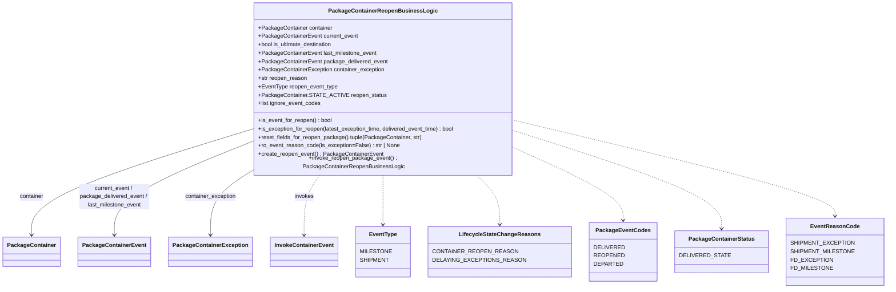

# Diagram: platform/partview_core/partview_service/partview_service/core/business/package_container/reopen/package_container_reopen_business_logic.py


> Auto-generated by Obscura crawlers

## Diagram 1



### SVG

<svg id="container" width="2345.234375" xmlns="http://www.w3.org/2000/svg" class="classDiagram" height="810" viewBox="0 0 2345.234375 810" role="graphics-document document" aria-roledescription="class"><style>#container{font-family:"trebuchet ms",verdana,arial,sans-serif;font-size:16px;fill:#333;}@keyframes edge-animation-frame{from{stroke-dashoffset:0;}}@keyframes dash{to{stroke-dashoffset:0;}}#container .edge-animation-slow{stroke-dasharray:9,5!important;stroke-dashoffset:900;animation:dash 50s linear infinite;stroke-linecap:round;}#container .edge-animation-fast{stroke-dasharray:9,5!important;stroke-dashoffset:900;animation:dash 20s linear infinite;stroke-linecap:round;}#container .error-icon{fill:#552222;}#container .error-text{fill:#552222;stroke:#552222;}#container .edge-thickness-normal{stroke-width:1px;}#container .edge-thickness-thick{stroke-width:3.5px;}#container .edge-pattern-solid{stroke-dasharray:0;}#container .edge-thickness-invisible{stroke-width:0;fill:none;}#container .edge-pattern-dashed{stroke-dasharray:3;}#container .edge-pattern-dotted{stroke-dasharray:2;}#container .marker{fill:#333333;stroke:#333333;}#container .marker.cross{stroke:#333333;}#container svg{font-family:"trebuchet ms",verdana,arial,sans-serif;font-size:16px;}#container p{margin:0;}#container g.classGroup text{fill:#9370DB;stroke:none;font-family:"trebuchet ms",verdana,arial,sans-serif;font-size:10px;}#container g.classGroup text .title{font-weight:bolder;}#container .nodeLabel,#container .edgeLabel{color:#131300;}#container .edgeLabel .label rect{fill:#ECECFF;}#container .label text{fill:#131300;}#container .labelBkg{background:#ECECFF;}#container .edgeLabel .label span{background:#ECECFF;}#container .classTitle{font-weight:bolder;}#container .node rect,#container .node circle,#container .node ellipse,#container .node polygon,#container .node path{fill:#ECECFF;stroke:#9370DB;stroke-width:1px;}#container .divider{stroke:#9370DB;stroke-width:1;}#container g.clickable{cursor:pointer;}#container g.classGroup rect{fill:#ECECFF;stroke:#9370DB;}#container g.classGroup line{stroke:#9370DB;stroke-width:1;}#container .classLabel .box{stroke:none;stroke-width:0;fill:#ECECFF;opacity:0.5;}#container .classLabel .label{fill:#9370DB;font-size:10px;}#container .relation{stroke:#333333;stroke-width:1;fill:none;}#container .dashed-line{stroke-dasharray:3;}#container .dotted-line{stroke-dasharray:1 2;}#container #compositionStart,#container .composition{fill:#333333!important;stroke:#333333!important;stroke-width:1;}#container #compositionEnd,#container .composition{fill:#333333!important;stroke:#333333!important;stroke-width:1;}#container #dependencyStart,#container .dependency{fill:#333333!important;stroke:#333333!important;stroke-width:1;}#container #dependencyStart,#container .dependency{fill:#333333!important;stroke:#333333!important;stroke-width:1;}#container #extensionStart,#container .extension{fill:transparent!important;stroke:#333333!important;stroke-width:1;}#container #extensionEnd,#container .extension{fill:transparent!important;stroke:#333333!important;stroke-width:1;}#container #aggregationStart,#container .aggregation{fill:transparent!important;stroke:#333333!important;stroke-width:1;}#container #aggregationEnd,#container .aggregation{fill:transparent!important;stroke:#333333!important;stroke-width:1;}#container #lollipopStart,#container .lollipop{fill:#ECECFF!important;stroke:#333333!important;stroke-width:1;}#container #lollipopEnd,#container .lollipop{fill:#ECECFF!important;stroke:#333333!important;stroke-width:1;}#container .edgeTerminals{font-size:11px;line-height:initial;}#container .classTitleText{text-anchor:middle;font-size:18px;fill:#333;}#container .label-icon{display:inline-block;height:1em;overflow:visible;vertical-align:-0.125em;}#container .node .label-icon path{fill:currentColor;stroke:revert;stroke-width:revert;}#container :root{--mermaid-font-family:"trebuchet ms",verdana,arial,sans-serif;}</style><g><defs><marker id="container_class-aggregationStart" class="marker aggregation class" refX="18" refY="7" markerWidth="190" markerHeight="240" orient="auto"><path d="M 18,7 L9,13 L1,7 L9,1 Z"></path></marker></defs><defs><marker id="container_class-aggregationEnd" class="marker aggregation class" refX="1" refY="7" markerWidth="20" markerHeight="28" orient="auto"><path d="M 18,7 L9,13 L1,7 L9,1 Z"></path></marker></defs><defs><marker id="container_class-extensionStart" class="marker extension class" refX="18" refY="7" markerWidth="190" markerHeight="240" orient="auto"><path d="M 1,7 L18,13 V 1 Z"></path></marker></defs><defs><marker id="container_class-extensionEnd" class="marker extension class" refX="1" refY="7" markerWidth="20" markerHeight="28" orient="auto"><path d="M 1,1 V 13 L18,7 Z"></path></marker></defs><defs><marker id="container_class-compositionStart" class="marker composition class" refX="18" refY="7" markerWidth="190" markerHeight="240" orient="auto"><path d="M 18,7 L9,13 L1,7 L9,1 Z"></path></marker></defs><defs><marker id="container_class-compositionEnd" class="marker composition class" refX="1" refY="7" markerWidth="20" markerHeight="28" orient="auto"><path d="M 18,7 L9,13 L1,7 L9,1 Z"></path></marker></defs><defs><marker id="container_class-dependencyStart" class="marker dependency class" refX="6" refY="7" markerWidth="190" markerHeight="240" orient="auto"><path d="M 5,7 L9,13 L1,7 L9,1 Z"></path></marker></defs><defs><marker id="container_class-dependencyEnd" class="marker dependency class" refX="13" refY="7" markerWidth="20" markerHeight="28" orient="auto"><path d="M 18,7 L9,13 L14,7 L9,1 Z"></path></marker></defs><defs><marker id="container_class-lollipopStart" class="marker lollipop class" refX="13" refY="7" markerWidth="190" markerHeight="240" orient="auto"><circle stroke="black" fill="transparent" cx="7" cy="7" r="6"></circle></marker></defs><defs><marker id="container_class-lollipopEnd" class="marker lollipop class" refX="1" refY="7" markerWidth="190" markerHeight="240" orient="auto"><circle stroke="black" fill="transparent" cx="7" cy="7" r="6"></circle></marker></defs><g class="root"><g class="clusters"></g><g class="edgePaths"><path d="M672.246,363.909L574.447,394.757C476.648,425.606,281.051,487.303,183.252,536.318C85.453,585.333,85.453,621.667,85.453,639.833L85.453,658" id="id_PackageContainerReopenBusinessLogic_PackageContainer_1" class="edge-thickness-normal edge-pattern-solid relation" style=";;;" data-edge="true" data-et="edge" data-id="id_PackageContainerReopenBusinessLogic_PackageContainer_1" data-points="W3sieCI6NjcyLjI0NjA5Mzc1LCJ5IjozNjMuOTA4ODQxOTUwMTQxMn0seyJ4Ijo4NS40NTMxMjUsInkiOjU0OX0seyJ4Ijo4NS40NTMxMjUsInkiOjY2NH1d" marker-end="url(#container_class-dependencyEnd)"></path><path d="M672.246,399.693L611.965,424.578C551.685,449.462,431.124,499.231,370.843,542.282C310.563,585.333,310.563,621.667,310.563,639.833L310.563,658" id="id_PackageContainerReopenBusinessLogic_PackageContainerEvent_2" class="edge-thickness-normal edge-pattern-solid relation" style=";;;" data-edge="true" data-et="edge" data-id="id_PackageContainerReopenBusinessLogic_PackageContainerEvent_2" data-points="W3sieCI6NjcyLjI0NjA5Mzc1LCJ5IjozOTkuNjkzMjc5ODMxOTk1OH0seyJ4IjozMTAuNTYyNSwieSI6NTQ5fSx7IngiOjMxMC41NjI1LCJ5Ijo2NjR9XQ==" marker-end="url(#container_class-dependencyEnd)"></path><path d="M672.246,484.166L655.433,494.972C638.62,505.777,604.993,527.389,588.18,556.361C571.367,585.333,571.367,621.667,571.367,639.833L571.367,658" id="id_PackageContainerReopenBusinessLogic_PackageContainerException_3" class="edge-thickness-normal edge-pattern-solid relation" style=";;;" data-edge="true" data-et="edge" data-id="id_PackageContainerReopenBusinessLogic_PackageContainerException_3" data-points="W3sieCI6NjcyLjI0NjA5Mzc1LCJ5Ijo0ODQuMTY2MTAyMjg4NjUwMTd9LHsieCI6NTcxLjM2NzE4NzUsInkiOjU0OX0seyJ4Ijo1NzEuMzY3MTg3NSwieSI6NjY0fV0=" marker-end="url(#container_class-dependencyEnd)"></path><path d="M869.852,488L862.657,498.167C855.461,508.333,841.071,528.667,833.875,557C826.68,585.333,826.68,621.667,826.68,639.833L826.68,658" id="id_PackageContainerReopenBusinessLogic_InvokeContainerEvent_4" class="edge-thickness-normal edge-pattern-dashed relation" style=";;;" data-edge="true" data-et="edge" data-id="id_PackageContainerReopenBusinessLogic_InvokeContainerEvent_4" data-points="W3sieCI6ODY5Ljg1MjEzMzUxMzI4OSwieSI6NDg4fSx7IngiOjgyNi42Nzk2ODc1LCJ5Ijo1NDl9LHsieCI6ODI2LjY3OTY4NzUsInkiOjY2NH1d" marker-end="url(#container_class-dependencyEnd)"></path><path d="M1039.711,488L1039.711,498.167C1039.711,508.333,1039.711,528.667,1039.711,552C1039.711,575.333,1039.711,601.667,1039.711,614.833L1039.711,628" id="id_PackageContainerReopenBusinessLogic_EventType_5" class="edge-thickness-normal edge-pattern-dashed relation" style=";;;" data-edge="true" data-et="edge" data-id="id_PackageContainerReopenBusinessLogic_EventType_5" data-points="W3sieCI6MTAzOS43MTA5Mzc1LCJ5Ijo0ODh9LHsieCI6MTAzOS43MTA5Mzc1LCJ5Ijo1NDl9LHsieCI6MTAzOS43MTA5Mzc1LCJ5Ijo2MzR9XQ==" marker-end="url(#container_class-dependencyEnd)"></path><path d="M1281.106,488L1291.332,498.167C1301.558,508.333,1322.009,528.667,1332.235,552C1342.461,575.333,1342.461,601.667,1342.461,614.833L1342.461,628" id="id_PackageContainerReopenBusinessLogic_LifecycleStateChangeReasons_6" class="edge-thickness-normal edge-pattern-dashed relation" style=";;;" data-edge="true" data-et="edge" data-id="id_PackageContainerReopenBusinessLogic_LifecycleStateChangeReasons_6" data-points="W3sieCI6MTI4MS4xMDYyODYzMzcyMDkyLCJ5Ijo0ODh9LHsieCI6MTM0Mi40NjA5Mzc1LCJ5Ijo1NDl9LHsieCI6MTM0Mi40NjA5Mzc1LCJ5Ijo2MzR9XQ==" marker-end="url(#container_class-dependencyEnd)"></path><path d="M1407.176,425.957L1449.521,446.464C1491.867,466.971,1576.559,507.986,1618.904,539.659C1661.25,571.333,1661.25,593.667,1661.25,604.833L1661.25,616" id="id_PackageContainerReopenBusinessLogic_PackageEventCodes_7" class="edge-thickness-normal edge-pattern-dashed relation" style=";;;" data-edge="true" data-et="edge" data-id="id_PackageContainerReopenBusinessLogic_PackageEventCodes_7" data-points="W3sieCI6MTQwNy4xNzU3ODEyNSwieSI6NDI1Ljk1NjUwMjg4NDcyNDE2fSx7IngiOjE2NjEuMjUsInkiOjU0OX0seyJ4IjoxNjYxLjI1LCJ5Ijo2MjJ9XQ==" marker-end="url(#container_class-dependencyEnd)"></path><path d="M1407.176,373.992L1492.246,403.16C1577.316,432.328,1747.457,490.664,1832.527,534.999C1917.598,579.333,1917.598,609.667,1917.598,624.833L1917.598,640" id="id_PackageContainerReopenBusinessLogic_PackageContainerStatus_8" class="edge-thickness-normal edge-pattern-dashed relation" style=";;;" data-edge="true" data-et="edge" data-id="id_PackageContainerReopenBusinessLogic_PackageContainerStatus_8" data-points="W3sieCI6MTQwNy4xNzU3ODEyNSwieSI6MzczLjk5MjI0NDMzNjc2NH0seyJ4IjoxOTE3LjU5NzY1NjI1LCJ5Ijo1NDl9LHsieCI6MTkxNy41OTc2NTYyNSwieSI6NjQ2fV0=" marker-end="url(#container_class-dependencyEnd)"></path><path d="M1407.176,342.34L1541.336,376.784C1675.496,411.227,1943.816,480.113,2077.977,523.723C2212.137,567.333,2212.137,585.667,2212.137,594.833L2212.137,604" id="id_PackageContainerReopenBusinessLogic_EventReasonCode_9" class="edge-thickness-normal edge-pattern-dashed relation" style=";;;" data-edge="true" data-et="edge" data-id="id_PackageContainerReopenBusinessLogic_EventReasonCode_9" data-points="W3sieCI6MTQwNy4xNzU3ODEyNSwieSI6MzQyLjM0MDIzMDA5MTg1Njh9LHsieCI6MjIxMi4xMzY3MTg3NSwieSI6NTQ5fSx7IngiOjIyMTIuMTM2NzE4NzUsInkiOjYxMH1d" marker-end="url(#container_class-dependencyEnd)"></path></g><g class="edgeLabels"><g class="edgeLabel" transform="translate(85.453125, 549)"><g class="label" data-id="id_PackageContainerReopenBusinessLogic_PackageContainer_1" transform="translate(-34.6015625, -12)"><foreignObject width="69.203125" height="24"><div xmlns="http://www.w3.org/1999/xhtml" class="labelBkg" style="display: table-cell; white-space: nowrap; line-height: 1.5; max-width: 200px; text-align: center;"><span class="edgeLabel"><p>container</p></span></div></foreignObject></g></g><g class="edgeLabel" transform="translate(310.5625, 549)"><g class="label" data-id="id_PackageContainerReopenBusinessLogic_PackageContainerEvent_2" transform="translate(-100, -36)"><foreignObject width="200" height="72"><div xmlns="http://www.w3.org/1999/xhtml" class="labelBkg" style="display: table; white-space: break-spaces; line-height: 1.5; max-width: 200px; text-align: center; width: 200px;"><span class="edgeLabel"><p>current_event / package_delivered_event / last_milestone_event</p></span></div></foreignObject></g></g><g class="edgeLabel" transform="translate(571.3671875, 549)"><g class="label" data-id="id_PackageContainerReopenBusinessLogic_PackageContainerException_3" transform="translate(-73.34375, -12)"><foreignObject width="146.6875" height="24"><div xmlns="http://www.w3.org/1999/xhtml" class="labelBkg" style="display: table-cell; white-space: nowrap; line-height: 1.5; max-width: 200px; text-align: center;"><span class="edgeLabel"><p>container_exception</p></span></div></foreignObject></g></g><g class="edgeLabel" transform="translate(826.6796875, 549)"><g class="label" data-id="id_PackageContainerReopenBusinessLogic_InvokeContainerEvent_4" transform="translate(-27.5859375, -12)"><foreignObject width="55.171875" height="24"><div xmlns="http://www.w3.org/1999/xhtml" class="labelBkg" style="display: table-cell; white-space: nowrap; line-height: 1.5; max-width: 200px; text-align: center;"><span class="edgeLabel"><p>invokes</p></span></div></foreignObject></g></g><g class="edgeLabel"><g class="label" data-id="id_PackageContainerReopenBusinessLogic_EventType_5" transform="translate(0, 0)"><foreignObject width="0" height="0"><div xmlns="http://www.w3.org/1999/xhtml" class="labelBkg" style="display: table-cell; white-space: nowrap; line-height: 1.5; max-width: 200px; text-align: center;"><span class="edgeLabel"></span></div></foreignObject></g></g><g class="edgeLabel"><g class="label" data-id="id_PackageContainerReopenBusinessLogic_LifecycleStateChangeReasons_6" transform="translate(0, 0)"><foreignObject width="0" height="0"><div xmlns="http://www.w3.org/1999/xhtml" class="labelBkg" style="display: table-cell; white-space: nowrap; line-height: 1.5; max-width: 200px; text-align: center;"><span class="edgeLabel"></span></div></foreignObject></g></g><g class="edgeLabel"><g class="label" data-id="id_PackageContainerReopenBusinessLogic_PackageEventCodes_7" transform="translate(0, 0)"><foreignObject width="0" height="0"><div xmlns="http://www.w3.org/1999/xhtml" class="labelBkg" style="display: table-cell; white-space: nowrap; line-height: 1.5; max-width: 200px; text-align: center;"><span class="edgeLabel"></span></div></foreignObject></g></g><g class="edgeLabel"><g class="label" data-id="id_PackageContainerReopenBusinessLogic_PackageContainerStatus_8" transform="translate(0, 0)"><foreignObject width="0" height="0"><div xmlns="http://www.w3.org/1999/xhtml" class="labelBkg" style="display: table-cell; white-space: nowrap; line-height: 1.5; max-width: 200px; text-align: center;"><span class="edgeLabel"></span></div></foreignObject></g></g><g class="edgeLabel"><g class="label" data-id="id_PackageContainerReopenBusinessLogic_EventReasonCode_9" transform="translate(0, 0)"><foreignObject width="0" height="0"><div xmlns="http://www.w3.org/1999/xhtml" class="labelBkg" style="display: table-cell; white-space: nowrap; line-height: 1.5; max-width: 200px; text-align: center;"><span class="edgeLabel"></span></div></foreignObject></g></g></g><g class="nodes"><g class="node default" id="classId-PackageContainerReopenBusinessLogic-0" transform="translate(1039.7109375, 248)"><g class="basic label-container"><path d="M-367.46484375 -240 L367.46484375 -240 L367.46484375 240 L-367.46484375 240" stroke="none" stroke-width="0" fill="#ECECFF" style=""></path><path d="M-367.46484375 -240 C-153.2761514192722 -240, 60.91254091145561 -240, 367.46484375 -240 M-367.46484375 -240 C-113.92706969323339 -240, 139.61070436353322 -240, 367.46484375 -240 M367.46484375 -240 C367.46484375 -72.32709198238925, 367.46484375 95.3458160352215, 367.46484375 240 M367.46484375 -240 C367.46484375 -56.30149994745548, 367.46484375 127.39700010508903, 367.46484375 240 M367.46484375 240 C207.54728859070437 240, 47.62973343140874 240, -367.46484375 240 M367.46484375 240 C74.1040647847762 240, -219.2567141804476 240, -367.46484375 240 M-367.46484375 240 C-367.46484375 54.35631741795362, -367.46484375 -131.28736516409276, -367.46484375 -240 M-367.46484375 240 C-367.46484375 131.8889456850373, -367.46484375 23.7778913700746, -367.46484375 -240" stroke="#9370DB" stroke-width="1.3" fill="none" stroke-dasharray="0 0" style=""></path></g><g class="annotation-group text" transform="translate(0, -216)"></g><g class="label-group text" transform="translate(-144.5703125, -216)"><g class="label" style="font-weight: bolder" transform="translate(0,-12)"><foreignObject width="289.140625" height="24"><div xmlns="http://www.w3.org/1999/xhtml" style="display: table-cell; white-space: nowrap; line-height: 1.5; max-width: 335px; text-align: center;"><span class="nodeLabel markdown-node-label" style=""><p>PackageContainerReopenBusinessLogic</p></span></div></foreignObject></g></g><g class="members-group text" transform="translate(-355.46484375, -168)"><g class="label" style="" transform="translate(0,-12)"><foreignObject width="210" height="24"><div xmlns="http://www.w3.org/1999/xhtml" style="display: table-cell; white-space: nowrap; line-height: 1.5; max-width: 268px; text-align: center;"><span class="nodeLabel markdown-node-label" style=""><p>+PackageContainer container</p></span></div></foreignObject></g><g class="label" style="" transform="translate(0,12)"><foreignObject width="281.59375" height="24"><div xmlns="http://www.w3.org/1999/xhtml" style="display: table-cell; white-space: nowrap; line-height: 1.5; max-width: 339px; text-align: center;"><span class="nodeLabel markdown-node-label" style=""><p>+PackageContainerEvent current_event</p></span></div></foreignObject></g><g class="label" style="" transform="translate(0,36)"><foreignObject width="216.546875" height="24"><div xmlns="http://www.w3.org/1999/xhtml" style="display: table-cell; white-space: nowrap; line-height: 1.5; max-width: 274px; text-align: center;"><span class="nodeLabel markdown-node-label" style=""><p>+bool is_ultimate_destination</p></span></div></foreignObject></g><g class="label" style="" transform="translate(0,60)"><foreignObject width="335.453125" height="24"><div xmlns="http://www.w3.org/1999/xhtml" style="display: table-cell; white-space: nowrap; line-height: 1.5; max-width: 393px; text-align: center;"><span class="nodeLabel markdown-node-label" style=""><p>+PackageContainerEvent last_milestone_event</p></span></div></foreignObject></g><g class="label" style="" transform="translate(0,84)"><foreignObject width="363.703125" height="24"><div xmlns="http://www.w3.org/1999/xhtml" style="display: table-cell; white-space: nowrap; line-height: 1.5; max-width: 421px; text-align: center;"><span class="nodeLabel markdown-node-label" style=""><p>+PackageContainerEvent package_delivered_event</p></span></div></foreignObject></g><g class="label" style="" transform="translate(0,108)"><foreignObject width="358.203125" height="24"><div xmlns="http://www.w3.org/1999/xhtml" style="display: table-cell; white-space: nowrap; line-height: 1.5; max-width: 416px; text-align: center;"><span class="nodeLabel markdown-node-label" style=""><p>+PackageContainerException container_exception</p></span></div></foreignObject></g><g class="label" style="" transform="translate(0,132)"><foreignObject width="140.328125" height="24"><div xmlns="http://www.w3.org/1999/xhtml" style="display: table-cell; white-space: nowrap; line-height: 1.5; max-width: 198px; text-align: center;"><span class="nodeLabel markdown-node-label" style=""><p>+str reopen_reason</p></span></div></foreignObject></g><g class="label" style="" transform="translate(0,156)"><foreignObject width="225.375" height="24"><div xmlns="http://www.w3.org/1999/xhtml" style="display: table-cell; white-space: nowrap; line-height: 1.5; max-width: 283px; text-align: center;"><span class="nodeLabel markdown-node-label" style=""><p>+EventType reopen_event_type</p></span></div></foreignObject></g><g class="label" style="" transform="translate(0,180)"><foreignObject width="345.046875" height="24"><div xmlns="http://www.w3.org/1999/xhtml" style="display: table-cell; white-space: nowrap; line-height: 1.5; max-width: 402px; text-align: center;"><span class="nodeLabel markdown-node-label" style=""><p>+PackageContainer.STATE_ACTIVE reopen_status</p></span></div></foreignObject></g><g class="label" style="" transform="translate(0,204)"><foreignObject width="179.09375" height="24"><div xmlns="http://www.w3.org/1999/xhtml" style="display: table-cell; white-space: nowrap; line-height: 1.5; max-width: 236px; text-align: center;"><span class="nodeLabel markdown-node-label" style=""><p>+list ignore_event_codes</p></span></div></foreignObject></g></g><g class="methods-group text" transform="translate(-355.46484375, 96)"><g class="label" style="" transform="translate(0,-12)"><foreignObject width="210.6875" height="24"><div xmlns="http://www.w3.org/1999/xhtml" style="display: table-cell; white-space: nowrap; line-height: 1.5; max-width: 268px; text-align: center;"><span class="nodeLabel markdown-node-label" style=""><p>+is_event_for_reopen() : bool</p></span></div></foreignObject></g><g class="label" style="" transform="translate(0,12)"><foreignObject width="566.359375" height="24"><div xmlns="http://www.w3.org/1999/xhtml" style="display: table-cell; white-space: nowrap; line-height: 1.5; max-width: 624px; text-align: center;"><span class="nodeLabel markdown-node-label" style=""><p>+is_exception_for_reopen(latest_exception_time, delivered_event_time) : bool</p></span></div></foreignObject></g><g class="label" style="" transform="translate(0,36)"><foreignObject width="463.71875" height="24"><div xmlns="http://www.w3.org/1999/xhtml" style="display: table-cell; white-space: nowrap; line-height: 1.5; max-width: 521px; text-align: center;"><span class="nodeLabel markdown-node-label" style=""><p>+reset_fields_for_reopen_package() tuple(PackageContainer, str)</p></span></div></foreignObject></g><g class="label" style="" transform="translate(0,60)"><foreignObject width="401.46875" height="24"><div xmlns="http://www.w3.org/1999/xhtml" style="display: table-cell; white-space: nowrap; line-height: 1.5; max-width: 459px; text-align: center;"><span class="nodeLabel markdown-node-label" style=""><p>+ro_event_reason_code(is_exception=False) : str | None</p></span></div></foreignObject></g><g class="label" style="" transform="translate(0,84)"><foreignObject width="351.71875" height="24"><div xmlns="http://www.w3.org/1999/xhtml" style="display: table-cell; white-space: nowrap; line-height: 1.5; max-width: 409px; text-align: center;"><span class="nodeLabel markdown-node-label" style=""><p>+create_reopen_event() : PackageContainerEvent</p></span></div></foreignObject></g><g class="label" style="" transform="translate(0,108)"><foreignObject width="538.015625" height="24"><div xmlns="http://www.w3.org/1999/xhtml" style="display: table-cell; white-space: nowrap; line-height: 1.5; max-width: 596px; text-align: center;"><span class="nodeLabel markdown-node-label" style=""><p>+invoke_reopen_package_event() : PackageContainerReopenBusinessLogic</p></span></div></foreignObject></g></g><g class="divider" style=""><path d="M-367.46484375 -192 C-158.96199853221148 -192, 49.54084668557704 -192, 367.46484375 -192 M-367.46484375 -192 C-145.5214721071871 -192, 76.42189953562581 -192, 367.46484375 -192" stroke="#9370DB" stroke-width="1.3" fill="none" stroke-dasharray="0 0" style=""></path></g><g class="divider" style=""><path d="M-367.46484375 72 C-171.86781547103757 72, 23.729212807924853 72, 367.46484375 72 M-367.46484375 72 C-216.5360492516181 72, -65.60725475323619 72, 367.46484375 72" stroke="#9370DB" stroke-width="1.3" fill="none" stroke-dasharray="0 0" style=""></path></g></g><g class="node default" id="classId-PackageContainer-1" transform="translate(85.453125, 706)"><g class="basic label-container"><path d="M-77.453125 -42 L77.453125 -42 L77.453125 42 L-77.453125 42" stroke="none" stroke-width="0" fill="#ECECFF" style=""></path><path d="M-77.453125 -42 C-27.398761108444354 -42, 22.65560278311129 -42, 77.453125 -42 M-77.453125 -42 C-40.33964982403074 -42, -3.2261746480614732 -42, 77.453125 -42 M77.453125 -42 C77.453125 -18.06035279495981, 77.453125 5.879294410080377, 77.453125 42 M77.453125 -42 C77.453125 -17.115408378790136, 77.453125 7.769183242419729, 77.453125 42 M77.453125 42 C20.537056332749785 42, -36.37901233450043 42, -77.453125 42 M77.453125 42 C34.84261934673432 42, -7.767886306531366 42, -77.453125 42 M-77.453125 42 C-77.453125 16.201831063553588, -77.453125 -9.596337872892825, -77.453125 -42 M-77.453125 42 C-77.453125 14.38122355528661, -77.453125 -13.23755288942678, -77.453125 -42" stroke="#9370DB" stroke-width="1.3" fill="none" stroke-dasharray="0 0" style=""></path></g><g class="annotation-group text" transform="translate(0, -18)"></g><g class="label-group text" transform="translate(-65.453125, -18)"><g class="label" style="font-weight: bolder" transform="translate(0,-12)"><foreignObject width="130.90625" height="24"><div xmlns="http://www.w3.org/1999/xhtml" style="display: table-cell; white-space: nowrap; line-height: 1.5; max-width: 179px; text-align: center;"><span class="nodeLabel markdown-node-label" style=""><p>PackageContainer</p></span></div></foreignObject></g></g><g class="members-group text" transform="translate(-65.453125, 30)"></g><g class="methods-group text" transform="translate(-65.453125, 60)"></g><g class="divider" style=""><path d="M-77.453125 6 C-35.1838509069808 6, 7.085423186038398 6, 77.453125 6 M-77.453125 6 C-39.39190845196356 6, -1.330691903927118 6, 77.453125 6" stroke="#9370DB" stroke-width="1.3" fill="none" stroke-dasharray="0 0" style=""></path></g><g class="divider" style=""><path d="M-77.453125 24 C-24.875815921032647 24, 27.701493157934706 24, 77.453125 24 M-77.453125 24 C-35.15214965038021 24, 7.1488256992395804 24, 77.453125 24" stroke="#9370DB" stroke-width="1.3" fill="none" stroke-dasharray="0 0" style=""></path></g></g><g class="node default" id="classId-PackageContainerEvent-2" transform="translate(310.5625, 706)"><g class="basic label-container"><path d="M-97.65625 -42 L97.65625 -42 L97.65625 42 L-97.65625 42" stroke="none" stroke-width="0" fill="#ECECFF" style=""></path><path d="M-97.65625 -42 C-49.255320546383444 -42, -0.854391092766889 -42, 97.65625 -42 M-97.65625 -42 C-33.606763482451086 -42, 30.442723035097828 -42, 97.65625 -42 M97.65625 -42 C97.65625 -9.910583548936422, 97.65625 22.178832902127155, 97.65625 42 M97.65625 -42 C97.65625 -18.111559922624124, 97.65625 5.776880154751751, 97.65625 42 M97.65625 42 C28.887406383504796 42, -39.88143723299041 42, -97.65625 42 M97.65625 42 C48.17034750989012 42, -1.3155549802197584 42, -97.65625 42 M-97.65625 42 C-97.65625 16.711662455349117, -97.65625 -8.576675089301766, -97.65625 -42 M-97.65625 42 C-97.65625 9.344943533837565, -97.65625 -23.31011293232487, -97.65625 -42" stroke="#9370DB" stroke-width="1.3" fill="none" stroke-dasharray="0 0" style=""></path></g><g class="annotation-group text" transform="translate(0, -18)"></g><g class="label-group text" transform="translate(-85.65625, -18)"><g class="label" style="font-weight: bolder" transform="translate(0,-12)"><foreignObject width="171.3125" height="24"><div xmlns="http://www.w3.org/1999/xhtml" style="display: table-cell; white-space: nowrap; line-height: 1.5; max-width: 219px; text-align: center;"><span class="nodeLabel markdown-node-label" style=""><p>PackageContainerEvent</p></span></div></foreignObject></g></g><g class="members-group text" transform="translate(-85.65625, 30)"></g><g class="methods-group text" transform="translate(-85.65625, 60)"></g><g class="divider" style=""><path d="M-97.65625 6 C-42.14781915767095 6, 13.360611684658096 6, 97.65625 6 M-97.65625 6 C-28.754052279223686 6, 40.14814544155263 6, 97.65625 6" stroke="#9370DB" stroke-width="1.3" fill="none" stroke-dasharray="0 0" style=""></path></g><g class="divider" style=""><path d="M-97.65625 24 C-34.38104338216004 24, 28.894163235679926 24, 97.65625 24 M-97.65625 24 C-43.08212786802739 24, 11.491994263945216 24, 97.65625 24" stroke="#9370DB" stroke-width="1.3" fill="none" stroke-dasharray="0 0" style=""></path></g></g><g class="node default" id="classId-PackageContainerException-3" transform="translate(571.3671875, 706)"><g class="basic label-container"><path d="M-113.1484375 -42 L113.1484375 -42 L113.1484375 42 L-113.1484375 42" stroke="none" stroke-width="0" fill="#ECECFF" style=""></path><path d="M-113.1484375 -42 C-26.68455376692097 -42, 59.77932996615806 -42, 113.1484375 -42 M-113.1484375 -42 C-64.60041498053113 -42, -16.05239246106227 -42, 113.1484375 -42 M113.1484375 -42 C113.1484375 -8.861880085153473, 113.1484375 24.276239829693054, 113.1484375 42 M113.1484375 -42 C113.1484375 -23.74082265963749, 113.1484375 -5.481645319274982, 113.1484375 42 M113.1484375 42 C56.73758764031982 42, 0.32673778063964676 42, -113.1484375 42 M113.1484375 42 C38.363035178652694 42, -36.42236714269461 42, -113.1484375 42 M-113.1484375 42 C-113.1484375 11.898309274329915, -113.1484375 -18.20338145134017, -113.1484375 -42 M-113.1484375 42 C-113.1484375 19.556932403709382, -113.1484375 -2.8861351925812357, -113.1484375 -42" stroke="#9370DB" stroke-width="1.3" fill="none" stroke-dasharray="0 0" style=""></path></g><g class="annotation-group text" transform="translate(0, -18)"></g><g class="label-group text" transform="translate(-101.1484375, -18)"><g class="label" style="font-weight: bolder" transform="translate(0,-12)"><foreignObject width="202.296875" height="24"><div xmlns="http://www.w3.org/1999/xhtml" style="display: table-cell; white-space: nowrap; line-height: 1.5; max-width: 249px; text-align: center;"><span class="nodeLabel markdown-node-label" style=""><p>PackageContainerException</p></span></div></foreignObject></g></g><g class="members-group text" transform="translate(-101.1484375, 30)"></g><g class="methods-group text" transform="translate(-101.1484375, 60)"></g><g class="divider" style=""><path d="M-113.1484375 6 C-65.70373382952539 6, -18.259030159050795 6, 113.1484375 6 M-113.1484375 6 C-47.49506120784808 6, 18.158315084303837 6, 113.1484375 6" stroke="#9370DB" stroke-width="1.3" fill="none" stroke-dasharray="0 0" style=""></path></g><g class="divider" style=""><path d="M-113.1484375 24 C-37.99945828654192 24, 37.14952092691615 24, 113.1484375 24 M-113.1484375 24 C-29.220195964216472 24, 54.708045571567055 24, 113.1484375 24" stroke="#9370DB" stroke-width="1.3" fill="none" stroke-dasharray="0 0" style=""></path></g></g><g class="node default" id="classId-InvokeContainerEvent-4" transform="translate(826.6796875, 706)"><g class="basic label-container"><path d="M-92.1640625 -42 L92.1640625 -42 L92.1640625 42 L-92.1640625 42" stroke="none" stroke-width="0" fill="#ECECFF" style=""></path><path d="M-92.1640625 -42 C-23.11278716441184 -42, 45.93848817117632 -42, 92.1640625 -42 M-92.1640625 -42 C-32.65620297696707 -42, 26.851656546065854 -42, 92.1640625 -42 M92.1640625 -42 C92.1640625 -14.982193879704777, 92.1640625 12.035612240590446, 92.1640625 42 M92.1640625 -42 C92.1640625 -20.54665530532826, 92.1640625 0.9066893893434766, 92.1640625 42 M92.1640625 42 C36.46395060889783 42, -19.236161282204336 42, -92.1640625 42 M92.1640625 42 C29.78091770498599 42, -32.60222709002802 42, -92.1640625 42 M-92.1640625 42 C-92.1640625 21.633753873752557, -92.1640625 1.267507747505114, -92.1640625 -42 M-92.1640625 42 C-92.1640625 24.423281111932294, -92.1640625 6.846562223864588, -92.1640625 -42" stroke="#9370DB" stroke-width="1.3" fill="none" stroke-dasharray="0 0" style=""></path></g><g class="annotation-group text" transform="translate(0, -18)"></g><g class="label-group text" transform="translate(-80.1640625, -18)"><g class="label" style="font-weight: bolder" transform="translate(0,-12)"><foreignObject width="160.328125" height="24"><div xmlns="http://www.w3.org/1999/xhtml" style="display: table-cell; white-space: nowrap; line-height: 1.5; max-width: 209px; text-align: center;"><span class="nodeLabel markdown-node-label" style=""><p>InvokeContainerEvent</p></span></div></foreignObject></g></g><g class="members-group text" transform="translate(-80.1640625, 30)"></g><g class="methods-group text" transform="translate(-80.1640625, 60)"></g><g class="divider" style=""><path d="M-92.1640625 6 C-22.25893108810699 6, 47.64620032378602 6, 92.1640625 6 M-92.1640625 6 C-29.23459258544535 6, 33.6948773291093 6, 92.1640625 6" stroke="#9370DB" stroke-width="1.3" fill="none" stroke-dasharray="0 0" style=""></path></g><g class="divider" style=""><path d="M-92.1640625 24 C-26.317822508780708 24, 39.528417482438584 24, 92.1640625 24 M-92.1640625 24 C-29.984065668380595 24, 32.19593116323881 24, 92.1640625 24" stroke="#9370DB" stroke-width="1.3" fill="none" stroke-dasharray="0 0" style=""></path></g></g><g class="node default" id="classId-EventType-5" transform="translate(1039.7109375, 706)"><g class="basic label-container"><path d="M-70.8671875 -72 L70.8671875 -72 L70.8671875 72 L-70.8671875 72" stroke="none" stroke-width="0" fill="#ECECFF" style=""></path><path d="M-70.8671875 -72 C-19.891075544281257 -72, 31.085036411437486 -72, 70.8671875 -72 M-70.8671875 -72 C-31.372775434931974 -72, 8.121636630136052 -72, 70.8671875 -72 M70.8671875 -72 C70.8671875 -19.663668009818302, 70.8671875 32.672663980363396, 70.8671875 72 M70.8671875 -72 C70.8671875 -29.678232926602732, 70.8671875 12.643534146794536, 70.8671875 72 M70.8671875 72 C20.44466065433278 72, -29.977866191334442 72, -70.8671875 72 M70.8671875 72 C31.34482571649604 72, -8.177536067007921 72, -70.8671875 72 M-70.8671875 72 C-70.8671875 37.43703826361099, -70.8671875 2.8740765272219733, -70.8671875 -72 M-70.8671875 72 C-70.8671875 22.50033564526757, -70.8671875 -26.999328709464862, -70.8671875 -72" stroke="#9370DB" stroke-width="1.3" fill="none" stroke-dasharray="0 0" style=""></path></g><g class="annotation-group text" transform="translate(0, -48)"></g><g class="label-group text" transform="translate(-37.546875, -48)"><g class="label" style="font-weight: bolder" transform="translate(0,-12)"><foreignObject width="75.09375" height="24"><div xmlns="http://www.w3.org/1999/xhtml" style="display: table-cell; white-space: nowrap; line-height: 1.5; max-width: 124px; text-align: center;"><span class="nodeLabel markdown-node-label" style=""><p>EventType</p></span></div></foreignObject></g></g><g class="members-group text" transform="translate(-58.8671875, 0)"><g class="label" style="" transform="translate(0,-12)"><foreignObject width="80.1875" height="24"><div xmlns="http://www.w3.org/1999/xhtml" style="display: table-cell; white-space: nowrap; line-height: 1.5; max-width: 130px; text-align: center;"><span class="nodeLabel markdown-node-label" style=""><p>MILESTONE</p></span></div></foreignObject></g><g class="label" style="" transform="translate(0,12)"><foreignObject width="73.359375" height="24"><div xmlns="http://www.w3.org/1999/xhtml" style="display: table-cell; white-space: nowrap; line-height: 1.5; max-width: 124px; text-align: center;"><span class="nodeLabel markdown-node-label" style=""><p>SHIPMENT</p></span></div></foreignObject></g></g><g class="methods-group text" transform="translate(-58.8671875, 72)"></g><g class="divider" style=""><path d="M-70.8671875 -24 C-16.466262315177843 -24, 37.93466286964431 -24, 70.8671875 -24 M-70.8671875 -24 C-19.528871155347076 -24, 31.809445189305848 -24, 70.8671875 -24" stroke="#9370DB" stroke-width="1.3" fill="none" stroke-dasharray="0 0" style=""></path></g><g class="divider" style=""><path d="M-70.8671875 48 C-35.077717460180246 48, 0.7117525796395086 48, 70.8671875 48 M-70.8671875 48 C-39.06085826453477 48, -7.254529029069538 48, 70.8671875 48" stroke="#9370DB" stroke-width="1.3" fill="none" stroke-dasharray="0 0" style=""></path></g></g><g class="node default" id="classId-LifecycleStateChangeReasons-6" transform="translate(1342.4609375, 706)"><g class="basic label-container"><path d="M-181.8828125 -72 L181.8828125 -72 L181.8828125 72 L-181.8828125 72" stroke="none" stroke-width="0" fill="#ECECFF" style=""></path><path d="M-181.8828125 -72 C-91.07740754349898 -72, -0.27200258699795654 -72, 181.8828125 -72 M-181.8828125 -72 C-68.56077574536664 -72, 44.76126100926672 -72, 181.8828125 -72 M181.8828125 -72 C181.8828125 -16.348998533086075, 181.8828125 39.30200293382785, 181.8828125 72 M181.8828125 -72 C181.8828125 -18.213982382014123, 181.8828125 35.572035235971754, 181.8828125 72 M181.8828125 72 C62.39051374979884 72, -57.101785000402316 72, -181.8828125 72 M181.8828125 72 C78.2070283069426 72, -25.468755886114792 72, -181.8828125 72 M-181.8828125 72 C-181.8828125 24.938552242296772, -181.8828125 -22.122895515406455, -181.8828125 -72 M-181.8828125 72 C-181.8828125 16.524762042300615, -181.8828125 -38.95047591539877, -181.8828125 -72" stroke="#9370DB" stroke-width="1.3" fill="none" stroke-dasharray="0 0" style=""></path></g><g class="annotation-group text" transform="translate(0, -48)"></g><g class="label-group text" transform="translate(-108.609375, -48)"><g class="label" style="font-weight: bolder" transform="translate(0,-12)"><foreignObject width="217.21875" height="24"><div xmlns="http://www.w3.org/1999/xhtml" style="display: table-cell; white-space: nowrap; line-height: 1.5; max-width: 263px; text-align: center;"><span class="nodeLabel markdown-node-label" style=""><p>LifecycleStateChangeReasons</p></span></div></foreignObject></g></g><g class="members-group text" transform="translate(-169.8828125, 0)"><g class="label" style="" transform="translate(0,-12)"><foreignObject width="213.84375" height="24"><div xmlns="http://www.w3.org/1999/xhtml" style="display: table-cell; white-space: nowrap; line-height: 1.5; max-width: 264px; text-align: center;"><span class="nodeLabel markdown-node-label" style=""><p>CONTAINER_REOPEN_REASON</p></span></div></foreignObject></g><g class="label" style="" transform="translate(0,12)"><foreignObject width="231.15625" height="24"><div xmlns="http://www.w3.org/1999/xhtml" style="display: table-cell; white-space: nowrap; line-height: 1.5; max-width: 281px; text-align: center;"><span class="nodeLabel markdown-node-label" style=""><p>DELAYING_EXCEPTIONS_REASON</p></span></div></foreignObject></g></g><g class="methods-group text" transform="translate(-169.8828125, 72)"></g><g class="divider" style=""><path d="M-181.8828125 -24 C-38.951408157674024 -24, 103.97999618465195 -24, 181.8828125 -24 M-181.8828125 -24 C-45.107767370245455 -24, 91.66727775950909 -24, 181.8828125 -24" stroke="#9370DB" stroke-width="1.3" fill="none" stroke-dasharray="0 0" style=""></path></g><g class="divider" style=""><path d="M-181.8828125 48 C-54.50032072241697 48, 72.88217105516605 48, 181.8828125 48 M-181.8828125 48 C-48.507001570089955 48, 84.86880935982009 48, 181.8828125 48" stroke="#9370DB" stroke-width="1.3" fill="none" stroke-dasharray="0 0" style=""></path></g></g><g class="node default" id="classId-PackageEventCodes-7" transform="translate(1661.25, 706)"><g class="basic label-container"><path d="M-86.90625 -84 L86.90625 -84 L86.90625 84 L-86.90625 84" stroke="none" stroke-width="0" fill="#ECECFF" style=""></path><path d="M-86.90625 -84 C-26.05281573098201 -84, 34.80061853803598 -84, 86.90625 -84 M-86.90625 -84 C-22.356686849519278 -84, 42.192876300961444 -84, 86.90625 -84 M86.90625 -84 C86.90625 -49.131828501166424, 86.90625 -14.263657002332849, 86.90625 84 M86.90625 -84 C86.90625 -48.87533543036422, 86.90625 -13.750670860728434, 86.90625 84 M86.90625 84 C37.87111451551493 84, -11.164020968970135 84, -86.90625 84 M86.90625 84 C19.76270607816049 84, -47.38083784367902 84, -86.90625 84 M-86.90625 84 C-86.90625 31.197154696054746, -86.90625 -21.60569060789051, -86.90625 -84 M-86.90625 84 C-86.90625 39.12382007069283, -86.90625 -5.752359858614341, -86.90625 -84" stroke="#9370DB" stroke-width="1.3" fill="none" stroke-dasharray="0 0" style=""></path></g><g class="annotation-group text" transform="translate(0, -60)"></g><g class="label-group text" transform="translate(-72.25, -60)"><g class="label" style="font-weight: bolder" transform="translate(0,-12)"><foreignObject width="144.5" height="24"><div xmlns="http://www.w3.org/1999/xhtml" style="display: table-cell; white-space: nowrap; line-height: 1.5; max-width: 192px; text-align: center;"><span class="nodeLabel markdown-node-label" style=""><p>PackageEventCodes</p></span></div></foreignObject></g></g><g class="members-group text" transform="translate(-74.90625, -12)"><g class="label" style="" transform="translate(0,-12)"><foreignObject width="77.5625" height="24"><div xmlns="http://www.w3.org/1999/xhtml" style="display: table-cell; white-space: nowrap; line-height: 1.5; max-width: 128px; text-align: center;"><span class="nodeLabel markdown-node-label" style=""><p>DELIVERED</p></span></div></foreignObject></g><g class="label" style="" transform="translate(0,12)"><foreignObject width="76.78125" height="24"><div xmlns="http://www.w3.org/1999/xhtml" style="display: table-cell; white-space: nowrap; line-height: 1.5; max-width: 127px; text-align: center;"><span class="nodeLabel markdown-node-label" style=""><p>REOPENED</p></span></div></foreignObject></g><g class="label" style="" transform="translate(0,36)"><foreignObject width="72.875" height="24"><div xmlns="http://www.w3.org/1999/xhtml" style="display: table-cell; white-space: nowrap; line-height: 1.5; max-width: 123px; text-align: center;"><span class="nodeLabel markdown-node-label" style=""><p>DEPARTED</p></span></div></foreignObject></g></g><g class="methods-group text" transform="translate(-74.90625, 84)"></g><g class="divider" style=""><path d="M-86.90625 -36 C-51.02921193975804 -36, -15.152173879516084 -36, 86.90625 -36 M-86.90625 -36 C-44.46868144921792 -36, -2.031112898435836 -36, 86.90625 -36" stroke="#9370DB" stroke-width="1.3" fill="none" stroke-dasharray="0 0" style=""></path></g><g class="divider" style=""><path d="M-86.90625 60 C-22.952826929591616 60, 41.00059614081677 60, 86.90625 60 M-86.90625 60 C-48.6031064610136 60, -10.299962922027206 60, 86.90625 60" stroke="#9370DB" stroke-width="1.3" fill="none" stroke-dasharray="0 0" style=""></path></g></g><g class="node default" id="classId-PackageContainerStatus-8" transform="translate(1917.59765625, 706)"><g class="basic label-container"><path d="M-119.44140625 -60 L119.44140625 -60 L119.44140625 60 L-119.44140625 60" stroke="none" stroke-width="0" fill="#ECECFF" style=""></path><path d="M-119.44140625 -60 C-40.169952669226035 -60, 39.10150091154793 -60, 119.44140625 -60 M-119.44140625 -60 C-38.971052994579225 -60, 41.49930026084155 -60, 119.44140625 -60 M119.44140625 -60 C119.44140625 -13.096970096443293, 119.44140625 33.806059807113414, 119.44140625 60 M119.44140625 -60 C119.44140625 -30.220893836871348, 119.44140625 -0.4417876737426951, 119.44140625 60 M119.44140625 60 C67.87148886583041 60, 16.30157148166083 60, -119.44140625 60 M119.44140625 60 C40.27286843478966 60, -38.895669380420685 60, -119.44140625 60 M-119.44140625 60 C-119.44140625 26.104332544874794, -119.44140625 -7.791334910250413, -119.44140625 -60 M-119.44140625 60 C-119.44140625 14.59701909941311, -119.44140625 -30.80596180117378, -119.44140625 -60" stroke="#9370DB" stroke-width="1.3" fill="none" stroke-dasharray="0 0" style=""></path></g><g class="annotation-group text" transform="translate(0, -36)"></g><g class="label-group text" transform="translate(-88.9296875, -36)"><g class="label" style="font-weight: bolder" transform="translate(0,-12)"><foreignObject width="177.859375" height="24"><div xmlns="http://www.w3.org/1999/xhtml" style="display: table-cell; white-space: nowrap; line-height: 1.5; max-width: 224px; text-align: center;"><span class="nodeLabel markdown-node-label" style=""><p>PackageContainerStatus</p></span></div></foreignObject></g></g><g class="members-group text" transform="translate(-107.44140625, 12)"><g class="label" style="" transform="translate(0,-12)"><foreignObject width="125.953125" height="24"><div xmlns="http://www.w3.org/1999/xhtml" style="display: table-cell; white-space: nowrap; line-height: 1.5; max-width: 176px; text-align: center;"><span class="nodeLabel markdown-node-label" style=""><p>DELIVERED_STATE</p></span></div></foreignObject></g></g><g class="methods-group text" transform="translate(-107.44140625, 60)"></g><g class="divider" style=""><path d="M-119.44140625 -12 C-28.092405105507424 -12, 63.25659603898515 -12, 119.44140625 -12 M-119.44140625 -12 C-71.51805641822091 -12, -23.594706586441802 -12, 119.44140625 -12" stroke="#9370DB" stroke-width="1.3" fill="none" stroke-dasharray="0 0" style=""></path></g><g class="divider" style=""><path d="M-119.44140625 36 C-38.10543011715495 36, 43.230546015690095 36, 119.44140625 36 M-119.44140625 36 C-28.570412945601916 36, 62.30058035879617 36, 119.44140625 36" stroke="#9370DB" stroke-width="1.3" fill="none" stroke-dasharray="0 0" style=""></path></g></g><g class="node default" id="classId-EventReasonCode-9" transform="translate(2212.13671875, 706)"><g class="basic label-container"><path d="M-125.09765625 -96 L125.09765625 -96 L125.09765625 96 L-125.09765625 96" stroke="none" stroke-width="0" fill="#ECECFF" style=""></path><path d="M-125.09765625 -96 C-49.738887365285734 -96, 25.61988151942853 -96, 125.09765625 -96 M-125.09765625 -96 C-71.03663244782061 -96, -16.97560864564123 -96, 125.09765625 -96 M125.09765625 -96 C125.09765625 -45.34143629690985, 125.09765625 5.317127406180305, 125.09765625 96 M125.09765625 -96 C125.09765625 -19.708157664983943, 125.09765625 56.58368467003211, 125.09765625 96 M125.09765625 96 C52.04526294933933 96, -21.007130351321337 96, -125.09765625 96 M125.09765625 96 C37.845610671051546 96, -49.40643490789691 96, -125.09765625 96 M-125.09765625 96 C-125.09765625 27.83228339310648, -125.09765625 -40.33543321378704, -125.09765625 -96 M-125.09765625 96 C-125.09765625 29.224471688158815, -125.09765625 -37.55105662368237, -125.09765625 -96" stroke="#9370DB" stroke-width="1.3" fill="none" stroke-dasharray="0 0" style=""></path></g><g class="annotation-group text" transform="translate(0, -72)"></g><g class="label-group text" transform="translate(-65.1484375, -72)"><g class="label" style="font-weight: bolder" transform="translate(0,-12)"><foreignObject width="130.296875" height="24"><div xmlns="http://www.w3.org/1999/xhtml" style="display: table-cell; white-space: nowrap; line-height: 1.5; max-width: 179px; text-align: center;"><span class="nodeLabel markdown-node-label" style=""><p>EventReasonCode</p></span></div></foreignObject></g></g><g class="members-group text" transform="translate(-113.09765625, -24)"><g class="label" style="" transform="translate(0,-12)"><foreignObject width="159.25" height="24"><div xmlns="http://www.w3.org/1999/xhtml" style="display: table-cell; white-space: nowrap; line-height: 1.5; max-width: 209px; text-align: center;"><span class="nodeLabel markdown-node-label" style=""><p>SHIPMENT_EXCEPTION</p></span></div></foreignObject></g><g class="label" style="" transform="translate(0,12)"><foreignObject width="161.046875" height="24"><div xmlns="http://www.w3.org/1999/xhtml" style="display: table-cell; white-space: nowrap; line-height: 1.5; max-width: 211px; text-align: center;"><span class="nodeLabel markdown-node-label" style=""><p>SHIPMENT_MILESTONE</p></span></div></foreignObject></g><g class="label" style="" transform="translate(0,36)"><foreignObject width="104.234375" height="24"><div xmlns="http://www.w3.org/1999/xhtml" style="display: table-cell; white-space: nowrap; line-height: 1.5; max-width: 154px; text-align: center;"><span class="nodeLabel markdown-node-label" style=""><p>FD_EXCEPTION</p></span></div></foreignObject></g><g class="label" style="" transform="translate(0,60)"><foreignObject width="106.03125" height="24"><div xmlns="http://www.w3.org/1999/xhtml" style="display: table-cell; white-space: nowrap; line-height: 1.5; max-width: 156px; text-align: center;"><span class="nodeLabel markdown-node-label" style=""><p>FD_MILESTONE</p></span></div></foreignObject></g></g><g class="methods-group text" transform="translate(-113.09765625, 96)"></g><g class="divider" style=""><path d="M-125.09765625 -48 C-25.453602590989334 -48, 74.19045106802133 -48, 125.09765625 -48 M-125.09765625 -48 C-63.38527110037295 -48, -1.6728859507458935 -48, 125.09765625 -48" stroke="#9370DB" stroke-width="1.3" fill="none" stroke-dasharray="0 0" style=""></path></g><g class="divider" style=""><path d="M-125.09765625 72 C-40.32799479877849 72, 44.44166665244302 72, 125.09765625 72 M-125.09765625 72 C-66.2648571693241 72, -7.432058088648219 72, 125.09765625 72" stroke="#9370DB" stroke-width="1.3" fill="none" stroke-dasharray="0 0" style=""></path></g></g></g></g></g></svg>

## Diagram 2

```mermaid
flowchart TD
    Start([Start]) --> CheckEvent{current_event present?}
    CheckEvent -- No --> ReturnFalse([Return False])
    CheckEvent -- Yes --> Compute([Compute event_is_post_delivery])
    Compute --> CondType{event.event_type == reopen_event_type?}
    CondType -- No --> ReturnFalse
    CondType -- Yes --> CondUltimate{is_ultimate_destination == False?}
    CondUltimate -- No --> ReturnFalse
    CondUltimate -- Yes --> CondLifecycle{container.lifecycle_state == DELIVERED_STATE?}
    CondLifecycle -- No --> ReturnFalse
    CondLifecycle -- Yes --> CondIgnore{event_code not in ignore_event_codes?}
    CondIgnore -- No --> ReturnFalse
    CondIgnore -- Yes --> CondDeparted{NOT (event_code == DEPARTED AND location_code == container.origin_location_code)?}
    CondDeparted -- No --> ReturnFalse
    CondDeparted -- Yes --> CondPost{event_is_post_delivery == True?}
    CondPost -- No --> ReturnFalse
    CondPost -- Yes --> ReturnTrue([Return True])
```

> SVG rendering failed for this diagram.
