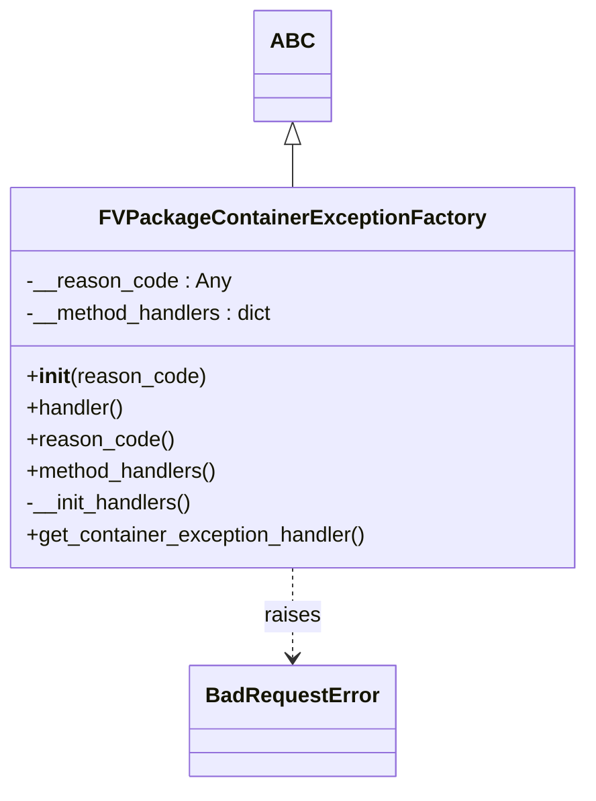

# Diagram: platform/partview_core/partview_service/partview_service/core/business/package_container_exception_status/FVPackageContainerExceptionFactory.py


> Auto-generated by Obscura crawlers

## Diagram 1



### SVG

<svg id="container" width="436.640625" xmlns="http://www.w3.org/2000/svg" class="classDiagram" height="596" viewBox="0 0 436.640625 596" role="graphics-document document" aria-roledescription="class"><style>#container{font-family:"trebuchet ms",verdana,arial,sans-serif;font-size:16px;fill:#333;}@keyframes edge-animation-frame{from{stroke-dashoffset:0;}}@keyframes dash{to{stroke-dashoffset:0;}}#container .edge-animation-slow{stroke-dasharray:9,5!important;stroke-dashoffset:900;animation:dash 50s linear infinite;stroke-linecap:round;}#container .edge-animation-fast{stroke-dasharray:9,5!important;stroke-dashoffset:900;animation:dash 20s linear infinite;stroke-linecap:round;}#container .error-icon{fill:#552222;}#container .error-text{fill:#552222;stroke:#552222;}#container .edge-thickness-normal{stroke-width:1px;}#container .edge-thickness-thick{stroke-width:3.5px;}#container .edge-pattern-solid{stroke-dasharray:0;}#container .edge-thickness-invisible{stroke-width:0;fill:none;}#container .edge-pattern-dashed{stroke-dasharray:3;}#container .edge-pattern-dotted{stroke-dasharray:2;}#container .marker{fill:#333333;stroke:#333333;}#container .marker.cross{stroke:#333333;}#container svg{font-family:"trebuchet ms",verdana,arial,sans-serif;font-size:16px;}#container p{margin:0;}#container g.classGroup text{fill:#9370DB;stroke:none;font-family:"trebuchet ms",verdana,arial,sans-serif;font-size:10px;}#container g.classGroup text .title{font-weight:bolder;}#container .nodeLabel,#container .edgeLabel{color:#131300;}#container .edgeLabel .label rect{fill:#ECECFF;}#container .label text{fill:#131300;}#container .labelBkg{background:#ECECFF;}#container .edgeLabel .label span{background:#ECECFF;}#container .classTitle{font-weight:bolder;}#container .node rect,#container .node circle,#container .node ellipse,#container .node polygon,#container .node path{fill:#ECECFF;stroke:#9370DB;stroke-width:1px;}#container .divider{stroke:#9370DB;stroke-width:1;}#container g.clickable{cursor:pointer;}#container g.classGroup rect{fill:#ECECFF;stroke:#9370DB;}#container g.classGroup line{stroke:#9370DB;stroke-width:1;}#container .classLabel .box{stroke:none;stroke-width:0;fill:#ECECFF;opacity:0.5;}#container .classLabel .label{fill:#9370DB;font-size:10px;}#container .relation{stroke:#333333;stroke-width:1;fill:none;}#container .dashed-line{stroke-dasharray:3;}#container .dotted-line{stroke-dasharray:1 2;}#container #compositionStart,#container .composition{fill:#333333!important;stroke:#333333!important;stroke-width:1;}#container #compositionEnd,#container .composition{fill:#333333!important;stroke:#333333!important;stroke-width:1;}#container #dependencyStart,#container .dependency{fill:#333333!important;stroke:#333333!important;stroke-width:1;}#container #dependencyStart,#container .dependency{fill:#333333!important;stroke:#333333!important;stroke-width:1;}#container #extensionStart,#container .extension{fill:transparent!important;stroke:#333333!important;stroke-width:1;}#container #extensionEnd,#container .extension{fill:transparent!important;stroke:#333333!important;stroke-width:1;}#container #aggregationStart,#container .aggregation{fill:transparent!important;stroke:#333333!important;stroke-width:1;}#container #aggregationEnd,#container .aggregation{fill:transparent!important;stroke:#333333!important;stroke-width:1;}#container #lollipopStart,#container .lollipop{fill:#ECECFF!important;stroke:#333333!important;stroke-width:1;}#container #lollipopEnd,#container .lollipop{fill:#ECECFF!important;stroke:#333333!important;stroke-width:1;}#container .edgeTerminals{font-size:11px;line-height:initial;}#container .classTitleText{text-anchor:middle;font-size:18px;fill:#333;}#container .label-icon{display:inline-block;height:1em;overflow:visible;vertical-align:-0.125em;}#container .node .label-icon path{fill:currentColor;stroke:revert;stroke-width:revert;}#container :root{--mermaid-font-family:"trebuchet ms",verdana,arial,sans-serif;}</style><g><defs><marker id="container_class-aggregationStart" class="marker aggregation class" refX="18" refY="7" markerWidth="190" markerHeight="240" orient="auto"><path d="M 18,7 L9,13 L1,7 L9,1 Z"></path></marker></defs><defs><marker id="container_class-aggregationEnd" class="marker aggregation class" refX="1" refY="7" markerWidth="20" markerHeight="28" orient="auto"><path d="M 18,7 L9,13 L1,7 L9,1 Z"></path></marker></defs><defs><marker id="container_class-extensionStart" class="marker extension class" refX="18" refY="7" markerWidth="190" markerHeight="240" orient="auto"><path d="M 1,7 L18,13 V 1 Z"></path></marker></defs><defs><marker id="container_class-extensionEnd" class="marker extension class" refX="1" refY="7" markerWidth="20" markerHeight="28" orient="auto"><path d="M 1,1 V 13 L18,7 Z"></path></marker></defs><defs><marker id="container_class-compositionStart" class="marker composition class" refX="18" refY="7" markerWidth="190" markerHeight="240" orient="auto"><path d="M 18,7 L9,13 L1,7 L9,1 Z"></path></marker></defs><defs><marker id="container_class-compositionEnd" class="marker composition class" refX="1" refY="7" markerWidth="20" markerHeight="28" orient="auto"><path d="M 18,7 L9,13 L1,7 L9,1 Z"></path></marker></defs><defs><marker id="container_class-dependencyStart" class="marker dependency class" refX="6" refY="7" markerWidth="190" markerHeight="240" orient="auto"><path d="M 5,7 L9,13 L1,7 L9,1 Z"></path></marker></defs><defs><marker id="container_class-dependencyEnd" class="marker dependency class" refX="13" refY="7" markerWidth="20" markerHeight="28" orient="auto"><path d="M 18,7 L9,13 L14,7 L9,1 Z"></path></marker></defs><defs><marker id="container_class-lollipopStart" class="marker lollipop class" refX="13" refY="7" markerWidth="190" markerHeight="240" orient="auto"><circle stroke="black" fill="transparent" cx="7" cy="7" r="6"></circle></marker></defs><defs><marker id="container_class-lollipopEnd" class="marker lollipop class" refX="1" refY="7" markerWidth="190" markerHeight="240" orient="auto"><circle stroke="black" fill="transparent" cx="7" cy="7" r="6"></circle></marker></defs><g class="root"><g class="clusters"></g><g class="edgePaths"><path d="M218.32,109.25L218.32,110.542C218.32,111.833,218.32,114.417,218.32,119.875C218.32,125.333,218.32,133.667,218.32,137.833L218.32,142" id="id_ABC_FVPackageContainerExceptionFactory_1" class="edge-thickness-normal edge-pattern-solid relation" style=";;;" data-edge="true" data-et="edge" data-id="id_ABC_FVPackageContainerExceptionFactory_1" data-points="W3sieCI6MjE4LjMyMDMxMjUsInkiOjkyfSx7IngiOjIxOC4zMjAzMTI1LCJ5IjoxMTd9LHsieCI6MjE4LjMyMDMxMjUsInkiOjE0Mn1d" marker-start="url(#container_class-extensionStart)"></path><path d="M218.32,430L218.32,436.167C218.32,442.333,218.32,454.667,218.32,466C218.32,477.333,218.32,487.667,218.32,492.833L218.32,498" id="id_FVPackageContainerExceptionFactory_BadRequestError_2" class="edge-thickness-normal edge-pattern-dashed relation" style=";;;" data-edge="true" data-et="edge" data-id="id_FVPackageContainerExceptionFactory_BadRequestError_2" data-points="W3sieCI6MjE4LjMyMDMxMjUsInkiOjQzMH0seyJ4IjoyMTguMzIwMzEyNSwieSI6NDY3fSx7IngiOjIxOC4zMjAzMTI1LCJ5Ijo1MDR9XQ==" marker-end="url(#container_class-dependencyEnd)"></path></g><g class="edgeLabels"><g class="edgeLabel"><g class="label" data-id="id_ABC_FVPackageContainerExceptionFactory_1" transform="translate(0, 0)"><foreignObject width="0" height="0"><div xmlns="http://www.w3.org/1999/xhtml" class="labelBkg" style="display: table-cell; white-space: nowrap; line-height: 1.5; max-width: 200px; text-align: center;"><span class="edgeLabel"></span></div></foreignObject></g></g><g class="edgeLabel" transform="translate(218.3203125, 467)"><g class="label" data-id="id_FVPackageContainerExceptionFactory_BadRequestError_2" transform="translate(-21.25, -12)"><foreignObject width="42.5" height="24"><div xmlns="http://www.w3.org/1999/xhtml" class="labelBkg" style="display: table-cell; white-space: nowrap; line-height: 1.5; max-width: 200px; text-align: center;"><span class="edgeLabel"><p>raises</p></span></div></foreignObject></g></g></g><g class="nodes"><g class="node default" id="classId-ABC-0" transform="translate(218.3203125, 50)"><g class="basic label-container"><path d="M-26.2578125 -42 L26.2578125 -42 L26.2578125 42 L-26.2578125 42" stroke="none" stroke-width="0" fill="#ECECFF" style=""></path><path d="M-26.2578125 -42 C-6.116130872103785 -42, 14.02555075579243 -42, 26.2578125 -42 M-26.2578125 -42 C-8.270925777396336 -42, 9.715960945207328 -42, 26.2578125 -42 M26.2578125 -42 C26.2578125 -20.25117640726564, 26.2578125 1.4976471854687219, 26.2578125 42 M26.2578125 -42 C26.2578125 -15.50765622134545, 26.2578125 10.984687557309101, 26.2578125 42 M26.2578125 42 C6.226117176056594 42, -13.805578147886813 42, -26.2578125 42 M26.2578125 42 C8.835113722642156 42, -8.587585054715689 42, -26.2578125 42 M-26.2578125 42 C-26.2578125 12.948184595170261, -26.2578125 -16.103630809659478, -26.2578125 -42 M-26.2578125 42 C-26.2578125 21.480562623788153, -26.2578125 0.9611252475763052, -26.2578125 -42" stroke="#9370DB" stroke-width="1.3" fill="none" stroke-dasharray="0 0" style=""></path></g><g class="annotation-group text" transform="translate(0, -18)"></g><g class="label-group text" transform="translate(-14.2578125, -18)"><g class="label" style="font-weight: bolder" transform="translate(0,-12)"><foreignObject width="28.515625" height="24"><div xmlns="http://www.w3.org/1999/xhtml" style="display: table-cell; white-space: nowrap; line-height: 1.5; max-width: 78px; text-align: center;"><span class="nodeLabel markdown-node-label" style=""><p>ABC</p></span></div></foreignObject></g></g><g class="members-group text" transform="translate(-14.2578125, 30)"></g><g class="methods-group text" transform="translate(-14.2578125, 60)"></g><g class="divider" style=""><path d="M-26.2578125 6 C-11.812475368961355 6, 2.6328617620772903 6, 26.2578125 6 M-26.2578125 6 C-13.772165036653519 6, -1.2865175733070373 6, 26.2578125 6" stroke="#9370DB" stroke-width="1.3" fill="none" stroke-dasharray="0 0" style=""></path></g><g class="divider" style=""><path d="M-26.2578125 24 C-8.16964345899887 24, 9.91852558200226 24, 26.2578125 24 M-26.2578125 24 C-9.149747928009802 24, 7.958316643980396 24, 26.2578125 24" stroke="#9370DB" stroke-width="1.3" fill="none" stroke-dasharray="0 0" style=""></path></g></g><g class="node default" id="classId-BadRequestError-1" transform="translate(218.3203125, 546)"><g class="basic label-container"><path d="M-74.28125 -42 L74.28125 -42 L74.28125 42 L-74.28125 42" stroke="none" stroke-width="0" fill="#ECECFF" style=""></path><path d="M-74.28125 -42 C-17.406572631780477 -42, 39.468104736439045 -42, 74.28125 -42 M-74.28125 -42 C-39.24689617497914 -42, -4.212542349958284 -42, 74.28125 -42 M74.28125 -42 C74.28125 -10.387973569904911, 74.28125 21.224052860190177, 74.28125 42 M74.28125 -42 C74.28125 -23.588602348704377, 74.28125 -5.177204697408754, 74.28125 42 M74.28125 42 C32.14795744055193 42, -9.985335118896145 42, -74.28125 42 M74.28125 42 C34.042047045218354 42, -6.197155909563293 42, -74.28125 42 M-74.28125 42 C-74.28125 18.921221045851237, -74.28125 -4.157557908297527, -74.28125 -42 M-74.28125 42 C-74.28125 16.311965037940478, -74.28125 -9.376069924119044, -74.28125 -42" stroke="#9370DB" stroke-width="1.3" fill="none" stroke-dasharray="0 0" style=""></path></g><g class="annotation-group text" transform="translate(0, -18)"></g><g class="label-group text" transform="translate(-62.28125, -18)"><g class="label" style="font-weight: bolder" transform="translate(0,-12)"><foreignObject width="124.5625" height="24"><div xmlns="http://www.w3.org/1999/xhtml" style="display: table-cell; white-space: nowrap; line-height: 1.5; max-width: 174px; text-align: center;"><span class="nodeLabel markdown-node-label" style=""><p>BadRequestError</p></span></div></foreignObject></g></g><g class="members-group text" transform="translate(-62.28125, 30)"></g><g class="methods-group text" transform="translate(-62.28125, 60)"></g><g class="divider" style=""><path d="M-74.28125 6 C-40.75404733479541 6, -7.226844669590818 6, 74.28125 6 M-74.28125 6 C-31.1275942603676 6, 12.026061479264797 6, 74.28125 6" stroke="#9370DB" stroke-width="1.3" fill="none" stroke-dasharray="0 0" style=""></path></g><g class="divider" style=""><path d="M-74.28125 24 C-15.97463028068708 24, 42.33198943862584 24, 74.28125 24 M-74.28125 24 C-18.24122719942224 24, 37.79879560115552 24, 74.28125 24" stroke="#9370DB" stroke-width="1.3" fill="none" stroke-dasharray="0 0" style=""></path></g></g><g class="node default" id="classId-FVPackageContainerExceptionFactory-2" transform="translate(218.3203125, 286)"><g class="basic label-container"><path d="M-210.3203125 -144 L210.3203125 -144 L210.3203125 144 L-210.3203125 144" stroke="none" stroke-width="0" fill="#ECECFF" style=""></path><path d="M-210.3203125 -144 C-102.56961483394699 -144, 5.1810828321060285 -144, 210.3203125 -144 M-210.3203125 -144 C-49.03611108013973 -144, 112.24809033972053 -144, 210.3203125 -144 M210.3203125 -144 C210.3203125 -79.9170830943165, 210.3203125 -15.834166188632992, 210.3203125 144 M210.3203125 -144 C210.3203125 -72.2882707884559, 210.3203125 -0.5765415769118079, 210.3203125 144 M210.3203125 144 C80.75433049560237 144, -48.81165150879525 144, -210.3203125 144 M210.3203125 144 C81.58046355597602 144, -47.15938538804795 144, -210.3203125 144 M-210.3203125 144 C-210.3203125 41.026188719020595, -210.3203125 -61.94762256195881, -210.3203125 -144 M-210.3203125 144 C-210.3203125 74.46388777308898, -210.3203125 4.927775546177969, -210.3203125 -144" stroke="#9370DB" stroke-width="1.3" fill="none" stroke-dasharray="0 0" style=""></path></g><g class="annotation-group text" transform="translate(0, -120)"></g><g class="label-group text" transform="translate(-136.203125, -120)"><g class="label" style="font-weight: bolder" transform="translate(0,-12)"><foreignObject width="272.40625" height="24"><div xmlns="http://www.w3.org/1999/xhtml" style="display: table-cell; white-space: nowrap; line-height: 1.5; max-width: 318px; text-align: center;"><span class="nodeLabel markdown-node-label" style=""><p>FVPackageContainerExceptionFactory</p></span></div></foreignObject></g></g><g class="members-group text" transform="translate(-198.3203125, -72)"><g class="label" style="" transform="translate(0,-12)"><foreignObject width="152.234375" height="24"><div xmlns="http://www.w3.org/1999/xhtml" style="display: table-cell; white-space: nowrap; line-height: 1.5; max-width: 210px; text-align: center;"><span class="nodeLabel markdown-node-label" style=""><p>-__reason_code : Any</p></span></div></foreignObject></g><g class="label" style="" transform="translate(0,12)"><foreignObject width="190.0625" height="24"><div xmlns="http://www.w3.org/1999/xhtml" style="display: table-cell; white-space: nowrap; line-height: 1.5; max-width: 248px; text-align: center;"><span class="nodeLabel markdown-node-label" style=""><p>-__method_handlers : dict</p></span></div></foreignObject></g></g><g class="methods-group text" transform="translate(-198.3203125, 0)"><g class="label" style="" transform="translate(0,-12)"><foreignObject width="134.75" height="24"><div xmlns="http://www.w3.org/1999/xhtml" style="display: table-cell; white-space: nowrap; line-height: 1.5; max-width: 224px; text-align: center;"><span class="nodeLabel markdown-node-label" style=""><p>+<strong>init</strong>(reason_code)</p></span></div></foreignObject></g><g class="label" style="" transform="translate(0,12)"><foreignObject width="74.890625" height="24"><div xmlns="http://www.w3.org/1999/xhtml" style="display: table-cell; white-space: nowrap; line-height: 1.5; max-width: 132px; text-align: center;"><span class="nodeLabel markdown-node-label" style=""><p>+handler()</p></span></div></foreignObject></g><g class="label" style="" transform="translate(0,36)"><foreignObject width="110.3125" height="24"><div xmlns="http://www.w3.org/1999/xhtml" style="display: table-cell; white-space: nowrap; line-height: 1.5; max-width: 168px; text-align: center;"><span class="nodeLabel markdown-node-label" style=""><p>+reason_code()</p></span></div></foreignObject></g><g class="label" style="" transform="translate(0,60)"><foreignObject width="146.9375" height="24"><div xmlns="http://www.w3.org/1999/xhtml" style="display: table-cell; white-space: nowrap; line-height: 1.5; max-width: 204px; text-align: center;"><span class="nodeLabel markdown-node-label" style=""><p>+method_handlers()</p></span></div></foreignObject></g><g class="label" style="" transform="translate(0,84)"><foreignObject width="128.28125" height="24"><div xmlns="http://www.w3.org/1999/xhtml" style="display: table-cell; white-space: nowrap; line-height: 1.5; max-width: 186px; text-align: center;"><span class="nodeLabel markdown-node-label" style=""><p>-__init_handlers()</p></span></div></foreignObject></g><g class="label" style="" transform="translate(0,108)"><foreignObject width="260.4375" height="24"><div xmlns="http://www.w3.org/1999/xhtml" style="display: table-cell; white-space: nowrap; line-height: 1.5; max-width: 318px; text-align: center;"><span class="nodeLabel markdown-node-label" style=""><p>+get_container_exception_handler()</p></span></div></foreignObject></g></g><g class="divider" style=""><path d="M-210.3203125 -96 C-64.49190870071641 -96, 81.33649509856718 -96, 210.3203125 -96 M-210.3203125 -96 C-62.86640765359007 -96, 84.58749719281985 -96, 210.3203125 -96" stroke="#9370DB" stroke-width="1.3" fill="none" stroke-dasharray="0 0" style=""></path></g><g class="divider" style=""><path d="M-210.3203125 -24 C-48.83313770295513 -24, 112.65403709408974 -24, 210.3203125 -24 M-210.3203125 -24 C-53.969682998916255 -24, 102.38094650216749 -24, 210.3203125 -24" stroke="#9370DB" stroke-width="1.3" fill="none" stroke-dasharray="0 0" style=""></path></g></g></g></g></g></svg>

## Diagram 2

```mermaid
flowchart TD
Start[get_container_exception_handler()]
Start --> HasKeys{method_handlers keys exist?}
HasKeys -->|no| AssertNo[AssertionError: "No handlers found"]
HasKeys -->|yes| CheckDup{duplicate handlers?}
CheckDup -->|yes| AssertDup[AssertionError: "Duplicate handlers found"]
CheckDup -->|no| Lookup[method_handler = method_handlers.get(reason_code)]
Lookup -->|not found| Raise[raise BadRequestError("Unsuported method")]
Lookup -->|found| Return[return method_handler(reason_code)]
```

> SVG rendering failed for this diagram.
