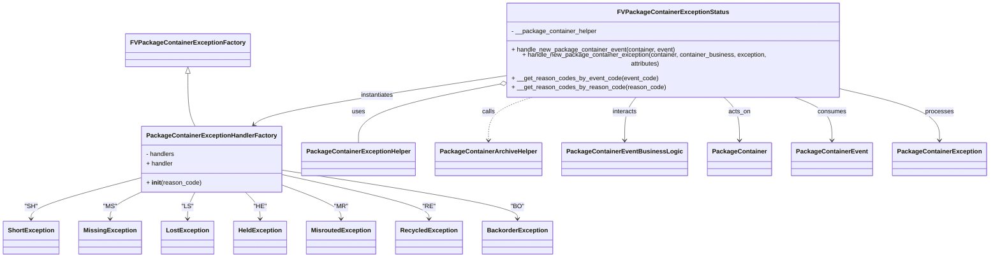
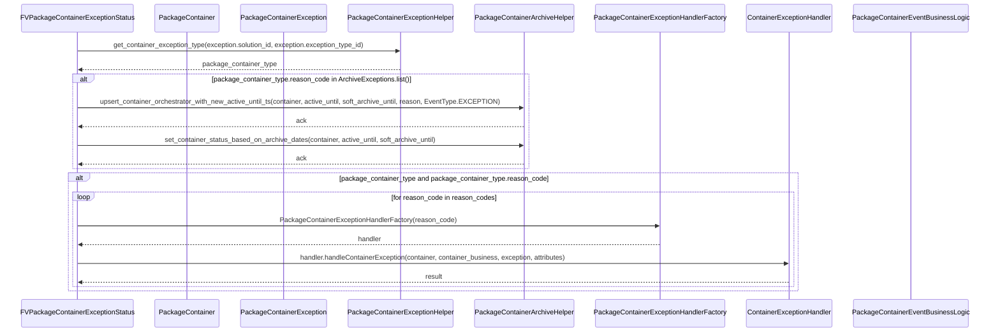

# Diagram: platform/partview_core/partview_service/partview_service/core/business/package_container_exception_status/FVPackageContainerExceptionStatus.py

> Auto-generated by Obscura crawlers

## Diagram 1

### SVG

<svg id="container" width="2416.341796875" xmlns="http://www.w3.org/2000/svg" class="classDiagram" height="632" viewBox="0 0 2416.341796875 632" role="graphics-document document" aria-roledescription="class"><g><defs><marker id="container_class-aggregationStart" class="marker aggregation class" refX="18" refY="7" markerWidth="190" markerHeight="240" orient="auto"><path d="M 18,7 L9,13 L1,7 L9,1 Z"></path></marker></defs><defs><marker id="container_class-aggregationEnd" class="marker aggregation class" refX="1" refY="7" markerWidth="20" markerHeight="28" orient="auto"><path d="M 18,7 L9,13 L1,7 L9,1 Z"></path></marker></defs><defs><marker id="container_class-extensionStart" class="marker extension class" refX="18" refY="7" markerWidth="190" markerHeight="240" orient="auto"><path d="M 1,7 L18,13 V 1 Z"></path></marker></defs><defs><marker id="container_class-extensionEnd" class="marker extension class" refX="1" refY="7" markerWidth="20" markerHeight="28" orient="auto"><path d="M 1,1 V 13 L18,7 Z"></path></marker></defs><defs><marker id="container_class-compositionStart" class="marker composition class" refX="18" refY="7" markerWidth="190" markerHeight="240" orient="auto"><path d="M 18,7 L9,13 L1,7 L9,1 Z"></path></marker></defs><defs><marker id="container_class-compositionEnd" class="marker composition class" refX="1" refY="7" markerWidth="20" markerHeight="28" orient="auto"><path d="M 18,7 L9,13 L1,7 L9,1 Z"></path></marker></defs><defs><marker id="container_class-dependencyStart" class="marker dependency class" refX="6" refY="7" markerWidth="190" markerHeight="240" orient="auto"><path d="M 5,7 L9,13 L1,7 L9,1 Z"></path></marker></defs><defs><marker id="container_class-dependencyEnd" class="marker dependency class" refX="13" refY="7" markerWidth="20" markerHeight="28" orient="auto"><path d="M 18,7 L9,13 L14,7 L9,1 Z"></path></marker></defs><defs><marker id="container_class-lollipopStart" class="marker lollipop class" refX="13" refY="7" markerWidth="190" markerHeight="240" orient="auto"><circle stroke="black" fill="transparent" cx="7" cy="7" r="6"></circle></marker></defs><defs><marker id="container_class-lollipopEnd" class="marker lollipop class" refX="1" refY="7" markerWidth="190" markerHeight="240" orient="auto"><circle stroke="black" fill="transparent" cx="7" cy="7" r="6"></circle></marker></defs><g class="root"><g class="clusters"></g><g class="edgePaths"><path d="M468.951,175.25L468.951,189.542C468.951,203.833,468.951,232.417,472.158,252.875C475.364,273.333,481.777,285.667,484.983,291.833L488.189,298" id="id_FVPackageContainerExceptionFactory_PackageContainerExceptionHandlerFactory_1" class="edge-thickness-normal edge-pattern-solid relation" style=";;;" data-edge="true" data-et="edge" data-id="id_FVPackageContainerExceptionFactory_PackageContainerExceptionHandlerFactory_1" data-points="W3sieCI6NDY4Ljk1MTE3MTg3NSwieSI6MTU4fSx7IngiOjQ2OC45NTExNzE4NzUsInkiOjI2MX0seyJ4Ijo0ODguMTg5MzU2Mjc1ODI2NDcsInkiOjI5OH1d" marker-start="url(#container_class-extensionStart)"></path><path d="M1187.468,202.994L1137.619,212.662C1087.77,222.329,988.071,241.665,938.222,264.499C888.373,287.333,888.373,313.667,888.373,326.833L888.373,340" id="id_FVPackageContainerExceptionStatus_PackageContainerExceptionHelper_2" class="edge-thickness-normal edge-pattern-solid relation" style=";;;" data-edge="true" data-et="edge" data-id="id_FVPackageContainerExceptionStatus_PackageContainerExceptionHelper_2" data-points="W3sieCI6MTIwNC40MDIzNDM3NSwieSI6MTk5LjcwOTYyOTgwNzY1NDY0fSx7IngiOjg4OC4zNzMwNDY4NzUsInkiOjI2MX0seyJ4Ijo4ODguMzczMDQ2ODc1LCJ5IjozNDB9XQ==" marker-start="url(#container_class-aggregationStart)"></path><path d="M1314.887,224L1296.55,230.167C1278.213,236.333,1241.539,248.667,1223.202,267C1204.865,285.333,1204.865,309.667,1204.865,321.833L1204.865,334" id="id_FVPackageContainerExceptionStatus_PackageContainerArchiveHelper_3" class="edge-thickness-normal edge-pattern-dashed relation" style=";;;" data-edge="true" data-et="edge" data-id="id_FVPackageContainerExceptionStatus_PackageContainerArchiveHelper_3" data-points="W3sieCI6MTMxNC44ODY5MDczMjc1ODYyLCJ5IjoyMjR9LHsieCI6MTIwNC44NjUyMzQzNzUsInkiOjI2MX0seyJ4IjoxMjA0Ljg2NTIzNDM3NSwieSI6MzQwfV0=" marker-end="url(#container_class-dependencyEnd)"></path><path d="M1204.402,180.815L1115.405,194.179C1026.407,207.543,848.411,234.272,753.106,253.145C657.8,272.018,645.184,283.036,638.876,288.544L632.568,294.053" id="id_FVPackageContainerExceptionStatus_PackageContainerExceptionHandlerFactory_4" class="edge-thickness-normal edge-pattern-solid relation" style=";;;" data-edge="true" data-et="edge" data-id="id_FVPackageContainerExceptionStatus_PackageContainerExceptionHandlerFactory_4" data-points="W3sieCI6MTIwNC40MDIzNDM3NSwieSI6MTgwLjgxNDgzNDI5MjQxODAzfSx7IngiOjY3MC40MTYwMTU2MjUsInkiOjI2MX0seyJ4Ijo2MjguMDQ5MjQ3ODA0NzUyMSwieSI6Mjk4fV0=" marker-end="url(#container_class-dependencyEnd)"></path><path d="M363.029,426.8L315.168,439.5C267.306,452.2,171.583,477.6,123.721,495.467C75.859,513.333,75.859,523.667,75.859,528.833L75.859,534" id="id_PackageContainerExceptionHandlerFactory_ShortException_5" class="edge-thickness-normal edge-pattern-solid relation" style=";;;" data-edge="true" data-et="edge" data-id="id_PackageContainerExceptionHandlerFactory_ShortException_5" data-points="W3sieCI6MzYzLjAyOTI5Njg3NSwieSI6NDI2LjgwMDE4ODQ1NzAwODIzfSx7IngiOjc1Ljg1OTM3NSwieSI6NTAzfSx7IngiOjc1Ljg1OTM3NSwieSI6NTQwfV0=" marker-end="url(#container_class-dependencyEnd)"></path><path d="M363.029,459.692L347.343,466.91C331.658,474.128,300.286,488.564,284.6,500.949C268.914,513.333,268.914,523.667,268.914,528.833L268.914,534" id="id_PackageContainerExceptionHandlerFactory_MissingException_6" class="edge-thickness-normal edge-pattern-solid relation" style=";;;" data-edge="true" data-et="edge" data-id="id_PackageContainerExceptionHandlerFactory_MissingException_6" data-points="W3sieCI6MzYzLjAyOTI5Njg3NSwieSI6NDU5LjY5MTc5NDYwODk2ODJ9LHsieCI6MjY4LjkxNDA2MjUsInkiOjUwM30seyJ4IjoyNjguOTE0MDYyNSwieSI6NTQwfV0=" marker-end="url(#container_class-dependencyEnd)"></path><path d="M480.126,466L476.328,472.167C472.529,478.333,464.933,490.667,461.134,502C457.336,513.333,457.336,523.667,457.336,528.833L457.336,534" id="id_PackageContainerExceptionHandlerFactory_LostException_7" class="edge-thickness-normal edge-pattern-solid relation" style=";;;" data-edge="true" data-et="edge" data-id="id_PackageContainerExceptionHandlerFactory_LostException_7" data-points="W3sieCI6NDgwLjEyNTg4Nzc4NDA5MDksInkiOjQ2Nn0seyJ4Ijo0NTcuMzM1OTM3NSwieSI6NTAzfSx7IngiOjQ1Ny4zMzU5Mzc1LCJ5Ijo1NDB9XQ==" marker-end="url(#container_class-dependencyEnd)"></path><path d="M603.561,466L608.824,472.167C614.087,478.333,624.614,490.667,629.877,502C635.141,513.333,635.141,523.667,635.141,528.833L635.141,534" id="id_PackageContainerExceptionHandlerFactory_HeldException_8" class="edge-thickness-normal edge-pattern-solid relation" style=";;;" data-edge="true" data-et="edge" data-id="id_PackageContainerExceptionHandlerFactory_HeldException_8" data-points="W3sieCI6NjAzLjU2MDU0Njg3NSwieSI6NDY2fSx7IngiOjYzNS4xNDA2MjUsInkiOjUwM30seyJ4Ijo2MzUuMTQwNjI1LCJ5Ijo1NDB9XQ==" marker-end="url(#container_class-dependencyEnd)"></path><path d="M700.701,449.571L722.951,458.475C745.202,467.38,789.702,485.19,811.953,499.262C834.203,513.333,834.203,523.667,834.203,528.833L834.203,534" id="id_PackageContainerExceptionHandlerFactory_MisroutedException_9" class="edge-thickness-normal edge-pattern-solid relation" style=";;;" data-edge="true" data-et="edge" data-id="id_PackageContainerExceptionHandlerFactory_MisroutedException_9" data-points="W3sieCI6NzAwLjcwMTE3MTg3NSwieSI6NDQ5LjU3MDU4NTk5MzI2ODZ9LHsieCI6ODM0LjIwMzEyNSwieSI6NTAzfSx7IngiOjgzNC4yMDMxMjUsInkiOjU0MH1d" marker-end="url(#container_class-dependencyEnd)"></path><path d="M700.701,421.511L758.737,435.093C816.772,448.674,932.843,475.837,990.879,494.585C1048.914,513.333,1048.914,523.667,1048.914,528.833L1048.914,534" id="id_PackageContainerExceptionHandlerFactory_RecycledException_10" class="edge-thickness-normal edge-pattern-solid relation" style=";;;" data-edge="true" data-et="edge" data-id="id_PackageContainerExceptionHandlerFactory_RecycledException_10" data-points="W3sieCI6NzAwLjcwMTE3MTg3NSwieSI6NDIxLjUxMTA2MjI1NjExODV9LHsieCI6MTA0OC45MTQwNjI1LCJ5Ijo1MDN9LHsieCI6MTA0OC45MTQwNjI1LCJ5Ijo1NDB9XQ==" marker-end="url(#container_class-dependencyEnd)"></path><path d="M700.701,409.89L794.646,425.408C888.59,440.926,1076.479,471.963,1170.423,492.648C1264.367,513.333,1264.367,523.667,1264.367,528.833L1264.367,534" id="id_PackageContainerExceptionHandlerFactory_BackorderException_11" class="edge-thickness-normal edge-pattern-solid relation" style=";;;" data-edge="true" data-et="edge" data-id="id_PackageContainerExceptionHandlerFactory_BackorderException_11" data-points="W3sieCI6NzAwLjcwMTE3MTg3NSwieSI6NDA5Ljg4OTU0ODA3NjA3N30seyJ4IjoxMjY0LjM2NzE4NzUsInkiOjUwM30seyJ4IjoxMjY0LjM2NzE4NzUsInkiOjU0MH1d" marker-end="url(#container_class-dependencyEnd)"></path><path d="M1765.071,224L1772.439,230.167C1779.807,236.333,1794.543,248.667,1801.911,267C1809.279,285.333,1809.279,309.667,1809.279,321.833L1809.279,334" id="id_FVPackageContainerExceptionStatus_PackageContainer_12" class="edge-thickness-normal edge-pattern-solid relation" style=";;;" data-edge="true" data-et="edge" data-id="id_FVPackageContainerExceptionStatus_PackageContainer_12" data-points="W3sieCI6MTc2NS4wNzExNzQ1Njg5NjU1LCJ5IjoyMjR9LHsieCI6MTgwOS4yNzkyOTY4NzUsInkiOjI2MX0seyJ4IjoxODA5LjI3OTI5Njg3NSwieSI6MzQwfV0=" marker-end="url(#container_class-dependencyEnd)"></path><path d="M1932.739,224L1949.68,230.167C1966.622,236.333,2000.505,248.667,2017.447,267C2034.389,285.333,2034.389,309.667,2034.389,321.833L2034.389,334" id="id_FVPackageContainerExceptionStatus_PackageContainerEvent_13" class="edge-thickness-normal edge-pattern-solid relation" style=";;;" data-edge="true" data-et="edge" data-id="id_FVPackageContainerExceptionStatus_PackageContainerEvent_13" data-points="W3sieCI6MTkzMi43Mzg4NDY5ODI3NTg2LCJ5IjoyMjR9LHsieCI6MjAzNC4zODg2NzE4NzUsInkiOjI2MX0seyJ4IjoyMDM0LjM4ODY3MTg3NSwieSI6MzQwfV0=" marker-end="url(#container_class-dependencyEnd)"></path><path d="M2067.66,210.948L2105.582,219.29C2143.505,227.632,2219.349,244.316,2257.271,264.825C2295.193,285.333,2295.193,309.667,2295.193,321.833L2295.193,334" id="id_FVPackageContainerExceptionStatus_PackageContainerException_14" class="edge-thickness-normal edge-pattern-solid relation" style=";;;" data-edge="true" data-et="edge" data-id="id_FVPackageContainerExceptionStatus_PackageContainerException_14" data-points="W3sieCI6MjA2Ny42NjAxNTYyNSwieSI6MjEwLjk0ODEwMjMxOTc2NTU1fSx7IngiOjIyOTUuMTkzMzU5Mzc1LCJ5IjoyNjF9LHsieCI6MjI5NS4xOTMzNTkzNzUsInkiOjM0MH1d" marker-end="url(#container_class-dependencyEnd)"></path><path d="M1559.109,224L1554.717,230.167C1550.325,236.333,1541.54,248.667,1537.148,267C1532.756,285.333,1532.756,309.667,1532.756,321.833L1532.756,334" id="id_FVPackageContainerExceptionStatus_PackageContainerEventBusinessLogic_15" class="edge-thickness-normal edge-pattern-solid relation" style=";;;" data-edge="true" data-et="edge" data-id="id_FVPackageContainerExceptionStatus_PackageContainerEventBusinessLogic_15" data-points="W3sieCI6MTU1OS4xMDg4OTAwODYyMDY5LCJ5IjoyMjR9LHsieCI6MTUzMi43NTU4NTkzNzUsInkiOjI2MX0seyJ4IjoxNTMyLjc1NTg1OTM3NSwieSI6MzQwfV0=" marker-end="url(#container_class-dependencyEnd)"></path></g><g class="edgeLabels"><g class="edgeLabel"><g class="label" data-id="id_FVPackageContainerExceptionFactory_PackageContainerExceptionHandlerFactory_1" transform="translate(0, 0)"><foreignObject width="0" height="0">

</foreignObject></g></g><g class="edgeLabel" transform="translate(888.373046875, 261)"><g class="label" data-id="id_FVPackageContainerExceptionStatus_PackageContainerExceptionHelper_2" transform="translate(-16.4921875, -12)"><foreignObject width="32.984375" height="24">

uses

</foreignObject></g></g><g class="edgeLabel" transform="translate(1204.865234375, 261)"><g class="label" data-id="id_FVPackageContainerExceptionStatus_PackageContainerArchiveHelper_3" transform="translate(-16.4453125, -12)"><foreignObject width="32.890625" height="24">

calls

</foreignObject></g></g><g class="edgeLabel" transform="translate(909.59654, 225.08386)"><g class="label" data-id="id_FVPackageContainerExceptionStatus_PackageContainerExceptionHandlerFactory_4" transform="translate(-42.9140625, -12)"><foreignObject width="85.828125" height="24">

instantiates

</foreignObject></g></g><g class="edgeLabel" transform="translate(75.859375, 503)"><g class="label" data-id="id_PackageContainerExceptionHandlerFactory_ShortException_5" transform="translate(-16.1875, -12)"><foreignObject width="32.375" height="24">

"SH"

</foreignObject></g></g><g class="edgeLabel" transform="translate(268.9140625, 503)"><g class="label" data-id="id_PackageContainerExceptionHandlerFactory_MissingException_6" transform="translate(-16.7734375, -12)"><foreignObject width="33.546875" height="24">

"MS"

</foreignObject></g></g><g class="edgeLabel" transform="translate(457.3359375, 503)"><g class="label" data-id="id_PackageContainerExceptionHandlerFactory_LostException_7" transform="translate(-14.53125, -12)"><foreignObject width="29.0625" height="24">

"LS"

</foreignObject></g></g><g class="edgeLabel" transform="translate(635.140625, 503)"><g class="label" data-id="id_PackageContainerExceptionHandlerFactory_HeldException_8" transform="translate(-16.109375, -12)"><foreignObject width="32.21875" height="24">

"HE"

</foreignObject></g></g><g class="edgeLabel" transform="translate(834.203125, 503)"><g class="label" data-id="id_PackageContainerExceptionHandlerFactory_MisroutedException_9" transform="translate(-17.453125, -12)"><foreignObject width="34.90625" height="24">

"MR"

</foreignObject></g></g><g class="edgeLabel" transform="translate(1048.9140625, 503)"><g class="label" data-id="id_PackageContainerExceptionHandlerFactory_RecycledException_10" transform="translate(-15.5078125, -12)"><foreignObject width="31.015625" height="24">

"RE"

</foreignObject></g></g><g class="edgeLabel" transform="translate(1264.3671875, 503)"><g class="label" data-id="id_PackageContainerExceptionHandlerFactory_BackorderException_11" transform="translate(-16.7890625, -12)"><foreignObject width="33.578125" height="24">

"BO"

</foreignObject></g></g><g class="edgeLabel" transform="translate(1809.279296875, 261)"><g class="label" data-id="id_FVPackageContainerExceptionStatus_PackageContainer_12" transform="translate(-28.0078125, -12)"><foreignObject width="56.015625" height="24">

acts_on

</foreignObject></g></g><g class="edgeLabel" transform="translate(2034.388671875, 261)"><g class="label" data-id="id_FVPackageContainerExceptionStatus_PackageContainerEvent_13" transform="translate(-36.375, -12)"><foreignObject width="72.75" height="24">

consumes

</foreignObject></g></g><g class="edgeLabel" transform="translate(2295.193359375, 261)"><g class="label" data-id="id_FVPackageContainerExceptionStatus_PackageContainerException_14" transform="translate(-35.7890625, -12)"><foreignObject width="71.578125" height="24">

processes

</foreignObject></g></g><g class="edgeLabel" transform="translate(1532.755859375, 261)"><g class="label" data-id="id_FVPackageContainerExceptionStatus_PackageContainerEventBusinessLogic_15" transform="translate(-31.6875, -12)"><foreignObject width="63.375" height="24">

interacts

</foreignObject></g></g></g><g class="nodes"><g class="node default" id="classId-FVPackageContainerExceptionStatus-0" transform="translate(1636.03125, 116)"><g class="basic label-container"><path d="M-431.62890625 -108 L431.62890625 -108 L431.62890625 108 L-431.62890625 108" stroke="none" stroke-width="0" fill="#ECECFF" style=""></path><path d="M-431.62890625 -108 C-247.44716019902035 -108, -63.26541414804069 -108, 431.62890625 -108 M-431.62890625 -108 C-251.34059895696538 -108, -71.05229166393076 -108, 431.62890625 -108 M431.62890625 -108 C431.62890625 -33.83056400342805, 431.62890625 40.3388719931439, 431.62890625 108 M431.62890625 -108 C431.62890625 -23.367785381946362, 431.62890625 61.264429236107276, 431.62890625 108 M431.62890625 108 C142.3062893730617 108, -147.0163275038766 108, -431.62890625 108 M431.62890625 108 C134.49984441710194 108, -162.62921741579612 108, -431.62890625 108 M-431.62890625 108 C-431.62890625 33.015871474065136, -431.62890625 -41.96825705186973, -431.62890625 -108 M-431.62890625 108 C-431.62890625 22.45141941067108, -431.62890625 -63.09716117865784, -431.62890625 -108" stroke="#9370DB" stroke-width="1.3" fill="none" stroke-dasharray="0 0" style=""></path></g><g class="annotation-group text" transform="translate(0, -84)"></g><g class="label-group text" transform="translate(-133.0859375, -84)"><g class="label" style="font-weight: bolder" transform="translate(0,-12)"><foreignObject width="266.171875" height="24">

FVPackageContainerExceptionStatus

</foreignObject></g></g><g class="members-group text" transform="translate(-419.62890625, -36)"><g class="label" style="" transform="translate(0,-12)"><foreignObject width="217.25" height="24">

- __package_container_helper

</foreignObject></g></g><g class="methods-group text" transform="translate(-419.62890625, 12)"><g class="label" style="" transform="translate(0,-12)"><foreignObject width="417.765625" height="24">

+ handle_new_package_container_event(container, event)

</foreignObject></g><g class="label" style="" transform="translate(0,12)"><foreignObject width="706.171875" height="24">

+ handle_new_package_container_exception(container, container_business, exception, attributes)

</foreignObject></g><g class="label" style="" transform="translate(0,36)"><foreignObject width="368.953125" height="24">

+ __get_reason_codes_by_event_code(event_code)

</foreignObject></g><g class="label" style="" transform="translate(0,60)"><foreignObject width="386.578125" height="24">

+ __get_reason_codes_by_reason_code(reason_code)

</foreignObject></g></g><g class="divider" style=""><path d="M-431.62890625 -60 C-110.28418248522496 -60, 211.06054127955008 -60, 431.62890625 -60 M-431.62890625 -60 C-92.76776323582106 -60, 246.09337977835787 -60, 431.62890625 -60" stroke="#9370DB" stroke-width="1.3" fill="none" stroke-dasharray="0 0" style=""></path></g><g class="divider" style=""><path d="M-431.62890625 -12 C-150.09860778164165 -12, 131.4316906867167 -12, 431.62890625 -12 M-431.62890625 -12 C-156.3158265860293 -12, 118.99725307794142 -12, 431.62890625 -12" stroke="#9370DB" stroke-width="1.3" fill="none" stroke-dasharray="0 0" style=""></path></g></g><g class="node default" id="classId-PackageContainerExceptionHandlerFactory-1" transform="translate(531.865234375, 382)"><g class="basic label-container"><path d="M-168.8359375 -84 L168.8359375 -84 L168.8359375 84 L-168.8359375 84" stroke="none" stroke-width="0" fill="#ECECFF" style=""></path><path d="M-168.8359375 -84 C-55.769951814108865 -84, 57.29603387178227 -84, 168.8359375 -84 M-168.8359375 -84 C-88.75073804185911 -84, -8.665538583718217 -84, 168.8359375 -84 M168.8359375 -84 C168.8359375 -24.144281998944997, 168.8359375 35.711436002110005, 168.8359375 84 M168.8359375 -84 C168.8359375 -22.551125875520356, 168.8359375 38.89774824895929, 168.8359375 84 M168.8359375 84 C54.21617144051092 84, -60.40359461897816 84, -168.8359375 84 M168.8359375 84 C71.86936077178409 84, -25.097215956431825 84, -168.8359375 84 M-168.8359375 84 C-168.8359375 49.04880687973635, -168.8359375 14.097613759472694, -168.8359375 -84 M-168.8359375 84 C-168.8359375 41.76087523171272, -168.8359375 -0.47824953657456604, -168.8359375 -84" stroke="#9370DB" stroke-width="1.3" fill="none" stroke-dasharray="0 0" style=""></path></g><g class="annotation-group text" transform="translate(0, -60)"></g><g class="label-group text" transform="translate(-156.8359375, -60)"><g class="label" style="font-weight: bolder" transform="translate(0,-12)"><foreignObject width="313.671875" height="24">

PackageContainerExceptionHandlerFactory

</foreignObject></g></g><g class="members-group text" transform="translate(-156.8359375, -12)"><g class="label" style="" transform="translate(0,-12)"><foreignObject width="74.453125" height="24">

- handlers

</foreignObject></g><g class="label" style="" transform="translate(0,12)"><foreignObject width="68.765625" height="24">

+ handler

</foreignObject></g></g><g class="methods-group text" transform="translate(-156.8359375, 60)"><g class="label" style="" transform="translate(0,-12)"><foreignObject width="139" height="24">

+ <strong>init</strong>(reason_code)

</foreignObject></g></g><g class="divider" style=""><path d="M-168.8359375 -36 C-60.30944582415377 -36, 48.21704585169246 -36, 168.8359375 -36 M-168.8359375 -36 C-53.27438244353897 -36, 62.28717261292206 -36, 168.8359375 -36" stroke="#9370DB" stroke-width="1.3" fill="none" stroke-dasharray="0 0" style=""></path></g><g class="divider" style=""><path d="M-168.8359375 36 C-91.84875720922233 36, -14.861576918444655 36, 168.8359375 36 M-168.8359375 36 C-57.58610422060538 36, 53.663729058789244 36, 168.8359375 36" stroke="#9370DB" stroke-width="1.3" fill="none" stroke-dasharray="0 0" style=""></path></g></g><g class="node default" id="classId-FVPackageContainerExceptionFactory-2" transform="translate(468.951171875, 116)"><g class="basic label-container"><path d="M-148.203125 -42 L148.203125 -42 L148.203125 42 L-148.203125 42" stroke="none" stroke-width="0" fill="#ECECFF" style=""></path><path d="M-148.203125 -42 C-64.54505193129998 -42, 19.11302113740004 -42, 148.203125 -42 M-148.203125 -42 C-55.55298053855479 -42, 37.09716392289042 -42, 148.203125 -42 M148.203125 -42 C148.203125 -11.77967047241371, 148.203125 18.44065905517258, 148.203125 42 M148.203125 -42 C148.203125 -24.255125582598392, 148.203125 -6.5102511651967845, 148.203125 42 M148.203125 42 C49.28953025373356 42, -49.62406449253288 42, -148.203125 42 M148.203125 42 C35.71625279442583 42, -76.77061941114835 42, -148.203125 42 M-148.203125 42 C-148.203125 18.887384691269126, -148.203125 -4.225230617461747, -148.203125 -42 M-148.203125 42 C-148.203125 17.700271414042987, -148.203125 -6.599457171914025, -148.203125 -42" stroke="#9370DB" stroke-width="1.3" fill="none" stroke-dasharray="0 0" style=""></path></g><g class="annotation-group text" transform="translate(0, -18)"></g><g class="label-group text" transform="translate(-136.203125, -18)"><g class="label" style="font-weight: bolder" transform="translate(0,-12)"><foreignObject width="272.40625" height="24">

FVPackageContainerExceptionFactory

</foreignObject></g></g><g class="members-group text" transform="translate(-136.203125, 30)"></g><g class="methods-group text" transform="translate(-136.203125, 60)"></g><g class="divider" style=""><path d="M-148.203125 6 C-31.55937922932442 6, 85.08436654135116 6, 148.203125 6 M-148.203125 6 C-55.0308121183308 6, 38.1415007633384 6, 148.203125 6" stroke="#9370DB" stroke-width="1.3" fill="none" stroke-dasharray="0 0" style=""></path></g><g class="divider" style=""><path d="M-148.203125 24 C-45.35384907764568 24, 57.495426844708646 24, 148.203125 24 M-148.203125 24 C-68.10292185637891 24, 11.997281287242174 24, 148.203125 24" stroke="#9370DB" stroke-width="1.3" fill="none" stroke-dasharray="0 0" style=""></path></g></g><g class="node default" id="classId-PackageContainerExceptionHelper-3" transform="translate(888.373046875, 382)"><g class="basic label-container"><path d="M-137.671875 -42 L137.671875 -42 L137.671875 42 L-137.671875 42" stroke="none" stroke-width="0" fill="#ECECFF" style=""></path><path d="M-137.671875 -42 C-57.303418057001636 -42, 23.065038885996728 -42, 137.671875 -42 M-137.671875 -42 C-77.31294046019289 -42, -16.954005920385796 -42, 137.671875 -42 M137.671875 -42 C137.671875 -19.475292729566142, 137.671875 3.0494145408677156, 137.671875 42 M137.671875 -42 C137.671875 -19.946419647042116, 137.671875 2.107160705915767, 137.671875 42 M137.671875 42 C69.92485656049273 42, 2.177838120985456 42, -137.671875 42 M137.671875 42 C82.09852742488378 42, 26.525179849767568 42, -137.671875 42 M-137.671875 42 C-137.671875 15.32613069725313, -137.671875 -11.347738605493738, -137.671875 -42 M-137.671875 42 C-137.671875 9.595425283566733, -137.671875 -22.809149432866533, -137.671875 -42" stroke="#9370DB" stroke-width="1.3" fill="none" stroke-dasharray="0 0" style=""></path></g><g class="annotation-group text" transform="translate(0, -18)"></g><g class="label-group text" transform="translate(-125.671875, -18)"><g class="label" style="font-weight: bolder" transform="translate(0,-12)"><foreignObject width="251.34375" height="24">

PackageContainerExceptionHelper

</foreignObject></g></g><g class="members-group text" transform="translate(-125.671875, 30)"></g><g class="methods-group text" transform="translate(-125.671875, 60)"></g><g class="divider" style=""><path d="M-137.671875 6 C-30.16622421277124 6, 77.33942657445752 6, 137.671875 6 M-137.671875 6 C-82.4132125681181 6, -27.154550136236182 6, 137.671875 6" stroke="#9370DB" stroke-width="1.3" fill="none" stroke-dasharray="0 0" style=""></path></g><g class="divider" style=""><path d="M-137.671875 24 C-43.13813545831232 24, 51.39560408337536 24, 137.671875 24 M-137.671875 24 C-51.94849723418051 24, 33.774880531638985 24, 137.671875 24" stroke="#9370DB" stroke-width="1.3" fill="none" stroke-dasharray="0 0" style=""></path></g></g><g class="node default" id="classId-PackageContainerArchiveHelper-4" transform="translate(1204.865234375, 382)"><g class="basic label-container"><path d="M-128.8203125 -42 L128.8203125 -42 L128.8203125 42 L-128.8203125 42" stroke="none" stroke-width="0" fill="#ECECFF" style=""></path><path d="M-128.8203125 -42 C-53.32724577583497 -42, 22.165820948330065 -42, 128.8203125 -42 M-128.8203125 -42 C-28.029482918614775 -42, 72.76134666277045 -42, 128.8203125 -42 M128.8203125 -42 C128.8203125 -17.641179158359343, 128.8203125 6.717641683281315, 128.8203125 42 M128.8203125 -42 C128.8203125 -14.289986957268532, 128.8203125 13.420026085462936, 128.8203125 42 M128.8203125 42 C68.63758518116273 42, 8.454857862325468 42, -128.8203125 42 M128.8203125 42 C48.720029151480816 42, -31.38025419703837 42, -128.8203125 42 M-128.8203125 42 C-128.8203125 20.76508510882512, -128.8203125 -0.4698297823497626, -128.8203125 -42 M-128.8203125 42 C-128.8203125 16.06972179971604, -128.8203125 -9.860556400567923, -128.8203125 -42" stroke="#9370DB" stroke-width="1.3" fill="none" stroke-dasharray="0 0" style=""></path></g><g class="annotation-group text" transform="translate(0, -18)"></g><g class="label-group text" transform="translate(-116.8203125, -18)"><g class="label" style="font-weight: bolder" transform="translate(0,-12)"><foreignObject width="233.640625" height="24">

PackageContainerArchiveHelper

</foreignObject></g></g><g class="members-group text" transform="translate(-116.8203125, 30)"></g><g class="methods-group text" transform="translate(-116.8203125, 60)"></g><g class="divider" style=""><path d="M-128.8203125 6 C-31.823573860455056 6, 65.17316477908989 6, 128.8203125 6 M-128.8203125 6 C-47.98736704405411 6, 32.84557841189178 6, 128.8203125 6" stroke="#9370DB" stroke-width="1.3" fill="none" stroke-dasharray="0 0" style=""></path></g><g class="divider" style=""><path d="M-128.8203125 24 C-50.89223012958696 24, 27.035852240826074 24, 128.8203125 24 M-128.8203125 24 C-54.4824341824859 24, 19.855444135028193 24, 128.8203125 24" stroke="#9370DB" stroke-width="1.3" fill="none" stroke-dasharray="0 0" style=""></path></g></g><g class="node default" id="classId-PackageContainerEventBusinessLogic-5" transform="translate(1532.755859375, 382)"><g class="basic label-container"><path d="M-149.0703125 -42 L149.0703125 -42 L149.0703125 42 L-149.0703125 42" stroke="none" stroke-width="0" fill="#ECECFF" style=""></path><path d="M-149.0703125 -42 C-32.08762390798333 -42, 84.89506468403334 -42, 149.0703125 -42 M-149.0703125 -42 C-35.901485858938116 -42, 77.26734078212377 -42, 149.0703125 -42 M149.0703125 -42 C149.0703125 -18.131695341713655, 149.0703125 5.7366093165726895, 149.0703125 42 M149.0703125 -42 C149.0703125 -9.092777559438609, 149.0703125 23.814444881122782, 149.0703125 42 M149.0703125 42 C52.3610295364454 42, -44.3482534271092 42, -149.0703125 42 M149.0703125 42 C45.81829271689024 42, -57.43372706621952 42, -149.0703125 42 M-149.0703125 42 C-149.0703125 13.63941610838009, -149.0703125 -14.721167783239821, -149.0703125 -42 M-149.0703125 42 C-149.0703125 11.5261307008867, -149.0703125 -18.9477385982266, -149.0703125 -42" stroke="#9370DB" stroke-width="1.3" fill="none" stroke-dasharray="0 0" style=""></path></g><g class="annotation-group text" transform="translate(0, -18)"></g><g class="label-group text" transform="translate(-137.0703125, -18)"><g class="label" style="font-weight: bolder" transform="translate(0,-12)"><foreignObject width="274.140625" height="24">

PackageContainerEventBusinessLogic

</foreignObject></g></g><g class="members-group text" transform="translate(-137.0703125, 30)"></g><g class="methods-group text" transform="translate(-137.0703125, 60)"></g><g class="divider" style=""><path d="M-149.0703125 6 C-41.33675065917332 6, 66.39681118165336 6, 149.0703125 6 M-149.0703125 6 C-89.10736190911148 6, -29.14441131822295 6, 149.0703125 6" stroke="#9370DB" stroke-width="1.3" fill="none" stroke-dasharray="0 0" style=""></path></g><g class="divider" style=""><path d="M-149.0703125 24 C-45.974141491214084 24, 57.12202951757183 24, 149.0703125 24 M-149.0703125 24 C-66.55019356913728 24, 15.969925361725444 24, 149.0703125 24" stroke="#9370DB" stroke-width="1.3" fill="none" stroke-dasharray="0 0" style=""></path></g></g><g class="node default" id="classId-PackageContainer-6" transform="translate(1809.279296875, 382)"><g class="basic label-container"><path d="M-77.453125 -42 L77.453125 -42 L77.453125 42 L-77.453125 42" stroke="none" stroke-width="0" fill="#ECECFF" style=""></path><path d="M-77.453125 -42 C-25.86893601432314 -42, 25.71525297135372 -42, 77.453125 -42 M-77.453125 -42 C-26.03646621383099 -42, 25.380192572338018 -42, 77.453125 -42 M77.453125 -42 C77.453125 -12.808908761518964, 77.453125 16.382182476962072, 77.453125 42 M77.453125 -42 C77.453125 -10.344403144294873, 77.453125 21.311193711410255, 77.453125 42 M77.453125 42 C35.97316508847427 42, -5.5067948230514645 42, -77.453125 42 M77.453125 42 C31.900948928066704 42, -13.651227143866592 42, -77.453125 42 M-77.453125 42 C-77.453125 17.143400641805105, -77.453125 -7.71319871638979, -77.453125 -42 M-77.453125 42 C-77.453125 12.091593853962245, -77.453125 -17.81681229207551, -77.453125 -42" stroke="#9370DB" stroke-width="1.3" fill="none" stroke-dasharray="0 0" style=""></path></g><g class="annotation-group text" transform="translate(0, -18)"></g><g class="label-group text" transform="translate(-65.453125, -18)"><g class="label" style="font-weight: bolder" transform="translate(0,-12)"><foreignObject width="130.90625" height="24">

PackageContainer

</foreignObject></g></g><g class="members-group text" transform="translate(-65.453125, 30)"></g><g class="methods-group text" transform="translate(-65.453125, 60)"></g><g class="divider" style=""><path d="M-77.453125 6 C-42.62732925764092 6, -7.801533515281847 6, 77.453125 6 M-77.453125 6 C-33.90623742880151 6, 9.640650142396979 6, 77.453125 6" stroke="#9370DB" stroke-width="1.3" fill="none" stroke-dasharray="0 0" style=""></path></g><g class="divider" style=""><path d="M-77.453125 24 C-45.41000466884141 24, -13.36688433768282 24, 77.453125 24 M-77.453125 24 C-41.229048127603264 24, -5.004971255206527 24, 77.453125 24" stroke="#9370DB" stroke-width="1.3" fill="none" stroke-dasharray="0 0" style=""></path></g></g><g class="node default" id="classId-PackageContainerEvent-7" transform="translate(2034.388671875, 382)"><g class="basic label-container"><path d="M-97.65625 -42 L97.65625 -42 L97.65625 42 L-97.65625 42" stroke="none" stroke-width="0" fill="#ECECFF" style=""></path><path d="M-97.65625 -42 C-49.165048019751275 -42, -0.6738460395025498 -42, 97.65625 -42 M-97.65625 -42 C-57.24954826238756 -42, -16.842846524775126 -42, 97.65625 -42 M97.65625 -42 C97.65625 -13.62795558158577, 97.65625 14.74408883682846, 97.65625 42 M97.65625 -42 C97.65625 -24.71779665932955, 97.65625 -7.435593318659102, 97.65625 42 M97.65625 42 C49.078638041849686 42, 0.5010260836993723 42, -97.65625 42 M97.65625 42 C34.25059742150694 42, -29.155055156986123 42, -97.65625 42 M-97.65625 42 C-97.65625 21.110250349923927, -97.65625 0.2205006998478538, -97.65625 -42 M-97.65625 42 C-97.65625 15.685468076292, -97.65625 -10.629063847415999, -97.65625 -42" stroke="#9370DB" stroke-width="1.3" fill="none" stroke-dasharray="0 0" style=""></path></g><g class="annotation-group text" transform="translate(0, -18)"></g><g class="label-group text" transform="translate(-85.65625, -18)"><g class="label" style="font-weight: bolder" transform="translate(0,-12)"><foreignObject width="171.3125" height="24">

PackageContainerEvent

</foreignObject></g></g><g class="members-group text" transform="translate(-85.65625, 30)"></g><g class="methods-group text" transform="translate(-85.65625, 60)"></g><g class="divider" style=""><path d="M-97.65625 6 C-52.418283523006025 6, -7.18031704601205 6, 97.65625 6 M-97.65625 6 C-26.545966656134524 6, 44.56431668773095 6, 97.65625 6" stroke="#9370DB" stroke-width="1.3" fill="none" stroke-dasharray="0 0" style=""></path></g><g class="divider" style=""><path d="M-97.65625 24 C-42.21604741066871 24, 13.224155178662585 24, 97.65625 24 M-97.65625 24 C-29.84908545351908 24, 37.95807909296184 24, 97.65625 24" stroke="#9370DB" stroke-width="1.3" fill="none" stroke-dasharray="0 0" style=""></path></g></g><g class="node default" id="classId-PackageContainerException-8" transform="translate(2295.193359375, 382)"><g class="basic label-container"><path d="M-113.1484375 -42 L113.1484375 -42 L113.1484375 42 L-113.1484375 42" stroke="none" stroke-width="0" fill="#ECECFF" style=""></path><path d="M-113.1484375 -42 C-25.149795030892108 -42, 62.848847438215785 -42, 113.1484375 -42 M-113.1484375 -42 C-48.00802986352008 -42, 17.132377772959842 -42, 113.1484375 -42 M113.1484375 -42 C113.1484375 -10.443487494993125, 113.1484375 21.11302501001375, 113.1484375 42 M113.1484375 -42 C113.1484375 -18.884176827386433, 113.1484375 4.231646345227134, 113.1484375 42 M113.1484375 42 C66.18860861722816 42, 19.22877973445631 42, -113.1484375 42 M113.1484375 42 C24.07524974442468 42, -64.99793801115064 42, -113.1484375 42 M-113.1484375 42 C-113.1484375 22.38694616988829, -113.1484375 2.7738923397765802, -113.1484375 -42 M-113.1484375 42 C-113.1484375 15.38143464382598, -113.1484375 -11.23713071234804, -113.1484375 -42" stroke="#9370DB" stroke-width="1.3" fill="none" stroke-dasharray="0 0" style=""></path></g><g class="annotation-group text" transform="translate(0, -18)"></g><g class="label-group text" transform="translate(-101.1484375, -18)"><g class="label" style="font-weight: bolder" transform="translate(0,-12)"><foreignObject width="202.296875" height="24">

PackageContainerException

</foreignObject></g></g><g class="members-group text" transform="translate(-101.1484375, 30)"></g><g class="methods-group text" transform="translate(-101.1484375, 60)"></g><g class="divider" style=""><path d="M-113.1484375 6 C-27.086003413698364 6, 58.97643067260327 6, 113.1484375 6 M-113.1484375 6 C-25.8892843970401 6, 61.3698687059198 6, 113.1484375 6" stroke="#9370DB" stroke-width="1.3" fill="none" stroke-dasharray="0 0" style=""></path></g><g class="divider" style=""><path d="M-113.1484375 24 C-50.74006479831831 24, 11.668307903363385 24, 113.1484375 24 M-113.1484375 24 C-60.51134987725271 24, -7.874262254505425 24, 113.1484375 24" stroke="#9370DB" stroke-width="1.3" fill="none" stroke-dasharray="0 0" style=""></path></g></g><g class="node default" id="classId-ShortException-9" transform="translate(75.859375, 582)"><g class="basic label-container"><path d="M-67.859375 -42 L67.859375 -42 L67.859375 42 L-67.859375 42" stroke="none" stroke-width="0" fill="#ECECFF" style=""></path><path d="M-67.859375 -42 C-36.122477973674464 -42, -4.3855809473489344 -42, 67.859375 -42 M-67.859375 -42 C-28.107921700836677 -42, 11.643531598326646 -42, 67.859375 -42 M67.859375 -42 C67.859375 -14.299688040767695, 67.859375 13.40062391846461, 67.859375 42 M67.859375 -42 C67.859375 -23.96903857180457, 67.859375 -5.938077143609142, 67.859375 42 M67.859375 42 C34.52135958740272 42, 1.1833441748054412 42, -67.859375 42 M67.859375 42 C20.538754475820923 42, -26.781866048358154 42, -67.859375 42 M-67.859375 42 C-67.859375 10.418191519440395, -67.859375 -21.16361696111921, -67.859375 -42 M-67.859375 42 C-67.859375 8.982995493562427, -67.859375 -24.034009012875146, -67.859375 -42" stroke="#9370DB" stroke-width="1.3" fill="none" stroke-dasharray="0 0" style=""></path></g><g class="annotation-group text" transform="translate(0, -18)"></g><g class="label-group text" transform="translate(-55.859375, -18)"><g class="label" style="font-weight: bolder" transform="translate(0,-12)"><foreignObject width="111.71875" height="24">

ShortException

</foreignObject></g></g><g class="members-group text" transform="translate(-55.859375, 30)"></g><g class="methods-group text" transform="translate(-55.859375, 60)"></g><g class="divider" style=""><path d="M-67.859375 6 C-24.130219834380533 6, 19.598935331238934 6, 67.859375 6 M-67.859375 6 C-36.015851087669766 6, -4.172327175339532 6, 67.859375 6" stroke="#9370DB" stroke-width="1.3" fill="none" stroke-dasharray="0 0" style=""></path></g><g class="divider" style=""><path d="M-67.859375 24 C-26.09451495781071 24, 15.670345084378582 24, 67.859375 24 M-67.859375 24 C-34.9078398373111 24, -1.9563046746222028 24, 67.859375 24" stroke="#9370DB" stroke-width="1.3" fill="none" stroke-dasharray="0 0" style=""></path></g></g><g class="node default" id="classId-MissingException-10" transform="translate(268.9140625, 582)"><g class="basic label-container"><path d="M-75.1953125 -42 L75.1953125 -42 L75.1953125 42 L-75.1953125 42" stroke="none" stroke-width="0" fill="#ECECFF" style=""></path><path d="M-75.1953125 -42 C-32.9875293396603 -42, 9.220253820679403 -42, 75.1953125 -42 M-75.1953125 -42 C-32.82773950964486 -42, 9.539833480710286 -42, 75.1953125 -42 M75.1953125 -42 C75.1953125 -19.6525068777808, 75.1953125 2.6949862444383967, 75.1953125 42 M75.1953125 -42 C75.1953125 -11.448738435673636, 75.1953125 19.102523128652727, 75.1953125 42 M75.1953125 42 C19.59844608143672 42, -35.99842033712656 42, -75.1953125 42 M75.1953125 42 C22.560668549745657 42, -30.073975400508687 42, -75.1953125 42 M-75.1953125 42 C-75.1953125 11.175087652534884, -75.1953125 -19.64982469493023, -75.1953125 -42 M-75.1953125 42 C-75.1953125 11.346009415395546, -75.1953125 -19.307981169208908, -75.1953125 -42" stroke="#9370DB" stroke-width="1.3" fill="none" stroke-dasharray="0 0" style=""></path></g><g class="annotation-group text" transform="translate(0, -18)"></g><g class="label-group text" transform="translate(-63.1953125, -18)"><g class="label" style="font-weight: bolder" transform="translate(0,-12)"><foreignObject width="126.390625" height="24">

MissingException

</foreignObject></g></g><g class="members-group text" transform="translate(-63.1953125, 30)"></g><g class="methods-group text" transform="translate(-63.1953125, 60)"></g><g class="divider" style=""><path d="M-75.1953125 6 C-37.479580461044165 6, 0.23615157791167007 6, 75.1953125 6 M-75.1953125 6 C-29.611384853913826 6, 15.972542792172348 6, 75.1953125 6" stroke="#9370DB" stroke-width="1.3" fill="none" stroke-dasharray="0 0" style=""></path></g><g class="divider" style=""><path d="M-75.1953125 24 C-16.695179108416482 24, 41.804954283167035 24, 75.1953125 24 M-75.1953125 24 C-23.12842645045997 24, 28.938459599080062 24, 75.1953125 24" stroke="#9370DB" stroke-width="1.3" fill="none" stroke-dasharray="0 0" style=""></path></g></g><g class="node default" id="classId-LostException-11" transform="translate(457.3359375, 582)"><g class="basic label-container"><path d="M-63.2265625 -42 L63.2265625 -42 L63.2265625 42 L-63.2265625 42" stroke="none" stroke-width="0" fill="#ECECFF" style=""></path><path d="M-63.2265625 -42 C-17.476482415880888 -42, 28.273597668238224 -42, 63.2265625 -42 M-63.2265625 -42 C-27.703436767834624 -42, 7.8196889643307514 -42, 63.2265625 -42 M63.2265625 -42 C63.2265625 -22.136491091627104, 63.2265625 -2.272982183254207, 63.2265625 42 M63.2265625 -42 C63.2265625 -22.48255887153808, 63.2265625 -2.9651177430761635, 63.2265625 42 M63.2265625 42 C25.75605577781478 42, -11.71445094437044 42, -63.2265625 42 M63.2265625 42 C24.188858069559004 42, -14.848846360881993 42, -63.2265625 42 M-63.2265625 42 C-63.2265625 13.918243090758136, -63.2265625 -14.163513818483729, -63.2265625 -42 M-63.2265625 42 C-63.2265625 10.827354738421956, -63.2265625 -20.345290523156088, -63.2265625 -42" stroke="#9370DB" stroke-width="1.3" fill="none" stroke-dasharray="0 0" style=""></path></g><g class="annotation-group text" transform="translate(0, -18)"></g><g class="label-group text" transform="translate(-51.2265625, -18)"><g class="label" style="font-weight: bolder" transform="translate(0,-12)"><foreignObject width="102.453125" height="24">

LostException

</foreignObject></g></g><g class="members-group text" transform="translate(-51.2265625, 30)"></g><g class="methods-group text" transform="translate(-51.2265625, 60)"></g><g class="divider" style=""><path d="M-63.2265625 6 C-25.56773241645206 6, 12.09109766709588 6, 63.2265625 6 M-63.2265625 6 C-37.59668017898548 6, -11.966797857970967 6, 63.2265625 6" stroke="#9370DB" stroke-width="1.3" fill="none" stroke-dasharray="0 0" style=""></path></g><g class="divider" style=""><path d="M-63.2265625 24 C-22.60335211515335 24, 18.0198582696933 24, 63.2265625 24 M-63.2265625 24 C-29.097874792580946 24, 5.030812914838108 24, 63.2265625 24" stroke="#9370DB" stroke-width="1.3" fill="none" stroke-dasharray="0 0" style=""></path></g></g><g class="node default" id="classId-HeldException-12" transform="translate(635.140625, 582)"><g class="basic label-container"><path d="M-64.578125 -42 L64.578125 -42 L64.578125 42 L-64.578125 42" stroke="none" stroke-width="0" fill="#ECECFF" style=""></path><path d="M-64.578125 -42 C-35.911304923518 -42, -7.244484847035999 -42, 64.578125 -42 M-64.578125 -42 C-21.215870387893446 -42, 22.146384224213108 -42, 64.578125 -42 M64.578125 -42 C64.578125 -17.70522449240151, 64.578125 6.589551015196982, 64.578125 42 M64.578125 -42 C64.578125 -11.754259427386323, 64.578125 18.491481145227354, 64.578125 42 M64.578125 42 C24.856059182442472 42, -14.866006635115056 42, -64.578125 42 M64.578125 42 C15.011897758945722 42, -34.55432948210856 42, -64.578125 42 M-64.578125 42 C-64.578125 14.495696846614063, -64.578125 -13.008606306771874, -64.578125 -42 M-64.578125 42 C-64.578125 10.425803113956718, -64.578125 -21.148393772086564, -64.578125 -42" stroke="#9370DB" stroke-width="1.3" fill="none" stroke-dasharray="0 0" style=""></path></g><g class="annotation-group text" transform="translate(0, -18)"></g><g class="label-group text" transform="translate(-52.578125, -18)"><g class="label" style="font-weight: bolder" transform="translate(0,-12)"><foreignObject width="105.15625" height="24">

HeldException

</foreignObject></g></g><g class="members-group text" transform="translate(-52.578125, 30)"></g><g class="methods-group text" transform="translate(-52.578125, 60)"></g><g class="divider" style=""><path d="M-64.578125 6 C-16.344687937641062 6, 31.888749124717876 6, 64.578125 6 M-64.578125 6 C-28.639378638585853 6, 7.299367722828293 6, 64.578125 6" stroke="#9370DB" stroke-width="1.3" fill="none" stroke-dasharray="0 0" style=""></path></g><g class="divider" style=""><path d="M-64.578125 24 C-13.904748999457723 24, 36.76862700108455 24, 64.578125 24 M-64.578125 24 C-23.391954454534584 24, 17.79421609093083 24, 64.578125 24" stroke="#9370DB" stroke-width="1.3" fill="none" stroke-dasharray="0 0" style=""></path></g></g><g class="node default" id="classId-MisroutedException-13" transform="translate(834.203125, 582)"><g class="basic label-container"><path d="M-84.484375 -42 L84.484375 -42 L84.484375 42 L-84.484375 42" stroke="none" stroke-width="0" fill="#ECECFF" style=""></path><path d="M-84.484375 -42 C-23.648915317303903 -42, 37.186544365392194 -42, 84.484375 -42 M-84.484375 -42 C-23.243467351201843 -42, 37.99744029759631 -42, 84.484375 -42 M84.484375 -42 C84.484375 -21.91471178736145, 84.484375 -1.8294235747229024, 84.484375 42 M84.484375 -42 C84.484375 -24.284839721141804, 84.484375 -6.569679442283608, 84.484375 42 M84.484375 42 C41.858984213577195 42, -0.7664065728456109 42, -84.484375 42 M84.484375 42 C33.34546034848051 42, -17.793454303038985 42, -84.484375 42 M-84.484375 42 C-84.484375 14.992521110962478, -84.484375 -12.014957778075043, -84.484375 -42 M-84.484375 42 C-84.484375 19.801338675406107, -84.484375 -2.3973226491877853, -84.484375 -42" stroke="#9370DB" stroke-width="1.3" fill="none" stroke-dasharray="0 0" style=""></path></g><g class="annotation-group text" transform="translate(0, -18)"></g><g class="label-group text" transform="translate(-72.484375, -18)"><g class="label" style="font-weight: bolder" transform="translate(0,-12)"><foreignObject width="144.96875" height="24">

MisroutedException

</foreignObject></g></g><g class="members-group text" transform="translate(-72.484375, 30)"></g><g class="methods-group text" transform="translate(-72.484375, 60)"></g><g class="divider" style=""><path d="M-84.484375 6 C-50.20151803525975 6, -15.918661070519505 6, 84.484375 6 M-84.484375 6 C-27.135595916574033 6, 30.213183166851934 6, 84.484375 6" stroke="#9370DB" stroke-width="1.3" fill="none" stroke-dasharray="0 0" style=""></path></g><g class="divider" style=""><path d="M-84.484375 24 C-33.7151849879165 24, 17.054005024166997 24, 84.484375 24 M-84.484375 24 C-18.182921652774866 24, 48.11853169445027 24, 84.484375 24" stroke="#9370DB" stroke-width="1.3" fill="none" stroke-dasharray="0 0" style=""></path></g></g><g class="node default" id="classId-RecycledException-14" transform="translate(1048.9140625, 582)"><g class="basic label-container"><path d="M-80.2265625 -42 L80.2265625 -42 L80.2265625 42 L-80.2265625 42" stroke="none" stroke-width="0" fill="#ECECFF" style=""></path><path d="M-80.2265625 -42 C-34.08058564945461 -42, 12.065391201090776 -42, 80.2265625 -42 M-80.2265625 -42 C-44.942960250564994 -42, -9.659358001129988 -42, 80.2265625 -42 M80.2265625 -42 C80.2265625 -13.25213588258513, 80.2265625 15.495728234829741, 80.2265625 42 M80.2265625 -42 C80.2265625 -17.120807163763743, 80.2265625 7.758385672472514, 80.2265625 42 M80.2265625 42 C36.27334398668083 42, -7.6798745266383435 42, -80.2265625 42 M80.2265625 42 C26.893449250220648 42, -26.439663999558704 42, -80.2265625 42 M-80.2265625 42 C-80.2265625 12.28981638756774, -80.2265625 -17.42036722486452, -80.2265625 -42 M-80.2265625 42 C-80.2265625 16.548617916949215, -80.2265625 -8.90276416610157, -80.2265625 -42" stroke="#9370DB" stroke-width="1.3" fill="none" stroke-dasharray="0 0" style=""></path></g><g class="annotation-group text" transform="translate(0, -18)"></g><g class="label-group text" transform="translate(-68.2265625, -18)"><g class="label" style="font-weight: bolder" transform="translate(0,-12)"><foreignObject width="136.453125" height="24">

RecycledException

</foreignObject></g></g><g class="members-group text" transform="translate(-68.2265625, 30)"></g><g class="methods-group text" transform="translate(-68.2265625, 60)"></g><g class="divider" style=""><path d="M-80.2265625 6 C-36.5971024348834 6, 7.032357630233193 6, 80.2265625 6 M-80.2265625 6 C-21.08820645690028 6, 38.05014958619944 6, 80.2265625 6" stroke="#9370DB" stroke-width="1.3" fill="none" stroke-dasharray="0 0" style=""></path></g><g class="divider" style=""><path d="M-80.2265625 24 C-16.219924015728466 24, 47.78671446854307 24, 80.2265625 24 M-80.2265625 24 C-38.47857393241536 24, 3.2694146351692837 24, 80.2265625 24" stroke="#9370DB" stroke-width="1.3" fill="none" stroke-dasharray="0 0" style=""></path></g></g><g class="node default" id="classId-BackorderException-15" transform="translate(1264.3671875, 582)"><g class="basic label-container"><path d="M-85.2265625 -42 L85.2265625 -42 L85.2265625 42 L-85.2265625 42" stroke="none" stroke-width="0" fill="#ECECFF" style=""></path><path d="M-85.2265625 -42 C-29.795383187567836 -42, 25.635796124864328 -42, 85.2265625 -42 M-85.2265625 -42 C-50.82275137176022 -42, -16.41894024352044 -42, 85.2265625 -42 M85.2265625 -42 C85.2265625 -19.833105446909258, 85.2265625 2.3337891061814844, 85.2265625 42 M85.2265625 -42 C85.2265625 -12.894387169718645, 85.2265625 16.21122566056271, 85.2265625 42 M85.2265625 42 C46.50003744613487 42, 7.773512392269737 42, -85.2265625 42 M85.2265625 42 C39.14811950809713 42, -6.930323483805736 42, -85.2265625 42 M-85.2265625 42 C-85.2265625 18.989997907678188, -85.2265625 -4.020004184643625, -85.2265625 -42 M-85.2265625 42 C-85.2265625 14.6120515532022, -85.2265625 -12.7758968935956, -85.2265625 -42" stroke="#9370DB" stroke-width="1.3" fill="none" stroke-dasharray="0 0" style=""></path></g><g class="annotation-group text" transform="translate(0, -18)"></g><g class="label-group text" transform="translate(-73.2265625, -18)"><g class="label" style="font-weight: bolder" transform="translate(0,-12)"><foreignObject width="146.453125" height="24">

BackorderException

</foreignObject></g></g><g class="members-group text" transform="translate(-73.2265625, 30)"></g><g class="methods-group text" transform="translate(-73.2265625, 60)"></g><g class="divider" style=""><path d="M-85.2265625 6 C-19.40590223696853 6, 46.41475802606294 6, 85.2265625 6 M-85.2265625 6 C-25.45250366504923 6, 34.32155516990154 6, 85.2265625 6" stroke="#9370DB" stroke-width="1.3" fill="none" stroke-dasharray="0 0" style=""></path></g><g class="divider" style=""><path d="M-85.2265625 24 C-19.7347910441118 24, 45.7569804117764 24, 85.2265625 24 M-85.2265625 24 C-18.94853062174988 24, 47.32950125650024 24, 85.2265625 24" stroke="#9370DB" stroke-width="1.3" fill="none" stroke-dasharray="0 0" style=""></path></g></g></g></g></g></svg>

## Diagram 2

### SVG

<svg id="container" width="2461" xmlns="http://www.w3.org/2000/svg" height="816" viewBox="-50 -10 2461 816" role="graphics-document document" aria-roledescription="sequence"><g><rect x="2071" y="730" fill="#eaeaea" stroke="#666" width="290" height="65" name="Business" rx="3" ry="3" class="actor actor-bottom"></rect><text x="2216" y="762.5" dominant-baseline="central" alignment-baseline="central" class="actor actor-box" style="text-anchor: middle; font-size: 16px; font-weight: 400;"><tspan x="2216" dy="0">PackageContainerEventBusinessLogic</tspan></text></g><g><rect x="1801" y="730" fill="#eaeaea" stroke="#666" width="220" height="65" name="Handler" rx="3" ry="3" class="actor actor-bottom"></rect><text x="1911" y="762.5" dominant-baseline="central" alignment-baseline="central" class="actor actor-box" style="text-anchor: middle; font-size: 16px; font-weight: 400;"><tspan x="1911" dy="0">ContainerExceptionHandler</tspan></text></g><g><rect x="1421" y="730" fill="#eaeaea" stroke="#666" width="330" height="65" name="Factory" rx="3" ry="3" class="actor actor-bottom"></rect><text x="1586" y="762.5" dominant-baseline="central" alignment-baseline="central" class="actor actor-box" style="text-anchor: middle; font-size: 16px; font-weight: 400;"><tspan x="1586" dy="0">PackageContainerExceptionHandlerFactory</tspan></text></g><g><rect x="1120" y="730" fill="#eaeaea" stroke="#666" width="251" height="65" name="Archive" rx="3" ry="3" class="actor actor-bottom"></rect><text x="1245.5" y="762.5" dominant-baseline="central" alignment-baseline="central" class="actor actor-box" style="text-anchor: middle; font-size: 16px; font-weight: 400;"><tspan x="1245.5" dy="0">PackageContainerArchiveHelper</tspan></text></g><g><rect x="801" y="730" fill="#eaeaea" stroke="#666" width="269" height="65" name="Helper" rx="3" ry="3" class="actor actor-bottom"></rect><text x="935.5" y="762.5" dominant-baseline="central" alignment-baseline="central" class="actor actor-box" style="text-anchor: middle; font-size: 16px; font-weight: 400;"><tspan x="935.5" dy="0">PackageContainerExceptionHelper</tspan></text></g><g><rect x="532" y="730" fill="#eaeaea" stroke="#666" width="219" height="65" name="Exception" rx="3" ry="3" class="actor actor-bottom"></rect><text x="641.5" y="762.5" dominant-baseline="central" alignment-baseline="central" class="actor actor-box" style="text-anchor: middle; font-size: 16px; font-weight: 400;"><tspan x="641.5" dy="0">PackageContainerException</tspan></text></g><g><rect x="332" y="730" fill="#eaeaea" stroke="#666" width="150" height="65" name="Container" rx="3" ry="3" class="actor actor-bottom"></rect><text x="407" y="762.5" dominant-baseline="central" alignment-baseline="central" class="actor actor-box" style="text-anchor: middle; font-size: 16px; font-weight: 400;"><tspan x="407" dy="0">PackageContainer</tspan></text></g><g><rect x="0" y="730" fill="#eaeaea" stroke="#666" width="282" height="65" name="Status" rx="3" ry="3" class="actor actor-bottom"></rect><text x="141" y="762.5" dominant-baseline="central" alignment-baseline="central" class="actor actor-box" style="text-anchor: middle; font-size: 16px; font-weight: 400;"><tspan x="141" dy="0">FVPackageContainerExceptionStatus</tspan></text></g><g><line id="actor7" x1="2216" y1="65" x2="2216" y2="730" class="actor-line 200" stroke-width="0.5px" stroke="#999" name="Business"></line><g id="root-7"><rect x="2071" y="0" fill="#eaeaea" stroke="#666" width="290" height="65" name="Business" rx="3" ry="3" class="actor actor-top"></rect><text x="2216" y="32.5" dominant-baseline="central" alignment-baseline="central" class="actor actor-box" style="text-anchor: middle; font-size: 16px; font-weight: 400;"><tspan x="2216" dy="0">PackageContainerEventBusinessLogic</tspan></text></g></g><g><line id="actor6" x1="1911" y1="65" x2="1911" y2="730" class="actor-line 200" stroke-width="0.5px" stroke="#999" name="Handler"></line><g id="root-6"><rect x="1801" y="0" fill="#eaeaea" stroke="#666" width="220" height="65" name="Handler" rx="3" ry="3" class="actor actor-top"></rect><text x="1911" y="32.5" dominant-baseline="central" alignment-baseline="central" class="actor actor-box" style="text-anchor: middle; font-size: 16px; font-weight: 400;"><tspan x="1911" dy="0">ContainerExceptionHandler</tspan></text></g></g><g><line id="actor5" x1="1586" y1="65" x2="1586" y2="730" class="actor-line 200" stroke-width="0.5px" stroke="#999" name="Factory"></line><g id="root-5"><rect x="1421" y="0" fill="#eaeaea" stroke="#666" width="330" height="65" name="Factory" rx="3" ry="3" class="actor actor-top"></rect><text x="1586" y="32.5" dominant-baseline="central" alignment-baseline="central" class="actor actor-box" style="text-anchor: middle; font-size: 16px; font-weight: 400;"><tspan x="1586" dy="0">PackageContainerExceptionHandlerFactory</tspan></text></g></g><g><line id="actor4" x1="1245.5" y1="65" x2="1245.5" y2="730" class="actor-line 200" stroke-width="0.5px" stroke="#999" name="Archive"></line><g id="root-4"><rect x="1120" y="0" fill="#eaeaea" stroke="#666" width="251" height="65" name="Archive" rx="3" ry="3" class="actor actor-top"></rect><text x="1245.5" y="32.5" dominant-baseline="central" alignment-baseline="central" class="actor actor-box" style="text-anchor: middle; font-size: 16px; font-weight: 400;"><tspan x="1245.5" dy="0">PackageContainerArchiveHelper</tspan></text></g></g><g><line id="actor3" x1="935.5" y1="65" x2="935.5" y2="730" class="actor-line 200" stroke-width="0.5px" stroke="#999" name="Helper"></line><g id="root-3"><rect x="801" y="0" fill="#eaeaea" stroke="#666" width="269" height="65" name="Helper" rx="3" ry="3" class="actor actor-top"></rect><text x="935.5" y="32.5" dominant-baseline="central" alignment-baseline="central" class="actor actor-box" style="text-anchor: middle; font-size: 16px; font-weight: 400;"><tspan x="935.5" dy="0">PackageContainerExceptionHelper</tspan></text></g></g><g><line id="actor2" x1="641.5" y1="65" x2="641.5" y2="730" class="actor-line 200" stroke-width="0.5px" stroke="#999" name="Exception"></line><g id="root-2"><rect x="532" y="0" fill="#eaeaea" stroke="#666" width="219" height="65" name="Exception" rx="3" ry="3" class="actor actor-top"></rect><text x="641.5" y="32.5" dominant-baseline="central" alignment-baseline="central" class="actor actor-box" style="text-anchor: middle; font-size: 16px; font-weight: 400;"><tspan x="641.5" dy="0">PackageContainerException</tspan></text></g></g><g><line id="actor1" x1="407" y1="65" x2="407" y2="730" class="actor-line 200" stroke-width="0.5px" stroke="#999" name="Container"></line><g id="root-1"><rect x="332" y="0" fill="#eaeaea" stroke="#666" width="150" height="65" name="Container" rx="3" ry="3" class="actor actor-top"></rect><text x="407" y="32.5" dominant-baseline="central" alignment-baseline="central" class="actor actor-box" style="text-anchor: middle; font-size: 16px; font-weight: 400;"><tspan x="407" dy="0">PackageContainer</tspan></text></g></g><g><line id="actor0" x1="141" y1="65" x2="141" y2="730" class="actor-line 200" stroke-width="0.5px" stroke="#999" name="Status"></line><g id="root-0"><rect x="0" y="0" fill="#eaeaea" stroke="#666" width="282" height="65" name="Status" rx="3" ry="3" class="actor actor-top"></rect><text x="141" y="32.5" dominant-baseline="central" alignment-baseline="central" class="actor actor-box" style="text-anchor: middle; font-size: 16px; font-weight: 400;"><tspan x="141" dy="0">FVPackageContainerExceptionStatus</tspan></text></g></g><g></g><defs><symbol id="computer" width="24" height="24"><path transform="scale(.5)" d="M2 2v13h20v-13h-20zm18 11h-16v-9h16v9zm-10.228 6l.466-1h3.524l.467 1h-4.457zm14.228 3h-24l2-6h2.104l-1.33 4h18.45l-1.297-4h2.073l2 6zm-5-10h-14v-7h14v7z"></path></symbol></defs><defs><symbol id="database" fill-rule="evenodd" clip-rule="evenodd"><path transform="scale(.5)" d="M12.258.001l.256.004.255.005.253.008.251.01.249.012.247.015.246.016.242.019.241.02.239.023.236.024.233.027.231.028.229.031.225.032.223.034.22.036.217.038.214.04.211.041.208.043.205.045.201.046.198.048.194.05.191.051.187.053.183.054.18.056.175.057.172.059.168.06.163.061.16.063.155.064.15.066.074.033.073.033.071.034.07.034.069.035.068.035.067.035.066.035.064.036.064.036.062.036.06.036.06.037.058.037.058.037.055.038.055.038.053.038.052.038.051.039.05.039.048.039.047.039.045.04.044.04.043.04.041.04.04.041.039.041.037.041.036.041.034.041.033.042.032.042.03.042.029.042.027.042.026.043.024.043.023.043.021.043.02.043.018.044.017.043.015.044.013.044.012.044.011.045.009.044.007.045.006.045.004.045.002.045.001.045v17l-.001.045-.002.045-.004.045-.006.045-.007.045-.009.044-.011.045-.012.044-.013.044-.015.044-.017.043-.018.044-.02.043-.021.043-.023.043-.024.043-.026.043-.027.042-.029.042-.03.042-.032.042-.033.042-.034.041-.036.041-.037.041-.039.041-.04.041-.041.04-.043.04-.044.04-.045.04-.047.039-.048.039-.05.039-.051.039-.052.038-.053.038-.055.038-.055.038-.058.037-.058.037-.06.037-.06.036-.062.036-.064.036-.064.036-.066.035-.067.035-.068.035-.069.035-.07.034-.071.034-.073.033-.074.033-.15.066-.155.064-.16.063-.163.061-.168.06-.172.059-.175.057-.18.056-.183.054-.187.053-.191.051-.194.05-.198.048-.201.046-.205.045-.208.043-.211.041-.214.04-.217.038-.22.036-.223.034-.225.032-.229.031-.231.028-.233.027-.236.024-.239.023-.241.02-.242.019-.246.016-.247.015-.249.012-.251.01-.253.008-.255.005-.256.004-.258.001-.258-.001-.256-.004-.255-.005-.253-.008-.251-.01-.249-.012-.247-.015-.245-.016-.243-.019-.241-.02-.238-.023-.236-.024-.234-.027-.231-.028-.228-.031-.226-.032-.223-.034-.22-.036-.217-.038-.214-.04-.211-.041-.208-.043-.204-.045-.201-.046-.198-.048-.195-.05-.19-.051-.187-.053-.184-.054-.179-.056-.176-.057-.172-.059-.167-.06-.164-.061-.159-.063-.155-.064-.151-.066-.074-.033-.072-.033-.072-.034-.07-.034-.069-.035-.068-.035-.067-.035-.066-.035-.064-.036-.063-.036-.062-.036-.061-.036-.06-.037-.058-.037-.057-.037-.056-.038-.055-.038-.053-.038-.052-.038-.051-.039-.049-.039-.049-.039-.046-.039-.046-.04-.044-.04-.043-.04-.041-.04-.04-.041-.039-.041-.037-.041-.036-.041-.034-.041-.033-.042-.032-.042-.03-.042-.029-.042-.027-.042-.026-.043-.024-.043-.023-.043-.021-.043-.02-.043-.018-.044-.017-.043-.015-.044-.013-.044-.012-.044-.011-.045-.009-.044-.007-.045-.006-.045-.004-.045-.002-.045-.001-.045v-17l.001-.045.002-.045.004-.045.006-.045.007-.045.009-.044.011-.045.012-.044.013-.044.015-.044.017-.043.018-.044.02-.043.021-.043.023-.043.024-.043.026-.043.027-.042.029-.042.03-.042.032-.042.033-.042.034-.041.036-.041.037-.041.039-.041.04-.041.041-.04.043-.04.044-.04.046-.04.046-.039.049-.039.049-.039.051-.039.052-.038.053-.038.055-.038.056-.038.057-.037.058-.037.06-.037.061-.036.062-.036.063-.036.064-.036.066-.035.067-.035.068-.035.069-.035.07-.034.072-.034.072-.033.074-.033.151-.066.155-.064.159-.063.164-.061.167-.06.172-.059.176-.057.179-.056.184-.054.187-.053.19-.051.195-.05.198-.048.201-.046.204-.045.208-.043.211-.041.214-.04.217-.038.22-.036.223-.034.226-.032.228-.031.231-.028.234-.027.236-.024.238-.023.241-.02.243-.019.245-.016.247-.015.249-.012.251-.01.253-.008.255-.005.256-.004.258-.001.258.001zm-9.258 20.499v.01l.001.021.003.021.004.022.005.021.006.022.007.022.009.023.01.022.011.023.012.023.013.023.015.023.016.024.017.023.018.024.019.024.021.024.022.025.023.024.024.025.052.049.056.05.061.051.066.051.07.051.075.051.079.052.084.052.088.052.092.052.097.052.102.051.105.052.11.052.114.051.119.051.123.051.127.05.131.05.135.05.139.048.144.049.147.047.152.047.155.047.16.045.163.045.167.043.171.043.176.041.178.041.183.039.187.039.19.037.194.035.197.035.202.033.204.031.209.03.212.029.216.027.219.025.222.024.226.021.23.02.233.018.236.016.24.015.243.012.246.01.249.008.253.005.256.004.259.001.26-.001.257-.004.254-.005.25-.008.247-.011.244-.012.241-.014.237-.016.233-.018.231-.021.226-.021.224-.024.22-.026.216-.027.212-.028.21-.031.205-.031.202-.034.198-.034.194-.036.191-.037.187-.039.183-.04.179-.04.175-.042.172-.043.168-.044.163-.045.16-.046.155-.046.152-.047.148-.048.143-.049.139-.049.136-.05.131-.05.126-.05.123-.051.118-.052.114-.051.11-.052.106-.052.101-.052.096-.052.092-.052.088-.053.083-.051.079-.052.074-.052.07-.051.065-.051.06-.051.056-.05.051-.05.023-.024.023-.025.021-.024.02-.024.019-.024.018-.024.017-.024.015-.023.014-.024.013-.023.012-.023.01-.023.01-.022.008-.022.006-.022.006-.022.004-.022.004-.021.001-.021.001-.021v-4.127l-.077.055-.08.053-.083.054-.085.053-.087.052-.09.052-.093.051-.095.05-.097.05-.1.049-.102.049-.105.048-.106.047-.109.047-.111.046-.114.045-.115.045-.118.044-.12.043-.122.042-.124.042-.126.041-.128.04-.13.04-.132.038-.134.038-.135.037-.138.037-.139.035-.142.035-.143.034-.144.033-.147.032-.148.031-.15.03-.151.03-.153.029-.154.027-.156.027-.158.026-.159.025-.161.024-.162.023-.163.022-.165.021-.166.02-.167.019-.169.018-.169.017-.171.016-.173.015-.173.014-.175.013-.175.012-.177.011-.178.01-.179.008-.179.008-.181.006-.182.005-.182.004-.184.003-.184.002h-.37l-.184-.002-.184-.003-.182-.004-.182-.005-.181-.006-.179-.008-.179-.008-.178-.01-.176-.011-.176-.012-.175-.013-.173-.014-.172-.015-.171-.016-.17-.017-.169-.018-.167-.019-.166-.02-.165-.021-.163-.022-.162-.023-.161-.024-.159-.025-.157-.026-.156-.027-.155-.027-.153-.029-.151-.03-.15-.03-.148-.031-.146-.032-.145-.033-.143-.034-.141-.035-.14-.035-.137-.037-.136-.037-.134-.038-.132-.038-.13-.04-.128-.04-.126-.041-.124-.042-.122-.042-.12-.044-.117-.043-.116-.045-.113-.045-.112-.046-.109-.047-.106-.047-.105-.048-.102-.049-.1-.049-.097-.05-.095-.05-.093-.052-.09-.051-.087-.052-.085-.053-.083-.054-.08-.054-.077-.054v4.127zm0-5.654v.011l.001.021.003.021.004.021.005.022.006.022.007.022.009.022.01.022.011.023.012.023.013.023.015.024.016.023.017.024.018.024.019.024.021.024.022.024.023.025.024.024.052.05.056.05.061.05.066.051.07.051.075.052.079.051.084.052.088.052.092.052.097.052.102.052.105.052.11.051.114.051.119.052.123.05.127.051.131.05.135.049.139.049.144.048.147.048.152.047.155.046.16.045.163.045.167.044.171.042.176.042.178.04.183.04.187.038.19.037.194.036.197.034.202.033.204.032.209.03.212.028.216.027.219.025.222.024.226.022.23.02.233.018.236.016.24.014.243.012.246.01.249.008.253.006.256.003.259.001.26-.001.257-.003.254-.006.25-.008.247-.01.244-.012.241-.015.237-.016.233-.018.231-.02.226-.022.224-.024.22-.025.216-.027.212-.029.21-.03.205-.032.202-.033.198-.035.194-.036.191-.037.187-.039.183-.039.179-.041.175-.042.172-.043.168-.044.163-.045.16-.045.155-.047.152-.047.148-.048.143-.048.139-.05.136-.049.131-.05.126-.051.123-.051.118-.051.114-.052.11-.052.106-.052.101-.052.096-.052.092-.052.088-.052.083-.052.079-.052.074-.051.07-.052.065-.051.06-.05.056-.051.051-.049.023-.025.023-.024.021-.025.02-.024.019-.024.018-.024.017-.024.015-.023.014-.023.013-.024.012-.022.01-.023.01-.023.008-.022.006-.022.006-.022.004-.021.004-.022.001-.021.001-.021v-4.139l-.077.054-.08.054-.083.054-.085.052-.087.053-.09.051-.093.051-.095.051-.097.05-.1.049-.102.049-.105.048-.106.047-.109.047-.111.046-.114.045-.115.044-.118.044-.12.044-.122.042-.124.042-.126.041-.128.04-.13.039-.132.039-.134.038-.135.037-.138.036-.139.036-.142.035-.143.033-.144.033-.147.033-.148.031-.15.03-.151.03-.153.028-.154.028-.156.027-.158.026-.159.025-.161.024-.162.023-.163.022-.165.021-.166.02-.167.019-.169.018-.169.017-.171.016-.173.015-.173.014-.175.013-.175.012-.177.011-.178.009-.179.009-.179.007-.181.007-.182.005-.182.004-.184.003-.184.002h-.37l-.184-.002-.184-.003-.182-.004-.182-.005-.181-.007-.179-.007-.179-.009-.178-.009-.176-.011-.176-.012-.175-.013-.173-.014-.172-.015-.171-.016-.17-.017-.169-.018-.167-.019-.166-.02-.165-.021-.163-.022-.162-.023-.161-.024-.159-.025-.157-.026-.156-.027-.155-.028-.153-.028-.151-.03-.15-.03-.148-.031-.146-.033-.145-.033-.143-.033-.141-.035-.14-.036-.137-.036-.136-.037-.134-.038-.132-.039-.13-.039-.128-.04-.126-.041-.124-.042-.122-.043-.12-.043-.117-.044-.116-.044-.113-.046-.112-.046-.109-.046-.106-.047-.105-.048-.102-.049-.1-.049-.097-.05-.095-.051-.093-.051-.09-.051-.087-.053-.085-.052-.083-.054-.08-.054-.077-.054v4.139zm0-5.666v.011l.001.02.003.022.004.021.005.022.006.021.007.022.009.023.01.022.011.023.012.023.013.023.015.023.016.024.017.024.018.023.019.024.021.025.022.024.023.024.024.025.052.05.056.05.061.05.066.051.07.051.075.052.079.051.084.052.088.052.092.052.097.052.102.052.105.051.11.052.114.051.119.051.123.051.127.05.131.05.135.05.139.049.144.048.147.048.152.047.155.046.16.045.163.045.167.043.171.043.176.042.178.04.183.04.187.038.19.037.194.036.197.034.202.033.204.032.209.03.212.028.216.027.219.025.222.024.226.021.23.02.233.018.236.017.24.014.243.012.246.01.249.008.253.006.256.003.259.001.26-.001.257-.003.254-.006.25-.008.247-.01.244-.013.241-.014.237-.016.233-.018.231-.02.226-.022.224-.024.22-.025.216-.027.212-.029.21-.03.205-.032.202-.033.198-.035.194-.036.191-.037.187-.039.183-.039.179-.041.175-.042.172-.043.168-.044.163-.045.16-.045.155-.047.152-.047.148-.048.143-.049.139-.049.136-.049.131-.051.126-.05.123-.051.118-.052.114-.051.11-.052.106-.052.101-.052.096-.052.092-.052.088-.052.083-.052.079-.052.074-.052.07-.051.065-.051.06-.051.056-.05.051-.049.023-.025.023-.025.021-.024.02-.024.019-.024.018-.024.017-.024.015-.023.014-.024.013-.023.012-.023.01-.022.01-.023.008-.022.006-.022.006-.022.004-.022.004-.021.001-.021.001-.021v-4.153l-.077.054-.08.054-.083.053-.085.053-.087.053-.09.051-.093.051-.095.051-.097.05-.1.049-.102.048-.105.048-.106.048-.109.046-.111.046-.114.046-.115.044-.118.044-.12.043-.122.043-.124.042-.126.041-.128.04-.13.039-.132.039-.134.038-.135.037-.138.036-.139.036-.142.034-.143.034-.144.033-.147.032-.148.032-.15.03-.151.03-.153.028-.154.028-.156.027-.158.026-.159.024-.161.024-.162.023-.163.023-.165.021-.166.02-.167.019-.169.018-.169.017-.171.016-.173.015-.173.014-.175.013-.175.012-.177.01-.178.01-.179.009-.179.007-.181.006-.182.006-.182.004-.184.003-.184.001-.185.001-.185-.001-.184-.001-.184-.003-.182-.004-.182-.006-.181-.006-.179-.007-.179-.009-.178-.01-.176-.01-.176-.012-.175-.013-.173-.014-.172-.015-.171-.016-.17-.017-.169-.018-.167-.019-.166-.02-.165-.021-.163-.023-.162-.023-.161-.024-.159-.024-.157-.026-.156-.027-.155-.028-.153-.028-.151-.03-.15-.03-.148-.032-.146-.032-.145-.033-.143-.034-.141-.034-.14-.036-.137-.036-.136-.037-.134-.038-.132-.039-.13-.039-.128-.041-.126-.041-.124-.041-.122-.043-.12-.043-.117-.044-.116-.044-.113-.046-.112-.046-.109-.046-.106-.048-.105-.048-.102-.048-.1-.05-.097-.049-.095-.051-.093-.051-.09-.052-.087-.052-.085-.053-.083-.053-.08-.054-.077-.054v4.153zm8.74-8.179l-.257.004-.254.005-.25.008-.247.011-.244.012-.241.014-.237.016-.233.018-.231.021-.226.022-.224.023-.22.026-.216.027-.212.028-.21.031-.205.032-.202.033-.198.034-.194.036-.191.038-.187.038-.183.04-.179.041-.175.042-.172.043-.168.043-.163.045-.16.046-.155.046-.152.048-.148.048-.143.048-.139.049-.136.05-.131.05-.126.051-.123.051-.118.051-.114.052-.11.052-.106.052-.101.052-.096.052-.092.052-.088.052-.083.052-.079.052-.074.051-.07.052-.065.051-.06.05-.056.05-.051.05-.023.025-.023.024-.021.024-.02.025-.019.024-.018.024-.017.023-.015.024-.014.023-.013.023-.012.023-.01.023-.01.022-.008.022-.006.023-.006.021-.004.022-.004.021-.001.021-.001.021.001.021.001.021.004.021.004.022.006.021.006.023.008.022.01.022.01.023.012.023.013.023.014.023.015.024.017.023.018.024.019.024.02.025.021.024.023.024.023.025.051.05.056.05.06.05.065.051.07.052.074.051.079.052.083.052.088.052.092.052.096.052.101.052.106.052.11.052.114.052.118.051.123.051.126.051.131.05.136.05.139.049.143.048.148.048.152.048.155.046.16.046.163.045.168.043.172.043.175.042.179.041.183.04.187.038.191.038.194.036.198.034.202.033.205.032.21.031.212.028.216.027.22.026.224.023.226.022.231.021.233.018.237.016.241.014.244.012.247.011.25.008.254.005.257.004.26.001.26-.001.257-.004.254-.005.25-.008.247-.011.244-.012.241-.014.237-.016.233-.018.231-.021.226-.022.224-.023.22-.026.216-.027.212-.028.21-.031.205-.032.202-.033.198-.034.194-.036.191-.038.187-.038.183-.04.179-.041.175-.042.172-.043.168-.043.163-.045.16-.046.155-.046.152-.048.148-.048.143-.048.139-.049.136-.05.131-.05.126-.051.123-.051.118-.051.114-.052.11-.052.106-.052.101-.052.096-.052.092-.052.088-.052.083-.052.079-.052.074-.051.07-.052.065-.051.06-.05.056-.05.051-.05.023-.025.023-.024.021-.024.02-.025.019-.024.018-.024.017-.023.015-.024.014-.023.013-.023.012-.023.01-.023.01-.022.008-.022.006-.023.006-.021.004-.022.004-.021.001-.021.001-.021-.001-.021-.001-.021-.004-.021-.004-.022-.006-.021-.006-.023-.008-.022-.01-.022-.01-.023-.012-.023-.013-.023-.014-.023-.015-.024-.017-.023-.018-.024-.019-.024-.02-.025-.021-.024-.023-.024-.023-.025-.051-.05-.056-.05-.06-.05-.065-.051-.07-.052-.074-.051-.079-.052-.083-.052-.088-.052-.092-.052-.096-.052-.101-.052-.106-.052-.11-.052-.114-.052-.118-.051-.123-.051-.126-.051-.131-.05-.136-.05-.139-.049-.143-.048-.148-.048-.152-.048-.155-.046-.16-.046-.163-.045-.168-.043-.172-.043-.175-.042-.179-.041-.183-.04-.187-.038-.191-.038-.194-.036-.198-.034-.202-.033-.205-.032-.21-.031-.212-.028-.216-.027-.22-.026-.224-.023-.226-.022-.231-.021-.233-.018-.237-.016-.241-.014-.244-.012-.247-.011-.25-.008-.254-.005-.257-.004-.26-.001-.26.001z"></path></symbol></defs><defs><symbol id="clock" width="24" height="24"><path transform="scale(.5)" d="M12 2c5.514 0 10 4.486 10 10s-4.486 10-10 10-10-4.486-10-10 4.486-10 10-10zm0-2c-6.627 0-12 5.373-12 12s5.373 12 12 12 12-5.373 12-12-5.373-12-12-12zm5.848 12.459c.202.038.202.333.001.372-1.907.361-6.045 1.111-6.547 1.111-.719 0-1.301-.582-1.301-1.301 0-.512.77-5.447 1.125-7.445.034-.192.312-.181.343.014l.985 6.238 5.394 1.011z"></path></symbol></defs><defs><marker id="arrowhead" refX="7.9" refY="5" markerUnits="userSpaceOnUse" markerWidth="12" markerHeight="12" orient="auto-start-reverse"><path d="M -1 0 L 10 5 L 0 10 z"></path></marker></defs><defs><marker id="crosshead" markerWidth="15" markerHeight="8" orient="auto" refX="4" refY="4.5"><path fill="none" stroke="#000000" stroke-width="1pt" d="M 1,2 L 6,7 M 6,2 L 1,7" style="stroke-dasharray: 0, 0;"></path></marker></defs><defs><marker id="filled-head" refX="15.5" refY="7" markerWidth="20" markerHeight="28" orient="auto"><path d="M 18,7 L9,13 L14,7 L9,1 Z"></path></marker></defs><defs><marker id="sequencenumber" refX="15" refY="15" markerWidth="60" markerHeight="40" orient="auto"><circle cx="15" cy="15" r="6"></circle></marker></defs><g><line x1="130" y1="171" x2="1256.5" y2="171" class="loopLine"></line><line x1="1256.5" y1="171" x2="1256.5" y2="408" class="loopLine"></line><line x1="130" y1="408" x2="1256.5" y2="408" class="loopLine"></line><line x1="130" y1="171" x2="130" y2="408" class="loopLine"></line><polygon points="130,171 180,171 180,184 171.6,191 130,191" class="labelBox"></polygon><text x="155" y="184" text-anchor="middle" dominant-baseline="middle" alignment-baseline="middle" class="labelText" style="font-size: 16px; font-weight: 400;">alt</text><text x="718.25" y="189" text-anchor="middle" class="loopText" style="font-size: 16px; font-weight: 400;"><tspan x="718.25">[package_container_type.reason_code in ArchiveExceptions.list()]</tspan></text></g><g><line x1="130" y1="463" x2="1922" y2="463" class="loopLine"></line><line x1="1922" y1="463" x2="1922" y2="700" class="loopLine"></line><line x1="130" y1="700" x2="1922" y2="700" class="loopLine"></line><line x1="130" y1="463" x2="130" y2="700" class="loopLine"></line><polygon points="130,463 180,463 180,476 171.6,483 130,483" class="labelBox"></polygon><text x="155" y="476" text-anchor="middle" dominant-baseline="middle" alignment-baseline="middle" class="labelText" style="font-size: 16px; font-weight: 400;">loop</text><text x="1051" y="481" text-anchor="middle" class="loopText" style="font-size: 16px; font-weight: 400;"><tspan x="1051">[for reason_code in reason_codes]</tspan></text></g><g><line x1="120" y1="418" x2="1932" y2="418" class="loopLine"></line><line x1="1932" y1="418" x2="1932" y2="710" class="loopLine"></line><line x1="120" y1="710" x2="1932" y2="710" class="loopLine"></line><line x1="120" y1="418" x2="120" y2="710" class="loopLine"></line><polygon points="120,418 170,418 170,431 161.6,438 120,438" class="labelBox"></polygon><text x="145" y="431" text-anchor="middle" dominant-baseline="middle" alignment-baseline="middle" class="labelText" style="font-size: 16px; font-weight: 400;">alt</text><text x="1051" y="436" text-anchor="middle" class="loopText" style="font-size: 16px; font-weight: 400;"><tspan x="1051">[package_container_type and package_container_type.reason_code]</tspan></text></g><text x="537" y="80" text-anchor="middle" dominant-baseline="middle" alignment-baseline="middle" class="messageText" dy="1em" style="font-size: 16px; font-weight: 400;">get_container_exception_type(exception.solution_id, exception.exception_type_id)</text><line x1="142" y1="113" x2="931.5" y2="113" class="messageLine0" stroke-width="2" stroke="none" marker-end="url(#arrowhead)" style="fill: none;"></line><text x="540" y="128" text-anchor="middle" dominant-baseline="middle" alignment-baseline="middle" class="messageText" dy="1em" style="font-size: 16px; font-weight: 400;">package_container_type</text><line x1="934.5" y1="161" x2="145" y2="161" class="messageLine1" stroke-width="2" stroke="none" marker-end="url(#arrowhead)" style="stroke-dasharray: 3, 3; fill: none;"></line><text x="692" y="221" text-anchor="middle" dominant-baseline="middle" alignment-baseline="middle" class="messageText" dy="1em" style="font-size: 16px; font-weight: 400;">upsert_container_orchestrator_with_new_active_until_ts(container, active_until, soft_archive_until, reason, EventType.EXCEPTION)</text><line x1="142" y1="254" x2="1241.5" y2="254" class="messageLine0" stroke-width="2" stroke="none" marker-end="url(#arrowhead)" style="fill: none;"></line><text x="695" y="269" text-anchor="middle" dominant-baseline="middle" alignment-baseline="middle" class="messageText" dy="1em" style="font-size: 16px; font-weight: 400;">ack</text><line x1="1244.5" y1="302" x2="145" y2="302" class="messageLine1" stroke-width="2" stroke="none" marker-end="url(#arrowhead)" style="stroke-dasharray: 3, 3; fill: none;"></line><text x="692" y="317" text-anchor="middle" dominant-baseline="middle" alignment-baseline="middle" class="messageText" dy="1em" style="font-size: 16px; font-weight: 400;">set_container_status_based_on_archive_dates(container, active_until, soft_archive_until)</text><line x1="142" y1="350" x2="1241.5" y2="350" class="messageLine0" stroke-width="2" stroke="none" marker-end="url(#arrowhead)" style="fill: none;"></line><text x="695" y="365" text-anchor="middle" dominant-baseline="middle" alignment-baseline="middle" class="messageText" dy="1em" style="font-size: 16px; font-weight: 400;">ack</text><line x1="1244.5" y1="398" x2="145" y2="398" class="messageLine1" stroke-width="2" stroke="none" marker-end="url(#arrowhead)" style="stroke-dasharray: 3, 3; fill: none;"></line><text x="862" y="513" text-anchor="middle" dominant-baseline="middle" alignment-baseline="middle" class="messageText" dy="1em" style="font-size: 16px; font-weight: 400;">PackageContainerExceptionHandlerFactory(reason_code)</text><line x1="142" y1="546" x2="1582" y2="546" class="messageLine0" stroke-width="2" stroke="none" marker-end="url(#arrowhead)" style="fill: none;"></line><text x="865" y="561" text-anchor="middle" dominant-baseline="middle" alignment-baseline="middle" class="messageText" dy="1em" style="font-size: 16px; font-weight: 400;">handler</text><line x1="1585" y1="594" x2="145" y2="594" class="messageLine1" stroke-width="2" stroke="none" marker-end="url(#arrowhead)" style="stroke-dasharray: 3, 3; fill: none;"></line><text x="1025" y="609" text-anchor="middle" dominant-baseline="middle" alignment-baseline="middle" class="messageText" dy="1em" style="font-size: 16px; font-weight: 400;">handler.handleContainerException(container, container_business, exception, attributes)</text><line x1="142" y1="642" x2="1907" y2="642" class="messageLine0" stroke-width="2" stroke="none" marker-end="url(#arrowhead)" style="fill: none;"></line><text x="1028" y="657" text-anchor="middle" dominant-baseline="middle" alignment-baseline="middle" class="messageText" dy="1em" style="font-size: 16px; font-weight: 400;">result</text><line x1="1910" y1="690" x2="145" y2="690" class="messageLine1" stroke-width="2" stroke="none" marker-end="url(#arrowhead)" style="stroke-dasharray: 3, 3; fill: none;"></line></svg>
