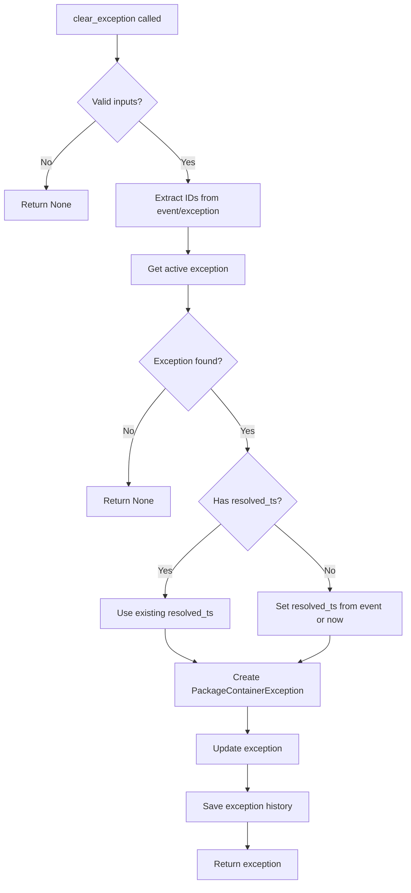
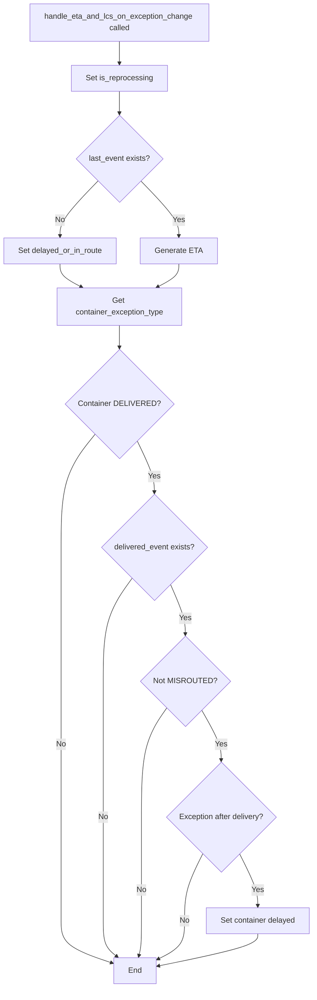

# Diagram: platform/partview_core/partview_service/partview_service/core/business/package_container_exception_status/package_container_exceptions/BasePackageContainerException.py

> Auto-generated by Obscura crawlers

## Diagram 1

```mermaid
classDiagram
    class BasePackageContainerException {
        -str __reason_code
        -PackageContainerExceptionHelper __package_container_helper
        -PackageContainerExceptionHistoryPostgresMapping __data_store
        -PackageContainerHelper _container_data_store_helper
        -PackageContainerEventBusinessLogic __package_container_event_bl
        +__init__(reason_code, application_name)
        -__save_package_container_exception_history(exception, event, changed_exception_id)
        +clear_exception(event, exception, status) PackageContainerException
        +handleMilestoneEvent(container, event)*
        +handleContainerException(container, container_business, exception, attributes)*
        +handle_eta_and_lcs_on_exception_change(container, last_event, delivered_event, exception)
    }
    class PackageContainerException {
        +id
        +solution_id
        +container_id
        +resolved_ts
        +status
        +activation_ts
        +exception_type_id
    }
    class PackageContainerEvent {
        +id
        +actor_id
        +event_ts
        +container_id
        +solution_id
    }
    class PackageContainerExceptionHistory {
        +solution_id
        +container_id
        +package_container_exception_id
        +old_status
        +new_status
        +changed_by
        +changed_event
        +changed_exception
    }
    class PackageContainer {
        +lifecycle_state
    }
    class PackageContainerExceptionHelper {
        +get_active_exception(solution_id, container_id, reason_code)
        +update_exception(exception)
        +get_container_exception_type(solution_id, exception_type_id)
    }
    class PackageContainerEventBusinessLogic {
        +set_is_reprocessing()
        +set_delayed_or_in_route(container, event)
        +generate_eta(container, event, param)
        +set_delayed(container, event, reason)
    }
    class PackageContainerExceptionHistoryPostgresMapping {
        +write(exception_history)
    }
    BasePackageContainerException --> PackageContainerExceptionHelper
    BasePackageContainerException --> PackageContainerExceptionHistoryPostgresMapping
    BasePackageContainerException --> PackageContainerHelper
    BasePackageContainerException --> PackageContainerEventBusinessLogic
    BasePackageContainerException ..> PackageContainerException
    BasePackageContainerException ..> PackageContainerEvent
    BasePackageContainerException ..> PackageContainerExceptionHistory
    BasePackageContainerException ..> PackageContainer
```

### SVG

<svg id="container" width="3128.171875" xmlns="http://www.w3.org/2000/svg" class="classDiagram" height="714" viewBox="0 0 3128.171875 714" role="graphics-document document" aria-roledescription="class"><g><defs><marker id="container_class-aggregationStart" class="marker aggregation class" refX="18" refY="7" markerWidth="190" markerHeight="240" orient="auto"><path d="M 18,7 L9,13 L1,7 L9,1 Z"></path></marker></defs><defs><marker id="container_class-aggregationEnd" class="marker aggregation class" refX="1" refY="7" markerWidth="20" markerHeight="28" orient="auto"><path d="M 18,7 L9,13 L1,7 L9,1 Z"></path></marker></defs><defs><marker id="container_class-extensionStart" class="marker extension class" refX="18" refY="7" markerWidth="190" markerHeight="240" orient="auto"><path d="M 1,7 L18,13 V 1 Z"></path></marker></defs><defs><marker id="container_class-extensionEnd" class="marker extension class" refX="1" refY="7" markerWidth="20" markerHeight="28" orient="auto"><path d="M 1,1 V 13 L18,7 Z"></path></marker></defs><defs><marker id="container_class-compositionStart" class="marker composition class" refX="18" refY="7" markerWidth="190" markerHeight="240" orient="auto"><path d="M 18,7 L9,13 L1,7 L9,1 Z"></path></marker></defs><defs><marker id="container_class-compositionEnd" class="marker composition class" refX="1" refY="7" markerWidth="20" markerHeight="28" orient="auto"><path d="M 18,7 L9,13 L1,7 L9,1 Z"></path></marker></defs><defs><marker id="container_class-dependencyStart" class="marker dependency class" refX="6" refY="7" markerWidth="190" markerHeight="240" orient="auto"><path d="M 5,7 L9,13 L1,7 L9,1 Z"></path></marker></defs><defs><marker id="container_class-dependencyEnd" class="marker dependency class" refX="13" refY="7" markerWidth="20" markerHeight="28" orient="auto"><path d="M 18,7 L9,13 L14,7 L9,1 Z"></path></marker></defs><defs><marker id="container_class-lollipopStart" class="marker lollipop class" refX="13" refY="7" markerWidth="190" markerHeight="240" orient="auto"><circle stroke="black" fill="transparent" cx="7" cy="7" r="6"></circle></marker></defs><defs><marker id="container_class-lollipopEnd" class="marker lollipop class" refX="1" refY="7" markerWidth="190" markerHeight="240" orient="auto"><circle stroke="black" fill="transparent" cx="7" cy="7" r="6"></circle></marker></defs><g class="root"><g class="clusters"></g><g class="edgePaths"><path d="M1410.445,243.959L1227.37,268.799C1044.294,293.639,678.143,343.32,495.068,380.826C311.992,418.333,311.992,443.667,311.992,456.333L311.992,469" id="id_BasePackageContainerException_PackageContainerExceptionHelper_1" class="edge-thickness-normal edge-pattern-solid relation" style=";;;" data-edge="true" data-et="edge" data-id="id_BasePackageContainerException_PackageContainerExceptionHelper_1" data-points="W3sieCI6MTQxMC40NDUzMTI1LCJ5IjoyNDMuOTU4NjIyOTAwNjM3MDR9LHsieCI6MzExLjk5MjE4NzUsInkiOjM5M30seyJ4IjozMTEuOTkyMTg3NSwieSI6NDc1fV0=" marker-end="url(#container_class-dependencyEnd)"></path><path d="M1410.445,276.614L1320.167,296.012C1229.888,315.41,1049.331,354.205,959.052,390.269C868.773,426.333,868.773,459.667,868.773,476.333L868.773,493" id="id_BasePackageContainerException_PackageContainerExceptionHistoryPostgresMapping_2" class="edge-thickness-normal edge-pattern-solid relation" style=";;;" data-edge="true" data-et="edge" data-id="id_BasePackageContainerException_PackageContainerExceptionHistoryPostgresMapping_2" data-points="W3sieCI6MTQxMC40NDUzMTI1LCJ5IjoyNzYuNjE0NDQxMDU5OTA2M30seyJ4Ijo4NjguNzczNDM3NSwieSI6MzkzfSx7IngiOjg2OC43NzM0Mzc1LCJ5Ijo0OTl9XQ==" marker-end="url(#container_class-dependencyEnd)"></path><path d="M1410.445,329.067L1379.293,339.722C1348.141,350.378,1285.836,371.689,1254.684,402.511C1223.531,433.333,1223.531,473.667,1223.531,493.833L1223.531,514" id="id_BasePackageContainerException_PackageContainerHelper_3" class="edge-thickness-normal edge-pattern-solid relation" style=";;;" data-edge="true" data-et="edge" data-id="id_BasePackageContainerException_PackageContainerHelper_3" data-points="W3sieCI6MTQxMC40NDUzMTI1LCJ5IjozMjkuMDY2OTM2MDYyMDQ3ODN9LHsieCI6MTIyMy41MzEyNSwieSI6MzkzfSx7IngiOjEyMjMuNTMxMjUsInkiOjUyMH1d" marker-end="url(#container_class-dependencyEnd)"></path><path d="M1638.405,368L1634.135,372.167C1629.865,376.333,1621.325,384.667,1617.055,399.5C1612.785,414.333,1612.785,435.667,1612.785,446.333L1612.785,457" id="id_BasePackageContainerException_PackageContainerEventBusinessLogic_4" class="edge-thickness-normal edge-pattern-solid relation" style=";;;" data-edge="true" data-et="edge" data-id="id_BasePackageContainerException_PackageContainerEventBusinessLogic_4" data-points="W3sieCI6MTYzOC40MDQ5MTYxNTg1MzY3LCJ5IjozNjh9LHsieCI6MTYxMi43ODUxNTYyNSwieSI6MzkzfSx7IngiOjE2MTIuNzg1MTU2MjUsInkiOjQ2M31d" marker-end="url(#container_class-dependencyEnd)"></path><path d="M2007.329,368L2011.599,372.167C2015.869,376.333,2024.409,384.667,2028.679,394C2032.949,403.333,2032.949,413.667,2032.949,418.833L2032.949,424" id="id_BasePackageContainerException_PackageContainerException_5" class="edge-thickness-normal edge-pattern-dashed relation" style=";;;" data-edge="true" data-et="edge" data-id="id_BasePackageContainerException_PackageContainerException_5" data-points="W3sieCI6MjAwNy4zMjk0NTg4NDE0NjMzLCJ5IjozNjh9LHsieCI6MjAzMi45NDkyMTg3NSwieSI6MzkzfSx7IngiOjIwMzIuOTQ5MjE4NzUsInkiOjQzMH1d" marker-end="url(#container_class-dependencyEnd)"></path><path d="M2235.289,358.132L2249.376,363.944C2263.464,369.755,2291.638,381.377,2305.725,396.355C2319.813,411.333,2319.813,429.667,2319.813,438.833L2319.813,448" id="id_BasePackageContainerException_PackageContainerEvent_6" class="edge-thickness-normal edge-pattern-dashed relation" style=";;;" data-edge="true" data-et="edge" data-id="id_BasePackageContainerException_PackageContainerEvent_6" data-points="W3sieCI6MjIzNS4yODkwNjI1LCJ5IjozNTguMTMyMzcxMjA1MzMyNTZ9LHsieCI6MjMxOS44MTI1LCJ5IjozOTN9LHsieCI6MjMxOS44MTI1LCJ5Ijo0NTR9XQ==" marker-end="url(#container_class-dependencyEnd)"></path><path d="M2235.289,287.634L2307.98,305.195C2380.672,322.756,2526.055,357.878,2598.746,378.606C2671.438,399.333,2671.438,405.667,2671.438,408.833L2671.438,412" id="id_BasePackageContainerException_PackageContainerExceptionHistory_7" class="edge-thickness-normal edge-pattern-dashed relation" style=";;;" data-edge="true" data-et="edge" data-id="id_BasePackageContainerException_PackageContainerExceptionHistory_7" data-points="W3sieCI6MjIzNS4yODkwNjI1LCJ5IjoyODcuNjM0MDM1MTg3ODYxOTd9LHsieCI6MjY3MS40Mzc1LCJ5IjozOTN9LHsieCI6MjY3MS40Mzc1LCJ5Ijo0MTh9XQ==" marker-end="url(#container_class-dependencyEnd)"></path><path d="M2235.289,258.646L2366.012,281.039C2496.734,303.431,2758.18,348.215,2888.902,387.774C3019.625,427.333,3019.625,461.667,3019.625,478.833L3019.625,496" id="id_BasePackageContainerException_PackageContainer_8" class="edge-thickness-normal edge-pattern-dashed relation" style=";;;" data-edge="true" data-et="edge" data-id="id_BasePackageContainerException_PackageContainer_8" data-points="W3sieCI6MjIzNS4yODkwNjI1LCJ5IjoyNTguNjQ2Mjc3Mzc3MDI3OH0seyJ4IjozMDE5LjYyNSwieSI6MzkzfSx7IngiOjMwMTkuNjI1LCJ5Ijo1MDJ9XQ==" marker-end="url(#container_class-dependencyEnd)"></path></g><g class="edgeLabels"><g class="edgeLabel"><g class="label" data-id="id_BasePackageContainerException_PackageContainerExceptionHelper_1" transform="translate(0, 0)"><foreignObject width="0" height="0">

</foreignObject></g></g><g class="edgeLabel"><g class="label" data-id="id_BasePackageContainerException_PackageContainerExceptionHistoryPostgresMapping_2" transform="translate(0, 0)"><foreignObject width="0" height="0">

</foreignObject></g></g><g class="edgeLabel"><g class="label" data-id="id_BasePackageContainerException_PackageContainerHelper_3" transform="translate(0, 0)"><foreignObject width="0" height="0">

</foreignObject></g></g><g class="edgeLabel"><g class="label" data-id="id_BasePackageContainerException_PackageContainerEventBusinessLogic_4" transform="translate(0, 0)"><foreignObject width="0" height="0">

</foreignObject></g></g><g class="edgeLabel"><g class="label" data-id="id_BasePackageContainerException_PackageContainerException_5" transform="translate(0, 0)"><foreignObject width="0" height="0">

</foreignObject></g></g><g class="edgeLabel"><g class="label" data-id="id_BasePackageContainerException_PackageContainerEvent_6" transform="translate(0, 0)"><foreignObject width="0" height="0">

</foreignObject></g></g><g class="edgeLabel"><g class="label" data-id="id_BasePackageContainerException_PackageContainerExceptionHistory_7" transform="translate(0, 0)"><foreignObject width="0" height="0">

</foreignObject></g></g><g class="edgeLabel"><g class="label" data-id="id_BasePackageContainerException_PackageContainer_8" transform="translate(0, 0)"><foreignObject width="0" height="0">

</foreignObject></g></g></g><g class="nodes"><g class="node default" id="classId-BasePackageContainerException-0" transform="translate(1822.8671875, 188)"><g class="basic label-container"><path d="M-412.421875 -180 L412.421875 -180 L412.421875 180 L-412.421875 180" stroke="none" stroke-width="0" fill="#ECECFF" style=""></path><path d="M-412.421875 -180 C-110.64899641931623 -180, 191.12388216136753 -180, 412.421875 -180 M-412.421875 -180 C-177.3565421671167 -180, 57.70879066576663 -180, 412.421875 -180 M412.421875 -180 C412.421875 -48.12016548476052, 412.421875 83.75966903047896, 412.421875 180 M412.421875 -180 C412.421875 -71.90189741749933, 412.421875 36.196205165001345, 412.421875 180 M412.421875 180 C199.06677558411997 180, -14.288323831760067 180, -412.421875 180 M412.421875 180 C176.4257057736705 180, -59.570463452659 180, -412.421875 180 M-412.421875 180 C-412.421875 50.97802380043143, -412.421875 -78.04395239913714, -412.421875 -180 M-412.421875 180 C-412.421875 104.01571805304228, -412.421875 28.031436106084556, -412.421875 -180" stroke="#9370DB" stroke-width="1.3" fill="none" stroke-dasharray="0 0" style=""></path></g><g class="annotation-group text" transform="translate(0, -156)"></g><g class="label-group text" transform="translate(-118.671875, -156)"><g class="label" style="font-weight: bolder" transform="translate(0,-12)"><foreignObject width="237.34375" height="24">

BasePackageContainerException

</foreignObject></g></g><g class="members-group text" transform="translate(-400.421875, -108)"><g class="label" style="" transform="translate(0,-12)"><foreignObject width="138.546875" height="24">

-str __reason_code

</foreignObject></g><g class="label" style="" transform="translate(0,12)"><foreignObject width="465.234375" height="24">

-PackageContainerExceptionHelper __package_container_helper

</foreignObject></g><g class="label" style="" transform="translate(0,36)"><foreignObject width="479.421875" height="24">

-PackageContainerExceptionHistoryPostgresMapping __data_store

</foreignObject></g><g class="label" style="" transform="translate(0,60)"><foreignObject width="404.78125" height="24">

-PackageContainerHelper _container_data_store_helper

</foreignObject></g><g class="label" style="" transform="translate(0,84)"><foreignObject width="502.375" height="24">

-PackageContainerEventBusinessLogic __package_container_event_bl

</foreignObject></g></g><g class="methods-group text" transform="translate(-400.421875, 36)"><g class="label" style="" transform="translate(0,-12)"><foreignObject width="273.609375" height="24">

+<strong>init</strong>(reason_code, application_name)

</foreignObject></g><g class="label" style="" transform="translate(0,12)"><foreignObject width="634.1875" height="24">

-__save_package_container_exception_history(exception, event, changed_exception_id)

</foreignObject></g><g class="label" style="" transform="translate(0,36)"><foreignObject width="514.859375" height="24">

+clear_exception(event, exception, status) : PackageContainerException

</foreignObject></g><g class="label" style="font-style:italic;" transform="translate(0,60)"><foreignObject width="290.375" height="24">

+handleMilestoneEvent(container, event)

</foreignObject></g><g class="label" style="font-style:italic;" transform="translate(0,84)"><foreignObject width="575.484375" height="24">

+handleContainerException(container, container_business, exception, attributes)

</foreignObject></g><g class="label" style="" transform="translate(0,108)"><foreignObject width="682.171875" height="24">

+handle_eta_and_lcs_on_exception_change(container, last_event, delivered_event, exception)

</foreignObject></g></g><g class="divider" style=""><path d="M-412.421875 -132 C-151.13574365457657 -132, 110.15038769084686 -132, 412.421875 -132 M-412.421875 -132 C-205.10807211427488 -132, 2.2057307714502485 -132, 412.421875 -132" stroke="#9370DB" stroke-width="1.3" fill="none" stroke-dasharray="0 0" style=""></path></g><g class="divider" style=""><path d="M-412.421875 12 C-199.3768476983658 12, 13.668179603268413 12, 412.421875 12 M-412.421875 12 C-121.06172319250095 12, 170.2984286149981 12, 412.421875 12" stroke="#9370DB" stroke-width="1.3" fill="none" stroke-dasharray="0 0" style=""></path></g></g><g class="node default" id="classId-PackageContainerException-1" transform="translate(2032.94921875, 562)"><g class="basic label-container"><path d="M-132.87890625 -132 L132.87890625 -132 L132.87890625 132 L-132.87890625 132" stroke="none" stroke-width="0" fill="#ECECFF" style=""></path><path d="M-132.87890625 -132 C-62.29061518905287 -132, 8.297675871894256 -132, 132.87890625 -132 M-132.87890625 -132 C-37.76859056450641 -132, 57.34172512098718 -132, 132.87890625 -132 M132.87890625 -132 C132.87890625 -45.17130963950311, 132.87890625 41.657380720993785, 132.87890625 132 M132.87890625 -132 C132.87890625 -43.77655827284258, 132.87890625 44.44688345431484, 132.87890625 132 M132.87890625 132 C74.1632630365745 132, 15.447619823148997 132, -132.87890625 132 M132.87890625 132 C77.23046711872493 132, 21.582027987449877 132, -132.87890625 132 M-132.87890625 132 C-132.87890625 40.06476886305124, -132.87890625 -51.870462273897516, -132.87890625 -132 M-132.87890625 132 C-132.87890625 60.46505521543823, -132.87890625 -11.069889569123546, -132.87890625 -132" stroke="#9370DB" stroke-width="1.3" fill="none" stroke-dasharray="0 0" style=""></path></g><g class="annotation-group text" transform="translate(0, -108)"></g><g class="label-group text" transform="translate(-101.1484375, -108)"><g class="label" style="font-weight: bolder" transform="translate(0,-12)"><foreignObject width="202.296875" height="24">

PackageContainerException

</foreignObject></g></g><g class="members-group text" transform="translate(-120.87890625, -60)"><g class="label" style="" transform="translate(0,-12)"><foreignObject width="22.078125" height="24">

+id

</foreignObject></g><g class="label" style="" transform="translate(0,12)"><foreignObject width="90.21875" height="24">

+solution_id

</foreignObject></g><g class="label" style="" transform="translate(0,36)"><foreignObject width="98.3125" height="24">

+container_id

</foreignObject></g><g class="label" style="" transform="translate(0,60)"><foreignObject width="91.09375" height="24">

+resolved_ts

</foreignObject></g><g class="label" style="" transform="translate(0,84)"><foreignObject width="52.390625" height="24">

+status

</foreignObject></g><g class="label" style="" transform="translate(0,108)"><foreignObject width="100.96875" height="24">

+activation_ts

</foreignObject></g><g class="label" style="" transform="translate(0,132)"><foreignObject width="140.609375" height="24">

+exception_type_id

</foreignObject></g></g><g class="methods-group text" transform="translate(-120.87890625, 132)"></g><g class="divider" style=""><path d="M-132.87890625 -84 C-71.06151172282365 -84, -9.244117195647306 -84, 132.87890625 -84 M-132.87890625 -84 C-37.68354513771179 -84, 57.51181597457642 -84, 132.87890625 -84" stroke="#9370DB" stroke-width="1.3" fill="none" stroke-dasharray="0 0" style=""></path></g><g class="divider" style=""><path d="M-132.87890625 108 C-40.98224419729178 108, 50.914417855416445 108, 132.87890625 108 M-132.87890625 108 C-67.67757481192905 108, -2.4762433738580967 108, 132.87890625 108" stroke="#9370DB" stroke-width="1.3" fill="none" stroke-dasharray="0 0" style=""></path></g></g><g class="node default" id="classId-PackageContainerEvent-2" transform="translate(2319.8125, 562)"><g class="basic label-container"><path d="M-103.984375 -108 L103.984375 -108 L103.984375 108 L-103.984375 108" stroke="none" stroke-width="0" fill="#ECECFF" style=""></path><path d="M-103.984375 -108 C-58.621505432554095 -108, -13.25863586510819 -108, 103.984375 -108 M-103.984375 -108 C-36.86596644842325 -108, 30.2524421031535 -108, 103.984375 -108 M103.984375 -108 C103.984375 -46.03335398611386, 103.984375 15.933292027772282, 103.984375 108 M103.984375 -108 C103.984375 -30.04394760782924, 103.984375 47.91210478434152, 103.984375 108 M103.984375 108 C35.63374106898637 108, -32.716892862027265 108, -103.984375 108 M103.984375 108 C62.30033000638081 108, 20.616285012761622 108, -103.984375 108 M-103.984375 108 C-103.984375 40.43675792133979, -103.984375 -27.12648415732042, -103.984375 -108 M-103.984375 108 C-103.984375 28.262728905193526, -103.984375 -51.47454218961295, -103.984375 -108" stroke="#9370DB" stroke-width="1.3" fill="none" stroke-dasharray="0 0" style=""></path></g><g class="annotation-group text" transform="translate(0, -84)"></g><g class="label-group text" transform="translate(-85.65625, -84)"><g class="label" style="font-weight: bolder" transform="translate(0,-12)"><foreignObject width="171.3125" height="24">

PackageContainerEvent

</foreignObject></g></g><g class="members-group text" transform="translate(-91.984375, -36)"><g class="label" style="" transform="translate(0,-12)"><foreignObject width="22.078125" height="24">

+id

</foreignObject></g><g class="label" style="" transform="translate(0,12)"><foreignObject width="66.28125" height="24">

+actor_id

</foreignObject></g><g class="label" style="" transform="translate(0,36)"><foreignObject width="69.578125" height="24">

+event_ts

</foreignObject></g><g class="label" style="" transform="translate(0,60)"><foreignObject width="98.3125" height="24">

+container_id

</foreignObject></g><g class="label" style="" transform="translate(0,84)"><foreignObject width="90.21875" height="24">

+solution_id

</foreignObject></g></g><g class="methods-group text" transform="translate(-91.984375, 108)"></g><g class="divider" style=""><path d="M-103.984375 -60 C-36.254533301712385 -60, 31.47530839657523 -60, 103.984375 -60 M-103.984375 -60 C-38.91169792941294 -60, 26.160979141174124 -60, 103.984375 -60" stroke="#9370DB" stroke-width="1.3" fill="none" stroke-dasharray="0 0" style=""></path></g><g class="divider" style=""><path d="M-103.984375 84 C-55.40451836529759 84, -6.8246617305951816 84, 103.984375 84 M-103.984375 84 C-34.65649859472151 84, 34.671377810556976 84, 103.984375 84" stroke="#9370DB" stroke-width="1.3" fill="none" stroke-dasharray="0 0" style=""></path></g></g><g class="node default" id="classId-PackageContainerExceptionHistory-3" transform="translate(2671.4375, 562)"><g class="basic label-container"><path d="M-197.640625 -144 L197.640625 -144 L197.640625 144 L-197.640625 144" stroke="none" stroke-width="0" fill="#ECECFF" style=""></path><path d="M-197.640625 -144 C-65.43827788525459 -144, 66.76406922949081 -144, 197.640625 -144 M-197.640625 -144 C-86.75249042429401 -144, 24.13564415141198 -144, 197.640625 -144 M197.640625 -144 C197.640625 -68.22905668098389, 197.640625 7.541886638032224, 197.640625 144 M197.640625 -144 C197.640625 -51.12255054458579, 197.640625 41.754898910828416, 197.640625 144 M197.640625 144 C91.4854314107264 144, -14.669762178547188 144, -197.640625 144 M197.640625 144 C85.33134067711673 144, -26.977943645766544 144, -197.640625 144 M-197.640625 144 C-197.640625 44.561563974364674, -197.640625 -54.87687205127065, -197.640625 -144 M-197.640625 144 C-197.640625 41.769653367620776, -197.640625 -60.46069326475845, -197.640625 -144" stroke="#9370DB" stroke-width="1.3" fill="none" stroke-dasharray="0 0" style=""></path></g><g class="annotation-group text" transform="translate(0, -120)"></g><g class="label-group text" transform="translate(-127.5625, -120)"><g class="label" style="font-weight: bolder" transform="translate(0,-12)"><foreignObject width="255.125" height="24">

PackageContainerExceptionHistory

</foreignObject></g></g><g class="members-group text" transform="translate(-185.640625, -72)"><g class="label" style="" transform="translate(0,-12)"><foreignObject width="90.21875" height="24">

+solution_id

</foreignObject></g><g class="label" style="" transform="translate(0,12)"><foreignObject width="98.3125" height="24">

+container_id

</foreignObject></g><g class="label" style="" transform="translate(0,36)"><foreignObject width="243.71875" height="24">

+package_container_exception_id

</foreignObject></g><g class="label" style="" transform="translate(0,60)"><foreignObject width="84.234375" height="24">

+old_status

</foreignObject></g><g class="label" style="" transform="translate(0,84)"><foreignObject width="89.953125" height="24">

+new_status

</foreignObject></g><g class="label" style="" transform="translate(0,108)"><foreignObject width="95.078125" height="24">

+changed_by

</foreignObject></g><g class="label" style="" transform="translate(0,132)"><foreignObject width="117.78125" height="24">

+changed_event

</foreignObject></g><g class="label" style="" transform="translate(0,156)"><foreignObject width="148.203125" height="24">

+changed_exception

</foreignObject></g></g><g class="methods-group text" transform="translate(-185.640625, 144)"></g><g class="divider" style=""><path d="M-197.640625 -96 C-55.69496145024877 -96, 86.25070209950246 -96, 197.640625 -96 M-197.640625 -96 C-101.32807077924149 -96, -5.015516558482972 -96, 197.640625 -96" stroke="#9370DB" stroke-width="1.3" fill="none" stroke-dasharray="0 0" style=""></path></g><g class="divider" style=""><path d="M-197.640625 120 C-42.54111023684453 120, 112.55840452631094 120, 197.640625 120 M-197.640625 120 C-49.861657501876095 120, 97.91730999624781 120, 197.640625 120" stroke="#9370DB" stroke-width="1.3" fill="none" stroke-dasharray="0 0" style=""></path></g></g><g class="node default" id="classId-PackageContainer-4" transform="translate(3019.625, 562)"><g class="basic label-container"><path d="M-100.546875 -60 L100.546875 -60 L100.546875 60 L-100.546875 60" stroke="none" stroke-width="0" fill="#ECECFF" style=""></path><path d="M-100.546875 -60 C-30.410146284142783 -60, 39.726582431714434 -60, 100.546875 -60 M-100.546875 -60 C-33.668497360515715 -60, 33.20988027896857 -60, 100.546875 -60 M100.546875 -60 C100.546875 -16.810001168228773, 100.546875 26.379997663542454, 100.546875 60 M100.546875 -60 C100.546875 -13.198655899845143, 100.546875 33.602688200309714, 100.546875 60 M100.546875 60 C38.93777742126337 60, -22.67132015747326 60, -100.546875 60 M100.546875 60 C45.759382277816066 60, -9.028110444367869 60, -100.546875 60 M-100.546875 60 C-100.546875 25.578357613795774, -100.546875 -8.843284772408452, -100.546875 -60 M-100.546875 60 C-100.546875 35.29675802810087, -100.546875 10.593516056201729, -100.546875 -60" stroke="#9370DB" stroke-width="1.3" fill="none" stroke-dasharray="0 0" style=""></path></g><g class="annotation-group text" transform="translate(0, -36)"></g><g class="label-group text" transform="translate(-65.453125, -36)"><g class="label" style="font-weight: bolder" transform="translate(0,-12)"><foreignObject width="130.90625" height="24">

PackageContainer

</foreignObject></g></g><g class="members-group text" transform="translate(-88.546875, 12)"><g class="label" style="" transform="translate(0,-12)"><foreignObject width="111.640625" height="24">

+lifecycle_state

</foreignObject></g></g><g class="methods-group text" transform="translate(-88.546875, 60)"></g><g class="divider" style=""><path d="M-100.546875 -12 C-59.69828417204349 -12, -18.849693344086987 -12, 100.546875 -12 M-100.546875 -12 C-58.3849526744496 -12, -16.2230303488992 -12, 100.546875 -12" stroke="#9370DB" stroke-width="1.3" fill="none" stroke-dasharray="0 0" style=""></path></g><g class="divider" style=""><path d="M-100.546875 36 C-33.495924847089825 36, 33.55502530582035 36, 100.546875 36 M-100.546875 36 C-37.92738609438986 36, 24.69210281122028 36, 100.546875 36" stroke="#9370DB" stroke-width="1.3" fill="none" stroke-dasharray="0 0" style=""></path></g></g><g class="node default" id="classId-PackageContainerExceptionHelper-5" transform="translate(311.9921875, 562)"><g class="basic label-container"><path d="M-303.9921875 -87 L303.9921875 -87 L303.9921875 87 L-303.9921875 87" stroke="none" stroke-width="0" fill="#ECECFF" style=""></path><path d="M-303.9921875 -87 C-80.65837031722111 -87, 142.67544686555777 -87, 303.9921875 -87 M-303.9921875 -87 C-129.6038641332715 -87, 44.78445923345703 -87, 303.9921875 -87 M303.9921875 -87 C303.9921875 -25.28385154051592, 303.9921875 36.43229691896816, 303.9921875 87 M303.9921875 -87 C303.9921875 -24.20532649874248, 303.9921875 38.58934700251504, 303.9921875 87 M303.9921875 87 C108.24495471863762 87, -87.50227806272477 87, -303.9921875 87 M303.9921875 87 C92.18729976861772 87, -119.61758796276456 87, -303.9921875 87 M-303.9921875 87 C-303.9921875 19.14235984970601, -303.9921875 -48.71528030058798, -303.9921875 -87 M-303.9921875 87 C-303.9921875 51.80850943835267, -303.9921875 16.617018876705345, -303.9921875 -87" stroke="#9370DB" stroke-width="1.3" fill="none" stroke-dasharray="0 0" style=""></path></g><g class="annotation-group text" transform="translate(0, -63)"></g><g class="label-group text" transform="translate(-125.671875, -63)"><g class="label" style="font-weight: bolder" transform="translate(0,-12)"><foreignObject width="251.34375" height="24">

PackageContainerExceptionHelper

</foreignObject></g></g><g class="members-group text" transform="translate(-291.9921875, -15)"></g><g class="methods-group text" transform="translate(-291.9921875, 15)"><g class="label" style="" transform="translate(0,-12)"><foreignObject width="451.171875" height="24">

+get_active_exception(solution_id, container_id, reason_code)

</foreignObject></g><g class="label" style="" transform="translate(0,12)"><foreignObject width="218.890625" height="24">

+update_exception(exception)

</foreignObject></g><g class="label" style="" transform="translate(0,36)"><foreignObject width="458.3125" height="24">

+get_container_exception_type(solution_id, exception_type_id)

</foreignObject></g></g><g class="divider" style=""><path d="M-303.9921875 -39 C-143.98322584662552 -39, 16.02573580674897 -39, 303.9921875 -39 M-303.9921875 -39 C-67.59473933109234 -39, 168.80270883781532 -39, 303.9921875 -39" stroke="#9370DB" stroke-width="1.3" fill="none" stroke-dasharray="0 0" style=""></path></g><g class="divider" style=""><path d="M-303.9921875 -15 C-169.37385883204567 -15, -34.75553016409134 -15, 303.9921875 -15 M-303.9921875 -15 C-80.68236391969836 -15, 142.62745966060328 -15, 303.9921875 -15" stroke="#9370DB" stroke-width="1.3" fill="none" stroke-dasharray="0 0" style=""></path></g></g><g class="node default" id="classId-PackageContainerEventBusinessLogic-6" transform="translate(1612.78515625, 562)"><g class="basic label-container"><path d="M-237.28515625 -99 L237.28515625 -99 L237.28515625 99 L-237.28515625 99" stroke="none" stroke-width="0" fill="#ECECFF" style=""></path><path d="M-237.28515625 -99 C-87.53332131881001 -99, 62.21851361237998 -99, 237.28515625 -99 M-237.28515625 -99 C-131.85575619272777 -99, -26.426356135455535 -99, 237.28515625 -99 M237.28515625 -99 C237.28515625 -28.157561186698132, 237.28515625 42.684877626603736, 237.28515625 99 M237.28515625 -99 C237.28515625 -43.165046350439404, 237.28515625 12.669907299121192, 237.28515625 99 M237.28515625 99 C52.919590148844065 99, -131.44597595231187 99, -237.28515625 99 M237.28515625 99 C69.3412004198818 99, -98.6027554102364 99, -237.28515625 99 M-237.28515625 99 C-237.28515625 27.116407565727542, -237.28515625 -44.767184868544916, -237.28515625 -99 M-237.28515625 99 C-237.28515625 58.98703474803045, -237.28515625 18.974069496060906, -237.28515625 -99" stroke="#9370DB" stroke-width="1.3" fill="none" stroke-dasharray="0 0" style=""></path></g><g class="annotation-group text" transform="translate(0, -75)"></g><g class="label-group text" transform="translate(-137.0703125, -75)"><g class="label" style="font-weight: bolder" transform="translate(0,-12)"><foreignObject width="274.140625" height="24">

PackageContainerEventBusinessLogic

</foreignObject></g></g><g class="members-group text" transform="translate(-225.28515625, -27)"></g><g class="methods-group text" transform="translate(-225.28515625, 3)"><g class="label" style="" transform="translate(0,-12)"><foreignObject width="160.625" height="24">

+set_is_reprocessing()

</foreignObject></g><g class="label" style="" transform="translate(0,12)"><foreignObject width="313.5" height="24">

+set_delayed_or_in_route(container, event)

</foreignObject></g><g class="label" style="" transform="translate(0,36)"><foreignObject width="283.140625" height="24">

+generate_eta(container, event, param)

</foreignObject></g><g class="label" style="" transform="translate(0,60)"><foreignObject width="279.25" height="24">

+set_delayed(container, event, reason)

</foreignObject></g></g><g class="divider" style=""><path d="M-237.28515625 -51 C-117.50766550208003 -51, 2.2698252458399395 -51, 237.28515625 -51 M-237.28515625 -51 C-48.45663888267367 -51, 140.37187848465265 -51, 237.28515625 -51" stroke="#9370DB" stroke-width="1.3" fill="none" stroke-dasharray="0 0" style=""></path></g><g class="divider" style=""><path d="M-237.28515625 -27 C-98.56001313299538 -27, 40.16512998400924 -27, 237.28515625 -27 M-237.28515625 -27 C-80.36029978562317 -27, 76.56455667875366 -27, 237.28515625 -27" stroke="#9370DB" stroke-width="1.3" fill="none" stroke-dasharray="0 0" style=""></path></g></g><g class="node default" id="classId-PackageContainerExceptionHistoryPostgresMapping-7" transform="translate(868.7734375, 562)"><g class="basic label-container"><path d="M-202.7890625 -63 L202.7890625 -63 L202.7890625 63 L-202.7890625 63" stroke="none" stroke-width="0" fill="#ECECFF" style=""></path><path d="M-202.7890625 -63 C-63.2108082261291 -63, 76.3674460477418 -63, 202.7890625 -63 M-202.7890625 -63 C-61.5438639344095 -63, 79.701334631181 -63, 202.7890625 -63 M202.7890625 -63 C202.7890625 -18.029590440042085, 202.7890625 26.94081911991583, 202.7890625 63 M202.7890625 -63 C202.7890625 -30.172763012789225, 202.7890625 2.654473974421549, 202.7890625 63 M202.7890625 63 C47.906832350140604 63, -106.97539779971879 63, -202.7890625 63 M202.7890625 63 C110.82321993372545 63, 18.85737736745091 63, -202.7890625 63 M-202.7890625 63 C-202.7890625 21.406760804960093, -202.7890625 -20.186478390079813, -202.7890625 -63 M-202.7890625 63 C-202.7890625 20.56711717760124, -202.7890625 -21.86576564479752, -202.7890625 -63" stroke="#9370DB" stroke-width="1.3" fill="none" stroke-dasharray="0 0" style=""></path></g><g class="annotation-group text" transform="translate(0, -39)"></g><g class="label-group text" transform="translate(-190.7890625, -39)"><g class="label" style="font-weight: bolder" transform="translate(0,-12)"><foreignObject width="381.578125" height="24">

PackageContainerExceptionHistoryPostgresMapping

</foreignObject></g></g><g class="members-group text" transform="translate(-190.7890625, 9)"></g><g class="methods-group text" transform="translate(-190.7890625, 39)"><g class="label" style="" transform="translate(0,-12)"><foreignObject width="184.140625" height="24">

+write(exception_history)

</foreignObject></g></g><g class="divider" style=""><path d="M-202.7890625 -15 C-85.24411136349173 -15, 32.30083977301655 -15, 202.7890625 -15 M-202.7890625 -15 C-81.98274816559157 -15, 38.82356616881685 -15, 202.7890625 -15" stroke="#9370DB" stroke-width="1.3" fill="none" stroke-dasharray="0 0" style=""></path></g><g class="divider" style=""><path d="M-202.7890625 9 C-74.66889925798932 9, 53.45126398402135 9, 202.7890625 9 M-202.7890625 9 C-109.67748394001785 9, -16.5659053800357 9, 202.7890625 9" stroke="#9370DB" stroke-width="1.3" fill="none" stroke-dasharray="0 0" style=""></path></g></g><g class="node default" id="classId-PackageContainerHelper-8" transform="translate(1223.53125, 562)"><g class="basic label-container"><path d="M-101.96875 -42 L101.96875 -42 L101.96875 42 L-101.96875 42" stroke="none" stroke-width="0" fill="#ECECFF" style=""></path><path d="M-101.96875 -42 C-58.19758575949491 -42, -14.426421518989827 -42, 101.96875 -42 M-101.96875 -42 C-22.63948787979129 -42, 56.68977424041742 -42, 101.96875 -42 M101.96875 -42 C101.96875 -10.061037452933384, 101.96875 21.877925094133232, 101.96875 42 M101.96875 -42 C101.96875 -22.653578495659595, 101.96875 -3.3071569913191894, 101.96875 42 M101.96875 42 C51.89574097779208 42, 1.8227319555841603 42, -101.96875 42 M101.96875 42 C38.23047363995117 42, -25.507802720097658 42, -101.96875 42 M-101.96875 42 C-101.96875 14.57554012889559, -101.96875 -12.848919742208821, -101.96875 -42 M-101.96875 42 C-101.96875 17.281193947862725, -101.96875 -7.4376121042745496, -101.96875 -42" stroke="#9370DB" stroke-width="1.3" fill="none" stroke-dasharray="0 0" style=""></path></g><g class="annotation-group text" transform="translate(0, -18)"></g><g class="label-group text" transform="translate(-89.96875, -18)"><g class="label" style="font-weight: bolder" transform="translate(0,-12)"><foreignObject width="179.9375" height="24">

PackageContainerHelper

</foreignObject></g></g><g class="members-group text" transform="translate(-89.96875, 30)"></g><g class="methods-group text" transform="translate(-89.96875, 60)"></g><g class="divider" style=""><path d="M-101.96875 6 C-38.06400400509749 6, 25.840741989805025 6, 101.96875 6 M-101.96875 6 C-55.4490401675605 6, -8.929330335120994 6, 101.96875 6" stroke="#9370DB" stroke-width="1.3" fill="none" stroke-dasharray="0 0" style=""></path></g><g class="divider" style=""><path d="M-101.96875 24 C-50.03602595242486 24, 1.8966980951502848 24, 101.96875 24 M-101.96875 24 C-24.209906136668096 24, 53.54893772666381 24, 101.96875 24" stroke="#9370DB" stroke-width="1.3" fill="none" stroke-dasharray="0 0" style=""></path></g></g></g></g></g></svg>

## Diagram 2

### SVG

<svg id="container" width="732.703125" xmlns="http://www.w3.org/2000/svg" class="flowchart" height="1592.859375" viewBox="0 0 732.703125 1592.859375" role="graphics-document document" aria-roledescription="flowchart-v2"><g><marker id="container_flowchart-v2-pointEnd" class="marker flowchart-v2" viewBox="0 0 10 10" refX="5" refY="5" markerUnits="userSpaceOnUse" markerWidth="8" markerHeight="8" orient="auto"><path d="M 0 0 L 10 5 L 0 10 z" class="arrowMarkerPath" style="stroke-width: 1; stroke-dasharray: 1, 0;"></path></marker><marker id="container_flowchart-v2-pointStart" class="marker flowchart-v2" viewBox="0 0 10 10" refX="4.5" refY="5" markerUnits="userSpaceOnUse" markerWidth="8" markerHeight="8" orient="auto"><path d="M 0 5 L 10 10 L 10 0 z" class="arrowMarkerPath" style="stroke-width: 1; stroke-dasharray: 1, 0;"></path></marker><marker id="container_flowchart-v2-circleEnd" class="marker flowchart-v2" viewBox="0 0 10 10" refX="11" refY="5" markerUnits="userSpaceOnUse" markerWidth="11" markerHeight="11" orient="auto"><circle cx="5" cy="5" r="5" class="arrowMarkerPath" style="stroke-width: 1; stroke-dasharray: 1, 0;"></circle></marker><marker id="container_flowchart-v2-circleStart" class="marker flowchart-v2" viewBox="0 0 10 10" refX="-1" refY="5" markerUnits="userSpaceOnUse" markerWidth="11" markerHeight="11" orient="auto"><circle cx="5" cy="5" r="5" class="arrowMarkerPath" style="stroke-width: 1; stroke-dasharray: 1, 0;"></circle></marker><marker id="container_flowchart-v2-crossEnd" class="marker cross flowchart-v2" viewBox="0 0 11 11" refX="12" refY="5.2" markerUnits="userSpaceOnUse" markerWidth="11" markerHeight="11" orient="auto"><path d="M 1,1 l 9,9 M 10,1 l -9,9" class="arrowMarkerPath" style="stroke-width: 2; stroke-dasharray: 1, 0;"></path></marker><marker id="container_flowchart-v2-crossStart" class="marker cross flowchart-v2" viewBox="0 0 11 11" refX="-1" refY="5.2" markerUnits="userSpaceOnUse" markerWidth="11" markerHeight="11" orient="auto"><path d="M 1,1 l 9,9 M 10,1 l -9,9" class="arrowMarkerPath" style="stroke-width: 2; stroke-dasharray: 1, 0;"></path></marker><g class="root"><g class="clusters"></g><g class="edgePaths"><path d="M211.566,62L211.566,66.167C211.566,70.333,211.566,78.667,211.566,86.333C211.566,94,211.566,101,211.566,104.5L211.566,108" id="L_A_B_0" class="edge-thickness-normal edge-pattern-solid edge-thickness-normal edge-pattern-solid flowchart-link" style=";" data-edge="true" data-et="edge" data-id="L_A_B_0" data-points="W3sieCI6MjExLjU2NjQwNjI1LCJ5Ijo2Mn0seyJ4IjoyMTEuNTY2NDA2MjUsInkiOjg3fSx7IngiOjIxMS41NjY0MDYyNSwieSI6MTEyfV0=" marker-end="url(#container_flowchart-v2-pointEnd)"></path><path d="M172.21,219.269L157.46,231.995C142.71,244.721,113.211,270.173,98.461,290.399C83.711,310.625,83.711,325.625,83.711,333.125L83.711,340.625" id="L_B_C_0" class="edge-thickness-normal edge-pattern-solid edge-thickness-normal edge-pattern-solid flowchart-link" style=";" data-edge="true" data-et="edge" data-id="L_B_C_0" data-points="W3sieCI6MTcyLjIxMDEzMTM0MDYxNjg0LCJ5IjoyMTkuMjY4NzI1MDkwNjE2ODR9LHsieCI6ODMuNzEwOTM3NSwieSI6Mjk1LjYyNX0seyJ4Ijo4My43MTA5Mzc1LCJ5IjozNDQuNjI1fV0=" marker-end="url(#container_flowchart-v2-pointEnd)"></path><path d="M250.923,219.269L265.673,231.995C280.422,244.721,309.922,270.173,324.672,288.399C339.422,306.625,339.422,317.625,339.422,323.125L339.422,328.625" id="L_B_D_0" class="edge-thickness-normal edge-pattern-solid edge-thickness-normal edge-pattern-solid flowchart-link" style=";" data-edge="true" data-et="edge" data-id="L_B_D_0" data-points="W3sieCI6MjUwLjkyMjY4MTE1OTM4MzE2LCJ5IjoyMTkuMjY4NzI1MDkwNjE2ODR9LHsieCI6MzM5LjQyMTg3NSwieSI6Mjk1LjYyNX0seyJ4IjozMzkuNDIxODc1LCJ5IjozMzIuNjI1fV0=" marker-end="url(#container_flowchart-v2-pointEnd)"></path><path d="M339.422,410.625L339.422,414.792C339.422,418.958,339.422,427.292,339.422,434.958C339.422,442.625,339.422,449.625,339.422,453.125L339.422,456.625" id="L_D_E_0" class="edge-thickness-normal edge-pattern-solid edge-thickness-normal edge-pattern-solid flowchart-link" style=";" data-edge="true" data-et="edge" data-id="L_D_E_0" data-points="W3sieCI6MzM5LjQyMTg3NSwieSI6NDEwLjYyNX0seyJ4IjozMzkuNDIxODc1LCJ5Ijo0MzUuNjI1fSx7IngiOjMzOS40MjE4NzUsInkiOjQ2MC42MjV9XQ==" marker-end="url(#container_flowchart-v2-pointEnd)"></path><path d="M339.422,514.625L339.422,518.792C339.422,522.958,339.422,531.292,339.422,538.958C339.422,546.625,339.422,553.625,339.422,557.125L339.422,560.625" id="L_E_F_0" class="edge-thickness-normal edge-pattern-solid edge-thickness-normal edge-pattern-solid flowchart-link" style=";" data-edge="true" data-et="edge" data-id="L_E_F_0" data-points="W3sieCI6MzM5LjQyMTg3NSwieSI6NTE0LjYyNX0seyJ4IjozMzkuNDIxODc1LCJ5Ijo1MzkuNjI1fSx7IngiOjMzOS40MjE4NzUsInkiOjU2NC42MjV9XQ==" marker-end="url(#container_flowchart-v2-pointEnd)"></path><path d="M298.468,702.796L287.521,715.788C276.575,728.781,254.682,754.765,243.736,783.35C232.789,811.935,232.789,843.12,232.789,858.712L232.789,874.305" id="L_F_G_0" class="edge-thickness-normal edge-pattern-solid edge-thickness-normal edge-pattern-solid flowchart-link" style=";" data-edge="true" data-et="edge" data-id="L_F_G_0" data-points="W3sieCI6Mjk4LjQ2Nzc4NzM0MjEyMiwieSI6NzAyLjc5NTkxMjM0MjEyMn0seyJ4IjoyMzIuNzg5MDYyNSwieSI6NzgwLjc1fSx7IngiOjIzMi43ODkwNjI1LCJ5Ijo4NzguMzA0Njg3NX1d" marker-end="url(#container_flowchart-v2-pointEnd)"></path><path d="M380.376,702.796L391.322,715.788C402.269,728.781,424.162,754.765,435.108,773.258C446.055,791.75,446.055,802.75,446.055,808.25L446.055,813.75" id="L_F_H_0" class="edge-thickness-normal edge-pattern-solid edge-thickness-normal edge-pattern-solid flowchart-link" style=";" data-edge="true" data-et="edge" data-id="L_F_H_0" data-points="W3sieCI6MzgwLjM3NTk2MjY1Nzg3OCwieSI6NzAyLjc5NTkxMjM0MjEyMn0seyJ4Ijo0NDYuMDU0Njg3NSwieSI6NzgwLjc1fSx7IngiOjQ0Ni4wNTQ2ODc1LCJ5Ijo4MTcuNzV9XQ==" marker-end="url(#container_flowchart-v2-pointEnd)"></path><path d="M398.417,945.221L381.582,959.328C364.747,973.434,331.076,1001.647,314.241,1023.253C297.406,1044.859,297.406,1059.859,297.406,1067.359L297.406,1074.859" id="L_H_I_0" class="edge-thickness-normal edge-pattern-solid edge-thickness-normal edge-pattern-solid flowchart-link" style=";" data-edge="true" data-et="edge" data-id="L_H_I_0" data-points="W3sieCI6Mzk4LjQxNjYyNTE4NzY2MDgsInkiOjk0NS4yMjEzMTI2ODc2NjA5fSx7IngiOjI5Ny40MDYyNSwieSI6MTAyOS44NTkzNzV9LHsieCI6Mjk3LjQwNjI1LCJ5IjoxMDc4Ljg1OTM3NX1d" marker-end="url(#container_flowchart-v2-pointEnd)"></path><path d="M493.693,945.221L510.528,959.328C527.363,973.434,561.033,1001.647,577.868,1021.253C594.703,1040.859,594.703,1051.859,594.703,1057.359L594.703,1062.859" id="L_H_J_0" class="edge-thickness-normal edge-pattern-solid edge-thickness-normal edge-pattern-solid flowchart-link" style=";" data-edge="true" data-et="edge" data-id="L_H_J_0" data-points="W3sieCI6NDkzLjY5Mjc0OTgxMjMzOTIsInkiOjk0NS4yMjEzMTI2ODc2NjA5fSx7IngiOjU5NC43MDMxMjUsInkiOjEwMjkuODU5Mzc1fSx7IngiOjU5NC43MDMxMjUsInkiOjEwNjYuODU5Mzc1fV0=" marker-end="url(#container_flowchart-v2-pointEnd)"></path><path d="M297.406,1132.859L297.406,1139.026C297.406,1145.193,297.406,1157.526,306.472,1167.596C315.537,1177.665,333.667,1185.472,342.733,1189.375L351.798,1193.278" id="L_I_K_0" class="edge-thickness-normal edge-pattern-solid edge-thickness-normal edge-pattern-solid flowchart-link" style=";" data-edge="true" data-et="edge" data-id="L_I_K_0" data-points="W3sieCI6Mjk3LjQwNjI1LCJ5IjoxMTMyLjg1OTM3NX0seyJ4IjoyOTcuNDA2MjUsInkiOjExNjkuODU5Mzc1fSx7IngiOjM1NS40NzIwNDU4OTg0Mzc1LCJ5IjoxMTk0Ljg1OTM3NX1d" marker-end="url(#container_flowchart-v2-pointEnd)"></path><path d="M594.703,1144.859L594.703,1149.026C594.703,1153.193,594.703,1161.526,585.638,1169.596C576.573,1177.665,558.442,1185.472,549.377,1189.375L540.311,1193.278" id="L_J_K_0" class="edge-thickness-normal edge-pattern-solid edge-thickness-normal edge-pattern-solid flowchart-link" style=";" data-edge="true" data-et="edge" data-id="L_J_K_0" data-points="W3sieCI6NTk0LjcwMzEyNSwieSI6MTE0NC44NTkzNzV9LHsieCI6NTk0LjcwMzEyNSwieSI6MTE2OS44NTkzNzV9LHsieCI6NTM2LjYzNzMyOTEwMTU2MjUsInkiOjExOTQuODU5Mzc1fV0=" marker-end="url(#container_flowchart-v2-pointEnd)"></path><path d="M446.055,1272.859L446.055,1277.026C446.055,1281.193,446.055,1289.526,446.055,1297.193C446.055,1304.859,446.055,1311.859,446.055,1315.359L446.055,1318.859" id="L_K_L_0" class="edge-thickness-normal edge-pattern-solid edge-thickness-normal edge-pattern-solid flowchart-link" style=";" data-edge="true" data-et="edge" data-id="L_K_L_0" data-points="W3sieCI6NDQ2LjA1NDY4NzUsInkiOjEyNzIuODU5Mzc1fSx7IngiOjQ0Ni4wNTQ2ODc1LCJ5IjoxMjk3Ljg1OTM3NX0seyJ4Ijo0NDYuMDU0Njg3NSwieSI6MTMyMi44NTkzNzV9XQ==" marker-end="url(#container_flowchart-v2-pointEnd)"></path><path d="M446.055,1376.859L446.055,1381.026C446.055,1385.193,446.055,1393.526,446.055,1401.193C446.055,1408.859,446.055,1415.859,446.055,1419.359L446.055,1422.859" id="L_L_M_0" class="edge-thickness-normal edge-pattern-solid edge-thickness-normal edge-pattern-solid flowchart-link" style=";" data-edge="true" data-et="edge" data-id="L_L_M_0" data-points="W3sieCI6NDQ2LjA1NDY4NzUsInkiOjEzNzYuODU5Mzc1fSx7IngiOjQ0Ni4wNTQ2ODc1LCJ5IjoxNDAxLjg1OTM3NX0seyJ4Ijo0NDYuMDU0Njg3NSwieSI6MTQyNi44NTkzNzV9XQ==" marker-end="url(#container_flowchart-v2-pointEnd)"></path><path d="M446.055,1480.859L446.055,1485.026C446.055,1489.193,446.055,1497.526,446.055,1505.193C446.055,1512.859,446.055,1519.859,446.055,1523.359L446.055,1526.859" id="L_M_N_0" class="edge-thickness-normal edge-pattern-solid edge-thickness-normal edge-pattern-solid flowchart-link" style=";" data-edge="true" data-et="edge" data-id="L_M_N_0" data-points="W3sieCI6NDQ2LjA1NDY4NzUsInkiOjE0ODAuODU5Mzc1fSx7IngiOjQ0Ni4wNTQ2ODc1LCJ5IjoxNTA1Ljg1OTM3NX0seyJ4Ijo0NDYuMDU0Njg3NSwieSI6MTUzMC44NTkzNzV9XQ==" marker-end="url(#container_flowchart-v2-pointEnd)"></path></g><g class="edgeLabels"><g class="edgeLabel"><g class="label" data-id="L_A_B_0" transform="translate(0, 0)"><foreignObject width="0" height="0">

</foreignObject></g></g><g class="edgeLabel" transform="translate(83.7109375, 295.625)"><g class="label" data-id="L_B_C_0" transform="translate(-10.140625, -12)"><foreignObject width="20.28125" height="24">

No

</foreignObject></g></g><g class="edgeLabel" transform="translate(339.421875, 295.625)"><g class="label" data-id="L_B_D_0" transform="translate(-12.03125, -12)"><foreignObject width="24.0625" height="24">

Yes

</foreignObject></g></g><g class="edgeLabel"><g class="label" data-id="L_D_E_0" transform="translate(0, 0)"><foreignObject width="0" height="0">

</foreignObject></g></g><g class="edgeLabel"><g class="label" data-id="L_E_F_0" transform="translate(0, 0)"><foreignObject width="0" height="0">

</foreignObject></g></g><g class="edgeLabel" transform="translate(232.7890625, 780.75)"><g class="label" data-id="L_F_G_0" transform="translate(-10.140625, -12)"><foreignObject width="20.28125" height="24">

No

</foreignObject></g></g><g class="edgeLabel" transform="translate(446.0546875, 780.75)"><g class="label" data-id="L_F_H_0" transform="translate(-12.03125, -12)"><foreignObject width="24.0625" height="24">

Yes

</foreignObject></g></g><g class="edgeLabel" transform="translate(297.40625, 1029.859375)"><g class="label" data-id="L_H_I_0" transform="translate(-12.03125, -12)"><foreignObject width="24.0625" height="24">

Yes

</foreignObject></g></g><g class="edgeLabel" transform="translate(594.703125, 1029.859375)"><g class="label" data-id="L_H_J_0" transform="translate(-10.140625, -12)"><foreignObject width="20.28125" height="24">

No

</foreignObject></g></g><g class="edgeLabel"><g class="label" data-id="L_I_K_0" transform="translate(0, 0)"><foreignObject width="0" height="0">

</foreignObject></g></g><g class="edgeLabel"><g class="label" data-id="L_J_K_0" transform="translate(0, 0)"><foreignObject width="0" height="0">

</foreignObject></g></g><g class="edgeLabel"><g class="label" data-id="L_K_L_0" transform="translate(0, 0)"><foreignObject width="0" height="0">

</foreignObject></g></g><g class="edgeLabel"><g class="label" data-id="L_L_M_0" transform="translate(0, 0)"><foreignObject width="0" height="0">

</foreignObject></g></g><g class="edgeLabel"><g class="label" data-id="L_M_N_0" transform="translate(0, 0)"><foreignObject width="0" height="0">

</foreignObject></g></g></g><g class="nodes"><g class="node default" id="flowchart-A-0" transform="translate(211.56640625, 35)"><rect class="basic label-container" style="" x="-110.515625" y="-27" width="221.03125" height="54"></rect><g class="label" style="" transform="translate(-80.515625, -12)"><rect></rect><foreignObject width="161.03125" height="24">

clear_exception called

</foreignObject></g></g><g class="node default" id="flowchart-B-1" transform="translate(211.56640625, 185.3125)"><polygon points="73.3125,0 146.625,-73.3125 73.3125,-146.625 0,-73.3125" class="label-container" transform="translate(-72.8125, 73.3125)"></polygon><g class="label" style="" transform="translate(-46.3125, -12)"><rect></rect><foreignObject width="92.625" height="24">

Valid inputs?

</foreignObject></g></g><g class="node default" id="flowchart-C-3" transform="translate(83.7109375, 371.625)"><rect class="basic label-container" style="" x="-75.7109375" y="-27" width="151.421875" height="54"></rect><g class="label" style="" transform="translate(-45.7109375, -12)"><rect></rect><foreignObject width="91.421875" height="24">

Return None

</foreignObject></g></g><g class="node default" id="flowchart-D-5" transform="translate(339.421875, 371.625)"><rect class="basic label-container" style="" x="-130" y="-39" width="260" height="78"></rect><g class="label" style="" transform="translate(-100, -24)"><rect></rect><foreignObject width="200" height="48">

Extract IDs from event/exception

</foreignObject></g></g><g class="node default" id="flowchart-E-7" transform="translate(339.421875, 487.625)"><rect class="basic label-container" style="" x="-103.5" y="-27" width="207" height="54"></rect><g class="label" style="" transform="translate(-73.5, -12)"><rect></rect><foreignObject width="147" height="24">

Get active exception

</foreignObject></g></g><g class="node default" id="flowchart-F-9" transform="translate(339.421875, 654.1875)"><polygon points="89.5625,0 179.125,-89.5625 89.5625,-179.125 0,-89.5625" class="label-container" transform="translate(-89.0625, 89.5625)"></polygon><g class="label" style="" transform="translate(-62.5625, -12)"><rect></rect><foreignObject width="125.125" height="24">

Exception found?

</foreignObject></g></g><g class="node default" id="flowchart-G-11" transform="translate(232.7890625, 905.3046875)"><rect class="basic label-container" style="" x="-75.7109375" y="-27" width="151.421875" height="54"></rect><g class="label" style="" transform="translate(-45.7109375, -12)"><rect></rect><foreignObject width="91.421875" height="24">

Return None

</foreignObject></g></g><g class="node default" id="flowchart-H-13" transform="translate(446.0546875, 905.3046875)"><polygon points="87.5546875,0 175.109375,-87.5546875 87.5546875,-175.109375 0,-87.5546875" class="label-container" transform="translate(-87.0546875, 87.5546875)"></polygon><g class="label" style="" transform="translate(-60.5546875, -12)"><rect></rect><foreignObject width="121.109375" height="24">

Has resolved_ts?

</foreignObject></g></g><g class="node default" id="flowchart-I-15" transform="translate(297.40625, 1105.859375)"><rect class="basic label-container" style="" x="-117.296875" y="-27" width="234.59375" height="54"></rect><g class="label" style="" transform="translate(-87.296875, -12)"><rect></rect><foreignObject width="174.59375" height="24">

Use existing resolved_ts

</foreignObject></g></g><g class="node default" id="flowchart-J-17" transform="translate(594.703125, 1105.859375)"><rect class="basic label-container" style="" x="-130" y="-39" width="260" height="78"></rect><g class="label" style="" transform="translate(-100, -24)"><rect></rect><foreignObject width="200" height="48">

Set resolved_ts from event or now

</foreignObject></g></g><g class="node default" id="flowchart-K-19" transform="translate(446.0546875, 1233.859375)"><rect class="basic label-container" style="" x="-130" y="-39" width="260" height="78"></rect><g class="label" style="" transform="translate(-100, -24)"><rect></rect><foreignObject width="200" height="48">

Create PackageContainerException

</foreignObject></g></g><g class="node default" id="flowchart-L-23" transform="translate(446.0546875, 1349.859375)"><rect class="basic label-container" style="" x="-93.8125" y="-27" width="187.625" height="54"></rect><g class="label" style="" transform="translate(-63.8125, -12)"><rect></rect><foreignObject width="127.625" height="24">

Update exception

</foreignObject></g></g><g class="node default" id="flowchart-M-25" transform="translate(446.0546875, 1453.859375)"><rect class="basic label-container" style="" x="-111.6171875" y="-27" width="223.234375" height="54"></rect><g class="label" style="" transform="translate(-81.6171875, -12)"><rect></rect><foreignObject width="163.234375" height="24">

Save exception history

</foreignObject></g></g><g class="node default" id="flowchart-N-27" transform="translate(446.0546875, 1557.859375)"><rect class="basic label-container" style="" x="-91.8984375" y="-27" width="183.796875" height="54"></rect><g class="label" style="" transform="translate(-61.8984375, -12)"><rect></rect><foreignObject width="123.796875" height="24">

Return exception

</foreignObject></g></g></g></g></g></svg>

## Diagram 3

### SVG

<svg id="container" width="653.59765625" xmlns="http://www.w3.org/2000/svg" class="flowchart" height="2033.96875" viewBox="0 0 653.59765625 2033.96875" role="graphics-document document" aria-roledescription="flowchart-v2"><g><marker id="container_flowchart-v2-pointEnd" class="marker flowchart-v2" viewBox="0 0 10 10" refX="5" refY="5" markerUnits="userSpaceOnUse" markerWidth="8" markerHeight="8" orient="auto"><path d="M 0 0 L 10 5 L 0 10 z" class="arrowMarkerPath" style="stroke-width: 1; stroke-dasharray: 1, 0;"></path></marker><marker id="container_flowchart-v2-pointStart" class="marker flowchart-v2" viewBox="0 0 10 10" refX="4.5" refY="5" markerUnits="userSpaceOnUse" markerWidth="8" markerHeight="8" orient="auto"><path d="M 0 5 L 10 10 L 10 0 z" class="arrowMarkerPath" style="stroke-width: 1; stroke-dasharray: 1, 0;"></path></marker><marker id="container_flowchart-v2-circleEnd" class="marker flowchart-v2" viewBox="0 0 10 10" refX="11" refY="5" markerUnits="userSpaceOnUse" markerWidth="11" markerHeight="11" orient="auto"><circle cx="5" cy="5" r="5" class="arrowMarkerPath" style="stroke-width: 1; stroke-dasharray: 1, 0;"></circle></marker><marker id="container_flowchart-v2-circleStart" class="marker flowchart-v2" viewBox="0 0 10 10" refX="-1" refY="5" markerUnits="userSpaceOnUse" markerWidth="11" markerHeight="11" orient="auto"><circle cx="5" cy="5" r="5" class="arrowMarkerPath" style="stroke-width: 1; stroke-dasharray: 1, 0;"></circle></marker><marker id="container_flowchart-v2-crossEnd" class="marker cross flowchart-v2" viewBox="0 0 11 11" refX="12" refY="5.2" markerUnits="userSpaceOnUse" markerWidth="11" markerHeight="11" orient="auto"><path d="M 1,1 l 9,9 M 10,1 l -9,9" class="arrowMarkerPath" style="stroke-width: 2; stroke-dasharray: 1, 0;"></path></marker><marker id="container_flowchart-v2-crossStart" class="marker cross flowchart-v2" viewBox="0 0 11 11" refX="-1" refY="5.2" markerUnits="userSpaceOnUse" markerWidth="11" markerHeight="11" orient="auto"><path d="M 1,1 l 9,9 M 10,1 l -9,9" class="arrowMarkerPath" style="stroke-width: 2; stroke-dasharray: 1, 0;"></path></marker><g class="root"><g class="clusters"></g><g class="edgePaths"><path d="M248.957,86L248.957,90.167C248.957,94.333,248.957,102.667,248.957,110.333C248.957,118,248.957,125,248.957,128.5L248.957,132" id="L_A_B_0" class="edge-thickness-normal edge-pattern-solid edge-thickness-normal edge-pattern-solid flowchart-link" style=";" data-edge="true" data-et="edge" data-id="L_A_B_0" data-points="W3sieCI6MjQ4Ljk1NzAzMTI1LCJ5Ijo4Nn0seyJ4IjoyNDguOTU3MDMxMjUsInkiOjExMX0seyJ4IjoyNDguOTU3MDMxMjUsInkiOjEzNn1d" marker-end="url(#container_flowchart-v2-pointEnd)"></path><path d="M248.957,190L248.957,194.167C248.957,198.333,248.957,206.667,248.957,214.333C248.957,222,248.957,229,248.957,232.5L248.957,236" id="L_B_C_0" class="edge-thickness-normal edge-pattern-solid edge-thickness-normal edge-pattern-solid flowchart-link" style=";" data-edge="true" data-et="edge" data-id="L_B_C_0" data-points="W3sieCI6MjQ4Ljk1NzAzMTI1LCJ5IjoxOTB9LHsieCI6MjQ4Ljk1NzAzMTI1LCJ5IjoyMTV9LHsieCI6MjQ4Ljk1NzAzMTI1LCJ5IjoyNDB9XQ==" marker-end="url(#container_flowchart-v2-pointEnd)"></path><path d="M204.489,376.954L191.432,390.532C178.376,404.11,152.262,431.266,139.205,450.344C126.148,469.422,126.148,480.422,126.148,485.922L126.148,491.422" id="L_C_D_0" class="edge-thickness-normal edge-pattern-solid edge-thickness-normal edge-pattern-solid flowchart-link" style=";" data-edge="true" data-et="edge" data-id="L_C_D_0" data-points="W3sieCI6MjA0LjQ4OTExMDQ1OTQxNjM3LCJ5IjozNzYuOTUzOTU0MjA5NDE2NH0seyJ4IjoxMjYuMTQ4NDM3NSwieSI6NDU4LjQyMTg3NX0seyJ4IjoxMjYuMTQ4NDM3NSwieSI6NDk1LjQyMTg3NX1d" marker-end="url(#container_flowchart-v2-pointEnd)"></path><path d="M293.425,376.954L306.482,390.532C319.539,404.11,345.652,431.266,358.709,450.344C371.766,469.422,371.766,480.422,371.766,485.922L371.766,491.422" id="L_C_E_0" class="edge-thickness-normal edge-pattern-solid edge-thickness-normal edge-pattern-solid flowchart-link" style=";" data-edge="true" data-et="edge" data-id="L_C_E_0" data-points="W3sieCI6MjkzLjQyNDk1MjA0MDU4MzYsInkiOjM3Ni45NTM5NTQyMDk0MTY0fSx7IngiOjM3MS43NjU2MjUsInkiOjQ1OC40MjE4NzV9LHsieCI6MzcxLjc2NTYyNSwieSI6NDk1LjQyMTg3NX1d" marker-end="url(#container_flowchart-v2-pointEnd)"></path><path d="M126.148,549.422L126.148,553.589C126.148,557.755,126.148,566.089,133.553,574.114C140.957,582.139,155.765,589.856,163.169,593.715L170.573,597.573" id="L_D_F_0" class="edge-thickness-normal edge-pattern-solid edge-thickness-normal edge-pattern-solid flowchart-link" style=";" data-edge="true" data-et="edge" data-id="L_D_F_0" data-points="W3sieCI6MTI2LjE0ODQzNzUsInkiOjU0OS40MjE4NzV9LHsieCI6MTI2LjE0ODQzNzUsInkiOjU3NC40MjE4NzV9LHsieCI6MTc0LjEyMDU0NDQzMzU5Mzc1LCJ5Ijo1OTkuNDIxODc1fV0=" marker-end="url(#container_flowchart-v2-pointEnd)"></path><path d="M371.766,549.422L371.766,553.589C371.766,557.755,371.766,566.089,364.361,574.114C356.957,582.139,342.149,589.856,334.745,593.715L327.341,597.573" id="L_E_F_0" class="edge-thickness-normal edge-pattern-solid edge-thickness-normal edge-pattern-solid flowchart-link" style=";" data-edge="true" data-et="edge" data-id="L_E_F_0" data-points="W3sieCI6MzcxLjc2NTYyNSwieSI6NTQ5LjQyMTg3NX0seyJ4IjozNzEuNzY1NjI1LCJ5Ijo1NzQuNDIxODc1fSx7IngiOjMyMy43OTM1MTgwNjY0MDYyNSwieSI6NTk5LjQyMTg3NX1d" marker-end="url(#container_flowchart-v2-pointEnd)"></path><path d="M248.957,677.422L248.957,681.589C248.957,685.755,248.957,694.089,248.957,701.755C248.957,709.422,248.957,716.422,248.957,719.922L248.957,723.422" id="L_F_G_0" class="edge-thickness-normal edge-pattern-solid edge-thickness-normal edge-pattern-solid flowchart-link" style=";" data-edge="true" data-et="edge" data-id="L_F_G_0" data-points="W3sieCI6MjQ4Ljk1NzAzMTI1LCJ5Ijo2NzcuNDIxODc1fSx7IngiOjI0OC45NTcwMzEyNSwieSI6NzAyLjQyMTg3NX0seyJ4IjoyNDguOTU3MDMxMjUsInkiOjcyNy40MjE4NzV9XQ==" marker-end="url(#container_flowchart-v2-pointEnd)"></path><path d="M199.891,891.7L187.674,906.044C175.456,920.389,151.021,949.077,138.804,988.173C126.586,1027.268,126.586,1076.771,126.586,1126.273C126.586,1175.776,126.586,1225.279,126.586,1270.826C126.586,1316.372,126.586,1357.964,126.586,1399.555C126.586,1441.146,126.586,1482.737,126.586,1529.086C126.586,1575.435,126.586,1626.542,126.586,1677.648C126.586,1728.755,126.586,1779.862,126.586,1816.082C126.586,1852.302,126.586,1873.635,126.586,1892.969C126.586,1912.302,126.586,1929.635,144.166,1944.279C161.747,1958.923,196.908,1970.877,214.488,1976.854L232.068,1982.831" id="L_G_H_0" class="edge-thickness-normal edge-pattern-solid edge-thickness-normal edge-pattern-solid flowchart-link" style=";" data-edge="true" data-et="edge" data-id="L_G_H_0" data-points="W3sieCI6MTk5Ljg5MTQ0NTgwMTczNDc2LCJ5Ijo4OTEuNzAwMDM5NTUxNzM0OH0seyJ4IjoxMjYuNTg1OTM3NSwieSI6OTc3Ljc2NTYyNX0seyJ4IjoxMjYuNTg1OTM3NSwieSI6MTEyNi4yNzM0Mzc1fSx7IngiOjEyNi41ODU5Mzc1LCJ5IjoxMjc0Ljc4MTI1fSx7IngiOjEyNi41ODU5Mzc1LCJ5IjoxMzk5LjU1NDY4NzV9LHsieCI6MTI2LjU4NTkzNzUsInkiOjE1MjQuMzI4MTI1fSx7IngiOjEyNi41ODU5Mzc1LCJ5IjoxNjc3LjY0ODQzNzV9LHsieCI6MTI2LjU4NTkzNzUsInkiOjE4MzAuOTY4NzV9LHsieCI6MTI2LjU4NTkzNzUsInkiOjE4OTQuOTY4NzV9LHsieCI6MTI2LjU4NTkzNzUsInkiOjE5NDYuOTY4NzV9LHsieCI6MjM1Ljg1NTQ2ODc1LCJ5IjoxOTg0LjExODQzNzE0MDg1MDZ9XQ==" marker-end="url(#container_flowchart-v2-pointEnd)"></path><path d="M284.979,904.743L291.184,916.914C297.39,929.084,309.8,953.425,316.006,971.095C322.211,988.766,322.211,999.766,322.211,1005.266L322.211,1010.766" id="L_G_I_0" class="edge-thickness-normal edge-pattern-solid edge-thickness-normal edge-pattern-solid flowchart-link" style=";" data-edge="true" data-et="edge" data-id="L_G_I_0" data-points="W3sieCI6Mjg0Ljk3OTE3NDMzMzg0MiwieSI6OTA0Ljc0MzQ4MTkxNjE1OH0seyJ4IjozMjIuMjEwOTM3NSwieSI6OTc3Ljc2NTYyNX0seyJ4IjozMjIuMjEwOTM3NSwieSI6MTAxNC43NjU2MjV9XQ==" marker-end="url(#container_flowchart-v2-pointEnd)"></path><path d="M275.438,1191.008L265.35,1204.971C255.262,1218.933,235.086,1246.857,224.998,1281.615C214.91,1316.372,214.91,1357.964,214.91,1399.555C214.91,1441.146,214.91,1482.737,214.91,1529.086C214.91,1575.435,214.91,1626.542,214.91,1677.648C214.91,1728.755,214.91,1779.862,214.91,1816.082C214.91,1852.302,214.91,1873.635,214.91,1892.969C214.91,1912.302,214.91,1929.635,219.569,1942.051C224.228,1954.466,233.546,1961.964,238.205,1965.712L242.863,1969.461" id="L_I_H_0" class="edge-thickness-normal edge-pattern-solid edge-thickness-normal edge-pattern-solid flowchart-link" style=";" data-edge="true" data-et="edge" data-id="L_I_H_0" data-points="W3sieCI6Mjc1LjQzODE3MTg4OTA3NzI0LCJ5IjoxMTkxLjAwODQ4NDM4OTA3NzJ9LHsieCI6MjE0LjkxMDE1NjI1LCJ5IjoxMjc0Ljc4MTI1fSx7IngiOjIxNC45MTAxNTYyNSwieSI6MTM5OS41NTQ2ODc1fSx7IngiOjIxNC45MTAxNTYyNSwieSI6MTUyNC4zMjgxMjV9LHsieCI6MjE0LjkxMDE1NjI1LCJ5IjoxNjc3LjY0ODQzNzV9LHsieCI6MjE0LjkxMDE1NjI1LCJ5IjoxODMwLjk2ODc1fSx7IngiOjIxNC45MTAxNTYyNSwieSI6MTg5NC45Njg3NX0seyJ4IjoyMTQuOTEwMTU2MjUsInkiOjE5NDYuOTY4NzV9LHsieCI6MjQ1Ljk3OTg2Nzc4ODQ2MTU1LCJ5IjoxOTcxLjk2ODc1fV0=" marker-end="url(#container_flowchart-v2-pointEnd)"></path><path d="M354.823,1205.169L359.619,1216.771C364.415,1228.373,374.006,1251.577,378.802,1268.679C383.598,1285.781,383.598,1296.781,383.598,1302.281L383.598,1307.781" id="L_I_J_0" class="edge-thickness-normal edge-pattern-solid edge-thickness-normal edge-pattern-solid flowchart-link" style=";" data-edge="true" data-et="edge" data-id="L_I_J_0" data-points="W3sieCI6MzU0LjgyMzAyNDU0OTYyNSwieSI6MTIwNS4xNjkxNjI5NTAzNzV9LHsieCI6MzgzLjU5NzY1NjI1LCJ5IjoxMjc0Ljc4MTI1fSx7IngiOjM4My41OTc2NTYyNSwieSI6MTMxMS43ODEyNX1d" marker-end="url(#container_flowchart-v2-pointEnd)"></path><path d="M346.292,1450.023L337.138,1462.407C327.984,1474.791,309.676,1499.56,300.521,1537.497C291.367,1575.435,291.367,1626.542,291.367,1677.648C291.367,1728.755,291.367,1779.862,291.367,1816.082C291.367,1852.302,291.367,1873.635,291.367,1892.969C291.367,1912.302,291.367,1929.635,290.567,1941.819C289.767,1954.002,288.167,1961.035,287.366,1964.552L286.566,1968.068" id="L_J_H_0" class="edge-thickness-normal edge-pattern-solid edge-thickness-normal edge-pattern-solid flowchart-link" style=";" data-edge="true" data-et="edge" data-id="L_J_H_0" data-points="W3sieCI6MzQ2LjI5MjQwNDgxNzgwOTE0LCJ5IjoxNDUwLjAyMjg3MzU2NzgwOX0seyJ4IjoyOTEuMzY3MTg3NSwieSI6MTUyNC4zMjgxMjV9LHsieCI6MjkxLjM2NzE4NzUsInkiOjE2NzcuNjQ4NDM3NX0seyJ4IjoyOTEuMzY3MTg3NSwieSI6MTgzMC45Njg3NX0seyJ4IjoyOTEuMzY3MTg3NSwieSI6MTg5NC45Njg3NX0seyJ4IjoyOTEuMzY3MTg3NSwieSI6MTk0Ni45Njg3NX0seyJ4IjoyODUuNjc4NzEwOTM3NSwieSI6MTk3MS45Njg3NX1d" marker-end="url(#container_flowchart-v2-pointEnd)"></path><path d="M416.731,1454.195L423.818,1465.884C430.906,1477.573,445.082,1500.95,452.17,1518.139C459.258,1535.328,459.258,1546.328,459.258,1551.828L459.258,1557.328" id="L_J_K_0" class="edge-thickness-normal edge-pattern-solid edge-thickness-normal edge-pattern-solid flowchart-link" style=";" data-edge="true" data-et="edge" data-id="L_J_K_0" data-points="W3sieCI6NDE2LjczMDU4NTA3NDk1OTU1LCJ5IjoxNDU0LjE5NTE5NjE3NTA0MDN9LHsieCI6NDU5LjI1NzgxMjUsInkiOjE1MjQuMzI4MTI1fSx7IngiOjQ1OS4yNTc4MTI1LCJ5IjoxNTYxLjMyODEyNX1d" marker-end="url(#container_flowchart-v2-pointEnd)"></path><path d="M420.316,1755.027L413.946,1767.684C407.577,1780.341,394.837,1805.655,388.467,1828.978C382.098,1852.302,382.098,1873.635,382.098,1892.969C382.098,1912.302,382.098,1929.635,372.878,1942.976C363.659,1956.317,345.221,1965.666,336.002,1970.34L326.782,1975.014" id="L_K_H_0" class="edge-thickness-normal edge-pattern-solid edge-thickness-normal edge-pattern-solid flowchart-link" style=";" data-edge="true" data-et="edge" data-id="L_K_H_0" data-points="W3sieCI6NDIwLjMxNjE0NjI2NTg2NzgsInkiOjE3NTUuMDI3MDgzNzY1ODY4fSx7IngiOjM4Mi4wOTc2NTYyNSwieSI6MTgzMC45Njg3NX0seyJ4IjozODIuMDk3NjU2MjUsInkiOjE4OTQuOTY4NzV9LHsieCI6MzgyLjA5NzY1NjI1LCJ5IjoxOTQ2Ljk2ODc1fSx7IngiOjMyMy4yMTQ4NDM3NSwieSI6MTk3Ni44MjI4MDI0MDcwNjg4fV0=" marker-end="url(#container_flowchart-v2-pointEnd)"></path><path d="M498.199,1755.027L504.569,1767.684C510.939,1780.341,523.678,1805.655,530.048,1823.812C536.418,1841.969,536.418,1852.969,536.418,1858.469L536.418,1863.969" id="L_K_L_0" class="edge-thickness-normal edge-pattern-solid edge-thickness-normal edge-pattern-solid flowchart-link" style=";" data-edge="true" data-et="edge" data-id="L_K_L_0" data-points="W3sieCI6NDk4LjE5OTQ3ODczNDEzMjIsInkiOjE3NTUuMDI3MDgzNzY1ODY4fSx7IngiOjUzNi40MTc5Njg3NSwieSI6MTgzMC45Njg3NX0seyJ4Ijo1MzYuNDE3OTY4NzUsInkiOjE4NjcuOTY4NzV9XQ==" marker-end="url(#container_flowchart-v2-pointEnd)"></path><path d="M536.418,1921.969L536.418,1926.135C536.418,1930.302,536.418,1938.635,501.538,1949.863C466.657,1961.09,396.896,1975.212,362.016,1982.272L327.135,1989.333" id="L_L_H_0" class="edge-thickness-normal edge-pattern-solid edge-thickness-normal edge-pattern-solid flowchart-link" style=";" data-edge="true" data-et="edge" data-id="L_L_H_0" data-points="W3sieCI6NTM2LjQxNzk2ODc1LCJ5IjoxOTIxLjk2ODc1fSx7IngiOjUzNi40MTc5Njg3NSwieSI6MTk0Ni45Njg3NX0seyJ4IjozMjMuMjE0ODQzNzUsInkiOjE5OTAuMTI2ODA0ODAzNjg2MX1d" marker-end="url(#container_flowchart-v2-pointEnd)"></path></g><g class="edgeLabels"><g class="edgeLabel"><g class="label" data-id="L_A_B_0" transform="translate(0, 0)"><foreignObject width="0" height="0">

</foreignObject></g></g><g class="edgeLabel"><g class="label" data-id="L_B_C_0" transform="translate(0, 0)"><foreignObject width="0" height="0">

</foreignObject></g></g><g class="edgeLabel" transform="translate(126.1484375, 458.421875)"><g class="label" data-id="L_C_D_0" transform="translate(-10.140625, -12)"><foreignObject width="20.28125" height="24">

No

</foreignObject></g></g><g class="edgeLabel" transform="translate(371.765625, 458.421875)"><g class="label" data-id="L_C_E_0" transform="translate(-12.03125, -12)"><foreignObject width="24.0625" height="24">

Yes

</foreignObject></g></g><g class="edgeLabel"><g class="label" data-id="L_D_F_0" transform="translate(0, 0)"><foreignObject width="0" height="0">

</foreignObject></g></g><g class="edgeLabel"><g class="label" data-id="L_E_F_0" transform="translate(0, 0)"><foreignObject width="0" height="0">

</foreignObject></g></g><g class="edgeLabel"><g class="label" data-id="L_F_G_0" transform="translate(0, 0)"><foreignObject width="0" height="0">

</foreignObject></g></g><g class="edgeLabel" transform="translate(126.5859375, 1524.328125)"><g class="label" data-id="L_G_H_0" transform="translate(-10.140625, -12)"><foreignObject width="20.28125" height="24">

No

</foreignObject></g></g><g class="edgeLabel" transform="translate(322.2109375, 977.765625)"><g class="label" data-id="L_G_I_0" transform="translate(-12.03125, -12)"><foreignObject width="24.0625" height="24">

Yes

</foreignObject></g></g><g class="edgeLabel" transform="translate(214.91015625, 1677.6484375)"><g class="label" data-id="L_I_H_0" transform="translate(-10.140625, -12)"><foreignObject width="20.28125" height="24">

No

</foreignObject></g></g><g class="edgeLabel" transform="translate(383.59765625, 1274.78125)"><g class="label" data-id="L_I_J_0" transform="translate(-12.03125, -12)"><foreignObject width="24.0625" height="24">

Yes

</foreignObject></g></g><g class="edgeLabel" transform="translate(291.3671875, 1830.96875)"><g class="label" data-id="L_J_H_0" transform="translate(-10.140625, -12)"><foreignObject width="20.28125" height="24">

No

</foreignObject></g></g><g class="edgeLabel" transform="translate(459.2578125, 1524.328125)"><g class="label" data-id="L_J_K_0" transform="translate(-12.03125, -12)"><foreignObject width="24.0625" height="24">

Yes

</foreignObject></g></g><g class="edgeLabel" transform="translate(382.09765625, 1894.96875)"><g class="label" data-id="L_K_H_0" transform="translate(-10.140625, -12)"><foreignObject width="20.28125" height="24">

No

</foreignObject></g></g><g class="edgeLabel" transform="translate(536.41796875, 1830.96875)"><g class="label" data-id="L_K_L_0" transform="translate(-12.03125, -12)"><foreignObject width="24.0625" height="24">

Yes

</foreignObject></g></g><g class="edgeLabel"><g class="label" data-id="L_L_H_0" transform="translate(0, 0)"><foreignObject width="0" height="0">

</foreignObject></g></g></g><g class="nodes"><g class="node default" id="flowchart-A-0" transform="translate(248.95703125, 47)"><rect class="basic label-container" style="" x="-186.96875" y="-39" width="373.9375" height="78"></rect><g class="label" style="" transform="translate(-156.96875, -24)"><rect></rect><foreignObject width="313.9375" height="48">

handle_eta_and_lcs_on_exception_change called

</foreignObject></g></g><g class="node default" id="flowchart-B-1" transform="translate(248.95703125, 163)"><rect class="basic label-container" style="" x="-99.7265625" y="-27" width="199.453125" height="54"></rect><g class="label" style="" transform="translate(-69.7265625, -12)"><rect></rect><foreignObject width="139.453125" height="24">

Set is_reprocessing

</foreignObject></g></g><g class="node default" id="flowchart-C-3" transform="translate(248.95703125, 330.7109375)"><polygon points="90.7109375,0 181.421875,-90.7109375 90.7109375,-181.421875 0,-90.7109375" class="label-container" transform="translate(-90.2109375, 90.7109375)"></polygon><g class="label" style="" transform="translate(-63.7109375, -12)"><rect></rect><foreignObject width="127.421875" height="24">

last_event exists?

</foreignObject></g></g><g class="node default" id="flowchart-D-5" transform="translate(126.1484375, 522.421875)"><rect class="basic label-container" style="" x="-118.1484375" y="-27" width="236.296875" height="54"></rect><g class="label" style="" transform="translate(-88.1484375, -12)"><rect></rect><foreignObject width="176.296875" height="24">

Set delayed_or_in_route

</foreignObject></g></g><g class="node default" id="flowchart-E-7" transform="translate(371.765625, 522.421875)"><rect class="basic label-container" style="" x="-77.46875" y="-27" width="154.9375" height="54"></rect><g class="label" style="" transform="translate(-47.46875, -12)"><rect></rect><foreignObject width="94.9375" height="24">

Generate ETA

</foreignObject></g></g><g class="node default" id="flowchart-F-9" transform="translate(248.95703125, 638.421875)"><rect class="basic label-container" style="" x="-130" y="-39" width="260" height="78"></rect><g class="label" style="" transform="translate(-100, -24)"><rect></rect><foreignObject width="200" height="48">

Get container_exception_type

</foreignObject></g></g><g class="node default" id="flowchart-G-13" transform="translate(248.95703125, 834.09375)"><polygon points="106.671875,0 213.34375,-106.671875 106.671875,-213.34375 0,-106.671875" class="label-container" transform="translate(-106.171875, 106.671875)"></polygon><g class="label" style="" transform="translate(-79.671875, -12)"><rect></rect><foreignObject width="159.34375" height="24">

Container DELIVERED?

</foreignObject></g></g><g class="node default" id="flowchart-H-15" transform="translate(279.53515625, 1998.96875)"><rect class="basic label-container" style="" x="-43.6796875" y="-27" width="87.359375" height="54"></rect><g class="label" style="" transform="translate(-13.6796875, -12)"><rect></rect><foreignObject width="27.359375" height="24">

End

</foreignObject></g></g><g class="node default" id="flowchart-I-17" transform="translate(322.2109375, 1126.2734375)"><polygon points="111.5078125,0 223.015625,-111.5078125 111.5078125,-223.015625 0,-111.5078125" class="label-container" transform="translate(-111.0078125, 111.5078125)"></polygon><g class="label" style="" transform="translate(-84.5078125, -12)"><rect></rect><foreignObject width="169.015625" height="24">

delivered_event exists?

</foreignObject></g></g><g class="node default" id="flowchart-J-21" transform="translate(383.59765625, 1399.5546875)"><polygon points="87.7734375,0 175.546875,-87.7734375 87.7734375,-175.546875 0,-87.7734375" class="label-container" transform="translate(-87.2734375, 87.7734375)"></polygon><g class="label" style="" transform="translate(-60.7734375, -12)"><rect></rect><foreignObject width="121.546875" height="24">

Not MISROUTED?

</foreignObject></g></g><g class="node default" id="flowchart-K-25" transform="translate(459.2578125, 1677.6484375)"><polygon points="116.3203125,0 232.640625,-116.3203125 116.3203125,-232.640625 0,-116.3203125" class="label-container" transform="translate(-115.8203125, 116.3203125)"></polygon><g class="label" style="" transform="translate(-89.3203125, -12)"><rect></rect><foreignObject width="178.640625" height="24">

Exception after delivery?

</foreignObject></g></g><g class="node default" id="flowchart-L-29" transform="translate(536.41796875, 1894.96875)"><rect class="basic label-container" style="" x="-109.1796875" y="-27" width="218.359375" height="54"></rect><g class="label" style="" transform="translate(-79.1796875, -12)"><rect></rect><foreignObject width="158.359375" height="24">

Set container delayed

</foreignObject></g></g></g></g></g></svg>
