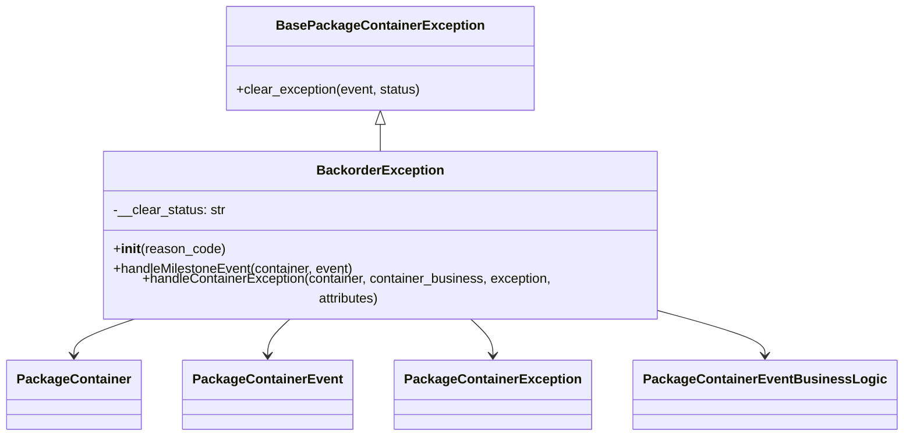
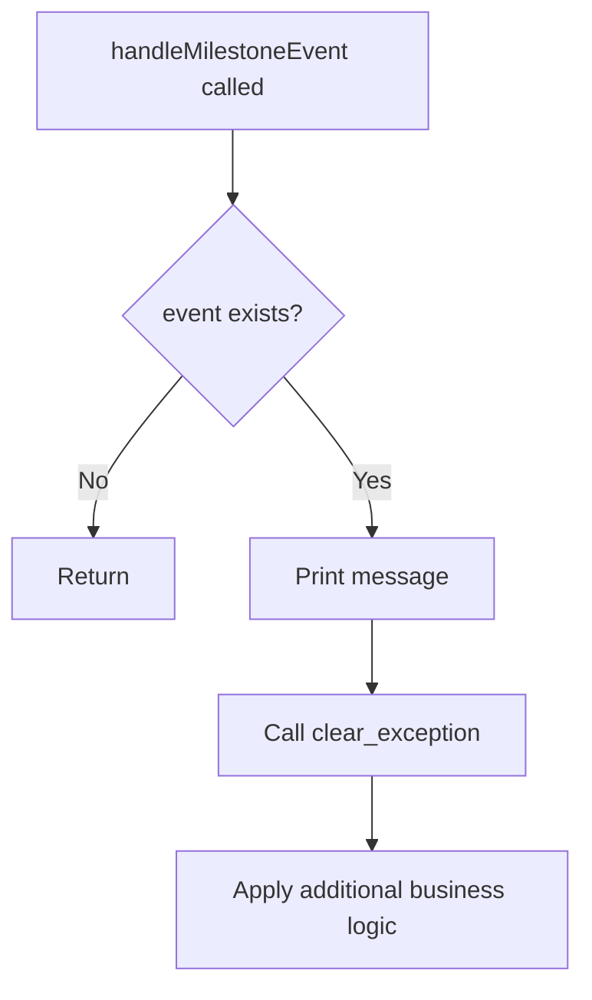
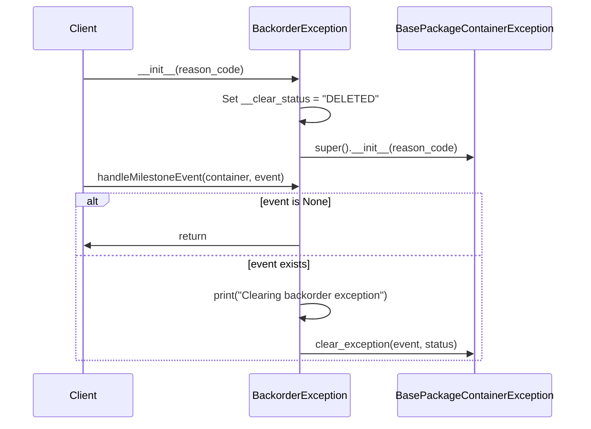

# Diagram: platform/partview_core/partview_service/partview_service/core/business/package_container_exception_status/package_container_exceptions/PackageContainerBackorderException.py

> Auto-generated by Obscura crawlers

## Diagram 1

### SVG

<svg id="container" width="1040.65625" xmlns="http://www.w3.org/2000/svg" class="classDiagram" height="518" viewBox="0 0 1040.65625 518" role="graphics-document document" aria-roledescription="class"><g><defs><marker id="container_class-aggregationStart" class="marker aggregation class" refX="18" refY="7" markerWidth="190" markerHeight="240" orient="auto"><path d="M 18,7 L9,13 L1,7 L9,1 Z"></path></marker></defs><defs><marker id="container_class-aggregationEnd" class="marker aggregation class" refX="1" refY="7" markerWidth="20" markerHeight="28" orient="auto"><path d="M 18,7 L9,13 L1,7 L9,1 Z"></path></marker></defs><defs><marker id="container_class-extensionStart" class="marker extension class" refX="18" refY="7" markerWidth="190" markerHeight="240" orient="auto"><path d="M 1,7 L18,13 V 1 Z"></path></marker></defs><defs><marker id="container_class-extensionEnd" class="marker extension class" refX="1" refY="7" markerWidth="20" markerHeight="28" orient="auto"><path d="M 1,1 V 13 L18,7 Z"></path></marker></defs><defs><marker id="container_class-compositionStart" class="marker composition class" refX="18" refY="7" markerWidth="190" markerHeight="240" orient="auto"><path d="M 18,7 L9,13 L1,7 L9,1 Z"></path></marker></defs><defs><marker id="container_class-compositionEnd" class="marker composition class" refX="1" refY="7" markerWidth="20" markerHeight="28" orient="auto"><path d="M 18,7 L9,13 L1,7 L9,1 Z"></path></marker></defs><defs><marker id="container_class-dependencyStart" class="marker dependency class" refX="6" refY="7" markerWidth="190" markerHeight="240" orient="auto"><path d="M 5,7 L9,13 L1,7 L9,1 Z"></path></marker></defs><defs><marker id="container_class-dependencyEnd" class="marker dependency class" refX="13" refY="7" markerWidth="20" markerHeight="28" orient="auto"><path d="M 18,7 L9,13 L14,7 L9,1 Z"></path></marker></defs><defs><marker id="container_class-lollipopStart" class="marker lollipop class" refX="13" refY="7" markerWidth="190" markerHeight="240" orient="auto"><circle stroke="black" fill="transparent" cx="7" cy="7" r="6"></circle></marker></defs><defs><marker id="container_class-lollipopEnd" class="marker lollipop class" refX="1" refY="7" markerWidth="190" markerHeight="240" orient="auto"><circle stroke="black" fill="transparent" cx="7" cy="7" r="6"></circle></marker></defs><g class="root"><g class="clusters"></g><g class="edgePaths"><path d="M440.965,151.25L440.965,152.542C440.965,153.833,440.965,156.417,440.965,161.875C440.965,167.333,440.965,175.667,440.965,179.833L440.965,184" id="id_BasePackageContainerException_BackorderException_1" class="edge-thickness-normal edge-pattern-solid relation" style=";;;" data-edge="true" data-et="edge" data-id="id_BasePackageContainerException_BackorderException_1" data-points="W3sieCI6NDQwLjk2NDg0Mzc1LCJ5IjoxMzR9LHsieCI6NDQwLjk2NDg0Mzc1LCJ5IjoxNTl9LHsieCI6NDQwLjk2NDg0Mzc1LCJ5IjoxODR9XQ==" marker-start="url(#container_class-extensionStart)"></path><path d="M158.906,376L146.664,380.167C134.422,384.333,109.937,392.667,97.695,400C85.453,407.333,85.453,413.667,85.453,416.833L85.453,420" id="id_BackorderException_PackageContainer_2" class="edge-thickness-normal edge-pattern-solid relation" style=";;;" data-edge="true" data-et="edge" data-id="id_BackorderException_PackageContainer_2" data-points="W3sieCI6MTU4LjkwNTk1OTQ1MjQ3OTM1LCJ5IjozNzZ9LHsieCI6ODUuNDUzMTI1LCJ5Ijo0MDF9LHsieCI6ODUuNDUzMTI1LCJ5Ijo0MjZ9XQ==" marker-end="url(#container_class-dependencyEnd)"></path><path d="M337.505,376L333.015,380.167C328.524,384.333,319.543,392.667,315.053,400C310.563,407.333,310.563,413.667,310.563,416.833L310.563,420" id="id_BackorderException_PackageContainerEvent_3" class="edge-thickness-normal edge-pattern-solid relation" style=";;;" data-edge="true" data-et="edge" data-id="id_BackorderException_PackageContainerEvent_3" data-points="W3sieCI6MzM3LjUwNTEzMzAwNjE5ODMsInkiOjM3Nn0seyJ4IjozMTAuNTYyNSwieSI6NDAxfSx7IngiOjMxMC41NjI1LCJ5Ijo0MjZ9XQ==" marker-end="url(#container_class-dependencyEnd)"></path><path d="M544.425,376L548.915,380.167C553.405,384.333,562.386,392.667,566.877,400C571.367,407.333,571.367,413.667,571.367,416.833L571.367,420" id="id_BackorderException_PackageContainerException_4" class="edge-thickness-normal edge-pattern-solid relation" style=";;;" data-edge="true" data-et="edge" data-id="id_BackorderException_PackageContainerException_4" data-points="W3sieCI6NTQ0LjQyNDU1NDQ5MzgwMTcsInkiOjM3Nn0seyJ4Ijo1NzEuMzY3MTg3NSwieSI6NDAxfSx7IngiOjU3MS4zNjcxODc1LCJ5Ijo0MjZ9XQ==" marker-end="url(#container_class-dependencyEnd)"></path><path d="M781.719,373.152L798.697,377.794C815.674,382.435,849.63,391.717,866.608,399.525C883.586,407.333,883.586,413.667,883.586,416.833L883.586,420" id="id_BackorderException_PackageContainerEventBusinessLogic_5" class="edge-thickness-normal edge-pattern-solid relation" style=";;;" data-edge="true" data-et="edge" data-id="id_BackorderException_PackageContainerEventBusinessLogic_5" data-points="W3sieCI6NzgxLjcxODc1LCJ5IjozNzMuMTUyNDEyMzg3MTQ2OX0seyJ4Ijo4ODMuNTg1OTM3NSwieSI6NDAxfSx7IngiOjg4My41ODU5Mzc1LCJ5Ijo0MjZ9XQ==" marker-end="url(#container_class-dependencyEnd)"></path></g><g class="edgeLabels"><g class="edgeLabel"><g class="label" data-id="id_BasePackageContainerException_BackorderException_1" transform="translate(0, 0)"><foreignObject width="0" height="0">

</foreignObject></g></g><g class="edgeLabel"><g class="label" data-id="id_BackorderException_PackageContainer_2" transform="translate(0, 0)"><foreignObject width="0" height="0">

</foreignObject></g></g><g class="edgeLabel"><g class="label" data-id="id_BackorderException_PackageContainerEvent_3" transform="translate(0, 0)"><foreignObject width="0" height="0">

</foreignObject></g></g><g class="edgeLabel"><g class="label" data-id="id_BackorderException_PackageContainerException_4" transform="translate(0, 0)"><foreignObject width="0" height="0">

</foreignObject></g></g><g class="edgeLabel"><g class="label" data-id="id_BackorderException_PackageContainerEventBusinessLogic_5" transform="translate(0, 0)"><foreignObject width="0" height="0">

</foreignObject></g></g></g><g class="nodes"><g class="node default" id="classId-BasePackageContainerException-0" transform="translate(440.96484375, 71)"><g class="basic label-container"><path d="M-183.5390625 -63 L183.5390625 -63 L183.5390625 63 L-183.5390625 63" stroke="none" stroke-width="0" fill="#ECECFF" style=""></path><path d="M-183.5390625 -63 C-39.00024814241303 -63, 105.53856621517394 -63, 183.5390625 -63 M-183.5390625 -63 C-99.71888300905732 -63, -15.898703518114644 -63, 183.5390625 -63 M183.5390625 -63 C183.5390625 -16.975791298626604, 183.5390625 29.048417402746793, 183.5390625 63 M183.5390625 -63 C183.5390625 -30.629916642476786, 183.5390625 1.7401667150464277, 183.5390625 63 M183.5390625 63 C84.7507019159939 63, -14.037658668012199 63, -183.5390625 63 M183.5390625 63 C82.67551618191686 63, -18.188030136166276 63, -183.5390625 63 M-183.5390625 63 C-183.5390625 23.180647862160328, -183.5390625 -16.638704275679345, -183.5390625 -63 M-183.5390625 63 C-183.5390625 21.949373783136785, -183.5390625 -19.10125243372643, -183.5390625 -63" stroke="#9370DB" stroke-width="1.3" fill="none" stroke-dasharray="0 0" style=""></path></g><g class="annotation-group text" transform="translate(0, -39)"></g><g class="label-group text" transform="translate(-118.671875, -39)"><g class="label" style="font-weight: bolder" transform="translate(0,-12)"><foreignObject width="237.34375" height="24">

BasePackageContainerException

</foreignObject></g></g><g class="members-group text" transform="translate(-171.5390625, 9)"></g><g class="methods-group text" transform="translate(-171.5390625, 39)"><g class="label" style="" transform="translate(0,-12)"><foreignObject width="224.40625" height="24">

+clear_exception(event, status)

</foreignObject></g></g><g class="divider" style=""><path d="M-183.5390625 -15 C-96.55610248052575 -15, -9.573142461051503 -15, 183.5390625 -15 M-183.5390625 -15 C-37.66687799737596 -15, 108.20530650524807 -15, 183.5390625 -15" stroke="#9370DB" stroke-width="1.3" fill="none" stroke-dasharray="0 0" style=""></path></g><g class="divider" style=""><path d="M-183.5390625 9 C-38.48570088255562 9, 106.56766073488876 9, 183.5390625 9 M-183.5390625 9 C-91.92982979186489 9, -0.3205970837297798 9, 183.5390625 9" stroke="#9370DB" stroke-width="1.3" fill="none" stroke-dasharray="0 0" style=""></path></g></g><g class="node default" id="classId-BackorderException-1" transform="translate(440.96484375, 280)"><g class="basic label-container"><path d="M-340.75390625 -96 L340.75390625 -96 L340.75390625 96 L-340.75390625 96" stroke="none" stroke-width="0" fill="#ECECFF" style=""></path><path d="M-340.75390625 -96 C-179.67037909162522 -96, -18.586851933250443 -96, 340.75390625 -96 M-340.75390625 -96 C-149.12782576473327 -96, 42.49825472053345 -96, 340.75390625 -96 M340.75390625 -96 C340.75390625 -28.28904364922188, 340.75390625 39.42191270155624, 340.75390625 96 M340.75390625 -96 C340.75390625 -52.02498962182638, 340.75390625 -8.049979243652757, 340.75390625 96 M340.75390625 96 C126.83890760845219 96, -87.07609103309562 96, -340.75390625 96 M340.75390625 96 C73.7963341960143 96, -193.1612378579714 96, -340.75390625 96 M-340.75390625 96 C-340.75390625 49.25844472394389, -340.75390625 2.5168894478877775, -340.75390625 -96 M-340.75390625 96 C-340.75390625 38.0998929355346, -340.75390625 -19.800214128930804, -340.75390625 -96" stroke="#9370DB" stroke-width="1.3" fill="none" stroke-dasharray="0 0" style=""></path></g><g class="annotation-group text" transform="translate(0, -72)"></g><g class="label-group text" transform="translate(-73.2265625, -72)"><g class="label" style="font-weight: bolder" transform="translate(0,-12)"><foreignObject width="146.453125" height="24">

BackorderException

</foreignObject></g></g><g class="members-group text" transform="translate(-328.75390625, -24)"><g class="label" style="" transform="translate(0,-12)"><foreignObject width="135.96875" height="24">

-__clear_status: str

</foreignObject></g></g><g class="methods-group text" transform="translate(-328.75390625, 24)"><g class="label" style="" transform="translate(0,-12)"><foreignObject width="134.75" height="24">

+<strong>init</strong>(reason_code)

</foreignObject></g><g class="label" style="" transform="translate(0,12)"><foreignObject width="295.703125" height="24">

+handleMilestoneEvent(container, event)

</foreignObject></g><g class="label" style="" transform="translate(0,36)"><foreignObject width="584.28125" height="24">

+handleContainerException(container, container_business, exception, attributes)

</foreignObject></g></g><g class="divider" style=""><path d="M-340.75390625 -48 C-204.44910033275784 -48, -68.14429441551567 -48, 340.75390625 -48 M-340.75390625 -48 C-189.2977442941349 -48, -37.8415823382698 -48, 340.75390625 -48" stroke="#9370DB" stroke-width="1.3" fill="none" stroke-dasharray="0 0" style=""></path></g><g class="divider" style=""><path d="M-340.75390625 0 C-203.5917409519314 0, -66.4295756538628 0, 340.75390625 0 M-340.75390625 0 C-79.51947762047524 0, 181.7149510090495 0, 340.75390625 0" stroke="#9370DB" stroke-width="1.3" fill="none" stroke-dasharray="0 0" style=""></path></g></g><g class="node default" id="classId-PackageContainer-2" transform="translate(85.453125, 468)"><g class="basic label-container"><path d="M-77.453125 -42 L77.453125 -42 L77.453125 42 L-77.453125 42" stroke="none" stroke-width="0" fill="#ECECFF" style=""></path><path d="M-77.453125 -42 C-23.79882636523498 -42, 29.85547226953004 -42, 77.453125 -42 M-77.453125 -42 C-25.071604591430287 -42, 27.309915817139427 -42, 77.453125 -42 M77.453125 -42 C77.453125 -10.85275918823066, 77.453125 20.29448162353868, 77.453125 42 M77.453125 -42 C77.453125 -15.376694686489259, 77.453125 11.246610627021482, 77.453125 42 M77.453125 42 C32.33458439263511 42, -12.783956214729784 42, -77.453125 42 M77.453125 42 C18.41560504423478 42, -40.62191491153044 42, -77.453125 42 M-77.453125 42 C-77.453125 20.133474773181486, -77.453125 -1.733050453637027, -77.453125 -42 M-77.453125 42 C-77.453125 12.005910966975673, -77.453125 -17.988178066048654, -77.453125 -42" stroke="#9370DB" stroke-width="1.3" fill="none" stroke-dasharray="0 0" style=""></path></g><g class="annotation-group text" transform="translate(0, -18)"></g><g class="label-group text" transform="translate(-65.453125, -18)"><g class="label" style="font-weight: bolder" transform="translate(0,-12)"><foreignObject width="130.90625" height="24">

PackageContainer

</foreignObject></g></g><g class="members-group text" transform="translate(-65.453125, 30)"></g><g class="methods-group text" transform="translate(-65.453125, 60)"></g><g class="divider" style=""><path d="M-77.453125 6 C-39.4691186146954 6, -1.4851122293907935 6, 77.453125 6 M-77.453125 6 C-18.584542290876172 6, 40.284040418247656 6, 77.453125 6" stroke="#9370DB" stroke-width="1.3" fill="none" stroke-dasharray="0 0" style=""></path></g><g class="divider" style=""><path d="M-77.453125 24 C-23.402892030180084 24, 30.647340939639832 24, 77.453125 24 M-77.453125 24 C-29.632505214982288 24, 18.188114570035424 24, 77.453125 24" stroke="#9370DB" stroke-width="1.3" fill="none" stroke-dasharray="0 0" style=""></path></g></g><g class="node default" id="classId-PackageContainerEvent-3" transform="translate(310.5625, 468)"><g class="basic label-container"><path d="M-97.65625 -42 L97.65625 -42 L97.65625 42 L-97.65625 42" stroke="none" stroke-width="0" fill="#ECECFF" style=""></path><path d="M-97.65625 -42 C-38.74002658099247 -42, 20.17619683801506 -42, 97.65625 -42 M-97.65625 -42 C-43.07123250649107 -42, 11.513784987017857 -42, 97.65625 -42 M97.65625 -42 C97.65625 -21.242287521509528, 97.65625 -0.4845750430190563, 97.65625 42 M97.65625 -42 C97.65625 -18.705796126836706, 97.65625 4.588407746326588, 97.65625 42 M97.65625 42 C55.10792593660417 42, 12.559601873208337 42, -97.65625 42 M97.65625 42 C26.82880745083095 42, -43.9986350983381 42, -97.65625 42 M-97.65625 42 C-97.65625 20.308932856118965, -97.65625 -1.3821342877620708, -97.65625 -42 M-97.65625 42 C-97.65625 13.910208377553765, -97.65625 -14.17958324489247, -97.65625 -42" stroke="#9370DB" stroke-width="1.3" fill="none" stroke-dasharray="0 0" style=""></path></g><g class="annotation-group text" transform="translate(0, -18)"></g><g class="label-group text" transform="translate(-85.65625, -18)"><g class="label" style="font-weight: bolder" transform="translate(0,-12)"><foreignObject width="171.3125" height="24">

PackageContainerEvent

</foreignObject></g></g><g class="members-group text" transform="translate(-85.65625, 30)"></g><g class="methods-group text" transform="translate(-85.65625, 60)"></g><g class="divider" style=""><path d="M-97.65625 6 C-58.27786867804963 6, -18.899487356099257 6, 97.65625 6 M-97.65625 6 C-21.591749664961227 6, 54.472750670077545 6, 97.65625 6" stroke="#9370DB" stroke-width="1.3" fill="none" stroke-dasharray="0 0" style=""></path></g><g class="divider" style=""><path d="M-97.65625 24 C-36.60690391631857 24, 24.442442167362856 24, 97.65625 24 M-97.65625 24 C-56.930612641572154 24, -16.204975283144307 24, 97.65625 24" stroke="#9370DB" stroke-width="1.3" fill="none" stroke-dasharray="0 0" style=""></path></g></g><g class="node default" id="classId-PackageContainerException-4" transform="translate(571.3671875, 468)"><g class="basic label-container"><path d="M-113.1484375 -42 L113.1484375 -42 L113.1484375 42 L-113.1484375 42" stroke="none" stroke-width="0" fill="#ECECFF" style=""></path><path d="M-113.1484375 -42 C-56.39238783810962 -42, 0.3636618237807596 -42, 113.1484375 -42 M-113.1484375 -42 C-67.6435835512436 -42, -22.13872960248719 -42, 113.1484375 -42 M113.1484375 -42 C113.1484375 -18.595321029525305, 113.1484375 4.80935794094939, 113.1484375 42 M113.1484375 -42 C113.1484375 -12.771878174985709, 113.1484375 16.456243650028583, 113.1484375 42 M113.1484375 42 C51.99902180436535 42, -9.150393891269303 42, -113.1484375 42 M113.1484375 42 C24.06984866314248 42, -65.00874017371504 42, -113.1484375 42 M-113.1484375 42 C-113.1484375 14.181668153793893, -113.1484375 -13.636663692412213, -113.1484375 -42 M-113.1484375 42 C-113.1484375 23.829783485067004, -113.1484375 5.659566970134009, -113.1484375 -42" stroke="#9370DB" stroke-width="1.3" fill="none" stroke-dasharray="0 0" style=""></path></g><g class="annotation-group text" transform="translate(0, -18)"></g><g class="label-group text" transform="translate(-101.1484375, -18)"><g class="label" style="font-weight: bolder" transform="translate(0,-12)"><foreignObject width="202.296875" height="24">

PackageContainerException

</foreignObject></g></g><g class="members-group text" transform="translate(-101.1484375, 30)"></g><g class="methods-group text" transform="translate(-101.1484375, 60)"></g><g class="divider" style=""><path d="M-113.1484375 6 C-54.44845736636475 6, 4.251522767270501 6, 113.1484375 6 M-113.1484375 6 C-27.421356548014046 6, 58.30572440397191 6, 113.1484375 6" stroke="#9370DB" stroke-width="1.3" fill="none" stroke-dasharray="0 0" style=""></path></g><g class="divider" style=""><path d="M-113.1484375 24 C-43.40712374053358 24, 26.334190018932844 24, 113.1484375 24 M-113.1484375 24 C-35.49818516496606 24, 42.15206717006788 24, 113.1484375 24" stroke="#9370DB" stroke-width="1.3" fill="none" stroke-dasharray="0 0" style=""></path></g></g><g class="node default" id="classId-PackageContainerEventBusinessLogic-5" transform="translate(883.5859375, 468)"><g class="basic label-container"><path d="M-149.0703125 -42 L149.0703125 -42 L149.0703125 42 L-149.0703125 42" stroke="none" stroke-width="0" fill="#ECECFF" style=""></path><path d="M-149.0703125 -42 C-30.40325963460583 -42, 88.26379323078834 -42, 149.0703125 -42 M-149.0703125 -42 C-62.83183121159327 -42, 23.406650076813463 -42, 149.0703125 -42 M149.0703125 -42 C149.0703125 -20.89803722861674, 149.0703125 0.20392554276651964, 149.0703125 42 M149.0703125 -42 C149.0703125 -10.138598811311521, 149.0703125 21.722802377376958, 149.0703125 42 M149.0703125 42 C31.06777923807502 42, -86.93475402384996 42, -149.0703125 42 M149.0703125 42 C50.780868213624444 42, -47.50857607275111 42, -149.0703125 42 M-149.0703125 42 C-149.0703125 13.478291843680509, -149.0703125 -15.043416312638982, -149.0703125 -42 M-149.0703125 42 C-149.0703125 14.48238588421659, -149.0703125 -13.035228231566819, -149.0703125 -42" stroke="#9370DB" stroke-width="1.3" fill="none" stroke-dasharray="0 0" style=""></path></g><g class="annotation-group text" transform="translate(0, -18)"></g><g class="label-group text" transform="translate(-137.0703125, -18)"><g class="label" style="font-weight: bolder" transform="translate(0,-12)"><foreignObject width="274.140625" height="24">

PackageContainerEventBusinessLogic

</foreignObject></g></g><g class="members-group text" transform="translate(-137.0703125, 30)"></g><g class="methods-group text" transform="translate(-137.0703125, 60)"></g><g class="divider" style=""><path d="M-149.0703125 6 C-76.28812394004501 6, -3.5059353800900226 6, 149.0703125 6 M-149.0703125 6 C-54.87110633962776 6, 39.328099820744484 6, 149.0703125 6" stroke="#9370DB" stroke-width="1.3" fill="none" stroke-dasharray="0 0" style=""></path></g><g class="divider" style=""><path d="M-149.0703125 24 C-73.24234576762592 24, 2.585620964748159 24, 149.0703125 24 M-149.0703125 24 C-59.83450623344967 24, 29.401300033100654 24, 149.0703125 24" stroke="#9370DB" stroke-width="1.3" fill="none" stroke-dasharray="0 0" style=""></path></g></g></g></g></g></svg>

## Diagram 2

### SVG

<svg id="container" width="385.5390625" xmlns="http://www.w3.org/2000/svg" class="flowchart" height="651.015625" viewBox="0 0 385.5390625 651.015625" role="graphics-document document" aria-roledescription="flowchart-v2"><g><marker id="container_flowchart-v2-pointEnd" class="marker flowchart-v2" viewBox="0 0 10 10" refX="5" refY="5" markerUnits="userSpaceOnUse" markerWidth="8" markerHeight="8" orient="auto"><path d="M 0 0 L 10 5 L 0 10 z" class="arrowMarkerPath" style="stroke-width: 1; stroke-dasharray: 1, 0;"></path></marker><marker id="container_flowchart-v2-pointStart" class="marker flowchart-v2" viewBox="0 0 10 10" refX="4.5" refY="5" markerUnits="userSpaceOnUse" markerWidth="8" markerHeight="8" orient="auto"><path d="M 0 5 L 10 10 L 10 0 z" class="arrowMarkerPath" style="stroke-width: 1; stroke-dasharray: 1, 0;"></path></marker><marker id="container_flowchart-v2-circleEnd" class="marker flowchart-v2" viewBox="0 0 10 10" refX="11" refY="5" markerUnits="userSpaceOnUse" markerWidth="11" markerHeight="11" orient="auto"><circle cx="5" cy="5" r="5" class="arrowMarkerPath" style="stroke-width: 1; stroke-dasharray: 1, 0;"></circle></marker><marker id="container_flowchart-v2-circleStart" class="marker flowchart-v2" viewBox="0 0 10 10" refX="-1" refY="5" markerUnits="userSpaceOnUse" markerWidth="11" markerHeight="11" orient="auto"><circle cx="5" cy="5" r="5" class="arrowMarkerPath" style="stroke-width: 1; stroke-dasharray: 1, 0;"></circle></marker><marker id="container_flowchart-v2-crossEnd" class="marker cross flowchart-v2" viewBox="0 0 11 11" refX="12" refY="5.2" markerUnits="userSpaceOnUse" markerWidth="11" markerHeight="11" orient="auto"><path d="M 1,1 l 9,9 M 10,1 l -9,9" class="arrowMarkerPath" style="stroke-width: 2; stroke-dasharray: 1, 0;"></path></marker><marker id="container_flowchart-v2-crossStart" class="marker cross flowchart-v2" viewBox="0 0 11 11" refX="-1" refY="5.2" markerUnits="userSpaceOnUse" markerWidth="11" markerHeight="11" orient="auto"><path d="M 1,1 l 9,9 M 10,1 l -9,9" class="arrowMarkerPath" style="stroke-width: 2; stroke-dasharray: 1, 0;"></path></marker><g class="root"><g class="clusters"></g><g class="edgePaths"><path d="M154.973,86L154.973,90.167C154.973,94.333,154.973,102.667,154.973,110.333C154.973,118,154.973,125,154.973,128.5L154.973,132" id="L_A_B_0" class="edge-thickness-normal edge-pattern-solid edge-thickness-normal edge-pattern-solid flowchart-link" style=";" data-edge="true" data-et="edge" data-id="L_A_B_0" data-points="W3sieCI6MTU0Ljk3MjY1NjI1LCJ5Ijo4Nn0seyJ4IjoxNTQuOTcyNjU2MjUsInkiOjExMX0seyJ4IjoxNTQuOTcyNjU2MjUsInkiOjEzNn1d" marker-end="url(#container_flowchart-v2-pointEnd)"></path><path d="M121.466,249.509L111.623,261.26C101.779,273.011,82.093,296.513,72.25,313.765C62.406,331.016,62.406,342.016,62.406,347.516L62.406,353.016" id="L_B_C_0" class="edge-thickness-normal edge-pattern-solid edge-thickness-normal edge-pattern-solid flowchart-link" style=";" data-edge="true" data-et="edge" data-id="L_B_C_0" data-points="W3sieCI6MTIxLjQ2NTkyMTI0MjkzMDkzLCJ5IjoyNDkuNTA4ODg5OTkyOTMwOTN9LHsieCI6NjIuNDA2MjUsInkiOjMyMC4wMTU2MjV9LHsieCI6NjIuNDA2MjUsInkiOjM1Ny4wMTU2MjV9XQ==" marker-end="url(#container_flowchart-v2-pointEnd)"></path><path d="M188.479,249.509L198.323,261.26C208.166,273.011,227.853,296.513,237.696,313.765C247.539,331.016,247.539,342.016,247.539,347.516L247.539,353.016" id="L_B_D_0" class="edge-thickness-normal edge-pattern-solid edge-thickness-normal edge-pattern-solid flowchart-link" style=";" data-edge="true" data-et="edge" data-id="L_B_D_0" data-points="W3sieCI6MTg4LjQ3OTM5MTI1NzA2OTA3LCJ5IjoyNDkuNTA4ODg5OTkyOTMwOTN9LHsieCI6MjQ3LjUzOTA2MjUsInkiOjMyMC4wMTU2MjV9LHsieCI6MjQ3LjUzOTA2MjUsInkiOjM1Ny4wMTU2MjV9XQ==" marker-end="url(#container_flowchart-v2-pointEnd)"></path><path d="M247.539,411.016L247.539,415.182C247.539,419.349,247.539,427.682,247.539,435.349C247.539,443.016,247.539,450.016,247.539,453.516L247.539,457.016" id="L_D_E_0" class="edge-thickness-normal edge-pattern-solid edge-thickness-normal edge-pattern-solid flowchart-link" style=";" data-edge="true" data-et="edge" data-id="L_D_E_0" data-points="W3sieCI6MjQ3LjUzOTA2MjUsInkiOjQxMS4wMTU2MjV9LHsieCI6MjQ3LjUzOTA2MjUsInkiOjQzNi4wMTU2MjV9LHsieCI6MjQ3LjUzOTA2MjUsInkiOjQ2MS4wMTU2MjV9XQ==" marker-end="url(#container_flowchart-v2-pointEnd)"></path><path d="M247.539,515.016L247.539,519.182C247.539,523.349,247.539,531.682,247.539,539.349C247.539,547.016,247.539,554.016,247.539,557.516L247.539,561.016" id="L_E_F_0" class="edge-thickness-normal edge-pattern-solid edge-thickness-normal edge-pattern-solid flowchart-link" style=";" data-edge="true" data-et="edge" data-id="L_E_F_0" data-points="W3sieCI6MjQ3LjUzOTA2MjUsInkiOjUxNS4wMTU2MjV9LHsieCI6MjQ3LjUzOTA2MjUsInkiOjU0MC4wMTU2MjV9LHsieCI6MjQ3LjUzOTA2MjUsInkiOjU2NS4wMTU2MjV9XQ==" marker-end="url(#container_flowchart-v2-pointEnd)"></path></g><g class="edgeLabels"><g class="edgeLabel"><g class="label" data-id="L_A_B_0" transform="translate(0, 0)"><foreignObject width="0" height="0">

</foreignObject></g></g><g class="edgeLabel" transform="translate(62.40625, 320.015625)"><g class="label" data-id="L_B_C_0" transform="translate(-10.140625, -12)"><foreignObject width="20.28125" height="24">

No

</foreignObject></g></g><g class="edgeLabel" transform="translate(247.5390625, 320.015625)"><g class="label" data-id="L_B_D_0" transform="translate(-12.03125, -12)"><foreignObject width="24.0625" height="24">

Yes

</foreignObject></g></g><g class="edgeLabel"><g class="label" data-id="L_D_E_0" transform="translate(0, 0)"><foreignObject width="0" height="0">

</foreignObject></g></g><g class="edgeLabel"><g class="label" data-id="L_E_F_0" transform="translate(0, 0)"><foreignObject width="0" height="0">

</foreignObject></g></g></g><g class="nodes"><g class="node default" id="flowchart-A-0" transform="translate(154.97265625, 47)"><rect class="basic label-container" style="" x="-130" y="-39" width="260" height="78"></rect><g class="label" style="" transform="translate(-100, -24)"><rect></rect><foreignObject width="200" height="48">

handleMilestoneEvent called

</foreignObject></g></g><g class="node default" id="flowchart-B-1" transform="translate(154.97265625, 209.5078125)"><polygon points="73.5078125,0 147.015625,-73.5078125 73.5078125,-147.015625 0,-73.5078125" class="label-container" transform="translate(-73.0078125, 73.5078125)"></polygon><g class="label" style="" transform="translate(-46.5078125, -12)"><rect></rect><foreignObject width="93.015625" height="24">

event exists?

</foreignObject></g></g><g class="node default" id="flowchart-C-3" transform="translate(62.40625, 384.015625)"><rect class="basic label-container" style="" x="-54.40625" y="-27" width="108.8125" height="54"></rect><g class="label" style="" transform="translate(-24.40625, -12)"><rect></rect><foreignObject width="48.8125" height="24">

Return

</foreignObject></g></g><g class="node default" id="flowchart-D-5" transform="translate(247.5390625, 384.015625)"><rect class="basic label-container" style="" x="-80.7265625" y="-27" width="161.453125" height="54"></rect><g class="label" style="" transform="translate(-50.7265625, -12)"><rect></rect><foreignObject width="101.453125" height="24">

Print message

</foreignObject></g></g><g class="node default" id="flowchart-E-7" transform="translate(247.5390625, 488.015625)"><rect class="basic label-container" style="" x="-102.0703125" y="-27" width="204.140625" height="54"></rect><g class="label" style="" transform="translate(-72.0703125, -12)"><rect></rect><foreignObject width="144.140625" height="24">

Call clear_exception

</foreignObject></g></g><g class="node default" id="flowchart-F-9" transform="translate(247.5390625, 604.015625)"><rect class="basic label-container" style="" x="-130" y="-39" width="260" height="78"></rect><g class="label" style="" transform="translate(-100, -24)"><rect></rect><foreignObject width="200" height="48">

Apply additional business logic

</foreignObject></g></g></g></g></g></svg>

## Diagram 3

### SVG

<svg id="container" width="946" xmlns="http://www.w3.org/2000/svg" height="667" viewBox="-50 -10 946 667" role="graphics-document document" aria-roledescription="sequence"><g><rect x="592" y="581" fill="#eaeaea" stroke="#666" width="254" height="65" name="BasePackageContainerException" rx="3" ry="3" class="actor actor-bottom"></rect><text x="719" y="613.5" dominant-baseline="central" alignment-baseline="central" class="actor actor-box" style="text-anchor: middle; font-size: 16px; font-weight: 400;"><tspan x="719" dy="0">BasePackageContainerException</tspan></text></g><g><rect x="351" y="581" fill="#eaeaea" stroke="#666" width="164" height="65" name="BackorderException" rx="3" ry="3" class="actor actor-bottom"></rect><text x="433" y="613.5" dominant-baseline="central" alignment-baseline="central" class="actor actor-box" style="text-anchor: middle; font-size: 16px; font-weight: 400;"><tspan x="433" dy="0">BackorderException</tspan></text></g><g><rect x="0" y="581" fill="#eaeaea" stroke="#666" width="150" height="65" name="Client" rx="3" ry="3" class="actor actor-bottom"></rect><text x="75" y="613.5" dominant-baseline="central" alignment-baseline="central" class="actor actor-box" style="text-anchor: middle; font-size: 16px; font-weight: 400;"><tspan x="75" dy="0">Client</tspan></text></g><g><line id="actor2" x1="719" y1="65" x2="719" y2="581" class="actor-line 200" stroke-width="0.5px" stroke="#999" name="BasePackageContainerException"></line><g id="root-2"><rect x="592" y="0" fill="#eaeaea" stroke="#666" width="254" height="65" name="BasePackageContainerException" rx="3" ry="3" class="actor actor-top"></rect><text x="719" y="32.5" dominant-baseline="central" alignment-baseline="central" class="actor actor-box" style="text-anchor: middle; font-size: 16px; font-weight: 400;"><tspan x="719" dy="0">BasePackageContainerException</tspan></text></g></g><g><line id="actor1" x1="433" y1="65" x2="433" y2="581" class="actor-line 200" stroke-width="0.5px" stroke="#999" name="BackorderException"></line><g id="root-1"><rect x="351" y="0" fill="#eaeaea" stroke="#666" width="164" height="65" name="BackorderException" rx="3" ry="3" class="actor actor-top"></rect><text x="433" y="32.5" dominant-baseline="central" alignment-baseline="central" class="actor actor-box" style="text-anchor: middle; font-size: 16px; font-weight: 400;"><tspan x="433" dy="0">BackorderException</tspan></text></g></g><g><line id="actor0" x1="75" y1="65" x2="75" y2="581" class="actor-line 200" stroke-width="0.5px" stroke="#999" name="Client"></line><g id="root-0"><rect x="0" y="0" fill="#eaeaea" stroke="#666" width="150" height="65" name="Client" rx="3" ry="3" class="actor actor-top"></rect><text x="75" y="32.5" dominant-baseline="central" alignment-baseline="central" class="actor actor-box" style="text-anchor: middle; font-size: 16px; font-weight: 400;"><tspan x="75" dy="0">Client</tspan></text></g></g><g></g><defs><symbol id="computer" width="24" height="24"><path transform="scale(.5)" d="M2 2v13h20v-13h-20zm18 11h-16v-9h16v9zm-10.228 6l.466-1h3.524l.467 1h-4.457zm14.228 3h-24l2-6h2.104l-1.33 4h18.45l-1.297-4h2.073l2 6zm-5-10h-14v-7h14v7z"></path></symbol></defs><defs><symbol id="database" fill-rule="evenodd" clip-rule="evenodd"><path transform="scale(.5)" d="M12.258.001l.256.004.255.005.253.008.251.01.249.012.247.015.246.016.242.019.241.02.239.023.236.024.233.027.231.028.229.031.225.032.223.034.22.036.217.038.214.04.211.041.208.043.205.045.201.046.198.048.194.05.191.051.187.053.183.054.18.056.175.057.172.059.168.06.163.061.16.063.155.064.15.066.074.033.073.033.071.034.07.034.069.035.068.035.067.035.066.035.064.036.064.036.062.036.06.036.06.037.058.037.058.037.055.038.055.038.053.038.052.038.051.039.05.039.048.039.047.039.045.04.044.04.043.04.041.04.04.041.039.041.037.041.036.041.034.041.033.042.032.042.03.042.029.042.027.042.026.043.024.043.023.043.021.043.02.043.018.044.017.043.015.044.013.044.012.044.011.045.009.044.007.045.006.045.004.045.002.045.001.045v17l-.001.045-.002.045-.004.045-.006.045-.007.045-.009.044-.011.045-.012.044-.013.044-.015.044-.017.043-.018.044-.02.043-.021.043-.023.043-.024.043-.026.043-.027.042-.029.042-.03.042-.032.042-.033.042-.034.041-.036.041-.037.041-.039.041-.04.041-.041.04-.043.04-.044.04-.045.04-.047.039-.048.039-.05.039-.051.039-.052.038-.053.038-.055.038-.055.038-.058.037-.058.037-.06.037-.06.036-.062.036-.064.036-.064.036-.066.035-.067.035-.068.035-.069.035-.07.034-.071.034-.073.033-.074.033-.15.066-.155.064-.16.063-.163.061-.168.06-.172.059-.175.057-.18.056-.183.054-.187.053-.191.051-.194.05-.198.048-.201.046-.205.045-.208.043-.211.041-.214.04-.217.038-.22.036-.223.034-.225.032-.229.031-.231.028-.233.027-.236.024-.239.023-.241.02-.242.019-.246.016-.247.015-.249.012-.251.01-.253.008-.255.005-.256.004-.258.001-.258-.001-.256-.004-.255-.005-.253-.008-.251-.01-.249-.012-.247-.015-.245-.016-.243-.019-.241-.02-.238-.023-.236-.024-.234-.027-.231-.028-.228-.031-.226-.032-.223-.034-.22-.036-.217-.038-.214-.04-.211-.041-.208-.043-.204-.045-.201-.046-.198-.048-.195-.05-.19-.051-.187-.053-.184-.054-.179-.056-.176-.057-.172-.059-.167-.06-.164-.061-.159-.063-.155-.064-.151-.066-.074-.033-.072-.033-.072-.034-.07-.034-.069-.035-.068-.035-.067-.035-.066-.035-.064-.036-.063-.036-.062-.036-.061-.036-.06-.037-.058-.037-.057-.037-.056-.038-.055-.038-.053-.038-.052-.038-.051-.039-.049-.039-.049-.039-.046-.039-.046-.04-.044-.04-.043-.04-.041-.04-.04-.041-.039-.041-.037-.041-.036-.041-.034-.041-.033-.042-.032-.042-.03-.042-.029-.042-.027-.042-.026-.043-.024-.043-.023-.043-.021-.043-.02-.043-.018-.044-.017-.043-.015-.044-.013-.044-.012-.044-.011-.045-.009-.044-.007-.045-.006-.045-.004-.045-.002-.045-.001-.045v-17l.001-.045.002-.045.004-.045.006-.045.007-.045.009-.044.011-.045.012-.044.013-.044.015-.044.017-.043.018-.044.02-.043.021-.043.023-.043.024-.043.026-.043.027-.042.029-.042.03-.042.032-.042.033-.042.034-.041.036-.041.037-.041.039-.041.04-.041.041-.04.043-.04.044-.04.046-.04.046-.039.049-.039.049-.039.051-.039.052-.038.053-.038.055-.038.056-.038.057-.037.058-.037.06-.037.061-.036.062-.036.063-.036.064-.036.066-.035.067-.035.068-.035.069-.035.07-.034.072-.034.072-.033.074-.033.151-.066.155-.064.159-.063.164-.061.167-.06.172-.059.176-.057.179-.056.184-.054.187-.053.19-.051.195-.05.198-.048.201-.046.204-.045.208-.043.211-.041.214-.04.217-.038.22-.036.223-.034.226-.032.228-.031.231-.028.234-.027.236-.024.238-.023.241-.02.243-.019.245-.016.247-.015.249-.012.251-.01.253-.008.255-.005.256-.004.258-.001.258.001zm-9.258 20.499v.01l.001.021.003.021.004.022.005.021.006.022.007.022.009.023.01.022.011.023.012.023.013.023.015.023.016.024.017.023.018.024.019.024.021.024.022.025.023.024.024.025.052.049.056.05.061.051.066.051.07.051.075.051.079.052.084.052.088.052.092.052.097.052.102.051.105.052.11.052.114.051.119.051.123.051.127.05.131.05.135.05.139.048.144.049.147.047.152.047.155.047.16.045.163.045.167.043.171.043.176.041.178.041.183.039.187.039.19.037.194.035.197.035.202.033.204.031.209.03.212.029.216.027.219.025.222.024.226.021.23.02.233.018.236.016.24.015.243.012.246.01.249.008.253.005.256.004.259.001.26-.001.257-.004.254-.005.25-.008.247-.011.244-.012.241-.014.237-.016.233-.018.231-.021.226-.021.224-.024.22-.026.216-.027.212-.028.21-.031.205-.031.202-.034.198-.034.194-.036.191-.037.187-.039.183-.04.179-.04.175-.042.172-.043.168-.044.163-.045.16-.046.155-.046.152-.047.148-.048.143-.049.139-.049.136-.05.131-.05.126-.05.123-.051.118-.052.114-.051.11-.052.106-.052.101-.052.096-.052.092-.052.088-.053.083-.051.079-.052.074-.052.07-.051.065-.051.06-.051.056-.05.051-.05.023-.024.023-.025.021-.024.02-.024.019-.024.018-.024.017-.024.015-.023.014-.024.013-.023.012-.023.01-.023.01-.022.008-.022.006-.022.006-.022.004-.022.004-.021.001-.021.001-.021v-4.127l-.077.055-.08.053-.083.054-.085.053-.087.052-.09.052-.093.051-.095.05-.097.05-.1.049-.102.049-.105.048-.106.047-.109.047-.111.046-.114.045-.115.045-.118.044-.12.043-.122.042-.124.042-.126.041-.128.04-.13.04-.132.038-.134.038-.135.037-.138.037-.139.035-.142.035-.143.034-.144.033-.147.032-.148.031-.15.03-.151.03-.153.029-.154.027-.156.027-.158.026-.159.025-.161.024-.162.023-.163.022-.165.021-.166.02-.167.019-.169.018-.169.017-.171.016-.173.015-.173.014-.175.013-.175.012-.177.011-.178.01-.179.008-.179.008-.181.006-.182.005-.182.004-.184.003-.184.002h-.37l-.184-.002-.184-.003-.182-.004-.182-.005-.181-.006-.179-.008-.179-.008-.178-.01-.176-.011-.176-.012-.175-.013-.173-.014-.172-.015-.171-.016-.17-.017-.169-.018-.167-.019-.166-.02-.165-.021-.163-.022-.162-.023-.161-.024-.159-.025-.157-.026-.156-.027-.155-.027-.153-.029-.151-.03-.15-.03-.148-.031-.146-.032-.145-.033-.143-.034-.141-.035-.14-.035-.137-.037-.136-.037-.134-.038-.132-.038-.13-.04-.128-.04-.126-.041-.124-.042-.122-.042-.12-.044-.117-.043-.116-.045-.113-.045-.112-.046-.109-.047-.106-.047-.105-.048-.102-.049-.1-.049-.097-.05-.095-.05-.093-.052-.09-.051-.087-.052-.085-.053-.083-.054-.08-.054-.077-.054v4.127zm0-5.654v.011l.001.021.003.021.004.021.005.022.006.022.007.022.009.022.01.022.011.023.012.023.013.023.015.024.016.023.017.024.018.024.019.024.021.024.022.024.023.025.024.024.052.05.056.05.061.05.066.051.07.051.075.052.079.051.084.052.088.052.092.052.097.052.102.052.105.052.11.051.114.051.119.052.123.05.127.051.131.05.135.049.139.049.144.048.147.048.152.047.155.046.16.045.163.045.167.044.171.042.176.042.178.04.183.04.187.038.19.037.194.036.197.034.202.033.204.032.209.03.212.028.216.027.219.025.222.024.226.022.23.02.233.018.236.016.24.014.243.012.246.01.249.008.253.006.256.003.259.001.26-.001.257-.003.254-.006.25-.008.247-.01.244-.012.241-.015.237-.016.233-.018.231-.02.226-.022.224-.024.22-.025.216-.027.212-.029.21-.03.205-.032.202-.033.198-.035.194-.036.191-.037.187-.039.183-.039.179-.041.175-.042.172-.043.168-.044.163-.045.16-.045.155-.047.152-.047.148-.048.143-.048.139-.05.136-.049.131-.05.126-.051.123-.051.118-.051.114-.052.11-.052.106-.052.101-.052.096-.052.092-.052.088-.052.083-.052.079-.052.074-.051.07-.052.065-.051.06-.05.056-.051.051-.049.023-.025.023-.024.021-.025.02-.024.019-.024.018-.024.017-.024.015-.023.014-.023.013-.024.012-.022.01-.023.01-.023.008-.022.006-.022.006-.022.004-.021.004-.022.001-.021.001-.021v-4.139l-.077.054-.08.054-.083.054-.085.052-.087.053-.09.051-.093.051-.095.051-.097.05-.1.049-.102.049-.105.048-.106.047-.109.047-.111.046-.114.045-.115.044-.118.044-.12.044-.122.042-.124.042-.126.041-.128.04-.13.039-.132.039-.134.038-.135.037-.138.036-.139.036-.142.035-.143.033-.144.033-.147.033-.148.031-.15.03-.151.03-.153.028-.154.028-.156.027-.158.026-.159.025-.161.024-.162.023-.163.022-.165.021-.166.02-.167.019-.169.018-.169.017-.171.016-.173.015-.173.014-.175.013-.175.012-.177.011-.178.009-.179.009-.179.007-.181.007-.182.005-.182.004-.184.003-.184.002h-.37l-.184-.002-.184-.003-.182-.004-.182-.005-.181-.007-.179-.007-.179-.009-.178-.009-.176-.011-.176-.012-.175-.013-.173-.014-.172-.015-.171-.016-.17-.017-.169-.018-.167-.019-.166-.02-.165-.021-.163-.022-.162-.023-.161-.024-.159-.025-.157-.026-.156-.027-.155-.028-.153-.028-.151-.03-.15-.03-.148-.031-.146-.033-.145-.033-.143-.033-.141-.035-.14-.036-.137-.036-.136-.037-.134-.038-.132-.039-.13-.039-.128-.04-.126-.041-.124-.042-.122-.043-.12-.043-.117-.044-.116-.044-.113-.046-.112-.046-.109-.046-.106-.047-.105-.048-.102-.049-.1-.049-.097-.05-.095-.051-.093-.051-.09-.051-.087-.053-.085-.052-.083-.054-.08-.054-.077-.054v4.139zm0-5.666v.011l.001.02.003.022.004.021.005.022.006.021.007.022.009.023.01.022.011.023.012.023.013.023.015.023.016.024.017.024.018.023.019.024.021.025.022.024.023.024.024.025.052.05.056.05.061.05.066.051.07.051.075.052.079.051.084.052.088.052.092.052.097.052.102.052.105.051.11.052.114.051.119.051.123.051.127.05.131.05.135.05.139.049.144.048.147.048.152.047.155.046.16.045.163.045.167.043.171.043.176.042.178.04.183.04.187.038.19.037.194.036.197.034.202.033.204.032.209.03.212.028.216.027.219.025.222.024.226.021.23.02.233.018.236.017.24.014.243.012.246.01.249.008.253.006.256.003.259.001.26-.001.257-.003.254-.006.25-.008.247-.01.244-.013.241-.014.237-.016.233-.018.231-.02.226-.022.224-.024.22-.025.216-.027.212-.029.21-.03.205-.032.202-.033.198-.035.194-.036.191-.037.187-.039.183-.039.179-.041.175-.042.172-.043.168-.044.163-.045.16-.045.155-.047.152-.047.148-.048.143-.049.139-.049.136-.049.131-.051.126-.05.123-.051.118-.052.114-.051.11-.052.106-.052.101-.052.096-.052.092-.052.088-.052.083-.052.079-.052.074-.052.07-.051.065-.051.06-.051.056-.05.051-.049.023-.025.023-.025.021-.024.02-.024.019-.024.018-.024.017-.024.015-.023.014-.024.013-.023.012-.023.01-.022.01-.023.008-.022.006-.022.006-.022.004-.022.004-.021.001-.021.001-.021v-4.153l-.077.054-.08.054-.083.053-.085.053-.087.053-.09.051-.093.051-.095.051-.097.05-.1.049-.102.048-.105.048-.106.048-.109.046-.111.046-.114.046-.115.044-.118.044-.12.043-.122.043-.124.042-.126.041-.128.04-.13.039-.132.039-.134.038-.135.037-.138.036-.139.036-.142.034-.143.034-.144.033-.147.032-.148.032-.15.03-.151.03-.153.028-.154.028-.156.027-.158.026-.159.024-.161.024-.162.023-.163.023-.165.021-.166.02-.167.019-.169.018-.169.017-.171.016-.173.015-.173.014-.175.013-.175.012-.177.01-.178.01-.179.009-.179.007-.181.006-.182.006-.182.004-.184.003-.184.001-.185.001-.185-.001-.184-.001-.184-.003-.182-.004-.182-.006-.181-.006-.179-.007-.179-.009-.178-.01-.176-.01-.176-.012-.175-.013-.173-.014-.172-.015-.171-.016-.17-.017-.169-.018-.167-.019-.166-.02-.165-.021-.163-.023-.162-.023-.161-.024-.159-.024-.157-.026-.156-.027-.155-.028-.153-.028-.151-.03-.15-.03-.148-.032-.146-.032-.145-.033-.143-.034-.141-.034-.14-.036-.137-.036-.136-.037-.134-.038-.132-.039-.13-.039-.128-.041-.126-.041-.124-.041-.122-.043-.12-.043-.117-.044-.116-.044-.113-.046-.112-.046-.109-.046-.106-.048-.105-.048-.102-.048-.1-.05-.097-.049-.095-.051-.093-.051-.09-.052-.087-.052-.085-.053-.083-.053-.08-.054-.077-.054v4.153zm8.74-8.179l-.257.004-.254.005-.25.008-.247.011-.244.012-.241.014-.237.016-.233.018-.231.021-.226.022-.224.023-.22.026-.216.027-.212.028-.21.031-.205.032-.202.033-.198.034-.194.036-.191.038-.187.038-.183.04-.179.041-.175.042-.172.043-.168.043-.163.045-.16.046-.155.046-.152.048-.148.048-.143.048-.139.049-.136.05-.131.05-.126.051-.123.051-.118.051-.114.052-.11.052-.106.052-.101.052-.096.052-.092.052-.088.052-.083.052-.079.052-.074.051-.07.052-.065.051-.06.05-.056.05-.051.05-.023.025-.023.024-.021.024-.02.025-.019.024-.018.024-.017.023-.015.024-.014.023-.013.023-.012.023-.01.023-.01.022-.008.022-.006.023-.006.021-.004.022-.004.021-.001.021-.001.021.001.021.001.021.004.021.004.022.006.021.006.023.008.022.01.022.01.023.012.023.013.023.014.023.015.024.017.023.018.024.019.024.02.025.021.024.023.024.023.025.051.05.056.05.06.05.065.051.07.052.074.051.079.052.083.052.088.052.092.052.096.052.101.052.106.052.11.052.114.052.118.051.123.051.126.051.131.05.136.05.139.049.143.048.148.048.152.048.155.046.16.046.163.045.168.043.172.043.175.042.179.041.183.04.187.038.191.038.194.036.198.034.202.033.205.032.21.031.212.028.216.027.22.026.224.023.226.022.231.021.233.018.237.016.241.014.244.012.247.011.25.008.254.005.257.004.26.001.26-.001.257-.004.254-.005.25-.008.247-.011.244-.012.241-.014.237-.016.233-.018.231-.021.226-.022.224-.023.22-.026.216-.027.212-.028.21-.031.205-.032.202-.033.198-.034.194-.036.191-.038.187-.038.183-.04.179-.041.175-.042.172-.043.168-.043.163-.045.16-.046.155-.046.152-.048.148-.048.143-.048.139-.049.136-.05.131-.05.126-.051.123-.051.118-.051.114-.052.11-.052.106-.052.101-.052.096-.052.092-.052.088-.052.083-.052.079-.052.074-.051.07-.052.065-.051.06-.05.056-.05.051-.05.023-.025.023-.024.021-.024.02-.025.019-.024.018-.024.017-.023.015-.024.014-.023.013-.023.012-.023.01-.023.01-.022.008-.022.006-.023.006-.021.004-.022.004-.021.001-.021.001-.021-.001-.021-.001-.021-.004-.021-.004-.022-.006-.021-.006-.023-.008-.022-.01-.022-.01-.023-.012-.023-.013-.023-.014-.023-.015-.024-.017-.023-.018-.024-.019-.024-.02-.025-.021-.024-.023-.024-.023-.025-.051-.05-.056-.05-.06-.05-.065-.051-.07-.052-.074-.051-.079-.052-.083-.052-.088-.052-.092-.052-.096-.052-.101-.052-.106-.052-.11-.052-.114-.052-.118-.051-.123-.051-.126-.051-.131-.05-.136-.05-.139-.049-.143-.048-.148-.048-.152-.048-.155-.046-.16-.046-.163-.045-.168-.043-.172-.043-.175-.042-.179-.041-.183-.04-.187-.038-.191-.038-.194-.036-.198-.034-.202-.033-.205-.032-.21-.031-.212-.028-.216-.027-.22-.026-.224-.023-.226-.022-.231-.021-.233-.018-.237-.016-.241-.014-.244-.012-.247-.011-.25-.008-.254-.005-.257-.004-.26-.001-.26.001z"></path></symbol></defs><defs><symbol id="clock" width="24" height="24"><path transform="scale(.5)" d="M12 2c5.514 0 10 4.486 10 10s-4.486 10-10 10-10-4.486-10-10 4.486-10 10-10zm0-2c-6.627 0-12 5.373-12 12s5.373 12 12 12 12-5.373 12-12-5.373-12-12-12zm5.848 12.459c.202.038.202.333.001.372-1.907.361-6.045 1.111-6.547 1.111-.719 0-1.301-.582-1.301-1.301 0-.512.77-5.447 1.125-7.445.034-.192.312-.181.343.014l.985 6.238 5.394 1.011z"></path></symbol></defs><defs><marker id="arrowhead" refX="7.9" refY="5" markerUnits="userSpaceOnUse" markerWidth="12" markerHeight="12" orient="auto-start-reverse"><path d="M -1 0 L 10 5 L 0 10 z"></path></marker></defs><defs><marker id="crosshead" markerWidth="15" markerHeight="8" orient="auto" refX="4" refY="4.5"><path fill="none" stroke="#000000" stroke-width="1pt" d="M 1,2 L 6,7 M 6,2 L 1,7" style="stroke-dasharray: 0, 0;"></path></marker></defs><defs><marker id="filled-head" refX="15.5" refY="7" markerWidth="20" markerHeight="28" orient="auto"><path d="M 18,7 L9,13 L14,7 L9,1 Z"></path></marker></defs><defs><marker id="sequencenumber" refX="15" refY="15" markerWidth="60" markerHeight="40" orient="auto"><circle cx="15" cy="15" r="6"></circle></marker></defs><g><line x1="64" y1="297" x2="730" y2="297" class="loopLine"></line><line x1="730" y1="297" x2="730" y2="561" class="loopLine"></line><line x1="64" y1="561" x2="730" y2="561" class="loopLine"></line><line x1="64" y1="297" x2="64" y2="561" class="loopLine"></line><line x1="64" y1="395" x2="730" y2="395" class="loopLine" style="stroke-dasharray: 3, 3;"></line><polygon points="64,297 114,297 114,310 105.6,317 64,317" class="labelBox"></polygon><text x="89" y="310" text-anchor="middle" dominant-baseline="middle" alignment-baseline="middle" class="labelText" style="font-size: 16px; font-weight: 400;">alt</text><text x="422" y="315" text-anchor="middle" class="loopText" style="font-size: 16px; font-weight: 400;"><tspan x="422">[event is None]</tspan></text><text x="397" y="413" text-anchor="middle" class="loopText" style="font-size: 16px; font-weight: 400;">[event exists]</text></g><text x="253" y="80" text-anchor="middle" dominant-baseline="middle" alignment-baseline="middle" class="messageText" dy="1em" style="font-size: 16px; font-weight: 400;">__init__(reason_code)</text><line x1="76" y1="113" x2="429" y2="113" class="messageLine0" stroke-width="2" stroke="none" marker-end="url(#arrowhead)" style="fill: none;"></line><text x="434" y="128" text-anchor="middle" dominant-baseline="middle" alignment-baseline="middle" class="messageText" dy="1em" style="font-size: 16px; font-weight: 400;">Set __clear_status = "DELETED"</text><path d="M 434,161 C 494,151 494,191 434,181" class="messageLine0" stroke-width="2" stroke="none" marker-end="url(#arrowhead)" style="fill: none;"></path><text x="575" y="206" text-anchor="middle" dominant-baseline="middle" alignment-baseline="middle" class="messageText" dy="1em" style="font-size: 16px; font-weight: 400;">super().__init__(reason_code)</text><line x1="434" y1="239" x2="715" y2="239" class="messageLine0" stroke-width="2" stroke="none" marker-end="url(#arrowhead)" style="fill: none;"></line><text x="253" y="254" text-anchor="middle" dominant-baseline="middle" alignment-baseline="middle" class="messageText" dy="1em" style="font-size: 16px; font-weight: 400;">handleMilestoneEvent(container, event)</text><line x1="76" y1="287" x2="429" y2="287" class="messageLine0" stroke-width="2" stroke="none" marker-end="url(#arrowhead)" style="fill: none;"></line><text x="256" y="347" text-anchor="middle" dominant-baseline="middle" alignment-baseline="middle" class="messageText" dy="1em" style="font-size: 16px; font-weight: 400;">return</text><line x1="432" y1="380" x2="79" y2="380" class="messageLine0" stroke-width="2" stroke="none" marker-end="url(#arrowhead)" style="fill: none;"></line><text x="434" y="440" text-anchor="middle" dominant-baseline="middle" alignment-baseline="middle" class="messageText" dy="1em" style="font-size: 16px; font-weight: 400;">print("Clearing backorder exception")</text><path d="M 434,473 C 494,463 494,503 434,493" class="messageLine0" stroke-width="2" stroke="none" marker-end="url(#arrowhead)" style="fill: none;"></path><text x="575" y="518" text-anchor="middle" dominant-baseline="middle" alignment-baseline="middle" class="messageText" dy="1em" style="font-size: 16px; font-weight: 400;">clear_exception(event, status)</text><line x1="434" y1="551" x2="715" y2="551" class="messageLine0" stroke-width="2" stroke="none" marker-end="url(#arrowhead)" style="fill: none;"></line></svg>
