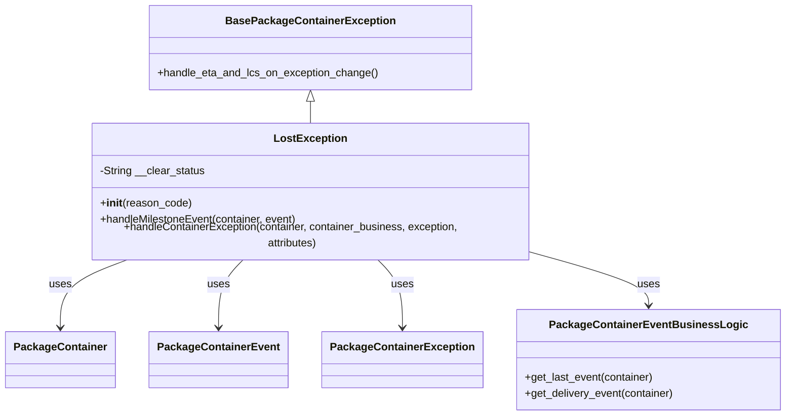
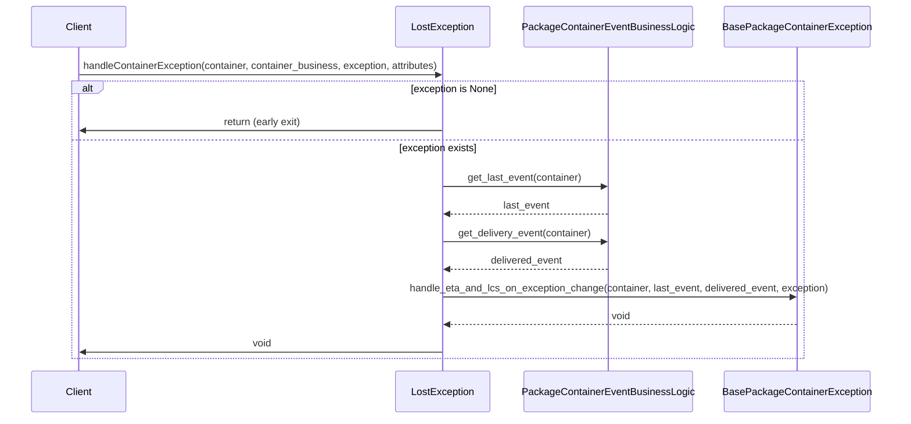
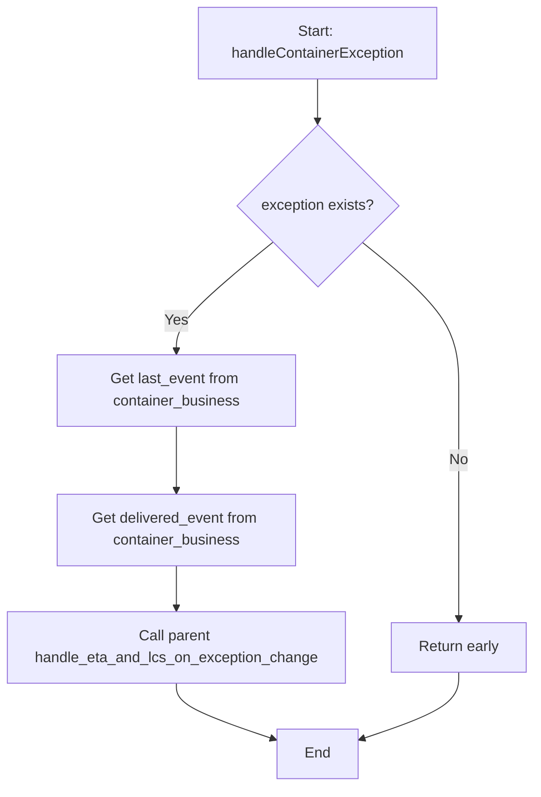
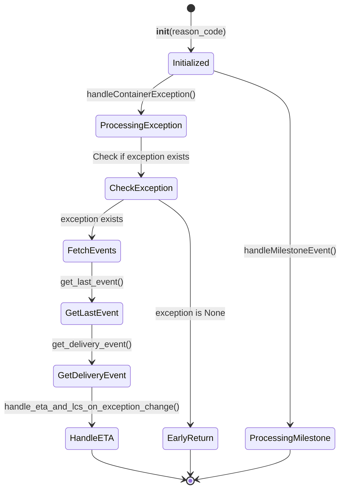

# Diagram: platform/partview_core/partview_service/partview_service/core/business/package_container_exception_status/package_container_exceptions/PackageContainerLostException.py

> Auto-generated by Obscura crawlers

## Diagram 1

### SVG

<svg id="container" width="1127.6328125" xmlns="http://www.w3.org/2000/svg" class="classDiagram" height="608" viewBox="0 0 1127.6328125 608" role="graphics-document document" aria-roledescription="class"><g><defs><marker id="container_class-aggregationStart" class="marker aggregation class" refX="18" refY="7" markerWidth="190" markerHeight="240" orient="auto"><path d="M 18,7 L9,13 L1,7 L9,1 Z"></path></marker></defs><defs><marker id="container_class-aggregationEnd" class="marker aggregation class" refX="1" refY="7" markerWidth="20" markerHeight="28" orient="auto"><path d="M 18,7 L9,13 L1,7 L9,1 Z"></path></marker></defs><defs><marker id="container_class-extensionStart" class="marker extension class" refX="18" refY="7" markerWidth="190" markerHeight="240" orient="auto"><path d="M 1,7 L18,13 V 1 Z"></path></marker></defs><defs><marker id="container_class-extensionEnd" class="marker extension class" refX="1" refY="7" markerWidth="20" markerHeight="28" orient="auto"><path d="M 1,1 V 13 L18,7 Z"></path></marker></defs><defs><marker id="container_class-compositionStart" class="marker composition class" refX="18" refY="7" markerWidth="190" markerHeight="240" orient="auto"><path d="M 18,7 L9,13 L1,7 L9,1 Z"></path></marker></defs><defs><marker id="container_class-compositionEnd" class="marker composition class" refX="1" refY="7" markerWidth="20" markerHeight="28" orient="auto"><path d="M 18,7 L9,13 L1,7 L9,1 Z"></path></marker></defs><defs><marker id="container_class-dependencyStart" class="marker dependency class" refX="6" refY="7" markerWidth="190" markerHeight="240" orient="auto"><path d="M 5,7 L9,13 L1,7 L9,1 Z"></path></marker></defs><defs><marker id="container_class-dependencyEnd" class="marker dependency class" refX="13" refY="7" markerWidth="20" markerHeight="28" orient="auto"><path d="M 18,7 L9,13 L14,7 L9,1 Z"></path></marker></defs><defs><marker id="container_class-lollipopStart" class="marker lollipop class" refX="13" refY="7" markerWidth="190" markerHeight="240" orient="auto"><circle stroke="black" fill="transparent" cx="7" cy="7" r="6"></circle></marker></defs><defs><marker id="container_class-lollipopEnd" class="marker lollipop class" refX="1" refY="7" markerWidth="190" markerHeight="240" orient="auto"><circle stroke="black" fill="transparent" cx="7" cy="7" r="6"></circle></marker></defs><g class="root"><g class="clusters"></g><g class="edgePaths"><path d="M440.965,151.25L440.965,152.542C440.965,153.833,440.965,156.417,440.965,161.875C440.965,167.333,440.965,175.667,440.965,179.833L440.965,184" id="id_BasePackageContainerException_LostException_1" class="edge-thickness-normal edge-pattern-solid relation" style=";;;" data-edge="true" data-et="edge" data-id="id_BasePackageContainerException_LostException_1" data-points="W3sieCI6NDQwLjk2NDg0Mzc1LCJ5IjoxMzR9LHsieCI6NDQwLjk2NDg0Mzc1LCJ5IjoxNTl9LHsieCI6NDQwLjk2NDg0Mzc1LCJ5IjoxODR9XQ==" marker-start="url(#container_class-extensionStart)"></path><path d="M184.355,376L167.871,382.167C151.388,388.333,118.42,400.667,101.937,417.5C85.453,434.333,85.453,455.667,85.453,466.333L85.453,477" id="id_LostException_PackageContainer_2" class="edge-thickness-normal edge-pattern-solid relation" style=";;;" data-edge="true" data-et="edge" data-id="id_LostException_PackageContainer_2" data-points="W3sieCI6MTg0LjM1NDg4MTM0Mzk4NDk3LCJ5IjozNzZ9LHsieCI6ODUuNDUzMTI1LCJ5Ijo0MTN9LHsieCI6ODUuNDUzMTI1LCJ5Ijo0ODN9XQ==" marker-end="url(#container_class-dependencyEnd)"></path><path d="M346.84,376L340.794,382.167C334.747,388.333,322.655,400.667,316.609,417.5C310.563,434.333,310.563,455.667,310.563,466.333L310.563,477" id="id_LostException_PackageContainerEvent_3" class="edge-thickness-normal edge-pattern-solid relation" style=";;;" data-edge="true" data-et="edge" data-id="id_LostException_PackageContainerEvent_3" data-points="W3sieCI6MzQ2LjgzOTg0Mzc1LCJ5IjozNzZ9LHsieCI6MzEwLjU2MjUsInkiOjQxM30seyJ4IjozMTAuNTYyNSwieSI6NDgzfV0=" marker-end="url(#container_class-dependencyEnd)"></path><path d="M535.09,376L541.136,382.167C547.182,388.333,559.275,400.667,565.321,417.5C571.367,434.333,571.367,455.667,571.367,466.333L571.367,477" id="id_LostException_PackageContainerException_4" class="edge-thickness-normal edge-pattern-solid relation" style=";;;" data-edge="true" data-et="edge" data-id="id_LostException_PackageContainerException_4" data-points="W3sieCI6NTM1LjA4OTg0Mzc1LCJ5IjozNzZ9LHsieCI6NTcxLjM2NzE4NzUsInkiOjQxM30seyJ4Ijo1NzEuMzY3MTg3NSwieSI6NDgzfV0=" marker-end="url(#container_class-dependencyEnd)"></path><path d="M770.719,370.221L796.778,377.351C822.837,384.481,874.956,398.74,901.015,411.037C927.074,423.333,927.074,433.667,927.074,438.833L927.074,444" id="id_LostException_PackageContainerEventBusinessLogic_5" class="edge-thickness-normal edge-pattern-solid relation" style=";;;" data-edge="true" data-et="edge" data-id="id_LostException_PackageContainerEventBusinessLogic_5" data-points="W3sieCI6NzcwLjcxODc1LCJ5IjozNzAuMjIwOTkwOTY3ODI0OX0seyJ4Ijo5MjcuMDc0MjE4NzUsInkiOjQxM30seyJ4Ijo5MjcuMDc0MjE4NzUsInkiOjQ1MH1d" marker-end="url(#container_class-dependencyEnd)"></path></g><g class="edgeLabels"><g class="edgeLabel"><g class="label" data-id="id_BasePackageContainerException_LostException_1" transform="translate(0, 0)"><foreignObject width="0" height="0">

</foreignObject></g></g><g class="edgeLabel" transform="translate(85.453125, 413)"><g class="label" data-id="id_LostException_PackageContainer_2" transform="translate(-16.4921875, -12)"><foreignObject width="32.984375" height="24">

uses

</foreignObject></g></g><g class="edgeLabel" transform="translate(310.5625, 413)"><g class="label" data-id="id_LostException_PackageContainerEvent_3" transform="translate(-16.4921875, -12)"><foreignObject width="32.984375" height="24">

uses

</foreignObject></g></g><g class="edgeLabel" transform="translate(571.3671875, 413)"><g class="label" data-id="id_LostException_PackageContainerException_4" transform="translate(-16.4921875, -12)"><foreignObject width="32.984375" height="24">

uses

</foreignObject></g></g><g class="edgeLabel" transform="translate(927.07421875, 413)"><g class="label" data-id="id_LostException_PackageContainerEventBusinessLogic_5" transform="translate(-16.4921875, -12)"><foreignObject width="32.984375" height="24">

uses

</foreignObject></g></g></g><g class="nodes"><g class="node default" id="classId-BasePackageContainerException-0" transform="translate(440.96484375, 71)"><g class="basic label-container"><path d="M-235.3671875 -63 L235.3671875 -63 L235.3671875 63 L-235.3671875 63" stroke="none" stroke-width="0" fill="#ECECFF" style=""></path><path d="M-235.3671875 -63 C-84.98825791964285 -63, 65.3906716607143 -63, 235.3671875 -63 M-235.3671875 -63 C-65.4833878269186 -63, 104.4004118461628 -63, 235.3671875 -63 M235.3671875 -63 C235.3671875 -17.596696717695117, 235.3671875 27.806606564609766, 235.3671875 63 M235.3671875 -63 C235.3671875 -15.236516156096187, 235.3671875 32.52696768780763, 235.3671875 63 M235.3671875 63 C47.5027035750083 63, -140.3617803499834 63, -235.3671875 63 M235.3671875 63 C90.56212609853952 63, -54.242935302920955 63, -235.3671875 63 M-235.3671875 63 C-235.3671875 24.3749460908327, -235.3671875 -14.250107818334598, -235.3671875 -63 M-235.3671875 63 C-235.3671875 13.016808054602826, -235.3671875 -36.96638389079435, -235.3671875 -63" stroke="#9370DB" stroke-width="1.3" fill="none" stroke-dasharray="0 0" style=""></path></g><g class="annotation-group text" transform="translate(0, -39)"></g><g class="label-group text" transform="translate(-118.671875, -39)"><g class="label" style="font-weight: bolder" transform="translate(0,-12)"><foreignObject width="237.34375" height="24">

BasePackageContainerException

</foreignObject></g></g><g class="members-group text" transform="translate(-223.3671875, 9)"></g><g class="methods-group text" transform="translate(-223.3671875, 39)"><g class="label" style="" transform="translate(0,-12)"><foreignObject width="328.0625" height="24">

+handle_eta_and_lcs_on_exception_change()

</foreignObject></g></g><g class="divider" style=""><path d="M-235.3671875 -15 C-61.60731636596995 -15, 112.1525547680601 -15, 235.3671875 -15 M-235.3671875 -15 C-59.1244283637416 -15, 117.1183307725168 -15, 235.3671875 -15" stroke="#9370DB" stroke-width="1.3" fill="none" stroke-dasharray="0 0" style=""></path></g><g class="divider" style=""><path d="M-235.3671875 9 C-121.8191522222821 9, -8.271116944564199 9, 235.3671875 9 M-235.3671875 9 C-125.41041191223995 9, -15.453636324479902 9, 235.3671875 9" stroke="#9370DB" stroke-width="1.3" fill="none" stroke-dasharray="0 0" style=""></path></g></g><g class="node default" id="classId-LostException-1" transform="translate(440.96484375, 280)"><g class="basic label-container"><path d="M-329.75390625 -96 L329.75390625 -96 L329.75390625 96 L-329.75390625 96" stroke="none" stroke-width="0" fill="#ECECFF" style=""></path><path d="M-329.75390625 -96 C-107.38949180334842 -96, 114.97492264330316 -96, 329.75390625 -96 M-329.75390625 -96 C-107.04995637144867 -96, 115.65399350710265 -96, 329.75390625 -96 M329.75390625 -96 C329.75390625 -36.585251147195734, 329.75390625 22.82949770560853, 329.75390625 96 M329.75390625 -96 C329.75390625 -37.173940102278536, 329.75390625 21.65211979544293, 329.75390625 96 M329.75390625 96 C193.73429345142864 96, 57.71468065285728 96, -329.75390625 96 M329.75390625 96 C129.6221754511818 96, -70.50955534763642 96, -329.75390625 96 M-329.75390625 96 C-329.75390625 29.57280732281957, -329.75390625 -36.85438535436086, -329.75390625 -96 M-329.75390625 96 C-329.75390625 50.914380465910114, -329.75390625 5.828760931820227, -329.75390625 -96" stroke="#9370DB" stroke-width="1.3" fill="none" stroke-dasharray="0 0" style=""></path></g><g class="annotation-group text" transform="translate(0, -72)"></g><g class="label-group text" transform="translate(-51.2265625, -72)"><g class="label" style="font-weight: bolder" transform="translate(0,-12)"><foreignObject width="102.453125" height="24">

LostException

</foreignObject></g></g><g class="members-group text" transform="translate(-317.75390625, -24)"><g class="label" style="" transform="translate(0,-12)"><foreignObject width="156.234375" height="24">

-String __clear_status

</foreignObject></g></g><g class="methods-group text" transform="translate(-317.75390625, 24)"><g class="label" style="" transform="translate(0,-12)"><foreignObject width="134.75" height="24">

+<strong>init</strong>(reason_code)

</foreignObject></g><g class="label" style="" transform="translate(0,12)"><foreignObject width="295.703125" height="24">

+handleMilestoneEvent(container, event)

</foreignObject></g><g class="label" style="" transform="translate(0,36)"><foreignObject width="584.28125" height="24">

+handleContainerException(container, container_business, exception, attributes)

</foreignObject></g></g><g class="divider" style=""><path d="M-329.75390625 -48 C-159.23503883193493 -48, 11.283828586130142 -48, 329.75390625 -48 M-329.75390625 -48 C-71.81788358538739 -48, 186.11813907922522 -48, 329.75390625 -48" stroke="#9370DB" stroke-width="1.3" fill="none" stroke-dasharray="0 0" style=""></path></g><g class="divider" style=""><path d="M-329.75390625 0 C-148.57120213650057 0, 32.61150197699885 0, 329.75390625 0 M-329.75390625 0 C-132.28895558812474 0, 65.17599507375053 0, 329.75390625 0" stroke="#9370DB" stroke-width="1.3" fill="none" stroke-dasharray="0 0" style=""></path></g></g><g class="node default" id="classId-PackageContainer-2" transform="translate(85.453125, 525)"><g class="basic label-container"><path d="M-77.453125 -42 L77.453125 -42 L77.453125 42 L-77.453125 42" stroke="none" stroke-width="0" fill="#ECECFF" style=""></path><path d="M-77.453125 -42 C-43.14854952401248 -42, -8.843974048024961 -42, 77.453125 -42 M-77.453125 -42 C-45.098169050658335 -42, -12.74321310131667 -42, 77.453125 -42 M77.453125 -42 C77.453125 -9.654571838067369, 77.453125 22.690856323865262, 77.453125 42 M77.453125 -42 C77.453125 -24.247098577790414, 77.453125 -6.494197155580828, 77.453125 42 M77.453125 42 C34.47299308500435 42, -8.507138829991305 42, -77.453125 42 M77.453125 42 C16.759690070095445 42, -43.93374485980911 42, -77.453125 42 M-77.453125 42 C-77.453125 20.2767103810871, -77.453125 -1.4465792378258016, -77.453125 -42 M-77.453125 42 C-77.453125 17.08197396179919, -77.453125 -7.8360520764016215, -77.453125 -42" stroke="#9370DB" stroke-width="1.3" fill="none" stroke-dasharray="0 0" style=""></path></g><g class="annotation-group text" transform="translate(0, -18)"></g><g class="label-group text" transform="translate(-65.453125, -18)"><g class="label" style="font-weight: bolder" transform="translate(0,-12)"><foreignObject width="130.90625" height="24">

PackageContainer

</foreignObject></g></g><g class="members-group text" transform="translate(-65.453125, 30)"></g><g class="methods-group text" transform="translate(-65.453125, 60)"></g><g class="divider" style=""><path d="M-77.453125 6 C-36.68815569992871 6, 4.076813600142586 6, 77.453125 6 M-77.453125 6 C-22.23282406526139 6, 32.98747686947722 6, 77.453125 6" stroke="#9370DB" stroke-width="1.3" fill="none" stroke-dasharray="0 0" style=""></path></g><g class="divider" style=""><path d="M-77.453125 24 C-21.521996004799377 24, 34.40913299040125 24, 77.453125 24 M-77.453125 24 C-38.79904383632334 24, -0.1449626726466846 24, 77.453125 24" stroke="#9370DB" stroke-width="1.3" fill="none" stroke-dasharray="0 0" style=""></path></g></g><g class="node default" id="classId-PackageContainerEvent-3" transform="translate(310.5625, 525)"><g class="basic label-container"><path d="M-97.65625 -42 L97.65625 -42 L97.65625 42 L-97.65625 42" stroke="none" stroke-width="0" fill="#ECECFF" style=""></path><path d="M-97.65625 -42 C-49.26583223975354 -42, -0.8754144795070857 -42, 97.65625 -42 M-97.65625 -42 C-34.51527378218811 -42, 28.62570243562378 -42, 97.65625 -42 M97.65625 -42 C97.65625 -15.53854100160714, 97.65625 10.92291799678572, 97.65625 42 M97.65625 -42 C97.65625 -20.426710634043204, 97.65625 1.1465787319135927, 97.65625 42 M97.65625 42 C46.28286725431763 42, -5.090515491364741 42, -97.65625 42 M97.65625 42 C28.746824633279473 42, -40.16260073344105 42, -97.65625 42 M-97.65625 42 C-97.65625 14.210687519119276, -97.65625 -13.578624961761449, -97.65625 -42 M-97.65625 42 C-97.65625 24.23582413711251, -97.65625 6.471648274225018, -97.65625 -42" stroke="#9370DB" stroke-width="1.3" fill="none" stroke-dasharray="0 0" style=""></path></g><g class="annotation-group text" transform="translate(0, -18)"></g><g class="label-group text" transform="translate(-85.65625, -18)"><g class="label" style="font-weight: bolder" transform="translate(0,-12)"><foreignObject width="171.3125" height="24">

PackageContainerEvent

</foreignObject></g></g><g class="members-group text" transform="translate(-85.65625, 30)"></g><g class="methods-group text" transform="translate(-85.65625, 60)"></g><g class="divider" style=""><path d="M-97.65625 6 C-46.43695032646196 6, 4.782349347076078 6, 97.65625 6 M-97.65625 6 C-39.34289192930112 6, 18.970466141397765 6, 97.65625 6" stroke="#9370DB" stroke-width="1.3" fill="none" stroke-dasharray="0 0" style=""></path></g><g class="divider" style=""><path d="M-97.65625 24 C-32.21156494732291 24, 33.233120105354175 24, 97.65625 24 M-97.65625 24 C-23.56420430759286 24, 50.52784138481428 24, 97.65625 24" stroke="#9370DB" stroke-width="1.3" fill="none" stroke-dasharray="0 0" style=""></path></g></g><g class="node default" id="classId-PackageContainerException-4" transform="translate(571.3671875, 525)"><g class="basic label-container"><path d="M-113.1484375 -42 L113.1484375 -42 L113.1484375 42 L-113.1484375 42" stroke="none" stroke-width="0" fill="#ECECFF" style=""></path><path d="M-113.1484375 -42 C-43.55072749680022 -42, 26.04698250639956 -42, 113.1484375 -42 M-113.1484375 -42 C-37.99547857445971 -42, 37.15748035108058 -42, 113.1484375 -42 M113.1484375 -42 C113.1484375 -21.560855859933387, 113.1484375 -1.1217117198667736, 113.1484375 42 M113.1484375 -42 C113.1484375 -16.690630996589267, 113.1484375 8.618738006821467, 113.1484375 42 M113.1484375 42 C59.22827699544383 42, 5.308116490887656 42, -113.1484375 42 M113.1484375 42 C42.375434124007015 42, -28.39756925198597 42, -113.1484375 42 M-113.1484375 42 C-113.1484375 8.436983232610679, -113.1484375 -25.126033534778642, -113.1484375 -42 M-113.1484375 42 C-113.1484375 16.456842779534778, -113.1484375 -9.086314440930444, -113.1484375 -42" stroke="#9370DB" stroke-width="1.3" fill="none" stroke-dasharray="0 0" style=""></path></g><g class="annotation-group text" transform="translate(0, -18)"></g><g class="label-group text" transform="translate(-101.1484375, -18)"><g class="label" style="font-weight: bolder" transform="translate(0,-12)"><foreignObject width="202.296875" height="24">

PackageContainerException

</foreignObject></g></g><g class="members-group text" transform="translate(-101.1484375, 30)"></g><g class="methods-group text" transform="translate(-101.1484375, 60)"></g><g class="divider" style=""><path d="M-113.1484375 6 C-44.92213362961462 6, 23.30417024077076 6, 113.1484375 6 M-113.1484375 6 C-64.94362158085573 6, -16.738805661711467 6, 113.1484375 6" stroke="#9370DB" stroke-width="1.3" fill="none" stroke-dasharray="0 0" style=""></path></g><g class="divider" style=""><path d="M-113.1484375 24 C-57.49212627031982 24, -1.8358150406396447 24, 113.1484375 24 M-113.1484375 24 C-25.331970180034688 24, 62.484497139930625 24, 113.1484375 24" stroke="#9370DB" stroke-width="1.3" fill="none" stroke-dasharray="0 0" style=""></path></g></g><g class="node default" id="classId-PackageContainerEventBusinessLogic-5" transform="translate(927.07421875, 525)"><g class="basic label-container"><path d="M-192.55859375 -75 L192.55859375 -75 L192.55859375 75 L-192.55859375 75" stroke="none" stroke-width="0" fill="#ECECFF" style=""></path><path d="M-192.55859375 -75 C-80.29136551220786 -75, 31.975862725584278 -75, 192.55859375 -75 M-192.55859375 -75 C-57.69940589321732 -75, 77.15978196356537 -75, 192.55859375 -75 M192.55859375 -75 C192.55859375 -33.34119441963194, 192.55859375 8.31761116073612, 192.55859375 75 M192.55859375 -75 C192.55859375 -29.733367411592724, 192.55859375 15.533265176814552, 192.55859375 75 M192.55859375 75 C39.485945813329124 75, -113.58670212334175 75, -192.55859375 75 M192.55859375 75 C112.72938047924816 75, 32.90016720849633 75, -192.55859375 75 M-192.55859375 75 C-192.55859375 17.74287732151015, -192.55859375 -39.5142453569797, -192.55859375 -75 M-192.55859375 75 C-192.55859375 20.472541295616715, -192.55859375 -34.05491740876657, -192.55859375 -75" stroke="#9370DB" stroke-width="1.3" fill="none" stroke-dasharray="0 0" style=""></path></g><g class="annotation-group text" transform="translate(0, -51)"></g><g class="label-group text" transform="translate(-137.0703125, -51)"><g class="label" style="font-weight: bolder" transform="translate(0,-12)"><foreignObject width="274.140625" height="24">

PackageContainerEventBusinessLogic

</foreignObject></g></g><g class="members-group text" transform="translate(-180.55859375, -3)"></g><g class="methods-group text" transform="translate(-180.55859375, 27)"><g class="label" style="" transform="translate(0,-12)"><foreignObject width="193.015625" height="24">

+get_last_event(container)

</foreignObject></g><g class="label" style="" transform="translate(0,12)"><foreignObject width="224.046875" height="24">

+get_delivery_event(container)

</foreignObject></g></g><g class="divider" style=""><path d="M-192.55859375 -27 C-72.90675785451862 -27, 46.74507804096277 -27, 192.55859375 -27 M-192.55859375 -27 C-81.72539117621027 -27, 29.107811397579468 -27, 192.55859375 -27" stroke="#9370DB" stroke-width="1.3" fill="none" stroke-dasharray="0 0" style=""></path></g><g class="divider" style=""><path d="M-192.55859375 -3 C-98.06791566119207 -3, -3.577237572384149 -3, 192.55859375 -3 M-192.55859375 -3 C-60.47617406391791 -3, 71.60624562216418 -3, 192.55859375 -3" stroke="#9370DB" stroke-width="1.3" fill="none" stroke-dasharray="0 0" style=""></path></g></g></g></g></g></svg>

## Diagram 2

### SVG

<svg id="container" width="1556" xmlns="http://www.w3.org/2000/svg" height="703" viewBox="-50 -10 1556 703" role="graphics-document document" aria-roledescription="sequence"><g><rect x="1202" y="617" fill="#eaeaea" stroke="#666" width="254" height="65" name="BasePackageContainerException" rx="3" ry="3" class="actor actor-bottom"></rect><text x="1329" y="649.5" dominant-baseline="central" alignment-baseline="central" class="actor actor-box" style="text-anchor: middle; font-size: 16px; font-weight: 400;"><tspan x="1329" dy="0">BasePackageContainerException</tspan></text></g><g><rect x="862" y="617" fill="#eaeaea" stroke="#666" width="290" height="65" name="PackageContainerEventBusinessLogic" rx="3" ry="3" class="actor actor-bottom"></rect><text x="1007" y="649.5" dominant-baseline="central" alignment-baseline="central" class="actor actor-box" style="text-anchor: middle; font-size: 16px; font-weight: 400;"><tspan x="1007" dy="0">PackageContainerEventBusinessLogic</tspan></text></g><g><rect x="646" y="617" fill="#eaeaea" stroke="#666" width="150" height="65" name="LostException" rx="3" ry="3" class="actor actor-bottom"></rect><text x="721" y="649.5" dominant-baseline="central" alignment-baseline="central" class="actor actor-box" style="text-anchor: middle; font-size: 16px; font-weight: 400;"><tspan x="721" dy="0">LostException</tspan></text></g><g><rect x="0" y="617" fill="#eaeaea" stroke="#666" width="150" height="65" name="Client" rx="3" ry="3" class="actor actor-bottom"></rect><text x="75" y="649.5" dominant-baseline="central" alignment-baseline="central" class="actor actor-box" style="text-anchor: middle; font-size: 16px; font-weight: 400;"><tspan x="75" dy="0">Client</tspan></text></g><g><line id="actor3" x1="1329" y1="65" x2="1329" y2="617" class="actor-line 200" stroke-width="0.5px" stroke="#999" name="BasePackageContainerException"></line><g id="root-3"><rect x="1202" y="0" fill="#eaeaea" stroke="#666" width="254" height="65" name="BasePackageContainerException" rx="3" ry="3" class="actor actor-top"></rect><text x="1329" y="32.5" dominant-baseline="central" alignment-baseline="central" class="actor actor-box" style="text-anchor: middle; font-size: 16px; font-weight: 400;"><tspan x="1329" dy="0">BasePackageContainerException</tspan></text></g></g><g><line id="actor2" x1="1007" y1="65" x2="1007" y2="617" class="actor-line 200" stroke-width="0.5px" stroke="#999" name="PackageContainerEventBusinessLogic"></line><g id="root-2"><rect x="862" y="0" fill="#eaeaea" stroke="#666" width="290" height="65" name="PackageContainerEventBusinessLogic" rx="3" ry="3" class="actor actor-top"></rect><text x="1007" y="32.5" dominant-baseline="central" alignment-baseline="central" class="actor actor-box" style="text-anchor: middle; font-size: 16px; font-weight: 400;"><tspan x="1007" dy="0">PackageContainerEventBusinessLogic</tspan></text></g></g><g><line id="actor1" x1="721" y1="65" x2="721" y2="617" class="actor-line 200" stroke-width="0.5px" stroke="#999" name="LostException"></line><g id="root-1"><rect x="646" y="0" fill="#eaeaea" stroke="#666" width="150" height="65" name="LostException" rx="3" ry="3" class="actor actor-top"></rect><text x="721" y="32.5" dominant-baseline="central" alignment-baseline="central" class="actor actor-box" style="text-anchor: middle; font-size: 16px; font-weight: 400;"><tspan x="721" dy="0">LostException</tspan></text></g></g><g><line id="actor0" x1="75" y1="65" x2="75" y2="617" class="actor-line 200" stroke-width="0.5px" stroke="#999" name="Client"></line><g id="root-0"><rect x="0" y="0" fill="#eaeaea" stroke="#666" width="150" height="65" name="Client" rx="3" ry="3" class="actor actor-top"></rect><text x="75" y="32.5" dominant-baseline="central" alignment-baseline="central" class="actor actor-box" style="text-anchor: middle; font-size: 16px; font-weight: 400;"><tspan x="75" dy="0">Client</tspan></text></g></g><g></g><defs><symbol id="computer" width="24" height="24"><path transform="scale(.5)" d="M2 2v13h20v-13h-20zm18 11h-16v-9h16v9zm-10.228 6l.466-1h3.524l.467 1h-4.457zm14.228 3h-24l2-6h2.104l-1.33 4h18.45l-1.297-4h2.073l2 6zm-5-10h-14v-7h14v7z"></path></symbol></defs><defs><symbol id="database" fill-rule="evenodd" clip-rule="evenodd"><path transform="scale(.5)" d="M12.258.001l.256.004.255.005.253.008.251.01.249.012.247.015.246.016.242.019.241.02.239.023.236.024.233.027.231.028.229.031.225.032.223.034.22.036.217.038.214.04.211.041.208.043.205.045.201.046.198.048.194.05.191.051.187.053.183.054.18.056.175.057.172.059.168.06.163.061.16.063.155.064.15.066.074.033.073.033.071.034.07.034.069.035.068.035.067.035.066.035.064.036.064.036.062.036.06.036.06.037.058.037.058.037.055.038.055.038.053.038.052.038.051.039.05.039.048.039.047.039.045.04.044.04.043.04.041.04.04.041.039.041.037.041.036.041.034.041.033.042.032.042.03.042.029.042.027.042.026.043.024.043.023.043.021.043.02.043.018.044.017.043.015.044.013.044.012.044.011.045.009.044.007.045.006.045.004.045.002.045.001.045v17l-.001.045-.002.045-.004.045-.006.045-.007.045-.009.044-.011.045-.012.044-.013.044-.015.044-.017.043-.018.044-.02.043-.021.043-.023.043-.024.043-.026.043-.027.042-.029.042-.03.042-.032.042-.033.042-.034.041-.036.041-.037.041-.039.041-.04.041-.041.04-.043.04-.044.04-.045.04-.047.039-.048.039-.05.039-.051.039-.052.038-.053.038-.055.038-.055.038-.058.037-.058.037-.06.037-.06.036-.062.036-.064.036-.064.036-.066.035-.067.035-.068.035-.069.035-.07.034-.071.034-.073.033-.074.033-.15.066-.155.064-.16.063-.163.061-.168.06-.172.059-.175.057-.18.056-.183.054-.187.053-.191.051-.194.05-.198.048-.201.046-.205.045-.208.043-.211.041-.214.04-.217.038-.22.036-.223.034-.225.032-.229.031-.231.028-.233.027-.236.024-.239.023-.241.02-.242.019-.246.016-.247.015-.249.012-.251.01-.253.008-.255.005-.256.004-.258.001-.258-.001-.256-.004-.255-.005-.253-.008-.251-.01-.249-.012-.247-.015-.245-.016-.243-.019-.241-.02-.238-.023-.236-.024-.234-.027-.231-.028-.228-.031-.226-.032-.223-.034-.22-.036-.217-.038-.214-.04-.211-.041-.208-.043-.204-.045-.201-.046-.198-.048-.195-.05-.19-.051-.187-.053-.184-.054-.179-.056-.176-.057-.172-.059-.167-.06-.164-.061-.159-.063-.155-.064-.151-.066-.074-.033-.072-.033-.072-.034-.07-.034-.069-.035-.068-.035-.067-.035-.066-.035-.064-.036-.063-.036-.062-.036-.061-.036-.06-.037-.058-.037-.057-.037-.056-.038-.055-.038-.053-.038-.052-.038-.051-.039-.049-.039-.049-.039-.046-.039-.046-.04-.044-.04-.043-.04-.041-.04-.04-.041-.039-.041-.037-.041-.036-.041-.034-.041-.033-.042-.032-.042-.03-.042-.029-.042-.027-.042-.026-.043-.024-.043-.023-.043-.021-.043-.02-.043-.018-.044-.017-.043-.015-.044-.013-.044-.012-.044-.011-.045-.009-.044-.007-.045-.006-.045-.004-.045-.002-.045-.001-.045v-17l.001-.045.002-.045.004-.045.006-.045.007-.045.009-.044.011-.045.012-.044.013-.044.015-.044.017-.043.018-.044.02-.043.021-.043.023-.043.024-.043.026-.043.027-.042.029-.042.03-.042.032-.042.033-.042.034-.041.036-.041.037-.041.039-.041.04-.041.041-.04.043-.04.044-.04.046-.04.046-.039.049-.039.049-.039.051-.039.052-.038.053-.038.055-.038.056-.038.057-.037.058-.037.06-.037.061-.036.062-.036.063-.036.064-.036.066-.035.067-.035.068-.035.069-.035.07-.034.072-.034.072-.033.074-.033.151-.066.155-.064.159-.063.164-.061.167-.06.172-.059.176-.057.179-.056.184-.054.187-.053.19-.051.195-.05.198-.048.201-.046.204-.045.208-.043.211-.041.214-.04.217-.038.22-.036.223-.034.226-.032.228-.031.231-.028.234-.027.236-.024.238-.023.241-.02.243-.019.245-.016.247-.015.249-.012.251-.01.253-.008.255-.005.256-.004.258-.001.258.001zm-9.258 20.499v.01l.001.021.003.021.004.022.005.021.006.022.007.022.009.023.01.022.011.023.012.023.013.023.015.023.016.024.017.023.018.024.019.024.021.024.022.025.023.024.024.025.052.049.056.05.061.051.066.051.07.051.075.051.079.052.084.052.088.052.092.052.097.052.102.051.105.052.11.052.114.051.119.051.123.051.127.05.131.05.135.05.139.048.144.049.147.047.152.047.155.047.16.045.163.045.167.043.171.043.176.041.178.041.183.039.187.039.19.037.194.035.197.035.202.033.204.031.209.03.212.029.216.027.219.025.222.024.226.021.23.02.233.018.236.016.24.015.243.012.246.01.249.008.253.005.256.004.259.001.26-.001.257-.004.254-.005.25-.008.247-.011.244-.012.241-.014.237-.016.233-.018.231-.021.226-.021.224-.024.22-.026.216-.027.212-.028.21-.031.205-.031.202-.034.198-.034.194-.036.191-.037.187-.039.183-.04.179-.04.175-.042.172-.043.168-.044.163-.045.16-.046.155-.046.152-.047.148-.048.143-.049.139-.049.136-.05.131-.05.126-.05.123-.051.118-.052.114-.051.11-.052.106-.052.101-.052.096-.052.092-.052.088-.053.083-.051.079-.052.074-.052.07-.051.065-.051.06-.051.056-.05.051-.05.023-.024.023-.025.021-.024.02-.024.019-.024.018-.024.017-.024.015-.023.014-.024.013-.023.012-.023.01-.023.01-.022.008-.022.006-.022.006-.022.004-.022.004-.021.001-.021.001-.021v-4.127l-.077.055-.08.053-.083.054-.085.053-.087.052-.09.052-.093.051-.095.05-.097.05-.1.049-.102.049-.105.048-.106.047-.109.047-.111.046-.114.045-.115.045-.118.044-.12.043-.122.042-.124.042-.126.041-.128.04-.13.04-.132.038-.134.038-.135.037-.138.037-.139.035-.142.035-.143.034-.144.033-.147.032-.148.031-.15.03-.151.03-.153.029-.154.027-.156.027-.158.026-.159.025-.161.024-.162.023-.163.022-.165.021-.166.02-.167.019-.169.018-.169.017-.171.016-.173.015-.173.014-.175.013-.175.012-.177.011-.178.01-.179.008-.179.008-.181.006-.182.005-.182.004-.184.003-.184.002h-.37l-.184-.002-.184-.003-.182-.004-.182-.005-.181-.006-.179-.008-.179-.008-.178-.01-.176-.011-.176-.012-.175-.013-.173-.014-.172-.015-.171-.016-.17-.017-.169-.018-.167-.019-.166-.02-.165-.021-.163-.022-.162-.023-.161-.024-.159-.025-.157-.026-.156-.027-.155-.027-.153-.029-.151-.03-.15-.03-.148-.031-.146-.032-.145-.033-.143-.034-.141-.035-.14-.035-.137-.037-.136-.037-.134-.038-.132-.038-.13-.04-.128-.04-.126-.041-.124-.042-.122-.042-.12-.044-.117-.043-.116-.045-.113-.045-.112-.046-.109-.047-.106-.047-.105-.048-.102-.049-.1-.049-.097-.05-.095-.05-.093-.052-.09-.051-.087-.052-.085-.053-.083-.054-.08-.054-.077-.054v4.127zm0-5.654v.011l.001.021.003.021.004.021.005.022.006.022.007.022.009.022.01.022.011.023.012.023.013.023.015.024.016.023.017.024.018.024.019.024.021.024.022.024.023.025.024.024.052.05.056.05.061.05.066.051.07.051.075.052.079.051.084.052.088.052.092.052.097.052.102.052.105.052.11.051.114.051.119.052.123.05.127.051.131.05.135.049.139.049.144.048.147.048.152.047.155.046.16.045.163.045.167.044.171.042.176.042.178.04.183.04.187.038.19.037.194.036.197.034.202.033.204.032.209.03.212.028.216.027.219.025.222.024.226.022.23.02.233.018.236.016.24.014.243.012.246.01.249.008.253.006.256.003.259.001.26-.001.257-.003.254-.006.25-.008.247-.01.244-.012.241-.015.237-.016.233-.018.231-.02.226-.022.224-.024.22-.025.216-.027.212-.029.21-.03.205-.032.202-.033.198-.035.194-.036.191-.037.187-.039.183-.039.179-.041.175-.042.172-.043.168-.044.163-.045.16-.045.155-.047.152-.047.148-.048.143-.048.139-.05.136-.049.131-.05.126-.051.123-.051.118-.051.114-.052.11-.052.106-.052.101-.052.096-.052.092-.052.088-.052.083-.052.079-.052.074-.051.07-.052.065-.051.06-.05.056-.051.051-.049.023-.025.023-.024.021-.025.02-.024.019-.024.018-.024.017-.024.015-.023.014-.023.013-.024.012-.022.01-.023.01-.023.008-.022.006-.022.006-.022.004-.021.004-.022.001-.021.001-.021v-4.139l-.077.054-.08.054-.083.054-.085.052-.087.053-.09.051-.093.051-.095.051-.097.05-.1.049-.102.049-.105.048-.106.047-.109.047-.111.046-.114.045-.115.044-.118.044-.12.044-.122.042-.124.042-.126.041-.128.04-.13.039-.132.039-.134.038-.135.037-.138.036-.139.036-.142.035-.143.033-.144.033-.147.033-.148.031-.15.03-.151.03-.153.028-.154.028-.156.027-.158.026-.159.025-.161.024-.162.023-.163.022-.165.021-.166.02-.167.019-.169.018-.169.017-.171.016-.173.015-.173.014-.175.013-.175.012-.177.011-.178.009-.179.009-.179.007-.181.007-.182.005-.182.004-.184.003-.184.002h-.37l-.184-.002-.184-.003-.182-.004-.182-.005-.181-.007-.179-.007-.179-.009-.178-.009-.176-.011-.176-.012-.175-.013-.173-.014-.172-.015-.171-.016-.17-.017-.169-.018-.167-.019-.166-.02-.165-.021-.163-.022-.162-.023-.161-.024-.159-.025-.157-.026-.156-.027-.155-.028-.153-.028-.151-.03-.15-.03-.148-.031-.146-.033-.145-.033-.143-.033-.141-.035-.14-.036-.137-.036-.136-.037-.134-.038-.132-.039-.13-.039-.128-.04-.126-.041-.124-.042-.122-.043-.12-.043-.117-.044-.116-.044-.113-.046-.112-.046-.109-.046-.106-.047-.105-.048-.102-.049-.1-.049-.097-.05-.095-.051-.093-.051-.09-.051-.087-.053-.085-.052-.083-.054-.08-.054-.077-.054v4.139zm0-5.666v.011l.001.02.003.022.004.021.005.022.006.021.007.022.009.023.01.022.011.023.012.023.013.023.015.023.016.024.017.024.018.023.019.024.021.025.022.024.023.024.024.025.052.05.056.05.061.05.066.051.07.051.075.052.079.051.084.052.088.052.092.052.097.052.102.052.105.051.11.052.114.051.119.051.123.051.127.05.131.05.135.05.139.049.144.048.147.048.152.047.155.046.16.045.163.045.167.043.171.043.176.042.178.04.183.04.187.038.19.037.194.036.197.034.202.033.204.032.209.03.212.028.216.027.219.025.222.024.226.021.23.02.233.018.236.017.24.014.243.012.246.01.249.008.253.006.256.003.259.001.26-.001.257-.003.254-.006.25-.008.247-.01.244-.013.241-.014.237-.016.233-.018.231-.02.226-.022.224-.024.22-.025.216-.027.212-.029.21-.03.205-.032.202-.033.198-.035.194-.036.191-.037.187-.039.183-.039.179-.041.175-.042.172-.043.168-.044.163-.045.16-.045.155-.047.152-.047.148-.048.143-.049.139-.049.136-.049.131-.051.126-.05.123-.051.118-.052.114-.051.11-.052.106-.052.101-.052.096-.052.092-.052.088-.052.083-.052.079-.052.074-.052.07-.051.065-.051.06-.051.056-.05.051-.049.023-.025.023-.025.021-.024.02-.024.019-.024.018-.024.017-.024.015-.023.014-.024.013-.023.012-.023.01-.022.01-.023.008-.022.006-.022.006-.022.004-.022.004-.021.001-.021.001-.021v-4.153l-.077.054-.08.054-.083.053-.085.053-.087.053-.09.051-.093.051-.095.051-.097.05-.1.049-.102.048-.105.048-.106.048-.109.046-.111.046-.114.046-.115.044-.118.044-.12.043-.122.043-.124.042-.126.041-.128.04-.13.039-.132.039-.134.038-.135.037-.138.036-.139.036-.142.034-.143.034-.144.033-.147.032-.148.032-.15.03-.151.03-.153.028-.154.028-.156.027-.158.026-.159.024-.161.024-.162.023-.163.023-.165.021-.166.02-.167.019-.169.018-.169.017-.171.016-.173.015-.173.014-.175.013-.175.012-.177.01-.178.01-.179.009-.179.007-.181.006-.182.006-.182.004-.184.003-.184.001-.185.001-.185-.001-.184-.001-.184-.003-.182-.004-.182-.006-.181-.006-.179-.007-.179-.009-.178-.01-.176-.01-.176-.012-.175-.013-.173-.014-.172-.015-.171-.016-.17-.017-.169-.018-.167-.019-.166-.02-.165-.021-.163-.023-.162-.023-.161-.024-.159-.024-.157-.026-.156-.027-.155-.028-.153-.028-.151-.03-.15-.03-.148-.032-.146-.032-.145-.033-.143-.034-.141-.034-.14-.036-.137-.036-.136-.037-.134-.038-.132-.039-.13-.039-.128-.041-.126-.041-.124-.041-.122-.043-.12-.043-.117-.044-.116-.044-.113-.046-.112-.046-.109-.046-.106-.048-.105-.048-.102-.048-.1-.05-.097-.049-.095-.051-.093-.051-.09-.052-.087-.052-.085-.053-.083-.053-.08-.054-.077-.054v4.153zm8.74-8.179l-.257.004-.254.005-.25.008-.247.011-.244.012-.241.014-.237.016-.233.018-.231.021-.226.022-.224.023-.22.026-.216.027-.212.028-.21.031-.205.032-.202.033-.198.034-.194.036-.191.038-.187.038-.183.04-.179.041-.175.042-.172.043-.168.043-.163.045-.16.046-.155.046-.152.048-.148.048-.143.048-.139.049-.136.05-.131.05-.126.051-.123.051-.118.051-.114.052-.11.052-.106.052-.101.052-.096.052-.092.052-.088.052-.083.052-.079.052-.074.051-.07.052-.065.051-.06.05-.056.05-.051.05-.023.025-.023.024-.021.024-.02.025-.019.024-.018.024-.017.023-.015.024-.014.023-.013.023-.012.023-.01.023-.01.022-.008.022-.006.023-.006.021-.004.022-.004.021-.001.021-.001.021.001.021.001.021.004.021.004.022.006.021.006.023.008.022.01.022.01.023.012.023.013.023.014.023.015.024.017.023.018.024.019.024.02.025.021.024.023.024.023.025.051.05.056.05.06.05.065.051.07.052.074.051.079.052.083.052.088.052.092.052.096.052.101.052.106.052.11.052.114.052.118.051.123.051.126.051.131.05.136.05.139.049.143.048.148.048.152.048.155.046.16.046.163.045.168.043.172.043.175.042.179.041.183.04.187.038.191.038.194.036.198.034.202.033.205.032.21.031.212.028.216.027.22.026.224.023.226.022.231.021.233.018.237.016.241.014.244.012.247.011.25.008.254.005.257.004.26.001.26-.001.257-.004.254-.005.25-.008.247-.011.244-.012.241-.014.237-.016.233-.018.231-.021.226-.022.224-.023.22-.026.216-.027.212-.028.21-.031.205-.032.202-.033.198-.034.194-.036.191-.038.187-.038.183-.04.179-.041.175-.042.172-.043.168-.043.163-.045.16-.046.155-.046.152-.048.148-.048.143-.048.139-.049.136-.05.131-.05.126-.051.123-.051.118-.051.114-.052.11-.052.106-.052.101-.052.096-.052.092-.052.088-.052.083-.052.079-.052.074-.051.07-.052.065-.051.06-.05.056-.05.051-.05.023-.025.023-.024.021-.024.02-.025.019-.024.018-.024.017-.023.015-.024.014-.023.013-.023.012-.023.01-.023.01-.022.008-.022.006-.023.006-.021.004-.022.004-.021.001-.021.001-.021-.001-.021-.001-.021-.004-.021-.004-.022-.006-.021-.006-.023-.008-.022-.01-.022-.01-.023-.012-.023-.013-.023-.014-.023-.015-.024-.017-.023-.018-.024-.019-.024-.02-.025-.021-.024-.023-.024-.023-.025-.051-.05-.056-.05-.06-.05-.065-.051-.07-.052-.074-.051-.079-.052-.083-.052-.088-.052-.092-.052-.096-.052-.101-.052-.106-.052-.11-.052-.114-.052-.118-.051-.123-.051-.126-.051-.131-.05-.136-.05-.139-.049-.143-.048-.148-.048-.152-.048-.155-.046-.16-.046-.163-.045-.168-.043-.172-.043-.175-.042-.179-.041-.183-.04-.187-.038-.191-.038-.194-.036-.198-.034-.202-.033-.205-.032-.21-.031-.212-.028-.216-.027-.22-.026-.224-.023-.226-.022-.231-.021-.233-.018-.237-.016-.241-.014-.244-.012-.247-.011-.25-.008-.254-.005-.257-.004-.26-.001-.26.001z"></path></symbol></defs><defs><symbol id="clock" width="24" height="24"><path transform="scale(.5)" d="M12 2c5.514 0 10 4.486 10 10s-4.486 10-10 10-10-4.486-10-10 4.486-10 10-10zm0-2c-6.627 0-12 5.373-12 12s5.373 12 12 12 12-5.373 12-12-5.373-12-12-12zm5.848 12.459c.202.038.202.333.001.372-1.907.361-6.045 1.111-6.547 1.111-.719 0-1.301-.582-1.301-1.301 0-.512.77-5.447 1.125-7.445.034-.192.312-.181.343.014l.985 6.238 5.394 1.011z"></path></symbol></defs><defs><marker id="arrowhead" refX="7.9" refY="5" markerUnits="userSpaceOnUse" markerWidth="12" markerHeight="12" orient="auto-start-reverse"><path d="M -1 0 L 10 5 L 0 10 z"></path></marker></defs><defs><marker id="crosshead" markerWidth="15" markerHeight="8" orient="auto" refX="4" refY="4.5"><path fill="none" stroke="#000000" stroke-width="1pt" d="M 1,2 L 6,7 M 6,2 L 1,7" style="stroke-dasharray: 0, 0;"></path></marker></defs><defs><marker id="filled-head" refX="15.5" refY="7" markerWidth="20" markerHeight="28" orient="auto"><path d="M 18,7 L9,13 L14,7 L9,1 Z"></path></marker></defs><defs><marker id="sequencenumber" refX="15" refY="15" markerWidth="60" markerHeight="40" orient="auto"><circle cx="15" cy="15" r="6"></circle></marker></defs><g><line x1="64" y1="123" x2="1340" y2="123" class="loopLine"></line><line x1="1340" y1="123" x2="1340" y2="597" class="loopLine"></line><line x1="64" y1="597" x2="1340" y2="597" class="loopLine"></line><line x1="64" y1="123" x2="64" y2="597" class="loopLine"></line><line x1="64" y1="221" x2="1340" y2="221" class="loopLine" style="stroke-dasharray: 3, 3;"></line><polygon points="64,123 114,123 114,136 105.6,143 64,143" class="labelBox"></polygon><text x="89" y="136" text-anchor="middle" dominant-baseline="middle" alignment-baseline="middle" class="labelText" style="font-size: 16px; font-weight: 400;">alt</text><text x="727" y="141" text-anchor="middle" class="loopText" style="font-size: 16px; font-weight: 400;"><tspan x="727">[exception is None]</tspan></text><text x="702" y="239" text-anchor="middle" class="loopText" style="font-size: 16px; font-weight: 400;">[exception exists]</text></g><text x="397" y="80" text-anchor="middle" dominant-baseline="middle" alignment-baseline="middle" class="messageText" dy="1em" style="font-size: 16px; font-weight: 400;">handleContainerException(container, container_business, exception, attributes)</text><line x1="76" y1="113" x2="717" y2="113" class="messageLine0" stroke-width="2" stroke="none" marker-end="url(#arrowhead)" style="fill: none;"></line><text x="400" y="173" text-anchor="middle" dominant-baseline="middle" alignment-baseline="middle" class="messageText" dy="1em" style="font-size: 16px; font-weight: 400;">return (early exit)</text><line x1="720" y1="206" x2="79" y2="206" class="messageLine0" stroke-width="2" stroke="none" marker-end="url(#arrowhead)" style="fill: none;"></line><text x="863" y="266" text-anchor="middle" dominant-baseline="middle" alignment-baseline="middle" class="messageText" dy="1em" style="font-size: 16px; font-weight: 400;">get_last_event(container)</text><line x1="722" y1="299" x2="1003" y2="299" class="messageLine0" stroke-width="2" stroke="none" marker-end="url(#arrowhead)" style="fill: none;"></line><text x="866" y="314" text-anchor="middle" dominant-baseline="middle" alignment-baseline="middle" class="messageText" dy="1em" style="font-size: 16px; font-weight: 400;">last_event</text><line x1="1006" y1="347" x2="725" y2="347" class="messageLine1" stroke-width="2" stroke="none" marker-end="url(#arrowhead)" style="stroke-dasharray: 3, 3; fill: none;"></line><text x="863" y="362" text-anchor="middle" dominant-baseline="middle" alignment-baseline="middle" class="messageText" dy="1em" style="font-size: 16px; font-weight: 400;">get_delivery_event(container)</text><line x1="722" y1="395" x2="1003" y2="395" class="messageLine0" stroke-width="2" stroke="none" marker-end="url(#arrowhead)" style="fill: none;"></line><text x="866" y="410" text-anchor="middle" dominant-baseline="middle" alignment-baseline="middle" class="messageText" dy="1em" style="font-size: 16px; font-weight: 400;">delivered_event</text><line x1="1006" y1="443" x2="725" y2="443" class="messageLine1" stroke-width="2" stroke="none" marker-end="url(#arrowhead)" style="stroke-dasharray: 3, 3; fill: none;"></line><text x="1024" y="458" text-anchor="middle" dominant-baseline="middle" alignment-baseline="middle" class="messageText" dy="1em" style="font-size: 16px; font-weight: 400;">handle_eta_and_lcs_on_exception_change(container, last_event, delivered_event, exception)</text><line x1="722" y1="491" x2="1325" y2="491" class="messageLine0" stroke-width="2" stroke="none" marker-end="url(#arrowhead)" style="fill: none;"></line><text x="1027" y="506" text-anchor="middle" dominant-baseline="middle" alignment-baseline="middle" class="messageText" dy="1em" style="font-size: 16px; font-weight: 400;">void</text><line x1="1328" y1="539" x2="725" y2="539" class="messageLine1" stroke-width="2" stroke="none" marker-end="url(#arrowhead)" style="stroke-dasharray: 3, 3; fill: none;"></line><text x="400" y="554" text-anchor="middle" dominant-baseline="middle" alignment-baseline="middle" class="messageText" dy="1em" style="font-size: 16px; font-weight: 400;">void</text><line x1="720" y1="587" x2="79" y2="587" class="messageLine0" stroke-width="2" stroke="none" marker-end="url(#arrowhead)" style="fill: none;"></line></svg>

## Diagram 3

### SVG

<svg id="container" width="584.578125" xmlns="http://www.w3.org/2000/svg" class="flowchart" height="857.4375" viewBox="0 0 584.578125 857.4375" role="graphics-document document" aria-roledescription="flowchart-v2"><g><marker id="container_flowchart-v2-pointEnd" class="marker flowchart-v2" viewBox="0 0 10 10" refX="5" refY="5" markerUnits="userSpaceOnUse" markerWidth="8" markerHeight="8" orient="auto"><path d="M 0 0 L 10 5 L 0 10 z" class="arrowMarkerPath" style="stroke-width: 1; stroke-dasharray: 1, 0;"></path></marker><marker id="container_flowchart-v2-pointStart" class="marker flowchart-v2" viewBox="0 0 10 10" refX="4.5" refY="5" markerUnits="userSpaceOnUse" markerWidth="8" markerHeight="8" orient="auto"><path d="M 0 5 L 10 10 L 10 0 z" class="arrowMarkerPath" style="stroke-width: 1; stroke-dasharray: 1, 0;"></path></marker><marker id="container_flowchart-v2-circleEnd" class="marker flowchart-v2" viewBox="0 0 10 10" refX="11" refY="5" markerUnits="userSpaceOnUse" markerWidth="11" markerHeight="11" orient="auto"><circle cx="5" cy="5" r="5" class="arrowMarkerPath" style="stroke-width: 1; stroke-dasharray: 1, 0;"></circle></marker><marker id="container_flowchart-v2-circleStart" class="marker flowchart-v2" viewBox="0 0 10 10" refX="-1" refY="5" markerUnits="userSpaceOnUse" markerWidth="11" markerHeight="11" orient="auto"><circle cx="5" cy="5" r="5" class="arrowMarkerPath" style="stroke-width: 1; stroke-dasharray: 1, 0;"></circle></marker><marker id="container_flowchart-v2-crossEnd" class="marker cross flowchart-v2" viewBox="0 0 11 11" refX="12" refY="5.2" markerUnits="userSpaceOnUse" markerWidth="11" markerHeight="11" orient="auto"><path d="M 1,1 l 9,9 M 10,1 l -9,9" class="arrowMarkerPath" style="stroke-width: 2; stroke-dasharray: 1, 0;"></path></marker><marker id="container_flowchart-v2-crossStart" class="marker cross flowchart-v2" viewBox="0 0 11 11" refX="-1" refY="5.2" markerUnits="userSpaceOnUse" markerWidth="11" markerHeight="11" orient="auto"><path d="M 1,1 l 9,9 M 10,1 l -9,9" class="arrowMarkerPath" style="stroke-width: 2; stroke-dasharray: 1, 0;"></path></marker><g class="root"><g class="clusters"></g><g class="edgePaths"><path d="M347.488,86L347.488,90.167C347.488,94.333,347.488,102.667,347.488,110.333C347.488,118,347.488,125,347.488,128.5L347.488,132" id="L_A_B_0" class="edge-thickness-normal edge-pattern-solid edge-thickness-normal edge-pattern-solid flowchart-link" style=";" data-edge="true" data-et="edge" data-id="L_A_B_0" data-points="W3sieCI6MzQ3LjQ4ODI4MTI1LCJ5Ijo4Nn0seyJ4IjozNDcuNDg4MjgxMjUsInkiOjExMX0seyJ4IjozNDcuNDg4MjgxMjUsInkiOjEzNn1d" marker-end="url(#container_flowchart-v2-pointEnd)"></path><path d="M396.424,264.501L414.042,278.824C431.66,293.147,466.897,321.792,484.515,348.781C502.133,375.771,502.133,401.104,502.133,426.438C502.133,451.771,502.133,477.104,502.133,502.438C502.133,527.771,502.133,553.104,502.133,576.438C502.133,599.771,502.133,621.104,502.133,637.271C502.133,653.438,502.133,664.438,502.133,669.938L502.133,675.438" id="L_B_C_0" class="edge-thickness-normal edge-pattern-solid edge-thickness-normal edge-pattern-solid flowchart-link" style=";" data-edge="true" data-et="edge" data-id="L_B_C_0" data-points="W3sieCI6Mzk2LjQyNDMyMzk2NDUzMDUsInkiOjI2NC41MDE0NTcyODU0Njk1fSx7IngiOjUwMi4xMzI4MTI1LCJ5IjozNTAuNDM3NX0seyJ4Ijo1MDIuMTMyODEyNSwieSI6NDI2LjQzNzV9LHsieCI6NTAyLjEzMjgxMjUsInkiOjUwMi40Mzc1fSx7IngiOjUwMi4xMzI4MTI1LCJ5Ijo1NzguNDM3NX0seyJ4Ijo1MDIuMTMyODEyNSwieSI6NjQyLjQzNzV9LHsieCI6NTAyLjEzMjgxMjUsInkiOjY3OS40Mzc1fV0=" marker-end="url(#container_flowchart-v2-pointEnd)"></path><path d="M298.552,264.501L280.934,278.824C263.316,293.147,228.08,321.792,210.462,341.615C192.844,361.438,192.844,372.438,192.844,377.938L192.844,383.438" id="L_B_D_0" class="edge-thickness-normal edge-pattern-solid edge-thickness-normal edge-pattern-solid flowchart-link" style=";" data-edge="true" data-et="edge" data-id="L_B_D_0" data-points="W3sieCI6Mjk4LjU1MjIzODUzNTQ2OTUsInkiOjI2NC41MDE0NTcyODU0Njk1fSx7IngiOjE5Mi44NDM3NSwieSI6MzUwLjQzNzV9LHsieCI6MTkyLjg0Mzc1LCJ5IjozODcuNDM3NX1d" marker-end="url(#container_flowchart-v2-pointEnd)"></path><path d="M192.844,465.438L192.844,471.604C192.844,477.771,192.844,490.104,192.844,501.771C192.844,513.438,192.844,524.438,192.844,529.938L192.844,535.438" id="L_D_E_0" class="edge-thickness-normal edge-pattern-solid edge-thickness-normal edge-pattern-solid flowchart-link" style=";" data-edge="true" data-et="edge" data-id="L_D_E_0" data-points="W3sieCI6MTkyLjg0Mzc1LCJ5Ijo0NjUuNDM3NX0seyJ4IjoxOTIuODQzNzUsInkiOjUwMi40Mzc1fSx7IngiOjE5Mi44NDM3NSwieSI6NTM5LjQzNzV9XQ==" marker-end="url(#container_flowchart-v2-pointEnd)"></path><path d="M192.844,617.438L192.844,621.604C192.844,625.771,192.844,634.104,192.844,641.771C192.844,649.438,192.844,656.438,192.844,659.938L192.844,663.438" id="L_E_F_0" class="edge-thickness-normal edge-pattern-solid edge-thickness-normal edge-pattern-solid flowchart-link" style=";" data-edge="true" data-et="edge" data-id="L_E_F_0" data-points="W3sieCI6MTkyLjg0Mzc1LCJ5Ijo2MTcuNDM3NX0seyJ4IjoxOTIuODQzNzUsInkiOjY0Mi40Mzc1fSx7IngiOjE5Mi44NDM3NSwieSI6NjY3LjQzNzV9XQ==" marker-end="url(#container_flowchart-v2-pointEnd)"></path><path d="M192.844,745.438L192.844,749.604C192.844,753.771,192.844,762.104,210.706,772.277C228.568,782.45,264.293,794.463,282.155,800.469L300.017,806.475" id="L_F_G_0" class="edge-thickness-normal edge-pattern-solid edge-thickness-normal edge-pattern-solid flowchart-link" style=";" data-edge="true" data-et="edge" data-id="L_F_G_0" data-points="W3sieCI6MTkyLjg0Mzc1LCJ5Ijo3NDUuNDM3NX0seyJ4IjoxOTIuODQzNzUsInkiOjc3MC40Mzc1fSx7IngiOjMwMy44MDg1OTM3NSwieSI6ODA3Ljc0OTk4NTc5MTUwNzd9XQ==" marker-end="url(#container_flowchart-v2-pointEnd)"></path><path d="M502.133,733.438L502.133,739.604C502.133,745.771,502.133,758.104,484.271,770.277C466.408,782.45,430.684,794.463,412.822,800.469L394.959,806.475" id="L_C_G_0" class="edge-thickness-normal edge-pattern-solid edge-thickness-normal edge-pattern-solid flowchart-link" style=";" data-edge="true" data-et="edge" data-id="L_C_G_0" data-points="W3sieCI6NTAyLjEzMjgxMjUsInkiOjczMy40Mzc1fSx7IngiOjUwMi4xMzI4MTI1LCJ5Ijo3NzAuNDM3NX0seyJ4IjozOTEuMTY3OTY4NzUsInkiOjgwNy43NDk5ODU3OTE1MDc3fV0=" marker-end="url(#container_flowchart-v2-pointEnd)"></path></g><g class="edgeLabels"><g class="edgeLabel"><g class="label" data-id="L_A_B_0" transform="translate(0, 0)"><foreignObject width="0" height="0">

</foreignObject></g></g><g class="edgeLabel" transform="translate(502.1328125, 502.4375)"><g class="label" data-id="L_B_C_0" transform="translate(-10.140625, -12)"><foreignObject width="20.28125" height="24">

No

</foreignObject></g></g><g class="edgeLabel" transform="translate(192.84375, 350.4375)"><g class="label" data-id="L_B_D_0" transform="translate(-12.03125, -12)"><foreignObject width="24.0625" height="24">

Yes

</foreignObject></g></g><g class="edgeLabel"><g class="label" data-id="L_D_E_0" transform="translate(0, 0)"><foreignObject width="0" height="0">

</foreignObject></g></g><g class="edgeLabel"><g class="label" data-id="L_E_F_0" transform="translate(0, 0)"><foreignObject width="0" height="0">

</foreignObject></g></g><g class="edgeLabel"><g class="label" data-id="L_F_G_0" transform="translate(0, 0)"><foreignObject width="0" height="0">

</foreignObject></g></g><g class="edgeLabel"><g class="label" data-id="L_C_G_0" transform="translate(0, 0)"><foreignObject width="0" height="0">

</foreignObject></g></g></g><g class="nodes"><g class="node default" id="flowchart-A-0" transform="translate(347.48828125, 47)"><rect class="basic label-container" style="" x="-130" y="-39" width="260" height="78"></rect><g class="label" style="" transform="translate(-100, -24)"><rect></rect><foreignObject width="200" height="48">

Start: handleContainerException

</foreignObject></g></g><g class="node default" id="flowchart-B-1" transform="translate(347.48828125, 224.71875)"><polygon points="88.71875,0 177.4375,-88.71875 88.71875,-177.4375 0,-88.71875" class="label-container" transform="translate(-88.21875, 88.71875)"></polygon><g class="label" style="" transform="translate(-61.71875, -12)"><rect></rect><foreignObject width="123.4375" height="24">

exception exists?

</foreignObject></g></g><g class="node default" id="flowchart-C-3" transform="translate(502.1328125, 706.4375)"><rect class="basic label-container" style="" x="-74.4453125" y="-27" width="148.890625" height="54"></rect><g class="label" style="" transform="translate(-44.4453125, -12)"><rect></rect><foreignObject width="88.890625" height="24">

Return early

</foreignObject></g></g><g class="node default" id="flowchart-D-5" transform="translate(192.84375, 426.4375)"><rect class="basic label-container" style="" x="-130" y="-39" width="260" height="78"></rect><g class="label" style="" transform="translate(-100, -24)"><rect></rect><foreignObject width="200" height="48">

Get last_event from container_business

</foreignObject></g></g><g class="node default" id="flowchart-E-7" transform="translate(192.84375, 578.4375)"><rect class="basic label-container" style="" x="-130" y="-39" width="260" height="78"></rect><g class="label" style="" transform="translate(-100, -24)"><rect></rect><foreignObject width="200" height="48">

Get delivered_event from container_business

</foreignObject></g></g><g class="node default" id="flowchart-F-9" transform="translate(192.84375, 706.4375)"><rect class="basic label-container" style="" x="-184.84375" y="-39" width="369.6875" height="78"></rect><g class="label" style="" transform="translate(-154.84375, -24)"><rect></rect><foreignObject width="309.6875" height="48">

Call parent handle_eta_and_lcs_on_exception_change

</foreignObject></g></g><g class="node default" id="flowchart-G-11" transform="translate(347.48828125, 822.4375)"><rect class="basic label-container" style="" x="-43.6796875" y="-27" width="87.359375" height="54"></rect><g class="label" style="" transform="translate(-13.6796875, -12)"><rect></rect><foreignObject width="27.359375" height="24">

End

</foreignObject></g></g></g></g></g></svg>

## Diagram 4

### SVG

<svg id="container" width="623.8984375" xmlns="http://www.w3.org/2000/svg" class="statediagram" height="892" viewBox="0 0 623.8984375 892" role="graphics-document document" aria-roledescription="stateDiagram"><g><defs><marker id="container_stateDiagram-barbEnd" refX="19" refY="7" markerWidth="20" markerHeight="14" markerUnits="userSpaceOnUse" orient="auto"><path d="M 19,7 L9,13 L14,7 L9,1 Z"></path></marker></defs><g class="root"><g class="clusters"></g><g class="edgePaths"><path d="M349.121,22L349.121,28.167C349.121,34.333,349.121,46.667,349.204,59.083C349.288,71.5,349.454,84,349.538,90.25L349.621,96.5" id="edge0" class="edge-thickness-normal edge-pattern-solid transition" style="fill:none;;;fill:none" data-edge="true" data-et="edge" data-id="edge0" data-points="W3sieCI6MzQ5LjEyMTA5Mzc1LCJ5IjoyMn0seyJ4IjozNDkuMTIxMDkzNzUsInkiOjU5fSx7IngiOjM0OS42MjEwOTM3NSwieSI6OTYuNX1d" marker-end="url(#container_stateDiagram-barbEnd)"></path><path d="M393.527,130.321L416.307,137.434C439.086,144.547,484.645,158.774,507.424,175.387C530.203,192,530.203,211,530.203,230C530.203,249,530.203,268,530.203,287C530.203,306,530.203,325,530.203,344C530.203,363,530.203,382,530.203,401C530.203,420,530.203,439,530.203,458C530.203,477,530.203,496,530.203,515C530.203,534,530.203,553,530.203,572C530.203,591,530.203,610,530.203,629C530.203,648,530.203,667,530.203,686C530.203,705,530.203,724,530.286,739.75C530.37,755.5,530.536,768,530.62,774.25L530.703,780.5" id="edge1" class="edge-thickness-normal edge-pattern-solid transition" style="fill:none;;;fill:none" data-edge="true" data-et="edge" data-id="edge1" data-points="W3sieCI6MzkzLjUyNzM0Mzc1LCJ5IjoxMzAuMzIwNTY2NDczMjQwM30seyJ4Ijo1MzAuMjAzMTI1LCJ5IjoxNzN9LHsieCI6NTMwLjIwMzEyNSwieSI6MjMwfSx7IngiOjUzMC4yMDMxMjUsInkiOjI4N30seyJ4Ijo1MzAuMjAzMTI1LCJ5IjozNDR9LHsieCI6NTMwLjIwMzEyNSwieSI6NDAxfSx7IngiOjUzMC4yMDMxMjUsInkiOjQ1OH0seyJ4Ijo1MzAuMjAzMTI1LCJ5Ijo1MTV9LHsieCI6NTMwLjIwMzEyNSwieSI6NTcyfSx7IngiOjUzMC4yMDMxMjUsInkiOjYyOX0seyJ4Ijo1MzAuMjAzMTI1LCJ5Ijo2ODZ9LHsieCI6NTMwLjIwMzEyNSwieSI6NzQzfSx7IngiOjUzMC43MDMxMjUsInkiOjc4MC41fV0=" marker-end="url(#container_stateDiagram-barbEnd)"></path><path d="M317.669,136.5L307.734,142.583C297.799,148.667,277.929,160.833,268.077,173.167C258.225,185.5,258.392,198,258.475,204.25L258.559,210.5" id="edge2" class="edge-thickness-normal edge-pattern-solid transition" style="fill:none;;;fill:none" data-edge="true" data-et="edge" data-id="edge2" data-points="W3sieCI6MzE3LjY2OTMzOTM2NDAzNTA3LCJ5IjoxMzYuNX0seyJ4IjoyNTguMDU4NTkzNzUsInkiOjE3M30seyJ4IjoyNTguNTU4NTkzNzUsInkiOjIxMC41fV0=" marker-end="url(#container_stateDiagram-barbEnd)"></path><path d="M258.559,250.5L258.475,256.583C258.392,262.667,258.225,274.833,258.225,287.167C258.225,299.5,258.392,312,258.475,318.25L258.559,324.5" id="edge3" class="edge-thickness-normal edge-pattern-solid transition" style="fill:none;;;fill:none" data-edge="true" data-et="edge" data-id="edge3" data-points="W3sieCI6MjU4LjU1ODU5Mzc1LCJ5IjoyNTAuNX0seyJ4IjoyNTguMDU4NTkzNzUsInkiOjI4N30seyJ4IjoyNTguNTU4NTkzNzUsInkiOjMyNC41fV0=" marker-end="url(#container_stateDiagram-barbEnd)"></path><path d="M290.144,364.5L299.8,370.583C309.456,376.667,328.767,388.833,338.423,404.417C348.078,420,348.078,439,348.078,458C348.078,477,348.078,496,348.078,515C348.078,534,348.078,553,348.078,572C348.078,591,348.078,610,348.078,629C348.078,648,348.078,667,348.078,686C348.078,705,348.078,724,348.161,739.75C348.245,755.5,348.411,768,348.495,774.25L348.578,780.5" id="edge4" class="edge-thickness-normal edge-pattern-solid transition" style="fill:none;;;fill:none" data-edge="true" data-et="edge" data-id="edge4" data-points="W3sieCI6MjkwLjE0NDM5NDE4ODU5NjUsInkiOjM2NC41fSx7IngiOjM0OC4wNzgxMjUsInkiOjQwMX0seyJ4IjozNDguMDc4MTI1LCJ5Ijo0NTh9LHsieCI6MzQ4LjA3ODEyNSwieSI6NTE1fSx7IngiOjM0OC4wNzgxMjUsInkiOjU3Mn0seyJ4IjozNDguMDc4MTI1LCJ5Ijo2Mjl9LHsieCI6MzQ4LjA3ODEyNSwieSI6Njg2fSx7IngiOjM0OC4wNzgxMjUsInkiOjc0M30seyJ4IjozNDguNTc4MTI1LCJ5Ijo3ODAuNX1d" marker-end="url(#container_stateDiagram-barbEnd)"></path><path d="M226.973,364.5L217.151,370.583C207.328,376.667,187.684,388.833,177.945,401.167C168.206,413.5,168.372,426,168.456,432.25L168.539,438.5" id="edge5" class="edge-thickness-normal edge-pattern-solid transition" style="fill:none;;;fill:none" data-edge="true" data-et="edge" data-id="edge5" data-points="W3sieCI6MjI2Ljk3Mjc5MzMxMTQwMzUsInkiOjM2NC41fSx7IngiOjE2OC4wMzkwNjI1LCJ5Ijo0MDF9LHsieCI6MTY4LjUzOTA2MjUsInkiOjQzOC41fV0=" marker-end="url(#container_stateDiagram-barbEnd)"></path><path d="M168.539,478.5L168.456,484.583C168.372,490.667,168.206,502.833,168.206,515.167C168.206,527.5,168.372,540,168.456,546.25L168.539,552.5" id="edge6" class="edge-thickness-normal edge-pattern-solid transition" style="fill:none;;;fill:none" data-edge="true" data-et="edge" data-id="edge6" data-points="W3sieCI6MTY4LjUzOTA2MjUsInkiOjQ3OC41fSx7IngiOjE2OC4wMzkwNjI1LCJ5Ijo1MTV9LHsieCI6MTY4LjUzOTA2MjUsInkiOjU1Mi41fV0=" marker-end="url(#container_stateDiagram-barbEnd)"></path><path d="M168.539,592.5L168.456,598.583C168.372,604.667,168.206,616.833,168.206,629.167C168.206,641.5,168.372,654,168.456,660.25L168.539,666.5" id="edge7" class="edge-thickness-normal edge-pattern-solid transition" style="fill:none;;;fill:none" data-edge="true" data-et="edge" data-id="edge7" data-points="W3sieCI6MTY4LjUzOTA2MjUsInkiOjU5Mi41fSx7IngiOjE2OC4wMzkwNjI1LCJ5Ijo2Mjl9LHsieCI6MTY4LjUzOTA2MjUsInkiOjY2Ni41fV0=" marker-end="url(#container_stateDiagram-barbEnd)"></path><path d="M168.539,706.5L168.456,712.583C168.372,718.667,168.206,730.833,168.206,743.167C168.206,755.5,168.372,768,168.456,774.25L168.539,780.5" id="edge8" class="edge-thickness-normal edge-pattern-solid transition" style="fill:none;;;fill:none" data-edge="true" data-et="edge" data-id="edge8" data-points="W3sieCI6MTY4LjUzOTA2MjUsInkiOjcwNi41fSx7IngiOjE2OC4wMzkwNjI1LCJ5Ijo3NDN9LHsieCI6MTY4LjUzOTA2MjUsInkiOjc4MC41fV0=" marker-end="url(#container_stateDiagram-barbEnd)"></path><path d="M168.539,820.5L168.456,824.583C168.372,828.667,168.206,836.833,196.98,846.046C225.755,855.258,283.47,865.517,312.328,870.646L341.186,875.775" id="edge9" class="edge-thickness-normal edge-pattern-solid transition" style="fill:none;;;fill:none" data-edge="true" data-et="edge" data-id="edge9" data-points="W3sieCI6MTY4LjUzOTA2MjUsInkiOjgyMC41fSx7IngiOjE2OC4wMzkwNjI1LCJ5Ijo4NDV9LHsieCI6MzQxLjE4NjE0MTYzODMzOCwieSI6ODc1Ljc3NTAyNDM1MDIxMTl9XQ==" marker-end="url(#container_stateDiagram-barbEnd)"></path><path d="M348.578,820.5L348.495,824.583C348.411,828.667,348.245,836.833,348.161,845.083C348.078,853.333,348.078,861.667,348.078,865.833L348.078,870" id="edge10" class="edge-thickness-normal edge-pattern-solid transition" style="fill:none;;;fill:none" data-edge="true" data-et="edge" data-id="edge10" data-points="W3sieCI6MzQ4LjU3ODEyNSwieSI6ODIwLjV9LHsieCI6MzQ4LjA3ODEyNSwieSI6ODQ1fSx7IngiOjM0OC4wNzgxMjUsInkiOjg3MH1d" marker-end="url(#container_stateDiagram-barbEnd)"></path><path d="M530.703,820.5L530.62,824.583C530.536,828.667,530.37,836.833,501.081,846.048C471.793,855.263,413.383,865.526,384.178,870.657L354.973,875.789" id="edge11" class="edge-thickness-normal edge-pattern-solid transition" style="fill:none;;;fill:none" data-edge="true" data-et="edge" data-id="edge11" data-points="W3sieCI6NTMwLjcwMzEyNSwieSI6ODIwLjV9LHsieCI6NTMwLjIwMzEyNSwieSI6ODQ1fSx7IngiOjM1NC45NzI1MTMwOTk5ODg1MywieSI6ODc1Ljc4ODYzMTg3ODEwNzd9XQ==" marker-end="url(#container_stateDiagram-barbEnd)"></path></g><g class="edgeLabels"><g class="edgeLabel" transform="translate(349.12109375, 59)"><g class="label" data-id="edge0" transform="translate(-63.3828125, -12)"><foreignObject width="126.765625" height="24">

<strong>init</strong>(reason_code)

</foreignObject></g></g><g class="edgeLabel" transform="translate(530.203125, 458)"><g class="label" data-id="edge1" transform="translate(-85.6953125, -12)"><foreignObject width="171.390625" height="24">

handleMilestoneEvent()

</foreignObject></g></g><g class="edgeLabel" transform="translate(258.05859375, 173)"><g class="label" data-id="edge2" transform="translate(-100.984375, -12)"><foreignObject width="201.96875" height="24">

handleContainerException()

</foreignObject></g></g><g class="edgeLabel" transform="translate(258.05859375, 287)"><g class="label" data-id="edge3" transform="translate(-88.828125, -12)"><foreignObject width="177.65625" height="24">

Check if exception exists

</foreignObject></g></g><g class="edgeLabel" transform="translate(348.078125, 572)"><g class="label" data-id="edge4" transform="translate(-64.796875, -12)"><foreignObject width="129.59375" height="24">

exception is None

</foreignObject></g></g><g class="edgeLabel" transform="translate(168.0390625, 401)"><g class="label" data-id="edge5" transform="translate(-58.28125, -12)"><foreignObject width="116.5625" height="24">

exception exists

</foreignObject></g></g><g class="edgeLabel" transform="translate(168.0390625, 515)"><g class="label" data-id="edge6" transform="translate(-57.9140625, -12)"><foreignObject width="115.828125" height="24">

get_last_event()

</foreignObject></g></g><g class="edgeLabel" transform="translate(168.0390625, 629)"><g class="label" data-id="edge7" transform="translate(-73.4296875, -12)"><foreignObject width="146.859375" height="24">

get_delivery_event()

</foreignObject></g></g><g class="edgeLabel" transform="translate(168.0390625, 743)"><g class="label" data-id="edge8" transform="translate(-160.0390625, -12)"><foreignObject width="320.078125" height="24">

handle_eta_and_lcs_on_exception_change()

</foreignObject></g></g><g class="edgeLabel"><g class="label" data-id="edge9" transform="translate(0, 0)"><foreignObject width="0" height="0">

</foreignObject></g></g><g class="edgeLabel"><g class="label" data-id="edge10" transform="translate(0, 0)"><foreignObject width="0" height="0">

</foreignObject></g></g><g class="edgeLabel"><g class="label" data-id="edge11" transform="translate(0, 0)"><foreignObject width="0" height="0">

</foreignObject></g></g></g><g class="nodes"><g class="node default" id="state-root_start-0" transform="translate(349.12109375, 15)"><circle class="state-start" r="7" width="14" height="14"></circle></g><g class="node  statediagram-state" id="state-Initialized-2" transform="translate(349.12109375, 116)"><g class="basic label-container outer-path"><path d="M-38.90625 -20 C-18.908307105412444 -20, 1.0896357891751123 -20, 38.90625 -20 C38.90625 -20, 38.90625 -20, 38.90625 -20 C39.0075956897992 -19.995808311263872, 39.1089413795984 -19.991616622527747, 39.31914672736166 -19.982922465033347 C39.46314067855907 -19.96497363773482, 39.60713462975647 -19.94702481043629, 39.72922295140367 -19.931806517013612 C39.822162311611116 -19.91231918244951, 39.91510167181857 -19.89283184788541, 40.133677435703994 -19.847001329696653 C40.250711741592646 -19.81215870721234, 40.3677460474813 -19.777316084728028, 40.52974734602342 -19.729086208503173 C40.68014352653356 -19.67040143676265, 40.830539707043705 -19.61171666502213, 40.914727123264846 -19.578866633275286 C41.053227881492404 -19.511157738381648, 41.19172863971996 -19.443448843488007, 41.285986965185366 -19.397368756032446 C41.3774739227993 -19.342854361970186, 41.46896088041322 -19.288339967907923, 41.640990790612136 -19.185832391312644 C41.773960294229184 -19.090893990516815, 41.906929797846225 -18.995955589720985, 41.97731356344834 -18.94570254698197 C42.088729396715316 -18.85133814975905, 42.20014522998229 -18.75697375253613, 42.292657858128706 -18.678619553365657 C42.36228106533769 -18.608996346156673, 42.431904272546674 -18.53937313894769, 42.58486955336566 -18.386407858128706 C42.68582998126168 -18.26720410616224, 42.78679040915771 -18.14800035419577, 42.85195254698197 -18.07106356344834 C42.92210093638088 -17.972814631090955, 42.99224932577978 -17.87456569873357, 43.092082391312644 -17.734740790612136 C43.17318549412625 -17.5986322222771, 43.25428859693986 -17.462523653942064, 43.30361875603245 -17.37973696518537 C43.34280260104382 -17.2995851291102, 43.38198644605519 -17.21943329303503, 43.48511663327529 -17.008477123264846 C43.52430079011111 -16.908056735661134, 43.56348494694694 -16.807636348057425, 43.635336208503176 -16.623497346023417 C43.67628768738994 -16.48594375318512, 43.71723916627669 -16.348390160346824, 43.75325132969665 -16.227427435703994 C43.77206924280587 -16.137680692810168, 43.790887155915094 -16.04793394991634, 43.83805651701361 -15.82297295140367 C43.85845933982143 -15.659291891754762, 43.878862162629254 -15.495610832105855, 43.88917246503335 -15.412896727361662 C43.89325094207049 -15.314288244079773, 43.89732941910763 -15.215679760797883, 43.90625 -15 C43.90625 -15, 43.90625 -15, 43.90625 -15 C43.90625 -6.462964561362112, 43.90625 2.0740708772757763, 43.90625 15 C43.90625 15, 43.90625 15, 43.90625 15 C43.90264768336433 15.08709598620029, 43.89904536672865 15.174191972400576, 43.88917246503335 15.412896727361662 C43.86900506999448 15.574689074499767, 43.84883767495561 15.736481421637874, 43.83805651701361 15.822972951403669 C43.807534423137 15.968539491956104, 43.77701232926039 16.114106032508538, 43.75325132969665 16.227427435703994 C43.71691365436957 16.349483535569256, 43.68057597904248 16.471539635434517, 43.635336208503176 16.623497346023417 C43.58490952557621 16.752729858702256, 43.53448284264925 16.881962371381096, 43.48511663327529 17.008477123264846 C43.42422083105738 17.13304147767211, 43.363325028839476 17.257605832079367, 43.30361875603245 17.379736965185366 C43.239604920455484 17.4871660426405, 43.175591084878526 17.594595120095633, 43.092082391312644 17.734740790612133 C43.02009467745154 17.835565857164735, 42.94810696359043 17.936390923717337, 42.85195254698197 18.07106356344834 C42.78564014411598 18.149358469564213, 42.71932774125 18.22765337568008, 42.58486955336566 18.386407858128706 C42.474790810943595 18.496486600550767, 42.364712068521534 18.606565342972825, 42.292657858128706 18.678619553365657 C42.22603683370994 18.73504468278677, 42.159415809291175 18.791469812207886, 41.97731356344834 18.94570254698197 C41.856408766177225 19.032026913014967, 41.73550396890611 19.11835127904796, 41.640990790612136 19.185832391312644 C41.54434298190557 19.243421985135594, 41.447695173199016 19.301011578958544, 41.285986965185366 19.397368756032446 C41.1416542531332 19.467928719422666, 40.99732154108103 19.538488682812886, 40.914727123264846 19.578866633275286 C40.83659428255707 19.6093541623257, 40.75846144184929 19.639841691376116, 40.52974734602342 19.729086208503173 C40.43156613876879 19.758316020338704, 40.333384931514146 19.787545832174235, 40.133677435703994 19.847001329696653 C40.001805794143834 19.874651905220993, 39.86993415258367 19.902302480745334, 39.72922295140367 19.931806517013612 C39.639819644842696 19.94295062755462, 39.55041633828173 19.954094738095627, 39.31914672736166 19.982922465033347 C39.18522229277376 19.988461620621184, 39.05129785818585 19.994000776209017, 38.90625 20 C38.90625 20, 38.90625 20, 38.90625 20 C21.335189956700024 20, 3.7641299134000477 20, -38.90625 20 C-38.90625 20, -38.90625 20, -38.90625 20 C-38.99907298873968 19.99616081278716, -39.091895977479346 19.992321625574316, -39.31914672736166 19.982922465033347 C-39.43778468954934 19.968134258468776, -39.55642265173702 19.953346051904205, -39.72922295140367 19.931806517013612 C-39.86633047439945 19.90305809260107, -40.00343799739522 19.87430966818853, -40.133677435703994 19.847001329696653 C-40.24195181689978 19.814766649787355, -40.35022619809557 19.78253196987806, -40.52974734602342 19.729086208503173 C-40.62189005336431 19.69313201252883, -40.7140327607052 19.657177816554494, -40.914727123264846 19.578866633275286 C-41.01997557906064 19.527413798486563, -41.12522403485643 19.475960963697844, -41.285986965185366 19.397368756032446 C-41.42302188096278 19.31571366995446, -41.560056796740184 19.23405858387647, -41.640990790612136 19.185832391312644 C-41.72528426735105 19.125648005709756, -41.809577744089964 19.06546362010687, -41.97731356344834 18.94570254698197 C-42.09809317002129 18.84340743831669, -42.218872776594246 18.74111232965141, -42.292657858128706 18.67861955336566 C-42.37043090277267 18.600846508721695, -42.44820394741663 18.523073464077733, -42.58486955336566 18.386407858128706 C-42.63878100465234 18.322754727875058, -42.692692455939024 18.25910159762141, -42.85195254698197 18.07106356344834 C-42.901446612455224 18.001742811647166, -42.95094067792848 17.932422059845994, -43.092082391312644 17.734740790612133 C-43.14215799795416 17.65070307945145, -43.19223360459567 17.566665368290767, -43.30361875603244 17.37973696518537 C-43.35655063564695 17.271463074841495, -43.40948251526145 17.16318918449762, -43.48511663327528 17.00847712326485 C-43.52764675872291 16.89948175301408, -43.570176884170536 16.790486382763305, -43.635336208503176 16.623497346023417 C-43.67973379793061 16.47436847192365, -43.724131387358035 16.325239597823884, -43.75325132969665 16.227427435703994 C-43.78668993822464 16.06795139896865, -43.82012854675263 15.908475362233304, -43.83805651701361 15.82297295140367 C-43.85191867925464 15.711764153189392, -43.86578084149567 15.600555354975116, -43.88917246503335 15.412896727361664 C-43.89528865704465 15.265020838346311, -43.901404849055965 15.117144949330958, -43.90625 15 C-43.90625 15, -43.90625 15, -43.90625 15 C-43.90625 3.2483293504701987, -43.90625 -8.503341299059603, -43.90625 -15 C-43.90625 -15, -43.90625 -15, -43.90625 -15 C-43.89971448779773 -15.158014116511424, -43.89317897559546 -15.316028233022848, -43.88917246503335 -15.41289672736166 C-43.878392916890974 -15.499375342556236, -43.86761336874859 -15.58585395775081, -43.83805651701361 -15.822972951403669 C-43.80465936891932 -15.982251254263794, -43.77126222082502 -16.141529557123917, -43.75325132969665 -16.227427435703994 C-43.7278362539682 -16.31279517024597, -43.702421178239746 -16.39816290478794, -43.635336208503176 -16.623497346023417 C-43.5807202082244 -16.763466158937746, -43.52610420794562 -16.90343497185207, -43.48511663327529 -17.008477123264846 C-43.445523162379544 -17.0894668624791, -43.405929691483806 -17.170456601693353, -43.30361875603245 -17.379736965185366 C-43.23748815787602 -17.490718428606034, -43.171357559719596 -17.601699892026705, -43.092082391312644 -17.734740790612133 C-43.019508702421994 -17.836386566257765, -42.946935013531345 -17.938032341903394, -42.85195254698197 -18.07106356344834 C-42.79603478036878 -18.137085545731757, -42.74011701375559 -18.203107528015178, -42.58486955336566 -18.386407858128706 C-42.5184245975605 -18.452852813933866, -42.45197964175534 -18.519297769739023, -42.292657858128706 -18.678619553365657 C-42.21199644693402 -18.74693628379209, -42.13133503573934 -18.81525301421852, -41.97731356344834 -18.945702546981966 C-41.889562941590775 -19.008355286755968, -41.801812319733216 -19.071008026529967, -41.640990790612136 -19.185832391312644 C-41.549709370293115 -19.24022431173078, -41.45842794997409 -19.294616232148915, -41.285986965185366 -19.397368756032446 C-41.161185055823104 -19.458380691791316, -41.03638314646085 -19.519392627550186, -40.914727123264846 -19.578866633275286 C-40.828944495927914 -19.612339118331054, -40.74316186859098 -19.64581160338682, -40.52974734602342 -19.729086208503173 C-40.408746210028966 -19.76510980747798, -40.28774507403451 -19.801133406452788, -40.133677435703994 -19.847001329696653 C-40.00208260698833 -19.8745938636711, -39.87048777827267 -19.90218639764555, -39.72922295140367 -19.931806517013612 C-39.5692042021517 -19.95175283330653, -39.409185452899735 -19.971699149599445, -39.31914672736166 -19.982922465033347 C-39.17376054331996 -19.988935682085238, -39.02837435927826 -19.994948899137125, -38.90625 -20 C-38.90625 -20, -38.90625 -20, -38.90625 -20" stroke="none" stroke-width="0" fill="#ECECFF" style=""></path><path d="M-38.90625 -20 C-8.210941005436055 -20, 22.48436798912789 -20, 38.90625 -20 M-38.90625 -20 C-12.797626737396026 -20, 13.310996525207948 -20, 38.90625 -20 M38.90625 -20 C38.90625 -20, 38.90625 -20, 38.90625 -20 M38.90625 -20 C38.90625 -20, 38.90625 -20, 38.90625 -20 M38.90625 -20 C39.02858645905172 -19.994940126625604, 39.15092291810345 -19.989880253251208, 39.31914672736166 -19.982922465033347 M38.90625 -20 C39.05778482783307 -19.993732473159763, 39.20931965566614 -19.987464946319527, 39.31914672736166 -19.982922465033347 M39.31914672736166 -19.982922465033347 C39.41037212351806 -19.971551231261127, 39.501597519674455 -19.96017999748891, 39.72922295140367 -19.931806517013612 M39.31914672736166 -19.982922465033347 C39.46460919567815 -19.964790587266823, 39.610071663994646 -19.946658709500298, 39.72922295140367 -19.931806517013612 M39.72922295140367 -19.931806517013612 C39.818228646391134 -19.91314398531058, 39.9072343413786 -19.89448145360755, 40.133677435703994 -19.847001329696653 M39.72922295140367 -19.931806517013612 C39.866617728516346 -19.902997861746584, 40.00401250562902 -19.874189206479553, 40.133677435703994 -19.847001329696653 M40.133677435703994 -19.847001329696653 C40.221112789698346 -19.82097069698708, 40.30854814369269 -19.794940064277508, 40.52974734602342 -19.729086208503173 M40.133677435703994 -19.847001329696653 C40.289600647509374 -19.800580978294345, 40.445523859314754 -19.754160626892038, 40.52974734602342 -19.729086208503173 M40.52974734602342 -19.729086208503173 C40.63538861586902 -19.68786485709492, 40.74102988571461 -19.646643505686665, 40.914727123264846 -19.578866633275286 M40.52974734602342 -19.729086208503173 C40.66892113435037 -19.674780427781037, 40.80809492267732 -19.6204746470589, 40.914727123264846 -19.578866633275286 M40.914727123264846 -19.578866633275286 C41.045281581159514 -19.515042447901784, 41.17583603905418 -19.451218262528283, 41.285986965185366 -19.397368756032446 M40.914727123264846 -19.578866633275286 C41.03866396990546 -19.518277600911645, 41.16260081654606 -19.457688568548008, 41.285986965185366 -19.397368756032446 M41.285986965185366 -19.397368756032446 C41.41867796224679 -19.318302083678493, 41.551368959308206 -19.239235411324536, 41.640990790612136 -19.185832391312644 M41.285986965185366 -19.397368756032446 C41.41872853855676 -19.318271946739145, 41.55147011192817 -19.239175137445848, 41.640990790612136 -19.185832391312644 M41.640990790612136 -19.185832391312644 C41.763143330349976 -19.09861715428161, 41.885295870087816 -19.011401917250577, 41.97731356344834 -18.94570254698197 M41.640990790612136 -19.185832391312644 C41.76761855391775 -19.09542190606927, 41.89424631722336 -19.005011420825895, 41.97731356344834 -18.94570254698197 M41.97731356344834 -18.94570254698197 C42.083656704605524 -18.855634500817974, 42.18999984576271 -18.76556645465398, 42.292657858128706 -18.678619553365657 M41.97731356344834 -18.94570254698197 C42.048433871314785 -18.885466718865477, 42.11955417918123 -18.82523089074898, 42.292657858128706 -18.678619553365657 M42.292657858128706 -18.678619553365657 C42.40624024621889 -18.565037165275466, 42.51982263430909 -18.451454777185276, 42.58486955336566 -18.386407858128706 M42.292657858128706 -18.678619553365657 C42.36362334145989 -18.60765407003447, 42.43458882479108 -18.536688586703285, 42.58486955336566 -18.386407858128706 M42.58486955336566 -18.386407858128706 C42.65843664771809 -18.299547353960556, 42.73200374207052 -18.21268684979241, 42.85195254698197 -18.07106356344834 M42.58486955336566 -18.386407858128706 C42.66246727502515 -18.29478840129174, 42.74006499668465 -18.203168944454777, 42.85195254698197 -18.07106356344834 M42.85195254698197 -18.07106356344834 C42.933708938066424 -17.956556613163812, 43.01546532915087 -17.842049662879283, 43.092082391312644 -17.734740790612136 M42.85195254698197 -18.07106356344834 C42.91537675745169 -17.98223242965246, 42.9788009679214 -17.89340129585658, 43.092082391312644 -17.734740790612136 M43.092082391312644 -17.734740790612136 C43.15487185923104 -17.629366467208854, 43.21766132714942 -17.52399214380557, 43.30361875603245 -17.37973696518537 M43.092082391312644 -17.734740790612136 C43.14777100360804 -17.641283240541444, 43.203459615903434 -17.547825690470752, 43.30361875603245 -17.37973696518537 M43.30361875603245 -17.37973696518537 C43.35460171070733 -17.275449664525038, 43.40558466538221 -17.171162363864703, 43.48511663327529 -17.008477123264846 M43.30361875603245 -17.37973696518537 C43.365032590772685 -17.254112958316764, 43.426446425512914 -17.128488951448155, 43.48511663327529 -17.008477123264846 M43.48511663327529 -17.008477123264846 C43.5321406902356 -16.88796479358939, 43.57916474719592 -16.767452463913937, 43.635336208503176 -16.623497346023417 M43.48511663327529 -17.008477123264846 C43.53417399553499 -16.882753878700065, 43.5832313577947 -16.75703063413528, 43.635336208503176 -16.623497346023417 M43.635336208503176 -16.623497346023417 C43.659203494951136 -16.543328544029823, 43.68307078139909 -16.463159742036225, 43.75325132969665 -16.227427435703994 M43.635336208503176 -16.623497346023417 C43.66945511658901 -16.508893953948018, 43.70357402467485 -16.39429056187262, 43.75325132969665 -16.227427435703994 M43.75325132969665 -16.227427435703994 C43.77100186293733 -16.142771260827764, 43.78875239617802 -16.05811508595153, 43.83805651701361 -15.82297295140367 M43.75325132969665 -16.227427435703994 C43.78690764085518 -16.066913127514354, 43.820563952013714 -15.90639881932471, 43.83805651701361 -15.82297295140367 M43.83805651701361 -15.82297295140367 C43.85291255905824 -15.703790781026644, 43.867768601102874 -15.584608610649619, 43.88917246503335 -15.412896727361662 M43.83805651701361 -15.82297295140367 C43.85836433510113 -15.660054064393215, 43.87867215318864 -15.497135177382761, 43.88917246503335 -15.412896727361662 M43.88917246503335 -15.412896727361662 C43.8930120993021 -15.320062929806733, 43.89685173357084 -15.227229132251804, 43.90625 -15 M43.88917246503335 -15.412896727361662 C43.89315783550872 -15.316539353196266, 43.89714320598409 -15.220181979030869, 43.90625 -15 M43.90625 -15 C43.90625 -15, 43.90625 -15, 43.90625 -15 M43.90625 -15 C43.90625 -15, 43.90625 -15, 43.90625 -15 M43.90625 -15 C43.90625 -8.930803328181884, 43.90625 -2.8616066563637705, 43.90625 15 M43.90625 -15 C43.90625 -4.253211934902538, 43.90625 6.493576130194924, 43.90625 15 M43.90625 15 C43.90625 15, 43.90625 15, 43.90625 15 M43.90625 15 C43.90625 15, 43.90625 15, 43.90625 15 M43.90625 15 C43.90106333404464 15.125402021021515, 43.895876668089294 15.25080404204303, 43.88917246503335 15.412896727361662 M43.90625 15 C43.90008297567715 15.149104900996397, 43.893915951354295 15.298209801992794, 43.88917246503335 15.412896727361662 M43.88917246503335 15.412896727361662 C43.87464010081317 15.529482201693751, 43.86010773659299 15.64606767602584, 43.83805651701361 15.822972951403669 M43.88917246503335 15.412896727361662 C43.869326361192854 15.572111525093948, 43.849480257352354 15.731326322826236, 43.83805651701361 15.822972951403669 M43.83805651701361 15.822972951403669 C43.82095232959098 15.904546561724704, 43.80384814216835 15.98612017204574, 43.75325132969665 16.227427435703994 M43.83805651701361 15.822972951403669 C43.808039912085505 15.966128704615656, 43.778023307157405 16.109284457827645, 43.75325132969665 16.227427435703994 M43.75325132969665 16.227427435703994 C43.72886813701629 16.309329136185358, 43.70448494433593 16.391230836666725, 43.635336208503176 16.623497346023417 M43.75325132969665 16.227427435703994 C43.729305736656315 16.30785926490485, 43.70536014361598 16.3882910941057, 43.635336208503176 16.623497346023417 M43.635336208503176 16.623497346023417 C43.57885198411782 16.768254006988155, 43.52236775973246 16.913010667952896, 43.48511663327529 17.008477123264846 M43.635336208503176 16.623497346023417 C43.59279397180029 16.732523754761306, 43.55025173509741 16.8415501634992, 43.48511663327529 17.008477123264846 M43.48511663327529 17.008477123264846 C43.435903060914534 17.109145094552197, 43.386689488553785 17.209813065839544, 43.30361875603245 17.379736965185366 M43.48511663327529 17.008477123264846 C43.413510322611124 17.15495017287589, 43.34190401194696 17.30142322248693, 43.30361875603245 17.379736965185366 M43.30361875603245 17.379736965185366 C43.2477379465412 17.47351706376848, 43.19185713704996 17.567297162351593, 43.092082391312644 17.734740790612133 M43.30361875603245 17.379736965185366 C43.223259037449544 17.51459797381117, 43.14289931886664 17.64945898243698, 43.092082391312644 17.734740790612133 M43.092082391312644 17.734740790612133 C43.01790537990937 17.838632159156464, 42.9437283685061 17.942523527700793, 42.85195254698197 18.07106356344834 M43.092082391312644 17.734740790612133 C43.002195989994014 17.860634528710424, 42.91230958867539 17.986528266808712, 42.85195254698197 18.07106356344834 M42.85195254698197 18.07106356344834 C42.7748610304899 18.162085344973505, 42.697769513997834 18.253107126498666, 42.58486955336566 18.386407858128706 M42.85195254698197 18.07106356344834 C42.77211779479568 18.165324277237303, 42.69228304260939 18.25958499102627, 42.58486955336566 18.386407858128706 M42.58486955336566 18.386407858128706 C42.48955869132271 18.481718720171646, 42.39424782927978 18.57702958221459, 42.292657858128706 18.678619553365657 M42.58486955336566 18.386407858128706 C42.48288943919614 18.48838797229822, 42.38090932502663 18.590368086467734, 42.292657858128706 18.678619553365657 M42.292657858128706 18.678619553365657 C42.19713500982811 18.75952327895467, 42.101612161527505 18.84042700454368, 41.97731356344834 18.94570254698197 M42.292657858128706 18.678619553365657 C42.21185527775493 18.74705584798778, 42.13105269738115 18.815492142609905, 41.97731356344834 18.94570254698197 M41.97731356344834 18.94570254698197 C41.84589766033745 19.039531698337008, 41.71448175722655 19.133360849692043, 41.640990790612136 19.185832391312644 M41.97731356344834 18.94570254698197 C41.85688691351118 19.031685522380304, 41.736460263574024 19.117668497778634, 41.640990790612136 19.185832391312644 M41.640990790612136 19.185832391312644 C41.54238854764659 19.244586575172708, 41.44378630468105 19.303340759032768, 41.285986965185366 19.397368756032446 M41.640990790612136 19.185832391312644 C41.53249631267639 19.25048106778003, 41.42400183474066 19.315129744247415, 41.285986965185366 19.397368756032446 M41.285986965185366 19.397368756032446 C41.17807633613356 19.450123048022466, 41.07016570708175 19.502877340012482, 40.914727123264846 19.578866633275286 M41.285986965185366 19.397368756032446 C41.18679826006215 19.445859159231464, 41.08760955493893 19.494349562430482, 40.914727123264846 19.578866633275286 M40.914727123264846 19.578866633275286 C40.8353116195881 19.609854658969294, 40.75589611591135 19.640842684663298, 40.52974734602342 19.729086208503173 M40.914727123264846 19.578866633275286 C40.82186128360985 19.61510299635419, 40.72899544395485 19.651339359433088, 40.52974734602342 19.729086208503173 M40.52974734602342 19.729086208503173 C40.38346973823541 19.772634939171212, 40.237192130447404 19.81618366983925, 40.133677435703994 19.847001329696653 M40.52974734602342 19.729086208503173 C40.423018712007256 19.760860699538558, 40.31629007799109 19.792635190573943, 40.133677435703994 19.847001329696653 M40.133677435703994 19.847001329696653 C40.033821516440945 19.867938914187672, 39.933965597177895 19.888876498678695, 39.72922295140367 19.931806517013612 M40.133677435703994 19.847001329696653 C40.04789958599802 19.864987053416705, 39.96212173629203 19.882972777136757, 39.72922295140367 19.931806517013612 M39.72922295140367 19.931806517013612 C39.63408988892124 19.9436648408854, 39.538956826438806 19.95552316475719, 39.31914672736166 19.982922465033347 M39.72922295140367 19.931806517013612 C39.61798632157972 19.945672148461167, 39.50674969175577 19.95953777990872, 39.31914672736166 19.982922465033347 M39.31914672736166 19.982922465033347 C39.20426029798915 19.987674202900923, 39.08937386861664 19.992425940768502, 38.90625 20 M39.31914672736166 19.982922465033347 C39.21455326620673 19.98724848258638, 39.109959805051794 19.991574500139414, 38.90625 20 M38.90625 20 C38.90625 20, 38.90625 20, 38.90625 20 M38.90625 20 C38.90625 20, 38.90625 20, 38.90625 20 M38.90625 20 C20.429380924216694 20, 1.9525118484333888 20, -38.90625 20 M38.90625 20 C10.101647032866591 20, -18.702955934266818 20, -38.90625 20 M-38.90625 20 C-38.90625 20, -38.90625 20, -38.90625 20 M-38.90625 20 C-38.90625 20, -38.90625 20, -38.90625 20 M-38.90625 20 C-39.02076581641339 19.995263590797798, -39.13528163282677 19.9905271815956, -39.31914672736166 19.982922465033347 M-38.90625 20 C-39.06306844142865 19.993513941284963, -39.219886882857296 19.98702788256993, -39.31914672736166 19.982922465033347 M-39.31914672736166 19.982922465033347 C-39.40152369242213 19.972654187047002, -39.4839006574826 19.962385909060654, -39.72922295140367 19.931806517013612 M-39.31914672736166 19.982922465033347 C-39.43176592670572 19.968884496474836, -39.54438512604978 19.954846527916324, -39.72922295140367 19.931806517013612 M-39.72922295140367 19.931806517013612 C-39.86735231210234 19.90284383576584, -40.00548167280101 19.873881154518067, -40.133677435703994 19.847001329696653 M-39.72922295140367 19.931806517013612 C-39.8266040134487 19.911387855511713, -39.923985075493725 19.890969194009816, -40.133677435703994 19.847001329696653 M-40.133677435703994 19.847001329696653 C-40.271220320529295 19.806053038723487, -40.408763205354596 19.765104747750318, -40.52974734602342 19.729086208503173 M-40.133677435703994 19.847001329696653 C-40.22357392273999 19.82023798593452, -40.31347040977598 19.79347464217238, -40.52974734602342 19.729086208503173 M-40.52974734602342 19.729086208503173 C-40.62207747767327 19.693058879336537, -40.714407609323125 19.657031550169897, -40.914727123264846 19.578866633275286 M-40.52974734602342 19.729086208503173 C-40.62610350842619 19.691487917261874, -40.72245967082896 19.653889626020575, -40.914727123264846 19.578866633275286 M-40.914727123264846 19.578866633275286 C-41.06137784460161 19.507173464197088, -41.20802856593836 19.43548029511889, -41.285986965185366 19.397368756032446 M-40.914727123264846 19.578866633275286 C-41.037277514440774 19.51895539768716, -41.159827905616694 19.459044162099037, -41.285986965185366 19.397368756032446 M-41.285986965185366 19.397368756032446 C-41.42332315797552 19.315534147821218, -41.56065935076567 19.233699539609994, -41.640990790612136 19.185832391312644 M-41.285986965185366 19.397368756032446 C-41.394233515504276 19.332867812358405, -41.502480065823185 19.26836686868436, -41.640990790612136 19.185832391312644 M-41.640990790612136 19.185832391312644 C-41.743466760082676 19.112665955424045, -41.845942729553215 19.039499519535447, -41.97731356344834 18.94570254698197 M-41.640990790612136 19.185832391312644 C-41.77513290024435 19.090056765914063, -41.909275009876566 18.994281140515486, -41.97731356344834 18.94570254698197 M-41.97731356344834 18.94570254698197 C-42.06376322805452 18.872483415988818, -42.150212892660704 18.799264284995665, -42.292657858128706 18.67861955336566 M-41.97731356344834 18.94570254698197 C-42.06732531145069 18.869466485246747, -42.15733705945303 18.793230423511524, -42.292657858128706 18.67861955336566 M-42.292657858128706 18.67861955336566 C-42.40048351443621 18.570793897058152, -42.508309170743715 18.462968240750648, -42.58486955336566 18.386407858128706 M-42.292657858128706 18.67861955336566 C-42.36261391683768 18.608663494656685, -42.43256997554665 18.538707435947714, -42.58486955336566 18.386407858128706 M-42.58486955336566 18.386407858128706 C-42.643822955620124 18.31680170761637, -42.70277635787458 18.247195557104035, -42.85195254698197 18.07106356344834 M-42.58486955336566 18.386407858128706 C-42.65417955623087 18.30457369238162, -42.72348955909609 18.222739526634534, -42.85195254698197 18.07106356344834 M-42.85195254698197 18.07106356344834 C-42.94461703628684 17.94127887103189, -43.037281525591716 17.81149417861544, -43.092082391312644 17.734740790612133 M-42.85195254698197 18.07106356344834 C-42.941135562405115 17.94615497859246, -43.03031857782826 17.821246393736583, -43.092082391312644 17.734740790612133 M-43.092082391312644 17.734740790612133 C-43.14377955552102 17.647981754727216, -43.1954767197294 17.5612227188423, -43.30361875603244 17.37973696518537 M-43.092082391312644 17.734740790612133 C-43.17318121553426 17.598639402680927, -43.254280039755876 17.462538014749722, -43.30361875603244 17.37973696518537 M-43.30361875603244 17.37973696518537 C-43.34798609164579 17.28898212961115, -43.392353427259124 17.19822729403693, -43.48511663327528 17.00847712326485 M-43.30361875603244 17.37973696518537 C-43.36043258365733 17.263522423267094, -43.41724641128222 17.14730788134882, -43.48511663327528 17.00847712326485 M-43.48511663327528 17.00847712326485 C-43.539716011056115 16.868550910161822, -43.59431538883694 16.728624697058795, -43.635336208503176 16.623497346023417 M-43.48511663327528 17.00847712326485 C-43.543343235749894 16.859255129951432, -43.601569838224506 16.710033136638014, -43.635336208503176 16.623497346023417 M-43.635336208503176 16.623497346023417 C-43.67340706636493 16.495619588646164, -43.711477924226685 16.367741831268912, -43.75325132969665 16.227427435703994 M-43.635336208503176 16.623497346023417 C-43.675369046959595 16.489029411997798, -43.71540188541602 16.35456147797218, -43.75325132969665 16.227427435703994 M-43.75325132969665 16.227427435703994 C-43.77688337294714 16.114721053367795, -43.80051541619763 16.002014671031592, -43.83805651701361 15.82297295140367 M-43.75325132969665 16.227427435703994 C-43.7804277070501 16.097817348922874, -43.80760408440355 15.968207262141755, -43.83805651701361 15.82297295140367 M-43.83805651701361 15.82297295140367 C-43.858419139159714 15.659614400408108, -43.87878176130582 15.496255849412545, -43.88917246503335 15.412896727361664 M-43.83805651701361 15.82297295140367 C-43.848445766411395 15.739625496671362, -43.85883501580918 15.656278041939053, -43.88917246503335 15.412896727361664 M-43.88917246503335 15.412896727361664 C-43.893438992889884 15.309741594457387, -43.89770552074643 15.206586461553112, -43.90625 15 M-43.88917246503335 15.412896727361664 C-43.893809947683884 15.300772734446879, -43.89844743033442 15.188648741532093, -43.90625 15 M-43.90625 15 C-43.90625 15, -43.90625 15, -43.90625 15 M-43.90625 15 C-43.90625 15, -43.90625 15, -43.90625 15 M-43.90625 15 C-43.90625 8.446705639182424, -43.90625 1.893411278364848, -43.90625 -15 M-43.90625 15 C-43.90625 3.429902545620809, -43.90625 -8.140194908758382, -43.90625 -15 M-43.90625 -15 C-43.90625 -15, -43.90625 -15, -43.90625 -15 M-43.90625 -15 C-43.90625 -15, -43.90625 -15, -43.90625 -15 M-43.90625 -15 C-43.90124234335962 -15.121073974821382, -43.89623468671924 -15.242147949642764, -43.88917246503335 -15.41289672736166 M-43.90625 -15 C-43.90091018878643 -15.129104731983631, -43.89557037757287 -15.258209463967262, -43.88917246503335 -15.41289672736166 M-43.88917246503335 -15.41289672736166 C-43.87323456464706 -15.540758075194642, -43.85729666426079 -15.668619423027625, -43.83805651701361 -15.822972951403669 M-43.88917246503335 -15.41289672736166 C-43.87770280115219 -15.504911776238371, -43.86623313727104 -15.596926825115084, -43.83805651701361 -15.822972951403669 M-43.83805651701361 -15.822972951403669 C-43.814938619824275 -15.933227258736016, -43.79182072263494 -16.043481566068362, -43.75325132969665 -16.227427435703994 M-43.83805651701361 -15.822972951403669 C-43.80414568180809 -15.984701140435098, -43.77023484660257 -16.146429329466525, -43.75325132969665 -16.227427435703994 M-43.75325132969665 -16.227427435703994 C-43.7262773945194 -16.318031286834216, -43.69930345934215 -16.408635137964442, -43.635336208503176 -16.623497346023417 M-43.75325132969665 -16.227427435703994 C-43.71096069241145 -16.369479182310943, -43.668670055126235 -16.511530928917892, -43.635336208503176 -16.623497346023417 M-43.635336208503176 -16.623497346023417 C-43.580763999860004 -16.763353930594032, -43.52619179121683 -16.903210515164645, -43.48511663327529 -17.008477123264846 M-43.635336208503176 -16.623497346023417 C-43.588893332958385 -16.74252023538096, -43.54245045741359 -16.861543124738507, -43.48511663327529 -17.008477123264846 M-43.48511663327529 -17.008477123264846 C-43.44392747130431 -17.09273090074415, -43.40273830933333 -17.176984678223455, -43.30361875603245 -17.379736965185366 M-43.48511663327529 -17.008477123264846 C-43.44262626051029 -17.09539256996603, -43.40013588774529 -17.18230801666721, -43.30361875603245 -17.379736965185366 M-43.30361875603245 -17.379736965185366 C-43.2567252679394 -17.458434392375654, -43.20983177984636 -17.537131819565946, -43.092082391312644 -17.734740790612133 M-43.30361875603245 -17.379736965185366 C-43.258559981717895 -17.455355345372123, -43.21350120740335 -17.530973725558884, -43.092082391312644 -17.734740790612133 M-43.092082391312644 -17.734740790612133 C-43.037100227095216 -17.81174810295885, -42.982118062877795 -17.88875541530556, -42.85195254698197 -18.07106356344834 M-43.092082391312644 -17.734740790612133 C-43.01077710598389 -17.848615927974688, -42.92947182065514 -17.962491065337247, -42.85195254698197 -18.07106356344834 M-42.85195254698197 -18.07106356344834 C-42.79508847800169 -18.138202842825308, -42.738224409021406 -18.205342122202275, -42.58486955336566 -18.386407858128706 M-42.85195254698197 -18.07106356344834 C-42.77062354005867 -18.167088540471497, -42.689294533135374 -18.26311351749465, -42.58486955336566 -18.386407858128706 M-42.58486955336566 -18.386407858128706 C-42.51719913962337 -18.45407827187099, -42.44952872588109 -18.521748685613275, -42.292657858128706 -18.678619553365657 M-42.58486955336566 -18.386407858128706 C-42.51046992857795 -18.46080748291641, -42.436070303790245 -18.535207107704117, -42.292657858128706 -18.678619553365657 M-42.292657858128706 -18.678619553365657 C-42.17264408723226 -18.780266032299725, -42.0526303163358 -18.881912511233793, -41.97731356344834 -18.945702546981966 M-42.292657858128706 -18.678619553365657 C-42.21290614330006 -18.746165810272128, -42.13315442847141 -18.8137120671786, -41.97731356344834 -18.945702546981966 M-41.97731356344834 -18.945702546981966 C-41.87462903699833 -19.019017889691806, -41.77194451054832 -19.09233323240165, -41.640990790612136 -19.185832391312644 M-41.97731356344834 -18.945702546981966 C-41.90006400239987 -19.00085767344798, -41.822814441351404 -19.056012799913997, -41.640990790612136 -19.185832391312644 M-41.640990790612136 -19.185832391312644 C-41.51497884166844 -19.260919214838456, -41.38896689272474 -19.336006038364264, -41.285986965185366 -19.397368756032446 M-41.640990790612136 -19.185832391312644 C-41.55550529502916 -19.236770690217327, -41.47001979944617 -19.28770898912201, -41.285986965185366 -19.397368756032446 M-41.285986965185366 -19.397368756032446 C-41.14796585702065 -19.46484316429867, -41.00994474885594 -19.5323175725649, -40.914727123264846 -19.578866633275286 M-41.285986965185366 -19.397368756032446 C-41.187077823785685 -19.44572248885496, -41.08816868238601 -19.49407622167747, -40.914727123264846 -19.578866633275286 M-40.914727123264846 -19.578866633275286 C-40.81672904284184 -19.617105602916176, -40.71873096241884 -19.655344572557066, -40.52974734602342 -19.729086208503173 M-40.914727123264846 -19.578866633275286 C-40.766806297900864 -19.636585518440523, -40.61888547253688 -19.694304403605756, -40.52974734602342 -19.729086208503173 M-40.52974734602342 -19.729086208503173 C-40.439717734791984 -19.755889185055455, -40.34968812356055 -19.78269216160774, -40.133677435703994 -19.847001329696653 M-40.52974734602342 -19.729086208503173 C-40.38003927574874 -19.773656232102905, -40.230331205474066 -19.818226255702637, -40.133677435703994 -19.847001329696653 M-40.133677435703994 -19.847001329696653 C-40.01727361540519 -19.87140864416104, -39.90086979510638 -19.89581595862543, -39.72922295140367 -19.931806517013612 M-40.133677435703994 -19.847001329696653 C-40.016953938023576 -19.871475673459223, -39.90023044034316 -19.89595001722179, -39.72922295140367 -19.931806517013612 M-39.72922295140367 -19.931806517013612 C-39.607511815867426 -19.94697779423659, -39.485800680331174 -19.96214907145957, -39.31914672736166 -19.982922465033347 M-39.72922295140367 -19.931806517013612 C-39.615630086143184 -19.945965852902038, -39.5020372208827 -19.960125188790464, -39.31914672736166 -19.982922465033347 M-39.31914672736166 -19.982922465033347 C-39.22446020210143 -19.986838728686816, -39.1297736768412 -19.990754992340285, -38.90625 -20 M-39.31914672736166 -19.982922465033347 C-39.1885032317374 -19.988325919981865, -39.05785973611313 -19.993729374930382, -38.90625 -20 M-38.90625 -20 C-38.90625 -20, -38.90625 -20, -38.90625 -20 M-38.90625 -20 C-38.90625 -20, -38.90625 -20, -38.90625 -20" stroke="#9370DB" stroke-width="1.3" fill="none" stroke-dasharray="0 0" style=""></path></g><g class="label" style="" transform="translate(-35.90625, -12)"><rect></rect><foreignObject width="71.8125" height="24">

Initialized

</foreignObject></g></g><g class="node  statediagram-state" id="state-ProcessingMilestone-11" transform="translate(530.203125, 800)"><g class="basic label-container outer-path"><path d="M-76.8984375 -20 C-26.134531216087723 -20, 24.629375067824554 -20, 76.8984375 -20 C76.8984375 -20, 76.8984375 -20, 76.8984375 -20 C77.02472975851204 -19.994776513549674, 77.15102201702409 -19.98955302709935, 77.31133422736166 -19.982922465033347 C77.47321342409306 -19.962744244203964, 77.63509262082445 -19.942566023374585, 77.72141045140367 -19.931806517013612 C77.84758638971002 -19.905350204873884, 77.97376232801636 -19.878893892734155, 78.125864935704 -19.847001329696653 C78.23976486053238 -19.813091852884252, 78.35366478536075 -19.77918237607185, 78.52193484602341 -19.729086208503173 C78.64306990658535 -19.68181916119693, 78.76420496714728 -19.634552113890688, 78.90691462326485 -19.578866633275286 C78.98827832535589 -19.539090343069077, 79.06964202744693 -19.499314052862864, 79.27817446518537 -19.397368756032446 C79.38223298438552 -19.33536333723657, 79.48629150358568 -19.273357918440688, 79.63317829061214 -19.185832391312644 C79.75948901794155 -19.095648265405483, 79.88579974527096 -19.005464139498322, 79.96950106344833 -18.94570254698197 C80.05652780820652 -18.871994654031944, 80.14355455296473 -18.798286761081922, 80.2848453581287 -18.678619553365657 C80.3671761350452 -18.596288776449168, 80.44950691196169 -18.51395799953268, 80.57705705336566 -18.386407858128706 C80.66700484657031 -18.28020669937233, 80.75695263977495 -18.17400554061595, 80.84414004698196 -18.07106356344834 C80.9071849528072 -17.982763678861136, 80.97022985863245 -17.894463794273936, 81.08426989131264 -17.734740790612136 C81.15992743217052 -17.60777105440388, 81.2355849730284 -17.480801318195624, 81.29580625603245 -17.37973696518537 C81.34405295963965 -17.281046755544892, 81.39229966324686 -17.182356545904412, 81.47730413327528 -17.008477123264846 C81.51025906628678 -16.92402086814281, 81.54321399929827 -16.839564613020777, 81.62752370850318 -16.623497346023417 C81.66227511384919 -16.506769433101336, 81.6970265191952 -16.390041520179253, 81.74543882969665 -16.227427435703994 C81.77825498506631 -16.070920014204553, 81.81107114043597 -15.914412592705112, 81.83024401701361 -15.82297295140367 C81.84276609362489 -15.722514951643356, 81.85528817023616 -15.622056951883042, 81.88135996503335 -15.412896727361662 C81.88714211192813 -15.273097304632293, 81.8929242588229 -15.133297881902923, 81.8984375 -15 C81.8984375 -15, 81.8984375 -15, 81.8984375 -15 C81.8984375 -7.069911682832169, 81.8984375 0.8601766343356623, 81.8984375 15 C81.8984375 15, 81.8984375 15, 81.8984375 15 C81.89267497252077 15.139325068995948, 81.88691244504153 15.278650137991896, 81.88135996503335 15.412896727361662 C81.86530905219654 15.541664714331306, 81.84925813935973 15.670432701300948, 81.83024401701361 15.822972951403669 C81.80163277716781 15.959426211199887, 81.77302153732201 16.095879470996103, 81.74543882969665 16.227427435703994 C81.70218599035923 16.372711162032235, 81.6589331510218 16.51799488836048, 81.62752370850318 16.623497346023417 C81.58161029799172 16.741163332791665, 81.53569688748026 16.858829319559913, 81.47730413327528 17.008477123264846 C81.43597935488877 17.093008308556065, 81.39465457650226 17.177539493847284, 81.29580625603245 17.379736965185366 C81.21859277265618 17.509317909858435, 81.14137928927993 17.638898854531504, 81.08426989131264 17.734740790612133 C81.02469679433828 17.818178104356726, 80.96512369736391 17.90161541810132, 80.84414004698196 18.07106356344834 C80.7538411621372 18.177679255320893, 80.66354227729245 18.284294947193445, 80.57705705336566 18.386407858128706 C80.46076648512324 18.502698426371126, 80.34447591688082 18.618988994613545, 80.2848453581287 18.678619553365657 C80.21023990005605 18.741807153136115, 80.1356344419834 18.804994752906577, 79.96950106344833 18.94570254698197 C79.85328254725049 19.028680972640124, 79.73706403105263 19.111659398298276, 79.63317829061214 19.185832391312644 C79.51743894514124 19.25479807179941, 79.40169959967035 19.32376375228618, 79.27817446518537 19.397368756032446 C79.14973974643635 19.46015666408262, 79.02130502768733 19.522944572132793, 78.90691462326485 19.578866633275286 C78.75729979822393 19.637246519165622, 78.60768497318301 19.695626405055958, 78.52193484602341 19.729086208503173 C78.42344224861179 19.758408725205047, 78.32494965120019 19.787731241906926, 78.125864935704 19.847001329696653 C77.98466414968017 19.87660802111155, 77.84346336365635 19.906214712526452, 77.72141045140367 19.931806517013612 C77.63562584534431 19.9424995570075, 77.54984123928494 19.953192597001387, 77.31133422736166 19.982922465033347 C77.15523578029025 19.98937874456149, 76.99913733321887 19.995835024089633, 76.8984375 20 C76.8984375 20, 76.8984375 20, 76.8984375 20 C34.79471072813574 20, -7.309016043728519 20, -76.8984375 20 C-76.8984375 20, -76.8984375 20, -76.8984375 20 C-77.05630786178952 19.99347043353701, -77.21417822357904 19.986940867074022, -77.31133422736166 19.982922465033347 C-77.40735702884368 19.97095323531092, -77.5033798303257 19.958984005588494, -77.72141045140367 19.931806517013612 C-77.87139299694299 19.900358484262192, -78.0213755424823 19.868910451510768, -78.125864935704 19.847001329696653 C-78.2164774912317 19.820024803107994, -78.3070900467594 19.793048276519333, -78.52193484602341 19.729086208503173 C-78.61161473485075 19.6940930072949, -78.70129462367807 19.65909980608663, -78.90691462326485 19.578866633275286 C-79.00290873371362 19.531937972248713, -79.0989028441624 19.48500931122214, -79.27817446518537 19.397368756032446 C-79.38056556221808 19.336356905188488, -79.48295665925079 19.27534505434453, -79.63317829061214 19.185832391312644 C-79.75135954361784 19.101452598509002, -79.86954079662355 19.01707280570536, -79.96950106344833 18.94570254698197 C-80.09318995707194 18.84094339787617, -80.21687885069557 18.73618424877037, -80.2848453581287 18.67861955336566 C-80.3729797834508 18.59048512804356, -80.46111420877291 18.50235070272146, -80.57705705336566 18.386407858128706 C-80.63333250313693 18.319963560138575, -80.68960795290818 18.253519262148444, -80.84414004698196 18.07106356344834 C-80.90187362758671 17.990202652682026, -80.95960720819146 17.90934174191571, -81.08426989131264 17.734740790612133 C-81.15436224563602 17.617110642476952, -81.2244545999594 17.49948049434177, -81.29580625603245 17.37973696518537 C-81.34251699274155 17.28418862605296, -81.38922772945064 17.18864028692055, -81.47730413327528 17.00847712326485 C-81.53661112157752 16.85648633837001, -81.59591810987976 16.70449555347517, -81.62752370850318 16.623497346023417 C-81.65403406506367 16.534450628018345, -81.68054442162416 16.445403910013276, -81.74543882969665 16.227427435703994 C-81.76935759572208 16.113353609750888, -81.79327636174752 15.999279783797784, -81.83024401701361 15.82297295140367 C-81.8476492594909 15.683339893813432, -81.86505450196817 15.543706836223194, -81.88135996503335 15.412896727361664 C-81.88717642371488 15.272267722114224, -81.89299288239641 15.131638716866782, -81.8984375 15 C-81.8984375 15, -81.8984375 15, -81.8984375 15 C-81.8984375 6.94611577836589, -81.8984375 -1.1077684432682204, -81.8984375 -15 C-81.8984375 -15, -81.8984375 -15, -81.8984375 -15 C-81.89249701691134 -15.143627638944734, -81.88655653382268 -15.287255277889468, -81.88135996503335 -15.41289672736166 C-81.86380198178269 -15.553755143417037, -81.846243998532 -15.694613559472414, -81.83024401701361 -15.822972951403669 C-81.80465902690962 -15.944993364372806, -81.77907403680562 -16.06701377734194, -81.74543882969665 -16.227427435703994 C-81.72010382506497 -16.31252621617296, -81.69476882043328 -16.397624996641923, -81.62752370850318 -16.623497346023417 C-81.57164415911713 -16.766704357775108, -81.51576460973106 -16.9099113695268, -81.47730413327528 -17.008477123264846 C-81.42883473499045 -17.10762286214936, -81.38036533670561 -17.206768601033875, -81.29580625603245 -17.379736965185366 C-81.21854319260594 -17.509401115918656, -81.14128012917944 -17.639065266651947, -81.08426989131264 -17.734740790612133 C-80.99221190313772 -17.863676025343214, -80.90015391496279 -17.9926112600743, -80.84414004698196 -18.07106356344834 C-80.73744284011413 -18.197040717547637, -80.63074563324629 -18.323017871646933, -80.57705705336566 -18.386407858128706 C-80.4615516273874 -18.50191328410698, -80.34604620140911 -18.617418710085254, -80.2848453581287 -18.678619553365657 C-80.2118020730317 -18.74048406011708, -80.1387587879347 -18.802348566868506, -79.96950106344833 -18.945702546981966 C-79.83528979827601 -19.041527548487142, -79.70107853310368 -19.13735254999232, -79.63317829061214 -19.185832391312644 C-79.52070907492096 -19.252849497400437, -79.4082398592298 -19.319866603488233, -79.27817446518537 -19.397368756032446 C-79.16936454786585 -19.45056268326762, -79.06055463054633 -19.50375661050279, -78.90691462326485 -19.578866633275286 C-78.8298662294765 -19.608931009824655, -78.75281783568813 -19.638995386374024, -78.52193484602341 -19.729086208503173 C-78.36791758737 -19.774939133067317, -78.2139003287166 -19.82079205763146, -78.125864935704 -19.847001329696653 C-78.03202107664778 -19.866678317725544, -77.93817721759156 -19.886355305754435, -77.72141045140367 -19.931806517013612 C-77.58719865099525 -19.948536000487906, -77.45298685058683 -19.965265483962202, -77.31133422736167 -19.982922465033347 C-77.19121673030864 -19.9878905614606, -77.07109923325561 -19.992858657887854, -76.8984375 -20 C-76.8984375 -20, -76.8984375 -20, -76.8984375 -20" stroke="none" stroke-width="0" fill="#ECECFF" style=""></path><path d="M-76.8984375 -20 C-24.712532522690722 -20, 27.473372454618556 -20, 76.8984375 -20 M-76.8984375 -20 C-35.336735330297515 -20, 6.224966839404971 -20, 76.8984375 -20 M76.8984375 -20 C76.8984375 -20, 76.8984375 -20, 76.8984375 -20 M76.8984375 -20 C76.8984375 -20, 76.8984375 -20, 76.8984375 -20 M76.8984375 -20 C77.04091325545663 -19.994107159164816, 77.18338901091326 -19.988214318329632, 77.31133422736166 -19.982922465033347 M76.8984375 -20 C77.02454206415732 -19.99478427664561, 77.15064662831463 -19.98956855329122, 77.31133422736166 -19.982922465033347 M77.31133422736166 -19.982922465033347 C77.44672416355645 -19.966046127086432, 77.58211409975125 -19.949169789139514, 77.72141045140367 -19.931806517013612 M77.31133422736166 -19.982922465033347 C77.41597560984123 -19.96987893030993, 77.5206169923208 -19.956835395586516, 77.72141045140367 -19.931806517013612 M77.72141045140367 -19.931806517013612 C77.81952381497038 -19.91123430802954, 77.91763717853708 -19.890662099045468, 78.125864935704 -19.847001329696653 M77.72141045140367 -19.931806517013612 C77.85786941335361 -19.903194081551902, 77.99432837530357 -19.87458164609019, 78.125864935704 -19.847001329696653 M78.125864935704 -19.847001329696653 C78.2093547128216 -19.82214534611714, 78.2928444899392 -19.79728936253763, 78.52193484602341 -19.729086208503173 M78.125864935704 -19.847001329696653 C78.24977031666202 -19.810113099534437, 78.37367569762006 -19.773224869372225, 78.52193484602341 -19.729086208503173 M78.52193484602341 -19.729086208503173 C78.62294049189124 -19.68967368318404, 78.72394613775906 -19.650261157864904, 78.90691462326485 -19.578866633275286 M78.52193484602341 -19.729086208503173 C78.60823216943868 -19.695412888414424, 78.69452949285396 -19.66173956832568, 78.90691462326485 -19.578866633275286 M78.90691462326485 -19.578866633275286 C79.04188634260348 -19.51288298036779, 79.17685806194208 -19.446899327460294, 79.27817446518537 -19.397368756032446 M78.90691462326485 -19.578866633275286 C79.04529605815264 -19.51121607200793, 79.18367749304045 -19.44356551074057, 79.27817446518537 -19.397368756032446 M79.27817446518537 -19.397368756032446 C79.38056598859015 -19.336356651125886, 79.48295751199493 -19.275344546219323, 79.63317829061214 -19.185832391312644 M79.27817446518537 -19.397368756032446 C79.36023863930352 -19.348469122216343, 79.44230281342165 -19.299569488400245, 79.63317829061214 -19.185832391312644 M79.63317829061214 -19.185832391312644 C79.7321253320416 -19.115185561616663, 79.83107237347107 -19.04453873192068, 79.96950106344833 -18.94570254698197 M79.63317829061214 -19.185832391312644 C79.72376973040986 -19.1211513465149, 79.81436117020759 -19.05647030171716, 79.96950106344833 -18.94570254698197 M79.96950106344833 -18.94570254698197 C80.07871608467849 -18.853202142471453, 80.18793110590863 -18.760701737960936, 80.2848453581287 -18.678619553365657 M79.96950106344833 -18.94570254698197 C80.05035345374027 -18.877224065511125, 80.13120584403222 -18.808745584040278, 80.2848453581287 -18.678619553365657 M80.2848453581287 -18.678619553365657 C80.3551318035873 -18.608333107907068, 80.42541824904589 -18.538046662448483, 80.57705705336566 -18.386407858128706 M80.2848453581287 -18.678619553365657 C80.3473453662466 -18.61611954524776, 80.40984537436451 -18.553619537129862, 80.57705705336566 -18.386407858128706 M80.57705705336566 -18.386407858128706 C80.64454928205464 -18.306719934295902, 80.71204151074363 -18.2270320104631, 80.84414004698196 -18.07106356344834 M80.57705705336566 -18.386407858128706 C80.63462984094983 -18.31843179627734, 80.69220262853398 -18.25045573442598, 80.84414004698196 -18.07106356344834 M80.84414004698196 -18.07106356344834 C80.90305514395413 -17.988547836047506, 80.9619702409263 -17.906032108646674, 81.08426989131264 -17.734740790612136 M80.84414004698196 -18.07106356344834 C80.93410027218957 -17.945066428560235, 81.02406049739719 -17.819069293672126, 81.08426989131264 -17.734740790612136 M81.08426989131264 -17.734740790612136 C81.15008982674735 -17.624280686508452, 81.21590976218206 -17.51382058240477, 81.29580625603245 -17.37973696518537 M81.08426989131264 -17.734740790612136 C81.15512612160562 -17.615828693192658, 81.22598235189858 -17.496916595773175, 81.29580625603245 -17.37973696518537 M81.29580625603245 -17.37973696518537 C81.35756217704585 -17.253413209660597, 81.41931809805924 -17.127089454135824, 81.47730413327528 -17.008477123264846 M81.29580625603245 -17.37973696518537 C81.36804057948183 -17.231979294889477, 81.4402749029312 -17.084221624593585, 81.47730413327528 -17.008477123264846 M81.47730413327528 -17.008477123264846 C81.51477970941855 -16.912435452705328, 81.55225528556181 -16.81639378214581, 81.62752370850318 -16.623497346023417 M81.47730413327528 -17.008477123264846 C81.52840742899414 -16.877510600610904, 81.579510724713 -16.746544077956962, 81.62752370850318 -16.623497346023417 M81.62752370850318 -16.623497346023417 C81.66984486860329 -16.481343075088454, 81.71216602870341 -16.339188804153487, 81.74543882969665 -16.227427435703994 M81.62752370850318 -16.623497346023417 C81.65830305085079 -16.520111357526595, 81.6890823931984 -16.416725369029773, 81.74543882969665 -16.227427435703994 M81.74543882969665 -16.227427435703994 C81.76634946519948 -16.127700042059086, 81.78726010070231 -16.027972648414178, 81.83024401701361 -15.82297295140367 M81.74543882969665 -16.227427435703994 C81.77813343771652 -16.071499700096787, 81.8108280457364 -15.91557196448958, 81.83024401701361 -15.82297295140367 M81.83024401701361 -15.82297295140367 C81.84456349718099 -15.70809533326749, 81.85888297734836 -15.59321771513131, 81.88135996503335 -15.412896727361662 M81.83024401701361 -15.82297295140367 C81.84626789137764 -15.694421879804935, 81.86229176574166 -15.5658708082062, 81.88135996503335 -15.412896727361662 M81.88135996503335 -15.412896727361662 C81.88802559575852 -15.251736635018355, 81.89469122648367 -15.09057654267505, 81.8984375 -15 M81.88135996503335 -15.412896727361662 C81.88635735768935 -15.292070912802757, 81.89135475034536 -15.171245098243851, 81.8984375 -15 M81.8984375 -15 C81.8984375 -15, 81.8984375 -15, 81.8984375 -15 M81.8984375 -15 C81.8984375 -15, 81.8984375 -15, 81.8984375 -15 M81.8984375 -15 C81.8984375 -5.175958910728655, 81.8984375 4.6480821785426905, 81.8984375 15 M81.8984375 -15 C81.8984375 -3.480473736265722, 81.8984375 8.039052527468556, 81.8984375 15 M81.8984375 15 C81.8984375 15, 81.8984375 15, 81.8984375 15 M81.8984375 15 C81.8984375 15, 81.8984375 15, 81.8984375 15 M81.8984375 15 C81.89178632390232 15.160810611672026, 81.88513514780465 15.321621223344053, 81.88135996503335 15.412896727361662 M81.8984375 15 C81.89297358828772 15.132105205405976, 81.88750967657542 15.264210410811952, 81.88135996503335 15.412896727361662 M81.88135996503335 15.412896727361662 C81.86119007625564 15.574709080448041, 81.84102018747791 15.73652143353442, 81.83024401701361 15.822972951403669 M81.88135996503335 15.412896727361662 C81.87103214642104 15.495751355382895, 81.86070432780873 15.578605983404127, 81.83024401701361 15.822972951403669 M81.83024401701361 15.822972951403669 C81.80137759836217 15.960643214728856, 81.77251117971072 16.098313478054045, 81.74543882969665 16.227427435703994 M81.83024401701361 15.822972951403669 C81.8131579362272 15.90446020721686, 81.79607185544079 15.985947463030051, 81.74543882969665 16.227427435703994 M81.74543882969665 16.227427435703994 C81.71496201050779 16.32979726682301, 81.68448519131893 16.43216709794203, 81.62752370850318 16.623497346023417 M81.74543882969665 16.227427435703994 C81.70161424568033 16.374631618555576, 81.65778966166401 16.521835801407157, 81.62752370850318 16.623497346023417 M81.62752370850318 16.623497346023417 C81.58225414464938 16.739513295221855, 81.53698458079559 16.85552924442029, 81.47730413327528 17.008477123264846 M81.62752370850318 16.623497346023417 C81.59636146281412 16.703359337281977, 81.56519921712507 16.783221328540535, 81.47730413327528 17.008477123264846 M81.47730413327528 17.008477123264846 C81.4220771967863 17.121445627481684, 81.36685026029731 17.234414131698525, 81.29580625603245 17.379736965185366 M81.47730413327528 17.008477123264846 C81.43629152255883 17.09236975938071, 81.3952789118424 17.176262395496575, 81.29580625603245 17.379736965185366 M81.29580625603245 17.379736965185366 C81.2344754767884 17.482663293133193, 81.17314469754436 17.585589621081017, 81.08426989131264 17.734740790612133 M81.29580625603245 17.379736965185366 C81.25134244970828 17.45435686025176, 81.20687864338409 17.52897675531815, 81.08426989131264 17.734740790612133 M81.08426989131264 17.734740790612133 C81.00568981073204 17.84479904123994, 80.92710973015143 17.95485729186775, 80.84414004698196 18.07106356344834 M81.08426989131264 17.734740790612133 C81.0357819561729 17.802652369203113, 80.98729402103315 17.870563947794093, 80.84414004698196 18.07106356344834 M80.84414004698196 18.07106356344834 C80.76817186283154 18.160759028983964, 80.69220367868112 18.25045449451959, 80.57705705336566 18.386407858128706 M80.84414004698196 18.07106356344834 C80.77182732716601 18.15644303039989, 80.69951460735004 18.241822497351436, 80.57705705336566 18.386407858128706 M80.57705705336566 18.386407858128706 C80.4936356490358 18.469829262458575, 80.41021424470593 18.553250666788443, 80.2848453581287 18.678619553365657 M80.57705705336566 18.386407858128706 C80.51251197756964 18.45095293392472, 80.44796690177363 18.51549800972074, 80.2848453581287 18.678619553365657 M80.2848453581287 18.678619553365657 C80.21160589368583 18.740650215547397, 80.13836642924296 18.80268087772914, 79.96950106344833 18.94570254698197 M80.2848453581287 18.678619553365657 C80.1901439071515 18.758827590908997, 80.0954424561743 18.839035628452336, 79.96950106344833 18.94570254698197 M79.96950106344833 18.94570254698197 C79.88974574852301 19.002646747328722, 79.8099904335977 19.059590947675478, 79.63317829061214 19.185832391312644 M79.96950106344833 18.94570254698197 C79.84500416158137 19.0345916264007, 79.72050725971441 19.123480705819436, 79.63317829061214 19.185832391312644 M79.63317829061214 19.185832391312644 C79.55479138522982 19.232540848570185, 79.47640447984752 19.279249305827726, 79.27817446518537 19.397368756032446 M79.63317829061214 19.185832391312644 C79.49682395555111 19.267081939308138, 79.36046962049008 19.34833148730363, 79.27817446518537 19.397368756032446 M79.27817446518537 19.397368756032446 C79.14336473974964 19.46327321494646, 79.00855501431391 19.529177673860477, 78.90691462326485 19.578866633275286 M79.27817446518537 19.397368756032446 C79.15436735654944 19.45789436335037, 79.03056024791351 19.51841997066829, 78.90691462326485 19.578866633275286 M78.90691462326485 19.578866633275286 C78.80852256349833 19.617259334133063, 78.7101305037318 19.655652034990837, 78.52193484602341 19.729086208503173 M78.90691462326485 19.578866633275286 C78.76234664677243 19.63527723275108, 78.61777867028 19.691687832226876, 78.52193484602341 19.729086208503173 M78.52193484602341 19.729086208503173 C78.39377580923461 19.76724080687396, 78.2656167724458 19.805395405244752, 78.125864935704 19.847001329696653 M78.52193484602341 19.729086208503173 C78.3870732096422 19.769236257229213, 78.25221157326096 19.809386305955254, 78.125864935704 19.847001329696653 M78.125864935704 19.847001329696653 C78.04339050587562 19.864294399107305, 77.96091607604725 19.881587468517957, 77.72141045140367 19.931806517013612 M78.125864935704 19.847001329696653 C78.03502108679035 19.866049281747532, 77.94417723787669 19.88509723379841, 77.72141045140367 19.931806517013612 M77.72141045140367 19.931806517013612 C77.59497037266685 19.94756725639181, 77.46853029393003 19.963327995770012, 77.31133422736166 19.982922465033347 M77.72141045140367 19.931806517013612 C77.56582260355238 19.95120052202292, 77.4102347557011 19.970594527032226, 77.31133422736166 19.982922465033347 M77.31133422736166 19.982922465033347 C77.20554569551433 19.987297911075842, 77.09975716366701 19.991673357118337, 76.8984375 20 M77.31133422736166 19.982922465033347 C77.2150581775556 19.986904471908336, 77.11878212774957 19.990886478783324, 76.8984375 20 M76.8984375 20 C76.8984375 20, 76.8984375 20, 76.8984375 20 M76.8984375 20 C76.8984375 20, 76.8984375 20, 76.8984375 20 M76.8984375 20 C23.301274031225134 20, -30.295889437549732 20, -76.8984375 20 M76.8984375 20 C18.31457211886424 20, -40.26929326227152 20, -76.8984375 20 M-76.8984375 20 C-76.8984375 20, -76.8984375 20, -76.8984375 20 M-76.8984375 20 C-76.8984375 20, -76.8984375 20, -76.8984375 20 M-76.8984375 20 C-77.03461090540776 19.994367826290997, -77.1707843108155 19.988735652581997, -77.31133422736166 19.982922465033347 M-76.8984375 20 C-77.03171650176604 19.994487539711145, -77.16499550353208 19.988975079422286, -77.31133422736166 19.982922465033347 M-77.31133422736166 19.982922465033347 C-77.39882347621395 19.97201694153691, -77.48631272506626 19.961111418040478, -77.72141045140367 19.931806517013612 M-77.31133422736166 19.982922465033347 C-77.45866732793463 19.96455741319922, -77.60600042850763 19.946192361365092, -77.72141045140367 19.931806517013612 M-77.72141045140367 19.931806517013612 C-77.82516069315297 19.910052378965297, -77.92891093490226 19.888298240916985, -78.125864935704 19.847001329696653 M-77.72141045140367 19.931806517013612 C-77.84093043119051 19.906745812614506, -77.96045041097737 19.881685108215404, -78.125864935704 19.847001329696653 M-78.125864935704 19.847001329696653 C-78.26604710970618 19.805267288291432, -78.40622928370837 19.763533246886208, -78.52193484602341 19.729086208503173 M-78.125864935704 19.847001329696653 C-78.2533084092534 19.809059763732257, -78.3807518828028 19.771118197767866, -78.52193484602341 19.729086208503173 M-78.52193484602341 19.729086208503173 C-78.6319356875387 19.68616374695067, -78.74193652905399 19.64324128539817, -78.90691462326485 19.578866633275286 M-78.52193484602341 19.729086208503173 C-78.64282974966164 19.681912870719348, -78.76372465329989 19.634739532935523, -78.90691462326485 19.578866633275286 M-78.90691462326485 19.578866633275286 C-79.02938639571502 19.51899383204021, -79.15185816816519 19.459121030805132, -79.27817446518537 19.397368756032446 M-78.90691462326485 19.578866633275286 C-79.03402842634499 19.516724481546824, -79.16114222942512 19.45458232981836, -79.27817446518537 19.397368756032446 M-79.27817446518537 19.397368756032446 C-79.38234520727518 19.335296466908932, -79.486515949365 19.273224177785423, -79.63317829061214 19.185832391312644 M-79.27817446518537 19.397368756032446 C-79.38647330665746 19.332836653594303, -79.49477214812956 19.268304551156156, -79.63317829061214 19.185832391312644 M-79.63317829061214 19.185832391312644 C-79.76300626813538 19.093136997035526, -79.89283424565865 19.000441602758407, -79.96950106344833 18.94570254698197 M-79.63317829061214 19.185832391312644 C-79.74191001717351 19.108199430711117, -79.8506417437349 19.030566470109587, -79.96950106344833 18.94570254698197 M-79.96950106344833 18.94570254698197 C-80.09106811095128 18.842740509869195, -80.21263515845422 18.73977847275642, -80.2848453581287 18.67861955336566 M-79.96950106344833 18.94570254698197 C-80.09189237428801 18.842042394434046, -80.21428368512768 18.73838224188612, -80.2848453581287 18.67861955336566 M-80.2848453581287 18.67861955336566 C-80.37505492705652 18.588409984437835, -80.46526449598436 18.498200415510013, -80.57705705336566 18.386407858128706 M-80.2848453581287 18.67861955336566 C-80.3539102698426 18.609554641651762, -80.42297518155651 18.540489729937864, -80.57705705336566 18.386407858128706 M-80.57705705336566 18.386407858128706 C-80.63413197320295 18.31901962761529, -80.69120689304025 18.251631397101878, -80.84414004698196 18.07106356344834 M-80.57705705336566 18.386407858128706 C-80.6334043563082 18.31987872325955, -80.68975165925075 18.253349588390392, -80.84414004698196 18.07106356344834 M-80.84414004698196 18.07106356344834 C-80.90911918507885 17.980054618008143, -80.97409832317575 17.88904567256795, -81.08426989131264 17.734740790612133 M-80.84414004698196 18.07106356344834 C-80.91883527077526 17.96644639329272, -80.99353049456857 17.8618292231371, -81.08426989131264 17.734740790612133 M-81.08426989131264 17.734740790612133 C-81.13645969903307 17.647154992238512, -81.18864950675349 17.559569193864895, -81.29580625603245 17.37973696518537 M-81.08426989131264 17.734740790612133 C-81.1345478991807 17.65036340636598, -81.18482590704876 17.56598602211983, -81.29580625603245 17.37973696518537 M-81.29580625603245 17.37973696518537 C-81.34532740317457 17.278439839626675, -81.39484855031668 17.177142714067976, -81.47730413327528 17.00847712326485 M-81.29580625603245 17.37973696518537 C-81.3496471018264 17.269603754803033, -81.40348794762036 17.159470544420692, -81.47730413327528 17.00847712326485 M-81.47730413327528 17.00847712326485 C-81.52432137768665 16.887982252656045, -81.57133862209803 16.76748738204724, -81.62752370850318 16.623497346023417 M-81.47730413327528 17.00847712326485 C-81.51861740295399 16.90260028708092, -81.55993067263269 16.796723450896987, -81.62752370850318 16.623497346023417 M-81.62752370850318 16.623497346023417 C-81.65241084655324 16.53990292288388, -81.67729798460331 16.456308499744342, -81.74543882969665 16.227427435703994 M-81.62752370850318 16.623497346023417 C-81.65142369190853 16.543218716885885, -81.6753236753139 16.462940087748354, -81.74543882969665 16.227427435703994 M-81.74543882969665 16.227427435703994 C-81.77186960496772 16.101373288308967, -81.79830038023877 15.975319140913935, -81.83024401701361 15.82297295140367 M-81.74543882969665 16.227427435703994 C-81.76376863850037 16.140008568986296, -81.78209844730408 16.052589702268598, -81.83024401701361 15.82297295140367 M-81.83024401701361 15.82297295140367 C-81.84205084772566 15.728252991315536, -81.85385767843769 15.633533031227401, -81.88135996503335 15.412896727361664 M-81.83024401701361 15.82297295140367 C-81.84727719466036 15.686324773224205, -81.8643103723071 15.549676595044739, -81.88135996503335 15.412896727361664 M-81.88135996503335 15.412896727361664 C-81.88813995196222 15.248971756928471, -81.89491993889106 15.08504678649528, -81.8984375 15 M-81.88135996503335 15.412896727361664 C-81.88757626875199 15.26260036042554, -81.89379257247063 15.112303993489416, -81.8984375 15 M-81.8984375 15 C-81.8984375 15, -81.8984375 15, -81.8984375 15 M-81.8984375 15 C-81.8984375 15, -81.8984375 15, -81.8984375 15 M-81.8984375 15 C-81.8984375 8.737560919816435, -81.8984375 2.4751218396328714, -81.8984375 -15 M-81.8984375 15 C-81.8984375 8.166869282005543, -81.8984375 1.3337385640110835, -81.8984375 -15 M-81.8984375 -15 C-81.8984375 -15, -81.8984375 -15, -81.8984375 -15 M-81.8984375 -15 C-81.8984375 -15, -81.8984375 -15, -81.8984375 -15 M-81.8984375 -15 C-81.8941285575335 -15.104180623624986, -81.88981961506703 -15.20836124724997, -81.88135996503335 -15.41289672736166 M-81.8984375 -15 C-81.89449668867347 -15.095280033274783, -81.89055587734694 -15.190560066549565, -81.88135996503335 -15.41289672736166 M-81.88135996503335 -15.41289672736166 C-81.87033574061665 -15.501338250935602, -81.85931151619995 -15.589779774509543, -81.83024401701361 -15.822972951403669 M-81.88135996503335 -15.41289672736166 C-81.86159578685275 -15.571454278841767, -81.84183160867215 -15.730011830321873, -81.83024401701361 -15.822972951403669 M-81.83024401701361 -15.822972951403669 C-81.81178005636309 -15.911031617616338, -81.79331609571257 -15.999090283829007, -81.74543882969665 -16.227427435703994 M-81.83024401701361 -15.822972951403669 C-81.79708848693706 -15.981098925097937, -81.76393295686049 -16.139224898792207, -81.74543882969665 -16.227427435703994 M-81.74543882969665 -16.227427435703994 C-81.71501581763754 -16.32961653186011, -81.68459280557842 -16.431805628016225, -81.62752370850318 -16.623497346023417 M-81.74543882969665 -16.227427435703994 C-81.71928986167885 -16.315260270992038, -81.69314089366105 -16.403093106280078, -81.62752370850318 -16.623497346023417 M-81.62752370850318 -16.623497346023417 C-81.59363446947935 -16.710348022245082, -81.55974523045552 -16.79719869846675, -81.47730413327528 -17.008477123264846 M-81.62752370850318 -16.623497346023417 C-81.58752377877272 -16.726008380380588, -81.54752384904225 -16.828519414737755, -81.47730413327528 -17.008477123264846 M-81.47730413327528 -17.008477123264846 C-81.43572656135657 -17.093525405991183, -81.39414898943787 -17.178573688717524, -81.29580625603245 -17.379736965185366 M-81.47730413327528 -17.008477123264846 C-81.40946245529283 -17.14724949364188, -81.34162077731038 -17.286021864018913, -81.29580625603245 -17.379736965185366 M-81.29580625603245 -17.379736965185366 C-81.23940413129678 -17.474391943632593, -81.18300200656113 -17.569046922079824, -81.08426989131264 -17.734740790612133 M-81.29580625603245 -17.379736965185366 C-81.24640921990641 -17.462635888085536, -81.19701218378036 -17.545534810985703, -81.08426989131264 -17.734740790612133 M-81.08426989131264 -17.734740790612133 C-80.98923641527134 -17.867843455395704, -80.89420293923001 -18.00094612017927, -80.84414004698196 -18.07106356344834 M-81.08426989131264 -17.734740790612133 C-81.01599451330307 -17.83036640729724, -80.9477191352935 -17.925992023982353, -80.84414004698196 -18.07106356344834 M-80.84414004698196 -18.07106356344834 C-80.7429820007509 -18.190500642942087, -80.64182395451984 -18.30993772243583, -80.57705705336566 -18.386407858128706 M-80.84414004698196 -18.07106356344834 C-80.75397473754472 -18.177521543135246, -80.6638094281075 -18.28397952282215, -80.57705705336566 -18.386407858128706 M-80.57705705336566 -18.386407858128706 C-80.4666821565167 -18.496782754977676, -80.35630725966772 -18.607157651826647, -80.2848453581287 -18.678619553365657 M-80.57705705336566 -18.386407858128706 C-80.46598731107132 -18.497477600423057, -80.35491756877695 -18.608547342717408, -80.2848453581287 -18.678619553365657 M-80.2848453581287 -18.678619553365657 C-80.20929800865049 -18.74260489446361, -80.13375065917229 -18.806590235561565, -79.96950106344833 -18.945702546981966 M-80.2848453581287 -18.678619553365657 C-80.19566214939772 -18.75415387813384, -80.10647894066672 -18.829688202902027, -79.96950106344833 -18.945702546981966 M-79.96950106344833 -18.945702546981966 C-79.84336623457436 -19.035761083805863, -79.71723140570039 -19.125819620629763, -79.63317829061214 -19.185832391312644 M-79.96950106344833 -18.945702546981966 C-79.88210709204616 -19.008100643225266, -79.79471312064396 -19.070498739468565, -79.63317829061214 -19.185832391312644 M-79.63317829061214 -19.185832391312644 C-79.56046451714695 -19.229160395695114, -79.48775074368176 -19.272488400077588, -79.27817446518537 -19.397368756032446 M-79.63317829061214 -19.185832391312644 C-79.54402427285692 -19.23895665495525, -79.4548702551017 -19.29208091859785, -79.27817446518537 -19.397368756032446 M-79.27817446518537 -19.397368756032446 C-79.14866892301919 -19.46068015775248, -79.019163380853 -19.523991559472513, -78.90691462326485 -19.578866633275286 M-79.27817446518537 -19.397368756032446 C-79.17371007472795 -19.44843828463379, -79.06924568427051 -19.499507813235134, -78.90691462326485 -19.578866633275286 M-78.90691462326485 -19.578866633275286 C-78.82399696697816 -19.611221203158234, -78.74107931069146 -19.64357577304118, -78.52193484602341 -19.729086208503173 M-78.90691462326485 -19.578866633275286 C-78.82964105032855 -19.609018875000835, -78.75236747739224 -19.639171116726388, -78.52193484602341 -19.729086208503173 M-78.52193484602341 -19.729086208503173 C-78.39999854349956 -19.76538821861646, -78.27806224097573 -19.801690228729747, -78.125864935704 -19.847001329696653 M-78.52193484602341 -19.729086208503173 C-78.41724753998967 -19.760252969867174, -78.31256023395595 -19.791419731231176, -78.125864935704 -19.847001329696653 M-78.125864935704 -19.847001329696653 C-78.00833115866195 -19.87164557117506, -77.89079738161989 -19.896289812653464, -77.72141045140367 -19.931806517013612 M-78.125864935704 -19.847001329696653 C-77.98575120731151 -19.8763800890954, -77.845637478919 -19.905758848494145, -77.72141045140367 -19.931806517013612 M-77.72141045140367 -19.931806517013612 C-77.5889282998953 -19.94832039997736, -77.45644614838693 -19.964834282941105, -77.31133422736167 -19.982922465033347 M-77.72141045140367 -19.931806517013612 C-77.57899362525015 -19.94955875588044, -77.43657679909661 -19.967310994747262, -77.31133422736167 -19.982922465033347 M-77.31133422736167 -19.982922465033347 C-77.19077700092805 -19.98790874880231, -77.07021977449445 -19.99289503257128, -76.8984375 -20 M-77.31133422736167 -19.982922465033347 C-77.15480991910232 -19.98939635831051, -76.99828561084296 -19.99587025158768, -76.8984375 -20 M-76.8984375 -20 C-76.8984375 -20, -76.8984375 -20, -76.8984375 -20 M-76.8984375 -20 C-76.8984375 -20, -76.8984375 -20, -76.8984375 -20" stroke="#9370DB" stroke-width="1.3" fill="none" stroke-dasharray="0 0" style=""></path></g><g class="label" style="" transform="translate(-73.8984375, -12)"><rect></rect><foreignObject width="147.796875" height="24">

ProcessingMilestone

</foreignObject></g></g><g class="node  statediagram-state" id="state-ProcessingException-3" transform="translate(258.05859375, 230)"><g class="basic label-container outer-path"><path d="M-76.8984375 -20 C-16.413043764528318 -20, 44.072349970943364 -20, 76.8984375 -20 C76.8984375 -20, 76.8984375 -20, 76.8984375 -20 C77.05353337443644 -19.99358518718277, 77.2086292488729 -19.98717037436554, 77.31133422736166 -19.982922465033347 C77.46594963593891 -19.963649674453137, 77.62056504451617 -19.944376883872927, 77.72141045140367 -19.931806517013612 C77.8666186377924 -19.90135956210358, 78.01182682418114 -19.870912607193546, 78.125864935704 -19.847001329696653 C78.22388912282331 -19.817818264780808, 78.3219133099426 -19.78863519986496, 78.52193484602341 -19.729086208503173 C78.65253581948373 -19.678125550522292, 78.78313679294403 -19.627164892541412, 78.90691462326485 -19.578866633275286 C79.01243198783357 -19.527282336998013, 79.11794935240229 -19.475698040720744, 79.27817446518537 -19.397368756032446 C79.39700547532208 -19.3265608432724, 79.51583648545879 -19.25575293051235, 79.63317829061214 -19.185832391312644 C79.76468328324992 -19.09193963125801, 79.89618827588771 -18.99804687120338, 79.96950106344833 -18.94570254698197 C80.04903631101139 -18.878339628497315, 80.12857155857445 -18.810976710012657, 80.2848453581287 -18.678619553365657 C80.354579523782 -18.608885387712366, 80.4243136894353 -18.53915122205908, 80.57705705336566 -18.386407858128706 C80.66049486481009 -18.28789302031235, 80.74393267625452 -18.18937818249599, 80.84414004698196 -18.07106356344834 C80.90761715645876 -17.982158339983226, 80.97109426593555 -17.893253116518107, 81.08426989131264 -17.734740790612136 C81.14326465438864 -17.635734803627972, 81.20225941746465 -17.536728816643805, 81.29580625603245 -17.37973696518537 C81.34508451808652 -17.278936669015316, 81.3943627801406 -17.178136372845263, 81.47730413327528 -17.008477123264846 C81.53228531378502 -16.867572433626375, 81.58726649429475 -16.726667743987903, 81.62752370850318 -16.623497346023417 C81.67143856710315 -16.47598993619053, 81.71535342570311 -16.32848252635764, 81.74543882969665 -16.227427435703994 C81.77764306620334 -16.073838389082187, 81.80984730271001 -15.920249342460377, 81.83024401701361 -15.82297295140367 C81.84256398022302 -15.72413640060162, 81.85488394343241 -15.625299849799571, 81.88135996503335 -15.412896727361662 C81.88575803732326 -15.306561143288851, 81.89015610961317 -15.200225559216038, 81.8984375 -15 C81.8984375 -15, 81.8984375 -15, 81.8984375 -15 C81.8984375 -5.109539389175099, 81.8984375 4.780921221649802, 81.8984375 15 C81.8984375 15, 81.8984375 15, 81.8984375 15 C81.89268654457351 15.1390452825562, 81.88693558914701 15.2780905651124, 81.88135996503335 15.412896727361662 C81.86717524369965 15.526693246627374, 81.85299052236594 15.640489765893085, 81.83024401701361 15.822972951403669 C81.8093377990788 15.922679276700618, 81.788431581144 16.02238560199757, 81.74543882969665 16.227427435703994 C81.71220373094859 16.339062164544295, 81.67896863220051 16.4506968933846, 81.62752370850318 16.623497346023417 C81.57708127076741 16.75277023481685, 81.52663883303163 16.882043123610284, 81.47730413327528 17.008477123264846 C81.42187814892986 17.12185278637984, 81.36645216458444 17.23522844949483, 81.29580625603245 17.379736965185366 C81.21563920237905 17.514274640340393, 81.13547214872565 17.648812315495423, 81.08426989131264 17.734740790612133 C80.99457590408448 17.860365036008996, 80.90488191685634 17.98598928140586, 80.84414004698196 18.07106356344834 C80.7417445015412 18.19196175549802, 80.63934895610045 18.3128599475477, 80.57705705336566 18.386407858128706 C80.46804146348565 18.49542344800871, 80.35902587360565 18.60443903788872, 80.2848453581287 18.678619553365657 C80.2157973087303 18.737100268088543, 80.1467492593319 18.795580982811433, 79.96950106344833 18.94570254698197 C79.8928088060209 19.00045976631064, 79.81611654859346 19.055216985639312, 79.63317829061214 19.185832391312644 C79.49859998172856 19.2660236574128, 79.36402167284498 19.34621492351295, 79.27817446518537 19.397368756032446 C79.19329520506814 19.438863697832588, 79.1084159449509 19.480358639632726, 78.90691462326485 19.578866633275286 C78.7566331467892 19.63750664736266, 78.60635167031356 19.69614666145003, 78.52193484602341 19.729086208503173 C78.39300855460543 19.767469228473857, 78.26408226318745 19.805852248444545, 78.125864935704 19.847001329696653 C78.01755642392348 19.869711236462695, 77.90924791214297 19.892421143228734, 77.72141045140367 19.931806517013612 C77.6198869465826 19.9444614086922, 77.51836344176151 19.957116300370785, 77.31133422736166 19.982922465033347 C77.20355818016182 19.98738011531889, 77.09578213296197 19.99183776560443, 76.8984375 20 C76.8984375 20, 76.8984375 20, 76.8984375 20 C18.0402567628794 20, -40.8179239742412 20, -76.8984375 20 C-76.8984375 20, -76.8984375 20, -76.8984375 20 C-77.02328001466873 19.994836475398575, -77.14812252933744 19.98967295079715, -77.31133422736166 19.982922465033347 C-77.41409820757487 19.970112948258382, -77.51686218778809 19.95730343148342, -77.72141045140367 19.931806517013612 C-77.81825314391712 19.91150073973168, -77.91509583643057 19.891194962449745, -78.125864935704 19.847001329696653 C-78.27988033021933 19.80114896011046, -78.43389572473465 19.755296590524267, -78.52193484602341 19.729086208503173 C-78.66342304472425 19.67387734205077, -78.80491124342508 19.618668475598366, -78.90691462326485 19.578866633275286 C-79.02202716961293 19.522591538457288, -79.13713971596098 19.46631644363929, -79.27817446518537 19.397368756032446 C-79.416639898248 19.314861266671713, -79.5551053313106 19.23235377731098, -79.63317829061214 19.185832391312644 C-79.73958525887585 19.109859276232186, -79.84599222713955 19.033886161151727, -79.96950106344833 18.94570254698197 C-80.08559895130537 18.847372651802427, -80.20169683916241 18.749042756622885, -80.2848453581287 18.67861955336566 C-80.38517254359041 18.578292367903952, -80.48549972905212 18.477965182442247, -80.57705705336566 18.386407858128706 C-80.66763176856293 18.279466493974347, -80.75820648376019 18.172525129819988, -80.84414004698196 18.07106356344834 C-80.93843208815845 17.93899934280448, -81.03272412933495 17.806935122160617, -81.08426989131264 17.734740790612133 C-81.13883681677328 17.64316567393676, -81.1934037422339 17.55159055726139, -81.29580625603245 17.37973696518537 C-81.36719718554683 17.23370448475803, -81.43858811506121 17.08767200433069, -81.47730413327528 17.00847712326485 C-81.52333546444082 16.890508931760188, -81.56936679560634 16.772540740255522, -81.62752370850318 16.623497346023417 C-81.65586781956074 16.52829115523952, -81.6842119306183 16.433084964455624, -81.74543882969665 16.227427435703994 C-81.77547061044793 16.084199305672517, -81.8055023911992 15.94097117564104, -81.83024401701361 15.82297295140367 C-81.84962655544004 15.667477093884036, -81.86900909386647 15.5119812363644, -81.88135996503335 15.412896727361664 C-81.88672571931168 15.283164749902511, -81.89209147359003 15.153432772443358, -81.8984375 15 C-81.8984375 15, -81.8984375 15, -81.8984375 15 C-81.8984375 3.6376531314228178, -81.8984375 -7.7246937371543645, -81.8984375 -15 C-81.8984375 -15, -81.8984375 -15, -81.8984375 -15 C-81.89352342053876 -15.118811487226067, -81.88860934107751 -15.237622974452135, -81.88135996503335 -15.41289672736166 C-81.8653019646803 -15.541721573726695, -81.84924396432724 -15.670546420091728, -81.83024401701361 -15.822972951403669 C-81.8107624892499 -15.915884617710192, -81.79128096148618 -16.008796284016714, -81.74543882969665 -16.227427435703994 C-81.70260732503877 -16.37129592379094, -81.65977582038089 -16.515164411877883, -81.62752370850318 -16.623497346023417 C-81.59103188023948 -16.71701788683692, -81.55454005197579 -16.810538427650425, -81.47730413327528 -17.008477123264846 C-81.40903238522229 -17.14812921603219, -81.3407606371693 -17.28778130879953, -81.29580625603245 -17.379736965185366 C-81.22153838298831 -17.504374537887827, -81.14727050994416 -17.629012110590285, -81.08426989131264 -17.734740790612133 C-80.99516545076742 -17.85953932450415, -80.9060610102222 -17.984337858396174, -80.84414004698196 -18.07106356344834 C-80.78070975910614 -18.14595556282554, -80.71727947123033 -18.220847562202742, -80.57705705336566 -18.386407858128706 C-80.47325153895922 -18.49021337253515, -80.36944602455277 -18.59401888694159, -80.2848453581287 -18.678619553365657 C-80.20666162700428 -18.74483779581704, -80.12847789587984 -18.811056038268426, -79.96950106344833 -18.945702546981966 C-79.89998873527404 -18.995333395356557, -79.83047640709975 -19.04496424373115, -79.63317829061214 -19.185832391312644 C-79.52305071930316 -19.2514541802106, -79.41292314799418 -19.317075969108558, -79.27817446518537 -19.397368756032446 C-79.14723821160702 -19.46137958994238, -79.01630195802865 -19.525390423852315, -78.90691462326485 -19.578866633275286 C-78.7696428311611 -19.632430252768124, -78.63237103905733 -19.68599387226096, -78.52193484602341 -19.729086208503173 C-78.41770198448262 -19.760117675879766, -78.31346912294181 -19.79114914325636, -78.125864935704 -19.847001329696653 C-78.00015568462067 -19.87335978781596, -77.87444643353733 -19.899718245935272, -77.72141045140367 -19.931806517013612 C-77.56534312224214 -19.951260289305914, -77.4092757930806 -19.970714061598215, -77.31133422736167 -19.982922465033347 C-77.1807951836948 -19.98832159981695, -77.05025614002793 -19.993720734600554, -76.8984375 -20 C-76.8984375 -20, -76.8984375 -20, -76.8984375 -20" stroke="none" stroke-width="0" fill="#ECECFF" style=""></path><path d="M-76.8984375 -20 C-30.192274100431938 -20, 16.513889299136125 -20, 76.8984375 -20 M-76.8984375 -20 C-24.685391353288843 -20, 27.527654793422315 -20, 76.8984375 -20 M76.8984375 -20 C76.8984375 -20, 76.8984375 -20, 76.8984375 -20 M76.8984375 -20 C76.8984375 -20, 76.8984375 -20, 76.8984375 -20 M76.8984375 -20 C76.98229697149903 -19.996531546602558, 77.06615644299804 -19.99306309320512, 77.31133422736166 -19.982922465033347 M76.8984375 -20 C77.00572118284329 -19.99556271405488, 77.11300486568658 -19.99112542810976, 77.31133422736166 -19.982922465033347 M77.31133422736166 -19.982922465033347 C77.40792321846777 -19.970882659847877, 77.5045122095739 -19.958842854662407, 77.72141045140367 -19.931806517013612 M77.31133422736166 -19.982922465033347 C77.46600303984577 -19.963643017663088, 77.62067185232989 -19.94436357029283, 77.72141045140367 -19.931806517013612 M77.72141045140367 -19.931806517013612 C77.84228761768462 -19.90646124053205, 77.96316478396558 -19.881115964050487, 78.125864935704 -19.847001329696653 M77.72141045140367 -19.931806517013612 C77.82428777952806 -19.910235409705084, 77.92716510765246 -19.88866430239656, 78.125864935704 -19.847001329696653 M78.125864935704 -19.847001329696653 C78.27267189818511 -19.80329500330835, 78.4194788606662 -19.75958867692005, 78.52193484602341 -19.729086208503173 M78.125864935704 -19.847001329696653 C78.23045944548414 -19.81586219497432, 78.33505395526429 -19.784723060251988, 78.52193484602341 -19.729086208503173 M78.52193484602341 -19.729086208503173 C78.6506355579464 -19.67886703487506, 78.7793362698694 -19.628647861246954, 78.90691462326485 -19.578866633275286 M78.52193484602341 -19.729086208503173 C78.64444654332172 -19.681281995875516, 78.76695824062001 -19.633477783247855, 78.90691462326485 -19.578866633275286 M78.90691462326485 -19.578866633275286 C79.00710825282194 -19.52988495245628, 79.10730188237902 -19.480903271637267, 79.27817446518537 -19.397368756032446 M78.90691462326485 -19.578866633275286 C78.98628105637704 -19.540066748376123, 79.06564748948924 -19.501266863476957, 79.27817446518537 -19.397368756032446 M79.27817446518537 -19.397368756032446 C79.35270901371494 -19.352955805205724, 79.42724356224451 -19.308542854379006, 79.63317829061214 -19.185832391312644 M79.27817446518537 -19.397368756032446 C79.39564272931509 -19.327372863638686, 79.5131109934448 -19.257376971244923, 79.63317829061214 -19.185832391312644 M79.63317829061214 -19.185832391312644 C79.72993957760663 -19.11674616028737, 79.82670086460112 -19.047659929262093, 79.96950106344833 -18.94570254698197 M79.63317829061214 -19.185832391312644 C79.73943767112792 -19.109964651858807, 79.84569705164371 -19.034096912404966, 79.96950106344833 -18.94570254698197 M79.96950106344833 -18.94570254698197 C80.04689161585868 -18.88015609263331, 80.12428216826905 -18.814609638284647, 80.2848453581287 -18.678619553365657 M79.96950106344833 -18.94570254698197 C80.04977348764085 -18.877715271740772, 80.13004591183336 -18.809727996499575, 80.2848453581287 -18.678619553365657 M80.2848453581287 -18.678619553365657 C80.38530735282312 -18.57815755867125, 80.48576934751752 -18.477695563976845, 80.57705705336566 -18.386407858128706 M80.2848453581287 -18.678619553365657 C80.35864025172144 -18.604824659772927, 80.43243514531417 -18.531029766180193, 80.57705705336566 -18.386407858128706 M80.57705705336566 -18.386407858128706 C80.65670927928753 -18.292362652692923, 80.73636150520937 -18.198317447257143, 80.84414004698196 -18.07106356344834 M80.57705705336566 -18.386407858128706 C80.63746717020722 -18.31508176795343, 80.69787728704878 -18.24375567777815, 80.84414004698196 -18.07106356344834 M80.84414004698196 -18.07106356344834 C80.90935141167563 -17.97972936442223, 80.9745627763693 -17.88839516539612, 81.08426989131264 -17.734740790612136 M80.84414004698196 -18.07106356344834 C80.9004017966772 -17.992264080131886, 80.95666354637244 -17.913464596815427, 81.08426989131264 -17.734740790612136 M81.08426989131264 -17.734740790612136 C81.13596087513629 -17.64799212675109, 81.18765185895992 -17.561243462890047, 81.29580625603245 -17.37973696518537 M81.08426989131264 -17.734740790612136 C81.15582116000719 -17.61466226825336, 81.22737242870173 -17.49458374589458, 81.29580625603245 -17.37973696518537 M81.29580625603245 -17.37973696518537 C81.35648991978954 -17.255606546935518, 81.41717358354661 -17.131476128685662, 81.47730413327528 -17.008477123264846 M81.29580625603245 -17.37973696518537 C81.34648018539625 -17.276081785902335, 81.39715411476006 -17.172426606619297, 81.47730413327528 -17.008477123264846 M81.47730413327528 -17.008477123264846 C81.52906078691102 -16.875836187772787, 81.58081744054675 -16.743195252280728, 81.62752370850318 -16.623497346023417 M81.47730413327528 -17.008477123264846 C81.53014263640574 -16.873063645134074, 81.5829811395362 -16.737650167003306, 81.62752370850318 -16.623497346023417 M81.62752370850318 -16.623497346023417 C81.66436149578695 -16.49976139970734, 81.70119928307072 -16.37602545339126, 81.74543882969665 -16.227427435703994 M81.62752370850318 -16.623497346023417 C81.65611823325501 -16.52745003046748, 81.68471275800685 -16.431402714911545, 81.74543882969665 -16.227427435703994 M81.74543882969665 -16.227427435703994 C81.76455507247103 -16.136257893395577, 81.78367131524539 -16.045088351087163, 81.83024401701361 -15.82297295140367 M81.74543882969665 -16.227427435703994 C81.77005743849824 -16.11001590650324, 81.79467604729984 -15.992604377302484, 81.83024401701361 -15.82297295140367 M81.83024401701361 -15.82297295140367 C81.8478816969498 -15.681475170979128, 81.86551937688597 -15.539977390554585, 81.88135996503335 -15.412896727361662 M81.83024401701361 -15.82297295140367 C81.84257309282408 -15.72406329502146, 81.85490216863454 -15.62515363863925, 81.88135996503335 -15.412896727361662 M81.88135996503335 -15.412896727361662 C81.88615867984826 -15.296874500120692, 81.89095739466316 -15.180852272879722, 81.8984375 -15 M81.88135996503335 -15.412896727361662 C81.8870172363407 -15.276116517971738, 81.89267450764805 -15.139336308581814, 81.8984375 -15 M81.8984375 -15 C81.8984375 -15, 81.8984375 -15, 81.8984375 -15 M81.8984375 -15 C81.8984375 -15, 81.8984375 -15, 81.8984375 -15 M81.8984375 -15 C81.8984375 -6.13703219116511, 81.8984375 2.72593561766978, 81.8984375 15 M81.8984375 -15 C81.8984375 -3.92648016920724, 81.8984375 7.14703966158552, 81.8984375 15 M81.8984375 15 C81.8984375 15, 81.8984375 15, 81.8984375 15 M81.8984375 15 C81.8984375 15, 81.8984375 15, 81.8984375 15 M81.8984375 15 C81.89420375960387 15.102362405199482, 81.88997001920772 15.204724810398966, 81.88135996503335 15.412896727361662 M81.8984375 15 C81.89293760574772 15.132975183012974, 81.88743771149545 15.26595036602595, 81.88135996503335 15.412896727361662 M81.88135996503335 15.412896727361662 C81.86521622842348 15.542409390383213, 81.8490724918136 15.671922053404764, 81.83024401701361 15.822972951403669 M81.88135996503335 15.412896727361662 C81.86943654853837 15.508551993543026, 81.8575131320434 15.60420725972439, 81.83024401701361 15.822972951403669 M81.83024401701361 15.822972951403669 C81.80299774479384 15.952916382087542, 81.77575147257407 16.082859812771414, 81.74543882969665 16.227427435703994 M81.83024401701361 15.822972951403669 C81.80083290729398 15.963240965551151, 81.77142179757435 16.103508979698635, 81.74543882969665 16.227427435703994 M81.74543882969665 16.227427435703994 C81.6989571089942 16.38355678335489, 81.65247538829175 16.53968613100579, 81.62752370850318 16.623497346023417 M81.74543882969665 16.227427435703994 C81.71400034395386 16.333027447837285, 81.68256185821105 16.438627459970572, 81.62752370850318 16.623497346023417 M81.62752370850318 16.623497346023417 C81.57496281297927 16.758199376832028, 81.52240191745535 16.89290140764064, 81.47730413327528 17.008477123264846 M81.62752370850318 16.623497346023417 C81.58800926134127 16.724764195188264, 81.54849481417935 16.826031044353112, 81.47730413327528 17.008477123264846 M81.47730413327528 17.008477123264846 C81.43068362973749 17.10384088749522, 81.38406312619968 17.19920465172559, 81.29580625603245 17.379736965185366 M81.47730413327528 17.008477123264846 C81.43784611242256 17.089189794987597, 81.39838809156984 17.16990246671035, 81.29580625603245 17.379736965185366 M81.29580625603245 17.379736965185366 C81.23397864750032 17.483497080260467, 81.17215103896818 17.587257195335567, 81.08426989131264 17.734740790612133 M81.29580625603245 17.379736965185366 C81.21934742346369 17.508051442393707, 81.14288859089493 17.636365919602053, 81.08426989131264 17.734740790612133 M81.08426989131264 17.734740790612133 C80.99832510839227 17.855113948655678, 80.91238032547187 17.975487106699223, 80.84414004698196 18.07106356344834 M81.08426989131264 17.734740790612133 C81.01530429246854 17.831333121724533, 80.94633869362444 17.92792545283693, 80.84414004698196 18.07106356344834 M80.84414004698196 18.07106356344834 C80.74162516226808 18.19210265911154, 80.63911027755421 18.31314175477474, 80.57705705336566 18.386407858128706 M80.84414004698196 18.07106356344834 C80.74110336767319 18.192718740825566, 80.63806668836443 18.314373918202786, 80.57705705336566 18.386407858128706 M80.57705705336566 18.386407858128706 C80.4837095251875 18.479755386306866, 80.39036199700934 18.573102914485027, 80.2848453581287 18.678619553365657 M80.57705705336566 18.386407858128706 C80.47497084574432 18.488494065750047, 80.37288463812298 18.590580273371387, 80.2848453581287 18.678619553365657 M80.2848453581287 18.678619553365657 C80.17536684284185 18.77134312595834, 80.06588832755499 18.86406669855102, 79.96950106344833 18.94570254698197 M80.2848453581287 18.678619553365657 C80.18046048961001 18.76702902720908, 80.07607562109132 18.8554385010525, 79.96950106344833 18.94570254698197 M79.96950106344833 18.94570254698197 C79.85390897334779 19.028233713003306, 79.73831688324725 19.110764879024643, 79.63317829061214 19.185832391312644 M79.96950106344833 18.94570254698197 C79.83536627141704 19.041472947713913, 79.70123147938575 19.137243348445857, 79.63317829061214 19.185832391312644 M79.63317829061214 19.185832391312644 C79.51245719196058 19.2577665523686, 79.39173609330904 19.329700713424558, 79.27817446518537 19.397368756032446 M79.63317829061214 19.185832391312644 C79.52590842552037 19.24975135691313, 79.41863856042862 19.313670322513616, 79.27817446518537 19.397368756032446 M79.27817446518537 19.397368756032446 C79.15814376969192 19.456048187460713, 79.03811307419845 19.51472761888898, 78.90691462326485 19.578866633275286 M79.27817446518537 19.397368756032446 C79.16054123443756 19.454876138364725, 79.04290800368976 19.512383520697004, 78.90691462326485 19.578866633275286 M78.90691462326485 19.578866633275286 C78.77993486633984 19.628414288179385, 78.65295510941482 19.677961943083485, 78.52193484602341 19.729086208503173 M78.90691462326485 19.578866633275286 C78.81386489803587 19.61517474872781, 78.7208151728069 19.65148286418033, 78.52193484602341 19.729086208503173 M78.52193484602341 19.729086208503173 C78.38576026912104 19.769627136557933, 78.24958569221866 19.810168064612693, 78.125864935704 19.847001329696653 M78.52193484602341 19.729086208503173 C78.37741760567599 19.772110855077237, 78.23290036532856 19.8151355016513, 78.125864935704 19.847001329696653 M78.125864935704 19.847001329696653 C78.00637072285411 19.872056631337223, 77.88687651000424 19.897111932977797, 77.72141045140367 19.931806517013612 M78.125864935704 19.847001329696653 C78.0350189199746 19.866049736081017, 77.9441729042452 19.88509814246538, 77.72141045140367 19.931806517013612 M77.72141045140367 19.931806517013612 C77.58710402716102 19.948547795336545, 77.45279760291835 19.965289073659473, 77.31133422736166 19.982922465033347 M77.72141045140367 19.931806517013612 C77.61280815356697 19.9453437793214, 77.50420585573028 19.95888104162919, 77.31133422736166 19.982922465033347 M77.31133422736166 19.982922465033347 C77.16885909145427 19.988815280243784, 77.02638395554686 19.994708095454225, 76.8984375 20 M77.31133422736166 19.982922465033347 C77.18772411810417 19.988035016969917, 77.06411400884667 19.99314756890649, 76.8984375 20 M76.8984375 20 C76.8984375 20, 76.8984375 20, 76.8984375 20 M76.8984375 20 C76.8984375 20, 76.8984375 20, 76.8984375 20 M76.8984375 20 C30.24294276646914 20, -16.412551967061717 20, -76.8984375 20 M76.8984375 20 C26.091085578849437 20, -24.716266342301125 20, -76.8984375 20 M-76.8984375 20 C-76.8984375 20, -76.8984375 20, -76.8984375 20 M-76.8984375 20 C-76.8984375 20, -76.8984375 20, -76.8984375 20 M-76.8984375 20 C-76.99609591173392 19.99596081821275, -77.09375432346783 19.991921636425502, -77.31133422736166 19.982922465033347 M-76.8984375 20 C-77.04640917038972 19.993879846441743, -77.19438084077944 19.98775969288349, -77.31133422736166 19.982922465033347 M-77.31133422736166 19.982922465033347 C-77.39560531174789 19.972418085319266, -77.47987639613413 19.961913705605188, -77.72141045140367 19.931806517013612 M-77.31133422736166 19.982922465033347 C-77.45768896523883 19.96467936598207, -77.60404370311602 19.946436266930796, -77.72141045140367 19.931806517013612 M-77.72141045140367 19.931806517013612 C-77.8309450377051 19.90883952945493, -77.94047962400653 19.88587254189625, -78.125864935704 19.847001329696653 M-77.72141045140367 19.931806517013612 C-77.80441491760904 19.91440231066177, -77.88741938381442 19.89699810430993, -78.125864935704 19.847001329696653 M-78.125864935704 19.847001329696653 C-78.2126702950388 19.821158254523503, -78.29947565437362 19.79531517935035, -78.52193484602341 19.729086208503173 M-78.125864935704 19.847001329696653 C-78.28082667860333 19.800867219989627, -78.43578842150268 19.754733110282597, -78.52193484602341 19.729086208503173 M-78.52193484602341 19.729086208503173 C-78.64873787200668 19.67960751422654, -78.77554089798994 19.630128819949903, -78.90691462326485 19.578866633275286 M-78.52193484602341 19.729086208503173 C-78.60927159316907 19.695007304016258, -78.69660834031473 19.66092839952934, -78.90691462326485 19.578866633275286 M-78.90691462326485 19.578866633275286 C-78.98986724203263 19.538313569038113, -79.0728198608004 19.497760504800944, -79.27817446518537 19.397368756032446 M-78.90691462326485 19.578866633275286 C-79.04905174817421 19.50938002703477, -79.19118887308355 19.439893420794252, -79.27817446518537 19.397368756032446 M-79.27817446518537 19.397368756032446 C-79.3916060656602 19.329778193085836, -79.50503766613502 19.26218763013923, -79.63317829061214 19.185832391312644 M-79.27817446518537 19.397368756032446 C-79.40333903400617 19.322786861462035, -79.52850360282694 19.248204966891624, -79.63317829061214 19.185832391312644 M-79.63317829061214 19.185832391312644 C-79.7310276012102 19.11596932636574, -79.82887691180828 19.046106261418835, -79.96950106344833 18.94570254698197 M-79.63317829061214 19.185832391312644 C-79.72519077157764 19.12013674262255, -79.81720325254314 19.054441093932454, -79.96950106344833 18.94570254698197 M-79.96950106344833 18.94570254698197 C-80.09027235232824 18.843414483043343, -80.21104364120816 18.741126419104713, -80.2848453581287 18.67861955336566 M-79.96950106344833 18.94570254698197 C-80.064915826345 18.864890365060422, -80.16033058924167 18.784078183138874, -80.2848453581287 18.67861955336566 M-80.2848453581287 18.67861955336566 C-80.37834221372695 18.58512269776741, -80.47183906932521 18.49162584216916, -80.57705705336566 18.386407858128706 M-80.2848453581287 18.67861955336566 C-80.38945777740989 18.574007134084482, -80.49407019669107 18.469394714803304, -80.57705705336566 18.386407858128706 M-80.57705705336566 18.386407858128706 C-80.64911102729258 18.301333891871074, -80.72116500121949 18.216259925613446, -80.84414004698196 18.07106356344834 M-80.57705705336566 18.386407858128706 C-80.67615154709536 18.26940721046939, -80.77524604082504 18.152406562810068, -80.84414004698196 18.07106356344834 M-80.84414004698196 18.07106356344834 C-80.93581094196355 17.942670486467346, -81.02748183694513 17.814277409486355, -81.08426989131264 17.734740790612133 M-80.84414004698196 18.07106356344834 C-80.92234944000067 17.961524493054128, -81.00055883301938 17.85198542265991, -81.08426989131264 17.734740790612133 M-81.08426989131264 17.734740790612133 C-81.13610275478952 17.647754021970787, -81.1879356182664 17.56076725332944, -81.29580625603245 17.37973696518537 M-81.08426989131264 17.734740790612133 C-81.1425233819105 17.636978819359157, -81.20077687250833 17.539216848106182, -81.29580625603245 17.37973696518537 M-81.29580625603245 17.37973696518537 C-81.34525575197223 17.27858640450367, -81.394705247912 17.177435843821968, -81.47730413327528 17.00847712326485 M-81.29580625603245 17.37973696518537 C-81.35312906737401 17.262481280433565, -81.41045187871556 17.14522559568176, -81.47730413327528 17.00847712326485 M-81.47730413327528 17.00847712326485 C-81.52813150963206 16.878217721333304, -81.57895888598883 16.747958319401754, -81.62752370850318 16.623497346023417 M-81.47730413327528 17.00847712326485 C-81.52052626593002 16.897708290533988, -81.56374839858475 16.786939457803125, -81.62752370850318 16.623497346023417 M-81.62752370850318 16.623497346023417 C-81.65487475799378 16.531626790243607, -81.6822258074844 16.439756234463797, -81.74543882969665 16.227427435703994 M-81.62752370850318 16.623497346023417 C-81.66417119711527 16.500400601677896, -81.70081868572737 16.377303857332375, -81.74543882969665 16.227427435703994 M-81.74543882969665 16.227427435703994 C-81.76785358032934 16.120526588070902, -81.79026833096204 16.013625740437814, -81.83024401701361 15.82297295140367 M-81.74543882969665 16.227427435703994 C-81.77293315797218 16.096300971443064, -81.80042748624768 15.965174507182136, -81.83024401701361 15.82297295140367 M-81.83024401701361 15.82297295140367 C-81.84279301667267 15.722298962266155, -81.85534201633175 15.62162497312864, -81.88135996503335 15.412896727361664 M-81.83024401701361 15.82297295140367 C-81.84304398940236 15.720285540754597, -81.85584396179111 15.617598130105526, -81.88135996503335 15.412896727361664 M-81.88135996503335 15.412896727361664 C-81.88654009894293 15.287652636646177, -81.8917202328525 15.162408545930692, -81.8984375 15 M-81.88135996503335 15.412896727361664 C-81.8870525321097 15.275263144956133, -81.89274509918607 15.137629562550604, -81.8984375 15 M-81.8984375 15 C-81.8984375 15, -81.8984375 15, -81.8984375 15 M-81.8984375 15 C-81.8984375 15, -81.8984375 15, -81.8984375 15 M-81.8984375 15 C-81.8984375 3.2738317971478352, -81.8984375 -8.45233640570433, -81.8984375 -15 M-81.8984375 15 C-81.8984375 4.655174434926954, -81.8984375 -5.689651130146093, -81.8984375 -15 M-81.8984375 -15 C-81.8984375 -15, -81.8984375 -15, -81.8984375 -15 M-81.8984375 -15 C-81.8984375 -15, -81.8984375 -15, -81.8984375 -15 M-81.8984375 -15 C-81.89417726789777 -15.103002915598994, -81.88991703579556 -15.206005831197988, -81.88135996503335 -15.41289672736166 M-81.8984375 -15 C-81.89402175367556 -15.106762902830114, -81.88960600735112 -15.213525805660229, -81.88135996503335 -15.41289672736166 M-81.88135996503335 -15.41289672736166 C-81.86634027581185 -15.533391752512278, -81.85132058659036 -15.653886777662896, -81.83024401701361 -15.822972951403669 M-81.88135996503335 -15.41289672736166 C-81.8631372966489 -15.559087560801363, -81.84491462826445 -15.705278394241065, -81.83024401701361 -15.822972951403669 M-81.83024401701361 -15.822972951403669 C-81.80941032319787 -15.922333393316578, -81.7885766293821 -16.021693835229485, -81.74543882969665 -16.227427435703994 M-81.83024401701361 -15.822972951403669 C-81.80572842355674 -15.93989317789706, -81.78121283009988 -16.056813404390454, -81.74543882969665 -16.227427435703994 M-81.74543882969665 -16.227427435703994 C-81.71810389926279 -16.319243848526597, -81.69076896882893 -16.4110602613492, -81.62752370850318 -16.623497346023417 M-81.74543882969665 -16.227427435703994 C-81.71486308666164 -16.33012954616493, -81.68428734362662 -16.432831656625865, -81.62752370850318 -16.623497346023417 M-81.62752370850318 -16.623497346023417 C-81.58545484689645 -16.731310598361446, -81.54338598528973 -16.839123850699476, -81.47730413327528 -17.008477123264846 M-81.62752370850318 -16.623497346023417 C-81.58601700459322 -16.72986991165637, -81.54451030068326 -16.836242477289318, -81.47730413327528 -17.008477123264846 M-81.47730413327528 -17.008477123264846 C-81.43016903873018 -17.104893500225053, -81.38303394418509 -17.201309877185256, -81.29580625603245 -17.379736965185366 M-81.47730413327528 -17.008477123264846 C-81.43910024072898 -17.08662443453347, -81.40089634818267 -17.16477174580209, -81.29580625603245 -17.379736965185366 M-81.29580625603245 -17.379736965185366 C-81.23684007020697 -17.478694993355134, -81.17787388438148 -17.577653021524902, -81.08426989131264 -17.734740790612133 M-81.29580625603245 -17.379736965185366 C-81.23313082885421 -17.48491990353263, -81.170455401676 -17.5901028418799, -81.08426989131264 -17.734740790612133 M-81.08426989131264 -17.734740790612133 C-80.99160084554245 -17.86453186475532, -80.89893179977226 -17.994322938898513, -80.84414004698196 -18.07106356344834 M-81.08426989131264 -17.734740790612133 C-81.01668594587503 -17.829397995726094, -80.94910200043739 -17.924055200840055, -80.84414004698196 -18.07106356344834 M-80.84414004698196 -18.07106356344834 C-80.77451484130212 -18.153269888455416, -80.70488963562228 -18.23547621346249, -80.57705705336566 -18.386407858128706 M-80.84414004698196 -18.07106356344834 C-80.74394552728171 -18.18936300931686, -80.64375100758146 -18.307662455185376, -80.57705705336566 -18.386407858128706 M-80.57705705336566 -18.386407858128706 C-80.51306632838326 -18.450398583111102, -80.44907560340087 -18.5143893080935, -80.2848453581287 -18.678619553365657 M-80.57705705336566 -18.386407858128706 C-80.46369325294776 -18.49977165854661, -80.35032945252985 -18.61313545896451, -80.2848453581287 -18.678619553365657 M-80.2848453581287 -18.678619553365657 C-80.21093742981836 -18.741216375563177, -80.137029501508 -18.803813197760693, -79.96950106344833 -18.945702546981966 M-80.2848453581287 -18.678619553365657 C-80.20465337952324 -18.746538694670154, -80.12446140091777 -18.814457835974654, -79.96950106344833 -18.945702546981966 M-79.96950106344833 -18.945702546981966 C-79.89583064326372 -18.99830221598899, -79.8221602230791 -19.050901884996012, -79.63317829061214 -19.185832391312644 M-79.96950106344833 -18.945702546981966 C-79.87403313266901 -19.013865339418786, -79.7785652018897 -19.0820281318556, -79.63317829061214 -19.185832391312644 M-79.63317829061214 -19.185832391312644 C-79.5535670982861 -19.233270365242685, -79.47395590596005 -19.28070833917273, -79.27817446518537 -19.397368756032446 M-79.63317829061214 -19.185832391312644 C-79.51442459294309 -19.256594235841355, -79.39567089527402 -19.327356080370063, -79.27817446518537 -19.397368756032446 M-79.27817446518537 -19.397368756032446 C-79.13889339732756 -19.46545912105965, -78.99961232946974 -19.533549486086848, -78.90691462326485 -19.578866633275286 M-79.27817446518537 -19.397368756032446 C-79.20264598608561 -19.434292379543876, -79.12711750698585 -19.471216003055307, -78.90691462326485 -19.578866633275286 M-78.90691462326485 -19.578866633275286 C-78.78273203013904 -19.62732283147802, -78.65854943701325 -19.675779029680754, -78.52193484602341 -19.729086208503173 M-78.90691462326485 -19.578866633275286 C-78.78863190388842 -19.62502069359722, -78.67034918451199 -19.67117475391916, -78.52193484602341 -19.729086208503173 M-78.52193484602341 -19.729086208503173 C-78.41387951185379 -19.761255675287302, -78.30582417768417 -19.79342514207143, -78.125864935704 -19.847001329696653 M-78.52193484602341 -19.729086208503173 C-78.37672249987412 -19.772317797040596, -78.23151015372483 -19.81554938557802, -78.125864935704 -19.847001329696653 M-78.125864935704 -19.847001329696653 C-77.97129965404925 -19.879410261164196, -77.81673437239448 -19.911819192631743, -77.72141045140367 -19.931806517013612 M-78.125864935704 -19.847001329696653 C-77.99766549411709 -19.873881925856974, -77.86946605253017 -19.900762522017292, -77.72141045140367 -19.931806517013612 M-77.72141045140367 -19.931806517013612 C-77.62065736652376 -19.94436537594668, -77.51990428164383 -19.956924234879754, -77.31133422736167 -19.982922465033347 M-77.72141045140367 -19.931806517013612 C-77.60410055211293 -19.94642918071072, -77.48679065282218 -19.961051844407827, -77.31133422736167 -19.982922465033347 M-77.31133422736167 -19.982922465033347 C-77.18678297262633 -19.98807394303482, -77.062231717891 -19.99322542103629, -76.8984375 -20 M-77.31133422736167 -19.982922465033347 C-77.16497419671991 -19.988975960678555, -77.01861416607815 -19.995029456323767, -76.8984375 -20 M-76.8984375 -20 C-76.8984375 -20, -76.8984375 -20, -76.8984375 -20 M-76.8984375 -20 C-76.8984375 -20, -76.8984375 -20, -76.8984375 -20" stroke="#9370DB" stroke-width="1.3" fill="none" stroke-dasharray="0 0" style=""></path></g><g class="label" style="" transform="translate(-73.8984375, -12)"><rect></rect><foreignObject width="147.796875" height="24">

ProcessingException

</foreignObject></g></g><g class="node  statediagram-state" id="state-CheckException-5" transform="translate(258.05859375, 344)"><g class="basic label-container outer-path"><path d="M-59.7421875 -20 C-27.231352649525626 -20, 5.279482200948749 -20, 59.7421875 -20 C59.7421875 -20, 59.7421875 -20, 59.7421875 -20 C59.85197246238056 -19.99545926036797, 59.961757424761124 -19.99091852073594, 60.15508422736166 -19.982922465033347 C60.27743820857722 -19.967671057180006, 60.399792189792784 -19.952419649326668, 60.56516045140367 -19.931806517013612 C60.68656087076401 -19.9063515258988, 60.807961290124354 -19.880896534783986, 60.969614935703994 -19.847001329696653 C61.065960031905 -19.818318151805716, 61.162305128106006 -19.789634973914783, 61.36568484602342 -19.729086208503173 C61.47264809250243 -19.687349020211858, 61.57961133898145 -19.645611831920547, 61.750664623264846 -19.578866633275286 C61.854470810652565 -19.52811888054749, 61.95827699804028 -19.477371127819694, 62.121924465185366 -19.397368756032446 C62.19488838449347 -19.353891697080787, 62.26785230380156 -19.310414638129128, 62.476928290612136 -19.185832391312644 C62.59753335991794 -19.09972202693361, 62.71813842922375 -19.01361166255457, 62.81325106344834 -18.94570254698197 C62.90622098278112 -18.866961041933227, 62.99919090211391 -18.78821953688448, 63.128595358128706 -18.678619553365657 C63.223551579539865 -18.5836633319545, 63.31850780095102 -18.48870711054334, 63.42080705336566 -18.386407858128706 C63.48134355362305 -18.314932547336326, 63.54188005388045 -18.243457236543943, 63.68789004698197 -18.07106356344834 C63.7811314996334 -17.9404707835862, 63.87437295228484 -17.809878003724062, 63.928019891312644 -17.734740790612136 C63.985129214702546 -17.638898979688495, 64.04223853809245 -17.543057168764857, 64.13955625603245 -17.37973696518537 C64.21005898817734 -17.235521321516675, 64.28056172032223 -17.09130567784798, 64.32105413327528 -17.008477123264846 C64.37568485745079 -16.868470576237154, 64.43031558162629 -16.728464029209466, 64.47127370850318 -16.623497346023417 C64.497205356066 -16.536394477276076, 64.52313700362882 -16.449291608528736, 64.58918882969665 -16.227427435703994 C64.61870015513 -16.086681470901716, 64.64821148056335 -15.94593550609944, 64.67399401701361 -15.82297295140367 C64.69031833781449 -15.692011556899356, 64.70664265861538 -15.561050162395041, 64.72510996503335 -15.412896727361662 C64.72938714881751 -15.309483957881291, 64.73366433260165 -15.20607118840092, 64.7421875 -15 C64.7421875 -15, 64.7421875 -15, 64.7421875 -15 C64.7421875 -5.6346030234381015, 64.7421875 3.730793953123797, 64.7421875 15 C64.7421875 15, 64.7421875 15, 64.7421875 15 C64.73543546585573 15.16324913441242, 64.72868343171146 15.326498268824839, 64.72510996503335 15.412896727361662 C64.70495847891773 15.574561445620171, 64.68480699280211 15.73622616387868, 64.67399401701361 15.822972951403669 C64.64910845006361 15.941657662395047, 64.62422288311362 16.060342373386426, 64.58918882969665 16.227427435703994 C64.5538326259647 16.34618683059424, 64.51847642223275 16.46494622548449, 64.47127370850318 16.623497346023417 C64.41962920603969 16.755850862693762, 64.3679847035762 16.888204379364108, 64.32105413327528 17.008477123264846 C64.25173396052533 17.15027380302776, 64.18241378777537 17.292070482790667, 64.13955625603245 17.379736965185366 C64.0850782888111 17.47116279067247, 64.03060032158977 17.562588616159573, 63.928019891312644 17.734740790612133 C63.875921543815146 17.807709066335555, 63.82382319631765 17.880677342058974, 63.68789004698197 18.07106356344834 C63.62538477993827 18.144863392792843, 63.562879512894575 18.218663222137348, 63.42080705336566 18.386407858128706 C63.31981581756836 18.487399093926005, 63.21882458177106 18.588390329723303, 63.128595358128706 18.678619553365657 C63.00783154537616 18.780901285347397, 62.88706773262363 18.883183017329138, 62.81325106344834 18.94570254698197 C62.72286888621623 19.010234181179644, 62.632486708984125 19.07476581537732, 62.476928290612136 19.185832391312644 C62.39575533639454 19.234200973335994, 62.31458238217694 19.282569555359345, 62.121924465185366 19.397368756032446 C62.00316526184145 19.455426592825322, 61.88440605849754 19.513484429618202, 61.750664623264846 19.578866633275286 C61.6220386605954 19.629056639654156, 61.49341269792595 19.67924664603302, 61.36568484602342 19.729086208503173 C61.20921268872782 19.775669988058745, 61.05274053143222 19.82225376761432, 60.969614935703994 19.847001329696653 C60.86502581959728 19.868931361200914, 60.76043670349056 19.890861392705173, 60.56516045140367 19.931806517013612 C60.45841140915066 19.945112771253804, 60.35166236689766 19.958419025493995, 60.15508422736166 19.982922465033347 C60.065967150439164 19.98660837459963, 59.97685007351667 19.990294284165916, 59.7421875 20 C59.7421875 20, 59.7421875 20, 59.7421875 20 C16.054559399699073 20, -27.633068700601854 20, -59.7421875 20 C-59.7421875 20, -59.7421875 20, -59.7421875 20 C-59.8573913606501 19.995235133077667, -59.972595221300196 19.99047026615533, -60.15508422736166 19.982922465033347 C-60.27132478925573 19.96843309410373, -60.38756535114979 19.95394372317411, -60.56516045140367 19.931806517013612 C-60.72637790771528 19.89800277119801, -60.88759536402689 19.8641990253824, -60.969614935703994 19.847001329696653 C-61.06448752203966 19.81875653698648, -61.15936010837533 19.790511744276305, -61.36568484602342 19.729086208503173 C-61.51359609741951 19.671371059111802, -61.6615073488156 19.613655909720432, -61.750664623264846 19.578866633275286 C-61.87956170769667 19.515852688416214, -62.00845879212851 19.452838743557137, -62.121924465185366 19.397368756032446 C-62.24454400727333 19.324303368227923, -62.3671635493613 19.251237980423404, -62.476928290612136 19.185832391312644 C-62.59599822806651 19.100818090008378, -62.71506816552089 19.015803788704115, -62.81325106344834 18.94570254698197 C-62.899240271005624 18.872873403215877, -62.985229478562914 18.80004425944978, -63.128595358128706 18.67861955336566 C-63.21740810013276 18.58980681136161, -63.30622084213681 18.500994069357553, -63.42080705336566 18.386407858128706 C-63.48933496860937 18.30549710149143, -63.55786288385308 18.224586344854153, -63.68789004698197 18.07106356344834 C-63.760113546222904 17.969908258924033, -63.83233704546383 17.868752954399724, -63.928019891312644 17.734740790612133 C-63.99450215469237 17.623169156798276, -64.0609844180721 17.511597522984417, -64.13955625603245 17.37973696518537 C-64.1870026647421 17.282683784923243, -64.23444907345176 17.185630604661117, -64.32105413327528 17.00847712326485 C-64.37403067603128 16.872709879892707, -64.42700721878728 16.736942636520563, -64.47127370850318 16.623497346023417 C-64.50955999377591 16.494895980728167, -64.54784627904864 16.366294615432913, -64.58918882969665 16.227427435703994 C-64.61245048855848 16.11648749751639, -64.63571214742032 16.00554755932878, -64.67399401701361 15.82297295140367 C-64.69113044759963 15.685496429486117, -64.70826687818565 15.548019907568563, -64.72510996503335 15.412896727361664 C-64.73117144111241 15.266343747618977, -64.73723291719146 15.11979076787629, -64.7421875 15 C-64.7421875 15, -64.7421875 15, -64.7421875 15 C-64.7421875 8.995155136895548, -64.7421875 2.990310273791094, -64.7421875 -15 C-64.7421875 -15, -64.7421875 -15, -64.7421875 -15 C-64.7367378165255 -15.131761198332844, -64.73128813305101 -15.263522396665687, -64.72510996503335 -15.41289672736166 C-64.7065593246471 -15.56171870676073, -64.68800868426084 -15.710540686159803, -64.67399401701361 -15.822972951403669 C-64.64542684191582 -15.959216056780132, -64.61685966681803 -16.095459162156597, -64.58918882969665 -16.227427435703994 C-64.55226562439171 -16.35145029609556, -64.51534241908678 -16.47547315648713, -64.47127370850318 -16.623497346023417 C-64.44069677915395 -16.701859300061244, -64.41011984980473 -16.780221254099068, -64.32105413327528 -17.008477123264846 C-64.26389512708415 -17.12539773922587, -64.20673612089304 -17.2423183551869, -64.13955625603245 -17.379736965185366 C-64.06852536258349 -17.49894218520162, -63.99749446913452 -17.618147405217872, -63.928019891312644 -17.734740790612133 C-63.85698777981196 -17.834227452784045, -63.78595566831128 -17.93371411495596, -63.68789004698197 -18.07106356344834 C-63.61889041530527 -18.15253127462561, -63.54989078362857 -18.233998985802874, -63.42080705336566 -18.386407858128706 C-63.33043952151069 -18.47677538998367, -63.24007198965573 -18.56714292183863, -63.128595358128706 -18.678619553365657 C-63.04212535352005 -18.751855911462147, -62.95565534891139 -18.825092269558635, -62.81325106344834 -18.945702546981966 C-62.69192100569584 -19.032330543162676, -62.570590947943344 -19.11895853934338, -62.476928290612136 -19.185832391312644 C-62.36964215877414 -19.24976104978999, -62.262356026936146 -19.313689708267336, -62.121924465185366 -19.397368756032446 C-62.03269253110432 -19.440991590471544, -61.94346059702326 -19.48461442491064, -61.750664623264846 -19.578866633275286 C-61.640260277956344 -19.62194654249648, -61.52985593264784 -19.665026451717672, -61.36568484602342 -19.729086208503173 C-61.22860146787008 -19.76989769841294, -61.09151808971673 -19.810709188322704, -60.969614935703994 -19.847001329696653 C-60.87850733954622 -19.866104583729115, -60.78739974338845 -19.88520783776158, -60.56516045140367 -19.931806517013612 C-60.424144398983714 -19.949384149616638, -60.283128346563764 -19.966961782219663, -60.15508422736166 -19.982922465033347 C-60.03323389482828 -19.987962232066216, -59.911383562294894 -19.993001999099086, -59.7421875 -20 C-59.7421875 -20, -59.7421875 -20, -59.7421875 -20" stroke="none" stroke-width="0" fill="#ECECFF" style=""></path><path d="M-59.7421875 -20 C-15.935731407259446 -20, 27.870724685481107 -20, 59.7421875 -20 M-59.7421875 -20 C-30.677466802429525 -20, -1.612746104859049 -20, 59.7421875 -20 M59.7421875 -20 C59.7421875 -20, 59.7421875 -20, 59.7421875 -20 M59.7421875 -20 C59.7421875 -20, 59.7421875 -20, 59.7421875 -20 M59.7421875 -20 C59.82515351016448 -19.996568500436705, 59.908119520328974 -19.99313700087341, 60.15508422736166 -19.982922465033347 M59.7421875 -20 C59.874327628318895 -19.994534643865347, 60.00646775663778 -19.989069287730697, 60.15508422736166 -19.982922465033347 M60.15508422736166 -19.982922465033347 C60.30360712896266 -19.964409104655743, 60.45213003056366 -19.94589574427814, 60.56516045140367 -19.931806517013612 M60.15508422736166 -19.982922465033347 C60.28061623605539 -19.967274916467975, 60.40614824474911 -19.951627367902606, 60.56516045140367 -19.931806517013612 M60.56516045140367 -19.931806517013612 C60.70328644130487 -19.902844542547744, 60.84141243120607 -19.87388256808188, 60.969614935703994 -19.847001329696653 M60.56516045140367 -19.931806517013612 C60.71514248058793 -19.90035859253046, 60.865124509772194 -19.868910668047306, 60.969614935703994 -19.847001329696653 M60.969614935703994 -19.847001329696653 C61.05402823415985 -19.821870401902274, 61.1384415326157 -19.796739474107895, 61.36568484602342 -19.729086208503173 M60.969614935703994 -19.847001329696653 C61.11690467695149 -19.80315127384225, 61.26419441819899 -19.759301217987847, 61.36568484602342 -19.729086208503173 M61.36568484602342 -19.729086208503173 C61.479304133101444 -19.684751825110737, 61.59292342017946 -19.640417441718302, 61.750664623264846 -19.578866633275286 M61.36568484602342 -19.729086208503173 C61.5071660624971 -19.67388006652426, 61.64864727897077 -19.618673924545348, 61.750664623264846 -19.578866633275286 M61.750664623264846 -19.578866633275286 C61.87308340714981 -19.519019736571263, 61.99550219103476 -19.459172839867236, 62.121924465185366 -19.397368756032446 M61.750664623264846 -19.578866633275286 C61.89037449420489 -19.510566639194813, 62.03008436514493 -19.44226664511434, 62.121924465185366 -19.397368756032446 M62.121924465185366 -19.397368756032446 C62.25557240091941 -19.317731871997463, 62.389220336653466 -19.238094987962484, 62.476928290612136 -19.185832391312644 M62.121924465185366 -19.397368756032446 C62.19548738192948 -19.353534772081627, 62.2690502986736 -19.309700788130808, 62.476928290612136 -19.185832391312644 M62.476928290612136 -19.185832391312644 C62.54525585374597 -19.137047448917997, 62.613583416879806 -19.08826250652335, 62.81325106344834 -18.94570254698197 M62.476928290612136 -19.185832391312644 C62.60126744866287 -19.09705593881393, 62.7256066067136 -19.008279486315217, 62.81325106344834 -18.94570254698197 M62.81325106344834 -18.94570254698197 C62.93342689056952 -18.84391881342695, 63.0536027176907 -18.742135079871932, 63.128595358128706 -18.678619553365657 M62.81325106344834 -18.94570254698197 C62.881477232852724 -18.887917929105924, 62.94970340225711 -18.830133311229876, 63.128595358128706 -18.678619553365657 M63.128595358128706 -18.678619553365657 C63.237834235118235 -18.56938067637613, 63.34707311210776 -18.4601417993866, 63.42080705336566 -18.386407858128706 M63.128595358128706 -18.678619553365657 C63.20604265454697 -18.601172256947393, 63.28348995096523 -18.52372496052913, 63.42080705336566 -18.386407858128706 M63.42080705336566 -18.386407858128706 C63.519485334864775 -18.26989863132143, 63.618163616363894 -18.153389404514147, 63.68789004698197 -18.07106356344834 M63.42080705336566 -18.386407858128706 C63.48561108074018 -18.309893887590313, 63.5504151081147 -18.233379917051916, 63.68789004698197 -18.07106356344834 M63.68789004698197 -18.07106356344834 C63.76279868737095 -17.966147484752522, 63.83770732775993 -17.861231406056703, 63.928019891312644 -17.734740790612136 M63.68789004698197 -18.07106356344834 C63.736971994349155 -18.002320018968298, 63.78605394171634 -17.93357647448825, 63.928019891312644 -17.734740790612136 M63.928019891312644 -17.734740790612136 C63.99491373141083 -17.62247844194316, 64.06180757150902 -17.51021609327418, 64.13955625603245 -17.37973696518537 M63.928019891312644 -17.734740790612136 C63.97587975611361 -17.654421574049742, 64.02373962091458 -17.57410235748735, 64.13955625603245 -17.37973696518537 M64.13955625603245 -17.37973696518537 C64.19437793062339 -17.267597437430897, 64.24919960521433 -17.155457909676425, 64.32105413327528 -17.008477123264846 M64.13955625603245 -17.37973696518537 C64.20832847091685 -17.239061151151745, 64.27710068580127 -17.09838533711812, 64.32105413327528 -17.008477123264846 M64.32105413327528 -17.008477123264846 C64.37201306330444 -16.87788057816528, 64.4229719933336 -16.747284033065707, 64.47127370850318 -16.623497346023417 M64.32105413327528 -17.008477123264846 C64.3668878160937 -16.8910154610626, 64.41272149891209 -16.773553798860352, 64.47127370850318 -16.623497346023417 M64.47127370850318 -16.623497346023417 C64.50922857467063 -16.49600919787945, 64.54718344083808 -16.36852104973548, 64.58918882969665 -16.227427435703994 M64.47127370850318 -16.623497346023417 C64.51121468661981 -16.489337965440075, 64.55115566473646 -16.355178584856734, 64.58918882969665 -16.227427435703994 M64.58918882969665 -16.227427435703994 C64.6106739938477 -16.12495998929251, 64.63215915799873 -16.022492542881025, 64.67399401701361 -15.82297295140367 M64.58918882969665 -16.227427435703994 C64.62292073266426 -16.066552613645772, 64.65665263563186 -15.90567779158755, 64.67399401701361 -15.82297295140367 M64.67399401701361 -15.82297295140367 C64.6943510507297 -15.659659233427346, 64.71470808444579 -15.496345515451022, 64.72510996503335 -15.412896727361662 M64.67399401701361 -15.82297295140367 C64.69353727905496 -15.666187693302067, 64.71308054109633 -15.509402435200462, 64.72510996503335 -15.412896727361662 M64.72510996503335 -15.412896727361662 C64.7286561254683 -15.327158472915235, 64.73220228590324 -15.241420218468807, 64.7421875 -15 M64.72510996503335 -15.412896727361662 C64.72902504446883 -15.318238833852611, 64.73294012390431 -15.223580940343558, 64.7421875 -15 M64.7421875 -15 C64.7421875 -15, 64.7421875 -15, 64.7421875 -15 M64.7421875 -15 C64.7421875 -15, 64.7421875 -15, 64.7421875 -15 M64.7421875 -15 C64.7421875 -4.236652516389322, 64.7421875 6.526694967221356, 64.7421875 15 M64.7421875 -15 C64.7421875 -7.357395527152458, 64.7421875 0.2852089456950839, 64.7421875 15 M64.7421875 15 C64.7421875 15, 64.7421875 15, 64.7421875 15 M64.7421875 15 C64.7421875 15, 64.7421875 15, 64.7421875 15 M64.7421875 15 C64.7354693628999 15.162429579445226, 64.72875122579983 15.324859158890453, 64.72510996503335 15.412896727361662 M64.7421875 15 C64.73560118662077 15.159242375727725, 64.72901487324154 15.318484751455452, 64.72510996503335 15.412896727361662 M64.72510996503335 15.412896727361662 C64.70715300753389 15.556955902862445, 64.68919605003441 15.701015078363225, 64.67399401701361 15.822972951403669 M64.72510996503335 15.412896727361662 C64.71124583346258 15.524121324467135, 64.69738170189183 15.635345921572608, 64.67399401701361 15.822972951403669 M64.67399401701361 15.822972951403669 C64.65379069170649 15.91932702804409, 64.63358736639937 16.015681104684514, 64.58918882969665 16.227427435703994 M64.67399401701361 15.822972951403669 C64.65261296996964 15.92494384056226, 64.63123192292566 16.026914729720854, 64.58918882969665 16.227427435703994 M64.58918882969665 16.227427435703994 C64.55367507616991 16.34671603102644, 64.51816132264315 16.46600462634888, 64.47127370850318 16.623497346023417 M64.58918882969665 16.227427435703994 C64.56061053023326 16.32342025147675, 64.53203223076987 16.41941306724951, 64.47127370850318 16.623497346023417 M64.47127370850318 16.623497346023417 C64.43168080519722 16.724965261053438, 64.39208790189126 16.826433176083455, 64.32105413327528 17.008477123264846 M64.47127370850318 16.623497346023417 C64.44035414621129 16.70273739303777, 64.40943458391939 16.781977440052117, 64.32105413327528 17.008477123264846 M64.32105413327528 17.008477123264846 C64.27852417610193 17.095473541167525, 64.23599421892857 17.182469959070204, 64.13955625603245 17.379736965185366 M64.32105413327528 17.008477123264846 C64.26848966936804 17.115999452766967, 64.21592520546079 17.223521782269092, 64.13955625603245 17.379736965185366 M64.13955625603245 17.379736965185366 C64.09174777234212 17.459969953118208, 64.04393928865179 17.54020294105105, 63.928019891312644 17.734740790612133 M64.13955625603245 17.379736965185366 C64.07334121602999 17.49086014030846, 64.00712617602751 17.601983315431553, 63.928019891312644 17.734740790612133 M63.928019891312644 17.734740790612133 C63.87334336703511 17.811320027588373, 63.81866684275757 17.887899264564616, 63.68789004698197 18.07106356344834 M63.928019891312644 17.734740790612133 C63.869725387594194 17.816387323080217, 63.811430883875744 17.8980338555483, 63.68789004698197 18.07106356344834 M63.68789004698197 18.07106356344834 C63.58642951628291 18.19085778567858, 63.48496898558385 18.31065200790882, 63.42080705336566 18.386407858128706 M63.68789004698197 18.07106356344834 C63.63099043929238 18.138244803300093, 63.5740908316028 18.205426043151846, 63.42080705336566 18.386407858128706 M63.42080705336566 18.386407858128706 C63.31324381545473 18.493971096039633, 63.2056805775438 18.601534333950557, 63.128595358128706 18.678619553365657 M63.42080705336566 18.386407858128706 C63.310079856563725 18.497135054930638, 63.19935265976179 18.607862251732566, 63.128595358128706 18.678619553365657 M63.128595358128706 18.678619553365657 C63.056638908054936 18.739563557807482, 62.98468245798117 18.80050756224931, 62.81325106344834 18.94570254698197 M63.128595358128706 18.678619553365657 C63.02973386280057 18.762350968745753, 62.930872367472425 18.846082384125847, 62.81325106344834 18.94570254698197 M62.81325106344834 18.94570254698197 C62.69603717161979 19.02939165718055, 62.578823279791244 19.11308076737913, 62.476928290612136 19.185832391312644 M62.81325106344834 18.94570254698197 C62.68347992728046 19.038357357311405, 62.55370879111258 19.13101216764084, 62.476928290612136 19.185832391312644 M62.476928290612136 19.185832391312644 C62.367399296614174 19.251097505551606, 62.25787030261621 19.316362619790564, 62.121924465185366 19.397368756032446 M62.476928290612136 19.185832391312644 C62.34625705962621 19.263695544316683, 62.215585828640286 19.34155869732072, 62.121924465185366 19.397368756032446 M62.121924465185366 19.397368756032446 C61.98438725197687 19.464606602469342, 61.84685003876838 19.531844448906234, 61.750664623264846 19.578866633275286 M62.121924465185366 19.397368756032446 C62.00967759337174 19.45224290793623, 61.897430721558116 19.507117059840017, 61.750664623264846 19.578866633275286 M61.750664623264846 19.578866633275286 C61.6188234253116 19.630311228355026, 61.48698222735834 19.681755823434763, 61.36568484602342 19.729086208503173 M61.750664623264846 19.578866633275286 C61.63808881308136 19.62279385071999, 61.525513002897874 19.666721068164698, 61.36568484602342 19.729086208503173 M61.36568484602342 19.729086208503173 C61.25296999590481 19.76264287328824, 61.140255145786206 19.796199538073306, 60.969614935703994 19.847001329696653 M61.36568484602342 19.729086208503173 C61.22366631770588 19.771366956275145, 61.081647789388335 19.813647704047114, 60.969614935703994 19.847001329696653 M60.969614935703994 19.847001329696653 C60.84232707778805 19.873690786861186, 60.71503921987211 19.900380244025715, 60.56516045140367 19.931806517013612 M60.969614935703994 19.847001329696653 C60.86274243334881 19.86941013694957, 60.75586993099362 19.891818944202488, 60.56516045140367 19.931806517013612 M60.56516045140367 19.931806517013612 C60.432740690705366 19.94831262297099, 60.30032093000707 19.964818728928375, 60.15508422736166 19.982922465033347 M60.56516045140367 19.931806517013612 C60.462707887166374 19.94457721582766, 60.360255322929085 19.957347914641705, 60.15508422736166 19.982922465033347 M60.15508422736166 19.982922465033347 C60.06841830675651 19.98650699402443, 59.98175238615136 19.990091523015515, 59.7421875 20 M60.15508422736166 19.982922465033347 C60.018424152951994 19.98857476752116, 59.88176407854233 19.994227070008975, 59.7421875 20 M59.7421875 20 C59.7421875 20, 59.7421875 20, 59.7421875 20 M59.7421875 20 C59.7421875 20, 59.7421875 20, 59.7421875 20 M59.7421875 20 C34.641602393564895 20, 9.54101728712979 20, -59.7421875 20 M59.7421875 20 C26.05358198833345 20, -7.635023523333103 20, -59.7421875 20 M-59.7421875 20 C-59.7421875 20, -59.7421875 20, -59.7421875 20 M-59.7421875 20 C-59.7421875 20, -59.7421875 20, -59.7421875 20 M-59.7421875 20 C-59.881217770539486 19.994249665475113, -60.02024804107897 19.988499330950223, -60.15508422736166 19.982922465033347 M-59.7421875 20 C-59.89277157032852 19.99377179678103, -60.04335564065704 19.98754359356206, -60.15508422736166 19.982922465033347 M-60.15508422736166 19.982922465033347 C-60.3054109615002 19.964184257164426, -60.45573769563874 19.9454460492955, -60.56516045140367 19.931806517013612 M-60.15508422736166 19.982922465033347 C-60.30064181582801 19.964778730552506, -60.44619940429435 19.94663499607167, -60.56516045140367 19.931806517013612 M-60.56516045140367 19.931806517013612 C-60.683400921741985 19.907014097533253, -60.80164139208029 19.882221678052893, -60.969614935703994 19.847001329696653 M-60.56516045140367 19.931806517013612 C-60.67875158263257 19.907988961428646, -60.79234271386147 19.884171405843677, -60.969614935703994 19.847001329696653 M-60.969614935703994 19.847001329696653 C-61.04939136737378 19.823250856955266, -61.12916779904356 19.799500384213875, -61.36568484602342 19.729086208503173 M-60.969614935703994 19.847001329696653 C-61.122672706269825 19.80143405711258, -61.27573047683566 19.75586678452851, -61.36568484602342 19.729086208503173 M-61.36568484602342 19.729086208503173 C-61.50649412149042 19.67414225871868, -61.64730339695742 19.61919830893418, -61.750664623264846 19.578866633275286 M-61.36568484602342 19.729086208503173 C-61.44308928368934 19.698882903201667, -61.52049372135526 19.668679597900162, -61.750664623264846 19.578866633275286 M-61.750664623264846 19.578866633275286 C-61.87409060084708 19.51852734957599, -61.99751657842932 19.458188065876694, -62.121924465185366 19.397368756032446 M-61.750664623264846 19.578866633275286 C-61.829785186958944 19.540186946610415, -61.90890575065304 19.501507259945544, -62.121924465185366 19.397368756032446 M-62.121924465185366 19.397368756032446 C-62.23627544367877 19.329230362696634, -62.35062642217217 19.261091969360823, -62.476928290612136 19.185832391312644 M-62.121924465185366 19.397368756032446 C-62.26343225756902 19.313048414006897, -62.40494004995268 19.22872807198135, -62.476928290612136 19.185832391312644 M-62.476928290612136 19.185832391312644 C-62.552269909434635 19.132039509412614, -62.62761152825714 19.078246627512588, -62.81325106344834 18.94570254698197 M-62.476928290612136 19.185832391312644 C-62.5660032124076 19.12223411955681, -62.65507813420307 19.058635847800975, -62.81325106344834 18.94570254698197 M-62.81325106344834 18.94570254698197 C-62.903277093804085 18.869454388710462, -62.99330312415983 18.793206230438955, -63.128595358128706 18.67861955336566 M-62.81325106344834 18.94570254698197 C-62.878784500278286 18.890198557260995, -62.94431793710823 18.83469456754002, -63.128595358128706 18.67861955336566 M-63.128595358128706 18.67861955336566 C-63.194011812866165 18.6132030986282, -63.259428267603624 18.54778664389074, -63.42080705336566 18.386407858128706 M-63.128595358128706 18.67861955336566 C-63.24368214596248 18.563532765531885, -63.358768933796256 18.44844597769811, -63.42080705336566 18.386407858128706 M-63.42080705336566 18.386407858128706 C-63.520582158658165 18.26860361391567, -63.62035726395067 18.150799369702632, -63.68789004698197 18.07106356344834 M-63.42080705336566 18.386407858128706 C-63.51455561310867 18.275719142800277, -63.60830417285168 18.16503042747185, -63.68789004698197 18.07106356344834 M-63.68789004698197 18.07106356344834 C-63.765798146202755 17.961946481274037, -63.84370624542354 17.852829399099733, -63.928019891312644 17.734740790612133 M-63.68789004698197 18.07106356344834 C-63.749867134837544 17.98425925098147, -63.811844222693125 17.8974549385146, -63.928019891312644 17.734740790612133 M-63.928019891312644 17.734740790612133 C-64.00303267647821 17.60885309406897, -64.07804546164377 17.48296539752581, -64.13955625603245 17.37973696518537 M-63.928019891312644 17.734740790612133 C-63.99284236649168 17.625954640804412, -64.05766484167071 17.51716849099669, -64.13955625603245 17.37973696518537 M-64.13955625603245 17.37973696518537 C-64.20248441568334 17.25101535720158, -64.26541257533424 17.122293749217796, -64.32105413327528 17.00847712326485 M-64.13955625603245 17.37973696518537 C-64.18098975719583 17.294983383899392, -64.22242325835923 17.21022980261342, -64.32105413327528 17.00847712326485 M-64.32105413327528 17.00847712326485 C-64.37895737606404 16.860083829803894, -64.4368606188528 16.71169053634294, -64.47127370850318 16.623497346023417 M-64.32105413327528 17.00847712326485 C-64.36240576932217 16.90250196250603, -64.40375740536905 16.79652680174721, -64.47127370850318 16.623497346023417 M-64.47127370850318 16.623497346023417 C-64.51244773625639 16.485196224719836, -64.5536217640096 16.34689510341625, -64.58918882969665 16.227427435703994 M-64.47127370850318 16.623497346023417 C-64.50224362897806 16.519471216881225, -64.53321354945295 16.415445087739034, -64.58918882969665 16.227427435703994 M-64.58918882969665 16.227427435703994 C-64.60855438115425 16.135068885764145, -64.62791993261183 16.042710335824296, -64.67399401701361 15.82297295140367 M-64.58918882969665 16.227427435703994 C-64.61813871215996 16.089359115207397, -64.64708859462327 15.951290794710797, -64.67399401701361 15.82297295140367 M-64.67399401701361 15.82297295140367 C-64.68560709038422 15.729807404019024, -64.69722016375484 15.636641856634377, -64.72510996503335 15.412896727361664 M-64.67399401701361 15.82297295140367 C-64.68692454948099 15.719238126275709, -64.69985508194839 15.615503301147745, -64.72510996503335 15.412896727361664 M-64.72510996503335 15.412896727361664 C-64.73017328090131 15.290477036489428, -64.73523659676927 15.168057345617193, -64.7421875 15 M-64.72510996503335 15.412896727361664 C-64.73157045061869 15.256696587203283, -64.73803093620401 15.100496447044902, -64.7421875 15 M-64.7421875 15 C-64.7421875 15, -64.7421875 15, -64.7421875 15 M-64.7421875 15 C-64.7421875 15, -64.7421875 15, -64.7421875 15 M-64.7421875 15 C-64.7421875 7.487354129944624, -64.7421875 -0.025291740110752414, -64.7421875 -15 M-64.7421875 15 C-64.7421875 7.817617505241778, -64.7421875 0.6352350104835551, -64.7421875 -15 M-64.7421875 -15 C-64.7421875 -15, -64.7421875 -15, -64.7421875 -15 M-64.7421875 -15 C-64.7421875 -15, -64.7421875 -15, -64.7421875 -15 M-64.7421875 -15 C-64.73735445678969 -15.116852211319209, -64.73252141357938 -15.23370442263842, -64.72510996503335 -15.41289672736166 M-64.7421875 -15 C-64.73668980341311 -15.132922048362804, -64.73119210682623 -15.265844096725608, -64.72510996503335 -15.41289672736166 M-64.72510996503335 -15.41289672736166 C-64.71133665100068 -15.52339274337768, -64.697563336968 -15.633888759393699, -64.67399401701361 -15.822972951403669 M-64.72510996503335 -15.41289672736166 C-64.70753232506118 -15.553912838900326, -64.68995468508902 -15.694928950438989, -64.67399401701361 -15.822972951403669 M-64.67399401701361 -15.822972951403669 C-64.64691726545189 -15.952107900996921, -64.61984051389018 -16.081242850590176, -64.58918882969665 -16.227427435703994 M-64.67399401701361 -15.822972951403669 C-64.64117984789871 -15.97947090001982, -64.6083656787838 -16.135968848635972, -64.58918882969665 -16.227427435703994 M-64.58918882969665 -16.227427435703994 C-64.55762103342889 -16.33346179423415, -64.52605323716112 -16.43949615276431, -64.47127370850318 -16.623497346023417 M-64.58918882969665 -16.227427435703994 C-64.54661113097237 -16.370443404687858, -64.50403343224808 -16.51345937367172, -64.47127370850318 -16.623497346023417 M-64.47127370850318 -16.623497346023417 C-64.42796288099031 -16.734493484194843, -64.38465205347742 -16.84548962236627, -64.32105413327528 -17.008477123264846 M-64.47127370850318 -16.623497346023417 C-64.43287277632884 -16.721910500846356, -64.39447184415451 -16.82032365566929, -64.32105413327528 -17.008477123264846 M-64.32105413327528 -17.008477123264846 C-64.24959154924356 -17.154656175350123, -64.17812896521185 -17.3008352274354, -64.13955625603245 -17.379736965185366 M-64.32105413327528 -17.008477123264846 C-64.26743240539838 -17.118162120783843, -64.21381067752148 -17.227847118302844, -64.13955625603245 -17.379736965185366 M-64.13955625603245 -17.379736965185366 C-64.06690228753266 -17.50166605659254, -63.99424831903286 -17.623595147999715, -63.928019891312644 -17.734740790612133 M-64.13955625603245 -17.379736965185366 C-64.05615616807923 -17.51970037196671, -63.972756080126 -17.65966377874805, -63.928019891312644 -17.734740790612133 M-63.928019891312644 -17.734740790612133 C-63.879262647556516 -17.803029559388957, -63.83050540380039 -17.871318328165778, -63.68789004698197 -18.07106356344834 M-63.928019891312644 -17.734740790612133 C-63.84916231269942 -17.845187701416886, -63.77030473408619 -17.95563461222164, -63.68789004698197 -18.07106356344834 M-63.68789004698197 -18.07106356344834 C-63.62738216314206 -18.14250508690045, -63.56687427930214 -18.213946610352558, -63.42080705336566 -18.386407858128706 M-63.68789004698197 -18.07106356344834 C-63.620114560891395 -18.15108592866323, -63.55233907480083 -18.231108293878115, -63.42080705336566 -18.386407858128706 M-63.42080705336566 -18.386407858128706 C-63.31554529009125 -18.491669621403112, -63.210283526816845 -18.596931384677518, -63.128595358128706 -18.678619553365657 M-63.42080705336566 -18.386407858128706 C-63.360583700542115 -18.446631210952248, -63.30036034771857 -18.50685456377579, -63.128595358128706 -18.678619553365657 M-63.128595358128706 -18.678619553365657 C-63.01624782461589 -18.773773060444093, -62.903900291103064 -18.86892656752253, -62.81325106344834 -18.945702546981966 M-63.128595358128706 -18.678619553365657 C-63.03846111177411 -18.754959365912878, -62.94832686541952 -18.831299178460103, -62.81325106344834 -18.945702546981966 M-62.81325106344834 -18.945702546981966 C-62.72190552207093 -19.010922009958808, -62.63055998069351 -19.076141472935653, -62.476928290612136 -19.185832391312644 M-62.81325106344834 -18.945702546981966 C-62.69216515842918 -19.03215622146167, -62.571079253410005 -19.11860989594137, -62.476928290612136 -19.185832391312644 M-62.476928290612136 -19.185832391312644 C-62.39788323664755 -19.23293302000206, -62.31883818268297 -19.28003364869148, -62.121924465185366 -19.397368756032446 M-62.476928290612136 -19.185832391312644 C-62.34307990592905 -19.265588716995726, -62.20923152124596 -19.345345042678808, -62.121924465185366 -19.397368756032446 M-62.121924465185366 -19.397368756032446 C-62.02163064997496 -19.44639941463293, -61.92133683476455 -19.49543007323341, -61.750664623264846 -19.578866633275286 M-62.121924465185366 -19.397368756032446 C-61.985604967541896 -19.46401129760417, -61.84928546989843 -19.530653839175894, -61.750664623264846 -19.578866633275286 M-61.750664623264846 -19.578866633275286 C-61.65266456623006 -19.61710637419249, -61.55466450919527 -19.655346115109694, -61.36568484602342 -19.729086208503173 M-61.750664623264846 -19.578866633275286 C-61.644557595334774 -19.62026972405206, -61.538450567404695 -19.661672814828837, -61.36568484602342 -19.729086208503173 M-61.36568484602342 -19.729086208503173 C-61.23220704717727 -19.76882427094495, -61.098729248331125 -19.80856233338673, -60.969614935703994 -19.847001329696653 M-61.36568484602342 -19.729086208503173 C-61.267219828416025 -19.75840051434158, -61.168754810808636 -19.787714820179986, -60.969614935703994 -19.847001329696653 M-60.969614935703994 -19.847001329696653 C-60.84738739147402 -19.872629750658895, -60.72515984724405 -19.898258171621134, -60.56516045140367 -19.931806517013612 M-60.969614935703994 -19.847001329696653 C-60.86986442711953 -19.86791681189263, -60.770113918535074 -19.88883229408861, -60.56516045140367 -19.931806517013612 M-60.56516045140367 -19.931806517013612 C-60.415509775512845 -19.95046045430984, -60.26585909962202 -19.96911439160607, -60.15508422736166 -19.982922465033347 M-60.56516045140367 -19.931806517013612 C-60.45475399725689 -19.945568667170924, -60.3443475431101 -19.95933081732824, -60.15508422736166 -19.982922465033347 M-60.15508422736166 -19.982922465033347 C-60.01298578374139 -19.988799700135544, -59.87088734012113 -19.99467693523774, -59.7421875 -20 M-60.15508422736166 -19.982922465033347 C-60.06552370707921 -19.986626715552667, -59.975963186796754 -19.990330966071987, -59.7421875 -20 M-59.7421875 -20 C-59.7421875 -20, -59.7421875 -20, -59.7421875 -20 M-59.7421875 -20 C-59.7421875 -20, -59.7421875 -20, -59.7421875 -20" stroke="#9370DB" stroke-width="1.3" fill="none" stroke-dasharray="0 0" style=""></path></g><g class="label" style="" transform="translate(-56.7421875, -12)"><rect></rect><foreignObject width="113.484375" height="24">

CheckException

</foreignObject></g></g><g class="node  statediagram-state" id="state-EarlyReturn-10" transform="translate(348.078125, 800)"><g class="basic label-container outer-path"><path d="M-45.2265625 -20 C-10.518436457111221 -20, 24.189689585777558 -20, 45.2265625 -20 C45.2265625 -20, 45.2265625 -20, 45.2265625 -20 C45.31151508523997 -19.996486335083805, 45.39646767047993 -19.992972670167607, 45.63945922736166 -19.982922465033347 C45.73668500022633 -19.97080328508445, 45.83391077309099 -19.958684105135557, 46.04953545140367 -19.931806517013612 C46.18899339207328 -19.90256526184053, 46.32845133274288 -19.873324006667445, 46.453989935703994 -19.847001329696653 C46.5609662433057 -19.815153103040117, 46.667942550907405 -19.783304876383585, 46.85005984602342 -19.729086208503173 C46.9316490071471 -19.697250019041427, 47.01323816827079 -19.665413829579677, 47.235039623264846 -19.578866633275286 C47.355438855109995 -19.52000703540302, 47.47583808695514 -19.461147437530755, 47.606299465185366 -19.397368756032446 C47.682757032706036 -19.351809934605104, 47.759214600226706 -19.306251113177762, 47.961303290612136 -19.185832391312644 C48.06118682949093 -19.114516915289727, 48.16107036836972 -19.04320143926681, 48.29762606344834 -18.94570254698197 C48.40215916656372 -18.857167524839404, 48.5066922696791 -18.768632502696835, 48.612970358128706 -18.678619553365657 C48.711843764570965 -18.579746146923398, 48.81071717101322 -18.480872740481136, 48.90518205336566 -18.386407858128706 C48.962801021444065 -18.318377271070815, 49.02041998952247 -18.25034668401293, 49.17226504698197 -18.07106356344834 C49.22838921368354 -17.99245677710403, 49.28451338038511 -17.913849990759726, 49.412394891312644 -17.734740790612136 C49.48941135113422 -17.60549049412669, 49.56642781095581 -17.476240197641243, 49.62393125603245 -17.37973696518537 C49.66396404165362 -17.29784859333698, 49.7039968272748 -17.21596022148859, 49.80542913327529 -17.008477123264846 C49.84213303696893 -16.914413079704396, 49.87883694066257 -16.82034903614394, 49.955648708503176 -16.623497346023417 C49.98153916159707 -16.536532847058083, 50.00742961469096 -16.44956834809275, 50.07356382969665 -16.227427435703994 C50.09057074619366 -16.146317731699362, 50.107577662690666 -16.065208027694727, 50.15836901701361 -15.82297295140367 C50.1728592776419 -15.706725251927592, 50.18734953827019 -15.590477552451514, 50.20948496503335 -15.412896727361662 C50.214469621304836 -15.292378850189095, 50.219454277576325 -15.171860973016528, 50.2265625 -15 C50.2265625 -15, 50.2265625 -15, 50.2265625 -15 C50.2265625 -5.619117915928944, 50.2265625 3.7617641681421112, 50.2265625 15 C50.2265625 15, 50.2265625 15, 50.2265625 15 C50.22269172157503 15.093586793827741, 50.21882094315007 15.187173587655485, 50.20948496503335 15.412896727361662 C50.19037150751557 15.566233891024364, 50.171258049997796 15.719571054687066, 50.15836901701361 15.822972951403669 C50.13421917171569 15.93814884494184, 50.11006932641777 16.053324738480008, 50.07356382969665 16.227427435703994 C50.04487915168445 16.323777570723532, 50.016194473672236 16.420127705743074, 49.955648708503176 16.623497346023417 C49.90834398055818 16.744728973786337, 49.86103925261318 16.865960601549254, 49.80542913327529 17.008477123264846 C49.75360427549825 17.114486564246434, 49.701779417721205 17.220496005228018, 49.62393125603245 17.379736965185366 C49.54149248975908 17.518087066026297, 49.45905372348571 17.656437166867228, 49.412394891312644 17.734740790612133 C49.323620719024596 17.85907675502912, 49.23484654673655 17.983412719446108, 49.17226504698197 18.07106356344834 C49.06702147285949 18.19532441660836, 48.961777898737004 18.319585269768382, 48.90518205336566 18.386407858128706 C48.80358158592411 18.488008325570252, 48.701981118482564 18.5896087930118, 48.612970358128706 18.678619553365657 C48.512473513349214 18.76373603907822, 48.41197666856973 18.848852524790786, 48.29762606344834 18.94570254698197 C48.22169408341206 18.999916938686905, 48.14576210337578 19.05413133039184, 47.961303290612136 19.185832391312644 C47.82515205156595 19.266960920351178, 47.68900081251977 19.34808944938971, 47.606299465185366 19.397368756032446 C47.471918129009566 19.463063788198586, 47.33753679283377 19.528758820364725, 47.235039623264846 19.578866633275286 C47.14479786309919 19.61407907736011, 47.05455610293353 19.649291521444933, 46.85005984602342 19.729086208503173 C46.7246660718019 19.76641755253866, 46.59927229758037 19.803748896574145, 46.453989935703994 19.847001329696653 C46.34002689743729 19.870896865987064, 46.22606385917059 19.894792402277474, 46.04953545140367 19.931806517013612 C45.945225530305244 19.944808735118954, 45.840915609206824 19.9578109532243, 45.63945922736166 19.982922465033347 C45.484549006405196 19.989329599165846, 45.32963878544873 19.995736733298344, 45.2265625 20 C45.2265625 20, 45.2265625 20, 45.2265625 20 C9.657778738478285 20, -25.91100502304343 20, -45.2265625 20 C-45.2265625 20, -45.2265625 20, -45.2265625 20 C-45.33529641182661 19.995502732140444, -45.44403032365323 19.991005464280885, -45.63945922736166 19.982922465033347 C-45.77988024108455 19.96541900392656, -45.920301254807434 19.94791554281977, -46.04953545140367 19.931806517013612 C-46.14742417395072 19.911281410298127, -46.24531289649777 19.89075630358264, -46.453989935703994 19.847001329696653 C-46.555128542665905 19.816891061820872, -46.65626714962782 19.786780793945095, -46.85005984602342 19.729086208503173 C-46.9976825795487 19.671483639134337, -47.14530531307399 19.613881069765505, -47.235039623264846 19.578866633275286 C-47.32962315065261 19.532627564287335, -47.42420667804036 19.486388495299387, -47.606299465185366 19.397368756032446 C-47.72351160225834 19.32752548223772, -47.84072373933132 19.257682208442997, -47.961303290612136 19.185832391312644 C-48.06510220220863 19.111721392901313, -48.16890111380512 19.037610394489977, -48.29762606344834 18.94570254698197 C-48.42088738147513 18.841305535933913, -48.54414869950193 18.736908524885852, -48.612970358128706 18.67861955336566 C-48.72944622704855 18.562143684445815, -48.8459220959684 18.44566781552597, -48.90518205336566 18.386407858128706 C-49.007451007680785 18.265659131938627, -49.109719961995914 18.144910405748547, -49.17226504698197 18.07106356344834 C-49.24255902635693 17.972610719642212, -49.31285300573189 17.874157875836083, -49.412394891312644 17.734740790612133 C-49.47887807383817 17.6231676142726, -49.54536125636369 17.511594437933063, -49.62393125603244 17.37973696518537 C-49.68497653619365 17.254866848757942, -49.74602181635486 17.12999673233052, -49.80542913327528 17.00847712326485 C-49.84889792003328 16.89707617024217, -49.89236670679128 16.785675217219488, -49.955648708503176 16.623497346023417 C-49.99645369400225 16.486435815800462, -50.03725867950132 16.349374285577507, -50.07356382969665 16.227427435703994 C-50.1041092421777 16.081749683627475, -50.134654654658746 15.93607193155096, -50.15836901701361 15.82297295140367 C-50.177322250264524 15.670921182317414, -50.196275483515436 15.518869413231158, -50.20948496503335 15.412896727361664 C-50.215943703492655 15.25673882881596, -50.222402441951964 15.100580930270258, -50.2265625 15 C-50.2265625 15, -50.2265625 15, -50.2265625 15 C-50.2265625 4.704672253974536, -50.2265625 -5.590655492050928, -50.2265625 -15 C-50.2265625 -15, -50.2265625 -15, -50.2265625 -15 C-50.220743881263374 -15.14068123056453, -50.21492526252675 -15.28136246112906, -50.20948496503335 -15.41289672736166 C-50.189865207099245 -15.570295671564507, -50.17024544916515 -15.727694615767351, -50.15836901701361 -15.822972951403669 C-50.13049577304072 -15.95590654749018, -50.10262252906783 -16.08884014357669, -50.07356382969665 -16.227427435703994 C-50.040289392920776 -16.3391942986505, -50.00701495614489 -16.450961161597004, -49.955648708503176 -16.623497346023417 C-49.918229663465574 -16.719394139775552, -49.88081061842798 -16.815290933527688, -49.80542913327529 -17.008477123264846 C-49.76460096232817 -17.09199248180236, -49.72377279138104 -17.175507840339876, -49.62393125603245 -17.379736965185366 C-49.55739920865116 -17.491392147333915, -49.490867161269875 -17.60304732948246, -49.412394891312644 -17.734740790612133 C-49.35903598665318 -17.809474586490754, -49.30567708199372 -17.884208382369373, -49.17226504698197 -18.07106356344834 C-49.09191786859827 -18.165929297705322, -49.01157069021458 -18.2607950319623, -48.90518205336566 -18.386407858128706 C-48.80510225657257 -18.4864876549218, -48.70502245977947 -18.586567451714888, -48.612970358128706 -18.678619553365657 C-48.53456101299474 -18.745028881135802, -48.45615166786077 -18.811438208905948, -48.29762606344834 -18.945702546981966 C-48.17826737489306 -19.030923012609644, -48.05890868633779 -19.11614347823732, -47.961303290612136 -19.185832391312644 C-47.81998420326863 -19.270040289540862, -47.67866511592512 -19.35424818776908, -47.606299465185366 -19.397368756032446 C-47.52802193097521 -19.435636310695656, -47.44974439676504 -19.473903865358864, -47.235039623264846 -19.578866633275286 C-47.154818452893224 -19.610169031089164, -47.07459728252161 -19.64147142890304, -46.85005984602342 -19.729086208503173 C-46.711174882690074 -19.770434053559608, -46.57228991935673 -19.811781898616044, -46.453989935703994 -19.847001329696653 C-46.356635079389825 -19.867414496434613, -46.259280223075656 -19.887827663172576, -46.04953545140367 -19.931806517013612 C-45.91031499152113 -19.949160329240264, -45.7710945316386 -19.966514141466916, -45.63945922736166 -19.982922465033347 C-45.51016932213378 -19.98826993506895, -45.38087941690589 -19.99361740510455, -45.2265625 -20 C-45.2265625 -20, -45.2265625 -20, -45.2265625 -20" stroke="none" stroke-width="0" fill="#ECECFF" style=""></path><path d="M-45.2265625 -20 C-11.193019442500677 -20, 22.840523614998645 -20, 45.2265625 -20 M-45.2265625 -20 C-27.01711725786469 -20, -8.80767201572938 -20, 45.2265625 -20 M45.2265625 -20 C45.2265625 -20, 45.2265625 -20, 45.2265625 -20 M45.2265625 -20 C45.2265625 -20, 45.2265625 -20, 45.2265625 -20 M45.2265625 -20 C45.320638088234716 -19.99610900488882, 45.41471367646944 -19.992218009777638, 45.63945922736166 -19.982922465033347 M45.2265625 -20 C45.373577720719105 -19.99391940549274, 45.52059294143822 -19.98783881098548, 45.63945922736166 -19.982922465033347 M45.63945922736166 -19.982922465033347 C45.75336708220534 -19.968723865734326, 45.867274937049004 -19.9545252664353, 46.04953545140367 -19.931806517013612 M45.63945922736166 -19.982922465033347 C45.79564610877023 -19.963453790568995, 45.95183299017879 -19.943985116104642, 46.04953545140367 -19.931806517013612 M46.04953545140367 -19.931806517013612 C46.16772265073252 -19.907025267289335, 46.28590985006137 -19.882244017565057, 46.453989935703994 -19.847001329696653 M46.04953545140367 -19.931806517013612 C46.160009608497525 -19.908642522176876, 46.27048376559137 -19.88547852734014, 46.453989935703994 -19.847001329696653 M46.453989935703994 -19.847001329696653 C46.58493868857167 -19.808016196864738, 46.715887441439335 -19.769031064032827, 46.85005984602342 -19.729086208503173 M46.453989935703994 -19.847001329696653 C46.601520235364355 -19.803079656499786, 46.74905053502472 -19.75915798330292, 46.85005984602342 -19.729086208503173 M46.85005984602342 -19.729086208503173 C46.94262137373023 -19.692968588314926, 47.035182901437054 -19.656850968126676, 47.235039623264846 -19.578866633275286 M46.85005984602342 -19.729086208503173 C46.95097019414547 -19.68971086847983, 47.05188054226751 -19.650335528456488, 47.235039623264846 -19.578866633275286 M47.235039623264846 -19.578866633275286 C47.378612687334126 -19.508678039154724, 47.5221857514034 -19.438489445034158, 47.606299465185366 -19.397368756032446 M47.235039623264846 -19.578866633275286 C47.32454974266822 -19.53510780231898, 47.41405986207158 -19.491348971362676, 47.606299465185366 -19.397368756032446 M47.606299465185366 -19.397368756032446 C47.7273311434578 -19.32524952969197, 47.84836282173024 -19.253130303351494, 47.961303290612136 -19.185832391312644 M47.606299465185366 -19.397368756032446 C47.70921880471022 -19.336042140984627, 47.81213814423507 -19.27471552593681, 47.961303290612136 -19.185832391312644 M47.961303290612136 -19.185832391312644 C48.037264051785755 -19.131597450270622, 48.11322481295938 -19.0773625092286, 48.29762606344834 -18.94570254698197 M47.961303290612136 -19.185832391312644 C48.04724391143372 -19.124471967439064, 48.13318453225529 -19.063111543565483, 48.29762606344834 -18.94570254698197 M48.29762606344834 -18.94570254698197 C48.389366076596716 -18.868002719335166, 48.48110608974508 -18.790302891688363, 48.612970358128706 -18.678619553365657 M48.29762606344834 -18.94570254698197 C48.3820991134875 -18.874157523130418, 48.46657216352665 -18.80261249927886, 48.612970358128706 -18.678619553365657 M48.612970358128706 -18.678619553365657 C48.72721749221509 -18.564372419279273, 48.84146462630147 -18.450125285192893, 48.90518205336566 -18.386407858128706 M48.612970358128706 -18.678619553365657 C48.69908929273135 -18.59250061876301, 48.785208227333996 -18.506381684160367, 48.90518205336566 -18.386407858128706 M48.90518205336566 -18.386407858128706 C48.98299834840697 -18.29453033218748, 49.06081464344829 -18.202652806246256, 49.17226504698197 -18.07106356344834 M48.90518205336566 -18.386407858128706 C48.973032552709945 -18.306296924932518, 49.04088305205423 -18.226185991736326, 49.17226504698197 -18.07106356344834 M49.17226504698197 -18.07106356344834 C49.25162934356343 -17.9599069499717, 49.33099364014489 -17.84875033649506, 49.412394891312644 -17.734740790612136 M49.17226504698197 -18.07106356344834 C49.26792120974222 -17.937088771651542, 49.363577372502476 -17.803113979854743, 49.412394891312644 -17.734740790612136 M49.412394891312644 -17.734740790612136 C49.474948308859126 -17.62976261084653, 49.53750172640561 -17.524784431080924, 49.62393125603245 -17.37973696518537 M49.412394891312644 -17.734740790612136 C49.45660612543701 -17.660544766388224, 49.50081735956138 -17.58634874216431, 49.62393125603245 -17.37973696518537 M49.62393125603245 -17.37973696518537 C49.69085161410992 -17.24284918479627, 49.757771972187385 -17.10596140440717, 49.80542913327529 -17.008477123264846 M49.62393125603245 -17.37973696518537 C49.69386676404766 -17.236681597019157, 49.76380227206288 -17.093626228852944, 49.80542913327529 -17.008477123264846 M49.80542913327529 -17.008477123264846 C49.84081542988349 -16.91778981726655, 49.87620172649169 -16.827102511268254, 49.955648708503176 -16.623497346023417 M49.80542913327529 -17.008477123264846 C49.85633021665001 -16.87802882643523, 49.907231300024726 -16.74758052960561, 49.955648708503176 -16.623497346023417 M49.955648708503176 -16.623497346023417 C49.983632801927016 -16.529500433154496, 50.01161689535086 -16.435503520285575, 50.07356382969665 -16.227427435703994 M49.955648708503176 -16.623497346023417 C49.98068817235714 -16.53939126952783, 50.0057276362111 -16.455285193032243, 50.07356382969665 -16.227427435703994 M50.07356382969665 -16.227427435703994 C50.09073946698449 -16.145513065350492, 50.107915104272315 -16.063598694996987, 50.15836901701361 -15.82297295140367 M50.07356382969665 -16.227427435703994 C50.10453582161729 -16.079715232991717, 50.13550781353793 -15.932003030279441, 50.15836901701361 -15.82297295140367 M50.15836901701361 -15.82297295140367 C50.17724651994752 -15.671528726609235, 50.19612402288144 -15.5200845018148, 50.20948496503335 -15.412896727361662 M50.15836901701361 -15.82297295140367 C50.17433860852895 -15.694857362398581, 50.190308200044285 -15.56674177339349, 50.20948496503335 -15.412896727361662 M50.20948496503335 -15.412896727361662 C50.2138730875041 -15.306801707736614, 50.21826120997485 -15.200706688111564, 50.2265625 -15 M50.20948496503335 -15.412896727361662 C50.21538328229908 -15.270288564022168, 50.221281599564804 -15.127680400682673, 50.2265625 -15 M50.2265625 -15 C50.2265625 -15, 50.2265625 -15, 50.2265625 -15 M50.2265625 -15 C50.2265625 -15, 50.2265625 -15, 50.2265625 -15 M50.2265625 -15 C50.2265625 -7.411672801186972, 50.2265625 0.17665439762605573, 50.2265625 15 M50.2265625 -15 C50.2265625 -8.014946614905648, 50.2265625 -1.0298932298112966, 50.2265625 15 M50.2265625 15 C50.2265625 15, 50.2265625 15, 50.2265625 15 M50.2265625 15 C50.2265625 15, 50.2265625 15, 50.2265625 15 M50.2265625 15 C50.22110294578026 15.131999850949605, 50.21564339156052 15.263999701899209, 50.20948496503335 15.412896727361662 M50.2265625 15 C50.22023800405602 15.152912213769678, 50.21391350811205 15.305824427539356, 50.20948496503335 15.412896727361662 M50.20948496503335 15.412896727361662 C50.1969278739627 15.51363562961611, 50.184370782892046 15.614374531870558, 50.15836901701361 15.822972951403669 M50.20948496503335 15.412896727361662 C50.189715426066286 15.57149728559712, 50.16994588709922 15.730097843832576, 50.15836901701361 15.822972951403669 M50.15836901701361 15.822972951403669 C50.13338499725807 15.942127205355272, 50.10840097750252 16.061281459306873, 50.07356382969665 16.227427435703994 M50.15836901701361 15.822972951403669 C50.12725028445892 15.971384992290355, 50.09613155190423 16.11979703317704, 50.07356382969665 16.227427435703994 M50.07356382969665 16.227427435703994 C50.028614523446116 16.37840949394534, 49.983665217195586 16.52939155218669, 49.955648708503176 16.623497346023417 M50.07356382969665 16.227427435703994 C50.035380845018956 16.355681820416955, 49.99719786034126 16.48393620512991, 49.955648708503176 16.623497346023417 M49.955648708503176 16.623497346023417 C49.910312618292 16.739683787664067, 49.86497652808081 16.855870229304717, 49.80542913327529 17.008477123264846 M49.955648708503176 16.623497346023417 C49.92505367841608 16.7019056882768, 49.89445864832898 16.78031403053018, 49.80542913327529 17.008477123264846 M49.80542913327529 17.008477123264846 C49.76504710432418 17.09107988376302, 49.72466507537308 17.173682644261188, 49.62393125603245 17.379736965185366 M49.80542913327529 17.008477123264846 C49.76459454356039 17.092005611601703, 49.72375995384549 17.175534099938563, 49.62393125603245 17.379736965185366 M49.62393125603245 17.379736965185366 C49.54111988462957 17.51871237811637, 49.45830851322669 17.657687791047376, 49.412394891312644 17.734740790612133 M49.62393125603245 17.379736965185366 C49.55882993892835 17.488991072122904, 49.49372862182425 17.598245179060445, 49.412394891312644 17.734740790612133 M49.412394891312644 17.734740790612133 C49.35238846047992 17.818785026187754, 49.29238202964721 17.902829261763376, 49.17226504698197 18.07106356344834 M49.412394891312644 17.734740790612133 C49.329034883957014 17.851493745229824, 49.24567487660138 17.96824669984752, 49.17226504698197 18.07106356344834 M49.17226504698197 18.07106356344834 C49.08182854899889 18.17784173484627, 48.99139205101582 18.284619906244203, 48.90518205336566 18.386407858128706 M49.17226504698197 18.07106356344834 C49.108549656438875 18.146292182908702, 49.04483426589578 18.221520802369067, 48.90518205336566 18.386407858128706 M48.90518205336566 18.386407858128706 C48.81397859676284 18.477611314731526, 48.72277514016002 18.568814771334345, 48.612970358128706 18.678619553365657 M48.90518205336566 18.386407858128706 C48.79463171981018 18.496958191684183, 48.684081386254704 18.60750852523966, 48.612970358128706 18.678619553365657 M48.612970358128706 18.678619553365657 C48.527514732885216 18.75099677596459, 48.442059107641725 18.823373998563525, 48.29762606344834 18.94570254698197 M48.612970358128706 18.678619553365657 C48.523025752398006 18.754798748497578, 48.433081146667305 18.830977943629502, 48.29762606344834 18.94570254698197 M48.29762606344834 18.94570254698197 C48.22292709204101 18.99903658744684, 48.148228120633675 19.052370627911714, 47.961303290612136 19.185832391312644 M48.29762606344834 18.94570254698197 C48.19705177679631 19.017511207435607, 48.09647749014428 19.089319867889245, 47.961303290612136 19.185832391312644 M47.961303290612136 19.185832391312644 C47.82450602787501 19.26734586691602, 47.687708765137884 19.3488593425194, 47.606299465185366 19.397368756032446 M47.961303290612136 19.185832391312644 C47.87602963593905 19.236644460433958, 47.79075598126597 19.287456529555275, 47.606299465185366 19.397368756032446 M47.606299465185366 19.397368756032446 C47.51987904095606 19.439617127057186, 47.43345861672675 19.481865498081927, 47.235039623264846 19.578866633275286 M47.606299465185366 19.397368756032446 C47.458997094260205 19.469380497182403, 47.31169472333504 19.54139223833236, 47.235039623264846 19.578866633275286 M47.235039623264846 19.578866633275286 C47.102091089603746 19.63074331208903, 46.969142555942646 19.68261999090278, 46.85005984602342 19.729086208503173 M47.235039623264846 19.578866633275286 C47.092158704728384 19.634618940693912, 46.949277786191914 19.690371248112537, 46.85005984602342 19.729086208503173 M46.85005984602342 19.729086208503173 C46.74071955506175 19.761638223498903, 46.63137926410009 19.794190238494632, 46.453989935703994 19.847001329696653 M46.85005984602342 19.729086208503173 C46.72822700135057 19.76535741787972, 46.606394156677716 19.801628627256264, 46.453989935703994 19.847001329696653 M46.453989935703994 19.847001329696653 C46.35219730494972 19.86834499988376, 46.250404674195444 19.889688670070868, 46.04953545140367 19.931806517013612 M46.453989935703994 19.847001329696653 C46.299857396739164 19.879319524563904, 46.145724857774326 19.911637719431155, 46.04953545140367 19.931806517013612 M46.04953545140367 19.931806517013612 C45.890676345456285 19.951608283919356, 45.731817239508906 19.971410050825103, 45.63945922736166 19.982922465033347 M46.04953545140367 19.931806517013612 C45.91958371091449 19.94800498457275, 45.78963197042531 19.96420345213189, 45.63945922736166 19.982922465033347 M45.63945922736166 19.982922465033347 C45.522058350014824 19.98777820123842, 45.40465747266799 19.992633937443493, 45.2265625 20 M45.63945922736166 19.982922465033347 C45.498010297870636 19.988772836032442, 45.35656136837961 19.99462320703154, 45.2265625 20 M45.2265625 20 C45.2265625 20, 45.2265625 20, 45.2265625 20 M45.2265625 20 C45.2265625 20, 45.2265625 20, 45.2265625 20 M45.2265625 20 C26.194261377939064 20, 7.161960255878128 20, -45.2265625 20 M45.2265625 20 C15.1128652433677 20, -15.0008320132646 20, -45.2265625 20 M-45.2265625 20 C-45.2265625 20, -45.2265625 20, -45.2265625 20 M-45.2265625 20 C-45.2265625 20, -45.2265625 20, -45.2265625 20 M-45.2265625 20 C-45.335395312358315 19.995498641584195, -45.44422812471662 19.990997283168387, -45.63945922736166 19.982922465033347 M-45.2265625 20 C-45.37759964850617 19.993753057328988, -45.52863679701234 19.987506114657972, -45.63945922736166 19.982922465033347 M-45.63945922736166 19.982922465033347 C-45.77473784937084 19.9660600023852, -45.91001647138001 19.94919753973705, -46.04953545140367 19.931806517013612 M-45.63945922736166 19.982922465033347 C-45.77445504665369 19.966095253707127, -45.90945086594572 19.949268042380908, -46.04953545140367 19.931806517013612 M-46.04953545140367 19.931806517013612 C-46.20022904531908 19.900209393096024, -46.35092263923448 19.868612269178435, -46.453989935703994 19.847001329696653 M-46.04953545140367 19.931806517013612 C-46.172851544800814 19.905949851293038, -46.29616763819796 19.880093185572466, -46.453989935703994 19.847001329696653 M-46.453989935703994 19.847001329696653 C-46.58716499597156 19.80735339643473, -46.72034005623914 19.76770546317281, -46.85005984602342 19.729086208503173 M-46.453989935703994 19.847001329696653 C-46.536651390062175 19.822391948487123, -46.61931284442036 19.797782567277597, -46.85005984602342 19.729086208503173 M-46.85005984602342 19.729086208503173 C-46.99683293921304 19.67181516982209, -47.143606032402666 19.61454413114101, -47.235039623264846 19.578866633275286 M-46.85005984602342 19.729086208503173 C-46.992253252449586 19.673602169142452, -47.134446658875746 19.61811812978173, -47.235039623264846 19.578866633275286 M-47.235039623264846 19.578866633275286 C-47.37629356023953 19.50981179130671, -47.51754749721422 19.440756949338137, -47.606299465185366 19.397368756032446 M-47.235039623264846 19.578866633275286 C-47.37988914777537 19.50805401566952, -47.524738672285906 19.43724139806375, -47.606299465185366 19.397368756032446 M-47.606299465185366 19.397368756032446 C-47.68038321612194 19.35322442226621, -47.75446696705852 19.309080088499968, -47.961303290612136 19.185832391312644 M-47.606299465185366 19.397368756032446 C-47.68344813542458 19.35139812677021, -47.760596805663795 19.30542749750797, -47.961303290612136 19.185832391312644 M-47.961303290612136 19.185832391312644 C-48.04945426036982 19.12289380863207, -48.13760523012751 19.059955225951494, -48.29762606344834 18.94570254698197 M-47.961303290612136 19.185832391312644 C-48.0604879830228 19.115015882077454, -48.15967267543348 19.04419937284226, -48.29762606344834 18.94570254698197 M-48.29762606344834 18.94570254698197 C-48.40156985946848 18.857666642488944, -48.50551365548861 18.769630737995918, -48.612970358128706 18.67861955336566 M-48.29762606344834 18.94570254698197 C-48.39271387853374 18.865167275731274, -48.48780169361914 18.78463200448058, -48.612970358128706 18.67861955336566 M-48.612970358128706 18.67861955336566 C-48.69126923337454 18.600320678119825, -48.769568108620376 18.52202180287399, -48.90518205336566 18.386407858128706 M-48.612970358128706 18.67861955336566 C-48.710700804113124 18.580889107381243, -48.808431250097534 18.483158661396825, -48.90518205336566 18.386407858128706 M-48.90518205336566 18.386407858128706 C-48.98976373003521 18.2865424611931, -49.074345406704765 18.18667706425749, -49.17226504698197 18.07106356344834 M-48.90518205336566 18.386407858128706 C-48.99176125625962 18.284183986436567, -49.078340459153594 18.181960114744427, -49.17226504698197 18.07106356344834 M-49.17226504698197 18.07106356344834 C-49.26621828526795 17.939473865777238, -49.36017152355393 17.80788416810614, -49.412394891312644 17.734740790612133 M-49.17226504698197 18.07106356344834 C-49.24487758914138 17.969363370413987, -49.31749013130079 17.867663177379637, -49.412394891312644 17.734740790612133 M-49.412394891312644 17.734740790612133 C-49.46282251860978 17.650112312565863, -49.51325014590691 17.565483834519593, -49.62393125603244 17.37973696518537 M-49.412394891312644 17.734740790612133 C-49.46712228462056 17.642896374141806, -49.52184967792847 17.55105195767148, -49.62393125603244 17.37973696518537 M-49.62393125603244 17.37973696518537 C-49.66154823430765 17.30279020624726, -49.69916521258287 17.225843447309153, -49.80542913327528 17.00847712326485 M-49.62393125603244 17.37973696518537 C-49.695533968463046 17.233271275878714, -49.76713668089366 17.08680558657206, -49.80542913327528 17.00847712326485 M-49.80542913327528 17.00847712326485 C-49.864130838654084 16.858037545559096, -49.92283254403288 16.70759796785334, -49.955648708503176 16.623497346023417 M-49.80542913327528 17.00847712326485 C-49.84352893194965 16.910835707461686, -49.881628730624016 16.813194291658522, -49.955648708503176 16.623497346023417 M-49.955648708503176 16.623497346023417 C-50.000085303095446 16.474237455884463, -50.04452189768771 16.32497756574551, -50.07356382969665 16.227427435703994 M-49.955648708503176 16.623497346023417 C-50.00003581141811 16.474403695498225, -50.04442291433304 16.32531004497303, -50.07356382969665 16.227427435703994 M-50.07356382969665 16.227427435703994 C-50.099463251533955 16.103907429035875, -50.12536267337126 15.980387422367759, -50.15836901701361 15.82297295140367 M-50.07356382969665 16.227427435703994 C-50.10334677277017 16.085386066975847, -50.1331297158437 15.943344698247696, -50.15836901701361 15.82297295140367 M-50.15836901701361 15.82297295140367 C-50.17816670388042 15.664146577451419, -50.197964390747224 15.505320203499169, -50.20948496503335 15.412896727361664 M-50.15836901701361 15.82297295140367 C-50.174898315695124 15.69036712774252, -50.191427614376636 15.557761304081373, -50.20948496503335 15.412896727361664 M-50.20948496503335 15.412896727361664 C-50.215717000299385 15.262220006677282, -50.221949035565416 15.111543285992902, -50.2265625 15 M-50.20948496503335 15.412896727361664 C-50.214137340964335 15.300412648124691, -50.21878971689532 15.187928568887719, -50.2265625 15 M-50.2265625 15 C-50.2265625 15, -50.2265625 15, -50.2265625 15 M-50.2265625 15 C-50.2265625 15, -50.2265625 15, -50.2265625 15 M-50.2265625 15 C-50.2265625 5.938917272075837, -50.2265625 -3.122165455848325, -50.2265625 -15 M-50.2265625 15 C-50.2265625 6.301715689351269, -50.2265625 -2.3965686212974617, -50.2265625 -15 M-50.2265625 -15 C-50.2265625 -15, -50.2265625 -15, -50.2265625 -15 M-50.2265625 -15 C-50.2265625 -15, -50.2265625 -15, -50.2265625 -15 M-50.2265625 -15 C-50.221086194068874 -15.132404869989065, -50.21560988813775 -15.264809739978128, -50.20948496503335 -15.41289672736166 M-50.2265625 -15 C-50.221432375275924 -15.124034980087263, -50.21630225055185 -15.248069960174526, -50.20948496503335 -15.41289672736166 M-50.20948496503335 -15.41289672736166 C-50.19476322807316 -15.531001439058354, -50.180041491112966 -15.649106150755049, -50.15836901701361 -15.822972951403669 M-50.20948496503335 -15.41289672736166 C-50.19862929746009 -15.49998600850303, -50.18777362988683 -15.5870752896444, -50.15836901701361 -15.822972951403669 M-50.15836901701361 -15.822972951403669 C-50.140431113839384 -15.908522734468788, -50.12249321066515 -15.994072517533906, -50.07356382969665 -16.227427435703994 M-50.15836901701361 -15.822972951403669 C-50.13397990500533 -15.939289960208624, -50.10959079299705 -16.055606969013578, -50.07356382969665 -16.227427435703994 M-50.07356382969665 -16.227427435703994 C-50.04818235191844 -16.312682316720448, -50.02280087414023 -16.397937197736898, -49.955648708503176 -16.623497346023417 M-50.07356382969665 -16.227427435703994 C-50.02888447661668 -16.377502737229378, -49.98420512353672 -16.52757803875476, -49.955648708503176 -16.623497346023417 M-49.955648708503176 -16.623497346023417 C-49.922455346153704 -16.708564643170334, -49.88926198380423 -16.79363194031725, -49.80542913327529 -17.008477123264846 M-49.955648708503176 -16.623497346023417 C-49.921039405361235 -16.712193388425696, -49.88643010221929 -16.800889430827976, -49.80542913327529 -17.008477123264846 M-49.80542913327529 -17.008477123264846 C-49.7344121895995 -17.15374460343198, -49.66339524592372 -17.299012083599116, -49.62393125603245 -17.379736965185366 M-49.80542913327529 -17.008477123264846 C-49.765567189769605 -17.090016031980372, -49.72570524626392 -17.1715549406959, -49.62393125603245 -17.379736965185366 M-49.62393125603245 -17.379736965185366 C-49.542990243367406 -17.51557351115262, -49.462049230702355 -17.651410057119875, -49.412394891312644 -17.734740790612133 M-49.62393125603245 -17.379736965185366 C-49.580497448969815 -17.452628298458045, -49.53706364190718 -17.525519631730727, -49.412394891312644 -17.734740790612133 M-49.412394891312644 -17.734740790612133 C-49.35868682243591 -17.809963621404577, -49.30497875355917 -17.88518645219702, -49.17226504698197 -18.07106356344834 M-49.412394891312644 -17.734740790612133 C-49.35383919042772 -17.8167531524736, -49.2952834895428 -17.898765514335064, -49.17226504698197 -18.07106356344834 M-49.17226504698197 -18.07106356344834 C-49.08423606614437 -18.174999184723966, -48.996207085306764 -18.27893480599959, -48.90518205336566 -18.386407858128706 M-49.17226504698197 -18.07106356344834 C-49.0919868834659 -18.165847812005097, -49.01170871994982 -18.26063206056185, -48.90518205336566 -18.386407858128706 M-48.90518205336566 -18.386407858128706 C-48.79824671166299 -18.493343199831372, -48.691311369960324 -18.600278541534042, -48.612970358128706 -18.678619553365657 M-48.90518205336566 -18.386407858128706 C-48.7919936264992 -18.499596284995164, -48.67880519963274 -18.61278471186162, -48.612970358128706 -18.678619553365657 M-48.612970358128706 -18.678619553365657 C-48.48978917295489 -18.782948695349262, -48.36660798778107 -18.887277837332867, -48.29762606344834 -18.945702546981966 M-48.612970358128706 -18.678619553365657 C-48.494160548098385 -18.779246329461436, -48.375350738068065 -18.87987310555722, -48.29762606344834 -18.945702546981966 M-48.29762606344834 -18.945702546981966 C-48.19340633888532 -19.020114000076443, -48.08918661432229 -19.09452545317092, -47.961303290612136 -19.185832391312644 M-48.29762606344834 -18.945702546981966 C-48.21339070466637 -19.005845437161174, -48.12915534588439 -19.06598832734038, -47.961303290612136 -19.185832391312644 M-47.961303290612136 -19.185832391312644 C-47.88829539901138 -19.22933565206347, -47.81528750741062 -19.272838912814294, -47.606299465185366 -19.397368756032446 M-47.961303290612136 -19.185832391312644 C-47.8887302210642 -19.229076554358695, -47.816157151516265 -19.272320717404746, -47.606299465185366 -19.397368756032446 M-47.606299465185366 -19.397368756032446 C-47.46287125419448 -19.467486535798017, -47.31944304320359 -19.537604315563588, -47.235039623264846 -19.578866633275286 M-47.606299465185366 -19.397368756032446 C-47.51738005363695 -19.44083880751508, -47.42846064208853 -19.484308858997718, -47.235039623264846 -19.578866633275286 M-47.235039623264846 -19.578866633275286 C-47.11646078063872 -19.625136241247812, -46.99788193801259 -19.67140584922034, -46.85005984602342 -19.729086208503173 M-47.235039623264846 -19.578866633275286 C-47.108542400835056 -19.628226002635078, -46.982045178405265 -19.677585371994873, -46.85005984602342 -19.729086208503173 M-46.85005984602342 -19.729086208503173 C-46.73918337176044 -19.762095565082877, -46.62830689749746 -19.795104921662578, -46.453989935703994 -19.847001329696653 M-46.85005984602342 -19.729086208503173 C-46.71167048791867 -19.77028650549026, -46.573281129813914 -19.811486802477347, -46.453989935703994 -19.847001329696653 M-46.453989935703994 -19.847001329696653 C-46.31733404002398 -19.87565505781926, -46.180678144343965 -19.904308785941865, -46.04953545140367 -19.931806517013612 M-46.453989935703994 -19.847001329696653 C-46.307110664669395 -19.877798674210254, -46.1602313936348 -19.908596018723852, -46.04953545140367 -19.931806517013612 M-46.04953545140367 -19.931806517013612 C-45.94252625505245 -19.945145199428328, -45.835517058701235 -19.958483881843044, -45.63945922736166 -19.982922465033347 M-46.04953545140367 -19.931806517013612 C-45.95453754866523 -19.943647993240884, -45.85953964592679 -19.95548946946815, -45.63945922736166 -19.982922465033347 M-45.63945922736166 -19.982922465033347 C-45.539971968216555 -19.987037288509047, -45.44048470907145 -19.991152111984746, -45.2265625 -20 M-45.63945922736166 -19.982922465033347 C-45.52391368026176 -19.98770146421178, -45.40836813316185 -19.992480463390216, -45.2265625 -20 M-45.2265625 -20 C-45.2265625 -20, -45.2265625 -20, -45.2265625 -20 M-45.2265625 -20 C-45.2265625 -20, -45.2265625 -20, -45.2265625 -20" stroke="#9370DB" stroke-width="1.3" fill="none" stroke-dasharray="0 0" style=""></path></g><g class="label" style="" transform="translate(-42.2265625, -12)"><rect></rect><foreignObject width="84.453125" height="24">

EarlyReturn

</foreignObject></g></g><g class="node  statediagram-state" id="state-FetchEvents-6" transform="translate(168.0390625, 458)"><g class="basic label-container outer-path"><path d="M-45.984375 -20 C-19.613466862171933 -20, 6.757441275656134 -20, 45.984375 -20 C45.984375 -20, 45.984375 -20, 45.984375 -20 C46.10837724803325 -19.994871229083692, 46.2323794960665 -19.989742458167385, 46.39727172736166 -19.982922465033347 C46.50939081857678 -19.968946834888097, 46.62150990979191 -19.954971204742847, 46.80734795140367 -19.931806517013612 C46.961327155285026 -19.899520473132398, 47.11530635916638 -19.86723442925118, 47.211802435703994 -19.847001329696653 C47.370010919807385 -19.79990062325358, 47.52821940391078 -19.752799916810513, 47.60787234602342 -19.729086208503173 C47.732095013675035 -19.68061437317194, 47.85631768132666 -19.632142537840707, 47.992852123264846 -19.578866633275286 C48.10594357777469 -19.523579590050623, 48.21903503228453 -19.46829254682596, 48.364111965185366 -19.397368756032446 C48.43632008776963 -19.35434205417549, 48.50852821035389 -19.311315352318534, 48.719115790612136 -19.185832391312644 C48.810423833195664 -19.12063970196003, 48.90173187577919 -19.055447012607413, 49.05543856344834 -18.94570254698197 C49.1536166677997 -18.862549934234323, 49.251794772151065 -18.779397321486677, 49.370782858128706 -18.678619553365657 C49.45075215634821 -18.598650255146154, 49.53072145456771 -18.51868095692665, 49.66299455336566 -18.386407858128706 C49.7696506879446 -18.260479197989277, 49.87630682252353 -18.13455053784985, 49.93007754698197 -18.07106356344834 C49.98358614366084 -17.9961201108518, 50.03709474033971 -17.921176658255252, 50.170207391312644 -17.734740790612136 C50.24633242036768 -17.6069865079806, 50.322457449422714 -17.479232225349065, 50.38174375603245 -17.37973696518537 C50.4364551096174 -17.267823102655573, 50.49116646320234 -17.155909240125773, 50.56324163327529 -17.008477123264846 C50.598505227481446 -16.91810427657278, 50.633768821687596 -16.827731429880714, 50.713461208503176 -16.623497346023417 C50.73872371407049 -16.538642085619017, 50.7639862196378 -16.453786825214618, 50.83137632969665 -16.227427435703994 C50.85669671186169 -16.106668995862698, 50.882017094026715 -15.985910556021404, 50.91618151701361 -15.82297295140367 C50.930951357275475 -15.704482332351665, 50.94572119753734 -15.58599171329966, 50.96729746503335 -15.412896727361662 C50.97388886438277 -15.253531384211986, 50.9804802637322 -15.094166041062309, 50.984375 -15 C50.984375 -15, 50.984375 -15, 50.984375 -15 C50.984375 -7.563991126269159, 50.984375 -0.12798225253831852, 50.984375 15 C50.984375 15, 50.984375 15, 50.984375 15 C50.97821681054549 15.148891293573985, 50.97205862109098 15.297782587147973, 50.96729746503335 15.412896727361662 C50.952904033527204 15.52836761798795, 50.93851060202106 15.64383850861424, 50.91618151701361 15.822972951403669 C50.88537498557222 15.969896036905975, 50.854568454130835 16.116819122408284, 50.83137632969665 16.227427435703994 C50.784945177337136 16.383386927285116, 50.73851402497762 16.539346418866238, 50.713461208503176 16.623497346023417 C50.66229668501259 16.754620782008303, 50.611132161522 16.885744217993185, 50.56324163327529 17.008477123264846 C50.50090917683055 17.135980200864097, 50.438576720385804 17.263483278463347, 50.38174375603245 17.379736965185366 C50.31968629032559 17.483882830372213, 50.257628824618735 17.58802869555906, 50.170207391312644 17.734740790612133 C50.09463289470169 17.84058945897214, 50.019058398090735 17.946438127332144, 49.93007754698197 18.07106356344834 C49.840811353861746 18.176459958505745, 49.751545160741514 18.28185635356315, 49.66299455336566 18.386407858128706 C49.55485465723926 18.494547754255102, 49.446714761112865 18.602687650381494, 49.370782858128706 18.678619553365657 C49.291198062605154 18.746024436832208, 49.2116132670816 18.81342932029876, 49.05543856344834 18.94570254698197 C48.988126674662 18.99376231183096, 48.920814785875656 19.041822076679946, 48.719115790612136 19.185832391312644 C48.636826457678396 19.23486619066141, 48.554537124744655 19.283899990010177, 48.364111965185366 19.397368756032446 C48.256035760964565 19.450203992790257, 48.14795955674377 19.50303922954807, 47.992852123264846 19.578866633275286 C47.859420355698745 19.630931870543883, 47.725988588132644 19.68299710781248, 47.60787234602342 19.729086208503173 C47.5080792623853 19.758795896729602, 47.40828617874718 19.78850558495603, 47.211802435703994 19.847001329696653 C47.07376152991582 19.875945463900088, 46.93572062412764 19.90488959810352, 46.80734795140367 19.931806517013612 C46.68173419169305 19.947464255832614, 46.556120431982436 19.963121994651612, 46.39727172736166 19.982922465033347 C46.235699071479694 19.989605159512692, 46.07412641559772 19.996287853992037, 45.984375 20 C45.984375 20, 45.984375 20, 45.984375 20 C22.879713378433667 20, -0.22494824313266548 20, -45.984375 20 C-45.984375 20, -45.984375 20, -45.984375 20 C-46.09805429533643 19.99529818956547, -46.21173359067287 19.99059637913094, -46.39727172736166 19.982922465033347 C-46.54259362067158 19.964808109923116, -46.6879155139815 19.946693754812888, -46.80734795140367 19.931806517013612 C-46.94105730689074 19.90377061339957, -47.07476666237781 19.87573470978553, -47.211802435703994 19.847001329696653 C-47.2986888522111 19.82113412275776, -47.385575268718206 19.79526691581886, -47.60787234602342 19.729086208503173 C-47.761537863144135 19.669125737658568, -47.91520338026485 19.609165266813964, -47.992852123264846 19.578866633275286 C-48.08891750547808 19.531903129606185, -48.18498288769131 19.484939625937084, -48.364111965185366 19.397368756032446 C-48.48096621997973 19.32773873378825, -48.59782047477409 19.258108711544054, -48.719115790612136 19.185832391312644 C-48.83124128986321 19.105776323584596, -48.943366789114286 19.02572025585655, -49.05543856344834 18.94570254698197 C-49.1447085838156 18.87009469650843, -49.23397860418286 18.794486846034896, -49.370782858128706 18.67861955336566 C-49.4674951960516 18.58190721544276, -49.5642075339745 18.485194877519863, -49.66299455336566 18.386407858128706 C-49.723883404502516 18.314516527439057, -49.78477225563938 18.24262519674941, -49.93007754698197 18.07106356344834 C-50.00948647964345 17.959844433251863, -50.08889541230493 17.84862530305539, -50.170207391312644 17.734740790612133 C-50.233257907918244 17.62892837098504, -50.29630842452384 17.523115951357948, -50.38174375603244 17.37973696518537 C-50.44563924822295 17.249036646865157, -50.50953474041346 17.118336328544945, -50.56324163327528 17.00847712326485 C-50.5999758766933 16.91433532565461, -50.63671012011132 16.820193528044367, -50.713461208503176 16.623497346023417 C-50.744178503286705 16.520319771620517, -50.774895798070226 16.417142197217622, -50.83137632969665 16.227427435703994 C-50.85929555096046 16.094274563862356, -50.887214772224276 15.961121692020718, -50.91618151701361 15.82297295140367 C-50.933156749273294 15.686789638426665, -50.950131981532984 15.55060632544966, -50.96729746503335 15.412896727361664 C-50.97348683580779 15.263251538979025, -50.97967620658223 15.113606350596388, -50.984375 15 C-50.984375 15, -50.984375 15, -50.984375 15 C-50.984375 4.584849715962161, -50.984375 -5.830300568075678, -50.984375 -15 C-50.984375 -15, -50.984375 -15, -50.984375 -15 C-50.978393582261425 -15.144617347530746, -50.97241216452285 -15.28923469506149, -50.96729746503335 -15.41289672736166 C-50.9524666304596 -15.53187667152795, -50.937635795885846 -15.65085661569424, -50.91618151701361 -15.822972951403669 C-50.895900754790624 -15.919696341630498, -50.87561999256763 -16.016419731857326, -50.83137632969665 -16.227427435703994 C-50.80268377217149 -16.32380403754099, -50.77399121464633 -16.420180639377993, -50.713461208503176 -16.623497346023417 C-50.682730481076376 -16.702253450754032, -50.65199975364958 -16.78100955548465, -50.56324163327529 -17.008477123264846 C-50.51709576352222 -17.102870008570534, -50.47094989376915 -17.197262893876225, -50.38174375603245 -17.379736965185366 C-50.31685934292876 -17.488627060242504, -50.25197492982507 -17.597517155299645, -50.170207391312644 -17.734740790612133 C-50.112495496766286 -17.815571328163863, -50.05478360221993 -17.896401865715593, -49.93007754698197 -18.07106356344834 C-49.83798077049198 -18.179802021975174, -49.74588399400199 -18.28854048050201, -49.66299455336566 -18.386407858128706 C-49.58424819613816 -18.4651542153562, -49.50550183891067 -18.543900572583695, -49.370782858128706 -18.678619553365657 C-49.26821996371012 -18.765485893861953, -49.165657069291534 -18.85235223435825, -49.05543856344834 -18.945702546981966 C-48.9733144115016 -19.004338064453645, -48.891190259554854 -19.062973581925323, -48.719115790612136 -19.185832391312644 C-48.610739820003765 -19.250410452740333, -48.502363849395394 -19.31498851416802, -48.364111965185366 -19.397368756032446 C-48.28254714955252 -19.43724336465827, -48.200982333919676 -19.477117973284088, -47.992852123264846 -19.578866633275286 C-47.86187608469651 -19.629973642115463, -47.73090004612817 -19.68108065095564, -47.60787234602342 -19.729086208503173 C-47.52729884710058 -19.753073978447137, -47.44672534817774 -19.7770617483911, -47.211802435703994 -19.847001329696653 C-47.07804385162172 -19.87504755546164, -46.94428526753944 -19.903093781226627, -46.80734795140367 -19.931806517013612 C-46.66043053079635 -19.950119754394056, -46.51351311018902 -19.968432991774502, -46.39727172736166 -19.982922465033347 C-46.255825287037545 -19.98877273307974, -46.11437884671342 -19.99462300112613, -45.984375 -20 C-45.984375 -20, -45.984375 -20, -45.984375 -20" stroke="none" stroke-width="0" fill="#ECECFF" style=""></path><path d="M-45.984375 -20 C-23.97138016695426 -20, -1.9583853339085167 -20, 45.984375 -20 M-45.984375 -20 C-25.392261548111946 -20, -4.800148096223893 -20, 45.984375 -20 M45.984375 -20 C45.984375 -20, 45.984375 -20, 45.984375 -20 M45.984375 -20 C45.984375 -20, 45.984375 -20, 45.984375 -20 M45.984375 -20 C46.098401127202145 -19.995283844493393, 46.21242725440429 -19.990567688986786, 46.39727172736166 -19.982922465033347 M45.984375 -20 C46.125761864323636 -19.994152196035216, 46.267148728647264 -19.98830439207043, 46.39727172736166 -19.982922465033347 M46.39727172736166 -19.982922465033347 C46.51017705391155 -19.968848830755825, 46.62308238046144 -19.9547751964783, 46.80734795140367 -19.931806517013612 M46.39727172736166 -19.982922465033347 C46.50438071358918 -19.96957134382352, 46.61148969981669 -19.956220222613698, 46.80734795140367 -19.931806517013612 M46.80734795140367 -19.931806517013612 C46.92664126944997 -19.90679333858371, 47.045934587496276 -19.881780160153806, 47.211802435703994 -19.847001329696653 M46.80734795140367 -19.931806517013612 C46.8893631016854 -19.914609748396984, 46.971378251967124 -19.897412979780356, 47.211802435703994 -19.847001329696653 M47.211802435703994 -19.847001329696653 C47.29585886325634 -19.821976646973514, 47.37991529080869 -19.796951964250376, 47.60787234602342 -19.729086208503173 M47.211802435703994 -19.847001329696653 C47.321060279758974 -19.814473860208523, 47.430318123813954 -19.781946390720393, 47.60787234602342 -19.729086208503173 M47.60787234602342 -19.729086208503173 C47.75594115269915 -19.67130958085091, 47.90400995937489 -19.61353295319865, 47.992852123264846 -19.578866633275286 M47.60787234602342 -19.729086208503173 C47.73929041405917 -19.677806719229583, 47.87070848209492 -19.626527229955997, 47.992852123264846 -19.578866633275286 M47.992852123264846 -19.578866633275286 C48.10413292724865 -19.524464763155272, 48.21541373123245 -19.47006289303526, 48.364111965185366 -19.397368756032446 M47.992852123264846 -19.578866633275286 C48.09335894628673 -19.529731841501068, 48.193865769308616 -19.48059704972685, 48.364111965185366 -19.397368756032446 M48.364111965185366 -19.397368756032446 C48.45640370092875 -19.342374818292853, 48.54869543667214 -19.28738088055326, 48.719115790612136 -19.185832391312644 M48.364111965185366 -19.397368756032446 C48.437903352161364 -19.35339863337315, 48.51169473913736 -19.30942851071385, 48.719115790612136 -19.185832391312644 M48.719115790612136 -19.185832391312644 C48.808108278640916 -19.122292976134958, 48.897100766669695 -19.05875356095727, 49.05543856344834 -18.94570254698197 M48.719115790612136 -19.185832391312644 C48.84614888086802 -19.095132508189216, 48.973181971123914 -19.00443262506579, 49.05543856344834 -18.94570254698197 M49.05543856344834 -18.94570254698197 C49.15577201727141 -18.860724446350435, 49.25610547109447 -18.775746345718897, 49.370782858128706 -18.678619553365657 M49.05543856344834 -18.94570254698197 C49.12113445950093 -18.89006096131822, 49.186830355553525 -18.83441937565447, 49.370782858128706 -18.678619553365657 M49.370782858128706 -18.678619553365657 C49.4805112727266 -18.56889113876776, 49.5902396873245 -18.459162724169865, 49.66299455336566 -18.386407858128706 M49.370782858128706 -18.678619553365657 C49.48581067976643 -18.563591731727936, 49.60083850140415 -18.44856391009021, 49.66299455336566 -18.386407858128706 M49.66299455336566 -18.386407858128706 C49.716809560549834 -18.322868599211713, 49.77062456773401 -18.25932934029472, 49.93007754698197 -18.07106356344834 M49.66299455336566 -18.386407858128706 C49.7280947999094 -18.309544142278092, 49.79319504645315 -18.23268042642748, 49.93007754698197 -18.07106356344834 M49.93007754698197 -18.07106356344834 C50.015787859037644 -17.951018802283524, 50.10149817109331 -17.83097404111871, 50.170207391312644 -17.734740790612136 M49.93007754698197 -18.07106356344834 C49.99373486195758 -17.981905946478324, 50.057392176933185 -17.89274832950831, 50.170207391312644 -17.734740790612136 M50.170207391312644 -17.734740790612136 C50.22327170812692 -17.645687376615538, 50.27633602494121 -17.55663396261894, 50.38174375603245 -17.37973696518537 M50.170207391312644 -17.734740790612136 C50.2195578347167 -17.65192006038849, 50.26890827812077 -17.56909933016485, 50.38174375603245 -17.37973696518537 M50.38174375603245 -17.37973696518537 C50.4520221282672 -17.23598025704825, 50.52230050050195 -17.092223548911136, 50.56324163327529 -17.008477123264846 M50.38174375603245 -17.37973696518537 C50.4290778722044 -17.28291348298049, 50.47641198837635 -17.186090000775607, 50.56324163327529 -17.008477123264846 M50.56324163327529 -17.008477123264846 C50.609889194676825 -16.888929669013454, 50.65653675607836 -16.76938221476206, 50.713461208503176 -16.623497346023417 M50.56324163327529 -17.008477123264846 C50.62054490621507 -16.861621420750062, 50.677848179154864 -16.714765718235277, 50.713461208503176 -16.623497346023417 M50.713461208503176 -16.623497346023417 C50.74177759749055 -16.528384272031868, 50.77009398647792 -16.433271198040316, 50.83137632969665 -16.227427435703994 M50.713461208503176 -16.623497346023417 C50.74854718860054 -16.505645616321747, 50.78363316869791 -16.387793886620077, 50.83137632969665 -16.227427435703994 M50.83137632969665 -16.227427435703994 C50.86525687477766 -16.065843706900502, 50.89913741985867 -15.904259978097013, 50.91618151701361 -15.82297295140367 M50.83137632969665 -16.227427435703994 C50.85596226876493 -16.11017171560597, 50.8805482078332 -15.992915995507941, 50.91618151701361 -15.82297295140367 M50.91618151701361 -15.82297295140367 C50.93643364649235 -15.660500824656783, 50.95668577597108 -15.498028697909897, 50.96729746503335 -15.412896727361662 M50.91618151701361 -15.82297295140367 C50.9350823114762 -15.671341870989766, 50.953983105938796 -15.519710790575862, 50.96729746503335 -15.412896727361662 M50.96729746503335 -15.412896727361662 C50.97187381651849 -15.302250749756542, 50.97645016800363 -15.191604772151422, 50.984375 -15 M50.96729746503335 -15.412896727361662 C50.97076531136859 -15.32905193327345, 50.97423315770382 -15.245207139185236, 50.984375 -15 M50.984375 -15 C50.984375 -15, 50.984375 -15, 50.984375 -15 M50.984375 -15 C50.984375 -15, 50.984375 -15, 50.984375 -15 M50.984375 -15 C50.984375 -5.23694863416849, 50.984375 4.52610273166302, 50.984375 15 M50.984375 -15 C50.984375 -7.616544166540555, 50.984375 -0.23308833308110977, 50.984375 15 M50.984375 15 C50.984375 15, 50.984375 15, 50.984375 15 M50.984375 15 C50.984375 15, 50.984375 15, 50.984375 15 M50.984375 15 C50.979269725073216 15.123434167382296, 50.97416445014643 15.24686833476459, 50.96729746503335 15.412896727361662 M50.984375 15 C50.98090289314618 15.083947803930261, 50.97743078629236 15.167895607860522, 50.96729746503335 15.412896727361662 M50.96729746503335 15.412896727361662 C50.95055681729983 15.547198092718874, 50.93381616956631 15.681499458076086, 50.91618151701361 15.822972951403669 M50.96729746503335 15.412896727361662 C50.947769860378116 15.569556374533043, 50.928242255722886 15.726216021704426, 50.91618151701361 15.822972951403669 M50.91618151701361 15.822972951403669 C50.895440526630985 15.921891270370757, 50.874699536248364 16.020809589337844, 50.83137632969665 16.227427435703994 M50.91618151701361 15.822972951403669 C50.88802412525543 15.957261710418308, 50.85986673349724 16.091550469432946, 50.83137632969665 16.227427435703994 M50.83137632969665 16.227427435703994 C50.79874761706212 16.337025349493135, 50.76611890442758 16.446623263282277, 50.713461208503176 16.623497346023417 M50.83137632969665 16.227427435703994 C50.790187778616406 16.36577734000315, 50.74899922753616 16.504127244302303, 50.713461208503176 16.623497346023417 M50.713461208503176 16.623497346023417 C50.663836155367676 16.750675457615845, 50.614211102232176 16.877853569208273, 50.56324163327529 17.008477123264846 M50.713461208503176 16.623497346023417 C50.67401941060351 16.724578011085743, 50.63457761270384 16.825658676148066, 50.56324163327529 17.008477123264846 M50.56324163327529 17.008477123264846 C50.52385862919718 17.089036345722477, 50.484475625119074 17.16959556818011, 50.38174375603245 17.379736965185366 M50.56324163327529 17.008477123264846 C50.51329075477827 17.11065327835995, 50.46333987628124 17.212829433455052, 50.38174375603245 17.379736965185366 M50.38174375603245 17.379736965185366 C50.30929641945547 17.50131928348262, 50.23684908287849 17.622901601779876, 50.170207391312644 17.734740790612133 M50.38174375603245 17.379736965185366 C50.32363628212715 17.477253888810257, 50.265528808221845 17.57477081243515, 50.170207391312644 17.734740790612133 M50.170207391312644 17.734740790612133 C50.11320335889169 17.814579905571367, 50.05619932647074 17.894419020530606, 49.93007754698197 18.07106356344834 M50.170207391312644 17.734740790612133 C50.1170888062634 17.809137997934254, 50.063970221214156 17.883535205256372, 49.93007754698197 18.07106356344834 M49.93007754698197 18.07106356344834 C49.855773360984884 18.15879435007683, 49.7814691749878 18.246525136705312, 49.66299455336566 18.386407858128706 M49.93007754698197 18.07106356344834 C49.82845359392028 18.19105073809753, 49.72682964085859 18.31103791274672, 49.66299455336566 18.386407858128706 M49.66299455336566 18.386407858128706 C49.58628907419827 18.46311333729609, 49.50958359503089 18.539818816463473, 49.370782858128706 18.678619553365657 M49.66299455336566 18.386407858128706 C49.55867278516463 18.49072962632973, 49.45435101696361 18.59505139453076, 49.370782858128706 18.678619553365657 M49.370782858128706 18.678619553365657 C49.25343409651357 18.778008884576185, 49.13608533489844 18.877398215786712, 49.05543856344834 18.94570254698197 M49.370782858128706 18.678619553365657 C49.27564280606262 18.75919906708217, 49.18050275399654 18.839778580798686, 49.05543856344834 18.94570254698197 M49.05543856344834 18.94570254698197 C48.94570661269904 19.02404965392725, 48.83597466194974 19.102396760872526, 48.719115790612136 19.185832391312644 M49.05543856344834 18.94570254698197 C48.947841420890484 19.022525430175275, 48.84024427833263 19.09934831336858, 48.719115790612136 19.185832391312644 M48.719115790612136 19.185832391312644 C48.579608989601645 19.268960401282598, 48.44010218859115 19.352088411252552, 48.364111965185366 19.397368756032446 M48.719115790612136 19.185832391312644 C48.60654846985381 19.252907955331814, 48.49398114909549 19.319983519350984, 48.364111965185366 19.397368756032446 M48.364111965185366 19.397368756032446 C48.22053734560542 19.46755811059584, 48.07696272602548 19.53774746515923, 47.992852123264846 19.578866633275286 M48.364111965185366 19.397368756032446 C48.277219493284115 19.439847897102155, 48.19032702138287 19.482327038171864, 47.992852123264846 19.578866633275286 M47.992852123264846 19.578866633275286 C47.88782098720143 19.61984990974296, 47.78278985113801 19.660833186210635, 47.60787234602342 19.729086208503173 M47.992852123264846 19.578866633275286 C47.89767799062041 19.616003695073637, 47.80250385797597 19.653140756871988, 47.60787234602342 19.729086208503173 M47.60787234602342 19.729086208503173 C47.479196958222396 19.767394531230693, 47.35052157042137 19.80570285395821, 47.211802435703994 19.847001329696653 M47.60787234602342 19.729086208503173 C47.49648885809032 19.76224650959242, 47.38510537015723 19.79540681068167, 47.211802435703994 19.847001329696653 M47.211802435703994 19.847001329696653 C47.112576711084564 19.867806776266416, 47.01335098646514 19.88861222283618, 46.80734795140367 19.931806517013612 M47.211802435703994 19.847001329696653 C47.129433865062744 19.86427220276991, 47.04706529442149 19.881543075843172, 46.80734795140367 19.931806517013612 M46.80734795140367 19.931806517013612 C46.67274730622001 19.948584469938595, 46.53814666103635 19.965362422863574, 46.39727172736166 19.982922465033347 M46.80734795140367 19.931806517013612 C46.675805456485094 19.94820327190559, 46.54426296156651 19.964600026797566, 46.39727172736166 19.982922465033347 M46.39727172736166 19.982922465033347 C46.313613094429456 19.98638261168622, 46.22995446149725 19.98984275833909, 45.984375 20 M46.39727172736166 19.982922465033347 C46.310364796122016 19.98651696229801, 46.22345786488236 19.990111459562673, 45.984375 20 M45.984375 20 C45.984375 20, 45.984375 20, 45.984375 20 M45.984375 20 C45.984375 20, 45.984375 20, 45.984375 20 M45.984375 20 C9.934973243080584 20, -26.11442851383883 20, -45.984375 20 M45.984375 20 C13.81970721416294 20, -18.34496057167412 20, -45.984375 20 M-45.984375 20 C-45.984375 20, -45.984375 20, -45.984375 20 M-45.984375 20 C-45.984375 20, -45.984375 20, -45.984375 20 M-45.984375 20 C-46.121374072781364 19.99433367643582, -46.25837314556273 19.988667352871637, -46.39727172736166 19.982922465033347 M-45.984375 20 C-46.12649832325605 19.994121735868458, -46.268621646512095 19.98824347173691, -46.39727172736166 19.982922465033347 M-46.39727172736166 19.982922465033347 C-46.50608462804398 19.96935895110823, -46.61489752872629 19.95579543718311, -46.80734795140367 19.931806517013612 M-46.39727172736166 19.982922465033347 C-46.55758584389745 19.9629393312469, -46.717899960433236 19.94295619746045, -46.80734795140367 19.931806517013612 M-46.80734795140367 19.931806517013612 C-46.9637846912197 19.899005182034465, -47.12022143103573 19.86620384705532, -47.211802435703994 19.847001329696653 M-46.80734795140367 19.931806517013612 C-46.957363465695124 19.900351571441814, -47.10737897998657 19.868896625870015, -47.211802435703994 19.847001329696653 M-47.211802435703994 19.847001329696653 C-47.34981412896545 19.8059134684049, -47.48782582222691 19.764825607113146, -47.60787234602342 19.729086208503173 M-47.211802435703994 19.847001329696653 C-47.36860552690984 19.800319026847294, -47.525408618115684 19.753636723997936, -47.60787234602342 19.729086208503173 M-47.60787234602342 19.729086208503173 C-47.7152979871917 19.687168593244223, -47.822723628359974 19.645250977985278, -47.992852123264846 19.578866633275286 M-47.60787234602342 19.729086208503173 C-47.75023541029188 19.673535968446963, -47.89259847456033 19.61798572839075, -47.992852123264846 19.578866633275286 M-47.992852123264846 19.578866633275286 C-48.118576456732825 19.51740375184925, -48.2443007902008 19.45594087042322, -48.364111965185366 19.397368756032446 M-47.992852123264846 19.578866633275286 C-48.08328991958808 19.534654288707458, -48.173727715911326 19.490441944139626, -48.364111965185366 19.397368756032446 M-48.364111965185366 19.397368756032446 C-48.499663034335235 19.316597850627765, -48.635214103485104 19.23582694522308, -48.719115790612136 19.185832391312644 M-48.364111965185366 19.397368756032446 C-48.46938501998752 19.334639631102526, -48.574658074789674 19.271910506172603, -48.719115790612136 19.185832391312644 M-48.719115790612136 19.185832391312644 C-48.79944906362924 19.128475536819877, -48.87978233664634 19.071118682327107, -49.05543856344834 18.94570254698197 M-48.719115790612136 19.185832391312644 C-48.809481440817926 19.121312557184954, -48.899847091023716 19.056792723057267, -49.05543856344834 18.94570254698197 M-49.05543856344834 18.94570254698197 C-49.13235210803871 18.88056009764843, -49.20926565262907 18.81541764831489, -49.370782858128706 18.67861955336566 M-49.05543856344834 18.94570254698197 C-49.1265770454308 18.885451326174397, -49.19771552741326 18.825200105366825, -49.370782858128706 18.67861955336566 M-49.370782858128706 18.67861955336566 C-49.484182587863394 18.565219823630972, -49.597582317598075 18.451820093896288, -49.66299455336566 18.386407858128706 M-49.370782858128706 18.67861955336566 C-49.481075591492754 18.56832682000161, -49.5913683248568 18.45803408663756, -49.66299455336566 18.386407858128706 M-49.66299455336566 18.386407858128706 C-49.73033088881361 18.306903997097773, -49.79766722426157 18.227400136066844, -49.93007754698197 18.07106356344834 M-49.66299455336566 18.386407858128706 C-49.748675456233364 18.28524460727339, -49.83435635910108 18.18408135641808, -49.93007754698197 18.07106356344834 M-49.93007754698197 18.07106356344834 C-50.01506456252554 17.952031842079606, -50.100051578069106 17.83300012071087, -50.170207391312644 17.734740790612133 M-49.93007754698197 18.07106356344834 C-49.998309768159636 17.975498391667173, -50.0665419893373 17.879933219886006, -50.170207391312644 17.734740790612133 M-50.170207391312644 17.734740790612133 C-50.25438366137998 17.593474782171242, -50.33855993144732 17.45220877373035, -50.38174375603244 17.37973696518537 M-50.170207391312644 17.734740790612133 C-50.23767925851698 17.621508387294842, -50.305151125721316 17.508275983977555, -50.38174375603244 17.37973696518537 M-50.38174375603244 17.37973696518537 C-50.44776930337532 17.24467954940946, -50.51379485071819 17.10962213363355, -50.56324163327528 17.00847712326485 M-50.38174375603244 17.37973696518537 C-50.418044772993355 17.30548204814064, -50.45434578995426 17.231227131095906, -50.56324163327528 17.00847712326485 M-50.56324163327528 17.00847712326485 C-50.61990394303339 16.86326406860424, -50.676566252791496 16.718051013943633, -50.713461208503176 16.623497346023417 M-50.56324163327528 17.00847712326485 C-50.613180302303114 16.88049528302265, -50.66311897133094 16.752513442780455, -50.713461208503176 16.623497346023417 M-50.713461208503176 16.623497346023417 C-50.75027384591947 16.499845876623056, -50.78708648333578 16.376194407222695, -50.83137632969665 16.227427435703994 M-50.713461208503176 16.623497346023417 C-50.76046883631532 16.465601507530106, -50.80747646412746 16.3077056690368, -50.83137632969665 16.227427435703994 M-50.83137632969665 16.227427435703994 C-50.857922009080184 16.100825285468304, -50.884467688463715 15.974223135232613, -50.91618151701361 15.82297295140367 M-50.83137632969665 16.227427435703994 C-50.85076519970287 16.13495767450625, -50.87015406970908 16.042487913308502, -50.91618151701361 15.82297295140367 M-50.91618151701361 15.82297295140367 C-50.933685913862995 15.682544430712719, -50.95119031071238 15.542115910021767, -50.96729746503335 15.412896727361664 M-50.91618151701361 15.82297295140367 C-50.927387345500264 15.73307451439736, -50.93859317398692 15.643176077391049, -50.96729746503335 15.412896727361664 M-50.96729746503335 15.412896727361664 C-50.973430802862445 15.264606290692464, -50.979564140691544 15.116315854023265, -50.984375 15 M-50.96729746503335 15.412896727361664 C-50.97163302505454 15.308072550598242, -50.97596858507572 15.20324837383482, -50.984375 15 M-50.984375 15 C-50.984375 15, -50.984375 15, -50.984375 15 M-50.984375 15 C-50.984375 15, -50.984375 15, -50.984375 15 M-50.984375 15 C-50.984375 6.369682217076431, -50.984375 -2.2606355658471387, -50.984375 -15 M-50.984375 15 C-50.984375 6.891581286490126, -50.984375 -1.2168374270197475, -50.984375 -15 M-50.984375 -15 C-50.984375 -15, -50.984375 -15, -50.984375 -15 M-50.984375 -15 C-50.984375 -15, -50.984375 -15, -50.984375 -15 M-50.984375 -15 C-50.979970552441195 -15.106489723863348, -50.9755661048824 -15.212979447726696, -50.96729746503335 -15.41289672736166 M-50.984375 -15 C-50.97842039638181 -15.143969041872175, -50.972465792763614 -15.287938083744352, -50.96729746503335 -15.41289672736166 M-50.96729746503335 -15.41289672736166 C-50.954275110831986 -15.517368189711748, -50.94125275663062 -15.621839652061837, -50.91618151701361 -15.822972951403669 M-50.96729746503335 -15.41289672736166 C-50.95485561495522 -15.512711112065313, -50.9424137648771 -15.612525496768967, -50.91618151701361 -15.822972951403669 M-50.91618151701361 -15.822972951403669 C-50.889070545957324 -15.952271101249957, -50.86195957490104 -16.081569251096248, -50.83137632969665 -16.227427435703994 M-50.91618151701361 -15.822972951403669 C-50.89332097970152 -15.931999853199587, -50.87046044238943 -16.041026754995503, -50.83137632969665 -16.227427435703994 M-50.83137632969665 -16.227427435703994 C-50.80679860153437 -16.309982569350677, -50.782220873372076 -16.392537702997362, -50.713461208503176 -16.623497346023417 M-50.83137632969665 -16.227427435703994 C-50.79507730832096 -16.349353699235216, -50.75877828694527 -16.471279962766438, -50.713461208503176 -16.623497346023417 M-50.713461208503176 -16.623497346023417 C-50.65813278744826 -16.76529193691164, -50.60280436639335 -16.907086527799862, -50.56324163327529 -17.008477123264846 M-50.713461208503176 -16.623497346023417 C-50.66783309378794 -16.740432182328014, -50.6222049790727 -16.857367018632612, -50.56324163327529 -17.008477123264846 M-50.56324163327529 -17.008477123264846 C-50.51700453223681 -17.103056625147616, -50.47076743119834 -17.197636127030382, -50.38174375603245 -17.379736965185366 M-50.56324163327529 -17.008477123264846 C-50.526502142746686 -17.08362895232806, -50.48976265221808 -17.158780781391272, -50.38174375603245 -17.379736965185366 M-50.38174375603245 -17.379736965185366 C-50.33652530039931 -17.455623325201614, -50.29130684476617 -17.531509685217863, -50.170207391312644 -17.734740790612133 M-50.38174375603245 -17.379736965185366 C-50.31117966324704 -17.498158792608614, -50.24061557046163 -17.616580620031865, -50.170207391312644 -17.734740790612133 M-50.170207391312644 -17.734740790612133 C-50.097625557243376 -17.83639797429022, -50.02504372317411 -17.938055157968307, -49.93007754698197 -18.07106356344834 M-50.170207391312644 -17.734740790612133 C-50.10336766573901 -17.82835565095236, -50.03652794016537 -17.92197051129259, -49.93007754698197 -18.07106356344834 M-49.93007754698197 -18.07106356344834 C-49.84976828571148 -18.165884529054356, -49.76945902444099 -18.26070549466037, -49.66299455336566 -18.386407858128706 M-49.93007754698197 -18.07106356344834 C-49.82623708001114 -18.19366777112484, -49.72239661304031 -18.316271978801343, -49.66299455336566 -18.386407858128706 M-49.66299455336566 -18.386407858128706 C-49.56113545216359 -18.48826695933077, -49.45927635096153 -18.590126060532835, -49.370782858128706 -18.678619553365657 M-49.66299455336566 -18.386407858128706 C-49.58974007141696 -18.459662340077404, -49.51648558946826 -18.5329168220261, -49.370782858128706 -18.678619553365657 M-49.370782858128706 -18.678619553365657 C-49.267412272302074 -18.76616997358947, -49.16404168647544 -18.853720393813287, -49.05543856344834 -18.945702546981966 M-49.370782858128706 -18.678619553365657 C-49.258570047336704 -18.77365895612005, -49.14635723654471 -18.868698358874447, -49.05543856344834 -18.945702546981966 M-49.05543856344834 -18.945702546981966 C-48.924951861816425 -19.038868261232768, -48.79446516018451 -19.132033975483573, -48.719115790612136 -19.185832391312644 M-49.05543856344834 -18.945702546981966 C-48.92187602493588 -19.041064366554703, -48.78831348642341 -19.136426186127437, -48.719115790612136 -19.185832391312644 M-48.719115790612136 -19.185832391312644 C-48.61033469054724 -19.250651857498074, -48.50155359048235 -19.3154713236835, -48.364111965185366 -19.397368756032446 M-48.719115790612136 -19.185832391312644 C-48.62151356757911 -19.2439906926328, -48.52391134454608 -19.302148993952954, -48.364111965185366 -19.397368756032446 M-48.364111965185366 -19.397368756032446 C-48.24633531034804 -19.454946254129624, -48.128558655510716 -19.5125237522268, -47.992852123264846 -19.578866633275286 M-48.364111965185366 -19.397368756032446 C-48.28784708031297 -19.4346523863893, -48.211582195440585 -19.471936016746152, -47.992852123264846 -19.578866633275286 M-47.992852123264846 -19.578866633275286 C-47.86182390797517 -19.62999400153531, -47.73079569268549 -19.681121369795328, -47.60787234602342 -19.729086208503173 M-47.992852123264846 -19.578866633275286 C-47.88952460939846 -19.61918515429887, -47.78619709553207 -19.65950367532245, -47.60787234602342 -19.729086208503173 M-47.60787234602342 -19.729086208503173 C-47.5037595909248 -19.760081918642676, -47.39964683582618 -19.791077628782183, -47.211802435703994 -19.847001329696653 M-47.60787234602342 -19.729086208503173 C-47.47466666660768 -19.76874325748046, -47.34146098719195 -19.80840030645774, -47.211802435703994 -19.847001329696653 M-47.211802435703994 -19.847001329696653 C-47.12392347331867 -19.865427610416965, -47.036044510933344 -19.88385389113728, -46.80734795140367 -19.931806517013612 M-47.211802435703994 -19.847001329696653 C-47.058319410368355 -19.879183335877347, -46.90483638503271 -19.91136534205804, -46.80734795140367 -19.931806517013612 M-46.80734795140367 -19.931806517013612 C-46.68737027417966 -19.94676171888331, -46.567392596955656 -19.961716920753005, -46.39727172736166 -19.982922465033347 M-46.80734795140367 -19.931806517013612 C-46.70417584035271 -19.944666907244446, -46.601003729301745 -19.95752729747528, -46.39727172736166 -19.982922465033347 M-46.39727172736166 -19.982922465033347 C-46.25642334600151 -19.988747997178017, -46.11557496464136 -19.994573529322686, -45.984375 -20 M-46.39727172736166 -19.982922465033347 C-46.30443973150977 -19.986762024783104, -46.21160773565787 -19.990601584532865, -45.984375 -20 M-45.984375 -20 C-45.984375 -20, -45.984375 -20, -45.984375 -20 M-45.984375 -20 C-45.984375 -20, -45.984375 -20, -45.984375 -20" stroke="#9370DB" stroke-width="1.3" fill="none" stroke-dasharray="0 0" style=""></path></g><g class="label" style="" transform="translate(-42.984375, -12)"><rect></rect><foreignObject width="85.96875" height="24">

FetchEvents

</foreignObject></g></g><g class="node  statediagram-state" id="state-GetLastEvent-7" transform="translate(168.0390625, 572)"><g class="basic label-container outer-path"><path d="M-50.0625 -20 C-14.285538381989177 -20, 21.491423236021646 -20, 50.0625 -20 C50.0625 -20, 50.0625 -20, 50.0625 -20 C50.21279048679444 -19.99378393948582, 50.36308097358888 -19.98756787897164, 50.47539672736166 -19.982922465033347 C50.59300398450907 -19.96826273571806, 50.710611241656466 -19.953603006402776, 50.88547295140367 -19.931806517013612 C51.03696341138898 -19.900042307851706, 51.18845387137429 -19.8682780986898, 51.289927435703994 -19.847001329696653 C51.445210443436984 -19.800771575304665, 51.600493451169974 -19.754541820912678, 51.68599734602342 -19.729086208503173 C51.82989143367508 -19.672938561269014, 51.97378552132673 -19.61679091403486, 52.070977123264846 -19.578866633275286 C52.21902361832359 -19.50649111200316, 52.36707011338233 -19.434115590731036, 52.442236965185366 -19.397368756032446 C52.563055047957306 -19.325376804984405, 52.68387313072924 -19.253384853936364, 52.797240790612136 -19.185832391312644 C52.89135680735639 -19.11863484694408, 52.98547282410064 -19.05143730257551, 53.13356356344834 -18.94570254698197 C53.2418373435687 -18.853999333026536, 53.350111123689054 -18.7622961190711, 53.448907858128706 -18.678619553365657 C53.52263733561785 -18.60489007587651, 53.596366813107 -18.531160598387366, 53.74111955336566 -18.386407858128706 C53.80641201631309 -18.309317192799107, 53.87170447926052 -18.23222652746951, 54.00820254698197 -18.07106356344834 C54.07280231976621 -17.98058595218788, 54.13740209255046 -17.89010834092742, 54.248332391312644 -17.734740790612136 C54.30998727300579 -17.631270548574594, 54.371642154698925 -17.527800306537053, 54.45986875603245 -17.37973696518537 C54.50104246306756 -17.295514801282675, 54.54221617010267 -17.21129263737998, 54.64136663327529 -17.008477123264846 C54.6865628383075 -16.89264917661366, 54.73175904333972 -16.77682122996247, 54.791586208503176 -16.623497346023417 C54.816282432360644 -16.540544192352776, 54.840978656218105 -16.457591038682132, 54.90950132969665 -16.227427435703994 C54.929322590347745 -16.13289550896163, 54.94914385099884 -16.038363582219272, 54.99430651701361 -15.82297295140367 C55.01426853475878 -15.662828237702255, 55.03423055250394 -15.502683524000838, 55.04542246503335 -15.412896727361662 C55.05051686297831 -15.289725541153551, 55.05561126092327 -15.16655435494544, 55.0625 -15 C55.0625 -15, 55.0625 -15, 55.0625 -15 C55.0625 -3.508980632576261, 55.0625 7.982038734847478, 55.0625 15 C55.0625 15, 55.0625 15, 55.0625 15 C55.05626402160783 15.15077205668454, 55.05002804321566 15.301544113369077, 55.04542246503335 15.412896727361662 C55.029815389199356 15.538104044730986, 55.014208313365366 15.663311362100307, 54.99430651701361 15.822972951403669 C54.96975384743012 15.940070002053085, 54.94520117784663 16.0571670527025, 54.90950132969665 16.227427435703994 C54.88174387577356 16.32066307990925, 54.85398642185047 16.413898724114503, 54.791586208503176 16.623497346023417 C54.76001337749116 16.704411577284205, 54.72844054647915 16.78532580854499, 54.64136663327529 17.008477123264846 C54.60089612910012 17.091260862726518, 54.560425624924946 17.174044602188193, 54.45986875603245 17.379736965185366 C54.407022350419574 17.468424677000186, 54.354175944806705 17.557112388815003, 54.248332391312644 17.734740790612133 C54.1963229253998 17.807584579930765, 54.144313459486945 17.880428369249397, 54.00820254698197 18.07106356344834 C53.92692536268206 18.167027353615683, 53.84564817838215 18.262991143783022, 53.74111955336566 18.386407858128706 C53.64402208781188 18.483505323682486, 53.546924622258096 18.58060278923627, 53.448907858128706 18.678619553365657 C53.368822426149315 18.746448454281055, 53.28873699416993 18.814277355196452, 53.13356356344834 18.94570254698197 C53.00118853565497 19.040216500197896, 52.86881350786159 19.134730453413823, 52.797240790612136 19.185832391312644 C52.684348628584395 19.253101518714296, 52.571456466556654 19.320370646115947, 52.442236965185366 19.397368756032446 C52.33086139443502 19.451816954801615, 52.21948582368467 19.50626515357078, 52.070977123264846 19.578866633275286 C51.96640576365989 19.619670504412152, 51.861834404054946 19.66047437554902, 51.68599734602342 19.729086208503173 C51.57402404616485 19.762422104210597, 51.46205074630628 19.79575799991802, 51.289927435703994 19.847001329696653 C51.20655501279666 19.864482688455613, 51.12318258988933 19.881964047214577, 50.88547295140367 19.931806517013612 C50.780523081283995 19.944888504681266, 50.67557321116432 19.957970492348917, 50.47539672736166 19.982922465033347 C50.385546587007056 19.98663869432746, 50.29569644665244 19.99035492362157, 50.0625 20 C50.0625 20, 50.0625 20, 50.0625 20 C20.415695767507206 20, -9.231108464985589 20, -50.0625 20 C-50.0625 20, -50.0625 20, -50.0625 20 C-50.20857151314913 19.993958437526555, -50.35464302629827 19.987916875053113, -50.47539672736166 19.982922465033347 C-50.58339974741085 19.969459902623868, -50.69140276746004 19.95599734021439, -50.88547295140367 19.931806517013612 C-51.035518392943615 19.90034529635769, -51.18556383448357 19.86888407570176, -51.289927435703994 19.847001329696653 C-51.43329723264371 19.804318291825897, -51.576667029583426 19.76163525395514, -51.68599734602342 19.729086208503173 C-51.834429930630975 19.671167634261437, -51.98286251523853 19.613249060019704, -52.070977123264846 19.578866633275286 C-52.169303172950485 19.530797956622028, -52.26762922263612 19.482729279968773, -52.442236965185366 19.397368756032446 C-52.5262245140917 19.34732303960667, -52.61021206299804 19.2972773231809, -52.797240790612136 19.185832391312644 C-52.865188899847986 19.13731837379378, -52.933137009083836 19.088804356274917, -53.13356356344834 18.94570254698197 C-53.25285298734961 18.844669558658495, -53.37214241125088 18.74363657033502, -53.448907858128706 18.67861955336566 C-53.50904732917271 18.618480082321657, -53.56918680021671 18.55834061127765, -53.74111955336566 18.386407858128706 C-53.84644762405292 18.262047240063165, -53.95177569474019 18.137686621997624, -54.00820254698197 18.07106356344834 C-54.06997579496864 17.984544746481276, -54.131749042955306 17.898025929514215, -54.248332391312644 17.734740790612133 C-54.304883985557034 17.639834969963598, -54.36143557980142 17.54492914931506, -54.45986875603244 17.37973696518537 C-54.51063639401078 17.275890101867528, -54.56140403198912 17.172043238549684, -54.64136663327528 17.00847712326485 C-54.6783204245111 16.913772672818833, -54.715274215746916 16.819068222372817, -54.791586208503176 16.623497346023417 C-54.83570586198869 16.47530204229592, -54.87982551547421 16.32710673856842, -54.90950132969665 16.227427435703994 C-54.92742137508202 16.14196282033928, -54.945341420467386 16.056498204974563, -54.99430651701361 15.82297295140367 C-55.006626733645525 15.724134367526776, -55.018946950277446 15.625295783649882, -55.04542246503335 15.412896727361664 C-55.05127227324568 15.271461404800114, -55.05712208145801 15.130026082238565, -55.0625 15 C-55.0625 15, -55.0625 15, -55.0625 15 C-55.0625 8.240943052192607, -55.0625 1.4818861043852145, -55.0625 -15 C-55.0625 -15, -55.0625 -15, -55.0625 -15 C-55.05591508873851 -15.15920847564621, -55.049330177477025 -15.31841695129242, -55.04542246503335 -15.41289672736166 C-55.028959188357035 -15.544972891383368, -55.01249591168073 -15.677049055405076, -54.99430651701361 -15.822972951403669 C-54.97695641804767 -15.905719367652976, -54.95960631908173 -15.988465783902283, -54.90950132969665 -16.227427435703994 C-54.86746385715455 -16.368628816928787, -54.825426384612435 -16.509830198153583, -54.791586208503176 -16.623497346023417 C-54.75062337749133 -16.72847608487416, -54.70966054647949 -16.833454823724903, -54.64136663327529 -17.008477123264846 C-54.58486893483665 -17.124045012596895, -54.52837123639801 -17.239612901928943, -54.45986875603245 -17.379736965185366 C-54.37579683524574 -17.520827852937888, -54.291724914459024 -17.66191874069041, -54.248332391312644 -17.734740790612133 C-54.15770346590902 -17.861674498397907, -54.067074540505395 -17.988608206183677, -54.00820254698197 -18.07106356344834 C-53.90805881216125 -18.1893030477229, -53.807915077340525 -18.307542531997456, -53.74111955336566 -18.386407858128706 C-53.63509828974362 -18.492429121750742, -53.529077026121584 -18.598450385372782, -53.448907858128706 -18.678619553365657 C-53.36451740891433 -18.750094617887264, -53.28012695969996 -18.82156968240887, -53.13356356344834 -18.945702546981966 C-53.021369146635 -19.02580782090369, -52.909174729821665 -19.105913094825418, -52.797240790612136 -19.185832391312644 C-52.721786881778215 -19.230793161973185, -52.646332972944286 -19.275753932633723, -52.442236965185366 -19.397368756032446 C-52.3506716080439 -19.442132331495355, -52.25910625090245 -19.486895906958267, -52.070977123264846 -19.578866633275286 C-51.94963932772938 -19.62621278801368, -51.82830153219392 -19.673558942752077, -51.68599734602342 -19.729086208503173 C-51.590549963351386 -19.75750212549696, -51.49510258067935 -19.785918042490746, -51.289927435703994 -19.847001329696653 C-51.13707161526948 -19.87905182483917, -50.98421579483495 -19.911102319981687, -50.88547295140367 -19.931806517013612 C-50.769882106937295 -19.946214900750327, -50.65429126247092 -19.960623284487042, -50.47539672736166 -19.982922465033347 C-50.370767878474446 -19.987249946233813, -50.26613902958723 -19.991577427434283, -50.0625 -20 C-50.0625 -20, -50.0625 -20, -50.0625 -20" stroke="none" stroke-width="0" fill="#ECECFF" style=""></path><path d="M-50.0625 -20 C-17.675222782080652 -20, 14.712054435838695 -20, 50.0625 -20 M-50.0625 -20 C-15.208506573715596 -20, 19.64548685256881 -20, 50.0625 -20 M50.0625 -20 C50.0625 -20, 50.0625 -20, 50.0625 -20 M50.0625 -20 C50.0625 -20, 50.0625 -20, 50.0625 -20 M50.0625 -20 C50.18513364651763 -19.99492783486109, 50.30776729303526 -19.989855669722186, 50.47539672736166 -19.982922465033347 M50.0625 -20 C50.21798622738899 -19.993569042065225, 50.37347245477798 -19.987138084130454, 50.47539672736166 -19.982922465033347 M50.47539672736166 -19.982922465033347 C50.61365196307953 -19.965688967873348, 50.7519071987974 -19.948455470713352, 50.88547295140367 -19.931806517013612 M50.47539672736166 -19.982922465033347 C50.61973580201698 -19.964930618140652, 50.76407487667231 -19.946938771247957, 50.88547295140367 -19.931806517013612 M50.88547295140367 -19.931806517013612 C51.01269504406397 -19.905130849373094, 51.139917136724264 -19.87845518173258, 51.289927435703994 -19.847001329696653 M50.88547295140367 -19.931806517013612 C51.009897944140356 -19.90571733955227, 51.13432293687704 -19.87962816209093, 51.289927435703994 -19.847001329696653 M51.289927435703994 -19.847001329696653 C51.414027623829845 -19.81005510292777, 51.53812781195569 -19.773108876158883, 51.68599734602342 -19.729086208503173 M51.289927435703994 -19.847001329696653 C51.38458247400886 -19.818821303841393, 51.47923751231372 -19.790641277986133, 51.68599734602342 -19.729086208503173 M51.68599734602342 -19.729086208503173 C51.766683488556154 -19.69760237798902, 51.84736963108889 -19.666118547474873, 52.070977123264846 -19.578866633275286 M51.68599734602342 -19.729086208503173 C51.8250620169735 -19.674823005513613, 51.96412668792358 -19.620559802524056, 52.070977123264846 -19.578866633275286 M52.070977123264846 -19.578866633275286 C52.146999269542455 -19.541701670586473, 52.223021415820064 -19.50453670789766, 52.442236965185366 -19.397368756032446 M52.070977123264846 -19.578866633275286 C52.178359495877174 -19.526370590122283, 52.2857418684895 -19.473874546969277, 52.442236965185366 -19.397368756032446 M52.442236965185366 -19.397368756032446 C52.58390036797981 -19.312955690328298, 52.72556377077425 -19.228542624624154, 52.797240790612136 -19.185832391312644 M52.442236965185366 -19.397368756032446 C52.54505840193423 -19.33610047837664, 52.64787983868308 -19.274832200720834, 52.797240790612136 -19.185832391312644 M52.797240790612136 -19.185832391312644 C52.90824605931303 -19.106576152824115, 53.01925132801392 -19.027319914335585, 53.13356356344834 -18.94570254698197 M52.797240790612136 -19.185832391312644 C52.89286131635826 -19.117560648163643, 52.98848184210438 -19.04928890501464, 53.13356356344834 -18.94570254698197 M53.13356356344834 -18.94570254698197 C53.19817946230252 -18.890975672285617, 53.2627953611567 -18.83624879758926, 53.448907858128706 -18.678619553365657 M53.13356356344834 -18.94570254698197 C53.21982707239161 -18.87264108179273, 53.30609058133487 -18.79957961660349, 53.448907858128706 -18.678619553365657 M53.448907858128706 -18.678619553365657 C53.545441612693395 -18.58208579880097, 53.64197536725808 -18.485552044236282, 53.74111955336566 -18.386407858128706 M53.448907858128706 -18.678619553365657 C53.50830891020927 -18.61921850128509, 53.56770996228984 -18.559817449204523, 53.74111955336566 -18.386407858128706 M53.74111955336566 -18.386407858128706 C53.83157919156376 -18.279602365130522, 53.92203882976186 -18.172796872132338, 54.00820254698197 -18.07106356344834 M53.74111955336566 -18.386407858128706 C53.805191748830936 -18.31075795989278, 53.869263944296215 -18.235108061656852, 54.00820254698197 -18.07106356344834 M54.00820254698197 -18.07106356344834 C54.08224417489711 -17.96736181127698, 54.156285802812256 -17.86366005910562, 54.248332391312644 -17.734740790612136 M54.00820254698197 -18.07106356344834 C54.06417986074716 -17.99266245743877, 54.12015717451236 -17.914261351429193, 54.248332391312644 -17.734740790612136 M54.248332391312644 -17.734740790612136 C54.307394960114884 -17.63562101093691, 54.36645752891712 -17.536501231261678, 54.45986875603245 -17.37973696518537 M54.248332391312644 -17.734740790612136 C54.306018771264064 -17.637930553824237, 54.363705151215484 -17.541120317036338, 54.45986875603245 -17.37973696518537 M54.45986875603245 -17.37973696518537 C54.50009875986633 -17.29744517703488, 54.540328763700224 -17.215153388884396, 54.64136663327529 -17.008477123264846 M54.45986875603245 -17.37973696518537 C54.521874702971836 -17.252901773454457, 54.58388064991122 -17.126066581723546, 54.64136663327529 -17.008477123264846 M54.64136663327529 -17.008477123264846 C54.67760988944088 -16.91559361814266, 54.713853145606464 -16.822710113020474, 54.791586208503176 -16.623497346023417 M54.64136663327529 -17.008477123264846 C54.690924655116035 -16.88147079815819, 54.74048267695678 -16.754464473051538, 54.791586208503176 -16.623497346023417 M54.791586208503176 -16.623497346023417 C54.837569985599636 -16.46904056146175, 54.883553762696096 -16.314583776900086, 54.90950132969665 -16.227427435703994 M54.791586208503176 -16.623497346023417 C54.8345378940442 -16.479225177465917, 54.87748957958523 -16.334953008908418, 54.90950132969665 -16.227427435703994 M54.90950132969665 -16.227427435703994 C54.94097008341811 -16.07734606732714, 54.97243883713956 -15.927264698950287, 54.99430651701361 -15.82297295140367 M54.90950132969665 -16.227427435703994 C54.940938353595875 -16.077497393788324, 54.972375377495105 -15.92756735187265, 54.99430651701361 -15.82297295140367 M54.99430651701361 -15.82297295140367 C55.0106002314033 -15.692257095953543, 55.026893945793 -15.561541240503415, 55.04542246503335 -15.412896727361662 M54.99430651701361 -15.82297295140367 C55.0114853212328 -15.68515648823174, 55.02866412545198 -15.547340025059809, 55.04542246503335 -15.412896727361662 M55.04542246503335 -15.412896727361662 C55.050001051521946 -15.302196712354966, 55.05457963801055 -15.191496697348272, 55.0625 -15 M55.04542246503335 -15.412896727361662 C55.050054112003494 -15.300913828190229, 55.05468575897363 -15.188930929018793, 55.0625 -15 M55.0625 -15 C55.0625 -15, 55.0625 -15, 55.0625 -15 M55.0625 -15 C55.0625 -15, 55.0625 -15, 55.0625 -15 M55.0625 -15 C55.0625 -4.857650484986584, 55.0625 5.284699030026832, 55.0625 15 M55.0625 -15 C55.0625 -4.358821774062559, 55.0625 6.2823564518748825, 55.0625 15 M55.0625 15 C55.0625 15, 55.0625 15, 55.0625 15 M55.0625 15 C55.0625 15, 55.0625 15, 55.0625 15 M55.0625 15 C55.05717403217332 15.128770029747393, 55.05184806434665 15.257540059494787, 55.04542246503335 15.412896727361662 M55.0625 15 C55.05762088631451 15.117966092711733, 55.05274177262902 15.235932185423463, 55.04542246503335 15.412896727361662 M55.04542246503335 15.412896727361662 C55.033907851862736 15.505272380621316, 55.02239323869212 15.597648033880969, 54.99430651701361 15.822972951403669 M55.04542246503335 15.412896727361662 C55.02961687350738 15.539696631165013, 55.01381128198141 15.666496534968365, 54.99430651701361 15.822972951403669 M54.99430651701361 15.822972951403669 C54.960878586017884 15.982398064652598, 54.92745065502216 16.141823177901525, 54.90950132969665 16.227427435703994 M54.99430651701361 15.822972951403669 C54.976073943096885 15.909928083681097, 54.95784136918015 15.996883215958526, 54.90950132969665 16.227427435703994 M54.90950132969665 16.227427435703994 C54.86957057771733 16.36155246729759, 54.829639825738006 16.495677498891183, 54.791586208503176 16.623497346023417 M54.90950132969665 16.227427435703994 C54.87465532743073 16.34447309407896, 54.83980932516481 16.461518752453923, 54.791586208503176 16.623497346023417 M54.791586208503176 16.623497346023417 C54.75427245912536 16.719124290126548, 54.71695870974755 16.814751234229675, 54.64136663327529 17.008477123264846 M54.791586208503176 16.623497346023417 C54.753559917571636 16.720950377626888, 54.71553362664009 16.81840340923036, 54.64136663327529 17.008477123264846 M54.64136663327529 17.008477123264846 C54.58130731680082 17.131330418735253, 54.52124800032635 17.25418371420566, 54.45986875603245 17.379736965185366 M54.64136663327529 17.008477123264846 C54.57787780741354 17.138345592313737, 54.5143889815518 17.268214061362624, 54.45986875603245 17.379736965185366 M54.45986875603245 17.379736965185366 C54.37717182369177 17.518520324589726, 54.294474891351086 17.657303683994087, 54.248332391312644 17.734740790612133 M54.45986875603245 17.379736965185366 C54.41222159873698 17.459699212494517, 54.3645744414415 17.53966145980367, 54.248332391312644 17.734740790612133 M54.248332391312644 17.734740790612133 C54.17647175547786 17.835387873314794, 54.10461111964308 17.93603495601745, 54.00820254698197 18.07106356344834 M54.248332391312644 17.734740790612133 C54.15230212947634 17.869239540765392, 54.05627186764004 18.003738290918648, 54.00820254698197 18.07106356344834 M54.00820254698197 18.07106356344834 C53.94780995285182 18.142368964597356, 53.88741735872166 18.213674365746368, 53.74111955336566 18.386407858128706 M54.00820254698197 18.07106356344834 C53.94201642415459 18.149209371004368, 53.87583030132721 18.227355178560394, 53.74111955336566 18.386407858128706 M53.74111955336566 18.386407858128706 C53.64324023250308 18.484287178991284, 53.5453609116405 18.58216649985386, 53.448907858128706 18.678619553365657 M53.74111955336566 18.386407858128706 C53.65471141775748 18.47281599373688, 53.56830328214931 18.55922412934505, 53.448907858128706 18.678619553365657 M53.448907858128706 18.678619553365657 C53.36222153723045 18.752039122013823, 53.27553521633218 18.82545869066199, 53.13356356344834 18.94570254698197 M53.448907858128706 18.678619553365657 C53.3770939005516 18.739442872818987, 53.305279942974494 18.800266192272318, 53.13356356344834 18.94570254698197 M53.13356356344834 18.94570254698197 C53.00601423338141 19.036771018245947, 52.878464903314466 19.127839489509924, 52.797240790612136 19.185832391312644 M53.13356356344834 18.94570254698197 C53.04656388491911 19.007819123524996, 52.95956420638988 19.069935700068022, 52.797240790612136 19.185832391312644 M52.797240790612136 19.185832391312644 C52.65984615812849 19.267701822022765, 52.52245152564484 19.349571252732883, 52.442236965185366 19.397368756032446 M52.797240790612136 19.185832391312644 C52.66378171117218 19.265356741422508, 52.53032263173222 19.344881091532375, 52.442236965185366 19.397368756032446 M52.442236965185366 19.397368756032446 C52.315041766032394 19.459550699876203, 52.18784656687942 19.521732643719965, 52.070977123264846 19.578866633275286 M52.442236965185366 19.397368756032446 C52.34194345269001 19.44639926664456, 52.24164994019465 19.49542977725667, 52.070977123264846 19.578866633275286 M52.070977123264846 19.578866633275286 C51.95670706856249 19.62345494698271, 51.84243701386013 19.668043260690137, 51.68599734602342 19.729086208503173 M52.070977123264846 19.578866633275286 C51.97630551325723 19.615807610132276, 51.88163390324961 19.652748586989265, 51.68599734602342 19.729086208503173 M51.68599734602342 19.729086208503173 C51.580053552036375 19.760627042538268, 51.47410975804933 19.792167876573362, 51.289927435703994 19.847001329696653 M51.68599734602342 19.729086208503173 C51.53746982920135 19.773304766112147, 51.388942312379285 19.817523323721122, 51.289927435703994 19.847001329696653 M51.289927435703994 19.847001329696653 C51.14058825514116 19.878314462998418, 50.991249074578334 19.90962759630018, 50.88547295140367 19.931806517013612 M51.289927435703994 19.847001329696653 C51.15765763059817 19.87473539133719, 51.025387825492345 19.90246945297773, 50.88547295140367 19.931806517013612 M50.88547295140367 19.931806517013612 C50.787526947077296 19.944015473720583, 50.68958094275093 19.956224430427557, 50.47539672736166 19.982922465033347 M50.88547295140367 19.931806517013612 C50.793043865779076 19.94332779052157, 50.70061478015448 19.954849064029528, 50.47539672736166 19.982922465033347 M50.47539672736166 19.982922465033347 C50.37466468874279 19.987088772968914, 50.27393265012392 19.99125508090448, 50.0625 20 M50.47539672736166 19.982922465033347 C50.32843505471273 19.98900084477604, 50.18147338206379 19.995079224518737, 50.0625 20 M50.0625 20 C50.0625 20, 50.0625 20, 50.0625 20 M50.0625 20 C50.0625 20, 50.0625 20, 50.0625 20 M50.0625 20 C10.25607589622738 20, -29.55034820754524 20, -50.0625 20 M50.0625 20 C14.75444755530416 20, -20.55360488939168 20, -50.0625 20 M-50.0625 20 C-50.0625 20, -50.0625 20, -50.0625 20 M-50.0625 20 C-50.0625 20, -50.0625 20, -50.0625 20 M-50.0625 20 C-50.161452852666734 19.995907279739743, -50.26040570533346 19.99181455947949, -50.47539672736166 19.982922465033347 M-50.0625 20 C-50.167019616282936 19.995677036693465, -50.271539232565864 19.99135407338693, -50.47539672736166 19.982922465033347 M-50.47539672736166 19.982922465033347 C-50.599619942717645 19.96743805738739, -50.723843158073635 19.951953649741434, -50.88547295140367 19.931806517013612 M-50.47539672736166 19.982922465033347 C-50.59649900800099 19.96782708149412, -50.717601288640324 19.952731697954896, -50.88547295140367 19.931806517013612 M-50.88547295140367 19.931806517013612 C-51.02135635214721 19.903314764046016, -51.15723975289075 19.87482301107842, -51.289927435703994 19.847001329696653 M-50.88547295140367 19.931806517013612 C-51.003802818196895 19.90699535306781, -51.12213268499012 19.882184189122007, -51.289927435703994 19.847001329696653 M-51.289927435703994 19.847001329696653 C-51.440488409515446 19.80217738571245, -51.591049383326904 19.75735344172825, -51.68599734602342 19.729086208503173 M-51.289927435703994 19.847001329696653 C-51.44304278723053 19.801416914517844, -51.59615813875707 19.755832499339036, -51.68599734602342 19.729086208503173 M-51.68599734602342 19.729086208503173 C-51.79409954452513 19.686904599753515, -51.90220174302684 19.64472299100386, -52.070977123264846 19.578866633275286 M-51.68599734602342 19.729086208503173 C-51.783259000137626 19.69113459329967, -51.88052065425183 19.653182978096165, -52.070977123264846 19.578866633275286 M-52.070977123264846 19.578866633275286 C-52.1574893089505 19.53657340280802, -52.24400149463615 19.49428017234076, -52.442236965185366 19.397368756032446 M-52.070977123264846 19.578866633275286 C-52.21232066747939 19.509767984996458, -52.35366421169394 19.44066933671763, -52.442236965185366 19.397368756032446 M-52.442236965185366 19.397368756032446 C-52.56924912105847 19.32168593854077, -52.69626127693157 19.246003121049092, -52.797240790612136 19.185832391312644 M-52.442236965185366 19.397368756032446 C-52.57704985766418 19.31703770844994, -52.711862750142984 19.236706660867437, -52.797240790612136 19.185832391312644 M-52.797240790612136 19.185832391312644 C-52.93000173088078 19.091042901885384, -53.062762671149436 18.99625341245812, -53.13356356344834 18.94570254698197 M-52.797240790612136 19.185832391312644 C-52.92025504810611 19.098001899629388, -53.04326930560008 19.010171407946128, -53.13356356344834 18.94570254698197 M-53.13356356344834 18.94570254698197 C-53.21290032333203 18.87850773898637, -53.292237083215724 18.811312930990773, -53.448907858128706 18.67861955336566 M-53.13356356344834 18.94570254698197 C-53.23789526458277 18.857338103616, -53.34222696571719 18.768973660250033, -53.448907858128706 18.67861955336566 M-53.448907858128706 18.67861955336566 C-53.55366002707089 18.573867384423473, -53.658412196013074 18.46911521548129, -53.74111955336566 18.386407858128706 M-53.448907858128706 18.67861955336566 C-53.55228018329191 18.575247228202453, -53.65565250845512 18.471874903039247, -53.74111955336566 18.386407858128706 M-53.74111955336566 18.386407858128706 C-53.79915623240516 18.317884080670993, -53.85719291144467 18.249360303213283, -54.00820254698197 18.07106356344834 M-53.74111955336566 18.386407858128706 C-53.815048941055935 18.299119595024862, -53.88897832874622 18.21183133192102, -54.00820254698197 18.07106356344834 M-54.00820254698197 18.07106356344834 C-54.077091912531635 17.97457800370806, -54.1459812780813 17.878092443967784, -54.248332391312644 17.734740790612133 M-54.00820254698197 18.07106356344834 C-54.07653666998291 17.975355669283555, -54.14487079298385 17.87964777511877, -54.248332391312644 17.734740790612133 M-54.248332391312644 17.734740790612133 C-54.305513286716945 17.638778866350346, -54.36269418212125 17.542816942088557, -54.45986875603244 17.37973696518537 M-54.248332391312644 17.734740790612133 C-54.31265545639699 17.626792759084008, -54.376978521481334 17.518844727555887, -54.45986875603244 17.37973696518537 M-54.45986875603244 17.37973696518537 C-54.51437270376005 17.268247358117836, -54.568876651487656 17.1567577510503, -54.64136663327528 17.00847712326485 M-54.45986875603244 17.37973696518537 C-54.52076063674325 17.255180632349095, -54.58165251745405 17.130624299512817, -54.64136663327528 17.00847712326485 M-54.64136663327528 17.00847712326485 C-54.683466759107304 16.90058374758422, -54.725566884939326 16.792690371903593, -54.791586208503176 16.623497346023417 M-54.64136663327528 17.00847712326485 C-54.68387420598879 16.899539550718163, -54.726381778702304 16.79060197817148, -54.791586208503176 16.623497346023417 M-54.791586208503176 16.623497346023417 C-54.836415153898564 16.47291957276791, -54.88124409929396 16.322341799512408, -54.90950132969665 16.227427435703994 M-54.791586208503176 16.623497346023417 C-54.83318666858386 16.483763863780972, -54.87478712866455 16.344030381538527, -54.90950132969665 16.227427435703994 M-54.90950132969665 16.227427435703994 C-54.93755981829753 16.093610367475616, -54.965618306898406 15.959793299247234, -54.99430651701361 15.82297295140367 M-54.90950132969665 16.227427435703994 C-54.94000419280073 16.081952610911355, -54.970507055904804 15.936477786118711, -54.99430651701361 15.82297295140367 M-54.99430651701361 15.82297295140367 C-55.011481300196166 15.68518874688255, -55.02865608337872 15.547404542361432, -55.04542246503335 15.412896727361664 M-54.99430651701361 15.82297295140367 C-55.00592534694936 15.729761222140626, -55.01754417688512 15.636549492877583, -55.04542246503335 15.412896727361664 M-55.04542246503335 15.412896727361664 C-55.050875281881176 15.281059771046456, -55.056328098729 15.149222814731248, -55.0625 15 M-55.04542246503335 15.412896727361664 C-55.05078217509205 15.283310885659752, -55.05614188515076 15.15372504395784, -55.0625 15 M-55.0625 15 C-55.0625 15, -55.0625 15, -55.0625 15 M-55.0625 15 C-55.0625 15, -55.0625 15, -55.0625 15 M-55.0625 15 C-55.0625 8.491198097519447, -55.0625 1.9823961950388966, -55.0625 -15 M-55.0625 15 C-55.0625 3.6325329542540814, -55.0625 -7.734934091491837, -55.0625 -15 M-55.0625 -15 C-55.0625 -15, -55.0625 -15, -55.0625 -15 M-55.0625 -15 C-55.0625 -15, -55.0625 -15, -55.0625 -15 M-55.0625 -15 C-55.05824055249555 -15.102983945773827, -55.0539811049911 -15.205967891547653, -55.04542246503335 -15.41289672736166 M-55.0625 -15 C-55.05692771400143 -15.134725454067262, -55.051355428002864 -15.269450908134523, -55.04542246503335 -15.41289672736166 M-55.04542246503335 -15.41289672736166 C-55.03048712426023 -15.532715069509123, -55.01555178348711 -15.652533411656584, -54.99430651701361 -15.822972951403669 M-55.04542246503335 -15.41289672736166 C-55.02990505810645 -15.537384678500679, -55.014387651179554 -15.661872629639698, -54.99430651701361 -15.822972951403669 M-54.99430651701361 -15.822972951403669 C-54.968660420235814 -15.945284795463541, -54.943014323458016 -16.067596639523412, -54.90950132969665 -16.227427435703994 M-54.99430651701361 -15.822972951403669 C-54.97190461938086 -15.929812500269248, -54.949502721748104 -16.036652049134826, -54.90950132969665 -16.227427435703994 M-54.90950132969665 -16.227427435703994 C-54.86278466200133 -16.384345956392682, -54.81606799430601 -16.541264477081373, -54.791586208503176 -16.623497346023417 M-54.90950132969665 -16.227427435703994 C-54.87425223349044 -16.34582706275716, -54.83900313728422 -16.464226689810324, -54.791586208503176 -16.623497346023417 M-54.791586208503176 -16.623497346023417 C-54.74408023137455 -16.74524473124184, -54.69657425424591 -16.866992116460267, -54.64136663327529 -17.008477123264846 M-54.791586208503176 -16.623497346023417 C-54.75791645941087 -16.70978551775913, -54.72424671031857 -16.796073689494847, -54.64136663327529 -17.008477123264846 M-54.64136663327529 -17.008477123264846 C-54.580202506014125 -17.13359034532091, -54.51903837875295 -17.258703567376976, -54.45986875603245 -17.379736965185366 M-54.64136663327529 -17.008477123264846 C-54.57763111648675 -17.138850206669982, -54.51389559969821 -17.269223290075114, -54.45986875603245 -17.379736965185366 M-54.45986875603245 -17.379736965185366 C-54.376150601485946 -17.52023415658337, -54.29243244693945 -17.66073134798138, -54.248332391312644 -17.734740790612133 M-54.45986875603245 -17.379736965185366 C-54.392596185860036 -17.492634904927925, -54.32532361568762 -17.605532844670485, -54.248332391312644 -17.734740790612133 M-54.248332391312644 -17.734740790612133 C-54.16730644095774 -17.848224695001484, -54.086280490602825 -17.961708599390832, -54.00820254698197 -18.07106356344834 M-54.248332391312644 -17.734740790612133 C-54.15679469869654 -17.862947306072503, -54.06525700608044 -17.991153821532873, -54.00820254698197 -18.07106356344834 M-54.00820254698197 -18.07106356344834 C-53.95284363875838 -18.136425702878004, -53.8974847305348 -18.20178784230767, -53.74111955336566 -18.386407858128706 M-54.00820254698197 -18.07106356344834 C-53.94422651924397 -18.146599916663227, -53.88025049150597 -18.22213626987811, -53.74111955336566 -18.386407858128706 M-53.74111955336566 -18.386407858128706 C-53.636264464191505 -18.491262947302857, -53.531409375017354 -18.59611803647701, -53.448907858128706 -18.678619553365657 M-53.74111955336566 -18.386407858128706 C-53.660516942855196 -18.467010468639167, -53.579914332344735 -18.547613079149627, -53.448907858128706 -18.678619553365657 M-53.448907858128706 -18.678619553365657 C-53.37063130645695 -18.744916410810454, -53.292354754785194 -18.811213268255248, -53.13356356344834 -18.945702546981966 M-53.448907858128706 -18.678619553365657 C-53.33347287483705 -18.776387997018123, -53.21803789154539 -18.87415644067059, -53.13356356344834 -18.945702546981966 M-53.13356356344834 -18.945702546981966 C-53.06121638252008 -18.99735744131922, -52.98886920159182 -19.049012335656474, -52.797240790612136 -19.185832391312644 M-53.13356356344834 -18.945702546981966 C-53.00303975675168 -19.03889475373979, -52.87251595005502 -19.132086960497617, -52.797240790612136 -19.185832391312644 M-52.797240790612136 -19.185832391312644 C-52.69264865304533 -19.248155777638292, -52.58805651547853 -19.31047916396394, -52.442236965185366 -19.397368756032446 M-52.797240790612136 -19.185832391312644 C-52.713509330263115 -19.23572551208006, -52.629777869914086 -19.285618632847477, -52.442236965185366 -19.397368756032446 M-52.442236965185366 -19.397368756032446 C-52.35067202898959 -19.44213212570755, -52.259107092793826 -19.48689549538265, -52.070977123264846 -19.578866633275286 M-52.442236965185366 -19.397368756032446 C-52.349753389731575 -19.442581221075418, -52.25726981427779 -19.487793686118387, -52.070977123264846 -19.578866633275286 M-52.070977123264846 -19.578866633275286 C-51.94953079128165 -19.626255139067005, -51.82808445929846 -19.673643644858725, -51.68599734602342 -19.729086208503173 M-52.070977123264846 -19.578866633275286 C-51.93532405226734 -19.631798625832456, -51.799670981269834 -19.684730618389622, -51.68599734602342 -19.729086208503173 M-51.68599734602342 -19.729086208503173 C-51.54624059217485 -19.770693596841184, -51.406483838326274 -19.812300985179196, -51.289927435703994 -19.847001329696653 M-51.68599734602342 -19.729086208503173 C-51.54653256455964 -19.77060667289609, -51.40706778309586 -19.812127137289007, -51.289927435703994 -19.847001329696653 M-51.289927435703994 -19.847001329696653 C-51.1315797109959 -19.880203356071302, -50.97323198628781 -19.91340538244595, -50.88547295140367 -19.931806517013612 M-51.289927435703994 -19.847001329696653 C-51.164243884262284 -19.873354399167777, -51.03856033282058 -19.899707468638905, -50.88547295140367 -19.931806517013612 M-50.88547295140367 -19.931806517013612 C-50.73792381836147 -19.950198497266946, -50.590374685319276 -19.96859047752028, -50.47539672736166 -19.982922465033347 M-50.88547295140367 -19.931806517013612 C-50.76646769666245 -19.946640506547237, -50.647462441921235 -19.96147449608086, -50.47539672736166 -19.982922465033347 M-50.47539672736166 -19.982922465033347 C-50.32628480623061 -19.989089779711115, -50.17717288509955 -19.995257094388887, -50.0625 -20 M-50.47539672736166 -19.982922465033347 C-50.369281405648486 -19.987311427204673, -50.2631660839353 -19.991700389376, -50.0625 -20 M-50.0625 -20 C-50.0625 -20, -50.0625 -20, -50.0625 -20 M-50.0625 -20 C-50.0625 -20, -50.0625 -20, -50.0625 -20" stroke="#9370DB" stroke-width="1.3" fill="none" stroke-dasharray="0 0" style=""></path></g><g class="label" style="" transform="translate(-47.0625, -12)"><rect></rect><foreignObject width="94.125" height="24">

GetLastEvent

</foreignObject></g></g><g class="node  statediagram-state" id="state-GetDeliveryEvent-8" transform="translate(168.0390625, 686)"><g class="basic label-container outer-path"><path d="M-64.65625 -20 C-28.994094483429286 -20, 6.668061033141427 -20, 64.65625 -20 C64.65625 -20, 64.65625 -20, 64.65625 -20 C64.7435338308441 -19.996389914052386, 64.8308176616882 -19.992779828104776, 65.06914672736166 -19.982922465033347 C65.20061143453835 -19.966535406373286, 65.33207614171502 -19.950148347713224, 65.47922295140367 -19.931806517013612 C65.59600589125671 -19.90731970953812, 65.71278883110975 -19.882832902062628, 65.883677435704 -19.847001329696653 C66.00967402101479 -19.809490521024255, 66.13567060632556 -19.771979712351854, 66.27974734602341 -19.729086208503173 C66.4156457323713 -19.676058493599246, 66.5515441187192 -19.62303077869532, 66.66472712326485 -19.578866633275286 C66.77324797825153 -19.52581402000375, 66.88176883323821 -19.472761406732218, 67.03598696518537 -19.397368756032446 C67.12470754062679 -19.34450276794862, 67.21342811606819 -19.29163677986479, 67.39099079061214 -19.185832391312644 C67.49883574553975 -19.108832573488144, 67.60668070046738 -19.031832755663643, 67.72731356344833 -18.94570254698197 C67.83282414209947 -18.856339645290987, 67.9383347207506 -18.766976743600008, 68.0426578581287 -18.678619553365657 C68.1185802869947 -18.60269712449966, 68.19450271586071 -18.526774695633662, 68.33486955336566 -18.386407858128706 C68.39358628650895 -18.317081142307913, 68.45230301965223 -18.247754426487123, 68.60195254698196 -18.07106356344834 C68.67147065083347 -17.973697400925627, 68.74098875468498 -17.876331238402912, 68.84208239131264 -17.734740790612136 C68.89122390548799 -17.652270688875173, 68.94036541966332 -17.569800587138214, 69.05361875603245 -17.37973696518537 C69.0973941042812 -17.2901930591203, 69.14116945252992 -17.200649153055224, 69.23511663327528 -17.008477123264846 C69.28731903135925 -16.874693842654825, 69.33952142944321 -16.740910562044807, 69.38533620850318 -16.623497346023417 C69.42614262074113 -16.48643102346901, 69.4669490329791 -16.349364700914602, 69.50325132969665 -16.227427435703994 C69.53225729640394 -16.089091637182847, 69.56126326311121 -15.950755838661697, 69.58805651701361 -15.82297295140367 C69.60672246079477 -15.673225953832505, 69.62538840457594 -15.523478956261338, 69.63917246503335 -15.412896727361662 C69.64419563629293 -15.291447643632042, 69.64921880755253 -15.169998559902421, 69.65625 -15 C69.65625 -15, 69.65625 -15, 69.65625 -15 C69.65625 -8.167366604707949, 69.65625 -1.334733209415898, 69.65625 15 C69.65625 15, 69.65625 15, 69.65625 15 C69.65050500083312 15.138901273476126, 69.64476000166624 15.277802546952254, 69.63917246503335 15.412896727361662 C69.62190058153833 15.551459916349106, 69.60462869804331 15.690023105336548, 69.58805651701361 15.822972951403669 C69.56639886320777 15.926263038700561, 69.54474120940192 16.029553125997452, 69.50325132969665 16.227427435703994 C69.47934020720308 16.307743480379294, 69.4554290847095 16.38805952505459, 69.38533620850318 16.623497346023417 C69.34760399981555 16.720196709427654, 69.3098717911279 16.816896072831888, 69.23511663327528 17.008477123264846 C69.16427681822734 17.153382281032577, 69.09343700317937 17.298287438800312, 69.05361875603245 17.379736965185366 C68.98656086222456 17.492274631502898, 68.91950296841668 17.604812297820427, 68.84208239131264 17.734740790612133 C68.75885923003032 17.851302080378836, 68.67563606874802 17.967863370145544, 68.60195254698196 18.07106356344834 C68.49808666292316 18.19369778102392, 68.39422077886434 18.316331998599498, 68.33486955336566 18.386407858128706 C68.25681736098952 18.46446005050485, 68.17876516861337 18.542512242880996, 68.0426578581287 18.678619553365657 C67.97053316508611 18.7397060523334, 67.8984084720435 18.80079255130114, 67.72731356344833 18.94570254698197 C67.6530336026579 18.998737419616603, 67.57875364186746 19.05177229225124, 67.39099079061214 19.185832391312644 C67.30031652709964 19.239862524802106, 67.20964226358716 19.29389265829157, 67.03598696518537 19.397368756032446 C66.90092439459922 19.46339682340849, 66.76586182401307 19.529424890784536, 66.66472712326485 19.578866633275286 C66.55745719011401 19.620723491077293, 66.45018725696318 19.6625803488793, 66.27974734602341 19.729086208503173 C66.16182608731555 19.76419288828254, 66.04390482860767 19.799299568061908, 65.883677435704 19.847001329696653 C65.7637314284083 19.872151362670646, 65.64378542111263 19.89730139564464, 65.47922295140367 19.931806517013612 C65.3342313925614 19.94987969597539, 65.18923983371914 19.96795287493717, 65.06914672736166 19.982922465033347 C64.92082603902524 19.989057054080657, 64.77250535068885 19.995191643127967, 64.65625 20 C64.65625 20, 64.65625 20, 64.65625 20 C24.706703842781558 20, -15.242842314436885 20, -64.65625 20 C-64.65625 20, -64.65625 20, -64.65625 20 C-64.76909256021374 19.995332797186137, -64.88193512042747 19.990665594372278, -65.06914672736166 19.982922465033347 C-65.23241615161224 19.96257095252442, -65.39568557586284 19.94221944001549, -65.47922295140367 19.931806517013612 C-65.57178075362879 19.912399186745223, -65.6643385558539 19.892991856476836, -65.883677435704 19.847001329696653 C-66.00426773221602 19.81110004293517, -66.12485802872803 19.775198756173687, -66.27974734602341 19.729086208503173 C-66.42601201211794 19.672013558690224, -66.57227667821246 19.614940908877273, -66.66472712326485 19.578866633275286 C-66.7705382759731 19.527138712728267, -66.87634942868132 19.47541079218125, -67.03598696518537 19.397368756032446 C-67.11748830918403 19.348804496172637, -67.19898965318266 19.300240236312828, -67.39099079061214 19.185832391312644 C-67.47290160574352 19.12734919339944, -67.5548124208749 19.068865995486235, -67.72731356344833 18.94570254698197 C-67.85133546316379 18.840661356103414, -67.97535736287924 18.735620165224855, -68.0426578581287 18.67861955336566 C-68.15791134934554 18.563366062148834, -68.27316484056236 18.448112570932008, -68.33486955336566 18.386407858128706 C-68.40154500050453 18.307684306449833, -68.46822044764338 18.22896075477096, -68.60195254698196 18.07106356344834 C-68.66198904409985 17.986977217420254, -68.72202554121773 17.902890871392167, -68.84208239131264 17.734740790612133 C-68.90298125624689 17.63253930840154, -68.96388012118113 17.530337826190948, -69.05361875603245 17.37973696518537 C-69.1017758683784 17.281230017398947, -69.14993298072434 17.18272306961253, -69.23511663327528 17.00847712326485 C-69.26797089727715 16.92427886070366, -69.30082516127901 16.840080598142467, -69.38533620850318 16.623497346023417 C-69.4306116639449 16.471419771960182, -69.47588711938663 16.319342197896944, -69.50325132969665 16.227427435703994 C-69.52919604831852 16.103691398764322, -69.5551407669404 15.979955361824649, -69.58805651701361 15.82297295140367 C-69.60768919886848 15.665470325417804, -69.62732188072337 15.507967699431937, -69.63917246503335 15.412896727361664 C-69.64429583024597 15.289025177193562, -69.64941919545859 15.16515362702546, -69.65625 15 C-69.65625 15, -69.65625 15, -69.65625 15 C-69.65625 5.397140125782247, -69.65625 -4.205719748435506, -69.65625 -15 C-69.65625 -15, -69.65625 -15, -69.65625 -15 C-69.6523342476606 -15.09467416282591, -69.6484184953212 -15.189348325651821, -69.63917246503335 -15.41289672736166 C-69.62110491421578 -15.557843134578809, -69.6030373633982 -15.702789541795957, -69.58805651701361 -15.822972951403669 C-69.56552856958254 -15.93041365932316, -69.54300062215147 -16.037854367242648, -69.50325132969665 -16.227427435703994 C-69.47279184387864 -16.32973904505666, -69.44233235806061 -16.432050654409323, -69.38533620850318 -16.623497346023417 C-69.33951873651725 -16.740917463422562, -69.29370126453132 -16.858337580821708, -69.23511663327528 -17.008477123264846 C-69.19289434356678 -17.094844197309087, -69.15067205385826 -17.18121127135333, -69.05361875603245 -17.379736965185366 C-69.00673309218814 -17.458421261592044, -68.95984742834382 -17.537105557998725, -68.84208239131264 -17.734740790612133 C-68.79315805328996 -17.803263589470525, -68.74423371526726 -17.871786388328918, -68.60195254698196 -18.07106356344834 C-68.52900230795932 -18.15719574790487, -68.45605206893667 -18.243327932361396, -68.33486955336566 -18.386407858128706 C-68.25169507035487 -18.469582341139496, -68.16852058734408 -18.55275682415029, -68.0426578581287 -18.678619553365657 C-67.92643791402773 -18.777052824910555, -67.81021796992677 -18.87548609645545, -67.72731356344833 -18.945702546981966 C-67.64127283418664 -19.007134446907973, -67.55523210492493 -19.068566346833983, -67.39099079061214 -19.185832391312644 C-67.24981461559213 -19.26995513227995, -67.10863844057212 -19.35407787324726, -67.03598696518537 -19.397368756032446 C-66.94199696532259 -19.443317667094046, -66.84800696545982 -19.489266578155647, -66.66472712326485 -19.578866633275286 C-66.55442669739726 -19.621905993004805, -66.44412627152967 -19.664945352734325, -66.27974734602341 -19.729086208503173 C-66.18350589329927 -19.757738530394153, -66.08726444057513 -19.786390852285134, -65.883677435704 -19.847001329696653 C-65.76720335578122 -19.871423376054995, -65.65072927585844 -19.895845422413334, -65.47922295140367 -19.931806517013612 C-65.37583274902063 -19.94469409230064, -65.27244254663759 -19.957581667587668, -65.06914672736167 -19.982922465033347 C-64.91765583599131 -19.989188174648042, -64.76616494462095 -19.99545388426274, -64.65625 -20 C-64.65625 -20, -64.65625 -20, -64.65625 -20" stroke="none" stroke-width="0" fill="#ECECFF" style=""></path><path d="M-64.65625 -20 C-20.84198145628727 -20, 22.972287087425457 -20, 64.65625 -20 M-64.65625 -20 C-20.426740370620195 -20, 23.80276925875961 -20, 64.65625 -20 M64.65625 -20 C64.65625 -20, 64.65625 -20, 64.65625 -20 M64.65625 -20 C64.65625 -20, 64.65625 -20, 64.65625 -20 M64.65625 -20 C64.78342381894424 -19.994740051940493, 64.91059763788849 -19.989480103880982, 65.06914672736166 -19.982922465033347 M64.65625 -20 C64.75704895096256 -19.995830924549427, 64.85784790192511 -19.991661849098858, 65.06914672736166 -19.982922465033347 M65.06914672736166 -19.982922465033347 C65.19846337367028 -19.966803161881256, 65.32778001997889 -19.950683858729167, 65.47922295140367 -19.931806517013612 M65.06914672736166 -19.982922465033347 C65.16517637551374 -19.970952381874387, 65.26120602366582 -19.958982298715426, 65.47922295140367 -19.931806517013612 M65.47922295140367 -19.931806517013612 C65.62358726235504 -19.901536504175716, 65.76795157330642 -19.871266491337824, 65.883677435704 -19.847001329696653 M65.47922295140367 -19.931806517013612 C65.60634931117575 -19.90515092244889, 65.73347567094781 -19.878495327884167, 65.883677435704 -19.847001329696653 M65.883677435704 -19.847001329696653 C66.02750523812458 -19.804181937686447, 66.17133304054514 -19.761362545676246, 66.27974734602341 -19.729086208503173 M65.883677435704 -19.847001329696653 C66.02616053911225 -19.804582271927636, 66.16864364252052 -19.76216321415862, 66.27974734602341 -19.729086208503173 M66.27974734602341 -19.729086208503173 C66.36602501976903 -19.695420555739318, 66.45230269351464 -19.661754902975463, 66.66472712326485 -19.578866633275286 M66.27974734602341 -19.729086208503173 C66.39328493433736 -19.684783704067407, 66.5068225226513 -19.640481199631637, 66.66472712326485 -19.578866633275286 M66.66472712326485 -19.578866633275286 C66.81112754750868 -19.507295826989715, 66.9575279717525 -19.435725020704144, 67.03598696518537 -19.397368756032446 M66.66472712326485 -19.578866633275286 C66.77527365999755 -19.524823724541225, 66.88582019673025 -19.470780815807164, 67.03598696518537 -19.397368756032446 M67.03598696518537 -19.397368756032446 C67.1380370347882 -19.336560113429133, 67.24008710439104 -19.275751470825817, 67.39099079061214 -19.185832391312644 M67.03598696518537 -19.397368756032446 C67.16864473712597 -19.31832188155325, 67.30130250906659 -19.239275007074053, 67.39099079061214 -19.185832391312644 M67.39099079061214 -19.185832391312644 C67.46382167253527 -19.13383214110304, 67.53665255445843 -19.081831890893433, 67.72731356344833 -18.94570254698197 M67.39099079061214 -19.185832391312644 C67.52320621495971 -19.091432392766716, 67.6554216393073 -18.997032394220792, 67.72731356344833 -18.94570254698197 M67.72731356344833 -18.94570254698197 C67.84496293754427 -18.84605860998772, 67.9626123116402 -18.746414672993467, 68.0426578581287 -18.678619553365657 M67.72731356344833 -18.94570254698197 C67.81103391142203 -18.874795029260497, 67.89475425939573 -18.803887511539028, 68.0426578581287 -18.678619553365657 M68.0426578581287 -18.678619553365657 C68.14308835214102 -18.57818905935334, 68.24351884615335 -18.47775856534102, 68.33486955336566 -18.386407858128706 M68.0426578581287 -18.678619553365657 C68.1227771715076 -18.598500239986773, 68.20289648488648 -18.51838092660789, 68.33486955336566 -18.386407858128706 M68.33486955336566 -18.386407858128706 C68.41230603395385 -18.294978778264895, 68.48974251454203 -18.20354969840108, 68.60195254698196 -18.07106356344834 M68.33486955336566 -18.386407858128706 C68.42941665105083 -18.27477631083357, 68.523963748736 -18.16314476353843, 68.60195254698196 -18.07106356344834 M68.60195254698196 -18.07106356344834 C68.66218798444955 -17.98669858412407, 68.72242342191713 -17.902333604799797, 68.84208239131264 -17.734740790612136 M68.60195254698196 -18.07106356344834 C68.69793065176768 -17.936637863789606, 68.79390875655339 -17.802212164130868, 68.84208239131264 -17.734740790612136 M68.84208239131264 -17.734740790612136 C68.89703414414856 -17.6425198502717, 68.95198589698448 -17.550298909931264, 69.05361875603245 -17.37973696518537 M68.84208239131264 -17.734740790612136 C68.92326643208983 -17.598496390848148, 69.00445047286703 -17.46225199108416, 69.05361875603245 -17.37973696518537 M69.05361875603245 -17.37973696518537 C69.11385987780791 -17.256511781027722, 69.17410099958336 -17.13328659687007, 69.23511663327528 -17.008477123264846 M69.05361875603245 -17.37973696518537 C69.09592170712831 -17.293204895636112, 69.13822465822416 -17.20667282608685, 69.23511663327528 -17.008477123264846 M69.23511663327528 -17.008477123264846 C69.28227148599265 -16.88762959279192, 69.32942633871001 -16.766782062318995, 69.38533620850318 -16.623497346023417 M69.23511663327528 -17.008477123264846 C69.29303115496278 -16.860054924463714, 69.35094567665027 -16.711632725662586, 69.38533620850318 -16.623497346023417 M69.38533620850318 -16.623497346023417 C69.42991305051991 -16.473766373089713, 69.47448989253667 -16.324035400156014, 69.50325132969665 -16.227427435703994 M69.38533620850318 -16.623497346023417 C69.41589136324923 -16.520864390406075, 69.44644651799527 -16.418231434788733, 69.50325132969665 -16.227427435703994 M69.50325132969665 -16.227427435703994 C69.53176221879293 -16.091452770577895, 69.56027310788922 -15.955478105451798, 69.58805651701361 -15.82297295140367 M69.50325132969665 -16.227427435703994 C69.52915944813503 -16.10386595304348, 69.55506756657341 -15.980304470382968, 69.58805651701361 -15.82297295140367 M69.58805651701361 -15.82297295140367 C69.60455279910504 -15.690632002387755, 69.62104908119645 -15.558291053371839, 69.63917246503335 -15.412896727361662 M69.58805651701361 -15.82297295140367 C69.60642043281581 -15.675648964614268, 69.624784348618 -15.528324977824866, 69.63917246503335 -15.412896727361662 M69.63917246503335 -15.412896727361662 C69.64533757159175 -15.263838193634816, 69.65150267815014 -15.114779659907972, 69.65625 -15 M69.63917246503335 -15.412896727361662 C69.64279069130224 -15.32541608169522, 69.64640891757111 -15.237935436028778, 69.65625 -15 M69.65625 -15 C69.65625 -15, 69.65625 -15, 69.65625 -15 M69.65625 -15 C69.65625 -15, 69.65625 -15, 69.65625 -15 M69.65625 -15 C69.65625 -8.432575857888061, 69.65625 -1.865151715776122, 69.65625 15 M69.65625 -15 C69.65625 -3.2859630320286595, 69.65625 8.428073935942681, 69.65625 15 M69.65625 15 C69.65625 15, 69.65625 15, 69.65625 15 M69.65625 15 C69.65625 15, 69.65625 15, 69.65625 15 M69.65625 15 C69.6499737593052 15.151745509412278, 69.64369751861038 15.303491018824554, 69.63917246503335 15.412896727361662 M69.65625 15 C69.6515480513639 15.113682636742404, 69.64684610272779 15.227365273484807, 69.63917246503335 15.412896727361662 M69.63917246503335 15.412896727361662 C69.62396821959965 15.534872349421022, 69.60876397416594 15.656847971480381, 69.58805651701361 15.822972951403669 M69.63917246503335 15.412896727361662 C69.62603590395061 15.518284411135578, 69.61289934286786 15.623672094909493, 69.58805651701361 15.822972951403669 M69.58805651701361 15.822972951403669 C69.56950242926476 15.911461453458129, 69.5509483415159 15.999949955512589, 69.50325132969665 16.227427435703994 M69.58805651701361 15.822972951403669 C69.57033885458415 15.907472358192724, 69.55262119215467 15.991971764981779, 69.50325132969665 16.227427435703994 M69.50325132969665 16.227427435703994 C69.46661938306985 16.350471975441152, 69.42998743644306 16.473516515178314, 69.38533620850318 16.623497346023417 M69.50325132969665 16.227427435703994 C69.45676572826389 16.383569818498216, 69.41028012683113 16.539712201292442, 69.38533620850318 16.623497346023417 M69.38533620850318 16.623497346023417 C69.33780480678843 16.745309888871827, 69.29027340507368 16.867122431720237, 69.23511663327528 17.008477123264846 M69.38533620850318 16.623497346023417 C69.3275331857744 16.771633797482853, 69.26973016304564 16.919770248942292, 69.23511663327528 17.008477123264846 M69.23511663327528 17.008477123264846 C69.19482499428022 17.09089498815266, 69.15453335528517 17.17331285304047, 69.05361875603245 17.379736965185366 M69.23511663327528 17.008477123264846 C69.16314787017238 17.155691581189608, 69.09117910706948 17.30290603911437, 69.05361875603245 17.379736965185366 M69.05361875603245 17.379736965185366 C68.99733915739802 17.4741863183033, 68.9410595587636 17.568635671421237, 68.84208239131264 17.734740790612133 M69.05361875603245 17.379736965185366 C68.97836820526446 17.506023683894423, 68.90311765449647 17.63231040260348, 68.84208239131264 17.734740790612133 M68.84208239131264 17.734740790612133 C68.78344416841163 17.816868731748414, 68.72480594551062 17.898996672884696, 68.60195254698196 18.07106356344834 M68.84208239131264 17.734740790612133 C68.78017320698152 17.82144999827563, 68.71826402265039 17.90815920593912, 68.60195254698196 18.07106356344834 M68.60195254698196 18.07106356344834 C68.5235696704266 18.163610050919125, 68.44518679387123 18.25615653838991, 68.33486955336566 18.386407858128706 M68.60195254698196 18.07106356344834 C68.51688874396739 18.17149820588386, 68.43182494095281 18.271932848319377, 68.33486955336566 18.386407858128706 M68.33486955336566 18.386407858128706 C68.24625263363515 18.47502477785922, 68.15763571390463 18.563641697589734, 68.0426578581287 18.678619553365657 M68.33486955336566 18.386407858128706 C68.23780732988779 18.48347008160658, 68.14074510640991 18.580532305084454, 68.0426578581287 18.678619553365657 M68.0426578581287 18.678619553365657 C67.97064032060672 18.739615296236938, 67.89862278308472 18.800611039108215, 67.72731356344833 18.94570254698197 M68.0426578581287 18.678619553365657 C67.91836711562746 18.783888442468825, 67.79407637312623 18.889157331571994, 67.72731356344833 18.94570254698197 M67.72731356344833 18.94570254698197 C67.63490730479572 19.011679347536717, 67.5425010461431 19.07765614809146, 67.39099079061214 19.185832391312644 M67.72731356344833 18.94570254698197 C67.6000381457495 19.036575448574123, 67.47276272805065 19.127448350166276, 67.39099079061214 19.185832391312644 M67.39099079061214 19.185832391312644 C67.28907482862351 19.24656112312301, 67.18715886663489 19.30728985493337, 67.03598696518537 19.397368756032446 M67.39099079061214 19.185832391312644 C67.2650005631386 19.26090627165163, 67.13901033566508 19.33598015199062, 67.03598696518537 19.397368756032446 M67.03598696518537 19.397368756032446 C66.88900066490145 19.46922597966134, 66.74201436461753 19.541083203290235, 66.66472712326485 19.578866633275286 M67.03598696518537 19.397368756032446 C66.93955939281429 19.444509323680425, 66.8431318204432 19.491649891328404, 66.66472712326485 19.578866633275286 M66.66472712326485 19.578866633275286 C66.57376666070994 19.614359515902635, 66.482806198155 19.64985239852998, 66.27974734602341 19.729086208503173 M66.66472712326485 19.578866633275286 C66.575394586189 19.613724297409544, 66.48606204911316 19.6485819615438, 66.27974734602341 19.729086208503173 M66.27974734602341 19.729086208503173 C66.19417708142272 19.754561580042534, 66.10860681682203 19.780036951581895, 65.883677435704 19.847001329696653 M66.27974734602341 19.729086208503173 C66.1315705766983 19.77320034405803, 65.98339380737318 19.817314479612882, 65.883677435704 19.847001329696653 M65.883677435704 19.847001329696653 C65.7792618013766 19.868894985896986, 65.6748461670492 19.89078864209732, 65.47922295140367 19.931806517013612 M65.883677435704 19.847001329696653 C65.74318863111029 19.87645873430453, 65.60269982651658 19.905916138912406, 65.47922295140367 19.931806517013612 M65.47922295140367 19.931806517013612 C65.36719400434748 19.94577091070117, 65.25516505729131 19.959735304388726, 65.06914672736166 19.982922465033347 M65.47922295140367 19.931806517013612 C65.33936651684868 19.94923960340051, 65.19951008229371 19.966672689787412, 65.06914672736166 19.982922465033347 M65.06914672736166 19.982922465033347 C64.90964138125037 19.989519654948097, 64.75013603513906 19.996116844862847, 64.65625 20 M65.06914672736166 19.982922465033347 C64.97127933725307 19.986970290230108, 64.87341194714449 19.99101811542687, 64.65625 20 M64.65625 20 C64.65625 20, 64.65625 20, 64.65625 20 M64.65625 20 C64.65625 20, 64.65625 20, 64.65625 20 M64.65625 20 C29.380324326096037 20, -5.895601347807926 20, -64.65625 20 M64.65625 20 C14.375623638977949 20, -35.9050027220441 20, -64.65625 20 M-64.65625 20 C-64.65625 20, -64.65625 20, -64.65625 20 M-64.65625 20 C-64.65625 20, -64.65625 20, -64.65625 20 M-64.65625 20 C-64.75523901846705 19.99590578391118, -64.8542280369341 19.991811567822356, -65.06914672736166 19.982922465033347 M-64.65625 20 C-64.78947159304654 19.994489914153345, -64.92269318609308 19.98897982830669, -65.06914672736166 19.982922465033347 M-65.06914672736166 19.982922465033347 C-65.2154027399455 19.964691672077052, -65.36165875252935 19.946460879120757, -65.47922295140367 19.931806517013612 M-65.06914672736166 19.982922465033347 C-65.18284402001439 19.968750112284056, -65.29654131266712 19.95457775953476, -65.47922295140367 19.931806517013612 M-65.47922295140367 19.931806517013612 C-65.59858879596364 19.90677813137297, -65.7179546405236 19.881749745732332, -65.883677435704 19.847001329696653 M-65.47922295140367 19.931806517013612 C-65.59320770842496 19.907906426779256, -65.70719246544625 19.884006336544896, -65.883677435704 19.847001329696653 M-65.883677435704 19.847001329696653 C-65.9630411820028 19.82337371871342, -66.04240492830158 19.79974610773019, -66.27974734602341 19.729086208503173 M-65.883677435704 19.847001329696653 C-66.03620180153315 19.80159285858306, -66.18872616736229 19.756184387469467, -66.27974734602341 19.729086208503173 M-66.27974734602341 19.729086208503173 C-66.38012480936416 19.68991880076673, -66.48050227270491 19.650751393030287, -66.66472712326485 19.578866633275286 M-66.27974734602341 19.729086208503173 C-66.41919828294624 19.674672284063345, -66.55864921986907 19.620258359623516, -66.66472712326485 19.578866633275286 M-66.66472712326485 19.578866633275286 C-66.80646550766714 19.50957495939058, -66.94820389206942 19.440283285505874, -67.03598696518537 19.397368756032446 M-66.66472712326485 19.578866633275286 C-66.77920328768128 19.522902646626463, -66.89367945209771 19.466938659977636, -67.03598696518537 19.397368756032446 M-67.03598696518537 19.397368756032446 C-67.13430454089452 19.338784197039107, -67.23262211660365 19.280199638045765, -67.39099079061214 19.185832391312644 M-67.03598696518537 19.397368756032446 C-67.1777361528242 19.31290457365623, -67.319485340463 19.228440391280017, -67.39099079061214 19.185832391312644 M-67.39099079061214 19.185832391312644 C-67.46216195535138 19.135017156395467, -67.53333312009063 19.08420192147829, -67.72731356344833 18.94570254698197 M-67.39099079061214 19.185832391312644 C-67.50147031722278 19.106951525461607, -67.61194984383343 19.028070659610574, -67.72731356344833 18.94570254698197 M-67.72731356344833 18.94570254698197 C-67.80744991089726 18.877830522863608, -67.88758625834618 18.809958498745242, -68.0426578581287 18.67861955336566 M-67.72731356344833 18.94570254698197 C-67.82892492723572 18.85964211182085, -67.93053629102309 18.77358167665973, -68.0426578581287 18.67861955336566 M-68.0426578581287 18.67861955336566 C-68.12719662361627 18.59408078787809, -68.21173538910385 18.509542022390523, -68.33486955336566 18.386407858128706 M-68.0426578581287 18.67861955336566 C-68.11119482734046 18.610082584153908, -68.17973179655222 18.541545614942155, -68.33486955336566 18.386407858128706 M-68.33486955336566 18.386407858128706 C-68.43940175700338 18.262986918512915, -68.54393396064111 18.139565978897124, -68.60195254698196 18.07106356344834 M-68.33486955336566 18.386407858128706 C-68.43457580362914 18.268684910894823, -68.53428205389261 18.150961963660937, -68.60195254698196 18.07106356344834 M-68.60195254698196 18.07106356344834 C-68.68304357728721 17.957488508917223, -68.76413460759245 17.843913454386104, -68.84208239131264 17.734740790612133 M-68.60195254698196 18.07106356344834 C-68.67467699524752 17.9692066361604, -68.74740144351307 17.86734970887246, -68.84208239131264 17.734740790612133 M-68.84208239131264 17.734740790612133 C-68.89280814278268 17.64961199564884, -68.94353389425272 17.56448320068555, -69.05361875603245 17.37973696518537 M-68.84208239131264 17.734740790612133 C-68.91504757661609 17.612289410018505, -68.98801276191955 17.489838029424877, -69.05361875603245 17.37973696518537 M-69.05361875603245 17.37973696518537 C-69.10826483382894 17.267956626415035, -69.16291091162542 17.156176287644705, -69.23511663327528 17.00847712326485 M-69.05361875603245 17.37973696518537 C-69.11871745092945 17.24657545639064, -69.18381614582647 17.113413947595916, -69.23511663327528 17.00847712326485 M-69.23511663327528 17.00847712326485 C-69.28223075825076 16.887733969048963, -69.32934488322626 16.766990814833072, -69.38533620850318 16.623497346023417 M-69.23511663327528 17.00847712326485 C-69.29225984419945 16.862031624540258, -69.34940305512362 16.715586125815662, -69.38533620850318 16.623497346023417 M-69.38533620850318 16.623497346023417 C-69.40914802345876 16.54351486948824, -69.43295983841433 16.463532392953066, -69.50325132969665 16.227427435703994 M-69.38533620850318 16.623497346023417 C-69.4203616290491 16.50584903226933, -69.455387049595 16.38820071851525, -69.50325132969665 16.227427435703994 M-69.50325132969665 16.227427435703994 C-69.5272172969904 16.11312849657987, -69.55118326428415 15.998829557455739, -69.58805651701361 15.82297295140367 M-69.50325132969665 16.227427435703994 C-69.52400163483291 16.128464692639756, -69.54475193996919 16.02950194957552, -69.58805651701361 15.82297295140367 M-69.58805651701361 15.82297295140367 C-69.60228452753202 15.708829145897733, -69.61651253805042 15.594685340391797, -69.63917246503335 15.412896727361664 M-69.58805651701361 15.82297295140367 C-69.59994607951036 15.727589277950221, -69.61183564200711 15.632205604496773, -69.63917246503335 15.412896727361664 M-69.63917246503335 15.412896727361664 C-69.64494673801295 15.273287678349572, -69.65072101099253 15.133678629337478, -69.65625 15 M-69.63917246503335 15.412896727361664 C-69.64294717420589 15.32163267390647, -69.6467218833784 15.230368620451273, -69.65625 15 M-69.65625 15 C-69.65625 15, -69.65625 15, -69.65625 15 M-69.65625 15 C-69.65625 15, -69.65625 15, -69.65625 15 M-69.65625 15 C-69.65625 4.250117980025948, -69.65625 -6.499764039948104, -69.65625 -15 M-69.65625 15 C-69.65625 3.043836427866175, -69.65625 -8.91232714426765, -69.65625 -15 M-69.65625 -15 C-69.65625 -15, -69.65625 -15, -69.65625 -15 M-69.65625 -15 C-69.65625 -15, -69.65625 -15, -69.65625 -15 M-69.65625 -15 C-69.65261778863574 -15.08781877409803, -69.64898557727149 -15.175637548196061, -69.63917246503335 -15.41289672736166 M-69.65625 -15 C-69.65213160870069 -15.09957352116689, -69.64801321740138 -15.19914704233378, -69.63917246503335 -15.41289672736166 M-69.63917246503335 -15.41289672736166 C-69.61876750676736 -15.576594918662385, -69.59836254850137 -15.740293109963112, -69.58805651701361 -15.822972951403669 M-69.63917246503335 -15.41289672736166 C-69.62485652778977 -15.527745922493567, -69.61054059054618 -15.642595117625474, -69.58805651701361 -15.822972951403669 M-69.58805651701361 -15.822972951403669 C-69.56968194948996 -15.910605282245001, -69.55130738196631 -15.998237613086333, -69.50325132969665 -16.227427435703994 M-69.58805651701361 -15.822972951403669 C-69.55651625937254 -15.9733953376103, -69.52497600173147 -16.12381772381693, -69.50325132969665 -16.227427435703994 M-69.50325132969665 -16.227427435703994 C-69.46384512100339 -16.359790557457995, -69.42443891231012 -16.492153679212, -69.38533620850318 -16.623497346023417 M-69.50325132969665 -16.227427435703994 C-69.46793429143679 -16.346055276092482, -69.43261725317694 -16.464683116480973, -69.38533620850318 -16.623497346023417 M-69.38533620850318 -16.623497346023417 C-69.33934835294804 -16.741354119087568, -69.29336049739291 -16.85921089215172, -69.23511663327528 -17.008477123264846 M-69.38533620850318 -16.623497346023417 C-69.3396715389318 -16.740525864395423, -69.29400686936042 -16.857554382767432, -69.23511663327528 -17.008477123264846 M-69.23511663327528 -17.008477123264846 C-69.16501876834609 -17.151864597806828, -69.09492090341688 -17.29525207234881, -69.05361875603245 -17.379736965185366 M-69.23511663327528 -17.008477123264846 C-69.16768890328407 -17.146402749491894, -69.10026117329285 -17.284328375718943, -69.05361875603245 -17.379736965185366 M-69.05361875603245 -17.379736965185366 C-68.97809010128891 -17.506490402585158, -68.90256144654538 -17.633243839984953, -68.84208239131264 -17.734740790612133 M-69.05361875603245 -17.379736965185366 C-68.96958151764215 -17.52076964836668, -68.88554427925186 -17.661802331547992, -68.84208239131264 -17.734740790612133 M-68.84208239131264 -17.734740790612133 C-68.76270268094105 -17.845918992445082, -68.68332297056945 -17.957097194278028, -68.60195254698196 -18.07106356344834 M-68.84208239131264 -17.734740790612133 C-68.78344872448413 -17.816862350571842, -68.72481505765563 -17.898983910531552, -68.60195254698196 -18.07106356344834 M-68.60195254698196 -18.07106356344834 C-68.54003348566515 -18.14417126099899, -68.47811442434832 -18.217278958549645, -68.33486955336566 -18.386407858128706 M-68.60195254698196 -18.07106356344834 C-68.51274747461493 -18.17638779336882, -68.42354240224789 -18.281712023289305, -68.33486955336566 -18.386407858128706 M-68.33486955336566 -18.386407858128706 C-68.23064856732789 -18.49062884416647, -68.12642758129013 -18.594849830204236, -68.0426578581287 -18.678619553365657 M-68.33486955336566 -18.386407858128706 C-68.23822193923071 -18.483055472263654, -68.14157432509576 -18.579703086398602, -68.0426578581287 -18.678619553365657 M-68.0426578581287 -18.678619553365657 C-67.9595126738047 -18.749039932324926, -67.87636748948069 -18.8194603112842, -67.72731356344833 -18.945702546981966 M-68.0426578581287 -18.678619553365657 C-67.96241271883123 -18.74658371947955, -67.88216757953377 -18.814547885593445, -67.72731356344833 -18.945702546981966 M-67.72731356344833 -18.945702546981966 C-67.63703066020577 -19.01016330091348, -67.5467477569632 -19.074624054844996, -67.39099079061214 -19.185832391312644 M-67.72731356344833 -18.945702546981966 C-67.63352421825789 -19.012666852344143, -67.53973487306745 -19.07963115770632, -67.39099079061214 -19.185832391312644 M-67.39099079061214 -19.185832391312644 C-67.26718052086842 -19.259607298794496, -67.14337025112471 -19.33338220627635, -67.03598696518537 -19.397368756032446 M-67.39099079061214 -19.185832391312644 C-67.29492566738104 -19.243074779955183, -67.19886054414992 -19.300317168597726, -67.03598696518537 -19.397368756032446 M-67.03598696518537 -19.397368756032446 C-66.96095622582212 -19.434049049413886, -66.88592548645886 -19.470729342795327, -66.66472712326485 -19.578866633275286 M-67.03598696518537 -19.397368756032446 C-66.90435926037829 -19.46171761985044, -66.7727315555712 -19.526066483668437, -66.66472712326485 -19.578866633275286 M-66.66472712326485 -19.578866633275286 C-66.55392040729298 -19.622103548016533, -66.44311369132109 -19.665340462757783, -66.27974734602341 -19.729086208503173 M-66.66472712326485 -19.578866633275286 C-66.52093254872942 -19.634975450370998, -66.37713797419399 -19.69108426746671, -66.27974734602341 -19.729086208503173 M-66.27974734602341 -19.729086208503173 C-66.1724350596685 -19.761034460368315, -66.06512277331359 -19.792982712233457, -65.883677435704 -19.847001329696653 M-66.27974734602341 -19.729086208503173 C-66.17284951795871 -19.760911070789238, -66.065951689894 -19.792735933075303, -65.883677435704 -19.847001329696653 M-65.883677435704 -19.847001329696653 C-65.75834105189158 -19.87328160577081, -65.63300466807915 -19.899561881844964, -65.47922295140367 -19.931806517013612 M-65.883677435704 -19.847001329696653 C-65.77602636951207 -19.869573384619148, -65.66837530332015 -19.892145439541647, -65.47922295140367 -19.931806517013612 M-65.47922295140367 -19.931806517013612 C-65.3246951372546 -19.951068388959737, -65.17016732310553 -19.97033026090586, -65.06914672736167 -19.982922465033347 M-65.47922295140367 -19.931806517013612 C-65.32195972568827 -19.951409357655894, -65.16469649997286 -19.971012198298176, -65.06914672736167 -19.982922465033347 M-65.06914672736167 -19.982922465033347 C-64.9767910779564 -19.986742322948338, -64.88443542855113 -19.99056218086333, -64.65625 -20 M-65.06914672736167 -19.982922465033347 C-64.9494504065523 -19.987873141482307, -64.82975408574292 -19.992823817931267, -64.65625 -20 M-64.65625 -20 C-64.65625 -20, -64.65625 -20, -64.65625 -20 M-64.65625 -20 C-64.65625 -20, -64.65625 -20, -64.65625 -20" stroke="#9370DB" stroke-width="1.3" fill="none" stroke-dasharray="0 0" style=""></path></g><g class="label" style="" transform="translate(-61.65625, -12)"><rect></rect><foreignObject width="123.3125" height="24">

GetDeliveryEvent

</foreignObject></g></g><g class="node  statediagram-state" id="state-HandleETA-9" transform="translate(168.0390625, 800)"><g class="basic label-container outer-path"><path d="M-41.53125 -20 C-10.418719895925665 -20, 20.69381020814867 -20, 41.53125 -20 C41.53125 -20, 41.53125 -20, 41.53125 -20 C41.61512483571188 -19.996530911134016, 41.69899967142376 -19.99306182226803, 41.94414672736166 -19.982922465033347 C42.026436612105805 -19.97266504159711, 42.10872649684995 -19.962407618160874, 42.35422295140367 -19.931806517013612 C42.48190616844545 -19.905034161757886, 42.60958938548723 -19.87826180650216, 42.758677435703994 -19.847001329696653 C42.85816450742227 -19.817382745165997, 42.95765157914056 -19.78776416063534, 43.15474734602342 -19.729086208503173 C43.256929869747125 -19.689214464019663, 43.359112393470824 -19.649342719536158, 43.539727123264846 -19.578866633275286 C43.678910477396904 -19.51082403757781, 43.81809383152896 -19.44278144188033, 43.910986965185366 -19.397368756032446 C44.0234445818885 -19.330358561441344, 44.13590219859164 -19.263348366850238, 44.265990790612136 -19.185832391312644 C44.353015967349194 -19.12369760939915, 44.440041144086244 -19.06156282748566, 44.60231356344834 -18.94570254698197 C44.720879856167855 -18.84528201952764, 44.83944614888737 -18.744861492073312, 44.917657858128706 -18.678619553365657 C44.99409002949592 -18.602187381998444, 45.07052220086313 -18.525755210631228, 45.20986955336566 -18.386407858128706 C45.31542565183285 -18.26177800817216, 45.42098175030003 -18.137148158215613, 45.47695254698197 -18.07106356344834 C45.537090185013334 -17.986835560757115, 45.5972278230447 -17.902607558065885, 45.717082391312644 -17.734740790612136 C45.78886115913811 -17.614280475449725, 45.860639926963565 -17.493820160287317, 45.92861875603245 -17.37973696518537 C45.99206888490358 -17.249947652095965, 46.05551901377471 -17.120158339006558, 46.11011663327529 -17.008477123264846 C46.169619685265985 -16.855983870199715, 46.22912273725668 -16.70349061713458, 46.260336208503176 -16.623497346023417 C46.29656171405518 -16.501818017791077, 46.332787219607184 -16.380138689558738, 46.37825132969665 -16.227427435703994 C46.40243284643881 -16.112100494122032, 46.426614363180974 -15.996773552540068, 46.46305651701361 -15.82297295140367 C46.48106569414172 -15.678494845432786, 46.499074871269826 -15.5340167394619, 46.51417246503335 -15.412896727361662 C46.519555359471745 -15.282750339040003, 46.524938253910136 -15.152603950718344, 46.53125 -15 C46.53125 -15, 46.53125 -15, 46.53125 -15 C46.53125 -4.626334116018242, 46.53125 5.747331767963516, 46.53125 15 C46.53125 15, 46.53125 15, 46.53125 15 C46.52574268213865 15.13315466933209, 46.5202353642773 15.266309338664177, 46.51417246503335 15.412896727361662 C46.495987905409386 15.558781834365481, 46.477803345785425 15.7046669413693, 46.46305651701361 15.822972951403669 C46.439025634004544 15.937581487770526, 46.414994750995476 16.052190024137385, 46.37825132969665 16.227427435703994 C46.33645089498738 16.36783262088333, 46.294650460278106 16.50823780606267, 46.260336208503176 16.623497346023417 C46.20250334070377 16.77171028384375, 46.14467047290437 16.919923221664078, 46.11011663327529 17.008477123264846 C46.04545368367485 17.140747300808872, 45.98079073407441 17.273017478352898, 45.92861875603245 17.379736965185366 C45.884596522713224 17.453615805132607, 45.84057428939399 17.527494645079845, 45.717082391312644 17.734740790612133 C45.64429129594019 17.836691062981178, 45.57150020056773 17.938641335350226, 45.47695254698197 18.07106356344834 C45.383332815622545 18.18160017139169, 45.28971308426312 18.292136779335042, 45.20986955336566 18.386407858128706 C45.15088113727508 18.445396274219284, 45.0918927211845 18.504384690309863, 44.917657858128706 18.678619553365657 C44.817048431710745 18.763831390862084, 44.71643900529279 18.84904322835851, 44.60231356344834 18.94570254698197 C44.47968557490293 19.03325724793686, 44.35705758635753 19.120811948891745, 44.265990790612136 19.185832391312644 C44.12823007437567 19.267919960591158, 43.99046935813921 19.35000752986967, 43.910986965185366 19.397368756032446 C43.80741266874074 19.44800314418597, 43.70383837229611 19.498637532339497, 43.539727123264846 19.578866633275286 C43.40525688570708 19.631337082792047, 43.27078664814932 19.68380753230881, 43.15474734602342 19.729086208503173 C43.04586580595807 19.76150164743966, 42.93698426589272 19.793917086376144, 42.758677435703994 19.847001329696653 C42.64579400646792 19.870670495778235, 42.53291057723185 19.89433966185982, 42.35422295140367 19.931806517013612 C42.217851847625646 19.948805157372234, 42.08148074384762 19.965803797730853, 41.94414672736166 19.982922465033347 C41.779182584885426 19.989745432435832, 41.61421844240919 19.99656839983832, 41.53125 20 C41.53125 20, 41.53125 20, 41.53125 20 C21.318489490628405 20, 1.10572898125681 20, -41.53125 20 C-41.53125 20, -41.53125 20, -41.53125 20 C-41.67279970927623 19.994145460718155, -41.814349418552446 19.98829092143631, -41.94414672736166 19.982922465033347 C-42.02622708374012 19.972691159280657, -42.108307440118566 19.962459853527967, -42.35422295140367 19.931806517013612 C-42.46099887907542 19.909417959342385, -42.56777480674717 19.887029401671157, -42.758677435703994 19.847001329696653 C-42.85020837460719 19.819751388530914, -42.94173931351038 19.79250144736518, -43.15474734602342 19.729086208503173 C-43.25528621841589 19.689855818759305, -43.35582509080836 19.65062542901544, -43.539727123264846 19.578866633275286 C-43.68140447656448 19.509604795678605, -43.82308182986412 19.440342958081928, -43.910986965185366 19.397368756032446 C-44.034585291144104 19.323720139634204, -44.15818361710284 19.25007152323596, -44.265990790612136 19.185832391312644 C-44.38678402359284 19.09958768065197, -44.50757725657353 19.013342969991296, -44.60231356344834 18.94570254698197 C-44.709770664215604 18.854691025155198, -44.81722776498287 18.763679503328426, -44.917657858128706 18.67861955336566 C-45.004350457292695 18.591926954201668, -45.09104305645669 18.505234355037672, -45.20986955336566 18.386407858128706 C-45.267528013081055 18.31833064338313, -45.32518647279645 18.250253428637553, -45.47695254698197 18.07106356344834 C-45.56280678540318 17.950817220866277, -45.648661023824395 17.830570878284217, -45.717082391312644 17.734740790612133 C-45.78079919803801 17.62781019188768, -45.84451600476338 17.520879593163226, -45.92861875603244 17.37973696518537 C-45.98290418288842 17.26869434970523, -46.037189609744395 17.15765173422509, -46.11011663327528 17.00847712326485 C-46.14568928225778 16.917312237061477, -46.18126193124028 16.826147350858108, -46.260336208503176 16.623497346023417 C-46.298957346655115 16.493771229733593, -46.33757848480706 16.36404511344377, -46.37825132969665 16.227427435703994 C-46.39815689540593 16.132493439702504, -46.41806246111522 16.03755944370101, -46.46305651701361 15.82297295140367 C-46.47971310526831 15.689345950799618, -46.496369693523015 15.555718950195565, -46.51417246503335 15.412896727361664 C-46.520685541538406 15.2554250559966, -46.527198618043464 15.097953384631534, -46.53125 15 C-46.53125 15, -46.53125 15, -46.53125 15 C-46.53125 5.900738165107153, -46.53125 -3.1985236697856934, -46.53125 -15 C-46.53125 -15, -46.53125 -15, -46.53125 -15 C-46.52614048645451 -15.123536647734136, -46.521030972909024 -15.247073295468272, -46.51417246503335 -15.41289672736166 C-46.50000407221326 -15.526562251596156, -46.48583567939317 -15.640227775830652, -46.46305651701361 -15.822972951403669 C-46.44394887274837 -15.914101485541668, -46.424841228483125 -16.00523001967967, -46.37825132969665 -16.227427435703994 C-46.35239696610095 -16.314270712181777, -46.32654260250524 -16.40111398865956, -46.260336208503176 -16.623497346023417 C-46.21988861444353 -16.727155645731756, -46.1794410203839 -16.8308139454401, -46.11011663327529 -17.008477123264846 C-46.07256052129273 -17.08529937821132, -46.035004409310176 -17.1621216331578, -45.92861875603245 -17.379736965185366 C-45.87994407926677 -17.46142361266139, -45.83126940250109 -17.54311026013742, -45.717082391312644 -17.734740790612133 C-45.627860780262964 -17.85970343200635, -45.53863916921328 -17.98466607340056, -45.47695254698197 -18.07106356344834 C-45.38521721255903 -18.179375268133022, -45.29348187813608 -18.287686972817706, -45.20986955336566 -18.386407858128706 C-45.138182629124366 -18.45809478237, -45.06649570488307 -18.529781706611296, -44.917657858128706 -18.678619553365657 C-44.81638658534683 -18.76439194613824, -44.715115312564954 -18.850164338910822, -44.60231356344834 -18.945702546981966 C-44.486225593881244 -19.028587764137296, -44.37013762431415 -19.111472981292625, -44.265990790612136 -19.185832391312644 C-44.15153926426829 -19.254030698162733, -44.03708773792444 -19.322229005012822, -43.910986965185366 -19.397368756032446 C-43.78154211894666 -19.460650485321608, -43.65209727270795 -19.52393221461077, -43.539727123264846 -19.578866633275286 C-43.43789974114067 -19.61859980107664, -43.33607235901649 -19.658332968877993, -43.15474734602342 -19.729086208503173 C-43.016719334373384 -19.770178927989697, -42.87869132272334 -19.81127164747622, -42.758677435703994 -19.847001329696653 C-42.62089833960176 -19.87589056818173, -42.483119243499516 -19.90477980666681, -42.35422295140367 -19.931806517013612 C-42.23612626615015 -19.946527253478703, -42.11802958089663 -19.961247989943793, -41.94414672736166 -19.982922465033347 C-41.794697992833996 -19.989103710416245, -41.64524925830632 -19.995284955799146, -41.53125 -20 C-41.53125 -20, -41.53125 -20, -41.53125 -20" stroke="none" stroke-width="0" fill="#ECECFF" style=""></path><path d="M-41.53125 -20 C-18.929718278282316 -20, 3.6718134434353686 -20, 41.53125 -20 M-41.53125 -20 C-14.650792546664604 -20, 12.229664906670791 -20, 41.53125 -20 M41.53125 -20 C41.53125 -20, 41.53125 -20, 41.53125 -20 M41.53125 -20 C41.53125 -20, 41.53125 -20, 41.53125 -20 M41.53125 -20 C41.66785447816012 -19.994349996990078, 41.80445895632024 -19.988699993980152, 41.94414672736166 -19.982922465033347 M41.53125 -20 C41.63830304504113 -19.99557225330494, 41.74535609008225 -19.99114450660988, 41.94414672736166 -19.982922465033347 M41.94414672736166 -19.982922465033347 C42.05163309556097 -19.969524303209795, 42.159119463760284 -19.956126141386243, 42.35422295140367 -19.931806517013612 M41.94414672736166 -19.982922465033347 C42.062170178156514 -19.96821085723401, 42.180193628951365 -19.95349924943467, 42.35422295140367 -19.931806517013612 M42.35422295140367 -19.931806517013612 C42.45023771942483 -19.911674337242346, 42.54625248744599 -19.89154215747108, 42.758677435703994 -19.847001329696653 M42.35422295140367 -19.931806517013612 C42.49036838595528 -19.903259821334192, 42.62651382050689 -19.87471312565477, 42.758677435703994 -19.847001329696653 M42.758677435703994 -19.847001329696653 C42.846586021575334 -19.8208298097531, 42.93449460744667 -19.794658289809544, 43.15474734602342 -19.729086208503173 M42.758677435703994 -19.847001329696653 C42.88059774783213 -19.81070408013043, 43.00251805996026 -19.774406830564207, 43.15474734602342 -19.729086208503173 M43.15474734602342 -19.729086208503173 C43.27605465117457 -19.681751951149657, 43.39736195632572 -19.634417693796138, 43.539727123264846 -19.578866633275286 M43.15474734602342 -19.729086208503173 C43.2495148530933 -19.692107812496374, 43.344282360163184 -19.655129416489572, 43.539727123264846 -19.578866633275286 M43.539727123264846 -19.578866633275286 C43.6254970271258 -19.53693628228026, 43.71126693098676 -19.495005931285228, 43.910986965185366 -19.397368756032446 M43.539727123264846 -19.578866633275286 C43.651534494761435 -19.524207339984212, 43.76334186625802 -19.469548046693134, 43.910986965185366 -19.397368756032446 M43.910986965185366 -19.397368756032446 C44.01291122423689 -19.336635080245717, 44.1148354832884 -19.27590140445899, 44.265990790612136 -19.185832391312644 M43.910986965185366 -19.397368756032446 C44.02933048909426 -19.32685132201403, 44.14767401300314 -19.256333887995616, 44.265990790612136 -19.185832391312644 M44.265990790612136 -19.185832391312644 C44.34361188618875 -19.130411994292235, 44.42123298176536 -19.074991597271826, 44.60231356344834 -18.94570254698197 M44.265990790612136 -19.185832391312644 C44.389663979671745 -19.097531431534264, 44.51333716873136 -19.009230471755885, 44.60231356344834 -18.94570254698197 M44.60231356344834 -18.94570254698197 C44.7065842857316 -18.857389750068435, 44.81085500801487 -18.7690769531549, 44.917657858128706 -18.678619553365657 M44.60231356344834 -18.94570254698197 C44.72153272421415 -18.844729068498612, 44.840751884979966 -18.743755590015255, 44.917657858128706 -18.678619553365657 M44.917657858128706 -18.678619553365657 C45.027971368113285 -18.568306043381078, 45.13828487809786 -18.4579925333965, 45.20986955336566 -18.386407858128706 M44.917657858128706 -18.678619553365657 C45.007350650237626 -18.588926761256733, 45.09704344234655 -18.49923396914781, 45.20986955336566 -18.386407858128706 M45.20986955336566 -18.386407858128706 C45.29546884759202 -18.285340962414157, 45.38106814181838 -18.184274066699608, 45.47695254698197 -18.07106356344834 M45.20986955336566 -18.386407858128706 C45.315714960573736 -18.261436421987263, 45.42156036778181 -18.136464985845816, 45.47695254698197 -18.07106356344834 M45.47695254698197 -18.07106356344834 C45.5264257475785 -18.00177203472526, 45.57589894817504 -17.93248050600218, 45.717082391312644 -17.734740790612136 M45.47695254698197 -18.07106356344834 C45.56565763016504 -17.94682436434357, 45.65436271334811 -17.8225851652388, 45.717082391312644 -17.734740790612136 M45.717082391312644 -17.734740790612136 C45.77851175105475 -17.631649023242247, 45.839941110796865 -17.52855725587236, 45.92861875603245 -17.37973696518537 M45.717082391312644 -17.734740790612136 C45.7753027118849 -17.637034485844637, 45.83352303245715 -17.53932818107714, 45.92861875603245 -17.37973696518537 M45.92861875603245 -17.37973696518537 C45.99986228642024 -17.234005994490644, 46.07110581680803 -17.088275023795923, 46.11011663327529 -17.008477123264846 M45.92861875603245 -17.37973696518537 C45.99972540821944 -17.234285983325574, 46.07083206040643 -17.08883500146578, 46.11011663327529 -17.008477123264846 M46.11011663327529 -17.008477123264846 C46.14240324265832 -16.925733634812666, 46.174689852041354 -16.84299014636048, 46.260336208503176 -16.623497346023417 M46.11011663327529 -17.008477123264846 C46.14765475546002 -16.912275160938602, 46.18519287764474 -16.81607319861236, 46.260336208503176 -16.623497346023417 M46.260336208503176 -16.623497346023417 C46.28544828154139 -16.539147379577123, 46.31056035457961 -16.454797413130827, 46.37825132969665 -16.227427435703994 M46.260336208503176 -16.623497346023417 C46.30351237405433 -16.478471162403405, 46.34668853960548 -16.33344497878339, 46.37825132969665 -16.227427435703994 M46.37825132969665 -16.227427435703994 C46.401902464602856 -16.114630001086553, 46.42555359950905 -16.00183256646911, 46.46305651701361 -15.82297295140367 M46.37825132969665 -16.227427435703994 C46.39551953289501 -16.145071598280023, 46.41278773609337 -16.06271576085605, 46.46305651701361 -15.82297295140367 M46.46305651701361 -15.82297295140367 C46.482806110152254 -15.664532408003522, 46.502555703290895 -15.506091864603372, 46.51417246503335 -15.412896727361662 M46.46305651701361 -15.82297295140367 C46.475748165420114 -15.7211545667892, 46.488439813826616 -15.619336182174731, 46.51417246503335 -15.412896727361662 M46.51417246503335 -15.412896727361662 C46.51828193384945 -15.3135389319493, 46.522391402665555 -15.214181136536936, 46.53125 -15 M46.51417246503335 -15.412896727361662 C46.51903095234913 -15.295429334290475, 46.52388943966491 -15.177961941219287, 46.53125 -15 M46.53125 -15 C46.53125 -15, 46.53125 -15, 46.53125 -15 M46.53125 -15 C46.53125 -15, 46.53125 -15, 46.53125 -15 M46.53125 -15 C46.53125 -4.3989238566817885, 46.53125 6.202152286636423, 46.53125 15 M46.53125 -15 C46.53125 -5.386807694721792, 46.53125 4.226384610556416, 46.53125 15 M46.53125 15 C46.53125 15, 46.53125 15, 46.53125 15 M46.53125 15 C46.53125 15, 46.53125 15, 46.53125 15 M46.53125 15 C46.52647283980473 15.115501084586215, 46.52169567960947 15.231002169172429, 46.51417246503335 15.412896727361662 M46.53125 15 C46.52511905085576 15.148232683594104, 46.518988101711514 15.296465367188208, 46.51417246503335 15.412896727361662 M46.51417246503335 15.412896727361662 C46.50097211621529 15.518796146409068, 46.48777176739723 15.624695565456474, 46.46305651701361 15.822972951403669 M46.51417246503335 15.412896727361662 C46.494034730513135 15.574451123841198, 46.47389699599293 15.736005520320735, 46.46305651701361 15.822972951403669 M46.46305651701361 15.822972951403669 C46.444639033246865 15.910809959193633, 46.42622154948012 15.998646966983598, 46.37825132969665 16.227427435703994 M46.46305651701361 15.822972951403669 C46.42942498475555 15.983369083598115, 46.39579345249748 16.143765215792563, 46.37825132969665 16.227427435703994 M46.37825132969665 16.227427435703994 C46.35240515438293 16.31424320822743, 46.326558979069205 16.401058980750868, 46.260336208503176 16.623497346023417 M46.37825132969665 16.227427435703994 C46.34621971708988 16.335019725854238, 46.314188104483115 16.44261201600448, 46.260336208503176 16.623497346023417 M46.260336208503176 16.623497346023417 C46.21674664141063 16.735207832515485, 46.173157074318084 16.84691831900755, 46.11011663327529 17.008477123264846 M46.260336208503176 16.623497346023417 C46.22717166916091 16.70849077613351, 46.19400712981865 16.793484206243605, 46.11011663327529 17.008477123264846 M46.11011663327529 17.008477123264846 C46.03832372974982 17.155331854674284, 45.96653082622436 17.30218658608372, 45.92861875603245 17.379736965185366 M46.11011663327529 17.008477123264846 C46.040959115475985 17.149941087008248, 45.97180159767668 17.291405050751646, 45.92861875603245 17.379736965185366 M45.92861875603245 17.379736965185366 C45.84456376421543 17.520799442460994, 45.76050877239842 17.661861919736626, 45.717082391312644 17.734740790612133 M45.92861875603245 17.379736965185366 C45.88049921673351 17.460491971784467, 45.83237967743457 17.541246978383565, 45.717082391312644 17.734740790612133 M45.717082391312644 17.734740790612133 C45.62320694769276 17.866221530074043, 45.529331504072864 17.997702269535953, 45.47695254698197 18.07106356344834 M45.717082391312644 17.734740790612133 C45.62445426285372 17.864474556495203, 45.5318261343948 17.99420832237827, 45.47695254698197 18.07106356344834 M45.47695254698197 18.07106356344834 C45.400161181563426 18.161730957270656, 45.32336981614488 18.25239835109297, 45.20986955336566 18.386407858128706 M45.47695254698197 18.07106356344834 C45.38872686706094 18.17523142689292, 45.3005011871399 18.2793992903375, 45.20986955336566 18.386407858128706 M45.20986955336566 18.386407858128706 C45.12631560248452 18.469961809009845, 45.04276165160338 18.55351575989099, 44.917657858128706 18.678619553365657 M45.20986955336566 18.386407858128706 C45.095758791405814 18.50051862008855, 44.98164802944597 18.614629382048392, 44.917657858128706 18.678619553365657 M44.917657858128706 18.678619553365657 C44.849676311204576 18.736196986569475, 44.78169476428045 18.793774419773293, 44.60231356344834 18.94570254698197 M44.917657858128706 18.678619553365657 C44.84498427141938 18.74017094155499, 44.77231068471005 18.801722329744322, 44.60231356344834 18.94570254698197 M44.60231356344834 18.94570254698197 C44.50130319097466 19.017822566727705, 44.40029281850098 19.089942586473445, 44.265990790612136 19.185832391312644 M44.60231356344834 18.94570254698197 C44.47020501420864 19.040026238167552, 44.338096464968935 19.134349929353135, 44.265990790612136 19.185832391312644 M44.265990790612136 19.185832391312644 C44.136527641288815 19.262975683895785, 44.0070644919655 19.340118976478927, 43.910986965185366 19.397368756032446 M44.265990790612136 19.185832391312644 C44.16453812307322 19.246285059552232, 44.063085455534306 19.306737727791816, 43.910986965185366 19.397368756032446 M43.910986965185366 19.397368756032446 C43.82818925976921 19.43784608774673, 43.745391554353056 19.478323419461017, 43.539727123264846 19.578866633275286 M43.910986965185366 19.397368756032446 C43.76853307386309 19.467010219936075, 43.62607918254081 19.536651683839708, 43.539727123264846 19.578866633275286 M43.539727123264846 19.578866633275286 C43.40567708379258 19.631173120990294, 43.27162704432032 19.6834796087053, 43.15474734602342 19.729086208503173 M43.539727123264846 19.578866633275286 C43.42541156277545 19.62347270339591, 43.311096002286064 19.668078773516537, 43.15474734602342 19.729086208503173 M43.15474734602342 19.729086208503173 C43.05999700846433 19.757294606175677, 42.96524667090524 19.78550300384818, 42.758677435703994 19.847001329696653 M43.15474734602342 19.729086208503173 C43.01406276792043 19.770969822089697, 42.87337818981743 19.81285343567622, 42.758677435703994 19.847001329696653 M42.758677435703994 19.847001329696653 C42.630667167749635 19.87384226031742, 42.50265689979528 19.90068319093819, 42.35422295140367 19.931806517013612 M42.758677435703994 19.847001329696653 C42.625690736933635 19.87488570813146, 42.492704038163275 19.902770086566264, 42.35422295140367 19.931806517013612 M42.35422295140367 19.931806517013612 C42.24366594401257 19.94558743361326, 42.13310893662147 19.959368350212905, 41.94414672736166 19.982922465033347 M42.35422295140367 19.931806517013612 C42.21478988632966 19.949186830449744, 42.07535682125566 19.966567143885875, 41.94414672736166 19.982922465033347 M41.94414672736166 19.982922465033347 C41.795585896373744 19.989066986454194, 41.64702506538582 19.99521150787504, 41.53125 20 M41.94414672736166 19.982922465033347 C41.840450679356636 19.987211365303942, 41.73675463135161 19.99150026557454, 41.53125 20 M41.53125 20 C41.53125 20, 41.53125 20, 41.53125 20 M41.53125 20 C41.53125 20, 41.53125 20, 41.53125 20 M41.53125 20 C16.722958313454452 20, -8.085333373091096 20, -41.53125 20 M41.53125 20 C12.790438883472934 20, -15.950372233054132 20, -41.53125 20 M-41.53125 20 C-41.53125 20, -41.53125 20, -41.53125 20 M-41.53125 20 C-41.53125 20, -41.53125 20, -41.53125 20 M-41.53125 20 C-41.63651743912728 19.99564610651183, -41.74178487825457 19.991292213023662, -41.94414672736166 19.982922465033347 M-41.53125 20 C-41.64004883820337 19.995500046765635, -41.74884767640674 19.991000093531273, -41.94414672736166 19.982922465033347 M-41.94414672736166 19.982922465033347 C-42.07500476048864 19.966611028214718, -42.205862793615616 19.95029959139609, -42.35422295140367 19.931806517013612 M-41.94414672736166 19.982922465033347 C-42.02870066176787 19.972382828101047, -42.11325459617409 19.961843191168743, -42.35422295140367 19.931806517013612 M-42.35422295140367 19.931806517013612 C-42.46030963114019 19.90956247943679, -42.56639631087672 19.88731844185997, -42.758677435703994 19.847001329696653 M-42.35422295140367 19.931806517013612 C-42.49609793434129 19.902058461371627, -42.63797291727892 19.872310405729646, -42.758677435703994 19.847001329696653 M-42.758677435703994 19.847001329696653 C-42.916994742719645 19.7998682252689, -43.0753120497353 19.752735120841148, -43.15474734602342 19.729086208503173 M-42.758677435703994 19.847001329696653 C-42.91484284632883 19.80050887258168, -43.07100825695367 19.754016415466705, -43.15474734602342 19.729086208503173 M-43.15474734602342 19.729086208503173 C-43.298514819446225 19.67298796629442, -43.44228229286903 19.616889724085674, -43.539727123264846 19.578866633275286 M-43.15474734602342 19.729086208503173 C-43.264307123943794 19.68633585049946, -43.37386690186417 19.64358549249575, -43.539727123264846 19.578866633275286 M-43.539727123264846 19.578866633275286 C-43.633238684351625 19.533151616679042, -43.7267502454384 19.487436600082802, -43.910986965185366 19.397368756032446 M-43.539727123264846 19.578866633275286 C-43.62300016448569 19.538156924045882, -43.70627320570654 19.49744721481648, -43.910986965185366 19.397368756032446 M-43.910986965185366 19.397368756032446 C-44.049391634010966 19.314897474297894, -44.18779630283657 19.232426192563338, -44.265990790612136 19.185832391312644 M-43.910986965185366 19.397368756032446 C-44.04988170182154 19.314605457266833, -44.188776438457715 19.231842158501223, -44.265990790612136 19.185832391312644 M-44.265990790612136 19.185832391312644 C-44.362602261798955 19.116853126718073, -44.459213732985766 19.047873862123506, -44.60231356344834 18.94570254698197 M-44.265990790612136 19.185832391312644 C-44.33355670773971 19.137591253714135, -44.401122624867284 19.08935011611563, -44.60231356344834 18.94570254698197 M-44.60231356344834 18.94570254698197 C-44.68496425387646 18.87570098298865, -44.767614944304576 18.805699418995328, -44.917657858128706 18.67861955336566 M-44.60231356344834 18.94570254698197 C-44.7258607274139 18.841063436773318, -44.84940789137947 18.736424326564666, -44.917657858128706 18.67861955336566 M-44.917657858128706 18.67861955336566 C-45.01137645896509 18.584900952529274, -45.10509505980148 18.49118235169289, -45.20986955336566 18.386407858128706 M-44.917657858128706 18.67861955336566 C-44.98384842558194 18.612428985912423, -45.05003899303517 18.54623841845919, -45.20986955336566 18.386407858128706 M-45.20986955336566 18.386407858128706 C-45.270532576379836 18.31478316219967, -45.331195599394015 18.243158466270632, -45.47695254698197 18.07106356344834 M-45.20986955336566 18.386407858128706 C-45.31204027326772 18.265775117090968, -45.414210993169775 18.145142376053233, -45.47695254698197 18.07106356344834 M-45.47695254698197 18.07106356344834 C-45.54227421918314 17.97957486914534, -45.60759589138432 17.888086174842336, -45.717082391312644 17.734740790612133 M-45.47695254698197 18.07106356344834 C-45.54201485888551 17.979938125843844, -45.60707717078905 17.88881268823935, -45.717082391312644 17.734740790612133 M-45.717082391312644 17.734740790612133 C-45.75971597381784 17.66319240742496, -45.802349556323044 17.591644024237794, -45.92861875603244 17.37973696518537 M-45.717082391312644 17.734740790612133 C-45.772877924101664 17.641103804800903, -45.82867345689069 17.54746681898967, -45.92861875603244 17.37973696518537 M-45.92861875603244 17.37973696518537 C-45.979025461634514 17.27662840084376, -46.029432167236585 17.17351983650215, -46.11011663327528 17.00847712326485 M-45.92861875603244 17.37973696518537 C-45.99485458955875 17.24424940214601, -46.06109042308505 17.108761839106652, -46.11011663327528 17.00847712326485 M-46.11011663327528 17.00847712326485 C-46.16780229440619 16.860641443803573, -46.22548795553709 16.712805764342296, -46.260336208503176 16.623497346023417 M-46.11011663327528 17.00847712326485 C-46.1630910006705 16.8727154548646, -46.21606536806571 16.736953786464348, -46.260336208503176 16.623497346023417 M-46.260336208503176 16.623497346023417 C-46.285977364736254 16.53737022045266, -46.31161852096933 16.451243094881907, -46.37825132969665 16.227427435703994 M-46.260336208503176 16.623497346023417 C-46.284695980531666 16.541674314124947, -46.309055752560155 16.459851282226474, -46.37825132969665 16.227427435703994 M-46.37825132969665 16.227427435703994 C-46.39660934656807 16.13987403854264, -46.41496736343948 16.052320641381286, -46.46305651701361 15.82297295140367 M-46.37825132969665 16.227427435703994 C-46.4086904577284 16.082256577409467, -46.43912958576014 15.937085719114943, -46.46305651701361 15.82297295140367 M-46.46305651701361 15.82297295140367 C-46.475355834072786 15.724302033748488, -46.48765515113196 15.625631116093308, -46.51417246503335 15.412896727361664 M-46.46305651701361 15.82297295140367 C-46.48046848884387 15.68328590777256, -46.49788046067413 15.543598864141451, -46.51417246503335 15.412896727361664 M-46.51417246503335 15.412896727361664 C-46.5204748925906 15.260518077989504, -46.52677732014786 15.108139428617344, -46.53125 15 M-46.51417246503335 15.412896727361664 C-46.520538892961596 15.258970691684318, -46.526905320889846 15.105044656006974, -46.53125 15 M-46.53125 15 C-46.53125 15, -46.53125 15, -46.53125 15 M-46.53125 15 C-46.53125 15, -46.53125 15, -46.53125 15 M-46.53125 15 C-46.53125 7.3198630426750055, -46.53125 -0.3602739146499889, -46.53125 -15 M-46.53125 15 C-46.53125 6.309921223625688, -46.53125 -2.3801575527486243, -46.53125 -15 M-46.53125 -15 C-46.53125 -15, -46.53125 -15, -46.53125 -15 M-46.53125 -15 C-46.53125 -15, -46.53125 -15, -46.53125 -15 M-46.53125 -15 C-46.526743120278034 -15.10896630523359, -46.52223624055606 -15.21793261046718, -46.51417246503335 -15.41289672736166 M-46.53125 -15 C-46.52687921669863 -15.10567579716078, -46.52250843339726 -15.211351594321561, -46.51417246503335 -15.41289672736166 M-46.51417246503335 -15.41289672736166 C-46.50060242364611 -15.521761994421265, -46.48703238225887 -15.630627261480871, -46.46305651701361 -15.822972951403669 M-46.51417246503335 -15.41289672736166 C-46.498848229594074 -15.535834965792503, -46.483523994154794 -15.658773204223346, -46.46305651701361 -15.822972951403669 M-46.46305651701361 -15.822972951403669 C-46.43250203775982 -15.968693944902217, -46.40194755850602 -16.114414938400767, -46.37825132969665 -16.227427435703994 M-46.46305651701361 -15.822972951403669 C-46.43905043878103 -15.937463188366934, -46.41504436054844 -16.0519534253302, -46.37825132969665 -16.227427435703994 M-46.37825132969665 -16.227427435703994 C-46.349220385850714 -16.3249406571566, -46.32018944200477 -16.422453878609204, -46.260336208503176 -16.623497346023417 M-46.37825132969665 -16.227427435703994 C-46.34607439065583 -16.33550786874142, -46.31389745161501 -16.443588301778842, -46.260336208503176 -16.623497346023417 M-46.260336208503176 -16.623497346023417 C-46.2267815076178 -16.709490674473848, -46.19322680673242 -16.79548400292428, -46.11011663327529 -17.008477123264846 M-46.260336208503176 -16.623497346023417 C-46.21311588115031 -16.74451267360636, -46.16589555379745 -16.8655280011893, -46.11011663327529 -17.008477123264846 M-46.11011663327529 -17.008477123264846 C-46.05437756003285 -17.12249321995505, -45.9986384867904 -17.23650931664525, -45.92861875603245 -17.379736965185366 M-46.11011663327529 -17.008477123264846 C-46.07291394415731 -17.08457644018678, -46.035711255039324 -17.160675757108713, -45.92861875603245 -17.379736965185366 M-45.92861875603245 -17.379736965185366 C-45.87421006224608 -17.471046534848337, -45.81980136845971 -17.56235610451131, -45.717082391312644 -17.734740790612133 M-45.92861875603245 -17.379736965185366 C-45.87916569023223 -17.462729918011295, -45.82971262443201 -17.545722870837228, -45.717082391312644 -17.734740790612133 M-45.717082391312644 -17.734740790612133 C-45.652439009566095 -17.825279480024555, -45.587795627819546 -17.91581816943698, -45.47695254698197 -18.07106356344834 M-45.717082391312644 -17.734740790612133 C-45.63049894527837 -17.85600845200228, -45.5439154992441 -17.977276113392424, -45.47695254698197 -18.07106356344834 M-45.47695254698197 -18.07106356344834 C-45.4204097082474 -18.137823566990892, -45.36386686951282 -18.20458357053344, -45.20986955336566 -18.386407858128706 M-45.47695254698197 -18.07106356344834 C-45.422520906917796 -18.135330879430995, -45.36808926685362 -18.19959819541365, -45.20986955336566 -18.386407858128706 M-45.20986955336566 -18.386407858128706 C-45.12638806511699 -18.469889346377375, -45.04290657686832 -18.553370834626044, -44.917657858128706 -18.678619553365657 M-45.20986955336566 -18.386407858128706 C-45.10674525742521 -18.489532154069153, -45.00362096148476 -18.592656450009603, -44.917657858128706 -18.678619553365657 M-44.917657858128706 -18.678619553365657 C-44.82510422208586 -18.757008484452715, -44.73255058604302 -18.835397415539777, -44.60231356344834 -18.945702546981966 M-44.917657858128706 -18.678619553365657 C-44.84070696530722 -18.743793635037385, -44.76375607248573 -18.80896771670911, -44.60231356344834 -18.945702546981966 M-44.60231356344834 -18.945702546981966 C-44.50996441848977 -19.011638569142953, -44.4176152735312 -19.07757459130394, -44.265990790612136 -19.185832391312644 M-44.60231356344834 -18.945702546981966 C-44.50935671165142 -19.01207246348576, -44.4163998598545 -19.07844237998956, -44.265990790612136 -19.185832391312644 M-44.265990790612136 -19.185832391312644 C-44.127465968631824 -19.26837526878712, -43.98894114665151 -19.3509181462616, -43.910986965185366 -19.397368756032446 M-44.265990790612136 -19.185832391312644 C-44.1469423708708 -19.256769852077877, -44.027893951129464 -19.32770731284311, -43.910986965185366 -19.397368756032446 M-43.910986965185366 -19.397368756032446 C-43.83165163253979 -19.436153436839934, -43.75231629989422 -19.474938117647426, -43.539727123264846 -19.578866633275286 M-43.910986965185366 -19.397368756032446 C-43.81570573975744 -19.443948908808483, -43.720424514329515 -19.490529061584517, -43.539727123264846 -19.578866633275286 M-43.539727123264846 -19.578866633275286 C-43.42276546592235 -19.624505213591988, -43.30580380857986 -19.67014379390869, -43.15474734602342 -19.729086208503173 M-43.539727123264846 -19.578866633275286 C-43.4270738211859 -19.62282408815143, -43.31442051910695 -19.666781543027575, -43.15474734602342 -19.729086208503173 M-43.15474734602342 -19.729086208503173 C-43.014654451063116 -19.77079367038602, -42.87456155610281 -19.812501132268864, -42.758677435703994 -19.847001329696653 M-43.15474734602342 -19.729086208503173 C-43.02326169627431 -19.768231182462102, -42.89177604652521 -19.807376156421032, -42.758677435703994 -19.847001329696653 M-42.758677435703994 -19.847001329696653 C-42.61710168877098 -19.87668664214649, -42.475525941837965 -19.906371954596327, -42.35422295140367 -19.931806517013612 M-42.758677435703994 -19.847001329696653 C-42.631075666196516 -19.87375660720032, -42.50347389668903 -19.900511884703985, -42.35422295140367 -19.931806517013612 M-42.35422295140367 -19.931806517013612 C-42.193833880022 -19.951798993911858, -42.03344480864032 -19.9717914708101, -41.94414672736166 -19.982922465033347 M-42.35422295140367 -19.931806517013612 C-42.2063011229196 -19.950244953705326, -42.058379294435525 -19.968683390397043, -41.94414672736166 -19.982922465033347 M-41.94414672736166 -19.982922465033347 C-41.850110811560285 -19.986811819280547, -41.75607489575891 -19.990701173527746, -41.53125 -20 M-41.94414672736166 -19.982922465033347 C-41.82699013393556 -19.987768097580723, -41.709833540509464 -19.992613730128095, -41.53125 -20 M-41.53125 -20 C-41.53125 -20, -41.53125 -20, -41.53125 -20 M-41.53125 -20 C-41.53125 -20, -41.53125 -20, -41.53125 -20" stroke="#9370DB" stroke-width="1.3" fill="none" stroke-dasharray="0 0" style=""></path></g><g class="label" style="" transform="translate(-38.53125, -12)"><rect></rect><foreignObject width="77.0625" height="24">

HandleETA

</foreignObject></g></g><g class="node default" id="state-root_end-11" transform="translate(348.078125, 877)"><g><path d="M7 0 C7 0.40517908122283747, 6.964012880168563 0.816513743121899, 6.893654271085456 1.2155372436685123 C6.823295662002349 1.6145607442151257, 6.716427752933756 2.013397210557766, 6.5778483455013586 2.394141003279681 C6.439268938068961 2.7748847960015954, 6.26476736710249 3.149104622578984, 6.062177826491071 3.4999999999999996 C5.859588285879653 3.8508953774210153, 5.622755194947063 4.189128084166967, 5.362311101832846 4.499513267805774 C5.10186700871863 4.809898451444582, 4.809898451444583 5.10186700871863, 4.499513267805775 5.362311101832846 C4.189128084166968 5.622755194947063, 3.8508953774210166 5.859588285879652, 3.500000000000001 6.06217782649107 C3.149104622578985 6.264767367102489, 2.7748847960015963 6.439268938068961, 2.3941410032796817 6.5778483455013586 C2.013397210557767 6.716427752933756, 1.6145607442151264 6.823295662002349, 1.2155372436685128 6.893654271085456 C0.8165137431218992 6.964012880168563, 0.4051790812228379 7, 4.286263797015736e-16 7 C-0.405179081222837 7, -0.8165137431218985 6.964012880168563, -1.2155372436685121 6.893654271085456 C-1.6145607442151257 6.823295662002349, -2.0133972105577667 6.716427752933756, -2.394141003279681 6.5778483455013586 C-2.774884796001595 6.439268938068961, -3.149104622578983 6.26476736710249, -3.4999999999999982 6.062177826491071 C-3.8508953774210135 5.859588285879653, -4.189128084166966 5.6227551949470636, -4.499513267805773 5.362311101832848 C-4.809898451444581 5.101867008718632, -5.101867008718628 4.809898451444586, -5.3623111018328435 4.499513267805779 C-5.622755194947059 4.189128084166971, -5.859588285879649 3.8508953774210206, -6.062177826491068 3.5000000000000053 C-6.264767367102486 3.14910462257899, -6.439268938068958 2.774884796001602, -6.577848345501356 2.394141003279688 C-6.716427752933754 2.0133972105577738, -6.823295662002347 1.614560744215134, -6.893654271085454 1.215537243668521 C-6.9640128801685615 0.816513743121908, -6.999999999999999 0.4051790812228472, -7 1.0183126166254463e-14 C-7.000000000000001 -0.40517908122282686, -6.964012880168565 -0.8165137431218878, -6.893654271085459 -1.215537243668501 C-6.823295662002352 -1.6145607442151142, -6.716427752933759 -2.0133972105577542, -6.577848345501363 -2.394141003279669 C-6.439268938068967 -2.7748847960015834, -6.264767367102496 -3.149104622578972, -6.062177826491078 -3.4999999999999876 C-5.859588285879661 -3.8508953774210033, -5.6227551949470715 -4.1891280841669545, -5.362311101832856 -4.499513267805763 C-5.10186700871864 -4.809898451444571, -4.809898451444594 -5.10186700871862, -4.499513267805787 -5.362311101832836 C-4.189128084166979 -5.622755194947053, -3.850895377421028 -5.859588285879643, -3.5000000000000133 -6.062177826491062 C-3.1491046225789985 -6.264767367102482, -2.774884796001611 -6.439268938068954, -2.3941410032796973 -6.577848345501353 C-2.0133972105577835 -6.716427752933752, -1.6145607442151435 -6.823295662002345, -1.2155372436685306 -6.893654271085453 C-0.8165137431219176 -6.9640128801685615, -0.40517908122285695 -6.999999999999999, -1.9937625952807352e-14 -7 C0.4051790812228171 -7.000000000000001, 0.8165137431218781 -6.964012880168565, 1.2155372436684913 -6.89365427108546 C1.6145607442151044 -6.823295662002354, 2.013397210557745 -6.716427752933763, 2.3941410032796595 -6.5778483455013665 C2.774884796001574 -6.43926893806897, 3.149104622578963 -6.2647673671025, 3.499999999999979 -6.062177826491083 C3.8508953774209953 -5.859588285879665, 4.189128084166947 -5.622755194947077, 4.499513267805756 -5.362311101832862 C4.809898451444564 -5.1018670087186475, 5.101867008718613 -4.809898451444602, 5.362311101832829 -4.499513267805796 C5.622755194947046 -4.189128084166989, 5.859588285879637 -3.8508953774210393, 6.062177826491056 -3.500000000000025 C6.2647673671024755 -3.1491046225790105, 6.439268938068949 -2.774884796001623, 6.577848345501348 -2.3941410032797092 C6.716427752933747 -2.0133972105577955, 6.823295662002342 -1.6145607442151562, 6.893654271085451 -1.2155372436685434 C6.96401288016856 -0.8165137431219307, 6.982275711847575 -0.2025895406114567, 7 -3.2800750208310675e-14 C7.017724288152425 0.2025895406113911, 7.017724288152424 -0.2025895406114242, 7 0" stroke="none" stroke-width="0" fill="#ECECFF" style=""></path><path d="M7 0 C7 0.40517908122283747, 6.964012880168563 0.816513743121899, 6.893654271085456 1.2155372436685123 C6.823295662002349 1.6145607442151257, 6.716427752933756 2.013397210557766, 6.5778483455013586 2.394141003279681 C6.439268938068961 2.7748847960015954, 6.26476736710249 3.149104622578984, 6.062177826491071 3.4999999999999996 C5.859588285879653 3.8508953774210153, 5.622755194947063 4.189128084166967, 5.362311101832846 4.499513267805774 C5.10186700871863 4.809898451444582, 4.809898451444583 5.10186700871863, 4.499513267805775 5.362311101832846 C4.189128084166968 5.622755194947063, 3.8508953774210166 5.859588285879652, 3.500000000000001 6.06217782649107 C3.149104622578985 6.264767367102489, 2.7748847960015963 6.439268938068961, 2.3941410032796817 6.5778483455013586 C2.013397210557767 6.716427752933756, 1.6145607442151264 6.823295662002349, 1.2155372436685128 6.893654271085456 C0.8165137431218992 6.964012880168563, 0.4051790812228379 7, 4.286263797015736e-16 7 C-0.405179081222837 7, -0.8165137431218985 6.964012880168563, -1.2155372436685121 6.893654271085456 C-1.6145607442151257 6.823295662002349, -2.0133972105577667 6.716427752933756, -2.394141003279681 6.5778483455013586 C-2.774884796001595 6.439268938068961, -3.149104622578983 6.26476736710249, -3.4999999999999982 6.062177826491071 C-3.8508953774210135 5.859588285879653, -4.189128084166966 5.6227551949470636, -4.499513267805773 5.362311101832848 C-4.809898451444581 5.101867008718632, -5.101867008718628 4.809898451444586, -5.3623111018328435 4.499513267805779 C-5.622755194947059 4.189128084166971, -5.859588285879649 3.8508953774210206, -6.062177826491068 3.5000000000000053 C-6.264767367102486 3.14910462257899, -6.439268938068958 2.774884796001602, -6.577848345501356 2.394141003279688 C-6.716427752933754 2.0133972105577738, -6.823295662002347 1.614560744215134, -6.893654271085454 1.215537243668521 C-6.9640128801685615 0.816513743121908, -6.999999999999999 0.4051790812228472, -7 1.0183126166254463e-14 C-7.000000000000001 -0.40517908122282686, -6.964012880168565 -0.8165137431218878, -6.893654271085459 -1.215537243668501 C-6.823295662002352 -1.6145607442151142, -6.716427752933759 -2.0133972105577542, -6.577848345501363 -2.394141003279669 C-6.439268938068967 -2.7748847960015834, -6.264767367102496 -3.149104622578972, -6.062177826491078 -3.4999999999999876 C-5.859588285879661 -3.8508953774210033, -5.6227551949470715 -4.1891280841669545, -5.362311101832856 -4.499513267805763 C-5.10186700871864 -4.809898451444571, -4.809898451444594 -5.10186700871862, -4.499513267805787 -5.362311101832836 C-4.189128084166979 -5.622755194947053, -3.850895377421028 -5.859588285879643, -3.5000000000000133 -6.062177826491062 C-3.1491046225789985 -6.264767367102482, -2.774884796001611 -6.439268938068954, -2.3941410032796973 -6.577848345501353 C-2.0133972105577835 -6.716427752933752, -1.6145607442151435 -6.823295662002345, -1.2155372436685306 -6.893654271085453 C-0.8165137431219176 -6.9640128801685615, -0.40517908122285695 -6.999999999999999, -1.9937625952807352e-14 -7 C0.4051790812228171 -7.000000000000001, 0.8165137431218781 -6.964012880168565, 1.2155372436684913 -6.89365427108546 C1.6145607442151044 -6.823295662002354, 2.013397210557745 -6.716427752933763, 2.3941410032796595 -6.5778483455013665 C2.774884796001574 -6.43926893806897, 3.149104622578963 -6.2647673671025, 3.499999999999979 -6.062177826491083 C3.8508953774209953 -5.859588285879665, 4.189128084166947 -5.622755194947077, 4.499513267805756 -5.362311101832862 C4.809898451444564 -5.1018670087186475, 5.101867008718613 -4.809898451444602, 5.362311101832829 -4.499513267805796 C5.622755194947046 -4.189128084166989, 5.859588285879637 -3.8508953774210393, 6.062177826491056 -3.500000000000025 C6.2647673671024755 -3.1491046225790105, 6.439268938068949 -2.774884796001623, 6.577848345501348 -2.3941410032797092 C6.716427752933747 -2.0133972105577955, 6.823295662002342 -1.6145607442151562, 6.893654271085451 -1.2155372436685434 C6.96401288016856 -0.8165137431219307, 6.982275711847575 -0.2025895406114567, 7 -3.2800750208310675e-14 C7.017724288152425 0.2025895406113911, 7.017724288152424 -0.2025895406114242, 7 0" stroke="#333333" stroke-width="2" fill="none" stroke-dasharray="0 0" style=""></path><g><path d="M2.5 0 C2.5 0.14470681472244193, 2.487147457203058 0.29161205111496386, 2.46201938253052 0.4341204441673258 C2.436891307857982 0.5766288372196877, 2.3987241974763416 0.7190704323420595, 2.3492315519647713 0.8550503583141718 C2.299738906453201 0.991030284286284, 2.2374169168223177 1.124680222349637, 2.165063509461097 1.2499999999999998 C2.092710102099876 1.3753197776503625, 2.0081268553382365 1.496117172916774, 1.915111107797445 1.6069690242163481 C1.8220953602566536 1.7178208755159223, 1.7178208755159226 1.8220953602566536, 1.6069690242163484 1.915111107797445 C1.4961171729167742 2.0081268553382365, 1.375319777650363 2.0927101020998755, 1.2500000000000002 2.1650635094610964 C1.1246802223496375 2.2374169168223172, 0.9910302842862845 2.2997389064532, 0.8550503583141721 2.349231551964771 C0.7190704323420597 2.3987241974763416, 0.576628837219688 2.436891307857982, 0.43412044416732604 2.46201938253052 C0.291612051114964 2.487147457203058, 0.14470681472244212 2.5, 1.5308084989341916e-16 2.5 C-0.1447068147224418 2.5, -0.2916120511149638 2.487147457203058, -0.43412044416732576 2.46201938253052 C-0.5766288372196877 2.436891307857982, -0.7190704323420595 2.3987241974763416, -0.8550503583141718 2.3492315519647713 C-0.991030284286284 2.299738906453201, -1.124680222349637 2.2374169168223177, -1.2499999999999996 2.165063509461097 C-1.375319777650362 2.092710102099876, -1.4961171729167733 2.008126855338237, -1.6069690242163475 1.9151111077974459 C-1.7178208755159217 1.8220953602566548, -1.822095360256653 1.7178208755159234, -1.9151111077974443 1.6069690242163495 C-2.0081268553382357 1.4961171729167755, -2.0927101020998746 1.3753197776503645, -2.1650635094610955 1.250000000000002 C-2.2374169168223164 1.1246802223496395, -2.2997389064531992 0.9910302842862865, -2.34923155196477 0.8550503583141743 C-2.3987241974763407 0.7190704323420621, -2.436891307857981 0.5766288372196907, -2.4620193825305194 0.434120444167329 C-2.487147457203058 0.29161205111496724, -2.5 0.14470681472244545, -2.5 3.636830773662308e-15 C-2.5 -0.14470681472243818, -2.4871474572030587 -0.2916120511149599, -2.4620193825305208 -0.4341204441673218 C-2.436891307857983 -0.5766288372196837, -2.398724197476343 -0.7190704323420553, -2.3492315519647726 -0.8550503583141675 C-2.2997389064532023 -0.9910302842862798, -2.23741691682232 -1.1246802223496328, -2.165063509461099 -1.2499999999999956 C-2.092710102099878 -1.3753197776503583, -2.00812685533824 -1.4961171729167695, -1.9151111077974488 -1.606969024216344 C-1.8220953602566576 -1.7178208755159183, -1.7178208755159263 -1.82209536025665, -1.6069690242163523 -1.9151111077974416 C-1.4961171729167784 -2.0081268553382334, -1.3753197776503672 -2.0927101020998724, -1.2500000000000047 -2.1650635094610937 C-1.1246802223496422 -2.237416916822315, -0.9910302842862897 -2.299738906453198, -0.8550503583141776 -2.3492315519647686 C-0.7190704323420656 -2.3987241974763394, -0.5766288372196942 -2.4368913078579806, -0.43412044416733236 -2.462019382530519 C-0.29161205111497057 -2.4871474572030574, -0.1447068147224489 -2.4999999999999996, -7.120580697431198e-15 -2.5 C0.14470681472243463 -2.5000000000000004, 0.29161205111495647 -2.487147457203059, 0.4341204441673183 -2.4620193825305217 C0.5766288372196802 -2.436891307857984, 0.7190704323420518 -2.3987241974763442, 0.8550503583141642 -2.349231551964774 C0.9910302842862766 -2.2997389064532037, 1.1246802223496295 -2.2374169168223212, 1.2499999999999925 -2.165063509461101 C1.3753197776503554 -2.0927101020998804, 1.4961171729167668 -2.008126855338242, 1.6069690242163412 -1.915111107797451 C1.7178208755159157 -1.82209536025666, 1.8220953602566472 -1.7178208755159294, 1.915111107797439 -1.6069690242163557 C2.0081268553382308 -1.496117172916782, 2.09271010209987 -1.3753197776503712, 2.1650635094610915 -1.2500000000000089 C2.237416916822313 -1.1246802223496466, 2.299738906453196 -0.9910302842862939, 2.3492315519647673 -0.855050358314182 C2.3987241974763385 -0.71907043234207, 2.4368913078579792 -0.5766288372196986, 2.462019382530518 -0.4341204441673369 C2.487147457203057 -0.29161205111497523, 2.4936698970884197 -0.07235340736123454, 2.5 -1.1714553645825241e-14 C2.5063301029115803 0.07235340736121111, 2.50633010291158 -0.07235340736122292, 2.5 0" stroke="none" stroke-width="0" fill="#9370DB" style=""></path><path d="M2.5 0 C2.5 0.14470681472244193, 2.487147457203058 0.29161205111496386, 2.46201938253052 0.4341204441673258 C2.436891307857982 0.5766288372196877, 2.3987241974763416 0.7190704323420595, 2.3492315519647713 0.8550503583141718 C2.299738906453201 0.991030284286284, 2.2374169168223177 1.124680222349637, 2.165063509461097 1.2499999999999998 C2.092710102099876 1.3753197776503625, 2.0081268553382365 1.496117172916774, 1.915111107797445 1.6069690242163481 C1.8220953602566536 1.7178208755159223, 1.7178208755159226 1.8220953602566536, 1.6069690242163484 1.915111107797445 C1.4961171729167742 2.0081268553382365, 1.375319777650363 2.0927101020998755, 1.2500000000000002 2.1650635094610964 C1.1246802223496375 2.2374169168223172, 0.9910302842862845 2.2997389064532, 0.8550503583141721 2.349231551964771 C0.7190704323420597 2.3987241974763416, 0.576628837219688 2.436891307857982, 0.43412044416732604 2.46201938253052 C0.291612051114964 2.487147457203058, 0.14470681472244212 2.5, 1.5308084989341916e-16 2.5 C-0.1447068147224418 2.5, -0.2916120511149638 2.487147457203058, -0.43412044416732576 2.46201938253052 C-0.5766288372196877 2.436891307857982, -0.7190704323420595 2.3987241974763416, -0.8550503583141718 2.3492315519647713 C-0.991030284286284 2.299738906453201, -1.124680222349637 2.2374169168223177, -1.2499999999999996 2.165063509461097 C-1.375319777650362 2.092710102099876, -1.4961171729167733 2.008126855338237, -1.6069690242163475 1.9151111077974459 C-1.7178208755159217 1.8220953602566548, -1.822095360256653 1.7178208755159234, -1.9151111077974443 1.6069690242163495 C-2.0081268553382357 1.4961171729167755, -2.0927101020998746 1.3753197776503645, -2.1650635094610955 1.250000000000002 C-2.2374169168223164 1.1246802223496395, -2.2997389064531992 0.9910302842862865, -2.34923155196477 0.8550503583141743 C-2.3987241974763407 0.7190704323420621, -2.436891307857981 0.5766288372196907, -2.4620193825305194 0.434120444167329 C-2.487147457203058 0.29161205111496724, -2.5 0.14470681472244545, -2.5 3.636830773662308e-15 C-2.5 -0.14470681472243818, -2.4871474572030587 -0.2916120511149599, -2.4620193825305208 -0.4341204441673218 C-2.436891307857983 -0.5766288372196837, -2.398724197476343 -0.7190704323420553, -2.3492315519647726 -0.8550503583141675 C-2.2997389064532023 -0.9910302842862798, -2.23741691682232 -1.1246802223496328, -2.165063509461099 -1.2499999999999956 C-2.092710102099878 -1.3753197776503583, -2.00812685533824 -1.4961171729167695, -1.9151111077974488 -1.606969024216344 C-1.8220953602566576 -1.7178208755159183, -1.7178208755159263 -1.82209536025665, -1.6069690242163523 -1.9151111077974416 C-1.4961171729167784 -2.0081268553382334, -1.3753197776503672 -2.0927101020998724, -1.2500000000000047 -2.1650635094610937 C-1.1246802223496422 -2.237416916822315, -0.9910302842862897 -2.299738906453198, -0.8550503583141776 -2.3492315519647686 C-0.7190704323420656 -2.3987241974763394, -0.5766288372196942 -2.4368913078579806, -0.43412044416733236 -2.462019382530519 C-0.29161205111497057 -2.4871474572030574, -0.1447068147224489 -2.4999999999999996, -7.120580697431198e-15 -2.5 C0.14470681472243463 -2.5000000000000004, 0.29161205111495647 -2.487147457203059, 0.4341204441673183 -2.4620193825305217 C0.5766288372196802 -2.436891307857984, 0.7190704323420518 -2.3987241974763442, 0.8550503583141642 -2.349231551964774 C0.9910302842862766 -2.2997389064532037, 1.1246802223496295 -2.2374169168223212, 1.2499999999999925 -2.165063509461101 C1.3753197776503554 -2.0927101020998804, 1.4961171729167668 -2.008126855338242, 1.6069690242163412 -1.915111107797451 C1.7178208755159157 -1.82209536025666, 1.8220953602566472 -1.7178208755159294, 1.915111107797439 -1.6069690242163557 C2.0081268553382308 -1.496117172916782, 2.09271010209987 -1.3753197776503712, 2.1650635094610915 -1.2500000000000089 C2.237416916822313 -1.1246802223496466, 2.299738906453196 -0.9910302842862939, 2.3492315519647673 -0.855050358314182 C2.3987241974763385 -0.71907043234207, 2.4368913078579792 -0.5766288372196986, 2.462019382530518 -0.4341204441673369 C2.487147457203057 -0.29161205111497523, 2.4936698970884197 -0.07235340736123454, 2.5 -1.1714553645825241e-14 C2.5063301029115803 0.07235340736121111, 2.50633010291158 -0.07235340736122292, 2.5 0" stroke="#9370DB" stroke-width="2" fill="none" stroke-dasharray="0 0" style=""></path></g></g></g></g></g></g></svg>
