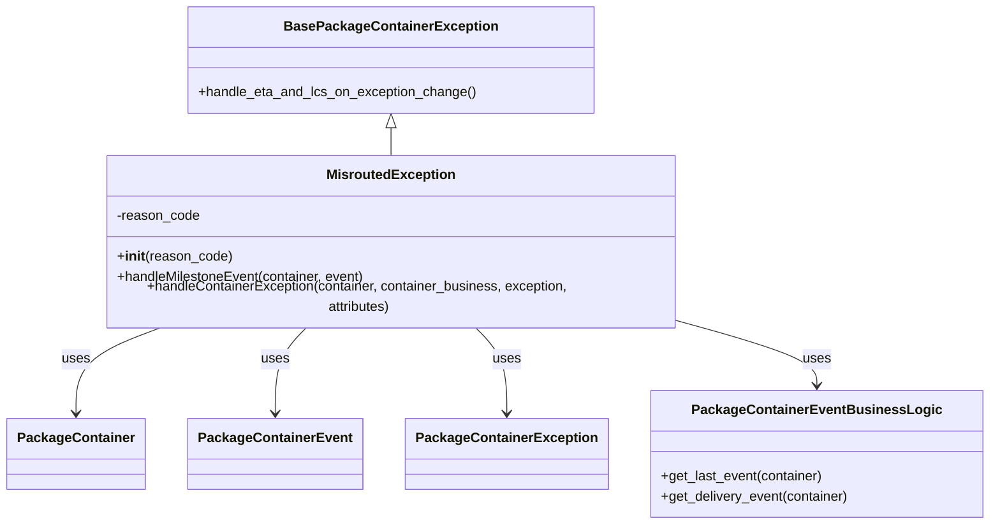
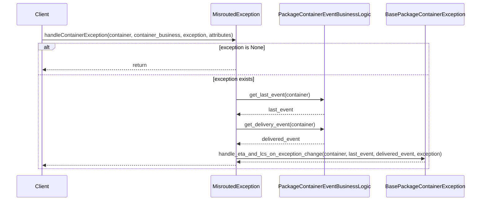

# Diagram: platform/partview_core/partview_service/partview_service/core/business/package_container_exception_status/package_container_exceptions/PackageContainerMisroutedException.py

> Auto-generated by Obscura crawlers

## Diagram 1

### SVG

<svg id="container" width="1127.6328125" xmlns="http://www.w3.org/2000/svg" class="classDiagram" height="608" viewBox="0 0 1127.6328125 608" role="graphics-document document" aria-roledescription="class"><g><defs><marker id="container_class-aggregationStart" class="marker aggregation class" refX="18" refY="7" markerWidth="190" markerHeight="240" orient="auto"><path d="M 18,7 L9,13 L1,7 L9,1 Z"></path></marker></defs><defs><marker id="container_class-aggregationEnd" class="marker aggregation class" refX="1" refY="7" markerWidth="20" markerHeight="28" orient="auto"><path d="M 18,7 L9,13 L1,7 L9,1 Z"></path></marker></defs><defs><marker id="container_class-extensionStart" class="marker extension class" refX="18" refY="7" markerWidth="190" markerHeight="240" orient="auto"><path d="M 1,7 L18,13 V 1 Z"></path></marker></defs><defs><marker id="container_class-extensionEnd" class="marker extension class" refX="1" refY="7" markerWidth="20" markerHeight="28" orient="auto"><path d="M 1,1 V 13 L18,7 Z"></path></marker></defs><defs><marker id="container_class-compositionStart" class="marker composition class" refX="18" refY="7" markerWidth="190" markerHeight="240" orient="auto"><path d="M 18,7 L9,13 L1,7 L9,1 Z"></path></marker></defs><defs><marker id="container_class-compositionEnd" class="marker composition class" refX="1" refY="7" markerWidth="20" markerHeight="28" orient="auto"><path d="M 18,7 L9,13 L1,7 L9,1 Z"></path></marker></defs><defs><marker id="container_class-dependencyStart" class="marker dependency class" refX="6" refY="7" markerWidth="190" markerHeight="240" orient="auto"><path d="M 5,7 L9,13 L1,7 L9,1 Z"></path></marker></defs><defs><marker id="container_class-dependencyEnd" class="marker dependency class" refX="13" refY="7" markerWidth="20" markerHeight="28" orient="auto"><path d="M 18,7 L9,13 L14,7 L9,1 Z"></path></marker></defs><defs><marker id="container_class-lollipopStart" class="marker lollipop class" refX="13" refY="7" markerWidth="190" markerHeight="240" orient="auto"><circle stroke="black" fill="transparent" cx="7" cy="7" r="6"></circle></marker></defs><defs><marker id="container_class-lollipopEnd" class="marker lollipop class" refX="1" refY="7" markerWidth="190" markerHeight="240" orient="auto"><circle stroke="black" fill="transparent" cx="7" cy="7" r="6"></circle></marker></defs><g class="root"><g class="clusters"></g><g class="edgePaths"><path d="M440.965,151.25L440.965,152.542C440.965,153.833,440.965,156.417,440.965,161.875C440.965,167.333,440.965,175.667,440.965,179.833L440.965,184" id="id_BasePackageContainerException_MisroutedException_1" class="edge-thickness-normal edge-pattern-solid relation" style=";;;" data-edge="true" data-et="edge" data-id="id_BasePackageContainerException_MisroutedException_1" data-points="W3sieCI6NDQwLjk2NDg0Mzc1LCJ5IjoxMzR9LHsieCI6NDQwLjk2NDg0Mzc1LCJ5IjoxNTl9LHsieCI6NDQwLjk2NDg0Mzc1LCJ5IjoxODR9XQ==" marker-start="url(#container_class-extensionStart)"></path><path d="M184.355,376L167.871,382.167C151.388,388.333,118.42,400.667,101.937,417.5C85.453,434.333,85.453,455.667,85.453,466.333L85.453,477" id="id_MisroutedException_PackageContainer_2" class="edge-thickness-normal edge-pattern-solid relation" style=";;;" data-edge="true" data-et="edge" data-id="id_MisroutedException_PackageContainer_2" data-points="W3sieCI6MTg0LjM1NDg4MTM0Mzk4NDk3LCJ5IjozNzZ9LHsieCI6ODUuNDUzMTI1LCJ5Ijo0MTN9LHsieCI6ODUuNDUzMTI1LCJ5Ijo0ODN9XQ==" marker-end="url(#container_class-dependencyEnd)"></path><path d="M346.84,376L340.794,382.167C334.747,388.333,322.655,400.667,316.609,417.5C310.563,434.333,310.563,455.667,310.563,466.333L310.563,477" id="id_MisroutedException_PackageContainerEvent_3" class="edge-thickness-normal edge-pattern-solid relation" style=";;;" data-edge="true" data-et="edge" data-id="id_MisroutedException_PackageContainerEvent_3" data-points="W3sieCI6MzQ2LjgzOTg0Mzc1LCJ5IjozNzZ9LHsieCI6MzEwLjU2MjUsInkiOjQxM30seyJ4IjozMTAuNTYyNSwieSI6NDgzfV0=" marker-end="url(#container_class-dependencyEnd)"></path><path d="M535.09,376L541.136,382.167C547.182,388.333,559.275,400.667,565.321,417.5C571.367,434.333,571.367,455.667,571.367,466.333L571.367,477" id="id_MisroutedException_PackageContainerException_4" class="edge-thickness-normal edge-pattern-solid relation" style=";;;" data-edge="true" data-et="edge" data-id="id_MisroutedException_PackageContainerException_4" data-points="W3sieCI6NTM1LjA4OTg0Mzc1LCJ5IjozNzZ9LHsieCI6NTcxLjM2NzE4NzUsInkiOjQxM30seyJ4Ijo1NzEuMzY3MTg3NSwieSI6NDgzfV0=" marker-end="url(#container_class-dependencyEnd)"></path><path d="M781.348,373.129L805.635,379.774C829.923,386.419,878.499,399.71,902.786,411.522C927.074,423.333,927.074,433.667,927.074,438.833L927.074,444" id="id_MisroutedException_PackageContainerEventBusinessLogic_5" class="edge-thickness-normal edge-pattern-solid relation" style=";;;" data-edge="true" data-et="edge" data-id="id_MisroutedException_PackageContainerEventBusinessLogic_5" data-points="W3sieCI6NzgxLjM0NzY1NjI1LCJ5IjozNzMuMTI5MDcwMTAzODIxOH0seyJ4Ijo5MjcuMDc0MjE4NzUsInkiOjQxM30seyJ4Ijo5MjcuMDc0MjE4NzUsInkiOjQ1MH1d" marker-end="url(#container_class-dependencyEnd)"></path></g><g class="edgeLabels"><g class="edgeLabel"><g class="label" data-id="id_BasePackageContainerException_MisroutedException_1" transform="translate(0, 0)"><foreignObject width="0" height="0">

</foreignObject></g></g><g class="edgeLabel" transform="translate(85.453125, 413)"><g class="label" data-id="id_MisroutedException_PackageContainer_2" transform="translate(-16.4921875, -12)"><foreignObject width="32.984375" height="24">

uses

</foreignObject></g></g><g class="edgeLabel" transform="translate(310.5625, 413)"><g class="label" data-id="id_MisroutedException_PackageContainerEvent_3" transform="translate(-16.4921875, -12)"><foreignObject width="32.984375" height="24">

uses

</foreignObject></g></g><g class="edgeLabel" transform="translate(571.3671875, 413)"><g class="label" data-id="id_MisroutedException_PackageContainerException_4" transform="translate(-16.4921875, -12)"><foreignObject width="32.984375" height="24">

uses

</foreignObject></g></g><g class="edgeLabel" transform="translate(927.07421875, 413)"><g class="label" data-id="id_MisroutedException_PackageContainerEventBusinessLogic_5" transform="translate(-16.4921875, -12)"><foreignObject width="32.984375" height="24">

uses

</foreignObject></g></g></g><g class="nodes"><g class="node default" id="classId-BasePackageContainerException-0" transform="translate(440.96484375, 71)"><g class="basic label-container"><path d="M-235.3671875 -63 L235.3671875 -63 L235.3671875 63 L-235.3671875 63" stroke="none" stroke-width="0" fill="#ECECFF" style=""></path><path d="M-235.3671875 -63 C-100.62556583251927 -63, 34.11605583496146 -63, 235.3671875 -63 M-235.3671875 -63 C-65.45758531099966 -63, 104.45201687800068 -63, 235.3671875 -63 M235.3671875 -63 C235.3671875 -17.055002128181236, 235.3671875 28.889995743637527, 235.3671875 63 M235.3671875 -63 C235.3671875 -37.265168736962764, 235.3671875 -11.530337473925528, 235.3671875 63 M235.3671875 63 C138.8605041566617 63, 42.35382081332338 63, -235.3671875 63 M235.3671875 63 C140.77614955173482 63, 46.185111603469636 63, -235.3671875 63 M-235.3671875 63 C-235.3671875 19.64824926316895, -235.3671875 -23.7035014736621, -235.3671875 -63 M-235.3671875 63 C-235.3671875 30.78228075718134, -235.3671875 -1.4354384856373201, -235.3671875 -63" stroke="#9370DB" stroke-width="1.3" fill="none" stroke-dasharray="0 0" style=""></path></g><g class="annotation-group text" transform="translate(0, -39)"></g><g class="label-group text" transform="translate(-118.671875, -39)"><g class="label" style="font-weight: bolder" transform="translate(0,-12)"><foreignObject width="237.34375" height="24">

BasePackageContainerException

</foreignObject></g></g><g class="members-group text" transform="translate(-223.3671875, 9)"></g><g class="methods-group text" transform="translate(-223.3671875, 39)"><g class="label" style="" transform="translate(0,-12)"><foreignObject width="328.0625" height="24">

+handle_eta_and_lcs_on_exception_change()

</foreignObject></g></g><g class="divider" style=""><path d="M-235.3671875 -15 C-84.1733264418744 -15, 67.02053461625121 -15, 235.3671875 -15 M-235.3671875 -15 C-131.25242663500353 -15, -27.13766577000709 -15, 235.3671875 -15" stroke="#9370DB" stroke-width="1.3" fill="none" stroke-dasharray="0 0" style=""></path></g><g class="divider" style=""><path d="M-235.3671875 9 C-68.3545781485374 9, 98.6580312029252 9, 235.3671875 9 M-235.3671875 9 C-93.66569811522669 9, 48.03579126954662 9, 235.3671875 9" stroke="#9370DB" stroke-width="1.3" fill="none" stroke-dasharray="0 0" style=""></path></g></g><g class="node default" id="classId-MisroutedException-1" transform="translate(440.96484375, 280)"><g class="basic label-container"><path d="M-340.3828125 -96 L340.3828125 -96 L340.3828125 96 L-340.3828125 96" stroke="none" stroke-width="0" fill="#ECECFF" style=""></path><path d="M-340.3828125 -96 C-148.2207205042039 -96, 43.94137149159218 -96, 340.3828125 -96 M-340.3828125 -96 C-149.50597951573198 -96, 41.37085346853604 -96, 340.3828125 -96 M340.3828125 -96 C340.3828125 -37.76520169663257, 340.3828125 20.469596606734854, 340.3828125 96 M340.3828125 -96 C340.3828125 -39.00744303325095, 340.3828125 17.9851139334981, 340.3828125 96 M340.3828125 96 C164.14759561897847 96, -12.087621262043058 96, -340.3828125 96 M340.3828125 96 C127.01544230116093 96, -86.35192789767814 96, -340.3828125 96 M-340.3828125 96 C-340.3828125 33.98637493394011, -340.3828125 -28.027250132119775, -340.3828125 -96 M-340.3828125 96 C-340.3828125 55.939335937289734, -340.3828125 15.878671874579467, -340.3828125 -96" stroke="#9370DB" stroke-width="1.3" fill="none" stroke-dasharray="0 0" style=""></path></g><g class="annotation-group text" transform="translate(0, -72)"></g><g class="label-group text" transform="translate(-72.484375, -72)"><g class="label" style="font-weight: bolder" transform="translate(0,-12)"><foreignObject width="144.96875" height="24">

MisroutedException

</foreignObject></g></g><g class="members-group text" transform="translate(-328.3828125, -24)"><g class="label" style="" transform="translate(0,-12)"><foreignObject width="98.40625" height="24">

-reason_code

</foreignObject></g></g><g class="methods-group text" transform="translate(-328.3828125, 24)"><g class="label" style="" transform="translate(0,-12)"><foreignObject width="134.75" height="24">

+<strong>init</strong>(reason_code)

</foreignObject></g><g class="label" style="" transform="translate(0,12)"><foreignObject width="295.703125" height="24">

+handleMilestoneEvent(container, event)

</foreignObject></g><g class="label" style="" transform="translate(0,36)"><foreignObject width="584.28125" height="24">

+handleContainerException(container, container_business, exception, attributes)

</foreignObject></g></g><g class="divider" style=""><path d="M-340.3828125 -48 C-137.23174447527353 -48, 65.91932354945294 -48, 340.3828125 -48 M-340.3828125 -48 C-186.68489063153245 -48, -32.98696876306491 -48, 340.3828125 -48" stroke="#9370DB" stroke-width="1.3" fill="none" stroke-dasharray="0 0" style=""></path></g><g class="divider" style=""><path d="M-340.3828125 0 C-171.73990508508163 0, -3.0969976701632618 0, 340.3828125 0 M-340.3828125 0 C-150.43532723115308 0, 39.51215803769384 0, 340.3828125 0" stroke="#9370DB" stroke-width="1.3" fill="none" stroke-dasharray="0 0" style=""></path></g></g><g class="node default" id="classId-PackageContainer-2" transform="translate(85.453125, 525)"><g class="basic label-container"><path d="M-77.453125 -42 L77.453125 -42 L77.453125 42 L-77.453125 42" stroke="none" stroke-width="0" fill="#ECECFF" style=""></path><path d="M-77.453125 -42 C-45.71459942248305 -42, -13.976073844966088 -42, 77.453125 -42 M-77.453125 -42 C-43.54569109857465 -42, -9.6382571971493 -42, 77.453125 -42 M77.453125 -42 C77.453125 -16.307068539930953, 77.453125 9.385862920138095, 77.453125 42 M77.453125 -42 C77.453125 -16.150247308876434, 77.453125 9.699505382247132, 77.453125 42 M77.453125 42 C38.4412485965231 42, -0.5706278069537944 42, -77.453125 42 M77.453125 42 C44.53360432208227 42, 11.614083644164538 42, -77.453125 42 M-77.453125 42 C-77.453125 23.613194589099532, -77.453125 5.226389178199064, -77.453125 -42 M-77.453125 42 C-77.453125 11.257982383509553, -77.453125 -19.484035232980894, -77.453125 -42" stroke="#9370DB" stroke-width="1.3" fill="none" stroke-dasharray="0 0" style=""></path></g><g class="annotation-group text" transform="translate(0, -18)"></g><g class="label-group text" transform="translate(-65.453125, -18)"><g class="label" style="font-weight: bolder" transform="translate(0,-12)"><foreignObject width="130.90625" height="24">

PackageContainer

</foreignObject></g></g><g class="members-group text" transform="translate(-65.453125, 30)"></g><g class="methods-group text" transform="translate(-65.453125, 60)"></g><g class="divider" style=""><path d="M-77.453125 6 C-22.848647736917663 6, 31.755829526164675 6, 77.453125 6 M-77.453125 6 C-44.442220954424336 6, -11.431316908848672 6, 77.453125 6" stroke="#9370DB" stroke-width="1.3" fill="none" stroke-dasharray="0 0" style=""></path></g><g class="divider" style=""><path d="M-77.453125 24 C-24.669050283893853 24, 28.115024432212294 24, 77.453125 24 M-77.453125 24 C-27.89671748771581 24, 21.659690024568377 24, 77.453125 24" stroke="#9370DB" stroke-width="1.3" fill="none" stroke-dasharray="0 0" style=""></path></g></g><g class="node default" id="classId-PackageContainerEvent-3" transform="translate(310.5625, 525)"><g class="basic label-container"><path d="M-97.65625 -42 L97.65625 -42 L97.65625 42 L-97.65625 42" stroke="none" stroke-width="0" fill="#ECECFF" style=""></path><path d="M-97.65625 -42 C-34.5954406159443 -42, 28.465368768111404 -42, 97.65625 -42 M-97.65625 -42 C-36.2590806925368 -42, 25.138088614926403 -42, 97.65625 -42 M97.65625 -42 C97.65625 -12.814370458032798, 97.65625 16.371259083934405, 97.65625 42 M97.65625 -42 C97.65625 -15.572645497522192, 97.65625 10.854709004955616, 97.65625 42 M97.65625 42 C43.1134066714361 42, -11.429436657127795 42, -97.65625 42 M97.65625 42 C24.948978183606954 42, -47.75829363278609 42, -97.65625 42 M-97.65625 42 C-97.65625 15.012858748411567, -97.65625 -11.974282503176866, -97.65625 -42 M-97.65625 42 C-97.65625 16.034293876012768, -97.65625 -9.931412247974464, -97.65625 -42" stroke="#9370DB" stroke-width="1.3" fill="none" stroke-dasharray="0 0" style=""></path></g><g class="annotation-group text" transform="translate(0, -18)"></g><g class="label-group text" transform="translate(-85.65625, -18)"><g class="label" style="font-weight: bolder" transform="translate(0,-12)"><foreignObject width="171.3125" height="24">

PackageContainerEvent

</foreignObject></g></g><g class="members-group text" transform="translate(-85.65625, 30)"></g><g class="methods-group text" transform="translate(-85.65625, 60)"></g><g class="divider" style=""><path d="M-97.65625 6 C-33.95381275952635 6, 29.7486244809473 6, 97.65625 6 M-97.65625 6 C-26.54890838631438 6, 44.55843322737124 6, 97.65625 6" stroke="#9370DB" stroke-width="1.3" fill="none" stroke-dasharray="0 0" style=""></path></g><g class="divider" style=""><path d="M-97.65625 24 C-23.81133677731006 24, 50.03357644537988 24, 97.65625 24 M-97.65625 24 C-29.413768657333975 24, 38.82871268533205 24, 97.65625 24" stroke="#9370DB" stroke-width="1.3" fill="none" stroke-dasharray="0 0" style=""></path></g></g><g class="node default" id="classId-PackageContainerException-4" transform="translate(571.3671875, 525)"><g class="basic label-container"><path d="M-113.1484375 -42 L113.1484375 -42 L113.1484375 42 L-113.1484375 42" stroke="none" stroke-width="0" fill="#ECECFF" style=""></path><path d="M-113.1484375 -42 C-57.48046127727468 -42, -1.8124850545493558 -42, 113.1484375 -42 M-113.1484375 -42 C-25.90417867475854 -42, 61.34008015048292 -42, 113.1484375 -42 M113.1484375 -42 C113.1484375 -18.72925568910068, 113.1484375 4.541488621798642, 113.1484375 42 M113.1484375 -42 C113.1484375 -20.694791756555116, 113.1484375 0.6104164868897684, 113.1484375 42 M113.1484375 42 C34.541972095163686 42, -44.06449330967263 42, -113.1484375 42 M113.1484375 42 C25.022945395646744 42, -63.10254670870651 42, -113.1484375 42 M-113.1484375 42 C-113.1484375 21.794755128769616, -113.1484375 1.5895102575392315, -113.1484375 -42 M-113.1484375 42 C-113.1484375 21.668890098635664, -113.1484375 1.3377801972713286, -113.1484375 -42" stroke="#9370DB" stroke-width="1.3" fill="none" stroke-dasharray="0 0" style=""></path></g><g class="annotation-group text" transform="translate(0, -18)"></g><g class="label-group text" transform="translate(-101.1484375, -18)"><g class="label" style="font-weight: bolder" transform="translate(0,-12)"><foreignObject width="202.296875" height="24">

PackageContainerException

</foreignObject></g></g><g class="members-group text" transform="translate(-101.1484375, 30)"></g><g class="methods-group text" transform="translate(-101.1484375, 60)"></g><g class="divider" style=""><path d="M-113.1484375 6 C-57.752048531744016 6, -2.3556595634880324 6, 113.1484375 6 M-113.1484375 6 C-62.685895495514124 6, -12.223353491028249 6, 113.1484375 6" stroke="#9370DB" stroke-width="1.3" fill="none" stroke-dasharray="0 0" style=""></path></g><g class="divider" style=""><path d="M-113.1484375 24 C-56.85005501825092 24, -0.5516725365018402 24, 113.1484375 24 M-113.1484375 24 C-53.17169788631497 24, 6.805041727370053 24, 113.1484375 24" stroke="#9370DB" stroke-width="1.3" fill="none" stroke-dasharray="0 0" style=""></path></g></g><g class="node default" id="classId-PackageContainerEventBusinessLogic-5" transform="translate(927.07421875, 525)"><g class="basic label-container"><path d="M-192.55859375 -75 L192.55859375 -75 L192.55859375 75 L-192.55859375 75" stroke="none" stroke-width="0" fill="#ECECFF" style=""></path><path d="M-192.55859375 -75 C-38.72111707840651 -75, 115.11635959318698 -75, 192.55859375 -75 M-192.55859375 -75 C-90.57515376008635 -75, 11.408286229827297 -75, 192.55859375 -75 M192.55859375 -75 C192.55859375 -29.78122696122562, 192.55859375 15.43754607754876, 192.55859375 75 M192.55859375 -75 C192.55859375 -23.700832510538426, 192.55859375 27.59833497892315, 192.55859375 75 M192.55859375 75 C41.380291324532834 75, -109.79801110093433 75, -192.55859375 75 M192.55859375 75 C72.9386013438724 75, -46.68139106225519 75, -192.55859375 75 M-192.55859375 75 C-192.55859375 42.302072281725096, -192.55859375 9.604144563450191, -192.55859375 -75 M-192.55859375 75 C-192.55859375 37.65324970450026, -192.55859375 0.30649940900052286, -192.55859375 -75" stroke="#9370DB" stroke-width="1.3" fill="none" stroke-dasharray="0 0" style=""></path></g><g class="annotation-group text" transform="translate(0, -51)"></g><g class="label-group text" transform="translate(-137.0703125, -51)"><g class="label" style="font-weight: bolder" transform="translate(0,-12)"><foreignObject width="274.140625" height="24">

PackageContainerEventBusinessLogic

</foreignObject></g></g><g class="members-group text" transform="translate(-180.55859375, -3)"></g><g class="methods-group text" transform="translate(-180.55859375, 27)"><g class="label" style="" transform="translate(0,-12)"><foreignObject width="193.015625" height="24">

+get_last_event(container)

</foreignObject></g><g class="label" style="" transform="translate(0,12)"><foreignObject width="224.046875" height="24">

+get_delivery_event(container)

</foreignObject></g></g><g class="divider" style=""><path d="M-192.55859375 -27 C-97.01975489026705 -27, -1.4809160305341038 -27, 192.55859375 -27 M-192.55859375 -27 C-79.20129300652671 -27, 34.15600773694658 -27, 192.55859375 -27" stroke="#9370DB" stroke-width="1.3" fill="none" stroke-dasharray="0 0" style=""></path></g><g class="divider" style=""><path d="M-192.55859375 -3 C-82.56568119121125 -3, 27.42723136757749 -3, 192.55859375 -3 M-192.55859375 -3 C-66.19249984799696 -3, 60.17359405400609 -3, 192.55859375 -3" stroke="#9370DB" stroke-width="1.3" fill="none" stroke-dasharray="0 0" style=""></path></g></g></g></g></g></svg>

## Diagram 2

### SVG

<svg id="container" width="1556" xmlns="http://www.w3.org/2000/svg" height="627" viewBox="-50 -10 1556 627" role="graphics-document document" aria-roledescription="sequence"><g><rect x="1202" y="541" fill="#eaeaea" stroke="#666" width="254" height="65" name="BaseException" rx="3" ry="3" class="actor actor-bottom"></rect><text x="1329" y="573.5" dominant-baseline="central" alignment-baseline="central" class="actor actor-box" style="text-anchor: middle; font-size: 16px; font-weight: 400;"><tspan x="1329" dy="0">BasePackageContainerException</tspan></text></g><g><rect x="862" y="541" fill="#eaeaea" stroke="#666" width="290" height="65" name="ContainerBusiness" rx="3" ry="3" class="actor actor-bottom"></rect><text x="1007" y="573.5" dominant-baseline="central" alignment-baseline="central" class="actor actor-box" style="text-anchor: middle; font-size: 16px; font-weight: 400;"><tspan x="1007" dy="0">PackageContainerEventBusinessLogic</tspan></text></g><g><rect x="639.5" y="541" fill="#eaeaea" stroke="#666" width="163" height="65" name="MisroutedException" rx="3" ry="3" class="actor actor-bottom"></rect><text x="721" y="573.5" dominant-baseline="central" alignment-baseline="central" class="actor actor-box" style="text-anchor: middle; font-size: 16px; font-weight: 400;"><tspan x="721" dy="0">MisroutedException</tspan></text></g><g><rect x="0" y="541" fill="#eaeaea" stroke="#666" width="150" height="65" name="Client" rx="3" ry="3" class="actor actor-bottom"></rect><text x="75" y="573.5" dominant-baseline="central" alignment-baseline="central" class="actor actor-box" style="text-anchor: middle; font-size: 16px; font-weight: 400;"><tspan x="75" dy="0">Client</tspan></text></g><g><line id="actor3" x1="1329" y1="65" x2="1329" y2="541" class="actor-line 200" stroke-width="0.5px" stroke="#999" name="BaseException"></line><g id="root-3"><rect x="1202" y="0" fill="#eaeaea" stroke="#666" width="254" height="65" name="BaseException" rx="3" ry="3" class="actor actor-top"></rect><text x="1329" y="32.5" dominant-baseline="central" alignment-baseline="central" class="actor actor-box" style="text-anchor: middle; font-size: 16px; font-weight: 400;"><tspan x="1329" dy="0">BasePackageContainerException</tspan></text></g></g><g><line id="actor2" x1="1007" y1="65" x2="1007" y2="541" class="actor-line 200" stroke-width="0.5px" stroke="#999" name="ContainerBusiness"></line><g id="root-2"><rect x="862" y="0" fill="#eaeaea" stroke="#666" width="290" height="65" name="ContainerBusiness" rx="3" ry="3" class="actor actor-top"></rect><text x="1007" y="32.5" dominant-baseline="central" alignment-baseline="central" class="actor actor-box" style="text-anchor: middle; font-size: 16px; font-weight: 400;"><tspan x="1007" dy="0">PackageContainerEventBusinessLogic</tspan></text></g></g><g><line id="actor1" x1="721" y1="65" x2="721" y2="541" class="actor-line 200" stroke-width="0.5px" stroke="#999" name="MisroutedException"></line><g id="root-1"><rect x="639.5" y="0" fill="#eaeaea" stroke="#666" width="163" height="65" name="MisroutedException" rx="3" ry="3" class="actor actor-top"></rect><text x="721" y="32.5" dominant-baseline="central" alignment-baseline="central" class="actor actor-box" style="text-anchor: middle; font-size: 16px; font-weight: 400;"><tspan x="721" dy="0">MisroutedException</tspan></text></g></g><g><line id="actor0" x1="75" y1="65" x2="75" y2="541" class="actor-line 200" stroke-width="0.5px" stroke="#999" name="Client"></line><g id="root-0"><rect x="0" y="0" fill="#eaeaea" stroke="#666" width="150" height="65" name="Client" rx="3" ry="3" class="actor actor-top"></rect><text x="75" y="32.5" dominant-baseline="central" alignment-baseline="central" class="actor actor-box" style="text-anchor: middle; font-size: 16px; font-weight: 400;"><tspan x="75" dy="0">Client</tspan></text></g></g><g></g><defs><symbol id="computer" width="24" height="24"><path transform="scale(.5)" d="M2 2v13h20v-13h-20zm18 11h-16v-9h16v9zm-10.228 6l.466-1h3.524l.467 1h-4.457zm14.228 3h-24l2-6h2.104l-1.33 4h18.45l-1.297-4h2.073l2 6zm-5-10h-14v-7h14v7z"></path></symbol></defs><defs><symbol id="database" fill-rule="evenodd" clip-rule="evenodd"><path transform="scale(.5)" d="M12.258.001l.256.004.255.005.253.008.251.01.249.012.247.015.246.016.242.019.241.02.239.023.236.024.233.027.231.028.229.031.225.032.223.034.22.036.217.038.214.04.211.041.208.043.205.045.201.046.198.048.194.05.191.051.187.053.183.054.18.056.175.057.172.059.168.06.163.061.16.063.155.064.15.066.074.033.073.033.071.034.07.034.069.035.068.035.067.035.066.035.064.036.064.036.062.036.06.036.06.037.058.037.058.037.055.038.055.038.053.038.052.038.051.039.05.039.048.039.047.039.045.04.044.04.043.04.041.04.04.041.039.041.037.041.036.041.034.041.033.042.032.042.03.042.029.042.027.042.026.043.024.043.023.043.021.043.02.043.018.044.017.043.015.044.013.044.012.044.011.045.009.044.007.045.006.045.004.045.002.045.001.045v17l-.001.045-.002.045-.004.045-.006.045-.007.045-.009.044-.011.045-.012.044-.013.044-.015.044-.017.043-.018.044-.02.043-.021.043-.023.043-.024.043-.026.043-.027.042-.029.042-.03.042-.032.042-.033.042-.034.041-.036.041-.037.041-.039.041-.04.041-.041.04-.043.04-.044.04-.045.04-.047.039-.048.039-.05.039-.051.039-.052.038-.053.038-.055.038-.055.038-.058.037-.058.037-.06.037-.06.036-.062.036-.064.036-.064.036-.066.035-.067.035-.068.035-.069.035-.07.034-.071.034-.073.033-.074.033-.15.066-.155.064-.16.063-.163.061-.168.06-.172.059-.175.057-.18.056-.183.054-.187.053-.191.051-.194.05-.198.048-.201.046-.205.045-.208.043-.211.041-.214.04-.217.038-.22.036-.223.034-.225.032-.229.031-.231.028-.233.027-.236.024-.239.023-.241.02-.242.019-.246.016-.247.015-.249.012-.251.01-.253.008-.255.005-.256.004-.258.001-.258-.001-.256-.004-.255-.005-.253-.008-.251-.01-.249-.012-.247-.015-.245-.016-.243-.019-.241-.02-.238-.023-.236-.024-.234-.027-.231-.028-.228-.031-.226-.032-.223-.034-.22-.036-.217-.038-.214-.04-.211-.041-.208-.043-.204-.045-.201-.046-.198-.048-.195-.05-.19-.051-.187-.053-.184-.054-.179-.056-.176-.057-.172-.059-.167-.06-.164-.061-.159-.063-.155-.064-.151-.066-.074-.033-.072-.033-.072-.034-.07-.034-.069-.035-.068-.035-.067-.035-.066-.035-.064-.036-.063-.036-.062-.036-.061-.036-.06-.037-.058-.037-.057-.037-.056-.038-.055-.038-.053-.038-.052-.038-.051-.039-.049-.039-.049-.039-.046-.039-.046-.04-.044-.04-.043-.04-.041-.04-.04-.041-.039-.041-.037-.041-.036-.041-.034-.041-.033-.042-.032-.042-.03-.042-.029-.042-.027-.042-.026-.043-.024-.043-.023-.043-.021-.043-.02-.043-.018-.044-.017-.043-.015-.044-.013-.044-.012-.044-.011-.045-.009-.044-.007-.045-.006-.045-.004-.045-.002-.045-.001-.045v-17l.001-.045.002-.045.004-.045.006-.045.007-.045.009-.044.011-.045.012-.044.013-.044.015-.044.017-.043.018-.044.02-.043.021-.043.023-.043.024-.043.026-.043.027-.042.029-.042.03-.042.032-.042.033-.042.034-.041.036-.041.037-.041.039-.041.04-.041.041-.04.043-.04.044-.04.046-.04.046-.039.049-.039.049-.039.051-.039.052-.038.053-.038.055-.038.056-.038.057-.037.058-.037.06-.037.061-.036.062-.036.063-.036.064-.036.066-.035.067-.035.068-.035.069-.035.07-.034.072-.034.072-.033.074-.033.151-.066.155-.064.159-.063.164-.061.167-.06.172-.059.176-.057.179-.056.184-.054.187-.053.19-.051.195-.05.198-.048.201-.046.204-.045.208-.043.211-.041.214-.04.217-.038.22-.036.223-.034.226-.032.228-.031.231-.028.234-.027.236-.024.238-.023.241-.02.243-.019.245-.016.247-.015.249-.012.251-.01.253-.008.255-.005.256-.004.258-.001.258.001zm-9.258 20.499v.01l.001.021.003.021.004.022.005.021.006.022.007.022.009.023.01.022.011.023.012.023.013.023.015.023.016.024.017.023.018.024.019.024.021.024.022.025.023.024.024.025.052.049.056.05.061.051.066.051.07.051.075.051.079.052.084.052.088.052.092.052.097.052.102.051.105.052.11.052.114.051.119.051.123.051.127.05.131.05.135.05.139.048.144.049.147.047.152.047.155.047.16.045.163.045.167.043.171.043.176.041.178.041.183.039.187.039.19.037.194.035.197.035.202.033.204.031.209.03.212.029.216.027.219.025.222.024.226.021.23.02.233.018.236.016.24.015.243.012.246.01.249.008.253.005.256.004.259.001.26-.001.257-.004.254-.005.25-.008.247-.011.244-.012.241-.014.237-.016.233-.018.231-.021.226-.021.224-.024.22-.026.216-.027.212-.028.21-.031.205-.031.202-.034.198-.034.194-.036.191-.037.187-.039.183-.04.179-.04.175-.042.172-.043.168-.044.163-.045.16-.046.155-.046.152-.047.148-.048.143-.049.139-.049.136-.05.131-.05.126-.05.123-.051.118-.052.114-.051.11-.052.106-.052.101-.052.096-.052.092-.052.088-.053.083-.051.079-.052.074-.052.07-.051.065-.051.06-.051.056-.05.051-.05.023-.024.023-.025.021-.024.02-.024.019-.024.018-.024.017-.024.015-.023.014-.024.013-.023.012-.023.01-.023.01-.022.008-.022.006-.022.006-.022.004-.022.004-.021.001-.021.001-.021v-4.127l-.077.055-.08.053-.083.054-.085.053-.087.052-.09.052-.093.051-.095.05-.097.05-.1.049-.102.049-.105.048-.106.047-.109.047-.111.046-.114.045-.115.045-.118.044-.12.043-.122.042-.124.042-.126.041-.128.04-.13.04-.132.038-.134.038-.135.037-.138.037-.139.035-.142.035-.143.034-.144.033-.147.032-.148.031-.15.03-.151.03-.153.029-.154.027-.156.027-.158.026-.159.025-.161.024-.162.023-.163.022-.165.021-.166.02-.167.019-.169.018-.169.017-.171.016-.173.015-.173.014-.175.013-.175.012-.177.011-.178.01-.179.008-.179.008-.181.006-.182.005-.182.004-.184.003-.184.002h-.37l-.184-.002-.184-.003-.182-.004-.182-.005-.181-.006-.179-.008-.179-.008-.178-.01-.176-.011-.176-.012-.175-.013-.173-.014-.172-.015-.171-.016-.17-.017-.169-.018-.167-.019-.166-.02-.165-.021-.163-.022-.162-.023-.161-.024-.159-.025-.157-.026-.156-.027-.155-.027-.153-.029-.151-.03-.15-.03-.148-.031-.146-.032-.145-.033-.143-.034-.141-.035-.14-.035-.137-.037-.136-.037-.134-.038-.132-.038-.13-.04-.128-.04-.126-.041-.124-.042-.122-.042-.12-.044-.117-.043-.116-.045-.113-.045-.112-.046-.109-.047-.106-.047-.105-.048-.102-.049-.1-.049-.097-.05-.095-.05-.093-.052-.09-.051-.087-.052-.085-.053-.083-.054-.08-.054-.077-.054v4.127zm0-5.654v.011l.001.021.003.021.004.021.005.022.006.022.007.022.009.022.01.022.011.023.012.023.013.023.015.024.016.023.017.024.018.024.019.024.021.024.022.024.023.025.024.024.052.05.056.05.061.05.066.051.07.051.075.052.079.051.084.052.088.052.092.052.097.052.102.052.105.052.11.051.114.051.119.052.123.05.127.051.131.05.135.049.139.049.144.048.147.048.152.047.155.046.16.045.163.045.167.044.171.042.176.042.178.04.183.04.187.038.19.037.194.036.197.034.202.033.204.032.209.03.212.028.216.027.219.025.222.024.226.022.23.02.233.018.236.016.24.014.243.012.246.01.249.008.253.006.256.003.259.001.26-.001.257-.003.254-.006.25-.008.247-.01.244-.012.241-.015.237-.016.233-.018.231-.02.226-.022.224-.024.22-.025.216-.027.212-.029.21-.03.205-.032.202-.033.198-.035.194-.036.191-.037.187-.039.183-.039.179-.041.175-.042.172-.043.168-.044.163-.045.16-.045.155-.047.152-.047.148-.048.143-.048.139-.05.136-.049.131-.05.126-.051.123-.051.118-.051.114-.052.11-.052.106-.052.101-.052.096-.052.092-.052.088-.052.083-.052.079-.052.074-.051.07-.052.065-.051.06-.05.056-.051.051-.049.023-.025.023-.024.021-.025.02-.024.019-.024.018-.024.017-.024.015-.023.014-.023.013-.024.012-.022.01-.023.01-.023.008-.022.006-.022.006-.022.004-.021.004-.022.001-.021.001-.021v-4.139l-.077.054-.08.054-.083.054-.085.052-.087.053-.09.051-.093.051-.095.051-.097.05-.1.049-.102.049-.105.048-.106.047-.109.047-.111.046-.114.045-.115.044-.118.044-.12.044-.122.042-.124.042-.126.041-.128.04-.13.039-.132.039-.134.038-.135.037-.138.036-.139.036-.142.035-.143.033-.144.033-.147.033-.148.031-.15.03-.151.03-.153.028-.154.028-.156.027-.158.026-.159.025-.161.024-.162.023-.163.022-.165.021-.166.02-.167.019-.169.018-.169.017-.171.016-.173.015-.173.014-.175.013-.175.012-.177.011-.178.009-.179.009-.179.007-.181.007-.182.005-.182.004-.184.003-.184.002h-.37l-.184-.002-.184-.003-.182-.004-.182-.005-.181-.007-.179-.007-.179-.009-.178-.009-.176-.011-.176-.012-.175-.013-.173-.014-.172-.015-.171-.016-.17-.017-.169-.018-.167-.019-.166-.02-.165-.021-.163-.022-.162-.023-.161-.024-.159-.025-.157-.026-.156-.027-.155-.028-.153-.028-.151-.03-.15-.03-.148-.031-.146-.033-.145-.033-.143-.033-.141-.035-.14-.036-.137-.036-.136-.037-.134-.038-.132-.039-.13-.039-.128-.04-.126-.041-.124-.042-.122-.043-.12-.043-.117-.044-.116-.044-.113-.046-.112-.046-.109-.046-.106-.047-.105-.048-.102-.049-.1-.049-.097-.05-.095-.051-.093-.051-.09-.051-.087-.053-.085-.052-.083-.054-.08-.054-.077-.054v4.139zm0-5.666v.011l.001.02.003.022.004.021.005.022.006.021.007.022.009.023.01.022.011.023.012.023.013.023.015.023.016.024.017.024.018.023.019.024.021.025.022.024.023.024.024.025.052.05.056.05.061.05.066.051.07.051.075.052.079.051.084.052.088.052.092.052.097.052.102.052.105.051.11.052.114.051.119.051.123.051.127.05.131.05.135.05.139.049.144.048.147.048.152.047.155.046.16.045.163.045.167.043.171.043.176.042.178.04.183.04.187.038.19.037.194.036.197.034.202.033.204.032.209.03.212.028.216.027.219.025.222.024.226.021.23.02.233.018.236.017.24.014.243.012.246.01.249.008.253.006.256.003.259.001.26-.001.257-.003.254-.006.25-.008.247-.01.244-.013.241-.014.237-.016.233-.018.231-.02.226-.022.224-.024.22-.025.216-.027.212-.029.21-.03.205-.032.202-.033.198-.035.194-.036.191-.037.187-.039.183-.039.179-.041.175-.042.172-.043.168-.044.163-.045.16-.045.155-.047.152-.047.148-.048.143-.049.139-.049.136-.049.131-.051.126-.05.123-.051.118-.052.114-.051.11-.052.106-.052.101-.052.096-.052.092-.052.088-.052.083-.052.079-.052.074-.052.07-.051.065-.051.06-.051.056-.05.051-.049.023-.025.023-.025.021-.024.02-.024.019-.024.018-.024.017-.024.015-.023.014-.024.013-.023.012-.023.01-.022.01-.023.008-.022.006-.022.006-.022.004-.022.004-.021.001-.021.001-.021v-4.153l-.077.054-.08.054-.083.053-.085.053-.087.053-.09.051-.093.051-.095.051-.097.05-.1.049-.102.048-.105.048-.106.048-.109.046-.111.046-.114.046-.115.044-.118.044-.12.043-.122.043-.124.042-.126.041-.128.04-.13.039-.132.039-.134.038-.135.037-.138.036-.139.036-.142.034-.143.034-.144.033-.147.032-.148.032-.15.03-.151.03-.153.028-.154.028-.156.027-.158.026-.159.024-.161.024-.162.023-.163.023-.165.021-.166.02-.167.019-.169.018-.169.017-.171.016-.173.015-.173.014-.175.013-.175.012-.177.01-.178.01-.179.009-.179.007-.181.006-.182.006-.182.004-.184.003-.184.001-.185.001-.185-.001-.184-.001-.184-.003-.182-.004-.182-.006-.181-.006-.179-.007-.179-.009-.178-.01-.176-.01-.176-.012-.175-.013-.173-.014-.172-.015-.171-.016-.17-.017-.169-.018-.167-.019-.166-.02-.165-.021-.163-.023-.162-.023-.161-.024-.159-.024-.157-.026-.156-.027-.155-.028-.153-.028-.151-.03-.15-.03-.148-.032-.146-.032-.145-.033-.143-.034-.141-.034-.14-.036-.137-.036-.136-.037-.134-.038-.132-.039-.13-.039-.128-.041-.126-.041-.124-.041-.122-.043-.12-.043-.117-.044-.116-.044-.113-.046-.112-.046-.109-.046-.106-.048-.105-.048-.102-.048-.1-.05-.097-.049-.095-.051-.093-.051-.09-.052-.087-.052-.085-.053-.083-.053-.08-.054-.077-.054v4.153zm8.74-8.179l-.257.004-.254.005-.25.008-.247.011-.244.012-.241.014-.237.016-.233.018-.231.021-.226.022-.224.023-.22.026-.216.027-.212.028-.21.031-.205.032-.202.033-.198.034-.194.036-.191.038-.187.038-.183.04-.179.041-.175.042-.172.043-.168.043-.163.045-.16.046-.155.046-.152.048-.148.048-.143.048-.139.049-.136.05-.131.05-.126.051-.123.051-.118.051-.114.052-.11.052-.106.052-.101.052-.096.052-.092.052-.088.052-.083.052-.079.052-.074.051-.07.052-.065.051-.06.05-.056.05-.051.05-.023.025-.023.024-.021.024-.02.025-.019.024-.018.024-.017.023-.015.024-.014.023-.013.023-.012.023-.01.023-.01.022-.008.022-.006.023-.006.021-.004.022-.004.021-.001.021-.001.021.001.021.001.021.004.021.004.022.006.021.006.023.008.022.01.022.01.023.012.023.013.023.014.023.015.024.017.023.018.024.019.024.02.025.021.024.023.024.023.025.051.05.056.05.06.05.065.051.07.052.074.051.079.052.083.052.088.052.092.052.096.052.101.052.106.052.11.052.114.052.118.051.123.051.126.051.131.05.136.05.139.049.143.048.148.048.152.048.155.046.16.046.163.045.168.043.172.043.175.042.179.041.183.04.187.038.191.038.194.036.198.034.202.033.205.032.21.031.212.028.216.027.22.026.224.023.226.022.231.021.233.018.237.016.241.014.244.012.247.011.25.008.254.005.257.004.26.001.26-.001.257-.004.254-.005.25-.008.247-.011.244-.012.241-.014.237-.016.233-.018.231-.021.226-.022.224-.023.22-.026.216-.027.212-.028.21-.031.205-.032.202-.033.198-.034.194-.036.191-.038.187-.038.183-.04.179-.041.175-.042.172-.043.168-.043.163-.045.16-.046.155-.046.152-.048.148-.048.143-.048.139-.049.136-.05.131-.05.126-.051.123-.051.118-.051.114-.052.11-.052.106-.052.101-.052.096-.052.092-.052.088-.052.083-.052.079-.052.074-.051.07-.052.065-.051.06-.05.056-.05.051-.05.023-.025.023-.024.021-.024.02-.025.019-.024.018-.024.017-.023.015-.024.014-.023.013-.023.012-.023.01-.023.01-.022.008-.022.006-.023.006-.021.004-.022.004-.021.001-.021.001-.021-.001-.021-.001-.021-.004-.021-.004-.022-.006-.021-.006-.023-.008-.022-.01-.022-.01-.023-.012-.023-.013-.023-.014-.023-.015-.024-.017-.023-.018-.024-.019-.024-.02-.025-.021-.024-.023-.024-.023-.025-.051-.05-.056-.05-.06-.05-.065-.051-.07-.052-.074-.051-.079-.052-.083-.052-.088-.052-.092-.052-.096-.052-.101-.052-.106-.052-.11-.052-.114-.052-.118-.051-.123-.051-.126-.051-.131-.05-.136-.05-.139-.049-.143-.048-.148-.048-.152-.048-.155-.046-.16-.046-.163-.045-.168-.043-.172-.043-.175-.042-.179-.041-.183-.04-.187-.038-.191-.038-.194-.036-.198-.034-.202-.033-.205-.032-.21-.031-.212-.028-.216-.027-.22-.026-.224-.023-.226-.022-.231-.021-.233-.018-.237-.016-.241-.014-.244-.012-.247-.011-.25-.008-.254-.005-.257-.004-.26-.001-.26.001z"></path></symbol></defs><defs><symbol id="clock" width="24" height="24"><path transform="scale(.5)" d="M12 2c5.514 0 10 4.486 10 10s-4.486 10-10 10-10-4.486-10-10 4.486-10 10-10zm0-2c-6.627 0-12 5.373-12 12s5.373 12 12 12 12-5.373 12-12-5.373-12-12-12zm5.848 12.459c.202.038.202.333.001.372-1.907.361-6.045 1.111-6.547 1.111-.719 0-1.301-.582-1.301-1.301 0-.512.77-5.447 1.125-7.445.034-.192.312-.181.343.014l.985 6.238 5.394 1.011z"></path></symbol></defs><defs><marker id="arrowhead" refX="7.9" refY="5" markerUnits="userSpaceOnUse" markerWidth="12" markerHeight="12" orient="auto-start-reverse"><path d="M -1 0 L 10 5 L 0 10 z"></path></marker></defs><defs><marker id="crosshead" markerWidth="15" markerHeight="8" orient="auto" refX="4" refY="4.5"><path fill="none" stroke="#000000" stroke-width="1pt" d="M 1,2 L 6,7 M 6,2 L 1,7" style="stroke-dasharray: 0, 0;"></path></marker></defs><defs><marker id="filled-head" refX="15.5" refY="7" markerWidth="20" markerHeight="28" orient="auto"><path d="M 18,7 L9,13 L14,7 L9,1 Z"></path></marker></defs><defs><marker id="sequencenumber" refX="15" refY="15" markerWidth="60" markerHeight="40" orient="auto"><circle cx="15" cy="15" r="6"></circle></marker></defs><g><line x1="64" y1="123" x2="1340" y2="123" class="loopLine"></line><line x1="1340" y1="123" x2="1340" y2="521" class="loopLine"></line><line x1="64" y1="521" x2="1340" y2="521" class="loopLine"></line><line x1="64" y1="123" x2="64" y2="521" class="loopLine"></line><line x1="64" y1="221" x2="1340" y2="221" class="loopLine" style="stroke-dasharray: 3, 3;"></line><polygon points="64,123 114,123 114,136 105.6,143 64,143" class="labelBox"></polygon><text x="89" y="136" text-anchor="middle" dominant-baseline="middle" alignment-baseline="middle" class="labelText" style="font-size: 16px; font-weight: 400;">alt</text><text x="727" y="141" text-anchor="middle" class="loopText" style="font-size: 16px; font-weight: 400;"><tspan x="727">[exception is None]</tspan></text><text x="702" y="239" text-anchor="middle" class="loopText" style="font-size: 16px; font-weight: 400;">[exception exists]</text></g><text x="397" y="80" text-anchor="middle" dominant-baseline="middle" alignment-baseline="middle" class="messageText" dy="1em" style="font-size: 16px; font-weight: 400;">handleContainerException(container, container_business, exception, attributes)</text><line x1="76" y1="113" x2="717" y2="113" class="messageLine0" stroke-width="2" stroke="none" marker-end="url(#arrowhead)" style="fill: none;"></line><text x="400" y="173" text-anchor="middle" dominant-baseline="middle" alignment-baseline="middle" class="messageText" dy="1em" style="font-size: 16px; font-weight: 400;">return</text><line x1="720" y1="206" x2="79" y2="206" class="messageLine1" stroke-width="2" stroke="none" marker-end="url(#arrowhead)" style="stroke-dasharray: 3, 3; fill: none;"></line><text x="863" y="266" text-anchor="middle" dominant-baseline="middle" alignment-baseline="middle" class="messageText" dy="1em" style="font-size: 16px; font-weight: 400;">get_last_event(container)</text><line x1="722" y1="299" x2="1003" y2="299" class="messageLine0" stroke-width="2" stroke="none" marker-end="url(#arrowhead)" style="fill: none;"></line><text x="866" y="314" text-anchor="middle" dominant-baseline="middle" alignment-baseline="middle" class="messageText" dy="1em" style="font-size: 16px; font-weight: 400;">last_event</text><line x1="1006" y1="347" x2="725" y2="347" class="messageLine1" stroke-width="2" stroke="none" marker-end="url(#arrowhead)" style="stroke-dasharray: 3, 3; fill: none;"></line><text x="863" y="362" text-anchor="middle" dominant-baseline="middle" alignment-baseline="middle" class="messageText" dy="1em" style="font-size: 16px; font-weight: 400;">get_delivery_event(container)</text><line x1="722" y1="395" x2="1003" y2="395" class="messageLine0" stroke-width="2" stroke="none" marker-end="url(#arrowhead)" style="fill: none;"></line><text x="866" y="410" text-anchor="middle" dominant-baseline="middle" alignment-baseline="middle" class="messageText" dy="1em" style="font-size: 16px; font-weight: 400;">delivered_event</text><line x1="1006" y1="443" x2="725" y2="443" class="messageLine1" stroke-width="2" stroke="none" marker-end="url(#arrowhead)" style="stroke-dasharray: 3, 3; fill: none;"></line><text x="1024" y="458" text-anchor="middle" dominant-baseline="middle" alignment-baseline="middle" class="messageText" dy="1em" style="font-size: 16px; font-weight: 400;">handle_eta_and_lcs_on_exception_change(container, last_event, delivered_event, exception)</text><line x1="722" y1="491" x2="1325" y2="491" class="messageLine0" stroke-width="2" stroke="none" marker-end="url(#arrowhead)" style="fill: none;"></line><text x="1027" y="506" text-anchor="middle" dominant-baseline="middle" alignment-baseline="middle" class="messageText" dy="1em" style="font-size: 16px; font-weight: 400;">​</text><line x1="1328" y1="501" x2="725" y2="501" class="messageLine1" stroke-width="2" stroke="none" marker-end="url(#arrowhead)" style="stroke-dasharray: 3, 3; fill: none;"></line><text x="400" y="516" text-anchor="middle" dominant-baseline="middle" alignment-baseline="middle" class="messageText" dy="1em" style="font-size: 16px; font-weight: 400;">​</text><line x1="720" y1="511" x2="79" y2="511" class="messageLine1" stroke-width="2" stroke="none" marker-end="url(#arrowhead)" style="stroke-dasharray: 3, 3; fill: none;"></line></svg>
