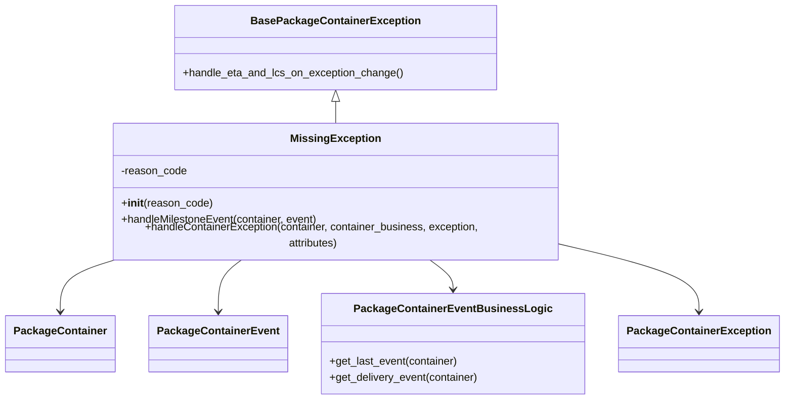
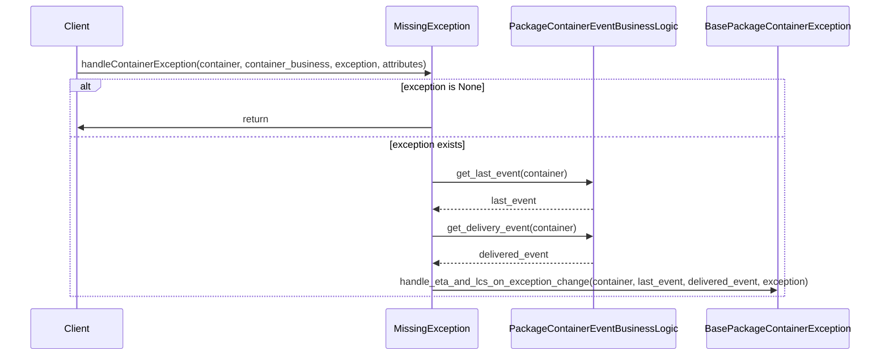
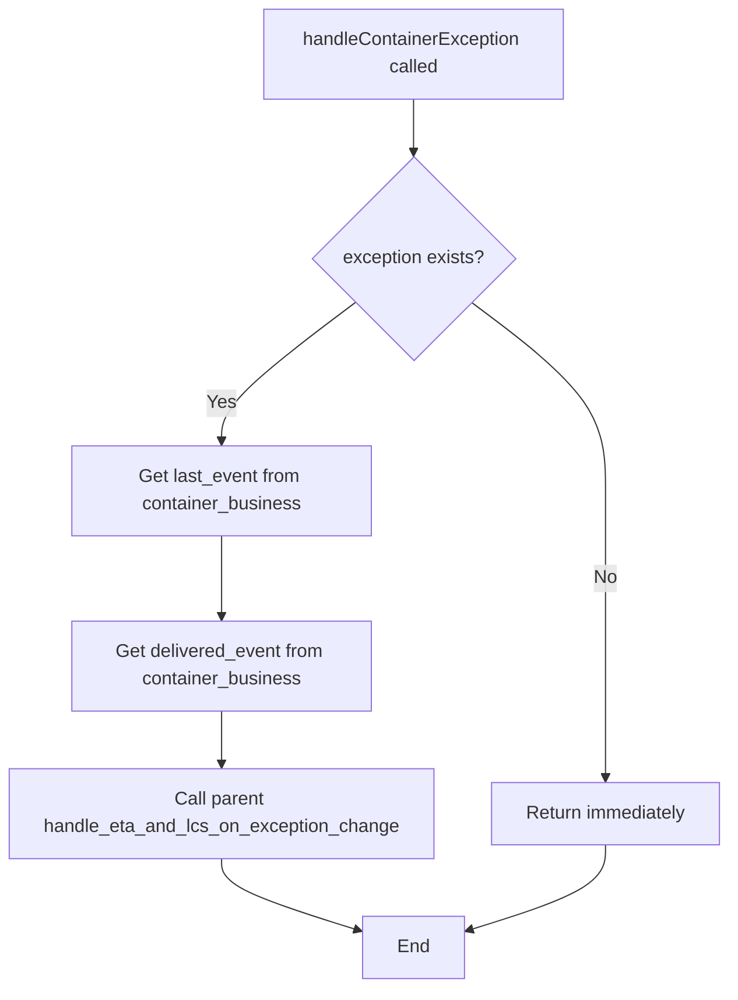

# Diagram: platform/partview_core/partview_service/partview_service/core/business/package_container_exception_status/package_container_exceptions/PackageContainerMissingException.py

> Auto-generated by Obscura crawlers

## Diagram 1

### SVG

<svg id="container" width="1127.6328125" xmlns="http://www.w3.org/2000/svg" class="classDiagram" height="584" viewBox="0 0 1127.6328125 584" role="graphics-document document" aria-roledescription="class"><g><defs><marker id="container_class-aggregationStart" class="marker aggregation class" refX="18" refY="7" markerWidth="190" markerHeight="240" orient="auto"><path d="M 18,7 L9,13 L1,7 L9,1 Z"></path></marker></defs><defs><marker id="container_class-aggregationEnd" class="marker aggregation class" refX="1" refY="7" markerWidth="20" markerHeight="28" orient="auto"><path d="M 18,7 L9,13 L1,7 L9,1 Z"></path></marker></defs><defs><marker id="container_class-extensionStart" class="marker extension class" refX="18" refY="7" markerWidth="190" markerHeight="240" orient="auto"><path d="M 1,7 L18,13 V 1 Z"></path></marker></defs><defs><marker id="container_class-extensionEnd" class="marker extension class" refX="1" refY="7" markerWidth="20" markerHeight="28" orient="auto"><path d="M 1,1 V 13 L18,7 Z"></path></marker></defs><defs><marker id="container_class-compositionStart" class="marker composition class" refX="18" refY="7" markerWidth="190" markerHeight="240" orient="auto"><path d="M 18,7 L9,13 L1,7 L9,1 Z"></path></marker></defs><defs><marker id="container_class-compositionEnd" class="marker composition class" refX="1" refY="7" markerWidth="20" markerHeight="28" orient="auto"><path d="M 18,7 L9,13 L1,7 L9,1 Z"></path></marker></defs><defs><marker id="container_class-dependencyStart" class="marker dependency class" refX="6" refY="7" markerWidth="190" markerHeight="240" orient="auto"><path d="M 5,7 L9,13 L1,7 L9,1 Z"></path></marker></defs><defs><marker id="container_class-dependencyEnd" class="marker dependency class" refX="13" refY="7" markerWidth="20" markerHeight="28" orient="auto"><path d="M 18,7 L9,13 L14,7 L9,1 Z"></path></marker></defs><defs><marker id="container_class-lollipopStart" class="marker lollipop class" refX="13" refY="7" markerWidth="190" markerHeight="240" orient="auto"><circle stroke="black" fill="transparent" cx="7" cy="7" r="6"></circle></marker></defs><defs><marker id="container_class-lollipopEnd" class="marker lollipop class" refX="1" refY="7" markerWidth="190" markerHeight="240" orient="auto"><circle stroke="black" fill="transparent" cx="7" cy="7" r="6"></circle></marker></defs><g class="root"><g class="clusters"></g><g class="edgePaths"><path d="M480.67,151.25L480.67,152.542C480.67,153.833,480.67,156.417,480.67,161.875C480.67,167.333,480.67,175.667,480.67,179.833L480.67,184" id="id_BasePackageContainerException_MissingException_1" class="edge-thickness-normal edge-pattern-solid relation" style=";;;" data-edge="true" data-et="edge" data-id="id_BasePackageContainerException_MissingException_1" data-points="W3sieCI6NDgwLjY2OTkyMTg3NSwieSI6MTM0fSx7IngiOjQ4MC42Njk5MjE4NzUsInkiOjE1OX0seyJ4Ijo0ODAuNjY5OTIxODc1LCJ5IjoxODR9XQ==" marker-start="url(#container_class-extensionStart)"></path><path d="M167.109,376L153.5,380.167C139.891,384.333,112.672,392.667,99.063,405.5C85.453,418.333,85.453,435.667,85.453,444.333L85.453,453" id="id_MissingException_PackageContainer_2" class="edge-thickness-normal edge-pattern-solid relation" style=";;;" data-edge="true" data-et="edge" data-id="id_MissingException_PackageContainer_2" data-points="W3sieCI6MTY3LjEwOTQ4Nzk5MDcwMjQ2LCJ5IjozNzZ9LHsieCI6ODUuNDUzMTI1LCJ5Ijo0MDF9LHsieCI6ODUuNDUzMTI1LCJ5Ijo0NTl9XQ==" marker-end="url(#container_class-dependencyEnd)"></path><path d="M345.709,376L339.851,380.167C333.993,384.333,322.278,392.667,316.42,405.5C310.563,418.333,310.563,435.667,310.563,444.333L310.563,453" id="id_MissingException_PackageContainerEvent_3" class="edge-thickness-normal edge-pattern-solid relation" style=";;;" data-edge="true" data-et="edge" data-id="id_MissingException_PackageContainerEvent_3" data-points="W3sieCI6MzQ1LjcwODY2MTU0NDQyMTUsInkiOjM3Nn0seyJ4IjozMTAuNTYyNSwieSI6NDAxfSx7IngiOjMxMC41NjI1LCJ5Ijo0NTl9XQ==" marker-end="url(#container_class-dependencyEnd)"></path><path d="M615.631,376L621.489,380.167C627.347,384.333,639.062,392.667,644.92,400C650.777,407.333,650.777,413.667,650.777,416.833L650.777,420" id="id_MissingException_PackageContainerEventBusinessLogic_4" class="edge-thickness-normal edge-pattern-solid relation" style=";;;" data-edge="true" data-et="edge" data-id="id_MissingException_PackageContainerEventBusinessLogic_4" data-points="W3sieCI6NjE1LjYzMTE4MjIwNTU3ODUsInkiOjM3Nn0seyJ4Ijo2NTAuNzc3MzQzNzUsInkiOjQwMX0seyJ4Ijo2NTAuNzc3MzQzNzUsInkiOjQyNn1d" marker-end="url(#container_class-dependencyEnd)"></path><path d="M816.408,357.26L848.088,364.55C879.767,371.84,943.126,386.42,974.805,402.377C1006.484,418.333,1006.484,435.667,1006.484,444.333L1006.484,453" id="id_MissingException_PackageContainerException_5" class="edge-thickness-normal edge-pattern-solid relation" style=";;;" data-edge="true" data-et="edge" data-id="id_MissingException_PackageContainerException_5" data-points="W3sieCI6ODE2LjQwODIwMzEyNSwieSI6MzU3LjI1OTgyMzg1OTU2MzF9LHsieCI6MTAwNi40ODQzNzUsInkiOjQwMX0seyJ4IjoxMDA2LjQ4NDM3NSwieSI6NDU5fV0=" marker-end="url(#container_class-dependencyEnd)"></path></g><g class="edgeLabels"><g class="edgeLabel"><g class="label" data-id="id_BasePackageContainerException_MissingException_1" transform="translate(0, 0)"><foreignObject width="0" height="0">

</foreignObject></g></g><g class="edgeLabel"><g class="label" data-id="id_MissingException_PackageContainer_2" transform="translate(0, 0)"><foreignObject width="0" height="0">

</foreignObject></g></g><g class="edgeLabel"><g class="label" data-id="id_MissingException_PackageContainerEvent_3" transform="translate(0, 0)"><foreignObject width="0" height="0">

</foreignObject></g></g><g class="edgeLabel"><g class="label" data-id="id_MissingException_PackageContainerEventBusinessLogic_4" transform="translate(0, 0)"><foreignObject width="0" height="0">

</foreignObject></g></g><g class="edgeLabel"><g class="label" data-id="id_MissingException_PackageContainerException_5" transform="translate(0, 0)"><foreignObject width="0" height="0">

</foreignObject></g></g></g><g class="nodes"><g class="node default" id="classId-BasePackageContainerException-0" transform="translate(480.669921875, 71)"><g class="basic label-container"><path d="M-235.3671875 -63 L235.3671875 -63 L235.3671875 63 L-235.3671875 63" stroke="none" stroke-width="0" fill="#ECECFF" style=""></path><path d="M-235.3671875 -63 C-51.60227456861102 -63, 132.16263836277795 -63, 235.3671875 -63 M-235.3671875 -63 C-66.32944058025313 -63, 102.70830633949373 -63, 235.3671875 -63 M235.3671875 -63 C235.3671875 -22.635304054173794, 235.3671875 17.729391891652412, 235.3671875 63 M235.3671875 -63 C235.3671875 -14.728824541397564, 235.3671875 33.54235091720487, 235.3671875 63 M235.3671875 63 C105.34338574058751 63, -24.680416018824985 63, -235.3671875 63 M235.3671875 63 C127.79723253108446 63, 20.227277562168922 63, -235.3671875 63 M-235.3671875 63 C-235.3671875 20.530153699270812, -235.3671875 -21.939692601458376, -235.3671875 -63 M-235.3671875 63 C-235.3671875 12.845662400460583, -235.3671875 -37.308675199078834, -235.3671875 -63" stroke="#9370DB" stroke-width="1.3" fill="none" stroke-dasharray="0 0" style=""></path></g><g class="annotation-group text" transform="translate(0, -39)"></g><g class="label-group text" transform="translate(-118.671875, -39)"><g class="label" style="font-weight: bolder" transform="translate(0,-12)"><foreignObject width="237.34375" height="24">

BasePackageContainerException

</foreignObject></g></g><g class="members-group text" transform="translate(-223.3671875, 9)"></g><g class="methods-group text" transform="translate(-223.3671875, 39)"><g class="label" style="" transform="translate(0,-12)"><foreignObject width="328.0625" height="24">

+handle_eta_and_lcs_on_exception_change()

</foreignObject></g></g><g class="divider" style=""><path d="M-235.3671875 -15 C-91.4505630763343 -15, 52.46606134733139 -15, 235.3671875 -15 M-235.3671875 -15 C-75.95884496440274 -15, 83.44949757119451 -15, 235.3671875 -15" stroke="#9370DB" stroke-width="1.3" fill="none" stroke-dasharray="0 0" style=""></path></g><g class="divider" style=""><path d="M-235.3671875 9 C-110.97699233978025 9, 13.413202820439494 9, 235.3671875 9 M-235.3671875 9 C-83.1719223992879 9, 69.02334270142421 9, 235.3671875 9" stroke="#9370DB" stroke-width="1.3" fill="none" stroke-dasharray="0 0" style=""></path></g></g><g class="node default" id="classId-MissingException-1" transform="translate(480.669921875, 280)"><g class="basic label-container"><path d="M-335.73828125 -96 L335.73828125 -96 L335.73828125 96 L-335.73828125 96" stroke="none" stroke-width="0" fill="#ECECFF" style=""></path><path d="M-335.73828125 -96 C-173.48483145831995 -96, -11.23138166663989 -96, 335.73828125 -96 M-335.73828125 -96 C-178.82350682055278 -96, -21.90873239110556 -96, 335.73828125 -96 M335.73828125 -96 C335.73828125 -53.691658891142126, 335.73828125 -11.383317782284252, 335.73828125 96 M335.73828125 -96 C335.73828125 -47.68175942015998, 335.73828125 0.636481159680045, 335.73828125 96 M335.73828125 96 C159.4097435013898 96, -16.918794247220376 96, -335.73828125 96 M335.73828125 96 C197.49543813279243 96, 59.25259501558486 96, -335.73828125 96 M-335.73828125 96 C-335.73828125 28.217095059228512, -335.73828125 -39.565809881542975, -335.73828125 -96 M-335.73828125 96 C-335.73828125 23.0259139030925, -335.73828125 -49.948172193815, -335.73828125 -96" stroke="#9370DB" stroke-width="1.3" fill="none" stroke-dasharray="0 0" style=""></path></g><g class="annotation-group text" transform="translate(0, -72)"></g><g class="label-group text" transform="translate(-63.1953125, -72)"><g class="label" style="font-weight: bolder" transform="translate(0,-12)"><foreignObject width="126.390625" height="24">

MissingException

</foreignObject></g></g><g class="members-group text" transform="translate(-323.73828125, -24)"><g class="label" style="" transform="translate(0,-12)"><foreignObject width="98.40625" height="24">

-reason_code

</foreignObject></g></g><g class="methods-group text" transform="translate(-323.73828125, 24)"><g class="label" style="" transform="translate(0,-12)"><foreignObject width="134.75" height="24">

+<strong>init</strong>(reason_code)

</foreignObject></g><g class="label" style="" transform="translate(0,12)"><foreignObject width="295.703125" height="24">

+handleMilestoneEvent(container, event)

</foreignObject></g><g class="label" style="" transform="translate(0,36)"><foreignObject width="584.28125" height="24">

+handleContainerException(container, container_business, exception, attributes)

</foreignObject></g></g><g class="divider" style=""><path d="M-335.73828125 -48 C-146.028725865821 -48, 43.680829518357996 -48, 335.73828125 -48 M-335.73828125 -48 C-136.09488365507292 -48, 63.54851393985416 -48, 335.73828125 -48" stroke="#9370DB" stroke-width="1.3" fill="none" stroke-dasharray="0 0" style=""></path></g><g class="divider" style=""><path d="M-335.73828125 0 C-102.26727984534705 0, 131.2037215593059 0, 335.73828125 0 M-335.73828125 0 C-146.25887639639657 0, 43.22052845720685 0, 335.73828125 0" stroke="#9370DB" stroke-width="1.3" fill="none" stroke-dasharray="0 0" style=""></path></g></g><g class="node default" id="classId-PackageContainer-2" transform="translate(85.453125, 501)"><g class="basic label-container"><path d="M-77.453125 -42 L77.453125 -42 L77.453125 42 L-77.453125 42" stroke="none" stroke-width="0" fill="#ECECFF" style=""></path><path d="M-77.453125 -42 C-22.720742173635934 -42, 32.01164065272813 -42, 77.453125 -42 M-77.453125 -42 C-38.70733712420962 -42, 0.03845075158075417 -42, 77.453125 -42 M77.453125 -42 C77.453125 -16.730227518103757, 77.453125 8.539544963792487, 77.453125 42 M77.453125 -42 C77.453125 -20.88212027050846, 77.453125 0.23575945898308248, 77.453125 42 M77.453125 42 C23.171515203047107 42, -31.110094593905785 42, -77.453125 42 M77.453125 42 C44.09625763015866 42, 10.739390260317322 42, -77.453125 42 M-77.453125 42 C-77.453125 21.94268041908424, -77.453125 1.8853608381684808, -77.453125 -42 M-77.453125 42 C-77.453125 11.409630085204697, -77.453125 -19.180739829590607, -77.453125 -42" stroke="#9370DB" stroke-width="1.3" fill="none" stroke-dasharray="0 0" style=""></path></g><g class="annotation-group text" transform="translate(0, -18)"></g><g class="label-group text" transform="translate(-65.453125, -18)"><g class="label" style="font-weight: bolder" transform="translate(0,-12)"><foreignObject width="130.90625" height="24">

PackageContainer

</foreignObject></g></g><g class="members-group text" transform="translate(-65.453125, 30)"></g><g class="methods-group text" transform="translate(-65.453125, 60)"></g><g class="divider" style=""><path d="M-77.453125 6 C-43.8809397221867 6, -10.308754444373406 6, 77.453125 6 M-77.453125 6 C-26.031803693708326 6, 25.389517612583347 6, 77.453125 6" stroke="#9370DB" stroke-width="1.3" fill="none" stroke-dasharray="0 0" style=""></path></g><g class="divider" style=""><path d="M-77.453125 24 C-35.43347535627823 24, 6.586174287443541 24, 77.453125 24 M-77.453125 24 C-21.427559830395573 24, 34.598005339208854 24, 77.453125 24" stroke="#9370DB" stroke-width="1.3" fill="none" stroke-dasharray="0 0" style=""></path></g></g><g class="node default" id="classId-PackageContainerEvent-3" transform="translate(310.5625, 501)"><g class="basic label-container"><path d="M-97.65625 -42 L97.65625 -42 L97.65625 42 L-97.65625 42" stroke="none" stroke-width="0" fill="#ECECFF" style=""></path><path d="M-97.65625 -42 C-54.87446534900251 -42, -12.092680698005026 -42, 97.65625 -42 M-97.65625 -42 C-24.517994854021225 -42, 48.62026029195755 -42, 97.65625 -42 M97.65625 -42 C97.65625 -14.337921154040437, 97.65625 13.324157691919126, 97.65625 42 M97.65625 -42 C97.65625 -12.702031227569535, 97.65625 16.59593754486093, 97.65625 42 M97.65625 42 C30.782134440111165 42, -36.09198111977767 42, -97.65625 42 M97.65625 42 C57.709894449955264 42, 17.76353889991053 42, -97.65625 42 M-97.65625 42 C-97.65625 24.1367320281373, -97.65625 6.273464056274598, -97.65625 -42 M-97.65625 42 C-97.65625 16.317084291904827, -97.65625 -9.365831416190346, -97.65625 -42" stroke="#9370DB" stroke-width="1.3" fill="none" stroke-dasharray="0 0" style=""></path></g><g class="annotation-group text" transform="translate(0, -18)"></g><g class="label-group text" transform="translate(-85.65625, -18)"><g class="label" style="font-weight: bolder" transform="translate(0,-12)"><foreignObject width="171.3125" height="24">

PackageContainerEvent

</foreignObject></g></g><g class="members-group text" transform="translate(-85.65625, 30)"></g><g class="methods-group text" transform="translate(-85.65625, 60)"></g><g class="divider" style=""><path d="M-97.65625 6 C-34.97246223253469 6, 27.711325534930623 6, 97.65625 6 M-97.65625 6 C-22.05297539281007 6, 53.55029921437986 6, 97.65625 6" stroke="#9370DB" stroke-width="1.3" fill="none" stroke-dasharray="0 0" style=""></path></g><g class="divider" style=""><path d="M-97.65625 24 C-51.063773765795624 24, -4.471297531591247 24, 97.65625 24 M-97.65625 24 C-22.472816916813358 24, 52.710616166373285 24, 97.65625 24" stroke="#9370DB" stroke-width="1.3" fill="none" stroke-dasharray="0 0" style=""></path></g></g><g class="node default" id="classId-PackageContainerEventBusinessLogic-4" transform="translate(650.77734375, 501)"><g class="basic label-container"><path d="M-192.55859375 -75 L192.55859375 -75 L192.55859375 75 L-192.55859375 75" stroke="none" stroke-width="0" fill="#ECECFF" style=""></path><path d="M-192.55859375 -75 C-53.509105782951195 -75, 85.54038218409761 -75, 192.55859375 -75 M-192.55859375 -75 C-95.964429509947 -75, 0.6297347301060086 -75, 192.55859375 -75 M192.55859375 -75 C192.55859375 -18.433463180974265, 192.55859375 38.13307363805147, 192.55859375 75 M192.55859375 -75 C192.55859375 -23.751243605637768, 192.55859375 27.497512788724464, 192.55859375 75 M192.55859375 75 C87.19939419938984 75, -18.159805351220314 75, -192.55859375 75 M192.55859375 75 C112.52096500769662 75, 32.483336265393234 75, -192.55859375 75 M-192.55859375 75 C-192.55859375 22.773473327011338, -192.55859375 -29.453053345977324, -192.55859375 -75 M-192.55859375 75 C-192.55859375 44.47924370556717, -192.55859375 13.958487411134342, -192.55859375 -75" stroke="#9370DB" stroke-width="1.3" fill="none" stroke-dasharray="0 0" style=""></path></g><g class="annotation-group text" transform="translate(0, -51)"></g><g class="label-group text" transform="translate(-137.0703125, -51)"><g class="label" style="font-weight: bolder" transform="translate(0,-12)"><foreignObject width="274.140625" height="24">

PackageContainerEventBusinessLogic

</foreignObject></g></g><g class="members-group text" transform="translate(-180.55859375, -3)"></g><g class="methods-group text" transform="translate(-180.55859375, 27)"><g class="label" style="" transform="translate(0,-12)"><foreignObject width="193.015625" height="24">

+get_last_event(container)

</foreignObject></g><g class="label" style="" transform="translate(0,12)"><foreignObject width="224.046875" height="24">

+get_delivery_event(container)

</foreignObject></g></g><g class="divider" style=""><path d="M-192.55859375 -27 C-100.87514422199159 -27, -9.19169469398318 -27, 192.55859375 -27 M-192.55859375 -27 C-74.38832780894907 -27, 43.78193813210186 -27, 192.55859375 -27" stroke="#9370DB" stroke-width="1.3" fill="none" stroke-dasharray="0 0" style=""></path></g><g class="divider" style=""><path d="M-192.55859375 -3 C-49.91806733979928 -3, 92.72245907040144 -3, 192.55859375 -3 M-192.55859375 -3 C-53.04952009055748 -3, 86.45955356888504 -3, 192.55859375 -3" stroke="#9370DB" stroke-width="1.3" fill="none" stroke-dasharray="0 0" style=""></path></g></g><g class="node default" id="classId-PackageContainerException-5" transform="translate(1006.484375, 501)"><g class="basic label-container"><path d="M-113.1484375 -42 L113.1484375 -42 L113.1484375 42 L-113.1484375 42" stroke="none" stroke-width="0" fill="#ECECFF" style=""></path><path d="M-113.1484375 -42 C-36.77031733458148 -42, 39.607802830837045 -42, 113.1484375 -42 M-113.1484375 -42 C-45.90285073217156 -42, 21.342736035656884 -42, 113.1484375 -42 M113.1484375 -42 C113.1484375 -13.137582700798678, 113.1484375 15.724834598402644, 113.1484375 42 M113.1484375 -42 C113.1484375 -20.002850058882498, 113.1484375 1.9942998822350049, 113.1484375 42 M113.1484375 42 C66.14932738980443 42, 19.150217279608867 42, -113.1484375 42 M113.1484375 42 C53.789818731569255 42, -5.568800036861489 42, -113.1484375 42 M-113.1484375 42 C-113.1484375 20.16373648261735, -113.1484375 -1.6725270347653023, -113.1484375 -42 M-113.1484375 42 C-113.1484375 10.884541859930806, -113.1484375 -20.230916280138388, -113.1484375 -42" stroke="#9370DB" stroke-width="1.3" fill="none" stroke-dasharray="0 0" style=""></path></g><g class="annotation-group text" transform="translate(0, -18)"></g><g class="label-group text" transform="translate(-101.1484375, -18)"><g class="label" style="font-weight: bolder" transform="translate(0,-12)"><foreignObject width="202.296875" height="24">

PackageContainerException

</foreignObject></g></g><g class="members-group text" transform="translate(-101.1484375, 30)"></g><g class="methods-group text" transform="translate(-101.1484375, 60)"></g><g class="divider" style=""><path d="M-113.1484375 6 C-36.93637529393385 6, 39.2756869121323 6, 113.1484375 6 M-113.1484375 6 C-53.037575408946054 6, 7.0732866821078915 6, 113.1484375 6" stroke="#9370DB" stroke-width="1.3" fill="none" stroke-dasharray="0 0" style=""></path></g><g class="divider" style=""><path d="M-113.1484375 24 C-39.01061525534071 24, 35.12720698931858 24, 113.1484375 24 M-113.1484375 24 C-47.05353461588214 24, 19.041368268235715 24, 113.1484375 24" stroke="#9370DB" stroke-width="1.3" fill="none" stroke-dasharray="0 0" style=""></path></g></g></g></g></g></svg>

## Diagram 2

### SVG

<svg id="container" width="1556" xmlns="http://www.w3.org/2000/svg" height="607" viewBox="-50 -10 1556 607" role="graphics-document document" aria-roledescription="sequence"><g><rect x="1202" y="521" fill="#eaeaea" stroke="#666" width="254" height="65" name="BasePackageContainerException" rx="3" ry="3" class="actor actor-bottom"></rect><text x="1329" y="553.5" dominant-baseline="central" alignment-baseline="central" class="actor actor-box" style="text-anchor: middle; font-size: 16px; font-weight: 400;"><tspan x="1329" dy="0">BasePackageContainerException</tspan></text></g><g><rect x="862" y="521" fill="#eaeaea" stroke="#666" width="290" height="65" name="PackageContainerEventBusinessLogic" rx="3" ry="3" class="actor actor-bottom"></rect><text x="1007" y="553.5" dominant-baseline="central" alignment-baseline="central" class="actor actor-box" style="text-anchor: middle; font-size: 16px; font-weight: 400;"><tspan x="1007" dy="0">PackageContainerEventBusinessLogic</tspan></text></g><g><rect x="646" y="521" fill="#eaeaea" stroke="#666" width="150" height="65" name="MissingException" rx="3" ry="3" class="actor actor-bottom"></rect><text x="721" y="553.5" dominant-baseline="central" alignment-baseline="central" class="actor actor-box" style="text-anchor: middle; font-size: 16px; font-weight: 400;"><tspan x="721" dy="0">MissingException</tspan></text></g><g><rect x="0" y="521" fill="#eaeaea" stroke="#666" width="150" height="65" name="Client" rx="3" ry="3" class="actor actor-bottom"></rect><text x="75" y="553.5" dominant-baseline="central" alignment-baseline="central" class="actor actor-box" style="text-anchor: middle; font-size: 16px; font-weight: 400;"><tspan x="75" dy="0">Client</tspan></text></g><g><line id="actor3" x1="1329" y1="65" x2="1329" y2="521" class="actor-line 200" stroke-width="0.5px" stroke="#999" name="BasePackageContainerException"></line><g id="root-3"><rect x="1202" y="0" fill="#eaeaea" stroke="#666" width="254" height="65" name="BasePackageContainerException" rx="3" ry="3" class="actor actor-top"></rect><text x="1329" y="32.5" dominant-baseline="central" alignment-baseline="central" class="actor actor-box" style="text-anchor: middle; font-size: 16px; font-weight: 400;"><tspan x="1329" dy="0">BasePackageContainerException</tspan></text></g></g><g><line id="actor2" x1="1007" y1="65" x2="1007" y2="521" class="actor-line 200" stroke-width="0.5px" stroke="#999" name="PackageContainerEventBusinessLogic"></line><g id="root-2"><rect x="862" y="0" fill="#eaeaea" stroke="#666" width="290" height="65" name="PackageContainerEventBusinessLogic" rx="3" ry="3" class="actor actor-top"></rect><text x="1007" y="32.5" dominant-baseline="central" alignment-baseline="central" class="actor actor-box" style="text-anchor: middle; font-size: 16px; font-weight: 400;"><tspan x="1007" dy="0">PackageContainerEventBusinessLogic</tspan></text></g></g><g><line id="actor1" x1="721" y1="65" x2="721" y2="521" class="actor-line 200" stroke-width="0.5px" stroke="#999" name="MissingException"></line><g id="root-1"><rect x="646" y="0" fill="#eaeaea" stroke="#666" width="150" height="65" name="MissingException" rx="3" ry="3" class="actor actor-top"></rect><text x="721" y="32.5" dominant-baseline="central" alignment-baseline="central" class="actor actor-box" style="text-anchor: middle; font-size: 16px; font-weight: 400;"><tspan x="721" dy="0">MissingException</tspan></text></g></g><g><line id="actor0" x1="75" y1="65" x2="75" y2="521" class="actor-line 200" stroke-width="0.5px" stroke="#999" name="Client"></line><g id="root-0"><rect x="0" y="0" fill="#eaeaea" stroke="#666" width="150" height="65" name="Client" rx="3" ry="3" class="actor actor-top"></rect><text x="75" y="32.5" dominant-baseline="central" alignment-baseline="central" class="actor actor-box" style="text-anchor: middle; font-size: 16px; font-weight: 400;"><tspan x="75" dy="0">Client</tspan></text></g></g><g></g><defs><symbol id="computer" width="24" height="24"><path transform="scale(.5)" d="M2 2v13h20v-13h-20zm18 11h-16v-9h16v9zm-10.228 6l.466-1h3.524l.467 1h-4.457zm14.228 3h-24l2-6h2.104l-1.33 4h18.45l-1.297-4h2.073l2 6zm-5-10h-14v-7h14v7z"></path></symbol></defs><defs><symbol id="database" fill-rule="evenodd" clip-rule="evenodd"><path transform="scale(.5)" d="M12.258.001l.256.004.255.005.253.008.251.01.249.012.247.015.246.016.242.019.241.02.239.023.236.024.233.027.231.028.229.031.225.032.223.034.22.036.217.038.214.04.211.041.208.043.205.045.201.046.198.048.194.05.191.051.187.053.183.054.18.056.175.057.172.059.168.06.163.061.16.063.155.064.15.066.074.033.073.033.071.034.07.034.069.035.068.035.067.035.066.035.064.036.064.036.062.036.06.036.06.037.058.037.058.037.055.038.055.038.053.038.052.038.051.039.05.039.048.039.047.039.045.04.044.04.043.04.041.04.04.041.039.041.037.041.036.041.034.041.033.042.032.042.03.042.029.042.027.042.026.043.024.043.023.043.021.043.02.043.018.044.017.043.015.044.013.044.012.044.011.045.009.044.007.045.006.045.004.045.002.045.001.045v17l-.001.045-.002.045-.004.045-.006.045-.007.045-.009.044-.011.045-.012.044-.013.044-.015.044-.017.043-.018.044-.02.043-.021.043-.023.043-.024.043-.026.043-.027.042-.029.042-.03.042-.032.042-.033.042-.034.041-.036.041-.037.041-.039.041-.04.041-.041.04-.043.04-.044.04-.045.04-.047.039-.048.039-.05.039-.051.039-.052.038-.053.038-.055.038-.055.038-.058.037-.058.037-.06.037-.06.036-.062.036-.064.036-.064.036-.066.035-.067.035-.068.035-.069.035-.07.034-.071.034-.073.033-.074.033-.15.066-.155.064-.16.063-.163.061-.168.06-.172.059-.175.057-.18.056-.183.054-.187.053-.191.051-.194.05-.198.048-.201.046-.205.045-.208.043-.211.041-.214.04-.217.038-.22.036-.223.034-.225.032-.229.031-.231.028-.233.027-.236.024-.239.023-.241.02-.242.019-.246.016-.247.015-.249.012-.251.01-.253.008-.255.005-.256.004-.258.001-.258-.001-.256-.004-.255-.005-.253-.008-.251-.01-.249-.012-.247-.015-.245-.016-.243-.019-.241-.02-.238-.023-.236-.024-.234-.027-.231-.028-.228-.031-.226-.032-.223-.034-.22-.036-.217-.038-.214-.04-.211-.041-.208-.043-.204-.045-.201-.046-.198-.048-.195-.05-.19-.051-.187-.053-.184-.054-.179-.056-.176-.057-.172-.059-.167-.06-.164-.061-.159-.063-.155-.064-.151-.066-.074-.033-.072-.033-.072-.034-.07-.034-.069-.035-.068-.035-.067-.035-.066-.035-.064-.036-.063-.036-.062-.036-.061-.036-.06-.037-.058-.037-.057-.037-.056-.038-.055-.038-.053-.038-.052-.038-.051-.039-.049-.039-.049-.039-.046-.039-.046-.04-.044-.04-.043-.04-.041-.04-.04-.041-.039-.041-.037-.041-.036-.041-.034-.041-.033-.042-.032-.042-.03-.042-.029-.042-.027-.042-.026-.043-.024-.043-.023-.043-.021-.043-.02-.043-.018-.044-.017-.043-.015-.044-.013-.044-.012-.044-.011-.045-.009-.044-.007-.045-.006-.045-.004-.045-.002-.045-.001-.045v-17l.001-.045.002-.045.004-.045.006-.045.007-.045.009-.044.011-.045.012-.044.013-.044.015-.044.017-.043.018-.044.02-.043.021-.043.023-.043.024-.043.026-.043.027-.042.029-.042.03-.042.032-.042.033-.042.034-.041.036-.041.037-.041.039-.041.04-.041.041-.04.043-.04.044-.04.046-.04.046-.039.049-.039.049-.039.051-.039.052-.038.053-.038.055-.038.056-.038.057-.037.058-.037.06-.037.061-.036.062-.036.063-.036.064-.036.066-.035.067-.035.068-.035.069-.035.07-.034.072-.034.072-.033.074-.033.151-.066.155-.064.159-.063.164-.061.167-.06.172-.059.176-.057.179-.056.184-.054.187-.053.19-.051.195-.05.198-.048.201-.046.204-.045.208-.043.211-.041.214-.04.217-.038.22-.036.223-.034.226-.032.228-.031.231-.028.234-.027.236-.024.238-.023.241-.02.243-.019.245-.016.247-.015.249-.012.251-.01.253-.008.255-.005.256-.004.258-.001.258.001zm-9.258 20.499v.01l.001.021.003.021.004.022.005.021.006.022.007.022.009.023.01.022.011.023.012.023.013.023.015.023.016.024.017.023.018.024.019.024.021.024.022.025.023.024.024.025.052.049.056.05.061.051.066.051.07.051.075.051.079.052.084.052.088.052.092.052.097.052.102.051.105.052.11.052.114.051.119.051.123.051.127.05.131.05.135.05.139.048.144.049.147.047.152.047.155.047.16.045.163.045.167.043.171.043.176.041.178.041.183.039.187.039.19.037.194.035.197.035.202.033.204.031.209.03.212.029.216.027.219.025.222.024.226.021.23.02.233.018.236.016.24.015.243.012.246.01.249.008.253.005.256.004.259.001.26-.001.257-.004.254-.005.25-.008.247-.011.244-.012.241-.014.237-.016.233-.018.231-.021.226-.021.224-.024.22-.026.216-.027.212-.028.21-.031.205-.031.202-.034.198-.034.194-.036.191-.037.187-.039.183-.04.179-.04.175-.042.172-.043.168-.044.163-.045.16-.046.155-.046.152-.047.148-.048.143-.049.139-.049.136-.05.131-.05.126-.05.123-.051.118-.052.114-.051.11-.052.106-.052.101-.052.096-.052.092-.052.088-.053.083-.051.079-.052.074-.052.07-.051.065-.051.06-.051.056-.05.051-.05.023-.024.023-.025.021-.024.02-.024.019-.024.018-.024.017-.024.015-.023.014-.024.013-.023.012-.023.01-.023.01-.022.008-.022.006-.022.006-.022.004-.022.004-.021.001-.021.001-.021v-4.127l-.077.055-.08.053-.083.054-.085.053-.087.052-.09.052-.093.051-.095.05-.097.05-.1.049-.102.049-.105.048-.106.047-.109.047-.111.046-.114.045-.115.045-.118.044-.12.043-.122.042-.124.042-.126.041-.128.04-.13.04-.132.038-.134.038-.135.037-.138.037-.139.035-.142.035-.143.034-.144.033-.147.032-.148.031-.15.03-.151.03-.153.029-.154.027-.156.027-.158.026-.159.025-.161.024-.162.023-.163.022-.165.021-.166.02-.167.019-.169.018-.169.017-.171.016-.173.015-.173.014-.175.013-.175.012-.177.011-.178.01-.179.008-.179.008-.181.006-.182.005-.182.004-.184.003-.184.002h-.37l-.184-.002-.184-.003-.182-.004-.182-.005-.181-.006-.179-.008-.179-.008-.178-.01-.176-.011-.176-.012-.175-.013-.173-.014-.172-.015-.171-.016-.17-.017-.169-.018-.167-.019-.166-.02-.165-.021-.163-.022-.162-.023-.161-.024-.159-.025-.157-.026-.156-.027-.155-.027-.153-.029-.151-.03-.15-.03-.148-.031-.146-.032-.145-.033-.143-.034-.141-.035-.14-.035-.137-.037-.136-.037-.134-.038-.132-.038-.13-.04-.128-.04-.126-.041-.124-.042-.122-.042-.12-.044-.117-.043-.116-.045-.113-.045-.112-.046-.109-.047-.106-.047-.105-.048-.102-.049-.1-.049-.097-.05-.095-.05-.093-.052-.09-.051-.087-.052-.085-.053-.083-.054-.08-.054-.077-.054v4.127zm0-5.654v.011l.001.021.003.021.004.021.005.022.006.022.007.022.009.022.01.022.011.023.012.023.013.023.015.024.016.023.017.024.018.024.019.024.021.024.022.024.023.025.024.024.052.05.056.05.061.05.066.051.07.051.075.052.079.051.084.052.088.052.092.052.097.052.102.052.105.052.11.051.114.051.119.052.123.05.127.051.131.05.135.049.139.049.144.048.147.048.152.047.155.046.16.045.163.045.167.044.171.042.176.042.178.04.183.04.187.038.19.037.194.036.197.034.202.033.204.032.209.03.212.028.216.027.219.025.222.024.226.022.23.02.233.018.236.016.24.014.243.012.246.01.249.008.253.006.256.003.259.001.26-.001.257-.003.254-.006.25-.008.247-.01.244-.012.241-.015.237-.016.233-.018.231-.02.226-.022.224-.024.22-.025.216-.027.212-.029.21-.03.205-.032.202-.033.198-.035.194-.036.191-.037.187-.039.183-.039.179-.041.175-.042.172-.043.168-.044.163-.045.16-.045.155-.047.152-.047.148-.048.143-.048.139-.05.136-.049.131-.05.126-.051.123-.051.118-.051.114-.052.11-.052.106-.052.101-.052.096-.052.092-.052.088-.052.083-.052.079-.052.074-.051.07-.052.065-.051.06-.05.056-.051.051-.049.023-.025.023-.024.021-.025.02-.024.019-.024.018-.024.017-.024.015-.023.014-.023.013-.024.012-.022.01-.023.01-.023.008-.022.006-.022.006-.022.004-.021.004-.022.001-.021.001-.021v-4.139l-.077.054-.08.054-.083.054-.085.052-.087.053-.09.051-.093.051-.095.051-.097.05-.1.049-.102.049-.105.048-.106.047-.109.047-.111.046-.114.045-.115.044-.118.044-.12.044-.122.042-.124.042-.126.041-.128.04-.13.039-.132.039-.134.038-.135.037-.138.036-.139.036-.142.035-.143.033-.144.033-.147.033-.148.031-.15.03-.151.03-.153.028-.154.028-.156.027-.158.026-.159.025-.161.024-.162.023-.163.022-.165.021-.166.02-.167.019-.169.018-.169.017-.171.016-.173.015-.173.014-.175.013-.175.012-.177.011-.178.009-.179.009-.179.007-.181.007-.182.005-.182.004-.184.003-.184.002h-.37l-.184-.002-.184-.003-.182-.004-.182-.005-.181-.007-.179-.007-.179-.009-.178-.009-.176-.011-.176-.012-.175-.013-.173-.014-.172-.015-.171-.016-.17-.017-.169-.018-.167-.019-.166-.02-.165-.021-.163-.022-.162-.023-.161-.024-.159-.025-.157-.026-.156-.027-.155-.028-.153-.028-.151-.03-.15-.03-.148-.031-.146-.033-.145-.033-.143-.033-.141-.035-.14-.036-.137-.036-.136-.037-.134-.038-.132-.039-.13-.039-.128-.04-.126-.041-.124-.042-.122-.043-.12-.043-.117-.044-.116-.044-.113-.046-.112-.046-.109-.046-.106-.047-.105-.048-.102-.049-.1-.049-.097-.05-.095-.051-.093-.051-.09-.051-.087-.053-.085-.052-.083-.054-.08-.054-.077-.054v4.139zm0-5.666v.011l.001.02.003.022.004.021.005.022.006.021.007.022.009.023.01.022.011.023.012.023.013.023.015.023.016.024.017.024.018.023.019.024.021.025.022.024.023.024.024.025.052.05.056.05.061.05.066.051.07.051.075.052.079.051.084.052.088.052.092.052.097.052.102.052.105.051.11.052.114.051.119.051.123.051.127.05.131.05.135.05.139.049.144.048.147.048.152.047.155.046.16.045.163.045.167.043.171.043.176.042.178.04.183.04.187.038.19.037.194.036.197.034.202.033.204.032.209.03.212.028.216.027.219.025.222.024.226.021.23.02.233.018.236.017.24.014.243.012.246.01.249.008.253.006.256.003.259.001.26-.001.257-.003.254-.006.25-.008.247-.01.244-.013.241-.014.237-.016.233-.018.231-.02.226-.022.224-.024.22-.025.216-.027.212-.029.21-.03.205-.032.202-.033.198-.035.194-.036.191-.037.187-.039.183-.039.179-.041.175-.042.172-.043.168-.044.163-.045.16-.045.155-.047.152-.047.148-.048.143-.049.139-.049.136-.049.131-.051.126-.05.123-.051.118-.052.114-.051.11-.052.106-.052.101-.052.096-.052.092-.052.088-.052.083-.052.079-.052.074-.052.07-.051.065-.051.06-.051.056-.05.051-.049.023-.025.023-.025.021-.024.02-.024.019-.024.018-.024.017-.024.015-.023.014-.024.013-.023.012-.023.01-.022.01-.023.008-.022.006-.022.006-.022.004-.022.004-.021.001-.021.001-.021v-4.153l-.077.054-.08.054-.083.053-.085.053-.087.053-.09.051-.093.051-.095.051-.097.05-.1.049-.102.048-.105.048-.106.048-.109.046-.111.046-.114.046-.115.044-.118.044-.12.043-.122.043-.124.042-.126.041-.128.04-.13.039-.132.039-.134.038-.135.037-.138.036-.139.036-.142.034-.143.034-.144.033-.147.032-.148.032-.15.03-.151.03-.153.028-.154.028-.156.027-.158.026-.159.024-.161.024-.162.023-.163.023-.165.021-.166.02-.167.019-.169.018-.169.017-.171.016-.173.015-.173.014-.175.013-.175.012-.177.01-.178.01-.179.009-.179.007-.181.006-.182.006-.182.004-.184.003-.184.001-.185.001-.185-.001-.184-.001-.184-.003-.182-.004-.182-.006-.181-.006-.179-.007-.179-.009-.178-.01-.176-.01-.176-.012-.175-.013-.173-.014-.172-.015-.171-.016-.17-.017-.169-.018-.167-.019-.166-.02-.165-.021-.163-.023-.162-.023-.161-.024-.159-.024-.157-.026-.156-.027-.155-.028-.153-.028-.151-.03-.15-.03-.148-.032-.146-.032-.145-.033-.143-.034-.141-.034-.14-.036-.137-.036-.136-.037-.134-.038-.132-.039-.13-.039-.128-.041-.126-.041-.124-.041-.122-.043-.12-.043-.117-.044-.116-.044-.113-.046-.112-.046-.109-.046-.106-.048-.105-.048-.102-.048-.1-.05-.097-.049-.095-.051-.093-.051-.09-.052-.087-.052-.085-.053-.083-.053-.08-.054-.077-.054v4.153zm8.74-8.179l-.257.004-.254.005-.25.008-.247.011-.244.012-.241.014-.237.016-.233.018-.231.021-.226.022-.224.023-.22.026-.216.027-.212.028-.21.031-.205.032-.202.033-.198.034-.194.036-.191.038-.187.038-.183.04-.179.041-.175.042-.172.043-.168.043-.163.045-.16.046-.155.046-.152.048-.148.048-.143.048-.139.049-.136.05-.131.05-.126.051-.123.051-.118.051-.114.052-.11.052-.106.052-.101.052-.096.052-.092.052-.088.052-.083.052-.079.052-.074.051-.07.052-.065.051-.06.05-.056.05-.051.05-.023.025-.023.024-.021.024-.02.025-.019.024-.018.024-.017.023-.015.024-.014.023-.013.023-.012.023-.01.023-.01.022-.008.022-.006.023-.006.021-.004.022-.004.021-.001.021-.001.021.001.021.001.021.004.021.004.022.006.021.006.023.008.022.01.022.01.023.012.023.013.023.014.023.015.024.017.023.018.024.019.024.02.025.021.024.023.024.023.025.051.05.056.05.06.05.065.051.07.052.074.051.079.052.083.052.088.052.092.052.096.052.101.052.106.052.11.052.114.052.118.051.123.051.126.051.131.05.136.05.139.049.143.048.148.048.152.048.155.046.16.046.163.045.168.043.172.043.175.042.179.041.183.04.187.038.191.038.194.036.198.034.202.033.205.032.21.031.212.028.216.027.22.026.224.023.226.022.231.021.233.018.237.016.241.014.244.012.247.011.25.008.254.005.257.004.26.001.26-.001.257-.004.254-.005.25-.008.247-.011.244-.012.241-.014.237-.016.233-.018.231-.021.226-.022.224-.023.22-.026.216-.027.212-.028.21-.031.205-.032.202-.033.198-.034.194-.036.191-.038.187-.038.183-.04.179-.041.175-.042.172-.043.168-.043.163-.045.16-.046.155-.046.152-.048.148-.048.143-.048.139-.049.136-.05.131-.05.126-.051.123-.051.118-.051.114-.052.11-.052.106-.052.101-.052.096-.052.092-.052.088-.052.083-.052.079-.052.074-.051.07-.052.065-.051.06-.05.056-.05.051-.05.023-.025.023-.024.021-.024.02-.025.019-.024.018-.024.017-.023.015-.024.014-.023.013-.023.012-.023.01-.023.01-.022.008-.022.006-.023.006-.021.004-.022.004-.021.001-.021.001-.021-.001-.021-.001-.021-.004-.021-.004-.022-.006-.021-.006-.023-.008-.022-.01-.022-.01-.023-.012-.023-.013-.023-.014-.023-.015-.024-.017-.023-.018-.024-.019-.024-.02-.025-.021-.024-.023-.024-.023-.025-.051-.05-.056-.05-.06-.05-.065-.051-.07-.052-.074-.051-.079-.052-.083-.052-.088-.052-.092-.052-.096-.052-.101-.052-.106-.052-.11-.052-.114-.052-.118-.051-.123-.051-.126-.051-.131-.05-.136-.05-.139-.049-.143-.048-.148-.048-.152-.048-.155-.046-.16-.046-.163-.045-.168-.043-.172-.043-.175-.042-.179-.041-.183-.04-.187-.038-.191-.038-.194-.036-.198-.034-.202-.033-.205-.032-.21-.031-.212-.028-.216-.027-.22-.026-.224-.023-.226-.022-.231-.021-.233-.018-.237-.016-.241-.014-.244-.012-.247-.011-.25-.008-.254-.005-.257-.004-.26-.001-.26.001z"></path></symbol></defs><defs><symbol id="clock" width="24" height="24"><path transform="scale(.5)" d="M12 2c5.514 0 10 4.486 10 10s-4.486 10-10 10-10-4.486-10-10 4.486-10 10-10zm0-2c-6.627 0-12 5.373-12 12s5.373 12 12 12 12-5.373 12-12-5.373-12-12-12zm5.848 12.459c.202.038.202.333.001.372-1.907.361-6.045 1.111-6.547 1.111-.719 0-1.301-.582-1.301-1.301 0-.512.77-5.447 1.125-7.445.034-.192.312-.181.343.014l.985 6.238 5.394 1.011z"></path></symbol></defs><defs><marker id="arrowhead" refX="7.9" refY="5" markerUnits="userSpaceOnUse" markerWidth="12" markerHeight="12" orient="auto-start-reverse"><path d="M -1 0 L 10 5 L 0 10 z"></path></marker></defs><defs><marker id="crosshead" markerWidth="15" markerHeight="8" orient="auto" refX="4" refY="4.5"><path fill="none" stroke="#000000" stroke-width="1pt" d="M 1,2 L 6,7 M 6,2 L 1,7" style="stroke-dasharray: 0, 0;"></path></marker></defs><defs><marker id="filled-head" refX="15.5" refY="7" markerWidth="20" markerHeight="28" orient="auto"><path d="M 18,7 L9,13 L14,7 L9,1 Z"></path></marker></defs><defs><marker id="sequencenumber" refX="15" refY="15" markerWidth="60" markerHeight="40" orient="auto"><circle cx="15" cy="15" r="6"></circle></marker></defs><g><line x1="64" y1="123" x2="1340" y2="123" class="loopLine"></line><line x1="1340" y1="123" x2="1340" y2="501" class="loopLine"></line><line x1="64" y1="501" x2="1340" y2="501" class="loopLine"></line><line x1="64" y1="123" x2="64" y2="501" class="loopLine"></line><line x1="64" y1="221" x2="1340" y2="221" class="loopLine" style="stroke-dasharray: 3, 3;"></line><polygon points="64,123 114,123 114,136 105.6,143 64,143" class="labelBox"></polygon><text x="89" y="136" text-anchor="middle" dominant-baseline="middle" alignment-baseline="middle" class="labelText" style="font-size: 16px; font-weight: 400;">alt</text><text x="727" y="141" text-anchor="middle" class="loopText" style="font-size: 16px; font-weight: 400;"><tspan x="727">[exception is None]</tspan></text><text x="702" y="239" text-anchor="middle" class="loopText" style="font-size: 16px; font-weight: 400;">[exception exists]</text></g><text x="397" y="80" text-anchor="middle" dominant-baseline="middle" alignment-baseline="middle" class="messageText" dy="1em" style="font-size: 16px; font-weight: 400;">handleContainerException(container, container_business, exception, attributes)</text><line x1="76" y1="113" x2="717" y2="113" class="messageLine0" stroke-width="2" stroke="none" marker-end="url(#arrowhead)" style="fill: none;"></line><text x="400" y="173" text-anchor="middle" dominant-baseline="middle" alignment-baseline="middle" class="messageText" dy="1em" style="font-size: 16px; font-weight: 400;">return</text><line x1="720" y1="206" x2="79" y2="206" class="messageLine0" stroke-width="2" stroke="none" marker-end="url(#arrowhead)" style="fill: none;"></line><text x="863" y="266" text-anchor="middle" dominant-baseline="middle" alignment-baseline="middle" class="messageText" dy="1em" style="font-size: 16px; font-weight: 400;">get_last_event(container)</text><line x1="722" y1="299" x2="1003" y2="299" class="messageLine0" stroke-width="2" stroke="none" marker-end="url(#arrowhead)" style="fill: none;"></line><text x="866" y="314" text-anchor="middle" dominant-baseline="middle" alignment-baseline="middle" class="messageText" dy="1em" style="font-size: 16px; font-weight: 400;">last_event</text><line x1="1006" y1="347" x2="725" y2="347" class="messageLine1" stroke-width="2" stroke="none" marker-end="url(#arrowhead)" style="stroke-dasharray: 3, 3; fill: none;"></line><text x="863" y="362" text-anchor="middle" dominant-baseline="middle" alignment-baseline="middle" class="messageText" dy="1em" style="font-size: 16px; font-weight: 400;">get_delivery_event(container)</text><line x1="722" y1="395" x2="1003" y2="395" class="messageLine0" stroke-width="2" stroke="none" marker-end="url(#arrowhead)" style="fill: none;"></line><text x="866" y="410" text-anchor="middle" dominant-baseline="middle" alignment-baseline="middle" class="messageText" dy="1em" style="font-size: 16px; font-weight: 400;">delivered_event</text><line x1="1006" y1="443" x2="725" y2="443" class="messageLine1" stroke-width="2" stroke="none" marker-end="url(#arrowhead)" style="stroke-dasharray: 3, 3; fill: none;"></line><text x="1024" y="458" text-anchor="middle" dominant-baseline="middle" alignment-baseline="middle" class="messageText" dy="1em" style="font-size: 16px; font-weight: 400;">handle_eta_and_lcs_on_exception_change(container, last_event, delivered_event, exception)</text><line x1="722" y1="491" x2="1325" y2="491" class="messageLine0" stroke-width="2" stroke="none" marker-end="url(#arrowhead)" style="fill: none;"></line></svg>

## Diagram 3

### SVG

<svg id="container" width="638.828125" xmlns="http://www.w3.org/2000/svg" class="flowchart" height="857.4375" viewBox="0 0 638.828125 857.4375" role="graphics-document document" aria-roledescription="flowchart-v2"><g><marker id="container_flowchart-v2-pointEnd" class="marker flowchart-v2" viewBox="0 0 10 10" refX="5" refY="5" markerUnits="userSpaceOnUse" markerWidth="8" markerHeight="8" orient="auto"><path d="M 0 0 L 10 5 L 0 10 z" class="arrowMarkerPath" style="stroke-width: 1; stroke-dasharray: 1, 0;"></path></marker><marker id="container_flowchart-v2-pointStart" class="marker flowchart-v2" viewBox="0 0 10 10" refX="4.5" refY="5" markerUnits="userSpaceOnUse" markerWidth="8" markerHeight="8" orient="auto"><path d="M 0 5 L 10 10 L 10 0 z" class="arrowMarkerPath" style="stroke-width: 1; stroke-dasharray: 1, 0;"></path></marker><marker id="container_flowchart-v2-circleEnd" class="marker flowchart-v2" viewBox="0 0 10 10" refX="11" refY="5" markerUnits="userSpaceOnUse" markerWidth="11" markerHeight="11" orient="auto"><circle cx="5" cy="5" r="5" class="arrowMarkerPath" style="stroke-width: 1; stroke-dasharray: 1, 0;"></circle></marker><marker id="container_flowchart-v2-circleStart" class="marker flowchart-v2" viewBox="0 0 10 10" refX="-1" refY="5" markerUnits="userSpaceOnUse" markerWidth="11" markerHeight="11" orient="auto"><circle cx="5" cy="5" r="5" class="arrowMarkerPath" style="stroke-width: 1; stroke-dasharray: 1, 0;"></circle></marker><marker id="container_flowchart-v2-crossEnd" class="marker cross flowchart-v2" viewBox="0 0 11 11" refX="12" refY="5.2" markerUnits="userSpaceOnUse" markerWidth="11" markerHeight="11" orient="auto"><path d="M 1,1 l 9,9 M 10,1 l -9,9" class="arrowMarkerPath" style="stroke-width: 2; stroke-dasharray: 1, 0;"></path></marker><marker id="container_flowchart-v2-crossStart" class="marker cross flowchart-v2" viewBox="0 0 11 11" refX="-1" refY="5.2" markerUnits="userSpaceOnUse" markerWidth="11" markerHeight="11" orient="auto"><path d="M 1,1 l 9,9 M 10,1 l -9,9" class="arrowMarkerPath" style="stroke-width: 2; stroke-dasharray: 1, 0;"></path></marker><g class="root"><g class="clusters"></g><g class="edgePaths"><path d="M361.051,86L361.051,90.167C361.051,94.333,361.051,102.667,361.051,110.333C361.051,118,361.051,125,361.051,128.5L361.051,132" id="L_A_B_0" class="edge-thickness-normal edge-pattern-solid edge-thickness-normal edge-pattern-solid flowchart-link" style=";" data-edge="true" data-et="edge" data-id="L_A_B_0" data-points="W3sieCI6MzYxLjA1MDc4MTI1LCJ5Ijo4Nn0seyJ4IjozNjEuMDUwNzgxMjUsInkiOjExMX0seyJ4IjozNjEuMDUwNzgxMjUsInkiOjEzNn1d" marker-end="url(#container_flowchart-v2-pointEnd)"></path><path d="M411.823,262.666L431.395,277.294C450.968,291.923,490.113,321.18,509.685,348.476C529.258,375.771,529.258,401.104,529.258,426.438C529.258,451.771,529.258,477.104,529.258,502.438C529.258,527.771,529.258,553.104,529.258,576.438C529.258,599.771,529.258,621.104,529.258,637.271C529.258,653.438,529.258,664.438,529.258,669.938L529.258,675.438" id="L_B_C_0" class="edge-thickness-normal edge-pattern-solid edge-thickness-normal edge-pattern-solid flowchart-link" style=";" data-edge="true" data-et="edge" data-id="L_B_C_0" data-points="W3sieCI6NDExLjgyMjUwMTU0NzAyOTczLCJ5IjoyNjIuNjY1Nzc5NzAyOTcwMjd9LHsieCI6NTI5LjI1NzgxMjUsInkiOjM1MC40Mzc1fSx7IngiOjUyOS4yNTc4MTI1LCJ5Ijo0MjYuNDM3NX0seyJ4Ijo1MjkuMjU3ODEyNSwieSI6NTAyLjQzNzV9LHsieCI6NTI5LjI1NzgxMjUsInkiOjU3OC40Mzc1fSx7IngiOjUyOS4yNTc4MTI1LCJ5Ijo2NDIuNDM3NX0seyJ4Ijo1MjkuMjU3ODEyNSwieSI6Njc5LjQzNzV9XQ==" marker-end="url(#container_flowchart-v2-pointEnd)"></path><path d="M310.279,262.666L290.707,277.294C271.134,291.923,231.989,321.18,212.416,341.309C192.844,361.438,192.844,372.438,192.844,377.938L192.844,383.438" id="L_B_D_0" class="edge-thickness-normal edge-pattern-solid edge-thickness-normal edge-pattern-solid flowchart-link" style=";" data-edge="true" data-et="edge" data-id="L_B_D_0" data-points="W3sieCI6MzEwLjI3OTA2MDk1Mjk3MDI3LCJ5IjoyNjIuNjY1Nzc5NzAyOTcwMjd9LHsieCI6MTkyLjg0Mzc1LCJ5IjozNTAuNDM3NX0seyJ4IjoxOTIuODQzNzUsInkiOjM4Ny40Mzc1fV0=" marker-end="url(#container_flowchart-v2-pointEnd)"></path><path d="M192.844,465.438L192.844,471.604C192.844,477.771,192.844,490.104,192.844,501.771C192.844,513.438,192.844,524.438,192.844,529.938L192.844,535.438" id="L_D_E_0" class="edge-thickness-normal edge-pattern-solid edge-thickness-normal edge-pattern-solid flowchart-link" style=";" data-edge="true" data-et="edge" data-id="L_D_E_0" data-points="W3sieCI6MTkyLjg0Mzc1LCJ5Ijo0NjUuNDM3NX0seyJ4IjoxOTIuODQzNzUsInkiOjUwMi40Mzc1fSx7IngiOjE5Mi44NDM3NSwieSI6NTM5LjQzNzV9XQ==" marker-end="url(#container_flowchart-v2-pointEnd)"></path><path d="M192.844,617.438L192.844,621.604C192.844,625.771,192.844,634.104,192.844,641.771C192.844,649.438,192.844,656.438,192.844,659.938L192.844,663.438" id="L_E_F_0" class="edge-thickness-normal edge-pattern-solid edge-thickness-normal edge-pattern-solid flowchart-link" style=";" data-edge="true" data-et="edge" data-id="L_E_F_0" data-points="W3sieCI6MTkyLjg0Mzc1LCJ5Ijo2MTcuNDM3NX0seyJ4IjoxOTIuODQzNzUsInkiOjY0Mi40Mzc1fSx7IngiOjE5Mi44NDM3NSwieSI6NjY3LjQzNzV9XQ==" marker-end="url(#container_flowchart-v2-pointEnd)"></path><path d="M192.844,745.438L192.844,749.604C192.844,753.771,192.844,762.104,212.961,772.49C233.079,782.876,273.314,795.314,293.432,801.534L313.55,807.753" id="L_F_G_0" class="edge-thickness-normal edge-pattern-solid edge-thickness-normal edge-pattern-solid flowchart-link" style=";" data-edge="true" data-et="edge" data-id="L_F_G_0" data-points="W3sieCI6MTkyLjg0Mzc1LCJ5Ijo3NDUuNDM3NX0seyJ4IjoxOTIuODQzNzUsInkiOjc3MC40Mzc1fSx7IngiOjMxNy4zNzEwOTM3NSwieSI6ODA4LjkzNDIzNzE4Njc4MTV9XQ==" marker-end="url(#container_flowchart-v2-pointEnd)"></path><path d="M529.258,733.438L529.258,739.604C529.258,745.771,529.258,758.104,509.14,770.49C489.023,782.876,448.787,795.314,428.67,801.534L408.552,807.753" id="L_C_G_0" class="edge-thickness-normal edge-pattern-solid edge-thickness-normal edge-pattern-solid flowchart-link" style=";" data-edge="true" data-et="edge" data-id="L_C_G_0" data-points="W3sieCI6NTI5LjI1NzgxMjUsInkiOjczMy40Mzc1fSx7IngiOjUyOS4yNTc4MTI1LCJ5Ijo3NzAuNDM3NX0seyJ4Ijo0MDQuNzMwNDY4NzUsInkiOjgwOC45MzQyMzcxODY3ODE1fV0=" marker-end="url(#container_flowchart-v2-pointEnd)"></path></g><g class="edgeLabels"><g class="edgeLabel"><g class="label" data-id="L_A_B_0" transform="translate(0, 0)"><foreignObject width="0" height="0">

</foreignObject></g></g><g class="edgeLabel" transform="translate(529.2578125, 502.4375)"><g class="label" data-id="L_B_C_0" transform="translate(-10.140625, -12)"><foreignObject width="20.28125" height="24">

No

</foreignObject></g></g><g class="edgeLabel" transform="translate(192.84375, 350.4375)"><g class="label" data-id="L_B_D_0" transform="translate(-12.03125, -12)"><foreignObject width="24.0625" height="24">

Yes

</foreignObject></g></g><g class="edgeLabel"><g class="label" data-id="L_D_E_0" transform="translate(0, 0)"><foreignObject width="0" height="0">

</foreignObject></g></g><g class="edgeLabel"><g class="label" data-id="L_E_F_0" transform="translate(0, 0)"><foreignObject width="0" height="0">

</foreignObject></g></g><g class="edgeLabel"><g class="label" data-id="L_F_G_0" transform="translate(0, 0)"><foreignObject width="0" height="0">

</foreignObject></g></g><g class="edgeLabel"><g class="label" data-id="L_C_G_0" transform="translate(0, 0)"><foreignObject width="0" height="0">

</foreignObject></g></g></g><g class="nodes"><g class="node default" id="flowchart-A-0" transform="translate(361.05078125, 47)"><rect class="basic label-container" style="" x="-130" y="-39" width="260" height="78"></rect><g class="label" style="" transform="translate(-100, -24)"><rect></rect><foreignObject width="200" height="48">

handleContainerException called

</foreignObject></g></g><g class="node default" id="flowchart-B-1" transform="translate(361.05078125, 224.71875)"><polygon points="88.71875,0 177.4375,-88.71875 88.71875,-177.4375 0,-88.71875" class="label-container" transform="translate(-88.21875, 88.71875)"></polygon><g class="label" style="" transform="translate(-61.71875, -12)"><rect></rect><foreignObject width="123.4375" height="24">

exception exists?

</foreignObject></g></g><g class="node default" id="flowchart-C-3" transform="translate(529.2578125, 706.4375)"><rect class="basic label-container" style="" x="-101.5703125" y="-27" width="203.140625" height="54"></rect><g class="label" style="" transform="translate(-71.5703125, -12)"><rect></rect><foreignObject width="143.140625" height="24">

Return immediately

</foreignObject></g></g><g class="node default" id="flowchart-D-5" transform="translate(192.84375, 426.4375)"><rect class="basic label-container" style="" x="-130" y="-39" width="260" height="78"></rect><g class="label" style="" transform="translate(-100, -24)"><rect></rect><foreignObject width="200" height="48">

Get last_event from container_business

</foreignObject></g></g><g class="node default" id="flowchart-E-7" transform="translate(192.84375, 578.4375)"><rect class="basic label-container" style="" x="-130" y="-39" width="260" height="78"></rect><g class="label" style="" transform="translate(-100, -24)"><rect></rect><foreignObject width="200" height="48">

Get delivered_event from container_business

</foreignObject></g></g><g class="node default" id="flowchart-F-9" transform="translate(192.84375, 706.4375)"><rect class="basic label-container" style="" x="-184.84375" y="-39" width="369.6875" height="78"></rect><g class="label" style="" transform="translate(-154.84375, -24)"><rect></rect><foreignObject width="309.6875" height="48">

Call parent handle_eta_and_lcs_on_exception_change

</foreignObject></g></g><g class="node default" id="flowchart-G-11" transform="translate(361.05078125, 822.4375)"><rect class="basic label-container" style="" x="-43.6796875" y="-27" width="87.359375" height="54"></rect><g class="label" style="" transform="translate(-13.6796875, -12)"><rect></rect><foreignObject width="27.359375" height="24">

End

</foreignObject></g></g></g></g></g></svg>
