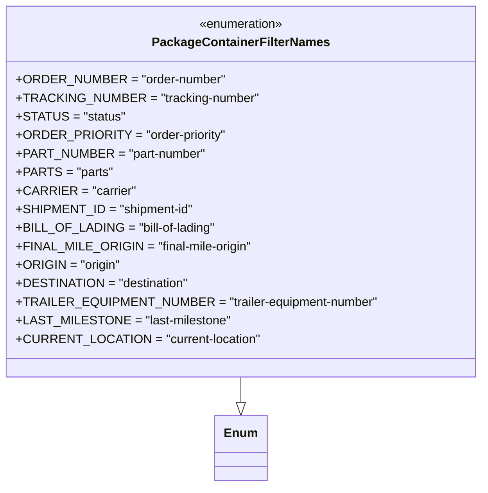

# Diagram: platform/partview_core/partview_service/partview_service/core/business/package_container_filter_list/package_container_filter_names.py

> Auto-generated by Obscura crawlers

## Mermaid

### SVG

<svg id="container" width="597.140625" xmlns="http://www.w3.org/2000/svg" class="classDiagram" height="630" viewBox="0 0 597.140625 630" role="graphics-document document" aria-roledescription="class"><g><defs><marker id="container_class-aggregationStart" class="marker aggregation class" refX="18" refY="7" markerWidth="190" markerHeight="240" orient="auto"><path d="M 18,7 L9,13 L1,7 L9,1 Z"></path></marker></defs><defs><marker id="container_class-aggregationEnd" class="marker aggregation class" refX="1" refY="7" markerWidth="20" markerHeight="28" orient="auto"><path d="M 18,7 L9,13 L1,7 L9,1 Z"></path></marker></defs><defs><marker id="container_class-extensionStart" class="marker extension class" refX="18" refY="7" markerWidth="190" markerHeight="240" orient="auto"><path d="M 1,7 L18,13 V 1 Z"></path></marker></defs><defs><marker id="container_class-extensionEnd" class="marker extension class" refX="1" refY="7" markerWidth="20" markerHeight="28" orient="auto"><path d="M 1,1 V 13 L18,7 Z"></path></marker></defs><defs><marker id="container_class-compositionStart" class="marker composition class" refX="18" refY="7" markerWidth="190" markerHeight="240" orient="auto"><path d="M 18,7 L9,13 L1,7 L9,1 Z"></path></marker></defs><defs><marker id="container_class-compositionEnd" class="marker composition class" refX="1" refY="7" markerWidth="20" markerHeight="28" orient="auto"><path d="M 18,7 L9,13 L1,7 L9,1 Z"></path></marker></defs><defs><marker id="container_class-dependencyStart" class="marker dependency class" refX="6" refY="7" markerWidth="190" markerHeight="240" orient="auto"><path d="M 5,7 L9,13 L1,7 L9,1 Z"></path></marker></defs><defs><marker id="container_class-dependencyEnd" class="marker dependency class" refX="13" refY="7" markerWidth="20" markerHeight="28" orient="auto"><path d="M 18,7 L9,13 L14,7 L9,1 Z"></path></marker></defs><defs><marker id="container_class-lollipopStart" class="marker lollipop class" refX="13" refY="7" markerWidth="190" markerHeight="240" orient="auto"><circle stroke="black" fill="transparent" cx="7" cy="7" r="6"></circle></marker></defs><defs><marker id="container_class-lollipopEnd" class="marker lollipop class" refX="1" refY="7" markerWidth="190" markerHeight="240" orient="auto"><circle stroke="black" fill="transparent" cx="7" cy="7" r="6"></circle></marker></defs><g class="root"><g class="clusters"></g><g class="edgePaths"><path d="M298.57,488L298.57,492.167C298.57,496.333,298.57,504.667,298.57,510.125C298.57,515.583,298.57,518.167,298.57,519.458L298.57,520.75" id="id_PackageContainerFilterNames_Enum_1" class="edge-thickness-normal edge-pattern-solid relation" style=";;;" data-edge="true" data-et="edge" data-id="id_PackageContainerFilterNames_Enum_1" data-points="W3sieCI6Mjk4LjU3MDMxMjUsInkiOjQ4OH0seyJ4IjoyOTguNTcwMzEyNSwieSI6NTEzfSx7IngiOjI5OC41NzAzMTI1LCJ5Ijo1Mzh9XQ==" marker-end="url(#container_class-extensionEnd)"></path></g><g class="edgeLabels"><g class="edgeLabel"><g class="label" data-id="id_PackageContainerFilterNames_Enum_1" transform="translate(0, 0)"><foreignObject width="0" height="0">

</foreignObject></g></g></g><g class="nodes"><g class="node default" id="classId-PackageContainerFilterNames-0" transform="translate(298.5703125, 248)"><g class="basic label-container"><path d="M-290.5703125 -240 L290.5703125 -240 L290.5703125 240 L-290.5703125 240" stroke="none" stroke-width="0" fill="#ECECFF" style=""></path><path d="M-290.5703125 -240 C-118.83604968612502 -240, 52.898213127749955 -240, 290.5703125 -240 M-290.5703125 -240 C-170.2145256444399 -240, -49.858738788879805 -240, 290.5703125 -240 M290.5703125 -240 C290.5703125 -134.3544068654163, 290.5703125 -28.708813730832617, 290.5703125 240 M290.5703125 -240 C290.5703125 -126.30560909681466, 290.5703125 -12.611218193629327, 290.5703125 240 M290.5703125 240 C162.93156444604944 240, 35.29281639209884 240, -290.5703125 240 M290.5703125 240 C74.32614362431562 240, -141.91802525136876 240, -290.5703125 240 M-290.5703125 240 C-290.5703125 104.6824857002955, -290.5703125 -30.635028599408997, -290.5703125 -240 M-290.5703125 240 C-290.5703125 134.40349311116762, -290.5703125 28.80698622233527, -290.5703125 -240" stroke="#9370DB" stroke-width="1.3" fill="none" stroke-dasharray="0 0" style=""></path></g><g class="annotation-group text" transform="translate(-55.5546875, -216)"><g class="label" style="" transform="translate(0,-12)"><foreignObject width="111.109375" height="24">

«enumeration»

</foreignObject></g></g><g class="label-group text" transform="translate(-109.046875, -192)"><g class="label" style="font-weight: bolder" transform="translate(0,-12)"><foreignObject width="218.09375" height="24">

PackageContainerFilterNames

</foreignObject></g></g><g class="members-group text" transform="translate(-278.5703125, -144)"><g class="label" style="" transform="translate(0,-12)"><foreignObject width="258.921875" height="24">

+ORDER_NUMBER = "order-number"

</foreignObject></g><g class="label" style="" transform="translate(0,12)"><foreignObject width="299.234375" height="24">

+TRACKING_NUMBER = "tracking-number"

</foreignObject></g><g class="label" style="" transform="translate(0,36)"><foreignObject width="132.28125" height="24">

+STATUS = "status"

</foreignObject></g><g class="label" style="" transform="translate(0,60)"><foreignObject width="260.15625" height="24">

+ORDER_PRIORITY = "order-priority"

</foreignObject></g><g class="label" style="" transform="translate(0,84)"><foreignObject width="234.5" height="24">

+PART_NUMBER = "part-number"

</foreignObject></g><g class="label" style="" transform="translate(0,108)"><foreignObject width="118.015625" height="24">

+PARTS = "parts"

</foreignObject></g><g class="label" style="" transform="translate(0,132)"><foreignObject width="145.546875" height="24">

+CARRIER = "carrier"

</foreignObject></g><g class="label" style="" transform="translate(0,156)"><foreignObject width="220.671875" height="24">

+SHIPMENT_ID = "shipment-id"

</foreignObject></g><g class="label" style="" transform="translate(0,180)"><foreignObject width="249.734375" height="24">

+BILL_OF_LADING = "bill-of-lading"

</foreignObject></g><g class="label" style="" transform="translate(0,204)"><foreignObject width="296.96875" height="24">

+FINAL_MILE_ORIGIN = "final-mile-origin"

</foreignObject></g><g class="label" style="" transform="translate(0,228)"><foreignObject width="130.375" height="24">

+ORIGIN = "origin"

</foreignObject></g><g class="label" style="" transform="translate(0,252)"><foreignObject width="214.40625" height="24">

+DESTINATION = "destination"

</foreignObject></g><g class="label" style="" transform="translate(0,276)"><foreignObject width="448.09375" height="24">

+TRAILER_EQUIPMENT_NUMBER = "trailer-equipment-number"

</foreignObject></g><g class="label" style="" transform="translate(0,300)"><foreignObject width="262.765625" height="24">

+LAST_MILESTONE = "last-milestone"

</foreignObject></g><g class="label" style="" transform="translate(0,324)"><foreignObject width="299.09375" height="24">

+CURRENT_LOCATION = "current-location"

</foreignObject></g></g><g class="methods-group text" transform="translate(-278.5703125, 240)"></g><g class="divider" style=""><path d="M-290.5703125 -168 C-162.5748401302586 -168, -34.57936776051719 -168, 290.5703125 -168 M-290.5703125 -168 C-161.0672336740053 -168, -31.564154848010617 -168, 290.5703125 -168" stroke="#9370DB" stroke-width="1.3" fill="none" stroke-dasharray="0 0" style=""></path></g><g class="divider" style=""><path d="M-290.5703125 216 C-58.45135392680615 216, 173.6676046463877 216, 290.5703125 216 M-290.5703125 216 C-131.317492101952 216, 27.935328296095975 216, 290.5703125 216" stroke="#9370DB" stroke-width="1.3" fill="none" stroke-dasharray="0 0" style=""></path></g></g><g class="node default" id="classId-Enum-1" transform="translate(298.5703125, 580)"><g class="basic label-container"><path d="M-32.0859375 -42 L32.0859375 -42 L32.0859375 42 L-32.0859375 42" stroke="none" stroke-width="0" fill="#ECECFF" style=""></path><path d="M-32.0859375 -42 C-14.487273071736706 -42, 3.111391356526589 -42, 32.0859375 -42 M-32.0859375 -42 C-16.314870414174926 -42, -0.5438033283498527 -42, 32.0859375 -42 M32.0859375 -42 C32.0859375 -21.76053781896222, 32.0859375 -1.5210756379244401, 32.0859375 42 M32.0859375 -42 C32.0859375 -16.739164462272598, 32.0859375 8.521671075454805, 32.0859375 42 M32.0859375 42 C8.533631044928235 42, -15.01867541014353 42, -32.0859375 42 M32.0859375 42 C13.115360577132993 42, -5.855216345734014 42, -32.0859375 42 M-32.0859375 42 C-32.0859375 17.774326191544947, -32.0859375 -6.451347616910105, -32.0859375 -42 M-32.0859375 42 C-32.0859375 12.85361706837362, -32.0859375 -16.29276586325276, -32.0859375 -42" stroke="#9370DB" stroke-width="1.3" fill="none" stroke-dasharray="0 0" style=""></path></g><g class="annotation-group text" transform="translate(0, -18)"></g><g class="label-group text" transform="translate(-20.0859375, -18)"><g class="label" style="font-weight: bolder" transform="translate(0,-12)"><foreignObject width="40.171875" height="24">

Enum

</foreignObject></g></g><g class="members-group text" transform="translate(-20.0859375, 30)"></g><g class="methods-group text" transform="translate(-20.0859375, 60)"></g><g class="divider" style=""><path d="M-32.0859375 6 C-10.52351337356783 6, 11.03891075286434 6, 32.0859375 6 M-32.0859375 6 C-16.103509185692232 6, -0.12108087138446777 6, 32.0859375 6" stroke="#9370DB" stroke-width="1.3" fill="none" stroke-dasharray="0 0" style=""></path></g><g class="divider" style=""><path d="M-32.0859375 24 C-12.595819889939502 24, 6.894297720120996 24, 32.0859375 24 M-32.0859375 24 C-16.391697953979936 24, -0.6974584079598678 24, 32.0859375 24" stroke="#9370DB" stroke-width="1.3" fill="none" stroke-dasharray="0 0" style=""></path></g></g></g></g></g></svg>
