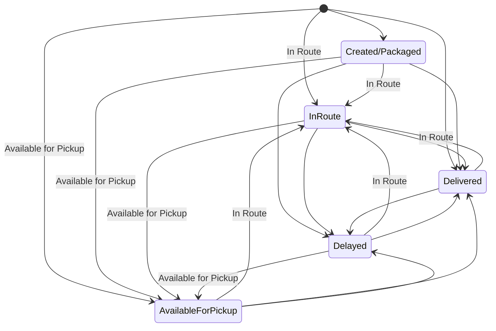
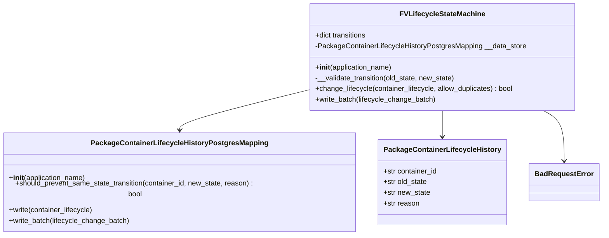
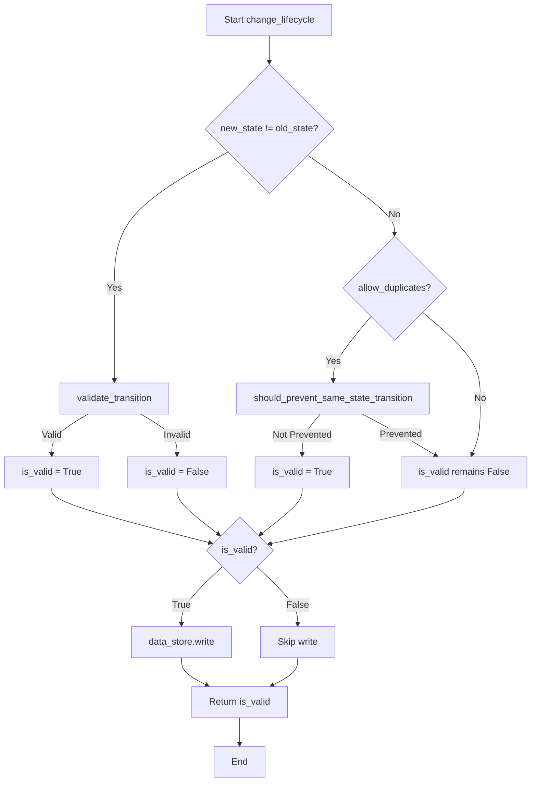

# Diagram: platform/partview_core/partview_service/partview_service/core/business/package_container_lifecycle_state/FVLifecycleStateMachine.py

> Auto-generated by Obscura crawlers

## Diagram 1

### SVG

<svg id="container" width="871.40234375" xmlns="http://www.w3.org/2000/svg" class="statediagram" height="576" viewBox="0 0 871.40234375 576" role="graphics-document document" aria-roledescription="stateDiagram"><g><defs><marker id="container_stateDiagram-barbEnd" refX="19" refY="7" markerWidth="20" markerHeight="14" markerUnits="userSpaceOnUse" orient="auto"><path d="M 19,7 L9,13 L14,7 L9,1 Z"></path></marker></defs><g class="root"><g class="clusters"></g><g class="edgePaths"><path d="M584.28,17.046L600.617,22.038C616.954,27.031,649.627,37.015,666.047,46.258C682.467,55.5,682.634,64,682.717,68.25L682.801,72.5" id="edge0" class="edge-thickness-normal edge-pattern-solid transition" style="fill:none;;;fill:none" data-edge="true" data-et="edge" data-id="edge0" data-points="W3sieCI6NTg0LjI4MDMzMDY0MzA0NzUsInkiOjE3LjA0NTc1MTgwNDY3MjA5M30seyJ4Ijo2ODIuMzAwNzgxMjUsInkiOjQ3fSx7IngiOjY4Mi44MDA3ODEyNSwieSI6NzIuNX1d" marker-end="url(#container_stateDiagram-barbEnd)"></path><path d="M570.6,15.449L488.809,20.708C407.017,25.966,243.434,36.483,161.643,49.242C79.852,62,79.852,77,79.852,94C79.852,111,79.852,130,79.852,149C79.852,168,79.852,187,79.852,206C79.852,225,79.852,244,79.852,263C79.852,282,79.852,301,79.852,320C79.852,339,79.852,358,79.852,377C79.852,396,79.852,415,79.852,434C79.852,453,79.852,472,113.097,488.443C146.342,504.886,212.832,518.772,246.077,525.715L279.322,532.658" id="edge1" class="edge-thickness-normal edge-pattern-solid transition" style="fill:none;;;fill:none" data-edge="true" data-et="edge" data-id="edge1" data-points="W3sieCI6NTcwLjYwMDM1OTYxNDc4OTcsInkiOjE1LjQ0OTExMjAyMzUwOTk4Nn0seyJ4Ijo3OS44NTE1NjI1LCJ5Ijo0N30seyJ4Ijo3OS44NTE1NjI1LCJ5Ijo5Mn0seyJ4Ijo3OS44NTE1NjI1LCJ5IjoxNDl9LHsieCI6NzkuODUxNTYyNSwieSI6MjA2fSx7IngiOjc5Ljg1MTU2MjUsInkiOjI2M30seyJ4Ijo3OS44NTE1NjI1LCJ5IjozMjB9LHsieCI6NzkuODUxNTYyNSwieSI6Mzc3fSx7IngiOjc5Ljg1MTU2MjUsInkiOjQzNH0seyJ4Ijo3OS44NTE1NjI1LCJ5Ijo0OTF9LHsieCI6Mjc5LjMyMjE0OTgyMTUwMzE2LCJ5Ijo1MzIuNjU4MTU4NDA0ODU2M31d" marker-end="url(#container_stateDiagram-barbEnd)"></path><path d="M572.463,19.77L567.59,24.309C562.716,28.847,552.969,37.923,548.096,49.962C543.223,62,543.223,77,543.223,94C543.223,111,543.223,130,547.254,145.75C551.284,161.5,559.346,174,563.377,180.25L567.408,186.5" id="edge2" class="edge-thickness-normal edge-pattern-solid transition" style="fill:none;;;fill:none" data-edge="true" data-et="edge" data-id="edge2" data-points="W3sieCI6NTcyLjQ2MzE3MDQyMjA4MTksInkiOjE5Ljc3MDQ1NjczNTUxMjY5fSx7IngiOjU0My4yMjI2NTYyNSwieSI6NDd9LHsieCI6NTQzLjIyMjY1NjI1LCJ5Ijo5Mn0seyJ4Ijo1NDMuMjIyNjU2MjUsInkiOjE0OX0seyJ4Ijo1NjcuNDA4MDMxNzk4MjQ1NiwieSI6MTg2LjV9XQ==" marker-end="url(#container_stateDiagram-barbEnd)"></path><path d="M584.509,16.038L618.928,21.198C653.348,26.359,722.188,36.679,756.608,49.34C791.027,62,791.027,77,791.027,94C791.027,111,791.027,130,791.027,149C791.027,168,791.027,187,791.027,206C791.027,225,791.027,244,794.356,259.75C797.685,275.5,804.343,288,807.672,294.25L811.001,300.5" id="edge3" class="edge-thickness-normal edge-pattern-solid transition" style="fill:none;;;fill:none" data-edge="true" data-et="edge" data-id="edge3" data-points="W3sieCI6NTg0LjUwODU2OTA4MTkxOTYsInkiOjE2LjAzNzg2ODk2MTM4NTg4Mn0seyJ4Ijo3OTEuMDI3MzQzNzUsInkiOjQ3fSx7IngiOjc5MS4wMjczNDM3NSwieSI6OTJ9LHsieCI6NzkxLjAyNzM0Mzc1LCJ5IjoxNDl9LHsieCI6NzkxLjAyNzM0Mzc1LCJ5IjoyMDZ9LHsieCI6NzkxLjAyNzM0Mzc1LCJ5IjoyNjN9LHsieCI6ODExLjAwMTAyNzk2MDUyNjQsInkiOjMwMC41fV0=" marker-end="url(#container_stateDiagram-barbEnd)"></path><path d="M682.801,112.5L682.717,118.583C682.634,124.667,682.467,136.833,671.071,149.332C659.674,161.831,637.048,174.661,625.735,181.077L614.422,187.492" id="edge4" class="edge-thickness-normal edge-pattern-solid transition" style="fill:none;;;fill:none" data-edge="true" data-et="edge" data-id="edge4" data-points="W3sieCI6NjgyLjgwMDc4MTI1LCJ5IjoxMTIuNX0seyJ4Ijo2ODIuMzAwNzgxMjUsInkiOjE0OX0seyJ4Ijo2MTQuNDIxNTkwNjc5ODEzNywieSI6MTg3LjQ5MjIwMDAwNzYyMTR9XQ==" marker-end="url(#container_stateDiagram-barbEnd)"></path><path d="M609.074,100.73L536.179,108.775C463.284,116.82,317.493,132.91,244.598,150.455C171.703,168,171.703,187,171.703,206C171.703,225,171.703,244,171.703,263C171.703,282,171.703,301,171.703,320C171.703,339,171.703,358,171.703,377C171.703,396,171.703,415,171.703,434C171.703,453,171.703,472,191.661,487.75C211.618,503.5,251.534,516,271.491,522.25L291.449,528.5" id="edge5" class="edge-thickness-normal edge-pattern-solid transition" style="fill:none;;;fill:none" data-edge="true" data-et="edge" data-id="edge5" data-points="W3sieCI6NjA5LjA3NDIxODc1LCJ5IjoxMDAuNzMwMzgyNTkzOTI3MTZ9LHsieCI6MTcxLjcwMzEyNSwieSI6MTQ5fSx7IngiOjE3MS43MDMxMjUsInkiOjIwNn0seyJ4IjoxNzEuNzAzMTI1LCJ5IjoyNjN9LHsieCI6MTcxLjcwMzEyNSwieSI6MzIwfSx7IngiOjE3MS43MDMxMjUsInkiOjM3N30seyJ4IjoxNzEuNzAzMTI1LCJ5Ijo0MzR9LHsieCI6MTcxLjcwMzEyNSwieSI6NDkxfSx7IngiOjI5MS40NDkwMTMxNTc4OTQ3NCwieSI6NTI4LjV9XQ==" marker-end="url(#container_stateDiagram-barbEnd)"></path><path d="M727.968,112.5L741.811,118.583C755.654,124.667,783.341,136.833,797.184,152.417C811.027,168,811.027,187,811.027,206C811.027,225,811.027,244,812.193,259.75C813.358,275.5,815.688,288,816.853,294.25L818.019,300.5" id="edge6" class="edge-thickness-normal edge-pattern-solid transition" style="fill:none;;;fill:none" data-edge="true" data-et="edge" data-id="edge6" data-points="W3sieCI6NzI3Ljk2Nzk5NjE2MjI4MDcsInkiOjExMi41fSx7IngiOjgxMS4wMjczNDM3NSwieSI6MTQ5fSx7IngiOjgxMS4wMjczNDM3NSwieSI6MjA2fSx7IngiOjgxMS4wMjczNDM3NSwieSI6MjYzfSx7IngiOjgxOC4wMTg1NzE4MjAxNzU1LCJ5IjozMDAuNX1d" marker-end="url(#container_stateDiagram-barbEnd)"></path><path d="M617.997,112.5L597.932,118.583C577.868,124.667,537.739,136.833,517.674,152.417C497.609,168,497.609,187,497.609,206C497.609,225,497.609,244,497.609,263C497.609,282,497.609,301,497.609,320C497.609,339,497.609,358,512.501,374.301C527.393,390.602,557.176,404.203,572.067,411.004L586.959,417.805" id="edge7" class="edge-thickness-normal edge-pattern-solid transition" style="fill:none;;;fill:none" data-edge="true" data-et="edge" data-id="edge7" data-points="W3sieCI6NjE3Ljk5Njc3OTA1NzAxNzUsInkiOjExMi41fSx7IngiOjQ5Ny42MDkzNzUsInkiOjE0OX0seyJ4Ijo0OTcuNjA5Mzc1LCJ5IjoyMDZ9LHsieCI6NDk3LjYwOTM3NSwieSI6MjYzfSx7IngiOjQ5Ny42MDkzNzUsInkiOjMyMH0seyJ4Ijo0OTcuNjA5Mzc1LCJ5IjozNzd9LHsieCI6NTg2Ljk1ODk0NjEyMDMzOTIsInkiOjQxNy44MDUwNjIzODY1NDQ5fV0=" marker-end="url(#container_stateDiagram-barbEnd)"></path><path d="M388.135,528.5L397.989,522.25C407.843,516,427.55,503.5,437.404,487.75C447.258,472,447.258,453,447.258,434C447.258,415,447.258,396,447.258,377C447.258,358,447.258,339,447.258,320C447.258,301,447.258,282,463.385,265.679C479.512,249.358,511.767,235.716,527.894,228.895L544.022,222.074" id="edge8" class="edge-thickness-normal edge-pattern-solid transition" style="fill:none;;;fill:none" data-edge="true" data-et="edge" data-id="edge8" data-points="W3sieCI6Mzg4LjEzNDg2ODQyMTA1MjY2LCJ5Ijo1MjguNX0seyJ4Ijo0NDcuMjU3ODEyNSwieSI6NDkxfSx7IngiOjQ0Ny4yNTc4MTI1LCJ5Ijo0MzR9LHsieCI6NDQ3LjI1NzgxMjUsInkiOjM3N30seyJ4Ijo0NDcuMjU3ODEyNSwieSI6MzIwfSx7IngiOjQ0Ny4yNTc4MTI1LCJ5IjoyNjN9LHsieCI6NTQ0LjAyMTUwODE2MDQ4MTMsInkiOjIyMi4wNzM3OTI0MDY1NzgzfV0=" marker-end="url(#container_stateDiagram-barbEnd)"></path><path d="M432.563,539.597L501.503,531.498C570.443,523.398,708.323,507.199,777.263,489.6C846.203,472,846.203,453,846.203,434C846.203,415,846.203,396,843.563,380.417C840.922,364.833,835.642,352.667,833.001,346.583L830.361,340.5" id="edge9" class="edge-thickness-normal edge-pattern-solid transition" style="fill:none;;;fill:none" data-edge="true" data-et="edge" data-id="edge9" data-points="W3sieCI6NDMyLjU2MjUsInkiOjUzOS41OTczMjI1OTM5OTU3fSx7IngiOjg0Ni4yMDMxMjUsInkiOjQ5MX0seyJ4Ijo4NDYuMjAzMTI1LCJ5Ijo0MzR9LHsieCI6ODQ2LjIwMzEyNSwieSI6Mzc3fSx7IngiOjgzMC4zNjA5NTEyMDYxNDA0LCJ5IjozNDAuNX1d" marker-end="url(#container_stateDiagram-barbEnd)"></path><path d="M432.563,539.946L504.836,531.788C577.109,523.631,721.656,507.315,759.706,491.192C797.757,475.068,729.31,459.137,695.087,451.171L660.863,443.205" id="edge10" class="edge-thickness-normal edge-pattern-solid transition" style="fill:none;;;fill:none" data-edge="true" data-et="edge" data-id="edge10" data-points="W3sieCI6NDMyLjU2MjUsInkiOjUzOS45NDU5MDI1NDE5ODQxfSx7IngiOjg2Ni4yMDMxMjUsInkiOjQ5MX0seyJ4Ijo2NjAuODYzMjgxMjUsInkiOjQ0My4yMDQ5MzQ2Mzg5NDY1fV0=" marker-end="url(#container_stateDiagram-barbEnd)"></path><path d="M616.438,214.716L652.202,222.764C687.967,230.811,759.497,246.905,794.264,261.203C829.03,275.5,827.033,288,826.035,294.25L825.036,300.5" id="edge11" class="edge-thickness-normal edge-pattern-solid transition" style="fill:none;;;fill:none" data-edge="true" data-et="edge" data-id="edge11" data-points="W3sieCI6NjE2LjQzNzUsInkiOjIxNC43MTYzOTE4MTE4NjU2M30seyJ4Ijo4MzEuMDI3MzQzNzUsInkiOjI2M30seyJ4Ijo4MjUuMDM2MTE1Njc5ODI0NSwieSI6MzAwLjV9XQ==" marker-end="url(#container_stateDiagram-barbEnd)"></path><path d="M567.408,226.5L563.377,232.583C559.346,238.667,551.284,250.833,547.254,266.417C543.223,282,543.223,301,543.223,320C543.223,339,543.223,358,551.965,373.75C560.708,389.5,578.193,402,586.935,408.25L595.678,414.5" id="edge12" class="edge-thickness-normal edge-pattern-solid transition" style="fill:none;;;fill:none" data-edge="true" data-et="edge" data-id="edge12" data-points="W3sieCI6NTY3LjQwODAzMTc5ODI0NTYsInkiOjIyNi41fSx7IngiOjU0My4yMjI2NTYyNSwieSI6MjYzfSx7IngiOjU0My4yMjI2NTYyNSwieSI6MzIwfSx7IngiOjU0My4yMjI2NTYyNSwieSI6Mzc3fSx7IngiOjU5NS42Nzc4MzcxNzEwNTI2LCJ5Ijo0MTQuNX1d" marker-end="url(#container_stateDiagram-barbEnd)"></path><path d="M543.984,213.031L497.246,221.359C450.508,229.688,357.031,246.344,310.293,264.172C263.555,282,263.555,301,263.555,320C263.555,339,263.555,358,263.555,377C263.555,396,263.555,415,263.555,434C263.555,453,263.555,472,273.575,487.75C283.596,503.5,303.637,516,313.657,522.25L323.678,528.5" id="edge13" class="edge-thickness-normal edge-pattern-solid transition" style="fill:none;;;fill:none" data-edge="true" data-et="edge" data-id="edge13" data-points="W3sieCI6NTQzLjk4NDM3NSwieSI6MjEzLjAzMTMwODY4ODM0NjM0fSx7IngiOjI2My41NTQ2ODc1LCJ5IjoyNjN9LHsieCI6MjYzLjU1NDY4NzUsInkiOjMyMH0seyJ4IjoyNjMuNTU0Njg3NSwieSI6Mzc3fSx7IngiOjI2My41NTQ2ODc1LCJ5Ijo0MzR9LHsieCI6MjYzLjU1NDY4NzUsInkiOjQ5MX0seyJ4IjozMjMuNjc3NjMxNTc4OTQ3MzQsInkiOjUyOC41fV0=" marker-end="url(#container_stateDiagram-barbEnd)"></path><path d="M648.161,414.5L655.601,408.25C663.041,402,677.921,389.5,685.361,373.75C692.801,358,692.801,339,692.801,320C692.801,301,692.801,282,679.928,266.053C667.055,250.106,641.309,237.212,628.436,230.765L615.563,224.319" id="edge14" class="edge-thickness-normal edge-pattern-solid transition" style="fill:none;;;fill:none" data-edge="true" data-et="edge" data-id="edge14" data-points="W3sieCI6NjQ4LjE2MTM4OTgwMjYzMTYsInkiOjQxNC41fSx7IngiOjY5Mi44MDA3ODEyNSwieSI6Mzc3fSx7IngiOjY5Mi44MDA3ODEyNSwieSI6MzIwfSx7IngiOjY5Mi44MDA3ODEyNSwieSI6MjYzfSx7IngiOjYxNS41NjM0OTk5MzIzMjY0LCJ5IjoyMjQuMzE4NTQxMzYzNDI0NjN9XQ==" marker-end="url(#container_stateDiagram-barbEnd)"></path><path d="M660.863,422.545L684.078,414.954C707.293,407.363,753.723,392.182,779.279,378.507C804.836,364.833,809.519,352.667,811.861,346.583L814.203,340.5" id="edge15" class="edge-thickness-normal edge-pattern-solid transition" style="fill:none;;;fill:none" data-edge="true" data-et="edge" data-id="edge15" data-points="W3sieCI6NjYwLjg2MzI4MTI1LCJ5Ijo0MjIuNTQ0NjUxNTMyNTUwMX0seyJ4Ijo4MDAuMTUyMzQzNzUsInkiOjM3N30seyJ4Ijo4MTQuMjAyNzgyMzQ2NDkxMiwieSI6MzQwLjV9XQ==" marker-end="url(#container_stateDiagram-barbEnd)"></path><path d="M586.66,442.395L548.118,450.496C509.576,458.597,432.491,474.798,394.032,489.149C355.573,503.5,355.74,516,355.823,522.25L355.906,528.5" id="edge16" class="edge-thickness-normal edge-pattern-solid transition" style="fill:none;;;fill:none" data-edge="true" data-et="edge" data-id="edge16" data-points="W3sieCI6NTg2LjY2MDE1NjI1LCJ5Ijo0NDIuMzk1MjYxODQ1Mzg2NX0seyJ4IjozNTUuNDA2MjUsInkiOjQ5MX0seyJ4IjozNTUuOTA2MjUsInkiOjUyOC41fV0=" marker-end="url(#container_stateDiagram-barbEnd)"></path><path d="M842.703,300.5L849.149,294.25C855.595,288,868.487,275.5,830.776,260.974C793.065,246.448,704.751,229.897,660.594,221.621L616.438,213.345" id="edge17" class="edge-thickness-normal edge-pattern-solid transition" style="fill:none;;;fill:none" data-edge="true" data-et="edge" data-id="edge17" data-points="W3sieCI6ODQyLjcwMzMzMDU5MjEwNTMsInkiOjMwMC41fSx7IngiOjg4MS4zNzg5MDYyNSwieSI6MjYzfSx7IngiOjYxNi40Mzc1LCJ5IjoyMTMuMzQ0OTg5NDQ2Njk2MX1d" marker-end="url(#container_stateDiagram-barbEnd)"></path><path d="M779.152,332.713L753.171,340.094C727.189,347.476,675.225,362.238,649.327,375.869C623.428,389.5,623.595,402,623.678,408.25L623.762,414.5" id="edge18" class="edge-thickness-normal edge-pattern-solid transition" style="fill:none;;;fill:none" data-edge="true" data-et="edge" data-id="edge18" data-points="W3sieCI6Nzc5LjE1MjM0Mzc1LCJ5IjozMzIuNzEzMzIwNjkyMTA3MX0seyJ4Ijo2MjMuMjYxNzE4NzUsInkiOjM3N30seyJ4Ijo2MjMuNzYxNzE4NzUsInkiOjQxNC41fV0=" marker-end="url(#container_stateDiagram-barbEnd)"></path></g><g class="edgeLabels"><g class="edgeLabel"><g class="label" data-id="edge0" transform="translate(0, 0)"><foreignObject width="0" height="0">

</foreignObject></g></g><g class="edgeLabel" transform="translate(79.8515625, 263)"><g class="label" data-id="edge1" transform="translate(-71.8515625, -12)"><foreignObject width="143.703125" height="24">

Available for Pickup

</foreignObject></g></g><g class="edgeLabel" transform="translate(543.22265625, 92)"><g class="label" data-id="edge2" transform="translate(-30.3515625, -12)"><foreignObject width="60.703125" height="24">

In Route

</foreignObject></g></g><g class="edgeLabel"><g class="label" data-id="edge3" transform="translate(0, 0)"><foreignObject width="0" height="0">

</foreignObject></g></g><g class="edgeLabel" transform="translate(682.30078125, 149)"><g class="label" data-id="edge4" transform="translate(-30.3515625, -12)"><foreignObject width="60.703125" height="24">

In Route

</foreignObject></g></g><g class="edgeLabel" transform="translate(171.703125, 320)"><g class="label" data-id="edge5" transform="translate(-71.8515625, -12)"><foreignObject width="143.703125" height="24">

Available for Pickup

</foreignObject></g></g><g class="edgeLabel"><g class="label" data-id="edge6" transform="translate(0, 0)"><foreignObject width="0" height="0">

</foreignObject></g></g><g class="edgeLabel"><g class="label" data-id="edge7" transform="translate(0, 0)"><foreignObject width="0" height="0">

</foreignObject></g></g><g class="edgeLabel" transform="translate(447.2578125, 377)"><g class="label" data-id="edge8" transform="translate(-30.3515625, -12)"><foreignObject width="60.703125" height="24">

In Route

</foreignObject></g></g><g class="edgeLabel"><g class="label" data-id="edge9" transform="translate(0, 0)"><foreignObject width="0" height="0">

</foreignObject></g></g><g class="edgeLabel"><g class="label" data-id="edge10" transform="translate(0, 0)"><foreignObject width="0" height="0">

</foreignObject></g></g><g class="edgeLabel"><g class="label" data-id="edge11" transform="translate(0, 0)"><foreignObject width="0" height="0">

</foreignObject></g></g><g class="edgeLabel"><g class="label" data-id="edge12" transform="translate(0, 0)"><foreignObject width="0" height="0">

</foreignObject></g></g><g class="edgeLabel" transform="translate(263.5546875, 377)"><g class="label" data-id="edge13" transform="translate(-71.8515625, -12)"><foreignObject width="143.703125" height="24">

Available for Pickup

</foreignObject></g></g><g class="edgeLabel" transform="translate(692.80078125, 320)"><g class="label" data-id="edge14" transform="translate(-30.3515625, -12)"><foreignObject width="60.703125" height="24">

In Route

</foreignObject></g></g><g class="edgeLabel"><g class="label" data-id="edge15" transform="translate(0, 0)"><foreignObject width="0" height="0">

</foreignObject></g></g><g class="edgeLabel" transform="translate(452.68248, 470.55457)"><g class="label" data-id="edge16" transform="translate(-71.8515625, -12)"><foreignObject width="143.703125" height="24">

Available for Pickup

</foreignObject></g></g><g class="edgeLabel" transform="translate(775.38259, 243.13429)"><g class="label" data-id="edge17" transform="translate(-30.3515625, -12)"><foreignObject width="60.703125" height="24">

In Route

</foreignObject></g></g><g class="edgeLabel"><g class="label" data-id="edge18" transform="translate(0, 0)"><foreignObject width="0" height="0">

</foreignObject></g></g></g><g class="nodes"><g class="node default" id="state-root_start-3" transform="translate(577.5859375, 15)"><circle class="state-start" r="7" width="14" height="14"></circle></g><g class="node  statediagram-state" id="state-Created/Packaged-7" transform="translate(682.30078125, 92)"><g class="basic label-container outer-path"><path d="M-68.7265625 -20 C-26.708277967329664 -20, 15.310006565340672 -20, 68.7265625 -20 C68.7265625 -20, 68.7265625 -20, 68.7265625 -20 C68.86316309639092 -19.994350157541238, 68.99976369278185 -19.988700315082475, 69.13945922736166 -19.982922465033347 C69.2480766648998 -19.969383315563743, 69.35669410243793 -19.955844166094135, 69.54953545140367 -19.931806517013612 C69.65382949745559 -19.90993835519368, 69.75812354350751 -19.88807019337375, 69.953989935704 -19.847001329696653 C70.03344727770539 -19.82334585406547, 70.11290461970678 -19.799690378434285, 70.35005984602341 -19.729086208503173 C70.43445918798702 -19.69615348307502, 70.5188585299506 -19.66322075764686, 70.73503962326485 -19.578866633275286 C70.87142358111663 -19.51219257902793, 71.0078075389684 -19.445518524780574, 71.10629946518537 -19.397368756032446 C71.24600415957656 -19.31412282720259, 71.38570885396776 -19.23087689837273, 71.46130329061214 -19.185832391312644 C71.54089025009027 -19.129008394444774, 71.62047720956842 -19.072184397576905, 71.79762606344833 -18.94570254698197 C71.88552409444091 -18.871256712234043, 71.97342212543349 -18.796810877486116, 72.1129703581287 -18.678619553365657 C72.17737416180829 -18.614215749686082, 72.24177796548786 -18.549811946006507, 72.40518205336566 -18.386407858128706 C72.5031772607398 -18.270705135416794, 72.60117246811394 -18.15500241270488, 72.67226504698196 -18.07106356344834 C72.73206475894348 -17.98730885566613, 72.791864470905 -17.903554147883916, 72.91239489131264 -17.734740790612136 C72.96395578762056 -17.648210441771216, 73.01551668392848 -17.561680092930295, 73.12393125603245 -17.37973696518537 C73.16487603490738 -17.29598308131907, 73.20582081378231 -17.212229197452768, 73.30542913327528 -17.008477123264846 C73.3558694003506 -16.879209797397408, 73.4063096674259 -16.74994247152997, 73.45564870850318 -16.623497346023417 C73.49929306782371 -16.476898527253855, 73.54293742714425 -16.330299708484294, 73.57356382969665 -16.227427435703994 C73.59087362734049 -16.1448732252733, 73.60818342498432 -16.062319014842608, 73.65836901701361 -15.82297295140367 C73.67418171636068 -15.69611602530979, 73.68999441570776 -15.569259099215909, 73.70948496503335 -15.412896727361662 C73.71346688829834 -15.316622699058984, 73.71744881156333 -15.220348670756305, 73.7265625 -15 C73.7265625 -15, 73.7265625 -15, 73.7265625 -15 C73.7265625 -3.13832696000488, 73.7265625 8.72334607999024, 73.7265625 15 C73.7265625 15, 73.7265625 15, 73.7265625 15 C73.72047290803901 15.147232759093674, 73.71438331607803 15.294465518187348, 73.70948496503335 15.412896727361662 C73.69672815378003 15.515237879042148, 73.6839713425267 15.617579030722636, 73.65836901701361 15.822972951403669 C73.626214278053 15.976325933403677, 73.5940595390924 16.129678915403684, 73.57356382969665 16.227427435703994 C73.54904785618274 16.309775139143287, 73.52453188266882 16.392122842582577, 73.45564870850318 16.623497346023417 C73.4001946452704 16.765613930217583, 73.34474058203762 16.90773051441175, 73.30542913327528 17.008477123264846 C73.2335962268944 17.155413681822907, 73.16176332051353 17.302350240380964, 73.12393125603245 17.379736965185366 C73.0809397055627 17.451886096130334, 73.03794815509293 17.5240352270753, 72.91239489131264 17.734740790612133 C72.85271651522481 17.81832555692957, 72.79303813913698 17.901910323247005, 72.67226504698196 18.07106356344834 C72.61119898771382 18.143164123383226, 72.55013292844569 18.21526468331811, 72.40518205336566 18.386407858128706 C72.30888060189885 18.482709309595517, 72.21257915043203 18.57901076106233, 72.1129703581287 18.678619553365657 C72.04073579777457 18.739799105199616, 71.96850123742043 18.80097865703358, 71.79762606344833 18.94570254698197 C71.69347829723128 19.020062622804932, 71.58933053101423 19.094422698627895, 71.46130329061214 19.185832391312644 C71.36685766545952 19.242109768561907, 71.2724120403069 19.29838714581117, 71.10629946518537 19.397368756032446 C71.02301836435554 19.4380824053646, 70.9397372635257 19.47879605469675, 70.73503962326485 19.578866633275286 C70.62269244881604 19.62270463677948, 70.51034527436722 19.666542640283676, 70.35005984602341 19.729086208503173 C70.24257192689298 19.761086748511072, 70.13508400776253 19.79308728851897, 69.953989935704 19.847001329696653 C69.85195801941136 19.868395172785018, 69.74992610311871 19.88978901587338, 69.54953545140367 19.931806517013612 C69.46260809770095 19.942642000352695, 69.37568074399823 19.953477483691778, 69.13945922736166 19.982922465033347 C69.05580637287747 19.986382372687842, 68.97215351839328 19.989842280342334, 68.7265625 20 C68.7265625 20, 68.7265625 20, 68.7265625 20 C33.59723460461938 20, -1.5320932907612388 20, -68.7265625 20 C-68.7265625 20, -68.7265625 20, -68.7265625 20 C-68.82263364107398 19.99602646821286, -68.91870478214797 19.992052936425722, -69.13945922736166 19.982922465033347 C-69.30309295317853 19.962525542381538, -69.46672667899541 19.94212861972973, -69.54953545140367 19.931806517013612 C-69.63722595674696 19.91341975157962, -69.72491646209025 19.895032986145626, -69.953989935704 19.847001329696653 C-70.06951398956673 19.812608328721144, -70.18503804342946 19.778215327745635, -70.35005984602341 19.729086208503173 C-70.4972955518388 19.671634657815368, -70.64453125765421 19.61418310712756, -70.73503962326485 19.578866633275286 C-70.82513737312813 19.53482052729208, -70.91523512299139 19.490774421308874, -71.10629946518537 19.397368756032446 C-71.22465765668163 19.326842582029027, -71.34301584817787 19.256316408025608, -71.46130329061214 19.185832391312644 C-71.59433185530327 19.09085182172043, -71.7273604199944 18.995871252128214, -71.79762606344833 18.94570254698197 C-71.88476152741056 18.87190257356318, -71.9718969913728 18.798102600144386, -72.1129703581287 18.67861955336566 C-72.22400176074588 18.567588150748485, -72.33503316336306 18.45655674813131, -72.40518205336566 18.386407858128706 C-72.47243196652425 18.307006035702003, -72.53968187968286 18.227604213275303, -72.67226504698196 18.07106356344834 C-72.76499896483118 17.941181630305273, -72.8577328826804 17.811299697162205, -72.91239489131264 17.734740790612133 C-72.98912843124126 17.60596529496969, -73.06586197116987 17.477189799327245, -73.12393125603245 17.37973696518537 C-73.18558619636069 17.253619768953612, -73.24724113668893 17.127502572721852, -73.30542913327528 17.00847712326485 C-73.36144651708132 16.864916872168543, -73.41746390088737 16.721356621072232, -73.45564870850318 16.623497346023417 C-73.48905116606646 16.51130046883214, -73.52245362362974 16.399103591640863, -73.57356382969665 16.227427435703994 C-73.60617074497242 16.071917925970894, -73.63877766024818 15.916408416237795, -73.65836901701361 15.82297295140367 C-73.67176389231949 15.715512949198002, -73.68515876762535 15.608052946992336, -73.70948496503335 15.412896727361664 C-73.71343887062362 15.317300103978496, -73.7173927762139 15.22170348059533, -73.7265625 15 C-73.7265625 15, -73.7265625 15, -73.7265625 15 C-73.7265625 7.782201685853618, -73.7265625 0.5644033717072361, -73.7265625 -15 C-73.7265625 -15, -73.7265625 -15, -73.7265625 -15 C-73.72108922569426 -15.132331572045118, -73.71561595138853 -15.264663144090235, -73.70948496503335 -15.41289672736166 C-73.69915299659901 -15.495784647210844, -73.68882102816467 -15.578672567060027, -73.65836901701361 -15.822972951403669 C-73.64003641055972 -15.910405160726878, -73.62170380410582 -15.997837370050087, -73.57356382969665 -16.227427435703994 C-73.54817466855809 -16.31270812467292, -73.52278550741954 -16.39798881364184, -73.45564870850318 -16.623497346023417 C-73.4215749638448 -16.71082086966181, -73.38750121918643 -16.798144393300205, -73.30542913327528 -17.008477123264846 C-73.23924257652979 -17.143863889037977, -73.1730560197843 -17.27925065481111, -73.12393125603245 -17.379736965185366 C-73.06176352048236 -17.484067887046656, -72.99959578493225 -17.588398808907947, -72.91239489131264 -17.734740790612133 C-72.8319770282948 -17.847373015694824, -72.75155916527694 -17.96000524077752, -72.67226504698196 -18.07106356344834 C-72.61354639486684 -18.140392544994896, -72.55482774275173 -18.209721526541447, -72.40518205336566 -18.386407858128706 C-72.34295667428647 -18.448633237207897, -72.28073129520729 -18.510858616287084, -72.1129703581287 -18.678619553365657 C-72.00277882768836 -18.771947018988595, -71.892587297248 -18.865274484611533, -71.79762606344833 -18.945702546981966 C-71.7241784021499 -18.998143169201253, -71.65073074085146 -19.05058379142054, -71.46130329061214 -19.185832391312644 C-71.34319268113926 -19.25621103845172, -71.22508207166639 -19.326589685590793, -71.10629946518537 -19.397368756032446 C-71.01697515996271 -19.44103674797103, -70.92765085474005 -19.48470473990961, -70.73503962326485 -19.578866633275286 C-70.612195037109 -19.626800739538233, -70.48935045095315 -19.67473484580118, -70.35005984602341 -19.729086208503173 C-70.2411715045458 -19.76150367230782, -70.1322831630682 -19.793921136112466, -69.953989935704 -19.847001329696653 C-69.82754020021468 -19.873515051068544, -69.70109046472537 -19.900028772440436, -69.54953545140367 -19.931806517013612 C-69.38633064596341 -19.952149974796235, -69.22312584052315 -19.972493432578855, -69.13945922736167 -19.982922465033347 C-68.97492874483218 -19.98972749612776, -68.8103982623027 -19.996532527222172, -68.7265625 -20 C-68.7265625 -20, -68.7265625 -20, -68.7265625 -20" stroke="none" stroke-width="0" fill="#ECECFF" style=""></path><path d="M-68.7265625 -20 C-27.983251089888817 -20, 12.760060320222365 -20, 68.7265625 -20 M-68.7265625 -20 C-39.11245186485961 -20, -9.498341229719223 -20, 68.7265625 -20 M68.7265625 -20 C68.7265625 -20, 68.7265625 -20, 68.7265625 -20 M68.7265625 -20 C68.7265625 -20, 68.7265625 -20, 68.7265625 -20 M68.7265625 -20 C68.86740404278555 -19.994174750700868, 69.0082455855711 -19.988349501401736, 69.13945922736166 -19.982922465033347 M68.7265625 -20 C68.8781559436667 -19.99373004879095, 69.02974938733341 -19.987460097581902, 69.13945922736166 -19.982922465033347 M69.13945922736166 -19.982922465033347 C69.27276273714054 -19.966306199867955, 69.40606624691942 -19.94968993470256, 69.54953545140367 -19.931806517013612 M69.13945922736166 -19.982922465033347 C69.30010610349586 -19.962897852806215, 69.46075297963006 -19.94287324057908, 69.54953545140367 -19.931806517013612 M69.54953545140367 -19.931806517013612 C69.66553588789503 -19.90748378323921, 69.7815363243864 -19.88316104946481, 69.953989935704 -19.847001329696653 M69.54953545140367 -19.931806517013612 C69.70818419880909 -19.898541372816748, 69.86683294621453 -19.865276228619887, 69.953989935704 -19.847001329696653 M69.953989935704 -19.847001329696653 C70.09483057010604 -19.805071256136937, 70.23567120450808 -19.763141182577222, 70.35005984602341 -19.729086208503173 M69.953989935704 -19.847001329696653 C70.07482882752345 -19.811026032905527, 70.1956677193429 -19.7750507361144, 70.35005984602341 -19.729086208503173 M70.35005984602341 -19.729086208503173 C70.46486296158258 -19.68428989380397, 70.57966607714175 -19.63949357910477, 70.73503962326485 -19.578866633275286 M70.35005984602341 -19.729086208503173 C70.48690348215987 -19.675689655987203, 70.62374711829634 -19.622293103471232, 70.73503962326485 -19.578866633275286 M70.73503962326485 -19.578866633275286 C70.87460692738793 -19.510636335864696, 71.01417423151102 -19.44240603845411, 71.10629946518537 -19.397368756032446 M70.73503962326485 -19.578866633275286 C70.82718893126152 -19.5338175816346, 70.91933823925817 -19.488768529993916, 71.10629946518537 -19.397368756032446 M71.10629946518537 -19.397368756032446 C71.22899579033009 -19.324257615457018, 71.35169211547479 -19.25114647488159, 71.46130329061214 -19.185832391312644 M71.10629946518537 -19.397368756032446 C71.18429434785352 -19.350893893609392, 71.26228923052166 -19.304419031186335, 71.46130329061214 -19.185832391312644 M71.46130329061214 -19.185832391312644 C71.55698025739844 -19.117520350035512, 71.65265722418474 -19.04920830875838, 71.79762606344833 -18.94570254698197 M71.46130329061214 -19.185832391312644 C71.59502335419504 -19.090358101001385, 71.72874341777795 -18.994883810690126, 71.79762606344833 -18.94570254698197 M71.79762606344833 -18.94570254698197 C71.87457260644737 -18.880532149421935, 71.95151914944641 -18.815361751861897, 72.1129703581287 -18.678619553365657 M71.79762606344833 -18.94570254698197 C71.88356997443195 -18.872911767456802, 71.96951388541557 -18.80012098793164, 72.1129703581287 -18.678619553365657 M72.1129703581287 -18.678619553365657 C72.19842656896935 -18.593163342525013, 72.28388277981 -18.50770713168437, 72.40518205336566 -18.386407858128706 M72.1129703581287 -18.678619553365657 C72.18313603248967 -18.6084538790047, 72.25330170685062 -18.538288204643738, 72.40518205336566 -18.386407858128706 M72.40518205336566 -18.386407858128706 C72.49098567014768 -18.285099719228548, 72.5767892869297 -18.18379158032839, 72.67226504698196 -18.07106356344834 M72.40518205336566 -18.386407858128706 C72.46306105812037 -18.318070246347272, 72.52094006287507 -18.249732634565838, 72.67226504698196 -18.07106356344834 M72.67226504698196 -18.07106356344834 C72.73409799144946 -17.9844611363577, 72.79593093591696 -17.89785870926706, 72.91239489131264 -17.734740790612136 M72.67226504698196 -18.07106356344834 C72.7341562260046 -17.984379573788438, 72.79604740502724 -17.897695584128538, 72.91239489131264 -17.734740790612136 M72.91239489131264 -17.734740790612136 C72.99456805177128 -17.596836433841776, 73.07674121222992 -17.458932077071417, 73.12393125603245 -17.37973696518537 M72.91239489131264 -17.734740790612136 C72.99435596759507 -17.59719235701352, 73.07631704387748 -17.459643923414905, 73.12393125603245 -17.37973696518537 M73.12393125603245 -17.37973696518537 C73.1744034183292 -17.2764945070347, 73.22487558062595 -17.173252048884027, 73.30542913327528 -17.008477123264846 M73.12393125603245 -17.37973696518537 C73.18135235926889 -17.262280221148977, 73.23877346250532 -17.14482347711258, 73.30542913327528 -17.008477123264846 M73.30542913327528 -17.008477123264846 C73.34366610060596 -16.910484174323162, 73.38190306793662 -16.81249122538148, 73.45564870850318 -16.623497346023417 M73.30542913327528 -17.008477123264846 C73.35849148254567 -16.872489976642754, 73.41155383181608 -16.73650283002066, 73.45564870850318 -16.623497346023417 M73.45564870850318 -16.623497346023417 C73.48650969221522 -16.519837129017475, 73.51737067592727 -16.41617691201153, 73.57356382969665 -16.227427435703994 M73.45564870850318 -16.623497346023417 C73.50056708433699 -16.472619181220438, 73.54548546017081 -16.32174101641746, 73.57356382969665 -16.227427435703994 M73.57356382969665 -16.227427435703994 C73.59385090208013 -16.13067395094181, 73.61413797446362 -16.033920466179623, 73.65836901701361 -15.82297295140367 M73.57356382969665 -16.227427435703994 C73.60450344608965 -16.079869638963206, 73.63544306248265 -15.93231184222242, 73.65836901701361 -15.82297295140367 M73.65836901701361 -15.82297295140367 C73.66892461122367 -15.73829100019526, 73.67948020543372 -15.65360904898685, 73.70948496503335 -15.412896727361662 M73.65836901701361 -15.82297295140367 C73.67807312336475 -15.664897324449122, 73.69777722971588 -15.506821697494573, 73.70948496503335 -15.412896727361662 M73.70948496503335 -15.412896727361662 C73.71363608411833 -15.312531921291988, 73.71778720320332 -15.212167115222316, 73.7265625 -15 M73.70948496503335 -15.412896727361662 C73.71529578891429 -15.272403959031893, 73.72110661279523 -15.131911190702125, 73.7265625 -15 M73.7265625 -15 C73.7265625 -15, 73.7265625 -15, 73.7265625 -15 M73.7265625 -15 C73.7265625 -15, 73.7265625 -15, 73.7265625 -15 M73.7265625 -15 C73.7265625 -5.103531059930592, 73.7265625 4.792937880138815, 73.7265625 15 M73.7265625 -15 C73.7265625 -5.989616356436297, 73.7265625 3.0207672871274056, 73.7265625 15 M73.7265625 15 C73.7265625 15, 73.7265625 15, 73.7265625 15 M73.7265625 15 C73.7265625 15, 73.7265625 15, 73.7265625 15 M73.7265625 15 C73.7215736350046 15.12061963473503, 73.71658477000919 15.24123926947006, 73.70948496503335 15.412896727361662 M73.7265625 15 C73.72047851886931 15.14709710172437, 73.71439453773863 15.29419420344874, 73.70948496503335 15.412896727361662 M73.70948496503335 15.412896727361662 C73.68919009324998 15.575711753019153, 73.66889522146661 15.738526778676645, 73.65836901701361 15.822972951403669 M73.70948496503335 15.412896727361662 C73.68915906507516 15.575960675659987, 73.66883316511696 15.73902462395831, 73.65836901701361 15.822972951403669 M73.65836901701361 15.822972951403669 C73.63459190501875 15.936371198306796, 73.61081479302388 16.049769445209925, 73.57356382969665 16.227427435703994 M73.65836901701361 15.822972951403669 C73.62499272676072 15.982151778656736, 73.59161643650783 16.1413306059098, 73.57356382969665 16.227427435703994 M73.57356382969665 16.227427435703994 C73.54374000472606 16.327603897907682, 73.51391617975548 16.427780360111374, 73.45564870850318 16.623497346023417 M73.57356382969665 16.227427435703994 C73.53448012661367 16.358707280208645, 73.49539642353069 16.4899871247133, 73.45564870850318 16.623497346023417 M73.45564870850318 16.623497346023417 C73.42301757637001 16.70712377061357, 73.39038644423685 16.790750195203728, 73.30542913327528 17.008477123264846 M73.45564870850318 16.623497346023417 C73.40448540425292 16.75461765736309, 73.35332210000269 16.885737968702763, 73.30542913327528 17.008477123264846 M73.30542913327528 17.008477123264846 C73.25597254797029 17.109642185474886, 73.20651596266529 17.210807247684926, 73.12393125603245 17.379736965185366 M73.30542913327528 17.008477123264846 C73.25776300493037 17.105979747224573, 73.21009687658545 17.2034823711843, 73.12393125603245 17.379736965185366 M73.12393125603245 17.379736965185366 C73.07575878296444 17.460580806111082, 73.02758630989642 17.541424647036795, 72.91239489131264 17.734740790612133 M73.12393125603245 17.379736965185366 C73.0723121131858 17.466365064330795, 73.02069297033916 17.55299316347622, 72.91239489131264 17.734740790612133 M72.91239489131264 17.734740790612133 C72.82678849123135 17.854640014001532, 72.74118209115007 17.974539237390932, 72.67226504698196 18.07106356344834 M72.91239489131264 17.734740790612133 C72.86067420578433 17.807180117836772, 72.80895352025601 17.879619445061415, 72.67226504698196 18.07106356344834 M72.67226504698196 18.07106356344834 C72.61550335973307 18.13808196094348, 72.55874167248417 18.20510035843862, 72.40518205336566 18.386407858128706 M72.67226504698196 18.07106356344834 C72.58937603469829 18.168930435319997, 72.50648702241463 18.266797307191656, 72.40518205336566 18.386407858128706 M72.40518205336566 18.386407858128706 C72.33321863882122 18.458371272673148, 72.26125522427678 18.530334687217586, 72.1129703581287 18.678619553365657 M72.40518205336566 18.386407858128706 C72.30729672357462 18.48429318791974, 72.20941139378358 18.582178517710776, 72.1129703581287 18.678619553365657 M72.1129703581287 18.678619553365657 C72.00091507329597 18.773525538438225, 71.88885978846325 18.86843152351079, 71.79762606344833 18.94570254698197 M72.1129703581287 18.678619553365657 C72.04626177380926 18.73511884223975, 71.97955318948982 18.79161813111384, 71.79762606344833 18.94570254698197 M71.79762606344833 18.94570254698197 C71.68742853502933 19.02438206999414, 71.5772310066103 19.10306159300631, 71.46130329061214 19.185832391312644 M71.79762606344833 18.94570254698197 C71.66565274213146 19.039929687286435, 71.53367942081458 19.1341568275909, 71.46130329061214 19.185832391312644 M71.46130329061214 19.185832391312644 C71.33958622296471 19.258360021074207, 71.21786915531729 19.33088765083577, 71.10629946518537 19.397368756032446 M71.46130329061214 19.185832391312644 C71.3796096596527 19.234511229331204, 71.29791602869328 19.283190067349764, 71.10629946518537 19.397368756032446 M71.10629946518537 19.397368756032446 C70.98418316226628 19.45706777880288, 70.86206685934717 19.51676680157331, 70.73503962326485 19.578866633275286 M71.10629946518537 19.397368756032446 C70.96859430161891 19.464688708396274, 70.83088913805244 19.5320086607601, 70.73503962326485 19.578866633275286 M70.73503962326485 19.578866633275286 C70.62409020016258 19.622159232511606, 70.51314077706033 19.665451831747923, 70.35005984602341 19.729086208503173 M70.73503962326485 19.578866633275286 C70.59940384012732 19.631791880088556, 70.4637680569898 19.684717126901827, 70.35005984602341 19.729086208503173 M70.35005984602341 19.729086208503173 C70.1951451779178 19.775206303436896, 70.04023050981216 19.82132639837062, 69.953989935704 19.847001329696653 M70.35005984602341 19.729086208503173 C70.19404557664767 19.77553366891873, 70.03803130727191 19.821981129334286, 69.953989935704 19.847001329696653 M69.953989935704 19.847001329696653 C69.80270611257008 19.878722211667075, 69.65142228943616 19.910443093637493, 69.54953545140367 19.931806517013612 M69.953989935704 19.847001329696653 C69.85616966057178 19.867512084498482, 69.75834938543956 19.888022839300312, 69.54953545140367 19.931806517013612 M69.54953545140367 19.931806517013612 C69.40013797313253 19.95042889325946, 69.25074049486138 19.96905126950531, 69.13945922736166 19.982922465033347 M69.54953545140367 19.931806517013612 C69.45142794154314 19.944035605364423, 69.35332043168262 19.95626469371523, 69.13945922736166 19.982922465033347 M69.13945922736166 19.982922465033347 C69.03705073889526 19.987158111447506, 68.93464225042887 19.991393757861662, 68.7265625 20 M69.13945922736166 19.982922465033347 C69.0138046386888 19.988119577264033, 68.88815005001594 19.99331668949472, 68.7265625 20 M68.7265625 20 C68.7265625 20, 68.7265625 20, 68.7265625 20 M68.7265625 20 C68.7265625 20, 68.7265625 20, 68.7265625 20 M68.7265625 20 C18.375844889737763 20, -31.974872720524473 20, -68.7265625 20 M68.7265625 20 C37.141781132554435 20, 5.55699976510887 20, -68.7265625 20 M-68.7265625 20 C-68.7265625 20, -68.7265625 20, -68.7265625 20 M-68.7265625 20 C-68.7265625 20, -68.7265625 20, -68.7265625 20 M-68.7265625 20 C-68.87590302532631 19.993823230182777, -69.02524355065262 19.98764646036555, -69.13945922736166 19.982922465033347 M-68.7265625 20 C-68.84940208429617 19.994919317211565, -68.97224166859235 19.989838634423133, -69.13945922736166 19.982922465033347 M-69.13945922736166 19.982922465033347 C-69.25470471688553 19.96855712974532, -69.3699502064094 19.954191794457294, -69.54953545140367 19.931806517013612 M-69.13945922736166 19.982922465033347 C-69.28055769152593 19.965334559817105, -69.4216561556902 19.947746654600863, -69.54953545140367 19.931806517013612 M-69.54953545140367 19.931806517013612 C-69.68687114970504 19.90301024927065, -69.82420684800641 19.874213981527692, -69.953989935704 19.847001329696653 M-69.54953545140367 19.931806517013612 C-69.71007740624788 19.898144408961215, -69.87061936109208 19.864482300908822, -69.953989935704 19.847001329696653 M-69.953989935704 19.847001329696653 C-70.05161166202141 19.817938082552853, -70.14923338833883 19.788874835409057, -70.35005984602341 19.729086208503173 M-69.953989935704 19.847001329696653 C-70.10592370829987 19.801768685806646, -70.25785748089574 19.756536041916643, -70.35005984602341 19.729086208503173 M-70.35005984602341 19.729086208503173 C-70.46309410742138 19.684980102839468, -70.57612836881934 19.640873997175763, -70.73503962326485 19.578866633275286 M-70.35005984602341 19.729086208503173 C-70.45668478579312 19.687481027899466, -70.56330972556283 19.64587584729576, -70.73503962326485 19.578866633275286 M-70.73503962326485 19.578866633275286 C-70.81376833642751 19.540378510662386, -70.89249704959018 19.501890388049482, -71.10629946518537 19.397368756032446 M-70.73503962326485 19.578866633275286 C-70.86150312522591 19.5170423943921, -70.98796662718698 19.455218155508913, -71.10629946518537 19.397368756032446 M-71.10629946518537 19.397368756032446 C-71.24169787157139 19.316688817890032, -71.37709627795739 19.236008879747622, -71.46130329061214 19.185832391312644 M-71.10629946518537 19.397368756032446 C-71.18394319741681 19.35110313385282, -71.26158692964825 19.304837511673195, -71.46130329061214 19.185832391312644 M-71.46130329061214 19.185832391312644 C-71.5608503787323 19.114757136514154, -71.66039746685246 19.043681881715667, -71.79762606344833 18.94570254698197 M-71.46130329061214 19.185832391312644 C-71.53122611082034 19.135908457259166, -71.60114893102853 19.08598452320569, -71.79762606344833 18.94570254698197 M-71.79762606344833 18.94570254698197 C-71.86642741687066 18.887430773092685, -71.935228770293 18.829158999203404, -72.1129703581287 18.67861955336566 M-71.79762606344833 18.94570254698197 C-71.87380898788848 18.881178901350314, -71.94999191232864 18.816655255718658, -72.1129703581287 18.67861955336566 M-72.1129703581287 18.67861955336566 C-72.22641751850017 18.565172392994196, -72.33986467887163 18.45172523262273, -72.40518205336566 18.386407858128706 M-72.1129703581287 18.67861955336566 C-72.22083457940855 18.570755332085817, -72.3286988006884 18.462891110805973, -72.40518205336566 18.386407858128706 M-72.40518205336566 18.386407858128706 C-72.50477499367146 18.26881869570905, -72.60436793397726 18.151229533289396, -72.67226504698196 18.07106356344834 M-72.40518205336566 18.386407858128706 C-72.50074343172868 18.273578751900164, -72.59630481009171 18.160749645671622, -72.67226504698196 18.07106356344834 M-72.67226504698196 18.07106356344834 C-72.72545987538504 17.99655957066503, -72.77865470378812 17.92205557788172, -72.91239489131264 17.734740790612133 M-72.67226504698196 18.07106356344834 C-72.74691023841761 17.966516467969633, -72.82155542985326 17.861969372490925, -72.91239489131264 17.734740790612133 M-72.91239489131264 17.734740790612133 C-72.97481961487544 17.629978587218133, -73.03724433843824 17.525216383824137, -73.12393125603245 17.37973696518537 M-72.91239489131264 17.734740790612133 C-72.97018777739413 17.637751813475468, -73.02798066347562 17.540762836338807, -73.12393125603245 17.37973696518537 M-73.12393125603245 17.37973696518537 C-73.1889996060791 17.246637527774183, -73.25406795612574 17.113538090363, -73.30542913327528 17.00847712326485 M-73.12393125603245 17.37973696518537 C-73.18838680058617 17.247891041445452, -73.2528423451399 17.116045117705536, -73.30542913327528 17.00847712326485 M-73.30542913327528 17.00847712326485 C-73.35459887706139 16.882465869531266, -73.40376862084749 16.756454615797683, -73.45564870850318 16.623497346023417 M-73.30542913327528 17.00847712326485 C-73.3378493197 16.92539130619354, -73.37026950612473 16.84230548912223, -73.45564870850318 16.623497346023417 M-73.45564870850318 16.623497346023417 C-73.48607340651311 16.521302586858297, -73.51649810452307 16.41910782769318, -73.57356382969665 16.227427435703994 M-73.45564870850318 16.623497346023417 C-73.48522992452885 16.52413579290076, -73.51481114055453 16.424774239778106, -73.57356382969665 16.227427435703994 M-73.57356382969665 16.227427435703994 C-73.59551914181336 16.122717750827928, -73.61747445393006 16.01800806595186, -73.65836901701361 15.82297295140367 M-73.57356382969665 16.227427435703994 C-73.59674279029426 16.116881903623675, -73.61992175089188 16.006336371543355, -73.65836901701361 15.82297295140367 M-73.65836901701361 15.82297295140367 C-73.6764223056204 15.678140962362713, -73.6944755942272 15.533308973321756, -73.70948496503335 15.412896727361664 M-73.65836901701361 15.82297295140367 C-73.67206477020478 15.713099165009645, -73.68576052339597 15.603225378615617, -73.70948496503335 15.412896727361664 M-73.70948496503335 15.412896727361664 C-73.71502069052357 15.279055224887802, -73.7205564160138 15.14521372241394, -73.7265625 15 M-73.70948496503335 15.412896727361664 C-73.71558022284479 15.265526980634018, -73.72167548065623 15.118157233906372, -73.7265625 15 M-73.7265625 15 C-73.7265625 15, -73.7265625 15, -73.7265625 15 M-73.7265625 15 C-73.7265625 15, -73.7265625 15, -73.7265625 15 M-73.7265625 15 C-73.7265625 6.7503434198498, -73.7265625 -1.4993131603003995, -73.7265625 -15 M-73.7265625 15 C-73.7265625 4.015711783822969, -73.7265625 -6.968576432354062, -73.7265625 -15 M-73.7265625 -15 C-73.7265625 -15, -73.7265625 -15, -73.7265625 -15 M-73.7265625 -15 C-73.7265625 -15, -73.7265625 -15, -73.7265625 -15 M-73.7265625 -15 C-73.7200914250149 -15.15645616823974, -73.71362035002979 -15.312912336479481, -73.70948496503335 -15.41289672736166 M-73.7265625 -15 C-73.72012165925432 -15.155725171726887, -73.71368081850862 -15.311450343453775, -73.70948496503335 -15.41289672736166 M-73.70948496503335 -15.41289672736166 C-73.69420681208216 -15.535465270356173, -73.67892865913096 -15.658033813350686, -73.65836901701361 -15.822972951403669 M-73.70948496503335 -15.41289672736166 C-73.69328260211101 -15.542879718290202, -73.67708023918867 -15.672862709218743, -73.65836901701361 -15.822972951403669 M-73.65836901701361 -15.822972951403669 C-73.6289755244305 -15.963156945574422, -73.59958203184738 -16.103340939745177, -73.57356382969665 -16.227427435703994 M-73.65836901701361 -15.822972951403669 C-73.64066070374437 -15.90742777000306, -73.62295239047512 -15.991882588602454, -73.57356382969665 -16.227427435703994 M-73.57356382969665 -16.227427435703994 C-73.53164255921531 -16.368238501086992, -73.48972128873399 -16.509049566469987, -73.45564870850318 -16.623497346023417 M-73.57356382969665 -16.227427435703994 C-73.54792434612854 -16.31354894289215, -73.52228486256044 -16.399670450080308, -73.45564870850318 -16.623497346023417 M-73.45564870850318 -16.623497346023417 C-73.40257911677372 -16.75950305347735, -73.34950952504427 -16.895508760931282, -73.30542913327528 -17.008477123264846 M-73.45564870850318 -16.623497346023417 C-73.39837879965481 -16.770267543699926, -73.34110889080645 -16.91703774137644, -73.30542913327528 -17.008477123264846 M-73.30542913327528 -17.008477123264846 C-73.25610893825544 -17.10936319468737, -73.20678874323559 -17.210249266109894, -73.12393125603245 -17.379736965185366 M-73.30542913327528 -17.008477123264846 C-73.26556893268369 -17.09001246679261, -73.2257087320921 -17.17154781032038, -73.12393125603245 -17.379736965185366 M-73.12393125603245 -17.379736965185366 C-73.06879288245717 -17.472271095536716, -73.0136545088819 -17.56480522588807, -72.91239489131264 -17.734740790612133 M-73.12393125603245 -17.379736965185366 C-73.05630205696457 -17.493233405437838, -72.98867285789669 -17.606729845690307, -72.91239489131264 -17.734740790612133 M-72.91239489131264 -17.734740790612133 C-72.8193664307141 -17.86503525654325, -72.72633797011554 -17.995329722474374, -72.67226504698196 -18.07106356344834 M-72.91239489131264 -17.734740790612133 C-72.84267254014574 -17.832393019298962, -72.77295018897884 -17.930045247985788, -72.67226504698196 -18.07106356344834 M-72.67226504698196 -18.07106356344834 C-72.59592454762345 -18.161198620719485, -72.51958404826496 -18.25133367799063, -72.40518205336566 -18.386407858128706 M-72.67226504698196 -18.07106356344834 C-72.5775897154262 -18.18284651618839, -72.48291438387044 -18.29462946892844, -72.40518205336566 -18.386407858128706 M-72.40518205336566 -18.386407858128706 C-72.3362611361454 -18.455328775348967, -72.26734021892514 -18.52424969256923, -72.1129703581287 -18.678619553365657 M-72.40518205336566 -18.386407858128706 C-72.30559963260437 -18.485990278889997, -72.20601721184308 -18.585572699651284, -72.1129703581287 -18.678619553365657 M-72.1129703581287 -18.678619553365657 C-72.00807592928527 -18.76746060278935, -71.90318150044183 -18.85630165221304, -71.79762606344833 -18.945702546981966 M-72.1129703581287 -18.678619553365657 C-72.01899506850722 -18.758212563613412, -71.92501977888573 -18.83780557386117, -71.79762606344833 -18.945702546981966 M-71.79762606344833 -18.945702546981966 C-71.70335550610848 -19.013010431214987, -71.60908494876861 -19.080318315448004, -71.46130329061214 -19.185832391312644 M-71.79762606344833 -18.945702546981966 C-71.66652699410281 -19.039305483376555, -71.53542792475729 -19.13290841977114, -71.46130329061214 -19.185832391312644 M-71.46130329061214 -19.185832391312644 C-71.38424346180639 -19.231750082571047, -71.30718363300063 -19.277667773829453, -71.10629946518537 -19.397368756032446 M-71.46130329061214 -19.185832391312644 C-71.36487412129233 -19.243291704339317, -71.26844495197251 -19.30075101736599, -71.10629946518537 -19.397368756032446 M-71.10629946518537 -19.397368756032446 C-70.96134829864789 -19.468231063397372, -70.81639713211041 -19.539093370762302, -70.73503962326485 -19.578866633275286 M-71.10629946518537 -19.397368756032446 C-70.98152642370833 -19.45836657914218, -70.8567533822313 -19.51936440225191, -70.73503962326485 -19.578866633275286 M-70.73503962326485 -19.578866633275286 C-70.61493101784183 -19.625733156543454, -70.4948224124188 -19.672599679811626, -70.35005984602341 -19.729086208503173 M-70.73503962326485 -19.578866633275286 C-70.5980411746163 -19.632323593820928, -70.46104272596774 -19.68578055436657, -70.35005984602341 -19.729086208503173 M-70.35005984602341 -19.729086208503173 C-70.20568132586425 -19.772069556287843, -70.0613028057051 -19.815052904072513, -69.953989935704 -19.847001329696653 M-70.35005984602341 -19.729086208503173 C-70.24165919466516 -19.76135848066859, -70.1332585433069 -19.793630752834012, -69.953989935704 -19.847001329696653 M-69.953989935704 -19.847001329696653 C-69.79906432079895 -19.879485815101596, -69.6441387058939 -19.911970300506542, -69.54953545140367 -19.931806517013612 M-69.953989935704 -19.847001329696653 C-69.80359546929162 -19.878535733172484, -69.65320100287924 -19.91007013664832, -69.54953545140367 -19.931806517013612 M-69.54953545140367 -19.931806517013612 C-69.40294318944541 -19.950079223410718, -69.25635092748715 -19.968351929807827, -69.13945922736167 -19.982922465033347 M-69.54953545140367 -19.931806517013612 C-69.4064939449942 -19.949636622193136, -69.26345243858472 -19.967466727372663, -69.13945922736167 -19.982922465033347 M-69.13945922736167 -19.982922465033347 C-68.98966145494377 -19.98911814673017, -68.83986368252589 -19.995313828426994, -68.7265625 -20 M-69.13945922736167 -19.982922465033347 C-69.02068884049979 -19.987834844570955, -68.90191845363792 -19.992747224108562, -68.7265625 -20 M-68.7265625 -20 C-68.7265625 -20, -68.7265625 -20, -68.7265625 -20 M-68.7265625 -20 C-68.7265625 -20, -68.7265625 -20, -68.7265625 -20" stroke="#9370DB" stroke-width="1.3" fill="none" stroke-dasharray="0 0" style=""></path></g><g class="label" style="" transform="translate(-65.7265625, -12)"><rect></rect><foreignObject width="131.453125" height="24">

Created/Packaged

</foreignObject></g></g><g class="node  statediagram-state" id="state-AvailableForPickup-16" transform="translate(355.40625, 548)"><g class="basic label-container outer-path"><path d="M-71.65625 -20 C-42.9158584248768 -20, -14.175466849753604 -20, 71.65625 -20 C71.65625 -20, 71.65625 -20, 71.65625 -20 C71.8101005898116 -19.99363669253584, 71.96395117962321 -19.987273385071678, 72.06914672736166 -19.982922465033347 C72.17934644984169 -19.96918608395142, 72.2895461723217 -19.955449702869494, 72.47922295140367 -19.931806517013612 C72.59097914190781 -19.908373708039004, 72.70273533241193 -19.884940899064397, 72.883677435704 -19.847001329696653 C73.03354074143297 -19.8023850904998, 73.18340404716193 -19.75776885130295, 73.27974734602341 -19.729086208503173 C73.36998350007248 -19.69387595193183, 73.46021965412154 -19.65866569536049, 73.66472712326485 -19.578866633275286 C73.79925548290805 -19.513099725715623, 73.93378384255125 -19.44733281815596, 74.03598696518537 -19.397368756032446 C74.15656953226727 -19.325517141874702, 74.27715209934917 -19.253665527716958, 74.39099079061214 -19.185832391312644 C74.46436993998385 -19.133440685668823, 74.53774908935557 -19.081048980025002, 74.72731356344833 -18.94570254698197 C74.84788988247657 -18.84357961408433, 74.96846620150481 -18.741456681186694, 75.0426578581287 -18.678619553365657 C75.12499995735566 -18.59627745413871, 75.2073420565826 -18.513935354911766, 75.33486955336566 -18.386407858128706 C75.3971703259002 -18.312849474994923, 75.45947109843473 -18.23929109186114, 75.60195254698196 -18.07106356344834 C75.69453283079262 -17.941396808164537, 75.78711311460329 -17.811730052880737, 75.84208239131264 -17.734740790612136 C75.89214205112049 -17.650729841691426, 75.94220171092834 -17.566718892770716, 76.05361875603245 -17.37973696518537 C76.11293219780771 -17.258409380798337, 76.17224563958298 -17.1370817964113, 76.23511663327528 -17.008477123264846 C76.294212217129 -16.857028121538907, 76.35330780098273 -16.705579119812963, 76.38533620850318 -16.623497346023417 C76.41380532030635 -16.527871285136293, 76.44227443210954 -16.43224522424917, 76.50325132969665 -16.227427435703994 C76.52460256732593 -16.125598714163075, 76.54595380495522 -16.02376999262216, 76.58805651701361 -15.82297295140367 C76.60785235887666 -15.664161378941097, 76.6276482007397 -15.505349806478524, 76.63917246503335 -15.412896727361662 C76.6433007330636 -15.313084408857287, 76.64742900109384 -15.213272090352914, 76.65625 -15 C76.65625 -15, 76.65625 -15, 76.65625 -15 C76.65625 -6.663149738368581, 76.65625 1.6737005232628377, 76.65625 15 C76.65625 15, 76.65625 15, 76.65625 15 C76.64985223600775 15.154683671852657, 76.64345447201549 15.309367343705315, 76.63917246503335 15.412896727361662 C76.62059801712134 15.561909701951942, 76.60202356920932 15.71092267654222, 76.58805651701361 15.822972951403669 C76.56934464596253 15.91221395653196, 76.55063277491145 16.001454961660254, 76.50325132969665 16.227427435703994 C76.45748891580102 16.381140674381022, 76.41172650190539 16.53485391305805, 76.38533620850318 16.623497346023417 C76.3533967718617 16.70535110699164, 76.32145733522023 16.78720486795986, 76.23511663327528 17.008477123264846 C76.16901164504836 17.143697037966373, 76.10290665682145 17.278916952667895, 76.05361875603245 17.379736965185366 C75.98657859512421 17.492244871857444, 75.919538434216 17.604752778529527, 75.84208239131264 17.734740790612133 C75.79008912504713 17.807561890912975, 75.7380958587816 17.880382991213818, 75.60195254698196 18.07106356344834 C75.53122142569379 18.154575640546803, 75.4604903044056 18.238087717645264, 75.33486955336566 18.386407858128706 C75.2740137491511 18.44726366234328, 75.21315794493651 18.508119466557847, 75.0426578581287 18.678619553365657 C74.93981413031254 18.76572374761671, 74.83697040249639 18.85282794186777, 74.72731356344833 18.94570254698197 C74.61263166521398 19.027583848501724, 74.49794976697963 19.109465150021478, 74.39099079061214 19.185832391312644 C74.31205670266942 19.232866898605074, 74.2331226147267 19.279901405897505, 74.03598696518537 19.397368756032446 C73.92980602933868 19.44927745254037, 73.823625093492 19.501186149048298, 73.66472712326485 19.578866633275286 C73.55123774331128 19.623150326750462, 73.43774836335771 19.667434020225638, 73.27974734602341 19.729086208503173 C73.14056490212224 19.770522617361845, 73.00138245822106 19.811959026220514, 72.883677435704 19.847001329696653 C72.7922857259204 19.866164156091873, 72.70089401613679 19.885326982487097, 72.47922295140367 19.931806517013612 C72.3876253172824 19.943224150199764, 72.29602768316111 19.954641783385917, 72.06914672736166 19.982922465033347 C71.97677792039579 19.98674286714907, 71.88440911342992 19.990563269264793, 71.65625 20 C71.65625 20, 71.65625 20, 71.65625 20 C24.3520737422975 20, -22.952102515405002 20, -71.65625 20 C-71.65625 20, -71.65625 20, -71.65625 20 C-71.7390171876138 19.996576723798228, -71.8217843752276 19.99315344759646, -72.06914672736166 19.982922465033347 C-72.17791763485812 19.96936418555339, -72.28668854235458 19.955805906073426, -72.47922295140367 19.931806517013612 C-72.56333418835764 19.91417024523959, -72.64744542531162 19.896533973465566, -72.883677435704 19.847001329696653 C-72.9679480449811 19.82191288231133, -73.0522186542582 19.79682443492601, -73.27974734602341 19.729086208503173 C-73.38392960703308 19.68843416410932, -73.48811186804275 19.647782119715473, -73.66472712326485 19.578866633275286 C-73.76360642238494 19.530527489454293, -73.86248572150502 19.4821883456333, -74.03598696518537 19.397368756032446 C-74.12643011255969 19.343476337869397, -74.21687325993402 19.28958391970635, -74.39099079061214 19.185832391312644 C-74.51277397997579 19.09888086538005, -74.63455716933946 19.011929339447455, -74.72731356344833 18.94570254698197 C-74.82669069712982 18.86153440819398, -74.92606783081129 18.77736626940599, -75.0426578581287 18.67861955336566 C-75.1468146046463 18.574462806848075, -75.25097135116388 18.47030606033049, -75.33486955336566 18.386407858128706 C-75.41051775929508 18.297090190164727, -75.48616596522449 18.207772522200752, -75.60195254698196 18.07106356344834 C-75.6762193716272 17.967046403631972, -75.75048619627242 17.863029243815603, -75.84208239131264 17.734740790612133 C-75.89067762772117 17.65318746125717, -75.9392728641297 17.571634131902204, -76.05361875603245 17.37973696518537 C-76.12014624774693 17.243652805786418, -76.1866737394614 17.107568646387467, -76.23511663327528 17.00847712326485 C-76.29465023254944 16.855905584221553, -76.35418383182362 16.70333404517826, -76.38533620850318 16.623497346023417 C-76.4260124359255 16.4868683065565, -76.46668866334781 16.35023926708958, -76.50325132969665 16.227427435703994 C-76.52802192570549 16.109291046273913, -76.55279252171434 15.99115465684383, -76.58805651701361 15.82297295140367 C-76.6003683058284 15.724201979447576, -76.61268009464317 15.625431007491482, -76.63917246503335 15.412896727361664 C-76.6454567031065 15.260957859168279, -76.65174094117965 15.109018990974892, -76.65625 15 C-76.65625 15, -76.65625 15, -76.65625 15 C-76.65625 3.744146599289369, -76.65625 -7.511706801421262, -76.65625 -15 C-76.65625 -15, -76.65625 -15, -76.65625 -15 C-76.64946253837955 -15.164105691813864, -76.6426750767591 -15.328211383627728, -76.63917246503335 -15.41289672736166 C-76.62887098389864 -15.49554006372581, -76.6185695027639 -15.578183400089959, -76.58805651701361 -15.822972951403669 C-76.56250524490392 -15.944832555884192, -76.53695397279424 -16.066692160364717, -76.50325132969665 -16.227427435703994 C-76.46493274941756 -16.35613727801342, -76.42661416913846 -16.48484712032285, -76.38533620850318 -16.623497346023417 C-76.35193361793863 -16.7091008491309, -76.31853102737408 -16.794704352238384, -76.23511663327528 -17.008477123264846 C-76.18828108241144 -17.104280773831544, -76.1414455315476 -17.200084424398238, -76.05361875603245 -17.379736965185366 C-75.97116409565622 -17.51811373977255, -75.88870943528 -17.65649051435973, -75.84208239131264 -17.734740790612133 C-75.79244535087528 -17.804261791309926, -75.74280831043794 -17.87378279200772, -75.60195254698196 -18.07106356344834 C-75.54224006577664 -18.141565956784397, -75.48252758457132 -18.21206835012045, -75.33486955336566 -18.386407858128706 C-75.26204019937032 -18.459237212124048, -75.18921084537497 -18.532066566119386, -75.0426578581287 -18.678619553365657 C-74.92679497880273 -18.776750406472583, -74.81093209947676 -18.874881259579507, -74.72731356344833 -18.945702546981966 C-74.60018748172752 -19.036468824735202, -74.4730614000067 -19.127235102488438, -74.39099079061214 -19.185832391312644 C-74.28846214795783 -19.246926201557294, -74.18593350530352 -19.308020011801943, -74.03598696518537 -19.397368756032446 C-73.92476419001105 -19.45174225759613, -73.8135414148367 -19.506115759159815, -73.66472712326485 -19.578866633275286 C-73.58156888308997 -19.61131507928271, -73.49841064291508 -19.64376352529014, -73.27974734602341 -19.729086208503173 C-73.13558564149905 -19.77200500747667, -72.99142393697467 -19.814923806450167, -72.883677435704 -19.847001329696653 C-72.74307890445972 -19.876481741563733, -72.60248037321544 -19.90596215343081, -72.47922295140367 -19.931806517013612 C-72.34939752506882 -19.947989239529836, -72.21957209873396 -19.96417196204606, -72.06914672736167 -19.982922465033347 C-71.97422100154735 -19.986848622094914, -71.87929527573304 -19.99077477915648, -71.65625 -20 C-71.65625 -20, -71.65625 -20, -71.65625 -20" stroke="none" stroke-width="0" fill="#ECECFF" style=""></path><path d="M-71.65625 -20 C-30.08004131525888 -20, 11.496167369482237 -20, 71.65625 -20 M-71.65625 -20 C-26.777397135647846 -20, 18.10145572870431 -20, 71.65625 -20 M71.65625 -20 C71.65625 -20, 71.65625 -20, 71.65625 -20 M71.65625 -20 C71.65625 -20, 71.65625 -20, 71.65625 -20 M71.65625 -20 C71.80269684102757 -19.993942913850674, 71.94914368205514 -19.987885827701348, 72.06914672736166 -19.982922465033347 M71.65625 -20 C71.80296518723067 -19.993931814969617, 71.94968037446134 -19.98786362993923, 72.06914672736166 -19.982922465033347 M72.06914672736166 -19.982922465033347 C72.22410126261533 -19.963607402357002, 72.37905579786903 -19.94429233968066, 72.47922295140367 -19.931806517013612 M72.06914672736166 -19.982922465033347 C72.21367228699334 -19.96490737281259, 72.35819784662503 -19.946892280591836, 72.47922295140367 -19.931806517013612 M72.47922295140367 -19.931806517013612 C72.62171795262618 -19.901928457208413, 72.76421295384871 -19.872050397403214, 72.883677435704 -19.847001329696653 M72.47922295140367 -19.931806517013612 C72.59097934594298 -19.908373665257326, 72.70273574048231 -19.88494081350104, 72.883677435704 -19.847001329696653 M72.883677435704 -19.847001329696653 C73.03926431769261 -19.800681108019102, 73.19485119968121 -19.754360886341555, 73.27974734602341 -19.729086208503173 M72.883677435704 -19.847001329696653 C73.01831468599508 -19.806918083603996, 73.15295193628616 -19.76683483751134, 73.27974734602341 -19.729086208503173 M73.27974734602341 -19.729086208503173 C73.381182389112 -19.689506131868566, 73.48261743220058 -19.64992605523396, 73.66472712326485 -19.578866633275286 M73.27974734602341 -19.729086208503173 C73.39010236718077 -19.68602554562548, 73.50045738833813 -19.642964882747787, 73.66472712326485 -19.578866633275286 M73.66472712326485 -19.578866633275286 C73.75484731417757 -19.534809556531503, 73.84496750509028 -19.49075247978772, 74.03598696518537 -19.397368756032446 M73.66472712326485 -19.578866633275286 C73.7503746247247 -19.53699612116791, 73.83602212618455 -19.495125609060537, 74.03598696518537 -19.397368756032446 M74.03598696518537 -19.397368756032446 C74.13749043703393 -19.336885814995203, 74.23899390888249 -19.27640287395796, 74.39099079061214 -19.185832391312644 M74.03598696518537 -19.397368756032446 C74.17432131876352 -19.314939373090986, 74.31265567234168 -19.23250999014953, 74.39099079061214 -19.185832391312644 M74.39099079061214 -19.185832391312644 C74.50525954969837 -19.104246065474996, 74.6195283087846 -19.022659739637344, 74.72731356344833 -18.94570254698197 M74.39099079061214 -19.185832391312644 C74.49928067072965 -19.108514903008423, 74.60757055084716 -19.031197414704206, 74.72731356344833 -18.94570254698197 M74.72731356344833 -18.94570254698197 C74.81773041318648 -18.86912338157833, 74.90814726292464 -18.79254421617469, 75.0426578581287 -18.678619553365657 M74.72731356344833 -18.94570254698197 C74.84483391429781 -18.84616788710321, 74.9623542651473 -18.74663322722445, 75.0426578581287 -18.678619553365657 M75.0426578581287 -18.678619553365657 C75.10225262120524 -18.619024790289124, 75.16184738428177 -18.559430027212592, 75.33486955336566 -18.386407858128706 M75.0426578581287 -18.678619553365657 C75.11628277914791 -18.604994632346457, 75.18990770016711 -18.531369711327255, 75.33486955336566 -18.386407858128706 M75.33486955336566 -18.386407858128706 C75.40200360922758 -18.307142828153708, 75.4691376650895 -18.227877798178707, 75.60195254698196 -18.07106356344834 M75.33486955336566 -18.386407858128706 C75.39068247014762 -18.320509671807084, 75.4464953869296 -18.254611485485466, 75.60195254698196 -18.07106356344834 M75.60195254698196 -18.07106356344834 C75.6628107470254 -17.985826350866624, 75.72366894706883 -17.900589138284907, 75.84208239131264 -17.734740790612136 M75.60195254698196 -18.07106356344834 C75.65183461218983 -18.001199384207027, 75.7017166773977 -17.931335204965713, 75.84208239131264 -17.734740790612136 M75.84208239131264 -17.734740790612136 C75.89316537243513 -17.64901248693865, 75.94424835355761 -17.56328418326516, 76.05361875603245 -17.37973696518537 M75.84208239131264 -17.734740790612136 C75.89640061536542 -17.643583048752166, 75.9507188394182 -17.552425306892193, 76.05361875603245 -17.37973696518537 M76.05361875603245 -17.37973696518537 C76.10360573155488 -17.27748697244462, 76.1535927070773 -17.175236979703875, 76.23511663327528 -17.008477123264846 M76.05361875603245 -17.37973696518537 C76.10532408992668 -17.273972014213864, 76.15702942382092 -17.168207063242363, 76.23511663327528 -17.008477123264846 M76.23511663327528 -17.008477123264846 C76.27448847905276 -16.90757573012747, 76.31386032483024 -16.806674336990092, 76.38533620850318 -16.623497346023417 M76.23511663327528 -17.008477123264846 C76.29251997194208 -16.861364974270057, 76.34992331060889 -16.71425282527527, 76.38533620850318 -16.623497346023417 M76.38533620850318 -16.623497346023417 C76.4322557964018 -16.46589722838675, 76.47917538430043 -16.308297110750082, 76.50325132969665 -16.227427435703994 M76.38533620850318 -16.623497346023417 C76.4210343698655 -16.50358933570008, 76.45673253122783 -16.38368132537675, 76.50325132969665 -16.227427435703994 M76.50325132969665 -16.227427435703994 C76.5282100338236 -16.10839391752146, 76.55316873795054 -15.989360399338926, 76.58805651701361 -15.82297295140367 M76.50325132969665 -16.227427435703994 C76.52540575476155 -16.12176813763412, 76.54756017982645 -16.016108839564247, 76.58805651701361 -15.82297295140367 M76.58805651701361 -15.82297295140367 C76.60329565994138 -15.700717365201085, 76.61853480286915 -15.5784617789985, 76.63917246503335 -15.412896727361662 M76.58805651701361 -15.82297295140367 C76.60606308792192 -15.678515753756262, 76.62406965883022 -15.534058556108855, 76.63917246503335 -15.412896727361662 M76.63917246503335 -15.412896727361662 C76.64597414275437 -15.24844732192584, 76.65277582047538 -15.083997916490016, 76.65625 -15 M76.63917246503335 -15.412896727361662 C76.64429101180897 -15.289141676259268, 76.6494095585846 -15.165386625156872, 76.65625 -15 M76.65625 -15 C76.65625 -15, 76.65625 -15, 76.65625 -15 M76.65625 -15 C76.65625 -15, 76.65625 -15, 76.65625 -15 M76.65625 -15 C76.65625 -6.662294497692196, 76.65625 1.6754110046156079, 76.65625 15 M76.65625 -15 C76.65625 -4.3439728527675765, 76.65625 6.312054294464847, 76.65625 15 M76.65625 15 C76.65625 15, 76.65625 15, 76.65625 15 M76.65625 15 C76.65625 15, 76.65625 15, 76.65625 15 M76.65625 15 C76.65051741088902 15.138601225988143, 76.64478482177805 15.277202451976287, 76.63917246503335 15.412896727361662 M76.65625 15 C76.65099107967878 15.127148970523638, 76.64573215935755 15.254297941047277, 76.63917246503335 15.412896727361662 M76.63917246503335 15.412896727361662 C76.6259800944073 15.518732141592947, 76.61278772378125 15.62456755582423, 76.58805651701361 15.822972951403669 M76.63917246503335 15.412896727361662 C76.62646009030328 15.514881388311382, 76.6137477155732 15.616866049261102, 76.58805651701361 15.822972951403669 M76.58805651701361 15.822972951403669 C76.56255712817023 15.944585113240882, 76.53705773932684 16.066197275078093, 76.50325132969665 16.227427435703994 M76.58805651701361 15.822972951403669 C76.55922971823931 15.960454258870326, 76.530402919465 16.097935566336982, 76.50325132969665 16.227427435703994 M76.50325132969665 16.227427435703994 C76.46409973334298 16.358935329684936, 76.4249481369893 16.490443223665878, 76.38533620850318 16.623497346023417 M76.50325132969665 16.227427435703994 C76.46981364193734 16.339742649037742, 76.43637595417803 16.45205786237149, 76.38533620850318 16.623497346023417 M76.38533620850318 16.623497346023417 C76.35334734665169 16.705477772949212, 76.32135848480019 16.787458199875005, 76.23511663327528 17.008477123264846 M76.38533620850318 16.623497346023417 C76.32913727375191 16.767522872316665, 76.27293833900066 16.911548398609916, 76.23511663327528 17.008477123264846 M76.23511663327528 17.008477123264846 C76.16531985844415 17.151248708167184, 76.09552308361302 17.294020293069526, 76.05361875603245 17.379736965185366 M76.23511663327528 17.008477123264846 C76.17520260679942 17.131033223292903, 76.11528858032355 17.253589323320963, 76.05361875603245 17.379736965185366 M76.05361875603245 17.379736965185366 C75.99191579394895 17.483287896529117, 75.93021283186545 17.586838827872864, 75.84208239131264 17.734740790612133 M76.05361875603245 17.379736965185366 C76.01031060613309 17.45241741852866, 75.96700245623373 17.525097871871957, 75.84208239131264 17.734740790612133 M75.84208239131264 17.734740790612133 C75.7509430489588 17.86238938181641, 75.65980370660495 17.990037973020687, 75.60195254698196 18.07106356344834 M75.84208239131264 17.734740790612133 C75.75717941100721 17.8536548133067, 75.67227643070177 17.972568836001273, 75.60195254698196 18.07106356344834 M75.60195254698196 18.07106356344834 C75.51949848576477 18.168416889566213, 75.4370444245476 18.26577021568409, 75.33486955336566 18.386407858128706 M75.60195254698196 18.07106356344834 C75.5431282787089 18.14051724575694, 75.48430401043585 18.209970928065538, 75.33486955336566 18.386407858128706 M75.33486955336566 18.386407858128706 C75.22845818318646 18.492819228307912, 75.12204681300724 18.599230598487118, 75.0426578581287 18.678619553365657 M75.33486955336566 18.386407858128706 C75.26487384365542 18.45640356783894, 75.1948781339452 18.526399277549178, 75.0426578581287 18.678619553365657 M75.0426578581287 18.678619553365657 C74.93894170619336 18.76646265315389, 74.835225554258 18.85430575294212, 74.72731356344833 18.94570254698197 M75.0426578581287 18.678619553365657 C74.9358301826029 18.76909797920629, 74.82900250707709 18.859576405046923, 74.72731356344833 18.94570254698197 M74.72731356344833 18.94570254698197 C74.60325468658942 19.034278882556123, 74.47919580973051 19.12285521813028, 74.39099079061214 19.185832391312644 M74.72731356344833 18.94570254698197 C74.64710919524433 19.00296736520719, 74.56690482704033 19.06023218343241, 74.39099079061214 19.185832391312644 M74.39099079061214 19.185832391312644 C74.29673653062117 19.241995739676213, 74.20248227063021 19.298159088039778, 74.03598696518537 19.397368756032446 M74.39099079061214 19.185832391312644 C74.25205462800473 19.268620374599188, 74.11311846539733 19.351408357885727, 74.03598696518537 19.397368756032446 M74.03598696518537 19.397368756032446 C73.95672421726911 19.436117952328, 73.87746146935285 19.474867148623556, 73.66472712326485 19.578866633275286 M74.03598696518537 19.397368756032446 C73.95790479397444 19.43554080354501, 73.8798226227635 19.473712851057574, 73.66472712326485 19.578866633275286 M73.66472712326485 19.578866633275286 C73.58125216629561 19.611438662559365, 73.49777720932636 19.64401069184344, 73.27974734602341 19.729086208503173 M73.66472712326485 19.578866633275286 C73.58646465533023 19.609404743026573, 73.50820218739561 19.63994285277786, 73.27974734602341 19.729086208503173 M73.27974734602341 19.729086208503173 C73.14284620653233 19.769843443612498, 73.00594506704122 19.810600678721823, 72.883677435704 19.847001329696653 M73.27974734602341 19.729086208503173 C73.1382192975611 19.771220934095563, 72.99669124909877 19.813355659687954, 72.883677435704 19.847001329696653 M72.883677435704 19.847001329696653 C72.78835278772199 19.86698880651255, 72.69302813973998 19.88697628332844, 72.47922295140367 19.931806517013612 M72.883677435704 19.847001329696653 C72.72312460448096 19.880665718285872, 72.56257177325793 19.914330106875088, 72.47922295140367 19.931806517013612 M72.47922295140367 19.931806517013612 C72.38637200360921 19.9433803755862, 72.29352105581476 19.954954234158794, 72.06914672736166 19.982922465033347 M72.47922295140367 19.931806517013612 C72.38427154254516 19.94364219778479, 72.28932013368667 19.95547787855597, 72.06914672736166 19.982922465033347 M72.06914672736166 19.982922465033347 C71.95079380992964 19.987817577907613, 71.83244089249762 19.992712690781882, 71.65625 20 M72.06914672736166 19.982922465033347 C71.91663712329647 19.98923030891677, 71.76412751923127 19.995538152800194, 71.65625 20 M71.65625 20 C71.65625 20, 71.65625 20, 71.65625 20 M71.65625 20 C71.65625 20, 71.65625 20, 71.65625 20 M71.65625 20 C35.02250234655217 20, -1.611245306895654 20, -71.65625 20 M71.65625 20 C38.91655884202795 20, 6.176867684055907 20, -71.65625 20 M-71.65625 20 C-71.65625 20, -71.65625 20, -71.65625 20 M-71.65625 20 C-71.65625 20, -71.65625 20, -71.65625 20 M-71.65625 20 C-71.81158859404105 19.993575148225666, -71.96692718808211 19.98715029645133, -72.06914672736166 19.982922465033347 M-71.65625 20 C-71.77945293789108 19.994904288795716, -71.90265587578216 19.98980857759143, -72.06914672736166 19.982922465033347 M-72.06914672736166 19.982922465033347 C-72.20537858261184 19.96594118198562, -72.34161043786203 19.948959898937893, -72.47922295140367 19.931806517013612 M-72.06914672736166 19.982922465033347 C-72.1625795553251 19.971276075173332, -72.25601238328854 19.959629685313317, -72.47922295140367 19.931806517013612 M-72.47922295140367 19.931806517013612 C-72.6289185028027 19.900418660605315, -72.77861405420175 19.869030804197017, -72.883677435704 19.847001329696653 M-72.47922295140367 19.931806517013612 C-72.56819087634496 19.913151904856452, -72.65715880128623 19.894497292699295, -72.883677435704 19.847001329696653 M-72.883677435704 19.847001329696653 C-73.00739420490727 19.810169251686723, -73.13111097411056 19.773337173676797, -73.27974734602341 19.729086208503173 M-72.883677435704 19.847001329696653 C-72.98041425865823 19.818201529698413, -73.07715108161246 19.789401729700174, -73.27974734602341 19.729086208503173 M-73.27974734602341 19.729086208503173 C-73.41991252553477 19.674393585740464, -73.56007770504613 19.61970096297776, -73.66472712326485 19.578866633275286 M-73.27974734602341 19.729086208503173 C-73.37540350685036 19.69176105872435, -73.47105966767731 19.654435908945526, -73.66472712326485 19.578866633275286 M-73.66472712326485 19.578866633275286 C-73.7899055584381 19.51767062526377, -73.91508399361133 19.456474617252248, -74.03598696518537 19.397368756032446 M-73.66472712326485 19.578866633275286 C-73.7810793930639 19.521985474592267, -73.89743166286296 19.465104315909247, -74.03598696518537 19.397368756032446 M-74.03598696518537 19.397368756032446 C-74.15347453596532 19.327361359372222, -74.27096210674524 19.257353962712, -74.39099079061214 19.185832391312644 M-74.03598696518537 19.397368756032446 C-74.13423764227298 19.338824059965056, -74.23248831936058 19.280279363897666, -74.39099079061214 19.185832391312644 M-74.39099079061214 19.185832391312644 C-74.48711576558145 19.11720047834102, -74.58324074055075 19.048568565369393, -74.72731356344833 18.94570254698197 M-74.39099079061214 19.185832391312644 C-74.47536509865924 19.125590293264988, -74.55973940670633 19.065348195217332, -74.72731356344833 18.94570254698197 M-74.72731356344833 18.94570254698197 C-74.84611740942668 18.845080822180538, -74.96492125540505 18.744459097379107, -75.0426578581287 18.67861955336566 M-74.72731356344833 18.94570254698197 C-74.84560485993985 18.845514929451955, -74.96389615643137 18.74532731192194, -75.0426578581287 18.67861955336566 M-75.0426578581287 18.67861955336566 C-75.1274111133632 18.593866298131168, -75.2121643685977 18.509113042896676, -75.33486955336566 18.386407858128706 M-75.0426578581287 18.67861955336566 C-75.10554702885473 18.615730382639633, -75.16843619958077 18.552841211913606, -75.33486955336566 18.386407858128706 M-75.33486955336566 18.386407858128706 C-75.39966522867107 18.30990374885968, -75.46446090397647 18.23339963959065, -75.60195254698196 18.07106356344834 M-75.33486955336566 18.386407858128706 C-75.42566841950376 18.279201839458594, -75.51646728564188 18.17199582078848, -75.60195254698196 18.07106356344834 M-75.60195254698196 18.07106356344834 C-75.65328875506654 17.99916273038851, -75.70462496315113 17.927261897328673, -75.84208239131264 17.734740790612133 M-75.60195254698196 18.07106356344834 C-75.66451443754967 17.983440183821156, -75.72707632811736 17.895816804193966, -75.84208239131264 17.734740790612133 M-75.84208239131264 17.734740790612133 C-75.8976682673713 17.64145565419286, -75.95325414342997 17.548170517773592, -76.05361875603245 17.37973696518537 M-75.84208239131264 17.734740790612133 C-75.89729189997026 17.642087280189255, -75.95250140862787 17.549433769766374, -76.05361875603245 17.37973696518537 M-76.05361875603245 17.37973696518537 C-76.10359215058455 17.27751475276346, -76.15356554513664 17.175292540341545, -76.23511663327528 17.00847712326485 M-76.05361875603245 17.37973696518537 C-76.10728270348326 17.26996560614756, -76.1609466509341 17.160194247109754, -76.23511663327528 17.00847712326485 M-76.23511663327528 17.00847712326485 C-76.28499859693501 16.880640606426393, -76.33488056059474 16.752804089587933, -76.38533620850318 16.623497346023417 M-76.23511663327528 17.00847712326485 C-76.26826912650043 16.923514564707133, -76.30142161972557 16.83855200614942, -76.38533620850318 16.623497346023417 M-76.38533620850318 16.623497346023417 C-76.43041390195403 16.472084042778047, -76.47549159540486 16.32067073953268, -76.50325132969665 16.227427435703994 M-76.38533620850318 16.623497346023417 C-76.4145744592456 16.525287792980198, -76.44381270998802 16.42707823993698, -76.50325132969665 16.227427435703994 M-76.50325132969665 16.227427435703994 C-76.53278284946123 16.08658515971983, -76.56231436922579 15.945742883735667, -76.58805651701361 15.82297295140367 M-76.50325132969665 16.227427435703994 C-76.53673253408422 16.067748249999013, -76.57021373847181 15.908069064294033, -76.58805651701361 15.82297295140367 M-76.58805651701361 15.82297295140367 C-76.60331448964713 15.700566304427783, -76.61857246228065 15.578159657451893, -76.63917246503335 15.412896727361664 M-76.58805651701361 15.82297295140367 C-76.5996439780725 15.730012878053738, -76.6112314391314 15.637052804703805, -76.63917246503335 15.412896727361664 M-76.63917246503335 15.412896727361664 C-76.64317884728199 15.316031335356918, -76.6471852295306 15.219165943352172, -76.65625 15 M-76.63917246503335 15.412896727361664 C-76.64595291553921 15.248960548669947, -76.65273336604507 15.085024369978232, -76.65625 15 M-76.65625 15 C-76.65625 15, -76.65625 15, -76.65625 15 M-76.65625 15 C-76.65625 15, -76.65625 15, -76.65625 15 M-76.65625 15 C-76.65625 3.7487890818565415, -76.65625 -7.502421836286917, -76.65625 -15 M-76.65625 15 C-76.65625 5.831788289708321, -76.65625 -3.3364234205833583, -76.65625 -15 M-76.65625 -15 C-76.65625 -15, -76.65625 -15, -76.65625 -15 M-76.65625 -15 C-76.65625 -15, -76.65625 -15, -76.65625 -15 M-76.65625 -15 C-76.65019291453878 -15.146446824390841, -76.64413582907756 -15.292893648781682, -76.63917246503335 -15.41289672736166 M-76.65625 -15 C-76.65154263792608 -15.113813521601605, -76.64683527585215 -15.227627043203208, -76.63917246503335 -15.41289672736166 M-76.63917246503335 -15.41289672736166 C-76.62640348077873 -15.515335536595217, -76.61363449652411 -15.617774345828774, -76.58805651701361 -15.822972951403669 M-76.63917246503335 -15.41289672736166 C-76.61949985680174 -15.570719661557568, -76.59982724857011 -15.728542595753476, -76.58805651701361 -15.822972951403669 M-76.58805651701361 -15.822972951403669 C-76.55702190490445 -15.970983803489391, -76.52598729279528 -16.118994655575115, -76.50325132969665 -16.227427435703994 M-76.58805651701361 -15.822972951403669 C-76.55780874669178 -15.96723118293177, -76.52756097636994 -16.111489414459868, -76.50325132969665 -16.227427435703994 M-76.50325132969665 -16.227427435703994 C-76.46262375763068 -16.363893044709823, -76.42199618556472 -16.500358653715654, -76.38533620850318 -16.623497346023417 M-76.50325132969665 -16.227427435703994 C-76.4708205128053 -16.336360629409196, -76.43838969591395 -16.445293823114397, -76.38533620850318 -16.623497346023417 M-76.38533620850318 -16.623497346023417 C-76.35473568566513 -16.70191976499103, -76.3241351628271 -16.780342183958638, -76.23511663327528 -17.008477123264846 M-76.38533620850318 -16.623497346023417 C-76.32821872304953 -16.76987691601737, -76.27110123759589 -16.916256486011324, -76.23511663327528 -17.008477123264846 M-76.23511663327528 -17.008477123264846 C-76.17097504204533 -17.139680845216386, -76.10683345081537 -17.270884567167926, -76.05361875603245 -17.379736965185366 M-76.23511663327528 -17.008477123264846 C-76.1940002880305 -17.092581951750017, -76.15288394278569 -17.176686780235187, -76.05361875603245 -17.379736965185366 M-76.05361875603245 -17.379736965185366 C-75.99323500387733 -17.481073976611665, -75.93285125172221 -17.582410988037967, -75.84208239131264 -17.734740790612133 M-76.05361875603245 -17.379736965185366 C-76.00949207299466 -17.45379109437756, -75.96536538995689 -17.52784522356976, -75.84208239131264 -17.734740790612133 M-75.84208239131264 -17.734740790612133 C-75.78057160466312 -17.820892007604613, -75.7190608180136 -17.907043224597093, -75.60195254698196 -18.07106356344834 M-75.84208239131264 -17.734740790612133 C-75.76266710093927 -17.845968825338147, -75.68325181056589 -17.957196860064165, -75.60195254698196 -18.07106356344834 M-75.60195254698196 -18.07106356344834 C-75.50441674639309 -18.186223865593853, -75.40688094580423 -18.301384167739364, -75.33486955336566 -18.386407858128706 M-75.60195254698196 -18.07106356344834 C-75.4952873029263 -18.197002979126612, -75.38862205887065 -18.322942394804883, -75.33486955336566 -18.386407858128706 M-75.33486955336566 -18.386407858128706 C-75.23960361845931 -18.481673793035057, -75.14433768355296 -18.576939727941408, -75.0426578581287 -18.678619553365657 M-75.33486955336566 -18.386407858128706 C-75.2200448952133 -18.501232516281064, -75.10522023706093 -18.616057174433426, -75.0426578581287 -18.678619553365657 M-75.0426578581287 -18.678619553365657 C-74.95662835805764 -18.751482823150145, -74.87059885798658 -18.824346092934633, -74.72731356344833 -18.945702546981966 M-75.0426578581287 -18.678619553365657 C-74.95995225271396 -18.748667627980133, -74.87724664729922 -18.818715702594606, -74.72731356344833 -18.945702546981966 M-74.72731356344833 -18.945702546981966 C-74.63160743766188 -19.014035407385045, -74.53590131187543 -19.08236826778812, -74.39099079061214 -19.185832391312644 M-74.72731356344833 -18.945702546981966 C-74.65894354402737 -18.994517802582983, -74.5905735246064 -19.043333058184, -74.39099079061214 -19.185832391312644 M-74.39099079061214 -19.185832391312644 C-74.27045174499888 -19.257658072304025, -74.14991269938562 -19.329483753295403, -74.03598696518537 -19.397368756032446 M-74.39099079061214 -19.185832391312644 C-74.26257338950974 -19.26235255321036, -74.13415598840736 -19.338872715108078, -74.03598696518537 -19.397368756032446 M-74.03598696518537 -19.397368756032446 C-73.91414885475376 -19.456931778782828, -73.79231074432217 -19.516494801533213, -73.66472712326485 -19.578866633275286 M-74.03598696518537 -19.397368756032446 C-73.9190522863615 -19.4545346371383, -73.80211760753764 -19.511700518244147, -73.66472712326485 -19.578866633275286 M-73.66472712326485 -19.578866633275286 C-73.56329943485792 -19.618443840104206, -73.46187174645098 -19.658021046933126, -73.27974734602341 -19.729086208503173 M-73.66472712326485 -19.578866633275286 C-73.54854938578639 -19.624199327111846, -73.4323716483079 -19.669532020948406, -73.27974734602341 -19.729086208503173 M-73.27974734602341 -19.729086208503173 C-73.15693302512446 -19.765649616012258, -73.0341187042255 -19.80221302352134, -72.883677435704 -19.847001329696653 M-73.27974734602341 -19.729086208503173 C-73.19637073094137 -19.75390850228503, -73.11299411585932 -19.778730796066885, -72.883677435704 -19.847001329696653 M-72.883677435704 -19.847001329696653 C-72.75690885874154 -19.87358190509515, -72.63014028177908 -19.900162480493652, -72.47922295140367 -19.931806517013612 M-72.883677435704 -19.847001329696653 C-72.8000083546647 -19.864544891124712, -72.71633927362538 -19.882088452552768, -72.47922295140367 -19.931806517013612 M-72.47922295140367 -19.931806517013612 C-72.32456926430183 -19.951084079006936, -72.16991557719999 -19.97036164100026, -72.06914672736167 -19.982922465033347 M-72.47922295140367 -19.931806517013612 C-72.32201790236267 -19.951402105940993, -72.16481285332168 -19.970997694868373, -72.06914672736167 -19.982922465033347 M-72.06914672736167 -19.982922465033347 C-71.93548008831439 -19.98845095811875, -71.80181344926712 -19.993979451204154, -71.65625 -20 M-72.06914672736167 -19.982922465033347 C-71.92044631085942 -19.98907275975377, -71.77174589435717 -19.995223054474195, -71.65625 -20 M-71.65625 -20 C-71.65625 -20, -71.65625 -20, -71.65625 -20 M-71.65625 -20 C-71.65625 -20, -71.65625 -20, -71.65625 -20" stroke="#9370DB" stroke-width="1.3" fill="none" stroke-dasharray="0 0" style=""></path></g><g class="label" style="" transform="translate(-68.65625, -12)"><rect></rect><foreignObject width="137.3125" height="24">

AvailableForPickup

</foreignObject></g></g><g class="node  statediagram-state" id="state-InRoute-17" transform="translate(579.7109375, 206)"><g class="basic label-container outer-path"><path d="M-31.2265625 -20 C-6.453074612875447 -20, 18.320413274249105 -20, 31.2265625 -20 C31.2265625 -20, 31.2265625 -20, 31.2265625 -20 C31.34815462863743 -19.994970912359264, 31.469746757274866 -19.989941824718525, 31.639459227361662 -19.982922465033347 C31.78777243986624 -19.964435242374353, 31.93608565237082 -19.94594801971536, 32.04953545140367 -19.931806517013612 C32.15508464792685 -19.909675177815366, 32.26063384445002 -19.88754383861712, 32.453989935703994 -19.847001329696653 C32.59473855473544 -19.805098650299666, 32.73548717376689 -19.76319597090268, 32.85005984602342 -19.729086208503173 C32.95479718442759 -19.68821757223788, 33.05953452283176 -19.647348935972584, 33.235039623264846 -19.578866633275286 C33.353496263015614 -19.52095671081002, 33.47195290276638 -19.463046788344755, 33.606299465185366 -19.397368756032446 C33.71634123306224 -19.331798094882444, 33.8263830009391 -19.266227433732443, 33.961303290612136 -19.185832391312644 C34.04601978557436 -19.125345976503542, 34.130736280536574 -19.06485956169444, 34.29762606344834 -18.94570254698197 C34.38025602018228 -18.875718543531846, 34.46288597691622 -18.805734540081726, 34.612970358128706 -18.678619553365657 C34.68122711408406 -18.610362797410307, 34.749483870039406 -18.542106041454957, 34.90518205336566 -18.386407858128706 C35.0024752001034 -18.271534056843848, 35.09976834684113 -18.15666025555899, 35.17226504698197 -18.07106356344834 C35.23308994355611 -17.985872995277564, 35.29391484013025 -17.90068242710679, 35.412394891312644 -17.734740790612136 C35.48299280392711 -17.61626220619249, 35.55359071654158 -17.497783621772847, 35.62393125603245 -17.37973696518537 C35.67285524266614 -17.279661350970656, 35.72177922929982 -17.179585736755943, 35.80542913327529 -17.008477123264846 C35.862462065477025 -16.862314244684335, 35.91949499767876 -16.716151366103823, 35.955648708503176 -16.623497346023417 C35.982825605694565 -16.532211757505102, 36.01000250288596 -16.440926168986792, 36.07356382969665 -16.227427435703994 C36.094409843879255 -16.12800823526725, 36.11525585806185 -16.028589034830507, 36.15836901701361 -15.82297295140367 C36.17231652035427 -15.711079506670071, 36.18626402369493 -15.599186061936472, 36.20948496503335 -15.412896727361662 C36.21362273797849 -15.312854601202954, 36.217760510923625 -15.212812475044243, 36.2265625 -15 C36.2265625 -15, 36.2265625 -15, 36.2265625 -15 C36.2265625 -3.3655362319892568, 36.2265625 8.268927536021486, 36.2265625 15 C36.2265625 15, 36.2265625 15, 36.2265625 15 C36.222780383243624 15.09144315232011, 36.21899826648725 15.18288630464022, 36.20948496503335 15.412896727361662 C36.19051826704854 15.565056516888667, 36.17155156906372 15.717216306415672, 36.15836901701361 15.822972951403669 C36.1298003258327 15.959223287312097, 36.10123163465178 16.095473623220528, 36.07356382969665 16.227427435703994 C36.04761191787192 16.314598370907245, 36.021660006047185 16.401769306110495, 35.955648708503176 16.623497346023417 C35.91569948933297 16.725878420352664, 35.87575027016277 16.828259494681916, 35.80542913327529 17.008477123264846 C35.76428414210937 17.092640547918254, 35.723139150943446 17.176803972571665, 35.62393125603245 17.379736965185366 C35.57865608090275 17.455718512798704, 35.53338090577305 17.53170006041204, 35.412394891312644 17.734740790612133 C35.35576841119147 17.814051110674143, 35.2991419310703 17.893361430736153, 35.17226504698197 18.07106356344834 C35.10772174968726 18.14726969056322, 35.04317845239254 18.223475817678096, 34.90518205336566 18.386407858128706 C34.80493785369868 18.48665205779568, 34.70469365403171 18.58689625746266, 34.612970358128706 18.678619553365657 C34.4923440141846 18.780784855205784, 34.37171767024051 18.88295015704591, 34.29762606344834 18.94570254698197 C34.21432133056849 19.005180983038365, 34.131016597688635 19.064659419094756, 33.961303290612136 19.185832391312644 C33.82143386967435 19.269176475858984, 33.681564448736566 19.35252056040532, 33.606299465185366 19.397368756032446 C33.526438939118364 19.436410188258666, 33.446578413051355 19.47545162048489, 33.235039623264846 19.578866633275286 C33.15040709983369 19.61189034639443, 33.06577457640254 19.64491405951357, 32.85005984602342 19.729086208503173 C32.764921005763505 19.754433139451358, 32.679782165503596 19.779780070399543, 32.453989935703994 19.847001329696653 C32.29702573920751 19.879913260711504, 32.14006154271103 19.91282519172636, 32.04953545140367 19.931806517013612 C31.92803501580842 19.946951530516337, 31.806534580213167 19.962096544019058, 31.639459227361662 19.982922465033347 C31.514560552512485 19.988088312437018, 31.38966187766331 19.99325415984069, 31.2265625 20 C31.2265625 20, 31.2265625 20, 31.2265625 20 C13.563472770528008 20, -4.099616958943983 20, -31.2265625 20 C-31.2265625 20, -31.2265625 20, -31.2265625 20 C-31.342731139236374 19.99519522954017, -31.458899778472745 19.99039045908034, -31.639459227361662 19.982922465033347 C-31.738826903317477 19.970536297142573, -31.838194579273292 19.9581501292518, -32.04953545140367 19.931806517013612 C-32.20778325498283 19.898625441896485, -32.366031058561994 19.865444366779357, -32.453989935703994 19.847001329696653 C-32.54520791857099 19.8198445595797, -32.63642590143798 19.79268778946275, -32.85005984602342 19.729086208503173 C-32.990269119782724 19.674376380111525, -33.13047839354203 19.619666551719877, -33.235039623264846 19.578866633275286 C-33.32800395190742 19.53341914231949, -33.42096828054999 19.487971651363694, -33.606299465185366 19.397368756032446 C-33.698248840143854 19.342578821040636, -33.79019821510234 19.287788886048823, -33.961303290612136 19.185832391312644 C-34.03202115237836 19.135340808497368, -34.10273901414459 19.084849225682092, -34.29762606344834 18.94570254698197 C-34.41451116282741 18.846705917653562, -34.53139626220647 18.74770928832515, -34.612970358128706 18.67861955336566 C-34.689064946499606 18.60252496499476, -34.765159534870506 18.526430376623857, -34.90518205336566 18.386407858128706 C-34.960053736638805 18.32162098411099, -35.01492541991195 18.256834110093273, -35.17226504698197 18.07106356344834 C-35.250696300312654 17.961213758353438, -35.32912755364334 17.85136395325853, -35.412394891312644 17.734740790612133 C-35.48629579797503 17.610719066960005, -35.56019670463742 17.486697343307878, -35.62393125603244 17.37973696518537 C-35.68129287405247 17.262401900104, -35.73865449207249 17.145066835022632, -35.80542913327528 17.00847712326485 C-35.86365640486327 16.859253415160815, -35.92188367645125 16.71002970705678, -35.955648708503176 16.623497346023417 C-35.99658374454584 16.485998983724848, -36.037518780588506 16.348500621426282, -36.07356382969665 16.227427435703994 C-36.10163567831472 16.093546650631946, -36.12970752693278 15.9596658655599, -36.15836901701361 15.82297295140367 C-36.17094755701062 15.722061975753887, -36.18352609700763 15.621151000104101, -36.20948496503335 15.412896727361664 C-36.216098835527255 15.252988082029601, -36.22271270602116 15.093079436697538, -36.2265625 15 C-36.2265625 15, -36.2265625 15, -36.2265625 15 C-36.2265625 3.1703335026126656, -36.2265625 -8.659332994774669, -36.2265625 -15 C-36.2265625 -15, -36.2265625 -15, -36.2265625 -15 C-36.221017494012706 -15.134065884205473, -36.21547248802541 -15.268131768410946, -36.20948496503335 -15.41289672736166 C-36.192621201898866 -15.548185782485085, -36.17575743876438 -15.68347483760851, -36.15836901701361 -15.822972951403669 C-36.130960441545135 -15.9536904417746, -36.10355186607666 -16.084407932145535, -36.07356382969665 -16.227427435703994 C-36.04564132376003 -16.321217479849956, -36.0177188178234 -16.415007523995914, -35.955648708503176 -16.623497346023417 C-35.91167534729642 -16.73619141253407, -35.86770198608967 -16.848885479044718, -35.80542913327529 -17.008477123264846 C-35.766680404663454 -17.08773891451876, -35.727931676051625 -17.167000705772676, -35.62393125603245 -17.379736965185366 C-35.54957089638221 -17.50452975043963, -35.475210536731964 -17.62932253569389, -35.412394891312644 -17.734740790612133 C-35.35486440175682 -17.815317254666283, -35.29733391220099 -17.895893718720437, -35.17226504698197 -18.07106356344834 C-35.115394363279435 -18.138210652813115, -35.0585236795769 -18.205357742177885, -34.90518205336566 -18.386407858128706 C-34.8013305700525 -18.490259341441863, -34.69747908673934 -18.594110824755024, -34.612970358128706 -18.678619553365657 C-34.520307064631886 -18.757101359578648, -34.42764377113507 -18.835583165791643, -34.29762606344834 -18.945702546981966 C-34.17679568831932 -19.03197377662683, -34.0559653131903 -19.118245006271692, -33.961303290612136 -19.185832391312644 C-33.847774306601515 -19.25348098225126, -33.734245322590894 -19.321129573189875, -33.606299465185366 -19.397368756032446 C-33.49673066252682 -19.450933679703404, -33.387161859868286 -19.504498603374362, -33.235039623264846 -19.578866633275286 C-33.12286428679433 -19.62263758539228, -33.010688950323825 -19.666408537509273, -32.85005984602342 -19.729086208503173 C-32.73254497853359 -19.7640719003749, -32.61503011104376 -19.799057592246633, -32.453989935703994 -19.847001329696653 C-32.37038487468227 -19.864531467538637, -32.286779813660544 -19.88206160538062, -32.04953545140367 -19.931806517013612 C-31.924670957382613 -19.947370859961808, -31.79980646336156 -19.962935202910003, -31.639459227361662 -19.982922465033347 C-31.516101426232407 -19.988024581428544, -31.39274362510315 -19.993126697823737, -31.2265625 -20 C-31.2265625 -20, -31.2265625 -20, -31.2265625 -20" stroke="none" stroke-width="0" fill="#ECECFF" style=""></path><path d="M-31.2265625 -20 C-17.826920161791485 -20, -4.427277823582973 -20, 31.2265625 -20 M-31.2265625 -20 C-15.842289368729219 -20, -0.45801623745843756 -20, 31.2265625 -20 M31.2265625 -20 C31.2265625 -20, 31.2265625 -20, 31.2265625 -20 M31.2265625 -20 C31.2265625 -20, 31.2265625 -20, 31.2265625 -20 M31.2265625 -20 C31.334249070748033 -19.99554605048788, 31.441935641496062 -19.99109210097576, 31.639459227361662 -19.982922465033347 M31.2265625 -20 C31.378008291553574 -19.993736155727525, 31.529454083107147 -19.987472311455047, 31.639459227361662 -19.982922465033347 M31.639459227361662 -19.982922465033347 C31.76800282733573 -19.96689952200637, 31.8965464273098 -19.950876578979386, 32.04953545140367 -19.931806517013612 M31.639459227361662 -19.982922465033347 C31.745989141369247 -19.969643525100462, 31.85251905537683 -19.956364585167574, 32.04953545140367 -19.931806517013612 M32.04953545140367 -19.931806517013612 C32.20513525098994 -19.89918066994649, 32.36073505057621 -19.866554822879362, 32.453989935703994 -19.847001329696653 M32.04953545140367 -19.931806517013612 C32.18391914515943 -19.903629219533485, 32.318302838915194 -19.875451922053355, 32.453989935703994 -19.847001329696653 M32.453989935703994 -19.847001329696653 C32.60041212156328 -19.803409556271887, 32.74683430742256 -19.759817782847122, 32.85005984602342 -19.729086208503173 M32.453989935703994 -19.847001329696653 C32.589668058732464 -19.806608202363897, 32.72534618176093 -19.76621507503114, 32.85005984602342 -19.729086208503173 M32.85005984602342 -19.729086208503173 C32.97404819161411 -19.68070580592384, 33.0980365372048 -19.63232540334451, 33.235039623264846 -19.578866633275286 M32.85005984602342 -19.729086208503173 C32.99367636582066 -19.6730468685819, 33.1372928856179 -19.617007528660626, 33.235039623264846 -19.578866633275286 M33.235039623264846 -19.578866633275286 C33.382528837905475 -19.506763549798734, 33.5300180525461 -19.43466046632218, 33.606299465185366 -19.397368756032446 M33.235039623264846 -19.578866633275286 C33.35604251321146 -19.519711924939603, 33.47704540315808 -19.46055721660392, 33.606299465185366 -19.397368756032446 M33.606299465185366 -19.397368756032446 C33.70137737388384 -19.340714619567695, 33.796455282582315 -19.284060483102948, 33.961303290612136 -19.185832391312644 M33.606299465185366 -19.397368756032446 C33.720393672154 -19.32938336531526, 33.83448787912264 -19.261397974598076, 33.961303290612136 -19.185832391312644 M33.961303290612136 -19.185832391312644 C34.04633327631104 -19.125122148419692, 34.13136326200994 -19.064411905526743, 34.29762606344834 -18.94570254698197 M33.961303290612136 -19.185832391312644 C34.03943593208769 -19.13004675754051, 34.117568573563254 -19.07426112376837, 34.29762606344834 -18.94570254698197 M34.29762606344834 -18.94570254698197 C34.38657917325197 -18.87036310606418, 34.47553228305559 -18.795023665146392, 34.612970358128706 -18.678619553365657 M34.29762606344834 -18.94570254698197 C34.39664682037641 -18.861836243907394, 34.495667577304474 -18.777969940832822, 34.612970358128706 -18.678619553365657 M34.612970358128706 -18.678619553365657 C34.72362780455343 -18.567962106940936, 34.83428525097815 -18.457304660516215, 34.90518205336566 -18.386407858128706 M34.612970358128706 -18.678619553365657 C34.71153669636482 -18.58005321512955, 34.81010303460092 -18.481486876893438, 34.90518205336566 -18.386407858128706 M34.90518205336566 -18.386407858128706 C34.982868195230694 -18.29468400375233, 35.06055433709574 -18.20296014937595, 35.17226504698197 -18.07106356344834 M34.90518205336566 -18.386407858128706 C35.00705885264826 -18.266122148510608, 35.10893565193086 -18.145836438892506, 35.17226504698197 -18.07106356344834 M35.17226504698197 -18.07106356344834 C35.261208331621965 -17.946490742445345, 35.350151616261954 -17.82191792144235, 35.412394891312644 -17.734740790612136 M35.17226504698197 -18.07106356344834 C35.23597038994737 -17.981838679093272, 35.299675732912775 -17.892613794738203, 35.412394891312644 -17.734740790612136 M35.412394891312644 -17.734740790612136 C35.47118063515717 -17.636085583158764, 35.52996637900169 -17.537430375705394, 35.62393125603245 -17.37973696518537 M35.412394891312644 -17.734740790612136 C35.460170841979675 -17.654562400136996, 35.507946792646706 -17.57438400966186, 35.62393125603245 -17.37973696518537 M35.62393125603245 -17.37973696518537 C35.69337808155043 -17.237681213044596, 35.7628249070684 -17.095625460903822, 35.80542913327529 -17.008477123264846 M35.62393125603245 -17.37973696518537 C35.686267610990775 -17.25222591304913, 35.748603965949094 -17.12471486091289, 35.80542913327529 -17.008477123264846 M35.80542913327529 -17.008477123264846 C35.853349829732814 -16.885666903494982, 35.901270526190345 -16.762856683725115, 35.955648708503176 -16.623497346023417 M35.80542913327529 -17.008477123264846 C35.8569662138189 -16.876398905381105, 35.908503294362504 -16.744320687497364, 35.955648708503176 -16.623497346023417 M35.955648708503176 -16.623497346023417 C35.99280455544919 -16.49869305613421, 36.02996040239521 -16.373888766245006, 36.07356382969665 -16.227427435703994 M35.955648708503176 -16.623497346023417 C35.99921933285044 -16.47714619866322, 36.042789957197705 -16.330795051303028, 36.07356382969665 -16.227427435703994 M36.07356382969665 -16.227427435703994 C36.09695199170078 -16.115884176365924, 36.120340153704895 -16.004340917027854, 36.15836901701361 -15.82297295140367 M36.07356382969665 -16.227427435703994 C36.09957036224352 -16.103396594637985, 36.12557689479039 -15.979365753571976, 36.15836901701361 -15.82297295140367 M36.15836901701361 -15.82297295140367 C36.17390496155921 -15.698336282751347, 36.18944090610481 -15.573699614099024, 36.20948496503335 -15.412896727361662 M36.15836901701361 -15.82297295140367 C36.16998661617047 -15.729771096028957, 36.18160421532732 -15.636569240654245, 36.20948496503335 -15.412896727361662 M36.20948496503335 -15.412896727361662 C36.21373194313005 -15.31021426407124, 36.217978921226745 -15.207531800780817, 36.2265625 -15 M36.20948496503335 -15.412896727361662 C36.21572620496011 -15.261997458499158, 36.221967444886886 -15.111098189636653, 36.2265625 -15 M36.2265625 -15 C36.2265625 -15, 36.2265625 -15, 36.2265625 -15 M36.2265625 -15 C36.2265625 -15, 36.2265625 -15, 36.2265625 -15 M36.2265625 -15 C36.2265625 -8.594944314967275, 36.2265625 -2.189888629934549, 36.2265625 15 M36.2265625 -15 C36.2265625 -6.013119680106978, 36.2265625 2.973760639786043, 36.2265625 15 M36.2265625 15 C36.2265625 15, 36.2265625 15, 36.2265625 15 M36.2265625 15 C36.2265625 15, 36.2265625 15, 36.2265625 15 M36.2265625 15 C36.220632850805586 15.143365699532076, 36.214703201611165 15.28673139906415, 36.20948496503335 15.412896727361662 M36.2265625 15 C36.22229611357407 15.10315171342745, 36.218029727148135 15.206303426854904, 36.20948496503335 15.412896727361662 M36.20948496503335 15.412896727361662 C36.19143931937571 15.557667401062705, 36.17339367371807 15.702438074763748, 36.15836901701361 15.822972951403669 M36.20948496503335 15.412896727361662 C36.19567411961309 15.523693837856067, 36.18186327419282 15.63449094835047, 36.15836901701361 15.822972951403669 M36.15836901701361 15.822972951403669 C36.13479060844106 15.93542353823148, 36.111212199868504 16.04787412505929, 36.07356382969665 16.227427435703994 M36.15836901701361 15.822972951403669 C36.12587347534245 15.977951296060183, 36.0933779336713 16.1329296407167, 36.07356382969665 16.227427435703994 M36.07356382969665 16.227427435703994 C36.043627689118395 16.327981159383643, 36.01369154854013 16.428534883063293, 35.955648708503176 16.623497346023417 M36.07356382969665 16.227427435703994 C36.03508215315759 16.3566851086937, 35.996600476618525 16.485942781683406, 35.955648708503176 16.623497346023417 M35.955648708503176 16.623497346023417 C35.920730837836324 16.712984179218605, 35.88581296716947 16.802471012413793, 35.80542913327529 17.008477123264846 M35.955648708503176 16.623497346023417 C35.90595660568667 16.750847291221547, 35.85626450287016 16.878197236419677, 35.80542913327529 17.008477123264846 M35.80542913327529 17.008477123264846 C35.755813097634636 17.109968346349653, 35.70619706199398 17.211459569434457, 35.62393125603245 17.379736965185366 M35.80542913327529 17.008477123264846 C35.75137510376663 17.11904640790558, 35.69732107425797 17.22961569254631, 35.62393125603245 17.379736965185366 M35.62393125603245 17.379736965185366 C35.56312461188316 17.4817836809496, 35.50231796773387 17.583830396713836, 35.412394891312644 17.734740790612133 M35.62393125603245 17.379736965185366 C35.54764483560627 17.507762097484868, 35.47135841518009 17.635787229784366, 35.412394891312644 17.734740790612133 M35.412394891312644 17.734740790612133 C35.32331500738613 17.859504930819696, 35.23423512345962 17.984269071027256, 35.17226504698197 18.07106356344834 M35.412394891312644 17.734740790612133 C35.34273379572188 17.83230722552654, 35.2730727001311 17.92987366044095, 35.17226504698197 18.07106356344834 M35.17226504698197 18.07106356344834 C35.07511593796907 18.18576729971284, 34.97796682895618 18.30047103597734, 34.90518205336566 18.386407858128706 M35.17226504698197 18.07106356344834 C35.0681041763753 18.19404607098283, 34.96394330576864 18.31702857851732, 34.90518205336566 18.386407858128706 M34.90518205336566 18.386407858128706 C34.797602050520275 18.493987860974087, 34.690022047674894 18.601567863819465, 34.612970358128706 18.678619553365657 M34.90518205336566 18.386407858128706 C34.797333546876196 18.494256364618167, 34.689485040386735 18.602104871107628, 34.612970358128706 18.678619553365657 M34.612970358128706 18.678619553365657 C34.54274478212662 18.738097582248592, 34.47251920612453 18.797575611131528, 34.29762606344834 18.94570254698197 M34.612970358128706 18.678619553365657 C34.53420001352342 18.745334632091573, 34.45542966891813 18.81204971081749, 34.29762606344834 18.94570254698197 M34.29762606344834 18.94570254698197 C34.21410762913222 19.00533356293116, 34.1305891948161 19.06496457888035, 33.961303290612136 19.185832391312644 M34.29762606344834 18.94570254698197 C34.2067016259466 19.010621347570535, 34.11577718844486 19.0755401481591, 33.961303290612136 19.185832391312644 M33.961303290612136 19.185832391312644 C33.86615956471067 19.24252574631776, 33.771015838809205 19.299219101322873, 33.606299465185366 19.397368756032446 M33.961303290612136 19.185832391312644 C33.86674380215815 19.242177616362756, 33.77218431370415 19.298522841412865, 33.606299465185366 19.397368756032446 M33.606299465185366 19.397368756032446 C33.482181260422024 19.458046448979808, 33.358063055658675 19.518724141927166, 33.235039623264846 19.578866633275286 M33.606299465185366 19.397368756032446 C33.48645134699445 19.4559589308563, 33.366603228803534 19.514549105680157, 33.235039623264846 19.578866633275286 M33.235039623264846 19.578866633275286 C33.112935402283114 19.62651184815083, 32.99083118130139 19.674157063026378, 32.85005984602342 19.729086208503173 M33.235039623264846 19.578866633275286 C33.10721383820669 19.628744409381344, 32.97938805314853 19.6786221854874, 32.85005984602342 19.729086208503173 M32.85005984602342 19.729086208503173 C32.75056639973364 19.75870669082599, 32.651072953443865 19.788327173148808, 32.453989935703994 19.847001329696653 M32.85005984602342 19.729086208503173 C32.72621156682975 19.765957438733583, 32.602363287636074 19.802828668963993, 32.453989935703994 19.847001329696653 M32.453989935703994 19.847001329696653 C32.3226471599956 19.874541013713134, 32.19130438428719 19.902080697729616, 32.04953545140367 19.931806517013612 M32.453989935703994 19.847001329696653 C32.34567310566392 19.86971298061831, 32.23735627562384 19.892424631539967, 32.04953545140367 19.931806517013612 M32.04953545140367 19.931806517013612 C31.91668334498972 19.948366514808246, 31.78383123857577 19.964926512602883, 31.639459227361662 19.982922465033347 M32.04953545140367 19.931806517013612 C31.95806201254432 19.94320866927651, 31.866588573684975 19.954610821539408, 31.639459227361662 19.982922465033347 M31.639459227361662 19.982922465033347 C31.484801917707404 19.98931913867701, 31.330144608053146 19.99571581232067, 31.2265625 20 M31.639459227361662 19.982922465033347 C31.54690191537053 19.986750663774586, 31.454344603379397 19.990578862515825, 31.2265625 20 M31.2265625 20 C31.2265625 20, 31.2265625 20, 31.2265625 20 M31.2265625 20 C31.2265625 20, 31.2265625 20, 31.2265625 20 M31.2265625 20 C14.4572613123133 20, -2.312039875373401 20, -31.2265625 20 M31.2265625 20 C9.543074605132194 20, -12.140413289735612 20, -31.2265625 20 M-31.2265625 20 C-31.2265625 20, -31.2265625 20, -31.2265625 20 M-31.2265625 20 C-31.2265625 20, -31.2265625 20, -31.2265625 20 M-31.2265625 20 C-31.37937215957091 19.99367974572906, -31.53218181914182 19.987359491458122, -31.639459227361662 19.982922465033347 M-31.2265625 20 C-31.328126848787136 19.995799267461233, -31.429691197574275 19.99159853492247, -31.639459227361662 19.982922465033347 M-31.639459227361662 19.982922465033347 C-31.76608571749677 19.967138489498584, -31.89271220763188 19.951354513963818, -32.04953545140367 19.931806517013612 M-31.639459227361662 19.982922465033347 C-31.780385661423168 19.96535600334705, -31.92131209548467 19.947789541660757, -32.04953545140367 19.931806517013612 M-32.04953545140367 19.931806517013612 C-32.14671138034204 19.911430867401087, -32.24388730928041 19.891055217788562, -32.453989935703994 19.847001329696653 M-32.04953545140367 19.931806517013612 C-32.15018429737468 19.910702673275612, -32.25083314334569 19.889598829537615, -32.453989935703994 19.847001329696653 M-32.453989935703994 19.847001329696653 C-32.53439984657026 19.823062262027246, -32.61480975743652 19.79912319435784, -32.85005984602342 19.729086208503173 M-32.453989935703994 19.847001329696653 C-32.559048660826754 19.815723992078926, -32.664107385949514 19.784446654461203, -32.85005984602342 19.729086208503173 M-32.85005984602342 19.729086208503173 C-32.969999586485635 19.682285576547176, -33.08993932694785 19.635484944591184, -33.235039623264846 19.578866633275286 M-32.85005984602342 19.729086208503173 C-32.951814828055134 19.689381291305562, -33.053569810086856 19.649676374107948, -33.235039623264846 19.578866633275286 M-33.235039623264846 19.578866633275286 C-33.37064121623709 19.512575053911636, -33.50624280920933 19.446283474547986, -33.606299465185366 19.397368756032446 M-33.235039623264846 19.578866633275286 C-33.31684518739122 19.538874329882642, -33.39865075151759 19.49888202649, -33.606299465185366 19.397368756032446 M-33.606299465185366 19.397368756032446 C-33.71516125623076 19.332501208458993, -33.82402304727616 19.267633660885537, -33.961303290612136 19.185832391312644 M-33.606299465185366 19.397368756032446 C-33.73168281095705 19.322656498695324, -33.85706615672873 19.247944241358205, -33.961303290612136 19.185832391312644 M-33.961303290612136 19.185832391312644 C-34.065985575334516 19.11109067661226, -34.1706678600569 19.03634896191188, -34.29762606344834 18.94570254698197 M-33.961303290612136 19.185832391312644 C-34.04217263434094 19.128092789688402, -34.12304197806975 19.070353188064164, -34.29762606344834 18.94570254698197 M-34.29762606344834 18.94570254698197 C-34.40565855346618 18.85420369531879, -34.513691043484016 18.762704843655612, -34.612970358128706 18.67861955336566 M-34.29762606344834 18.94570254698197 C-34.399956600473985 18.859033003158842, -34.50228713749963 18.772363459335715, -34.612970358128706 18.67861955336566 M-34.612970358128706 18.67861955336566 C-34.68353966890446 18.608050242589908, -34.75410897968021 18.537480931814155, -34.90518205336566 18.386407858128706 M-34.612970358128706 18.67861955336566 C-34.68562883059267 18.605961080901697, -34.75828730305663 18.533302608437733, -34.90518205336566 18.386407858128706 M-34.90518205336566 18.386407858128706 C-34.98146880560111 18.296336259965834, -35.057755557836565 18.206264661802965, -35.17226504698197 18.07106356344834 M-34.90518205336566 18.386407858128706 C-34.99710092656869 18.27787944961586, -35.08901979977173 18.169351041103013, -35.17226504698197 18.07106356344834 M-35.17226504698197 18.07106356344834 C-35.25858968573429 17.950158384210038, -35.344914324486616 17.829253204971735, -35.412394891312644 17.734740790612133 M-35.17226504698197 18.07106356344834 C-35.24032289880537 17.97574261114305, -35.308380750628764 17.88042165883776, -35.412394891312644 17.734740790612133 M-35.412394891312644 17.734740790612133 C-35.47055423247064 17.63713682250605, -35.52871357362863 17.53953285439997, -35.62393125603244 17.37973696518537 M-35.412394891312644 17.734740790612133 C-35.458572974991604 17.657243966940126, -35.50475105867056 17.579747143268122, -35.62393125603244 17.37973696518537 M-35.62393125603244 17.37973696518537 C-35.68355703252655 17.25777048991926, -35.74318280902065 17.13580401465315, -35.80542913327528 17.00847712326485 M-35.62393125603244 17.37973696518537 C-35.682721210316366 17.25948019157715, -35.74151116460029 17.139223417968932, -35.80542913327528 17.00847712326485 M-35.80542913327528 17.00847712326485 C-35.85662402104703 16.877275870296536, -35.907818908818776 16.746074617328222, -35.955648708503176 16.623497346023417 M-35.80542913327528 17.00847712326485 C-35.83646595433687 16.928936567778337, -35.86750277539847 16.849396012291823, -35.955648708503176 16.623497346023417 M-35.955648708503176 16.623497346023417 C-35.989429380328616 16.510030069519676, -36.023210052154056 16.39656279301594, -36.07356382969665 16.227427435703994 M-35.955648708503176 16.623497346023417 C-35.995355408004414 16.490124893437535, -36.03506210750565 16.35675244085165, -36.07356382969665 16.227427435703994 M-36.07356382969665 16.227427435703994 C-36.107223876126845 16.066895313186937, -36.14088392255704 15.906363190669879, -36.15836901701361 15.82297295140367 M-36.07356382969665 16.227427435703994 C-36.105471230129254 16.07525406523436, -36.13737863056185 15.923080694764726, -36.15836901701361 15.82297295140367 M-36.15836901701361 15.82297295140367 C-36.16865700987405 15.740437824332336, -36.178945002734494 15.657902697261, -36.20948496503335 15.412896727361664 M-36.15836901701361 15.82297295140367 C-36.17036636239776 15.726724592833513, -36.182363707781896 15.630476234263355, -36.20948496503335 15.412896727361664 M-36.20948496503335 15.412896727361664 C-36.213475969181346 15.31640314355042, -36.21746697332934 15.219909559739177, -36.2265625 15 M-36.20948496503335 15.412896727361664 C-36.212922905949036 15.32977497965502, -36.21636084686472 15.246653231948377, -36.2265625 15 M-36.2265625 15 C-36.2265625 15, -36.2265625 15, -36.2265625 15 M-36.2265625 15 C-36.2265625 15, -36.2265625 15, -36.2265625 15 M-36.2265625 15 C-36.2265625 4.995219003599333, -36.2265625 -5.009561992801334, -36.2265625 -15 M-36.2265625 15 C-36.2265625 3.079515965253387, -36.2265625 -8.840968069493226, -36.2265625 -15 M-36.2265625 -15 C-36.2265625 -15, -36.2265625 -15, -36.2265625 -15 M-36.2265625 -15 C-36.2265625 -15, -36.2265625 -15, -36.2265625 -15 M-36.2265625 -15 C-36.22232383208098 -15.102481541718506, -36.21808516416197 -15.20496308343701, -36.20948496503335 -15.41289672736166 M-36.2265625 -15 C-36.22060551639362 -15.14402658468127, -36.21464853278724 -15.288053169362541, -36.20948496503335 -15.41289672736166 M-36.20948496503335 -15.41289672736166 C-36.197118410692774 -15.512107054174654, -36.18475185635219 -15.611317380987646, -36.15836901701361 -15.822972951403669 M-36.20948496503335 -15.41289672736166 C-36.189256633093486 -15.57517793903684, -36.16902830115362 -15.73745915071202, -36.15836901701361 -15.822972951403669 M-36.15836901701361 -15.822972951403669 C-36.13234490858938 -15.947087615672473, -36.10632080016515 -16.071202279941275, -36.07356382969665 -16.227427435703994 M-36.15836901701361 -15.822972951403669 C-36.13297556534952 -15.944079875665501, -36.10758211368543 -16.065186799927332, -36.07356382969665 -16.227427435703994 M-36.07356382969665 -16.227427435703994 C-36.02669706907556 -16.38485010964333, -35.97983030845447 -16.542272783582668, -35.955648708503176 -16.623497346023417 M-36.07356382969665 -16.227427435703994 C-36.045770722881386 -16.320782835863042, -36.017977616066126 -16.41413823602209, -35.955648708503176 -16.623497346023417 M-35.955648708503176 -16.623497346023417 C-35.922375450204335 -16.70876939894031, -35.88910219190549 -16.7940414518572, -35.80542913327529 -17.008477123264846 M-35.955648708503176 -16.623497346023417 C-35.91155201839391 -16.73650747742337, -35.86745532828465 -16.849517608823323, -35.80542913327529 -17.008477123264846 M-35.80542913327529 -17.008477123264846 C-35.74106339184268 -17.140139351784438, -35.67669765041007 -17.271801580304025, -35.62393125603245 -17.379736965185366 M-35.80542913327529 -17.008477123264846 C-35.741026291034274 -17.140215242701032, -35.67662344879326 -17.271953362137218, -35.62393125603245 -17.379736965185366 M-35.62393125603245 -17.379736965185366 C-35.5512515857941 -17.501709189675214, -35.47857191555575 -17.623681414165063, -35.412394891312644 -17.734740790612133 M-35.62393125603245 -17.379736965185366 C-35.57552888144828 -17.460966630637355, -35.52712650686411 -17.54219629608934, -35.412394891312644 -17.734740790612133 M-35.412394891312644 -17.734740790612133 C-35.34613832990867 -17.82753887871355, -35.279881768504694 -17.92033696681497, -35.17226504698197 -18.07106356344834 M-35.412394891312644 -17.734740790612133 C-35.35824475594579 -17.810582774047383, -35.30409462057894 -17.886424757482636, -35.17226504698197 -18.07106356344834 M-35.17226504698197 -18.07106356344834 C-35.10497898522556 -18.150508066443827, -35.03769292346915 -18.229952569439313, -34.90518205336566 -18.386407858128706 M-35.17226504698197 -18.07106356344834 C-35.102751848182365 -18.153137642181818, -35.03323864938275 -18.235211720915295, -34.90518205336566 -18.386407858128706 M-34.90518205336566 -18.386407858128706 C-34.80531078452358 -18.48627912697079, -34.70543951568149 -18.586150395812872, -34.612970358128706 -18.678619553365657 M-34.90518205336566 -18.386407858128706 C-34.79818483287243 -18.493405078621933, -34.6911876123792 -18.60040229911516, -34.612970358128706 -18.678619553365657 M-34.612970358128706 -18.678619553365657 C-34.49514514742085 -18.77841241637345, -34.377319936713 -18.878205279381238, -34.29762606344834 -18.945702546981966 M-34.612970358128706 -18.678619553365657 C-34.52644551854469 -18.751902354317213, -34.439920678960675 -18.82518515526877, -34.29762606344834 -18.945702546981966 M-34.29762606344834 -18.945702546981966 C-34.218745034145286 -19.00202251939255, -34.13986400484224 -19.05834249180313, -33.961303290612136 -19.185832391312644 M-34.29762606344834 -18.945702546981966 C-34.18744369671836 -19.02437124475624, -34.077261329988374 -19.103039942530508, -33.961303290612136 -19.185832391312644 M-33.961303290612136 -19.185832391312644 C-33.86454889260431 -19.243485498573172, -33.76779449459649 -19.301138605833703, -33.606299465185366 -19.397368756032446 M-33.961303290612136 -19.185832391312644 C-33.830311422854 -19.26388660236263, -33.69931955509586 -19.341940813412613, -33.606299465185366 -19.397368756032446 M-33.606299465185366 -19.397368756032446 C-33.48924982994964 -19.454590835903613, -33.37220019471392 -19.511812915774776, -33.235039623264846 -19.578866633275286 M-33.606299465185366 -19.397368756032446 C-33.526556076206475 -19.436352923425687, -33.44681268722759 -19.475337090818932, -33.235039623264846 -19.578866633275286 M-33.235039623264846 -19.578866633275286 C-33.11985695759949 -19.623811048885496, -33.00467429193414 -19.66875546449571, -32.85005984602342 -19.729086208503173 M-33.235039623264846 -19.578866633275286 C-33.12270637425103 -19.622699203057884, -33.010373125237216 -19.666531772840482, -32.85005984602342 -19.729086208503173 M-32.85005984602342 -19.729086208503173 C-32.71155252669797 -19.77032162406724, -32.57304520737252 -19.811557039631307, -32.453989935703994 -19.847001329696653 M-32.85005984602342 -19.729086208503173 C-32.694292452373595 -19.775460170830677, -32.53852505872378 -19.821834133158184, -32.453989935703994 -19.847001329696653 M-32.453989935703994 -19.847001329696653 C-32.31486157628561 -19.876173478948473, -32.175733216867215 -19.905345628200298, -32.04953545140367 -19.931806517013612 M-32.453989935703994 -19.847001329696653 C-32.35027130081248 -19.868748840483807, -32.24655266592096 -19.89049635127096, -32.04953545140367 -19.931806517013612 M-32.04953545140367 -19.931806517013612 C-31.938537391760935 -19.945642410719092, -31.8275393321182 -19.95947830442457, -31.639459227361662 -19.982922465033347 M-32.04953545140367 -19.931806517013612 C-31.88720453203997 -19.95204104501039, -31.72487361267627 -19.972275573007167, -31.639459227361662 -19.982922465033347 M-31.639459227361662 -19.982922465033347 C-31.483144418326383 -19.98938769335851, -31.326829609291103 -19.995852921683674, -31.2265625 -20 M-31.639459227361662 -19.982922465033347 C-31.508731209957585 -19.988329415828538, -31.378003192553503 -19.993736366623725, -31.2265625 -20 M-31.2265625 -20 C-31.2265625 -20, -31.2265625 -20, -31.2265625 -20 M-31.2265625 -20 C-31.2265625 -20, -31.2265625 -20, -31.2265625 -20" stroke="#9370DB" stroke-width="1.3" fill="none" stroke-dasharray="0 0" style=""></path></g><g class="label" style="" transform="translate(-28.2265625, -12)"><rect></rect><foreignObject width="56.453125" height="24">

InRoute

</foreignObject></g></g><g class="node  statediagram-state" id="state-Delivered-18" transform="translate(821.02734375, 320)"><g class="basic label-container outer-path"><path d="M-37.375 -20 C-19.27742388887042 -20, -1.1798477777408394 -20, 37.375 -20 C37.375 -20, 37.375 -20, 37.375 -20 C37.5176156802892 -19.994101371830933, 37.6602313605784 -19.988202743661862, 37.78789672736166 -19.982922465033347 C37.88844907505466 -19.97038862796453, 37.989001422747656 -19.957854790895716, 38.19797295140367 -19.931806517013612 C38.33327585678557 -19.903436481123688, 38.46857876216747 -19.875066445233767, 38.602427435703994 -19.847001329696653 C38.73849880787103 -19.806491127022838, 38.87457018003807 -19.765980924349023, 38.99849734602342 -19.729086208503173 C39.13119515982119 -19.677307360883677, 39.263892973618965 -19.625528513264186, 39.383477123264846 -19.578866633275286 C39.527504090856965 -19.50845613924375, 39.671531058449084 -19.43804564521222, 39.754736965185366 -19.397368756032446 C39.83081604959789 -19.352035461585576, 39.906895134010426 -19.306702167138706, 40.109740790612136 -19.185832391312644 C40.22273287712215 -19.10515759217419, 40.33572496363217 -19.02448279303574, 40.44606356344834 -18.94570254698197 C40.54490831160583 -18.86198531573188, 40.64375305976332 -18.778268084481788, 40.761407858128706 -18.678619553365657 C40.86672364996929 -18.57330376152507, 40.972039441809876 -18.46798796968449, 41.05361955336566 -18.386407858128706 C41.122261085113664 -18.305362954738296, 41.19090261686168 -18.224318051347883, 41.32070254698197 -18.07106356344834 C41.4026498489311 -17.956289225861116, 41.48459715088023 -17.841514888273892, 41.560832391312644 -17.734740790612136 C41.61489107188792 -17.64401861890816, 41.668949752463185 -17.553296447204186, 41.77236875603245 -17.37973696518537 C41.82503616402099 -17.272004060199222, 41.87770357200954 -17.164271155213072, 41.95386663327529 -17.008477123264846 C42.00461580427761 -16.878418144479813, 42.05536497527993 -16.74835916569478, 42.104086208503176 -16.623497346023417 C42.13595887867195 -16.5164389341114, 42.167831548840724 -16.409380522199385, 42.22200132969665 -16.227427435703994 C42.2407404557035 -16.13805644573126, 42.25947958171036 -16.048685455758523, 42.30680651701361 -15.82297295140367 C42.317176142821694 -15.739782926355842, 42.32754576862977 -15.656592901308013, 42.35792246503335 -15.412896727361662 C42.3628706824372 -15.29325986078146, 42.36781889984105 -15.173622994201258, 42.375 -15 C42.375 -15, 42.375 -15, 42.375 -15 C42.375 -8.987615087316755, 42.375 -2.975230174633511, 42.375 15 C42.375 15, 42.375 15, 42.375 15 C42.36970926194961 15.127918252288834, 42.36441852389921 15.255836504577667, 42.35792246503335 15.412896727361662 C42.337972376551235 15.572945738893036, 42.31802228806912 15.732994750424412, 42.30680651701361 15.822972951403669 C42.2740478896763 15.979206009136108, 42.24128926233898 16.135439066868546, 42.22200132969665 16.227427435703994 C42.19018096918486 16.33431014257549, 42.15836060867306 16.441192849446985, 42.104086208503176 16.623497346023417 C42.06329125017126 16.728045864066875, 42.02249629183935 16.832594382110333, 41.95386663327529 17.008477123264846 C41.903163513239626 17.112192013021552, 41.85246039320396 17.215906902778254, 41.77236875603245 17.379736965185366 C41.71675196344025 17.473073986242472, 41.661135170848056 17.566411007299582, 41.560832391312644 17.734740790612133 C41.479125064739094 17.84917902177347, 41.397417738165544 17.963617252934807, 41.32070254698197 18.07106356344834 C41.24483977118564 18.16063457357546, 41.168976995389315 18.250205583702577, 41.05361955336566 18.386407858128706 C40.967734178815505 18.47229323267886, 40.881848804265346 18.558178607229014, 40.761407858128706 18.678619553365657 C40.68135874858178 18.746417690750015, 40.60130963903486 18.814215828134373, 40.44606356344834 18.94570254698197 C40.33088061499714 19.027941591480467, 40.21569766654594 19.110180635978963, 40.109740790612136 19.185832391312644 C40.002369558061574 19.249811758807983, 39.89499832551102 19.313791126303318, 39.754736965185366 19.397368756032446 C39.654286250058874 19.446476118328004, 39.55383553493239 19.495583480623562, 39.383477123264846 19.578866633275286 C39.29820968850968 19.612138089561835, 39.212942253754505 19.64540954584838, 38.99849734602342 19.729086208503173 C38.910070065011645 19.755412150680662, 38.82164278399987 19.781738092858156, 38.602427435703994 19.847001329696653 C38.505703172921535 19.867282274875322, 38.408978910139076 19.887563220053988, 38.19797295140367 19.931806517013612 C38.101598999978776 19.94381951753077, 38.00522504855389 19.95583251804793, 37.78789672736166 19.982922465033347 C37.69785989964037 19.98664641577406, 37.607823071919086 19.990370366514775, 37.375 20 C37.375 20, 37.375 20, 37.375 20 C8.32448991124814 20, -20.72602017750372 20, -37.375 20 C-37.375 20, -37.375 20, -37.375 20 C-37.46185892062429 19.996407488469078, -37.54871784124858 19.992814976938156, -37.78789672736166 19.982922465033347 C-37.87527211484498 19.972031134341755, -37.9626475023283 19.96113980365016, -38.19797295140367 19.931806517013612 C-38.322944176522924 19.90560280666583, -38.44791540164218 19.879399096318043, -38.602427435703994 19.847001329696653 C-38.73840558749486 19.80651887993127, -38.874383739285726 19.76603643016589, -38.99849734602342 19.729086208503173 C-39.081783175220664 19.69658797710473, -39.1650690044179 19.664089745706292, -39.383477123264846 19.578866633275286 C-39.49431539309561 19.524681104920028, -39.60515366292638 19.47049557656477, -39.754736965185366 19.397368756032446 C-39.85739414457667 19.336198354517137, -39.96005132396798 19.275027953001832, -40.109740790612136 19.185832391312644 C-40.1908780856474 19.127901476132784, -40.27201538068266 19.069970560952925, -40.44606356344834 18.94570254698197 C-40.56530250962628 18.84471231110934, -40.68454145580422 18.74372207523671, -40.761407858128706 18.67861955336566 C-40.823142358981414 18.616885052512952, -40.88487685983412 18.555150551660244, -41.05361955336566 18.386407858128706 C-41.158558432292196 18.262506757906742, -41.263497311218735 18.138605657684774, -41.32070254698197 18.07106356344834 C-41.409145330229855 17.94719173826063, -41.49758811347775 17.823319913072922, -41.560832391312644 17.734740790612133 C-41.60993387913261 17.652337861766668, -41.65903536695258 17.569934932921203, -41.77236875603244 17.37973696518537 C-41.843621865385586 17.233986400403833, -41.91487497473873 17.0882358356223, -41.95386663327528 17.00847712326485 C-41.998839595779096 16.89322129818121, -42.04381255828291 16.77796547309757, -42.104086208503176 16.623497346023417 C-42.144702987780256 16.487067989356422, -42.18531976705734 16.350638632689428, -42.22200132969665 16.227427435703994 C-42.25139358125132 16.087249360269322, -42.28078583280599 15.94707128483465, -42.30680651701361 15.82297295140367 C-42.31801058655126 15.733088625515212, -42.32921465608891 15.643204299626753, -42.35792246503335 15.412896727361664 C-42.36375892498472 15.271784135994865, -42.369595384936105 15.130671544628068, -42.375 15 C-42.375 15, -42.375 15, -42.375 15 C-42.375 4.644456820257723, -42.375 -5.711086359484554, -42.375 -15 C-42.375 -15, -42.375 -15, -42.375 -15 C-42.36907258155479 -15.143311764988818, -42.363145163109586 -15.286623529977636, -42.35792246503335 -15.41289672736166 C-42.34433642766545 -15.521890321716368, -42.33075039029756 -15.630883916071078, -42.30680651701361 -15.822972951403669 C-42.28825675904117 -15.91144080380757, -42.26970700106872 -15.999908656211472, -42.22200132969665 -16.227427435703994 C-42.18650597257036 -16.346654238606558, -42.151010615444065 -16.46588104150912, -42.104086208503176 -16.623497346023417 C-42.07398353539881 -16.700643885470818, -42.04388086229445 -16.777790424918216, -41.95386663327529 -17.008477123264846 C-41.909687008883516 -17.098847989398177, -41.86550738449175 -17.18921885553151, -41.77236875603245 -17.379736965185366 C-41.7018695706532 -17.498049863926223, -41.631370385273954 -17.61636276266708, -41.560832391312644 -17.734740790612133 C-41.509696831366064 -17.80636059846943, -41.458561271419484 -17.877980406326728, -41.32070254698197 -18.07106356344834 C-41.26584688833022 -18.135831517231324, -41.21099122967848 -18.200599471014307, -41.05361955336566 -18.386407858128706 C-40.97395183649665 -18.46607557499771, -40.89428411962765 -18.545743291866717, -40.761407858128706 -18.678619553365657 C-40.63880833305749 -18.782456054372112, -40.516208807986274 -18.88629255537857, -40.44606356344834 -18.945702546981966 C-40.37877266273047 -18.993747326638097, -40.3114817620126 -19.041792106294224, -40.109740790612136 -19.185832391312644 C-39.98975701531369 -19.257327203013553, -39.869773240015256 -19.328822014714465, -39.754736965185366 -19.397368756032446 C-39.673113476151784 -19.437272048336062, -39.5914899871182 -19.477175340639683, -39.383477123264846 -19.578866633275286 C-39.256096458630495 -19.628570722853006, -39.128715793996136 -19.678274812430725, -38.99849734602342 -19.729086208503173 C-38.875643743320346 -19.765661310712037, -38.75279014061727 -19.8022364129209, -38.602427435703994 -19.847001329696653 C-38.47512538599153 -19.873693762567992, -38.34782333627907 -19.900386195439328, -38.19797295140367 -19.931806517013612 C-38.04780814561959 -19.9505245405342, -37.897643339835504 -19.96924256405479, -37.78789672736166 -19.982922465033347 C-37.67673420968596 -19.98752018077384, -37.56557169201025 -19.99211789651433, -37.375 -20 C-37.375 -20, -37.375 -20, -37.375 -20" stroke="none" stroke-width="0" fill="#ECECFF" style=""></path><path d="M-37.375 -20 C-14.450378929995747 -20, 8.474242140008506 -20, 37.375 -20 M-37.375 -20 C-16.009520277597165 -20, 5.35595944480567 -20, 37.375 -20 M37.375 -20 C37.375 -20, 37.375 -20, 37.375 -20 M37.375 -20 C37.375 -20, 37.375 -20, 37.375 -20 M37.375 -20 C37.4765565409668 -19.995799590395073, 37.578113081933594 -19.991599180790146, 37.78789672736166 -19.982922465033347 M37.375 -20 C37.521391751849876 -19.99394519235592, 37.66778350369975 -19.987890384711836, 37.78789672736166 -19.982922465033347 M37.78789672736166 -19.982922465033347 C37.896863222606456 -19.969339805565983, 38.00582971785125 -19.955757146098616, 38.19797295140367 -19.931806517013612 M37.78789672736166 -19.982922465033347 C37.90592137913362 -19.968210707532368, 38.02394603090559 -19.95349895003139, 38.19797295140367 -19.931806517013612 M38.19797295140367 -19.931806517013612 C38.288245157811126 -19.91287842579182, 38.37851736421858 -19.89395033457003, 38.602427435703994 -19.847001329696653 M38.19797295140367 -19.931806517013612 C38.33382417226204 -19.903321511458383, 38.46967539312041 -19.874836505903158, 38.602427435703994 -19.847001329696653 M38.602427435703994 -19.847001329696653 C38.691510035417565 -19.820480290688703, 38.78059263513114 -19.793959251680754, 38.99849734602342 -19.729086208503173 M38.602427435703994 -19.847001329696653 C38.711285391030565 -19.81459291224112, 38.82014334635714 -19.78218449478559, 38.99849734602342 -19.729086208503173 M38.99849734602342 -19.729086208503173 C39.108611678187906 -19.686119462761933, 39.21872601035239 -19.643152717020694, 39.383477123264846 -19.578866633275286 M38.99849734602342 -19.729086208503173 C39.129861244439866 -19.677827856280626, 39.26122514285632 -19.626569504058082, 39.383477123264846 -19.578866633275286 M39.383477123264846 -19.578866633275286 C39.460482569297675 -19.541220964627698, 39.5374880153305 -19.50357529598011, 39.754736965185366 -19.397368756032446 M39.383477123264846 -19.578866633275286 C39.467148960469025 -19.537961964569377, 39.550820797673204 -19.497057295863467, 39.754736965185366 -19.397368756032446 M39.754736965185366 -19.397368756032446 C39.87183968747457 -19.327590679297437, 39.98894240976377 -19.25781260256243, 40.109740790612136 -19.185832391312644 M39.754736965185366 -19.397368756032446 C39.860049132790984 -19.3346163249304, 39.96536130039661 -19.271863893828357, 40.109740790612136 -19.185832391312644 M40.109740790612136 -19.185832391312644 C40.18235251157089 -19.13398861902399, 40.25496423252965 -19.08214484673534, 40.44606356344834 -18.94570254698197 M40.109740790612136 -19.185832391312644 C40.20815530719425 -19.115565777049657, 40.30656982377635 -19.04529916278667, 40.44606356344834 -18.94570254698197 M40.44606356344834 -18.94570254698197 C40.53977746531327 -18.86633092087115, 40.6334913671782 -18.786959294760326, 40.761407858128706 -18.678619553365657 M40.44606356344834 -18.94570254698197 C40.56152100865652 -18.84791507905664, 40.6769784538647 -18.75012761113131, 40.761407858128706 -18.678619553365657 M40.761407858128706 -18.678619553365657 C40.87172654956228 -18.568300861932077, 40.982045240995866 -18.457982170498497, 41.05361955336566 -18.386407858128706 M40.761407858128706 -18.678619553365657 C40.82551421353426 -18.614513197960104, 40.88962056893981 -18.550406842554548, 41.05361955336566 -18.386407858128706 M41.05361955336566 -18.386407858128706 C41.11346817238739 -18.31574472717655, 41.17331679140913 -18.24508159622439, 41.32070254698197 -18.07106356344834 M41.05361955336566 -18.386407858128706 C41.15683622629494 -18.264540162685325, 41.26005289922423 -18.142672467241947, 41.32070254698197 -18.07106356344834 M41.32070254698197 -18.07106356344834 C41.38504105264341 -17.9809518795612, 41.449379558304855 -17.890840195674063, 41.560832391312644 -17.734740790612136 M41.32070254698197 -18.07106356344834 C41.371519256086316 -17.9998903339815, 41.422335965190655 -17.92871710451466, 41.560832391312644 -17.734740790612136 M41.560832391312644 -17.734740790612136 C41.62569001948508 -17.62589564646957, 41.69054764765752 -17.517050502327002, 41.77236875603245 -17.37973696518537 M41.560832391312644 -17.734740790612136 C41.64143304167908 -17.599475446282952, 41.72203369204551 -17.464210101953768, 41.77236875603245 -17.37973696518537 M41.77236875603245 -17.37973696518537 C41.82908191082682 -17.263728352833375, 41.8857950656212 -17.147719740481385, 41.95386663327529 -17.008477123264846 M41.77236875603245 -17.37973696518537 C41.82064167162787 -17.280993138066005, 41.868914587223294 -17.182249310946638, 41.95386663327529 -17.008477123264846 M41.95386663327529 -17.008477123264846 C42.01312135297428 -16.856620291319903, 42.07237607267328 -16.704763459374963, 42.104086208503176 -16.623497346023417 M41.95386663327529 -17.008477123264846 C41.99217674484538 -16.91029672170283, 42.03048685641548 -16.81211632014082, 42.104086208503176 -16.623497346023417 M42.104086208503176 -16.623497346023417 C42.12913182512812 -16.5393706027344, 42.15417744175307 -16.455243859445385, 42.22200132969665 -16.227427435703994 M42.104086208503176 -16.623497346023417 C42.13894316577642 -16.506414890427507, 42.173800123049666 -16.389332434831594, 42.22200132969665 -16.227427435703994 M42.22200132969665 -16.227427435703994 C42.2424962662328 -16.129682601340104, 42.262991202768944 -16.031937766976213, 42.30680651701361 -15.82297295140367 M42.22200132969665 -16.227427435703994 C42.24293308668816 -16.12759930906052, 42.26386484367967 -16.027771182417048, 42.30680651701361 -15.82297295140367 M42.30680651701361 -15.82297295140367 C42.31992367343785 -15.717740940944964, 42.333040829862085 -15.612508930486255, 42.35792246503335 -15.412896727361662 M42.30680651701361 -15.82297295140367 C42.317710653709014 -15.73549482812282, 42.328614790404416 -15.648016704841966, 42.35792246503335 -15.412896727361662 M42.35792246503335 -15.412896727361662 C42.36340593853436 -15.280318561510146, 42.36888941203538 -15.14774039565863, 42.375 -15 M42.35792246503335 -15.412896727361662 C42.36356928702632 -15.276369159100424, 42.3692161090193 -15.139841590839188, 42.375 -15 M42.375 -15 C42.375 -15, 42.375 -15, 42.375 -15 M42.375 -15 C42.375 -15, 42.375 -15, 42.375 -15 M42.375 -15 C42.375 -6.519985732124011, 42.375 1.9600285357519773, 42.375 15 M42.375 -15 C42.375 -8.16475577003321, 42.375 -1.3295115400664184, 42.375 15 M42.375 15 C42.375 15, 42.375 15, 42.375 15 M42.375 15 C42.375 15, 42.375 15, 42.375 15 M42.375 15 C42.369819208519 15.12525998932662, 42.364638417038 15.250519978653243, 42.35792246503335 15.412896727361662 M42.375 15 C42.36993556556718 15.122446735277176, 42.364871131134365 15.244893470554354, 42.35792246503335 15.412896727361662 M42.35792246503335 15.412896727361662 C42.34765763801519 15.495246007128975, 42.33739281099704 15.577595286896285, 42.30680651701361 15.822972951403669 M42.35792246503335 15.412896727361662 C42.341133919425886 15.547582352036091, 42.32434537381843 15.682267976710518, 42.30680651701361 15.822972951403669 M42.30680651701361 15.822972951403669 C42.28290247807123 15.936976540677076, 42.258998439128845 16.050980129950485, 42.22200132969665 16.227427435703994 M42.30680651701361 15.822972951403669 C42.275859453651314 15.970566264369616, 42.24491239028902 16.118159577335565, 42.22200132969665 16.227427435703994 M42.22200132969665 16.227427435703994 C42.19053200066444 16.333131048620185, 42.15906267163223 16.438834661536376, 42.104086208503176 16.623497346023417 M42.22200132969665 16.227427435703994 C42.18196894153277 16.36189385722362, 42.14193655336889 16.496360278743246, 42.104086208503176 16.623497346023417 M42.104086208503176 16.623497346023417 C42.0526225500189 16.755387399295422, 42.00115889153464 16.887277452567425, 41.95386663327529 17.008477123264846 M42.104086208503176 16.623497346023417 C42.05927781842489 16.738331408126953, 42.0144694283466 16.853165470230493, 41.95386663327529 17.008477123264846 M41.95386663327529 17.008477123264846 C41.90615654158032 17.106069675694464, 41.85844644988536 17.203662228124077, 41.77236875603245 17.379736965185366 M41.95386663327529 17.008477123264846 C41.88173039885242 17.156034149250026, 41.80959416442955 17.303591175235205, 41.77236875603245 17.379736965185366 M41.77236875603245 17.379736965185366 C41.72618051535961 17.457250834492466, 41.67999227468677 17.534764703799567, 41.560832391312644 17.734740790612133 M41.77236875603245 17.379736965185366 C41.71912803362395 17.469086425967372, 41.66588731121546 17.55843588674938, 41.560832391312644 17.734740790612133 M41.560832391312644 17.734740790612133 C41.48094830792322 17.846625410809583, 41.40106422453379 17.958510031007037, 41.32070254698197 18.07106356344834 M41.560832391312644 17.734740790612133 C41.49645395198923 17.824908405072843, 41.43207551266581 17.915076019533554, 41.32070254698197 18.07106356344834 M41.32070254698197 18.07106356344834 C41.242757569269244 18.163093024732596, 41.16481259155652 18.25512248601685, 41.05361955336566 18.386407858128706 M41.32070254698197 18.07106356344834 C41.258862842443214 18.144077564628176, 41.19702313790446 18.217091565808015, 41.05361955336566 18.386407858128706 M41.05361955336566 18.386407858128706 C40.967933287346284 18.472094124148082, 40.882247021326904 18.55778039016746, 40.761407858128706 18.678619553365657 M41.05361955336566 18.386407858128706 C40.975597172626415 18.464430238867948, 40.89757479188717 18.542452619607193, 40.761407858128706 18.678619553365657 M40.761407858128706 18.678619553365657 C40.663213301444785 18.761786100528184, 40.56501874476086 18.84495264769071, 40.44606356344834 18.94570254698197 M40.761407858128706 18.678619553365657 C40.65940399246841 18.765012420655683, 40.55740012680812 18.851405287945706, 40.44606356344834 18.94570254698197 M40.44606356344834 18.94570254698197 C40.35677850493377 19.00945085347146, 40.26749344641921 19.073199159960954, 40.109740790612136 19.185832391312644 M40.44606356344834 18.94570254698197 C40.37268596013389 18.998093148762116, 40.299308356819445 19.050483750542263, 40.109740790612136 19.185832391312644 M40.109740790612136 19.185832391312644 C40.036844348638546 19.229269242500273, 39.963947906664956 19.272706093687898, 39.754736965185366 19.397368756032446 M40.109740790612136 19.185832391312644 C40.03851548939875 19.22827345874802, 39.96729018818535 19.270714526183394, 39.754736965185366 19.397368756032446 M39.754736965185366 19.397368756032446 C39.615398206541876 19.46548732436621, 39.476059447898386 19.533605892699978, 39.383477123264846 19.578866633275286 M39.754736965185366 19.397368756032446 C39.63425493045582 19.456268833768277, 39.51377289572627 19.51516891150411, 39.383477123264846 19.578866633275286 M39.383477123264846 19.578866633275286 C39.24381188343353 19.633364178969497, 39.104146643602206 19.68786172466371, 38.99849734602342 19.729086208503173 M39.383477123264846 19.578866633275286 C39.22975123706985 19.638850660205776, 39.07602535087484 19.698834687136266, 38.99849734602342 19.729086208503173 M38.99849734602342 19.729086208503173 C38.87840862779102 19.764838168940972, 38.758319909558615 19.800590129378776, 38.602427435703994 19.847001329696653 M38.99849734602342 19.729086208503173 C38.91313742523587 19.754498957976146, 38.82777750444831 19.779911707449116, 38.602427435703994 19.847001329696653 M38.602427435703994 19.847001329696653 C38.49345873360912 19.869849663814716, 38.38449003151424 19.892697997932775, 38.19797295140367 19.931806517013612 M38.602427435703994 19.847001329696653 C38.45298813324572 19.878335456352247, 38.30354883078745 19.909669583007844, 38.19797295140367 19.931806517013612 M38.19797295140367 19.931806517013612 C38.11493401132281 19.9421573101002, 38.03189507124195 19.952508103186783, 37.78789672736166 19.982922465033347 M38.19797295140367 19.931806517013612 C38.07153767698912 19.947566657533667, 37.94510240257457 19.96332679805372, 37.78789672736166 19.982922465033347 M37.78789672736166 19.982922465033347 C37.67043060936279 19.98778089961175, 37.55296449136391 19.99263933419015, 37.375 20 M37.78789672736166 19.982922465033347 C37.689540138318186 19.986990523647723, 37.59118354927471 19.991058582262095, 37.375 20 M37.375 20 C37.375 20, 37.375 20, 37.375 20 M37.375 20 C37.375 20, 37.375 20, 37.375 20 M37.375 20 C9.00139022262504 20, -19.37221955474992 20, -37.375 20 M37.375 20 C9.703866766171792 20, -17.967266467656415 20, -37.375 20 M-37.375 20 C-37.375 20, -37.375 20, -37.375 20 M-37.375 20 C-37.375 20, -37.375 20, -37.375 20 M-37.375 20 C-37.525649975149555 19.993769070937468, -37.67629995029911 19.987538141874936, -37.78789672736166 19.982922465033347 M-37.375 20 C-37.45822118584346 19.99655794629255, -37.54144237168693 19.993115892585106, -37.78789672736166 19.982922465033347 M-37.78789672736166 19.982922465033347 C-37.94000383448869 19.963962333902845, -38.09211094161572 19.945002202772343, -38.19797295140367 19.931806517013612 M-37.78789672736166 19.982922465033347 C-37.91631810492288 19.96691475701424, -38.0447394824841 19.950907048995134, -38.19797295140367 19.931806517013612 M-38.19797295140367 19.931806517013612 C-38.290909215376786 19.91231983166158, -38.3838454793499 19.89283314630955, -38.602427435703994 19.847001329696653 M-38.19797295140367 19.931806517013612 C-38.34589042384955 19.900791484555945, -38.49380789629543 19.869776452098275, -38.602427435703994 19.847001329696653 M-38.602427435703994 19.847001329696653 C-38.69363533016392 19.819847563028613, -38.784843224623856 19.792693796360574, -38.99849734602342 19.729086208503173 M-38.602427435703994 19.847001329696653 C-38.68234729730837 19.82320815601364, -38.762267158912735 19.799414982330624, -38.99849734602342 19.729086208503173 M-38.99849734602342 19.729086208503173 C-39.11211209400721 19.684753596270802, -39.225726841991 19.640420984038435, -39.383477123264846 19.578866633275286 M-38.99849734602342 19.729086208503173 C-39.122822477503036 19.680574391662187, -39.24714760898266 19.6320625748212, -39.383477123264846 19.578866633275286 M-39.383477123264846 19.578866633275286 C-39.52096313121128 19.51165381956566, -39.65844913915771 19.44444100585603, -39.754736965185366 19.397368756032446 M-39.383477123264846 19.578866633275286 C-39.49929447486076 19.522246980167083, -39.61511182645668 19.46562732705888, -39.754736965185366 19.397368756032446 M-39.754736965185366 19.397368756032446 C-39.85505498820733 19.33759218917311, -39.95537301122929 19.277815622313774, -40.109740790612136 19.185832391312644 M-39.754736965185366 19.397368756032446 C-39.85542568653894 19.337371300912586, -39.95611440789252 19.277373845792727, -40.109740790612136 19.185832391312644 M-40.109740790612136 19.185832391312644 C-40.1773453340145 19.13756367508402, -40.24494987741685 19.089294958855398, -40.44606356344834 18.94570254698197 M-40.109740790612136 19.185832391312644 C-40.231448099951116 19.098935042676345, -40.353155409290096 19.012037694040046, -40.44606356344834 18.94570254698197 M-40.44606356344834 18.94570254698197 C-40.54600254710072 18.861058545542516, -40.64594153075309 18.776414544103062, -40.761407858128706 18.67861955336566 M-40.44606356344834 18.94570254698197 C-40.514426487389926 18.887802103921185, -40.58278941133152 18.8299016608604, -40.761407858128706 18.67861955336566 M-40.761407858128706 18.67861955336566 C-40.84505136603035 18.594976045464023, -40.92869487393198 18.51133253756238, -41.05361955336566 18.386407858128706 M-40.761407858128706 18.67861955336566 C-40.8402781741092 18.59974923738517, -40.91914849008969 18.520878921404673, -41.05361955336566 18.386407858128706 M-41.05361955336566 18.386407858128706 C-41.117177977973306 18.31136456799812, -41.18073640258096 18.23632127786753, -41.32070254698197 18.07106356344834 M-41.05361955336566 18.386407858128706 C-41.145488269426295 18.277938670041987, -41.237356985486926 18.169469481955268, -41.32070254698197 18.07106356344834 M-41.32070254698197 18.07106356344834 C-41.40891219419596 17.947518265592482, -41.49712184140996 17.82397296773662, -41.560832391312644 17.734740790612133 M-41.32070254698197 18.07106356344834 C-41.394743133767406 17.967363269469864, -41.468783720552835 17.863662975491387, -41.560832391312644 17.734740790612133 M-41.560832391312644 17.734740790612133 C-41.62061747137187 17.634408480597326, -41.68040255143111 17.534076170582516, -41.77236875603244 17.37973696518537 M-41.560832391312644 17.734740790612133 C-41.60354919362252 17.66305274657255, -41.6462659959324 17.591364702532967, -41.77236875603244 17.37973696518537 M-41.77236875603244 17.37973696518537 C-41.819719090891375 17.282880307126007, -41.8670694257503 17.18602364906664, -41.95386663327528 17.00847712326485 M-41.77236875603244 17.37973696518537 C-41.840114183992036 17.241161477376963, -41.90785961195163 17.102585989568556, -41.95386663327528 17.00847712326485 M-41.95386663327528 17.00847712326485 C-42.00286477040175 16.88290565970841, -42.051862907528225 16.757334196151966, -42.104086208503176 16.623497346023417 M-41.95386663327528 17.00847712326485 C-41.993283171588175 16.907461192975433, -42.032699709901074 16.80644526268602, -42.104086208503176 16.623497346023417 M-42.104086208503176 16.623497346023417 C-42.12965727694141 16.537605641205637, -42.15522834537964 16.451713936387858, -42.22200132969665 16.227427435703994 M-42.104086208503176 16.623497346023417 C-42.13481288786604 16.520288249374186, -42.165539567228905 16.417079152724952, -42.22200132969665 16.227427435703994 M-42.22200132969665 16.227427435703994 C-42.249534525978895 16.09611560141899, -42.27706772226114 15.964803767133986, -42.30680651701361 15.82297295140367 M-42.22200132969665 16.227427435703994 C-42.24145014137022 16.134671799586027, -42.26089895304379 16.041916163468063, -42.30680651701361 15.82297295140367 M-42.30680651701361 15.82297295140367 C-42.32447355705844 15.68123963035122, -42.34214059710327 15.53950630929877, -42.35792246503335 15.412896727361664 M-42.30680651701361 15.82297295140367 C-42.32368538963665 15.687562680842522, -42.34056426225969 15.552152410281375, -42.35792246503335 15.412896727361664 M-42.35792246503335 15.412896727361664 C-42.36406821686685 15.264306147738612, -42.37021396870034 15.115715568115561, -42.375 15 M-42.35792246503335 15.412896727361664 C-42.363405222392046 15.280335876235043, -42.36888797975074 15.147775025108423, -42.375 15 M-42.375 15 C-42.375 15, -42.375 15, -42.375 15 M-42.375 15 C-42.375 15, -42.375 15, -42.375 15 M-42.375 15 C-42.375 7.625550942004401, -42.375 0.2511018840088024, -42.375 -15 M-42.375 15 C-42.375 3.0788049013255137, -42.375 -8.842390197348973, -42.375 -15 M-42.375 -15 C-42.375 -15, -42.375 -15, -42.375 -15 M-42.375 -15 C-42.375 -15, -42.375 -15, -42.375 -15 M-42.375 -15 C-42.37092225973137 -15.098590669861613, -42.366844519462745 -15.197181339723226, -42.35792246503335 -15.41289672736166 M-42.375 -15 C-42.371230692119994 -15.091133462242164, -42.36746138423999 -15.18226692448433, -42.35792246503335 -15.41289672736166 M-42.35792246503335 -15.41289672736166 C-42.34376580044916 -15.526468162160665, -42.32960913586497 -15.640039596959669, -42.30680651701361 -15.822972951403669 M-42.35792246503335 -15.41289672736166 C-42.34272164999946 -15.534844829137086, -42.32752083496557 -15.656792930912511, -42.30680651701361 -15.822972951403669 M-42.30680651701361 -15.822972951403669 C-42.277139253539026 -15.9644626188266, -42.24747199006444 -16.10595228624953, -42.22200132969665 -16.227427435703994 M-42.30680651701361 -15.822972951403669 C-42.28321696916599 -15.935476663870299, -42.25962742131838 -16.04798037633693, -42.22200132969665 -16.227427435703994 M-42.22200132969665 -16.227427435703994 C-42.18629893980098 -16.347349649420483, -42.150596549905295 -16.467271863136975, -42.104086208503176 -16.623497346023417 M-42.22200132969665 -16.227427435703994 C-42.18909667929568 -16.337952208112274, -42.156192028894715 -16.448476980520553, -42.104086208503176 -16.623497346023417 M-42.104086208503176 -16.623497346023417 C-42.07363275880288 -16.701542848841985, -42.04317930910259 -16.779588351660557, -41.95386663327529 -17.008477123264846 M-42.104086208503176 -16.623497346023417 C-42.0445250510897 -16.776139510524935, -41.984963893676216 -16.92878167502645, -41.95386663327529 -17.008477123264846 M-41.95386663327529 -17.008477123264846 C-41.909060306550245 -17.100129929510743, -41.8642539798252 -17.191782735756643, -41.77236875603245 -17.379736965185366 M-41.95386663327529 -17.008477123264846 C-41.89033926252608 -17.138424437141254, -41.82681189177688 -17.268371751017657, -41.77236875603245 -17.379736965185366 M-41.77236875603245 -17.379736965185366 C-41.713776527284885 -17.478067412402876, -41.65518429853732 -17.57639785962039, -41.560832391312644 -17.734740790612133 M-41.77236875603245 -17.379736965185366 C-41.720457634105834 -17.466855068451217, -41.668546512179226 -17.55397317171707, -41.560832391312644 -17.734740790612133 M-41.560832391312644 -17.734740790612133 C-41.471916646848086 -17.859275039199478, -41.38300090238352 -17.983809287786823, -41.32070254698197 -18.07106356344834 M-41.560832391312644 -17.734740790612133 C-41.48759359195832 -17.837318111422455, -41.414354792604 -17.939895432232774, -41.32070254698197 -18.07106356344834 M-41.32070254698197 -18.07106356344834 C-41.22593050168053 -18.18296070589213, -41.13115845637909 -18.294857848335916, -41.05361955336566 -18.386407858128706 M-41.32070254698197 -18.07106356344834 C-41.23425600579345 -18.17313080176084, -41.147809464604926 -18.27519804007334, -41.05361955336566 -18.386407858128706 M-41.05361955336566 -18.386407858128706 C-40.97246551458518 -18.467561896909178, -40.89131147580471 -18.54871593568965, -40.761407858128706 -18.678619553365657 M-41.05361955336566 -18.386407858128706 C-40.985289872962035 -18.45473753853233, -40.916960192558406 -18.523067218935953, -40.761407858128706 -18.678619553365657 M-40.761407858128706 -18.678619553365657 C-40.6737882788927 -18.752829551505858, -40.586168699656696 -18.827039549646063, -40.44606356344834 -18.945702546981966 M-40.761407858128706 -18.678619553365657 C-40.69653267458127 -18.733566030995192, -40.631657491033835 -18.788512508624727, -40.44606356344834 -18.945702546981966 M-40.44606356344834 -18.945702546981966 C-40.353935073149145 -19.01148102474428, -40.26180658284995 -19.077259502506596, -40.109740790612136 -19.185832391312644 M-40.44606356344834 -18.945702546981966 C-40.371244805318376 -18.999122113522922, -40.29642604718841 -19.05254168006388, -40.109740790612136 -19.185832391312644 M-40.109740790612136 -19.185832391312644 C-40.00837173897218 -19.246235235291106, -39.907002687332216 -19.306638079269568, -39.754736965185366 -19.397368756032446 M-40.109740790612136 -19.185832391312644 C-40.02728898795794 -19.23496300160141, -39.94483718530374 -19.284093611890174, -39.754736965185366 -19.397368756032446 M-39.754736965185366 -19.397368756032446 C-39.65424317053074 -19.446497178626014, -39.553749375876116 -19.49562560121958, -39.383477123264846 -19.578866633275286 M-39.754736965185366 -19.397368756032446 C-39.651653315378766 -19.44776328166053, -39.54856966557217 -19.498157807288614, -39.383477123264846 -19.578866633275286 M-39.383477123264846 -19.578866633275286 C-39.26284963867893 -19.625935623821096, -39.142222154093005 -19.67300461436691, -38.99849734602342 -19.729086208503173 M-39.383477123264846 -19.578866633275286 C-39.24017097383365 -19.63478486630392, -39.09686482440245 -19.690703099332556, -38.99849734602342 -19.729086208503173 M-38.99849734602342 -19.729086208503173 C-38.86924530903024 -19.767566207133374, -38.73999327203706 -19.806046205763572, -38.602427435703994 -19.847001329696653 M-38.99849734602342 -19.729086208503173 C-38.882321611967875 -19.763673223078083, -38.76614587791234 -19.79826023765299, -38.602427435703994 -19.847001329696653 M-38.602427435703994 -19.847001329696653 C-38.46090578920156 -19.876675298479086, -38.31938414269913 -19.906349267261522, -38.19797295140367 -19.931806517013612 M-38.602427435703994 -19.847001329696653 C-38.46226468500733 -19.876390367991664, -38.32210193431065 -19.905779406286676, -38.19797295140367 -19.931806517013612 M-38.19797295140367 -19.931806517013612 C-38.06759216185103 -19.948058465482738, -37.93721137229839 -19.964310413951864, -37.78789672736166 -19.982922465033347 M-38.19797295140367 -19.931806517013612 C-38.066479668018445 -19.948197137694354, -37.93498638463322 -19.964587758375096, -37.78789672736166 -19.982922465033347 M-37.78789672736166 -19.982922465033347 C-37.652604893588375 -19.988518176669835, -37.51731305981509 -19.994113888306327, -37.375 -20 M-37.78789672736166 -19.982922465033347 C-37.704801987974385 -19.98635928887668, -37.6217072485871 -19.989796112720015, -37.375 -20 M-37.375 -20 C-37.375 -20, -37.375 -20, -37.375 -20 M-37.375 -20 C-37.375 -20, -37.375 -20, -37.375 -20" stroke="#9370DB" stroke-width="1.3" fill="none" stroke-dasharray="0 0" style=""></path></g><g class="label" style="" transform="translate(-34.375, -12)"><rect></rect><foreignObject width="68.75" height="24">

Delivered

</foreignObject></g></g><g class="node  statediagram-state" id="state-Delayed-18" transform="translate(623.26171875, 434)"><g class="basic label-container outer-path"><path d="M-32.1015625 -20 C-6.924159512573237 -20, 18.253243474853527 -20, 32.1015625 -20 C32.1015625 -20, 32.1015625 -20, 32.1015625 -20 C32.24914106183462 -19.993896105531853, 32.396719623669235 -19.987792211063706, 32.51445922736166 -19.982922465033347 C32.66297945794207 -19.96440943759811, 32.81149968852249 -19.945896410162877, 32.92453545140367 -19.931806517013612 C33.01177901953684 -19.913513464457818, 33.09902258767001 -19.89522041190202, 33.328989935703994 -19.847001329696653 C33.463985559908295 -19.806811391067377, 33.598981184112596 -19.766621452438105, 33.72505984602342 -19.729086208503173 C33.80217251629771 -19.698996751191164, 33.879285186572005 -19.66890729387916, 34.110039623264846 -19.578866633275286 C34.19821604764184 -19.535759806087885, 34.286392472018846 -19.492652978900487, 34.481299465185366 -19.397368756032446 C34.5844618735073 -19.335897303419426, 34.68762428182924 -19.27442585080641, 34.836303290612136 -19.185832391312644 C34.946708974952145 -19.10700424782948, 35.057114659292154 -19.02817610434632, 35.17262606344834 -18.94570254698197 C35.25552922916218 -18.875487147329462, 35.33843239487601 -18.80527174767695, 35.487970358128706 -18.678619553365657 C35.55308809358628 -18.613501817908077, 35.618205829043866 -18.548384082450497, 35.78018205336566 -18.386407858128706 C35.84612571635665 -18.308548322360547, 35.912069379347656 -18.23068878659239, 36.04726504698197 -18.07106356344834 C36.13577897367606 -17.947092095664505, 36.22429290037015 -17.82312062788067, 36.287394891312644 -17.734740790612136 C36.34819499011552 -17.632705059356486, 36.4089950889184 -17.530669328100835, 36.49893125603245 -17.37973696518537 C36.5437832038399 -17.287990839523843, 36.58863515164735 -17.196244713862313, 36.68042913327529 -17.008477123264846 C36.717573055457784 -16.91328540896265, 36.75471697764028 -16.818093694660455, 36.830648708503176 -16.623497346023417 C36.8700356699668 -16.49119887457415, 36.909422631430424 -16.358900403124878, 36.94856382969665 -16.227427435703994 C36.97897582282807 -16.082385989683246, 37.009387815959485 -15.937344543662498, 37.03336901701361 -15.82297295140367 C37.04651010219791 -15.717548973155035, 37.05965118738221 -15.612124994906399, 37.08448496503335 -15.412896727361662 C37.090315313161994 -15.271931906244347, 37.09614566129065 -15.130967085127034, 37.1015625 -15 C37.1015625 -15, 37.1015625 -15, 37.1015625 -15 C37.1015625 -8.225615726295226, 37.1015625 -1.4512314525904522, 37.1015625 15 C37.1015625 15, 37.1015625 15, 37.1015625 15 C37.095574406682644 15.144778748144835, 37.089586313365295 15.289557496289671, 37.08448496503335 15.412896727361662 C37.06576222545239 15.563099367604503, 37.04703948587144 15.713302007847341, 37.03336901701361 15.822972951403669 C37.00721489125618 15.947707696767903, 36.98106076549875 16.072442442132136, 36.94856382969665 16.227427435703994 C36.91198669519307 16.350287864764685, 36.8754095606895 16.47314829382537, 36.830648708503176 16.623497346023417 C36.78455902679471 16.74161507715357, 36.738469345086244 16.859732808283724, 36.68042913327529 17.008477123264846 C36.63676427688529 17.097795014620367, 36.593099420495285 17.18711290597589, 36.49893125603245 17.379736965185366 C36.43121926008191 17.49337235653551, 36.36350726413138 17.607007747885653, 36.287394891312644 17.734740790612133 C36.19184345444804 17.868568904665857, 36.09629201758343 18.002397018719577, 36.04726504698197 18.07106356344834 C35.95827883472529 18.17612938572481, 35.86929262246862 18.28119520800128, 35.78018205336566 18.386407858128706 C35.71015023627281 18.456439675221553, 35.64011841917996 18.526471492314403, 35.487970358128706 18.678619553365657 C35.36462815994133 18.783085066415424, 35.24128596175395 18.88755057946519, 35.17262606344834 18.94570254698197 C35.091866420366195 19.003363823849952, 35.01110677728405 19.061025100717938, 34.836303290612136 19.185832391312644 C34.73588082454505 19.245671192718493, 34.63545835847796 19.30550999412434, 34.481299465185366 19.397368756032446 C34.374286562421574 19.44968417638265, 34.26727365965778 19.501999596732855, 34.110039623264846 19.578866633275286 C33.95738260452481 19.638433586830622, 33.804725585784766 19.698000540385962, 33.72505984602342 19.729086208503173 C33.581492291840064 19.771828121256224, 33.437924737656715 19.814570034009275, 33.328989935703994 19.847001329696653 C33.202862161027554 19.87344754298518, 33.07673438635111 19.899893756273702, 32.92453545140367 19.931806517013612 C32.8115449488283 19.94589076847164, 32.698554446252935 19.95997501992967, 32.51445922736166 19.982922465033347 C32.420926394649555 19.98679101161006, 32.32739356193745 19.990659558186774, 32.1015625 20 C32.1015625 20, 32.1015625 20, 32.1015625 20 C6.806587075070066 20, -18.488388349859868 20, -32.1015625 20 C-32.1015625 20, -32.1015625 20, -32.1015625 20 C-32.22622141104713 19.994844069300537, -32.35088032209426 19.98968813860107, -32.51445922736166 19.982922465033347 C-32.67217320328119 19.963263438436716, -32.829887179200725 19.94360441184008, -32.92453545140367 19.931806517013612 C-33.02448842691936 19.91084858196646, -33.12444140243505 19.88989064691931, -33.328989935703994 19.847001329696653 C-33.47960079831412 19.802162533173572, -33.630211660924246 19.75732373665049, -33.72505984602342 19.729086208503173 C-33.85093515177727 19.679969511783373, -33.976810457531116 19.63085281506357, -34.110039623264846 19.578866633275286 C-34.21429045026297 19.527901509487346, -34.3185412772611 19.476936385699407, -34.481299465185366 19.397368756032446 C-34.56279126004915 19.348810186221954, -34.64428305491294 19.300251616411465, -34.836303290612136 19.185832391312644 C-34.957553811363965 19.099261183458903, -35.07880433211579 19.012689975605163, -35.17262606344834 18.94570254698197 C-35.261755078990646 18.870214121503263, -35.35088409453295 18.794725696024557, -35.487970358128706 18.67861955336566 C-35.56486865060962 18.601721260884748, -35.64176694309052 18.52482296840384, -35.78018205336566 18.386407858128706 C-35.84762873202696 18.306773715111962, -35.91507541068826 18.22713957209522, -36.04726504698197 18.07106356344834 C-36.10747069637539 17.986740304917777, -36.16767634576881 17.902417046387214, -36.287394891312644 17.734740790612133 C-36.36962417975798 17.596742238926314, -36.45185346820332 17.4587436872405, -36.49893125603244 17.37973696518537 C-36.56345160441803 17.24775848308864, -36.62797195280361 17.11578000099191, -36.68042913327528 17.00847712326485 C-36.73509626801958 16.868377263946524, -36.789763402763874 16.728277404628194, -36.830648708503176 16.623497346023417 C-36.872486867115526 16.482965448487278, -36.91432502572788 16.342433550951135, -36.94856382969665 16.227427435703994 C-36.96717899006219 16.13864766498465, -36.98579415042772 16.049867894265308, -37.03336901701361 15.82297295140367 C-37.04841313915752 15.70228191383517, -37.06345726130142 15.58159087626667, -37.08448496503335 15.412896727361664 C-37.09037048012458 15.270598092063787, -37.096255995215806 15.128299456765912, -37.1015625 15 C-37.1015625 15, -37.1015625 15, -37.1015625 15 C-37.1015625 7.332662420975639, -37.1015625 -0.3346751580487215, -37.1015625 -15 C-37.1015625 -15, -37.1015625 -15, -37.1015625 -15 C-37.09485131929337 -15.162261389358086, -37.08814013858674 -15.324522778716172, -37.08448496503335 -15.41289672736166 C-37.068121580973006 -15.54417150574246, -37.05175819691266 -15.67544628412326, -37.03336901701361 -15.822972951403669 C-37.00287629887673 -15.968399392629193, -36.97238358073984 -16.11382583385472, -36.94856382969665 -16.227427435703994 C-36.90322206507258 -16.379727738384545, -36.857880300448514 -16.532028041065093, -36.830648708503176 -16.623497346023417 C-36.79852183150168 -16.70583147546518, -36.76639495450018 -16.788165604906947, -36.68042913327529 -17.008477123264846 C-36.623087226790666 -17.125771867756097, -36.56574532030604 -17.243066612247343, -36.49893125603245 -17.379736965185366 C-36.44781235803608 -17.46552554515056, -36.396693460039714 -17.551314125115756, -36.287394891312644 -17.734740790612133 C-36.23420349010434 -17.809239983310494, -36.18101208889604 -17.88373917600886, -36.04726504698197 -18.07106356344834 C-35.969654657127066 -18.162697977595364, -35.892044267272155 -18.254332391742388, -35.78018205336566 -18.386407858128706 C-35.70636452505263 -18.460225386441735, -35.6325469967396 -18.534042914754767, -35.487970358128706 -18.678619553365657 C-35.39404675747812 -18.758168785288206, -35.30012315682754 -18.83771801721075, -35.17262606344834 -18.945702546981966 C-35.10258019361016 -18.995714336782598, -35.032534323771976 -19.04572612658323, -34.836303290612136 -19.185832391312644 C-34.71368929187134 -19.258894475999213, -34.591075293130544 -19.331956560685782, -34.481299465185366 -19.397368756032446 C-34.39698477776923 -19.438587695057095, -34.31267009035309 -19.479806634081744, -34.110039623264846 -19.578866633275286 C-33.95804275130686 -19.638175996756935, -33.80604587934888 -19.697485360238584, -33.72505984602342 -19.729086208503173 C-33.57460716295834 -19.773877912935344, -33.424154479893254 -19.81866961736751, -33.328989935703994 -19.847001329696653 C-33.18750352527978 -19.876667910250422, -33.04601711485557 -19.906334490804195, -32.92453545140367 -19.931806517013612 C-32.83860809636321 -19.94251735064944, -32.75268074132275 -19.953228184285262, -32.51445922736166 -19.982922465033347 C-32.40138800308205 -19.987599125462932, -32.28831677880243 -19.992275785892517, -32.1015625 -20 C-32.1015625 -20, -32.1015625 -20, -32.1015625 -20" stroke="none" stroke-width="0" fill="#ECECFF" style=""></path><path d="M-32.1015625 -20 C-9.512715296272937 -20, 13.076131907454126 -20, 32.1015625 -20 M-32.1015625 -20 C-19.150136191011647 -20, -6.198709882023291 -20, 32.1015625 -20 M32.1015625 -20 C32.1015625 -20, 32.1015625 -20, 32.1015625 -20 M32.1015625 -20 C32.1015625 -20, 32.1015625 -20, 32.1015625 -20 M32.1015625 -20 C32.19918791768956 -19.99596218285652, 32.29681333537912 -19.99192436571304, 32.51445922736166 -19.982922465033347 M32.1015625 -20 C32.19552982790205 -19.9961134825693, 32.289497155804106 -19.9922269651386, 32.51445922736166 -19.982922465033347 M32.51445922736166 -19.982922465033347 C32.66825153587229 -19.963752273769444, 32.822043844382904 -19.944582082505544, 32.92453545140367 -19.931806517013612 M32.51445922736166 -19.982922465033347 C32.65493546442898 -19.965412120343856, 32.795411701496306 -19.947901775654362, 32.92453545140367 -19.931806517013612 M32.92453545140367 -19.931806517013612 C33.07630454044782 -19.899983885481713, 33.22807362949198 -19.86816125394981, 33.328989935703994 -19.847001329696653 M32.92453545140367 -19.931806517013612 C33.0542640861645 -19.90460528276275, 33.18399272092533 -19.877404048511885, 33.328989935703994 -19.847001329696653 M33.328989935703994 -19.847001329696653 C33.451637781167044 -19.810487484072198, 33.57428562663009 -19.773973638447746, 33.72505984602342 -19.729086208503173 M33.328989935703994 -19.847001329696653 C33.46689693726545 -19.805944636474404, 33.60480393882691 -19.764887943252152, 33.72505984602342 -19.729086208503173 M33.72505984602342 -19.729086208503173 C33.82795537023114 -19.688936250367473, 33.930850894438855 -19.648786292231776, 34.110039623264846 -19.578866633275286 M33.72505984602342 -19.729086208503173 C33.832724096984194 -19.687075487414276, 33.94038834794496 -19.645064766325376, 34.110039623264846 -19.578866633275286 M34.110039623264846 -19.578866633275286 C34.2470911401659 -19.511866229294675, 34.384142657066946 -19.444865825314068, 34.481299465185366 -19.397368756032446 M34.110039623264846 -19.578866633275286 C34.253437183567655 -19.50876383771806, 34.396834743870464 -19.438661042160835, 34.481299465185366 -19.397368756032446 M34.481299465185366 -19.397368756032446 C34.564205871608024 -19.3479672606949, 34.647112278030676 -19.298565765357356, 34.836303290612136 -19.185832391312644 M34.481299465185366 -19.397368756032446 C34.612192804700946 -19.319373255071646, 34.743086144216534 -19.241377754110847, 34.836303290612136 -19.185832391312644 M34.836303290612136 -19.185832391312644 C34.93740152801046 -19.113649637216508, 35.038499765408794 -19.04146688312037, 35.17262606344834 -18.94570254698197 M34.836303290612136 -19.185832391312644 C34.91262587957081 -19.13133911019758, 34.988948468529486 -19.07684582908252, 35.17262606344834 -18.94570254698197 M35.17262606344834 -18.94570254698197 C35.24286804060809 -18.886210627027086, 35.313110017767826 -18.826718707072207, 35.487970358128706 -18.678619553365657 M35.17262606344834 -18.94570254698197 C35.27296050363371 -18.86072361094418, 35.373294943819076 -18.775744674906388, 35.487970358128706 -18.678619553365657 M35.487970358128706 -18.678619553365657 C35.56166981689566 -18.604920094598704, 35.63536927566261 -18.53122063583175, 35.78018205336566 -18.386407858128706 M35.487970358128706 -18.678619553365657 C35.59296035823267 -18.573629553261686, 35.69795035833665 -18.468639553157715, 35.78018205336566 -18.386407858128706 M35.78018205336566 -18.386407858128706 C35.847957004449974 -18.30638612459451, 35.91573195553429 -18.22636439106031, 36.04726504698197 -18.07106356344834 M35.78018205336566 -18.386407858128706 C35.88056138441433 -18.26789020591344, 35.98094071546301 -18.14937255369817, 36.04726504698197 -18.07106356344834 M36.04726504698197 -18.07106356344834 C36.096685897070124 -18.00184535617427, 36.14610674715828 -17.932627148900202, 36.287394891312644 -17.734740790612136 M36.04726504698197 -18.07106356344834 C36.13625027299923 -17.94643199989155, 36.225235499016485 -17.82180043633476, 36.287394891312644 -17.734740790612136 M36.287394891312644 -17.734740790612136 C36.35593448570102 -17.6197165098777, 36.4244740800894 -17.50469222914327, 36.49893125603245 -17.37973696518537 M36.287394891312644 -17.734740790612136 C36.36711873413577 -17.600946919201792, 36.4468425769589 -17.46715304779145, 36.49893125603245 -17.37973696518537 M36.49893125603245 -17.37973696518537 C36.5509257258047 -17.273380577322154, 36.602920195576964 -17.167024189458942, 36.68042913327529 -17.008477123264846 M36.49893125603245 -17.37973696518537 C36.549120454045585 -17.277073319728267, 36.59930965205873 -17.17440967427116, 36.68042913327529 -17.008477123264846 M36.68042913327529 -17.008477123264846 C36.7198477662359 -16.907455824853397, 36.75926639919651 -16.806434526441944, 36.830648708503176 -16.623497346023417 M36.68042913327529 -17.008477123264846 C36.72209543688673 -16.9016955386513, 36.763761740498175 -16.794913954037753, 36.830648708503176 -16.623497346023417 M36.830648708503176 -16.623497346023417 C36.875301152688685 -16.47351242988124, 36.919953596874194 -16.323527513739062, 36.94856382969665 -16.227427435703994 M36.830648708503176 -16.623497346023417 C36.87205365813634 -16.48442057179802, 36.91345860776949 -16.345343797572625, 36.94856382969665 -16.227427435703994 M36.94856382969665 -16.227427435703994 C36.98118298012395 -16.071859573857562, 37.01380213055124 -15.916291712011127, 37.03336901701361 -15.82297295140367 M36.94856382969665 -16.227427435703994 C36.96633224744189 -16.14268596571439, 36.98410066518713 -16.057944495724783, 37.03336901701361 -15.82297295140367 M37.03336901701361 -15.82297295140367 C37.05304784510648 -15.665100118549656, 37.07272667319934 -15.507227285695643, 37.08448496503335 -15.412896727361662 M37.03336901701361 -15.82297295140367 C37.04715761548658 -15.712354316404602, 37.06094621395955 -15.60173568140553, 37.08448496503335 -15.412896727361662 M37.08448496503335 -15.412896727361662 C37.091209381824925 -15.250315318974652, 37.097933798616495 -15.087733910587641, 37.1015625 -15 M37.08448496503335 -15.412896727361662 C37.09042858776475 -15.269193178854277, 37.09637221049614 -15.125489630346893, 37.1015625 -15 M37.1015625 -15 C37.1015625 -15, 37.1015625 -15, 37.1015625 -15 M37.1015625 -15 C37.1015625 -15, 37.1015625 -15, 37.1015625 -15 M37.1015625 -15 C37.1015625 -4.368275696018852, 37.1015625 6.263448607962296, 37.1015625 15 M37.1015625 -15 C37.1015625 -3.4890179844645743, 37.1015625 8.021964031070851, 37.1015625 15 M37.1015625 15 C37.1015625 15, 37.1015625 15, 37.1015625 15 M37.1015625 15 C37.1015625 15, 37.1015625 15, 37.1015625 15 M37.1015625 15 C37.09498523521792 15.159023600819223, 37.08840797043583 15.318047201638445, 37.08448496503335 15.412896727361662 M37.1015625 15 C37.09725001741776 15.104266215732583, 37.09293753483551 15.208532431465166, 37.08448496503335 15.412896727361662 M37.08448496503335 15.412896727361662 C37.06949706701329 15.53313670851234, 37.054509168993235 15.653376689663018, 37.03336901701361 15.822972951403669 M37.08448496503335 15.412896727361662 C37.073552799036705 15.500599714906212, 37.06262063304007 15.588302702450763, 37.03336901701361 15.822972951403669 M37.03336901701361 15.822972951403669 C37.002376030515784 15.970785281845854, 36.971383044017955 16.118597612288042, 36.94856382969665 16.227427435703994 M37.03336901701361 15.822972951403669 C37.007335141182836 15.947134198570332, 36.98130126535206 16.071295445736993, 36.94856382969665 16.227427435703994 M36.94856382969665 16.227427435703994 C36.92002749663414 16.32327928882103, 36.89149116357163 16.41913114193807, 36.830648708503176 16.623497346023417 M36.94856382969665 16.227427435703994 C36.9146275943723 16.34141724078964, 36.88069135904795 16.455407045875283, 36.830648708503176 16.623497346023417 M36.830648708503176 16.623497346023417 C36.79005999109454 16.72751731387905, 36.749471273685906 16.831537281734686, 36.68042913327529 17.008477123264846 M36.830648708503176 16.623497346023417 C36.79109299464467 16.724869952667866, 36.75153728078617 16.826242559312316, 36.68042913327529 17.008477123264846 M36.68042913327529 17.008477123264846 C36.63888922595484 17.09344836182401, 36.59734931863439 17.17841960038317, 36.49893125603245 17.379736965185366 M36.68042913327529 17.008477123264846 C36.623475988882234 17.124976642187328, 36.56652284448918 17.241476161109812, 36.49893125603245 17.379736965185366 M36.49893125603245 17.379736965185366 C36.45171607578636 17.458974261466686, 36.40450089554027 17.538211557748003, 36.287394891312644 17.734740790612133 M36.49893125603245 17.379736965185366 C36.443728189064906 17.472379665057442, 36.38852512209737 17.56502236492952, 36.287394891312644 17.734740790612133 M36.287394891312644 17.734740790612133 C36.227957551543646 17.817987964560196, 36.16852021177465 17.90123513850826, 36.04726504698197 18.07106356344834 M36.287394891312644 17.734740790612133 C36.207316716699665 17.846897252482034, 36.12723854208669 17.959053714351935, 36.04726504698197 18.07106356344834 M36.04726504698197 18.07106356344834 C35.9723088553756 18.159564171645034, 35.89735266376923 18.248064779841723, 35.78018205336566 18.386407858128706 M36.04726504698197 18.07106356344834 C35.96457475867584 18.168695802363082, 35.88188447036971 18.266328041277827, 35.78018205336566 18.386407858128706 M35.78018205336566 18.386407858128706 C35.69421049610824 18.472379415386122, 35.608238938850825 18.558350972643538, 35.487970358128706 18.678619553365657 M35.78018205336566 18.386407858128706 C35.67769195343895 18.48889795805541, 35.57520185351225 18.591388057982112, 35.487970358128706 18.678619553365657 M35.487970358128706 18.678619553365657 C35.39814669660076 18.75469631398306, 35.30832303507281 18.830773074600465, 35.17262606344834 18.94570254698197 M35.487970358128706 18.678619553365657 C35.38048480959011 18.769655169225707, 35.27299926105151 18.860690785085758, 35.17262606344834 18.94570254698197 M35.17262606344834 18.94570254698197 C35.09924182357865 18.998097887171483, 35.02585758370896 19.050493227361, 34.836303290612136 19.185832391312644 M35.17262606344834 18.94570254698197 C35.04512196642968 19.036738722470222, 34.91761786941103 19.127774897958478, 34.836303290612136 19.185832391312644 M34.836303290612136 19.185832391312644 C34.727159610918356 19.25086790806182, 34.618015931224576 19.315903424810998, 34.481299465185366 19.397368756032446 M34.836303290612136 19.185832391312644 C34.73169336371478 19.248166377778475, 34.62708343681743 19.3105003642443, 34.481299465185366 19.397368756032446 M34.481299465185366 19.397368756032446 C34.37682256833037 19.44844439863901, 34.27234567147537 19.49952004124557, 34.110039623264846 19.578866633275286 M34.481299465185366 19.397368756032446 C34.39674389462594 19.438705455650172, 34.31218832406651 19.4800421552679, 34.110039623264846 19.578866633275286 M34.110039623264846 19.578866633275286 C33.97666202779 19.630910732528278, 33.84328443231516 19.682954831781274, 33.72505984602342 19.729086208503173 M34.110039623264846 19.578866633275286 C33.98081518243105 19.629290166558544, 33.851590741597256 19.6797136998418, 33.72505984602342 19.729086208503173 M33.72505984602342 19.729086208503173 C33.62461116071533 19.758991077803334, 33.52416247540725 19.788895947103494, 33.328989935703994 19.847001329696653 M33.72505984602342 19.729086208503173 C33.592892979777574 19.76843398940017, 33.46072611353173 19.807781770297165, 33.328989935703994 19.847001329696653 M33.328989935703994 19.847001329696653 C33.20495793247467 19.873008105923542, 33.08092592924534 19.899014882150432, 32.92453545140367 19.931806517013612 M33.328989935703994 19.847001329696653 C33.1682353895361 19.880708013462083, 33.00748084336821 19.914414697227514, 32.92453545140367 19.931806517013612 M32.92453545140367 19.931806517013612 C32.8124506392948 19.945777874272725, 32.70036582718594 19.959749231531838, 32.51445922736166 19.982922465033347 M32.92453545140367 19.931806517013612 C32.79855541437413 19.9475099122528, 32.672575377344586 19.963213307491994, 32.51445922736166 19.982922465033347 M32.51445922736166 19.982922465033347 C32.427811543528726 19.986506239745953, 32.34116385969579 19.99009001445856, 32.1015625 20 M32.51445922736166 19.982922465033347 C32.35389646236995 19.9895633901165, 32.193333697378236 19.996204315199655, 32.1015625 20 M32.1015625 20 C32.1015625 20, 32.1015625 20, 32.1015625 20 M32.1015625 20 C32.1015625 20, 32.1015625 20, 32.1015625 20 M32.1015625 20 C10.304417228363771 20, -11.492728043272457 20, -32.1015625 20 M32.1015625 20 C11.885197488231324 20, -8.331167523537353 20, -32.1015625 20 M-32.1015625 20 C-32.1015625 20, -32.1015625 20, -32.1015625 20 M-32.1015625 20 C-32.1015625 20, -32.1015625 20, -32.1015625 20 M-32.1015625 20 C-32.25451985109321 19.993673637162512, -32.40747720218642 19.987347274325025, -32.51445922736166 19.982922465033347 M-32.1015625 20 C-32.231448929696164 19.99462785752989, -32.361335359392335 19.989255715059777, -32.51445922736166 19.982922465033347 M-32.51445922736166 19.982922465033347 C-32.611325507241084 19.97084809583833, -32.708191787120505 19.958773726643315, -32.92453545140367 19.931806517013612 M-32.51445922736166 19.982922465033347 C-32.60156793170249 19.972064376360798, -32.68867663604332 19.96120628768825, -32.92453545140367 19.931806517013612 M-32.92453545140367 19.931806517013612 C-33.0575007901655 19.903926617301618, -33.190466128927326 19.87604671758962, -33.328989935703994 19.847001329696653 M-32.92453545140367 19.931806517013612 C-33.026032015751326 19.910524925423843, -33.12752858009898 19.88924333383407, -33.328989935703994 19.847001329696653 M-33.328989935703994 19.847001329696653 C-33.41605643153382 19.821080510820547, -33.503122927363634 19.79515969194444, -33.72505984602342 19.729086208503173 M-33.328989935703994 19.847001329696653 C-33.43696098280711 19.81485695625944, -33.54493202991023 19.782712582822228, -33.72505984602342 19.729086208503173 M-33.72505984602342 19.729086208503173 C-33.8214241332595 19.69148474694208, -33.917788420495576 19.653883285380985, -34.110039623264846 19.578866633275286 M-33.72505984602342 19.729086208503173 C-33.83986257382089 19.68429004510905, -33.95466530161836 19.639493881714934, -34.110039623264846 19.578866633275286 M-34.110039623264846 19.578866633275286 C-34.20947875934349 19.530253801842257, -34.30891789542213 19.481640970409227, -34.481299465185366 19.397368756032446 M-34.110039623264846 19.578866633275286 C-34.241265397232844 19.514714261471394, -34.372491171200835 19.4505618896675, -34.481299465185366 19.397368756032446 M-34.481299465185366 19.397368756032446 C-34.560593312248606 19.350119878834455, -34.639887159311854 19.302871001636465, -34.836303290612136 19.185832391312644 M-34.481299465185366 19.397368756032446 C-34.59280798884935 19.33092409813955, -34.70431651251333 19.264479440246653, -34.836303290612136 19.185832391312644 M-34.836303290612136 19.185832391312644 C-34.96517264013339 19.093821444273374, -35.094041989654635 19.0018104972341, -35.17262606344834 18.94570254698197 M-34.836303290612136 19.185832391312644 C-34.96821082720383 19.091652220399173, -35.100118363795524 18.9974720494857, -35.17262606344834 18.94570254698197 M-35.17262606344834 18.94570254698197 C-35.26786371801593 18.86504036816345, -35.36310137258352 18.78437818934493, -35.487970358128706 18.67861955336566 M-35.17262606344834 18.94570254698197 C-35.27753352186798 18.856850462070152, -35.382440980287626 18.76799837715834, -35.487970358128706 18.67861955336566 M-35.487970358128706 18.67861955336566 C-35.574230479455856 18.592359432038506, -35.660490600783014 18.506099310711353, -35.78018205336566 18.386407858128706 M-35.487970358128706 18.67861955336566 C-35.59803394231095 18.568555969183414, -35.7080975264932 18.45849238500117, -35.78018205336566 18.386407858128706 M-35.78018205336566 18.386407858128706 C-35.85940141093739 18.292873739388156, -35.938620768509125 18.199339620647603, -36.04726504698197 18.07106356344834 M-35.78018205336566 18.386407858128706 C-35.881571939636935 18.266697045616734, -35.98296182590821 18.146986233104762, -36.04726504698197 18.07106356344834 M-36.04726504698197 18.07106356344834 C-36.100367198531984 17.99668937267397, -36.153469350082 17.9223151818996, -36.287394891312644 17.734740790612133 M-36.04726504698197 18.07106356344834 C-36.133308432153534 17.950552304359427, -36.2193518173251 17.830041045270516, -36.287394891312644 17.734740790612133 M-36.287394891312644 17.734740790612133 C-36.34935040879461 17.63076601662219, -36.41130592627659 17.52679124263225, -36.49893125603244 17.37973696518537 M-36.287394891312644 17.734740790612133 C-36.33485791826325 17.655087553892677, -36.382320945213856 17.575434317173222, -36.49893125603244 17.37973696518537 M-36.49893125603244 17.37973696518537 C-36.53819987835988 17.299411714338405, -36.577468500687324 17.219086463491436, -36.68042913327528 17.00847712326485 M-36.49893125603244 17.37973696518537 C-36.541667261676935 17.292319068398292, -36.58440326732142 17.20490117161122, -36.68042913327528 17.00847712326485 M-36.68042913327528 17.00847712326485 C-36.722319769205626 16.901120624190085, -36.76421040513596 16.793764125115324, -36.830648708503176 16.623497346023417 M-36.68042913327528 17.00847712326485 C-36.711316229585115 16.929320279431717, -36.74220332589495 16.850163435598585, -36.830648708503176 16.623497346023417 M-36.830648708503176 16.623497346023417 C-36.86988637268755 16.49170035529522, -36.90912403687194 16.359903364567025, -36.94856382969665 16.227427435703994 M-36.830648708503176 16.623497346023417 C-36.868991808871286 16.49470514218684, -36.90733490923939 16.36591293835027, -36.94856382969665 16.227427435703994 M-36.94856382969665 16.227427435703994 C-36.96681676403675 16.140375200114928, -36.98506969837684 16.053322964525865, -37.03336901701361 15.82297295140367 M-36.94856382969665 16.227427435703994 C-36.967182757628045 16.138629696639168, -36.98580168555943 16.049831957574337, -37.03336901701361 15.82297295140367 M-37.03336901701361 15.82297295140367 C-37.05310124709788 15.664671702608281, -37.072833477182144 15.506370453812893, -37.08448496503335 15.412896727361664 M-37.03336901701361 15.82297295140367 C-37.04567124382152 15.724278690372866, -37.057973470629435 15.625584429342064, -37.08448496503335 15.412896727361664 M-37.08448496503335 15.412896727361664 C-37.09000576488134 15.279416093645667, -37.09552656472934 15.14593545992967, -37.1015625 15 M-37.08448496503335 15.412896727361664 C-37.08970931712535 15.28658353956361, -37.09493366921734 15.160270351765558, -37.1015625 15 M-37.1015625 15 C-37.1015625 15, -37.1015625 15, -37.1015625 15 M-37.1015625 15 C-37.1015625 15, -37.1015625 15, -37.1015625 15 M-37.1015625 15 C-37.1015625 7.572996684684727, -37.1015625 0.14599336936945484, -37.1015625 -15 M-37.1015625 15 C-37.1015625 6.941276203524323, -37.1015625 -1.117447592951354, -37.1015625 -15 M-37.1015625 -15 C-37.1015625 -15, -37.1015625 -15, -37.1015625 -15 M-37.1015625 -15 C-37.1015625 -15, -37.1015625 -15, -37.1015625 -15 M-37.1015625 -15 C-37.09690297840972 -15.112656845349987, -37.09224345681944 -15.225313690699974, -37.08448496503335 -15.41289672736166 M-37.1015625 -15 C-37.09511093341245 -15.155984498673675, -37.0886593668249 -15.311968997347348, -37.08448496503335 -15.41289672736166 M-37.08448496503335 -15.41289672736166 C-37.07408530976718 -15.496327662874073, -37.063685654501 -15.579758598386487, -37.03336901701361 -15.822972951403669 M-37.08448496503335 -15.41289672736166 C-37.06563200673089 -15.564144043555586, -37.046779048428434 -15.715391359749512, -37.03336901701361 -15.822972951403669 M-37.03336901701361 -15.822972951403669 C-37.00113780118331 -15.976690668319893, -36.96890658535302 -16.13040838523612, -36.94856382969665 -16.227427435703994 M-37.03336901701361 -15.822972951403669 C-37.010752268881504 -15.930837169286164, -36.988135520749395 -16.03870138716866, -36.94856382969665 -16.227427435703994 M-36.94856382969665 -16.227427435703994 C-36.90323399090341 -16.379687680224915, -36.85790415211017 -16.531947924745836, -36.830648708503176 -16.623497346023417 M-36.94856382969665 -16.227427435703994 C-36.90384299631876 -16.37764206709405, -36.859122162940864 -16.52785669848411, -36.830648708503176 -16.623497346023417 M-36.830648708503176 -16.623497346023417 C-36.79551112926474 -16.713547244031027, -36.760373550026294 -16.803597142038637, -36.68042913327529 -17.008477123264846 M-36.830648708503176 -16.623497346023417 C-36.78417069542034 -16.74261028517339, -36.7376926823375 -16.861723224323367, -36.68042913327529 -17.008477123264846 M-36.68042913327529 -17.008477123264846 C-36.64130097829773 -17.088515043555088, -36.60217282332017 -17.16855296384533, -36.49893125603245 -17.379736965185366 M-36.68042913327529 -17.008477123264846 C-36.638851107520935 -17.093526334326835, -36.59727308176658 -17.178575545388824, -36.49893125603245 -17.379736965185366 M-36.49893125603245 -17.379736965185366 C-36.42850138935704 -17.49793353213113, -36.358071522681634 -17.616130099076887, -36.287394891312644 -17.734740790612133 M-36.49893125603245 -17.379736965185366 C-36.44967325251271 -17.462402561266476, -36.400415248992964 -17.545068157347583, -36.287394891312644 -17.734740790612133 M-36.287394891312644 -17.734740790612133 C-36.207728698107196 -17.84632023661913, -36.12806250490174 -17.95789968262612, -36.04726504698197 -18.07106356344834 M-36.287394891312644 -17.734740790612133 C-36.23121546133635 -17.813424977988554, -36.17503603136005 -17.892109165364975, -36.04726504698197 -18.07106356344834 M-36.04726504698197 -18.07106356344834 C-35.96130849873309 -18.172552268190213, -35.875351950484216 -18.274040972932085, -35.78018205336566 -18.386407858128706 M-36.04726504698197 -18.07106356344834 C-35.95871578035007 -18.175613485000493, -35.870166513718175 -18.280163406552646, -35.78018205336566 -18.386407858128706 M-35.78018205336566 -18.386407858128706 C-35.68821581097008 -18.478374100524285, -35.5962495685745 -18.570340342919863, -35.487970358128706 -18.678619553365657 M-35.78018205336566 -18.386407858128706 C-35.672566452419105 -18.494023459075255, -35.56495085147256 -18.601639060021803, -35.487970358128706 -18.678619553365657 M-35.487970358128706 -18.678619553365657 C-35.41379188131124 -18.741445518460054, -35.33961340449378 -18.80427148355445, -35.17262606344834 -18.945702546981966 M-35.487970358128706 -18.678619553365657 C-35.38467954703335 -18.76610240783863, -35.28138873593799 -18.853585262311604, -35.17262606344834 -18.945702546981966 M-35.17262606344834 -18.945702546981966 C-35.10243552196585 -18.99581763035125, -35.03224498048336 -19.04593271372054, -34.836303290612136 -19.185832391312644 M-35.17262606344834 -18.945702546981966 C-35.08539810997552 -19.00798210870202, -34.998170156502695 -19.070261670422074, -34.836303290612136 -19.185832391312644 M-34.836303290612136 -19.185832391312644 C-34.70638411790544 -19.263247414851445, -34.57646494519875 -19.340662438390247, -34.481299465185366 -19.397368756032446 M-34.836303290612136 -19.185832391312644 C-34.701944179182284 -19.26589304408078, -34.56758506775244 -19.345953696848916, -34.481299465185366 -19.397368756032446 M-34.481299465185366 -19.397368756032446 C-34.376023233103574 -19.448835169819965, -34.27074700102178 -19.50030158360748, -34.110039623264846 -19.578866633275286 M-34.481299465185366 -19.397368756032446 C-34.365812523354535 -19.453826881649086, -34.25032558152371 -19.510285007265725, -34.110039623264846 -19.578866633275286 M-34.110039623264846 -19.578866633275286 C-33.96291587460807 -19.63627449814424, -33.8157921259513 -19.693682363013192, -33.72505984602342 -19.729086208503173 M-34.110039623264846 -19.578866633275286 C-34.01130502945012 -19.617392991333425, -33.912570435635395 -19.655919349391567, -33.72505984602342 -19.729086208503173 M-33.72505984602342 -19.729086208503173 C-33.61119266968727 -19.762985935667015, -33.49732549335112 -19.79688566283086, -33.328989935703994 -19.847001329696653 M-33.72505984602342 -19.729086208503173 C-33.56957531171938 -19.775375959954847, -33.414090777415346 -19.821665711406517, -33.328989935703994 -19.847001329696653 M-33.328989935703994 -19.847001329696653 C-33.22415893174579 -19.86898207974985, -33.119327927787594 -19.890962829803048, -32.92453545140367 -19.931806517013612 M-33.328989935703994 -19.847001329696653 C-33.201115590631495 -19.873813760286133, -33.073241245559004 -19.900626190875613, -32.92453545140367 -19.931806517013612 M-32.92453545140367 -19.931806517013612 C-32.77237934343586 -19.950772756092547, -32.620223235468046 -19.969738995171483, -32.51445922736166 -19.982922465033347 M-32.92453545140367 -19.931806517013612 C-32.81609503945722 -19.945323600266228, -32.70765462751077 -19.95884068351884, -32.51445922736166 -19.982922465033347 M-32.51445922736166 -19.982922465033347 C-32.37552257344354 -19.988668927546136, -32.23658591952542 -19.994415390058922, -32.1015625 -20 M-32.51445922736166 -19.982922465033347 C-32.36902136081101 -19.988937819689617, -32.22358349426036 -19.99495317434589, -32.1015625 -20 M-32.1015625 -20 C-32.1015625 -20, -32.1015625 -20, -32.1015625 -20 M-32.1015625 -20 C-32.1015625 -20, -32.1015625 -20, -32.1015625 -20" stroke="#9370DB" stroke-width="1.3" fill="none" stroke-dasharray="0 0" style=""></path></g><g class="label" style="" transform="translate(-29.1015625, -12)"><rect></rect><foreignObject width="58.203125" height="24">

Delayed

</foreignObject></g></g></g></g></g></svg>

## Diagram 2

### SVG

<svg id="container" width="1322.5859375" xmlns="http://www.w3.org/2000/svg" class="classDiagram" height="504" viewBox="0 0 1322.5859375 504" role="graphics-document document" aria-roledescription="class"><g><defs><marker id="container_class-aggregationStart" class="marker aggregation class" refX="18" refY="7" markerWidth="190" markerHeight="240" orient="auto"><path d="M 18,7 L9,13 L1,7 L9,1 Z"></path></marker></defs><defs><marker id="container_class-aggregationEnd" class="marker aggregation class" refX="1" refY="7" markerWidth="20" markerHeight="28" orient="auto"><path d="M 18,7 L9,13 L1,7 L9,1 Z"></path></marker></defs><defs><marker id="container_class-extensionStart" class="marker extension class" refX="18" refY="7" markerWidth="190" markerHeight="240" orient="auto"><path d="M 1,7 L18,13 V 1 Z"></path></marker></defs><defs><marker id="container_class-extensionEnd" class="marker extension class" refX="1" refY="7" markerWidth="20" markerHeight="28" orient="auto"><path d="M 1,1 V 13 L18,7 Z"></path></marker></defs><defs><marker id="container_class-compositionStart" class="marker composition class" refX="18" refY="7" markerWidth="190" markerHeight="240" orient="auto"><path d="M 18,7 L9,13 L1,7 L9,1 Z"></path></marker></defs><defs><marker id="container_class-compositionEnd" class="marker composition class" refX="1" refY="7" markerWidth="20" markerHeight="28" orient="auto"><path d="M 18,7 L9,13 L1,7 L9,1 Z"></path></marker></defs><defs><marker id="container_class-dependencyStart" class="marker dependency class" refX="6" refY="7" markerWidth="190" markerHeight="240" orient="auto"><path d="M 5,7 L9,13 L1,7 L9,1 Z"></path></marker></defs><defs><marker id="container_class-dependencyEnd" class="marker dependency class" refX="13" refY="7" markerWidth="20" markerHeight="28" orient="auto"><path d="M 18,7 L9,13 L14,7 L9,1 Z"></path></marker></defs><defs><marker id="container_class-lollipopStart" class="marker lollipop class" refX="13" refY="7" markerWidth="190" markerHeight="240" orient="auto"><circle stroke="black" fill="transparent" cx="7" cy="7" r="6"></circle></marker></defs><defs><marker id="container_class-lollipopEnd" class="marker lollipop class" refX="1" refY="7" markerWidth="190" markerHeight="240" orient="auto"><circle stroke="black" fill="transparent" cx="7" cy="7" r="6"></circle></marker></defs><g class="root"><g class="clusters"></g><g class="edgePaths"><path d="M687.25,201.342L639.559,213.285C591.868,225.228,496.487,249.114,448.796,264.224C401.105,279.333,401.105,285.667,401.105,288.833L401.105,292" id="id_FVLifecycleStateMachine_PackageContainerLifecycleHistoryPostgresMapping_1" class="edge-thickness-normal edge-pattern-solid relation" style=";;;" data-edge="true" data-et="edge" data-id="id_FVLifecycleStateMachine_PackageContainerLifecycleHistoryPostgresMapping_1" data-points="W3sieCI6Njg3LjI1LCJ5IjoyMDEuMzQxNzY2MzQ0ODYyOTV9LHsieCI6NDAxLjEwNTQ2ODc1LCJ5IjoyNzN9LHsieCI6NDAxLjEwNTQ2ODc1LCJ5IjoyOTh9XQ==" marker-end="url(#container_class-dependencyEnd)"></path><path d="M980.117,248L980.117,252.167C980.117,256.333,980.117,264.667,980.117,272.5C980.117,280.333,980.117,287.667,980.117,291.333L980.117,295" id="id_FVLifecycleStateMachine_PackageContainerLifecycleHistory_2" class="edge-thickness-normal edge-pattern-solid relation" style=";;;" data-edge="true" data-et="edge" data-id="id_FVLifecycleStateMachine_PackageContainerLifecycleHistory_2" data-points="W3sieCI6OTgwLjExNzE4NzUsInkiOjI0OH0seyJ4Ijo5ODAuMTE3MTg3NSwieSI6MjczfSx7IngiOjk4MC4xMTcxODc1LCJ5IjozMDF9XQ==" marker-end="url(#container_class-dependencyEnd)"></path><path d="M1195.445,248L1202.921,252.167C1210.398,256.333,1225.351,264.667,1232.828,281.5C1240.305,298.333,1240.305,323.667,1240.305,336.333L1240.305,349" id="id_FVLifecycleStateMachine_BadRequestError_3" class="edge-thickness-normal edge-pattern-solid relation" style=";;;" data-edge="true" data-et="edge" data-id="id_FVLifecycleStateMachine_BadRequestError_3" data-points="W3sieCI6MTE5NS40NDQ3NzM3MDY4OTY1LCJ5IjoyNDh9LHsieCI6MTI0MC4zMDQ2ODc1LCJ5IjoyNzN9LHsieCI6MTI0MC4zMDQ2ODc1LCJ5IjozNTV9XQ==" marker-end="url(#container_class-dependencyEnd)"></path></g><g class="edgeLabels"><g class="edgeLabel"><g class="label" data-id="id_FVLifecycleStateMachine_PackageContainerLifecycleHistoryPostgresMapping_1" transform="translate(0, 0)"><foreignObject width="0" height="0">

</foreignObject></g></g><g class="edgeLabel"><g class="label" data-id="id_FVLifecycleStateMachine_PackageContainerLifecycleHistory_2" transform="translate(0, 0)"><foreignObject width="0" height="0">

</foreignObject></g></g><g class="edgeLabel"><g class="label" data-id="id_FVLifecycleStateMachine_BadRequestError_3" transform="translate(0, 0)"><foreignObject width="0" height="0">

</foreignObject></g></g></g><g class="nodes"><g class="node default" id="classId-FVLifecycleStateMachine-0" transform="translate(980.1171875, 128)"><g class="basic label-container"><path d="M-292.8671875 -120 L292.8671875 -120 L292.8671875 120 L-292.8671875 120" stroke="none" stroke-width="0" fill="#ECECFF" style=""></path><path d="M-292.8671875 -120 C-152.33142130927587 -120, -11.795655118551736 -120, 292.8671875 -120 M-292.8671875 -120 C-67.05468132103888 -120, 158.75782485792223 -120, 292.8671875 -120 M292.8671875 -120 C292.8671875 -28.163382832195452, 292.8671875 63.673234335609095, 292.8671875 120 M292.8671875 -120 C292.8671875 -61.598614684555756, 292.8671875 -3.1972293691115112, 292.8671875 120 M292.8671875 120 C61.84121569556231 120, -169.18475610887538 120, -292.8671875 120 M292.8671875 120 C120.85608995509818 120, -51.15500758980363 120, -292.8671875 120 M-292.8671875 120 C-292.8671875 36.48386158367454, -292.8671875 -47.03227683265092, -292.8671875 -120 M-292.8671875 120 C-292.8671875 59.40599950505452, -292.8671875 -1.1880009898909663, -292.8671875 -120" stroke="#9370DB" stroke-width="1.3" fill="none" stroke-dasharray="0 0" style=""></path></g><g class="annotation-group text" transform="translate(0, -96)"></g><g class="label-group text" transform="translate(-90.21875, -96)"><g class="label" style="font-weight: bolder" transform="translate(0,-12)"><foreignObject width="180.4375" height="24">

FVLifecycleStateMachine

</foreignObject></g></g><g class="members-group text" transform="translate(-280.8671875, -48)"><g class="label" style="" transform="translate(0,-12)"><foreignObject width="117.671875" height="24">

+dict transitions

</foreignObject></g><g class="label" style="" transform="translate(0,12)"><foreignObject width="471.515625" height="24">

-PackageContainerLifecycleHistoryPostgresMapping __data_store

</foreignObject></g></g><g class="methods-group text" transform="translate(-280.8671875, 24)"><g class="label" style="" transform="translate(0,-12)"><foreignObject width="173.734375" height="24">

+<strong>init</strong>(application_name)

</foreignObject></g><g class="label" style="" transform="translate(0,12)"><foreignObject width="317.09375" height="24">

-__validate_transition(old_state, new_state)

</foreignObject></g><g class="label" style="" transform="translate(0,36)"><foreignObject width="448.234375" height="24">

+change_lifecycle(container_lifecycle, allow_duplicates) : bool

</foreignObject></g><g class="label" style="" transform="translate(0,60)"><foreignObject width="271.109375" height="24">

+write_batch(lifecycle_change_batch)

</foreignObject></g></g><g class="divider" style=""><path d="M-292.8671875 -72 C-134.9606307701982 -72, 22.945925959603585 -72, 292.8671875 -72 M-292.8671875 -72 C-134.5374935934478 -72, 23.792200313104388 -72, 292.8671875 -72" stroke="#9370DB" stroke-width="1.3" fill="none" stroke-dasharray="0 0" style=""></path></g><g class="divider" style=""><path d="M-292.8671875 0 C-174.7735404401048 0, -56.67989338020962 0, 292.8671875 0 M-292.8671875 0 C-147.90554796516943 0, -2.9439084303388654 0, 292.8671875 0" stroke="#9370DB" stroke-width="1.3" fill="none" stroke-dasharray="0 0" style=""></path></g></g><g class="node default" id="classId-PackageContainerLifecycleHistory-1" transform="translate(980.1171875, 397)"><g class="basic label-container"><path d="M-135.90625 -96 L135.90625 -96 L135.90625 96 L-135.90625 96" stroke="none" stroke-width="0" fill="#ECECFF" style=""></path><path d="M-135.90625 -96 C-63.561964318353304 -96, 8.782321363293391 -96, 135.90625 -96 M-135.90625 -96 C-60.34588110501892 -96, 15.214487789962163 -96, 135.90625 -96 M135.90625 -96 C135.90625 -50.928657808111474, 135.90625 -5.857315616222948, 135.90625 96 M135.90625 -96 C135.90625 -28.36936612441629, 135.90625 39.26126775116742, 135.90625 96 M135.90625 96 C69.60519240363134 96, 3.3041348072626704 96, -135.90625 96 M135.90625 96 C63.782193704371124 96, -8.341862591257751 96, -135.90625 96 M-135.90625 96 C-135.90625 47.602354673465875, -135.90625 -0.7952906530682498, -135.90625 -96 M-135.90625 96 C-135.90625 28.36728813440797, -135.90625 -39.26542373118406, -135.90625 -96" stroke="#9370DB" stroke-width="1.3" fill="none" stroke-dasharray="0 0" style=""></path></g><g class="annotation-group text" transform="translate(0, -72)"></g><g class="label-group text" transform="translate(-123.90625, -72)"><g class="label" style="font-weight: bolder" transform="translate(0,-12)"><foreignObject width="247.8125" height="24">

PackageContainerLifecycleHistory

</foreignObject></g></g><g class="members-group text" transform="translate(-123.90625, -24)"><g class="label" style="" transform="translate(0,-12)"><foreignObject width="121.96875" height="24">

+str container_id

</foreignObject></g><g class="label" style="" transform="translate(0,12)"><foreignObject width="99.59375" height="24">

+str old_state

</foreignObject></g><g class="label" style="" transform="translate(0,36)"><foreignObject width="105.3125" height="24">

+str new_state

</foreignObject></g><g class="label" style="" transform="translate(0,60)"><foreignObject width="80.640625" height="24">

+str reason

</foreignObject></g></g><g class="methods-group text" transform="translate(-123.90625, 96)"></g><g class="divider" style=""><path d="M-135.90625 -48 C-35.75248678203775 -48, 64.4012764359245 -48, 135.90625 -48 M-135.90625 -48 C-54.98758084301845 -48, 25.9310883139631 -48, 135.90625 -48" stroke="#9370DB" stroke-width="1.3" fill="none" stroke-dasharray="0 0" style=""></path></g><g class="divider" style=""><path d="M-135.90625 72 C-51.48935879348909 72, 32.92753241302182 72, 135.90625 72 M-135.90625 72 C-39.55715466928939 72, 56.79194066142122 72, 135.90625 72" stroke="#9370DB" stroke-width="1.3" fill="none" stroke-dasharray="0 0" style=""></path></g></g><g class="node default" id="classId-PackageContainerLifecycleHistoryPostgresMapping-2" transform="translate(401.10546875, 397)"><g class="basic label-container"><path d="M-393.10546875 -99 L393.10546875 -99 L393.10546875 99 L-393.10546875 99" stroke="none" stroke-width="0" fill="#ECECFF" style=""></path><path d="M-393.10546875 -99 C-97.09871508367121 -99, 198.90803858265758 -99, 393.10546875 -99 M-393.10546875 -99 C-82.24963061452712 -99, 228.60620752094576 -99, 393.10546875 -99 M393.10546875 -99 C393.10546875 -26.11156532631196, 393.10546875 46.77686934737608, 393.10546875 99 M393.10546875 -99 C393.10546875 -25.352375374539022, 393.10546875 48.295249250921955, 393.10546875 99 M393.10546875 99 C196.76364099910163 99, 0.42181324820325017 99, -393.10546875 99 M393.10546875 99 C88.01839329995289 99, -217.06868215009422 99, -393.10546875 99 M-393.10546875 99 C-393.10546875 50.19414521635266, -393.10546875 1.3882904327053183, -393.10546875 -99 M-393.10546875 99 C-393.10546875 49.733134825368474, -393.10546875 0.4662696507369475, -393.10546875 -99" stroke="#9370DB" stroke-width="1.3" fill="none" stroke-dasharray="0 0" style=""></path></g><g class="annotation-group text" transform="translate(0, -75)"></g><g class="label-group text" transform="translate(-187.1328125, -75)"><g class="label" style="font-weight: bolder" transform="translate(0,-12)"><foreignObject width="374.265625" height="24">

PackageContainerLifecycleHistoryPostgresMapping

</foreignObject></g></g><g class="members-group text" transform="translate(-381.10546875, -27)"></g><g class="methods-group text" transform="translate(-381.10546875, 3)"><g class="label" style="" transform="translate(0,-12)"><foreignObject width="173.734375" height="24">

+<strong>init</strong>(application_name)

</foreignObject></g><g class="label" style="" transform="translate(0,12)"><foreignObject width="575.078125" height="24">

+should_prevent_same_state_transition(container_id, new_state, reason) : bool

</foreignObject></g><g class="label" style="" transform="translate(0,36)"><foreignObject width="190.40625" height="24">

+write(container_lifecycle)

</foreignObject></g><g class="label" style="" transform="translate(0,60)"><foreignObject width="271.109375" height="24">

+write_batch(lifecycle_change_batch)

</foreignObject></g></g><g class="divider" style=""><path d="M-393.10546875 -51 C-180.4499241177418 -51, 32.2056205145164 -51, 393.10546875 -51 M-393.10546875 -51 C-79.27946577761674 -51, 234.54653719476653 -51, 393.10546875 -51" stroke="#9370DB" stroke-width="1.3" fill="none" stroke-dasharray="0 0" style=""></path></g><g class="divider" style=""><path d="M-393.10546875 -27 C-184.4491164241593 -27, 24.207235901681372 -27, 393.10546875 -27 M-393.10546875 -27 C-173.800327796466 -27, 45.504813157067986 -27, 393.10546875 -27" stroke="#9370DB" stroke-width="1.3" fill="none" stroke-dasharray="0 0" style=""></path></g></g><g class="node default" id="classId-BadRequestError-3" transform="translate(1240.3046875, 397)"><g class="basic label-container"><path d="M-74.28125 -42 L74.28125 -42 L74.28125 42 L-74.28125 42" stroke="none" stroke-width="0" fill="#ECECFF" style=""></path><path d="M-74.28125 -42 C-26.23511718036486 -42, 21.81101563927028 -42, 74.28125 -42 M-74.28125 -42 C-38.377930191869844 -42, -2.4746103837396873 -42, 74.28125 -42 M74.28125 -42 C74.28125 -15.136386358668481, 74.28125 11.727227282663037, 74.28125 42 M74.28125 -42 C74.28125 -24.35235042113721, 74.28125 -6.70470084227442, 74.28125 42 M74.28125 42 C21.245060556029955 42, -31.79112888794009 42, -74.28125 42 M74.28125 42 C19.361106439706816 42, -35.55903712058637 42, -74.28125 42 M-74.28125 42 C-74.28125 17.255271705310438, -74.28125 -7.489456589379124, -74.28125 -42 M-74.28125 42 C-74.28125 20.08067280008043, -74.28125 -1.8386543998391431, -74.28125 -42" stroke="#9370DB" stroke-width="1.3" fill="none" stroke-dasharray="0 0" style=""></path></g><g class="annotation-group text" transform="translate(0, -18)"></g><g class="label-group text" transform="translate(-62.28125, -18)"><g class="label" style="font-weight: bolder" transform="translate(0,-12)"><foreignObject width="124.5625" height="24">

BadRequestError

</foreignObject></g></g><g class="members-group text" transform="translate(-62.28125, 30)"></g><g class="methods-group text" transform="translate(-62.28125, 60)"></g><g class="divider" style=""><path d="M-74.28125 6 C-23.321124605759223 6, 27.639000788481553 6, 74.28125 6 M-74.28125 6 C-44.430611064001155 6, -14.57997212800231 6, 74.28125 6" stroke="#9370DB" stroke-width="1.3" fill="none" stroke-dasharray="0 0" style=""></path></g><g class="divider" style=""><path d="M-74.28125 24 C-34.5179516192774 24, 5.245346761445205 24, 74.28125 24 M-74.28125 24 C-17.106813594054202 24, 40.067622811891596 24, 74.28125 24" stroke="#9370DB" stroke-width="1.3" fill="none" stroke-dasharray="0 0" style=""></path></g></g></g></g></g></svg>

## Diagram 3

### SVG

<svg id="container" width="918.73828125" xmlns="http://www.w3.org/2000/svg" class="flowchart" height="1357.140625" viewBox="0 0 918.73828125 1357.140625" role="graphics-document document" aria-roledescription="flowchart-v2"><g><marker id="container_flowchart-v2-pointEnd" class="marker flowchart-v2" viewBox="0 0 10 10" refX="5" refY="5" markerUnits="userSpaceOnUse" markerWidth="8" markerHeight="8" orient="auto"><path d="M 0 0 L 10 5 L 0 10 z" class="arrowMarkerPath" style="stroke-width: 1; stroke-dasharray: 1, 0;"></path></marker><marker id="container_flowchart-v2-pointStart" class="marker flowchart-v2" viewBox="0 0 10 10" refX="4.5" refY="5" markerUnits="userSpaceOnUse" markerWidth="8" markerHeight="8" orient="auto"><path d="M 0 5 L 10 10 L 10 0 z" class="arrowMarkerPath" style="stroke-width: 1; stroke-dasharray: 1, 0;"></path></marker><marker id="container_flowchart-v2-circleEnd" class="marker flowchart-v2" viewBox="0 0 10 10" refX="11" refY="5" markerUnits="userSpaceOnUse" markerWidth="11" markerHeight="11" orient="auto"><circle cx="5" cy="5" r="5" class="arrowMarkerPath" style="stroke-width: 1; stroke-dasharray: 1, 0;"></circle></marker><marker id="container_flowchart-v2-circleStart" class="marker flowchart-v2" viewBox="0 0 10 10" refX="-1" refY="5" markerUnits="userSpaceOnUse" markerWidth="11" markerHeight="11" orient="auto"><circle cx="5" cy="5" r="5" class="arrowMarkerPath" style="stroke-width: 1; stroke-dasharray: 1, 0;"></circle></marker><marker id="container_flowchart-v2-crossEnd" class="marker cross flowchart-v2" viewBox="0 0 11 11" refX="12" refY="5.2" markerUnits="userSpaceOnUse" markerWidth="11" markerHeight="11" orient="auto"><path d="M 1,1 l 9,9 M 10,1 l -9,9" class="arrowMarkerPath" style="stroke-width: 2; stroke-dasharray: 1, 0;"></path></marker><marker id="container_flowchart-v2-crossStart" class="marker cross flowchart-v2" viewBox="0 0 11 11" refX="-1" refY="5.2" markerUnits="userSpaceOnUse" markerWidth="11" markerHeight="11" orient="auto"><path d="M 1,1 l 9,9 M 10,1 l -9,9" class="arrowMarkerPath" style="stroke-width: 2; stroke-dasharray: 1, 0;"></path></marker><g class="root"><g class="clusters"></g><g class="edgePaths"><path d="M466.852,62L466.852,66.167C466.852,70.333,466.852,78.667,466.852,86.333C466.852,94,466.852,101,466.852,104.5L466.852,108" id="L_A_B_0" class="edge-thickness-normal edge-pattern-solid edge-thickness-normal edge-pattern-solid flowchart-link" style=";" data-edge="true" data-et="edge" data-id="L_A_B_0" data-points="W3sieCI6NDY2Ljg1MTU2MjUsInkiOjYyfSx7IngiOjQ2Ni44NTE1NjI1LCJ5Ijo4N30seyJ4Ijo0NjYuODUxNTYyNSwieSI6MTEyfV0=" marker-end="url(#container_flowchart-v2-pointEnd)"></path><path d="M395.015,262.804L362.013,280.944C329.01,299.083,263.005,335.362,230.003,374.894C197,414.427,197,457.214,197,500C197,542.786,197,585.573,197,612.466C197,639.359,197,650.359,197,655.859L197,661.359" id="L_B_C_0" class="edge-thickness-normal edge-pattern-solid edge-thickness-normal edge-pattern-solid flowchart-link" style=";" data-edge="true" data-et="edge" data-id="L_B_C_0" data-points="W3sieCI6Mzk1LjAxNTE2Njg0MDY0NzUsInkiOjI2Mi44MDQyMjkzNDA2NDc1fSx7IngiOjE5NywieSI6MzcxLjY0MDYyNX0seyJ4IjoxOTcsInkiOjUwMH0seyJ4IjoxOTcsInkiOjYyOC4zNTkzNzV9LHsieCI6MTk3LCJ5Ijo2NjUuMzU5Mzc1fV0=" marker-end="url(#container_flowchart-v2-pointEnd)"></path><path d="M151.632,719.359L141.27,725.526C130.908,731.693,110.185,744.026,99.823,755.693C89.461,767.359,89.461,778.359,89.461,783.859L89.461,789.359" id="L_C_D_0" class="edge-thickness-normal edge-pattern-solid edge-thickness-normal edge-pattern-solid flowchart-link" style=";" data-edge="true" data-et="edge" data-id="L_C_D_0" data-points="W3sieCI6MTUxLjYzMTk1ODAwNzgxMjUsInkiOjcxOS4zNTkzNzV9LHsieCI6ODkuNDYwOTM3NSwieSI6NzU2LjM1OTM3NX0seyJ4Ijo4OS40NjA5Mzc1LCJ5Ijo3OTMuMzU5Mzc1fV0=" marker-end="url(#container_flowchart-v2-pointEnd)"></path><path d="M242.368,719.359L252.73,725.526C263.092,731.693,283.815,744.026,294.177,755.693C304.539,767.359,304.539,778.359,304.539,783.859L304.539,789.359" id="L_C_E_0" class="edge-thickness-normal edge-pattern-solid edge-thickness-normal edge-pattern-solid flowchart-link" style=";" data-edge="true" data-et="edge" data-id="L_C_E_0" data-points="W3sieCI6MjQyLjM2ODA0MTk5MjE4NzUsInkiOjcxOS4zNTkzNzV9LHsieCI6MzA0LjUzOTA2MjUsInkiOjc1Ni4zNTkzNzV9LHsieCI6MzA0LjUzOTA2MjUsInkiOjc5My4zNTkzNzV9XQ==" marker-end="url(#container_flowchart-v2-pointEnd)"></path><path d="M532.737,268.755L557.602,285.903C582.468,303.051,632.199,337.346,657.064,359.993C681.93,382.641,681.93,393.641,681.93,399.141L681.93,404.641" id="L_B_F_0" class="edge-thickness-normal edge-pattern-solid edge-thickness-normal edge-pattern-solid flowchart-link" style=";" data-edge="true" data-et="edge" data-id="L_B_F_0" data-points="W3sieCI6NTMyLjczNjcyMjE5MzEwOTcsInkiOjI2OC43NTU0NjUzMDY4OTAyNH0seyJ4Ijo2ODEuOTI5Njg3NSwieSI6MzcxLjY0MDYyNX0seyJ4Ijo2ODEuOTI5Njg3NSwieSI6NDA4LjY0MDYyNX1d" marker-end="url(#container_flowchart-v2-pointEnd)"></path><path d="M640.141,549.571L629.072,562.702C618.002,575.834,595.862,602.097,584.792,620.728C573.723,639.359,573.723,650.359,573.723,655.859L573.723,661.359" id="L_F_G_0" class="edge-thickness-normal edge-pattern-solid edge-thickness-normal edge-pattern-solid flowchart-link" style=";" data-edge="true" data-et="edge" data-id="L_F_G_0" data-points="W3sieCI6NjQwLjE0MTMwODA2NjQ1MzcsInkiOjU0OS41NzA5OTU1NjY0NTM3fSx7IngiOjU3My43MjI2NTYyNSwieSI6NjI4LjM1OTM3NX0seyJ4Ijo1NzMuNzIyNjU2MjUsInkiOjY2NS4zNTkzNzV9XQ==" marker-end="url(#container_flowchart-v2-pointEnd)"></path><path d="M550.897,719.359L545.684,725.526C540.47,731.693,530.044,744.026,524.83,755.693C519.617,767.359,519.617,778.359,519.617,783.859L519.617,789.359" id="L_G_H_0" class="edge-thickness-normal edge-pattern-solid edge-thickness-normal edge-pattern-solid flowchart-link" style=";" data-edge="true" data-et="edge" data-id="L_G_H_0" data-points="W3sieCI6NTUwLjg5NjkxMTYyMTA5MzgsInkiOjcxOS4zNTkzNzV9LHsieCI6NTE5LjYxNzE4NzUsInkiOjc1Ni4zNTkzNzV9LHsieCI6NTE5LjYxNzE4NzUsInkiOjc5My4zNTkzNzV9XQ==" marker-end="url(#container_flowchart-v2-pointEnd)"></path><path d="M624.386,719.359L635.957,725.526C647.528,731.693,670.67,744.026,692.094,756.02C713.517,768.014,733.222,779.668,743.074,785.496L752.927,791.323" id="L_G_I_0" class="edge-thickness-normal edge-pattern-solid edge-thickness-normal edge-pattern-solid flowchart-link" style=";" data-edge="true" data-et="edge" data-id="L_G_I_0" data-points="W3sieCI6NjI0LjM4NTU1OTA4MjAzMTIsInkiOjcxOS4zNTkzNzV9LHsieCI6NjkzLjgxMjUsInkiOjc1Ni4zNTkzNzV9LHsieCI6NzU2LjM2OTY4OTk0MTQwNjIsInkiOjc5My4zNTkzNzV9XQ==" marker-end="url(#container_flowchart-v2-pointEnd)"></path><path d="M730.91,542.379L747.473,556.709C764.035,571.039,797.16,599.699,813.723,624.696C830.285,649.693,830.285,671.026,830.285,692.359C830.285,713.693,830.285,735.026,827.831,751.25C825.377,767.473,820.468,778.587,818.014,784.144L815.56,789.7" id="L_F_I_0" class="edge-thickness-normal edge-pattern-solid edge-thickness-normal edge-pattern-solid flowchart-link" style=";" data-edge="true" data-et="edge" data-id="L_F_I_0" data-points="W3sieCI6NzMwLjkxMDMwMTMzMDMwNTMsInkiOjU0Mi4zNzg3NjExNjk2OTQ3fSx7IngiOjgzMC4yODUxNTYyNSwieSI6NjI4LjM1OTM3NX0seyJ4Ijo4MzAuMjg1MTU2MjUsInkiOjY5Mi4zNTkzNzV9LHsieCI6ODMwLjI4NTE1NjI1LCJ5Ijo3NTYuMzU5Mzc1fSx7IngiOjgxMy45NDQwOTE3OTY4NzUsInkiOjc5My4zNTkzNzV9XQ==" marker-end="url(#container_flowchart-v2-pointEnd)"></path><path d="M89.461,847.359L89.461,851.526C89.461,855.693,89.461,864.026,134.909,879.87C180.356,895.713,271.252,919.067,316.699,930.744L362.147,942.421" id="L_D_J_0" class="edge-thickness-normal edge-pattern-solid edge-thickness-normal edge-pattern-solid flowchart-link" style=";" data-edge="true" data-et="edge" data-id="L_D_J_0" data-points="W3sieCI6ODkuNDYwOTM3NSwieSI6ODQ3LjM1OTM3NX0seyJ4Ijo4OS40NjA5Mzc1LCJ5Ijo4NzIuMzU5Mzc1fSx7IngiOjM2Ni4wMjEwMzMwMTcwNTA0LCJ5Ijo5NDMuNDE2NDY2OTgyOTQ5Nn1d" marker-end="url(#container_flowchart-v2-pointEnd)"></path><path d="M304.539,847.359L304.539,851.526C304.539,855.693,304.539,864.026,316.486,877.401C328.432,890.776,352.325,909.193,364.272,918.401L376.218,927.609" id="L_E_J_0" class="edge-thickness-normal edge-pattern-solid edge-thickness-normal edge-pattern-solid flowchart-link" style=";" data-edge="true" data-et="edge" data-id="L_E_J_0" data-points="W3sieCI6MzA0LjUzOTA2MjUsInkiOjg0Ny4zNTkzNzV9LHsieCI6MzA0LjUzOTA2MjUsInkiOjg3Mi4zNTkzNzV9LHsieCI6Mzc5LjM4NjI1LCJ5Ijo5MzAuMDUxMjV9XQ==" marker-end="url(#container_flowchart-v2-pointEnd)"></path><path d="M519.617,847.359L519.617,851.526C519.617,855.693,519.617,864.026,507.671,877.401C495.724,890.776,471.831,909.193,459.885,918.401L447.938,927.609" id="L_H_J_0" class="edge-thickness-normal edge-pattern-solid edge-thickness-normal edge-pattern-solid flowchart-link" style=";" data-edge="true" data-et="edge" data-id="L_H_J_0" data-points="W3sieCI6NTE5LjYxNzE4NzUsInkiOjg0Ny4zNTkzNzV9LHsieCI6NTE5LjYxNzE4NzUsInkiOjg3Mi4zNTkzNzV9LHsieCI6NDQ0Ljc3LCJ5Ijo5MzAuMDUxMjV9XQ==" marker-end="url(#container_flowchart-v2-pointEnd)"></path><path d="M802.02,847.359L802.02,851.526C802.02,855.693,802.02,864.026,745.638,880.178C689.257,896.329,576.495,920.3,520.114,932.285L463.733,944.27" id="L_I_J_0" class="edge-thickness-normal edge-pattern-solid edge-thickness-normal edge-pattern-solid flowchart-link" style=";" data-edge="true" data-et="edge" data-id="L_I_J_0" data-points="W3sieCI6ODAyLjAxOTUzMTI1LCJ5Ijo4NDcuMzU5Mzc1fSx7IngiOjgwMi4wMTk1MzEyNSwieSI6ODcyLjM1OTM3NX0seyJ4Ijo0NTkuODIwMTM1MzMxOTAxNCwieSI6OTQ1LjEwMTM4NTMzMTkwMTR9XQ==" marker-end="url(#container_flowchart-v2-pointEnd)"></path><path d="M382.048,983.111L370.007,994.283C357.966,1005.454,333.883,1027.797,321.842,1044.469C309.801,1061.141,309.801,1072.141,309.801,1077.641L309.801,1083.141" id="L_J_K_0" class="edge-thickness-normal edge-pattern-solid edge-thickness-normal edge-pattern-solid flowchart-link" style=";" data-edge="true" data-et="edge" data-id="L_J_K_0" data-points="W3sieCI6MzgyLjA0ODQwMjY3NDU5MTQsInkiOjk4My4xMTA5MDI2NzQ1OTEzfSx7IngiOjMwOS44MDA3ODEyNSwieSI6MTA1MC4xNDA2MjV9LHsieCI6MzA5LjgwMDc4MTI1LCJ5IjoxMDg3LjE0MDYyNX1d" marker-end="url(#container_flowchart-v2-pointEnd)"></path><path d="M442.108,983.111L454.149,994.283C466.19,1005.454,490.273,1027.797,502.314,1044.469C514.355,1061.141,514.355,1072.141,514.355,1077.641L514.355,1083.141" id="L_J_L_0" class="edge-thickness-normal edge-pattern-solid edge-thickness-normal edge-pattern-solid flowchart-link" style=";" data-edge="true" data-et="edge" data-id="L_J_L_0" data-points="W3sieCI6NDQyLjEwNzg0NzMyNTQwODYsInkiOjk4My4xMTA5MDI2NzQ1OTEzfSx7IngiOjUxNC4zNTU0Njg3NSwieSI6MTA1MC4xNDA2MjV9LHsieCI6NTE0LjM1NTQ2ODc1LCJ5IjoxMDg3LjE0MDYyNX1d" marker-end="url(#container_flowchart-v2-pointEnd)"></path><path d="M309.801,1141.141L309.801,1145.307C309.801,1149.474,309.801,1157.807,317.402,1165.838C325.003,1173.87,340.205,1181.599,347.806,1185.463L355.407,1189.328" id="L_K_M_0" class="edge-thickness-normal edge-pattern-solid edge-thickness-normal edge-pattern-solid flowchart-link" style=";" data-edge="true" data-et="edge" data-id="L_K_M_0" data-points="W3sieCI6MzA5LjgwMDc4MTI1LCJ5IjoxMTQxLjE0MDYyNX0seyJ4IjozMDkuODAwNzgxMjUsInkiOjExNjYuMTQwNjI1fSx7IngiOjM1OC45NzI1ODExMjk4MDc3LCJ5IjoxMTkxLjE0MDYyNX1d" marker-end="url(#container_flowchart-v2-pointEnd)"></path><path d="M514.355,1141.141L514.355,1145.307C514.355,1149.474,514.355,1157.807,506.754,1165.838C499.153,1173.87,483.951,1181.599,476.35,1185.463L468.749,1189.328" id="L_L_M_0" class="edge-thickness-normal edge-pattern-solid edge-thickness-normal edge-pattern-solid flowchart-link" style=";" data-edge="true" data-et="edge" data-id="L_L_M_0" data-points="W3sieCI6NTE0LjM1NTQ2ODc1LCJ5IjoxMTQxLjE0MDYyNX0seyJ4Ijo1MTQuMzU1NDY4NzUsInkiOjExNjYuMTQwNjI1fSx7IngiOjQ2NS4xODM2Njg4NzAxOTIzLCJ5IjoxMTkxLjE0MDYyNX1d" marker-end="url(#container_flowchart-v2-pointEnd)"></path><path d="M412.078,1245.141L412.078,1249.307C412.078,1253.474,412.078,1261.807,412.078,1269.474C412.078,1277.141,412.078,1284.141,412.078,1287.641L412.078,1291.141" id="L_M_N_0" class="edge-thickness-normal edge-pattern-solid edge-thickness-normal edge-pattern-solid flowchart-link" style=";" data-edge="true" data-et="edge" data-id="L_M_N_0" data-points="W3sieCI6NDEyLjA3ODEyNSwieSI6MTI0NS4xNDA2MjV9LHsieCI6NDEyLjA3ODEyNSwieSI6MTI3MC4xNDA2MjV9LHsieCI6NDEyLjA3ODEyNSwieSI6MTI5NS4xNDA2MjV9XQ==" marker-end="url(#container_flowchart-v2-pointEnd)"></path></g><g class="edgeLabels"><g class="edgeLabel"><g class="label" data-id="L_A_B_0" transform="translate(0, 0)"><foreignObject width="0" height="0">

</foreignObject></g></g><g class="edgeLabel" transform="translate(197, 500)"><g class="label" data-id="L_B_C_0" transform="translate(-12.03125, -12)"><foreignObject width="24.0625" height="24">

Yes

</foreignObject></g></g><g class="edgeLabel" transform="translate(89.4609375, 756.359375)"><g class="label" data-id="L_C_D_0" transform="translate(-17.7890625, -12)"><foreignObject width="35.578125" height="24">

Valid

</foreignObject></g></g><g class="edgeLabel" transform="translate(304.5390625, 756.359375)"><g class="label" data-id="L_C_E_0" transform="translate(-24.4609375, -12)"><foreignObject width="48.921875" height="24">

Invalid

</foreignObject></g></g><g class="edgeLabel" transform="translate(681.9296875, 371.640625)"><g class="label" data-id="L_B_F_0" transform="translate(-10.140625, -12)"><foreignObject width="20.28125" height="24">

No

</foreignObject></g></g><g class="edgeLabel" transform="translate(573.72265625, 628.359375)"><g class="label" data-id="L_F_G_0" transform="translate(-12.03125, -12)"><foreignObject width="24.0625" height="24">

Yes

</foreignObject></g></g><g class="edgeLabel" transform="translate(519.6171875, 756.359375)"><g class="label" data-id="L_G_H_0" transform="translate(-51.6796875, -12)"><foreignObject width="103.359375" height="24">

Not Prevented

</foreignObject></g></g><g class="edgeLabel" transform="translate(693.8125, 756.359375)"><g class="label" data-id="L_G_I_0" transform="translate(-36.53125, -12)"><foreignObject width="73.0625" height="24">

Prevented

</foreignObject></g></g><g class="edgeLabel" transform="translate(830.28515625, 692.359375)"><g class="label" data-id="L_F_I_0" transform="translate(-10.140625, -12)"><foreignObject width="20.28125" height="24">

No

</foreignObject></g></g><g class="edgeLabel"><g class="label" data-id="L_D_J_0" transform="translate(0, 0)"><foreignObject width="0" height="0">

</foreignObject></g></g><g class="edgeLabel"><g class="label" data-id="L_E_J_0" transform="translate(0, 0)"><foreignObject width="0" height="0">

</foreignObject></g></g><g class="edgeLabel"><g class="label" data-id="L_H_J_0" transform="translate(0, 0)"><foreignObject width="0" height="0">

</foreignObject></g></g><g class="edgeLabel"><g class="label" data-id="L_I_J_0" transform="translate(0, 0)"><foreignObject width="0" height="0">

</foreignObject></g></g><g class="edgeLabel" transform="translate(309.80078125, 1050.140625)"><g class="label" data-id="L_J_K_0" transform="translate(-16.0078125, -12)"><foreignObject width="32.015625" height="24">

True

</foreignObject></g></g><g class="edgeLabel" transform="translate(514.35546875, 1050.140625)"><g class="label" data-id="L_J_L_0" transform="translate(-18.1640625, -12)"><foreignObject width="36.328125" height="24">

False

</foreignObject></g></g><g class="edgeLabel"><g class="label" data-id="L_K_M_0" transform="translate(0, 0)"><foreignObject width="0" height="0">

</foreignObject></g></g><g class="edgeLabel"><g class="label" data-id="L_L_M_0" transform="translate(0, 0)"><foreignObject width="0" height="0">

</foreignObject></g></g><g class="edgeLabel"><g class="label" data-id="L_M_N_0" transform="translate(0, 0)"><foreignObject width="0" height="0">

</foreignObject></g></g></g><g class="nodes"><g class="node default" id="flowchart-A-0" transform="translate(466.8515625, 35)"><rect class="basic label-container" style="" x="-109.28125" y="-27" width="218.5625" height="54"></rect><g class="label" style="" transform="translate(-79.28125, -12)"><rect></rect><foreignObject width="158.5625" height="24">

Start change_lifecycle

</foreignObject></g></g><g class="node default" id="flowchart-B-1" transform="translate(466.8515625, 223.3203125)"><polygon points="111.3203125,0 222.640625,-111.3203125 111.3203125,-222.640625 0,-111.3203125" class="label-container" transform="translate(-110.8203125, 111.3203125)"></polygon><g class="label" style="" transform="translate(-84.3203125, -12)"><rect></rect><foreignObject width="168.640625" height="24">

new_state != old_state?

</foreignObject></g></g><g class="node default" id="flowchart-C-3" transform="translate(197, 692.359375)"><rect class="basic label-container" style="" x="-98.0234375" y="-27" width="196.046875" height="54"></rect><g class="label" style="" transform="translate(-68.0234375, -12)"><rect></rect><foreignObject width="136.046875" height="24">

validate_transition

</foreignObject></g></g><g class="node default" id="flowchart-D-5" transform="translate(89.4609375, 820.359375)"><rect class="basic label-container" style="" x="-81.4609375" y="-27" width="162.921875" height="54"></rect><g class="label" style="" transform="translate(-51.4609375, -12)"><rect></rect><foreignObject width="102.921875" height="24">

is_valid = True

</foreignObject></g></g><g class="node default" id="flowchart-E-7" transform="translate(304.5390625, 820.359375)"><rect class="basic label-container" style="" x="-83.6171875" y="-27" width="167.234375" height="54"></rect><g class="label" style="" transform="translate(-53.6171875, -12)"><rect></rect><foreignObject width="107.234375" height="24">

is_valid = False

</foreignObject></g></g><g class="node default" id="flowchart-F-9" transform="translate(681.9296875, 500)"><polygon points="91.359375,0 182.71875,-91.359375 91.359375,-182.71875 0,-91.359375" class="label-container" transform="translate(-90.859375, 91.359375)"></polygon><g class="label" style="" transform="translate(-64.359375, -12)"><rect></rect><foreignObject width="128.71875" height="24">

allow_duplicates?

</foreignObject></g></g><g class="node default" id="flowchart-G-11" transform="translate(573.72265625, 692.359375)"><rect class="basic label-container" style="" x="-171.2734375" y="-27" width="342.546875" height="54"></rect><g class="label" style="" transform="translate(-141.2734375, -12)"><rect></rect><foreignObject width="282.546875" height="24">

should_prevent_same_state_transition

</foreignObject></g></g><g class="node default" id="flowchart-H-13" transform="translate(519.6171875, 820.359375)"><rect class="basic label-container" style="" x="-81.4609375" y="-27" width="162.921875" height="54"></rect><g class="label" style="" transform="translate(-51.4609375, -12)"><rect></rect><foreignObject width="102.921875" height="24">

is_valid = True

</foreignObject></g></g><g class="node default" id="flowchart-I-15" transform="translate(802.01953125, 820.359375)"><rect class="basic label-container" style="" x="-108.71875" y="-27" width="217.4375" height="54"></rect><g class="label" style="" transform="translate(-78.71875, -12)"><rect></rect><foreignObject width="157.4375" height="24">

is_valid remains False

</foreignObject></g></g><g class="node default" id="flowchart-J-19" transform="translate(412.078125, 955.25)"><polygon points="57.890625,0 115.78125,-57.890625 57.890625,-115.78125 0,-57.890625" class="label-container" transform="translate(-57.390625, 57.890625)"></polygon><g class="label" style="" transform="translate(-30.890625, -12)"><rect></rect><foreignObject width="61.78125" height="24">

is_valid?

</foreignObject></g></g><g class="node default" id="flowchart-K-27" transform="translate(309.80078125, 1114.140625)"><rect class="basic label-container" style="" x="-88.7578125" y="-27" width="177.515625" height="54"></rect><g class="label" style="" transform="translate(-58.7578125, -12)"><rect></rect><foreignObject width="117.515625" height="24">

data_store.write

</foreignObject></g></g><g class="node default" id="flowchart-L-29" transform="translate(514.35546875, 1114.140625)"><rect class="basic label-container" style="" x="-65.796875" y="-27" width="131.59375" height="54"></rect><g class="label" style="" transform="translate(-35.796875, -12)"><rect></rect><foreignObject width="71.59375" height="24">

Skip write

</foreignObject></g></g><g class="node default" id="flowchart-M-31" transform="translate(412.078125, 1218.140625)"><rect class="basic label-container" style="" x="-83.7421875" y="-27" width="167.484375" height="54"></rect><g class="label" style="" transform="translate(-53.7421875, -12)"><rect></rect><foreignObject width="107.484375" height="24">

Return is_valid

</foreignObject></g></g><g class="node default" id="flowchart-N-35" transform="translate(412.078125, 1322.140625)"><rect class="basic label-container" style="" x="-43.6796875" y="-27" width="87.359375" height="54"></rect><g class="label" style="" transform="translate(-13.6796875, -12)"><rect></rect><foreignObject width="27.359375" height="24">

End

</foreignObject></g></g></g></g></g></svg>
