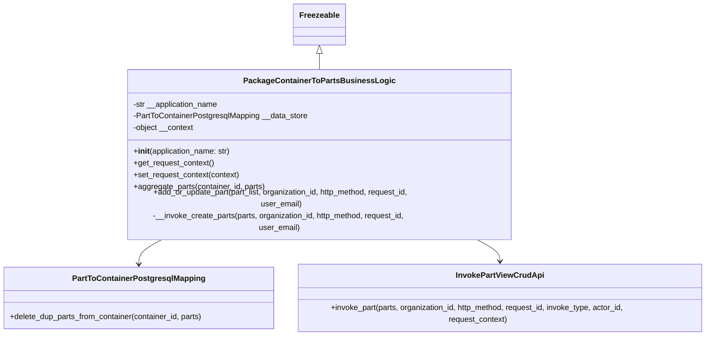
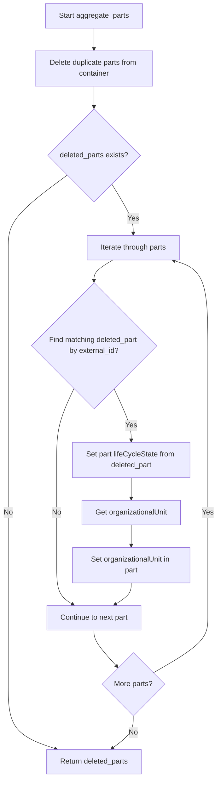
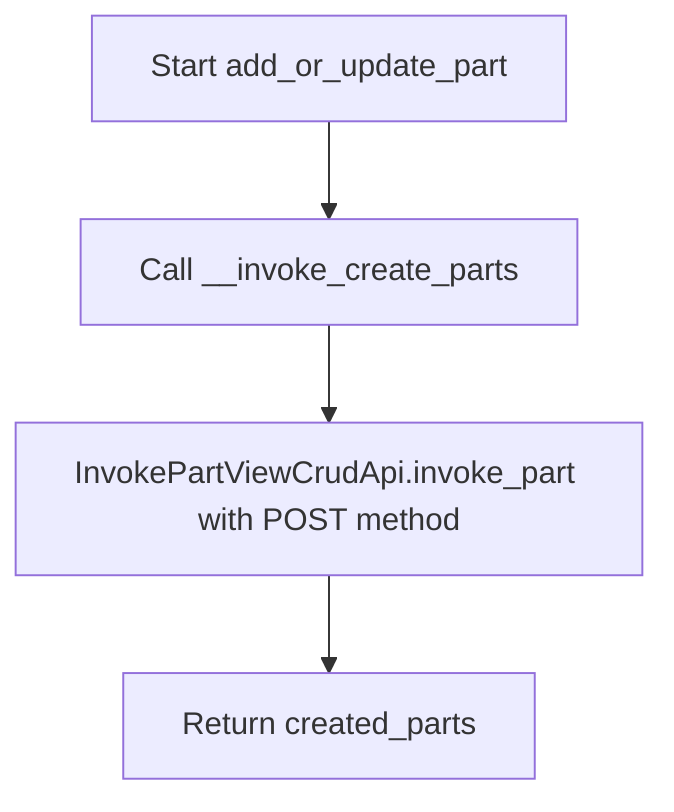

# Diagram: platform/partview_core/partview_service/partview_service/core/business/part/PackageContainerToPartsBusinessLogic.py

> Auto-generated by Obscura crawlers

## Diagram 1

### SVG

<svg id="container" width="1467.5703125" xmlns="http://www.w3.org/2000/svg" class="classDiagram" height="638" viewBox="0 0 1467.5703125 638" role="graphics-document document" aria-roledescription="class"><g><defs><marker id="container_class-aggregationStart" class="marker aggregation class" refX="18" refY="7" markerWidth="190" markerHeight="240" orient="auto"><path d="M 18,7 L9,13 L1,7 L9,1 Z"></path></marker></defs><defs><marker id="container_class-aggregationEnd" class="marker aggregation class" refX="1" refY="7" markerWidth="20" markerHeight="28" orient="auto"><path d="M 18,7 L9,13 L1,7 L9,1 Z"></path></marker></defs><defs><marker id="container_class-extensionStart" class="marker extension class" refX="18" refY="7" markerWidth="190" markerHeight="240" orient="auto"><path d="M 1,7 L18,13 V 1 Z"></path></marker></defs><defs><marker id="container_class-extensionEnd" class="marker extension class" refX="1" refY="7" markerWidth="20" markerHeight="28" orient="auto"><path d="M 1,1 V 13 L18,7 Z"></path></marker></defs><defs><marker id="container_class-compositionStart" class="marker composition class" refX="18" refY="7" markerWidth="190" markerHeight="240" orient="auto"><path d="M 18,7 L9,13 L1,7 L9,1 Z"></path></marker></defs><defs><marker id="container_class-compositionEnd" class="marker composition class" refX="1" refY="7" markerWidth="20" markerHeight="28" orient="auto"><path d="M 18,7 L9,13 L1,7 L9,1 Z"></path></marker></defs><defs><marker id="container_class-dependencyStart" class="marker dependency class" refX="6" refY="7" markerWidth="190" markerHeight="240" orient="auto"><path d="M 5,7 L9,13 L1,7 L9,1 Z"></path></marker></defs><defs><marker id="container_class-dependencyEnd" class="marker dependency class" refX="13" refY="7" markerWidth="20" markerHeight="28" orient="auto"><path d="M 18,7 L9,13 L14,7 L9,1 Z"></path></marker></defs><defs><marker id="container_class-lollipopStart" class="marker lollipop class" refX="13" refY="7" markerWidth="190" markerHeight="240" orient="auto"><circle stroke="black" fill="transparent" cx="7" cy="7" r="6"></circle></marker></defs><defs><marker id="container_class-lollipopEnd" class="marker lollipop class" refX="1" refY="7" markerWidth="190" markerHeight="240" orient="auto"><circle stroke="black" fill="transparent" cx="7" cy="7" r="6"></circle></marker></defs><g class="root"><g class="clusters"></g><g class="edgePaths"><path d="M660.514,109.25L660.514,110.542C660.514,111.833,660.514,114.417,660.514,119.875C660.514,125.333,660.514,133.667,660.514,137.833L660.514,142" id="id_Freezeable_PackageContainerToPartsBusinessLogic_1" class="edge-thickness-normal edge-pattern-solid relation" style=";;;" data-edge="true" data-et="edge" data-id="id_Freezeable_PackageContainerToPartsBusinessLogic_1" data-points="W3sieCI6NjYwLjUxMzY3MTg3NSwieSI6OTJ9LHsieCI6NjYwLjUxMzY3MTg3NSwieSI6MTE3fSx7IngiOjY2MC41MTM2NzE4NzUsInkiOjE0Mn1d" marker-start="url(#container_class-extensionStart)"></path><path d="M336.971,454L328.329,458.167C319.688,462.333,302.404,470.667,293.763,478C285.121,485.333,285.121,491.667,285.121,494.833L285.121,498" id="id_PackageContainerToPartsBusinessLogic_PartToContainerPostgresqlMapping_2" class="edge-thickness-normal edge-pattern-solid relation" style=";;;" data-edge="true" data-et="edge" data-id="id_PackageContainerToPartsBusinessLogic_PartToContainerPostgresqlMapping_2" data-points="W3sieCI6MzM2Ljk3MDg5NzM1ODQyNTQsInkiOjQ1NH0seyJ4IjoyODUuMTIxMDkzNzUsInkiOjQ3OX0seyJ4IjoyODUuMTIxMDkzNzUsInkiOjUwNH1d" marker-end="url(#container_class-dependencyEnd)"></path><path d="M984.056,454L992.698,458.167C1001.34,462.333,1018.623,470.667,1027.265,478C1035.906,485.333,1035.906,491.667,1035.906,494.833L1035.906,498" id="id_PackageContainerToPartsBusinessLogic_InvokePartViewCrudApi_3" class="edge-thickness-normal edge-pattern-solid relation" style=";;;" data-edge="true" data-et="edge" data-id="id_PackageContainerToPartsBusinessLogic_InvokePartViewCrudApi_3" data-points="W3sieCI6OTg0LjA1NjQ0NjM5MTU3NDYsInkiOjQ1NH0seyJ4IjoxMDM1LjkwNjI1LCJ5Ijo0Nzl9LHsieCI6MTAzNS45MDYyNSwieSI6NTA0fV0=" marker-end="url(#container_class-dependencyEnd)"></path></g><g class="edgeLabels"><g class="edgeLabel"><g class="label" data-id="id_Freezeable_PackageContainerToPartsBusinessLogic_1" transform="translate(0, 0)"><foreignObject width="0" height="0">

</foreignObject></g></g><g class="edgeLabel"><g class="label" data-id="id_PackageContainerToPartsBusinessLogic_PartToContainerPostgresqlMapping_2" transform="translate(0, 0)"><foreignObject width="0" height="0">

</foreignObject></g></g><g class="edgeLabel"><g class="label" data-id="id_PackageContainerToPartsBusinessLogic_InvokePartViewCrudApi_3" transform="translate(0, 0)"><foreignObject width="0" height="0">

</foreignObject></g></g></g><g class="nodes"><g class="node default" id="classId-Freezeable-0" transform="translate(660.513671875, 50)"><g class="basic label-container"><path d="M-51.1953125 -42 L51.1953125 -42 L51.1953125 42 L-51.1953125 42" stroke="none" stroke-width="0" fill="#ECECFF" style=""></path><path d="M-51.1953125 -42 C-21.39159414541289 -42, 8.412124209174223 -42, 51.1953125 -42 M-51.1953125 -42 C-24.18579807769668 -42, 2.8237163446066376 -42, 51.1953125 -42 M51.1953125 -42 C51.1953125 -15.346234751748629, 51.1953125 11.307530496502743, 51.1953125 42 M51.1953125 -42 C51.1953125 -22.99057382029314, 51.1953125 -3.981147640586279, 51.1953125 42 M51.1953125 42 C30.67945051580976 42, 10.163588531619517 42, -51.1953125 42 M51.1953125 42 C25.19687045395117 42, -0.8015715920976589 42, -51.1953125 42 M-51.1953125 42 C-51.1953125 13.415934951475055, -51.1953125 -15.16813009704989, -51.1953125 -42 M-51.1953125 42 C-51.1953125 12.12096023288213, -51.1953125 -17.75807953423574, -51.1953125 -42" stroke="#9370DB" stroke-width="1.3" fill="none" stroke-dasharray="0 0" style=""></path></g><g class="annotation-group text" transform="translate(0, -18)"></g><g class="label-group text" transform="translate(-39.1953125, -18)"><g class="label" style="font-weight: bolder" transform="translate(0,-12)"><foreignObject width="78.390625" height="24">

Freezeable

</foreignObject></g></g><g class="members-group text" transform="translate(-39.1953125, 30)"></g><g class="methods-group text" transform="translate(-39.1953125, 60)"></g><g class="divider" style=""><path d="M-51.1953125 6 C-26.090501665699513 6, -0.985690831399026 6, 51.1953125 6 M-51.1953125 6 C-18.37710526812343 6, 14.441101963753141 6, 51.1953125 6" stroke="#9370DB" stroke-width="1.3" fill="none" stroke-dasharray="0 0" style=""></path></g><g class="divider" style=""><path d="M-51.1953125 24 C-11.697332598311355 24, 27.80064730337729 24, 51.1953125 24 M-51.1953125 24 C-17.2587781335583 24, 16.677756232883397 24, 51.1953125 24" stroke="#9370DB" stroke-width="1.3" fill="none" stroke-dasharray="0 0" style=""></path></g></g><g class="node default" id="classId-PackageContainerToPartsBusinessLogic-1" transform="translate(660.513671875, 298)"><g class="basic label-container"><path d="M-395.4765625 -156 L395.4765625 -156 L395.4765625 156 L-395.4765625 156" stroke="none" stroke-width="0" fill="#ECECFF" style=""></path><path d="M-395.4765625 -156 C-151.88894254586384 -156, 91.69867740827232 -156, 395.4765625 -156 M-395.4765625 -156 C-93.73979881211102 -156, 207.99696487577796 -156, 395.4765625 -156 M395.4765625 -156 C395.4765625 -42.849992386890136, 395.4765625 70.30001522621973, 395.4765625 156 M395.4765625 -156 C395.4765625 -56.40746896672265, 395.4765625 43.18506206655471, 395.4765625 156 M395.4765625 156 C160.48879026544023 156, -74.49898196911954 156, -395.4765625 156 M395.4765625 156 C169.7818595484732 156, -55.912843403053614 156, -395.4765625 156 M-395.4765625 156 C-395.4765625 45.85820072587045, -395.4765625 -64.2835985482591, -395.4765625 -156 M-395.4765625 156 C-395.4765625 34.08944642805699, -395.4765625 -87.82110714388602, -395.4765625 -156" stroke="#9370DB" stroke-width="1.3" fill="none" stroke-dasharray="0 0" style=""></path></g><g class="annotation-group text" transform="translate(0, -132)"></g><g class="label-group text" transform="translate(-144.34375, -132)"><g class="label" style="font-weight: bolder" transform="translate(0,-12)"><foreignObject width="288.6875" height="24">

PackageContainerToPartsBusinessLogic

</foreignObject></g></g><g class="members-group text" transform="translate(-383.4765625, -84)"><g class="label" style="" transform="translate(0,-12)"><foreignObject width="177.21875" height="24">

-str __application_name

</foreignObject></g><g class="label" style="" transform="translate(0,12)"><foreignObject width="358.90625" height="24">

-PartToContainerPostgresqlMapping __data_store

</foreignObject></g><g class="label" style="" transform="translate(0,36)"><foreignObject width="126.03125" height="24">

-object __context

</foreignObject></g></g><g class="methods-group text" transform="translate(-383.4765625, 12)"><g class="label" style="" transform="translate(0,-12)"><foreignObject width="201.25" height="24">

+<strong>init</strong>(application_name: str)

</foreignObject></g><g class="label" style="" transform="translate(0,12)"><foreignObject width="166.203125" height="24">

+get_request_context()

</foreignObject></g><g class="label" style="" transform="translate(0,36)"><foreignObject width="219.296875" height="24">

+set_request_context(context)

</foreignObject></g><g class="label" style="" transform="translate(0,60)"><foreignObject width="270.046875" height="24">

+aggregate_parts(container_id, parts)

</foreignObject></g><g class="label" style="" transform="translate(0,84)"><foreignObject width="622.609375" height="24">

+add_or_update_part(part_list, organization_id, http_method, request_id, user_email)

</foreignObject></g><g class="label" style="" transform="translate(0,108)"><foreignObject width="611.609375" height="24">

-__invoke_create_parts(parts, organization_id, http_method, request_id, user_email)

</foreignObject></g></g><g class="divider" style=""><path d="M-395.4765625 -108 C-231.16377708028975 -108, -66.8509916605795 -108, 395.4765625 -108 M-395.4765625 -108 C-144.770152771323 -108, 105.93625695735398 -108, 395.4765625 -108" stroke="#9370DB" stroke-width="1.3" fill="none" stroke-dasharray="0 0" style=""></path></g><g class="divider" style=""><path d="M-395.4765625 -12 C-213.41095061578392 -12, -31.345338731567836 -12, 395.4765625 -12 M-395.4765625 -12 C-128.10300535560833 -12, 139.27055178878334 -12, 395.4765625 -12" stroke="#9370DB" stroke-width="1.3" fill="none" stroke-dasharray="0 0" style=""></path></g></g><g class="node default" id="classId-PartToContainerPostgresqlMapping-2" transform="translate(285.12109375, 567)"><g class="basic label-container"><path d="M-277.12109375 -63 L277.12109375 -63 L277.12109375 63 L-277.12109375 63" stroke="none" stroke-width="0" fill="#ECECFF" style=""></path><path d="M-277.12109375 -63 C-162.60494931746393 -63, -48.08880488492787 -63, 277.12109375 -63 M-277.12109375 -63 C-82.47933645674055 -63, 112.16242083651889 -63, 277.12109375 -63 M277.12109375 -63 C277.12109375 -35.881138274169864, 277.12109375 -8.762276548339727, 277.12109375 63 M277.12109375 -63 C277.12109375 -15.084931300482985, 277.12109375 32.83013739903403, 277.12109375 63 M277.12109375 63 C142.08957912069894 63, 7.058064491397886 63, -277.12109375 63 M277.12109375 63 C155.54265687651235 63, 33.964220003024735 63, -277.12109375 63 M-277.12109375 63 C-277.12109375 33.799488684581966, -277.12109375 4.598977369163933, -277.12109375 -63 M-277.12109375 63 C-277.12109375 25.75930621024027, -277.12109375 -11.481387579519463, -277.12109375 -63" stroke="#9370DB" stroke-width="1.3" fill="none" stroke-dasharray="0 0" style=""></path></g><g class="annotation-group text" transform="translate(0, -39)"></g><g class="label-group text" transform="translate(-129.6171875, -39)"><g class="label" style="font-weight: bolder" transform="translate(0,-12)"><foreignObject width="259.234375" height="24">

PartToContainerPostgresqlMapping

</foreignObject></g></g><g class="members-group text" transform="translate(-265.12109375, 9)"></g><g class="methods-group text" transform="translate(-265.12109375, 39)"><g class="label" style="" transform="translate(0,-12)"><foreignObject width="400.625" height="24">

+delete_dup_parts_from_container(container_id, parts)

</foreignObject></g></g><g class="divider" style=""><path d="M-277.12109375 -15 C-92.37368730433403 -15, 92.37371914133195 -15, 277.12109375 -15 M-277.12109375 -15 C-126.11483797279718 -15, 24.89141780440565 -15, 277.12109375 -15" stroke="#9370DB" stroke-width="1.3" fill="none" stroke-dasharray="0 0" style=""></path></g><g class="divider" style=""><path d="M-277.12109375 9 C-112.98761815022567 9, 51.14585744954866 9, 277.12109375 9 M-277.12109375 9 C-161.5366850606153 9, -45.952276371230624 9, 277.12109375 9" stroke="#9370DB" stroke-width="1.3" fill="none" stroke-dasharray="0 0" style=""></path></g></g><g class="node default" id="classId-InvokePartViewCrudApi-3" transform="translate(1035.90625, 567)"><g class="basic label-container"><path d="M-423.6640625 -63 L423.6640625 -63 L423.6640625 63 L-423.6640625 63" stroke="none" stroke-width="0" fill="#ECECFF" style=""></path><path d="M-423.6640625 -63 C-196.40283048960504 -63, 30.858401520789926 -63, 423.6640625 -63 M-423.6640625 -63 C-192.9299330747117 -63, 37.8041963505766 -63, 423.6640625 -63 M423.6640625 -63 C423.6640625 -27.391103938737267, 423.6640625 8.217792122525466, 423.6640625 63 M423.6640625 -63 C423.6640625 -15.658612515739435, 423.6640625 31.68277496852113, 423.6640625 63 M423.6640625 63 C92.4068584017192 63, -238.8503456965616 63, -423.6640625 63 M423.6640625 63 C146.07346567522552 63, -131.51713114954896 63, -423.6640625 63 M-423.6640625 63 C-423.6640625 26.415643536463072, -423.6640625 -10.168712927073855, -423.6640625 -63 M-423.6640625 63 C-423.6640625 32.31354715616779, -423.6640625 1.6270943123355863, -423.6640625 -63" stroke="#9370DB" stroke-width="1.3" fill="none" stroke-dasharray="0 0" style=""></path></g><g class="annotation-group text" transform="translate(0, -39)"></g><g class="label-group text" transform="translate(-85.484375, -39)"><g class="label" style="font-weight: bolder" transform="translate(0,-12)"><foreignObject width="170.96875" height="24">

InvokePartViewCrudApi

</foreignObject></g></g><g class="members-group text" transform="translate(-411.6640625, 9)"></g><g class="methods-group text" transform="translate(-411.6640625, 39)"><g class="label" style="" transform="translate(0,-12)"><foreignObject width="737.84375" height="24">

+invoke_part(parts, organization_id, http_method, request_id, invoke_type, actor_id, request_context)

</foreignObject></g></g><g class="divider" style=""><path d="M-423.6640625 -15 C-215.65721997022965 -15, -7.650377440459295 -15, 423.6640625 -15 M-423.6640625 -15 C-112.86234539310868 -15, 197.93937171378263 -15, 423.6640625 -15" stroke="#9370DB" stroke-width="1.3" fill="none" stroke-dasharray="0 0" style=""></path></g><g class="divider" style=""><path d="M-423.6640625 9 C-154.44879474148587 9, 114.76647301702826 9, 423.6640625 9 M-423.6640625 9 C-161.89650761899264 9, 99.87104726201471 9, 423.6640625 9" stroke="#9370DB" stroke-width="1.3" fill="none" stroke-dasharray="0 0" style=""></path></g></g></g></g></g></svg>

## Diagram 2

### SVG

<svg id="container" width="491.8125" xmlns="http://www.w3.org/2000/svg" class="flowchart" height="1740.703125" viewBox="0 0 491.8125 1740.703125" role="graphics-document document" aria-roledescription="flowchart-v2"><g><marker id="container_flowchart-v2-pointEnd" class="marker flowchart-v2" viewBox="0 0 10 10" refX="5" refY="5" markerUnits="userSpaceOnUse" markerWidth="8" markerHeight="8" orient="auto"><path d="M 0 0 L 10 5 L 0 10 z" class="arrowMarkerPath" style="stroke-width: 1; stroke-dasharray: 1, 0;"></path></marker><marker id="container_flowchart-v2-pointStart" class="marker flowchart-v2" viewBox="0 0 10 10" refX="4.5" refY="5" markerUnits="userSpaceOnUse" markerWidth="8" markerHeight="8" orient="auto"><path d="M 0 5 L 10 10 L 10 0 z" class="arrowMarkerPath" style="stroke-width: 1; stroke-dasharray: 1, 0;"></path></marker><marker id="container_flowchart-v2-circleEnd" class="marker flowchart-v2" viewBox="0 0 10 10" refX="11" refY="5" markerUnits="userSpaceOnUse" markerWidth="11" markerHeight="11" orient="auto"><circle cx="5" cy="5" r="5" class="arrowMarkerPath" style="stroke-width: 1; stroke-dasharray: 1, 0;"></circle></marker><marker id="container_flowchart-v2-circleStart" class="marker flowchart-v2" viewBox="0 0 10 10" refX="-1" refY="5" markerUnits="userSpaceOnUse" markerWidth="11" markerHeight="11" orient="auto"><circle cx="5" cy="5" r="5" class="arrowMarkerPath" style="stroke-width: 1; stroke-dasharray: 1, 0;"></circle></marker><marker id="container_flowchart-v2-crossEnd" class="marker cross flowchart-v2" viewBox="0 0 11 11" refX="12" refY="5.2" markerUnits="userSpaceOnUse" markerWidth="11" markerHeight="11" orient="auto"><path d="M 1,1 l 9,9 M 10,1 l -9,9" class="arrowMarkerPath" style="stroke-width: 2; stroke-dasharray: 1, 0;"></path></marker><marker id="container_flowchart-v2-crossStart" class="marker cross flowchart-v2" viewBox="0 0 11 11" refX="-1" refY="5.2" markerUnits="userSpaceOnUse" markerWidth="11" markerHeight="11" orient="auto"><path d="M 1,1 l 9,9 M 10,1 l -9,9" class="arrowMarkerPath" style="stroke-width: 2; stroke-dasharray: 1, 0;"></path></marker><g class="root"><g class="clusters"></g><g class="edgePaths"><path d="M213.781,62L213.781,66.167C213.781,70.333,213.781,78.667,213.781,86.333C213.781,94,213.781,101,213.781,104.5L213.781,108" id="L_A_B_0" class="edge-thickness-normal edge-pattern-solid edge-thickness-normal edge-pattern-solid flowchart-link" style=";" data-edge="true" data-et="edge" data-id="L_A_B_0" data-points="W3sieCI6MjEzLjc4MTI1LCJ5Ijo2Mn0seyJ4IjoyMTMuNzgxMjUsInkiOjg3fSx7IngiOjIxMy43ODEyNSwieSI6MTEyfV0=" marker-end="url(#container_flowchart-v2-pointEnd)"></path><path d="M213.781,190L213.781,194.167C213.781,198.333,213.781,206.667,213.781,214.333C213.781,222,213.781,229,213.781,232.5L213.781,236" id="L_B_C_0" class="edge-thickness-normal edge-pattern-solid edge-thickness-normal edge-pattern-solid flowchart-link" style=";" data-edge="true" data-et="edge" data-id="L_B_C_0" data-points="W3sieCI6MjEzLjc4MTI1LCJ5IjoxOTB9LHsieCI6MjEzLjc4MTI1LCJ5IjoyMTV9LHsieCI6MjEzLjc4MTI1LCJ5IjoyNDB9XQ==" marker-end="url(#container_flowchart-v2-pointEnd)"></path><path d="M153.36,387.485L130.823,403.722C108.287,419.959,63.214,452.432,40.677,479.336C18.141,506.24,18.141,527.573,18.141,546.906C18.141,566.24,18.141,583.573,18.141,621.573C18.141,659.573,18.141,718.24,18.141,778.906C18.141,839.573,18.141,902.24,18.141,946.24C18.141,990.24,18.141,1015.573,18.141,1038.906C18.141,1062.24,18.141,1083.573,18.141,1102.906C18.141,1122.24,18.141,1139.573,18.141,1156.906C18.141,1174.24,18.141,1191.573,18.141,1210.906C18.141,1230.24,18.141,1251.573,18.141,1272.906C18.141,1294.24,18.141,1315.573,18.141,1334.906C18.141,1354.24,18.141,1371.573,18.141,1388.906C18.141,1406.24,18.141,1423.573,18.141,1447.973C18.141,1472.372,18.141,1503.839,18.141,1537.305C18.141,1570.771,18.141,1606.237,36.358,1629.929C54.575,1653.622,91.009,1665.541,109.226,1671.5L127.444,1677.459" id="L_C_D_0" class="edge-thickness-normal edge-pattern-solid edge-thickness-normal edge-pattern-solid flowchart-link" style=";" data-edge="true" data-et="edge" data-id="L_C_D_0" data-points="W3sieCI6MTUzLjM1OTg4MzQ1NDQxNDY0LCJ5IjozODcuNDg0ODgzNDU0NDE0Nn0seyJ4IjoxOC4xNDA2MjUsInkiOjQ4NC45MDYyNX0seyJ4IjoxOC4xNDA2MjUsInkiOjU0OC45MDYyNX0seyJ4IjoxOC4xNDA2MjUsInkiOjYwMC45MDYyNX0seyJ4IjoxOC4xNDA2MjUsInkiOjc3Ni45MDYyNX0seyJ4IjoxOC4xNDA2MjUsInkiOjk2NC45MDYyNX0seyJ4IjoxOC4xNDA2MjUsInkiOjEwNDAuOTA2MjV9LHsieCI6MTguMTQwNjI1LCJ5IjoxMTA0LjkwNjI1fSx7IngiOjE4LjE0MDYyNSwieSI6MTE1Ni45MDYyNX0seyJ4IjoxOC4xNDA2MjUsInkiOjEyMDguOTA2MjV9LHsieCI6MTguMTQwNjI1LCJ5IjoxMjcyLjkwNjI1fSx7IngiOjE4LjE0MDYyNSwieSI6MTMzNi45MDYyNX0seyJ4IjoxOC4xNDA2MjUsInkiOjEzODguOTA2MjV9LHsieCI6MTguMTQwNjI1LCJ5IjoxNDQwLjkwNjI1fSx7IngiOjE4LjE0MDYyNSwieSI6MTUzNS4zMDQ2ODc1fSx7IngiOjE4LjE0MDYyNSwieSI6MTY0MS43MDMxMjV9LHsieCI6MTMxLjI0NTM2MTMyODEyNSwieSI6MTY3OC43MDMxMjV9XQ==" marker-end="url(#container_flowchart-v2-pointEnd)"></path><path d="M255.104,406.583L263.717,419.637C272.33,432.691,289.556,458.799,298.168,477.352C306.781,495.906,306.781,506.906,306.781,512.406L306.781,517.906" id="L_C_E_0" class="edge-thickness-normal edge-pattern-solid edge-thickness-normal edge-pattern-solid flowchart-link" style=";" data-edge="true" data-et="edge" data-id="L_C_E_0" data-points="W3sieCI6MjU1LjEwNDIzMTM2NjQ1OTYzLCJ5Ijo0MDYuNTgzMjY4NjMzNTQwNH0seyJ4IjozMDYuNzgxMjUsInkiOjQ4NC45MDYyNX0seyJ4IjozMDYuNzgxMjUsInkiOjUyMS45MDYyNX1d" marker-end="url(#container_flowchart-v2-pointEnd)"></path><path d="M258.493,575.906L251.041,580.073C243.589,584.24,228.685,592.573,221.233,600.24C213.781,607.906,213.781,614.906,213.781,618.406L213.781,621.906" id="L_E_F_0" class="edge-thickness-normal edge-pattern-solid edge-thickness-normal edge-pattern-solid flowchart-link" style=";" data-edge="true" data-et="edge" data-id="L_E_F_0" data-points="W3sieCI6MjU4LjQ5Mjc4ODQ2MTUzODQ1LCJ5Ijo1NzUuOTA2MjV9LHsieCI6MjEzLjc4MTI1LCJ5Ijo2MDAuOTA2MjV9LHsieCI6MjEzLjc4MTI1LCJ5Ijo2MjUuOTA2MjV9XQ==" marker-end="url(#container_flowchart-v2-pointEnd)"></path><path d="M259.835,881.853L265.909,895.695C271.984,909.537,284.132,937.222,290.207,956.564C296.281,975.906,296.281,986.906,296.281,992.406L296.281,997.906" id="L_F_G_0" class="edge-thickness-normal edge-pattern-solid edge-thickness-normal edge-pattern-solid flowchart-link" style=";" data-edge="true" data-et="edge" data-id="L_F_G_0" data-points="W3sieCI6MjU5LjgzNDg1NDQzNjIyOTIsInkiOjg4MS44NTI2NDU1NjM3NzA4fSx7IngiOjI5Ni4yODEyNSwieSI6OTY0LjkwNjI1fSx7IngiOjI5Ni4yODEyNSwieSI6MTAwMS45MDYyNX1d" marker-end="url(#container_flowchart-v2-pointEnd)"></path><path d="M167.728,881.853L161.653,895.695C155.579,909.537,143.43,937.222,137.356,963.731C131.281,990.24,131.281,1015.573,131.281,1038.906C131.281,1062.24,131.281,1083.573,131.281,1102.906C131.281,1122.24,131.281,1139.573,131.281,1156.906C131.281,1174.24,131.281,1191.573,131.281,1210.906C131.281,1230.24,131.281,1251.573,131.281,1272.906C131.281,1294.24,131.281,1315.573,137.328,1330.051C143.374,1344.529,155.468,1352.151,161.514,1355.962L167.561,1359.773" id="L_F_H_0" class="edge-thickness-normal edge-pattern-solid edge-thickness-normal edge-pattern-solid flowchart-link" style=";" data-edge="true" data-et="edge" data-id="L_F_H_0" data-points="W3sieCI6MTY3LjcyNzY0NTU2Mzc3MDgsInkiOjg4MS44NTI2NDU1NjM3NzA4fSx7IngiOjEzMS4yODEyNSwieSI6OTY0LjkwNjI1fSx7IngiOjEzMS4yODEyNSwieSI6MTA0MC45MDYyNX0seyJ4IjoxMzEuMjgxMjUsInkiOjExMDQuOTA2MjV9LHsieCI6MTMxLjI4MTI1LCJ5IjoxMTU2LjkwNjI1fSx7IngiOjEzMS4yODEyNSwieSI6MTIwOC45MDYyNX0seyJ4IjoxMzEuMjgxMjUsInkiOjEyNzIuOTA2MjV9LHsieCI6MTMxLjI4MTI1LCJ5IjoxMzM2LjkwNjI1fSx7IngiOjE3MC45NDQ3MTE1Mzg0NjE1NSwieSI6MTM2MS45MDYyNX1d" marker-end="url(#container_flowchart-v2-pointEnd)"></path><path d="M296.281,1079.906L296.281,1084.073C296.281,1088.24,296.281,1096.573,296.281,1104.24C296.281,1111.906,296.281,1118.906,296.281,1122.406L296.281,1125.906" id="L_G_I_0" class="edge-thickness-normal edge-pattern-solid edge-thickness-normal edge-pattern-solid flowchart-link" style=";" data-edge="true" data-et="edge" data-id="L_G_I_0" data-points="W3sieCI6Mjk2LjI4MTI1LCJ5IjoxMDc5LjkwNjI1fSx7IngiOjI5Ni4yODEyNSwieSI6MTEwNC45MDYyNX0seyJ4IjoyOTYuMjgxMjUsInkiOjExMjkuOTA2MjV9XQ==" marker-end="url(#container_flowchart-v2-pointEnd)"></path><path d="M296.281,1183.906L296.281,1188.073C296.281,1192.24,296.281,1200.573,296.281,1208.24C296.281,1215.906,296.281,1222.906,296.281,1226.406L296.281,1229.906" id="L_I_J_0" class="edge-thickness-normal edge-pattern-solid edge-thickness-normal edge-pattern-solid flowchart-link" style=";" data-edge="true" data-et="edge" data-id="L_I_J_0" data-points="W3sieCI6Mjk2LjI4MTI1LCJ5IjoxMTgzLjkwNjI1fSx7IngiOjI5Ni4yODEyNSwieSI6MTIwOC45MDYyNX0seyJ4IjoyOTYuMjgxMjUsInkiOjEyMzMuOTA2MjV9XQ==" marker-end="url(#container_flowchart-v2-pointEnd)"></path><path d="M296.281,1311.906L296.281,1316.073C296.281,1320.24,296.281,1328.573,290.235,1336.551C284.188,1344.529,272.095,1352.151,266.048,1355.962L260.002,1359.773" id="L_J_H_0" class="edge-thickness-normal edge-pattern-solid edge-thickness-normal edge-pattern-solid flowchart-link" style=";" data-edge="true" data-et="edge" data-id="L_J_H_0" data-points="W3sieCI6Mjk2LjI4MTI1LCJ5IjoxMzExLjkwNjI1fSx7IngiOjI5Ni4yODEyNSwieSI6MTMzNi45MDYyNX0seyJ4IjoyNTYuNjE3Nzg4NDYxNTM4NDUsInkiOjEzNjEuOTA2MjV9XQ==" marker-end="url(#container_flowchart-v2-pointEnd)"></path><path d="M213.781,1415.906L213.781,1420.073C213.781,1424.24,213.781,1432.573,223.073,1446.171C232.365,1459.77,250.95,1478.633,260.242,1488.065L269.534,1497.497" id="L_H_K_0" class="edge-thickness-normal edge-pattern-solid edge-thickness-normal edge-pattern-solid flowchart-link" style=";" data-edge="true" data-et="edge" data-id="L_H_K_0" data-points="W3sieCI6MjEzLjc4MTI1LCJ5IjoxNDE1LjkwNjI1fSx7IngiOjIxMy43ODEyNSwieSI6MTQ0MC45MDYyNX0seyJ4IjoyNzIuMzQwOTY5ODQ4MjUxMSwieSI6MTUwMC4zNDY1MzAxNTE3NDg4fV0=" marker-end="url(#container_flowchart-v2-pointEnd)"></path><path d="M350.925,1510.05L371.067,1498.526C391.21,1487.002,431.496,1463.954,451.638,1443.763C471.781,1423.573,471.781,1406.24,471.781,1388.906C471.781,1371.573,471.781,1354.24,471.781,1334.906C471.781,1315.573,471.781,1294.24,471.781,1272.906C471.781,1251.573,471.781,1230.24,471.781,1210.906C471.781,1191.573,471.781,1174.24,471.781,1156.906C471.781,1139.573,471.781,1122.24,471.781,1102.906C471.781,1083.573,471.781,1062.24,471.781,1038.906C471.781,1015.573,471.781,990.24,471.781,946.24C471.781,902.24,471.781,839.573,471.781,778.906C471.781,718.24,471.781,659.573,459.196,626.273C446.611,592.974,421.44,585.041,408.855,581.075L396.269,577.109" id="L_K_E_0" class="edge-thickness-normal edge-pattern-solid edge-thickness-normal edge-pattern-solid flowchart-link" style=";" data-edge="true" data-et="edge" data-id="L_K_E_0" data-points="W3sieCI6MzUwLjkyNDcwMDg5Mjk5MTYsInkiOjE1MTAuMDQ5NzAwODkyOTkxNX0seyJ4Ijo0NzEuNzgxMjUsInkiOjE0NDAuOTA2MjV9LHsieCI6NDcxLjc4MTI1LCJ5IjoxMzg4LjkwNjI1fSx7IngiOjQ3MS43ODEyNSwieSI6MTMzNi45MDYyNX0seyJ4Ijo0NzEuNzgxMjUsInkiOjEyNzIuOTA2MjV9LHsieCI6NDcxLjc4MTI1LCJ5IjoxMjA4LjkwNjI1fSx7IngiOjQ3MS43ODEyNSwieSI6MTE1Ni45MDYyNX0seyJ4Ijo0NzEuNzgxMjUsInkiOjExMDQuOTA2MjV9LHsieCI6NDcxLjc4MTI1LCJ5IjoxMDQwLjkwNjI1fSx7IngiOjQ3MS43ODEyNSwieSI6OTY0LjkwNjI1fSx7IngiOjQ3MS43ODEyNSwieSI6Nzc2LjkwNjI1fSx7IngiOjQ3MS43ODEyNSwieSI6NjAwLjkwNjI1fSx7IngiOjM5Mi40NTQzMjY5MjMwNzY5LCJ5Ijo1NzUuOTA2MjV9XQ==" marker-end="url(#container_flowchart-v2-pointEnd)"></path><path d="M306.781,1604.703L306.781,1610.87C306.781,1617.036,306.781,1629.37,298.37,1641.325C289.958,1653.281,273.134,1664.858,264.723,1670.647L256.311,1676.436" id="L_K_D_0" class="edge-thickness-normal edge-pattern-solid edge-thickness-normal edge-pattern-solid flowchart-link" style=";" data-edge="true" data-et="edge" data-id="L_K_D_0" data-points="W3sieCI6MzA2Ljc4MTI1LCJ5IjoxNjA0LjcwMzEyNX0seyJ4IjozMDYuNzgxMjUsInkiOjE2NDEuNzAzMTI1fSx7IngiOjI1My4wMTU2MjUsInkiOjE2NzguNzAzMTI1fV0=" marker-end="url(#container_flowchart-v2-pointEnd)"></path></g><g class="edgeLabels"><g class="edgeLabel"><g class="label" data-id="L_A_B_0" transform="translate(0, 0)"><foreignObject width="0" height="0">

</foreignObject></g></g><g class="edgeLabel"><g class="label" data-id="L_B_C_0" transform="translate(0, 0)"><foreignObject width="0" height="0">

</foreignObject></g></g><g class="edgeLabel" transform="translate(18.140625, 1156.90625)"><g class="label" data-id="L_C_D_0" transform="translate(-10.140625, -12)"><foreignObject width="20.28125" height="24">

No

</foreignObject></g></g><g class="edgeLabel" transform="translate(306.78125, 484.90625)"><g class="label" data-id="L_C_E_0" transform="translate(-12.03125, -12)"><foreignObject width="24.0625" height="24">

Yes

</foreignObject></g></g><g class="edgeLabel"><g class="label" data-id="L_E_F_0" transform="translate(0, 0)"><foreignObject width="0" height="0">

</foreignObject></g></g><g class="edgeLabel" transform="translate(296.28125, 964.90625)"><g class="label" data-id="L_F_G_0" transform="translate(-12.03125, -12)"><foreignObject width="24.0625" height="24">

Yes

</foreignObject></g></g><g class="edgeLabel" transform="translate(131.28125, 1156.90625)"><g class="label" data-id="L_F_H_0" transform="translate(-10.140625, -12)"><foreignObject width="20.28125" height="24">

No

</foreignObject></g></g><g class="edgeLabel"><g class="label" data-id="L_G_I_0" transform="translate(0, 0)"><foreignObject width="0" height="0">

</foreignObject></g></g><g class="edgeLabel"><g class="label" data-id="L_I_J_0" transform="translate(0, 0)"><foreignObject width="0" height="0">

</foreignObject></g></g><g class="edgeLabel"><g class="label" data-id="L_J_H_0" transform="translate(0, 0)"><foreignObject width="0" height="0">

</foreignObject></g></g><g class="edgeLabel"><g class="label" data-id="L_H_K_0" transform="translate(0, 0)"><foreignObject width="0" height="0">

</foreignObject></g></g><g class="edgeLabel" transform="translate(471.78125, 1156.90625)"><g class="label" data-id="L_K_E_0" transform="translate(-12.03125, -12)"><foreignObject width="24.0625" height="24">

Yes

</foreignObject></g></g><g class="edgeLabel" transform="translate(306.78125, 1641.703125)"><g class="label" data-id="L_K_D_0" transform="translate(-10.140625, -12)"><foreignObject width="20.28125" height="24">

No

</foreignObject></g></g></g><g class="nodes"><g class="node default" id="flowchart-A-0" transform="translate(213.78125, 35)"><rect class="basic label-container" style="" x="-107.671875" y="-27" width="215.34375" height="54"></rect><g class="label" style="" transform="translate(-77.671875, -12)"><rect></rect><foreignObject width="155.34375" height="24">

Start aggregate_parts

</foreignObject></g></g><g class="node default" id="flowchart-B-1" transform="translate(213.78125, 151)"><rect class="basic label-container" style="" x="-130" y="-39" width="260" height="78"></rect><g class="label" style="" transform="translate(-100, -24)"><rect></rect><foreignObject width="200" height="48">

Delete duplicate parts from container

</foreignObject></g></g><g class="node default" id="flowchart-C-3" transform="translate(213.78125, 343.953125)"><polygon points="103.953125,0 207.90625,-103.953125 103.953125,-207.90625 0,-103.953125" class="label-container" transform="translate(-103.453125, 103.953125)"></polygon><g class="label" style="" transform="translate(-76.953125, -12)"><rect></rect><foreignObject width="153.90625" height="24">

deleted_parts exists?

</foreignObject></g></g><g class="node default" id="flowchart-D-5" transform="translate(213.78125, 1705.703125)"><rect class="basic label-container" style="" x="-107.140625" y="-27" width="214.28125" height="54"></rect><g class="label" style="" transform="translate(-77.140625, -12)"><rect></rect><foreignObject width="154.28125" height="24">

Return deleted_parts

</foreignObject></g></g><g class="node default" id="flowchart-E-7" transform="translate(306.78125, 548.90625)"><rect class="basic label-container" style="" x="-105.359375" y="-27" width="210.71875" height="54"></rect><g class="label" style="" transform="translate(-75.359375, -12)"><rect></rect><foreignObject width="150.71875" height="24">

Iterate through parts

</foreignObject></g></g><g class="node default" id="flowchart-F-9" transform="translate(213.78125, 776.90625)"><polygon points="151,0 302,-151 151,-302 0,-151" class="label-container" transform="translate(-150.5, 151)"></polygon><g class="label" style="" transform="translate(-100, -36)"><rect></rect><foreignObject width="200" height="72">

Find matching deleted_part by external_id?

</foreignObject></g></g><g class="node default" id="flowchart-G-11" transform="translate(296.28125, 1040.90625)"><rect class="basic label-container" style="" x="-130" y="-39" width="260" height="78"></rect><g class="label" style="" transform="translate(-100, -24)"><rect></rect><foreignObject width="200" height="48">

Set part lifeCycleState from deleted_part

</foreignObject></g></g><g class="node default" id="flowchart-H-13" transform="translate(213.78125, 1388.90625)"><rect class="basic label-container" style="" x="-107.078125" y="-27" width="214.15625" height="54"></rect><g class="label" style="" transform="translate(-77.078125, -12)"><rect></rect><foreignObject width="154.15625" height="24">

Continue to next part

</foreignObject></g></g><g class="node default" id="flowchart-I-15" transform="translate(296.28125, 1156.90625)"><rect class="basic label-container" style="" x="-111.34375" y="-27" width="222.6875" height="54"></rect><g class="label" style="" transform="translate(-81.34375, -12)"><rect></rect><foreignObject width="162.6875" height="24">

Get organizationalUnit

</foreignObject></g></g><g class="node default" id="flowchart-J-17" transform="translate(296.28125, 1272.90625)"><rect class="basic label-container" style="" x="-130" y="-39" width="260" height="78"></rect><g class="label" style="" transform="translate(-100, -24)"><rect></rect><foreignObject width="200" height="48">

Set organizationalUnit in part

</foreignObject></g></g><g class="node default" id="flowchart-K-21" transform="translate(306.78125, 1535.3046875)"><polygon points="69.3984375,0 138.796875,-69.3984375 69.3984375,-138.796875 0,-69.3984375" class="label-container" transform="translate(-68.8984375, 69.3984375)"></polygon><g class="label" style="" transform="translate(-42.3984375, -12)"><rect></rect><foreignObject width="84.796875" height="24">

More parts?

</foreignObject></g></g></g></g></g></svg>

## Diagram 3

### SVG

<svg id="container" width="337.328125" xmlns="http://www.w3.org/2000/svg" class="flowchart" height="406" viewBox="0 0 337.328125 406" role="graphics-document document" aria-roledescription="flowchart-v2"><g><marker id="container_flowchart-v2-pointEnd" class="marker flowchart-v2" viewBox="0 0 10 10" refX="5" refY="5" markerUnits="userSpaceOnUse" markerWidth="8" markerHeight="8" orient="auto"><path d="M 0 0 L 10 5 L 0 10 z" class="arrowMarkerPath" style="stroke-width: 1; stroke-dasharray: 1, 0;"></path></marker><marker id="container_flowchart-v2-pointStart" class="marker flowchart-v2" viewBox="0 0 10 10" refX="4.5" refY="5" markerUnits="userSpaceOnUse" markerWidth="8" markerHeight="8" orient="auto"><path d="M 0 5 L 10 10 L 10 0 z" class="arrowMarkerPath" style="stroke-width: 1; stroke-dasharray: 1, 0;"></path></marker><marker id="container_flowchart-v2-circleEnd" class="marker flowchart-v2" viewBox="0 0 10 10" refX="11" refY="5" markerUnits="userSpaceOnUse" markerWidth="11" markerHeight="11" orient="auto"><circle cx="5" cy="5" r="5" class="arrowMarkerPath" style="stroke-width: 1; stroke-dasharray: 1, 0;"></circle></marker><marker id="container_flowchart-v2-circleStart" class="marker flowchart-v2" viewBox="0 0 10 10" refX="-1" refY="5" markerUnits="userSpaceOnUse" markerWidth="11" markerHeight="11" orient="auto"><circle cx="5" cy="5" r="5" class="arrowMarkerPath" style="stroke-width: 1; stroke-dasharray: 1, 0;"></circle></marker><marker id="container_flowchart-v2-crossEnd" class="marker cross flowchart-v2" viewBox="0 0 11 11" refX="12" refY="5.2" markerUnits="userSpaceOnUse" markerWidth="11" markerHeight="11" orient="auto"><path d="M 1,1 l 9,9 M 10,1 l -9,9" class="arrowMarkerPath" style="stroke-width: 2; stroke-dasharray: 1, 0;"></path></marker><marker id="container_flowchart-v2-crossStart" class="marker cross flowchart-v2" viewBox="0 0 11 11" refX="-1" refY="5.2" markerUnits="userSpaceOnUse" markerWidth="11" markerHeight="11" orient="auto"><path d="M 1,1 l 9,9 M 10,1 l -9,9" class="arrowMarkerPath" style="stroke-width: 2; stroke-dasharray: 1, 0;"></path></marker><g class="root"><g class="clusters"></g><g class="edgePaths"><path d="M168.664,62L168.664,66.167C168.664,70.333,168.664,78.667,168.664,86.333C168.664,94,168.664,101,168.664,104.5L168.664,108" id="L_A_B_0" class="edge-thickness-normal edge-pattern-solid edge-thickness-normal edge-pattern-solid flowchart-link" style=";" data-edge="true" data-et="edge" data-id="L_A_B_0" data-points="W3sieCI6MTY4LjY2NDA2MjUsInkiOjYyfSx7IngiOjE2OC42NjQwNjI1LCJ5Ijo4N30seyJ4IjoxNjguNjY0MDYyNSwieSI6MTEyfV0=" marker-end="url(#container_flowchart-v2-pointEnd)"></path><path d="M168.664,166L168.664,170.167C168.664,174.333,168.664,182.667,168.664,190.333C168.664,198,168.664,205,168.664,208.5L168.664,212" id="L_B_C_0" class="edge-thickness-normal edge-pattern-solid edge-thickness-normal edge-pattern-solid flowchart-link" style=";" data-edge="true" data-et="edge" data-id="L_B_C_0" data-points="W3sieCI6MTY4LjY2NDA2MjUsInkiOjE2Nn0seyJ4IjoxNjguNjY0MDYyNSwieSI6MTkxfSx7IngiOjE2OC42NjQwNjI1LCJ5IjoyMTZ9XQ==" marker-end="url(#container_flowchart-v2-pointEnd)"></path><path d="M168.664,294L168.664,298.167C168.664,302.333,168.664,310.667,168.664,318.333C168.664,326,168.664,333,168.664,336.5L168.664,340" id="L_C_D_0" class="edge-thickness-normal edge-pattern-solid edge-thickness-normal edge-pattern-solid flowchart-link" style=";" data-edge="true" data-et="edge" data-id="L_C_D_0" data-points="W3sieCI6MTY4LjY2NDA2MjUsInkiOjI5NH0seyJ4IjoxNjguNjY0MDYyNSwieSI6MzE5fSx7IngiOjE2OC42NjQwNjI1LCJ5IjozNDR9XQ==" marker-end="url(#container_flowchart-v2-pointEnd)"></path></g><g class="edgeLabels"><g class="edgeLabel"><g class="label" data-id="L_A_B_0" transform="translate(0, 0)"><foreignObject width="0" height="0">

</foreignObject></g></g><g class="edgeLabel"><g class="label" data-id="L_B_C_0" transform="translate(0, 0)"><foreignObject width="0" height="0">

</foreignObject></g></g><g class="edgeLabel"><g class="label" data-id="L_C_D_0" transform="translate(0, 0)"><foreignObject width="0" height="0">

</foreignObject></g></g></g><g class="nodes"><g class="node default" id="flowchart-A-0" transform="translate(168.6640625, 35)"><rect class="basic label-container" style="" x="-123.359375" y="-27" width="246.71875" height="54"></rect><g class="label" style="" transform="translate(-93.359375, -12)"><rect></rect><foreignObject width="186.71875" height="24">

Start add_or_update_part

</foreignObject></g></g><g class="node default" id="flowchart-B-1" transform="translate(168.6640625, 139)"><rect class="basic label-container" style="" x="-126.578125" y="-27" width="253.15625" height="54"></rect><g class="label" style="" transform="translate(-96.578125, -12)"><rect></rect><foreignObject width="193.15625" height="24">

Call __invoke_create_parts

</foreignObject></g></g><g class="node default" id="flowchart-C-3" transform="translate(168.6640625, 255)"><rect class="basic label-container" style="" x="-160.6640625" y="-39" width="321.328125" height="78"></rect><g class="label" style="" transform="translate(-130.6640625, -24)"><rect></rect><foreignObject width="261.328125" height="48">

InvokePartViewCrudApi.invoke_part with POST method

</foreignObject></g></g><g class="node default" id="flowchart-D-5" transform="translate(168.6640625, 371)"><rect class="basic label-container" style="" x="-106.6328125" y="-27" width="213.265625" height="54"></rect><g class="label" style="" transform="translate(-76.6328125, -12)"><rect></rect><foreignObject width="153.265625" height="24">

Return created_parts

</foreignObject></g></g></g></g></g></svg>
