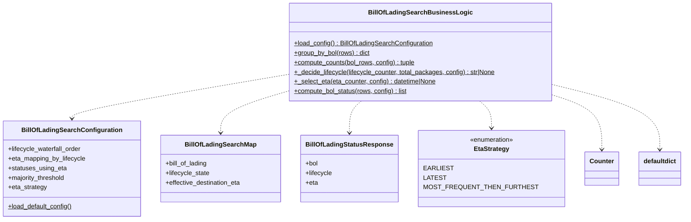
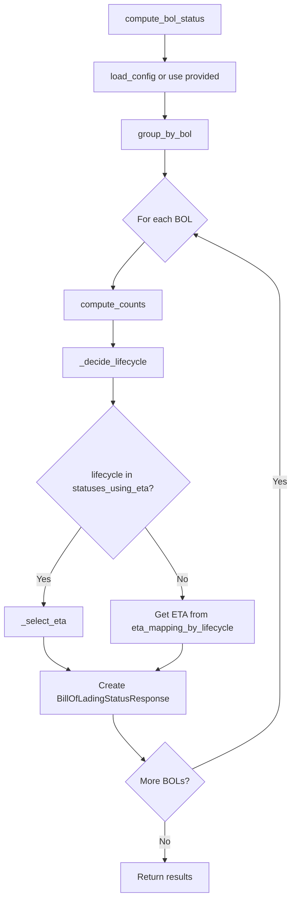
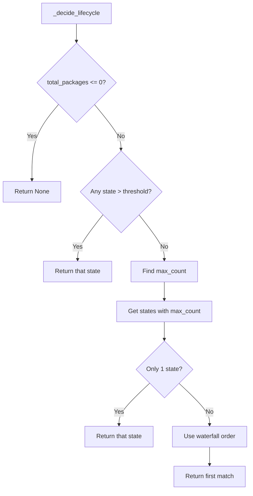
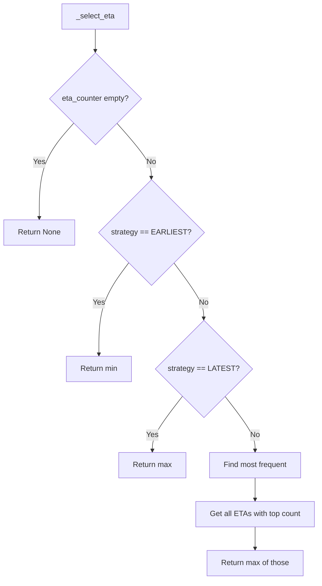

# Diagram: platform/partview_core/partview_service/partview_service/core/business/trip_leg/BillOfLadingSearchBusinessLogic.py

> Auto-generated by Obscura crawlers

## Diagram 1

### SVG

<svg id="container" width="1651.7265625" xmlns="http://www.w3.org/2000/svg" class="classDiagram" height="552" viewBox="0 0 1651.7265625 552" role="graphics-document document" aria-roledescription="class"><g><defs><marker id="container_class-aggregationStart" class="marker aggregation class" refX="18" refY="7" markerWidth="190" markerHeight="240" orient="auto"><path d="M 18,7 L9,13 L1,7 L9,1 Z"></path></marker></defs><defs><marker id="container_class-aggregationEnd" class="marker aggregation class" refX="1" refY="7" markerWidth="20" markerHeight="28" orient="auto"><path d="M 18,7 L9,13 L1,7 L9,1 Z"></path></marker></defs><defs><marker id="container_class-extensionStart" class="marker extension class" refX="18" refY="7" markerWidth="190" markerHeight="240" orient="auto"><path d="M 1,7 L18,13 V 1 Z"></path></marker></defs><defs><marker id="container_class-extensionEnd" class="marker extension class" refX="1" refY="7" markerWidth="20" markerHeight="28" orient="auto"><path d="M 1,1 V 13 L18,7 Z"></path></marker></defs><defs><marker id="container_class-compositionStart" class="marker composition class" refX="18" refY="7" markerWidth="190" markerHeight="240" orient="auto"><path d="M 18,7 L9,13 L1,7 L9,1 Z"></path></marker></defs><defs><marker id="container_class-compositionEnd" class="marker composition class" refX="1" refY="7" markerWidth="20" markerHeight="28" orient="auto"><path d="M 18,7 L9,13 L1,7 L9,1 Z"></path></marker></defs><defs><marker id="container_class-dependencyStart" class="marker dependency class" refX="6" refY="7" markerWidth="190" markerHeight="240" orient="auto"><path d="M 5,7 L9,13 L1,7 L9,1 Z"></path></marker></defs><defs><marker id="container_class-dependencyEnd" class="marker dependency class" refX="13" refY="7" markerWidth="20" markerHeight="28" orient="auto"><path d="M 18,7 L9,13 L14,7 L9,1 Z"></path></marker></defs><defs><marker id="container_class-lollipopStart" class="marker lollipop class" refX="13" refY="7" markerWidth="190" markerHeight="240" orient="auto"><circle stroke="black" fill="transparent" cx="7" cy="7" r="6"></circle></marker></defs><defs><marker id="container_class-lollipopEnd" class="marker lollipop class" refX="1" refY="7" markerWidth="190" markerHeight="240" orient="auto"><circle stroke="black" fill="transparent" cx="7" cy="7" r="6"></circle></marker></defs><g class="root"><g class="clusters"></g><g class="edgePaths"><path d="M702.436,187.733L614.933,202.944C527.431,218.155,352.426,248.578,264.924,266.955C177.422,285.333,177.422,291.667,177.422,294.833L177.422,298" id="id_BillOfLadingSearchBusinessLogic_BillOfLadingSearchConfiguration_1" class="edge-thickness-normal edge-pattern-dashed relation" style=";;;" data-edge="true" data-et="edge" data-id="id_BillOfLadingSearchBusinessLogic_BillOfLadingSearchConfiguration_1" data-points="W3sieCI6NzAyLjQzNTU0Njg3NSwieSI6MTg3LjczMjg2MzY1NDgyMDd9LHsieCI6MTc3LjQyMTg3NSwieSI6Mjc5fSx7IngiOjE3Ny40MjE4NzUsInkiOjMwNH1d" marker-end="url(#container_class-dependencyEnd)"></path><path d="M702.436,231.358L676.614,239.298C650.793,247.239,599.15,263.119,573.329,280.226C547.508,297.333,547.508,315.667,547.508,324.833L547.508,334" id="id_BillOfLadingSearchBusinessLogic_BillOfLadingSearchMap_2" class="edge-thickness-normal edge-pattern-dashed relation" style=";;;" data-edge="true" data-et="edge" data-id="id_BillOfLadingSearchBusinessLogic_BillOfLadingSearchMap_2" data-points="W3sieCI6NzAyLjQzNTU0Njg3NSwieSI6MjMxLjM1Nzk3ODU0ODU1NzkyfSx7IngiOjU0Ny41MDc4MTI1LCJ5IjoyNzl9LHsieCI6NTQ3LjUwNzgxMjUsInkiOjM0MH1d" marker-end="url(#container_class-dependencyEnd)"></path><path d="M891.758,254L887.116,258.167C882.474,262.333,873.19,270.667,868.548,284C863.906,297.333,863.906,315.667,863.906,324.833L863.906,334" id="id_BillOfLadingSearchBusinessLogic_BillOfLadingStatusResponse_3" class="edge-thickness-normal edge-pattern-dashed relation" style=";;;" data-edge="true" data-et="edge" data-id="id_BillOfLadingSearchBusinessLogic_BillOfLadingStatusResponse_3" data-points="W3sieCI6ODkxLjc1ODQwNjM1NTU3NDQsInkiOjI1NH0seyJ4Ijo4NjMuOTA2MjUsInkiOjI3OX0seyJ4Ijo4NjMuOTA2MjUsInkiOjM0MH1d" marker-end="url(#container_class-dependencyEnd)"></path><path d="M1165.824,254L1170.466,258.167C1175.108,262.333,1184.392,270.667,1189.034,282C1193.676,293.333,1193.676,307.667,1193.676,314.833L1193.676,322" id="id_BillOfLadingSearchBusinessLogic_EtaStrategy_4" class="edge-thickness-normal edge-pattern-dashed relation" style=";;;" data-edge="true" data-et="edge" data-id="id_BillOfLadingSearchBusinessLogic_EtaStrategy_4" data-points="W3sieCI6MTE2NS44MjM2MjQ4OTQ0MjU2LCJ5IjoyNTR9LHsieCI6MTE5My42NzU3ODEyNSwieSI6Mjc5fSx7IngiOjExOTMuNjc1NzgxMjUsInkiOjMyOH1d" marker-end="url(#container_class-dependencyEnd)"></path><path d="M1355.146,246.058L1370.72,251.548C1386.293,257.038,1417.439,268.019,1433.013,289.676C1448.586,311.333,1448.586,343.667,1448.586,359.833L1448.586,376" id="id_BillOfLadingSearchBusinessLogic_Counter_5" class="edge-thickness-normal edge-pattern-dashed relation" style=";;;" data-edge="true" data-et="edge" data-id="id_BillOfLadingSearchBusinessLogic_Counter_5" data-points="W3sieCI6MTM1NS4xNDY0ODQzNzUsInkiOjI0Ni4wNTc2MzEzNzY5Mjc5M30seyJ4IjoxNDQ4LjU4NTkzNzUsInkiOjI3OX0seyJ4IjoxNDQ4LjU4NTkzNzUsInkiOjM4Mn1d" marker-end="url(#container_class-dependencyEnd)"></path><path d="M1355.146,216.822L1394.554,227.185C1433.962,237.548,1512.778,258.274,1552.186,284.804C1591.594,311.333,1591.594,343.667,1591.594,359.833L1591.594,376" id="id_BillOfLadingSearchBusinessLogic_defaultdict_6" class="edge-thickness-normal edge-pattern-dashed relation" style=";;;" data-edge="true" data-et="edge" data-id="id_BillOfLadingSearchBusinessLogic_defaultdict_6" data-points="W3sieCI6MTM1NS4xNDY0ODQzNzUsInkiOjIxNi44MjE1NjEzMTI0ODgxfSx7IngiOjE1OTEuNTkzNzUsInkiOjI3OX0seyJ4IjoxNTkxLjU5Mzc1LCJ5IjozODJ9XQ==" marker-end="url(#container_class-dependencyEnd)"></path></g><g class="edgeLabels"><g class="edgeLabel"><g class="label" data-id="id_BillOfLadingSearchBusinessLogic_BillOfLadingSearchConfiguration_1" transform="translate(0, 0)"><foreignObject width="0" height="0">

</foreignObject></g></g><g class="edgeLabel"><g class="label" data-id="id_BillOfLadingSearchBusinessLogic_BillOfLadingSearchMap_2" transform="translate(0, 0)"><foreignObject width="0" height="0">

</foreignObject></g></g><g class="edgeLabel"><g class="label" data-id="id_BillOfLadingSearchBusinessLogic_BillOfLadingStatusResponse_3" transform="translate(0, 0)"><foreignObject width="0" height="0">

</foreignObject></g></g><g class="edgeLabel"><g class="label" data-id="id_BillOfLadingSearchBusinessLogic_EtaStrategy_4" transform="translate(0, 0)"><foreignObject width="0" height="0">

</foreignObject></g></g><g class="edgeLabel"><g class="label" data-id="id_BillOfLadingSearchBusinessLogic_Counter_5" transform="translate(0, 0)"><foreignObject width="0" height="0">

</foreignObject></g></g><g class="edgeLabel"><g class="label" data-id="id_BillOfLadingSearchBusinessLogic_defaultdict_6" transform="translate(0, 0)"><foreignObject width="0" height="0">

</foreignObject></g></g></g><g class="nodes"><g class="node default" id="classId-BillOfLadingSearchBusinessLogic-0" transform="translate(1028.791015625, 131)"><g class="basic label-container"><path d="M-326.35546875 -123 L326.35546875 -123 L326.35546875 123 L-326.35546875 123" stroke="none" stroke-width="0" fill="#ECECFF" style=""></path><path d="M-326.35546875 -123 C-169.87273076266723 -123, -13.389992775334463 -123, 326.35546875 -123 M-326.35546875 -123 C-160.29506332739376 -123, 5.765342095212475 -123, 326.35546875 -123 M326.35546875 -123 C326.35546875 -59.05592832599211, 326.35546875 4.888143348015774, 326.35546875 123 M326.35546875 -123 C326.35546875 -29.079184892226465, 326.35546875 64.84163021554707, 326.35546875 123 M326.35546875 123 C162.28181748602745 123, -1.7918337779451008 123, -326.35546875 123 M326.35546875 123 C76.92192535833303 123, -172.51161803333395 123, -326.35546875 123 M-326.35546875 123 C-326.35546875 55.59551848968057, -326.35546875 -11.808963020638856, -326.35546875 -123 M-326.35546875 123 C-326.35546875 26.985761308437645, -326.35546875 -69.02847738312471, -326.35546875 -123" stroke="#9370DB" stroke-width="1.3" fill="none" stroke-dasharray="0 0" style=""></path></g><g class="annotation-group text" transform="translate(0, -99)"></g><g class="label-group text" transform="translate(-120.9296875, -99)"><g class="label" style="font-weight: bolder" transform="translate(0,-12)"><foreignObject width="241.859375" height="24">

BillOfLadingSearchBusinessLogic

</foreignObject></g></g><g class="members-group text" transform="translate(-314.35546875, -51)"></g><g class="methods-group text" transform="translate(-314.35546875, -21)"><g class="label" style="text-decoration:underline;" transform="translate(0,-12)"><foreignObject width="348.71875" height="24">

+load_config() : BillOfLadingSearchConfiguration

</foreignObject></g><g class="label" style="text-decoration:underline;" transform="translate(0,12)"><foreignObject width="191.03125" height="24">

+group_by_bol(rows) : dict

</foreignObject></g><g class="label" style="text-decoration:underline;" transform="translate(0,36)"><foreignObject width="305.828125" height="24">

+compute_counts(bol_rows, config) : tuple

</foreignObject></g><g class="label" style="text-decoration:underline;" transform="translate(0,60)"><foreignObject width="507.78125" height="24">

+_decide_lifecycle(lifecycle_counter, total_packages, config) : str|None

</foreignObject></g><g class="label" style="text-decoration:underline;" transform="translate(0,84)"><foreignObject width="359.0625" height="24">

+_select_eta(eta_counter, config) : datetime|None

</foreignObject></g><g class="label" style="text-decoration:underline;" transform="translate(0,108)"><foreignObject width="286.46875" height="24">

+compute_bol_status(rows, config) : list

</foreignObject></g></g><g class="divider" style=""><path d="M-326.35546875 -75 C-92.39209769419296 -75, 141.5712733616141 -75, 326.35546875 -75 M-326.35546875 -75 C-141.37176662966465 -75, 43.6119354906707 -75, 326.35546875 -75" stroke="#9370DB" stroke-width="1.3" fill="none" stroke-dasharray="0 0" style=""></path></g><g class="divider" style=""><path d="M-326.35546875 -51 C-169.23588082538419 -51, -12.116292900768372 -51, 326.35546875 -51 M-326.35546875 -51 C-87.35633289039924 -51, 151.6428029692015 -51, 326.35546875 -51" stroke="#9370DB" stroke-width="1.3" fill="none" stroke-dasharray="0 0" style=""></path></g></g><g class="node default" id="classId-BillOfLadingSearchConfiguration-1" transform="translate(177.421875, 424)"><g class="basic label-container"><path d="M-169.421875 -120 L169.421875 -120 L169.421875 120 L-169.421875 120" stroke="none" stroke-width="0" fill="#ECECFF" style=""></path><path d="M-169.421875 -120 C-94.22468795864918 -120, -19.02750091729837 -120, 169.421875 -120 M-169.421875 -120 C-84.84107252519651 -120, -0.260270050393018 -120, 169.421875 -120 M169.421875 -120 C169.421875 -55.691841638971255, 169.421875 8.61631672205749, 169.421875 120 M169.421875 -120 C169.421875 -48.35038068703042, 169.421875 23.299238625939154, 169.421875 120 M169.421875 120 C66.9545959154089 120, -35.512683169182196 120, -169.421875 120 M169.421875 120 C77.04478620839124 120, -15.332302583217512 120, -169.421875 120 M-169.421875 120 C-169.421875 58.09659414974034, -169.421875 -3.8068117005193187, -169.421875 -120 M-169.421875 120 C-169.421875 68.24235341964285, -169.421875 16.484706839285693, -169.421875 -120" stroke="#9370DB" stroke-width="1.3" fill="none" stroke-dasharray="0 0" style=""></path></g><g class="annotation-group text" transform="translate(0, -96)"></g><g class="label-group text" transform="translate(-118.890625, -96)"><g class="label" style="font-weight: bolder" transform="translate(0,-12)"><foreignObject width="237.78125" height="24">

BillOfLadingSearchConfiguration

</foreignObject></g></g><g class="members-group text" transform="translate(-157.421875, -48)"><g class="label" style="" transform="translate(0,-12)"><foreignObject width="186.078125" height="24">

+lifecycle_waterfall_order

</foreignObject></g><g class="label" style="" transform="translate(0,12)"><foreignObject width="195.953125" height="24">

+eta_mapping_by_lifecycle

</foreignObject></g><g class="label" style="" transform="translate(0,36)"><foreignObject width="146.40625" height="24">

+statuses_using_eta

</foreignObject></g><g class="label" style="" transform="translate(0,60)"><foreignObject width="145.78125" height="24">

+majority_threshold

</foreignObject></g><g class="label" style="" transform="translate(0,84)"><foreignObject width="97.421875" height="24">

+eta_strategy

</foreignObject></g></g><g class="methods-group text" transform="translate(-157.421875, 96)"><g class="label" style="text-decoration:underline;" transform="translate(0,-12)"><foreignObject width="161.765625" height="24">

+load_default_config()

</foreignObject></g></g><g class="divider" style=""><path d="M-169.421875 -72 C-53.66018564617089 -72, 62.101503707658225 -72, 169.421875 -72 M-169.421875 -72 C-40.809389783638665 -72, 87.80309543272267 -72, 169.421875 -72" stroke="#9370DB" stroke-width="1.3" fill="none" stroke-dasharray="0 0" style=""></path></g><g class="divider" style=""><path d="M-169.421875 72 C-48.23470083653447 72, 72.95247332693106 72, 169.421875 72 M-169.421875 72 C-93.98425055162008 72, -18.546626103240158 72, 169.421875 72" stroke="#9370DB" stroke-width="1.3" fill="none" stroke-dasharray="0 0" style=""></path></g></g><g class="node default" id="classId-BillOfLadingSearchMap-2" transform="translate(547.5078125, 424)"><g class="basic label-container"><path d="M-150.6640625 -84 L150.6640625 -84 L150.6640625 84 L-150.6640625 84" stroke="none" stroke-width="0" fill="#ECECFF" style=""></path><path d="M-150.6640625 -84 C-32.376385905822005 -84, 85.91129068835599 -84, 150.6640625 -84 M-150.6640625 -84 C-61.26143508927427 -84, 28.141192321451456 -84, 150.6640625 -84 M150.6640625 -84 C150.6640625 -41.98734634374863, 150.6640625 0.02530731250274698, 150.6640625 84 M150.6640625 -84 C150.6640625 -25.573201079276586, 150.6640625 32.85359784144683, 150.6640625 84 M150.6640625 84 C36.089982477682625 84, -78.48409754463475 84, -150.6640625 84 M150.6640625 84 C80.63767350721436 84, 10.611284514428718 84, -150.6640625 84 M-150.6640625 84 C-150.6640625 33.97062912934889, -150.6640625 -16.058741741302214, -150.6640625 -84 M-150.6640625 84 C-150.6640625 17.802157815914867, -150.6640625 -48.395684368170265, -150.6640625 -84" stroke="#9370DB" stroke-width="1.3" fill="none" stroke-dasharray="0 0" style=""></path></g><g class="annotation-group text" transform="translate(0, -60)"></g><g class="label-group text" transform="translate(-84.96875, -60)"><g class="label" style="font-weight: bolder" transform="translate(0,-12)"><foreignObject width="169.9375" height="24">

BillOfLadingSearchMap

</foreignObject></g></g><g class="members-group text" transform="translate(-138.6640625, -12)"><g class="label" style="" transform="translate(0,-12)"><foreignObject width="106.859375" height="24">

+bill_of_lading

</foreignObject></g><g class="label" style="" transform="translate(0,12)"><foreignObject width="111.640625" height="24">

+lifecycle_state

</foreignObject></g><g class="label" style="" transform="translate(0,36)"><foreignObject width="192.359375" height="24">

+effective_destination_eta

</foreignObject></g></g><g class="methods-group text" transform="translate(-138.6640625, 84)"></g><g class="divider" style=""><path d="M-150.6640625 -36 C-33.01666061511365 -36, 84.6307412697727 -36, 150.6640625 -36 M-150.6640625 -36 C-47.07264925678224 -36, 56.518763986435516 -36, 150.6640625 -36" stroke="#9370DB" stroke-width="1.3" fill="none" stroke-dasharray="0 0" style=""></path></g><g class="divider" style=""><path d="M-150.6640625 60 C-33.163172015791886 60, 84.33771846841623 60, 150.6640625 60 M-150.6640625 60 C-87.42174200898023 60, -24.179421517960478 60, 150.6640625 60" stroke="#9370DB" stroke-width="1.3" fill="none" stroke-dasharray="0 0" style=""></path></g></g><g class="node default" id="classId-BillOfLadingStatusResponse-3" transform="translate(863.90625, 424)"><g class="basic label-container"><path d="M-115.734375 -84 L115.734375 -84 L115.734375 84 L-115.734375 84" stroke="none" stroke-width="0" fill="#ECECFF" style=""></path><path d="M-115.734375 -84 C-30.057010619362174 -84, 55.62035376127565 -84, 115.734375 -84 M-115.734375 -84 C-33.68201449730715 -84, 48.3703460053857 -84, 115.734375 -84 M115.734375 -84 C115.734375 -25.408154342926103, 115.734375 33.183691314147794, 115.734375 84 M115.734375 -84 C115.734375 -40.456106540279094, 115.734375 3.087786919441811, 115.734375 84 M115.734375 84 C69.12638042447296 84, 22.518385848945925 84, -115.734375 84 M115.734375 84 C25.79859749204344 84, -64.13718001591312 84, -115.734375 84 M-115.734375 84 C-115.734375 16.88209518921944, -115.734375 -50.23580962156112, -115.734375 -84 M-115.734375 84 C-115.734375 20.798265932347164, -115.734375 -42.40346813530567, -115.734375 -84" stroke="#9370DB" stroke-width="1.3" fill="none" stroke-dasharray="0 0" style=""></path></g><g class="annotation-group text" transform="translate(0, -60)"></g><g class="label-group text" transform="translate(-103.734375, -60)"><g class="label" style="font-weight: bolder" transform="translate(0,-12)"><foreignObject width="207.46875" height="24">

BillOfLadingStatusResponse

</foreignObject></g></g><g class="members-group text" transform="translate(-103.734375, -12)"><g class="label" style="" transform="translate(0,-12)"><foreignObject width="31.53125" height="24">

+bol

</foreignObject></g><g class="label" style="" transform="translate(0,12)"><foreignObject width="67.546875" height="24">

+lifecycle

</foreignObject></g><g class="label" style="" transform="translate(0,36)"><foreignObject width="31.078125" height="24">

+eta

</foreignObject></g></g><g class="methods-group text" transform="translate(-103.734375, 84)"></g><g class="divider" style=""><path d="M-115.734375 -36 C-67.57088654646589 -36, -19.407398092931786 -36, 115.734375 -36 M-115.734375 -36 C-29.321241378342677 -36, 57.091892243314646 -36, 115.734375 -36" stroke="#9370DB" stroke-width="1.3" fill="none" stroke-dasharray="0 0" style=""></path></g><g class="divider" style=""><path d="M-115.734375 60 C-36.766550813224754 60, 42.20127337355049 60, 115.734375 60 M-115.734375 60 C-42.18996574175938 60, 31.35444351648124 60, 115.734375 60" stroke="#9370DB" stroke-width="1.3" fill="none" stroke-dasharray="0 0" style=""></path></g></g><g class="node default" id="classId-EtaStrategy-4" transform="translate(1193.67578125, 424)"><g class="basic label-container"><path d="M-164.03515625 -96 L164.03515625 -96 L164.03515625 96 L-164.03515625 96" stroke="none" stroke-width="0" fill="#ECECFF" style=""></path><path d="M-164.03515625 -96 C-39.4586479296531 -96, 85.1178603906938 -96, 164.03515625 -96 M-164.03515625 -96 C-75.98648288936856 -96, 12.06219047126288 -96, 164.03515625 -96 M164.03515625 -96 C164.03515625 -43.217601111588586, 164.03515625 9.564797776822829, 164.03515625 96 M164.03515625 -96 C164.03515625 -55.80865540235734, 164.03515625 -15.617310804714677, 164.03515625 96 M164.03515625 96 C70.11670488438405 96, -23.801746481231902 96, -164.03515625 96 M164.03515625 96 C98.33571414327298 96, 32.63627203654596 96, -164.03515625 96 M-164.03515625 96 C-164.03515625 23.314961665404425, -164.03515625 -49.37007666919115, -164.03515625 -96 M-164.03515625 96 C-164.03515625 53.05012613929166, -164.03515625 10.100252278583326, -164.03515625 -96" stroke="#9370DB" stroke-width="1.3" fill="none" stroke-dasharray="0 0" style=""></path></g><g class="annotation-group text" transform="translate(-55.5546875, -72)"><g class="label" style="" transform="translate(0,-12)"><foreignObject width="111.109375" height="24">

«enumeration»

</foreignObject></g></g><g class="label-group text" transform="translate(-42.328125, -48)"><g class="label" style="font-weight: bolder" transform="translate(0,-12)"><foreignObject width="84.65625" height="24">

EtaStrategy

</foreignObject></g></g><g class="members-group text" transform="translate(-152.03515625, 0)"><g class="label" style="" transform="translate(0,-12)"><foreignObject width="65.140625" height="24">

EARLIEST

</foreignObject></g><g class="label" style="" transform="translate(0,12)"><foreignObject width="49.65625" height="24">

LATEST

</foreignObject></g><g class="label" style="" transform="translate(0,36)"><foreignObject width="248.515625" height="24">

MOST_FREQUENT_THEN_FURTHEST

</foreignObject></g></g><g class="methods-group text" transform="translate(-152.03515625, 96)"></g><g class="divider" style=""><path d="M-164.03515625 -24 C-44.16441975782705 -24, 75.7063167343459 -24, 164.03515625 -24 M-164.03515625 -24 C-35.63005650128815 -24, 92.7750432474237 -24, 164.03515625 -24" stroke="#9370DB" stroke-width="1.3" fill="none" stroke-dasharray="0 0" style=""></path></g><g class="divider" style=""><path d="M-164.03515625 72 C-59.58498238860581 72, 44.86519147278838 72, 164.03515625 72 M-164.03515625 72 C-48.737720388087425 72, 66.55971547382515 72, 164.03515625 72" stroke="#9370DB" stroke-width="1.3" fill="none" stroke-dasharray="0 0" style=""></path></g></g><g class="node default" id="classId-Counter-5" transform="translate(1448.5859375, 424)"><g class="basic label-container"><path d="M-40.875 -42 L40.875 -42 L40.875 42 L-40.875 42" stroke="none" stroke-width="0" fill="#ECECFF" style=""></path><path d="M-40.875 -42 C-20.17789790783938 -42, 0.5192041843212394 -42, 40.875 -42 M-40.875 -42 C-17.306840754269533 -42, 6.2613184914609334 -42, 40.875 -42 M40.875 -42 C40.875 -12.415680414396359, 40.875 17.168639171207282, 40.875 42 M40.875 -42 C40.875 -13.351811129398762, 40.875 15.296377741202477, 40.875 42 M40.875 42 C11.787581938563363 42, -17.299836122873273 42, -40.875 42 M40.875 42 C19.5967077402446 42, -1.6815845195107997 42, -40.875 42 M-40.875 42 C-40.875 14.988190943642454, -40.875 -12.023618112715091, -40.875 -42 M-40.875 42 C-40.875 18.46565643824961, -40.875 -5.06868712350078, -40.875 -42" stroke="#9370DB" stroke-width="1.3" fill="none" stroke-dasharray="0 0" style=""></path></g><g class="annotation-group text" transform="translate(0, -18)"></g><g class="label-group text" transform="translate(-28.875, -18)"><g class="label" style="font-weight: bolder" transform="translate(0,-12)"><foreignObject width="57.75" height="24">

Counter

</foreignObject></g></g><g class="members-group text" transform="translate(-28.875, 30)"></g><g class="methods-group text" transform="translate(-28.875, 60)"></g><g class="divider" style=""><path d="M-40.875 6 C-18.791977998594948 6, 3.2910440028101036 6, 40.875 6 M-40.875 6 C-13.408555933814558 6, 14.057888132370884 6, 40.875 6" stroke="#9370DB" stroke-width="1.3" fill="none" stroke-dasharray="0 0" style=""></path></g><g class="divider" style=""><path d="M-40.875 24 C-17.51349396587107 24, 5.848012068257859 24, 40.875 24 M-40.875 24 C-14.319131659826382 24, 12.236736680347235 24, 40.875 24" stroke="#9370DB" stroke-width="1.3" fill="none" stroke-dasharray="0 0" style=""></path></g></g><g class="node default" id="classId-defaultdict-6" transform="translate(1591.59375, 424)"><g class="basic label-container"><path d="M-52.1328125 -42 L52.1328125 -42 L52.1328125 42 L-52.1328125 42" stroke="none" stroke-width="0" fill="#ECECFF" style=""></path><path d="M-52.1328125 -42 C-21.626840453574633 -42, 8.879131592850733 -42, 52.1328125 -42 M-52.1328125 -42 C-19.307188901660595 -42, 13.51843469667881 -42, 52.1328125 -42 M52.1328125 -42 C52.1328125 -14.047300127963034, 52.1328125 13.905399744073932, 52.1328125 42 M52.1328125 -42 C52.1328125 -24.87443171842771, 52.1328125 -7.748863436855423, 52.1328125 42 M52.1328125 42 C11.11833706977717 42, -29.89613836044566 42, -52.1328125 42 M52.1328125 42 C18.841482676664768 42, -14.449847146670464 42, -52.1328125 42 M-52.1328125 42 C-52.1328125 9.570800614297688, -52.1328125 -22.858398771404623, -52.1328125 -42 M-52.1328125 42 C-52.1328125 21.09415870923796, -52.1328125 0.18831741847591843, -52.1328125 -42" stroke="#9370DB" stroke-width="1.3" fill="none" stroke-dasharray="0 0" style=""></path></g><g class="annotation-group text" transform="translate(0, -18)"></g><g class="label-group text" transform="translate(-40.1328125, -18)"><g class="label" style="font-weight: bolder" transform="translate(0,-12)"><foreignObject width="80.265625" height="24">

defaultdict

</foreignObject></g></g><g class="members-group text" transform="translate(-40.1328125, 30)"></g><g class="methods-group text" transform="translate(-40.1328125, 60)"></g><g class="divider" style=""><path d="M-52.1328125 6 C-20.028109380100254 6, 12.076593739799492 6, 52.1328125 6 M-52.1328125 6 C-12.962494176229868 6, 26.207824147540265 6, 52.1328125 6" stroke="#9370DB" stroke-width="1.3" fill="none" stroke-dasharray="0 0" style=""></path></g><g class="divider" style=""><path d="M-52.1328125 24 C-16.14370412338301 24, 19.84540425323398 24, 52.1328125 24 M-52.1328125 24 C-15.469689494389414 24, 21.193433511221173 24, 52.1328125 24" stroke="#9370DB" stroke-width="1.3" fill="none" stroke-dasharray="0 0" style=""></path></g></g></g></g></g></svg>

## Diagram 2

### SVG

<svg id="container" width="525.90625" xmlns="http://www.w3.org/2000/svg" class="flowchart" height="1631.671875" viewBox="0 0 525.90625 1631.671875" role="graphics-document document" aria-roledescription="flowchart-v2"><g><marker id="container_flowchart-v2-pointEnd" class="marker flowchart-v2" viewBox="0 0 10 10" refX="5" refY="5" markerUnits="userSpaceOnUse" markerWidth="8" markerHeight="8" orient="auto"><path d="M 0 0 L 10 5 L 0 10 z" class="arrowMarkerPath" style="stroke-width: 1; stroke-dasharray: 1, 0;"></path></marker><marker id="container_flowchart-v2-pointStart" class="marker flowchart-v2" viewBox="0 0 10 10" refX="4.5" refY="5" markerUnits="userSpaceOnUse" markerWidth="8" markerHeight="8" orient="auto"><path d="M 0 5 L 10 10 L 10 0 z" class="arrowMarkerPath" style="stroke-width: 1; stroke-dasharray: 1, 0;"></path></marker><marker id="container_flowchart-v2-circleEnd" class="marker flowchart-v2" viewBox="0 0 10 10" refX="11" refY="5" markerUnits="userSpaceOnUse" markerWidth="11" markerHeight="11" orient="auto"><circle cx="5" cy="5" r="5" class="arrowMarkerPath" style="stroke-width: 1; stroke-dasharray: 1, 0;"></circle></marker><marker id="container_flowchart-v2-circleStart" class="marker flowchart-v2" viewBox="0 0 10 10" refX="-1" refY="5" markerUnits="userSpaceOnUse" markerWidth="11" markerHeight="11" orient="auto"><circle cx="5" cy="5" r="5" class="arrowMarkerPath" style="stroke-width: 1; stroke-dasharray: 1, 0;"></circle></marker><marker id="container_flowchart-v2-crossEnd" class="marker cross flowchart-v2" viewBox="0 0 11 11" refX="12" refY="5.2" markerUnits="userSpaceOnUse" markerWidth="11" markerHeight="11" orient="auto"><path d="M 1,1 l 9,9 M 10,1 l -9,9" class="arrowMarkerPath" style="stroke-width: 2; stroke-dasharray: 1, 0;"></path></marker><marker id="container_flowchart-v2-crossStart" class="marker cross flowchart-v2" viewBox="0 0 11 11" refX="-1" refY="5.2" markerUnits="userSpaceOnUse" markerWidth="11" markerHeight="11" orient="auto"><path d="M 1,1 l 9,9 M 10,1 l -9,9" class="arrowMarkerPath" style="stroke-width: 2; stroke-dasharray: 1, 0;"></path></marker><g class="root"><g class="clusters"></g><g class="edgePaths"><path d="M297.785,62L297.785,66.167C297.785,70.333,297.785,78.667,297.785,86.333C297.785,94,297.785,101,297.785,104.5L297.785,108" id="L_A_B_0" class="edge-thickness-normal edge-pattern-solid edge-thickness-normal edge-pattern-solid flowchart-link" style=";" data-edge="true" data-et="edge" data-id="L_A_B_0" data-points="W3sieCI6Mjk3Ljc4NTE1NjI1LCJ5Ijo2Mn0seyJ4IjoyOTcuNzg1MTU2MjUsInkiOjg3fSx7IngiOjI5Ny43ODUxNTYyNSwieSI6MTEyfV0=" marker-end="url(#container_flowchart-v2-pointEnd)"></path><path d="M297.785,190L297.785,194.167C297.785,198.333,297.785,206.667,297.785,214.333C297.785,222,297.785,229,297.785,232.5L297.785,236" id="L_B_C_0" class="edge-thickness-normal edge-pattern-solid edge-thickness-normal edge-pattern-solid flowchart-link" style=";" data-edge="true" data-et="edge" data-id="L_B_C_0" data-points="W3sieCI6Mjk3Ljc4NTE1NjI1LCJ5IjoxOTB9LHsieCI6Mjk3Ljc4NTE1NjI1LCJ5IjoyMTV9LHsieCI6Mjk3Ljc4NTE1NjI1LCJ5IjoyNDB9XQ==" marker-end="url(#container_flowchart-v2-pointEnd)"></path><path d="M297.785,294L297.785,298.167C297.785,302.333,297.785,310.667,297.785,318.333C297.785,326,297.785,333,297.785,336.5L297.785,340" id="L_C_D_0" class="edge-thickness-normal edge-pattern-solid edge-thickness-normal edge-pattern-solid flowchart-link" style=";" data-edge="true" data-et="edge" data-id="L_C_D_0" data-points="W3sieCI6Mjk3Ljc4NTE1NjI1LCJ5IjoyOTR9LHsieCI6Mjk3Ljc4NTE1NjI1LCJ5IjozMTl9LHsieCI6Mjk3Ljc4NTE1NjI1LCJ5IjozNDR9XQ==" marker-end="url(#container_flowchart-v2-pointEnd)"></path><path d="M261.885,456.459L252.366,466.609C242.846,476.759,223.808,497.059,214.289,510.709C204.77,524.359,204.77,531.359,204.77,534.859L204.77,538.359" id="L_D_E_0" class="edge-thickness-normal edge-pattern-solid edge-thickness-normal edge-pattern-solid flowchart-link" style=";" data-edge="true" data-et="edge" data-id="L_D_E_0" data-points="W3sieCI6MjYxLjg4NDg1MzAzNTY5OTgsInkiOjQ1Ni40NTkwNzE3ODU2OTk4fSx7IngiOjIwNC43Njk1MzEyNSwieSI6NTE3LjM1OTM3NX0seyJ4IjoyMDQuNzY5NTMxMjUsInkiOjU0Mi4zNTkzNzV9XQ==" marker-end="url(#container_flowchart-v2-pointEnd)"></path><path d="M204.77,596.359L204.77,600.526C204.77,604.693,204.77,613.026,204.77,620.693C204.77,628.359,204.77,635.359,204.77,638.859L204.77,642.359" id="L_E_F_0" class="edge-thickness-normal edge-pattern-solid edge-thickness-normal edge-pattern-solid flowchart-link" style=";" data-edge="true" data-et="edge" data-id="L_E_F_0" data-points="W3sieCI6MjA0Ljc2OTUzMTI1LCJ5Ijo1OTYuMzU5Mzc1fSx7IngiOjIwNC43Njk1MzEyNSwieSI6NjIxLjM1OTM3NX0seyJ4IjoyMDQuNzY5NTMxMjUsInkiOjY0Ni4zNTkzNzV9XQ==" marker-end="url(#container_flowchart-v2-pointEnd)"></path><path d="M204.77,700.359L204.77,704.526C204.77,708.693,204.77,717.026,204.77,724.693C204.77,732.359,204.77,739.359,204.77,742.859L204.77,746.359" id="L_F_G_0" class="edge-thickness-normal edge-pattern-solid edge-thickness-normal edge-pattern-solid flowchart-link" style=";" data-edge="true" data-et="edge" data-id="L_F_G_0" data-points="W3sieCI6MjA0Ljc2OTUzMTI1LCJ5Ijo3MDAuMzU5Mzc1fSx7IngiOjIwNC43Njk1MzEyNSwieSI6NzI1LjM1OTM3NX0seyJ4IjoyMDQuNzY5NTMxMjUsInkiOjc1MC4zNTkzNzV9XQ==" marker-end="url(#container_flowchart-v2-pointEnd)"></path><path d="M146.886,970.476L135.602,986.29C124.317,1002.104,101.749,1033.732,90.464,1057.046C79.18,1080.359,79.18,1095.359,79.18,1102.859L79.18,1110.359" id="L_G_H_0" class="edge-thickness-normal edge-pattern-solid edge-thickness-normal edge-pattern-solid flowchart-link" style=";" data-edge="true" data-et="edge" data-id="L_G_H_0" data-points="W3sieCI6MTQ2Ljg4NjMyMTE3ODM3NDM3LCJ5Ijo5NzAuNDc2MTY0OTI4Mzc0NH0seyJ4Ijo3OS4xNzk2ODc1LCJ5IjoxMDY1LjM1OTM3NX0seyJ4Ijo3OS4xNzk2ODc1LCJ5IjoxMTE0LjM1OTM3NX1d" marker-end="url(#container_flowchart-v2-pointEnd)"></path><path d="M262.653,970.476L273.937,986.29C285.222,1002.104,307.79,1033.732,319.075,1055.046C330.359,1076.359,330.359,1087.359,330.359,1092.859L330.359,1098.359" id="L_G_I_0" class="edge-thickness-normal edge-pattern-solid edge-thickness-normal edge-pattern-solid flowchart-link" style=";" data-edge="true" data-et="edge" data-id="L_G_I_0" data-points="W3sieCI6MjYyLjY1Mjc0MTMyMTYyNTYsInkiOjk3MC40NzYxNjQ5MjgzNzQ0fSx7IngiOjMzMC4zNTkzNzUsInkiOjEwNjUuMzU5Mzc1fSx7IngiOjMzMC4zNTkzNzUsInkiOjExMDIuMzU5Mzc1fV0=" marker-end="url(#container_flowchart-v2-pointEnd)"></path><path d="M79.18,1168.359L79.18,1174.526C79.18,1180.693,79.18,1193.026,86.762,1203.057C94.345,1213.087,109.509,1220.815,117.092,1224.679L124.674,1228.543" id="L_H_J_0" class="edge-thickness-normal edge-pattern-solid edge-thickness-normal edge-pattern-solid flowchart-link" style=";" data-edge="true" data-et="edge" data-id="L_H_J_0" data-points="W3sieCI6NzkuMTc5Njg3NSwieSI6MTE2OC4zNTkzNzV9LHsieCI6NzkuMTc5Njg3NSwieSI6MTIwNS4zNTkzNzV9LHsieCI6MTI4LjIzODIyMDIxNDg0Mzc1LCJ5IjoxMjMwLjM1OTM3NX1d" marker-end="url(#container_flowchart-v2-pointEnd)"></path><path d="M330.359,1180.359L330.359,1184.526C330.359,1188.693,330.359,1197.026,322.777,1205.057C315.195,1213.087,300.03,1220.815,292.447,1224.679L284.865,1228.543" id="L_I_J_0" class="edge-thickness-normal edge-pattern-solid edge-thickness-normal edge-pattern-solid flowchart-link" style=";" data-edge="true" data-et="edge" data-id="L_I_J_0" data-points="W3sieCI6MzMwLjM1OTM3NSwieSI6MTE4MC4zNTkzNzV9LHsieCI6MzMwLjM1OTM3NSwieSI6MTIwNS4zNTkzNzV9LHsieCI6MjgxLjMwMDg0MjI4NTE1NjI1LCJ5IjoxMjMwLjM1OTM3NX1d" marker-end="url(#container_flowchart-v2-pointEnd)"></path><path d="M204.77,1308.359L204.77,1312.526C204.77,1316.693,204.77,1325.026,214.101,1338.588C223.432,1352.15,242.094,1370.941,251.425,1380.336L260.756,1389.732" id="L_J_K_0" class="edge-thickness-normal edge-pattern-solid edge-thickness-normal edge-pattern-solid flowchart-link" style=";" data-edge="true" data-et="edge" data-id="L_J_K_0" data-points="W3sieCI6MjA0Ljc2OTUzMTI1LCJ5IjoxMzA4LjM1OTM3NX0seyJ4IjoyMDQuNzY5NTMxMjUsInkiOjEzMzMuMzU5Mzc1fSx7IngiOjI2My41NzQ4MzkzMjk0MzQxNiwieSI6MTM5Mi41Njk2OTE5MjA1NjZ9XQ==" marker-end="url(#container_flowchart-v2-pointEnd)"></path><path d="M345.132,1405.706L371.922,1393.648C398.713,1381.59,452.294,1357.475,479.084,1334.75C505.875,1312.026,505.875,1290.693,505.875,1269.359C505.875,1248.026,505.875,1226.693,505.875,1205.359C505.875,1184.026,505.875,1162.693,505.875,1139.359C505.875,1116.026,505.875,1090.693,505.875,1048.693C505.875,1006.693,505.875,948.026,505.875,891.359C505.875,834.693,505.875,780.026,505.875,744.026C505.875,708.026,505.875,690.693,505.875,673.359C505.875,656.026,505.875,638.693,505.875,621.359C505.875,604.026,505.875,586.693,505.875,569.359C505.875,552.026,505.875,534.693,480.168,513.774C454.461,492.854,403.046,468.349,377.339,456.097L351.632,443.844" id="L_K_D_0" class="edge-thickness-normal edge-pattern-solid edge-thickness-normal edge-pattern-solid flowchart-link" style=";" data-edge="true" data-et="edge" data-id="L_K_D_0" data-points="W3sieCI6MzQ1LjEzMTgxMTcwMjYzODksInkiOjE0MDUuNzA2MDMwNDUyNjM5fSx7IngiOjUwNS44NzUsInkiOjEzMzMuMzU5Mzc1fSx7IngiOjUwNS44NzUsInkiOjEyNjkuMzU5Mzc1fSx7IngiOjUwNS44NzUsInkiOjEyMDUuMzU5Mzc1fSx7IngiOjUwNS44NzUsInkiOjExNDEuMzU5Mzc1fSx7IngiOjUwNS44NzUsInkiOjEwNjUuMzU5Mzc1fSx7IngiOjUwNS44NzUsInkiOjg4OS4zNTkzNzV9LHsieCI6NTA1Ljg3NSwieSI6NzI1LjM1OTM3NX0seyJ4Ijo1MDUuODc1LCJ5Ijo2NzMuMzU5Mzc1fSx7IngiOjUwNS44NzUsInkiOjYyMS4zNTkzNzV9LHsieCI6NTA1Ljg3NSwieSI6NTY5LjM1OTM3NX0seyJ4Ijo1MDUuODc1LCJ5Ijo1MTcuMzU5Mzc1fSx7IngiOjM0OC4wMjEzMTA1NDI2MjkxLCJ5Ijo0NDIuMTIzMjIwNzA3MzcwOX1d" marker-end="url(#container_flowchart-v2-pointEnd)"></path><path d="M297.785,1495.672L297.785,1501.839C297.785,1508.005,297.785,1520.339,297.785,1532.005C297.785,1543.672,297.785,1554.672,297.785,1560.172L297.785,1565.672" id="L_K_L_0" class="edge-thickness-normal edge-pattern-solid edge-thickness-normal edge-pattern-solid flowchart-link" style=";" data-edge="true" data-et="edge" data-id="L_K_L_0" data-points="W3sieCI6Mjk3Ljc4NTE1NjI1LCJ5IjoxNDk1LjY3MTg3NX0seyJ4IjoyOTcuNzg1MTU2MjUsInkiOjE1MzIuNjcxODc1fSx7IngiOjI5Ny43ODUxNTYyNSwieSI6MTU2OS42NzE4NzV9XQ==" marker-end="url(#container_flowchart-v2-pointEnd)"></path></g><g class="edgeLabels"><g class="edgeLabel"><g class="label" data-id="L_A_B_0" transform="translate(0, 0)"><foreignObject width="0" height="0">

</foreignObject></g></g><g class="edgeLabel"><g class="label" data-id="L_B_C_0" transform="translate(0, 0)"><foreignObject width="0" height="0">

</foreignObject></g></g><g class="edgeLabel"><g class="label" data-id="L_C_D_0" transform="translate(0, 0)"><foreignObject width="0" height="0">

</foreignObject></g></g><g class="edgeLabel"><g class="label" data-id="L_D_E_0" transform="translate(0, 0)"><foreignObject width="0" height="0">

</foreignObject></g></g><g class="edgeLabel"><g class="label" data-id="L_E_F_0" transform="translate(0, 0)"><foreignObject width="0" height="0">

</foreignObject></g></g><g class="edgeLabel"><g class="label" data-id="L_F_G_0" transform="translate(0, 0)"><foreignObject width="0" height="0">

</foreignObject></g></g><g class="edgeLabel" transform="translate(79.1796875, 1065.359375)"><g class="label" data-id="L_G_H_0" transform="translate(-12.03125, -12)"><foreignObject width="24.0625" height="24">

Yes

</foreignObject></g></g><g class="edgeLabel" transform="translate(330.359375, 1065.359375)"><g class="label" data-id="L_G_I_0" transform="translate(-10.140625, -12)"><foreignObject width="20.28125" height="24">

No

</foreignObject></g></g><g class="edgeLabel"><g class="label" data-id="L_H_J_0" transform="translate(0, 0)"><foreignObject width="0" height="0">

</foreignObject></g></g><g class="edgeLabel"><g class="label" data-id="L_I_J_0" transform="translate(0, 0)"><foreignObject width="0" height="0">

</foreignObject></g></g><g class="edgeLabel"><g class="label" data-id="L_J_K_0" transform="translate(0, 0)"><foreignObject width="0" height="0">

</foreignObject></g></g><g class="edgeLabel" transform="translate(505.875, 889.359375)"><g class="label" data-id="L_K_D_0" transform="translate(-12.03125, -12)"><foreignObject width="24.0625" height="24">

Yes

</foreignObject></g></g><g class="edgeLabel" transform="translate(297.78515625, 1532.671875)"><g class="label" data-id="L_K_L_0" transform="translate(-10.140625, -12)"><foreignObject width="20.28125" height="24">

No

</foreignObject></g></g></g><g class="nodes"><g class="node default" id="flowchart-A-0" transform="translate(297.78515625, 35)"><rect class="basic label-container" style="" x="-103.859375" y="-27" width="207.71875" height="54"></rect><g class="label" style="" transform="translate(-73.859375, -12)"><rect></rect><foreignObject width="147.71875" height="24">

compute_bol_status

</foreignObject></g></g><g class="node default" id="flowchart-B-1" transform="translate(297.78515625, 151)"><rect class="basic label-container" style="" x="-130" y="-39" width="260" height="78"></rect><g class="label" style="" transform="translate(-100, -24)"><rect></rect><foreignObject width="200" height="48">

load_config or use provided

</foreignObject></g></g><g class="node default" id="flowchart-C-3" transform="translate(297.78515625, 267)"><rect class="basic label-container" style="" x="-79.4375" y="-27" width="158.875" height="54"></rect><g class="label" style="" transform="translate(-49.4375, -12)"><rect></rect><foreignObject width="98.875" height="24">

group_by_bol

</foreignObject></g></g><g class="node default" id="flowchart-D-5" transform="translate(297.78515625, 418.1796875)"><polygon points="74.1796875,0 148.359375,-74.1796875 74.1796875,-148.359375 0,-74.1796875" class="label-container" transform="translate(-73.6796875, 74.1796875)"></polygon><g class="label" style="" transform="translate(-47.1796875, -12)"><rect></rect><foreignObject width="94.359375" height="24">

For each BOL

</foreignObject></g></g><g class="node default" id="flowchart-E-7" transform="translate(204.76953125, 569.359375)"><rect class="basic label-container" style="" x="-89.875" y="-27" width="179.75" height="54"></rect><g class="label" style="" transform="translate(-59.875, -12)"><rect></rect><foreignObject width="119.75" height="24">

compute_counts

</foreignObject></g></g><g class="node default" id="flowchart-F-9" transform="translate(204.76953125, 673.359375)"><rect class="basic label-container" style="" x="-92.0703125" y="-27" width="184.140625" height="54"></rect><g class="label" style="" transform="translate(-62.0703125, -12)"><rect></rect><foreignObject width="124.140625" height="24">

_decide_lifecycle

</foreignObject></g></g><g class="node default" id="flowchart-G-11" transform="translate(204.76953125, 889.359375)"><polygon points="139,0 278,-139 139,-278 0,-139" class="label-container" transform="translate(-138.5, 139)"></polygon><g class="label" style="" transform="translate(-100, -24)"><rect></rect><foreignObject width="200" height="48">

lifecycle in statuses_using_eta?

</foreignObject></g></g><g class="node default" id="flowchart-H-13" transform="translate(79.1796875, 1141.359375)"><rect class="basic label-container" style="" x="-71.1796875" y="-27" width="142.359375" height="54"></rect><g class="label" style="" transform="translate(-41.1796875, -12)"><rect></rect><foreignObject width="82.359375" height="24">

_select_eta

</foreignObject></g></g><g class="node default" id="flowchart-I-15" transform="translate(330.359375, 1141.359375)"><rect class="basic label-container" style="" x="-130" y="-39" width="260" height="78"></rect><g class="label" style="" transform="translate(-100, -24)"><rect></rect><foreignObject width="200" height="48">

Get ETA from eta_mapping_by_lifecycle

</foreignObject></g></g><g class="node default" id="flowchart-J-17" transform="translate(204.76953125, 1269.359375)"><rect class="basic label-container" style="" x="-132.015625" y="-39" width="264.03125" height="78"></rect><g class="label" style="" transform="translate(-102.015625, -24)"><rect></rect><foreignObject width="204.03125" height="48">

Create BillOfLadingStatusResponse

</foreignObject></g></g><g class="node default" id="flowchart-K-21" transform="translate(297.78515625, 1427.015625)"><polygon points="68.65625,0 137.3125,-68.65625 68.65625,-137.3125 0,-68.65625" class="label-container" transform="translate(-68.15625, 68.65625)"></polygon><g class="label" style="" transform="translate(-41.65625, -12)"><rect></rect><foreignObject width="83.3125" height="24">

More BOLs?

</foreignObject></g></g><g class="node default" id="flowchart-L-25" transform="translate(297.78515625, 1596.671875)"><rect class="basic label-container" style="" x="-81.09375" y="-27" width="162.1875" height="54"></rect><g class="label" style="" transform="translate(-51.09375, -12)"><rect></rect><foreignObject width="102.1875" height="24">

Return results

</foreignObject></g></g></g></g></g></svg>

## Diagram 3

### SVG

<svg id="container" width="658.24609375" xmlns="http://www.w3.org/2000/svg" class="flowchart" height="1270.453125" viewBox="0 0 658.24609375 1270.453125" role="graphics-document document" aria-roledescription="flowchart-v2"><g><marker id="container_flowchart-v2-pointEnd" class="marker flowchart-v2" viewBox="0 0 10 10" refX="5" refY="5" markerUnits="userSpaceOnUse" markerWidth="8" markerHeight="8" orient="auto"><path d="M 0 0 L 10 5 L 0 10 z" class="arrowMarkerPath" style="stroke-width: 1; stroke-dasharray: 1, 0;"></path></marker><marker id="container_flowchart-v2-pointStart" class="marker flowchart-v2" viewBox="0 0 10 10" refX="4.5" refY="5" markerUnits="userSpaceOnUse" markerWidth="8" markerHeight="8" orient="auto"><path d="M 0 5 L 10 10 L 10 0 z" class="arrowMarkerPath" style="stroke-width: 1; stroke-dasharray: 1, 0;"></path></marker><marker id="container_flowchart-v2-circleEnd" class="marker flowchart-v2" viewBox="0 0 10 10" refX="11" refY="5" markerUnits="userSpaceOnUse" markerWidth="11" markerHeight="11" orient="auto"><circle cx="5" cy="5" r="5" class="arrowMarkerPath" style="stroke-width: 1; stroke-dasharray: 1, 0;"></circle></marker><marker id="container_flowchart-v2-circleStart" class="marker flowchart-v2" viewBox="0 0 10 10" refX="-1" refY="5" markerUnits="userSpaceOnUse" markerWidth="11" markerHeight="11" orient="auto"><circle cx="5" cy="5" r="5" class="arrowMarkerPath" style="stroke-width: 1; stroke-dasharray: 1, 0;"></circle></marker><marker id="container_flowchart-v2-crossEnd" class="marker cross flowchart-v2" viewBox="0 0 11 11" refX="12" refY="5.2" markerUnits="userSpaceOnUse" markerWidth="11" markerHeight="11" orient="auto"><path d="M 1,1 l 9,9 M 10,1 l -9,9" class="arrowMarkerPath" style="stroke-width: 2; stroke-dasharray: 1, 0;"></path></marker><marker id="container_flowchart-v2-crossStart" class="marker cross flowchart-v2" viewBox="0 0 11 11" refX="-1" refY="5.2" markerUnits="userSpaceOnUse" markerWidth="11" markerHeight="11" orient="auto"><path d="M 1,1 l 9,9 M 10,1 l -9,9" class="arrowMarkerPath" style="stroke-width: 2; stroke-dasharray: 1, 0;"></path></marker><g class="root"><g class="clusters"></g><g class="edgePaths"><path d="M200.168,62L200.168,66.167C200.168,70.333,200.168,78.667,200.168,86.333C200.168,94,200.168,101,200.168,104.5L200.168,108" id="L_A_B_0" class="edge-thickness-normal edge-pattern-solid edge-thickness-normal edge-pattern-solid flowchart-link" style=";" data-edge="true" data-et="edge" data-id="L_A_B_0" data-points="W3sieCI6MjAwLjE2Nzk2ODc1LCJ5Ijo2Mn0seyJ4IjoyMDAuMTY3OTY4NzUsInkiOjg3fSx7IngiOjIwMC4xNjc5Njg3NSwieSI6MTEyfV0=" marker-end="url(#container_flowchart-v2-pointEnd)"></path><path d="M153.808,268.624L142.125,282.518C130.442,296.411,107.077,324.198,95.394,356.958C83.711,389.719,83.711,427.453,83.711,446.32L83.711,465.188" id="L_B_C_0" class="edge-thickness-normal edge-pattern-solid edge-thickness-normal edge-pattern-solid flowchart-link" style=";" data-edge="true" data-et="edge" data-id="L_B_C_0" data-points="W3sieCI6MTUzLjgwNzgzOTAzNzYyNjIyLCJ5IjoyNjguNjI0MjQ1Mjg3NjI2Mn0seyJ4Ijo4My43MTA5Mzc1LCJ5IjozNTEuOTg0Mzc1fSx7IngiOjgzLjcxMDkzNzUsInkiOjQ2OS4xODc1fV0=" marker-end="url(#container_flowchart-v2-pointEnd)"></path><path d="M246.528,268.624L258.211,282.518C269.894,296.411,293.259,324.198,304.942,343.591C316.625,362.984,316.625,373.984,316.625,379.484L316.625,384.984" id="L_B_D_0" class="edge-thickness-normal edge-pattern-solid edge-thickness-normal edge-pattern-solid flowchart-link" style=";" data-edge="true" data-et="edge" data-id="L_B_D_0" data-points="W3sieCI6MjQ2LjUyODA5ODQ2MjM3Mzc4LCJ5IjoyNjguNjI0MjQ1Mjg3NjI2Mn0seyJ4IjozMTYuNjI1LCJ5IjozNTEuOTg0Mzc1fSx7IngiOjMxNi42MjUsInkiOjM4OC45ODQzNzV9XQ==" marker-end="url(#container_flowchart-v2-pointEnd)"></path><path d="M269.217,555.982L258.063,570.05C246.909,584.118,224.601,612.254,213.447,631.823C202.293,651.391,202.293,662.391,202.293,667.891L202.293,673.391" id="L_D_E_0" class="edge-thickness-normal edge-pattern-solid edge-thickness-normal edge-pattern-solid flowchart-link" style=";" data-edge="true" data-et="edge" data-id="L_D_E_0" data-points="W3sieCI6MjY5LjIxNjU0OTk2NDExNTc2LCJ5Ijo1NTUuOTgyMTc0OTY0MTE1OH0seyJ4IjoyMDIuMjkyOTY4NzUsInkiOjY0MC4zOTA2MjV9LHsieCI6MjAyLjI5Mjk2ODc1LCJ5Ijo2NzcuMzkwNjI1fV0=" marker-end="url(#container_flowchart-v2-pointEnd)"></path><path d="M364.033,555.982L375.187,570.05C386.341,584.118,408.649,612.254,419.803,631.823C430.957,651.391,430.957,662.391,430.957,667.891L430.957,673.391" id="L_D_F_0" class="edge-thickness-normal edge-pattern-solid edge-thickness-normal edge-pattern-solid flowchart-link" style=";" data-edge="true" data-et="edge" data-id="L_D_F_0" data-points="W3sieCI6MzY0LjAzMzQ1MDAzNTg4NDI0LCJ5Ijo1NTUuOTgyMTc0OTY0MTE1OH0seyJ4Ijo0MzAuOTU3MDMxMjUsInkiOjY0MC4zOTA2MjV9LHsieCI6NDMwLjk1NzAzMTI1LCJ5Ijo2NzcuMzkwNjI1fV0=" marker-end="url(#container_flowchart-v2-pointEnd)"></path><path d="M430.957,731.391L430.957,735.557C430.957,739.724,430.957,748.057,430.957,755.724C430.957,763.391,430.957,770.391,430.957,773.891L430.957,777.391" id="L_F_G_0" class="edge-thickness-normal edge-pattern-solid edge-thickness-normal edge-pattern-solid flowchart-link" style=";" data-edge="true" data-et="edge" data-id="L_F_G_0" data-points="W3sieCI6NDMwLjk1NzAzMTI1LCJ5Ijo3MzEuMzkwNjI1fSx7IngiOjQzMC45NTcwMzEyNSwieSI6NzU2LjM5MDYyNX0seyJ4Ijo0MzAuOTU3MDMxMjUsInkiOjc4MS4zOTA2MjV9XQ==" marker-end="url(#container_flowchart-v2-pointEnd)"></path><path d="M430.957,835.391L430.957,839.557C430.957,843.724,430.957,852.057,430.957,859.724C430.957,867.391,430.957,874.391,430.957,877.891L430.957,881.391" id="L_G_H_0" class="edge-thickness-normal edge-pattern-solid edge-thickness-normal edge-pattern-solid flowchart-link" style=";" data-edge="true" data-et="edge" data-id="L_G_H_0" data-points="W3sieCI6NDMwLjk1NzAzMTI1LCJ5Ijo4MzUuMzkwNjI1fSx7IngiOjQzMC45NTcwMzEyNSwieSI6ODYwLjM5MDYyNX0seyJ4Ijo0MzAuOTU3MDMxMjUsInkiOjg4NS4zOTA2MjV9XQ==" marker-end="url(#container_flowchart-v2-pointEnd)"></path><path d="M392.997,992.493L379.28,1004.987C365.562,1017.48,338.127,1042.467,324.409,1060.46C310.691,1078.453,310.691,1089.453,310.691,1094.953L310.691,1100.453" id="L_H_I_0" class="edge-thickness-normal edge-pattern-solid edge-thickness-normal edge-pattern-solid flowchart-link" style=";" data-edge="true" data-et="edge" data-id="L_H_I_0" data-points="W3sieCI6MzkyLjk5NzM1MDA2MDc3MDQsInkiOjk5Mi40OTM0NDM4MTA3NzA0fSx7IngiOjMxMC42OTE0MDYyNSwieSI6MTA2Ny40NTMxMjV9LHsieCI6MzEwLjY5MTQwNjI1LCJ5IjoxMTA0LjQ1MzEyNX1d" marker-end="url(#container_flowchart-v2-pointEnd)"></path><path d="M468.917,992.493L482.634,1004.987C496.352,1017.48,523.787,1042.467,537.505,1060.46C551.223,1078.453,551.223,1089.453,551.223,1094.953L551.223,1100.453" id="L_H_J_0" class="edge-thickness-normal edge-pattern-solid edge-thickness-normal edge-pattern-solid flowchart-link" style=";" data-edge="true" data-et="edge" data-id="L_H_J_0" data-points="W3sieCI6NDY4LjkxNjcxMjQzOTIyOTYsInkiOjk5Mi40OTM0NDM4MTA3NzA0fSx7IngiOjU1MS4yMjI2NTYyNSwieSI6MTA2Ny40NTMxMjV9LHsieCI6NTUxLjIyMjY1NjI1LCJ5IjoxMTA0LjQ1MzEyNX1d" marker-end="url(#container_flowchart-v2-pointEnd)"></path><path d="M551.223,1158.453L551.223,1162.62C551.223,1166.786,551.223,1175.12,551.223,1182.786C551.223,1190.453,551.223,1197.453,551.223,1200.953L551.223,1204.453" id="L_J_K_0" class="edge-thickness-normal edge-pattern-solid edge-thickness-normal edge-pattern-solid flowchart-link" style=";" data-edge="true" data-et="edge" data-id="L_J_K_0" data-points="W3sieCI6NTUxLjIyMjY1NjI1LCJ5IjoxMTU4LjQ1MzEyNX0seyJ4Ijo1NTEuMjIyNjU2MjUsInkiOjExODMuNDUzMTI1fSx7IngiOjU1MS4yMjI2NTYyNSwieSI6MTIwOC40NTMxMjV9XQ==" marker-end="url(#container_flowchart-v2-pointEnd)"></path></g><g class="edgeLabels"><g class="edgeLabel"><g class="label" data-id="L_A_B_0" transform="translate(0, 0)"><foreignObject width="0" height="0">

</foreignObject></g></g><g class="edgeLabel" transform="translate(83.7109375, 351.984375)"><g class="label" data-id="L_B_C_0" transform="translate(-12.03125, -12)"><foreignObject width="24.0625" height="24">

Yes

</foreignObject></g></g><g class="edgeLabel" transform="translate(316.625, 351.984375)"><g class="label" data-id="L_B_D_0" transform="translate(-10.140625, -12)"><foreignObject width="20.28125" height="24">

No

</foreignObject></g></g><g class="edgeLabel" transform="translate(202.29296875, 640.390625)"><g class="label" data-id="L_D_E_0" transform="translate(-12.03125, -12)"><foreignObject width="24.0625" height="24">

Yes

</foreignObject></g></g><g class="edgeLabel" transform="translate(430.95703125, 640.390625)"><g class="label" data-id="L_D_F_0" transform="translate(-10.140625, -12)"><foreignObject width="20.28125" height="24">

No

</foreignObject></g></g><g class="edgeLabel"><g class="label" data-id="L_F_G_0" transform="translate(0, 0)"><foreignObject width="0" height="0">

</foreignObject></g></g><g class="edgeLabel"><g class="label" data-id="L_G_H_0" transform="translate(0, 0)"><foreignObject width="0" height="0">

</foreignObject></g></g><g class="edgeLabel" transform="translate(310.69140625, 1067.453125)"><g class="label" data-id="L_H_I_0" transform="translate(-12.03125, -12)"><foreignObject width="24.0625" height="24">

Yes

</foreignObject></g></g><g class="edgeLabel" transform="translate(551.22265625, 1067.453125)"><g class="label" data-id="L_H_J_0" transform="translate(-10.140625, -12)"><foreignObject width="20.28125" height="24">

No

</foreignObject></g></g><g class="edgeLabel"><g class="label" data-id="L_J_K_0" transform="translate(0, 0)"><foreignObject width="0" height="0">

</foreignObject></g></g></g><g class="nodes"><g class="node default" id="flowchart-A-0" transform="translate(200.16796875, 35)"><rect class="basic label-container" style="" x="-92.0703125" y="-27" width="184.140625" height="54"></rect><g class="label" style="" transform="translate(-62.0703125, -12)"><rect></rect><foreignObject width="124.140625" height="24">

_decide_lifecycle

</foreignObject></g></g><g class="node default" id="flowchart-B-1" transform="translate(200.16796875, 213.4921875)"><polygon points="101.4921875,0 202.984375,-101.4921875 101.4921875,-202.984375 0,-101.4921875" class="label-container" transform="translate(-100.9921875, 101.4921875)"></polygon><g class="label" style="" transform="translate(-74.4921875, -12)"><rect></rect><foreignObject width="148.984375" height="24">

total_packages &lt;= 0?

</foreignObject></g></g><g class="node default" id="flowchart-C-3" transform="translate(83.7109375, 496.1875)"><rect class="basic label-container" style="" x="-75.7109375" y="-27" width="151.421875" height="54"></rect><g class="label" style="" transform="translate(-45.7109375, -12)"><rect></rect><foreignObject width="91.421875" height="24">

Return None

</foreignObject></g></g><g class="node default" id="flowchart-D-5" transform="translate(316.625, 496.1875)"><polygon points="107.203125,0 214.40625,-107.203125 107.203125,-214.40625 0,-107.203125" class="label-container" transform="translate(-106.703125, 107.203125)"></polygon><g class="label" style="" transform="translate(-80.203125, -12)"><rect></rect><foreignObject width="160.40625" height="24">

Any state &gt; threshold?

</foreignObject></g></g><g class="node default" id="flowchart-E-7" transform="translate(202.29296875, 704.390625)"><rect class="basic label-container" style="" x="-91.5078125" y="-27" width="183.015625" height="54"></rect><g class="label" style="" transform="translate(-61.5078125, -12)"><rect></rect><foreignObject width="123.015625" height="24">

Return that state

</foreignObject></g></g><g class="node default" id="flowchart-F-9" transform="translate(430.95703125, 704.390625)"><rect class="basic label-container" style="" x="-87.15625" y="-27" width="174.3125" height="54"></rect><g class="label" style="" transform="translate(-57.15625, -12)"><rect></rect><foreignObject width="114.3125" height="24">

Find max_count

</foreignObject></g></g><g class="node default" id="flowchart-G-11" transform="translate(430.95703125, 808.390625)"><rect class="basic label-container" style="" x="-125.671875" y="-27" width="251.34375" height="54"></rect><g class="label" style="" transform="translate(-95.671875, -12)"><rect></rect><foreignObject width="191.34375" height="24">

Get states with max_count

</foreignObject></g></g><g class="node default" id="flowchart-H-13" transform="translate(430.95703125, 957.921875)"><polygon points="72.53125,0 145.0625,-72.53125 72.53125,-145.0625 0,-72.53125" class="label-container" transform="translate(-72.03125, 72.53125)"></polygon><g class="label" style="" transform="translate(-45.53125, -12)"><rect></rect><foreignObject width="91.0625" height="24">

Only 1 state?

</foreignObject></g></g><g class="node default" id="flowchart-I-15" transform="translate(310.69140625, 1131.453125)"><rect class="basic label-container" style="" x="-91.5078125" y="-27" width="183.015625" height="54"></rect><g class="label" style="" transform="translate(-61.5078125, -12)"><rect></rect><foreignObject width="123.015625" height="24">

Return that state

</foreignObject></g></g><g class="node default" id="flowchart-J-17" transform="translate(551.22265625, 1131.453125)"><rect class="basic label-container" style="" x="-99.0234375" y="-27" width="198.046875" height="54"></rect><g class="label" style="" transform="translate(-69.0234375, -12)"><rect></rect><foreignObject width="138.046875" height="24">

Use waterfall order

</foreignObject></g></g><g class="node default" id="flowchart-K-19" transform="translate(551.22265625, 1235.453125)"><rect class="basic label-container" style="" x="-95.3203125" y="-27" width="190.640625" height="54"></rect><g class="label" style="" transform="translate(-65.3203125, -12)"><rect></rect><foreignObject width="130.640625" height="24">

Return first match

</foreignObject></g></g></g></g></g></svg>

## Diagram 4

### SVG

<svg id="container" width="667.296875" xmlns="http://www.w3.org/2000/svg" class="flowchart" height="1203.984375" viewBox="0 0 667.296875 1203.984375" role="graphics-document document" aria-roledescription="flowchart-v2"><g><marker id="container_flowchart-v2-pointEnd" class="marker flowchart-v2" viewBox="0 0 10 10" refX="5" refY="5" markerUnits="userSpaceOnUse" markerWidth="8" markerHeight="8" orient="auto"><path d="M 0 0 L 10 5 L 0 10 z" class="arrowMarkerPath" style="stroke-width: 1; stroke-dasharray: 1, 0;"></path></marker><marker id="container_flowchart-v2-pointStart" class="marker flowchart-v2" viewBox="0 0 10 10" refX="4.5" refY="5" markerUnits="userSpaceOnUse" markerWidth="8" markerHeight="8" orient="auto"><path d="M 0 5 L 10 10 L 10 0 z" class="arrowMarkerPath" style="stroke-width: 1; stroke-dasharray: 1, 0;"></path></marker><marker id="container_flowchart-v2-circleEnd" class="marker flowchart-v2" viewBox="0 0 10 10" refX="11" refY="5" markerUnits="userSpaceOnUse" markerWidth="11" markerHeight="11" orient="auto"><circle cx="5" cy="5" r="5" class="arrowMarkerPath" style="stroke-width: 1; stroke-dasharray: 1, 0;"></circle></marker><marker id="container_flowchart-v2-circleStart" class="marker flowchart-v2" viewBox="0 0 10 10" refX="-1" refY="5" markerUnits="userSpaceOnUse" markerWidth="11" markerHeight="11" orient="auto"><circle cx="5" cy="5" r="5" class="arrowMarkerPath" style="stroke-width: 1; stroke-dasharray: 1, 0;"></circle></marker><marker id="container_flowchart-v2-crossEnd" class="marker cross flowchart-v2" viewBox="0 0 11 11" refX="12" refY="5.2" markerUnits="userSpaceOnUse" markerWidth="11" markerHeight="11" orient="auto"><path d="M 1,1 l 9,9 M 10,1 l -9,9" class="arrowMarkerPath" style="stroke-width: 2; stroke-dasharray: 1, 0;"></path></marker><marker id="container_flowchart-v2-crossStart" class="marker cross flowchart-v2" viewBox="0 0 11 11" refX="-1" refY="5.2" markerUnits="userSpaceOnUse" markerWidth="11" markerHeight="11" orient="auto"><path d="M 1,1 l 9,9 M 10,1 l -9,9" class="arrowMarkerPath" style="stroke-width: 2; stroke-dasharray: 1, 0;"></path></marker><g class="root"><g class="clusters"></g><g class="edgePaths"><path d="M198.813,62L198.813,66.167C198.813,70.333,198.813,78.667,198.813,86.333C198.813,94,198.813,101,198.813,104.5L198.813,108" id="L_A_B_0" class="edge-thickness-normal edge-pattern-solid edge-thickness-normal edge-pattern-solid flowchart-link" style=";" data-edge="true" data-et="edge" data-id="L_A_B_0" data-points="W3sieCI6MTk4LjgxMjUsInkiOjYyfSx7IngiOjE5OC44MTI1LCJ5Ijo4N30seyJ4IjoxOTguODEyNSwieSI6MTEyfV0=" marker-end="url(#container_flowchart-v2-pointEnd)"></path><path d="M153.502,264.189L141.87,277.908C130.238,291.626,106.975,319.063,95.343,351.197C83.711,383.331,83.711,420.161,83.711,438.577L83.711,456.992" id="L_B_C_0" class="edge-thickness-normal edge-pattern-solid edge-thickness-normal edge-pattern-solid flowchart-link" style=";" data-edge="true" data-et="edge" data-id="L_B_C_0" data-points="W3sieCI6MTUzLjUwMTcyMjY0Nzg1NTczLCJ5IjoyNjQuMTg5MjIyNjQ3ODU1NzN9LHsieCI6ODMuNzEwOTM3NSwieSI6MzQ2LjV9LHsieCI6ODMuNzEwOTM3NSwieSI6NDYwLjk5MjE4NzV9XQ==" marker-end="url(#container_flowchart-v2-pointEnd)"></path><path d="M244.123,264.189L255.755,277.908C267.387,291.626,290.65,319.063,302.282,338.282C313.914,357.5,313.914,368.5,313.914,374L313.914,379.5" id="L_B_D_0" class="edge-thickness-normal edge-pattern-solid edge-thickness-normal edge-pattern-solid flowchart-link" style=";" data-edge="true" data-et="edge" data-id="L_B_D_0" data-points="W3sieCI6MjQ0LjEyMzI3NzM1MjE0NDI3LCJ5IjoyNjQuMTg5MjIyNjQ3ODU1NzN9LHsieCI6MzEzLjkxNDA2MjUsInkiOjM0Ni41fSx7IngiOjMxMy45MTQwNjI1LCJ5IjozODMuNX1d" marker-end="url(#container_flowchart-v2-pointEnd)"></path><path d="M268.555,547.125L258.025,560.852C247.496,574.578,226.438,602.031,215.908,632.883C205.379,663.734,205.379,697.984,205.379,715.109L205.379,732.234" id="L_D_E_0" class="edge-thickness-normal edge-pattern-solid edge-thickness-normal edge-pattern-solid flowchart-link" style=";" data-edge="true" data-et="edge" data-id="L_D_E_0" data-points="W3sieCI6MjY4LjU1NDcyMDA4OTIwOSwieSI6NTQ3LjEyNTAzMjU4OTIwOX0seyJ4IjoyMDUuMzc4OTA2MjUsInkiOjYyOS40ODQzNzV9LHsieCI6MjA1LjM3ODkwNjI1LCJ5Ijo3MzYuMjM0Mzc1fV0=" marker-end="url(#container_flowchart-v2-pointEnd)"></path><path d="M359.273,547.125L369.803,560.852C380.332,574.578,401.391,602.031,411.92,621.258C422.449,640.484,422.449,651.484,422.449,656.984L422.449,662.484" id="L_D_F_0" class="edge-thickness-normal edge-pattern-solid edge-thickness-normal edge-pattern-solid flowchart-link" style=";" data-edge="true" data-et="edge" data-id="L_D_F_0" data-points="W3sieCI6MzU5LjI3MzQwNDkxMDc5MSwieSI6NTQ3LjEyNTAzMjU4OTIwOX0seyJ4Ijo0MjIuNDQ5MjE4NzUsInkiOjYyOS40ODQzNzV9LHsieCI6NDIyLjQ0OTIxODc1LCJ5Ijo2NjYuNDg0Mzc1fV0=" marker-end="url(#container_flowchart-v2-pointEnd)"></path><path d="M378.717,816.252L367.618,829.708C356.52,843.163,334.322,870.074,323.224,889.029C312.125,907.984,312.125,918.984,312.125,924.484L312.125,929.984" id="L_F_G_0" class="edge-thickness-normal edge-pattern-solid edge-thickness-normal edge-pattern-solid flowchart-link" style=";" data-edge="true" data-et="edge" data-id="L_F_G_0" data-points="W3sieCI6Mzc4LjcxNzE1OTYyOTkxOTM3LCJ5Ijo4MTYuMjUyMzE1ODc5OTE5NH0seyJ4IjozMTIuMTI1LCJ5Ijo4OTYuOTg0Mzc1fSx7IngiOjMxMi4xMjUsInkiOjkzMy45ODQzNzV9XQ==" marker-end="url(#container_flowchart-v2-pointEnd)"></path><path d="M466.181,816.252L477.28,829.708C488.379,843.163,510.576,870.074,521.675,889.029C532.773,907.984,532.773,918.984,532.773,924.484L532.773,929.984" id="L_F_H_0" class="edge-thickness-normal edge-pattern-solid edge-thickness-normal edge-pattern-solid flowchart-link" style=";" data-edge="true" data-et="edge" data-id="L_F_H_0" data-points="W3sieCI6NDY2LjE4MTI3Nzg3MDA4MDYzLCJ5Ijo4MTYuMjUyMzE1ODc5OTE5NH0seyJ4Ijo1MzIuNzczNDM3NSwieSI6ODk2Ljk4NDM3NX0seyJ4Ijo1MzIuNzczNDM3NSwieSI6OTMzLjk4NDM3NX1d" marker-end="url(#container_flowchart-v2-pointEnd)"></path><path d="M532.773,987.984L532.773,992.151C532.773,996.318,532.773,1004.651,532.773,1012.318C532.773,1019.984,532.773,1026.984,532.773,1030.484L532.773,1033.984" id="L_H_I_0" class="edge-thickness-normal edge-pattern-solid edge-thickness-normal edge-pattern-solid flowchart-link" style=";" data-edge="true" data-et="edge" data-id="L_H_I_0" data-points="W3sieCI6NTMyLjc3MzQzNzUsInkiOjk4Ny45ODQzNzV9LHsieCI6NTMyLjc3MzQzNzUsInkiOjEwMTIuOTg0Mzc1fSx7IngiOjUzMi43NzM0Mzc1LCJ5IjoxMDM3Ljk4NDM3NX1d" marker-end="url(#container_flowchart-v2-pointEnd)"></path><path d="M532.773,1091.984L532.773,1096.151C532.773,1100.318,532.773,1108.651,532.773,1116.318C532.773,1123.984,532.773,1130.984,532.773,1134.484L532.773,1137.984" id="L_I_J_0" class="edge-thickness-normal edge-pattern-solid edge-thickness-normal edge-pattern-solid flowchart-link" style=";" data-edge="true" data-et="edge" data-id="L_I_J_0" data-points="W3sieCI6NTMyLjc3MzQzNzUsInkiOjEwOTEuOTg0Mzc1fSx7IngiOjUzMi43NzM0Mzc1LCJ5IjoxMTE2Ljk4NDM3NX0seyJ4Ijo1MzIuNzczNDM3NSwieSI6MTE0MS45ODQzNzV9XQ==" marker-end="url(#container_flowchart-v2-pointEnd)"></path></g><g class="edgeLabels"><g class="edgeLabel"><g class="label" data-id="L_A_B_0" transform="translate(0, 0)"><foreignObject width="0" height="0">

</foreignObject></g></g><g class="edgeLabel" transform="translate(83.7109375, 346.5)"><g class="label" data-id="L_B_C_0" transform="translate(-12.03125, -12)"><foreignObject width="24.0625" height="24">

Yes

</foreignObject></g></g><g class="edgeLabel" transform="translate(313.9140625, 346.5)"><g class="label" data-id="L_B_D_0" transform="translate(-10.140625, -12)"><foreignObject width="20.28125" height="24">

No

</foreignObject></g></g><g class="edgeLabel" transform="translate(205.37890625, 629.484375)"><g class="label" data-id="L_D_E_0" transform="translate(-12.03125, -12)"><foreignObject width="24.0625" height="24">

Yes

</foreignObject></g></g><g class="edgeLabel" transform="translate(422.44921875, 629.484375)"><g class="label" data-id="L_D_F_0" transform="translate(-10.140625, -12)"><foreignObject width="20.28125" height="24">

No

</foreignObject></g></g><g class="edgeLabel" transform="translate(312.125, 896.984375)"><g class="label" data-id="L_F_G_0" transform="translate(-12.03125, -12)"><foreignObject width="24.0625" height="24">

Yes

</foreignObject></g></g><g class="edgeLabel" transform="translate(532.7734375, 896.984375)"><g class="label" data-id="L_F_H_0" transform="translate(-10.140625, -12)"><foreignObject width="20.28125" height="24">

No

</foreignObject></g></g><g class="edgeLabel"><g class="label" data-id="L_H_I_0" transform="translate(0, 0)"><foreignObject width="0" height="0">

</foreignObject></g></g><g class="edgeLabel"><g class="label" data-id="L_I_J_0" transform="translate(0, 0)"><foreignObject width="0" height="0">

</foreignObject></g></g></g><g class="nodes"><g class="node default" id="flowchart-A-0" transform="translate(198.8125, 35)"><rect class="basic label-container" style="" x="-71.1796875" y="-27" width="142.359375" height="54"></rect><g class="label" style="" transform="translate(-41.1796875, -12)"><rect></rect><foreignObject width="82.359375" height="24">

_select_eta

</foreignObject></g></g><g class="node default" id="flowchart-B-1" transform="translate(198.8125, 210.75)"><polygon points="98.75,0 197.5,-98.75 98.75,-197.5 0,-98.75" class="label-container" transform="translate(-98.25, 98.75)"></polygon><g class="label" style="" transform="translate(-71.75, -12)"><rect></rect><foreignObject width="143.5" height="24">

eta_counter empty?

</foreignObject></g></g><g class="node default" id="flowchart-C-3" transform="translate(83.7109375, 487.9921875)"><rect class="basic label-container" style="" x="-75.7109375" y="-27" width="151.421875" height="54"></rect><g class="label" style="" transform="translate(-45.7109375, -12)"><rect></rect><foreignObject width="91.421875" height="24">

Return None

</foreignObject></g></g><g class="node default" id="flowchart-D-5" transform="translate(313.9140625, 487.9921875)"><polygon points="104.4921875,0 208.984375,-104.4921875 104.4921875,-208.984375 0,-104.4921875" class="label-container" transform="translate(-103.9921875, 104.4921875)"></polygon><g class="label" style="" transform="translate(-77.4921875, -12)"><rect></rect><foreignObject width="154.984375" height="24">

strategy == EARLIEST?

</foreignObject></g></g><g class="node default" id="flowchart-E-7" transform="translate(205.37890625, 763.234375)"><rect class="basic label-container" style="" x="-70.3203125" y="-27" width="140.640625" height="54"></rect><g class="label" style="" transform="translate(-40.3203125, -12)"><rect></rect><foreignObject width="80.640625" height="24">

Return min

</foreignObject></g></g><g class="node default" id="flowchart-F-9" transform="translate(422.44921875, 763.234375)"><polygon points="96.75,0 193.5,-96.75 96.75,-193.5 0,-96.75" class="label-container" transform="translate(-96.25, 96.75)"></polygon><g class="label" style="" transform="translate(-69.75, -12)"><rect></rect><foreignObject width="139.5" height="24">

strategy == LATEST?

</foreignObject></g></g><g class="node default" id="flowchart-G-11" transform="translate(312.125, 960.984375)"><rect class="basic label-container" style="" x="-71.609375" y="-27" width="143.21875" height="54"></rect><g class="label" style="" transform="translate(-41.609375, -12)"><rect></rect><foreignObject width="83.21875" height="24">

Return max

</foreignObject></g></g><g class="node default" id="flowchart-H-13" transform="translate(532.7734375, 960.984375)"><rect class="basic label-container" style="" x="-99.0390625" y="-27" width="198.078125" height="54"></rect><g class="label" style="" transform="translate(-69.0390625, -12)"><rect></rect><foreignObject width="138.078125" height="24">

Find most frequent

</foreignObject></g></g><g class="node default" id="flowchart-I-15" transform="translate(532.7734375, 1064.984375)"><rect class="basic label-container" style="" x="-126.5234375" y="-27" width="253.046875" height="54"></rect><g class="label" style="" transform="translate(-96.5234375, -12)"><rect></rect><foreignObject width="193.046875" height="24">

Get all ETAs with top count

</foreignObject></g></g><g class="node default" id="flowchart-J-17" transform="translate(532.7734375, 1168.984375)"><rect class="basic label-container" style="" x="-103.546875" y="-27" width="207.09375" height="54"></rect><g class="label" style="" transform="translate(-73.546875, -12)"><rect></rect><foreignObject width="147.09375" height="24">

Return max of those

</foreignObject></g></g></g></g></g></svg>
