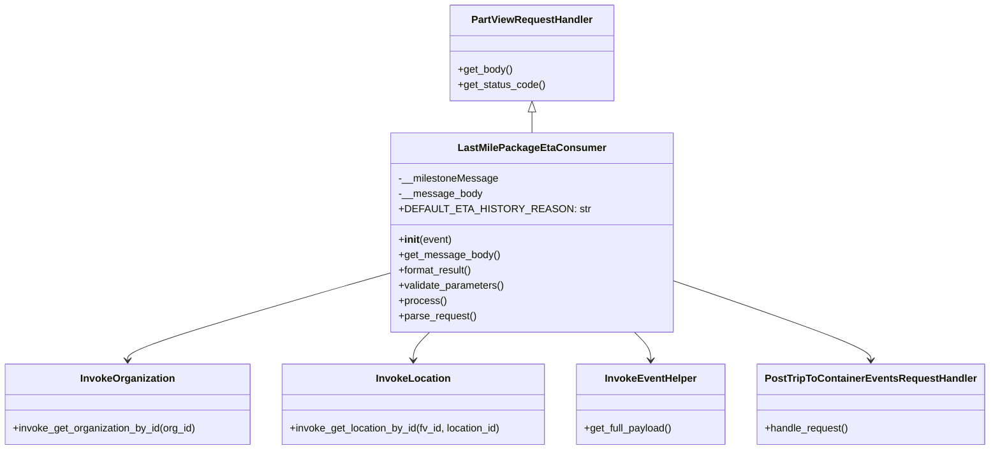
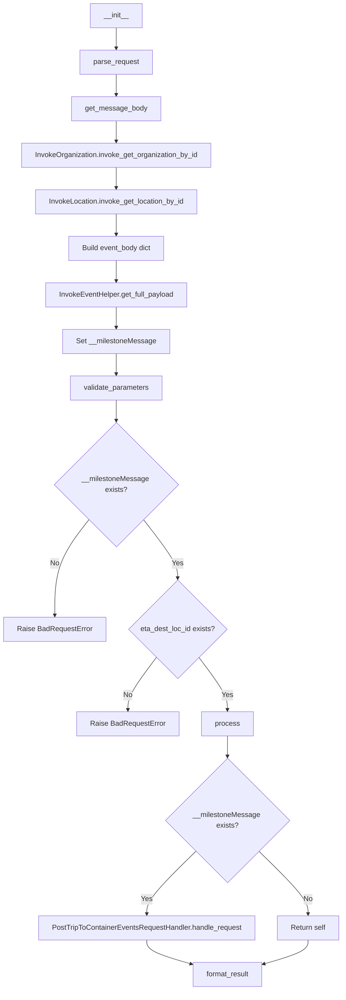
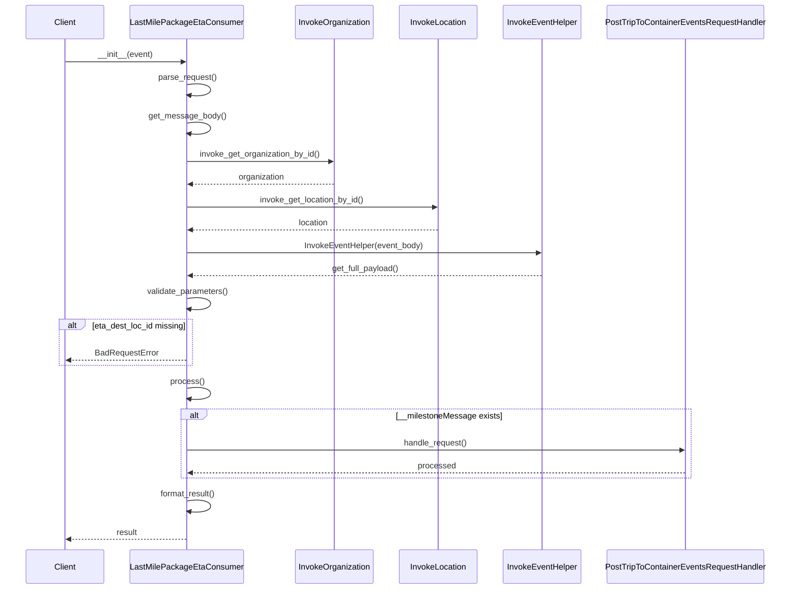

# Diagram: platform/partview_core/partview_service/partview_service/core/business/trip_leg/LastMilePackageEtaConsumer.py


> Auto-generated by Obscura crawlers

## Diagram 1

```mermaid
classDiagram
      PartViewRequestHandler <|-- LastMilePackageEtaConsumer
      LastMilePackageEtaConsumer --> InvokeOrganization
      LastMilePackageEtaConsumer --> InvokeLocation...
  └ 175 lines...
```

> SVG rendering failed for this diagram.

## Diagram 2



### SVG

<svg id="container" width="1537.6015625" xmlns="http://www.w3.org/2000/svg" class="classDiagram" height="704" viewBox="0 0 1537.6015625 704" role="graphics-document document" aria-roledescription="class"><style>#container{font-family:"trebuchet ms",verdana,arial,sans-serif;font-size:16px;fill:#333;}@keyframes edge-animation-frame{from{stroke-dashoffset:0;}}@keyframes dash{to{stroke-dashoffset:0;}}#container .edge-animation-slow{stroke-dasharray:9,5!important;stroke-dashoffset:900;animation:dash 50s linear infinite;stroke-linecap:round;}#container .edge-animation-fast{stroke-dasharray:9,5!important;stroke-dashoffset:900;animation:dash 20s linear infinite;stroke-linecap:round;}#container .error-icon{fill:#552222;}#container .error-text{fill:#552222;stroke:#552222;}#container .edge-thickness-normal{stroke-width:1px;}#container .edge-thickness-thick{stroke-width:3.5px;}#container .edge-pattern-solid{stroke-dasharray:0;}#container .edge-thickness-invisible{stroke-width:0;fill:none;}#container .edge-pattern-dashed{stroke-dasharray:3;}#container .edge-pattern-dotted{stroke-dasharray:2;}#container .marker{fill:#333333;stroke:#333333;}#container .marker.cross{stroke:#333333;}#container svg{font-family:"trebuchet ms",verdana,arial,sans-serif;font-size:16px;}#container p{margin:0;}#container g.classGroup text{fill:#9370DB;stroke:none;font-family:"trebuchet ms",verdana,arial,sans-serif;font-size:10px;}#container g.classGroup text .title{font-weight:bolder;}#container .nodeLabel,#container .edgeLabel{color:#131300;}#container .edgeLabel .label rect{fill:#ECECFF;}#container .label text{fill:#131300;}#container .labelBkg{background:#ECECFF;}#container .edgeLabel .label span{background:#ECECFF;}#container .classTitle{font-weight:bolder;}#container .node rect,#container .node circle,#container .node ellipse,#container .node polygon,#container .node path{fill:#ECECFF;stroke:#9370DB;stroke-width:1px;}#container .divider{stroke:#9370DB;stroke-width:1;}#container g.clickable{cursor:pointer;}#container g.classGroup rect{fill:#ECECFF;stroke:#9370DB;}#container g.classGroup line{stroke:#9370DB;stroke-width:1;}#container .classLabel .box{stroke:none;stroke-width:0;fill:#ECECFF;opacity:0.5;}#container .classLabel .label{fill:#9370DB;font-size:10px;}#container .relation{stroke:#333333;stroke-width:1;fill:none;}#container .dashed-line{stroke-dasharray:3;}#container .dotted-line{stroke-dasharray:1 2;}#container #compositionStart,#container .composition{fill:#333333!important;stroke:#333333!important;stroke-width:1;}#container #compositionEnd,#container .composition{fill:#333333!important;stroke:#333333!important;stroke-width:1;}#container #dependencyStart,#container .dependency{fill:#333333!important;stroke:#333333!important;stroke-width:1;}#container #dependencyStart,#container .dependency{fill:#333333!important;stroke:#333333!important;stroke-width:1;}#container #extensionStart,#container .extension{fill:transparent!important;stroke:#333333!important;stroke-width:1;}#container #extensionEnd,#container .extension{fill:transparent!important;stroke:#333333!important;stroke-width:1;}#container #aggregationStart,#container .aggregation{fill:transparent!important;stroke:#333333!important;stroke-width:1;}#container #aggregationEnd,#container .aggregation{fill:transparent!important;stroke:#333333!important;stroke-width:1;}#container #lollipopStart,#container .lollipop{fill:#ECECFF!important;stroke:#333333!important;stroke-width:1;}#container #lollipopEnd,#container .lollipop{fill:#ECECFF!important;stroke:#333333!important;stroke-width:1;}#container .edgeTerminals{font-size:11px;line-height:initial;}#container .classTitleText{text-anchor:middle;font-size:18px;fill:#333;}#container .label-icon{display:inline-block;height:1em;overflow:visible;vertical-align:-0.125em;}#container .node .label-icon path{fill:currentColor;stroke:revert;stroke-width:revert;}#container :root{--mermaid-font-family:"trebuchet ms",verdana,arial,sans-serif;}</style><g><defs><marker id="container_class-aggregationStart" class="marker aggregation class" refX="18" refY="7" markerWidth="190" markerHeight="240" orient="auto"><path d="M 18,7 L9,13 L1,7 L9,1 Z"></path></marker></defs><defs><marker id="container_class-aggregationEnd" class="marker aggregation class" refX="1" refY="7" markerWidth="20" markerHeight="28" orient="auto"><path d="M 18,7 L9,13 L1,7 L9,1 Z"></path></marker></defs><defs><marker id="container_class-extensionStart" class="marker extension class" refX="18" refY="7" markerWidth="190" markerHeight="240" orient="auto"><path d="M 1,7 L18,13 V 1 Z"></path></marker></defs><defs><marker id="container_class-extensionEnd" class="marker extension class" refX="1" refY="7" markerWidth="20" markerHeight="28" orient="auto"><path d="M 1,1 V 13 L18,7 Z"></path></marker></defs><defs><marker id="container_class-compositionStart" class="marker composition class" refX="18" refY="7" markerWidth="190" markerHeight="240" orient="auto"><path d="M 18,7 L9,13 L1,7 L9,1 Z"></path></marker></defs><defs><marker id="container_class-compositionEnd" class="marker composition class" refX="1" refY="7" markerWidth="20" markerHeight="28" orient="auto"><path d="M 18,7 L9,13 L1,7 L9,1 Z"></path></marker></defs><defs><marker id="container_class-dependencyStart" class="marker dependency class" refX="6" refY="7" markerWidth="190" markerHeight="240" orient="auto"><path d="M 5,7 L9,13 L1,7 L9,1 Z"></path></marker></defs><defs><marker id="container_class-dependencyEnd" class="marker dependency class" refX="13" refY="7" markerWidth="20" markerHeight="28" orient="auto"><path d="M 18,7 L9,13 L14,7 L9,1 Z"></path></marker></defs><defs><marker id="container_class-lollipopStart" class="marker lollipop class" refX="13" refY="7" markerWidth="190" markerHeight="240" orient="auto"><circle stroke="black" fill="transparent" cx="7" cy="7" r="6"></circle></marker></defs><defs><marker id="container_class-lollipopEnd" class="marker lollipop class" refX="1" refY="7" markerWidth="190" markerHeight="240" orient="auto"><circle stroke="black" fill="transparent" cx="7" cy="7" r="6"></circle></marker></defs><g class="root"><g class="clusters"></g><g class="edgePaths"><path d="M836.893,175.25L836.893,176.542C836.893,177.833,836.893,180.417,836.893,185.875C836.893,191.333,836.893,199.667,836.893,203.833L836.893,208" id="id_PartViewRequestHandler_LastMilePackageEtaConsumer_1" class="edge-thickness-normal edge-pattern-solid relation" style=";;;" data-edge="true" data-et="edge" data-id="id_PartViewRequestHandler_LastMilePackageEtaConsumer_1" data-points="W3sieCI6ODM2Ljg5MjU3ODEyNSwieSI6MTU4fSx7IngiOjgzNi44OTI1NzgxMjUsInkiOjE4M30seyJ4Ijo4MzYuODkyNTc4MTI1LCJ5IjoyMDh9XQ==" marker-start="url(#container_class-extensionStart)"></path><path d="M639.205,420.172L565.986,440.976C492.767,461.781,346.329,503.391,273.11,527.362C199.891,551.333,199.891,557.667,199.891,560.833L199.891,564" id="id_LastMilePackageEtaConsumer_InvokeOrganization_2" class="edge-thickness-normal edge-pattern-solid relation" style=";;;" data-edge="true" data-et="edge" data-id="id_LastMilePackageEtaConsumer_InvokeOrganization_2" data-points="W3sieCI6NjM5LjIwNTA3ODEyNSwieSI6NDIwLjE3MTYyOTE4MzMzODd9LHsieCI6MTk5Ljg5MDYyNSwieSI6NTQ1fSx7IngiOjE5OS44OTA2MjUsInkiOjU3MH1d" marker-end="url(#container_class-dependencyEnd)"></path><path d="M675.672,520L671.366,524.167C667.06,528.333,658.448,536.667,654.142,544C649.836,551.333,649.836,557.667,649.836,560.833L649.836,564" id="id_LastMilePackageEtaConsumer_InvokeLocation_3" class="edge-thickness-normal edge-pattern-solid relation" style=";;;" data-edge="true" data-et="edge" data-id="id_LastMilePackageEtaConsumer_InvokeLocation_3" data-points="W3sieCI6Njc1LjY3MjQ5MDA3MjUxMzgsInkiOjUyMH0seyJ4Ijo2NDkuODM1OTM3NSwieSI6NTQ1fSx7IngiOjY0OS44MzU5Mzc1LCJ5Ijo1NzB9XQ==" marker-end="url(#container_class-dependencyEnd)"></path><path d="M998.113,520L1002.419,524.167C1006.725,528.333,1015.337,536.667,1019.643,544C1023.949,551.333,1023.949,557.667,1023.949,560.833L1023.949,564" id="id_LastMilePackageEtaConsumer_InvokeEventHelper_4" class="edge-thickness-normal edge-pattern-solid relation" style=";;;" data-edge="true" data-et="edge" data-id="id_LastMilePackageEtaConsumer_InvokeEventHelper_4" data-points="W3sieCI6OTk4LjExMjY2NjE3NzQ4NjIsInkiOjUyMH0seyJ4IjoxMDIzLjk0OTIxODc1LCJ5Ijo1NDV9LHsieCI6MTAyMy45NDkyMTg3NSwieSI6NTcwfV0=" marker-end="url(#container_class-dependencyEnd)"></path><path d="M1034.58,432.427L1088.784,451.189C1142.988,469.951,1251.396,507.476,1305.601,529.405C1359.805,551.333,1359.805,557.667,1359.805,560.833L1359.805,564" id="id_LastMilePackageEtaConsumer_PostTripToContainerEventsRequestHandler_5" class="edge-thickness-normal edge-pattern-solid relation" style=";;;" data-edge="true" data-et="edge" data-id="id_LastMilePackageEtaConsumer_PostTripToContainerEventsRequestHandler_5" data-points="W3sieCI6MTAzNC41ODAwNzgxMjUsInkiOjQzMi40MjcyNDk3Mzk0NzczfSx7IngiOjEzNTkuODA0Njg3NSwieSI6NTQ1fSx7IngiOjEzNTkuODA0Njg3NSwieSI6NTcwfV0=" marker-end="url(#container_class-dependencyEnd)"></path></g><g class="edgeLabels"><g class="edgeLabel"><g class="label" data-id="id_PartViewRequestHandler_LastMilePackageEtaConsumer_1" transform="translate(0, 0)"><foreignObject width="0" height="0"><div xmlns="http://www.w3.org/1999/xhtml" class="labelBkg" style="display: table-cell; white-space: nowrap; line-height: 1.5; max-width: 200px; text-align: center;"><span class="edgeLabel"></span></div></foreignObject></g></g><g class="edgeLabel"><g class="label" data-id="id_LastMilePackageEtaConsumer_InvokeOrganization_2" transform="translate(0, 0)"><foreignObject width="0" height="0"><div xmlns="http://www.w3.org/1999/xhtml" class="labelBkg" style="display: table-cell; white-space: nowrap; line-height: 1.5; max-width: 200px; text-align: center;"><span class="edgeLabel"></span></div></foreignObject></g></g><g class="edgeLabel"><g class="label" data-id="id_LastMilePackageEtaConsumer_InvokeLocation_3" transform="translate(0, 0)"><foreignObject width="0" height="0"><div xmlns="http://www.w3.org/1999/xhtml" class="labelBkg" style="display: table-cell; white-space: nowrap; line-height: 1.5; max-width: 200px; text-align: center;"><span class="edgeLabel"></span></div></foreignObject></g></g><g class="edgeLabel"><g class="label" data-id="id_LastMilePackageEtaConsumer_InvokeEventHelper_4" transform="translate(0, 0)"><foreignObject width="0" height="0"><div xmlns="http://www.w3.org/1999/xhtml" class="labelBkg" style="display: table-cell; white-space: nowrap; line-height: 1.5; max-width: 200px; text-align: center;"><span class="edgeLabel"></span></div></foreignObject></g></g><g class="edgeLabel"><g class="label" data-id="id_LastMilePackageEtaConsumer_PostTripToContainerEventsRequestHandler_5" transform="translate(0, 0)"><foreignObject width="0" height="0"><div xmlns="http://www.w3.org/1999/xhtml" class="labelBkg" style="display: table-cell; white-space: nowrap; line-height: 1.5; max-width: 200px; text-align: center;"><span class="edgeLabel"></span></div></foreignObject></g></g></g><g class="nodes"><g class="node default" id="classId-PartViewRequestHandler-0" transform="translate(836.892578125, 83)"><g class="basic label-container"><path d="M-125.8203125 -75 L125.8203125 -75 L125.8203125 75 L-125.8203125 75" stroke="none" stroke-width="0" fill="#ECECFF" style=""></path><path d="M-125.8203125 -75 C-46.225862495073756 -75, 33.36858750985249 -75, 125.8203125 -75 M-125.8203125 -75 C-39.69321383699736 -75, 46.43388482600528 -75, 125.8203125 -75 M125.8203125 -75 C125.8203125 -36.18880256990311, 125.8203125 2.622394860193779, 125.8203125 75 M125.8203125 -75 C125.8203125 -31.940753599582415, 125.8203125 11.11849280083517, 125.8203125 75 M125.8203125 75 C39.45406447962745 75, -46.912183540745104 75, -125.8203125 75 M125.8203125 75 C63.85400601923304 75, 1.8876995384660802 75, -125.8203125 75 M-125.8203125 75 C-125.8203125 37.27888853628433, -125.8203125 -0.44222292743134517, -125.8203125 -75 M-125.8203125 75 C-125.8203125 20.044035219284645, -125.8203125 -34.91192956143071, -125.8203125 -75" stroke="#9370DB" stroke-width="1.3" fill="none" stroke-dasharray="0 0" style=""></path></g><g class="annotation-group text" transform="translate(0, -51)"></g><g class="label-group text" transform="translate(-91.359375, -51)"><g class="label" style="font-weight: bolder" transform="translate(0,-12)"><foreignObject width="182.71875" height="24"><div xmlns="http://www.w3.org/1999/xhtml" style="display: table-cell; white-space: nowrap; line-height: 1.5; max-width: 231px; text-align: center;"><span class="nodeLabel markdown-node-label" style=""><p>PartViewRequestHandler</p></span></div></foreignObject></g></g><g class="members-group text" transform="translate(-113.8203125, -3)"></g><g class="methods-group text" transform="translate(-113.8203125, 27)"><g class="label" style="" transform="translate(0,-12)"><foreignObject width="85.53125" height="24"><div xmlns="http://www.w3.org/1999/xhtml" style="display: table-cell; white-space: nowrap; line-height: 1.5; max-width: 143px; text-align: center;"><span class="nodeLabel markdown-node-label" style=""><p>+get_body()</p></span></div></foreignObject></g><g class="label" style="" transform="translate(0,12)"><foreignObject width="136.28125" height="24"><div xmlns="http://www.w3.org/1999/xhtml" style="display: table-cell; white-space: nowrap; line-height: 1.5; max-width: 194px; text-align: center;"><span class="nodeLabel markdown-node-label" style=""><p>+get_status_code()</p></span></div></foreignObject></g></g><g class="divider" style=""><path d="M-125.8203125 -27 C-52.73939362940861 -27, 20.34152524118278 -27, 125.8203125 -27 M-125.8203125 -27 C-49.14213591483956 -27, 27.536040670320887 -27, 125.8203125 -27" stroke="#9370DB" stroke-width="1.3" fill="none" stroke-dasharray="0 0" style=""></path></g><g class="divider" style=""><path d="M-125.8203125 -3 C-36.08014900606976 -3, 53.66001448786048 -3, 125.8203125 -3 M-125.8203125 -3 C-42.76358992172972 -3, 40.293132656540564 -3, 125.8203125 -3" stroke="#9370DB" stroke-width="1.3" fill="none" stroke-dasharray="0 0" style=""></path></g></g><g class="node default" id="classId-LastMilePackageEtaConsumer-1" transform="translate(836.892578125, 364)"><g class="basic label-container"><path d="M-197.6875 -156 L197.6875 -156 L197.6875 156 L-197.6875 156" stroke="none" stroke-width="0" fill="#ECECFF" style=""></path><path d="M-197.6875 -156 C-49.33217116525492 -156, 99.02315766949016 -156, 197.6875 -156 M-197.6875 -156 C-112.3755725387148 -156, -27.063645077429612 -156, 197.6875 -156 M197.6875 -156 C197.6875 -34.34353116174924, 197.6875 87.31293767650152, 197.6875 156 M197.6875 -156 C197.6875 -65.51486451076444, 197.6875 24.97027097847112, 197.6875 156 M197.6875 156 C92.19109043354577 156, -13.305319132908465 156, -197.6875 156 M197.6875 156 C92.36191062695376 156, -12.963678746092484 156, -197.6875 156 M-197.6875 156 C-197.6875 59.4839981625929, -197.6875 -37.032003674814206, -197.6875 -156 M-197.6875 156 C-197.6875 52.69960287241601, -197.6875 -50.60079425516798, -197.6875 -156" stroke="#9370DB" stroke-width="1.3" fill="none" stroke-dasharray="0 0" style=""></path></g><g class="annotation-group text" transform="translate(0, -132)"></g><g class="label-group text" transform="translate(-108.421875, -132)"><g class="label" style="font-weight: bolder" transform="translate(0,-12)"><foreignObject width="216.84375" height="24"><div xmlns="http://www.w3.org/1999/xhtml" style="display: table-cell; white-space: nowrap; line-height: 1.5; max-width: 264px; text-align: center;"><span class="nodeLabel markdown-node-label" style=""><p>LastMilePackageEtaConsumer</p></span></div></foreignObject></g></g><g class="members-group text" transform="translate(-185.6875, -84)"><g class="label" style="" transform="translate(0,-12)"><foreignObject width="154.78125" height="24"><div xmlns="http://www.w3.org/1999/xhtml" style="display: table-cell; white-space: nowrap; line-height: 1.5; max-width: 212px; text-align: center;"><span class="nodeLabel markdown-node-label" style=""><p>-__milestoneMessage</p></span></div></foreignObject></g><g class="label" style="" transform="translate(0,12)"><foreignObject width="128.328125" height="24"><div xmlns="http://www.w3.org/1999/xhtml" style="display: table-cell; white-space: nowrap; line-height: 1.5; max-width: 186px; text-align: center;"><span class="nodeLabel markdown-node-label" style=""><p>-__message_body</p></span></div></foreignObject></g><g class="label" style="" transform="translate(0,36)"><foreignObject width="262.953125" height="24"><div xmlns="http://www.w3.org/1999/xhtml" style="display: table-cell; white-space: nowrap; line-height: 1.5; max-width: 321px; text-align: center;"><span class="nodeLabel markdown-node-label" style=""><p>+DEFAULT_ETA_HISTORY_REASON: str</p></span></div></foreignObject></g></g><g class="methods-group text" transform="translate(-185.6875, 12)"><g class="label" style="" transform="translate(0,-12)"><foreignObject width="83.140625" height="24"><div xmlns="http://www.w3.org/1999/xhtml" style="display: table-cell; white-space: nowrap; line-height: 1.5; max-width: 172px; text-align: center;"><span class="nodeLabel markdown-node-label" style=""><p>+<strong>init</strong>(event)</p></span></div></foreignObject></g><g class="label" style="" transform="translate(0,12)"><foreignObject width="155.90625" height="24"><div xmlns="http://www.w3.org/1999/xhtml" style="display: table-cell; white-space: nowrap; line-height: 1.5; max-width: 213px; text-align: center;"><span class="nodeLabel markdown-node-label" style=""><p>+get_message_body()</p></span></div></foreignObject></g><g class="label" style="" transform="translate(0,36)"><foreignObject width="117.015625" height="24"><div xmlns="http://www.w3.org/1999/xhtml" style="display: table-cell; white-space: nowrap; line-height: 1.5; max-width: 174px; text-align: center;"><span class="nodeLabel markdown-node-label" style=""><p>+format_result()</p></span></div></foreignObject></g><g class="label" style="" transform="translate(0,60)"><foreignObject width="166.546875" height="24"><div xmlns="http://www.w3.org/1999/xhtml" style="display: table-cell; white-space: nowrap; line-height: 1.5; max-width: 224px; text-align: center;"><span class="nodeLabel markdown-node-label" style=""><p>+validate_parameters()</p></span></div></foreignObject></g><g class="label" style="" transform="translate(0,84)"><foreignObject width="73.734375" height="24"><div xmlns="http://www.w3.org/1999/xhtml" style="display: table-cell; white-space: nowrap; line-height: 1.5; max-width: 131px; text-align: center;"><span class="nodeLabel markdown-node-label" style=""><p>+process()</p></span></div></foreignObject></g><g class="label" style="" transform="translate(0,108)"><foreignObject width="121.796875" height="24"><div xmlns="http://www.w3.org/1999/xhtml" style="display: table-cell; white-space: nowrap; line-height: 1.5; max-width: 179px; text-align: center;"><span class="nodeLabel markdown-node-label" style=""><p>+parse_request()</p></span></div></foreignObject></g></g><g class="divider" style=""><path d="M-197.6875 -108 C-91.82678234104063 -108, 14.033935317918747 -108, 197.6875 -108 M-197.6875 -108 C-59.661887720767055 -108, 78.36372455846589 -108, 197.6875 -108" stroke="#9370DB" stroke-width="1.3" fill="none" stroke-dasharray="0 0" style=""></path></g><g class="divider" style=""><path d="M-197.6875 -12 C-70.29473952867673 -12, 57.09802094264654 -12, 197.6875 -12 M-197.6875 -12 C-98.74349451388332 -12, 0.20051097223336 -12, 197.6875 -12" stroke="#9370DB" stroke-width="1.3" fill="none" stroke-dasharray="0 0" style=""></path></g></g><g class="node default" id="classId-InvokeOrganization-2" transform="translate(199.890625, 633)"><g class="basic label-container"><path d="M-191.890625 -63 L191.890625 -63 L191.890625 63 L-191.890625 63" stroke="none" stroke-width="0" fill="#ECECFF" style=""></path><path d="M-191.890625 -63 C-43.795187364013685 -63, 104.30025027197263 -63, 191.890625 -63 M-191.890625 -63 C-107.32990904619331 -63, -22.769193092386615 -63, 191.890625 -63 M191.890625 -63 C191.890625 -31.534393808553972, 191.890625 -0.06878761710794379, 191.890625 63 M191.890625 -63 C191.890625 -13.730672215518318, 191.890625 35.538655568963364, 191.890625 63 M191.890625 63 C42.331905740133124 63, -107.22681351973375 63, -191.890625 63 M191.890625 63 C73.71060270544545 63, -44.469419589109094 63, -191.890625 63 M-191.890625 63 C-191.890625 34.945790300765026, -191.890625 6.891580601530059, -191.890625 -63 M-191.890625 63 C-191.890625 14.10908599026979, -191.890625 -34.78182801946042, -191.890625 -63" stroke="#9370DB" stroke-width="1.3" fill="none" stroke-dasharray="0 0" style=""></path></g><g class="annotation-group text" transform="translate(0, -39)"></g><g class="label-group text" transform="translate(-71.046875, -39)"><g class="label" style="font-weight: bolder" transform="translate(0,-12)"><foreignObject width="142.09375" height="24"><div xmlns="http://www.w3.org/1999/xhtml" style="display: table-cell; white-space: nowrap; line-height: 1.5; max-width: 190px; text-align: center;"><span class="nodeLabel markdown-node-label" style=""><p>InvokeOrganization</p></span></div></foreignObject></g></g><g class="members-group text" transform="translate(-179.890625, 9)"></g><g class="methods-group text" transform="translate(-179.890625, 39)"><g class="label" style="" transform="translate(0,-12)"><foreignObject width="288.734375" height="24"><div xmlns="http://www.w3.org/1999/xhtml" style="display: table-cell; white-space: nowrap; line-height: 1.5; max-width: 346px; text-align: center;"><span class="nodeLabel markdown-node-label" style=""><p>+invoke_get_organization_by_id(org_id)</p></span></div></foreignObject></g></g><g class="divider" style=""><path d="M-191.890625 -15 C-70.0871487290626 -15, 51.71632754187479 -15, 191.890625 -15 M-191.890625 -15 C-106.73756305518712 -15, -21.584501110374248 -15, 191.890625 -15" stroke="#9370DB" stroke-width="1.3" fill="none" stroke-dasharray="0 0" style=""></path></g><g class="divider" style=""><path d="M-191.890625 9 C-106.89044086677656 9, -21.890256733553116 9, 191.890625 9 M-191.890625 9 C-111.4241066128777 9, -30.957588225755387 9, 191.890625 9" stroke="#9370DB" stroke-width="1.3" fill="none" stroke-dasharray="0 0" style=""></path></g></g><g class="node default" id="classId-InvokeLocation-3" transform="translate(649.8359375, 633)"><g class="basic label-container"><path d="M-208.0546875 -63 L208.0546875 -63 L208.0546875 63 L-208.0546875 63" stroke="none" stroke-width="0" fill="#ECECFF" style=""></path><path d="M-208.0546875 -63 C-106.28220502811702 -63, -4.509722556234038 -63, 208.0546875 -63 M-208.0546875 -63 C-92.80356446648373 -63, 22.44755856703253 -63, 208.0546875 -63 M208.0546875 -63 C208.0546875 -25.027552330828463, 208.0546875 12.944895338343073, 208.0546875 63 M208.0546875 -63 C208.0546875 -17.162899733996824, 208.0546875 28.674200532006353, 208.0546875 63 M208.0546875 63 C49.14471989660768 63, -109.76524770678463 63, -208.0546875 63 M208.0546875 63 C89.7252935666895 63, -28.604100366620997 63, -208.0546875 63 M-208.0546875 63 C-208.0546875 26.7800358521077, -208.0546875 -9.439928295784597, -208.0546875 -63 M-208.0546875 63 C-208.0546875 32.937910140542286, -208.0546875 2.8758202810845717, -208.0546875 -63" stroke="#9370DB" stroke-width="1.3" fill="none" stroke-dasharray="0 0" style=""></path></g><g class="annotation-group text" transform="translate(0, -39)"></g><g class="label-group text" transform="translate(-55.703125, -39)"><g class="label" style="font-weight: bolder" transform="translate(0,-12)"><foreignObject width="111.40625" height="24"><div xmlns="http://www.w3.org/1999/xhtml" style="display: table-cell; white-space: nowrap; line-height: 1.5; max-width: 160px; text-align: center;"><span class="nodeLabel markdown-node-label" style=""><p>InvokeLocation</p></span></div></foreignObject></g></g><g class="members-group text" transform="translate(-196.0546875, 9)"></g><g class="methods-group text" transform="translate(-196.0546875, 39)"><g class="label" style="" transform="translate(0,-12)"><foreignObject width="336.40625" height="24"><div xmlns="http://www.w3.org/1999/xhtml" style="display: table-cell; white-space: nowrap; line-height: 1.5; max-width: 394px; text-align: center;"><span class="nodeLabel markdown-node-label" style=""><p>+invoke_get_location_by_id(fv_id, location_id)</p></span></div></foreignObject></g></g><g class="divider" style=""><path d="M-208.0546875 -15 C-124.66773361403004 -15, -41.28077972806008 -15, 208.0546875 -15 M-208.0546875 -15 C-90.68808759512663 -15, 26.678512309746736 -15, 208.0546875 -15" stroke="#9370DB" stroke-width="1.3" fill="none" stroke-dasharray="0 0" style=""></path></g><g class="divider" style=""><path d="M-208.0546875 9 C-80.90918530425017 9, 46.236316891499655 9, 208.0546875 9 M-208.0546875 9 C-118.05229649523258 9, -28.049905490465164 9, 208.0546875 9" stroke="#9370DB" stroke-width="1.3" fill="none" stroke-dasharray="0 0" style=""></path></g></g><g class="node default" id="classId-InvokeEventHelper-4" transform="translate(1023.94921875, 633)"><g class="basic label-container"><path d="M-116.05859375 -63 L116.05859375 -63 L116.05859375 63 L-116.05859375 63" stroke="none" stroke-width="0" fill="#ECECFF" style=""></path><path d="M-116.05859375 -63 C-68.40303169670008 -63, -20.747469643400166 -63, 116.05859375 -63 M-116.05859375 -63 C-33.19428272635227 -63, 49.67002829729546 -63, 116.05859375 -63 M116.05859375 -63 C116.05859375 -29.23997421864783, 116.05859375 4.520051562704339, 116.05859375 63 M116.05859375 -63 C116.05859375 -14.468344401415138, 116.05859375 34.063311197169725, 116.05859375 63 M116.05859375 63 C56.64743878314326 63, -2.763716183713484 63, -116.05859375 63 M116.05859375 63 C27.490241029533223 63, -61.078111690933554 63, -116.05859375 63 M-116.05859375 63 C-116.05859375 27.657545824020303, -116.05859375 -7.684908351959393, -116.05859375 -63 M-116.05859375 63 C-116.05859375 28.358112499976023, -116.05859375 -6.283775000047953, -116.05859375 -63" stroke="#9370DB" stroke-width="1.3" fill="none" stroke-dasharray="0 0" style=""></path></g><g class="annotation-group text" transform="translate(0, -39)"></g><g class="label-group text" transform="translate(-69.0859375, -39)"><g class="label" style="font-weight: bolder" transform="translate(0,-12)"><foreignObject width="138.171875" height="24"><div xmlns="http://www.w3.org/1999/xhtml" style="display: table-cell; white-space: nowrap; line-height: 1.5; max-width: 187px; text-align: center;"><span class="nodeLabel markdown-node-label" style=""><p>InvokeEventHelper</p></span></div></foreignObject></g></g><g class="members-group text" transform="translate(-104.05859375, 9)"></g><g class="methods-group text" transform="translate(-104.05859375, 39)"><g class="label" style="" transform="translate(0,-12)"><foreignObject width="139.03125" height="24"><div xmlns="http://www.w3.org/1999/xhtml" style="display: table-cell; white-space: nowrap; line-height: 1.5; max-width: 196px; text-align: center;"><span class="nodeLabel markdown-node-label" style=""><p>+get_full_payload()</p></span></div></foreignObject></g></g><g class="divider" style=""><path d="M-116.05859375 -15 C-51.3707199030292 -15, 13.317153943941605 -15, 116.05859375 -15 M-116.05859375 -15 C-65.99856886976957 -15, -15.938543989539141 -15, 116.05859375 -15" stroke="#9370DB" stroke-width="1.3" fill="none" stroke-dasharray="0 0" style=""></path></g><g class="divider" style=""><path d="M-116.05859375 9 C-46.19954724142039 9, 23.65949926715922 9, 116.05859375 9 M-116.05859375 9 C-57.77217954451469 9, 0.5142346609706152 9, 116.05859375 9" stroke="#9370DB" stroke-width="1.3" fill="none" stroke-dasharray="0 0" style=""></path></g></g><g class="node default" id="classId-PostTripToContainerEventsRequestHandler-5" transform="translate(1359.8046875, 633)"><g class="basic label-container"><path d="M-169.796875 -63 L169.796875 -63 L169.796875 63 L-169.796875 63" stroke="none" stroke-width="0" fill="#ECECFF" style=""></path><path d="M-169.796875 -63 C-37.5368077124956 -63, 94.7232595750088 -63, 169.796875 -63 M-169.796875 -63 C-80.09580091615904 -63, 9.60527316768193 -63, 169.796875 -63 M169.796875 -63 C169.796875 -13.436333173050883, 169.796875 36.12733365389823, 169.796875 63 M169.796875 -63 C169.796875 -16.26419423846749, 169.796875 30.47161152306502, 169.796875 63 M169.796875 63 C57.61545096026214 63, -54.565973079475725 63, -169.796875 63 M169.796875 63 C59.09838936506091 63, -51.60009626987818 63, -169.796875 63 M-169.796875 63 C-169.796875 21.900932583884426, -169.796875 -19.198134832231148, -169.796875 -63 M-169.796875 63 C-169.796875 34.61492126811287, -169.796875 6.229842536225746, -169.796875 -63" stroke="#9370DB" stroke-width="1.3" fill="none" stroke-dasharray="0 0" style=""></path></g><g class="annotation-group text" transform="translate(0, -39)"></g><g class="label-group text" transform="translate(-157.796875, -39)"><g class="label" style="font-weight: bolder" transform="translate(0,-12)"><foreignObject width="315.59375" height="24"><div xmlns="http://www.w3.org/1999/xhtml" style="display: table-cell; white-space: nowrap; line-height: 1.5; max-width: 362px; text-align: center;"><span class="nodeLabel markdown-node-label" style=""><p>PostTripToContainerEventsRequestHandler</p></span></div></foreignObject></g></g><g class="members-group text" transform="translate(-157.796875, 9)"></g><g class="methods-group text" transform="translate(-157.796875, 39)"><g class="label" style="" transform="translate(0,-12)"><foreignObject width="131.96875" height="24"><div xmlns="http://www.w3.org/1999/xhtml" style="display: table-cell; white-space: nowrap; line-height: 1.5; max-width: 189px; text-align: center;"><span class="nodeLabel markdown-node-label" style=""><p>+handle_request()</p></span></div></foreignObject></g></g><g class="divider" style=""><path d="M-169.796875 -15 C-89.5922845222073 -15, -9.387694044414587 -15, 169.796875 -15 M-169.796875 -15 C-36.323647595603745 -15, 97.14957980879251 -15, 169.796875 -15" stroke="#9370DB" stroke-width="1.3" fill="none" stroke-dasharray="0 0" style=""></path></g><g class="divider" style=""><path d="M-169.796875 9 C-35.77688840574345 9, 98.2430981885131 9, 169.796875 9 M-169.796875 9 C-53.94956760925669 9, 61.89773978148662 9, 169.796875 9" stroke="#9370DB" stroke-width="1.3" fill="none" stroke-dasharray="0 0" style=""></path></g></g></g></g></g></svg>

## Diagram 3



### SVG

<svg id="container" width="764.31640625" xmlns="http://www.w3.org/2000/svg" class="flowchart" height="2213.46875" viewBox="0 0 764.31640625 2213.46875" role="graphics-document document" aria-roledescription="flowchart-v2"><style>#container{font-family:"trebuchet ms",verdana,arial,sans-serif;font-size:16px;fill:#333;}@keyframes edge-animation-frame{from{stroke-dashoffset:0;}}@keyframes dash{to{stroke-dashoffset:0;}}#container .edge-animation-slow{stroke-dasharray:9,5!important;stroke-dashoffset:900;animation:dash 50s linear infinite;stroke-linecap:round;}#container .edge-animation-fast{stroke-dasharray:9,5!important;stroke-dashoffset:900;animation:dash 20s linear infinite;stroke-linecap:round;}#container .error-icon{fill:#552222;}#container .error-text{fill:#552222;stroke:#552222;}#container .edge-thickness-normal{stroke-width:1px;}#container .edge-thickness-thick{stroke-width:3.5px;}#container .edge-pattern-solid{stroke-dasharray:0;}#container .edge-thickness-invisible{stroke-width:0;fill:none;}#container .edge-pattern-dashed{stroke-dasharray:3;}#container .edge-pattern-dotted{stroke-dasharray:2;}#container .marker{fill:#333333;stroke:#333333;}#container .marker.cross{stroke:#333333;}#container svg{font-family:"trebuchet ms",verdana,arial,sans-serif;font-size:16px;}#container p{margin:0;}#container .label{font-family:"trebuchet ms",verdana,arial,sans-serif;color:#333;}#container .cluster-label text{fill:#333;}#container .cluster-label span{color:#333;}#container .cluster-label span p{background-color:transparent;}#container .label text,#container span{fill:#333;color:#333;}#container .node rect,#container .node circle,#container .node ellipse,#container .node polygon,#container .node path{fill:#ECECFF;stroke:#9370DB;stroke-width:1px;}#container .rough-node .label text,#container .node .label text,#container .image-shape .label,#container .icon-shape .label{text-anchor:middle;}#container .node .katex path{fill:#000;stroke:#000;stroke-width:1px;}#container .rough-node .label,#container .node .label,#container .image-shape .label,#container .icon-shape .label{text-align:center;}#container .node.clickable{cursor:pointer;}#container .root .anchor path{fill:#333333!important;stroke-width:0;stroke:#333333;}#container .arrowheadPath{fill:#333333;}#container .edgePath .path{stroke:#333333;stroke-width:2.0px;}#container .flowchart-link{stroke:#333333;fill:none;}#container .edgeLabel{background-color:rgba(232,232,232, 0.8);text-align:center;}#container .edgeLabel p{background-color:rgba(232,232,232, 0.8);}#container .edgeLabel rect{opacity:0.5;background-color:rgba(232,232,232, 0.8);fill:rgba(232,232,232, 0.8);}#container .labelBkg{background-color:rgba(232, 232, 232, 0.5);}#container .cluster rect{fill:#ffffde;stroke:#aaaa33;stroke-width:1px;}#container .cluster text{fill:#333;}#container .cluster span{color:#333;}#container div.mermaidTooltip{position:absolute;text-align:center;max-width:200px;padding:2px;font-family:"trebuchet ms",verdana,arial,sans-serif;font-size:12px;background:hsl(80, 100%, 96.2745098039%);border:1px solid #aaaa33;border-radius:2px;pointer-events:none;z-index:100;}#container .flowchartTitleText{text-anchor:middle;font-size:18px;fill:#333;}#container rect.text{fill:none;stroke-width:0;}#container .icon-shape,#container .image-shape{background-color:rgba(232,232,232, 0.8);text-align:center;}#container .icon-shape p,#container .image-shape p{background-color:rgba(232,232,232, 0.8);padding:2px;}#container .icon-shape rect,#container .image-shape rect{opacity:0.5;background-color:rgba(232,232,232, 0.8);fill:rgba(232,232,232, 0.8);}#container .label-icon{display:inline-block;height:1em;overflow:visible;vertical-align:-0.125em;}#container .node .label-icon path{fill:currentColor;stroke:revert;stroke-width:revert;}#container :root{--mermaid-font-family:"trebuchet ms",verdana,arial,sans-serif;}</style><g><marker id="container_flowchart-v2-pointEnd" class="marker flowchart-v2" viewBox="0 0 10 10" refX="5" refY="5" markerUnits="userSpaceOnUse" markerWidth="8" markerHeight="8" orient="auto"><path d="M 0 0 L 10 5 L 0 10 z" class="arrowMarkerPath" style="stroke-width: 1; stroke-dasharray: 1, 0;"></path></marker><marker id="container_flowchart-v2-pointStart" class="marker flowchart-v2" viewBox="0 0 10 10" refX="4.5" refY="5" markerUnits="userSpaceOnUse" markerWidth="8" markerHeight="8" orient="auto"><path d="M 0 5 L 10 10 L 10 0 z" class="arrowMarkerPath" style="stroke-width: 1; stroke-dasharray: 1, 0;"></path></marker><marker id="container_flowchart-v2-circleEnd" class="marker flowchart-v2" viewBox="0 0 10 10" refX="11" refY="5" markerUnits="userSpaceOnUse" markerWidth="11" markerHeight="11" orient="auto"><circle cx="5" cy="5" r="5" class="arrowMarkerPath" style="stroke-width: 1; stroke-dasharray: 1, 0;"></circle></marker><marker id="container_flowchart-v2-circleStart" class="marker flowchart-v2" viewBox="0 0 10 10" refX="-1" refY="5" markerUnits="userSpaceOnUse" markerWidth="11" markerHeight="11" orient="auto"><circle cx="5" cy="5" r="5" class="arrowMarkerPath" style="stroke-width: 1; stroke-dasharray: 1, 0;"></circle></marker><marker id="container_flowchart-v2-crossEnd" class="marker cross flowchart-v2" viewBox="0 0 11 11" refX="12" refY="5.2" markerUnits="userSpaceOnUse" markerWidth="11" markerHeight="11" orient="auto"><path d="M 1,1 l 9,9 M 10,1 l -9,9" class="arrowMarkerPath" style="stroke-width: 2; stroke-dasharray: 1, 0;"></path></marker><marker id="container_flowchart-v2-crossStart" class="marker cross flowchart-v2" viewBox="0 0 11 11" refX="-1" refY="5.2" markerUnits="userSpaceOnUse" markerWidth="11" markerHeight="11" orient="auto"><path d="M 1,1 l 9,9 M 10,1 l -9,9" class="arrowMarkerPath" style="stroke-width: 2; stroke-dasharray: 1, 0;"></path></marker><g class="root"><g class="clusters"></g><g class="edgePaths"><path d="M257.844,62L257.844,66.167C257.844,70.333,257.844,78.667,257.844,86.333C257.844,94,257.844,101,257.844,104.5L257.844,108" id="L_A_B_0" class="edge-thickness-normal edge-pattern-solid edge-thickness-normal edge-pattern-solid flowchart-link" style=";" data-edge="true" data-et="edge" data-id="L_A_B_0" data-points="W3sieCI6MjU3Ljg0Mzc1LCJ5Ijo2Mn0seyJ4IjoyNTcuODQzNzUsInkiOjg3fSx7IngiOjI1Ny44NDM3NSwieSI6MTEyfV0=" marker-end="url(#container_flowchart-v2-pointEnd)"></path><path d="M257.844,166L257.844,170.167C257.844,174.333,257.844,182.667,257.844,190.333C257.844,198,257.844,205,257.844,208.5L257.844,212" id="L_B_C_0" class="edge-thickness-normal edge-pattern-solid edge-thickness-normal edge-pattern-solid flowchart-link" style=";" data-edge="true" data-et="edge" data-id="L_B_C_0" data-points="W3sieCI6MjU3Ljg0Mzc1LCJ5IjoxNjZ9LHsieCI6MjU3Ljg0Mzc1LCJ5IjoxOTF9LHsieCI6MjU3Ljg0Mzc1LCJ5IjoyMTZ9XQ==" marker-end="url(#container_flowchart-v2-pointEnd)"></path><path d="M257.844,270L257.844,274.167C257.844,278.333,257.844,286.667,257.844,294.333C257.844,302,257.844,309,257.844,312.5L257.844,316" id="L_C_D_0" class="edge-thickness-normal edge-pattern-solid edge-thickness-normal edge-pattern-solid flowchart-link" style=";" data-edge="true" data-et="edge" data-id="L_C_D_0" data-points="W3sieCI6MjU3Ljg0Mzc1LCJ5IjoyNzB9LHsieCI6MjU3Ljg0Mzc1LCJ5IjoyOTV9LHsieCI6MjU3Ljg0Mzc1LCJ5IjozMjB9XQ==" marker-end="url(#container_flowchart-v2-pointEnd)"></path><path d="M257.844,374L257.844,378.167C257.844,382.333,257.844,390.667,257.844,398.333C257.844,406,257.844,413,257.844,416.5L257.844,420" id="L_D_E_0" class="edge-thickness-normal edge-pattern-solid edge-thickness-normal edge-pattern-solid flowchart-link" style=";" data-edge="true" data-et="edge" data-id="L_D_E_0" data-points="W3sieCI6MjU3Ljg0Mzc1LCJ5IjozNzR9LHsieCI6MjU3Ljg0Mzc1LCJ5IjozOTl9LHsieCI6MjU3Ljg0Mzc1LCJ5Ijo0MjR9XQ==" marker-end="url(#container_flowchart-v2-pointEnd)"></path><path d="M257.844,478L257.844,482.167C257.844,486.333,257.844,494.667,257.844,502.333C257.844,510,257.844,517,257.844,520.5L257.844,524" id="L_E_F_0" class="edge-thickness-normal edge-pattern-solid edge-thickness-normal edge-pattern-solid flowchart-link" style=";" data-edge="true" data-et="edge" data-id="L_E_F_0" data-points="W3sieCI6MjU3Ljg0Mzc1LCJ5Ijo0Nzh9LHsieCI6MjU3Ljg0Mzc1LCJ5Ijo1MDN9LHsieCI6MjU3Ljg0Mzc1LCJ5Ijo1Mjh9XQ==" marker-end="url(#container_flowchart-v2-pointEnd)"></path><path d="M257.844,582L257.844,586.167C257.844,590.333,257.844,598.667,257.844,606.333C257.844,614,257.844,621,257.844,624.5L257.844,628" id="L_F_G_0" class="edge-thickness-normal edge-pattern-solid edge-thickness-normal edge-pattern-solid flowchart-link" style=";" data-edge="true" data-et="edge" data-id="L_F_G_0" data-points="W3sieCI6MjU3Ljg0Mzc1LCJ5Ijo1ODJ9LHsieCI6MjU3Ljg0Mzc1LCJ5Ijo2MDd9LHsieCI6MjU3Ljg0Mzc1LCJ5Ijo2MzJ9XQ==" marker-end="url(#container_flowchart-v2-pointEnd)"></path><path d="M257.844,686L257.844,690.167C257.844,694.333,257.844,702.667,257.844,710.333C257.844,718,257.844,725,257.844,728.5L257.844,732" id="L_G_H_0" class="edge-thickness-normal edge-pattern-solid edge-thickness-normal edge-pattern-solid flowchart-link" style=";" data-edge="true" data-et="edge" data-id="L_G_H_0" data-points="W3sieCI6MjU3Ljg0Mzc1LCJ5Ijo2ODZ9LHsieCI6MjU3Ljg0Mzc1LCJ5Ijo3MTF9LHsieCI6MjU3Ljg0Mzc1LCJ5Ijo3MzZ9XQ==" marker-end="url(#container_flowchart-v2-pointEnd)"></path><path d="M257.844,790L257.844,794.167C257.844,798.333,257.844,806.667,257.844,814.333C257.844,822,257.844,829,257.844,832.5L257.844,836" id="L_H_I_0" class="edge-thickness-normal edge-pattern-solid edge-thickness-normal edge-pattern-solid flowchart-link" style=";" data-edge="true" data-et="edge" data-id="L_H_I_0" data-points="W3sieCI6MjU3Ljg0Mzc1LCJ5Ijo3OTB9LHsieCI6MjU3Ljg0Mzc1LCJ5Ijo4MTV9LHsieCI6MjU3Ljg0Mzc1LCJ5Ijo4NDB9XQ==" marker-end="url(#container_flowchart-v2-pointEnd)"></path><path d="M257.844,894L257.844,898.167C257.844,902.333,257.844,910.667,257.844,918.333C257.844,926,257.844,933,257.844,936.5L257.844,940" id="L_I_J_0" class="edge-thickness-normal edge-pattern-solid edge-thickness-normal edge-pattern-solid flowchart-link" style=";" data-edge="true" data-et="edge" data-id="L_I_J_0" data-points="W3sieCI6MjU3Ljg0Mzc1LCJ5Ijo4OTR9LHsieCI6MjU3Ljg0Mzc1LCJ5Ijo5MTl9LHsieCI6MjU3Ljg0Mzc1LCJ5Ijo5NDR9XQ==" marker-end="url(#container_flowchart-v2-pointEnd)"></path><path d="M197.039,1161.195L184.363,1177.496C171.687,1193.797,146.336,1226.398,133.66,1262.155C120.984,1297.911,120.984,1336.823,120.984,1356.279L120.984,1375.734" id="L_J_K_0" class="edge-thickness-normal edge-pattern-solid edge-thickness-normal edge-pattern-solid flowchart-link" style=";" data-edge="true" data-et="edge" data-id="L_J_K_0" data-points="W3sieCI6MTk3LjAzODYyNTg5MjcyMzM2LCJ5IjoxMTYxLjE5NDg3NTg5MjcyMzN9LHsieCI6MTIwLjk4NDM3NSwieSI6MTI1OX0seyJ4IjoxMjAuOTg0Mzc1LCJ5IjoxMzc5LjczNDM3NX1d" marker-end="url(#container_flowchart-v2-pointEnd)"></path><path d="M318.649,1161.195L331.325,1177.496C344,1193.797,369.352,1226.398,382.027,1248.199C394.703,1270,394.703,1281,394.703,1286.5L394.703,1292" id="L_J_L_0" class="edge-thickness-normal edge-pattern-solid edge-thickness-normal edge-pattern-solid flowchart-link" style=";" data-edge="true" data-et="edge" data-id="L_J_L_0" data-points="W3sieCI6MzE4LjY0ODg3NDEwNzI3NjY0LCJ5IjoxMTYxLjE5NDg3NTg5MjcyMzN9LHsieCI6Mzk0LjcwMzEyNSwieSI6MTI1OX0seyJ4IjozOTQuNzAzMTI1LCJ5IjoxMjk2fV0=" marker-end="url(#container_flowchart-v2-pointEnd)"></path><path d="M347.359,1470.124L336.859,1484.182C326.36,1498.239,305.362,1526.354,294.862,1545.911C284.363,1565.469,284.363,1576.469,284.363,1581.969L284.363,1587.469" id="L_L_M_0" class="edge-thickness-normal edge-pattern-solid edge-thickness-normal edge-pattern-solid flowchart-link" style=";" data-edge="true" data-et="edge" data-id="L_L_M_0" data-points="W3sieCI6MzQ3LjM1ODU1MjIwODM2NDI0LCJ5IjoxNDcwLjEyNDE3NzIwODM2NDJ9LHsieCI6Mjg0LjM2MzI4MTI1LCJ5IjoxNTU0LjQ2ODc1fSx7IngiOjI4NC4zNjMyODEyNSwieSI6MTU5MS40Njg3NX1d" marker-end="url(#container_flowchart-v2-pointEnd)"></path><path d="M442.048,1470.124L452.547,1484.182C463.046,1498.239,484.045,1526.354,494.544,1545.911C505.043,1565.469,505.043,1576.469,505.043,1581.969L505.043,1587.469" id="L_L_N_0" class="edge-thickness-normal edge-pattern-solid edge-thickness-normal edge-pattern-solid flowchart-link" style=";" data-edge="true" data-et="edge" data-id="L_L_N_0" data-points="W3sieCI6NDQyLjA0NzY5Nzc5MTYzNTc2LCJ5IjoxNDcwLjEyNDE3NzIwODM2NDJ9LHsieCI6NTA1LjA0Mjk2ODc1LCJ5IjoxNTU0LjQ2ODc1fSx7IngiOjUwNS4wNDI5Njg3NSwieSI6MTU5MS40Njg3NX1d" marker-end="url(#container_flowchart-v2-pointEnd)"></path><path d="M505.043,1645.469L505.043,1649.635C505.043,1653.802,505.043,1662.135,505.043,1669.802C505.043,1677.469,505.043,1684.469,505.043,1687.969L505.043,1691.469" id="L_N_O_0" class="edge-thickness-normal edge-pattern-solid edge-thickness-normal edge-pattern-solid flowchart-link" style=";" data-edge="true" data-et="edge" data-id="L_N_O_0" data-points="W3sieCI6NTA1LjA0Mjk2ODc1LCJ5IjoxNjQ1LjQ2ODc1fSx7IngiOjUwNS4wNDI5Njg3NSwieSI6MTY3MC40Njg3NX0seyJ4Ijo1MDUuMDQyOTY4NzUsInkiOjE2OTUuNDY4NzV9XQ==" marker-end="url(#container_flowchart-v2-pointEnd)"></path><path d="M434.448,1902.874L415.942,1920.807C397.436,1938.739,360.423,1974.604,341.917,1998.036C323.41,2021.469,323.41,2032.469,323.41,2037.969L323.41,2043.469" id="L_O_P_0" class="edge-thickness-normal edge-pattern-solid edge-thickness-normal edge-pattern-solid flowchart-link" style=";" data-edge="true" data-et="edge" data-id="L_O_P_0" data-points="W3sieCI6NDM0LjQ0ODMyNTE1MTY4NjQ1LCJ5IjoxOTAyLjg3NDEwNjQwMTY4NjV9LHsieCI6MzIzLjQxMDE1NjI1LCJ5IjoyMDEwLjQ2ODc1fSx7IngiOjMyMy40MTAxNTYyNSwieSI6MjA0Ny40Njg3NX1d" marker-end="url(#container_flowchart-v2-pointEnd)"></path><path d="M575.638,1902.874L594.144,1920.807C612.65,1938.739,649.663,1974.604,668.169,1998.036C686.676,2021.469,686.676,2032.469,686.676,2037.969L686.676,2043.469" id="L_O_Q_0" class="edge-thickness-normal edge-pattern-solid edge-thickness-normal edge-pattern-solid flowchart-link" style=";" data-edge="true" data-et="edge" data-id="L_O_Q_0" data-points="W3sieCI6NTc1LjYzNzYxMjM0ODMxMzYsInkiOjE5MDIuODc0MTA2NDAxNjg2NX0seyJ4Ijo2ODYuNjc1NzgxMjUsInkiOjIwMTAuNDY4NzV9LHsieCI6Njg2LjY3NTc4MTI1LCJ5IjoyMDQ3LjQ2ODc1fV0=" marker-end="url(#container_flowchart-v2-pointEnd)"></path><path d="M323.41,2101.469L323.41,2105.635C323.41,2109.802,323.41,2118.135,339.799,2126.994C356.188,2135.853,388.966,2145.237,405.355,2149.929L421.744,2154.621" id="L_P_R_0" class="edge-thickness-normal edge-pattern-solid edge-thickness-normal edge-pattern-solid flowchart-link" style=";" data-edge="true" data-et="edge" data-id="L_P_R_0" data-points="W3sieCI6MzIzLjQxMDE1NjI1LCJ5IjoyMTAxLjQ2ODc1fSx7IngiOjMyMy40MTAxNTYyNSwieSI6MjEyNi40Njg3NX0seyJ4Ijo0MjUuNTg5ODQzNzUsInkiOjIxNTUuNzIxOTY1MTkyMDUxNH1d" marker-end="url(#container_flowchart-v2-pointEnd)"></path><path d="M686.676,2101.469L686.676,2105.635C686.676,2109.802,686.676,2118.135,670.287,2126.994C653.898,2135.853,621.12,2145.237,604.731,2149.929L588.342,2154.621" id="L_Q_R_0" class="edge-thickness-normal edge-pattern-solid edge-thickness-normal edge-pattern-solid flowchart-link" style=";" data-edge="true" data-et="edge" data-id="L_Q_R_0" data-points="W3sieCI6Njg2LjY3NTc4MTI1LCJ5IjoyMTAxLjQ2ODc1fSx7IngiOjY4Ni42NzU3ODEyNSwieSI6MjEyNi40Njg3NX0seyJ4Ijo1ODQuNDk2MDkzNzUsInkiOjIxNTUuNzIxOTY1MTkyMDUxNH1d" marker-end="url(#container_flowchart-v2-pointEnd)"></path></g><g class="edgeLabels"><g class="edgeLabel"><g class="label" data-id="L_A_B_0" transform="translate(0, 0)"><foreignObject width="0" height="0"><div xmlns="http://www.w3.org/1999/xhtml" class="labelBkg" style="display: table-cell; white-space: nowrap; line-height: 1.5; max-width: 200px; text-align: center;"><span class="edgeLabel"></span></div></foreignObject></g></g><g class="edgeLabel"><g class="label" data-id="L_B_C_0" transform="translate(0, 0)"><foreignObject width="0" height="0"><div xmlns="http://www.w3.org/1999/xhtml" class="labelBkg" style="display: table-cell; white-space: nowrap; line-height: 1.5; max-width: 200px; text-align: center;"><span class="edgeLabel"></span></div></foreignObject></g></g><g class="edgeLabel"><g class="label" data-id="L_C_D_0" transform="translate(0, 0)"><foreignObject width="0" height="0"><div xmlns="http://www.w3.org/1999/xhtml" class="labelBkg" style="display: table-cell; white-space: nowrap; line-height: 1.5; max-width: 200px; text-align: center;"><span class="edgeLabel"></span></div></foreignObject></g></g><g class="edgeLabel"><g class="label" data-id="L_D_E_0" transform="translate(0, 0)"><foreignObject width="0" height="0"><div xmlns="http://www.w3.org/1999/xhtml" class="labelBkg" style="display: table-cell; white-space: nowrap; line-height: 1.5; max-width: 200px; text-align: center;"><span class="edgeLabel"></span></div></foreignObject></g></g><g class="edgeLabel"><g class="label" data-id="L_E_F_0" transform="translate(0, 0)"><foreignObject width="0" height="0"><div xmlns="http://www.w3.org/1999/xhtml" class="labelBkg" style="display: table-cell; white-space: nowrap; line-height: 1.5; max-width: 200px; text-align: center;"><span class="edgeLabel"></span></div></foreignObject></g></g><g class="edgeLabel"><g class="label" data-id="L_F_G_0" transform="translate(0, 0)"><foreignObject width="0" height="0"><div xmlns="http://www.w3.org/1999/xhtml" class="labelBkg" style="display: table-cell; white-space: nowrap; line-height: 1.5; max-width: 200px; text-align: center;"><span class="edgeLabel"></span></div></foreignObject></g></g><g class="edgeLabel"><g class="label" data-id="L_G_H_0" transform="translate(0, 0)"><foreignObject width="0" height="0"><div xmlns="http://www.w3.org/1999/xhtml" class="labelBkg" style="display: table-cell; white-space: nowrap; line-height: 1.5; max-width: 200px; text-align: center;"><span class="edgeLabel"></span></div></foreignObject></g></g><g class="edgeLabel"><g class="label" data-id="L_H_I_0" transform="translate(0, 0)"><foreignObject width="0" height="0"><div xmlns="http://www.w3.org/1999/xhtml" class="labelBkg" style="display: table-cell; white-space: nowrap; line-height: 1.5; max-width: 200px; text-align: center;"><span class="edgeLabel"></span></div></foreignObject></g></g><g class="edgeLabel"><g class="label" data-id="L_I_J_0" transform="translate(0, 0)"><foreignObject width="0" height="0"><div xmlns="http://www.w3.org/1999/xhtml" class="labelBkg" style="display: table-cell; white-space: nowrap; line-height: 1.5; max-width: 200px; text-align: center;"><span class="edgeLabel"></span></div></foreignObject></g></g><g class="edgeLabel" transform="translate(120.984375, 1259)"><g class="label" data-id="L_J_K_0" transform="translate(-10.140625, -12)"><foreignObject width="20.28125" height="24"><div xmlns="http://www.w3.org/1999/xhtml" class="labelBkg" style="display: table-cell; white-space: nowrap; line-height: 1.5; max-width: 200px; text-align: center;"><span class="edgeLabel"><p>No</p></span></div></foreignObject></g></g><g class="edgeLabel" transform="translate(394.703125, 1259)"><g class="label" data-id="L_J_L_0" transform="translate(-12.03125, -12)"><foreignObject width="24.0625" height="24"><div xmlns="http://www.w3.org/1999/xhtml" class="labelBkg" style="display: table-cell; white-space: nowrap; line-height: 1.5; max-width: 200px; text-align: center;"><span class="edgeLabel"><p>Yes</p></span></div></foreignObject></g></g><g class="edgeLabel" transform="translate(284.36328125, 1554.46875)"><g class="label" data-id="L_L_M_0" transform="translate(-10.140625, -12)"><foreignObject width="20.28125" height="24"><div xmlns="http://www.w3.org/1999/xhtml" class="labelBkg" style="display: table-cell; white-space: nowrap; line-height: 1.5; max-width: 200px; text-align: center;"><span class="edgeLabel"><p>No</p></span></div></foreignObject></g></g><g class="edgeLabel" transform="translate(505.04296875, 1554.46875)"><g class="label" data-id="L_L_N_0" transform="translate(-12.03125, -12)"><foreignObject width="24.0625" height="24"><div xmlns="http://www.w3.org/1999/xhtml" class="labelBkg" style="display: table-cell; white-space: nowrap; line-height: 1.5; max-width: 200px; text-align: center;"><span class="edgeLabel"><p>Yes</p></span></div></foreignObject></g></g><g class="edgeLabel"><g class="label" data-id="L_N_O_0" transform="translate(0, 0)"><foreignObject width="0" height="0"><div xmlns="http://www.w3.org/1999/xhtml" class="labelBkg" style="display: table-cell; white-space: nowrap; line-height: 1.5; max-width: 200px; text-align: center;"><span class="edgeLabel"></span></div></foreignObject></g></g><g class="edgeLabel" transform="translate(323.41015625, 2010.46875)"><g class="label" data-id="L_O_P_0" transform="translate(-12.03125, -12)"><foreignObject width="24.0625" height="24"><div xmlns="http://www.w3.org/1999/xhtml" class="labelBkg" style="display: table-cell; white-space: nowrap; line-height: 1.5; max-width: 200px; text-align: center;"><span class="edgeLabel"><p>Yes</p></span></div></foreignObject></g></g><g class="edgeLabel" transform="translate(686.67578125, 2010.46875)"><g class="label" data-id="L_O_Q_0" transform="translate(-10.140625, -12)"><foreignObject width="20.28125" height="24"><div xmlns="http://www.w3.org/1999/xhtml" class="labelBkg" style="display: table-cell; white-space: nowrap; line-height: 1.5; max-width: 200px; text-align: center;"><span class="edgeLabel"><p>No</p></span></div></foreignObject></g></g><g class="edgeLabel"><g class="label" data-id="L_P_R_0" transform="translate(0, 0)"><foreignObject width="0" height="0"><div xmlns="http://www.w3.org/1999/xhtml" class="labelBkg" style="display: table-cell; white-space: nowrap; line-height: 1.5; max-width: 200px; text-align: center;"><span class="edgeLabel"></span></div></foreignObject></g></g><g class="edgeLabel"><g class="label" data-id="L_Q_R_0" transform="translate(0, 0)"><foreignObject width="0" height="0"><div xmlns="http://www.w3.org/1999/xhtml" class="labelBkg" style="display: table-cell; white-space: nowrap; line-height: 1.5; max-width: 200px; text-align: center;"><span class="edgeLabel"></span></div></foreignObject></g></g></g><g class="nodes"><g class="node default" id="flowchart-A-0" transform="translate(257.84375, 35)"><rect class="basic label-container" style="" x="-42.21875" y="-27" width="84.4375" height="54"></rect><g class="label" style="" transform="translate(-12.21875, -12)"><rect></rect><foreignObject width="24.4375" height="24"><div xmlns="http://www.w3.org/1999/xhtml" style="display: table-cell; white-space: nowrap; line-height: 1.5; max-width: 200px; text-align: center;"><span class="nodeLabel"><p><strong>init</strong></p></span></div></foreignObject></g></g><g class="node default" id="flowchart-B-1" transform="translate(257.84375, 139)"><rect class="basic label-container" style="" x="-81.7265625" y="-27" width="163.453125" height="54"></rect><g class="label" style="" transform="translate(-51.7265625, -12)"><rect></rect><foreignObject width="103.453125" height="24"><div xmlns="http://www.w3.org/1999/xhtml" style="display: table-cell; white-space: nowrap; line-height: 1.5; max-width: 200px; text-align: center;"><span class="nodeLabel"><p>parse_request</p></span></div></foreignObject></g></g><g class="node default" id="flowchart-C-3" transform="translate(257.84375, 243)"><rect class="basic label-container" style="" x="-98.78125" y="-27" width="197.5625" height="54"></rect><g class="label" style="" transform="translate(-68.78125, -12)"><rect></rect><foreignObject width="137.5625" height="24"><div xmlns="http://www.w3.org/1999/xhtml" style="display: table-cell; white-space: nowrap; line-height: 1.5; max-width: 200px; text-align: center;"><span class="nodeLabel"><p>get_message_body</p></span></div></foreignObject></g></g><g class="node default" id="flowchart-D-5" transform="translate(257.84375, 347)"><rect class="basic label-container" style="" x="-214.0703125" y="-27" width="428.140625" height="54"></rect><g class="label" style="" transform="translate(-184.0703125, -12)"><rect></rect><foreignObject width="368.140625" height="24"><div xmlns="http://www.w3.org/1999/xhtml" style="display: table; white-space: break-spaces; line-height: 1.5; max-width: 200px; text-align: center; width: 200px;"><span class="nodeLabel"><p>InvokeOrganization.invoke_get_organization_by_id</p></span></div></foreignObject></g></g><g class="node default" id="flowchart-E-7" transform="translate(257.84375, 451)"><rect class="basic label-container" style="" x="-183.5625" y="-27" width="367.125" height="54"></rect><g class="label" style="" transform="translate(-153.5625, -12)"><rect></rect><foreignObject width="307.125" height="24"><div xmlns="http://www.w3.org/1999/xhtml" style="display: table; white-space: break-spaces; line-height: 1.5; max-width: 200px; text-align: center; width: 200px;"><span class="nodeLabel"><p>InvokeLocation.invoke_get_location_by_id</p></span></div></foreignObject></g></g><g class="node default" id="flowchart-F-9" transform="translate(257.84375, 555)"><rect class="basic label-container" style="" x="-109.3359375" y="-27" width="218.671875" height="54"></rect><g class="label" style="" transform="translate(-79.3359375, -12)"><rect></rect><foreignObject width="158.671875" height="24"><div xmlns="http://www.w3.org/1999/xhtml" style="display: table-cell; white-space: nowrap; line-height: 1.5; max-width: 200px; text-align: center;"><span class="nodeLabel"><p>Build event_body dict</p></span></div></foreignObject></g></g><g class="node default" id="flowchart-G-11" transform="translate(257.84375, 659)"><rect class="basic label-container" style="" x="-159.796875" y="-27" width="319.59375" height="54"></rect><g class="label" style="" transform="translate(-129.796875, -12)"><rect></rect><foreignObject width="259.59375" height="24"><div xmlns="http://www.w3.org/1999/xhtml" style="display: table; white-space: break-spaces; line-height: 1.5; max-width: 200px; text-align: center; width: 200px;"><span class="nodeLabel"><p>InvokeEventHelper.get_full_payload</p></span></div></foreignObject></g></g><g class="node default" id="flowchart-H-13" transform="translate(257.84375, 763)"><rect class="basic label-container" style="" x="-118.53125" y="-27" width="237.0625" height="54"></rect><g class="label" style="" transform="translate(-88.53125, -12)"><rect></rect><foreignObject width="177.0625" height="24"><div xmlns="http://www.w3.org/1999/xhtml" style="display: table-cell; white-space: nowrap; line-height: 1.5; max-width: 200px; text-align: center;"><span class="nodeLabel"><p>Set __milestoneMessage</p></span></div></foreignObject></g></g><g class="node default" id="flowchart-I-15" transform="translate(257.84375, 867)"><rect class="basic label-container" style="" x="-104.1796875" y="-27" width="208.359375" height="54"></rect><g class="label" style="" transform="translate(-74.1796875, -12)"><rect></rect><foreignObject width="148.359375" height="24"><div xmlns="http://www.w3.org/1999/xhtml" style="display: table-cell; white-space: nowrap; line-height: 1.5; max-width: 200px; text-align: center;"><span class="nodeLabel"><p>validate_parameters</p></span></div></foreignObject></g></g><g class="node default" id="flowchart-J-17" transform="translate(257.84375, 1083)"><polygon points="139,0 278,-139 139,-278 0,-139" class="label-container" transform="translate(-138.5, 139)"></polygon><g class="label" style="" transform="translate(-100, -24)"><rect></rect><foreignObject width="200" height="48"><div xmlns="http://www.w3.org/1999/xhtml" style="display: table; white-space: break-spaces; line-height: 1.5; max-width: 200px; text-align: center; width: 200px;"><span class="nodeLabel"><p>__milestoneMessage exists?</p></span></div></foreignObject></g></g><g class="node default" id="flowchart-K-19" transform="translate(120.984375, 1406.734375)"><rect class="basic label-container" style="" x="-112.984375" y="-27" width="225.96875" height="54"></rect><g class="label" style="" transform="translate(-82.984375, -12)"><rect></rect><foreignObject width="165.96875" height="24"><div xmlns="http://www.w3.org/1999/xhtml" style="display: table-cell; white-space: nowrap; line-height: 1.5; max-width: 200px; text-align: center;"><span class="nodeLabel"><p>Raise BadRequestError</p></span></div></foreignObject></g></g><g class="node default" id="flowchart-L-21" transform="translate(394.703125, 1406.734375)"><polygon points="110.734375,0 221.46875,-110.734375 110.734375,-221.46875 0,-110.734375" class="label-container" transform="translate(-110.234375, 110.734375)"></polygon><g class="label" style="" transform="translate(-83.734375, -12)"><rect></rect><foreignObject width="167.46875" height="24"><div xmlns="http://www.w3.org/1999/xhtml" style="display: table-cell; white-space: nowrap; line-height: 1.5; max-width: 200px; text-align: center;"><span class="nodeLabel"><p>eta_dest_loc_id exists?</p></span></div></foreignObject></g></g><g class="node default" id="flowchart-M-23" transform="translate(284.36328125, 1618.46875)"><rect class="basic label-container" style="" x="-112.984375" y="-27" width="225.96875" height="54"></rect><g class="label" style="" transform="translate(-82.984375, -12)"><rect></rect><foreignObject width="165.96875" height="24"><div xmlns="http://www.w3.org/1999/xhtml" style="display: table-cell; white-space: nowrap; line-height: 1.5; max-width: 200px; text-align: center;"><span class="nodeLabel"><p>Raise BadRequestError</p></span></div></foreignObject></g></g><g class="node default" id="flowchart-N-25" transform="translate(505.04296875, 1618.46875)"><rect class="basic label-container" style="" x="-57.6953125" y="-27" width="115.390625" height="54"></rect><g class="label" style="" transform="translate(-27.6953125, -12)"><rect></rect><foreignObject width="55.390625" height="24"><div xmlns="http://www.w3.org/1999/xhtml" style="display: table-cell; white-space: nowrap; line-height: 1.5; max-width: 200px; text-align: center;"><span class="nodeLabel"><p>process</p></span></div></foreignObject></g></g><g class="node default" id="flowchart-O-27" transform="translate(505.04296875, 1834.46875)"><polygon points="139,0 278,-139 139,-278 0,-139" class="label-container" transform="translate(-138.5, 139)"></polygon><g class="label" style="" transform="translate(-100, -24)"><rect></rect><foreignObject width="200" height="48"><div xmlns="http://www.w3.org/1999/xhtml" style="display: table; white-space: break-spaces; line-height: 1.5; max-width: 200px; text-align: center; width: 200px;"><span class="nodeLabel"><p>__milestoneMessage exists?</p></span></div></foreignObject></g></g><g class="node default" id="flowchart-P-29" transform="translate(323.41015625, 2074.46875)"><rect class="basic label-container" style="" x="-243.625" y="-27" width="487.25" height="54"></rect><g class="label" style="" transform="translate(-213.625, -12)"><rect></rect><foreignObject width="427.25" height="24"><div xmlns="http://www.w3.org/1999/xhtml" style="display: table; white-space: break-spaces; line-height: 1.5; max-width: 200px; text-align: center; width: 200px;"><span class="nodeLabel"><p>PostTripToContainerEventsRequestHandler.handle_request</p></span></div></foreignObject></g></g><g class="node default" id="flowchart-Q-31" transform="translate(686.67578125, 2074.46875)"><rect class="basic label-container" style="" x="-69.640625" y="-27" width="139.28125" height="54"></rect><g class="label" style="" transform="translate(-39.640625, -12)"><rect></rect><foreignObject width="79.28125" height="24"><div xmlns="http://www.w3.org/1999/xhtml" style="display: table-cell; white-space: nowrap; line-height: 1.5; max-width: 200px; text-align: center;"><span class="nodeLabel"><p>Return self</p></span></div></foreignObject></g></g><g class="node default" id="flowchart-R-33" transform="translate(505.04296875, 2178.46875)"><rect class="basic label-container" style="" x="-79.453125" y="-27" width="158.90625" height="54"></rect><g class="label" style="" transform="translate(-49.453125, -12)"><rect></rect><foreignObject width="98.90625" height="24"><div xmlns="http://www.w3.org/1999/xhtml" style="display: table-cell; white-space: nowrap; line-height: 1.5; max-width: 200px; text-align: center;"><span class="nodeLabel"><p>format_result</p></span></div></foreignObject></g></g></g></g></g></svg>

## Diagram 4



### SVG

<svg id="container" width="1591" xmlns="http://www.w3.org/2000/svg" height="1199" viewBox="-50 -10 1591 1199" role="graphics-document document" aria-roledescription="sequence"><g><rect x="1159" y="1113" fill="#eaeaea" stroke="#666" width="332" height="65" name="EventHandler" rx="3" ry="3" class="actor actor-bottom"></rect><text x="1325" y="1145.5" dominant-baseline="central" alignment-baseline="central" class="actor actor-box" style="text-anchor: middle; font-size: 16px; font-weight: 400;"><tspan x="1325" dy="0">PostTripToContainerEventsRequestHandler</tspan></text></g><g><rect x="952" y="1113" fill="#eaeaea" stroke="#666" width="157" height="65" name="EventHelper" rx="3" ry="3" class="actor actor-bottom"></rect><text x="1030.5" y="1145.5" dominant-baseline="central" alignment-baseline="central" class="actor actor-box" style="text-anchor: middle; font-size: 16px; font-weight: 400;"><tspan x="1030.5" dy="0">InvokeEventHelper</tspan></text></g><g><rect x="752" y="1113" fill="#eaeaea" stroke="#666" width="150" height="65" name="LocService" rx="3" ry="3" class="actor actor-bottom"></rect><text x="827" y="1145.5" dominant-baseline="central" alignment-baseline="central" class="actor actor-box" style="text-anchor: middle; font-size: 16px; font-weight: 400;"><tspan x="827" dy="0">InvokeLocation</tspan></text></g><g><rect x="542" y="1113" fill="#eaeaea" stroke="#666" width="160" height="65" name="OrgService" rx="3" ry="3" class="actor actor-bottom"></rect><text x="622" y="1145.5" dominant-baseline="central" alignment-baseline="central" class="actor actor-box" style="text-anchor: middle; font-size: 16px; font-weight: 400;"><tspan x="622" dy="0">InvokeOrganization</tspan></text></g><g><rect x="200" y="1113" fill="#eaeaea" stroke="#666" width="234" height="65" name="Consumer" rx="3" ry="3" class="actor actor-bottom"></rect><text x="317" y="1145.5" dominant-baseline="central" alignment-baseline="central" class="actor actor-box" style="text-anchor: middle; font-size: 16px; font-weight: 400;"><tspan x="317" dy="0">LastMilePackageEtaConsumer</tspan></text></g><g><rect x="0" y="1113" fill="#eaeaea" stroke="#666" width="150" height="65" name="Client" rx="3" ry="3" class="actor actor-bottom"></rect><text x="75" y="1145.5" dominant-baseline="central" alignment-baseline="central" class="actor actor-box" style="text-anchor: middle; font-size: 16px; font-weight: 400;"><tspan x="75" dy="0">Client</tspan></text></g><g><line id="actor5" x1="1325" y1="65" x2="1325" y2="1113" class="actor-line 200" stroke-width="0.5px" stroke="#999" name="EventHandler"></line><g id="root-5"><rect x="1159" y="0" fill="#eaeaea" stroke="#666" width="332" height="65" name="EventHandler" rx="3" ry="3" class="actor actor-top"></rect><text x="1325" y="32.5" dominant-baseline="central" alignment-baseline="central" class="actor actor-box" style="text-anchor: middle; font-size: 16px; font-weight: 400;"><tspan x="1325" dy="0">PostTripToContainerEventsRequestHandler</tspan></text></g></g><g><line id="actor4" x1="1030.5" y1="65" x2="1030.5" y2="1113" class="actor-line 200" stroke-width="0.5px" stroke="#999" name="EventHelper"></line><g id="root-4"><rect x="952" y="0" fill="#eaeaea" stroke="#666" width="157" height="65" name="EventHelper" rx="3" ry="3" class="actor actor-top"></rect><text x="1030.5" y="32.5" dominant-baseline="central" alignment-baseline="central" class="actor actor-box" style="text-anchor: middle; font-size: 16px; font-weight: 400;"><tspan x="1030.5" dy="0">InvokeEventHelper</tspan></text></g></g><g><line id="actor3" x1="827" y1="65" x2="827" y2="1113" class="actor-line 200" stroke-width="0.5px" stroke="#999" name="LocService"></line><g id="root-3"><rect x="752" y="0" fill="#eaeaea" stroke="#666" width="150" height="65" name="LocService" rx="3" ry="3" class="actor actor-top"></rect><text x="827" y="32.5" dominant-baseline="central" alignment-baseline="central" class="actor actor-box" style="text-anchor: middle; font-size: 16px; font-weight: 400;"><tspan x="827" dy="0">InvokeLocation</tspan></text></g></g><g><line id="actor2" x1="622" y1="65" x2="622" y2="1113" class="actor-line 200" stroke-width="0.5px" stroke="#999" name="OrgService"></line><g id="root-2"><rect x="542" y="0" fill="#eaeaea" stroke="#666" width="160" height="65" name="OrgService" rx="3" ry="3" class="actor actor-top"></rect><text x="622" y="32.5" dominant-baseline="central" alignment-baseline="central" class="actor actor-box" style="text-anchor: middle; font-size: 16px; font-weight: 400;"><tspan x="622" dy="0">InvokeOrganization</tspan></text></g></g><g><line id="actor1" x1="317" y1="65" x2="317" y2="1113" class="actor-line 200" stroke-width="0.5px" stroke="#999" name="Consumer"></line><g id="root-1"><rect x="200" y="0" fill="#eaeaea" stroke="#666" width="234" height="65" name="Consumer" rx="3" ry="3" class="actor actor-top"></rect><text x="317" y="32.5" dominant-baseline="central" alignment-baseline="central" class="actor actor-box" style="text-anchor: middle; font-size: 16px; font-weight: 400;"><tspan x="317" dy="0">LastMilePackageEtaConsumer</tspan></text></g></g><g><line id="actor0" x1="75" y1="65" x2="75" y2="1113" class="actor-line 200" stroke-width="0.5px" stroke="#999" name="Client"></line><g id="root-0"><rect x="0" y="0" fill="#eaeaea" stroke="#666" width="150" height="65" name="Client" rx="3" ry="3" class="actor actor-top"></rect><text x="75" y="32.5" dominant-baseline="central" alignment-baseline="central" class="actor actor-box" style="text-anchor: middle; font-size: 16px; font-weight: 400;"><tspan x="75" dy="0">Client</tspan></text></g></g><style>#container{font-family:"trebuchet ms",verdana,arial,sans-serif;font-size:16px;fill:#333;}@keyframes edge-animation-frame{from{stroke-dashoffset:0;}}@keyframes dash{to{stroke-dashoffset:0;}}#container .edge-animation-slow{stroke-dasharray:9,5!important;stroke-dashoffset:900;animation:dash 50s linear infinite;stroke-linecap:round;}#container .edge-animation-fast{stroke-dasharray:9,5!important;stroke-dashoffset:900;animation:dash 20s linear infinite;stroke-linecap:round;}#container .error-icon{fill:#552222;}#container .error-text{fill:#552222;stroke:#552222;}#container .edge-thickness-normal{stroke-width:1px;}#container .edge-thickness-thick{stroke-width:3.5px;}#container .edge-pattern-solid{stroke-dasharray:0;}#container .edge-thickness-invisible{stroke-width:0;fill:none;}#container .edge-pattern-dashed{stroke-dasharray:3;}#container .edge-pattern-dotted{stroke-dasharray:2;}#container .marker{fill:#333333;stroke:#333333;}#container .marker.cross{stroke:#333333;}#container svg{font-family:"trebuchet ms",verdana,arial,sans-serif;font-size:16px;}#container p{margin:0;}#container .actor{stroke:hsl(259.6261682243, 59.7765363128%, 87.9019607843%);fill:#ECECFF;}#container text.actor&gt;tspan{fill:black;stroke:none;}#container .actor-line{stroke:hsl(259.6261682243, 59.7765363128%, 87.9019607843%);}#container .innerArc{stroke-width:1.5;stroke-dasharray:none;}#container .messageLine0{stroke-width:1.5;stroke-dasharray:none;stroke:#333;}#container .messageLine1{stroke-width:1.5;stroke-dasharray:2,2;stroke:#333;}#container #arrowhead path{fill:#333;stroke:#333;}#container .sequenceNumber{fill:white;}#container #sequencenumber{fill:#333;}#container #crosshead path{fill:#333;stroke:#333;}#container .messageText{fill:#333;stroke:none;}#container .labelBox{stroke:hsl(259.6261682243, 59.7765363128%, 87.9019607843%);fill:#ECECFF;}#container .labelText,#container .labelText&gt;tspan{fill:black;stroke:none;}#container .loopText,#container .loopText&gt;tspan{fill:black;stroke:none;}#container .loopLine{stroke-width:2px;stroke-dasharray:2,2;stroke:hsl(259.6261682243, 59.7765363128%, 87.9019607843%);fill:hsl(259.6261682243, 59.7765363128%, 87.9019607843%);}#container .note{stroke:#aaaa33;fill:#fff5ad;}#container .noteText,#container .noteText&gt;tspan{fill:black;stroke:none;}#container .activation0{fill:#f4f4f4;stroke:#666;}#container .activation1{fill:#f4f4f4;stroke:#666;}#container .activation2{fill:#f4f4f4;stroke:#666;}#container .actorPopupMenu{position:absolute;}#container .actorPopupMenuPanel{position:absolute;fill:#ECECFF;box-shadow:0px 8px 16px 0px rgba(0,0,0,0.2);filter:drop-shadow(3px 5px 2px rgb(0 0 0 / 0.4));}#container .actor-man line{stroke:hsl(259.6261682243, 59.7765363128%, 87.9019607843%);fill:#ECECFF;}#container .actor-man circle,#container line{stroke:hsl(259.6261682243, 59.7765363128%, 87.9019607843%);fill:#ECECFF;stroke-width:2px;}#container :root{--mermaid-font-family:"trebuchet ms",verdana,arial,sans-serif;}</style><g></g><defs><symbol id="computer" width="24" height="24"><path transform="scale(.5)" d="M2 2v13h20v-13h-20zm18 11h-16v-9h16v9zm-10.228 6l.466-1h3.524l.467 1h-4.457zm14.228 3h-24l2-6h2.104l-1.33 4h18.45l-1.297-4h2.073l2 6zm-5-10h-14v-7h14v7z"></path></symbol></defs><defs><symbol id="database" fill-rule="evenodd" clip-rule="evenodd"><path transform="scale(.5)" d="M12.258.001l.256.004.255.005.253.008.251.01.249.012.247.015.246.016.242.019.241.02.239.023.236.024.233.027.231.028.229.031.225.032.223.034.22.036.217.038.214.04.211.041.208.043.205.045.201.046.198.048.194.05.191.051.187.053.183.054.18.056.175.057.172.059.168.06.163.061.16.063.155.064.15.066.074.033.073.033.071.034.07.034.069.035.068.035.067.035.066.035.064.036.064.036.062.036.06.036.06.037.058.037.058.037.055.038.055.038.053.038.052.038.051.039.05.039.048.039.047.039.045.04.044.04.043.04.041.04.04.041.039.041.037.041.036.041.034.041.033.042.032.042.03.042.029.042.027.042.026.043.024.043.023.043.021.043.02.043.018.044.017.043.015.044.013.044.012.044.011.045.009.044.007.045.006.045.004.045.002.045.001.045v17l-.001.045-.002.045-.004.045-.006.045-.007.045-.009.044-.011.045-.012.044-.013.044-.015.044-.017.043-.018.044-.02.043-.021.043-.023.043-.024.043-.026.043-.027.042-.029.042-.03.042-.032.042-.033.042-.034.041-.036.041-.037.041-.039.041-.04.041-.041.04-.043.04-.044.04-.045.04-.047.039-.048.039-.05.039-.051.039-.052.038-.053.038-.055.038-.055.038-.058.037-.058.037-.06.037-.06.036-.062.036-.064.036-.064.036-.066.035-.067.035-.068.035-.069.035-.07.034-.071.034-.073.033-.074.033-.15.066-.155.064-.16.063-.163.061-.168.06-.172.059-.175.057-.18.056-.183.054-.187.053-.191.051-.194.05-.198.048-.201.046-.205.045-.208.043-.211.041-.214.04-.217.038-.22.036-.223.034-.225.032-.229.031-.231.028-.233.027-.236.024-.239.023-.241.02-.242.019-.246.016-.247.015-.249.012-.251.01-.253.008-.255.005-.256.004-.258.001-.258-.001-.256-.004-.255-.005-.253-.008-.251-.01-.249-.012-.247-.015-.245-.016-.243-.019-.241-.02-.238-.023-.236-.024-.234-.027-.231-.028-.228-.031-.226-.032-.223-.034-.22-.036-.217-.038-.214-.04-.211-.041-.208-.043-.204-.045-.201-.046-.198-.048-.195-.05-.19-.051-.187-.053-.184-.054-.179-.056-.176-.057-.172-.059-.167-.06-.164-.061-.159-.063-.155-.064-.151-.066-.074-.033-.072-.033-.072-.034-.07-.034-.069-.035-.068-.035-.067-.035-.066-.035-.064-.036-.063-.036-.062-.036-.061-.036-.06-.037-.058-.037-.057-.037-.056-.038-.055-.038-.053-.038-.052-.038-.051-.039-.049-.039-.049-.039-.046-.039-.046-.04-.044-.04-.043-.04-.041-.04-.04-.041-.039-.041-.037-.041-.036-.041-.034-.041-.033-.042-.032-.042-.03-.042-.029-.042-.027-.042-.026-.043-.024-.043-.023-.043-.021-.043-.02-.043-.018-.044-.017-.043-.015-.044-.013-.044-.012-.044-.011-.045-.009-.044-.007-.045-.006-.045-.004-.045-.002-.045-.001-.045v-17l.001-.045.002-.045.004-.045.006-.045.007-.045.009-.044.011-.045.012-.044.013-.044.015-.044.017-.043.018-.044.02-.043.021-.043.023-.043.024-.043.026-.043.027-.042.029-.042.03-.042.032-.042.033-.042.034-.041.036-.041.037-.041.039-.041.04-.041.041-.04.043-.04.044-.04.046-.04.046-.039.049-.039.049-.039.051-.039.052-.038.053-.038.055-.038.056-.038.057-.037.058-.037.06-.037.061-.036.062-.036.063-.036.064-.036.066-.035.067-.035.068-.035.069-.035.07-.034.072-.034.072-.033.074-.033.151-.066.155-.064.159-.063.164-.061.167-.06.172-.059.176-.057.179-.056.184-.054.187-.053.19-.051.195-.05.198-.048.201-.046.204-.045.208-.043.211-.041.214-.04.217-.038.22-.036.223-.034.226-.032.228-.031.231-.028.234-.027.236-.024.238-.023.241-.02.243-.019.245-.016.247-.015.249-.012.251-.01.253-.008.255-.005.256-.004.258-.001.258.001zm-9.258 20.499v.01l.001.021.003.021.004.022.005.021.006.022.007.022.009.023.01.022.011.023.012.023.013.023.015.023.016.024.017.023.018.024.019.024.021.024.022.025.023.024.024.025.052.049.056.05.061.051.066.051.07.051.075.051.079.052.084.052.088.052.092.052.097.052.102.051.105.052.11.052.114.051.119.051.123.051.127.05.131.05.135.05.139.048.144.049.147.047.152.047.155.047.16.045.163.045.167.043.171.043.176.041.178.041.183.039.187.039.19.037.194.035.197.035.202.033.204.031.209.03.212.029.216.027.219.025.222.024.226.021.23.02.233.018.236.016.24.015.243.012.246.01.249.008.253.005.256.004.259.001.26-.001.257-.004.254-.005.25-.008.247-.011.244-.012.241-.014.237-.016.233-.018.231-.021.226-.021.224-.024.22-.026.216-.027.212-.028.21-.031.205-.031.202-.034.198-.034.194-.036.191-.037.187-.039.183-.04.179-.04.175-.042.172-.043.168-.044.163-.045.16-.046.155-.046.152-.047.148-.048.143-.049.139-.049.136-.05.131-.05.126-.05.123-.051.118-.052.114-.051.11-.052.106-.052.101-.052.096-.052.092-.052.088-.053.083-.051.079-.052.074-.052.07-.051.065-.051.06-.051.056-.05.051-.05.023-.024.023-.025.021-.024.02-.024.019-.024.018-.024.017-.024.015-.023.014-.024.013-.023.012-.023.01-.023.01-.022.008-.022.006-.022.006-.022.004-.022.004-.021.001-.021.001-.021v-4.127l-.077.055-.08.053-.083.054-.085.053-.087.052-.09.052-.093.051-.095.05-.097.05-.1.049-.102.049-.105.048-.106.047-.109.047-.111.046-.114.045-.115.045-.118.044-.12.043-.122.042-.124.042-.126.041-.128.04-.13.04-.132.038-.134.038-.135.037-.138.037-.139.035-.142.035-.143.034-.144.033-.147.032-.148.031-.15.03-.151.03-.153.029-.154.027-.156.027-.158.026-.159.025-.161.024-.162.023-.163.022-.165.021-.166.02-.167.019-.169.018-.169.017-.171.016-.173.015-.173.014-.175.013-.175.012-.177.011-.178.01-.179.008-.179.008-.181.006-.182.005-.182.004-.184.003-.184.002h-.37l-.184-.002-.184-.003-.182-.004-.182-.005-.181-.006-.179-.008-.179-.008-.178-.01-.176-.011-.176-.012-.175-.013-.173-.014-.172-.015-.171-.016-.17-.017-.169-.018-.167-.019-.166-.02-.165-.021-.163-.022-.162-.023-.161-.024-.159-.025-.157-.026-.156-.027-.155-.027-.153-.029-.151-.03-.15-.03-.148-.031-.146-.032-.145-.033-.143-.034-.141-.035-.14-.035-.137-.037-.136-.037-.134-.038-.132-.038-.13-.04-.128-.04-.126-.041-.124-.042-.122-.042-.12-.044-.117-.043-.116-.045-.113-.045-.112-.046-.109-.047-.106-.047-.105-.048-.102-.049-.1-.049-.097-.05-.095-.05-.093-.052-.09-.051-.087-.052-.085-.053-.083-.054-.08-.054-.077-.054v4.127zm0-5.654v.011l.001.021.003.021.004.021.005.022.006.022.007.022.009.022.01.022.011.023.012.023.013.023.015.024.016.023.017.024.018.024.019.024.021.024.022.024.023.025.024.024.052.05.056.05.061.05.066.051.07.051.075.052.079.051.084.052.088.052.092.052.097.052.102.052.105.052.11.051.114.051.119.052.123.05.127.051.131.05.135.049.139.049.144.048.147.048.152.047.155.046.16.045.163.045.167.044.171.042.176.042.178.04.183.04.187.038.19.037.194.036.197.034.202.033.204.032.209.03.212.028.216.027.219.025.222.024.226.022.23.02.233.018.236.016.24.014.243.012.246.01.249.008.253.006.256.003.259.001.26-.001.257-.003.254-.006.25-.008.247-.01.244-.012.241-.015.237-.016.233-.018.231-.02.226-.022.224-.024.22-.025.216-.027.212-.029.21-.03.205-.032.202-.033.198-.035.194-.036.191-.037.187-.039.183-.039.179-.041.175-.042.172-.043.168-.044.163-.045.16-.045.155-.047.152-.047.148-.048.143-.048.139-.05.136-.049.131-.05.126-.051.123-.051.118-.051.114-.052.11-.052.106-.052.101-.052.096-.052.092-.052.088-.052.083-.052.079-.052.074-.051.07-.052.065-.051.06-.05.056-.051.051-.049.023-.025.023-.024.021-.025.02-.024.019-.024.018-.024.017-.024.015-.023.014-.023.013-.024.012-.022.01-.023.01-.023.008-.022.006-.022.006-.022.004-.021.004-.022.001-.021.001-.021v-4.139l-.077.054-.08.054-.083.054-.085.052-.087.053-.09.051-.093.051-.095.051-.097.05-.1.049-.102.049-.105.048-.106.047-.109.047-.111.046-.114.045-.115.044-.118.044-.12.044-.122.042-.124.042-.126.041-.128.04-.13.039-.132.039-.134.038-.135.037-.138.036-.139.036-.142.035-.143.033-.144.033-.147.033-.148.031-.15.03-.151.03-.153.028-.154.028-.156.027-.158.026-.159.025-.161.024-.162.023-.163.022-.165.021-.166.02-.167.019-.169.018-.169.017-.171.016-.173.015-.173.014-.175.013-.175.012-.177.011-.178.009-.179.009-.179.007-.181.007-.182.005-.182.004-.184.003-.184.002h-.37l-.184-.002-.184-.003-.182-.004-.182-.005-.181-.007-.179-.007-.179-.009-.178-.009-.176-.011-.176-.012-.175-.013-.173-.014-.172-.015-.171-.016-.17-.017-.169-.018-.167-.019-.166-.02-.165-.021-.163-.022-.162-.023-.161-.024-.159-.025-.157-.026-.156-.027-.155-.028-.153-.028-.151-.03-.15-.03-.148-.031-.146-.033-.145-.033-.143-.033-.141-.035-.14-.036-.137-.036-.136-.037-.134-.038-.132-.039-.13-.039-.128-.04-.126-.041-.124-.042-.122-.043-.12-.043-.117-.044-.116-.044-.113-.046-.112-.046-.109-.046-.106-.047-.105-.048-.102-.049-.1-.049-.097-.05-.095-.051-.093-.051-.09-.051-.087-.053-.085-.052-.083-.054-.08-.054-.077-.054v4.139zm0-5.666v.011l.001.02.003.022.004.021.005.022.006.021.007.022.009.023.01.022.011.023.012.023.013.023.015.023.016.024.017.024.018.023.019.024.021.025.022.024.023.024.024.025.052.05.056.05.061.05.066.051.07.051.075.052.079.051.084.052.088.052.092.052.097.052.102.052.105.051.11.052.114.051.119.051.123.051.127.05.131.05.135.05.139.049.144.048.147.048.152.047.155.046.16.045.163.045.167.043.171.043.176.042.178.04.183.04.187.038.19.037.194.036.197.034.202.033.204.032.209.03.212.028.216.027.219.025.222.024.226.021.23.02.233.018.236.017.24.014.243.012.246.01.249.008.253.006.256.003.259.001.26-.001.257-.003.254-.006.25-.008.247-.01.244-.013.241-.014.237-.016.233-.018.231-.02.226-.022.224-.024.22-.025.216-.027.212-.029.21-.03.205-.032.202-.033.198-.035.194-.036.191-.037.187-.039.183-.039.179-.041.175-.042.172-.043.168-.044.163-.045.16-.045.155-.047.152-.047.148-.048.143-.049.139-.049.136-.049.131-.051.126-.05.123-.051.118-.052.114-.051.11-.052.106-.052.101-.052.096-.052.092-.052.088-.052.083-.052.079-.052.074-.052.07-.051.065-.051.06-.051.056-.05.051-.049.023-.025.023-.025.021-.024.02-.024.019-.024.018-.024.017-.024.015-.023.014-.024.013-.023.012-.023.01-.022.01-.023.008-.022.006-.022.006-.022.004-.022.004-.021.001-.021.001-.021v-4.153l-.077.054-.08.054-.083.053-.085.053-.087.053-.09.051-.093.051-.095.051-.097.05-.1.049-.102.048-.105.048-.106.048-.109.046-.111.046-.114.046-.115.044-.118.044-.12.043-.122.043-.124.042-.126.041-.128.04-.13.039-.132.039-.134.038-.135.037-.138.036-.139.036-.142.034-.143.034-.144.033-.147.032-.148.032-.15.03-.151.03-.153.028-.154.028-.156.027-.158.026-.159.024-.161.024-.162.023-.163.023-.165.021-.166.02-.167.019-.169.018-.169.017-.171.016-.173.015-.173.014-.175.013-.175.012-.177.01-.178.01-.179.009-.179.007-.181.006-.182.006-.182.004-.184.003-.184.001-.185.001-.185-.001-.184-.001-.184-.003-.182-.004-.182-.006-.181-.006-.179-.007-.179-.009-.178-.01-.176-.01-.176-.012-.175-.013-.173-.014-.172-.015-.171-.016-.17-.017-.169-.018-.167-.019-.166-.02-.165-.021-.163-.023-.162-.023-.161-.024-.159-.024-.157-.026-.156-.027-.155-.028-.153-.028-.151-.03-.15-.03-.148-.032-.146-.032-.145-.033-.143-.034-.141-.034-.14-.036-.137-.036-.136-.037-.134-.038-.132-.039-.13-.039-.128-.041-.126-.041-.124-.041-.122-.043-.12-.043-.117-.044-.116-.044-.113-.046-.112-.046-.109-.046-.106-.048-.105-.048-.102-.048-.1-.05-.097-.049-.095-.051-.093-.051-.09-.052-.087-.052-.085-.053-.083-.053-.08-.054-.077-.054v4.153zm8.74-8.179l-.257.004-.254.005-.25.008-.247.011-.244.012-.241.014-.237.016-.233.018-.231.021-.226.022-.224.023-.22.026-.216.027-.212.028-.21.031-.205.032-.202.033-.198.034-.194.036-.191.038-.187.038-.183.04-.179.041-.175.042-.172.043-.168.043-.163.045-.16.046-.155.046-.152.048-.148.048-.143.048-.139.049-.136.05-.131.05-.126.051-.123.051-.118.051-.114.052-.11.052-.106.052-.101.052-.096.052-.092.052-.088.052-.083.052-.079.052-.074.051-.07.052-.065.051-.06.05-.056.05-.051.05-.023.025-.023.024-.021.024-.02.025-.019.024-.018.024-.017.023-.015.024-.014.023-.013.023-.012.023-.01.023-.01.022-.008.022-.006.023-.006.021-.004.022-.004.021-.001.021-.001.021.001.021.001.021.004.021.004.022.006.021.006.023.008.022.01.022.01.023.012.023.013.023.014.023.015.024.017.023.018.024.019.024.02.025.021.024.023.024.023.025.051.05.056.05.06.05.065.051.07.052.074.051.079.052.083.052.088.052.092.052.096.052.101.052.106.052.11.052.114.052.118.051.123.051.126.051.131.05.136.05.139.049.143.048.148.048.152.048.155.046.16.046.163.045.168.043.172.043.175.042.179.041.183.04.187.038.191.038.194.036.198.034.202.033.205.032.21.031.212.028.216.027.22.026.224.023.226.022.231.021.233.018.237.016.241.014.244.012.247.011.25.008.254.005.257.004.26.001.26-.001.257-.004.254-.005.25-.008.247-.011.244-.012.241-.014.237-.016.233-.018.231-.021.226-.022.224-.023.22-.026.216-.027.212-.028.21-.031.205-.032.202-.033.198-.034.194-.036.191-.038.187-.038.183-.04.179-.041.175-.042.172-.043.168-.043.163-.045.16-.046.155-.046.152-.048.148-.048.143-.048.139-.049.136-.05.131-.05.126-.051.123-.051.118-.051.114-.052.11-.052.106-.052.101-.052.096-.052.092-.052.088-.052.083-.052.079-.052.074-.051.07-.052.065-.051.06-.05.056-.05.051-.05.023-.025.023-.024.021-.024.02-.025.019-.024.018-.024.017-.023.015-.024.014-.023.013-.023.012-.023.01-.023.01-.022.008-.022.006-.023.006-.021.004-.022.004-.021.001-.021.001-.021-.001-.021-.001-.021-.004-.021-.004-.022-.006-.021-.006-.023-.008-.022-.01-.022-.01-.023-.012-.023-.013-.023-.014-.023-.015-.024-.017-.023-.018-.024-.019-.024-.02-.025-.021-.024-.023-.024-.023-.025-.051-.05-.056-.05-.06-.05-.065-.051-.07-.052-.074-.051-.079-.052-.083-.052-.088-.052-.092-.052-.096-.052-.101-.052-.106-.052-.11-.052-.114-.052-.118-.051-.123-.051-.126-.051-.131-.05-.136-.05-.139-.049-.143-.048-.148-.048-.152-.048-.155-.046-.16-.046-.163-.045-.168-.043-.172-.043-.175-.042-.179-.041-.183-.04-.187-.038-.191-.038-.194-.036-.198-.034-.202-.033-.205-.032-.21-.031-.212-.028-.216-.027-.22-.026-.224-.023-.226-.022-.231-.021-.233-.018-.237-.016-.241-.014-.244-.012-.247-.011-.25-.008-.254-.005-.257-.004-.26-.001-.26.001z"></path></symbol></defs><defs><symbol id="clock" width="24" height="24"><path transform="scale(.5)" d="M12 2c5.514 0 10 4.486 10 10s-4.486 10-10 10-10-4.486-10-10 4.486-10 10-10zm0-2c-6.627 0-12 5.373-12 12s5.373 12 12 12 12-5.373 12-12-5.373-12-12-12zm5.848 12.459c.202.038.202.333.001.372-1.907.361-6.045 1.111-6.547 1.111-.719 0-1.301-.582-1.301-1.301 0-.512.77-5.447 1.125-7.445.034-.192.312-.181.343.014l.985 6.238 5.394 1.011z"></path></symbol></defs><defs><marker id="arrowhead" refX="7.9" refY="5" markerUnits="userSpaceOnUse" markerWidth="12" markerHeight="12" orient="auto-start-reverse"><path d="M -1 0 L 10 5 L 0 10 z"></path></marker></defs><defs><marker id="crosshead" markerWidth="15" markerHeight="8" orient="auto" refX="4" refY="4.5"><path fill="none" stroke="#000000" stroke-width="1pt" d="M 1,2 L 6,7 M 6,2 L 1,7" style="stroke-dasharray: 0, 0;"></path></marker></defs><defs><marker id="filled-head" refX="15.5" refY="7" markerWidth="20" markerHeight="28" orient="auto"><path d="M 18,7 L9,13 L14,7 L9,1 Z"></path></marker></defs><defs><marker id="sequencenumber" refX="15" refY="15" markerWidth="60" markerHeight="40" orient="auto"><circle cx="15" cy="15" r="6"></circle></marker></defs><g><line x1="64" y1="645" x2="328" y2="645" class="loopLine"></line><line x1="328" y1="645" x2="328" y2="738" class="loopLine"></line><line x1="64" y1="738" x2="328" y2="738" class="loopLine"></line><line x1="64" y1="645" x2="64" y2="738" class="loopLine"></line><polygon points="64,645 114,645 114,658 105.6,665 64,665" class="labelBox"></polygon><text x="89" y="658" text-anchor="middle" dominant-baseline="middle" alignment-baseline="middle" class="labelText" style="font-size: 16px; font-weight: 400;">alt</text><text x="221" y="663" text-anchor="middle" class="loopText" style="font-size: 16px; font-weight: 400;"><tspan x="221">[eta_dest_loc_id missing]</tspan></text></g><g><line x1="306" y1="826" x2="1336" y2="826" class="loopLine"></line><line x1="1336" y1="826" x2="1336" y2="967" class="loopLine"></line><line x1="306" y1="967" x2="1336" y2="967" class="loopLine"></line><line x1="306" y1="826" x2="306" y2="967" class="loopLine"></line><polygon points="306,826 356,826 356,839 347.6,846 306,846" class="labelBox"></polygon><text x="331" y="839" text-anchor="middle" dominant-baseline="middle" alignment-baseline="middle" class="labelText" style="font-size: 16px; font-weight: 400;">alt</text><text x="846" y="844" text-anchor="middle" class="loopText" style="font-size: 16px; font-weight: 400;"><tspan x="846">[__milestoneMessage exists]</tspan></text></g><text x="195" y="80" text-anchor="middle" dominant-baseline="middle" alignment-baseline="middle" class="messageText" dy="1em" style="font-size: 16px; font-weight: 400;">__init__(event)</text><line x1="76" y1="113" x2="313" y2="113" class="messageLine0" stroke-width="2" stroke="none" marker-end="url(#arrowhead)" style="fill: none;"></line><text x="318" y="128" text-anchor="middle" dominant-baseline="middle" alignment-baseline="middle" class="messageText" dy="1em" style="font-size: 16px; font-weight: 400;">parse_request()</text><path d="M 318,161 C 378,151 378,191 318,181" class="messageLine0" stroke-width="2" stroke="none" marker-end="url(#arrowhead)" style="fill: none;"></path><text x="318" y="206" text-anchor="middle" dominant-baseline="middle" alignment-baseline="middle" class="messageText" dy="1em" style="font-size: 16px; font-weight: 400;">get_message_body()</text><path d="M 318,239 C 378,229 378,269 318,259" class="messageLine0" stroke-width="2" stroke="none" marker-end="url(#arrowhead)" style="fill: none;"></path><text x="468" y="284" text-anchor="middle" dominant-baseline="middle" alignment-baseline="middle" class="messageText" dy="1em" style="font-size: 16px; font-weight: 400;">invoke_get_organization_by_id()</text><line x1="318" y1="317" x2="618" y2="317" class="messageLine0" stroke-width="2" stroke="none" marker-end="url(#arrowhead)" style="fill: none;"></line><text x="471" y="332" text-anchor="middle" dominant-baseline="middle" alignment-baseline="middle" class="messageText" dy="1em" style="font-size: 16px; font-weight: 400;">organization</text><line x1="621" y1="365" x2="321" y2="365" class="messageLine1" stroke-width="2" stroke="none" marker-end="url(#arrowhead)" style="stroke-dasharray: 3, 3; fill: none;"></line><text x="571" y="380" text-anchor="middle" dominant-baseline="middle" alignment-baseline="middle" class="messageText" dy="1em" style="font-size: 16px; font-weight: 400;">invoke_get_location_by_id()</text><line x1="318" y1="413" x2="823" y2="413" class="messageLine0" stroke-width="2" stroke="none" marker-end="url(#arrowhead)" style="fill: none;"></line><text x="574" y="428" text-anchor="middle" dominant-baseline="middle" alignment-baseline="middle" class="messageText" dy="1em" style="font-size: 16px; font-weight: 400;">location</text><line x1="826" y1="461" x2="321" y2="461" class="messageLine1" stroke-width="2" stroke="none" marker-end="url(#arrowhead)" style="stroke-dasharray: 3, 3; fill: none;"></line><text x="672" y="476" text-anchor="middle" dominant-baseline="middle" alignment-baseline="middle" class="messageText" dy="1em" style="font-size: 16px; font-weight: 400;">InvokeEventHelper(event_body)</text><line x1="318" y1="509" x2="1026.5" y2="509" class="messageLine0" stroke-width="2" stroke="none" marker-end="url(#arrowhead)" style="fill: none;"></line><text x="675" y="524" text-anchor="middle" dominant-baseline="middle" alignment-baseline="middle" class="messageText" dy="1em" style="font-size: 16px; font-weight: 400;">get_full_payload()</text><line x1="1029.5" y1="557" x2="321" y2="557" class="messageLine1" stroke-width="2" stroke="none" marker-end="url(#arrowhead)" style="stroke-dasharray: 3, 3; fill: none;"></line><text x="318" y="572" text-anchor="middle" dominant-baseline="middle" alignment-baseline="middle" class="messageText" dy="1em" style="font-size: 16px; font-weight: 400;">validate_parameters()</text><path d="M 318,605 C 378,595 378,635 318,625" class="messageLine0" stroke-width="2" stroke="none" marker-end="url(#arrowhead)" style="fill: none;"></path><text x="198" y="695" text-anchor="middle" dominant-baseline="middle" alignment-baseline="middle" class="messageText" dy="1em" style="font-size: 16px; font-weight: 400;">BadRequestError</text><line x1="316" y1="728" x2="79" y2="728" class="messageLine1" stroke-width="2" stroke="none" marker-end="url(#arrowhead)" style="stroke-dasharray: 3, 3; fill: none;"></line><text x="318" y="753" text-anchor="middle" dominant-baseline="middle" alignment-baseline="middle" class="messageText" dy="1em" style="font-size: 16px; font-weight: 400;">process()</text><path d="M 318,786 C 378,776 378,816 318,806" class="messageLine0" stroke-width="2" stroke="none" marker-end="url(#arrowhead)" style="fill: none;"></path><text x="820" y="876" text-anchor="middle" dominant-baseline="middle" alignment-baseline="middle" class="messageText" dy="1em" style="font-size: 16px; font-weight: 400;">handle_request()</text><line x1="318" y1="909" x2="1321" y2="909" class="messageLine0" stroke-width="2" stroke="none" marker-end="url(#arrowhead)" style="fill: none;"></line><text x="823" y="924" text-anchor="middle" dominant-baseline="middle" alignment-baseline="middle" class="messageText" dy="1em" style="font-size: 16px; font-weight: 400;">processed</text><line x1="1324" y1="957" x2="321" y2="957" class="messageLine1" stroke-width="2" stroke="none" marker-end="url(#arrowhead)" style="stroke-dasharray: 3, 3; fill: none;"></line><text x="318" y="982" text-anchor="middle" dominant-baseline="middle" alignment-baseline="middle" class="messageText" dy="1em" style="font-size: 16px; font-weight: 400;">format_result()</text><path d="M 318,1015 C 378,1005 378,1045 318,1035" class="messageLine0" stroke-width="2" stroke="none" marker-end="url(#arrowhead)" style="fill: none;"></path><text x="198" y="1060" text-anchor="middle" dominant-baseline="middle" alignment-baseline="middle" class="messageText" dy="1em" style="font-size: 16px; font-weight: 400;">result</text><line x1="316" y1="1093" x2="79" y2="1093" class="messageLine1" stroke-width="2" stroke="none" marker-end="url(#arrowhead)" style="stroke-dasharray: 3, 3; fill: none;"></line></svg>
