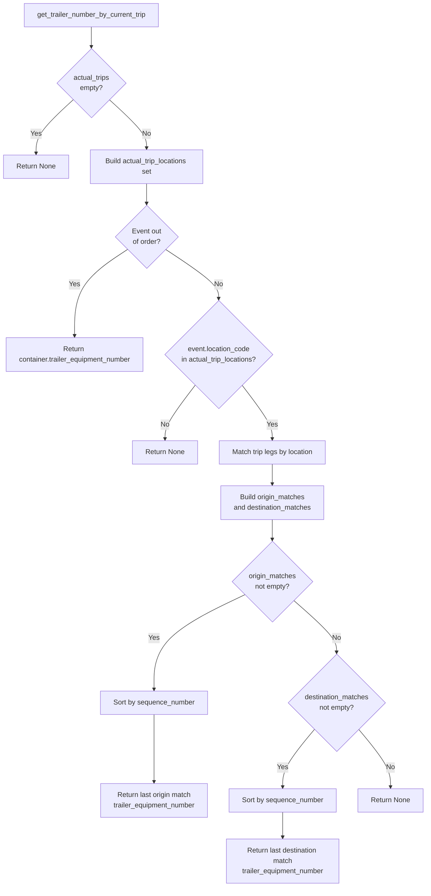
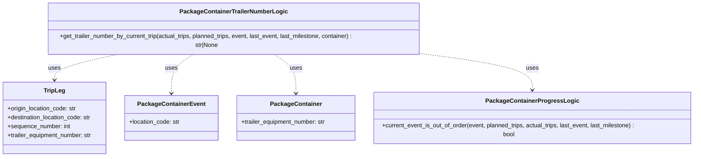

# Diagram: platform/partview_core/partview_service/partview_service/core/business/trip_leg/PackageContainerTrailerNumberLogic.py

> Auto-generated by Obscura crawlers

## Diagram 1

### SVG

<svg id="container" width="998.6484375" xmlns="http://www.w3.org/2000/svg" class="flowchart" height="2067.1875" viewBox="0 0 998.6484375 2067.1875" role="graphics-document document" aria-roledescription="flowchart-v2"><g><marker id="container_flowchart-v2-pointEnd" class="marker flowchart-v2" viewBox="0 0 10 10" refX="5" refY="5" markerUnits="userSpaceOnUse" markerWidth="8" markerHeight="8" orient="auto"><path d="M 0 0 L 10 5 L 0 10 z" class="arrowMarkerPath" style="stroke-width: 1; stroke-dasharray: 1, 0;"></path></marker><marker id="container_flowchart-v2-pointStart" class="marker flowchart-v2" viewBox="0 0 10 10" refX="4.5" refY="5" markerUnits="userSpaceOnUse" markerWidth="8" markerHeight="8" orient="auto"><path d="M 0 5 L 10 10 L 10 0 z" class="arrowMarkerPath" style="stroke-width: 1; stroke-dasharray: 1, 0;"></path></marker><marker id="container_flowchart-v2-circleEnd" class="marker flowchart-v2" viewBox="0 0 10 10" refX="11" refY="5" markerUnits="userSpaceOnUse" markerWidth="11" markerHeight="11" orient="auto"><circle cx="5" cy="5" r="5" class="arrowMarkerPath" style="stroke-width: 1; stroke-dasharray: 1, 0;"></circle></marker><marker id="container_flowchart-v2-circleStart" class="marker flowchart-v2" viewBox="0 0 10 10" refX="-1" refY="5" markerUnits="userSpaceOnUse" markerWidth="11" markerHeight="11" orient="auto"><circle cx="5" cy="5" r="5" class="arrowMarkerPath" style="stroke-width: 1; stroke-dasharray: 1, 0;"></circle></marker><marker id="container_flowchart-v2-crossEnd" class="marker cross flowchart-v2" viewBox="0 0 11 11" refX="12" refY="5.2" markerUnits="userSpaceOnUse" markerWidth="11" markerHeight="11" orient="auto"><path d="M 1,1 l 9,9 M 10,1 l -9,9" class="arrowMarkerPath" style="stroke-width: 2; stroke-dasharray: 1, 0;"></path></marker><marker id="container_flowchart-v2-crossStart" class="marker cross flowchart-v2" viewBox="0 0 11 11" refX="-1" refY="5.2" markerUnits="userSpaceOnUse" markerWidth="11" markerHeight="11" orient="auto"><path d="M 1,1 l 9,9 M 10,1 l -9,9" class="arrowMarkerPath" style="stroke-width: 2; stroke-dasharray: 1, 0;"></path></marker><g class="root"><g class="clusters"></g><g class="edgePaths"><path d="M214,62L214,66.167C214,70.333,214,78.667,214,86.333C214,94,214,101,214,104.5L214,108" id="L_Start_CheckActual_0" class="edge-thickness-normal edge-pattern-solid edge-thickness-normal edge-pattern-solid flowchart-link" style=";" data-edge="true" data-et="edge" data-id="L_Start_CheckActual_0" data-points="W3sieCI6MjE0LCJ5Ijo2Mn0seyJ4IjoyMTQsInkiOjg3fSx7IngiOjIxNCwieSI6MTEyfV0=" marker-end="url(#container_flowchart-v2-pointEnd)"></path><path d="M171.508,233.633L157.28,246.881C143.053,260.13,114.599,286.628,100.372,307.376C86.145,328.125,86.145,343.125,86.145,350.625L86.145,358.125" id="L_CheckActual_ReturnNone1_0" class="edge-thickness-normal edge-pattern-solid edge-thickness-normal edge-pattern-solid flowchart-link" style=";" data-edge="true" data-et="edge" data-id="L_CheckActual_ReturnNone1_0" data-points="W3sieCI6MTcxLjUwNzU5MDY0ODc3OTQ4LCJ5IjoyMzMuNjMyNTkwNjQ4Nzc5NDh9LHsieCI6ODYuMTQ0NTMxMjUsInkiOjMxMy4xMjV9LHsieCI6ODYuMTQ0NTMxMjUsInkiOjM2Mi4xMjV9XQ==" marker-end="url(#container_flowchart-v2-pointEnd)"></path><path d="M256.492,233.633L270.72,246.881C284.947,260.13,313.401,286.628,327.628,305.376C341.855,324.125,341.855,335.125,341.855,340.625L341.855,346.125" id="L_CheckActual_BuildLocations_0" class="edge-thickness-normal edge-pattern-solid edge-thickness-normal edge-pattern-solid flowchart-link" style=";" data-edge="true" data-et="edge" data-id="L_CheckActual_BuildLocations_0" data-points="W3sieCI6MjU2LjQ5MjQwOTM1MTIyMDUsInkiOjIzMy42MzI1OTA2NDg3Nzk0OH0seyJ4IjozNDEuODU1NDY4NzUsInkiOjMxMy4xMjV9LHsieCI6MzQxLjg1NTQ2ODc1LCJ5IjozNTAuMTI1fV0=" marker-end="url(#container_flowchart-v2-pointEnd)"></path><path d="M341.855,428.125L341.855,432.292C341.855,436.458,341.855,444.792,341.855,452.458C341.855,460.125,341.855,467.125,341.855,470.625L341.855,474.125" id="L_BuildLocations_CheckOutOfOrder_0" class="edge-thickness-normal edge-pattern-solid edge-thickness-normal edge-pattern-solid flowchart-link" style=";" data-edge="true" data-et="edge" data-id="L_BuildLocations_CheckOutOfOrder_0" data-points="W3sieCI6MzQxLjg1NTQ2ODc1LCJ5Ijo0MjguMTI1fSx7IngiOjM0MS44NTU0Njg3NSwieSI6NDUzLjEyNX0seyJ4IjozNDEuODU1NDY4NzUsInkiOjQ3OC4xMjV9XQ==" marker-end="url(#container_flowchart-v2-pointEnd)"></path><path d="M297.336,580.199L276.316,593.785C255.297,607.372,213.258,634.545,192.238,668.475C171.219,702.404,171.219,743.089,171.219,763.431L171.219,783.773" id="L_CheckOutOfOrder_ReturnContainer_0" class="edge-thickness-normal edge-pattern-solid edge-thickness-normal edge-pattern-solid flowchart-link" style=";" data-edge="true" data-et="edge" data-id="L_CheckOutOfOrder_ReturnContainer_0" data-points="W3sieCI6Mjk3LjMzNTU1ODk4MTcxOTAzLCJ5Ijo1ODAuMTk4ODQwMjMxNzE5fSx7IngiOjE3MS4yMTg3NSwieSI6NjYxLjcxODc1fSx7IngiOjE3MS4yMTg3NSwieSI6Nzg3Ljc3MzQzNzV9XQ==" marker-end="url(#container_flowchart-v2-pointEnd)"></path><path d="M386.375,580.199L407.395,593.785C428.414,607.372,470.453,634.545,491.473,653.632C512.492,672.719,512.492,683.719,512.492,689.219L512.492,694.719" id="L_CheckOutOfOrder_CheckLocation_0" class="edge-thickness-normal edge-pattern-solid edge-thickness-normal edge-pattern-solid flowchart-link" style=";" data-edge="true" data-et="edge" data-id="L_CheckOutOfOrder_CheckLocation_0" data-points="W3sieCI6Mzg2LjM3NTM3ODUxODI4MDk3LCJ5Ijo1ODAuMTk4ODQwMjMxNzE5fSx7IngiOjUxMi40OTIxODc1LCJ5Ijo2NjEuNzE4NzV9LHsieCI6NTEyLjQ5MjE4NzUsInkiOjY5OC43MTg3NX1d" marker-end="url(#container_flowchart-v2-pointEnd)"></path><path d="M457.085,899.42L445.338,914.822C433.592,930.223,410.098,961.026,398.352,981.927C386.605,1002.828,386.605,1013.828,386.605,1019.328L386.605,1024.828" id="L_CheckLocation_ReturnNone2_0" class="edge-thickness-normal edge-pattern-solid edge-thickness-normal edge-pattern-solid flowchart-link" style=";" data-edge="true" data-et="edge" data-id="L_CheckLocation_ReturnNone2_0" data-points="W3sieCI6NDU3LjA4NDUyMDkyNjQ3NzksInkiOjg5OS40MjA0NTg0MjY0Nzc5fSx7IngiOjM4Ni42MDU0Njg3NSwieSI6OTkxLjgyODEyNX0seyJ4IjozODYuNjA1NDY4NzUsInkiOjEwMjguODI4MTI1fV0=" marker-end="url(#container_flowchart-v2-pointEnd)"></path><path d="M567.9,899.42L579.646,914.822C591.393,930.223,614.886,961.026,626.632,981.927C638.379,1002.828,638.379,1013.828,638.379,1019.328L638.379,1024.828" id="L_CheckLocation_MatchLegs_0" class="edge-thickness-normal edge-pattern-solid edge-thickness-normal edge-pattern-solid flowchart-link" style=";" data-edge="true" data-et="edge" data-id="L_CheckLocation_MatchLegs_0" data-points="W3sieCI6NTY3Ljg5OTg1NDA3MzUyMjEsInkiOjg5OS40MjA0NTg0MjY0Nzc5fSx7IngiOjYzOC4zNzg5MDYyNSwieSI6OTkxLjgyODEyNX0seyJ4Ijo2MzguMzc4OTA2MjUsInkiOjEwMjguODI4MTI1fV0=" marker-end="url(#container_flowchart-v2-pointEnd)"></path><path d="M638.379,1082.828L638.379,1086.995C638.379,1091.161,638.379,1099.495,638.379,1107.161C638.379,1114.828,638.379,1121.828,638.379,1125.328L638.379,1128.828" id="L_MatchLegs_BuildMatches_0" class="edge-thickness-normal edge-pattern-solid edge-thickness-normal edge-pattern-solid flowchart-link" style=";" data-edge="true" data-et="edge" data-id="L_MatchLegs_BuildMatches_0" data-points="W3sieCI6NjM4LjM3ODkwNjI1LCJ5IjoxMDgyLjgyODEyNX0seyJ4Ijo2MzguMzc4OTA2MjUsInkiOjExMDcuODI4MTI1fSx7IngiOjYzOC4zNzg5MDYyNSwieSI6MTEzMi44MjgxMjV9XQ==" marker-end="url(#container_flowchart-v2-pointEnd)"></path><path d="M638.379,1210.828L638.379,1214.995C638.379,1219.161,638.379,1227.495,638.379,1235.161C638.379,1242.828,638.379,1249.828,638.379,1253.328L638.379,1256.828" id="L_BuildMatches_CheckOrigin_0" class="edge-thickness-normal edge-pattern-solid edge-thickness-normal edge-pattern-solid flowchart-link" style=";" data-edge="true" data-et="edge" data-id="L_BuildMatches_CheckOrigin_0" data-points="W3sieCI6NjM4LjM3ODkwNjI1LCJ5IjoxMjEwLjgyODEyNX0seyJ4Ijo2MzguMzc4OTA2MjUsInkiOjEyMzUuODI4MTI1fSx7IngiOjYzOC4zNzg5MDYyNSwieSI6MTI2MC44MjgxMjV9XQ==" marker-end="url(#container_flowchart-v2-pointEnd)"></path><path d="M574.141,1386.325L538.754,1403.198C503.368,1420.071,432.594,1453.817,397.207,1490.908C361.82,1528,361.82,1568.438,361.82,1588.656L361.82,1608.875" id="L_CheckOrigin_SortOrigin_0" class="edge-thickness-normal edge-pattern-solid edge-thickness-normal edge-pattern-solid flowchart-link" style=";" data-edge="true" data-et="edge" data-id="L_CheckOrigin_SortOrigin_0" data-points="W3sieCI6NTc0LjE0MTE5ODUxMzQzMDUsInkiOjEzODYuMzI0NzkyMjYzNDMwNX0seyJ4IjozNjEuODIwMzEyNSwieSI6MTQ4Ny41NjI1fSx7IngiOjM2MS44MjAzMTI1LCJ5IjoxNjEyLjg3NX1d" marker-end="url(#container_flowchart-v2-pointEnd)"></path><path d="M361.82,1666.875L361.82,1687.76C361.82,1708.646,361.82,1750.417,361.82,1776.802C361.82,1803.188,361.82,1814.188,361.82,1819.688L361.82,1825.188" id="L_SortOrigin_ReturnOrigin_0" class="edge-thickness-normal edge-pattern-solid edge-thickness-normal edge-pattern-solid flowchart-link" style=";" data-edge="true" data-et="edge" data-id="L_SortOrigin_ReturnOrigin_0" data-points="W3sieCI6MzYxLjgyMDMxMjUsInkiOjE2NjYuODc1fSx7IngiOjM2MS44MjAzMTI1LCJ5IjoxNzkyLjE4NzV9LHsieCI6MzYxLjgyMDMxMjUsInkiOjE4MjkuMTg3NX1d" marker-end="url(#container_flowchart-v2-pointEnd)"></path><path d="M689.059,1399.882L705.82,1414.496C722.581,1429.109,756.103,1458.336,772.864,1478.449C789.625,1498.563,789.625,1509.563,789.625,1515.063L789.625,1520.563" id="L_CheckOrigin_CheckDest_0" class="edge-thickness-normal edge-pattern-solid edge-thickness-normal edge-pattern-solid flowchart-link" style=";" data-edge="true" data-et="edge" data-id="L_CheckOrigin_CheckDest_0" data-points="W3sieCI6Njg5LjA1OTI5NjM0MzU4MTQsInkiOjEzOTkuODgyMTA5OTA2NDE4N30seyJ4Ijo3ODkuNjI1LCJ5IjoxNDg3LjU2MjV9LHsieCI6Nzg5LjYyNSwieSI6MTUyNC41NjI1fV0=" marker-end="url(#container_flowchart-v2-pointEnd)"></path><path d="M737.576,1703.139L725.365,1717.98C713.155,1732.822,688.734,1762.505,676.523,1784.846C664.313,1807.188,664.313,1822.188,664.313,1829.688L664.313,1837.188" id="L_CheckDest_SortDest_0" class="edge-thickness-normal edge-pattern-solid edge-thickness-normal edge-pattern-solid flowchart-link" style=";" data-edge="true" data-et="edge" data-id="L_CheckDest_SortDest_0" data-points="W3sieCI6NzM3LjU3NjAyMTQ5OTMyNDYsInkiOjE3MDMuMTM4NTIxNDk5MzI0N30seyJ4Ijo2NjQuMzEyNSwieSI6MTc5Mi4xODc1fSx7IngiOjY2NC4zMTI1LCJ5IjoxODQxLjE4NzV9XQ==" marker-end="url(#container_flowchart-v2-pointEnd)"></path><path d="M664.313,1895.188L664.313,1901.354C664.313,1907.521,664.313,1919.854,664.313,1929.521C664.313,1939.188,664.313,1946.188,664.313,1949.688L664.313,1953.188" id="L_SortDest_ReturnDest_0" class="edge-thickness-normal edge-pattern-solid edge-thickness-normal edge-pattern-solid flowchart-link" style=";" data-edge="true" data-et="edge" data-id="L_SortDest_ReturnDest_0" data-points="W3sieCI6NjY0LjMxMjUsInkiOjE4OTUuMTg3NX0seyJ4Ijo2NjQuMzEyNSwieSI6MTkzMi4xODc1fSx7IngiOjY2NC4zMTI1LCJ5IjoxOTU3LjE4NzV9XQ==" marker-end="url(#container_flowchart-v2-pointEnd)"></path><path d="M841.674,1703.139L853.885,1717.98C866.095,1732.822,890.516,1762.505,902.727,1784.846C914.938,1807.188,914.938,1822.188,914.938,1829.688L914.938,1837.188" id="L_CheckDest_ReturnNone3_0" class="edge-thickness-normal edge-pattern-solid edge-thickness-normal edge-pattern-solid flowchart-link" style=";" data-edge="true" data-et="edge" data-id="L_CheckDest_ReturnNone3_0" data-points="W3sieCI6ODQxLjY3Mzk3ODUwMDY3NTQsInkiOjE3MDMuMTM4NTIxNDk5MzI0N30seyJ4Ijo5MTQuOTM3NSwieSI6MTc5Mi4xODc1fSx7IngiOjkxNC45Mzc1LCJ5IjoxODQxLjE4NzV9XQ==" marker-end="url(#container_flowchart-v2-pointEnd)"></path></g><g class="edgeLabels"><g class="edgeLabel"><g class="label" data-id="L_Start_CheckActual_0" transform="translate(0, 0)"><foreignObject width="0" height="0">

</foreignObject></g></g><g class="edgeLabel" transform="translate(86.14453125, 313.125)"><g class="label" data-id="L_CheckActual_ReturnNone1_0" transform="translate(-12.03125, -12)"><foreignObject width="24.0625" height="24">

Yes

</foreignObject></g></g><g class="edgeLabel" transform="translate(341.85546875, 313.125)"><g class="label" data-id="L_CheckActual_BuildLocations_0" transform="translate(-10.140625, -12)"><foreignObject width="20.28125" height="24">

No

</foreignObject></g></g><g class="edgeLabel"><g class="label" data-id="L_BuildLocations_CheckOutOfOrder_0" transform="translate(0, 0)"><foreignObject width="0" height="0">

</foreignObject></g></g><g class="edgeLabel" transform="translate(171.21875, 661.71875)"><g class="label" data-id="L_CheckOutOfOrder_ReturnContainer_0" transform="translate(-12.03125, -12)"><foreignObject width="24.0625" height="24">

Yes

</foreignObject></g></g><g class="edgeLabel" transform="translate(512.4921875, 661.71875)"><g class="label" data-id="L_CheckOutOfOrder_CheckLocation_0" transform="translate(-10.140625, -12)"><foreignObject width="20.28125" height="24">

No

</foreignObject></g></g><g class="edgeLabel" transform="translate(386.60546875, 991.828125)"><g class="label" data-id="L_CheckLocation_ReturnNone2_0" transform="translate(-10.140625, -12)"><foreignObject width="20.28125" height="24">

No

</foreignObject></g></g><g class="edgeLabel" transform="translate(638.37890625, 991.828125)"><g class="label" data-id="L_CheckLocation_MatchLegs_0" transform="translate(-12.03125, -12)"><foreignObject width="24.0625" height="24">

Yes

</foreignObject></g></g><g class="edgeLabel"><g class="label" data-id="L_MatchLegs_BuildMatches_0" transform="translate(0, 0)"><foreignObject width="0" height="0">

</foreignObject></g></g><g class="edgeLabel"><g class="label" data-id="L_BuildMatches_CheckOrigin_0" transform="translate(0, 0)"><foreignObject width="0" height="0">

</foreignObject></g></g><g class="edgeLabel" transform="translate(361.8203125, 1487.5625)"><g class="label" data-id="L_CheckOrigin_SortOrigin_0" transform="translate(-12.03125, -12)"><foreignObject width="24.0625" height="24">

Yes

</foreignObject></g></g><g class="edgeLabel"><g class="label" data-id="L_SortOrigin_ReturnOrigin_0" transform="translate(0, 0)"><foreignObject width="0" height="0">

</foreignObject></g></g><g class="edgeLabel" transform="translate(789.625, 1487.5625)"><g class="label" data-id="L_CheckOrigin_CheckDest_0" transform="translate(-10.140625, -12)"><foreignObject width="20.28125" height="24">

No

</foreignObject></g></g><g class="edgeLabel" transform="translate(664.3125, 1792.1875)"><g class="label" data-id="L_CheckDest_SortDest_0" transform="translate(-12.03125, -12)"><foreignObject width="24.0625" height="24">

Yes

</foreignObject></g></g><g class="edgeLabel"><g class="label" data-id="L_SortDest_ReturnDest_0" transform="translate(0, 0)"><foreignObject width="0" height="0">

</foreignObject></g></g><g class="edgeLabel" transform="translate(914.9375, 1792.1875)"><g class="label" data-id="L_CheckDest_ReturnNone3_0" transform="translate(-10.140625, -12)"><foreignObject width="20.28125" height="24">

No

</foreignObject></g></g></g><g class="nodes"><g class="node default" id="flowchart-Start-0" transform="translate(214, 35)"><rect class="basic label-container" style="" x="-158.453125" y="-27" width="316.90625" height="54"></rect><g class="label" style="" transform="translate(-128.453125, -12)"><rect></rect><foreignObject width="256.90625" height="24">

get_trailer_number_by_current_trip

</foreignObject></g></g><g class="node default" id="flowchart-CheckActual-1" transform="translate(214, 194.0625)"><polygon points="82.0625,0 164.125,-82.0625 82.0625,-164.125 0,-82.0625" class="label-container" transform="translate(-81.5625, 82.0625)"></polygon><g class="label" style="" transform="translate(-43.0625, -24)"><rect></rect><foreignObject width="86.125" height="48">

actual_trips empty?

</foreignObject></g></g><g class="node default" id="flowchart-ReturnNone1-3" transform="translate(86.14453125, 389.125)"><rect class="basic label-container" style="" x="-75.7109375" y="-27" width="151.421875" height="54"></rect><g class="label" style="" transform="translate(-45.7109375, -12)"><rect></rect><foreignObject width="91.421875" height="24">

Return None

</foreignObject></g></g><g class="node default" id="flowchart-BuildLocations-5" transform="translate(341.85546875, 389.125)"><rect class="basic label-container" style="" x="-130" y="-39" width="260" height="78"></rect><g class="label" style="" transform="translate(-100, -24)"><rect></rect><foreignObject width="200" height="48">

Build actual_trip_locations set

</foreignObject></g></g><g class="node default" id="flowchart-CheckOutOfOrder-7" transform="translate(341.85546875, 551.421875)"><polygon points="73.296875,0 146.59375,-73.296875 73.296875,-146.59375 0,-73.296875" class="label-container" transform="translate(-72.796875, 73.296875)"></polygon><g class="label" style="" transform="translate(-34.296875, -24)"><rect></rect><foreignObject width="68.59375" height="48">

Event out of order?

</foreignObject></g></g><g class="node default" id="flowchart-ReturnContainer-9" transform="translate(171.21875, 826.7734375)"><rect class="basic label-container" style="" x="-163.21875" y="-39" width="326.4375" height="78"></rect><g class="label" style="" transform="translate(-133.21875, -24)"><rect></rect><foreignObject width="266.4375" height="48">

Return container.trailer_equipment_number

</foreignObject></g></g><g class="node default" id="flowchart-CheckLocation-11" transform="translate(512.4921875, 826.7734375)"><polygon points="128.0546875,0 256.109375,-128.0546875 128.0546875,-256.109375 0,-128.0546875" class="label-container" transform="translate(-127.5546875, 128.0546875)"></polygon><g class="label" style="" transform="translate(-89.0546875, -24)"><rect></rect><foreignObject width="178.109375" height="48">

event.location_code in actual_trip_locations?

</foreignObject></g></g><g class="node default" id="flowchart-ReturnNone2-13" transform="translate(386.60546875, 1055.828125)"><rect class="basic label-container" style="" x="-75.7109375" y="-27" width="151.421875" height="54"></rect><g class="label" style="" transform="translate(-45.7109375, -12)"><rect></rect><foreignObject width="91.421875" height="24">

Return None

</foreignObject></g></g><g class="node default" id="flowchart-MatchLegs-15" transform="translate(638.37890625, 1055.828125)"><rect class="basic label-container" style="" x="-126.0625" y="-27" width="252.125" height="54"></rect><g class="label" style="" transform="translate(-96.0625, -12)"><rect></rect><foreignObject width="192.125" height="24">

Match trip legs by location

</foreignObject></g></g><g class="node default" id="flowchart-BuildMatches-17" transform="translate(638.37890625, 1171.828125)"><rect class="basic label-container" style="" x="-122.2578125" y="-39" width="244.515625" height="78"></rect><g class="label" style="" transform="translate(-92.2578125, -24)"><rect></rect><foreignObject width="184.515625" height="48">

Build origin_matches and destination_matches

</foreignObject></g></g><g class="node default" id="flowchart-CheckOrigin-19" transform="translate(638.37890625, 1355.6953125)"><polygon points="94.8671875,0 189.734375,-94.8671875 94.8671875,-189.734375 0,-94.8671875" class="label-container" transform="translate(-94.3671875, 94.8671875)"></polygon><g class="label" style="" transform="translate(-55.8671875, -24)"><rect></rect><foreignObject width="111.734375" height="48">

origin_matches not empty?

</foreignObject></g></g><g class="node default" id="flowchart-SortOrigin-21" transform="translate(361.8203125, 1639.875)"><rect class="basic label-container" style="" x="-124.9140625" y="-27" width="249.828125" height="54"></rect><g class="label" style="" transform="translate(-94.9140625, -12)"><rect></rect><foreignObject width="189.828125" height="24">

Sort by sequence_number

</foreignObject></g></g><g class="node default" id="flowchart-ReturnOrigin-23" transform="translate(361.8203125, 1868.1875)"><rect class="basic label-container" style="" x="-127.578125" y="-39" width="255.15625" height="78"></rect><g class="label" style="" transform="translate(-97.578125, -24)"><rect></rect><foreignObject width="195.15625" height="48">

Return last origin match trailer_equipment_number

</foreignObject></g></g><g class="node default" id="flowchart-CheckDest-25" transform="translate(789.625, 1639.875)"><polygon points="115.3125,0 230.625,-115.3125 115.3125,-230.625 0,-115.3125" class="label-container" transform="translate(-114.8125, 115.3125)"></polygon><g class="label" style="" transform="translate(-76.3125, -24)"><rect></rect><foreignObject width="152.625" height="48">

destination_matches not empty?

</foreignObject></g></g><g class="node default" id="flowchart-SortDest-27" transform="translate(664.3125, 1868.1875)"><rect class="basic label-container" style="" x="-124.9140625" y="-27" width="249.828125" height="54"></rect><g class="label" style="" transform="translate(-94.9140625, -12)"><rect></rect><foreignObject width="189.828125" height="24">

Sort by sequence_number

</foreignObject></g></g><g class="node default" id="flowchart-ReturnDest-29" transform="translate(664.3125, 2008.1875)"><rect class="basic label-container" style="" x="-130" y="-51" width="260" height="102"></rect><g class="label" style="" transform="translate(-100, -36)"><rect></rect><foreignObject width="200" height="72">

Return last destination match trailer_equipment_number

</foreignObject></g></g><g class="node default" id="flowchart-ReturnNone3-31" transform="translate(914.9375, 1868.1875)"><rect class="basic label-container" style="" x="-75.7109375" y="-27" width="151.421875" height="54"></rect><g class="label" style="" transform="translate(-45.7109375, -12)"><rect></rect><foreignObject width="91.421875" height="24">

Return None

</foreignObject></g></g></g></g></g></svg>

## Diagram 2

### SVG

<svg id="container" width="1883.7421875" xmlns="http://www.w3.org/2000/svg" class="classDiagram" height="408" viewBox="0 0 1883.7421875 408" role="graphics-document document" aria-roledescription="class"><g><defs><marker id="container_class-aggregationStart" class="marker aggregation class" refX="18" refY="7" markerWidth="190" markerHeight="240" orient="auto"><path d="M 18,7 L9,13 L1,7 L9,1 Z"></path></marker></defs><defs><marker id="container_class-aggregationEnd" class="marker aggregation class" refX="1" refY="7" markerWidth="20" markerHeight="28" orient="auto"><path d="M 18,7 L9,13 L1,7 L9,1 Z"></path></marker></defs><defs><marker id="container_class-extensionStart" class="marker extension class" refX="18" refY="7" markerWidth="190" markerHeight="240" orient="auto"><path d="M 1,7 L18,13 V 1 Z"></path></marker></defs><defs><marker id="container_class-extensionEnd" class="marker extension class" refX="1" refY="7" markerWidth="20" markerHeight="28" orient="auto"><path d="M 1,1 V 13 L18,7 Z"></path></marker></defs><defs><marker id="container_class-compositionStart" class="marker composition class" refX="18" refY="7" markerWidth="190" markerHeight="240" orient="auto"><path d="M 18,7 L9,13 L1,7 L9,1 Z"></path></marker></defs><defs><marker id="container_class-compositionEnd" class="marker composition class" refX="1" refY="7" markerWidth="20" markerHeight="28" orient="auto"><path d="M 18,7 L9,13 L1,7 L9,1 Z"></path></marker></defs><defs><marker id="container_class-dependencyStart" class="marker dependency class" refX="6" refY="7" markerWidth="190" markerHeight="240" orient="auto"><path d="M 5,7 L9,13 L1,7 L9,1 Z"></path></marker></defs><defs><marker id="container_class-dependencyEnd" class="marker dependency class" refX="13" refY="7" markerWidth="20" markerHeight="28" orient="auto"><path d="M 18,7 L9,13 L14,7 L9,1 Z"></path></marker></defs><defs><marker id="container_class-lollipopStart" class="marker lollipop class" refX="13" refY="7" markerWidth="190" markerHeight="240" orient="auto"><circle stroke="black" fill="transparent" cx="7" cy="7" r="6"></circle></marker></defs><defs><marker id="container_class-lollipopEnd" class="marker lollipop class" refX="1" refY="7" markerWidth="190" markerHeight="240" orient="auto"><circle stroke="black" fill="transparent" cx="7" cy="7" r="6"></circle></marker></defs><g class="root"><g class="clusters"></g><g class="edgePaths"><path d="M327.009,134L297.323,140.167C267.638,146.333,208.266,158.667,178.58,170C148.895,181.333,148.895,191.667,148.895,196.833L148.895,202" id="id_PackageContainerTrailerNumberLogic_TripLeg_1" class="edge-thickness-normal edge-pattern-dashed relation" style=";;;" data-edge="true" data-et="edge" data-id="id_PackageContainerTrailerNumberLogic_TripLeg_1" data-points="W3sieCI6MzI3LjAwOTA2MjUsInkiOjEzNH0seyJ4IjoxNDguODk0NTMxMjUsInkiOjE3MX0seyJ4IjoxNDguODk0NTMxMjUsInkiOjIwOH1d" marker-end="url(#container_class-dependencyEnd)"></path><path d="M525.161,134L514.871,140.167C504.581,146.333,484.002,158.667,473.712,176C463.422,193.333,463.422,215.667,463.422,226.833L463.422,238" id="id_PackageContainerTrailerNumberLogic_PackageContainerEvent_2" class="edge-thickness-normal edge-pattern-dashed relation" style=";;;" data-edge="true" data-et="edge" data-id="id_PackageContainerTrailerNumberLogic_PackageContainerEvent_2" data-points="W3sieCI6NTI1LjE2MTI4OTA2MjUsInkiOjEzNH0seyJ4Ijo0NjMuNDIxODc1LCJ5IjoxNzF9LHsieCI6NDYzLjQyMTg3NSwieSI6MjQ0fV0=" marker-end="url(#container_class-dependencyEnd)"></path><path d="M735.409,134L745.699,140.167C755.989,146.333,776.569,158.667,786.859,176C797.148,193.333,797.148,215.667,797.148,226.833L797.148,238" id="id_PackageContainerTrailerNumberLogic_PackageContainer_3" class="edge-thickness-normal edge-pattern-dashed relation" style=";;;" data-edge="true" data-et="edge" data-id="id_PackageContainerTrailerNumberLogic_PackageContainer_3" data-points="W3sieCI6NzM1LjQwOTAyMzQzNzUsInkiOjEzNH0seyJ4Ijo3OTcuMTQ4NDM3NSwieSI6MTcxfSx7IngiOjc5Ny4xNDg0Mzc1LCJ5IjoyNDR9XQ==" marker-end="url(#container_class-dependencyEnd)"></path><path d="M1141.346,134L1191.37,140.167C1241.394,146.333,1341.443,158.667,1391.468,175.5C1441.492,192.333,1441.492,213.667,1441.492,224.333L1441.492,235" id="id_PackageContainerTrailerNumberLogic_PackageContainerProgressLogic_4" class="edge-thickness-normal edge-pattern-dashed relation" style=";;;" data-edge="true" data-et="edge" data-id="id_PackageContainerTrailerNumberLogic_PackageContainerProgressLogic_4" data-points="W3sieCI6MTE0MS4zNDU1ODU5Mzc1LCJ5IjoxMzR9LHsieCI6MTQ0MS40OTIxODc1LCJ5IjoxNzF9LHsieCI6MTQ0MS40OTIxODc1LCJ5IjoyNDF9XQ==" marker-end="url(#container_class-dependencyEnd)"></path></g><g class="edgeLabels"><g class="edgeLabel" transform="translate(148.89453125, 171)"><g class="label" data-id="id_PackageContainerTrailerNumberLogic_TripLeg_1" transform="translate(-16.4921875, -12)"><foreignObject width="32.984375" height="24">

uses

</foreignObject></g></g><g class="edgeLabel" transform="translate(463.421875, 171)"><g class="label" data-id="id_PackageContainerTrailerNumberLogic_PackageContainerEvent_2" transform="translate(-16.4921875, -12)"><foreignObject width="32.984375" height="24">

uses

</foreignObject></g></g><g class="edgeLabel" transform="translate(797.1484375, 171)"><g class="label" data-id="id_PackageContainerTrailerNumberLogic_PackageContainer_3" transform="translate(-16.4921875, -12)"><foreignObject width="32.984375" height="24">

uses

</foreignObject></g></g><g class="edgeLabel" transform="translate(1441.4921875, 171)"><g class="label" data-id="id_PackageContainerTrailerNumberLogic_PackageContainerProgressLogic_4" transform="translate(-16.4921875, -12)"><foreignObject width="32.984375" height="24">

uses

</foreignObject></g></g></g><g class="nodes"><g class="node default" id="classId-PackageContainerTrailerNumberLogic-0" transform="translate(630.28515625, 71)"><g class="basic label-container"><path d="M-515.875 -63 L515.875 -63 L515.875 63 L-515.875 63" stroke="none" stroke-width="0" fill="#ECECFF" style=""></path><path d="M-515.875 -63 C-199.36889530906728 -63, 117.13720938186543 -63, 515.875 -63 M-515.875 -63 C-214.6700003888305 -63, 86.53499922233902 -63, 515.875 -63 M515.875 -63 C515.875 -28.11726072885851, 515.875 6.7654785422829775, 515.875 63 M515.875 -63 C515.875 -24.437809979575327, 515.875 14.124380040849346, 515.875 63 M515.875 63 C193.3006867820717 63, -129.2736264358566 63, -515.875 63 M515.875 63 C142.35167598601862 63, -231.17164802796276 63, -515.875 63 M-515.875 63 C-515.875 37.260237079036806, -515.875 11.520474158073611, -515.875 -63 M-515.875 63 C-515.875 16.27539902778502, -515.875 -30.44920194442996, -515.875 -63" stroke="#9370DB" stroke-width="1.3" fill="none" stroke-dasharray="0 0" style=""></path></g><g class="annotation-group text" transform="translate(0, -39)"></g><g class="label-group text" transform="translate(-137.171875, -39)"><g class="label" style="font-weight: bolder" transform="translate(0,-12)"><foreignObject width="274.34375" height="24">

PackageContainerTrailerNumberLogic

</foreignObject></g></g><g class="members-group text" transform="translate(-503.875, 9)"></g><g class="methods-group text" transform="translate(-503.875, 39)"><g class="label" style="" transform="translate(0,-12)"><foreignObject width="870.578125" height="24">

+get_trailer_number_by_current_trip(actual_trips, planned_trips, event, last_event, last_milestone, container) : str|None

</foreignObject></g></g><g class="divider" style=""><path d="M-515.875 -15 C-164.57483370970658 -15, 186.72533258058684 -15, 515.875 -15 M-515.875 -15 C-262.09215432626047 -15, -8.309308652520997 -15, 515.875 -15" stroke="#9370DB" stroke-width="1.3" fill="none" stroke-dasharray="0 0" style=""></path></g><g class="divider" style=""><path d="M-515.875 9 C-118.17762083130089 9, 279.51975833739823 9, 515.875 9 M-515.875 9 C-273.38717593209475 9, -30.899351864189498 9, 515.875 9" stroke="#9370DB" stroke-width="1.3" fill="none" stroke-dasharray="0 0" style=""></path></g></g><g class="node default" id="classId-TripLeg-1" transform="translate(148.89453125, 304)"><g class="basic label-container"><path d="M-140.89453125 -96 L140.89453125 -96 L140.89453125 96 L-140.89453125 96" stroke="none" stroke-width="0" fill="#ECECFF" style=""></path><path d="M-140.89453125 -96 C-66.71875601060576 -96, 7.457019228788482 -96, 140.89453125 -96 M-140.89453125 -96 C-56.34318173066927 -96, 28.208167788661456 -96, 140.89453125 -96 M140.89453125 -96 C140.89453125 -53.577256402662314, 140.89453125 -11.154512805324629, 140.89453125 96 M140.89453125 -96 C140.89453125 -34.01751834242339, 140.89453125 27.964963315153227, 140.89453125 96 M140.89453125 96 C45.40822418087821 96, -50.078082888243586 96, -140.89453125 96 M140.89453125 96 C51.99098646277841 96, -36.91255832444318 96, -140.89453125 96 M-140.89453125 96 C-140.89453125 53.02082634004204, -140.89453125 10.041652680084084, -140.89453125 -96 M-140.89453125 96 C-140.89453125 39.55453617037736, -140.89453125 -16.89092765924528, -140.89453125 -96" stroke="#9370DB" stroke-width="1.3" fill="none" stroke-dasharray="0 0" style=""></path></g><g class="annotation-group text" transform="translate(0, -72)"></g><g class="label-group text" transform="translate(-27.0546875, -72)"><g class="label" style="font-weight: bolder" transform="translate(0,-12)"><foreignObject width="54.109375" height="24">

TripLeg

</foreignObject></g></g><g class="members-group text" transform="translate(-128.89453125, -24)"><g class="label" style="" transform="translate(0,-12)"><foreignObject width="188.015625" height="24">

+origin_location_code: str

</foreignObject></g><g class="label" style="" transform="translate(0,12)"><foreignObject width="228.90625" height="24">

+destination_location_code: str

</foreignObject></g><g class="label" style="" transform="translate(0,36)"><foreignObject width="169.90625" height="24">

+sequence_number: int

</foreignObject></g><g class="label" style="" transform="translate(0,60)"><foreignObject width="230.734375" height="24">

+trailer_equipment_number: str

</foreignObject></g></g><g class="methods-group text" transform="translate(-128.89453125, 96)"></g><g class="divider" style=""><path d="M-140.89453125 -48 C-57.54960003786836 -48, 25.795331174263282 -48, 140.89453125 -48 M-140.89453125 -48 C-52.696299300225675 -48, 35.50193264954865 -48, 140.89453125 -48" stroke="#9370DB" stroke-width="1.3" fill="none" stroke-dasharray="0 0" style=""></path></g><g class="divider" style=""><path d="M-140.89453125 72 C-52.023165051208565 72, 36.84820114758287 72, 140.89453125 72 M-140.89453125 72 C-39.51703891802879 72, 61.86045341394242 72, 140.89453125 72" stroke="#9370DB" stroke-width="1.3" fill="none" stroke-dasharray="0 0" style=""></path></g></g><g class="node default" id="classId-PackageContainerEvent-2" transform="translate(463.421875, 304)"><g class="basic label-container"><path d="M-123.6328125 -60 L123.6328125 -60 L123.6328125 60 L-123.6328125 60" stroke="none" stroke-width="0" fill="#ECECFF" style=""></path><path d="M-123.6328125 -60 C-37.42013036537011 -60, 48.792551769259774 -60, 123.6328125 -60 M-123.6328125 -60 C-62.43112581528892 -60, -1.2294391305778447 -60, 123.6328125 -60 M123.6328125 -60 C123.6328125 -14.06109881728149, 123.6328125 31.87780236543702, 123.6328125 60 M123.6328125 -60 C123.6328125 -16.855274473026327, 123.6328125 26.289451053947346, 123.6328125 60 M123.6328125 60 C68.08258921508713 60, 12.532365930174265 60, -123.6328125 60 M123.6328125 60 C44.01606126698316 60, -35.600689966033684 60, -123.6328125 60 M-123.6328125 60 C-123.6328125 20.973952256598253, -123.6328125 -18.052095486803495, -123.6328125 -60 M-123.6328125 60 C-123.6328125 29.57310862747048, -123.6328125 -0.8537827450590427, -123.6328125 -60" stroke="#9370DB" stroke-width="1.3" fill="none" stroke-dasharray="0 0" style=""></path></g><g class="annotation-group text" transform="translate(0, -36)"></g><g class="label-group text" transform="translate(-85.65625, -36)"><g class="label" style="font-weight: bolder" transform="translate(0,-12)"><foreignObject width="171.3125" height="24">

PackageContainerEvent

</foreignObject></g></g><g class="members-group text" transform="translate(-111.6328125, 12)"><g class="label" style="" transform="translate(0,-12)"><foreignObject width="137.609375" height="24">

+location_code: str

</foreignObject></g></g><g class="methods-group text" transform="translate(-111.6328125, 60)"></g><g class="divider" style=""><path d="M-123.6328125 -12 C-56.16503286707682 -12, 11.302746765846365 -12, 123.6328125 -12 M-123.6328125 -12 C-41.40918652639951 -12, 40.81443944720098 -12, 123.6328125 -12" stroke="#9370DB" stroke-width="1.3" fill="none" stroke-dasharray="0 0" style=""></path></g><g class="divider" style=""><path d="M-123.6328125 36 C-36.32259304605439 36, 50.98762640789121 36, 123.6328125 36 M-123.6328125 36 C-62.151832428542654 36, -0.6708523570853089 36, 123.6328125 36" stroke="#9370DB" stroke-width="1.3" fill="none" stroke-dasharray="0 0" style=""></path></g></g><g class="node default" id="classId-PackageContainer-3" transform="translate(797.1484375, 304)"><g class="basic label-container"><path d="M-160.09375 -60 L160.09375 -60 L160.09375 60 L-160.09375 60" stroke="none" stroke-width="0" fill="#ECECFF" style=""></path><path d="M-160.09375 -60 C-49.62851360827155 -60, 60.836722783456906 -60, 160.09375 -60 M-160.09375 -60 C-40.18305519923895 -60, 79.7276396015221 -60, 160.09375 -60 M160.09375 -60 C160.09375 -30.054936258327185, 160.09375 -0.10987251665437014, 160.09375 60 M160.09375 -60 C160.09375 -23.513562210260652, 160.09375 12.972875579478696, 160.09375 60 M160.09375 60 C82.51908888385272 60, 4.9444277677054345 60, -160.09375 60 M160.09375 60 C49.92072966651598 60, -60.25229066696804 60, -160.09375 60 M-160.09375 60 C-160.09375 16.189658166975832, -160.09375 -27.620683666048336, -160.09375 -60 M-160.09375 60 C-160.09375 22.06141611089342, -160.09375 -15.877167778213163, -160.09375 -60" stroke="#9370DB" stroke-width="1.3" fill="none" stroke-dasharray="0 0" style=""></path></g><g class="annotation-group text" transform="translate(0, -36)"></g><g class="label-group text" transform="translate(-65.453125, -36)"><g class="label" style="font-weight: bolder" transform="translate(0,-12)"><foreignObject width="130.90625" height="24">

PackageContainer

</foreignObject></g></g><g class="members-group text" transform="translate(-148.09375, 12)"><g class="label" style="" transform="translate(0,-12)"><foreignObject width="230.734375" height="24">

+trailer_equipment_number: str

</foreignObject></g></g><g class="methods-group text" transform="translate(-148.09375, 60)"></g><g class="divider" style=""><path d="M-160.09375 -12 C-92.98371046396835 -12, -25.8736709279367 -12, 160.09375 -12 M-160.09375 -12 C-57.17554940720508 -12, 45.742651185589835 -12, 160.09375 -12" stroke="#9370DB" stroke-width="1.3" fill="none" stroke-dasharray="0 0" style=""></path></g><g class="divider" style=""><path d="M-160.09375 36 C-35.51136933028023 36, 89.07101133943954 36, 160.09375 36 M-160.09375 36 C-84.7854928408654 36, -9.477235681730804 36, 160.09375 36" stroke="#9370DB" stroke-width="1.3" fill="none" stroke-dasharray="0 0" style=""></path></g></g><g class="node default" id="classId-PackageContainerProgressLogic-4" transform="translate(1441.4921875, 304)"><g class="basic label-container"><path d="M-434.25 -63 L434.25 -63 L434.25 63 L-434.25 63" stroke="none" stroke-width="0" fill="#ECECFF" style=""></path><path d="M-434.25 -63 C-258.4342379095034 -63, -82.61847581900673 -63, 434.25 -63 M-434.25 -63 C-155.6943040210238 -63, 122.86139195795238 -63, 434.25 -63 M434.25 -63 C434.25 -20.117614329101734, 434.25 22.764771341796532, 434.25 63 M434.25 -63 C434.25 -31.61517493301205, 434.25 -0.23034986602409901, 434.25 63 M434.25 63 C157.2662942835384 63, -119.7174114329232 63, -434.25 63 M434.25 63 C95.85212486784314 63, -242.5457502643137 63, -434.25 63 M-434.25 63 C-434.25 16.883622741086555, -434.25 -29.23275451782689, -434.25 -63 M-434.25 63 C-434.25 33.37466363836644, -434.25 3.7493272767328847, -434.25 -63" stroke="#9370DB" stroke-width="1.3" fill="none" stroke-dasharray="0 0" style=""></path></g><g class="annotation-group text" transform="translate(0, -39)"></g><g class="label-group text" transform="translate(-116.265625, -39)"><g class="label" style="font-weight: bolder" transform="translate(0,-12)"><foreignObject width="232.53125" height="24">

PackageContainerProgressLogic

</foreignObject></g></g><g class="members-group text" transform="translate(-422.25, 9)"></g><g class="methods-group text" transform="translate(-422.25, 39)"><g class="label" style="" transform="translate(0,-12)"><foreignObject width="728.234375" height="24">

+current_event_is_out_of_order(event, planned_trips, actual_trips, last_event, last_milestone) : bool

</foreignObject></g></g><g class="divider" style=""><path d="M-434.25 -15 C-192.07307788354422 -15, 50.10384423291157 -15, 434.25 -15 M-434.25 -15 C-254.86011652524166 -15, -75.47023305048333 -15, 434.25 -15" stroke="#9370DB" stroke-width="1.3" fill="none" stroke-dasharray="0 0" style=""></path></g><g class="divider" style=""><path d="M-434.25 9 C-254.82734494096587 9, -75.40468988193174 9, 434.25 9 M-434.25 9 C-217.35671616728246 9, -0.4634323345649136 9, 434.25 9" stroke="#9370DB" stroke-width="1.3" fill="none" stroke-dasharray="0 0" style=""></path></g></g></g></g></g></svg>
