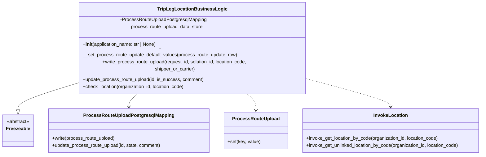
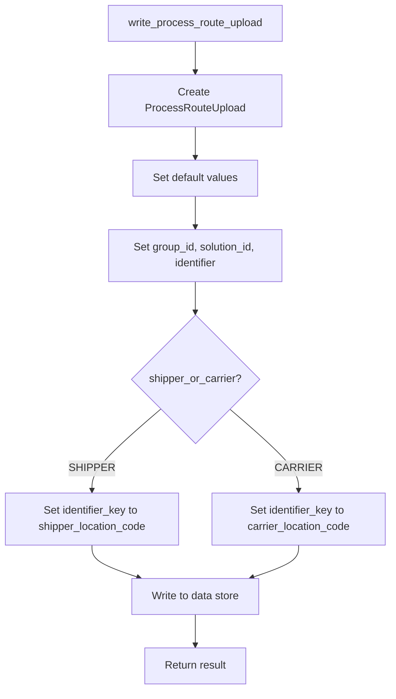
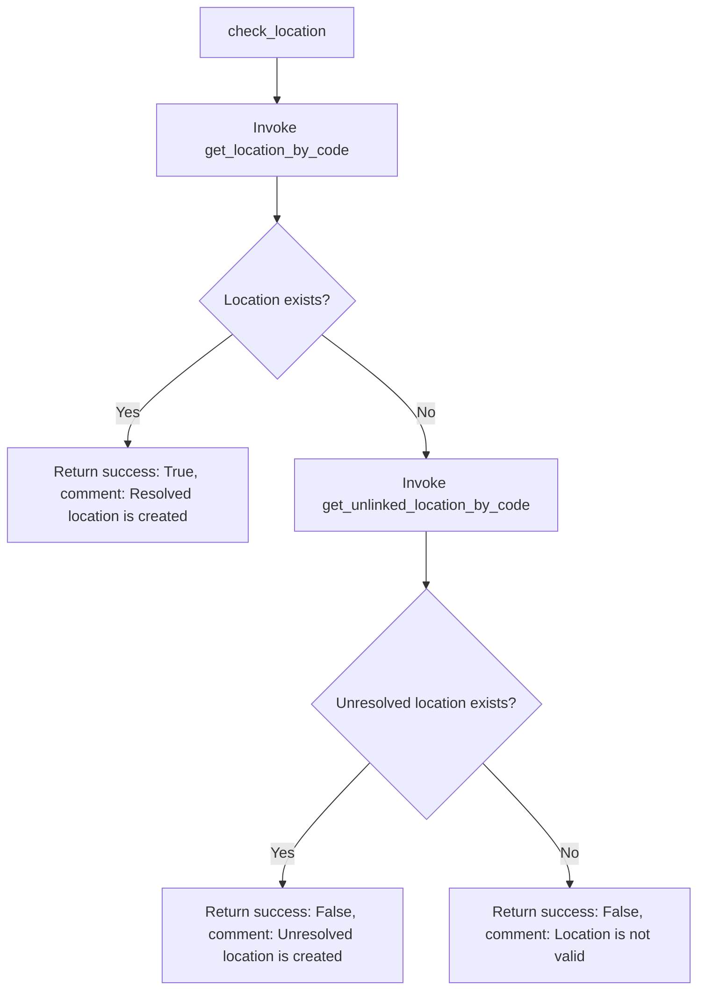
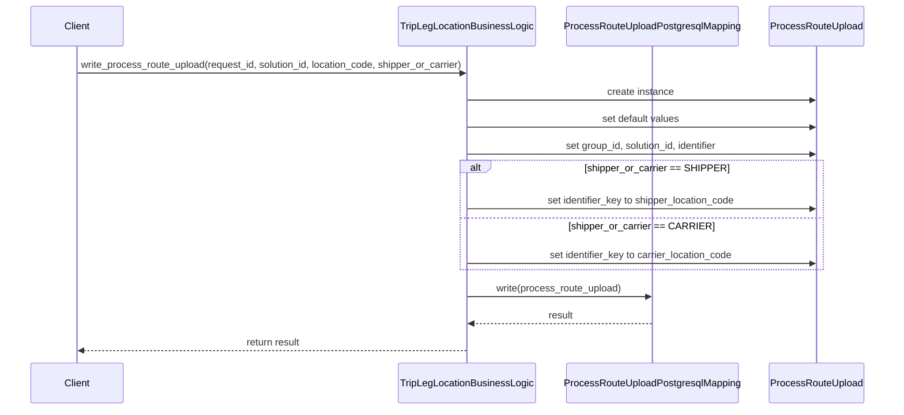
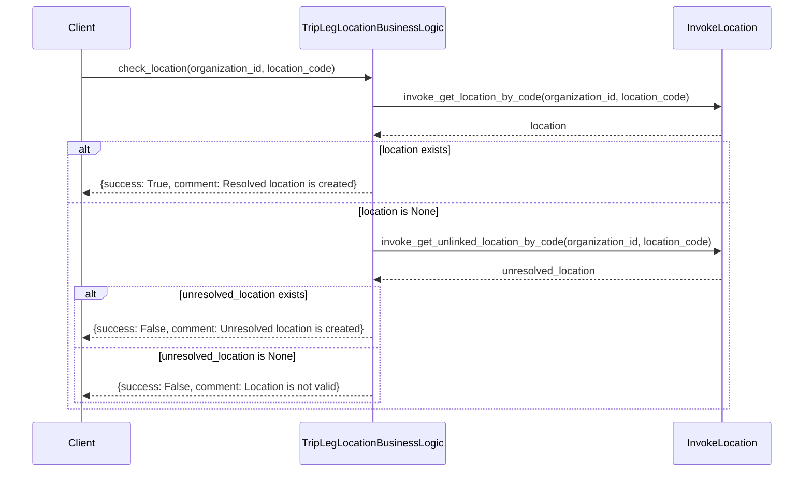
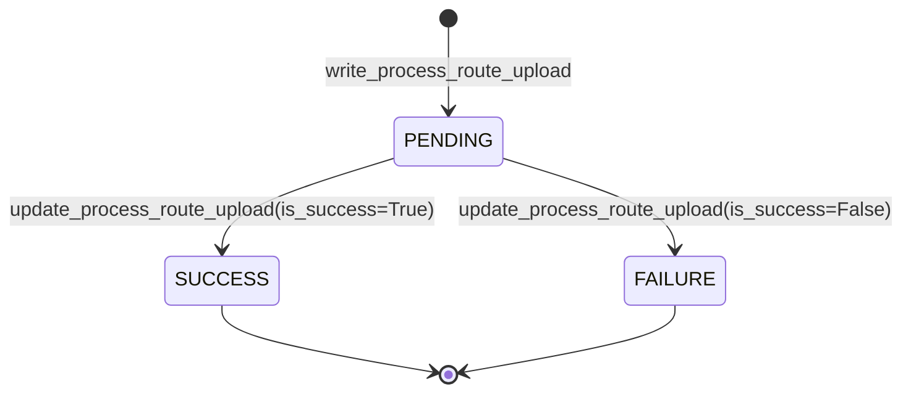

# Diagram: platform/partview_core/partview_service/partview_service/core/business/trip_leg/TripLegLocationBusinessLogic.py


> Auto-generated by Obscura crawlers

## Diagram 1

```mermaid
classDiagram
      class TripLegLocationBusinessLogic {
          -ProcessRouteUploadPostgresqlMapping __process_route_upload_data_store
          +__init__(application_name: str | None)...
  └ 191 lines...
```

> SVG rendering failed for this diagram.

## Diagram 2



### SVG

<svg id="container" width="1627.9609375" xmlns="http://www.w3.org/2000/svg" class="classDiagram" height="456" viewBox="0 0 1627.9609375 456" role="graphics-document document" aria-roledescription="class"><style>#container{font-family:"trebuchet ms",verdana,arial,sans-serif;font-size:16px;fill:#333;}@keyframes edge-animation-frame{from{stroke-dashoffset:0;}}@keyframes dash{to{stroke-dashoffset:0;}}#container .edge-animation-slow{stroke-dasharray:9,5!important;stroke-dashoffset:900;animation:dash 50s linear infinite;stroke-linecap:round;}#container .edge-animation-fast{stroke-dasharray:9,5!important;stroke-dashoffset:900;animation:dash 20s linear infinite;stroke-linecap:round;}#container .error-icon{fill:#552222;}#container .error-text{fill:#552222;stroke:#552222;}#container .edge-thickness-normal{stroke-width:1px;}#container .edge-thickness-thick{stroke-width:3.5px;}#container .edge-pattern-solid{stroke-dasharray:0;}#container .edge-thickness-invisible{stroke-width:0;fill:none;}#container .edge-pattern-dashed{stroke-dasharray:3;}#container .edge-pattern-dotted{stroke-dasharray:2;}#container .marker{fill:#333333;stroke:#333333;}#container .marker.cross{stroke:#333333;}#container svg{font-family:"trebuchet ms",verdana,arial,sans-serif;font-size:16px;}#container p{margin:0;}#container g.classGroup text{fill:#9370DB;stroke:none;font-family:"trebuchet ms",verdana,arial,sans-serif;font-size:10px;}#container g.classGroup text .title{font-weight:bolder;}#container .nodeLabel,#container .edgeLabel{color:#131300;}#container .edgeLabel .label rect{fill:#ECECFF;}#container .label text{fill:#131300;}#container .labelBkg{background:#ECECFF;}#container .edgeLabel .label span{background:#ECECFF;}#container .classTitle{font-weight:bolder;}#container .node rect,#container .node circle,#container .node ellipse,#container .node polygon,#container .node path{fill:#ECECFF;stroke:#9370DB;stroke-width:1px;}#container .divider{stroke:#9370DB;stroke-width:1;}#container g.clickable{cursor:pointer;}#container g.classGroup rect{fill:#ECECFF;stroke:#9370DB;}#container g.classGroup line{stroke:#9370DB;stroke-width:1;}#container .classLabel .box{stroke:none;stroke-width:0;fill:#ECECFF;opacity:0.5;}#container .classLabel .label{fill:#9370DB;font-size:10px;}#container .relation{stroke:#333333;stroke-width:1;fill:none;}#container .dashed-line{stroke-dasharray:3;}#container .dotted-line{stroke-dasharray:1 2;}#container #compositionStart,#container .composition{fill:#333333!important;stroke:#333333!important;stroke-width:1;}#container #compositionEnd,#container .composition{fill:#333333!important;stroke:#333333!important;stroke-width:1;}#container #dependencyStart,#container .dependency{fill:#333333!important;stroke:#333333!important;stroke-width:1;}#container #dependencyStart,#container .dependency{fill:#333333!important;stroke:#333333!important;stroke-width:1;}#container #extensionStart,#container .extension{fill:transparent!important;stroke:#333333!important;stroke-width:1;}#container #extensionEnd,#container .extension{fill:transparent!important;stroke:#333333!important;stroke-width:1;}#container #aggregationStart,#container .aggregation{fill:transparent!important;stroke:#333333!important;stroke-width:1;}#container #aggregationEnd,#container .aggregation{fill:transparent!important;stroke:#333333!important;stroke-width:1;}#container #lollipopStart,#container .lollipop{fill:#ECECFF!important;stroke:#333333!important;stroke-width:1;}#container #lollipopEnd,#container .lollipop{fill:#ECECFF!important;stroke:#333333!important;stroke-width:1;}#container .edgeTerminals{font-size:11px;line-height:initial;}#container .classTitleText{text-anchor:middle;font-size:18px;fill:#333;}#container .label-icon{display:inline-block;height:1em;overflow:visible;vertical-align:-0.125em;}#container .node .label-icon path{fill:currentColor;stroke:revert;stroke-width:revert;}#container :root{--mermaid-font-family:"trebuchet ms",verdana,arial,sans-serif;}</style><g><defs><marker id="container_class-aggregationStart" class="marker aggregation class" refX="18" refY="7" markerWidth="190" markerHeight="240" orient="auto"><path d="M 18,7 L9,13 L1,7 L9,1 Z"></path></marker></defs><defs><marker id="container_class-aggregationEnd" class="marker aggregation class" refX="1" refY="7" markerWidth="20" markerHeight="28" orient="auto"><path d="M 18,7 L9,13 L1,7 L9,1 Z"></path></marker></defs><defs><marker id="container_class-extensionStart" class="marker extension class" refX="18" refY="7" markerWidth="190" markerHeight="240" orient="auto"><path d="M 1,7 L18,13 V 1 Z"></path></marker></defs><defs><marker id="container_class-extensionEnd" class="marker extension class" refX="1" refY="7" markerWidth="20" markerHeight="28" orient="auto"><path d="M 1,1 V 13 L18,7 Z"></path></marker></defs><defs><marker id="container_class-compositionStart" class="marker composition class" refX="18" refY="7" markerWidth="190" markerHeight="240" orient="auto"><path d="M 18,7 L9,13 L1,7 L9,1 Z"></path></marker></defs><defs><marker id="container_class-compositionEnd" class="marker composition class" refX="1" refY="7" markerWidth="20" markerHeight="28" orient="auto"><path d="M 18,7 L9,13 L1,7 L9,1 Z"></path></marker></defs><defs><marker id="container_class-dependencyStart" class="marker dependency class" refX="6" refY="7" markerWidth="190" markerHeight="240" orient="auto"><path d="M 5,7 L9,13 L1,7 L9,1 Z"></path></marker></defs><defs><marker id="container_class-dependencyEnd" class="marker dependency class" refX="13" refY="7" markerWidth="20" markerHeight="28" orient="auto"><path d="M 18,7 L9,13 L14,7 L9,1 Z"></path></marker></defs><defs><marker id="container_class-lollipopStart" class="marker lollipop class" refX="13" refY="7" markerWidth="190" markerHeight="240" orient="auto"><circle stroke="black" fill="transparent" cx="7" cy="7" r="6"></circle></marker></defs><defs><marker id="container_class-lollipopEnd" class="marker lollipop class" refX="1" refY="7" markerWidth="190" markerHeight="240" orient="auto"><circle stroke="black" fill="transparent" cx="7" cy="7" r="6"></circle></marker></defs><g class="root"><g class="clusters"></g><g class="edgePaths"><path d="M257.158,223.987L224.164,232.156C191.171,240.325,125.183,256.662,92.189,269.623C59.195,282.583,59.195,292.167,59.195,296.958L59.195,301.75" id="id_TripLegLocationBusinessLogic_Freezeable_1" class="edge-thickness-normal edge-pattern-solid relation" style=";;;" data-edge="true" data-et="edge" data-id="id_TripLegLocationBusinessLogic_Freezeable_1" data-points="W3sieCI6MjU3LjE1ODIwMzEyNSwieSI6MjIzLjk4NzA5Mzc2MTk4NDk3fSx7IngiOjU5LjE5NTMxMjUsInkiOjI3M30seyJ4Ijo1OS4xOTUzMTI1LCJ5IjozMTl9XQ==" marker-end="url(#container_class-extensionEnd)"></path><path d="M468.339,248L462.211,252.167C456.082,256.333,443.824,264.667,437.695,272C431.566,279.333,431.566,285.667,431.566,288.833L431.566,292" id="id_TripLegLocationBusinessLogic_ProcessRouteUploadPostgresqlMapping_2" class="edge-thickness-normal edge-pattern-solid relation" style=";;;" data-edge="true" data-et="edge" data-id="id_TripLegLocationBusinessLogic_ProcessRouteUploadPostgresqlMapping_2" data-points="W3sieCI6NDY4LjMzOTM3MjMwNjAzNDUsInkiOjI0OH0seyJ4Ijo0MzEuNTY2NDA2MjUsInkiOjI3M30seyJ4Ijo0MzEuNTY2NDA2MjUsInkiOjI5OH1d" marker-end="url(#container_class-dependencyEnd)"></path><path d="M821.36,248L827.489,252.167C833.618,256.333,845.875,264.667,852.004,274C858.133,283.333,858.133,293.667,858.133,298.833L858.133,304" id="id_TripLegLocationBusinessLogic_ProcessRouteUpload_3" class="edge-thickness-normal edge-pattern-dashed relation" style=";;;" data-edge="true" data-et="edge" data-id="id_TripLegLocationBusinessLogic_ProcessRouteUpload_3" data-points="W3sieCI6ODIxLjM1OTg0NjQ0Mzk2NTYsInkiOjI0OH0seyJ4Ijo4NTguMTMyODEyNSwieSI6MjczfSx7IngiOjg1OC4xMzI4MTI1LCJ5IjozMTB9XQ==" marker-end="url(#container_class-dependencyEnd)"></path><path d="M1032.541,211.667L1079.908,221.889C1127.275,232.111,1222.008,252.556,1269.375,265.945C1316.742,279.333,1316.742,285.667,1316.742,288.833L1316.742,292" id="id_TripLegLocationBusinessLogic_InvokeLocation_4" class="edge-thickness-normal edge-pattern-dashed relation" style=";;;" data-edge="true" data-et="edge" data-id="id_TripLegLocationBusinessLogic_InvokeLocation_4" data-points="W3sieCI6MTAzMi41NDEwMTU2MjUsInkiOjIxMS42NjcwMjYxNTMzODU1fSx7IngiOjEzMTYuNzQyMTg3NSwieSI6MjczfSx7IngiOjEzMTYuNzQyMTg3NSwieSI6Mjk4fV0=" marker-end="url(#container_class-dependencyEnd)"></path></g><g class="edgeLabels"><g class="edgeLabel"><g class="label" data-id="id_TripLegLocationBusinessLogic_Freezeable_1" transform="translate(0, 0)"><foreignObject width="0" height="0"><div xmlns="http://www.w3.org/1999/xhtml" class="labelBkg" style="display: table-cell; white-space: nowrap; line-height: 1.5; max-width: 200px; text-align: center;"><span class="edgeLabel"></span></div></foreignObject></g></g><g class="edgeLabel"><g class="label" data-id="id_TripLegLocationBusinessLogic_ProcessRouteUploadPostgresqlMapping_2" transform="translate(0, 0)"><foreignObject width="0" height="0"><div xmlns="http://www.w3.org/1999/xhtml" class="labelBkg" style="display: table-cell; white-space: nowrap; line-height: 1.5; max-width: 200px; text-align: center;"><span class="edgeLabel"></span></div></foreignObject></g></g><g class="edgeLabel"><g class="label" data-id="id_TripLegLocationBusinessLogic_ProcessRouteUpload_3" transform="translate(0, 0)"><foreignObject width="0" height="0"><div xmlns="http://www.w3.org/1999/xhtml" class="labelBkg" style="display: table-cell; white-space: nowrap; line-height: 1.5; max-width: 200px; text-align: center;"><span class="edgeLabel"></span></div></foreignObject></g></g><g class="edgeLabel"><g class="label" data-id="id_TripLegLocationBusinessLogic_InvokeLocation_4" transform="translate(0, 0)"><foreignObject width="0" height="0"><div xmlns="http://www.w3.org/1999/xhtml" class="labelBkg" style="display: table-cell; white-space: nowrap; line-height: 1.5; max-width: 200px; text-align: center;"><span class="edgeLabel"></span></div></foreignObject></g></g></g><g class="nodes"><g class="node default" id="classId-TripLegLocationBusinessLogic-0" transform="translate(644.849609375, 128)"><g class="basic label-container"><path d="M-387.69140625 -120 L387.69140625 -120 L387.69140625 120 L-387.69140625 120" stroke="none" stroke-width="0" fill="#ECECFF" style=""></path><path d="M-387.69140625 -120 C-138.77560566191696 -120, 110.14019492616609 -120, 387.69140625 -120 M-387.69140625 -120 C-78.02508737770643 -120, 231.64123149458715 -120, 387.69140625 -120 M387.69140625 -120 C387.69140625 -27.56175484524603, 387.69140625 64.87649030950794, 387.69140625 120 M387.69140625 -120 C387.69140625 -32.37002176164029, 387.69140625 55.259956476719424, 387.69140625 120 M387.69140625 120 C208.3373975666034 120, 28.98338888320683 120, -387.69140625 120 M387.69140625 120 C205.67795443377275 120, 23.66450261754551 120, -387.69140625 120 M-387.69140625 120 C-387.69140625 49.26104230160293, -387.69140625 -21.477915396794145, -387.69140625 -120 M-387.69140625 120 C-387.69140625 45.034256783775476, -387.69140625 -29.93148643244905, -387.69140625 -120" stroke="#9370DB" stroke-width="1.3" fill="none" stroke-dasharray="0 0" style=""></path></g><g class="annotation-group text" transform="translate(0, -96)"></g><g class="label-group text" transform="translate(-109.8046875, -96)"><g class="label" style="font-weight: bolder" transform="translate(0,-12)"><foreignObject width="219.609375" height="24"><div xmlns="http://www.w3.org/1999/xhtml" style="display: table-cell; white-space: nowrap; line-height: 1.5; max-width: 266px; text-align: center;"><span class="nodeLabel markdown-node-label" style=""><p>TripLegLocationBusinessLogic</p></span></div></foreignObject></g></g><g class="members-group text" transform="translate(-375.69140625, -48)"><g class="label" style="" transform="translate(0,-12)"><foreignObject width="560.8125" height="24"><div xmlns="http://www.w3.org/1999/xhtml" style="display: table-cell; white-space: nowrap; line-height: 1.5; max-width: 618px; text-align: center;"><span class="nodeLabel markdown-node-label" style=""><p>-ProcessRouteUploadPostgresqlMapping __process_route_upload_data_store</p></span></div></foreignObject></g></g><g class="methods-group text" transform="translate(-375.69140625, 0)"><g class="label" style="" transform="translate(0,-12)"><foreignObject width="254.546875" height="24"><div xmlns="http://www.w3.org/1999/xhtml" style="display: table-cell; white-space: nowrap; line-height: 1.5; max-width: 343px; text-align: center;"><span class="nodeLabel markdown-node-label" style=""><p>+<strong>init</strong>(application_name: str | None)</p></span></div></foreignObject></g><g class="label" style="" transform="translate(0,12)"><foreignObject width="532.484375" height="24"><div xmlns="http://www.w3.org/1999/xhtml" style="display: table-cell; white-space: nowrap; line-height: 1.5; max-width: 590px; text-align: center;"><span class="nodeLabel markdown-node-label" style=""><p>-__set_process_route_update_default_values(process_route_update_row)</p></span></div></foreignObject></g><g class="label" style="" transform="translate(0,36)"><foreignObject width="641.578125" height="24"><div xmlns="http://www.w3.org/1999/xhtml" style="display: table-cell; white-space: nowrap; line-height: 1.5; max-width: 699px; text-align: center;"><span class="nodeLabel markdown-node-label" style=""><p>+write_process_route_upload(request_id, solution_id, location_code, shipper_or_carrier)</p></span></div></foreignObject></g><g class="label" style="" transform="translate(0,60)"><foreignObject width="411.390625" height="24"><div xmlns="http://www.w3.org/1999/xhtml" style="display: table-cell; white-space: nowrap; line-height: 1.5; max-width: 469px; text-align: center;"><span class="nodeLabel markdown-node-label" style=""><p>+update_process_route_upload(id, is_success, comment)</p></span></div></foreignObject></g><g class="label" style="" transform="translate(0,84)"><foreignObject width="350.203125" height="24"><div xmlns="http://www.w3.org/1999/xhtml" style="display: table-cell; white-space: nowrap; line-height: 1.5; max-width: 408px; text-align: center;"><span class="nodeLabel markdown-node-label" style=""><p>+check_location(organization_id, location_code)</p></span></div></foreignObject></g></g><g class="divider" style=""><path d="M-387.69140625 -72 C-186.81516246039018 -72, 14.061081329219633 -72, 387.69140625 -72 M-387.69140625 -72 C-230.00973126681046 -72, -72.32805628362092 -72, 387.69140625 -72" stroke="#9370DB" stroke-width="1.3" fill="none" stroke-dasharray="0 0" style=""></path></g><g class="divider" style=""><path d="M-387.69140625 -24 C-109.39935135086921 -24, 168.89270354826158 -24, 387.69140625 -24 M-387.69140625 -24 C-154.76120129022704 -24, 78.16900366954593 -24, 387.69140625 -24" stroke="#9370DB" stroke-width="1.3" fill="none" stroke-dasharray="0 0" style=""></path></g></g><g class="node default" id="classId-Freezeable-1" transform="translate(59.1953125, 373)"><g class="basic label-container"><path d="M-51.1953125 -54 L51.1953125 -54 L51.1953125 54 L-51.1953125 54" stroke="none" stroke-width="0" fill="#ECECFF" style=""></path><path d="M-51.1953125 -54 C-24.44772400391962 -54, 2.299864492160758 -54, 51.1953125 -54 M-51.1953125 -54 C-18.309207623475203 -54, 14.576897253049594 -54, 51.1953125 -54 M51.1953125 -54 C51.1953125 -30.870618751349113, 51.1953125 -7.741237502698226, 51.1953125 54 M51.1953125 -54 C51.1953125 -21.8565514821803, 51.1953125 10.286897035639399, 51.1953125 54 M51.1953125 54 C11.922585924490463 54, -27.350140651019075 54, -51.1953125 54 M51.1953125 54 C25.293881697445777 54, -0.607549105108447 54, -51.1953125 54 M-51.1953125 54 C-51.1953125 12.469845708466138, -51.1953125 -29.060308583067723, -51.1953125 -54 M-51.1953125 54 C-51.1953125 26.156649828045275, -51.1953125 -1.6867003439094503, -51.1953125 -54" stroke="#9370DB" stroke-width="1.3" fill="none" stroke-dasharray="0 0" style=""></path></g><g class="annotation-group text" transform="translate(-38.609375, -30)"><g class="label" style="" transform="translate(0,-12)"><foreignObject width="77.21875" height="24"><div xmlns="http://www.w3.org/1999/xhtml" style="display: table-cell; white-space: nowrap; line-height: 1.5; max-width: 127px; text-align: center;"><span class="nodeLabel markdown-node-label" style=""><p>«abstract»</p></span></div></foreignObject></g></g><g class="label-group text" transform="translate(-39.1953125, -6)"><g class="label" style="font-weight: bolder" transform="translate(0,-12)"><foreignObject width="78.390625" height="24"><div xmlns="http://www.w3.org/1999/xhtml" style="display: table-cell; white-space: nowrap; line-height: 1.5; max-width: 127px; text-align: center;"><span class="nodeLabel markdown-node-label" style=""><p>Freezeable</p></span></div></foreignObject></g></g><g class="members-group text" transform="translate(-39.1953125, 42)"></g><g class="methods-group text" transform="translate(-39.1953125, 72)"></g><g class="divider" style=""><path d="M-51.1953125 18 C-13.04821031191129 18, 25.09889187617742 18, 51.1953125 18 M-51.1953125 18 C-14.585343004559753 18, 22.024626490880493 18, 51.1953125 18" stroke="#9370DB" stroke-width="1.3" fill="none" stroke-dasharray="0 0" style=""></path></g><g class="divider" style=""><path d="M-51.1953125 36 C-22.190311815025204 36, 6.814688869949592 36, 51.1953125 36 M-51.1953125 36 C-17.597943386884282 36, 15.999425726231436 36, 51.1953125 36" stroke="#9370DB" stroke-width="1.3" fill="none" stroke-dasharray="0 0" style=""></path></g></g><g class="node default" id="classId-ProcessRouteUploadPostgresqlMapping-2" transform="translate(431.56640625, 373)"><g class="basic label-container"><path d="M-271.17578125 -75 L271.17578125 -75 L271.17578125 75 L-271.17578125 75" stroke="none" stroke-width="0" fill="#ECECFF" style=""></path><path d="M-271.17578125 -75 C-109.49754866441478 -75, 52.18068392117044 -75, 271.17578125 -75 M-271.17578125 -75 C-101.65006179570165 -75, 67.87565765859671 -75, 271.17578125 -75 M271.17578125 -75 C271.17578125 -32.20258924044907, 271.17578125 10.594821519101856, 271.17578125 75 M271.17578125 -75 C271.17578125 -15.178875074318704, 271.17578125 44.64224985136259, 271.17578125 75 M271.17578125 75 C117.96702587947641 75, -35.24172949104718 75, -271.17578125 75 M271.17578125 75 C158.23738856489922 75, 45.29899587979844 75, -271.17578125 75 M-271.17578125 75 C-271.17578125 26.449978803225974, -271.17578125 -22.10004239354805, -271.17578125 -75 M-271.17578125 75 C-271.17578125 25.326083207866148, -271.17578125 -24.347833584267704, -271.17578125 -75" stroke="#9370DB" stroke-width="1.3" fill="none" stroke-dasharray="0 0" style=""></path></g><g class="annotation-group text" transform="translate(0, -51)"></g><g class="label-group text" transform="translate(-145.9609375, -51)"><g class="label" style="font-weight: bolder" transform="translate(0,-12)"><foreignObject width="291.921875" height="24"><div xmlns="http://www.w3.org/1999/xhtml" style="display: table-cell; white-space: nowrap; line-height: 1.5; max-width: 338px; text-align: center;"><span class="nodeLabel markdown-node-label" style=""><p>ProcessRouteUploadPostgresqlMapping</p></span></div></foreignObject></g></g><g class="members-group text" transform="translate(-259.17578125, -3)"></g><g class="methods-group text" transform="translate(-259.17578125, 27)"><g class="label" style="" transform="translate(0,-12)"><foreignObject width="215.3125" height="24"><div xmlns="http://www.w3.org/1999/xhtml" style="display: table-cell; white-space: nowrap; line-height: 1.5; max-width: 273px; text-align: center;"><span class="nodeLabel markdown-node-label" style=""><p>+write(process_route_upload)</p></span></div></foreignObject></g><g class="label" style="" transform="translate(0,12)"><foreignObject width="372.390625" height="24"><div xmlns="http://www.w3.org/1999/xhtml" style="display: table-cell; white-space: nowrap; line-height: 1.5; max-width: 430px; text-align: center;"><span class="nodeLabel markdown-node-label" style=""><p>+update_process_route_upload(id, state, comment)</p></span></div></foreignObject></g></g><g class="divider" style=""><path d="M-271.17578125 -27 C-153.45408257550065 -27, -35.73238390100133 -27, 271.17578125 -27 M-271.17578125 -27 C-93.92884699972137 -27, 83.31808725055726 -27, 271.17578125 -27" stroke="#9370DB" stroke-width="1.3" fill="none" stroke-dasharray="0 0" style=""></path></g><g class="divider" style=""><path d="M-271.17578125 -3 C-159.52943450627924 -3, -47.88308776255849 -3, 271.17578125 -3 M-271.17578125 -3 C-87.88949031272216 -3, 95.39680062455568 -3, 271.17578125 -3" stroke="#9370DB" stroke-width="1.3" fill="none" stroke-dasharray="0 0" style=""></path></g></g><g class="node default" id="classId-ProcessRouteUpload-3" transform="translate(858.1328125, 373)"><g class="basic label-container"><path d="M-105.390625 -63 L105.390625 -63 L105.390625 63 L-105.390625 63" stroke="none" stroke-width="0" fill="#ECECFF" style=""></path><path d="M-105.390625 -63 C-48.165309180389244 -63, 9.060006639221513 -63, 105.390625 -63 M-105.390625 -63 C-40.89440238755306 -63, 23.601820224893885 -63, 105.390625 -63 M105.390625 -63 C105.390625 -34.51416957226566, 105.390625 -6.028339144531323, 105.390625 63 M105.390625 -63 C105.390625 -14.303225261409025, 105.390625 34.39354947718195, 105.390625 63 M105.390625 63 C60.43581702765738 63, 15.481009055314757 63, -105.390625 63 M105.390625 63 C23.95380078875992 63, -57.48302342248016 63, -105.390625 63 M-105.390625 63 C-105.390625 23.053332987767483, -105.390625 -16.893334024465034, -105.390625 -63 M-105.390625 63 C-105.390625 25.34370359193496, -105.390625 -12.312592816130078, -105.390625 -63" stroke="#9370DB" stroke-width="1.3" fill="none" stroke-dasharray="0 0" style=""></path></g><g class="annotation-group text" transform="translate(0, -39)"></g><g class="label-group text" transform="translate(-75.5625, -39)"><g class="label" style="font-weight: bolder" transform="translate(0,-12)"><foreignObject width="151.125" height="24"><div xmlns="http://www.w3.org/1999/xhtml" style="display: table-cell; white-space: nowrap; line-height: 1.5; max-width: 199px; text-align: center;"><span class="nodeLabel markdown-node-label" style=""><p>ProcessRouteUpload</p></span></div></foreignObject></g></g><g class="members-group text" transform="translate(-93.390625, 9)"></g><g class="methods-group text" transform="translate(-93.390625, 39)"><g class="label" style="" transform="translate(0,-12)"><foreignObject width="111.21875" height="24"><div xmlns="http://www.w3.org/1999/xhtml" style="display: table-cell; white-space: nowrap; line-height: 1.5; max-width: 169px; text-align: center;"><span class="nodeLabel markdown-node-label" style=""><p>+set(key, value)</p></span></div></foreignObject></g></g><g class="divider" style=""><path d="M-105.390625 -15 C-37.78048930270256 -15, 29.829646394594874 -15, 105.390625 -15 M-105.390625 -15 C-37.822308698260855 -15, 29.74600760347829 -15, 105.390625 -15" stroke="#9370DB" stroke-width="1.3" fill="none" stroke-dasharray="0 0" style=""></path></g><g class="divider" style=""><path d="M-105.390625 9 C-28.618056545708328 9, 48.154511908583345 9, 105.390625 9 M-105.390625 9 C-42.83671081355854 9, 19.71720337288292 9, 105.390625 9" stroke="#9370DB" stroke-width="1.3" fill="none" stroke-dasharray="0 0" style=""></path></g></g><g class="node default" id="classId-InvokeLocation-4" transform="translate(1316.7421875, 373)"><g class="basic label-container"><path d="M-303.21875 -75 L303.21875 -75 L303.21875 75 L-303.21875 75" stroke="none" stroke-width="0" fill="#ECECFF" style=""></path><path d="M-303.21875 -75 C-170.2901023405107 -75, -37.36145468102143 -75, 303.21875 -75 M-303.21875 -75 C-170.35487238574 -75, -37.49099477148002 -75, 303.21875 -75 M303.21875 -75 C303.21875 -17.58933716038421, 303.21875 39.82132567923158, 303.21875 75 M303.21875 -75 C303.21875 -35.4422200504597, 303.21875 4.115559899080594, 303.21875 75 M303.21875 75 C99.66891432498744 75, -103.88092135002512 75, -303.21875 75 M303.21875 75 C180.85042748353243 75, 58.482104967064856 75, -303.21875 75 M-303.21875 75 C-303.21875 36.73438271659746, -303.21875 -1.5312345668050824, -303.21875 -75 M-303.21875 75 C-303.21875 16.22307116317223, -303.21875 -42.55385767365554, -303.21875 -75" stroke="#9370DB" stroke-width="1.3" fill="none" stroke-dasharray="0 0" style=""></path></g><g class="annotation-group text" transform="translate(0, -51)"></g><g class="label-group text" transform="translate(-55.703125, -51)"><g class="label" style="font-weight: bolder" transform="translate(0,-12)"><foreignObject width="111.40625" height="24"><div xmlns="http://www.w3.org/1999/xhtml" style="display: table-cell; white-space: nowrap; line-height: 1.5; max-width: 160px; text-align: center;"><span class="nodeLabel markdown-node-label" style=""><p>InvokeLocation</p></span></div></foreignObject></g></g><g class="members-group text" transform="translate(-291.21875, -3)"></g><g class="methods-group text" transform="translate(-291.21875, 27)"><g class="label" style="" transform="translate(0,-12)"><foreignObject width="455.125" height="24"><div xmlns="http://www.w3.org/1999/xhtml" style="display: table-cell; white-space: nowrap; line-height: 1.5; max-width: 512px; text-align: center;"><span class="nodeLabel markdown-node-label" style=""><p>+invoke_get_location_by_code(organization_id, location_code)</p></span></div></foreignObject></g><g class="label" style="" transform="translate(0,12)"><foreignObject width="526.734375" height="24"><div xmlns="http://www.w3.org/1999/xhtml" style="display: table-cell; white-space: nowrap; line-height: 1.5; max-width: 584px; text-align: center;"><span class="nodeLabel markdown-node-label" style=""><p>+invoke_get_unlinked_location_by_code(organization_id, location_code)</p></span></div></foreignObject></g></g><g class="divider" style=""><path d="M-303.21875 -27 C-132.90633157044422 -27, 37.406086859111554 -27, 303.21875 -27 M-303.21875 -27 C-69.56888443185252 -27, 164.08098113629495 -27, 303.21875 -27" stroke="#9370DB" stroke-width="1.3" fill="none" stroke-dasharray="0 0" style=""></path></g><g class="divider" style=""><path d="M-303.21875 -3 C-143.19336079540477 -3, 16.832028409190457 -3, 303.21875 -3 M-303.21875 -3 C-178.87562103417906 -3, -54.53249206835815 -3, 303.21875 -3" stroke="#9370DB" stroke-width="1.3" fill="none" stroke-dasharray="0 0" style=""></path></g></g></g></g></g></svg>

## Diagram 3



### SVG

<svg id="container" width="586" xmlns="http://www.w3.org/2000/svg" class="flowchart" height="1009.046875" viewBox="0 0 586 1009.046875" role="graphics-document document" aria-roledescription="flowchart-v2"><style>#container{font-family:"trebuchet ms",verdana,arial,sans-serif;font-size:16px;fill:#333;}@keyframes edge-animation-frame{from{stroke-dashoffset:0;}}@keyframes dash{to{stroke-dashoffset:0;}}#container .edge-animation-slow{stroke-dasharray:9,5!important;stroke-dashoffset:900;animation:dash 50s linear infinite;stroke-linecap:round;}#container .edge-animation-fast{stroke-dasharray:9,5!important;stroke-dashoffset:900;animation:dash 20s linear infinite;stroke-linecap:round;}#container .error-icon{fill:#552222;}#container .error-text{fill:#552222;stroke:#552222;}#container .edge-thickness-normal{stroke-width:1px;}#container .edge-thickness-thick{stroke-width:3.5px;}#container .edge-pattern-solid{stroke-dasharray:0;}#container .edge-thickness-invisible{stroke-width:0;fill:none;}#container .edge-pattern-dashed{stroke-dasharray:3;}#container .edge-pattern-dotted{stroke-dasharray:2;}#container .marker{fill:#333333;stroke:#333333;}#container .marker.cross{stroke:#333333;}#container svg{font-family:"trebuchet ms",verdana,arial,sans-serif;font-size:16px;}#container p{margin:0;}#container .label{font-family:"trebuchet ms",verdana,arial,sans-serif;color:#333;}#container .cluster-label text{fill:#333;}#container .cluster-label span{color:#333;}#container .cluster-label span p{background-color:transparent;}#container .label text,#container span{fill:#333;color:#333;}#container .node rect,#container .node circle,#container .node ellipse,#container .node polygon,#container .node path{fill:#ECECFF;stroke:#9370DB;stroke-width:1px;}#container .rough-node .label text,#container .node .label text,#container .image-shape .label,#container .icon-shape .label{text-anchor:middle;}#container .node .katex path{fill:#000;stroke:#000;stroke-width:1px;}#container .rough-node .label,#container .node .label,#container .image-shape .label,#container .icon-shape .label{text-align:center;}#container .node.clickable{cursor:pointer;}#container .root .anchor path{fill:#333333!important;stroke-width:0;stroke:#333333;}#container .arrowheadPath{fill:#333333;}#container .edgePath .path{stroke:#333333;stroke-width:2.0px;}#container .flowchart-link{stroke:#333333;fill:none;}#container .edgeLabel{background-color:rgba(232,232,232, 0.8);text-align:center;}#container .edgeLabel p{background-color:rgba(232,232,232, 0.8);}#container .edgeLabel rect{opacity:0.5;background-color:rgba(232,232,232, 0.8);fill:rgba(232,232,232, 0.8);}#container .labelBkg{background-color:rgba(232, 232, 232, 0.5);}#container .cluster rect{fill:#ffffde;stroke:#aaaa33;stroke-width:1px;}#container .cluster text{fill:#333;}#container .cluster span{color:#333;}#container div.mermaidTooltip{position:absolute;text-align:center;max-width:200px;padding:2px;font-family:"trebuchet ms",verdana,arial,sans-serif;font-size:12px;background:hsl(80, 100%, 96.2745098039%);border:1px solid #aaaa33;border-radius:2px;pointer-events:none;z-index:100;}#container .flowchartTitleText{text-anchor:middle;font-size:18px;fill:#333;}#container rect.text{fill:none;stroke-width:0;}#container .icon-shape,#container .image-shape{background-color:rgba(232,232,232, 0.8);text-align:center;}#container .icon-shape p,#container .image-shape p{background-color:rgba(232,232,232, 0.8);padding:2px;}#container .icon-shape rect,#container .image-shape rect{opacity:0.5;background-color:rgba(232,232,232, 0.8);fill:rgba(232,232,232, 0.8);}#container .label-icon{display:inline-block;height:1em;overflow:visible;vertical-align:-0.125em;}#container .node .label-icon path{fill:currentColor;stroke:revert;stroke-width:revert;}#container :root{--mermaid-font-family:"trebuchet ms",verdana,arial,sans-serif;}</style><g><marker id="container_flowchart-v2-pointEnd" class="marker flowchart-v2" viewBox="0 0 10 10" refX="5" refY="5" markerUnits="userSpaceOnUse" markerWidth="8" markerHeight="8" orient="auto"><path d="M 0 0 L 10 5 L 0 10 z" class="arrowMarkerPath" style="stroke-width: 1; stroke-dasharray: 1, 0;"></path></marker><marker id="container_flowchart-v2-pointStart" class="marker flowchart-v2" viewBox="0 0 10 10" refX="4.5" refY="5" markerUnits="userSpaceOnUse" markerWidth="8" markerHeight="8" orient="auto"><path d="M 0 5 L 10 10 L 10 0 z" class="arrowMarkerPath" style="stroke-width: 1; stroke-dasharray: 1, 0;"></path></marker><marker id="container_flowchart-v2-circleEnd" class="marker flowchart-v2" viewBox="0 0 10 10" refX="11" refY="5" markerUnits="userSpaceOnUse" markerWidth="11" markerHeight="11" orient="auto"><circle cx="5" cy="5" r="5" class="arrowMarkerPath" style="stroke-width: 1; stroke-dasharray: 1, 0;"></circle></marker><marker id="container_flowchart-v2-circleStart" class="marker flowchart-v2" viewBox="0 0 10 10" refX="-1" refY="5" markerUnits="userSpaceOnUse" markerWidth="11" markerHeight="11" orient="auto"><circle cx="5" cy="5" r="5" class="arrowMarkerPath" style="stroke-width: 1; stroke-dasharray: 1, 0;"></circle></marker><marker id="container_flowchart-v2-crossEnd" class="marker cross flowchart-v2" viewBox="0 0 11 11" refX="12" refY="5.2" markerUnits="userSpaceOnUse" markerWidth="11" markerHeight="11" orient="auto"><path d="M 1,1 l 9,9 M 10,1 l -9,9" class="arrowMarkerPath" style="stroke-width: 2; stroke-dasharray: 1, 0;"></path></marker><marker id="container_flowchart-v2-crossStart" class="marker cross flowchart-v2" viewBox="0 0 11 11" refX="-1" refY="5.2" markerUnits="userSpaceOnUse" markerWidth="11" markerHeight="11" orient="auto"><path d="M 1,1 l 9,9 M 10,1 l -9,9" class="arrowMarkerPath" style="stroke-width: 2; stroke-dasharray: 1, 0;"></path></marker><g class="root"><g class="clusters"></g><g class="edgePaths"><path d="M293,62L293,66.167C293,70.333,293,78.667,293,86.333C293,94,293,101,293,104.5L293,108" id="L_A_B_0" class="edge-thickness-normal edge-pattern-solid edge-thickness-normal edge-pattern-solid flowchart-link" style=";" data-edge="true" data-et="edge" data-id="L_A_B_0" data-points="W3sieCI6MjkzLCJ5Ijo2Mn0seyJ4IjoyOTMsInkiOjg3fSx7IngiOjI5MywieSI6MTEyfV0=" marker-end="url(#container_flowchart-v2-pointEnd)"></path><path d="M293,166L293,170.167C293,174.333,293,182.667,293,190.333C293,198,293,205,293,208.5L293,212" id="L_B_C_0" class="edge-thickness-normal edge-pattern-solid edge-thickness-normal edge-pattern-solid flowchart-link" style=";" data-edge="true" data-et="edge" data-id="L_B_C_0" data-points="W3sieCI6MjkzLCJ5IjoxNjZ9LHsieCI6MjkzLCJ5IjoxOTF9LHsieCI6MjkzLCJ5IjoyMTZ9XQ==" marker-end="url(#container_flowchart-v2-pointEnd)"></path><path d="M293,270L293,274.167C293,278.333,293,286.667,293,294.333C293,302,293,309,293,312.5L293,316" id="L_C_D_0" class="edge-thickness-normal edge-pattern-solid edge-thickness-normal edge-pattern-solid flowchart-link" style=";" data-edge="true" data-et="edge" data-id="L_C_D_0" data-points="W3sieCI6MjkzLCJ5IjoyNzB9LHsieCI6MjkzLCJ5IjoyOTV9LHsieCI6MjkzLCJ5IjozMjB9XQ==" marker-end="url(#container_flowchart-v2-pointEnd)"></path><path d="M293,398L293,402.167C293,406.333,293,414.667,293,422.333C293,430,293,437,293,440.5L293,444" id="L_D_E_0" class="edge-thickness-normal edge-pattern-solid edge-thickness-normal edge-pattern-solid flowchart-link" style=";" data-edge="true" data-et="edge" data-id="L_D_E_0" data-points="W3sieCI6MjkzLCJ5IjozOTh9LHsieCI6MjkzLCJ5Ijo0MjN9LHsieCI6MjkzLCJ5Ijo0NDh9XQ==" marker-end="url(#container_flowchart-v2-pointEnd)"></path><path d="M241.146,589.193L223.955,604.002C206.764,618.811,172.382,648.429,155.191,668.738C138,689.047,138,700.047,138,705.547L138,711.047" id="L_E_F_0" class="edge-thickness-normal edge-pattern-solid edge-thickness-normal edge-pattern-solid flowchart-link" style=";" data-edge="true" data-et="edge" data-id="L_E_F_0" data-points="W3sieCI6MjQxLjE0NTg2NjYxNjEyMTk2LCJ5Ijo1ODkuMTkyNzQxNjE2MTIxOX0seyJ4IjoxMzgsInkiOjY3OC4wNDY4NzV9LHsieCI6MTM4LCJ5Ijo3MTUuMDQ2ODc1fV0=" marker-end="url(#container_flowchart-v2-pointEnd)"></path><path d="M344.854,589.193L362.045,604.002C379.236,618.811,413.618,648.429,430.809,668.738C448,689.047,448,700.047,448,705.547L448,711.047" id="L_E_G_0" class="edge-thickness-normal edge-pattern-solid edge-thickness-normal edge-pattern-solid flowchart-link" style=";" data-edge="true" data-et="edge" data-id="L_E_G_0" data-points="W3sieCI6MzQ0Ljg1NDEzMzM4Mzg3ODA0LCJ5Ijo1ODkuMTkyNzQxNjE2MTIxOX0seyJ4Ijo0NDgsInkiOjY3OC4wNDY4NzV9LHsieCI6NDQ4LCJ5Ijo3MTUuMDQ2ODc1fV0=" marker-end="url(#container_flowchart-v2-pointEnd)"></path><path d="M138,793.047L138,797.214C138,801.38,138,809.714,149.788,817.835C161.576,825.956,185.151,833.865,196.939,837.82L208.727,841.775" id="L_F_H_0" class="edge-thickness-normal edge-pattern-solid edge-thickness-normal edge-pattern-solid flowchart-link" style=";" data-edge="true" data-et="edge" data-id="L_F_H_0" data-points="W3sieCI6MTM4LCJ5Ijo3OTMuMDQ2ODc1fSx7IngiOjEzOCwieSI6ODE4LjA0Njg3NX0seyJ4IjoyMTIuNTE5MjMwNzY5MjMwNzcsInkiOjg0My4wNDY4NzV9XQ==" marker-end="url(#container_flowchart-v2-pointEnd)"></path><path d="M448,793.047L448,797.214C448,801.38,448,809.714,436.212,817.835C424.424,825.956,400.849,833.865,389.061,837.82L377.273,841.775" id="L_G_H_0" class="edge-thickness-normal edge-pattern-solid edge-thickness-normal edge-pattern-solid flowchart-link" style=";" data-edge="true" data-et="edge" data-id="L_G_H_0" data-points="W3sieCI6NDQ4LCJ5Ijo3OTMuMDQ2ODc1fSx7IngiOjQ0OCwieSI6ODE4LjA0Njg3NX0seyJ4IjozNzMuNDgwNzY5MjMwNzY5MiwieSI6ODQzLjA0Njg3NX1d" marker-end="url(#container_flowchart-v2-pointEnd)"></path><path d="M293,897.047L293,901.214C293,905.38,293,913.714,293,921.38C293,929.047,293,936.047,293,939.547L293,943.047" id="L_H_I_0" class="edge-thickness-normal edge-pattern-solid edge-thickness-normal edge-pattern-solid flowchart-link" style=";" data-edge="true" data-et="edge" data-id="L_H_I_0" data-points="W3sieCI6MjkzLCJ5Ijo4OTcuMDQ2ODc1fSx7IngiOjI5MywieSI6OTIyLjA0Njg3NX0seyJ4IjoyOTMsInkiOjk0Ny4wNDY4NzV9XQ==" marker-end="url(#container_flowchart-v2-pointEnd)"></path></g><g class="edgeLabels"><g class="edgeLabel"><g class="label" data-id="L_A_B_0" transform="translate(0, 0)"><foreignObject width="0" height="0"><div xmlns="http://www.w3.org/1999/xhtml" class="labelBkg" style="display: table-cell; white-space: nowrap; line-height: 1.5; max-width: 200px; text-align: center;"><span class="edgeLabel"></span></div></foreignObject></g></g><g class="edgeLabel"><g class="label" data-id="L_B_C_0" transform="translate(0, 0)"><foreignObject width="0" height="0"><div xmlns="http://www.w3.org/1999/xhtml" class="labelBkg" style="display: table-cell; white-space: nowrap; line-height: 1.5; max-width: 200px; text-align: center;"><span class="edgeLabel"></span></div></foreignObject></g></g><g class="edgeLabel"><g class="label" data-id="L_C_D_0" transform="translate(0, 0)"><foreignObject width="0" height="0"><div xmlns="http://www.w3.org/1999/xhtml" class="labelBkg" style="display: table-cell; white-space: nowrap; line-height: 1.5; max-width: 200px; text-align: center;"><span class="edgeLabel"></span></div></foreignObject></g></g><g class="edgeLabel"><g class="label" data-id="L_D_E_0" transform="translate(0, 0)"><foreignObject width="0" height="0"><div xmlns="http://www.w3.org/1999/xhtml" class="labelBkg" style="display: table-cell; white-space: nowrap; line-height: 1.5; max-width: 200px; text-align: center;"><span class="edgeLabel"></span></div></foreignObject></g></g><g class="edgeLabel" transform="translate(138, 678.046875)"><g class="label" data-id="L_E_F_0" transform="translate(-30.578125, -12)"><foreignObject width="61.15625" height="24"><div xmlns="http://www.w3.org/1999/xhtml" class="labelBkg" style="display: table-cell; white-space: nowrap; line-height: 1.5; max-width: 200px; text-align: center;"><span class="edgeLabel"><p>SHIPPER</p></span></div></foreignObject></g></g><g class="edgeLabel" transform="translate(448, 678.046875)"><g class="label" data-id="L_E_G_0" transform="translate(-30.2265625, -12)"><foreignObject width="60.453125" height="24"><div xmlns="http://www.w3.org/1999/xhtml" class="labelBkg" style="display: table-cell; white-space: nowrap; line-height: 1.5; max-width: 200px; text-align: center;"><span class="edgeLabel"><p>CARRIER</p></span></div></foreignObject></g></g><g class="edgeLabel"><g class="label" data-id="L_F_H_0" transform="translate(0, 0)"><foreignObject width="0" height="0"><div xmlns="http://www.w3.org/1999/xhtml" class="labelBkg" style="display: table-cell; white-space: nowrap; line-height: 1.5; max-width: 200px; text-align: center;"><span class="edgeLabel"></span></div></foreignObject></g></g><g class="edgeLabel"><g class="label" data-id="L_G_H_0" transform="translate(0, 0)"><foreignObject width="0" height="0"><div xmlns="http://www.w3.org/1999/xhtml" class="labelBkg" style="display: table-cell; white-space: nowrap; line-height: 1.5; max-width: 200px; text-align: center;"><span class="edgeLabel"></span></div></foreignObject></g></g><g class="edgeLabel"><g class="label" data-id="L_H_I_0" transform="translate(0, 0)"><foreignObject width="0" height="0"><div xmlns="http://www.w3.org/1999/xhtml" class="labelBkg" style="display: table-cell; white-space: nowrap; line-height: 1.5; max-width: 200px; text-align: center;"><span class="edgeLabel"></span></div></foreignObject></g></g></g><g class="nodes"><g class="node default" id="flowchart-A-0" transform="translate(293, 35)"><rect class="basic label-container" style="" x="-132.484375" y="-27" width="264.96875" height="54"></rect><g class="label" style="" transform="translate(-102.484375, -12)"><rect></rect><foreignObject width="204.96875" height="24"><div xmlns="http://www.w3.org/1999/xhtml" style="display: table; white-space: break-spaces; line-height: 1.5; max-width: 200px; text-align: center; width: 200px;"><span class="nodeLabel"><p>write_process_route_upload</p></span></div></foreignObject></g></g><g class="node default" id="flowchart-B-1" transform="translate(293, 139)"><rect class="basic label-container" style="" x="-129.7734375" y="-27" width="259.546875" height="54"></rect><g class="label" style="" transform="translate(-99.7734375, -12)"><rect></rect><foreignObject width="199.546875" height="24"><div xmlns="http://www.w3.org/1999/xhtml" style="display: table-cell; white-space: nowrap; line-height: 1.5; max-width: 200px; text-align: center;"><span class="nodeLabel"><p>Create ProcessRouteUpload</p></span></div></foreignObject></g></g><g class="node default" id="flowchart-C-3" transform="translate(293, 243)"><rect class="basic label-container" style="" x="-94.9140625" y="-27" width="189.828125" height="54"></rect><g class="label" style="" transform="translate(-64.9140625, -12)"><rect></rect><foreignObject width="129.828125" height="24"><div xmlns="http://www.w3.org/1999/xhtml" style="display: table-cell; white-space: nowrap; line-height: 1.5; max-width: 200px; text-align: center;"><span class="nodeLabel"><p>Set default values</p></span></div></foreignObject></g></g><g class="node default" id="flowchart-D-5" transform="translate(293, 359)"><rect class="basic label-container" style="" x="-130" y="-39" width="260" height="78"></rect><g class="label" style="" transform="translate(-100, -24)"><rect></rect><foreignObject width="200" height="48"><div xmlns="http://www.w3.org/1999/xhtml" style="display: table; white-space: break-spaces; line-height: 1.5; max-width: 200px; text-align: center; width: 200px;"><span class="nodeLabel"><p>Set group_id, solution_id, identifier</p></span></div></foreignObject></g></g><g class="node default" id="flowchart-E-7" transform="translate(293, 544.5234375)"><polygon points="96.5234375,0 193.046875,-96.5234375 96.5234375,-193.046875 0,-96.5234375" class="label-container" transform="translate(-96.0234375, 96.5234375)"></polygon><g class="label" style="" transform="translate(-69.5234375, -12)"><rect></rect><foreignObject width="139.046875" height="24"><div xmlns="http://www.w3.org/1999/xhtml" style="display: table-cell; white-space: nowrap; line-height: 1.5; max-width: 200px; text-align: center;"><span class="nodeLabel"><p>shipper_or_carrier?</p></span></div></foreignObject></g></g><g class="node default" id="flowchart-F-9" transform="translate(138, 754.046875)"><rect class="basic label-container" style="" x="-130" y="-39" width="260" height="78"></rect><g class="label" style="" transform="translate(-100, -24)"><rect></rect><foreignObject width="200" height="48"><div xmlns="http://www.w3.org/1999/xhtml" style="display: table; white-space: break-spaces; line-height: 1.5; max-width: 200px; text-align: center; width: 200px;"><span class="nodeLabel"><p>Set identifier_key to shipper_location_code</p></span></div></foreignObject></g></g><g class="node default" id="flowchart-G-11" transform="translate(448, 754.046875)"><rect class="basic label-container" style="" x="-130" y="-39" width="260" height="78"></rect><g class="label" style="" transform="translate(-100, -24)"><rect></rect><foreignObject width="200" height="48"><div xmlns="http://www.w3.org/1999/xhtml" style="display: table; white-space: break-spaces; line-height: 1.5; max-width: 200px; text-align: center; width: 200px;"><span class="nodeLabel"><p>Set identifier_key to carrier_location_code</p></span></div></foreignObject></g></g><g class="node default" id="flowchart-H-13" transform="translate(293, 870.046875)"><rect class="basic label-container" style="" x="-97.546875" y="-27" width="195.09375" height="54"></rect><g class="label" style="" transform="translate(-67.546875, -12)"><rect></rect><foreignObject width="135.09375" height="24"><div xmlns="http://www.w3.org/1999/xhtml" style="display: table-cell; white-space: nowrap; line-height: 1.5; max-width: 200px; text-align: center;"><span class="nodeLabel"><p>Write to data store</p></span></div></foreignObject></g></g><g class="node default" id="flowchart-I-17" transform="translate(293, 974.046875)"><rect class="basic label-container" style="" x="-77.359375" y="-27" width="154.71875" height="54"></rect><g class="label" style="" transform="translate(-47.359375, -12)"><rect></rect><foreignObject width="94.71875" height="24"><div xmlns="http://www.w3.org/1999/xhtml" style="display: table-cell; white-space: nowrap; line-height: 1.5; max-width: 200px; text-align: center;"><span class="nodeLabel"><p>Return result</p></span></div></foreignObject></g></g></g></g></g></svg>

## Diagram 4



### SVG

<svg id="container" width="755.7890625" xmlns="http://www.w3.org/2000/svg" class="flowchart" height="1070.6875" viewBox="0 0 755.7890625 1070.6875" role="graphics-document document" aria-roledescription="flowchart-v2"><style>#container{font-family:"trebuchet ms",verdana,arial,sans-serif;font-size:16px;fill:#333;}@keyframes edge-animation-frame{from{stroke-dashoffset:0;}}@keyframes dash{to{stroke-dashoffset:0;}}#container .edge-animation-slow{stroke-dasharray:9,5!important;stroke-dashoffset:900;animation:dash 50s linear infinite;stroke-linecap:round;}#container .edge-animation-fast{stroke-dasharray:9,5!important;stroke-dashoffset:900;animation:dash 20s linear infinite;stroke-linecap:round;}#container .error-icon{fill:#552222;}#container .error-text{fill:#552222;stroke:#552222;}#container .edge-thickness-normal{stroke-width:1px;}#container .edge-thickness-thick{stroke-width:3.5px;}#container .edge-pattern-solid{stroke-dasharray:0;}#container .edge-thickness-invisible{stroke-width:0;fill:none;}#container .edge-pattern-dashed{stroke-dasharray:3;}#container .edge-pattern-dotted{stroke-dasharray:2;}#container .marker{fill:#333333;stroke:#333333;}#container .marker.cross{stroke:#333333;}#container svg{font-family:"trebuchet ms",verdana,arial,sans-serif;font-size:16px;}#container p{margin:0;}#container .label{font-family:"trebuchet ms",verdana,arial,sans-serif;color:#333;}#container .cluster-label text{fill:#333;}#container .cluster-label span{color:#333;}#container .cluster-label span p{background-color:transparent;}#container .label text,#container span{fill:#333;color:#333;}#container .node rect,#container .node circle,#container .node ellipse,#container .node polygon,#container .node path{fill:#ECECFF;stroke:#9370DB;stroke-width:1px;}#container .rough-node .label text,#container .node .label text,#container .image-shape .label,#container .icon-shape .label{text-anchor:middle;}#container .node .katex path{fill:#000;stroke:#000;stroke-width:1px;}#container .rough-node .label,#container .node .label,#container .image-shape .label,#container .icon-shape .label{text-align:center;}#container .node.clickable{cursor:pointer;}#container .root .anchor path{fill:#333333!important;stroke-width:0;stroke:#333333;}#container .arrowheadPath{fill:#333333;}#container .edgePath .path{stroke:#333333;stroke-width:2.0px;}#container .flowchart-link{stroke:#333333;fill:none;}#container .edgeLabel{background-color:rgba(232,232,232, 0.8);text-align:center;}#container .edgeLabel p{background-color:rgba(232,232,232, 0.8);}#container .edgeLabel rect{opacity:0.5;background-color:rgba(232,232,232, 0.8);fill:rgba(232,232,232, 0.8);}#container .labelBkg{background-color:rgba(232, 232, 232, 0.5);}#container .cluster rect{fill:#ffffde;stroke:#aaaa33;stroke-width:1px;}#container .cluster text{fill:#333;}#container .cluster span{color:#333;}#container div.mermaidTooltip{position:absolute;text-align:center;max-width:200px;padding:2px;font-family:"trebuchet ms",verdana,arial,sans-serif;font-size:12px;background:hsl(80, 100%, 96.2745098039%);border:1px solid #aaaa33;border-radius:2px;pointer-events:none;z-index:100;}#container .flowchartTitleText{text-anchor:middle;font-size:18px;fill:#333;}#container rect.text{fill:none;stroke-width:0;}#container .icon-shape,#container .image-shape{background-color:rgba(232,232,232, 0.8);text-align:center;}#container .icon-shape p,#container .image-shape p{background-color:rgba(232,232,232, 0.8);padding:2px;}#container .icon-shape rect,#container .image-shape rect{opacity:0.5;background-color:rgba(232,232,232, 0.8);fill:rgba(232,232,232, 0.8);}#container .label-icon{display:inline-block;height:1em;overflow:visible;vertical-align:-0.125em;}#container .node .label-icon path{fill:currentColor;stroke:revert;stroke-width:revert;}#container :root{--mermaid-font-family:"trebuchet ms",verdana,arial,sans-serif;}</style><g><marker id="container_flowchart-v2-pointEnd" class="marker flowchart-v2" viewBox="0 0 10 10" refX="5" refY="5" markerUnits="userSpaceOnUse" markerWidth="8" markerHeight="8" orient="auto"><path d="M 0 0 L 10 5 L 0 10 z" class="arrowMarkerPath" style="stroke-width: 1; stroke-dasharray: 1, 0;"></path></marker><marker id="container_flowchart-v2-pointStart" class="marker flowchart-v2" viewBox="0 0 10 10" refX="4.5" refY="5" markerUnits="userSpaceOnUse" markerWidth="8" markerHeight="8" orient="auto"><path d="M 0 5 L 10 10 L 10 0 z" class="arrowMarkerPath" style="stroke-width: 1; stroke-dasharray: 1, 0;"></path></marker><marker id="container_flowchart-v2-circleEnd" class="marker flowchart-v2" viewBox="0 0 10 10" refX="11" refY="5" markerUnits="userSpaceOnUse" markerWidth="11" markerHeight="11" orient="auto"><circle cx="5" cy="5" r="5" class="arrowMarkerPath" style="stroke-width: 1; stroke-dasharray: 1, 0;"></circle></marker><marker id="container_flowchart-v2-circleStart" class="marker flowchart-v2" viewBox="0 0 10 10" refX="-1" refY="5" markerUnits="userSpaceOnUse" markerWidth="11" markerHeight="11" orient="auto"><circle cx="5" cy="5" r="5" class="arrowMarkerPath" style="stroke-width: 1; stroke-dasharray: 1, 0;"></circle></marker><marker id="container_flowchart-v2-crossEnd" class="marker cross flowchart-v2" viewBox="0 0 11 11" refX="12" refY="5.2" markerUnits="userSpaceOnUse" markerWidth="11" markerHeight="11" orient="auto"><path d="M 1,1 l 9,9 M 10,1 l -9,9" class="arrowMarkerPath" style="stroke-width: 2; stroke-dasharray: 1, 0;"></path></marker><marker id="container_flowchart-v2-crossStart" class="marker cross flowchart-v2" viewBox="0 0 11 11" refX="-1" refY="5.2" markerUnits="userSpaceOnUse" markerWidth="11" markerHeight="11" orient="auto"><path d="M 1,1 l 9,9 M 10,1 l -9,9" class="arrowMarkerPath" style="stroke-width: 2; stroke-dasharray: 1, 0;"></path></marker><g class="root"><g class="clusters"></g><g class="edgePaths"><path d="M300.395,62L300.395,66.167C300.395,70.333,300.395,78.667,300.395,86.333C300.395,94,300.395,101,300.395,104.5L300.395,108" id="L_A_B_0" class="edge-thickness-normal edge-pattern-solid edge-thickness-normal edge-pattern-solid flowchart-link" style=";" data-edge="true" data-et="edge" data-id="L_A_B_0" data-points="W3sieCI6MzAwLjM5NDUzMTI1LCJ5Ijo2Mn0seyJ4IjozMDAuMzk0NTMxMjUsInkiOjg3fSx7IngiOjMwMC4zOTQ1MzEyNSwieSI6MTEyfV0=" marker-end="url(#container_flowchart-v2-pointEnd)"></path><path d="M300.395,190L300.395,194.167C300.395,198.333,300.395,206.667,300.395,214.333C300.395,222,300.395,229,300.395,232.5L300.395,236" id="L_B_C_0" class="edge-thickness-normal edge-pattern-solid edge-thickness-normal edge-pattern-solid flowchart-link" style=";" data-edge="true" data-et="edge" data-id="L_B_C_0" data-points="W3sieCI6MzAwLjM5NDUzMTI1LCJ5IjoxOTB9LHsieCI6MzAwLjM5NDUzMTI1LCJ5IjoyMTV9LHsieCI6MzAwLjM5NDUzMTI1LCJ5IjoyNDB9XQ==" marker-end="url(#container_flowchart-v2-pointEnd)"></path><path d="M252.099,360.502L233.083,374.718C214.066,388.933,176.033,417.365,157.017,437.081C138,456.797,138,467.797,138,473.297L138,478.797" id="L_C_D_0" class="edge-thickness-normal edge-pattern-solid edge-thickness-normal edge-pattern-solid flowchart-link" style=";" data-edge="true" data-et="edge" data-id="L_C_D_0" data-points="W3sieCI6MjUyLjA5OTMwODMwNDg1ODE3LCJ5IjozNjAuNTAxNjUyMDU0ODU4MTR9LHsieCI6MTM4LCJ5Ijo0NDUuNzk2ODc1fSx7IngiOjEzOCwieSI6NDgyLjc5Njg3NX1d" marker-end="url(#container_flowchart-v2-pointEnd)"></path><path d="M348.69,360.502L367.706,374.718C386.723,388.933,424.756,417.365,443.773,439.081C462.789,460.797,462.789,475.797,462.789,483.297L462.789,490.797" id="L_C_E_0" class="edge-thickness-normal edge-pattern-solid edge-thickness-normal edge-pattern-solid flowchart-link" style=";" data-edge="true" data-et="edge" data-id="L_C_E_0" data-points="W3sieCI6MzQ4LjY4OTc1NDE5NTE0MTg2LCJ5IjozNjAuNTAxNjUyMDU0ODU4MTR9LHsieCI6NDYyLjc4OTA2MjUsInkiOjQ0NS43OTY4NzV9LHsieCI6NDYyLjc4OTA2MjUsInkiOjQ5NC43OTY4NzV9XQ==" marker-end="url(#container_flowchart-v2-pointEnd)"></path><path d="M462.789,572.797L462.789,578.964C462.789,585.13,462.789,597.464,462.789,607.13C462.789,616.797,462.789,623.797,462.789,627.297L462.789,630.797" id="L_E_F_0" class="edge-thickness-normal edge-pattern-solid edge-thickness-normal edge-pattern-solid flowchart-link" style=";" data-edge="true" data-et="edge" data-id="L_E_F_0" data-points="W3sieCI6NDYyLjc4OTA2MjUsInkiOjU3Mi43OTY4NzV9LHsieCI6NDYyLjc4OTA2MjUsInkiOjYwOS43OTY4NzV9LHsieCI6NDYyLjc4OTA2MjUsInkiOjYzNC43OTY4NzV9XQ==" marker-end="url(#container_flowchart-v2-pointEnd)"></path><path d="M401.39,825.289L385.79,841.688C370.19,858.088,338.989,890.888,323.389,912.788C307.789,934.688,307.789,945.688,307.789,951.188L307.789,956.688" id="L_F_G_0" class="edge-thickness-normal edge-pattern-solid edge-thickness-normal edge-pattern-solid flowchart-link" style=";" data-edge="true" data-et="edge" data-id="L_F_G_0" data-points="W3sieCI6NDAxLjM5MDA2NTAzMDg5OTEsInkiOjgyNS4yODg1MDI1MzA4OTkxfSx7IngiOjMwNy43ODkwNjI1LCJ5Ijo5MjMuNjg3NX0seyJ4IjozMDcuNzg5MDYyNSwieSI6OTYwLjY4NzV9XQ==" marker-end="url(#container_flowchart-v2-pointEnd)"></path><path d="M524.188,825.289L539.788,841.688C555.388,858.088,586.589,890.888,602.189,912.788C617.789,934.688,617.789,945.688,617.789,951.188L617.789,956.688" id="L_F_H_0" class="edge-thickness-normal edge-pattern-solid edge-thickness-normal edge-pattern-solid flowchart-link" style=";" data-edge="true" data-et="edge" data-id="L_F_H_0" data-points="W3sieCI6NTI0LjE4ODA1OTk2OTEwMDksInkiOjgyNS4yODg1MDI1MzA4OTkxfSx7IngiOjYxNy43ODkwNjI1LCJ5Ijo5MjMuNjg3NX0seyJ4Ijo2MTcuNzg5MDYyNSwieSI6OTYwLjY4NzV9XQ==" marker-end="url(#container_flowchart-v2-pointEnd)"></path></g><g class="edgeLabels"><g class="edgeLabel"><g class="label" data-id="L_A_B_0" transform="translate(0, 0)"><foreignObject width="0" height="0"><div xmlns="http://www.w3.org/1999/xhtml" class="labelBkg" style="display: table-cell; white-space: nowrap; line-height: 1.5; max-width: 200px; text-align: center;"><span class="edgeLabel"></span></div></foreignObject></g></g><g class="edgeLabel"><g class="label" data-id="L_B_C_0" transform="translate(0, 0)"><foreignObject width="0" height="0"><div xmlns="http://www.w3.org/1999/xhtml" class="labelBkg" style="display: table-cell; white-space: nowrap; line-height: 1.5; max-width: 200px; text-align: center;"><span class="edgeLabel"></span></div></foreignObject></g></g><g class="edgeLabel" transform="translate(138, 445.796875)"><g class="label" data-id="L_C_D_0" transform="translate(-12.03125, -12)"><foreignObject width="24.0625" height="24"><div xmlns="http://www.w3.org/1999/xhtml" class="labelBkg" style="display: table-cell; white-space: nowrap; line-height: 1.5; max-width: 200px; text-align: center;"><span class="edgeLabel"><p>Yes</p></span></div></foreignObject></g></g><g class="edgeLabel" transform="translate(462.7890625, 445.796875)"><g class="label" data-id="L_C_E_0" transform="translate(-10.140625, -12)"><foreignObject width="20.28125" height="24"><div xmlns="http://www.w3.org/1999/xhtml" class="labelBkg" style="display: table-cell; white-space: nowrap; line-height: 1.5; max-width: 200px; text-align: center;"><span class="edgeLabel"><p>No</p></span></div></foreignObject></g></g><g class="edgeLabel"><g class="label" data-id="L_E_F_0" transform="translate(0, 0)"><foreignObject width="0" height="0"><div xmlns="http://www.w3.org/1999/xhtml" class="labelBkg" style="display: table-cell; white-space: nowrap; line-height: 1.5; max-width: 200px; text-align: center;"><span class="edgeLabel"></span></div></foreignObject></g></g><g class="edgeLabel" transform="translate(307.7890625, 923.6875)"><g class="label" data-id="L_F_G_0" transform="translate(-12.03125, -12)"><foreignObject width="24.0625" height="24"><div xmlns="http://www.w3.org/1999/xhtml" class="labelBkg" style="display: table-cell; white-space: nowrap; line-height: 1.5; max-width: 200px; text-align: center;"><span class="edgeLabel"><p>Yes</p></span></div></foreignObject></g></g><g class="edgeLabel" transform="translate(617.7890625, 923.6875)"><g class="label" data-id="L_F_H_0" transform="translate(-10.140625, -12)"><foreignObject width="20.28125" height="24"><div xmlns="http://www.w3.org/1999/xhtml" class="labelBkg" style="display: table-cell; white-space: nowrap; line-height: 1.5; max-width: 200px; text-align: center;"><span class="edgeLabel"><p>No</p></span></div></foreignObject></g></g></g><g class="nodes"><g class="node default" id="flowchart-A-0" transform="translate(300.39453125, 35)"><rect class="basic label-container" style="" x="-84.453125" y="-27" width="168.90625" height="54"></rect><g class="label" style="" transform="translate(-54.453125, -12)"><rect></rect><foreignObject width="108.90625" height="24"><div xmlns="http://www.w3.org/1999/xhtml" style="display: table-cell; white-space: nowrap; line-height: 1.5; max-width: 200px; text-align: center;"><span class="nodeLabel"><p>check_location</p></span></div></foreignObject></g></g><g class="node default" id="flowchart-B-1" transform="translate(300.39453125, 151)"><rect class="basic label-container" style="" x="-130" y="-39" width="260" height="78"></rect><g class="label" style="" transform="translate(-100, -24)"><rect></rect><foreignObject width="200" height="48"><div xmlns="http://www.w3.org/1999/xhtml" style="display: table; white-space: break-spaces; line-height: 1.5; max-width: 200px; text-align: center; width: 200px;"><span class="nodeLabel"><p>Invoke get_location_by_code</p></span></div></foreignObject></g></g><g class="node default" id="flowchart-C-3" transform="translate(300.39453125, 324.3984375)"><polygon points="84.3984375,0 168.796875,-84.3984375 84.3984375,-168.796875 0,-84.3984375" class="label-container" transform="translate(-83.8984375, 84.3984375)"></polygon><g class="label" style="" transform="translate(-57.3984375, -12)"><rect></rect><foreignObject width="114.796875" height="24"><div xmlns="http://www.w3.org/1999/xhtml" style="display: table-cell; white-space: nowrap; line-height: 1.5; max-width: 200px; text-align: center;"><span class="nodeLabel"><p>Location exists?</p></span></div></foreignObject></g></g><g class="node default" id="flowchart-D-5" transform="translate(138, 533.796875)"><rect class="basic label-container" style="" x="-130" y="-51" width="260" height="102"></rect><g class="label" style="" transform="translate(-100, -36)"><rect></rect><foreignObject width="200" height="72"><div xmlns="http://www.w3.org/1999/xhtml" style="display: table; white-space: break-spaces; line-height: 1.5; max-width: 200px; text-align: center; width: 200px;"><span class="nodeLabel"><p>Return success: True, comment: Resolved location is created</p></span></div></foreignObject></g></g><g class="node default" id="flowchart-E-7" transform="translate(462.7890625, 533.796875)"><rect class="basic label-container" style="" x="-144.7890625" y="-39" width="289.578125" height="78"></rect><g class="label" style="" transform="translate(-114.7890625, -24)"><rect></rect><foreignObject width="229.578125" height="48"><div xmlns="http://www.w3.org/1999/xhtml" style="display: table; white-space: break-spaces; line-height: 1.5; max-width: 200px; text-align: center; width: 200px;"><span class="nodeLabel"><p>Invoke get_unlinked_location_by_code</p></span></div></foreignObject></g></g><g class="node default" id="flowchart-F-9" transform="translate(462.7890625, 760.7421875)"><polygon points="125.9453125,0 251.890625,-125.9453125 125.9453125,-251.890625 0,-125.9453125" class="label-container" transform="translate(-125.4453125, 125.9453125)"></polygon><g class="label" style="" transform="translate(-98.9453125, -12)"><rect></rect><foreignObject width="197.890625" height="24"><div xmlns="http://www.w3.org/1999/xhtml" style="display: table-cell; white-space: nowrap; line-height: 1.5; max-width: 200px; text-align: center;"><span class="nodeLabel"><p>Unresolved location exists?</p></span></div></foreignObject></g></g><g class="node default" id="flowchart-G-11" transform="translate(307.7890625, 1011.6875)"><rect class="basic label-container" style="" x="-130" y="-51" width="260" height="102"></rect><g class="label" style="" transform="translate(-100, -36)"><rect></rect><foreignObject width="200" height="72"><div xmlns="http://www.w3.org/1999/xhtml" style="display: table; white-space: break-spaces; line-height: 1.5; max-width: 200px; text-align: center; width: 200px;"><span class="nodeLabel"><p>Return success: False, comment: Unresolved location is created</p></span></div></foreignObject></g></g><g class="node default" id="flowchart-H-13" transform="translate(617.7890625, 1011.6875)"><rect class="basic label-container" style="" x="-130" y="-51" width="260" height="102"></rect><g class="label" style="" transform="translate(-100, -36)"><rect></rect><foreignObject width="200" height="72"><div xmlns="http://www.w3.org/1999/xhtml" style="display: table; white-space: break-spaces; line-height: 1.5; max-width: 200px; text-align: center; width: 200px;"><span class="nodeLabel"><p>Return success: False, comment: Location is not valid</p></span></div></foreignObject></g></g></g></g></g></svg>

## Diagram 5



### SVG

<svg id="container" width="1574" xmlns="http://www.w3.org/2000/svg" height="703" viewBox="-50 -10 1574 703" role="graphics-document document" aria-roledescription="sequence"><g><rect x="1305" y="617" fill="#eaeaea" stroke="#666" width="169" height="65" name="ProcessRouteUpload" rx="3" ry="3" class="actor actor-bottom"></rect><text x="1389.5" y="649.5" dominant-baseline="central" alignment-baseline="central" class="actor actor-box" style="text-anchor: middle; font-size: 16px; font-weight: 400;"><tspan x="1389.5" dy="0">ProcessRouteUpload</tspan></text></g><g><rect x="947" y="617" fill="#eaeaea" stroke="#666" width="308" height="65" name="ProcessRouteUploadPostgresqlMapping" rx="3" ry="3" class="actor actor-bottom"></rect><text x="1101" y="649.5" dominant-baseline="central" alignment-baseline="central" class="actor actor-box" style="text-anchor: middle; font-size: 16px; font-weight: 400;"><tspan x="1101" dy="0">ProcessRouteUploadPostgresqlMapping</tspan></text></g><g><rect x="661" y="617" fill="#eaeaea" stroke="#666" width="236" height="65" name="TripLegLocationBusinessLogic" rx="3" ry="3" class="actor actor-bottom"></rect><text x="779" y="649.5" dominant-baseline="central" alignment-baseline="central" class="actor actor-box" style="text-anchor: middle; font-size: 16px; font-weight: 400;"><tspan x="779" dy="0">TripLegLocationBusinessLogic</tspan></text></g><g><rect x="0" y="617" fill="#eaeaea" stroke="#666" width="150" height="65" name="Client" rx="3" ry="3" class="actor actor-bottom"></rect><text x="75" y="649.5" dominant-baseline="central" alignment-baseline="central" class="actor actor-box" style="text-anchor: middle; font-size: 16px; font-weight: 400;"><tspan x="75" dy="0">Client</tspan></text></g><g><line id="actor3" x1="1389.5" y1="65" x2="1389.5" y2="617" class="actor-line 200" stroke-width="0.5px" stroke="#999" name="ProcessRouteUpload"></line><g id="root-3"><rect x="1305" y="0" fill="#eaeaea" stroke="#666" width="169" height="65" name="ProcessRouteUpload" rx="3" ry="3" class="actor actor-top"></rect><text x="1389.5" y="32.5" dominant-baseline="central" alignment-baseline="central" class="actor actor-box" style="text-anchor: middle; font-size: 16px; font-weight: 400;"><tspan x="1389.5" dy="0">ProcessRouteUpload</tspan></text></g></g><g><line id="actor2" x1="1101" y1="65" x2="1101" y2="617" class="actor-line 200" stroke-width="0.5px" stroke="#999" name="ProcessRouteUploadPostgresqlMapping"></line><g id="root-2"><rect x="947" y="0" fill="#eaeaea" stroke="#666" width="308" height="65" name="ProcessRouteUploadPostgresqlMapping" rx="3" ry="3" class="actor actor-top"></rect><text x="1101" y="32.5" dominant-baseline="central" alignment-baseline="central" class="actor actor-box" style="text-anchor: middle; font-size: 16px; font-weight: 400;"><tspan x="1101" dy="0">ProcessRouteUploadPostgresqlMapping</tspan></text></g></g><g><line id="actor1" x1="779" y1="65" x2="779" y2="617" class="actor-line 200" stroke-width="0.5px" stroke="#999" name="TripLegLocationBusinessLogic"></line><g id="root-1"><rect x="661" y="0" fill="#eaeaea" stroke="#666" width="236" height="65" name="TripLegLocationBusinessLogic" rx="3" ry="3" class="actor actor-top"></rect><text x="779" y="32.5" dominant-baseline="central" alignment-baseline="central" class="actor actor-box" style="text-anchor: middle; font-size: 16px; font-weight: 400;"><tspan x="779" dy="0">TripLegLocationBusinessLogic</tspan></text></g></g><g><line id="actor0" x1="75" y1="65" x2="75" y2="617" class="actor-line 200" stroke-width="0.5px" stroke="#999" name="Client"></line><g id="root-0"><rect x="0" y="0" fill="#eaeaea" stroke="#666" width="150" height="65" name="Client" rx="3" ry="3" class="actor actor-top"></rect><text x="75" y="32.5" dominant-baseline="central" alignment-baseline="central" class="actor actor-box" style="text-anchor: middle; font-size: 16px; font-weight: 400;"><tspan x="75" dy="0">Client</tspan></text></g></g><style>#container{font-family:"trebuchet ms",verdana,arial,sans-serif;font-size:16px;fill:#333;}@keyframes edge-animation-frame{from{stroke-dashoffset:0;}}@keyframes dash{to{stroke-dashoffset:0;}}#container .edge-animation-slow{stroke-dasharray:9,5!important;stroke-dashoffset:900;animation:dash 50s linear infinite;stroke-linecap:round;}#container .edge-animation-fast{stroke-dasharray:9,5!important;stroke-dashoffset:900;animation:dash 20s linear infinite;stroke-linecap:round;}#container .error-icon{fill:#552222;}#container .error-text{fill:#552222;stroke:#552222;}#container .edge-thickness-normal{stroke-width:1px;}#container .edge-thickness-thick{stroke-width:3.5px;}#container .edge-pattern-solid{stroke-dasharray:0;}#container .edge-thickness-invisible{stroke-width:0;fill:none;}#container .edge-pattern-dashed{stroke-dasharray:3;}#container .edge-pattern-dotted{stroke-dasharray:2;}#container .marker{fill:#333333;stroke:#333333;}#container .marker.cross{stroke:#333333;}#container svg{font-family:"trebuchet ms",verdana,arial,sans-serif;font-size:16px;}#container p{margin:0;}#container .actor{stroke:hsl(259.6261682243, 59.7765363128%, 87.9019607843%);fill:#ECECFF;}#container text.actor&gt;tspan{fill:black;stroke:none;}#container .actor-line{stroke:hsl(259.6261682243, 59.7765363128%, 87.9019607843%);}#container .innerArc{stroke-width:1.5;stroke-dasharray:none;}#container .messageLine0{stroke-width:1.5;stroke-dasharray:none;stroke:#333;}#container .messageLine1{stroke-width:1.5;stroke-dasharray:2,2;stroke:#333;}#container #arrowhead path{fill:#333;stroke:#333;}#container .sequenceNumber{fill:white;}#container #sequencenumber{fill:#333;}#container #crosshead path{fill:#333;stroke:#333;}#container .messageText{fill:#333;stroke:none;}#container .labelBox{stroke:hsl(259.6261682243, 59.7765363128%, 87.9019607843%);fill:#ECECFF;}#container .labelText,#container .labelText&gt;tspan{fill:black;stroke:none;}#container .loopText,#container .loopText&gt;tspan{fill:black;stroke:none;}#container .loopLine{stroke-width:2px;stroke-dasharray:2,2;stroke:hsl(259.6261682243, 59.7765363128%, 87.9019607843%);fill:hsl(259.6261682243, 59.7765363128%, 87.9019607843%);}#container .note{stroke:#aaaa33;fill:#fff5ad;}#container .noteText,#container .noteText&gt;tspan{fill:black;stroke:none;}#container .activation0{fill:#f4f4f4;stroke:#666;}#container .activation1{fill:#f4f4f4;stroke:#666;}#container .activation2{fill:#f4f4f4;stroke:#666;}#container .actorPopupMenu{position:absolute;}#container .actorPopupMenuPanel{position:absolute;fill:#ECECFF;box-shadow:0px 8px 16px 0px rgba(0,0,0,0.2);filter:drop-shadow(3px 5px 2px rgb(0 0 0 / 0.4));}#container .actor-man line{stroke:hsl(259.6261682243, 59.7765363128%, 87.9019607843%);fill:#ECECFF;}#container .actor-man circle,#container line{stroke:hsl(259.6261682243, 59.7765363128%, 87.9019607843%);fill:#ECECFF;stroke-width:2px;}#container :root{--mermaid-font-family:"trebuchet ms",verdana,arial,sans-serif;}</style><g></g><defs><symbol id="computer" width="24" height="24"><path transform="scale(.5)" d="M2 2v13h20v-13h-20zm18 11h-16v-9h16v9zm-10.228 6l.466-1h3.524l.467 1h-4.457zm14.228 3h-24l2-6h2.104l-1.33 4h18.45l-1.297-4h2.073l2 6zm-5-10h-14v-7h14v7z"></path></symbol></defs><defs><symbol id="database" fill-rule="evenodd" clip-rule="evenodd"><path transform="scale(.5)" d="M12.258.001l.256.004.255.005.253.008.251.01.249.012.247.015.246.016.242.019.241.02.239.023.236.024.233.027.231.028.229.031.225.032.223.034.22.036.217.038.214.04.211.041.208.043.205.045.201.046.198.048.194.05.191.051.187.053.183.054.18.056.175.057.172.059.168.06.163.061.16.063.155.064.15.066.074.033.073.033.071.034.07.034.069.035.068.035.067.035.066.035.064.036.064.036.062.036.06.036.06.037.058.037.058.037.055.038.055.038.053.038.052.038.051.039.05.039.048.039.047.039.045.04.044.04.043.04.041.04.04.041.039.041.037.041.036.041.034.041.033.042.032.042.03.042.029.042.027.042.026.043.024.043.023.043.021.043.02.043.018.044.017.043.015.044.013.044.012.044.011.045.009.044.007.045.006.045.004.045.002.045.001.045v17l-.001.045-.002.045-.004.045-.006.045-.007.045-.009.044-.011.045-.012.044-.013.044-.015.044-.017.043-.018.044-.02.043-.021.043-.023.043-.024.043-.026.043-.027.042-.029.042-.03.042-.032.042-.033.042-.034.041-.036.041-.037.041-.039.041-.04.041-.041.04-.043.04-.044.04-.045.04-.047.039-.048.039-.05.039-.051.039-.052.038-.053.038-.055.038-.055.038-.058.037-.058.037-.06.037-.06.036-.062.036-.064.036-.064.036-.066.035-.067.035-.068.035-.069.035-.07.034-.071.034-.073.033-.074.033-.15.066-.155.064-.16.063-.163.061-.168.06-.172.059-.175.057-.18.056-.183.054-.187.053-.191.051-.194.05-.198.048-.201.046-.205.045-.208.043-.211.041-.214.04-.217.038-.22.036-.223.034-.225.032-.229.031-.231.028-.233.027-.236.024-.239.023-.241.02-.242.019-.246.016-.247.015-.249.012-.251.01-.253.008-.255.005-.256.004-.258.001-.258-.001-.256-.004-.255-.005-.253-.008-.251-.01-.249-.012-.247-.015-.245-.016-.243-.019-.241-.02-.238-.023-.236-.024-.234-.027-.231-.028-.228-.031-.226-.032-.223-.034-.22-.036-.217-.038-.214-.04-.211-.041-.208-.043-.204-.045-.201-.046-.198-.048-.195-.05-.19-.051-.187-.053-.184-.054-.179-.056-.176-.057-.172-.059-.167-.06-.164-.061-.159-.063-.155-.064-.151-.066-.074-.033-.072-.033-.072-.034-.07-.034-.069-.035-.068-.035-.067-.035-.066-.035-.064-.036-.063-.036-.062-.036-.061-.036-.06-.037-.058-.037-.057-.037-.056-.038-.055-.038-.053-.038-.052-.038-.051-.039-.049-.039-.049-.039-.046-.039-.046-.04-.044-.04-.043-.04-.041-.04-.04-.041-.039-.041-.037-.041-.036-.041-.034-.041-.033-.042-.032-.042-.03-.042-.029-.042-.027-.042-.026-.043-.024-.043-.023-.043-.021-.043-.02-.043-.018-.044-.017-.043-.015-.044-.013-.044-.012-.044-.011-.045-.009-.044-.007-.045-.006-.045-.004-.045-.002-.045-.001-.045v-17l.001-.045.002-.045.004-.045.006-.045.007-.045.009-.044.011-.045.012-.044.013-.044.015-.044.017-.043.018-.044.02-.043.021-.043.023-.043.024-.043.026-.043.027-.042.029-.042.03-.042.032-.042.033-.042.034-.041.036-.041.037-.041.039-.041.04-.041.041-.04.043-.04.044-.04.046-.04.046-.039.049-.039.049-.039.051-.039.052-.038.053-.038.055-.038.056-.038.057-.037.058-.037.06-.037.061-.036.062-.036.063-.036.064-.036.066-.035.067-.035.068-.035.069-.035.07-.034.072-.034.072-.033.074-.033.151-.066.155-.064.159-.063.164-.061.167-.06.172-.059.176-.057.179-.056.184-.054.187-.053.19-.051.195-.05.198-.048.201-.046.204-.045.208-.043.211-.041.214-.04.217-.038.22-.036.223-.034.226-.032.228-.031.231-.028.234-.027.236-.024.238-.023.241-.02.243-.019.245-.016.247-.015.249-.012.251-.01.253-.008.255-.005.256-.004.258-.001.258.001zm-9.258 20.499v.01l.001.021.003.021.004.022.005.021.006.022.007.022.009.023.01.022.011.023.012.023.013.023.015.023.016.024.017.023.018.024.019.024.021.024.022.025.023.024.024.025.052.049.056.05.061.051.066.051.07.051.075.051.079.052.084.052.088.052.092.052.097.052.102.051.105.052.11.052.114.051.119.051.123.051.127.05.131.05.135.05.139.048.144.049.147.047.152.047.155.047.16.045.163.045.167.043.171.043.176.041.178.041.183.039.187.039.19.037.194.035.197.035.202.033.204.031.209.03.212.029.216.027.219.025.222.024.226.021.23.02.233.018.236.016.24.015.243.012.246.01.249.008.253.005.256.004.259.001.26-.001.257-.004.254-.005.25-.008.247-.011.244-.012.241-.014.237-.016.233-.018.231-.021.226-.021.224-.024.22-.026.216-.027.212-.028.21-.031.205-.031.202-.034.198-.034.194-.036.191-.037.187-.039.183-.04.179-.04.175-.042.172-.043.168-.044.163-.045.16-.046.155-.046.152-.047.148-.048.143-.049.139-.049.136-.05.131-.05.126-.05.123-.051.118-.052.114-.051.11-.052.106-.052.101-.052.096-.052.092-.052.088-.053.083-.051.079-.052.074-.052.07-.051.065-.051.06-.051.056-.05.051-.05.023-.024.023-.025.021-.024.02-.024.019-.024.018-.024.017-.024.015-.023.014-.024.013-.023.012-.023.01-.023.01-.022.008-.022.006-.022.006-.022.004-.022.004-.021.001-.021.001-.021v-4.127l-.077.055-.08.053-.083.054-.085.053-.087.052-.09.052-.093.051-.095.05-.097.05-.1.049-.102.049-.105.048-.106.047-.109.047-.111.046-.114.045-.115.045-.118.044-.12.043-.122.042-.124.042-.126.041-.128.04-.13.04-.132.038-.134.038-.135.037-.138.037-.139.035-.142.035-.143.034-.144.033-.147.032-.148.031-.15.03-.151.03-.153.029-.154.027-.156.027-.158.026-.159.025-.161.024-.162.023-.163.022-.165.021-.166.02-.167.019-.169.018-.169.017-.171.016-.173.015-.173.014-.175.013-.175.012-.177.011-.178.01-.179.008-.179.008-.181.006-.182.005-.182.004-.184.003-.184.002h-.37l-.184-.002-.184-.003-.182-.004-.182-.005-.181-.006-.179-.008-.179-.008-.178-.01-.176-.011-.176-.012-.175-.013-.173-.014-.172-.015-.171-.016-.17-.017-.169-.018-.167-.019-.166-.02-.165-.021-.163-.022-.162-.023-.161-.024-.159-.025-.157-.026-.156-.027-.155-.027-.153-.029-.151-.03-.15-.03-.148-.031-.146-.032-.145-.033-.143-.034-.141-.035-.14-.035-.137-.037-.136-.037-.134-.038-.132-.038-.13-.04-.128-.04-.126-.041-.124-.042-.122-.042-.12-.044-.117-.043-.116-.045-.113-.045-.112-.046-.109-.047-.106-.047-.105-.048-.102-.049-.1-.049-.097-.05-.095-.05-.093-.052-.09-.051-.087-.052-.085-.053-.083-.054-.08-.054-.077-.054v4.127zm0-5.654v.011l.001.021.003.021.004.021.005.022.006.022.007.022.009.022.01.022.011.023.012.023.013.023.015.024.016.023.017.024.018.024.019.024.021.024.022.024.023.025.024.024.052.05.056.05.061.05.066.051.07.051.075.052.079.051.084.052.088.052.092.052.097.052.102.052.105.052.11.051.114.051.119.052.123.05.127.051.131.05.135.049.139.049.144.048.147.048.152.047.155.046.16.045.163.045.167.044.171.042.176.042.178.04.183.04.187.038.19.037.194.036.197.034.202.033.204.032.209.03.212.028.216.027.219.025.222.024.226.022.23.02.233.018.236.016.24.014.243.012.246.01.249.008.253.006.256.003.259.001.26-.001.257-.003.254-.006.25-.008.247-.01.244-.012.241-.015.237-.016.233-.018.231-.02.226-.022.224-.024.22-.025.216-.027.212-.029.21-.03.205-.032.202-.033.198-.035.194-.036.191-.037.187-.039.183-.039.179-.041.175-.042.172-.043.168-.044.163-.045.16-.045.155-.047.152-.047.148-.048.143-.048.139-.05.136-.049.131-.05.126-.051.123-.051.118-.051.114-.052.11-.052.106-.052.101-.052.096-.052.092-.052.088-.052.083-.052.079-.052.074-.051.07-.052.065-.051.06-.05.056-.051.051-.049.023-.025.023-.024.021-.025.02-.024.019-.024.018-.024.017-.024.015-.023.014-.023.013-.024.012-.022.01-.023.01-.023.008-.022.006-.022.006-.022.004-.021.004-.022.001-.021.001-.021v-4.139l-.077.054-.08.054-.083.054-.085.052-.087.053-.09.051-.093.051-.095.051-.097.05-.1.049-.102.049-.105.048-.106.047-.109.047-.111.046-.114.045-.115.044-.118.044-.12.044-.122.042-.124.042-.126.041-.128.04-.13.039-.132.039-.134.038-.135.037-.138.036-.139.036-.142.035-.143.033-.144.033-.147.033-.148.031-.15.03-.151.03-.153.028-.154.028-.156.027-.158.026-.159.025-.161.024-.162.023-.163.022-.165.021-.166.02-.167.019-.169.018-.169.017-.171.016-.173.015-.173.014-.175.013-.175.012-.177.011-.178.009-.179.009-.179.007-.181.007-.182.005-.182.004-.184.003-.184.002h-.37l-.184-.002-.184-.003-.182-.004-.182-.005-.181-.007-.179-.007-.179-.009-.178-.009-.176-.011-.176-.012-.175-.013-.173-.014-.172-.015-.171-.016-.17-.017-.169-.018-.167-.019-.166-.02-.165-.021-.163-.022-.162-.023-.161-.024-.159-.025-.157-.026-.156-.027-.155-.028-.153-.028-.151-.03-.15-.03-.148-.031-.146-.033-.145-.033-.143-.033-.141-.035-.14-.036-.137-.036-.136-.037-.134-.038-.132-.039-.13-.039-.128-.04-.126-.041-.124-.042-.122-.043-.12-.043-.117-.044-.116-.044-.113-.046-.112-.046-.109-.046-.106-.047-.105-.048-.102-.049-.1-.049-.097-.05-.095-.051-.093-.051-.09-.051-.087-.053-.085-.052-.083-.054-.08-.054-.077-.054v4.139zm0-5.666v.011l.001.02.003.022.004.021.005.022.006.021.007.022.009.023.01.022.011.023.012.023.013.023.015.023.016.024.017.024.018.023.019.024.021.025.022.024.023.024.024.025.052.05.056.05.061.05.066.051.07.051.075.052.079.051.084.052.088.052.092.052.097.052.102.052.105.051.11.052.114.051.119.051.123.051.127.05.131.05.135.05.139.049.144.048.147.048.152.047.155.046.16.045.163.045.167.043.171.043.176.042.178.04.183.04.187.038.19.037.194.036.197.034.202.033.204.032.209.03.212.028.216.027.219.025.222.024.226.021.23.02.233.018.236.017.24.014.243.012.246.01.249.008.253.006.256.003.259.001.26-.001.257-.003.254-.006.25-.008.247-.01.244-.013.241-.014.237-.016.233-.018.231-.02.226-.022.224-.024.22-.025.216-.027.212-.029.21-.03.205-.032.202-.033.198-.035.194-.036.191-.037.187-.039.183-.039.179-.041.175-.042.172-.043.168-.044.163-.045.16-.045.155-.047.152-.047.148-.048.143-.049.139-.049.136-.049.131-.051.126-.05.123-.051.118-.052.114-.051.11-.052.106-.052.101-.052.096-.052.092-.052.088-.052.083-.052.079-.052.074-.052.07-.051.065-.051.06-.051.056-.05.051-.049.023-.025.023-.025.021-.024.02-.024.019-.024.018-.024.017-.024.015-.023.014-.024.013-.023.012-.023.01-.022.01-.023.008-.022.006-.022.006-.022.004-.022.004-.021.001-.021.001-.021v-4.153l-.077.054-.08.054-.083.053-.085.053-.087.053-.09.051-.093.051-.095.051-.097.05-.1.049-.102.048-.105.048-.106.048-.109.046-.111.046-.114.046-.115.044-.118.044-.12.043-.122.043-.124.042-.126.041-.128.04-.13.039-.132.039-.134.038-.135.037-.138.036-.139.036-.142.034-.143.034-.144.033-.147.032-.148.032-.15.03-.151.03-.153.028-.154.028-.156.027-.158.026-.159.024-.161.024-.162.023-.163.023-.165.021-.166.02-.167.019-.169.018-.169.017-.171.016-.173.015-.173.014-.175.013-.175.012-.177.01-.178.01-.179.009-.179.007-.181.006-.182.006-.182.004-.184.003-.184.001-.185.001-.185-.001-.184-.001-.184-.003-.182-.004-.182-.006-.181-.006-.179-.007-.179-.009-.178-.01-.176-.01-.176-.012-.175-.013-.173-.014-.172-.015-.171-.016-.17-.017-.169-.018-.167-.019-.166-.02-.165-.021-.163-.023-.162-.023-.161-.024-.159-.024-.157-.026-.156-.027-.155-.028-.153-.028-.151-.03-.15-.03-.148-.032-.146-.032-.145-.033-.143-.034-.141-.034-.14-.036-.137-.036-.136-.037-.134-.038-.132-.039-.13-.039-.128-.041-.126-.041-.124-.041-.122-.043-.12-.043-.117-.044-.116-.044-.113-.046-.112-.046-.109-.046-.106-.048-.105-.048-.102-.048-.1-.05-.097-.049-.095-.051-.093-.051-.09-.052-.087-.052-.085-.053-.083-.053-.08-.054-.077-.054v4.153zm8.74-8.179l-.257.004-.254.005-.25.008-.247.011-.244.012-.241.014-.237.016-.233.018-.231.021-.226.022-.224.023-.22.026-.216.027-.212.028-.21.031-.205.032-.202.033-.198.034-.194.036-.191.038-.187.038-.183.04-.179.041-.175.042-.172.043-.168.043-.163.045-.16.046-.155.046-.152.048-.148.048-.143.048-.139.049-.136.05-.131.05-.126.051-.123.051-.118.051-.114.052-.11.052-.106.052-.101.052-.096.052-.092.052-.088.052-.083.052-.079.052-.074.051-.07.052-.065.051-.06.05-.056.05-.051.05-.023.025-.023.024-.021.024-.02.025-.019.024-.018.024-.017.023-.015.024-.014.023-.013.023-.012.023-.01.023-.01.022-.008.022-.006.023-.006.021-.004.022-.004.021-.001.021-.001.021.001.021.001.021.004.021.004.022.006.021.006.023.008.022.01.022.01.023.012.023.013.023.014.023.015.024.017.023.018.024.019.024.02.025.021.024.023.024.023.025.051.05.056.05.06.05.065.051.07.052.074.051.079.052.083.052.088.052.092.052.096.052.101.052.106.052.11.052.114.052.118.051.123.051.126.051.131.05.136.05.139.049.143.048.148.048.152.048.155.046.16.046.163.045.168.043.172.043.175.042.179.041.183.04.187.038.191.038.194.036.198.034.202.033.205.032.21.031.212.028.216.027.22.026.224.023.226.022.231.021.233.018.237.016.241.014.244.012.247.011.25.008.254.005.257.004.26.001.26-.001.257-.004.254-.005.25-.008.247-.011.244-.012.241-.014.237-.016.233-.018.231-.021.226-.022.224-.023.22-.026.216-.027.212-.028.21-.031.205-.032.202-.033.198-.034.194-.036.191-.038.187-.038.183-.04.179-.041.175-.042.172-.043.168-.043.163-.045.16-.046.155-.046.152-.048.148-.048.143-.048.139-.049.136-.05.131-.05.126-.051.123-.051.118-.051.114-.052.11-.052.106-.052.101-.052.096-.052.092-.052.088-.052.083-.052.079-.052.074-.051.07-.052.065-.051.06-.05.056-.05.051-.05.023-.025.023-.024.021-.024.02-.025.019-.024.018-.024.017-.023.015-.024.014-.023.013-.023.012-.023.01-.023.01-.022.008-.022.006-.023.006-.021.004-.022.004-.021.001-.021.001-.021-.001-.021-.001-.021-.004-.021-.004-.022-.006-.021-.006-.023-.008-.022-.01-.022-.01-.023-.012-.023-.013-.023-.014-.023-.015-.024-.017-.023-.018-.024-.019-.024-.02-.025-.021-.024-.023-.024-.023-.025-.051-.05-.056-.05-.06-.05-.065-.051-.07-.052-.074-.051-.079-.052-.083-.052-.088-.052-.092-.052-.096-.052-.101-.052-.106-.052-.11-.052-.114-.052-.118-.051-.123-.051-.126-.051-.131-.05-.136-.05-.139-.049-.143-.048-.148-.048-.152-.048-.155-.046-.16-.046-.163-.045-.168-.043-.172-.043-.175-.042-.179-.041-.183-.04-.187-.038-.191-.038-.194-.036-.198-.034-.202-.033-.205-.032-.21-.031-.212-.028-.216-.027-.22-.026-.224-.023-.226-.022-.231-.021-.233-.018-.237-.016-.241-.014-.244-.012-.247-.011-.25-.008-.254-.005-.257-.004-.26-.001-.26.001z"></path></symbol></defs><defs><symbol id="clock" width="24" height="24"><path transform="scale(.5)" d="M12 2c5.514 0 10 4.486 10 10s-4.486 10-10 10-10-4.486-10-10 4.486-10 10-10zm0-2c-6.627 0-12 5.373-12 12s5.373 12 12 12 12-5.373 12-12-5.373-12-12-12zm5.848 12.459c.202.038.202.333.001.372-1.907.361-6.045 1.111-6.547 1.111-.719 0-1.301-.582-1.301-1.301 0-.512.77-5.447 1.125-7.445.034-.192.312-.181.343.014l.985 6.238 5.394 1.011z"></path></symbol></defs><defs><marker id="arrowhead" refX="7.9" refY="5" markerUnits="userSpaceOnUse" markerWidth="12" markerHeight="12" orient="auto-start-reverse"><path d="M -1 0 L 10 5 L 0 10 z"></path></marker></defs><defs><marker id="crosshead" markerWidth="15" markerHeight="8" orient="auto" refX="4" refY="4.5"><path fill="none" stroke="#000000" stroke-width="1pt" d="M 1,2 L 6,7 M 6,2 L 1,7" style="stroke-dasharray: 0, 0;"></path></marker></defs><defs><marker id="filled-head" refX="15.5" refY="7" markerWidth="20" markerHeight="28" orient="auto"><path d="M 18,7 L9,13 L14,7 L9,1 Z"></path></marker></defs><defs><marker id="sequencenumber" refX="15" refY="15" markerWidth="60" markerHeight="40" orient="auto"><circle cx="15" cy="15" r="6"></circle></marker></defs><g><line x1="768" y1="267" x2="1400.5" y2="267" class="loopLine"></line><line x1="1400.5" y1="267" x2="1400.5" y2="453" class="loopLine"></line><line x1="768" y1="453" x2="1400.5" y2="453" class="loopLine"></line><line x1="768" y1="267" x2="768" y2="453" class="loopLine"></line><line x1="768" y1="365" x2="1400.5" y2="365" class="loopLine" style="stroke-dasharray: 3, 3;"></line><polygon points="768,267 818,267 818,280 809.6,287 768,287" class="labelBox"></polygon><text x="793" y="280" text-anchor="middle" dominant-baseline="middle" alignment-baseline="middle" class="labelText" style="font-size: 16px; font-weight: 400;">alt</text><text x="1109.25" y="285" text-anchor="middle" class="loopText" style="font-size: 16px; font-weight: 400;"><tspan x="1109.25">[shipper_or_carrier == SHIPPER]</tspan></text><text x="1084.25" y="383" text-anchor="middle" class="loopText" style="font-size: 16px; font-weight: 400;">[shipper_or_carrier == CARRIER]</text></g><text x="426" y="80" text-anchor="middle" dominant-baseline="middle" alignment-baseline="middle" class="messageText" dy="1em" style="font-size: 16px; font-weight: 400;">write_process_route_upload(request_id, solution_id, location_code, shipper_or_carrier)</text><line x1="76" y1="113" x2="775" y2="113" class="messageLine0" stroke-width="2" stroke="none" marker-end="url(#arrowhead)" style="fill: none;"></line><text x="1083" y="128" text-anchor="middle" dominant-baseline="middle" alignment-baseline="middle" class="messageText" dy="1em" style="font-size: 16px; font-weight: 400;">create instance</text><line x1="780" y1="161" x2="1385.5" y2="161" class="messageLine0" stroke-width="2" stroke="none" marker-end="url(#arrowhead)" style="fill: none;"></line><text x="1083" y="176" text-anchor="middle" dominant-baseline="middle" alignment-baseline="middle" class="messageText" dy="1em" style="font-size: 16px; font-weight: 400;">set default values</text><line x1="780" y1="209" x2="1385.5" y2="209" class="messageLine0" stroke-width="2" stroke="none" marker-end="url(#arrowhead)" style="fill: none;"></line><text x="1083" y="224" text-anchor="middle" dominant-baseline="middle" alignment-baseline="middle" class="messageText" dy="1em" style="font-size: 16px; font-weight: 400;">set group_id, solution_id, identifier</text><line x1="780" y1="257" x2="1385.5" y2="257" class="messageLine0" stroke-width="2" stroke="none" marker-end="url(#arrowhead)" style="fill: none;"></line><text x="1083" y="317" text-anchor="middle" dominant-baseline="middle" alignment-baseline="middle" class="messageText" dy="1em" style="font-size: 16px; font-weight: 400;">set identifier_key to shipper_location_code</text><line x1="780" y1="350" x2="1385.5" y2="350" class="messageLine0" stroke-width="2" stroke="none" marker-end="url(#arrowhead)" style="fill: none;"></line><text x="1083" y="410" text-anchor="middle" dominant-baseline="middle" alignment-baseline="middle" class="messageText" dy="1em" style="font-size: 16px; font-weight: 400;">set identifier_key to carrier_location_code</text><line x1="780" y1="443" x2="1385.5" y2="443" class="messageLine0" stroke-width="2" stroke="none" marker-end="url(#arrowhead)" style="fill: none;"></line><text x="939" y="468" text-anchor="middle" dominant-baseline="middle" alignment-baseline="middle" class="messageText" dy="1em" style="font-size: 16px; font-weight: 400;">write(process_route_upload)</text><line x1="780" y1="501" x2="1097" y2="501" class="messageLine0" stroke-width="2" stroke="none" marker-end="url(#arrowhead)" style="fill: none;"></line><text x="942" y="516" text-anchor="middle" dominant-baseline="middle" alignment-baseline="middle" class="messageText" dy="1em" style="font-size: 16px; font-weight: 400;">result</text><line x1="1100" y1="549" x2="783" y2="549" class="messageLine1" stroke-width="2" stroke="none" marker-end="url(#arrowhead)" style="stroke-dasharray: 3, 3; fill: none;"></line><text x="429" y="564" text-anchor="middle" dominant-baseline="middle" alignment-baseline="middle" class="messageText" dy="1em" style="font-size: 16px; font-weight: 400;">return result</text><line x1="778" y1="597" x2="79" y2="597" class="messageLine1" stroke-width="2" stroke="none" marker-end="url(#arrowhead)" style="stroke-dasharray: 3, 3; fill: none;"></line></svg>

## Diagram 6



### SVG

<svg id="container" width="1323" xmlns="http://www.w3.org/2000/svg" height="755" viewBox="-50 -10 1323 755" role="graphics-document document" aria-roledescription="sequence"><g><rect x="1073" y="669" fill="#eaeaea" stroke="#666" width="150" height="65" name="InvokeLocation" rx="3" ry="3" class="actor actor-bottom"></rect><text x="1148" y="701.5" dominant-baseline="central" alignment-baseline="central" class="actor actor-box" style="text-anchor: middle; font-size: 16px; font-weight: 400;"><tspan x="1148" dy="0">InvokeLocation</tspan></text></g><g><rect x="441" y="669" fill="#eaeaea" stroke="#666" width="236" height="65" name="TripLegLocationBusinessLogic" rx="3" ry="3" class="actor actor-bottom"></rect><text x="559" y="701.5" dominant-baseline="central" alignment-baseline="central" class="actor actor-box" style="text-anchor: middle; font-size: 16px; font-weight: 400;"><tspan x="559" dy="0">TripLegLocationBusinessLogic</tspan></text></g><g><rect x="0" y="669" fill="#eaeaea" stroke="#666" width="150" height="65" name="Client" rx="3" ry="3" class="actor actor-bottom"></rect><text x="75" y="701.5" dominant-baseline="central" alignment-baseline="central" class="actor actor-box" style="text-anchor: middle; font-size: 16px; font-weight: 400;"><tspan x="75" dy="0">Client</tspan></text></g><g><line id="actor2" x1="1148" y1="65" x2="1148" y2="669" class="actor-line 200" stroke-width="0.5px" stroke="#999" name="InvokeLocation"></line><g id="root-2"><rect x="1073" y="0" fill="#eaeaea" stroke="#666" width="150" height="65" name="InvokeLocation" rx="3" ry="3" class="actor actor-top"></rect><text x="1148" y="32.5" dominant-baseline="central" alignment-baseline="central" class="actor actor-box" style="text-anchor: middle; font-size: 16px; font-weight: 400;"><tspan x="1148" dy="0">InvokeLocation</tspan></text></g></g><g><line id="actor1" x1="559" y1="65" x2="559" y2="669" class="actor-line 200" stroke-width="0.5px" stroke="#999" name="TripLegLocationBusinessLogic"></line><g id="root-1"><rect x="441" y="0" fill="#eaeaea" stroke="#666" width="236" height="65" name="TripLegLocationBusinessLogic" rx="3" ry="3" class="actor actor-top"></rect><text x="559" y="32.5" dominant-baseline="central" alignment-baseline="central" class="actor actor-box" style="text-anchor: middle; font-size: 16px; font-weight: 400;"><tspan x="559" dy="0">TripLegLocationBusinessLogic</tspan></text></g></g><g><line id="actor0" x1="75" y1="65" x2="75" y2="669" class="actor-line 200" stroke-width="0.5px" stroke="#999" name="Client"></line><g id="root-0"><rect x="0" y="0" fill="#eaeaea" stroke="#666" width="150" height="65" name="Client" rx="3" ry="3" class="actor actor-top"></rect><text x="75" y="32.5" dominant-baseline="central" alignment-baseline="central" class="actor actor-box" style="text-anchor: middle; font-size: 16px; font-weight: 400;"><tspan x="75" dy="0">Client</tspan></text></g></g><style>#container{font-family:"trebuchet ms",verdana,arial,sans-serif;font-size:16px;fill:#333;}@keyframes edge-animation-frame{from{stroke-dashoffset:0;}}@keyframes dash{to{stroke-dashoffset:0;}}#container .edge-animation-slow{stroke-dasharray:9,5!important;stroke-dashoffset:900;animation:dash 50s linear infinite;stroke-linecap:round;}#container .edge-animation-fast{stroke-dasharray:9,5!important;stroke-dashoffset:900;animation:dash 20s linear infinite;stroke-linecap:round;}#container .error-icon{fill:#552222;}#container .error-text{fill:#552222;stroke:#552222;}#container .edge-thickness-normal{stroke-width:1px;}#container .edge-thickness-thick{stroke-width:3.5px;}#container .edge-pattern-solid{stroke-dasharray:0;}#container .edge-thickness-invisible{stroke-width:0;fill:none;}#container .edge-pattern-dashed{stroke-dasharray:3;}#container .edge-pattern-dotted{stroke-dasharray:2;}#container .marker{fill:#333333;stroke:#333333;}#container .marker.cross{stroke:#333333;}#container svg{font-family:"trebuchet ms",verdana,arial,sans-serif;font-size:16px;}#container p{margin:0;}#container .actor{stroke:hsl(259.6261682243, 59.7765363128%, 87.9019607843%);fill:#ECECFF;}#container text.actor&gt;tspan{fill:black;stroke:none;}#container .actor-line{stroke:hsl(259.6261682243, 59.7765363128%, 87.9019607843%);}#container .innerArc{stroke-width:1.5;stroke-dasharray:none;}#container .messageLine0{stroke-width:1.5;stroke-dasharray:none;stroke:#333;}#container .messageLine1{stroke-width:1.5;stroke-dasharray:2,2;stroke:#333;}#container #arrowhead path{fill:#333;stroke:#333;}#container .sequenceNumber{fill:white;}#container #sequencenumber{fill:#333;}#container #crosshead path{fill:#333;stroke:#333;}#container .messageText{fill:#333;stroke:none;}#container .labelBox{stroke:hsl(259.6261682243, 59.7765363128%, 87.9019607843%);fill:#ECECFF;}#container .labelText,#container .labelText&gt;tspan{fill:black;stroke:none;}#container .loopText,#container .loopText&gt;tspan{fill:black;stroke:none;}#container .loopLine{stroke-width:2px;stroke-dasharray:2,2;stroke:hsl(259.6261682243, 59.7765363128%, 87.9019607843%);fill:hsl(259.6261682243, 59.7765363128%, 87.9019607843%);}#container .note{stroke:#aaaa33;fill:#fff5ad;}#container .noteText,#container .noteText&gt;tspan{fill:black;stroke:none;}#container .activation0{fill:#f4f4f4;stroke:#666;}#container .activation1{fill:#f4f4f4;stroke:#666;}#container .activation2{fill:#f4f4f4;stroke:#666;}#container .actorPopupMenu{position:absolute;}#container .actorPopupMenuPanel{position:absolute;fill:#ECECFF;box-shadow:0px 8px 16px 0px rgba(0,0,0,0.2);filter:drop-shadow(3px 5px 2px rgb(0 0 0 / 0.4));}#container .actor-man line{stroke:hsl(259.6261682243, 59.7765363128%, 87.9019607843%);fill:#ECECFF;}#container .actor-man circle,#container line{stroke:hsl(259.6261682243, 59.7765363128%, 87.9019607843%);fill:#ECECFF;stroke-width:2px;}#container :root{--mermaid-font-family:"trebuchet ms",verdana,arial,sans-serif;}</style><g></g><defs><symbol id="computer" width="24" height="24"><path transform="scale(.5)" d="M2 2v13h20v-13h-20zm18 11h-16v-9h16v9zm-10.228 6l.466-1h3.524l.467 1h-4.457zm14.228 3h-24l2-6h2.104l-1.33 4h18.45l-1.297-4h2.073l2 6zm-5-10h-14v-7h14v7z"></path></symbol></defs><defs><symbol id="database" fill-rule="evenodd" clip-rule="evenodd"><path transform="scale(.5)" d="M12.258.001l.256.004.255.005.253.008.251.01.249.012.247.015.246.016.242.019.241.02.239.023.236.024.233.027.231.028.229.031.225.032.223.034.22.036.217.038.214.04.211.041.208.043.205.045.201.046.198.048.194.05.191.051.187.053.183.054.18.056.175.057.172.059.168.06.163.061.16.063.155.064.15.066.074.033.073.033.071.034.07.034.069.035.068.035.067.035.066.035.064.036.064.036.062.036.06.036.06.037.058.037.058.037.055.038.055.038.053.038.052.038.051.039.05.039.048.039.047.039.045.04.044.04.043.04.041.04.04.041.039.041.037.041.036.041.034.041.033.042.032.042.03.042.029.042.027.042.026.043.024.043.023.043.021.043.02.043.018.044.017.043.015.044.013.044.012.044.011.045.009.044.007.045.006.045.004.045.002.045.001.045v17l-.001.045-.002.045-.004.045-.006.045-.007.045-.009.044-.011.045-.012.044-.013.044-.015.044-.017.043-.018.044-.02.043-.021.043-.023.043-.024.043-.026.043-.027.042-.029.042-.03.042-.032.042-.033.042-.034.041-.036.041-.037.041-.039.041-.04.041-.041.04-.043.04-.044.04-.045.04-.047.039-.048.039-.05.039-.051.039-.052.038-.053.038-.055.038-.055.038-.058.037-.058.037-.06.037-.06.036-.062.036-.064.036-.064.036-.066.035-.067.035-.068.035-.069.035-.07.034-.071.034-.073.033-.074.033-.15.066-.155.064-.16.063-.163.061-.168.06-.172.059-.175.057-.18.056-.183.054-.187.053-.191.051-.194.05-.198.048-.201.046-.205.045-.208.043-.211.041-.214.04-.217.038-.22.036-.223.034-.225.032-.229.031-.231.028-.233.027-.236.024-.239.023-.241.02-.242.019-.246.016-.247.015-.249.012-.251.01-.253.008-.255.005-.256.004-.258.001-.258-.001-.256-.004-.255-.005-.253-.008-.251-.01-.249-.012-.247-.015-.245-.016-.243-.019-.241-.02-.238-.023-.236-.024-.234-.027-.231-.028-.228-.031-.226-.032-.223-.034-.22-.036-.217-.038-.214-.04-.211-.041-.208-.043-.204-.045-.201-.046-.198-.048-.195-.05-.19-.051-.187-.053-.184-.054-.179-.056-.176-.057-.172-.059-.167-.06-.164-.061-.159-.063-.155-.064-.151-.066-.074-.033-.072-.033-.072-.034-.07-.034-.069-.035-.068-.035-.067-.035-.066-.035-.064-.036-.063-.036-.062-.036-.061-.036-.06-.037-.058-.037-.057-.037-.056-.038-.055-.038-.053-.038-.052-.038-.051-.039-.049-.039-.049-.039-.046-.039-.046-.04-.044-.04-.043-.04-.041-.04-.04-.041-.039-.041-.037-.041-.036-.041-.034-.041-.033-.042-.032-.042-.03-.042-.029-.042-.027-.042-.026-.043-.024-.043-.023-.043-.021-.043-.02-.043-.018-.044-.017-.043-.015-.044-.013-.044-.012-.044-.011-.045-.009-.044-.007-.045-.006-.045-.004-.045-.002-.045-.001-.045v-17l.001-.045.002-.045.004-.045.006-.045.007-.045.009-.044.011-.045.012-.044.013-.044.015-.044.017-.043.018-.044.02-.043.021-.043.023-.043.024-.043.026-.043.027-.042.029-.042.03-.042.032-.042.033-.042.034-.041.036-.041.037-.041.039-.041.04-.041.041-.04.043-.04.044-.04.046-.04.046-.039.049-.039.049-.039.051-.039.052-.038.053-.038.055-.038.056-.038.057-.037.058-.037.06-.037.061-.036.062-.036.063-.036.064-.036.066-.035.067-.035.068-.035.069-.035.07-.034.072-.034.072-.033.074-.033.151-.066.155-.064.159-.063.164-.061.167-.06.172-.059.176-.057.179-.056.184-.054.187-.053.19-.051.195-.05.198-.048.201-.046.204-.045.208-.043.211-.041.214-.04.217-.038.22-.036.223-.034.226-.032.228-.031.231-.028.234-.027.236-.024.238-.023.241-.02.243-.019.245-.016.247-.015.249-.012.251-.01.253-.008.255-.005.256-.004.258-.001.258.001zm-9.258 20.499v.01l.001.021.003.021.004.022.005.021.006.022.007.022.009.023.01.022.011.023.012.023.013.023.015.023.016.024.017.023.018.024.019.024.021.024.022.025.023.024.024.025.052.049.056.05.061.051.066.051.07.051.075.051.079.052.084.052.088.052.092.052.097.052.102.051.105.052.11.052.114.051.119.051.123.051.127.05.131.05.135.05.139.048.144.049.147.047.152.047.155.047.16.045.163.045.167.043.171.043.176.041.178.041.183.039.187.039.19.037.194.035.197.035.202.033.204.031.209.03.212.029.216.027.219.025.222.024.226.021.23.02.233.018.236.016.24.015.243.012.246.01.249.008.253.005.256.004.259.001.26-.001.257-.004.254-.005.25-.008.247-.011.244-.012.241-.014.237-.016.233-.018.231-.021.226-.021.224-.024.22-.026.216-.027.212-.028.21-.031.205-.031.202-.034.198-.034.194-.036.191-.037.187-.039.183-.04.179-.04.175-.042.172-.043.168-.044.163-.045.16-.046.155-.046.152-.047.148-.048.143-.049.139-.049.136-.05.131-.05.126-.05.123-.051.118-.052.114-.051.11-.052.106-.052.101-.052.096-.052.092-.052.088-.053.083-.051.079-.052.074-.052.07-.051.065-.051.06-.051.056-.05.051-.05.023-.024.023-.025.021-.024.02-.024.019-.024.018-.024.017-.024.015-.023.014-.024.013-.023.012-.023.01-.023.01-.022.008-.022.006-.022.006-.022.004-.022.004-.021.001-.021.001-.021v-4.127l-.077.055-.08.053-.083.054-.085.053-.087.052-.09.052-.093.051-.095.05-.097.05-.1.049-.102.049-.105.048-.106.047-.109.047-.111.046-.114.045-.115.045-.118.044-.12.043-.122.042-.124.042-.126.041-.128.04-.13.04-.132.038-.134.038-.135.037-.138.037-.139.035-.142.035-.143.034-.144.033-.147.032-.148.031-.15.03-.151.03-.153.029-.154.027-.156.027-.158.026-.159.025-.161.024-.162.023-.163.022-.165.021-.166.02-.167.019-.169.018-.169.017-.171.016-.173.015-.173.014-.175.013-.175.012-.177.011-.178.01-.179.008-.179.008-.181.006-.182.005-.182.004-.184.003-.184.002h-.37l-.184-.002-.184-.003-.182-.004-.182-.005-.181-.006-.179-.008-.179-.008-.178-.01-.176-.011-.176-.012-.175-.013-.173-.014-.172-.015-.171-.016-.17-.017-.169-.018-.167-.019-.166-.02-.165-.021-.163-.022-.162-.023-.161-.024-.159-.025-.157-.026-.156-.027-.155-.027-.153-.029-.151-.03-.15-.03-.148-.031-.146-.032-.145-.033-.143-.034-.141-.035-.14-.035-.137-.037-.136-.037-.134-.038-.132-.038-.13-.04-.128-.04-.126-.041-.124-.042-.122-.042-.12-.044-.117-.043-.116-.045-.113-.045-.112-.046-.109-.047-.106-.047-.105-.048-.102-.049-.1-.049-.097-.05-.095-.05-.093-.052-.09-.051-.087-.052-.085-.053-.083-.054-.08-.054-.077-.054v4.127zm0-5.654v.011l.001.021.003.021.004.021.005.022.006.022.007.022.009.022.01.022.011.023.012.023.013.023.015.024.016.023.017.024.018.024.019.024.021.024.022.024.023.025.024.024.052.05.056.05.061.05.066.051.07.051.075.052.079.051.084.052.088.052.092.052.097.052.102.052.105.052.11.051.114.051.119.052.123.05.127.051.131.05.135.049.139.049.144.048.147.048.152.047.155.046.16.045.163.045.167.044.171.042.176.042.178.04.183.04.187.038.19.037.194.036.197.034.202.033.204.032.209.03.212.028.216.027.219.025.222.024.226.022.23.02.233.018.236.016.24.014.243.012.246.01.249.008.253.006.256.003.259.001.26-.001.257-.003.254-.006.25-.008.247-.01.244-.012.241-.015.237-.016.233-.018.231-.02.226-.022.224-.024.22-.025.216-.027.212-.029.21-.03.205-.032.202-.033.198-.035.194-.036.191-.037.187-.039.183-.039.179-.041.175-.042.172-.043.168-.044.163-.045.16-.045.155-.047.152-.047.148-.048.143-.048.139-.05.136-.049.131-.05.126-.051.123-.051.118-.051.114-.052.11-.052.106-.052.101-.052.096-.052.092-.052.088-.052.083-.052.079-.052.074-.051.07-.052.065-.051.06-.05.056-.051.051-.049.023-.025.023-.024.021-.025.02-.024.019-.024.018-.024.017-.024.015-.023.014-.023.013-.024.012-.022.01-.023.01-.023.008-.022.006-.022.006-.022.004-.021.004-.022.001-.021.001-.021v-4.139l-.077.054-.08.054-.083.054-.085.052-.087.053-.09.051-.093.051-.095.051-.097.05-.1.049-.102.049-.105.048-.106.047-.109.047-.111.046-.114.045-.115.044-.118.044-.12.044-.122.042-.124.042-.126.041-.128.04-.13.039-.132.039-.134.038-.135.037-.138.036-.139.036-.142.035-.143.033-.144.033-.147.033-.148.031-.15.03-.151.03-.153.028-.154.028-.156.027-.158.026-.159.025-.161.024-.162.023-.163.022-.165.021-.166.02-.167.019-.169.018-.169.017-.171.016-.173.015-.173.014-.175.013-.175.012-.177.011-.178.009-.179.009-.179.007-.181.007-.182.005-.182.004-.184.003-.184.002h-.37l-.184-.002-.184-.003-.182-.004-.182-.005-.181-.007-.179-.007-.179-.009-.178-.009-.176-.011-.176-.012-.175-.013-.173-.014-.172-.015-.171-.016-.17-.017-.169-.018-.167-.019-.166-.02-.165-.021-.163-.022-.162-.023-.161-.024-.159-.025-.157-.026-.156-.027-.155-.028-.153-.028-.151-.03-.15-.03-.148-.031-.146-.033-.145-.033-.143-.033-.141-.035-.14-.036-.137-.036-.136-.037-.134-.038-.132-.039-.13-.039-.128-.04-.126-.041-.124-.042-.122-.043-.12-.043-.117-.044-.116-.044-.113-.046-.112-.046-.109-.046-.106-.047-.105-.048-.102-.049-.1-.049-.097-.05-.095-.051-.093-.051-.09-.051-.087-.053-.085-.052-.083-.054-.08-.054-.077-.054v4.139zm0-5.666v.011l.001.02.003.022.004.021.005.022.006.021.007.022.009.023.01.022.011.023.012.023.013.023.015.023.016.024.017.024.018.023.019.024.021.025.022.024.023.024.024.025.052.05.056.05.061.05.066.051.07.051.075.052.079.051.084.052.088.052.092.052.097.052.102.052.105.051.11.052.114.051.119.051.123.051.127.05.131.05.135.05.139.049.144.048.147.048.152.047.155.046.16.045.163.045.167.043.171.043.176.042.178.04.183.04.187.038.19.037.194.036.197.034.202.033.204.032.209.03.212.028.216.027.219.025.222.024.226.021.23.02.233.018.236.017.24.014.243.012.246.01.249.008.253.006.256.003.259.001.26-.001.257-.003.254-.006.25-.008.247-.01.244-.013.241-.014.237-.016.233-.018.231-.02.226-.022.224-.024.22-.025.216-.027.212-.029.21-.03.205-.032.202-.033.198-.035.194-.036.191-.037.187-.039.183-.039.179-.041.175-.042.172-.043.168-.044.163-.045.16-.045.155-.047.152-.047.148-.048.143-.049.139-.049.136-.049.131-.051.126-.05.123-.051.118-.052.114-.051.11-.052.106-.052.101-.052.096-.052.092-.052.088-.052.083-.052.079-.052.074-.052.07-.051.065-.051.06-.051.056-.05.051-.049.023-.025.023-.025.021-.024.02-.024.019-.024.018-.024.017-.024.015-.023.014-.024.013-.023.012-.023.01-.022.01-.023.008-.022.006-.022.006-.022.004-.022.004-.021.001-.021.001-.021v-4.153l-.077.054-.08.054-.083.053-.085.053-.087.053-.09.051-.093.051-.095.051-.097.05-.1.049-.102.048-.105.048-.106.048-.109.046-.111.046-.114.046-.115.044-.118.044-.12.043-.122.043-.124.042-.126.041-.128.04-.13.039-.132.039-.134.038-.135.037-.138.036-.139.036-.142.034-.143.034-.144.033-.147.032-.148.032-.15.03-.151.03-.153.028-.154.028-.156.027-.158.026-.159.024-.161.024-.162.023-.163.023-.165.021-.166.02-.167.019-.169.018-.169.017-.171.016-.173.015-.173.014-.175.013-.175.012-.177.01-.178.01-.179.009-.179.007-.181.006-.182.006-.182.004-.184.003-.184.001-.185.001-.185-.001-.184-.001-.184-.003-.182-.004-.182-.006-.181-.006-.179-.007-.179-.009-.178-.01-.176-.01-.176-.012-.175-.013-.173-.014-.172-.015-.171-.016-.17-.017-.169-.018-.167-.019-.166-.02-.165-.021-.163-.023-.162-.023-.161-.024-.159-.024-.157-.026-.156-.027-.155-.028-.153-.028-.151-.03-.15-.03-.148-.032-.146-.032-.145-.033-.143-.034-.141-.034-.14-.036-.137-.036-.136-.037-.134-.038-.132-.039-.13-.039-.128-.041-.126-.041-.124-.041-.122-.043-.12-.043-.117-.044-.116-.044-.113-.046-.112-.046-.109-.046-.106-.048-.105-.048-.102-.048-.1-.05-.097-.049-.095-.051-.093-.051-.09-.052-.087-.052-.085-.053-.083-.053-.08-.054-.077-.054v4.153zm8.74-8.179l-.257.004-.254.005-.25.008-.247.011-.244.012-.241.014-.237.016-.233.018-.231.021-.226.022-.224.023-.22.026-.216.027-.212.028-.21.031-.205.032-.202.033-.198.034-.194.036-.191.038-.187.038-.183.04-.179.041-.175.042-.172.043-.168.043-.163.045-.16.046-.155.046-.152.048-.148.048-.143.048-.139.049-.136.05-.131.05-.126.051-.123.051-.118.051-.114.052-.11.052-.106.052-.101.052-.096.052-.092.052-.088.052-.083.052-.079.052-.074.051-.07.052-.065.051-.06.05-.056.05-.051.05-.023.025-.023.024-.021.024-.02.025-.019.024-.018.024-.017.023-.015.024-.014.023-.013.023-.012.023-.01.023-.01.022-.008.022-.006.023-.006.021-.004.022-.004.021-.001.021-.001.021.001.021.001.021.004.021.004.022.006.021.006.023.008.022.01.022.01.023.012.023.013.023.014.023.015.024.017.023.018.024.019.024.02.025.021.024.023.024.023.025.051.05.056.05.06.05.065.051.07.052.074.051.079.052.083.052.088.052.092.052.096.052.101.052.106.052.11.052.114.052.118.051.123.051.126.051.131.05.136.05.139.049.143.048.148.048.152.048.155.046.16.046.163.045.168.043.172.043.175.042.179.041.183.04.187.038.191.038.194.036.198.034.202.033.205.032.21.031.212.028.216.027.22.026.224.023.226.022.231.021.233.018.237.016.241.014.244.012.247.011.25.008.254.005.257.004.26.001.26-.001.257-.004.254-.005.25-.008.247-.011.244-.012.241-.014.237-.016.233-.018.231-.021.226-.022.224-.023.22-.026.216-.027.212-.028.21-.031.205-.032.202-.033.198-.034.194-.036.191-.038.187-.038.183-.04.179-.041.175-.042.172-.043.168-.043.163-.045.16-.046.155-.046.152-.048.148-.048.143-.048.139-.049.136-.05.131-.05.126-.051.123-.051.118-.051.114-.052.11-.052.106-.052.101-.052.096-.052.092-.052.088-.052.083-.052.079-.052.074-.051.07-.052.065-.051.06-.05.056-.05.051-.05.023-.025.023-.024.021-.024.02-.025.019-.024.018-.024.017-.023.015-.024.014-.023.013-.023.012-.023.01-.023.01-.022.008-.022.006-.023.006-.021.004-.022.004-.021.001-.021.001-.021-.001-.021-.001-.021-.004-.021-.004-.022-.006-.021-.006-.023-.008-.022-.01-.022-.01-.023-.012-.023-.013-.023-.014-.023-.015-.024-.017-.023-.018-.024-.019-.024-.02-.025-.021-.024-.023-.024-.023-.025-.051-.05-.056-.05-.06-.05-.065-.051-.07-.052-.074-.051-.079-.052-.083-.052-.088-.052-.092-.052-.096-.052-.101-.052-.106-.052-.11-.052-.114-.052-.118-.051-.123-.051-.126-.051-.131-.05-.136-.05-.139-.049-.143-.048-.148-.048-.152-.048-.155-.046-.16-.046-.163-.045-.168-.043-.172-.043-.175-.042-.179-.041-.183-.04-.187-.038-.191-.038-.194-.036-.198-.034-.202-.033-.205-.032-.21-.031-.212-.028-.216-.027-.22-.026-.224-.023-.226-.022-.231-.021-.233-.018-.237-.016-.241-.014-.244-.012-.247-.011-.25-.008-.254-.005-.257-.004-.26-.001-.26.001z"></path></symbol></defs><defs><symbol id="clock" width="24" height="24"><path transform="scale(.5)" d="M12 2c5.514 0 10 4.486 10 10s-4.486 10-10 10-10-4.486-10-10 4.486-10 10-10zm0-2c-6.627 0-12 5.373-12 12s5.373 12 12 12 12-5.373 12-12-5.373-12-12-12zm5.848 12.459c.202.038.202.333.001.372-1.907.361-6.045 1.111-6.547 1.111-.719 0-1.301-.582-1.301-1.301 0-.512.77-5.447 1.125-7.445.034-.192.312-.181.343.014l.985 6.238 5.394 1.011z"></path></symbol></defs><defs><marker id="arrowhead" refX="7.9" refY="5" markerUnits="userSpaceOnUse" markerWidth="12" markerHeight="12" orient="auto-start-reverse"><path d="M -1 0 L 10 5 L 0 10 z"></path></marker></defs><defs><marker id="crosshead" markerWidth="15" markerHeight="8" orient="auto" refX="4" refY="4.5"><path fill="none" stroke="#000000" stroke-width="1pt" d="M 1,2 L 6,7 M 6,2 L 1,7" style="stroke-dasharray: 0, 0;"></path></marker></defs><defs><marker id="filled-head" refX="15.5" refY="7" markerWidth="20" markerHeight="28" orient="auto"><path d="M 18,7 L9,13 L14,7 L9,1 Z"></path></marker></defs><defs><marker id="sequencenumber" refX="15" refY="15" markerWidth="60" markerHeight="40" orient="auto"><circle cx="15" cy="15" r="6"></circle></marker></defs><g><line x1="64" y1="453" x2="570" y2="453" class="loopLine"></line><line x1="570" y1="453" x2="570" y2="639" class="loopLine"></line><line x1="64" y1="639" x2="570" y2="639" class="loopLine"></line><line x1="64" y1="453" x2="64" y2="639" class="loopLine"></line><line x1="64" y1="551" x2="570" y2="551" class="loopLine" style="stroke-dasharray: 3, 3;"></line><polygon points="64,453 114,453 114,466 105.6,473 64,473" class="labelBox"></polygon><text x="89" y="466" text-anchor="middle" dominant-baseline="middle" alignment-baseline="middle" class="labelText" style="font-size: 16px; font-weight: 400;">alt</text><text x="342" y="471" text-anchor="middle" class="loopText" style="font-size: 16px; font-weight: 400;"><tspan x="342">[unresolved_location exists]</tspan></text><text x="317" y="569" text-anchor="middle" class="loopText" style="font-size: 16px; font-weight: 400;">[unresolved_location is None]</text></g><g><line x1="54" y1="219" x2="1159" y2="219" class="loopLine"></line><line x1="1159" y1="219" x2="1159" y2="649" class="loopLine"></line><line x1="54" y1="649" x2="1159" y2="649" class="loopLine"></line><line x1="54" y1="219" x2="54" y2="649" class="loopLine"></line><line x1="54" y1="317" x2="1159" y2="317" class="loopLine" style="stroke-dasharray: 3, 3;"></line><polygon points="54,219 104,219 104,232 95.6,239 54,239" class="labelBox"></polygon><text x="79" y="232" text-anchor="middle" dominant-baseline="middle" alignment-baseline="middle" class="labelText" style="font-size: 16px; font-weight: 400;">alt</text><text x="631.5" y="237" text-anchor="middle" class="loopText" style="font-size: 16px; font-weight: 400;"><tspan x="631.5">[location exists]</tspan></text><text x="606.5" y="335" text-anchor="middle" class="loopText" style="font-size: 16px; font-weight: 400;">[location is None]</text></g><text x="316" y="80" text-anchor="middle" dominant-baseline="middle" alignment-baseline="middle" class="messageText" dy="1em" style="font-size: 16px; font-weight: 400;">check_location(organization_id, location_code)</text><line x1="76" y1="113" x2="555" y2="113" class="messageLine0" stroke-width="2" stroke="none" marker-end="url(#arrowhead)" style="fill: none;"></line><text x="852" y="128" text-anchor="middle" dominant-baseline="middle" alignment-baseline="middle" class="messageText" dy="1em" style="font-size: 16px; font-weight: 400;">invoke_get_location_by_code(organization_id, location_code)</text><line x1="560" y1="161" x2="1144" y2="161" class="messageLine0" stroke-width="2" stroke="none" marker-end="url(#arrowhead)" style="fill: none;"></line><text x="855" y="176" text-anchor="middle" dominant-baseline="middle" alignment-baseline="middle" class="messageText" dy="1em" style="font-size: 16px; font-weight: 400;">location</text><line x1="1147" y1="209" x2="563" y2="209" class="messageLine1" stroke-width="2" stroke="none" marker-end="url(#arrowhead)" style="stroke-dasharray: 3, 3; fill: none;"></line><text x="319" y="269" text-anchor="middle" dominant-baseline="middle" alignment-baseline="middle" class="messageText" dy="1em" style="font-size: 16px; font-weight: 400;">{success: True, comment: Resolved location is created}</text><line x1="558" y1="302" x2="79" y2="302" class="messageLine1" stroke-width="2" stroke="none" marker-end="url(#arrowhead)" style="stroke-dasharray: 3, 3; fill: none;"></line><text x="852" y="362" text-anchor="middle" dominant-baseline="middle" alignment-baseline="middle" class="messageText" dy="1em" style="font-size: 16px; font-weight: 400;">invoke_get_unlinked_location_by_code(organization_id, location_code)</text><line x1="560" y1="395" x2="1144" y2="395" class="messageLine0" stroke-width="2" stroke="none" marker-end="url(#arrowhead)" style="fill: none;"></line><text x="855" y="410" text-anchor="middle" dominant-baseline="middle" alignment-baseline="middle" class="messageText" dy="1em" style="font-size: 16px; font-weight: 400;">unresolved_location</text><line x1="1147" y1="443" x2="563" y2="443" class="messageLine1" stroke-width="2" stroke="none" marker-end="url(#arrowhead)" style="stroke-dasharray: 3, 3; fill: none;"></line><text x="319" y="503" text-anchor="middle" dominant-baseline="middle" alignment-baseline="middle" class="messageText" dy="1em" style="font-size: 16px; font-weight: 400;">{success: False, comment: Unresolved location is created}</text><line x1="558" y1="536" x2="79" y2="536" class="messageLine1" stroke-width="2" stroke="none" marker-end="url(#arrowhead)" style="stroke-dasharray: 3, 3; fill: none;"></line><text x="319" y="596" text-anchor="middle" dominant-baseline="middle" alignment-baseline="middle" class="messageText" dy="1em" style="font-size: 16px; font-weight: 400;">{success: False, comment: Location is not valid}</text><line x1="558" y1="629" x2="79" y2="629" class="messageLine1" stroke-width="2" stroke="none" marker-end="url(#arrowhead)" style="stroke-dasharray: 3, 3; fill: none;"></line></svg>

## Diagram 7



### SVG

<svg id="container" width="730.703125" xmlns="http://www.w3.org/2000/svg" class="statediagram" height="322" viewBox="0 0 730.703125 322" role="graphics-document document" aria-roledescription="stateDiagram"><style>#container{font-family:"trebuchet ms",verdana,arial,sans-serif;font-size:16px;fill:#333;}@keyframes edge-animation-frame{from{stroke-dashoffset:0;}}@keyframes dash{to{stroke-dashoffset:0;}}#container .edge-animation-slow{stroke-dasharray:9,5!important;stroke-dashoffset:900;animation:dash 50s linear infinite;stroke-linecap:round;}#container .edge-animation-fast{stroke-dasharray:9,5!important;stroke-dashoffset:900;animation:dash 20s linear infinite;stroke-linecap:round;}#container .error-icon{fill:#552222;}#container .error-text{fill:#552222;stroke:#552222;}#container .edge-thickness-normal{stroke-width:1px;}#container .edge-thickness-thick{stroke-width:3.5px;}#container .edge-pattern-solid{stroke-dasharray:0;}#container .edge-thickness-invisible{stroke-width:0;fill:none;}#container .edge-pattern-dashed{stroke-dasharray:3;}#container .edge-pattern-dotted{stroke-dasharray:2;}#container .marker{fill:#333333;stroke:#333333;}#container .marker.cross{stroke:#333333;}#container svg{font-family:"trebuchet ms",verdana,arial,sans-serif;font-size:16px;}#container p{margin:0;}#container defs #statediagram-barbEnd{fill:#333333;stroke:#333333;}#container g.stateGroup text{fill:#9370DB;stroke:none;font-size:10px;}#container g.stateGroup text{fill:#333;stroke:none;font-size:10px;}#container g.stateGroup .state-title{font-weight:bolder;fill:#131300;}#container g.stateGroup rect{fill:#ECECFF;stroke:#9370DB;}#container g.stateGroup line{stroke:#333333;stroke-width:1;}#container .transition{stroke:#333333;stroke-width:1;fill:none;}#container .stateGroup .composit{fill:white;border-bottom:1px;}#container .stateGroup .alt-composit{fill:#e0e0e0;border-bottom:1px;}#container .state-note{stroke:#aaaa33;fill:#fff5ad;}#container .state-note text{fill:black;stroke:none;font-size:10px;}#container .stateLabel .box{stroke:none;stroke-width:0;fill:#ECECFF;opacity:0.5;}#container .edgeLabel .label rect{fill:#ECECFF;opacity:0.5;}#container .edgeLabel{background-color:rgba(232,232,232, 0.8);text-align:center;}#container .edgeLabel p{background-color:rgba(232,232,232, 0.8);}#container .edgeLabel rect{opacity:0.5;background-color:rgba(232,232,232, 0.8);fill:rgba(232,232,232, 0.8);}#container .edgeLabel .label text{fill:#333;}#container .label div .edgeLabel{color:#333;}#container .stateLabel text{fill:#131300;font-size:10px;font-weight:bold;}#container .node circle.state-start{fill:#333333;stroke:#333333;}#container .node .fork-join{fill:#333333;stroke:#333333;}#container .node circle.state-end{fill:#9370DB;stroke:white;stroke-width:1.5;}#container .end-state-inner{fill:white;stroke-width:1.5;}#container .node rect{fill:#ECECFF;stroke:#9370DB;stroke-width:1px;}#container .node polygon{fill:#ECECFF;stroke:#9370DB;stroke-width:1px;}#container #statediagram-barbEnd{fill:#333333;}#container .statediagram-cluster rect{fill:#ECECFF;stroke:#9370DB;stroke-width:1px;}#container .cluster-label,#container .nodeLabel{color:#131300;}#container .statediagram-cluster rect.outer{rx:5px;ry:5px;}#container .statediagram-state .divider{stroke:#9370DB;}#container .statediagram-state .title-state{rx:5px;ry:5px;}#container .statediagram-cluster.statediagram-cluster .inner{fill:white;}#container .statediagram-cluster.statediagram-cluster-alt .inner{fill:#f0f0f0;}#container .statediagram-cluster .inner{rx:0;ry:0;}#container .statediagram-state rect.basic{rx:5px;ry:5px;}#container .statediagram-state rect.divider{stroke-dasharray:10,10;fill:#f0f0f0;}#container .note-edge{stroke-dasharray:5;}#container .statediagram-note rect{fill:#fff5ad;stroke:#aaaa33;stroke-width:1px;rx:0;ry:0;}#container .statediagram-note rect{fill:#fff5ad;stroke:#aaaa33;stroke-width:1px;rx:0;ry:0;}#container .statediagram-note text{fill:black;}#container .statediagram-note .nodeLabel{color:black;}#container .statediagram .edgeLabel{color:red;}#container #dependencyStart,#container #dependencyEnd{fill:#333333;stroke:#333333;stroke-width:1;}#container .statediagramTitleText{text-anchor:middle;font-size:18px;fill:#333;}#container :root{--mermaid-font-family:"trebuchet ms",verdana,arial,sans-serif;}</style><g><defs><marker id="container_stateDiagram-barbEnd" refX="19" refY="7" markerWidth="20" markerHeight="14" markerUnits="userSpaceOnUse" orient="auto"><path d="M 19,7 L9,13 L14,7 L9,1 Z"></path></marker></defs><g class="root"><g class="clusters"></g><g class="edgePaths"><path d="M364.27,22L364.27,28.167C364.27,34.333,364.27,46.667,364.353,59.083C364.436,71.5,364.603,84,364.686,90.25L364.77,96.5" id="edge0" class="edge-thickness-normal edge-pattern-solid transition" style="fill:none;;;fill:none" data-edge="true" data-et="edge" data-id="edge0" data-points="W3sieCI6MzY0LjI2OTUzMTI1LCJ5IjoyMn0seyJ4IjozNjQuMjY5NTMxMjUsInkiOjU5fSx7IngiOjM2NC43Njk1MzEyNSwieSI6OTYuNX1d" marker-end="url(#container_stateDiagram-barbEnd)"></path><path d="M324.348,129.044L300.389,136.37C276.43,143.696,228.512,158.348,204.636,171.924C180.76,185.5,180.927,198,181.01,204.25L181.094,210.5" id="edge1" class="edge-thickness-normal edge-pattern-solid transition" style="fill:none;;;fill:none" data-edge="true" data-et="edge" data-id="edge1" data-points="W3sieCI6MzI0LjM0NzY1NjI1LCJ5IjoxMjkuMDQ0MDk3MzE4MjE5NX0seyJ4IjoxODAuNTkzNzUsInkiOjE3M30seyJ4IjoxODEuMDkzNzUsInkiOjIxMC41fV0=" marker-end="url(#container_stateDiagram-barbEnd)"></path><path d="M405.191,129.044L428.984,136.37C452.776,143.696,500.361,158.348,524.236,171.924C548.112,185.5,548.279,198,548.362,204.25L548.445,210.5" id="edge2" class="edge-thickness-normal edge-pattern-solid transition" style="fill:none;;;fill:none" data-edge="true" data-et="edge" data-id="edge2" data-points="W3sieCI6NDA1LjE5MTQwNjI1LCJ5IjoxMjkuMDQ0MDk3MzE4MjE5NX0seyJ4Ijo1NDcuOTQ1MzEyNSwieSI6MTczfSx7IngiOjU0OC40NDUzMTI1LCJ5IjoyMTAuNX1d" marker-end="url(#container_stateDiagram-barbEnd)"></path><path d="M181.094,250.5L181.01,254.583C180.927,258.667,180.76,266.833,210.14,276.05C239.52,285.266,298.447,295.532,327.91,300.665L357.373,305.799" id="edge3" class="edge-thickness-normal edge-pattern-solid transition" style="fill:none;;;fill:none" data-edge="true" data-et="edge" data-id="edge3" data-points="W3sieCI6MTgxLjA5Mzc1LCJ5IjoyNTAuNX0seyJ4IjoxODAuNTkzNzUsInkiOjI3NX0seyJ4IjozNTcuMzczNDA2NjM5Njk0NSwieSI6MzA1Ljc5ODU1Njk2ODAwMTA0fV0=" marker-end="url(#container_stateDiagram-barbEnd)"></path><path d="M548.445,250.5L548.362,254.583C548.279,258.667,548.112,266.833,518.565,276.05C489.019,285.266,430.092,295.532,400.629,300.665L371.166,305.799" id="edge4" class="edge-thickness-normal edge-pattern-solid transition" style="fill:none;;;fill:none" data-edge="true" data-et="edge" data-id="edge4" data-points="W3sieCI6NTQ4LjQ0NTMxMjUsInkiOjI1MC41fSx7IngiOjU0Ny45NDUzMTI1LCJ5IjoyNzV9LHsieCI6MzcxLjE2NTY1NTg2MDMwNTUsInkiOjMwNS43OTg1NTY5NjgwMDEwNH1d" marker-end="url(#container_stateDiagram-barbEnd)"></path></g><g class="edgeLabels"><g class="edgeLabel" transform="translate(364.26953125, 59)"><g class="label" data-id="edge0" transform="translate(-102.484375, -12)"><foreignObject width="204.96875" height="24"><div xmlns="http://www.w3.org/1999/xhtml" class="labelBkg" style="display: table; white-space: break-spaces; line-height: 1.5; max-width: 200px; text-align: center; width: 200px;"><span class="edgeLabel"><p>write_process_route_upload</p></span></div></foreignObject></g></g><g class="edgeLabel" transform="translate(180.59375, 173)"><g class="label" data-id="edge1" transform="translate(-172.59375, -12)"><foreignObject width="345.1875" height="24"><div xmlns="http://www.w3.org/1999/xhtml" class="labelBkg" style="display: table; white-space: break-spaces; line-height: 1.5; max-width: 200px; text-align: center; width: 200px;"><span class="edgeLabel"><p>update_process_route_upload(is_success=True)</p></span></div></foreignObject></g></g><g class="edgeLabel" transform="translate(547.9453125, 173)"><g class="label" data-id="edge2" transform="translate(-174.7578125, -12)"><foreignObject width="349.515625" height="24"><div xmlns="http://www.w3.org/1999/xhtml" class="labelBkg" style="display: table; white-space: break-spaces; line-height: 1.5; max-width: 200px; text-align: center; width: 200px;"><span class="edgeLabel"><p>update_process_route_upload(is_success=False)</p></span></div></foreignObject></g></g><g class="edgeLabel"><g class="label" data-id="edge3" transform="translate(0, 0)"><foreignObject width="0" height="0"><div xmlns="http://www.w3.org/1999/xhtml" class="labelBkg" style="display: table-cell; white-space: nowrap; line-height: 1.5; max-width: 200px; text-align: center;"><span class="edgeLabel"></span></div></foreignObject></g></g><g class="edgeLabel"><g class="label" data-id="edge4" transform="translate(0, 0)"><foreignObject width="0" height="0"><div xmlns="http://www.w3.org/1999/xhtml" class="labelBkg" style="display: table-cell; white-space: nowrap; line-height: 1.5; max-width: 200px; text-align: center;"><span class="edgeLabel"></span></div></foreignObject></g></g></g><g class="nodes"><g class="node default" id="state-root_start-0" transform="translate(364.26953125, 15)"><circle class="state-start" r="7" width="14" height="14"></circle></g><g class="node  statediagram-state" id="state-PENDING-2" transform="translate(364.26953125, 116)"><g class="basic label-container outer-path"><path d="M-35.421875 -20 C-16.98755135506566 -20, 1.446772289868683 -20, 35.421875 -20 C35.421875 -20, 35.421875 -20, 35.421875 -20 C35.57268828630787 -19.993762316337996, 35.723501572615746 -19.987524632675992, 35.83477172736166 -19.982922465033347 C35.99347093889642 -19.96314062894535, 36.15217015043119 -19.943358792857353, 36.24484795140367 -19.931806517013612 C36.34913568747109 -19.909939678258297, 36.45342342353851 -19.888072839502982, 36.649302435703994 -19.847001329696653 C36.77273649175289 -19.81025341903949, 36.89617054780179 -19.77350550838233, 37.04537234602342 -19.729086208503173 C37.16124248968154 -19.68387353814776, 37.277112633339655 -19.638660867792346, 37.430352123264846 -19.578866633275286 C37.50555916533002 -19.542100150754766, 37.58076620739519 -19.505333668234243, 37.801611965185366 -19.397368756032446 C37.90705411232582 -19.334538873938847, 38.01249625946626 -19.271708991845244, 38.156615790612136 -19.185832391312644 C38.2543487924305 -19.116052369238307, 38.35208179424886 -19.04627234716397, 38.49293856344834 -18.94570254698197 C38.56469920002234 -18.88492438811462, 38.636459836596345 -18.824146229247265, 38.808282858128706 -18.678619553365657 C38.90761405047379 -18.579288361020577, 39.006945242818865 -18.479957168675497, 39.10049455336566 -18.386407858128706 C39.187847897724325 -18.283269959336362, 39.27520124208299 -18.180132060544018, 39.36757754698197 -18.07106356344834 C39.41952673393664 -17.998304200063576, 39.471475920891315 -17.925544836678814, 39.607707391312644 -17.734740790612136 C39.651148769425944 -17.661836751477026, 39.69459014753924 -17.588932712341915, 39.81924375603245 -17.37973696518537 C39.872966386259705 -17.269845568609757, 39.92668901648696 -17.15995417203414, 40.00074163327529 -17.008477123264846 C40.03099327583292 -16.930948807828223, 40.06124491839055 -16.853420492391596, 40.150961208503176 -16.623497346023417 C40.19416075256946 -16.478392635355313, 40.23736029663575 -16.33328792468721, 40.26887632969665 -16.227427435703994 C40.302156323659204 -16.068707866518505, 40.33543631762176 -15.909988297333017, 40.35368151701361 -15.82297295140367 C40.36619038722349 -15.722620899619022, 40.37869925743337 -15.622268847834373, 40.40479746503335 -15.412896727361662 C40.41140439761683 -15.253155825238183, 40.41801133020031 -15.093414923114704, 40.421875 -15 C40.421875 -15, 40.421875 -15, 40.421875 -15 C40.421875 -6.433782575479018, 40.421875 2.132434849041964, 40.421875 15 C40.421875 15, 40.421875 15, 40.421875 15 C40.41723973902763 15.112070277689243, 40.41260447805525 15.224140555378487, 40.40479746503335 15.412896727361662 C40.38809587339412 15.546884766324766, 40.3713942817549 15.680872805287867, 40.35368151701361 15.822972951403669 C40.32331009501569 15.967820904816291, 40.29293867301777 16.112668858228915, 40.26887632969665 16.227427435703994 C40.233855053304694 16.34506182949032, 40.19883377691273 16.46269622327664, 40.150961208503176 16.623497346023417 C40.112086198123514 16.723125459160574, 40.07321118774386 16.82275357229773, 40.00074163327529 17.008477123264846 C39.94824183488904 17.11586717732955, 39.895742036502796 17.223257231394253, 39.81924375603245 17.379736965185366 C39.74449430829621 17.505182724499857, 39.66974486055997 17.63062848381435, 39.607707391312644 17.734740790612133 C39.535983682604694 17.8351960949413, 39.46425997389675 17.935651399270466, 39.36757754698197 18.07106356344834 C39.28209132212198 18.17199695841428, 39.196605097261994 18.272930353380215, 39.10049455336566 18.386407858128706 C39.00554979287966 18.4813526186147, 38.91060503239367 18.576297379100694, 38.808282858128706 18.678619553365657 C38.71406852647983 18.758415021883167, 38.61985419483095 18.838210490400673, 38.49293856344834 18.94570254698197 C38.413531067658795 19.002398409239028, 38.33412357186924 19.059094271496082, 38.156615790612136 19.185832391312644 C38.03540998862536 19.258055372866174, 37.914204186638585 19.330278354419708, 37.801611965185366 19.397368756032446 C37.670120956610454 19.461650793134577, 37.53862994803555 19.52593283023671, 37.430352123264846 19.578866633275286 C37.301793980603364 19.629030176204928, 37.17323583794188 19.679193719134567, 37.04537234602342 19.729086208503173 C36.89735903682973 19.773151679868434, 36.74934572763603 19.817217151233695, 36.649302435703994 19.847001329696653 C36.51067198284648 19.876069078921276, 36.37204152998896 19.905136828145903, 36.24484795140367 19.931806517013612 C36.09368423839273 19.950649054190176, 35.9425205253818 19.969491591366744, 35.83477172736166 19.982922465033347 C35.69997215871247 19.9884978164337, 35.565172590063284 19.99407316783405, 35.421875 20 C35.421875 20, 35.421875 20, 35.421875 20 C10.783992815071208 20, -13.853889369857583 20, -35.421875 20 C-35.421875 20, -35.421875 20, -35.421875 20 C-35.50921437081874 19.996387616902044, -35.59655374163748 19.99277523380409, -35.83477172736166 19.982922465033347 C-35.98349364484112 19.964384297352364, -36.13221556232058 19.94584612967138, -36.24484795140367 19.931806517013612 C-36.38018035434853 19.90343029613514, -36.5155127572934 19.875054075256674, -36.649302435703994 19.847001329696653 C-36.752616304190695 19.816243458406326, -36.8559301726774 19.785485587115996, -37.04537234602342 19.729086208503173 C-37.162300603876524 19.683460660707674, -37.27922886172963 19.63783511291217, -37.430352123264846 19.578866633275286 C-37.54352776439442 19.523538433720077, -37.656703405523984 19.468210234164864, -37.801611965185366 19.397368756032446 C-37.88491147446145 19.347733022237122, -37.96821098373752 19.298097288441795, -38.156615790612136 19.185832391312644 C-38.288194018150996 19.091887342543675, -38.41977224568985 18.99794229377471, -38.49293856344834 18.94570254698197 C-38.556709120675755 18.891691640121763, -38.62047967790317 18.837680733261557, -38.808282858128706 18.67861955336566 C-38.87658668513165 18.610315726362714, -38.94489051213459 18.54201189935977, -39.10049455336566 18.386407858128706 C-39.19462748365307 18.275265317356062, -39.28876041394049 18.164122776583415, -39.36757754698197 18.07106356344834 C-39.45831285902197 17.943980851907376, -39.54904817106197 17.816898140366412, -39.607707391312644 17.734740790612133 C-39.65648735692581 17.652877445651104, -39.70526732253897 17.57101410069007, -39.81924375603244 17.37973696518537 C-39.869349525774886 17.277243974983634, -39.91945529551734 17.174750984781895, -40.00074163327528 17.00847712326485 C-40.04684606871761 16.89032158155529, -40.09295050415995 16.772166039845736, -40.150961208503176 16.623497346023417 C-40.179215769758734 16.52859194772219, -40.2074703310143 16.433686549420962, -40.26887632969665 16.227427435703994 C-40.302426998347734 16.06741695973526, -40.335977666998815 15.907406483766525, -40.35368151701361 15.82297295140367 C-40.37239731765926 15.672825978569945, -40.3911131183049 15.52267900573622, -40.40479746503335 15.412896727361664 C-40.4105138276799 15.274687821112472, -40.41623019032645 15.136478914863282, -40.421875 15 C-40.421875 15, -40.421875 15, -40.421875 15 C-40.421875 7.954497809633885, -40.421875 0.9089956192677704, -40.421875 -15 C-40.421875 -15, -40.421875 -15, -40.421875 -15 C-40.41576561863384 -15.147711222797414, -40.40965623726769 -15.295422445594825, -40.40479746503335 -15.41289672736166 C-40.39033479736089 -15.528923063142505, -40.37587212968844 -15.64494939892335, -40.35368151701361 -15.822972951403669 C-40.32000712210927 -15.983573504931837, -40.286332727204915 -16.144174058460003, -40.26887632969665 -16.227427435703994 C-40.243455601492066 -16.312814156578625, -40.21803487328748 -16.39820087745326, -40.150961208503176 -16.623497346023417 C-40.103226065300994 -16.74583203355455, -40.05549092209882 -16.868166721085682, -40.00074163327529 -17.008477123264846 C-39.94443432099422 -17.12365557148697, -39.88812700871315 -17.2388340197091, -39.81924375603245 -17.379736965185366 C-39.74432329193929 -17.505469726978117, -39.669402827846135 -17.63120248877087, -39.607707391312644 -17.734740790612133 C-39.535851952942096 -17.83538059381321, -39.46399651457155 -17.936020397014282, -39.36757754698197 -18.07106356344834 C-39.26700415236464 -18.189810346086148, -39.166430757747314 -18.30855712872395, -39.10049455336566 -18.386407858128706 C-39.02934202271529 -18.457560388779072, -38.958189492064925 -18.528712919429438, -38.808282858128706 -18.678619553365657 C-38.69938047151214 -18.770855169865374, -38.59047808489559 -18.86309078636509, -38.49293856344834 -18.945702546981966 C-38.37124736674139 -19.032588391420116, -38.249556170034445 -19.119474235858267, -38.156615790612136 -19.185832391312644 C-38.08214678312631 -19.230206288154193, -38.00767777564049 -19.27458018499574, -37.801611965185366 -19.397368756032446 C-37.718646476993406 -19.437928111747734, -37.635680988801454 -19.478487467463022, -37.430352123264846 -19.578866633275286 C-37.323866038894394 -19.620417632334075, -37.217379954523935 -19.66196863139286, -37.04537234602342 -19.729086208503173 C-36.93814892493423 -19.761008004032437, -36.830925503845044 -19.7929297995617, -36.649302435703994 -19.847001329696653 C-36.490561368711894 -19.880285831275234, -36.3318203017198 -19.91357033285382, -36.24484795140367 -19.931806517013612 C-36.12127244904961 -19.947210187318078, -35.99769694669555 -19.96261385762254, -35.83477172736166 -19.982922465033347 C-35.67144757289362 -19.98967760203007, -35.508123418425576 -19.996432739026794, -35.421875 -20 C-35.421875 -20, -35.421875 -20, -35.421875 -20" stroke="none" stroke-width="0" fill="#ECECFF" style=""></path><path d="M-35.421875 -20 C-9.33271483310137 -20, 16.75644533379726 -20, 35.421875 -20 M-35.421875 -20 C-15.058159455475352 -20, 5.305556089049297 -20, 35.421875 -20 M35.421875 -20 C35.421875 -20, 35.421875 -20, 35.421875 -20 M35.421875 -20 C35.421875 -20, 35.421875 -20, 35.421875 -20 M35.421875 -20 C35.5666556671228 -19.99401182731313, 35.711436334245604 -19.98802365462626, 35.83477172736166 -19.982922465033347 M35.421875 -20 C35.569278981945125 -19.993903326209495, 35.71668296389024 -19.98780665241899, 35.83477172736166 -19.982922465033347 M35.83477172736166 -19.982922465033347 C35.98756057196055 -19.9638773554156, 36.14034941655944 -19.94483224579785, 36.24484795140367 -19.931806517013612 M35.83477172736166 -19.982922465033347 C35.9473668922504 -19.968887492366566, 36.05996205713913 -19.954852519699788, 36.24484795140367 -19.931806517013612 M36.24484795140367 -19.931806517013612 C36.402006037127194 -19.89885393170302, 36.55916412285072 -19.865901346392427, 36.649302435703994 -19.847001329696653 M36.24484795140367 -19.931806517013612 C36.37219181025453 -19.905105317687827, 36.499535669105384 -19.878404118362038, 36.649302435703994 -19.847001329696653 M36.649302435703994 -19.847001329696653 C36.80092799959107 -19.80186044351483, 36.95255356347814 -19.756719557333007, 37.04537234602342 -19.729086208503173 M36.649302435703994 -19.847001329696653 C36.796394839070146 -19.803210023874982, 36.9434872424363 -19.75941871805331, 37.04537234602342 -19.729086208503173 M37.04537234602342 -19.729086208503173 C37.12494547781294 -19.6980366761287, 37.20451860960246 -19.66698714375423, 37.430352123264846 -19.578866633275286 M37.04537234602342 -19.729086208503173 C37.16801815838536 -19.68122966401529, 37.29066397074729 -19.63337311952741, 37.430352123264846 -19.578866633275286 M37.430352123264846 -19.578866633275286 C37.5591721163692 -19.51589037606974, 37.68799210947355 -19.452914118864193, 37.801611965185366 -19.397368756032446 M37.430352123264846 -19.578866633275286 C37.57101876937625 -19.510098900314944, 37.71168541548766 -19.441331167354598, 37.801611965185366 -19.397368756032446 M37.801611965185366 -19.397368756032446 C37.88371573873287 -19.34844552607813, 37.96581951228036 -19.299522296123815, 38.156615790612136 -19.185832391312644 M37.801611965185366 -19.397368756032446 C37.92323085839233 -19.324899625539782, 38.044849751599294 -19.252430495047122, 38.156615790612136 -19.185832391312644 M38.156615790612136 -19.185832391312644 C38.27667999036899 -19.100108200369018, 38.396744190125844 -19.01438400942539, 38.49293856344834 -18.94570254698197 M38.156615790612136 -19.185832391312644 C38.241142632998674 -19.125481385839908, 38.32566947538521 -19.065130380367176, 38.49293856344834 -18.94570254698197 M38.49293856344834 -18.94570254698197 C38.55931568657064 -18.88948399142157, 38.62569280969295 -18.83326543586117, 38.808282858128706 -18.678619553365657 M38.49293856344834 -18.94570254698197 C38.59595533766135 -18.85845178990899, 38.69897211187436 -18.771201032836007, 38.808282858128706 -18.678619553365657 M38.808282858128706 -18.678619553365657 C38.87298742116034 -18.613914990334024, 38.93769198419197 -18.54921042730239, 39.10049455336566 -18.386407858128706 M38.808282858128706 -18.678619553365657 C38.90961546448202 -18.577286947012343, 39.01094807083533 -18.47595434065903, 39.10049455336566 -18.386407858128706 M39.10049455336566 -18.386407858128706 C39.19436692581317 -18.275572957416312, 39.28823929826068 -18.164738056703918, 39.36757754698197 -18.07106356344834 M39.10049455336566 -18.386407858128706 C39.19940279641729 -18.269627116229437, 39.29831103946892 -18.152846374330167, 39.36757754698197 -18.07106356344834 M39.36757754698197 -18.07106356344834 C39.4400859034868 -17.969509291502366, 39.51259425999164 -17.867955019556394, 39.607707391312644 -17.734740790612136 M39.36757754698197 -18.07106356344834 C39.4397219152193 -17.97001908879036, 39.511866283456634 -17.86897461413238, 39.607707391312644 -17.734740790612136 M39.607707391312644 -17.734740790612136 C39.68283409146341 -17.608661920056996, 39.75796079161419 -17.482583049501855, 39.81924375603245 -17.37973696518537 M39.607707391312644 -17.734740790612136 C39.68017591667679 -17.613122912941865, 39.75264444204093 -17.491505035271594, 39.81924375603245 -17.37973696518537 M39.81924375603245 -17.37973696518537 C39.8847385823928 -17.245765156530986, 39.95023340875314 -17.1117933478766, 40.00074163327529 -17.008477123264846 M39.81924375603245 -17.37973696518537 C39.87462795785495 -17.26644676958708, 39.930012159677446 -17.15315657398879, 40.00074163327529 -17.008477123264846 M40.00074163327529 -17.008477123264846 C40.055951776452694 -16.866985652598242, 40.111161919630106 -16.72549418193164, 40.150961208503176 -16.623497346023417 M40.00074163327529 -17.008477123264846 C40.04324590502872 -16.899548010353822, 40.08575017678215 -16.790618897442798, 40.150961208503176 -16.623497346023417 M40.150961208503176 -16.623497346023417 C40.1897580784072 -16.49318095718345, 40.22855494831122 -16.362864568343486, 40.26887632969665 -16.227427435703994 M40.150961208503176 -16.623497346023417 C40.17658721493013 -16.53742110775442, 40.20221322135708 -16.451344869485425, 40.26887632969665 -16.227427435703994 M40.26887632969665 -16.227427435703994 C40.29759847265219 -16.090445254724145, 40.32632061560773 -15.953463073744297, 40.35368151701361 -15.82297295140367 M40.26887632969665 -16.227427435703994 C40.286849412174774 -16.141709874845297, 40.30482249465289 -16.055992313986597, 40.35368151701361 -15.82297295140367 M40.35368151701361 -15.82297295140367 C40.36437723292981 -15.73716687783447, 40.37507294884601 -15.651360804265268, 40.40479746503335 -15.412896727361662 M40.35368151701361 -15.82297295140367 C40.369654799150204 -15.694827754495579, 40.385628081286804 -15.566682557587487, 40.40479746503335 -15.412896727361662 M40.40479746503335 -15.412896727361662 C40.41097977948916 -15.263422145034038, 40.417162093944974 -15.113947562706414, 40.421875 -15 M40.40479746503335 -15.412896727361662 C40.40854009698521 -15.322408229597656, 40.41228272893708 -15.231919731833651, 40.421875 -15 M40.421875 -15 C40.421875 -15, 40.421875 -15, 40.421875 -15 M40.421875 -15 C40.421875 -15, 40.421875 -15, 40.421875 -15 M40.421875 -15 C40.421875 -6.631066450465852, 40.421875 1.7378670990682963, 40.421875 15 M40.421875 -15 C40.421875 -3.2432098840291133, 40.421875 8.513580231941773, 40.421875 15 M40.421875 15 C40.421875 15, 40.421875 15, 40.421875 15 M40.421875 15 C40.421875 15, 40.421875 15, 40.421875 15 M40.421875 15 C40.418202733260216 15.088787223789424, 40.41453046652043 15.17757444757885, 40.40479746503335 15.412896727361662 M40.421875 15 C40.4153884093737 15.156831301857386, 40.408901818747395 15.313662603714771, 40.40479746503335 15.412896727361662 M40.40479746503335 15.412896727361662 C40.392608059454375 15.510685883325532, 40.380418653875395 15.608475039289402, 40.35368151701361 15.822972951403669 M40.40479746503335 15.412896727361662 C40.38987087601526 15.532644858805916, 40.37494428699717 15.65239299025017, 40.35368151701361 15.822972951403669 M40.35368151701361 15.822972951403669 C40.33576572413873 15.908417285615915, 40.317849931263844 15.993861619828163, 40.26887632969665 16.227427435703994 M40.35368151701361 15.822972951403669 C40.3292076030224 15.939694399410525, 40.30473368903118 16.056415847417384, 40.26887632969665 16.227427435703994 M40.26887632969665 16.227427435703994 C40.24231910927242 16.31663156665255, 40.21576188884819 16.405835697601102, 40.150961208503176 16.623497346023417 M40.26887632969665 16.227427435703994 C40.2284166489731 16.363329107631504, 40.18795696824956 16.499230779559014, 40.150961208503176 16.623497346023417 M40.150961208503176 16.623497346023417 C40.11991232213765 16.703068822233895, 40.088863435772126 16.782640298444374, 40.00074163327529 17.008477123264846 M40.150961208503176 16.623497346023417 C40.10233160923151 16.748124328003257, 40.05370200995985 16.872751309983098, 40.00074163327529 17.008477123264846 M40.00074163327529 17.008477123264846 C39.93330818677205 17.146414442804133, 39.865874740268815 17.284351762343416, 39.81924375603245 17.379736965185366 M40.00074163327529 17.008477123264846 C39.93455005784951 17.143874154912567, 39.868358482423744 17.279271186560283, 39.81924375603245 17.379736965185366 M39.81924375603245 17.379736965185366 C39.75359378543842 17.489911831482736, 39.68794381484438 17.60008669778011, 39.607707391312644 17.734740790612133 M39.81924375603245 17.379736965185366 C39.7529281005789 17.49102899482234, 39.68661244512534 17.602321024459318, 39.607707391312644 17.734740790612133 M39.607707391312644 17.734740790612133 C39.51748437203726 17.861105991493062, 39.427261352761874 17.98747119237399, 39.36757754698197 18.07106356344834 M39.607707391312644 17.734740790612133 C39.54927069627449 17.81658647441457, 39.49083400123633 17.898432158217005, 39.36757754698197 18.07106356344834 M39.36757754698197 18.07106356344834 C39.31263790123225 18.135930680610517, 39.25769825548253 18.20079779777269, 39.10049455336566 18.386407858128706 M39.36757754698197 18.07106356344834 C39.27527181330322 18.180048737261746, 39.18296607962447 18.28903391107515, 39.10049455336566 18.386407858128706 M39.10049455336566 18.386407858128706 C39.035159666722606 18.451742744771753, 38.96982478007956 18.517077631414804, 38.808282858128706 18.678619553365657 M39.10049455336566 18.386407858128706 C38.99372716551238 18.493175245981977, 38.886959777659115 18.59994263383525, 38.808282858128706 18.678619553365657 M38.808282858128706 18.678619553365657 C38.710524561571766 18.7614166070486, 38.61276626501483 18.844213660731537, 38.49293856344834 18.94570254698197 M38.808282858128706 18.678619553365657 C38.68485991417918 18.783153454587467, 38.56143697022964 18.887687355809277, 38.49293856344834 18.94570254698197 M38.49293856344834 18.94570254698197 C38.37106717385515 19.032717046668044, 38.249195784261964 19.119731546354117, 38.156615790612136 19.185832391312644 M38.49293856344834 18.94570254698197 C38.37314714466664 19.031231976052805, 38.25335572588494 19.116761405123636, 38.156615790612136 19.185832391312644 M38.156615790612136 19.185832391312644 C38.036604646823555 19.257343511093914, 37.91659350303497 19.32885463087518, 37.801611965185366 19.397368756032446 M38.156615790612136 19.185832391312644 C38.05051531671857 19.249054551004903, 37.94441484282499 19.312276710697162, 37.801611965185366 19.397368756032446 M37.801611965185366 19.397368756032446 C37.70655023874252 19.443841602293336, 37.61148851229969 19.490314448554226, 37.430352123264846 19.578866633275286 M37.801611965185366 19.397368756032446 C37.69724114309791 19.44839254184502, 37.592870321010466 19.499416327657592, 37.430352123264846 19.578866633275286 M37.430352123264846 19.578866633275286 C37.292918838208 19.632493267513958, 37.155485553151166 19.686119901752633, 37.04537234602342 19.729086208503173 M37.430352123264846 19.578866633275286 C37.34572404705258 19.611888611084236, 37.2610959708403 19.644910588893186, 37.04537234602342 19.729086208503173 M37.04537234602342 19.729086208503173 C36.943666810390724 19.759365258357036, 36.84196127475803 19.7896443082109, 36.649302435703994 19.847001329696653 M37.04537234602342 19.729086208503173 C36.92121792728518 19.766048580424883, 36.79706350854694 19.803010952346597, 36.649302435703994 19.847001329696653 M36.649302435703994 19.847001329696653 C36.56771130871284 19.864109189978773, 36.48612018172168 19.881217050260894, 36.24484795140367 19.931806517013612 M36.649302435703994 19.847001329696653 C36.51246120544075 19.875693918394816, 36.37561997517751 19.904386507092983, 36.24484795140367 19.931806517013612 M36.24484795140367 19.931806517013612 C36.103700012870284 19.949400589203535, 35.96255207433689 19.966994661393453, 35.83477172736166 19.982922465033347 M36.24484795140367 19.931806517013612 C36.09106630749971 19.95097537893568, 35.93728466359575 19.97014424085775, 35.83477172736166 19.982922465033347 M35.83477172736166 19.982922465033347 C35.74283120427061 19.98672515319698, 35.65089068117956 19.990527841360606, 35.421875 20 M35.83477172736166 19.982922465033347 C35.68871121982563 19.988963572311267, 35.542650712289586 19.995004679589186, 35.421875 20 M35.421875 20 C35.421875 20, 35.421875 20, 35.421875 20 M35.421875 20 C35.421875 20, 35.421875 20, 35.421875 20 M35.421875 20 C14.130985825545586 20, -7.159903348908827 20, -35.421875 20 M35.421875 20 C21.112404456030276 20, 6.802933912060556 20, -35.421875 20 M-35.421875 20 C-35.421875 20, -35.421875 20, -35.421875 20 M-35.421875 20 C-35.421875 20, -35.421875 20, -35.421875 20 M-35.421875 20 C-35.56376427748471 19.994131416073163, -35.705653554969416 19.988262832146326, -35.83477172736166 19.982922465033347 M-35.421875 20 C-35.57954285371083 19.9934788093331, -35.73721070742166 19.986957618666203, -35.83477172736166 19.982922465033347 M-35.83477172736166 19.982922465033347 C-35.95135499493246 19.968390375885676, -36.06793826250325 19.953858286738, -36.24484795140367 19.931806517013612 M-35.83477172736166 19.982922465033347 C-35.98529002394419 19.964160378930682, -36.13580832052671 19.94539829282802, -36.24484795140367 19.931806517013612 M-36.24484795140367 19.931806517013612 C-36.37318920823546 19.904896185323405, -36.50153046506725 19.877985853633195, -36.649302435703994 19.847001329696653 M-36.24484795140367 19.931806517013612 C-36.35183383122219 19.909373937006556, -36.458819711040704 19.886941356999504, -36.649302435703994 19.847001329696653 M-36.649302435703994 19.847001329696653 C-36.75584384674778 19.815282577355127, -36.862385257791566 19.7835638250136, -37.04537234602342 19.729086208503173 M-36.649302435703994 19.847001329696653 C-36.7761620491777 19.809233586407984, -36.9030216626514 19.77146584311932, -37.04537234602342 19.729086208503173 M-37.04537234602342 19.729086208503173 C-37.12238267588686 19.699036684543394, -37.19939300575031 19.66898716058362, -37.430352123264846 19.578866633275286 M-37.04537234602342 19.729086208503173 C-37.19431436377829 19.670968852830512, -37.343256381533166 19.612851497157855, -37.430352123264846 19.578866633275286 M-37.430352123264846 19.578866633275286 C-37.53297814985159 19.528695826007237, -37.63560417643833 19.478525018739187, -37.801611965185366 19.397368756032446 M-37.430352123264846 19.578866633275286 C-37.53171819538882 19.529311780211255, -37.6330842675128 19.479756927147225, -37.801611965185366 19.397368756032446 M-37.801611965185366 19.397368756032446 C-37.924455029341196 19.32417017798522, -38.04729809349702 19.250971599937994, -38.156615790612136 19.185832391312644 M-37.801611965185366 19.397368756032446 C-37.941405089159566 19.31407013460836, -38.08119821313376 19.230771513184276, -38.156615790612136 19.185832391312644 M-38.156615790612136 19.185832391312644 C-38.26965144814808 19.10512648305962, -38.38268710568402 19.024420574806594, -38.49293856344834 18.94570254698197 M-38.156615790612136 19.185832391312644 C-38.28872304697595 19.0915096232227, -38.42083030333978 18.997186855132757, -38.49293856344834 18.94570254698197 M-38.49293856344834 18.94570254698197 C-38.566069441575465 18.88376385271836, -38.63920031970258 18.82182515845475, -38.808282858128706 18.67861955336566 M-38.49293856344834 18.94570254698197 C-38.568979582997365 18.88129908866231, -38.64502060254639 18.81689563034265, -38.808282858128706 18.67861955336566 M-38.808282858128706 18.67861955336566 C-38.90192488375246 18.58497752774191, -38.99556690937621 18.491335502118154, -39.10049455336566 18.386407858128706 M-38.808282858128706 18.67861955336566 C-38.898878703533136 18.588023707961227, -38.98947454893757 18.497427862556794, -39.10049455336566 18.386407858128706 M-39.10049455336566 18.386407858128706 C-39.167283666392585 18.307550101389392, -39.234072779419506 18.228692344650078, -39.36757754698197 18.07106356344834 M-39.10049455336566 18.386407858128706 C-39.17524677280015 18.298148079420272, -39.249998992234644 18.20988830071184, -39.36757754698197 18.07106356344834 M-39.36757754698197 18.07106356344834 C-39.460823188912606 17.94046491613561, -39.554068830843235 17.80986626882288, -39.607707391312644 17.734740790612133 M-39.36757754698197 18.07106356344834 C-39.455984707259404 17.94724163133508, -39.54439186753683 17.82341969922182, -39.607707391312644 17.734740790612133 M-39.607707391312644 17.734740790612133 C-39.666977065520975 17.635273443219514, -39.726246739729305 17.535806095826896, -39.81924375603244 17.37973696518537 M-39.607707391312644 17.734740790612133 C-39.66820792982884 17.633207786383394, -39.728708468345026 17.531674782154656, -39.81924375603244 17.37973696518537 M-39.81924375603244 17.37973696518537 C-39.879902600761625 17.255657315068547, -39.94056144549081 17.131577664951724, -40.00074163327528 17.00847712326485 M-39.81924375603244 17.37973696518537 C-39.86703723707207 17.281973837124855, -39.914830718111695 17.18421070906434, -40.00074163327528 17.00847712326485 M-40.00074163327528 17.00847712326485 C-40.04964843602901 16.88313972964517, -40.09855523878273 16.757802336025488, -40.150961208503176 16.623497346023417 M-40.00074163327528 17.00847712326485 C-40.05342948864101 16.87344972226698, -40.10611734400674 16.73842232126911, -40.150961208503176 16.623497346023417 M-40.150961208503176 16.623497346023417 C-40.188905893761955 16.496043394948867, -40.226850579020734 16.368589443874313, -40.26887632969665 16.227427435703994 M-40.150961208503176 16.623497346023417 C-40.17576609919458 16.54017918689174, -40.20057098988599 16.456861027760066, -40.26887632969665 16.227427435703994 M-40.26887632969665 16.227427435703994 C-40.28686848348642 16.141618919589337, -40.30486063727619 16.055810403474684, -40.35368151701361 15.82297295140367 M-40.26887632969665 16.227427435703994 C-40.29706902206403 16.09297032036425, -40.325261714431406 15.958513205024504, -40.35368151701361 15.82297295140367 M-40.35368151701361 15.82297295140367 C-40.37220207298344 15.674392323370846, -40.39072262895327 15.525811695338021, -40.40479746503335 15.412896727361664 M-40.35368151701361 15.82297295140367 C-40.374004254617475 15.659934373002041, -40.39432699222134 15.496895794600414, -40.40479746503335 15.412896727361664 M-40.40479746503335 15.412896727361664 C-40.408663446229696 15.31942591982822, -40.412529427426044 15.225955112294775, -40.421875 15 M-40.40479746503335 15.412896727361664 C-40.4096814475609 15.294812916902185, -40.41456543008845 15.176729106442705, -40.421875 15 M-40.421875 15 C-40.421875 15, -40.421875 15, -40.421875 15 M-40.421875 15 C-40.421875 15, -40.421875 15, -40.421875 15 M-40.421875 15 C-40.421875 5.871643621871971, -40.421875 -3.256712756256057, -40.421875 -15 M-40.421875 15 C-40.421875 7.510035514506849, -40.421875 0.02007102901369784, -40.421875 -15 M-40.421875 -15 C-40.421875 -15, -40.421875 -15, -40.421875 -15 M-40.421875 -15 C-40.421875 -15, -40.421875 -15, -40.421875 -15 M-40.421875 -15 C-40.41748832088912 -15.106060122400919, -40.41310164177823 -15.212120244801838, -40.40479746503335 -15.41289672736166 M-40.421875 -15 C-40.41772337667452 -15.100376997480847, -40.41357175334905 -15.200753994961696, -40.40479746503335 -15.41289672736166 M-40.40479746503335 -15.41289672736166 C-40.39223329881866 -15.513692389755816, -40.37966913260398 -15.614488052149973, -40.35368151701361 -15.822972951403669 M-40.40479746503335 -15.41289672736166 C-40.39218332729893 -15.514093284836786, -40.37956918956452 -15.615289842311912, -40.35368151701361 -15.822972951403669 M-40.35368151701361 -15.822972951403669 C-40.3265689225158 -15.952278843797632, -40.29945632801799 -16.081584736191594, -40.26887632969665 -16.227427435703994 M-40.35368151701361 -15.822972951403669 C-40.327358692736894 -15.948512256898937, -40.30103586846018 -16.074051562394207, -40.26887632969665 -16.227427435703994 M-40.26887632969665 -16.227427435703994 C-40.23683724193266 -16.335044834464732, -40.20479815416868 -16.44266223322547, -40.150961208503176 -16.623497346023417 M-40.26887632969665 -16.227427435703994 C-40.22384725385787 -16.378677435269108, -40.178818178019085 -16.529927434834224, -40.150961208503176 -16.623497346023417 M-40.150961208503176 -16.623497346023417 C-40.09101028421754 -16.777138397410297, -40.031059359931895 -16.93077944879718, -40.00074163327529 -17.008477123264846 M-40.150961208503176 -16.623497346023417 C-40.119971691614836 -16.702916671303715, -40.0889821747265 -16.782335996584017, -40.00074163327529 -17.008477123264846 M-40.00074163327529 -17.008477123264846 C-39.934837898487956 -17.143285367475773, -39.86893416370062 -17.278093611686696, -39.81924375603245 -17.379736965185366 M-40.00074163327529 -17.008477123264846 C-39.95502422216993 -17.10199358239831, -39.909306811064575 -17.195510041531776, -39.81924375603245 -17.379736965185366 M-39.81924375603245 -17.379736965185366 C-39.76468412555052 -17.471299839306862, -39.71012449506858 -17.562862713428355, -39.607707391312644 -17.734740790612133 M-39.81924375603245 -17.379736965185366 C-39.76582276029382 -17.469388963651156, -39.712401764555196 -17.55904096211695, -39.607707391312644 -17.734740790612133 M-39.607707391312644 -17.734740790612133 C-39.55719815553662 -17.80548337688824, -39.50668891976059 -17.876225963164348, -39.36757754698197 -18.07106356344834 M-39.607707391312644 -17.734740790612133 C-39.54714867656408 -17.81955854794007, -39.48658996181551 -17.904376305268006, -39.36757754698197 -18.07106356344834 M-39.36757754698197 -18.07106356344834 C-39.267465484817826 -18.18926565188794, -39.16735342265369 -18.307467740327535, -39.10049455336566 -18.386407858128706 M-39.36757754698197 -18.07106356344834 C-39.2775137691897 -18.177401664948555, -39.187449991397436 -18.283739766448765, -39.10049455336566 -18.386407858128706 M-39.10049455336566 -18.386407858128706 C-38.98927827378865 -18.497624137705717, -38.878061994211635 -18.608840417282728, -38.808282858128706 -18.678619553365657 M-39.10049455336566 -18.386407858128706 C-39.035877467237256 -18.451024944257107, -38.971260381108856 -18.515642030385507, -38.808282858128706 -18.678619553365657 M-38.808282858128706 -18.678619553365657 C-38.6955542387558 -18.77409582370334, -38.582825619382895 -18.86957209404103, -38.49293856344834 -18.945702546981966 M-38.808282858128706 -18.678619553365657 C-38.68524667158467 -18.782825887774287, -38.56221048504064 -18.887032222182913, -38.49293856344834 -18.945702546981966 M-38.49293856344834 -18.945702546981966 C-38.41963315543689 -18.998041602306532, -38.34632774742544 -19.050380657631102, -38.156615790612136 -19.185832391312644 M-38.49293856344834 -18.945702546981966 C-38.40173035378549 -19.01082395699926, -38.31052214412264 -19.075945367016555, -38.156615790612136 -19.185832391312644 M-38.156615790612136 -19.185832391312644 C-38.03095319900267 -19.260711043052186, -37.9052906073932 -19.33558969479173, -37.801611965185366 -19.397368756032446 M-38.156615790612136 -19.185832391312644 C-38.081948949562076 -19.23032417137122, -38.007282108512015 -19.274815951429794, -37.801611965185366 -19.397368756032446 M-37.801611965185366 -19.397368756032446 C-37.66630773565001 -19.46351496326997, -37.53100350611466 -19.52966117050749, -37.430352123264846 -19.578866633275286 M-37.801611965185366 -19.397368756032446 C-37.695454040946814 -19.449266202850644, -37.58929611670826 -19.501163649668843, -37.430352123264846 -19.578866633275286 M-37.430352123264846 -19.578866633275286 C-37.28162335537791 -19.63690077859127, -37.132894587490966 -19.694934923907248, -37.04537234602342 -19.729086208503173 M-37.430352123264846 -19.578866633275286 C-37.33163540853631 -19.617386014892347, -37.232918693807775 -19.655905396509407, -37.04537234602342 -19.729086208503173 M-37.04537234602342 -19.729086208503173 C-36.91224544181505 -19.768719805085105, -36.779118537606685 -19.808353401667038, -36.649302435703994 -19.847001329696653 M-37.04537234602342 -19.729086208503173 C-36.8882335777485 -19.775868446745882, -36.73109480947358 -19.822650684988588, -36.649302435703994 -19.847001329696653 M-36.649302435703994 -19.847001329696653 C-36.50959083481717 -19.876295771824193, -36.36987923393034 -19.905590213951733, -36.24484795140367 -19.931806517013612 M-36.649302435703994 -19.847001329696653 C-36.539264652258076 -19.87007382660126, -36.42922686881215 -19.89314632350587, -36.24484795140367 -19.931806517013612 M-36.24484795140367 -19.931806517013612 C-36.10024090342508 -19.949831766746218, -35.95563385544649 -19.96785701647882, -35.83477172736166 -19.982922465033347 M-36.24484795140367 -19.931806517013612 C-36.15098704512292 -19.943506266780233, -36.057126138842165 -19.955206016546853, -35.83477172736166 -19.982922465033347 M-35.83477172736166 -19.982922465033347 C-35.69370079728247 -19.988757201861123, -35.55262986720327 -19.994591938688902, -35.421875 -20 M-35.83477172736166 -19.982922465033347 C-35.68119207161236 -19.989274566581802, -35.527612415863054 -19.995626668130253, -35.421875 -20 M-35.421875 -20 C-35.421875 -20, -35.421875 -20, -35.421875 -20 M-35.421875 -20 C-35.421875 -20, -35.421875 -20, -35.421875 -20" stroke="#9370DB" stroke-width="1.3" fill="none" stroke-dasharray="0 0" style=""></path></g><g class="label" style="" transform="translate(-32.421875, -12)"><rect></rect><foreignObject width="64.84375" height="24"><div xmlns="http://www.w3.org/1999/xhtml" style="display: table-cell; white-space: nowrap; line-height: 1.5; max-width: 200px; text-align: center;"><span class="nodeLabel"><p>PENDING</p></span></div></foreignObject></g></g><g class="node  statediagram-state" id="state-SUCCESS-3" transform="translate(180.59375, 230)"><g class="basic label-container outer-path"><path d="M-34.28125 -20 C-9.099391238613102 -20, 16.082467522773797 -20, 34.28125 -20 C34.28125 -20, 34.28125 -20, 34.28125 -20 C34.42552692868495 -19.994032662089037, 34.569803857369905 -19.98806532417807, 34.69414672736166 -19.982922465033347 C34.78765912497599 -19.971266156826694, 34.881171522590314 -19.959609848620037, 35.10422295140367 -19.931806517013612 C35.219781670160174 -19.907576401708532, 35.33534038891668 -19.883346286403455, 35.508677435703994 -19.847001329696653 C35.65856287336598 -19.802378501537863, 35.808448311027966 -19.757755673379073, 35.90474734602342 -19.729086208503173 C36.0505306784945 -19.672201375652904, 36.196314010965594 -19.615316542802635, 36.289727123264846 -19.578866633275286 C36.373502200726506 -19.537911493482923, 36.457277278188165 -19.496956353690557, 36.660986965185366 -19.397368756032446 C36.77805588949737 -19.32761081852051, 36.89512481380936 -19.25785288100858, 37.015990790612136 -19.185832391312644 C37.121669690379285 -19.110379107147192, 37.227348590146434 -19.03492582298174, 37.35231356344834 -18.94570254698197 C37.45842939258785 -18.85582702427627, 37.564545221727364 -18.765951501570573, 37.667657858128706 -18.678619553365657 C37.771358669685696 -18.574918741808666, 37.87505948124269 -18.471217930251676, 37.95986955336566 -18.386407858128706 C38.0329733318374 -18.300094389987198, 38.10607711030913 -18.213780921845693, 38.22695254698197 -18.07106356344834 C38.303507848048135 -17.963841192977696, 38.38006314911429 -17.856618822507052, 38.467082391312644 -17.734740790612136 C38.514206108103146 -17.65565698981451, 38.56132982489364 -17.576573189016887, 38.67861875603245 -17.37973696518537 C38.71868847656132 -17.297773041775717, 38.75875819709018 -17.215809118366064, 38.86011663327529 -17.008477123264846 C38.906389789350825 -16.88988918763, 38.95266294542636 -16.77130125199516, 39.010336208503176 -16.623497346023417 C39.04365939649154 -16.51156673064074, 39.0769825844799 -16.39963611525807, 39.12825132969665 -16.227427435703994 C39.152004718721024 -16.114142328835108, 39.175758107745395 -16.00085722196622, 39.21305651701361 -15.82297295140367 C39.228462191405534 -15.699381371315607, 39.24386786579745 -15.575789791227542, 39.26417246503335 -15.412896727361662 C39.268276112896345 -15.313679669619782, 39.272379760759335 -15.214462611877904, 39.28125 -15 C39.28125 -15, 39.28125 -15, 39.28125 -15 C39.28125 -8.538592558843622, 39.28125 -2.077185117687243, 39.28125 15 C39.28125 15, 39.28125 15, 39.28125 15 C39.27730718324745 15.095328520005511, 39.2733643664949 15.190657040011024, 39.26417246503335 15.412896727361662 C39.24647051380046 15.554910122417038, 39.22876856256758 15.696923517472413, 39.21305651701361 15.822972951403669 C39.19435720922774 15.912154039572737, 39.175657901441866 16.001335127741807, 39.12825132969665 16.227427435703994 C39.10066702761236 16.320081473135062, 39.07308272552807 16.41273551056613, 39.010336208503176 16.623497346023417 C38.95365379470637 16.76876192291958, 38.89697138090957 16.91402649981574, 38.86011663327529 17.008477123264846 C38.79890992687227 17.13367744234769, 38.73770322046924 17.25887776143053, 38.67861875603245 17.379736965185366 C38.624528048132895 17.470512885674587, 38.57043734023334 17.561288806163805, 38.467082391312644 17.734740790612133 C38.37711427532552 17.86074897722459, 38.28714615933839 17.986757163837044, 38.22695254698197 18.07106356344834 C38.12597557059303 18.190286854183473, 38.02499859420408 18.309510144918608, 37.95986955336566 18.386407858128706 C37.85889400703158 18.487383404462786, 37.757918460697496 18.588358950796867, 37.667657858128706 18.678619553365657 C37.56532048795121 18.765294884573187, 37.46298311777372 18.851970215780717, 37.35231356344834 18.94570254698197 C37.22635826483804 19.03563290166136, 37.10040296622773 19.125563256340747, 37.015990790612136 19.185832391312644 C36.90598414533919 19.251382123933368, 36.79597750006624 19.316931856554096, 36.660986965185366 19.397368756032446 C36.57801857502312 19.437929530434563, 36.49505018486087 19.47849030483668, 36.289727123264846 19.578866633275286 C36.17714659285027 19.62279569255988, 36.06456606243569 19.666724751844473, 35.90474734602342 19.729086208503173 C35.791156186140114 19.76290376200868, 35.6775650262568 19.796721315514187, 35.508677435703994 19.847001329696653 C35.38132271299829 19.873704806933258, 35.25396799029258 19.900408284169863, 35.10422295140367 19.931806517013612 C34.94590435641622 19.951540909298465, 34.787585761428765 19.97127530158332, 34.69414672736166 19.982922465033347 C34.53642054670527 19.989446068120557, 34.37869436604888 19.99596967120777, 34.28125 20 C34.28125 20, 34.28125 20, 34.28125 20 C11.095911384440264 20, -12.089427231119473 20, -34.28125 20 C-34.28125 20, -34.28125 20, -34.28125 20 C-34.431630430317774 19.993780219394175, -34.58201086063555 19.987560438788353, -34.69414672736166 19.982922465033347 C-34.836812107609795 19.96513924393094, -34.979477487857935 19.947356022828533, -35.10422295140367 19.931806517013612 C-35.24898731120254 19.901452622753297, -35.39375167100141 19.871098728492978, -35.508677435703994 19.847001329696653 C-35.62422826210753 19.81260035819041, -35.73977908851106 19.778199386684165, -35.90474734602342 19.729086208503173 C-36.013210387848176 19.686763798251942, -36.121673429672924 19.64444138800071, -36.289727123264846 19.578866633275286 C-36.40435982932668 19.522826118079248, -36.51899253538851 19.466785602883213, -36.660986965185366 19.397368756032446 C-36.77759397814909 19.32788605794172, -36.89420099111282 19.25840335985099, -37.015990790612136 19.185832391312644 C-37.14274581641617 19.095331042391862, -37.26950084222021 19.004829693471084, -37.35231356344834 18.94570254698197 C-37.46621255103321 18.84923502533276, -37.58011153861808 18.75276750368355, -37.667657858128706 18.67861955336566 C-37.76353753077513 18.582739880719238, -37.85941720342155 18.486860208072812, -37.95986955336566 18.386407858128706 C-38.0232646688859 18.311557386673265, -38.086659784406145 18.236706915217823, -38.22695254698197 18.07106356344834 C-38.292314574265625 17.979518348335624, -38.35767660154928 17.88797313322291, -38.467082391312644 17.734740790612133 C-38.510877101313284 17.661243784060677, -38.554671811313916 17.58774677750922, -38.67861875603244 17.37973696518537 C-38.72971212481514 17.275223808857547, -38.780805493597825 17.17071065252972, -38.86011663327528 17.00847712326485 C-38.895225203645424 16.91850156861521, -38.93033377401557 16.82852601396557, -39.010336208503176 16.623497346023417 C-39.039097457453785 16.52689001375557, -39.067858706404394 16.430282681487725, -39.12825132969665 16.227427435703994 C-39.15108866988795 16.11851116605011, -39.17392601007925 16.009594896396223, -39.21305651701361 15.82297295140367 C-39.22931032124887 15.692577274020618, -39.245564125484115 15.562181596637565, -39.26417246503335 15.412896727361664 C-39.269130612537346 15.29301977309547, -39.274088760041344 15.173142818829275, -39.28125 15 C-39.28125 15, -39.28125 15, -39.28125 15 C-39.28125 4.928656850469283, -39.28125 -5.142686299061435, -39.28125 -15 C-39.28125 -15, -39.28125 -15, -39.28125 -15 C-39.27547693390061 -15.139579869339066, -39.269703867801226 -15.27915973867813, -39.26417246503335 -15.41289672736166 C-39.244646652854755 -15.569541994440709, -39.22512084067616 -15.726187261519755, -39.21305651701361 -15.822972951403669 C-39.189433032230134 -15.935638516539074, -39.16580954744665 -16.04830408167448, -39.12825132969665 -16.227427435703994 C-39.088620818322106 -16.36054397688344, -39.04899030694755 -16.49366051806289, -39.010336208503176 -16.623497346023417 C-38.96585538328104 -16.737491931346632, -38.92137455805891 -16.851486516669844, -38.86011663327529 -17.008477123264846 C-38.82359347150173 -17.083186444786808, -38.78707030972817 -17.157895766308773, -38.67861875603245 -17.379736965185366 C-38.59930101487251 -17.51284931006889, -38.51998327371256 -17.645961654952416, -38.467082391312644 -17.734740790612133 C-38.39219410579587 -17.839628360535617, -38.31730582027911 -17.9445159304591, -38.22695254698197 -18.07106356344834 C-38.14680286467835 -18.16569611452421, -38.06665318237472 -18.260328665600078, -37.95986955336566 -18.386407858128706 C-37.85924499780966 -18.4870324136847, -37.758620442253665 -18.587656969240697, -37.667657858128706 -18.678619553365657 C-37.55975137488183 -18.770011682737767, -37.45184489163495 -18.861403812109877, -37.35231356344834 -18.945702546981966 C-37.27964174308233 -18.997589229422633, -37.20696992271632 -19.049475911863304, -37.015990790612136 -19.185832391312644 C-36.92720310164937 -19.23873837037492, -36.838415412686594 -19.2916443494372, -36.660986965185366 -19.397368756032446 C-36.571859985887784 -19.440940281204405, -36.4827330065902 -19.484511806376368, -36.289727123264846 -19.578866633275286 C-36.15144276668095 -19.632825356654322, -36.01315841009706 -19.686784080033362, -35.90474734602342 -19.729086208503173 C-35.75302011072183 -19.774257363576552, -35.601292875420235 -19.819428518649936, -35.508677435703994 -19.847001329696653 C-35.399978875964855 -19.869793020919236, -35.29128031622571 -19.892584712141815, -35.10422295140367 -19.931806517013612 C-35.020090622297026 -19.94229360090013, -34.93595829319038 -19.952780684786646, -34.69414672736166 -19.982922465033347 C-34.567211072084305 -19.98817256257073, -34.44027541680694 -19.99342266010811, -34.28125 -20 C-34.28125 -20, -34.28125 -20, -34.28125 -20" stroke="none" stroke-width="0" fill="#ECECFF" style=""></path><path d="M-34.28125 -20 C-14.595474892346413 -20, 5.090300215307174 -20, 34.28125 -20 M-34.28125 -20 C-16.363201941222474 -20, 1.5548461175550514 -20, 34.28125 -20 M34.28125 -20 C34.28125 -20, 34.28125 -20, 34.28125 -20 M34.28125 -20 C34.28125 -20, 34.28125 -20, 34.28125 -20 M34.28125 -20 C34.41950609935021 -19.99428168543235, 34.55776219870042 -19.988563370864703, 34.69414672736166 -19.982922465033347 M34.28125 -20 C34.36503283045384 -19.996534716499635, 34.44881566090768 -19.993069432999274, 34.69414672736166 -19.982922465033347 M34.69414672736166 -19.982922465033347 C34.821412235205734 -19.96705883602423, 34.94867774304981 -19.95119520701511, 35.10422295140367 -19.931806517013612 M34.69414672736166 -19.982922465033347 C34.816173679022015 -19.96771182137155, 34.93820063068237 -19.952501177709756, 35.10422295140367 -19.931806517013612 M35.10422295140367 -19.931806517013612 C35.22036855359586 -19.907453345192586, 35.33651415578806 -19.88310017337156, 35.508677435703994 -19.847001329696653 M35.10422295140367 -19.931806517013612 C35.21952051956326 -19.90763115923045, 35.33481808772285 -19.88345580144729, 35.508677435703994 -19.847001329696653 M35.508677435703994 -19.847001329696653 C35.64540791995455 -19.80629490085371, 35.782138404205114 -19.76558847201077, 35.90474734602342 -19.729086208503173 M35.508677435703994 -19.847001329696653 C35.60136942958921 -19.81940572748636, 35.69406142347444 -19.79181012527607, 35.90474734602342 -19.729086208503173 M35.90474734602342 -19.729086208503173 C35.99153567115307 -19.695221298950948, 36.07832399628273 -19.661356389398723, 36.289727123264846 -19.578866633275286 M35.90474734602342 -19.729086208503173 C36.01172517595087 -19.68734332973262, 36.11870300587832 -19.64560045096207, 36.289727123264846 -19.578866633275286 M36.289727123264846 -19.578866633275286 C36.403251171726076 -19.523368107754344, 36.516775220187306 -19.467869582233405, 36.660986965185366 -19.397368756032446 M36.289727123264846 -19.578866633275286 C36.37016151384892 -19.539544655781537, 36.450595904433 -19.500222678287788, 36.660986965185366 -19.397368756032446 M36.660986965185366 -19.397368756032446 C36.77980314942911 -19.326569677587067, 36.898619333672855 -19.255770599141687, 37.015990790612136 -19.185832391312644 M36.660986965185366 -19.397368756032446 C36.77753843914893 -19.327919152002554, 36.89408991311249 -19.258469547972663, 37.015990790612136 -19.185832391312644 M37.015990790612136 -19.185832391312644 C37.09005714753273 -19.13295002890971, 37.164123504453336 -19.08006766650678, 37.35231356344834 -18.94570254698197 M37.015990790612136 -19.185832391312644 C37.12982731097393 -19.104554677992482, 37.243663831335724 -19.02327696467232, 37.35231356344834 -18.94570254698197 M37.35231356344834 -18.94570254698197 C37.43992304456092 -18.87150110151603, 37.5275325256735 -18.797299656050093, 37.667657858128706 -18.678619553365657 M37.35231356344834 -18.94570254698197 C37.464610876356694 -18.850591574585806, 37.576908189265055 -18.755480602189646, 37.667657858128706 -18.678619553365657 M37.667657858128706 -18.678619553365657 C37.760779700724036 -18.585497710770326, 37.85390154331937 -18.492375868174996, 37.95986955336566 -18.386407858128706 M37.667657858128706 -18.678619553365657 C37.761550822459824 -18.584726589034535, 37.85544378679095 -18.490833624703413, 37.95986955336566 -18.386407858128706 M37.95986955336566 -18.386407858128706 C38.04213015078186 -18.289282954289032, 38.12439074819806 -18.192158050449354, 38.22695254698197 -18.07106356344834 M37.95986955336566 -18.386407858128706 C38.02793071151737 -18.30604820054858, 38.09599186966909 -18.225688542968456, 38.22695254698197 -18.07106356344834 M38.22695254698197 -18.07106356344834 C38.28022347576788 -17.996452985447192, 38.3334944045538 -17.92184240744604, 38.467082391312644 -17.734740790612136 M38.22695254698197 -18.07106356344834 C38.28010768043366 -17.996615166903624, 38.333262813885355 -17.922166770358906, 38.467082391312644 -17.734740790612136 M38.467082391312644 -17.734740790612136 C38.51135701344475 -17.660438387585398, 38.55563163557685 -17.586135984558663, 38.67861875603245 -17.37973696518537 M38.467082391312644 -17.734740790612136 C38.51505092328426 -17.654239207006945, 38.563019455255876 -17.57373762340175, 38.67861875603245 -17.37973696518537 M38.67861875603245 -17.37973696518537 C38.72147249569281 -17.29207823961956, 38.76432623535317 -17.204419514053747, 38.86011663327529 -17.008477123264846 M38.67861875603245 -17.37973696518537 C38.742403047433086 -17.24926411171652, 38.80618733883372 -17.11879125824767, 38.86011663327529 -17.008477123264846 M38.86011663327529 -17.008477123264846 C38.890845606605424 -16.929725513898717, 38.92157457993556 -16.850973904532587, 39.010336208503176 -16.623497346023417 M38.86011663327529 -17.008477123264846 C38.894905290025136 -16.919321436958544, 38.929693946774975 -16.830165750652245, 39.010336208503176 -16.623497346023417 M39.010336208503176 -16.623497346023417 C39.04773441827176 -16.49787897376354, 39.08513262804035 -16.37226060150367, 39.12825132969665 -16.227427435703994 M39.010336208503176 -16.623497346023417 C39.03855327150663 -16.52871790213073, 39.06677033451009 -16.433938458238046, 39.12825132969665 -16.227427435703994 M39.12825132969665 -16.227427435703994 C39.14830817454892 -16.131771956386473, 39.16836501940119 -16.036116477068948, 39.21305651701361 -15.82297295140367 M39.12825132969665 -16.227427435703994 C39.150700915137065 -16.120360453254882, 39.17315050057748 -16.01329347080577, 39.21305651701361 -15.82297295140367 M39.21305651701361 -15.82297295140367 C39.23302131293645 -15.662805949851732, 39.25298610885928 -15.502638948299793, 39.26417246503335 -15.412896727361662 M39.21305651701361 -15.82297295140367 C39.22534142700792 -15.724417614012358, 39.237626337002226 -15.625862276621048, 39.26417246503335 -15.412896727361662 M39.26417246503335 -15.412896727361662 C39.27075050220027 -15.253854451998734, 39.2773285393672 -15.094812176635807, 39.28125 -15 M39.26417246503335 -15.412896727361662 C39.27020069850048 -15.267147479872897, 39.27622893196762 -15.121398232384132, 39.28125 -15 M39.28125 -15 C39.28125 -15, 39.28125 -15, 39.28125 -15 M39.28125 -15 C39.28125 -15, 39.28125 -15, 39.28125 -15 M39.28125 -15 C39.28125 -4.7620479639489535, 39.28125 5.475904072102093, 39.28125 15 M39.28125 -15 C39.28125 -6.379227761997848, 39.28125 2.2415444760043037, 39.28125 15 M39.28125 15 C39.28125 15, 39.28125 15, 39.28125 15 M39.28125 15 C39.28125 15, 39.28125 15, 39.28125 15 M39.28125 15 C39.275346831265495 15.142725461039909, 39.26944366253099 15.285450922079818, 39.26417246503335 15.412896727361662 M39.28125 15 C39.277167691923744 15.09870110926779, 39.27308538384749 15.197402218535577, 39.26417246503335 15.412896727361662 M39.26417246503335 15.412896727361662 C39.2508575969166 15.519714874191756, 39.23754272879986 15.62653302102185, 39.21305651701361 15.822972951403669 M39.26417246503335 15.412896727361662 C39.24538345329765 15.563631034061421, 39.22659444156195 15.714365340761178, 39.21305651701361 15.822972951403669 M39.21305651701361 15.822972951403669 C39.19598042619252 15.904412562887533, 39.178904335371435 15.985852174371399, 39.12825132969665 16.227427435703994 M39.21305651701361 15.822972951403669 C39.18066630745639 15.977448944173826, 39.14827609789916 16.131924936943985, 39.12825132969665 16.227427435703994 M39.12825132969665 16.227427435703994 C39.08240379700021 16.38142658339305, 39.03655626430377 16.535425731082103, 39.010336208503176 16.623497346023417 M39.12825132969665 16.227427435703994 C39.08478338049858 16.373433703317474, 39.041315431300504 16.519439970930957, 39.010336208503176 16.623497346023417 M39.010336208503176 16.623497346023417 C38.95050749301665 16.776825203099982, 38.89067877753013 16.930153060176544, 38.86011663327529 17.008477123264846 M39.010336208503176 16.623497346023417 C38.9791091403915 16.703525462913632, 38.947882072279825 16.783553579803847, 38.86011663327529 17.008477123264846 M38.86011663327529 17.008477123264846 C38.80216825996728 17.12701241547158, 38.74421988665928 17.24554770767831, 38.67861875603245 17.379736965185366 M38.86011663327529 17.008477123264846 C38.82362962379193 17.083112494095214, 38.78714261430857 17.157747864925582, 38.67861875603245 17.379736965185366 M38.67861875603245 17.379736965185366 C38.605309750048164 17.5027653513313, 38.53200074406388 17.625793737477228, 38.467082391312644 17.734740790612133 M38.67861875603245 17.379736965185366 C38.62634003738109 17.467471975353593, 38.57406131872973 17.555206985521817, 38.467082391312644 17.734740790612133 M38.467082391312644 17.734740790612133 C38.37533644209273 17.863238987594425, 38.283590492872825 17.991737184576717, 38.22695254698197 18.07106356344834 M38.467082391312644 17.734740790612133 C38.40085513763439 17.82749783068969, 38.33462788395613 17.92025487076725, 38.22695254698197 18.07106356344834 M38.22695254698197 18.07106356344834 C38.15818520692608 18.152257008427178, 38.08941786687019 18.233450453406014, 37.95986955336566 18.386407858128706 M38.22695254698197 18.07106356344834 C38.15840628314368 18.151995984230297, 38.089860019305384 18.232928405012256, 37.95986955336566 18.386407858128706 M37.95986955336566 18.386407858128706 C37.90069219627035 18.445585215224014, 37.84151483917504 18.504762572319322, 37.667657858128706 18.678619553365657 M37.95986955336566 18.386407858128706 C37.89934522783786 18.4469321836565, 37.83882090231007 18.507456509184294, 37.667657858128706 18.678619553365657 M37.667657858128706 18.678619553365657 C37.56751164267958 18.763439071183818, 37.467365427230455 18.84825858900198, 37.35231356344834 18.94570254698197 M37.667657858128706 18.678619553365657 C37.57481001609053 18.757257664220038, 37.48196217405235 18.835895775074416, 37.35231356344834 18.94570254698197 M37.35231356344834 18.94570254698197 C37.26401735073862 19.008744831137076, 37.175721138028905 19.07178711529218, 37.015990790612136 19.185832391312644 M37.35231356344834 18.94570254698197 C37.22415061420558 19.03720913391658, 37.09598766496281 19.128715720851186, 37.015990790612136 19.185832391312644 M37.015990790612136 19.185832391312644 C36.942323164841525 19.229728768300472, 36.86865553907091 19.2736251452883, 36.660986965185366 19.397368756032446 M37.015990790612136 19.185832391312644 C36.92380060373582 19.24076581906152, 36.831610416859505 19.29569924681039, 36.660986965185366 19.397368756032446 M36.660986965185366 19.397368756032446 C36.515422405196055 19.468530933183576, 36.369857845206745 19.539693110334703, 36.289727123264846 19.578866633275286 M36.660986965185366 19.397368756032446 C36.51350348481614 19.469469036194532, 36.366020004446916 19.541569316356615, 36.289727123264846 19.578866633275286 M36.289727123264846 19.578866633275286 C36.14147154440916 19.63671613965832, 35.99321596555347 19.69456564604135, 35.90474734602342 19.729086208503173 M36.289727123264846 19.578866633275286 C36.142867216269245 19.636171546808576, 35.99600730927365 19.69347646034187, 35.90474734602342 19.729086208503173 M35.90474734602342 19.729086208503173 C35.77614624706691 19.76737241448343, 35.647545148110396 19.80565862046369, 35.508677435703994 19.847001329696653 M35.90474734602342 19.729086208503173 C35.78269764368289 19.765421979204625, 35.660647941342354 19.80175774990608, 35.508677435703994 19.847001329696653 M35.508677435703994 19.847001329696653 C35.415744061948665 19.86648740903374, 35.322810688193336 19.88597348837083, 35.10422295140367 19.931806517013612 M35.508677435703994 19.847001329696653 C35.40934185655852 19.867829810338286, 35.31000627741305 19.888658290979915, 35.10422295140367 19.931806517013612 M35.10422295140367 19.931806517013612 C34.99577727355385 19.945324256660395, 34.887331595704026 19.958841996307182, 34.69414672736166 19.982922465033347 M35.10422295140367 19.931806517013612 C35.002936573440095 19.944431850860237, 34.90165019547652 19.95705718470686, 34.69414672736166 19.982922465033347 M34.69414672736166 19.982922465033347 C34.53032503658905 19.989698180283845, 34.36650334581643 19.996473895534344, 34.28125 20 M34.69414672736166 19.982922465033347 C34.58199995254924 19.98756088995014, 34.46985317773681 19.992199314866934, 34.28125 20 M34.28125 20 C34.28125 20, 34.28125 20, 34.28125 20 M34.28125 20 C34.28125 20, 34.28125 20, 34.28125 20 M34.28125 20 C11.89348476532118 20, -10.49428046935764 20, -34.28125 20 M34.28125 20 C12.672010765303977 20, -8.937228469392046 20, -34.28125 20 M-34.28125 20 C-34.28125 20, -34.28125 20, -34.28125 20 M-34.28125 20 C-34.28125 20, -34.28125 20, -34.28125 20 M-34.28125 20 C-34.41872712271033 19.9943139041445, -34.55620424542065 19.988627808289003, -34.69414672736166 19.982922465033347 M-34.28125 20 C-34.4364997247458 19.993578823886907, -34.5917494494916 19.98715764777381, -34.69414672736166 19.982922465033347 M-34.69414672736166 19.982922465033347 C-34.85519190896001 19.962848204081883, -35.016237090558356 19.942773943130423, -35.10422295140367 19.931806517013612 M-34.69414672736166 19.982922465033347 C-34.81292500944709 19.96811676761176, -34.93170329153252 19.953311070190175, -35.10422295140367 19.931806517013612 M-35.10422295140367 19.931806517013612 C-35.25246846078094 19.9007227024445, -35.40071397015821 19.869638887875386, -35.508677435703994 19.847001329696653 M-35.10422295140367 19.931806517013612 C-35.2239980564023 19.906692318482992, -35.34377316140093 19.881578119952376, -35.508677435703994 19.847001329696653 M-35.508677435703994 19.847001329696653 C-35.63738722856869 19.80868276413789, -35.76609702143338 19.770364198579127, -35.90474734602342 19.729086208503173 M-35.508677435703994 19.847001329696653 C-35.598062419992814 19.820390266900205, -35.68744740428163 19.79377920410376, -35.90474734602342 19.729086208503173 M-35.90474734602342 19.729086208503173 C-36.05696960029072 19.66968890057153, -36.20919185455802 19.610291592639882, -36.289727123264846 19.578866633275286 M-35.90474734602342 19.729086208503173 C-36.01706477481552 19.685259811790242, -36.12938220360762 19.641433415077316, -36.289727123264846 19.578866633275286 M-36.289727123264846 19.578866633275286 C-36.371159648010305 19.539056697723492, -36.452592172755764 19.499246762171694, -36.660986965185366 19.397368756032446 M-36.289727123264846 19.578866633275286 C-36.43047785162081 19.510057795010308, -36.57122857997677 19.44124895674533, -36.660986965185366 19.397368756032446 M-36.660986965185366 19.397368756032446 C-36.7708766784652 19.331888699755947, -36.880766391745034 19.266408643479448, -37.015990790612136 19.185832391312644 M-36.660986965185366 19.397368756032446 C-36.789967933304645 19.3205127810829, -36.918948901423924 19.24365680613335, -37.015990790612136 19.185832391312644 M-37.015990790612136 19.185832391312644 C-37.13643881210809 19.099834156914625, -37.256886833604035 19.013835922516602, -37.35231356344834 18.94570254698197 M-37.015990790612136 19.185832391312644 C-37.10500115415408 19.12228021326387, -37.194011517696026 19.058728035215097, -37.35231356344834 18.94570254698197 M-37.35231356344834 18.94570254698197 C-37.454385052526725 18.859252405578392, -37.55645654160511 18.772802264174814, -37.667657858128706 18.67861955336566 M-37.35231356344834 18.94570254698197 C-37.45525091838975 18.858519054600844, -37.55818827333117 18.77133556221972, -37.667657858128706 18.67861955336566 M-37.667657858128706 18.67861955336566 C-37.73672648897606 18.609550922518302, -37.80579511982342 18.540482291670944, -37.95986955336566 18.386407858128706 M-37.667657858128706 18.67861955336566 C-37.74669122913333 18.59958618236103, -37.82572460013797 18.5205528113564, -37.95986955336566 18.386407858128706 M-37.95986955336566 18.386407858128706 C-38.019050222473425 18.316533374149724, -38.07823089158119 18.246658890170746, -38.22695254698197 18.07106356344834 M-37.95986955336566 18.386407858128706 C-38.02911441039738 18.30465060992188, -38.0983592674291 18.222893361715048, -38.22695254698197 18.07106356344834 M-38.22695254698197 18.07106356344834 C-38.29229805255868 17.97954148842597, -38.357643558135386 17.888019413403597, -38.467082391312644 17.734740790612133 M-38.22695254698197 18.07106356344834 C-38.29707100011221 17.972856559443986, -38.367189453242446 17.874649555439632, -38.467082391312644 17.734740790612133 M-38.467082391312644 17.734740790612133 C-38.54501758665639 17.603948656980354, -38.62295278200014 17.47315652334857, -38.67861875603244 17.37973696518537 M-38.467082391312644 17.734740790612133 C-38.52738185720577 17.63354522978455, -38.587681323098884 17.53234966895696, -38.67861875603244 17.37973696518537 M-38.67861875603244 17.37973696518537 C-38.715123074464465 17.305066188334596, -38.75162739289649 17.230395411483823, -38.86011663327528 17.00847712326485 M-38.67861875603244 17.37973696518537 C-38.71995024628117 17.29519205056054, -38.76128173652991 17.21064713593571, -38.86011663327528 17.00847712326485 M-38.86011663327528 17.00847712326485 C-38.893508636129 16.92290075413476, -38.92690063898271 16.837324385004667, -39.010336208503176 16.623497346023417 M-38.86011663327528 17.00847712326485 C-38.8997057608253 16.907018884668005, -38.939294888375315 16.805560646071157, -39.010336208503176 16.623497346023417 M-39.010336208503176 16.623497346023417 C-39.056166514605046 16.469556061445555, -39.10199682070691 16.315614776867694, -39.12825132969665 16.227427435703994 M-39.010336208503176 16.623497346023417 C-39.05623173647229 16.469336985055254, -39.102127264441414 16.31517662408709, -39.12825132969665 16.227427435703994 M-39.12825132969665 16.227427435703994 C-39.16032007137265 16.074484593560985, -39.19238881304865 15.921541751417976, -39.21305651701361 15.82297295140367 M-39.12825132969665 16.227427435703994 C-39.160621614093245 16.07304647038232, -39.19299189848983 15.918665505060646, -39.21305651701361 15.82297295140367 M-39.21305651701361 15.82297295140367 C-39.23304559221271 15.662611170055657, -39.253034667411804 15.502249388707641, -39.26417246503335 15.412896727361664 M-39.21305651701361 15.82297295140367 C-39.22668763911742 15.713617666050686, -39.24031876122123 15.6042623806977, -39.26417246503335 15.412896727361664 M-39.26417246503335 15.412896727361664 C-39.268220188366925 15.315031800077842, -39.272267911700496 15.217166872794017, -39.28125 15 M-39.26417246503335 15.412896727361664 C-39.2692235910872 15.290771759021698, -39.274274717141054 15.168646790681732, -39.28125 15 M-39.28125 15 C-39.28125 15, -39.28125 15, -39.28125 15 M-39.28125 15 C-39.28125 15, -39.28125 15, -39.28125 15 M-39.28125 15 C-39.28125 5.865720268312742, -39.28125 -3.2685594633745154, -39.28125 -15 M-39.28125 15 C-39.28125 5.454808334637823, -39.28125 -4.090383330724354, -39.28125 -15 M-39.28125 -15 C-39.28125 -15, -39.28125 -15, -39.28125 -15 M-39.28125 -15 C-39.28125 -15, -39.28125 -15, -39.28125 -15 M-39.28125 -15 C-39.27643041960103 -15.116526710551573, -39.27161083920205 -15.233053421103149, -39.26417246503335 -15.41289672736166 M-39.28125 -15 C-39.27630211817402 -15.119628753055299, -39.271354236348046 -15.239257506110597, -39.26417246503335 -15.41289672736166 M-39.26417246503335 -15.41289672736166 C-39.24447279900028 -15.570936731992154, -39.2247731329672 -15.728976736622647, -39.21305651701361 -15.822972951403669 M-39.26417246503335 -15.41289672736166 C-39.24682005693156 -15.552105922692817, -39.229467648829775 -15.691315118023976, -39.21305651701361 -15.822972951403669 M-39.21305651701361 -15.822972951403669 C-39.18483319782859 -15.957576132734536, -39.156609878643565 -16.092179314065405, -39.12825132969665 -16.227427435703994 M-39.21305651701361 -15.822972951403669 C-39.18160161807041 -15.972988243313136, -39.150146719127214 -16.123003535222605, -39.12825132969665 -16.227427435703994 M-39.12825132969665 -16.227427435703994 C-39.08376418783975 -16.376857111111956, -39.03927704598284 -16.526286786519915, -39.010336208503176 -16.623497346023417 M-39.12825132969665 -16.227427435703994 C-39.09377237746238 -16.34324019475572, -39.05929342522811 -16.459052953807443, -39.010336208503176 -16.623497346023417 M-39.010336208503176 -16.623497346023417 C-38.96398554896042 -16.742283906021964, -38.91763488941766 -16.86107046602051, -38.86011663327529 -17.008477123264846 M-39.010336208503176 -16.623497346023417 C-38.978401226930856 -16.70533968962791, -38.94646624535853 -16.787182033232405, -38.86011663327529 -17.008477123264846 M-38.86011663327529 -17.008477123264846 C-38.820084192637985 -17.090364789437455, -38.78005175200068 -17.17225245561006, -38.67861875603245 -17.379736965185366 M-38.86011663327529 -17.008477123264846 C-38.78872868387575 -17.15450350776983, -38.71734073447622 -17.300529892274817, -38.67861875603245 -17.379736965185366 M-38.67861875603245 -17.379736965185366 C-38.60010115438259 -17.511506502711242, -38.521583552732736 -17.643276040237115, -38.467082391312644 -17.734740790612133 M-38.67861875603245 -17.379736965185366 C-38.5959859928616 -17.51841263482776, -38.51335322969074 -17.657088304470154, -38.467082391312644 -17.734740790612133 M-38.467082391312644 -17.734740790612133 C-38.39591785146279 -17.834412930227383, -38.32475331161294 -17.934085069842634, -38.22695254698197 -18.07106356344834 M-38.467082391312644 -17.734740790612133 C-38.39580731151522 -17.83456775105684, -38.32453223171779 -17.93439471150155, -38.22695254698197 -18.07106356344834 M-38.22695254698197 -18.07106356344834 C-38.148004128612044 -18.164277784877804, -38.06905571024212 -18.257492006307267, -37.95986955336566 -18.386407858128706 M-38.22695254698197 -18.07106356344834 C-38.1420661477536 -18.171288745629283, -38.05717974852523 -18.271513927810222, -37.95986955336566 -18.386407858128706 M-37.95986955336566 -18.386407858128706 C-37.895047452864915 -18.451229958629444, -37.83022535236418 -18.516052059130185, -37.667657858128706 -18.678619553365657 M-37.95986955336566 -18.386407858128706 C-37.86226058874462 -18.484016822749748, -37.76465162412357 -18.58162578737079, -37.667657858128706 -18.678619553365657 M-37.667657858128706 -18.678619553365657 C-37.58903952071464 -18.745205888567845, -37.510421183300586 -18.811792223770034, -37.35231356344834 -18.945702546981966 M-37.667657858128706 -18.678619553365657 C-37.58786445274952 -18.74620112036725, -37.50807104737034 -18.813782687368846, -37.35231356344834 -18.945702546981966 M-37.35231356344834 -18.945702546981966 C-37.26149978267373 -19.01054234018594, -37.17068600189913 -19.075382133389915, -37.015990790612136 -19.185832391312644 M-37.35231356344834 -18.945702546981966 C-37.23002910380273 -19.033011973016766, -37.107744644157115 -19.12032139905157, -37.015990790612136 -19.185832391312644 M-37.015990790612136 -19.185832391312644 C-36.92676459361682 -19.238999664446876, -36.837538396621504 -19.292166937581108, -36.660986965185366 -19.397368756032446 M-37.015990790612136 -19.185832391312644 C-36.91971340192653 -19.243201262712226, -36.82343601324093 -19.30057013411181, -36.660986965185366 -19.397368756032446 M-36.660986965185366 -19.397368756032446 C-36.58660400243447 -19.43373237072474, -36.512221039683574 -19.47009598541704, -36.289727123264846 -19.578866633275286 M-36.660986965185366 -19.397368756032446 C-36.57710348440813 -19.438376890976564, -36.493220003630896 -19.479385025920685, -36.289727123264846 -19.578866633275286 M-36.289727123264846 -19.578866633275286 C-36.181036520569876 -19.621277838053615, -36.07234591787491 -19.66368904283194, -35.90474734602342 -19.729086208503173 M-36.289727123264846 -19.578866633275286 C-36.19106307126536 -19.617365465831703, -36.092399019265876 -19.655864298388124, -35.90474734602342 -19.729086208503173 M-35.90474734602342 -19.729086208503173 C-35.75832075996191 -19.7726792919249, -35.6118941739004 -19.816272375346625, -35.508677435703994 -19.847001329696653 M-35.90474734602342 -19.729086208503173 C-35.792574688794836 -19.762481455471153, -35.68040203156626 -19.795876702439134, -35.508677435703994 -19.847001329696653 M-35.508677435703994 -19.847001329696653 C-35.42204587409837 -19.865166057978094, -35.33541431249275 -19.883330786259535, -35.10422295140367 -19.931806517013612 M-35.508677435703994 -19.847001329696653 C-35.35698818760451 -19.878807220342914, -35.20529893950503 -19.91061311098917, -35.10422295140367 -19.931806517013612 M-35.10422295140367 -19.931806517013612 C-34.960788647928055 -19.949685584296372, -34.81735434445243 -19.967564651579128, -34.69414672736166 -19.982922465033347 M-35.10422295140367 -19.931806517013612 C-34.99546174497621 -19.945363587256583, -34.88670053854875 -19.958920657499554, -34.69414672736166 -19.982922465033347 M-34.69414672736166 -19.982922465033347 C-34.577374795965554 -19.987752187841476, -34.46060286456944 -19.992581910649605, -34.28125 -20 M-34.69414672736166 -19.982922465033347 C-34.5380869473421 -19.989377145280397, -34.38202716732253 -19.995831825527443, -34.28125 -20 M-34.28125 -20 C-34.28125 -20, -34.28125 -20, -34.28125 -20 M-34.28125 -20 C-34.28125 -20, -34.28125 -20, -34.28125 -20" stroke="#9370DB" stroke-width="1.3" fill="none" stroke-dasharray="0 0" style=""></path></g><g class="label" style="" transform="translate(-31.28125, -12)"><rect></rect><foreignObject width="62.5625" height="24"><div xmlns="http://www.w3.org/1999/xhtml" style="display: table-cell; white-space: nowrap; line-height: 1.5; max-width: 200px; text-align: center;"><span class="nodeLabel"><p>SUCCESS</p></span></div></foreignObject></g></g><g class="node  statediagram-state" id="state-FAILURE-4" transform="translate(547.9453125, 230)"><g class="basic label-container outer-path"><path d="M-31.6796875 -20 C-18.18267117325317 -20, -4.685654846506338 -20, 31.6796875 -20 C31.6796875 -20, 31.6796875 -20, 31.6796875 -20 C31.76534952165777 -19.996456992576515, 31.85101154331554 -19.99291398515303, 32.09258422736166 -19.982922465033347 C32.201597426626954 -19.9693339839159, 32.310610625892245 -19.95574550279845, 32.50266045140367 -19.931806517013612 C32.597969606415425 -19.911822288731965, 32.69327876142719 -19.89183806045032, 32.907114935703994 -19.847001329696653 C33.046776395861784 -19.805422311519578, 33.18643785601957 -19.7638432933425, 33.30318484602342 -19.729086208503173 C33.406767840798906 -19.688667998519513, 33.51035083557439 -19.648249788535853, 33.688164623264846 -19.578866633275286 C33.828314495333096 -19.51035153575044, 33.96846436740134 -19.441836438225597, 34.059424465185366 -19.397368756032446 C34.154512871991486 -19.340708364053338, 34.2496012787976 -19.28404797207423, 34.414428290612136 -19.185832391312644 C34.51372251060614 -19.11493768088604, 34.61301673060014 -19.044042970459437, 34.75075106344834 -18.94570254698197 C34.85878622226796 -18.854201434958984, 34.96682138108758 -18.762700322936, 35.066095358128706 -18.678619553365657 C35.145026862290166 -18.5996880492042, 35.22395836645162 -18.52075654504274, 35.35830705336566 -18.386407858128706 C35.4204991462973 -18.312977792759586, 35.48269123922895 -18.23954772739047, 35.62539004698197 -18.07106356344834 C35.718157162652545 -17.94113513386347, 35.810924278323114 -17.811206704278597, 35.865519891312644 -17.734740790612136 C35.91171172739115 -17.657220887435788, 35.95790356346966 -17.57970098425944, 36.07705625603245 -17.37973696518537 C36.120930337307584 -17.28999109748676, 36.16480441858272 -17.200245229788152, 36.25855413327529 -17.008477123264846 C36.31045611704551 -16.875463738558253, 36.36235810081573 -16.74245035385166, 36.408773708503176 -16.623497346023417 C36.43960153812759 -16.519948491634757, 36.470429367752004 -16.416399637246094, 36.52668882969665 -16.227427435703994 C36.55223658935521 -16.105584582871057, 36.57778434901377 -15.983741730038117, 36.61149401701361 -15.82297295140367 C36.62973905869056 -15.676602628867863, 36.64798410036751 -15.530232306332055, 36.66260996503335 -15.412896727361662 C36.66734568286399 -15.298397626771402, 36.67208140069463 -15.183898526181142, 36.6796875 -15 C36.6796875 -15, 36.6796875 -15, 36.6796875 -15 C36.6796875 -4.568101483463185, 36.6796875 5.863797033073631, 36.6796875 15 C36.6796875 15, 36.6796875 15, 36.6796875 15 C36.675626931753854 15.098175488636706, 36.671566363507715 15.196350977273413, 36.66260996503335 15.412896727361662 C36.649989963914834 15.514140323667235, 36.63736996279631 15.615383919972807, 36.61149401701361 15.822972951403669 C36.590034038639445 15.925320281337381, 36.568574060265284 16.02766761127109, 36.52668882969665 16.227427435703994 C36.48493007051118 16.367692635266486, 36.44317131132572 16.50795783482898, 36.408773708503176 16.623497346023417 C36.36222077462785 16.74280229070901, 36.31566784075253 16.862107235394607, 36.25855413327529 17.008477123264846 C36.20927264035589 17.109284028275543, 36.1599911474365 17.210090933286242, 36.07705625603245 17.379736965185366 C35.997751768108884 17.51282706826843, 35.918447280185326 17.645917171351492, 35.865519891312644 17.734740790612133 C35.771441059908994 17.8665063923892, 35.677362228505345 17.998271994166274, 35.62539004698197 18.07106356344834 C35.54173527757256 18.169834563049896, 35.45808050816315 18.268605562651448, 35.35830705336566 18.386407858128706 C35.29073929804048 18.45397561345388, 35.223171542715306 18.52154336877906, 35.066095358128706 18.678619553365657 C34.97198907144951 18.758323512461768, 34.87788278477031 18.838027471557876, 34.75075106344834 18.94570254698197 C34.650618563432396 19.017195777840232, 34.55048606341645 19.0886890086985, 34.414428290612136 19.185832391312644 C34.302225996882655 19.25269044643423, 34.19002370315318 19.31954850155582, 34.059424465185366 19.397368756032446 C33.98225342433274 19.435095379054527, 33.90508238348011 19.472822002076608, 33.688164623264846 19.578866633275286 C33.58543253909542 19.618952816910145, 33.48270045492599 19.659039000545004, 33.30318484602342 19.729086208503173 C33.16095207133262 19.771430740184016, 33.01871929664183 19.813775271864863, 32.907114935703994 19.847001329696653 C32.77754862817323 19.874168527506615, 32.64798232064246 19.901335725316578, 32.50266045140367 19.931806517013612 C32.40943271380482 19.943427342386343, 32.31620497620597 19.95504816775907, 32.09258422736166 19.982922465033347 C32.00658713669514 19.986479331013545, 31.92059004602861 19.990036196993746, 31.6796875 20 C31.6796875 20, 31.6796875 20, 31.6796875 20 C16.17069026711233 20, 0.6616930342246619 20, -31.6796875 20 C-31.6796875 20, -31.6796875 20, -31.6796875 20 C-31.775406053042605 19.99604105136171, -31.87112460608521 19.992082102723423, -32.09258422736166 19.982922465033347 C-32.20380983800142 19.96905820712567, -32.315035448641176 19.955193949217993, -32.50266045140367 19.931806517013612 C-32.585934901665595 19.914345700958137, -32.66920935192753 19.896884884902665, -32.907114935703994 19.847001329696653 C-33.03253453225451 19.809662298020744, -33.157954128805024 19.772323266344834, -33.30318484602342 19.729086208503173 C-33.408845954931515 19.68785711586871, -33.51450706383961 19.64662802323425, -33.688164623264846 19.578866633275286 C-33.78001619551755 19.533963135770563, -33.87186776777024 19.48905963826584, -34.059424465185366 19.397368756032446 C-34.164157174643115 19.334961607040984, -34.268889884100865 19.272554458049523, -34.414428290612136 19.185832391312644 C-34.51176272494121 19.11633694095598, -34.609097159270284 19.046841490599313, -34.75075106344834 18.94570254698197 C-34.83646206000139 18.873109035916777, -34.922173056554435 18.80051552485158, -35.066095358128706 18.67861955336566 C-35.15378005677344 18.59093485472092, -35.24146475541818 18.503250156076184, -35.35830705336566 18.386407858128706 C-35.45071933019858 18.277296889050874, -35.5431316070315 18.168185919973045, -35.62539004698197 18.07106356344834 C-35.708182297055984 17.95510580238013, -35.790974547130006 17.839148041311923, -35.865519891312644 17.734740790612133 C-35.91631046779009 17.64950320524941, -35.96710104426754 17.564265619886687, -36.07705625603244 17.37973696518537 C-36.14634264128239 17.2380093988584, -36.21562902653233 17.096281832531425, -36.25855413327528 17.00847712326485 C-36.30163620114189 16.89806724582228, -36.344718269008496 16.78765736837971, -36.408773708503176 16.623497346023417 C-36.43340936852438 16.54074762269278, -36.45804502854559 16.45799789936214, -36.52668882969665 16.227427435703994 C-36.55332830910234 16.10037793264956, -36.579967788508036 15.97332842959513, -36.61149401701361 15.82297295140367 C-36.628746011592106 15.684569320677474, -36.64599800617061 15.546165689951277, -36.66260996503335 15.412896727361664 C-36.66640185368454 15.321217312407684, -36.67019374233574 15.229537897453703, -36.6796875 15 C-36.6796875 15, -36.6796875 15, -36.6796875 15 C-36.6796875 5.637233037705615, -36.6796875 -3.7255339245887704, -36.6796875 -15 C-36.6796875 -15, -36.6796875 -15, -36.6796875 -15 C-36.67351216360766 -15.149305868307863, -36.66733682721532 -15.298611736615728, -36.66260996503335 -15.41289672736166 C-36.64864149584037 -15.524958370042961, -36.63467302664739 -15.637020012724264, -36.61149401701361 -15.822972951403669 C-36.58560002241009 -15.946467074407028, -36.55970602780656 -16.069961197410386, -36.52668882969665 -16.227427435703994 C-36.49183370639612 -16.34450373109415, -36.45697858309559 -16.461580026484306, -36.408773708503176 -16.623497346023417 C-36.36815927987709 -16.72758320608219, -36.327544851251005 -16.831669066140968, -36.25855413327529 -17.008477123264846 C-36.20824138258292 -17.111393499766837, -36.15792863189055 -17.21430987626883, -36.07705625603245 -17.379736965185366 C-36.0298903952595 -17.458891492711263, -35.98272453448656 -17.53804602023716, -35.865519891312644 -17.734740790612133 C-35.81051139202004 -17.81178498752658, -35.755502892727435 -17.888829184441025, -35.62539004698197 -18.07106356344834 C-35.556719243736026 -18.152143027631052, -35.48804844049009 -18.233222491813763, -35.35830705336566 -18.386407858128706 C-35.267336237310914 -18.477378674183452, -35.176365421256165 -18.568349490238194, -35.066095358128706 -18.678619553365657 C-34.97114101795793 -18.75904177713025, -34.87618667778716 -18.83946400089484, -34.75075106344834 -18.945702546981966 C-34.65694998584792 -19.012675229123854, -34.56314890824751 -19.07964791126574, -34.414428290612136 -19.185832391312644 C-34.31029156449868 -19.247884411313784, -34.20615483838522 -19.309936431314924, -34.059424465185366 -19.397368756032446 C-33.92845722490012 -19.46139473842031, -33.79748998461488 -19.525420720808174, -33.688164623264846 -19.578866633275286 C-33.57650711218454 -19.622435529298023, -33.46484960110422 -19.666004425320757, -33.30318484602342 -19.729086208503173 C-33.2012359828666 -19.75943770009964, -33.099287119709786 -19.78978919169611, -32.907114935703994 -19.847001329696653 C-32.81298686647597 -19.866737910331864, -32.71885879724795 -19.886474490967075, -32.50266045140367 -19.931806517013612 C-32.37319254120382 -19.947944675190083, -32.24372463100397 -19.96408283336655, -32.09258422736166 -19.982922465033347 C-31.92888400037813 -19.98969315650437, -31.765183773394593 -19.99646384797539, -31.6796875 -20 C-31.6796875 -20, -31.6796875 -20, -31.6796875 -20" stroke="none" stroke-width="0" fill="#ECECFF" style=""></path><path d="M-31.6796875 -20 C-14.011293063529749 -20, 3.6571013729405024 -20, 31.6796875 -20 M-31.6796875 -20 C-13.777746440950093 -20, 4.124194618099814 -20, 31.6796875 -20 M31.6796875 -20 C31.6796875 -20, 31.6796875 -20, 31.6796875 -20 M31.6796875 -20 C31.6796875 -20, 31.6796875 -20, 31.6796875 -20 M31.6796875 -20 C31.802498893422353 -19.994920483194733, 31.925310286844706 -19.989840966389465, 32.09258422736166 -19.982922465033347 M31.6796875 -20 C31.766752190066754 -19.996398977781983, 31.853816880133508 -19.992797955563965, 32.09258422736166 -19.982922465033347 M32.09258422736166 -19.982922465033347 C32.24226475498675 -19.964264806722323, 32.391945282611836 -19.945607148411302, 32.50266045140367 -19.931806517013612 M32.09258422736166 -19.982922465033347 C32.225183909424445 -19.966393931901273, 32.35778359148722 -19.949865398769198, 32.50266045140367 -19.931806517013612 M32.50266045140367 -19.931806517013612 C32.60821838496582 -19.90967334585094, 32.713776318527955 -19.887540174688272, 32.907114935703994 -19.847001329696653 M32.50266045140367 -19.931806517013612 C32.62845783502233 -19.905429579444927, 32.75425521864099 -19.879052641876243, 32.907114935703994 -19.847001329696653 M32.907114935703994 -19.847001329696653 C33.058653267862574 -19.8018864135256, 33.210191600021155 -19.75677149735455, 33.30318484602342 -19.729086208503173 M32.907114935703994 -19.847001329696653 C33.054023056665955 -19.803264887123763, 33.20093117762791 -19.75952844455087, 33.30318484602342 -19.729086208503173 M33.30318484602342 -19.729086208503173 C33.38194190879315 -19.69835510724835, 33.460698971562884 -19.667624005993527, 33.688164623264846 -19.578866633275286 M33.30318484602342 -19.729086208503173 C33.382872017845806 -19.69799217756979, 33.4625591896682 -19.666898146636413, 33.688164623264846 -19.578866633275286 M33.688164623264846 -19.578866633275286 C33.76286980476857 -19.542345495433317, 33.8375749862723 -19.505824357591344, 34.059424465185366 -19.397368756032446 M33.688164623264846 -19.578866633275286 C33.76358714821577 -19.54199480759095, 33.83900967316669 -19.505122981906613, 34.059424465185366 -19.397368756032446 M34.059424465185366 -19.397368756032446 C34.14839302466763 -19.344355001533856, 34.23736158414989 -19.291341247035266, 34.414428290612136 -19.185832391312644 M34.059424465185366 -19.397368756032446 C34.19678882105292 -19.315517366269624, 34.33415317692047 -19.233665976506803, 34.414428290612136 -19.185832391312644 M34.414428290612136 -19.185832391312644 C34.49682497069873 -19.127002292489113, 34.57922165078532 -19.068172193665582, 34.75075106344834 -18.94570254698197 M34.414428290612136 -19.185832391312644 C34.48530885790631 -19.135224638983278, 34.556189425200486 -19.08461688665391, 34.75075106344834 -18.94570254698197 M34.75075106344834 -18.94570254698197 C34.82912244600212 -18.879325371877126, 34.90749382855589 -18.812948196772286, 35.066095358128706 -18.678619553365657 M34.75075106344834 -18.94570254698197 C34.844492626859065 -18.866307492736937, 34.93823419026979 -18.786912438491903, 35.066095358128706 -18.678619553365657 M35.066095358128706 -18.678619553365657 C35.1421590592778 -18.602555852216565, 35.21822276042689 -18.52649215106747, 35.35830705336566 -18.386407858128706 M35.066095358128706 -18.678619553365657 C35.17475974424326 -18.569955167251102, 35.283424130357815 -18.461290781136544, 35.35830705336566 -18.386407858128706 M35.35830705336566 -18.386407858128706 C35.442004799197626 -18.287586116360924, 35.52570254502959 -18.188764374593138, 35.62539004698197 -18.07106356344834 M35.35830705336566 -18.386407858128706 C35.41510426596173 -18.31934751593541, 35.47190147855781 -18.25228717374211, 35.62539004698197 -18.07106356344834 M35.62539004698197 -18.07106356344834 C35.68601762473415 -17.98614935748285, 35.74664520248633 -17.901235151517362, 35.865519891312644 -17.734740790612136 M35.62539004698197 -18.07106356344834 C35.71419950267878 -17.946678181542644, 35.80300895837559 -17.822292799636948, 35.865519891312644 -17.734740790612136 M35.865519891312644 -17.734740790612136 C35.921773430954424 -17.640335170126594, 35.97802697059621 -17.545929549641052, 36.07705625603245 -17.37973696518537 M35.865519891312644 -17.734740790612136 C35.91059719315782 -17.659091317217097, 35.955674495002995 -17.583441843822058, 36.07705625603245 -17.37973696518537 M36.07705625603245 -17.37973696518537 C36.127715604733254 -17.276111611125202, 36.178374953434066 -17.172486257065035, 36.25855413327529 -17.008477123264846 M36.07705625603245 -17.37973696518537 C36.14157883063598 -17.247753929287047, 36.20610140523951 -17.115770893388728, 36.25855413327529 -17.008477123264846 M36.25855413327529 -17.008477123264846 C36.295043889440656 -16.91496189278422, 36.33153364560603 -16.821446662303593, 36.408773708503176 -16.623497346023417 M36.25855413327529 -17.008477123264846 C36.299303066593396 -16.90404655722288, 36.34005199991151 -16.799615991180918, 36.408773708503176 -16.623497346023417 M36.408773708503176 -16.623497346023417 C36.435738576054895 -16.532923952510465, 36.462703443606614 -16.442350558997518, 36.52668882969665 -16.227427435703994 M36.408773708503176 -16.623497346023417 C36.43236217418767 -16.544265086465273, 36.45595063987217 -16.46503282690713, 36.52668882969665 -16.227427435703994 M36.52668882969665 -16.227427435703994 C36.544829743961884 -16.140909448349547, 36.562970658227115 -16.0543914609951, 36.61149401701361 -15.82297295140367 M36.52668882969665 -16.227427435703994 C36.54595981862317 -16.13551987515468, 36.565230807549675 -16.04361231460537, 36.61149401701361 -15.82297295140367 M36.61149401701361 -15.82297295140367 C36.63182238916741 -15.659889169987116, 36.65215076132121 -15.49680538857056, 36.66260996503335 -15.412896727361662 M36.61149401701361 -15.82297295140367 C36.62548408770254 -15.710738011341892, 36.639474158391465 -15.598503071280113, 36.66260996503335 -15.412896727361662 M36.66260996503335 -15.412896727361662 C36.66772511723861 -15.289223749403506, 36.672840269443874 -15.165550771445348, 36.6796875 -15 M36.66260996503335 -15.412896727361662 C36.66768180047963 -15.29027105207685, 36.67275363592591 -15.16764537679204, 36.6796875 -15 M36.6796875 -15 C36.6796875 -15, 36.6796875 -15, 36.6796875 -15 M36.6796875 -15 C36.6796875 -15, 36.6796875 -15, 36.6796875 -15 M36.6796875 -15 C36.6796875 -7.608639288369993, 36.6796875 -0.21727857673998585, 36.6796875 15 M36.6796875 -15 C36.6796875 -5.076211333449095, 36.6796875 4.84757733310181, 36.6796875 15 M36.6796875 15 C36.6796875 15, 36.6796875 15, 36.6796875 15 M36.6796875 15 C36.6796875 15, 36.6796875 15, 36.6796875 15 M36.6796875 15 C36.67501017386803 15.11308731947934, 36.67033284773606 15.22617463895868, 36.66260996503335 15.412896727361662 M36.6796875 15 C36.67408907592949 15.135357414381554, 36.66849065185898 15.270714828763108, 36.66260996503335 15.412896727361662 M36.66260996503335 15.412896727361662 C36.64997946020349 15.514224589389647, 36.637348955373625 15.61555245141763, 36.61149401701361 15.822972951403669 M36.66260996503335 15.412896727361662 C36.646887610025175 15.53902886859298, 36.63116525501701 15.665161009824297, 36.61149401701361 15.822972951403669 M36.61149401701361 15.822972951403669 C36.58638135582666 15.94274072447415, 36.56126869463971 16.062508497544634, 36.52668882969665 16.227427435703994 M36.61149401701361 15.822972951403669 C36.58229854069262 15.962212562716328, 36.55310306437162 16.101452174028985, 36.52668882969665 16.227427435703994 M36.52668882969665 16.227427435703994 C36.49711727135679 16.326756549231824, 36.46754571301693 16.42608566275965, 36.408773708503176 16.623497346023417 M36.52668882969665 16.227427435703994 C36.48198653639924 16.377579792061475, 36.43728424310183 16.527732148418952, 36.408773708503176 16.623497346023417 M36.408773708503176 16.623497346023417 C36.35277353605589 16.767013488187526, 36.29677336360861 16.910529630351633, 36.25855413327529 17.008477123264846 M36.408773708503176 16.623497346023417 C36.35399517580463 16.763882693831167, 36.29921664310608 16.90426804163892, 36.25855413327529 17.008477123264846 M36.25855413327529 17.008477123264846 C36.19313201799288 17.142300199032032, 36.12770990271048 17.27612327479922, 36.07705625603245 17.379736965185366 M36.25855413327529 17.008477123264846 C36.19267456754352 17.143235928882415, 36.12679500181175 17.277994734499988, 36.07705625603245 17.379736965185366 M36.07705625603245 17.379736965185366 C36.02814841078903 17.461814919856625, 35.97924056554561 17.54389287452788, 35.865519891312644 17.734740790612133 M36.07705625603245 17.379736965185366 C35.99402245481446 17.51908566351038, 35.910988653596476 17.658434361835397, 35.865519891312644 17.734740790612133 M35.865519891312644 17.734740790612133 C35.80174889055027 17.82405763443354, 35.73797788978789 17.91337447825495, 35.62539004698197 18.07106356344834 M35.865519891312644 17.734740790612133 C35.784236086497096 17.848585842644056, 35.70295228168154 17.96243089467598, 35.62539004698197 18.07106356344834 M35.62539004698197 18.07106356344834 C35.52877255236055 18.185139623786895, 35.43215505773912 18.29921568412545, 35.35830705336566 18.386407858128706 M35.62539004698197 18.07106356344834 C35.52717689158409 18.187023616905616, 35.42896373618621 18.30298367036289, 35.35830705336566 18.386407858128706 M35.35830705336566 18.386407858128706 C35.24498979697418 18.499725114520185, 35.1316725405827 18.613042370911664, 35.066095358128706 18.678619553365657 M35.35830705336566 18.386407858128706 C35.24570959756033 18.49900531393403, 35.13311214175501 18.611602769739356, 35.066095358128706 18.678619553365657 M35.066095358128706 18.678619553365657 C34.96168099993143 18.767054003692788, 34.85726664173415 18.85548845401992, 34.75075106344834 18.94570254698197 M35.066095358128706 18.678619553365657 C34.95383304431687 18.773700883039144, 34.84157073050505 18.868782212712635, 34.75075106344834 18.94570254698197 M34.75075106344834 18.94570254698197 C34.62601362810483 19.03476336400203, 34.501276192761324 19.123824181022087, 34.414428290612136 19.185832391312644 M34.75075106344834 18.94570254698197 C34.64438357253148 19.02164747577854, 34.53801608161462 19.097592404575106, 34.414428290612136 19.185832391312644 M34.414428290612136 19.185832391312644 C34.331387792992444 19.23531378766063, 34.24834729537275 19.284795184008615, 34.059424465185366 19.397368756032446 M34.414428290612136 19.185832391312644 C34.29317400114647 19.258084265132354, 34.17191971168081 19.330336138952063, 34.059424465185366 19.397368756032446 M34.059424465185366 19.397368756032446 C33.91435096054272 19.468290870852655, 33.769277455900074 19.539212985672865, 33.688164623264846 19.578866633275286 M34.059424465185366 19.397368756032446 C33.97949624010936 19.43644328428748, 33.89956801503336 19.475517812542513, 33.688164623264846 19.578866633275286 M33.688164623264846 19.578866633275286 C33.60600269575043 19.610926316876224, 33.52384076823603 19.64298600047716, 33.30318484602342 19.729086208503173 M33.688164623264846 19.578866633275286 C33.61079549938723 19.609056159093836, 33.53342637550962 19.63924568491238, 33.30318484602342 19.729086208503173 M33.30318484602342 19.729086208503173 C33.1451225048448 19.776143406312446, 32.98706016366617 19.82320060412172, 32.907114935703994 19.847001329696653 M33.30318484602342 19.729086208503173 C33.14740887848415 19.77546272338816, 32.99163291094488 19.82183923827315, 32.907114935703994 19.847001329696653 M32.907114935703994 19.847001329696653 C32.81417369306678 19.866489058964767, 32.72123245042956 19.885976788232885, 32.50266045140367 19.931806517013612 M32.907114935703994 19.847001329696653 C32.74823543312939 19.880314858164443, 32.58935593055479 19.913628386632237, 32.50266045140367 19.931806517013612 M32.50266045140367 19.931806517013612 C32.39038222611846 19.945801983200013, 32.27810400083326 19.959797449386414, 32.09258422736166 19.982922465033347 M32.50266045140367 19.931806517013612 C32.41555479351834 19.94266422594588, 32.32844913563301 19.953521934878147, 32.09258422736166 19.982922465033347 M32.09258422736166 19.982922465033347 C31.957217247513103 19.9885212847345, 31.821850267664544 19.994120104435652, 31.6796875 20 M32.09258422736166 19.982922465033347 C31.966553977173 19.988135114739258, 31.84052372698434 19.993347764445165, 31.6796875 20 M31.6796875 20 C31.6796875 20, 31.6796875 20, 31.6796875 20 M31.6796875 20 C31.6796875 20, 31.6796875 20, 31.6796875 20 M31.6796875 20 C11.141153066655878 20, -9.397381366688244 20, -31.6796875 20 M31.6796875 20 C6.958488618252375 20, -17.76271026349525 20, -31.6796875 20 M-31.6796875 20 C-31.6796875 20, -31.6796875 20, -31.6796875 20 M-31.6796875 20 C-31.6796875 20, -31.6796875 20, -31.6796875 20 M-31.6796875 20 C-31.79030554979683 19.995424803617556, -31.900923599593664 19.99084960723511, -32.09258422736166 19.982922465033347 M-31.6796875 20 C-31.83790081778561 19.993456248772087, -31.99611413557122 19.986912497544175, -32.09258422736166 19.982922465033347 M-32.09258422736166 19.982922465033347 C-32.227127640489336 19.966151646076707, -32.36167105361701 19.949380827120063, -32.50266045140367 19.931806517013612 M-32.09258422736166 19.982922465033347 C-32.21767639373286 19.967329742756302, -32.34276856010405 19.95173702047926, -32.50266045140367 19.931806517013612 M-32.50266045140367 19.931806517013612 C-32.58571035912546 19.914392782577742, -32.66876026684725 19.896979048141873, -32.907114935703994 19.847001329696653 M-32.50266045140367 19.931806517013612 C-32.62060947665292 19.907075207142196, -32.73855850190217 19.88234389727078, -32.907114935703994 19.847001329696653 M-32.907114935703994 19.847001329696653 C-33.0035403878971 19.81829422879036, -33.0999658400902 19.78958712788407, -33.30318484602342 19.729086208503173 M-32.907114935703994 19.847001329696653 C-33.054631494805776 19.803083747241313, -33.202148053907564 19.759166164785977, -33.30318484602342 19.729086208503173 M-33.30318484602342 19.729086208503173 C-33.411383963403594 19.686866781889787, -33.51958308078376 19.644647355276405, -33.688164623264846 19.578866633275286 M-33.30318484602342 19.729086208503173 C-33.43874608415753 19.676190049240496, -33.57430732229164 19.62329388997782, -33.688164623264846 19.578866633275286 M-33.688164623264846 19.578866633275286 C-33.76831481209758 19.539683593551672, -33.84846500093031 19.50050055382806, -34.059424465185366 19.397368756032446 M-33.688164623264846 19.578866633275286 C-33.83190764303036 19.508594952877647, -33.97565066279588 19.438323272480005, -34.059424465185366 19.397368756032446 M-34.059424465185366 19.397368756032446 C-34.171905308099085 19.33034472162385, -34.28438615101281 19.263320687215252, -34.414428290612136 19.185832391312644 M-34.059424465185366 19.397368756032446 C-34.17743206500457 19.327051489323974, -34.29543966482376 19.2567342226155, -34.414428290612136 19.185832391312644 M-34.414428290612136 19.185832391312644 C-34.485045169661696 19.13541290877125, -34.55566204871125 19.084993426229858, -34.75075106344834 18.94570254698197 M-34.414428290612136 19.185832391312644 C-34.5330447807071 19.101141845200182, -34.65166127080207 19.01645129908772, -34.75075106344834 18.94570254698197 M-34.75075106344834 18.94570254698197 C-34.84310621156411 18.867481726593763, -34.935461359679884 18.78926090620556, -35.066095358128706 18.67861955336566 M-34.75075106344834 18.94570254698197 C-34.81879532279617 18.888071999064675, -34.886839582144 18.830441451147376, -35.066095358128706 18.67861955336566 M-35.066095358128706 18.67861955336566 C-35.13547753207949 18.609237379414875, -35.20485970603028 18.53985520546409, -35.35830705336566 18.386407858128706 M-35.066095358128706 18.67861955336566 C-35.15264322832884 18.59207168316553, -35.23919109852897 18.505523812965393, -35.35830705336566 18.386407858128706 M-35.35830705336566 18.386407858128706 C-35.453933005671864 18.273502509589523, -35.549558957978064 18.16059716105034, -35.62539004698197 18.07106356344834 M-35.35830705336566 18.386407858128706 C-35.4308599828078 18.300744776207456, -35.50341291224995 18.2150816942862, -35.62539004698197 18.07106356344834 M-35.62539004698197 18.07106356344834 C-35.697547466798 17.970000808917028, -35.76970488661403 17.868938054385715, -35.865519891312644 17.734740790612133 M-35.62539004698197 18.07106356344834 C-35.6755351794708 18.000830935555335, -35.72568031195963 17.93059830766233, -35.865519891312644 17.734740790612133 M-35.865519891312644 17.734740790612133 C-35.9131825793785 17.654752479307287, -35.96084526744436 17.574764168002446, -36.07705625603244 17.37973696518537 M-35.865519891312644 17.734740790612133 C-35.92959689896672 17.627205696732506, -35.993673906620806 17.51967060285288, -36.07705625603244 17.37973696518537 M-36.07705625603244 17.37973696518537 C-36.144090003124404 17.242617243859907, -36.211123750216366 17.105497522534442, -36.25855413327528 17.00847712326485 M-36.07705625603244 17.37973696518537 C-36.12946890120585 17.272525185866982, -36.18188154637926 17.16531340654859, -36.25855413327528 17.00847712326485 M-36.25855413327528 17.00847712326485 C-36.30128037938515 16.8989791388325, -36.344006625495005 16.789481154400157, -36.408773708503176 16.623497346023417 M-36.25855413327528 17.00847712326485 C-36.301375489325906 16.898735392944175, -36.34419684537653 16.7889936626235, -36.408773708503176 16.623497346023417 M-36.408773708503176 16.623497346023417 C-36.448831232411585 16.488946495026195, -36.48888875632 16.354395644028973, -36.52668882969665 16.227427435703994 M-36.408773708503176 16.623497346023417 C-36.433490812867824 16.540474055965497, -36.458207917232464 16.457450765907573, -36.52668882969665 16.227427435703994 M-36.52668882969665 16.227427435703994 C-36.55423492486444 16.096054083812966, -36.58178102003223 15.964680731921941, -36.61149401701361 15.82297295140367 M-36.52668882969665 16.227427435703994 C-36.55613978868936 16.08696937165865, -36.585590747682055 15.946511307613305, -36.61149401701361 15.82297295140367 M-36.61149401701361 15.82297295140367 C-36.628371425912086 15.687574423530805, -36.64524883481055 15.552175895657939, -36.66260996503335 15.412896727361664 M-36.61149401701361 15.82297295140367 C-36.62191060342945 15.739406186229663, -36.63232718984528 15.655839421055655, -36.66260996503335 15.412896727361664 M-36.66260996503335 15.412896727361664 C-36.667177370795976 15.302467037385567, -36.67174477655861 15.192037347409471, -36.6796875 15 M-36.66260996503335 15.412896727361664 C-36.669418232446645 15.248287997855698, -36.67622649985994 15.083679268349732, -36.6796875 15 M-36.6796875 15 C-36.6796875 15, -36.6796875 15, -36.6796875 15 M-36.6796875 15 C-36.6796875 15, -36.6796875 15, -36.6796875 15 M-36.6796875 15 C-36.6796875 3.3563656495433474, -36.6796875 -8.287268700913305, -36.6796875 -15 M-36.6796875 15 C-36.6796875 8.808777541736251, -36.6796875 2.617555083472501, -36.6796875 -15 M-36.6796875 -15 C-36.6796875 -15, -36.6796875 -15, -36.6796875 -15 M-36.6796875 -15 C-36.6796875 -15, -36.6796875 -15, -36.6796875 -15 M-36.6796875 -15 C-36.67502366813869 -15.112761058095213, -36.67035983627739 -15.225522116190426, -36.66260996503335 -15.41289672736166 M-36.6796875 -15 C-36.672929120728966 -15.163402545433371, -36.66617074145793 -15.32680509086674, -36.66260996503335 -15.41289672736166 M-36.66260996503335 -15.41289672736166 C-36.645842840084235 -15.547410505420059, -36.62907571513513 -15.681924283478457, -36.61149401701361 -15.822972951403669 M-36.66260996503335 -15.41289672736166 C-36.64335481409627 -15.567370622408783, -36.6240996631592 -15.721844517455905, -36.61149401701361 -15.822972951403669 M-36.61149401701361 -15.822972951403669 C-36.577935010102756 -15.983023194356752, -36.5443760031919 -16.143073437309837, -36.52668882969665 -16.227427435703994 M-36.61149401701361 -15.822972951403669 C-36.589471731228215 -15.92800204835214, -36.567449445442826 -16.033031145300612, -36.52668882969665 -16.227427435703994 M-36.52668882969665 -16.227427435703994 C-36.49992299851948 -16.317332277819816, -36.47315716734231 -16.407237119935637, -36.408773708503176 -16.623497346023417 M-36.52668882969665 -16.227427435703994 C-36.49639683360516 -16.32917645698234, -36.46610483751367 -16.430925478260683, -36.408773708503176 -16.623497346023417 M-36.408773708503176 -16.623497346023417 C-36.36621079328734 -16.732576749248217, -36.32364787807149 -16.841656152473014, -36.25855413327529 -17.008477123264846 M-36.408773708503176 -16.623497346023417 C-36.35943573390181 -16.749939738386477, -36.31009775930045 -16.87638213074954, -36.25855413327529 -17.008477123264846 M-36.25855413327529 -17.008477123264846 C-36.2159111379588 -17.09570476438505, -36.173268142642314 -17.18293240550525, -36.07705625603245 -17.379736965185366 M-36.25855413327529 -17.008477123264846 C-36.22093957293976 -17.08541893622827, -36.18332501260424 -17.16236074919169, -36.07705625603245 -17.379736965185366 M-36.07705625603245 -17.379736965185366 C-36.00981537055547 -17.492581731148082, -35.942574485078495 -17.6054264971108, -35.865519891312644 -17.734740790612133 M-36.07705625603245 -17.379736965185366 C-36.01786461312 -17.479073359166843, -35.958672970207544 -17.57840975314832, -35.865519891312644 -17.734740790612133 M-35.865519891312644 -17.734740790612133 C-35.78254998648013 -17.850947372651145, -35.69958008164762 -17.967153954690154, -35.62539004698197 -18.07106356344834 M-35.865519891312644 -17.734740790612133 C-35.78919456582154 -17.84164106024894, -35.71286924033044 -17.948541329885746, -35.62539004698197 -18.07106356344834 M-35.62539004698197 -18.07106356344834 C-35.52502932068426 -18.189559249075653, -35.42466859438655 -18.308054934702962, -35.35830705336566 -18.386407858128706 M-35.62539004698197 -18.07106356344834 C-35.56368812716898 -18.143914882509872, -35.501986207356 -18.216766201571403, -35.35830705336566 -18.386407858128706 M-35.35830705336566 -18.386407858128706 C-35.24772628079445 -18.49698863069991, -35.13714550822325 -18.607569403271118, -35.066095358128706 -18.678619553365657 M-35.35830705336566 -18.386407858128706 C-35.298074910067115 -18.446640001427248, -35.23784276676857 -18.50687214472579, -35.066095358128706 -18.678619553365657 M-35.066095358128706 -18.678619553365657 C-34.9854936855257 -18.74688568778586, -34.90489201292268 -18.815151822206065, -34.75075106344834 -18.945702546981966 M-35.066095358128706 -18.678619553365657 C-34.98341794856177 -18.748643747315192, -34.900740538994846 -18.81866794126473, -34.75075106344834 -18.945702546981966 M-34.75075106344834 -18.945702546981966 C-34.618612913049084 -19.040047372989246, -34.48647476264982 -19.13439219899653, -34.414428290612136 -19.185832391312644 M-34.75075106344834 -18.945702546981966 C-34.62846570664288 -19.033012613576588, -34.506180349837415 -19.120322680171213, -34.414428290612136 -19.185832391312644 M-34.414428290612136 -19.185832391312644 C-34.34142577041471 -19.229332451401806, -34.26842325021729 -19.272832511490968, -34.059424465185366 -19.397368756032446 M-34.414428290612136 -19.185832391312644 C-34.27529027018826 -19.26874065575006, -34.13615224976438 -19.351648920187476, -34.059424465185366 -19.397368756032446 M-34.059424465185366 -19.397368756032446 C-33.93438760597818 -19.45849555177157, -33.809350746771 -19.519622347510694, -33.688164623264846 -19.578866633275286 M-34.059424465185366 -19.397368756032446 C-33.93561596754085 -19.457895042395286, -33.81180746989634 -19.51842132875813, -33.688164623264846 -19.578866633275286 M-33.688164623264846 -19.578866633275286 C-33.5787530227007 -19.62155917229518, -33.46934142213655 -19.66425171131507, -33.30318484602342 -19.729086208503173 M-33.688164623264846 -19.578866633275286 C-33.59497816825946 -19.61522810085212, -33.50179171325408 -19.651589568428957, -33.30318484602342 -19.729086208503173 M-33.30318484602342 -19.729086208503173 C-33.15307318262282 -19.773776386982426, -33.00296151922222 -19.818466565461677, -32.907114935703994 -19.847001329696653 M-33.30318484602342 -19.729086208503173 C-33.22340071362583 -19.75283897385056, -33.14361658122824 -19.77659173919795, -32.907114935703994 -19.847001329696653 M-32.907114935703994 -19.847001329696653 C-32.80491846026209 -19.868429677210163, -32.70272198482018 -19.88985802472367, -32.50266045140367 -19.931806517013612 M-32.907114935703994 -19.847001329696653 C-32.750056558518565 -19.879933008325338, -32.59299818133313 -19.91286468695402, -32.50266045140367 -19.931806517013612 M-32.50266045140367 -19.931806517013612 C-32.3640686238771 -19.94908197029881, -32.225476796350534 -19.966357423584007, -32.09258422736166 -19.982922465033347 M-32.50266045140367 -19.931806517013612 C-32.39907314611035 -19.944718661152784, -32.29548584081702 -19.957630805291956, -32.09258422736166 -19.982922465033347 M-32.09258422736166 -19.982922465033347 C-32.00222568459728 -19.98665972200667, -31.9118671418329 -19.990396978979994, -31.6796875 -20 M-32.09258422736166 -19.982922465033347 C-31.932430951677862 -19.989546453513444, -31.772277675994065 -19.996170441993545, -31.6796875 -20 M-31.6796875 -20 C-31.6796875 -20, -31.6796875 -20, -31.6796875 -20 M-31.6796875 -20 C-31.6796875 -20, -31.6796875 -20, -31.6796875 -20" stroke="#9370DB" stroke-width="1.3" fill="none" stroke-dasharray="0 0" style=""></path></g><g class="label" style="" transform="translate(-28.6796875, -12)"><rect></rect><foreignObject width="57.359375" height="24"><div xmlns="http://www.w3.org/1999/xhtml" style="display: table-cell; white-space: nowrap; line-height: 1.5; max-width: 200px; text-align: center;"><span class="nodeLabel"><p>FAILURE</p></span></div></foreignObject></g></g><g class="node default" id="state-root_end-4" transform="translate(364.26953125, 307)"><g><path d="M7 0 C7 0.40517908122283747, 6.964012880168563 0.816513743121899, 6.893654271085456 1.2155372436685123 C6.823295662002349 1.6145607442151257, 6.716427752933756 2.013397210557766, 6.5778483455013586 2.394141003279681 C6.439268938068961 2.7748847960015954, 6.26476736710249 3.149104622578984, 6.062177826491071 3.4999999999999996 C5.859588285879653 3.8508953774210153, 5.622755194947063 4.189128084166967, 5.362311101832846 4.499513267805774 C5.10186700871863 4.809898451444582, 4.809898451444583 5.10186700871863, 4.499513267805775 5.362311101832846 C4.189128084166968 5.622755194947063, 3.8508953774210166 5.859588285879652, 3.500000000000001 6.06217782649107 C3.149104622578985 6.264767367102489, 2.7748847960015963 6.439268938068961, 2.3941410032796817 6.5778483455013586 C2.013397210557767 6.716427752933756, 1.6145607442151264 6.823295662002349, 1.2155372436685128 6.893654271085456 C0.8165137431218992 6.964012880168563, 0.4051790812228379 7, 4.286263797015736e-16 7 C-0.405179081222837 7, -0.8165137431218985 6.964012880168563, -1.2155372436685121 6.893654271085456 C-1.6145607442151257 6.823295662002349, -2.0133972105577667 6.716427752933756, -2.394141003279681 6.5778483455013586 C-2.774884796001595 6.439268938068961, -3.149104622578983 6.26476736710249, -3.4999999999999982 6.062177826491071 C-3.8508953774210135 5.859588285879653, -4.189128084166966 5.6227551949470636, -4.499513267805773 5.362311101832848 C-4.809898451444581 5.101867008718632, -5.101867008718628 4.809898451444586, -5.3623111018328435 4.499513267805779 C-5.622755194947059 4.189128084166971, -5.859588285879649 3.8508953774210206, -6.062177826491068 3.5000000000000053 C-6.264767367102486 3.14910462257899, -6.439268938068958 2.774884796001602, -6.577848345501356 2.394141003279688 C-6.716427752933754 2.0133972105577738, -6.823295662002347 1.614560744215134, -6.893654271085454 1.215537243668521 C-6.9640128801685615 0.816513743121908, -6.999999999999999 0.4051790812228472, -7 1.0183126166254463e-14 C-7.000000000000001 -0.40517908122282686, -6.964012880168565 -0.8165137431218878, -6.893654271085459 -1.215537243668501 C-6.823295662002352 -1.6145607442151142, -6.716427752933759 -2.0133972105577542, -6.577848345501363 -2.394141003279669 C-6.439268938068967 -2.7748847960015834, -6.264767367102496 -3.149104622578972, -6.062177826491078 -3.4999999999999876 C-5.859588285879661 -3.8508953774210033, -5.6227551949470715 -4.1891280841669545, -5.362311101832856 -4.499513267805763 C-5.10186700871864 -4.809898451444571, -4.809898451444594 -5.10186700871862, -4.499513267805787 -5.362311101832836 C-4.189128084166979 -5.622755194947053, -3.850895377421028 -5.859588285879643, -3.5000000000000133 -6.062177826491062 C-3.1491046225789985 -6.264767367102482, -2.774884796001611 -6.439268938068954, -2.3941410032796973 -6.577848345501353 C-2.0133972105577835 -6.716427752933752, -1.6145607442151435 -6.823295662002345, -1.2155372436685306 -6.893654271085453 C-0.8165137431219176 -6.9640128801685615, -0.40517908122285695 -6.999999999999999, -1.9937625952807352e-14 -7 C0.4051790812228171 -7.000000000000001, 0.8165137431218781 -6.964012880168565, 1.2155372436684913 -6.89365427108546 C1.6145607442151044 -6.823295662002354, 2.013397210557745 -6.716427752933763, 2.3941410032796595 -6.5778483455013665 C2.774884796001574 -6.43926893806897, 3.149104622578963 -6.2647673671025, 3.499999999999979 -6.062177826491083 C3.8508953774209953 -5.859588285879665, 4.189128084166947 -5.622755194947077, 4.499513267805756 -5.362311101832862 C4.809898451444564 -5.1018670087186475, 5.101867008718613 -4.809898451444602, 5.362311101832829 -4.499513267805796 C5.622755194947046 -4.189128084166989, 5.859588285879637 -3.8508953774210393, 6.062177826491056 -3.500000000000025 C6.2647673671024755 -3.1491046225790105, 6.439268938068949 -2.774884796001623, 6.577848345501348 -2.3941410032797092 C6.716427752933747 -2.0133972105577955, 6.823295662002342 -1.6145607442151562, 6.893654271085451 -1.2155372436685434 C6.96401288016856 -0.8165137431219307, 6.982275711847575 -0.2025895406114567, 7 -3.2800750208310675e-14 C7.017724288152425 0.2025895406113911, 7.017724288152424 -0.2025895406114242, 7 0" stroke="none" stroke-width="0" fill="#ECECFF" style=""></path><path d="M7 0 C7 0.40517908122283747, 6.964012880168563 0.816513743121899, 6.893654271085456 1.2155372436685123 C6.823295662002349 1.6145607442151257, 6.716427752933756 2.013397210557766, 6.5778483455013586 2.394141003279681 C6.439268938068961 2.7748847960015954, 6.26476736710249 3.149104622578984, 6.062177826491071 3.4999999999999996 C5.859588285879653 3.8508953774210153, 5.622755194947063 4.189128084166967, 5.362311101832846 4.499513267805774 C5.10186700871863 4.809898451444582, 4.809898451444583 5.10186700871863, 4.499513267805775 5.362311101832846 C4.189128084166968 5.622755194947063, 3.8508953774210166 5.859588285879652, 3.500000000000001 6.06217782649107 C3.149104622578985 6.264767367102489, 2.7748847960015963 6.439268938068961, 2.3941410032796817 6.5778483455013586 C2.013397210557767 6.716427752933756, 1.6145607442151264 6.823295662002349, 1.2155372436685128 6.893654271085456 C0.8165137431218992 6.964012880168563, 0.4051790812228379 7, 4.286263797015736e-16 7 C-0.405179081222837 7, -0.8165137431218985 6.964012880168563, -1.2155372436685121 6.893654271085456 C-1.6145607442151257 6.823295662002349, -2.0133972105577667 6.716427752933756, -2.394141003279681 6.5778483455013586 C-2.774884796001595 6.439268938068961, -3.149104622578983 6.26476736710249, -3.4999999999999982 6.062177826491071 C-3.8508953774210135 5.859588285879653, -4.189128084166966 5.6227551949470636, -4.499513267805773 5.362311101832848 C-4.809898451444581 5.101867008718632, -5.101867008718628 4.809898451444586, -5.3623111018328435 4.499513267805779 C-5.622755194947059 4.189128084166971, -5.859588285879649 3.8508953774210206, -6.062177826491068 3.5000000000000053 C-6.264767367102486 3.14910462257899, -6.439268938068958 2.774884796001602, -6.577848345501356 2.394141003279688 C-6.716427752933754 2.0133972105577738, -6.823295662002347 1.614560744215134, -6.893654271085454 1.215537243668521 C-6.9640128801685615 0.816513743121908, -6.999999999999999 0.4051790812228472, -7 1.0183126166254463e-14 C-7.000000000000001 -0.40517908122282686, -6.964012880168565 -0.8165137431218878, -6.893654271085459 -1.215537243668501 C-6.823295662002352 -1.6145607442151142, -6.716427752933759 -2.0133972105577542, -6.577848345501363 -2.394141003279669 C-6.439268938068967 -2.7748847960015834, -6.264767367102496 -3.149104622578972, -6.062177826491078 -3.4999999999999876 C-5.859588285879661 -3.8508953774210033, -5.6227551949470715 -4.1891280841669545, -5.362311101832856 -4.499513267805763 C-5.10186700871864 -4.809898451444571, -4.809898451444594 -5.10186700871862, -4.499513267805787 -5.362311101832836 C-4.189128084166979 -5.622755194947053, -3.850895377421028 -5.859588285879643, -3.5000000000000133 -6.062177826491062 C-3.1491046225789985 -6.264767367102482, -2.774884796001611 -6.439268938068954, -2.3941410032796973 -6.577848345501353 C-2.0133972105577835 -6.716427752933752, -1.6145607442151435 -6.823295662002345, -1.2155372436685306 -6.893654271085453 C-0.8165137431219176 -6.9640128801685615, -0.40517908122285695 -6.999999999999999, -1.9937625952807352e-14 -7 C0.4051790812228171 -7.000000000000001, 0.8165137431218781 -6.964012880168565, 1.2155372436684913 -6.89365427108546 C1.6145607442151044 -6.823295662002354, 2.013397210557745 -6.716427752933763, 2.3941410032796595 -6.5778483455013665 C2.774884796001574 -6.43926893806897, 3.149104622578963 -6.2647673671025, 3.499999999999979 -6.062177826491083 C3.8508953774209953 -5.859588285879665, 4.189128084166947 -5.622755194947077, 4.499513267805756 -5.362311101832862 C4.809898451444564 -5.1018670087186475, 5.101867008718613 -4.809898451444602, 5.362311101832829 -4.499513267805796 C5.622755194947046 -4.189128084166989, 5.859588285879637 -3.8508953774210393, 6.062177826491056 -3.500000000000025 C6.2647673671024755 -3.1491046225790105, 6.439268938068949 -2.774884796001623, 6.577848345501348 -2.3941410032797092 C6.716427752933747 -2.0133972105577955, 6.823295662002342 -1.6145607442151562, 6.893654271085451 -1.2155372436685434 C6.96401288016856 -0.8165137431219307, 6.982275711847575 -0.2025895406114567, 7 -3.2800750208310675e-14 C7.017724288152425 0.2025895406113911, 7.017724288152424 -0.2025895406114242, 7 0" stroke="#333333" stroke-width="2" fill="none" stroke-dasharray="0 0" style=""></path><g><path d="M2.5 0 C2.5 0.14470681472244193, 2.487147457203058 0.29161205111496386, 2.46201938253052 0.4341204441673258 C2.436891307857982 0.5766288372196877, 2.3987241974763416 0.7190704323420595, 2.3492315519647713 0.8550503583141718 C2.299738906453201 0.991030284286284, 2.2374169168223177 1.124680222349637, 2.165063509461097 1.2499999999999998 C2.092710102099876 1.3753197776503625, 2.0081268553382365 1.496117172916774, 1.915111107797445 1.6069690242163481 C1.8220953602566536 1.7178208755159223, 1.7178208755159226 1.8220953602566536, 1.6069690242163484 1.915111107797445 C1.4961171729167742 2.0081268553382365, 1.375319777650363 2.0927101020998755, 1.2500000000000002 2.1650635094610964 C1.1246802223496375 2.2374169168223172, 0.9910302842862845 2.2997389064532, 0.8550503583141721 2.349231551964771 C0.7190704323420597 2.3987241974763416, 0.576628837219688 2.436891307857982, 0.43412044416732604 2.46201938253052 C0.291612051114964 2.487147457203058, 0.14470681472244212 2.5, 1.5308084989341916e-16 2.5 C-0.1447068147224418 2.5, -0.2916120511149638 2.487147457203058, -0.43412044416732576 2.46201938253052 C-0.5766288372196877 2.436891307857982, -0.7190704323420595 2.3987241974763416, -0.8550503583141718 2.3492315519647713 C-0.991030284286284 2.299738906453201, -1.124680222349637 2.2374169168223177, -1.2499999999999996 2.165063509461097 C-1.375319777650362 2.092710102099876, -1.4961171729167733 2.008126855338237, -1.6069690242163475 1.9151111077974459 C-1.7178208755159217 1.8220953602566548, -1.822095360256653 1.7178208755159234, -1.9151111077974443 1.6069690242163495 C-2.0081268553382357 1.4961171729167755, -2.0927101020998746 1.3753197776503645, -2.1650635094610955 1.250000000000002 C-2.2374169168223164 1.1246802223496395, -2.2997389064531992 0.9910302842862865, -2.34923155196477 0.8550503583141743 C-2.3987241974763407 0.7190704323420621, -2.436891307857981 0.5766288372196907, -2.4620193825305194 0.434120444167329 C-2.487147457203058 0.29161205111496724, -2.5 0.14470681472244545, -2.5 3.636830773662308e-15 C-2.5 -0.14470681472243818, -2.4871474572030587 -0.2916120511149599, -2.4620193825305208 -0.4341204441673218 C-2.436891307857983 -0.5766288372196837, -2.398724197476343 -0.7190704323420553, -2.3492315519647726 -0.8550503583141675 C-2.2997389064532023 -0.9910302842862798, -2.23741691682232 -1.1246802223496328, -2.165063509461099 -1.2499999999999956 C-2.092710102099878 -1.3753197776503583, -2.00812685533824 -1.4961171729167695, -1.9151111077974488 -1.606969024216344 C-1.8220953602566576 -1.7178208755159183, -1.7178208755159263 -1.82209536025665, -1.6069690242163523 -1.9151111077974416 C-1.4961171729167784 -2.0081268553382334, -1.3753197776503672 -2.0927101020998724, -1.2500000000000047 -2.1650635094610937 C-1.1246802223496422 -2.237416916822315, -0.9910302842862897 -2.299738906453198, -0.8550503583141776 -2.3492315519647686 C-0.7190704323420656 -2.3987241974763394, -0.5766288372196942 -2.4368913078579806, -0.43412044416733236 -2.462019382530519 C-0.29161205111497057 -2.4871474572030574, -0.1447068147224489 -2.4999999999999996, -7.120580697431198e-15 -2.5 C0.14470681472243463 -2.5000000000000004, 0.29161205111495647 -2.487147457203059, 0.4341204441673183 -2.4620193825305217 C0.5766288372196802 -2.436891307857984, 0.7190704323420518 -2.3987241974763442, 0.8550503583141642 -2.349231551964774 C0.9910302842862766 -2.2997389064532037, 1.1246802223496295 -2.2374169168223212, 1.2499999999999925 -2.165063509461101 C1.3753197776503554 -2.0927101020998804, 1.4961171729167668 -2.008126855338242, 1.6069690242163412 -1.915111107797451 C1.7178208755159157 -1.82209536025666, 1.8220953602566472 -1.7178208755159294, 1.915111107797439 -1.6069690242163557 C2.0081268553382308 -1.496117172916782, 2.09271010209987 -1.3753197776503712, 2.1650635094610915 -1.2500000000000089 C2.237416916822313 -1.1246802223496466, 2.299738906453196 -0.9910302842862939, 2.3492315519647673 -0.855050358314182 C2.3987241974763385 -0.71907043234207, 2.4368913078579792 -0.5766288372196986, 2.462019382530518 -0.4341204441673369 C2.487147457203057 -0.29161205111497523, 2.4936698970884197 -0.07235340736123454, 2.5 -1.1714553645825241e-14 C2.5063301029115803 0.07235340736121111, 2.50633010291158 -0.07235340736122292, 2.5 0" stroke="none" stroke-width="0" fill="#9370DB" style=""></path><path d="M2.5 0 C2.5 0.14470681472244193, 2.487147457203058 0.29161205111496386, 2.46201938253052 0.4341204441673258 C2.436891307857982 0.5766288372196877, 2.3987241974763416 0.7190704323420595, 2.3492315519647713 0.8550503583141718 C2.299738906453201 0.991030284286284, 2.2374169168223177 1.124680222349637, 2.165063509461097 1.2499999999999998 C2.092710102099876 1.3753197776503625, 2.0081268553382365 1.496117172916774, 1.915111107797445 1.6069690242163481 C1.8220953602566536 1.7178208755159223, 1.7178208755159226 1.8220953602566536, 1.6069690242163484 1.915111107797445 C1.4961171729167742 2.0081268553382365, 1.375319777650363 2.0927101020998755, 1.2500000000000002 2.1650635094610964 C1.1246802223496375 2.2374169168223172, 0.9910302842862845 2.2997389064532, 0.8550503583141721 2.349231551964771 C0.7190704323420597 2.3987241974763416, 0.576628837219688 2.436891307857982, 0.43412044416732604 2.46201938253052 C0.291612051114964 2.487147457203058, 0.14470681472244212 2.5, 1.5308084989341916e-16 2.5 C-0.1447068147224418 2.5, -0.2916120511149638 2.487147457203058, -0.43412044416732576 2.46201938253052 C-0.5766288372196877 2.436891307857982, -0.7190704323420595 2.3987241974763416, -0.8550503583141718 2.3492315519647713 C-0.991030284286284 2.299738906453201, -1.124680222349637 2.2374169168223177, -1.2499999999999996 2.165063509461097 C-1.375319777650362 2.092710102099876, -1.4961171729167733 2.008126855338237, -1.6069690242163475 1.9151111077974459 C-1.7178208755159217 1.8220953602566548, -1.822095360256653 1.7178208755159234, -1.9151111077974443 1.6069690242163495 C-2.0081268553382357 1.4961171729167755, -2.0927101020998746 1.3753197776503645, -2.1650635094610955 1.250000000000002 C-2.2374169168223164 1.1246802223496395, -2.2997389064531992 0.9910302842862865, -2.34923155196477 0.8550503583141743 C-2.3987241974763407 0.7190704323420621, -2.436891307857981 0.5766288372196907, -2.4620193825305194 0.434120444167329 C-2.487147457203058 0.29161205111496724, -2.5 0.14470681472244545, -2.5 3.636830773662308e-15 C-2.5 -0.14470681472243818, -2.4871474572030587 -0.2916120511149599, -2.4620193825305208 -0.4341204441673218 C-2.436891307857983 -0.5766288372196837, -2.398724197476343 -0.7190704323420553, -2.3492315519647726 -0.8550503583141675 C-2.2997389064532023 -0.9910302842862798, -2.23741691682232 -1.1246802223496328, -2.165063509461099 -1.2499999999999956 C-2.092710102099878 -1.3753197776503583, -2.00812685533824 -1.4961171729167695, -1.9151111077974488 -1.606969024216344 C-1.8220953602566576 -1.7178208755159183, -1.7178208755159263 -1.82209536025665, -1.6069690242163523 -1.9151111077974416 C-1.4961171729167784 -2.0081268553382334, -1.3753197776503672 -2.0927101020998724, -1.2500000000000047 -2.1650635094610937 C-1.1246802223496422 -2.237416916822315, -0.9910302842862897 -2.299738906453198, -0.8550503583141776 -2.3492315519647686 C-0.7190704323420656 -2.3987241974763394, -0.5766288372196942 -2.4368913078579806, -0.43412044416733236 -2.462019382530519 C-0.29161205111497057 -2.4871474572030574, -0.1447068147224489 -2.4999999999999996, -7.120580697431198e-15 -2.5 C0.14470681472243463 -2.5000000000000004, 0.29161205111495647 -2.487147457203059, 0.4341204441673183 -2.4620193825305217 C0.5766288372196802 -2.436891307857984, 0.7190704323420518 -2.3987241974763442, 0.8550503583141642 -2.349231551964774 C0.9910302842862766 -2.2997389064532037, 1.1246802223496295 -2.2374169168223212, 1.2499999999999925 -2.165063509461101 C1.3753197776503554 -2.0927101020998804, 1.4961171729167668 -2.008126855338242, 1.6069690242163412 -1.915111107797451 C1.7178208755159157 -1.82209536025666, 1.8220953602566472 -1.7178208755159294, 1.915111107797439 -1.6069690242163557 C2.0081268553382308 -1.496117172916782, 2.09271010209987 -1.3753197776503712, 2.1650635094610915 -1.2500000000000089 C2.237416916822313 -1.1246802223496466, 2.299738906453196 -0.9910302842862939, 2.3492315519647673 -0.855050358314182 C2.3987241974763385 -0.71907043234207, 2.4368913078579792 -0.5766288372196986, 2.462019382530518 -0.4341204441673369 C2.487147457203057 -0.29161205111497523, 2.4936698970884197 -0.07235340736123454, 2.5 -1.1714553645825241e-14 C2.5063301029115803 0.07235340736121111, 2.50633010291158 -0.07235340736122292, 2.5 0" stroke="#9370DB" stroke-width="2" fill="none" stroke-dasharray="0 0" style=""></path></g></g></g></g></g></g></svg>
