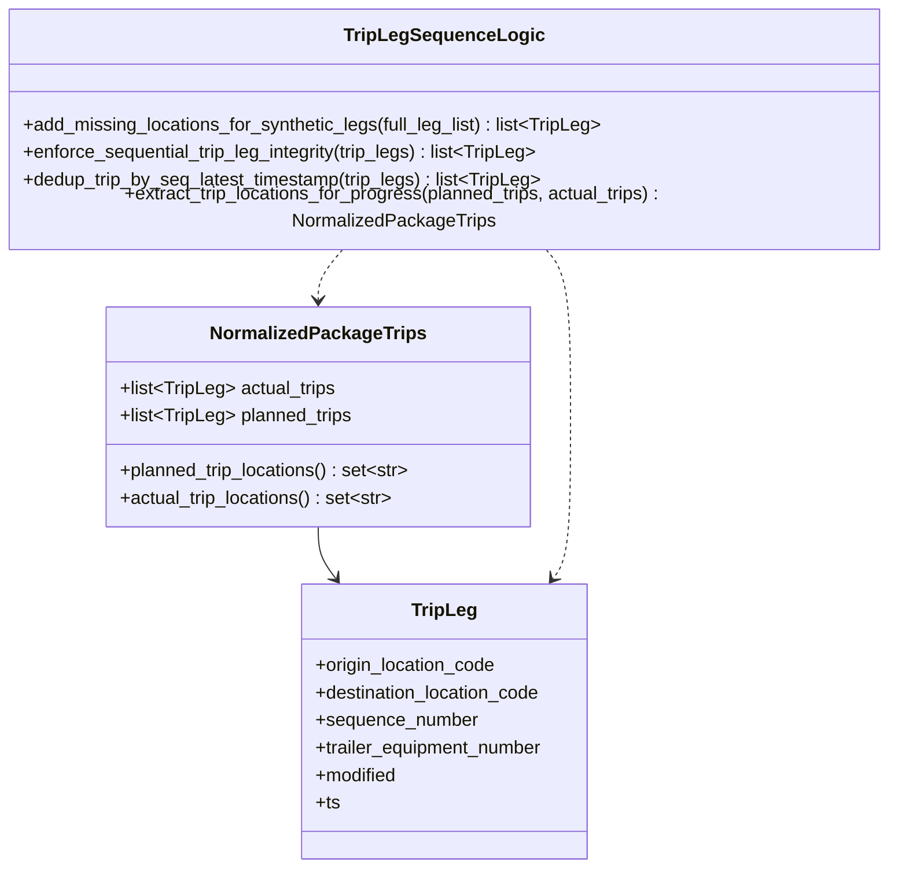
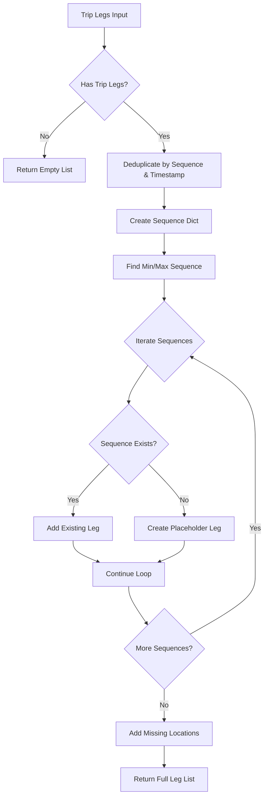
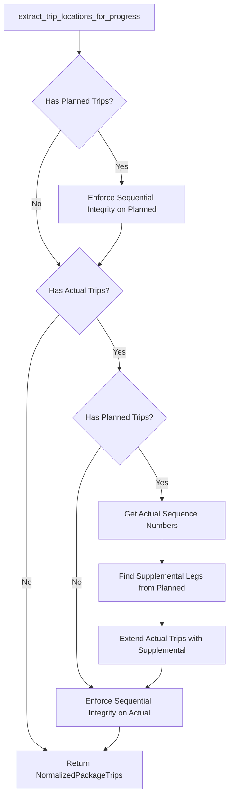

# Diagram: platform/partview_core/partview_service/partview_service/core/business/trip_leg/TripLegSequenceLogic.py

> Auto-generated by Obscura crawlers

## Diagram 1

### SVG

<svg id="container" width="780.140625" xmlns="http://www.w3.org/2000/svg" class="classDiagram" height="746" viewBox="0 0 780.140625 746" role="graphics-document document" aria-roledescription="class"><g><defs><marker id="container_class-aggregationStart" class="marker aggregation class" refX="18" refY="7" markerWidth="190" markerHeight="240" orient="auto"><path d="M 18,7 L9,13 L1,7 L9,1 Z"></path></marker></defs><defs><marker id="container_class-aggregationEnd" class="marker aggregation class" refX="1" refY="7" markerWidth="20" markerHeight="28" orient="auto"><path d="M 18,7 L9,13 L1,7 L9,1 Z"></path></marker></defs><defs><marker id="container_class-extensionStart" class="marker extension class" refX="18" refY="7" markerWidth="190" markerHeight="240" orient="auto"><path d="M 1,7 L18,13 V 1 Z"></path></marker></defs><defs><marker id="container_class-extensionEnd" class="marker extension class" refX="1" refY="7" markerWidth="20" markerHeight="28" orient="auto"><path d="M 1,1 V 13 L18,7 Z"></path></marker></defs><defs><marker id="container_class-compositionStart" class="marker composition class" refX="18" refY="7" markerWidth="190" markerHeight="240" orient="auto"><path d="M 18,7 L9,13 L1,7 L9,1 Z"></path></marker></defs><defs><marker id="container_class-compositionEnd" class="marker composition class" refX="1" refY="7" markerWidth="20" markerHeight="28" orient="auto"><path d="M 18,7 L9,13 L1,7 L9,1 Z"></path></marker></defs><defs><marker id="container_class-dependencyStart" class="marker dependency class" refX="6" refY="7" markerWidth="190" markerHeight="240" orient="auto"><path d="M 5,7 L9,13 L1,7 L9,1 Z"></path></marker></defs><defs><marker id="container_class-dependencyEnd" class="marker dependency class" refX="13" refY="7" markerWidth="20" markerHeight="28" orient="auto"><path d="M 18,7 L9,13 L14,7 L9,1 Z"></path></marker></defs><defs><marker id="container_class-lollipopStart" class="marker lollipop class" refX="13" refY="7" markerWidth="190" markerHeight="240" orient="auto"><circle stroke="black" fill="transparent" cx="7" cy="7" r="6"></circle></marker></defs><defs><marker id="container_class-lollipopEnd" class="marker lollipop class" refX="1" refY="7" markerWidth="190" markerHeight="240" orient="auto"><circle stroke="black" fill="transparent" cx="7" cy="7" r="6"></circle></marker></defs><g class="root"><g class="clusters"></g><g class="edgePaths"><path d="M280.047,448L280.047,452.167C280.047,456.333,280.047,464.667,282.604,472.203C285.161,479.74,290.275,486.48,292.832,489.85L295.39,493.22" id="id_NormalizedPackageTrips_TripLeg_1" class="edge-thickness-normal edge-pattern-solid relation" style=";;;" data-edge="true" data-et="edge" data-id="id_NormalizedPackageTrips_TripLeg_1" data-points="W3sieCI6MjgwLjA0Njg3NSwieSI6NDQ4fSx7IngiOjI4MC4wNDY4NzUsInkiOjQ3M30seyJ4IjoyOTkuMDE2NDMzMTg5NjU1MiwieSI6NDk4fV0=" marker-end="url(#container_class-dependencyEnd)"></path><path d="M477.912,206L481.609,210.167C485.306,214.333,492.7,222.667,496.397,247C500.094,271.333,500.094,311.667,500.094,352C500.094,392.333,500.094,432.667,497.537,456.203C494.98,479.74,489.865,486.48,487.308,489.85L484.751,493.22" id="id_TripLegSequenceLogic_TripLeg_2" class="edge-thickness-normal edge-pattern-dashed relation" style=";;;" data-edge="true" data-et="edge" data-id="id_TripLegSequenceLogic_TripLeg_2" data-points="W3sieCI6NDc3LjkxMTYwNTM0Mjc0MTk1LCJ5IjoyMDZ9LHsieCI6NTAwLjA5Mzc1LCJ5IjoyMzF9LHsieCI6NTAwLjA5Mzc1LCJ5IjozNTJ9LHsieCI6NTAwLjA5Mzc1LCJ5Ijo0NzN9LHsieCI6NDgxLjEyNDE5MTgxMDM0NDgsInkiOjQ5OH1d" marker-end="url(#container_class-dependencyEnd)"></path><path d="M302.229,206L298.532,210.167C294.835,214.333,287.441,222.667,283.744,230C280.047,237.333,280.047,243.667,280.047,246.833L280.047,250" id="id_TripLegSequenceLogic_NormalizedPackageTrips_3" class="edge-thickness-normal edge-pattern-dashed relation" style=";;;" data-edge="true" data-et="edge" data-id="id_TripLegSequenceLogic_NormalizedPackageTrips_3" data-points="W3sieCI6MzAyLjIyOTAxOTY1NzI1ODA1LCJ5IjoyMDZ9LHsieCI6MjgwLjA0Njg3NSwieSI6MjMxfSx7IngiOjI4MC4wNDY4NzUsInkiOjI1Nn1d" marker-end="url(#container_class-dependencyEnd)"></path></g><g class="edgeLabels"><g class="edgeLabel"><g class="label" data-id="id_NormalizedPackageTrips_TripLeg_1" transform="translate(0, 0)"><foreignObject width="0" height="0">

</foreignObject></g></g><g class="edgeLabel"><g class="label" data-id="id_TripLegSequenceLogic_TripLeg_2" transform="translate(0, 0)"><foreignObject width="0" height="0">

</foreignObject></g></g><g class="edgeLabel"><g class="label" data-id="id_TripLegSequenceLogic_NormalizedPackageTrips_3" transform="translate(0, 0)"><foreignObject width="0" height="0">

</foreignObject></g></g></g><g class="nodes"><g class="node default" id="classId-NormalizedPackageTrips-0" transform="translate(280.046875, 352)"><g class="basic label-container"><path d="M-185.046875 -96 L185.046875 -96 L185.046875 96 L-185.046875 96" stroke="none" stroke-width="0" fill="#ECECFF" style=""></path><path d="M-185.046875 -96 C-74.55754993404737 -96, 35.931775131905255 -96, 185.046875 -96 M-185.046875 -96 C-45.77805416520374 -96, 93.49076666959252 -96, 185.046875 -96 M185.046875 -96 C185.046875 -42.71930339708164, 185.046875 10.561393205836723, 185.046875 96 M185.046875 -96 C185.046875 -22.744213987848383, 185.046875 50.511572024303234, 185.046875 96 M185.046875 96 C93.78189487241126 96, 2.5169147448225146 96, -185.046875 96 M185.046875 96 C73.71905065222252 96, -37.60877369555496 96, -185.046875 96 M-185.046875 96 C-185.046875 23.599197427359968, -185.046875 -48.801605145280064, -185.046875 -96 M-185.046875 96 C-185.046875 38.93394091611225, -185.046875 -18.132118167775502, -185.046875 -96" stroke="#9370DB" stroke-width="1.3" fill="none" stroke-dasharray="0 0" style=""></path></g><g class="annotation-group text" transform="translate(0, -72)"></g><g class="label-group text" transform="translate(-89.734375, -72)"><g class="label" style="font-weight: bolder" transform="translate(0,-12)"><foreignObject width="179.46875" height="24">

NormalizedPackageTrips

</foreignObject></g></g><g class="members-group text" transform="translate(-173.046875, -24)"><g class="label" style="" transform="translate(0,-12)"><foreignObject width="189.390625" height="24">

+list&lt;TripLeg&gt; actual_trips

</foreignObject></g><g class="label" style="" transform="translate(0,12)"><foreignObject width="204.5625" height="24">

+list&lt;TripLeg&gt; planned_trips

</foreignObject></g></g><g class="methods-group text" transform="translate(-173.046875, 48)"><g class="label" style="" transform="translate(0,-12)"><foreignObject width="256.359375" height="24">

+planned_trip_locations() : set&lt;str&gt;

</foreignObject></g><g class="label" style="" transform="translate(0,12)"><foreignObject width="240.9375" height="24">

+actual_trip_locations() : set&lt;str&gt;

</foreignObject></g></g><g class="divider" style=""><path d="M-185.046875 -48 C-91.34617582766813 -48, 2.3545233446637326 -48, 185.046875 -48 M-185.046875 -48 C-49.18197607880191 -48, 86.68292284239618 -48, 185.046875 -48" stroke="#9370DB" stroke-width="1.3" fill="none" stroke-dasharray="0 0" style=""></path></g><g class="divider" style=""><path d="M-185.046875 24 C-84.97842924053482 24, 15.090016518930355 24, 185.046875 24 M-185.046875 24 C-80.50515962242976 24, 24.036555755140483 24, 185.046875 24" stroke="#9370DB" stroke-width="1.3" fill="none" stroke-dasharray="0 0" style=""></path></g></g><g class="node default" id="classId-TripLegSequenceLogic-1" transform="translate(390.0703125, 107)"><g class="basic label-container"><path d="M-382.0703125 -99 L382.0703125 -99 L382.0703125 99 L-382.0703125 99" stroke="none" stroke-width="0" fill="#ECECFF" style=""></path><path d="M-382.0703125 -99 C-97.68655441747927 -99, 186.69720366504146 -99, 382.0703125 -99 M-382.0703125 -99 C-121.37175544760561 -99, 139.32680160478878 -99, 382.0703125 -99 M382.0703125 -99 C382.0703125 -22.325905502648595, 382.0703125 54.34818899470281, 382.0703125 99 M382.0703125 -99 C382.0703125 -23.91753558898138, 382.0703125 51.16492882203724, 382.0703125 99 M382.0703125 99 C90.96660812666244 99, -200.13709624667513 99, -382.0703125 99 M382.0703125 99 C79.63047933546159 99, -222.80935382907683 99, -382.0703125 99 M-382.0703125 99 C-382.0703125 42.947930140528356, -382.0703125 -13.104139718943287, -382.0703125 -99 M-382.0703125 99 C-382.0703125 26.944597806623236, -382.0703125 -45.11080438675353, -382.0703125 -99" stroke="#9370DB" stroke-width="1.3" fill="none" stroke-dasharray="0 0" style=""></path></g><g class="annotation-group text" transform="translate(0, -75)"></g><g class="label-group text" transform="translate(-81.609375, -75)"><g class="label" style="font-weight: bolder" transform="translate(0,-12)"><foreignObject width="163.21875" height="24">

TripLegSequenceLogic

</foreignObject></g></g><g class="members-group text" transform="translate(-370.0703125, -27)"></g><g class="methods-group text" transform="translate(-370.0703125, 3)"><g class="label" style="" transform="translate(0,-12)"><foreignObject width="511.09375" height="24">

+add_missing_locations_for_synthetic_legs(full_leg_list) : list&lt;TripLeg&gt;

</foreignObject></g><g class="label" style="" transform="translate(0,12)"><foreignObject width="456.171875" height="24">

+enforce_sequential_trip_leg_integrity(trip_legs) : list&lt;TripLeg&gt;

</foreignObject></g><g class="label" style="" transform="translate(0,36)"><foreignObject width="458.515625" height="24">

+dedup_trip_by_seq_latest_timestamp(trip_legs) : list&lt;TripLeg&gt;

</foreignObject></g><g class="label" style="" transform="translate(0,60)"><foreignObject width="658.53125" height="24">

+extract_trip_locations_for_progress(planned_trips, actual_trips) : NormalizedPackageTrips

</foreignObject></g></g><g class="divider" style=""><path d="M-382.0703125 -51 C-197.85516965696186 -51, -13.640026813923726 -51, 382.0703125 -51 M-382.0703125 -51 C-173.4642578978975 -51, 35.14179670420498 -51, 382.0703125 -51" stroke="#9370DB" stroke-width="1.3" fill="none" stroke-dasharray="0 0" style=""></path></g><g class="divider" style=""><path d="M-382.0703125 -27 C-218.33118351718062 -27, -54.59205453436124 -27, 382.0703125 -27 M-382.0703125 -27 C-224.19483926659177 -27, -66.31936603318354 -27, 382.0703125 -27" stroke="#9370DB" stroke-width="1.3" fill="none" stroke-dasharray="0 0" style=""></path></g></g><g class="node default" id="classId-TripLeg-2" transform="translate(390.0703125, 618)"><g class="basic label-container"><path d="M-127.05859375 -120 L127.05859375 -120 L127.05859375 120 L-127.05859375 120" stroke="none" stroke-width="0" fill="#ECECFF" style=""></path><path d="M-127.05859375 -120 C-32.297976014899504 -120, 62.46264172020099 -120, 127.05859375 -120 M-127.05859375 -120 C-73.75180477022629 -120, -20.445015790452572 -120, 127.05859375 -120 M127.05859375 -120 C127.05859375 -24.795173294231702, 127.05859375 70.4096534115366, 127.05859375 120 M127.05859375 -120 C127.05859375 -58.72899159597206, 127.05859375 2.5420168080558767, 127.05859375 120 M127.05859375 120 C38.326224377002944 120, -50.40614499599411 120, -127.05859375 120 M127.05859375 120 C76.15098139250125 120, 25.243369035002488 120, -127.05859375 120 M-127.05859375 120 C-127.05859375 31.41930344391426, -127.05859375 -57.16139311217148, -127.05859375 -120 M-127.05859375 120 C-127.05859375 57.78560451148347, -127.05859375 -4.42879097703306, -127.05859375 -120" stroke="#9370DB" stroke-width="1.3" fill="none" stroke-dasharray="0 0" style=""></path></g><g class="annotation-group text" transform="translate(0, -96)"></g><g class="label-group text" transform="translate(-27.0546875, -96)"><g class="label" style="font-weight: bolder" transform="translate(0,-12)"><foreignObject width="54.109375" height="24">

TripLeg

</foreignObject></g></g><g class="members-group text" transform="translate(-115.05859375, -48)"><g class="label" style="" transform="translate(0,-12)"><foreignObject width="160.5" height="24">

+origin_location_code

</foreignObject></g><g class="label" style="" transform="translate(0,12)"><foreignObject width="201.40625" height="24">

+destination_location_code

</foreignObject></g><g class="label" style="" transform="translate(0,36)"><foreignObject width="142.015625" height="24">

+sequence_number

</foreignObject></g><g class="label" style="" transform="translate(0,60)"><foreignObject width="203.0625" height="24">

+trailer_equipment_number

</foreignObject></g><g class="label" style="" transform="translate(0,84)"><foreignObject width="72.609375" height="24">

+modified

</foreignObject></g><g class="label" style="" transform="translate(0,108)"><foreignObject width="21.15625" height="24">

+ts

</foreignObject></g></g><g class="methods-group text" transform="translate(-115.05859375, 120)"></g><g class="divider" style=""><path d="M-127.05859375 -72 C-25.537005267091615 -72, 75.98458321581677 -72, 127.05859375 -72 M-127.05859375 -72 C-54.326214225075404 -72, 18.406165299849192 -72, 127.05859375 -72" stroke="#9370DB" stroke-width="1.3" fill="none" stroke-dasharray="0 0" style=""></path></g><g class="divider" style=""><path d="M-127.05859375 96 C-59.401112084115695 96, 8.25636958176861 96, 127.05859375 96 M-127.05859375 96 C-54.82772608264047 96, 17.403141584719066 96, 127.05859375 96" stroke="#9370DB" stroke-width="1.3" fill="none" stroke-dasharray="0 0" style=""></path></g></g></g></g></g></svg>

## Diagram 2

### SVG

<svg id="container" width="601.828125" xmlns="http://www.w3.org/2000/svg" class="flowchart" height="1790.3125" viewBox="0 0 601.828125 1790.3125" role="graphics-document document" aria-roledescription="flowchart-v2"><g><marker id="container_flowchart-v2-pointEnd" class="marker flowchart-v2" viewBox="0 0 10 10" refX="5" refY="5" markerUnits="userSpaceOnUse" markerWidth="8" markerHeight="8" orient="auto"><path d="M 0 0 L 10 5 L 0 10 z" class="arrowMarkerPath" style="stroke-width: 1; stroke-dasharray: 1, 0;"></path></marker><marker id="container_flowchart-v2-pointStart" class="marker flowchart-v2" viewBox="0 0 10 10" refX="4.5" refY="5" markerUnits="userSpaceOnUse" markerWidth="8" markerHeight="8" orient="auto"><path d="M 0 5 L 10 10 L 10 0 z" class="arrowMarkerPath" style="stroke-width: 1; stroke-dasharray: 1, 0;"></path></marker><marker id="container_flowchart-v2-circleEnd" class="marker flowchart-v2" viewBox="0 0 10 10" refX="11" refY="5" markerUnits="userSpaceOnUse" markerWidth="11" markerHeight="11" orient="auto"><circle cx="5" cy="5" r="5" class="arrowMarkerPath" style="stroke-width: 1; stroke-dasharray: 1, 0;"></circle></marker><marker id="container_flowchart-v2-circleStart" class="marker flowchart-v2" viewBox="0 0 10 10" refX="-1" refY="5" markerUnits="userSpaceOnUse" markerWidth="11" markerHeight="11" orient="auto"><circle cx="5" cy="5" r="5" class="arrowMarkerPath" style="stroke-width: 1; stroke-dasharray: 1, 0;"></circle></marker><marker id="container_flowchart-v2-crossEnd" class="marker cross flowchart-v2" viewBox="0 0 11 11" refX="12" refY="5.2" markerUnits="userSpaceOnUse" markerWidth="11" markerHeight="11" orient="auto"><path d="M 1,1 l 9,9 M 10,1 l -9,9" class="arrowMarkerPath" style="stroke-width: 2; stroke-dasharray: 1, 0;"></path></marker><marker id="container_flowchart-v2-crossStart" class="marker cross flowchart-v2" viewBox="0 0 11 11" refX="-1" refY="5.2" markerUnits="userSpaceOnUse" markerWidth="11" markerHeight="11" orient="auto"><path d="M 1,1 l 9,9 M 10,1 l -9,9" class="arrowMarkerPath" style="stroke-width: 2; stroke-dasharray: 1, 0;"></path></marker><g class="root"><g class="clusters"></g><g class="edgePaths"><path d="M239.152,62L239.152,66.167C239.152,70.333,239.152,78.667,239.152,86.333C239.152,94,239.152,101,239.152,104.5L239.152,108" id="L_A_B_0" class="edge-thickness-normal edge-pattern-solid edge-thickness-normal edge-pattern-solid flowchart-link" style=";" data-edge="true" data-et="edge" data-id="L_A_B_0" data-points="W3sieCI6MjM5LjE1MjM0Mzc1LCJ5Ijo2Mn0seyJ4IjoyMzkuMTUyMzQzNzUsInkiOjg3fSx7IngiOjIzOS4xNTIzNDM3NSwieSI6MTEyfV0=" marker-end="url(#container_flowchart-v2-pointEnd)"></path><path d="M196.702,225.753L180.936,238.995C165.169,252.236,133.635,278.72,117.868,299.461C102.102,320.203,102.102,335.203,102.102,342.703L102.102,350.203" id="L_B_C_0" class="edge-thickness-normal edge-pattern-solid edge-thickness-normal edge-pattern-solid flowchart-link" style=";" data-edge="true" data-et="edge" data-id="L_B_C_0" data-points="W3sieCI6MTk2LjcwMjI5MTUzODM3NjY0LCJ5IjoyMjUuNzUzMDcyNzg4Mzc2NjR9LHsieCI6MTAyLjEwMTU2MjUsInkiOjMwNS4yMDMxMjV9LHsieCI6MTAyLjEwMTU2MjUsInkiOjM1NC4yMDMxMjV9XQ==" marker-end="url(#container_flowchart-v2-pointEnd)"></path><path d="M281.602,225.753L297.369,238.995C313.136,252.236,344.67,278.72,360.436,297.461C376.203,316.203,376.203,327.203,376.203,332.703L376.203,338.203" id="L_B_D_0" class="edge-thickness-normal edge-pattern-solid edge-thickness-normal edge-pattern-solid flowchart-link" style=";" data-edge="true" data-et="edge" data-id="L_B_D_0" data-points="W3sieCI6MjgxLjYwMjM5NTk2MTYyMzM2LCJ5IjoyMjUuNzUzMDcyNzg4Mzc2NjR9LHsieCI6Mzc2LjIwMzEyNSwieSI6MzA1LjIwMzEyNX0seyJ4IjozNzYuMjAzMTI1LCJ5IjozNDIuMjAzMTI1fV0=" marker-end="url(#container_flowchart-v2-pointEnd)"></path><path d="M376.203,420.203L376.203,424.37C376.203,428.536,376.203,436.87,376.203,444.536C376.203,452.203,376.203,459.203,376.203,462.703L376.203,466.203" id="L_D_E_0" class="edge-thickness-normal edge-pattern-solid edge-thickness-normal edge-pattern-solid flowchart-link" style=";" data-edge="true" data-et="edge" data-id="L_D_E_0" data-points="W3sieCI6Mzc2LjIwMzEyNSwieSI6NDIwLjIwMzEyNX0seyJ4IjozNzYuMjAzMTI1LCJ5Ijo0NDUuMjAzMTI1fSx7IngiOjM3Ni4yMDMxMjUsInkiOjQ3MC4yMDMxMjV9XQ==" marker-end="url(#container_flowchart-v2-pointEnd)"></path><path d="M376.203,524.203L376.203,528.37C376.203,532.536,376.203,540.87,376.203,548.536C376.203,556.203,376.203,563.203,376.203,566.703L376.203,570.203" id="L_E_F_0" class="edge-thickness-normal edge-pattern-solid edge-thickness-normal edge-pattern-solid flowchart-link" style=";" data-edge="true" data-et="edge" data-id="L_E_F_0" data-points="W3sieCI6Mzc2LjIwMzEyNSwieSI6NTI0LjIwMzEyNX0seyJ4IjozNzYuMjAzMTI1LCJ5Ijo1NDkuMjAzMTI1fSx7IngiOjM3Ni4yMDMxMjUsInkiOjU3NC4yMDMxMjV9XQ==" marker-end="url(#container_flowchart-v2-pointEnd)"></path><path d="M376.203,628.203L376.203,632.37C376.203,636.536,376.203,644.87,376.203,652.536C376.203,660.203,376.203,667.203,376.203,670.703L376.203,674.203" id="L_F_G_0" class="edge-thickness-normal edge-pattern-solid edge-thickness-normal edge-pattern-solid flowchart-link" style=";" data-edge="true" data-et="edge" data-id="L_F_G_0" data-points="W3sieCI6Mzc2LjIwMzEyNSwieSI6NjI4LjIwMzEyNX0seyJ4IjozNzYuMjAzMTI1LCJ5Ijo2NTMuMjAzMTI1fSx7IngiOjM3Ni4yMDMxMjUsInkiOjY3OC4yMDMxMjV9XQ==" marker-end="url(#container_flowchart-v2-pointEnd)"></path><path d="M338.915,824.649L331.822,835.031C324.73,845.412,310.545,866.175,303.452,880.056C296.359,893.938,296.359,900.938,296.359,904.438L296.359,907.938" id="L_G_H_0" class="edge-thickness-normal edge-pattern-solid edge-thickness-normal edge-pattern-solid flowchart-link" style=";" data-edge="true" data-et="edge" data-id="L_G_H_0" data-points="W3sieCI6MzM4LjkxNDgwMzEzNDU1NjU2LCJ5Ijo4MjQuNjQ5MTc4MTM0NTU2Nn0seyJ4IjoyOTYuMzU5Mzc1LCJ5Ijo4ODYuOTM3NX0seyJ4IjoyOTYuMzU5Mzc1LCJ5Ijo5MTEuOTM3NX1d" marker-end="url(#container_flowchart-v2-pointEnd)"></path><path d="M252.045,1044.748L238.472,1058.301C224.9,1071.853,197.755,1098.958,184.182,1118.01C170.609,1137.063,170.609,1148.063,170.609,1153.563L170.609,1159.063" id="L_H_I_0" class="edge-thickness-normal edge-pattern-solid edge-thickness-normal edge-pattern-solid flowchart-link" style=";" data-edge="true" data-et="edge" data-id="L_H_I_0" data-points="W3sieCI6MjUyLjA0NTA4NzUwOTMyNjA0LCJ5IjoxMDQ0Ljc0ODIxMjUwOTMyNn0seyJ4IjoxNzAuNjA5Mzc1LCJ5IjoxMTI2LjA2MjV9LHsieCI6MTcwLjYwOTM3NSwieSI6MTE2My4wNjI1fV0=" marker-end="url(#container_flowchart-v2-pointEnd)"></path><path d="M340.674,1044.748L354.246,1058.301C367.819,1071.853,394.964,1098.958,408.537,1118.01C422.109,1137.063,422.109,1148.063,422.109,1153.563L422.109,1159.063" id="L_H_J_0" class="edge-thickness-normal edge-pattern-solid edge-thickness-normal edge-pattern-solid flowchart-link" style=";" data-edge="true" data-et="edge" data-id="L_H_J_0" data-points="W3sieCI6MzQwLjY3MzY2MjQ5MDY3Mzk2LCJ5IjoxMDQ0Ljc0ODIxMjUwOTMyNn0seyJ4Ijo0MjIuMTA5Mzc1LCJ5IjoxMTI2LjA2MjV9LHsieCI6NDIyLjEwOTM3NSwieSI6MTE2My4wNjI1fV0=" marker-end="url(#container_flowchart-v2-pointEnd)"></path><path d="M170.609,1217.063L170.609,1221.229C170.609,1225.396,170.609,1233.729,180.069,1241.808C189.529,1249.886,208.45,1257.71,217.91,1261.622L227.37,1265.534" id="L_I_K_0" class="edge-thickness-normal edge-pattern-solid edge-thickness-normal edge-pattern-solid flowchart-link" style=";" data-edge="true" data-et="edge" data-id="L_I_K_0" data-points="W3sieCI6MTcwLjYwOTM3NSwieSI6MTIxNy4wNjI1fSx7IngiOjE3MC42MDkzNzUsInkiOjEyNDIuMDYyNX0seyJ4IjoyMzEuMDY2MTA1NzY5MjMwNzcsInkiOjEyNjcuMDYyNX1d" marker-end="url(#container_flowchart-v2-pointEnd)"></path><path d="M422.109,1217.063L422.109,1221.229C422.109,1225.396,422.109,1233.729,412.649,1241.808C403.189,1249.886,384.269,1257.71,374.809,1261.622L365.349,1265.534" id="L_J_K_0" class="edge-thickness-normal edge-pattern-solid edge-thickness-normal edge-pattern-solid flowchart-link" style=";" data-edge="true" data-et="edge" data-id="L_J_K_0" data-points="W3sieCI6NDIyLjEwOTM3NSwieSI6MTIxNy4wNjI1fSx7IngiOjQyMi4xMDkzNzUsInkiOjEyNDIuMDYyNX0seyJ4IjozNjEuNjUyNjQ0MjMwNzY5MiwieSI6MTI2Ny4wNjI1fV0=" marker-end="url(#container_flowchart-v2-pointEnd)"></path><path d="M296.359,1321.063L296.359,1325.229C296.359,1329.396,296.359,1337.729,303.153,1351.648C309.946,1365.568,323.533,1385.073,330.326,1394.825L337.119,1404.578" id="L_K_L_0" class="edge-thickness-normal edge-pattern-solid edge-thickness-normal edge-pattern-solid flowchart-link" style=";" data-edge="true" data-et="edge" data-id="L_K_L_0" data-points="W3sieCI6Mjk2LjM1OTM3NSwieSI6MTMyMS4wNjI1fSx7IngiOjI5Ni4zNTkzNzUsInkiOjEzNDYuMDYyNX0seyJ4IjozMzkuNDA1NDU5MDgzMjM5NiwieSI6MTQwNy44NjAxNjU5MTY3NjA1fV0=" marker-end="url(#container_flowchart-v2-pointEnd)"></path><path d="M433.746,1428.605L458.421,1414.848C483.096,1401.091,532.447,1373.577,557.122,1351.153C581.797,1328.729,581.797,1311.396,581.797,1294.063C581.797,1276.729,581.797,1259.396,581.797,1242.063C581.797,1224.729,581.797,1207.396,581.797,1188.063C581.797,1168.729,581.797,1147.396,581.797,1115.802C581.797,1084.208,581.797,1042.354,581.797,1002.5C581.797,962.646,581.797,924.792,557.873,892.265C533.949,859.739,486.101,832.54,462.177,818.941L438.253,805.342" id="L_L_G_0" class="edge-thickness-normal edge-pattern-solid edge-thickness-normal edge-pattern-solid flowchart-link" style=";" data-edge="true" data-et="edge" data-id="L_L_G_0" data-points="W3sieCI6NDMzLjc0NjEwMDk5Mjk3MzU0LCJ5IjoxNDI4LjYwNTQ3NTk5Mjk3Mzd9LHsieCI6NTgxLjc5Njg3NSwieSI6MTM0Ni4wNjI1fSx7IngiOjU4MS43OTY4NzUsInkiOjEyOTQuMDYyNX0seyJ4Ijo1ODEuNzk2ODc1LCJ5IjoxMjQyLjA2MjV9LHsieCI6NTgxLjc5Njg3NSwieSI6MTE5MC4wNjI1fSx7IngiOjU4MS43OTY4NzUsInkiOjExMjYuMDYyNX0seyJ4Ijo1ODEuNzk2ODc1LCJ5IjoxMDAwLjV9LHsieCI6NTgxLjc5Njg3NSwieSI6ODg2LjkzNzV9LHsieCI6NDM0Ljc3NTU1MTU1OTY2MDgsInkiOjgwMy4zNjUwNzM0NDAzMzkyfV0=" marker-end="url(#container_flowchart-v2-pointEnd)"></path><path d="M376.203,1550.313L376.203,1556.479C376.203,1562.646,376.203,1574.979,376.203,1586.646C376.203,1598.313,376.203,1609.313,376.203,1614.813L376.203,1620.313" id="L_L_M_0" class="edge-thickness-normal edge-pattern-solid edge-thickness-normal edge-pattern-solid flowchart-link" style=";" data-edge="true" data-et="edge" data-id="L_L_M_0" data-points="W3sieCI6Mzc2LjIwMzEyNSwieSI6MTU1MC4zMTI1fSx7IngiOjM3Ni4yMDMxMjUsInkiOjE1ODcuMzEyNX0seyJ4IjozNzYuMjAzMTI1LCJ5IjoxNjI0LjMxMjV9XQ==" marker-end="url(#container_flowchart-v2-pointEnd)"></path><path d="M376.203,1678.313L376.203,1682.479C376.203,1686.646,376.203,1694.979,376.203,1702.646C376.203,1710.313,376.203,1717.313,376.203,1720.813L376.203,1724.313" id="L_M_N_0" class="edge-thickness-normal edge-pattern-solid edge-thickness-normal edge-pattern-solid flowchart-link" style=";" data-edge="true" data-et="edge" data-id="L_M_N_0" data-points="W3sieCI6Mzc2LjIwMzEyNSwieSI6MTY3OC4zMTI1fSx7IngiOjM3Ni4yMDMxMjUsInkiOjE3MDMuMzEyNX0seyJ4IjozNzYuMjAzMTI1LCJ5IjoxNzI4LjMxMjV9XQ==" marker-end="url(#container_flowchart-v2-pointEnd)"></path></g><g class="edgeLabels"><g class="edgeLabel"><g class="label" data-id="L_A_B_0" transform="translate(0, 0)"><foreignObject width="0" height="0">

</foreignObject></g></g><g class="edgeLabel" transform="translate(102.1015625, 305.203125)"><g class="label" data-id="L_B_C_0" transform="translate(-10.140625, -12)"><foreignObject width="20.28125" height="24">

No

</foreignObject></g></g><g class="edgeLabel" transform="translate(376.203125, 305.203125)"><g class="label" data-id="L_B_D_0" transform="translate(-12.03125, -12)"><foreignObject width="24.0625" height="24">

Yes

</foreignObject></g></g><g class="edgeLabel"><g class="label" data-id="L_D_E_0" transform="translate(0, 0)"><foreignObject width="0" height="0">

</foreignObject></g></g><g class="edgeLabel"><g class="label" data-id="L_E_F_0" transform="translate(0, 0)"><foreignObject width="0" height="0">

</foreignObject></g></g><g class="edgeLabel"><g class="label" data-id="L_F_G_0" transform="translate(0, 0)"><foreignObject width="0" height="0">

</foreignObject></g></g><g class="edgeLabel"><g class="label" data-id="L_G_H_0" transform="translate(0, 0)"><foreignObject width="0" height="0">

</foreignObject></g></g><g class="edgeLabel" transform="translate(170.609375, 1126.0625)"><g class="label" data-id="L_H_I_0" transform="translate(-12.03125, -12)"><foreignObject width="24.0625" height="24">

Yes

</foreignObject></g></g><g class="edgeLabel" transform="translate(422.109375, 1126.0625)"><g class="label" data-id="L_H_J_0" transform="translate(-10.140625, -12)"><foreignObject width="20.28125" height="24">

No

</foreignObject></g></g><g class="edgeLabel"><g class="label" data-id="L_I_K_0" transform="translate(0, 0)"><foreignObject width="0" height="0">

</foreignObject></g></g><g class="edgeLabel"><g class="label" data-id="L_J_K_0" transform="translate(0, 0)"><foreignObject width="0" height="0">

</foreignObject></g></g><g class="edgeLabel"><g class="label" data-id="L_K_L_0" transform="translate(0, 0)"><foreignObject width="0" height="0">

</foreignObject></g></g><g class="edgeLabel" transform="translate(581.796875, 1190.0625)"><g class="label" data-id="L_L_G_0" transform="translate(-12.03125, -12)"><foreignObject width="24.0625" height="24">

Yes

</foreignObject></g></g><g class="edgeLabel" transform="translate(376.203125, 1587.3125)"><g class="label" data-id="L_L_M_0" transform="translate(-10.140625, -12)"><foreignObject width="20.28125" height="24">

No

</foreignObject></g></g><g class="edgeLabel"><g class="label" data-id="L_M_N_0" transform="translate(0, 0)"><foreignObject width="0" height="0">

</foreignObject></g></g></g><g class="nodes"><g class="node default" id="flowchart-A-0" transform="translate(239.15234375, 35)"><rect class="basic label-container" style="" x="-83.5625" y="-27" width="167.125" height="54"></rect><g class="label" style="" transform="translate(-53.5625, -12)"><rect></rect><foreignObject width="107.125" height="24">

Trip Legs Input

</foreignObject></g></g><g class="node default" id="flowchart-B-1" transform="translate(239.15234375, 190.1015625)"><polygon points="78.1015625,0 156.203125,-78.1015625 78.1015625,-156.203125 0,-78.1015625" class="label-container" transform="translate(-77.6015625, 78.1015625)"></polygon><g class="label" style="" transform="translate(-51.1015625, -12)"><rect></rect><foreignObject width="102.203125" height="24">

Has Trip Legs?

</foreignObject></g></g><g class="node default" id="flowchart-C-3" transform="translate(102.1015625, 381.203125)"><rect class="basic label-container" style="" x="-94.1015625" y="-27" width="188.203125" height="54"></rect><g class="label" style="" transform="translate(-64.1015625, -12)"><rect></rect><foreignObject width="128.203125" height="24">

Return Empty List

</foreignObject></g></g><g class="node default" id="flowchart-D-5" transform="translate(376.203125, 381.203125)"><rect class="basic label-container" style="" x="-130" y="-39" width="260" height="78"></rect><g class="label" style="" transform="translate(-100, -24)"><rect></rect><foreignObject width="200" height="48">

Deduplicate by Sequence &amp; Timestamp

</foreignObject></g></g><g class="node default" id="flowchart-E-7" transform="translate(376.203125, 497.203125)"><rect class="basic label-container" style="" x="-106.5625" y="-27" width="213.125" height="54"></rect><g class="label" style="" transform="translate(-76.5625, -12)"><rect></rect><foreignObject width="153.125" height="24">

Create Sequence Dict

</foreignObject></g></g><g class="node default" id="flowchart-F-9" transform="translate(376.203125, 601.203125)"><rect class="basic label-container" style="" x="-116.6328125" y="-27" width="233.265625" height="54"></rect><g class="label" style="" transform="translate(-86.6328125, -12)"><rect></rect><foreignObject width="173.265625" height="24">

Find Min/Max Sequence

</foreignObject></g></g><g class="node default" id="flowchart-G-11" transform="translate(376.203125, 770.0703125)"><polygon points="91.8671875,0 183.734375,-91.8671875 91.8671875,-183.734375 0,-91.8671875" class="label-container" transform="translate(-91.3671875, 91.8671875)"></polygon><g class="label" style="" transform="translate(-64.8671875, -12)"><rect></rect><foreignObject width="129.734375" height="24">

Iterate Sequences

</foreignObject></g></g><g class="node default" id="flowchart-H-13" transform="translate(296.359375, 1000.5)"><polygon points="88.5625,0 177.125,-88.5625 88.5625,-177.125 0,-88.5625" class="label-container" transform="translate(-88.0625, 88.5625)"></polygon><g class="label" style="" transform="translate(-61.5625, -12)"><rect></rect><foreignObject width="123.125" height="24">

Sequence Exists?

</foreignObject></g></g><g class="node default" id="flowchart-I-15" transform="translate(170.609375, 1190.0625)"><rect class="basic label-container" style="" x="-88.84375" y="-27" width="177.6875" height="54"></rect><g class="label" style="" transform="translate(-58.84375, -12)"><rect></rect><foreignObject width="117.6875" height="24">

Add Existing Leg

</foreignObject></g></g><g class="node default" id="flowchart-J-17" transform="translate(422.109375, 1190.0625)"><rect class="basic label-container" style="" x="-112.65625" y="-27" width="225.3125" height="54"></rect><g class="label" style="" transform="translate(-82.65625, -12)"><rect></rect><foreignObject width="165.3125" height="24">

Create Placeholder Leg

</foreignObject></g></g><g class="node default" id="flowchart-K-19" transform="translate(296.359375, 1294.0625)"><rect class="basic label-container" style="" x="-82.53125" y="-27" width="165.0625" height="54"></rect><g class="label" style="" transform="translate(-52.53125, -12)"><rect></rect><foreignObject width="105.0625" height="24">

Continue Loop

</foreignObject></g></g><g class="node default" id="flowchart-L-23" transform="translate(376.203125, 1460.6875)"><polygon points="89.625,0 179.25,-89.625 89.625,-179.25 0,-89.625" class="label-container" transform="translate(-89.125, 89.625)"></polygon><g class="label" style="" transform="translate(-62.625, -12)"><rect></rect><foreignObject width="125.25" height="24">

More Sequences?

</foreignObject></g></g><g class="node default" id="flowchart-M-27" transform="translate(376.203125, 1651.3125)"><rect class="basic label-container" style="" x="-110.1640625" y="-27" width="220.328125" height="54"></rect><g class="label" style="" transform="translate(-80.1640625, -12)"><rect></rect><foreignObject width="160.328125" height="24">

Add Missing Locations

</foreignObject></g></g><g class="node default" id="flowchart-N-29" transform="translate(376.203125, 1755.3125)"><rect class="basic label-container" style="" x="-98.90625" y="-27" width="197.8125" height="54"></rect><g class="label" style="" transform="translate(-68.90625, -12)"><rect></rect><foreignObject width="137.8125" height="24">

Return Full Leg List

</foreignObject></g></g></g></g></g></svg>

## Diagram 3

### SVG

<svg id="container" width="473.96875" xmlns="http://www.w3.org/2000/svg" class="flowchart" height="1619.21875" viewBox="0 0 473.96875 1619.21875" role="graphics-document document" aria-roledescription="flowchart-v2"><g><marker id="container_flowchart-v2-pointEnd" class="marker flowchart-v2" viewBox="0 0 10 10" refX="5" refY="5" markerUnits="userSpaceOnUse" markerWidth="8" markerHeight="8" orient="auto"><path d="M 0 0 L 10 5 L 0 10 z" class="arrowMarkerPath" style="stroke-width: 1; stroke-dasharray: 1, 0;"></path></marker><marker id="container_flowchart-v2-pointStart" class="marker flowchart-v2" viewBox="0 0 10 10" refX="4.5" refY="5" markerUnits="userSpaceOnUse" markerWidth="8" markerHeight="8" orient="auto"><path d="M 0 5 L 10 10 L 10 0 z" class="arrowMarkerPath" style="stroke-width: 1; stroke-dasharray: 1, 0;"></path></marker><marker id="container_flowchart-v2-circleEnd" class="marker flowchart-v2" viewBox="0 0 10 10" refX="11" refY="5" markerUnits="userSpaceOnUse" markerWidth="11" markerHeight="11" orient="auto"><circle cx="5" cy="5" r="5" class="arrowMarkerPath" style="stroke-width: 1; stroke-dasharray: 1, 0;"></circle></marker><marker id="container_flowchart-v2-circleStart" class="marker flowchart-v2" viewBox="0 0 10 10" refX="-1" refY="5" markerUnits="userSpaceOnUse" markerWidth="11" markerHeight="11" orient="auto"><circle cx="5" cy="5" r="5" class="arrowMarkerPath" style="stroke-width: 1; stroke-dasharray: 1, 0;"></circle></marker><marker id="container_flowchart-v2-crossEnd" class="marker cross flowchart-v2" viewBox="0 0 11 11" refX="12" refY="5.2" markerUnits="userSpaceOnUse" markerWidth="11" markerHeight="11" orient="auto"><path d="M 1,1 l 9,9 M 10,1 l -9,9" class="arrowMarkerPath" style="stroke-width: 2; stroke-dasharray: 1, 0;"></path></marker><marker id="container_flowchart-v2-crossStart" class="marker cross flowchart-v2" viewBox="0 0 11 11" refX="-1" refY="5.2" markerUnits="userSpaceOnUse" markerWidth="11" markerHeight="11" orient="auto"><path d="M 1,1 l 9,9 M 10,1 l -9,9" class="arrowMarkerPath" style="stroke-width: 2; stroke-dasharray: 1, 0;"></path></marker><g class="root"><g class="clusters"></g><g class="edgePaths"><path d="M165.898,62L165.898,66.167C165.898,70.333,165.898,78.667,165.898,86.333C165.898,94,165.898,101,165.898,104.5L165.898,108" id="L_A_B_0" class="edge-thickness-normal edge-pattern-solid edge-thickness-normal edge-pattern-solid flowchart-link" style=";" data-edge="true" data-et="edge" data-id="L_A_B_0" data-points="W3sieCI6MTY1Ljg5ODQzNzUsInkiOjYyfSx7IngiOjE2NS44OTg0Mzc1LCJ5Ijo4N30seyJ4IjoxNjUuODk4NDM3NSwieSI6MTEyfV0=" marker-end="url(#container_flowchart-v2-pointEnd)"></path><path d="M203.921,265.165L212.179,277.669C220.437,290.173,236.953,315.18,245.211,333.184C253.469,351.188,253.469,362.188,253.469,367.688L253.469,373.188" id="L_B_C_0" class="edge-thickness-normal edge-pattern-solid edge-thickness-normal edge-pattern-solid flowchart-link" style=";" data-edge="true" data-et="edge" data-id="L_B_C_0" data-points="W3sieCI6MjAzLjkyMDg3NjE1NTQ3NzEsInkiOjI2NS4xNjUwNjEzNDQ1MjI5fSx7IngiOjI1My40Njg3NSwieSI6MzQwLjE4NzV9LHsieCI6MjUzLjQ2ODc1LCJ5IjozNzcuMTg3NX1d" marker-end="url(#container_flowchart-v2-pointEnd)"></path><path d="M127.876,265.165L119.618,277.669C111.36,290.173,94.844,315.18,86.586,340.35C78.328,365.521,78.328,390.854,78.328,414.188C78.328,437.521,78.328,458.854,86.095,479.581C93.862,500.307,109.396,520.426,117.163,530.486L124.929,540.546" id="L_B_D_0" class="edge-thickness-normal edge-pattern-solid edge-thickness-normal edge-pattern-solid flowchart-link" style=";" data-edge="true" data-et="edge" data-id="L_B_D_0" data-points="W3sieCI6MTI3Ljg3NTk5ODg0NDUyMjkxLCJ5IjoyNjUuMTY1MDYxMzQ0NTIyOX0seyJ4Ijo3OC4zMjgxMjUsInkiOjM0MC4xODc1fSx7IngiOjc4LjMyODEyNSwieSI6NDE2LjE4NzV9LHsieCI6NzguMzI4MTI1LCJ5Ijo0ODAuMTg3NX0seyJ4IjoxMjcuMzczODk5MTk4Nzk4OTIsInkiOjU0My43MTIwMzgzMDEyMDExfV0=" marker-end="url(#container_flowchart-v2-pointEnd)"></path><path d="M253.469,455.188L253.469,459.354C253.469,463.521,253.469,471.854,245.702,486.081C237.935,500.307,222.401,520.426,214.634,530.486L206.867,540.546" id="L_C_D_0" class="edge-thickness-normal edge-pattern-solid edge-thickness-normal edge-pattern-solid flowchart-link" style=";" data-edge="true" data-et="edge" data-id="L_C_D_0" data-points="W3sieCI6MjUzLjQ2ODc1LCJ5Ijo0NTUuMTg3NX0seyJ4IjoyNTMuNDY4NzUsInkiOjQ4MC4xODc1fSx7IngiOjIwNC40MjI5NzU4MDEyMDEwNiwieSI6NTQzLjcxMjAzODMwMTIwMTF9XQ==" marker-end="url(#container_flowchart-v2-pointEnd)"></path><path d="M200.983,646.947L208.885,658.961C216.788,670.975,232.593,695.003,240.496,712.517C248.398,730.031,248.398,741.031,248.398,746.531L248.398,752.031" id="L_D_E_0" class="edge-thickness-normal edge-pattern-solid edge-thickness-normal edge-pattern-solid flowchart-link" style=";" data-edge="true" data-et="edge" data-id="L_D_E_0" data-points="W3sieCI6MjAwLjk4Mjc5MTU5OTM0NjIsInkiOjY0Ni45NDY4OTU5MDA2NTM4fSx7IngiOjI0OC4zOTg0Mzc1LCJ5Ijo3MTkuMDMxMjV9LHsieCI6MjQ4LjM5ODQzNzUsInkiOjc1Ni4wMzEyNX1d" marker-end="url(#container_flowchart-v2-pointEnd)"></path><path d="M125.046,641.179L113.903,654.154C102.76,667.13,80.474,693.08,69.331,728.155C58.188,763.229,58.188,807.427,58.188,851.625C58.188,895.823,58.188,940.021,58.188,974.786C58.188,1009.552,58.188,1034.885,58.188,1058.219C58.188,1081.552,58.188,1102.885,58.188,1124.219C58.188,1145.552,58.188,1166.885,58.188,1188.219C58.188,1209.552,58.188,1230.885,58.188,1252.219C58.188,1273.552,58.188,1294.885,58.188,1316.219C58.188,1337.552,58.188,1358.885,58.188,1380.219C58.188,1401.552,58.188,1422.885,58.188,1444.219C58.188,1465.552,58.188,1486.885,64.627,1501.378C71.066,1515.871,83.945,1523.523,90.384,1527.349L96.823,1531.175" id="L_D_F_0" class="edge-thickness-normal edge-pattern-solid edge-thickness-normal edge-pattern-solid flowchart-link" style=";" data-edge="true" data-et="edge" data-id="L_D_F_0" data-points="W3sieCI6MTI1LjA0NjE3NDE1MDA3ODc2LCJ5Ijo2NDEuMTc4OTg2NjUwMDc4N30seyJ4Ijo1OC4xODc1LCJ5Ijo3MTkuMDMxMjV9LHsieCI6NTguMTg3NSwieSI6ODUxLjYyNX0seyJ4Ijo1OC4xODc1LCJ5Ijo5ODQuMjE4NzV9LHsieCI6NTguMTg3NSwieSI6MTA2MC4yMTg3NX0seyJ4Ijo1OC4xODc1LCJ5IjoxMTI0LjIxODc1fSx7IngiOjU4LjE4NzUsInkiOjExODguMjE4NzV9LHsieCI6NTguMTg3NSwieSI6MTI1Mi4yMTg3NX0seyJ4Ijo1OC4xODc1LCJ5IjoxMzE2LjIxODc1fSx7IngiOjU4LjE4NzUsInkiOjEzODAuMjE4NzV9LHsieCI6NTguMTg3NSwieSI6MTQ0NC4yMTg3NX0seyJ4Ijo1OC4xODc1LCJ5IjoxNTA4LjIxODc1fSx7IngiOjEwMC4yNjIwODQ5NjA5Mzc1LCJ5IjoxNTMzLjIxODc1fV0=" marker-end="url(#container_flowchart-v2-pointEnd)"></path><path d="M286.421,909.196L294.679,921.7C302.937,934.204,319.453,959.211,327.711,977.215C335.969,995.219,335.969,1006.219,335.969,1011.719L335.969,1017.219" id="L_E_G_0" class="edge-thickness-normal edge-pattern-solid edge-thickness-normal edge-pattern-solid flowchart-link" style=";" data-edge="true" data-et="edge" data-id="L_E_G_0" data-points="W3sieCI6Mjg2LjQyMDg3NjE1NTQ3NzEsInkiOjkwOS4xOTYzMTEzNDQ1MjI5fSx7IngiOjMzNS45Njg3NSwieSI6OTg0LjIxODc1fSx7IngiOjMzNS45Njg3NSwieSI6MTAyMS4yMTg3NX1d" marker-end="url(#container_flowchart-v2-pointEnd)"></path><path d="M210.376,909.196L202.118,921.7C193.86,934.204,177.344,959.211,169.086,984.382C160.828,1009.552,160.828,1034.885,160.828,1058.219C160.828,1081.552,160.828,1102.885,160.828,1124.219C160.828,1145.552,160.828,1166.885,160.828,1188.219C160.828,1209.552,160.828,1230.885,160.828,1252.219C160.828,1273.552,160.828,1294.885,160.828,1316.219C160.828,1337.552,160.828,1358.885,165.991,1373.325C171.154,1387.765,181.48,1395.312,186.643,1399.085L191.806,1402.859" id="L_E_H_0" class="edge-thickness-normal edge-pattern-solid edge-thickness-normal edge-pattern-solid flowchart-link" style=";" data-edge="true" data-et="edge" data-id="L_E_H_0" data-points="W3sieCI6MjEwLjM3NTk5ODg0NDUyMjksInkiOjkwOS4xOTYzMTEzNDQ1MjI5fSx7IngiOjE2MC44MjgxMjUsInkiOjk4NC4yMTg3NX0seyJ4IjoxNjAuODI4MTI1LCJ5IjoxMDYwLjIxODc1fSx7IngiOjE2MC44MjgxMjUsInkiOjExMjQuMjE4NzV9LHsieCI6MTYwLjgyODEyNSwieSI6MTE4OC4yMTg3NX0seyJ4IjoxNjAuODI4MTI1LCJ5IjoxMjUyLjIxODc1fSx7IngiOjE2MC44MjgxMjUsInkiOjEzMTYuMjE4NzV9LHsieCI6MTYwLjgyODEyNSwieSI6MTM4MC4yMTg3NX0seyJ4IjoxOTUuMDM1Mjc4MzIwMzEyNSwieSI6MTQwNS4yMTg3NX1d" marker-end="url(#container_flowchart-v2-pointEnd)"></path><path d="M335.969,1099.219L335.969,1103.385C335.969,1107.552,335.969,1115.885,335.969,1123.552C335.969,1131.219,335.969,1138.219,335.969,1141.719L335.969,1145.219" id="L_G_I_0" class="edge-thickness-normal edge-pattern-solid edge-thickness-normal edge-pattern-solid flowchart-link" style=";" data-edge="true" data-et="edge" data-id="L_G_I_0" data-points="W3sieCI6MzM1Ljk2ODc1LCJ5IjoxMDk5LjIxODc1fSx7IngiOjMzNS45Njg3NSwieSI6MTEyNC4yMTg3NX0seyJ4IjozMzUuOTY4NzUsInkiOjExNDkuMjE4NzV9XQ==" marker-end="url(#container_flowchart-v2-pointEnd)"></path><path d="M335.969,1227.219L335.969,1231.385C335.969,1235.552,335.969,1243.885,335.969,1251.552C335.969,1259.219,335.969,1266.219,335.969,1269.719L335.969,1273.219" id="L_I_J_0" class="edge-thickness-normal edge-pattern-solid edge-thickness-normal edge-pattern-solid flowchart-link" style=";" data-edge="true" data-et="edge" data-id="L_I_J_0" data-points="W3sieCI6MzM1Ljk2ODc1LCJ5IjoxMjI3LjIxODc1fSx7IngiOjMzNS45Njg3NSwieSI6MTI1Mi4yMTg3NX0seyJ4IjozMzUuOTY4NzUsInkiOjEyNzcuMjE4NzV9XQ==" marker-end="url(#container_flowchart-v2-pointEnd)"></path><path d="M335.969,1355.219L335.969,1359.385C335.969,1363.552,335.969,1371.885,330.806,1379.825C325.643,1387.765,315.317,1395.312,310.154,1399.085L304.991,1402.859" id="L_J_H_0" class="edge-thickness-normal edge-pattern-solid edge-thickness-normal edge-pattern-solid flowchart-link" style=";" data-edge="true" data-et="edge" data-id="L_J_H_0" data-points="W3sieCI6MzM1Ljk2ODc1LCJ5IjoxMzU1LjIxODc1fSx7IngiOjMzNS45Njg3NSwieSI6MTM4MC4yMTg3NX0seyJ4IjozMDEuNzYxNTk2Njc5Njg3NSwieSI6MTQwNS4yMTg3NX1d" marker-end="url(#container_flowchart-v2-pointEnd)"></path><path d="M248.398,1483.219L248.398,1487.385C248.398,1491.552,248.398,1499.885,243.554,1507.81C238.71,1515.735,229.021,1523.251,224.177,1527.009L219.332,1530.767" id="L_H_F_0" class="edge-thickness-normal edge-pattern-solid edge-thickness-normal edge-pattern-solid flowchart-link" style=";" data-edge="true" data-et="edge" data-id="L_H_F_0" data-points="W3sieCI6MjQ4LjM5ODQzNzUsInkiOjE0ODMuMjE4NzV9LHsieCI6MjQ4LjM5ODQzNzUsInkiOjE1MDguMjE4NzV9LHsieCI6MjE2LjE3MTg3NSwieSI6MTUzMy4yMTg3NX1d" marker-end="url(#container_flowchart-v2-pointEnd)"></path></g><g class="edgeLabels"><g class="edgeLabel"><g class="label" data-id="L_A_B_0" transform="translate(0, 0)"><foreignObject width="0" height="0">

</foreignObject></g></g><g class="edgeLabel" transform="translate(253.46875, 340.1875)"><g class="label" data-id="L_B_C_0" transform="translate(-12.03125, -12)"><foreignObject width="24.0625" height="24">

Yes

</foreignObject></g></g><g class="edgeLabel" transform="translate(78.328125, 416.1875)"><g class="label" data-id="L_B_D_0" transform="translate(-10.140625, -12)"><foreignObject width="20.28125" height="24">

No

</foreignObject></g></g><g class="edgeLabel"><g class="label" data-id="L_C_D_0" transform="translate(0, 0)"><foreignObject width="0" height="0">

</foreignObject></g></g><g class="edgeLabel" transform="translate(248.3984375, 719.03125)"><g class="label" data-id="L_D_E_0" transform="translate(-12.03125, -12)"><foreignObject width="24.0625" height="24">

Yes

</foreignObject></g></g><g class="edgeLabel" transform="translate(58.1875, 1188.21875)"><g class="label" data-id="L_D_F_0" transform="translate(-10.140625, -12)"><foreignObject width="20.28125" height="24">

No

</foreignObject></g></g><g class="edgeLabel" transform="translate(335.96875, 984.21875)"><g class="label" data-id="L_E_G_0" transform="translate(-12.03125, -12)"><foreignObject width="24.0625" height="24">

Yes

</foreignObject></g></g><g class="edgeLabel" transform="translate(160.828125, 1188.21875)"><g class="label" data-id="L_E_H_0" transform="translate(-10.140625, -12)"><foreignObject width="20.28125" height="24">

No

</foreignObject></g></g><g class="edgeLabel"><g class="label" data-id="L_G_I_0" transform="translate(0, 0)"><foreignObject width="0" height="0">

</foreignObject></g></g><g class="edgeLabel"><g class="label" data-id="L_I_J_0" transform="translate(0, 0)"><foreignObject width="0" height="0">

</foreignObject></g></g><g class="edgeLabel"><g class="label" data-id="L_J_H_0" transform="translate(0, 0)"><foreignObject width="0" height="0">

</foreignObject></g></g><g class="edgeLabel"><g class="label" data-id="L_H_F_0" transform="translate(0, 0)"><foreignObject width="0" height="0">

</foreignObject></g></g></g><g class="nodes"><g class="node default" id="flowchart-A-0" transform="translate(165.8984375, 35)"><rect class="basic label-container" style="" x="-157.8984375" y="-27" width="315.796875" height="54"></rect><g class="label" style="" transform="translate(-127.8984375, -12)"><rect></rect><foreignObject width="255.796875" height="24">

extract_trip_locations_for_progress

</foreignObject></g></g><g class="node default" id="flowchart-B-1" transform="translate(165.8984375, 207.59375)"><polygon points="95.59375,0 191.1875,-95.59375 95.59375,-191.1875 0,-95.59375" class="label-container" transform="translate(-95.09375, 95.59375)"></polygon><g class="label" style="" transform="translate(-68.59375, -12)"><rect></rect><foreignObject width="137.1875" height="24">

Has Planned Trips?

</foreignObject></g></g><g class="node default" id="flowchart-C-3" transform="translate(253.46875, 416.1875)"><rect class="basic label-container" style="" x="-130" y="-39" width="260" height="78"></rect><g class="label" style="" transform="translate(-100, -24)"><rect></rect><foreignObject width="200" height="48">

Enforce Sequential Integrity on Planned

</foreignObject></g></g><g class="node default" id="flowchart-D-5" transform="translate(165.8984375, 593.609375)"><polygon points="88.421875,0 176.84375,-88.421875 88.421875,-176.84375 0,-88.421875" class="label-container" transform="translate(-87.921875, 88.421875)"></polygon><g class="label" style="" transform="translate(-61.421875, -12)"><rect></rect><foreignObject width="122.84375" height="24">

Has Actual Trips?

</foreignObject></g></g><g class="node default" id="flowchart-E-9" transform="translate(248.3984375, 851.625)"><polygon points="95.59375,0 191.1875,-95.59375 95.59375,-191.1875 0,-95.59375" class="label-container" transform="translate(-95.09375, 95.59375)"></polygon><g class="label" style="" transform="translate(-68.59375, -12)"><rect></rect><foreignObject width="137.1875" height="24">

Has Planned Trips?

</foreignObject></g></g><g class="node default" id="flowchart-F-11" transform="translate(165.8984375, 1572.21875)"><rect class="basic label-container" style="" x="-130" y="-39" width="260" height="78"></rect><g class="label" style="" transform="translate(-100, -24)"><rect></rect><foreignObject width="200" height="48">

Return NormalizedPackageTrips

</foreignObject></g></g><g class="node default" id="flowchart-G-13" transform="translate(335.96875, 1060.21875)"><rect class="basic label-container" style="" x="-130" y="-39" width="260" height="78"></rect><g class="label" style="" transform="translate(-100, -24)"><rect></rect><foreignObject width="200" height="48">

Get Actual Sequence Numbers

</foreignObject></g></g><g class="node default" id="flowchart-H-15" transform="translate(248.3984375, 1444.21875)"><rect class="basic label-container" style="" x="-130" y="-39" width="260" height="78"></rect><g class="label" style="" transform="translate(-100, -24)"><rect></rect><foreignObject width="200" height="48">

Enforce Sequential Integrity on Actual

</foreignObject></g></g><g class="node default" id="flowchart-I-17" transform="translate(335.96875, 1188.21875)"><rect class="basic label-container" style="" x="-130" y="-39" width="260" height="78"></rect><g class="label" style="" transform="translate(-100, -24)"><rect></rect><foreignObject width="200" height="48">

Find Supplemental Legs from Planned

</foreignObject></g></g><g class="node default" id="flowchart-J-19" transform="translate(335.96875, 1316.21875)"><rect class="basic label-container" style="" x="-130" y="-39" width="260" height="78"></rect><g class="label" style="" transform="translate(-100, -24)"><rect></rect><foreignObject width="200" height="48">

Extend Actual Trips with Supplemental

</foreignObject></g></g></g></g></g></svg>
