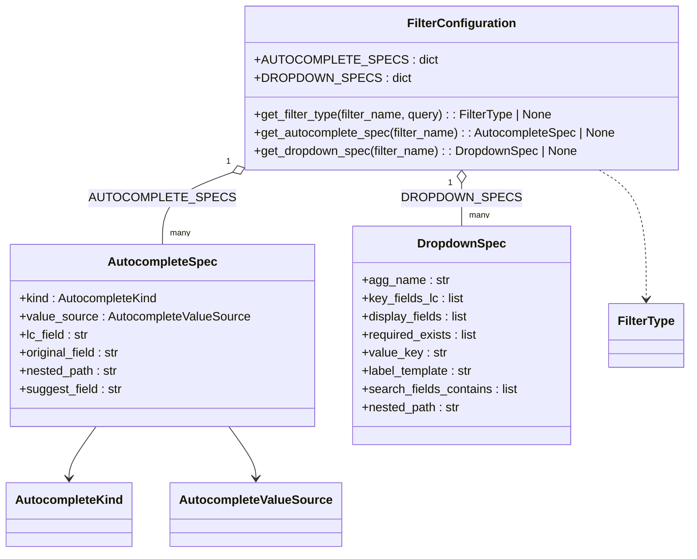

# Diagram: platform/partview_core/partview_service/partview_service/core/configuration/filter_configuration.py


> Auto-generated by Obscura crawlers

## Diagram 1



### SVG

<svg id="container" width="895.828125" xmlns="http://www.w3.org/2000/svg" class="classDiagram" height="728" viewBox="0 0 895.828125 728" role="graphics-document document" aria-roledescription="class"><style>#container{font-family:"trebuchet ms",verdana,arial,sans-serif;font-size:16px;fill:#333;}@keyframes edge-animation-frame{from{stroke-dashoffset:0;}}@keyframes dash{to{stroke-dashoffset:0;}}#container .edge-animation-slow{stroke-dasharray:9,5!important;stroke-dashoffset:900;animation:dash 50s linear infinite;stroke-linecap:round;}#container .edge-animation-fast{stroke-dasharray:9,5!important;stroke-dashoffset:900;animation:dash 20s linear infinite;stroke-linecap:round;}#container .error-icon{fill:#552222;}#container .error-text{fill:#552222;stroke:#552222;}#container .edge-thickness-normal{stroke-width:1px;}#container .edge-thickness-thick{stroke-width:3.5px;}#container .edge-pattern-solid{stroke-dasharray:0;}#container .edge-thickness-invisible{stroke-width:0;fill:none;}#container .edge-pattern-dashed{stroke-dasharray:3;}#container .edge-pattern-dotted{stroke-dasharray:2;}#container .marker{fill:#333333;stroke:#333333;}#container .marker.cross{stroke:#333333;}#container svg{font-family:"trebuchet ms",verdana,arial,sans-serif;font-size:16px;}#container p{margin:0;}#container g.classGroup text{fill:#9370DB;stroke:none;font-family:"trebuchet ms",verdana,arial,sans-serif;font-size:10px;}#container g.classGroup text .title{font-weight:bolder;}#container .nodeLabel,#container .edgeLabel{color:#131300;}#container .edgeLabel .label rect{fill:#ECECFF;}#container .label text{fill:#131300;}#container .labelBkg{background:#ECECFF;}#container .edgeLabel .label span{background:#ECECFF;}#container .classTitle{font-weight:bolder;}#container .node rect,#container .node circle,#container .node ellipse,#container .node polygon,#container .node path{fill:#ECECFF;stroke:#9370DB;stroke-width:1px;}#container .divider{stroke:#9370DB;stroke-width:1;}#container g.clickable{cursor:pointer;}#container g.classGroup rect{fill:#ECECFF;stroke:#9370DB;}#container g.classGroup line{stroke:#9370DB;stroke-width:1;}#container .classLabel .box{stroke:none;stroke-width:0;fill:#ECECFF;opacity:0.5;}#container .classLabel .label{fill:#9370DB;font-size:10px;}#container .relation{stroke:#333333;stroke-width:1;fill:none;}#container .dashed-line{stroke-dasharray:3;}#container .dotted-line{stroke-dasharray:1 2;}#container #compositionStart,#container .composition{fill:#333333!important;stroke:#333333!important;stroke-width:1;}#container #compositionEnd,#container .composition{fill:#333333!important;stroke:#333333!important;stroke-width:1;}#container #dependencyStart,#container .dependency{fill:#333333!important;stroke:#333333!important;stroke-width:1;}#container #dependencyStart,#container .dependency{fill:#333333!important;stroke:#333333!important;stroke-width:1;}#container #extensionStart,#container .extension{fill:transparent!important;stroke:#333333!important;stroke-width:1;}#container #extensionEnd,#container .extension{fill:transparent!important;stroke:#333333!important;stroke-width:1;}#container #aggregationStart,#container .aggregation{fill:transparent!important;stroke:#333333!important;stroke-width:1;}#container #aggregationEnd,#container .aggregation{fill:transparent!important;stroke:#333333!important;stroke-width:1;}#container #lollipopStart,#container .lollipop{fill:#ECECFF!important;stroke:#333333!important;stroke-width:1;}#container #lollipopEnd,#container .lollipop{fill:#ECECFF!important;stroke:#333333!important;stroke-width:1;}#container .edgeTerminals{font-size:11px;line-height:initial;}#container .classTitleText{text-anchor:middle;font-size:18px;fill:#333;}#container .label-icon{display:inline-block;height:1em;overflow:visible;vertical-align:-0.125em;}#container .node .label-icon path{fill:currentColor;stroke:revert;stroke-width:revert;}#container :root{--mermaid-font-family:"trebuchet ms",verdana,arial,sans-serif;}</style><g><defs><marker id="container_class-aggregationStart" class="marker aggregation class" refX="18" refY="7" markerWidth="190" markerHeight="240" orient="auto"><path d="M 18,7 L9,13 L1,7 L9,1 Z"></path></marker></defs><defs><marker id="container_class-aggregationEnd" class="marker aggregation class" refX="1" refY="7" markerWidth="20" markerHeight="28" orient="auto"><path d="M 18,7 L9,13 L1,7 L9,1 Z"></path></marker></defs><defs><marker id="container_class-extensionStart" class="marker extension class" refX="18" refY="7" markerWidth="190" markerHeight="240" orient="auto"><path d="M 1,7 L18,13 V 1 Z"></path></marker></defs><defs><marker id="container_class-extensionEnd" class="marker extension class" refX="1" refY="7" markerWidth="20" markerHeight="28" orient="auto"><path d="M 1,1 V 13 L18,7 Z"></path></marker></defs><defs><marker id="container_class-compositionStart" class="marker composition class" refX="18" refY="7" markerWidth="190" markerHeight="240" orient="auto"><path d="M 18,7 L9,13 L1,7 L9,1 Z"></path></marker></defs><defs><marker id="container_class-compositionEnd" class="marker composition class" refX="1" refY="7" markerWidth="20" markerHeight="28" orient="auto"><path d="M 18,7 L9,13 L1,7 L9,1 Z"></path></marker></defs><defs><marker id="container_class-dependencyStart" class="marker dependency class" refX="6" refY="7" markerWidth="190" markerHeight="240" orient="auto"><path d="M 5,7 L9,13 L1,7 L9,1 Z"></path></marker></defs><defs><marker id="container_class-dependencyEnd" class="marker dependency class" refX="13" refY="7" markerWidth="20" markerHeight="28" orient="auto"><path d="M 18,7 L9,13 L14,7 L9,1 Z"></path></marker></defs><defs><marker id="container_class-lollipopStart" class="marker lollipop class" refX="13" refY="7" markerWidth="190" markerHeight="240" orient="auto"><circle stroke="black" fill="transparent" cx="7" cy="7" r="6"></circle></marker></defs><defs><marker id="container_class-lollipopEnd" class="marker lollipop class" refX="1" refY="7" markerWidth="190" markerHeight="240" orient="auto"><circle stroke="black" fill="transparent" cx="7" cy="7" r="6"></circle></marker></defs><g class="root"><g class="clusters"></g><g class="edgePaths"><path d="M295.045,228.201L280.278,233.668C265.511,239.134,235.976,250.067,221.209,265.7C206.441,281.333,206.441,301.667,206.441,311.833L206.441,322" id="id_FilterConfiguration_AutocompleteSpec_1" class="edge-thickness-normal edge-pattern-solid relation" style=";;;" data-edge="true" data-et="edge" data-id="id_FilterConfiguration_AutocompleteSpec_1" data-points="W3sieCI6MzExLjIyMjY1NjI1LCJ5IjoyMjIuMjEzMDI3NzgyNzYzOX0seyJ4IjoyMDYuNDQxNDA2MjUsInkiOjI2MX0seyJ4IjoyMDYuNDQxNDA2MjUsInkiOjMyMn1d" marker-start="url(#container_class-aggregationStart)"></path><path d="M598.152,241.25L598.152,244.542C598.152,247.833,598.152,254.417,598.152,263.875C598.152,273.333,598.152,285.667,598.152,291.833L598.152,298" id="id_FilterConfiguration_DropdownSpec_2" class="edge-thickness-normal edge-pattern-solid relation" style=";;;" data-edge="true" data-et="edge" data-id="id_FilterConfiguration_DropdownSpec_2" data-points="W3sieCI6NTk4LjE1MjM0Mzc1LCJ5IjoyMjR9LHsieCI6NTk4LjE1MjM0Mzc1LCJ5IjoyNjF9LHsieCI6NTk4LjE1MjM0Mzc1LCJ5IjoyOTh9XQ==" marker-start="url(#container_class-aggregationStart)"></path><path d="M122.177,562L116.443,570.167C110.708,578.333,99.239,594.667,93.504,606C87.77,617.333,87.77,623.667,87.77,626.833L87.77,630" id="id_AutocompleteSpec_AutocompleteKind_3" class="edge-thickness-normal edge-pattern-solid relation" style=";;;" data-edge="true" data-et="edge" data-id="id_AutocompleteSpec_AutocompleteKind_3" data-points="W3sieCI6MTIyLjE3NzM1Mjk5NTU2MjEzLCJ5Ijo1NjJ9LHsieCI6ODcuNzY5NTMxMjUsInkiOjYxMX0seyJ4Ijo4Ny43Njk1MzEyNSwieSI6NjM2fV0=" marker-end="url(#container_class-dependencyEnd)"></path><path d="M290.705,562L296.44,570.167C302.175,578.333,313.644,594.667,319.379,606C325.113,617.333,325.113,623.667,325.113,626.833L325.113,630" id="id_AutocompleteSpec_AutocompleteValueSource_4" class="edge-thickness-normal edge-pattern-solid relation" style=";;;" data-edge="true" data-et="edge" data-id="id_AutocompleteSpec_AutocompleteValueSource_4" data-points="W3sieCI6MjkwLjcwNTQ1OTUwNDQzNzg0LCJ5Ijo1NjJ9LHsieCI6MzI1LjExMzI4MTI1LCJ5Ijo2MTF9LHsieCI6MzI1LjExMzI4MTI1LCJ5Ijo2MzZ9XQ==" marker-end="url(#container_class-dependencyEnd)"></path><path d="M778.008,224L788.277,230.167C798.547,236.333,819.086,248.667,829.355,277C839.625,305.333,839.625,349.667,839.625,371.833L839.625,394" id="id_FilterConfiguration_FilterType_5" class="edge-thickness-normal edge-pattern-dashed relation" style=";;;" data-edge="true" data-et="edge" data-id="id_FilterConfiguration_FilterType_5" data-points="W3sieCI6Nzc4LjAwNzgzOTQzOTY1NTIsInkiOjIyNH0seyJ4Ijo4MzkuNjI1LCJ5IjoyNjF9LHsieCI6ODM5LjYyNSwieSI6NDAwfV0=" marker-end="url(#container_class-dependencyEnd)"></path></g><g class="edgeLabels"><g class="edgeLabel" transform="translate(206.44140625, 261)"><g class="label" data-id="id_FilterConfiguration_AutocompleteSpec_1" transform="translate(-82.5, -12)"><foreignObject width="165" height="24"><div xmlns="http://www.w3.org/1999/xhtml" class="labelBkg" style="display: table-cell; white-space: nowrap; line-height: 1.5; max-width: 200px; text-align: center;"><span class="edgeLabel"><p>AUTOCOMPLETE_SPECS</p></span></div></foreignObject></g></g><g class="edgeLabel" transform="translate(598.15234375, 261)"><g class="label" data-id="id_FilterConfiguration_DropdownSpec_2" transform="translate(-68.8203125, -12)"><foreignObject width="137.640625" height="24"><div xmlns="http://www.w3.org/1999/xhtml" class="labelBkg" style="display: table-cell; white-space: nowrap; line-height: 1.5; max-width: 200px; text-align: center;"><span class="edgeLabel"><p>DROPDOWN_SPECS</p></span></div></foreignObject></g></g><g class="edgeLabel"><g class="label" data-id="id_AutocompleteSpec_AutocompleteKind_3" transform="translate(0, 0)"><foreignObject width="0" height="0"><div xmlns="http://www.w3.org/1999/xhtml" class="labelBkg" style="display: table-cell; white-space: nowrap; line-height: 1.5; max-width: 200px; text-align: center;"><span class="edgeLabel"></span></div></foreignObject></g></g><g class="edgeLabel"><g class="label" data-id="id_AutocompleteSpec_AutocompleteValueSource_4" transform="translate(0, 0)"><foreignObject width="0" height="0"><div xmlns="http://www.w3.org/1999/xhtml" class="labelBkg" style="display: table-cell; white-space: nowrap; line-height: 1.5; max-width: 200px; text-align: center;"><span class="edgeLabel"></span></div></foreignObject></g></g><g class="edgeLabel"><g class="label" data-id="id_FilterConfiguration_FilterType_5" transform="translate(0, 0)"><foreignObject width="0" height="0"><div xmlns="http://www.w3.org/1999/xhtml" class="labelBkg" style="display: table-cell; white-space: nowrap; line-height: 1.5; max-width: 200px; text-align: center;"><span class="edgeLabel"></span></div></foreignObject></g></g><g class="edgeTerminals" transform="translate(289.60374101098506, 214.22100356997495)"><g class="inner" transform="translate(0, 0)"><foreignObject style="width: 9px; height: 12px;"><div xmlns="http://www.w3.org/1999/xhtml" style="display: inline-block; padding-right: 1px; white-space: nowrap;"><span class="edgeLabel">1</span></div></foreignObject></g></g><g class="edgeTerminals" transform="translate(583.1523418750002, 241.49999839285712)"><g class="inner" transform="translate(0, 0)"><foreignObject style="width: 9px; height: 12px;"><div xmlns="http://www.w3.org/1999/xhtml" style="display: inline-block; padding-right: 1px; white-space: nowrap;"><span class="edgeLabel">1</span></div></foreignObject></g></g><g class="edgeTerminals" transform="translate(216.44140812499992, 299.50000160714285)"><g class="inner" transform="translate(0, 0)"></g><foreignObject style="width: 36px; height: 12px;"><div xmlns="http://www.w3.org/1999/xhtml" style="display: inline-block; padding-right: 1px; white-space: nowrap;"><span class="edgeLabel">many</span></div></foreignObject></g><g class="edgeTerminals" transform="translate(608.1523418749999, 275.49999839285715)"><g class="inner" transform="translate(0, 0)"></g><foreignObject style="width: 36px; height: 12px;"><div xmlns="http://www.w3.org/1999/xhtml" style="display: inline-block; padding-right: 1px; white-space: nowrap;"><span class="edgeLabel">many</span></div></foreignObject></g></g><g class="nodes"><g class="node default" id="classId-FilterConfiguration-0" transform="translate(598.15234375, 116)"><g class="basic label-container"><path d="M-286.9296875 -108 L286.9296875 -108 L286.9296875 108 L-286.9296875 108" stroke="none" stroke-width="0" fill="#ECECFF" style=""></path><path d="M-286.9296875 -108 C-129.57094068086505 -108, 27.7878061382699 -108, 286.9296875 -108 M-286.9296875 -108 C-118.35336094559443 -108, 50.22296560881114 -108, 286.9296875 -108 M286.9296875 -108 C286.9296875 -57.96107354667742, 286.9296875 -7.9221470933548375, 286.9296875 108 M286.9296875 -108 C286.9296875 -44.25299702031717, 286.9296875 19.494005959365666, 286.9296875 108 M286.9296875 108 C96.97959845774159 108, -92.97049058451682 108, -286.9296875 108 M286.9296875 108 C125.62208727469167 108, -35.68551295061667 108, -286.9296875 108 M-286.9296875 108 C-286.9296875 41.76372428358802, -286.9296875 -24.472551432823963, -286.9296875 -108 M-286.9296875 108 C-286.9296875 43.826152154958834, -286.9296875 -20.347695690082332, -286.9296875 -108" stroke="#9370DB" stroke-width="1.3" fill="none" stroke-dasharray="0 0" style=""></path></g><g class="annotation-group text" transform="translate(0, -84)"></g><g class="label-group text" transform="translate(-68.234375, -84)"><g class="label" style="font-weight: bolder" transform="translate(0,-12)"><foreignObject width="136.46875" height="24"><div xmlns="http://www.w3.org/1999/xhtml" style="display: table-cell; white-space: nowrap; line-height: 1.5; max-width: 184px; text-align: center;"><span class="nodeLabel markdown-node-label" style=""><p>FilterConfiguration</p></span></div></foreignObject></g></g><g class="members-group text" transform="translate(-274.9296875, -36)"><g class="label" style="" transform="translate(0,-12)"><foreignObject width="212.640625" height="24"><div xmlns="http://www.w3.org/1999/xhtml" style="display: table-cell; white-space: nowrap; line-height: 1.5; max-width: 270px; text-align: center;"><span class="nodeLabel markdown-node-label" style=""><p>+AUTOCOMPLETE_SPECS : dict</p></span></div></foreignObject></g><g class="label" style="" transform="translate(0,12)"><foreignObject width="185.453125" height="24"><div xmlns="http://www.w3.org/1999/xhtml" style="display: table-cell; white-space: nowrap; line-height: 1.5; max-width: 243px; text-align: center;"><span class="nodeLabel markdown-node-label" style=""><p>+DROPDOWN_SPECS : dict</p></span></div></foreignObject></g></g><g class="methods-group text" transform="translate(-274.9296875, 36)"><g class="label" style="" transform="translate(0,-12)"><foreignObject width="397.546875" height="24"><div xmlns="http://www.w3.org/1999/xhtml" style="display: table-cell; white-space: nowrap; line-height: 1.5; max-width: 455px; text-align: center;"><span class="nodeLabel markdown-node-label" style=""><p>+get_filter_type(filter_name, query) : : FilterType | None</p></span></div></foreignObject></g><g class="label" style="" transform="translate(0,12)"><foreignObject width="481.625" height="24"><div xmlns="http://www.w3.org/1999/xhtml" style="display: table-cell; white-space: nowrap; line-height: 1.5; max-width: 539px; text-align: center;"><span class="nodeLabel markdown-node-label" style=""><p>+get_autocomplete_spec(filter_name) : : AutocompleteSpec | None</p></span></div></foreignObject></g><g class="label" style="" transform="translate(0,36)"><foreignObject width="429.21875" height="24"><div xmlns="http://www.w3.org/1999/xhtml" style="display: table-cell; white-space: nowrap; line-height: 1.5; max-width: 487px; text-align: center;"><span class="nodeLabel markdown-node-label" style=""><p>+get_dropdown_spec(filter_name) : : DropdownSpec | None</p></span></div></foreignObject></g></g><g class="divider" style=""><path d="M-286.9296875 -60 C-165.7334439093438 -60, -44.53720031868761 -60, 286.9296875 -60 M-286.9296875 -60 C-76.16184116792837 -60, 134.60600516414326 -60, 286.9296875 -60" stroke="#9370DB" stroke-width="1.3" fill="none" stroke-dasharray="0 0" style=""></path></g><g class="divider" style=""><path d="M-286.9296875 12 C-171.74781832594257 12, -56.56594915188515 12, 286.9296875 12 M-286.9296875 12 C-152.55269429799012 12, -18.17570109598023 12, 286.9296875 12" stroke="#9370DB" stroke-width="1.3" fill="none" stroke-dasharray="0 0" style=""></path></g></g><g class="node default" id="classId-AutocompleteSpec-1" transform="translate(206.44140625, 442)"><g class="basic label-container"><path d="M-198.44140625 -120 L198.44140625 -120 L198.44140625 120 L-198.44140625 120" stroke="none" stroke-width="0" fill="#ECECFF" style=""></path><path d="M-198.44140625 -120 C-78.61009112018773 -120, 41.221224009624535 -120, 198.44140625 -120 M-198.44140625 -120 C-59.039093632694744 -120, 80.36321898461051 -120, 198.44140625 -120 M198.44140625 -120 C198.44140625 -68.72589865910977, 198.44140625 -17.451797318219548, 198.44140625 120 M198.44140625 -120 C198.44140625 -40.573117181619594, 198.44140625 38.85376563676081, 198.44140625 120 M198.44140625 120 C55.21551359746397 120, -88.01037905507206 120, -198.44140625 120 M198.44140625 120 C88.46884657028149 120, -21.50371310943703 120, -198.44140625 120 M-198.44140625 120 C-198.44140625 34.14185777347335, -198.44140625 -51.716284453053305, -198.44140625 -120 M-198.44140625 120 C-198.44140625 68.22188555094004, -198.44140625 16.443771101880102, -198.44140625 -120" stroke="#9370DB" stroke-width="1.3" fill="none" stroke-dasharray="0 0" style=""></path></g><g class="annotation-group text" transform="translate(0, -96)"></g><g class="label-group text" transform="translate(-68.5078125, -96)"><g class="label" style="font-weight: bolder" transform="translate(0,-12)"><foreignObject width="137.015625" height="24"><div xmlns="http://www.w3.org/1999/xhtml" style="display: table-cell; white-space: nowrap; line-height: 1.5; max-width: 186px; text-align: center;"><span class="nodeLabel markdown-node-label" style=""><p>AutocompleteSpec</p></span></div></foreignObject></g></g><g class="members-group text" transform="translate(-186.44140625, -48)"><g class="label" style="" transform="translate(0,-12)"><foreignObject width="185.671875" height="24"><div xmlns="http://www.w3.org/1999/xhtml" style="display: table-cell; white-space: nowrap; line-height: 1.5; max-width: 243px; text-align: center;"><span class="nodeLabel markdown-node-label" style=""><p>+kind : AutocompleteKind</p></span></div></foreignObject></g><g class="label" style="" transform="translate(0,12)"><foreignObject width="304.375" height="24"><div xmlns="http://www.w3.org/1999/xhtml" style="display: table-cell; white-space: nowrap; line-height: 1.5; max-width: 362px; text-align: center;"><span class="nodeLabel markdown-node-label" style=""><p>+value_source : AutocompleteValueSource</p></span></div></foreignObject></g><g class="label" style="" transform="translate(0,36)"><foreignObject width="92.09375" height="24"><div xmlns="http://www.w3.org/1999/xhtml" style="display: table-cell; white-space: nowrap; line-height: 1.5; max-width: 150px; text-align: center;"><span class="nodeLabel markdown-node-label" style=""><p>+lc_field : str</p></span></div></foreignObject></g><g class="label" style="" transform="translate(0,60)"><foreignObject width="135.296875" height="24"><div xmlns="http://www.w3.org/1999/xhtml" style="display: table-cell; white-space: nowrap; line-height: 1.5; max-width: 193px; text-align: center;"><span class="nodeLabel markdown-node-label" style=""><p>+original_field : str</p></span></div></foreignObject></g><g class="label" style="" transform="translate(0,84)"><foreignObject width="130.640625" height="24"><div xmlns="http://www.w3.org/1999/xhtml" style="display: table-cell; white-space: nowrap; line-height: 1.5; max-width: 189px; text-align: center;"><span class="nodeLabel markdown-node-label" style=""><p>+nested_path : str</p></span></div></foreignObject></g><g class="label" style="" transform="translate(0,108)"><foreignObject width="134.96875" height="24"><div xmlns="http://www.w3.org/1999/xhtml" style="display: table-cell; white-space: nowrap; line-height: 1.5; max-width: 193px; text-align: center;"><span class="nodeLabel markdown-node-label" style=""><p>+suggest_field : str</p></span></div></foreignObject></g></g><g class="methods-group text" transform="translate(-186.44140625, 120)"></g><g class="divider" style=""><path d="M-198.44140625 -72 C-53.29222656580754 -72, 91.85695311838492 -72, 198.44140625 -72 M-198.44140625 -72 C-62.24845898223131 -72, 73.94448828553737 -72, 198.44140625 -72" stroke="#9370DB" stroke-width="1.3" fill="none" stroke-dasharray="0 0" style=""></path></g><g class="divider" style=""><path d="M-198.44140625 96 C-71.1503057438417 96, 56.1407947623166 96, 198.44140625 96 M-198.44140625 96 C-84.55030290023315 96, 29.340800449533702 96, 198.44140625 96" stroke="#9370DB" stroke-width="1.3" fill="none" stroke-dasharray="0 0" style=""></path></g></g><g class="node default" id="classId-DropdownSpec-2" transform="translate(598.15234375, 442)"><g class="basic label-container"><path d="M-143.26953125 -144 L143.26953125 -144 L143.26953125 144 L-143.26953125 144" stroke="none" stroke-width="0" fill="#ECECFF" style=""></path><path d="M-143.26953125 -144 C-60.20096321982045 -144, 22.867604810359097 -144, 143.26953125 -144 M-143.26953125 -144 C-37.04930323917627 -144, 69.17092477164746 -144, 143.26953125 -144 M143.26953125 -144 C143.26953125 -36.685268655344316, 143.26953125 70.62946268931137, 143.26953125 144 M143.26953125 -144 C143.26953125 -56.659626917023616, 143.26953125 30.68074616595277, 143.26953125 144 M143.26953125 144 C68.06087387644506 144, -7.147783497109884 144, -143.26953125 144 M143.26953125 144 C33.19182600922183 144, -76.88587923155634 144, -143.26953125 144 M-143.26953125 144 C-143.26953125 39.96073224876602, -143.26953125 -64.07853550246796, -143.26953125 -144 M-143.26953125 144 C-143.26953125 33.1594294660614, -143.26953125 -77.6811410678772, -143.26953125 -144" stroke="#9370DB" stroke-width="1.3" fill="none" stroke-dasharray="0 0" style=""></path></g><g class="annotation-group text" transform="translate(0, -120)"></g><g class="label-group text" transform="translate(-55.3046875, -120)"><g class="label" style="font-weight: bolder" transform="translate(0,-12)"><foreignObject width="110.609375" height="24"><div xmlns="http://www.w3.org/1999/xhtml" style="display: table-cell; white-space: nowrap; line-height: 1.5; max-width: 160px; text-align: center;"><span class="nodeLabel markdown-node-label" style=""><p>DropdownSpec</p></span></div></foreignObject></g></g><g class="members-group text" transform="translate(-131.26953125, -72)"><g class="label" style="" transform="translate(0,-12)"><foreignObject width="113.578125" height="24"><div xmlns="http://www.w3.org/1999/xhtml" style="display: table-cell; white-space: nowrap; line-height: 1.5; max-width: 172px; text-align: center;"><span class="nodeLabel markdown-node-label" style=""><p>+agg_name : str</p></span></div></foreignObject></g><g class="label" style="" transform="translate(0,12)"><foreignObject width="134.515625" height="24"><div xmlns="http://www.w3.org/1999/xhtml" style="display: table-cell; white-space: nowrap; line-height: 1.5; max-width: 192px; text-align: center;"><span class="nodeLabel markdown-node-label" style=""><p>+key_fields_lc : list</p></span></div></foreignObject></g><g class="label" style="" transform="translate(0,36)"><foreignObject width="141.84375" height="24"><div xmlns="http://www.w3.org/1999/xhtml" style="display: table-cell; white-space: nowrap; line-height: 1.5; max-width: 199px; text-align: center;"><span class="nodeLabel markdown-node-label" style=""><p>+display_fields : list</p></span></div></foreignObject></g><g class="label" style="" transform="translate(0,60)"><foreignObject width="154.125" height="24"><div xmlns="http://www.w3.org/1999/xhtml" style="display: table-cell; white-space: nowrap; line-height: 1.5; max-width: 212px; text-align: center;"><span class="nodeLabel markdown-node-label" style=""><p>+required_exists : list</p></span></div></foreignObject></g><g class="label" style="" transform="translate(0,84)"><foreignObject width="111.03125" height="24"><div xmlns="http://www.w3.org/1999/xhtml" style="display: table-cell; white-space: nowrap; line-height: 1.5; max-width: 169px; text-align: center;"><span class="nodeLabel markdown-node-label" style=""><p>+value_key : str</p></span></div></foreignObject></g><g class="label" style="" transform="translate(0,108)"><foreignObject width="149" height="24"><div xmlns="http://www.w3.org/1999/xhtml" style="display: table-cell; white-space: nowrap; line-height: 1.5; max-width: 207px; text-align: center;"><span class="nodeLabel markdown-node-label" style=""><p>+label_template : str</p></span></div></foreignObject></g><g class="label" style="" transform="translate(0,132)"><foreignObject width="207.234375" height="24"><div xmlns="http://www.w3.org/1999/xhtml" style="display: table-cell; white-space: nowrap; line-height: 1.5; max-width: 265px; text-align: center;"><span class="nodeLabel markdown-node-label" style=""><p>+search_fields_contains : list</p></span></div></foreignObject></g><g class="label" style="" transform="translate(0,156)"><foreignObject width="130.640625" height="24"><div xmlns="http://www.w3.org/1999/xhtml" style="display: table-cell; white-space: nowrap; line-height: 1.5; max-width: 189px; text-align: center;"><span class="nodeLabel markdown-node-label" style=""><p>+nested_path : str</p></span></div></foreignObject></g></g><g class="methods-group text" transform="translate(-131.26953125, 144)"></g><g class="divider" style=""><path d="M-143.26953125 -96 C-43.81045217630947 -96, 55.648626897381064 -96, 143.26953125 -96 M-143.26953125 -96 C-65.14205613016367 -96, 12.985418989672667 -96, 143.26953125 -96" stroke="#9370DB" stroke-width="1.3" fill="none" stroke-dasharray="0 0" style=""></path></g><g class="divider" style=""><path d="M-143.26953125 120 C-58.888365214930005 120, 25.49280082013999 120, 143.26953125 120 M-143.26953125 120 C-82.88327415837668 120, -22.497017066753344 120, 143.26953125 120" stroke="#9370DB" stroke-width="1.3" fill="none" stroke-dasharray="0 0" style=""></path></g></g><g class="node default" id="classId-FilterType-3" transform="translate(839.625, 442)"><g class="basic label-container"><path d="M-48.203125 -42 L48.203125 -42 L48.203125 42 L-48.203125 42" stroke="none" stroke-width="0" fill="#ECECFF" style=""></path><path d="M-48.203125 -42 C-12.575336154967054 -42, 23.05245269006589 -42, 48.203125 -42 M-48.203125 -42 C-19.130576220044077 -42, 9.941972559911846 -42, 48.203125 -42 M48.203125 -42 C48.203125 -18.649688147247577, 48.203125 4.700623705504846, 48.203125 42 M48.203125 -42 C48.203125 -17.075708817791522, 48.203125 7.848582364416956, 48.203125 42 M48.203125 42 C20.821137108289914 42, -6.560850783420172 42, -48.203125 42 M48.203125 42 C14.883807999032996 42, -18.435509001934008 42, -48.203125 42 M-48.203125 42 C-48.203125 9.266301427215424, -48.203125 -23.46739714556915, -48.203125 -42 M-48.203125 42 C-48.203125 12.743502478552212, -48.203125 -16.512995042895575, -48.203125 -42" stroke="#9370DB" stroke-width="1.3" fill="none" stroke-dasharray="0 0" style=""></path></g><g class="annotation-group text" transform="translate(0, -18)"></g><g class="label-group text" transform="translate(-36.203125, -18)"><g class="label" style="font-weight: bolder" transform="translate(0,-12)"><foreignObject width="72.40625" height="24"><div xmlns="http://www.w3.org/1999/xhtml" style="display: table-cell; white-space: nowrap; line-height: 1.5; max-width: 121px; text-align: center;"><span class="nodeLabel markdown-node-label" style=""><p>FilterType</p></span></div></foreignObject></g></g><g class="members-group text" transform="translate(-36.203125, 30)"></g><g class="methods-group text" transform="translate(-36.203125, 60)"></g><g class="divider" style=""><path d="M-48.203125 6 C-27.54546821056533 6, -6.887811421130657 6, 48.203125 6 M-48.203125 6 C-27.21960274837439 6, -6.236080496748777 6, 48.203125 6" stroke="#9370DB" stroke-width="1.3" fill="none" stroke-dasharray="0 0" style=""></path></g><g class="divider" style=""><path d="M-48.203125 24 C-24.529994413525976 24, -0.8568638270519529 24, 48.203125 24 M-48.203125 24 C-25.60680103254263 24, -3.0104770650852615 24, 48.203125 24" stroke="#9370DB" stroke-width="1.3" fill="none" stroke-dasharray="0 0" style=""></path></g></g><g class="node default" id="classId-AutocompleteKind-4" transform="translate(87.76953125, 678)"><g class="basic label-container"><path d="M-79.640625 -42 L79.640625 -42 L79.640625 42 L-79.640625 42" stroke="none" stroke-width="0" fill="#ECECFF" style=""></path><path d="M-79.640625 -42 C-45.9097914844254 -42, -12.178957968850796 -42, 79.640625 -42 M-79.640625 -42 C-20.95911002142971 -42, 37.72240495714058 -42, 79.640625 -42 M79.640625 -42 C79.640625 -15.181606707302105, 79.640625 11.63678658539579, 79.640625 42 M79.640625 -42 C79.640625 -19.539845469381497, 79.640625 2.920309061237006, 79.640625 42 M79.640625 42 C25.977655056094363 42, -27.685314887811273 42, -79.640625 42 M79.640625 42 C45.10168120953287 42, 10.56273741906574 42, -79.640625 42 M-79.640625 42 C-79.640625 18.061804172586935, -79.640625 -5.876391654826129, -79.640625 -42 M-79.640625 42 C-79.640625 22.359417338343274, -79.640625 2.718834676686548, -79.640625 -42" stroke="#9370DB" stroke-width="1.3" fill="none" stroke-dasharray="0 0" style=""></path></g><g class="annotation-group text" transform="translate(0, -18)"></g><g class="label-group text" transform="translate(-67.640625, -18)"><g class="label" style="font-weight: bolder" transform="translate(0,-12)"><foreignObject width="135.28125" height="24"><div xmlns="http://www.w3.org/1999/xhtml" style="display: table-cell; white-space: nowrap; line-height: 1.5; max-width: 184px; text-align: center;"><span class="nodeLabel markdown-node-label" style=""><p>AutocompleteKind</p></span></div></foreignObject></g></g><g class="members-group text" transform="translate(-67.640625, 30)"></g><g class="methods-group text" transform="translate(-67.640625, 60)"></g><g class="divider" style=""><path d="M-79.640625 6 C-33.23883736679046 6, 13.162950266419074 6, 79.640625 6 M-79.640625 6 C-39.382030510632234 6, 0.8765639787355326 6, 79.640625 6" stroke="#9370DB" stroke-width="1.3" fill="none" stroke-dasharray="0 0" style=""></path></g><g class="divider" style=""><path d="M-79.640625 24 C-39.85399672358582 24, -0.06736844717164558 24, 79.640625 24 M-79.640625 24 C-22.786706043722788 24, 34.067212912554425 24, 79.640625 24" stroke="#9370DB" stroke-width="1.3" fill="none" stroke-dasharray="0 0" style=""></path></g></g><g class="node default" id="classId-AutocompleteValueSource-5" transform="translate(325.11328125, 678)"><g class="basic label-container"><path d="M-107.703125 -42 L107.703125 -42 L107.703125 42 L-107.703125 42" stroke="none" stroke-width="0" fill="#ECECFF" style=""></path><path d="M-107.703125 -42 C-61.063155078515855 -42, -14.42318515703171 -42, 107.703125 -42 M-107.703125 -42 C-52.47211678903985 -42, 2.7588914219202962 -42, 107.703125 -42 M107.703125 -42 C107.703125 -10.413850918535974, 107.703125 21.17229816292805, 107.703125 42 M107.703125 -42 C107.703125 -12.793954952797275, 107.703125 16.41209009440545, 107.703125 42 M107.703125 42 C53.96392801498157 42, 0.22473102996313798 42, -107.703125 42 M107.703125 42 C42.046144888357105 42, -23.61083522328579 42, -107.703125 42 M-107.703125 42 C-107.703125 10.947819521812274, -107.703125 -20.10436095637545, -107.703125 -42 M-107.703125 42 C-107.703125 11.493618651723068, -107.703125 -19.012762696553864, -107.703125 -42" stroke="#9370DB" stroke-width="1.3" fill="none" stroke-dasharray="0 0" style=""></path></g><g class="annotation-group text" transform="translate(0, -18)"></g><g class="label-group text" transform="translate(-95.703125, -18)"><g class="label" style="font-weight: bolder" transform="translate(0,-12)"><foreignObject width="191.40625" height="24"><div xmlns="http://www.w3.org/1999/xhtml" style="display: table-cell; white-space: nowrap; line-height: 1.5; max-width: 239px; text-align: center;"><span class="nodeLabel markdown-node-label" style=""><p>AutocompleteValueSource</p></span></div></foreignObject></g></g><g class="members-group text" transform="translate(-95.703125, 30)"></g><g class="methods-group text" transform="translate(-95.703125, 60)"></g><g class="divider" style=""><path d="M-107.703125 6 C-22.35102287447296 6, 63.00107925105408 6, 107.703125 6 M-107.703125 6 C-21.583861783217657 6, 64.53540143356469 6, 107.703125 6" stroke="#9370DB" stroke-width="1.3" fill="none" stroke-dasharray="0 0" style=""></path></g><g class="divider" style=""><path d="M-107.703125 24 C-33.23581024570092 24, 41.231504508598164 24, 107.703125 24 M-107.703125 24 C-44.949809429025585 24, 17.80350614194883 24, 107.703125 24" stroke="#9370DB" stroke-width="1.3" fill="none" stroke-dasharray="0 0" style=""></path></g></g></g></g></g></svg>

## Diagram 2

```mermaid
flowchart TD
    Start((Start)) --> CheckAuto{filter_name in AUTOCOMPLETE_SPECS?}
    CheckAuto -- Yes --> ReturnAuto[FilterType.AUTOCOMPLETE]
    CheckAuto -- No --> CheckDrop{filter_name in DROPDOWN_SPECS?}
    CheckDrop -- Yes --> QueryCheck{query is not None and len(query) > 0?}
    QueryCheck -- Yes --> ReturnDropSearch[FilterType.DROPDOWN_SEARCH]
    QueryCheck -- No --> ReturnDropList[FilterType.DROPDOWN_LIST]
    CheckDrop -- No --> ReturnNone[None]
    ReturnAuto --> End((End))
    ReturnDropSearch --> End
    ReturnDropList --> End
    ReturnNone --> End
```

> SVG rendering failed for this diagram.
