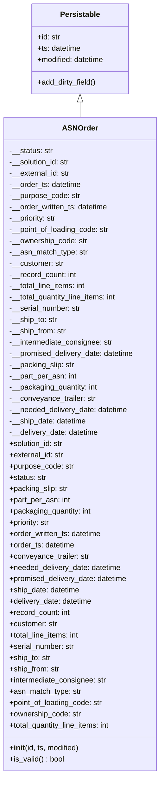
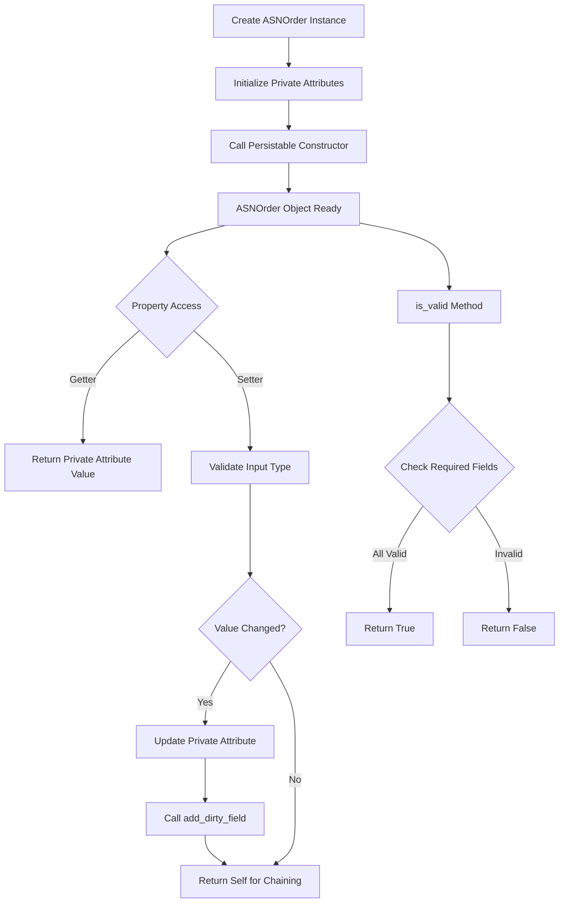
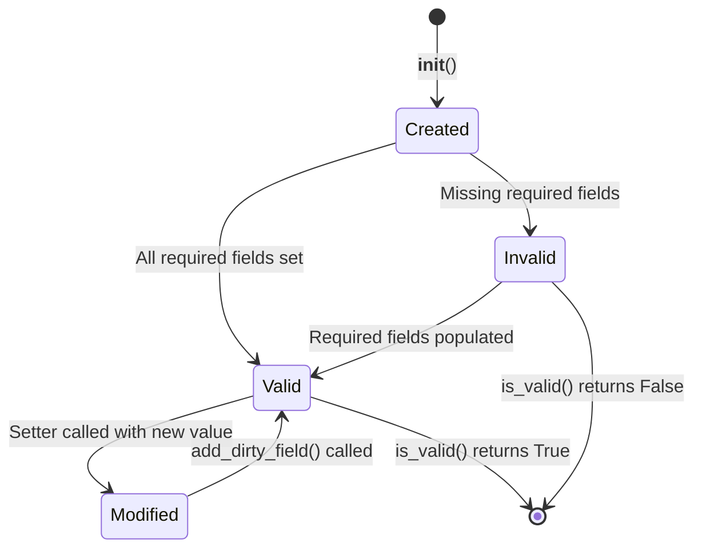

# Diagram: platform/partview_core/partview_service/partview_service/core/datamodel/ASNOrder.py

> Auto-generated by Obscura crawlers

## Diagram 1

### SVG

<svg id="container" width="345.1484375" xmlns="http://www.w3.org/2000/svg" class="classDiagram" height="1650" viewBox="0 0 345.1484375 1650" role="graphics-document document" aria-roledescription="class"><g><defs><marker id="container_class-aggregationStart" class="marker aggregation class" refX="18" refY="7" markerWidth="190" markerHeight="240" orient="auto"><path d="M 18,7 L9,13 L1,7 L9,1 Z"></path></marker></defs><defs><marker id="container_class-aggregationEnd" class="marker aggregation class" refX="1" refY="7" markerWidth="20" markerHeight="28" orient="auto"><path d="M 18,7 L9,13 L1,7 L9,1 Z"></path></marker></defs><defs><marker id="container_class-extensionStart" class="marker extension class" refX="18" refY="7" markerWidth="190" markerHeight="240" orient="auto"><path d="M 1,7 L18,13 V 1 Z"></path></marker></defs><defs><marker id="container_class-extensionEnd" class="marker extension class" refX="1" refY="7" markerWidth="20" markerHeight="28" orient="auto"><path d="M 1,1 V 13 L18,7 Z"></path></marker></defs><defs><marker id="container_class-compositionStart" class="marker composition class" refX="18" refY="7" markerWidth="190" markerHeight="240" orient="auto"><path d="M 18,7 L9,13 L1,7 L9,1 Z"></path></marker></defs><defs><marker id="container_class-compositionEnd" class="marker composition class" refX="1" refY="7" markerWidth="20" markerHeight="28" orient="auto"><path d="M 18,7 L9,13 L1,7 L9,1 Z"></path></marker></defs><defs><marker id="container_class-dependencyStart" class="marker dependency class" refX="6" refY="7" markerWidth="190" markerHeight="240" orient="auto"><path d="M 5,7 L9,13 L1,7 L9,1 Z"></path></marker></defs><defs><marker id="container_class-dependencyEnd" class="marker dependency class" refX="13" refY="7" markerWidth="20" markerHeight="28" orient="auto"><path d="M 18,7 L9,13 L14,7 L9,1 Z"></path></marker></defs><defs><marker id="container_class-lollipopStart" class="marker lollipop class" refX="13" refY="7" markerWidth="190" markerHeight="240" orient="auto"><circle stroke="black" fill="transparent" cx="7" cy="7" r="6"></circle></marker></defs><defs><marker id="container_class-lollipopEnd" class="marker lollipop class" refX="1" refY="7" markerWidth="190" markerHeight="240" orient="auto"><circle stroke="black" fill="transparent" cx="7" cy="7" r="6"></circle></marker></defs><g class="root"><g class="clusters"></g><g class="edgePaths"><path d="M172.574,217.25L172.574,218.542C172.574,219.833,172.574,222.417,172.574,227.875C172.574,233.333,172.574,241.667,172.574,245.833L172.574,250" id="id_Persistable_ASNOrder_1" class="edge-thickness-normal edge-pattern-solid relation" style=";;;" data-edge="true" data-et="edge" data-id="id_Persistable_ASNOrder_1" data-points="W3sieCI6MTcyLjU3NDIxODc1LCJ5IjoyMDB9LHsieCI6MTcyLjU3NDIxODc1LCJ5IjoyMjV9LHsieCI6MTcyLjU3NDIxODc1LCJ5IjoyNTB9XQ==" marker-start="url(#container_class-extensionStart)"></path></g><g class="edgeLabels"><g class="edgeLabel"><g class="label" data-id="id_Persistable_ASNOrder_1" transform="translate(0, 0)"><foreignObject width="0" height="0">

</foreignObject></g></g></g><g class="nodes"><g class="node default" id="classId-Persistable-0" transform="translate(172.57421875, 104)"><g class="basic label-container"><path d="M-105.45703125 -96 L105.45703125 -96 L105.45703125 96 L-105.45703125 96" stroke="none" stroke-width="0" fill="#ECECFF" style=""></path><path d="M-105.45703125 -96 C-51.556605286878046 -96, 2.343820676243908 -96, 105.45703125 -96 M-105.45703125 -96 C-58.344477406096416 -96, -11.231923562192833 -96, 105.45703125 -96 M105.45703125 -96 C105.45703125 -29.51332775643523, 105.45703125 36.97334448712954, 105.45703125 96 M105.45703125 -96 C105.45703125 -29.94020596951296, 105.45703125 36.11958806097408, 105.45703125 96 M105.45703125 96 C24.28092374202106 96, -56.89518376595788 96, -105.45703125 96 M105.45703125 96 C57.774928221033136 96, 10.092825192066272 96, -105.45703125 96 M-105.45703125 96 C-105.45703125 26.315938810197878, -105.45703125 -43.368122379604245, -105.45703125 -96 M-105.45703125 96 C-105.45703125 34.60825772402374, -105.45703125 -26.783484551952526, -105.45703125 -96" stroke="#9370DB" stroke-width="1.3" fill="none" stroke-dasharray="0 0" style=""></path></g><g class="annotation-group text" transform="translate(0, -72)"></g><g class="label-group text" transform="translate(-40.9765625, -72)"><g class="label" style="font-weight: bolder" transform="translate(0,-12)"><foreignObject width="81.953125" height="24">

Persistable

</foreignObject></g></g><g class="members-group text" transform="translate(-93.45703125, -24)"><g class="label" style="" transform="translate(0,-12)"><foreignObject width="49.578125" height="24">

+id: str

</foreignObject></g><g class="label" style="" transform="translate(0,12)"><foreignObject width="94.484375" height="24">

+ts: datetime

</foreignObject></g><g class="label" style="" transform="translate(0,36)"><foreignObject width="145.9375" height="24">

+modified: datetime

</foreignObject></g></g><g class="methods-group text" transform="translate(-93.45703125, 72)"><g class="label" style="" transform="translate(0,-12)"><foreignObject width="127.40625" height="24">

+add_dirty_field()

</foreignObject></g></g><g class="divider" style=""><path d="M-105.45703125 -48 C-51.632626165975 -48, 2.191778918050005 -48, 105.45703125 -48 M-105.45703125 -48 C-25.59181604860605 -48, 54.2733991527879 -48, 105.45703125 -48" stroke="#9370DB" stroke-width="1.3" fill="none" stroke-dasharray="0 0" style=""></path></g><g class="divider" style=""><path d="M-105.45703125 48 C-41.85615689661159 48, 21.744717456776826 48, 105.45703125 48 M-105.45703125 48 C-42.600390588631434 48, 20.25625007273713 48, 105.45703125 48" stroke="#9370DB" stroke-width="1.3" fill="none" stroke-dasharray="0 0" style=""></path></g></g><g class="node default" id="classId-ASNOrder-1" transform="translate(172.57421875, 946)"><g class="basic label-container"><path d="M-164.57421875 -696 L164.57421875 -696 L164.57421875 696 L-164.57421875 696" stroke="none" stroke-width="0" fill="#ECECFF" style=""></path><path d="M-164.57421875 -696 C-74.3392377685126 -696, 15.895743212974793 -696, 164.57421875 -696 M-164.57421875 -696 C-51.751249521111646 -696, 61.07171970777671 -696, 164.57421875 -696 M164.57421875 -696 C164.57421875 -176.42334370461379, 164.57421875 343.15331259077243, 164.57421875 696 M164.57421875 -696 C164.57421875 -210.4963791487162, 164.57421875 275.0072417025676, 164.57421875 696 M164.57421875 696 C71.69786859868603 696, -21.178481552627943 696, -164.57421875 696 M164.57421875 696 C33.579036182337944 696, -97.41614638532411 696, -164.57421875 696 M-164.57421875 696 C-164.57421875 151.06868501084034, -164.57421875 -393.8626299783193, -164.57421875 -696 M-164.57421875 696 C-164.57421875 330.37133912880046, -164.57421875 -35.257321742399085, -164.57421875 -696" stroke="#9370DB" stroke-width="1.3" fill="none" stroke-dasharray="0 0" style=""></path></g><g class="annotation-group text" transform="translate(0, -672)"></g><g class="label-group text" transform="translate(-35.5234375, -672)"><g class="label" style="font-weight: bolder" transform="translate(0,-12)"><foreignObject width="71.046875" height="24">

ASNOrder

</foreignObject></g></g><g class="members-group text" transform="translate(-152.57421875, -624)"><g class="label" style="" transform="translate(0,-12)"><foreignObject width="93.5625" height="24">

-__status: str

</foreignObject></g><g class="label" style="" transform="translate(0,12)"><foreignObject width="131.390625" height="24">

-__solution_id: str

</foreignObject></g><g class="label" style="" transform="translate(0,36)"><foreignObject width="130.609375" height="24">

-__external_id: str

</foreignObject></g><g class="label" style="" transform="translate(0,60)"><foreignObject width="154.140625" height="24">

-__order_ts: datetime

</foreignObject></g><g class="label" style="" transform="translate(0,84)"><foreignObject width="151.828125" height="24">

-__purpose_code: str

</foreignObject></g><g class="label" style="" transform="translate(0,108)"><foreignObject width="213.703125" height="24">

-__order_written_ts: datetime

</foreignObject></g><g class="label" style="" transform="translate(0,132)"><foreignObject width="103.015625" height="24">

-__priority: str

</foreignObject></g><g class="label" style="" transform="translate(0,156)"><foreignObject width="215.359375" height="24">

-__point_of_loading_code: str

</foreignObject></g><g class="label" style="" transform="translate(0,180)"><foreignObject width="167.1875" height="24">

-__ownership_code: str

</foreignObject></g><g class="label" style="" transform="translate(0,204)"><foreignObject width="167.3125" height="24">

-__asn_match_type: str

</foreignObject></g><g class="label" style="" transform="translate(0,228)"><foreignObject width="116.765625" height="24">

-__customer: str

</foreignObject></g><g class="label" style="" transform="translate(0,252)"><foreignObject width="144.953125" height="24">

-__record_count: int

</foreignObject></g><g class="label" style="" transform="translate(0,276)"><foreignObject width="166.265625" height="24">

-__total_line_items: int

</foreignObject></g><g class="label" style="" transform="translate(0,300)"><foreignObject width="234.59375" height="24">

-__total_quantity_line_items: int

</foreignObject></g><g class="label" style="" transform="translate(0,324)"><foreignObject width="154.546875" height="24">

-__serial_number: str

</foreignObject></g><g class="label" style="" transform="translate(0,348)"><foreignObject width="102.578125" height="24">

-__ship_to: str

</foreignObject></g><g class="label" style="" transform="translate(0,372)"><foreignObject width="121.8125" height="24">

-__ship_from: str

</foreignObject></g><g class="label" style="" transform="translate(0,396)"><foreignObject width="223.796875" height="24">

-__intermediate_consignee: str

</foreignObject></g><g class="label" style="" transform="translate(0,420)"><foreignObject width="269.625" height="24">

-__promised_delivery_date: datetime

</foreignObject></g><g class="label" style="" transform="translate(0,444)"><foreignObject width="139.8125" height="24">

-__packing_slip: str

</foreignObject></g><g class="label" style="" transform="translate(0,468)"><foreignObject width="144.234375" height="24">

-__part_per_asn: int

</foreignObject></g><g class="label" style="" transform="translate(0,492)"><foreignObject width="191.0625" height="24">

-__packaging_quantity: int

</foreignObject></g><g class="label" style="" transform="translate(0,516)"><foreignObject width="184.9375" height="24">

-__conveyance_trailer: str

</foreignObject></g><g class="label" style="" transform="translate(0,540)"><foreignObject width="255.765625" height="24">

-__needed_delivery_date: datetime

</foreignObject></g><g class="label" style="" transform="translate(0,564)"><foreignObject width="166.0625" height="24">

-__ship_date: datetime

</foreignObject></g><g class="label" style="" transform="translate(0,588)"><foreignObject width="192.78125" height="24">

-__delivery_date: datetime

</foreignObject></g><g class="label" style="" transform="translate(0,612)"><foreignObject width="117.71875" height="24">

+solution_id: str

</foreignObject></g><g class="label" style="" transform="translate(0,636)"><foreignObject width="117.265625" height="24">

+external_id: str

</foreignObject></g><g class="label" style="" transform="translate(0,660)"><foreignObject width="138.171875" height="24">

+purpose_code: str

</foreignObject></g><g class="label" style="" transform="translate(0,684)"><foreignObject width="79.890625" height="24">

+status: str

</foreignObject></g><g class="label" style="" transform="translate(0,708)"><foreignObject width="126.15625" height="24">

+packing_slip: str

</foreignObject></g><g class="label" style="" transform="translate(0,732)"><foreignObject width="130.5625" height="24">

+part_per_asn: int

</foreignObject></g><g class="label" style="" transform="translate(0,756)"><foreignObject width="177.40625" height="24">

+packaging_quantity: int

</foreignObject></g><g class="label" style="" transform="translate(0,780)"><foreignObject width="89.359375" height="24">

+priority: str

</foreignObject></g><g class="label" style="" transform="translate(0,804)"><foreignObject width="200.359375" height="24">

+order_written_ts: datetime

</foreignObject></g><g class="label" style="" transform="translate(0,828)"><foreignObject width="140.796875" height="24">

+order_ts: datetime

</foreignObject></g><g class="label" style="" transform="translate(0,852)"><foreignObject width="171.59375" height="24">

+conveyance_trailer: str

</foreignObject></g><g class="label" style="" transform="translate(0,876)"><foreignObject width="242.109375" height="24">

+needed_delivery_date: datetime

</foreignObject></g><g class="label" style="" transform="translate(0,900)"><foreignObject width="255.953125" height="24">

+promised_delivery_date: datetime

</foreignObject></g><g class="label" style="" transform="translate(0,924)"><foreignObject width="152.390625" height="24">

+ship_date: datetime

</foreignObject></g><g class="label" style="" transform="translate(0,948)"><foreignObject width="179.4375" height="24">

+delivery_date: datetime

</foreignObject></g><g class="label" style="" transform="translate(0,972)"><foreignObject width="131.28125" height="24">

+record_count: int

</foreignObject></g><g class="label" style="" transform="translate(0,996)"><foreignObject width="103.421875" height="24">

+customer: str

</foreignObject></g><g class="label" style="" transform="translate(0,1020)"><foreignObject width="152.84375" height="24">

+total_line_items: int

</foreignObject></g><g class="label" style="" transform="translate(0,1044)"><foreignObject width="140.890625" height="24">

+serial_number: str

</foreignObject></g><g class="label" style="" transform="translate(0,1068)"><foreignObject width="88.921875" height="24">

+ship_to: str

</foreignObject></g><g class="label" style="" transform="translate(0,1092)"><foreignObject width="108.15625" height="24">

+ship_from: str

</foreignObject></g><g class="label" style="" transform="translate(0,1116)"><foreignObject width="210.140625" height="24">

+intermediate_consignee: str

</foreignObject></g><g class="label" style="" transform="translate(0,1140)"><foreignObject width="153.734375" height="24">

+asn_match_type: str

</foreignObject></g><g class="label" style="" transform="translate(0,1164)"><foreignObject width="201.6875" height="24">

+point_of_loading_code: str

</foreignObject></g><g class="label" style="" transform="translate(0,1188)"><foreignObject width="153.84375" height="24">

+ownership_code: str

</foreignObject></g><g class="label" style="" transform="translate(0,1212)"><foreignObject width="221.171875" height="24">

+total_quantity_line_items: int

</foreignObject></g></g><g class="methods-group text" transform="translate(-152.57421875, 648)"><g class="label" style="" transform="translate(0,-12)"><foreignObject width="150.90625" height="24">

+<strong>init</strong>(id, ts, modified)

</foreignObject></g><g class="label" style="" transform="translate(0,12)"><foreignObject width="117.984375" height="24">

+is_valid() : bool

</foreignObject></g></g><g class="divider" style=""><path d="M-164.57421875 -648 C-55.46440691117759 -648, 53.64540492764482 -648, 164.57421875 -648 M-164.57421875 -648 C-76.72487002975546 -648, 11.12447869048907 -648, 164.57421875 -648" stroke="#9370DB" stroke-width="1.3" fill="none" stroke-dasharray="0 0" style=""></path></g><g class="divider" style=""><path d="M-164.57421875 624 C-42.08883107892076 624, 80.39655659215848 624, 164.57421875 624 M-164.57421875 624 C-38.19964625478684 624, 88.17492624042632 624, 164.57421875 624" stroke="#9370DB" stroke-width="1.3" fill="none" stroke-dasharray="0 0" style=""></path></g></g></g></g></g></svg>

## Diagram 2

### SVG

<svg id="container" width="928.90234375" xmlns="http://www.w3.org/2000/svg" class="flowchart" height="1512.21875" viewBox="0 0 928.90234375 1512.21875" role="graphics-document document" aria-roledescription="flowchart-v2"><g><marker id="container_flowchart-v2-pointEnd" class="marker flowchart-v2" viewBox="0 0 10 10" refX="5" refY="5" markerUnits="userSpaceOnUse" markerWidth="8" markerHeight="8" orient="auto"><path d="M 0 0 L 10 5 L 0 10 z" class="arrowMarkerPath" style="stroke-width: 1; stroke-dasharray: 1, 0;"></path></marker><marker id="container_flowchart-v2-pointStart" class="marker flowchart-v2" viewBox="0 0 10 10" refX="4.5" refY="5" markerUnits="userSpaceOnUse" markerWidth="8" markerHeight="8" orient="auto"><path d="M 0 5 L 10 10 L 10 0 z" class="arrowMarkerPath" style="stroke-width: 1; stroke-dasharray: 1, 0;"></path></marker><marker id="container_flowchart-v2-circleEnd" class="marker flowchart-v2" viewBox="0 0 10 10" refX="11" refY="5" markerUnits="userSpaceOnUse" markerWidth="11" markerHeight="11" orient="auto"><circle cx="5" cy="5" r="5" class="arrowMarkerPath" style="stroke-width: 1; stroke-dasharray: 1, 0;"></circle></marker><marker id="container_flowchart-v2-circleStart" class="marker flowchart-v2" viewBox="0 0 10 10" refX="-1" refY="5" markerUnits="userSpaceOnUse" markerWidth="11" markerHeight="11" orient="auto"><circle cx="5" cy="5" r="5" class="arrowMarkerPath" style="stroke-width: 1; stroke-dasharray: 1, 0;"></circle></marker><marker id="container_flowchart-v2-crossEnd" class="marker cross flowchart-v2" viewBox="0 0 11 11" refX="12" refY="5.2" markerUnits="userSpaceOnUse" markerWidth="11" markerHeight="11" orient="auto"><path d="M 1,1 l 9,9 M 10,1 l -9,9" class="arrowMarkerPath" style="stroke-width: 2; stroke-dasharray: 1, 0;"></path></marker><marker id="container_flowchart-v2-crossStart" class="marker cross flowchart-v2" viewBox="0 0 11 11" refX="-1" refY="5.2" markerUnits="userSpaceOnUse" markerWidth="11" markerHeight="11" orient="auto"><path d="M 1,1 l 9,9 M 10,1 l -9,9" class="arrowMarkerPath" style="stroke-width: 2; stroke-dasharray: 1, 0;"></path></marker><g class="root"><g class="clusters"></g><g class="edgePaths"><path d="M479.656,62L479.656,66.167C479.656,70.333,479.656,78.667,479.656,86.333C479.656,94,479.656,101,479.656,104.5L479.656,108" id="L_A_B_0" class="edge-thickness-normal edge-pattern-solid edge-thickness-normal edge-pattern-solid flowchart-link" style=";" data-edge="true" data-et="edge" data-id="L_A_B_0" data-points="W3sieCI6NDc5LjY1NjI1LCJ5Ijo2Mn0seyJ4Ijo0NzkuNjU2MjUsInkiOjg3fSx7IngiOjQ3OS42NTYyNSwieSI6MTEyfV0=" marker-end="url(#container_flowchart-v2-pointEnd)"></path><path d="M479.656,166L479.656,170.167C479.656,174.333,479.656,182.667,479.656,190.333C479.656,198,479.656,205,479.656,208.5L479.656,212" id="L_B_C_0" class="edge-thickness-normal edge-pattern-solid edge-thickness-normal edge-pattern-solid flowchart-link" style=";" data-edge="true" data-et="edge" data-id="L_B_C_0" data-points="W3sieCI6NDc5LjY1NjI1LCJ5IjoxNjZ9LHsieCI6NDc5LjY1NjI1LCJ5IjoxOTF9LHsieCI6NDc5LjY1NjI1LCJ5IjoyMTZ9XQ==" marker-end="url(#container_flowchart-v2-pointEnd)"></path><path d="M479.656,294L479.656,298.167C479.656,302.333,479.656,310.667,479.656,318.333C479.656,326,479.656,333,479.656,336.5L479.656,340" id="L_C_D_0" class="edge-thickness-normal edge-pattern-solid edge-thickness-normal edge-pattern-solid flowchart-link" style=";" data-edge="true" data-et="edge" data-id="L_C_D_0" data-points="W3sieCI6NDc5LjY1NjI1LCJ5IjoyOTR9LHsieCI6NDc5LjY1NjI1LCJ5IjozMTl9LHsieCI6NDc5LjY1NjI1LCJ5IjozNDR9XQ==" marker-end="url(#container_flowchart-v2-pointEnd)"></path><path d="M374.877,398L358.707,402.167C342.538,406.333,310.199,414.667,294.029,422.333C277.859,430,277.859,437,277.859,440.5L277.859,444" id="L_D_E_0" class="edge-thickness-normal edge-pattern-solid edge-thickness-normal edge-pattern-solid flowchart-link" style=";" data-edge="true" data-et="edge" data-id="L_D_E_0" data-points="W3sieCI6Mzc0Ljg3NzEwMzM2NTM4NDY0LCJ5IjozOTh9LHsieCI6Mjc3Ljg1OTM3NSwieSI6NDIzfSx7IngiOjI3Ny44NTkzNzUsInkiOjQ0OH1d" marker-end="url(#container_flowchart-v2-pointEnd)"></path><path d="M232.902,570.606L217.085,584.265C201.268,597.925,169.634,625.244,153.817,655.648C138,686.052,138,719.542,138,736.286L138,753.031" id="L_E_F_0" class="edge-thickness-normal edge-pattern-solid edge-thickness-normal edge-pattern-solid flowchart-link" style=";" data-edge="true" data-et="edge" data-id="L_E_F_0" data-points="W3sieCI6MjMyLjkwMjQ3OTgwNDg2NzgyLCJ5Ijo1NzAuNjA1NjA0ODA0ODY3OH0seyJ4IjoxMzgsInkiOjY1Mi41NjI1fSx7IngiOjEzOCwieSI6NzU3LjAzMTI1fV0=" marker-end="url(#container_flowchart-v2-pointEnd)"></path><path d="M322.816,570.606L338.633,584.265C354.45,597.925,386.085,625.244,401.902,657.648C417.719,690.052,417.719,727.542,417.719,746.286L417.719,765.031" id="L_E_G_0" class="edge-thickness-normal edge-pattern-solid edge-thickness-normal edge-pattern-solid flowchart-link" style=";" data-edge="true" data-et="edge" data-id="L_E_G_0" data-points="W3sieCI6MzIyLjgxNjI3MDE5NTEzMjIsInkiOjU3MC42MDU2MDQ4MDQ4Njc4fSx7IngiOjQxNy43MTg3NSwieSI6NjUyLjU2MjV9LHsieCI6NDE3LjcxODc1LCJ5Ijo3NjkuMDMxMjV9XQ==" marker-end="url(#container_flowchart-v2-pointEnd)"></path><path d="M417.719,823.031L417.719,842.443C417.719,861.854,417.719,900.677,417.719,925.589C417.719,950.5,417.719,961.5,417.719,967L417.719,972.5" id="L_G_H_0" class="edge-thickness-normal edge-pattern-solid edge-thickness-normal edge-pattern-solid flowchart-link" style=";" data-edge="true" data-et="edge" data-id="L_G_H_0" data-points="W3sieCI6NDE3LjcxODc1LCJ5Ijo4MjMuMDMxMjV9LHsieCI6NDE3LjcxODc1LCJ5Ijo5MzkuNX0seyJ4Ijo0MTcuNzE4NzUsInkiOjk3Ni41fV0=" marker-end="url(#container_flowchart-v2-pointEnd)"></path><path d="M385.225,1111.725L377.897,1123.307C370.57,1134.889,355.916,1158.054,348.589,1175.136C341.262,1192.219,341.262,1203.219,341.262,1208.719L341.262,1214.219" id="L_H_I_0" class="edge-thickness-normal edge-pattern-solid edge-thickness-normal edge-pattern-solid flowchart-link" style=";" data-edge="true" data-et="edge" data-id="L_H_I_0" data-points="W3sieCI6Mzg1LjIyNDU0OTU1OTAyNDQsInkiOjExMTEuNzI0NTQ5NTU5MDI0NH0seyJ4IjozNDEuMjYxNzE4NzUsInkiOjExODEuMjE4NzV9LHsieCI6MzQxLjI2MTcxODc1LCJ5IjoxMjE4LjIxODc1fV0=" marker-end="url(#container_flowchart-v2-pointEnd)"></path><path d="M341.262,1272.219L341.262,1278.385C341.262,1284.552,341.262,1296.885,341.262,1308.552C341.262,1320.219,341.262,1331.219,341.262,1336.719L341.262,1342.219" id="L_I_J_0" class="edge-thickness-normal edge-pattern-solid edge-thickness-normal edge-pattern-solid flowchart-link" style=";" data-edge="true" data-et="edge" data-id="L_I_J_0" data-points="W3sieCI6MzQxLjI2MTcxODc1LCJ5IjoxMjcyLjIxODc1fSx7IngiOjM0MS4yNjE3MTg3NSwieSI6MTMwOS4yMTg3NX0seyJ4IjozNDEuMjYxNzE4NzUsInkiOjEzNDYuMjE4NzV9XQ==" marker-end="url(#container_flowchart-v2-pointEnd)"></path><path d="M341.262,1400.219L341.262,1404.385C341.262,1408.552,341.262,1416.885,346.837,1424.844C352.412,1432.802,363.562,1440.386,369.137,1444.177L374.712,1447.969" id="L_J_K_0" class="edge-thickness-normal edge-pattern-solid edge-thickness-normal edge-pattern-solid flowchart-link" style=";" data-edge="true" data-et="edge" data-id="L_J_K_0" data-points="W3sieCI6MzQxLjI2MTcxODc1LCJ5IjoxNDAwLjIxODc1fSx7IngiOjM0MS4yNjE3MTg3NSwieSI6MTQyNS4yMTg3NX0seyJ4IjozNzguMDE5OTA2ODUwOTYxNTUsInkiOjE0NTAuMjE4NzV9XQ==" marker-end="url(#container_flowchart-v2-pointEnd)"></path><path d="M450.213,1111.725L457.54,1123.307C464.867,1134.889,479.522,1158.054,486.849,1180.303C494.176,1202.552,494.176,1223.885,494.176,1245.219C494.176,1266.552,494.176,1287.885,494.176,1309.219C494.176,1330.552,494.176,1351.885,494.176,1371.219C494.176,1390.552,494.176,1407.885,488.601,1420.344C483.026,1432.802,471.875,1440.386,466.3,1444.177L460.725,1447.969" id="L_H_K_0" class="edge-thickness-normal edge-pattern-solid edge-thickness-normal edge-pattern-solid flowchart-link" style=";" data-edge="true" data-et="edge" data-id="L_H_K_0" data-points="W3sieCI6NDUwLjIxMjk1MDQ0MDk3NTYsInkiOjExMTEuNzI0NTQ5NTU5MDI0NH0seyJ4Ijo0OTQuMTc1NzgxMjUsInkiOjExODEuMjE4NzV9LHsieCI6NDk0LjE3NTc4MTI1LCJ5IjoxMjQ1LjIxODc1fSx7IngiOjQ5NC4xNzU3ODEyNSwieSI6MTMwOS4yMTg3NX0seyJ4Ijo0OTQuMTc1NzgxMjUsInkiOjEzNzMuMjE4NzV9LHsieCI6NDk0LjE3NTc4MTI1LCJ5IjoxNDI1LjIxODc1fSx7IngiOjQ1Ny40MTc1OTMxNDkwMzg0NSwieSI6MTQ1MC4yMTg3NX1d" marker-end="url(#container_flowchart-v2-pointEnd)"></path><path d="M594.594,393.305L620.096,398.254C645.599,403.203,696.604,413.102,722.107,431.014C747.609,448.927,747.609,474.854,747.609,487.818L747.609,500.781" id="L_D_L_0" class="edge-thickness-normal edge-pattern-solid edge-thickness-normal edge-pattern-solid flowchart-link" style=";" data-edge="true" data-et="edge" data-id="L_D_L_0" data-points="W3sieCI6NTk0LjU5Mzc1LCJ5IjozOTMuMzA1MjA3MzAwNzE3MjZ9LHsieCI6NzQ3LjYwOTM3NSwieSI6NDIzfSx7IngiOjc0Ny42MDkzNzUsInkiOjUwNC43ODEyNX1d" marker-end="url(#container_flowchart-v2-pointEnd)"></path><path d="M747.609,558.781L747.609,574.411C747.609,590.042,747.609,621.302,747.609,642.432C747.609,663.563,747.609,674.563,747.609,680.063L747.609,685.563" id="L_L_M_0" class="edge-thickness-normal edge-pattern-solid edge-thickness-normal edge-pattern-solid flowchart-link" style=";" data-edge="true" data-et="edge" data-id="L_L_M_0" data-points="W3sieCI6NzQ3LjYwOTM3NSwieSI6NTU4Ljc4MTI1fSx7IngiOjc0Ny42MDkzNzUsInkiOjY1Mi41NjI1fSx7IngiOjc0Ny42MDkzNzUsInkiOjY4OS41NjI1fV0=" marker-end="url(#container_flowchart-v2-pointEnd)"></path><path d="M704.241,859.131L695.035,872.526C685.829,885.921,667.416,912.71,658.21,941.082C649.004,969.453,649.004,999.406,649.004,1014.383L649.004,1029.359" id="L_M_N_0" class="edge-thickness-normal edge-pattern-solid edge-thickness-normal edge-pattern-solid flowchart-link" style=";" data-edge="true" data-et="edge" data-id="L_M_N_0" data-points="W3sieCI6NzA0LjI0MDg1MzMzMjYwNzIsInkiOjg1OS4xMzE0NzgzMzI2MDcyfSx7IngiOjY0OS4wMDM5MDYyNSwieSI6OTM5LjV9LHsieCI6NjQ5LjAwMzkwNjI1LCJ5IjoxMDMzLjM1OTM3NX1d" marker-end="url(#container_flowchart-v2-pointEnd)"></path><path d="M790.978,859.131L800.184,872.526C809.39,885.921,827.803,912.71,837.009,941.082C846.215,969.453,846.215,999.406,846.215,1014.383L846.215,1029.359" id="L_M_O_0" class="edge-thickness-normal edge-pattern-solid edge-thickness-normal edge-pattern-solid flowchart-link" style=";" data-edge="true" data-et="edge" data-id="L_M_O_0" data-points="W3sieCI6NzkwLjk3Nzg5NjY2NzM5MjgsInkiOjg1OS4xMzE0NzgzMzI2MDcyfSx7IngiOjg0Ni4yMTQ4NDM3NSwieSI6OTM5LjV9LHsieCI6ODQ2LjIxNDg0Mzc1LCJ5IjoxMDMzLjM1OTM3NX1d" marker-end="url(#container_flowchart-v2-pointEnd)"></path></g><g class="edgeLabels"><g class="edgeLabel"><g class="label" data-id="L_A_B_0" transform="translate(0, 0)"><foreignObject width="0" height="0">

</foreignObject></g></g><g class="edgeLabel"><g class="label" data-id="L_B_C_0" transform="translate(0, 0)"><foreignObject width="0" height="0">

</foreignObject></g></g><g class="edgeLabel"><g class="label" data-id="L_C_D_0" transform="translate(0, 0)"><foreignObject width="0" height="0">

</foreignObject></g></g><g class="edgeLabel"><g class="label" data-id="L_D_E_0" transform="translate(0, 0)"><foreignObject width="0" height="0">

</foreignObject></g></g><g class="edgeLabel" transform="translate(138, 652.5625)"><g class="label" data-id="L_E_F_0" transform="translate(-22.515625, -12)"><foreignObject width="45.03125" height="24">

Getter

</foreignObject></g></g><g class="edgeLabel" transform="translate(417.71875, 652.5625)"><g class="label" data-id="L_E_G_0" transform="translate(-21.828125, -12)"><foreignObject width="43.65625" height="24">

Setter

</foreignObject></g></g><g class="edgeLabel"><g class="label" data-id="L_G_H_0" transform="translate(0, 0)"><foreignObject width="0" height="0">

</foreignObject></g></g><g class="edgeLabel" transform="translate(341.26171875, 1181.21875)"><g class="label" data-id="L_H_I_0" transform="translate(-12.03125, -12)"><foreignObject width="24.0625" height="24">

Yes

</foreignObject></g></g><g class="edgeLabel"><g class="label" data-id="L_I_J_0" transform="translate(0, 0)"><foreignObject width="0" height="0">

</foreignObject></g></g><g class="edgeLabel"><g class="label" data-id="L_J_K_0" transform="translate(0, 0)"><foreignObject width="0" height="0">

</foreignObject></g></g><g class="edgeLabel" transform="translate(494.17578125, 1309.21875)"><g class="label" data-id="L_H_K_0" transform="translate(-10.140625, -12)"><foreignObject width="20.28125" height="24">

No

</foreignObject></g></g><g class="edgeLabel"><g class="label" data-id="L_D_L_0" transform="translate(0, 0)"><foreignObject width="0" height="0">

</foreignObject></g></g><g class="edgeLabel"><g class="label" data-id="L_L_M_0" transform="translate(0, 0)"><foreignObject width="0" height="0">

</foreignObject></g></g><g class="edgeLabel" transform="translate(649.00390625, 939.5)"><g class="label" data-id="L_M_N_0" transform="translate(-29.1796875, -12)"><foreignObject width="58.359375" height="24">

All Valid

</foreignObject></g></g><g class="edgeLabel" transform="translate(846.21484375, 939.5)"><g class="label" data-id="L_M_O_0" transform="translate(-24.4609375, -12)"><foreignObject width="48.921875" height="24">

Invalid

</foreignObject></g></g></g><g class="nodes"><g class="node default" id="flowchart-A-0" transform="translate(479.65625, 35)"><rect class="basic label-container" style="" x="-122.9140625" y="-27" width="245.828125" height="54"></rect><g class="label" style="" transform="translate(-92.9140625, -12)"><rect></rect><foreignObject width="185.828125" height="24">

Create ASNOrder Instance

</foreignObject></g></g><g class="node default" id="flowchart-B-1" transform="translate(479.65625, 139)"><rect class="basic label-container" style="" x="-126.4609375" y="-27" width="252.921875" height="54"></rect><g class="label" style="" transform="translate(-96.4609375, -12)"><rect></rect><foreignObject width="192.921875" height="24">

Initialize Private Attributes

</foreignObject></g></g><g class="node default" id="flowchart-C-3" transform="translate(479.65625, 255)"><rect class="basic label-container" style="" x="-130" y="-39" width="260" height="78"></rect><g class="label" style="" transform="translate(-100, -24)"><rect></rect><foreignObject width="200" height="48">

Call Persistable Constructor

</foreignObject></g></g><g class="node default" id="flowchart-D-5" transform="translate(479.65625, 371)"><rect class="basic label-container" style="" x="-114.9375" y="-27" width="229.875" height="54"></rect><g class="label" style="" transform="translate(-84.9375, -12)"><rect></rect><foreignObject width="169.875" height="24">

ASNOrder Object Ready

</foreignObject></g></g><g class="node default" id="flowchart-E-7" transform="translate(277.859375, 531.78125)"><polygon points="83.78125,0 167.5625,-83.78125 83.78125,-167.5625 0,-83.78125" class="label-container" transform="translate(-83.28125, 83.78125)"></polygon><g class="label" style="" transform="translate(-56.78125, -12)"><rect></rect><foreignObject width="113.5625" height="24">

Property Access

</foreignObject></g></g><g class="node default" id="flowchart-F-9" transform="translate(138, 796.03125)"><rect class="basic label-container" style="" x="-130" y="-39" width="260" height="78"></rect><g class="label" style="" transform="translate(-100, -24)"><rect></rect><foreignObject width="200" height="48">

Return Private Attribute Value

</foreignObject></g></g><g class="node default" id="flowchart-G-11" transform="translate(417.71875, 796.03125)"><rect class="basic label-container" style="" x="-99.71875" y="-27" width="199.4375" height="54"></rect><g class="label" style="" transform="translate(-69.71875, -12)"><rect></rect><foreignObject width="139.4375" height="24">

Validate Input Type

</foreignObject></g></g><g class="node default" id="flowchart-H-13" transform="translate(417.71875, 1060.359375)"><polygon points="83.859375,0 167.71875,-83.859375 83.859375,-167.71875 0,-83.859375" class="label-container" transform="translate(-83.359375, 83.859375)"></polygon><g class="label" style="" transform="translate(-56.859375, -12)"><rect></rect><foreignObject width="113.71875" height="24">

Value Changed?

</foreignObject></g></g><g class="node default" id="flowchart-I-15" transform="translate(341.26171875, 1245.21875)"><rect class="basic label-container" style="" x="-117.9140625" y="-27" width="235.828125" height="54"></rect><g class="label" style="" transform="translate(-87.9140625, -12)"><rect></rect><foreignObject width="175.828125" height="24">

Update Private Attribute

</foreignObject></g></g><g class="node default" id="flowchart-J-17" transform="translate(341.26171875, 1373.21875)"><rect class="basic label-container" style="" x="-100.125" y="-27" width="200.25" height="54"></rect><g class="label" style="" transform="translate(-70.125, -12)"><rect></rect><foreignObject width="140.25" height="24">

Call add_dirty_field

</foreignObject></g></g><g class="node default" id="flowchart-K-19" transform="translate(417.71875, 1477.21875)"><rect class="basic label-container" style="" x="-116.359375" y="-27" width="232.71875" height="54"></rect><g class="label" style="" transform="translate(-86.359375, -12)"><rect></rect><foreignObject width="172.71875" height="24">

Return Self for Chaining

</foreignObject></g></g><g class="node default" id="flowchart-L-23" transform="translate(747.609375, 531.78125)"><rect class="basic label-container" style="" x="-86.953125" y="-27" width="173.90625" height="54"></rect><g class="label" style="" transform="translate(-56.953125, -12)"><rect></rect><foreignObject width="113.90625" height="24">

is_valid Method

</foreignObject></g></g><g class="node default" id="flowchart-M-25" transform="translate(747.609375, 796.03125)"><polygon points="106.46875,0 212.9375,-106.46875 106.46875,-212.9375 0,-106.46875" class="label-container" transform="translate(-105.96875, 106.46875)"></polygon><g class="label" style="" transform="translate(-79.46875, -12)"><rect></rect><foreignObject width="158.9375" height="24">

Check Required Fields

</foreignObject></g></g><g class="node default" id="flowchart-N-27" transform="translate(649.00390625, 1060.359375)"><rect class="basic label-container" style="" x="-72.5234375" y="-27" width="145.046875" height="54"></rect><g class="label" style="" transform="translate(-42.5234375, -12)"><rect></rect><foreignObject width="85.046875" height="24">

Return True

</foreignObject></g></g><g class="node default" id="flowchart-O-29" transform="translate(846.21484375, 1060.359375)"><rect class="basic label-container" style="" x="-74.6875" y="-27" width="149.375" height="54"></rect><g class="label" style="" transform="translate(-44.6875, -12)"><rect></rect><foreignObject width="89.375" height="24">

Return False

</foreignObject></g></g></g></g></g></svg>

## Diagram 3

### SVG

<svg id="container" width="629.1712646484375" xmlns="http://www.w3.org/2000/svg" class="statediagram" height="510" viewBox="53.227142333984375 0 629.1712646484375 510" role="graphics-document document" aria-roledescription="stateDiagram"><g><defs><marker id="container_stateDiagram-barbEnd" refX="19" refY="7" markerWidth="20" markerHeight="14" markerUnits="userSpaceOnUse" orient="auto"><path d="M 19,7 L9,13 L14,7 L9,1 Z"></path></marker></defs><g class="root"><g class="clusters"></g><g class="edgePaths"><path d="M452.543,22L452.543,28.167C452.543,34.333,452.543,46.667,452.626,59.083C452.71,71.5,452.876,84,452.96,90.25L453.043,96.5" id="edge0" class="edge-thickness-normal edge-pattern-solid transition" style="fill:none;;;fill:none" data-edge="true" data-et="edge" data-id="edge0" data-points="W3sieCI6NDUyLjU0Mjk2ODc1LCJ5IjoyMn0seyJ4Ijo0NTIuNTQyOTY4NzUsInkiOjU5fSx7IngiOjQ1My4wNDI5Njg3NSwieSI6OTYuNX1d" marker-end="url(#container_stateDiagram-barbEnd)"></path><path d="M417.285,126.8L390.181,134.5C363.077,142.2,308.868,157.6,281.764,174.8C254.66,192,254.66,211,254.66,230C254.66,249,254.66,268,260.921,283.75C267.181,299.5,279.702,312,285.963,318.25L292.224,324.5" id="edge1" class="edge-thickness-normal edge-pattern-solid transition" style="fill:none;;;fill:none" data-edge="true" data-et="edge" data-id="edge1" data-points="W3sieCI6NDE3LjI4NTE1NjI1LCJ5IjoxMjYuODAwMDExODQ0MTMxMjN9LHsieCI6MjU0LjY2MDE1NjI1LCJ5IjoxNzN9LHsieCI6MjU0LjY2MDE1NjI1LCJ5IjoyMzB9LHsieCI6MjU0LjY2MDE1NjI1LCJ5IjoyODd9LHsieCI6MjkyLjIyMzU0NzE0OTEyMjgsInkiOjMyNC41fV0=" marker-end="url(#container_stateDiagram-barbEnd)"></path><path d="M482.407,136.5L491.378,142.583C500.348,148.667,518.289,160.833,527.343,173.167C536.397,185.5,536.564,198,536.647,204.25L536.73,210.5" id="edge2" class="edge-thickness-normal edge-pattern-solid transition" style="fill:none;;;fill:none" data-edge="true" data-et="edge" data-id="edge2" data-points="W3sieCI6NDgyLjQwNzAwMzgzNzcxOTMsInkiOjEzNi41fSx7IngiOjUzNi4yMzA0Njg3NSwieSI6MTczfSx7IngiOjUzNi43MzA0Njg3NSwieSI6MjEwLjV9XQ==" marker-end="url(#container_stateDiagram-barbEnd)"></path><path d="M286.469,353.233L256.724,363.194C226.979,373.155,167.49,393.078,147.344,411.289C127.199,429.5,146.398,446,155.998,454.25L165.597,462.5" id="edge3" class="edge-thickness-normal edge-pattern-solid transition" style="fill:none;;;fill:none" data-edge="true" data-et="edge" data-id="edge3" data-points="W3sieCI6Mjg2LjQ2ODc1LCJ5IjozNTMuMjMzMTM5MDY2NzUzNTV9LHsieCI6MTA4LCJ5Ijo0MTN9LHsieCI6MTY1LjU5NzMxNjU3NjA4Njk3LCJ5Ijo0NjIuNX1d" marker-end="url(#container_stateDiagram-barbEnd)"></path><path d="M224.502,462.587L239.045,454.322C253.587,446.058,282.673,429.529,297.299,413.181C311.924,396.833,312.091,380.667,312.174,372.583L312.258,364.5" id="edge4" class="edge-thickness-normal edge-pattern-solid transition" style="fill:none;;;fill:none" data-edge="true" data-et="edge" data-id="edge4" data-points="W3sieCI6MjI0LjUwMjE1MTExNjM0NDM4LCJ5Ijo0NjIuNTg2OTI0OTQwMDJ9LHsieCI6MzExLjc1NzgxMjUsInkiOjQxM30seyJ4IjozMTIuMjU3ODEyNSwieSI6MzY0LjV9XQ==" marker-end="url(#container_stateDiagram-barbEnd)"></path><path d="M511.843,250.5L504.086,256.583C496.329,262.667,480.815,274.833,451.849,288.904C422.883,302.975,380.465,318.951,359.256,326.939L338.047,334.926" id="edge5" class="edge-thickness-normal edge-pattern-solid transition" style="fill:none;;;fill:none" data-edge="true" data-et="edge" data-id="edge5" data-points="W3sieCI6NTExLjg0Mjg1OTEwMDg3NzIsInkiOjI1MC41fSx7IngiOjQ2NS4zMDA3ODEyNSwieSI6Mjg3fSx7IngiOjMzOC4wNDY4NzUsInkiOjMzNC45MjYyODUzOTQ0NTl9XQ==" marker-end="url(#container_stateDiagram-barbEnd)"></path><path d="M338.047,354.242L364.109,364.035C390.172,373.828,442.297,393.414,475.922,413.759C509.547,434.103,524.672,455.207,532.235,465.759L539.797,476.31" id="edge6" class="edge-thickness-normal edge-pattern-solid transition" style="fill:none;;;fill:none" data-edge="true" data-et="edge" data-id="edge6" data-points="W3sieCI6MzM4LjA0Njg3NSwieSI6MzU0LjI0MTYyNzgxNzQ1ODZ9LHsieCI6NDk0LjQyMTg3NSwieSI6NDEzfSx7IngiOjUzOS43OTcxOTcxNjkyNDczLCJ5Ijo0NzYuMzEwNDAyMTE2NzEyODV9XQ==" marker-end="url(#container_stateDiagram-barbEnd)"></path><path d="M556.765,250.5L562.859,256.583C568.953,262.667,581.14,274.833,587.234,290.417C593.328,306,593.328,325,593.328,346C593.328,367,593.328,390,585.766,412.052C578.203,434.103,563.078,455.207,555.515,465.759L547.953,476.31" id="edge7" class="edge-thickness-normal edge-pattern-solid transition" style="fill:none;;;fill:none" data-edge="true" data-et="edge" data-id="edge7" data-points="W3sieCI6NTU2Ljc2NDczNDEwMDg3NzEsInkiOjI1MC41fSx7IngiOjU5My4zMjgxMjUsInkiOjI4N30seyJ4Ijo1OTMuMzI4MTI1LCJ5IjozNDR9LHsieCI6NTkzLjMyODEyNSwieSI6NDEzfSx7IngiOjU0Ny45NTI4MDI4MzA3NTI3LCJ5Ijo0NzYuMzEwNDAyMTE2NzEyODV9XQ==" marker-end="url(#container_stateDiagram-barbEnd)"></path></g><g class="edgeLabels"><g class="edgeLabel" transform="translate(452.54296875, 59)"><g class="label" data-id="edge0" transform="translate(-17.40625, -12)"><foreignObject width="34.8125" height="24">

<strong>init</strong>()

</foreignObject></g></g><g class="edgeLabel" transform="translate(254.66015625, 230)"><g class="label" data-id="edge1" transform="translate(-77.296875, -12)"><foreignObject width="154.59375" height="24">

All required fields set

</foreignObject></g></g><g class="edgeLabel" transform="translate(536.23046875, 173)"><g class="label" data-id="edge2" transform="translate(-81.8984375, -12)"><foreignObject width="163.796875" height="24">

Missing required fields

</foreignObject></g></g><g class="edgeLabel" transform="translate(161.22714, 395.17493)"><g class="label" data-id="edge3" transform="translate(-100, -24)"><foreignObject width="200" height="48">

Setter called with new value

</foreignObject></g></g><g class="edgeLabel" transform="translate(311.7578125, 413)"><g class="label" data-id="edge4" transform="translate(-83.7578125, -12)"><foreignObject width="167.515625" height="24">

add_dirty_field() called

</foreignObject></g></g><g class="edgeLabel" transform="translate(429.34978, 300.53984)"><g class="label" data-id="edge5" transform="translate(-94.1953125, -12)"><foreignObject width="188.390625" height="24">

Required fields populated

</foreignObject></g></g><g class="edgeLabel" transform="translate(452.69151, 397.31969)"><g class="label" data-id="edge6" transform="translate(-78.90625, -12)"><foreignObject width="157.8125" height="24">

is_valid() returns True

</foreignObject></g></g><g class="edgeLabel" transform="translate(593.328125, 344)"><g class="label" data-id="edge7" transform="translate(-81.0703125, -12)"><foreignObject width="162.140625" height="24">

is_valid() returns False

</foreignObject></g></g></g><g class="nodes"><g class="node default" id="state-root_start-0" transform="translate(452.54296875, 15)"><circle class="state-start" r="7" width="14" height="14"></circle></g><g class="node  statediagram-state" id="state-Created-2" transform="translate(452.54296875, 116)"><g class="basic label-container outer-path"><path d="M-30.7578125 -20 C-11.054159453976073 -20, 8.649493592047854 -20, 30.7578125 -20 C30.7578125 -20, 30.7578125 -20, 30.7578125 -20 C30.921121359345264 -19.993245495614232, 31.084430218690525 -19.986490991228468, 31.170709227361662 -19.982922465033347 C31.286474017347977 -19.968492399010184, 31.402238807334292 -19.954062332987018, 31.58078545140367 -19.931806517013612 C31.690093784614824 -19.908886969739182, 31.799402117825977 -19.885967422464752, 31.985239935703998 -19.847001329696653 C32.10752324134513 -19.810596012279373, 32.229806546986254 -19.77419069486209, 32.38130984602342 -19.729086208503173 C32.506277482706025 -19.68032368535401, 32.63124511938863 -19.631561162204854, 32.766289623264846 -19.578866633275286 C32.90380317243881 -19.511640355479944, 33.04131672161278 -19.444414077684602, 33.137549465185366 -19.397368756032446 C33.25928078781403 -19.324832632145768, 33.38101211044269 -19.252296508259093, 33.492553290612136 -19.185832391312644 C33.57837462608469 -19.124557135541277, 33.66419596155723 -19.06328187976991, 33.82887606344834 -18.94570254698197 C33.939842989641555 -18.85171835465617, 34.05080991583476 -18.75773416233037, 34.144220358128706 -18.678619553365657 C34.25405829543727 -18.568781616057095, 34.36389623274583 -18.458943678748533, 34.43643205336566 -18.386407858128706 C34.49844052485807 -18.313194594183216, 34.56044899635049 -18.239981330237725, 34.70351504698197 -18.07106356344834 C34.78188522613024 -17.96129929806814, 34.86025540527852 -17.85153503268794, 34.943644891312644 -17.734740790612136 C34.99850565993484 -17.64267254148376, 35.05336642855705 -17.550604292355384, 35.15518125603245 -17.37973696518537 C35.22006357120516 -17.247018068191167, 35.284945886377876 -17.11429917119696, 35.33667913327529 -17.008477123264846 C35.387266756933464 -16.87883215484078, 35.43785438059163 -16.749187186416716, 35.486898708503176 -16.623497346023417 C35.528790823158516 -16.482784213333606, 35.570682937813864 -16.342071080643795, 35.60481382969665 -16.227427435703994 C35.632845095267975 -16.09374020005695, 35.660876360839296 -15.960052964409902, 35.68961901701361 -15.82297295140367 C35.70161134499667 -15.726764844789493, 35.71360367297974 -15.630556738175317, 35.74073496503335 -15.412896727361662 C35.74732195023871 -15.253638108375771, 35.753908935444066 -15.094379489389881, 35.7578125 -15 C35.7578125 -15, 35.7578125 -15, 35.7578125 -15 C35.7578125 -8.883662757709109, 35.7578125 -2.767325515418218, 35.7578125 15 C35.7578125 15, 35.7578125 15, 35.7578125 15 C35.751669008289426 15.148535934888834, 35.74552551657886 15.297071869777668, 35.74073496503335 15.412896727361662 C35.72514564031705 15.537961636899372, 35.70955631560076 15.66302654643708, 35.68961901701361 15.822972951403669 C35.66645487048135 15.933447831966664, 35.643290723949086 16.043922712529657, 35.60481382969665 16.227427435703994 C35.57278611214162 16.335006642606082, 35.54075839458659 16.442585849508166, 35.486898708503176 16.623497346023417 C35.44018201937706 16.743221959449755, 35.393465330250955 16.86294657287609, 35.33667913327529 17.008477123264846 C35.28612573248003 17.111885757420275, 35.23557233168478 17.215294391575704, 35.15518125603245 17.379736965185366 C35.07494806215635 17.51438563795588, 34.99471486828026 17.649034310726393, 34.943644891312644 17.734740790612133 C34.853662330410586 17.86076920858674, 34.76367976950853 17.986797626561344, 34.70351504698197 18.07106356344834 C34.625155406172325 18.16358261652599, 34.546795765362674 18.256101669603638, 34.43643205336566 18.386407858128706 C34.322049823623544 18.500790087870822, 34.207667593881425 18.615172317612934, 34.144220358128706 18.678619553365657 C34.05299127410706 18.755886646116053, 33.9617621900854 18.833153738866454, 33.82887606344834 18.94570254698197 C33.7183192603902 19.024638587156026, 33.60776245733206 19.10357462733008, 33.492553290612136 19.185832391312644 C33.37959239156613 19.253142477086925, 33.26663149252012 19.320452562861202, 33.137549465185366 19.397368756032446 C33.036796718079685 19.446623772765392, 32.936043970974005 19.495878789498338, 32.766289623264846 19.578866633275286 C32.62186212097057 19.635222419548874, 32.47743461867629 19.69157820582246, 32.38130984602342 19.729086208503173 C32.23342155850188 19.773114459303983, 32.08553327098034 19.817142710104797, 31.985239935703998 19.847001329696653 C31.871239761627052 19.870904652547644, 31.757239587550103 19.894807975398635, 31.58078545140367 19.931806517013612 C31.421297253145465 19.951686700194124, 31.26180905488726 19.971566883374635, 31.170709227361662 19.982922465033347 C31.077562149372586 19.9867750566767, 30.984415071383513 19.990627648320046, 30.7578125 20 C30.7578125 20, 30.7578125 20, 30.7578125 20 C6.446809392633085 20, -17.86419371473383 20, -30.7578125 20 C-30.7578125 20, -30.7578125 20, -30.7578125 20 C-30.848320413187476 19.99625656502028, -30.938828326374956 19.992513130040557, -31.170709227361662 19.982922465033347 C-31.25985020465911 19.971811053800938, -31.348991181956556 19.960699642568528, -31.58078545140367 19.931806517013612 C-31.703767610499472 19.906019869952928, -31.826749769595278 19.880233222892244, -31.985239935703994 19.847001329696653 C-32.130601878509964 19.803725204304897, -32.27596382131593 19.760449078913137, -32.38130984602342 19.729086208503173 C-32.486076669907526 19.688206066967904, -32.59084349379163 19.64732592543264, -32.766289623264846 19.578866633275286 C-32.850679225747655 19.53761107050619, -32.935068828230456 19.496355507737096, -33.137549465185366 19.397368756032446 C-33.2195143479261 19.3485282870352, -33.30147923066683 19.299687818037956, -33.492553290612136 19.185832391312644 C-33.6158077195997 19.097830420478918, -33.739062148587266 19.009828449645187, -33.82887606344834 18.94570254698197 C-33.910263212673215 18.87677114779839, -33.99165036189809 18.80783974861481, -34.144220358128706 18.67861955336566 C-34.211421640818685 18.611418270675678, -34.27862292350867 18.544216987985696, -34.43643205336566 18.386407858128706 C-34.50000134408759 18.311351738401225, -34.56357063480953 18.23629561867374, -34.70351504698197 18.07106356344834 C-34.7801625736914 17.9637120229274, -34.85681010040083 17.856360482406455, -34.943644891312644 17.734740790612133 C-34.98623569915732 17.663264192567606, -35.028826507002 17.591787594523083, -35.15518125603244 17.37973696518537 C-35.19155476057168 17.305333772429222, -35.227928265110904 17.230930579673075, -35.33667913327528 17.00847712326485 C-35.37989443827608 16.897725788311398, -35.42310974327689 16.786974453357946, -35.486898708503176 16.623497346023417 C-35.52092315498823 16.509211244871963, -35.55494760147329 16.39492514372051, -35.60481382969665 16.227427435703994 C-35.62953167830201 16.109542610176415, -35.65424952690737 15.991657784648833, -35.68961901701361 15.82297295140367 C-35.701586952686654 15.726960531395632, -35.7135548883597 15.630948111387594, -35.74073496503335 15.412896727361664 C-35.746285356786295 15.278700627348346, -35.751835748539236 15.144504527335028, -35.7578125 15 C-35.7578125 15, -35.7578125 15, -35.7578125 15 C-35.7578125 8.657940736603635, -35.7578125 2.31588147320727, -35.7578125 -15 C-35.7578125 -15, -35.7578125 -15, -35.7578125 -15 C-35.75377450394172 -15.097629743450517, -35.74973650788345 -15.195259486901033, -35.74073496503335 -15.41289672736166 C-35.73000990830769 -15.498938186731547, -35.71928485158204 -15.584979646101432, -35.68961901701361 -15.822972951403669 C-35.66851906794534 -15.923603222843012, -35.647419118877075 -16.024233494282356, -35.60481382969665 -16.227427435703994 C-35.56615409067118 -16.357283210042432, -35.527494351645714 -16.48713898438087, -35.486898708503176 -16.623497346023417 C-35.437041588402515 -16.75127019427661, -35.387184468301854 -16.879043042529805, -35.33667913327529 -17.008477123264846 C-35.28585689400975 -17.11243567530084, -35.235034654744204 -17.21639422733683, -35.15518125603245 -17.379736965185366 C-35.11279058295814 -17.45087769374865, -35.070399909883825 -17.522018422311934, -34.943644891312644 -17.734740790612133 C-34.86557318471815 -17.844087019170704, -34.78750147812365 -17.953433247729272, -34.70351504698197 -18.07106356344834 C-34.60505645894638 -18.187313398673385, -34.50659787091079 -18.30356323389843, -34.43643205336566 -18.386407858128706 C-34.32000598915191 -18.502833922342454, -34.20357992493816 -18.6192599865562, -34.144220358128706 -18.678619553365657 C-34.029443515891586 -18.77583057997893, -33.914666673654466 -18.873041606592203, -33.82887606344834 -18.945702546981966 C-33.732800379760526 -19.014299266655048, -33.63672469607271 -19.08289598632813, -33.492553290612136 -19.185832391312644 C-33.41767403939079 -19.23045074036075, -33.34279478816944 -19.275069089408856, -33.137549465185366 -19.397368756032446 C-33.01296549690018 -19.458274146890993, -32.888381528614985 -19.519179537749537, -32.766289623264846 -19.578866633275286 C-32.6479705503587 -19.625034878788536, -32.52965147745255 -19.671203124301787, -32.38130984602342 -19.729086208503173 C-32.26358395248321 -19.76413472555212, -32.14585805894299 -19.799183242601064, -31.985239935703994 -19.847001329696653 C-31.85637864235767 -19.874020701577386, -31.727517349011343 -19.90104007345812, -31.580785451403674 -19.931806517013612 C-31.43163450427508 -19.95039816318459, -31.282483557146488 -19.968989809355566, -31.170709227361662 -19.982922465033347 C-31.047401319064484 -19.988022517845742, -30.92409341076731 -19.993122570658137, -30.7578125 -20 C-30.7578125 -20, -30.7578125 -20, -30.7578125 -20" stroke="none" stroke-width="0" fill="#ECECFF" style=""></path><path d="M-30.7578125 -20 C-9.568297169834437 -20, 11.621218160331125 -20, 30.7578125 -20 M-30.7578125 -20 C-8.612586259767134 -20, 13.532639980465731 -20, 30.7578125 -20 M30.7578125 -20 C30.7578125 -20, 30.7578125 -20, 30.7578125 -20 M30.7578125 -20 C30.7578125 -20, 30.7578125 -20, 30.7578125 -20 M30.7578125 -20 C30.868482380359364 -19.99542265988963, 30.97915226071873 -19.990845319779265, 31.170709227361662 -19.982922465033347 M30.7578125 -20 C30.890101524413165 -19.994528485477336, 31.02239054882633 -19.98905697095467, 31.170709227361662 -19.982922465033347 M31.170709227361662 -19.982922465033347 C31.26844787254982 -19.970739355615997, 31.36618651773798 -19.958556246198647, 31.58078545140367 -19.931806517013612 M31.170709227361662 -19.982922465033347 C31.3070496505546 -19.965927649005668, 31.443390073747533 -19.94893283297799, 31.58078545140367 -19.931806517013612 M31.58078545140367 -19.931806517013612 C31.72086947059178 -19.90243398697995, 31.860953489779885 -19.873061456946292, 31.985239935703998 -19.847001329696653 M31.58078545140367 -19.931806517013612 C31.67991877677922 -19.911020444527928, 31.779052102154775 -19.890234372042244, 31.985239935703998 -19.847001329696653 M31.985239935703998 -19.847001329696653 C32.082755758769686 -19.817969611316936, 32.18027158183538 -19.78893789293722, 32.38130984602342 -19.729086208503173 M31.985239935703998 -19.847001329696653 C32.13745376368487 -19.80168530970611, 32.28966759166574 -19.756369289715565, 32.38130984602342 -19.729086208503173 M32.38130984602342 -19.729086208503173 C32.519069398433395 -19.67533226434825, 32.65682895084337 -19.621578320193326, 32.766289623264846 -19.578866633275286 M32.38130984602342 -19.729086208503173 C32.484695772801366 -19.68874489469077, 32.58808169957931 -19.648403580878373, 32.766289623264846 -19.578866633275286 M32.766289623264846 -19.578866633275286 C32.90393805797276 -19.511574413960506, 33.04158649268068 -19.444282194645726, 33.137549465185366 -19.397368756032446 M32.766289623264846 -19.578866633275286 C32.89853238108007 -19.51421708836345, 33.030775138895294 -19.449567543451614, 33.137549465185366 -19.397368756032446 M33.137549465185366 -19.397368756032446 C33.257819641220706 -19.32570328653464, 33.37808981725604 -19.25403781703684, 33.492553290612136 -19.185832391312644 M33.137549465185366 -19.397368756032446 C33.220053101016 -19.348207259874485, 33.30255673684664 -19.299045763716528, 33.492553290612136 -19.185832391312644 M33.492553290612136 -19.185832391312644 C33.56023126013042 -19.1375112498449, 33.627909229648715 -19.089190108377153, 33.82887606344834 -18.94570254698197 M33.492553290612136 -19.185832391312644 C33.58532244513279 -19.11959648808827, 33.678091599653435 -19.053360584863896, 33.82887606344834 -18.94570254698197 M33.82887606344834 -18.94570254698197 C33.947038494299775 -18.84562407308166, 34.06520092515121 -18.745545599181344, 34.144220358128706 -18.678619553365657 M33.82887606344834 -18.94570254698197 C33.905786686688934 -18.880562571905475, 33.98269730992953 -18.815422596828977, 34.144220358128706 -18.678619553365657 M34.144220358128706 -18.678619553365657 C34.21276108275597 -18.6100788287384, 34.28130180738322 -18.54153810411114, 34.43643205336566 -18.386407858128706 M34.144220358128706 -18.678619553365657 C34.24302828295379 -18.57981162854058, 34.34183620777886 -18.481003703715498, 34.43643205336566 -18.386407858128706 M34.43643205336566 -18.386407858128706 C34.50692867174808 -18.303172658087885, 34.5774252901305 -18.219937458047063, 34.70351504698197 -18.07106356344834 M34.43643205336566 -18.386407858128706 C34.53363063140445 -18.2716457138957, 34.63082920944325 -18.156883569662693, 34.70351504698197 -18.07106356344834 M34.70351504698197 -18.07106356344834 C34.75328776917821 -18.00135252862339, 34.80306049137445 -17.931641493798438, 34.943644891312644 -17.734740790612136 M34.70351504698197 -18.07106356344834 C34.77261893385036 -17.97427754790697, 34.84172282071874 -17.8774915323656, 34.943644891312644 -17.734740790612136 M34.943644891312644 -17.734740790612136 C35.000896820295885 -17.638659656623506, 35.05814874927912 -17.542578522634873, 35.15518125603245 -17.37973696518537 M34.943644891312644 -17.734740790612136 C35.021480779235056 -17.604115316337086, 35.09931666715746 -17.47348984206204, 35.15518125603245 -17.37973696518537 M35.15518125603245 -17.37973696518537 C35.213383258875325 -17.260682865472717, 35.2715852617182 -17.14162876576006, 35.33667913327529 -17.008477123264846 M35.15518125603245 -17.37973696518537 C35.2132220181431 -17.26101268866221, 35.27126278025374 -17.142288412139045, 35.33667913327529 -17.008477123264846 M35.33667913327529 -17.008477123264846 C35.37640252339858 -16.906674799181975, 35.41612591352188 -16.804872475099103, 35.486898708503176 -16.623497346023417 M35.33667913327529 -17.008477123264846 C35.39462757561685 -16.859967993277635, 35.452576017958414 -16.711458863290424, 35.486898708503176 -16.623497346023417 M35.486898708503176 -16.623497346023417 C35.5232295423976 -16.501464226125375, 35.55956037629203 -16.37943110622733, 35.60481382969665 -16.227427435703994 M35.486898708503176 -16.623497346023417 C35.533853375871175 -16.465779398526188, 35.58080804323918 -16.308061451028955, 35.60481382969665 -16.227427435703994 M35.60481382969665 -16.227427435703994 C35.635831863681574 -16.079495648318243, 35.666849897666495 -15.931563860932489, 35.68961901701361 -15.82297295140367 M35.60481382969665 -16.227427435703994 C35.622138200936426 -16.144803720607168, 35.6394625721762 -16.06218000551034, 35.68961901701361 -15.82297295140367 M35.68961901701361 -15.82297295140367 C35.702972860732075 -15.715842123928825, 35.716326704450545 -15.60871129645398, 35.74073496503335 -15.412896727361662 M35.68961901701361 -15.82297295140367 C35.70867609365763 -15.67008810168045, 35.72773317030165 -15.517203251957229, 35.74073496503335 -15.412896727361662 M35.74073496503335 -15.412896727361662 C35.74655217751932 -15.272249496803148, 35.75236939000529 -15.131602266244634, 35.7578125 -15 M35.74073496503335 -15.412896727361662 C35.745219007649325 -15.304482572443993, 35.749703050265296 -15.196068417526321, 35.7578125 -15 M35.7578125 -15 C35.7578125 -15, 35.7578125 -15, 35.7578125 -15 M35.7578125 -15 C35.7578125 -15, 35.7578125 -15, 35.7578125 -15 M35.7578125 -15 C35.7578125 -3.904629867859729, 35.7578125 7.190740264280542, 35.7578125 15 M35.7578125 -15 C35.7578125 -6.0443305929748785, 35.7578125 2.911338814050243, 35.7578125 15 M35.7578125 15 C35.7578125 15, 35.7578125 15, 35.7578125 15 M35.7578125 15 C35.7578125 15, 35.7578125 15, 35.7578125 15 M35.7578125 15 C35.7514420898241 15.154022317548494, 35.745071679648206 15.308044635096985, 35.74073496503335 15.412896727361662 M35.7578125 15 C35.75193787605599 15.142035311635855, 35.74606325211199 15.28407062327171, 35.74073496503335 15.412896727361662 M35.74073496503335 15.412896727361662 C35.72603321734426 15.530841075705363, 35.71133146965518 15.648785424049063, 35.68961901701361 15.822972951403669 M35.74073496503335 15.412896727361662 C35.727724605068744 15.517271966292027, 35.71471424510414 15.621647205222391, 35.68961901701361 15.822972951403669 M35.68961901701361 15.822972951403669 C35.67065617392125 15.91341089708173, 35.65169333082889 16.003848842759794, 35.60481382969665 16.227427435703994 M35.68961901701361 15.822972951403669 C35.66584816286849 15.936341353252827, 35.64207730872337 16.049709755101983, 35.60481382969665 16.227427435703994 M35.60481382969665 16.227427435703994 C35.5607279600378 16.37550926155808, 35.516642090378944 16.523591087412168, 35.486898708503176 16.623497346023417 M35.60481382969665 16.227427435703994 C35.577863290341384 16.31795270165344, 35.55091275098612 16.408477967602884, 35.486898708503176 16.623497346023417 M35.486898708503176 16.623497346023417 C35.455630191521365 16.70363168726401, 35.42436167453955 16.783766028504605, 35.33667913327529 17.008477123264846 M35.486898708503176 16.623497346023417 C35.449460999024176 16.719441972639427, 35.412023289545175 16.815386599255437, 35.33667913327529 17.008477123264846 M35.33667913327529 17.008477123264846 C35.29502317273998 17.09368575246933, 35.25336721220467 17.178894381673814, 35.15518125603245 17.379736965185366 M35.33667913327529 17.008477123264846 C35.295969847497815 17.09174929830093, 35.255260561720334 17.17502147333701, 35.15518125603245 17.379736965185366 M35.15518125603245 17.379736965185366 C35.071371253007804 17.520388298218283, 34.98756124998316 17.6610396312512, 34.943644891312644 17.734740790612133 M35.15518125603245 17.379736965185366 C35.0959109534219 17.479205367172977, 35.03664065081135 17.578673769160588, 34.943644891312644 17.734740790612133 M34.943644891312644 17.734740790612133 C34.8849583243904 17.81693644176305, 34.82627175746815 17.89913209291397, 34.70351504698197 18.07106356344834 M34.943644891312644 17.734740790612133 C34.89558246412626 17.802056408234012, 34.84752003693986 17.869372025855892, 34.70351504698197 18.07106356344834 M34.70351504698197 18.07106356344834 C34.624452815630164 18.164412163611583, 34.54539058427836 18.257760763774826, 34.43643205336566 18.386407858128706 M34.70351504698197 18.07106356344834 C34.601415903988 18.191611793790393, 34.49931676099403 18.312160024132442, 34.43643205336566 18.386407858128706 M34.43643205336566 18.386407858128706 C34.37281109294955 18.450028818544816, 34.30919013253344 18.513649778960925, 34.144220358128706 18.678619553365657 M34.43643205336566 18.386407858128706 C34.35961315467851 18.463226756815853, 34.28279425599136 18.540045655503, 34.144220358128706 18.678619553365657 M34.144220358128706 18.678619553365657 C34.051930266555175 18.756785273673252, 33.95964017498165 18.83495099398085, 33.82887606344834 18.94570254698197 M34.144220358128706 18.678619553365657 C34.063424855739 18.747049853241066, 33.982629353349296 18.81548015311647, 33.82887606344834 18.94570254698197 M33.82887606344834 18.94570254698197 C33.69814005550951 19.039046262514592, 33.567404047570676 19.132389978047215, 33.492553290612136 19.185832391312644 M33.82887606344834 18.94570254698197 C33.745258390472884 19.00540441797204, 33.66164071749742 19.065106288962113, 33.492553290612136 19.185832391312644 M33.492553290612136 19.185832391312644 C33.353136547546754 19.268906738395163, 33.21371980448137 19.351981085477682, 33.137549465185366 19.397368756032446 M33.492553290612136 19.185832391312644 C33.39555740206194 19.243629395702694, 33.29856151351174 19.301426400092748, 33.137549465185366 19.397368756032446 M33.137549465185366 19.397368756032446 C33.0501928457887 19.440074804986157, 32.96283622639204 19.482780853939868, 32.766289623264846 19.578866633275286 M33.137549465185366 19.397368756032446 C33.02394268482029 19.452907726716674, 32.910335904455216 19.5084466974009, 32.766289623264846 19.578866633275286 M32.766289623264846 19.578866633275286 C32.660255677328465 19.62024120736963, 32.55422173139208 19.66161578146398, 32.38130984602342 19.729086208503173 M32.766289623264846 19.578866633275286 C32.687000320215056 19.609805415331845, 32.607711017165265 19.6407441973884, 32.38130984602342 19.729086208503173 M32.38130984602342 19.729086208503173 C32.2584758484633 19.765655474008096, 32.13564185090317 19.80222473951302, 31.985239935703998 19.847001329696653 M32.38130984602342 19.729086208503173 C32.26526942042599 19.763632940004765, 32.149228994828555 19.798179671506354, 31.985239935703998 19.847001329696653 M31.985239935703998 19.847001329696653 C31.865766955575598 19.8720521793037, 31.746293975447198 19.897103028910752, 31.58078545140367 19.931806517013612 M31.985239935703998 19.847001329696653 C31.89967924380472 19.86494152021287, 31.81411855190544 19.88288171072909, 31.58078545140367 19.931806517013612 M31.58078545140367 19.931806517013612 C31.44968068299116 19.94814870935351, 31.31857591457865 19.964490901693406, 31.170709227361662 19.982922465033347 M31.58078545140367 19.931806517013612 C31.44351837292733 19.94891684050191, 31.30625129445099 19.966027163990205, 31.170709227361662 19.982922465033347 M31.170709227361662 19.982922465033347 C31.025291943941255 19.988936968365053, 30.879874660520844 19.994951471696762, 30.7578125 20 M31.170709227361662 19.982922465033347 C31.07200300701601 19.987004984505347, 30.97329678667036 19.991087503977347, 30.7578125 20 M30.7578125 20 C30.7578125 20, 30.7578125 20, 30.7578125 20 M30.7578125 20 C30.7578125 20, 30.7578125 20, 30.7578125 20 M30.7578125 20 C7.477283579871003 20, -15.803245340257995 20, -30.7578125 20 M30.7578125 20 C6.487531210984251 20, -17.782750078031498 20, -30.7578125 20 M-30.7578125 20 C-30.7578125 20, -30.7578125 20, -30.7578125 20 M-30.7578125 20 C-30.7578125 20, -30.7578125 20, -30.7578125 20 M-30.7578125 20 C-30.855672666995083 19.995952473553423, -30.953532833990167 19.99190494710685, -31.170709227361662 19.982922465033347 M-30.7578125 20 C-30.863161985038367 19.99564271306785, -30.968511470076734 19.991285426135693, -31.170709227361662 19.982922465033347 M-31.170709227361662 19.982922465033347 C-31.25960109351091 19.971842105473176, -31.34849295966016 19.960761745913008, -31.58078545140367 19.931806517013612 M-31.170709227361662 19.982922465033347 C-31.312551217612736 19.965241879387037, -31.454393207863813 19.94756129374073, -31.58078545140367 19.931806517013612 M-31.58078545140367 19.931806517013612 C-31.710038898825054 19.904704919070163, -31.839292346246438 19.87760332112671, -31.985239935703994 19.847001329696653 M-31.58078545140367 19.931806517013612 C-31.712839774363978 19.904117637227703, -31.84489409732429 19.876428757441793, -31.985239935703994 19.847001329696653 M-31.985239935703994 19.847001329696653 C-32.06817213807328 19.822311343311853, -32.15110434044256 19.79762135692705, -32.38130984602342 19.729086208503173 M-31.985239935703994 19.847001329696653 C-32.1028992145381 19.811972644704976, -32.220558493372195 19.7769439597133, -32.38130984602342 19.729086208503173 M-32.38130984602342 19.729086208503173 C-32.509352666497215 19.679123744915138, -32.637395486971016 19.629161281327104, -32.766289623264846 19.578866633275286 M-32.38130984602342 19.729086208503173 C-32.485031166715096 19.688614023579525, -32.58875248740677 19.64814183865588, -32.766289623264846 19.578866633275286 M-32.766289623264846 19.578866633275286 C-32.86027680331431 19.532919100736418, -32.95426398336377 19.486971568197553, -33.137549465185366 19.397368756032446 M-32.766289623264846 19.578866633275286 C-32.85555292024842 19.535228466447414, -32.944816217232 19.491590299619546, -33.137549465185366 19.397368756032446 M-33.137549465185366 19.397368756032446 C-33.26874392136276 19.31919382848682, -33.39993837754016 19.241018900941192, -33.492553290612136 19.185832391312644 M-33.137549465185366 19.397368756032446 C-33.256179216830425 19.326680767303195, -33.374808968475485 19.255992778573944, -33.492553290612136 19.185832391312644 M-33.492553290612136 19.185832391312644 C-33.62384146508887 19.092094436449532, -33.75512963956561 18.99835648158642, -33.82887606344834 18.94570254698197 M-33.492553290612136 19.185832391312644 C-33.61655096629042 19.097299752541577, -33.7405486419687 19.00876711377051, -33.82887606344834 18.94570254698197 M-33.82887606344834 18.94570254698197 C-33.933492590462905 18.857096868400998, -34.03810911747747 18.76849118982003, -34.144220358128706 18.67861955336566 M-33.82887606344834 18.94570254698197 C-33.934516251229084 18.856229871957773, -34.040156439009834 18.76675719693358, -34.144220358128706 18.67861955336566 M-34.144220358128706 18.67861955336566 C-34.212300991237264 18.610538920257103, -34.28038162434582 18.542458287148545, -34.43643205336566 18.386407858128706 M-34.144220358128706 18.67861955336566 C-34.23917320144398 18.58366671005038, -34.33412604475926 18.4887138667351, -34.43643205336566 18.386407858128706 M-34.43643205336566 18.386407858128706 C-34.49763706721601 18.31414323482862, -34.558842081066366 18.241878611528538, -34.70351504698197 18.07106356344834 M-34.43643205336566 18.386407858128706 C-34.515209799352036 18.293395149201714, -34.593987545338415 18.200382440274723, -34.70351504698197 18.07106356344834 M-34.70351504698197 18.07106356344834 C-34.78568784593774 17.955973397652627, -34.867860644893504 17.840883231856914, -34.943644891312644 17.734740790612133 M-34.70351504698197 18.07106356344834 C-34.75979637182333 17.992236663433882, -34.81607769666469 17.913409763419423, -34.943644891312644 17.734740790612133 M-34.943644891312644 17.734740790612133 C-35.01841894413844 17.60925373862946, -35.09319299696423 17.483766686646785, -35.15518125603244 17.37973696518537 M-34.943644891312644 17.734740790612133 C-35.01149475885981 17.620874020868552, -35.07934462640698 17.50700725112497, -35.15518125603244 17.37973696518537 M-35.15518125603244 17.37973696518537 C-35.2197449029017 17.247669914624645, -35.28430854977096 17.115602864063924, -35.33667913327528 17.00847712326485 M-35.15518125603244 17.37973696518537 C-35.20012887238461 17.28779514638778, -35.24507648873677 17.195853327590186, -35.33667913327528 17.00847712326485 M-35.33667913327528 17.00847712326485 C-35.385211657953185 16.88409892214746, -35.433744182631095 16.759720721030064, -35.486898708503176 16.623497346023417 M-35.33667913327528 17.00847712326485 C-35.37967235449674 16.898294940259603, -35.422665575718206 16.78811275725436, -35.486898708503176 16.623497346023417 M-35.486898708503176 16.623497346023417 C-35.519128131997526 16.515240620814204, -35.551357555491876 16.40698389560499, -35.60481382969665 16.227427435703994 M-35.486898708503176 16.623497346023417 C-35.51228983627813 16.538210051239293, -35.537680964053074 16.45292275645517, -35.60481382969665 16.227427435703994 M-35.60481382969665 16.227427435703994 C-35.63537659068216 16.081666944815804, -35.66593935166765 15.935906453927617, -35.68961901701361 15.82297295140367 M-35.60481382969665 16.227427435703994 C-35.63215323320257 16.09703984154966, -35.6594926367085 15.966652247395324, -35.68961901701361 15.82297295140367 M-35.68961901701361 15.82297295140367 C-35.70022000952349 15.737926793639577, -35.71082100203336 15.652880635875485, -35.74073496503335 15.412896727361664 M-35.68961901701361 15.82297295140367 C-35.709023014943945 15.66730493563061, -35.728427012874285 15.511636919857551, -35.74073496503335 15.412896727361664 M-35.74073496503335 15.412896727361664 C-35.74452951625857 15.321152937303054, -35.748324067483786 15.229409147244446, -35.7578125 15 M-35.74073496503335 15.412896727361664 C-35.74724416022783 15.255518897434333, -35.75375335542231 15.098141067507003, -35.7578125 15 M-35.7578125 15 C-35.7578125 15, -35.7578125 15, -35.7578125 15 M-35.7578125 15 C-35.7578125 15, -35.7578125 15, -35.7578125 15 M-35.7578125 15 C-35.7578125 6.945845280305603, -35.7578125 -1.108309439388794, -35.7578125 -15 M-35.7578125 15 C-35.7578125 8.787222410337503, -35.7578125 2.5744448206750032, -35.7578125 -15 M-35.7578125 -15 C-35.7578125 -15, -35.7578125 -15, -35.7578125 -15 M-35.7578125 -15 C-35.7578125 -15, -35.7578125 -15, -35.7578125 -15 M-35.7578125 -15 C-35.75324323134815 -15.110474730484727, -35.7486739626963 -15.220949460969454, -35.74073496503335 -15.41289672736166 M-35.7578125 -15 C-35.75384131987458 -15.096014283135712, -35.74987013974917 -15.192028566271423, -35.74073496503335 -15.41289672736166 M-35.74073496503335 -15.41289672736166 C-35.728533833035726 -15.510779958182148, -35.7163327010381 -15.608663189002636, -35.68961901701361 -15.822972951403669 M-35.74073496503335 -15.41289672736166 C-35.723449539193304 -15.551568559422867, -35.70616411335327 -15.690240391484071, -35.68961901701361 -15.822972951403669 M-35.68961901701361 -15.822972951403669 C-35.66214947071957 -15.953981224975381, -35.63467992442553 -16.084989498547095, -35.60481382969665 -16.227427435703994 M-35.68961901701361 -15.822972951403669 C-35.671650252400255 -15.908669919421051, -35.6536814877869 -15.994366887438431, -35.60481382969665 -16.227427435703994 M-35.60481382969665 -16.227427435703994 C-35.56443813672051 -16.363046997760886, -35.52406244374437 -16.498666559817778, -35.486898708503176 -16.623497346023417 M-35.60481382969665 -16.227427435703994 C-35.572074405642795 -16.337397222595392, -35.539334981588944 -16.44736700948679, -35.486898708503176 -16.623497346023417 M-35.486898708503176 -16.623497346023417 C-35.45184400691981 -16.71333484680422, -35.41678930533645 -16.803172347585026, -35.33667913327529 -17.008477123264846 M-35.486898708503176 -16.623497346023417 C-35.43933761232516 -16.745385989259116, -35.39177651614715 -16.867274632494816, -35.33667913327529 -17.008477123264846 M-35.33667913327529 -17.008477123264846 C-35.28763693894779 -17.10879453518201, -35.2385947446203 -17.209111947099178, -35.15518125603245 -17.379736965185366 M-35.33667913327529 -17.008477123264846 C-35.28213068408613 -17.120057759526958, -35.227582234896964 -17.231638395789066, -35.15518125603245 -17.379736965185366 M-35.15518125603245 -17.379736965185366 C-35.09308016001493 -17.483956051481083, -35.0309790639974 -17.588175137776805, -34.943644891312644 -17.734740790612133 M-35.15518125603245 -17.379736965185366 C-35.07206190381264 -17.519229236616393, -34.98894255159283 -17.65872150804742, -34.943644891312644 -17.734740790612133 M-34.943644891312644 -17.734740790612133 C-34.860668970382065 -17.850955798720747, -34.77769304945149 -17.96717080682936, -34.70351504698197 -18.07106356344834 M-34.943644891312644 -17.734740790612133 C-34.8867125835064 -17.814479448998107, -34.82978027570015 -17.894218107384084, -34.70351504698197 -18.07106356344834 M-34.70351504698197 -18.07106356344834 C-34.62802258297403 -18.160197347273098, -34.5525301189661 -18.249331131097854, -34.43643205336566 -18.386407858128706 M-34.70351504698197 -18.07106356344834 C-34.61472801406145 -18.175894215127, -34.52594098114093 -18.280724866805656, -34.43643205336566 -18.386407858128706 M-34.43643205336566 -18.386407858128706 C-34.32683995479698 -18.495999956697382, -34.217247856228305 -18.605592055266058, -34.144220358128706 -18.678619553365657 M-34.43643205336566 -18.386407858128706 C-34.332274856825165 -18.4905650546692, -34.22811766028467 -18.594722251209692, -34.144220358128706 -18.678619553365657 M-34.144220358128706 -18.678619553365657 C-34.07921288012031 -18.733678078688044, -34.01420540211191 -18.78873660401043, -33.82887606344834 -18.945702546981966 M-34.144220358128706 -18.678619553365657 C-34.0270939456317 -18.77782056447939, -33.90996753313469 -18.877021575593123, -33.82887606344834 -18.945702546981966 M-33.82887606344834 -18.945702546981966 C-33.714685669428306 -19.027232921237783, -33.60049527540827 -19.108763295493603, -33.492553290612136 -19.185832391312644 M-33.82887606344834 -18.945702546981966 C-33.74478293766931 -19.005743884748984, -33.66068981189028 -19.065785222516002, -33.492553290612136 -19.185832391312644 M-33.492553290612136 -19.185832391312644 C-33.387606068747345 -19.248367361954248, -33.28265884688255 -19.310902332595855, -33.137549465185366 -19.397368756032446 M-33.492553290612136 -19.185832391312644 C-33.381846792069894 -19.251799145964743, -33.27114029352765 -19.31776590061684, -33.137549465185366 -19.397368756032446 M-33.137549465185366 -19.397368756032446 C-33.04807753412859 -19.441108917843696, -32.95860560307181 -19.484849079654946, -32.766289623264846 -19.578866633275286 M-33.137549465185366 -19.397368756032446 C-33.0629431445348 -19.433841563748274, -32.98833682388424 -19.470314371464102, -32.766289623264846 -19.578866633275286 M-32.766289623264846 -19.578866633275286 C-32.61463292628768 -19.63804326006752, -32.46297622931052 -19.697219886859756, -32.38130984602342 -19.729086208503173 M-32.766289623264846 -19.578866633275286 C-32.636198195170024 -19.629628466037577, -32.5061067670752 -19.680390298799868, -32.38130984602342 -19.729086208503173 M-32.38130984602342 -19.729086208503173 C-32.295899425048546 -19.754513992533308, -32.21048900407368 -19.779941776563447, -31.985239935703994 -19.847001329696653 M-32.38130984602342 -19.729086208503173 C-32.24891970265811 -19.768500461878677, -32.1165295592928 -19.807914715254178, -31.985239935703994 -19.847001329696653 M-31.985239935703994 -19.847001329696653 C-31.878876816846745 -19.86930333046173, -31.772513697989492 -19.89160533122681, -31.580785451403674 -19.931806517013612 M-31.985239935703994 -19.847001329696653 C-31.82379160498273 -19.880853484785284, -31.662343274261467 -19.914705639873915, -31.580785451403674 -19.931806517013612 M-31.580785451403674 -19.931806517013612 C-31.484919605919885 -19.94375618219126, -31.38905376043609 -19.955705847368915, -31.170709227361662 -19.982922465033347 M-31.580785451403674 -19.931806517013612 C-31.45823777975564 -19.94708206835418, -31.3356901081076 -19.96235761969475, -31.170709227361662 -19.982922465033347 M-31.170709227361662 -19.982922465033347 C-31.01733234044205 -19.989266180000968, -30.863955453522436 -19.995609894968588, -30.7578125 -20 M-31.170709227361662 -19.982922465033347 C-31.027988268239756 -19.988825447567145, -30.885267309117847 -19.994728430100945, -30.7578125 -20 M-30.7578125 -20 C-30.7578125 -20, -30.7578125 -20, -30.7578125 -20 M-30.7578125 -20 C-30.7578125 -20, -30.7578125 -20, -30.7578125 -20" stroke="#9370DB" stroke-width="1.3" fill="none" stroke-dasharray="0 0" style=""></path></g><g class="label" style="" transform="translate(-27.7578125, -12)"><rect></rect><foreignObject width="55.515625" height="24">

Created

</foreignObject></g></g><g class="node  statediagram-state" id="state-Valid-6" transform="translate(311.7578125, 344)"><g class="basic label-container outer-path"><path d="M-20.7890625 -20 C-6.311530631347216 -20, 8.166001237305569 -20, 20.7890625 -20 C20.7890625 -20, 20.7890625 -20, 20.7890625 -20 C20.905923427933825 -19.995166596267843, 21.02278435586765 -19.990333192535687, 21.201959227361662 -19.982922465033347 C21.35450909422588 -19.96390714395916, 21.5070589610901 -19.944891822884973, 21.61203545140367 -19.931806517013612 C21.698148407159096 -19.913750528943932, 21.784261362914517 -19.89569454087425, 22.016489935703998 -19.847001329696653 C22.126128174391535 -19.814360611819712, 22.235766413079073 -19.781719893942775, 22.412559846023417 -19.729086208503173 C22.53236295349808 -19.68233889090436, 22.652166060972743 -19.63559157330555, 22.797539623264846 -19.578866633275286 C22.926240860062794 -19.515948432490305, 23.054942096860742 -19.453030231705323, 23.16879946518537 -19.397368756032446 C23.30160014631427 -19.318236726160514, 23.434400827443174 -19.239104696288578, 23.523803290612136 -19.185832391312644 C23.620067343491833 -19.117101178621617, 23.71633139637153 -19.048369965930586, 23.86012606344834 -18.94570254698197 C23.942884935401338 -18.875609357910896, 24.025643807354335 -18.80551616883982, 24.175470358128706 -18.678619553365657 C24.25319967582222 -18.600890235672143, 24.330928993515734 -18.52316091797863, 24.467682053365657 -18.386407858128706 C24.56173774107467 -18.27535651749605, 24.65579342878368 -18.16430517686339, 24.73476504698197 -18.07106356344834 C24.822314028623666 -17.94844358529946, 24.909863010265358 -17.825823607150586, 24.974894891312644 -17.734740790612136 C25.024959497889228 -17.650721539942325, 25.075024104465815 -17.566702289272513, 25.186431256032446 -17.37973696518537 C25.24491024725064 -17.260116276694944, 25.30338923846884 -17.140495588204523, 25.367929133275286 -17.008477123264846 C25.418167381243986 -16.879727527996394, 25.468405629212683 -16.750977932727942, 25.518148708503173 -16.623497346023417 C25.54935399418628 -16.518680639082838, 25.580559279869387 -16.413863932142256, 25.636063829696653 -16.227427435703994 C25.665974847651412 -16.08477524985862, 25.695885865606176 -15.942123064013245, 25.720869017013612 -15.82297295140367 C25.73405031574545 -15.717226361125531, 25.747231614477286 -15.611479770847392, 25.771984965033347 -15.412896727361662 C25.776901807710733 -15.294018431728878, 25.78181865038812 -15.175140136096093, 25.7890625 -15 C25.7890625 -15, 25.7890625 -15, 25.7890625 -15 C25.7890625 -5.303814790369827, 25.7890625 4.392370419260345, 25.7890625 15 C25.7890625 15, 25.7890625 15, 25.7890625 15 C25.783654819434034 15.130745661634705, 25.778247138868068 15.261491323269409, 25.771984965033347 15.412896727361662 C25.756542734590624 15.536781577316775, 25.7411005041479 15.660666427271886, 25.720869017013612 15.822972951403669 C25.69110445596289 15.964926652245122, 25.66133989491217 16.106880353086574, 25.636063829696653 16.227427435703994 C25.59638198566513 16.360716400238797, 25.556700141633605 16.494005364773596, 25.518148708503173 16.623497346023417 C25.478541748306043 16.72500128577807, 25.438934788108913 16.826505225532724, 25.367929133275286 17.008477123264846 C25.296735062067487 17.154106923589843, 25.225540990859688 17.29973672391484, 25.186431256032446 17.379736965185366 C25.132557259628665 17.470149196858646, 25.078683263224885 17.560561428531923, 24.974894891312644 17.734740790612133 C24.890757898524413 17.852581981037723, 24.80662090573618 17.970423171463313, 24.73476504698197 18.07106356344834 C24.667178948309875 18.150862319360773, 24.599592849637776 18.230661075273204, 24.467682053365657 18.386407858128706 C24.397185902306667 18.456904009187696, 24.326689751247674 18.52740016024669, 24.175470358128706 18.678619553365657 C24.058165334399384 18.777971840476532, 23.940860310670065 18.877324127587404, 23.86012606344834 18.94570254698197 C23.7917906526794 18.994493092480386, 23.723455241910457 19.043283637978803, 23.523803290612136 19.185832391312644 C23.427766018753125 19.243058184139638, 23.331728746894115 19.300283976966632, 23.16879946518537 19.397368756032446 C23.03147438137012 19.46450289872811, 22.894149297554872 19.531637041423778, 22.797539623264846 19.578866633275286 C22.70325975732001 19.61565475112464, 22.60897989137517 19.652442868973992, 22.412559846023417 19.729086208503173 C22.301006887093 19.76229696329432, 22.189453928162585 19.795507718085474, 22.016489935703998 19.847001329696653 C21.92453126371554 19.86628303556497, 21.832572591727082 19.885564741433285, 21.61203545140367 19.931806517013612 C21.52133015407834 19.943112920534148, 21.430624856753006 19.954419324054683, 21.201959227361662 19.982922465033347 C21.06967720970119 19.988393689754577, 20.937395192040718 19.993864914475807, 20.7890625 20 C20.7890625 20, 20.7890625 20, 20.7890625 20 C8.26615789217313 20, -4.25674671565374 20, -20.7890625 20 C-20.7890625 20, -20.7890625 20, -20.7890625 20 C-20.871750727971953 19.996579989593172, -20.95443895594391 19.993159979186345, -21.201959227361662 19.982922465033347 C-21.304486444169576 19.97014246078608, -21.40701366097749 19.957362456538807, -21.61203545140367 19.931806517013612 C-21.74442819826495 19.904046677197766, -21.876820945126227 19.876286837381922, -22.016489935703994 19.847001329696653 C-22.17089413901028 19.80103320671816, -22.325298342316565 19.75506508373967, -22.412559846023417 19.729086208503173 C-22.493025743179306 19.69768831800175, -22.573491640335195 19.66629042750033, -22.797539623264846 19.578866633275286 C-22.89544369155912 19.53100425075385, -22.993347759853396 19.48314186823241, -23.16879946518537 19.397368756032446 C-23.279934435785197 19.331146687451444, -23.391069406385025 19.264924618870438, -23.523803290612133 19.185832391312644 C-23.646244720472385 19.098410890698748, -23.768686150332638 19.010989390084852, -23.86012606344834 18.94570254698197 C-23.92898163422041 18.887384853339835, -23.997837204992482 18.829067159697704, -24.175470358128706 18.67861955336566 C-24.243102574628363 18.610987336866003, -24.310734791128016 18.543355120366346, -24.467682053365657 18.386407858128706 C-24.537660464500984 18.303784504228368, -24.607638875636308 18.22116115032803, -24.734765046981966 18.07106356344834 C-24.810718059388368 17.96468475073147, -24.88667107179477 17.858305938014606, -24.974894891312644 17.734740790612133 C-25.02080596672753 17.657692064624385, -25.06671704214241 17.580643338636634, -25.186431256032446 17.37973696518537 C-25.230329361927517 17.289941954341206, -25.274227467822584 17.20014694349704, -25.367929133275286 17.00847712326485 C-25.424968609960032 16.862297472611797, -25.482008086644782 16.716117821958747, -25.518148708503173 16.623497346023417 C-25.547821410883447 16.52382849565259, -25.577494113263725 16.424159645281765, -25.636063829696653 16.227427435703994 C-25.660656485906856 16.11013968008714, -25.68524914211706 15.992851924470287, -25.720869017013612 15.82297295140367 C-25.731745785970638 15.735714385017456, -25.742622554927664 15.648455818631243, -25.771984965033347 15.412896727361664 C-25.7755572425887 15.326527019162343, -25.779129520144057 15.24015731096302, -25.7890625 15 C-25.7890625 15, -25.7890625 15, -25.7890625 15 C-25.7890625 6.578611202167739, -25.7890625 -1.842777595664522, -25.7890625 -15 C-25.7890625 -15, -25.7890625 -15, -25.7890625 -15 C-25.782344855383695 -15.162417672285091, -25.77562721076739 -15.32483534457018, -25.771984965033347 -15.41289672736166 C-25.75547281153217 -15.545365004306293, -25.73896065803099 -15.677833281250924, -25.720869017013612 -15.822972951403669 C-25.69146818488411 -15.963191949476212, -25.662067352754608 -16.103410947548756, -25.636063829696653 -16.227427435703994 C-25.593205620564177 -16.371385622539908, -25.5503474114317 -16.51534380937582, -25.518148708503173 -16.623497346023417 C-25.475378344337148 -16.733108395343667, -25.432607980171127 -16.842719444663917, -25.36792913327529 -17.008477123264846 C-25.30888572392431 -17.129252347499364, -25.249842314573332 -17.250027571733877, -25.186431256032446 -17.379736965185366 C-25.1259028235653 -17.48131678150387, -25.065374391098157 -17.58289659782238, -24.974894891312644 -17.734740790612133 C-24.888459685463406 -17.855800828704908, -24.80202447961417 -17.976860866797686, -24.73476504698197 -18.07106356344834 C-24.635965131408863 -18.187716403335404, -24.53716521583576 -18.304369243222464, -24.46768205336566 -18.386407858128706 C-24.3866699932814 -18.467419918212965, -24.305657933197143 -18.54843197829722, -24.175470358128706 -18.678619553365657 C-24.101798505988857 -18.741016429246077, -24.028126653849007 -18.803413305126497, -23.86012606344834 -18.945702546981966 C-23.78344736311614 -19.000450086730687, -23.706768662783936 -19.055197626479412, -23.523803290612136 -19.185832391312644 C-23.446619338859865 -19.23182404379345, -23.369435387107593 -19.277815696274253, -23.168799465185366 -19.397368756032446 C-23.072104810414558 -19.44463989230952, -22.975410155643754 -19.4919110285866, -22.79753962326485 -19.578866633275286 C-22.719203414367193 -19.609433516839637, -22.640867205469537 -19.64000040040399, -22.41255984602342 -19.729086208503173 C-22.283550482737983 -19.767493960040337, -22.154541119452546 -19.805901711577505, -22.016489935703994 -19.847001329696653 C-21.89399836282444 -19.872685111644998, -21.77150678994489 -19.898368893593343, -21.612035451403674 -19.931806517013612 C-21.512303996114248 -19.944238029951034, -21.412572540824822 -19.956669542888452, -21.201959227361662 -19.982922465033347 C-21.083911499441687 -19.987804955176024, -20.96586377152171 -19.992687445318705, -20.7890625 -20 C-20.7890625 -20, -20.7890625 -20, -20.7890625 -20" stroke="none" stroke-width="0" fill="#ECECFF" style=""></path><path d="M-20.7890625 -20 C-4.807850718784881 -20, 11.173361062430239 -20, 20.7890625 -20 M-20.7890625 -20 C-9.812955501566583 -20, 1.1631514968668348 -20, 20.7890625 -20 M20.7890625 -20 C20.7890625 -20, 20.7890625 -20, 20.7890625 -20 M20.7890625 -20 C20.7890625 -20, 20.7890625 -20, 20.7890625 -20 M20.7890625 -20 C20.934087692240183 -19.994001713679463, 21.079112884480363 -19.98800342735893, 21.201959227361662 -19.982922465033347 M20.7890625 -20 C20.87957179697933 -19.996256507786224, 20.970081093958665 -19.99251301557245, 21.201959227361662 -19.982922465033347 M21.201959227361662 -19.982922465033347 C21.35661046022874 -19.963645208960067, 21.511261693095822 -19.944367952886786, 21.61203545140367 -19.931806517013612 M21.201959227361662 -19.982922465033347 C21.285857736692844 -19.97246452675145, 21.369756246024025 -19.962006588469546, 21.61203545140367 -19.931806517013612 M21.61203545140367 -19.931806517013612 C21.744154195818474 -19.90410412946916, 21.876272940233278 -19.87640174192471, 22.016489935703998 -19.847001329696653 M21.61203545140367 -19.931806517013612 C21.734464421521572 -19.906135861484024, 21.856893391639474 -19.880465205954437, 22.016489935703998 -19.847001329696653 M22.016489935703998 -19.847001329696653 C22.150897500409723 -19.806986463965462, 22.285305065115445 -19.766971598234274, 22.412559846023417 -19.729086208503173 M22.016489935703998 -19.847001329696653 C22.160297338064126 -19.804188011047582, 22.304104740424258 -19.761374692398512, 22.412559846023417 -19.729086208503173 M22.412559846023417 -19.729086208503173 C22.504362039676007 -19.693264881382316, 22.596164233328597 -19.657443554261455, 22.797539623264846 -19.578866633275286 M22.412559846023417 -19.729086208503173 C22.495607723325232 -19.696680826222448, 22.578655600627048 -19.664275443941726, 22.797539623264846 -19.578866633275286 M22.797539623264846 -19.578866633275286 C22.873779343934707 -19.541595304947432, 22.950019064604568 -19.504323976619578, 23.16879946518537 -19.397368756032446 M22.797539623264846 -19.578866633275286 C22.904112318745334 -19.52676641715254, 23.01068501422582 -19.474666201029795, 23.16879946518537 -19.397368756032446 M23.16879946518537 -19.397368756032446 C23.253875950003177 -19.34667417464346, 23.338952434820982 -19.295979593254476, 23.523803290612136 -19.185832391312644 M23.16879946518537 -19.397368756032446 C23.2665947923703 -19.339095389613323, 23.36439011955523 -19.2808220231942, 23.523803290612136 -19.185832391312644 M23.523803290612136 -19.185832391312644 C23.62183596998188 -19.115838403579197, 23.71986864935163 -19.045844415845753, 23.86012606344834 -18.94570254698197 M23.523803290612136 -19.185832391312644 C23.618589546738008 -19.11815630522353, 23.713375802863883 -19.05048021913441, 23.86012606344834 -18.94570254698197 M23.86012606344834 -18.94570254698197 C23.940970776511254 -18.87723056779243, 24.021815489574163 -18.80875858860289, 24.175470358128706 -18.678619553365657 M23.86012606344834 -18.94570254698197 C23.960940423588433 -18.86031713947675, 24.061754783728528 -18.77493173197153, 24.175470358128706 -18.678619553365657 M24.175470358128706 -18.678619553365657 C24.263902257827073 -18.59018765366729, 24.352334157525437 -18.501755753968926, 24.467682053365657 -18.386407858128706 M24.175470358128706 -18.678619553365657 C24.24631801755152 -18.607771893942843, 24.31716567697433 -18.536924234520033, 24.467682053365657 -18.386407858128706 M24.467682053365657 -18.386407858128706 C24.57194987331875 -18.263299075739504, 24.67621769327184 -18.1401902933503, 24.73476504698197 -18.07106356344834 M24.467682053365657 -18.386407858128706 C24.56442139609967 -18.272187931995468, 24.661160738833683 -18.15796800586223, 24.73476504698197 -18.07106356344834 M24.73476504698197 -18.07106356344834 C24.808397093003308 -17.967935466411816, 24.882029139024645 -17.864807369375292, 24.974894891312644 -17.734740790612136 M24.73476504698197 -18.07106356344834 C24.825874235279084 -17.943457205628256, 24.916983423576198 -17.815850847808168, 24.974894891312644 -17.734740790612136 M24.974894891312644 -17.734740790612136 C25.047744328222034 -17.612483660887534, 25.120593765131424 -17.490226531162936, 25.186431256032446 -17.37973696518537 M24.974894891312644 -17.734740790612136 C25.024654260224782 -17.651233794838483, 25.074413629136917 -17.567726799064832, 25.186431256032446 -17.37973696518537 M25.186431256032446 -17.37973696518537 C25.23600189426336 -17.27833860398644, 25.28557253249427 -17.176940242787513, 25.367929133275286 -17.008477123264846 M25.186431256032446 -17.37973696518537 C25.2446704218751 -17.260606847341638, 25.302909587717753 -17.141476729497906, 25.367929133275286 -17.008477123264846 M25.367929133275286 -17.008477123264846 C25.41376501387337 -16.891009828635994, 25.459600894471457 -16.773542534007138, 25.518148708503173 -16.623497346023417 M25.367929133275286 -17.008477123264846 C25.422339727181747 -16.869034721767534, 25.476750321088208 -16.729592320270218, 25.518148708503173 -16.623497346023417 M25.518148708503173 -16.623497346023417 C25.555362403381462 -16.498498748354898, 25.59257609825975 -16.373500150686375, 25.636063829696653 -16.227427435703994 M25.518148708503173 -16.623497346023417 C25.550594308043152 -16.51451449827674, 25.583039907583135 -16.405531650530058, 25.636063829696653 -16.227427435703994 M25.636063829696653 -16.227427435703994 C25.65618625851581 -16.131459172105874, 25.676308687334966 -16.035490908507754, 25.720869017013612 -15.82297295140367 M25.636063829696653 -16.227427435703994 C25.654944849294672 -16.137379724164372, 25.673825868892692 -16.04733201262475, 25.720869017013612 -15.82297295140367 M25.720869017013612 -15.82297295140367 C25.732763277670095 -15.727551587098752, 25.74465753832658 -15.632130222793833, 25.771984965033347 -15.412896727361662 M25.720869017013612 -15.82297295140367 C25.73772303849888 -15.687762048381133, 25.754577059984147 -15.552551145358597, 25.771984965033347 -15.412896727361662 M25.771984965033347 -15.412896727361662 C25.778712128076755 -15.250248920727087, 25.785439291120163 -15.087601114092509, 25.7890625 -15 M25.771984965033347 -15.412896727361662 C25.775828286596834 -15.319973779239385, 25.779671608160324 -15.227050831117106, 25.7890625 -15 M25.7890625 -15 C25.7890625 -15, 25.7890625 -15, 25.7890625 -15 M25.7890625 -15 C25.7890625 -15, 25.7890625 -15, 25.7890625 -15 M25.7890625 -15 C25.7890625 -8.994380679831657, 25.7890625 -2.9887613596633145, 25.7890625 15 M25.7890625 -15 C25.7890625 -8.538900454371372, 25.7890625 -2.0778009087427467, 25.7890625 15 M25.7890625 15 C25.7890625 15, 25.7890625 15, 25.7890625 15 M25.7890625 15 C25.7890625 15, 25.7890625 15, 25.7890625 15 M25.7890625 15 C25.78284598785597 15.150301406197398, 25.776629475711943 15.300602812394796, 25.771984965033347 15.412896727361662 M25.7890625 15 C25.785323230433356 15.090407202784569, 25.781583960866712 15.180814405569139, 25.771984965033347 15.412896727361662 M25.771984965033347 15.412896727361662 C25.75378646455032 15.55889367450671, 25.735587964067292 15.704890621651757, 25.720869017013612 15.822972951403669 M25.771984965033347 15.412896727361662 C25.760312470291204 15.506538980991794, 25.748639975549057 15.600181234621925, 25.720869017013612 15.822972951403669 M25.720869017013612 15.822972951403669 C25.7029852245694 15.908264668563891, 25.685101432125187 15.993556385724114, 25.636063829696653 16.227427435703994 M25.720869017013612 15.822972951403669 C25.695684595423195 15.943082965531506, 25.670500173832778 16.063192979659345, 25.636063829696653 16.227427435703994 M25.636063829696653 16.227427435703994 C25.60294478336903 16.33867235133549, 25.56982573704141 16.449917266966985, 25.518148708503173 16.623497346023417 M25.636063829696653 16.227427435703994 C25.602918413203767 16.338760927159225, 25.56977299671088 16.450094418614455, 25.518148708503173 16.623497346023417 M25.518148708503173 16.623497346023417 C25.481253454265836 16.718051778999335, 25.444358200028496 16.812606211975254, 25.367929133275286 17.008477123264846 M25.518148708503173 16.623497346023417 C25.463521487173455 16.76349491602672, 25.40889426584374 16.903492486030025, 25.367929133275286 17.008477123264846 M25.367929133275286 17.008477123264846 C25.297097902853054 17.15336472089999, 25.226266672430825 17.298252318535138, 25.186431256032446 17.379736965185366 M25.367929133275286 17.008477123264846 C25.307701095059087 17.131675544574268, 25.247473056842885 17.254873965883693, 25.186431256032446 17.379736965185366 M25.186431256032446 17.379736965185366 C25.141142271830315 17.45574168741242, 25.095853287628184 17.53174640963947, 24.974894891312644 17.734740790612133 M25.186431256032446 17.379736965185366 C25.137856939674204 17.46125518616599, 25.08928262331596 17.54277340714661, 24.974894891312644 17.734740790612133 M24.974894891312644 17.734740790612133 C24.887069764057443 17.857747534757134, 24.799244636802243 17.980754278902136, 24.73476504698197 18.07106356344834 M24.974894891312644 17.734740790612133 C24.881589927784404 17.865422522991828, 24.78828496425616 17.996104255371524, 24.73476504698197 18.07106356344834 M24.73476504698197 18.07106356344834 C24.644160230197667 18.17804046847935, 24.553555413413367 18.285017373510353, 24.467682053365657 18.386407858128706 M24.73476504698197 18.07106356344834 C24.67111652574477 18.146213230468422, 24.607468004507574 18.221362897488504, 24.467682053365657 18.386407858128706 M24.467682053365657 18.386407858128706 C24.372739282315436 18.481350629178927, 24.277796511265212 18.57629340022915, 24.175470358128706 18.678619553365657 M24.467682053365657 18.386407858128706 C24.408444029568358 18.445645881926005, 24.34920600577106 18.504883905723304, 24.175470358128706 18.678619553365657 M24.175470358128706 18.678619553365657 C24.052070140542096 18.783134206339934, 23.928669922955486 18.887648859314208, 23.86012606344834 18.94570254698197 M24.175470358128706 18.678619553365657 C24.061672561426995 18.775001370708637, 23.947874764725285 18.871383188051613, 23.86012606344834 18.94570254698197 M23.86012606344834 18.94570254698197 C23.785163818783676 18.999224560939588, 23.71020157411901 19.052746574897206, 23.523803290612136 19.185832391312644 M23.86012606344834 18.94570254698197 C23.747644161329696 19.02601308146642, 23.63516225921105 19.106323615950874, 23.523803290612136 19.185832391312644 M23.523803290612136 19.185832391312644 C23.434012064948433 19.239336348453953, 23.34422083928473 19.292840305595266, 23.16879946518537 19.397368756032446 M23.523803290612136 19.185832391312644 C23.38366382956308 19.269337384839044, 23.24352436851402 19.352842378365445, 23.16879946518537 19.397368756032446 M23.16879946518537 19.397368756032446 C23.0258595203968 19.467247836996684, 22.882919575608227 19.537126917960922, 22.797539623264846 19.578866633275286 M23.16879946518537 19.397368756032446 C23.047230963445433 19.456799975124852, 22.925662461705496 19.51623119421726, 22.797539623264846 19.578866633275286 M22.797539623264846 19.578866633275286 C22.69725407944892 19.617998173901842, 22.596968535632996 19.6571297145284, 22.412559846023417 19.729086208503173 M22.797539623264846 19.578866633275286 C22.66427770276289 19.630865596013795, 22.531015782260937 19.6828645587523, 22.412559846023417 19.729086208503173 M22.412559846023417 19.729086208503173 C22.26525978197948 19.77293933758723, 22.11795971793554 19.816792466671288, 22.016489935703998 19.847001329696653 M22.412559846023417 19.729086208503173 C22.327368494331314 19.754448772782062, 22.24217714263921 19.779811337060956, 22.016489935703998 19.847001329696653 M22.016489935703998 19.847001329696653 C21.900217628804345 19.87138106870105, 21.78394532190469 19.895760807705447, 21.61203545140367 19.931806517013612 M22.016489935703998 19.847001329696653 C21.916008720411135 19.868070024977627, 21.81552750511827 19.8891387202586, 21.61203545140367 19.931806517013612 M21.61203545140367 19.931806517013612 C21.502036762903213 19.945517839236118, 21.392038074402752 19.959229161458623, 21.201959227361662 19.982922465033347 M21.61203545140367 19.931806517013612 C21.528257081175827 19.9422494799719, 21.444478710947983 19.952692442930186, 21.201959227361662 19.982922465033347 M21.201959227361662 19.982922465033347 C21.038541884449767 19.98968145633262, 20.87512454153787 19.99644044763189, 20.7890625 20 M21.201959227361662 19.982922465033347 C21.0453472310337 19.98939998511586, 20.888735234705734 19.99587750519837, 20.7890625 20 M20.7890625 20 C20.7890625 20, 20.7890625 20, 20.7890625 20 M20.7890625 20 C20.7890625 20, 20.7890625 20, 20.7890625 20 M20.7890625 20 C11.260721184304618 20, 1.732379868609236 20, -20.7890625 20 M20.7890625 20 C5.768476057941756 20, -9.252110384116488 20, -20.7890625 20 M-20.7890625 20 C-20.7890625 20, -20.7890625 20, -20.7890625 20 M-20.7890625 20 C-20.7890625 20, -20.7890625 20, -20.7890625 20 M-20.7890625 20 C-20.887297752748598 19.995936959891903, -20.9855330054972 19.991873919783806, -21.201959227361662 19.982922465033347 M-20.7890625 20 C-20.895632199603824 19.995592244620102, -21.00220189920765 19.991184489240208, -21.201959227361662 19.982922465033347 M-21.201959227361662 19.982922465033347 C-21.33031758244857 19.96692261275747, -21.458675937535478 19.950922760481596, -21.61203545140367 19.931806517013612 M-21.201959227361662 19.982922465033347 C-21.291343211228924 19.9717807630636, -21.380727195096185 19.96063906109385, -21.61203545140367 19.931806517013612 M-21.61203545140367 19.931806517013612 C-21.73991284092172 19.90499344807103, -21.86779023043977 19.878180379128445, -22.016489935703994 19.847001329696653 M-21.61203545140367 19.931806517013612 C-21.74286115454188 19.90437525171388, -21.87368685768009 19.876943986414148, -22.016489935703994 19.847001329696653 M-22.016489935703994 19.847001329696653 C-22.101842746422353 19.82159069698299, -22.187195557140708 19.796180064269333, -22.412559846023417 19.729086208503173 M-22.016489935703994 19.847001329696653 C-22.09677163910967 19.823100431042008, -22.177053342515343 19.799199532387362, -22.412559846023417 19.729086208503173 M-22.412559846023417 19.729086208503173 C-22.53458929038592 19.68147017155499, -22.65661873474842 19.633854134606814, -22.797539623264846 19.578866633275286 M-22.412559846023417 19.729086208503173 C-22.50677393211234 19.692323758033247, -22.60098801820126 19.65556130756332, -22.797539623264846 19.578866633275286 M-22.797539623264846 19.578866633275286 C-22.889474506083985 19.53392240771637, -22.981409388903128 19.488978182157457, -23.16879946518537 19.397368756032446 M-22.797539623264846 19.578866633275286 C-22.92986186611611 19.514178230497112, -23.062184108967376 19.44948982771894, -23.16879946518537 19.397368756032446 M-23.16879946518537 19.397368756032446 C-23.283531905848566 19.32900306058072, -23.398264346511763 19.260637365129, -23.523803290612133 19.185832391312644 M-23.16879946518537 19.397368756032446 C-23.253339827429826 19.346993634356533, -23.337880189674287 19.29661851268062, -23.523803290612133 19.185832391312644 M-23.523803290612133 19.185832391312644 C-23.62034579784614 19.116902366033965, -23.71688830508015 19.047972340755283, -23.86012606344834 18.94570254698197 M-23.523803290612133 19.185832391312644 C-23.614846293085154 19.12082893696169, -23.70588929555818 19.05582548261074, -23.86012606344834 18.94570254698197 M-23.86012606344834 18.94570254698197 C-23.97854190421328 18.845409445833113, -24.09695774497822 18.74511634468426, -24.175470358128706 18.67861955336566 M-23.86012606344834 18.94570254698197 C-23.978441343669562 18.84549461626908, -24.09675662389078 18.745286685556184, -24.175470358128706 18.67861955336566 M-24.175470358128706 18.67861955336566 C-24.27886946074762 18.575220450746745, -24.382268563366537 18.47182134812783, -24.467682053365657 18.386407858128706 M-24.175470358128706 18.67861955336566 C-24.23815755567192 18.615932355822448, -24.300844753215134 18.553245158279232, -24.467682053365657 18.386407858128706 M-24.467682053365657 18.386407858128706 C-24.52214837288134 18.322099596195027, -24.576614692397023 18.257791334261352, -24.734765046981966 18.07106356344834 M-24.467682053365657 18.386407858128706 C-24.526806068917512 18.316600264876794, -24.585930084469368 18.24679267162488, -24.734765046981966 18.07106356344834 M-24.734765046981966 18.07106356344834 C-24.820991273513677 17.950296219101038, -24.907217500045384 17.829528874753734, -24.974894891312644 17.734740790612133 M-24.734765046981966 18.07106356344834 C-24.82460100977875 17.945240468895307, -24.914436972575533 17.81941737434227, -24.974894891312644 17.734740790612133 M-24.974894891312644 17.734740790612133 C-25.058409908643988 17.594584507447863, -25.141924925975328 17.454428224283593, -25.186431256032446 17.37973696518537 M-24.974894891312644 17.734740790612133 C-25.02882073023071 17.64424155597407, -25.08274656914877 17.553742321336006, -25.186431256032446 17.37973696518537 M-25.186431256032446 17.37973696518537 C-25.232019113430532 17.28648551239585, -25.277606970828618 17.193234059606333, -25.367929133275286 17.00847712326485 M-25.186431256032446 17.37973696518537 C-25.238739847784625 17.2727380305421, -25.2910484395368 17.165739095898832, -25.367929133275286 17.00847712326485 M-25.367929133275286 17.00847712326485 C-25.42113217631676 16.872129409409304, -25.474335219358235 16.73578169555376, -25.518148708503173 16.623497346023417 M-25.367929133275286 17.00847712326485 C-25.40464703078636 16.9143772166239, -25.441364928297435 16.820277309982952, -25.518148708503173 16.623497346023417 M-25.518148708503173 16.623497346023417 C-25.544204286376225 16.535978202701955, -25.570259864249273 16.44845905938049, -25.636063829696653 16.227427435703994 M-25.518148708503173 16.623497346023417 C-25.555327762695455 16.49861510436812, -25.592506816887735 16.37373286271282, -25.636063829696653 16.227427435703994 M-25.636063829696653 16.227427435703994 C-25.665765561957674 16.085773379100605, -25.695467294218695 15.944119322497219, -25.720869017013612 15.82297295140367 M-25.636063829696653 16.227427435703994 C-25.65799667988753 16.1228248766644, -25.6799295300784 16.018222317624804, -25.720869017013612 15.82297295140367 M-25.720869017013612 15.82297295140367 C-25.741267823237294 15.65932411468557, -25.76166662946098 15.495675277967468, -25.771984965033347 15.412896727361664 M-25.720869017013612 15.82297295140367 C-25.731854437728515 15.734842729412273, -25.742839858443418 15.646712507420876, -25.771984965033347 15.412896727361664 M-25.771984965033347 15.412896727361664 C-25.77606464373173 15.314259190589661, -25.780144322430107 15.21562165381766, -25.7890625 15 M-25.771984965033347 15.412896727361664 C-25.776222408953064 15.31044477921776, -25.780459852872777 15.207992831073852, -25.7890625 15 M-25.7890625 15 C-25.7890625 15, -25.7890625 15, -25.7890625 15 M-25.7890625 15 C-25.7890625 15, -25.7890625 15, -25.7890625 15 M-25.7890625 15 C-25.7890625 6.403406763579923, -25.7890625 -2.1931864728401536, -25.7890625 -15 M-25.7890625 15 C-25.7890625 8.135978218549125, -25.7890625 1.2719564370982503, -25.7890625 -15 M-25.7890625 -15 C-25.7890625 -15, -25.7890625 -15, -25.7890625 -15 M-25.7890625 -15 C-25.7890625 -15, -25.7890625 -15, -25.7890625 -15 M-25.7890625 -15 C-25.78298291007618 -15.146990932130905, -25.77690332015236 -15.293981864261811, -25.771984965033347 -15.41289672736166 M-25.7890625 -15 C-25.783042982278406 -15.145538520190133, -25.777023464556812 -15.291077040380268, -25.771984965033347 -15.41289672736166 M-25.771984965033347 -15.41289672736166 C-25.753006874180667 -15.565147915843738, -25.73402878332799 -15.717399104325816, -25.720869017013612 -15.822972951403669 M-25.771984965033347 -15.41289672736166 C-25.758478327565896 -15.521253338296827, -25.744971690098446 -15.629609949231993, -25.720869017013612 -15.822972951403669 M-25.720869017013612 -15.822972951403669 C-25.69894218516207 -15.927546807666845, -25.677015353310527 -16.03212066393002, -25.636063829696653 -16.227427435703994 M-25.720869017013612 -15.822972951403669 C-25.693116192337563 -15.955332241529126, -25.665363367661513 -16.087691531654585, -25.636063829696653 -16.227427435703994 M-25.636063829696653 -16.227427435703994 C-25.597899306647584 -16.355619808899508, -25.55973478359851 -16.483812182095022, -25.518148708503173 -16.623497346023417 M-25.636063829696653 -16.227427435703994 C-25.61118742077492 -16.31098582033672, -25.58631101185319 -16.394544204969453, -25.518148708503173 -16.623497346023417 M-25.518148708503173 -16.623497346023417 C-25.476525480217383 -16.73016853803833, -25.434902251931593 -16.836839730053246, -25.36792913327529 -17.008477123264846 M-25.518148708503173 -16.623497346023417 C-25.474664690684694 -16.73493733290878, -25.431180672866216 -16.846377319794144, -25.36792913327529 -17.008477123264846 M-25.36792913327529 -17.008477123264846 C-25.312547414458525 -17.121762239793725, -25.257165695641756 -17.2350473563226, -25.186431256032446 -17.379736965185366 M-25.36792913327529 -17.008477123264846 C-25.317242890190776 -17.112157490666185, -25.266556647106267 -17.215837858067523, -25.186431256032446 -17.379736965185366 M-25.186431256032446 -17.379736965185366 C-25.119459582791468 -17.492129934721696, -25.05248790955049 -17.604522904258026, -24.974894891312644 -17.734740790612133 M-25.186431256032446 -17.379736965185366 C-25.105927124370737 -17.51484033022817, -25.025422992709025 -17.649943695270974, -24.974894891312644 -17.734740790612133 M-24.974894891312644 -17.734740790612133 C-24.925702767506433 -17.80363864679624, -24.87651064370022 -17.872536502980346, -24.73476504698197 -18.07106356344834 M-24.974894891312644 -17.734740790612133 C-24.911227486311233 -17.823912539542572, -24.847560081309823 -17.91308428847301, -24.73476504698197 -18.07106356344834 M-24.73476504698197 -18.07106356344834 C-24.64976973650624 -18.171417336896052, -24.564774426030507 -18.271771110343767, -24.46768205336566 -18.386407858128706 M-24.73476504698197 -18.07106356344834 C-24.631654173964325 -18.192806341172098, -24.52854330094668 -18.314549118895858, -24.46768205336566 -18.386407858128706 M-24.46768205336566 -18.386407858128706 C-24.373900685015165 -18.480189226479197, -24.28011931666467 -18.573970594829692, -24.175470358128706 -18.678619553365657 M-24.46768205336566 -18.386407858128706 C-24.404274933396888 -18.44981497809748, -24.340867813428115 -18.513222098066247, -24.175470358128706 -18.678619553365657 M-24.175470358128706 -18.678619553365657 C-24.084592007069116 -18.755589590450082, -23.993713656009522 -18.832559627534508, -23.86012606344834 -18.945702546981966 M-24.175470358128706 -18.678619553365657 C-24.101824095028302 -18.740994756435203, -24.0281778319279 -18.803369959504746, -23.86012606344834 -18.945702546981966 M-23.86012606344834 -18.945702546981966 C-23.73222659467306 -19.03702101247863, -23.604327125897782 -19.128339477975288, -23.523803290612136 -19.185832391312644 M-23.86012606344834 -18.945702546981966 C-23.781647134206928 -19.0017354254667, -23.70316820496551 -19.05776830395143, -23.523803290612136 -19.185832391312644 M-23.523803290612136 -19.185832391312644 C-23.403631137156122 -19.257439452031146, -23.28345898370011 -19.32904651274965, -23.168799465185366 -19.397368756032446 M-23.523803290612136 -19.185832391312644 C-23.42967999728366 -19.241917700484244, -23.335556703955184 -19.298003009655847, -23.168799465185366 -19.397368756032446 M-23.168799465185366 -19.397368756032446 C-23.089691408493525 -19.436042328396486, -23.010583351801685 -19.474715900760525, -22.79753962326485 -19.578866633275286 M-23.168799465185366 -19.397368756032446 C-23.047037195687835 -19.456894702409386, -22.925274926190305 -19.51642064878633, -22.79753962326485 -19.578866633275286 M-22.79753962326485 -19.578866633275286 C-22.668538167055242 -19.629203157688185, -22.539536710845635 -19.679539682101087, -22.41255984602342 -19.729086208503173 M-22.79753962326485 -19.578866633275286 C-22.681341996434764 -19.62420708796093, -22.565144369604678 -19.669547542646573, -22.41255984602342 -19.729086208503173 M-22.41255984602342 -19.729086208503173 C-22.302572458992067 -19.761830872345715, -22.192585071960714 -19.794575536188262, -22.016489935703994 -19.847001329696653 M-22.41255984602342 -19.729086208503173 C-22.282137036149336 -19.767914761321773, -22.151714226275253 -19.806743314140377, -22.016489935703994 -19.847001329696653 M-22.016489935703994 -19.847001329696653 C-21.89319453381038 -19.872853656865175, -21.769899131916766 -19.898705984033697, -21.612035451403674 -19.931806517013612 M-22.016489935703994 -19.847001329696653 C-21.89764743298539 -19.871919982092614, -21.77880493026679 -19.896838634488574, -21.612035451403674 -19.931806517013612 M-21.612035451403674 -19.931806517013612 C-21.48204084960285 -19.948010327229678, -21.352046247802022 -19.96421413744574, -21.201959227361662 -19.982922465033347 M-21.612035451403674 -19.931806517013612 C-21.458858357327173 -19.950900021878276, -21.305681263250673 -19.969993526742936, -21.201959227361662 -19.982922465033347 M-21.201959227361662 -19.982922465033347 C-21.045192681601897 -19.98940637732764, -20.88842613584213 -19.995890289621933, -20.7890625 -20 M-21.201959227361662 -19.982922465033347 C-21.043801773981265 -19.989463905692368, -20.885644320600864 -19.99600534635139, -20.7890625 -20 M-20.7890625 -20 C-20.7890625 -20, -20.7890625 -20, -20.7890625 -20 M-20.7890625 -20 C-20.7890625 -20, -20.7890625 -20, -20.7890625 -20" stroke="#9370DB" stroke-width="1.3" fill="none" stroke-dasharray="0 0" style=""></path></g><g class="label" style="" transform="translate(-17.7890625, -12)"><rect></rect><foreignObject width="35.578125" height="24">

Valid

</foreignObject></g></g><g class="node  statediagram-state" id="state-Invalid-7" transform="translate(536.23046875, 230)"><g class="basic label-container outer-path"><path d="M-27.4609375 -20 C-12.012881474417512 -20, 3.4351745511649767 -20, 27.4609375 -20 C27.4609375 -20, 27.4609375 -20, 27.4609375 -20 C27.58026105601906 -19.99506474121681, 27.699584612038127 -19.990129482433627, 27.873834227361662 -19.982922465033347 C27.998752389649635 -19.967351432342657, 28.123670551937607 -19.951780399651966, 28.28391045140367 -19.931806517013612 C28.422924825669813 -19.902658267934896, 28.561939199935956 -19.873510018856177, 28.688364935703998 -19.847001329696653 C28.815758558163637 -19.809074605044707, 28.94315218062328 -19.771147880392764, 29.084434846023417 -19.729086208503173 C29.23148086051778 -19.671708675598516, 29.37852687501214 -19.614331142693864, 29.469414623264846 -19.578866633275286 C29.56916819228167 -19.530100084945435, 29.66892176129849 -19.481333536615583, 29.84067446518537 -19.397368756032446 C29.96678490730002 -19.322223243315587, 30.09289534941467 -19.247077730598733, 30.195678290612136 -19.185832391312644 C30.26458573283884 -19.136633423203573, 30.33349317506554 -19.087434455094503, 30.53200106344834 -18.94570254698197 C30.6453161093319 -18.84972959872544, 30.75863115521546 -18.753756650468908, 30.847345358128706 -18.678619553365657 C30.949083986082126 -18.576880925412237, 31.050822614035546 -18.475142297458817, 31.139557053365657 -18.386407858128706 C31.217631962363 -18.294224987266585, 31.29570687136035 -18.202042116404463, 31.40664004698197 -18.07106356344834 C31.500323688785304 -17.939851459144876, 31.594007330588642 -17.808639354841407, 31.646769891312644 -17.734740790612136 C31.717722628264028 -17.61566673412258, 31.78867536521541 -17.49659267763303, 31.858306256032446 -17.37973696518537 C31.91970395616214 -17.254145962190137, 31.981101656291834 -17.128554959194904, 32.03980413327529 -17.008477123264846 C32.07027480663236 -16.93038747999694, 32.100745479989435 -16.852297836729036, 32.190023708503176 -16.623497346023417 C32.21635866832615 -16.535039775274388, 32.242693628149134 -16.44658220452536, 32.30793882969665 -16.227427435703994 C32.3284906909015 -16.129411115146226, 32.34904255210636 -16.031394794588458, 32.39274401701361 -15.82297295140367 C32.41286271725915 -15.661571256845665, 32.43298141750469 -15.500169562287658, 32.44385996503335 -15.412896727361662 C32.45039643929679 -15.25485935035558, 32.45693291356023 -15.0968219733495, 32.4609375 -15 C32.4609375 -15, 32.4609375 -15, 32.4609375 -15 C32.4609375 -6.657209637899374, 32.4609375 1.6855807242012517, 32.4609375 15 C32.4609375 15, 32.4609375 15, 32.4609375 15 C32.45609520950436 15.11707579006502, 32.45125291900872 15.23415158013004, 32.44385996503335 15.412896727361662 C32.4285082458578 15.536055453276958, 32.41315652668224 15.659214179192253, 32.39274401701361 15.822972951403669 C32.36211464080997 15.969051144835204, 32.33148526460633 16.115129338266737, 32.30793882969665 16.227427435703994 C32.262705759544765 16.37936264008828, 32.217472689392885 16.53129784447257, 32.190023708503176 16.623497346023417 C32.13733927614076 16.758515974615634, 32.08465484377834 16.89353460320785, 32.03980413327529 17.008477123264846 C31.973913173207904 17.143259236368447, 31.908022213140523 17.278041349472048, 31.858306256032446 17.379736965185366 C31.797044471152088 17.482547505651098, 31.73578268627173 17.585358046116827, 31.646769891312644 17.734740790612133 C31.565632786315227 17.848380376764762, 31.484495681317814 17.962019962917395, 31.40664004698197 18.07106356344834 C31.306572831904308 18.18921270103299, 31.206505616826647 18.307361838617638, 31.139557053365657 18.386407858128706 C31.03878815729182 18.487176754202544, 30.938019261217978 18.587945650276385, 30.847345358128706 18.678619553365657 C30.737331061239612 18.771796909827792, 30.627316764350514 18.86497426628993, 30.53200106344834 18.94570254698197 C30.418069235268543 19.027048308776244, 30.304137407088742 19.108394070570522, 30.195678290612136 19.185832391312644 C30.093291009861073 19.246841968146327, 29.990903729110006 19.30785154498001, 29.84067446518537 19.397368756032446 C29.693725995470878 19.46920748542288, 29.546777525756383 19.541046214813317, 29.469414623264846 19.578866633275286 C29.356858333712317 19.622786233746154, 29.24430204415979 19.666705834217023, 29.084434846023417 19.729086208503173 C28.92701935781201 19.775950829840372, 28.769603869600605 19.822815451177576, 28.688364935703998 19.847001329696653 C28.603511101335513 19.86479330777456, 28.518657266967033 19.88258528585246, 28.28391045140367 19.931806517013612 C28.152293809481726 19.94821251431992, 28.020677167559786 19.964618511626227, 27.873834227361662 19.982922465033347 C27.713897850651087 19.989537482505554, 27.55396147394051 19.99615249997776, 27.4609375 20 C27.4609375 20, 27.4609375 20, 27.4609375 20 C15.340305400726331 20, 3.219673301452662 20, -27.4609375 20 C-27.4609375 20, -27.4609375 20, -27.4609375 20 C-27.56455313231119 19.995714425747103, -27.66816876462238 19.99142885149421, -27.873834227361662 19.982922465033347 C-28.003653025138025 19.966740568766078, -28.13347182291439 19.950558672498808, -28.28391045140367 19.931806517013612 C-28.395755398739297 19.90835509768849, -28.507600346074923 19.884903678363365, -28.688364935703994 19.847001329696653 C-28.796020992925552 19.814950732810225, -28.90367705014711 19.782900135923793, -29.084434846023417 19.729086208503173 C-29.205691157550227 19.681771848923617, -29.32694746907704 19.63445748934406, -29.469414623264846 19.578866633275286 C-29.58574400046846 19.52199666610023, -29.702073377672072 19.46512669892517, -29.84067446518537 19.397368756032446 C-29.92711430990083 19.345861788477738, -30.013554154616294 19.294354820923033, -30.195678290612133 19.185832391312644 C-30.271479309387985 19.131711504150427, -30.347280328163837 19.07759061698821, -30.53200106344834 18.94570254698197 C-30.60978052317448 18.879826704939, -30.687559982900613 18.81395086289603, -30.847345358128706 18.67861955336566 C-30.943496785538706 18.582468125955657, -31.03964821294871 18.486316698545657, -31.139557053365657 18.386407858128706 C-31.24230963295997 18.2650881166505, -31.34506221255428 18.143768375172293, -31.406640046981966 18.07106356344834 C-31.473149023487565 17.977911946000663, -31.539657999993164 17.88476032855299, -31.646769891312644 17.734740790612133 C-31.703717561791546 17.63917026827697, -31.760665232270448 17.543599745941805, -31.858306256032446 17.37973696518537 C-31.906509307342414 17.281136047746088, -31.954712358652383 17.182535130306803, -32.03980413327528 17.00847712326485 C-32.09487596144025 16.86734012359577, -32.14994778960522 16.726203123926688, -32.190023708503176 16.623497346023417 C-32.23121935931846 16.48512359413465, -32.27241501013375 16.34674984224588, -32.30793882969665 16.227427435703994 C-32.33682516895923 16.089662166627882, -32.365711508221814 15.951896897551768, -32.39274401701361 15.82297295140367 C-32.4093083194249 15.690086311326333, -32.425872621836184 15.557199671248993, -32.44385996503335 15.412896727361664 C-32.45004545434772 15.263345384031217, -32.45623094366209 15.11379404070077, -32.4609375 15 C-32.4609375 15, -32.4609375 15, -32.4609375 15 C-32.4609375 8.278019985878158, -32.4609375 1.5560399717563165, -32.4609375 -15 C-32.4609375 -15, -32.4609375 -15, -32.4609375 -15 C-32.45618524864067 -15.114898844458466, -32.45143299728134 -15.229797688916932, -32.44385996503335 -15.41289672736166 C-32.42836635351619 -15.53719378050987, -32.41287274199903 -15.66149083365808, -32.39274401701361 -15.822972951403669 C-32.368557342169275 -15.938324493102924, -32.34437066732494 -16.053676034802177, -32.30793882969665 -16.227427435703994 C-32.28349517492872 -16.30953222475756, -32.259051520160774 -16.391637013811124, -32.190023708503176 -16.623497346023417 C-32.13797726902569 -16.75688093897964, -32.0859308295482 -16.890264531935866, -32.03980413327529 -17.008477123264846 C-31.974890832047215 -17.141259403248366, -31.90997753081914 -17.274041683231882, -31.858306256032446 -17.379736965185366 C-31.77679830228893 -17.516524961045953, -31.695290348545416 -17.653312956906536, -31.646769891312644 -17.734740790612133 C-31.581849529476962 -17.825667414776515, -31.51692916764128 -17.916594038940893, -31.40664004698197 -18.07106356344834 C-31.34102143884313 -18.14853930767778, -31.27540283070429 -18.226015051907215, -31.13955705336566 -18.386407858128706 C-31.05830229581145 -18.46766261568291, -30.977047538257246 -18.548917373237117, -30.847345358128706 -18.678619553365657 C-30.762826357765498 -18.750203495156466, -30.67830735740229 -18.82178743694728, -30.53200106344834 -18.945702546981966 C-30.4002610573517 -19.03976310342105, -30.26852105125506 -19.133823659860134, -30.195678290612136 -19.185832391312644 C-30.069221325145246 -19.261184387129042, -29.942764359678357 -19.33653638294544, -29.840674465185366 -19.397368756032446 C-29.717900879145052 -19.45738910494101, -29.59512729310474 -19.517409453849577, -29.46941462326485 -19.578866633275286 C-29.391949354398168 -19.609093674984983, -29.314484085531483 -19.639320716694684, -29.08443484602342 -19.729086208503173 C-28.961713616002992 -19.765621901656942, -28.838992385982568 -19.802157594810712, -28.688364935703994 -19.847001329696653 C-28.539967171953936 -19.8781170686506, -28.39156940820388 -19.909232807604543, -28.283910451403674 -19.931806517013612 C-28.17850374788315 -19.944945448905298, -28.073097044362626 -19.95808438079698, -27.873834227361662 -19.982922465033347 C-27.74438591610347 -19.988276486790827, -27.614937604845277 -19.993630508548303, -27.4609375 -20 C-27.4609375 -20, -27.4609375 -20, -27.4609375 -20" stroke="none" stroke-width="0" fill="#ECECFF" style=""></path><path d="M-27.4609375 -20 C-11.578573931984977 -20, 4.3037896360300465 -20, 27.4609375 -20 M-27.4609375 -20 C-16.326345171525986 -20, -5.191752843051976 -20, 27.4609375 -20 M27.4609375 -20 C27.4609375 -20, 27.4609375 -20, 27.4609375 -20 M27.4609375 -20 C27.4609375 -20, 27.4609375 -20, 27.4609375 -20 M27.4609375 -20 C27.592958420978498 -19.994539574317418, 27.724979341957 -19.989079148634833, 27.873834227361662 -19.982922465033347 M27.4609375 -20 C27.576299720337925 -19.995228583272528, 27.691661940675846 -19.990457166545056, 27.873834227361662 -19.982922465033347 M27.873834227361662 -19.982922465033347 C28.02636968547877 -19.963908940007617, 28.178905143595877 -19.944895414981882, 28.28391045140367 -19.931806517013612 M27.873834227361662 -19.982922465033347 C27.969415117334268 -19.971008319523122, 28.064996007306874 -19.9590941740129, 28.28391045140367 -19.931806517013612 M28.28391045140367 -19.931806517013612 C28.382797909468817 -19.911071997481656, 28.481685367533963 -19.890337477949696, 28.688364935703998 -19.847001329696653 M28.28391045140367 -19.931806517013612 C28.385344703865975 -19.91053799085225, 28.48677895632828 -19.88926946469089, 28.688364935703998 -19.847001329696653 M28.688364935703998 -19.847001329696653 C28.772602436256157 -19.821922739205814, 28.856839936808317 -19.796844148714975, 29.084434846023417 -19.729086208503173 M28.688364935703998 -19.847001329696653 C28.787206447367463 -19.81757493672137, 28.886047959030925 -19.788148543746086, 29.084434846023417 -19.729086208503173 M29.084434846023417 -19.729086208503173 C29.20288391146989 -19.682867239743288, 29.321332976916363 -19.636648270983404, 29.469414623264846 -19.578866633275286 M29.084434846023417 -19.729086208503173 C29.22219096164405 -19.675333605387614, 29.35994707726468 -19.621581002272055, 29.469414623264846 -19.578866633275286 M29.469414623264846 -19.578866633275286 C29.59809879377644 -19.515956775689315, 29.726782964288034 -19.453046918103343, 29.84067446518537 -19.397368756032446 M29.469414623264846 -19.578866633275286 C29.550842306041083 -19.539059064818005, 29.63226998881732 -19.499251496360724, 29.84067446518537 -19.397368756032446 M29.84067446518537 -19.397368756032446 C29.935867424514274 -19.340646064272295, 30.031060383843183 -19.283923372512145, 30.195678290612136 -19.185832391312644 M29.84067446518537 -19.397368756032446 C29.96832369095992 -19.321306327276403, 30.095972916734475 -19.24524389852036, 30.195678290612136 -19.185832391312644 M30.195678290612136 -19.185832391312644 C30.305637334562558 -19.107323142938245, 30.41559637851298 -19.028813894563843, 30.53200106344834 -18.94570254698197 M30.195678290612136 -19.185832391312644 C30.322962207844427 -19.09495342117025, 30.450246125076717 -19.004074451027858, 30.53200106344834 -18.94570254698197 M30.53200106344834 -18.94570254698197 C30.63843461853546 -18.85555792412552, 30.744868173622574 -18.765413301269074, 30.847345358128706 -18.678619553365657 M30.53200106344834 -18.94570254698197 C30.641994453657926 -18.852542897574136, 30.751987843867514 -18.7593832481663, 30.847345358128706 -18.678619553365657 M30.847345358128706 -18.678619553365657 C30.90805804480392 -18.617906866690443, 30.968770731479136 -18.557194180015227, 31.139557053365657 -18.386407858128706 M30.847345358128706 -18.678619553365657 C30.913126522313085 -18.612838389181277, 30.978907686497465 -18.547057224996898, 31.139557053365657 -18.386407858128706 M31.139557053365657 -18.386407858128706 C31.206304363444897 -18.307599458036456, 31.27305167352414 -18.228791057944207, 31.40664004698197 -18.07106356344834 M31.139557053365657 -18.386407858128706 C31.214126708897915 -18.29836363221233, 31.28869636443017 -18.210319406295948, 31.40664004698197 -18.07106356344834 M31.40664004698197 -18.07106356344834 C31.49649150505036 -17.945218766417096, 31.586342963118756 -17.819373969385854, 31.646769891312644 -17.734740790612136 M31.40664004698197 -18.07106356344834 C31.468729292084646 -17.984102164983085, 31.530818537187326 -17.897140766517833, 31.646769891312644 -17.734740790612136 M31.646769891312644 -17.734740790612136 C31.695857606142045 -17.652360975827204, 31.744945320971446 -17.569981161042268, 31.858306256032446 -17.37973696518537 M31.646769891312644 -17.734740790612136 C31.711671119263343 -17.625822476600682, 31.776572347214042 -17.51690416258923, 31.858306256032446 -17.37973696518537 M31.858306256032446 -17.37973696518537 C31.920566664140747 -17.252381264813913, 31.982827072249048 -17.125025564442453, 32.03980413327529 -17.008477123264846 M31.858306256032446 -17.37973696518537 C31.914800953759247 -17.26417521390749, 31.971295651486052 -17.148613462629612, 32.03980413327529 -17.008477123264846 M32.03980413327529 -17.008477123264846 C32.097160313418414 -16.86148583120838, 32.154516493561545 -16.714494539151914, 32.190023708503176 -16.623497346023417 M32.03980413327529 -17.008477123264846 C32.088746393801436 -16.88304885916235, 32.13768865432758 -16.757620595059855, 32.190023708503176 -16.623497346023417 M32.190023708503176 -16.623497346023417 C32.218264044476385 -16.528639729603317, 32.2465043804496 -16.43378211318322, 32.30793882969665 -16.227427435703994 M32.190023708503176 -16.623497346023417 C32.21737177379366 -16.53163681399513, 32.24471983908415 -16.43977628196685, 32.30793882969665 -16.227427435703994 M32.30793882969665 -16.227427435703994 C32.32519175759224 -16.14514444953946, 32.342444685487834 -16.062861463374922, 32.39274401701361 -15.82297295140367 M32.30793882969665 -16.227427435703994 C32.32766908326639 -16.133329541634865, 32.34739933683613 -16.039231647565735, 32.39274401701361 -15.82297295140367 M32.39274401701361 -15.82297295140367 C32.40673880708718 -15.710700150214233, 32.42073359716075 -15.598427349024796, 32.44385996503335 -15.412896727361662 M32.39274401701361 -15.82297295140367 C32.40305307460908 -15.74026883310093, 32.41336213220455 -15.65756471479819, 32.44385996503335 -15.412896727361662 M32.44385996503335 -15.412896727361662 C32.449125086944875 -15.285597816208838, 32.454390208856395 -15.158298905056014, 32.4609375 -15 M32.44385996503335 -15.412896727361662 C32.448176482225975 -15.308532963743753, 32.4524929994186 -15.204169200125845, 32.4609375 -15 M32.4609375 -15 C32.4609375 -15, 32.4609375 -15, 32.4609375 -15 M32.4609375 -15 C32.4609375 -15, 32.4609375 -15, 32.4609375 -15 M32.4609375 -15 C32.4609375 -5.941975368224089, 32.4609375 3.1160492635518224, 32.4609375 15 M32.4609375 -15 C32.4609375 -7.684179780565346, 32.4609375 -0.368359561130692, 32.4609375 15 M32.4609375 15 C32.4609375 15, 32.4609375 15, 32.4609375 15 M32.4609375 15 C32.4609375 15, 32.4609375 15, 32.4609375 15 M32.4609375 15 C32.45435353219752 15.159185664910343, 32.44776956439505 15.318371329820684, 32.44385996503335 15.412896727361662 M32.4609375 15 C32.45725852662863 15.088949375191305, 32.45357955325725 15.17789875038261, 32.44385996503335 15.412896727361662 M32.44385996503335 15.412896727361662 C32.42917902924793 15.530674112806233, 32.41449809346253 15.648451498250802, 32.39274401701361 15.822972951403669 M32.44385996503335 15.412896727361662 C32.42486296096672 15.56529964655912, 32.405865956900094 15.717702565756579, 32.39274401701361 15.822972951403669 M32.39274401701361 15.822972951403669 C32.360565307497275 15.976440254226047, 32.32838659798094 16.129907557048423, 32.30793882969665 16.227427435703994 M32.39274401701361 15.822972951403669 C32.35912080524479 15.983329401365282, 32.32549759347598 16.143685851326893, 32.30793882969665 16.227427435703994 M32.30793882969665 16.227427435703994 C32.28276175837245 16.31199572754437, 32.257584687048244 16.396564019384744, 32.190023708503176 16.623497346023417 M32.30793882969665 16.227427435703994 C32.28270357088962 16.312191175853886, 32.2574683120826 16.396954916003775, 32.190023708503176 16.623497346023417 M32.190023708503176 16.623497346023417 C32.13096645336611 16.774848119667038, 32.07190919822905 16.926198893310662, 32.03980413327529 17.008477123264846 M32.190023708503176 16.623497346023417 C32.133969297668855 16.76715248926064, 32.077914886834535 16.910807632497864, 32.03980413327529 17.008477123264846 M32.03980413327529 17.008477123264846 C31.986186044323944 17.11815467724264, 31.932567955372598 17.227832231220432, 31.858306256032446 17.379736965185366 M32.03980413327529 17.008477123264846 C31.969399753825112 17.152491583280884, 31.898995374374934 17.296506043296922, 31.858306256032446 17.379736965185366 M31.858306256032446 17.379736965185366 C31.77846885459437 17.513721412541223, 31.698631453156292 17.64770585989708, 31.646769891312644 17.734740790612133 M31.858306256032446 17.379736965185366 C31.79621323218699 17.483942504628434, 31.734120208341533 17.588148044071502, 31.646769891312644 17.734740790612133 M31.646769891312644 17.734740790612133 C31.591519779122596 17.812123387444537, 31.53626966693255 17.889505984276937, 31.40664004698197 18.07106356344834 M31.646769891312644 17.734740790612133 C31.57349359142411 17.83737063418856, 31.500217291535577 17.940000477764986, 31.40664004698197 18.07106356344834 M31.40664004698197 18.07106356344834 C31.309307292221643 18.185984129837102, 31.211974537461316 18.30090469622586, 31.139557053365657 18.386407858128706 M31.40664004698197 18.07106356344834 C31.31375111062268 18.180737323365495, 31.220862174263385 18.29041108328265, 31.139557053365657 18.386407858128706 M31.139557053365657 18.386407858128706 C31.043424919423074 18.48253999207129, 30.94729278548049 18.578672126013874, 30.847345358128706 18.678619553365657 M31.139557053365657 18.386407858128706 C31.051464632121995 18.474500279372368, 30.963372210878333 18.56259270061603, 30.847345358128706 18.678619553365657 M30.847345358128706 18.678619553365657 C30.741146373714965 18.76856550499603, 30.634947389301225 18.858511456626402, 30.53200106344834 18.94570254698197 M30.847345358128706 18.678619553365657 C30.739357933002943 18.77008023701221, 30.63137050787718 18.861540920658765, 30.53200106344834 18.94570254698197 M30.53200106344834 18.94570254698197 C30.41629669559622 19.028313877777105, 30.300592327744102 19.11092520857224, 30.195678290612136 19.185832391312644 M30.53200106344834 18.94570254698197 C30.445305392139105 19.007602066541917, 30.35860972082987 19.06950158610186, 30.195678290612136 19.185832391312644 M30.195678290612136 19.185832391312644 C30.08459276968633 19.252024994283616, 29.973507248760527 19.318217597254588, 29.84067446518537 19.397368756032446 M30.195678290612136 19.185832391312644 C30.063980371395697 19.26430731771299, 29.93228245217926 19.34278224411334, 29.84067446518537 19.397368756032446 M29.84067446518537 19.397368756032446 C29.692843295388094 19.46963901119857, 29.54501212559082 19.541909266364694, 29.469414623264846 19.578866633275286 M29.84067446518537 19.397368756032446 C29.74084351177632 19.44617313528645, 29.64101255836727 19.49497751454046, 29.469414623264846 19.578866633275286 M29.469414623264846 19.578866633275286 C29.390693068143246 19.609583879402813, 29.311971513021643 19.64030112553034, 29.084434846023417 19.729086208503173 M29.469414623264846 19.578866633275286 C29.34981323882284 19.6255352383025, 29.230211854380837 19.672203843329715, 29.084434846023417 19.729086208503173 M29.084434846023417 19.729086208503173 C28.99097919457517 19.75690916142037, 28.897523543126926 19.784732114337565, 28.688364935703998 19.847001329696653 M29.084434846023417 19.729086208503173 C28.986935544722844 19.7581130081403, 28.88943624342227 19.787139807777425, 28.688364935703998 19.847001329696653 M28.688364935703998 19.847001329696653 C28.53569873909776 19.8790120649035, 28.38303254249152 19.91102280011035, 28.28391045140367 19.931806517013612 M28.688364935703998 19.847001329696653 C28.591379451722897 19.867337047200866, 28.494393967741797 19.887672764705076, 28.28391045140367 19.931806517013612 M28.28391045140367 19.931806517013612 C28.17234698167485 19.94571288901282, 28.06078351194603 19.959619261012033, 27.873834227361662 19.982922465033347 M28.28391045140367 19.931806517013612 C28.14329681258207 19.949333988813915, 28.002683173760463 19.96686146061422, 27.873834227361662 19.982922465033347 M27.873834227361662 19.982922465033347 C27.70887050976798 19.98974541486256, 27.543906792174297 19.996568364691775, 27.4609375 20 M27.873834227361662 19.982922465033347 C27.771783580891583 19.98714331099306, 27.6697329344215 19.99136415695277, 27.4609375 20 M27.4609375 20 C27.4609375 20, 27.4609375 20, 27.4609375 20 M27.4609375 20 C27.4609375 20, 27.4609375 20, 27.4609375 20 M27.4609375 20 C13.717104636121855 20, -0.02672822775629058 20, -27.4609375 20 M27.4609375 20 C9.846699760260986 20, -7.767537979478028 20, -27.4609375 20 M-27.4609375 20 C-27.4609375 20, -27.4609375 20, -27.4609375 20 M-27.4609375 20 C-27.4609375 20, -27.4609375 20, -27.4609375 20 M-27.4609375 20 C-27.568649895027995 19.99554498238776, -27.67636229005599 19.99108996477552, -27.873834227361662 19.982922465033347 M-27.4609375 20 C-27.590576355048764 19.99463809729305, -27.720215210097532 19.989276194586097, -27.873834227361662 19.982922465033347 M-27.873834227361662 19.982922465033347 C-27.98993782158289 19.968450167106344, -28.106041415804114 19.95397786917934, -28.28391045140367 19.931806517013612 M-27.873834227361662 19.982922465033347 C-28.013531735971565 19.965509188744843, -28.153229244581468 19.94809591245634, -28.28391045140367 19.931806517013612 M-28.28391045140367 19.931806517013612 C-28.44054813493485 19.898963048568117, -28.597185818466034 19.866119580122625, -28.688364935703994 19.847001329696653 M-28.28391045140367 19.931806517013612 C-28.37012374937388 19.91372948939399, -28.456337047344093 19.895652461774368, -28.688364935703994 19.847001329696653 M-28.688364935703994 19.847001329696653 C-28.812805526278947 19.809953760727833, -28.9372461168539 19.77290619175901, -29.084434846023417 19.729086208503173 M-28.688364935703994 19.847001329696653 C-28.84495290176608 19.800383072377482, -29.001540867828165 19.753764815058314, -29.084434846023417 19.729086208503173 M-29.084434846023417 19.729086208503173 C-29.17326268811489 19.69442547696292, -29.262090530206365 19.65976474542267, -29.469414623264846 19.578866633275286 M-29.084434846023417 19.729086208503173 C-29.20267545189503 19.68294858092181, -29.32091605776664 19.636810953340444, -29.469414623264846 19.578866633275286 M-29.469414623264846 19.578866633275286 C-29.57285036166768 19.528299982020883, -29.676286100070516 19.47773333076648, -29.84067446518537 19.397368756032446 M-29.469414623264846 19.578866633275286 C-29.549749776541965 19.539593169944727, -29.630084929819088 19.500319706614164, -29.84067446518537 19.397368756032446 M-29.84067446518537 19.397368756032446 C-29.920677722888893 19.349697161846102, -30.000680980592417 19.302025567659754, -30.195678290612133 19.185832391312644 M-29.84067446518537 19.397368756032446 C-29.942278802489948 19.33682571222908, -30.043883139794527 19.276282668425715, -30.195678290612133 19.185832391312644 M-30.195678290612133 19.185832391312644 C-30.2795867387013 19.125922910881794, -30.363495186790466 19.066013430450944, -30.53200106344834 18.94570254698197 M-30.195678290612133 19.185832391312644 C-30.320845974687117 19.096464382602765, -30.4460136587621 19.007096373892885, -30.53200106344834 18.94570254698197 M-30.53200106344834 18.94570254698197 C-30.62808472381309 18.86432383780367, -30.724168384177837 18.782945128625368, -30.847345358128706 18.67861955336566 M-30.53200106344834 18.94570254698197 C-30.6544304049349 18.84201018411919, -30.77685974642146 18.73831782125641, -30.847345358128706 18.67861955336566 M-30.847345358128706 18.67861955336566 C-30.906260590890728 18.61970432060364, -30.96517582365275 18.560789087841613, -31.139557053365657 18.386407858128706 M-30.847345358128706 18.67861955336566 C-30.938739103722206 18.58722580777216, -31.030132849315706 18.495832062178657, -31.139557053365657 18.386407858128706 M-31.139557053365657 18.386407858128706 C-31.24329448202943 18.26392530755146, -31.3470319106932 18.141442756974214, -31.406640046981966 18.07106356344834 M-31.139557053365657 18.386407858128706 C-31.20071477378981 18.31419907407142, -31.26187249421396 18.241990290014137, -31.406640046981966 18.07106356344834 M-31.406640046981966 18.07106356344834 C-31.46401512701988 17.990704763967017, -31.521390207057795 17.910345964485693, -31.646769891312644 17.734740790612133 M-31.406640046981966 18.07106356344834 C-31.48900140479462 17.955709304541806, -31.571362762607276 17.840355045635267, -31.646769891312644 17.734740790612133 M-31.646769891312644 17.734740790612133 C-31.704376019188125 17.63806523418519, -31.76198214706361 17.541389677758247, -31.858306256032446 17.37973696518537 M-31.646769891312644 17.734740790612133 C-31.717474478232752 17.616083183608698, -31.78817906515286 17.497425576605266, -31.858306256032446 17.37973696518537 M-31.858306256032446 17.37973696518537 C-31.906342968048293 17.28147630021063, -31.95437968006414 17.18321563523589, -32.03980413327528 17.00847712326485 M-31.858306256032446 17.37973696518537 C-31.92193996032657 17.249572142566294, -31.985573664620688 17.119407319947218, -32.03980413327528 17.00847712326485 M-32.03980413327528 17.00847712326485 C-32.071704387942006 16.926723777092036, -32.10360464260872 16.84497043091922, -32.190023708503176 16.623497346023417 M-32.03980413327528 17.00847712326485 C-32.094546306198346 16.86818495757565, -32.14928847912141 16.727892791886454, -32.190023708503176 16.623497346023417 M-32.190023708503176 16.623497346023417 C-32.22399023022381 16.509405810725905, -32.257956751944455 16.39531427542839, -32.30793882969665 16.227427435703994 M-32.190023708503176 16.623497346023417 C-32.22411082082027 16.5090007540526, -32.25819793313736 16.39450416208178, -32.30793882969665 16.227427435703994 M-32.30793882969665 16.227427435703994 C-32.3405799871451 16.071754617560977, -32.37322114459355 15.916081799417961, -32.39274401701361 15.82297295140367 M-32.30793882969665 16.227427435703994 C-32.33328717104396 16.10653565240805, -32.35863551239127 15.985643869112101, -32.39274401701361 15.82297295140367 M-32.39274401701361 15.82297295140367 C-32.410126403528686 15.683523255113414, -32.42750879004376 15.544073558823158, -32.44385996503335 15.412896727361664 M-32.39274401701361 15.82297295140367 C-32.411254457837344 15.67447347183973, -32.42976489866107 15.52597399227579, -32.44385996503335 15.412896727361664 M-32.44385996503335 15.412896727361664 C-32.450275820770116 15.257775637455643, -32.45669167650688 15.102654547549621, -32.4609375 15 M-32.44385996503335 15.412896727361664 C-32.449973611904454 15.265082374162889, -32.45608725877556 15.117268020964113, -32.4609375 15 M-32.4609375 15 C-32.4609375 15, -32.4609375 15, -32.4609375 15 M-32.4609375 15 C-32.4609375 15, -32.4609375 15, -32.4609375 15 M-32.4609375 15 C-32.4609375 3.2862400655367647, -32.4609375 -8.42751986892647, -32.4609375 -15 M-32.4609375 15 C-32.4609375 4.708137692834761, -32.4609375 -5.583724614330478, -32.4609375 -15 M-32.4609375 -15 C-32.4609375 -15, -32.4609375 -15, -32.4609375 -15 M-32.4609375 -15 C-32.4609375 -15, -32.4609375 -15, -32.4609375 -15 M-32.4609375 -15 C-32.45486466777802 -15.146827545964262, -32.44879183555604 -15.293655091928526, -32.44385996503335 -15.41289672736166 M-32.4609375 -15 C-32.457121555651064 -15.092261028101941, -32.45330561130213 -15.184522056203884, -32.44385996503335 -15.41289672736166 M-32.44385996503335 -15.41289672736166 C-32.43352184946562 -15.495833962411778, -32.4231837338979 -15.578771197461894, -32.39274401701361 -15.822972951403669 M-32.44385996503335 -15.41289672736166 C-32.42835323404309 -15.537299031105817, -32.412846503052826 -15.661701334849973, -32.39274401701361 -15.822972951403669 M-32.39274401701361 -15.822972951403669 C-32.361718948908965 -15.970938286044667, -32.330693880804326 -16.118903620685664, -32.30793882969665 -16.227427435703994 M-32.39274401701361 -15.822972951403669 C-32.37421854490127 -15.911324979229677, -32.355693072788924 -15.999677007055688, -32.30793882969665 -16.227427435703994 M-32.30793882969665 -16.227427435703994 C-32.27113499230158 -16.35104934635409, -32.23433115490652 -16.47467125700418, -32.190023708503176 -16.623497346023417 M-32.30793882969665 -16.227427435703994 C-32.276853049222396 -16.331842731723967, -32.24576726874814 -16.43625802774394, -32.190023708503176 -16.623497346023417 M-32.190023708503176 -16.623497346023417 C-32.138516803307525 -16.755498231118032, -32.087009898111866 -16.887499116212652, -32.03980413327529 -17.008477123264846 M-32.190023708503176 -16.623497346023417 C-32.13640890298958 -16.76090031665594, -32.08279409747598 -16.898303287288456, -32.03980413327529 -17.008477123264846 M-32.03980413327529 -17.008477123264846 C-31.99629828085946 -17.09746976679261, -31.95279242844363 -17.186462410320374, -31.858306256032446 -17.379736965185366 M-32.03980413327529 -17.008477123264846 C-31.987682128301074 -17.11509438855339, -31.935560123326855 -17.221711653841936, -31.858306256032446 -17.379736965185366 M-31.858306256032446 -17.379736965185366 C-31.812990888940746 -17.455785963613984, -31.767675521849043 -17.531834962042605, -31.646769891312644 -17.734740790612133 M-31.858306256032446 -17.379736965185366 C-31.780234260835048 -17.510758678593785, -31.70216226563765 -17.6417803920022, -31.646769891312644 -17.734740790612133 M-31.646769891312644 -17.734740790612133 C-31.57772842892462 -17.831439375228847, -31.50868696653659 -17.92813795984556, -31.40664004698197 -18.07106356344834 M-31.646769891312644 -17.734740790612133 C-31.565052934731835 -17.84919250943783, -31.48333597815103 -17.963644228263533, -31.40664004698197 -18.07106356344834 M-31.40664004698197 -18.07106356344834 C-31.304375413069003 -18.19180718854923, -31.202110779156033 -18.31255081365012, -31.13955705336566 -18.386407858128706 M-31.40664004698197 -18.07106356344834 C-31.330749663440436 -18.160667169978627, -31.254859279898906 -18.250270776508916, -31.13955705336566 -18.386407858128706 M-31.13955705336566 -18.386407858128706 C-31.074505563139294 -18.451459348355073, -31.009454072912927 -18.51651083858144, -30.847345358128706 -18.678619553365657 M-31.13955705336566 -18.386407858128706 C-31.045332899004197 -18.48063201249017, -30.951108744642735 -18.574856166851628, -30.847345358128706 -18.678619553365657 M-30.847345358128706 -18.678619553365657 C-30.738082542634885 -18.771160437552624, -30.628819727141064 -18.86370132173959, -30.53200106344834 -18.945702546981966 M-30.847345358128706 -18.678619553365657 C-30.75454475465844 -18.757217655193887, -30.66174415118817 -18.83581575702212, -30.53200106344834 -18.945702546981966 M-30.53200106344834 -18.945702546981966 C-30.439553895514983 -19.01170855620175, -30.347106727581625 -19.07771456542153, -30.195678290612136 -19.185832391312644 M-30.53200106344834 -18.945702546981966 C-30.406650525231655 -19.035201111039655, -30.281299987014965 -19.12469967509734, -30.195678290612136 -19.185832391312644 M-30.195678290612136 -19.185832391312644 C-30.074198112136443 -19.25821886576646, -29.952717933660747 -19.330605340220274, -29.840674465185366 -19.397368756032446 M-30.195678290612136 -19.185832391312644 C-30.105827540276472 -19.239371817459684, -30.015976789940805 -19.292911243606724, -29.840674465185366 -19.397368756032446 M-29.840674465185366 -19.397368756032446 C-29.707955462018496 -19.462251123109812, -29.575236458851627 -19.527133490187182, -29.46941462326485 -19.578866633275286 M-29.840674465185366 -19.397368756032446 C-29.69442112019033 -19.468867659654634, -29.5481677751953 -19.54036656327682, -29.46941462326485 -19.578866633275286 M-29.46941462326485 -19.578866633275286 C-29.391862484524463 -19.60912757171489, -29.314310345784072 -19.639388510154493, -29.08443484602342 -19.729086208503173 M-29.46941462326485 -19.578866633275286 C-29.329197123803173 -19.63357967134596, -29.1889796243415 -19.688292709416633, -29.08443484602342 -19.729086208503173 M-29.08443484602342 -19.729086208503173 C-28.939065024523536 -19.772364679483736, -28.793695203023653 -19.815643150464297, -28.688364935703994 -19.847001329696653 M-29.08443484602342 -19.729086208503173 C-28.984033495964876 -19.758976985488967, -28.883632145906336 -19.788867762474762, -28.688364935703994 -19.847001329696653 M-28.688364935703994 -19.847001329696653 C-28.53778063725367 -19.87857553676513, -28.38719633880335 -19.910149743833607, -28.283910451403674 -19.931806517013612 M-28.688364935703994 -19.847001329696653 C-28.546142234154882 -19.876822294264425, -28.40391953260577 -19.906643258832197, -28.283910451403674 -19.931806517013612 M-28.283910451403674 -19.931806517013612 C-28.13646535856098 -19.9501855286696, -27.98902026571828 -19.96856454032559, -27.873834227361662 -19.982922465033347 M-28.283910451403674 -19.931806517013612 C-28.17902155969024 -19.944880903730855, -28.074132667976805 -19.957955290448094, -27.873834227361662 -19.982922465033347 M-27.873834227361662 -19.982922465033347 C-27.709208450513813 -19.989731437529922, -27.544582673665968 -19.996540410026498, -27.4609375 -20 M-27.873834227361662 -19.982922465033347 C-27.72095462664957 -19.989245612091285, -27.56807502593747 -19.995568759149222, -27.4609375 -20 M-27.4609375 -20 C-27.4609375 -20, -27.4609375 -20, -27.4609375 -20 M-27.4609375 -20 C-27.4609375 -20, -27.4609375 -20, -27.4609375 -20" stroke="#9370DB" stroke-width="1.3" fill="none" stroke-dasharray="0 0" style=""></path></g><g class="label" style="" transform="translate(-24.4609375, -12)"><rect></rect><foreignObject width="48.921875" height="24">

Invalid

</foreignObject></g></g><g class="node  statediagram-state" id="state-Modified-4" transform="translate(188.40234375, 482)"><g class="basic label-container outer-path"><path d="M-34.6875 -20 C-8.396483887633686 -20, 17.89453222473263 -20, 34.6875 -20 C34.6875 -20, 34.6875 -20, 34.6875 -20 C34.78439249910709 -19.995992496593324, 34.881284998214184 -19.991984993186644, 35.10039672736166 -19.982922465033347 C35.249241572687254 -19.964368974412324, 35.398086418012845 -19.9458154837913, 35.51047295140367 -19.931806517013612 C35.62590811591536 -19.907602308309357, 35.74134328042704 -19.8833980996051, 35.914927435703994 -19.847001329696653 C36.03274355962051 -19.8119259499008, 36.15055968353703 -19.77685057010495, 36.31099734602342 -19.729086208503173 C36.455412778564074 -19.672735131862066, 36.59982821110472 -19.616384055220955, 36.695977123264846 -19.578866633275286 C36.80121424633329 -19.527419338719376, 36.906451369401736 -19.475972044163463, 37.067236965185366 -19.397368756032446 C37.178482001293304 -19.331081102644184, 37.28972703740124 -19.264793449255922, 37.422240790612136 -19.185832391312644 C37.52354524869607 -19.113502398477028, 37.62484970677999 -19.041172405641415, 37.75856356344834 -18.94570254698197 C37.881512146965584 -18.841570408552272, 38.004460730482826 -18.737438270122578, 38.073907858128706 -18.678619553365657 C38.187950514330815 -18.564576897163548, 38.301993170532924 -18.45053424096144, 38.36611955336566 -18.386407858128706 C38.46457248823269 -18.270164697587163, 38.563025423099724 -18.153921537045623, 38.63320254698197 -18.07106356344834 C38.68801001231879 -17.99430093210786, 38.742817477655606 -17.917538300767376, 38.873332391312644 -17.734740790612136 C38.9169553561709 -17.661532009598755, 38.96057832102916 -17.588323228585374, 39.08486875603245 -17.37973696518537 C39.12364592524615 -17.30041699775048, 39.16242309445985 -17.22109703031559, 39.26636663327529 -17.008477123264846 C39.29864782455424 -16.9257475202234, 39.33092901583319 -16.84301791718195, 39.416586208503176 -16.623497346023417 C39.46137269070463 -16.47306220412209, 39.50615917290609 -16.32262706222076, 39.53450132969665 -16.227427435703994 C39.55585307680385 -16.125596284351467, 39.577204823911046 -16.02376513299894, 39.61930651701361 -15.82297295140367 C39.63146402727846 -15.725439674680814, 39.643621537543304 -15.627906397957958, 39.67042246503335 -15.412896727361662 C39.67519944280233 -15.29740005343625, 39.679976420571315 -15.181903379510839, 39.6875 -15 C39.6875 -15, 39.6875 -15, 39.6875 -15 C39.6875 -8.531095649283795, 39.6875 -2.0621912985675905, 39.6875 15 C39.6875 15, 39.6875 15, 39.6875 15 C39.683784580647966 15.089830557760704, 39.680069161295926 15.179661115521407, 39.67042246503335 15.412896727361662 C39.650547917426124 15.572339714395136, 39.63067336981889 15.73178270142861, 39.61930651701361 15.822972951403669 C39.59095241475803 15.95819986579888, 39.562598312502445 16.09342678019409, 39.53450132969665 16.227427435703994 C39.49168460316308 16.371246284946388, 39.44886787662951 16.51506513418878, 39.416586208503176 16.623497346023417 C39.376526804246026 16.726160800529577, 39.33646739998887 16.828824255035737, 39.26636663327529 17.008477123264846 C39.22413846093575 17.09485623042319, 39.18191028859621 17.18123533758153, 39.08486875603245 17.379736965185366 C39.020856188156685 17.487163915163386, 38.95684362028092 17.594590865141406, 38.873332391312644 17.734740790612133 C38.79396310662584 17.845904390365, 38.714593821939026 17.957067990117867, 38.63320254698197 18.07106356344834 C38.5744441987501 18.140439414111377, 38.51568585051823 18.209815264774413, 38.36611955336566 18.386407858128706 C38.28743798080094 18.46508943069343, 38.20875640823621 18.54377100325815, 38.073907858128706 18.678619553365657 C38.008628697866925 18.73390818181904, 37.94334953760514 18.78919681027242, 37.75856356344834 18.94570254698197 C37.65691837097298 19.01827581949705, 37.55527317849762 19.09084909201213, 37.422240790612136 19.185832391312644 C37.31045135856154 19.252444434272032, 37.19866192651094 19.319056477231417, 37.067236965185366 19.397368756032446 C36.96692351494428 19.44640901361452, 36.866610064703195 19.495449271196595, 36.695977123264846 19.578866633275286 C36.59926171926271 19.61660510102364, 36.50254631526057 19.654343568772, 36.31099734602342 19.729086208503173 C36.18281166992256 19.76724873774078, 36.054625993821695 19.80541126697839, 35.914927435703994 19.847001329696653 C35.83312281156198 19.86415395562379, 35.75131818741997 19.88130658155093, 35.51047295140367 19.931806517013612 C35.404410224147476 19.94502722217867, 35.29834749689129 19.958247927343724, 35.10039672736166 19.982922465033347 C34.94828030693642 19.98921404672113, 34.796163886511174 19.995505628408914, 34.6875 20 C34.6875 20, 34.6875 20, 34.6875 20 C18.245526817694184 20, 1.8035536353883685 20, -34.6875 20 C-34.6875 20, -34.6875 20, -34.6875 20 C-34.79177341214912 19.995687219771764, -34.89604682429823 19.991374439543527, -35.10039672736166 19.982922465033347 C-35.211403821001475 19.969085445241305, -35.32241091464129 19.955248425449266, -35.51047295140367 19.931806517013612 C-35.63011963553344 19.90671924550757, -35.749766319663216 19.88163197400153, -35.914927435703994 19.847001329696653 C-36.02371723986517 19.81461320172214, -36.13250704402635 19.78222507374762, -36.31099734602342 19.729086208503173 C-36.417600604516515 19.687489487959855, -36.5242038630096 19.645892767416534, -36.695977123264846 19.578866633275286 C-36.818050453439454 19.519188618599518, -36.94012378361406 19.459510603923754, -37.067236965185366 19.397368756032446 C-37.14338441019137 19.351994727513436, -37.219531855197374 19.30662069899443, -37.422240790612136 19.185832391312644 C-37.50453100106036 19.12707831034979, -37.58682121150858 19.06832422938694, -37.75856356344834 18.94570254698197 C-37.855883758373444 18.863276546453672, -37.95320395329855 18.780850545925375, -38.073907858128706 18.67861955336566 C-38.17052990493273 18.581997506561635, -38.26715195173676 18.48537545975761, -38.36611955336566 18.386407858128706 C-38.44960191782314 18.287840416669244, -38.53308428228062 18.189272975209786, -38.63320254698197 18.07106356344834 C-38.726224075073596 17.940778807097296, -38.81924560316522 17.81049405074625, -38.873332391312644 17.734740790612133 C-38.939163829397025 17.624261382571547, -39.00499526748141 17.513781974530957, -39.08486875603244 17.37973696518537 C-39.149368499927064 17.247800630248555, -39.21386824382169 17.115864295311738, -39.26636663327528 17.00847712326485 C-39.321481325797635 16.86723027166249, -39.37659601831998 16.72598342006013, -39.416586208503176 16.623497346023417 C-39.455352813929835 16.49328261377095, -39.494119419356494 16.36306788151849, -39.53450132969665 16.227427435703994 C-39.56018634422291 16.1049299843908, -39.58587135874918 15.982432533077603, -39.61930651701361 15.82297295140367 C-39.632756583564465 15.715070179021232, -39.64620665011531 15.607167406638792, -39.67042246503335 15.412896727361664 C-39.67399023439391 15.32663601726307, -39.67755800375447 15.240375307164475, -39.6875 15 C-39.6875 15, -39.6875 15, -39.6875 15 C-39.6875 6.5850817551922844, -39.6875 -1.829836489615431, -39.6875 -15 C-39.6875 -15, -39.6875 -15, -39.6875 -15 C-39.68327997990123 -15.102030678993529, -39.67905995980246 -15.204061357987056, -39.67042246503335 -15.41289672736166 C-39.65874164844439 -15.506605742768713, -39.64706083185543 -15.600314758175763, -39.61930651701361 -15.822972951403669 C-39.58916009311429 -15.966747839679437, -39.559013669214956 -16.110522727955207, -39.53450132969665 -16.227427435703994 C-39.490099385084015 -16.376570938613, -39.44569744047138 -16.525714441522005, -39.416586208503176 -16.623497346023417 C-39.36153305153641 -16.76458649551243, -39.30647989456964 -16.90567564500144, -39.26636663327529 -17.008477123264846 C-39.228155402606134 -17.08663944490367, -39.18994417193698 -17.1648017665425, -39.08486875603245 -17.379736965185366 C-39.02166371815356 -17.485808704968587, -38.95845868027468 -17.591880444751812, -38.873332391312644 -17.734740790612133 C-38.80335519377439 -17.83274995385036, -38.73337799623612 -17.930759117088584, -38.63320254698197 -18.07106356344834 C-38.57775800095226 -18.136526815244636, -38.522313454922546 -18.20199006704093, -38.36611955336566 -18.386407858128706 C-38.30727917648765 -18.445248235006716, -38.24843879960964 -18.504088611884725, -38.073907858128706 -18.678619553365657 C-37.990398115974095 -18.74934869705728, -37.90688837381948 -18.820077840748898, -37.75856356344834 -18.945702546981966 C-37.643753514231136 -19.02767534654482, -37.528943465013924 -19.109648146107673, -37.422240790612136 -19.185832391312644 C-37.34138354675541 -19.234012850794038, -37.26052630289869 -19.282193310275428, -37.067236965185366 -19.397368756032446 C-36.95066188127181 -19.45435884189863, -36.83408679735825 -19.511348927764814, -36.695977123264846 -19.578866633275286 C-36.60112290971901 -19.615878862253993, -36.506268696173166 -19.6528910912327, -36.31099734602342 -19.729086208503173 C-36.172535807845136 -19.7703079944292, -36.034074269666846 -19.81152978035523, -35.914927435703994 -19.847001329696653 C-35.81531689816904 -19.86788746304985, -35.71570636063408 -19.88877359640305, -35.51047295140367 -19.931806517013612 C-35.39015411883797 -19.946804243852302, -35.26983528627227 -19.961801970690992, -35.10039672736166 -19.982922465033347 C-34.99501759764719 -19.987280978078374, -34.88963846793271 -19.9916394911234, -34.6875 -20 C-34.6875 -20, -34.6875 -20, -34.6875 -20" stroke="none" stroke-width="0" fill="#ECECFF" style=""></path><path d="M-34.6875 -20 C-9.308719739009817 -20, 16.070060521980366 -20, 34.6875 -20 M-34.6875 -20 C-17.944716618589908 -20, -1.2019332371798157 -20, 34.6875 -20 M34.6875 -20 C34.6875 -20, 34.6875 -20, 34.6875 -20 M34.6875 -20 C34.6875 -20, 34.6875 -20, 34.6875 -20 M34.6875 -20 C34.78523983798594 -19.995957450398055, 34.88297967597189 -19.99191490079611, 35.10039672736166 -19.982922465033347 M34.6875 -20 C34.831326173390295 -19.994051305465927, 34.97515234678058 -19.988102610931854, 35.10039672736166 -19.982922465033347 M35.10039672736166 -19.982922465033347 C35.22231705046331 -19.967725112607535, 35.34423737356495 -19.95252776018172, 35.51047295140367 -19.931806517013612 M35.10039672736166 -19.982922465033347 C35.209235439452236 -19.969355733719546, 35.31807415154281 -19.95578900240574, 35.51047295140367 -19.931806517013612 M35.51047295140367 -19.931806517013612 C35.59606534703072 -19.913859678924734, 35.68165774265776 -19.895912840835855, 35.914927435703994 -19.847001329696653 M35.51047295140367 -19.931806517013612 C35.666027417929776 -19.89919017528963, 35.82158188445589 -19.86657383356565, 35.914927435703994 -19.847001329696653 M35.914927435703994 -19.847001329696653 C36.06467729791754 -19.802418864097646, 36.214427160131095 -19.75783639849864, 36.31099734602342 -19.729086208503173 M35.914927435703994 -19.847001329696653 C36.05630748339456 -19.80491066584307, 36.19768753108513 -19.76282000198949, 36.31099734602342 -19.729086208503173 M36.31099734602342 -19.729086208503173 C36.46333822261108 -19.66964261399849, 36.615679099198736 -19.610199019493813, 36.695977123264846 -19.578866633275286 M36.31099734602342 -19.729086208503173 C36.42196196479693 -19.685787679897533, 36.532926583570436 -19.642489151291894, 36.695977123264846 -19.578866633275286 M36.695977123264846 -19.578866633275286 C36.81754254993191 -19.519436917494403, 36.93910797659897 -19.460007201713523, 37.067236965185366 -19.397368756032446 M36.695977123264846 -19.578866633275286 C36.8214399197199 -19.517531609503937, 36.94690271617495 -19.456196585732588, 37.067236965185366 -19.397368756032446 M37.067236965185366 -19.397368756032446 C37.17593021817099 -19.332601635344357, 37.28462347115662 -19.267834514656265, 37.422240790612136 -19.185832391312644 M37.067236965185366 -19.397368756032446 C37.174832220287634 -19.33325590007076, 37.28242747538991 -19.269143044109075, 37.422240790612136 -19.185832391312644 M37.422240790612136 -19.185832391312644 C37.53954398977239 -19.10207951690482, 37.656847188932645 -19.018326642496994, 37.75856356344834 -18.94570254698197 M37.422240790612136 -19.185832391312644 C37.500026216975336 -19.130294664365778, 37.577811643338535 -19.07475693741891, 37.75856356344834 -18.94570254698197 M37.75856356344834 -18.94570254698197 C37.84059500749053 -18.876225457923915, 37.92262645153272 -18.80674836886586, 38.073907858128706 -18.678619553365657 M37.75856356344834 -18.94570254698197 C37.86012782880526 -18.859682002156628, 37.96169209416218 -18.773661457331286, 38.073907858128706 -18.678619553365657 M38.073907858128706 -18.678619553365657 C38.1904118250328 -18.562115586461566, 38.30691579193689 -18.44561161955748, 38.36611955336566 -18.386407858128706 M38.073907858128706 -18.678619553365657 C38.13485647486835 -18.617670936626013, 38.195805091607994 -18.55672231988637, 38.36611955336566 -18.386407858128706 M38.36611955336566 -18.386407858128706 C38.4286231914205 -18.312609952127715, 38.491126829475334 -18.23881204612672, 38.63320254698197 -18.07106356344834 M38.36611955336566 -18.386407858128706 C38.445749954458606 -18.29238842121973, 38.52538035555155 -18.198368984310754, 38.63320254698197 -18.07106356344834 M38.63320254698197 -18.07106356344834 C38.69611577091002 -17.98294811083343, 38.75902899483806 -17.89483265821852, 38.873332391312644 -17.734740790612136 M38.63320254698197 -18.07106356344834 C38.70215764115131 -17.974485945048357, 38.771112735320656 -17.877908326648374, 38.873332391312644 -17.734740790612136 M38.873332391312644 -17.734740790612136 C38.91583164525955 -17.663417839832874, 38.95833089920645 -17.59209488905361, 39.08486875603245 -17.37973696518537 M38.873332391312644 -17.734740790612136 C38.94179401959873 -17.619847353879884, 39.01025564788482 -17.504953917147628, 39.08486875603245 -17.37973696518537 M39.08486875603245 -17.37973696518537 C39.15315696161765 -17.240051207997837, 39.22144516720284 -17.100365450810305, 39.26636663327529 -17.008477123264846 M39.08486875603245 -17.37973696518537 C39.12472688575143 -17.298205857695244, 39.16458501547041 -17.21667475020512, 39.26636663327529 -17.008477123264846 M39.26636663327529 -17.008477123264846 C39.30824778760475 -16.901144923450605, 39.35012894193421 -16.793812723636368, 39.416586208503176 -16.623497346023417 M39.26636663327529 -17.008477123264846 C39.31031918107947 -16.895836396933554, 39.35427172888365 -16.783195670602257, 39.416586208503176 -16.623497346023417 M39.416586208503176 -16.623497346023417 C39.45884522266543 -16.481551819614047, 39.50110423682769 -16.339606293204675, 39.53450132969665 -16.227427435703994 M39.416586208503176 -16.623497346023417 C39.461295760678865 -16.4733206075236, 39.506005312854555 -16.323143869023784, 39.53450132969665 -16.227427435703994 M39.53450132969665 -16.227427435703994 C39.561855819815 -16.09696789019572, 39.58921030993335 -15.966508344687444, 39.61930651701361 -15.82297295140367 M39.53450132969665 -16.227427435703994 C39.55222261850689 -16.14291073391199, 39.56994390731713 -16.05839403211999, 39.61930651701361 -15.82297295140367 M39.61930651701361 -15.82297295140367 C39.629895121644616 -15.738026175041847, 39.64048372627562 -15.653079398680026, 39.67042246503335 -15.412896727361662 M39.61930651701361 -15.82297295140367 C39.6364972966821 -15.685060415533838, 39.65368807635059 -15.547147879664008, 39.67042246503335 -15.412896727361662 M39.67042246503335 -15.412896727361662 C39.67477588805489 -15.307640663068636, 39.67912931107644 -15.202384598775609, 39.6875 -15 M39.67042246503335 -15.412896727361662 C39.676964023193186 -15.254736433073502, 39.68350558135302 -15.096576138785341, 39.6875 -15 M39.6875 -15 C39.6875 -15, 39.6875 -15, 39.6875 -15 M39.6875 -15 C39.6875 -15, 39.6875 -15, 39.6875 -15 M39.6875 -15 C39.6875 -5.189471100474838, 39.6875 4.621057799050323, 39.6875 15 M39.6875 -15 C39.6875 -4.803713854898216, 39.6875 5.392572290203567, 39.6875 15 M39.6875 15 C39.6875 15, 39.6875 15, 39.6875 15 M39.6875 15 C39.6875 15, 39.6875 15, 39.6875 15 M39.6875 15 C39.68373310425842 15.0910751421119, 39.67996620851685 15.182150284223798, 39.67042246503335 15.412896727361662 M39.6875 15 C39.6832825123347 15.101969450397366, 39.6790650246694 15.203938900794734, 39.67042246503335 15.412896727361662 M39.67042246503335 15.412896727361662 C39.65051167493461 15.572630468741737, 39.63060088483588 15.73236421012181, 39.61930651701361 15.822972951403669 M39.67042246503335 15.412896727361662 C39.65817708654065 15.511134924417346, 39.645931708047954 15.609373121473032, 39.61930651701361 15.822972951403669 M39.61930651701361 15.822972951403669 C39.59621992066944 15.933077978160249, 39.573133324325276 16.04318300491683, 39.53450132969665 16.227427435703994 M39.61930651701361 15.822972951403669 C39.590522772214115 15.960248925049044, 39.56173902741461 16.097524898694417, 39.53450132969665 16.227427435703994 M39.53450132969665 16.227427435703994 C39.50417197565838 16.3293019401136, 39.47384262162011 16.431176444523206, 39.416586208503176 16.623497346023417 M39.53450132969665 16.227427435703994 C39.508189288645816 16.31580802365442, 39.48187724759499 16.40418861160484, 39.416586208503176 16.623497346023417 M39.416586208503176 16.623497346023417 C39.37257238872453 16.73629509896755, 39.32855856894589 16.849092851911678, 39.26636663327529 17.008477123264846 M39.416586208503176 16.623497346023417 C39.37903041886469 16.719744586153197, 39.3414746292262 16.81599182628298, 39.26636663327529 17.008477123264846 M39.26636663327529 17.008477123264846 C39.218102512179996 17.107202960946672, 39.169838391084696 17.2059287986285, 39.08486875603245 17.379736965185366 M39.26636663327529 17.008477123264846 C39.21532687278896 17.11288062206976, 39.164287112302624 17.217284120874673, 39.08486875603245 17.379736965185366 M39.08486875603245 17.379736965185366 C39.00950033663953 17.506221492969956, 38.934131917246624 17.632706020754547, 38.873332391312644 17.734740790612133 M39.08486875603245 17.379736965185366 C39.01016322856625 17.505109016776377, 38.93545770110004 17.63048106836739, 38.873332391312644 17.734740790612133 M38.873332391312644 17.734740790612133 C38.819923848839096 17.809544108575015, 38.76651530636555 17.884347426537897, 38.63320254698197 18.07106356344834 M38.873332391312644 17.734740790612133 C38.80413858562332 17.831652745298104, 38.73494477993399 17.92856469998408, 38.63320254698197 18.07106356344834 M38.63320254698197 18.07106356344834 C38.54980152187326 18.169534967720182, 38.46640049676455 18.268006371992023, 38.36611955336566 18.386407858128706 M38.63320254698197 18.07106356344834 C38.53003622059739 18.192871814838718, 38.42686989421281 18.314680066229094, 38.36611955336566 18.386407858128706 M38.36611955336566 18.386407858128706 C38.30065110046624 18.451876311028123, 38.23518264756682 18.51734476392754, 38.073907858128706 18.678619553365657 M38.36611955336566 18.386407858128706 C38.277803162860934 18.474724248633425, 38.18948677235622 18.563040639138144, 38.073907858128706 18.678619553365657 M38.073907858128706 18.678619553365657 C37.97401428001454 18.763225098275925, 37.874120701900374 18.847830643186192, 37.75856356344834 18.94570254698197 M38.073907858128706 18.678619553365657 C37.99862810257616 18.74237825396957, 37.92334834702362 18.806136954573486, 37.75856356344834 18.94570254698197 M37.75856356344834 18.94570254698197 C37.66217535555051 19.014522404652123, 37.56578714765268 19.083342262322276, 37.422240790612136 19.185832391312644 M37.75856356344834 18.94570254698197 C37.64562093176486 19.026342036052963, 37.53267830008138 19.106981525123956, 37.422240790612136 19.185832391312644 M37.422240790612136 19.185832391312644 C37.289598374284 19.264870115832863, 37.15695595795586 19.343907840353083, 37.067236965185366 19.397368756032446 M37.422240790612136 19.185832391312644 C37.32807228578624 19.241944640689173, 37.233903780960354 19.2980568900657, 37.067236965185366 19.397368756032446 M37.067236965185366 19.397368756032446 C36.9838270882838 19.43814536014995, 36.90041721138225 19.47892196426745, 36.695977123264846 19.578866633275286 M37.067236965185366 19.397368756032446 C36.97538178823031 19.44227401576877, 36.88352661127525 19.4871792755051, 36.695977123264846 19.578866633275286 M36.695977123264846 19.578866633275286 C36.59639596612039 19.617723321369738, 36.49681480897594 19.65658000946419, 36.31099734602342 19.729086208503173 M36.695977123264846 19.578866633275286 C36.5986759538327 19.616833667403696, 36.501374784400554 19.65480070153211, 36.31099734602342 19.729086208503173 M36.31099734602342 19.729086208503173 C36.19426321179429 19.76383946601254, 36.077529077565174 19.798592723521907, 35.914927435703994 19.847001329696653 M36.31099734602342 19.729086208503173 C36.224033244072295 19.754976543400815, 36.13706914212117 19.780866878298458, 35.914927435703994 19.847001329696653 M35.914927435703994 19.847001329696653 C35.786313677632045 19.87396879888839, 35.657699919560095 19.900936268080134, 35.51047295140367 19.931806517013612 M35.914927435703994 19.847001329696653 C35.82735247869169 19.865363867193427, 35.73977752167938 19.883726404690204, 35.51047295140367 19.931806517013612 M35.51047295140367 19.931806517013612 C35.42536054872534 19.942415766943437, 35.340248146047 19.953025016873262, 35.10039672736166 19.982922465033347 M35.51047295140367 19.931806517013612 C35.428048454757615 19.942080719805922, 35.34562395811157 19.952354922598232, 35.10039672736166 19.982922465033347 M35.10039672736166 19.982922465033347 C34.961028648650775 19.988686771407554, 34.82166056993989 19.994451077781765, 34.6875 20 M35.10039672736166 19.982922465033347 C34.94718469317375 19.98925936164155, 34.79397265898584 19.99559625824975, 34.6875 20 M34.6875 20 C34.6875 20, 34.6875 20, 34.6875 20 M34.6875 20 C34.6875 20, 34.6875 20, 34.6875 20 M34.6875 20 C15.920308521866207 20, -2.846882956267585 20, -34.6875 20 M34.6875 20 C19.83590317919617 20, 4.984306358392338 20, -34.6875 20 M-34.6875 20 C-34.6875 20, -34.6875 20, -34.6875 20 M-34.6875 20 C-34.6875 20, -34.6875 20, -34.6875 20 M-34.6875 20 C-34.83789916950808 19.993779444335534, -34.988298339016154 19.987558888671064, -35.10039672736166 19.982922465033347 M-34.6875 20 C-34.790225942033516 19.995751223609183, -34.89295188406704 19.991502447218366, -35.10039672736166 19.982922465033347 M-35.10039672736166 19.982922465033347 C-35.222055073785086 19.967757767966418, -35.34371342020851 19.952593070899493, -35.51047295140367 19.931806517013612 M-35.10039672736166 19.982922465033347 C-35.23458665573582 19.966195707905282, -35.36877658410997 19.949468950777213, -35.51047295140367 19.931806517013612 M-35.51047295140367 19.931806517013612 C-35.62211548860774 19.908397538630023, -35.73375802581181 19.884988560246434, -35.914927435703994 19.847001329696653 M-35.51047295140367 19.931806517013612 C-35.64652175175746 19.903280083394733, -35.78257055211125 19.874753649775855, -35.914927435703994 19.847001329696653 M-35.914927435703994 19.847001329696653 C-36.057912260369 19.80443290303782, -36.20089708503401 19.76186447637899, -36.31099734602342 19.729086208503173 M-35.914927435703994 19.847001329696653 C-36.040166207711025 19.80971613181979, -36.165404979718055 19.772430933942925, -36.31099734602342 19.729086208503173 M-36.31099734602342 19.729086208503173 C-36.443518603318054 19.677376253444987, -36.57603986061269 19.625666298386797, -36.695977123264846 19.578866633275286 M-36.31099734602342 19.729086208503173 C-36.44246750609462 19.677786392854276, -36.573937666165826 19.62648657720538, -36.695977123264846 19.578866633275286 M-36.695977123264846 19.578866633275286 C-36.83948650334932 19.508709172357808, -36.982995883433794 19.43855171144033, -37.067236965185366 19.397368756032446 M-36.695977123264846 19.578866633275286 C-36.823093819517446 19.516723067160992, -36.950210515770046 19.454579501046698, -37.067236965185366 19.397368756032446 M-37.067236965185366 19.397368756032446 C-37.15595856425235 19.344502158000168, -37.24468016331934 19.29163555996789, -37.422240790612136 19.185832391312644 M-37.067236965185366 19.397368756032446 C-37.14252208457439 19.352508562050296, -37.21780720396342 19.307648368068143, -37.422240790612136 19.185832391312644 M-37.422240790612136 19.185832391312644 C-37.53232443646883 19.10723417888712, -37.64240808232553 19.028635966461593, -37.75856356344834 18.94570254698197 M-37.422240790612136 19.185832391312644 C-37.511914388508295 19.121806673036758, -37.60158798640445 19.05778095476087, -37.75856356344834 18.94570254698197 M-37.75856356344834 18.94570254698197 C-37.85383476639013 18.86501195413991, -37.94910596933192 18.784321361297852, -38.073907858128706 18.67861955336566 M-37.75856356344834 18.94570254698197 C-37.86612357809483 18.854603861545737, -37.97368359274132 18.7635051761095, -38.073907858128706 18.67861955336566 M-38.073907858128706 18.67861955336566 C-38.14867255462978 18.603854856864583, -38.22343725113086 18.529090160363502, -38.36611955336566 18.386407858128706 M-38.073907858128706 18.67861955336566 C-38.15914737190784 18.593380039586524, -38.24438688568698 18.508140525807388, -38.36611955336566 18.386407858128706 M-38.36611955336566 18.386407858128706 C-38.458768914324196 18.27701696435271, -38.551418275282735 18.167626070576716, -38.63320254698197 18.07106356344834 M-38.36611955336566 18.386407858128706 C-38.47072120466202 18.26290492181731, -38.57532285595838 18.139401985505913, -38.63320254698197 18.07106356344834 M-38.63320254698197 18.07106356344834 C-38.693669899387814 17.98637376704306, -38.75413725179365 17.90168397063778, -38.873332391312644 17.734740790612133 M-38.63320254698197 18.07106356344834 C-38.702324653525004 17.974252029664893, -38.77144676006804 17.877440495881444, -38.873332391312644 17.734740790612133 M-38.873332391312644 17.734740790612133 C-38.936986669408235 17.627915128468192, -39.00064094750383 17.521089466324252, -39.08486875603244 17.37973696518537 M-38.873332391312644 17.734740790612133 C-38.95513826196914 17.597452825661556, -39.03694413262564 17.46016486071098, -39.08486875603244 17.37973696518537 M-39.08486875603244 17.37973696518537 C-39.145841639037144 17.255014939508584, -39.206814522041846 17.130292913831802, -39.26636663327528 17.00847712326485 M-39.08486875603244 17.37973696518537 C-39.12950141626531 17.28843939942719, -39.174134076498184 17.197141833669008, -39.26636663327528 17.00847712326485 M-39.26636663327528 17.00847712326485 C-39.324655962048375 16.859094376225567, -39.38294529082146 16.709711629186287, -39.416586208503176 16.623497346023417 M-39.26636663327528 17.00847712326485 C-39.31553875408464 16.882459777742763, -39.364710874893994 16.756442432220673, -39.416586208503176 16.623497346023417 M-39.416586208503176 16.623497346023417 C-39.44033834775215 16.543715316653323, -39.46409048700113 16.463933287283226, -39.53450132969665 16.227427435703994 M-39.416586208503176 16.623497346023417 C-39.45046897702507 16.509687132761464, -39.48435174554695 16.39587691949951, -39.53450132969665 16.227427435703994 M-39.53450132969665 16.227427435703994 C-39.551988525146626 16.14402717634082, -39.56947572059659 16.060626916977643, -39.61930651701361 15.82297295140367 M-39.53450132969665 16.227427435703994 C-39.55355349882335 16.136563474633533, -39.57260566795005 16.045699513563072, -39.61930651701361 15.82297295140367 M-39.61930651701361 15.82297295140367 C-39.63850932027487 15.66891901408142, -39.657712123536136 15.514865076759168, -39.67042246503335 15.412896727361664 M-39.61930651701361 15.82297295140367 C-39.634780798642794 15.698830971726286, -39.65025508027197 15.574688992048902, -39.67042246503335 15.412896727361664 M-39.67042246503335 15.412896727361664 C-39.67424332743893 15.320516791612983, -39.67806418984452 15.2281368558643, -39.6875 15 M-39.67042246503335 15.412896727361664 C-39.675176886225664 15.297945421178381, -39.67993130741799 15.182994114995099, -39.6875 15 M-39.6875 15 C-39.6875 15, -39.6875 15, -39.6875 15 M-39.6875 15 C-39.6875 15, -39.6875 15, -39.6875 15 M-39.6875 15 C-39.6875 5.486410556913249, -39.6875 -4.027178886173502, -39.6875 -15 M-39.6875 15 C-39.6875 3.501768748667093, -39.6875 -7.996462502665814, -39.6875 -15 M-39.6875 -15 C-39.6875 -15, -39.6875 -15, -39.6875 -15 M-39.6875 -15 C-39.6875 -15, -39.6875 -15, -39.6875 -15 M-39.6875 -15 C-39.681227241897595 -15.1516613080912, -39.67495448379518 -15.3033226161824, -39.67042246503335 -15.41289672736166 M-39.6875 -15 C-39.68127736153244 -15.150449527044124, -39.67505472306487 -15.300899054088248, -39.67042246503335 -15.41289672736166 M-39.67042246503335 -15.41289672736166 C-39.655024014679654 -15.536430352810688, -39.639625564325954 -15.659963978259714, -39.61930651701361 -15.822972951403669 M-39.67042246503335 -15.41289672736166 C-39.654814653954055 -15.538109943215293, -39.639206842874756 -15.663323159068923, -39.61930651701361 -15.822972951403669 M-39.61930651701361 -15.822972951403669 C-39.58986442917757 -15.963388706962881, -39.56042234134153 -16.103804462522096, -39.53450132969665 -16.227427435703994 M-39.61930651701361 -15.822972951403669 C-39.59478760112015 -15.93990902332375, -39.570268685226694 -16.05684509524383, -39.53450132969665 -16.227427435703994 M-39.53450132969665 -16.227427435703994 C-39.50459094270737 -16.327894654603163, -39.47468055571807 -16.428361873502332, -39.416586208503176 -16.623497346023417 M-39.53450132969665 -16.227427435703994 C-39.492836505134264 -16.367377114429438, -39.45117168057188 -16.507326793154885, -39.416586208503176 -16.623497346023417 M-39.416586208503176 -16.623497346023417 C-39.37478732300486 -16.73061870889288, -39.332988437506536 -16.837740071762344, -39.26636663327529 -17.008477123264846 M-39.416586208503176 -16.623497346023417 C-39.38090434168461 -16.71494213355214, -39.34522247486605 -16.80638692108086, -39.26636663327529 -17.008477123264846 M-39.26636663327529 -17.008477123264846 C-39.22795469221711 -17.087050004566585, -39.18954275115893 -17.165622885868324, -39.08486875603245 -17.379736965185366 M-39.26636663327529 -17.008477123264846 C-39.21396696096441 -17.115662366168785, -39.161567288653536 -17.222847609072723, -39.08486875603245 -17.379736965185366 M-39.08486875603245 -17.379736965185366 C-39.03781092242097 -17.45871019974246, -38.990753088809484 -17.537683434299552, -38.873332391312644 -17.734740790612133 M-39.08486875603245 -17.379736965185366 C-39.002202155466414 -17.51846942130392, -38.91953555490038 -17.657201877422473, -38.873332391312644 -17.734740790612133 M-38.873332391312644 -17.734740790612133 C-38.81261719447408 -17.819777714743577, -38.75190199763551 -17.90481463887502, -38.63320254698197 -18.07106356344834 M-38.873332391312644 -17.734740790612133 C-38.81826544414249 -17.81186684887246, -38.763198496972336 -17.888992907132785, -38.63320254698197 -18.07106356344834 M-38.63320254698197 -18.07106356344834 C-38.565049807701115 -18.151531350663316, -38.49689706842026 -18.231999137878294, -38.36611955336566 -18.386407858128706 M-38.63320254698197 -18.07106356344834 C-38.53601293213855 -18.18581512485657, -38.43882331729512 -18.300566686264798, -38.36611955336566 -18.386407858128706 M-38.36611955336566 -18.386407858128706 C-38.27342009443389 -18.479107317060475, -38.18072063550212 -18.571806775992243, -38.073907858128706 -18.678619553365657 M-38.36611955336566 -18.386407858128706 C-38.284916492946564 -18.4676109185478, -38.20371343252747 -18.548813978966894, -38.073907858128706 -18.678619553365657 M-38.073907858128706 -18.678619553365657 C-37.978094513406944 -18.75976931687293, -37.88228116868519 -18.8409190803802, -37.75856356344834 -18.945702546981966 M-38.073907858128706 -18.678619553365657 C-37.99477723212045 -18.745639774874466, -37.9156466061122 -18.812659996383275, -37.75856356344834 -18.945702546981966 M-37.75856356344834 -18.945702546981966 C-37.67320964008293 -19.006644076923298, -37.58785571671752 -19.06758560686463, -37.422240790612136 -19.185832391312644 M-37.75856356344834 -18.945702546981966 C-37.63443421822919 -19.034329195998268, -37.510304873010035 -19.12295584501457, -37.422240790612136 -19.185832391312644 M-37.422240790612136 -19.185832391312644 C-37.34356778989735 -19.23271132438554, -37.26489478918257 -19.279590257458437, -37.067236965185366 -19.397368756032446 M-37.422240790612136 -19.185832391312644 C-37.29472952081427 -19.26181261614943, -37.167218251016415 -19.337792840986218, -37.067236965185366 -19.397368756032446 M-37.067236965185366 -19.397368756032446 C-36.94355526148643 -19.457833056612362, -36.8198735577875 -19.518297357192274, -36.695977123264846 -19.578866633275286 M-37.067236965185366 -19.397368756032446 C-36.96256071320352 -19.448541857421926, -36.85788446122169 -19.499714958811403, -36.695977123264846 -19.578866633275286 M-36.695977123264846 -19.578866633275286 C-36.61410077205242 -19.610814884657405, -36.53222442083999 -19.64276313603952, -36.31099734602342 -19.729086208503173 M-36.695977123264846 -19.578866633275286 C-36.57839603935871 -19.62474691458715, -36.46081495545257 -19.670627195899012, -36.31099734602342 -19.729086208503173 M-36.31099734602342 -19.729086208503173 C-36.1733362314911 -19.77006969798516, -36.03567511695878 -19.81105318746715, -35.914927435703994 -19.847001329696653 M-36.31099734602342 -19.729086208503173 C-36.16019497869641 -19.77398201845068, -36.00939261136941 -19.81887782839819, -35.914927435703994 -19.847001329696653 M-35.914927435703994 -19.847001329696653 C-35.77609667179329 -19.87611107973236, -35.637265907882586 -19.90522082976807, -35.51047295140367 -19.931806517013612 M-35.914927435703994 -19.847001329696653 C-35.81245052526556 -19.868488478245467, -35.70997361482712 -19.88997562679428, -35.51047295140367 -19.931806517013612 M-35.51047295140367 -19.931806517013612 C-35.367699472293225 -19.949603212625156, -35.22492599318278 -19.967399908236697, -35.10039672736166 -19.982922465033347 M-35.51047295140367 -19.931806517013612 C-35.35868779485437 -19.95072651704645, -35.206902638305074 -19.96964651707929, -35.10039672736166 -19.982922465033347 M-35.10039672736166 -19.982922465033347 C-35.004809275865306 -19.986875991271575, -34.90922182436894 -19.990829517509802, -34.6875 -20 M-35.10039672736166 -19.982922465033347 C-34.97001472384323 -19.988315104588366, -34.8396327203248 -19.993707744143386, -34.6875 -20 M-34.6875 -20 C-34.6875 -20, -34.6875 -20, -34.6875 -20 M-34.6875 -20 C-34.6875 -20, -34.6875 -20, -34.6875 -20" stroke="#9370DB" stroke-width="1.3" fill="none" stroke-dasharray="0 0" style=""></path></g><g class="label" style="" transform="translate(-31.6875, -12)"><rect></rect><foreignObject width="63.375" height="24">

Modified

</foreignObject></g></g><g class="node default" id="state-root_end-7" transform="translate(543.875, 482)"><g><path d="M7 0 C7 0.40517908122283747, 6.964012880168563 0.816513743121899, 6.893654271085456 1.2155372436685123 C6.823295662002349 1.6145607442151257, 6.716427752933756 2.013397210557766, 6.5778483455013586 2.394141003279681 C6.439268938068961 2.7748847960015954, 6.26476736710249 3.149104622578984, 6.062177826491071 3.4999999999999996 C5.859588285879653 3.8508953774210153, 5.622755194947063 4.189128084166967, 5.362311101832846 4.499513267805774 C5.10186700871863 4.809898451444582, 4.809898451444583 5.10186700871863, 4.499513267805775 5.362311101832846 C4.189128084166968 5.622755194947063, 3.8508953774210166 5.859588285879652, 3.500000000000001 6.06217782649107 C3.149104622578985 6.264767367102489, 2.7748847960015963 6.439268938068961, 2.3941410032796817 6.5778483455013586 C2.013397210557767 6.716427752933756, 1.6145607442151264 6.823295662002349, 1.2155372436685128 6.893654271085456 C0.8165137431218992 6.964012880168563, 0.4051790812228379 7, 4.286263797015736e-16 7 C-0.405179081222837 7, -0.8165137431218985 6.964012880168563, -1.2155372436685121 6.893654271085456 C-1.6145607442151257 6.823295662002349, -2.0133972105577667 6.716427752933756, -2.394141003279681 6.5778483455013586 C-2.774884796001595 6.439268938068961, -3.149104622578983 6.26476736710249, -3.4999999999999982 6.062177826491071 C-3.8508953774210135 5.859588285879653, -4.189128084166966 5.6227551949470636, -4.499513267805773 5.362311101832848 C-4.809898451444581 5.101867008718632, -5.101867008718628 4.809898451444586, -5.3623111018328435 4.499513267805779 C-5.622755194947059 4.189128084166971, -5.859588285879649 3.8508953774210206, -6.062177826491068 3.5000000000000053 C-6.264767367102486 3.14910462257899, -6.439268938068958 2.774884796001602, -6.577848345501356 2.394141003279688 C-6.716427752933754 2.0133972105577738, -6.823295662002347 1.614560744215134, -6.893654271085454 1.215537243668521 C-6.9640128801685615 0.816513743121908, -6.999999999999999 0.4051790812228472, -7 1.0183126166254463e-14 C-7.000000000000001 -0.40517908122282686, -6.964012880168565 -0.8165137431218878, -6.893654271085459 -1.215537243668501 C-6.823295662002352 -1.6145607442151142, -6.716427752933759 -2.0133972105577542, -6.577848345501363 -2.394141003279669 C-6.439268938068967 -2.7748847960015834, -6.264767367102496 -3.149104622578972, -6.062177826491078 -3.4999999999999876 C-5.859588285879661 -3.8508953774210033, -5.6227551949470715 -4.1891280841669545, -5.362311101832856 -4.499513267805763 C-5.10186700871864 -4.809898451444571, -4.809898451444594 -5.10186700871862, -4.499513267805787 -5.362311101832836 C-4.189128084166979 -5.622755194947053, -3.850895377421028 -5.859588285879643, -3.5000000000000133 -6.062177826491062 C-3.1491046225789985 -6.264767367102482, -2.774884796001611 -6.439268938068954, -2.3941410032796973 -6.577848345501353 C-2.0133972105577835 -6.716427752933752, -1.6145607442151435 -6.823295662002345, -1.2155372436685306 -6.893654271085453 C-0.8165137431219176 -6.9640128801685615, -0.40517908122285695 -6.999999999999999, -1.9937625952807352e-14 -7 C0.4051790812228171 -7.000000000000001, 0.8165137431218781 -6.964012880168565, 1.2155372436684913 -6.89365427108546 C1.6145607442151044 -6.823295662002354, 2.013397210557745 -6.716427752933763, 2.3941410032796595 -6.5778483455013665 C2.774884796001574 -6.43926893806897, 3.149104622578963 -6.2647673671025, 3.499999999999979 -6.062177826491083 C3.8508953774209953 -5.859588285879665, 4.189128084166947 -5.622755194947077, 4.499513267805756 -5.362311101832862 C4.809898451444564 -5.1018670087186475, 5.101867008718613 -4.809898451444602, 5.362311101832829 -4.499513267805796 C5.622755194947046 -4.189128084166989, 5.859588285879637 -3.8508953774210393, 6.062177826491056 -3.500000000000025 C6.2647673671024755 -3.1491046225790105, 6.439268938068949 -2.774884796001623, 6.577848345501348 -2.3941410032797092 C6.716427752933747 -2.0133972105577955, 6.823295662002342 -1.6145607442151562, 6.893654271085451 -1.2155372436685434 C6.96401288016856 -0.8165137431219307, 6.982275711847575 -0.2025895406114567, 7 -3.2800750208310675e-14 C7.017724288152425 0.2025895406113911, 7.017724288152424 -0.2025895406114242, 7 0" stroke="none" stroke-width="0" fill="#ECECFF" style=""></path><path d="M7 0 C7 0.40517908122283747, 6.964012880168563 0.816513743121899, 6.893654271085456 1.2155372436685123 C6.823295662002349 1.6145607442151257, 6.716427752933756 2.013397210557766, 6.5778483455013586 2.394141003279681 C6.439268938068961 2.7748847960015954, 6.26476736710249 3.149104622578984, 6.062177826491071 3.4999999999999996 C5.859588285879653 3.8508953774210153, 5.622755194947063 4.189128084166967, 5.362311101832846 4.499513267805774 C5.10186700871863 4.809898451444582, 4.809898451444583 5.10186700871863, 4.499513267805775 5.362311101832846 C4.189128084166968 5.622755194947063, 3.8508953774210166 5.859588285879652, 3.500000000000001 6.06217782649107 C3.149104622578985 6.264767367102489, 2.7748847960015963 6.439268938068961, 2.3941410032796817 6.5778483455013586 C2.013397210557767 6.716427752933756, 1.6145607442151264 6.823295662002349, 1.2155372436685128 6.893654271085456 C0.8165137431218992 6.964012880168563, 0.4051790812228379 7, 4.286263797015736e-16 7 C-0.405179081222837 7, -0.8165137431218985 6.964012880168563, -1.2155372436685121 6.893654271085456 C-1.6145607442151257 6.823295662002349, -2.0133972105577667 6.716427752933756, -2.394141003279681 6.5778483455013586 C-2.774884796001595 6.439268938068961, -3.149104622578983 6.26476736710249, -3.4999999999999982 6.062177826491071 C-3.8508953774210135 5.859588285879653, -4.189128084166966 5.6227551949470636, -4.499513267805773 5.362311101832848 C-4.809898451444581 5.101867008718632, -5.101867008718628 4.809898451444586, -5.3623111018328435 4.499513267805779 C-5.622755194947059 4.189128084166971, -5.859588285879649 3.8508953774210206, -6.062177826491068 3.5000000000000053 C-6.264767367102486 3.14910462257899, -6.439268938068958 2.774884796001602, -6.577848345501356 2.394141003279688 C-6.716427752933754 2.0133972105577738, -6.823295662002347 1.614560744215134, -6.893654271085454 1.215537243668521 C-6.9640128801685615 0.816513743121908, -6.999999999999999 0.4051790812228472, -7 1.0183126166254463e-14 C-7.000000000000001 -0.40517908122282686, -6.964012880168565 -0.8165137431218878, -6.893654271085459 -1.215537243668501 C-6.823295662002352 -1.6145607442151142, -6.716427752933759 -2.0133972105577542, -6.577848345501363 -2.394141003279669 C-6.439268938068967 -2.7748847960015834, -6.264767367102496 -3.149104622578972, -6.062177826491078 -3.4999999999999876 C-5.859588285879661 -3.8508953774210033, -5.6227551949470715 -4.1891280841669545, -5.362311101832856 -4.499513267805763 C-5.10186700871864 -4.809898451444571, -4.809898451444594 -5.10186700871862, -4.499513267805787 -5.362311101832836 C-4.189128084166979 -5.622755194947053, -3.850895377421028 -5.859588285879643, -3.5000000000000133 -6.062177826491062 C-3.1491046225789985 -6.264767367102482, -2.774884796001611 -6.439268938068954, -2.3941410032796973 -6.577848345501353 C-2.0133972105577835 -6.716427752933752, -1.6145607442151435 -6.823295662002345, -1.2155372436685306 -6.893654271085453 C-0.8165137431219176 -6.9640128801685615, -0.40517908122285695 -6.999999999999999, -1.9937625952807352e-14 -7 C0.4051790812228171 -7.000000000000001, 0.8165137431218781 -6.964012880168565, 1.2155372436684913 -6.89365427108546 C1.6145607442151044 -6.823295662002354, 2.013397210557745 -6.716427752933763, 2.3941410032796595 -6.5778483455013665 C2.774884796001574 -6.43926893806897, 3.149104622578963 -6.2647673671025, 3.499999999999979 -6.062177826491083 C3.8508953774209953 -5.859588285879665, 4.189128084166947 -5.622755194947077, 4.499513267805756 -5.362311101832862 C4.809898451444564 -5.1018670087186475, 5.101867008718613 -4.809898451444602, 5.362311101832829 -4.499513267805796 C5.622755194947046 -4.189128084166989, 5.859588285879637 -3.8508953774210393, 6.062177826491056 -3.500000000000025 C6.2647673671024755 -3.1491046225790105, 6.439268938068949 -2.774884796001623, 6.577848345501348 -2.3941410032797092 C6.716427752933747 -2.0133972105577955, 6.823295662002342 -1.6145607442151562, 6.893654271085451 -1.2155372436685434 C6.96401288016856 -0.8165137431219307, 6.982275711847575 -0.2025895406114567, 7 -3.2800750208310675e-14 C7.017724288152425 0.2025895406113911, 7.017724288152424 -0.2025895406114242, 7 0" stroke="#333333" stroke-width="2" fill="none" stroke-dasharray="0 0" style=""></path><g><path d="M2.5 0 C2.5 0.14470681472244193, 2.487147457203058 0.29161205111496386, 2.46201938253052 0.4341204441673258 C2.436891307857982 0.5766288372196877, 2.3987241974763416 0.7190704323420595, 2.3492315519647713 0.8550503583141718 C2.299738906453201 0.991030284286284, 2.2374169168223177 1.124680222349637, 2.165063509461097 1.2499999999999998 C2.092710102099876 1.3753197776503625, 2.0081268553382365 1.496117172916774, 1.915111107797445 1.6069690242163481 C1.8220953602566536 1.7178208755159223, 1.7178208755159226 1.8220953602566536, 1.6069690242163484 1.915111107797445 C1.4961171729167742 2.0081268553382365, 1.375319777650363 2.0927101020998755, 1.2500000000000002 2.1650635094610964 C1.1246802223496375 2.2374169168223172, 0.9910302842862845 2.2997389064532, 0.8550503583141721 2.349231551964771 C0.7190704323420597 2.3987241974763416, 0.576628837219688 2.436891307857982, 0.43412044416732604 2.46201938253052 C0.291612051114964 2.487147457203058, 0.14470681472244212 2.5, 1.5308084989341916e-16 2.5 C-0.1447068147224418 2.5, -0.2916120511149638 2.487147457203058, -0.43412044416732576 2.46201938253052 C-0.5766288372196877 2.436891307857982, -0.7190704323420595 2.3987241974763416, -0.8550503583141718 2.3492315519647713 C-0.991030284286284 2.299738906453201, -1.124680222349637 2.2374169168223177, -1.2499999999999996 2.165063509461097 C-1.375319777650362 2.092710102099876, -1.4961171729167733 2.008126855338237, -1.6069690242163475 1.9151111077974459 C-1.7178208755159217 1.8220953602566548, -1.822095360256653 1.7178208755159234, -1.9151111077974443 1.6069690242163495 C-2.0081268553382357 1.4961171729167755, -2.0927101020998746 1.3753197776503645, -2.1650635094610955 1.250000000000002 C-2.2374169168223164 1.1246802223496395, -2.2997389064531992 0.9910302842862865, -2.34923155196477 0.8550503583141743 C-2.3987241974763407 0.7190704323420621, -2.436891307857981 0.5766288372196907, -2.4620193825305194 0.434120444167329 C-2.487147457203058 0.29161205111496724, -2.5 0.14470681472244545, -2.5 3.636830773662308e-15 C-2.5 -0.14470681472243818, -2.4871474572030587 -0.2916120511149599, -2.4620193825305208 -0.4341204441673218 C-2.436891307857983 -0.5766288372196837, -2.398724197476343 -0.7190704323420553, -2.3492315519647726 -0.8550503583141675 C-2.2997389064532023 -0.9910302842862798, -2.23741691682232 -1.1246802223496328, -2.165063509461099 -1.2499999999999956 C-2.092710102099878 -1.3753197776503583, -2.00812685533824 -1.4961171729167695, -1.9151111077974488 -1.606969024216344 C-1.8220953602566576 -1.7178208755159183, -1.7178208755159263 -1.82209536025665, -1.6069690242163523 -1.9151111077974416 C-1.4961171729167784 -2.0081268553382334, -1.3753197776503672 -2.0927101020998724, -1.2500000000000047 -2.1650635094610937 C-1.1246802223496422 -2.237416916822315, -0.9910302842862897 -2.299738906453198, -0.8550503583141776 -2.3492315519647686 C-0.7190704323420656 -2.3987241974763394, -0.5766288372196942 -2.4368913078579806, -0.43412044416733236 -2.462019382530519 C-0.29161205111497057 -2.4871474572030574, -0.1447068147224489 -2.4999999999999996, -7.120580697431198e-15 -2.5 C0.14470681472243463 -2.5000000000000004, 0.29161205111495647 -2.487147457203059, 0.4341204441673183 -2.4620193825305217 C0.5766288372196802 -2.436891307857984, 0.7190704323420518 -2.3987241974763442, 0.8550503583141642 -2.349231551964774 C0.9910302842862766 -2.2997389064532037, 1.1246802223496295 -2.2374169168223212, 1.2499999999999925 -2.165063509461101 C1.3753197776503554 -2.0927101020998804, 1.4961171729167668 -2.008126855338242, 1.6069690242163412 -1.915111107797451 C1.7178208755159157 -1.82209536025666, 1.8220953602566472 -1.7178208755159294, 1.915111107797439 -1.6069690242163557 C2.0081268553382308 -1.496117172916782, 2.09271010209987 -1.3753197776503712, 2.1650635094610915 -1.2500000000000089 C2.237416916822313 -1.1246802223496466, 2.299738906453196 -0.9910302842862939, 2.3492315519647673 -0.855050358314182 C2.3987241974763385 -0.71907043234207, 2.4368913078579792 -0.5766288372196986, 2.462019382530518 -0.4341204441673369 C2.487147457203057 -0.29161205111497523, 2.4936698970884197 -0.07235340736123454, 2.5 -1.1714553645825241e-14 C2.5063301029115803 0.07235340736121111, 2.50633010291158 -0.07235340736122292, 2.5 0" stroke="none" stroke-width="0" fill="#9370DB" style=""></path><path d="M2.5 0 C2.5 0.14470681472244193, 2.487147457203058 0.29161205111496386, 2.46201938253052 0.4341204441673258 C2.436891307857982 0.5766288372196877, 2.3987241974763416 0.7190704323420595, 2.3492315519647713 0.8550503583141718 C2.299738906453201 0.991030284286284, 2.2374169168223177 1.124680222349637, 2.165063509461097 1.2499999999999998 C2.092710102099876 1.3753197776503625, 2.0081268553382365 1.496117172916774, 1.915111107797445 1.6069690242163481 C1.8220953602566536 1.7178208755159223, 1.7178208755159226 1.8220953602566536, 1.6069690242163484 1.915111107797445 C1.4961171729167742 2.0081268553382365, 1.375319777650363 2.0927101020998755, 1.2500000000000002 2.1650635094610964 C1.1246802223496375 2.2374169168223172, 0.9910302842862845 2.2997389064532, 0.8550503583141721 2.349231551964771 C0.7190704323420597 2.3987241974763416, 0.576628837219688 2.436891307857982, 0.43412044416732604 2.46201938253052 C0.291612051114964 2.487147457203058, 0.14470681472244212 2.5, 1.5308084989341916e-16 2.5 C-0.1447068147224418 2.5, -0.2916120511149638 2.487147457203058, -0.43412044416732576 2.46201938253052 C-0.5766288372196877 2.436891307857982, -0.7190704323420595 2.3987241974763416, -0.8550503583141718 2.3492315519647713 C-0.991030284286284 2.299738906453201, -1.124680222349637 2.2374169168223177, -1.2499999999999996 2.165063509461097 C-1.375319777650362 2.092710102099876, -1.4961171729167733 2.008126855338237, -1.6069690242163475 1.9151111077974459 C-1.7178208755159217 1.8220953602566548, -1.822095360256653 1.7178208755159234, -1.9151111077974443 1.6069690242163495 C-2.0081268553382357 1.4961171729167755, -2.0927101020998746 1.3753197776503645, -2.1650635094610955 1.250000000000002 C-2.2374169168223164 1.1246802223496395, -2.2997389064531992 0.9910302842862865, -2.34923155196477 0.8550503583141743 C-2.3987241974763407 0.7190704323420621, -2.436891307857981 0.5766288372196907, -2.4620193825305194 0.434120444167329 C-2.487147457203058 0.29161205111496724, -2.5 0.14470681472244545, -2.5 3.636830773662308e-15 C-2.5 -0.14470681472243818, -2.4871474572030587 -0.2916120511149599, -2.4620193825305208 -0.4341204441673218 C-2.436891307857983 -0.5766288372196837, -2.398724197476343 -0.7190704323420553, -2.3492315519647726 -0.8550503583141675 C-2.2997389064532023 -0.9910302842862798, -2.23741691682232 -1.1246802223496328, -2.165063509461099 -1.2499999999999956 C-2.092710102099878 -1.3753197776503583, -2.00812685533824 -1.4961171729167695, -1.9151111077974488 -1.606969024216344 C-1.8220953602566576 -1.7178208755159183, -1.7178208755159263 -1.82209536025665, -1.6069690242163523 -1.9151111077974416 C-1.4961171729167784 -2.0081268553382334, -1.3753197776503672 -2.0927101020998724, -1.2500000000000047 -2.1650635094610937 C-1.1246802223496422 -2.237416916822315, -0.9910302842862897 -2.299738906453198, -0.8550503583141776 -2.3492315519647686 C-0.7190704323420656 -2.3987241974763394, -0.5766288372196942 -2.4368913078579806, -0.43412044416733236 -2.462019382530519 C-0.29161205111497057 -2.4871474572030574, -0.1447068147224489 -2.4999999999999996, -7.120580697431198e-15 -2.5 C0.14470681472243463 -2.5000000000000004, 0.29161205111495647 -2.487147457203059, 0.4341204441673183 -2.4620193825305217 C0.5766288372196802 -2.436891307857984, 0.7190704323420518 -2.3987241974763442, 0.8550503583141642 -2.349231551964774 C0.9910302842862766 -2.2997389064532037, 1.1246802223496295 -2.2374169168223212, 1.2499999999999925 -2.165063509461101 C1.3753197776503554 -2.0927101020998804, 1.4961171729167668 -2.008126855338242, 1.6069690242163412 -1.915111107797451 C1.7178208755159157 -1.82209536025666, 1.8220953602566472 -1.7178208755159294, 1.915111107797439 -1.6069690242163557 C2.0081268553382308 -1.496117172916782, 2.09271010209987 -1.3753197776503712, 2.1650635094610915 -1.2500000000000089 C2.237416916822313 -1.1246802223496466, 2.299738906453196 -0.9910302842862939, 2.3492315519647673 -0.855050358314182 C2.3987241974763385 -0.71907043234207, 2.4368913078579792 -0.5766288372196986, 2.462019382530518 -0.4341204441673369 C2.487147457203057 -0.29161205111497523, 2.4936698970884197 -0.07235340736123454, 2.5 -1.1714553645825241e-14 C2.5063301029115803 0.07235340736121111, 2.50633010291158 -0.07235340736122292, 2.5 0" stroke="#9370DB" stroke-width="2" fill="none" stroke-dasharray="0 0" style=""></path></g></g></g></g></g></g></svg>
