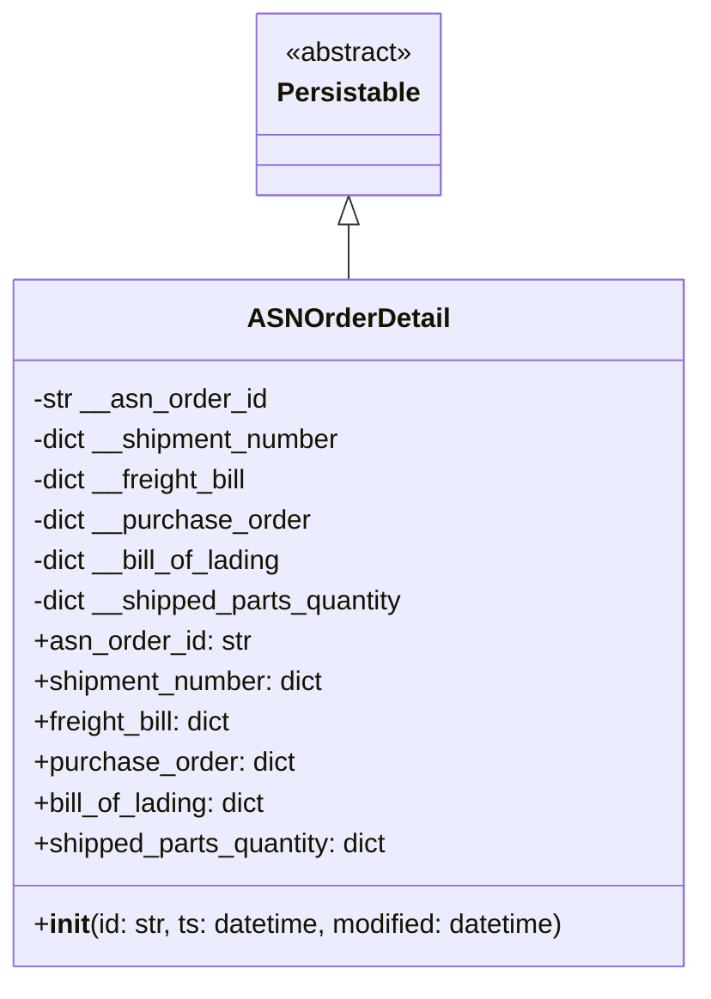

# Diagram: platform/partview_core/partview_service/partview_service/core/datamodel/ASNOrderDetail.py


> Auto-generated by Obscura crawlers

## Diagram 1



### SVG

<svg id="container" width="420.78125" xmlns="http://www.w3.org/2000/svg" class="classDiagram" height="582" viewBox="0 0 420.78125 582" role="graphics-document document" aria-roledescription="class"><style>#container{font-family:"trebuchet ms",verdana,arial,sans-serif;font-size:16px;fill:#333;}@keyframes edge-animation-frame{from{stroke-dashoffset:0;}}@keyframes dash{to{stroke-dashoffset:0;}}#container .edge-animation-slow{stroke-dasharray:9,5!important;stroke-dashoffset:900;animation:dash 50s linear infinite;stroke-linecap:round;}#container .edge-animation-fast{stroke-dasharray:9,5!important;stroke-dashoffset:900;animation:dash 20s linear infinite;stroke-linecap:round;}#container .error-icon{fill:#552222;}#container .error-text{fill:#552222;stroke:#552222;}#container .edge-thickness-normal{stroke-width:1px;}#container .edge-thickness-thick{stroke-width:3.5px;}#container .edge-pattern-solid{stroke-dasharray:0;}#container .edge-thickness-invisible{stroke-width:0;fill:none;}#container .edge-pattern-dashed{stroke-dasharray:3;}#container .edge-pattern-dotted{stroke-dasharray:2;}#container .marker{fill:#333333;stroke:#333333;}#container .marker.cross{stroke:#333333;}#container svg{font-family:"trebuchet ms",verdana,arial,sans-serif;font-size:16px;}#container p{margin:0;}#container g.classGroup text{fill:#9370DB;stroke:none;font-family:"trebuchet ms",verdana,arial,sans-serif;font-size:10px;}#container g.classGroup text .title{font-weight:bolder;}#container .nodeLabel,#container .edgeLabel{color:#131300;}#container .edgeLabel .label rect{fill:#ECECFF;}#container .label text{fill:#131300;}#container .labelBkg{background:#ECECFF;}#container .edgeLabel .label span{background:#ECECFF;}#container .classTitle{font-weight:bolder;}#container .node rect,#container .node circle,#container .node ellipse,#container .node polygon,#container .node path{fill:#ECECFF;stroke:#9370DB;stroke-width:1px;}#container .divider{stroke:#9370DB;stroke-width:1;}#container g.clickable{cursor:pointer;}#container g.classGroup rect{fill:#ECECFF;stroke:#9370DB;}#container g.classGroup line{stroke:#9370DB;stroke-width:1;}#container .classLabel .box{stroke:none;stroke-width:0;fill:#ECECFF;opacity:0.5;}#container .classLabel .label{fill:#9370DB;font-size:10px;}#container .relation{stroke:#333333;stroke-width:1;fill:none;}#container .dashed-line{stroke-dasharray:3;}#container .dotted-line{stroke-dasharray:1 2;}#container #compositionStart,#container .composition{fill:#333333!important;stroke:#333333!important;stroke-width:1;}#container #compositionEnd,#container .composition{fill:#333333!important;stroke:#333333!important;stroke-width:1;}#container #dependencyStart,#container .dependency{fill:#333333!important;stroke:#333333!important;stroke-width:1;}#container #dependencyStart,#container .dependency{fill:#333333!important;stroke:#333333!important;stroke-width:1;}#container #extensionStart,#container .extension{fill:transparent!important;stroke:#333333!important;stroke-width:1;}#container #extensionEnd,#container .extension{fill:transparent!important;stroke:#333333!important;stroke-width:1;}#container #aggregationStart,#container .aggregation{fill:transparent!important;stroke:#333333!important;stroke-width:1;}#container #aggregationEnd,#container .aggregation{fill:transparent!important;stroke:#333333!important;stroke-width:1;}#container #lollipopStart,#container .lollipop{fill:#ECECFF!important;stroke:#333333!important;stroke-width:1;}#container #lollipopEnd,#container .lollipop{fill:#ECECFF!important;stroke:#333333!important;stroke-width:1;}#container .edgeTerminals{font-size:11px;line-height:initial;}#container .classTitleText{text-anchor:middle;font-size:18px;fill:#333;}#container .label-icon{display:inline-block;height:1em;overflow:visible;vertical-align:-0.125em;}#container .node .label-icon path{fill:currentColor;stroke:revert;stroke-width:revert;}#container :root{--mermaid-font-family:"trebuchet ms",verdana,arial,sans-serif;}</style><g><defs><marker id="container_class-aggregationStart" class="marker aggregation class" refX="18" refY="7" markerWidth="190" markerHeight="240" orient="auto"><path d="M 18,7 L9,13 L1,7 L9,1 Z"></path></marker></defs><defs><marker id="container_class-aggregationEnd" class="marker aggregation class" refX="1" refY="7" markerWidth="20" markerHeight="28" orient="auto"><path d="M 18,7 L9,13 L1,7 L9,1 Z"></path></marker></defs><defs><marker id="container_class-extensionStart" class="marker extension class" refX="18" refY="7" markerWidth="190" markerHeight="240" orient="auto"><path d="M 1,7 L18,13 V 1 Z"></path></marker></defs><defs><marker id="container_class-extensionEnd" class="marker extension class" refX="1" refY="7" markerWidth="20" markerHeight="28" orient="auto"><path d="M 1,1 V 13 L18,7 Z"></path></marker></defs><defs><marker id="container_class-compositionStart" class="marker composition class" refX="18" refY="7" markerWidth="190" markerHeight="240" orient="auto"><path d="M 18,7 L9,13 L1,7 L9,1 Z"></path></marker></defs><defs><marker id="container_class-compositionEnd" class="marker composition class" refX="1" refY="7" markerWidth="20" markerHeight="28" orient="auto"><path d="M 18,7 L9,13 L1,7 L9,1 Z"></path></marker></defs><defs><marker id="container_class-dependencyStart" class="marker dependency class" refX="6" refY="7" markerWidth="190" markerHeight="240" orient="auto"><path d="M 5,7 L9,13 L1,7 L9,1 Z"></path></marker></defs><defs><marker id="container_class-dependencyEnd" class="marker dependency class" refX="13" refY="7" markerWidth="20" markerHeight="28" orient="auto"><path d="M 18,7 L9,13 L14,7 L9,1 Z"></path></marker></defs><defs><marker id="container_class-lollipopStart" class="marker lollipop class" refX="13" refY="7" markerWidth="190" markerHeight="240" orient="auto"><circle stroke="black" fill="transparent" cx="7" cy="7" r="6"></circle></marker></defs><defs><marker id="container_class-lollipopEnd" class="marker lollipop class" refX="1" refY="7" markerWidth="190" markerHeight="240" orient="auto"><circle stroke="black" fill="transparent" cx="7" cy="7" r="6"></circle></marker></defs><g class="root"><g class="clusters"></g><g class="edgePaths"><path d="M210.391,133.25L210.391,134.542C210.391,135.833,210.391,138.417,210.391,143.875C210.391,149.333,210.391,157.667,210.391,161.833L210.391,166" id="id_Persistable_ASNOrderDetail_1" class="edge-thickness-normal edge-pattern-solid relation" style=";;;" data-edge="true" data-et="edge" data-id="id_Persistable_ASNOrderDetail_1" data-points="W3sieCI6MjEwLjM5MDYyNSwieSI6MTE2fSx7IngiOjIxMC4zOTA2MjUsInkiOjE0MX0seyJ4IjoyMTAuMzkwNjI1LCJ5IjoxNjZ9XQ==" marker-start="url(#container_class-extensionStart)"></path></g><g class="edgeLabels"><g class="edgeLabel"><g class="label" data-id="id_Persistable_ASNOrderDetail_1" transform="translate(0, 0)"><foreignObject width="0" height="0"><div xmlns="http://www.w3.org/1999/xhtml" class="labelBkg" style="display: table-cell; white-space: nowrap; line-height: 1.5; max-width: 200px; text-align: center;"><span class="edgeLabel"></span></div></foreignObject></g></g></g><g class="nodes"><g class="node default" id="classId-Persistable-0" transform="translate(210.390625, 62)"><g class="basic label-container"><path d="M-52.9765625 -54 L52.9765625 -54 L52.9765625 54 L-52.9765625 54" stroke="none" stroke-width="0" fill="#ECECFF" style=""></path><path d="M-52.9765625 -54 C-20.433425851537763 -54, 12.109710796924475 -54, 52.9765625 -54 M-52.9765625 -54 C-21.08059573379077 -54, 10.815371032418462 -54, 52.9765625 -54 M52.9765625 -54 C52.9765625 -22.86573800448371, 52.9765625 8.26852399103258, 52.9765625 54 M52.9765625 -54 C52.9765625 -31.8698059742195, 52.9765625 -9.739611948438998, 52.9765625 54 M52.9765625 54 C25.370788704678766 54, -2.2349850906424678 54, -52.9765625 54 M52.9765625 54 C13.912313058341994 54, -25.151936383316013 54, -52.9765625 54 M-52.9765625 54 C-52.9765625 22.762828113417722, -52.9765625 -8.474343773164556, -52.9765625 -54 M-52.9765625 54 C-52.9765625 28.514260156718493, -52.9765625 3.028520313436985, -52.9765625 -54" stroke="#9370DB" stroke-width="1.3" fill="none" stroke-dasharray="0 0" style=""></path></g><g class="annotation-group text" transform="translate(-38.609375, -30)"><g class="label" style="" transform="translate(0,-12)"><foreignObject width="77.21875" height="24"><div xmlns="http://www.w3.org/1999/xhtml" style="display: table-cell; white-space: nowrap; line-height: 1.5; max-width: 127px; text-align: center;"><span class="nodeLabel markdown-node-label" style=""><p>«abstract»</p></span></div></foreignObject></g></g><g class="label-group text" transform="translate(-40.9765625, -6)"><g class="label" style="font-weight: bolder" transform="translate(0,-12)"><foreignObject width="81.953125" height="24"><div xmlns="http://www.w3.org/1999/xhtml" style="display: table-cell; white-space: nowrap; line-height: 1.5; max-width: 130px; text-align: center;"><span class="nodeLabel markdown-node-label" style=""><p>Persistable</p></span></div></foreignObject></g></g><g class="members-group text" transform="translate(-40.9765625, 42)"></g><g class="methods-group text" transform="translate(-40.9765625, 72)"></g><g class="divider" style=""><path d="M-52.9765625 18 C-29.89995553081293 18, -6.823348561625863 18, 52.9765625 18 M-52.9765625 18 C-28.391872269600235 18, -3.8071820392004696 18, 52.9765625 18" stroke="#9370DB" stroke-width="1.3" fill="none" stroke-dasharray="0 0" style=""></path></g><g class="divider" style=""><path d="M-52.9765625 36 C-10.855585981762722 36, 31.265390536474555 36, 52.9765625 36 M-52.9765625 36 C-16.684652728622986 36, 19.60725704275403 36, 52.9765625 36" stroke="#9370DB" stroke-width="1.3" fill="none" stroke-dasharray="0 0" style=""></path></g></g><g class="node default" id="classId-ASNOrderDetail-1" transform="translate(210.390625, 370)"><g class="basic label-container"><path d="M-202.390625 -204 L202.390625 -204 L202.390625 204 L-202.390625 204" stroke="none" stroke-width="0" fill="#ECECFF" style=""></path><path d="M-202.390625 -204 C-78.231746393921 -204, 45.927132212158 -204, 202.390625 -204 M-202.390625 -204 C-103.27602137871601 -204, -4.1614177574320195 -204, 202.390625 -204 M202.390625 -204 C202.390625 -72.14113570974541, 202.390625 59.717728580509174, 202.390625 204 M202.390625 -204 C202.390625 -73.83873927149716, 202.390625 56.32252145700568, 202.390625 204 M202.390625 204 C78.91933417014835 204, -44.55195665970331 204, -202.390625 204 M202.390625 204 C95.84264178691419 204, -10.705341426171628 204, -202.390625 204 M-202.390625 204 C-202.390625 104.97975847558848, -202.390625 5.9595169511769654, -202.390625 -204 M-202.390625 204 C-202.390625 48.944552364275665, -202.390625 -106.11089527144867, -202.390625 -204" stroke="#9370DB" stroke-width="1.3" fill="none" stroke-dasharray="0 0" style=""></path></g><g class="annotation-group text" transform="translate(0, -180)"></g><g class="label-group text" transform="translate(-57.15625, -180)"><g class="label" style="font-weight: bolder" transform="translate(0,-12)"><foreignObject width="114.3125" height="24"><div xmlns="http://www.w3.org/1999/xhtml" style="display: table-cell; white-space: nowrap; line-height: 1.5; max-width: 163px; text-align: center;"><span class="nodeLabel markdown-node-label" style=""><p>ASNOrderDetail</p></span></div></foreignObject></g></g><g class="members-group text" transform="translate(-190.390625, -132)"><g class="label" style="" transform="translate(0,-12)"><foreignObject width="140.296875" height="24"><div xmlns="http://www.w3.org/1999/xhtml" style="display: table-cell; white-space: nowrap; line-height: 1.5; max-width: 198px; text-align: center;"><span class="nodeLabel markdown-node-label" style=""><p>-str __asn_order_id</p></span></div></foreignObject></g><g class="label" style="" transform="translate(0,12)"><foreignObject width="188.25" height="24"><div xmlns="http://www.w3.org/1999/xhtml" style="display: table-cell; white-space: nowrap; line-height: 1.5; max-width: 246px; text-align: center;"><span class="nodeLabel markdown-node-label" style=""><p>-dict __shipment_number</p></span></div></foreignObject></g><g class="label" style="" transform="translate(0,36)"><foreignObject width="133.828125" height="24"><div xmlns="http://www.w3.org/1999/xhtml" style="display: table-cell; white-space: nowrap; line-height: 1.5; max-width: 191px; text-align: center;"><span class="nodeLabel markdown-node-label" style=""><p>-dict __freight_bill</p></span></div></foreignObject></g><g class="label" style="" transform="translate(0,60)"><foreignObject width="168.140625" height="24"><div xmlns="http://www.w3.org/1999/xhtml" style="display: table-cell; white-space: nowrap; line-height: 1.5; max-width: 226px; text-align: center;"><span class="nodeLabel markdown-node-label" style=""><p>-dict __purchase_order</p></span></div></foreignObject></g><g class="label" style="" transform="translate(0,84)"><foreignObject width="153.546875" height="24"><div xmlns="http://www.w3.org/1999/xhtml" style="display: table-cell; white-space: nowrap; line-height: 1.5; max-width: 212px; text-align: center;"><span class="nodeLabel markdown-node-label" style=""><p>-dict __bill_of_lading</p></span></div></foreignObject></g><g class="label" style="" transform="translate(0,108)"><foreignObject width="227.625" height="24"><div xmlns="http://www.w3.org/1999/xhtml" style="display: table-cell; white-space: nowrap; line-height: 1.5; max-width: 285px; text-align: center;"><span class="nodeLabel markdown-node-label" style=""><p>-dict __shipped_parts_quantity</p></span></div></foreignObject></g><g class="label" style="" transform="translate(0,132)"><foreignObject width="129.265625" height="24"><div xmlns="http://www.w3.org/1999/xhtml" style="display: table-cell; white-space: nowrap; line-height: 1.5; max-width: 187px; text-align: center;"><span class="nodeLabel markdown-node-label" style=""><p>+asn_order_id: str</p></span></div></foreignObject></g><g class="label" style="" transform="translate(0,156)"><foreignObject width="177.296875" height="24"><div xmlns="http://www.w3.org/1999/xhtml" style="display: table-cell; white-space: nowrap; line-height: 1.5; max-width: 235px; text-align: center;"><span class="nodeLabel markdown-node-label" style=""><p>+shipment_number: dict</p></span></div></foreignObject></g><g class="label" style="" transform="translate(0,180)"><foreignObject width="122.96875" height="24"><div xmlns="http://www.w3.org/1999/xhtml" style="display: table-cell; white-space: nowrap; line-height: 1.5; max-width: 181px; text-align: center;"><span class="nodeLabel markdown-node-label" style=""><p>+freight_bill: dict</p></span></div></foreignObject></g><g class="label" style="" transform="translate(0,204)"><foreignObject width="157.1875" height="24"><div xmlns="http://www.w3.org/1999/xhtml" style="display: table-cell; white-space: nowrap; line-height: 1.5; max-width: 215px; text-align: center;"><span class="nodeLabel markdown-node-label" style=""><p>+purchase_order: dict</p></span></div></foreignObject></g><g class="label" style="" transform="translate(0,228)"><foreignObject width="142.4375" height="24"><div xmlns="http://www.w3.org/1999/xhtml" style="display: table-cell; white-space: nowrap; line-height: 1.5; max-width: 200px; text-align: center;"><span class="nodeLabel markdown-node-label" style=""><p>+bill_of_lading: dict</p></span></div></foreignObject></g><g class="label" style="" transform="translate(0,252)"><foreignObject width="216.578125" height="24"><div xmlns="http://www.w3.org/1999/xhtml" style="display: table-cell; white-space: nowrap; line-height: 1.5; max-width: 274px; text-align: center;"><span class="nodeLabel markdown-node-label" style=""><p>+shipped_parts_quantity: dict</p></span></div></foreignObject></g></g><g class="methods-group text" transform="translate(-190.390625, 180)"><g class="label" style="" transform="translate(0,-12)"><foreignObject width="323.625" height="24"><div xmlns="http://www.w3.org/1999/xhtml" style="display: table-cell; white-space: nowrap; line-height: 1.5; max-width: 412px; text-align: center;"><span class="nodeLabel markdown-node-label" style=""><p>+<strong>init</strong>(id: str, ts: datetime, modified: datetime)</p></span></div></foreignObject></g></g><g class="divider" style=""><path d="M-202.390625 -156 C-89.11343474552338 -156, 24.163755508953244 -156, 202.390625 -156 M-202.390625 -156 C-52.84531782628835 -156, 96.6999893474233 -156, 202.390625 -156" stroke="#9370DB" stroke-width="1.3" fill="none" stroke-dasharray="0 0" style=""></path></g><g class="divider" style=""><path d="M-202.390625 156 C-54.16902445610839 156, 94.05257608778322 156, 202.390625 156 M-202.390625 156 C-91.86126415418435 156, 18.66809669163129 156, 202.390625 156" stroke="#9370DB" stroke-width="1.3" fill="none" stroke-dasharray="0 0" style=""></path></g></g></g></g></g></svg>

## Diagram 2

```mermaid
flowchart TD
    A[__init__] --> B[Initialize private attributes]
    B --> C[Call super().__init__]
    D[Setter called] --> E{Validate type}
    E -->|Valid| F[Set private attribute]
    F --> G[Call add_dirty_field]
    E -->|Invalid| H[Raise AssertionError]
```

> SVG rendering failed for this diagram.
