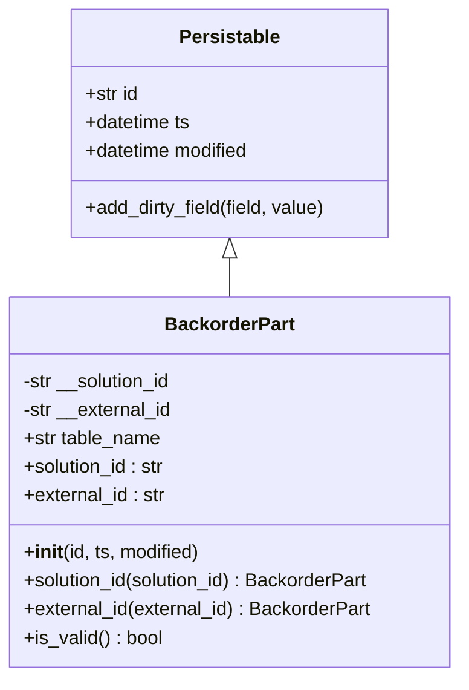
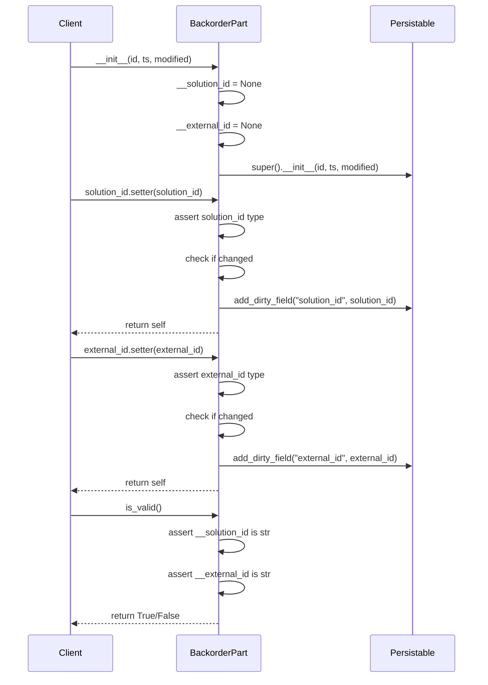
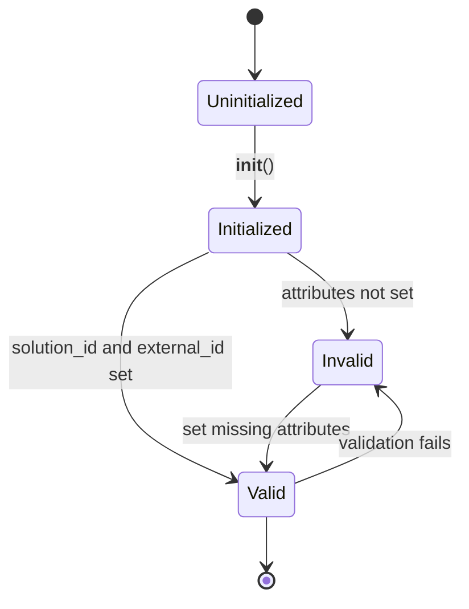

# Diagram: platform/partview_core/partview_service/partview_service/core/datamodel/BackorderPart.py

> Auto-generated by Obscura crawlers

## Diagram 1

### SVG

<svg id="container" width="390.421875" xmlns="http://www.w3.org/2000/svg" class="classDiagram" height="570" viewBox="0 0 390.421875 570" role="graphics-document document" aria-roledescription="class"><g><defs><marker id="container_class-aggregationStart" class="marker aggregation class" refX="18" refY="7" markerWidth="190" markerHeight="240" orient="auto"><path d="M 18,7 L9,13 L1,7 L9,1 Z"></path></marker></defs><defs><marker id="container_class-aggregationEnd" class="marker aggregation class" refX="1" refY="7" markerWidth="20" markerHeight="28" orient="auto"><path d="M 18,7 L9,13 L1,7 L9,1 Z"></path></marker></defs><defs><marker id="container_class-extensionStart" class="marker extension class" refX="18" refY="7" markerWidth="190" markerHeight="240" orient="auto"><path d="M 1,7 L18,13 V 1 Z"></path></marker></defs><defs><marker id="container_class-extensionEnd" class="marker extension class" refX="1" refY="7" markerWidth="20" markerHeight="28" orient="auto"><path d="M 1,1 V 13 L18,7 Z"></path></marker></defs><defs><marker id="container_class-compositionStart" class="marker composition class" refX="18" refY="7" markerWidth="190" markerHeight="240" orient="auto"><path d="M 18,7 L9,13 L1,7 L9,1 Z"></path></marker></defs><defs><marker id="container_class-compositionEnd" class="marker composition class" refX="1" refY="7" markerWidth="20" markerHeight="28" orient="auto"><path d="M 18,7 L9,13 L1,7 L9,1 Z"></path></marker></defs><defs><marker id="container_class-dependencyStart" class="marker dependency class" refX="6" refY="7" markerWidth="190" markerHeight="240" orient="auto"><path d="M 5,7 L9,13 L1,7 L9,1 Z"></path></marker></defs><defs><marker id="container_class-dependencyEnd" class="marker dependency class" refX="13" refY="7" markerWidth="20" markerHeight="28" orient="auto"><path d="M 18,7 L9,13 L14,7 L9,1 Z"></path></marker></defs><defs><marker id="container_class-lollipopStart" class="marker lollipop class" refX="13" refY="7" markerWidth="190" markerHeight="240" orient="auto"><circle stroke="black" fill="transparent" cx="7" cy="7" r="6"></circle></marker></defs><defs><marker id="container_class-lollipopEnd" class="marker lollipop class" refX="1" refY="7" markerWidth="190" markerHeight="240" orient="auto"><circle stroke="black" fill="transparent" cx="7" cy="7" r="6"></circle></marker></defs><g class="root"><g class="clusters"></g><g class="edgePaths"><path d="M195.211,217.25L195.211,218.542C195.211,219.833,195.211,222.417,195.211,227.875C195.211,233.333,195.211,241.667,195.211,245.833L195.211,250" id="id_Persistable_BackorderPart_1" class="edge-thickness-normal edge-pattern-solid relation" style=";;;" data-edge="true" data-et="edge" data-id="id_Persistable_BackorderPart_1" data-points="W3sieCI6MTk1LjIxMDkzNzUsInkiOjIwMH0seyJ4IjoxOTUuMjEwOTM3NSwieSI6MjI1fSx7IngiOjE5NS4yMTA5Mzc1LCJ5IjoyNTB9XQ==" marker-start="url(#container_class-extensionStart)"></path></g><g class="edgeLabels"><g class="edgeLabel"><g class="label" data-id="id_Persistable_BackorderPart_1" transform="translate(0, 0)"><foreignObject width="0" height="0">

</foreignObject></g></g></g><g class="nodes"><g class="node default" id="classId-Persistable-0" transform="translate(195.2109375, 104)"><g class="basic label-container"><path d="M-135.71484375 -96 L135.71484375 -96 L135.71484375 96 L-135.71484375 96" stroke="none" stroke-width="0" fill="#ECECFF" style=""></path><path d="M-135.71484375 -96 C-57.10853399291496 -96, 21.497775764170086 -96, 135.71484375 -96 M-135.71484375 -96 C-75.3428700952836 -96, -14.970896440567202 -96, 135.71484375 -96 M135.71484375 -96 C135.71484375 -54.03653492685843, 135.71484375 -12.07306985371686, 135.71484375 96 M135.71484375 -96 C135.71484375 -22.986705301073272, 135.71484375 50.026589397853456, 135.71484375 96 M135.71484375 96 C56.38847254119631 96, -22.937898667607385 96, -135.71484375 96 M135.71484375 96 C69.93524944040145 96, 4.155655130802899 96, -135.71484375 96 M-135.71484375 96 C-135.71484375 37.837833363403945, -135.71484375 -20.32433327319211, -135.71484375 -96 M-135.71484375 96 C-135.71484375 35.76482049549545, -135.71484375 -24.4703590090091, -135.71484375 -96" stroke="#9370DB" stroke-width="1.3" fill="none" stroke-dasharray="0 0" style=""></path></g><g class="annotation-group text" transform="translate(0, -72)"></g><g class="label-group text" transform="translate(-40.9765625, -72)"><g class="label" style="font-weight: bolder" transform="translate(0,-12)"><foreignObject width="81.953125" height="24">

Persistable

</foreignObject></g></g><g class="members-group text" transform="translate(-123.71484375, -24)"><g class="label" style="" transform="translate(0,-12)"><foreignObject width="45.734375" height="24">

+str id

</foreignObject></g><g class="label" style="" transform="translate(0,12)"><foreignObject width="90.734375" height="24">

+datetime ts

</foreignObject></g><g class="label" style="" transform="translate(0,36)"><foreignObject width="142.109375" height="24">

+datetime modified

</foreignObject></g></g><g class="methods-group text" transform="translate(-123.71484375, 72)"><g class="label" style="" transform="translate(0,-12)"><foreignObject width="206.453125" height="24">

+add_dirty_field(field, value)

</foreignObject></g></g><g class="divider" style=""><path d="M-135.71484375 -48 C-71.6550289108886 -48, -7.595214071777207 -48, 135.71484375 -48 M-135.71484375 -48 C-29.938079176517803 -48, 75.8386853969644 -48, 135.71484375 -48" stroke="#9370DB" stroke-width="1.3" fill="none" stroke-dasharray="0 0" style=""></path></g><g class="divider" style=""><path d="M-135.71484375 48 C-30.506835916233584 48, 74.70117191753283 48, 135.71484375 48 M-135.71484375 48 C-70.39412632885129 48, -5.0734089077025715 48, 135.71484375 48" stroke="#9370DB" stroke-width="1.3" fill="none" stroke-dasharray="0 0" style=""></path></g></g><g class="node default" id="classId-BackorderPart-1" transform="translate(195.2109375, 406)"><g class="basic label-container"><path d="M-187.2109375 -156 L187.2109375 -156 L187.2109375 156 L-187.2109375 156" stroke="none" stroke-width="0" fill="#ECECFF" style=""></path><path d="M-187.2109375 -156 C-105.59181528989873 -156, -23.972693079797466 -156, 187.2109375 -156 M-187.2109375 -156 C-82.11695086432678 -156, 22.977035771346436 -156, 187.2109375 -156 M187.2109375 -156 C187.2109375 -83.03264069257595, 187.2109375 -10.065281385151906, 187.2109375 156 M187.2109375 -156 C187.2109375 -47.430376842607785, 187.2109375 61.13924631478443, 187.2109375 156 M187.2109375 156 C66.93565231925508 156, -53.33963286148983 156, -187.2109375 156 M187.2109375 156 C101.8766516243163 156, 16.54236574863259 156, -187.2109375 156 M-187.2109375 156 C-187.2109375 92.97868519655545, -187.2109375 29.957370393110892, -187.2109375 -156 M-187.2109375 156 C-187.2109375 67.62526577086825, -187.2109375 -20.749468458263493, -187.2109375 -156" stroke="#9370DB" stroke-width="1.3" fill="none" stroke-dasharray="0 0" style=""></path></g><g class="annotation-group text" transform="translate(0, -132)"></g><g class="label-group text" transform="translate(-52.59375, -132)"><g class="label" style="font-weight: bolder" transform="translate(0,-12)"><foreignObject width="105.1875" height="24">

BackorderPart

</foreignObject></g></g><g class="members-group text" transform="translate(-175.2109375, -84)"><g class="label" style="" transform="translate(0,-12)"><foreignObject width="128.828125" height="24">

-str __solution_id

</foreignObject></g><g class="label" style="" transform="translate(0,12)"><foreignObject width="128.0625" height="24">

-str __external_id

</foreignObject></g><g class="label" style="" transform="translate(0,36)"><foreignObject width="117.375" height="24">

+str table_name

</foreignObject></g><g class="label" style="" transform="translate(0,60)"><foreignObject width="121.953125" height="24">

+solution_id : str

</foreignObject></g><g class="label" style="" transform="translate(0,84)"><foreignObject width="121.515625" height="24">

+external_id : str

</foreignObject></g></g><g class="methods-group text" transform="translate(-175.2109375, 60)"><g class="label" style="" transform="translate(0,-12)"><foreignObject width="150.90625" height="24">

+<strong>init</strong>(id, ts, modified)

</foreignObject></g><g class="label" style="" transform="translate(0,12)"><foreignObject width="297.828125" height="24">

+solution_id(solution_id) : BackorderPart

</foreignObject></g><g class="label" style="" transform="translate(0,36)"><foreignObject width="296.9375" height="24">

+external_id(external_id) : BackorderPart

</foreignObject></g><g class="label" style="" transform="translate(0,60)"><foreignObject width="117.984375" height="24">

+is_valid() : bool

</foreignObject></g></g><g class="divider" style=""><path d="M-187.2109375 -108 C-80.57078934763545 -108, 26.06935880472909 -108, 187.2109375 -108 M-187.2109375 -108 C-98.96978712144518 -108, -10.728636742890359 -108, 187.2109375 -108" stroke="#9370DB" stroke-width="1.3" fill="none" stroke-dasharray="0 0" style=""></path></g><g class="divider" style=""><path d="M-187.2109375 36 C-94.94325268107593 36, -2.6755678621518655 36, 187.2109375 36 M-187.2109375 36 C-107.11443689425361 36, -27.01793628850723 36, 187.2109375 36" stroke="#9370DB" stroke-width="1.3" fill="none" stroke-dasharray="0 0" style=""></path></g></g></g></g></g></svg>

## Diagram 2

### SVG

<svg id="container" width="914" xmlns="http://www.w3.org/2000/svg" height="1275" viewBox="-50 -10 914 1275" role="graphics-document document" aria-roledescription="sequence"><g><rect x="664" y="1189" fill="#eaeaea" stroke="#666" width="150" height="65" name="Persistable" rx="3" ry="3" class="actor actor-bottom"></rect><text x="739" y="1221.5" dominant-baseline="central" alignment-baseline="central" class="actor actor-box" style="text-anchor: middle; font-size: 16px; font-weight: 400;"><tspan x="739" dy="0">Persistable</tspan></text></g><g><rect x="291" y="1189" fill="#eaeaea" stroke="#666" width="150" height="65" name="BackorderPart" rx="3" ry="3" class="actor actor-bottom"></rect><text x="366" y="1221.5" dominant-baseline="central" alignment-baseline="central" class="actor actor-box" style="text-anchor: middle; font-size: 16px; font-weight: 400;"><tspan x="366" dy="0">BackorderPart</tspan></text></g><g><rect x="0" y="1189" fill="#eaeaea" stroke="#666" width="150" height="65" name="Client" rx="3" ry="3" class="actor actor-bottom"></rect><text x="75" y="1221.5" dominant-baseline="central" alignment-baseline="central" class="actor actor-box" style="text-anchor: middle; font-size: 16px; font-weight: 400;"><tspan x="75" dy="0">Client</tspan></text></g><g><line id="actor2" x1="739" y1="65" x2="739" y2="1189" class="actor-line 200" stroke-width="0.5px" stroke="#999" name="Persistable"></line><g id="root-2"><rect x="664" y="0" fill="#eaeaea" stroke="#666" width="150" height="65" name="Persistable" rx="3" ry="3" class="actor actor-top"></rect><text x="739" y="32.5" dominant-baseline="central" alignment-baseline="central" class="actor actor-box" style="text-anchor: middle; font-size: 16px; font-weight: 400;"><tspan x="739" dy="0">Persistable</tspan></text></g></g><g><line id="actor1" x1="366" y1="65" x2="366" y2="1189" class="actor-line 200" stroke-width="0.5px" stroke="#999" name="BackorderPart"></line><g id="root-1"><rect x="291" y="0" fill="#eaeaea" stroke="#666" width="150" height="65" name="BackorderPart" rx="3" ry="3" class="actor actor-top"></rect><text x="366" y="32.5" dominant-baseline="central" alignment-baseline="central" class="actor actor-box" style="text-anchor: middle; font-size: 16px; font-weight: 400;"><tspan x="366" dy="0">BackorderPart</tspan></text></g></g><g><line id="actor0" x1="75" y1="65" x2="75" y2="1189" class="actor-line 200" stroke-width="0.5px" stroke="#999" name="Client"></line><g id="root-0"><rect x="0" y="0" fill="#eaeaea" stroke="#666" width="150" height="65" name="Client" rx="3" ry="3" class="actor actor-top"></rect><text x="75" y="32.5" dominant-baseline="central" alignment-baseline="central" class="actor actor-box" style="text-anchor: middle; font-size: 16px; font-weight: 400;"><tspan x="75" dy="0">Client</tspan></text></g></g><g></g><defs><symbol id="computer" width="24" height="24"><path transform="scale(.5)" d="M2 2v13h20v-13h-20zm18 11h-16v-9h16v9zm-10.228 6l.466-1h3.524l.467 1h-4.457zm14.228 3h-24l2-6h2.104l-1.33 4h18.45l-1.297-4h2.073l2 6zm-5-10h-14v-7h14v7z"></path></symbol></defs><defs><symbol id="database" fill-rule="evenodd" clip-rule="evenodd"><path transform="scale(.5)" d="M12.258.001l.256.004.255.005.253.008.251.01.249.012.247.015.246.016.242.019.241.02.239.023.236.024.233.027.231.028.229.031.225.032.223.034.22.036.217.038.214.04.211.041.208.043.205.045.201.046.198.048.194.05.191.051.187.053.183.054.18.056.175.057.172.059.168.06.163.061.16.063.155.064.15.066.074.033.073.033.071.034.07.034.069.035.068.035.067.035.066.035.064.036.064.036.062.036.06.036.06.037.058.037.058.037.055.038.055.038.053.038.052.038.051.039.05.039.048.039.047.039.045.04.044.04.043.04.041.04.04.041.039.041.037.041.036.041.034.041.033.042.032.042.03.042.029.042.027.042.026.043.024.043.023.043.021.043.02.043.018.044.017.043.015.044.013.044.012.044.011.045.009.044.007.045.006.045.004.045.002.045.001.045v17l-.001.045-.002.045-.004.045-.006.045-.007.045-.009.044-.011.045-.012.044-.013.044-.015.044-.017.043-.018.044-.02.043-.021.043-.023.043-.024.043-.026.043-.027.042-.029.042-.03.042-.032.042-.033.042-.034.041-.036.041-.037.041-.039.041-.04.041-.041.04-.043.04-.044.04-.045.04-.047.039-.048.039-.05.039-.051.039-.052.038-.053.038-.055.038-.055.038-.058.037-.058.037-.06.037-.06.036-.062.036-.064.036-.064.036-.066.035-.067.035-.068.035-.069.035-.07.034-.071.034-.073.033-.074.033-.15.066-.155.064-.16.063-.163.061-.168.06-.172.059-.175.057-.18.056-.183.054-.187.053-.191.051-.194.05-.198.048-.201.046-.205.045-.208.043-.211.041-.214.04-.217.038-.22.036-.223.034-.225.032-.229.031-.231.028-.233.027-.236.024-.239.023-.241.02-.242.019-.246.016-.247.015-.249.012-.251.01-.253.008-.255.005-.256.004-.258.001-.258-.001-.256-.004-.255-.005-.253-.008-.251-.01-.249-.012-.247-.015-.245-.016-.243-.019-.241-.02-.238-.023-.236-.024-.234-.027-.231-.028-.228-.031-.226-.032-.223-.034-.22-.036-.217-.038-.214-.04-.211-.041-.208-.043-.204-.045-.201-.046-.198-.048-.195-.05-.19-.051-.187-.053-.184-.054-.179-.056-.176-.057-.172-.059-.167-.06-.164-.061-.159-.063-.155-.064-.151-.066-.074-.033-.072-.033-.072-.034-.07-.034-.069-.035-.068-.035-.067-.035-.066-.035-.064-.036-.063-.036-.062-.036-.061-.036-.06-.037-.058-.037-.057-.037-.056-.038-.055-.038-.053-.038-.052-.038-.051-.039-.049-.039-.049-.039-.046-.039-.046-.04-.044-.04-.043-.04-.041-.04-.04-.041-.039-.041-.037-.041-.036-.041-.034-.041-.033-.042-.032-.042-.03-.042-.029-.042-.027-.042-.026-.043-.024-.043-.023-.043-.021-.043-.02-.043-.018-.044-.017-.043-.015-.044-.013-.044-.012-.044-.011-.045-.009-.044-.007-.045-.006-.045-.004-.045-.002-.045-.001-.045v-17l.001-.045.002-.045.004-.045.006-.045.007-.045.009-.044.011-.045.012-.044.013-.044.015-.044.017-.043.018-.044.02-.043.021-.043.023-.043.024-.043.026-.043.027-.042.029-.042.03-.042.032-.042.033-.042.034-.041.036-.041.037-.041.039-.041.04-.041.041-.04.043-.04.044-.04.046-.04.046-.039.049-.039.049-.039.051-.039.052-.038.053-.038.055-.038.056-.038.057-.037.058-.037.06-.037.061-.036.062-.036.063-.036.064-.036.066-.035.067-.035.068-.035.069-.035.07-.034.072-.034.072-.033.074-.033.151-.066.155-.064.159-.063.164-.061.167-.06.172-.059.176-.057.179-.056.184-.054.187-.053.19-.051.195-.05.198-.048.201-.046.204-.045.208-.043.211-.041.214-.04.217-.038.22-.036.223-.034.226-.032.228-.031.231-.028.234-.027.236-.024.238-.023.241-.02.243-.019.245-.016.247-.015.249-.012.251-.01.253-.008.255-.005.256-.004.258-.001.258.001zm-9.258 20.499v.01l.001.021.003.021.004.022.005.021.006.022.007.022.009.023.01.022.011.023.012.023.013.023.015.023.016.024.017.023.018.024.019.024.021.024.022.025.023.024.024.025.052.049.056.05.061.051.066.051.07.051.075.051.079.052.084.052.088.052.092.052.097.052.102.051.105.052.11.052.114.051.119.051.123.051.127.05.131.05.135.05.139.048.144.049.147.047.152.047.155.047.16.045.163.045.167.043.171.043.176.041.178.041.183.039.187.039.19.037.194.035.197.035.202.033.204.031.209.03.212.029.216.027.219.025.222.024.226.021.23.02.233.018.236.016.24.015.243.012.246.01.249.008.253.005.256.004.259.001.26-.001.257-.004.254-.005.25-.008.247-.011.244-.012.241-.014.237-.016.233-.018.231-.021.226-.021.224-.024.22-.026.216-.027.212-.028.21-.031.205-.031.202-.034.198-.034.194-.036.191-.037.187-.039.183-.04.179-.04.175-.042.172-.043.168-.044.163-.045.16-.046.155-.046.152-.047.148-.048.143-.049.139-.049.136-.05.131-.05.126-.05.123-.051.118-.052.114-.051.11-.052.106-.052.101-.052.096-.052.092-.052.088-.053.083-.051.079-.052.074-.052.07-.051.065-.051.06-.051.056-.05.051-.05.023-.024.023-.025.021-.024.02-.024.019-.024.018-.024.017-.024.015-.023.014-.024.013-.023.012-.023.01-.023.01-.022.008-.022.006-.022.006-.022.004-.022.004-.021.001-.021.001-.021v-4.127l-.077.055-.08.053-.083.054-.085.053-.087.052-.09.052-.093.051-.095.05-.097.05-.1.049-.102.049-.105.048-.106.047-.109.047-.111.046-.114.045-.115.045-.118.044-.12.043-.122.042-.124.042-.126.041-.128.04-.13.04-.132.038-.134.038-.135.037-.138.037-.139.035-.142.035-.143.034-.144.033-.147.032-.148.031-.15.03-.151.03-.153.029-.154.027-.156.027-.158.026-.159.025-.161.024-.162.023-.163.022-.165.021-.166.02-.167.019-.169.018-.169.017-.171.016-.173.015-.173.014-.175.013-.175.012-.177.011-.178.01-.179.008-.179.008-.181.006-.182.005-.182.004-.184.003-.184.002h-.37l-.184-.002-.184-.003-.182-.004-.182-.005-.181-.006-.179-.008-.179-.008-.178-.01-.176-.011-.176-.012-.175-.013-.173-.014-.172-.015-.171-.016-.17-.017-.169-.018-.167-.019-.166-.02-.165-.021-.163-.022-.162-.023-.161-.024-.159-.025-.157-.026-.156-.027-.155-.027-.153-.029-.151-.03-.15-.03-.148-.031-.146-.032-.145-.033-.143-.034-.141-.035-.14-.035-.137-.037-.136-.037-.134-.038-.132-.038-.13-.04-.128-.04-.126-.041-.124-.042-.122-.042-.12-.044-.117-.043-.116-.045-.113-.045-.112-.046-.109-.047-.106-.047-.105-.048-.102-.049-.1-.049-.097-.05-.095-.05-.093-.052-.09-.051-.087-.052-.085-.053-.083-.054-.08-.054-.077-.054v4.127zm0-5.654v.011l.001.021.003.021.004.021.005.022.006.022.007.022.009.022.01.022.011.023.012.023.013.023.015.024.016.023.017.024.018.024.019.024.021.024.022.024.023.025.024.024.052.05.056.05.061.05.066.051.07.051.075.052.079.051.084.052.088.052.092.052.097.052.102.052.105.052.11.051.114.051.119.052.123.05.127.051.131.05.135.049.139.049.144.048.147.048.152.047.155.046.16.045.163.045.167.044.171.042.176.042.178.04.183.04.187.038.19.037.194.036.197.034.202.033.204.032.209.03.212.028.216.027.219.025.222.024.226.022.23.02.233.018.236.016.24.014.243.012.246.01.249.008.253.006.256.003.259.001.26-.001.257-.003.254-.006.25-.008.247-.01.244-.012.241-.015.237-.016.233-.018.231-.02.226-.022.224-.024.22-.025.216-.027.212-.029.21-.03.205-.032.202-.033.198-.035.194-.036.191-.037.187-.039.183-.039.179-.041.175-.042.172-.043.168-.044.163-.045.16-.045.155-.047.152-.047.148-.048.143-.048.139-.05.136-.049.131-.05.126-.051.123-.051.118-.051.114-.052.11-.052.106-.052.101-.052.096-.052.092-.052.088-.052.083-.052.079-.052.074-.051.07-.052.065-.051.06-.05.056-.051.051-.049.023-.025.023-.024.021-.025.02-.024.019-.024.018-.024.017-.024.015-.023.014-.023.013-.024.012-.022.01-.023.01-.023.008-.022.006-.022.006-.022.004-.021.004-.022.001-.021.001-.021v-4.139l-.077.054-.08.054-.083.054-.085.052-.087.053-.09.051-.093.051-.095.051-.097.05-.1.049-.102.049-.105.048-.106.047-.109.047-.111.046-.114.045-.115.044-.118.044-.12.044-.122.042-.124.042-.126.041-.128.04-.13.039-.132.039-.134.038-.135.037-.138.036-.139.036-.142.035-.143.033-.144.033-.147.033-.148.031-.15.03-.151.03-.153.028-.154.028-.156.027-.158.026-.159.025-.161.024-.162.023-.163.022-.165.021-.166.02-.167.019-.169.018-.169.017-.171.016-.173.015-.173.014-.175.013-.175.012-.177.011-.178.009-.179.009-.179.007-.181.007-.182.005-.182.004-.184.003-.184.002h-.37l-.184-.002-.184-.003-.182-.004-.182-.005-.181-.007-.179-.007-.179-.009-.178-.009-.176-.011-.176-.012-.175-.013-.173-.014-.172-.015-.171-.016-.17-.017-.169-.018-.167-.019-.166-.02-.165-.021-.163-.022-.162-.023-.161-.024-.159-.025-.157-.026-.156-.027-.155-.028-.153-.028-.151-.03-.15-.03-.148-.031-.146-.033-.145-.033-.143-.033-.141-.035-.14-.036-.137-.036-.136-.037-.134-.038-.132-.039-.13-.039-.128-.04-.126-.041-.124-.042-.122-.043-.12-.043-.117-.044-.116-.044-.113-.046-.112-.046-.109-.046-.106-.047-.105-.048-.102-.049-.1-.049-.097-.05-.095-.051-.093-.051-.09-.051-.087-.053-.085-.052-.083-.054-.08-.054-.077-.054v4.139zm0-5.666v.011l.001.02.003.022.004.021.005.022.006.021.007.022.009.023.01.022.011.023.012.023.013.023.015.023.016.024.017.024.018.023.019.024.021.025.022.024.023.024.024.025.052.05.056.05.061.05.066.051.07.051.075.052.079.051.084.052.088.052.092.052.097.052.102.052.105.051.11.052.114.051.119.051.123.051.127.05.131.05.135.05.139.049.144.048.147.048.152.047.155.046.16.045.163.045.167.043.171.043.176.042.178.04.183.04.187.038.19.037.194.036.197.034.202.033.204.032.209.03.212.028.216.027.219.025.222.024.226.021.23.02.233.018.236.017.24.014.243.012.246.01.249.008.253.006.256.003.259.001.26-.001.257-.003.254-.006.25-.008.247-.01.244-.013.241-.014.237-.016.233-.018.231-.02.226-.022.224-.024.22-.025.216-.027.212-.029.21-.03.205-.032.202-.033.198-.035.194-.036.191-.037.187-.039.183-.039.179-.041.175-.042.172-.043.168-.044.163-.045.16-.045.155-.047.152-.047.148-.048.143-.049.139-.049.136-.049.131-.051.126-.05.123-.051.118-.052.114-.051.11-.052.106-.052.101-.052.096-.052.092-.052.088-.052.083-.052.079-.052.074-.052.07-.051.065-.051.06-.051.056-.05.051-.049.023-.025.023-.025.021-.024.02-.024.019-.024.018-.024.017-.024.015-.023.014-.024.013-.023.012-.023.01-.022.01-.023.008-.022.006-.022.006-.022.004-.022.004-.021.001-.021.001-.021v-4.153l-.077.054-.08.054-.083.053-.085.053-.087.053-.09.051-.093.051-.095.051-.097.05-.1.049-.102.048-.105.048-.106.048-.109.046-.111.046-.114.046-.115.044-.118.044-.12.043-.122.043-.124.042-.126.041-.128.04-.13.039-.132.039-.134.038-.135.037-.138.036-.139.036-.142.034-.143.034-.144.033-.147.032-.148.032-.15.03-.151.03-.153.028-.154.028-.156.027-.158.026-.159.024-.161.024-.162.023-.163.023-.165.021-.166.02-.167.019-.169.018-.169.017-.171.016-.173.015-.173.014-.175.013-.175.012-.177.01-.178.01-.179.009-.179.007-.181.006-.182.006-.182.004-.184.003-.184.001-.185.001-.185-.001-.184-.001-.184-.003-.182-.004-.182-.006-.181-.006-.179-.007-.179-.009-.178-.01-.176-.01-.176-.012-.175-.013-.173-.014-.172-.015-.171-.016-.17-.017-.169-.018-.167-.019-.166-.02-.165-.021-.163-.023-.162-.023-.161-.024-.159-.024-.157-.026-.156-.027-.155-.028-.153-.028-.151-.03-.15-.03-.148-.032-.146-.032-.145-.033-.143-.034-.141-.034-.14-.036-.137-.036-.136-.037-.134-.038-.132-.039-.13-.039-.128-.041-.126-.041-.124-.041-.122-.043-.12-.043-.117-.044-.116-.044-.113-.046-.112-.046-.109-.046-.106-.048-.105-.048-.102-.048-.1-.05-.097-.049-.095-.051-.093-.051-.09-.052-.087-.052-.085-.053-.083-.053-.08-.054-.077-.054v4.153zm8.74-8.179l-.257.004-.254.005-.25.008-.247.011-.244.012-.241.014-.237.016-.233.018-.231.021-.226.022-.224.023-.22.026-.216.027-.212.028-.21.031-.205.032-.202.033-.198.034-.194.036-.191.038-.187.038-.183.04-.179.041-.175.042-.172.043-.168.043-.163.045-.16.046-.155.046-.152.048-.148.048-.143.048-.139.049-.136.05-.131.05-.126.051-.123.051-.118.051-.114.052-.11.052-.106.052-.101.052-.096.052-.092.052-.088.052-.083.052-.079.052-.074.051-.07.052-.065.051-.06.05-.056.05-.051.05-.023.025-.023.024-.021.024-.02.025-.019.024-.018.024-.017.023-.015.024-.014.023-.013.023-.012.023-.01.023-.01.022-.008.022-.006.023-.006.021-.004.022-.004.021-.001.021-.001.021.001.021.001.021.004.021.004.022.006.021.006.023.008.022.01.022.01.023.012.023.013.023.014.023.015.024.017.023.018.024.019.024.02.025.021.024.023.024.023.025.051.05.056.05.06.05.065.051.07.052.074.051.079.052.083.052.088.052.092.052.096.052.101.052.106.052.11.052.114.052.118.051.123.051.126.051.131.05.136.05.139.049.143.048.148.048.152.048.155.046.16.046.163.045.168.043.172.043.175.042.179.041.183.04.187.038.191.038.194.036.198.034.202.033.205.032.21.031.212.028.216.027.22.026.224.023.226.022.231.021.233.018.237.016.241.014.244.012.247.011.25.008.254.005.257.004.26.001.26-.001.257-.004.254-.005.25-.008.247-.011.244-.012.241-.014.237-.016.233-.018.231-.021.226-.022.224-.023.22-.026.216-.027.212-.028.21-.031.205-.032.202-.033.198-.034.194-.036.191-.038.187-.038.183-.04.179-.041.175-.042.172-.043.168-.043.163-.045.16-.046.155-.046.152-.048.148-.048.143-.048.139-.049.136-.05.131-.05.126-.051.123-.051.118-.051.114-.052.11-.052.106-.052.101-.052.096-.052.092-.052.088-.052.083-.052.079-.052.074-.051.07-.052.065-.051.06-.05.056-.05.051-.05.023-.025.023-.024.021-.024.02-.025.019-.024.018-.024.017-.023.015-.024.014-.023.013-.023.012-.023.01-.023.01-.022.008-.022.006-.023.006-.021.004-.022.004-.021.001-.021.001-.021-.001-.021-.001-.021-.004-.021-.004-.022-.006-.021-.006-.023-.008-.022-.01-.022-.01-.023-.012-.023-.013-.023-.014-.023-.015-.024-.017-.023-.018-.024-.019-.024-.02-.025-.021-.024-.023-.024-.023-.025-.051-.05-.056-.05-.06-.05-.065-.051-.07-.052-.074-.051-.079-.052-.083-.052-.088-.052-.092-.052-.096-.052-.101-.052-.106-.052-.11-.052-.114-.052-.118-.051-.123-.051-.126-.051-.131-.05-.136-.05-.139-.049-.143-.048-.148-.048-.152-.048-.155-.046-.16-.046-.163-.045-.168-.043-.172-.043-.175-.042-.179-.041-.183-.04-.187-.038-.191-.038-.194-.036-.198-.034-.202-.033-.205-.032-.21-.031-.212-.028-.216-.027-.22-.026-.224-.023-.226-.022-.231-.021-.233-.018-.237-.016-.241-.014-.244-.012-.247-.011-.25-.008-.254-.005-.257-.004-.26-.001-.26.001z"></path></symbol></defs><defs><symbol id="clock" width="24" height="24"><path transform="scale(.5)" d="M12 2c5.514 0 10 4.486 10 10s-4.486 10-10 10-10-4.486-10-10 4.486-10 10-10zm0-2c-6.627 0-12 5.373-12 12s5.373 12 12 12 12-5.373 12-12-5.373-12-12-12zm5.848 12.459c.202.038.202.333.001.372-1.907.361-6.045 1.111-6.547 1.111-.719 0-1.301-.582-1.301-1.301 0-.512.77-5.447 1.125-7.445.034-.192.312-.181.343.014l.985 6.238 5.394 1.011z"></path></symbol></defs><defs><marker id="arrowhead" refX="7.9" refY="5" markerUnits="userSpaceOnUse" markerWidth="12" markerHeight="12" orient="auto-start-reverse"><path d="M -1 0 L 10 5 L 0 10 z"></path></marker></defs><defs><marker id="crosshead" markerWidth="15" markerHeight="8" orient="auto" refX="4" refY="4.5"><path fill="none" stroke="#000000" stroke-width="1pt" d="M 1,2 L 6,7 M 6,2 L 1,7" style="stroke-dasharray: 0, 0;"></path></marker></defs><defs><marker id="filled-head" refX="15.5" refY="7" markerWidth="20" markerHeight="28" orient="auto"><path d="M 18,7 L9,13 L14,7 L9,1 Z"></path></marker></defs><defs><marker id="sequencenumber" refX="15" refY="15" markerWidth="60" markerHeight="40" orient="auto"><circle cx="15" cy="15" r="6"></circle></marker></defs><text x="219" y="80" text-anchor="middle" dominant-baseline="middle" alignment-baseline="middle" class="messageText" dy="1em" style="font-size: 16px; font-weight: 400;">__init__(id, ts, modified)</text><line x1="76" y1="113" x2="362" y2="113" class="messageLine0" stroke-width="2" stroke="none" marker-end="url(#arrowhead)" style="fill: none;"></line><text x="367" y="128" text-anchor="middle" dominant-baseline="middle" alignment-baseline="middle" class="messageText" dy="1em" style="font-size: 16px; font-weight: 400;">__solution_id = None</text><path d="M 367,161 C 427,151 427,191 367,181" class="messageLine0" stroke-width="2" stroke="none" marker-end="url(#arrowhead)" style="fill: none;"></path><text x="367" y="206" text-anchor="middle" dominant-baseline="middle" alignment-baseline="middle" class="messageText" dy="1em" style="font-size: 16px; font-weight: 400;">__external_id = None</text><path d="M 367,239 C 427,229 427,269 367,259" class="messageLine0" stroke-width="2" stroke="none" marker-end="url(#arrowhead)" style="fill: none;"></path><text x="551" y="284" text-anchor="middle" dominant-baseline="middle" alignment-baseline="middle" class="messageText" dy="1em" style="font-size: 16px; font-weight: 400;">super().__init__(id, ts, modified)</text><line x1="367" y1="317" x2="735" y2="317" class="messageLine0" stroke-width="2" stroke="none" marker-end="url(#arrowhead)" style="fill: none;"></line><text x="219" y="332" text-anchor="middle" dominant-baseline="middle" alignment-baseline="middle" class="messageText" dy="1em" style="font-size: 16px; font-weight: 400;">solution_id.setter(solution_id)</text><line x1="76" y1="365" x2="362" y2="365" class="messageLine0" stroke-width="2" stroke="none" marker-end="url(#arrowhead)" style="fill: none;"></line><text x="367" y="380" text-anchor="middle" dominant-baseline="middle" alignment-baseline="middle" class="messageText" dy="1em" style="font-size: 16px; font-weight: 400;">assert solution_id type</text><path d="M 367,413 C 427,403 427,443 367,433" class="messageLine0" stroke-width="2" stroke="none" marker-end="url(#arrowhead)" style="fill: none;"></path><text x="367" y="458" text-anchor="middle" dominant-baseline="middle" alignment-baseline="middle" class="messageText" dy="1em" style="font-size: 16px; font-weight: 400;">check if changed</text><path d="M 367,491 C 427,481 427,521 367,511" class="messageLine0" stroke-width="2" stroke="none" marker-end="url(#arrowhead)" style="fill: none;"></path><text x="551" y="536" text-anchor="middle" dominant-baseline="middle" alignment-baseline="middle" class="messageText" dy="1em" style="font-size: 16px; font-weight: 400;">add_dirty_field("solution_id", solution_id)</text><line x1="367" y1="569" x2="735" y2="569" class="messageLine0" stroke-width="2" stroke="none" marker-end="url(#arrowhead)" style="fill: none;"></line><text x="222" y="584" text-anchor="middle" dominant-baseline="middle" alignment-baseline="middle" class="messageText" dy="1em" style="font-size: 16px; font-weight: 400;">return self</text><line x1="365" y1="617" x2="79" y2="617" class="messageLine1" stroke-width="2" stroke="none" marker-end="url(#arrowhead)" style="stroke-dasharray: 3, 3; fill: none;"></line><text x="219" y="632" text-anchor="middle" dominant-baseline="middle" alignment-baseline="middle" class="messageText" dy="1em" style="font-size: 16px; font-weight: 400;">external_id.setter(external_id)</text><line x1="76" y1="665" x2="362" y2="665" class="messageLine0" stroke-width="2" stroke="none" marker-end="url(#arrowhead)" style="fill: none;"></line><text x="367" y="680" text-anchor="middle" dominant-baseline="middle" alignment-baseline="middle" class="messageText" dy="1em" style="font-size: 16px; font-weight: 400;">assert external_id type</text><path d="M 367,713 C 427,703 427,743 367,733" class="messageLine0" stroke-width="2" stroke="none" marker-end="url(#arrowhead)" style="fill: none;"></path><text x="367" y="758" text-anchor="middle" dominant-baseline="middle" alignment-baseline="middle" class="messageText" dy="1em" style="font-size: 16px; font-weight: 400;">check if changed</text><path d="M 367,791 C 427,781 427,821 367,811" class="messageLine0" stroke-width="2" stroke="none" marker-end="url(#arrowhead)" style="fill: none;"></path><text x="551" y="836" text-anchor="middle" dominant-baseline="middle" alignment-baseline="middle" class="messageText" dy="1em" style="font-size: 16px; font-weight: 400;">add_dirty_field("external_id", external_id)</text><line x1="367" y1="869" x2="735" y2="869" class="messageLine0" stroke-width="2" stroke="none" marker-end="url(#arrowhead)" style="fill: none;"></line><text x="222" y="884" text-anchor="middle" dominant-baseline="middle" alignment-baseline="middle" class="messageText" dy="1em" style="font-size: 16px; font-weight: 400;">return self</text><line x1="365" y1="917" x2="79" y2="917" class="messageLine1" stroke-width="2" stroke="none" marker-end="url(#arrowhead)" style="stroke-dasharray: 3, 3; fill: none;"></line><text x="219" y="932" text-anchor="middle" dominant-baseline="middle" alignment-baseline="middle" class="messageText" dy="1em" style="font-size: 16px; font-weight: 400;">is_valid()</text><line x1="76" y1="965" x2="362" y2="965" class="messageLine0" stroke-width="2" stroke="none" marker-end="url(#arrowhead)" style="fill: none;"></line><text x="367" y="980" text-anchor="middle" dominant-baseline="middle" alignment-baseline="middle" class="messageText" dy="1em" style="font-size: 16px; font-weight: 400;">assert __solution_id is str</text><path d="M 367,1013 C 427,1003 427,1043 367,1033" class="messageLine0" stroke-width="2" stroke="none" marker-end="url(#arrowhead)" style="fill: none;"></path><text x="367" y="1058" text-anchor="middle" dominant-baseline="middle" alignment-baseline="middle" class="messageText" dy="1em" style="font-size: 16px; font-weight: 400;">assert __external_id is str</text><path d="M 367,1091 C 427,1081 427,1121 367,1111" class="messageLine0" stroke-width="2" stroke="none" marker-end="url(#arrowhead)" style="fill: none;"></path><text x="222" y="1136" text-anchor="middle" dominant-baseline="middle" alignment-baseline="middle" class="messageText" dy="1em" style="font-size: 16px; font-weight: 400;">return True/False</text><line x1="365" y1="1169" x2="79" y2="1169" class="messageLine1" stroke-width="2" stroke="none" marker-end="url(#arrowhead)" style="stroke-dasharray: 3, 3; fill: none;"></line></svg>

## Diagram 3

### SVG

<svg id="container" width="422.21490478515625" xmlns="http://www.w3.org/2000/svg" class="statediagram" height="534" viewBox="0 0 422.21490478515625 534" role="graphics-document document" aria-roledescription="stateDiagram"><g><defs><marker id="container_stateDiagram-barbEnd" refX="19" refY="7" markerWidth="20" markerHeight="14" markerUnits="userSpaceOnUse" orient="auto"><path d="M 19,7 L9,13 L14,7 L9,1 Z"></path></marker></defs><g class="root"><g class="clusters"></g><g class="edgePaths"><path d="M233.395,22L233.395,26.167C233.395,30.333,233.395,38.667,233.478,47.083C233.561,55.5,233.728,64,233.811,68.25L233.895,72.5" id="edge0" class="edge-thickness-normal edge-pattern-solid transition" style="fill:none;;;fill:none" data-edge="true" data-et="edge" data-id="edge0" data-points="W3sieCI6MjMzLjM5NDUzMTI1LCJ5IjoyMn0seyJ4IjoyMzMuMzk0NTMxMjUsInkiOjQ3fSx7IngiOjIzMy44OTQ1MzEyNSwieSI6NzIuNX1d" marker-end="url(#container_stateDiagram-barbEnd)"></path><path d="M233.895,112.5L233.811,118.583C233.728,124.667,233.561,136.833,233.561,149.167C233.561,161.5,233.728,174,233.811,180.25L233.895,186.5" id="edge1" class="edge-thickness-normal edge-pattern-solid transition" style="fill:none;;;fill:none" data-edge="true" data-et="edge" data-id="edge1" data-points="W3sieCI6MjMzLjg5NDUzMTI1LCJ5IjoxMTIuNX0seyJ4IjoyMzMuMzk0NTMxMjUsInkiOjE0OX0seyJ4IjoyMzMuODk0NTMxMjUsInkiOjE4Ni41fV0=" marker-end="url(#container_stateDiagram-barbEnd)"></path><path d="M263.274,226.5L272.249,232.583C281.224,238.667,299.175,250.833,308.233,263.833C317.292,276.833,317.458,290.667,317.542,297.583L317.625,304.5" id="edge2" class="edge-thickness-normal edge-pattern-solid transition" style="fill:none;;;fill:none" data-edge="true" data-et="edge" data-id="edge2" data-points="W3sieCI6MjYzLjI3MzY0MzA5MjEwNTI2LCJ5IjoyMjYuNX0seyJ4IjozMTcuMTI1LCJ5IjoyNjN9LHsieCI6MzE3LjYyNSwieSI6MzA0LjV9XQ==" marker-end="url(#container_stateDiagram-barbEnd)"></path><path d="M192.033,225.529L178.028,231.774C164.022,238.019,136.011,250.51,122.006,266.921C108,283.333,108,303.667,108,324C108,344.333,108,364.667,125.955,382.575C143.91,400.483,179.82,415.966,197.775,423.708L215.73,431.449" id="edge3" class="edge-thickness-normal edge-pattern-solid transition" style="fill:none;;;fill:none" data-edge="true" data-et="edge" data-id="edge3" data-points="W3sieCI6MTkyLjAzMzM2NzE4NDk2MTEsInkiOjIyNS41Mjg2MzE2OTQ4NzA3N30seyJ4IjoxMDgsInkiOjI2M30seyJ4IjoxMDgsInkiOjMyNH0seyJ4IjoxMDgsInkiOjM4NX0seyJ4IjoyMTUuNzMwNDY4NzUsInkiOjQzMS40NDkxNjc0NzQyMzEzM31d" marker-end="url(#container_stateDiagram-barbEnd)"></path><path d="M292.672,344.5L284.064,351.25C275.455,358,258.237,371.5,249.712,384.5C241.186,397.5,241.353,410,241.436,416.25L241.52,422.5" id="edge4" class="edge-thickness-normal edge-pattern-solid transition" style="fill:none;;;fill:none" data-edge="true" data-et="edge" data-id="edge4" data-points="W3sieCI6MjkyLjY3MjM4NzI5NTA4MiwieSI6MzQ0LjV9LHsieCI6MjQxLjAxOTUzMTI1LCJ5IjozODV9LHsieCI6MjQxLjUxOTUzMTI1LCJ5Ijo0MjIuNX1d" marker-end="url(#container_stateDiagram-barbEnd)"></path><path d="M267.309,432.843L288.296,424.869C309.283,416.895,351.257,400.948,363.801,386.224C376.346,371.5,359.462,358,351.02,351.25L342.578,344.5" id="edge5" class="edge-thickness-normal edge-pattern-solid transition" style="fill:none;;;fill:none" data-edge="true" data-et="edge" data-id="edge5" data-points="W3sieCI6MjY3LjMwODU5Mzc1LCJ5Ijo0MzIuODQyNTAzNzIxMTkyOH0seyJ4IjozOTMuMjMwNDY4NzUsInkiOjM4NX0seyJ4IjozNDIuNTc3NjEyNzA0OTE4LCJ5IjozNDQuNX1d" marker-end="url(#container_stateDiagram-barbEnd)"></path><path d="M241.52,462.5L241.436,466.583C241.353,470.667,241.186,478.833,241.103,487.083C241.02,495.333,241.02,503.667,241.02,507.833L241.02,512" id="edge6" class="edge-thickness-normal edge-pattern-solid transition" style="fill:none;;;fill:none" data-edge="true" data-et="edge" data-id="edge6" data-points="W3sieCI6MjQxLjUxOTUzMTI1LCJ5Ijo0NjIuNX0seyJ4IjoyNDEuMDE5NTMxMjUsInkiOjQ4N30seyJ4IjoyNDEuMDE5NTMxMjUsInkiOjUxMn1d" marker-end="url(#container_stateDiagram-barbEnd)"></path></g><g class="edgeLabels"><g class="edgeLabel"><g class="label" data-id="edge0" transform="translate(0, 0)"><foreignObject width="0" height="0">

</foreignObject></g></g><g class="edgeLabel" transform="translate(233.39453125, 149)"><g class="label" data-id="edge1" transform="translate(-17.40625, -12)"><foreignObject width="34.8125" height="24">

<strong>init</strong>()

</foreignObject></g></g><g class="edgeLabel" transform="translate(317.125, 263)"><g class="label" data-id="edge2" transform="translate(-63.21875, -12)"><foreignObject width="126.4375" height="24">

attributes not set

</foreignObject></g></g><g class="edgeLabel" transform="translate(108, 324)"><g class="label" data-id="edge3" transform="translate(-100, -24)"><foreignObject width="200" height="48">

solution_id and external_id set

</foreignObject></g></g><g class="edgeLabel" transform="translate(241.01953125, 385)"><g class="label" data-id="edge4" transform="translate(-78.578125, -12)"><foreignObject width="157.15625" height="24">

set missing attributes

</foreignObject></g></g><g class="edgeLabel" transform="translate(360.5821, 397.40436)"><g class="label" data-id="edge5" transform="translate(-53.6328125, -12)"><foreignObject width="107.265625" height="24">

validation fails

</foreignObject></g></g><g class="edgeLabel"><g class="label" data-id="edge6" transform="translate(0, 0)"><foreignObject width="0" height="0">

</foreignObject></g></g></g><g class="nodes"><g class="node default" id="state-root_start-0" transform="translate(233.39453125, 15)"><circle class="state-start" r="7" width="14" height="14"></circle></g><g class="node  statediagram-state" id="state-Uninitialized-1" transform="translate(233.39453125, 92)"><g class="basic label-container outer-path"><path d="M-48.7890625 -20 C-26.653300280705228 -20, -4.517538061410455 -20, 48.7890625 -20 C48.7890625 -20, 48.7890625 -20, 48.7890625 -20 C48.919868310413186 -19.994589831662154, 49.050674120826365 -19.989179663324308, 49.20195922736166 -19.982922465033347 C49.34581272662558 -19.96499114505007, 49.48966622588949 -19.94705982506679, 49.61203545140367 -19.931806517013612 C49.76661484680421 -19.899394626204778, 49.92119424220475 -19.866982735395947, 50.016489935703994 -19.847001329696653 C50.10820010477702 -19.819698029397472, 50.199910273850044 -19.792394729098294, 50.41255984602342 -19.729086208503173 C50.52375369304087 -19.68569823475919, 50.634947540058306 -19.642310261015208, 50.797539623264846 -19.578866633275286 C50.88845739264973 -19.534419644175554, 50.97937516203461 -19.489972655075817, 51.168799465185366 -19.397368756032446 C51.30901765552425 -19.31381685003194, 51.449235845863136 -19.230264944031436, 51.523803290612136 -19.185832391312644 C51.635897346766875 -19.105798773523873, 51.74799140292162 -19.025765155735105, 51.86012606344834 -18.94570254698197 C51.92486212796022 -18.890873897165118, 51.9895981924721 -18.83604524734827, 52.175470358128706 -18.678619553365657 C52.23693744531649 -18.61715246617787, 52.29840453250428 -18.555685378990088, 52.46768205336566 -18.386407858128706 C52.55924258323502 -18.278302544790435, 52.65080311310439 -18.170197231452164, 52.73476504698197 -18.07106356344834 C52.800644008341735 -17.978794337114383, 52.8665229697015 -17.886525110780426, 52.974894891312644 -17.734740790612136 C53.02602911934456 -17.648926483527777, 53.07716334737648 -17.563112176443415, 53.18643125603245 -17.37973696518537 C53.22366229150549 -17.30357966486739, 53.26089332697853 -17.227422364549412, 53.36792913327529 -17.008477123264846 C53.412226876163054 -16.89495173775262, 53.45652461905082 -16.78142635224039, 53.518148708503176 -16.623497346023417 C53.544123713998786 -16.536248840547078, 53.570098719494396 -16.44900033507074, 53.63606382969665 -16.227427435703994 C53.66587713957536 -16.085241241041054, 53.695690449454055 -15.943055046378115, 53.72086901701361 -15.82297295140367 C53.74049656755856 -15.665511491204226, 53.76012411810351 -15.508050031004782, 53.77198496503335 -15.412896727361662 C53.77780248437667 -15.272242077676399, 53.783620003719996 -15.131587427991137, 53.7890625 -15 C53.7890625 -15, 53.7890625 -15, 53.7890625 -15 C53.7890625 -3.463204974784528, 53.7890625 8.073590050430944, 53.7890625 15 C53.7890625 15, 53.7890625 15, 53.7890625 15 C53.78380311339805 15.127160244152117, 53.778543726796094 15.254320488304232, 53.77198496503335 15.412896727361662 C53.75705704581289 15.532655530316138, 53.742129126592445 15.652414333270613, 53.72086901701361 15.822972951403669 C53.68764356187118 15.981432413028942, 53.65441810672875 16.139891874654218, 53.63606382969665 16.227427435703994 C53.59478936900635 16.366065905296598, 53.55351490831605 16.504704374889197, 53.518148708503176 16.623497346023417 C53.476379504790756 16.730542640994905, 53.43461030107833 16.83758793596639, 53.36792913327529 17.008477123264846 C53.32977013444184 17.086532602976035, 53.291611135608385 17.164588082687224, 53.18643125603245 17.379736965185366 C53.1126676878399 17.503528205146253, 53.03890411964735 17.627319445107137, 52.974894891312644 17.734740790612133 C52.917080420682694 17.815714994907815, 52.859265950052745 17.896689199203493, 52.73476504698197 18.07106356344834 C52.64460241404396 18.17751838299858, 52.55443978110594 18.283973202548818, 52.46768205336566 18.386407858128706 C52.393203615371895 18.460886296122467, 52.318725177378134 18.535364734116225, 52.175470358128706 18.678619553365657 C52.08918848738722 18.751696570204697, 52.00290661664573 18.824773587043737, 51.86012606344834 18.94570254698197 C51.76158362889637 19.01606049291998, 51.66304119434439 19.08641843885799, 51.523803290612136 19.185832391312644 C51.42452094653886 19.244991827470475, 51.32523860246559 19.304151263628306, 51.168799465185366 19.397368756032446 C51.0540988735665 19.45344245845507, 50.93939828194764 19.50951616087769, 50.797539623264846 19.578866633275286 C50.65779241329487 19.633396163816855, 50.51804520332489 19.687925694358423, 50.41255984602342 19.729086208503173 C50.26281132189528 19.773668275736895, 50.113062797767135 19.818250342970618, 50.016489935703994 19.847001329696653 C49.92901789670391 19.86534228755556, 49.841545857703835 19.883683245414467, 49.61203545140367 19.931806517013612 C49.504234970741614 19.945243832914812, 49.39643449007955 19.958681148816016, 49.20195922736166 19.982922465033347 C49.10698026046415 19.986850824162403, 49.01200129356663 19.990779183291462, 48.7890625 20 C48.7890625 20, 48.7890625 20, 48.7890625 20 C17.282054168179325 20, -14.22495416364135 20, -48.7890625 20 C-48.7890625 20, -48.7890625 20, -48.7890625 20 C-48.94729580365179 19.993455422150546, -49.10552910730358 19.986910844301097, -49.20195922736166 19.982922465033347 C-49.33412975322987 19.96644742616514, -49.46630027909808 19.94997238729693, -49.61203545140367 19.931806517013612 C-49.74858484983265 19.90317511901633, -49.88513424826164 19.874543721019048, -50.016489935703994 19.847001329696653 C-50.14956677753309 19.807382637330782, -50.282643619362176 19.767763944964912, -50.41255984602342 19.729086208503173 C-50.506370082179316 19.69248134076611, -50.60018031833521 19.655876473029046, -50.797539623264846 19.578866633275286 C-50.927324048955455 19.51541889370783, -51.05710847464607 19.451971154140377, -51.168799465185366 19.397368756032446 C-51.304256229181476 19.316654044302233, -51.43971299317759 19.235939332572016, -51.523803290612136 19.185832391312644 C-51.59128219304917 19.13765338100905, -51.658761095486206 19.08947437070545, -51.86012606344834 18.94570254698197 C-51.95210428305107 18.86780096875968, -52.0440825026538 18.789899390537393, -52.175470358128706 18.67861955336566 C-52.23549695923641 18.61859295225796, -52.29552356034411 18.558566351150258, -52.46768205336566 18.386407858128706 C-52.568274354770516 18.267638752289045, -52.66886665617537 18.148869646449388, -52.73476504698197 18.07106356344834 C-52.78512446087297 18.000530815778276, -52.83548387476397 17.92999806810821, -52.974894891312644 17.734740790612133 C-53.03327508427825 17.636766185350307, -53.09165527724386 17.538791580088485, -53.18643125603244 17.37973696518537 C-53.24815575292666 17.253477488723785, -53.30988024982087 17.1272180122622, -53.36792913327528 17.00847712326485 C-53.41604932493455 16.88515564110985, -53.464169516593806 16.761834158954855, -53.518148708503176 16.623497346023417 C-53.542098022392594 16.54305301871082, -53.56604733628201 16.46260869139822, -53.63606382969665 16.227427435703994 C-53.661760173156495 16.104875954229037, -53.687456516616336 15.982324472754081, -53.72086901701361 15.82297295140367 C-53.73963313592482 15.67243834667305, -53.75839725483602 15.52190374194243, -53.77198496503335 15.412896727361664 C-53.7768294087512 15.295768877183482, -53.78167385246904 15.178641027005298, -53.7890625 15 C-53.7890625 15, -53.7890625 15, -53.7890625 15 C-53.7890625 3.9548988289596227, -53.7890625 -7.0902023420807545, -53.7890625 -15 C-53.7890625 -15, -53.7890625 -15, -53.7890625 -15 C-53.784361621713444 -15.113656758076381, -53.77966074342688 -15.22731351615276, -53.77198496503335 -15.41289672736166 C-53.75456610025026 -15.55263906950876, -53.73714723546717 -15.692381411655859, -53.72086901701361 -15.822972951403669 C-53.693020705435806 -15.955787639445571, -53.66517239385799 -16.088602327487475, -53.63606382969665 -16.227427435703994 C-53.594514287769265 -16.36698988688437, -53.552964745841884 -16.506552338064743, -53.518148708503176 -16.623497346023417 C-53.48800252587368 -16.700755390827336, -53.45785634324419 -16.77801343563126, -53.36792913327529 -17.008477123264846 C-53.31337559054913 -17.12006817852342, -53.25882204782296 -17.231659233781997, -53.18643125603245 -17.379736965185366 C-53.12381888349819 -17.484814084186404, -53.06120651096392 -17.589891203187438, -52.974894891312644 -17.734740790612133 C-52.907111386182194 -17.829677496466307, -52.839327881051744 -17.92461420232048, -52.73476504698197 -18.07106356344834 C-52.64759862892672 -18.17398075877128, -52.56043221087148 -18.276897954094217, -52.46768205336566 -18.386407858128706 C-52.388862186335764 -18.465227725158595, -52.31004231930588 -18.544047592188488, -52.175470358128706 -18.678619553365657 C-52.083585717089456 -18.756441874587605, -51.9917010760502 -18.834264195809553, -51.86012606344834 -18.945702546981966 C-51.731453263926824 -19.037573160018756, -51.602780464405306 -19.129443773055545, -51.523803290612136 -19.185832391312644 C-51.38924676378415 -19.266010678124896, -51.254690236956165 -19.34618896493715, -51.168799465185366 -19.397368756032446 C-51.04421851358358 -19.458272672124338, -50.919637561981794 -19.519176588216233, -50.797539623264846 -19.578866633275286 C-50.69828179866472 -19.617597156619436, -50.59902397406459 -19.65632767996359, -50.41255984602342 -19.729086208503173 C-50.27993824791077 -19.768569368942487, -50.14731664979812 -19.808052529381797, -50.016489935703994 -19.847001329696653 C-49.90603639869288 -19.870161000956703, -49.79558286168177 -19.89332067221675, -49.61203545140367 -19.931806517013612 C-49.46030221260789 -19.950720045505225, -49.308568973812115 -19.969633573996834, -49.20195922736166 -19.982922465033347 C-49.0994144018046 -19.987163750391286, -48.99686957624755 -19.991405035749224, -48.7890625 -20 C-48.7890625 -20, -48.7890625 -20, -48.7890625 -20" stroke="none" stroke-width="0" fill="#ECECFF" style=""></path><path d="M-48.7890625 -20 C-17.771110449374294 -20, 13.246841601251411 -20, 48.7890625 -20 M-48.7890625 -20 C-20.668670077834552 -20, 7.451722344330896 -20, 48.7890625 -20 M48.7890625 -20 C48.7890625 -20, 48.7890625 -20, 48.7890625 -20 M48.7890625 -20 C48.7890625 -20, 48.7890625 -20, 48.7890625 -20 M48.7890625 -20 C48.915810628403605 -19.99475765863149, 49.04255875680722 -19.98951531726298, 49.20195922736166 -19.982922465033347 M48.7890625 -20 C48.941601881619654 -19.993690924507813, 49.09414126323931 -19.987381849015627, 49.20195922736166 -19.982922465033347 M49.20195922736166 -19.982922465033347 C49.32538410964434 -19.9675375695012, 49.44880899192702 -19.952152673969056, 49.61203545140367 -19.931806517013612 M49.20195922736166 -19.982922465033347 C49.364509967100595 -19.962660536455374, 49.527060706839535 -19.942398607877397, 49.61203545140367 -19.931806517013612 M49.61203545140367 -19.931806517013612 C49.772858087622595 -19.898085556265837, 49.933680723841526 -19.864364595518058, 50.016489935703994 -19.847001329696653 M49.61203545140367 -19.931806517013612 C49.719341539313625 -19.90930679643023, 49.82664762722358 -19.886807075846846, 50.016489935703994 -19.847001329696653 M50.016489935703994 -19.847001329696653 C50.1097820374203 -19.819227067644277, 50.2030741391366 -19.791452805591902, 50.41255984602342 -19.729086208503173 M50.016489935703994 -19.847001329696653 C50.12927893511599 -19.813422589710495, 50.24206793452799 -19.779843849724337, 50.41255984602342 -19.729086208503173 M50.41255984602342 -19.729086208503173 C50.52517176779346 -19.685144900273666, 50.637783689563506 -19.641203592044164, 50.797539623264846 -19.578866633275286 M50.41255984602342 -19.729086208503173 C50.50694846378374 -19.692255655563738, 50.60133708154406 -19.6554251026243, 50.797539623264846 -19.578866633275286 M50.797539623264846 -19.578866633275286 C50.88272747153407 -19.537220831920184, 50.96791531980329 -19.495575030565078, 51.168799465185366 -19.397368756032446 M50.797539623264846 -19.578866633275286 C50.882180170633475 -19.53748839102692, 50.9668207180021 -19.496110148778552, 51.168799465185366 -19.397368756032446 M51.168799465185366 -19.397368756032446 C51.24349728884525 -19.35285851434562, 51.31819511250514 -19.308348272658797, 51.523803290612136 -19.185832391312644 M51.168799465185366 -19.397368756032446 C51.29652100026248 -19.321263240284367, 51.42424253533959 -19.24515772453629, 51.523803290612136 -19.185832391312644 M51.523803290612136 -19.185832391312644 C51.639865630597136 -19.10296547332721, 51.755927970582135 -19.020098555341775, 51.86012606344834 -18.94570254698197 M51.523803290612136 -19.185832391312644 C51.599870015271115 -19.13152179379625, 51.675936739930094 -19.077211196279855, 51.86012606344834 -18.94570254698197 M51.86012606344834 -18.94570254698197 C51.9332807304706 -18.883743704551943, 52.00643539749286 -18.821784862121913, 52.175470358128706 -18.678619553365657 M51.86012606344834 -18.94570254698197 C51.98616430840045 -18.838953598801144, 52.112202553352546 -18.732204650620314, 52.175470358128706 -18.678619553365657 M52.175470358128706 -18.678619553365657 C52.260810187657924 -18.59327972383644, 52.34615001718714 -18.507939894307217, 52.46768205336566 -18.386407858128706 M52.175470358128706 -18.678619553365657 C52.29041175469057 -18.5636781568038, 52.40535315125242 -18.448736760241943, 52.46768205336566 -18.386407858128706 M52.46768205336566 -18.386407858128706 C52.537829288434466 -18.303585174186768, 52.60797652350327 -18.22076249024483, 52.73476504698197 -18.07106356344834 M52.46768205336566 -18.386407858128706 C52.53608580488746 -18.305643701320868, 52.60448955640927 -18.22487954451303, 52.73476504698197 -18.07106356344834 M52.73476504698197 -18.07106356344834 C52.82734703640286 -17.94139441930877, 52.919929025823755 -17.811725275169202, 52.974894891312644 -17.734740790612136 M52.73476504698197 -18.07106356344834 C52.815187320531045 -17.958425161032313, 52.89560959408012 -17.84578675861629, 52.974894891312644 -17.734740790612136 M52.974894891312644 -17.734740790612136 C53.03443371244951 -17.63482175639319, 53.09397253358639 -17.534902722174245, 53.18643125603245 -17.37973696518537 M52.974894891312644 -17.734740790612136 C53.035431502988736 -17.633147247809912, 53.095968114664835 -17.53155370500769, 53.18643125603245 -17.37973696518537 M53.18643125603245 -17.37973696518537 C53.25020372388259 -17.249288297175617, 53.313976191732735 -17.11883962916587, 53.36792913327529 -17.008477123264846 M53.18643125603245 -17.37973696518537 C53.23420010862411 -17.282024215420396, 53.28196896121576 -17.184311465655426, 53.36792913327529 -17.008477123264846 M53.36792913327529 -17.008477123264846 C53.40778096015373 -16.90634564398825, 53.44763278703217 -16.804214164711652, 53.518148708503176 -16.623497346023417 M53.36792913327529 -17.008477123264846 C53.40111172894059 -16.923437418764667, 53.4342943246059 -16.83839771426449, 53.518148708503176 -16.623497346023417 M53.518148708503176 -16.623497346023417 C53.548680710296026 -16.520942159804978, 53.579212712088875 -16.41838697358654, 53.63606382969665 -16.227427435703994 M53.518148708503176 -16.623497346023417 C53.555110097169525 -16.49934622998171, 53.59207148583588 -16.375195113940006, 53.63606382969665 -16.227427435703994 M53.63606382969665 -16.227427435703994 C53.66071444848705 -16.109863243866393, 53.68536506727745 -15.99229905202879, 53.72086901701361 -15.82297295140367 M53.63606382969665 -16.227427435703994 C53.65775263767173 -16.123988767360974, 53.679441445646795 -16.020550099017953, 53.72086901701361 -15.82297295140367 M53.72086901701361 -15.82297295140367 C53.737346989477494 -15.690778890848494, 53.75382496194137 -15.558584830293317, 53.77198496503335 -15.412896727361662 M53.72086901701361 -15.82297295140367 C53.737470744898324 -15.689786066541284, 53.75407247278304 -15.556599181678896, 53.77198496503335 -15.412896727361662 M53.77198496503335 -15.412896727361662 C53.775833899784296 -15.319838064879127, 53.779682834535244 -15.22677940239659, 53.7890625 -15 M53.77198496503335 -15.412896727361662 C53.77682645673369 -15.295840250386277, 53.781667948434034 -15.178783773410892, 53.7890625 -15 M53.7890625 -15 C53.7890625 -15, 53.7890625 -15, 53.7890625 -15 M53.7890625 -15 C53.7890625 -15, 53.7890625 -15, 53.7890625 -15 M53.7890625 -15 C53.7890625 -7.658961004981256, 53.7890625 -0.31792200996251196, 53.7890625 15 M53.7890625 -15 C53.7890625 -6.001701811894211, 53.7890625 2.9965963762115777, 53.7890625 15 M53.7890625 15 C53.7890625 15, 53.7890625 15, 53.7890625 15 M53.7890625 15 C53.7890625 15, 53.7890625 15, 53.7890625 15 M53.7890625 15 C53.78507598925223 15.096384943410182, 53.78108947850446 15.192769886820365, 53.77198496503335 15.412896727361662 M53.7890625 15 C53.78468350056724 15.10587444490289, 53.78030450113449 15.211748889805778, 53.77198496503335 15.412896727361662 M53.77198496503335 15.412896727361662 C53.75290975332445 15.565927065121722, 53.73383454161556 15.71895740288178, 53.72086901701361 15.822972951403669 M53.77198496503335 15.412896727361662 C53.7579229050703 15.525709199306274, 53.74386084510726 15.638521671250887, 53.72086901701361 15.822972951403669 M53.72086901701361 15.822972951403669 C53.69278772386647 15.956898779500294, 53.66470643071933 16.09082460759692, 53.63606382969665 16.227427435703994 M53.72086901701361 15.822972951403669 C53.69188594903079 15.96119954090016, 53.66290288104796 16.09942613039665, 53.63606382969665 16.227427435703994 M53.63606382969665 16.227427435703994 C53.60591443799232 16.328697457289508, 53.57576504628798 16.42996747887502, 53.518148708503176 16.623497346023417 M53.63606382969665 16.227427435703994 C53.596959522101336 16.358776489545598, 53.55785521450601 16.4901255433872, 53.518148708503176 16.623497346023417 M53.518148708503176 16.623497346023417 C53.478037947828554 16.726292415747682, 53.43792718715393 16.82908748547195, 53.36792913327529 17.008477123264846 M53.518148708503176 16.623497346023417 C53.47416614312121 16.736215000813534, 53.43018357773925 16.84893265560365, 53.36792913327529 17.008477123264846 M53.36792913327529 17.008477123264846 C53.325009126393255 17.096271400599186, 53.28208911951122 17.18406567793352, 53.18643125603245 17.379736965185366 M53.36792913327529 17.008477123264846 C53.30140286848092 17.1445587729586, 53.23487660368655 17.28064042265235, 53.18643125603245 17.379736965185366 M53.18643125603245 17.379736965185366 C53.12723766987287 17.479076620356306, 53.06804408371329 17.578416275527246, 52.974894891312644 17.734740790612133 M53.18643125603245 17.379736965185366 C53.10500503109947 17.516387802404566, 53.0235788061665 17.653038639623762, 52.974894891312644 17.734740790612133 M52.974894891312644 17.734740790612133 C52.92212887576793 17.80864419361888, 52.86936286022321 17.882547596625624, 52.73476504698197 18.07106356344834 M52.974894891312644 17.734740790612133 C52.89349498546882 17.848748452251645, 52.812095079625 17.962756113891157, 52.73476504698197 18.07106356344834 M52.73476504698197 18.07106356344834 C52.67724402810884 18.138978502098094, 52.6197230092357 18.206893440747848, 52.46768205336566 18.386407858128706 M52.73476504698197 18.07106356344834 C52.65089562305245 18.17008800516288, 52.56702619912293 18.269112446877422, 52.46768205336566 18.386407858128706 M52.46768205336566 18.386407858128706 C52.393719510586116 18.460370400908246, 52.319756967806576 18.534332943687783, 52.175470358128706 18.678619553365657 M52.46768205336566 18.386407858128706 C52.38071025679743 18.473379654696934, 52.2937384602292 18.56035145126516, 52.175470358128706 18.678619553365657 M52.175470358128706 18.678619553365657 C52.08362167199266 18.756411422337965, 51.99177298585662 18.83420329131027, 51.86012606344834 18.94570254698197 M52.175470358128706 18.678619553365657 C52.054473524961175 18.781098643571596, 51.93347669179364 18.88357773377754, 51.86012606344834 18.94570254698197 M51.86012606344834 18.94570254698197 C51.72839031384005 19.03976006434678, 51.59665456423177 19.13381758171159, 51.523803290612136 19.185832391312644 M51.86012606344834 18.94570254698197 C51.7515007858263 19.023259504501645, 51.64287550820426 19.100816462021317, 51.523803290612136 19.185832391312644 M51.523803290612136 19.185832391312644 C51.417927153759564 19.248920875143614, 51.31205101690699 19.312009358974585, 51.168799465185366 19.397368756032446 M51.523803290612136 19.185832391312644 C51.42456555948301 19.244965243925883, 51.32532782835388 19.30409809653912, 51.168799465185366 19.397368756032446 M51.168799465185366 19.397368756032446 C51.06788092569029 19.44670482372577, 50.96696238619522 19.496040891419096, 50.797539623264846 19.578866633275286 M51.168799465185366 19.397368756032446 C51.090961756430616 19.43542129313248, 51.013124047675866 19.473473830232514, 50.797539623264846 19.578866633275286 M50.797539623264846 19.578866633275286 C50.66975365045525 19.62872887459375, 50.541967677645644 19.678591115912212, 50.41255984602342 19.729086208503173 M50.797539623264846 19.578866633275286 C50.667666410596375 19.629543318113992, 50.537793197927904 19.680220002952698, 50.41255984602342 19.729086208503173 M50.41255984602342 19.729086208503173 C50.26248231012687 19.77376622678426, 50.11240477423032 19.81844624506535, 50.016489935703994 19.847001329696653 M50.41255984602342 19.729086208503173 C50.26797240558474 19.772131754549907, 50.12338496514607 19.815177300596645, 50.016489935703994 19.847001329696653 M50.016489935703994 19.847001329696653 C49.888234976905984 19.87389356659201, 49.759980018107974 19.90078580348737, 49.61203545140367 19.931806517013612 M50.016489935703994 19.847001329696653 C49.90581335341279 19.87020776863389, 49.795136771121584 19.893414207571123, 49.61203545140367 19.931806517013612 M49.61203545140367 19.931806517013612 C49.49265908626026 19.94668676541063, 49.37328272111686 19.96156701380764, 49.20195922736166 19.982922465033347 M49.61203545140367 19.931806517013612 C49.50858382600049 19.944701748672117, 49.405132200597315 19.957596980330617, 49.20195922736166 19.982922465033347 M49.20195922736166 19.982922465033347 C49.04790235704 19.989294304322513, 48.893845486718334 19.99566614361168, 48.7890625 20 M49.20195922736166 19.982922465033347 C49.08563320059805 19.987733745089454, 48.96930717383445 19.992545025145564, 48.7890625 20 M48.7890625 20 C48.7890625 20, 48.7890625 20, 48.7890625 20 M48.7890625 20 C48.7890625 20, 48.7890625 20, 48.7890625 20 M48.7890625 20 C11.836115290377393 20, -25.116831919245215 20, -48.7890625 20 M48.7890625 20 C21.14882955028837 20, -6.4914033994232625 20, -48.7890625 20 M-48.7890625 20 C-48.7890625 20, -48.7890625 20, -48.7890625 20 M-48.7890625 20 C-48.7890625 20, -48.7890625 20, -48.7890625 20 M-48.7890625 20 C-48.92712015809852 19.994289893023232, -49.06517781619703 19.98857978604647, -49.20195922736166 19.982922465033347 M-48.7890625 20 C-48.93888332193872 19.993803364967942, -49.08870414387744 19.987606729935884, -49.20195922736166 19.982922465033347 M-49.20195922736166 19.982922465033347 C-49.33383287635235 19.96648443182933, -49.465706525343045 19.95004639862531, -49.61203545140367 19.931806517013612 M-49.20195922736166 19.982922465033347 C-49.32185049376845 19.967978034260785, -49.44174176017523 19.953033603488223, -49.61203545140367 19.931806517013612 M-49.61203545140367 19.931806517013612 C-49.72857549018478 19.907370640537042, -49.84511552896589 19.88293476406047, -50.016489935703994 19.847001329696653 M-49.61203545140367 19.931806517013612 C-49.702341877786715 19.912871250617474, -49.79264830416976 19.893935984221336, -50.016489935703994 19.847001329696653 M-50.016489935703994 19.847001329696653 C-50.14339717646773 19.8092194071494, -50.27030441723147 19.771437484602146, -50.41255984602342 19.729086208503173 M-50.016489935703994 19.847001329696653 C-50.119385329039616 19.8163680438567, -50.22228072237523 19.785734758016744, -50.41255984602342 19.729086208503173 M-50.41255984602342 19.729086208503173 C-50.49690245649999 19.696175619769946, -50.58124506697656 19.663265031036723, -50.797539623264846 19.578866633275286 M-50.41255984602342 19.729086208503173 C-50.49718099850569 19.696066932342053, -50.58180215098796 19.663047656180936, -50.797539623264846 19.578866633275286 M-50.797539623264846 19.578866633275286 C-50.88285316653598 19.537159383378082, -50.968166709807115 19.495452133480875, -51.168799465185366 19.397368756032446 M-50.797539623264846 19.578866633275286 C-50.889943710558406 19.533693027625972, -50.98234779785197 19.48851942197666, -51.168799465185366 19.397368756032446 M-51.168799465185366 19.397368756032446 C-51.27277429075476 19.335413207815787, -51.37674911632416 19.27345765959913, -51.523803290612136 19.185832391312644 M-51.168799465185366 19.397368756032446 C-51.25764027544274 19.34443112354915, -51.34648108570012 19.29149349106585, -51.523803290612136 19.185832391312644 M-51.523803290612136 19.185832391312644 C-51.62434935886929 19.1140438784057, -51.72489542712644 19.042255365498754, -51.86012606344834 18.94570254698197 M-51.523803290612136 19.185832391312644 C-51.64039523150317 19.102587345548194, -51.75698717239421 19.019342299783748, -51.86012606344834 18.94570254698197 M-51.86012606344834 18.94570254698197 C-51.947334777249516 18.87184053411424, -52.03454349105069 18.797978521246513, -52.175470358128706 18.67861955336566 M-51.86012606344834 18.94570254698197 C-51.970136975660495 18.852528057194974, -52.08014788787265 18.759353567407977, -52.175470358128706 18.67861955336566 M-52.175470358128706 18.67861955336566 C-52.245977218574744 18.60811269291962, -52.31648407902079 18.537605832473577, -52.46768205336566 18.386407858128706 M-52.175470358128706 18.67861955336566 C-52.24833090387096 18.605759007623405, -52.32119144961322 18.53289846188115, -52.46768205336566 18.386407858128706 M-52.46768205336566 18.386407858128706 C-52.5704060136554 18.26512190739955, -52.67312997394515 18.14383595667039, -52.73476504698197 18.07106356344834 M-52.46768205336566 18.386407858128706 C-52.53270438801934 18.309636132672868, -52.597726722673016 18.232864407217026, -52.73476504698197 18.07106356344834 M-52.73476504698197 18.07106356344834 C-52.813947542833525 17.960161577736756, -52.89313003868507 17.84925959202517, -52.974894891312644 17.734740790612133 M-52.73476504698197 18.07106356344834 C-52.804209977504385 17.97379988654963, -52.87365490802679 17.876536209650926, -52.974894891312644 17.734740790612133 M-52.974894891312644 17.734740790612133 C-53.03990359022284 17.62564211705921, -53.10491228913304 17.516543443506286, -53.18643125603244 17.37973696518537 M-52.974894891312644 17.734740790612133 C-53.03122781005396 17.64020195480907, -53.087560728795275 17.545663119006004, -53.18643125603244 17.37973696518537 M-53.18643125603244 17.37973696518537 C-53.24754871603089 17.254719202540965, -53.30866617602934 17.129701439896564, -53.36792913327528 17.00847712326485 M-53.18643125603244 17.37973696518537 C-53.22993688138408 17.290744786124844, -53.273442506735705 17.201752607064318, -53.36792913327528 17.00847712326485 M-53.36792913327528 17.00847712326485 C-53.40444907971359 16.914884521745655, -53.44096902615189 16.821291920226457, -53.518148708503176 16.623497346023417 M-53.36792913327528 17.00847712326485 C-53.41168622106816 16.896337318011902, -53.45544330886104 16.78419751275895, -53.518148708503176 16.623497346023417 M-53.518148708503176 16.623497346023417 C-53.56075032277866 16.480401046119113, -53.60335193705415 16.337304746214805, -53.63606382969665 16.227427435703994 M-53.518148708503176 16.623497346023417 C-53.55528532456049 16.49875765155071, -53.5924219406178 16.37401795707801, -53.63606382969665 16.227427435703994 M-53.63606382969665 16.227427435703994 C-53.66680767462216 16.08080331590477, -53.69755151954768 15.934179196105543, -53.72086901701361 15.82297295140367 M-53.63606382969665 16.227427435703994 C-53.66713900767145 16.07922311613374, -53.69821418564625 15.931018796563485, -53.72086901701361 15.82297295140367 M-53.72086901701361 15.82297295140367 C-53.73656433640742 15.697057702611653, -53.752259655801225 15.571142453819636, -53.77198496503335 15.412896727361664 M-53.72086901701361 15.82297295140367 C-53.73271777089908 15.727916663861485, -53.744566524784545 15.632860376319298, -53.77198496503335 15.412896727361664 M-53.77198496503335 15.412896727361664 C-53.77603912047206 15.314876286113545, -53.78009327591078 15.216855844865426, -53.7890625 15 M-53.77198496503335 15.412896727361664 C-53.77756483646149 15.277987874516269, -53.783144707889626 15.143079021670875, -53.7890625 15 M-53.7890625 15 C-53.7890625 15, -53.7890625 15, -53.7890625 15 M-53.7890625 15 C-53.7890625 15, -53.7890625 15, -53.7890625 15 M-53.7890625 15 C-53.7890625 5.919745208920174, -53.7890625 -3.1605095821596514, -53.7890625 -15 M-53.7890625 15 C-53.7890625 8.507899451370859, -53.7890625 2.015798902741718, -53.7890625 -15 M-53.7890625 -15 C-53.7890625 -15, -53.7890625 -15, -53.7890625 -15 M-53.7890625 -15 C-53.7890625 -15, -53.7890625 -15, -53.7890625 -15 M-53.7890625 -15 C-53.78292033692122 -15.14850381153371, -53.77677817384245 -15.297007623067419, -53.77198496503335 -15.41289672736166 M-53.7890625 -15 C-53.78368904364355 -15.129918196539082, -53.77831558728709 -15.259836393078164, -53.77198496503335 -15.41289672736166 M-53.77198496503335 -15.41289672736166 C-53.752237676259476 -15.571318784061678, -53.7324903874856 -15.729740840761693, -53.72086901701361 -15.822972951403669 M-53.77198496503335 -15.41289672736166 C-53.75339664480008 -15.562020992250597, -53.7348083245668 -15.711145257139531, -53.72086901701361 -15.822972951403669 M-53.72086901701361 -15.822972951403669 C-53.69408710494064 -15.950701746996849, -53.66730519286767 -16.07843054259003, -53.63606382969665 -16.227427435703994 M-53.72086901701361 -15.822972951403669 C-53.69784407122159 -15.932783953194761, -53.674819125429565 -16.042594954985855, -53.63606382969665 -16.227427435703994 M-53.63606382969665 -16.227427435703994 C-53.607063549757164 -16.32483765891043, -53.57806326981768 -16.422247882116867, -53.518148708503176 -16.623497346023417 M-53.63606382969665 -16.227427435703994 C-53.610305830025275 -16.313947031465673, -53.584547830353905 -16.400466627227356, -53.518148708503176 -16.623497346023417 M-53.518148708503176 -16.623497346023417 C-53.4735271427005 -16.737852618542462, -53.42890557689781 -16.852207891061507, -53.36792913327529 -17.008477123264846 M-53.518148708503176 -16.623497346023417 C-53.481559752831444 -16.717266803050784, -53.444970797159705 -16.811036260078154, -53.36792913327529 -17.008477123264846 M-53.36792913327529 -17.008477123264846 C-53.32711594541145 -17.09196183341564, -53.2863027575476 -17.17544654356643, -53.18643125603245 -17.379736965185366 M-53.36792913327529 -17.008477123264846 C-53.329896538396596 -17.086274039553842, -53.2918639435179 -17.164070955842835, -53.18643125603245 -17.379736965185366 M-53.18643125603245 -17.379736965185366 C-53.12553968060239 -17.481926214029492, -53.064648105172324 -17.584115462873623, -52.974894891312644 -17.734740790612133 M-53.18643125603245 -17.379736965185366 C-53.11507573901946 -17.499486973835033, -53.04372022200647 -17.619236982484697, -52.974894891312644 -17.734740790612133 M-52.974894891312644 -17.734740790612133 C-52.88391391472257 -17.862167576763643, -52.792932938132495 -17.989594362915152, -52.73476504698197 -18.07106356344834 M-52.974894891312644 -17.734740790612133 C-52.87943076587477 -17.86844661740406, -52.783966640436894 -18.00215244419599, -52.73476504698197 -18.07106356344834 M-52.73476504698197 -18.07106356344834 C-52.66813474971944 -18.149733806768957, -52.60150445245692 -18.228404050089576, -52.46768205336566 -18.386407858128706 M-52.73476504698197 -18.07106356344834 C-52.6391565526781 -18.18394829936311, -52.54354805837424 -18.29683303527788, -52.46768205336566 -18.386407858128706 M-52.46768205336566 -18.386407858128706 C-52.37288710077217 -18.48120281072219, -52.278092148178686 -18.57599776331568, -52.175470358128706 -18.678619553365657 M-52.46768205336566 -18.386407858128706 C-52.36774727916926 -18.4863426323251, -52.267812504972866 -18.586277406521496, -52.175470358128706 -18.678619553365657 M-52.175470358128706 -18.678619553365657 C-52.10768618090245 -18.73602982296244, -52.0399020036762 -18.79344009255922, -51.86012606344834 -18.945702546981966 M-52.175470358128706 -18.678619553365657 C-52.08468246021118 -18.75551298054665, -51.99389456229364 -18.832406407727643, -51.86012606344834 -18.945702546981966 M-51.86012606344834 -18.945702546981966 C-51.7494983818576 -19.024689193455607, -51.63887070026686 -19.10367583992925, -51.523803290612136 -19.185832391312644 M-51.86012606344834 -18.945702546981966 C-51.72836360727589 -19.03977913246709, -51.596601151103435 -19.133855717952212, -51.523803290612136 -19.185832391312644 M-51.523803290612136 -19.185832391312644 C-51.4004307401295 -19.259346474728318, -51.277058189646866 -19.33286055814399, -51.168799465185366 -19.397368756032446 M-51.523803290612136 -19.185832391312644 C-51.39329181176643 -19.263600352703023, -51.262780332920734 -19.341368314093398, -51.168799465185366 -19.397368756032446 M-51.168799465185366 -19.397368756032446 C-51.05459404816484 -19.45320038234472, -50.9403886311443 -19.50903200865699, -50.797539623264846 -19.578866633275286 M-51.168799465185366 -19.397368756032446 C-51.07630634825346 -19.442585885619838, -50.983813231321555 -19.487803015207227, -50.797539623264846 -19.578866633275286 M-50.797539623264846 -19.578866633275286 C-50.687622183332685 -19.62175655142907, -50.57770474340052 -19.664646469582852, -50.41255984602342 -19.729086208503173 M-50.797539623264846 -19.578866633275286 C-50.66552228755046 -19.630379957522695, -50.53350495183607 -19.681893281770105, -50.41255984602342 -19.729086208503173 M-50.41255984602342 -19.729086208503173 C-50.30389261848651 -19.761437843835534, -50.19522539094959 -19.793789479167895, -50.016489935703994 -19.847001329696653 M-50.41255984602342 -19.729086208503173 C-50.270522280807185 -19.77137262380544, -50.12848471559095 -19.81365903910771, -50.016489935703994 -19.847001329696653 M-50.016489935703994 -19.847001329696653 C-49.89540503953811 -19.872390162554733, -49.774320143372236 -19.897778995412814, -49.61203545140367 -19.931806517013612 M-50.016489935703994 -19.847001329696653 C-49.869252397223924 -19.87787379499393, -49.72201485874385 -19.90874626029121, -49.61203545140367 -19.931806517013612 M-49.61203545140367 -19.931806517013612 C-49.52719969812394 -19.942381282631864, -49.442363944844196 -19.952956048250115, -49.20195922736166 -19.982922465033347 M-49.61203545140367 -19.931806517013612 C-49.46669072815005 -19.949923717873357, -49.32134600489642 -19.968040918733102, -49.20195922736166 -19.982922465033347 M-49.20195922736166 -19.982922465033347 C-49.08957382865518 -19.987570759507403, -48.97718842994871 -19.992219053981458, -48.7890625 -20 M-49.20195922736166 -19.982922465033347 C-49.04763929023805 -19.989305184845925, -48.89331935311444 -19.995687904658503, -48.7890625 -20 M-48.7890625 -20 C-48.7890625 -20, -48.7890625 -20, -48.7890625 -20 M-48.7890625 -20 C-48.7890625 -20, -48.7890625 -20, -48.7890625 -20" stroke="#9370DB" stroke-width="1.3" fill="none" stroke-dasharray="0 0" style=""></path></g><g class="label" style="" transform="translate(-45.7890625, -12)"><rect></rect><foreignObject width="91.578125" height="24">

Uninitialized

</foreignObject></g></g><g class="node  statediagram-state" id="state-Initialized-3" transform="translate(233.39453125, 206)"><g class="basic label-container outer-path"><path d="M-38.90625 -20 C-8.063630916279585 -20, 22.77898816744083 -20, 38.90625 -20 C38.90625 -20, 38.90625 -20, 38.90625 -20 C39.01282402493772 -19.99559206572297, 39.11939804987544 -19.99118413144594, 39.31914672736166 -19.982922465033347 C39.4462046252292 -19.967084714580814, 39.573262523096744 -19.951246964128284, 39.72922295140367 -19.931806517013612 C39.86383161895138 -19.903582047489884, 39.9984402864991 -19.875357577966152, 40.133677435703994 -19.847001329696653 C40.258084689421935 -19.809963685540176, 40.382491943139875 -19.772926041383695, 40.52974734602342 -19.729086208503173 C40.678225739138526 -19.671149759726326, 40.82670413225363 -19.613213310949476, 40.914727123264846 -19.578866633275286 C40.99933560888806 -19.537504065059164, 41.083944094511274 -19.496141496843038, 41.285986965185366 -19.397368756032446 C41.366576827006135 -19.349347621662012, 41.44716668882691 -19.301326487291576, 41.640990790612136 -19.185832391312644 C41.7349615452062 -19.118738562125834, 41.82893229980025 -19.05164473293902, 41.97731356344834 -18.94570254698197 C42.0653407160456 -18.871147351813384, 42.15336786864285 -18.7965921566448, 42.292657858128706 -18.678619553365657 C42.37272151559465 -18.598555895899715, 42.45278517306059 -18.51849223843377, 42.58486955336566 -18.386407858128706 C42.64463161882653 -18.315846920772756, 42.7043936842874 -18.245285983416807, 42.85195254698197 -18.07106356344834 C42.91824466786987 -17.978215671190895, 42.98453678875777 -17.885367778933446, 43.092082391312644 -17.734740790612136 C43.1621560176789 -17.617142072044302, 43.232229644045155 -17.499543353476472, 43.30361875603245 -17.37973696518537 C43.36649437786693 -17.251122825022776, 43.429369999701414 -17.12250868486018, 43.48511663327529 -17.008477123264846 C43.524711766400614 -16.90700349369755, 43.56430689952593 -16.805529864130257, 43.635336208503176 -16.623497346023417 C43.671876885734314 -16.50075937478222, 43.70841756296545 -16.378021403541023, 43.75325132969665 -16.227427435703994 C43.77237521315022 -16.136221453325554, 43.79149909660378 -16.045015470947117, 43.83805651701361 -15.82297295140367 C43.854958776271346 -15.68737506223777, 43.87186103552908 -15.551777173071867, 43.88917246503335 -15.412896727361662 C43.89445483716421 -15.28518074435824, 43.89973720929508 -15.157464761354817, 43.90625 -15 C43.90625 -15, 43.90625 -15, 43.90625 -15 C43.90625 -8.30214008160525, 43.90625 -1.6042801632105004, 43.90625 15 C43.90625 15, 43.90625 15, 43.90625 15 C43.90143598195685 15.116392225186845, 43.89662196391371 15.232784450373689, 43.88917246503335 15.412896727361662 C43.87741620237849 15.507211006664235, 43.865659939723635 15.601525285966808, 43.83805651701361 15.822972951403669 C43.815991964098814 15.928203629535641, 43.793927411184015 16.033434307667612, 43.75325132969665 16.227427435703994 C43.710656319811925 16.37050155185079, 43.6680613099272 16.513575667997582, 43.635336208503176 16.623497346023417 C43.59155328301663 16.735703367610277, 43.54777035753008 16.84790938919714, 43.48511663327529 17.008477123264846 C43.41668084588728 17.14846476385518, 43.348245058499266 17.28845240444552, 43.30361875603245 17.379736965185366 C43.222566176807945 17.515760743997664, 43.14151359758344 17.65178452280996, 43.092082391312644 17.734740790612133 C43.0375711981165 17.811088467001284, 42.98306000492037 17.887436143390435, 42.85195254698197 18.07106356344834 C42.79800928729371 18.134754249810765, 42.744066027605456 18.198444936173185, 42.58486955336566 18.386407858128706 C42.507682846302416 18.463594565191947, 42.430496139239175 18.54078127225519, 42.292657858128706 18.678619553365657 C42.1879693353987 18.76728620920714, 42.0832808126687 18.85595286504862, 41.97731356344834 18.94570254698197 C41.88992879629237 19.008094071519785, 41.802544029136385 19.070485596057605, 41.640990790612136 19.185832391312644 C41.549035168180936 19.24062604899016, 41.45707954574974 19.295419706667673, 41.285986965185366 19.397368756032446 C41.207775680995496 19.43560392303426, 41.12956439680562 19.473839090036076, 40.914727123264846 19.578866633275286 C40.82762183065127 19.612855223923532, 40.740516538037696 19.64684381457178, 40.52974734602342 19.729086208503173 C40.41384597949357 19.763591540326626, 40.29794461296372 19.79809687215008, 40.133677435703994 19.847001329696653 C40.03326411880336 19.868055788181906, 39.93285080190273 19.88911024666716, 39.72922295140367 19.931806517013612 C39.59055839480367 19.949091035968358, 39.451893838203674 19.966375554923108, 39.31914672736166 19.982922465033347 C39.20850015717333 19.98749884102791, 39.097853586985 19.99207521702247, 38.90625 20 C38.90625 20, 38.90625 20, 38.90625 20 C15.913268031524062 20, -7.079713936951876 20, -38.90625 20 C-38.90625 20, -38.90625 20, -38.90625 20 C-39.01692818759229 19.995422316299937, -39.127606375184584 19.990844632599874, -39.31914672736166 19.982922465033347 C-39.47978557283365 19.962898853827213, -39.640424418305635 19.94287524262108, -39.72922295140367 19.931806517013612 C-39.86636737529635 19.90305035529664, -40.00351179918903 19.874294193579665, -40.133677435703994 19.847001329696653 C-40.28562003023123 19.80176605940389, -40.437562624758456 19.756530789111125, -40.52974734602342 19.729086208503173 C-40.6237092348003 19.692422165729774, -40.71767112357718 19.655758122956374, -40.914727123264846 19.578866633275286 C-41.01428209384269 19.530197173806194, -41.11383706442054 19.4815277143371, -41.285986965185366 19.397368756032446 C-41.3712154147432 19.346583623313116, -41.45644386430103 19.295798490593782, -41.640990790612136 19.185832391312644 C-41.75260397461622 19.106142109640267, -41.864217158620306 19.02645182796789, -41.97731356344834 18.94570254698197 C-42.08453582538782 18.854889923496472, -42.191758087327294 18.764077300010975, -42.292657858128706 18.67861955336566 C-42.40037270362271 18.57090470787166, -42.5080875491167 18.463189862377657, -42.58486955336566 18.386407858128706 C-42.64140849128811 18.319652460266326, -42.69794742921056 18.252897062403946, -42.85195254698197 18.07106356344834 C-42.9414262569043 17.945747835614107, -43.030899966826624 17.82043210777987, -43.092082391312644 17.734740790612133 C-43.15945476551132 17.62167535810225, -43.22682713970999 17.508609925592367, -43.30361875603244 17.37973696518537 C-43.369352814909405 17.245275798596616, -43.43508687378636 17.110814632007862, -43.48511663327528 17.00847712326485 C-43.54021844874642 16.86726327271644, -43.59532026421756 16.72604942216803, -43.635336208503176 16.623497346023417 C-43.66552171884794 16.522106004063307, -43.6957072291927 16.420714662103194, -43.75325132969665 16.227427435703994 C-43.781313613437916 16.093592267621148, -43.80937589717918 15.959757099538304, -43.83805651701361 15.82297295140367 C-43.85076050286529 15.721055589989778, -43.86346448871698 15.619138228575885, -43.88917246503335 15.412896727361664 C-43.894736145555484 15.27837933453169, -43.90029982607762 15.143861941701715, -43.90625 15 C-43.90625 15, -43.90625 15, -43.90625 15 C-43.90625 3.7606239122486897, -43.90625 -7.4787521755026205, -43.90625 -15 C-43.90625 -15, -43.90625 -15, -43.90625 -15 C-43.90103282351301 -15.126139697664234, -43.89581564702603 -15.25227939532847, -43.88917246503335 -15.41289672736166 C-43.87405493654828 -15.534176665192588, -43.85893740806322 -15.655456603023513, -43.83805651701361 -15.822972951403669 C-43.81019952357875 -15.95582904512049, -43.782342530143886 -16.088685138837313, -43.75325132969665 -16.227427435703994 C-43.71287452984005 -16.363050715706827, -43.67249772998344 -16.49867399570966, -43.635336208503176 -16.623497346023417 C-43.59860049377072 -16.717642914289424, -43.56186477903825 -16.811788482555432, -43.48511663327529 -17.008477123264846 C-43.44682198610156 -17.08681007609106, -43.40852733892783 -17.165143028917267, -43.30361875603245 -17.379736965185366 C-43.23829304017133 -17.489367661827796, -43.17296732431021 -17.59899835847023, -43.092082391312644 -17.734740790612133 C-43.01315045252521 -17.8452918493209, -42.934218513737775 -17.95584290802967, -42.85195254698197 -18.07106356344834 C-42.765067888427204 -18.173648085957687, -42.678183229872445 -18.276232608467033, -42.58486955336566 -18.386407858128706 C-42.482619422543905 -18.488657988950457, -42.380369291722154 -18.59090811977221, -42.292657858128706 -18.678619553365657 C-42.20943409655211 -18.749106483863063, -42.126210334975504 -18.81959341436047, -41.97731356344834 -18.945702546981966 C-41.85530414556134 -19.03281559697561, -41.73329472767434 -19.119928646969257, -41.640990790612136 -19.185832391312644 C-41.536641109258596 -19.24801130509382, -41.43229142790505 -19.310190218874993, -41.285986965185366 -19.397368756032446 C-41.149974774003525 -19.46386106462944, -41.01396258282169 -19.530353373226436, -40.914727123264846 -19.578866633275286 C-40.78405510674298 -19.62985501234481, -40.65338309022112 -19.680843391414328, -40.52974734602342 -19.729086208503173 C-40.446108320050286 -19.753986625392134, -40.36246929407715 -19.77888704228109, -40.133677435703994 -19.847001329696653 C-39.98463474871133 -19.878252294834304, -39.83559206171866 -19.909503259971956, -39.72922295140367 -19.931806517013612 C-39.58760774627045 -19.94945883392446, -39.44599254113722 -19.96711115083531, -39.31914672736166 -19.982922465033347 C-39.17771025560316 -19.988772320776814, -39.036273783844656 -19.994622176520284, -38.90625 -20 C-38.90625 -20, -38.90625 -20, -38.90625 -20" stroke="none" stroke-width="0" fill="#ECECFF" style=""></path><path d="M-38.90625 -20 C-22.465836901616196 -20, -6.025423803232393 -20, 38.90625 -20 M-38.90625 -20 C-10.999764264795736 -20, 16.906721470408527 -20, 38.90625 -20 M38.90625 -20 C38.90625 -20, 38.90625 -20, 38.90625 -20 M38.90625 -20 C38.90625 -20, 38.90625 -20, 38.90625 -20 M38.90625 -20 C39.060619219528476 -19.99361524185208, 39.21498843905695 -19.987230483704156, 39.31914672736166 -19.982922465033347 M38.90625 -20 C39.053223574420514 -19.99392112799639, 39.20019714884103 -19.987842255992785, 39.31914672736166 -19.982922465033347 M39.31914672736166 -19.982922465033347 C39.4300818085964 -19.969094421578237, 39.54101688983114 -19.955266378123127, 39.72922295140367 -19.931806517013612 M39.31914672736166 -19.982922465033347 C39.47241400742438 -19.963817718497225, 39.6256812874871 -19.944712971961106, 39.72922295140367 -19.931806517013612 M39.72922295140367 -19.931806517013612 C39.81564092832874 -19.91368657273024, 39.90205890525381 -19.89556662844686, 40.133677435703994 -19.847001329696653 M39.72922295140367 -19.931806517013612 C39.81777200372957 -19.913239733207945, 39.906321056055475 -19.894672949402274, 40.133677435703994 -19.847001329696653 M40.133677435703994 -19.847001329696653 C40.22702468661648 -19.819210649017208, 40.32037193752897 -19.79141996833776, 40.52974734602342 -19.729086208503173 M40.133677435703994 -19.847001329696653 C40.22925376696971 -19.818547023043223, 40.32483009823544 -19.790092716389793, 40.52974734602342 -19.729086208503173 M40.52974734602342 -19.729086208503173 C40.62445208731452 -19.69213230377925, 40.71915682860563 -19.655178399055327, 40.914727123264846 -19.578866633275286 M40.52974734602342 -19.729086208503173 C40.66815766425679 -19.67507833473599, 40.806567982490165 -19.621070460968806, 40.914727123264846 -19.578866633275286 M40.914727123264846 -19.578866633275286 C41.0022103756247 -19.536098677238144, 41.08969362798456 -19.493330721201, 41.285986965185366 -19.397368756032446 M40.914727123264846 -19.578866633275286 C41.029283102033645 -19.522863627767183, 41.14383908080244 -19.46686062225908, 41.285986965185366 -19.397368756032446 M41.285986965185366 -19.397368756032446 C41.37320123655898 -19.345400330351733, 41.46041550793259 -19.29343190467102, 41.640990790612136 -19.185832391312644 M41.285986965185366 -19.397368756032446 C41.388869520585146 -19.33606405956561, 41.49175207598492 -19.27475936309878, 41.640990790612136 -19.185832391312644 M41.640990790612136 -19.185832391312644 C41.72457305015649 -19.12615580502639, 41.80815530970085 -19.066479218740135, 41.97731356344834 -18.94570254698197 M41.640990790612136 -19.185832391312644 C41.75761628409741 -19.102563389456364, 41.87424177758269 -19.019294387600084, 41.97731356344834 -18.94570254698197 M41.97731356344834 -18.94570254698197 C42.06543945669243 -18.871063722751458, 42.153565349936514 -18.796424898520947, 42.292657858128706 -18.678619553365657 M41.97731356344834 -18.94570254698197 C42.042257080720745 -18.89069819363964, 42.10720059799315 -18.835693840297314, 42.292657858128706 -18.678619553365657 M42.292657858128706 -18.678619553365657 C42.374404475851996 -18.596872935642363, 42.45615109357529 -18.51512631791907, 42.58486955336566 -18.386407858128706 M42.292657858128706 -18.678619553365657 C42.36927663358386 -18.602000777910508, 42.445895409039004 -18.52538200245536, 42.58486955336566 -18.386407858128706 M42.58486955336566 -18.386407858128706 C42.668598190044825 -18.28754964360655, 42.752326826723994 -18.188691429084397, 42.85195254698197 -18.07106356344834 M42.58486955336566 -18.386407858128706 C42.644410421025356 -18.31610808852309, 42.703951288685055 -18.245808318917476, 42.85195254698197 -18.07106356344834 M42.85195254698197 -18.07106356344834 C42.90239024265348 -18.000421175322895, 42.95282793832499 -17.929778787197446, 43.092082391312644 -17.734740790612136 M42.85195254698197 -18.07106356344834 C42.921356039906605 -17.973857923516352, 42.99075953283125 -17.87665228358436, 43.092082391312644 -17.734740790612136 M43.092082391312644 -17.734740790612136 C43.17472672794686 -17.59604569819213, 43.257371064581086 -17.45735060577212, 43.30361875603245 -17.37973696518537 M43.092082391312644 -17.734740790612136 C43.1632035771001 -17.61538404050027, 43.23432476288755 -17.496027290388405, 43.30361875603245 -17.37973696518537 M43.30361875603245 -17.37973696518537 C43.36835735507243 -17.247312044239415, 43.433095954112424 -17.114887123293457, 43.48511663327529 -17.008477123264846 M43.30361875603245 -17.37973696518537 C43.366887544379395 -17.250318590067057, 43.43015633272635 -17.120900214948747, 43.48511663327529 -17.008477123264846 M43.48511663327529 -17.008477123264846 C43.53609086951877 -16.877841351699807, 43.58706510576225 -16.747205580134768, 43.635336208503176 -16.623497346023417 M43.48511663327529 -17.008477123264846 C43.53819752780187 -16.87244244922441, 43.59127842232845 -16.73640777518397, 43.635336208503176 -16.623497346023417 M43.635336208503176 -16.623497346023417 C43.67956713278908 -16.474928290265765, 43.72379805707499 -16.326359234508114, 43.75325132969665 -16.227427435703994 M43.635336208503176 -16.623497346023417 C43.68112244790921 -16.469704078867665, 43.726908687315245 -16.315910811711912, 43.75325132969665 -16.227427435703994 M43.75325132969665 -16.227427435703994 C43.78537669809613 -16.07421452833306, 43.81750206649561 -15.921001620962125, 43.83805651701361 -15.82297295140367 M43.75325132969665 -16.227427435703994 C43.78434642189554 -16.079128140844034, 43.815441514094424 -15.930828845984076, 43.83805651701361 -15.82297295140367 M43.83805651701361 -15.82297295140367 C43.85368732065522 -15.697575278379617, 43.86931812429683 -15.572177605355565, 43.88917246503335 -15.412896727361662 M43.83805651701361 -15.82297295140367 C43.85770748024288 -15.665323663617125, 43.87735844347214 -15.507674375830577, 43.88917246503335 -15.412896727361662 M43.88917246503335 -15.412896727361662 C43.89490179822223 -15.274374222312014, 43.90063113141111 -15.135851717262366, 43.90625 -15 M43.88917246503335 -15.412896727361662 C43.89468786012253 -15.279546768665824, 43.900203255211714 -15.146196809969984, 43.90625 -15 M43.90625 -15 C43.90625 -15, 43.90625 -15, 43.90625 -15 M43.90625 -15 C43.90625 -15, 43.90625 -15, 43.90625 -15 M43.90625 -15 C43.90625 -5.426400439532664, 43.90625 4.147199120934673, 43.90625 15 M43.90625 -15 C43.90625 -6.501515119400034, 43.90625 1.9969697611999315, 43.90625 15 M43.90625 15 C43.90625 15, 43.90625 15, 43.90625 15 M43.90625 15 C43.90625 15, 43.90625 15, 43.90625 15 M43.90625 15 C43.90178644730046 15.107918754413122, 43.89732289460091 15.215837508826244, 43.88917246503335 15.412896727361662 M43.90625 15 C43.9023550383975 15.094171489152929, 43.898460076795004 15.18834297830586, 43.88917246503335 15.412896727361662 M43.88917246503335 15.412896727361662 C43.87748874051664 15.506629071535494, 43.86580501599994 15.600361415709326, 43.83805651701361 15.822972951403669 M43.88917246503335 15.412896727361662 C43.87542931009919 15.52315079287653, 43.86168615516504 15.633404858391398, 43.83805651701361 15.822972951403669 M43.83805651701361 15.822972951403669 C43.81237488758649 15.945454258438762, 43.786693258159374 16.067935565473856, 43.75325132969665 16.227427435703994 M43.83805651701361 15.822972951403669 C43.804568087890736 15.982686593451277, 43.77107965876786 16.142400235498886, 43.75325132969665 16.227427435703994 M43.75325132969665 16.227427435703994 C43.721944118361755 16.332586504873905, 43.690636907026864 16.437745574043817, 43.635336208503176 16.623497346023417 M43.75325132969665 16.227427435703994 C43.713839184644954 16.359810497334482, 43.674427039593255 16.492193558964974, 43.635336208503176 16.623497346023417 M43.635336208503176 16.623497346023417 C43.6045194333399 16.702473972203176, 43.573702658176636 16.781450598382936, 43.48511663327529 17.008477123264846 M43.635336208503176 16.623497346023417 C43.591992079303985 16.73457882910253, 43.548647950104794 16.845660312181643, 43.48511663327529 17.008477123264846 M43.48511663327529 17.008477123264846 C43.444926364991694 17.090687631048066, 43.404736096708106 17.172898138831282, 43.30361875603245 17.379736965185366 M43.48511663327529 17.008477123264846 C43.41542585111059 17.151031896702584, 43.34573506894589 17.293586670140325, 43.30361875603245 17.379736965185366 M43.30361875603245 17.379736965185366 C43.21900610946564 17.52173530788397, 43.134393462898835 17.66373365058257, 43.092082391312644 17.734740790612133 M43.30361875603245 17.379736965185366 C43.22099689746355 17.518394334544436, 43.138375038894644 17.65705170390351, 43.092082391312644 17.734740790612133 M43.092082391312644 17.734740790612133 C43.0422751235988 17.804500209444917, 42.99246785588496 17.874259628277702, 42.85195254698197 18.07106356344834 M43.092082391312644 17.734740790612133 C43.03380616269381 17.81636172721064, 42.97552993407497 17.897982663809152, 42.85195254698197 18.07106356344834 M42.85195254698197 18.07106356344834 C42.7527182591823 18.18822926565419, 42.65348397138263 18.305394967860035, 42.58486955336566 18.386407858128706 M42.85195254698197 18.07106356344834 C42.7494626672381 18.192073135799237, 42.64697278749422 18.313082708150134, 42.58486955336566 18.386407858128706 M42.58486955336566 18.386407858128706 C42.521171616219945 18.45010579527442, 42.457473679074226 18.513803732420136, 42.292657858128706 18.678619553365657 M42.58486955336566 18.386407858128706 C42.47474775296287 18.49652965853149, 42.36462595256009 18.606651458934273, 42.292657858128706 18.678619553365657 M42.292657858128706 18.678619553365657 C42.22516096049629 18.735786509557943, 42.157664062863866 18.792953465750234, 41.97731356344834 18.94570254698197 M42.292657858128706 18.678619553365657 C42.16896067170725 18.783385726112957, 42.04526348528579 18.888151898860258, 41.97731356344834 18.94570254698197 M41.97731356344834 18.94570254698197 C41.881896345894575 19.0138291308717, 41.78647912834081 19.081955714761428, 41.640990790612136 19.185832391312644 M41.97731356344834 18.94570254698197 C41.88406094963279 19.012283633508222, 41.79080833581724 19.078864720034478, 41.640990790612136 19.185832391312644 M41.640990790612136 19.185832391312644 C41.55491151040359 19.237124509055665, 41.46883223019505 19.288416626798682, 41.285986965185366 19.397368756032446 M41.640990790612136 19.185832391312644 C41.50424555661379 19.26731486451697, 41.367500322615435 19.348797337721294, 41.285986965185366 19.397368756032446 M41.285986965185366 19.397368756032446 C41.18358597982452 19.447429547348914, 41.081184994463676 19.497490338665386, 40.914727123264846 19.578866633275286 M41.285986965185366 19.397368756032446 C41.17810194201576 19.45011053006943, 41.07021691884615 19.502852304106412, 40.914727123264846 19.578866633275286 M40.914727123264846 19.578866633275286 C40.81366381440147 19.618301658765105, 40.7126005055381 19.657736684254928, 40.52974734602342 19.729086208503173 M40.914727123264846 19.578866633275286 C40.79816180770962 19.62435056054669, 40.6815964921544 19.669834487818093, 40.52974734602342 19.729086208503173 M40.52974734602342 19.729086208503173 C40.39649744629239 19.768756422438717, 40.263247546561374 19.808426636374257, 40.133677435703994 19.847001329696653 M40.52974734602342 19.729086208503173 C40.440764816119355 19.755577455438033, 40.3517822862153 19.782068702372893, 40.133677435703994 19.847001329696653 M40.133677435703994 19.847001329696653 C40.04453442453745 19.865692653574676, 39.95539141337091 19.8843839774527, 39.72922295140367 19.931806517013612 M40.133677435703994 19.847001329696653 C40.03223858134652 19.86827082077396, 39.930799726989044 19.88954031185127, 39.72922295140367 19.931806517013612 M39.72922295140367 19.931806517013612 C39.573048484052194 19.951273644067363, 39.41687401670071 19.970740771121115, 39.31914672736166 19.982922465033347 M39.72922295140367 19.931806517013612 C39.56890209875367 19.95179049045582, 39.408581246103665 19.971774463898033, 39.31914672736166 19.982922465033347 M39.31914672736166 19.982922465033347 C39.17129257271766 19.989037758104406, 39.02343841807366 19.995153051175464, 38.90625 20 M39.31914672736166 19.982922465033347 C39.19103942280042 19.988221022343566, 39.06293211823918 19.99351957965379, 38.90625 20 M38.90625 20 C38.90625 20, 38.90625 20, 38.90625 20 M38.90625 20 C38.90625 20, 38.90625 20, 38.90625 20 M38.90625 20 C8.81123492481085 20, -21.2837801503783 20, -38.90625 20 M38.90625 20 C12.936340184218793 20, -13.033569631562415 20, -38.90625 20 M-38.90625 20 C-38.90625 20, -38.90625 20, -38.90625 20 M-38.90625 20 C-38.90625 20, -38.90625 20, -38.90625 20 M-38.90625 20 C-39.06701732593119 19.993350614213806, -39.227784651862386 19.98670122842761, -39.31914672736166 19.982922465033347 M-38.90625 20 C-39.05699319364018 19.993765215392177, -39.20773638728037 19.987530430784354, -39.31914672736166 19.982922465033347 M-39.31914672736166 19.982922465033347 C-39.42917418391796 19.96920755687642, -39.53920164047425 19.955492648719495, -39.72922295140367 19.931806517013612 M-39.31914672736166 19.982922465033347 C-39.471460459654054 19.963936578102842, -39.62377419194644 19.94495069117234, -39.72922295140367 19.931806517013612 M-39.72922295140367 19.931806517013612 C-39.86134579682821 19.904103269577845, -39.99346864225274 19.87640002214208, -40.133677435703994 19.847001329696653 M-39.72922295140367 19.931806517013612 C-39.83963493991673 19.90865555755748, -39.95004692842978 19.88550459810135, -40.133677435703994 19.847001329696653 M-40.133677435703994 19.847001329696653 C-40.22110340359318 19.820973491351655, -40.30852937148238 19.79494565300666, -40.52974734602342 19.729086208503173 M-40.133677435703994 19.847001329696653 C-40.234537339390954 19.81697403538081, -40.33539724307792 19.786946741064966, -40.52974734602342 19.729086208503173 M-40.52974734602342 19.729086208503173 C-40.63119944688231 19.689499475905937, -40.732651547741206 19.6499127433087, -40.914727123264846 19.578866633275286 M-40.52974734602342 19.729086208503173 C-40.66081202068706 19.677944613751283, -40.7918766953507 19.626803018999396, -40.914727123264846 19.578866633275286 M-40.914727123264846 19.578866633275286 C-41.013251218501 19.530701138051967, -41.11177531373715 19.482535642828648, -41.285986965185366 19.397368756032446 M-40.914727123264846 19.578866633275286 C-41.05694004398896 19.509342972718816, -41.19915296471307 19.439819312162346, -41.285986965185366 19.397368756032446 M-41.285986965185366 19.397368756032446 C-41.390475599266246 19.33510704439755, -41.49496423334712 19.272845332762653, -41.640990790612136 19.185832391312644 M-41.285986965185366 19.397368756032446 C-41.38077011251411 19.34089025922042, -41.47555325984285 19.28441176240839, -41.640990790612136 19.185832391312644 M-41.640990790612136 19.185832391312644 C-41.76328124477495 19.098518685274826, -41.88557169893777 19.011204979237007, -41.97731356344834 18.94570254698197 M-41.640990790612136 19.185832391312644 C-41.76203023669906 19.09941188787299, -41.883069682785994 19.012991384433338, -41.97731356344834 18.94570254698197 M-41.97731356344834 18.94570254698197 C-42.0951703029319 18.845882980463315, -42.21302704241545 18.74606341394466, -42.292657858128706 18.67861955336566 M-41.97731356344834 18.94570254698197 C-42.06262992174133 18.87344327747329, -42.14794628003432 18.801184007964608, -42.292657858128706 18.67861955336566 M-42.292657858128706 18.67861955336566 C-42.372125250629196 18.59915216086517, -42.451592643129686 18.51968476836468, -42.58486955336566 18.386407858128706 M-42.292657858128706 18.67861955336566 C-42.36715265913879 18.604124752355574, -42.44164746014888 18.529629951345488, -42.58486955336566 18.386407858128706 M-42.58486955336566 18.386407858128706 C-42.669652683342065 18.286304605723153, -42.75443581331847 18.1862013533176, -42.85195254698197 18.07106356344834 M-42.58486955336566 18.386407858128706 C-42.67370201990774 18.281523563074437, -42.76253448644982 18.176639268020168, -42.85195254698197 18.07106356344834 M-42.85195254698197 18.07106356344834 C-42.91296574349001 17.98560926481094, -42.973978939998055 17.90015496617354, -43.092082391312644 17.734740790612133 M-42.85195254698197 18.07106356344834 C-42.90216434343499 18.00073756686412, -42.95237613988802 17.930411570279905, -43.092082391312644 17.734740790612133 M-43.092082391312644 17.734740790612133 C-43.14336956101704 17.64866981428383, -43.19465673072144 17.56259883795553, -43.30361875603244 17.37973696518537 M-43.092082391312644 17.734740790612133 C-43.17421401714178 17.59690613794386, -43.25634564297091 17.45907148527559, -43.30361875603244 17.37973696518537 M-43.30361875603244 17.37973696518537 C-43.34157839728194 17.302089277930087, -43.37953803853144 17.224441590674804, -43.48511663327528 17.00847712326485 M-43.30361875603244 17.37973696518537 C-43.35269670961296 17.279346406547017, -43.40177466319347 17.17895584790866, -43.48511663327528 17.00847712326485 M-43.48511663327528 17.00847712326485 C-43.526125300317986 16.90338091673439, -43.5671339673607 16.798284710203927, -43.635336208503176 16.623497346023417 M-43.48511663327528 17.00847712326485 C-43.515636631984215 16.9302610699539, -43.54615663069315 16.852045016642947, -43.635336208503176 16.623497346023417 M-43.635336208503176 16.623497346023417 C-43.66305310319048 16.530397937889663, -43.69076999787778 16.437298529755914, -43.75325132969665 16.227427435703994 M-43.635336208503176 16.623497346023417 C-43.67451143059201 16.491910094596946, -43.71368665268085 16.360322843170476, -43.75325132969665 16.227427435703994 M-43.75325132969665 16.227427435703994 C-43.77087493049499 16.143376629404067, -43.78849853129333 16.05932582310414, -43.83805651701361 15.82297295140367 M-43.75325132969665 16.227427435703994 C-43.775551565131046 16.12107273609483, -43.79785180056545 16.014718036485664, -43.83805651701361 15.82297295140367 M-43.83805651701361 15.82297295140367 C-43.84907290112198 15.734594326478005, -43.86008928523035 15.64621570155234, -43.88917246503335 15.412896727361664 M-43.83805651701361 15.82297295140367 C-43.85065970326276 15.721864251904398, -43.8632628895119 15.620755552405125, -43.88917246503335 15.412896727361664 M-43.88917246503335 15.412896727361664 C-43.89578016460684 15.253137281129494, -43.90238786418033 15.093377834897323, -43.90625 15 M-43.88917246503335 15.412896727361664 C-43.895974377416344 15.248441648322174, -43.90277628979934 15.083986569282686, -43.90625 15 M-43.90625 15 C-43.90625 15, -43.90625 15, -43.90625 15 M-43.90625 15 C-43.90625 15, -43.90625 15, -43.90625 15 M-43.90625 15 C-43.90625 4.850091471020976, -43.90625 -5.299817057958048, -43.90625 -15 M-43.90625 15 C-43.90625 7.360229440672949, -43.90625 -0.2795411186541017, -43.90625 -15 M-43.90625 -15 C-43.90625 -15, -43.90625 -15, -43.90625 -15 M-43.90625 -15 C-43.90625 -15, -43.90625 -15, -43.90625 -15 M-43.90625 -15 C-43.90203366194716 -15.101941655330705, -43.897817323894316 -15.203883310661412, -43.88917246503335 -15.41289672736166 M-43.90625 -15 C-43.901905301868865 -15.105045115891851, -43.89756060373773 -15.210090231783704, -43.88917246503335 -15.41289672736166 M-43.88917246503335 -15.41289672736166 C-43.87583093709789 -15.519928751821272, -43.86248940916243 -15.626960776280885, -43.83805651701361 -15.822972951403669 M-43.88917246503335 -15.41289672736166 C-43.876308990709916 -15.516093580456825, -43.86344551638649 -15.619290433551992, -43.83805651701361 -15.822972951403669 M-43.83805651701361 -15.822972951403669 C-43.809607934080894 -15.95865046481006, -43.781159351148176 -16.094327978216448, -43.75325132969665 -16.227427435703994 M-43.83805651701361 -15.822972951403669 C-43.80958521858914 -15.958758799957861, -43.78111392016467 -16.094544648512052, -43.75325132969665 -16.227427435703994 M-43.75325132969665 -16.227427435703994 C-43.726617712560525 -16.31688817868436, -43.6999840954244 -16.406348921664723, -43.635336208503176 -16.623497346023417 M-43.75325132969665 -16.227427435703994 C-43.70891451634733 -16.37635216655596, -43.664577702998 -16.525276897407927, -43.635336208503176 -16.623497346023417 M-43.635336208503176 -16.623497346023417 C-43.57771841072092 -16.771159106627554, -43.52010061293866 -16.91882086723169, -43.48511663327529 -17.008477123264846 M-43.635336208503176 -16.623497346023417 C-43.59303544225864 -16.731904919012887, -43.550734676014095 -16.840312492002358, -43.48511663327529 -17.008477123264846 M-43.48511663327529 -17.008477123264846 C-43.42153145163951 -17.138542691199852, -43.35794627000373 -17.268608259134854, -43.30361875603245 -17.379736965185366 M-43.48511663327529 -17.008477123264846 C-43.42148892576184 -17.138629679272988, -43.357861218248395 -17.268782235281133, -43.30361875603245 -17.379736965185366 M-43.30361875603245 -17.379736965185366 C-43.240269224164166 -17.486051197171076, -43.17691969229588 -17.59236542915679, -43.092082391312644 -17.734740790612133 M-43.30361875603245 -17.379736965185366 C-43.23805520338506 -17.48976680345559, -43.172491650737676 -17.599796641725817, -43.092082391312644 -17.734740790612133 M-43.092082391312644 -17.734740790612133 C-43.00752642152144 -17.853168794841675, -42.92297045173024 -17.971596799071214, -42.85195254698197 -18.07106356344834 M-43.092082391312644 -17.734740790612133 C-43.005414340877074 -17.85612694783905, -42.91874629044151 -17.977513105065967, -42.85195254698197 -18.07106356344834 M-42.85195254698197 -18.07106356344834 C-42.77925209930845 -18.156900819816254, -42.706551651634925 -18.242738076184168, -42.58486955336566 -18.386407858128706 M-42.85195254698197 -18.07106356344834 C-42.78634061605231 -18.148531423911802, -42.72072868512264 -18.225999284375266, -42.58486955336566 -18.386407858128706 M-42.58486955336566 -18.386407858128706 C-42.49407615123392 -18.477201260260447, -42.403282749102175 -18.567994662392184, -42.292657858128706 -18.678619553365657 M-42.58486955336566 -18.386407858128706 C-42.49609896200295 -18.47517844949142, -42.40732837064023 -18.56394904085413, -42.292657858128706 -18.678619553365657 M-42.292657858128706 -18.678619553365657 C-42.22580325230634 -18.73524251614408, -42.158948646483985 -18.791865478922507, -41.97731356344834 -18.945702546981966 M-42.292657858128706 -18.678619553365657 C-42.21867801587881 -18.741277283563036, -42.1446981736289 -18.80393501376042, -41.97731356344834 -18.945702546981966 M-41.97731356344834 -18.945702546981966 C-41.877674533434295 -19.016843447030936, -41.77803550342024 -19.087984347079907, -41.640990790612136 -19.185832391312644 M-41.97731356344834 -18.945702546981966 C-41.86335696911421 -19.027065991470565, -41.749400374780066 -19.108429435959167, -41.640990790612136 -19.185832391312644 M-41.640990790612136 -19.185832391312644 C-41.53397156107052 -19.249602010541768, -41.42695233152891 -19.31337162977089, -41.285986965185366 -19.397368756032446 M-41.640990790612136 -19.185832391312644 C-41.521320939761246 -19.257140144644953, -41.40165108891035 -19.328447897977266, -41.285986965185366 -19.397368756032446 M-41.285986965185366 -19.397368756032446 C-41.15593873710568 -19.4609454607295, -41.02589050902599 -19.524522165426553, -40.914727123264846 -19.578866633275286 M-41.285986965185366 -19.397368756032446 C-41.19870710702642 -19.44003727870368, -41.11142724886748 -19.482705801374916, -40.914727123264846 -19.578866633275286 M-40.914727123264846 -19.578866633275286 C-40.798341819567035 -19.62428031970196, -40.68195651586923 -19.669694006128637, -40.52974734602342 -19.729086208503173 M-40.914727123264846 -19.578866633275286 C-40.797850887290544 -19.624471882070686, -40.68097465131625 -19.67007713086609, -40.52974734602342 -19.729086208503173 M-40.52974734602342 -19.729086208503173 C-40.37554597025299 -19.774993947107973, -40.22134459448257 -19.820901685712773, -40.133677435703994 -19.847001329696653 M-40.52974734602342 -19.729086208503173 C-40.37321317082934 -19.77568845158709, -40.216678995635256 -19.82229069467101, -40.133677435703994 -19.847001329696653 M-40.133677435703994 -19.847001329696653 C-39.999721973105316 -19.875088836545448, -39.865766510506646 -19.90317634339424, -39.72922295140367 -19.931806517013612 M-40.133677435703994 -19.847001329696653 C-40.05027228712548 -19.864489550307276, -39.966867138546974 -19.881977770917896, -39.72922295140367 -19.931806517013612 M-39.72922295140367 -19.931806517013612 C-39.56969006944945 -19.951692270011023, -39.41015718749523 -19.971578023008433, -39.31914672736166 -19.982922465033347 M-39.72922295140367 -19.931806517013612 C-39.642911786933425 -19.942565192444967, -39.55660062246318 -19.953323867876325, -39.31914672736166 -19.982922465033347 M-39.31914672736166 -19.982922465033347 C-39.17810493504842 -19.98875599671421, -39.03706314273517 -19.99458952839507, -38.90625 -20 M-39.31914672736166 -19.982922465033347 C-39.220792613906 -19.986990421256653, -39.12243850045033 -19.99105837747996, -38.90625 -20 M-38.90625 -20 C-38.90625 -20, -38.90625 -20, -38.90625 -20 M-38.90625 -20 C-38.90625 -20, -38.90625 -20, -38.90625 -20" stroke="#9370DB" stroke-width="1.3" fill="none" stroke-dasharray="0 0" style=""></path></g><g class="label" style="" transform="translate(-35.90625, -12)"><rect></rect><foreignObject width="71.8125" height="24">

Initialized

</foreignObject></g></g><g class="node  statediagram-state" id="state-Invalid-5" transform="translate(317.125, 324)"><g class="basic label-container outer-path"><path d="M-27.4609375 -20 C-10.63629330795225 -20, 6.188350884095499 -20, 27.4609375 -20 C27.4609375 -20, 27.4609375 -20, 27.4609375 -20 C27.596571511510337 -19.99439013578762, 27.732205523020678 -19.98878027157524, 27.873834227361662 -19.982922465033347 C28.012801639199054 -19.965600195212627, 28.151769051036446 -19.94827792539191, 28.28391045140367 -19.931806517013612 C28.391674684032754 -19.909210733584516, 28.499438916661838 -19.886614950155415, 28.688364935703998 -19.847001329696653 C28.789117919389444 -19.81700586684442, 28.889870903074886 -19.787010403992184, 29.084434846023417 -19.729086208503173 C29.213324140456944 -19.678793449751108, 29.34221343489047 -19.628500690999044, 29.469414623264846 -19.578866633275286 C29.58835749170065 -19.52071900809019, 29.70730036013645 -19.462571382905093, 29.84067446518537 -19.397368756032446 C29.940833320963158 -19.337687032264377, 30.040992176740946 -19.278005308496308, 30.195678290612136 -19.185832391312644 C30.310236399788476 -19.10403947348151, 30.424794508964812 -19.02224655565038, 30.53200106344834 -18.94570254698197 C30.612721354598133 -18.87733594777738, 30.693441645747924 -18.808969348572788, 30.847345358128706 -18.678619553365657 C30.92851475056425 -18.597450160930112, 31.00968414299979 -18.51628076849457, 31.139557053365657 -18.386407858128706 C31.232380135351004 -18.276811852323945, 31.325203217336348 -18.16721584651918, 31.40664004698197 -18.07106356344834 C31.50104622105075 -17.93883948974284, 31.595452395119533 -17.806615416037335, 31.646769891312644 -17.734740790612136 C31.694940253827735 -17.653900491651232, 31.743110616342825 -17.573060192690328, 31.858306256032446 -17.37973696518537 C31.89627092142848 -17.302079000874087, 31.93423558682452 -17.224421036562806, 32.03980413327529 -17.008477123264846 C32.09635939256983 -16.863538415429908, 32.15291465186437 -16.71859970759497, 32.190023708503176 -16.623497346023417 C32.21678114182948 -16.53362071179144, 32.243538575155775 -16.443744077559458, 32.30793882969665 -16.227427435703994 C32.32970619347599 -16.123614117551103, 32.35147355725534 -16.019800799398208, 32.39274401701361 -15.82297295140367 C32.41046417933298 -15.680813458430295, 32.428184341652354 -15.538653965456922, 32.44385996503335 -15.412896727361662 C32.44796266817689 -15.313702510830247, 32.45206537132043 -15.214508294298833, 32.4609375 -15 C32.4609375 -15, 32.4609375 -15, 32.4609375 -15 C32.4609375 -7.2060353293641315, 32.4609375 0.587929341271737, 32.4609375 15 C32.4609375 15, 32.4609375 15, 32.4609375 15 C32.455264622718396 15.137157527059458, 32.4495917454368 15.274315054118915, 32.44385996503335 15.412896727361662 C32.42581386925392 15.557671012151811, 32.4077677734745 15.702445296941962, 32.39274401701361 15.822972951403669 C32.36891971857527 15.936596240774891, 32.345095420136936 16.050219530146116, 32.30793882969665 16.227427435703994 C32.26106439300482 16.384875893110443, 32.21418995631299 16.54232435051689, 32.190023708503176 16.623497346023417 C32.13485203983794 16.76489021496583, 32.0796803711727 16.906283083908242, 32.03980413327529 17.008477123264846 C32.00106855590678 17.08771201322057, 31.962332978538264 17.166946903176296, 31.858306256032446 17.379736965185366 C31.795802069803234 17.484632524140203, 31.733297883574018 17.58952808309504, 31.646769891312644 17.734740790612133 C31.5605329102195 17.85552319765992, 31.47429592912636 17.976305604707708, 31.40664004698197 18.07106356344834 C31.328758972201044 18.163017574683593, 31.25087789742012 18.254971585918845, 31.139557053365657 18.386407858128706 C31.0664877229141 18.459477188580262, 30.993418392462548 18.532546519031815, 30.847345358128706 18.678619553365657 C30.739679742210512 18.76980767851668, 30.63201412629232 18.86099580366771, 30.53200106344834 18.94570254698197 C30.402703470243566 19.03801925413434, 30.27340587703879 19.13033596128671, 30.195678290612136 19.185832391312644 C30.086728022676574 19.250752659669278, 29.977777754741012 19.31567292802591, 29.84067446518537 19.397368756032446 C29.692367636367994 19.469871546724075, 29.544060807550615 19.542374337415705, 29.469414623264846 19.578866633275286 C29.344710686503586 19.62752626039584, 29.22000674974233 19.676185887516393, 29.084434846023417 19.729086208503173 C28.995469576955443 19.755572316664484, 28.906504307887467 19.782058424825795, 28.688364935703998 19.847001329696653 C28.533394857291793 19.879495138118646, 28.378424778879584 19.91198894654064, 28.28391045140367 19.931806517013612 C28.163694717750083 19.94679139258631, 28.0434789840965 19.961776268159007, 27.873834227361662 19.982922465033347 C27.77100370007674 19.98717556710216, 27.668173172791818 19.991428669170972, 27.4609375 20 C27.4609375 20, 27.4609375 20, 27.4609375 20 C6.540399054607359 20, -14.380139390785281 20, -27.4609375 20 C-27.4609375 20, -27.4609375 20, -27.4609375 20 C-27.595701371853085 19.994426125030056, -27.73046524370617 19.988852250060113, -27.873834227361662 19.982922465033347 C-27.99920297597844 19.967295266815345, -28.12457172459522 19.951668068597343, -28.28391045140367 19.931806517013612 C-28.40704584582724 19.905987739883464, -28.53018124025081 19.88016896275332, -28.688364935703994 19.847001329696653 C-28.835516127434065 19.803192521820733, -28.982667319164136 19.759383713944814, -29.084434846023417 19.729086208503173 C-29.17782605295908 19.692644846475222, -29.271217259894744 19.656203484447268, -29.469414623264846 19.578866633275286 C-29.578853040630314 19.52536545109006, -29.68829145799578 19.471864268904834, -29.84067446518537 19.397368756032446 C-29.925359913614454 19.346907181755547, -30.01004536204354 19.296445607478653, -30.195678290612133 19.185832391312644 C-30.265569431091247 19.135931076150985, -30.33546057157036 19.086029760989327, -30.53200106344834 18.94570254698197 C-30.602461334595557 18.886025741450766, -30.672921605742772 18.826348935919558, -30.847345358128706 18.67861955336566 C-30.908401956737965 18.6175629547564, -30.96945855534722 18.556506356147143, -31.139557053365657 18.386407858128706 C-31.244030775012025 18.263055968069633, -31.348504496658393 18.13970407801056, -31.406640046981966 18.07106356344834 C-31.476050136925714 17.973848683816197, -31.545460226869466 17.876633804184053, -31.646769891312644 17.734740790612133 C-31.698558999646615 17.64782745257518, -31.75034810798058 17.560914114538228, -31.858306256032446 17.37973696518537 C-31.928672920234032 17.235799652943413, -31.999039584435614 17.091862340701454, -32.03980413327528 17.00847712326485 C-32.098049519766654 16.859206990642182, -32.15629490625802 16.70993685801951, -32.190023708503176 16.623497346023417 C-32.232359081678695 16.481295334209737, -32.27469445485421 16.339093322396053, -32.30793882969665 16.227427435703994 C-32.337050276223586 16.088588580855642, -32.36616172275052 15.949749726007287, -32.39274401701361 15.82297295140367 C-32.40926119566464 15.690464360338764, -32.425778374315676 15.557955769273855, -32.44385996503335 15.412896727361664 C-32.44937492136248 15.27955737690591, -32.4548898776916 15.146218026450153, -32.4609375 15 C-32.4609375 15, -32.4609375 15, -32.4609375 15 C-32.4609375 7.754341943424775, -32.4609375 0.5086838868495498, -32.4609375 -15 C-32.4609375 -15, -32.4609375 -15, -32.4609375 -15 C-32.45450600031108 -15.155499325796617, -32.44807450062216 -15.310998651593232, -32.44385996503335 -15.41289672736166 C-32.424081728046716 -15.571567065209143, -32.404303491060084 -15.730237403056625, -32.39274401701361 -15.822972951403669 C-32.35905014598205 -15.983666390841723, -32.325356274950494 -16.14435983027978, -32.30793882969665 -16.227427435703994 C-32.27718590092911 -16.3307247025493, -32.24643297216157 -16.434021969394603, -32.190023708503176 -16.623497346023417 C-32.134363453452664 -16.76614235455869, -32.07870319840215 -16.90878736309396, -32.03980413327529 -17.008477123264846 C-31.976652696492494 -17.137655451921905, -31.913501259709697 -17.266833780578963, -31.858306256032446 -17.379736965185366 C-31.783821076294537 -17.504739225574887, -31.70933589655663 -17.62974148596441, -31.646769891312644 -17.734740790612133 C-31.579740791518347 -17.8286208860512, -31.51271169172405 -17.922500981490273, -31.40664004698197 -18.07106356344834 C-31.336227082312085 -18.15419999373741, -31.2658141176422 -18.23733642402648, -31.13955705336566 -18.386407858128706 C-31.026943378118826 -18.499021533375537, -30.914329702871996 -18.61163520862237, -30.847345358128706 -18.678619553365657 C-30.730065696085042 -18.77795036022449, -30.61278603404138 -18.877281167083325, -30.53200106344834 -18.945702546981966 C-30.415743390384062 -19.028708930105385, -30.299485717319783 -19.1117153132288, -30.195678290612136 -19.185832391312644 C-30.115042510735407 -19.233880886905514, -30.034406730858674 -19.281929382498383, -29.840674465185366 -19.397368756032446 C-29.714058117963564 -19.459267716410498, -29.587441770741766 -19.521166676788546, -29.46941462326485 -19.578866633275286 C-29.344533826027867 -19.627595271567618, -29.219653028790884 -19.676323909859946, -29.08443484602342 -19.729086208503173 C-28.952512436669473 -19.768361211430207, -28.82059002731553 -19.807636214357245, -28.688364935703994 -19.847001329696653 C-28.568579086787146 -19.872117780990024, -28.448793237870298 -19.897234232283395, -28.283910451403674 -19.931806517013612 C-28.178244721183123 -19.94497773654978, -28.07257899096257 -19.958148956085953, -27.873834227361662 -19.982922465033347 C-27.747474727610552 -19.988148732601893, -27.62111522785944 -19.993375000170435, -27.4609375 -20 C-27.4609375 -20, -27.4609375 -20, -27.4609375 -20" stroke="none" stroke-width="0" fill="#ECECFF" style=""></path><path d="M-27.4609375 -20 C-7.067218620217886 -20, 13.326500259564227 -20, 27.4609375 -20 M-27.4609375 -20 C-10.787491234274842 -20, 5.885955031450315 -20, 27.4609375 -20 M27.4609375 -20 C27.4609375 -20, 27.4609375 -20, 27.4609375 -20 M27.4609375 -20 C27.4609375 -20, 27.4609375 -20, 27.4609375 -20 M27.4609375 -20 C27.5725976757233 -19.995381700970405, 27.6842578514466 -19.99076340194081, 27.873834227361662 -19.982922465033347 M27.4609375 -20 C27.570481248227676 -19.99546923705913, 27.68002499645535 -19.990938474118263, 27.873834227361662 -19.982922465033347 M27.873834227361662 -19.982922465033347 C27.97922878554397 -19.969785047056494, 28.084623343726275 -19.95664762907964, 28.28391045140367 -19.931806517013612 M27.873834227361662 -19.982922465033347 C28.028023767853625 -19.96370275885461, 28.182213308345585 -19.94448305267587, 28.28391045140367 -19.931806517013612 M28.28391045140367 -19.931806517013612 C28.38870843573997 -19.90983269044706, 28.493506420076276 -19.887858863880506, 28.688364935703998 -19.847001329696653 M28.28391045140367 -19.931806517013612 C28.412323009930343 -19.90488123493016, 28.54073556845702 -19.8779559528467, 28.688364935703998 -19.847001329696653 M28.688364935703998 -19.847001329696653 C28.82154096587666 -19.807353107681475, 28.954716996049324 -19.767704885666294, 29.084434846023417 -19.729086208503173 M28.688364935703998 -19.847001329696653 C28.791563388935778 -19.816277819016452, 28.894761842167558 -19.78555430833625, 29.084434846023417 -19.729086208503173 M29.084434846023417 -19.729086208503173 C29.167604552966566 -19.696633288148885, 29.250774259909715 -19.664180367794597, 29.469414623264846 -19.578866633275286 M29.084434846023417 -19.729086208503173 C29.178347201714672 -19.692441493599762, 29.272259557405928 -19.655796778696352, 29.469414623264846 -19.578866633275286 M29.469414623264846 -19.578866633275286 C29.570634191559307 -19.529383401569298, 29.67185375985377 -19.47990016986331, 29.84067446518537 -19.397368756032446 M29.469414623264846 -19.578866633275286 C29.588278219750098 -19.52075776178538, 29.70714181623535 -19.462648890295473, 29.84067446518537 -19.397368756032446 M29.84067446518537 -19.397368756032446 C29.97784414259403 -19.315633369451938, 30.11501382000269 -19.23389798287143, 30.195678290612136 -19.185832391312644 M29.84067446518537 -19.397368756032446 C29.915979530076186 -19.352496677110924, 29.991284594967 -19.307624598189403, 30.195678290612136 -19.185832391312644 M30.195678290612136 -19.185832391312644 C30.305104708102107 -19.10770343092159, 30.414531125592077 -19.02957447053053, 30.53200106344834 -18.94570254698197 M30.195678290612136 -19.185832391312644 C30.318892748170278 -19.097858959530985, 30.442107205728416 -19.009885527749322, 30.53200106344834 -18.94570254698197 M30.53200106344834 -18.94570254698197 C30.655642809243457 -18.840983330049955, 30.779284555038572 -18.73626411311794, 30.847345358128706 -18.678619553365657 M30.53200106344834 -18.94570254698197 C30.6347474477731 -18.858680798462547, 30.73749383209786 -18.771659049943125, 30.847345358128706 -18.678619553365657 M30.847345358128706 -18.678619553365657 C30.96310235187269 -18.562862559621674, 31.078859345616674 -18.44710556587769, 31.139557053365657 -18.386407858128706 M30.847345358128706 -18.678619553365657 C30.906768621351542 -18.61919629014282, 30.966191884574382 -18.55977302691998, 31.139557053365657 -18.386407858128706 M31.139557053365657 -18.386407858128706 C31.242419689455822 -18.26495817319139, 31.34528232554599 -18.14350848825407, 31.40664004698197 -18.07106356344834 M31.139557053365657 -18.386407858128706 C31.237207204779338 -18.271112542219466, 31.334857356193023 -18.155817226310226, 31.40664004698197 -18.07106356344834 M31.40664004698197 -18.07106356344834 C31.487902922729113 -17.957247824400564, 31.569165798476256 -17.843432085352788, 31.646769891312644 -17.734740790612136 M31.40664004698197 -18.07106356344834 C31.49253749667149 -17.950756699719424, 31.578434946361003 -17.830449835990503, 31.646769891312644 -17.734740790612136 M31.646769891312644 -17.734740790612136 C31.710565314496087 -17.627678256447666, 31.77436073767953 -17.520615722283196, 31.858306256032446 -17.37973696518537 M31.646769891312644 -17.734740790612136 C31.7248565360313 -17.60369449213489, 31.802943180749953 -17.472648193657637, 31.858306256032446 -17.37973696518537 M31.858306256032446 -17.37973696518537 C31.91717444823416 -17.259320153358345, 31.976042640435878 -17.13890334153132, 32.03980413327529 -17.008477123264846 M31.858306256032446 -17.37973696518537 C31.911773087821793 -17.27036881267775, 31.965239919611143 -17.161000660170128, 32.03980413327529 -17.008477123264846 M32.03980413327529 -17.008477123264846 C32.09673676609838 -16.862571289962144, 32.15366939892148 -16.71666545665944, 32.190023708503176 -16.623497346023417 M32.03980413327529 -17.008477123264846 C32.08227554485647 -16.899632223757926, 32.12474695643765 -16.790787324251006, 32.190023708503176 -16.623497346023417 M32.190023708503176 -16.623497346023417 C32.21947730861318 -16.524564447205353, 32.24893090872319 -16.42563154838729, 32.30793882969665 -16.227427435703994 M32.190023708503176 -16.623497346023417 C32.23553804082622 -16.47061739865978, 32.28105237314926 -16.317737451296143, 32.30793882969665 -16.227427435703994 M32.30793882969665 -16.227427435703994 C32.34001164476013 -16.074465166685282, 32.37208445982361 -15.921502897666567, 32.39274401701361 -15.82297295140367 M32.30793882969665 -16.227427435703994 C32.33978791042861 -16.0755322046406, 32.37163699116057 -15.923636973577205, 32.39274401701361 -15.82297295140367 M32.39274401701361 -15.82297295140367 C32.405198183864094 -15.723059755747741, 32.417652350714576 -15.623146560091813, 32.44385996503335 -15.412896727361662 M32.39274401701361 -15.82297295140367 C32.40798669634718 -15.700688994487134, 32.42322937568075 -15.5784050375706, 32.44385996503335 -15.412896727361662 M32.44385996503335 -15.412896727361662 C32.44886163757778 -15.291967434641025, 32.4538633101222 -15.171038141920386, 32.4609375 -15 M32.44385996503335 -15.412896727361662 C32.44757075048558 -15.323178206968533, 32.451281535937824 -15.233459686575404, 32.4609375 -15 M32.4609375 -15 C32.4609375 -15, 32.4609375 -15, 32.4609375 -15 M32.4609375 -15 C32.4609375 -15, 32.4609375 -15, 32.4609375 -15 M32.4609375 -15 C32.4609375 -4.996514363798376, 32.4609375 5.0069712724032485, 32.4609375 15 M32.4609375 -15 C32.4609375 -5.248025000349729, 32.4609375 4.503949999300541, 32.4609375 15 M32.4609375 15 C32.4609375 15, 32.4609375 15, 32.4609375 15 M32.4609375 15 C32.4609375 15, 32.4609375 15, 32.4609375 15 M32.4609375 15 C32.457360837689244 15.086475721810736, 32.45378417537849 15.172951443621471, 32.44385996503335 15.412896727361662 M32.4609375 15 C32.455724550278354 15.12603750390033, 32.450511600556716 15.25207500780066, 32.44385996503335 15.412896727361662 M32.44385996503335 15.412896727361662 C32.427712632532696 15.542438238313588, 32.41156530003205 15.671979749265516, 32.39274401701361 15.822972951403669 M32.44385996503335 15.412896727361662 C32.43023609816113 15.522193807827682, 32.416612231288916 15.631490888293701, 32.39274401701361 15.822972951403669 M32.39274401701361 15.822972951403669 C32.36554494678392 15.95269126547427, 32.338345876554236 16.082409579544873, 32.30793882969665 16.227427435703994 M32.39274401701361 15.822972951403669 C32.361973790307744 15.969722891682833, 32.33120356360187 16.116472831962, 32.30793882969665 16.227427435703994 M32.30793882969665 16.227427435703994 C32.282000784381275 16.314551794123368, 32.25606273906589 16.40167615254274, 32.190023708503176 16.623497346023417 M32.30793882969665 16.227427435703994 C32.27203814748829 16.348015701557895, 32.23613746527992 16.4686039674118, 32.190023708503176 16.623497346023417 M32.190023708503176 16.623497346023417 C32.15283029799709 16.718815888029408, 32.11563688749101 16.814134430035395, 32.03980413327529 17.008477123264846 M32.190023708503176 16.623497346023417 C32.14574909420123 16.73696345805014, 32.10147447989928 16.850429570076862, 32.03980413327529 17.008477123264846 M32.03980413327529 17.008477123264846 C31.98827560779408 17.113880406846807, 31.93674708231287 17.219283690428764, 31.858306256032446 17.379736965185366 M32.03980413327529 17.008477123264846 C31.999912458115997 17.09007684904989, 31.960020782956704 17.171676574834933, 31.858306256032446 17.379736965185366 M31.858306256032446 17.379736965185366 C31.778802233563404 17.513161930442333, 31.699298211094366 17.6465868956993, 31.646769891312644 17.734740790612133 M31.858306256032446 17.379736965185366 C31.815926745825966 17.45085896003926, 31.773547235619485 17.521980954893152, 31.646769891312644 17.734740790612133 M31.646769891312644 17.734740790612133 C31.560909752911797 17.854995396629818, 31.475049614510947 17.975250002647506, 31.40664004698197 18.07106356344834 M31.646769891312644 17.734740790612133 C31.56508103659774 17.84915315032573, 31.48339218188283 17.963565510039327, 31.40664004698197 18.07106356344834 M31.40664004698197 18.07106356344834 C31.330526200557127 18.16093101210639, 31.25441235413228 18.25079846076444, 31.139557053365657 18.386407858128706 M31.40664004698197 18.07106356344834 C31.336194144377778 18.15423888348296, 31.265748241773583 18.237414203517577, 31.139557053365657 18.386407858128706 M31.139557053365657 18.386407858128706 C31.03397220923741 18.49199270225695, 30.928387365109163 18.5975775463852, 30.847345358128706 18.678619553365657 M31.139557053365657 18.386407858128706 C31.06148880473906 18.464476106755303, 30.983420556112463 18.5425443553819, 30.847345358128706 18.678619553365657 M30.847345358128706 18.678619553365657 C30.767175142700946 18.74652026219888, 30.687004927273186 18.81442097103211, 30.53200106344834 18.94570254698197 M30.847345358128706 18.678619553365657 C30.740873303365635 18.768796783784317, 30.63440124860256 18.85897401420298, 30.53200106344834 18.94570254698197 M30.53200106344834 18.94570254698197 C30.458660225298928 18.998066898938823, 30.38531938714952 19.050431250895674, 30.195678290612136 19.185832391312644 M30.53200106344834 18.94570254698197 C30.40444666499073 19.036774637007333, 30.276892266533117 19.127846727032697, 30.195678290612136 19.185832391312644 M30.195678290612136 19.185832391312644 C30.09809548912425 19.243979119903827, 30.000512687636363 19.30212584849501, 29.84067446518537 19.397368756032446 M30.195678290612136 19.185832391312644 C30.072830241766017 19.259033939590577, 29.9499821929199 19.33223548786851, 29.84067446518537 19.397368756032446 M29.84067446518537 19.397368756032446 C29.74434195585592 19.444462850191204, 29.64800944652647 19.491556944349966, 29.469414623264846 19.578866633275286 M29.84067446518537 19.397368756032446 C29.746551556522594 19.443382642247137, 29.652428647859818 19.489396528461832, 29.469414623264846 19.578866633275286 M29.469414623264846 19.578866633275286 C29.362917448243078 19.620421959919646, 29.256420273221305 19.661977286564003, 29.084434846023417 19.729086208503173 M29.469414623264846 19.578866633275286 C29.370525516809323 19.617453282352955, 29.2716364103538 19.656039931430623, 29.084434846023417 19.729086208503173 M29.084434846023417 19.729086208503173 C28.970978325918217 19.762863678010024, 28.85752180581302 19.796641147516873, 28.688364935703998 19.847001329696653 M29.084434846023417 19.729086208503173 C28.93924185134346 19.772312035858562, 28.7940488566635 19.81553786321395, 28.688364935703998 19.847001329696653 M28.688364935703998 19.847001329696653 C28.594476587581738 19.866687646101727, 28.50058823945948 19.886373962506806, 28.28391045140367 19.931806517013612 M28.688364935703998 19.847001329696653 C28.532451232428937 19.87969299544588, 28.376537529153875 19.91238466119511, 28.28391045140367 19.931806517013612 M28.28391045140367 19.931806517013612 C28.12374409184478 19.951771232912098, 27.96357773228589 19.971735948810583, 27.873834227361662 19.982922465033347 M28.28391045140367 19.931806517013612 C28.1740272384644 19.94550344522243, 28.064144025525135 19.95920037343124, 27.873834227361662 19.982922465033347 M27.873834227361662 19.982922465033347 C27.71349205145263 19.989554266484554, 27.553149875543596 19.99618606793576, 27.4609375 20 M27.873834227361662 19.982922465033347 C27.716050527396842 19.989448447136752, 27.55826682743202 19.99597442924016, 27.4609375 20 M27.4609375 20 C27.4609375 20, 27.4609375 20, 27.4609375 20 M27.4609375 20 C27.4609375 20, 27.4609375 20, 27.4609375 20 M27.4609375 20 C11.004432640387467 20, -5.452072219225066 20, -27.4609375 20 M27.4609375 20 C10.305451325311783 20, -6.850034849376435 20, -27.4609375 20 M-27.4609375 20 C-27.4609375 20, -27.4609375 20, -27.4609375 20 M-27.4609375 20 C-27.4609375 20, -27.4609375 20, -27.4609375 20 M-27.4609375 20 C-27.591710062713325 19.994591206797192, -27.722482625426654 19.98918241359438, -27.873834227361662 19.982922465033347 M-27.4609375 20 C-27.55426445647518 19.996139968527434, -27.647591412950366 19.992279937054864, -27.873834227361662 19.982922465033347 M-27.873834227361662 19.982922465033347 C-28.000385024447958 19.967147924627277, -28.12693582153425 19.95137338422121, -28.28391045140367 19.931806517013612 M-27.873834227361662 19.982922465033347 C-27.988961556095596 19.968571858472426, -28.10408888482953 19.954221251911505, -28.28391045140367 19.931806517013612 M-28.28391045140367 19.931806517013612 C-28.42824797423492 19.90154212105384, -28.572585497066175 19.871277725094068, -28.688364935703994 19.847001329696653 M-28.28391045140367 19.931806517013612 C-28.413511915169696 19.904631947716293, -28.543113378935725 19.877457378418978, -28.688364935703994 19.847001329696653 M-28.688364935703994 19.847001329696653 C-28.82954872827285 19.804969093524292, -28.97073252084171 19.762936857351928, -29.084434846023417 19.729086208503173 M-28.688364935703994 19.847001329696653 C-28.792340817571123 19.816046368483686, -28.896316699438252 19.785091407270716, -29.084434846023417 19.729086208503173 M-29.084434846023417 19.729086208503173 C-29.237382227078612 19.66940595522088, -29.390329608133808 19.609725701938586, -29.469414623264846 19.578866633275286 M-29.084434846023417 19.729086208503173 C-29.22789969225947 19.673106051789127, -29.371364538495524 19.61712589507508, -29.469414623264846 19.578866633275286 M-29.469414623264846 19.578866633275286 C-29.563133558011053 19.533050237874413, -29.656852492757256 19.48723384247354, -29.84067446518537 19.397368756032446 M-29.469414623264846 19.578866633275286 C-29.578039153016633 19.525763336499462, -29.686663682768415 19.47266003972364, -29.84067446518537 19.397368756032446 M-29.84067446518537 19.397368756032446 C-29.968196288303687 19.321382242781603, -30.09571811142201 19.24539572953076, -30.195678290612133 19.185832391312644 M-29.84067446518537 19.397368756032446 C-29.933145646209553 19.342267892114464, -30.02561682723374 19.28716702819648, -30.195678290612133 19.185832391312644 M-30.195678290612133 19.185832391312644 C-30.269033428743757 19.133457829364737, -30.34238856687538 19.08108326741683, -30.53200106344834 18.94570254698197 M-30.195678290612133 19.185832391312644 C-30.28352129055098 19.123113694856347, -30.371364290489826 19.060394998400046, -30.53200106344834 18.94570254698197 M-30.53200106344834 18.94570254698197 C-30.656319070473437 18.840410566005016, -30.780637077498533 18.73511858502806, -30.847345358128706 18.67861955336566 M-30.53200106344834 18.94570254698197 C-30.657787536699264 18.839166838554625, -30.783574009950186 18.73263113012728, -30.847345358128706 18.67861955336566 M-30.847345358128706 18.67861955336566 C-30.963817222296626 18.56214768919774, -31.080289086464543 18.44567582502982, -31.139557053365657 18.386407858128706 M-30.847345358128706 18.67861955336566 C-30.933115229903322 18.59284968159104, -31.01888510167794 18.50707980981642, -31.139557053365657 18.386407858128706 M-31.139557053365657 18.386407858128706 C-31.24358947353625 18.263577011737503, -31.347621893706844 18.1407461653463, -31.406640046981966 18.07106356344834 M-31.139557053365657 18.386407858128706 C-31.19456388233558 18.321461417888326, -31.249570711305502 18.256514977647942, -31.406640046981966 18.07106356344834 M-31.406640046981966 18.07106356344834 C-31.487418467169345 17.957926346629364, -31.56819688735672 17.844789129810387, -31.646769891312644 17.734740790612133 M-31.406640046981966 18.07106356344834 C-31.482403775743453 17.96494985897109, -31.558167504504944 17.858836154493837, -31.646769891312644 17.734740790612133 M-31.646769891312644 17.734740790612133 C-31.714667017871307 17.620794710013946, -31.782564144429966 17.50684862941576, -31.858306256032446 17.37973696518537 M-31.646769891312644 17.734740790612133 C-31.701506517245985 17.642880879797136, -31.756243143179326 17.55102096898214, -31.858306256032446 17.37973696518537 M-31.858306256032446 17.37973696518537 C-31.901930699197663 17.290501740402433, -31.945555142362885 17.2012665156195, -32.03980413327528 17.00847712326485 M-31.858306256032446 17.37973696518537 C-31.903673558027176 17.286936665684408, -31.949040860021906 17.194136366183447, -32.03980413327528 17.00847712326485 M-32.03980413327528 17.00847712326485 C-32.09036344263002 16.878904718181563, -32.14092275198476 16.74933231309827, -32.190023708503176 16.623497346023417 M-32.03980413327528 17.00847712326485 C-32.09312153593858 16.8718363308164, -32.14643893860188 16.73519553836795, -32.190023708503176 16.623497346023417 M-32.190023708503176 16.623497346023417 C-32.21467646628899 16.540690192313804, -32.239329224074815 16.45788303860419, -32.30793882969665 16.227427435703994 M-32.190023708503176 16.623497346023417 C-32.235679210184685 16.470143219143353, -32.28133471186619 16.316789092263285, -32.30793882969665 16.227427435703994 M-32.30793882969665 16.227427435703994 C-32.339326555340605 16.07773250794872, -32.37071428098456 15.92803758019345, -32.39274401701361 15.82297295140367 M-32.30793882969665 16.227427435703994 C-32.327758483537295 16.132903172192044, -32.34757813737794 16.038378908680095, -32.39274401701361 15.82297295140367 M-32.39274401701361 15.82297295140367 C-32.41067536180998 15.67911925307748, -32.42860670660634 15.53526555475129, -32.44385996503335 15.412896727361664 M-32.39274401701361 15.82297295140367 C-32.40555436211319 15.720202325980003, -32.41836470721278 15.617431700556333, -32.44385996503335 15.412896727361664 M-32.44385996503335 15.412896727361664 C-32.44983663563678 15.268394154976786, -32.4558133062402 15.123891582591906, -32.4609375 15 M-32.44385996503335 15.412896727361664 C-32.448720451182 15.29538100696742, -32.45358093733065 15.177865286573176, -32.4609375 15 M-32.4609375 15 C-32.4609375 15, -32.4609375 15, -32.4609375 15 M-32.4609375 15 C-32.4609375 15, -32.4609375 15, -32.4609375 15 M-32.4609375 15 C-32.4609375 8.00255375580689, -32.4609375 1.0051075116137778, -32.4609375 -15 M-32.4609375 15 C-32.4609375 5.9210528450420465, -32.4609375 -3.157894309915907, -32.4609375 -15 M-32.4609375 -15 C-32.4609375 -15, -32.4609375 -15, -32.4609375 -15 M-32.4609375 -15 C-32.4609375 -15, -32.4609375 -15, -32.4609375 -15 M-32.4609375 -15 C-32.455121668577696 -15.140613839517616, -32.449305837155386 -15.281227679035233, -32.44385996503335 -15.41289672736166 M-32.4609375 -15 C-32.4544776063139 -15.156185829354307, -32.4480177126278 -15.312371658708614, -32.44385996503335 -15.41289672736166 M-32.44385996503335 -15.41289672736166 C-32.42734641551014 -15.545376203852916, -32.410832865986926 -15.677855680344171, -32.39274401701361 -15.822972951403669 M-32.44385996503335 -15.41289672736166 C-32.4294301440931 -15.52865955117737, -32.41500032315284 -15.64442237499308, -32.39274401701361 -15.822972951403669 M-32.39274401701361 -15.822972951403669 C-32.36498885180253 -15.95534340405255, -32.337233686591446 -16.08771385670143, -32.30793882969665 -16.227427435703994 M-32.39274401701361 -15.822972951403669 C-32.360624322433125 -15.976158799091053, -32.32850462785263 -16.129344646778435, -32.30793882969665 -16.227427435703994 M-32.30793882969665 -16.227427435703994 C-32.262553482807846 -16.37987412863127, -32.217168135919046 -16.532320821558542, -32.190023708503176 -16.623497346023417 M-32.30793882969665 -16.227427435703994 C-32.26961563952576 -16.356152762367007, -32.23129244935487 -16.484878089030023, -32.190023708503176 -16.623497346023417 M-32.190023708503176 -16.623497346023417 C-32.137464623400284 -16.75819473712061, -32.08490553829739 -16.892892128217806, -32.03980413327529 -17.008477123264846 M-32.190023708503176 -16.623497346023417 C-32.15643452912073 -16.709579035289003, -32.12284534973829 -16.795660724554594, -32.03980413327529 -17.008477123264846 M-32.03980413327529 -17.008477123264846 C-32.002930057631886 -17.083904250580595, -31.96605598198849 -17.159331377896343, -31.858306256032446 -17.379736965185366 M-32.03980413327529 -17.008477123264846 C-31.985614826667774 -17.119323121634128, -31.931425520060262 -17.230169120003406, -31.858306256032446 -17.379736965185366 M-31.858306256032446 -17.379736965185366 C-31.77622405374475 -17.517488674449087, -31.69414185145705 -17.655240383712805, -31.646769891312644 -17.734740790612133 M-31.858306256032446 -17.379736965185366 C-31.783286690369298 -17.50563604087171, -31.708267124706147 -17.631535116558055, -31.646769891312644 -17.734740790612133 M-31.646769891312644 -17.734740790612133 C-31.56219241361825 -17.853198918534375, -31.477614935923853 -17.97165704645662, -31.40664004698197 -18.07106356344834 M-31.646769891312644 -17.734740790612133 C-31.592643848920147 -17.810549029737242, -31.538517806527647 -17.88635726886235, -31.40664004698197 -18.07106356344834 M-31.40664004698197 -18.07106356344834 C-31.345494939270388 -18.14325745570403, -31.284349831558806 -18.215451347959725, -31.13955705336566 -18.386407858128706 M-31.40664004698197 -18.07106356344834 C-31.309563426044146 -18.18568171320433, -31.21248680510632 -18.300299862960316, -31.13955705336566 -18.386407858128706 M-31.13955705336566 -18.386407858128706 C-31.04590156272098 -18.480063348773385, -30.952246072076303 -18.57371883941806, -30.847345358128706 -18.678619553365657 M-31.13955705336566 -18.386407858128706 C-31.026832519938893 -18.499132391555474, -30.91410798651212 -18.61185692498224, -30.847345358128706 -18.678619553365657 M-30.847345358128706 -18.678619553365657 C-30.739390927334203 -18.7700522922391, -30.631436496539703 -18.861485031112547, -30.53200106344834 -18.945702546981966 M-30.847345358128706 -18.678619553365657 C-30.721315587379124 -18.785361324263064, -30.595285816629538 -18.892103095160472, -30.53200106344834 -18.945702546981966 M-30.53200106344834 -18.945702546981966 C-30.461615631768247 -18.995956779277797, -30.391230200088152 -19.04621101157363, -30.195678290612136 -19.185832391312644 M-30.53200106344834 -18.945702546981966 C-30.402963906567678 -19.03783330617298, -30.273926749687018 -19.129964065363996, -30.195678290612136 -19.185832391312644 M-30.195678290612136 -19.185832391312644 C-30.114979144262893 -19.23391864512748, -30.03427999791365 -19.282004898942322, -29.840674465185366 -19.397368756032446 M-30.195678290612136 -19.185832391312644 C-30.1124307094052 -19.235437182694998, -30.02918312819826 -19.285041974077348, -29.840674465185366 -19.397368756032446 M-29.840674465185366 -19.397368756032446 C-29.70431736974123 -19.464029678048913, -29.567960274297093 -19.530690600065384, -29.46941462326485 -19.578866633275286 M-29.840674465185366 -19.397368756032446 C-29.730665675463293 -19.451148776271975, -29.620656885741223 -19.504928796511507, -29.46941462326485 -19.578866633275286 M-29.46941462326485 -19.578866633275286 C-29.3221093116717 -19.636345344221855, -29.174804000078552 -19.693824055168424, -29.08443484602342 -19.729086208503173 M-29.46941462326485 -19.578866633275286 C-29.35564373465004 -19.62326017177094, -29.241872846035232 -19.667653710266595, -29.08443484602342 -19.729086208503173 M-29.08443484602342 -19.729086208503173 C-28.937946321738018 -19.772697731733093, -28.791457797452612 -19.81630925496301, -28.688364935703994 -19.847001329696653 M-29.08443484602342 -19.729086208503173 C-29.003664886273175 -19.753132467369596, -28.92289492652293 -19.777178726236023, -28.688364935703994 -19.847001329696653 M-28.688364935703994 -19.847001329696653 C-28.557726883476757 -19.874393248737974, -28.42708883124952 -19.901785167779295, -28.283910451403674 -19.931806517013612 M-28.688364935703994 -19.847001329696653 C-28.569591380005555 -19.871905525422736, -28.45081782430712 -19.89680972114882, -28.283910451403674 -19.931806517013612 M-28.283910451403674 -19.931806517013612 C-28.201159719706002 -19.9421213849627, -28.118408988008326 -19.952436252911784, -27.873834227361662 -19.982922465033347 M-28.283910451403674 -19.931806517013612 C-28.154807982860177 -19.947899122935123, -28.02570551431668 -19.96399172885663, -27.873834227361662 -19.982922465033347 M-27.873834227361662 -19.982922465033347 C-27.7149379168652 -19.989494465048736, -27.556041606368737 -19.99606646506413, -27.4609375 -20 M-27.873834227361662 -19.982922465033347 C-27.731805069680554 -19.988796834447903, -27.58977591199945 -19.994671203862456, -27.4609375 -20 M-27.4609375 -20 C-27.4609375 -20, -27.4609375 -20, -27.4609375 -20 M-27.4609375 -20 C-27.4609375 -20, -27.4609375 -20, -27.4609375 -20" stroke="#9370DB" stroke-width="1.3" fill="none" stroke-dasharray="0 0" style=""></path></g><g class="label" style="" transform="translate(-24.4609375, -12)"><rect></rect><foreignObject width="48.921875" height="24">

Invalid

</foreignObject></g></g><g class="node  statediagram-state" id="state-Valid-6" transform="translate(241.01953125, 442)"><g class="basic label-container outer-path"><path d="M-20.7890625 -20 C-7.135655929467941 -20, 6.517750641064119 -20, 20.7890625 -20 C20.7890625 -20, 20.7890625 -20, 20.7890625 -20 C20.88179554452632 -19.99616453290734, 20.974528589052643 -19.99232906581468, 21.201959227361662 -19.982922465033347 C21.299619226631552 -19.970749158819487, 21.397279225901443 -19.958575852605627, 21.61203545140367 -19.931806517013612 C21.745446870951778 -19.903833083996616, 21.87885829049989 -19.87585965097962, 22.016489935703998 -19.847001329696653 C22.12057003521404 -19.81601534154709, 22.224650134724083 -19.785029353397526, 22.412559846023417 -19.729086208503173 C22.56227869147856 -19.670665733721254, 22.711997536933705 -19.612245258939335, 22.797539623264846 -19.578866633275286 C22.927956061270102 -19.51510992171424, 23.058372499275357 -19.451353210153194, 23.16879946518537 -19.397368756032446 C23.29799224968253 -19.32038656591744, 23.42718503417969 -19.24340437580243, 23.523803290612136 -19.185832391312644 C23.633075244856375 -19.10781371555929, 23.742347199100614 -19.029795039805933, 23.86012606344834 -18.94570254698197 C23.96592147854417 -18.85609840112826, 24.07171689364 -18.76649425527455, 24.175470358128706 -18.678619553365657 C24.27537659115147 -18.578713320342892, 24.37528282417424 -18.478807087320124, 24.467682053365657 -18.386407858128706 C24.56510752009539 -18.271377826924518, 24.66253298682512 -18.15634779572033, 24.73476504698197 -18.07106356344834 C24.809999716988933 -17.96569085186104, 24.885234386995897 -17.860318140273744, 24.974894891312644 -17.734740790612136 C25.05447107416526 -17.60119472460614, 25.134047257017876 -17.46764865860015, 25.186431256032446 -17.37973696518537 C25.254530317114252 -17.240438109263543, 25.322629378196062 -17.101139253341714, 25.367929133275286 -17.008477123264846 C25.425350607837622 -16.861318495953146, 25.482772082399958 -16.71415986864145, 25.518148708503173 -16.623497346023417 C25.56228696240601 -16.47523956459547, 25.60642521630885 -16.32698178316752, 25.636063829696653 -16.227427435703994 C25.65737639036107 -16.125783173066743, 25.67868895102549 -16.024138910429492, 25.720869017013612 -15.82297295140367 C25.737927500305343 -15.686121759414512, 25.754985983597074 -15.549270567425351, 25.771984965033347 -15.412896727361662 C25.776809847650544 -15.296241820992844, 25.781634730267744 -15.179586914624025, 25.7890625 -15 C25.7890625 -15, 25.7890625 -15, 25.7890625 -15 C25.7890625 -6.800937885569137, 25.7890625 1.3981242288617253, 25.7890625 15 C25.7890625 15, 25.7890625 15, 25.7890625 15 C25.7822991207737 15.163523433206151, 25.7755357415474 15.327046866412303, 25.771984965033347 15.412896727361662 C25.761487466450987 15.497112608066429, 25.750989967868623 15.581328488771195, 25.720869017013612 15.822972951403669 C25.693861082945997 15.951779695317907, 25.66685314887838 16.080586439232146, 25.636063829696653 16.227427435703994 C25.590789813628405 16.379500174996924, 25.54551579756016 16.531572914289857, 25.518148708503173 16.623497346023417 C25.466758808926485 16.755198371415613, 25.415368909349798 16.886899396807806, 25.367929133275286 17.008477123264846 C25.319246217602917 17.10805961894644, 25.270563301930547 17.207642114628037, 25.186431256032446 17.379736965185366 C25.115936302102092 17.498042762638715, 25.04544134817174 17.616348560092067, 24.974894891312644 17.734740790612133 C24.917961418281756 17.81448108099676, 24.86102794525087 17.894221371381388, 24.73476504698197 18.07106356344834 C24.63108606609645 18.1934771048642, 24.527407085210935 18.315890646280064, 24.467682053365657 18.386407858128706 C24.40288965052189 18.451200260972474, 24.338097247678125 18.515992663816238, 24.175470358128706 18.678619553365657 C24.089888145973788 18.751103989609575, 24.00430593381887 18.82358842585349, 23.86012606344834 18.94570254698197 C23.772881297113223 19.007994112854973, 23.685636530778105 19.07028567872798, 23.523803290612136 19.185832391312644 C23.40823258727365 19.254697582900214, 23.29266188393516 19.323562774487783, 23.16879946518537 19.397368756032446 C23.02587192247714 19.46724177398905, 22.882944379768915 19.537114791945655, 22.797539623264846 19.578866633275286 C22.698088378727025 19.617672629313326, 22.598637134189204 19.656478625351365, 22.412559846023417 19.729086208503173 C22.323896902646315 19.755482310406624, 22.235233959269216 19.78187841231007, 22.016489935703998 19.847001329696653 C21.90422882216861 19.870540009897585, 21.79196770863322 19.89407869009852, 21.61203545140367 19.931806517013612 C21.479172909450128 19.9483678155969, 21.34631036749659 19.964929114180187, 21.201959227361662 19.982922465033347 C21.1153138581913 19.9865061440108, 21.028668489020937 19.990089822988253, 20.7890625 20 C20.7890625 20, 20.7890625 20, 20.7890625 20 C10.162708711105253 20, -0.4636450777894936 20, -20.7890625 20 C-20.7890625 20, -20.7890625 20, -20.7890625 20 C-20.94569758208157 19.993521525083658, -21.10233266416314 19.987043050167316, -21.201959227361662 19.982922465033347 C-21.307418925073573 19.969776927422597, -21.412878622785488 19.956631389811843, -21.61203545140367 19.931806517013612 C-21.739523605123047 19.905075062235532, -21.867011758842427 19.878343607457456, -22.016489935703994 19.847001329696653 C-22.097725665577695 19.822816405056525, -22.178961395451395 19.798631480416393, -22.412559846023417 19.729086208503173 C-22.50408269493566 19.693373882038237, -22.595605543847906 19.657661555573306, -22.797539623264846 19.578866633275286 C-22.907271966993136 19.52522175924706, -23.017004310721422 19.47157688521883, -23.16879946518537 19.397368756032446 C-23.309173027159744 19.313724268632534, -23.44954658913412 19.230079781232625, -23.523803290612133 19.185832391312644 C-23.656488287566685 19.09109712436945, -23.789173284521237 18.996361857426262, -23.86012606344834 18.94570254698197 C-23.960410847129463 18.860765667857944, -24.060695630810585 18.775828788733914, -24.175470358128706 18.67861955336566 C-24.255055541289956 18.59903437020441, -24.3346407244512 18.51944918704316, -24.467682053365657 18.386407858128706 C-24.54073928326734 18.30014934978001, -24.61379651316902 18.21389084143131, -24.734765046981966 18.07106356344834 C-24.794230547326528 17.98777694816018, -24.853696047671086 17.90449033287202, -24.974894891312644 17.734740790612133 C-25.03363200497938 17.636167195127317, -25.092369118646115 17.537593599642506, -25.186431256032446 17.37973696518537 C-25.25690837985944 17.2355737041682, -25.32738550368643 17.09141044315103, -25.367929133275286 17.00847712326485 C-25.41140782192227 16.89705079387553, -25.45488651056926 16.785624464486208, -25.518148708503173 16.623497346023417 C-25.55586629662232 16.496806200794445, -25.593583884741463 16.37011505556547, -25.636063829696653 16.227427435703994 C-25.664854339587748 16.090119197857355, -25.69364484947884 15.952810960010714, -25.720869017013612 15.82297295140367 C-25.740986801173143 15.661578606119338, -25.761104585332678 15.500184260835006, -25.771984965033347 15.412896727361664 C-25.776341658661554 15.307561587090124, -25.780698352289765 15.202226446818583, -25.7890625 15 C-25.7890625 15, -25.7890625 15, -25.7890625 15 C-25.7890625 6.172385420661078, -25.7890625 -2.6552291586778445, -25.7890625 -15 C-25.7890625 -15, -25.7890625 -15, -25.7890625 -15 C-25.783979092157598 -15.122905470026646, -25.778895684315195 -15.24581094005329, -25.771984965033347 -15.41289672736166 C-25.75729755096871 -15.53072608461516, -25.74261013690407 -15.648555441868659, -25.720869017013612 -15.822972951403669 C-25.68857400790455 -15.976994912417222, -25.65627899879549 -16.131016873430774, -25.636063829696653 -16.227427435703994 C-25.59099111243456 -16.378824024225985, -25.545918395172464 -16.53022061274798, -25.518148708503173 -16.623497346023417 C-25.47494551914834 -16.73421763123732, -25.431742329793508 -16.844937916451226, -25.36792913327529 -17.008477123264846 C-25.304160755965324 -17.13891742394092, -25.24039237865536 -17.26935772461699, -25.186431256032446 -17.379736965185366 C-25.13419369944818 -17.46740289649191, -25.08195614286391 -17.555068827798454, -24.974894891312644 -17.734740790612133 C-24.880709508819205 -17.866655626475733, -24.786524126325766 -17.99857046233933, -24.73476504698197 -18.07106356344834 C-24.670330141625918 -18.14714171244307, -24.605895236269866 -18.2232198614378, -24.46768205336566 -18.386407858128706 C-24.35443321987363 -18.499656691620736, -24.241184386381597 -18.612905525112765, -24.175470358128706 -18.678619553365657 C-24.092122567774002 -18.749211530879638, -24.008774777419298 -18.819803508393623, -23.86012606344834 -18.945702546981966 C-23.772404769822327 -19.00833434680112, -23.684683476196312 -19.07096614662028, -23.523803290612136 -19.185832391312644 C-23.435377403993087 -19.2385227829726, -23.346951517374038 -19.291213174632556, -23.168799465185366 -19.397368756032446 C-23.058522201661955 -19.451280025115874, -22.948244938138544 -19.505191294199303, -22.79753962326485 -19.578866633275286 C-22.670059794959222 -19.62860941663761, -22.54257996665359 -19.67835219999993, -22.41255984602342 -19.729086208503173 C-22.332001789854264 -19.753069380940172, -22.25144373368511 -19.777052553377167, -22.016489935703994 -19.847001329696653 C-21.913685226414138 -19.86855721043679, -21.81088051712428 -19.89011309117693, -21.612035451403674 -19.931806517013612 C-21.451531904045396 -19.95181326332746, -21.29102835668712 -19.971820009641306, -21.201959227361662 -19.982922465033347 C-21.05327273267061 -19.989072183943403, -20.90458623797956 -19.995221902853455, -20.7890625 -20 C-20.7890625 -20, -20.7890625 -20, -20.7890625 -20" stroke="none" stroke-width="0" fill="#ECECFF" style=""></path><path d="M-20.7890625 -20 C-10.186630972035163 -20, 0.4158005559296747 -20, 20.7890625 -20 M-20.7890625 -20 C-7.040861687923149 -20, 6.707339124153702 -20, 20.7890625 -20 M20.7890625 -20 C20.7890625 -20, 20.7890625 -20, 20.7890625 -20 M20.7890625 -20 C20.7890625 -20, 20.7890625 -20, 20.7890625 -20 M20.7890625 -20 C20.94907969636767 -19.99338163980205, 21.109096892735337 -19.986763279604098, 21.201959227361662 -19.982922465033347 M20.7890625 -20 C20.87482931135621 -19.99645265844253, 20.96059612271242 -19.992905316885057, 21.201959227361662 -19.982922465033347 M21.201959227361662 -19.982922465033347 C21.301470900406578 -19.970518347924134, 21.40098257345149 -19.95811423081492, 21.61203545140367 -19.931806517013612 M21.201959227361662 -19.982922465033347 C21.30307390921665 -19.97031853308434, 21.404188591071634 -19.957714601135333, 21.61203545140367 -19.931806517013612 M21.61203545140367 -19.931806517013612 C21.717335768678883 -19.909727362305986, 21.822636085954095 -19.887648207598364, 22.016489935703998 -19.847001329696653 M21.61203545140367 -19.931806517013612 C21.77112211404019 -19.898449551648625, 21.930208776676707 -19.865092586283637, 22.016489935703998 -19.847001329696653 M22.016489935703998 -19.847001329696653 C22.14320637342156 -19.809276211677407, 22.269922811139118 -19.77155109365816, 22.412559846023417 -19.729086208503173 M22.016489935703998 -19.847001329696653 C22.144715753055838 -19.80882684989085, 22.272941570407678 -19.770652370085045, 22.412559846023417 -19.729086208503173 M22.412559846023417 -19.729086208503173 C22.502112179231045 -19.694142779652157, 22.591664512438673 -19.65919935080114, 22.797539623264846 -19.578866633275286 M22.412559846023417 -19.729086208503173 C22.55786332701031 -19.672388614283058, 22.703166807997203 -19.615691020062943, 22.797539623264846 -19.578866633275286 M22.797539623264846 -19.578866633275286 C22.881437137401726 -19.53785163783968, 22.965334651538605 -19.49683664240407, 23.16879946518537 -19.397368756032446 M22.797539623264846 -19.578866633275286 C22.89559061129598 -19.530932426071097, 22.99364159932711 -19.482998218866904, 23.16879946518537 -19.397368756032446 M23.16879946518537 -19.397368756032446 C23.257248513681663 -19.344664562889346, 23.345697562177957 -19.291960369746246, 23.523803290612136 -19.185832391312644 M23.16879946518537 -19.397368756032446 C23.285533890845766 -19.327810136453714, 23.402268316506166 -19.258251516874985, 23.523803290612136 -19.185832391312644 M23.523803290612136 -19.185832391312644 C23.653572390876633 -19.093179034590285, 23.783341491141133 -19.000525677867927, 23.86012606344834 -18.94570254698197 M23.523803290612136 -19.185832391312644 C23.61960171994322 -19.117433627445415, 23.7154001492743 -19.049034863578182, 23.86012606344834 -18.94570254698197 M23.86012606344834 -18.94570254698197 C23.93993057899216 -18.878111570150924, 24.01973509453598 -18.81052059331988, 24.175470358128706 -18.678619553365657 M23.86012606344834 -18.94570254698197 C23.970812378734955 -18.851956019970682, 24.081498694021573 -18.758209492959395, 24.175470358128706 -18.678619553365657 M24.175470358128706 -18.678619553365657 C24.27823188876789 -18.57585802272647, 24.380993419407073 -18.47309649208729, 24.467682053365657 -18.386407858128706 M24.175470358128706 -18.678619553365657 C24.27989892908654 -18.574190982407824, 24.384327500044368 -18.469762411449995, 24.467682053365657 -18.386407858128706 M24.467682053365657 -18.386407858128706 C24.56643289763981 -18.26981295661484, 24.665183741913964 -18.153218055100968, 24.73476504698197 -18.07106356344834 M24.467682053365657 -18.386407858128706 C24.55422983002234 -18.284221091324813, 24.640777606679023 -18.18203432452092, 24.73476504698197 -18.07106356344834 M24.73476504698197 -18.07106356344834 C24.821459201789555 -17.94964084477358, 24.90815335659714 -17.828218126098815, 24.974894891312644 -17.734740790612136 M24.73476504698197 -18.07106356344834 C24.81104296980043 -17.964229685385426, 24.887320892618884 -17.85739580732251, 24.974894891312644 -17.734740790612136 M24.974894891312644 -17.734740790612136 C25.035798606709356 -17.632531168275214, 25.09670232210607 -17.530321545938296, 25.186431256032446 -17.37973696518537 M24.974894891312644 -17.734740790612136 C25.024012224510578 -17.65231126979133, 25.073129557708516 -17.569881748970527, 25.186431256032446 -17.37973696518537 M25.186431256032446 -17.37973696518537 C25.236408705995927 -17.27750645728688, 25.28638615595941 -17.175275949388393, 25.367929133275286 -17.008477123264846 M25.186431256032446 -17.37973696518537 C25.239482109831926 -17.271219709256304, 25.292532963631405 -17.16270245332724, 25.367929133275286 -17.008477123264846 M25.367929133275286 -17.008477123264846 C25.415275881829842 -16.88713780590898, 25.462622630384402 -16.765798488553116, 25.518148708503173 -16.623497346023417 M25.367929133275286 -17.008477123264846 C25.427728309773006 -16.855224968128677, 25.48752748627073 -16.70197281299251, 25.518148708503173 -16.623497346023417 M25.518148708503173 -16.623497346023417 C25.563911363627952 -16.46978329707197, 25.60967401875273 -16.316069248120527, 25.636063829696653 -16.227427435703994 M25.518148708503173 -16.623497346023417 C25.545474871047077 -16.531710384024038, 25.57280103359098 -16.43992342202466, 25.636063829696653 -16.227427435703994 M25.636063829696653 -16.227427435703994 C25.66881137685105 -16.07124722178701, 25.70155892400545 -15.915067007870025, 25.720869017013612 -15.82297295140367 M25.636063829696653 -16.227427435703994 C25.66050026654412 -16.110884724391543, 25.684936703391582 -15.994342013079093, 25.720869017013612 -15.82297295140367 M25.720869017013612 -15.82297295140367 C25.740693965431877 -15.66392787243828, 25.76051891385014 -15.504882793472891, 25.771984965033347 -15.412896727361662 M25.720869017013612 -15.82297295140367 C25.740536501095693 -15.665191125550173, 25.760203985177775 -15.507409299696675, 25.771984965033347 -15.412896727361662 M25.771984965033347 -15.412896727361662 C25.778199764399343 -15.262636732319061, 25.78441456376534 -15.112376737276458, 25.7890625 -15 M25.771984965033347 -15.412896727361662 C25.778346558702758 -15.259087573286864, 25.784708152372165 -15.105278419212066, 25.7890625 -15 M25.7890625 -15 C25.7890625 -15, 25.7890625 -15, 25.7890625 -15 M25.7890625 -15 C25.7890625 -15, 25.7890625 -15, 25.7890625 -15 M25.7890625 -15 C25.7890625 -7.9767812344136875, 25.7890625 -0.9535624688273749, 25.7890625 15 M25.7890625 -15 C25.7890625 -3.1399999294795347, 25.7890625 8.72000014104093, 25.7890625 15 M25.7890625 15 C25.7890625 15, 25.7890625 15, 25.7890625 15 M25.7890625 15 C25.7890625 15, 25.7890625 15, 25.7890625 15 M25.7890625 15 C25.78288378733183 15.149387499131292, 25.77670507466366 15.298774998262584, 25.771984965033347 15.412896727361662 M25.7890625 15 C25.78387353264435 15.125457663750502, 25.778684565288703 15.250915327501007, 25.771984965033347 15.412896727361662 M25.771984965033347 15.412896727361662 C25.756778848596802 15.534887359487545, 25.741572732160257 15.656877991613428, 25.720869017013612 15.822972951403669 M25.771984965033347 15.412896727361662 C25.75758072536229 15.528454326180402, 25.74317648569123 15.64401192499914, 25.720869017013612 15.822972951403669 M25.720869017013612 15.822972951403669 C25.70224336187965 15.911802773968741, 25.683617706745682 16.000632596533816, 25.636063829696653 16.227427435703994 M25.720869017013612 15.822972951403669 C25.690608988179772 15.967289646456306, 25.660348959345935 16.111606341508942, 25.636063829696653 16.227427435703994 M25.636063829696653 16.227427435703994 C25.607879773441095 16.32209601188482, 25.579695717185537 16.416764588065643, 25.518148708503173 16.623497346023417 M25.636063829696653 16.227427435703994 C25.59971014456964 16.349537311539258, 25.56335645944263 16.471647187374526, 25.518148708503173 16.623497346023417 M25.518148708503173 16.623497346023417 C25.464098516326303 16.76201611704604, 25.410048324149432 16.90053488806867, 25.367929133275286 17.008477123264846 M25.518148708503173 16.623497346023417 C25.472389876218454 16.740767182747923, 25.426631043933735 16.85803701947243, 25.367929133275286 17.008477123264846 M25.367929133275286 17.008477123264846 C25.324666815074714 17.096971609593027, 25.28140449687414 17.185466095921203, 25.186431256032446 17.379736965185366 M25.367929133275286 17.008477123264846 C25.323702119234728 17.098944926474164, 25.27947510519417 17.18941272968348, 25.186431256032446 17.379736965185366 M25.186431256032446 17.379736965185366 C25.111127008941317 17.50611379795189, 25.035822761850188 17.63249063071842, 24.974894891312644 17.734740790612133 M25.186431256032446 17.379736965185366 C25.115599340582524 17.498608257033155, 25.0447674251326 17.61747954888094, 24.974894891312644 17.734740790612133 M24.974894891312644 17.734740790612133 C24.92504102589981 17.804565473583065, 24.87518716048697 17.874390156553993, 24.73476504698197 18.07106356344834 M24.974894891312644 17.734740790612133 C24.923708906055626 17.806431223510955, 24.872522920798612 17.87812165640978, 24.73476504698197 18.07106356344834 M24.73476504698197 18.07106356344834 C24.677604331388956 18.13855309281912, 24.620443615795942 18.206042622189898, 24.467682053365657 18.386407858128706 M24.73476504698197 18.07106356344834 C24.670967098780107 18.14638965855222, 24.607169150578244 18.2217157536561, 24.467682053365657 18.386407858128706 M24.467682053365657 18.386407858128706 C24.3831812239366 18.470908687557763, 24.298680394507542 18.55540951698682, 24.175470358128706 18.678619553365657 M24.467682053365657 18.386407858128706 C24.369908952355406 18.484180959138957, 24.27213585134516 18.581954060149204, 24.175470358128706 18.678619553365657 M24.175470358128706 18.678619553365657 C24.06921752278561 18.768611114406642, 23.962964687442515 18.85860267544763, 23.86012606344834 18.94570254698197 M24.175470358128706 18.678619553365657 C24.10994824256717 18.734113954461407, 24.044426127005636 18.789608355557156, 23.86012606344834 18.94570254698197 M23.86012606344834 18.94570254698197 C23.74948776914019 19.0246967707902, 23.638849474832043 19.103690994598427, 23.523803290612136 19.185832391312644 M23.86012606344834 18.94570254698197 C23.749832817977193 19.024450410655806, 23.639539572506045 19.10319827432964, 23.523803290612136 19.185832391312644 M23.523803290612136 19.185832391312644 C23.437071803757924 19.23751313986184, 23.350340316903715 19.289193888411035, 23.16879946518537 19.397368756032446 M23.523803290612136 19.185832391312644 C23.420103936996156 19.247623793873863, 23.316404583380177 19.30941519643508, 23.16879946518537 19.397368756032446 M23.16879946518537 19.397368756032446 C23.066670314938587 19.447296655259354, 22.964541164691806 19.497224554486266, 22.797539623264846 19.578866633275286 M23.16879946518537 19.397368756032446 C23.090752281895295 19.435523698992757, 23.012705098605217 19.473678641953068, 22.797539623264846 19.578866633275286 M22.797539623264846 19.578866633275286 C22.67674962499095 19.62599903685892, 22.555959626717055 19.67313144044256, 22.412559846023417 19.729086208503173 M22.797539623264846 19.578866633275286 C22.64947354927198 19.63664219463138, 22.50140747527912 19.69441775598748, 22.412559846023417 19.729086208503173 M22.412559846023417 19.729086208503173 C22.282701798578465 19.767746624261772, 22.152843751133513 19.806407040020375, 22.016489935703998 19.847001329696653 M22.412559846023417 19.729086208503173 C22.327018263457234 19.754553041030892, 22.241476680891047 19.78001987355861, 22.016489935703998 19.847001329696653 M22.016489935703998 19.847001329696653 C21.896226827780623 19.872217851680343, 21.775963719857245 19.897434373664034, 21.61203545140367 19.931806517013612 M22.016489935703998 19.847001329696653 C21.900986330211385 19.871219888965516, 21.785482724718776 19.89543844823438, 21.61203545140367 19.931806517013612 M21.61203545140367 19.931806517013612 C21.51414137214935 19.944009001267105, 21.416247292895026 19.956211485520594, 21.201959227361662 19.982922465033347 M21.61203545140367 19.931806517013612 C21.468733119808807 19.949669134018592, 21.325430788213943 19.967531751023568, 21.201959227361662 19.982922465033347 M21.201959227361662 19.982922465033347 C21.05997876232634 19.988794820505177, 20.91799829729102 19.994667175977003, 20.7890625 20 M21.201959227361662 19.982922465033347 C21.0487518672105 19.98925916832196, 20.89554450705933 19.995595871610572, 20.7890625 20 M20.7890625 20 C20.7890625 20, 20.7890625 20, 20.7890625 20 M20.7890625 20 C20.7890625 20, 20.7890625 20, 20.7890625 20 M20.7890625 20 C6.087446433562711 20, -8.614169632874578 20, -20.7890625 20 M20.7890625 20 C9.760813364035299 20, -1.267435771929403 20, -20.7890625 20 M-20.7890625 20 C-20.7890625 20, -20.7890625 20, -20.7890625 20 M-20.7890625 20 C-20.7890625 20, -20.7890625 20, -20.7890625 20 M-20.7890625 20 C-20.947695907765862 19.99343887372198, -21.106329315531728 19.986877747443963, -21.201959227361662 19.982922465033347 M-20.7890625 20 C-20.89065501324179 19.995798102570774, -20.99224752648358 19.991596205141548, -21.201959227361662 19.982922465033347 M-21.201959227361662 19.982922465033347 C-21.33911332451044 19.965826224652847, -21.476267421659212 19.948729984272344, -21.61203545140367 19.931806517013612 M-21.201959227361662 19.982922465033347 C-21.307981208956114 19.96970683880973, -21.414003190550567 19.956491212586112, -21.61203545140367 19.931806517013612 M-21.61203545140367 19.931806517013612 C-21.721933017948817 19.908763420501376, -21.831830584493964 19.88572032398914, -22.016489935703994 19.847001329696653 M-21.61203545140367 19.931806517013612 C-21.697048786169823 19.913981095219228, -21.782062120935976 19.896155673424847, -22.016489935703994 19.847001329696653 M-22.016489935703994 19.847001329696653 C-22.153680983679696 19.80615778509194, -22.2908720316554 19.76531424048723, -22.412559846023417 19.729086208503173 M-22.016489935703994 19.847001329696653 C-22.161835350409618 19.803730124933562, -22.30718076511524 19.760458920170475, -22.412559846023417 19.729086208503173 M-22.412559846023417 19.729086208503173 C-22.54180480996165 19.678654667079712, -22.671049773899885 19.628223125656255, -22.797539623264846 19.578866633275286 M-22.412559846023417 19.729086208503173 C-22.53570208959309 19.681035955956933, -22.658844333162765 19.632985703410696, -22.797539623264846 19.578866633275286 M-22.797539623264846 19.578866633275286 C-22.94053449323776 19.50896070102459, -23.08352936321067 19.439054768773897, -23.16879946518537 19.397368756032446 M-22.797539623264846 19.578866633275286 C-22.90583802664003 19.525922769969995, -23.014136430015213 19.4729789066647, -23.16879946518537 19.397368756032446 M-23.16879946518537 19.397368756032446 C-23.260521346570886 19.34271437778672, -23.352243227956407 19.288059999540998, -23.523803290612133 19.185832391312644 M-23.16879946518537 19.397368756032446 C-23.289093940392103 19.32568880737128, -23.409388415598837 19.254008858710108, -23.523803290612133 19.185832391312644 M-23.523803290612133 19.185832391312644 C-23.61735479595967 19.119037900334348, -23.710906301307205 19.05224340935605, -23.86012606344834 18.94570254698197 M-23.523803290612133 19.185832391312644 C-23.628858240075655 19.110824599101296, -23.733913189539177 19.03581680688995, -23.86012606344834 18.94570254698197 M-23.86012606344834 18.94570254698197 C-23.94997539540261 18.869604044622523, -24.03982472735688 18.793505542263077, -24.175470358128706 18.67861955336566 M-23.86012606344834 18.94570254698197 C-23.968364861187556 18.854028961592, -24.07660365892677 18.762355376202034, -24.175470358128706 18.67861955336566 M-24.175470358128706 18.67861955336566 C-24.26447262629148 18.589617285202888, -24.353474894454248 18.500615017040115, -24.467682053365657 18.386407858128706 M-24.175470358128706 18.67861955336566 C-24.274380521421016 18.57970939007335, -24.373290684713325 18.480799226781038, -24.467682053365657 18.386407858128706 M-24.467682053365657 18.386407858128706 C-24.550317285574756 18.28884062382489, -24.63295251778386 18.191273389521072, -24.734765046981966 18.07106356344834 M-24.467682053365657 18.386407858128706 C-24.541200435986145 18.299604867793782, -24.614718818606633 18.21280187745886, -24.734765046981966 18.07106356344834 M-24.734765046981966 18.07106356344834 C-24.800189786629208 17.979430514205422, -24.865614526276453 17.8877974649625, -24.974894891312644 17.734740790612133 M-24.734765046981966 18.07106356344834 C-24.808049864737942 17.968421789856283, -24.881334682493915 17.865780016264225, -24.974894891312644 17.734740790612133 M-24.974894891312644 17.734740790612133 C-25.05506309497157 17.600201185498808, -25.135231298630494 17.465661580385486, -25.186431256032446 17.37973696518537 M-24.974894891312644 17.734740790612133 C-25.020461563056084 17.658270048561167, -25.06602823479952 17.581799306510206, -25.186431256032446 17.37973696518537 M-25.186431256032446 17.37973696518537 C-25.252472939565372 17.24464654230514, -25.3185146230983 17.10955611942491, -25.367929133275286 17.00847712326485 M-25.186431256032446 17.37973696518537 C-25.230998736792905 17.28857272616903, -25.27556621755337 17.197408487152693, -25.367929133275286 17.00847712326485 M-25.367929133275286 17.00847712326485 C-25.413472873281787 16.891758520806775, -25.459016613288288 16.775039918348696, -25.518148708503173 16.623497346023417 M-25.367929133275286 17.00847712326485 C-25.421442492680654 16.8713341367262, -25.474955852086026 16.73419115018755, -25.518148708503173 16.623497346023417 M-25.518148708503173 16.623497346023417 C-25.559221250045972 16.485537110891613, -25.600293791588772 16.34757687575981, -25.636063829696653 16.227427435703994 M-25.518148708503173 16.623497346023417 C-25.550110954555507 16.51613805402232, -25.58207320060784 16.408778762021225, -25.636063829696653 16.227427435703994 M-25.636063829696653 16.227427435703994 C-25.657446929697795 16.125446755543713, -25.678830029698933 16.023466075383432, -25.720869017013612 15.82297295140367 M-25.636063829696653 16.227427435703994 C-25.65922891326439 16.116948086213906, -25.682393996832126 16.006468736723818, -25.720869017013612 15.82297295140367 M-25.720869017013612 15.82297295140367 C-25.73170318909334 15.736056117241425, -25.742537361173074 15.64913928307918, -25.771984965033347 15.412896727361664 M-25.720869017013612 15.82297295140367 C-25.740635006446063 15.664400869207634, -25.760400995878513 15.505828787011598, -25.771984965033347 15.412896727361664 M-25.771984965033347 15.412896727361664 C-25.77783665924947 15.271415805432587, -25.783688353465593 15.12993488350351, -25.7890625 15 M-25.771984965033347 15.412896727361664 C-25.77650073824153 15.303715397456227, -25.78101651144971 15.194534067550787, -25.7890625 15 M-25.7890625 15 C-25.7890625 15, -25.7890625 15, -25.7890625 15 M-25.7890625 15 C-25.7890625 15, -25.7890625 15, -25.7890625 15 M-25.7890625 15 C-25.7890625 3.6171012848455106, -25.7890625 -7.765797430308979, -25.7890625 -15 M-25.7890625 15 C-25.7890625 6.4493646498810655, -25.7890625 -2.101270700237869, -25.7890625 -15 M-25.7890625 -15 C-25.7890625 -15, -25.7890625 -15, -25.7890625 -15 M-25.7890625 -15 C-25.7890625 -15, -25.7890625 -15, -25.7890625 -15 M-25.7890625 -15 C-25.783342261007398 -15.13830262765577, -25.7776220220148 -15.276605255311539, -25.771984965033347 -15.41289672736166 M-25.7890625 -15 C-25.78285239521047 -15.150146490648533, -25.776642290420938 -15.300292981297067, -25.771984965033347 -15.41289672736166 M-25.771984965033347 -15.41289672736166 C-25.754917915038913 -15.549816645477062, -25.737850865044482 -15.686736563592463, -25.720869017013612 -15.822972951403669 M-25.771984965033347 -15.41289672736166 C-25.761436571026724 -15.49752091514495, -25.750888177020105 -15.582145102928239, -25.720869017013612 -15.822972951403669 M-25.720869017013612 -15.822972951403669 C-25.70151433718359 -15.915279652174142, -25.682159657353562 -16.007586352944617, -25.636063829696653 -16.227427435703994 M-25.720869017013612 -15.822972951403669 C-25.70365760839909 -15.905057923036955, -25.686446199784573 -15.987142894670239, -25.636063829696653 -16.227427435703994 M-25.636063829696653 -16.227427435703994 C-25.601615278799713 -16.343138078463696, -25.56716672790277 -16.458848721223397, -25.518148708503173 -16.623497346023417 M-25.636063829696653 -16.227427435703994 C-25.592020827714993 -16.37536527156858, -25.547977825733337 -16.523303107433165, -25.518148708503173 -16.623497346023417 M-25.518148708503173 -16.623497346023417 C-25.46886058013266 -16.74981199344498, -25.419572451762146 -16.87612664086654, -25.36792913327529 -17.008477123264846 M-25.518148708503173 -16.623497346023417 C-25.484743134546633 -16.709108494909312, -25.451337560590098 -16.794719643795204, -25.36792913327529 -17.008477123264846 M-25.36792913327529 -17.008477123264846 C-25.31659915413165 -17.113474273821886, -25.265269174988017 -17.218471424378926, -25.186431256032446 -17.379736965185366 M-25.36792913327529 -17.008477123264846 C-25.296627464129067 -17.154327018690772, -25.225325794982844 -17.300176914116697, -25.186431256032446 -17.379736965185366 M-25.186431256032446 -17.379736965185366 C-25.128033454941047 -17.477741120695075, -25.069635653849648 -17.57574527620478, -24.974894891312644 -17.734740790612133 M-25.186431256032446 -17.379736965185366 C-25.104239182333696 -17.517673062468045, -25.022047108634947 -17.655609159750725, -24.974894891312644 -17.734740790612133 M-24.974894891312644 -17.734740790612133 C-24.88366909784008 -17.862510464141863, -24.79244330436752 -17.990280137671597, -24.73476504698197 -18.07106356344834 M-24.974894891312644 -17.734740790612133 C-24.911795106080206 -17.82311753859153, -24.848695320847764 -17.91149428657092, -24.73476504698197 -18.07106356344834 M-24.73476504698197 -18.07106356344834 C-24.630683827306896 -18.193952027305606, -24.526602607631826 -18.31684049116287, -24.46768205336566 -18.386407858128706 M-24.73476504698197 -18.07106356344834 C-24.654397491560246 -18.165953356828663, -24.57402993613852 -18.26084315020898, -24.46768205336566 -18.386407858128706 M-24.46768205336566 -18.386407858128706 C-24.366826914456066 -18.4872629970383, -24.265971775546472 -18.58811813594789, -24.175470358128706 -18.678619553365657 M-24.46768205336566 -18.386407858128706 C-24.40627710109717 -18.447812810397192, -24.344872148828685 -18.50921776266568, -24.175470358128706 -18.678619553365657 M-24.175470358128706 -18.678619553365657 C-24.06930783976327 -18.768534619828575, -23.963145321397835 -18.858449686291493, -23.86012606344834 -18.945702546981966 M-24.175470358128706 -18.678619553365657 C-24.058189105646758 -18.777951707257007, -23.940907853164813 -18.877283861148353, -23.86012606344834 -18.945702546981966 M-23.86012606344834 -18.945702546981966 C-23.75636125357844 -19.019789197228505, -23.652596443708543 -19.09387584747504, -23.523803290612136 -19.185832391312644 M-23.86012606344834 -18.945702546981966 C-23.779946245575726 -19.00294983660749, -23.699766427703114 -19.06019712623301, -23.523803290612136 -19.185832391312644 M-23.523803290612136 -19.185832391312644 C-23.41028331744946 -19.253475612951323, -23.29676334428678 -19.321118834590003, -23.168799465185366 -19.397368756032446 M-23.523803290612136 -19.185832391312644 C-23.419973739657678 -19.247701374648223, -23.31614418870322 -19.3095703579838, -23.168799465185366 -19.397368756032446 M-23.168799465185366 -19.397368756032446 C-23.020778107839014 -19.469731988225814, -22.872756750492663 -19.542095220419178, -22.79753962326485 -19.578866633275286 M-23.168799465185366 -19.397368756032446 C-23.062636445331876 -19.449268693944994, -22.95647342547839 -19.501168631857546, -22.79753962326485 -19.578866633275286 M-22.79753962326485 -19.578866633275286 C-22.682420372024588 -19.62378630450004, -22.56730112078432 -19.668705975724798, -22.41255984602342 -19.729086208503173 M-22.79753962326485 -19.578866633275286 C-22.70653540677628 -19.614376588740523, -22.615531190287708 -19.64988654420576, -22.41255984602342 -19.729086208503173 M-22.41255984602342 -19.729086208503173 C-22.290194255274574 -19.765516023258414, -22.16782866452573 -19.80194583801366, -22.016489935703994 -19.847001329696653 M-22.41255984602342 -19.729086208503173 C-22.293109564944174 -19.764648097965303, -22.17365928386493 -19.80020998742743, -22.016489935703994 -19.847001329696653 M-22.016489935703994 -19.847001329696653 C-21.91561229484207 -19.868153146678452, -21.814734653980146 -19.88930496366025, -21.612035451403674 -19.931806517013612 M-22.016489935703994 -19.847001329696653 C-21.87289038903103 -19.877110988328077, -21.729290842358072 -19.907220646959498, -21.612035451403674 -19.931806517013612 M-21.612035451403674 -19.931806517013612 C-21.491258431724727 -19.946861356816406, -21.370481412045784 -19.961916196619203, -21.201959227361662 -19.982922465033347 M-21.612035451403674 -19.931806517013612 C-21.49612473732395 -19.94625477245605, -21.380214023244225 -19.96070302789849, -21.201959227361662 -19.982922465033347 M-21.201959227361662 -19.982922465033347 C-21.10563340926488 -19.986906530340065, -21.009307591168092 -19.990890595646785, -20.7890625 -20 M-21.201959227361662 -19.982922465033347 C-21.03963738790602 -19.989636145974508, -20.877315548450376 -19.996349826915665, -20.7890625 -20 M-20.7890625 -20 C-20.7890625 -20, -20.7890625 -20, -20.7890625 -20 M-20.7890625 -20 C-20.7890625 -20, -20.7890625 -20, -20.7890625 -20" stroke="#9370DB" stroke-width="1.3" fill="none" stroke-dasharray="0 0" style=""></path></g><g class="label" style="" transform="translate(-17.7890625, -12)"><rect></rect><foreignObject width="35.578125" height="24">

Valid

</foreignObject></g></g><g class="node default" id="state-root_end-6" transform="translate(241.01953125, 519)"><g><path d="M7 0 C7 0.40517908122283747, 6.964012880168563 0.816513743121899, 6.893654271085456 1.2155372436685123 C6.823295662002349 1.6145607442151257, 6.716427752933756 2.013397210557766, 6.5778483455013586 2.394141003279681 C6.439268938068961 2.7748847960015954, 6.26476736710249 3.149104622578984, 6.062177826491071 3.4999999999999996 C5.859588285879653 3.8508953774210153, 5.622755194947063 4.189128084166967, 5.362311101832846 4.499513267805774 C5.10186700871863 4.809898451444582, 4.809898451444583 5.10186700871863, 4.499513267805775 5.362311101832846 C4.189128084166968 5.622755194947063, 3.8508953774210166 5.859588285879652, 3.500000000000001 6.06217782649107 C3.149104622578985 6.264767367102489, 2.7748847960015963 6.439268938068961, 2.3941410032796817 6.5778483455013586 C2.013397210557767 6.716427752933756, 1.6145607442151264 6.823295662002349, 1.2155372436685128 6.893654271085456 C0.8165137431218992 6.964012880168563, 0.4051790812228379 7, 4.286263797015736e-16 7 C-0.405179081222837 7, -0.8165137431218985 6.964012880168563, -1.2155372436685121 6.893654271085456 C-1.6145607442151257 6.823295662002349, -2.0133972105577667 6.716427752933756, -2.394141003279681 6.5778483455013586 C-2.774884796001595 6.439268938068961, -3.149104622578983 6.26476736710249, -3.4999999999999982 6.062177826491071 C-3.8508953774210135 5.859588285879653, -4.189128084166966 5.6227551949470636, -4.499513267805773 5.362311101832848 C-4.809898451444581 5.101867008718632, -5.101867008718628 4.809898451444586, -5.3623111018328435 4.499513267805779 C-5.622755194947059 4.189128084166971, -5.859588285879649 3.8508953774210206, -6.062177826491068 3.5000000000000053 C-6.264767367102486 3.14910462257899, -6.439268938068958 2.774884796001602, -6.577848345501356 2.394141003279688 C-6.716427752933754 2.0133972105577738, -6.823295662002347 1.614560744215134, -6.893654271085454 1.215537243668521 C-6.9640128801685615 0.816513743121908, -6.999999999999999 0.4051790812228472, -7 1.0183126166254463e-14 C-7.000000000000001 -0.40517908122282686, -6.964012880168565 -0.8165137431218878, -6.893654271085459 -1.215537243668501 C-6.823295662002352 -1.6145607442151142, -6.716427752933759 -2.0133972105577542, -6.577848345501363 -2.394141003279669 C-6.439268938068967 -2.7748847960015834, -6.264767367102496 -3.149104622578972, -6.062177826491078 -3.4999999999999876 C-5.859588285879661 -3.8508953774210033, -5.6227551949470715 -4.1891280841669545, -5.362311101832856 -4.499513267805763 C-5.10186700871864 -4.809898451444571, -4.809898451444594 -5.10186700871862, -4.499513267805787 -5.362311101832836 C-4.189128084166979 -5.622755194947053, -3.850895377421028 -5.859588285879643, -3.5000000000000133 -6.062177826491062 C-3.1491046225789985 -6.264767367102482, -2.774884796001611 -6.439268938068954, -2.3941410032796973 -6.577848345501353 C-2.0133972105577835 -6.716427752933752, -1.6145607442151435 -6.823295662002345, -1.2155372436685306 -6.893654271085453 C-0.8165137431219176 -6.9640128801685615, -0.40517908122285695 -6.999999999999999, -1.9937625952807352e-14 -7 C0.4051790812228171 -7.000000000000001, 0.8165137431218781 -6.964012880168565, 1.2155372436684913 -6.89365427108546 C1.6145607442151044 -6.823295662002354, 2.013397210557745 -6.716427752933763, 2.3941410032796595 -6.5778483455013665 C2.774884796001574 -6.43926893806897, 3.149104622578963 -6.2647673671025, 3.499999999999979 -6.062177826491083 C3.8508953774209953 -5.859588285879665, 4.189128084166947 -5.622755194947077, 4.499513267805756 -5.362311101832862 C4.809898451444564 -5.1018670087186475, 5.101867008718613 -4.809898451444602, 5.362311101832829 -4.499513267805796 C5.622755194947046 -4.189128084166989, 5.859588285879637 -3.8508953774210393, 6.062177826491056 -3.500000000000025 C6.2647673671024755 -3.1491046225790105, 6.439268938068949 -2.774884796001623, 6.577848345501348 -2.3941410032797092 C6.716427752933747 -2.0133972105577955, 6.823295662002342 -1.6145607442151562, 6.893654271085451 -1.2155372436685434 C6.96401288016856 -0.8165137431219307, 6.982275711847575 -0.2025895406114567, 7 -3.2800750208310675e-14 C7.017724288152425 0.2025895406113911, 7.017724288152424 -0.2025895406114242, 7 0" stroke="none" stroke-width="0" fill="#ECECFF" style=""></path><path d="M7 0 C7 0.40517908122283747, 6.964012880168563 0.816513743121899, 6.893654271085456 1.2155372436685123 C6.823295662002349 1.6145607442151257, 6.716427752933756 2.013397210557766, 6.5778483455013586 2.394141003279681 C6.439268938068961 2.7748847960015954, 6.26476736710249 3.149104622578984, 6.062177826491071 3.4999999999999996 C5.859588285879653 3.8508953774210153, 5.622755194947063 4.189128084166967, 5.362311101832846 4.499513267805774 C5.10186700871863 4.809898451444582, 4.809898451444583 5.10186700871863, 4.499513267805775 5.362311101832846 C4.189128084166968 5.622755194947063, 3.8508953774210166 5.859588285879652, 3.500000000000001 6.06217782649107 C3.149104622578985 6.264767367102489, 2.7748847960015963 6.439268938068961, 2.3941410032796817 6.5778483455013586 C2.013397210557767 6.716427752933756, 1.6145607442151264 6.823295662002349, 1.2155372436685128 6.893654271085456 C0.8165137431218992 6.964012880168563, 0.4051790812228379 7, 4.286263797015736e-16 7 C-0.405179081222837 7, -0.8165137431218985 6.964012880168563, -1.2155372436685121 6.893654271085456 C-1.6145607442151257 6.823295662002349, -2.0133972105577667 6.716427752933756, -2.394141003279681 6.5778483455013586 C-2.774884796001595 6.439268938068961, -3.149104622578983 6.26476736710249, -3.4999999999999982 6.062177826491071 C-3.8508953774210135 5.859588285879653, -4.189128084166966 5.6227551949470636, -4.499513267805773 5.362311101832848 C-4.809898451444581 5.101867008718632, -5.101867008718628 4.809898451444586, -5.3623111018328435 4.499513267805779 C-5.622755194947059 4.189128084166971, -5.859588285879649 3.8508953774210206, -6.062177826491068 3.5000000000000053 C-6.264767367102486 3.14910462257899, -6.439268938068958 2.774884796001602, -6.577848345501356 2.394141003279688 C-6.716427752933754 2.0133972105577738, -6.823295662002347 1.614560744215134, -6.893654271085454 1.215537243668521 C-6.9640128801685615 0.816513743121908, -6.999999999999999 0.4051790812228472, -7 1.0183126166254463e-14 C-7.000000000000001 -0.40517908122282686, -6.964012880168565 -0.8165137431218878, -6.893654271085459 -1.215537243668501 C-6.823295662002352 -1.6145607442151142, -6.716427752933759 -2.0133972105577542, -6.577848345501363 -2.394141003279669 C-6.439268938068967 -2.7748847960015834, -6.264767367102496 -3.149104622578972, -6.062177826491078 -3.4999999999999876 C-5.859588285879661 -3.8508953774210033, -5.6227551949470715 -4.1891280841669545, -5.362311101832856 -4.499513267805763 C-5.10186700871864 -4.809898451444571, -4.809898451444594 -5.10186700871862, -4.499513267805787 -5.362311101832836 C-4.189128084166979 -5.622755194947053, -3.850895377421028 -5.859588285879643, -3.5000000000000133 -6.062177826491062 C-3.1491046225789985 -6.264767367102482, -2.774884796001611 -6.439268938068954, -2.3941410032796973 -6.577848345501353 C-2.0133972105577835 -6.716427752933752, -1.6145607442151435 -6.823295662002345, -1.2155372436685306 -6.893654271085453 C-0.8165137431219176 -6.9640128801685615, -0.40517908122285695 -6.999999999999999, -1.9937625952807352e-14 -7 C0.4051790812228171 -7.000000000000001, 0.8165137431218781 -6.964012880168565, 1.2155372436684913 -6.89365427108546 C1.6145607442151044 -6.823295662002354, 2.013397210557745 -6.716427752933763, 2.3941410032796595 -6.5778483455013665 C2.774884796001574 -6.43926893806897, 3.149104622578963 -6.2647673671025, 3.499999999999979 -6.062177826491083 C3.8508953774209953 -5.859588285879665, 4.189128084166947 -5.622755194947077, 4.499513267805756 -5.362311101832862 C4.809898451444564 -5.1018670087186475, 5.101867008718613 -4.809898451444602, 5.362311101832829 -4.499513267805796 C5.622755194947046 -4.189128084166989, 5.859588285879637 -3.8508953774210393, 6.062177826491056 -3.500000000000025 C6.2647673671024755 -3.1491046225790105, 6.439268938068949 -2.774884796001623, 6.577848345501348 -2.3941410032797092 C6.716427752933747 -2.0133972105577955, 6.823295662002342 -1.6145607442151562, 6.893654271085451 -1.2155372436685434 C6.96401288016856 -0.8165137431219307, 6.982275711847575 -0.2025895406114567, 7 -3.2800750208310675e-14 C7.017724288152425 0.2025895406113911, 7.017724288152424 -0.2025895406114242, 7 0" stroke="#333333" stroke-width="2" fill="none" stroke-dasharray="0 0" style=""></path><g><path d="M2.5 0 C2.5 0.14470681472244193, 2.487147457203058 0.29161205111496386, 2.46201938253052 0.4341204441673258 C2.436891307857982 0.5766288372196877, 2.3987241974763416 0.7190704323420595, 2.3492315519647713 0.8550503583141718 C2.299738906453201 0.991030284286284, 2.2374169168223177 1.124680222349637, 2.165063509461097 1.2499999999999998 C2.092710102099876 1.3753197776503625, 2.0081268553382365 1.496117172916774, 1.915111107797445 1.6069690242163481 C1.8220953602566536 1.7178208755159223, 1.7178208755159226 1.8220953602566536, 1.6069690242163484 1.915111107797445 C1.4961171729167742 2.0081268553382365, 1.375319777650363 2.0927101020998755, 1.2500000000000002 2.1650635094610964 C1.1246802223496375 2.2374169168223172, 0.9910302842862845 2.2997389064532, 0.8550503583141721 2.349231551964771 C0.7190704323420597 2.3987241974763416, 0.576628837219688 2.436891307857982, 0.43412044416732604 2.46201938253052 C0.291612051114964 2.487147457203058, 0.14470681472244212 2.5, 1.5308084989341916e-16 2.5 C-0.1447068147224418 2.5, -0.2916120511149638 2.487147457203058, -0.43412044416732576 2.46201938253052 C-0.5766288372196877 2.436891307857982, -0.7190704323420595 2.3987241974763416, -0.8550503583141718 2.3492315519647713 C-0.991030284286284 2.299738906453201, -1.124680222349637 2.2374169168223177, -1.2499999999999996 2.165063509461097 C-1.375319777650362 2.092710102099876, -1.4961171729167733 2.008126855338237, -1.6069690242163475 1.9151111077974459 C-1.7178208755159217 1.8220953602566548, -1.822095360256653 1.7178208755159234, -1.9151111077974443 1.6069690242163495 C-2.0081268553382357 1.4961171729167755, -2.0927101020998746 1.3753197776503645, -2.1650635094610955 1.250000000000002 C-2.2374169168223164 1.1246802223496395, -2.2997389064531992 0.9910302842862865, -2.34923155196477 0.8550503583141743 C-2.3987241974763407 0.7190704323420621, -2.436891307857981 0.5766288372196907, -2.4620193825305194 0.434120444167329 C-2.487147457203058 0.29161205111496724, -2.5 0.14470681472244545, -2.5 3.636830773662308e-15 C-2.5 -0.14470681472243818, -2.4871474572030587 -0.2916120511149599, -2.4620193825305208 -0.4341204441673218 C-2.436891307857983 -0.5766288372196837, -2.398724197476343 -0.7190704323420553, -2.3492315519647726 -0.8550503583141675 C-2.2997389064532023 -0.9910302842862798, -2.23741691682232 -1.1246802223496328, -2.165063509461099 -1.2499999999999956 C-2.092710102099878 -1.3753197776503583, -2.00812685533824 -1.4961171729167695, -1.9151111077974488 -1.606969024216344 C-1.8220953602566576 -1.7178208755159183, -1.7178208755159263 -1.82209536025665, -1.6069690242163523 -1.9151111077974416 C-1.4961171729167784 -2.0081268553382334, -1.3753197776503672 -2.0927101020998724, -1.2500000000000047 -2.1650635094610937 C-1.1246802223496422 -2.237416916822315, -0.9910302842862897 -2.299738906453198, -0.8550503583141776 -2.3492315519647686 C-0.7190704323420656 -2.3987241974763394, -0.5766288372196942 -2.4368913078579806, -0.43412044416733236 -2.462019382530519 C-0.29161205111497057 -2.4871474572030574, -0.1447068147224489 -2.4999999999999996, -7.120580697431198e-15 -2.5 C0.14470681472243463 -2.5000000000000004, 0.29161205111495647 -2.487147457203059, 0.4341204441673183 -2.4620193825305217 C0.5766288372196802 -2.436891307857984, 0.7190704323420518 -2.3987241974763442, 0.8550503583141642 -2.349231551964774 C0.9910302842862766 -2.2997389064532037, 1.1246802223496295 -2.2374169168223212, 1.2499999999999925 -2.165063509461101 C1.3753197776503554 -2.0927101020998804, 1.4961171729167668 -2.008126855338242, 1.6069690242163412 -1.915111107797451 C1.7178208755159157 -1.82209536025666, 1.8220953602566472 -1.7178208755159294, 1.915111107797439 -1.6069690242163557 C2.0081268553382308 -1.496117172916782, 2.09271010209987 -1.3753197776503712, 2.1650635094610915 -1.2500000000000089 C2.237416916822313 -1.1246802223496466, 2.299738906453196 -0.9910302842862939, 2.3492315519647673 -0.855050358314182 C2.3987241974763385 -0.71907043234207, 2.4368913078579792 -0.5766288372196986, 2.462019382530518 -0.4341204441673369 C2.487147457203057 -0.29161205111497523, 2.4936698970884197 -0.07235340736123454, 2.5 -1.1714553645825241e-14 C2.5063301029115803 0.07235340736121111, 2.50633010291158 -0.07235340736122292, 2.5 0" stroke="none" stroke-width="0" fill="#9370DB" style=""></path><path d="M2.5 0 C2.5 0.14470681472244193, 2.487147457203058 0.29161205111496386, 2.46201938253052 0.4341204441673258 C2.436891307857982 0.5766288372196877, 2.3987241974763416 0.7190704323420595, 2.3492315519647713 0.8550503583141718 C2.299738906453201 0.991030284286284, 2.2374169168223177 1.124680222349637, 2.165063509461097 1.2499999999999998 C2.092710102099876 1.3753197776503625, 2.0081268553382365 1.496117172916774, 1.915111107797445 1.6069690242163481 C1.8220953602566536 1.7178208755159223, 1.7178208755159226 1.8220953602566536, 1.6069690242163484 1.915111107797445 C1.4961171729167742 2.0081268553382365, 1.375319777650363 2.0927101020998755, 1.2500000000000002 2.1650635094610964 C1.1246802223496375 2.2374169168223172, 0.9910302842862845 2.2997389064532, 0.8550503583141721 2.349231551964771 C0.7190704323420597 2.3987241974763416, 0.576628837219688 2.436891307857982, 0.43412044416732604 2.46201938253052 C0.291612051114964 2.487147457203058, 0.14470681472244212 2.5, 1.5308084989341916e-16 2.5 C-0.1447068147224418 2.5, -0.2916120511149638 2.487147457203058, -0.43412044416732576 2.46201938253052 C-0.5766288372196877 2.436891307857982, -0.7190704323420595 2.3987241974763416, -0.8550503583141718 2.3492315519647713 C-0.991030284286284 2.299738906453201, -1.124680222349637 2.2374169168223177, -1.2499999999999996 2.165063509461097 C-1.375319777650362 2.092710102099876, -1.4961171729167733 2.008126855338237, -1.6069690242163475 1.9151111077974459 C-1.7178208755159217 1.8220953602566548, -1.822095360256653 1.7178208755159234, -1.9151111077974443 1.6069690242163495 C-2.0081268553382357 1.4961171729167755, -2.0927101020998746 1.3753197776503645, -2.1650635094610955 1.250000000000002 C-2.2374169168223164 1.1246802223496395, -2.2997389064531992 0.9910302842862865, -2.34923155196477 0.8550503583141743 C-2.3987241974763407 0.7190704323420621, -2.436891307857981 0.5766288372196907, -2.4620193825305194 0.434120444167329 C-2.487147457203058 0.29161205111496724, -2.5 0.14470681472244545, -2.5 3.636830773662308e-15 C-2.5 -0.14470681472243818, -2.4871474572030587 -0.2916120511149599, -2.4620193825305208 -0.4341204441673218 C-2.436891307857983 -0.5766288372196837, -2.398724197476343 -0.7190704323420553, -2.3492315519647726 -0.8550503583141675 C-2.2997389064532023 -0.9910302842862798, -2.23741691682232 -1.1246802223496328, -2.165063509461099 -1.2499999999999956 C-2.092710102099878 -1.3753197776503583, -2.00812685533824 -1.4961171729167695, -1.9151111077974488 -1.606969024216344 C-1.8220953602566576 -1.7178208755159183, -1.7178208755159263 -1.82209536025665, -1.6069690242163523 -1.9151111077974416 C-1.4961171729167784 -2.0081268553382334, -1.3753197776503672 -2.0927101020998724, -1.2500000000000047 -2.1650635094610937 C-1.1246802223496422 -2.237416916822315, -0.9910302842862897 -2.299738906453198, -0.8550503583141776 -2.3492315519647686 C-0.7190704323420656 -2.3987241974763394, -0.5766288372196942 -2.4368913078579806, -0.43412044416733236 -2.462019382530519 C-0.29161205111497057 -2.4871474572030574, -0.1447068147224489 -2.4999999999999996, -7.120580697431198e-15 -2.5 C0.14470681472243463 -2.5000000000000004, 0.29161205111495647 -2.487147457203059, 0.4341204441673183 -2.4620193825305217 C0.5766288372196802 -2.436891307857984, 0.7190704323420518 -2.3987241974763442, 0.8550503583141642 -2.349231551964774 C0.9910302842862766 -2.2997389064532037, 1.1246802223496295 -2.2374169168223212, 1.2499999999999925 -2.165063509461101 C1.3753197776503554 -2.0927101020998804, 1.4961171729167668 -2.008126855338242, 1.6069690242163412 -1.915111107797451 C1.7178208755159157 -1.82209536025666, 1.8220953602566472 -1.7178208755159294, 1.915111107797439 -1.6069690242163557 C2.0081268553382308 -1.496117172916782, 2.09271010209987 -1.3753197776503712, 2.1650635094610915 -1.2500000000000089 C2.237416916822313 -1.1246802223496466, 2.299738906453196 -0.9910302842862939, 2.3492315519647673 -0.855050358314182 C2.3987241974763385 -0.71907043234207, 2.4368913078579792 -0.5766288372196986, 2.462019382530518 -0.4341204441673369 C2.487147457203057 -0.29161205111497523, 2.4936698970884197 -0.07235340736123454, 2.5 -1.1714553645825241e-14 C2.5063301029115803 0.07235340736121111, 2.50633010291158 -0.07235340736122292, 2.5 0" stroke="#9370DB" stroke-width="2" fill="none" stroke-dasharray="0 0" style=""></path></g></g></g></g></g></g></svg>
