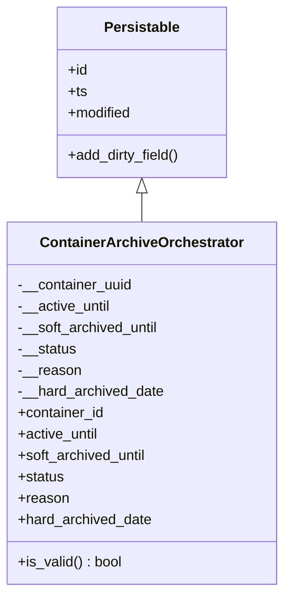
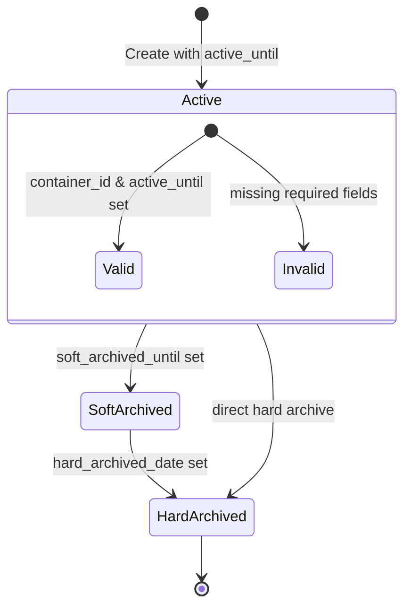

# Diagram: platform/partview_core/partview_service/partview_service/core/datamodel/ContainerArchiveOrchestrator.py

> Auto-generated by Obscura crawlers

## Diagram 1

### SVG

<svg id="container" width="314.4609375" xmlns="http://www.w3.org/2000/svg" class="classDiagram" height="666" viewBox="0 0 314.4609375 666" role="graphics-document document" aria-roledescription="class"><g><defs><marker id="container_class-aggregationStart" class="marker aggregation class" refX="18" refY="7" markerWidth="190" markerHeight="240" orient="auto"><path d="M 18,7 L9,13 L1,7 L9,1 Z"></path></marker></defs><defs><marker id="container_class-aggregationEnd" class="marker aggregation class" refX="1" refY="7" markerWidth="20" markerHeight="28" orient="auto"><path d="M 18,7 L9,13 L1,7 L9,1 Z"></path></marker></defs><defs><marker id="container_class-extensionStart" class="marker extension class" refX="18" refY="7" markerWidth="190" markerHeight="240" orient="auto"><path d="M 1,7 L18,13 V 1 Z"></path></marker></defs><defs><marker id="container_class-extensionEnd" class="marker extension class" refX="1" refY="7" markerWidth="20" markerHeight="28" orient="auto"><path d="M 1,1 V 13 L18,7 Z"></path></marker></defs><defs><marker id="container_class-compositionStart" class="marker composition class" refX="18" refY="7" markerWidth="190" markerHeight="240" orient="auto"><path d="M 18,7 L9,13 L1,7 L9,1 Z"></path></marker></defs><defs><marker id="container_class-compositionEnd" class="marker composition class" refX="1" refY="7" markerWidth="20" markerHeight="28" orient="auto"><path d="M 18,7 L9,13 L1,7 L9,1 Z"></path></marker></defs><defs><marker id="container_class-dependencyStart" class="marker dependency class" refX="6" refY="7" markerWidth="190" markerHeight="240" orient="auto"><path d="M 5,7 L9,13 L1,7 L9,1 Z"></path></marker></defs><defs><marker id="container_class-dependencyEnd" class="marker dependency class" refX="13" refY="7" markerWidth="20" markerHeight="28" orient="auto"><path d="M 18,7 L9,13 L14,7 L9,1 Z"></path></marker></defs><defs><marker id="container_class-lollipopStart" class="marker lollipop class" refX="13" refY="7" markerWidth="190" markerHeight="240" orient="auto"><circle stroke="black" fill="transparent" cx="7" cy="7" r="6"></circle></marker></defs><defs><marker id="container_class-lollipopEnd" class="marker lollipop class" refX="1" refY="7" markerWidth="190" markerHeight="240" orient="auto"><circle stroke="black" fill="transparent" cx="7" cy="7" r="6"></circle></marker></defs><g class="root"><g class="clusters"></g><g class="edgePaths"><path d="M157.23,217.25L157.23,218.542C157.23,219.833,157.23,222.417,157.23,227.875C157.23,233.333,157.23,241.667,157.23,245.833L157.23,250" id="id_Persistable_ContainerArchiveOrchestrator_1" class="edge-thickness-normal edge-pattern-solid relation" style=";;;" data-edge="true" data-et="edge" data-id="id_Persistable_ContainerArchiveOrchestrator_1" data-points="W3sieCI6MTU3LjIzMDQ2ODc1LCJ5IjoyMDB9LHsieCI6MTU3LjIzMDQ2ODc1LCJ5IjoyMjV9LHsieCI6MTU3LjIzMDQ2ODc1LCJ5IjoyNTB9XQ==" marker-start="url(#container_class-extensionStart)"></path></g><g class="edgeLabels"><g class="edgeLabel"><g class="label" data-id="id_Persistable_ContainerArchiveOrchestrator_1" transform="translate(0, 0)"><foreignObject width="0" height="0">

</foreignObject></g></g></g><g class="nodes"><g class="node default" id="classId-Persistable-0" transform="translate(157.23046875, 104)"><g class="basic label-container"><path d="M-96.19140625 -96 L96.19140625 -96 L96.19140625 96 L-96.19140625 96" stroke="none" stroke-width="0" fill="#ECECFF" style=""></path><path d="M-96.19140625 -96 C-47.30889818935259 -96, 1.5736098712948206 -96, 96.19140625 -96 M-96.19140625 -96 C-42.22881540302864 -96, 11.733775443942719 -96, 96.19140625 -96 M96.19140625 -96 C96.19140625 -34.843056628145675, 96.19140625 26.31388674370865, 96.19140625 96 M96.19140625 -96 C96.19140625 -19.540426647725482, 96.19140625 56.919146704549036, 96.19140625 96 M96.19140625 96 C40.84903396872997 96, -14.493338312540061 96, -96.19140625 96 M96.19140625 96 C40.862405181205375 96, -14.46659588758925 96, -96.19140625 96 M-96.19140625 96 C-96.19140625 39.22313329768709, -96.19140625 -17.553733404625817, -96.19140625 -96 M-96.19140625 96 C-96.19140625 44.204499376030924, -96.19140625 -7.591001247938152, -96.19140625 -96" stroke="#9370DB" stroke-width="1.3" fill="none" stroke-dasharray="0 0" style=""></path></g><g class="annotation-group text" transform="translate(0, -72)"></g><g class="label-group text" transform="translate(-40.9765625, -72)"><g class="label" style="font-weight: bolder" transform="translate(0,-12)"><foreignObject width="81.953125" height="24">

Persistable

</foreignObject></g></g><g class="members-group text" transform="translate(-84.19140625, -24)"><g class="label" style="" transform="translate(0,-12)"><foreignObject width="22.078125" height="24">

+id

</foreignObject></g><g class="label" style="" transform="translate(0,12)"><foreignObject width="21.15625" height="24">

+ts

</foreignObject></g><g class="label" style="" transform="translate(0,36)"><foreignObject width="72.609375" height="24">

+modified

</foreignObject></g></g><g class="methods-group text" transform="translate(-84.19140625, 72)"><g class="label" style="" transform="translate(0,-12)"><foreignObject width="127.40625" height="24">

+add_dirty_field()

</foreignObject></g></g><g class="divider" style=""><path d="M-96.19140625 -48 C-57.02074711717763 -48, -17.850087984355255 -48, 96.19140625 -48 M-96.19140625 -48 C-26.706648531285197 -48, 42.77810918742961 -48, 96.19140625 -48" stroke="#9370DB" stroke-width="1.3" fill="none" stroke-dasharray="0 0" style=""></path></g><g class="divider" style=""><path d="M-96.19140625 48 C-34.280618474518 48, 27.630169300964 48, 96.19140625 48 M-96.19140625 48 C-28.194499120360334 48, 39.80240800927933 48, 96.19140625 48" stroke="#9370DB" stroke-width="1.3" fill="none" stroke-dasharray="0 0" style=""></path></g></g><g class="node default" id="classId-ContainerArchiveOrchestrator-1" transform="translate(157.23046875, 454)"><g class="basic label-container"><path d="M-149.23046875 -204 L149.23046875 -204 L149.23046875 204 L-149.23046875 204" stroke="none" stroke-width="0" fill="#ECECFF" style=""></path><path d="M-149.23046875 -204 C-71.60811145134244 -204, 6.014245847315124 -204, 149.23046875 -204 M-149.23046875 -204 C-36.35042642392051 -204, 76.52961590215898 -204, 149.23046875 -204 M149.23046875 -204 C149.23046875 -61.69348348039591, 149.23046875 80.61303303920818, 149.23046875 204 M149.23046875 -204 C149.23046875 -75.91290524809395, 149.23046875 52.1741895038121, 149.23046875 204 M149.23046875 204 C69.8007064461558 204, -9.6290558576884 204, -149.23046875 204 M149.23046875 204 C63.48858324723004 204, -22.25330225553992 204, -149.23046875 204 M-149.23046875 204 C-149.23046875 72.99628168979567, -149.23046875 -58.00743662040867, -149.23046875 -204 M-149.23046875 204 C-149.23046875 111.07801381608718, -149.23046875 18.156027632174357, -149.23046875 -204" stroke="#9370DB" stroke-width="1.3" fill="none" stroke-dasharray="0 0" style=""></path></g><g class="annotation-group text" transform="translate(0, -180)"></g><g class="label-group text" transform="translate(-108.8984375, -180)"><g class="label" style="font-weight: bolder" transform="translate(0,-12)"><foreignObject width="217.796875" height="24">

ContainerArchiveOrchestrator

</foreignObject></g></g><g class="members-group text" transform="translate(-137.23046875, -132)"><g class="label" style="" transform="translate(0,-12)"><foreignObject width="129.953125" height="24">

-__container_uuid

</foreignObject></g><g class="label" style="" transform="translate(0,12)"><foreignObject width="105.84375" height="24">

-__active_until

</foreignObject></g><g class="label" style="" transform="translate(0,36)"><foreignObject width="161.296875" height="24">

-__soft_archived_until

</foreignObject></g><g class="label" style="" transform="translate(0,60)"><foreignObject width="66.0625" height="24">

-__status

</foreignObject></g><g class="label" style="" transform="translate(0,84)"><foreignObject width="70.640625" height="24">

-__reason

</foreignObject></g><g class="label" style="" transform="translate(0,108)"><foreignObject width="165.5625" height="24">

-__hard_archived_date

</foreignObject></g><g class="label" style="" transform="translate(0,132)"><foreignObject width="98.3125" height="24">

+container_id

</foreignObject></g><g class="label" style="" transform="translate(0,156)"><foreignObject width="92.265625" height="24">

+active_until

</foreignObject></g><g class="label" style="" transform="translate(0,180)"><foreignObject width="147.640625" height="24">

+soft_archived_until

</foreignObject></g><g class="label" style="" transform="translate(0,204)"><foreignObject width="52.390625" height="24">

+status

</foreignObject></g><g class="label" style="" transform="translate(0,228)"><foreignObject width="56.984375" height="24">

+reason

</foreignObject></g><g class="label" style="" transform="translate(0,252)"><foreignObject width="151.890625" height="24">

+hard_archived_date

</foreignObject></g></g><g class="methods-group text" transform="translate(-137.23046875, 180)"><g class="label" style="" transform="translate(0,-12)"><foreignObject width="117.984375" height="24">

+is_valid() : bool

</foreignObject></g></g><g class="divider" style=""><path d="M-149.23046875 -156 C-31.76089011959546 -156, 85.70868851080908 -156, 149.23046875 -156 M-149.23046875 -156 C-64.82769467080759 -156, 19.575079408384823 -156, 149.23046875 -156" stroke="#9370DB" stroke-width="1.3" fill="none" stroke-dasharray="0 0" style=""></path></g><g class="divider" style=""><path d="M-149.23046875 156 C-75.10894793531561 156, -0.9874271206312244 156, 149.23046875 156 M-149.23046875 156 C-39.88038521260461 156, 69.46969832479078 156, 149.23046875 156" stroke="#9370DB" stroke-width="1.3" fill="none" stroke-dasharray="0 0" style=""></path></g></g></g></g></g></svg>

## Diagram 2

### SVG

<svg id="container" width="441.0625" xmlns="http://www.w3.org/2000/svg" class="statediagram" height="648" viewBox="0 0 441.0625 648" role="graphics-document document" aria-roledescription="stateDiagram"><g><defs><marker id="container_stateDiagram-barbEnd" refX="19" refY="7" markerWidth="20" markerHeight="14" markerUnits="userSpaceOnUse" orient="auto"><path d="M 19,7 L9,13 L14,7 L9,1 Z"></path></marker></defs><g class="root"><g class="clusters"></g><g class="edgePaths"><path d="M142.551,462.5L142.467,468.583C142.384,474.667,142.217,486.833,150.708,499.167C159.199,511.5,176.346,524,184.92,530.25L193.494,536.5" id="edge2" class="edge-thickness-normal edge-pattern-solid transition" style="fill:none;;;fill:none" data-edge="true" data-et="edge" data-id="edge2" data-points="W3sieCI6MTQyLjU1MDc4MTI1LCJ5Ijo0NjIuNX0seyJ4IjoxNDIuMDUwNzgxMjUsInkiOjQ5OX0seyJ4IjoxOTMuNDk0MjQzNDIxMDUyNjMsInkiOjUzNi41fV0=" marker-end="url(#container_stateDiagram-barbEnd)"></path><path d="M221.031,576.5L220.948,580.583C220.865,584.667,220.698,592.833,220.615,601.083C220.531,609.333,220.531,617.667,220.531,621.833L220.531,626" id="edge3" class="edge-thickness-normal edge-pattern-solid transition" style="fill:none;;;fill:none" data-edge="true" data-et="edge" data-id="edge3" data-points="W3sieCI6MjIxLjAzMTI1LCJ5Ijo1NzYuNX0seyJ4IjoyMjAuNTMxMjUsInkiOjYwMX0seyJ4IjoyMjAuNTMxMjUsInkiOjYyNn1d" marker-end="url(#container_stateDiagram-barbEnd)"></path><path d="M220.531,22L220.531,28.167C220.531,34.333,220.531,46.667,220.531,59C220.531,71.333,220.531,83.667,220.531,89.833L220.531,96" id="edge0" class="edge-thickness-normal edge-pattern-solid transition" style="fill:none;;;fill:none" data-edge="true" data-et="edge" data-id="edge0" data-points="W3sieCI6MjIwLjUzMTI1LCJ5IjoyMn0seyJ4IjoyMjAuNTMxMjUsInkiOjU5fSx7IngiOjIyMC41MzEyNSwieSI6OTZ9XQ==" marker-end="url(#container_stateDiagram-barbEnd)"></path><path d="M159.865,348L156.896,354.167C153.927,360.333,147.989,372.667,145.02,385C142.051,397.333,142.051,409.667,142.051,415.833L142.051,422" id="edge1" class="edge-thickness-normal edge-pattern-solid transition" style="fill:none;;;fill:none" data-edge="true" data-et="edge" data-id="edge1" data-points="W3sieCI6MTU5Ljg2NTM2NjE4MDk4MTYsInkiOjM0OH0seyJ4IjoxNDIuMDUwNzgxMjUsInkiOjM4NX0seyJ4IjoxNDIuMDUwNzgxMjUsInkiOjQyMn1d" marker-end="url(#container_stateDiagram-barbEnd)"></path><path d="M281.197,348L284.166,354.167C287.135,360.333,293.074,372.667,296.043,388.333C299.012,404,299.012,423,299.012,442C299.012,461,299.012,480,290.521,495.667C282.031,511.333,265.049,523.667,256.559,529.833L248.068,536" id="edge4" class="edge-thickness-normal edge-pattern-solid transition" style="fill:none;;;fill:none" data-edge="true" data-et="edge" data-id="edge4" data-points="W3sieCI6MjgxLjE5NzEzMzgxOTAxODQsInkiOjM0OH0seyJ4IjoyOTkuMDExNzE4NzUsInkiOjM4NX0seyJ4IjoyOTkuMDExNzE4NzUsInkiOjQ0Mn0seyJ4IjoyOTkuMDExNzE4NzUsInkiOjQ5OX0seyJ4IjoyNDguMDY4MjU2NTc4OTQ3MzcsInkiOjUzNn1d" marker-end="url(#container_stateDiagram-barbEnd)"></path></g><g class="edgeLabels"><g class="edgeLabel" transform="translate(142.05078125, 499)"><g class="label" data-id="edge2" transform="translate(-85.0625, -12)"><foreignObject width="170.125" height="24">

hard_archived_date set

</foreignObject></g></g><g class="edgeLabel"><g class="label" data-id="edge3" transform="translate(0, 0)"><foreignObject width="0" height="0">

</foreignObject></g></g><g class="edgeLabel" transform="translate(220.53125, 59)"><g class="label" data-id="edge0" transform="translate(-85.0390625, -12)"><foreignObject width="170.078125" height="24">

Create with active_until

</foreignObject></g></g><g class="edgeLabel" transform="translate(142.05078125, 385)"><g class="label" data-id="edge1" transform="translate(-82.9296875, -12)"><foreignObject width="165.859375" height="24">

soft_archived_until set

</foreignObject></g></g><g class="edgeLabel" transform="translate(299.01171875, 442)"><g class="label" data-id="edge4" transform="translate(-68.109375, -12)"><foreignObject width="136.21875" height="24">

direct hard archive

</foreignObject></g></g></g><g class="nodes"><g class="node default" id="state-root_start-0" transform="translate(220.53125, 15)"><circle class="state-start" r="7" width="14" height="14"></circle></g><g class="root" transform="translate(0, 88)"><g class="clusters"><g class="statediagram-state statediagram-cluster" id="Active" data-id="Active" data-look="classic"><g><rect class="outer" x="8" y="8" width="425.0625" height="252" data-look="classic"></rect></g><g class="cluster-label" transform="translate(198.2109375, 9)"><foreignObject width="44.640625" height="19">
Active
</foreignObject></g><rect class="inner" x="8" y="29" width="425.0625" height="227"></rect></g></g><g class="edgePaths"><path d="M223.468,56.422L207.556,67.185C191.645,77.948,159.823,99.474,143.995,120.57C128.167,141.667,128.333,162.333,128.417,172.667L128.5,183" id="edge5" class="edge-thickness-normal edge-pattern-solid transition" style="fill:none;;;fill:none" data-edge="true" data-et="edge" data-id="edge5" data-points="W3sieCI6MjIzLjQ2NzU1NTYyODkyMTY3LCJ5Ijo1Ni40MjIwMzkyMTA0MzE2MzV9LHsieCI6MTI4LCJ5IjoxMjF9LHsieCI6MTI4LjUsInkiOjE4M31d" marker-end="url(#container_stateDiagram-barbEnd)"></path><path d="M235.064,56.422L250.975,67.185C266.886,77.948,298.709,99.474,314.703,120.57C330.698,141.667,330.865,162.333,330.948,172.667L331.031,183" id="edge6" class="edge-thickness-normal edge-pattern-solid transition" style="fill:none;;;fill:none" data-edge="true" data-et="edge" data-id="edge6" data-points="W3sieCI6MjM1LjA2MzY5NDM3MTA3ODMzLCJ5Ijo1Ni40MjIwMzkyMTA0MzE2MzV9LHsieCI6MzMwLjUzMTI1LCJ5IjoxMjF9LHsieCI6MzMxLjAzMTI1LCJ5IjoxODN9XQ==" marker-end="url(#container_stateDiagram-barbEnd)"></path></g><g class="edgeLabels"><g class="edgeLabel" transform="translate(128, 121)"><g class="label" data-id="edge5" transform="translate(-100, -24)"><foreignObject width="200" height="48">

container_id &amp; active_until set

</foreignObject></g></g><g class="edgeLabel" transform="translate(330.53125, 121)"><g class="label" data-id="edge6" transform="translate(-82.53125, -12)"><foreignObject width="165.0625" height="24">

missing required fields

</foreignObject></g></g></g><g class="nodes"><g class="node default" id="state-Active_start-6" transform="translate(229.265625, 52.5)"><circle class="state-start" r="7" width="14" height="14"></circle></g><g class="node  statediagram-state" id="state-Valid-5" transform="translate(128, 202.5)"><g class="basic label-container outer-path"><path d="M-20.7890625 -20 C-4.167349750649542 -20, 12.454362998700915 -20, 20.7890625 -20 C20.7890625 -20, 20.7890625 -20, 20.7890625 -20 C20.94311897932467 -19.993628176882588, 21.09717545864934 -19.98725635376518, 21.201959227361662 -19.982922465033347 C21.310200627586703 -19.969430188565937, 21.418442027811743 -19.955937912098527, 21.61203545140367 -19.931806517013612 C21.75756001917175 -19.9012932239044, 21.903084586939823 -19.870779930795187, 22.016489935703998 -19.847001329696653 C22.138331349245284 -19.810727569257445, 22.26017276278657 -19.774453808818233, 22.412559846023417 -19.729086208503173 C22.545476975170835 -19.67722178376869, 22.678394104318254 -19.62535735903421, 22.797539623264846 -19.578866633275286 C22.92984128796735 -19.51418829054104, 23.06214295266985 -19.449509947806792, 23.16879946518537 -19.397368756032446 C23.272359977877365 -19.335660084704614, 23.375920490569357 -19.273951413376782, 23.523803290612136 -19.185832391312644 C23.643050498058223 -19.100691521667038, 23.762297705504313 -19.015550652021428, 23.86012606344834 -18.94570254698197 C23.962294731380304 -18.859170099287876, 24.064463399312267 -18.77263765159378, 24.175470358128706 -18.678619553365657 C24.291301055585173 -18.56278885590919, 24.407131753041636 -18.446958158452727, 24.467682053365657 -18.386407858128706 C24.566234173374315 -18.270047589911737, 24.664786293382978 -18.153687321694765, 24.73476504698197 -18.07106356344834 C24.808175532852474 -17.968245780710678, 24.881586018722974 -17.865427997973015, 24.974894891312644 -17.734740790612136 C25.047464290771877 -17.612953624367336, 25.12003369023111 -17.491166458122535, 25.186431256032446 -17.37973696518537 C25.23664044903426 -17.277032419325195, 25.28684964203608 -17.174327873465018, 25.367929133275286 -17.008477123264846 C25.404122745594968 -16.915720844416, 25.440316357914647 -16.82296456556715, 25.518148708503173 -16.623497346023417 C25.556741320878352 -16.49386704612873, 25.595333933253528 -16.364236746234045, 25.636063829696653 -16.227427435703994 C25.65645204568606 -16.130191574966148, 25.676840261675466 -16.0329557142283, 25.720869017013612 -15.82297295140367 C25.731879371439295 -15.734642699434064, 25.74288972586498 -15.646312447464457, 25.771984965033347 -15.412896727361662 C25.778638797399644 -15.252021893035646, 25.78529262976594 -15.09114705870963, 25.7890625 -15 C25.7890625 -15, 25.7890625 -15, 25.7890625 -15 C25.7890625 -6.074506540031603, 25.7890625 2.850986919936794, 25.7890625 15 C25.7890625 15, 25.7890625 15, 25.7890625 15 C25.783477301078292 15.135037659764158, 25.77789210215658 15.270075319528319, 25.771984965033347 15.412896727361662 C25.76091728549509 15.501686868399508, 25.749849605956832 15.590477009437352, 25.720869017013612 15.822972951403669 C25.699069841911697 15.926937984710708, 25.677270666809783 16.030903018017746, 25.636063829696653 16.227427435703994 C25.601825263888678 16.342432750983097, 25.567586698080706 16.4574380662622, 25.518148708503173 16.623497346023417 C25.46190137209866 16.767646915123077, 25.405654035694145 16.911796484222737, 25.367929133275286 17.008477123264846 C25.29875785892406 17.14996922648497, 25.229586584572832 17.291461329705097, 25.186431256032446 17.379736965185366 C25.139327411383317 17.458787416226723, 25.092223566734187 17.537837867268077, 24.974894891312644 17.734740790612133 C24.910998829350063 17.824232793542752, 24.84710276738748 17.913724796473367, 24.73476504698197 18.07106356344834 C24.671722637635476 18.14549759551135, 24.608680228288982 18.21993162757436, 24.467682053365657 18.386407858128706 C24.3992777944849 18.454812117009464, 24.330873535604145 18.523216375890218, 24.175470358128706 18.678619553365657 C24.10570614151744 18.737706830776904, 24.03594192490618 18.796794108188156, 23.86012606344834 18.94570254698197 C23.780226769447577 19.002749546412716, 23.700327475446816 19.05979654584346, 23.523803290612136 19.185832391312644 C23.411997019318203 19.25245446828312, 23.300190748024267 19.31907654525359, 23.16879946518537 19.397368756032446 C23.039423855013133 19.460616637871183, 22.9100482448409 19.52386451970992, 22.797539623264846 19.578866633275286 C22.697276170706925 19.61798955386622, 22.597012718149 19.657112474457158, 22.412559846023417 19.729086208503173 C22.29173385864703 19.765057663475147, 22.170907871270643 19.80102911844712, 22.016489935703998 19.847001329696653 C21.867078772505515 19.878329556169927, 21.717667609307032 19.9096577826432, 21.61203545140367 19.931806517013612 C21.481687524679803 19.948054369135406, 21.351339597955935 19.964302221257196, 21.201959227361662 19.982922465033347 C21.074816930875446 19.988181109314347, 20.94767463438923 19.993439753595347, 20.7890625 20 C20.7890625 20, 20.7890625 20, 20.7890625 20 C9.670970234960986 20, -1.4471220300780274 20, -20.7890625 20 C-20.7890625 20, -20.7890625 20, -20.7890625 20 C-20.88205105427991 19.996153964945762, -20.975039608559815 19.99230792989152, -21.201959227361662 19.982922465033347 C-21.284467172679175 19.972637860374988, -21.366975117996688 19.96235325571663, -21.61203545140367 19.931806517013612 C-21.701037990510343 19.913144647029196, -21.790040529617016 19.894482777044782, -22.016489935703994 19.847001329696653 C-22.11157595339407 19.81869299571923, -22.206661971084145 19.790384661741804, -22.412559846023417 19.729086208503173 C-22.54495454871388 19.67742563520477, -22.677349251404337 19.625765061906367, -22.797539623264846 19.578866633275286 C-22.904467654351762 19.52659270415966, -23.01139568543868 19.474318775044036, -23.16879946518537 19.397368756032446 C-23.252915530813627 19.34724646026241, -23.337031596441886 19.297124164492377, -23.523803290612133 19.185832391312644 C-23.652181417195603 19.094172170709722, -23.780559543779077 19.002511950106804, -23.86012606344834 18.94570254698197 C-23.94868512009144 18.870696852066672, -24.03724417673454 18.795691157151374, -24.175470358128706 18.67861955336566 C-24.27183586348002 18.582254048014345, -24.368201368831336 18.48588854266303, -24.467682053365657 18.386407858128706 C-24.568756129811224 18.267069921573352, -24.669830206256794 18.147731985017998, -24.734765046981966 18.07106356344834 C-24.79241282125116 17.99032283193247, -24.85006059552035 17.909582100416603, -24.974894891312644 17.734740790612133 C-25.050021806446562 17.608661559268718, -25.12514872158048 17.482582327925304, -25.186431256032446 17.37973696518537 C-25.252728410870226 17.244123967398505, -25.319025565708003 17.10851096961164, -25.367929133275286 17.00847712326485 C-25.409274131154845 16.90251897467088, -25.4506191290344 16.79656082607691, -25.518148708503173 16.623497346023417 C-25.55096869949595 16.513256939554566, -25.583788690488724 16.40301653308571, -25.636063829696653 16.227427435703994 C-25.66383502278086 16.094980542623073, -25.69160621586506 15.962533649542152, -25.720869017013612 15.82297295140367 C-25.73839275799654 15.682389242957244, -25.755916498979467 15.541805534510818, -25.771984965033347 15.412896727361664 C-25.777464469727803 15.280414518405797, -25.782943974422256 15.147932309449931, -25.7890625 15 C-25.7890625 15, -25.7890625 15, -25.7890625 15 C-25.7890625 4.796494213753027, -25.7890625 -5.407011572493946, -25.7890625 -15 C-25.7890625 -15, -25.7890625 -15, -25.7890625 -15 C-25.784613053407192 -15.107577700196689, -25.780163606814384 -15.215155400393378, -25.771984965033347 -15.41289672736166 C-25.759754238622627 -15.511017378510733, -25.74752351221191 -15.609138029659807, -25.720869017013612 -15.822972951403669 C-25.68863733889761 -15.976692873061515, -25.65640566078161 -16.130412794719362, -25.636063829696653 -16.227427435703994 C-25.59571857175612 -16.362944768278336, -25.55537331381559 -16.498462100852674, -25.518148708503173 -16.623497346023417 C-25.46262652435509 -16.76578850916151, -25.407104340207013 -16.908079672299603, -25.36792913327529 -17.008477123264846 C-25.323645988104047 -17.099059744537165, -25.27936284293281 -17.189642365809483, -25.186431256032446 -17.379736965185366 C-25.1328514066366 -17.46965555448565, -25.079271557240755 -17.559574143785937, -24.974894891312644 -17.734740790612133 C-24.89447025495715 -17.847382502344455, -24.814045618601657 -17.96002421407678, -24.73476504698197 -18.07106356344834 C-24.640187053028487 -18.18273158989854, -24.545609059075005 -18.29439961634874, -24.46768205336566 -18.386407858128706 C-24.38359688365487 -18.470493027839495, -24.29951171394408 -18.55457819755028, -24.175470358128706 -18.678619553365657 C-24.062871900270885 -18.773985582523498, -23.950273442413064 -18.86935161168134, -23.86012606344834 -18.945702546981966 C-23.775554095972605 -19.00608577114912, -23.690982128496874 -19.066468995316274, -23.523803290612136 -19.185832391312644 C-23.398371831542622 -19.26057331795243, -23.27294037247311 -19.335314244592215, -23.168799465185366 -19.397368756032446 C-23.037198417591902 -19.461704587932793, -22.905597369998436 -19.52604041983314, -22.79753962326485 -19.578866633275286 C-22.667274317463306 -19.629696313329276, -22.537009011661766 -19.680525993383267, -22.41255984602342 -19.729086208503173 C-22.311196554983 -19.759263367727314, -22.209833263942578 -19.78944052695146, -22.016489935703994 -19.847001329696653 C-21.930055898221763 -19.865124641524737, -21.843621860739532 -19.88324795335282, -21.612035451403674 -19.931806517013612 C-21.458649302481668 -19.95092608053759, -21.305263153559665 -19.97004564406157, -21.201959227361662 -19.982922465033347 C-21.044921146433083 -19.989417608105295, -20.887883065504504 -19.995912751177247, -20.7890625 -20 C-20.7890625 -20, -20.7890625 -20, -20.7890625 -20" stroke="none" stroke-width="0" fill="#ECECFF" style=""></path><path d="M-20.7890625 -20 C-10.584667153424594 -20, -0.38027180684918704 -20, 20.7890625 -20 M-20.7890625 -20 C-6.43412345770394 -20, 7.92081558459212 -20, 20.7890625 -20 M20.7890625 -20 C20.7890625 -20, 20.7890625 -20, 20.7890625 -20 M20.7890625 -20 C20.7890625 -20, 20.7890625 -20, 20.7890625 -20 M20.7890625 -20 C20.880453600979923 -19.99622003610298, 20.971844701959846 -19.992440072205955, 21.201959227361662 -19.982922465033347 M20.7890625 -20 C20.88243190605592 -19.996138212799785, 20.97580131211184 -19.99227642559957, 21.201959227361662 -19.982922465033347 M21.201959227361662 -19.982922465033347 C21.35900411694398 -19.963346839961673, 21.516049006526295 -19.943771214889995, 21.61203545140367 -19.931806517013612 M21.201959227361662 -19.982922465033347 C21.358660750990833 -19.963389640483097, 21.515362274620003 -19.943856815932847, 21.61203545140367 -19.931806517013612 M21.61203545140367 -19.931806517013612 C21.74537547350606 -19.903848054466703, 21.878715495608446 -19.87588959191979, 22.016489935703998 -19.847001329696653 M21.61203545140367 -19.931806517013612 C21.69452263406806 -19.91451077361444, 21.777009816732452 -19.897215030215275, 22.016489935703998 -19.847001329696653 M22.016489935703998 -19.847001329696653 C22.119933315238026 -19.816204901296977, 22.223376694772053 -19.785408472897302, 22.412559846023417 -19.729086208503173 M22.016489935703998 -19.847001329696653 C22.156258700444543 -19.805390365561173, 22.29602746518509 -19.76377940142569, 22.412559846023417 -19.729086208503173 M22.412559846023417 -19.729086208503173 C22.500004435701644 -19.694965223729465, 22.58744902537987 -19.660844238955757, 22.797539623264846 -19.578866633275286 M22.412559846023417 -19.729086208503173 C22.553257207646467 -19.674185927636096, 22.693954569269522 -19.61928564676902, 22.797539623264846 -19.578866633275286 M22.797539623264846 -19.578866633275286 C22.904673266013734 -19.526492186743095, 23.011806908762626 -19.474117740210904, 23.16879946518537 -19.397368756032446 M22.797539623264846 -19.578866633275286 C22.918662254830217 -19.519653386829184, 23.039784886395587 -19.46044014038308, 23.16879946518537 -19.397368756032446 M23.16879946518537 -19.397368756032446 C23.30602592581468 -19.315599533996618, 23.44325238644399 -19.23383031196079, 23.523803290612136 -19.185832391312644 M23.16879946518537 -19.397368756032446 C23.293039421342097 -19.323337811022917, 23.417279377498826 -19.249306866013384, 23.523803290612136 -19.185832391312644 M23.523803290612136 -19.185832391312644 C23.625568283864208 -19.11317358268706, 23.727333277116276 -19.040514774061474, 23.86012606344834 -18.94570254698197 M23.523803290612136 -19.185832391312644 C23.629254990780773 -19.11054132454259, 23.734706690949412 -19.03525025777254, 23.86012606344834 -18.94570254698197 M23.86012606344834 -18.94570254698197 C23.959515730015625 -18.861523793381167, 24.05890539658291 -18.777345039780364, 24.175470358128706 -18.678619553365657 M23.86012606344834 -18.94570254698197 C23.93010403419424 -18.886434229053613, 24.00008200494014 -18.827165911125253, 24.175470358128706 -18.678619553365657 M24.175470358128706 -18.678619553365657 C24.245135741929346 -18.608954169565017, 24.31480112572999 -18.539288785764374, 24.467682053365657 -18.386407858128706 M24.175470358128706 -18.678619553365657 C24.25084027810054 -18.603249633393823, 24.326210198072374 -18.52787971342199, 24.467682053365657 -18.386407858128706 M24.467682053365657 -18.386407858128706 C24.553844128346956 -18.28467648843241, 24.640006203328255 -18.182945118736114, 24.73476504698197 -18.07106356344834 M24.467682053365657 -18.386407858128706 C24.556471929657366 -18.281573849288034, 24.645261805949076 -18.17673984044736, 24.73476504698197 -18.07106356344834 M24.73476504698197 -18.07106356344834 C24.823513907175982 -17.946763050824845, 24.912262767369995 -17.822462538201346, 24.974894891312644 -17.734740790612136 M24.73476504698197 -18.07106356344834 C24.80733760363017 -17.969419373606932, 24.879910160278367 -17.867775183765524, 24.974894891312644 -17.734740790612136 M24.974894891312644 -17.734740790612136 C25.04812457675014 -17.611845521519534, 25.12135426218764 -17.488950252426935, 25.186431256032446 -17.37973696518537 M24.974894891312644 -17.734740790612136 C25.02214306522761 -17.655448123810096, 25.069391239142576 -17.576155457008053, 25.186431256032446 -17.37973696518537 M25.186431256032446 -17.37973696518537 C25.228599935564194 -17.29347955251047, 25.270768615095943 -17.207222139835565, 25.367929133275286 -17.008477123264846 M25.186431256032446 -17.37973696518537 C25.2316185289145 -17.287304921120384, 25.276805801796556 -17.194872877055403, 25.367929133275286 -17.008477123264846 M25.367929133275286 -17.008477123264846 C25.414287510777875 -16.889670783830415, 25.460645888280464 -16.77086444439598, 25.518148708503173 -16.623497346023417 M25.367929133275286 -17.008477123264846 C25.409323047199813 -16.90239361359149, 25.45071696112434 -16.796310103918128, 25.518148708503173 -16.623497346023417 M25.518148708503173 -16.623497346023417 C25.560924884636506 -16.479814703174434, 25.60370106076984 -16.336132060325447, 25.636063829696653 -16.227427435703994 M25.518148708503173 -16.623497346023417 C25.55107206466536 -16.512909742070786, 25.583995420827545 -16.40232213811815, 25.636063829696653 -16.227427435703994 M25.636063829696653 -16.227427435703994 C25.667416725959228 -16.077898616885317, 25.698769622221803 -15.928369798066644, 25.720869017013612 -15.82297295140367 M25.636063829696653 -16.227427435703994 C25.662959521843135 -16.099155998057746, 25.689855213989617 -15.970884560411498, 25.720869017013612 -15.82297295140367 M25.720869017013612 -15.82297295140367 C25.73603713601797 -15.701287152585557, 25.751205255022327 -15.579601353767444, 25.771984965033347 -15.412896727361662 M25.720869017013612 -15.82297295140367 C25.737708966841776 -15.687874937845852, 25.754548916669943 -15.552776924288032, 25.771984965033347 -15.412896727361662 M25.771984965033347 -15.412896727361662 C25.776945299619207 -15.292966894331306, 25.781905634205067 -15.173037061300949, 25.7890625 -15 M25.771984965033347 -15.412896727361662 C25.77732050864681 -15.283895176435504, 25.782656052260272 -15.154893625509345, 25.7890625 -15 M25.7890625 -15 C25.7890625 -15, 25.7890625 -15, 25.7890625 -15 M25.7890625 -15 C25.7890625 -15, 25.7890625 -15, 25.7890625 -15 M25.7890625 -15 C25.7890625 -4.256884859801932, 25.7890625 6.486230280396136, 25.7890625 15 M25.7890625 -15 C25.7890625 -4.360430077873641, 25.7890625 6.279139844252718, 25.7890625 15 M25.7890625 15 C25.7890625 15, 25.7890625 15, 25.7890625 15 M25.7890625 15 C25.7890625 15, 25.7890625 15, 25.7890625 15 M25.7890625 15 C25.784932183557356 15.099861844549919, 25.78080186711471 15.199723689099836, 25.771984965033347 15.412896727361662 M25.7890625 15 C25.7848178047985 15.102627267973325, 25.780573109597004 15.20525453594665, 25.771984965033347 15.412896727361662 M25.771984965033347 15.412896727361662 C25.75658853354742 15.536414156502042, 25.74119210206149 15.659931585642424, 25.720869017013612 15.822972951403669 M25.771984965033347 15.412896727361662 C25.75207599749418 15.572615847309994, 25.73216702995501 15.732334967258325, 25.720869017013612 15.822972951403669 M25.720869017013612 15.822972951403669 C25.695363483372766 15.944614419123777, 25.669857949731917 16.066255886843887, 25.636063829696653 16.227427435703994 M25.720869017013612 15.822972951403669 C25.699054542057368 15.927010953061925, 25.67724006710112 16.03104895472018, 25.636063829696653 16.227427435703994 M25.636063829696653 16.227427435703994 C25.60817698219317 16.32109770528437, 25.580290134689687 16.414767974864745, 25.518148708503173 16.623497346023417 M25.636063829696653 16.227427435703994 C25.59800582414617 16.355262022928667, 25.55994781859569 16.48309661015334, 25.518148708503173 16.623497346023417 M25.518148708503173 16.623497346023417 C25.470452171598236 16.74573309409416, 25.422755634693303 16.8679688421649, 25.367929133275286 17.008477123264846 M25.518148708503173 16.623497346023417 C25.46694729956919 16.754715311298245, 25.415745890635204 16.885933276573073, 25.367929133275286 17.008477123264846 M25.367929133275286 17.008477123264846 C25.324989269108727 17.096312019323907, 25.282049404942168 17.18414691538297, 25.186431256032446 17.379736965185366 M25.367929133275286 17.008477123264846 C25.322282831743284 17.101848125441105, 25.27663653021128 17.195219127617367, 25.186431256032446 17.379736965185366 M25.186431256032446 17.379736965185366 C25.127475226474797 17.4786779489385, 25.068519196917148 17.577618932691635, 24.974894891312644 17.734740790612133 M25.186431256032446 17.379736965185366 C25.13272143305794 17.469873678294714, 25.07901161008344 17.56001039140406, 24.974894891312644 17.734740790612133 M24.974894891312644 17.734740790612133 C24.906590517762243 17.830407018078958, 24.83828614421184 17.92607324554578, 24.73476504698197 18.07106356344834 M24.974894891312644 17.734740790612133 C24.900478562238035 17.838967344410246, 24.82606223316343 17.94319389820836, 24.73476504698197 18.07106356344834 M24.73476504698197 18.07106356344834 C24.67891553016174 18.13700496335348, 24.623066013341507 18.20294636325862, 24.467682053365657 18.386407858128706 M24.73476504698197 18.07106356344834 C24.64650391078333 18.175273290040785, 24.55824277458469 18.27948301663323, 24.467682053365657 18.386407858128706 M24.467682053365657 18.386407858128706 C24.358470053998953 18.49561985749541, 24.249258054632254 18.60483185686211, 24.175470358128706 18.678619553365657 M24.467682053365657 18.386407858128706 C24.404733673606632 18.44935623788773, 24.341785293847607 18.512304617646755, 24.175470358128706 18.678619553365657 M24.175470358128706 18.678619553365657 C24.068135318954667 18.769527694296457, 23.960800279780628 18.860435835227257, 23.86012606344834 18.94570254698197 M24.175470358128706 18.678619553365657 C24.055158756482317 18.78051828207759, 23.934847154835932 18.882417010789524, 23.86012606344834 18.94570254698197 M23.86012606344834 18.94570254698197 C23.744658859336727 19.028144546121062, 23.629191655225114 19.110586545260155, 23.523803290612136 19.185832391312644 M23.86012606344834 18.94570254698197 C23.753170289077257 19.022067502091637, 23.64621451470617 19.0984324572013, 23.523803290612136 19.185832391312644 M23.523803290612136 19.185832391312644 C23.38403240504168 19.269117761524353, 23.244261519471227 19.352403131736065, 23.16879946518537 19.397368756032446 M23.523803290612136 19.185832391312644 C23.436640523961767 19.237770126839788, 23.349477757311398 19.28970786236693, 23.16879946518537 19.397368756032446 M23.16879946518537 19.397368756032446 C23.03509456902594 19.462733096825076, 22.901389672866507 19.528097437617706, 22.797539623264846 19.578866633275286 M23.16879946518537 19.397368756032446 C23.03182287693991 19.464332529625388, 22.89484628869445 19.53129630321833, 22.797539623264846 19.578866633275286 M22.797539623264846 19.578866633275286 C22.703634645054688 19.61550846947664, 22.60972966684453 19.652150305677992, 22.412559846023417 19.729086208503173 M22.797539623264846 19.578866633275286 C22.67541401315525 19.62652019421442, 22.55328840304566 19.67417375515356, 22.412559846023417 19.729086208503173 M22.412559846023417 19.729086208503173 C22.321802696787376 19.756105782503912, 22.231045547551336 19.783125356504655, 22.016489935703998 19.847001329696653 M22.412559846023417 19.729086208503173 C22.31877982031409 19.757005731821984, 22.224999794604766 19.784925255140795, 22.016489935703998 19.847001329696653 M22.016489935703998 19.847001329696653 C21.907309011350673 19.869894162142906, 21.798128086997348 19.892786994589155, 21.61203545140367 19.931806517013612 M22.016489935703998 19.847001329696653 C21.919775581720007 19.867280197218765, 21.823061227736016 19.88755906474088, 21.61203545140367 19.931806517013612 M21.61203545140367 19.931806517013612 C21.462036233551846 19.95050390001997, 21.31203701570002 19.96920128302633, 21.201959227361662 19.982922465033347 M21.61203545140367 19.931806517013612 C21.514800915129744 19.943926789320333, 21.417566378855817 19.956047061627054, 21.201959227361662 19.982922465033347 M21.201959227361662 19.982922465033347 C21.049682008056877 19.989220697411984, 20.89740478875209 19.99551892979062, 20.7890625 20 M21.201959227361662 19.982922465033347 C21.072929267342317 19.988259183655597, 20.94389930732297 19.993595902277843, 20.7890625 20 M20.7890625 20 C20.7890625 20, 20.7890625 20, 20.7890625 20 M20.7890625 20 C20.7890625 20, 20.7890625 20, 20.7890625 20 M20.7890625 20 C7.139216429244113 20, -6.510629641511773 20, -20.7890625 20 M20.7890625 20 C5.708382541644658 20, -9.372297416710683 20, -20.7890625 20 M-20.7890625 20 C-20.7890625 20, -20.7890625 20, -20.7890625 20 M-20.7890625 20 C-20.7890625 20, -20.7890625 20, -20.7890625 20 M-20.7890625 20 C-20.892536142724786 19.99572029847984, -20.996009785449573 19.991440596959677, -21.201959227361662 19.982922465033347 M-20.7890625 20 C-20.9052386984826 19.995194916887435, -21.021414896965197 19.990389833774866, -21.201959227361662 19.982922465033347 M-21.201959227361662 19.982922465033347 C-21.303890664021367 19.970216724704105, -21.40582210068107 19.95751098437486, -21.61203545140367 19.931806517013612 M-21.201959227361662 19.982922465033347 C-21.32837048083339 19.967165318720696, -21.454781734305115 19.95140817240804, -21.61203545140367 19.931806517013612 M-21.61203545140367 19.931806517013612 C-21.699684597613963 19.913428423677857, -21.787333743824256 19.895050330342105, -22.016489935703994 19.847001329696653 M-21.61203545140367 19.931806517013612 C-21.712419411963126 19.91075821390581, -21.81280337252258 19.889709910798008, -22.016489935703994 19.847001329696653 M-22.016489935703994 19.847001329696653 C-22.15277892719239 19.806426338943808, -22.289067918680782 19.76585134819096, -22.412559846023417 19.729086208503173 M-22.016489935703994 19.847001329696653 C-22.16156624793822 19.803810240210442, -22.306642560172445 19.760619150724228, -22.412559846023417 19.729086208503173 M-22.412559846023417 19.729086208503173 C-22.510271872074355 19.690958857624626, -22.607983898125294 19.652831506746082, -22.797539623264846 19.578866633275286 M-22.412559846023417 19.729086208503173 C-22.52351298388178 19.685792159764524, -22.634466121740143 19.642498111025876, -22.797539623264846 19.578866633275286 M-22.797539623264846 19.578866633275286 C-22.942457665243506 19.508020519520418, -23.08737570722216 19.437174405765553, -23.16879946518537 19.397368756032446 M-22.797539623264846 19.578866633275286 C-22.945613017366213 19.50647796186252, -23.09368641146758 19.43408929044975, -23.16879946518537 19.397368756032446 M-23.16879946518537 19.397368756032446 C-23.279997178777183 19.33110930074323, -23.391194892368993 19.264849845454012, -23.523803290612133 19.185832391312644 M-23.16879946518537 19.397368756032446 C-23.296255424080165 19.32142148934012, -23.42371138297496 19.2454742226478, -23.523803290612133 19.185832391312644 M-23.523803290612133 19.185832391312644 C-23.61715357133917 19.119181571951906, -23.71050385206621 19.05253075259117, -23.86012606344834 18.94570254698197 M-23.523803290612133 19.185832391312644 C-23.610542871357744 19.12390152101771, -23.69728245210336 19.061970650722774, -23.86012606344834 18.94570254698197 M-23.86012606344834 18.94570254698197 C-23.930533292458488 18.886070665849257, -24.00094052146863 18.826438784716544, -24.175470358128706 18.67861955336566 M-23.86012606344834 18.94570254698197 C-23.952503959950366 18.867462459693417, -24.044881856452395 18.789222372404865, -24.175470358128706 18.67861955336566 M-24.175470358128706 18.67861955336566 C-24.256387635497724 18.597702275996642, -24.337304912866742 18.516784998627625, -24.467682053365657 18.386407858128706 M-24.175470358128706 18.67861955336566 C-24.234098465804966 18.6199914456894, -24.29272657348122 18.56136333801314, -24.467682053365657 18.386407858128706 M-24.467682053365657 18.386407858128706 C-24.530081631219623 18.312732815774716, -24.59248120907359 18.23905777342073, -24.734765046981966 18.07106356344834 M-24.467682053365657 18.386407858128706 C-24.56581792400496 18.27053905461345, -24.66395379464426 18.154670251098196, -24.734765046981966 18.07106356344834 M-24.734765046981966 18.07106356344834 C-24.81115200895049 17.964076966553666, -24.88753897091901 17.85709036965899, -24.974894891312644 17.734740790612133 M-24.734765046981966 18.07106356344834 C-24.815429677483632 17.95808571900028, -24.8960943079853 17.845107874552216, -24.974894891312644 17.734740790612133 M-24.974894891312644 17.734740790612133 C-25.036392640804564 17.63153425043316, -25.097890390296484 17.52832771025418, -25.186431256032446 17.37973696518537 M-24.974894891312644 17.734740790612133 C-25.040776687847526 17.62417687018715, -25.106658484382407 17.513612949762166, -25.186431256032446 17.37973696518537 M-25.186431256032446 17.37973696518537 C-25.253000840586868 17.243566703506097, -25.319570425141293 17.107396441826825, -25.367929133275286 17.00847712326485 M-25.186431256032446 17.37973696518537 C-25.257183930169315 17.235010057000306, -25.327936604306185 17.090283148815242, -25.367929133275286 17.00847712326485 M-25.367929133275286 17.00847712326485 C-25.402354501323003 16.920252466109755, -25.436779869370717 16.83202780895466, -25.518148708503173 16.623497346023417 M-25.367929133275286 17.00847712326485 C-25.42377068524557 16.865367490544056, -25.479612237215857 16.722257857823262, -25.518148708503173 16.623497346023417 M-25.518148708503173 16.623497346023417 C-25.547221784081863 16.525842606575132, -25.576294859660557 16.428187867126848, -25.636063829696653 16.227427435703994 M-25.518148708503173 16.623497346023417 C-25.54587177188962 16.53037721759449, -25.573594835276065 16.437257089165563, -25.636063829696653 16.227427435703994 M-25.636063829696653 16.227427435703994 C-25.653046242691595 16.14643459425936, -25.67002865568654 16.06544175281473, -25.720869017013612 15.82297295140367 M-25.636063829696653 16.227427435703994 C-25.665760808994175 16.08579604702295, -25.695457788291698 15.944164658341903, -25.720869017013612 15.82297295140367 M-25.720869017013612 15.82297295140367 C-25.738879332155285 15.678485715751647, -25.75688964729696 15.533998480099624, -25.771984965033347 15.412896727361664 M-25.720869017013612 15.82297295140367 C-25.737719228932587 15.687792610517246, -25.75456944085156 15.552612269630819, -25.771984965033347 15.412896727361664 M-25.771984965033347 15.412896727361664 C-25.777448673320407 15.280796440324242, -25.78291238160747 15.148696153286817, -25.7890625 15 M-25.771984965033347 15.412896727361664 C-25.778453733403413 15.256496327931877, -25.78492250177348 15.100095928502089, -25.7890625 15 M-25.7890625 15 C-25.7890625 15, -25.7890625 15, -25.7890625 15 M-25.7890625 15 C-25.7890625 15, -25.7890625 15, -25.7890625 15 M-25.7890625 15 C-25.7890625 5.415626909636263, -25.7890625 -4.168746180727474, -25.7890625 -15 M-25.7890625 15 C-25.7890625 8.517275482276599, -25.7890625 2.034550964553196, -25.7890625 -15 M-25.7890625 -15 C-25.7890625 -15, -25.7890625 -15, -25.7890625 -15 M-25.7890625 -15 C-25.7890625 -15, -25.7890625 -15, -25.7890625 -15 M-25.7890625 -15 C-25.785119111334946 -15.095342347575006, -25.781175722669897 -15.190684695150011, -25.771984965033347 -15.41289672736166 M-25.7890625 -15 C-25.78290687481159 -15.148829295335748, -25.776751249623185 -15.297658590671498, -25.771984965033347 -15.41289672736166 M-25.771984965033347 -15.41289672736166 C-25.75687261678125 -15.534135106922484, -25.741760268529152 -15.655373486483308, -25.720869017013612 -15.822972951403669 M-25.771984965033347 -15.41289672736166 C-25.7597418522079 -15.511116748166932, -25.747498739382454 -15.609336768972204, -25.720869017013612 -15.822972951403669 M-25.720869017013612 -15.822972951403669 C-25.68854497137613 -15.977133393971254, -25.65622092573864 -16.131293836538838, -25.636063829696653 -16.227427435703994 M-25.720869017013612 -15.822972951403669 C-25.689992414178658 -15.970230222705744, -25.659115811343707 -16.117487494007822, -25.636063829696653 -16.227427435703994 M-25.636063829696653 -16.227427435703994 C-25.604262022588035 -16.33424782279275, -25.57246021547942 -16.441068209881507, -25.518148708503173 -16.623497346023417 M-25.636063829696653 -16.227427435703994 C-25.607553129850654 -16.323193188364506, -25.57904243000465 -16.41895894102502, -25.518148708503173 -16.623497346023417 M-25.518148708503173 -16.623497346023417 C-25.464007235761123 -16.76225004908584, -25.409865763019074 -16.90100275214826, -25.36792913327529 -17.008477123264846 M-25.518148708503173 -16.623497346023417 C-25.476767637266327 -16.729547942709008, -25.43538656602948 -16.8355985393946, -25.36792913327529 -17.008477123264846 M-25.36792913327529 -17.008477123264846 C-25.304680519428548 -17.137854230783383, -25.241431905581805 -17.267231338301915, -25.186431256032446 -17.379736965185366 M-25.36792913327529 -17.008477123264846 C-25.319331607405825 -17.107884951312805, -25.27073408153636 -17.20729277936076, -25.186431256032446 -17.379736965185366 M-25.186431256032446 -17.379736965185366 C-25.108961998272676 -17.509747154658555, -25.031492740512903 -17.639757344131745, -24.974894891312644 -17.734740790612133 M-25.186431256032446 -17.379736965185366 C-25.12777744409474 -17.478170762330972, -25.069123632157034 -17.57660455947658, -24.974894891312644 -17.734740790612133 M-24.974894891312644 -17.734740790612133 C-24.9106744172229 -17.824687160997378, -24.84645394313316 -17.914633531382623, -24.73476504698197 -18.07106356344834 M-24.974894891312644 -17.734740790612133 C-24.909205795145887 -17.826744094197693, -24.84351669897913 -17.91874739778325, -24.73476504698197 -18.07106356344834 M-24.73476504698197 -18.07106356344834 C-24.649520978920275 -18.171711044422803, -24.564276910858585 -18.272358525397262, -24.46768205336566 -18.386407858128706 M-24.73476504698197 -18.07106356344834 C-24.644129595954293 -18.178076638262155, -24.553494144926617 -18.285089713075966, -24.46768205336566 -18.386407858128706 M-24.46768205336566 -18.386407858128706 C-24.381715538194957 -18.47237437329941, -24.295749023024253 -18.558340888470113, -24.175470358128706 -18.678619553365657 M-24.46768205336566 -18.386407858128706 C-24.39804066066686 -18.456049250827505, -24.328399267968063 -18.5256906435263, -24.175470358128706 -18.678619553365657 M-24.175470358128706 -18.678619553365657 C-24.05905267164745 -18.777220304163496, -23.94263498516619 -18.875821054961335, -23.86012606344834 -18.945702546981966 M-24.175470358128706 -18.678619553365657 C-24.10712407425335 -18.736505903009252, -24.038777790377992 -18.794392252652845, -23.86012606344834 -18.945702546981966 M-23.86012606344834 -18.945702546981966 C-23.75671569958389 -19.0195361276448, -23.65330533571944 -19.09336970830763, -23.523803290612136 -19.185832391312644 M-23.86012606344834 -18.945702546981966 C-23.788981002123343 -18.996499144419595, -23.71783594079835 -19.047295741857226, -23.523803290612136 -19.185832391312644 M-23.523803290612136 -19.185832391312644 C-23.410689105016502 -19.253233816044833, -23.297574919420867 -19.320635240777023, -23.168799465185366 -19.397368756032446 M-23.523803290612136 -19.185832391312644 C-23.39149259625558 -19.264672452441822, -23.259181901899026 -19.343512513571, -23.168799465185366 -19.397368756032446 M-23.168799465185366 -19.397368756032446 C-23.042285785137 -19.45921752548776, -22.91577210508863 -19.521066294943076, -22.79753962326485 -19.578866633275286 M-23.168799465185366 -19.397368756032446 C-23.0555010585884 -19.452756971967602, -22.942202651991437 -19.508145187902755, -22.79753962326485 -19.578866633275286 M-22.79753962326485 -19.578866633275286 C-22.718916828038665 -19.60954534317204, -22.64029403281248 -19.640224053068792, -22.41255984602342 -19.729086208503173 M-22.79753962326485 -19.578866633275286 C-22.67364672382534 -19.62720979265086, -22.54975382438583 -19.67555295202643, -22.41255984602342 -19.729086208503173 M-22.41255984602342 -19.729086208503173 C-22.329655393310837 -19.753767933457233, -22.246750940598254 -19.778449658411294, -22.016489935703994 -19.847001329696653 M-22.41255984602342 -19.729086208503173 C-22.279975984824006 -19.768558134176647, -22.147392123624595 -19.80803005985012, -22.016489935703994 -19.847001329696653 M-22.016489935703994 -19.847001329696653 C-21.899473323708854 -19.871537133067978, -21.782456711713714 -19.896072936439307, -21.612035451403674 -19.931806517013612 M-22.016489935703994 -19.847001329696653 C-21.92716779721451 -19.86573021262462, -21.837845658725026 -19.884459095552586, -21.612035451403674 -19.931806517013612 M-21.612035451403674 -19.931806517013612 C-21.510107022140183 -19.944511882471307, -21.40817859287669 -19.957217247929005, -21.201959227361662 -19.982922465033347 M-21.612035451403674 -19.931806517013612 C-21.5153950864576 -19.943852725941554, -21.41875472151152 -19.9558989348695, -21.201959227361662 -19.982922465033347 M-21.201959227361662 -19.982922465033347 C-21.06513840523748 -19.988581416095812, -20.928317583113298 -19.99424036715828, -20.7890625 -20 M-21.201959227361662 -19.982922465033347 C-21.054542395860004 -19.989019670285444, -20.907125564358342 -19.99511687553754, -20.7890625 -20 M-20.7890625 -20 C-20.7890625 -20, -20.7890625 -20, -20.7890625 -20 M-20.7890625 -20 C-20.7890625 -20, -20.7890625 -20, -20.7890625 -20" stroke="#9370DB" stroke-width="1.3" fill="none" stroke-dasharray="0 0" style=""></path></g><g class="label" style="" transform="translate(-17.7890625, -12)"><rect></rect><foreignObject width="35.578125" height="24">

Valid

</foreignObject></g></g><g class="node  statediagram-state" id="state-Invalid-6" transform="translate(330.53125, 202.5)"><g class="basic label-container outer-path"><path d="M-27.4609375 -20 C-15.375402537615544 -20, -3.2898675752310886 -20, 27.4609375 -20 C27.4609375 -20, 27.4609375 -20, 27.4609375 -20 C27.55206824376937 -19.996230804556863, 27.643198987538742 -19.99246160911372, 27.873834227361662 -19.982922465033347 C28.031215980494746 -19.96330484996386, 28.18859773362783 -19.94368723489437, 28.28391045140367 -19.931806517013612 C28.371919621146805 -19.91335293468138, 28.459928790889936 -19.89489935234915, 28.688364935703998 -19.847001329696653 C28.832263921871135 -19.8041607453669, 28.97616290803827 -19.761320161037148, 29.084434846023417 -19.729086208503173 C29.174473563287872 -19.69395299200425, 29.264512280552328 -19.65881977550533, 29.469414623264846 -19.578866633275286 C29.58976352193354 -19.52003164179361, 29.710112420602236 -19.461196650311937, 29.84067446518537 -19.397368756032446 C29.97818430078965 -19.31543067916249, 30.11569413639393 -19.233492602292532, 30.195678290612136 -19.185832391312644 C30.297681489278524 -19.113003507290212, 30.399684687944912 -19.04017462326778, 30.53200106344834 -18.94570254698197 C30.65357446116781 -18.842735131510146, 30.77514785888728 -18.739767716038322, 30.847345358128706 -18.678619553365657 C30.934198958441733 -18.59176595305263, 31.02105255875476 -18.504912352739602, 31.139557053365657 -18.386407858128706 C31.205159825747543 -18.30895081114217, 31.27076259812943 -18.23149376415564, 31.40664004698197 -18.07106356344834 C31.464701452943522 -17.989743504701842, 31.522762858905075 -17.908423445955346, 31.646769891312644 -17.734740790612136 C31.711734175277655 -17.62571665495471, 31.776698459242667 -17.51669251929729, 31.858306256032446 -17.37973696518537 C31.921120960194894 -17.251247434112607, 31.983935664357343 -17.122757903039844, 32.03980413327529 -17.008477123264846 C32.07818568575987 -16.91011363433022, 32.11656723824444 -16.81175014539559, 32.190023708503176 -16.623497346023417 C32.21902917772534 -16.526069692323727, 32.2480346469475 -16.428642038624037, 32.30793882969665 -16.227427435703994 C32.33861410544608 -16.08113033730088, 32.3692893811955 -15.934833238897765, 32.39274401701361 -15.82297295140367 C32.4100017065763 -15.68452363283041, 32.427259396139 -15.546074314257151, 32.44385996503335 -15.412896727361662 C32.4479772572769 -15.31334977891311, 32.452094549520446 -15.213802830464559, 32.4609375 -15 C32.4609375 -15, 32.4609375 -15, 32.4609375 -15 C32.4609375 -5.750962262146116, 32.4609375 3.4980754757077683, 32.4609375 15 C32.4609375 15, 32.4609375 15, 32.4609375 15 C32.456498538507795 15.107324193836831, 32.45205957701559 15.214648387673662, 32.44385996503335 15.412896727361662 C32.43228473763048 15.505758656557633, 32.420709510227624 15.598620585753604, 32.39274401701361 15.822972951403669 C32.362635308758755 15.966567965522938, 32.332526600503904 16.110162979642208, 32.30793882969665 16.227427435703994 C32.26426737663547 16.374117260744153, 32.220595923574294 16.52080708578431, 32.190023708503176 16.623497346023417 C32.1330870787136 16.769413422673317, 32.076150448924025 16.91532949932322, 32.03980413327529 17.008477123264846 C31.978552387104312 17.133769572665596, 31.917300640933338 17.25906202206635, 31.858306256032446 17.379736965185366 C31.80095734708527 17.475980852553228, 31.743608438138093 17.572224739921086, 31.646769891312644 17.734740790612133 C31.5621162837359 17.853305545068864, 31.477462676159153 17.97187029952559, 31.40664004698197 18.07106356344834 C31.346809501004813 18.141705355597086, 31.286978955027656 18.212347147745827, 31.139557053365657 18.386407858128706 C31.030902504445713 18.49506240704865, 30.92224795552577 18.603716955968594, 30.847345358128706 18.678619553365657 C30.739756304034366 18.76974283395962, 30.63216724994002 18.860866114553584, 30.53200106344834 18.94570254698197 C30.430198010395777 19.018388529782797, 30.328394957343214 19.091074512583628, 30.195678290612136 19.185832391312644 C30.057657801480353 19.268074751638444, 29.919637312348573 19.350317111964248, 29.84067446518537 19.397368756032446 C29.709315459673455 19.461586260769323, 29.577956454161537 19.525803765506197, 29.469414623264846 19.578866633275286 C29.37907570154128 19.614116989917655, 29.288736779817715 19.64936734656002, 29.084434846023417 19.729086208503173 C28.92816004529617 19.77561123246265, 28.771885244568924 19.822136256422134, 28.688364935703998 19.847001329696653 C28.606928511053635 19.864076752309025, 28.52549208640327 19.8811521749214, 28.28391045140367 19.931806517013612 C28.138385272967692 19.94994621158838, 27.992860094531714 19.968085906163147, 27.873834227361662 19.982922465033347 C27.79023247710557 19.986380259001333, 27.706630726849475 19.98983805296932, 27.4609375 20 C27.4609375 20, 27.4609375 20, 27.4609375 20 C11.656559229841537 20, -4.147819040316925 20, -27.4609375 20 C-27.4609375 20, -27.4609375 20, -27.4609375 20 C-27.58841485931694 19.994727497417813, -27.715892218633883 19.989454994835622, -27.873834227361662 19.982922465033347 C-27.961103392842688 19.97204437490053, -28.04837255832371 19.961166284767717, -28.28391045140367 19.931806517013612 C-28.39715384956967 19.908061873384575, -28.510397247735668 19.884317229755542, -28.688364935703994 19.847001329696653 C-28.771312013066126 19.82230691483461, -28.85425909042826 19.797612499972562, -29.084434846023417 19.729086208503173 C-29.206503424779648 19.681454901267173, -29.32857200353588 19.633823594031174, -29.469414623264846 19.578866633275286 C-29.571062850664305 19.529173842902207, -29.672711078063767 19.479481052529124, -29.84067446518537 19.397368756032446 C-29.928911998436334 19.344790598618754, -30.017149531687295 19.29221244120506, -30.195678290612133 19.185832391312644 C-30.3230356603863 19.094900977063368, -30.450393030160463 19.003969562814092, -30.53200106344834 18.94570254698197 C-30.65758348294435 18.8393396632692, -30.78316590244036 18.73297677955643, -30.847345358128706 18.67861955336566 C-30.956295220907 18.569669690587368, -31.065245083685287 18.460719827809076, -31.139557053365657 18.386407858128706 C-31.21881658162914 18.292826309942026, -31.298076109892627 18.19924476175535, -31.406640046981966 18.07106356344834 C-31.49712997737706 17.944324530284586, -31.587619907772154 17.817585497120827, -31.646769891312644 17.734740790612133 C-31.7163723778801 17.617932746645838, -31.78597486444755 17.501124702679544, -31.858306256032446 17.37973696518537 C-31.922757415866787 17.2479000105323, -31.98720857570113 17.116063055879238, -32.03980413327528 17.00847712326485 C-32.07871738567086 16.908751004240322, -32.11763063806645 16.80902488521579, -32.190023708503176 16.623497346023417 C-32.22114310706603 16.518969128834396, -32.25226250562887 16.414440911645375, -32.30793882969665 16.227427435703994 C-32.32792016803556 16.132132063461142, -32.34790150637448 16.036836691218294, -32.39274401701361 15.82297295140367 C-32.408574153449806 15.695976136763376, -32.424404289886006 15.56897932212308, -32.44385996503335 15.412896727361664 C-32.4502810854467 15.257648349311602, -32.45670220586004 15.102399971261537, -32.4609375 15 C-32.4609375 15, -32.4609375 15, -32.4609375 15 C-32.4609375 5.491632073407676, -32.4609375 -4.016735853184649, -32.4609375 -15 C-32.4609375 -15, -32.4609375 -15, -32.4609375 -15 C-32.45684056501927 -15.099054755212597, -32.45274363003854 -15.198109510425194, -32.44385996503335 -15.41289672736166 C-32.42880567889884 -15.53366930525269, -32.41375139276433 -15.654441883143722, -32.39274401701361 -15.822972951403669 C-32.365041809692435 -15.955090836294264, -32.33733960237126 -16.08720872118486, -32.30793882969665 -16.227427435703994 C-32.26852252781514 -16.359824459879693, -32.229106225933634 -16.492221484055392, -32.190023708503176 -16.623497346023417 C-32.1534649466397 -16.717189422951947, -32.11690618477623 -16.81088149988048, -32.03980413327529 -17.008477123264846 C-31.9741485247159 -17.14277781716409, -31.90849291615651 -17.27707851106334, -31.858306256032446 -17.379736965185366 C-31.799033212620984 -17.479209966830396, -31.739760169209518 -17.578682968475427, -31.646769891312644 -17.734740790612133 C-31.55695328758098 -17.86053677110744, -31.467136683849322 -17.986332751602752, -31.40664004698197 -18.07106356344834 C-31.343694936924948 -18.14538271445735, -31.280749826867925 -18.219701865466366, -31.13955705336566 -18.386407858128706 C-31.03967145722263 -18.486293454271735, -30.9397858610796 -18.586179050414763, -30.847345358128706 -18.678619553365657 C-30.743351247213425 -18.766698072401088, -30.639357136298145 -18.854776591436522, -30.53200106344834 -18.945702546981966 C-30.407483762974685 -19.03460619072594, -30.282966462501033 -19.12350983446991, -30.195678290612136 -19.185832391312644 C-30.075726010282533 -19.2573084360856, -29.955773729952927 -19.32878448085856, -29.840674465185366 -19.397368756032446 C-29.731881838246544 -19.450554230515557, -29.623089211307725 -19.503739704998672, -29.46941462326485 -19.578866633275286 C-29.357607085989667 -19.622494069700917, -29.24579954871448 -19.66612150612655, -29.08443484602342 -19.729086208503173 C-28.94768355150111 -19.769798832832443, -28.810932256978806 -19.810511457161716, -28.688364935703994 -19.847001329696653 C-28.53599469654602 -19.87895000915233, -28.383624457388045 -19.910898688608007, -28.283910451403674 -19.931806517013612 C-28.15111793329048 -19.948359087134303, -28.018325415177284 -19.964911657254994, -27.873834227361662 -19.982922465033347 C-27.768300371486387 -19.98728737759972, -27.66276651561111 -19.991652290166094, -27.4609375 -20 C-27.4609375 -20, -27.4609375 -20, -27.4609375 -20" stroke="none" stroke-width="0" fill="#ECECFF" style=""></path><path d="M-27.4609375 -20 C-9.243651611094304 -20, 8.973634277811392 -20, 27.4609375 -20 M-27.4609375 -20 C-9.580918651628096 -20, 8.299100196743808 -20, 27.4609375 -20 M27.4609375 -20 C27.4609375 -20, 27.4609375 -20, 27.4609375 -20 M27.4609375 -20 C27.4609375 -20, 27.4609375 -20, 27.4609375 -20 M27.4609375 -20 C27.548481454827762 -19.99637915524484, 27.63602540965552 -19.99275831048968, 27.873834227361662 -19.982922465033347 M27.4609375 -20 C27.549331548152956 -19.99634399512483, 27.637725596305913 -19.99268799024966, 27.873834227361662 -19.982922465033347 M27.873834227361662 -19.982922465033347 C27.99056916697019 -19.968371469985886, 28.10730410657872 -19.95382047493843, 28.28391045140367 -19.931806517013612 M27.873834227361662 -19.982922465033347 C27.961465675237786 -19.971999216447077, 28.04909712311391 -19.961075967860808, 28.28391045140367 -19.931806517013612 M28.28391045140367 -19.931806517013612 C28.397908486201263 -19.90790364272233, 28.511906520998853 -19.884000768431054, 28.688364935703998 -19.847001329696653 M28.28391045140367 -19.931806517013612 C28.365834526176986 -19.914628844922923, 28.447758600950305 -19.897451172832234, 28.688364935703998 -19.847001329696653 M28.688364935703998 -19.847001329696653 C28.775327777500358 -19.82111136996334, 28.86229061929672 -19.795221410230024, 29.084434846023417 -19.729086208503173 M28.688364935703998 -19.847001329696653 C28.79001707562376 -19.81673817643528, 28.891669215543516 -19.786475023173907, 29.084434846023417 -19.729086208503173 M29.084434846023417 -19.729086208503173 C29.215229182468065 -19.67805010005167, 29.346023518912713 -19.62701399160017, 29.469414623264846 -19.578866633275286 M29.084434846023417 -19.729086208503173 C29.168880180819546 -19.696135536616072, 29.25332551561567 -19.663184864728972, 29.469414623264846 -19.578866633275286 M29.469414623264846 -19.578866633275286 C29.59041396180302 -19.5197136611174, 29.711413300341196 -19.46056068895951, 29.84067446518537 -19.397368756032446 M29.469414623264846 -19.578866633275286 C29.577461272341928 -19.526045845146818, 29.685507921419006 -19.47322505701835, 29.84067446518537 -19.397368756032446 M29.84067446518537 -19.397368756032446 C29.963589031276538 -19.32412757207962, 30.086503597367706 -19.2508863881268, 30.195678290612136 -19.185832391312644 M29.84067446518537 -19.397368756032446 C29.930605916746646 -19.34378124239262, 30.02053736830792 -19.290193728752794, 30.195678290612136 -19.185832391312644 M30.195678290612136 -19.185832391312644 C30.30400015177912 -19.108492068977988, 30.41232201294611 -19.03115174664333, 30.53200106344834 -18.94570254698197 M30.195678290612136 -19.185832391312644 C30.264529955523123 -19.13667324744154, 30.333381620434114 -19.087514103570438, 30.53200106344834 -18.94570254698197 M30.53200106344834 -18.94570254698197 C30.648046840861593 -18.847416787096954, 30.764092618274844 -18.749131027211938, 30.847345358128706 -18.678619553365657 M30.53200106344834 -18.94570254698197 C30.624085001637248 -18.8677114296846, 30.716168939826154 -18.789720312387228, 30.847345358128706 -18.678619553365657 M30.847345358128706 -18.678619553365657 C30.95612688166181 -18.569838029832553, 31.064908405194913 -18.46105650629945, 31.139557053365657 -18.386407858128706 M30.847345358128706 -18.678619553365657 C30.9442680067064 -18.58169690478796, 31.041190655284097 -18.484774256210265, 31.139557053365657 -18.386407858128706 M31.139557053365657 -18.386407858128706 C31.214282014219265 -18.298180263565904, 31.289006975072876 -18.209952669003105, 31.40664004698197 -18.07106356344834 M31.139557053365657 -18.386407858128706 C31.227948326978755 -18.282044478581355, 31.316339600591853 -18.177681099034007, 31.40664004698197 -18.07106356344834 M31.40664004698197 -18.07106356344834 C31.47601807205849 -17.97389359345701, 31.545396097135008 -17.876723623465676, 31.646769891312644 -17.734740790612136 M31.40664004698197 -18.07106356344834 C31.491834214140358 -17.95174170819105, 31.57702838129875 -17.832419852933757, 31.646769891312644 -17.734740790612136 M31.646769891312644 -17.734740790612136 C31.70331246917134 -17.639850101411174, 31.75985504703004 -17.544959412210208, 31.858306256032446 -17.37973696518537 M31.646769891312644 -17.734740790612136 C31.726577658357815 -17.600806076184515, 31.806385425402983 -17.466871361756894, 31.858306256032446 -17.37973696518537 M31.858306256032446 -17.37973696518537 C31.908345539850906 -17.277379974114886, 31.958384823669363 -17.175022983044407, 32.03980413327529 -17.008477123264846 M31.858306256032446 -17.37973696518537 C31.90903871936689 -17.275962052751634, 31.95977118270134 -17.1721871403179, 32.03980413327529 -17.008477123264846 M32.03980413327529 -17.008477123264846 C32.098702149907105 -16.857534442935197, 32.15760016653892 -16.706591762605544, 32.190023708503176 -16.623497346023417 M32.03980413327529 -17.008477123264846 C32.083462943664706 -16.89658918141142, 32.12712175405412 -16.784701239557997, 32.190023708503176 -16.623497346023417 M32.190023708503176 -16.623497346023417 C32.2356828097963 -16.47013112826106, 32.28134191108943 -16.316764910498698, 32.30793882969665 -16.227427435703994 M32.190023708503176 -16.623497346023417 C32.234777686718886 -16.473171383085635, 32.2795316649346 -16.322845420147853, 32.30793882969665 -16.227427435703994 M32.30793882969665 -16.227427435703994 C32.33231032742464 -16.111194433253818, 32.35668182515263 -15.994961430803642, 32.39274401701361 -15.82297295140367 M32.30793882969665 -16.227427435703994 C32.32957047051963 -16.124261410011158, 32.35120211134261 -16.021095384318322, 32.39274401701361 -15.82297295140367 M32.39274401701361 -15.82297295140367 C32.403233820087635 -15.738818807693399, 32.41372362316166 -15.654664663983127, 32.44385996503335 -15.412896727361662 M32.39274401701361 -15.82297295140367 C32.41127575090373 -15.674302648826568, 32.42980748479384 -15.525632346249465, 32.44385996503335 -15.412896727361662 M32.44385996503335 -15.412896727361662 C32.447679597943925 -15.320546518061576, 32.4514992308545 -15.22819630876149, 32.4609375 -15 M32.44385996503335 -15.412896727361662 C32.44975129972913 -15.270457386998475, 32.455642634424905 -15.128018046635287, 32.4609375 -15 M32.4609375 -15 C32.4609375 -15, 32.4609375 -15, 32.4609375 -15 M32.4609375 -15 C32.4609375 -15, 32.4609375 -15, 32.4609375 -15 M32.4609375 -15 C32.4609375 -6.413680324348313, 32.4609375 2.172639351303374, 32.4609375 15 M32.4609375 -15 C32.4609375 -6.833563534417477, 32.4609375 1.3328729311650456, 32.4609375 15 M32.4609375 15 C32.4609375 15, 32.4609375 15, 32.4609375 15 M32.4609375 15 C32.4609375 15, 32.4609375 15, 32.4609375 15 M32.4609375 15 C32.45746618304668 15.083928705896966, 32.45399486609336 15.16785741179393, 32.44385996503335 15.412896727361662 M32.4609375 15 C32.45709013709434 15.093020658767252, 32.45324277418868 15.186041317534505, 32.44385996503335 15.412896727361662 M32.44385996503335 15.412896727361662 C32.427109379137434 15.547277821341085, 32.41035879324152 15.681658915320506, 32.39274401701361 15.822972951403669 M32.44385996503335 15.412896727361662 C32.430915224660595 15.516745535002139, 32.41797048428784 15.620594342642617, 32.39274401701361 15.822972951403669 M32.39274401701361 15.822972951403669 C32.362475774132655 15.967328821043345, 32.33220753125169 16.111684690683024, 32.30793882969665 16.227427435703994 M32.39274401701361 15.822972951403669 C32.370674052575644 15.928229438273078, 32.34860408813768 16.033485925142486, 32.30793882969665 16.227427435703994 M32.30793882969665 16.227427435703994 C32.267225711098675 16.364180390445622, 32.2265125925007 16.500933345187246, 32.190023708503176 16.623497346023417 M32.30793882969665 16.227427435703994 C32.272016436774514 16.348088626559964, 32.236094043852376 16.468749817415933, 32.190023708503176 16.623497346023417 M32.190023708503176 16.623497346023417 C32.13829999796433 16.756053855593734, 32.08657628742549 16.888610365164052, 32.03980413327529 17.008477123264846 M32.190023708503176 16.623497346023417 C32.13580835231164 16.76243939613918, 32.08159299612011 16.90138144625494, 32.03980413327529 17.008477123264846 M32.03980413327529 17.008477123264846 C32.00280241295021 17.084165351950272, 31.965800692625134 17.159853580635694, 31.858306256032446 17.379736965185366 M32.03980413327529 17.008477123264846 C31.969098317725123 17.153108180678775, 31.89839250217496 17.297739238092703, 31.858306256032446 17.379736965185366 M31.858306256032446 17.379736965185366 C31.798447996068873 17.480192086925808, 31.738589736105304 17.580647208666246, 31.646769891312644 17.734740790612133 M31.858306256032446 17.379736965185366 C31.81392157382938 17.454224072843243, 31.769536891626316 17.528711180501116, 31.646769891312644 17.734740790612133 M31.646769891312644 17.734740790612133 C31.55601724025527 17.86184778695792, 31.46526458919789 17.988954783303708, 31.40664004698197 18.07106356344834 M31.646769891312644 17.734740790612133 C31.592407008487765 17.81088074540199, 31.538044125662882 17.887020700191854, 31.40664004698197 18.07106356344834 M31.40664004698197 18.07106356344834 C31.333299241473803 18.157656888882933, 31.25995843596564 18.24425021431752, 31.139557053365657 18.386407858128706 M31.40664004698197 18.07106356344834 C31.311529038651205 18.183360918784604, 31.216418030320437 18.295658274120864, 31.139557053365657 18.386407858128706 M31.139557053365657 18.386407858128706 C31.0787535491843 18.447211362310064, 31.01795004500294 18.508014866491422, 30.847345358128706 18.678619553365657 M31.139557053365657 18.386407858128706 C31.074578410466 18.451386501028363, 31.009599767566346 18.516365143928017, 30.847345358128706 18.678619553365657 M30.847345358128706 18.678619553365657 C30.77744568782704 18.737821554200604, 30.707546017525374 18.797023555035548, 30.53200106344834 18.94570254698197 M30.847345358128706 18.678619553365657 C30.7797893836727 18.7358365450752, 30.712233409216694 18.793053536784736, 30.53200106344834 18.94570254698197 M30.53200106344834 18.94570254698197 C30.401996152851115 19.038524269045787, 30.271991242253893 19.131345991109605, 30.195678290612136 19.185832391312644 M30.53200106344834 18.94570254698197 C30.425231575109656 19.021934496420972, 30.318462086770968 19.098166445859974, 30.195678290612136 19.185832391312644 M30.195678290612136 19.185832391312644 C30.057119140967682 19.268395723635106, 29.918559991323228 19.350959055957563, 29.84067446518537 19.397368756032446 M30.195678290612136 19.185832391312644 C30.11002869801925 19.236868470811366, 30.024379105426362 19.287904550310092, 29.84067446518537 19.397368756032446 M29.84067446518537 19.397368756032446 C29.72740753134429 19.45274158587479, 29.614140597503216 19.508114415717134, 29.469414623264846 19.578866633275286 M29.84067446518537 19.397368756032446 C29.719287883751004 19.45671103970669, 29.597901302316643 19.51605332338093, 29.469414623264846 19.578866633275286 M29.469414623264846 19.578866633275286 C29.356234974305526 19.623029469341475, 29.2430553253462 19.66719230540766, 29.084434846023417 19.729086208503173 M29.469414623264846 19.578866633275286 C29.343651261712136 19.627939649232257, 29.217887900159425 19.677012665189224, 29.084434846023417 19.729086208503173 M29.084434846023417 19.729086208503173 C28.971920665527552 19.76258313135312, 28.859406485031684 19.796080054203067, 28.688364935703998 19.847001329696653 M29.084434846023417 19.729086208503173 C28.933239239715103 19.77409909076779, 28.782043633406786 19.819111973032413, 28.688364935703998 19.847001329696653 M28.688364935703998 19.847001329696653 C28.564977050904318 19.87287304849137, 28.441589166104638 19.898744767286086, 28.28391045140367 19.931806517013612 M28.688364935703998 19.847001329696653 C28.599135975181337 19.86571067525951, 28.509907014658676 19.884420020822365, 28.28391045140367 19.931806517013612 M28.28391045140367 19.931806517013612 C28.194542439641392 19.94294622806255, 28.105174427879113 19.95408593911149, 27.873834227361662 19.982922465033347 M28.28391045140367 19.931806517013612 C28.143282310319893 19.94933579651901, 28.002654169236116 19.96686507602441, 27.873834227361662 19.982922465033347 M27.873834227361662 19.982922465033347 C27.788722819223597 19.9864426989132, 27.703611411085536 19.989962932793052, 27.4609375 20 M27.873834227361662 19.982922465033347 C27.762130138404864 19.987542580327716, 27.650426049448065 19.99216269562208, 27.4609375 20 M27.4609375 20 C27.4609375 20, 27.4609375 20, 27.4609375 20 M27.4609375 20 C27.4609375 20, 27.4609375 20, 27.4609375 20 M27.4609375 20 C13.276202048294445 20, -0.9085334034111092 20, -27.4609375 20 M27.4609375 20 C13.011015067354256 20, -1.438907365291488 20, -27.4609375 20 M-27.4609375 20 C-27.4609375 20, -27.4609375 20, -27.4609375 20 M-27.4609375 20 C-27.4609375 20, -27.4609375 20, -27.4609375 20 M-27.4609375 20 C-27.570269269137583 19.99547800457915, -27.679601038275166 19.990956009158303, -27.873834227361662 19.982922465033347 M-27.4609375 20 C-27.58971911384546 19.994673553051484, -27.718500727690927 19.98934710610297, -27.873834227361662 19.982922465033347 M-27.873834227361662 19.982922465033347 C-27.97283810577217 19.970581644459305, -28.071841984182676 19.958240823885262, -28.28391045140367 19.931806517013612 M-27.873834227361662 19.982922465033347 C-27.96395599167301 19.97168879882715, -28.054077755984355 19.960455132620954, -28.28391045140367 19.931806517013612 M-28.28391045140367 19.931806517013612 C-28.38763709532232 19.910057326910064, -28.491363739240967 19.888308136806515, -28.688364935703994 19.847001329696653 M-28.28391045140367 19.931806517013612 C-28.42453203538837 19.90232127149517, -28.565153619373074 19.872836025976728, -28.688364935703994 19.847001329696653 M-28.688364935703994 19.847001329696653 C-28.78261490304314 19.818941898692884, -28.87686487038229 19.790882467689112, -29.084434846023417 19.729086208503173 M-28.688364935703994 19.847001329696653 C-28.831123082313827 19.80450038801876, -28.973881228923656 19.761999446340862, -29.084434846023417 19.729086208503173 M-29.084434846023417 19.729086208503173 C-29.183814354994333 19.6903082037702, -29.283193863965252 19.651530199037225, -29.469414623264846 19.578866633275286 M-29.084434846023417 19.729086208503173 C-29.19743219071943 19.68499450778127, -29.310429535415437 19.64090280705937, -29.469414623264846 19.578866633275286 M-29.469414623264846 19.578866633275286 C-29.59234753397751 19.51876839528054, -29.715280444690173 19.45867015728579, -29.84067446518537 19.397368756032446 M-29.469414623264846 19.578866633275286 C-29.54367788977788 19.542561534508046, -29.61794115629091 19.506256435740806, -29.84067446518537 19.397368756032446 M-29.84067446518537 19.397368756032446 C-29.95816184989689 19.327361470244934, -30.075649234608406 19.25735418445742, -30.195678290612133 19.185832391312644 M-29.84067446518537 19.397368756032446 C-29.981221216328773 19.313621070287613, -30.121767967472177 19.229873384542778, -30.195678290612133 19.185832391312644 M-30.195678290612133 19.185832391312644 C-30.32099877385853 19.096355286091292, -30.446319257104932 19.006878180869936, -30.53200106344834 18.94570254698197 M-30.195678290612133 19.185832391312644 C-30.318514158241605 19.098129267544532, -30.441350025871074 19.01042614377642, -30.53200106344834 18.94570254698197 M-30.53200106344834 18.94570254698197 C-30.618178327536803 18.872714127458668, -30.704355591625266 18.799725707935366, -30.847345358128706 18.67861955336566 M-30.53200106344834 18.94570254698197 C-30.627611459109612 18.864724672560822, -30.723221854770884 18.78374679813967, -30.847345358128706 18.67861955336566 M-30.847345358128706 18.67861955336566 C-30.908245107258846 18.61771980423552, -30.969144856388986 18.556820055105376, -31.139557053365657 18.386407858128706 M-30.847345358128706 18.67861955336566 C-30.91307713116304 18.612887780331327, -30.978808904197372 18.547156007296994, -31.139557053365657 18.386407858128706 M-31.139557053365657 18.386407858128706 C-31.205674343542242 18.3083433211299, -31.271791633718827 18.230278784131094, -31.406640046981966 18.07106356344834 M-31.139557053365657 18.386407858128706 C-31.196312042128174 18.319397369521486, -31.25306703089069 18.252386880914266, -31.406640046981966 18.07106356344834 M-31.406640046981966 18.07106356344834 C-31.50103410129247 17.938856464520473, -31.595428155602967 17.80664936559261, -31.646769891312644 17.734740790612133 M-31.406640046981966 18.07106356344834 C-31.488163569224586 17.956882766269896, -31.56968709146721 17.84270196909145, -31.646769891312644 17.734740790612133 M-31.646769891312644 17.734740790612133 C-31.7153102139391 17.619715287736504, -31.78385053656556 17.50468978486088, -31.858306256032446 17.37973696518537 M-31.646769891312644 17.734740790612133 C-31.70571939602969 17.635810756954402, -31.764668900746734 17.536880723296672, -31.858306256032446 17.37973696518537 M-31.858306256032446 17.37973696518537 C-31.918800471680147 17.25599406923721, -31.97929468732785 17.132251173289056, -32.03980413327528 17.00847712326485 M-31.858306256032446 17.37973696518537 C-31.898376909936403 17.297771132526453, -31.93844756384036 17.215805299867537, -32.03980413327528 17.00847712326485 M-32.03980413327528 17.00847712326485 C-32.07624924209959 16.915076314113072, -32.112694350923896 16.82167550496129, -32.190023708503176 16.623497346023417 M-32.03980413327528 17.00847712326485 C-32.07442351670944 16.919755247287654, -32.10904290014359 16.831033371310458, -32.190023708503176 16.623497346023417 M-32.190023708503176 16.623497346023417 C-32.222789959776286 16.513437448090997, -32.25555621104939 16.403377550158574, -32.30793882969665 16.227427435703994 M-32.190023708503176 16.623497346023417 C-32.23557131053682 16.47050564767177, -32.28111891257046 16.31751394932013, -32.30793882969665 16.227427435703994 M-32.30793882969665 16.227427435703994 C-32.33686090965878 16.08949171141561, -32.36578298962092 15.951555987127232, -32.39274401701361 15.82297295140367 M-32.30793882969665 16.227427435703994 C-32.33118690180444 16.116552295717696, -32.35443497391223 16.005677155731398, -32.39274401701361 15.82297295140367 M-32.39274401701361 15.82297295140367 C-32.4122492594412 15.666492704560952, -32.43175450186878 15.510012457718233, -32.44385996503335 15.412896727361664 M-32.39274401701361 15.82297295140367 C-32.40592319302948 15.717243390553424, -32.41910236904534 15.611513829703178, -32.44385996503335 15.412896727361664 M-32.44385996503335 15.412896727361664 C-32.44976793002086 15.27005530361555, -32.45567589500837 15.127213879869435, -32.4609375 15 M-32.44385996503335 15.412896727361664 C-32.44989455622672 15.266993764224766, -32.45592914742009 15.121090801087869, -32.4609375 15 M-32.4609375 15 C-32.4609375 15, -32.4609375 15, -32.4609375 15 M-32.4609375 15 C-32.4609375 15, -32.4609375 15, -32.4609375 15 M-32.4609375 15 C-32.4609375 3.479794293364174, -32.4609375 -8.040411413271652, -32.4609375 -15 M-32.4609375 15 C-32.4609375 4.652433917443586, -32.4609375 -5.6951321651128275, -32.4609375 -15 M-32.4609375 -15 C-32.4609375 -15, -32.4609375 -15, -32.4609375 -15 M-32.4609375 -15 C-32.4609375 -15, -32.4609375 -15, -32.4609375 -15 M-32.4609375 -15 C-32.45730879427826 -15.087734015476427, -32.453680088556524 -15.175468030952853, -32.44385996503335 -15.41289672736166 M-32.4609375 -15 C-32.457477892593076 -15.083645595167201, -32.45401828518616 -15.167291190334405, -32.44385996503335 -15.41289672736166 M-32.44385996503335 -15.41289672736166 C-32.43293843674735 -15.500514374178287, -32.42201690846135 -15.588132020994914, -32.39274401701361 -15.822972951403669 M-32.44385996503335 -15.41289672736166 C-32.42366121679494 -15.574940604642059, -32.40346246855653 -15.736984481922457, -32.39274401701361 -15.822972951403669 M-32.39274401701361 -15.822972951403669 C-32.3754245934962 -15.905573069730567, -32.35810516997878 -15.988173188057464, -32.30793882969665 -16.227427435703994 M-32.39274401701361 -15.822972951403669 C-32.367233524405464 -15.944638069523306, -32.341723031797315 -16.066303187642944, -32.30793882969665 -16.227427435703994 M-32.30793882969665 -16.227427435703994 C-32.264270958165596 -16.37410523059654, -32.22060308663453 -16.520783025489088, -32.190023708503176 -16.623497346023417 M-32.30793882969665 -16.227427435703994 C-32.263031979592114 -16.37826688626477, -32.21812512948758 -16.529106336825546, -32.190023708503176 -16.623497346023417 M-32.190023708503176 -16.623497346023417 C-32.14104507243567 -16.749018832648915, -32.09206643636818 -16.874540319274413, -32.03980413327529 -17.008477123264846 M-32.190023708503176 -16.623497346023417 C-32.133433890162685 -16.76852462110261, -32.0768440718222 -16.9135518961818, -32.03980413327529 -17.008477123264846 M-32.03980413327529 -17.008477123264846 C-31.97238589376564 -17.146383336401552, -31.904967654255994 -17.28428954953826, -31.858306256032446 -17.379736965185366 M-32.03980413327529 -17.008477123264846 C-31.981604908448883 -17.127525540453984, -31.923405683622473 -17.246573957643122, -31.858306256032446 -17.379736965185366 M-31.858306256032446 -17.379736965185366 C-31.814025658455197 -17.45404939630296, -31.769745060877945 -17.528361827420557, -31.646769891312644 -17.734740790612133 M-31.858306256032446 -17.379736965185366 C-31.774585660282472 -17.52023825345141, -31.690865064532503 -17.660739541717454, -31.646769891312644 -17.734740790612133 M-31.646769891312644 -17.734740790612133 C-31.587922018593282 -17.817162364588725, -31.529074145873917 -17.899583938565318, -31.40664004698197 -18.07106356344834 M-31.646769891312644 -17.734740790612133 C-31.56791845617588 -17.845179096942733, -31.489067021039123 -17.95561740327333, -31.40664004698197 -18.07106356344834 M-31.40664004698197 -18.07106356344834 C-31.35197503870232 -18.135606416762343, -31.297310030422675 -18.200149270076345, -31.13955705336566 -18.386407858128706 M-31.40664004698197 -18.07106356344834 C-31.341812309832644 -18.147605528064954, -31.276984572683318 -18.224147492681563, -31.13955705336566 -18.386407858128706 M-31.13955705336566 -18.386407858128706 C-31.074673311614973 -18.451291599879394, -31.009789569864285 -18.51617534163008, -30.847345358128706 -18.678619553365657 M-31.13955705336566 -18.386407858128706 C-31.0717197999431 -18.454245111551266, -31.003882546520536 -18.522082364973826, -30.847345358128706 -18.678619553365657 M-30.847345358128706 -18.678619553365657 C-30.75056535978529 -18.760588030727646, -30.653785361441876 -18.84255650808964, -30.53200106344834 -18.945702546981966 M-30.847345358128706 -18.678619553365657 C-30.757550004705433 -18.75467233824141, -30.667754651282163 -18.830725123117162, -30.53200106344834 -18.945702546981966 M-30.53200106344834 -18.945702546981966 C-30.429809176383124 -19.018666151931725, -30.327617289317907 -19.09162975688149, -30.195678290612136 -19.185832391312644 M-30.53200106344834 -18.945702546981966 C-30.43192949062345 -19.017152276661946, -30.331857917798555 -19.088602006341922, -30.195678290612136 -19.185832391312644 M-30.195678290612136 -19.185832391312644 C-30.057690921215773 -19.268055016559753, -29.919703551819413 -19.35027764180686, -29.840674465185366 -19.397368756032446 M-30.195678290612136 -19.185832391312644 C-30.081899304364324 -19.253629951250012, -29.96812031811651 -19.32142751118738, -29.840674465185366 -19.397368756032446 M-29.840674465185366 -19.397368756032446 C-29.71004899832769 -19.461227655572674, -29.579423531470013 -19.525086555112903, -29.46941462326485 -19.578866633275286 M-29.840674465185366 -19.397368756032446 C-29.75289501048532 -19.440281516570128, -29.665115555785274 -19.483194277107806, -29.46941462326485 -19.578866633275286 M-29.46941462326485 -19.578866633275286 C-29.341342919995352 -19.628840366965175, -29.21327121672585 -19.678814100655064, -29.08443484602342 -19.729086208503173 M-29.46941462326485 -19.578866633275286 C-29.347927085745123 -19.626271217517253, -29.2264395482254 -19.67367580175922, -29.08443484602342 -19.729086208503173 M-29.08443484602342 -19.729086208503173 C-28.962923438806104 -19.765261721802997, -28.841412031588785 -19.80143723510282, -28.688364935703994 -19.847001329696653 M-29.08443484602342 -19.729086208503173 C-28.99785927141024 -19.75486087380071, -28.911283696797053 -19.780635539098245, -28.688364935703994 -19.847001329696653 M-28.688364935703994 -19.847001329696653 C-28.566378547264257 -19.87257918560706, -28.444392158824517 -19.898157041517464, -28.283910451403674 -19.931806517013612 M-28.688364935703994 -19.847001329696653 C-28.547444383162308 -19.876549262329373, -28.40652383062062 -19.906097194962094, -28.283910451403674 -19.931806517013612 M-28.283910451403674 -19.931806517013612 C-28.13126630487762 -19.95083359003539, -27.978622158351566 -19.96986066305717, -27.873834227361662 -19.982922465033347 M-28.283910451403674 -19.931806517013612 C-28.127107161730308 -19.951352026688042, -27.97030387205694 -19.970897536362475, -27.873834227361662 -19.982922465033347 M-27.873834227361662 -19.982922465033347 C-27.76485588303414 -19.987429842695924, -27.655877538706616 -19.9919372203585, -27.4609375 -20 M-27.873834227361662 -19.982922465033347 C-27.748444828805624 -19.988108608919667, -27.623055430249586 -19.993294752805987, -27.4609375 -20 M-27.4609375 -20 C-27.4609375 -20, -27.4609375 -20, -27.4609375 -20 M-27.4609375 -20 C-27.4609375 -20, -27.4609375 -20, -27.4609375 -20" stroke="#9370DB" stroke-width="1.3" fill="none" stroke-dasharray="0 0" style=""></path></g><g class="label" style="" transform="translate(-24.4609375, -12)"><rect></rect><foreignObject width="48.921875" height="24">

Invalid

</foreignObject></g></g></g></g><g class="node  statediagram-state" id="state-SoftArchived-2" transform="translate(142.05078125, 442)"><g class="basic label-container outer-path"><path d="M-48.8515625 -20 C-14.638538014720865 -20, 19.57448647055827 -20, 48.8515625 -20 C48.8515625 -20, 48.8515625 -20, 48.8515625 -20 C48.958264769648295 -19.995586761482507, 49.0649670392966 -19.99117352296501, 49.26445922736166 -19.982922465033347 C49.38838207367107 -19.96747549835, 49.51230491998047 -19.952028531666656, 49.67453545140367 -19.931806517013612 C49.769516137828994 -19.911891161351956, 49.86449682425431 -19.8919758056903, 50.078989935703994 -19.847001329696653 C50.20522340577419 -19.80941999737581, 50.33145687584439 -19.77183866505497, 50.47505984602342 -19.729086208503173 C50.589683814055405 -19.684359797385994, 50.70430778208739 -19.639633386268816, 50.860039623264846 -19.578866633275286 C50.98487033236458 -19.51784061818268, 51.109701041464305 -19.456814603090077, 51.231299465185366 -19.397368756032446 C51.33182373713534 -19.337469291487697, 51.43234800908531 -19.277569826942944, 51.586303290612136 -19.185832391312644 C51.70359022503243 -19.102091129705943, 51.82087715945273 -19.018349868099243, 51.92262606344834 -18.94570254698197 C52.04796309550641 -18.839547495827535, 52.17330012756448 -18.7333924446731, 52.237970358128706 -18.678619553365657 C52.31065056702074 -18.605939344473622, 52.383330775912775 -18.53325913558159, 52.53018205336566 -18.386407858128706 C52.5844692489508 -18.322311087420175, 52.63875644453595 -18.258214316711644, 52.79726504698197 -18.07106356344834 C52.854352537783484 -17.99110755775424, 52.911440028585 -17.911151552060144, 53.037394891312644 -17.734740790612136 C53.08354770256329 -17.657286379547255, 53.12970051381393 -17.579831968482377, 53.24893125603245 -17.37973696518537 C53.30858530513021 -17.25771265738413, 53.36823935422796 -17.135688349582885, 53.43042913327529 -17.008477123264846 C53.47357708377495 -16.89789840310415, 53.51672503427461 -16.78731968294345, 53.580648708503176 -16.623497346023417 C53.60641002506145 -16.53696660903503, 53.632171341619724 -16.450435872046643, 53.69856382969665 -16.227427435703994 C53.721077957704665 -16.120052635635226, 53.743592085712685 -16.012677835566457, 53.78336901701361 -15.82297295140367 C53.793716478215416 -15.739960741272716, 53.80406393941722 -15.656948531141763, 53.83448496503335 -15.412896727361662 C53.83960560286653 -15.289091119148702, 53.84472624069971 -15.165285510935744, 53.8515625 -15 C53.8515625 -15, 53.8515625 -15, 53.8515625 -15 C53.8515625 -5.538683090298409, 53.8515625 3.922633819403181, 53.8515625 15 C53.8515625 15, 53.8515625 15, 53.8515625 15 C53.84726019710491 15.1040200935891, 53.84295789420982 15.208040187178199, 53.83448496503335 15.412896727361662 C53.81561055012813 15.564316178534668, 53.7967361352229 15.715735629707673, 53.78336901701361 15.822972951403669 C53.765651725800346 15.907470587781491, 53.74793443458707 15.991968224159312, 53.69856382969665 16.227427435703994 C53.67283226400826 16.313858241282016, 53.64710069831985 16.40028904686004, 53.580648708503176 16.623497346023417 C53.548368764785934 16.706223751838216, 53.5160888210687 16.788950157653016, 53.43042913327529 17.008477123264846 C53.37523646177381 17.121375537329467, 53.32004379027232 17.234273951394087, 53.24893125603245 17.379736965185366 C53.174086694579096 17.50534234591281, 53.099242133125735 17.63094772664025, 53.037394891312644 17.734740790612133 C52.96431086785694 17.837101334288665, 52.89122684440124 17.939461877965197, 52.79726504698197 18.07106356344834 C52.70640625986832 18.178340330680587, 52.61554747275466 18.28561709791283, 52.53018205336566 18.386407858128706 C52.45699635632443 18.45959355516993, 52.383810659283206 18.532779252211157, 52.237970358128706 18.678619553365657 C52.156735132522535 18.747422279807832, 52.075499906916356 18.816225006250004, 51.92262606344834 18.94570254698197 C51.81656699482772 19.02142726649161, 51.7105079262071 19.09715198600125, 51.586303290612136 19.185832391312644 C51.48733245791518 19.24480620698023, 51.38836162521822 19.303780022647818, 51.231299465185366 19.397368756032446 C51.13086954206262 19.446465953736748, 51.03043961893987 19.495563151441054, 50.860039623264846 19.578866633275286 C50.74350455211129 19.62433875914454, 50.62696948095773 19.66981088501379, 50.47505984602342 19.729086208503173 C50.35880757301947 19.763696009710294, 50.24255530001552 19.79830581091742, 50.078989935703994 19.847001329696653 C49.971992519591154 19.869436328610256, 49.864995103478314 19.891871327523862, 49.67453545140367 19.931806517013612 C49.52861896732611 19.949994987785736, 49.38270248324855 19.96818345855786, 49.26445922736166 19.982922465033347 C49.139880643404936 19.988075073379775, 49.01530205944821 19.993227681726207, 48.8515625 20 C48.8515625 20, 48.8515625 20, 48.8515625 20 C18.195626659659332 20, -12.460309180681335 20, -48.8515625 20 C-48.8515625 20, -48.8515625 20, -48.8515625 20 C-48.93447971221566 19.996570518734796, -49.01739692443132 19.993141037469595, -49.26445922736166 19.982922465033347 C-49.372969098131364 19.969396723747444, -49.48147896890107 19.95587098246154, -49.67453545140367 19.931806517013612 C-49.76231786907167 19.913400479591754, -49.85010028673968 19.894994442169892, -50.078989935703994 19.847001329696653 C-50.1591917899483 19.823124203167318, -50.23939364419262 19.79924707663798, -50.47505984602342 19.729086208503173 C-50.58030824037487 19.688018157588445, -50.68555663472631 19.646950106673717, -50.860039623264846 19.578866633275286 C-50.95407259194358 19.532896716039566, -51.048105560622304 19.48692679880385, -51.231299465185366 19.397368756032446 C-51.31664592979764 19.346513301604418, -51.40199239440991 19.29565784717639, -51.586303290612136 19.185832391312644 C-51.69536480751322 19.107963964934395, -51.80442632441431 19.030095538556143, -51.92262606344834 18.94570254698197 C-52.00169193691654 18.878737168077055, -52.080757810384725 18.811771789172145, -52.237970358128706 18.67861955336566 C-52.335825448841526 18.580764462652837, -52.43368053955435 18.48290937194001, -52.53018205336566 18.386407858128706 C-52.605867999080075 18.297045630884778, -52.681553944794494 18.207683403640846, -52.79726504698197 18.07106356344834 C-52.84808201223458 17.999889975223535, -52.898898977487185 17.928716386998726, -53.037394891312644 17.734740790612133 C-53.08912235817395 17.647930900313952, -53.14084982503527 17.56112101001577, -53.24893125603244 17.37973696518537 C-53.317955382502376 17.238545857767384, -53.38697950897232 17.097354750349396, -53.43042913327528 17.00847712326485 C-53.48542933909063 16.8675236759468, -53.540429544905976 16.72657022862875, -53.580648708503176 16.623497346023417 C-53.60545558049118 16.540172531833793, -53.63026245247918 16.45684771764417, -53.69856382969665 16.227427435703994 C-53.730768605999465 16.073835814676393, -53.76297338230228 15.92024419364879, -53.78336901701361 15.82297295140367 C-53.80033574591098 15.686857856406503, -53.81730247480834 15.550742761409335, -53.83448496503335 15.412896727361664 C-53.83975480429606 15.285483761172753, -53.84502464355877 15.15807079498384, -53.8515625 15 C-53.8515625 15, -53.8515625 15, -53.8515625 15 C-53.8515625 6.088134005472105, -53.8515625 -2.8237319890557906, -53.8515625 -15 C-53.8515625 -15, -53.8515625 -15, -53.8515625 -15 C-53.84759831416051 -15.095845176893205, -53.84363412832102 -15.191690353786408, -53.83448496503335 -15.41289672736166 C-53.82332885906859 -15.502396266864947, -53.81217275310383 -15.591895806368232, -53.78336901701361 -15.822972951403669 C-53.74964939899448 -15.983789183856068, -53.715929780975344 -16.14460541630847, -53.69856382969665 -16.227427435703994 C-53.65962595959737 -16.35821743585119, -53.62068808949809 -16.489007435998392, -53.580648708503176 -16.623497346023417 C-53.54854535286645 -16.70577119537348, -53.51644199722972 -16.78804504472354, -53.43042913327529 -17.008477123264846 C-53.37352385837903 -17.12487872356655, -53.31661858348277 -17.241280323868256, -53.24893125603245 -17.379736965185366 C-53.18677630321253 -17.484046434857486, -53.124621350392616 -17.588355904529607, -53.037394891312644 -17.734740790612133 C-52.97161024763239 -17.826877916816724, -52.90582560395214 -17.919015043021318, -52.79726504698197 -18.07106356344834 C-52.703180921657186 -18.1821484803105, -52.609096796332395 -18.293233397172653, -52.53018205336566 -18.386407858128706 C-52.45362239060027 -18.462967520894086, -52.3770627278349 -18.539527183659466, -52.237970358128706 -18.678619553365657 C-52.17347492321483 -18.733244400309037, -52.10897948830096 -18.787869247252413, -51.92262606344834 -18.945702546981966 C-51.789229913865185 -19.040945567142586, -51.65583376428203 -19.13618858730321, -51.586303290612136 -19.185832391312644 C-51.49391350734616 -19.2408847526945, -51.40152372408017 -19.29593711407636, -51.231299465185366 -19.397368756032446 C-51.085309325816254 -19.46873898626476, -50.939319186447136 -19.540109216497076, -50.860039623264846 -19.578866633275286 C-50.74896562961826 -19.622207840088834, -50.63789163597168 -19.665549046902385, -50.47505984602342 -19.729086208503173 C-50.32094533776059 -19.77496808553046, -50.166830829497755 -19.82084996255775, -50.078989935703994 -19.847001329696653 C-49.9449679880826 -19.875102776988744, -49.81094604046121 -19.903204224280838, -49.67453545140367 -19.931806517013612 C-49.538121952444854 -19.948810441926007, -49.40170845348604 -19.965814366838405, -49.26445922736166 -19.982922465033347 C-49.15315832749787 -19.987525904303475, -49.041857427634085 -19.992129343573602, -48.8515625 -20 C-48.8515625 -20, -48.8515625 -20, -48.8515625 -20" stroke="none" stroke-width="0" fill="#ECECFF" style=""></path><path d="M-48.8515625 -20 C-23.87140624458588 -20, 1.1087500108282384 -20, 48.8515625 -20 M-48.8515625 -20 C-14.315821444188074 -20, 20.21991961162385 -20, 48.8515625 -20 M48.8515625 -20 C48.8515625 -20, 48.8515625 -20, 48.8515625 -20 M48.8515625 -20 C48.8515625 -20, 48.8515625 -20, 48.8515625 -20 M48.8515625 -20 C48.95731047000936 -19.995626231607535, 49.063058440018715 -19.991252463215066, 49.26445922736166 -19.982922465033347 M48.8515625 -20 C48.985258614407144 -19.994470287804695, 49.11895472881429 -19.988940575609387, 49.26445922736166 -19.982922465033347 M49.26445922736166 -19.982922465033347 C49.38366610436551 -19.968063343310895, 49.502872981369364 -19.953204221588443, 49.67453545140367 -19.931806517013612 M49.26445922736166 -19.982922465033347 C49.36282494784097 -19.97066119076247, 49.46119066832028 -19.958399916491597, 49.67453545140367 -19.931806517013612 M49.67453545140367 -19.931806517013612 C49.75683674746795 -19.91454974993577, 49.83913804353223 -19.897292982857927, 50.078989935703994 -19.847001329696653 M49.67453545140367 -19.931806517013612 C49.78055407102142 -19.909576750143003, 49.88657269063917 -19.887346983272394, 50.078989935703994 -19.847001329696653 M50.078989935703994 -19.847001329696653 C50.18645727943198 -19.81500691525147, 50.29392462315997 -19.783012500806283, 50.47505984602342 -19.729086208503173 M50.078989935703994 -19.847001329696653 C50.1727771224287 -19.819079674451192, 50.2665643091534 -19.791158019205735, 50.47505984602342 -19.729086208503173 M50.47505984602342 -19.729086208503173 C50.568617961798644 -19.692579718443927, 50.66217607757387 -19.656073228384678, 50.860039623264846 -19.578866633275286 M50.47505984602342 -19.729086208503173 C50.582452801709685 -19.68718134715888, 50.68984575739595 -19.64527648581459, 50.860039623264846 -19.578866633275286 M50.860039623264846 -19.578866633275286 C51.00179688670266 -19.5095657299925, 51.143554150140474 -19.44026482670971, 51.231299465185366 -19.397368756032446 M50.860039623264846 -19.578866633275286 C50.94501061607075 -19.53732684609628, 51.02998160887667 -19.495787058917276, 51.231299465185366 -19.397368756032446 M51.231299465185366 -19.397368756032446 C51.37191118810691 -19.313582355511116, 51.51252291102845 -19.22979595498979, 51.586303290612136 -19.185832391312644 M51.231299465185366 -19.397368756032446 C51.31714954993612 -19.34621320913875, 51.40299963468687 -19.295057662245053, 51.586303290612136 -19.185832391312644 M51.586303290612136 -19.185832391312644 C51.703975203177805 -19.101816260593335, 51.821647115743474 -19.01780012987403, 51.92262606344834 -18.94570254698197 M51.586303290612136 -19.185832391312644 C51.692857923496476 -19.10975384571951, 51.799412556380815 -19.033675300126376, 51.92262606344834 -18.94570254698197 M51.92262606344834 -18.94570254698197 C52.02611606011297 -18.85805099093734, 52.1296060567776 -18.770399434892706, 52.237970358128706 -18.678619553365657 M51.92262606344834 -18.94570254698197 C52.01029737443154 -18.871448734286886, 52.09796868541474 -18.7971949215918, 52.237970358128706 -18.678619553365657 M52.237970358128706 -18.678619553365657 C52.34705390044894 -18.569536011045425, 52.45613744276917 -18.460452468725194, 52.53018205336566 -18.386407858128706 M52.237970358128706 -18.678619553365657 C52.31570335377373 -18.60088655772064, 52.39343634941874 -18.52315356207562, 52.53018205336566 -18.386407858128706 M52.53018205336566 -18.386407858128706 C52.63295910474757 -18.265059222865474, 52.735736156129484 -18.143710587602246, 52.79726504698197 -18.07106356344834 M52.53018205336566 -18.386407858128706 C52.60367222736531 -18.299638173649473, 52.67716240136495 -18.21286848917024, 52.79726504698197 -18.07106356344834 M52.79726504698197 -18.07106356344834 C52.86077445892007 -17.9821130975712, 52.92428387085817 -17.89316263169406, 53.037394891312644 -17.734740790612136 M52.79726504698197 -18.07106356344834 C52.86517531656042 -17.975949312937992, 52.93308558613887 -17.880835062427646, 53.037394891312644 -17.734740790612136 M53.037394891312644 -17.734740790612136 C53.11573365968606 -17.60327137404813, 53.19407242805947 -17.47180195748413, 53.24893125603245 -17.37973696518537 M53.037394891312644 -17.734740790612136 C53.109600975428506 -17.613563346184687, 53.181807059544376 -17.49238590175724, 53.24893125603245 -17.37973696518537 M53.24893125603245 -17.37973696518537 C53.301350433128974 -17.27251182460469, 53.35376961022549 -17.16528668402401, 53.43042913327529 -17.008477123264846 M53.24893125603245 -17.37973696518537 C53.29957359031226 -17.276146414679634, 53.350215924592064 -17.172555864173898, 53.43042913327529 -17.008477123264846 M53.43042913327529 -17.008477123264846 C53.474222337476526 -16.896244759589838, 53.51801554167777 -16.784012395914832, 53.580648708503176 -16.623497346023417 M53.43042913327529 -17.008477123264846 C53.4779566684671 -16.88667448946549, 53.525484203658905 -16.76487185566614, 53.580648708503176 -16.623497346023417 M53.580648708503176 -16.623497346023417 C53.60818286167252 -16.531011755828345, 53.63571701484186 -16.438526165633274, 53.69856382969665 -16.227427435703994 M53.580648708503176 -16.623497346023417 C53.610944193338376 -16.521736606261527, 53.64123967817358 -16.419975866499637, 53.69856382969665 -16.227427435703994 M53.69856382969665 -16.227427435703994 C53.71577116784977 -16.14536187699128, 53.7329785060029 -16.063296318278567, 53.78336901701361 -15.82297295140367 M53.69856382969665 -16.227427435703994 C53.71694387953273 -16.139768958515802, 53.7353239293688 -16.05211048132761, 53.78336901701361 -15.82297295140367 M53.78336901701361 -15.82297295140367 C53.79755170179825 -15.709192770294342, 53.81173438658288 -15.595412589185011, 53.83448496503335 -15.412896727361662 M53.78336901701361 -15.82297295140367 C53.794326278637826 -15.735068634908117, 53.80528354026204 -15.647164318412562, 53.83448496503335 -15.412896727361662 M53.83448496503335 -15.412896727361662 C53.839882979615815 -15.282384767661208, 53.84528099419828 -15.151872807960752, 53.8515625 -15 M53.83448496503335 -15.412896727361662 C53.83885008496164 -15.307357857937433, 53.84321520488993 -15.201818988513201, 53.8515625 -15 M53.8515625 -15 C53.8515625 -15, 53.8515625 -15, 53.8515625 -15 M53.8515625 -15 C53.8515625 -15, 53.8515625 -15, 53.8515625 -15 M53.8515625 -15 C53.8515625 -4.626189480376349, 53.8515625 5.747621039247303, 53.8515625 15 M53.8515625 -15 C53.8515625 -8.413746249814722, 53.8515625 -1.827492499629443, 53.8515625 15 M53.8515625 15 C53.8515625 15, 53.8515625 15, 53.8515625 15 M53.8515625 15 C53.8515625 15, 53.8515625 15, 53.8515625 15 M53.8515625 15 C53.84697298690938 15.110964195886753, 53.84238347381875 15.221928391773506, 53.83448496503335 15.412896727361662 M53.8515625 15 C53.84704330975756 15.109263946176817, 53.84252411951512 15.218527892353636, 53.83448496503335 15.412896727361662 M53.83448496503335 15.412896727361662 C53.82303540189927 15.504750518572575, 53.8115858387652 15.596604309783489, 53.78336901701361 15.822972951403669 M53.83448496503335 15.412896727361662 C53.81556844583519 15.56465395901476, 53.79665192663703 15.71641119066786, 53.78336901701361 15.822972951403669 M53.78336901701361 15.822972951403669 C53.7538509402871 15.963751114599496, 53.72433286356058 16.104529277795326, 53.69856382969665 16.227427435703994 M53.78336901701361 15.822972951403669 C53.750891291255435 15.977866328075038, 53.71841356549725 16.132759704746405, 53.69856382969665 16.227427435703994 M53.69856382969665 16.227427435703994 C53.66906833578615 16.326501053317383, 53.639572841875655 16.42557467093077, 53.580648708503176 16.623497346023417 M53.69856382969665 16.227427435703994 C53.658566118642185 16.361777378866346, 53.618568407587716 16.496127322028695, 53.580648708503176 16.623497346023417 M53.580648708503176 16.623497346023417 C53.532656389054985 16.746491119787166, 53.48466406960679 16.86948489355091, 53.43042913327529 17.008477123264846 M53.580648708503176 16.623497346023417 C53.538767721180335 16.730829117836375, 53.496886733857494 16.83816088964933, 53.43042913327529 17.008477123264846 M53.43042913327529 17.008477123264846 C53.378015480200894 17.115690964277658, 53.3256018271265 17.22290480529047, 53.24893125603245 17.379736965185366 M53.43042913327529 17.008477123264846 C53.36151858879162 17.149435895016403, 53.29260804430795 17.290394666767956, 53.24893125603245 17.379736965185366 M53.24893125603245 17.379736965185366 C53.18359461339835 17.489385999318902, 53.118257970764255 17.59903503345244, 53.037394891312644 17.734740790612133 M53.24893125603245 17.379736965185366 C53.191427042261644 17.476241487676496, 53.13392282849084 17.572746010167627, 53.037394891312644 17.734740790612133 M53.037394891312644 17.734740790612133 C52.95661059538484 17.84788623691762, 52.875826299457025 17.961031683223105, 52.79726504698197 18.07106356344834 M53.037394891312644 17.734740790612133 C52.98528036428665 17.807731727175163, 52.93316583726065 17.88072266373819, 52.79726504698197 18.07106356344834 M52.79726504698197 18.07106356344834 C52.70481479382903 18.180219371082487, 52.6123645406761 18.289375178716632, 52.53018205336566 18.386407858128706 M52.79726504698197 18.07106356344834 C52.69368206843284 18.19336375511981, 52.590099089883715 18.315663946791286, 52.53018205336566 18.386407858128706 M52.53018205336566 18.386407858128706 C52.41918437926914 18.497405532225223, 52.30818670517262 18.608403206321736, 52.237970358128706 18.678619553365657 M52.53018205336566 18.386407858128706 C52.43525681915895 18.48133309233541, 52.340331584952246 18.57625832654212, 52.237970358128706 18.678619553365657 M52.237970358128706 18.678619553365657 C52.15799996707309 18.74635101958879, 52.07802957601747 18.814082485811923, 51.92262606344834 18.94570254698197 M52.237970358128706 18.678619553365657 C52.17019441434735 18.736022849590324, 52.10241847056599 18.793426145814987, 51.92262606344834 18.94570254698197 M51.92262606344834 18.94570254698197 C51.79105903378481 19.039639600621626, 51.65949200412128 19.133576654261283, 51.586303290612136 19.185832391312644 M51.92262606344834 18.94570254698197 C51.80347456728623 19.030775080084297, 51.68432307112412 19.115847613186624, 51.586303290612136 19.185832391312644 M51.586303290612136 19.185832391312644 C51.469697199086305 19.255314540345562, 51.35309110756048 19.324796689378477, 51.231299465185366 19.397368756032446 M51.586303290612136 19.185832391312644 C51.44563601885376 19.269651891756187, 51.304968747095394 19.35347139219973, 51.231299465185366 19.397368756032446 M51.231299465185366 19.397368756032446 C51.10736446069677 19.457956887822842, 50.98342945620818 19.518545019613235, 50.860039623264846 19.578866633275286 M51.231299465185366 19.397368756032446 C51.131990659256225 19.445917872937795, 51.032681853327084 19.49446698984314, 50.860039623264846 19.578866633275286 M50.860039623264846 19.578866633275286 C50.74075270101323 19.625412534775048, 50.62146577876162 19.67195843627481, 50.47505984602342 19.729086208503173 M50.860039623264846 19.578866633275286 C50.77079701230698 19.613689208129426, 50.6815544013491 19.64851178298356, 50.47505984602342 19.729086208503173 M50.47505984602342 19.729086208503173 C50.35203354193293 19.765712726142738, 50.22900723784245 19.802339243782303, 50.078989935703994 19.847001329696653 M50.47505984602342 19.729086208503173 C50.35023789724322 19.766247312728822, 50.22541594846301 19.803408416954476, 50.078989935703994 19.847001329696653 M50.078989935703994 19.847001329696653 C49.95557085441069 19.872879589708216, 49.83215177311738 19.898757849719775, 49.67453545140367 19.931806517013612 M50.078989935703994 19.847001329696653 C49.95867227079509 19.87222929107725, 49.838354605886195 19.89745725245785, 49.67453545140367 19.931806517013612 M49.67453545140367 19.931806517013612 C49.5537052265305 19.946867988836953, 49.43287500165733 19.96192946066029, 49.26445922736166 19.982922465033347 M49.67453545140367 19.931806517013612 C49.566964013652175 19.945215282745785, 49.45939257590069 19.958624048477958, 49.26445922736166 19.982922465033347 M49.26445922736166 19.982922465033347 C49.11591759045612 19.989066192581074, 48.96737595355058 19.9952099201288, 48.8515625 20 M49.26445922736166 19.982922465033347 C49.151102844668536 19.987610919702156, 49.0377464619754 19.99229937437097, 48.8515625 20 M48.8515625 20 C48.8515625 20, 48.8515625 20, 48.8515625 20 M48.8515625 20 C48.8515625 20, 48.8515625 20, 48.8515625 20 M48.8515625 20 C19.928896641541883 20, -8.993769216916235 20, -48.8515625 20 M48.8515625 20 C18.423493838414956 20, -12.004574823170088 20, -48.8515625 20 M-48.8515625 20 C-48.8515625 20, -48.8515625 20, -48.8515625 20 M-48.8515625 20 C-48.8515625 20, -48.8515625 20, -48.8515625 20 M-48.8515625 20 C-48.96317419672857 19.99538370607646, -49.074785893457154 19.990767412152916, -49.26445922736166 19.982922465033347 M-48.8515625 20 C-48.99085255437513 19.99423892073619, -49.13014260875026 19.98847784147238, -49.26445922736166 19.982922465033347 M-49.26445922736166 19.982922465033347 C-49.39536039480143 19.966605651528237, -49.526261562241196 19.950288838023123, -49.67453545140367 19.931806517013612 M-49.26445922736166 19.982922465033347 C-49.3487028372061 19.97242151001733, -49.43294644705053 19.961920555001313, -49.67453545140367 19.931806517013612 M-49.67453545140367 19.931806517013612 C-49.762473668942995 19.913367811794053, -49.85041188648232 19.894929106574498, -50.078989935703994 19.847001329696653 M-49.67453545140367 19.931806517013612 C-49.80046138077951 19.905402626234025, -49.92638731015535 19.878998735454438, -50.078989935703994 19.847001329696653 M-50.078989935703994 19.847001329696653 C-50.168225664636125 19.820434702145132, -50.257461393568256 19.793868074593608, -50.47505984602342 19.729086208503173 M-50.078989935703994 19.847001329696653 C-50.163436434448435 19.821860517748114, -50.24788293319288 19.79671970579957, -50.47505984602342 19.729086208503173 M-50.47505984602342 19.729086208503173 C-50.62285166899174 19.671417660228926, -50.770643491960065 19.613749111954675, -50.860039623264846 19.578866633275286 M-50.47505984602342 19.729086208503173 C-50.61770852359927 19.673424521788586, -50.760357201175125 19.617762835073997, -50.860039623264846 19.578866633275286 M-50.860039623264846 19.578866633275286 C-50.938643959864564 19.54043931465895, -51.01724829646428 19.50201199604261, -51.231299465185366 19.397368756032446 M-50.860039623264846 19.578866633275286 C-50.979612233359475 19.520411146152586, -51.099184843454104 19.461955659029886, -51.231299465185366 19.397368756032446 M-51.231299465185366 19.397368756032446 C-51.370574061597054 19.314379109970666, -51.509848658008735 19.231389463908886, -51.586303290612136 19.185832391312644 M-51.231299465185366 19.397368756032446 C-51.32246910889948 19.343043440013954, -51.41363875261359 19.28871812399546, -51.586303290612136 19.185832391312644 M-51.586303290612136 19.185832391312644 C-51.69612858141144 19.107418640852597, -51.80595387221075 19.029004890392553, -51.92262606344834 18.94570254698197 M-51.586303290612136 19.185832391312644 C-51.6880603699718 19.113179233097632, -51.78981744933146 19.040526074882624, -51.92262606344834 18.94570254698197 M-51.92262606344834 18.94570254698197 C-52.025373024973256 18.858680309598956, -52.12811998649817 18.771658072215946, -52.237970358128706 18.67861955336566 M-51.92262606344834 18.94570254698197 C-52.03545256249604 18.85014337678848, -52.14827906154373 18.754584206594995, -52.237970358128706 18.67861955336566 M-52.237970358128706 18.67861955336566 C-52.353347413573985 18.563242497920385, -52.46872446901926 18.447865442475106, -52.53018205336566 18.386407858128706 M-52.237970358128706 18.67861955336566 C-52.30777192402506 18.6088179874693, -52.37757348992142 18.539016421572946, -52.53018205336566 18.386407858128706 M-52.53018205336566 18.386407858128706 C-52.63069133932817 18.2677367684366, -52.7312006252907 18.149065678744492, -52.79726504698197 18.07106356344834 M-52.53018205336566 18.386407858128706 C-52.615559291131895 18.285603143981202, -52.70093652889813 18.184798429833698, -52.79726504698197 18.07106356344834 M-52.79726504698197 18.07106356344834 C-52.86003273994338 17.983151939634343, -52.92280043290478 17.89524031582035, -53.037394891312644 17.734740790612133 M-52.79726504698197 18.07106356344834 C-52.85291773486251 17.99311712427939, -52.90857042274305 17.915170685110443, -53.037394891312644 17.734740790612133 M-53.037394891312644 17.734740790612133 C-53.09303820653287 17.641359258842062, -53.1486815217531 17.547977727071988, -53.24893125603244 17.37973696518537 M-53.037394891312644 17.734740790612133 C-53.087799568096735 17.65015082849638, -53.138204244880825 17.565560866380626, -53.24893125603244 17.37973696518537 M-53.24893125603244 17.37973696518537 C-53.31671926589719 17.241074374697767, -53.38450727576194 17.102411784210165, -53.43042913327528 17.00847712326485 M-53.24893125603244 17.37973696518537 C-53.29177909392139 17.292090311885925, -53.33462693181035 17.204443658586484, -53.43042913327528 17.00847712326485 M-53.43042913327528 17.00847712326485 C-53.47494740927324 16.89438655982885, -53.5194656852712 16.780295996392848, -53.580648708503176 16.623497346023417 M-53.43042913327528 17.00847712326485 C-53.488419878425226 16.859859580471106, -53.54641062357516 16.711242037677366, -53.580648708503176 16.623497346023417 M-53.580648708503176 16.623497346023417 C-53.604802097330314 16.54236754307832, -53.628955486157444 16.461237740133225, -53.69856382969665 16.227427435703994 M-53.580648708503176 16.623497346023417 C-53.609947803907865 16.52508341936226, -53.63924689931256 16.426669492701105, -53.69856382969665 16.227427435703994 M-53.69856382969665 16.227427435703994 C-53.72094196967651 16.12070119228063, -53.743320109656366 16.01397494885727, -53.78336901701361 15.82297295140367 M-53.69856382969665 16.227427435703994 C-53.71697015780682 16.139643631679895, -53.73537648591698 16.0518598276558, -53.78336901701361 15.82297295140367 M-53.78336901701361 15.82297295140367 C-53.79465120507512 15.732461921902487, -53.80593339313663 15.641950892401304, -53.83448496503335 15.412896727361664 M-53.78336901701361 15.82297295140367 C-53.80051767049275 15.685398371677318, -53.817666323971885 15.547823791950965, -53.83448496503335 15.412896727361664 M-53.83448496503335 15.412896727361664 C-53.8385424503875 15.314795776181075, -53.84259993574166 15.216694825000484, -53.8515625 15 M-53.83448496503335 15.412896727361664 C-53.83815791777834 15.324092917495532, -53.84183087052333 15.2352891076294, -53.8515625 15 M-53.8515625 15 C-53.8515625 15, -53.8515625 15, -53.8515625 15 M-53.8515625 15 C-53.8515625 15, -53.8515625 15, -53.8515625 15 M-53.8515625 15 C-53.8515625 7.549435283026051, -53.8515625 0.09887056605210276, -53.8515625 -15 M-53.8515625 15 C-53.8515625 6.21147411791757, -53.8515625 -2.5770517641648603, -53.8515625 -15 M-53.8515625 -15 C-53.8515625 -15, -53.8515625 -15, -53.8515625 -15 M-53.8515625 -15 C-53.8515625 -15, -53.8515625 -15, -53.8515625 -15 M-53.8515625 -15 C-53.84578003843282 -15.13980703080648, -53.83999757686565 -15.279614061612959, -53.83448496503335 -15.41289672736166 M-53.8515625 -15 C-53.84646117232025 -15.123338731748104, -53.841359844640486 -15.246677463496207, -53.83448496503335 -15.41289672736166 M-53.83448496503335 -15.41289672736166 C-53.822500290034405 -15.509043438130636, -53.81051561503547 -15.605190148899611, -53.78336901701361 -15.822972951403669 M-53.83448496503335 -15.41289672736166 C-53.8189746331735 -15.537327918978644, -53.80346430131364 -15.661759110595629, -53.78336901701361 -15.822972951403669 M-53.78336901701361 -15.822972951403669 C-53.75066819815711 -15.978930307849009, -53.71796737930061 -16.13488766429435, -53.69856382969665 -16.227427435703994 M-53.78336901701361 -15.822972951403669 C-53.75700067489315 -15.948729341450028, -53.730632332772686 -16.074485731496384, -53.69856382969665 -16.227427435703994 M-53.69856382969665 -16.227427435703994 C-53.65293056511748 -16.380706869473986, -53.607297300538306 -16.533986303243978, -53.580648708503176 -16.623497346023417 M-53.69856382969665 -16.227427435703994 C-53.66517250635429 -16.339586913706448, -53.631781183011924 -16.451746391708905, -53.580648708503176 -16.623497346023417 M-53.580648708503176 -16.623497346023417 C-53.54834430987801 -16.706286424395973, -53.51603991125285 -16.789075502768533, -53.43042913327529 -17.008477123264846 M-53.580648708503176 -16.623497346023417 C-53.53214693196039 -16.747796746423987, -53.48364515541761 -16.872096146824553, -53.43042913327529 -17.008477123264846 M-53.43042913327529 -17.008477123264846 C-53.39030876824666 -17.09054464165456, -53.35018840321804 -17.17261216004427, -53.24893125603245 -17.379736965185366 M-53.43042913327529 -17.008477123264846 C-53.38695570218347 -17.097403447914342, -53.34348227109165 -17.186329772563838, -53.24893125603245 -17.379736965185366 M-53.24893125603245 -17.379736965185366 C-53.2027483289617 -17.457241917117578, -53.15656540189094 -17.53474686904979, -53.037394891312644 -17.734740790612133 M-53.24893125603245 -17.379736965185366 C-53.197212716296654 -17.466531873833873, -53.14549417656086 -17.553326782482383, -53.037394891312644 -17.734740790612133 M-53.037394891312644 -17.734740790612133 C-52.96587582403033 -17.834909476791452, -52.89435675674801 -17.93507816297077, -52.79726504698197 -18.07106356344834 M-53.037394891312644 -17.734740790612133 C-52.97398772885317 -17.82354804718404, -52.91058056639369 -17.91235530375595, -52.79726504698197 -18.07106356344834 M-52.79726504698197 -18.07106356344834 C-52.700782301658464 -18.18498052559148, -52.60429955633496 -18.298897487734617, -52.53018205336566 -18.386407858128706 M-52.79726504698197 -18.07106356344834 C-52.699407333484054 -18.186603947447352, -52.60154961998613 -18.302144331446364, -52.53018205336566 -18.386407858128706 M-52.53018205336566 -18.386407858128706 C-52.46645778077436 -18.450132130719997, -52.402733508183076 -18.51385640331129, -52.237970358128706 -18.678619553365657 M-52.53018205336566 -18.386407858128706 C-52.42823417218257 -18.48835573931179, -52.32628629099949 -18.590303620494876, -52.237970358128706 -18.678619553365657 M-52.237970358128706 -18.678619553365657 C-52.1205027661181 -18.77810952878726, -52.00303517410749 -18.877599504208867, -51.92262606344834 -18.945702546981966 M-52.237970358128706 -18.678619553365657 C-52.146360985211636 -18.75620873438066, -52.05475161229457 -18.833797915395667, -51.92262606344834 -18.945702546981966 M-51.92262606344834 -18.945702546981966 C-51.847063367534616 -18.999653274891212, -51.771500671620885 -19.05360400280046, -51.586303290612136 -19.185832391312644 M-51.92262606344834 -18.945702546981966 C-51.827365552674536 -19.013717244381343, -51.73210504190073 -19.081731941780724, -51.586303290612136 -19.185832391312644 M-51.586303290612136 -19.185832391312644 C-51.467973244585856 -19.25634179425622, -51.34964319855957 -19.326851197199794, -51.231299465185366 -19.397368756032446 M-51.586303290612136 -19.185832391312644 C-51.455401426838115 -19.26383297162897, -51.324499563064094 -19.341833551945292, -51.231299465185366 -19.397368756032446 M-51.231299465185366 -19.397368756032446 C-51.083415897363196 -19.469664627032056, -50.935532329541026 -19.541960498031667, -50.860039623264846 -19.578866633275286 M-51.231299465185366 -19.397368756032446 C-51.1559112245599 -19.43422382113136, -51.080522983934436 -19.47107888623028, -50.860039623264846 -19.578866633275286 M-50.860039623264846 -19.578866633275286 C-50.7683934157891 -19.614627094401065, -50.67674720831336 -19.650387555526844, -50.47505984602342 -19.729086208503173 M-50.860039623264846 -19.578866633275286 C-50.74214278381836 -19.62487012278132, -50.624245944371864 -19.67087361228736, -50.47505984602342 -19.729086208503173 M-50.47505984602342 -19.729086208503173 C-50.32148381431447 -19.77480777411458, -50.16790778260552 -19.820529339725994, -50.078989935703994 -19.847001329696653 M-50.47505984602342 -19.729086208503173 C-50.33757496916227 -19.77001722975717, -50.20009009230112 -19.81094825101117, -50.078989935703994 -19.847001329696653 M-50.078989935703994 -19.847001329696653 C-49.960258849245186 -19.871896620559614, -49.84152776278638 -19.896791911422575, -49.67453545140367 -19.931806517013612 M-50.078989935703994 -19.847001329696653 C-49.95250544609418 -19.8735223382413, -49.82602095648437 -19.90004334678595, -49.67453545140367 -19.931806517013612 M-49.67453545140367 -19.931806517013612 C-49.58760770134469 -19.94264204975845, -49.500679951285704 -19.953477582503293, -49.26445922736166 -19.982922465033347 M-49.67453545140367 -19.931806517013612 C-49.51479747146177 -19.951717835448527, -49.35505949151986 -19.97162915388344, -49.26445922736166 -19.982922465033347 M-49.26445922736166 -19.982922465033347 C-49.149015180161626 -19.98769726614487, -49.0335711329616 -19.992472067256394, -48.8515625 -20 M-49.26445922736166 -19.982922465033347 C-49.12276805459671 -19.988782855288367, -48.98107688183177 -19.994643245543386, -48.8515625 -20 M-48.8515625 -20 C-48.8515625 -20, -48.8515625 -20, -48.8515625 -20 M-48.8515625 -20 C-48.8515625 -20, -48.8515625 -20, -48.8515625 -20" stroke="#9370DB" stroke-width="1.3" fill="none" stroke-dasharray="0 0" style=""></path></g><g class="label" style="" transform="translate(-45.8515625, -12)"><rect></rect><foreignObject width="91.703125" height="24">

SoftArchived

</foreignObject></g></g><g class="node  statediagram-state" id="state-HardArchived-4" transform="translate(220.53125, 556)"><g class="basic label-container outer-path"><path d="M-51.6796875 -20 C-15.717244116176971 -20, 20.245199267646058 -20, 51.6796875 -20 C51.6796875 -20, 51.6796875 -20, 51.6796875 -20 C51.816236201384 -19.9943523039346, 51.952784902768 -19.988704607869202, 52.09258422736166 -19.982922465033347 C52.22142257956501 -19.966862781179305, 52.35026093176836 -19.95080309732526, 52.50266045140367 -19.931806517013612 C52.59402820497285 -19.912648713708332, 52.68539595854203 -19.893490910403052, 52.907114935703994 -19.847001329696653 C53.04042387393587 -19.80731353923787, 53.173732812167756 -19.767625748779086, 53.30318484602342 -19.729086208503173 C53.417249200196466 -19.684578159391357, 53.53131355436951 -19.640070110279538, 53.688164623264846 -19.578866633275286 C53.783528050315724 -19.532246294574495, 53.87889147736661 -19.4856259558737, 54.059424465185366 -19.397368756032446 C54.189177130818436 -19.32005294917395, 54.3189297964515 -19.242737142315455, 54.414428290612136 -19.185832391312644 C54.53757984926208 -19.097903868488252, 54.66073140791202 -19.009975345663864, 54.75075106344834 -18.94570254698197 C54.85413330839239 -18.858142251989413, 54.95751555333644 -18.770581956996857, 55.066095358128706 -18.678619553365657 C55.16806659954551 -18.57664831194885, 55.27003784096232 -18.474677070532046, 55.35830705336566 -18.386407858128706 C55.46219390448952 -18.26374888478621, 55.56608075561338 -18.14108991144371, 55.62539004698197 -18.07106356344834 C55.68515506059841 -17.98735745372215, 55.74492007421486 -17.90365134399596, 55.865519891312644 -17.734740790612136 C55.92688791440624 -17.631751959420104, 55.98825593749984 -17.52876312822807, 56.07705625603245 -17.37973696518537 C56.14947656491532 -17.231598855604524, 56.221896873798194 -17.083460746023682, 56.25855413327529 -17.008477123264846 C56.31840498377058 -16.855092539022532, 56.378255834265865 -16.701707954780222, 56.408773708503176 -16.623497346023417 C56.44434801569236 -16.504005354534225, 56.479922322881556 -16.384513363045034, 56.52668882969665 -16.227427435703994 C56.545710823819206 -16.13670738582724, 56.56473281794177 -16.04598733595049, 56.61149401701361 -15.82297295140367 C56.628837500755935 -15.683835351489872, 56.64618098449825 -15.544697751576074, 56.66260996503335 -15.412896727361662 C56.668676971979146 -15.266210023590228, 56.67474397892494 -15.119523319818793, 56.6796875 -15 C56.6796875 -15, 56.6796875 -15, 56.6796875 -15 C56.6796875 -7.810890429027399, 56.6796875 -0.6217808580547981, 56.6796875 15 C56.6796875 15, 56.6796875 15, 56.6796875 15 C56.675370048443504 15.10438635445334, 56.671052596887016 15.208772708906679, 56.66260996503335 15.412896727361662 C56.65094602049942 15.50647038719207, 56.6392820759655 15.600044047022479, 56.61149401701361 15.822972951403669 C56.592574274963624 15.913205338784916, 56.573654532913636 16.003437726166165, 56.52668882969665 16.227427435703994 C56.482838645223055 16.37471760897576, 56.43898846074946 16.522007782247528, 56.408773708503176 16.623497346023417 C56.36377679873699 16.73881454268077, 56.31877988897081 16.854131739338126, 56.25855413327529 17.008477123264846 C56.18849137266566 17.151792790773424, 56.11842861205602 17.295108458282, 56.07705625603245 17.379736965185366 C55.99901215844745 17.51071186035932, 55.92096806086245 17.64168675553327, 55.865519891312644 17.734740790612133 C55.7999373141053 17.826594905112554, 55.73435473689796 17.918449019612975, 55.62539004698197 18.07106356344834 C55.5686561354401 18.13804916622817, 55.511922223898225 18.205034769007998, 55.35830705336566 18.386407858128706 C55.289398528176974 18.455316383317385, 55.2204900029883 18.524224908506067, 55.066095358128706 18.678619553365657 C54.97681249362673 18.75423828226639, 54.88752962912476 18.82985701116712, 54.75075106344834 18.94570254698197 C54.65210850920469 19.016131977005863, 54.553465954961034 19.086561407029755, 54.414428290612136 19.185832391312644 C54.30151944163883 19.253111461975607, 54.18861059266553 19.320390532638566, 54.059424465185366 19.397368756032446 C53.97262529013451 19.439802287051222, 53.88582611508365 19.482235818069995, 53.688164623264846 19.578866633275286 C53.61056305551385 19.60914685897468, 53.53296148776286 19.63942708467407, 53.30318484602342 19.729086208503173 C53.151309804275776 19.774301367462094, 52.999434762528125 19.819516526421015, 52.907114935703994 19.847001329696653 C52.75931187715108 19.877992372083742, 52.61150881859816 19.908983414470832, 52.50266045140367 19.931806517013612 C52.36323594564093 19.949185763532707, 52.22381143987819 19.966565010051802, 52.09258422736166 19.982922465033347 C51.98542116605128 19.98735476203496, 51.8782581047409 19.991787059036575, 51.6796875 20 C51.6796875 20, 51.6796875 20, 51.6796875 20 C28.162883009036996 20, 4.646078518073992 20, -51.6796875 20 C-51.6796875 20, -51.6796875 20, -51.6796875 20 C-51.816825759260084 19.994327919640476, -51.95396401852017 19.988655839280952, -52.09258422736166 19.982922465033347 C-52.205224537712766 19.96888186499055, -52.31786484806387 19.954841264947756, -52.50266045140367 19.931806517013612 C-52.63707371461064 19.903623019471556, -52.77148697781761 19.875439521929504, -52.907114935703994 19.847001329696653 C-53.04718848990422 19.805299625807557, -53.18726204410446 19.76359792191846, -53.30318484602342 19.729086208503173 C-53.39698968365824 19.69248344727557, -53.49079452129306 19.65588068604797, -53.688164623264846 19.578866633275286 C-53.83231055108771 19.508397983130653, -53.97645647891057 19.437929332986016, -54.059424465185366 19.397368756032446 C-54.19320247059615 19.31765436729299, -54.32698047600694 19.237939978553534, -54.414428290612136 19.185832391312644 C-54.493823907231906 19.129145010619784, -54.573219523851684 19.072457629926927, -54.75075106344834 18.94570254698197 C-54.857313572937045 18.85544870531866, -54.96387608242575 18.765194863655353, -55.066095358128706 18.67861955336566 C-55.157210564288555 18.58750434720581, -55.2483257704484 18.49638914104596, -55.35830705336566 18.386407858128706 C-55.435861114325334 18.294839951382606, -55.51341517528501 18.20327204463651, -55.62539004698197 18.07106356344834 C-55.677220393196656 17.99847064687617, -55.72905073941135 17.925877730304002, -55.865519891312644 17.734740790612133 C-55.91171169587732 17.65722094032281, -55.957903500442 17.57970109003349, -56.07705625603244 17.37973696518537 C-56.13820865210563 17.25464773965786, -56.19936104817883 17.129558514130345, -56.25855413327528 17.00847712326485 C-56.31235673184283 16.87059288028171, -56.36615933041039 16.732708637298572, -56.408773708503176 16.623497346023417 C-56.44432737016183 16.504074701648868, -56.47988103182048 16.384652057274316, -56.52668882969665 16.227427435703994 C-56.550505726732936 16.11383944523779, -56.57432262376922 16.000251454771586, -56.61149401701361 15.82297295140367 C-56.62511026002906 15.713737033109515, -56.6387265030445 15.60450111481536, -56.66260996503335 15.412896727361664 C-56.66624316523135 15.325054045467933, -56.66987636542935 15.237211363574202, -56.6796875 15 C-56.6796875 15, -56.6796875 15, -56.6796875 15 C-56.6796875 8.23429711274279, -56.6796875 1.4685942254855835, -56.6796875 -15 C-56.6796875 -15, -56.6796875 -15, -56.6796875 -15 C-56.674239874932255 -15.131711430645966, -56.66879224986452 -15.26342286129193, -56.66260996503335 -15.41289672736166 C-56.64849896670085 -15.526101805968803, -56.63438796836836 -15.639306884575944, -56.61149401701361 -15.822972951403669 C-56.579323511897435 -15.976401125647458, -56.547153006781265 -16.129829299891245, -56.52668882969665 -16.227427435703994 C-56.492417397817924 -16.342543146168765, -56.458145965939195 -16.457658856633536, -56.408773708503176 -16.623497346023417 C-56.35807950965431 -16.753415443253182, -56.30738531080544 -16.883333540482944, -56.25855413327529 -17.008477123264846 C-56.20617786985747 -17.115614482512694, -56.15380160643964 -17.222751841760545, -56.07705625603245 -17.379736965185366 C-56.0292543200415 -17.459958964660824, -55.98145238405055 -17.540180964136283, -55.865519891312644 -17.734740790612133 C-55.774354898022516 -17.862425308188, -55.68318990473239 -17.990109825763867, -55.62539004698197 -18.07106356344834 C-55.518873095456094 -18.196827890467546, -55.41235614393022 -18.32259221748675, -55.35830705336566 -18.386407858128706 C-55.27677878018941 -18.467936131304956, -55.19525050701316 -18.549464404481203, -55.066095358128706 -18.678619553365657 C-54.941301457943695 -18.78431459528881, -54.81650755775868 -18.890009637211957, -54.75075106344834 -18.945702546981966 C-54.63119263708538 -19.03106562266326, -54.51163421072242 -19.11642869834455, -54.414428290612136 -19.185832391312644 C-54.32516691855334 -19.23902062423526, -54.23590554649456 -19.292208857157874, -54.059424465185366 -19.397368756032446 C-53.940509773051026 -19.4555026066631, -53.821595080916694 -19.513636457293757, -53.688164623264846 -19.578866633275286 C-53.54328044708043 -19.635400614253765, -53.398396270896 -19.691934595232244, -53.30318484602342 -19.729086208503173 C-53.179692151865844 -19.76585157648166, -53.05619945770827 -19.802616944460148, -52.907114935703994 -19.847001329696653 C-52.79780077532907 -19.86992209879884, -52.68848661495415 -19.892842867901024, -52.50266045140367 -19.931806517013612 C-52.40437646542116 -19.944057603090087, -52.306092479438654 -19.956308689166562, -52.09258422736166 -19.982922465033347 C-51.97436069716697 -19.987812226411894, -51.856137166972275 -19.99270198779044, -51.6796875 -20 C-51.6796875 -20, -51.6796875 -20, -51.6796875 -20" stroke="none" stroke-width="0" fill="#ECECFF" style=""></path><path d="M-51.6796875 -20 C-16.957110319632847 -20, 17.765466860734307 -20, 51.6796875 -20 M-51.6796875 -20 C-18.1061340677332 -20, 15.467419364533598 -20, 51.6796875 -20 M51.6796875 -20 C51.6796875 -20, 51.6796875 -20, 51.6796875 -20 M51.6796875 -20 C51.6796875 -20, 51.6796875 -20, 51.6796875 -20 M51.6796875 -20 C51.825434517857886 -19.993971858751078, 51.97118153571578 -19.98794371750216, 52.09258422736166 -19.982922465033347 M51.6796875 -20 C51.80406262387068 -19.994855806824976, 51.92843774774135 -19.989711613649956, 52.09258422736166 -19.982922465033347 M52.09258422736166 -19.982922465033347 C52.21252956380217 -19.96797129443811, 52.33247490024267 -19.953020123842872, 52.50266045140367 -19.931806517013612 M52.09258422736166 -19.982922465033347 C52.23805855441572 -19.964789109076726, 52.38353288146978 -19.946655753120105, 52.50266045140367 -19.931806517013612 M52.50266045140367 -19.931806517013612 C52.65206329894903 -19.90048003414944, 52.8014661464944 -19.86915355128527, 52.907114935703994 -19.847001329696653 M52.50266045140367 -19.931806517013612 C52.64650525469063 -19.901645433478034, 52.79035005797759 -19.871484349942452, 52.907114935703994 -19.847001329696653 M52.907114935703994 -19.847001329696653 C53.05335452014062 -19.803463919070783, 53.199594104577244 -19.75992650844491, 53.30318484602342 -19.729086208503173 M52.907114935703994 -19.847001329696653 C52.99117428832945 -19.82197577614152, 53.0752336409549 -19.796950222586386, 53.30318484602342 -19.729086208503173 M53.30318484602342 -19.729086208503173 C53.392741814176716 -19.694140971090743, 53.48229878233002 -19.659195733678313, 53.688164623264846 -19.578866633275286 M53.30318484602342 -19.729086208503173 C53.39289079992808 -19.694082836670166, 53.48259675383274 -19.659079464837156, 53.688164623264846 -19.578866633275286 M53.688164623264846 -19.578866633275286 C53.79177011773016 -19.528216993338805, 53.89537561219548 -19.47756735340232, 54.059424465185366 -19.397368756032446 M53.688164623264846 -19.578866633275286 C53.818216621138504 -19.515288085638257, 53.94826861901216 -19.45170953800123, 54.059424465185366 -19.397368756032446 M54.059424465185366 -19.397368756032446 C54.17488652979381 -19.32856829907694, 54.29034859440225 -19.25976784212144, 54.414428290612136 -19.185832391312644 M54.059424465185366 -19.397368756032446 C54.17078979287961 -19.331009424416937, 54.28215512057385 -19.26465009280143, 54.414428290612136 -19.185832391312644 M54.414428290612136 -19.185832391312644 C54.51810042418273 -19.111811910671985, 54.621772557753324 -19.037791430031323, 54.75075106344834 -18.94570254698197 M54.414428290612136 -19.185832391312644 C54.488418110960325 -19.13300467497207, 54.56240793130852 -19.080176958631498, 54.75075106344834 -18.94570254698197 M54.75075106344834 -18.94570254698197 C54.85968441546689 -18.853440704124587, 54.968617767485426 -18.7611788612672, 55.066095358128706 -18.678619553365657 M54.75075106344834 -18.94570254698197 C54.85498321726529 -18.857422415893105, 54.95921537108225 -18.76914228480424, 55.066095358128706 -18.678619553365657 M55.066095358128706 -18.678619553365657 C55.16905043422179 -18.575664477272575, 55.27200551031487 -18.472709401179493, 55.35830705336566 -18.386407858128706 M55.066095358128706 -18.678619553365657 C55.157544765226056 -18.58717014626831, 55.2489941723234 -18.49572073917096, 55.35830705336566 -18.386407858128706 M55.35830705336566 -18.386407858128706 C55.42831128856764 -18.303754013810483, 55.49831552376963 -18.22110016949226, 55.62539004698197 -18.07106356344834 M55.35830705336566 -18.386407858128706 C55.45725347627421 -18.26958203735755, 55.556199899182765 -18.152756216586397, 55.62539004698197 -18.07106356344834 M55.62539004698197 -18.07106356344834 C55.68045178597842 -17.993944799689142, 55.73551352497487 -17.916826035929947, 55.865519891312644 -17.734740790612136 M55.62539004698197 -18.07106356344834 C55.70618305232343 -17.957905918850056, 55.7869760576649 -17.84474827425177, 55.865519891312644 -17.734740790612136 M55.865519891312644 -17.734740790612136 C55.942670507014356 -17.60526535151013, 56.01982112271607 -17.47578991240813, 56.07705625603245 -17.37973696518537 M55.865519891312644 -17.734740790612136 C55.945858681005895 -17.59991490519505, 56.02619747069914 -17.465089019777963, 56.07705625603245 -17.37973696518537 M56.07705625603245 -17.37973696518537 C56.14856799615755 -17.233457362703934, 56.220079736282656 -17.087177760222502, 56.25855413327529 -17.008477123264846 M56.07705625603245 -17.37973696518537 C56.120390502351825 -17.291095347538516, 56.16372474867119 -17.202453729891666, 56.25855413327529 -17.008477123264846 M56.25855413327529 -17.008477123264846 C56.30503961295252 -16.8893450488734, 56.35152509262974 -16.77021297448195, 56.408773708503176 -16.623497346023417 M56.25855413327529 -17.008477123264846 C56.30462577025669 -16.89040563680683, 56.350697407238094 -16.77233415034881, 56.408773708503176 -16.623497346023417 M56.408773708503176 -16.623497346023417 C56.452923527329794 -16.475200718701245, 56.49707334615641 -16.326904091379077, 56.52668882969665 -16.227427435703994 M56.408773708503176 -16.623497346023417 C56.444298028083175 -16.504173259953728, 56.47982234766317 -16.384849173884035, 56.52668882969665 -16.227427435703994 M56.52668882969665 -16.227427435703994 C56.55754842132758 -16.080251294554092, 56.5884080129585 -15.933075153404188, 56.61149401701361 -15.82297295140367 M56.52668882969665 -16.227427435703994 C56.55790752163254 -16.07853866666832, 56.589126213568434 -15.929649897632641, 56.61149401701361 -15.82297295140367 M56.61149401701361 -15.82297295140367 C56.62689983212179 -15.699380242423464, 56.64230564722997 -15.575787533443256, 56.66260996503335 -15.412896727361662 M56.61149401701361 -15.82297295140367 C56.63148545207337 -15.662592238141334, 56.65147688713312 -15.502211524878998, 56.66260996503335 -15.412896727361662 M56.66260996503335 -15.412896727361662 C56.66611268412567 -15.328208787743282, 56.66961540321799 -15.2435208481249, 56.6796875 -15 M56.66260996503335 -15.412896727361662 C56.66845646495637 -15.271541391860888, 56.674302964879395 -15.130186056360115, 56.6796875 -15 M56.6796875 -15 C56.6796875 -15, 56.6796875 -15, 56.6796875 -15 M56.6796875 -15 C56.6796875 -15, 56.6796875 -15, 56.6796875 -15 M56.6796875 -15 C56.6796875 -3.0350117415811813, 56.6796875 8.929976516837637, 56.6796875 15 M56.6796875 -15 C56.6796875 -3.0265563697014173, 56.6796875 8.946887260597165, 56.6796875 15 M56.6796875 15 C56.6796875 15, 56.6796875 15, 56.6796875 15 M56.6796875 15 C56.6796875 15, 56.6796875 15, 56.6796875 15 M56.6796875 15 C56.67453276549936 15.124629989626085, 56.669378030998715 15.24925997925217, 56.66260996503335 15.412896727361662 M56.6796875 15 C56.67405044275407 15.13629147844457, 56.668413385508146 15.27258295688914, 56.66260996503335 15.412896727361662 M56.66260996503335 15.412896727361662 C56.648043910394 15.529752482113325, 56.633477855754656 15.646608236864989, 56.61149401701361 15.822972951403669 M56.66260996503335 15.412896727361662 C56.64680942918408 15.539656072143934, 56.63100889333482 15.666415416926206, 56.61149401701361 15.822972951403669 M56.61149401701361 15.822972951403669 C56.59257414946883 15.913205937297041, 56.57365428192404 16.003438923190412, 56.52668882969665 16.227427435703994 M56.61149401701361 15.822972951403669 C56.579667339680675 15.974761335757732, 56.547840662347745 16.126549720111797, 56.52668882969665 16.227427435703994 M56.52668882969665 16.227427435703994 C56.49053148695174 16.34887780910326, 56.454374144206824 16.470328182502527, 56.408773708503176 16.623497346023417 M56.52668882969665 16.227427435703994 C56.487262756168924 16.35985728226075, 56.4478366826412 16.492287128817505, 56.408773708503176 16.623497346023417 M56.408773708503176 16.623497346023417 C56.3654177496104 16.734609146008918, 56.32206179071763 16.845720945994422, 56.25855413327529 17.008477123264846 M56.408773708503176 16.623497346023417 C56.35833186083621 16.752768722600116, 56.307890013169235 16.882040099176812, 56.25855413327529 17.008477123264846 M56.25855413327529 17.008477123264846 C56.21528873762072 17.096977904625792, 56.17202334196615 17.185478685986737, 56.07705625603245 17.379736965185366 M56.25855413327529 17.008477123264846 C56.20477280458899 17.118488589457563, 56.15099147590269 17.228500055650283, 56.07705625603245 17.379736965185366 M56.07705625603245 17.379736965185366 C55.99941245927287 17.51004006889437, 55.92176866251328 17.640343172603377, 55.865519891312644 17.734740790612133 M56.07705625603245 17.379736965185366 C56.011187147981 17.490279591587626, 55.945318039929546 17.60082221798989, 55.865519891312644 17.734740790612133 M55.865519891312644 17.734740790612133 C55.78758108997925 17.843900873770647, 55.70964228864585 17.95306095692916, 55.62539004698197 18.07106356344834 M55.865519891312644 17.734740790612133 C55.78272748186773 17.850698774893168, 55.69993507242282 17.966656759174207, 55.62539004698197 18.07106356344834 M55.62539004698197 18.07106356344834 C55.535508344349836 18.177186689213205, 55.4456266417177 18.283309814978068, 55.35830705336566 18.386407858128706 M55.62539004698197 18.07106356344834 C55.54339304313735 18.16787724294615, 55.46139603929273 18.26469092244396, 55.35830705336566 18.386407858128706 M55.35830705336566 18.386407858128706 C55.26980450283667 18.474910408657696, 55.18130195230768 18.56341295918668, 55.066095358128706 18.678619553365657 M55.35830705336566 18.386407858128706 C55.254082972406394 18.490631939087965, 55.14985889144714 18.594856020047224, 55.066095358128706 18.678619553365657 M55.066095358128706 18.678619553365657 C54.97603151047315 18.754899741256267, 54.88596766281759 18.831179929146877, 54.75075106344834 18.94570254698197 M55.066095358128706 18.678619553365657 C55.00285589234437 18.732180648718582, 54.93961642656004 18.785741744071508, 54.75075106344834 18.94570254698197 M54.75075106344834 18.94570254698197 C54.63517363962985 19.02822324147919, 54.51959621581136 19.11074393597641, 54.414428290612136 19.185832391312644 M54.75075106344834 18.94570254698197 C54.63928694861121 19.025286395314872, 54.527822833774074 19.10487024364777, 54.414428290612136 19.185832391312644 M54.414428290612136 19.185832391312644 C54.32378546584376 19.239843791376813, 54.23314264107539 19.29385519144098, 54.059424465185366 19.397368756032446 M54.414428290612136 19.185832391312644 C54.29305987854975 19.258152267439694, 54.17169146648736 19.330472143566745, 54.059424465185366 19.397368756032446 M54.059424465185366 19.397368756032446 C53.982280465744346 19.435082159313925, 53.90513646630333 19.472795562595408, 53.688164623264846 19.578866633275286 M54.059424465185366 19.397368756032446 C53.93215490094346 19.45958705475292, 53.80488533670156 19.521805353473393, 53.688164623264846 19.578866633275286 M53.688164623264846 19.578866633275286 C53.54509734089347 19.63469166008795, 53.402030058522094 19.690516686900615, 53.30318484602342 19.729086208503173 M53.688164623264846 19.578866633275286 C53.566603534283814 19.626299917386515, 53.445042445302775 19.673733201497743, 53.30318484602342 19.729086208503173 M53.30318484602342 19.729086208503173 C53.1480666362474 19.77526690041765, 52.99294842647138 19.821447592332124, 52.907114935703994 19.847001329696653 M53.30318484602342 19.729086208503173 C53.183148950086476 19.76482244306226, 53.06311305414954 19.80055867762135, 52.907114935703994 19.847001329696653 M52.907114935703994 19.847001329696653 C52.80833527834207 19.8677132457981, 52.70955562098015 19.88842516189955, 52.50266045140367 19.931806517013612 M52.907114935703994 19.847001329696653 C52.77262751666702 19.875200376081157, 52.63814009763004 19.903399422465657, 52.50266045140367 19.931806517013612 M52.50266045140367 19.931806517013612 C52.41640143071528 19.94255869272934, 52.3301424100269 19.95331086844506, 52.09258422736166 19.982922465033347 M52.50266045140367 19.931806517013612 C52.39164990950692 19.94564396663043, 52.28063936761016 19.959481416247254, 52.09258422736166 19.982922465033347 M52.09258422736166 19.982922465033347 C51.944065646625546 19.989065238970852, 51.79554706588943 19.99520801290836, 51.6796875 20 M52.09258422736166 19.982922465033347 C52.0020488253969 19.986667036957307, 51.91151342343213 19.990411608881267, 51.6796875 20 M51.6796875 20 C51.6796875 20, 51.6796875 20, 51.6796875 20 M51.6796875 20 C51.6796875 20, 51.6796875 20, 51.6796875 20 M51.6796875 20 C14.575882020160265 20, -22.52792345967947 20, -51.6796875 20 M51.6796875 20 C25.775272660736462 20, -0.12914217852707566 20, -51.6796875 20 M-51.6796875 20 C-51.6796875 20, -51.6796875 20, -51.6796875 20 M-51.6796875 20 C-51.6796875 20, -51.6796875 20, -51.6796875 20 M-51.6796875 20 C-51.83459500450926 19.99359297822059, -51.989502509018514 19.987185956441177, -52.09258422736166 19.982922465033347 M-51.6796875 20 C-51.76583075586718 19.996437088582386, -51.85197401173435 19.99287417716477, -52.09258422736166 19.982922465033347 M-52.09258422736166 19.982922465033347 C-52.200944177459334 19.969415411339725, -52.30930412755701 19.9559083576461, -52.50266045140367 19.931806517013612 M-52.09258422736166 19.982922465033347 C-52.214690791175904 19.96770189772692, -52.336797354990146 19.95248133042049, -52.50266045140367 19.931806517013612 M-52.50266045140367 19.931806517013612 C-52.59960037696194 19.911480352106125, -52.696540302520205 19.89115418719864, -52.907114935703994 19.847001329696653 M-52.50266045140367 19.931806517013612 C-52.65601743539263 19.89965093892416, -52.80937441938159 19.86749536083471, -52.907114935703994 19.847001329696653 M-52.907114935703994 19.847001329696653 C-53.0574246782773 19.80225218049267, -53.207734420850606 19.757503031288685, -53.30318484602342 19.729086208503173 M-52.907114935703994 19.847001329696653 C-53.02494018458435 19.811923233281366, -53.14276543346471 19.776845136866076, -53.30318484602342 19.729086208503173 M-53.30318484602342 19.729086208503173 C-53.443439758223306 19.67435857193675, -53.58369467042319 19.619630935370328, -53.688164623264846 19.578866633275286 M-53.30318484602342 19.729086208503173 C-53.413436152356866 19.68606601527535, -53.52368745869031 19.64304582204753, -53.688164623264846 19.578866633275286 M-53.688164623264846 19.578866633275286 C-53.77382526023472 19.536989699608352, -53.85948589720459 19.49511276594142, -54.059424465185366 19.397368756032446 M-53.688164623264846 19.578866633275286 C-53.803974477926765 19.522250645194788, -53.919784332588684 19.465634657114286, -54.059424465185366 19.397368756032446 M-54.059424465185366 19.397368756032446 C-54.157237774488834 19.339084674596435, -54.255051083792296 19.28080059316043, -54.414428290612136 19.185832391312644 M-54.059424465185366 19.397368756032446 C-54.16970997773905 19.331652854580337, -54.27999549029275 19.265936953128225, -54.414428290612136 19.185832391312644 M-54.414428290612136 19.185832391312644 C-54.49037669484373 19.131606272957647, -54.56632509907533 19.077380154602654, -54.75075106344834 18.94570254698197 M-54.414428290612136 19.185832391312644 C-54.53329727338259 19.100961568894935, -54.65216625615304 19.01609074647722, -54.75075106344834 18.94570254698197 M-54.75075106344834 18.94570254698197 C-54.867354804324776 18.846944216149613, -54.98395854520122 18.74818588531726, -55.066095358128706 18.67861955336566 M-54.75075106344834 18.94570254698197 C-54.84338341449999 18.867246947683217, -54.93601576555163 18.788791348384464, -55.066095358128706 18.67861955336566 M-55.066095358128706 18.67861955336566 C-55.16794529713185 18.576769614362515, -55.269795236134996 18.47491967535937, -55.35830705336566 18.386407858128706 M-55.066095358128706 18.67861955336566 C-55.166079825481845 18.578635086012525, -55.266064292834976 18.478650618659387, -55.35830705336566 18.386407858128706 M-55.35830705336566 18.386407858128706 C-55.42392859985816 18.308928644591656, -55.48955014635066 18.231449431054607, -55.62539004698197 18.07106356344834 M-55.35830705336566 18.386407858128706 C-55.4320167801247 18.2993789481963, -55.50572650688374 18.21235003826389, -55.62539004698197 18.07106356344834 M-55.62539004698197 18.07106356344834 C-55.71593017685604 17.94425422153969, -55.80647030673012 17.817444879631044, -55.865519891312644 17.734740790612133 M-55.62539004698197 18.07106356344834 C-55.71243631802409 17.949147675302335, -55.7994825890662 17.827231787156325, -55.865519891312644 17.734740790612133 M-55.865519891312644 17.734740790612133 C-55.912859616526234 17.65529448090677, -55.96019934173982 17.5758481712014, -56.07705625603244 17.37973696518537 M-55.865519891312644 17.734740790612133 C-55.9102995697466 17.65959079374756, -55.95507924818056 17.584440796882994, -56.07705625603244 17.37973696518537 M-56.07705625603244 17.37973696518537 C-56.11414342232333 17.30387395398325, -56.15123058861421 17.228010942781133, -56.25855413327528 17.00847712326485 M-56.07705625603244 17.37973696518537 C-56.11439523697018 17.30335885889011, -56.151734217907915 17.22698075259485, -56.25855413327528 17.00847712326485 M-56.25855413327528 17.00847712326485 C-56.304196492248 16.89150578205693, -56.34983885122072 16.774534440849013, -56.408773708503176 16.623497346023417 M-56.25855413327528 17.00847712326485 C-56.29111964869044 16.925018859910956, -56.3236851641056 16.841560596557063, -56.408773708503176 16.623497346023417 M-56.408773708503176 16.623497346023417 C-56.45480432723767 16.46888322317311, -56.50083494597216 16.3142691003228, -56.52668882969665 16.227427435703994 M-56.408773708503176 16.623497346023417 C-56.44771836238168 16.49268455956349, -56.48666301626018 16.361871773103562, -56.52668882969665 16.227427435703994 M-56.52668882969665 16.227427435703994 C-56.55021622813893 16.115220127342862, -56.5737436265812 16.003012818981727, -56.61149401701361 15.82297295140367 M-56.52668882969665 16.227427435703994 C-56.54778247186575 16.126827243246037, -56.56887611403486 16.026227050788076, -56.61149401701361 15.82297295140367 M-56.61149401701361 15.82297295140367 C-56.625979899771664 15.706760373265737, -56.64046578252972 15.590547795127804, -56.66260996503335 15.412896727361664 M-56.61149401701361 15.82297295140367 C-56.63094963569307 15.666890809654213, -56.65040525437254 15.510808667904753, -56.66260996503335 15.412896727361664 M-56.66260996503335 15.412896727361664 C-56.66651822674116 15.318403671309937, -56.670426488448975 15.223910615258212, -56.6796875 15 M-56.66260996503335 15.412896727361664 C-56.669344953156035 15.250059727753248, -56.67607994127872 15.087222728144832, -56.6796875 15 M-56.6796875 15 C-56.6796875 15, -56.6796875 15, -56.6796875 15 M-56.6796875 15 C-56.6796875 15, -56.6796875 15, -56.6796875 15 M-56.6796875 15 C-56.6796875 7.40369381134091, -56.6796875 -0.1926123773181807, -56.6796875 -15 M-56.6796875 15 C-56.6796875 6.9329874090408286, -56.6796875 -1.134025181918343, -56.6796875 -15 M-56.6796875 -15 C-56.6796875 -15, -56.6796875 -15, -56.6796875 -15 M-56.6796875 -15 C-56.6796875 -15, -56.6796875 -15, -56.6796875 -15 M-56.6796875 -15 C-56.67399036904812 -15.137743926742054, -56.66829323809624 -15.275487853484107, -56.66260996503335 -15.41289672736166 M-56.6796875 -15 C-56.67349001365535 -15.149841404779462, -56.66729252731071 -15.299682809558922, -56.66260996503335 -15.41289672736166 M-56.66260996503335 -15.41289672736166 C-56.647261288819834 -15.53603104120147, -56.63191261260632 -15.659165355041278, -56.61149401701361 -15.822972951403669 M-56.66260996503335 -15.41289672736166 C-56.65075555610523 -15.507998382320961, -56.63890114717712 -15.603100037280262, -56.61149401701361 -15.822972951403669 M-56.61149401701361 -15.822972951403669 C-56.584712940351814 -15.950697762738276, -56.557931863690015 -16.078422574072885, -56.52668882969665 -16.227427435703994 M-56.61149401701361 -15.822972951403669 C-56.583696439794444 -15.955545676194161, -56.555898862575276 -16.08811840098465, -56.52668882969665 -16.227427435703994 M-56.52668882969665 -16.227427435703994 C-56.50103195072681 -16.31360737301659, -56.47537507175697 -16.399787310329184, -56.408773708503176 -16.623497346023417 M-56.52668882969665 -16.227427435703994 C-56.48821060280224 -16.356673521541563, -56.449732375907836 -16.48591960737913, -56.408773708503176 -16.623497346023417 M-56.408773708503176 -16.623497346023417 C-56.35582283701043 -16.75919879958627, -56.302871965517674 -16.894900253149117, -56.25855413327529 -17.008477123264846 M-56.408773708503176 -16.623497346023417 C-56.374924510187995 -16.710245406703326, -56.341075311872814 -16.796993467383235, -56.25855413327529 -17.008477123264846 M-56.25855413327529 -17.008477123264846 C-56.20235527141034 -17.123433732615034, -56.1461564095454 -17.23839034196522, -56.07705625603245 -17.379736965185366 M-56.25855413327529 -17.008477123264846 C-56.22155480741126 -17.08416045400191, -56.184555481547235 -17.15984378473897, -56.07705625603245 -17.379736965185366 M-56.07705625603245 -17.379736965185366 C-56.009448191882285 -17.49319793646942, -55.941840127732114 -17.60665890775348, -55.865519891312644 -17.734740790612133 M-56.07705625603245 -17.379736965185366 C-56.00101853624568 -17.507344723959065, -55.92498081645892 -17.634952482732764, -55.865519891312644 -17.734740790612133 M-55.865519891312644 -17.734740790612133 C-55.78480904629372 -17.84778336251893, -55.704098201274796 -17.960825934425728, -55.62539004698197 -18.07106356344834 M-55.865519891312644 -17.734740790612133 C-55.81382462896756 -17.807144510453185, -55.76212936662248 -17.879548230294233, -55.62539004698197 -18.07106356344834 M-55.62539004698197 -18.07106356344834 C-55.57027741260718 -18.136134927894187, -55.515164778232396 -18.20120629234003, -55.35830705336566 -18.386407858128706 M-55.62539004698197 -18.07106356344834 C-55.53705459344583 -18.17536103635537, -55.448719139909684 -18.279658509262394, -55.35830705336566 -18.386407858128706 M-55.35830705336566 -18.386407858128706 C-55.28578007944825 -18.45893483204611, -55.213253105530846 -18.531461805963517, -55.066095358128706 -18.678619553365657 M-55.35830705336566 -18.386407858128706 C-55.264764321363195 -18.479950590131168, -55.17122158936074 -18.573493322133626, -55.066095358128706 -18.678619553365657 M-55.066095358128706 -18.678619553365657 C-54.977787645877385 -18.75341237044008, -54.889479933626056 -18.828205187514502, -54.75075106344834 -18.945702546981966 M-55.066095358128706 -18.678619553365657 C-54.958646677690254 -18.769623943537713, -54.8511979972518 -18.860628333709773, -54.75075106344834 -18.945702546981966 M-54.75075106344834 -18.945702546981966 C-54.64913868715511 -19.018252389193357, -54.54752631086188 -19.090802231404744, -54.414428290612136 -19.185832391312644 M-54.75075106344834 -18.945702546981966 C-54.64004761022677 -19.024743293360178, -54.529344157005205 -19.103784039738393, -54.414428290612136 -19.185832391312644 M-54.414428290612136 -19.185832391312644 C-54.3063964524189 -19.250205394330067, -54.19836461422567 -19.31457839734749, -54.059424465185366 -19.397368756032446 M-54.414428290612136 -19.185832391312644 C-54.28965696533469 -19.260179963592275, -54.16488564005725 -19.334527535871903, -54.059424465185366 -19.397368756032446 M-54.059424465185366 -19.397368756032446 C-53.96524880071804 -19.44340843298844, -53.8710731362507 -19.489448109944437, -53.688164623264846 -19.578866633275286 M-54.059424465185366 -19.397368756032446 C-53.958289201362405 -19.446810773793665, -53.85715393753945 -19.496252791554884, -53.688164623264846 -19.578866633275286 M-53.688164623264846 -19.578866633275286 C-53.57158676913637 -19.624355453113157, -53.455008915007895 -19.669844272951025, -53.30318484602342 -19.729086208503173 M-53.688164623264846 -19.578866633275286 C-53.56953836278717 -19.6251547437509, -53.450912102309495 -19.671442854226516, -53.30318484602342 -19.729086208503173 M-53.30318484602342 -19.729086208503173 C-53.15537654868894 -19.773090645193506, -53.00756825135446 -19.81709508188384, -52.907114935703994 -19.847001329696653 M-53.30318484602342 -19.729086208503173 C-53.198422961366234 -19.76027517288536, -53.09366107670904 -19.791464137267553, -52.907114935703994 -19.847001329696653 M-52.907114935703994 -19.847001329696653 C-52.820994402040235 -19.86505890668662, -52.73487386837648 -19.88311648367659, -52.50266045140367 -19.931806517013612 M-52.907114935703994 -19.847001329696653 C-52.75446790706074 -19.87900804580431, -52.60182087841749 -19.91101476191196, -52.50266045140367 -19.931806517013612 M-52.50266045140367 -19.931806517013612 C-52.35197576856757 -19.950589343141157, -52.20129108573146 -19.9693721692687, -52.09258422736166 -19.982922465033347 M-52.50266045140367 -19.931806517013612 C-52.34403956425148 -19.951578589977505, -52.185418677099285 -19.971350662941393, -52.09258422736166 -19.982922465033347 M-52.09258422736166 -19.982922465033347 C-51.93207879478299 -19.989561018830358, -51.771573362204315 -19.99619957262737, -51.6796875 -20 M-52.09258422736166 -19.982922465033347 C-51.936316264177194 -19.989385755799788, -51.78004830099273 -19.995849046566228, -51.6796875 -20 M-51.6796875 -20 C-51.6796875 -20, -51.6796875 -20, -51.6796875 -20 M-51.6796875 -20 C-51.6796875 -20, -51.6796875 -20, -51.6796875 -20" stroke="#9370DB" stroke-width="1.3" fill="none" stroke-dasharray="0 0" style=""></path></g><g class="label" style="" transform="translate(-48.6796875, -12)"><rect></rect><foreignObject width="97.359375" height="24">

HardArchived

</foreignObject></g></g><g class="node default" id="state-root_end-3" transform="translate(220.53125, 633)"><g><path d="M7 0 C7 0.40517908122283747, 6.964012880168563 0.816513743121899, 6.893654271085456 1.2155372436685123 C6.823295662002349 1.6145607442151257, 6.716427752933756 2.013397210557766, 6.5778483455013586 2.394141003279681 C6.439268938068961 2.7748847960015954, 6.26476736710249 3.149104622578984, 6.062177826491071 3.4999999999999996 C5.859588285879653 3.8508953774210153, 5.622755194947063 4.189128084166967, 5.362311101832846 4.499513267805774 C5.10186700871863 4.809898451444582, 4.809898451444583 5.10186700871863, 4.499513267805775 5.362311101832846 C4.189128084166968 5.622755194947063, 3.8508953774210166 5.859588285879652, 3.500000000000001 6.06217782649107 C3.149104622578985 6.264767367102489, 2.7748847960015963 6.439268938068961, 2.3941410032796817 6.5778483455013586 C2.013397210557767 6.716427752933756, 1.6145607442151264 6.823295662002349, 1.2155372436685128 6.893654271085456 C0.8165137431218992 6.964012880168563, 0.4051790812228379 7, 4.286263797015736e-16 7 C-0.405179081222837 7, -0.8165137431218985 6.964012880168563, -1.2155372436685121 6.893654271085456 C-1.6145607442151257 6.823295662002349, -2.0133972105577667 6.716427752933756, -2.394141003279681 6.5778483455013586 C-2.774884796001595 6.439268938068961, -3.149104622578983 6.26476736710249, -3.4999999999999982 6.062177826491071 C-3.8508953774210135 5.859588285879653, -4.189128084166966 5.6227551949470636, -4.499513267805773 5.362311101832848 C-4.809898451444581 5.101867008718632, -5.101867008718628 4.809898451444586, -5.3623111018328435 4.499513267805779 C-5.622755194947059 4.189128084166971, -5.859588285879649 3.8508953774210206, -6.062177826491068 3.5000000000000053 C-6.264767367102486 3.14910462257899, -6.439268938068958 2.774884796001602, -6.577848345501356 2.394141003279688 C-6.716427752933754 2.0133972105577738, -6.823295662002347 1.614560744215134, -6.893654271085454 1.215537243668521 C-6.9640128801685615 0.816513743121908, -6.999999999999999 0.4051790812228472, -7 1.0183126166254463e-14 C-7.000000000000001 -0.40517908122282686, -6.964012880168565 -0.8165137431218878, -6.893654271085459 -1.215537243668501 C-6.823295662002352 -1.6145607442151142, -6.716427752933759 -2.0133972105577542, -6.577848345501363 -2.394141003279669 C-6.439268938068967 -2.7748847960015834, -6.264767367102496 -3.149104622578972, -6.062177826491078 -3.4999999999999876 C-5.859588285879661 -3.8508953774210033, -5.6227551949470715 -4.1891280841669545, -5.362311101832856 -4.499513267805763 C-5.10186700871864 -4.809898451444571, -4.809898451444594 -5.10186700871862, -4.499513267805787 -5.362311101832836 C-4.189128084166979 -5.622755194947053, -3.850895377421028 -5.859588285879643, -3.5000000000000133 -6.062177826491062 C-3.1491046225789985 -6.264767367102482, -2.774884796001611 -6.439268938068954, -2.3941410032796973 -6.577848345501353 C-2.0133972105577835 -6.716427752933752, -1.6145607442151435 -6.823295662002345, -1.2155372436685306 -6.893654271085453 C-0.8165137431219176 -6.9640128801685615, -0.40517908122285695 -6.999999999999999, -1.9937625952807352e-14 -7 C0.4051790812228171 -7.000000000000001, 0.8165137431218781 -6.964012880168565, 1.2155372436684913 -6.89365427108546 C1.6145607442151044 -6.823295662002354, 2.013397210557745 -6.716427752933763, 2.3941410032796595 -6.5778483455013665 C2.774884796001574 -6.43926893806897, 3.149104622578963 -6.2647673671025, 3.499999999999979 -6.062177826491083 C3.8508953774209953 -5.859588285879665, 4.189128084166947 -5.622755194947077, 4.499513267805756 -5.362311101832862 C4.809898451444564 -5.1018670087186475, 5.101867008718613 -4.809898451444602, 5.362311101832829 -4.499513267805796 C5.622755194947046 -4.189128084166989, 5.859588285879637 -3.8508953774210393, 6.062177826491056 -3.500000000000025 C6.2647673671024755 -3.1491046225790105, 6.439268938068949 -2.774884796001623, 6.577848345501348 -2.3941410032797092 C6.716427752933747 -2.0133972105577955, 6.823295662002342 -1.6145607442151562, 6.893654271085451 -1.2155372436685434 C6.96401288016856 -0.8165137431219307, 6.982275711847575 -0.2025895406114567, 7 -3.2800750208310675e-14 C7.017724288152425 0.2025895406113911, 7.017724288152424 -0.2025895406114242, 7 0" stroke="none" stroke-width="0" fill="#ECECFF" style=""></path><path d="M7 0 C7 0.40517908122283747, 6.964012880168563 0.816513743121899, 6.893654271085456 1.2155372436685123 C6.823295662002349 1.6145607442151257, 6.716427752933756 2.013397210557766, 6.5778483455013586 2.394141003279681 C6.439268938068961 2.7748847960015954, 6.26476736710249 3.149104622578984, 6.062177826491071 3.4999999999999996 C5.859588285879653 3.8508953774210153, 5.622755194947063 4.189128084166967, 5.362311101832846 4.499513267805774 C5.10186700871863 4.809898451444582, 4.809898451444583 5.10186700871863, 4.499513267805775 5.362311101832846 C4.189128084166968 5.622755194947063, 3.8508953774210166 5.859588285879652, 3.500000000000001 6.06217782649107 C3.149104622578985 6.264767367102489, 2.7748847960015963 6.439268938068961, 2.3941410032796817 6.5778483455013586 C2.013397210557767 6.716427752933756, 1.6145607442151264 6.823295662002349, 1.2155372436685128 6.893654271085456 C0.8165137431218992 6.964012880168563, 0.4051790812228379 7, 4.286263797015736e-16 7 C-0.405179081222837 7, -0.8165137431218985 6.964012880168563, -1.2155372436685121 6.893654271085456 C-1.6145607442151257 6.823295662002349, -2.0133972105577667 6.716427752933756, -2.394141003279681 6.5778483455013586 C-2.774884796001595 6.439268938068961, -3.149104622578983 6.26476736710249, -3.4999999999999982 6.062177826491071 C-3.8508953774210135 5.859588285879653, -4.189128084166966 5.6227551949470636, -4.499513267805773 5.362311101832848 C-4.809898451444581 5.101867008718632, -5.101867008718628 4.809898451444586, -5.3623111018328435 4.499513267805779 C-5.622755194947059 4.189128084166971, -5.859588285879649 3.8508953774210206, -6.062177826491068 3.5000000000000053 C-6.264767367102486 3.14910462257899, -6.439268938068958 2.774884796001602, -6.577848345501356 2.394141003279688 C-6.716427752933754 2.0133972105577738, -6.823295662002347 1.614560744215134, -6.893654271085454 1.215537243668521 C-6.9640128801685615 0.816513743121908, -6.999999999999999 0.4051790812228472, -7 1.0183126166254463e-14 C-7.000000000000001 -0.40517908122282686, -6.964012880168565 -0.8165137431218878, -6.893654271085459 -1.215537243668501 C-6.823295662002352 -1.6145607442151142, -6.716427752933759 -2.0133972105577542, -6.577848345501363 -2.394141003279669 C-6.439268938068967 -2.7748847960015834, -6.264767367102496 -3.149104622578972, -6.062177826491078 -3.4999999999999876 C-5.859588285879661 -3.8508953774210033, -5.6227551949470715 -4.1891280841669545, -5.362311101832856 -4.499513267805763 C-5.10186700871864 -4.809898451444571, -4.809898451444594 -5.10186700871862, -4.499513267805787 -5.362311101832836 C-4.189128084166979 -5.622755194947053, -3.850895377421028 -5.859588285879643, -3.5000000000000133 -6.062177826491062 C-3.1491046225789985 -6.264767367102482, -2.774884796001611 -6.439268938068954, -2.3941410032796973 -6.577848345501353 C-2.0133972105577835 -6.716427752933752, -1.6145607442151435 -6.823295662002345, -1.2155372436685306 -6.893654271085453 C-0.8165137431219176 -6.9640128801685615, -0.40517908122285695 -6.999999999999999, -1.9937625952807352e-14 -7 C0.4051790812228171 -7.000000000000001, 0.8165137431218781 -6.964012880168565, 1.2155372436684913 -6.89365427108546 C1.6145607442151044 -6.823295662002354, 2.013397210557745 -6.716427752933763, 2.3941410032796595 -6.5778483455013665 C2.774884796001574 -6.43926893806897, 3.149104622578963 -6.2647673671025, 3.499999999999979 -6.062177826491083 C3.8508953774209953 -5.859588285879665, 4.189128084166947 -5.622755194947077, 4.499513267805756 -5.362311101832862 C4.809898451444564 -5.1018670087186475, 5.101867008718613 -4.809898451444602, 5.362311101832829 -4.499513267805796 C5.622755194947046 -4.189128084166989, 5.859588285879637 -3.8508953774210393, 6.062177826491056 -3.500000000000025 C6.2647673671024755 -3.1491046225790105, 6.439268938068949 -2.774884796001623, 6.577848345501348 -2.3941410032797092 C6.716427752933747 -2.0133972105577955, 6.823295662002342 -1.6145607442151562, 6.893654271085451 -1.2155372436685434 C6.96401288016856 -0.8165137431219307, 6.982275711847575 -0.2025895406114567, 7 -3.2800750208310675e-14 C7.017724288152425 0.2025895406113911, 7.017724288152424 -0.2025895406114242, 7 0" stroke="#333333" stroke-width="2" fill="none" stroke-dasharray="0 0" style=""></path><g><path d="M2.5 0 C2.5 0.14470681472244193, 2.487147457203058 0.29161205111496386, 2.46201938253052 0.4341204441673258 C2.436891307857982 0.5766288372196877, 2.3987241974763416 0.7190704323420595, 2.3492315519647713 0.8550503583141718 C2.299738906453201 0.991030284286284, 2.2374169168223177 1.124680222349637, 2.165063509461097 1.2499999999999998 C2.092710102099876 1.3753197776503625, 2.0081268553382365 1.496117172916774, 1.915111107797445 1.6069690242163481 C1.8220953602566536 1.7178208755159223, 1.7178208755159226 1.8220953602566536, 1.6069690242163484 1.915111107797445 C1.4961171729167742 2.0081268553382365, 1.375319777650363 2.0927101020998755, 1.2500000000000002 2.1650635094610964 C1.1246802223496375 2.2374169168223172, 0.9910302842862845 2.2997389064532, 0.8550503583141721 2.349231551964771 C0.7190704323420597 2.3987241974763416, 0.576628837219688 2.436891307857982, 0.43412044416732604 2.46201938253052 C0.291612051114964 2.487147457203058, 0.14470681472244212 2.5, 1.5308084989341916e-16 2.5 C-0.1447068147224418 2.5, -0.2916120511149638 2.487147457203058, -0.43412044416732576 2.46201938253052 C-0.5766288372196877 2.436891307857982, -0.7190704323420595 2.3987241974763416, -0.8550503583141718 2.3492315519647713 C-0.991030284286284 2.299738906453201, -1.124680222349637 2.2374169168223177, -1.2499999999999996 2.165063509461097 C-1.375319777650362 2.092710102099876, -1.4961171729167733 2.008126855338237, -1.6069690242163475 1.9151111077974459 C-1.7178208755159217 1.8220953602566548, -1.822095360256653 1.7178208755159234, -1.9151111077974443 1.6069690242163495 C-2.0081268553382357 1.4961171729167755, -2.0927101020998746 1.3753197776503645, -2.1650635094610955 1.250000000000002 C-2.2374169168223164 1.1246802223496395, -2.2997389064531992 0.9910302842862865, -2.34923155196477 0.8550503583141743 C-2.3987241974763407 0.7190704323420621, -2.436891307857981 0.5766288372196907, -2.4620193825305194 0.434120444167329 C-2.487147457203058 0.29161205111496724, -2.5 0.14470681472244545, -2.5 3.636830773662308e-15 C-2.5 -0.14470681472243818, -2.4871474572030587 -0.2916120511149599, -2.4620193825305208 -0.4341204441673218 C-2.436891307857983 -0.5766288372196837, -2.398724197476343 -0.7190704323420553, -2.3492315519647726 -0.8550503583141675 C-2.2997389064532023 -0.9910302842862798, -2.23741691682232 -1.1246802223496328, -2.165063509461099 -1.2499999999999956 C-2.092710102099878 -1.3753197776503583, -2.00812685533824 -1.4961171729167695, -1.9151111077974488 -1.606969024216344 C-1.8220953602566576 -1.7178208755159183, -1.7178208755159263 -1.82209536025665, -1.6069690242163523 -1.9151111077974416 C-1.4961171729167784 -2.0081268553382334, -1.3753197776503672 -2.0927101020998724, -1.2500000000000047 -2.1650635094610937 C-1.1246802223496422 -2.237416916822315, -0.9910302842862897 -2.299738906453198, -0.8550503583141776 -2.3492315519647686 C-0.7190704323420656 -2.3987241974763394, -0.5766288372196942 -2.4368913078579806, -0.43412044416733236 -2.462019382530519 C-0.29161205111497057 -2.4871474572030574, -0.1447068147224489 -2.4999999999999996, -7.120580697431198e-15 -2.5 C0.14470681472243463 -2.5000000000000004, 0.29161205111495647 -2.487147457203059, 0.4341204441673183 -2.4620193825305217 C0.5766288372196802 -2.436891307857984, 0.7190704323420518 -2.3987241974763442, 0.8550503583141642 -2.349231551964774 C0.9910302842862766 -2.2997389064532037, 1.1246802223496295 -2.2374169168223212, 1.2499999999999925 -2.165063509461101 C1.3753197776503554 -2.0927101020998804, 1.4961171729167668 -2.008126855338242, 1.6069690242163412 -1.915111107797451 C1.7178208755159157 -1.82209536025666, 1.8220953602566472 -1.7178208755159294, 1.915111107797439 -1.6069690242163557 C2.0081268553382308 -1.496117172916782, 2.09271010209987 -1.3753197776503712, 2.1650635094610915 -1.2500000000000089 C2.237416916822313 -1.1246802223496466, 2.299738906453196 -0.9910302842862939, 2.3492315519647673 -0.855050358314182 C2.3987241974763385 -0.71907043234207, 2.4368913078579792 -0.5766288372196986, 2.462019382530518 -0.4341204441673369 C2.487147457203057 -0.29161205111497523, 2.4936698970884197 -0.07235340736123454, 2.5 -1.1714553645825241e-14 C2.5063301029115803 0.07235340736121111, 2.50633010291158 -0.07235340736122292, 2.5 0" stroke="none" stroke-width="0" fill="#9370DB" style=""></path><path d="M2.5 0 C2.5 0.14470681472244193, 2.487147457203058 0.29161205111496386, 2.46201938253052 0.4341204441673258 C2.436891307857982 0.5766288372196877, 2.3987241974763416 0.7190704323420595, 2.3492315519647713 0.8550503583141718 C2.299738906453201 0.991030284286284, 2.2374169168223177 1.124680222349637, 2.165063509461097 1.2499999999999998 C2.092710102099876 1.3753197776503625, 2.0081268553382365 1.496117172916774, 1.915111107797445 1.6069690242163481 C1.8220953602566536 1.7178208755159223, 1.7178208755159226 1.8220953602566536, 1.6069690242163484 1.915111107797445 C1.4961171729167742 2.0081268553382365, 1.375319777650363 2.0927101020998755, 1.2500000000000002 2.1650635094610964 C1.1246802223496375 2.2374169168223172, 0.9910302842862845 2.2997389064532, 0.8550503583141721 2.349231551964771 C0.7190704323420597 2.3987241974763416, 0.576628837219688 2.436891307857982, 0.43412044416732604 2.46201938253052 C0.291612051114964 2.487147457203058, 0.14470681472244212 2.5, 1.5308084989341916e-16 2.5 C-0.1447068147224418 2.5, -0.2916120511149638 2.487147457203058, -0.43412044416732576 2.46201938253052 C-0.5766288372196877 2.436891307857982, -0.7190704323420595 2.3987241974763416, -0.8550503583141718 2.3492315519647713 C-0.991030284286284 2.299738906453201, -1.124680222349637 2.2374169168223177, -1.2499999999999996 2.165063509461097 C-1.375319777650362 2.092710102099876, -1.4961171729167733 2.008126855338237, -1.6069690242163475 1.9151111077974459 C-1.7178208755159217 1.8220953602566548, -1.822095360256653 1.7178208755159234, -1.9151111077974443 1.6069690242163495 C-2.0081268553382357 1.4961171729167755, -2.0927101020998746 1.3753197776503645, -2.1650635094610955 1.250000000000002 C-2.2374169168223164 1.1246802223496395, -2.2997389064531992 0.9910302842862865, -2.34923155196477 0.8550503583141743 C-2.3987241974763407 0.7190704323420621, -2.436891307857981 0.5766288372196907, -2.4620193825305194 0.434120444167329 C-2.487147457203058 0.29161205111496724, -2.5 0.14470681472244545, -2.5 3.636830773662308e-15 C-2.5 -0.14470681472243818, -2.4871474572030587 -0.2916120511149599, -2.4620193825305208 -0.4341204441673218 C-2.436891307857983 -0.5766288372196837, -2.398724197476343 -0.7190704323420553, -2.3492315519647726 -0.8550503583141675 C-2.2997389064532023 -0.9910302842862798, -2.23741691682232 -1.1246802223496328, -2.165063509461099 -1.2499999999999956 C-2.092710102099878 -1.3753197776503583, -2.00812685533824 -1.4961171729167695, -1.9151111077974488 -1.606969024216344 C-1.8220953602566576 -1.7178208755159183, -1.7178208755159263 -1.82209536025665, -1.6069690242163523 -1.9151111077974416 C-1.4961171729167784 -2.0081268553382334, -1.3753197776503672 -2.0927101020998724, -1.2500000000000047 -2.1650635094610937 C-1.1246802223496422 -2.237416916822315, -0.9910302842862897 -2.299738906453198, -0.8550503583141776 -2.3492315519647686 C-0.7190704323420656 -2.3987241974763394, -0.5766288372196942 -2.4368913078579806, -0.43412044416733236 -2.462019382530519 C-0.29161205111497057 -2.4871474572030574, -0.1447068147224489 -2.4999999999999996, -7.120580697431198e-15 -2.5 C0.14470681472243463 -2.5000000000000004, 0.29161205111495647 -2.487147457203059, 0.4341204441673183 -2.4620193825305217 C0.5766288372196802 -2.436891307857984, 0.7190704323420518 -2.3987241974763442, 0.8550503583141642 -2.349231551964774 C0.9910302842862766 -2.2997389064532037, 1.1246802223496295 -2.2374169168223212, 1.2499999999999925 -2.165063509461101 C1.3753197776503554 -2.0927101020998804, 1.4961171729167668 -2.008126855338242, 1.6069690242163412 -1.915111107797451 C1.7178208755159157 -1.82209536025666, 1.8220953602566472 -1.7178208755159294, 1.915111107797439 -1.6069690242163557 C2.0081268553382308 -1.496117172916782, 2.09271010209987 -1.3753197776503712, 2.1650635094610915 -1.2500000000000089 C2.237416916822313 -1.1246802223496466, 2.299738906453196 -0.9910302842862939, 2.3492315519647673 -0.855050358314182 C2.3987241974763385 -0.71907043234207, 2.4368913078579792 -0.5766288372196986, 2.462019382530518 -0.4341204441673369 C2.487147457203057 -0.29161205111497523, 2.4936698970884197 -0.07235340736123454, 2.5 -1.1714553645825241e-14 C2.5063301029115803 0.07235340736121111, 2.50633010291158 -0.07235340736122292, 2.5 0" stroke="#9370DB" stroke-width="2" fill="none" stroke-dasharray="0 0" style=""></path></g></g></g></g></g></g></svg>
