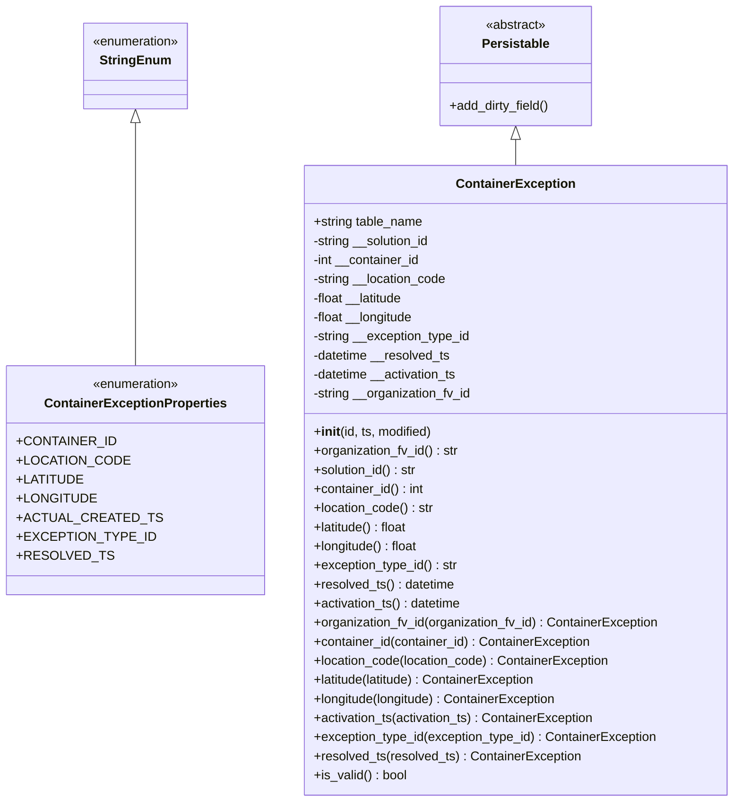
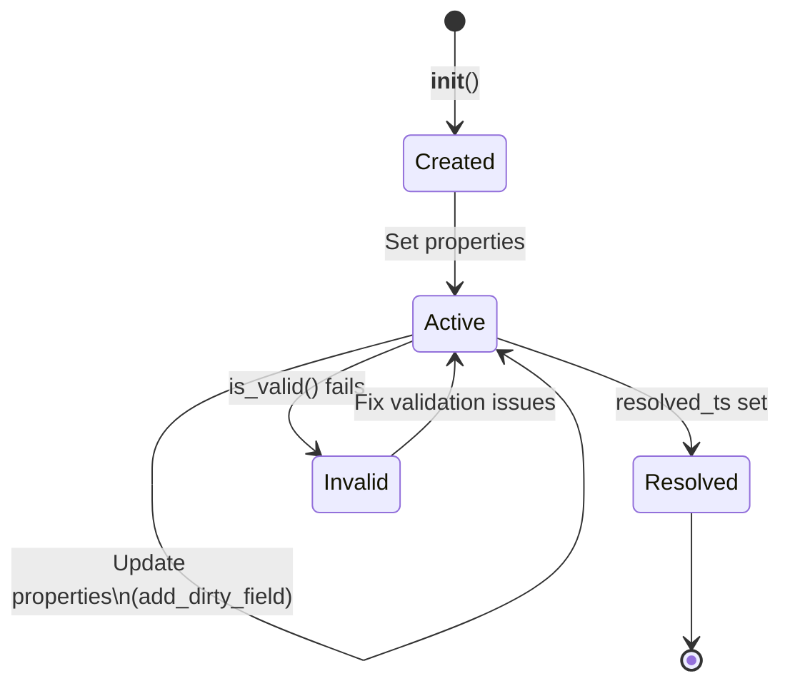

# Diagram: platform/partview_core/partview_service/partview_service/core/datamodel/ContainerException.py

> Auto-generated by Obscura crawlers

## Diagram 1

### SVG

<svg id="container" width="889.2578125" xmlns="http://www.w3.org/2000/svg" class="classDiagram" height="1008" viewBox="0 0 889.2578125 1008" role="graphics-document document" aria-roledescription="class"><g><defs><marker id="container_class-aggregationStart" class="marker aggregation class" refX="18" refY="7" markerWidth="190" markerHeight="240" orient="auto"><path d="M 18,7 L9,13 L1,7 L9,1 Z"></path></marker></defs><defs><marker id="container_class-aggregationEnd" class="marker aggregation class" refX="1" refY="7" markerWidth="20" markerHeight="28" orient="auto"><path d="M 18,7 L9,13 L1,7 L9,1 Z"></path></marker></defs><defs><marker id="container_class-extensionStart" class="marker extension class" refX="18" refY="7" markerWidth="190" markerHeight="240" orient="auto"><path d="M 1,7 L18,13 V 1 Z"></path></marker></defs><defs><marker id="container_class-extensionEnd" class="marker extension class" refX="1" refY="7" markerWidth="20" markerHeight="28" orient="auto"><path d="M 1,1 V 13 L18,7 Z"></path></marker></defs><defs><marker id="container_class-compositionStart" class="marker composition class" refX="18" refY="7" markerWidth="190" markerHeight="240" orient="auto"><path d="M 18,7 L9,13 L1,7 L9,1 Z"></path></marker></defs><defs><marker id="container_class-compositionEnd" class="marker composition class" refX="1" refY="7" markerWidth="20" markerHeight="28" orient="auto"><path d="M 18,7 L9,13 L1,7 L9,1 Z"></path></marker></defs><defs><marker id="container_class-dependencyStart" class="marker dependency class" refX="6" refY="7" markerWidth="190" markerHeight="240" orient="auto"><path d="M 5,7 L9,13 L1,7 L9,1 Z"></path></marker></defs><defs><marker id="container_class-dependencyEnd" class="marker dependency class" refX="13" refY="7" markerWidth="20" markerHeight="28" orient="auto"><path d="M 18,7 L9,13 L14,7 L9,1 Z"></path></marker></defs><defs><marker id="container_class-lollipopStart" class="marker lollipop class" refX="13" refY="7" markerWidth="190" markerHeight="240" orient="auto"><circle stroke="black" fill="transparent" cx="7" cy="7" r="6"></circle></marker></defs><defs><marker id="container_class-lollipopEnd" class="marker lollipop class" refX="1" refY="7" markerWidth="190" markerHeight="240" orient="auto"><circle stroke="black" fill="transparent" cx="7" cy="7" r="6"></circle></marker></defs><g class="root"><g class="clusters"></g><g class="edgePaths"><path d="M152.512,154.25L152.512,159.042C152.512,163.833,152.512,173.417,152.512,224.375C152.512,275.333,152.512,367.667,152.512,413.833L152.512,460" id="id_StringEnum_ContainerExceptionProperties_1" class="edge-thickness-normal edge-pattern-solid relation" style=";;;" data-edge="true" data-et="edge" data-id="id_StringEnum_ContainerExceptionProperties_1" data-points="W3sieCI6MTUyLjUxMTcxODc1LCJ5IjoxMzd9LHsieCI6MTUyLjUxMTcxODc1LCJ5IjoxODN9LHsieCI6MTUyLjUxMTcxODc1LCJ5Ijo0NjB9XQ==" marker-start="url(#container_class-extensionStart)"></path><path d="M614.141,175.25L614.141,176.542C614.141,177.833,614.141,180.417,614.141,185.875C614.141,191.333,614.141,199.667,614.141,203.833L614.141,208" id="id_Persistable_ContainerException_2" class="edge-thickness-normal edge-pattern-solid relation" style=";;;" data-edge="true" data-et="edge" data-id="id_Persistable_ContainerException_2" data-points="W3sieCI6NjE0LjE0MDYyNSwieSI6MTU4fSx7IngiOjYxNC4xNDA2MjUsInkiOjE4M30seyJ4Ijo2MTQuMTQwNjI1LCJ5IjoyMDh9XQ==" marker-start="url(#container_class-extensionStart)"></path></g><g class="edgeLabels"><g class="edgeLabel"><g class="label" data-id="id_StringEnum_ContainerExceptionProperties_1" transform="translate(0, 0)"><foreignObject width="0" height="0">

</foreignObject></g></g><g class="edgeLabel"><g class="label" data-id="id_Persistable_ContainerException_2" transform="translate(0, 0)"><foreignObject width="0" height="0">

</foreignObject></g></g></g><g class="nodes"><g class="node default" id="classId-StringEnum-0" transform="translate(152.51171875, 83)"><g class="basic label-container"><path d="M-67.5546875 -54 L67.5546875 -54 L67.5546875 54 L-67.5546875 54" stroke="none" stroke-width="0" fill="#ECECFF" style=""></path><path d="M-67.5546875 -54 C-38.5967779510352 -54, -9.6388684020704 -54, 67.5546875 -54 M-67.5546875 -54 C-35.554653064866535 -54, -3.5546186297330706 -54, 67.5546875 -54 M67.5546875 -54 C67.5546875 -26.793142107793045, 67.5546875 0.41371578441390966, 67.5546875 54 M67.5546875 -54 C67.5546875 -11.080784475879433, 67.5546875 31.838431048241134, 67.5546875 54 M67.5546875 54 C31.001929206783124 54, -5.550829086433751 54, -67.5546875 54 M67.5546875 54 C14.15326915449642 54, -39.24814919100716 54, -67.5546875 54 M-67.5546875 54 C-67.5546875 24.227300713594076, -67.5546875 -5.545398572811848, -67.5546875 -54 M-67.5546875 54 C-67.5546875 18.245923992854728, -67.5546875 -17.508152014290545, -67.5546875 -54" stroke="#9370DB" stroke-width="1.3" fill="none" stroke-dasharray="0 0" style=""></path></g><g class="annotation-group text" transform="translate(-55.5546875, -30)"><g class="label" style="" transform="translate(0,-12)"><foreignObject width="111.109375" height="24">

«enumeration»

</foreignObject></g></g><g class="label-group text" transform="translate(-42.234375, -6)"><g class="label" style="font-weight: bolder" transform="translate(0,-12)"><foreignObject width="84.46875" height="24">

StringEnum

</foreignObject></g></g><g class="members-group text" transform="translate(-55.5546875, 42)"></g><g class="methods-group text" transform="translate(-55.5546875, 72)"></g><g class="divider" style=""><path d="M-67.5546875 18 C-15.509974979984563 18, 36.534737540030875 18, 67.5546875 18 M-67.5546875 18 C-21.057553887764215 18, 25.43957972447157 18, 67.5546875 18" stroke="#9370DB" stroke-width="1.3" fill="none" stroke-dasharray="0 0" style=""></path></g><g class="divider" style=""><path d="M-67.5546875 36 C-35.44038625601863 36, -3.326085012037254 36, 67.5546875 36 M-67.5546875 36 C-27.51238140259931 36, 12.52992469480138 36, 67.5546875 36" stroke="#9370DB" stroke-width="1.3" fill="none" stroke-dasharray="0 0" style=""></path></g></g><g class="node default" id="classId-ContainerExceptionProperties-1" transform="translate(152.51171875, 604)"><g class="basic label-container"><path d="M-144.51171875 -144 L144.51171875 -144 L144.51171875 144 L-144.51171875 144" stroke="none" stroke-width="0" fill="#ECECFF" style=""></path><path d="M-144.51171875 -144 C-61.52011027761807 -144, 21.471498194763853 -144, 144.51171875 -144 M-144.51171875 -144 C-55.62767593677668 -144, 33.256366876446634 -144, 144.51171875 -144 M144.51171875 -144 C144.51171875 -52.24826922866656, 144.51171875 39.503461542666884, 144.51171875 144 M144.51171875 -144 C144.51171875 -65.90925884507328, 144.51171875 12.181482309853436, 144.51171875 144 M144.51171875 144 C64.900001977169 144, -14.711714795662004 144, -144.51171875 144 M144.51171875 144 C49.23150053427004 144, -46.04871768145992 144, -144.51171875 144 M-144.51171875 144 C-144.51171875 41.37947637751253, -144.51171875 -61.241047244974936, -144.51171875 -144 M-144.51171875 144 C-144.51171875 79.40076067958915, -144.51171875 14.80152135917831, -144.51171875 -144" stroke="#9370DB" stroke-width="1.3" fill="none" stroke-dasharray="0 0" style=""></path></g><g class="annotation-group text" transform="translate(-55.5546875, -120)"><g class="label" style="" transform="translate(0,-12)"><foreignObject width="111.109375" height="24">

«enumeration»

</foreignObject></g></g><g class="label-group text" transform="translate(-109.6015625, -96)"><g class="label" style="font-weight: bolder" transform="translate(0,-12)"><foreignObject width="219.203125" height="24">

ContainerExceptionProperties

</foreignObject></g></g><g class="members-group text" transform="translate(-132.51171875, -48)"><g class="label" style="" transform="translate(0,-12)"><foreignObject width="112.5" height="24">

+CONTAINER_ID

</foreignObject></g><g class="label" style="" transform="translate(0,12)"><foreignObject width="124.890625" height="24">

+LOCATION_CODE

</foreignObject></g><g class="label" style="" transform="translate(0,36)"><foreignObject width="75.046875" height="24">

+LATITUDE

</foreignObject></g><g class="label" style="" transform="translate(0,60)"><foreignObject width="89.78125" height="24">

+LONGITUDE

</foreignObject></g><g class="label" style="" transform="translate(0,84)"><foreignObject width="155.421875" height="24">

+ACTUAL_CREATED_TS

</foreignObject></g><g class="label" style="" transform="translate(0,108)"><foreignObject width="152.171875" height="24">

+EXCEPTION_TYPE_ID

</foreignObject></g><g class="label" style="" transform="translate(0,132)"><foreignObject width="103.890625" height="24">

+RESOLVED_TS

</foreignObject></g></g><g class="methods-group text" transform="translate(-132.51171875, 144)"></g><g class="divider" style=""><path d="M-144.51171875 -72 C-47.40797028525836 -72, 49.695778179483284 -72, 144.51171875 -72 M-144.51171875 -72 C-45.269621304729384 -72, 53.97247614054123 -72, 144.51171875 -72" stroke="#9370DB" stroke-width="1.3" fill="none" stroke-dasharray="0 0" style=""></path></g><g class="divider" style=""><path d="M-144.51171875 120 C-46.01027816636265 120, 52.491162417274694 120, 144.51171875 120 M-144.51171875 120 C-86.09686807767066 120, -27.682017405341327 120, 144.51171875 120" stroke="#9370DB" stroke-width="1.3" fill="none" stroke-dasharray="0 0" style=""></path></g></g><g class="node default" id="classId-Persistable-2" transform="translate(614.140625, 83)"><g class="basic label-container"><path d="M-96.19140625 -75 L96.19140625 -75 L96.19140625 75 L-96.19140625 75" stroke="none" stroke-width="0" fill="#ECECFF" style=""></path><path d="M-96.19140625 -75 C-51.996228314369446 -75, -7.801050378738893 -75, 96.19140625 -75 M-96.19140625 -75 C-36.76384703020862 -75, 22.663712189582753 -75, 96.19140625 -75 M96.19140625 -75 C96.19140625 -33.31841611491066, 96.19140625 8.363167770178677, 96.19140625 75 M96.19140625 -75 C96.19140625 -31.95789020159137, 96.19140625 11.084219596817263, 96.19140625 75 M96.19140625 75 C20.598393870950318 75, -54.994618508099364 75, -96.19140625 75 M96.19140625 75 C35.427126928955154 75, -25.337152392089692 75, -96.19140625 75 M-96.19140625 75 C-96.19140625 24.116289286244907, -96.19140625 -26.767421427510186, -96.19140625 -75 M-96.19140625 75 C-96.19140625 34.675944192244046, -96.19140625 -5.648111615511908, -96.19140625 -75" stroke="#9370DB" stroke-width="1.3" fill="none" stroke-dasharray="0 0" style=""></path></g><g class="annotation-group text" transform="translate(-38.609375, -51)"><g class="label" style="" transform="translate(0,-12)"><foreignObject width="77.21875" height="24">

«abstract»

</foreignObject></g></g><g class="label-group text" transform="translate(-40.9765625, -27)"><g class="label" style="font-weight: bolder" transform="translate(0,-12)"><foreignObject width="81.953125" height="24">

Persistable

</foreignObject></g></g><g class="members-group text" transform="translate(-84.19140625, 21)"></g><g class="methods-group text" transform="translate(-84.19140625, 51)"><g class="label" style="" transform="translate(0,-12)"><foreignObject width="127.40625" height="24">

+add_dirty_field()

</foreignObject></g></g><g class="divider" style=""><path d="M-96.19140625 -3 C-28.793600453942403 -3, 38.60420534211519 -3, 96.19140625 -3 M-96.19140625 -3 C-42.45701066977217 -3, 11.277384910455666 -3, 96.19140625 -3" stroke="#9370DB" stroke-width="1.3" fill="none" stroke-dasharray="0 0" style=""></path></g><g class="divider" style=""><path d="M-96.19140625 21 C-40.421813644767965 21, 15.347778960464069 21, 96.19140625 21 M-96.19140625 21 C-23.868562742305272 21, 48.454280765389456 21, 96.19140625 21" stroke="#9370DB" stroke-width="1.3" fill="none" stroke-dasharray="0 0" style=""></path></g></g><g class="node default" id="classId-ContainerException-3" transform="translate(614.140625, 604)"><g class="basic label-container"><path d="M-267.1171875 -396 L267.1171875 -396 L267.1171875 396 L-267.1171875 396" stroke="none" stroke-width="0" fill="#ECECFF" style=""></path><path d="M-267.1171875 -396 C-93.67964724043125 -396, 79.7578930191375 -396, 267.1171875 -396 M-267.1171875 -396 C-57.03592669929213 -396, 153.04533410141573 -396, 267.1171875 -396 M267.1171875 -396 C267.1171875 -219.9444001345303, 267.1171875 -43.888800269060596, 267.1171875 396 M267.1171875 -396 C267.1171875 -231.6337655121206, 267.1171875 -67.26753102424118, 267.1171875 396 M267.1171875 396 C153.85576182295486 396, 40.59433614590972 396, -267.1171875 396 M267.1171875 396 C104.15310005787566 396, -58.810987384248676 396, -267.1171875 396 M-267.1171875 396 C-267.1171875 182.30092293550487, -267.1171875 -31.398154128990257, -267.1171875 -396 M-267.1171875 396 C-267.1171875 160.89678243858063, -267.1171875 -74.20643512283874, -267.1171875 -396" stroke="#9370DB" stroke-width="1.3" fill="none" stroke-dasharray="0 0" style=""></path></g><g class="annotation-group text" transform="translate(0, -372)"></g><g class="label-group text" transform="translate(-71.296875, -372)"><g class="label" style="font-weight: bolder" transform="translate(0,-12)"><foreignObject width="142.59375" height="24">

ContainerException

</foreignObject></g></g><g class="members-group text" transform="translate(-255.1171875, -324)"><g class="label" style="" transform="translate(0,-12)"><foreignObject width="139.578125" height="24">

+string table_name

</foreignObject></g><g class="label" style="" transform="translate(0,12)"><foreignObject width="151.03125" height="24">

-string __solution_id

</foreignObject></g><g class="label" style="" transform="translate(0,36)"><foreignObject width="136.84375" height="24">

-int __container_id

</foreignObject></g><g class="label" style="" transform="translate(0,60)"><foreignObject width="170.765625" height="24">

-string __location_code

</foreignObject></g><g class="label" style="" transform="translate(0,84)"><foreignObject width="116.8125" height="24">

-float __latitude

</foreignObject></g><g class="label" style="" transform="translate(0,108)"><foreignObject width="129.375" height="24">

-float __longitude

</foreignObject></g><g class="label" style="" transform="translate(0,132)"><foreignObject width="201.109375" height="24">

-string __exception_type_id

</foreignObject></g><g class="label" style="" transform="translate(0,156)"><foreignObject width="175.53125" height="24">

-datetime __resolved_ts

</foreignObject></g><g class="label" style="" transform="translate(0,180)"><foreignObject width="185.3125" height="24">

-datetime __activation_ts

</foreignObject></g><g class="label" style="" transform="translate(0,204)"><foreignObject width="202" height="24">

-string __organization_fv_id

</foreignObject></g></g><g class="methods-group text" transform="translate(-255.1171875, -60)"><g class="label" style="" transform="translate(0,-12)"><foreignObject width="150.90625" height="24">

+<strong>init</strong>(id, ts, modified)

</foreignObject></g><g class="label" style="" transform="translate(0,12)"><foreignObject width="183.609375" height="24">

+organization_fv_id() : str

</foreignObject></g><g class="label" style="" transform="translate(0,36)"><foreignObject width="132.328125" height="24">

+solution_id() : str

</foreignObject></g><g class="label" style="" transform="translate(0,60)"><foreignObject width="140.671875" height="24">

+container_id() : int

</foreignObject></g><g class="label" style="" transform="translate(0,84)"><foreignObject width="152.21875" height="24">

+location_code() : str

</foreignObject></g><g class="label" style="" transform="translate(0,108)"><foreignObject width="120.71875" height="24">

+latitude() : float

</foreignObject></g><g class="label" style="" transform="translate(0,132)"><foreignObject width="133.265625" height="24">

+longitude() : float

</foreignObject></g><g class="label" style="" transform="translate(0,156)"><foreignObject width="182.734375" height="24">

+exception_type_id() : str

</foreignObject></g><g class="label" style="" transform="translate(0,180)"><foreignObject width="179.03125" height="24">

+resolved_ts() : datetime

</foreignObject></g><g class="label" style="" transform="translate(0,204)"><foreignObject width="188.90625" height="24">

+activation_ts() : datetime

</foreignObject></g><g class="label" style="" transform="translate(0,228)"><foreignObject width="438.9375" height="24">

+organization_fv_id(organization_fv_id) : ContainerException

</foreignObject></g><g class="label" style="" transform="translate(0,252)"><foreignObject width="352.5625" height="24">

+container_id(container_id) : ContainerException

</foreignObject></g><g class="label" style="" transform="translate(0,276)"><foreignObject width="376.15625" height="24">

+location_code(location_code) : ContainerException

</foreignObject></g><g class="label" style="" transform="translate(0,300)"><foreignObject width="285.875" height="24">

+latitude(latitude) : ContainerException

</foreignObject></g><g class="label" style="" transform="translate(0,324)"><foreignObject width="311" height="24">

+longitude(longitude) : ContainerException

</foreignObject></g><g class="label" style="" transform="translate(0,348)"><foreignObject width="358.125" height="24">

+activation_ts(activation_ts) : ContainerException

</foreignObject></g><g class="label" style="" transform="translate(0,372)"><foreignObject width="437.171875" height="24">

+exception_type_id(exception_type_id) : ContainerException

</foreignObject></g><g class="label" style="" transform="translate(0,396)"><foreignObject width="338.140625" height="24">

+resolved_ts(resolved_ts) : ContainerException

</foreignObject></g><g class="label" style="" transform="translate(0,420)"><foreignObject width="117.984375" height="24">

+is_valid() : bool

</foreignObject></g></g><g class="divider" style=""><path d="M-267.1171875 -348 C-53.96480754028269 -348, 159.18757241943462 -348, 267.1171875 -348 M-267.1171875 -348 C-152.3006267607338 -348, -37.484066021467584 -348, 267.1171875 -348" stroke="#9370DB" stroke-width="1.3" fill="none" stroke-dasharray="0 0" style=""></path></g><g class="divider" style=""><path d="M-267.1171875 -84 C-141.69562519676535 -84, -16.274062893530697 -84, 267.1171875 -84 M-267.1171875 -84 C-133.21680337961214 -84, 0.6835807407757102 -84, 267.1171875 -84" stroke="#9370DB" stroke-width="1.3" fill="none" stroke-dasharray="0 0" style=""></path></g></g></g></g></g></svg>

## Diagram 2

### SVG

<svg id="container" width="563.8570556640625" xmlns="http://www.w3.org/2000/svg" class="statediagram" height="484" viewBox="0 0 563.8570556640625 484" role="graphics-document document" aria-roledescription="stateDiagram"><g><defs><marker id="container_stateDiagram-barbEnd" refX="19" refY="7" markerWidth="20" markerHeight="14" markerUnits="userSpaceOnUse" orient="auto"><path d="M 19,7 L9,13 L14,7 L9,1 Z"></path></marker></defs><g class="root"><g class="clusters"></g><g class="edgePaths"><path d="M332.646,22L332.646,28.167C332.646,34.333,332.646,46.667,332.729,59.083C332.813,71.5,332.979,84,333.063,90.25L333.146,96.5" id="edge0" class="edge-thickness-normal edge-pattern-solid transition" style="fill:none;;;fill:none" data-edge="true" data-et="edge" data-id="edge0" data-points="W3sieCI6MzMyLjY0NjA5Mzc1MDM3MjUzLCJ5IjoyMn0seyJ4IjozMzIuNjQ2MDkzNzUwMzcyNTMsInkiOjU5fSx7IngiOjMzMy4xNDYwOTM3NTAzNzI1MywieSI6OTYuNX1d" marker-end="url(#container_stateDiagram-barbEnd)"></path><path d="M333.146,136.5L333.063,142.583C332.979,148.667,332.813,160.833,332.813,173.167C332.813,185.5,332.979,198,333.063,204.25L333.146,210.5" id="edge1" class="edge-thickness-normal edge-pattern-solid transition" style="fill:none;;;fill:none" data-edge="true" data-et="edge" data-id="edge1" data-points="W3sieCI6MzMzLjE0NjA5Mzc1MDM3MjUzLCJ5IjoxMzYuNX0seyJ4IjozMzIuNjQ2MDkzNzUwMzcyNTMsInkiOjE3M30seyJ4IjozMzMuMTQ2MDkzNzUwMzcyNTMsInkiOjIxMC41fV0=" marker-end="url(#container_stateDiagram-barbEnd)"></path><path d="M303.326,238.276L271.782,246.397C240.238,254.517,177.15,270.759,145.606,288.371C114.063,305.983,114.063,324.967,114.063,334.458L114.063,343.95" id="Active-cyclic-special-1" class="edge-thickness-normal edge-pattern-solid transition" style="fill:none;;;fill:none" data-edge="true" data-et="edge" data-id="Active-cyclic-special-1" data-points="W3sieCI6MzAzLjMyNTc4MTI1MDM3MjUzLCJ5IjoyMzguMjc2MjM2OTIzMDc0NjZ9LHsieCI6MTE0LjA2MjUsInkiOjI4N30seyJ4IjoxMTQuMDYyNSwieSI6MzQzLjk0OTk5OTk5OTI1NDk0fV0="></path><path d="M114.063,344.05L114.063,355.542C114.063,367.033,114.063,390.017,139.466,410.839C164.869,431.661,215.675,450.321,241.078,459.651L266.481,468.982" id="Active-cyclic-special-mid" class="edge-thickness-normal edge-pattern-solid transition" style="fill:none;;;fill:none" data-edge="true" data-et="edge" data-id="Active-cyclic-special-mid" data-points="W3sieCI6MTE0LjA2MjUsInkiOjM0NC4wNTAwMDAwMDA3NDUwNn0seyJ4IjoxMTQuMDYyNSwieSI6NDEzfSx7IngiOjI2Ni40ODEyNDk5OTkyNTQ5NCwieSI6NDY4Ljk4MTYzNTU4MDc4ODA3fV0="></path><path d="M266.581,468.982L293.05,459.652C319.52,450.322,372.458,431.661,398.927,410.83C425.396,390,425.396,367,425.396,346C425.396,325,425.396,306,414.848,290.05C404.3,274.099,383.203,261.199,372.655,254.748L362.107,248.298" id="Active-cyclic-special-2" class="edge-thickness-normal edge-pattern-solid transition" style="fill:none;;;fill:none" data-edge="true" data-et="edge" data-id="Active-cyclic-special-2" data-points="W3sieCI6MjY2LjU4MTI1MDAwMDc0NTA2LCJ5Ijo0NjguOTgyMzc0OTU0ODYzMzZ9LHsieCI6NDI1LjM5NjA5Mzc1MDM3MjUzLCJ5Ijo0MTN9LHsieCI6NDI1LjM5NjA5Mzc1MDM3MjUzLCJ5IjozNDR9LHsieCI6NDI1LjM5NjA5Mzc1MDM3MjUzLCJ5IjoyODd9LHsieCI6MzYyLjEwNzAxMjA1NTk3MTk1LCJ5IjoyNDguMjk4MDg0NTY1MTY2MjJ9XQ==" marker-end="url(#container_stateDiagram-barbEnd)"></path><path d="M362.966,240.584L386.005,248.32C409.045,256.056,455.123,271.528,478.245,285.514C501.367,299.5,501.534,312,501.617,318.25L501.701,324.5" id="edge3" class="edge-thickness-normal edge-pattern-solid transition" style="fill:none;;;fill:none" data-edge="true" data-et="edge" data-id="edge3" data-points="W3sieCI6MzYyLjk2NjQwNjI1MDM3MjUzLCJ5IjoyNDAuNTg0MzEwNTQ0NjExOH0seyJ4Ijo1MDEuMjAwNzgxMjUwMzcyNTMsInkiOjI4N30seyJ4Ijo1MDEuNzAwNzgxMjUwMzcyNTMsInkiOjMyNC41fV0=" marker-end="url(#container_stateDiagram-barbEnd)"></path><path d="M303.326,242.431L284.468,249.859C265.61,257.287,227.893,272.144,216.825,285.822C205.757,299.5,221.337,312,229.127,318.25L236.917,324.5" id="edge4" class="edge-thickness-normal edge-pattern-solid transition" style="fill:none;;;fill:none" data-edge="true" data-et="edge" data-id="edge4" data-points="W3sieCI6MzAzLjMyNTc4MTI1MDM3MjUzLCJ5IjoyNDIuNDMwNzQxMzkwNjU1ODR9LHsieCI6MTkwLjE3NzM0Mzc1MDM3MjUzLCJ5IjoyODd9LHsieCI6MjM2LjkxNzIwMTIwNjUxMjg5LCJ5IjozMjQuNX1d" marker-end="url(#container_stateDiagram-barbEnd)"></path><path d="M501.701,364.5L501.617,372.583C501.534,380.667,501.367,396.833,501.284,413.083C501.201,429.333,501.201,445.667,501.201,453.833L501.201,462" id="edge5" class="edge-thickness-normal edge-pattern-solid transition" style="fill:none;;;fill:none" data-edge="true" data-et="edge" data-id="edge5" data-points="W3sieCI6NTAxLjcwMDc4MTI1MDM3MjUsInkiOjM2NC41fSx7IngiOjUwMS4yMDA3ODEyNTAzNzI1MywieSI6NDEzfSx7IngiOjUwMS4yMDA3ODEyNTAzNzI1MywieSI6NDYyfV0=" marker-end="url(#container_stateDiagram-barbEnd)"></path><path d="M286.906,324.5L294.53,318.25C302.153,312,317.399,299.5,325.106,287.167C332.813,274.833,332.979,262.667,333.063,256.583L333.146,250.5" id="edge6" class="edge-thickness-normal edge-pattern-solid transition" style="fill:none;;;fill:none" data-edge="true" data-et="edge" data-id="edge6" data-points="W3sieCI6Mjg2LjkwNjIzNjI5NDIzMjEsInkiOjMyNC41fSx7IngiOjMzMi42NDYwOTM3NTAzNzI1MywieSI6Mjg3fSx7IngiOjMzMy4xNDYwOTM3NTAzNzI1MywieSI6MjUwLjV9XQ==" marker-end="url(#container_stateDiagram-barbEnd)"></path></g><g class="edgeLabels"><g class="edgeLabel" transform="translate(332.64609375037253, 59)"><g class="label" data-id="edge0" transform="translate(-17.40625, -12)"><foreignObject width="34.8125" height="24">

<strong>init</strong>()

</foreignObject></g></g><g class="edgeLabel" transform="translate(332.64609375037253, 173)"><g class="label" data-id="edge1" transform="translate(-51.4453125, -12)"><foreignObject width="102.890625" height="24">

Set properties

</foreignObject></g></g><g class="edgeLabel"><g class="label" data-id="Active-cyclic-special-1" transform="translate(0, 0)"><foreignObject width="0" height="0">

</foreignObject></g></g><g class="edgeLabel" transform="translate(114.0625, 413)"><g class="label" data-id="Active-cyclic-special-mid" transform="translate(-106.0625, -24)"><foreignObject width="212.125" height="48">

Update properties\n(add_dirty_field)

</foreignObject></g></g><g class="edgeLabel"><g class="label" data-id="Active-cyclic-special-2" transform="translate(0, 0)"><foreignObject width="0" height="0">

</foreignObject></g></g><g class="edgeLabel" transform="translate(501.20078125037253, 287)"><g class="label" data-id="edge3" transform="translate(-54.65625, -12)"><foreignObject width="109.3125" height="24">

resolved_ts set

</foreignObject></g></g><g class="edgeLabel" transform="translate(218.87438, 275.69621)"><g class="label" data-id="edge4" transform="translate(-49.71875, -12)"><foreignObject width="99.4375" height="24">

is_valid() fails

</foreignObject></g></g><g class="edgeLabel"><g class="label" data-id="edge5" transform="translate(0, 0)"><foreignObject width="0" height="0">

</foreignObject></g></g><g class="edgeLabel" transform="translate(332.64609375037253, 287)"><g class="label" data-id="edge6" transform="translate(-72.75, -12)"><foreignObject width="145.5" height="24">

Fix validation issues

</foreignObject></g></g></g><g class="nodes"><g class="node default" id="state-root_start-0" transform="translate(332.64609375037253, 15)"><circle class="state-start" r="7" width="14" height="14"></circle></g><g class="node  statediagram-state" id="state-Created-1" transform="translate(332.64609375037253, 116)"><g class="basic label-container outer-path"><path d="M-30.7578125 -20 C-7.883311420482897 -20, 14.991189659034205 -20, 30.7578125 -20 C30.7578125 -20, 30.7578125 -20, 30.7578125 -20 C30.8948595180353 -19.994331693405446, 31.0319065360706 -19.988663386810895, 31.170709227361662 -19.982922465033347 C31.325804599406776 -19.96358984706926, 31.48089997145189 -19.944257229105173, 31.58078545140367 -19.931806517013612 C31.702087901994226 -19.906372067789654, 31.823390352584777 -19.8809376185657, 31.985239935703998 -19.847001329696653 C32.08582410183746 -19.817056126007216, 32.18640826797092 -19.78711092231778, 32.38130984602342 -19.729086208503173 C32.49870581978999 -19.683278157391907, 32.61610179355656 -19.637470106280645, 32.766289623264846 -19.578866633275286 C32.85099375358138 -19.53745730721776, 32.935697883897916 -19.49604798116024, 33.137549465185366 -19.397368756032446 C33.23227870389107 -19.340922381787355, 33.32700794259677 -19.28447600754226, 33.492553290612136 -19.185832391312644 C33.57266309279815 -19.128635091926505, 33.65277289498417 -19.071437792540365, 33.82887606344834 -18.94570254698197 C33.91913173781175 -18.869259890157394, 34.00938741217516 -18.79281723333282, 34.144220358128706 -18.678619553365657 C34.210884043981174 -18.61195586751319, 34.27754772983364 -18.545292181660717, 34.43643205336566 -18.386407858128706 C34.537177019725505 -18.267458501117293, 34.63792198608535 -18.14850914410588, 34.70351504698197 -18.07106356344834 C34.788330762470316 -17.9522717627347, 34.87314647795866 -17.833479962021055, 34.943644891312644 -17.734740790612136 C35.01453186553488 -17.61577709822216, 35.085418839757104 -17.49681340583218, 35.15518125603245 -17.37973696518537 C35.19835286066198 -17.29142803643262, 35.241524465291505 -17.20311910767987, 35.33667913327529 -17.008477123264846 C35.38864972062816 -16.875287922643935, 35.440620307981035 -16.742098722023023, 35.486898708503176 -16.623497346023417 C35.52910512568216 -16.4817284897666, 35.57131154286114 -16.339959633509785, 35.60481382969665 -16.227427435703994 C35.631723643236995 -16.09908865004223, 35.65863345677734 -15.970749864380462, 35.68961901701361 -15.82297295140367 C35.70417331571578 -15.706211508320187, 35.71872761441795 -15.589450065236703, 35.74073496503335 -15.412896727361662 C35.7452595172167 -15.303503141406004, 35.749784069400064 -15.194109555450348, 35.7578125 -15 C35.7578125 -15, 35.7578125 -15, 35.7578125 -15 C35.7578125 -7.4362890050908454, 35.7578125 0.1274219898183091, 35.7578125 15 C35.7578125 15, 35.7578125 15, 35.7578125 15 C35.753652517913245 15.10057909369573, 35.7494925358265 15.201158187391462, 35.74073496503335 15.412896727361662 C35.727437520962425 15.519575090284885, 35.7141400768915 15.626253453208108, 35.68961901701361 15.822972951403669 C35.66975988428451 15.917685498368282, 35.64990075155541 16.012398045332898, 35.60481382969665 16.227427435703994 C35.5625254916097 16.369471459440145, 35.52023715352274 16.5115154831763, 35.486898708503176 16.623497346023417 C35.439354027832316 16.745343919919765, 35.391809347161455 16.867190493816114, 35.33667913327529 17.008477123264846 C35.297004202331564 17.089633491670565, 35.25732927138783 17.170789860076287, 35.15518125603245 17.379736965185366 C35.09321230046727 17.48373429118876, 35.031243344902094 17.587731617192155, 34.943644891312644 17.734740790612133 C34.86244801386872 17.848464093284903, 34.78125113642479 17.962187395957674, 34.70351504698197 18.07106356344834 C34.62719597972721 18.161173315882408, 34.55087691247245 18.25128306831648, 34.43643205336566 18.386407858128706 C34.366824673061586 18.456015238432773, 34.29721729275752 18.525622618736843, 34.144220358128706 18.678619553365657 C34.043901601611196 18.763585206014362, 33.94358284509369 18.848550858663067, 33.82887606344834 18.94570254698197 C33.74029651143153 19.008947131513974, 33.65171695941473 19.072191716045975, 33.492553290612136 19.185832391312644 C33.3678906495488 19.26011520185759, 33.24322800848546 19.334398012402534, 33.137549465185366 19.397368756032446 C33.01668760637386 19.456454518447355, 32.895825747562355 19.51554028086226, 32.766289623264846 19.578866633275286 C32.654825535206626 19.622360055400595, 32.54336144714841 19.665853477525907, 32.38130984602342 19.729086208503173 C32.22960409109228 19.774250968593197, 32.07789833616114 19.819415728683218, 31.985239935703998 19.847001329696653 C31.895950010089717 19.86572345829497, 31.80666008447544 19.884445586893285, 31.58078545140367 19.931806517013612 C31.457879643098384 19.947126710041953, 31.334973834793097 19.962446903070294, 31.170709227361662 19.982922465033347 C31.041729010996892 19.98825712624282, 30.912748794632126 19.9935917874523, 30.7578125 20 C30.7578125 20, 30.7578125 20, 30.7578125 20 C9.122522918974528 20, -12.512766662050943 20, -30.7578125 20 C-30.7578125 20, -30.7578125 20, -30.7578125 20 C-30.852160023708752 19.996097757554416, -30.946507547417504 19.992195515108833, -31.170709227361662 19.982922465033347 C-31.256084118542415 19.972280495945817, -31.341459009723167 19.961638526858287, -31.58078545140367 19.931806517013612 C-31.724604431416136 19.901650848049304, -31.8684234114286 19.87149517908499, -31.985239935703994 19.847001329696653 C-32.097174022203646 19.813677108311992, -32.20910810870329 19.78035288692733, -32.38130984602342 19.729086208503173 C-32.5190876596772 19.675325138788807, -32.656865473330974 19.62156406907444, -32.766289623264846 19.578866633275286 C-32.912173493383285 19.50754835491397, -33.05805736350172 19.43623007655265, -33.137549465185366 19.397368756032446 C-33.24918807238367 19.330846585177746, -33.360826679581976 19.26432441432305, -33.492553290612136 19.185832391312644 C-33.56980735769933 19.130674047596816, -33.64706142478653 19.075515703880985, -33.82887606344834 18.94570254698197 C-33.94852740849379 18.844363027085635, -34.06817875353924 18.743023507189296, -34.144220358128706 18.67861955336566 C-34.2292762512023 18.593563660292066, -34.314332144275895 18.508507767218468, -34.43643205336566 18.386407858128706 C-34.50921434918886 18.300473963833074, -34.58199664501206 18.214540069537442, -34.70351504698197 18.07106356344834 C-34.762130789748305 17.988967107699676, -34.82074653251464 17.90687065195101, -34.943644891312644 17.734740790612133 C-35.00189538305405 17.63698385208962, -35.06014587479545 17.539226913567113, -35.15518125603244 17.37973696518537 C-35.225664446019294 17.23556129563988, -35.29614763600614 17.09138562609439, -35.33667913327528 17.00847712326485 C-35.38352677470037 16.888416907858456, -35.43037441612547 16.768356692452063, -35.486898708503176 16.623497346023417 C-35.51795105751716 16.51919434429901, -35.54900340653115 16.414891342574606, -35.60481382969665 16.227427435703994 C-35.631465308192645 16.100320706363842, -35.65811678668864 15.97321397702369, -35.68961901701361 15.82297295140367 C-35.70863090026143 15.670450664402676, -35.72764278350925 15.517928377401681, -35.74073496503335 15.412896727361664 C-35.74667298196227 15.269328714662043, -35.75261099889119 15.125760701962424, -35.7578125 15 C-35.7578125 15, -35.7578125 15, -35.7578125 15 C-35.7578125 8.794136674372341, -35.7578125 2.588273348744682, -35.7578125 -15 C-35.7578125 -15, -35.7578125 -15, -35.7578125 -15 C-35.751180358659234 -15.160350393680954, -35.74454821731847 -15.320700787361908, -35.74073496503335 -15.41289672736166 C-35.72933384697031 -15.504361869382356, -35.71793272890727 -15.59582701140305, -35.68961901701361 -15.822972951403669 C-35.67003390669328 -15.916378625575117, -35.65044879637294 -16.009784299746567, -35.60481382969665 -16.227427435703994 C-35.581213136136455 -16.306700767972597, -35.557612442576264 -16.3859741002412, -35.486898708503176 -16.623497346023417 C-35.4394120494539 -16.74519522324746, -35.391925390404616 -16.866893100471508, -35.33667913327529 -17.008477123264846 C-35.2773036779787 -17.12993155833725, -35.21792822268212 -17.251385993409656, -35.15518125603245 -17.379736965185366 C-35.104221550877924 -17.465258385090827, -35.05326184572339 -17.55077980499629, -34.943644891312644 -17.734740790612133 C-34.89050192184332 -17.809172150439533, -34.83735895237399 -17.883603510266934, -34.70351504698197 -18.07106356344834 C-34.62034623876632 -18.16926078975264, -34.53717743055066 -18.267458016056946, -34.43643205336566 -18.386407858128706 C-34.34972289781042 -18.473117013683943, -34.26301374225518 -18.559826169239177, -34.144220358128706 -18.678619553365657 C-34.03472535479216 -18.771357090624083, -33.92523035145561 -18.86409462788251, -33.82887606344834 -18.945702546981966 C-33.714262741199036 -19.02753488618949, -33.59964941894974 -19.109367225397012, -33.492553290612136 -19.185832391312644 C-33.41133789584791 -19.23422626241264, -33.33012250108368 -19.282620133512637, -33.137549465185366 -19.397368756032446 C-33.00944901889059 -19.459993248237396, -32.88134857259582 -19.522617740442342, -32.766289623264846 -19.578866633275286 C-32.64046245631472 -19.627964546175587, -32.5146352893646 -19.677062459075884, -32.38130984602342 -19.729086208503173 C-32.269995431679256 -19.76222594549402, -32.15868101733509 -19.795365682484864, -31.985239935703994 -19.847001329696653 C-31.861349084385292 -19.872978509480223, -31.737458233066587 -19.89895568926379, -31.580785451403674 -19.931806517013612 C-31.449847159787133 -19.948127958042534, -31.318908868170595 -19.96444939907145, -31.170709227361662 -19.982922465033347 C-31.03495108023158 -19.98853746353294, -30.899192933101496 -19.99415246203253, -30.7578125 -20 C-30.7578125 -20, -30.7578125 -20, -30.7578125 -20" stroke="none" stroke-width="0" fill="#ECECFF" style=""></path><path d="M-30.7578125 -20 C-7.828067297843344 -20, 15.101677904313313 -20, 30.7578125 -20 M-30.7578125 -20 C-17.45011275892463 -20, -4.1424130178492575 -20, 30.7578125 -20 M30.7578125 -20 C30.7578125 -20, 30.7578125 -20, 30.7578125 -20 M30.7578125 -20 C30.7578125 -20, 30.7578125 -20, 30.7578125 -20 M30.7578125 -20 C30.857218315244086 -19.995888545068965, 30.95662413048817 -19.99177709013793, 31.170709227361662 -19.982922465033347 M30.7578125 -20 C30.889917308131572 -19.994536104719103, 31.02202211626314 -19.989072209438202, 31.170709227361662 -19.982922465033347 M31.170709227361662 -19.982922465033347 C31.291736764518284 -19.967836398259525, 31.412764301674905 -19.952750331485703, 31.58078545140367 -19.931806517013612 M31.170709227361662 -19.982922465033347 C31.265494410439782 -19.971107504284085, 31.3602795935179 -19.959292543534822, 31.58078545140367 -19.931806517013612 M31.58078545140367 -19.931806517013612 C31.733818818551942 -19.899718794240048, 31.88685218570021 -19.867631071466484, 31.985239935703998 -19.847001329696653 M31.58078545140367 -19.931806517013612 C31.718851885341998 -19.90285703011998, 31.85691831928032 -19.87390754322634, 31.985239935703998 -19.847001329696653 M31.985239935703998 -19.847001329696653 C32.07093523468397 -19.821488733809765, 32.15663053366395 -19.795976137922878, 32.38130984602342 -19.729086208503173 M31.985239935703998 -19.847001329696653 C32.10867816083783 -19.810252177849126, 32.23211638597167 -19.773503026001602, 32.38130984602342 -19.729086208503173 M32.38130984602342 -19.729086208503173 C32.51092289134421 -19.678511041278554, 32.64053593666499 -19.627935874053936, 32.766289623264846 -19.578866633275286 M32.38130984602342 -19.729086208503173 C32.49276697034615 -19.68559550363588, 32.604224094668886 -19.64210479876859, 32.766289623264846 -19.578866633275286 M32.766289623264846 -19.578866633275286 C32.883931063346886 -19.52135523764405, 33.00157250342893 -19.463843842012814, 33.137549465185366 -19.397368756032446 M32.766289623264846 -19.578866633275286 C32.84305291714476 -19.541339345601777, 32.91981621102468 -19.503812057928265, 33.137549465185366 -19.397368756032446 M33.137549465185366 -19.397368756032446 C33.22146143014492 -19.347368077863134, 33.30537339510447 -19.29736739969382, 33.492553290612136 -19.185832391312644 M33.137549465185366 -19.397368756032446 C33.232715401102176 -19.34066216673077, 33.327881337018994 -19.28395557742909, 33.492553290612136 -19.185832391312644 M33.492553290612136 -19.185832391312644 C33.61177325748982 -19.100710971059044, 33.7309932243675 -19.015589550805444, 33.82887606344834 -18.94570254698197 M33.492553290612136 -19.185832391312644 C33.61814034495232 -19.096164957988574, 33.7437273992925 -19.006497524664507, 33.82887606344834 -18.94570254698197 M33.82887606344834 -18.94570254698197 C33.899115837108745 -18.886212493295826, 33.969355610769156 -18.826722439609686, 34.144220358128706 -18.678619553365657 M33.82887606344834 -18.94570254698197 C33.89654514668192 -18.88838975702452, 33.9642142299155 -18.831076967067073, 34.144220358128706 -18.678619553365657 M34.144220358128706 -18.678619553365657 C34.20466273252152 -18.618177178972847, 34.265105106914326 -18.557734804580033, 34.43643205336566 -18.386407858128706 M34.144220358128706 -18.678619553365657 C34.22270625630598 -18.600133655188383, 34.30119215448325 -18.521647757011106, 34.43643205336566 -18.386407858128706 M34.43643205336566 -18.386407858128706 C34.50755386070303 -18.30243449888362, 34.5786756680404 -18.218461139638535, 34.70351504698197 -18.07106356344834 M34.43643205336566 -18.386407858128706 C34.52633013352458 -18.2802653954545, 34.616228213683506 -18.174122932780293, 34.70351504698197 -18.07106356344834 M34.70351504698197 -18.07106356344834 C34.79925280522216 -17.93697449007134, 34.89499056346236 -17.802885416694338, 34.943644891312644 -17.734740790612136 M34.70351504698197 -18.07106356344834 C34.76041760150316 -17.991366577130904, 34.81732015602435 -17.911669590813467, 34.943644891312644 -17.734740790612136 M34.943644891312644 -17.734740790612136 C35.016134660362724 -17.613087261436824, 35.088624429412796 -17.49143373226151, 35.15518125603245 -17.37973696518537 M34.943644891312644 -17.734740790612136 C35.0031178928203 -17.634932215983394, 35.062590894327954 -17.53512364135465, 35.15518125603245 -17.37973696518537 M35.15518125603245 -17.37973696518537 C35.19480075473269 -17.298693985246047, 35.23442025343293 -17.217651005306724, 35.33667913327529 -17.008477123264846 M35.15518125603245 -17.37973696518537 C35.21721155141858 -17.252851967910587, 35.2792418468047 -17.1259669706358, 35.33667913327529 -17.008477123264846 M35.33667913327529 -17.008477123264846 C35.37888096500972 -16.90032309769492, 35.421082796744145 -16.792169072124988, 35.486898708503176 -16.623497346023417 M35.33667913327529 -17.008477123264846 C35.368779617709585 -16.92621063217599, 35.40088010214388 -16.843944141087132, 35.486898708503176 -16.623497346023417 M35.486898708503176 -16.623497346023417 C35.53106228483339 -16.47515450806126, 35.5752258611636 -16.3268116700991, 35.60481382969665 -16.227427435703994 M35.486898708503176 -16.623497346023417 C35.524639564369615 -16.49672804580897, 35.56238042023605 -16.369958745594523, 35.60481382969665 -16.227427435703994 M35.60481382969665 -16.227427435703994 C35.63855088517628 -16.06652804018914, 35.6722879406559 -15.905628644674284, 35.68961901701361 -15.82297295140367 M35.60481382969665 -16.227427435703994 C35.63120857692383 -16.101545113929188, 35.65760332415101 -15.975662792154383, 35.68961901701361 -15.82297295140367 M35.68961901701361 -15.82297295140367 C35.70406771212501 -15.707058710092376, 35.7185164072364 -15.59114446878108, 35.74073496503335 -15.412896727361662 M35.68961901701361 -15.82297295140367 C35.7075720007524 -15.678945655283723, 35.72552498449119 -15.534918359163774, 35.74073496503335 -15.412896727361662 M35.74073496503335 -15.412896727361662 C35.744337854319355 -15.325786895752838, 35.74794074360536 -15.238677064144015, 35.7578125 -15 M35.74073496503335 -15.412896727361662 C35.744987249602474 -15.310085965396791, 35.7492395341716 -15.20727520343192, 35.7578125 -15 M35.7578125 -15 C35.7578125 -15, 35.7578125 -15, 35.7578125 -15 M35.7578125 -15 C35.7578125 -15, 35.7578125 -15, 35.7578125 -15 M35.7578125 -15 C35.7578125 -3.1519742017032932, 35.7578125 8.696051596593414, 35.7578125 15 M35.7578125 -15 C35.7578125 -6.614379988425446, 35.7578125 1.7712400231491081, 35.7578125 15 M35.7578125 15 C35.7578125 15, 35.7578125 15, 35.7578125 15 M35.7578125 15 C35.7578125 15, 35.7578125 15, 35.7578125 15 M35.7578125 15 C35.75189330319864 15.143112983967633, 35.74597410639729 15.286225967935268, 35.74073496503335 15.412896727361662 M35.7578125 15 C35.75129069985123 15.15768258962374, 35.74476889970247 15.31536517924748, 35.74073496503335 15.412896727361662 M35.74073496503335 15.412896727361662 C35.72165306203169 15.565980745825613, 35.702571159030036 15.719064764289563, 35.68961901701361 15.822972951403669 M35.74073496503335 15.412896727361662 C35.720345865199114 15.576467694849336, 35.69995676536488 15.74003866233701, 35.68961901701361 15.822972951403669 M35.68961901701361 15.822972951403669 C35.67028830876092 15.915165326479537, 35.65095760050822 16.007357701555406, 35.60481382969665 16.227427435703994 M35.68961901701361 15.822972951403669 C35.66748983194873 15.928511874393767, 35.64536064688384 16.034050797383866, 35.60481382969665 16.227427435703994 M35.60481382969665 16.227427435703994 C35.57694829208865 16.32102612660722, 35.549082754480644 16.414624817510447, 35.486898708503176 16.623497346023417 M35.60481382969665 16.227427435703994 C35.56277536803632 16.368632139318347, 35.52073690637598 16.5098368429327, 35.486898708503176 16.623497346023417 M35.486898708503176 16.623497346023417 C35.43447093934034 16.757858203208325, 35.38204317017752 16.89221906039323, 35.33667913327529 17.008477123264846 M35.486898708503176 16.623497346023417 C35.433752471906345 16.75969947743825, 35.38060623530951 16.895901608853084, 35.33667913327529 17.008477123264846 M35.33667913327529 17.008477123264846 C35.267829529136094 17.14931123954935, 35.1989799249969 17.29014535583385, 35.15518125603245 17.379736965185366 M35.33667913327529 17.008477123264846 C35.28248732998429 17.119328228681823, 35.228295526693294 17.2301793340988, 35.15518125603245 17.379736965185366 M35.15518125603245 17.379736965185366 C35.10677760134466 17.46096877892841, 35.05837394665688 17.542200592671456, 34.943644891312644 17.734740790612133 M35.15518125603245 17.379736965185366 C35.097949847766884 17.475783660966243, 35.04071843950132 17.571830356747125, 34.943644891312644 17.734740790612133 M34.943644891312644 17.734740790612133 C34.870557268540914 17.837106375444417, 34.79746964576918 17.939471960276705, 34.70351504698197 18.07106356344834 M34.943644891312644 17.734740790612133 C34.85024547347081 17.865554814489137, 34.75684605562897 17.99636883836614, 34.70351504698197 18.07106356344834 M34.70351504698197 18.07106356344834 C34.621243965496724 18.16820084580495, 34.53897288401147 18.265338128161563, 34.43643205336566 18.386407858128706 M34.70351504698197 18.07106356344834 C34.62269759193922 18.166484552307438, 34.54188013689648 18.261905541166534, 34.43643205336566 18.386407858128706 M34.43643205336566 18.386407858128706 C34.32340499899691 18.49943491249746, 34.21037794462815 18.61246196686621, 34.144220358128706 18.678619553365657 M34.43643205336566 18.386407858128706 C34.32656640802523 18.496273503469137, 34.216700762684795 18.606139148809564, 34.144220358128706 18.678619553365657 M34.144220358128706 18.678619553365657 C34.07722942457984 18.735357979838597, 34.01023849103097 18.79209640631154, 33.82887606344834 18.94570254698197 M34.144220358128706 18.678619553365657 C34.071995353509266 18.73979101190517, 33.99977034888983 18.800962470444677, 33.82887606344834 18.94570254698197 M33.82887606344834 18.94570254698197 C33.724427417668394 19.02027744668376, 33.619978771888455 19.094852346385547, 33.492553290612136 19.185832391312644 M33.82887606344834 18.94570254698197 C33.74636869757992 19.00461167393475, 33.663861331711495 19.063520800887527, 33.492553290612136 19.185832391312644 M33.492553290612136 19.185832391312644 C33.35910192434658 19.265352145368166, 33.22565055808102 19.34487189942369, 33.137549465185366 19.397368756032446 M33.492553290612136 19.185832391312644 C33.36103237296383 19.26420184767129, 33.22951145531551 19.34257130402994, 33.137549465185366 19.397368756032446 M33.137549465185366 19.397368756032446 C33.06196141046397 19.434321504290594, 32.98637335574257 19.471274252548742, 32.766289623264846 19.578866633275286 M33.137549465185366 19.397368756032446 C33.01097921050355 19.459245183140748, 32.88440895582174 19.52112161024905, 32.766289623264846 19.578866633275286 M32.766289623264846 19.578866633275286 C32.640358742529195 19.62800501542028, 32.51442786179354 19.67714339756527, 32.38130984602342 19.729086208503173 M32.766289623264846 19.578866633275286 C32.63996080145203 19.628160292510433, 32.5136319796392 19.67745395174558, 32.38130984602342 19.729086208503173 M32.38130984602342 19.729086208503173 C32.22311526661323 19.776182775339723, 32.06492068720303 19.82327934217627, 31.985239935703998 19.847001329696653 M32.38130984602342 19.729086208503173 C32.26922168270184 19.762456300545153, 32.15713351938026 19.795826392587138, 31.985239935703998 19.847001329696653 M31.985239935703998 19.847001329696653 C31.828675401988175 19.87982946023879, 31.672110868272352 19.91265759078092, 31.58078545140367 19.931806517013612 M31.985239935703998 19.847001329696653 C31.82519973009286 19.880558231998222, 31.66515952448172 19.91411513429979, 31.58078545140367 19.931806517013612 M31.58078545140367 19.931806517013612 C31.451461689331225 19.947926707144738, 31.322137927258783 19.964046897275864, 31.170709227361662 19.982922465033347 M31.58078545140367 19.931806517013612 C31.452250569337053 19.94782837335456, 31.323715687270436 19.96385022969551, 31.170709227361662 19.982922465033347 M31.170709227361662 19.982922465033347 C31.046289598071933 19.98806849896612, 30.9218699687822 19.99321453289889, 30.7578125 20 M31.170709227361662 19.982922465033347 C31.040045887718534 19.988326740736557, 30.909382548075406 19.993731016439764, 30.7578125 20 M30.7578125 20 C30.7578125 20, 30.7578125 20, 30.7578125 20 M30.7578125 20 C30.7578125 20, 30.7578125 20, 30.7578125 20 M30.7578125 20 C12.943850071308223 20, -4.8701123573835545 20, -30.7578125 20 M30.7578125 20 C12.986472076081025 20, -4.78486834783795 20, -30.7578125 20 M-30.7578125 20 C-30.7578125 20, -30.7578125 20, -30.7578125 20 M-30.7578125 20 C-30.7578125 20, -30.7578125 20, -30.7578125 20 M-30.7578125 20 C-30.88586536186047 19.99470369445654, -31.013918223720946 19.98940738891308, -31.170709227361662 19.982922465033347 M-30.7578125 20 C-30.875151882942685 19.995146807222298, -30.99249126588537 19.990293614444592, -31.170709227361662 19.982922465033347 M-31.170709227361662 19.982922465033347 C-31.288689848888637 19.968216195896684, -31.40667047041561 19.95350992676002, -31.58078545140367 19.931806517013612 M-31.170709227361662 19.982922465033347 C-31.278787305107105 19.96945054669179, -31.386865382852548 19.955978628350227, -31.58078545140367 19.931806517013612 M-31.58078545140367 19.931806517013612 C-31.739747137395533 19.89847575649533, -31.89870882338739 19.865144995977047, -31.985239935703994 19.847001329696653 M-31.58078545140367 19.931806517013612 C-31.67473239168979 19.912107915123705, -31.768679331975914 19.8924093132338, -31.985239935703994 19.847001329696653 M-31.985239935703994 19.847001329696653 C-32.11294218411524 19.80898272311796, -32.24064443252649 19.770964116539268, -32.38130984602342 19.729086208503173 M-31.985239935703994 19.847001329696653 C-32.10854108302656 19.810292987681706, -32.23184223034912 19.77358464566676, -32.38130984602342 19.729086208503173 M-32.38130984602342 19.729086208503173 C-32.49732844841756 19.683815609369205, -32.6133470508117 19.638545010235237, -32.766289623264846 19.578866633275286 M-32.38130984602342 19.729086208503173 C-32.48032073159972 19.690452041065125, -32.57933161717602 19.651817873627074, -32.766289623264846 19.578866633275286 M-32.766289623264846 19.578866633275286 C-32.9045134975964 19.5112930986703, -33.04273737192795 19.443719564065315, -33.137549465185366 19.397368756032446 M-32.766289623264846 19.578866633275286 C-32.8901024958007 19.518338208158394, -33.013915368336555 19.4578097830415, -33.137549465185366 19.397368756032446 M-33.137549465185366 19.397368756032446 C-33.27513203377938 19.315387339707698, -33.4127146023734 19.233405923382946, -33.492553290612136 19.185832391312644 M-33.137549465185366 19.397368756032446 C-33.23255725723474 19.340756400021863, -33.327565049284104 19.28414404401128, -33.492553290612136 19.185832391312644 M-33.492553290612136 19.185832391312644 C-33.62082457263726 19.094248456258118, -33.74909585466238 19.002664521203595, -33.82887606344834 18.94570254698197 M-33.492553290612136 19.185832391312644 C-33.59782327614946 19.110671066295613, -33.70309326168679 19.035509741278585, -33.82887606344834 18.94570254698197 M-33.82887606344834 18.94570254698197 C-33.9158116241148 18.87207188301817, -34.00274718478127 18.79844121905437, -34.144220358128706 18.67861955336566 M-33.82887606344834 18.94570254698197 C-33.899438377095095 18.88593931586225, -33.97000069074185 18.826176084742528, -34.144220358128706 18.67861955336566 M-34.144220358128706 18.67861955336566 C-34.24920986315445 18.57363004833992, -34.35419936818018 18.46864054331418, -34.43643205336566 18.386407858128706 M-34.144220358128706 18.67861955336566 C-34.25563289369025 18.567207017804115, -34.36704542925179 18.455794482242574, -34.43643205336566 18.386407858128706 M-34.43643205336566 18.386407858128706 C-34.51166052580445 18.297585768560648, -34.586888998243246 18.208763678992593, -34.70351504698197 18.07106356344834 M-34.43643205336566 18.386407858128706 C-34.51590990130629 18.292568540386313, -34.59538774924691 18.198729222643923, -34.70351504698197 18.07106356344834 M-34.70351504698197 18.07106356344834 C-34.79739034192385 17.939583032222934, -34.89126563686574 17.808102500997528, -34.943644891312644 17.734740790612133 M-34.70351504698197 18.07106356344834 C-34.78195835063099 17.961196880832492, -34.86040165428001 17.851330198216644, -34.943644891312644 17.734740790612133 M-34.943644891312644 17.734740790612133 C-35.02507440220676 17.598084438838605, -35.10650391310088 17.46142808706508, -35.15518125603244 17.37973696518537 M-34.943644891312644 17.734740790612133 C-35.02085013275345 17.605173677691436, -35.09805537419426 17.47560656477074, -35.15518125603244 17.37973696518537 M-35.15518125603244 17.37973696518537 C-35.192111167560284 17.304195623742455, -35.22904107908813 17.22865428229954, -35.33667913327528 17.00847712326485 M-35.15518125603244 17.37973696518537 C-35.210320510095805 17.266947818236886, -35.265459764159175 17.154158671288403, -35.33667913327528 17.00847712326485 M-35.33667913327528 17.00847712326485 C-35.39560617306116 16.85746006296596, -35.45453321284704 16.70644300266707, -35.486898708503176 16.623497346023417 M-35.33667913327528 17.00847712326485 C-35.38122806516824 16.89430799550321, -35.42577699706119 16.780138867741563, -35.486898708503176 16.623497346023417 M-35.486898708503176 16.623497346023417 C-35.51608162712799 16.525473650287022, -35.54526454575281 16.427449954550628, -35.60481382969665 16.227427435703994 M-35.486898708503176 16.623497346023417 C-35.52545335249701 16.493994579673554, -35.564007996490844 16.364491813323696, -35.60481382969665 16.227427435703994 M-35.60481382969665 16.227427435703994 C-35.626089775098485 16.12595779926139, -35.64736572050031 16.024488162818788, -35.68961901701361 15.82297295140367 M-35.60481382969665 16.227427435703994 C-35.63540782522672 16.081517980442115, -35.66600182075678 15.935608525180236, -35.68961901701361 15.82297295140367 M-35.68961901701361 15.82297295140367 C-35.70611117892713 15.690665056396522, -35.72260334084066 15.558357161389372, -35.74073496503335 15.412896727361664 M-35.68961901701361 15.82297295140367 C-35.70315860378346 15.714352005636908, -35.71669819055331 15.605731059870143, -35.74073496503335 15.412896727361664 M-35.74073496503335 15.412896727361664 C-35.74707634407719 15.259576317871876, -35.75341772312104 15.106255908382087, -35.7578125 15 M-35.74073496503335 15.412896727361664 C-35.747410835443894 15.25148906225144, -35.75408670585444 15.090081397141219, -35.7578125 15 M-35.7578125 15 C-35.7578125 15, -35.7578125 15, -35.7578125 15 M-35.7578125 15 C-35.7578125 15, -35.7578125 15, -35.7578125 15 M-35.7578125 15 C-35.7578125 3.5388376787089317, -35.7578125 -7.9223246425821365, -35.7578125 -15 M-35.7578125 15 C-35.7578125 4.127535216624402, -35.7578125 -6.744929566751196, -35.7578125 -15 M-35.7578125 -15 C-35.7578125 -15, -35.7578125 -15, -35.7578125 -15 M-35.7578125 -15 C-35.7578125 -15, -35.7578125 -15, -35.7578125 -15 M-35.7578125 -15 C-35.753828644326816 -15.096320749625162, -35.74984478865364 -15.192641499250325, -35.74073496503335 -15.41289672736166 M-35.7578125 -15 C-35.75402472408703 -15.09157997811145, -35.75023694817406 -15.183159956222903, -35.74073496503335 -15.41289672736166 M-35.74073496503335 -15.41289672736166 C-35.72327546405443 -15.55296507222202, -35.70581596307551 -15.693033417082383, -35.68961901701361 -15.822972951403669 M-35.74073496503335 -15.41289672736166 C-35.728199131814364 -15.513465089112001, -35.71566329859538 -15.614033450862344, -35.68961901701361 -15.822972951403669 M-35.68961901701361 -15.822972951403669 C-35.657598160143586 -15.975687420435092, -35.625577303273566 -16.128401889466513, -35.60481382969665 -16.227427435703994 M-35.68961901701361 -15.822972951403669 C-35.670351833257065 -15.91486236426527, -35.65108464950052 -16.006751777126873, -35.60481382969665 -16.227427435703994 M-35.60481382969665 -16.227427435703994 C-35.56001963576278 -16.377888480857905, -35.5152254418289 -16.528349526011816, -35.486898708503176 -16.623497346023417 M-35.60481382969665 -16.227427435703994 C-35.559948745946905 -16.37812659555203, -35.515083662197156 -16.528825755400064, -35.486898708503176 -16.623497346023417 M-35.486898708503176 -16.623497346023417 C-35.42800298893559 -16.77443413948198, -35.369107269367994 -16.92537093294054, -35.33667913327529 -17.008477123264846 M-35.486898708503176 -16.623497346023417 C-35.43045827391101 -16.76814178336615, -35.37401783931884 -16.912786220708885, -35.33667913327529 -17.008477123264846 M-35.33667913327529 -17.008477123264846 C-35.29909330584599 -17.085360162129163, -35.261507478416696 -17.162243200993483, -35.15518125603245 -17.379736965185366 M-35.33667913327529 -17.008477123264846 C-35.273251588007 -17.13822024085627, -35.20982404273871 -17.267963358447698, -35.15518125603245 -17.379736965185366 M-35.15518125603245 -17.379736965185366 C-35.0828324021718 -17.501154008159475, -35.01048354831116 -17.622571051133583, -34.943644891312644 -17.734740790612133 M-35.15518125603245 -17.379736965185366 C-35.090764194034094 -17.487842743889, -35.02634713203573 -17.595948522592632, -34.943644891312644 -17.734740790612133 M-34.943644891312644 -17.734740790612133 C-34.860894396467145 -17.850640069844086, -34.77814390162165 -17.96653934907604, -34.70351504698197 -18.07106356344834 M-34.943644891312644 -17.734740790612133 C-34.884644562915 -17.817375892051743, -34.825644234517355 -17.900010993491353, -34.70351504698197 -18.07106356344834 M-34.70351504698197 -18.07106356344834 C-34.62564932502354 -18.16299944764033, -34.5477836030651 -18.254935331832325, -34.43643205336566 -18.386407858128706 M-34.70351504698197 -18.07106356344834 C-34.64376051439283 -18.141615606759448, -34.584005981803685 -18.21216765007055, -34.43643205336566 -18.386407858128706 M-34.43643205336566 -18.386407858128706 C-34.377234979483795 -18.445604932010564, -34.31803790560194 -18.504802005892426, -34.144220358128706 -18.678619553365657 M-34.43643205336566 -18.386407858128706 C-34.32460413761569 -18.498235773878676, -34.21277622186572 -18.610063689628646, -34.144220358128706 -18.678619553365657 M-34.144220358128706 -18.678619553365657 C-34.02079466819912 -18.783155780313933, -33.89736897826955 -18.88769200726221, -33.82887606344834 -18.945702546981966 M-34.144220358128706 -18.678619553365657 C-34.064020106954835 -18.74654570117819, -33.983819855780965 -18.814471848990724, -33.82887606344834 -18.945702546981966 M-33.82887606344834 -18.945702546981966 C-33.74646108150442 -19.004545713080468, -33.6640460995605 -19.06338887917897, -33.492553290612136 -19.185832391312644 M-33.82887606344834 -18.945702546981966 C-33.736583506079974 -19.01159816638012, -33.64429094871161 -19.077493785778273, -33.492553290612136 -19.185832391312644 M-33.492553290612136 -19.185832391312644 C-33.36398662961361 -19.262441492803582, -33.23541996861509 -19.33905059429452, -33.137549465185366 -19.397368756032446 M-33.492553290612136 -19.185832391312644 C-33.41035268919465 -19.234813318154014, -33.32815208777717 -19.283794244995388, -33.137549465185366 -19.397368756032446 M-33.137549465185366 -19.397368756032446 C-33.03339019618747 -19.4482891198415, -32.929230927189565 -19.499209483650553, -32.766289623264846 -19.578866633275286 M-33.137549465185366 -19.397368756032446 C-33.010163224372604 -19.45964409445273, -32.882776983559836 -19.521919432873016, -32.766289623264846 -19.578866633275286 M-32.766289623264846 -19.578866633275286 C-32.623766528239976 -19.63447931752642, -32.481243433215106 -19.690092001777558, -32.38130984602342 -19.729086208503173 M-32.766289623264846 -19.578866633275286 C-32.628483120743454 -19.632638897420534, -32.49067661822206 -19.68641116156578, -32.38130984602342 -19.729086208503173 M-32.38130984602342 -19.729086208503173 C-32.29349917111505 -19.755228579090097, -32.20568849620669 -19.781370949677026, -31.985239935703994 -19.847001329696653 M-32.38130984602342 -19.729086208503173 C-32.23168493162108 -19.773631475527083, -32.08206001721875 -19.818176742550996, -31.985239935703994 -19.847001329696653 M-31.985239935703994 -19.847001329696653 C-31.864469775780577 -19.872324169304484, -31.743699615857157 -19.897647008912312, -31.580785451403674 -19.931806517013612 M-31.985239935703994 -19.847001329696653 C-31.89182768639023 -19.866587818679353, -31.798415437076464 -19.886174307662056, -31.580785451403674 -19.931806517013612 M-31.580785451403674 -19.931806517013612 C-31.430453138322125 -19.950545420297058, -31.280120825240573 -19.9692843235805, -31.170709227361662 -19.982922465033347 M-31.580785451403674 -19.931806517013612 C-31.482009445204362 -19.94411893334615, -31.38323343900505 -19.95643134967869, -31.170709227361662 -19.982922465033347 M-31.170709227361662 -19.982922465033347 C-31.048693897850907 -19.98796905639168, -30.926678568340147 -19.993015647750013, -30.7578125 -20 M-31.170709227361662 -19.982922465033347 C-31.08189451314653 -19.98659586878555, -30.993079798931394 -19.990269272537752, -30.7578125 -20 M-30.7578125 -20 C-30.7578125 -20, -30.7578125 -20, -30.7578125 -20 M-30.7578125 -20 C-30.7578125 -20, -30.7578125 -20, -30.7578125 -20" stroke="#9370DB" stroke-width="1.3" fill="none" stroke-dasharray="0 0" style=""></path></g><g class="label" style="" transform="translate(-27.7578125, -12)"><rect></rect><foreignObject width="55.515625" height="24">

Created

</foreignObject></g></g><g class="node  statediagram-state" id="state-Active-6" transform="translate(332.64609375037253, 230)"><g class="basic label-container outer-path"><path d="M-24.8203125 -20 C-6.663910264285519 -20, 11.492491971428962 -20, 24.8203125 -20 C24.8203125 -20, 24.8203125 -20, 24.8203125 -20 C24.971982682501757 -19.993726874849255, 25.123652865003518 -19.987453749698513, 25.233209227361662 -19.982922465033347 C25.376231575382814 -19.965094747944438, 25.519253923403966 -19.947267030855524, 25.64328545140367 -19.931806517013612 C25.72801611904914 -19.914040364281753, 25.812746786694614 -19.896274211549894, 26.047739935703998 -19.847001329696653 C26.15944463465968 -19.813745399942693, 26.271149333615355 -19.78048947018873, 26.443809846023417 -19.729086208503173 C26.590846105956807 -19.67171248184002, 26.737882365890197 -19.614338755176867, 26.828789623264846 -19.578866633275286 C26.91100314608715 -19.5386748910289, 26.993216668909454 -19.498483148782512, 27.20004946518537 -19.397368756032446 C27.329883271458627 -19.320004599846907, 27.459717077731884 -19.24264044366137, 27.555053290612136 -19.185832391312644 C27.668755893298144 -19.104650293375194, 27.78245849598415 -19.023468195437744, 27.89137606344834 -18.94570254698197 C28.0147391078423 -18.841219378095857, 28.13810215223626 -18.736736209209745, 28.206720358128706 -18.678619553365657 C28.269764626471485 -18.615575285022878, 28.332808894814267 -18.552531016680096, 28.498932053365657 -18.386407858128706 C28.582958595275297 -18.28719790756558, 28.666985137184938 -18.187987957002456, 28.76601504698197 -18.07106356344834 C28.817313928472498 -17.999215009536268, 28.86861280996302 -17.9273664556242, 29.006144891312644 -17.734740790612136 C29.055469401009752 -17.651963582764363, 29.104793910706864 -17.569186374916587, 29.217681256032446 -17.37973696518537 C29.258754748945126 -17.29571979254658, 29.299828241857806 -17.211702619907793, 29.399179133275286 -17.008477123264846 C29.452702434889307 -16.871308657029115, 29.506225736503332 -16.734140190793383, 29.549398708503173 -16.623497346023417 C29.583259941107617 -16.50975947063302, 29.61712117371206 -16.39602159524263, 29.667313829696653 -16.227427435703994 C29.685314379785382 -16.141578875803425, 29.70331492987411 -16.055730315902853, 29.752119017013612 -15.82297295140367 C29.76865632566542 -15.690302867986007, 29.78519363431723 -15.557632784568344, 29.803234965033347 -15.412896727361662 C29.807804062407506 -15.302426137989684, 29.812373159781664 -15.191955548617704, 29.8203125 -15 C29.8203125 -15, 29.8203125 -15, 29.8203125 -15 C29.8203125 -8.758223869257467, 29.8203125 -2.516447738514934, 29.8203125 15 C29.8203125 15, 29.8203125 15, 29.8203125 15 C29.81404249096308 15.15159484181572, 29.80777248192616 15.30318968363144, 29.803234965033347 15.412896727361662 C29.787095202464247 15.542377508755296, 29.770955439895143 15.671858290148931, 29.752119017013612 15.822972951403669 C29.72805784666554 15.937725934713761, 29.703996676317466 16.05247891802385, 29.667313829696653 16.227427435703994 C29.62775755916015 16.36029460630425, 29.588201288623644 16.493161776904508, 29.549398708503173 16.623497346023417 C29.49211804102192 16.77029511571302, 29.434837373540667 16.91709288540262, 29.399179133275286 17.008477123264846 C29.329570690201447 17.15086346940018, 29.259962247127607 17.293249815535514, 29.217681256032446 17.379736965185366 C29.158433900881843 17.479166856366213, 29.099186545731243 17.57859674754706, 29.006144891312644 17.734740790612133 C28.946743347931054 17.817937828600197, 28.88734180454946 17.90113486658826, 28.76601504698197 18.07106356344834 C28.67372864740437 18.180025909531658, 28.581442247826768 18.28898825561497, 28.498932053365657 18.386407858128706 C28.39407629987972 18.49126361161464, 28.289220546393786 18.596119365100577, 28.206720358128706 18.678619553365657 C28.11648171764117 18.755047783233287, 28.02624307715364 18.831476013100914, 27.89137606344834 18.94570254698197 C27.820549129295944 18.99627200598413, 27.749722195143548 19.046841464986294, 27.555053290612136 19.185832391312644 C27.428476215390813 19.261255957008014, 27.30189914016949 19.336679522703385, 27.20004946518537 19.397368756032446 C27.0808687893202 19.455632638185705, 26.96168811345503 19.513896520338967, 26.828789623264846 19.578866633275286 C26.676769922243185 19.63818490468522, 26.524750221221527 19.69750317609516, 26.443809846023417 19.729086208503173 C26.34600148248234 19.75820501995588, 26.248193118941266 19.78732383140859, 26.047739935703998 19.847001329696653 C25.900202311433617 19.8779367163674, 25.752664687163236 19.90887210303815, 25.64328545140367 19.931806517013612 C25.513324169284598 19.948006173935678, 25.38336288716553 19.964205830857743, 25.233209227361662 19.982922465033347 C25.128876482408472 19.987237699284513, 25.024543737455282 19.991552933535676, 24.8203125 20 C24.8203125 20, 24.8203125 20, 24.8203125 20 C10.476523838877597 20, -3.867264822244806 20, -24.8203125 20 C-24.8203125 20, -24.8203125 20, -24.8203125 20 C-24.916811332016056 19.99600877878465, -25.013310164032113 19.992017557569294, -25.233209227361662 19.982922465033347 C-25.38049505658022 19.964563305567403, -25.52778088579878 19.946204146101458, -25.64328545140367 19.931806517013612 C-25.780689693210146 19.902995877208987, -25.918093935016618 19.874185237404358, -26.047739935703994 19.847001329696653 C-26.17920070761037 19.8078637621924, -26.31066147951675 19.768726194688153, -26.443809846023417 19.729086208503173 C-26.554469071609535 19.685906844689036, -26.66512829719565 19.642727480874896, -26.828789623264846 19.578866633275286 C-26.943151797990893 19.52295837279045, -27.057513972716936 19.46705011230561, -27.20004946518537 19.397368756032446 C-27.286804328213208 19.34567407830718, -27.373559191241046 19.293979400581915, -27.555053290612133 19.185832391312644 C-27.656575605843372 19.11334685146358, -27.75809792107461 19.040861311614513, -27.89137606344834 18.94570254698197 C-27.996294755164303 18.85684094795349, -28.101213446880262 18.767979348925007, -28.206720358128706 18.67861955336566 C-28.298248912195728 18.587090999298635, -28.389777466262753 18.495562445231613, -28.498932053365657 18.386407858128706 C-28.581032198631746 18.289472399784685, -28.663132343897832 18.192536941440665, -28.766015046981966 18.07106356344834 C-28.827545149833266 17.984885292431976, -28.889075252684567 17.89870702141561, -29.006144891312644 17.734740790612133 C-29.055427378606666 17.652034105456146, -29.104709865900684 17.569327420300155, -29.217681256032446 17.37973696518537 C-29.27563353599966 17.2611936817795, -29.333585815966877 17.14265039837363, -29.399179133275286 17.00847712326485 C-29.440776076597228 16.901873293839078, -29.48237301991917 16.795269464413305, -29.549398708503173 16.623497346023417 C-29.573568828609375 16.542311343702597, -29.59773894871558 16.46112534138178, -29.667313829696653 16.227427435703994 C-29.684678102037633 16.144613423529567, -29.702042374378614 16.06179941135514, -29.752119017013612 15.82297295140367 C-29.7627221662178 15.737909491621448, -29.773325315421985 15.652846031839227, -29.803234965033347 15.412896727361664 C-29.808122468132666 15.294727797324672, -29.813009971231985 15.176558867287678, -29.8203125 15 C-29.8203125 15, -29.8203125 15, -29.8203125 15 C-29.8203125 7.56605478351108, -29.8203125 0.1321095670221606, -29.8203125 -15 C-29.8203125 -15, -29.8203125 -15, -29.8203125 -15 C-29.814855207260216 -15.131945173405398, -29.80939791452043 -15.263890346810795, -29.803234965033347 -15.41289672736166 C-29.788477743613957 -15.531286112112562, -29.773720522194566 -15.649675496863466, -29.752119017013612 -15.822972951403669 C-29.72833159913862 -15.936420349302898, -29.704544181263632 -16.049867747202125, -29.667313829696653 -16.227427435703994 C-29.624716325735236 -16.37050992930671, -29.58211882177382 -16.51359242290943, -29.549398708503173 -16.623497346023417 C-29.517522003087677 -16.705190340637678, -29.485645297672182 -16.786883335251936, -29.39917913327529 -17.008477123264846 C-29.334224392622303 -17.141344168946876, -29.269269651969314 -17.274211214628906, -29.217681256032446 -17.379736965185366 C-29.1511582894339 -17.49137690781415, -29.084635322835357 -17.60301685044293, -29.006144891312644 -17.734740790612133 C-28.93941584107189 -17.828200640503976, -28.87268679083114 -17.921660490395823, -28.76601504698197 -18.07106356344834 C-28.6798323834399 -18.1728192420124, -28.593649719897833 -18.274574920576462, -28.49893205336566 -18.386407858128706 C-28.415714994731896 -18.46962491676247, -28.332497936098132 -18.552841975396234, -28.206720358128706 -18.678619553365657 C-28.12012330419231 -18.751963516753765, -28.033526250255917 -18.82530748014187, -27.89137606344834 -18.945702546981966 C-27.80836722042053 -19.004969721744605, -27.725358377392716 -19.064236896507243, -27.555053290612136 -19.185832391312644 C-27.44737674685969 -19.24999368479618, -27.33970020310724 -19.31415497827972, -27.200049465185366 -19.397368756032446 C-27.106930884004413 -19.44289165645922, -27.01381230282346 -19.488414556885996, -26.82878962326485 -19.578866633275286 C-26.71992442842606 -19.621345964119534, -26.611059233587273 -19.663825294963786, -26.44380984602342 -19.729086208503173 C-26.339622261982576 -19.760104196183995, -26.23543467794173 -19.791122183864815, -26.047739935703994 -19.847001329696653 C-25.931395958644714 -19.87139609635323, -25.815051981585434 -19.895790863009807, -25.643285451403674 -19.931806517013612 C-25.553324714595725 -19.943020111162443, -25.46336397778778 -19.954233705311275, -25.233209227361662 -19.982922465033347 C-25.099286387383806 -19.988461554667623, -24.96536354740595 -19.9940006443019, -24.8203125 -20 C-24.8203125 -20, -24.8203125 -20, -24.8203125 -20" stroke="none" stroke-width="0" fill="#ECECFF" style=""></path><path d="M-24.8203125 -20 C-11.93451680028661 -20, 0.9512788994267787 -20, 24.8203125 -20 M-24.8203125 -20 C-9.43984977390731 -20, 5.940612952185379 -20, 24.8203125 -20 M24.8203125 -20 C24.8203125 -20, 24.8203125 -20, 24.8203125 -20 M24.8203125 -20 C24.8203125 -20, 24.8203125 -20, 24.8203125 -20 M24.8203125 -20 C24.954123465996144 -19.994465537507836, 25.087934431992284 -19.98893107501567, 25.233209227361662 -19.982922465033347 M24.8203125 -20 C24.966076609317373 -19.993971151843084, 25.11184071863475 -19.98794230368617, 25.233209227361662 -19.982922465033347 M25.233209227361662 -19.982922465033347 C25.335266052290823 -19.970201095072614, 25.437322877219987 -19.957479725111885, 25.64328545140367 -19.931806517013612 M25.233209227361662 -19.982922465033347 C25.319835338950476 -19.972124531484603, 25.406461450539286 -19.96132659793586, 25.64328545140367 -19.931806517013612 M25.64328545140367 -19.931806517013612 C25.724601145394775 -19.91475640895843, 25.80591683938588 -19.897706300903245, 26.047739935703998 -19.847001329696653 M25.64328545140367 -19.931806517013612 C25.74627721394506 -19.91021141533107, 25.849268976486453 -19.888616313648523, 26.047739935703998 -19.847001329696653 M26.047739935703998 -19.847001329696653 C26.161212107899235 -19.813219200360702, 26.274684280094473 -19.779437071024752, 26.443809846023417 -19.729086208503173 M26.047739935703998 -19.847001329696653 C26.175084221886284 -19.809089293090864, 26.30242850806857 -19.771177256485075, 26.443809846023417 -19.729086208503173 M26.443809846023417 -19.729086208503173 C26.548893921084737 -19.688082275174416, 26.65397799614606 -19.64707834184566, 26.828789623264846 -19.578866633275286 M26.443809846023417 -19.729086208503173 C26.578438803486645 -19.676553826287115, 26.71306776094987 -19.624021444071058, 26.828789623264846 -19.578866633275286 M26.828789623264846 -19.578866633275286 C26.97091124789949 -19.509387604657338, 27.11303287253413 -19.439908576039386, 27.20004946518537 -19.397368756032446 M26.828789623264846 -19.578866633275286 C26.947445333067904 -19.52085939139156, 27.066101042870965 -19.462852149507835, 27.20004946518537 -19.397368756032446 M27.20004946518537 -19.397368756032446 C27.310328455267026 -19.331656741130068, 27.420607445348683 -19.26594472622769, 27.555053290612136 -19.185832391312644 M27.20004946518537 -19.397368756032446 C27.29474439518439 -19.340942825339138, 27.389439325183417 -19.284516894645833, 27.555053290612136 -19.185832391312644 M27.555053290612136 -19.185832391312644 C27.67990657578502 -19.09668885910426, 27.8047598609579 -19.007545326895873, 27.89137606344834 -18.94570254698197 M27.555053290612136 -19.185832391312644 C27.632129207457496 -19.13080124442467, 27.709205124302855 -19.075770097536694, 27.89137606344834 -18.94570254698197 M27.89137606344834 -18.94570254698197 C28.01493955211764 -18.84104961045454, 28.138503040786933 -18.736396673927114, 28.206720358128706 -18.678619553365657 M27.89137606344834 -18.94570254698197 C28.00136187861472 -18.852549313308465, 28.111347693781095 -18.75939607963496, 28.206720358128706 -18.678619553365657 M28.206720358128706 -18.678619553365657 C28.304633311531585 -18.580706599962777, 28.40254626493446 -18.4827936465599, 28.498932053365657 -18.386407858128706 M28.206720358128706 -18.678619553365657 C28.31418162371716 -18.5711582877772, 28.421642889305616 -18.463697022188747, 28.498932053365657 -18.386407858128706 M28.498932053365657 -18.386407858128706 C28.580373502103914 -18.290250121305494, 28.661814950842174 -18.194092384482282, 28.76601504698197 -18.07106356344834 M28.498932053365657 -18.386407858128706 C28.564542059647824 -18.308942270092253, 28.63015206592999 -18.2314766820558, 28.76601504698197 -18.07106356344834 M28.76601504698197 -18.07106356344834 C28.850381458186767 -17.95290105253794, 28.93474786939156 -17.834738541627537, 29.006144891312644 -17.734740790612136 M28.76601504698197 -18.07106356344834 C28.830032601242834 -17.981401399966664, 28.894050155503702 -17.891739236484987, 29.006144891312644 -17.734740790612136 M29.006144891312644 -17.734740790612136 C29.083206339631797 -17.605414993686093, 29.16026778795095 -17.476089196760054, 29.217681256032446 -17.37973696518537 M29.006144891312644 -17.734740790612136 C29.066456032010837 -17.633525636933616, 29.12676717270903 -17.532310483255095, 29.217681256032446 -17.37973696518537 M29.217681256032446 -17.37973696518537 C29.274915468815635 -17.262662511681423, 29.33214968159882 -17.145588058177477, 29.399179133275286 -17.008477123264846 M29.217681256032446 -17.37973696518537 C29.289654325586405 -17.232513698274175, 29.361627395140367 -17.08529043136298, 29.399179133275286 -17.008477123264846 M29.399179133275286 -17.008477123264846 C29.456343291200024 -16.861977941978555, 29.513507449124763 -16.715478760692264, 29.549398708503173 -16.623497346023417 M29.399179133275286 -17.008477123264846 C29.45127000081661 -16.874979670939148, 29.503360868357934 -16.74148221861345, 29.549398708503173 -16.623497346023417 M29.549398708503173 -16.623497346023417 C29.588912292472973 -16.49077355707324, 29.628425876442773 -16.358049768123067, 29.667313829696653 -16.227427435703994 M29.549398708503173 -16.623497346023417 C29.578138598783266 -16.526961756265177, 29.60687848906336 -16.43042616650694, 29.667313829696653 -16.227427435703994 M29.667313829696653 -16.227427435703994 C29.692609481909933 -16.106786938410778, 29.71790513412321 -15.986146441117562, 29.752119017013612 -15.82297295140367 M29.667313829696653 -16.227427435703994 C29.69038695663719 -16.117386647478952, 29.713460083577726 -16.007345859253906, 29.752119017013612 -15.82297295140367 M29.752119017013612 -15.82297295140367 C29.765811656237073 -15.71312414672614, 29.779504295460537 -15.603275342048608, 29.803234965033347 -15.412896727361662 M29.752119017013612 -15.82297295140367 C29.767235654324836 -15.701700162989276, 29.782352291636055 -15.580427374574883, 29.803234965033347 -15.412896727361662 M29.803234965033347 -15.412896727361662 C29.807241011041747 -15.316039464896178, 29.811247057050146 -15.219182202430696, 29.8203125 -15 M29.803234965033347 -15.412896727361662 C29.80853483509255 -15.284757683456316, 29.813834705151752 -15.156618639550972, 29.8203125 -15 M29.8203125 -15 C29.8203125 -15, 29.8203125 -15, 29.8203125 -15 M29.8203125 -15 C29.8203125 -15, 29.8203125 -15, 29.8203125 -15 M29.8203125 -15 C29.8203125 -3.271986803439937, 29.8203125 8.456026393120126, 29.8203125 15 M29.8203125 -15 C29.8203125 -7.747350414116349, 29.8203125 -0.49470082823269834, 29.8203125 15 M29.8203125 15 C29.8203125 15, 29.8203125 15, 29.8203125 15 M29.8203125 15 C29.8203125 15, 29.8203125 15, 29.8203125 15 M29.8203125 15 C29.81631335427595 15.096690428971513, 29.812314208551904 15.193380857943026, 29.803234965033347 15.412896727361662 M29.8203125 15 C29.814216806263918 15.1473802864138, 29.808121112527836 15.294760572827599, 29.803234965033347 15.412896727361662 M29.803234965033347 15.412896727361662 C29.785500695938545 15.555169391535543, 29.767766426843743 15.697442055709423, 29.752119017013612 15.822972951403669 M29.803234965033347 15.412896727361662 C29.792938343880362 15.495501074661988, 29.782641722727377 15.578105421962311, 29.752119017013612 15.822972951403669 M29.752119017013612 15.822972951403669 C29.72224783163192 15.965435166997135, 29.69237664625022 16.1078973825906, 29.667313829696653 16.227427435703994 M29.752119017013612 15.822972951403669 C29.73496507647471 15.904783845216677, 29.717811135935808 15.986594739029686, 29.667313829696653 16.227427435703994 M29.667313829696653 16.227427435703994 C29.630204843159753 16.352074324253575, 29.593095856622856 16.476721212803156, 29.549398708503173 16.623497346023417 M29.667313829696653 16.227427435703994 C29.637476760178668 16.32764838555819, 29.60763969066068 16.427869335412385, 29.549398708503173 16.623497346023417 M29.549398708503173 16.623497346023417 C29.49147736964807 16.77193701572782, 29.433556030792968 16.92037668543222, 29.399179133275286 17.008477123264846 M29.549398708503173 16.623497346023417 C29.50455302642482 16.738426979332345, 29.45970734434647 16.853356612641274, 29.399179133275286 17.008477123264846 M29.399179133275286 17.008477123264846 C29.330205610448015 17.149564719277294, 29.26123208762074 17.29065231528974, 29.217681256032446 17.379736965185366 M29.399179133275286 17.008477123264846 C29.327945579443018 17.154187686589072, 29.256712025610746 17.299898249913298, 29.217681256032446 17.379736965185366 M29.217681256032446 17.379736965185366 C29.17114323312612 17.457837844821018, 29.124605210219794 17.535938724456667, 29.006144891312644 17.734740790612133 M29.217681256032446 17.379736965185366 C29.14648892222285 17.499213117084558, 29.075296588413252 17.61868926898375, 29.006144891312644 17.734740790612133 M29.006144891312644 17.734740790612133 C28.926753137942814 17.84593585971358, 28.847361384572984 17.95713092881503, 28.76601504698197 18.07106356344834 M29.006144891312644 17.734740790612133 C28.922294577361768 17.852180462343693, 28.838444263410892 17.969620134075257, 28.76601504698197 18.07106356344834 M28.76601504698197 18.07106356344834 C28.700971699443624 18.147860098770224, 28.635928351905278 18.224656634092106, 28.498932053365657 18.386407858128706 M28.76601504698197 18.07106356344834 C28.694348184774473 18.155680467762526, 28.622681322566976 18.240297372076714, 28.498932053365657 18.386407858128706 M28.498932053365657 18.386407858128706 C28.43804794604853 18.44729196544583, 28.377163838731406 18.508176072762957, 28.206720358128706 18.678619553365657 M28.498932053365657 18.386407858128706 C28.428813823264406 18.456526088229957, 28.35869559316316 18.526644318331204, 28.206720358128706 18.678619553365657 M28.206720358128706 18.678619553365657 C28.135769185254205 18.738712131451198, 28.064818012379703 18.798804709536743, 27.89137606344834 18.94570254698197 M28.206720358128706 18.678619553365657 C28.13481388857841 18.739521226463438, 28.06290741902811 18.800422899561216, 27.89137606344834 18.94570254698197 M27.89137606344834 18.94570254698197 C27.816623667736025 18.99907473166744, 27.741871272023708 19.05244691635291, 27.555053290612136 19.185832391312644 M27.89137606344834 18.94570254698197 C27.770728979549602 19.031842909203778, 27.65008189565086 19.11798327142559, 27.555053290612136 19.185832391312644 M27.555053290612136 19.185832391312644 C27.41809429535117 19.267442238582184, 27.281135300090202 19.349052085851728, 27.20004946518537 19.397368756032446 M27.555053290612136 19.185832391312644 C27.449012002683713 19.24901928382463, 27.342970714755285 19.312206176336616, 27.20004946518537 19.397368756032446 M27.20004946518537 19.397368756032446 C27.112542436245324 19.44014833573136, 27.02503540730528 19.482927915430277, 26.828789623264846 19.578866633275286 M27.20004946518537 19.397368756032446 C27.09266202787735 19.4498672751643, 26.985274590569325 19.502365794296157, 26.828789623264846 19.578866633275286 M26.828789623264846 19.578866633275286 C26.71685266293135 19.62254457073498, 26.60491570259785 19.66622250819468, 26.443809846023417 19.729086208503173 M26.828789623264846 19.578866633275286 C26.741137554217513 19.61306857675004, 26.65348548517018 19.647270520224797, 26.443809846023417 19.729086208503173 M26.443809846023417 19.729086208503173 C26.361084033795585 19.753714749880647, 26.278358221567757 19.778343291258118, 26.047739935703998 19.847001329696653 M26.443809846023417 19.729086208503173 C26.328590187744734 19.763388586986924, 26.213370529466054 19.797690965470675, 26.047739935703998 19.847001329696653 M26.047739935703998 19.847001329696653 C25.91010786793143 19.875859739582907, 25.772475800158862 19.904718149469165, 25.64328545140367 19.931806517013612 M26.047739935703998 19.847001329696653 C25.96130763945973 19.86512427642553, 25.87487534321546 19.883247223154406, 25.64328545140367 19.931806517013612 M25.64328545140367 19.931806517013612 C25.554931645876888 19.942819807387135, 25.466577840350105 19.95383309776066, 25.233209227361662 19.982922465033347 M25.64328545140367 19.931806517013612 C25.524785982814695 19.94657746036911, 25.40628651422572 19.961348403724603, 25.233209227361662 19.982922465033347 M25.233209227361662 19.982922465033347 C25.097478588841092 19.988536325768433, 24.961747950320525 19.994150186503518, 24.8203125 20 M25.233209227361662 19.982922465033347 C25.12214246924682 19.987516220129105, 25.011075711131983 19.99210997522486, 24.8203125 20 M24.8203125 20 C24.8203125 20, 24.8203125 20, 24.8203125 20 M24.8203125 20 C24.8203125 20, 24.8203125 20, 24.8203125 20 M24.8203125 20 C13.223838315374817 20, 1.6273641307496334 20, -24.8203125 20 M24.8203125 20 C8.367474464897537 20, -8.085363570204926 20, -24.8203125 20 M-24.8203125 20 C-24.8203125 20, -24.8203125 20, -24.8203125 20 M-24.8203125 20 C-24.8203125 20, -24.8203125 20, -24.8203125 20 M-24.8203125 20 C-24.92047611847722 19.995857202095397, -25.020639736954443 19.991714404190795, -25.233209227361662 19.982922465033347 M-24.8203125 20 C-24.948585348942537 19.994694595723523, -25.076858197885073 19.989389191447042, -25.233209227361662 19.982922465033347 M-25.233209227361662 19.982922465033347 C-25.390437586707005 19.96332397047956, -25.54766594605235 19.943725475925774, -25.64328545140367 19.931806517013612 M-25.233209227361662 19.982922465033347 C-25.360644519450517 19.96703767244019, -25.48807981153937 19.951152879847026, -25.64328545140367 19.931806517013612 M-25.64328545140367 19.931806517013612 C-25.74759298808869 19.909935526505382, -25.85190052477371 19.88806453599715, -26.047739935703994 19.847001329696653 M-25.64328545140367 19.931806517013612 C-25.74743229345328 19.909969220627183, -25.851579135502888 19.888131924240753, -26.047739935703994 19.847001329696653 M-26.047739935703994 19.847001329696653 C-26.164993437424396 19.812093449785827, -26.282246939144798 19.777185569875005, -26.443809846023417 19.729086208503173 M-26.047739935703994 19.847001329696653 C-26.139205048868757 19.81977098570233, -26.23067016203352 19.79254064170801, -26.443809846023417 19.729086208503173 M-26.443809846023417 19.729086208503173 C-26.536915136542643 19.692756411407114, -26.63002042706187 19.656426614311055, -26.828789623264846 19.578866633275286 M-26.443809846023417 19.729086208503173 C-26.592849338201976 19.670930818192364, -26.741888830380535 19.612775427881555, -26.828789623264846 19.578866633275286 M-26.828789623264846 19.578866633275286 C-26.952724263939153 19.51827867934286, -27.076658904613463 19.45769072541043, -27.20004946518537 19.397368756032446 M-26.828789623264846 19.578866633275286 C-26.92533924736429 19.531666398173115, -27.02188887146373 19.484466163070948, -27.20004946518537 19.397368756032446 M-27.20004946518537 19.397368756032446 C-27.297665729414977 19.339202087975178, -27.39528199364458 19.281035419917913, -27.555053290612133 19.185832391312644 M-27.20004946518537 19.397368756032446 C-27.301057469662798 19.337181049465986, -27.402065474140226 19.276993342899527, -27.555053290612133 19.185832391312644 M-27.555053290612133 19.185832391312644 C-27.639952745293925 19.12521534577459, -27.724852199975714 19.064598300236533, -27.89137606344834 18.94570254698197 M-27.555053290612133 19.185832391312644 C-27.659105922493026 19.11154024010014, -27.76315855437392 19.037248088887637, -27.89137606344834 18.94570254698197 M-27.89137606344834 18.94570254698197 C-28.008334622498015 18.846643700486272, -28.125293181547686 18.747584853990574, -28.206720358128706 18.67861955336566 M-27.89137606344834 18.94570254698197 C-27.955609773601353 18.891299369603612, -28.019843483754364 18.836896192225257, -28.206720358128706 18.67861955336566 M-28.206720358128706 18.67861955336566 C-28.278102521008822 18.607237390485544, -28.34948468388894 18.535855227605428, -28.498932053365657 18.386407858128706 M-28.206720358128706 18.67861955336566 C-28.287633022053026 18.59770688944134, -28.36854568597734 18.51679422551702, -28.498932053365657 18.386407858128706 M-28.498932053365657 18.386407858128706 C-28.588499203503197 18.28065612379242, -28.678066353640737 18.174904389456128, -28.766015046981966 18.07106356344834 M-28.498932053365657 18.386407858128706 C-28.58647234097339 18.283049235859274, -28.674012628581124 18.17969061358984, -28.766015046981966 18.07106356344834 M-28.766015046981966 18.07106356344834 C-28.847298675187535 17.957218758774093, -28.9285823033931 17.843373954099842, -29.006144891312644 17.734740790612133 M-28.766015046981966 18.07106356344834 C-28.829327883900586 17.9823884180163, -28.8926407208192 17.893713272584257, -29.006144891312644 17.734740790612133 M-29.006144891312644 17.734740790612133 C-29.05451522554762 17.65356489580401, -29.102885559782596 17.572389000995887, -29.217681256032446 17.37973696518537 M-29.006144891312644 17.734740790612133 C-29.060655975021415 17.64325938848818, -29.115167058730183 17.551777986364222, -29.217681256032446 17.37973696518537 M-29.217681256032446 17.37973696518537 C-29.255893618652927 17.3015723281031, -29.294105981273407 17.223407691020828, -29.399179133275286 17.00847712326485 M-29.217681256032446 17.37973696518537 C-29.25914216039233 17.29492732976502, -29.300603064752217 17.210117694344667, -29.399179133275286 17.00847712326485 M-29.399179133275286 17.00847712326485 C-29.43274844295839 16.92244635567451, -29.466317752641494 16.83641558808417, -29.549398708503173 16.623497346023417 M-29.399179133275286 17.00847712326485 C-29.45274268867146 16.87120549542676, -29.506306244067634 16.733933867588675, -29.549398708503173 16.623497346023417 M-29.549398708503173 16.623497346023417 C-29.586027228972412 16.50046431454664, -29.622655749441652 16.377431283069868, -29.667313829696653 16.227427435703994 M-29.549398708503173 16.623497346023417 C-29.59200388891586 16.480389067675414, -29.634609069328544 16.337280789327412, -29.667313829696653 16.227427435703994 M-29.667313829696653 16.227427435703994 C-29.698499971276213 16.078693906436083, -29.72968611285577 15.929960377168175, -29.752119017013612 15.82297295140367 M-29.667313829696653 16.227427435703994 C-29.6952318530778 16.094280276826737, -29.72314987645895 15.961133117949478, -29.752119017013612 15.82297295140367 M-29.752119017013612 15.82297295140367 C-29.76468929221972 15.722128279801383, -29.77725956742583 15.621283608199096, -29.803234965033347 15.412896727361664 M-29.752119017013612 15.82297295140367 C-29.76443958696725 15.724131533013407, -29.77676015692089 15.625290114623146, -29.803234965033347 15.412896727361664 M-29.803234965033347 15.412896727361664 C-29.80968237141003 15.257012813313134, -29.81612977778671 15.101128899264603, -29.8203125 15 M-29.803234965033347 15.412896727361664 C-29.809570328474415 15.259721761737483, -29.81590569191548 15.1065467961133, -29.8203125 15 M-29.8203125 15 C-29.8203125 15, -29.8203125 15, -29.8203125 15 M-29.8203125 15 C-29.8203125 15, -29.8203125 15, -29.8203125 15 M-29.8203125 15 C-29.8203125 7.401742229101273, -29.8203125 -0.19651554179745467, -29.8203125 -15 M-29.8203125 15 C-29.8203125 6.780104891153634, -29.8203125 -1.4397902176927317, -29.8203125 -15 M-29.8203125 -15 C-29.8203125 -15, -29.8203125 -15, -29.8203125 -15 M-29.8203125 -15 C-29.8203125 -15, -29.8203125 -15, -29.8203125 -15 M-29.8203125 -15 C-29.814908140404267 -15.130665367977338, -29.809503780808534 -15.261330735954676, -29.803234965033347 -15.41289672736166 M-29.8203125 -15 C-29.815665233209188 -15.112360551616504, -29.811017966418373 -15.224721103233009, -29.803234965033347 -15.41289672736166 M-29.803234965033347 -15.41289672736166 C-29.792675971321863 -15.497605950972597, -29.78211697761038 -15.582315174583535, -29.752119017013612 -15.822972951403669 M-29.803234965033347 -15.41289672736166 C-29.787016200340712 -15.543011301021025, -29.770797435648074 -15.67312587468039, -29.752119017013612 -15.822972951403669 M-29.752119017013612 -15.822972951403669 C-29.72738529933531 -15.94093346001052, -29.70265158165701 -16.05889396861737, -29.667313829696653 -16.227427435703994 M-29.752119017013612 -15.822972951403669 C-29.730977195197 -15.92380292313699, -29.709835373380383 -16.02463289487031, -29.667313829696653 -16.227427435703994 M-29.667313829696653 -16.227427435703994 C-29.62042300048317 -16.38493095462005, -29.573532171269694 -16.542434473536105, -29.549398708503173 -16.623497346023417 M-29.667313829696653 -16.227427435703994 C-29.622037680793436 -16.3795073390633, -29.576761531890224 -16.531587242422603, -29.549398708503173 -16.623497346023417 M-29.549398708503173 -16.623497346023417 C-29.500567551858182 -16.74864087528125, -29.45173639521319 -16.873784404539087, -29.39917913327529 -17.008477123264846 M-29.549398708503173 -16.623497346023417 C-29.49817928310036 -16.75476148355074, -29.446959857697546 -16.886025621078062, -29.39917913327529 -17.008477123264846 M-29.39917913327529 -17.008477123264846 C-29.349661131622668 -17.10976781462194, -29.300143129970046 -17.211058505979032, -29.217681256032446 -17.379736965185366 M-29.39917913327529 -17.008477123264846 C-29.34676079012856 -17.11570055797396, -29.29434244698183 -17.22292399268307, -29.217681256032446 -17.379736965185366 M-29.217681256032446 -17.379736965185366 C-29.14721209952407 -17.497999468978545, -29.07674294301569 -17.616261972771728, -29.006144891312644 -17.734740790612133 M-29.217681256032446 -17.379736965185366 C-29.13801700129349 -17.51343083488745, -29.058352746554533 -17.647124704589537, -29.006144891312644 -17.734740790612133 M-29.006144891312644 -17.734740790612133 C-28.9557369019856 -17.80534157241343, -28.905328912658558 -17.875942354214725, -28.76601504698197 -18.07106356344834 M-29.006144891312644 -17.734740790612133 C-28.911547915971383 -17.86723209812691, -28.816950940630125 -17.99972340564169, -28.76601504698197 -18.07106356344834 M-28.76601504698197 -18.07106356344834 C-28.695066268422348 -18.15483262800158, -28.62411748986273 -18.23860169255482, -28.49893205336566 -18.386407858128706 M-28.76601504698197 -18.07106356344834 C-28.696807289003967 -18.152777008885213, -28.627599531025965 -18.234490454322085, -28.49893205336566 -18.386407858128706 M-28.49893205336566 -18.386407858128706 C-28.404882727580375 -18.48045718391399, -28.31083340179509 -18.574506509699273, -28.206720358128706 -18.678619553365657 M-28.49893205336566 -18.386407858128706 C-28.384041490411597 -18.50129842108277, -28.269150927457535 -18.616188984036828, -28.206720358128706 -18.678619553365657 M-28.206720358128706 -18.678619553365657 C-28.14219728989791 -18.733267804534613, -28.077674221667117 -18.78791605570357, -27.89137606344834 -18.945702546981966 M-28.206720358128706 -18.678619553365657 C-28.112258404602454 -18.758624746915164, -28.017796451076205 -18.838629940464674, -27.89137606344834 -18.945702546981966 M-27.89137606344834 -18.945702546981966 C-27.774754566709618 -19.028968695216058, -27.658133069970898 -19.11223484345015, -27.555053290612136 -19.185832391312644 M-27.89137606344834 -18.945702546981966 C-27.78842925439298 -19.019205155872633, -27.685482445337616 -19.0927077647633, -27.555053290612136 -19.185832391312644 M-27.555053290612136 -19.185832391312644 C-27.426668949015422 -19.2623328540208, -27.29828460741871 -19.33883331672896, -27.200049465185366 -19.397368756032446 M-27.555053290612136 -19.185832391312644 C-27.457157750367934 -19.244165471753806, -27.35926221012373 -19.302498552194965, -27.200049465185366 -19.397368756032446 M-27.200049465185366 -19.397368756032446 C-27.11115808271011 -19.440825104936174, -27.022266700234855 -19.4842814538399, -26.82878962326485 -19.578866633275286 M-27.200049465185366 -19.397368756032446 C-27.0839873312197 -19.45410807594939, -26.967925197254036 -19.510847395866335, -26.82878962326485 -19.578866633275286 M-26.82878962326485 -19.578866633275286 C-26.726333926289662 -19.61884497029229, -26.623878229314478 -19.658823307309298, -26.44380984602342 -19.729086208503173 M-26.82878962326485 -19.578866633275286 C-26.69845168440191 -19.62972465483778, -26.56811374553897 -19.680582676400277, -26.44380984602342 -19.729086208503173 M-26.44380984602342 -19.729086208503173 C-26.35156663455907 -19.756548202397944, -26.259323423094724 -19.784010196292716, -26.047739935703994 -19.847001329696653 M-26.44380984602342 -19.729086208503173 C-26.32486528621651 -19.764497538219246, -26.2059207264096 -19.79990886793532, -26.047739935703994 -19.847001329696653 M-26.047739935703994 -19.847001329696653 C-25.899734942156133 -19.878034713399604, -25.751729948608272 -19.90906809710256, -25.643285451403674 -19.931806517013612 M-26.047739935703994 -19.847001329696653 C-25.92023856178304 -19.873735556459504, -25.792737187862084 -19.900469783222352, -25.643285451403674 -19.931806517013612 M-25.643285451403674 -19.931806517013612 C-25.48598779576554 -19.951413649341287, -25.3286901401274 -19.97102078166896, -25.233209227361662 -19.982922465033347 M-25.643285451403674 -19.931806517013612 C-25.492093752733542 -19.95065254259896, -25.340902054063413 -19.969498568184303, -25.233209227361662 -19.982922465033347 M-25.233209227361662 -19.982922465033347 C-25.06891584359919 -19.989717689650217, -24.904622459836716 -19.99651291426709, -24.8203125 -20 M-25.233209227361662 -19.982922465033347 C-25.12872448697797 -19.98724398586202, -25.024239746594276 -19.99156550669069, -24.8203125 -20 M-24.8203125 -20 C-24.8203125 -20, -24.8203125 -20, -24.8203125 -20 M-24.8203125 -20 C-24.8203125 -20, -24.8203125 -20, -24.8203125 -20" stroke="#9370DB" stroke-width="1.3" fill="none" stroke-dasharray="0 0" style=""></path></g><g class="label" style="" transform="translate(-21.8203125, -12)"><rect></rect><foreignObject width="43.640625" height="24">

Active

</foreignObject></g></g><g class="node  statediagram-state" id="state-Resolved-5" transform="translate(501.20078125037253, 344)"><g class="basic label-container outer-path"><path d="M-35.8046875 -20 C-8.44327956004901 -20, 18.91812837990198 -20, 35.8046875 -20 C35.8046875 -20, 35.8046875 -20, 35.8046875 -20 C35.90513830650267 -19.995845323910803, 36.00558911300534 -19.991690647821603, 36.21758422736166 -19.982922465033347 C36.37952361692093 -19.962736741175796, 36.5414630064802 -19.942551017318245, 36.62766045140367 -19.931806517013612 C36.7093678229894 -19.91467428280315, 36.79107519457512 -19.897542048592694, 37.032114935703994 -19.847001329696653 C37.175836859069754 -19.804213459246796, 37.31955878243552 -19.76142558879694, 37.42818484602342 -19.729086208503173 C37.52618564471436 -19.690846178190842, 37.62418644340531 -19.652606147878508, 37.813164623264846 -19.578866633275286 C37.95019531114319 -19.5118764119834, 38.087225999021534 -19.444886190691516, 38.184424465185366 -19.397368756032446 C38.289933206929035 -19.334499192168494, 38.395441948672705 -19.271629628304538, 38.539428290612136 -19.185832391312644 C38.62798024067099 -19.122607514199828, 38.71653219072985 -19.059382637087012, 38.87575106344834 -18.94570254698197 C38.991281572350566 -18.847853197264392, 39.10681208125279 -18.75000384754681, 39.191095358128706 -18.678619553365657 C39.287385833829724 -18.582329077664642, 39.383676309530735 -18.486038601963624, 39.48330705336566 -18.386407858128706 C39.58871685517134 -18.261950740313992, 39.69412665697703 -18.13749362249928, 39.75039004698197 -18.07106356344834 C39.84503026462668 -17.93851169131928, 39.93967048227139 -17.80595981919022, 39.990519891312644 -17.734740790612136 C40.04339558999851 -17.646003918677806, 40.09627128868438 -17.557267046743473, 40.20205625603245 -17.37973696518537 C40.27235797922851 -17.23593249189344, 40.34265970242457 -17.09212801860151, 40.38355413327529 -17.008477123264846 C40.422943614729974 -16.907530533760273, 40.462333096184665 -16.8065839442557, 40.533773708503176 -16.623497346023417 C40.577860834263454 -16.475411300999028, 40.621947960023725 -16.327325255974642, 40.65168882969665 -16.227427435703994 C40.681312843836274 -16.08614403381767, 40.7109368579759 -15.944860631931348, 40.73649401701361 -15.82297295140367 C40.75239057814794 -15.695443246531493, 40.76828713928227 -15.567913541659316, 40.78760996503335 -15.412896727361662 C40.79261561566184 -15.291871253436181, 40.79762126629032 -15.1708457795107, 40.8046875 -15 C40.8046875 -15, 40.8046875 -15, 40.8046875 -15 C40.8046875 -7.252406039659408, 40.8046875 0.4951879206811842, 40.8046875 15 C40.8046875 15, 40.8046875 15, 40.8046875 15 C40.800154035276954 15.109609071298035, 40.795620570553915 15.21921814259607, 40.78760996503335 15.412896727361662 C40.77262481272028 15.533114681156903, 40.757639660407214 15.653332634952141, 40.73649401701361 15.822972951403669 C40.71523820601846 15.924346562457636, 40.69398239502331 16.0257201735116, 40.65168882969665 16.227427435703994 C40.623596119602524 16.321789185537202, 40.595503409508396 16.41615093537041, 40.533773708503176 16.623497346023417 C40.48918622738465 16.737765266983295, 40.444598746266124 16.852033187943174, 40.38355413327529 17.008477123264846 C40.32594844657462 17.126311438812234, 40.268342759873946 17.24414575435962, 40.20205625603245 17.379736965185366 C40.13709134667325 17.48876215038965, 40.072126437314054 17.59778733559394, 39.990519891312644 17.734740790612133 C39.91488320429869 17.84067656205105, 39.839246517284735 17.946612333489966, 39.75039004698197 18.07106356344834 C39.669342470242604 18.16675625648122, 39.58829489350323 18.262448949514102, 39.48330705336566 18.386407858128706 C39.41720373883716 18.452511172657207, 39.351100424308655 18.518614487185705, 39.191095358128706 18.678619553365657 C39.07538673587574 18.776619757396194, 38.95967811362277 18.87461996142673, 38.87575106344834 18.94570254698197 C38.77710053544925 19.016137670157818, 38.67845000745016 19.086572793333662, 38.539428290612136 19.185832391312644 C38.406142575409845 19.26525343875932, 38.272856860207554 19.344674486205996, 38.184424465185366 19.397368756032446 C38.06534466863331 19.455583321294622, 37.94626487208126 19.513797886556798, 37.813164623264846 19.578866633275286 C37.70438382747904 19.62131303150687, 37.59560303169324 19.663759429738448, 37.42818484602342 19.729086208503173 C37.28638503980432 19.771301839885147, 37.14458523358522 19.813517471267126, 37.032114935703994 19.847001329696653 C36.929982272196966 19.86841629725444, 36.82784960868994 19.88983126481223, 36.62766045140367 19.931806517013612 C36.53296292821851 19.943610550968614, 36.43826540503335 19.955414584923613, 36.21758422736166 19.982922465033347 C36.085837968463224 19.98837153060827, 35.954091709564786 19.993820596183188, 35.8046875 20 C35.8046875 20, 35.8046875 20, 35.8046875 20 C21.21582085389433 20, 6.6269542077886605 20, -35.8046875 20 C-35.8046875 20, -35.8046875 20, -35.8046875 20 C-35.943148173322335 19.994273224190277, -36.08160884664467 19.988546448380553, -36.21758422736166 19.982922465033347 C-36.32612079084134 19.969393396504618, -36.434657354321004 19.955864327975885, -36.62766045140367 19.931806517013612 C-36.760736127226416 19.903903482052826, -36.89381180304916 19.87600044709204, -37.032114935703994 19.847001329696653 C-37.15084145999259 19.811654911966812, -37.26956798428119 19.776308494236975, -37.42818484602342 19.729086208503173 C-37.54891799785679 19.68197598646946, -37.66965114969016 19.634865764435744, -37.813164623264846 19.578866633275286 C-37.91554748571602 19.528814701709493, -38.01793034816719 19.4787627701437, -38.184424465185366 19.397368756032446 C-38.29453725886433 19.33175577269068, -38.40465005254329 19.266142789348915, -38.539428290612136 19.185832391312644 C-38.617787053929234 19.1298853096488, -38.696145817246325 19.073938227984954, -38.87575106344834 18.94570254698197 C-38.97223995454116 18.863980624884384, -39.06872884563397 18.782258702786798, -39.191095358128706 18.67861955336566 C-39.2788225075673 18.590892403927064, -39.36654965700589 18.503165254488472, -39.48330705336566 18.386407858128706 C-39.58195850972938 18.26993030369894, -39.6806099660931 18.15345274926917, -39.75039004698197 18.07106356344834 C-39.840475085668736 17.944891616405943, -39.930560124355495 17.818719669363542, -39.990519891312644 17.734740790612133 C-40.053255213560064 17.629457335369267, -40.115990535807484 17.524173880126405, -40.20205625603244 17.37973696518537 C-40.238585328540516 17.305015553062706, -40.27511440104859 17.23029414094004, -40.38355413327528 17.00847712326485 C-40.415963600858476 16.925418776230096, -40.44837306844167 16.842360429195345, -40.533773708503176 16.623497346023417 C-40.56306562159586 16.52510754432303, -40.59235753468854 16.426717742622643, -40.65168882969665 16.227427435703994 C-40.6834117895112 16.07613370287705, -40.71513474932574 15.924839970050108, -40.73649401701361 15.82297295140367 C-40.75655987724093 15.661995164373325, -40.77662573746826 15.50101737734298, -40.78760996503335 15.412896727361664 C-40.79289971057436 15.285002471737208, -40.798189456115374 15.157108216112752, -40.8046875 15 C-40.8046875 15, -40.8046875 15, -40.8046875 15 C-40.8046875 5.462209836010405, -40.8046875 -4.075580327979189, -40.8046875 -15 C-40.8046875 -15, -40.8046875 -15, -40.8046875 -15 C-40.79940478657435 -15.127724234750442, -40.794122073148706 -15.255448469500882, -40.78760996503335 -15.41289672736166 C-40.77343698936865 -15.526599017335313, -40.759264013703955 -15.640301307308967, -40.73649401701361 -15.822972951403669 C-40.713246931587186 -15.933843385690771, -40.68999984616076 -16.044713819977876, -40.65168882969665 -16.227427435703994 C-40.60963891666207 -16.368670603806414, -40.56758900362748 -16.509913771908835, -40.533773708503176 -16.623497346023417 C-40.48602981447435 -16.74585446000122, -40.43828592044552 -16.868211573979025, -40.38355413327529 -17.008477123264846 C-40.34613752735755 -17.085014013994638, -40.3087209214398 -17.161550904724425, -40.20205625603245 -17.379736965185366 C-40.12162217662583 -17.514722767375236, -40.041188097219205 -17.649708569565103, -39.990519891312644 -17.734740790612133 C-39.89854616893501 -17.863558003750853, -39.80657244655738 -17.992375216889574, -39.75039004698197 -18.07106356344834 C-39.67203978341888 -18.163571544831896, -39.5936895198558 -18.25607952621545, -39.48330705336566 -18.386407858128706 C-39.40577853424155 -18.463936377252818, -39.32825001511743 -18.54146489637693, -39.191095358128706 -18.678619553365657 C-39.112323930229714 -18.745335549594536, -39.03355250233072 -18.812051545823415, -38.87575106344834 -18.945702546981966 C-38.7616965549508 -19.027135900839525, -38.647642046453264 -19.10856925469708, -38.539428290612136 -19.185832391312644 C-38.404203811404045 -19.266408691352286, -38.268979332195954 -19.346984991391928, -38.184424465185366 -19.397368756032446 C-38.053067495114576 -19.46158526570279, -37.921710525043785 -19.525801775373132, -37.813164623264846 -19.578866633275286 C-37.68198187702643 -19.630054299698617, -37.55079913078802 -19.681241966121945, -37.42818484602342 -19.729086208503173 C-37.29759955530983 -19.76796313396353, -37.16701426459623 -19.80684005942389, -37.032114935703994 -19.847001329696653 C-36.915737083818854 -19.87140319915729, -36.79935923193371 -19.89580506861792, -36.62766045140367 -19.931806517013612 C-36.51657336944382 -19.945653507339347, -36.40548628748397 -19.959500497665083, -36.21758422736166 -19.982922465033347 C-36.12511004382463 -19.986747225556293, -36.0326358602876 -19.99057198607924, -35.8046875 -20 C-35.8046875 -20, -35.8046875 -20, -35.8046875 -20" stroke="none" stroke-width="0" fill="#ECECFF" style=""></path><path d="M-35.8046875 -20 C-18.80387959427282 -20, -1.8030716885456428 -20, 35.8046875 -20 M-35.8046875 -20 C-16.90653191949152 -20, 1.991623661016959 -20, 35.8046875 -20 M35.8046875 -20 C35.8046875 -20, 35.8046875 -20, 35.8046875 -20 M35.8046875 -20 C35.8046875 -20, 35.8046875 -20, 35.8046875 -20 M35.8046875 -20 C35.93599801087541 -19.994568957096625, 36.067308521750824 -19.98913791419325, 36.21758422736166 -19.982922465033347 M35.8046875 -20 C35.93769487582788 -19.99449877424305, 36.07070225165575 -19.988997548486097, 36.21758422736166 -19.982922465033347 M36.21758422736166 -19.982922465033347 C36.350518727228724 -19.966352196905493, 36.48345322709579 -19.94978192877764, 36.62766045140367 -19.931806517013612 M36.21758422736166 -19.982922465033347 C36.37238067298141 -19.963627108209323, 36.52717711860115 -19.944331751385302, 36.62766045140367 -19.931806517013612 M36.62766045140367 -19.931806517013612 C36.78097668522337 -19.899659483336134, 36.93429291904307 -19.86751244965865, 37.032114935703994 -19.847001329696653 M36.62766045140367 -19.931806517013612 C36.75812402533837 -19.90445118222307, 36.88858759927306 -19.877095847432525, 37.032114935703994 -19.847001329696653 M37.032114935703994 -19.847001329696653 C37.11747480558438 -19.821588595379403, 37.20283467546476 -19.796175861062153, 37.42818484602342 -19.729086208503173 M37.032114935703994 -19.847001329696653 C37.174120328246936 -19.804724492614216, 37.316125720789884 -19.762447655531783, 37.42818484602342 -19.729086208503173 M37.42818484602342 -19.729086208503173 C37.513043680021426 -19.69597418872682, 37.59790251401943 -19.662862168950465, 37.813164623264846 -19.578866633275286 M37.42818484602342 -19.729086208503173 C37.57679165383472 -19.671099652156382, 37.725398461646016 -19.613113095809588, 37.813164623264846 -19.578866633275286 M37.813164623264846 -19.578866633275286 C37.95615260436078 -19.508964068791332, 38.099140585456716 -19.43906150430738, 38.184424465185366 -19.397368756032446 M37.813164623264846 -19.578866633275286 C37.90754411984568 -19.53272730887096, 38.00192361642651 -19.486587984466638, 38.184424465185366 -19.397368756032446 M38.184424465185366 -19.397368756032446 C38.302693744308826 -19.326895562303523, 38.42096302343229 -19.256422368574604, 38.539428290612136 -19.185832391312644 M38.184424465185366 -19.397368756032446 C38.298726225194514 -19.329259690547463, 38.41302798520367 -19.26115062506248, 38.539428290612136 -19.185832391312644 M38.539428290612136 -19.185832391312644 C38.61315108885702 -19.133195325089396, 38.68687388710191 -19.080558258866144, 38.87575106344834 -18.94570254698197 M38.539428290612136 -19.185832391312644 C38.63794072304879 -19.115495866473243, 38.73645315548545 -19.045159341633838, 38.87575106344834 -18.94570254698197 M38.87575106344834 -18.94570254698197 C38.964807891266396 -18.87027526138694, 39.05386471908446 -18.79484797579191, 39.191095358128706 -18.678619553365657 M38.87575106344834 -18.94570254698197 C38.96525210609759 -18.86989903061656, 39.05475314874683 -18.79409551425115, 39.191095358128706 -18.678619553365657 M39.191095358128706 -18.678619553365657 C39.27617377229267 -18.593541139201687, 39.361252186456646 -18.50846272503772, 39.48330705336566 -18.386407858128706 M39.191095358128706 -18.678619553365657 C39.26803809902245 -18.60167681247191, 39.3449808399162 -18.524734071578166, 39.48330705336566 -18.386407858128706 M39.48330705336566 -18.386407858128706 C39.58549463519977 -18.265755208245412, 39.68768221703389 -18.145102558362115, 39.75039004698197 -18.07106356344834 M39.48330705336566 -18.386407858128706 C39.5463870396378 -18.311929459073422, 39.609467025909936 -18.23745106001814, 39.75039004698197 -18.07106356344834 M39.75039004698197 -18.07106356344834 C39.841774257546625 -17.94307201297605, 39.93315846811129 -17.815080462503758, 39.990519891312644 -17.734740790612136 M39.75039004698197 -18.07106356344834 C39.82550109555572 -17.965863994451112, 39.90061214412947 -17.860664425453884, 39.990519891312644 -17.734740790612136 M39.990519891312644 -17.734740790612136 C40.06211251008358 -17.614592873871363, 40.13370512885451 -17.494444957130586, 40.20205625603245 -17.37973696518537 M39.990519891312644 -17.734740790612136 C40.054386568975914 -17.627558676001293, 40.118253246639185 -17.52037656139045, 40.20205625603245 -17.37973696518537 M40.20205625603245 -17.37973696518537 C40.26740266017929 -17.246068759021323, 40.33274906432614 -17.11240055285728, 40.38355413327529 -17.008477123264846 M40.20205625603245 -17.37973696518537 C40.24669554165376 -17.288425846978527, 40.291334827275065 -17.19711472877168, 40.38355413327529 -17.008477123264846 M40.38355413327529 -17.008477123264846 C40.44184814204052 -16.859082382433602, 40.50014215080576 -16.70968764160236, 40.533773708503176 -16.623497346023417 M40.38355413327529 -17.008477123264846 C40.43169358132293 -16.885106291215884, 40.479833029370575 -16.76173545916692, 40.533773708503176 -16.623497346023417 M40.533773708503176 -16.623497346023417 C40.57516522528188 -16.484465691960775, 40.61655674206058 -16.345434037898134, 40.65168882969665 -16.227427435703994 M40.533773708503176 -16.623497346023417 C40.561492722959805 -16.530390817710014, 40.58921173741643 -16.43728428939661, 40.65168882969665 -16.227427435703994 M40.65168882969665 -16.227427435703994 C40.68201117236423 -16.08281355235092, 40.712333515031794 -15.938199668997845, 40.73649401701361 -15.82297295140367 M40.65168882969665 -16.227427435703994 C40.68168508697776 -16.084368724870355, 40.711681344258864 -15.941310014036715, 40.73649401701361 -15.82297295140367 M40.73649401701361 -15.82297295140367 C40.74767925703007 -15.73323968480784, 40.75886449704653 -15.643506418212008, 40.78760996503335 -15.412896727361662 M40.73649401701361 -15.82297295140367 C40.75130768248912 -15.704130745834624, 40.76612134796463 -15.585288540265578, 40.78760996503335 -15.412896727361662 M40.78760996503335 -15.412896727361662 C40.79298711064747 -15.282889332796007, 40.79836425626159 -15.152881938230351, 40.8046875 -15 M40.78760996503335 -15.412896727361662 C40.79314239063892 -15.27913500874288, 40.798674816244485 -15.1453732901241, 40.8046875 -15 M40.8046875 -15 C40.8046875 -15, 40.8046875 -15, 40.8046875 -15 M40.8046875 -15 C40.8046875 -15, 40.8046875 -15, 40.8046875 -15 M40.8046875 -15 C40.8046875 -7.575570419628215, 40.8046875 -0.15114083925642952, 40.8046875 15 M40.8046875 -15 C40.8046875 -6.515705703974165, 40.8046875 1.9685885920516704, 40.8046875 15 M40.8046875 15 C40.8046875 15, 40.8046875 15, 40.8046875 15 M40.8046875 15 C40.8046875 15, 40.8046875 15, 40.8046875 15 M40.8046875 15 C40.80077152746553 15.09467948665187, 40.79685555493106 15.18935897330374, 40.78760996503335 15.412896727361662 M40.8046875 15 C40.79883310956657 15.141546110453326, 40.79297871913314 15.283092220906653, 40.78760996503335 15.412896727361662 M40.78760996503335 15.412896727361662 C40.77139856127231 15.542952248158787, 40.75518715751128 15.67300776895591, 40.73649401701361 15.822972951403669 M40.78760996503335 15.412896727361662 C40.77287900775938 15.53107540876067, 40.75814805048541 15.649254090159676, 40.73649401701361 15.822972951403669 M40.73649401701361 15.822972951403669 C40.71882734976609 15.907229151017933, 40.70116068251856 15.9914853506322, 40.65168882969665 16.227427435703994 M40.73649401701361 15.822972951403669 C40.70365155500143 15.979605835034302, 40.670809092989245 16.136238718664934, 40.65168882969665 16.227427435703994 M40.65168882969665 16.227427435703994 C40.62072232494721 16.33144209162666, 40.58975582019776 16.435456747549324, 40.533773708503176 16.623497346023417 M40.65168882969665 16.227427435703994 C40.60667692250223 16.37861976680925, 40.56166501530781 16.529812097914512, 40.533773708503176 16.623497346023417 M40.533773708503176 16.623497346023417 C40.476712643415006 16.769732323012782, 40.419651578326835 16.915967300002144, 40.38355413327529 17.008477123264846 M40.533773708503176 16.623497346023417 C40.502479208937345 16.703698274920054, 40.47118470937152 16.783899203816695, 40.38355413327529 17.008477123264846 M40.38355413327529 17.008477123264846 C40.33306233705852 17.111759743240835, 40.28257054084175 17.21504236321682, 40.20205625603245 17.379736965185366 M40.38355413327529 17.008477123264846 C40.314635519478195 17.149452401060834, 40.2457169056811 17.290427678856823, 40.20205625603245 17.379736965185366 M40.20205625603245 17.379736965185366 C40.1582529156348 17.453248455411806, 40.114449575237145 17.526759945638247, 39.990519891312644 17.734740790612133 M40.20205625603245 17.379736965185366 C40.14654091181548 17.47290373390153, 40.091025567598514 17.566070502617688, 39.990519891312644 17.734740790612133 M39.990519891312644 17.734740790612133 C39.93731697979812 17.80925610449741, 39.8841140682836 17.883771418382693, 39.75039004698197 18.07106356344834 M39.990519891312644 17.734740790612133 C39.930647260849305 17.81859762711055, 39.87077463038597 17.90245446360897, 39.75039004698197 18.07106356344834 M39.75039004698197 18.07106356344834 C39.68951608779181 18.142937311249742, 39.62864212860165 18.214811059051144, 39.48330705336566 18.386407858128706 M39.75039004698197 18.07106356344834 C39.65937609546329 18.178523532947423, 39.568362143944604 18.285983502446502, 39.48330705336566 18.386407858128706 M39.48330705336566 18.386407858128706 C39.396866215456974 18.472848696037385, 39.3104253775483 18.559289533946064, 39.191095358128706 18.678619553365657 M39.48330705336566 18.386407858128706 C39.39692263030728 18.472792281187083, 39.310538207248904 18.559176704245463, 39.191095358128706 18.678619553365657 M39.191095358128706 18.678619553365657 C39.111095058527155 18.746376350835046, 39.031094758925605 18.814133148304432, 38.87575106344834 18.94570254698197 M39.191095358128706 18.678619553365657 C39.12698535988456 18.732917952101992, 39.062875361640415 18.787216350838328, 38.87575106344834 18.94570254698197 M38.87575106344834 18.94570254698197 C38.80788809859594 18.994155772579518, 38.740025133743536 19.042608998177062, 38.539428290612136 19.185832391312644 M38.87575106344834 18.94570254698197 C38.794406531161194 19.003781426715687, 38.713061998874046 19.061860306449404, 38.539428290612136 19.185832391312644 M38.539428290612136 19.185832391312644 C38.430779640486115 19.25057293446522, 38.3221309903601 19.3153134776178, 38.184424465185366 19.397368756032446 M38.539428290612136 19.185832391312644 C38.46710117345716 19.22892999854331, 38.39477405630218 19.272027605773975, 38.184424465185366 19.397368756032446 M38.184424465185366 19.397368756032446 C38.04173082690606 19.467127425081536, 37.89903718862676 19.53688609413063, 37.813164623264846 19.578866633275286 M38.184424465185366 19.397368756032446 C38.0493332550913 19.46341082441077, 37.91424204499723 19.52945289278909, 37.813164623264846 19.578866633275286 M37.813164623264846 19.578866633275286 C37.70541793105514 19.62090952303934, 37.59767123884543 19.6629524128034, 37.42818484602342 19.729086208503173 M37.813164623264846 19.578866633275286 C37.68528122248215 19.62876689110682, 37.55739782169946 19.678667148938356, 37.42818484602342 19.729086208503173 M37.42818484602342 19.729086208503173 C37.31963592818614 19.76140262151188, 37.21108701034886 19.793719034520585, 37.032114935703994 19.847001329696653 M37.42818484602342 19.729086208503173 C37.28385493541127 19.772055084598684, 37.13952502479911 19.815023960694198, 37.032114935703994 19.847001329696653 M37.032114935703994 19.847001329696653 C36.91780786270738 19.870969002484113, 36.80350078971075 19.894936675271577, 36.62766045140367 19.931806517013612 M37.032114935703994 19.847001329696653 C36.945752801923085 19.865109564904014, 36.859390668142176 19.883217800111375, 36.62766045140367 19.931806517013612 M36.62766045140367 19.931806517013612 C36.50170248460456 19.94750716120145, 36.37574451780544 19.963207805389285, 36.21758422736166 19.982922465033347 M36.62766045140367 19.931806517013612 C36.47419095923067 19.950936469262995, 36.320721467057666 19.970066421512374, 36.21758422736166 19.982922465033347 M36.21758422736166 19.982922465033347 C36.06004380414822 19.989438385135887, 35.90250338093479 19.995954305238428, 35.8046875 20 M36.21758422736166 19.982922465033347 C36.09795058857383 19.98787054893472, 35.978316949786 19.99281863283609, 35.8046875 20 M35.8046875 20 C35.8046875 20, 35.8046875 20, 35.8046875 20 M35.8046875 20 C35.8046875 20, 35.8046875 20, 35.8046875 20 M35.8046875 20 C14.197370590813932 20, -7.4099463183721355 20, -35.8046875 20 M35.8046875 20 C17.654791653864365 20, -0.49510419227127045 20, -35.8046875 20 M-35.8046875 20 C-35.8046875 20, -35.8046875 20, -35.8046875 20 M-35.8046875 20 C-35.8046875 20, -35.8046875 20, -35.8046875 20 M-35.8046875 20 C-35.96572916315168 19.993339267542435, -36.126770826303364 19.986678535084867, -36.21758422736166 19.982922465033347 M-35.8046875 20 C-35.91248075391165 19.995541638039594, -36.020274007823296 19.991083276079188, -36.21758422736166 19.982922465033347 M-36.21758422736166 19.982922465033347 C-36.34560549890254 19.966964630177664, -36.473626770443424 19.951006795321984, -36.62766045140367 19.931806517013612 M-36.21758422736166 19.982922465033347 C-36.32280085244959 19.969807226393577, -36.428017477537516 19.956691987753807, -36.62766045140367 19.931806517013612 M-36.62766045140367 19.931806517013612 C-36.76399716665395 19.903219713989333, -36.90033388190423 19.874632910965058, -37.032114935703994 19.847001329696653 M-36.62766045140367 19.931806517013612 C-36.73057638302211 19.910227315403574, -36.833492314640544 19.888648113793533, -37.032114935703994 19.847001329696653 M-37.032114935703994 19.847001329696653 C-37.13338087046011 19.816853154694144, -37.234646805216215 19.786704979691635, -37.42818484602342 19.729086208503173 M-37.032114935703994 19.847001329696653 C-37.1805441766112 19.80281203009519, -37.32897341751841 19.758622730493727, -37.42818484602342 19.729086208503173 M-37.42818484602342 19.729086208503173 C-37.524135490630094 19.691646150796927, -37.62008613523677 19.654206093090682, -37.813164623264846 19.578866633275286 M-37.42818484602342 19.729086208503173 C-37.55396880449902 19.68000515560195, -37.67975276297463 19.630924102700728, -37.813164623264846 19.578866633275286 M-37.813164623264846 19.578866633275286 C-37.9173405667729 19.527938117794935, -38.02151651028096 19.47700960231458, -38.184424465185366 19.397368756032446 M-37.813164623264846 19.578866633275286 C-37.897734806149835 19.53752279012688, -37.98230498903482 19.496178946978475, -38.184424465185366 19.397368756032446 M-38.184424465185366 19.397368756032446 C-38.27369318242425 19.344176146332497, -38.36296189966314 19.290983536632552, -38.539428290612136 19.185832391312644 M-38.184424465185366 19.397368756032446 C-38.28022226091975 19.340285660002536, -38.37602005665413 19.28320256397263, -38.539428290612136 19.185832391312644 M-38.539428290612136 19.185832391312644 C-38.64369931181644 19.111384313120254, -38.74797033302075 19.036936234927868, -38.87575106344834 18.94570254698197 M-38.539428290612136 19.185832391312644 C-38.66477797957356 19.096334433611563, -38.790127668534986 19.00683647591048, -38.87575106344834 18.94570254698197 M-38.87575106344834 18.94570254698197 C-38.961931341483556 18.87271157477598, -39.04811161951878 18.79972060256999, -39.191095358128706 18.67861955336566 M-38.87575106344834 18.94570254698197 C-38.94750721133977 18.88492818983483, -39.019263359231196 18.824153832687692, -39.191095358128706 18.67861955336566 M-39.191095358128706 18.67861955336566 C-39.27311252267644 18.596602388817924, -39.35512968722418 18.51458522427019, -39.48330705336566 18.386407858128706 M-39.191095358128706 18.67861955336566 C-39.289398853771054 18.58031605772331, -39.3877023494134 18.48201256208096, -39.48330705336566 18.386407858128706 M-39.48330705336566 18.386407858128706 C-39.538097642039716 18.321716732323207, -39.59288823071377 18.257025606517704, -39.75039004698197 18.07106356344834 M-39.48330705336566 18.386407858128706 C-39.574854019909516 18.278318558978594, -39.66640098645338 18.17022925982848, -39.75039004698197 18.07106356344834 M-39.75039004698197 18.07106356344834 C-39.84068820081335 17.944593130074228, -39.93098635464472 17.818122696700115, -39.990519891312644 17.734740790612133 M-39.75039004698197 18.07106356344834 C-39.821897814616946 17.970910703409817, -39.89340558225192 17.870757843371294, -39.990519891312644 17.734740790612133 M-39.990519891312644 17.734740790612133 C-40.03989585705048 17.651877228385885, -40.08927182278832 17.569013666159634, -40.20205625603244 17.37973696518537 M-39.990519891312644 17.734740790612133 C-40.05025174186626 17.63449781123389, -40.10998359241989 17.534254831855648, -40.20205625603244 17.37973696518537 M-40.20205625603244 17.37973696518537 C-40.241567768763595 17.298914874076385, -40.28107928149475 17.218092782967403, -40.38355413327528 17.00847712326485 M-40.20205625603244 17.37973696518537 C-40.261984408458694 17.25715197006396, -40.32191256088495 17.13456697494255, -40.38355413327528 17.00847712326485 M-40.38355413327528 17.00847712326485 C-40.41960547102419 16.91608546289186, -40.4556568087731 16.82369380251887, -40.533773708503176 16.623497346023417 M-40.38355413327528 17.00847712326485 C-40.43826162821862 16.86827382962106, -40.49296912316195 16.72807053597727, -40.533773708503176 16.623497346023417 M-40.533773708503176 16.623497346023417 C-40.57276791684114 16.492518109068296, -40.61176212517909 16.36153887211318, -40.65168882969665 16.227427435703994 M-40.533773708503176 16.623497346023417 C-40.56518497273149 16.517988769345497, -40.596596236959805 16.412480192667577, -40.65168882969665 16.227427435703994 M-40.65168882969665 16.227427435703994 C-40.68097145452611 16.08777219409606, -40.71025407935556 15.948116952488126, -40.73649401701361 15.82297295140367 M-40.65168882969665 16.227427435703994 C-40.67984177961535 16.093159860793257, -40.70799472953404 15.958892285882522, -40.73649401701361 15.82297295140367 M-40.73649401701361 15.82297295140367 C-40.755359776141255 15.671622940957542, -40.774225535268904 15.520272930511414, -40.78760996503335 15.412896727361664 M-40.73649401701361 15.82297295140367 C-40.7476303489357 15.733632048589433, -40.75876668085779 15.644291145775195, -40.78760996503335 15.412896727361664 M-40.78760996503335 15.412896727361664 C-40.794416405950685 15.248332158456599, -40.80122284686802 15.083767589551533, -40.8046875 15 M-40.78760996503335 15.412896727361664 C-40.794352326145024 15.249881465314946, -40.80109468725669 15.086866203268226, -40.8046875 15 M-40.8046875 15 C-40.8046875 15, -40.8046875 15, -40.8046875 15 M-40.8046875 15 C-40.8046875 15, -40.8046875 15, -40.8046875 15 M-40.8046875 15 C-40.8046875 7.49436052908111, -40.8046875 -0.01127894183778011, -40.8046875 -15 M-40.8046875 15 C-40.8046875 5.80997743309117, -40.8046875 -3.38004513381766, -40.8046875 -15 M-40.8046875 -15 C-40.8046875 -15, -40.8046875 -15, -40.8046875 -15 M-40.8046875 -15 C-40.8046875 -15, -40.8046875 -15, -40.8046875 -15 M-40.8046875 -15 C-40.79854146206382 -15.148597496948266, -40.79239542412763 -15.297194993896532, -40.78760996503335 -15.41289672736166 M-40.8046875 -15 C-40.80019671288421 -15.108577221888833, -40.79570592576842 -15.217154443777664, -40.78760996503335 -15.41289672736166 M-40.78760996503335 -15.41289672736166 C-40.775733677240765 -15.508173904882407, -40.763857389448184 -15.60345108240315, -40.73649401701361 -15.822972951403669 M-40.78760996503335 -15.41289672736166 C-40.77517205825395 -15.512679477064605, -40.762734151474554 -15.61246222676755, -40.73649401701361 -15.822972951403669 M-40.73649401701361 -15.822972951403669 C-40.70535219197273 -15.971495125407074, -40.674210366931845 -16.120017299410478, -40.65168882969665 -16.227427435703994 M-40.73649401701361 -15.822972951403669 C-40.715254854199806 -15.924267163640021, -40.69401569138601 -16.025561375876375, -40.65168882969665 -16.227427435703994 M-40.65168882969665 -16.227427435703994 C-40.616522451766315 -16.345549216966237, -40.581356073835984 -16.463670998228476, -40.533773708503176 -16.623497346023417 M-40.65168882969665 -16.227427435703994 C-40.617413707865616 -16.342555540500076, -40.583138586034586 -16.457683645296157, -40.533773708503176 -16.623497346023417 M-40.533773708503176 -16.623497346023417 C-40.475673297127415 -16.772395939266968, -40.41757288575165 -16.921294532510522, -40.38355413327529 -17.008477123264846 M-40.533773708503176 -16.623497346023417 C-40.49734923823938 -16.716845263077634, -40.46092476797559 -16.81019318013185, -40.38355413327529 -17.008477123264846 M-40.38355413327529 -17.008477123264846 C-40.334645991420416 -17.108520326466454, -40.28573784956555 -17.208563529668062, -40.20205625603245 -17.379736965185366 M-40.38355413327529 -17.008477123264846 C-40.33994394635896 -17.097683186424575, -40.296333759442625 -17.186889249584304, -40.20205625603245 -17.379736965185366 M-40.20205625603245 -17.379736965185366 C-40.15457235877949 -17.459425226791353, -40.10708846152654 -17.53911348839734, -39.990519891312644 -17.734740790612133 M-40.20205625603245 -17.379736965185366 C-40.13772909301323 -17.487691873935567, -40.073401929994006 -17.595646782685765, -39.990519891312644 -17.734740790612133 M-39.990519891312644 -17.734740790612133 C-39.91086542276484 -17.846303815214352, -39.83121095421705 -17.95786683981657, -39.75039004698197 -18.07106356344834 M-39.990519891312644 -17.734740790612133 C-39.931811766199885 -17.816966635887525, -39.87310364108713 -17.899192481162917, -39.75039004698197 -18.07106356344834 M-39.75039004698197 -18.07106356344834 C-39.65063980019637 -18.188838457277726, -39.550889553410784 -18.30661335110711, -39.48330705336566 -18.386407858128706 M-39.75039004698197 -18.07106356344834 C-39.676267875370336 -18.15857944609801, -39.60214570375871 -18.246095328747675, -39.48330705336566 -18.386407858128706 M-39.48330705336566 -18.386407858128706 C-39.40059019916882 -18.46912471232555, -39.31787334497197 -18.551841566522388, -39.191095358128706 -18.678619553365657 M-39.48330705336566 -18.386407858128706 C-39.41642452003897 -18.453290391455386, -39.349541986712296 -18.52017292478207, -39.191095358128706 -18.678619553365657 M-39.191095358128706 -18.678619553365657 C-39.07637872939289 -18.775779581744757, -38.96166210065708 -18.87293961012386, -38.87575106344834 -18.945702546981966 M-39.191095358128706 -18.678619553365657 C-39.124704897005 -18.734849405636993, -39.0583144358813 -18.791079257908326, -38.87575106344834 -18.945702546981966 M-38.87575106344834 -18.945702546981966 C-38.772160271945125 -19.019664950502804, -38.66856948044191 -19.093627354023646, -38.539428290612136 -19.185832391312644 M-38.87575106344834 -18.945702546981966 C-38.745391872847364 -19.03877722010656, -38.61503268224638 -19.13185189323115, -38.539428290612136 -19.185832391312644 M-38.539428290612136 -19.185832391312644 C-38.46505015799817 -19.23015213848408, -38.3906720253842 -19.27447188565551, -38.184424465185366 -19.397368756032446 M-38.539428290612136 -19.185832391312644 C-38.40906468133295 -19.263512241566428, -38.278701072053764 -19.34119209182021, -38.184424465185366 -19.397368756032446 M-38.184424465185366 -19.397368756032446 C-38.10570494497774 -19.435852384483482, -38.02698542477011 -19.474336012934515, -37.813164623264846 -19.578866633275286 M-38.184424465185366 -19.397368756032446 C-38.08975775433213 -19.44364849093871, -37.9950910434789 -19.489928225844977, -37.813164623264846 -19.578866633275286 M-37.813164623264846 -19.578866633275286 C-37.66497485417679 -19.6366904606073, -37.516785085088735 -19.69451428793932, -37.42818484602342 -19.729086208503173 M-37.813164623264846 -19.578866633275286 C-37.689347716543175 -19.62718014020034, -37.5655308098215 -19.6754936471254, -37.42818484602342 -19.729086208503173 M-37.42818484602342 -19.729086208503173 C-37.292012920265535 -19.76962634727802, -37.155840994507656 -19.810166486052864, -37.032114935703994 -19.847001329696653 M-37.42818484602342 -19.729086208503173 C-37.294514293722806 -19.768881656134663, -37.16084374142219 -19.808677103766158, -37.032114935703994 -19.847001329696653 M-37.032114935703994 -19.847001329696653 C-36.8808840976336 -19.87871110186755, -36.72965325956319 -19.910420874038447, -36.62766045140367 -19.931806517013612 M-37.032114935703994 -19.847001329696653 C-36.91627295944868 -19.871290837853532, -36.800430983193365 -19.89558034601041, -36.62766045140367 -19.931806517013612 M-36.62766045140367 -19.931806517013612 C-36.482835787971474 -19.949858892484222, -36.33801112453927 -19.96791126795483, -36.21758422736166 -19.982922465033347 M-36.62766045140367 -19.931806517013612 C-36.470425432690604 -19.95140584165672, -36.313190413977544 -19.97100516629983, -36.21758422736166 -19.982922465033347 M-36.21758422736166 -19.982922465033347 C-36.084347299356786 -19.98843318513857, -35.951110371351916 -19.993943905243793, -35.8046875 -20 M-36.21758422736166 -19.982922465033347 C-36.06964691493586 -19.989041197535702, -35.92170960251006 -19.99515993003806, -35.8046875 -20 M-35.8046875 -20 C-35.8046875 -20, -35.8046875 -20, -35.8046875 -20 M-35.8046875 -20 C-35.8046875 -20, -35.8046875 -20, -35.8046875 -20" stroke="#9370DB" stroke-width="1.3" fill="none" stroke-dasharray="0 0" style=""></path></g><g class="label" style="" transform="translate(-32.8046875, -12)"><rect></rect><foreignObject width="65.609375" height="24">

Resolved

</foreignObject></g></g><g class="node  statediagram-state" id="state-Invalid-6" transform="translate(261.41171875037253, 344)"><g class="basic label-container outer-path"><path d="M-27.4609375 -20 C-15.735420894213856 -20, -4.0099042884277125 -20, 27.4609375 -20 C27.4609375 -20, 27.4609375 -20, 27.4609375 -20 C27.6181132371705 -19.99349916342377, 27.775288974341006 -19.986998326847537, 27.873834227361662 -19.982922465033347 C28.026753543995735 -19.963861092093374, 28.17967286062981 -19.9447997191534, 28.28391045140367 -19.931806517013612 C28.394733735609215 -19.908569317919653, 28.505557019814763 -19.88533211882569, 28.688364935703998 -19.847001329696653 C28.830217962745213 -19.804769853789438, 28.97207098978643 -19.762538377882223, 29.084434846023417 -19.729086208503173 C29.17263031631854 -19.694672229203558, 29.26082578661366 -19.660258249903944, 29.469414623264846 -19.578866633275286 C29.615257284152072 -19.507568500879525, 29.7610999450393 -19.43627036848376, 29.84067446518537 -19.397368756032446 C29.94990926755747 -19.33227894195255, 30.059144069929573 -19.267189127872655, 30.195678290612136 -19.185832391312644 C30.296484687375546 -19.11385800742481, 30.397291084138956 -19.041883623536975, 30.53200106344834 -18.94570254698197 C30.64336954000581 -18.851378258846022, 30.754738016563284 -18.75705397071008, 30.847345358128706 -18.678619553365657 C30.950162403818297 -18.575802507676066, 31.05297944950789 -18.47298546198647, 31.139557053365657 -18.386407858128706 C31.21680012885716 -18.29520713123105, 31.294043204348664 -18.20400640433339, 31.40664004698197 -18.07106356344834 C31.47655341260644 -17.973143802367943, 31.546466778230908 -17.875224041287545, 31.646769891312644 -17.734740790612136 C31.725017012640997 -17.60342517763471, 31.803264133969346 -17.472109564657284, 31.858306256032446 -17.37973696518537 C31.927967880215725 -17.237241835351934, 31.997629504399008 -17.094746705518503, 32.03980413327529 -17.008477123264846 C32.09572642041487 -16.865160584037746, 32.15164870755444 -16.721844044810645, 32.190023708503176 -16.623497346023417 C32.22636594632985 -16.501425920992194, 32.26270818415652 -16.37935449596097, 32.30793882969665 -16.227427435703994 C32.339853971681784 -16.075217144077346, 32.37176911366691 -15.923006852450696, 32.39274401701361 -15.82297295140367 C32.4099715324946 -15.68476570353373, 32.4271990479756 -15.54655845566379, 32.44385996503335 -15.412896727361662 C32.447559474441725 -15.323450836573187, 32.4512589838501 -15.234004945784712, 32.4609375 -15 C32.4609375 -15, 32.4609375 -15, 32.4609375 -15 C32.4609375 -4.76895337874199, 32.4609375 5.462093242516019, 32.4609375 15 C32.4609375 15, 32.4609375 15, 32.4609375 15 C32.45537902015796 15.134391651978175, 32.449820540315926 15.26878330395635, 32.44385996503335 15.412896727361662 C32.42548821697191 15.560283548225843, 32.40711646891046 15.707670369090026, 32.39274401701361 15.822972951403669 C32.37115535149348 15.925934018479023, 32.349566685973336 16.028895085554378, 32.30793882969665 16.227427435703994 C32.28037431071078 16.320015022878824, 32.252809791724914 16.412602610053654, 32.190023708503176 16.623497346023417 C32.153248737269735 16.71774352007918, 32.11647376603629 16.81198969413494, 32.03980413327529 17.008477123264846 C31.984330627759814 17.12194999248687, 31.92885712224434 17.235422861708894, 31.858306256032446 17.379736965185366 C31.808749449148007 17.462904018014388, 31.759192642263567 17.546071070843414, 31.646769891312644 17.734740790612133 C31.585745217381348 17.820211164380982, 31.524720543450055 17.90568153814983, 31.40664004698197 18.07106356344834 C31.321513753498625 18.171571988240906, 31.236387460015283 18.272080413033475, 31.139557053365657 18.386407858128706 C31.033723371306575 18.492241540187788, 30.927889689247497 18.598075222246866, 30.847345358128706 18.678619553365657 C30.768085106198537 18.745749562430035, 30.688824854268365 18.812879571494413, 30.53200106344834 18.94570254698197 C30.460120952534872 18.997023959738428, 30.388240841621403 19.048345372494882, 30.195678290612136 19.185832391312644 C30.09560789133445 19.245461406447376, 29.995537492056766 19.305090421582108, 29.84067446518537 19.397368756032446 C29.730717646710705 19.45112336907729, 29.620760828236037 19.504877982122135, 29.469414623264846 19.578866633275286 C29.339533154334465 19.629546539717385, 29.209651685404083 19.680226446159484, 29.084434846023417 19.729086208503173 C28.941024138998003 19.77178142583414, 28.79761343197259 19.814476643165108, 28.688364935703998 19.847001329696653 C28.5981961480056 19.86590773629549, 28.508027360307203 19.88481414289433, 28.28391045140367 19.931806517013612 C28.197603251527394 19.942564698258845, 28.111296051651117 19.95332287950408, 27.873834227361662 19.982922465033347 C27.78162797085598 19.986736144012305, 27.689421714350296 19.990549822991266, 27.4609375 20 C27.4609375 20, 27.4609375 20, 27.4609375 20 C10.312659587334188 20, -6.835618325331623 20, -27.4609375 20 C-27.4609375 20, -27.4609375 20, -27.4609375 20 C-27.613760122353995 19.993679209584386, -27.766582744707993 19.98735841916877, -27.873834227361662 19.982922465033347 C-27.971613122985122 19.97073433840447, -28.069392018608585 19.95854621177559, -28.28391045140367 19.931806517013612 C-28.372018088444346 19.913332288260246, -28.46012572548502 19.894858059506877, -28.688364935703994 19.847001329696653 C-28.80138344976641 19.81335426023856, -28.914401963828826 19.779707190780474, -29.084434846023417 19.729086208503173 C-29.210659416932245 19.679833228096996, -29.336883987841077 19.63058024769082, -29.469414623264846 19.578866633275286 C-29.597049752395883 19.51646962077034, -29.724684881526922 19.454072608265395, -29.84067446518537 19.397368756032446 C-29.919975085190245 19.350115843037237, -29.999275705195117 19.302862930042025, -30.195678290612133 19.185832391312644 C-30.27021270469438 19.132615842519606, -30.344747118776628 19.079399293726567, -30.53200106344834 18.94570254698197 C-30.60130479288149 18.887005282315926, -30.670608522314637 18.828308017649885, -30.847345358128706 18.67861955336566 C-30.9274164896854 18.598548421808967, -31.00748762124209 18.518477290252275, -31.139557053365657 18.386407858128706 C-31.23445777076661 18.2743587928241, -31.329358488167564 18.16230972751949, -31.406640046981966 18.07106356344834 C-31.477262274444794 17.97215097959034, -31.54788450190762 17.873238395732336, -31.646769891312644 17.734740790612133 C-31.726524290441475 17.60089563910425, -31.80627868957031 17.467050487596367, -31.858306256032446 17.37973696518537 C-31.925693872796565 17.241893391875834, -31.993081489560687 17.1040498185663, -32.03980413327528 17.00847712326485 C-32.08738974905127 16.88652564168502, -32.13497536482725 16.764574160105187, -32.190023708503176 16.623497346023417 C-32.23691824716184 16.465981367300618, -32.28381278582051 16.308465388577815, -32.30793882969665 16.227427435703994 C-32.33590381757085 16.094056292888734, -32.36386880544506 15.960685150073475, -32.39274401701361 15.82297295140367 C-32.40807418038269 15.699987156326307, -32.42340434375178 15.577001361248943, -32.44385996503335 15.412896727361664 C-32.448327906509626 15.304871862110296, -32.452795847985904 15.19684699685893, -32.4609375 15 C-32.4609375 15, -32.4609375 15, -32.4609375 15 C-32.4609375 5.7564215586926295, -32.4609375 -3.487156882614741, -32.4609375 -15 C-32.4609375 -15, -32.4609375 -15, -32.4609375 -15 C-32.454115111503725 -15.164950145814457, -32.44729272300746 -15.329900291628912, -32.44385996503335 -15.41289672736166 C-32.42442097148231 -15.568845494496085, -32.40498197793128 -15.724794261630509, -32.39274401701361 -15.822972951403669 C-32.36872121745802 -15.937542936013141, -32.34469841790243 -16.052112920622612, -32.30793882969665 -16.227427435703994 C-32.28179161345771 -16.31525438687057, -32.25564439721877 -16.403081338037143, -32.190023708503176 -16.623497346023417 C-32.14303638182843 -16.743915544044352, -32.09604905515369 -16.86433374206529, -32.03980413327529 -17.008477123264846 C-31.98678197901991 -17.116935673338133, -31.933759824764525 -17.22539422341142, -31.858306256032446 -17.379736965185366 C-31.785384749708584 -17.50211504299314, -31.712463243384722 -17.62449312080091, -31.646769891312644 -17.734740790612133 C-31.581433941001382 -17.826249482652564, -31.51609799069012 -17.917758174692995, -31.40664004698197 -18.07106356344834 C-31.337803171909712 -18.152339108265867, -31.268966296837455 -18.233614653083396, -31.13955705336566 -18.386407858128706 C-31.062026692906194 -18.463938218588172, -30.984496332446728 -18.541468579047635, -30.847345358128706 -18.678619553365657 C-30.727796333619388 -18.779872412188492, -30.60824730911007 -18.88112527101133, -30.53200106344834 -18.945702546981966 C-30.425327889831177 -19.021865729031564, -30.31865471621401 -19.098028911081162, -30.195678290612136 -19.185832391312644 C-30.09554623695253 -19.24549814448479, -29.99541418329292 -19.30516389765694, -29.840674465185366 -19.397368756032446 C-29.715170214772474 -19.45872404540891, -29.58966596435958 -19.520079334785375, -29.46941462326485 -19.578866633275286 C-29.350707861724974 -19.625186155362847, -29.232001100185098 -19.671505677450405, -29.08443484602342 -19.729086208503173 C-28.994894258260658 -19.75574359646094, -28.90535367049789 -19.7824009844187, -28.688364935703994 -19.847001329696653 C-28.52832285456016 -19.880558625256075, -28.368280773416323 -19.914115920815494, -28.283910451403674 -19.931806517013612 C-28.132947006146754 -19.950624090840673, -27.981983560889834 -19.969441664667734, -27.873834227361662 -19.982922465033347 C-27.767849477830698 -19.98730602669927, -27.66186472829973 -19.99168958836519, -27.4609375 -20 C-27.4609375 -20, -27.4609375 -20, -27.4609375 -20" stroke="none" stroke-width="0" fill="#ECECFF" style=""></path><path d="M-27.4609375 -20 C-13.791855705110823 -20, -0.12277391022164608 -20, 27.4609375 -20 M-27.4609375 -20 C-16.272848654851582 -20, -5.084759809703165 -20, 27.4609375 -20 M27.4609375 -20 C27.4609375 -20, 27.4609375 -20, 27.4609375 -20 M27.4609375 -20 C27.4609375 -20, 27.4609375 -20, 27.4609375 -20 M27.4609375 -20 C27.621973903999855 -19.993339485062563, 27.78301030799971 -19.986678970125123, 27.873834227361662 -19.982922465033347 M27.4609375 -20 C27.560530732415682 -19.995880793437408, 27.660123964831367 -19.991761586874816, 27.873834227361662 -19.982922465033347 M27.873834227361662 -19.982922465033347 C28.01499981528932 -19.965326192848725, 28.15616540321697 -19.947729920664102, 28.28391045140367 -19.931806517013612 M27.873834227361662 -19.982922465033347 C28.033023975433057 -19.963079483629826, 28.192213723504448 -19.943236502226302, 28.28391045140367 -19.931806517013612 M28.28391045140367 -19.931806517013612 C28.412452283015572 -19.9048541292146, 28.540994114627473 -19.877901741415585, 28.688364935703998 -19.847001329696653 M28.28391045140367 -19.931806517013612 C28.399937517877056 -19.90747819951916, 28.515964584350442 -19.88314988202471, 28.688364935703998 -19.847001329696653 M28.688364935703998 -19.847001329696653 C28.837825454396807 -19.802505005396, 28.98728597308962 -19.758008681095347, 29.084434846023417 -19.729086208503173 M28.688364935703998 -19.847001329696653 C28.78303214186645 -19.818817681313238, 28.877699348028898 -19.79063403292982, 29.084434846023417 -19.729086208503173 M29.084434846023417 -19.729086208503173 C29.19975086019827 -19.68408976014309, 29.315066874373127 -19.639093311783007, 29.469414623264846 -19.578866633275286 M29.084434846023417 -19.729086208503173 C29.22044746738063 -19.67601391896029, 29.356460088737844 -19.622941629417404, 29.469414623264846 -19.578866633275286 M29.469414623264846 -19.578866633275286 C29.54623468460555 -19.541311593681243, 29.623054745946256 -19.503756554087204, 29.84067446518537 -19.397368756032446 M29.469414623264846 -19.578866633275286 C29.612706875596476 -19.508815319648146, 29.755999127928106 -19.43876400602101, 29.84067446518537 -19.397368756032446 M29.84067446518537 -19.397368756032446 C29.95191123936723 -19.33108602568355, 30.063148013549092 -19.26480329533466, 30.195678290612136 -19.185832391312644 M29.84067446518537 -19.397368756032446 C29.945248142097814 -19.335056369869143, 30.049821819010262 -19.272743983705844, 30.195678290612136 -19.185832391312644 M30.195678290612136 -19.185832391312644 C30.298533811485513 -19.112394960931137, 30.401389332358885 -19.03895753054963, 30.53200106344834 -18.94570254698197 M30.195678290612136 -19.185832391312644 C30.315166617647705 -19.100519365589115, 30.434654944683274 -19.015206339865586, 30.53200106344834 -18.94570254698197 M30.53200106344834 -18.94570254698197 C30.60261817640672 -18.885892903212824, 30.6732352893651 -18.826083259443678, 30.847345358128706 -18.678619553365657 M30.53200106344834 -18.94570254698197 C30.65347259016477 -18.842821411848536, 30.7749441168812 -18.7399402767151, 30.847345358128706 -18.678619553365657 M30.847345358128706 -18.678619553365657 C30.91954408379466 -18.606420827699704, 30.99174280946061 -18.534222102033752, 31.139557053365657 -18.386407858128706 M30.847345358128706 -18.678619553365657 C30.930212865795056 -18.595752045699307, 31.013080373461406 -18.512884538032957, 31.139557053365657 -18.386407858128706 M31.139557053365657 -18.386407858128706 C31.232289109740773 -18.27691932605886, 31.325021166115885 -18.167430793989013, 31.40664004698197 -18.07106356344834 M31.139557053365657 -18.386407858128706 C31.22290096216117 -18.288003890960425, 31.306244870956682 -18.189599923792144, 31.40664004698197 -18.07106356344834 M31.40664004698197 -18.07106356344834 C31.483023512166454 -17.964081864104433, 31.559406977350942 -17.85710016476052, 31.646769891312644 -17.734740790612136 M31.40664004698197 -18.07106356344834 C31.493120497721883 -17.949940155943356, 31.5796009484618 -17.82881674843837, 31.646769891312644 -17.734740790612136 M31.646769891312644 -17.734740790612136 C31.693826678513094 -17.65576931215934, 31.74088346571354 -17.576797833706543, 31.858306256032446 -17.37973696518537 M31.646769891312644 -17.734740790612136 C31.710544576355943 -17.6277130595374, 31.774319261399242 -17.520685328462662, 31.858306256032446 -17.37973696518537 M31.858306256032446 -17.37973696518537 C31.906497705792592 -17.28115977909556, 31.954689155552742 -17.182582593005748, 32.03980413327529 -17.008477123264846 M31.858306256032446 -17.37973696518537 C31.918307890859307 -17.257001659411035, 31.978309525686168 -17.134266353636697, 32.03980413327529 -17.008477123264846 M32.03980413327529 -17.008477123264846 C32.09965041519513 -16.85510424727797, 32.15949669711497 -16.701731371291093, 32.190023708503176 -16.623497346023417 M32.03980413327529 -17.008477123264846 C32.08647773512911 -16.88886293305375, 32.13315133698293 -16.76924874284266, 32.190023708503176 -16.623497346023417 M32.190023708503176 -16.623497346023417 C32.23705013823004 -16.465538353011823, 32.2840765679569 -16.30757936000023, 32.30793882969665 -16.227427435703994 M32.190023708503176 -16.623497346023417 C32.216706485465885 -16.533871478096327, 32.24338926242859 -16.444245610169236, 32.30793882969665 -16.227427435703994 M32.30793882969665 -16.227427435703994 C32.33858836076129 -16.08125311933271, 32.36923789182593 -15.935078802961426, 32.39274401701361 -15.82297295140367 M32.30793882969665 -16.227427435703994 C32.33709951370895 -16.088353756520224, 32.366260197721246 -15.949280077336452, 32.39274401701361 -15.82297295140367 M32.39274401701361 -15.82297295140367 C32.40705420905861 -15.708169846962312, 32.42136440110361 -15.593366742520953, 32.44385996503335 -15.412896727361662 M32.39274401701361 -15.82297295140367 C32.41020667818072 -15.682879254024376, 32.42766933934783 -15.54278555664508, 32.44385996503335 -15.412896727361662 M32.44385996503335 -15.412896727361662 C32.44986936302188 -15.267602879758657, 32.45587876101042 -15.122309032155652, 32.4609375 -15 M32.44385996503335 -15.412896727361662 C32.44797561694872 -15.313389438392026, 32.45209126886409 -15.213882149422387, 32.4609375 -15 M32.4609375 -15 C32.4609375 -15, 32.4609375 -15, 32.4609375 -15 M32.4609375 -15 C32.4609375 -15, 32.4609375 -15, 32.4609375 -15 M32.4609375 -15 C32.4609375 -7.237519553473318, 32.4609375 0.5249608930533647, 32.4609375 15 M32.4609375 -15 C32.4609375 -3.0721604326214713, 32.4609375 8.855679134757057, 32.4609375 15 M32.4609375 15 C32.4609375 15, 32.4609375 15, 32.4609375 15 M32.4609375 15 C32.4609375 15, 32.4609375 15, 32.4609375 15 M32.4609375 15 C32.45594582687241 15.120687529111516, 32.450954153744824 15.241375058223031, 32.44385996503335 15.412896727361662 M32.4609375 15 C32.456926746245436 15.09697108527353, 32.45291599249087 15.193942170547059, 32.44385996503335 15.412896727361662 M32.44385996503335 15.412896727361662 C32.429356170896234 15.529252999023342, 32.41485237675913 15.645609270685021, 32.39274401701361 15.822972951403669 M32.44385996503335 15.412896727361662 C32.42341621437312 15.576906129530325, 32.4029724637129 15.740915531698988, 32.39274401701361 15.822972951403669 M32.39274401701361 15.822972951403669 C32.37528438503278 15.906241754554712, 32.357824753051936 15.989510557705753, 32.30793882969665 16.227427435703994 M32.39274401701361 15.822972951403669 C32.37337757231685 15.91533576139649, 32.354011127620076 16.00769857138931, 32.30793882969665 16.227427435703994 M32.30793882969665 16.227427435703994 C32.275915980686115 16.334990289453394, 32.24389313167558 16.442553143202794, 32.190023708503176 16.623497346023417 M32.30793882969665 16.227427435703994 C32.27228315707478 16.3471927288639, 32.23662748445291 16.466958022023807, 32.190023708503176 16.623497346023417 M32.190023708503176 16.623497346023417 C32.134127745100365 16.766746423294894, 32.07823178169756 16.90999550056637, 32.03980413327529 17.008477123264846 M32.190023708503176 16.623497346023417 C32.15738348566328 16.707147068098266, 32.12474326282338 16.79079679017311, 32.03980413327529 17.008477123264846 M32.03980413327529 17.008477123264846 C31.993451030886437 17.103293909702437, 31.947097928497584 17.198110696140027, 31.858306256032446 17.379736965185366 M32.03980413327529 17.008477123264846 C31.99527536370134 17.099562177283527, 31.950746594127388 17.190647231302204, 31.858306256032446 17.379736965185366 M31.858306256032446 17.379736965185366 C31.793647367391284 17.488248581360015, 31.72898847875012 17.596760197534664, 31.646769891312644 17.734740790612133 M31.858306256032446 17.379736965185366 C31.79476465075938 17.486373537935282, 31.731223045486317 17.593010110685196, 31.646769891312644 17.734740790612133 M31.646769891312644 17.734740790612133 C31.586102135502113 17.81971126944962, 31.52543437969158 17.904681748287103, 31.40664004698197 18.07106356344834 M31.646769891312644 17.734740790612133 C31.558537617021262 17.858317779661682, 31.470305342729883 17.981894768711236, 31.40664004698197 18.07106356344834 M31.40664004698197 18.07106356344834 C31.320246795527872 18.173067882690297, 31.233853544073778 18.27507220193225, 31.139557053365657 18.386407858128706 M31.40664004698197 18.07106356344834 C31.320968816704656 18.17221539389775, 31.235297586427343 18.273367224347165, 31.139557053365657 18.386407858128706 M31.139557053365657 18.386407858128706 C31.059782474943244 18.46618243655112, 30.980007896520835 18.545957014973528, 30.847345358128706 18.678619553365657 M31.139557053365657 18.386407858128706 C31.075156609990255 18.450808301504107, 31.010756166614858 18.515208744879505, 30.847345358128706 18.678619553365657 M30.847345358128706 18.678619553365657 C30.782522042749147 18.73352210089789, 30.717698727369587 18.788424648430123, 30.53200106344834 18.94570254698197 M30.847345358128706 18.678619553365657 C30.756416607024146 18.755632277110713, 30.66548785591959 18.832645000855766, 30.53200106344834 18.94570254698197 M30.53200106344834 18.94570254698197 C30.439594517199524 19.011679552876455, 30.347187970950703 19.07765655877094, 30.195678290612136 19.185832391312644 M30.53200106344834 18.94570254698197 C30.408288621963298 19.034031532453433, 30.284576180478258 19.122360517924893, 30.195678290612136 19.185832391312644 M30.195678290612136 19.185832391312644 C30.07231245491339 19.25934247358559, 29.94894661921465 19.33285255585854, 29.84067446518537 19.397368756032446 M30.195678290612136 19.185832391312644 C30.072812936531907 19.259044251271895, 29.949947582451674 19.33225611123115, 29.84067446518537 19.397368756032446 M29.84067446518537 19.397368756032446 C29.72896976798024 19.451977854920997, 29.617265070775108 19.506586953809546, 29.469414623264846 19.578866633275286 M29.84067446518537 19.397368756032446 C29.705082004249437 19.463655871015575, 29.569489543313505 19.529942985998705, 29.469414623264846 19.578866633275286 M29.469414623264846 19.578866633275286 C29.348974812820604 19.62586239314377, 29.228535002376365 19.672858153012257, 29.084434846023417 19.729086208503173 M29.469414623264846 19.578866633275286 C29.378548698243875 19.614322627242416, 29.287682773222905 19.649778621209546, 29.084434846023417 19.729086208503173 M29.084434846023417 19.729086208503173 C28.94634505017271 19.77019732194319, 28.808255254322 19.811308435383207, 28.688364935703998 19.847001329696653 M29.084434846023417 19.729086208503173 C28.985504479195875 19.758539054806942, 28.886574112368333 19.787991901110708, 28.688364935703998 19.847001329696653 M28.688364935703998 19.847001329696653 C28.565018531977383 19.872864350824987, 28.441672128250772 19.89872737195332, 28.28391045140367 19.931806517013612 M28.688364935703998 19.847001329696653 C28.529666678426352 19.88027685502205, 28.370968421148703 19.913552380347447, 28.28391045140367 19.931806517013612 M28.28391045140367 19.931806517013612 C28.12490550272404 19.951626463196973, 27.965900554044413 19.971446409380334, 27.873834227361662 19.982922465033347 M28.28391045140367 19.931806517013612 C28.141187900751827 19.94959686439941, 27.998465350099988 19.96738721178521, 27.873834227361662 19.982922465033347 M27.873834227361662 19.982922465033347 C27.712392195520184 19.989599756862415, 27.55095016367871 19.99627704869148, 27.4609375 20 M27.873834227361662 19.982922465033347 C27.766172812909293 19.987375374073384, 27.658511398456927 19.991828283113417, 27.4609375 20 M27.4609375 20 C27.4609375 20, 27.4609375 20, 27.4609375 20 M27.4609375 20 C27.4609375 20, 27.4609375 20, 27.4609375 20 M27.4609375 20 C14.006824627722745 20, 0.5527117554454897 20, -27.4609375 20 M27.4609375 20 C12.096934952925967 20, -3.2670675941480667 20, -27.4609375 20 M-27.4609375 20 C-27.4609375 20, -27.4609375 20, -27.4609375 20 M-27.4609375 20 C-27.4609375 20, -27.4609375 20, -27.4609375 20 M-27.4609375 20 C-27.567324953924413 19.99559978235716, -27.67371240784883 19.99119956471432, -27.873834227361662 19.982922465033347 M-27.4609375 20 C-27.544648606922266 19.996537683006846, -27.628359713844535 19.99307536601369, -27.873834227361662 19.982922465033347 M-27.873834227361662 19.982922465033347 C-28.034271139850375 19.96292402474733, -28.194708052339088 19.94292558446131, -28.28391045140367 19.931806517013612 M-27.873834227361662 19.982922465033347 C-28.0217881222064 19.964480031273943, -28.16974201705113 19.946037597514543, -28.28391045140367 19.931806517013612 M-28.28391045140367 19.931806517013612 C-28.41325292240921 19.904686252787492, -28.542595393414754 19.877565988561376, -28.688364935703994 19.847001329696653 M-28.28391045140367 19.931806517013612 C-28.434224131791638 19.900289052585805, -28.5845378121796 19.868771588157994, -28.688364935703994 19.847001329696653 M-28.688364935703994 19.847001329696653 C-28.775366780288966 19.821099758330075, -28.862368624873934 19.795198186963496, -29.084434846023417 19.729086208503173 M-28.688364935703994 19.847001329696653 C-28.81119571480929 19.81043302236725, -28.934026493914587 19.773864715037842, -29.084434846023417 19.729086208503173 M-29.084434846023417 19.729086208503173 C-29.185354000463153 19.689707432244003, -29.286273154902894 19.650328655984836, -29.469414623264846 19.578866633275286 M-29.084434846023417 19.729086208503173 C-29.203945808145406 19.682452886374715, -29.323456770267395 19.63581956424626, -29.469414623264846 19.578866633275286 M-29.469414623264846 19.578866633275286 C-29.550612801658286 19.539171262674042, -29.631810980051725 19.499475892072798, -29.84067446518537 19.397368756032446 M-29.469414623264846 19.578866633275286 C-29.57565213822138 19.526930276925995, -29.68188965317791 19.474993920576708, -29.84067446518537 19.397368756032446 M-29.84067446518537 19.397368756032446 C-29.933488603431826 19.34206353396715, -30.026302741678286 19.286758311901853, -30.195678290612133 19.185832391312644 M-29.84067446518537 19.397368756032446 C-29.920560783614324 19.349766842529135, -30.00044710204328 19.30216492902582, -30.195678290612133 19.185832391312644 M-30.195678290612133 19.185832391312644 C-30.312753053190903 19.102242617489086, -30.429827815769677 19.018652843665524, -30.53200106344834 18.94570254698197 M-30.195678290612133 19.185832391312644 C-30.276337670758746 19.128242700804687, -30.35699705090536 19.07065301029673, -30.53200106344834 18.94570254698197 M-30.53200106344834 18.94570254698197 C-30.63581459822479 18.857776968134605, -30.739628133001244 18.76985138928724, -30.847345358128706 18.67861955336566 M-30.53200106344834 18.94570254698197 C-30.603504371677328 18.885142334105357, -30.67500767990632 18.824582121228747, -30.847345358128706 18.67861955336566 M-30.847345358128706 18.67861955336566 C-30.929801961651727 18.59616294984264, -31.012258565174747 18.513706346319616, -31.139557053365657 18.386407858128706 M-30.847345358128706 18.67861955336566 C-30.96323485006289 18.562730061431473, -31.079124341997073 18.44684056949729, -31.139557053365657 18.386407858128706 M-31.139557053365657 18.386407858128706 C-31.2008678847153 18.314018296343292, -31.26217871606495 18.24162873455788, -31.406640046981966 18.07106356344834 M-31.139557053365657 18.386407858128706 C-31.211434918338643 18.30154182332007, -31.28331278331163 18.216675788511434, -31.406640046981966 18.07106356344834 M-31.406640046981966 18.07106356344834 C-31.489235695101286 17.95538116055035, -31.57183134322061 17.839698757652357, -31.646769891312644 17.734740790612133 M-31.406640046981966 18.07106356344834 C-31.457667052152424 17.99959579601489, -31.50869405732288 17.92812802858144, -31.646769891312644 17.734740790612133 M-31.646769891312644 17.734740790612133 C-31.695186272456503 17.653487619120046, -31.743602653600362 17.57223444762796, -31.858306256032446 17.37973696518537 M-31.646769891312644 17.734740790612133 C-31.691565501400632 17.659564056982312, -31.73636111148862 17.584387323352487, -31.858306256032446 17.37973696518537 M-31.858306256032446 17.37973696518537 C-31.91699361231716 17.259690059138943, -31.975680968601875 17.13964315309252, -32.03980413327528 17.00847712326485 M-31.858306256032446 17.37973696518537 C-31.903251547685592 17.28779990163562, -31.948196839338742 17.195862838085873, -32.03980413327528 17.00847712326485 M-32.03980413327528 17.00847712326485 C-32.0761807585012 16.915251822534085, -32.112557383727115 16.822026521803316, -32.190023708503176 16.623497346023417 M-32.03980413327528 17.00847712326485 C-32.09323214735928 16.87155285803972, -32.14666016144328 16.73462859281459, -32.190023708503176 16.623497346023417 M-32.190023708503176 16.623497346023417 C-32.21943223161945 16.524715858158284, -32.248840754735724 16.42593437029315, -32.30793882969665 16.227427435703994 M-32.190023708503176 16.623497346023417 C-32.224837604134336 16.50655953193358, -32.259651499765496 16.38962171784374, -32.30793882969665 16.227427435703994 M-32.30793882969665 16.227427435703994 C-32.34120225378513 16.06878689187163, -32.37446567787361 15.910146348039259, -32.39274401701361 15.82297295140367 M-32.30793882969665 16.227427435703994 C-32.3344970349234 16.10076554698274, -32.361055240150144 15.974103658261484, -32.39274401701361 15.82297295140367 M-32.39274401701361 15.82297295140367 C-32.41260953150682 15.663602432267849, -32.43247504600002 15.504231913132028, -32.44385996503335 15.412896727361664 M-32.39274401701361 15.82297295140367 C-32.40850650524755 15.696518842521922, -32.4242689934815 15.570064733640173, -32.44385996503335 15.412896727361664 M-32.44385996503335 15.412896727361664 C-32.448223414799635 15.307398238731727, -32.45258686456592 15.20189975010179, -32.4609375 15 M-32.44385996503335 15.412896727361664 C-32.44801128233449 15.31252712886696, -32.452162599635635 15.21215753037226, -32.4609375 15 M-32.4609375 15 C-32.4609375 15, -32.4609375 15, -32.4609375 15 M-32.4609375 15 C-32.4609375 15, -32.4609375 15, -32.4609375 15 M-32.4609375 15 C-32.4609375 3.1277200570057495, -32.4609375 -8.744559885988501, -32.4609375 -15 M-32.4609375 15 C-32.4609375 8.645582461642551, -32.4609375 2.291164923285102, -32.4609375 -15 M-32.4609375 -15 C-32.4609375 -15, -32.4609375 -15, -32.4609375 -15 M-32.4609375 -15 C-32.4609375 -15, -32.4609375 -15, -32.4609375 -15 M-32.4609375 -15 C-32.455682122899866 -15.127063303335824, -32.45042674579974 -15.254126606671646, -32.44385996503335 -15.41289672736166 M-32.4609375 -15 C-32.4558094555856 -15.123984682836515, -32.4506814111712 -15.247969365673029, -32.44385996503335 -15.41289672736166 M-32.44385996503335 -15.41289672736166 C-32.423848435552465 -15.573438647540035, -32.40383690607158 -15.733980567718408, -32.39274401701361 -15.822972951403669 M-32.44385996503335 -15.41289672736166 C-32.4297658640347 -15.525966247593589, -32.41567176303605 -15.639035767825515, -32.39274401701361 -15.822972951403669 M-32.39274401701361 -15.822972951403669 C-32.37446138749622 -15.910166809787281, -32.35617875797883 -15.997360668170893, -32.30793882969665 -16.227427435703994 M-32.39274401701361 -15.822972951403669 C-32.36201090776903 -15.969545870392734, -32.331277798524454 -16.1161187893818, -32.30793882969665 -16.227427435703994 M-32.30793882969665 -16.227427435703994 C-32.27120704139663 -16.350807337709885, -32.2344752530966 -16.474187239715775, -32.190023708503176 -16.623497346023417 M-32.30793882969665 -16.227427435703994 C-32.26258892556785 -16.379755078498995, -32.21723902143905 -16.532082721293992, -32.190023708503176 -16.623497346023417 M-32.190023708503176 -16.623497346023417 C-32.14177654347136 -16.747144233043976, -32.09352937843955 -16.87079112006453, -32.03980413327529 -17.008477123264846 M-32.190023708503176 -16.623497346023417 C-32.13232881962377 -16.77135667417734, -32.07463393074436 -16.919216002331265, -32.03980413327529 -17.008477123264846 M-32.03980413327529 -17.008477123264846 C-31.972870875666583 -17.145391290066836, -31.905937618057877 -17.282305456868823, -31.858306256032446 -17.379736965185366 M-32.03980413327529 -17.008477123264846 C-31.98674442541982 -17.11701249045492, -31.93368471756435 -17.22554785764499, -31.858306256032446 -17.379736965185366 M-31.858306256032446 -17.379736965185366 C-31.782907007782917 -17.50627323046694, -31.70750775953339 -17.632809495748518, -31.646769891312644 -17.734740790612133 M-31.858306256032446 -17.379736965185366 C-31.802848087767934 -17.4728077802726, -31.747389919503423 -17.565878595359838, -31.646769891312644 -17.734740790612133 M-31.646769891312644 -17.734740790612133 C-31.558341095021554 -17.85859302584797, -31.469912298730463 -17.982445261083807, -31.40664004698197 -18.07106356344834 M-31.646769891312644 -17.734740790612133 C-31.557474814272634 -17.859806327527917, -31.46817973723262 -17.9848718644437, -31.40664004698197 -18.07106356344834 M-31.40664004698197 -18.07106356344834 C-31.33059405063858 -18.160850901666596, -31.25454805429519 -18.250638239884854, -31.13955705336566 -18.386407858128706 M-31.40664004698197 -18.07106356344834 C-31.34535562202134 -18.143421947269154, -31.284071197060715 -18.215780331089967, -31.13955705336566 -18.386407858128706 M-31.13955705336566 -18.386407858128706 C-31.02430422289715 -18.501660688597212, -30.909051392428644 -18.61691351906572, -30.847345358128706 -18.678619553365657 M-31.13955705336566 -18.386407858128706 C-31.06089016860276 -18.465074742891606, -30.982223283839858 -18.543741627654505, -30.847345358128706 -18.678619553365657 M-30.847345358128706 -18.678619553365657 C-30.78290294726826 -18.73319949122661, -30.718460536407807 -18.787779429087564, -30.53200106344834 -18.945702546981966 M-30.847345358128706 -18.678619553365657 C-30.75675968498062 -18.75534170490375, -30.666174011832535 -18.832063856441838, -30.53200106344834 -18.945702546981966 M-30.53200106344834 -18.945702546981966 C-30.45036734288284 -19.003987903177798, -30.368733622317336 -19.06227325937363, -30.195678290612136 -19.185832391312644 M-30.53200106344834 -18.945702546981966 C-30.452345748441086 -19.002575348759557, -30.372690433433835 -19.059448150537147, -30.195678290612136 -19.185832391312644 M-30.195678290612136 -19.185832391312644 C-30.10404800876613 -19.240432188080053, -30.012417726920127 -19.295031984847466, -29.840674465185366 -19.397368756032446 M-30.195678290612136 -19.185832391312644 C-30.074274200104995 -19.25817352717821, -29.952870109597853 -19.330514663043783, -29.840674465185366 -19.397368756032446 M-29.840674465185366 -19.397368756032446 C-29.76247545191216 -19.43559792414864, -29.68427643863895 -19.473827092264838, -29.46941462326485 -19.578866633275286 M-29.840674465185366 -19.397368756032446 C-29.759683216117818 -19.436962965050487, -29.67869196705027 -19.476557174068528, -29.46941462326485 -19.578866633275286 M-29.46941462326485 -19.578866633275286 C-29.329562887195806 -19.633436950027274, -29.189711151126765 -19.68800726677926, -29.08443484602342 -19.729086208503173 M-29.46941462326485 -19.578866633275286 C-29.334716516290104 -19.631425997714466, -29.200018409315362 -19.683985362153646, -29.08443484602342 -19.729086208503173 M-29.08443484602342 -19.729086208503173 C-28.97184013294509 -19.762607106941704, -28.859245419866756 -19.79612800538024, -28.688364935703994 -19.847001329696653 M-29.08443484602342 -19.729086208503173 C-28.942390115932184 -19.771374756881148, -28.800345385840945 -19.813663305259123, -28.688364935703994 -19.847001329696653 M-28.688364935703994 -19.847001329696653 C-28.543387295678986 -19.877399944117656, -28.398409655653975 -19.907798558538662, -28.283910451403674 -19.931806517013612 M-28.688364935703994 -19.847001329696653 C-28.58994743266969 -19.867637310020942, -28.491529929635387 -19.88827329034523, -28.283910451403674 -19.931806517013612 M-28.283910451403674 -19.931806517013612 C-28.154063387708447 -19.947991936623993, -28.02421632401322 -19.964177356234373, -27.873834227361662 -19.982922465033347 M-28.283910451403674 -19.931806517013612 C-28.130353177437545 -19.950947411252095, -27.976795903471412 -19.97008830549058, -27.873834227361662 -19.982922465033347 M-27.873834227361662 -19.982922465033347 C-27.74973508294915 -19.988055243613548, -27.625635938536636 -19.993188022193745, -27.4609375 -20 M-27.873834227361662 -19.982922465033347 C-27.75209805503775 -19.987957510365028, -27.63036188271383 -19.992992555696706, -27.4609375 -20 M-27.4609375 -20 C-27.4609375 -20, -27.4609375 -20, -27.4609375 -20 M-27.4609375 -20 C-27.4609375 -20, -27.4609375 -20, -27.4609375 -20" stroke="#9370DB" stroke-width="1.3" fill="none" stroke-dasharray="0 0" style=""></path></g><g class="label" style="" transform="translate(-24.4609375, -12)"><rect></rect><foreignObject width="48.921875" height="24">

Invalid

</foreignObject></g></g><g class="node default" id="state-root_end-5" transform="translate(501.20078125037253, 469)"><g><path d="M7 0 C7 0.40517908122283747, 6.964012880168563 0.816513743121899, 6.893654271085456 1.2155372436685123 C6.823295662002349 1.6145607442151257, 6.716427752933756 2.013397210557766, 6.5778483455013586 2.394141003279681 C6.439268938068961 2.7748847960015954, 6.26476736710249 3.149104622578984, 6.062177826491071 3.4999999999999996 C5.859588285879653 3.8508953774210153, 5.622755194947063 4.189128084166967, 5.362311101832846 4.499513267805774 C5.10186700871863 4.809898451444582, 4.809898451444583 5.10186700871863, 4.499513267805775 5.362311101832846 C4.189128084166968 5.622755194947063, 3.8508953774210166 5.859588285879652, 3.500000000000001 6.06217782649107 C3.149104622578985 6.264767367102489, 2.7748847960015963 6.439268938068961, 2.3941410032796817 6.5778483455013586 C2.013397210557767 6.716427752933756, 1.6145607442151264 6.823295662002349, 1.2155372436685128 6.893654271085456 C0.8165137431218992 6.964012880168563, 0.4051790812228379 7, 4.286263797015736e-16 7 C-0.405179081222837 7, -0.8165137431218985 6.964012880168563, -1.2155372436685121 6.893654271085456 C-1.6145607442151257 6.823295662002349, -2.0133972105577667 6.716427752933756, -2.394141003279681 6.5778483455013586 C-2.774884796001595 6.439268938068961, -3.149104622578983 6.26476736710249, -3.4999999999999982 6.062177826491071 C-3.8508953774210135 5.859588285879653, -4.189128084166966 5.6227551949470636, -4.499513267805773 5.362311101832848 C-4.809898451444581 5.101867008718632, -5.101867008718628 4.809898451444586, -5.3623111018328435 4.499513267805779 C-5.622755194947059 4.189128084166971, -5.859588285879649 3.8508953774210206, -6.062177826491068 3.5000000000000053 C-6.264767367102486 3.14910462257899, -6.439268938068958 2.774884796001602, -6.577848345501356 2.394141003279688 C-6.716427752933754 2.0133972105577738, -6.823295662002347 1.614560744215134, -6.893654271085454 1.215537243668521 C-6.9640128801685615 0.816513743121908, -6.999999999999999 0.4051790812228472, -7 1.0183126166254463e-14 C-7.000000000000001 -0.40517908122282686, -6.964012880168565 -0.8165137431218878, -6.893654271085459 -1.215537243668501 C-6.823295662002352 -1.6145607442151142, -6.716427752933759 -2.0133972105577542, -6.577848345501363 -2.394141003279669 C-6.439268938068967 -2.7748847960015834, -6.264767367102496 -3.149104622578972, -6.062177826491078 -3.4999999999999876 C-5.859588285879661 -3.8508953774210033, -5.6227551949470715 -4.1891280841669545, -5.362311101832856 -4.499513267805763 C-5.10186700871864 -4.809898451444571, -4.809898451444594 -5.10186700871862, -4.499513267805787 -5.362311101832836 C-4.189128084166979 -5.622755194947053, -3.850895377421028 -5.859588285879643, -3.5000000000000133 -6.062177826491062 C-3.1491046225789985 -6.264767367102482, -2.774884796001611 -6.439268938068954, -2.3941410032796973 -6.577848345501353 C-2.0133972105577835 -6.716427752933752, -1.6145607442151435 -6.823295662002345, -1.2155372436685306 -6.893654271085453 C-0.8165137431219176 -6.9640128801685615, -0.40517908122285695 -6.999999999999999, -1.9937625952807352e-14 -7 C0.4051790812228171 -7.000000000000001, 0.8165137431218781 -6.964012880168565, 1.2155372436684913 -6.89365427108546 C1.6145607442151044 -6.823295662002354, 2.013397210557745 -6.716427752933763, 2.3941410032796595 -6.5778483455013665 C2.774884796001574 -6.43926893806897, 3.149104622578963 -6.2647673671025, 3.499999999999979 -6.062177826491083 C3.8508953774209953 -5.859588285879665, 4.189128084166947 -5.622755194947077, 4.499513267805756 -5.362311101832862 C4.809898451444564 -5.1018670087186475, 5.101867008718613 -4.809898451444602, 5.362311101832829 -4.499513267805796 C5.622755194947046 -4.189128084166989, 5.859588285879637 -3.8508953774210393, 6.062177826491056 -3.500000000000025 C6.2647673671024755 -3.1491046225790105, 6.439268938068949 -2.774884796001623, 6.577848345501348 -2.3941410032797092 C6.716427752933747 -2.0133972105577955, 6.823295662002342 -1.6145607442151562, 6.893654271085451 -1.2155372436685434 C6.96401288016856 -0.8165137431219307, 6.982275711847575 -0.2025895406114567, 7 -3.2800750208310675e-14 C7.017724288152425 0.2025895406113911, 7.017724288152424 -0.2025895406114242, 7 0" stroke="none" stroke-width="0" fill="#ECECFF" style=""></path><path d="M7 0 C7 0.40517908122283747, 6.964012880168563 0.816513743121899, 6.893654271085456 1.2155372436685123 C6.823295662002349 1.6145607442151257, 6.716427752933756 2.013397210557766, 6.5778483455013586 2.394141003279681 C6.439268938068961 2.7748847960015954, 6.26476736710249 3.149104622578984, 6.062177826491071 3.4999999999999996 C5.859588285879653 3.8508953774210153, 5.622755194947063 4.189128084166967, 5.362311101832846 4.499513267805774 C5.10186700871863 4.809898451444582, 4.809898451444583 5.10186700871863, 4.499513267805775 5.362311101832846 C4.189128084166968 5.622755194947063, 3.8508953774210166 5.859588285879652, 3.500000000000001 6.06217782649107 C3.149104622578985 6.264767367102489, 2.7748847960015963 6.439268938068961, 2.3941410032796817 6.5778483455013586 C2.013397210557767 6.716427752933756, 1.6145607442151264 6.823295662002349, 1.2155372436685128 6.893654271085456 C0.8165137431218992 6.964012880168563, 0.4051790812228379 7, 4.286263797015736e-16 7 C-0.405179081222837 7, -0.8165137431218985 6.964012880168563, -1.2155372436685121 6.893654271085456 C-1.6145607442151257 6.823295662002349, -2.0133972105577667 6.716427752933756, -2.394141003279681 6.5778483455013586 C-2.774884796001595 6.439268938068961, -3.149104622578983 6.26476736710249, -3.4999999999999982 6.062177826491071 C-3.8508953774210135 5.859588285879653, -4.189128084166966 5.6227551949470636, -4.499513267805773 5.362311101832848 C-4.809898451444581 5.101867008718632, -5.101867008718628 4.809898451444586, -5.3623111018328435 4.499513267805779 C-5.622755194947059 4.189128084166971, -5.859588285879649 3.8508953774210206, -6.062177826491068 3.5000000000000053 C-6.264767367102486 3.14910462257899, -6.439268938068958 2.774884796001602, -6.577848345501356 2.394141003279688 C-6.716427752933754 2.0133972105577738, -6.823295662002347 1.614560744215134, -6.893654271085454 1.215537243668521 C-6.9640128801685615 0.816513743121908, -6.999999999999999 0.4051790812228472, -7 1.0183126166254463e-14 C-7.000000000000001 -0.40517908122282686, -6.964012880168565 -0.8165137431218878, -6.893654271085459 -1.215537243668501 C-6.823295662002352 -1.6145607442151142, -6.716427752933759 -2.0133972105577542, -6.577848345501363 -2.394141003279669 C-6.439268938068967 -2.7748847960015834, -6.264767367102496 -3.149104622578972, -6.062177826491078 -3.4999999999999876 C-5.859588285879661 -3.8508953774210033, -5.6227551949470715 -4.1891280841669545, -5.362311101832856 -4.499513267805763 C-5.10186700871864 -4.809898451444571, -4.809898451444594 -5.10186700871862, -4.499513267805787 -5.362311101832836 C-4.189128084166979 -5.622755194947053, -3.850895377421028 -5.859588285879643, -3.5000000000000133 -6.062177826491062 C-3.1491046225789985 -6.264767367102482, -2.774884796001611 -6.439268938068954, -2.3941410032796973 -6.577848345501353 C-2.0133972105577835 -6.716427752933752, -1.6145607442151435 -6.823295662002345, -1.2155372436685306 -6.893654271085453 C-0.8165137431219176 -6.9640128801685615, -0.40517908122285695 -6.999999999999999, -1.9937625952807352e-14 -7 C0.4051790812228171 -7.000000000000001, 0.8165137431218781 -6.964012880168565, 1.2155372436684913 -6.89365427108546 C1.6145607442151044 -6.823295662002354, 2.013397210557745 -6.716427752933763, 2.3941410032796595 -6.5778483455013665 C2.774884796001574 -6.43926893806897, 3.149104622578963 -6.2647673671025, 3.499999999999979 -6.062177826491083 C3.8508953774209953 -5.859588285879665, 4.189128084166947 -5.622755194947077, 4.499513267805756 -5.362311101832862 C4.809898451444564 -5.1018670087186475, 5.101867008718613 -4.809898451444602, 5.362311101832829 -4.499513267805796 C5.622755194947046 -4.189128084166989, 5.859588285879637 -3.8508953774210393, 6.062177826491056 -3.500000000000025 C6.2647673671024755 -3.1491046225790105, 6.439268938068949 -2.774884796001623, 6.577848345501348 -2.3941410032797092 C6.716427752933747 -2.0133972105577955, 6.823295662002342 -1.6145607442151562, 6.893654271085451 -1.2155372436685434 C6.96401288016856 -0.8165137431219307, 6.982275711847575 -0.2025895406114567, 7 -3.2800750208310675e-14 C7.017724288152425 0.2025895406113911, 7.017724288152424 -0.2025895406114242, 7 0" stroke="#333333" stroke-width="2" fill="none" stroke-dasharray="0 0" style=""></path><g><path d="M2.5 0 C2.5 0.14470681472244193, 2.487147457203058 0.29161205111496386, 2.46201938253052 0.4341204441673258 C2.436891307857982 0.5766288372196877, 2.3987241974763416 0.7190704323420595, 2.3492315519647713 0.8550503583141718 C2.299738906453201 0.991030284286284, 2.2374169168223177 1.124680222349637, 2.165063509461097 1.2499999999999998 C2.092710102099876 1.3753197776503625, 2.0081268553382365 1.496117172916774, 1.915111107797445 1.6069690242163481 C1.8220953602566536 1.7178208755159223, 1.7178208755159226 1.8220953602566536, 1.6069690242163484 1.915111107797445 C1.4961171729167742 2.0081268553382365, 1.375319777650363 2.0927101020998755, 1.2500000000000002 2.1650635094610964 C1.1246802223496375 2.2374169168223172, 0.9910302842862845 2.2997389064532, 0.8550503583141721 2.349231551964771 C0.7190704323420597 2.3987241974763416, 0.576628837219688 2.436891307857982, 0.43412044416732604 2.46201938253052 C0.291612051114964 2.487147457203058, 0.14470681472244212 2.5, 1.5308084989341916e-16 2.5 C-0.1447068147224418 2.5, -0.2916120511149638 2.487147457203058, -0.43412044416732576 2.46201938253052 C-0.5766288372196877 2.436891307857982, -0.7190704323420595 2.3987241974763416, -0.8550503583141718 2.3492315519647713 C-0.991030284286284 2.299738906453201, -1.124680222349637 2.2374169168223177, -1.2499999999999996 2.165063509461097 C-1.375319777650362 2.092710102099876, -1.4961171729167733 2.008126855338237, -1.6069690242163475 1.9151111077974459 C-1.7178208755159217 1.8220953602566548, -1.822095360256653 1.7178208755159234, -1.9151111077974443 1.6069690242163495 C-2.0081268553382357 1.4961171729167755, -2.0927101020998746 1.3753197776503645, -2.1650635094610955 1.250000000000002 C-2.2374169168223164 1.1246802223496395, -2.2997389064531992 0.9910302842862865, -2.34923155196477 0.8550503583141743 C-2.3987241974763407 0.7190704323420621, -2.436891307857981 0.5766288372196907, -2.4620193825305194 0.434120444167329 C-2.487147457203058 0.29161205111496724, -2.5 0.14470681472244545, -2.5 3.636830773662308e-15 C-2.5 -0.14470681472243818, -2.4871474572030587 -0.2916120511149599, -2.4620193825305208 -0.4341204441673218 C-2.436891307857983 -0.5766288372196837, -2.398724197476343 -0.7190704323420553, -2.3492315519647726 -0.8550503583141675 C-2.2997389064532023 -0.9910302842862798, -2.23741691682232 -1.1246802223496328, -2.165063509461099 -1.2499999999999956 C-2.092710102099878 -1.3753197776503583, -2.00812685533824 -1.4961171729167695, -1.9151111077974488 -1.606969024216344 C-1.8220953602566576 -1.7178208755159183, -1.7178208755159263 -1.82209536025665, -1.6069690242163523 -1.9151111077974416 C-1.4961171729167784 -2.0081268553382334, -1.3753197776503672 -2.0927101020998724, -1.2500000000000047 -2.1650635094610937 C-1.1246802223496422 -2.237416916822315, -0.9910302842862897 -2.299738906453198, -0.8550503583141776 -2.3492315519647686 C-0.7190704323420656 -2.3987241974763394, -0.5766288372196942 -2.4368913078579806, -0.43412044416733236 -2.462019382530519 C-0.29161205111497057 -2.4871474572030574, -0.1447068147224489 -2.4999999999999996, -7.120580697431198e-15 -2.5 C0.14470681472243463 -2.5000000000000004, 0.29161205111495647 -2.487147457203059, 0.4341204441673183 -2.4620193825305217 C0.5766288372196802 -2.436891307857984, 0.7190704323420518 -2.3987241974763442, 0.8550503583141642 -2.349231551964774 C0.9910302842862766 -2.2997389064532037, 1.1246802223496295 -2.2374169168223212, 1.2499999999999925 -2.165063509461101 C1.3753197776503554 -2.0927101020998804, 1.4961171729167668 -2.008126855338242, 1.6069690242163412 -1.915111107797451 C1.7178208755159157 -1.82209536025666, 1.8220953602566472 -1.7178208755159294, 1.915111107797439 -1.6069690242163557 C2.0081268553382308 -1.496117172916782, 2.09271010209987 -1.3753197776503712, 2.1650635094610915 -1.2500000000000089 C2.237416916822313 -1.1246802223496466, 2.299738906453196 -0.9910302842862939, 2.3492315519647673 -0.855050358314182 C2.3987241974763385 -0.71907043234207, 2.4368913078579792 -0.5766288372196986, 2.462019382530518 -0.4341204441673369 C2.487147457203057 -0.29161205111497523, 2.4936698970884197 -0.07235340736123454, 2.5 -1.1714553645825241e-14 C2.5063301029115803 0.07235340736121111, 2.50633010291158 -0.07235340736122292, 2.5 0" stroke="none" stroke-width="0" fill="#9370DB" style=""></path><path d="M2.5 0 C2.5 0.14470681472244193, 2.487147457203058 0.29161205111496386, 2.46201938253052 0.4341204441673258 C2.436891307857982 0.5766288372196877, 2.3987241974763416 0.7190704323420595, 2.3492315519647713 0.8550503583141718 C2.299738906453201 0.991030284286284, 2.2374169168223177 1.124680222349637, 2.165063509461097 1.2499999999999998 C2.092710102099876 1.3753197776503625, 2.0081268553382365 1.496117172916774, 1.915111107797445 1.6069690242163481 C1.8220953602566536 1.7178208755159223, 1.7178208755159226 1.8220953602566536, 1.6069690242163484 1.915111107797445 C1.4961171729167742 2.0081268553382365, 1.375319777650363 2.0927101020998755, 1.2500000000000002 2.1650635094610964 C1.1246802223496375 2.2374169168223172, 0.9910302842862845 2.2997389064532, 0.8550503583141721 2.349231551964771 C0.7190704323420597 2.3987241974763416, 0.576628837219688 2.436891307857982, 0.43412044416732604 2.46201938253052 C0.291612051114964 2.487147457203058, 0.14470681472244212 2.5, 1.5308084989341916e-16 2.5 C-0.1447068147224418 2.5, -0.2916120511149638 2.487147457203058, -0.43412044416732576 2.46201938253052 C-0.5766288372196877 2.436891307857982, -0.7190704323420595 2.3987241974763416, -0.8550503583141718 2.3492315519647713 C-0.991030284286284 2.299738906453201, -1.124680222349637 2.2374169168223177, -1.2499999999999996 2.165063509461097 C-1.375319777650362 2.092710102099876, -1.4961171729167733 2.008126855338237, -1.6069690242163475 1.9151111077974459 C-1.7178208755159217 1.8220953602566548, -1.822095360256653 1.7178208755159234, -1.9151111077974443 1.6069690242163495 C-2.0081268553382357 1.4961171729167755, -2.0927101020998746 1.3753197776503645, -2.1650635094610955 1.250000000000002 C-2.2374169168223164 1.1246802223496395, -2.2997389064531992 0.9910302842862865, -2.34923155196477 0.8550503583141743 C-2.3987241974763407 0.7190704323420621, -2.436891307857981 0.5766288372196907, -2.4620193825305194 0.434120444167329 C-2.487147457203058 0.29161205111496724, -2.5 0.14470681472244545, -2.5 3.636830773662308e-15 C-2.5 -0.14470681472243818, -2.4871474572030587 -0.2916120511149599, -2.4620193825305208 -0.4341204441673218 C-2.436891307857983 -0.5766288372196837, -2.398724197476343 -0.7190704323420553, -2.3492315519647726 -0.8550503583141675 C-2.2997389064532023 -0.9910302842862798, -2.23741691682232 -1.1246802223496328, -2.165063509461099 -1.2499999999999956 C-2.092710102099878 -1.3753197776503583, -2.00812685533824 -1.4961171729167695, -1.9151111077974488 -1.606969024216344 C-1.8220953602566576 -1.7178208755159183, -1.7178208755159263 -1.82209536025665, -1.6069690242163523 -1.9151111077974416 C-1.4961171729167784 -2.0081268553382334, -1.3753197776503672 -2.0927101020998724, -1.2500000000000047 -2.1650635094610937 C-1.1246802223496422 -2.237416916822315, -0.9910302842862897 -2.299738906453198, -0.8550503583141776 -2.3492315519647686 C-0.7190704323420656 -2.3987241974763394, -0.5766288372196942 -2.4368913078579806, -0.43412044416733236 -2.462019382530519 C-0.29161205111497057 -2.4871474572030574, -0.1447068147224489 -2.4999999999999996, -7.120580697431198e-15 -2.5 C0.14470681472243463 -2.5000000000000004, 0.29161205111495647 -2.487147457203059, 0.4341204441673183 -2.4620193825305217 C0.5766288372196802 -2.436891307857984, 0.7190704323420518 -2.3987241974763442, 0.8550503583141642 -2.349231551964774 C0.9910302842862766 -2.2997389064532037, 1.1246802223496295 -2.2374169168223212, 1.2499999999999925 -2.165063509461101 C1.3753197776503554 -2.0927101020998804, 1.4961171729167668 -2.008126855338242, 1.6069690242163412 -1.915111107797451 C1.7178208755159157 -1.82209536025666, 1.8220953602566472 -1.7178208755159294, 1.915111107797439 -1.6069690242163557 C2.0081268553382308 -1.496117172916782, 2.09271010209987 -1.3753197776503712, 2.1650635094610915 -1.2500000000000089 C2.237416916822313 -1.1246802223496466, 2.299738906453196 -0.9910302842862939, 2.3492315519647673 -0.855050358314182 C2.3987241974763385 -0.71907043234207, 2.4368913078579792 -0.5766288372196986, 2.462019382530518 -0.4341204441673369 C2.487147457203057 -0.29161205111497523, 2.4936698970884197 -0.07235340736123454, 2.5 -1.1714553645825241e-14 C2.5063301029115803 0.07235340736121111, 2.50633010291158 -0.07235340736122292, 2.5 0" stroke="#9370DB" stroke-width="2" fill="none" stroke-dasharray="0 0" style=""></path></g></g></g><g class="label edgeLabel" id="Active---Active---1" transform="translate(114.0625, 344)"><rect width="0.1" height="0.1"></rect><g class="label" style="" transform="translate(0, 0)"><rect></rect><foreignObject width="0" height="0">

</foreignObject></g></g><g class="label edgeLabel" id="Active---Active---2" transform="translate(266.53125, 469)"><rect width="0.1" height="0.1"></rect><g class="label" style="" transform="translate(0, 0)"><rect></rect><foreignObject width="0" height="0">

</foreignObject></g></g></g></g></g></svg>
