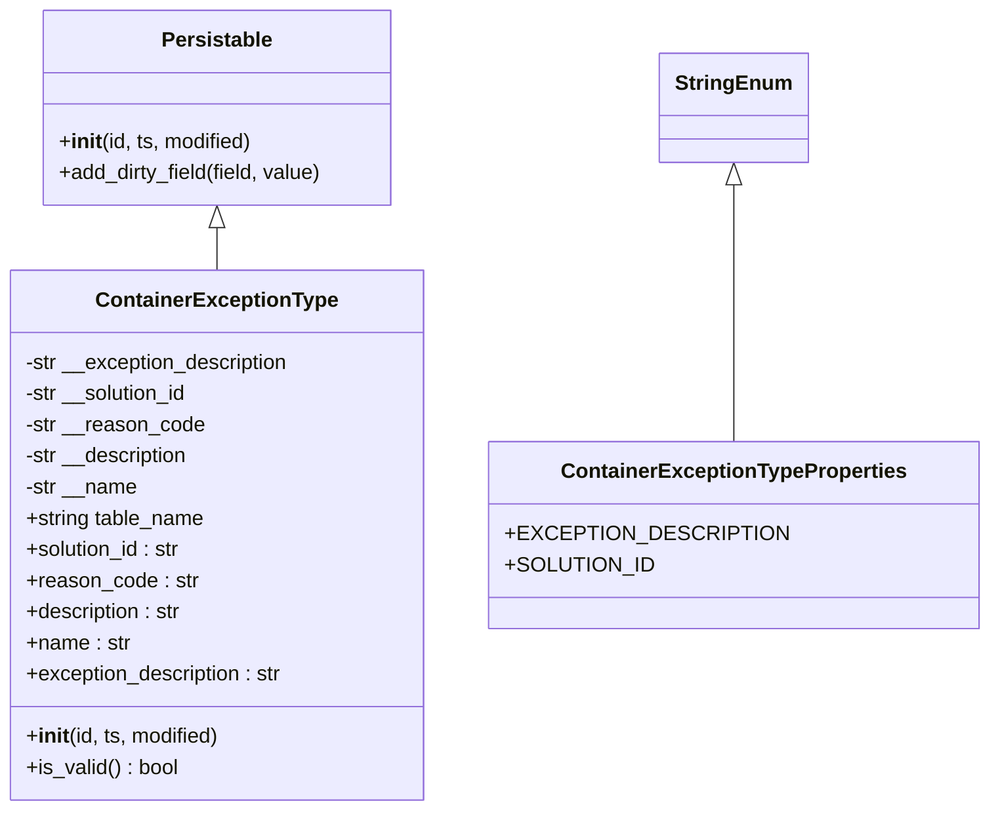
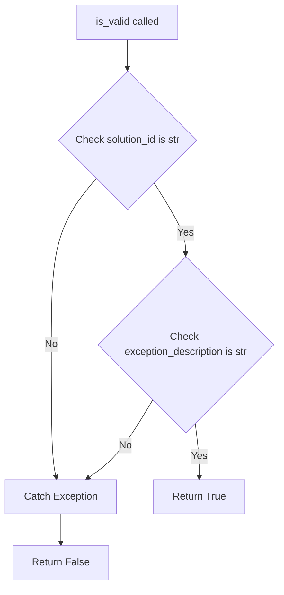
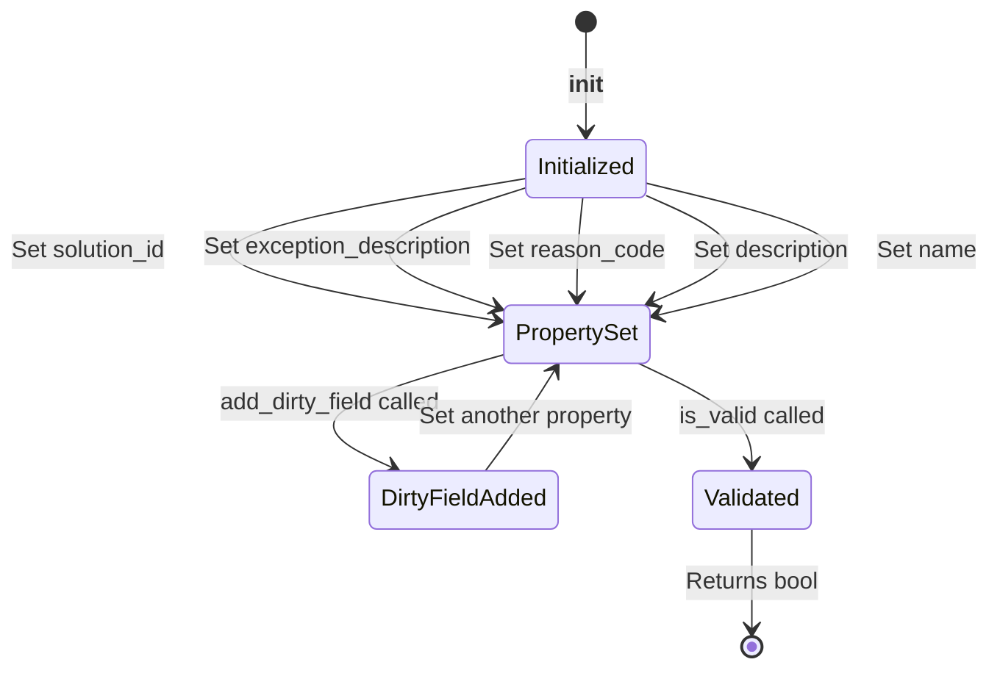

# Diagram: platform/partview_core/partview_service/partview_service/core/datamodel/ContainerExceptionType.py

> Auto-generated by Obscura crawlers

## Diagram 1

### SVG

<svg id="container" width="726.5859375" xmlns="http://www.w3.org/2000/svg" class="classDiagram" height="624" viewBox="0 0 726.5859375 624" role="graphics-document document" aria-roledescription="class"><g><defs><marker id="container_class-aggregationStart" class="marker aggregation class" refX="18" refY="7" markerWidth="190" markerHeight="240" orient="auto"><path d="M 18,7 L9,13 L1,7 L9,1 Z"></path></marker></defs><defs><marker id="container_class-aggregationEnd" class="marker aggregation class" refX="1" refY="7" markerWidth="20" markerHeight="28" orient="auto"><path d="M 18,7 L9,13 L1,7 L9,1 Z"></path></marker></defs><defs><marker id="container_class-extensionStart" class="marker extension class" refX="18" refY="7" markerWidth="190" markerHeight="240" orient="auto"><path d="M 1,7 L18,13 V 1 Z"></path></marker></defs><defs><marker id="container_class-extensionEnd" class="marker extension class" refX="1" refY="7" markerWidth="20" markerHeight="28" orient="auto"><path d="M 1,1 V 13 L18,7 Z"></path></marker></defs><defs><marker id="container_class-compositionStart" class="marker composition class" refX="18" refY="7" markerWidth="190" markerHeight="240" orient="auto"><path d="M 18,7 L9,13 L1,7 L9,1 Z"></path></marker></defs><defs><marker id="container_class-compositionEnd" class="marker composition class" refX="1" refY="7" markerWidth="20" markerHeight="28" orient="auto"><path d="M 18,7 L9,13 L1,7 L9,1 Z"></path></marker></defs><defs><marker id="container_class-dependencyStart" class="marker dependency class" refX="6" refY="7" markerWidth="190" markerHeight="240" orient="auto"><path d="M 5,7 L9,13 L1,7 L9,1 Z"></path></marker></defs><defs><marker id="container_class-dependencyEnd" class="marker dependency class" refX="13" refY="7" markerWidth="20" markerHeight="28" orient="auto"><path d="M 18,7 L9,13 L14,7 L9,1 Z"></path></marker></defs><defs><marker id="container_class-lollipopStart" class="marker lollipop class" refX="13" refY="7" markerWidth="190" markerHeight="240" orient="auto"><circle stroke="black" fill="transparent" cx="7" cy="7" r="6"></circle></marker></defs><defs><marker id="container_class-lollipopEnd" class="marker lollipop class" refX="1" refY="7" markerWidth="190" markerHeight="240" orient="auto"><circle stroke="black" fill="transparent" cx="7" cy="7" r="6"></circle></marker></defs><g class="root"><g class="clusters"></g><g class="edgePaths"><path d="M168.137,175.25L168.137,176.542C168.137,177.833,168.137,180.417,168.137,185.875C168.137,191.333,168.137,199.667,168.137,203.833L168.137,208" id="id_Persistable_ContainerExceptionType_1" class="edge-thickness-normal edge-pattern-solid relation" style=";;;" data-edge="true" data-et="edge" data-id="id_Persistable_ContainerExceptionType_1" data-points="W3sieCI6MTY4LjEzNjcxODc1LCJ5IjoxNTh9LHsieCI6MTY4LjEzNjcxODc1LCJ5IjoxODN9LHsieCI6MTY4LjEzNjcxODc1LCJ5IjoyMDh9XQ==" marker-start="url(#container_class-extensionStart)"></path><path d="M548.43,142.25L548.43,149.042C548.43,155.833,548.43,169.417,548.43,202.375C548.43,235.333,548.43,287.667,548.43,313.833L548.43,340" id="id_StringEnum_ContainerExceptionTypeProperties_2" class="edge-thickness-normal edge-pattern-solid relation" style=";;;" data-edge="true" data-et="edge" data-id="id_StringEnum_ContainerExceptionTypeProperties_2" data-points="W3sieCI6NTQ4LjQyOTY4NzUsInkiOjEyNX0seyJ4Ijo1NDguNDI5Njg3NSwieSI6MTgzfSx7IngiOjU0OC40Mjk2ODc1LCJ5IjozNDB9XQ==" marker-start="url(#container_class-extensionStart)"></path></g><g class="edgeLabels"><g class="edgeLabel"><g class="label" data-id="id_Persistable_ContainerExceptionType_1" transform="translate(0, 0)"><foreignObject width="0" height="0">

</foreignObject></g></g><g class="edgeLabel"><g class="label" data-id="id_StringEnum_ContainerExceptionTypeProperties_2" transform="translate(0, 0)"><foreignObject width="0" height="0">

</foreignObject></g></g></g><g class="nodes"><g class="node default" id="classId-Persistable-0" transform="translate(168.13671875, 83)"><g class="basic label-container"><path d="M-135.71484375 -75 L135.71484375 -75 L135.71484375 75 L-135.71484375 75" stroke="none" stroke-width="0" fill="#ECECFF" style=""></path><path d="M-135.71484375 -75 C-79.13959631383739 -75, -22.56434887767479 -75, 135.71484375 -75 M-135.71484375 -75 C-32.237610170627434 -75, 71.23962340874513 -75, 135.71484375 -75 M135.71484375 -75 C135.71484375 -44.76823920138993, 135.71484375 -14.536478402779863, 135.71484375 75 M135.71484375 -75 C135.71484375 -18.386044036532148, 135.71484375 38.227911926935704, 135.71484375 75 M135.71484375 75 C75.80350044890515 75, 15.892157147810309 75, -135.71484375 75 M135.71484375 75 C68.77116597067173 75, 1.8274881913434626 75, -135.71484375 75 M-135.71484375 75 C-135.71484375 17.412186487367947, -135.71484375 -40.175627025264106, -135.71484375 -75 M-135.71484375 75 C-135.71484375 28.03616581984349, -135.71484375 -18.92766836031302, -135.71484375 -75" stroke="#9370DB" stroke-width="1.3" fill="none" stroke-dasharray="0 0" style=""></path></g><g class="annotation-group text" transform="translate(0, -51)"></g><g class="label-group text" transform="translate(-40.9765625, -51)"><g class="label" style="font-weight: bolder" transform="translate(0,-12)"><foreignObject width="81.953125" height="24">

Persistable

</foreignObject></g></g><g class="members-group text" transform="translate(-123.71484375, -3)"></g><g class="methods-group text" transform="translate(-123.71484375, 27)"><g class="label" style="" transform="translate(0,-12)"><foreignObject width="150.90625" height="24">

+<strong>init</strong>(id, ts, modified)

</foreignObject></g><g class="label" style="" transform="translate(0,12)"><foreignObject width="206.453125" height="24">

+add_dirty_field(field, value)

</foreignObject></g></g><g class="divider" style=""><path d="M-135.71484375 -27 C-60.222702950591895 -27, 15.26943784881621 -27, 135.71484375 -27 M-135.71484375 -27 C-37.817240942259204 -27, 60.08036186548159 -27, 135.71484375 -27" stroke="#9370DB" stroke-width="1.3" fill="none" stroke-dasharray="0 0" style=""></path></g><g class="divider" style=""><path d="M-135.71484375 -3 C-30.109325305236013 -3, 75.49619313952797 -3, 135.71484375 -3 M-135.71484375 -3 C-57.6714559264106 -3, 20.371931897178797 -3, 135.71484375 -3" stroke="#9370DB" stroke-width="1.3" fill="none" stroke-dasharray="0 0" style=""></path></g></g><g class="node default" id="classId-StringEnum-1" transform="translate(548.4296875, 83)"><g class="basic label-container"><path d="M-54.234375 -42 L54.234375 -42 L54.234375 42 L-54.234375 42" stroke="none" stroke-width="0" fill="#ECECFF" style=""></path><path d="M-54.234375 -42 C-12.984099977083034 -42, 28.266175045833933 -42, 54.234375 -42 M-54.234375 -42 C-25.14365930930862 -42, 3.947056381382758 -42, 54.234375 -42 M54.234375 -42 C54.234375 -21.946289594461927, 54.234375 -1.892579188923854, 54.234375 42 M54.234375 -42 C54.234375 -20.025119410158492, 54.234375 1.9497611796830157, 54.234375 42 M54.234375 42 C25.807006182637906 42, -2.620362634724188 42, -54.234375 42 M54.234375 42 C19.371981314101404 42, -15.490412371797191 42, -54.234375 42 M-54.234375 42 C-54.234375 17.456611640878275, -54.234375 -7.086776718243449, -54.234375 -42 M-54.234375 42 C-54.234375 24.358349248346208, -54.234375 6.716698496692416, -54.234375 -42" stroke="#9370DB" stroke-width="1.3" fill="none" stroke-dasharray="0 0" style=""></path></g><g class="annotation-group text" transform="translate(0, -18)"></g><g class="label-group text" transform="translate(-42.234375, -18)"><g class="label" style="font-weight: bolder" transform="translate(0,-12)"><foreignObject width="84.46875" height="24">

StringEnum

</foreignObject></g></g><g class="members-group text" transform="translate(-42.234375, 30)"></g><g class="methods-group text" transform="translate(-42.234375, 60)"></g><g class="divider" style=""><path d="M-54.234375 6 C-14.990772485207302 6, 24.252830029585397 6, 54.234375 6 M-54.234375 6 C-15.726233896211042 6, 22.781907207577916 6, 54.234375 6" stroke="#9370DB" stroke-width="1.3" fill="none" stroke-dasharray="0 0" style=""></path></g><g class="divider" style=""><path d="M-54.234375 24 C-22.421602261044235 24, 9.39117047791153 24, 54.234375 24 M-54.234375 24 C-22.828755650193994 24, 8.576863699612012 24, 54.234375 24" stroke="#9370DB" stroke-width="1.3" fill="none" stroke-dasharray="0 0" style=""></path></g></g><g class="node default" id="classId-ContainerExceptionTypeProperties-2" transform="translate(548.4296875, 412)"><g class="basic label-container"><path d="M-170.15625 -72 L170.15625 -72 L170.15625 72 L-170.15625 72" stroke="none" stroke-width="0" fill="#ECECFF" style=""></path><path d="M-170.15625 -72 C-81.39893199338711 -72, 7.358386013225783 -72, 170.15625 -72 M-170.15625 -72 C-44.282588600814236 -72, 81.59107279837153 -72, 170.15625 -72 M170.15625 -72 C170.15625 -27.25061464515006, 170.15625 17.498770709699883, 170.15625 72 M170.15625 -72 C170.15625 -28.931138627344524, 170.15625 14.137722745310953, 170.15625 72 M170.15625 72 C54.58954640526605 72, -60.9771571894679 72, -170.15625 72 M170.15625 72 C87.39143203350237 72, 4.626614067004738 72, -170.15625 72 M-170.15625 72 C-170.15625 35.4342078993089, -170.15625 -1.1315842013821964, -170.15625 -72 M-170.15625 72 C-170.15625 31.66847754606787, -170.15625 -8.663044907864261, -170.15625 -72" stroke="#9370DB" stroke-width="1.3" fill="none" stroke-dasharray="0 0" style=""></path></g><g class="annotation-group text" transform="translate(0, -48)"></g><g class="label-group text" transform="translate(-126.9375, -48)"><g class="label" style="font-weight: bolder" transform="translate(0,-12)"><foreignObject width="253.875" height="24">

ContainerExceptionTypeProperties

</foreignObject></g></g><g class="members-group text" transform="translate(-158.15625, 0)"><g class="label" style="" transform="translate(0,-12)"><foreignObject width="189.375" height="24">

+EXCEPTION_DESCRIPTION

</foreignObject></g><g class="label" style="" transform="translate(0,12)"><foreignObject width="103.640625" height="24">

+SOLUTION_ID

</foreignObject></g></g><g class="methods-group text" transform="translate(-158.15625, 72)"></g><g class="divider" style=""><path d="M-170.15625 -24 C-38.64645568244714 -24, 92.86333863510572 -24, 170.15625 -24 M-170.15625 -24 C-45.610337992348846 -24, 78.93557401530231 -24, 170.15625 -24" stroke="#9370DB" stroke-width="1.3" fill="none" stroke-dasharray="0 0" style=""></path></g><g class="divider" style=""><path d="M-170.15625 48 C-78.89322454444334 48, 12.369800911113316 48, 170.15625 48 M-170.15625 48 C-68.63204871149156 48, 32.89215257701687 48, 170.15625 48" stroke="#9370DB" stroke-width="1.3" fill="none" stroke-dasharray="0 0" style=""></path></g></g><g class="node default" id="classId-ContainerExceptionType-3" transform="translate(168.13671875, 412)"><g class="basic label-container"><path d="M-160.13671875 -204 L160.13671875 -204 L160.13671875 204 L-160.13671875 204" stroke="none" stroke-width="0" fill="#ECECFF" style=""></path><path d="M-160.13671875 -204 C-55.607065741007474 -204, 48.92258726798505 -204, 160.13671875 -204 M-160.13671875 -204 C-34.959504110665705 -204, 90.21771052866859 -204, 160.13671875 -204 M160.13671875 -204 C160.13671875 -60.15834275201513, 160.13671875 83.68331449596974, 160.13671875 204 M160.13671875 -204 C160.13671875 -106.72313971116226, 160.13671875 -9.446279422324523, 160.13671875 204 M160.13671875 204 C34.132651005661586 204, -91.87141673867683 204, -160.13671875 204 M160.13671875 204 C88.03343073040344 204, 15.930142710806876 204, -160.13671875 204 M-160.13671875 204 C-160.13671875 89.51432610252691, -160.13671875 -24.971347794946183, -160.13671875 -204 M-160.13671875 204 C-160.13671875 115.11334751016626, -160.13671875 26.226695020332528, -160.13671875 -204" stroke="#9370DB" stroke-width="1.3" fill="none" stroke-dasharray="0 0" style=""></path></g><g class="annotation-group text" transform="translate(0, -180)"></g><g class="label-group text" transform="translate(-88.6328125, -180)"><g class="label" style="font-weight: bolder" transform="translate(0,-12)"><foreignObject width="177.265625" height="24">

ContainerExceptionType

</foreignObject></g></g><g class="members-group text" transform="translate(-148.13671875, -132)"><g class="label" style="" transform="translate(0,-12)"><foreignObject width="207.640625" height="24">

-str __exception_description

</foreignObject></g><g class="label" style="" transform="translate(0,12)"><foreignObject width="128.828125" height="24">

-str __solution_id

</foreignObject></g><g class="label" style="" transform="translate(0,36)"><foreignObject width="138.546875" height="24">

-str __reason_code

</foreignObject></g><g class="label" style="" transform="translate(0,60)"><foreignObject width="128.890625" height="24">

-str __description

</foreignObject></g><g class="label" style="" transform="translate(0,84)"><foreignObject width="87.109375" height="24">

-str __name

</foreignObject></g><g class="label" style="" transform="translate(0,108)"><foreignObject width="139.578125" height="24">

+string table_name

</foreignObject></g><g class="label" style="" transform="translate(0,132)"><foreignObject width="121.953125" height="24">

+solution_id : str

</foreignObject></g><g class="label" style="" transform="translate(0,156)"><foreignObject width="131.6875" height="24">

+reason_code : str

</foreignObject></g><g class="label" style="" transform="translate(0,180)"><foreignObject width="122.34375" height="24">

+description : str

</foreignObject></g><g class="label" style="" transform="translate(0,204)"><foreignObject width="80.25" height="24">

+name : str

</foreignObject></g><g class="label" style="" transform="translate(0,228)"><foreignObject width="201.09375" height="24">

+exception_description : str

</foreignObject></g></g><g class="methods-group text" transform="translate(-148.13671875, 156)"><g class="label" style="" transform="translate(0,-12)"><foreignObject width="150.90625" height="24">

+<strong>init</strong>(id, ts, modified)

</foreignObject></g><g class="label" style="" transform="translate(0,12)"><foreignObject width="117.984375" height="24">

+is_valid() : bool

</foreignObject></g></g><g class="divider" style=""><path d="M-160.13671875 -156 C-34.00381500857661 -156, 92.12908873284678 -156, 160.13671875 -156 M-160.13671875 -156 C-50.90948778520735 -156, 58.31774317958531 -156, 160.13671875 -156" stroke="#9370DB" stroke-width="1.3" fill="none" stroke-dasharray="0 0" style=""></path></g><g class="divider" style=""><path d="M-160.13671875 132 C-88.4490979836474 132, -16.76147721729481 132, 160.13671875 132 M-160.13671875 132 C-88.72975975328036 132, -17.322800756560724 132, 160.13671875 132" stroke="#9370DB" stroke-width="1.3" fill="none" stroke-dasharray="0 0" style=""></path></g></g></g></g></g></svg>

## Diagram 2

### SVG

<svg id="container" width="458.1171875" xmlns="http://www.w3.org/2000/svg" class="flowchart" height="951.09375" viewBox="0 0 458.1171875 951.09375" role="graphics-document document" aria-roledescription="flowchart-v2"><g><marker id="container_flowchart-v2-pointEnd" class="marker flowchart-v2" viewBox="0 0 10 10" refX="5" refY="5" markerUnits="userSpaceOnUse" markerWidth="8" markerHeight="8" orient="auto"><path d="M 0 0 L 10 5 L 0 10 z" class="arrowMarkerPath" style="stroke-width: 1; stroke-dasharray: 1, 0;"></path></marker><marker id="container_flowchart-v2-pointStart" class="marker flowchart-v2" viewBox="0 0 10 10" refX="4.5" refY="5" markerUnits="userSpaceOnUse" markerWidth="8" markerHeight="8" orient="auto"><path d="M 0 5 L 10 10 L 10 0 z" class="arrowMarkerPath" style="stroke-width: 1; stroke-dasharray: 1, 0;"></path></marker><marker id="container_flowchart-v2-circleEnd" class="marker flowchart-v2" viewBox="0 0 10 10" refX="11" refY="5" markerUnits="userSpaceOnUse" markerWidth="11" markerHeight="11" orient="auto"><circle cx="5" cy="5" r="5" class="arrowMarkerPath" style="stroke-width: 1; stroke-dasharray: 1, 0;"></circle></marker><marker id="container_flowchart-v2-circleStart" class="marker flowchart-v2" viewBox="0 0 10 10" refX="-1" refY="5" markerUnits="userSpaceOnUse" markerWidth="11" markerHeight="11" orient="auto"><circle cx="5" cy="5" r="5" class="arrowMarkerPath" style="stroke-width: 1; stroke-dasharray: 1, 0;"></circle></marker><marker id="container_flowchart-v2-crossEnd" class="marker cross flowchart-v2" viewBox="0 0 11 11" refX="12" refY="5.2" markerUnits="userSpaceOnUse" markerWidth="11" markerHeight="11" orient="auto"><path d="M 1,1 l 9,9 M 10,1 l -9,9" class="arrowMarkerPath" style="stroke-width: 2; stroke-dasharray: 1, 0;"></path></marker><marker id="container_flowchart-v2-crossStart" class="marker cross flowchart-v2" viewBox="0 0 11 11" refX="-1" refY="5.2" markerUnits="userSpaceOnUse" markerWidth="11" markerHeight="11" orient="auto"><path d="M 1,1 l 9,9 M 10,1 l -9,9" class="arrowMarkerPath" style="stroke-width: 2; stroke-dasharray: 1, 0;"></path></marker><g class="root"><g class="clusters"></g><g class="edgePaths"><path d="M200.547,62L200.547,66.167C200.547,70.333,200.547,78.667,200.547,86.333C200.547,94,200.547,101,200.547,104.5L200.547,108" id="L_A_B_0" class="edge-thickness-normal edge-pattern-solid edge-thickness-normal edge-pattern-solid flowchart-link" style=";" data-edge="true" data-et="edge" data-id="L_A_B_0" data-points="W3sieCI6MjAwLjU0Njg3NSwieSI6NjJ9LHsieCI6MjAwLjU0Njg3NSwieSI6ODd9LHsieCI6MjAwLjU0Njg3NSwieSI6MTEyfV0=" marker-end="url(#container_flowchart-v2-pointEnd)"></path><path d="M244.905,290.736L253.857,304.295C262.809,317.855,280.713,344.974,289.665,364.034C298.617,383.094,298.617,394.094,298.617,399.594L298.617,405.094" id="L_B_C_0" class="edge-thickness-normal edge-pattern-solid edge-thickness-normal edge-pattern-solid flowchart-link" style=";" data-edge="true" data-et="edge" data-id="L_B_C_0" data-points="W3sieCI6MjQ0LjkwNDg0MTI4OTk1NDcsInkiOjI5MC43MzU3ODM3MTAwNDUzfSx7IngiOjI5OC42MTcxODc1LCJ5IjozNzIuMDkzNzV9LHsieCI6Mjk4LjYxNzE4NzUsInkiOjQwOS4wOTM3NX1d" marker-end="url(#container_flowchart-v2-pointEnd)"></path><path d="M150.681,285.228L138.976,299.705C127.272,314.183,103.862,343.138,92.158,388.949C80.453,434.76,80.453,497.427,80.453,560.094C80.453,622.76,80.453,685.427,81.752,722.278C83.052,759.129,85.65,770.165,86.95,775.682L88.249,781.2" id="L_B_D_0" class="edge-thickness-normal edge-pattern-solid edge-thickness-normal edge-pattern-solid flowchart-link" style=";" data-edge="true" data-et="edge" data-id="L_B_D_0" data-points="W3sieCI6MTUwLjY4MDY5MjE3ODUwMjg4LCJ5IjoyODUuMjI3NTY3MTc4NTAyODV9LHsieCI6ODAuNDUzMTI1LCJ5IjozNzIuMDkzNzV9LHsieCI6ODAuNDUzMTI1LCJ5Ijo1NjAuMDkzNzV9LHsieCI6ODAuNDUzMTI1LCJ5Ijo3NDguMDkzNzV9LHsieCI6ODkuMTY1NjQ5NDE0MDYyNSwieSI6Nzg1LjA5Mzc1fV0=" marker-end="url(#container_flowchart-v2-pointEnd)"></path><path d="M313.845,695.866L314.822,704.57C315.798,713.275,317.751,730.684,318.727,744.889C319.703,759.094,319.703,770.094,319.703,775.594L319.703,781.094" id="L_C_E_0" class="edge-thickness-normal edge-pattern-solid edge-thickness-normal edge-pattern-solid flowchart-link" style=";" data-edge="true" data-et="edge" data-id="L_C_E_0" data-points="W3sieCI6MzEzLjg0NTI2MzU3NTE3ODQsInkiOjY5NS44NjU2NzM5MjQ4MjE2fSx7IngiOjMxOS43MDMxMjUsInkiOjc0OC4wOTM3NX0seyJ4IjozMTkuNzAzMTI1LCJ5Ijo3ODUuMDkzNzV9XQ==" marker-end="url(#container_flowchart-v2-pointEnd)"></path><path d="M244.497,656.973L236.013,672.16C227.529,687.347,210.561,717.72,193.186,738.709C175.811,759.698,158.029,771.303,149.138,777.105L140.247,782.908" id="L_C_D_0" class="edge-thickness-normal edge-pattern-solid edge-thickness-normal edge-pattern-solid flowchart-link" style=";" data-edge="true" data-et="edge" data-id="L_C_D_0" data-points="W3sieCI6MjQ0LjQ5NjgwOTk3MDQ3MjE5LCJ5Ijo2NTYuOTczMzcyNDcwNDcyMn0seyJ4IjoxOTMuNTkzNzUsInkiOjc0OC4wOTM3NX0seyJ4IjoxMzYuODk2ODUwNTg1OTM3NSwieSI6Nzg1LjA5Mzc1fV0=" marker-end="url(#container_flowchart-v2-pointEnd)"></path><path d="M95.523,839.094L95.523,843.26C95.523,847.427,95.523,855.76,95.523,863.427C95.523,871.094,95.523,878.094,95.523,881.594L95.523,885.094" id="L_D_F_0" class="edge-thickness-normal edge-pattern-solid edge-thickness-normal edge-pattern-solid flowchart-link" style=";" data-edge="true" data-et="edge" data-id="L_D_F_0" data-points="W3sieCI6OTUuNTIzNDM3NSwieSI6ODM5LjA5Mzc1fSx7IngiOjk1LjUyMzQzNzUsInkiOjg2NC4wOTM3NX0seyJ4Ijo5NS41MjM0Mzc1LCJ5Ijo4ODkuMDkzNzV9XQ==" marker-end="url(#container_flowchart-v2-pointEnd)"></path></g><g class="edgeLabels"><g class="edgeLabel"><g class="label" data-id="L_A_B_0" transform="translate(0, 0)"><foreignObject width="0" height="0">

</foreignObject></g></g><g class="edgeLabel" transform="translate(298.6171875, 372.09375)"><g class="label" data-id="L_B_C_0" transform="translate(-12.03125, -12)"><foreignObject width="24.0625" height="24">

Yes

</foreignObject></g></g><g class="edgeLabel" transform="translate(80.453125, 560.09375)"><g class="label" data-id="L_B_D_0" transform="translate(-10.140625, -12)"><foreignObject width="20.28125" height="24">

No

</foreignObject></g></g><g class="edgeLabel" transform="translate(319.703125, 748.09375)"><g class="label" data-id="L_C_E_0" transform="translate(-12.03125, -12)"><foreignObject width="24.0625" height="24">

Yes

</foreignObject></g></g><g class="edgeLabel" transform="translate(202.53632, 732.08587)"><g class="label" data-id="L_C_D_0" transform="translate(-10.140625, -12)"><foreignObject width="20.28125" height="24">

No

</foreignObject></g></g><g class="edgeLabel"><g class="label" data-id="L_D_F_0" transform="translate(0, 0)"><foreignObject width="0" height="0">

</foreignObject></g></g></g><g class="nodes"><g class="node default" id="flowchart-A-0" transform="translate(200.546875, 35)"><rect class="basic label-container" style="" x="-81.1484375" y="-27" width="162.296875" height="54"></rect><g class="label" style="" transform="translate(-51.1484375, -12)"><rect></rect><foreignObject width="102.296875" height="24">

is_valid called

</foreignObject></g></g><g class="node default" id="flowchart-B-1" transform="translate(200.546875, 223.546875)"><polygon points="111.546875,0 223.09375,-111.546875 111.546875,-223.09375 0,-111.546875" class="label-container" transform="translate(-111.046875, 111.546875)"></polygon><g class="label" style="" transform="translate(-84.546875, -12)"><rect></rect><foreignObject width="169.09375" height="24">

Check solution_id is str

</foreignObject></g></g><g class="node default" id="flowchart-C-3" transform="translate(298.6171875, 560.09375)"><polygon points="151,0 302,-151 151,-302 0,-151" class="label-container" transform="translate(-150.5, 151)"></polygon><g class="label" style="" transform="translate(-100, -36)"><rect></rect><foreignObject width="200" height="72">

Check exception_description is str

</foreignObject></g></g><g class="node default" id="flowchart-D-5" transform="translate(95.5234375, 812.09375)"><rect class="basic label-container" style="" x="-87.5234375" y="-27" width="175.046875" height="54"></rect><g class="label" style="" transform="translate(-57.5234375, -12)"><rect></rect><foreignObject width="115.046875" height="24">

Catch Exception

</foreignObject></g></g><g class="node default" id="flowchart-E-7" transform="translate(319.703125, 812.09375)"><rect class="basic label-container" style="" x="-72.5234375" y="-27" width="145.046875" height="54"></rect><g class="label" style="" transform="translate(-42.5234375, -12)"><rect></rect><foreignObject width="85.046875" height="24">

Return True

</foreignObject></g></g><g class="node default" id="flowchart-F-11" transform="translate(95.5234375, 916.09375)"><rect class="basic label-container" style="" x="-74.6875" y="-27" width="149.375" height="54"></rect><g class="label" style="" transform="translate(-44.6875, -12)"><rect></rect><foreignObject width="89.375" height="24">

Return False

</foreignObject></g></g></g></g></g></svg>

## Diagram 3

### SVG

<svg id="container" width="691.984375" xmlns="http://www.w3.org/2000/svg" class="statediagram" height="460" viewBox="0 0 691.984375 460" role="graphics-document document" aria-roledescription="stateDiagram"><g><defs><marker id="container_stateDiagram-barbEnd" refX="19" refY="7" markerWidth="20" markerHeight="14" markerUnits="userSpaceOnUse" orient="auto"><path d="M 19,7 L9,13 L14,7 L9,1 Z"></path></marker></defs><g class="root"><g class="clusters"></g><g class="edgePaths"><path d="M414.441,22L414.441,28.167C414.441,34.333,414.441,46.667,414.525,59.083C414.608,71.5,414.775,84,414.858,90.25L414.941,96.5" id="edge0" class="edge-thickness-normal edge-pattern-solid transition" style="fill:none;;;fill:none" data-edge="true" data-et="edge" data-id="edge0" data-points="W3sieCI6NDE0LjQ0MTQwNjI1LCJ5IjoyMn0seyJ4Ijo0MTQuNDQxNDA2MjUsInkiOjU5fSx7IngiOjQxNC45NDE0MDYyNSwieSI6OTYuNX1d" marker-end="url(#container_stateDiagram-barbEnd)"></path><path d="M371.035,123.618L319.67,131.848C268.305,140.079,165.574,156.539,163.089,172.953C160.604,189.367,258.365,205.734,307.245,213.917L356.125,222.1" id="edge1" class="edge-thickness-normal edge-pattern-solid transition" style="fill:none;;;fill:none" data-edge="true" data-et="edge" data-id="edge1" data-points="W3sieCI6MzcxLjAzNTE1NjI1LCJ5IjoxMjMuNjE3OTU0ODcxMTc5NTV9LHsieCI6NjIuODQzNzUsInkiOjE3M30seyJ4IjozNTYuMTI1LCJ5IjoyMjIuMTAwMzY4NTc1NTIzODV9XQ==" marker-end="url(#container_stateDiagram-barbEnd)"></path><path d="M371.035,130.225L347.88,137.354C324.724,144.483,278.413,158.742,275.966,172.706C273.52,186.67,314.938,200.341,335.647,207.176L356.356,214.011" id="edge2" class="edge-thickness-normal edge-pattern-solid transition" style="fill:none;;;fill:none" data-edge="true" data-et="edge" data-id="edge2" data-points="W3sieCI6MzcxLjAzNTE1NjI1LCJ5IjoxMzAuMjI1MjI5NzYwNzA2MX0seyJ4IjoyMzIuMTAxNTYyNSwieSI6MTczfSx7IngiOjM1Ni4zNTU4NDQ1MDAxODUwNywieSI6MjE0LjAxMTA5MzAzMDkyOTIzfV0=" marker-end="url(#container_stateDiagram-barbEnd)"></path><path d="M412.059,136.5L411.087,142.583C410.115,148.667,408.171,160.833,407.282,173.167C406.393,185.5,406.56,198,406.643,204.25L406.727,210.5" id="edge3" class="edge-thickness-normal edge-pattern-solid transition" style="fill:none;;;fill:none" data-edge="true" data-et="edge" data-id="edge3" data-points="W3sieCI6NDEyLjA1OTAwNDkzNDIxMDUsInkiOjEzNi41fSx7IngiOjQwNi4yMjY1NjI1LCJ5IjoxNzN9LHsieCI6NDA2LjcyNjU2MjUsInkiOjIxMC41fV0=" marker-end="url(#container_stateDiagram-barbEnd)"></path><path d="M456.947,135.422L470.952,141.685C484.957,147.948,512.967,160.474,512.41,173.015C511.854,185.556,482.731,198.112,468.17,204.391L453.608,210.669" id="edge4" class="edge-thickness-normal edge-pattern-solid transition" style="fill:none;;;fill:none" data-edge="true" data-et="edge" data-id="edge4" data-points="W3sieCI6NDU2Ljk0NjY4MjA3MzQ3NDU2LCJ5IjoxMzUuNDIyMDE5NzIwODA4Mjd9LHsieCI6NTQwLjk3NjU2MjUsInkiOjE3M30seyJ4Ijo0NTMuNjA4Mzg1NzQ3MjM3NywieSI6MjEwLjY2ODcyNzgyODYyNjcxfV0=" marker-end="url(#container_stateDiagram-barbEnd)"></path><path d="M458.848,127.124L490.706,134.77C522.565,142.416,586.283,157.708,586.029,172.965C585.776,188.223,521.552,203.445,489.44,211.057L457.328,218.668" id="edge5" class="edge-thickness-normal edge-pattern-solid transition" style="fill:none;;;fill:none" data-edge="true" data-et="edge" data-id="edge5" data-points="W3sieCI6NDU4Ljg0NzY1NjI1LCJ5IjoxMjcuMTI0MzQ3MDQ3NDEwNTh9LHsieCI6NjUwLCJ5IjoxNzN9LHsieCI6NDU3LjMyODEyNSwieSI6MjE4LjY2ODE1NjkwNzk4OTZ9XQ==" marker-end="url(#container_stateDiagram-barbEnd)"></path><path d="M356.125,244.201L329.39,251.334C302.655,258.468,249.185,272.734,236.762,286.117C224.339,299.5,252.963,312,267.275,318.25L281.587,324.5" id="edge6" class="edge-thickness-normal edge-pattern-solid transition" style="fill:none;;;fill:none" data-edge="true" data-et="edge" data-id="edge6" data-points="W3sieCI6MzU2LjEyNSwieSI6MjQ0LjIwMTMyMzA0MDk1MzA0fSx7IngiOjE5NS43MTQ4NDM3NSwieSI6Mjg3fSx7IngiOjI4MS41ODcxNzEwNTI2MzE1NiwieSI6MzI0LjV9XQ==" marker-end="url(#container_stateDiagram-barbEnd)"></path><path d="M342.785,324.5L347.342,318.25C351.9,312,361.014,299.5,369.56,287.167C378.106,274.833,386.083,262.667,390.072,256.583L394.061,250.5" id="edge7" class="edge-thickness-normal edge-pattern-solid transition" style="fill:none;;;fill:none" data-edge="true" data-et="edge" data-id="edge7" data-points="W3sieCI6MzQyLjc4NTA4NzcxOTI5ODI1LCJ5IjozMjQuNX0seyJ4IjozNzAuMTI4OTA2MjUsInkiOjI4N30seyJ4IjozOTQuMDYwNzE4MjAxNzU0NCwieSI6MjUwLjV9XQ==" marker-end="url(#container_stateDiagram-barbEnd)"></path><path d="M449.494,250.5L462.597,256.583C475.7,262.667,501.907,274.833,515.093,287.167C528.28,299.5,528.447,312,528.53,318.25L528.613,324.5" id="edge8" class="edge-thickness-normal edge-pattern-solid transition" style="fill:none;;;fill:none" data-edge="true" data-et="edge" data-id="edge8" data-points="W3sieCI6NDQ5LjQ5MzgzMjIzNjg0MjEsInkiOjI1MC41fSx7IngiOjUyOC4xMTMyODEyNSwieSI6Mjg3fSx7IngiOjUyOC42MTMyODEyNSwieSI6MzI0LjV9XQ==" marker-end="url(#container_stateDiagram-barbEnd)"></path><path d="M528.613,364.5L528.53,370.583C528.447,376.667,528.28,388.833,528.197,401.083C528.113,413.333,528.113,425.667,528.113,431.833L528.113,438" id="edge9" class="edge-thickness-normal edge-pattern-solid transition" style="fill:none;;;fill:none" data-edge="true" data-et="edge" data-id="edge9" data-points="W3sieCI6NTI4LjYxMzI4MTI1LCJ5IjozNjQuNX0seyJ4Ijo1MjguMTEzMjgxMjUsInkiOjQwMX0seyJ4Ijo1MjguMTEzMjgxMjUsInkiOjQzOH1d" marker-end="url(#container_stateDiagram-barbEnd)"></path></g><g class="edgeLabels"><g class="edgeLabel" transform="translate(414.44140625, 59)"><g class="label" data-id="edge0" transform="translate(-12.21875, -12)"><foreignObject width="24.4375" height="24">

<strong>init</strong>

</foreignObject></g></g><g class="edgeLabel" transform="translate(62.84375, 173)"><g class="label" data-id="edge1" transform="translate(-54.84375, -12)"><foreignObject width="109.6875" height="24">

Set solution_id

</foreignObject></g></g><g class="edgeLabel" transform="translate(232.1015625, 173)"><g class="label" data-id="edge2" transform="translate(-94.4140625, -12)"><foreignObject width="188.828125" height="24">

Set exception_description

</foreignObject></g></g><g class="edgeLabel" transform="translate(406.2265625, 173)"><g class="label" data-id="edge3" transform="translate(-59.7109375, -12)"><foreignObject width="119.421875" height="24">

Set reason_code

</foreignObject></g></g><g class="edgeLabel" transform="translate(540.9765625, 173)"><g class="label" data-id="edge4" transform="translate(-55.0390625, -12)"><foreignObject width="110.078125" height="24">

Set description

</foreignObject></g></g><g class="edgeLabel" transform="translate(650, 173)"><g class="label" data-id="edge5" transform="translate(-33.984375, -12)"><foreignObject width="67.96875" height="24">

Set name

</foreignObject></g></g><g class="edgeLabel" transform="translate(230.65182, 277.67854)"><g class="label" data-id="edge6" transform="translate(-78.5703125, -12)"><foreignObject width="157.140625" height="24">

add_dirty_field called

</foreignObject></g></g><g class="edgeLabel" transform="translate(370.12890625, 287)"><g class="label" data-id="edge7" transform="translate(-75.84375, -12)"><foreignObject width="151.6875" height="24">

Set another property

</foreignObject></g></g><g class="edgeLabel" transform="translate(528.11328125, 287)"><g class="label" data-id="edge8" transform="translate(-51.1484375, -12)"><foreignObject width="102.296875" height="24">

is_valid called

</foreignObject></g></g><g class="edgeLabel" transform="translate(528.11328125, 401)"><g class="label" data-id="edge9" transform="translate(-46.703125, -12)"><foreignObject width="93.40625" height="24">

Returns bool

</foreignObject></g></g></g><g class="nodes"><g class="node default" id="state-root_start-0" transform="translate(414.44140625, 15)"><circle class="state-start" r="7" width="14" height="14"></circle></g><g class="node  statediagram-state" id="state-Initialized-5" transform="translate(414.44140625, 116)"><g class="basic label-container outer-path"><path d="M-38.90625 -20 C-11.909696930797669 -20, 15.086856138404663 -20, 38.90625 -20 C38.90625 -20, 38.90625 -20, 38.90625 -20 C39.01255323681579 -19.99560326560254, 39.11885647363158 -19.99120653120508, 39.31914672736166 -19.982922465033347 C39.42442312076999 -19.969799776280208, 39.52969951417832 -19.956677087527073, 39.72922295140367 -19.931806517013612 C39.824797044267655 -19.911766737106113, 39.920371137131646 -19.891726957198617, 40.133677435703994 -19.847001329696653 C40.24780887397469 -19.81302292834619, 40.36194031224538 -19.77904452699573, 40.52974734602342 -19.729086208503173 C40.660900787728856 -19.677909976744093, 40.79205422943429 -19.626733744985014, 40.914727123264846 -19.578866633275286 C41.03112358560774 -19.521963870174034, 41.147520047950636 -19.46506110707278, 41.285986965185366 -19.397368756032446 C41.40822103944283 -19.324533057199538, 41.5304551137003 -19.25169735836663, 41.640990790612136 -19.185832391312644 C41.71966831297865 -19.129657720061957, 41.79834583534515 -19.073483048811273, 41.97731356344834 -18.94570254698197 C42.10080811129339 -18.841108000354193, 42.22430265913844 -18.736513453726417, 42.292657858128706 -18.678619553365657 C42.38966215964182 -18.581615251852543, 42.48666646115493 -18.48461095033943, 42.58486955336566 -18.386407858128706 C42.64132122405986 -18.319755496488025, 42.69777289475406 -18.25310313484734, 42.85195254698197 -18.07106356344834 C42.92887479203329 -17.963327255949547, 43.00579703708461 -17.855590948450757, 43.092082391312644 -17.734740790612136 C43.164415395391224 -17.613350347004396, 43.2367483994698 -17.49195990339665, 43.30361875603245 -17.37973696518537 C43.35236236904551 -17.280030311108916, 43.40110598205856 -17.180323657032467, 43.48511663327529 -17.008477123264846 C43.54371130576295 -16.858311847350492, 43.602305978250605 -16.70814657143614, 43.635336208503176 -16.623497346023417 C43.674830440936795 -16.490838557737465, 43.71432467337041 -16.358179769451514, 43.75325132969665 -16.227427435703994 C43.78449101068644 -16.078438565280226, 43.81573069167622 -15.929449694856459, 43.83805651701361 -15.82297295140367 C43.848509752350076 -15.739112171317077, 43.858962987686546 -15.655251391230482, 43.88917246503335 -15.412896727361662 C43.89507447078679 -15.27019938461139, 43.90097647654023 -15.127502041861117, 43.90625 -15 C43.90625 -15, 43.90625 -15, 43.90625 -15 C43.90625 -4.774621472371653, 43.90625 5.450757055256695, 43.90625 15 C43.90625 15, 43.90625 15, 43.90625 15 C43.902075759216864 15.100923837189697, 43.897901518433734 15.201847674379396, 43.88917246503335 15.412896727361662 C43.870240672461414 15.564776489216936, 43.85130887988949 15.71665625107221, 43.83805651701361 15.822972951403669 C43.807615797813995 15.968151398325737, 43.777175078614384 16.113329845247808, 43.75325132969665 16.227427435703994 C43.711681157459275 16.36705918287411, 43.670110985221896 16.50669093004423, 43.635336208503176 16.623497346023417 C43.58310994904334 16.757341778098926, 43.530883689583504 16.891186210174435, 43.48511663327529 17.008477123264846 C43.4306110775065 17.1199700196332, 43.3761055217377 17.231462916001558, 43.30361875603245 17.379736965185366 C43.23682435578725 17.49183243224863, 43.170029955542056 17.603927899311895, 43.092082391312644 17.734740790612133 C43.035918115667045 17.813403753027803, 42.979753840021445 17.892066715443473, 42.85195254698197 18.07106356344834 C42.77730004627564 18.15920560447691, 42.70264754556932 18.247347645505478, 42.58486955336566 18.386407858128706 C42.49895769907092 18.47231971242344, 42.413045844776185 18.558231566718177, 42.292657858128706 18.678619553365657 C42.1751282646528 18.77816204134969, 42.05759867117689 18.877704529333727, 41.97731356344834 18.94570254698197 C41.888650012961406 19.009007105268903, 41.79998646247447 19.072311663555833, 41.640990790612136 19.185832391312644 C41.5415561363513 19.24508258464287, 41.44212148209048 19.304332777973098, 41.285986965185366 19.397368756032446 C41.13939863862947 19.46903142216096, 40.99281031207357 19.540694088289474, 40.914727123264846 19.578866633275286 C40.8373759025009 19.609049173277203, 40.760024681736965 19.639231713279116, 40.52974734602342 19.729086208503173 C40.38344854481442 19.772641248726014, 40.237149743605414 19.81619628894886, 40.133677435703994 19.847001329696653 C39.98524520975055 19.87812429461477, 39.83681298379711 19.90924725953289, 39.72922295140367 19.931806517013612 C39.63493606968659 19.943559364562997, 39.5406491879695 19.955312212112382, 39.31914672736166 19.982922465033347 C39.217685133376044 19.987118947602085, 39.116223539390425 19.991315430170822, 38.90625 20 C38.90625 20, 38.90625 20, 38.90625 20 C22.417671327743545 20, 5.929092655487089 20, -38.90625 20 C-38.90625 20, -38.90625 20, -38.90625 20 C-39.065045836314646 19.99343215562751, -39.223841672629284 19.98686431125502, -39.31914672736166 19.982922465033347 C-39.420786295929894 19.970253106023765, -39.522425864498125 19.957583747014183, -39.72922295140367 19.931806517013612 C-39.88912031590163 19.898279565343895, -40.049017680399594 19.864752613674177, -40.133677435703994 19.847001329696653 C-40.2909531974816 19.800178306721122, -40.448228959259204 19.753355283745588, -40.52974734602342 19.729086208503173 C-40.67425541281461 19.67269898586534, -40.818763479605806 19.616311763227507, -40.914727123264846 19.578866633275286 C-41.03055197364347 19.5222433142356, -41.14637682402209 19.46561999519591, -41.285986965185366 19.397368756032446 C-41.36464231419406 19.35050034109336, -41.44329766320274 19.30363192615427, -41.640990790612136 19.185832391312644 C-41.74444660117724 19.11196636232923, -41.84790241174234 19.038100333345813, -41.97731356344834 18.94570254698197 C-42.07327695002505 18.86442570450589, -42.16924033660175 18.783148862029815, -42.292657858128706 18.67861955336566 C-42.3990931524468 18.57218425904756, -42.5055284467649 18.465748964729464, -42.58486955336566 18.386407858128706 C-42.6905914240445 18.261582281291712, -42.79631329472333 18.13675670445472, -42.85195254698197 18.07106356344834 C-42.91492204715101 17.98286929105378, -42.977891547320056 17.894675018659225, -43.092082391312644 17.734740790612133 C-43.16854425709579 17.606421223013246, -43.245006122878934 17.47810165541436, -43.30361875603244 17.37973696518537 C-43.34458040770975 17.295948567450157, -43.385542059387056 17.21216016971494, -43.48511663327528 17.00847712326485 C-43.54501594192502 16.85496835141598, -43.60491525057476 16.70145957956711, -43.635336208503176 16.623497346023417 C-43.67873903794557 16.47770981181352, -43.72214186738796 16.331922277603624, -43.75325132969665 16.227427435703994 C-43.779632970519586 16.10160762123728, -43.80601461134251 15.975787806770567, -43.83805651701361 15.82297295140367 C-43.85345457298846 15.699442489847632, -43.8688526289633 15.575912028291595, -43.88917246503335 15.412896727361664 C-43.89280585676895 15.325049414515606, -43.896439248504564 15.237202101669547, -43.90625 15 C-43.90625 15, -43.90625 15, -43.90625 15 C-43.90625 5.761422916847588, -43.90625 -3.4771541663048247, -43.90625 -15 C-43.90625 -15, -43.90625 -15, -43.90625 -15 C-43.90006925444351 -15.14943664983932, -43.89388850888702 -15.298873299678641, -43.88917246503335 -15.41289672736166 C-43.870369980464154 -15.563739119480989, -43.851567495894955 -15.714581511600315, -43.83805651701361 -15.822972951403669 C-43.804266773094255 -15.984123629609993, -43.770477029174906 -16.145274307816315, -43.75325132969665 -16.227427435703994 C-43.718012255863634 -16.345793398199024, -43.68277318203061 -16.464159360694058, -43.635336208503176 -16.623497346023417 C-43.58379868882254 -16.755576689318914, -43.532261169141904 -16.88765603261441, -43.48511663327529 -17.008477123264846 C-43.42461294040615 -17.132239405179316, -43.364109247537 -17.256001687093782, -43.30361875603245 -17.379736965185366 C-43.250318627132565 -17.469186122923624, -43.19701849823268 -17.55863528066188, -43.092082391312644 -17.734740790612133 C-43.014743793885074 -17.843060235896434, -42.9374051964575 -17.951379681180736, -42.85195254698197 -18.07106356344834 C-42.79340627776986 -18.14018901288591, -42.73486000855776 -18.209314462323476, -42.58486955336566 -18.386407858128706 C-42.484142818323384 -18.487134593170982, -42.383416083281105 -18.587861328213254, -42.292657858128706 -18.678619553365657 C-42.227902351045834 -18.73346467020015, -42.16314684396296 -18.788309787034642, -41.97731356344834 -18.945702546981966 C-41.87914206059763 -19.015795652775697, -41.780970557746926 -19.08588875856943, -41.640990790612136 -19.185832391312644 C-41.505715423206965 -19.266439014136, -41.3704400558018 -19.34704563695936, -41.285986965185366 -19.397368756032446 C-41.17885292705925 -19.449743395852785, -41.071718888933134 -19.502118035673124, -40.914727123264846 -19.578866633275286 C-40.819817596644114 -19.615900445482794, -40.724908070023375 -19.652934257690298, -40.52974734602342 -19.729086208503173 C-40.40396220341039 -19.766534067957057, -40.27817706079736 -19.80398192741094, -40.133677435703994 -19.847001329696653 C-39.99218017950768 -19.87667018436969, -39.85068292331136 -19.906339039042727, -39.72922295140367 -19.931806517013612 C-39.60516384679974 -19.947270468275658, -39.48110474219581 -19.962734419537703, -39.31914672736166 -19.982922465033347 C-39.160955127776695 -19.989465317989836, -39.00276352819173 -19.996008170946325, -38.90625 -20 C-38.90625 -20, -38.90625 -20, -38.90625 -20" stroke="none" stroke-width="0" fill="#ECECFF" style=""></path><path d="M-38.90625 -20 C-8.626981598414844 -20, 21.652286803170313 -20, 38.90625 -20 M-38.90625 -20 C-8.69205404321685 -20, 21.5221419135663 -20, 38.90625 -20 M38.90625 -20 C38.90625 -20, 38.90625 -20, 38.90625 -20 M38.90625 -20 C38.90625 -20, 38.90625 -20, 38.90625 -20 M38.90625 -20 C39.05434309646533 -19.993874824222107, 39.20243619293066 -19.987749648444215, 39.31914672736166 -19.982922465033347 M38.90625 -20 C39.00130394579139 -19.99606853972095, 39.09635789158279 -19.992137079441907, 39.31914672736166 -19.982922465033347 M39.31914672736166 -19.982922465033347 C39.40979257157149 -19.97162347233593, 39.50043841578131 -19.960324479638516, 39.72922295140367 -19.931806517013612 M39.31914672736166 -19.982922465033347 C39.42919390543066 -19.969205098592425, 39.53924108349966 -19.955487732151504, 39.72922295140367 -19.931806517013612 M39.72922295140367 -19.931806517013612 C39.863805331398424 -19.90358755941011, 39.99838771139318 -19.875368601806606, 40.133677435703994 -19.847001329696653 M39.72922295140367 -19.931806517013612 C39.83738517532847 -19.90912728358533, 39.94554739925327 -19.886448050157053, 40.133677435703994 -19.847001329696653 M40.133677435703994 -19.847001329696653 C40.22708549147879 -19.819192546625377, 40.32049354725358 -19.791383763554105, 40.52974734602342 -19.729086208503173 M40.133677435703994 -19.847001329696653 C40.2285172316004 -19.81876629912321, 40.323357027496805 -19.79053126854977, 40.52974734602342 -19.729086208503173 M40.52974734602342 -19.729086208503173 C40.62340463010936 -19.692541022849007, 40.717061914195305 -19.655995837194837, 40.914727123264846 -19.578866633275286 M40.52974734602342 -19.729086208503173 C40.61073037461382 -19.69748653268984, 40.691713403204226 -19.665886856876508, 40.914727123264846 -19.578866633275286 M40.914727123264846 -19.578866633275286 C41.006902302179896 -19.53380493411327, 41.099077481094945 -19.48874323495125, 41.285986965185366 -19.397368756032446 M40.914727123264846 -19.578866633275286 C41.05113122068818 -19.512182733391334, 41.18753531811151 -19.44549883350738, 41.285986965185366 -19.397368756032446 M41.285986965185366 -19.397368756032446 C41.4217718802471 -19.316458508709292, 41.55755679530883 -19.23554826138614, 41.640990790612136 -19.185832391312644 M41.285986965185366 -19.397368756032446 C41.39305757794909 -19.333568519048715, 41.50012819071281 -19.269768282064984, 41.640990790612136 -19.185832391312644 M41.640990790612136 -19.185832391312644 C41.74797521848917 -19.109446977992953, 41.8549596463662 -19.033061564673265, 41.97731356344834 -18.94570254698197 M41.640990790612136 -19.185832391312644 C41.74620899833073 -19.110708034947624, 41.85142720604932 -19.035583678582608, 41.97731356344834 -18.94570254698197 M41.97731356344834 -18.94570254698197 C42.096633533279146 -18.844643687575864, 42.21595350310996 -18.74358482816976, 42.292657858128706 -18.678619553365657 M41.97731356344834 -18.94570254698197 C42.09064503175604 -18.8497156896417, 42.20397650006373 -18.753728832301434, 42.292657858128706 -18.678619553365657 M42.292657858128706 -18.678619553365657 C42.3745785814132 -18.596698830081163, 42.456499304697694 -18.51477810679667, 42.58486955336566 -18.386407858128706 M42.292657858128706 -18.678619553365657 C42.3952109913422 -18.57606642015216, 42.4977641245557 -18.473513286938665, 42.58486955336566 -18.386407858128706 M42.58486955336566 -18.386407858128706 C42.657547444048404 -18.30059723474947, 42.73022533473115 -18.214786611370236, 42.85195254698197 -18.07106356344834 M42.58486955336566 -18.386407858128706 C42.64372102935093 -18.316922051735006, 42.70257250533619 -18.247436245341305, 42.85195254698197 -18.07106356344834 M42.85195254698197 -18.07106356344834 C42.91457834231814 -17.983350679624003, 42.977204137654304 -17.89563779579966, 43.092082391312644 -17.734740790612136 M42.85195254698197 -18.07106356344834 C42.919016371538945 -17.977134832953094, 42.98608019609591 -17.883206102457844, 43.092082391312644 -17.734740790612136 M43.092082391312644 -17.734740790612136 C43.15707683846543 -17.625666034594186, 43.22207128561822 -17.516591278576232, 43.30361875603245 -17.37973696518537 M43.092082391312644 -17.734740790612136 C43.14624410975029 -17.6438456990636, 43.20040582818793 -17.55295060751506, 43.30361875603245 -17.37973696518537 M43.30361875603245 -17.37973696518537 C43.3639233937348 -17.25638185712263, 43.424228031437146 -17.133026749059887, 43.48511663327529 -17.008477123264846 M43.30361875603245 -17.37973696518537 C43.37406850938644 -17.235629691365595, 43.44451826274043 -17.09152241754582, 43.48511663327529 -17.008477123264846 M43.48511663327529 -17.008477123264846 C43.5249798775043 -16.90631638382643, 43.56484312173331 -16.80415564438801, 43.635336208503176 -16.623497346023417 M43.48511663327529 -17.008477123264846 C43.51821074406223 -16.92366418607319, 43.55130485484917 -16.838851248881536, 43.635336208503176 -16.623497346023417 M43.635336208503176 -16.623497346023417 C43.67477386862055 -16.491028580798087, 43.71421152873792 -16.358559815572757, 43.75325132969665 -16.227427435703994 M43.635336208503176 -16.623497346023417 C43.66850171258963 -16.51209638153078, 43.70166721667608 -16.400695417038143, 43.75325132969665 -16.227427435703994 M43.75325132969665 -16.227427435703994 C43.781782136517776 -16.091357778592315, 43.8103129433389 -15.955288121480638, 43.83805651701361 -15.82297295140367 M43.75325132969665 -16.227427435703994 C43.786078827030266 -16.070865921898072, 43.81890632436389 -15.91430440809215, 43.83805651701361 -15.82297295140367 M43.83805651701361 -15.82297295140367 C43.85306741055772 -15.702548489322147, 43.86807830410182 -15.582124027240626, 43.88917246503335 -15.412896727361662 M43.83805651701361 -15.82297295140367 C43.857586384282435 -15.666295152479803, 43.87711625155125 -15.509617353555935, 43.88917246503335 -15.412896727361662 M43.88917246503335 -15.412896727361662 C43.894509209871515 -15.283866133499822, 43.89984595470968 -15.154835539637983, 43.90625 -15 M43.88917246503335 -15.412896727361662 C43.89450780482011 -15.28390010451075, 43.89984314460687 -15.154903481659835, 43.90625 -15 M43.90625 -15 C43.90625 -15, 43.90625 -15, 43.90625 -15 M43.90625 -15 C43.90625 -15, 43.90625 -15, 43.90625 -15 M43.90625 -15 C43.90625 -6.198280291120916, 43.90625 2.6034394177581675, 43.90625 15 M43.90625 -15 C43.90625 -4.542187898505688, 43.90625 5.915624202988624, 43.90625 15 M43.90625 15 C43.90625 15, 43.90625 15, 43.90625 15 M43.90625 15 C43.90625 15, 43.90625 15, 43.90625 15 M43.90625 15 C43.901766863513885 15.10839224671755, 43.89728372702777 15.2167844934351, 43.88917246503335 15.412896727361662 M43.90625 15 C43.89967329692498 15.159010019994481, 43.89309659384997 15.318020039988962, 43.88917246503335 15.412896727361662 M43.88917246503335 15.412896727361662 C43.86947073310875 15.570953305547539, 43.84976900118416 15.729009883733415, 43.83805651701361 15.822972951403669 M43.88917246503335 15.412896727361662 C43.86876919062531 15.576581409960353, 43.84836591621727 15.740266092559043, 43.83805651701361 15.822972951403669 M43.83805651701361 15.822972951403669 C43.80494169262512 15.980904790769637, 43.77182686823663 16.138836630135604, 43.75325132969665 16.227427435703994 M43.83805651701361 15.822972951403669 C43.81320804529924 15.941480747103991, 43.78835957358488 16.059988542804312, 43.75325132969665 16.227427435703994 M43.75325132969665 16.227427435703994 C43.721175861997445 16.335167032513084, 43.68910039429823 16.442906629322174, 43.635336208503176 16.623497346023417 M43.75325132969665 16.227427435703994 C43.72950849585109 16.30717820877498, 43.70576566200554 16.386928981845973, 43.635336208503176 16.623497346023417 M43.635336208503176 16.623497346023417 C43.59132454015748 16.736289585317433, 43.54731287181179 16.84908182461145, 43.48511663327529 17.008477123264846 M43.635336208503176 16.623497346023417 C43.59843230748404 16.718073938801915, 43.5615284064649 16.81265053158041, 43.48511663327529 17.008477123264846 M43.48511663327529 17.008477123264846 C43.427347086000566 17.126646620973826, 43.36957753872585 17.24481611868281, 43.30361875603245 17.379736965185366 M43.48511663327529 17.008477123264846 C43.44525129064057 17.090022985009938, 43.40538594800586 17.171568846755026, 43.30361875603245 17.379736965185366 M43.30361875603245 17.379736965185366 C43.219102442361965 17.521573640424307, 43.13458612869149 17.663410315663253, 43.092082391312644 17.734740790612133 M43.30361875603245 17.379736965185366 C43.239789059284185 17.486857017813094, 43.17595936253593 17.59397707044082, 43.092082391312644 17.734740790612133 M43.092082391312644 17.734740790612133 C43.043815178954986 17.80234322771215, 42.99554796659733 17.869945664812164, 42.85195254698197 18.07106356344834 M43.092082391312644 17.734740790612133 C43.024371588357404 17.829575670734375, 42.956660785402164 17.924410550856617, 42.85195254698197 18.07106356344834 M42.85195254698197 18.07106356344834 C42.762361463699605 18.176843555595322, 42.67277038041725 18.282623547742308, 42.58486955336566 18.386407858128706 M42.85195254698197 18.07106356344834 C42.762813366585014 18.176309994866756, 42.67367418618805 18.28155642628517, 42.58486955336566 18.386407858128706 M42.58486955336566 18.386407858128706 C42.52343084519403 18.44784656630033, 42.461992137022406 18.50928527447196, 42.292657858128706 18.678619553365657 M42.58486955336566 18.386407858128706 C42.47323144338831 18.49804596810606, 42.36159333341095 18.60968407808341, 42.292657858128706 18.678619553365657 M42.292657858128706 18.678619553365657 C42.194295745118815 18.76192801349726, 42.09593363210892 18.84523647362887, 41.97731356344834 18.94570254698197 M42.292657858128706 18.678619553365657 C42.203165490865516 18.75441572205389, 42.11367312360232 18.830211890742117, 41.97731356344834 18.94570254698197 M41.97731356344834 18.94570254698197 C41.901256782598836 19.000006044754862, 41.82520000174934 19.05430954252775, 41.640990790612136 19.185832391312644 M41.97731356344834 18.94570254698197 C41.859743158839564 19.029646202413087, 41.742172754230786 19.1135898578442, 41.640990790612136 19.185832391312644 M41.640990790612136 19.185832391312644 C41.56797916955304 19.22933787433828, 41.494967548493946 19.272843357363918, 41.285986965185366 19.397368756032446 M41.640990790612136 19.185832391312644 C41.525891741819805 19.254416537793226, 41.41079269302747 19.32300068427381, 41.285986965185366 19.397368756032446 M41.285986965185366 19.397368756032446 C41.16878681179993 19.454664419743217, 41.05158665841449 19.511960083453985, 40.914727123264846 19.578866633275286 M41.285986965185366 19.397368756032446 C41.16509834293191 19.456467602296865, 41.04420972067847 19.515566448561284, 40.914727123264846 19.578866633275286 M40.914727123264846 19.578866633275286 C40.829110171682764 19.612274471450906, 40.743493220100675 19.645682309626523, 40.52974734602342 19.729086208503173 M40.914727123264846 19.578866633275286 C40.773748690006826 19.63387658863466, 40.63277025674881 19.688886543994034, 40.52974734602342 19.729086208503173 M40.52974734602342 19.729086208503173 C40.41954066330506 19.761896159500427, 40.30933398058669 19.794706110497682, 40.133677435703994 19.847001329696653 M40.52974734602342 19.729086208503173 C40.39331611906058 19.76970354459145, 40.256884892097744 19.81032088067973, 40.133677435703994 19.847001329696653 M40.133677435703994 19.847001329696653 C40.04146208499846 19.866336855432287, 39.94924673429293 19.88567238116792, 39.72922295140367 19.931806517013612 M40.133677435703994 19.847001329696653 C40.035287631830776 19.867631502117614, 39.93689782795756 19.88826167453858, 39.72922295140367 19.931806517013612 M39.72922295140367 19.931806517013612 C39.56610059793239 19.952139697169017, 39.40297824446112 19.972472877324424, 39.31914672736166 19.982922465033347 M39.72922295140367 19.931806517013612 C39.618733956610605 19.945578955851754, 39.508244961817546 19.959351394689897, 39.31914672736166 19.982922465033347 M39.31914672736166 19.982922465033347 C39.19339402976594 19.9881236350791, 39.067641332170226 19.993324805124846, 38.90625 20 M39.31914672736166 19.982922465033347 C39.22603486667232 19.986773600078404, 39.13292300598299 19.990624735123465, 38.90625 20 M38.90625 20 C38.90625 20, 38.90625 20, 38.90625 20 M38.90625 20 C38.90625 20, 38.90625 20, 38.90625 20 M38.90625 20 C17.29746847560666 20, -4.31131304878668 20, -38.90625 20 M38.90625 20 C11.385343107878054 20, -16.135563784243892 20, -38.90625 20 M-38.90625 20 C-38.90625 20, -38.90625 20, -38.90625 20 M-38.90625 20 C-38.90625 20, -38.90625 20, -38.90625 20 M-38.90625 20 C-39.048586629742665 19.99411291344691, -39.19092325948533 19.98822582689382, -39.31914672736166 19.982922465033347 M-38.90625 20 C-39.02994086284169 19.99488410807048, -39.15363172568339 19.989768216140963, -39.31914672736166 19.982922465033347 M-39.31914672736166 19.982922465033347 C-39.47257760020784 19.963797326678034, -39.626008473054014 19.94467218832272, -39.72922295140367 19.931806517013612 M-39.31914672736166 19.982922465033347 C-39.45416491216005 19.966092465849666, -39.58918309695845 19.94926246666599, -39.72922295140367 19.931806517013612 M-39.72922295140367 19.931806517013612 C-39.831034766084414 19.91045882438012, -39.93284658076516 19.88911113174663, -40.133677435703994 19.847001329696653 M-39.72922295140367 19.931806517013612 C-39.876082660840666 19.901013274135703, -40.02294237027766 19.870220031257798, -40.133677435703994 19.847001329696653 M-40.133677435703994 19.847001329696653 C-40.27241177591553 19.805698327086464, -40.411146116127064 19.764395324476276, -40.52974734602342 19.729086208503173 M-40.133677435703994 19.847001329696653 C-40.255766352455765 19.810653884359148, -40.37785526920753 19.774306439021643, -40.52974734602342 19.729086208503173 M-40.52974734602342 19.729086208503173 C-40.620544464429926 19.69365706296032, -40.711341582836425 19.65822791741747, -40.914727123264846 19.578866633275286 M-40.52974734602342 19.729086208503173 C-40.66852591496644 19.674934642863192, -40.80730448390946 19.620783077223212, -40.914727123264846 19.578866633275286 M-40.914727123264846 19.578866633275286 C-40.99209176664538 19.541045363744548, -41.06945641002591 19.503224094213806, -41.285986965185366 19.397368756032446 M-40.914727123264846 19.578866633275286 C-41.05213553423529 19.51169175441568, -41.18954394520574 19.444516875556072, -41.285986965185366 19.397368756032446 M-41.285986965185366 19.397368756032446 C-41.381873691632926 19.34023266879954, -41.47776041808049 19.28309658156663, -41.640990790612136 19.185832391312644 M-41.285986965185366 19.397368756032446 C-41.41805613288855 19.318672613550273, -41.55012530059174 19.239976471068097, -41.640990790612136 19.185832391312644 M-41.640990790612136 19.185832391312644 C-41.718332041376364 19.130611799647866, -41.79567329214059 19.07539120798309, -41.97731356344834 18.94570254698197 M-41.640990790612136 19.185832391312644 C-41.77173728600155 19.09248118788423, -41.90248378139096 18.999129984455813, -41.97731356344834 18.94570254698197 M-41.97731356344834 18.94570254698197 C-42.095792594885154 18.845355926064098, -42.21427162632197 18.745009305146223, -42.292657858128706 18.67861955336566 M-41.97731356344834 18.94570254698197 C-42.05572701620526 18.879289740232647, -42.13414046896218 18.812876933483324, -42.292657858128706 18.67861955336566 M-42.292657858128706 18.67861955336566 C-42.37649150138931 18.594785910105056, -42.460325144649914 18.51095226684445, -42.58486955336566 18.386407858128706 M-42.292657858128706 18.67861955336566 C-42.39762074990262 18.573656661591745, -42.50258364167654 18.46869376981783, -42.58486955336566 18.386407858128706 M-42.58486955336566 18.386407858128706 C-42.6656713430235 18.29100536535461, -42.746473132681345 18.195602872580515, -42.85195254698197 18.07106356344834 M-42.58486955336566 18.386407858128706 C-42.64667732144886 18.31343156425068, -42.70848508953207 18.24045527037266, -42.85195254698197 18.07106356344834 M-42.85195254698197 18.07106356344834 C-42.91902771110784 17.977118950898678, -42.986102875233705 17.88317433834902, -43.092082391312644 17.734740790612133 M-42.85195254698197 18.07106356344834 C-42.93848479037334 17.94986761582158, -43.025017033764705 17.828671668194822, -43.092082391312644 17.734740790612133 M-43.092082391312644 17.734740790612133 C-43.17635586122924 17.59331165977684, -43.260629331145836 17.451882528941546, -43.30361875603244 17.37973696518537 M-43.092082391312644 17.734740790612133 C-43.165130682696315 17.612149940020355, -43.238178974079986 17.48955908942858, -43.30361875603244 17.37973696518537 M-43.30361875603244 17.37973696518537 C-43.34075938545093 17.303764593407777, -43.37790001486942 17.22779222163019, -43.48511663327528 17.00847712326485 M-43.30361875603244 17.37973696518537 C-43.36766372684745 17.248730883451593, -43.43170869766245 17.117724801717817, -43.48511663327528 17.00847712326485 M-43.48511663327528 17.00847712326485 C-43.52484172050945 16.906670449859575, -43.56456680774361 16.8048637764543, -43.635336208503176 16.623497346023417 M-43.48511663327528 17.00847712326485 C-43.53794921375851 16.873078823578098, -43.590781794241735 16.737680523891346, -43.635336208503176 16.623497346023417 M-43.635336208503176 16.623497346023417 C-43.67788838396301 16.48056710817362, -43.72044055942283 16.337636870323824, -43.75325132969665 16.227427435703994 M-43.635336208503176 16.623497346023417 C-43.675738155141 16.487789599471427, -43.71614010177881 16.35208185291944, -43.75325132969665 16.227427435703994 M-43.75325132969665 16.227427435703994 C-43.78449347351285 16.07842681952244, -43.81573561732906 15.92942620334089, -43.83805651701361 15.82297295140367 M-43.75325132969665 16.227427435703994 C-43.77434897834883 16.12680813545206, -43.79544662700101 16.026188835200127, -43.83805651701361 15.82297295140367 M-43.83805651701361 15.82297295140367 C-43.852973061664805 15.703305400604206, -43.86788960631599 15.583637849804742, -43.88917246503335 15.412896727361664 M-43.83805651701361 15.82297295140367 C-43.84919055867724 15.73365042212209, -43.860324600340874 15.644327892840506, -43.88917246503335 15.412896727361664 M-43.88917246503335 15.412896727361664 C-43.89314292954063 15.316899746277231, -43.89711339404791 15.220902765192797, -43.90625 15 M-43.88917246503335 15.412896727361664 C-43.89481301697261 15.276520755022327, -43.90045356891188 15.140144782682988, -43.90625 15 M-43.90625 15 C-43.90625 15, -43.90625 15, -43.90625 15 M-43.90625 15 C-43.90625 15, -43.90625 15, -43.90625 15 M-43.90625 15 C-43.90625 6.860101116194636, -43.90625 -1.2797977676107273, -43.90625 -15 M-43.90625 15 C-43.90625 3.9966037302382578, -43.90625 -7.0067925395234845, -43.90625 -15 M-43.90625 -15 C-43.90625 -15, -43.90625 -15, -43.90625 -15 M-43.90625 -15 C-43.90625 -15, -43.90625 -15, -43.90625 -15 M-43.90625 -15 C-43.90013006127325 -15.147966476242742, -43.894010122546504 -15.295932952485483, -43.88917246503335 -15.41289672736166 M-43.90625 -15 C-43.90200008469615 -15.102753478411836, -43.8977501693923 -15.205506956823672, -43.88917246503335 -15.41289672736166 M-43.88917246503335 -15.41289672736166 C-43.87298692883839 -15.542744726353321, -43.856801392643426 -15.672592725344982, -43.83805651701361 -15.822972951403669 M-43.88917246503335 -15.41289672736166 C-43.86907623196125 -15.57411817966636, -43.848979998889156 -15.735339631971062, -43.83805651701361 -15.822972951403669 M-43.83805651701361 -15.822972951403669 C-43.81802324460352 -15.918516008589405, -43.79798997219343 -16.014059065775143, -43.75325132969665 -16.227427435703994 M-43.83805651701361 -15.822972951403669 C-43.80746315487013 -15.96887938590643, -43.77686979272664 -16.114785820409192, -43.75325132969665 -16.227427435703994 M-43.75325132969665 -16.227427435703994 C-43.72202375254007 -16.332319018384123, -43.690796175383475 -16.437210601064248, -43.635336208503176 -16.623497346023417 M-43.75325132969665 -16.227427435703994 C-43.70972373700721 -16.373634042273476, -43.66619614431777 -16.519840648842955, -43.635336208503176 -16.623497346023417 M-43.635336208503176 -16.623497346023417 C-43.581555742200585 -16.761324868872578, -43.52777527589799 -16.899152391721742, -43.48511663327529 -17.008477123264846 M-43.635336208503176 -16.623497346023417 C-43.57646475897642 -16.774371940697964, -43.517593309449666 -16.925246535372512, -43.48511663327529 -17.008477123264846 M-43.48511663327529 -17.008477123264846 C-43.41608551373331 -17.149682535240338, -43.34705439419133 -17.290887947215825, -43.30361875603245 -17.379736965185366 M-43.48511663327529 -17.008477123264846 C-43.415982949664006 -17.149892333397403, -43.346849266052715 -17.291307543529964, -43.30361875603245 -17.379736965185366 M-43.30361875603245 -17.379736965185366 C-43.25674136521228 -17.458407377666116, -43.209863974392114 -17.537077790146867, -43.092082391312644 -17.734740790612133 M-43.30361875603245 -17.379736965185366 C-43.23930163516836 -17.48767502102475, -43.17498451430428 -17.59561307686413, -43.092082391312644 -17.734740790612133 M-43.092082391312644 -17.734740790612133 C-43.027244431369276 -17.825552003745504, -42.962406471425915 -17.91636321687887, -42.85195254698197 -18.07106356344834 M-43.092082391312644 -17.734740790612133 C-43.01282762425115 -17.84574399845123, -42.93357285718967 -17.956747206290327, -42.85195254698197 -18.07106356344834 M-42.85195254698197 -18.07106356344834 C-42.7686282108621 -18.169444421202165, -42.68530387474222 -18.26782527895599, -42.58486955336566 -18.386407858128706 M-42.85195254698197 -18.07106356344834 C-42.78850973898615 -18.145970345303287, -42.72506693099034 -18.22087712715823, -42.58486955336566 -18.386407858128706 M-42.58486955336566 -18.386407858128706 C-42.523242071767044 -18.448035339727323, -42.46161459016842 -18.50966282132594, -42.292657858128706 -18.678619553365657 M-42.58486955336566 -18.386407858128706 C-42.49276371373486 -18.4785136977595, -42.40065787410407 -18.570619537390296, -42.292657858128706 -18.678619553365657 M-42.292657858128706 -18.678619553365657 C-42.20951915848684 -18.749034440079317, -42.12638045884497 -18.819449326792977, -41.97731356344834 -18.945702546981966 M-42.292657858128706 -18.678619553365657 C-42.20879286626982 -18.749649578208764, -42.124927874410936 -18.82067960305187, -41.97731356344834 -18.945702546981966 M-41.97731356344834 -18.945702546981966 C-41.84334244092029 -19.041356089934688, -41.70937131839224 -19.137009632887413, -41.640990790612136 -19.185832391312644 M-41.97731356344834 -18.945702546981966 C-41.89461709973814 -19.00474668719872, -41.811920636027935 -19.063790827415474, -41.640990790612136 -19.185832391312644 M-41.640990790612136 -19.185832391312644 C-41.525481206039515 -19.254661164020693, -41.40997162146689 -19.32348993672874, -41.285986965185366 -19.397368756032446 M-41.640990790612136 -19.185832391312644 C-41.52257689686198 -19.256391756655013, -41.40416300311181 -19.326951121997382, -41.285986965185366 -19.397368756032446 M-41.285986965185366 -19.397368756032446 C-41.167426877748106 -19.455329250990033, -41.04886679031084 -19.51328974594762, -40.914727123264846 -19.578866633275286 M-41.285986965185366 -19.397368756032446 C-41.194494174719644 -19.44209685580928, -41.10300138425392 -19.486824955586115, -40.914727123264846 -19.578866633275286 M-40.914727123264846 -19.578866633275286 C-40.81316812095238 -19.618495078949145, -40.71160911863993 -19.658123524623, -40.52974734602342 -19.729086208503173 M-40.914727123264846 -19.578866633275286 C-40.827941931150875 -19.612730320320996, -40.7411567390369 -19.64659400736671, -40.52974734602342 -19.729086208503173 M-40.52974734602342 -19.729086208503173 C-40.414523770257745 -19.763389753273334, -40.29930019449207 -19.797693298043495, -40.133677435703994 -19.847001329696653 M-40.52974734602342 -19.729086208503173 C-40.42484354632581 -19.76031742282345, -40.31993974662821 -19.79154863714373, -40.133677435703994 -19.847001329696653 M-40.133677435703994 -19.847001329696653 C-39.991771410165875 -19.876755894287484, -39.849865384627755 -19.906510458878316, -39.72922295140367 -19.931806517013612 M-40.133677435703994 -19.847001329696653 C-40.04886591007063 -19.864784436565692, -39.96405438443727 -19.882567543434728, -39.72922295140367 -19.931806517013612 M-39.72922295140367 -19.931806517013612 C-39.631216388195945 -19.944023022377273, -39.53320982498822 -19.956239527740934, -39.31914672736166 -19.982922465033347 M-39.72922295140367 -19.931806517013612 C-39.605099469293656 -19.947278492923424, -39.48097598718364 -19.96275046883323, -39.31914672736166 -19.982922465033347 M-39.31914672736166 -19.982922465033347 C-39.18583088705661 -19.98843644897545, -39.05251504675155 -19.99395043291755, -38.90625 -20 M-39.31914672736166 -19.982922465033347 C-39.22483263847928 -19.986823324604284, -39.13051854959689 -19.99072418417522, -38.90625 -20 M-38.90625 -20 C-38.90625 -20, -38.90625 -20, -38.90625 -20 M-38.90625 -20 C-38.90625 -20, -38.90625 -20, -38.90625 -20" stroke="#9370DB" stroke-width="1.3" fill="none" stroke-dasharray="0 0" style=""></path></g><g class="label" style="" transform="translate(-35.90625, -12)"><rect></rect><foreignObject width="71.8125" height="24">

Initialized

</foreignObject></g></g><g class="node  statediagram-state" id="state-PropertySet-8" transform="translate(406.2265625, 230)"><g class="basic label-container outer-path"><path d="M-45.6015625 -20 C-19.424504994550336 -20, 6.752552510899328 -20, 45.6015625 -20 C45.6015625 -20, 45.6015625 -20, 45.6015625 -20 C45.73373357421668 -19.99453336393355, 45.86590464843335 -19.989066727867094, 46.01445922736166 -19.982922465033347 C46.14401166523316 -19.966773770493596, 46.27356410310466 -19.95062507595384, 46.42453545140367 -19.931806517013612 C46.50687715346393 -19.914541277689345, 46.58921885552419 -19.89727603836508, 46.828989935703994 -19.847001329696653 C46.9292822601555 -19.817143011040386, 47.02957458460702 -19.787284692384123, 47.22505984602342 -19.729086208503173 C47.37861345712666 -19.669169403522083, 47.53216706822991 -19.609252598540998, 47.610039623264846 -19.578866633275286 C47.69820852540051 -19.535763483487596, 47.786377427536166 -19.492660333699906, 47.981299465185366 -19.397368756032446 C48.05348849514571 -19.35435343090996, 48.12567752510605 -19.31133810578747, 48.336303290612136 -19.185832391312644 C48.4366153037906 -19.114210990519858, 48.53692731696908 -19.042589589727076, 48.67262606344834 -18.94570254698197 C48.77096135804492 -18.86241680088779, 48.86929665264151 -18.779131054793606, 48.987970358128706 -18.678619553365657 C49.10060472622873 -18.56598518526563, 49.213239094328756 -18.45335081716561, 49.28018205336566 -18.386407858128706 C49.34120720462801 -18.31435559818498, 49.40223235589037 -18.242303338241257, 49.54726504698197 -18.07106356344834 C49.597262627460616 -18.001037595003854, 49.64726020793926 -17.931011626559368, 49.787394891312644 -17.734740790612136 C49.84788147574279 -17.633231204361362, 49.90836806017293 -17.531721618110588, 49.99893125603245 -17.37973696518537 C50.05742145371337 -17.260093353509063, 50.11591165139428 -17.140449741832757, 50.18042913327529 -17.008477123264846 C50.2111971727388 -16.929625395979325, 50.2419652122023 -16.8507736686938, 50.330648708503176 -16.623497346023417 C50.37267128991354 -16.482345983228434, 50.41469387132391 -16.341194620433455, 50.44856382969665 -16.227427435703994 C50.471870325962925 -16.116273658129135, 50.495176822229205 -16.005119880554275, 50.53336901701361 -15.82297295140367 C50.54532826255761 -15.727030247706175, 50.55728750810161 -15.631087544008677, 50.58448496503335 -15.412896727361662 C50.59125632545398 -15.249180326667705, 50.59802768587461 -15.08546392597375, 50.6015625 -15 C50.6015625 -15, 50.6015625 -15, 50.6015625 -15 C50.6015625 -8.645751133945161, 50.6015625 -2.291502267890321, 50.6015625 15 C50.6015625 15, 50.6015625 15, 50.6015625 15 C50.59772577309081 15.092763504081796, 50.593889046181616 15.185527008163593, 50.58448496503335 15.412896727361662 C50.5703161365242 15.526565746899127, 50.55614730801504 15.640234766436594, 50.53336901701361 15.822972951403669 C50.50865984056708 15.940816417509318, 50.48395066412054 16.05865988361497, 50.44856382969665 16.227427435703994 C50.41567699039993 16.33789238166771, 50.38279015110321 16.44835732763143, 50.330648708503176 16.623497346023417 C50.29730957496974 16.708938222697817, 50.26397044143629 16.794379099372215, 50.18042913327529 17.008477123264846 C50.132387318645684 17.106748225802853, 50.08434550401608 17.205019328340864, 49.99893125603245 17.379736965185366 C49.92955245160214 17.496169622090093, 49.860173647171834 17.61260227899482, 49.787394891312644 17.734740790612133 C49.72342194021217 17.824340483480793, 49.65944898911169 17.913940176349453, 49.54726504698197 18.07106356344834 C49.45399962027253 18.18118184468193, 49.360734193563104 18.291300125915516, 49.28018205336566 18.386407858128706 C49.191011703691274 18.475578207803085, 49.1018413540169 18.564748557477465, 48.987970358128706 18.678619553365657 C48.922386697166544 18.73416608075676, 48.85680303620438 18.789712608147866, 48.67262606344834 18.94570254698197 C48.554951703450826 19.029720425134027, 48.43727734345332 19.113738303286084, 48.336303290612136 19.185832391312644 C48.24395944066105 19.240857382379712, 48.151615590709966 19.295882373446783, 47.981299465185366 19.397368756032446 C47.90443030101698 19.434947800536214, 47.8275611368486 19.472526845039983, 47.610039623264846 19.578866633275286 C47.46664771073752 19.634818331167878, 47.32325579821019 19.69077002906047, 47.22505984602342 19.729086208503173 C47.112069110271 19.762725008000064, 46.999078374518575 19.796363807496956, 46.828989935703994 19.847001329696653 C46.6811345687802 19.87800333999574, 46.5332792018564 19.909005350294827, 46.42453545140367 19.931806517013612 C46.33903129251271 19.942464599304415, 46.25352713362174 19.953122681595218, 46.01445922736166 19.982922465033347 C45.928337009158795 19.986484506326732, 45.84221479095593 19.990046547620114, 45.6015625 20 C45.6015625 20, 45.6015625 20, 45.6015625 20 C24.71558286013029 20, 3.82960322026058 20, -45.6015625 20 C-45.6015625 20, -45.6015625 20, -45.6015625 20 C-45.75821795012508 19.993520682655145, -45.914873400250166 19.987041365310294, -46.01445922736166 19.982922465033347 C-46.14352675937973 19.96683421394519, -46.2725942913978 19.950745962857034, -46.42453545140367 19.931806517013612 C-46.561484735433 19.903091271823236, -46.698434019462326 19.874376026632863, -46.828989935703994 19.847001329696653 C-46.93300920835236 19.816033450488415, -47.037028481000725 19.785065571280175, -47.22505984602342 19.729086208503173 C-47.353783116118876 19.678858232648853, -47.482506386214325 19.628630256794533, -47.610039623264846 19.578866633275286 C-47.727224585758194 19.521578395939137, -47.844409548251534 19.46429015860299, -47.981299465185366 19.397368756032446 C-48.07359344664525 19.342373480136278, -48.16588742810513 19.28737820424011, -48.336303290612136 19.185832391312644 C-48.44735891202702 19.106540201677333, -48.558414533441905 19.027248012042023, -48.67262606344834 18.94570254698197 C-48.73923693306127 18.889286018242675, -48.80584780267421 18.83286948950338, -48.987970358128706 18.67861955336566 C-49.1028768386473 18.563713072847065, -49.217783319165896 18.44880659232847, -49.28018205336566 18.386407858128706 C-49.35190422385781 18.301725651446226, -49.42362639434996 18.217043444763746, -49.54726504698197 18.07106356344834 C-49.62995555306846 17.955248303701033, -49.71264605915495 17.839433043953726, -49.787394891312644 17.734740790612133 C-49.831163729835936 17.661287202001795, -49.87493256835923 17.587833613391453, -49.99893125603244 17.37973696518537 C-50.04074822958522 17.294198978589378, -50.082565203138 17.208660991993384, -50.18042913327528 17.00847712326485 C-50.23252829602194 16.874958412149844, -50.28462745876859 16.741439701034835, -50.330648708503176 16.623497346023417 C-50.35693297512206 16.5352100507454, -50.38321724174094 16.44692275546738, -50.44856382969665 16.227427435703994 C-50.480594237766596 16.074667414911413, -50.51262464583654 15.92190739411883, -50.53336901701361 15.82297295140367 C-50.54557012232979 15.725089934634301, -50.55777122764597 15.62720691786493, -50.58448496503335 15.412896727361664 C-50.59059198808096 15.265242523449677, -50.596699011128564 15.117588319537692, -50.6015625 15 C-50.6015625 15, -50.6015625 15, -50.6015625 15 C-50.6015625 4.760751447859558, -50.6015625 -5.478497104280883, -50.6015625 -15 C-50.6015625 -15, -50.6015625 -15, -50.6015625 -15 C-50.59684225297709 -15.11412505094587, -50.592122005954174 -15.228250101891739, -50.58448496503335 -15.41289672736166 C-50.57231122181252 -15.510560232507371, -50.5601374785917 -15.60822373765308, -50.53336901701361 -15.822972951403669 C-50.51041598865451 -15.932440963229606, -50.487462960295396 -16.04190897505554, -50.44856382969665 -16.227427435703994 C-50.4155479643693 -16.338325772464948, -50.382532099041946 -16.449224109225906, -50.330648708503176 -16.623497346023417 C-50.27071573013379 -16.777092405968563, -50.210782751764405 -16.93068746591371, -50.18042913327529 -17.008477123264846 C-50.11030738274788 -17.151913456578896, -50.04018563222047 -17.295349789892946, -49.99893125603245 -17.379736965185366 C-49.94499855494113 -17.470247716036063, -49.89106585384981 -17.56075846688676, -49.787394891312644 -17.734740790612133 C-49.714763862441124 -17.836466875897795, -49.64213283356961 -17.938192961183457, -49.54726504698197 -18.07106356344834 C-49.440554841389634 -18.19705606511265, -49.3338446357973 -18.323048566776958, -49.28018205336566 -18.386407858128706 C-49.169039088953646 -18.497550822540717, -49.057896124541635 -18.608693786952728, -48.987970358128706 -18.678619553365657 C-48.90891657583362 -18.745574691569328, -48.82986279353854 -18.812529829773002, -48.67262606344834 -18.945702546981966 C-48.570630555334006 -19.018525940055774, -48.46863504721967 -19.09134933312958, -48.336303290612136 -19.185832391312644 C-48.220821127636505 -19.25464482429552, -48.10533896466087 -19.323457257278402, -47.981299465185366 -19.397368756032446 C-47.866762604929754 -19.453362415068977, -47.752225744674135 -19.509356074105508, -47.610039623264846 -19.578866633275286 C-47.49457270297289 -19.623921965384984, -47.37910578268093 -19.66897729749468, -47.22505984602342 -19.729086208503173 C-47.12760609631645 -19.758099446843318, -47.030152346609476 -19.78711268518346, -46.828989935703994 -19.847001329696653 C-46.67288519510522 -19.879733051760375, -46.51678045450645 -19.912464773824095, -46.42453545140367 -19.931806517013612 C-46.2995885878875 -19.947381127308667, -46.174641724371334 -19.96295573760372, -46.01445922736166 -19.982922465033347 C-45.86370894467849 -19.989157542846158, -45.71295866199532 -19.99539262065897, -45.6015625 -20 C-45.6015625 -20, -45.6015625 -20, -45.6015625 -20" stroke="none" stroke-width="0" fill="#ECECFF" style=""></path><path d="M-45.6015625 -20 C-11.74354685887456 -20, 22.11446878225088 -20, 45.6015625 -20 M-45.6015625 -20 C-16.857937160869188 -20, 11.885688178261624 -20, 45.6015625 -20 M45.6015625 -20 C45.6015625 -20, 45.6015625 -20, 45.6015625 -20 M45.6015625 -20 C45.6015625 -20, 45.6015625 -20, 45.6015625 -20 M45.6015625 -20 C45.69661954771522 -19.996068411424435, 45.79167659543045 -19.99213682284887, 46.01445922736166 -19.982922465033347 M45.6015625 -20 C45.69849560033245 -19.99599081731422, 45.79542870066491 -19.99198163462844, 46.01445922736166 -19.982922465033347 M46.01445922736166 -19.982922465033347 C46.17128718523596 -19.963373880470876, 46.32811514311026 -19.943825295908404, 46.42453545140367 -19.931806517013612 M46.01445922736166 -19.982922465033347 C46.11594661021916 -19.970272075952824, 46.21743399307666 -19.9576216868723, 46.42453545140367 -19.931806517013612 M46.42453545140367 -19.931806517013612 C46.538935210314044 -19.90781941003372, 46.65333496922442 -19.883832303053826, 46.828989935703994 -19.847001329696653 M46.42453545140367 -19.931806517013612 C46.509138805081854 -19.914067059213476, 46.59374215876003 -19.896327601413343, 46.828989935703994 -19.847001329696653 M46.828989935703994 -19.847001329696653 C46.98221919028975 -19.801383004107887, 47.1354484448755 -19.755764678519117, 47.22505984602342 -19.729086208503173 M46.828989935703994 -19.847001329696653 C46.96996788718271 -19.80503037507196, 47.11094583866143 -19.763059420447274, 47.22505984602342 -19.729086208503173 M47.22505984602342 -19.729086208503173 C47.34137787306823 -19.68369877350796, 47.457695900113045 -19.638311338512743, 47.610039623264846 -19.578866633275286 M47.22505984602342 -19.729086208503173 C47.377148690716055 -19.6697409571491, 47.52923753540869 -19.610395705795025, 47.610039623264846 -19.578866633275286 M47.610039623264846 -19.578866633275286 C47.73018943516098 -19.520128969386114, 47.85033924705711 -19.461391305496942, 47.981299465185366 -19.397368756032446 M47.610039623264846 -19.578866633275286 C47.69374133923912 -19.53794735772874, 47.77744305521338 -19.497028082182194, 47.981299465185366 -19.397368756032446 M47.981299465185366 -19.397368756032446 C48.0863770646235 -19.334756097219813, 48.19145466406163 -19.27214343840718, 48.336303290612136 -19.185832391312644 M47.981299465185366 -19.397368756032446 C48.07606000220191 -19.34090373204213, 48.17082053921846 -19.284438708051812, 48.336303290612136 -19.185832391312644 M48.336303290612136 -19.185832391312644 C48.46706551028529 -19.09246996096143, 48.59782772995844 -18.999107530610218, 48.67262606344834 -18.94570254698197 M48.336303290612136 -19.185832391312644 C48.44857023345825 -19.10567533479882, 48.56083717630436 -19.025518278285, 48.67262606344834 -18.94570254698197 M48.67262606344834 -18.94570254698197 C48.74594539202532 -18.88360424332905, 48.8192647206023 -18.82150593967613, 48.987970358128706 -18.678619553365657 M48.67262606344834 -18.94570254698197 C48.791041569868696 -18.845409729008534, 48.909457076289044 -18.745116911035097, 48.987970358128706 -18.678619553365657 M48.987970358128706 -18.678619553365657 C49.0955531299008 -18.571036781593566, 49.20313590167289 -18.463454009821476, 49.28018205336566 -18.386407858128706 M48.987970358128706 -18.678619553365657 C49.07818901473767 -18.588400896756696, 49.16840767134663 -18.498182240147734, 49.28018205336566 -18.386407858128706 M49.28018205336566 -18.386407858128706 C49.34444886167462 -18.310528180942434, 49.408715669983586 -18.234648503756162, 49.54726504698197 -18.07106356344834 M49.28018205336566 -18.386407858128706 C49.38560811040282 -18.26193154779845, 49.49103416743999 -18.1374552374682, 49.54726504698197 -18.07106356344834 M49.54726504698197 -18.07106356344834 C49.60230889491663 -17.993969857680277, 49.657352742851295 -17.916876151912213, 49.787394891312644 -17.734740790612136 M49.54726504698197 -18.07106356344834 C49.62999227233312 -17.955196875171016, 49.71271949768427 -17.839330186893694, 49.787394891312644 -17.734740790612136 M49.787394891312644 -17.734740790612136 C49.84412339135297 -17.639538083731388, 49.900851891393295 -17.54433537685064, 49.99893125603245 -17.37973696518537 M49.787394891312644 -17.734740790612136 C49.838520842575846 -17.6489403737379, 49.88964679383905 -17.563139956863665, 49.99893125603245 -17.37973696518537 M49.99893125603245 -17.37973696518537 C50.05237845577048 -17.270408970680588, 50.105825655508504 -17.161080976175807, 50.18042913327529 -17.008477123264846 M49.99893125603245 -17.37973696518537 C50.05181593129937 -17.2715596328778, 50.104700606566304 -17.16338230057023, 50.18042913327529 -17.008477123264846 M50.18042913327529 -17.008477123264846 C50.213068251432986 -16.924830232247842, 50.24570736959069 -16.84118334123084, 50.330648708503176 -16.623497346023417 M50.18042913327529 -17.008477123264846 C50.232616770465725 -16.87473167158286, 50.28480440765616 -16.740986219900872, 50.330648708503176 -16.623497346023417 M50.330648708503176 -16.623497346023417 C50.35527375647002 -16.540783267955035, 50.37989880443687 -16.45806918988665, 50.44856382969665 -16.227427435703994 M50.330648708503176 -16.623497346023417 C50.3614143940503 -16.52015722991082, 50.39218007959742 -16.41681711379822, 50.44856382969665 -16.227427435703994 M50.44856382969665 -16.227427435703994 C50.470551907848645 -16.12256148244008, 50.49253998600063 -16.017695529176166, 50.53336901701361 -15.82297295140367 M50.44856382969665 -16.227427435703994 C50.47210393242355 -16.115159537831207, 50.49564403515044 -16.00289163995842, 50.53336901701361 -15.82297295140367 M50.53336901701361 -15.82297295140367 C50.54558554075543 -15.72496624075768, 50.55780206449725 -15.626959530111689, 50.58448496503335 -15.412896727361662 M50.53336901701361 -15.82297295140367 C50.544774248579195 -15.731474808926995, 50.556179480144785 -15.63997666645032, 50.58448496503335 -15.412896727361662 M50.58448496503335 -15.412896727361662 C50.590725059968655 -15.262025141840388, 50.59696515490396 -15.111153556319113, 50.6015625 -15 M50.58448496503335 -15.412896727361662 C50.588941954229284 -15.305136663834723, 50.59339894342523 -15.197376600307784, 50.6015625 -15 M50.6015625 -15 C50.6015625 -15, 50.6015625 -15, 50.6015625 -15 M50.6015625 -15 C50.6015625 -15, 50.6015625 -15, 50.6015625 -15 M50.6015625 -15 C50.6015625 -7.963303324381818, 50.6015625 -0.9266066487636362, 50.6015625 15 M50.6015625 -15 C50.6015625 -4.5556836873171545, 50.6015625 5.888632625365691, 50.6015625 15 M50.6015625 15 C50.6015625 15, 50.6015625 15, 50.6015625 15 M50.6015625 15 C50.6015625 15, 50.6015625 15, 50.6015625 15 M50.6015625 15 C50.59522605571592 15.15320109799901, 50.58888961143183 15.306402195998022, 50.58448496503335 15.412896727361662 M50.6015625 15 C50.59783426401506 15.090140435374222, 50.594106028030126 15.180280870748446, 50.58448496503335 15.412896727361662 M50.58448496503335 15.412896727361662 C50.57387465114639 15.4980176656055, 50.56326433725944 15.583138603849337, 50.53336901701361 15.822972951403669 M50.58448496503335 15.412896727361662 C50.56437076207049 15.574262342598603, 50.54425655910763 15.735627957835543, 50.53336901701361 15.822972951403669 M50.53336901701361 15.822972951403669 C50.51215050072374 15.924168695852195, 50.49093198443388 16.02536444030072, 50.44856382969665 16.227427435703994 M50.53336901701361 15.822972951403669 C50.50712033173517 15.94815867180274, 50.48087164645674 16.07334439220181, 50.44856382969665 16.227427435703994 M50.44856382969665 16.227427435703994 C50.40565934425712 16.371541061915305, 50.36275485881758 16.51565468812662, 50.330648708503176 16.623497346023417 M50.44856382969665 16.227427435703994 C50.417514937302364 16.331718826847514, 50.38646604490807 16.43601021799103, 50.330648708503176 16.623497346023417 M50.330648708503176 16.623497346023417 C50.27907134877923 16.755678790599482, 50.22749398905529 16.88786023517555, 50.18042913327529 17.008477123264846 M50.330648708503176 16.623497346023417 C50.2915390000279 16.723726938830783, 50.25242929155264 16.823956531638153, 50.18042913327529 17.008477123264846 M50.18042913327529 17.008477123264846 C50.11899425021708 17.134144185156043, 50.05755936715887 17.259811247047235, 49.99893125603245 17.379736965185366 M50.18042913327529 17.008477123264846 C50.13968572968646 17.091819087399514, 50.098942326097635 17.175161051534182, 49.99893125603245 17.379736965185366 M49.99893125603245 17.379736965185366 C49.9425527905525 17.474352238278414, 49.88617432507254 17.56896751137146, 49.787394891312644 17.734740790612133 M49.99893125603245 17.379736965185366 C49.93274018694982 17.49081991191438, 49.8665491178672 17.601902858643395, 49.787394891312644 17.734740790612133 M49.787394891312644 17.734740790612133 C49.72124490766406 17.827389607279528, 49.655094924015465 17.920038423946924, 49.54726504698197 18.07106356344834 M49.787394891312644 17.734740790612133 C49.70404377650186 17.851481290445832, 49.62069266169108 17.96822179027953, 49.54726504698197 18.07106356344834 M49.54726504698197 18.07106356344834 C49.48661279671714 18.142675540016253, 49.42596054645231 18.214287516584168, 49.28018205336566 18.386407858128706 M49.54726504698197 18.07106356344834 C49.4779233159589 18.152935190560623, 49.408581584935824 18.2348068176729, 49.28018205336566 18.386407858128706 M49.28018205336566 18.386407858128706 C49.1749562926951 18.491633618799266, 49.069730532024536 18.596859379469823, 48.987970358128706 18.678619553365657 M49.28018205336566 18.386407858128706 C49.20779416314596 18.458795748348404, 49.13540627292626 18.531183638568102, 48.987970358128706 18.678619553365657 M48.987970358128706 18.678619553365657 C48.89570644705876 18.756763099917812, 48.8034425359888 18.834906646469967, 48.67262606344834 18.94570254698197 M48.987970358128706 18.678619553365657 C48.864653827074484 18.78306332746255, 48.74133729602026 18.887507101559446, 48.67262606344834 18.94570254698197 M48.67262606344834 18.94570254698197 C48.545930587960385 19.0361613777943, 48.41923511247242 19.12662020860663, 48.336303290612136 19.185832391312644 M48.67262606344834 18.94570254698197 C48.54322301929999 19.038094544660915, 48.41381997515163 19.130486542339863, 48.336303290612136 19.185832391312644 M48.336303290612136 19.185832391312644 C48.20377191312759 19.264803951043547, 48.07124053564304 19.343775510774446, 47.981299465185366 19.397368756032446 M48.336303290612136 19.185832391312644 C48.21139744110111 19.26026012263649, 48.08649159159009 19.334687853960332, 47.981299465185366 19.397368756032446 M47.981299465185366 19.397368756032446 C47.88055096754894 19.44662169532646, 47.77980246991252 19.495874634620474, 47.610039623264846 19.578866633275286 M47.981299465185366 19.397368756032446 C47.868360578401905 19.452581213440528, 47.755421691618444 19.507793670848606, 47.610039623264846 19.578866633275286 M47.610039623264846 19.578866633275286 C47.48956380828757 19.62587644215616, 47.369087993310295 19.672886251037028, 47.22505984602342 19.729086208503173 M47.610039623264846 19.578866633275286 C47.4763886319137 19.631017411930248, 47.34273764056256 19.683168190585214, 47.22505984602342 19.729086208503173 M47.22505984602342 19.729086208503173 C47.1334840746928 19.756349496860846, 47.04190830336219 19.78361278521852, 46.828989935703994 19.847001329696653 M47.22505984602342 19.729086208503173 C47.12388578548682 19.75920703136545, 47.02271172495022 19.78932785422773, 46.828989935703994 19.847001329696653 M46.828989935703994 19.847001329696653 C46.73674099803851 19.86634389787721, 46.64449206037303 19.88568646605777, 46.42453545140367 19.931806517013612 M46.828989935703994 19.847001329696653 C46.67401962222536 19.879495187406896, 46.519049308746716 19.911989045117135, 46.42453545140367 19.931806517013612 M46.42453545140367 19.931806517013612 C46.30367377682341 19.94687190903885, 46.182812102243155 19.96193730106409, 46.01445922736166 19.982922465033347 M46.42453545140367 19.931806517013612 C46.29912702755647 19.947438660743927, 46.17371860370928 19.963070804474246, 46.01445922736166 19.982922465033347 M46.01445922736166 19.982922465033347 C45.92752951493534 19.98651790453486, 45.84059980250902 19.990113344036374, 45.6015625 20 M46.01445922736166 19.982922465033347 C45.89764236358632 19.987754046258427, 45.78082549981099 19.99258562748351, 45.6015625 20 M45.6015625 20 C45.6015625 20, 45.6015625 20, 45.6015625 20 M45.6015625 20 C45.6015625 20, 45.6015625 20, 45.6015625 20 M45.6015625 20 C11.02758392345251 20, -23.54639465309498 20, -45.6015625 20 M45.6015625 20 C10.680316990154509 20, -24.240928519690982 20, -45.6015625 20 M-45.6015625 20 C-45.6015625 20, -45.6015625 20, -45.6015625 20 M-45.6015625 20 C-45.6015625 20, -45.6015625 20, -45.6015625 20 M-45.6015625 20 C-45.76192376827404 19.993367408882737, -45.922285036548075 19.98673481776547, -46.01445922736166 19.982922465033347 M-45.6015625 20 C-45.69658841850245 19.9960696989382, -45.79161433700491 19.992139397876397, -46.01445922736166 19.982922465033347 M-46.01445922736166 19.982922465033347 C-46.13610346926545 19.96775952609296, -46.257747711169245 19.95259658715257, -46.42453545140367 19.931806517013612 M-46.01445922736166 19.982922465033347 C-46.15415584994545 19.965509299187882, -46.29385247252924 19.948096133342418, -46.42453545140367 19.931806517013612 M-46.42453545140367 19.931806517013612 C-46.54578510368614 19.90638313843068, -46.667034755968615 19.88095975984775, -46.828989935703994 19.847001329696653 M-46.42453545140367 19.931806517013612 C-46.5793435982408 19.899346662072393, -46.734151745077924 19.866886807131177, -46.828989935703994 19.847001329696653 M-46.828989935703994 19.847001329696653 C-46.945896428661776 19.812196758770515, -47.06280292161955 19.777392187844377, -47.22505984602342 19.729086208503173 M-46.828989935703994 19.847001329696653 C-46.951834193157865 19.81042900968902, -47.074678450611735 19.773856689681388, -47.22505984602342 19.729086208503173 M-47.22505984602342 19.729086208503173 C-47.30691119938148 19.6971477113141, -47.38876255273955 19.66520921412502, -47.610039623264846 19.578866633275286 M-47.22505984602342 19.729086208503173 C-47.305493896518435 19.697700744607385, -47.38592794701345 19.666315280711594, -47.610039623264846 19.578866633275286 M-47.610039623264846 19.578866633275286 C-47.69002086145515 19.53976618848788, -47.77000209964545 19.500665743700473, -47.981299465185366 19.397368756032446 M-47.610039623264846 19.578866633275286 C-47.74621739672833 19.512293376433327, -47.88239517019183 19.445720119591368, -47.981299465185366 19.397368756032446 M-47.981299465185366 19.397368756032446 C-48.07360019919766 19.3423694564884, -48.16590093320995 19.287370156944352, -48.336303290612136 19.185832391312644 M-47.981299465185366 19.397368756032446 C-48.094336533385125 19.330013283294043, -48.20737360158488 19.262657810555645, -48.336303290612136 19.185832391312644 M-48.336303290612136 19.185832391312644 C-48.43751729540879 19.11356698088282, -48.53873130020545 19.041301570452998, -48.67262606344834 18.94570254698197 M-48.336303290612136 19.185832391312644 C-48.42288289089957 19.124015744869382, -48.509462491187 19.06219909842612, -48.67262606344834 18.94570254698197 M-48.67262606344834 18.94570254698197 C-48.75041652497356 18.879817386890494, -48.82820698649877 18.81393222679902, -48.987970358128706 18.67861955336566 M-48.67262606344834 18.94570254698197 C-48.73899591371591 18.889490151215316, -48.80536576398348 18.833277755448663, -48.987970358128706 18.67861955336566 M-48.987970358128706 18.67861955336566 C-49.073993248920694 18.592596662573673, -49.160016139712674 18.506573771781685, -49.28018205336566 18.386407858128706 M-48.987970358128706 18.67861955336566 C-49.06479365272935 18.601796258765013, -49.14161694732999 18.52497296416437, -49.28018205336566 18.386407858128706 M-49.28018205336566 18.386407858128706 C-49.333998577801054 18.32286680779658, -49.38781510223645 18.259325757464453, -49.54726504698197 18.07106356344834 M-49.28018205336566 18.386407858128706 C-49.35881428774215 18.29356695443486, -49.43744652211865 18.200726050741007, -49.54726504698197 18.07106356344834 M-49.54726504698197 18.07106356344834 C-49.614875620433416 17.97636906348055, -49.68248619388486 17.881674563512757, -49.787394891312644 17.734740790612133 M-49.54726504698197 18.07106356344834 C-49.61439840133229 17.977037450418408, -49.68153175568261 17.883011337388478, -49.787394891312644 17.734740790612133 M-49.787394891312644 17.734740790612133 C-49.85717259111424 17.617638700898816, -49.92695029091583 17.5005366111855, -49.99893125603244 17.37973696518537 M-49.787394891312644 17.734740790612133 C-49.866685452328696 17.601674059895558, -49.94597601334475 17.468607329178983, -49.99893125603244 17.37973696518537 M-49.99893125603244 17.37973696518537 C-50.04962068655558 17.276050077774116, -50.100310117078706 17.172363190362866, -50.18042913327528 17.00847712326485 M-49.99893125603244 17.37973696518537 C-50.035267465967635 17.30541005976112, -50.07160367590283 17.23108315433687, -50.18042913327528 17.00847712326485 M-50.18042913327528 17.00847712326485 C-50.236529215127376 16.86470493524022, -50.29262929697947 16.72093274721559, -50.330648708503176 16.623497346023417 M-50.18042913327528 17.00847712326485 C-50.23464791197432 16.869526302014073, -50.28886669067336 16.730575480763296, -50.330648708503176 16.623497346023417 M-50.330648708503176 16.623497346023417 C-50.36838411198845 16.496746360034475, -50.40611951547372 16.369995374045534, -50.44856382969665 16.227427435703994 M-50.330648708503176 16.623497346023417 C-50.37000089584593 16.491315678787156, -50.40935308318869 16.359134011550893, -50.44856382969665 16.227427435703994 M-50.44856382969665 16.227427435703994 C-50.48148562261097 16.070416205652293, -50.51440741552528 15.913404975600594, -50.53336901701361 15.82297295140367 M-50.44856382969665 16.227427435703994 C-50.47006385211165 16.124889126982335, -50.491563874526655 16.022350818260676, -50.53336901701361 15.82297295140367 M-50.53336901701361 15.82297295140367 C-50.553311524332756 15.66298475953436, -50.57325403165189 15.502996567665049, -50.58448496503335 15.412896727361664 M-50.53336901701361 15.82297295140367 C-50.54480697659933 15.731212249325965, -50.55624493618506 15.63945154724826, -50.58448496503335 15.412896727361664 M-50.58448496503335 15.412896727361664 C-50.59030722407715 15.272127482284349, -50.59612948312095 15.131358237207031, -50.6015625 15 M-50.58448496503335 15.412896727361664 C-50.59042479333168 15.269284919787525, -50.59636462163001 15.125673112213386, -50.6015625 15 M-50.6015625 15 C-50.6015625 15, -50.6015625 15, -50.6015625 15 M-50.6015625 15 C-50.6015625 15, -50.6015625 15, -50.6015625 15 M-50.6015625 15 C-50.6015625 8.930143753317932, -50.6015625 2.8602875066358617, -50.6015625 -15 M-50.6015625 15 C-50.6015625 5.059004530611608, -50.6015625 -4.881990938776784, -50.6015625 -15 M-50.6015625 -15 C-50.6015625 -15, -50.6015625 -15, -50.6015625 -15 M-50.6015625 -15 C-50.6015625 -15, -50.6015625 -15, -50.6015625 -15 M-50.6015625 -15 C-50.59738203544076 -15.10107431422235, -50.59320157088151 -15.2021486284447, -50.58448496503335 -15.41289672736166 M-50.6015625 -15 C-50.59520497037638 -15.153710894506915, -50.58884744075276 -15.30742178901383, -50.58448496503335 -15.41289672736166 M-50.58448496503335 -15.41289672736166 C-50.56931360682713 -15.53460851258363, -50.554142248620906 -15.656320297805598, -50.53336901701361 -15.822972951403669 M-50.58448496503335 -15.41289672736166 C-50.57253054881494 -15.508800687933372, -50.56057613259654 -15.604704648505082, -50.53336901701361 -15.822972951403669 M-50.53336901701361 -15.822972951403669 C-50.51082070011827 -15.930510805752833, -50.488272383222935 -16.038048660101996, -50.44856382969665 -16.227427435703994 M-50.53336901701361 -15.822972951403669 C-50.50117666303197 -15.976505327664972, -50.468984309050335 -16.130037703926277, -50.44856382969665 -16.227427435703994 M-50.44856382969665 -16.227427435703994 C-50.413080374957296 -16.34661425919359, -50.37759692021793 -16.465801082683186, -50.330648708503176 -16.623497346023417 M-50.44856382969665 -16.227427435703994 C-50.41743983581339 -16.33197108830219, -50.386315841930134 -16.436514740900385, -50.330648708503176 -16.623497346023417 M-50.330648708503176 -16.623497346023417 C-50.2744207570088 -16.767597235856073, -50.21819280551443 -16.91169712568873, -50.18042913327529 -17.008477123264846 M-50.330648708503176 -16.623497346023417 C-50.29102243913328 -16.725050770946826, -50.25139616976338 -16.826604195870235, -50.18042913327529 -17.008477123264846 M-50.18042913327529 -17.008477123264846 C-50.13866316567144 -17.093910775524677, -50.096897198067595 -17.179344427784507, -49.99893125603245 -17.379736965185366 M-50.18042913327529 -17.008477123264846 C-50.133700870531946 -17.104061312473306, -50.0869726077886 -17.19964550168177, -49.99893125603245 -17.379736965185366 M-49.99893125603245 -17.379736965185366 C-49.932576653065574 -17.49109435718327, -49.8662220500987 -17.602451749181174, -49.787394891312644 -17.734740790612133 M-49.99893125603245 -17.379736965185366 C-49.937074659787086 -17.483545727920173, -49.87521806354173 -17.587354490654977, -49.787394891312644 -17.734740790612133 M-49.787394891312644 -17.734740790612133 C-49.69387151839022 -17.86572842438143, -49.60034814546779 -17.996716058150728, -49.54726504698197 -18.07106356344834 M-49.787394891312644 -17.734740790612133 C-49.71005917302764 -17.843056203406377, -49.632723454742624 -17.951371616200618, -49.54726504698197 -18.07106356344834 M-49.54726504698197 -18.07106356344834 C-49.44420629558722 -18.192744801288228, -49.341147544192474 -18.314426039128115, -49.28018205336566 -18.386407858128706 M-49.54726504698197 -18.07106356344834 C-49.448095766099335 -18.18815251213228, -49.3489264852167 -18.305241460816223, -49.28018205336566 -18.386407858128706 M-49.28018205336566 -18.386407858128706 C-49.195347788107654 -18.47124212338671, -49.11051352284965 -18.556076388644712, -48.987970358128706 -18.678619553365657 M-49.28018205336566 -18.386407858128706 C-49.18239911928146 -18.484190792212896, -49.08461618519728 -18.58197372629709, -48.987970358128706 -18.678619553365657 M-48.987970358128706 -18.678619553365657 C-48.86965331803539 -18.778828974614182, -48.75133627794207 -18.879038395862707, -48.67262606344834 -18.945702546981966 M-48.987970358128706 -18.678619553365657 C-48.86356296183584 -18.783987243190484, -48.739155565542966 -18.889354933015316, -48.67262606344834 -18.945702546981966 M-48.67262606344834 -18.945702546981966 C-48.59598427816594 -19.000423729891725, -48.51934249288355 -19.05514491280148, -48.336303290612136 -19.185832391312644 M-48.67262606344834 -18.945702546981966 C-48.53814678323863 -19.04171890754577, -48.40366750302892 -19.137735268109573, -48.336303290612136 -19.185832391312644 M-48.336303290612136 -19.185832391312644 C-48.22517310581332 -19.25205160817523, -48.114042921014494 -19.31827082503781, -47.981299465185366 -19.397368756032446 M-48.336303290612136 -19.185832391312644 C-48.224750913383865 -19.252303180257954, -48.11319853615559 -19.318773969203264, -47.981299465185366 -19.397368756032446 M-47.981299465185366 -19.397368756032446 C-47.902253753862574 -19.436011849602764, -47.82320804253979 -19.474654943173086, -47.610039623264846 -19.578866633275286 M-47.981299465185366 -19.397368756032446 C-47.85498536359987 -19.45911995752251, -47.72867126201438 -19.520871159012575, -47.610039623264846 -19.578866633275286 M-47.610039623264846 -19.578866633275286 C-47.52252119697172 -19.61301642918553, -47.435002770678594 -19.647166225095777, -47.22505984602342 -19.729086208503173 M-47.610039623264846 -19.578866633275286 C-47.47055643090227 -19.633293143826762, -47.3310732385397 -19.68771965437824, -47.22505984602342 -19.729086208503173 M-47.22505984602342 -19.729086208503173 C-47.1009501232551 -19.766035273858108, -46.97684040048678 -19.802984339213044, -46.828989935703994 -19.847001329696653 M-47.22505984602342 -19.729086208503173 C-47.10856350122373 -19.76376867303216, -46.992067156424035 -19.798451137561152, -46.828989935703994 -19.847001329696653 M-46.828989935703994 -19.847001329696653 C-46.73040713161536 -19.86767197000722, -46.63182432752672 -19.888342610317785, -46.42453545140367 -19.931806517013612 M-46.828989935703994 -19.847001329696653 C-46.74711582349336 -19.8641685257396, -46.665241711282725 -19.881335721782545, -46.42453545140367 -19.931806517013612 M-46.42453545140367 -19.931806517013612 C-46.33750204537262 -19.942655219761637, -46.25046863934157 -19.95350392250966, -46.01445922736166 -19.982922465033347 M-46.42453545140367 -19.931806517013612 C-46.3289609188808 -19.943719870068552, -46.233386386357935 -19.955633223123492, -46.01445922736166 -19.982922465033347 M-46.01445922736166 -19.982922465033347 C-45.8507876456785 -19.989691971725982, -45.68711606399535 -19.996461478418617, -45.6015625 -20 M-46.01445922736166 -19.982922465033347 C-45.86467711887349 -19.989117498865244, -45.71489501038531 -19.995312532697145, -45.6015625 -20 M-45.6015625 -20 C-45.6015625 -20, -45.6015625 -20, -45.6015625 -20 M-45.6015625 -20 C-45.6015625 -20, -45.6015625 -20, -45.6015625 -20" stroke="#9370DB" stroke-width="1.3" fill="none" stroke-dasharray="0 0" style=""></path></g><g class="label" style="" transform="translate(-42.6015625, -12)"><rect></rect><foreignObject width="85.203125" height="24">

PropertySet

</foreignObject></g></g><g class="node  statediagram-state" id="state-DirtyFieldAdded-7" transform="translate(327.234375, 344)"><g class="basic label-container outer-path"><path d="M-60.9296875 -20 C-24.538463059290024 -20, 11.852761381419953 -20, 60.9296875 -20 C60.9296875 -20, 60.9296875 -20, 60.9296875 -20 C61.09178792473217 -19.993295476839545, 61.25388834946433 -19.986590953679087, 61.34258422736166 -19.982922465033347 C61.491754950588344 -19.964328353774313, 61.64092567381502 -19.945734242515282, 61.75266045140367 -19.931806517013612 C61.87302360710368 -19.90656901721717, 61.993386762803695 -19.881331517420726, 62.157114935703994 -19.847001329696653 C62.297219000132976 -19.805290542518907, 62.43732306456196 -19.76357975534116, 62.55318484602342 -19.729086208503173 C62.68056842335953 -19.6793809823857, 62.807952000695636 -19.62967575626823, 62.938164623264846 -19.578866633275286 C63.03144021712469 -19.53326697402706, 63.124715810984526 -19.487667314778832, 63.309424465185366 -19.397368756032446 C63.41612725187144 -19.333787695817364, 63.5228300385575 -19.270206635602285, 63.664428290612136 -19.185832391312644 C63.78864680532815 -19.09714207649929, 63.912865320044155 -19.008451761685933, 64.00075106344833 -18.94570254698197 C64.10378595565506 -18.858436444751078, 64.20682084786178 -18.77117034252019, 64.3160953581287 -18.678619553365657 C64.42073147179948 -18.573983439694874, 64.52536758547028 -18.469347326024096, 64.60830705336566 -18.386407858128706 C64.69358750915984 -18.285717414239677, 64.77886796495403 -18.18502697035065, 64.87539004698196 -18.07106356344834 C64.94324402823199 -17.976028149647135, 65.01109800948201 -17.880992735845933, 65.11551989131264 -17.734740790612136 C65.17349132051861 -17.63745217945144, 65.23146274972456 -17.54016356829074, 65.32705625603245 -17.37973696518537 C65.37710272520722 -17.277365276233606, 65.42714919438201 -17.17499358728184, 65.50855413327528 -17.008477123264846 C65.56180550648624 -16.872005549800114, 65.61505687969719 -16.735533976335386, 65.65877370850318 -16.623497346023417 C65.68776945283466 -16.52610235765573, 65.71676519716613 -16.42870736928805, 65.77668882969665 -16.227427435703994 C65.79552543181397 -16.137591560843468, 65.81436203393129 -16.047755685982942, 65.86149401701361 -15.82297295140367 C65.8752615563741 -15.712523262529313, 65.88902909573459 -15.602073573654954, 65.91260996503335 -15.412896727361662 C65.91721420994047 -15.301576348991336, 65.92181845484758 -15.190255970621012, 65.9296875 -15 C65.9296875 -15, 65.9296875 -15, 65.9296875 -15 C65.9296875 -8.735814924916653, 65.9296875 -2.471629849833306, 65.9296875 15 C65.9296875 15, 65.9296875 15, 65.9296875 15 C65.92486039849655 15.116708554092316, 65.9200332969931 15.233417108184632, 65.91260996503335 15.412896727361662 C65.89972975011194 15.516227881423072, 65.88684953519052 15.61955903548448, 65.86149401701361 15.822972951403669 C65.82828812978055 15.98133908938988, 65.79508224254748 16.13970522737609, 65.77668882969665 16.227427435703994 C65.7437276503653 16.33814208544234, 65.71076647103395 16.448856735180684, 65.65877370850318 16.623497346023417 C65.61021095243444 16.747953023555517, 65.56164819636571 16.872408701087622, 65.50855413327528 17.008477123264846 C65.45841471973051 17.1110389329642, 65.40827530618576 17.213600742663555, 65.32705625603245 17.379736965185366 C65.25670031215702 17.49780947366575, 65.18634436828158 17.61588198214614, 65.11551989131264 17.734740790612133 C65.0544932314766 17.82021394581364, 64.99346657164055 17.90568710101515, 64.87539004698196 18.07106356344834 C64.80895910947055 18.14949842315561, 64.74252817195914 18.227933282862878, 64.60830705336566 18.386407858128706 C64.54888713324782 18.44582777824655, 64.48946721312997 18.505247698364396, 64.3160953581287 18.678619553365657 C64.19799477875179 18.778645641739253, 64.07989419937486 18.87867173011285, 64.00075106344833 18.94570254698197 C63.89388115949814 19.02200619178955, 63.787011255547945 19.09830983659713, 63.664428290612136 19.185832391312644 C63.56299048196277 19.246276205575867, 63.461552673313406 19.30672001983909, 63.309424465185366 19.397368756032446 C63.17383179507814 19.46365597327319, 63.038239124970914 19.529943190513936, 62.938164623264846 19.578866633275286 C62.84777772426641 19.6141357107084, 62.75739082526797 19.649404788141517, 62.55318484602342 19.729086208503173 C62.446518233231544 19.76084223502008, 62.33985162043967 19.792598261536984, 62.157114935703994 19.847001329696653 C62.07146433344911 19.86496037243196, 61.98581373119423 19.882919415167265, 61.75266045140367 19.931806517013612 C61.61048205056064 19.949529036196477, 61.46830364971762 19.96725155537934, 61.34258422736166 19.982922465033347 C61.202282444586785 19.988725389693304, 61.06198066181191 19.994528314353257, 60.9296875 20 C60.9296875 20, 60.9296875 20, 60.9296875 20 C21.15310777874351 20, -18.623471942512978 20, -60.9296875 20 C-60.9296875 20, -60.9296875 20, -60.9296875 20 C-61.093178443114496 19.99323796457383, -61.25666938622899 19.986475929147662, -61.34258422736166 19.982922465033347 C-61.44691835575035 19.96991722949242, -61.55125248413903 19.956911993951493, -61.75266045140367 19.931806517013612 C-61.88679120062289 19.903682256425483, -62.0209219498421 19.875557995837354, -62.157114935703994 19.847001329696653 C-62.29279275376856 19.806608293155584, -62.428470571833124 19.766215256614515, -62.55318484602342 19.729086208503173 C-62.67080160000125 19.683192008686145, -62.788418353979075 19.63729780886912, -62.938164623264846 19.578866633275286 C-63.084922119999256 19.507121264885914, -63.23167961673366 19.43537589649654, -63.309424465185366 19.397368756032446 C-63.391048652453975 19.348731297471957, -63.47267283972258 19.30009383891147, -63.664428290612136 19.185832391312644 C-63.75917079958528 19.11818754009022, -63.85391330855842 19.050542688867793, -64.00075106344833 18.94570254698197 C-64.10790748139026 18.85494569051771, -64.2150638993322 18.764188834053446, -64.3160953581287 18.67861955336566 C-64.42387245779103 18.57084245370334, -64.53164955745335 18.463065354041014, -64.60830705336566 18.386407858128706 C-64.70174219001949 18.2760892007424, -64.79517732667333 18.165770543356096, -64.87539004698196 18.07106356344834 C-64.94354605509902 17.975605134700064, -65.01170206321608 17.880146705951788, -65.11551989131264 17.734740790612133 C-65.17574089200112 17.633676911388562, -65.23596189268959 17.532613032164992, -65.32705625603245 17.37973696518537 C-65.37050245424327 17.290866346284332, -65.41394865245408 17.20199572738329, -65.50855413327528 17.00847712326485 C-65.54265556304752 16.92108264876037, -65.57675699281974 16.83368817425589, -65.65877370850318 16.623497346023417 C-65.69051602843483 16.516876772839826, -65.72225834836648 16.410256199656235, -65.77668882969665 16.227427435703994 C-65.80651284122588 16.085190202529336, -65.83633685275512 15.942952969354682, -65.86149401701361 15.82297295140367 C-65.87489871264054 15.715434165954498, -65.88830340826749 15.607895380505326, -65.91260996503335 15.412896727361664 C-65.9170145877608 15.306402768310962, -65.92141921048824 15.19990880926026, -65.9296875 15 C-65.9296875 15, -65.9296875 15, -65.9296875 15 C-65.9296875 6.226811909969953, -65.9296875 -2.5463761800600935, -65.9296875 -15 C-65.9296875 -15, -65.9296875 -15, -65.9296875 -15 C-65.92325267339965 -15.155579763099006, -65.91681784679929 -15.311159526198013, -65.91260996503335 -15.41289672736166 C-65.90019935376307 -15.512460499627107, -65.88778874249279 -15.612024271892555, -65.86149401701361 -15.822972951403669 C-65.82942146225427 -15.97593397897504, -65.79734890749492 -16.128895006546408, -65.77668882969665 -16.227427435703994 C-65.74269724167024 -16.34160316723843, -65.70870565364382 -16.455778898772863, -65.65877370850318 -16.623497346023417 C-65.62663905869552 -16.705851395460172, -65.59450440888784 -16.788205444896928, -65.50855413327528 -17.008477123264846 C-65.46259503358934 -17.102487964291853, -65.41663593390338 -17.196498805318864, -65.32705625603245 -17.379736965185366 C-65.25970010690271 -17.492775168516243, -65.19234395777298 -17.605813371847123, -65.11551989131264 -17.734740790612133 C-65.02003614881362 -17.868474092807705, -64.92455240631459 -18.00220739500328, -64.87539004698196 -18.07106356344834 C-64.79279056139468 -18.168588591795533, -64.7101910758074 -18.266113620142722, -64.60830705336566 -18.386407858128706 C-64.50222530830894 -18.492489603185437, -64.3961435632522 -18.598571348242164, -64.3160953581287 -18.678619553365657 C-64.20090703134237 -18.77617908961454, -64.08571870455603 -18.873738625863425, -64.00075106344833 -18.945702546981966 C-63.91884267167607 -19.00418401465002, -63.83693427990381 -19.06266548231807, -63.664428290612136 -19.185832391312644 C-63.551957463777654 -19.252850457433468, -63.43948663694317 -19.31986852355429, -63.309424465185366 -19.397368756032446 C-63.20242759169235 -19.449676340149665, -63.095430718199324 -19.501983924266888, -62.938164623264846 -19.578866633275286 C-62.81410187258215 -19.62727606881161, -62.69003912189946 -19.675685504347936, -62.55318484602342 -19.729086208503173 C-62.39971346321405 -19.774776618787318, -62.24624208040467 -19.82046702907146, -62.157114935703994 -19.847001329696653 C-62.00726892376237 -19.878420734363143, -61.85742291182074 -19.909840139029637, -61.75266045140367 -19.931806517013612 C-61.60264016452323 -19.95050652627165, -61.45261987764278 -19.969206535529686, -61.34258422736166 -19.982922465033347 C-61.19506054170401 -19.989024089806026, -61.04753685604636 -19.995125714578705, -60.9296875 -20 C-60.9296875 -20, -60.9296875 -20, -60.9296875 -20" stroke="none" stroke-width="0" fill="#ECECFF" style=""></path><path d="M-60.9296875 -20 C-27.798673383264102 -20, 5.332340733471796 -20, 60.9296875 -20 M-60.9296875 -20 C-16.67807460134128 -20, 27.57353829731744 -20, 60.9296875 -20 M60.9296875 -20 C60.9296875 -20, 60.9296875 -20, 60.9296875 -20 M60.9296875 -20 C60.9296875 -20, 60.9296875 -20, 60.9296875 -20 M60.9296875 -20 C61.092731303481116 -19.993256458405867, 61.255775106962226 -19.986512916811733, 61.34258422736166 -19.982922465033347 M60.9296875 -20 C61.0895604773648 -19.99338760474413, 61.249433454729605 -19.98677520948826, 61.34258422736166 -19.982922465033347 M61.34258422736166 -19.982922465033347 C61.50520608566636 -19.962651671535394, 61.66782794397105 -19.942380878037444, 61.75266045140367 -19.931806517013612 M61.34258422736166 -19.982922465033347 C61.428227510465994 -19.97224704092743, 61.51387079357033 -19.96157161682152, 61.75266045140367 -19.931806517013612 M61.75266045140367 -19.931806517013612 C61.86043332025747 -19.909208922758616, 61.968206189111264 -19.88661132850362, 62.157114935703994 -19.847001329696653 M61.75266045140367 -19.931806517013612 C61.86021888806642 -19.909253884460945, 61.96777732472916 -19.886701251908278, 62.157114935703994 -19.847001329696653 M62.157114935703994 -19.847001329696653 C62.26584800919149 -19.81463009117546, 62.37458108267898 -19.78225885265427, 62.55318484602342 -19.729086208503173 M62.157114935703994 -19.847001329696653 C62.30946431248734 -19.801644955079173, 62.4618136892707 -19.756288580461693, 62.55318484602342 -19.729086208503173 M62.55318484602342 -19.729086208503173 C62.68987716613161 -19.675748699684654, 62.8265694862398 -19.622411190866135, 62.938164623264846 -19.578866633275286 M62.55318484602342 -19.729086208503173 C62.68289708093202 -19.678472337381287, 62.81260931584063 -19.627858466259397, 62.938164623264846 -19.578866633275286 M62.938164623264846 -19.578866633275286 C63.06018829505891 -19.519212895102495, 63.18221196685296 -19.459559156929704, 63.309424465185366 -19.397368756032446 M62.938164623264846 -19.578866633275286 C63.08182239697364 -19.508636627135377, 63.225480170682445 -19.43840662099547, 63.309424465185366 -19.397368756032446 M63.309424465185366 -19.397368756032446 C63.447033858605224 -19.315371355580943, 63.58464325202509 -19.23337395512944, 63.664428290612136 -19.185832391312644 M63.309424465185366 -19.397368756032446 C63.4006108495279 -19.3430334647646, 63.49179723387044 -19.288698173496755, 63.664428290612136 -19.185832391312644 M63.664428290612136 -19.185832391312644 C63.78870187068109 -19.097102760592968, 63.91297545075005 -19.008373129873288, 64.00075106344833 -18.94570254698197 M63.664428290612136 -19.185832391312644 C63.772895182811325 -19.108388518811307, 63.88136207501051 -19.03094464630997, 64.00075106344833 -18.94570254698197 M64.00075106344833 -18.94570254698197 C64.06795421387137 -18.888784381985115, 64.13515736429443 -18.83186621698826, 64.3160953581287 -18.678619553365657 M64.00075106344833 -18.94570254698197 C64.08512444617963 -18.8742419370342, 64.16949782891092 -18.802781327086425, 64.3160953581287 -18.678619553365657 M64.3160953581287 -18.678619553365657 C64.43155658081177 -18.56315833068259, 64.54701780349485 -18.44769710799952, 64.60830705336566 -18.386407858128706 M64.3160953581287 -18.678619553365657 C64.3997956587259 -18.594919252768452, 64.48349595932312 -18.511218952171248, 64.60830705336566 -18.386407858128706 M64.60830705336566 -18.386407858128706 C64.67072529329927 -18.31271078149893, 64.73314353323286 -18.23901370486915, 64.87539004698196 -18.07106356344834 M64.60830705336566 -18.386407858128706 C64.71393008991116 -18.26169897453244, 64.81955312645665 -18.136990090936177, 64.87539004698196 -18.07106356344834 M64.87539004698196 -18.07106356344834 C64.96874989570136 -17.94030495957551, 65.06210974442078 -17.80954635570268, 65.11551989131264 -17.734740790612136 M64.87539004698196 -18.07106356344834 C64.92354718494943 -18.00361529512411, 64.97170432291688 -17.93616702679988, 65.11551989131264 -17.734740790612136 M65.11551989131264 -17.734740790612136 C65.17011814177403 -17.643113103802484, 65.22471639223541 -17.551485416992836, 65.32705625603245 -17.37973696518537 M65.11551989131264 -17.734740790612136 C65.19047031798264 -17.608957745127434, 65.26542074465266 -17.48317469964273, 65.32705625603245 -17.37973696518537 M65.32705625603245 -17.37973696518537 C65.39126725061004 -17.248391276417124, 65.45547824518762 -17.117045587648875, 65.50855413327528 -17.008477123264846 M65.32705625603245 -17.37973696518537 C65.3835502881129 -17.26417657550886, 65.44004432019335 -17.148616185832346, 65.50855413327528 -17.008477123264846 M65.50855413327528 -17.008477123264846 C65.54100512524563 -16.925312358346186, 65.57345611721598 -16.842147593427523, 65.65877370850318 -16.623497346023417 M65.50855413327528 -17.008477123264846 C65.5599995992722 -16.876633693342168, 65.61144506526911 -16.74479026341949, 65.65877370850318 -16.623497346023417 M65.65877370850318 -16.623497346023417 C65.70399649859868 -16.47159667173983, 65.74921928869418 -16.31969599745625, 65.77668882969665 -16.227427435703994 M65.65877370850318 -16.623497346023417 C65.6900923303409 -16.51829994965013, 65.72141095217862 -16.413102553276843, 65.77668882969665 -16.227427435703994 M65.77668882969665 -16.227427435703994 C65.8057352183916 -16.088898855883812, 65.83478160708655 -15.950370276063632, 65.86149401701361 -15.82297295140367 M65.77668882969665 -16.227427435703994 C65.80484604734416 -16.09313950706128, 65.83300326499166 -15.95885157841857, 65.86149401701361 -15.82297295140367 M65.86149401701361 -15.82297295140367 C65.87702448628123 -15.698380208011606, 65.89255495554885 -15.573787464619544, 65.91260996503335 -15.412896727361662 M65.86149401701361 -15.82297295140367 C65.87979945087383 -15.67611813431313, 65.89810488473405 -15.52926331722259, 65.91260996503335 -15.412896727361662 M65.91260996503335 -15.412896727361662 C65.91807472355838 -15.280771047911426, 65.9235394820834 -15.148645368461189, 65.9296875 -15 M65.91260996503335 -15.412896727361662 C65.91644536542869 -15.32016529542789, 65.92028076582403 -15.227433863494117, 65.9296875 -15 M65.9296875 -15 C65.9296875 -15, 65.9296875 -15, 65.9296875 -15 M65.9296875 -15 C65.9296875 -15, 65.9296875 -15, 65.9296875 -15 M65.9296875 -15 C65.9296875 -6.054271956461525, 65.9296875 2.89145608707695, 65.9296875 15 M65.9296875 -15 C65.9296875 -4.56828216060585, 65.9296875 5.863435678788299, 65.9296875 15 M65.9296875 15 C65.9296875 15, 65.9296875 15, 65.9296875 15 M65.9296875 15 C65.9296875 15, 65.9296875 15, 65.9296875 15 M65.9296875 15 C65.92507696478178 15.111472464070907, 65.92046642956356 15.222944928141816, 65.91260996503335 15.412896727361662 M65.9296875 15 C65.9233035532299 15.15434960222157, 65.9169196064598 15.30869920444314, 65.91260996503335 15.412896727361662 M65.91260996503335 15.412896727361662 C65.90143745219393 15.50252789054546, 65.89026493935451 15.592159053729258, 65.86149401701361 15.822972951403669 M65.91260996503335 15.412896727361662 C65.8996730781964 15.516682530236892, 65.88673619135945 15.620468333112123, 65.86149401701361 15.822972951403669 M65.86149401701361 15.822972951403669 C65.83082926920443 15.969219839757422, 65.80016452139525 16.115466728111176, 65.77668882969665 16.227427435703994 M65.86149401701361 15.822972951403669 C65.83444314204449 15.95198448986787, 65.80739226707539 16.08099602833207, 65.77668882969665 16.227427435703994 M65.77668882969665 16.227427435703994 C65.75140895456553 16.31234103944478, 65.72612907943441 16.39725464318557, 65.65877370850318 16.623497346023417 M65.77668882969665 16.227427435703994 C65.73705634479855 16.360550605832202, 65.69742385990045 16.49367377596041, 65.65877370850318 16.623497346023417 M65.65877370850318 16.623497346023417 C65.62562662063733 16.708446051832468, 65.59247953277149 16.793394757641515, 65.50855413327528 17.008477123264846 M65.65877370850318 16.623497346023417 C65.60727886629374 16.75546731633384, 65.55578402408432 16.887437286644257, 65.50855413327528 17.008477123264846 M65.50855413327528 17.008477123264846 C65.45011764654227 17.128010867441166, 65.39168115980925 17.247544611617485, 65.32705625603245 17.379736965185366 M65.50855413327528 17.008477123264846 C65.46946772800096 17.088429643172127, 65.43038132272663 17.168382163079407, 65.32705625603245 17.379736965185366 M65.32705625603245 17.379736965185366 C65.26439247100166 17.484900365488286, 65.20172868597085 17.590063765791207, 65.11551989131264 17.734740790612133 M65.32705625603245 17.379736965185366 C65.27009556859362 17.47532933279793, 65.2131348811548 17.570921700410498, 65.11551989131264 17.734740790612133 M65.11551989131264 17.734740790612133 C65.05758706272232 17.815880765545497, 64.99965423413198 17.89702074047886, 64.87539004698196 18.07106356344834 M65.11551989131264 17.734740790612133 C65.03079736182994 17.85340207620427, 64.94607483234725 17.972063361796405, 64.87539004698196 18.07106356344834 M64.87539004698196 18.07106356344834 C64.7805876980805 18.182996485285074, 64.68578534917904 18.294929407121806, 64.60830705336566 18.386407858128706 M64.87539004698196 18.07106356344834 C64.7960798913317 18.164704887277637, 64.71676973568144 18.25834621110693, 64.60830705336566 18.386407858128706 M64.60830705336566 18.386407858128706 C64.5448797656234 18.44983514587096, 64.48145247788115 18.513262433613217, 64.3160953581287 18.678619553365657 M64.60830705336566 18.386407858128706 C64.49191921397369 18.502795697520686, 64.3755313745817 18.619183536912665, 64.3160953581287 18.678619553365657 M64.3160953581287 18.678619553365657 C64.21240176275496 18.766443548720726, 64.10870816738122 18.8542675440758, 64.00075106344833 18.94570254698197 M64.3160953581287 18.678619553365657 C64.24169655926738 18.741632121712524, 64.16729776040604 18.80464469005939, 64.00075106344833 18.94570254698197 M64.00075106344833 18.94570254698197 C63.87704417007899 19.034027571174967, 63.75333727670964 19.122352595367964, 63.664428290612136 19.185832391312644 M64.00075106344833 18.94570254698197 C63.90267944992468 19.015724333166997, 63.80460783640103 19.085746119352027, 63.664428290612136 19.185832391312644 M63.664428290612136 19.185832391312644 C63.536010146368575 19.262352996026383, 63.40759200212501 19.33887360074012, 63.309424465185366 19.397368756032446 M63.664428290612136 19.185832391312644 C63.560216756091144 19.247928987449153, 63.45600522157016 19.310025583585663, 63.309424465185366 19.397368756032446 M63.309424465185366 19.397368756032446 C63.19220677479454 19.45467299306274, 63.07498908440372 19.511977230093034, 62.938164623264846 19.578866633275286 M63.309424465185366 19.397368756032446 C63.167271430076305 19.46686314029565, 63.02511839496725 19.536357524558856, 62.938164623264846 19.578866633275286 M62.938164623264846 19.578866633275286 C62.820949049575084 19.624604292058144, 62.703733475885315 19.670341950841003, 62.55318484602342 19.729086208503173 M62.938164623264846 19.578866633275286 C62.8059866423325 19.63044264148126, 62.673808661400145 19.682018649687233, 62.55318484602342 19.729086208503173 M62.55318484602342 19.729086208503173 C62.42674527054577 19.766728901062358, 62.30030569506813 19.804371593621546, 62.157114935703994 19.847001329696653 M62.55318484602342 19.729086208503173 C62.455446657134345 19.7581841280568, 62.35770846824527 19.787282047610425, 62.157114935703994 19.847001329696653 M62.157114935703994 19.847001329696653 C62.01413041271668 19.876982031422195, 61.87114588972936 19.906962733147733, 61.75266045140367 19.931806517013612 M62.157114935703994 19.847001329696653 C62.07293877145744 19.864651215292312, 61.98876260721087 19.882301100887975, 61.75266045140367 19.931806517013612 M61.75266045140367 19.931806517013612 C61.66953251366368 19.94216840364684, 61.5864045759237 19.952530290280066, 61.34258422736166 19.982922465033347 M61.75266045140367 19.931806517013612 C61.61013521410307 19.949572269315826, 61.467609976802464 19.967338021618044, 61.34258422736166 19.982922465033347 M61.34258422736166 19.982922465033347 C61.194134644681576 19.989062385190145, 61.04568506200148 19.995202305346947, 60.9296875 20 M61.34258422736166 19.982922465033347 C61.189036085720275 19.989273263148654, 61.035487944078895 19.995624061263964, 60.9296875 20 M60.9296875 20 C60.9296875 20, 60.9296875 20, 60.9296875 20 M60.9296875 20 C60.9296875 20, 60.9296875 20, 60.9296875 20 M60.9296875 20 C34.48126376212537 20, 8.032840024250746 20, -60.9296875 20 M60.9296875 20 C32.0755233243311 20, 3.2213591486622093 20, -60.9296875 20 M-60.9296875 20 C-60.9296875 20, -60.9296875 20, -60.9296875 20 M-60.9296875 20 C-60.9296875 20, -60.9296875 20, -60.9296875 20 M-60.9296875 20 C-61.055644141311234 19.99479039477978, -61.18160078262247 19.98958078955956, -61.34258422736166 19.982922465033347 M-60.9296875 20 C-61.05511442231774 19.994812304119417, -61.180541344635486 19.98962460823883, -61.34258422736166 19.982922465033347 M-61.34258422736166 19.982922465033347 C-61.503722967537165 19.962836542017403, -61.66486170771267 19.942750619001462, -61.75266045140367 19.931806517013612 M-61.34258422736166 19.982922465033347 C-61.45099806203884 19.96940869463389, -61.55941189671603 19.95589492423444, -61.75266045140367 19.931806517013612 M-61.75266045140367 19.931806517013612 C-61.874435209902835 19.906273035235397, -61.996209968402 19.880739553457186, -62.157114935703994 19.847001329696653 M-61.75266045140367 19.931806517013612 C-61.865283629477155 19.9081919198624, -61.97790680755064 19.88457732271119, -62.157114935703994 19.847001329696653 M-62.157114935703994 19.847001329696653 C-62.25748332734466 19.81712036485699, -62.357851718985316 19.787239400017327, -62.55318484602342 19.729086208503173 M-62.157114935703994 19.847001329696653 C-62.2812818416508 19.810035240171878, -62.40544874759762 19.773069150647103, -62.55318484602342 19.729086208503173 M-62.55318484602342 19.729086208503173 C-62.65653127164636 19.688760308089286, -62.75987769726929 19.648434407675403, -62.938164623264846 19.578866633275286 M-62.55318484602342 19.729086208503173 C-62.66129242597229 19.686902499906317, -62.76940000592117 19.64471879130946, -62.938164623264846 19.578866633275286 M-62.938164623264846 19.578866633275286 C-63.043353584118314 19.52744288379157, -63.14854254497178 19.476019134307855, -63.309424465185366 19.397368756032446 M-62.938164623264846 19.578866633275286 C-63.07902797194532 19.510002738288502, -63.219891320625806 19.441138843301715, -63.309424465185366 19.397368756032446 M-63.309424465185366 19.397368756032446 C-63.43357953274257 19.323388393648973, -63.55773460029977 19.2494080312655, -63.664428290612136 19.185832391312644 M-63.309424465185366 19.397368756032446 C-63.395380844881835 19.346149871099, -63.48133722457831 19.294930986165554, -63.664428290612136 19.185832391312644 M-63.664428290612136 19.185832391312644 C-63.7748462604418 19.106995476158463, -63.88526423027146 19.028158561004286, -64.00075106344833 18.94570254698197 M-63.664428290612136 19.185832391312644 C-63.77205889965846 19.108985613505844, -63.879689508704786 19.032138835699048, -64.00075106344833 18.94570254698197 M-64.00075106344833 18.94570254698197 C-64.0863840856669 18.873175076809318, -64.17201710788547 18.800647606636666, -64.3160953581287 18.67861955336566 M-64.00075106344833 18.94570254698197 C-64.06973417015766 18.887276835910978, -64.13871727686698 18.82885112483999, -64.3160953581287 18.67861955336566 M-64.3160953581287 18.67861955336566 C-64.38275449439612 18.611960417098246, -64.44941363066354 18.545301280830827, -64.60830705336566 18.386407858128706 M-64.3160953581287 18.67861955336566 C-64.38936286486654 18.60535204662783, -64.46263037160438 18.532084539889993, -64.60830705336566 18.386407858128706 M-64.60830705336566 18.386407858128706 C-64.70919864093516 18.267285385782184, -64.81009022850465 18.148162913435662, -64.87539004698196 18.07106356344834 M-64.60830705336566 18.386407858128706 C-64.68930097572428 18.290778514703476, -64.77029489808288 18.195149171278246, -64.87539004698196 18.07106356344834 M-64.87539004698196 18.07106356344834 C-64.95506881747538 17.959466501853523, -65.0347475879688 17.8478694402587, -65.11551989131264 17.734740790612133 M-64.87539004698196 18.07106356344834 C-64.95097657213917 17.965198048061097, -65.02656309729637 17.859332532673857, -65.11551989131264 17.734740790612133 M-65.11551989131264 17.734740790612133 C-65.1976981172165 17.596827932927837, -65.27987634312036 17.458915075243542, -65.32705625603245 17.37973696518537 M-65.11551989131264 17.734740790612133 C-65.16682651568902 17.64863716513159, -65.2181331400654 17.562533539651046, -65.32705625603245 17.37973696518537 M-65.32705625603245 17.37973696518537 C-65.3812364239873 17.268909660228893, -65.43541659194214 17.158082355272413, -65.50855413327528 17.00847712326485 M-65.32705625603245 17.37973696518537 C-65.37552450920352 17.280593568668525, -65.42399276237457 17.181450172151685, -65.50855413327528 17.00847712326485 M-65.50855413327528 17.00847712326485 C-65.55623800228582 16.88627384022508, -65.60392187129636 16.76407055718531, -65.65877370850318 16.623497346023417 M-65.50855413327528 17.00847712326485 C-65.55085721396549 16.900063618859473, -65.5931602946557 16.791650114454097, -65.65877370850318 16.623497346023417 M-65.65877370850318 16.623497346023417 C-65.70486219832627 16.468688837613065, -65.75095068814936 16.31388032920271, -65.77668882969665 16.227427435703994 M-65.65877370850318 16.623497346023417 C-65.69598115353594 16.498519741215986, -65.73318859856869 16.373542136408552, -65.77668882969665 16.227427435703994 M-65.77668882969665 16.227427435703994 C-65.80094329244568 16.111752598662747, -65.82519775519472 15.996077761621502, -65.86149401701361 15.82297295140367 M-65.77668882969665 16.227427435703994 C-65.80281184361337 16.10284106951194, -65.82893485753009 15.978254703319884, -65.86149401701361 15.82297295140367 M-65.86149401701361 15.82297295140367 C-65.8739359833715 15.72315763384896, -65.8863779497294 15.623342316294249, -65.91260996503335 15.412896727361664 M-65.86149401701361 15.82297295140367 C-65.88128002331374 15.66424028446198, -65.90106602961386 15.505507617520289, -65.91260996503335 15.412896727361664 M-65.91260996503335 15.412896727361664 C-65.91799313455984 15.28274368802318, -65.92337630408632 15.152590648684694, -65.9296875 15 M-65.91260996503335 15.412896727361664 C-65.91849411134497 15.27063118610353, -65.92437825765658 15.128365644845397, -65.9296875 15 M-65.9296875 15 C-65.9296875 15, -65.9296875 15, -65.9296875 15 M-65.9296875 15 C-65.9296875 15, -65.9296875 15, -65.9296875 15 M-65.9296875 15 C-65.9296875 8.24208904488757, -65.9296875 1.4841780897751384, -65.9296875 -15 M-65.9296875 15 C-65.9296875 5.954312016978182, -65.9296875 -3.0913759660436355, -65.9296875 -15 M-65.9296875 -15 C-65.9296875 -15, -65.9296875 -15, -65.9296875 -15 M-65.9296875 -15 C-65.9296875 -15, -65.9296875 -15, -65.9296875 -15 M-65.9296875 -15 C-65.92352675177698 -15.14895315889302, -65.91736600355394 -15.29790631778604, -65.91260996503335 -15.41289672736166 M-65.9296875 -15 C-65.92463354403739 -15.122193389225453, -65.91957958807478 -15.244386778450908, -65.91260996503335 -15.41289672736166 M-65.91260996503335 -15.41289672736166 C-65.89285466412626 -15.571383061170206, -65.87309936321915 -15.729869394978751, -65.86149401701361 -15.822972951403669 M-65.91260996503335 -15.41289672736166 C-65.89671372892177 -15.540423824748192, -65.88081749281018 -15.667950922134722, -65.86149401701361 -15.822972951403669 M-65.86149401701361 -15.822972951403669 C-65.82866060652478 -15.979562666339968, -65.79582719603594 -16.136152381276265, -65.77668882969665 -16.227427435703994 M-65.86149401701361 -15.822972951403669 C-65.83055863647701 -15.970510546418998, -65.79962325594039 -16.118048141434326, -65.77668882969665 -16.227427435703994 M-65.77668882969665 -16.227427435703994 C-65.75141769159549 -16.31231169227847, -65.72614655349433 -16.397195948852946, -65.65877370850318 -16.623497346023417 M-65.77668882969665 -16.227427435703994 C-65.73419017466895 -16.370177901591198, -65.69169151964127 -16.512928367478402, -65.65877370850318 -16.623497346023417 M-65.65877370850318 -16.623497346023417 C-65.62682259586778 -16.705381029999568, -65.59487148323237 -16.78726471397572, -65.50855413327528 -17.008477123264846 M-65.65877370850318 -16.623497346023417 C-65.60599286971254 -16.758763043116545, -65.55321203092191 -16.894028740209674, -65.50855413327528 -17.008477123264846 M-65.50855413327528 -17.008477123264846 C-65.4362741279418 -17.156328237348234, -65.36399412260832 -17.304179351431625, -65.32705625603245 -17.379736965185366 M-65.50855413327528 -17.008477123264846 C-65.46979823863614 -17.087753572861896, -65.43104234399702 -17.167030022458942, -65.32705625603245 -17.379736965185366 M-65.32705625603245 -17.379736965185366 C-65.25553585230807 -17.499763689440805, -65.1840154485837 -17.619790413696244, -65.11551989131264 -17.734740790612133 M-65.32705625603245 -17.379736965185366 C-65.26065565952192 -17.49117154430883, -65.19425506301138 -17.602606123432295, -65.11551989131264 -17.734740790612133 M-65.11551989131264 -17.734740790612133 C-65.06663857795276 -17.803203329680933, -65.01775726459286 -17.871665868749737, -64.87539004698196 -18.07106356344834 M-65.11551989131264 -17.734740790612133 C-65.04716049753819 -17.83048407869743, -64.97880110376371 -17.926227366782726, -64.87539004698196 -18.07106356344834 M-64.87539004698196 -18.07106356344834 C-64.77349801962042 -18.191367252825287, -64.67160599225886 -18.311670942202234, -64.60830705336566 -18.386407858128706 M-64.87539004698196 -18.07106356344834 C-64.81805279599541 -18.138761527764412, -64.76071554500885 -18.206459492080484, -64.60830705336566 -18.386407858128706 M-64.60830705336566 -18.386407858128706 C-64.50208289536262 -18.492632016131747, -64.39585873735957 -18.598856174134784, -64.3160953581287 -18.678619553365657 M-64.60830705336566 -18.386407858128706 C-64.52452919795076 -18.470185713543618, -64.44075134253583 -18.55396356895853, -64.3160953581287 -18.678619553365657 M-64.3160953581287 -18.678619553365657 C-64.23929054470209 -18.743669912101073, -64.16248573127545 -18.80872027083649, -64.00075106344833 -18.945702546981966 M-64.3160953581287 -18.678619553365657 C-64.20373077413383 -18.77378750146575, -64.09136619013896 -18.868955449565842, -64.00075106344833 -18.945702546981966 M-64.00075106344833 -18.945702546981966 C-63.868894706628225 -19.039846176240886, -63.737038349808124 -19.133989805499805, -63.664428290612136 -19.185832391312644 M-64.00075106344833 -18.945702546981966 C-63.880277235160165 -19.03171920707548, -63.759803406871995 -19.117735867168992, -63.664428290612136 -19.185832391312644 M-63.664428290612136 -19.185832391312644 C-63.554556834970725 -19.251301568398034, -63.44468537932932 -19.316770745483428, -63.309424465185366 -19.397368756032446 M-63.664428290612136 -19.185832391312644 C-63.57893525490777 -19.236775183154453, -63.4934422192034 -19.287717974996266, -63.309424465185366 -19.397368756032446 M-63.309424465185366 -19.397368756032446 C-63.213899087002154 -19.444068267817467, -63.118373708818936 -19.49076777960249, -62.938164623264846 -19.578866633275286 M-63.309424465185366 -19.397368756032446 C-63.17621175141268 -19.462492483517835, -63.042999037639994 -19.527616211003224, -62.938164623264846 -19.578866633275286 M-62.938164623264846 -19.578866633275286 C-62.788174103647265 -19.637393115644343, -62.638183584029676 -19.695919598013397, -62.55318484602342 -19.729086208503173 M-62.938164623264846 -19.578866633275286 C-62.78849842478746 -19.63726656514274, -62.63883222631007 -19.695666497010187, -62.55318484602342 -19.729086208503173 M-62.55318484602342 -19.729086208503173 C-62.4393081891893 -19.76298875813355, -62.32543153235518 -19.79689130776393, -62.157114935703994 -19.847001329696653 M-62.55318484602342 -19.729086208503173 C-62.41920299877617 -19.76897433265566, -62.28522115152892 -19.808862456808146, -62.157114935703994 -19.847001329696653 M-62.157114935703994 -19.847001329696653 C-62.00040743854187 -19.879859436521198, -61.843699941379754 -19.91271754334574, -61.75266045140367 -19.931806517013612 M-62.157114935703994 -19.847001329696653 C-62.05281379027364 -19.868870980099704, -61.948512644843284 -19.890740630502755, -61.75266045140367 -19.931806517013612 M-61.75266045140367 -19.931806517013612 C-61.60111422986102 -19.950696733828934, -61.44956800831836 -19.969586950644253, -61.34258422736166 -19.982922465033347 M-61.75266045140367 -19.931806517013612 C-61.64218535839186 -19.945577222996526, -61.53171026538006 -19.959347928979444, -61.34258422736166 -19.982922465033347 M-61.34258422736166 -19.982922465033347 C-61.19156702062342 -19.98916858290674, -61.04054981388518 -19.99541470078013, -60.9296875 -20 M-61.34258422736166 -19.982922465033347 C-61.229692229688034 -19.987591712595677, -61.1168002320144 -19.992260960158003, -60.9296875 -20 M-60.9296875 -20 C-60.9296875 -20, -60.9296875 -20, -60.9296875 -20 M-60.9296875 -20 C-60.9296875 -20, -60.9296875 -20, -60.9296875 -20" stroke="#9370DB" stroke-width="1.3" fill="none" stroke-dasharray="0 0" style=""></path></g><g class="label" style="" transform="translate(-57.9296875, -12)"><rect></rect><foreignObject width="115.859375" height="24">

DirtyFieldAdded

</foreignObject></g></g><g class="node  statediagram-state" id="state-Validated-9" transform="translate(528.11328125, 344)"><g class="basic label-container outer-path"><path d="M-37.0546875 -20 C-14.95711372731079 -20, 7.140460045378418 -20, 37.0546875 -20 C37.0546875 -20, 37.0546875 -20, 37.0546875 -20 C37.140653879879565 -19.996444404227347, 37.22662025975913 -19.99288880845469, 37.46758422736166 -19.982922465033347 C37.59777831975284 -19.96669378834113, 37.72797241214401 -19.95046511164891, 37.87766045140367 -19.931806517013612 C38.01822718287016 -19.902332772858763, 38.158793914336655 -19.872859028703918, 38.282114935703994 -19.847001329696653 C38.389792440342475 -19.814944347637557, 38.497469944980956 -19.782887365578457, 38.67818484602342 -19.729086208503173 C38.82894458409304 -19.670259576162735, 38.979704322162654 -19.611432943822294, 39.063164623264846 -19.578866633275286 C39.18450380373262 -19.51954752252158, 39.30584298420038 -19.46022841176788, 39.434424465185366 -19.397368756032446 C39.50681831264523 -19.354231386170785, 39.57921216010509 -19.311094016309124, 39.789428290612136 -19.185832391312644 C39.85947387069541 -19.135820808393042, 39.92951945077868 -19.085809225473444, 40.12575106344834 -18.94570254698197 C40.238270424737586 -18.85040350920046, 40.35078978602683 -18.755104471418953, 40.441095358128706 -18.678619553365657 C40.54908264292171 -18.57063226857265, 40.65706992771472 -18.462644983779644, 40.73330705336566 -18.386407858128706 C40.806618383404036 -18.29984933431553, 40.879929713442415 -18.213290810502357, 41.00039004698197 -18.07106356344834 C41.092372390247604 -17.942234276004715, 41.18435473351324 -17.813404988561086, 41.240519891312644 -17.734740790612136 C41.32380370635548 -17.594972514951806, 41.40708752139832 -17.455204239291476, 41.45205625603245 -17.37973696518537 C41.51434119545908 -17.25233108520021, 41.57662613488572 -17.124925205215057, 41.63355413327529 -17.008477123264846 C41.69265434929731 -16.857016250308977, 41.75175456531932 -16.705555377353107, 41.783773708503176 -16.623497346023417 C41.81555962539481 -16.516730333232623, 41.847345542286455 -16.409963320441832, 41.90168882969665 -16.227427435703994 C41.93518882725197 -16.0676586212722, 41.96868882480728 -15.907889806840407, 41.98649401701361 -15.82297295140367 C41.997254472401984 -15.736647507279395, 42.00801492779036 -15.650322063155118, 42.03760996503335 -15.412896727361662 C42.04269490661187 -15.289954175014564, 42.047779848190395 -15.167011622667466, 42.0546875 -15 C42.0546875 -15, 42.0546875 -15, 42.0546875 -15 C42.0546875 -4.582533114398638, 42.0546875 5.834933771202724, 42.0546875 15 C42.0546875 15, 42.0546875 15, 42.0546875 15 C42.04822641560008 15.156214618160352, 42.04176533120015 15.312429236320702, 42.03760996503335 15.412896727361662 C42.01807854504831 15.56958698290677, 41.998547125063276 15.726277238451877, 41.98649401701361 15.822972951403669 C41.9693249270899 15.904856095945853, 41.95215583716619 15.986739240488035, 41.90168882969665 16.227427435703994 C41.87262635582719 16.325046564638715, 41.84356388195773 16.422665693573432, 41.783773708503176 16.623497346023417 C41.747970152794544 16.715253995449764, 41.71216659708591 16.80701064487611, 41.63355413327529 17.008477123264846 C41.59139998012125 17.0947048217592, 41.549245826967216 17.180932520253556, 41.45205625603245 17.379736965185366 C41.404015453568526 17.46035983432588, 41.355974651104596 17.540982703466398, 41.240519891312644 17.734740790612133 C41.15333105011103 17.856856360690642, 41.066142208909405 17.978971930769156, 41.00039004698197 18.07106356344834 C40.90528855645415 18.183349681135898, 40.81018706592633 18.295635798823458, 40.73330705336566 18.386407858128706 C40.65678060789035 18.462934303604015, 40.58025416241504 18.53946074907933, 40.441095358128706 18.678619553365657 C40.345693585796475 18.759420732840365, 40.25029181346425 18.840221912315073, 40.12575106344834 18.94570254698197 C40.01386623359174 19.025586780065154, 39.901981403735135 19.105471013148335, 39.789428290612136 19.185832391312644 C39.649953835049864 19.26894112757893, 39.51047937948759 19.352049863845217, 39.434424465185366 19.397368756032446 C39.3165428596411 19.454997561403864, 39.198661254096834 19.512626366775287, 39.063164623264846 19.578866633275286 C38.92809689755424 19.631570223392746, 38.79302917184364 19.684273813510206, 38.67818484602342 19.729086208503173 C38.574031857060504 19.760093896783054, 38.46987886809758 19.791101585062936, 38.282114935703994 19.847001329696653 C38.17476030790826 19.869511228023804, 38.06740568011252 19.89202112635095, 37.87766045140367 19.931806517013612 C37.72181773930146 19.951232290818666, 37.565975027199244 19.970658064623724, 37.46758422736166 19.982922465033347 C37.320767354837876 19.988994855798566, 37.17395048231409 19.99506724656378, 37.0546875 20 C37.0546875 20, 37.0546875 20, 37.0546875 20 C11.541096338760752 20, -13.972494822478495 20, -37.0546875 20 C-37.0546875 20, -37.0546875 20, -37.0546875 20 C-37.20667892019849 19.99371358835984, -37.358670340396976 19.987427176719677, -37.46758422736166 19.982922465033347 C-37.60374378571575 19.96595019378432, -37.73990334406984 19.948977922535292, -37.87766045140367 19.931806517013612 C-37.975131846345555 19.911368914695043, -38.07260324128744 19.890931312376477, -38.282114935703994 19.847001329696653 C-38.39061236330474 19.81470024599553, -38.49910979090549 19.78239916229441, -38.67818484602342 19.729086208503173 C-38.75651953194424 19.698519919206227, -38.834854217865065 19.667953629909277, -39.063164623264846 19.578866633275286 C-39.20535534732935 19.50935382400448, -39.347546071393865 19.439841014733673, -39.434424465185366 19.397368756032446 C-39.54357695809574 19.332327987746055, -39.652729451006124 19.26728721945966, -39.789428290612136 19.185832391312644 C-39.92031788940512 19.09237901401794, -40.0512074881981 18.998925636723236, -40.12575106344834 18.94570254698197 C-40.20468395583185 18.878849797310536, -40.28361684821535 18.811997047639107, -40.441095358128706 18.67861955336566 C-40.50281138191146 18.61690352958291, -40.56452740569421 18.555187505800156, -40.73330705336566 18.386407858128706 C-40.79093983419083 18.31836096239153, -40.848572615016 18.250314066654354, -41.00039004698197 18.07106356344834 C-41.08358594026354 17.954540464892908, -41.166781833545116 17.838017366337475, -41.240519891312644 17.734740790612133 C-41.30968202264336 17.618671758086244, -41.378844153974065 17.50260272556035, -41.45205625603244 17.37973696518537 C-41.505191438380045 17.271047212454015, -41.558326620727655 17.16235745972266, -41.63355413327528 17.00847712326485 C-41.67638181062883 16.898719192833184, -41.71920948798238 16.788961262401518, -41.783773708503176 16.623497346023417 C-41.822026115731006 16.49500977507509, -41.86027852295883 16.366522204126763, -41.90168882969665 16.227427435703994 C-41.928893370541665 16.097683031072542, -41.956097911386685 15.967938626441093, -41.98649401701361 15.82297295140367 C-42.003796127327874 15.684167268627517, -42.02109823764213 15.545361585851362, -42.03760996503335 15.412896727361664 C-42.0432202623152 15.277252245196784, -42.04883055959706 15.141607763031905, -42.0546875 15 C-42.0546875 15, -42.0546875 15, -42.0546875 15 C-42.0546875 8.476855452125672, -42.0546875 1.9537109042513467, -42.0546875 -15 C-42.0546875 -15, -42.0546875 -15, -42.0546875 -15 C-42.04838153464464 -15.152464185444094, -42.04207556928928 -15.30492837088819, -42.03760996503335 -15.41289672736166 C-42.01796780017827 -15.57047543044411, -41.9983256353232 -15.728054133526562, -41.98649401701361 -15.822972951403669 C-41.95819039310823 -15.95795912350769, -41.92988676920285 -16.092945295611713, -41.90168882969665 -16.227427435703994 C-41.8574573517249 -16.37599835125964, -41.81322587375314 -16.52456926681528, -41.783773708503176 -16.623497346023417 C-41.744464456694026 -16.72423832456803, -41.705155204884875 -16.82497930311265, -41.63355413327529 -17.008477123264846 C-41.58764715970227 -17.102381338623598, -41.54174018612925 -17.196285553982353, -41.45205625603245 -17.379736965185366 C-41.39417739918976 -17.47687021987517, -41.336298542347066 -17.57400347456497, -41.240519891312644 -17.734740790612133 C-41.15655685831468 -17.852338335191916, -41.072593825316716 -17.969935879771704, -41.00039004698197 -18.07106356344834 C-40.93520159281298 -18.148031425845282, -40.87001313864399 -18.22499928824222, -40.73330705336566 -18.386407858128706 C-40.66421298957729 -18.455501921917076, -40.59511892578892 -18.524595985705442, -40.441095358128706 -18.678619553365657 C-40.323611052443674 -18.77812368454741, -40.206126746758635 -18.877627815729166, -40.12575106344834 -18.945702546981966 C-40.02068796569158 -19.020716156962866, -39.91562486793482 -19.095729766943766, -39.789428290612136 -19.185832391312644 C-39.650139672521284 -19.26883039248168, -39.51085105443044 -19.351828393650713, -39.434424465185366 -19.397368756032446 C-39.33359570837282 -19.44666093164682, -39.23276695156027 -19.495953107261197, -39.063164623264846 -19.578866633275286 C-38.94616421330223 -19.62452033491128, -38.82916380333962 -19.67017403654728, -38.67818484602342 -19.729086208503173 C-38.523321087651595 -19.77519114695246, -38.368457329279764 -19.821296085401748, -38.282114935703994 -19.847001329696653 C-38.12180685057713 -19.880614400426044, -37.961498765450266 -19.91422747115544, -37.87766045140367 -19.931806517013612 C-37.78394329499899 -19.943488348376867, -37.69022613859431 -19.955170179740122, -37.46758422736166 -19.982922465033347 C-37.326423985362524 -19.988760895829458, -37.185263743363386 -19.99459932662557, -37.0546875 -20 C-37.0546875 -20, -37.0546875 -20, -37.0546875 -20" stroke="none" stroke-width="0" fill="#ECECFF" style=""></path><path d="M-37.0546875 -20 C-12.443356465860607 -20, 12.167974568278787 -20, 37.0546875 -20 M-37.0546875 -20 C-15.779333919434883 -20, 5.496019661130234 -20, 37.0546875 -20 M37.0546875 -20 C37.0546875 -20, 37.0546875 -20, 37.0546875 -20 M37.0546875 -20 C37.0546875 -20, 37.0546875 -20, 37.0546875 -20 M37.0546875 -20 C37.20664830705924 -19.993714854528644, 37.35860911411848 -19.987429709057288, 37.46758422736166 -19.982922465033347 M37.0546875 -20 C37.147113428903275 -19.99617723530347, 37.23953935780656 -19.99235447060694, 37.46758422736166 -19.982922465033347 M37.46758422736166 -19.982922465033347 C37.58143028151771 -19.968731569182005, 37.69527633567376 -19.95454067333066, 37.87766045140367 -19.931806517013612 M37.46758422736166 -19.982922465033347 C37.59093083441497 -19.967547326498366, 37.714277441468276 -19.952172187963388, 37.87766045140367 -19.931806517013612 M37.87766045140367 -19.931806517013612 C37.97867832046345 -19.91062529727069, 38.07969618952324 -19.88944407752777, 38.282114935703994 -19.847001329696653 M37.87766045140367 -19.931806517013612 C38.00173343253916 -19.905791148623344, 38.12580641367465 -19.879775780233075, 38.282114935703994 -19.847001329696653 M38.282114935703994 -19.847001329696653 C38.43756681509802 -19.800721300032905, 38.59301869449205 -19.754441270369156, 38.67818484602342 -19.729086208503173 M38.282114935703994 -19.847001329696653 C38.41970082591619 -19.806040235465083, 38.55728671612838 -19.76507914123351, 38.67818484602342 -19.729086208503173 M38.67818484602342 -19.729086208503173 C38.790927230511734 -19.68509399356303, 38.90366961500004 -19.641101778622886, 39.063164623264846 -19.578866633275286 M38.67818484602342 -19.729086208503173 C38.776095529836965 -19.690881341125117, 38.87400621365051 -19.652676473747057, 39.063164623264846 -19.578866633275286 M39.063164623264846 -19.578866633275286 C39.165357584334316 -19.528907538838027, 39.267550545403786 -19.47894844440077, 39.434424465185366 -19.397368756032446 M39.063164623264846 -19.578866633275286 C39.19130031947375 -19.516224908437383, 39.31943601568265 -19.453583183599477, 39.434424465185366 -19.397368756032446 M39.434424465185366 -19.397368756032446 C39.547852639688045 -19.329780234522136, 39.661280814190725 -19.262191713011823, 39.789428290612136 -19.185832391312644 M39.434424465185366 -19.397368756032446 C39.55149373505984 -19.32761061260997, 39.66856300493432 -19.257852469187494, 39.789428290612136 -19.185832391312644 M39.789428290612136 -19.185832391312644 C39.86258858200751 -19.13359694726047, 39.93574887340288 -19.081361503208296, 40.12575106344834 -18.94570254698197 M39.789428290612136 -19.185832391312644 C39.864188208768496 -19.13245483570536, 39.938948126924856 -19.079077280098076, 40.12575106344834 -18.94570254698197 M40.12575106344834 -18.94570254698197 C40.22834768050561 -18.858807644867646, 40.33094429756287 -18.771912742753322, 40.441095358128706 -18.678619553365657 M40.12575106344834 -18.94570254698197 C40.203228796061815 -18.880082254767753, 40.280706528675296 -18.814461962553537, 40.441095358128706 -18.678619553365657 M40.441095358128706 -18.678619553365657 C40.553029244649686 -18.566685666844677, 40.664963131170666 -18.454751780323697, 40.73330705336566 -18.386407858128706 M40.441095358128706 -18.678619553365657 C40.545656118641716 -18.574058792852647, 40.650216879154726 -18.469498032339636, 40.73330705336566 -18.386407858128706 M40.73330705336566 -18.386407858128706 C40.804783284959775 -18.302016030954427, 40.876259516553894 -18.217624203780144, 41.00039004698197 -18.07106356344834 M40.73330705336566 -18.386407858128706 C40.815313233623165 -18.28958334406067, 40.89731941388068 -18.192758829992638, 41.00039004698197 -18.07106356344834 M41.00039004698197 -18.07106356344834 C41.051516045480405 -17.999457147232395, 41.10264204397883 -17.927850731016452, 41.240519891312644 -17.734740790612136 M41.00039004698197 -18.07106356344834 C41.06862520642249 -17.975494276373993, 41.136860365863015 -17.879924989299642, 41.240519891312644 -17.734740790612136 M41.240519891312644 -17.734740790612136 C41.32063901932205 -17.60028354506539, 41.40075814733146 -17.465826299518646, 41.45205625603245 -17.37973696518537 M41.240519891312644 -17.734740790612136 C41.305898756593066 -17.62502089773531, 41.37127762187348 -17.515301004858486, 41.45205625603245 -17.37973696518537 M41.45205625603245 -17.37973696518537 C41.49147774874135 -17.299099012975073, 41.53089924145026 -17.218461060764778, 41.63355413327529 -17.008477123264846 M41.45205625603245 -17.37973696518537 C41.505883977750194 -17.26963060053002, 41.55971169946794 -17.15952423587467, 41.63355413327529 -17.008477123264846 M41.63355413327529 -17.008477123264846 C41.672311786494 -16.909149770755004, 41.71106943971271 -16.80982241824516, 41.783773708503176 -16.623497346023417 M41.63355413327529 -17.008477123264846 C41.66978274241237 -16.915631155259657, 41.706011351549456 -16.82278518725447, 41.783773708503176 -16.623497346023417 M41.783773708503176 -16.623497346023417 C41.82331516623479 -16.490679930757704, 41.86285662396641 -16.35786251549199, 41.90168882969665 -16.227427435703994 M41.783773708503176 -16.623497346023417 C41.82898054648101 -16.471650253958536, 41.87418738445886 -16.319803161893656, 41.90168882969665 -16.227427435703994 M41.90168882969665 -16.227427435703994 C41.9206330186257 -16.13707845581023, 41.939577207554755 -16.046729475916464, 41.98649401701361 -15.82297295140367 M41.90168882969665 -16.227427435703994 C41.92612746635913 -16.11087423299269, 41.9505661030216 -15.994321030281384, 41.98649401701361 -15.82297295140367 M41.98649401701361 -15.82297295140367 C42.00141463859599 -15.70327269354095, 42.01633526017836 -15.583572435678226, 42.03760996503335 -15.412896727361662 M41.98649401701361 -15.82297295140367 C42.00376492887427 -15.68441755732498, 42.021035840734925 -15.545862163246289, 42.03760996503335 -15.412896727361662 M42.03760996503335 -15.412896727361662 C42.0424506177383 -15.2958605354246, 42.04729127044325 -15.17882434348754, 42.0546875 -15 M42.03760996503335 -15.412896727361662 C42.044267301199916 -15.251937178955458, 42.05092463736649 -15.090977630549254, 42.0546875 -15 M42.0546875 -15 C42.0546875 -15, 42.0546875 -15, 42.0546875 -15 M42.0546875 -15 C42.0546875 -15, 42.0546875 -15, 42.0546875 -15 M42.0546875 -15 C42.0546875 -5.12722697295397, 42.0546875 4.74554605409206, 42.0546875 15 M42.0546875 -15 C42.0546875 -8.347398875649386, 42.0546875 -1.6947977512987702, 42.0546875 15 M42.0546875 15 C42.0546875 15, 42.0546875 15, 42.0546875 15 M42.0546875 15 C42.0546875 15, 42.0546875 15, 42.0546875 15 M42.0546875 15 C42.04831330955071 15.154113716132382, 42.04193911910142 15.308227432264767, 42.03760996503335 15.412896727361662 M42.0546875 15 C42.05038705445767 15.103975186939504, 42.046086608915346 15.20795037387901, 42.03760996503335 15.412896727361662 M42.03760996503335 15.412896727361662 C42.02250161261243 15.534103050481653, 42.00739326019152 15.655309373601645, 41.98649401701361 15.822972951403669 M42.03760996503335 15.412896727361662 C42.019147199080145 15.56101373664686, 42.00068443312694 15.709130745932056, 41.98649401701361 15.822972951403669 M41.98649401701361 15.822972951403669 C41.953758486038666 15.979095857533046, 41.92102295506372 16.135218763662422, 41.90168882969665 16.227427435703994 M41.98649401701361 15.822972951403669 C41.956549902123804 15.965782983770225, 41.926605787233996 16.108593016136783, 41.90168882969665 16.227427435703994 M41.90168882969665 16.227427435703994 C41.86706693645723 16.343720325128487, 41.832445043217795 16.460013214552976, 41.783773708503176 16.623497346023417 M41.90168882969665 16.227427435703994 C41.86746036285298 16.34239882915998, 41.8332318960093 16.457370222615964, 41.783773708503176 16.623497346023417 M41.783773708503176 16.623497346023417 C41.72720498354901 16.768470563386398, 41.67063625859484 16.913443780749375, 41.63355413327529 17.008477123264846 M41.783773708503176 16.623497346023417 C41.737944870027725 16.740946593238682, 41.692116031552274 16.858395840453948, 41.63355413327529 17.008477123264846 M41.63355413327529 17.008477123264846 C41.56908905755402 17.140342543319605, 41.504623981832744 17.272207963374367, 41.45205625603245 17.379736965185366 M41.63355413327529 17.008477123264846 C41.56494069381319 17.148828156981015, 41.49632725435109 17.289179190697183, 41.45205625603245 17.379736965185366 M41.45205625603245 17.379736965185366 C41.38791240895762 17.487384230086207, 41.323768561882794 17.595031494987047, 41.240519891312644 17.734740790612133 M41.45205625603245 17.379736965185366 C41.38059837147231 17.499658768745505, 41.30914048691217 17.619580572305644, 41.240519891312644 17.734740790612133 M41.240519891312644 17.734740790612133 C41.187529635793716 17.80895826124391, 41.13453938027479 17.88317573187568, 41.00039004698197 18.07106356344834 M41.240519891312644 17.734740790612133 C41.18294346662305 17.815381590824092, 41.12536704193346 17.896022391036052, 41.00039004698197 18.07106356344834 M41.00039004698197 18.07106356344834 C40.92333788064011 18.162038884338944, 40.846285714298254 18.253014205229547, 40.73330705336566 18.386407858128706 M41.00039004698197 18.07106356344834 C40.93066965922917 18.1533822697166, 40.860949271476365 18.235700975984866, 40.73330705336566 18.386407858128706 M40.73330705336566 18.386407858128706 C40.66763789620583 18.45207701528853, 40.60196873904601 18.517746172448355, 40.441095358128706 18.678619553365657 M40.73330705336566 18.386407858128706 C40.668792486206904 18.450922425287455, 40.60427791904816 18.515436992446208, 40.441095358128706 18.678619553365657 M40.441095358128706 18.678619553365657 C40.37632837237506 18.733474392138373, 40.31156138662142 18.788329230911092, 40.12575106344834 18.94570254698197 M40.441095358128706 18.678619553365657 C40.36506253890062 18.743016066367765, 40.289029719672534 18.807412579369878, 40.12575106344834 18.94570254698197 M40.12575106344834 18.94570254698197 C40.05181124088195 18.99849456559247, 39.977871418315566 19.051286584202973, 39.789428290612136 19.185832391312644 M40.12575106344834 18.94570254698197 C40.02362765468724 19.01861725936234, 39.92150424592614 19.091531971742715, 39.789428290612136 19.185832391312644 M39.789428290612136 19.185832391312644 C39.66545959482232 19.259701700227573, 39.54149089903251 19.333571009142503, 39.434424465185366 19.397368756032446 M39.789428290612136 19.185832391312644 C39.64798326631785 19.270115331675182, 39.50653824202356 19.35439827203772, 39.434424465185366 19.397368756032446 M39.434424465185366 19.397368756032446 C39.331054934769426 19.447903040174328, 39.227685404353494 19.49843732431621, 39.063164623264846 19.578866633275286 M39.434424465185366 19.397368756032446 C39.34102259731921 19.44303014688078, 39.247620729453054 19.488691537729114, 39.063164623264846 19.578866633275286 M39.063164623264846 19.578866633275286 C38.91509047608405 19.63664534479909, 38.76701632890326 19.69442405632289, 38.67818484602342 19.729086208503173 M39.063164623264846 19.578866633275286 C38.972783489226686 19.614133461213918, 38.88240235518853 19.649400289152553, 38.67818484602342 19.729086208503173 M38.67818484602342 19.729086208503173 C38.55495695326295 19.765772741690075, 38.43172906050249 19.80245927487698, 38.282114935703994 19.847001329696653 M38.67818484602342 19.729086208503173 C38.55798409618383 19.764871522195524, 38.43778334634424 19.800656835887878, 38.282114935703994 19.847001329696653 M38.282114935703994 19.847001329696653 C38.18607191022739 19.867139434433263, 38.09002888475078 19.887277539169872, 37.87766045140367 19.931806517013612 M38.282114935703994 19.847001329696653 C38.17264841415568 19.869954045577405, 38.06318189260737 19.892906761458153, 37.87766045140367 19.931806517013612 M37.87766045140367 19.931806517013612 C37.78633435183721 19.943190303452802, 37.69500825227076 19.954574089891995, 37.46758422736166 19.982922465033347 M37.87766045140367 19.931806517013612 C37.72381002022077 19.95098395326106, 37.569959589037865 19.970161389508505, 37.46758422736166 19.982922465033347 M37.46758422736166 19.982922465033347 C37.30379171823601 19.989696973322, 37.139999209110364 19.99647148161065, 37.0546875 20 M37.46758422736166 19.982922465033347 C37.323469543315376 19.98888309245642, 37.17935485926909 19.99484371987949, 37.0546875 20 M37.0546875 20 C37.0546875 20, 37.0546875 20, 37.0546875 20 M37.0546875 20 C37.0546875 20, 37.0546875 20, 37.0546875 20 M37.0546875 20 C20.71792730367774 20, 4.3811671073554805 20, -37.0546875 20 M37.0546875 20 C13.545758429168263 20, -9.963170641663474 20, -37.0546875 20 M-37.0546875 20 C-37.0546875 20, -37.0546875 20, -37.0546875 20 M-37.0546875 20 C-37.0546875 20, -37.0546875 20, -37.0546875 20 M-37.0546875 20 C-37.18516311700361 19.994603488562593, -37.31563873400722 19.98920697712519, -37.46758422736166 19.982922465033347 M-37.0546875 20 C-37.19505623970774 19.994194305980816, -37.335424979415485 19.988388611961632, -37.46758422736166 19.982922465033347 M-37.46758422736166 19.982922465033347 C-37.577623201393195 19.96920612122463, -37.68766217542473 19.955489777415913, -37.87766045140367 19.931806517013612 M-37.46758422736166 19.982922465033347 C-37.62083450102501 19.963819838342697, -37.77408477468835 19.944717211652048, -37.87766045140367 19.931806517013612 M-37.87766045140367 19.931806517013612 C-38.0089811062217 19.904271471260085, -38.14030176103972 19.87673642550656, -38.282114935703994 19.847001329696653 M-37.87766045140367 19.931806517013612 C-37.98233733666455 19.909858082252995, -38.08701422192542 19.88790964749238, -38.282114935703994 19.847001329696653 M-38.282114935703994 19.847001329696653 C-38.37403518519952 19.819635485745877, -38.46595543469504 19.792269641795098, -38.67818484602342 19.729086208503173 M-38.282114935703994 19.847001329696653 C-38.43185397857021 19.802422085156905, -38.581593021436426 19.75784284061716, -38.67818484602342 19.729086208503173 M-38.67818484602342 19.729086208503173 C-38.75949262577764 19.6973598143925, -38.84080040553186 19.66563342028182, -39.063164623264846 19.578866633275286 M-38.67818484602342 19.729086208503173 C-38.832163815140994 19.669003428309853, -38.986142784258575 19.60892064811653, -39.063164623264846 19.578866633275286 M-39.063164623264846 19.578866633275286 C-39.14224954909395 19.54020436890099, -39.221334474923054 19.5015421045267, -39.434424465185366 19.397368756032446 M-39.063164623264846 19.578866633275286 C-39.161262077684114 19.530909710038124, -39.25935953210338 19.48295278680096, -39.434424465185366 19.397368756032446 M-39.434424465185366 19.397368756032446 C-39.55661172813456 19.324560950684816, -39.67879899108377 19.251753145337187, -39.789428290612136 19.185832391312644 M-39.434424465185366 19.397368756032446 C-39.52618526091903 19.342691189868308, -39.617946056652684 19.288013623704167, -39.789428290612136 19.185832391312644 M-39.789428290612136 19.185832391312644 C-39.90587174489167 19.102693362951076, -40.0223151991712 19.019554334589508, -40.12575106344834 18.94570254698197 M-39.789428290612136 19.185832391312644 C-39.869412641629836 19.12872466233907, -39.949396992647536 19.0716169333655, -40.12575106344834 18.94570254698197 M-40.12575106344834 18.94570254698197 C-40.2510714638138 18.83956158215263, -40.37639186417926 18.73342061732329, -40.441095358128706 18.67861955336566 M-40.12575106344834 18.94570254698197 C-40.217003177277014 18.868415948979994, -40.30825529110568 18.79112935097802, -40.441095358128706 18.67861955336566 M-40.441095358128706 18.67861955336566 C-40.50713815084993 18.612576760644433, -40.57318094357115 18.54653396792321, -40.73330705336566 18.386407858128706 M-40.441095358128706 18.67861955336566 C-40.52637855730665 18.593336354187716, -40.611661756484594 18.50805315500977, -40.73330705336566 18.386407858128706 M-40.73330705336566 18.386407858128706 C-40.80999554848346 18.295861923040967, -40.88668404360126 18.205315987953227, -41.00039004698197 18.07106356344834 M-40.73330705336566 18.386407858128706 C-40.79410436934166 18.31462460279926, -40.85490168531767 18.242841347469813, -41.00039004698197 18.07106356344834 M-41.00039004698197 18.07106356344834 C-41.08888426281527 17.94711970244272, -41.17737847864858 17.823175841437102, -41.240519891312644 17.734740790612133 M-41.00039004698197 18.07106356344834 C-41.06339955431667 17.982813257531898, -41.12640906165137 17.894562951615455, -41.240519891312644 17.734740790612133 M-41.240519891312644 17.734740790612133 C-41.283450714895224 17.662693572533463, -41.3263815384778 17.590646354454794, -41.45205625603244 17.37973696518537 M-41.240519891312644 17.734740790612133 C-41.285643424254744 17.65901373142572, -41.330766957196836 17.583286672239304, -41.45205625603244 17.37973696518537 M-41.45205625603244 17.37973696518537 C-41.49033594848421 17.30143460273188, -41.52861564093597 17.223132240278392, -41.63355413327528 17.00847712326485 M-41.45205625603244 17.37973696518537 C-41.48851164245701 17.305166280355657, -41.52496702888158 17.23059559552594, -41.63355413327528 17.00847712326485 M-41.63355413327528 17.00847712326485 C-41.68385042358805 16.879578778216928, -41.734146713900806 16.750680433169002, -41.783773708503176 16.623497346023417 M-41.63355413327528 17.00847712326485 C-41.68200944872645 16.884296792437446, -41.73046476417761 16.76011646161004, -41.783773708503176 16.623497346023417 M-41.783773708503176 16.623497346023417 C-41.82678958603893 16.479009560356467, -41.86980546357468 16.334521774689517, -41.90168882969665 16.227427435703994 M-41.783773708503176 16.623497346023417 C-41.826360121288424 16.480452107024735, -41.86894653407367 16.337406868026054, -41.90168882969665 16.227427435703994 M-41.90168882969665 16.227427435703994 C-41.923275876354936 16.124474089334864, -41.94486292301321 16.021520742965734, -41.98649401701361 15.82297295140367 M-41.90168882969665 16.227427435703994 C-41.92785426061172 16.102638773570682, -41.95401969152678 15.97785011143737, -41.98649401701361 15.82297295140367 M-41.98649401701361 15.82297295140367 C-42.00311610861753 15.689622699189139, -42.019738200221454 15.556272446974605, -42.03760996503335 15.412896727361664 M-41.98649401701361 15.82297295140367 C-42.00641932077498 15.6631227745822, -42.02634462453635 15.503272597760732, -42.03760996503335 15.412896727361664 M-42.03760996503335 15.412896727361664 C-42.04437882086542 15.249240882036027, -42.05114767669749 15.085585036710391, -42.0546875 15 M-42.03760996503335 15.412896727361664 C-42.042847057796095 15.286275498545454, -42.04808415055885 15.159654269729243, -42.0546875 15 M-42.0546875 15 C-42.0546875 15, -42.0546875 15, -42.0546875 15 M-42.0546875 15 C-42.0546875 15, -42.0546875 15, -42.0546875 15 M-42.0546875 15 C-42.0546875 3.3459552131707415, -42.0546875 -8.308089573658517, -42.0546875 -15 M-42.0546875 15 C-42.0546875 6.0089205520388305, -42.0546875 -2.982158895922339, -42.0546875 -15 M-42.0546875 -15 C-42.0546875 -15, -42.0546875 -15, -42.0546875 -15 M-42.0546875 -15 C-42.0546875 -15, -42.0546875 -15, -42.0546875 -15 M-42.0546875 -15 C-42.04812833815357 -15.15858591218907, -42.041569176307135 -15.317171824378141, -42.03760996503335 -15.41289672736166 M-42.0546875 -15 C-42.048773822655356 -15.14297953580796, -42.04286014531071 -15.285959071615922, -42.03760996503335 -15.41289672736166 M-42.03760996503335 -15.41289672736166 C-42.02206363029808 -15.537616751012008, -42.006517295562816 -15.662336774662355, -41.98649401701361 -15.822972951403669 M-42.03760996503335 -15.41289672736166 C-42.017355446092296 -15.575388023501322, -41.997100927151244 -15.737879319640985, -41.98649401701361 -15.822972951403669 M-41.98649401701361 -15.822972951403669 C-41.953746187343185 -15.979154512701388, -41.92099835767275 -16.13533607399911, -41.90168882969665 -16.227427435703994 M-41.98649401701361 -15.822972951403669 C-41.967263199463055 -15.91468892587602, -41.94803238191249 -16.006404900348368, -41.90168882969665 -16.227427435703994 M-41.90168882969665 -16.227427435703994 C-41.86082005914272 -16.364703216149522, -41.819951288588776 -16.50197899659505, -41.783773708503176 -16.623497346023417 M-41.90168882969665 -16.227427435703994 C-41.864624896173694 -16.35192299384734, -41.82756096265074 -16.476418551990687, -41.783773708503176 -16.623497346023417 M-41.783773708503176 -16.623497346023417 C-41.73322035321722 -16.753054492136172, -41.68266699793126 -16.882611638248928, -41.63355413327529 -17.008477123264846 M-41.783773708503176 -16.623497346023417 C-41.74948442734056 -16.711373242381967, -41.71519514617795 -16.79924913874052, -41.63355413327529 -17.008477123264846 M-41.63355413327529 -17.008477123264846 C-41.589790910033216 -17.09799622723236, -41.54602768679114 -17.187515331199876, -41.45205625603245 -17.379736965185366 M-41.63355413327529 -17.008477123264846 C-41.59412639037054 -17.08912786045509, -41.5546986474658 -17.16977859764533, -41.45205625603245 -17.379736965185366 M-41.45205625603245 -17.379736965185366 C-41.40584201462 -17.45729446936365, -41.35962777320755 -17.534851973541937, -41.240519891312644 -17.734740790612133 M-41.45205625603245 -17.379736965185366 C-41.39179636060121 -17.480866118209438, -41.33153646516998 -17.58199527123351, -41.240519891312644 -17.734740790612133 M-41.240519891312644 -17.734740790612133 C-41.18143534046362 -17.817493852934373, -41.12235078961459 -17.90024691525661, -41.00039004698197 -18.07106356344834 M-41.240519891312644 -17.734740790612133 C-41.16642849467001 -17.838512248223395, -41.092337098027365 -17.942283705834654, -41.00039004698197 -18.07106356344834 M-41.00039004698197 -18.07106356344834 C-40.89886172322963 -18.190937828785337, -40.797333399477296 -18.31081209412233, -40.73330705336566 -18.386407858128706 M-41.00039004698197 -18.07106356344834 C-40.91905176776882 -18.167099488243437, -40.83771348855567 -18.263135413038533, -40.73330705336566 -18.386407858128706 M-40.73330705336566 -18.386407858128706 C-40.66186131381016 -18.457853597684206, -40.590415574254656 -18.52929933723971, -40.441095358128706 -18.678619553365657 M-40.73330705336566 -18.386407858128706 C-40.637903368589605 -18.481811542904758, -40.54249968381355 -18.57721522768081, -40.441095358128706 -18.678619553365657 M-40.441095358128706 -18.678619553365657 C-40.373569538502686 -18.735811005236997, -40.30604371887666 -18.793002457108333, -40.12575106344834 -18.945702546981966 M-40.441095358128706 -18.678619553365657 C-40.32337609715199 -18.778322681528568, -40.20565683617529 -18.87802580969148, -40.12575106344834 -18.945702546981966 M-40.12575106344834 -18.945702546981966 C-40.0409252661011 -19.00626700219398, -39.956099468753855 -19.066831457405996, -39.789428290612136 -19.185832391312644 M-40.12575106344834 -18.945702546981966 C-40.02990285420331 -19.014136853024613, -39.93405464495827 -19.08257115906726, -39.789428290612136 -19.185832391312644 M-39.789428290612136 -19.185832391312644 C-39.67058028406061 -19.25665043173765, -39.55173227750909 -19.327468472162654, -39.434424465185366 -19.397368756032446 M-39.789428290612136 -19.185832391312644 C-39.70425049150406 -19.236587342914913, -39.61907269239598 -19.28734229451718, -39.434424465185366 -19.397368756032446 M-39.434424465185366 -19.397368756032446 C-39.31358519995765 -19.45644347311728, -39.19274593472994 -19.515518190202112, -39.063164623264846 -19.578866633275286 M-39.434424465185366 -19.397368756032446 C-39.33905600582621 -19.443991554878846, -39.24368754646705 -19.49061435372525, -39.063164623264846 -19.578866633275286 M-39.063164623264846 -19.578866633275286 C-38.941818281787036 -19.626216122650735, -38.82047194030922 -19.67356561202618, -38.67818484602342 -19.729086208503173 M-39.063164623264846 -19.578866633275286 C-38.98558267872526 -19.60913920197383, -38.90800073418568 -19.639411770672368, -38.67818484602342 -19.729086208503173 M-38.67818484602342 -19.729086208503173 C-38.535599935619146 -19.771535575528105, -38.393015025214865 -19.81398494255304, -38.282114935703994 -19.847001329696653 M-38.67818484602342 -19.729086208503173 C-38.57050104197733 -19.76114506597717, -38.46281723793125 -19.793203923451166, -38.282114935703994 -19.847001329696653 M-38.282114935703994 -19.847001329696653 C-38.16459982967843 -19.871641656274587, -38.047084723652866 -19.89628198285252, -37.87766045140367 -19.931806517013612 M-38.282114935703994 -19.847001329696653 C-38.19982000718524 -19.8642567616406, -38.11752507866649 -19.88151219358455, -37.87766045140367 -19.931806517013612 M-37.87766045140367 -19.931806517013612 C-37.769130109934274 -19.94533480996957, -37.66059976846488 -19.95886310292553, -37.46758422736166 -19.982922465033347 M-37.87766045140367 -19.931806517013612 C-37.756320801558495 -19.94693148859349, -37.63498115171332 -19.96205646017337, -37.46758422736166 -19.982922465033347 M-37.46758422736166 -19.982922465033347 C-37.38205959015177 -19.986459790194036, -37.29653495294188 -19.989997115354722, -37.0546875 -20 M-37.46758422736166 -19.982922465033347 C-37.324774278536275 -19.988829128208508, -37.18196432971088 -19.99473579138367, -37.0546875 -20 M-37.0546875 -20 C-37.0546875 -20, -37.0546875 -20, -37.0546875 -20 M-37.0546875 -20 C-37.0546875 -20, -37.0546875 -20, -37.0546875 -20" stroke="#9370DB" stroke-width="1.3" fill="none" stroke-dasharray="0 0" style=""></path></g><g class="label" style="" transform="translate(-34.0546875, -12)"><rect></rect><foreignObject width="68.109375" height="24">

Validated

</foreignObject></g></g><g class="node default" id="state-root_end-9" transform="translate(528.11328125, 445)"><g><path d="M7 0 C7 0.40517908122283747, 6.964012880168563 0.816513743121899, 6.893654271085456 1.2155372436685123 C6.823295662002349 1.6145607442151257, 6.716427752933756 2.013397210557766, 6.5778483455013586 2.394141003279681 C6.439268938068961 2.7748847960015954, 6.26476736710249 3.149104622578984, 6.062177826491071 3.4999999999999996 C5.859588285879653 3.8508953774210153, 5.622755194947063 4.189128084166967, 5.362311101832846 4.499513267805774 C5.10186700871863 4.809898451444582, 4.809898451444583 5.10186700871863, 4.499513267805775 5.362311101832846 C4.189128084166968 5.622755194947063, 3.8508953774210166 5.859588285879652, 3.500000000000001 6.06217782649107 C3.149104622578985 6.264767367102489, 2.7748847960015963 6.439268938068961, 2.3941410032796817 6.5778483455013586 C2.013397210557767 6.716427752933756, 1.6145607442151264 6.823295662002349, 1.2155372436685128 6.893654271085456 C0.8165137431218992 6.964012880168563, 0.4051790812228379 7, 4.286263797015736e-16 7 C-0.405179081222837 7, -0.8165137431218985 6.964012880168563, -1.2155372436685121 6.893654271085456 C-1.6145607442151257 6.823295662002349, -2.0133972105577667 6.716427752933756, -2.394141003279681 6.5778483455013586 C-2.774884796001595 6.439268938068961, -3.149104622578983 6.26476736710249, -3.4999999999999982 6.062177826491071 C-3.8508953774210135 5.859588285879653, -4.189128084166966 5.6227551949470636, -4.499513267805773 5.362311101832848 C-4.809898451444581 5.101867008718632, -5.101867008718628 4.809898451444586, -5.3623111018328435 4.499513267805779 C-5.622755194947059 4.189128084166971, -5.859588285879649 3.8508953774210206, -6.062177826491068 3.5000000000000053 C-6.264767367102486 3.14910462257899, -6.439268938068958 2.774884796001602, -6.577848345501356 2.394141003279688 C-6.716427752933754 2.0133972105577738, -6.823295662002347 1.614560744215134, -6.893654271085454 1.215537243668521 C-6.9640128801685615 0.816513743121908, -6.999999999999999 0.4051790812228472, -7 1.0183126166254463e-14 C-7.000000000000001 -0.40517908122282686, -6.964012880168565 -0.8165137431218878, -6.893654271085459 -1.215537243668501 C-6.823295662002352 -1.6145607442151142, -6.716427752933759 -2.0133972105577542, -6.577848345501363 -2.394141003279669 C-6.439268938068967 -2.7748847960015834, -6.264767367102496 -3.149104622578972, -6.062177826491078 -3.4999999999999876 C-5.859588285879661 -3.8508953774210033, -5.6227551949470715 -4.1891280841669545, -5.362311101832856 -4.499513267805763 C-5.10186700871864 -4.809898451444571, -4.809898451444594 -5.10186700871862, -4.499513267805787 -5.362311101832836 C-4.189128084166979 -5.622755194947053, -3.850895377421028 -5.859588285879643, -3.5000000000000133 -6.062177826491062 C-3.1491046225789985 -6.264767367102482, -2.774884796001611 -6.439268938068954, -2.3941410032796973 -6.577848345501353 C-2.0133972105577835 -6.716427752933752, -1.6145607442151435 -6.823295662002345, -1.2155372436685306 -6.893654271085453 C-0.8165137431219176 -6.9640128801685615, -0.40517908122285695 -6.999999999999999, -1.9937625952807352e-14 -7 C0.4051790812228171 -7.000000000000001, 0.8165137431218781 -6.964012880168565, 1.2155372436684913 -6.89365427108546 C1.6145607442151044 -6.823295662002354, 2.013397210557745 -6.716427752933763, 2.3941410032796595 -6.5778483455013665 C2.774884796001574 -6.43926893806897, 3.149104622578963 -6.2647673671025, 3.499999999999979 -6.062177826491083 C3.8508953774209953 -5.859588285879665, 4.189128084166947 -5.622755194947077, 4.499513267805756 -5.362311101832862 C4.809898451444564 -5.1018670087186475, 5.101867008718613 -4.809898451444602, 5.362311101832829 -4.499513267805796 C5.622755194947046 -4.189128084166989, 5.859588285879637 -3.8508953774210393, 6.062177826491056 -3.500000000000025 C6.2647673671024755 -3.1491046225790105, 6.439268938068949 -2.774884796001623, 6.577848345501348 -2.3941410032797092 C6.716427752933747 -2.0133972105577955, 6.823295662002342 -1.6145607442151562, 6.893654271085451 -1.2155372436685434 C6.96401288016856 -0.8165137431219307, 6.982275711847575 -0.2025895406114567, 7 -3.2800750208310675e-14 C7.017724288152425 0.2025895406113911, 7.017724288152424 -0.2025895406114242, 7 0" stroke="none" stroke-width="0" fill="#ECECFF" style=""></path><path d="M7 0 C7 0.40517908122283747, 6.964012880168563 0.816513743121899, 6.893654271085456 1.2155372436685123 C6.823295662002349 1.6145607442151257, 6.716427752933756 2.013397210557766, 6.5778483455013586 2.394141003279681 C6.439268938068961 2.7748847960015954, 6.26476736710249 3.149104622578984, 6.062177826491071 3.4999999999999996 C5.859588285879653 3.8508953774210153, 5.622755194947063 4.189128084166967, 5.362311101832846 4.499513267805774 C5.10186700871863 4.809898451444582, 4.809898451444583 5.10186700871863, 4.499513267805775 5.362311101832846 C4.189128084166968 5.622755194947063, 3.8508953774210166 5.859588285879652, 3.500000000000001 6.06217782649107 C3.149104622578985 6.264767367102489, 2.7748847960015963 6.439268938068961, 2.3941410032796817 6.5778483455013586 C2.013397210557767 6.716427752933756, 1.6145607442151264 6.823295662002349, 1.2155372436685128 6.893654271085456 C0.8165137431218992 6.964012880168563, 0.4051790812228379 7, 4.286263797015736e-16 7 C-0.405179081222837 7, -0.8165137431218985 6.964012880168563, -1.2155372436685121 6.893654271085456 C-1.6145607442151257 6.823295662002349, -2.0133972105577667 6.716427752933756, -2.394141003279681 6.5778483455013586 C-2.774884796001595 6.439268938068961, -3.149104622578983 6.26476736710249, -3.4999999999999982 6.062177826491071 C-3.8508953774210135 5.859588285879653, -4.189128084166966 5.6227551949470636, -4.499513267805773 5.362311101832848 C-4.809898451444581 5.101867008718632, -5.101867008718628 4.809898451444586, -5.3623111018328435 4.499513267805779 C-5.622755194947059 4.189128084166971, -5.859588285879649 3.8508953774210206, -6.062177826491068 3.5000000000000053 C-6.264767367102486 3.14910462257899, -6.439268938068958 2.774884796001602, -6.577848345501356 2.394141003279688 C-6.716427752933754 2.0133972105577738, -6.823295662002347 1.614560744215134, -6.893654271085454 1.215537243668521 C-6.9640128801685615 0.816513743121908, -6.999999999999999 0.4051790812228472, -7 1.0183126166254463e-14 C-7.000000000000001 -0.40517908122282686, -6.964012880168565 -0.8165137431218878, -6.893654271085459 -1.215537243668501 C-6.823295662002352 -1.6145607442151142, -6.716427752933759 -2.0133972105577542, -6.577848345501363 -2.394141003279669 C-6.439268938068967 -2.7748847960015834, -6.264767367102496 -3.149104622578972, -6.062177826491078 -3.4999999999999876 C-5.859588285879661 -3.8508953774210033, -5.6227551949470715 -4.1891280841669545, -5.362311101832856 -4.499513267805763 C-5.10186700871864 -4.809898451444571, -4.809898451444594 -5.10186700871862, -4.499513267805787 -5.362311101832836 C-4.189128084166979 -5.622755194947053, -3.850895377421028 -5.859588285879643, -3.5000000000000133 -6.062177826491062 C-3.1491046225789985 -6.264767367102482, -2.774884796001611 -6.439268938068954, -2.3941410032796973 -6.577848345501353 C-2.0133972105577835 -6.716427752933752, -1.6145607442151435 -6.823295662002345, -1.2155372436685306 -6.893654271085453 C-0.8165137431219176 -6.9640128801685615, -0.40517908122285695 -6.999999999999999, -1.9937625952807352e-14 -7 C0.4051790812228171 -7.000000000000001, 0.8165137431218781 -6.964012880168565, 1.2155372436684913 -6.89365427108546 C1.6145607442151044 -6.823295662002354, 2.013397210557745 -6.716427752933763, 2.3941410032796595 -6.5778483455013665 C2.774884796001574 -6.43926893806897, 3.149104622578963 -6.2647673671025, 3.499999999999979 -6.062177826491083 C3.8508953774209953 -5.859588285879665, 4.189128084166947 -5.622755194947077, 4.499513267805756 -5.362311101832862 C4.809898451444564 -5.1018670087186475, 5.101867008718613 -4.809898451444602, 5.362311101832829 -4.499513267805796 C5.622755194947046 -4.189128084166989, 5.859588285879637 -3.8508953774210393, 6.062177826491056 -3.500000000000025 C6.2647673671024755 -3.1491046225790105, 6.439268938068949 -2.774884796001623, 6.577848345501348 -2.3941410032797092 C6.716427752933747 -2.0133972105577955, 6.823295662002342 -1.6145607442151562, 6.893654271085451 -1.2155372436685434 C6.96401288016856 -0.8165137431219307, 6.982275711847575 -0.2025895406114567, 7 -3.2800750208310675e-14 C7.017724288152425 0.2025895406113911, 7.017724288152424 -0.2025895406114242, 7 0" stroke="#333333" stroke-width="2" fill="none" stroke-dasharray="0 0" style=""></path><g><path d="M2.5 0 C2.5 0.14470681472244193, 2.487147457203058 0.29161205111496386, 2.46201938253052 0.4341204441673258 C2.436891307857982 0.5766288372196877, 2.3987241974763416 0.7190704323420595, 2.3492315519647713 0.8550503583141718 C2.299738906453201 0.991030284286284, 2.2374169168223177 1.124680222349637, 2.165063509461097 1.2499999999999998 C2.092710102099876 1.3753197776503625, 2.0081268553382365 1.496117172916774, 1.915111107797445 1.6069690242163481 C1.8220953602566536 1.7178208755159223, 1.7178208755159226 1.8220953602566536, 1.6069690242163484 1.915111107797445 C1.4961171729167742 2.0081268553382365, 1.375319777650363 2.0927101020998755, 1.2500000000000002 2.1650635094610964 C1.1246802223496375 2.2374169168223172, 0.9910302842862845 2.2997389064532, 0.8550503583141721 2.349231551964771 C0.7190704323420597 2.3987241974763416, 0.576628837219688 2.436891307857982, 0.43412044416732604 2.46201938253052 C0.291612051114964 2.487147457203058, 0.14470681472244212 2.5, 1.5308084989341916e-16 2.5 C-0.1447068147224418 2.5, -0.2916120511149638 2.487147457203058, -0.43412044416732576 2.46201938253052 C-0.5766288372196877 2.436891307857982, -0.7190704323420595 2.3987241974763416, -0.8550503583141718 2.3492315519647713 C-0.991030284286284 2.299738906453201, -1.124680222349637 2.2374169168223177, -1.2499999999999996 2.165063509461097 C-1.375319777650362 2.092710102099876, -1.4961171729167733 2.008126855338237, -1.6069690242163475 1.9151111077974459 C-1.7178208755159217 1.8220953602566548, -1.822095360256653 1.7178208755159234, -1.9151111077974443 1.6069690242163495 C-2.0081268553382357 1.4961171729167755, -2.0927101020998746 1.3753197776503645, -2.1650635094610955 1.250000000000002 C-2.2374169168223164 1.1246802223496395, -2.2997389064531992 0.9910302842862865, -2.34923155196477 0.8550503583141743 C-2.3987241974763407 0.7190704323420621, -2.436891307857981 0.5766288372196907, -2.4620193825305194 0.434120444167329 C-2.487147457203058 0.29161205111496724, -2.5 0.14470681472244545, -2.5 3.636830773662308e-15 C-2.5 -0.14470681472243818, -2.4871474572030587 -0.2916120511149599, -2.4620193825305208 -0.4341204441673218 C-2.436891307857983 -0.5766288372196837, -2.398724197476343 -0.7190704323420553, -2.3492315519647726 -0.8550503583141675 C-2.2997389064532023 -0.9910302842862798, -2.23741691682232 -1.1246802223496328, -2.165063509461099 -1.2499999999999956 C-2.092710102099878 -1.3753197776503583, -2.00812685533824 -1.4961171729167695, -1.9151111077974488 -1.606969024216344 C-1.8220953602566576 -1.7178208755159183, -1.7178208755159263 -1.82209536025665, -1.6069690242163523 -1.9151111077974416 C-1.4961171729167784 -2.0081268553382334, -1.3753197776503672 -2.0927101020998724, -1.2500000000000047 -2.1650635094610937 C-1.1246802223496422 -2.237416916822315, -0.9910302842862897 -2.299738906453198, -0.8550503583141776 -2.3492315519647686 C-0.7190704323420656 -2.3987241974763394, -0.5766288372196942 -2.4368913078579806, -0.43412044416733236 -2.462019382530519 C-0.29161205111497057 -2.4871474572030574, -0.1447068147224489 -2.4999999999999996, -7.120580697431198e-15 -2.5 C0.14470681472243463 -2.5000000000000004, 0.29161205111495647 -2.487147457203059, 0.4341204441673183 -2.4620193825305217 C0.5766288372196802 -2.436891307857984, 0.7190704323420518 -2.3987241974763442, 0.8550503583141642 -2.349231551964774 C0.9910302842862766 -2.2997389064532037, 1.1246802223496295 -2.2374169168223212, 1.2499999999999925 -2.165063509461101 C1.3753197776503554 -2.0927101020998804, 1.4961171729167668 -2.008126855338242, 1.6069690242163412 -1.915111107797451 C1.7178208755159157 -1.82209536025666, 1.8220953602566472 -1.7178208755159294, 1.915111107797439 -1.6069690242163557 C2.0081268553382308 -1.496117172916782, 2.09271010209987 -1.3753197776503712, 2.1650635094610915 -1.2500000000000089 C2.237416916822313 -1.1246802223496466, 2.299738906453196 -0.9910302842862939, 2.3492315519647673 -0.855050358314182 C2.3987241974763385 -0.71907043234207, 2.4368913078579792 -0.5766288372196986, 2.462019382530518 -0.4341204441673369 C2.487147457203057 -0.29161205111497523, 2.4936698970884197 -0.07235340736123454, 2.5 -1.1714553645825241e-14 C2.5063301029115803 0.07235340736121111, 2.50633010291158 -0.07235340736122292, 2.5 0" stroke="none" stroke-width="0" fill="#9370DB" style=""></path><path d="M2.5 0 C2.5 0.14470681472244193, 2.487147457203058 0.29161205111496386, 2.46201938253052 0.4341204441673258 C2.436891307857982 0.5766288372196877, 2.3987241974763416 0.7190704323420595, 2.3492315519647713 0.8550503583141718 C2.299738906453201 0.991030284286284, 2.2374169168223177 1.124680222349637, 2.165063509461097 1.2499999999999998 C2.092710102099876 1.3753197776503625, 2.0081268553382365 1.496117172916774, 1.915111107797445 1.6069690242163481 C1.8220953602566536 1.7178208755159223, 1.7178208755159226 1.8220953602566536, 1.6069690242163484 1.915111107797445 C1.4961171729167742 2.0081268553382365, 1.375319777650363 2.0927101020998755, 1.2500000000000002 2.1650635094610964 C1.1246802223496375 2.2374169168223172, 0.9910302842862845 2.2997389064532, 0.8550503583141721 2.349231551964771 C0.7190704323420597 2.3987241974763416, 0.576628837219688 2.436891307857982, 0.43412044416732604 2.46201938253052 C0.291612051114964 2.487147457203058, 0.14470681472244212 2.5, 1.5308084989341916e-16 2.5 C-0.1447068147224418 2.5, -0.2916120511149638 2.487147457203058, -0.43412044416732576 2.46201938253052 C-0.5766288372196877 2.436891307857982, -0.7190704323420595 2.3987241974763416, -0.8550503583141718 2.3492315519647713 C-0.991030284286284 2.299738906453201, -1.124680222349637 2.2374169168223177, -1.2499999999999996 2.165063509461097 C-1.375319777650362 2.092710102099876, -1.4961171729167733 2.008126855338237, -1.6069690242163475 1.9151111077974459 C-1.7178208755159217 1.8220953602566548, -1.822095360256653 1.7178208755159234, -1.9151111077974443 1.6069690242163495 C-2.0081268553382357 1.4961171729167755, -2.0927101020998746 1.3753197776503645, -2.1650635094610955 1.250000000000002 C-2.2374169168223164 1.1246802223496395, -2.2997389064531992 0.9910302842862865, -2.34923155196477 0.8550503583141743 C-2.3987241974763407 0.7190704323420621, -2.436891307857981 0.5766288372196907, -2.4620193825305194 0.434120444167329 C-2.487147457203058 0.29161205111496724, -2.5 0.14470681472244545, -2.5 3.636830773662308e-15 C-2.5 -0.14470681472243818, -2.4871474572030587 -0.2916120511149599, -2.4620193825305208 -0.4341204441673218 C-2.436891307857983 -0.5766288372196837, -2.398724197476343 -0.7190704323420553, -2.3492315519647726 -0.8550503583141675 C-2.2997389064532023 -0.9910302842862798, -2.23741691682232 -1.1246802223496328, -2.165063509461099 -1.2499999999999956 C-2.092710102099878 -1.3753197776503583, -2.00812685533824 -1.4961171729167695, -1.9151111077974488 -1.606969024216344 C-1.8220953602566576 -1.7178208755159183, -1.7178208755159263 -1.82209536025665, -1.6069690242163523 -1.9151111077974416 C-1.4961171729167784 -2.0081268553382334, -1.3753197776503672 -2.0927101020998724, -1.2500000000000047 -2.1650635094610937 C-1.1246802223496422 -2.237416916822315, -0.9910302842862897 -2.299738906453198, -0.8550503583141776 -2.3492315519647686 C-0.7190704323420656 -2.3987241974763394, -0.5766288372196942 -2.4368913078579806, -0.43412044416733236 -2.462019382530519 C-0.29161205111497057 -2.4871474572030574, -0.1447068147224489 -2.4999999999999996, -7.120580697431198e-15 -2.5 C0.14470681472243463 -2.5000000000000004, 0.29161205111495647 -2.487147457203059, 0.4341204441673183 -2.4620193825305217 C0.5766288372196802 -2.436891307857984, 0.7190704323420518 -2.3987241974763442, 0.8550503583141642 -2.349231551964774 C0.9910302842862766 -2.2997389064532037, 1.1246802223496295 -2.2374169168223212, 1.2499999999999925 -2.165063509461101 C1.3753197776503554 -2.0927101020998804, 1.4961171729167668 -2.008126855338242, 1.6069690242163412 -1.915111107797451 C1.7178208755159157 -1.82209536025666, 1.8220953602566472 -1.7178208755159294, 1.915111107797439 -1.6069690242163557 C2.0081268553382308 -1.496117172916782, 2.09271010209987 -1.3753197776503712, 2.1650635094610915 -1.2500000000000089 C2.237416916822313 -1.1246802223496466, 2.299738906453196 -0.9910302842862939, 2.3492315519647673 -0.855050358314182 C2.3987241974763385 -0.71907043234207, 2.4368913078579792 -0.5766288372196986, 2.462019382530518 -0.4341204441673369 C2.487147457203057 -0.29161205111497523, 2.4936698970884197 -0.07235340736123454, 2.5 -1.1714553645825241e-14 C2.5063301029115803 0.07235340736121111, 2.50633010291158 -0.07235340736122292, 2.5 0" stroke="#9370DB" stroke-width="2" fill="none" stroke-dasharray="0 0" style=""></path></g></g></g></g></g></g></svg>
