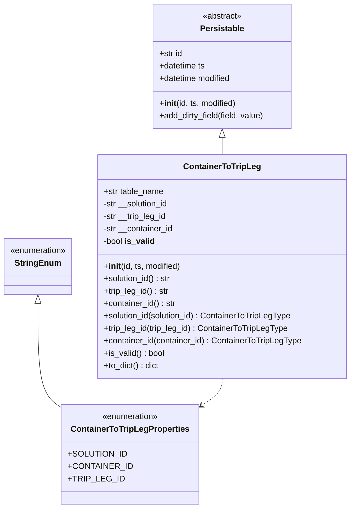
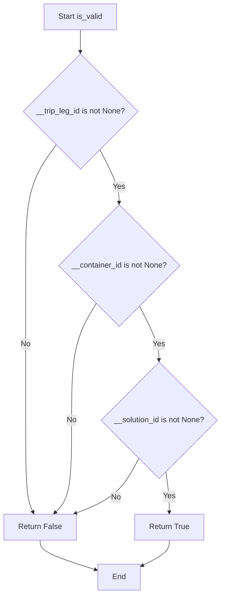
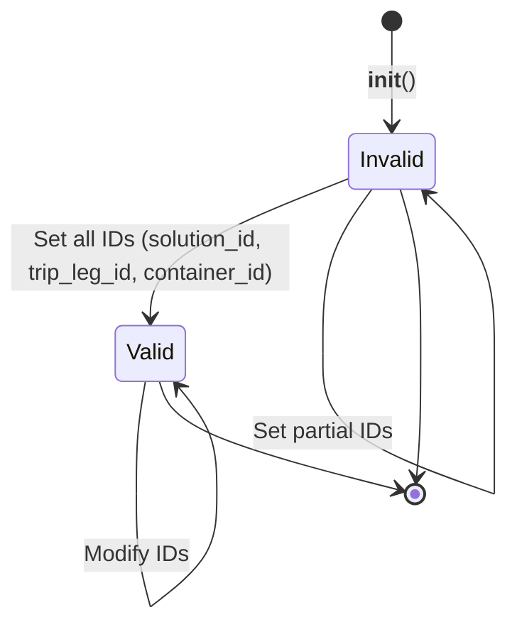

# Diagram: platform/partview_core/partview_service/partview_service/core/datamodel/ContainerToTripLeg.py


> Auto-generated by Obscura crawlers

## Diagram 1

```mermaid
classDiagram
      class Persistable {
          <<abstract>>
          +str id...
  └ 113 lines...
```

> SVG rendering failed for this diagram.

## Diagram 2



### SVG

<svg id="container" width="681.203125" xmlns="http://www.w3.org/2000/svg" class="classDiagram" height="980" viewBox="0 0 681.203125 980" role="graphics-document document" aria-roledescription="class"><style>#container{font-family:"trebuchet ms",verdana,arial,sans-serif;font-size:16px;fill:#333;}@keyframes edge-animation-frame{from{stroke-dashoffset:0;}}@keyframes dash{to{stroke-dashoffset:0;}}#container .edge-animation-slow{stroke-dasharray:9,5!important;stroke-dashoffset:900;animation:dash 50s linear infinite;stroke-linecap:round;}#container .edge-animation-fast{stroke-dasharray:9,5!important;stroke-dashoffset:900;animation:dash 20s linear infinite;stroke-linecap:round;}#container .error-icon{fill:#552222;}#container .error-text{fill:#552222;stroke:#552222;}#container .edge-thickness-normal{stroke-width:1px;}#container .edge-thickness-thick{stroke-width:3.5px;}#container .edge-pattern-solid{stroke-dasharray:0;}#container .edge-thickness-invisible{stroke-width:0;fill:none;}#container .edge-pattern-dashed{stroke-dasharray:3;}#container .edge-pattern-dotted{stroke-dasharray:2;}#container .marker{fill:#333333;stroke:#333333;}#container .marker.cross{stroke:#333333;}#container svg{font-family:"trebuchet ms",verdana,arial,sans-serif;font-size:16px;}#container p{margin:0;}#container g.classGroup text{fill:#9370DB;stroke:none;font-family:"trebuchet ms",verdana,arial,sans-serif;font-size:10px;}#container g.classGroup text .title{font-weight:bolder;}#container .nodeLabel,#container .edgeLabel{color:#131300;}#container .edgeLabel .label rect{fill:#ECECFF;}#container .label text{fill:#131300;}#container .labelBkg{background:#ECECFF;}#container .edgeLabel .label span{background:#ECECFF;}#container .classTitle{font-weight:bolder;}#container .node rect,#container .node circle,#container .node ellipse,#container .node polygon,#container .node path{fill:#ECECFF;stroke:#9370DB;stroke-width:1px;}#container .divider{stroke:#9370DB;stroke-width:1;}#container g.clickable{cursor:pointer;}#container g.classGroup rect{fill:#ECECFF;stroke:#9370DB;}#container g.classGroup line{stroke:#9370DB;stroke-width:1;}#container .classLabel .box{stroke:none;stroke-width:0;fill:#ECECFF;opacity:0.5;}#container .classLabel .label{fill:#9370DB;font-size:10px;}#container .relation{stroke:#333333;stroke-width:1;fill:none;}#container .dashed-line{stroke-dasharray:3;}#container .dotted-line{stroke-dasharray:1 2;}#container #compositionStart,#container .composition{fill:#333333!important;stroke:#333333!important;stroke-width:1;}#container #compositionEnd,#container .composition{fill:#333333!important;stroke:#333333!important;stroke-width:1;}#container #dependencyStart,#container .dependency{fill:#333333!important;stroke:#333333!important;stroke-width:1;}#container #dependencyStart,#container .dependency{fill:#333333!important;stroke:#333333!important;stroke-width:1;}#container #extensionStart,#container .extension{fill:transparent!important;stroke:#333333!important;stroke-width:1;}#container #extensionEnd,#container .extension{fill:transparent!important;stroke:#333333!important;stroke-width:1;}#container #aggregationStart,#container .aggregation{fill:transparent!important;stroke:#333333!important;stroke-width:1;}#container #aggregationEnd,#container .aggregation{fill:transparent!important;stroke:#333333!important;stroke-width:1;}#container #lollipopStart,#container .lollipop{fill:#ECECFF!important;stroke:#333333!important;stroke-width:1;}#container #lollipopEnd,#container .lollipop{fill:#ECECFF!important;stroke:#333333!important;stroke-width:1;}#container .edgeTerminals{font-size:11px;line-height:initial;}#container .classTitleText{text-anchor:middle;font-size:18px;fill:#333;}#container .label-icon{display:inline-block;height:1em;overflow:visible;vertical-align:-0.125em;}#container .node .label-icon path{fill:currentColor;stroke:revert;stroke-width:revert;}#container :root{--mermaid-font-family:"trebuchet ms",verdana,arial,sans-serif;}</style><g><defs><marker id="container_class-aggregationStart" class="marker aggregation class" refX="18" refY="7" markerWidth="190" markerHeight="240" orient="auto"><path d="M 18,7 L9,13 L1,7 L9,1 Z"></path></marker></defs><defs><marker id="container_class-aggregationEnd" class="marker aggregation class" refX="1" refY="7" markerWidth="20" markerHeight="28" orient="auto"><path d="M 18,7 L9,13 L1,7 L9,1 Z"></path></marker></defs><defs><marker id="container_class-extensionStart" class="marker extension class" refX="18" refY="7" markerWidth="190" markerHeight="240" orient="auto"><path d="M 1,7 L18,13 V 1 Z"></path></marker></defs><defs><marker id="container_class-extensionEnd" class="marker extension class" refX="1" refY="7" markerWidth="20" markerHeight="28" orient="auto"><path d="M 1,1 V 13 L18,7 Z"></path></marker></defs><defs><marker id="container_class-compositionStart" class="marker composition class" refX="18" refY="7" markerWidth="190" markerHeight="240" orient="auto"><path d="M 18,7 L9,13 L1,7 L9,1 Z"></path></marker></defs><defs><marker id="container_class-compositionEnd" class="marker composition class" refX="1" refY="7" markerWidth="20" markerHeight="28" orient="auto"><path d="M 18,7 L9,13 L1,7 L9,1 Z"></path></marker></defs><defs><marker id="container_class-dependencyStart" class="marker dependency class" refX="6" refY="7" markerWidth="190" markerHeight="240" orient="auto"><path d="M 5,7 L9,13 L1,7 L9,1 Z"></path></marker></defs><defs><marker id="container_class-dependencyEnd" class="marker dependency class" refX="13" refY="7" markerWidth="20" markerHeight="28" orient="auto"><path d="M 18,7 L9,13 L14,7 L9,1 Z"></path></marker></defs><defs><marker id="container_class-lollipopStart" class="marker lollipop class" refX="13" refY="7" markerWidth="190" markerHeight="240" orient="auto"><circle stroke="black" fill="transparent" cx="7" cy="7" r="6"></circle></marker></defs><defs><marker id="container_class-lollipopEnd" class="marker lollipop class" refX="1" refY="7" markerWidth="190" markerHeight="240" orient="auto"><circle stroke="black" fill="transparent" cx="7" cy="7" r="6"></circle></marker></defs><g class="root"><g class="clusters"></g><g class="edgePaths"><path d="M75.555,585.25L75.555,613.542C75.555,641.833,75.555,698.417,84.854,733.002C94.154,767.586,112.753,780.173,122.052,786.466L131.352,792.759" id="id_StringEnum_ContainerToTripLegProperties_1" class="edge-thickness-normal edge-pattern-solid relation" style=";;;" data-edge="true" data-et="edge" data-id="id_StringEnum_ContainerToTripLegProperties_1" data-points="W3sieCI6NzUuNTU0Njg3NSwieSI6NTY4fSx7IngiOjc1LjU1NDY4NzUsInkiOjc1NX0seyJ4IjoxMzEuMzUxNTYyNSwieSI6NzkyLjc1OTQ2NTE4NjkwMDZ9XQ==" marker-start="url(#container_class-extensionStart)"></path><path d="M433.156,265.25L433.156,266.542C433.156,267.833,433.156,270.417,433.156,275.875C433.156,281.333,433.156,289.667,433.156,293.833L433.156,298" id="id_Persistable_ContainerToTripLeg_2" class="edge-thickness-normal edge-pattern-solid relation" style=";;;" data-edge="true" data-et="edge" data-id="id_Persistable_ContainerToTripLeg_2" data-points="W3sieCI6NDMzLjE1NjI1LCJ5IjoyNDh9LHsieCI6NDMzLjE1NjI1LCJ5IjoyNzN9LHsieCI6NDMzLjE1NjI1LCJ5IjoyOTh9XQ==" marker-start="url(#container_class-extensionStart)"></path><path d="M433.156,730L433.156,734.167C433.156,738.333,433.156,746.667,424.685,756.566C416.214,766.466,399.271,777.931,390.8,783.664L382.328,789.397" id="id_ContainerToTripLeg_ContainerToTripLegProperties_3" class="edge-thickness-normal edge-pattern-dashed relation" style=";;;" data-edge="true" data-et="edge" data-id="id_ContainerToTripLeg_ContainerToTripLegProperties_3" data-points="W3sieCI6NDMzLjE1NjI1LCJ5Ijo3MzB9LHsieCI6NDMzLjE1NjI1LCJ5Ijo3NTV9LHsieCI6Mzc3LjM1OTM3NSwieSI6NzkyLjc1OTQ2NTE4NjkwMDZ9XQ==" marker-end="url(#container_class-dependencyEnd)"></path></g><g class="edgeLabels"><g class="edgeLabel"><g class="label" data-id="id_StringEnum_ContainerToTripLegProperties_1" transform="translate(0, 0)"><foreignObject width="0" height="0"><div xmlns="http://www.w3.org/1999/xhtml" class="labelBkg" style="display: table-cell; white-space: nowrap; line-height: 1.5; max-width: 200px; text-align: center;"><span class="edgeLabel"></span></div></foreignObject></g></g><g class="edgeLabel"><g class="label" data-id="id_Persistable_ContainerToTripLeg_2" transform="translate(0, 0)"><foreignObject width="0" height="0"><div xmlns="http://www.w3.org/1999/xhtml" class="labelBkg" style="display: table-cell; white-space: nowrap; line-height: 1.5; max-width: 200px; text-align: center;"><span class="edgeLabel"></span></div></foreignObject></g></g><g class="edgeLabel"><g class="label" data-id="id_ContainerToTripLeg_ContainerToTripLegProperties_3" transform="translate(0, 0)"><foreignObject width="0" height="0"><div xmlns="http://www.w3.org/1999/xhtml" class="labelBkg" style="display: table-cell; white-space: nowrap; line-height: 1.5; max-width: 200px; text-align: center;"><span class="edgeLabel"></span></div></foreignObject></g></g></g><g class="nodes"><g class="node default" id="classId-Persistable-0" transform="translate(433.15625, 128)"><g class="basic label-container"><path d="M-135.71484375 -120 L135.71484375 -120 L135.71484375 120 L-135.71484375 120" stroke="none" stroke-width="0" fill="#ECECFF" style=""></path><path d="M-135.71484375 -120 C-49.92208919068818 -120, 35.870665368623634 -120, 135.71484375 -120 M-135.71484375 -120 C-55.93447720650627 -120, 23.845889336987454 -120, 135.71484375 -120 M135.71484375 -120 C135.71484375 -38.620939327022256, 135.71484375 42.75812134595549, 135.71484375 120 M135.71484375 -120 C135.71484375 -43.51923285241183, 135.71484375 32.961534295176335, 135.71484375 120 M135.71484375 120 C41.60614707986056 120, -52.502549590278875 120, -135.71484375 120 M135.71484375 120 C34.06734087204576 120, -67.58016200590848 120, -135.71484375 120 M-135.71484375 120 C-135.71484375 53.59780367670909, -135.71484375 -12.804392646581817, -135.71484375 -120 M-135.71484375 120 C-135.71484375 38.56430344384688, -135.71484375 -42.87139311230624, -135.71484375 -120" stroke="#9370DB" stroke-width="1.3" fill="none" stroke-dasharray="0 0" style=""></path></g><g class="annotation-group text" transform="translate(-38.609375, -96)"><g class="label" style="" transform="translate(0,-12)"><foreignObject width="77.21875" height="24"><div xmlns="http://www.w3.org/1999/xhtml" style="display: table-cell; white-space: nowrap; line-height: 1.5; max-width: 127px; text-align: center;"><span class="nodeLabel markdown-node-label" style=""><p>«abstract»</p></span></div></foreignObject></g></g><g class="label-group text" transform="translate(-40.9765625, -72)"><g class="label" style="font-weight: bolder" transform="translate(0,-12)"><foreignObject width="81.953125" height="24"><div xmlns="http://www.w3.org/1999/xhtml" style="display: table-cell; white-space: nowrap; line-height: 1.5; max-width: 130px; text-align: center;"><span class="nodeLabel markdown-node-label" style=""><p>Persistable</p></span></div></foreignObject></g></g><g class="members-group text" transform="translate(-123.71484375, -24)"><g class="label" style="" transform="translate(0,-12)"><foreignObject width="45.734375" height="24"><div xmlns="http://www.w3.org/1999/xhtml" style="display: table-cell; white-space: nowrap; line-height: 1.5; max-width: 103px; text-align: center;"><span class="nodeLabel markdown-node-label" style=""><p>+str id</p></span></div></foreignObject></g><g class="label" style="" transform="translate(0,12)"><foreignObject width="90.734375" height="24"><div xmlns="http://www.w3.org/1999/xhtml" style="display: table-cell; white-space: nowrap; line-height: 1.5; max-width: 148px; text-align: center;"><span class="nodeLabel markdown-node-label" style=""><p>+datetime ts</p></span></div></foreignObject></g><g class="label" style="" transform="translate(0,36)"><foreignObject width="142.109375" height="24"><div xmlns="http://www.w3.org/1999/xhtml" style="display: table-cell; white-space: nowrap; line-height: 1.5; max-width: 199px; text-align: center;"><span class="nodeLabel markdown-node-label" style=""><p>+datetime modified</p></span></div></foreignObject></g></g><g class="methods-group text" transform="translate(-123.71484375, 72)"><g class="label" style="" transform="translate(0,-12)"><foreignObject width="150.90625" height="24"><div xmlns="http://www.w3.org/1999/xhtml" style="display: table-cell; white-space: nowrap; line-height: 1.5; max-width: 240px; text-align: center;"><span class="nodeLabel markdown-node-label" style=""><p>+<strong>init</strong>(id, ts, modified)</p></span></div></foreignObject></g><g class="label" style="" transform="translate(0,12)"><foreignObject width="206.453125" height="24"><div xmlns="http://www.w3.org/1999/xhtml" style="display: table-cell; white-space: nowrap; line-height: 1.5; max-width: 264px; text-align: center;"><span class="nodeLabel markdown-node-label" style=""><p>+add_dirty_field(field, value)</p></span></div></foreignObject></g></g><g class="divider" style=""><path d="M-135.71484375 -48 C-33.817607659369855 -48, 68.07962843126029 -48, 135.71484375 -48 M-135.71484375 -48 C-47.80198642173738 -48, 40.110870906525236 -48, 135.71484375 -48" stroke="#9370DB" stroke-width="1.3" fill="none" stroke-dasharray="0 0" style=""></path></g><g class="divider" style=""><path d="M-135.71484375 48 C-41.52148967343055 48, 52.6718644031389 48, 135.71484375 48 M-135.71484375 48 C-39.660986196879506 48, 56.39287135624099 48, 135.71484375 48" stroke="#9370DB" stroke-width="1.3" fill="none" stroke-dasharray="0 0" style=""></path></g></g><g class="node default" id="classId-StringEnum-1" transform="translate(75.5546875, 514)"><g class="basic label-container"><path d="M-67.5546875 -54 L67.5546875 -54 L67.5546875 54 L-67.5546875 54" stroke="none" stroke-width="0" fill="#ECECFF" style=""></path><path d="M-67.5546875 -54 C-17.511838662348758 -54, 32.531010175302484 -54, 67.5546875 -54 M-67.5546875 -54 C-34.039886733714745 -54, -0.5250859674294901 -54, 67.5546875 -54 M67.5546875 -54 C67.5546875 -32.26999140276877, 67.5546875 -10.539982805537527, 67.5546875 54 M67.5546875 -54 C67.5546875 -28.907839753301428, 67.5546875 -3.815679506602855, 67.5546875 54 M67.5546875 54 C35.87851449051092 54, 4.20234148102184 54, -67.5546875 54 M67.5546875 54 C37.36234186939259 54, 7.169996238785174 54, -67.5546875 54 M-67.5546875 54 C-67.5546875 14.473221528095635, -67.5546875 -25.05355694380873, -67.5546875 -54 M-67.5546875 54 C-67.5546875 15.502493191322344, -67.5546875 -22.995013617355312, -67.5546875 -54" stroke="#9370DB" stroke-width="1.3" fill="none" stroke-dasharray="0 0" style=""></path></g><g class="annotation-group text" transform="translate(-55.5546875, -30)"><g class="label" style="" transform="translate(0,-12)"><foreignObject width="111.109375" height="24"><div xmlns="http://www.w3.org/1999/xhtml" style="display: table-cell; white-space: nowrap; line-height: 1.5; max-width: 161px; text-align: center;"><span class="nodeLabel markdown-node-label" style=""><p>«enumeration»</p></span></div></foreignObject></g></g><g class="label-group text" transform="translate(-42.234375, -6)"><g class="label" style="font-weight: bolder" transform="translate(0,-12)"><foreignObject width="84.46875" height="24"><div xmlns="http://www.w3.org/1999/xhtml" style="display: table-cell; white-space: nowrap; line-height: 1.5; max-width: 134px; text-align: center;"><span class="nodeLabel markdown-node-label" style=""><p>StringEnum</p></span></div></foreignObject></g></g><g class="members-group text" transform="translate(-55.5546875, 42)"></g><g class="methods-group text" transform="translate(-55.5546875, 72)"></g><g class="divider" style=""><path d="M-67.5546875 18 C-40.16364469468063 18, -12.772601889361255 18, 67.5546875 18 M-67.5546875 18 C-22.55740684271173 18, 22.439873814576544 18, 67.5546875 18" stroke="#9370DB" stroke-width="1.3" fill="none" stroke-dasharray="0 0" style=""></path></g><g class="divider" style=""><path d="M-67.5546875 36 C-13.969787432892794 36, 39.61511263421441 36, 67.5546875 36 M-67.5546875 36 C-40.0593544653448 36, -12.564021430689607 36, 67.5546875 36" stroke="#9370DB" stroke-width="1.3" fill="none" stroke-dasharray="0 0" style=""></path></g></g><g class="node default" id="classId-ContainerToTripLegProperties-2" transform="translate(254.35546875, 876)"><g class="basic label-container"><path d="M-123.00390625 -96 L123.00390625 -96 L123.00390625 96 L-123.00390625 96" stroke="none" stroke-width="0" fill="#ECECFF" style=""></path><path d="M-123.00390625 -96 C-70.5797445827753 -96, -18.15558291555061 -96, 123.00390625 -96 M-123.00390625 -96 C-35.459211299605585 -96, 52.08548365078883 -96, 123.00390625 -96 M123.00390625 -96 C123.00390625 -49.29966420103017, 123.00390625 -2.599328402060337, 123.00390625 96 M123.00390625 -96 C123.00390625 -50.80366981401294, 123.00390625 -5.607339628025883, 123.00390625 96 M123.00390625 96 C39.67520236783447 96, -43.653501514331055 96, -123.00390625 96 M123.00390625 96 C53.27620013681397 96, -16.45150597637206 96, -123.00390625 96 M-123.00390625 96 C-123.00390625 48.15179227214283, -123.00390625 0.3035845442856555, -123.00390625 -96 M-123.00390625 96 C-123.00390625 40.414019006102336, -123.00390625 -15.171961987795328, -123.00390625 -96" stroke="#9370DB" stroke-width="1.3" fill="none" stroke-dasharray="0 0" style=""></path></g><g class="annotation-group text" transform="translate(-55.5546875, -72)"><g class="label" style="" transform="translate(0,-12)"><foreignObject width="111.109375" height="24"><div xmlns="http://www.w3.org/1999/xhtml" style="display: table-cell; white-space: nowrap; line-height: 1.5; max-width: 161px; text-align: center;"><span class="nodeLabel markdown-node-label" style=""><p>«enumeration»</p></span></div></foreignObject></g></g><g class="label-group text" transform="translate(-109.5078125, -48)"><g class="label" style="font-weight: bolder" transform="translate(0,-12)"><foreignObject width="219.015625" height="24"><div xmlns="http://www.w3.org/1999/xhtml" style="display: table-cell; white-space: nowrap; line-height: 1.5; max-width: 265px; text-align: center;"><span class="nodeLabel markdown-node-label" style=""><p>ContainerToTripLegProperties</p></span></div></foreignObject></g></g><g class="members-group text" transform="translate(-111.00390625, 0)"><g class="label" style="" transform="translate(0,-12)"><foreignObject width="103.640625" height="24"><div xmlns="http://www.w3.org/1999/xhtml" style="display: table-cell; white-space: nowrap; line-height: 1.5; max-width: 161px; text-align: center;"><span class="nodeLabel markdown-node-label" style=""><p>+SOLUTION_ID</p></span></div></foreignObject></g><g class="label" style="" transform="translate(0,12)"><foreignObject width="112.5" height="24"><div xmlns="http://www.w3.org/1999/xhtml" style="display: table-cell; white-space: nowrap; line-height: 1.5; max-width: 170px; text-align: center;"><span class="nodeLabel markdown-node-label" style=""><p>+CONTAINER_ID</p></span></div></foreignObject></g><g class="label" style="" transform="translate(0,36)"><foreignObject width="95.65625" height="24"><div xmlns="http://www.w3.org/1999/xhtml" style="display: table-cell; white-space: nowrap; line-height: 1.5; max-width: 153px; text-align: center;"><span class="nodeLabel markdown-node-label" style=""><p>+TRIP_LEG_ID</p></span></div></foreignObject></g></g><g class="methods-group text" transform="translate(-111.00390625, 96)"></g><g class="divider" style=""><path d="M-123.00390625 -24 C-51.07316618587842 -24, 20.85757387824316 -24, 123.00390625 -24 M-123.00390625 -24 C-56.86404324682475 -24, 9.2758197563505 -24, 123.00390625 -24" stroke="#9370DB" stroke-width="1.3" fill="none" stroke-dasharray="0 0" style=""></path></g><g class="divider" style=""><path d="M-123.00390625 72 C-34.72090091234476 72, 53.56210442531048 72, 123.00390625 72 M-123.00390625 72 C-52.17293678675442 72, 18.65803267649116 72, 123.00390625 72" stroke="#9370DB" stroke-width="1.3" fill="none" stroke-dasharray="0 0" style=""></path></g></g><g class="node default" id="classId-ContainerToTripLeg-3" transform="translate(433.15625, 514)"><g class="basic label-container"><path d="M-240.046875 -216 L240.046875 -216 L240.046875 216 L-240.046875 216" stroke="none" stroke-width="0" fill="#ECECFF" style=""></path><path d="M-240.046875 -216 C-64.44833652906868 -216, 111.15020194186263 -216, 240.046875 -216 M-240.046875 -216 C-117.26376103014248 -216, 5.5193529397150485 -216, 240.046875 -216 M240.046875 -216 C240.046875 -68.28717589471557, 240.046875 79.42564821056885, 240.046875 216 M240.046875 -216 C240.046875 -122.7420642608089, 240.046875 -29.484128521617805, 240.046875 216 M240.046875 216 C62.50703747898967 216, -115.03280004202065 216, -240.046875 216 M240.046875 216 C132.7690850762823 216, 25.49129515256459 216, -240.046875 216 M-240.046875 216 C-240.046875 123.64329103317763, -240.046875 31.286582066355265, -240.046875 -216 M-240.046875 216 C-240.046875 48.1170537379725, -240.046875 -119.765892524055, -240.046875 -216" stroke="#9370DB" stroke-width="1.3" fill="none" stroke-dasharray="0 0" style=""></path></g><g class="annotation-group text" transform="translate(0, -192)"></g><g class="label-group text" transform="translate(-71.203125, -192)"><g class="label" style="font-weight: bolder" transform="translate(0,-12)"><foreignObject width="142.40625" height="24"><div xmlns="http://www.w3.org/1999/xhtml" style="display: table-cell; white-space: nowrap; line-height: 1.5; max-width: 191px; text-align: center;"><span class="nodeLabel markdown-node-label" style=""><p>ContainerToTripLeg</p></span></div></foreignObject></g></g><g class="members-group text" transform="translate(-228.046875, -144)"><g class="label" style="" transform="translate(0,-12)"><foreignObject width="117.375" height="24"><div xmlns="http://www.w3.org/1999/xhtml" style="display: table-cell; white-space: nowrap; line-height: 1.5; max-width: 175px; text-align: center;"><span class="nodeLabel markdown-node-label" style=""><p>+str table_name</p></span></div></foreignObject></g><g class="label" style="" transform="translate(0,12)"><foreignObject width="128.828125" height="24"><div xmlns="http://www.w3.org/1999/xhtml" style="display: table-cell; white-space: nowrap; line-height: 1.5; max-width: 186px; text-align: center;"><span class="nodeLabel markdown-node-label" style=""><p>-str __solution_id</p></span></div></foreignObject></g><g class="label" style="" transform="translate(0,36)"><foreignObject width="124.203125" height="24"><div xmlns="http://www.w3.org/1999/xhtml" style="display: table-cell; white-space: nowrap; line-height: 1.5; max-width: 182px; text-align: center;"><span class="nodeLabel markdown-node-label" style=""><p>-str __trip_leg_id</p></span></div></foreignObject></g><g class="label" style="" transform="translate(0,60)"><foreignObject width="136.59375" height="24"><div xmlns="http://www.w3.org/1999/xhtml" style="display: table-cell; white-space: nowrap; line-height: 1.5; max-width: 194px; text-align: center;"><span class="nodeLabel markdown-node-label" style=""><p>-str __container_id</p></span></div></foreignObject></g><g class="label" style="" transform="translate(0,84)"><foreignObject width="98.671875" height="24"><div xmlns="http://www.w3.org/1999/xhtml" style="display: table-cell; white-space: nowrap; line-height: 1.5; max-width: 189px; text-align: center;"><span class="nodeLabel markdown-node-label" style=""><p>-bool <strong>is_valid</strong></p></span></div></foreignObject></g></g><g class="methods-group text" transform="translate(-228.046875, 0)"><g class="label" style="" transform="translate(0,-12)"><foreignObject width="150.90625" height="24"><div xmlns="http://www.w3.org/1999/xhtml" style="display: table-cell; white-space: nowrap; line-height: 1.5; max-width: 240px; text-align: center;"><span class="nodeLabel markdown-node-label" style=""><p>+<strong>init</strong>(id, ts, modified)</p></span></div></foreignObject></g><g class="label" style="" transform="translate(0,12)"><foreignObject width="132.328125" height="24"><div xmlns="http://www.w3.org/1999/xhtml" style="display: table-cell; white-space: nowrap; line-height: 1.5; max-width: 191px; text-align: center;"><span class="nodeLabel markdown-node-label" style=""><p>+solution_id() : str</p></span></div></foreignObject></g><g class="label" style="" transform="translate(0,36)"><foreignObject width="127.9375" height="24"><div xmlns="http://www.w3.org/1999/xhtml" style="display: table-cell; white-space: nowrap; line-height: 1.5; max-width: 186px; text-align: center;"><span class="nodeLabel markdown-node-label" style=""><p>+trip_leg_id() : str</p></span></div></foreignObject></g><g class="label" style="" transform="translate(0,60)"><foreignObject width="140.421875" height="24"><div xmlns="http://www.w3.org/1999/xhtml" style="display: table-cell; white-space: nowrap; line-height: 1.5; max-width: 199px; text-align: center;"><span class="nodeLabel markdown-node-label" style=""><p>+container_id() : str</p></span></div></foreignObject></g><g class="label" style="" transform="translate(0,84)"><foreignObject width="368.703125" height="24"><div xmlns="http://www.w3.org/1999/xhtml" style="display: table-cell; white-space: nowrap; line-height: 1.5; max-width: 426px; text-align: center;"><span class="nodeLabel markdown-node-label" style=""><p>+solution_id(solution_id) : ContainerToTripLegType</p></span></div></foreignObject></g><g class="label" style="" transform="translate(0,108)"><foreignObject width="360.015625" height="24"><div xmlns="http://www.w3.org/1999/xhtml" style="display: table-cell; white-space: nowrap; line-height: 1.5; max-width: 417px; text-align: center;"><span class="nodeLabel markdown-node-label" style=""><p>+trip_leg_id(trip_leg_id) : ContainerToTripLegType</p></span></div></foreignObject></g><g class="label" style="" transform="translate(0,132)"><foreignObject width="384.890625" height="24"><div xmlns="http://www.w3.org/1999/xhtml" style="display: table-cell; white-space: nowrap; line-height: 1.5; max-width: 442px; text-align: center;"><span class="nodeLabel markdown-node-label" style=""><p>+container_id(container_id) : ContainerToTripLegType</p></span></div></foreignObject></g><g class="label" style="" transform="translate(0,156)"><foreignObject width="117.984375" height="24"><div xmlns="http://www.w3.org/1999/xhtml" style="display: table-cell; white-space: nowrap; line-height: 1.5; max-width: 176px; text-align: center;"><span class="nodeLabel markdown-node-label" style=""><p>+is_valid() : bool</p></span></div></foreignObject></g><g class="label" style="" transform="translate(0,180)"><foreignObject width="108.171875" height="24"><div xmlns="http://www.w3.org/1999/xhtml" style="display: table-cell; white-space: nowrap; line-height: 1.5; max-width: 166px; text-align: center;"><span class="nodeLabel markdown-node-label" style=""><p>+to_dict() : dict</p></span></div></foreignObject></g></g><g class="divider" style=""><path d="M-240.046875 -168 C-69.40476940279513 -168, 101.23733619440975 -168, 240.046875 -168 M-240.046875 -168 C-61.88304361932251 -168, 116.28078776135499 -168, 240.046875 -168" stroke="#9370DB" stroke-width="1.3" fill="none" stroke-dasharray="0 0" style=""></path></g><g class="divider" style=""><path d="M-240.046875 -24 C-120.02018360673799 -24, 0.006507786524025505 -24, 240.046875 -24 M-240.046875 -24 C-99.13986573138556 -24, 41.76714353722889 -24, 240.046875 -24" stroke="#9370DB" stroke-width="1.3" fill="none" stroke-dasharray="0 0" style=""></path></g></g></g></g></g></svg>

## Diagram 3



### SVG

<svg id="container" width="469.53125" xmlns="http://www.w3.org/2000/svg" class="flowchart" height="1267.34375" viewBox="0 0 469.53125 1267.34375" role="graphics-document document" aria-roledescription="flowchart-v2"><style>#container{font-family:"trebuchet ms",verdana,arial,sans-serif;font-size:16px;fill:#333;}@keyframes edge-animation-frame{from{stroke-dashoffset:0;}}@keyframes dash{to{stroke-dashoffset:0;}}#container .edge-animation-slow{stroke-dasharray:9,5!important;stroke-dashoffset:900;animation:dash 50s linear infinite;stroke-linecap:round;}#container .edge-animation-fast{stroke-dasharray:9,5!important;stroke-dashoffset:900;animation:dash 20s linear infinite;stroke-linecap:round;}#container .error-icon{fill:#552222;}#container .error-text{fill:#552222;stroke:#552222;}#container .edge-thickness-normal{stroke-width:1px;}#container .edge-thickness-thick{stroke-width:3.5px;}#container .edge-pattern-solid{stroke-dasharray:0;}#container .edge-thickness-invisible{stroke-width:0;fill:none;}#container .edge-pattern-dashed{stroke-dasharray:3;}#container .edge-pattern-dotted{stroke-dasharray:2;}#container .marker{fill:#333333;stroke:#333333;}#container .marker.cross{stroke:#333333;}#container svg{font-family:"trebuchet ms",verdana,arial,sans-serif;font-size:16px;}#container p{margin:0;}#container .label{font-family:"trebuchet ms",verdana,arial,sans-serif;color:#333;}#container .cluster-label text{fill:#333;}#container .cluster-label span{color:#333;}#container .cluster-label span p{background-color:transparent;}#container .label text,#container span{fill:#333;color:#333;}#container .node rect,#container .node circle,#container .node ellipse,#container .node polygon,#container .node path{fill:#ECECFF;stroke:#9370DB;stroke-width:1px;}#container .rough-node .label text,#container .node .label text,#container .image-shape .label,#container .icon-shape .label{text-anchor:middle;}#container .node .katex path{fill:#000;stroke:#000;stroke-width:1px;}#container .rough-node .label,#container .node .label,#container .image-shape .label,#container .icon-shape .label{text-align:center;}#container .node.clickable{cursor:pointer;}#container .root .anchor path{fill:#333333!important;stroke-width:0;stroke:#333333;}#container .arrowheadPath{fill:#333333;}#container .edgePath .path{stroke:#333333;stroke-width:2.0px;}#container .flowchart-link{stroke:#333333;fill:none;}#container .edgeLabel{background-color:rgba(232,232,232, 0.8);text-align:center;}#container .edgeLabel p{background-color:rgba(232,232,232, 0.8);}#container .edgeLabel rect{opacity:0.5;background-color:rgba(232,232,232, 0.8);fill:rgba(232,232,232, 0.8);}#container .labelBkg{background-color:rgba(232, 232, 232, 0.5);}#container .cluster rect{fill:#ffffde;stroke:#aaaa33;stroke-width:1px;}#container .cluster text{fill:#333;}#container .cluster span{color:#333;}#container div.mermaidTooltip{position:absolute;text-align:center;max-width:200px;padding:2px;font-family:"trebuchet ms",verdana,arial,sans-serif;font-size:12px;background:hsl(80, 100%, 96.2745098039%);border:1px solid #aaaa33;border-radius:2px;pointer-events:none;z-index:100;}#container .flowchartTitleText{text-anchor:middle;font-size:18px;fill:#333;}#container rect.text{fill:none;stroke-width:0;}#container .icon-shape,#container .image-shape{background-color:rgba(232,232,232, 0.8);text-align:center;}#container .icon-shape p,#container .image-shape p{background-color:rgba(232,232,232, 0.8);padding:2px;}#container .icon-shape rect,#container .image-shape rect{opacity:0.5;background-color:rgba(232,232,232, 0.8);fill:rgba(232,232,232, 0.8);}#container .label-icon{display:inline-block;height:1em;overflow:visible;vertical-align:-0.125em;}#container .node .label-icon path{fill:currentColor;stroke:revert;stroke-width:revert;}#container :root{--mermaid-font-family:"trebuchet ms",verdana,arial,sans-serif;}</style><g><marker id="container_flowchart-v2-pointEnd" class="marker flowchart-v2" viewBox="0 0 10 10" refX="5" refY="5" markerUnits="userSpaceOnUse" markerWidth="8" markerHeight="8" orient="auto"><path d="M 0 0 L 10 5 L 0 10 z" class="arrowMarkerPath" style="stroke-width: 1; stroke-dasharray: 1, 0;"></path></marker><marker id="container_flowchart-v2-pointStart" class="marker flowchart-v2" viewBox="0 0 10 10" refX="4.5" refY="5" markerUnits="userSpaceOnUse" markerWidth="8" markerHeight="8" orient="auto"><path d="M 0 5 L 10 10 L 10 0 z" class="arrowMarkerPath" style="stroke-width: 1; stroke-dasharray: 1, 0;"></path></marker><marker id="container_flowchart-v2-circleEnd" class="marker flowchart-v2" viewBox="0 0 10 10" refX="11" refY="5" markerUnits="userSpaceOnUse" markerWidth="11" markerHeight="11" orient="auto"><circle cx="5" cy="5" r="5" class="arrowMarkerPath" style="stroke-width: 1; stroke-dasharray: 1, 0;"></circle></marker><marker id="container_flowchart-v2-circleStart" class="marker flowchart-v2" viewBox="0 0 10 10" refX="-1" refY="5" markerUnits="userSpaceOnUse" markerWidth="11" markerHeight="11" orient="auto"><circle cx="5" cy="5" r="5" class="arrowMarkerPath" style="stroke-width: 1; stroke-dasharray: 1, 0;"></circle></marker><marker id="container_flowchart-v2-crossEnd" class="marker cross flowchart-v2" viewBox="0 0 11 11" refX="12" refY="5.2" markerUnits="userSpaceOnUse" markerWidth="11" markerHeight="11" orient="auto"><path d="M 1,1 l 9,9 M 10,1 l -9,9" class="arrowMarkerPath" style="stroke-width: 2; stroke-dasharray: 1, 0;"></path></marker><marker id="container_flowchart-v2-crossStart" class="marker cross flowchart-v2" viewBox="0 0 11 11" refX="-1" refY="5.2" markerUnits="userSpaceOnUse" markerWidth="11" markerHeight="11" orient="auto"><path d="M 1,1 l 9,9 M 10,1 l -9,9" class="arrowMarkerPath" style="stroke-width: 2; stroke-dasharray: 1, 0;"></path></marker><g class="root"><g class="clusters"></g><g class="edgePaths"><path d="M166.223,62L166.223,66.167C166.223,70.333,166.223,78.667,166.223,86.333C166.223,94,166.223,101,166.223,104.5L166.223,108" id="L_A_B_0" class="edge-thickness-normal edge-pattern-solid edge-thickness-normal edge-pattern-solid flowchart-link" style=";" data-edge="true" data-et="edge" data-id="L_A_B_0" data-points="W3sieCI6MTY2LjIyMjY1NjI1LCJ5Ijo2Mn0seyJ4IjoxNjYuMjIyNjU2MjUsInkiOjg3fSx7IngiOjE2Ni4yMjI2NTYyNSwieSI6MTEyfV0=" marker-end="url(#container_flowchart-v2-pointEnd)"></path><path d="M115.552,303.688L105.051,318.3C94.55,332.912,73.548,362.136,63.048,406.081C52.547,450.026,52.547,508.693,52.547,567.359C52.547,626.026,52.547,684.693,52.547,740.775C52.547,796.857,52.547,850.354,52.547,903.852C52.547,957.349,52.547,1010.846,55.167,1043.159C57.787,1075.471,63.027,1086.598,65.648,1092.161L68.268,1097.725" id="L_B_E_0" class="edge-thickness-normal edge-pattern-solid edge-thickness-normal edge-pattern-solid flowchart-link" style=";" data-edge="true" data-et="edge" data-id="L_B_E_0" data-points="W3sieCI6MTE1LjU1MTYyOTc5Nzg0ODI2LCJ5IjozMDMuNjg4MzQ4NTQ3ODQ4MjV9LHsieCI6NTIuNTQ2ODc1LCJ5IjozOTEuMzU5Mzc1fSx7IngiOjUyLjU0Njg3NSwieSI6NTY3LjM1OTM3NX0seyJ4Ijo1Mi41NDY4NzUsInkiOjc0My4zNTkzNzV9LHsieCI6NTIuNTQ2ODc1LCJ5Ijo5MDMuODUxNTYyNX0seyJ4Ijo1Mi41NDY4NzUsInkiOjEwNjQuMzQzNzV9LHsieCI6NjkuOTcxOTIzODI4MTI1LCJ5IjoxMTAxLjM0Mzc1fV0=" marker-end="url(#container_flowchart-v2-pointEnd)"></path><path d="M209.222,311.36L216.556,324.693C223.889,338.026,238.556,364.693,245.889,383.526C253.223,402.359,253.223,413.359,253.223,418.859L253.223,424.359" id="L_B_C_0" class="edge-thickness-normal edge-pattern-solid edge-thickness-normal edge-pattern-solid flowchart-link" style=";" data-edge="true" data-et="edge" data-id="L_B_C_0" data-points="W3sieCI6MjA5LjIyMjI3Mzg3NzM3NzksInkiOjMxMS4zNTk3NTczNzI2MjIxNH0seyJ4IjoyNTMuMjIyNjU2MjUsInkiOjM5MS4zNTkzNzV9LHsieCI6MjUzLjIyMjY1NjI1LCJ5Ijo0MjguMzU5Mzc1fV0=" marker-end="url(#container_flowchart-v2-pointEnd)"></path><path d="M203.31,656.447L195.195,670.933C187.079,685.418,170.848,714.389,162.733,755.623C154.617,796.857,154.617,850.354,154.617,903.852C154.617,957.349,154.617,1010.846,148.185,1043.319C141.752,1075.791,128.887,1087.238,122.454,1092.961L116.021,1098.685" id="L_C_E_0" class="edge-thickness-normal edge-pattern-solid edge-thickness-normal edge-pattern-solid flowchart-link" style=";" data-edge="true" data-et="edge" data-id="L_C_E_0" data-points="W3sieCI6MjAzLjMxMDQ2Njg4NzQyMDE4LCJ5Ijo2NTYuNDQ3MTg1NjM3NDIwMX0seyJ4IjoxNTQuNjE3MTg3NSwieSI6NzQzLjM1OTM3NX0seyJ4IjoxNTQuNjE3MTg3NSwieSI6OTAzLjg1MTU2MjV9LHsieCI6MTU0LjYxNzE4NzUsInkiOjEwNjQuMzQzNzV9LHsieCI6MTEzLjAzMjgzNjkxNDA2MjUsInkiOjExMDEuMzQzNzV9XQ==" marker-end="url(#container_flowchart-v2-pointEnd)"></path><path d="M298.245,661.337L304.794,675.008C311.343,688.678,324.441,716.019,330.99,735.189C337.539,754.359,337.539,765.359,337.539,770.859L337.539,776.359" id="L_C_D_0" class="edge-thickness-normal edge-pattern-solid edge-thickness-normal edge-pattern-solid flowchart-link" style=";" data-edge="true" data-et="edge" data-id="L_C_D_0" data-points="W3sieCI6Mjk4LjI0NDcxNDc0MjUxOTY1LCJ5Ijo2NjEuMzM3MzE2NTA3NDgwNH0seyJ4IjozMzcuNTM5MDYyNSwieSI6NzQzLjM1OTM3NX0seyJ4IjozMzcuNTM5MDYyNSwieSI6NzgwLjM1OTM3NX1d" marker-end="url(#container_flowchart-v2-pointEnd)"></path><path d="M295.265,985.07L288.388,998.282C281.512,1011.495,267.758,1037.919,244.998,1057.065C222.239,1076.21,190.474,1088.077,174.591,1094.011L158.709,1099.944" id="L_D_E_0" class="edge-thickness-normal edge-pattern-solid edge-thickness-normal edge-pattern-solid flowchart-link" style=";" data-edge="true" data-et="edge" data-id="L_D_E_0" data-points="W3sieCI6Mjk1LjI2NTM2MDYyNzMzMTA2LCJ5Ijo5ODUuMDcwMDQ4MTI3MzMxMX0seyJ4IjoyNTQuMDAzOTA2MjUsInkiOjEwNjQuMzQzNzV9LHsieCI6MTU0Ljk2MTYwODg4NjcxODc1LCJ5IjoxMTAxLjM0Mzc1fV0=" marker-end="url(#container_flowchart-v2-pointEnd)"></path><path d="M351.88,1013.003L353.004,1021.56C354.128,1030.117,356.377,1047.23,357.501,1061.287C358.625,1075.344,358.625,1086.344,358.625,1091.844L358.625,1097.344" id="L_D_F_0" class="edge-thickness-normal edge-pattern-solid edge-thickness-normal edge-pattern-solid flowchart-link" style=";" data-edge="true" data-et="edge" data-id="L_D_F_0" data-points="W3sieCI6MzUxLjg3OTcxMzY1MTQ3MTUsInkiOjEwMTMuMDAzMDk4ODQ4NTI4Nn0seyJ4IjozNTguNjI1LCJ5IjoxMDY0LjM0Mzc1fSx7IngiOjM1OC42MjUsInkiOjExMDEuMzQzNzV9XQ==" marker-end="url(#container_flowchart-v2-pointEnd)"></path><path d="M82.688,1155.344L82.688,1159.51C82.688,1163.677,82.688,1172.01,103.192,1182.429C123.697,1192.849,164.707,1205.353,185.212,1211.606L205.717,1217.858" id="L_E_G_0" class="edge-thickness-normal edge-pattern-solid edge-thickness-normal edge-pattern-solid flowchart-link" style=";" data-edge="true" data-et="edge" data-id="L_E_G_0" data-points="W3sieCI6ODIuNjg3NSwieSI6MTE1NS4zNDM3NX0seyJ4Ijo4Mi42ODc1LCJ5IjoxMTgwLjM0Mzc1fSx7IngiOjIwOS41NDI5Njg3NSwieSI6MTIxOS4wMjQ4MzIwNzE2MDM3fV0=" marker-end="url(#container_flowchart-v2-pointEnd)"></path><path d="M358.625,1155.344L358.625,1159.51C358.625,1163.677,358.625,1172.01,348.936,1180.957C339.247,1189.904,319.868,1199.464,310.179,1204.245L300.49,1209.025" id="L_F_G_0" class="edge-thickness-normal edge-pattern-solid edge-thickness-normal edge-pattern-solid flowchart-link" style=";" data-edge="true" data-et="edge" data-id="L_F_G_0" data-points="W3sieCI6MzU4LjYyNSwieSI6MTE1NS4zNDM3NX0seyJ4IjozNTguNjI1LCJ5IjoxMTgwLjM0Mzc1fSx7IngiOjI5Ni45MDIzNDM3NSwieSI6MTIxMC43OTQ0NzgyMzYyOTd9XQ==" marker-end="url(#container_flowchart-v2-pointEnd)"></path></g><g class="edgeLabels"><g class="edgeLabel"><g class="label" data-id="L_A_B_0" transform="translate(0, 0)"><foreignObject width="0" height="0"><div xmlns="http://www.w3.org/1999/xhtml" class="labelBkg" style="display: table-cell; white-space: nowrap; line-height: 1.5; max-width: 200px; text-align: center;"><span class="edgeLabel"></span></div></foreignObject></g></g><g class="edgeLabel" transform="translate(52.546875, 743.359375)"><g class="label" data-id="L_B_E_0" transform="translate(-10.140625, -12)"><foreignObject width="20.28125" height="24"><div xmlns="http://www.w3.org/1999/xhtml" class="labelBkg" style="display: table-cell; white-space: nowrap; line-height: 1.5; max-width: 200px; text-align: center;"><span class="edgeLabel"><p>No</p></span></div></foreignObject></g></g><g class="edgeLabel" transform="translate(253.22265625, 391.359375)"><g class="label" data-id="L_B_C_0" transform="translate(-12.03125, -12)"><foreignObject width="24.0625" height="24"><div xmlns="http://www.w3.org/1999/xhtml" class="labelBkg" style="display: table-cell; white-space: nowrap; line-height: 1.5; max-width: 200px; text-align: center;"><span class="edgeLabel"><p>Yes</p></span></div></foreignObject></g></g><g class="edgeLabel" transform="translate(154.6171875, 903.8515625)"><g class="label" data-id="L_C_E_0" transform="translate(-10.140625, -12)"><foreignObject width="20.28125" height="24"><div xmlns="http://www.w3.org/1999/xhtml" class="labelBkg" style="display: table-cell; white-space: nowrap; line-height: 1.5; max-width: 200px; text-align: center;"><span class="edgeLabel"><p>No</p></span></div></foreignObject></g></g><g class="edgeLabel" transform="translate(337.5390625, 743.359375)"><g class="label" data-id="L_C_D_0" transform="translate(-12.03125, -12)"><foreignObject width="24.0625" height="24"><div xmlns="http://www.w3.org/1999/xhtml" class="labelBkg" style="display: table-cell; white-space: nowrap; line-height: 1.5; max-width: 200px; text-align: center;"><span class="edgeLabel"><p>Yes</p></span></div></foreignObject></g></g><g class="edgeLabel" transform="translate(246.34172, 1067.20617)"><g class="label" data-id="L_D_E_0" transform="translate(-10.140625, -12)"><foreignObject width="20.28125" height="24"><div xmlns="http://www.w3.org/1999/xhtml" class="labelBkg" style="display: table-cell; white-space: nowrap; line-height: 1.5; max-width: 200px; text-align: center;"><span class="edgeLabel"><p>No</p></span></div></foreignObject></g></g><g class="edgeLabel" transform="translate(358.625, 1064.34375)"><g class="label" data-id="L_D_F_0" transform="translate(-12.03125, -12)"><foreignObject width="24.0625" height="24"><div xmlns="http://www.w3.org/1999/xhtml" class="labelBkg" style="display: table-cell; white-space: nowrap; line-height: 1.5; max-width: 200px; text-align: center;"><span class="edgeLabel"><p>Yes</p></span></div></foreignObject></g></g><g class="edgeLabel"><g class="label" data-id="L_E_G_0" transform="translate(0, 0)"><foreignObject width="0" height="0"><div xmlns="http://www.w3.org/1999/xhtml" class="labelBkg" style="display: table-cell; white-space: nowrap; line-height: 1.5; max-width: 200px; text-align: center;"><span class="edgeLabel"></span></div></foreignObject></g></g><g class="edgeLabel"><g class="label" data-id="L_F_G_0" transform="translate(0, 0)"><foreignObject width="0" height="0"><div xmlns="http://www.w3.org/1999/xhtml" class="labelBkg" style="display: table-cell; white-space: nowrap; line-height: 1.5; max-width: 200px; text-align: center;"><span class="edgeLabel"></span></div></foreignObject></g></g></g><g class="nodes"><g class="node default" id="flowchart-A-0" transform="translate(166.22265625, 35)"><rect class="basic label-container" style="" x="-76.859375" y="-27" width="153.71875" height="54"></rect><g class="label" style="" transform="translate(-46.859375, -12)"><rect></rect><foreignObject width="93.71875" height="24"><div xmlns="http://www.w3.org/1999/xhtml" style="display: table-cell; white-space: nowrap; line-height: 1.5; max-width: 200px; text-align: center;"><span class="nodeLabel"><p>Start is_valid</p></span></div></foreignObject></g></g><g class="node default" id="flowchart-B-1" transform="translate(166.22265625, 233.1796875)"><polygon points="121.1796875,0 242.359375,-121.1796875 121.1796875,-242.359375 0,-121.1796875" class="label-container" transform="translate(-120.6796875, 121.1796875)"></polygon><g class="label" style="" transform="translate(-94.1796875, -12)"><rect></rect><foreignObject width="188.359375" height="24"><div xmlns="http://www.w3.org/1999/xhtml" style="display: table-cell; white-space: nowrap; line-height: 1.5; max-width: 200px; text-align: center;"><span class="nodeLabel"><p>__trip_leg_id is not None?</p></span></div></foreignObject></g></g><g class="node default" id="flowchart-E-3" transform="translate(82.6875, 1128.34375)"><rect class="basic label-container" style="" x="-74.6875" y="-27" width="149.375" height="54"></rect><g class="label" style="" transform="translate(-44.6875, -12)"><rect></rect><foreignObject width="89.375" height="24"><div xmlns="http://www.w3.org/1999/xhtml" style="display: table-cell; white-space: nowrap; line-height: 1.5; max-width: 200px; text-align: center;"><span class="nodeLabel"><p>Return False</p></span></div></foreignObject></g></g><g class="node default" id="flowchart-C-5" transform="translate(253.22265625, 567.359375)"><polygon points="139,0 278,-139 139,-278 0,-139" class="label-container" transform="translate(-138.5, 139)"></polygon><g class="label" style="" transform="translate(-100, -24)"><rect></rect><foreignObject width="200" height="48"><div xmlns="http://www.w3.org/1999/xhtml" style="display: table; white-space: break-spaces; line-height: 1.5; max-width: 200px; text-align: center; width: 200px;"><span class="nodeLabel"><p>__container_id is not None?</p></span></div></foreignObject></g></g><g class="node default" id="flowchart-D-9" transform="translate(337.5390625, 903.8515625)"><polygon points="123.4921875,0 246.984375,-123.4921875 123.4921875,-246.984375 0,-123.4921875" class="label-container" transform="translate(-122.9921875, 123.4921875)"></polygon><g class="label" style="" transform="translate(-96.4921875, -12)"><rect></rect><foreignObject width="192.984375" height="24"><div xmlns="http://www.w3.org/1999/xhtml" style="display: table-cell; white-space: nowrap; line-height: 1.5; max-width: 200px; text-align: center;"><span class="nodeLabel"><p>__solution_id is not None?</p></span></div></foreignObject></g></g><g class="node default" id="flowchart-F-13" transform="translate(358.625, 1128.34375)"><rect class="basic label-container" style="" x="-72.5234375" y="-27" width="145.046875" height="54"></rect><g class="label" style="" transform="translate(-42.5234375, -12)"><rect></rect><foreignObject width="85.046875" height="24"><div xmlns="http://www.w3.org/1999/xhtml" style="display: table-cell; white-space: nowrap; line-height: 1.5; max-width: 200px; text-align: center;"><span class="nodeLabel"><p>Return True</p></span></div></foreignObject></g></g><g class="node default" id="flowchart-G-15" transform="translate(253.22265625, 1232.34375)"><rect class="basic label-container" style="" x="-43.6796875" y="-27" width="87.359375" height="54"></rect><g class="label" style="" transform="translate(-13.6796875, -12)"><rect></rect><foreignObject width="27.359375" height="24"><div xmlns="http://www.w3.org/1999/xhtml" style="display: table-cell; white-space: nowrap; line-height: 1.5; max-width: 200px; text-align: center;"><span class="nodeLabel"><p>End</p></span></div></foreignObject></g></g></g></g></g></svg>

## Diagram 4



### SVG

<svg id="container" width="364.08966064453125" xmlns="http://www.w3.org/2000/svg" class="statediagram" height="444.1499938964844" viewBox="0 0 364.08966064453125 444.1499938964844" role="graphics-document document" aria-roledescription="stateDiagram"><style>#container{font-family:"trebuchet ms",verdana,arial,sans-serif;font-size:16px;fill:#333;}@keyframes edge-animation-frame{from{stroke-dashoffset:0;}}@keyframes dash{to{stroke-dashoffset:0;}}#container .edge-animation-slow{stroke-dasharray:9,5!important;stroke-dashoffset:900;animation:dash 50s linear infinite;stroke-linecap:round;}#container .edge-animation-fast{stroke-dasharray:9,5!important;stroke-dashoffset:900;animation:dash 20s linear infinite;stroke-linecap:round;}#container .error-icon{fill:#552222;}#container .error-text{fill:#552222;stroke:#552222;}#container .edge-thickness-normal{stroke-width:1px;}#container .edge-thickness-thick{stroke-width:3.5px;}#container .edge-pattern-solid{stroke-dasharray:0;}#container .edge-thickness-invisible{stroke-width:0;fill:none;}#container .edge-pattern-dashed{stroke-dasharray:3;}#container .edge-pattern-dotted{stroke-dasharray:2;}#container .marker{fill:#333333;stroke:#333333;}#container .marker.cross{stroke:#333333;}#container svg{font-family:"trebuchet ms",verdana,arial,sans-serif;font-size:16px;}#container p{margin:0;}#container defs #statediagram-barbEnd{fill:#333333;stroke:#333333;}#container g.stateGroup text{fill:#9370DB;stroke:none;font-size:10px;}#container g.stateGroup text{fill:#333;stroke:none;font-size:10px;}#container g.stateGroup .state-title{font-weight:bolder;fill:#131300;}#container g.stateGroup rect{fill:#ECECFF;stroke:#9370DB;}#container g.stateGroup line{stroke:#333333;stroke-width:1;}#container .transition{stroke:#333333;stroke-width:1;fill:none;}#container .stateGroup .composit{fill:white;border-bottom:1px;}#container .stateGroup .alt-composit{fill:#e0e0e0;border-bottom:1px;}#container .state-note{stroke:#aaaa33;fill:#fff5ad;}#container .state-note text{fill:black;stroke:none;font-size:10px;}#container .stateLabel .box{stroke:none;stroke-width:0;fill:#ECECFF;opacity:0.5;}#container .edgeLabel .label rect{fill:#ECECFF;opacity:0.5;}#container .edgeLabel{background-color:rgba(232,232,232, 0.8);text-align:center;}#container .edgeLabel p{background-color:rgba(232,232,232, 0.8);}#container .edgeLabel rect{opacity:0.5;background-color:rgba(232,232,232, 0.8);fill:rgba(232,232,232, 0.8);}#container .edgeLabel .label text{fill:#333;}#container .label div .edgeLabel{color:#333;}#container .stateLabel text{fill:#131300;font-size:10px;font-weight:bold;}#container .node circle.state-start{fill:#333333;stroke:#333333;}#container .node .fork-join{fill:#333333;stroke:#333333;}#container .node circle.state-end{fill:#9370DB;stroke:white;stroke-width:1.5;}#container .end-state-inner{fill:white;stroke-width:1.5;}#container .node rect{fill:#ECECFF;stroke:#9370DB;stroke-width:1px;}#container .node polygon{fill:#ECECFF;stroke:#9370DB;stroke-width:1px;}#container #statediagram-barbEnd{fill:#333333;}#container .statediagram-cluster rect{fill:#ECECFF;stroke:#9370DB;stroke-width:1px;}#container .cluster-label,#container .nodeLabel{color:#131300;}#container .statediagram-cluster rect.outer{rx:5px;ry:5px;}#container .statediagram-state .divider{stroke:#9370DB;}#container .statediagram-state .title-state{rx:5px;ry:5px;}#container .statediagram-cluster.statediagram-cluster .inner{fill:white;}#container .statediagram-cluster.statediagram-cluster-alt .inner{fill:#f0f0f0;}#container .statediagram-cluster .inner{rx:0;ry:0;}#container .statediagram-state rect.basic{rx:5px;ry:5px;}#container .statediagram-state rect.divider{stroke-dasharray:10,10;fill:#f0f0f0;}#container .note-edge{stroke-dasharray:5;}#container .statediagram-note rect{fill:#fff5ad;stroke:#aaaa33;stroke-width:1px;rx:0;ry:0;}#container .statediagram-note rect{fill:#fff5ad;stroke:#aaaa33;stroke-width:1px;rx:0;ry:0;}#container .statediagram-note text{fill:black;}#container .statediagram-note .nodeLabel{color:black;}#container .statediagram .edgeLabel{color:red;}#container #dependencyStart,#container #dependencyEnd{fill:#333333;stroke:#333333;stroke-width:1;}#container .statediagramTitleText{text-anchor:middle;font-size:18px;fill:#333;}#container :root{--mermaid-font-family:"trebuchet ms",verdana,arial,sans-serif;}</style><g><defs><marker id="container_stateDiagram-barbEnd" refX="19" refY="7" markerWidth="20" markerHeight="14" markerUnits="userSpaceOnUse" orient="auto"><path d="M 19,7 L9,13 L14,7 L9,1 Z"></path></marker></defs><g class="root"><g class="clusters"></g><g class="edgePaths"><path d="M281.977,22L281.977,28.167C281.977,34.333,281.977,46.667,282.06,59.083C282.144,71.5,282.31,84,282.394,90.25L282.477,96.5" id="edge0" class="edge-thickness-normal edge-pattern-solid transition" style="fill:none;;;fill:none" data-edge="true" data-et="edge" data-id="edge0" data-points="W3sieCI6MjgxLjk3Njk1OTEzMzUyMDcsInkiOjIyfSx7IngiOjI4MS45NzY5NTkxMzM1MjA3LCJ5Ijo1OX0seyJ4IjoyODIuNDc2OTU5MTMzNTIwNywieSI6OTYuNX1d" marker-end="url(#container_stateDiagram-barbEnd)"></path><path d="M250.016,129.374L226.347,138.645C202.677,147.916,155.339,166.458,131.753,183.979C108.167,201.5,108.333,218,108.417,226.25L108.5,234.5" id="edge1" class="edge-thickness-normal edge-pattern-solid transition" style="fill:none;;;fill:none" data-edge="true" data-et="edge" data-id="edge1" data-points="W3sieCI6MjUwLjAxNjAyMTYzMzUyMDcyLCJ5IjoxMjkuMzc0MTQ1NTExMzA4OTd9LHsieCI6MTA4LCJ5IjoxODV9LHsieCI6MTA4LjUsInkiOjIzNC41fV0=" marker-end="url(#container_stateDiagram-barbEnd)"></path><path d="M104.991,274.5L103.826,280.583C102.661,286.667,100.33,298.833,99.165,312.242C98,325.65,98,340.3,98,347.625L98,354.95" id="Valid-cyclic-special-1" class="edge-thickness-normal edge-pattern-solid transition" style="fill:none;;;fill:none" data-edge="true" data-et="edge" data-id="Valid-cyclic-special-1" data-points="W3sieCI6MTA0Ljk5MTIyODA3MDE3NTQ0LCJ5IjoyNzQuNX0seyJ4Ijo5OCwieSI6MzExfSx7IngiOjk4LCJ5IjozNTQuOTQ5OTk5OTk5MjU0OTR9XQ=="></path><path d="M98,355.05L98,362.375C98,369.7,98,384.35,99.67,397.842C101.341,411.333,104.681,423.667,106.352,429.833L108.022,436" id="Valid-cyclic-special-mid" class="edge-thickness-normal edge-pattern-solid transition" style="fill:none;;;fill:none" data-edge="true" data-et="edge" data-id="Valid-cyclic-special-mid" data-points="W3sieCI6OTgsInkiOjM1NS4wNTAwMDAwMDA3NDUwNn0seyJ4Ijo5OCwieSI6Mzk5fSx7IngiOjEwOC4wMjIxOTU2NzU1NTQ0MSwieSI6NDM2fV0="></path><path d="M108.086,436.011L116.058,429.843C124.031,423.674,139.976,411.337,147.949,397.835C155.922,384.333,155.922,369.667,155.922,355C155.922,340.333,155.922,325.667,150.821,312.25C145.719,298.833,135.517,286.667,130.416,280.583L125.315,274.5" id="Valid-cyclic-special-2" class="edge-thickness-normal edge-pattern-solid transition" style="fill:none;;;fill:none" data-edge="true" data-et="edge" data-id="Valid-cyclic-special-2" data-points="W3sieCI6MTA4LjA4NTczOTE4NDE3MDk2LCJ5Ijo0MzYuMDExMzE0NDgxNTIyMTZ9LHsieCI6MTU1LjkyMTg3NSwieSI6Mzk5fSx7IngiOjE1NS45MjE4NzUsInkiOjM1NX0seyJ4IjoxNTUuOTIxODc1LCJ5IjozMTF9LHsieCI6MTI1LjMxNDY5Mjk4MjQ1NjE0LCJ5IjoyNzQuNX1d" marker-end="url(#container_stateDiagram-barbEnd)"></path><path d="M268.12,136.5L262.174,144.583C256.228,152.667,244.337,168.833,238.391,188.408C232.445,207.983,232.445,230.967,232.445,242.458L232.445,253.95" id="Invalid-cyclic-special-1" class="edge-thickness-normal edge-pattern-solid transition" style="fill:none;;;fill:none" data-edge="true" data-et="edge" data-id="Invalid-cyclic-special-1" data-points="W3sieCI6MjY4LjExOTk2MDEwOTMxMTgsInkiOjEzNi41fSx7IngiOjIzMi40NDUzMTI1LCJ5IjoxODV9LHsieCI6MjMyLjQ0NTMxMjUsInkiOjI1My45NDk5OTk5OTkyNTQ5NH1d"></path><path d="M232.445,254.05L232.445,263.542C232.445,273.033,232.445,292.017,253.028,308.839C273.61,325.661,314.775,340.321,335.357,347.652L355.94,354.982" id="Invalid-cyclic-special-mid" class="edge-thickness-normal edge-pattern-solid transition" style="fill:none;;;fill:none" data-edge="true" data-et="edge" data-id="Invalid-cyclic-special-mid" data-points="W3sieCI6MjMyLjQ0NTMxMjUsInkiOjI1NC4wNTAwMDAwMDA3NDUwNn0seyJ4IjoyMzIuNDQ1MzEyNSwieSI6MzExfSx7IngiOjM1NS45Mzk2NTc0NDk3MjIzLCJ5IjozNTQuOTgyMTkyNjI4NjE3MTZ9XQ=="></path><path d="M355.99,354.95L355.99,347.625C355.99,340.3,355.99,325.65,355.99,308.825C355.99,292,355.99,273,355.99,252C355.99,231,355.99,208,347.313,188.417C338.636,168.833,321.283,152.667,312.607,144.583L303.93,136.5" id="Invalid-cyclic-special-2" class="edge-thickness-normal edge-pattern-solid transition" style="fill:none;;;fill:none" data-edge="true" data-et="edge" data-id="Invalid-cyclic-special-2" data-points="W3sieCI6MzU1Ljk4OTY1NzQ1MDQ2NzM1LCJ5IjozNTQuOTQ5OTk5OTk5MjU0OTR9LHsieCI6MzU1Ljk4OTY1NzQ1MDQ2NzM1LCJ5IjozMTF9LHsieCI6MzU1Ljk4OTY1NzQ1MDQ2NzM1LCJ5IjoyNTR9LHsieCI6MzU1Ljk4OTY1NzQ1MDQ2NzM1LCJ5IjoxODV9LHsieCI6MzAzLjkyOTkxNTE2NzQxODMsInkiOjEzNi41fV0=" marker-end="url(#container_stateDiagram-barbEnd)"></path><path d="M114.989,274.5L116.906,280.583C118.823,286.667,122.658,298.833,152.185,311.962C181.712,325.09,236.931,339.18,264.541,346.224L292.15,353.269" id="edge4" class="edge-thickness-normal edge-pattern-solid transition" style="fill:none;;;fill:none" data-edge="true" data-et="edge" data-id="edge4" data-points="W3sieCI6MTE0Ljk4ODYyNjAxMTc2MTY1LCJ5IjoyNzQuNX0seyJ4IjoxMjYuNDkyNTg0MTMzNTIwNzIsInkiOjMxMX0seyJ4IjoyOTIuMTUwMzI5MTI3NzQzLCJ5IjozNTMuMjY5MzI2OTc4MzEyOX1d" marker-end="url(#container_stateDiagram-barbEnd)"></path><path d="M288.691,136.5L291.145,144.583C293.598,152.667,298.506,168.833,300.96,188.417C303.414,208,303.414,231,303.414,252C303.414,273,303.414,292,302.785,307.673C302.157,323.345,300.9,335.691,300.271,341.863L299.642,348.036" id="edge5" class="edge-thickness-normal edge-pattern-solid transition" style="fill:none;;;fill:none" data-edge="true" data-et="edge" data-id="edge5" data-points="W3sieCI6Mjg4LjY5MDYxMjI4MzIyNDksInkiOjEzNi41fSx7IngiOjMwMy40MTQwNjI1LCJ5IjoxODV9LHsieCI6MzAzLjQxNDA2MjUsInkiOjI1NH0seyJ4IjozMDMuNDE0MDYyNSwieSI6MzExfSx7IngiOjI5OS42NDIyMzY5MTExMDUsInkiOjM0OC4wMzYwMjEzNzA4ODAyM31d" marker-end="url(#container_stateDiagram-barbEnd)"></path></g><g class="edgeLabels"><g class="edgeLabel" transform="translate(281.9769591335207, 59)"><g class="label" data-id="edge0" transform="translate(-17.40625, -12)"><foreignObject width="34.8125" height="24"><div xmlns="http://www.w3.org/1999/xhtml" class="labelBkg" style="display: table-cell; white-space: nowrap; line-height: 1.5; max-width: 200px; text-align: center;"><span class="edgeLabel"><p><strong>init</strong>()</p></span></div></foreignObject></g></g><g class="edgeLabel" transform="translate(108, 185)"><g class="label" data-id="edge1" transform="translate(-100, -24)"><foreignObject width="200" height="48"><div xmlns="http://www.w3.org/1999/xhtml" class="labelBkg" style="display: table; white-space: break-spaces; line-height: 1.5; max-width: 200px; text-align: center; width: 200px;"><span class="edgeLabel"><p>Set all IDs (solution_id, trip_leg_id, container_id)</p></span></div></foreignObject></g></g><g class="edgeLabel"><g class="label" data-id="Valid-cyclic-special-1" transform="translate(0, 0)"><foreignObject width="0" height="0"><div xmlns="http://www.w3.org/1999/xhtml" class="labelBkg" style="display: table-cell; white-space: nowrap; line-height: 1.5; max-width: 200px; text-align: center;"><span class="edgeLabel"></span></div></foreignObject></g></g><g class="edgeLabel" transform="translate(98, 399)"><g class="label" data-id="Valid-cyclic-special-mid" transform="translate(-37.921875, -12)"><foreignObject width="75.84375" height="24"><div xmlns="http://www.w3.org/1999/xhtml" class="labelBkg" style="display: table-cell; white-space: nowrap; line-height: 1.5; max-width: 200px; text-align: center;"><span class="edgeLabel"><p>Modify IDs</p></span></div></foreignObject></g></g><g class="edgeLabel"><g class="label" data-id="Valid-cyclic-special-2" transform="translate(0, 0)"><foreignObject width="0" height="0"><div xmlns="http://www.w3.org/1999/xhtml" class="labelBkg" style="display: table-cell; white-space: nowrap; line-height: 1.5; max-width: 200px; text-align: center;"><span class="edgeLabel"></span></div></foreignObject></g></g><g class="edgeLabel"><g class="label" data-id="Invalid-cyclic-special-1" transform="translate(0, 0)"><foreignObject width="0" height="0"><div xmlns="http://www.w3.org/1999/xhtml" class="labelBkg" style="display: table-cell; white-space: nowrap; line-height: 1.5; max-width: 200px; text-align: center;"><span class="edgeLabel"></span></div></foreignObject></g></g><g class="edgeLabel" transform="translate(232.4453125, 311)"><g class="label" data-id="Invalid-cyclic-special-mid" transform="translate(-50.96875, -12)"><foreignObject width="101.9375" height="24"><div xmlns="http://www.w3.org/1999/xhtml" class="labelBkg" style="display: table-cell; white-space: nowrap; line-height: 1.5; max-width: 200px; text-align: center;"><span class="edgeLabel"><p>Set partial IDs</p></span></div></foreignObject></g></g><g class="edgeLabel"><g class="label" data-id="Invalid-cyclic-special-2" transform="translate(0, 0)"><foreignObject width="0" height="0"><div xmlns="http://www.w3.org/1999/xhtml" class="labelBkg" style="display: table-cell; white-space: nowrap; line-height: 1.5; max-width: 200px; text-align: center;"><span class="edgeLabel"></span></div></foreignObject></g></g><g class="edgeLabel"><g class="label" data-id="edge4" transform="translate(0, 0)"><foreignObject width="0" height="0"><div xmlns="http://www.w3.org/1999/xhtml" class="labelBkg" style="display: table-cell; white-space: nowrap; line-height: 1.5; max-width: 200px; text-align: center;"><span class="edgeLabel"></span></div></foreignObject></g></g><g class="edgeLabel"><g class="label" data-id="edge5" transform="translate(0, 0)"><foreignObject width="0" height="0"><div xmlns="http://www.w3.org/1999/xhtml" class="labelBkg" style="display: table-cell; white-space: nowrap; line-height: 1.5; max-width: 200px; text-align: center;"><span class="edgeLabel"></span></div></foreignObject></g></g></g><g class="nodes"><g class="node default" id="state-root_start-0" transform="translate(281.9769591335207, 15)"><circle class="state-start" r="7" width="14" height="14"></circle></g><g class="node  statediagram-state" id="state-Invalid-5" transform="translate(281.9769591335207, 116)"><g class="basic label-container outer-path"><path d="M-27.4609375 -20 C-16.089965710151375 -20, -4.718993920302751 -20, 27.4609375 -20 C27.4609375 -20, 27.4609375 -20, 27.4609375 -20 C27.614828001854576 -19.993635041761532, 27.76871850370915 -19.987270083523065, 27.873834227361662 -19.982922465033347 C27.97227855577987 -19.970651392293107, 28.070722884198076 -19.958380319552866, 28.28391045140367 -19.931806517013612 C28.419904067218052 -19.903291654375852, 28.555897683032438 -19.874776791738096, 28.688364935703998 -19.847001329696653 C28.78750299673422 -19.817486650149707, 28.88664105776444 -19.78797197060276, 29.084434846023417 -19.729086208503173 C29.19838434625544 -19.68462297553821, 29.312333846487466 -19.64015974257325, 29.469414623264846 -19.578866633275286 C29.56682895171463 -19.53124366997494, 29.664243280164413 -19.4836207066746, 29.84067446518537 -19.397368756032446 C29.941712128120372 -19.337163376861216, 30.04274979105538 -19.276957997689987, 30.195678290612136 -19.185832391312644 C30.269492179483034 -19.13313028763249, 30.343306068353932 -19.080428183952336, 30.53200106344834 -18.94570254698197 C30.641457080573026 -18.85299802936065, 30.750913097697712 -18.760293511739324, 30.847345358128706 -18.678619553365657 C30.9146260337661 -18.61133887772826, 30.9819067094035 -18.544058202090863, 31.139557053365657 -18.386407858128706 C31.212929886179943 -18.299776718125234, 31.286302718994225 -18.213145578121765, 31.40664004698197 -18.07106356344834 C31.478428194212167 -17.97051800735334, 31.55021634144236 -17.86997245125834, 31.646769891312644 -17.734740790612136 C31.70489250096753 -17.637198465921994, 31.763015110622415 -17.539656141231852, 31.858306256032446 -17.37973696518537 C31.923485500861513 -17.24641068887107, 31.988664745690578 -17.11308441255677, 32.03980413327529 -17.008477123264846 C32.09469306418999 -16.86780884907684, 32.1495819951047 -16.727140574888832, 32.190023708503176 -16.623497346023417 C32.229290228928924 -16.491603428889047, 32.26855674935467 -16.35970951175468, 32.30793882969665 -16.227427435703994 C32.325638898610855 -16.14301193623677, 32.34333896752505 -16.05859643676955, 32.39274401701361 -15.82297295140367 C32.41213713229244 -15.667392241389585, 32.43153024757127 -15.511811531375498, 32.44385996503335 -15.412896727361662 C32.44944192578028 -15.27793735944528, 32.45502388652721 -15.142977991528896, 32.4609375 -15 C32.4609375 -15, 32.4609375 -15, 32.4609375 -15 C32.4609375 -3.4218049223042595, 32.4609375 8.156390155391481, 32.4609375 15 C32.4609375 15, 32.4609375 15, 32.4609375 15 C32.45545847271972 15.132470666145316, 32.44997944543944 15.26494133229063, 32.44385996503335 15.412896727361662 C32.429822125426504 15.525514892194634, 32.41578428581967 15.638133057027606, 32.39274401701361 15.822972951403669 C32.36991838370602 15.93183338836898, 32.34709275039843 16.040693825334294, 32.30793882969665 16.227427435703994 C32.273107817454864 16.344422743475466, 32.23827680521307 16.461418051246937, 32.190023708503176 16.623497346023417 C32.15652975787752 16.709334984901307, 32.12303580725186 16.795172623779195, 32.03980413327529 17.008477123264846 C31.970445924852786 17.150351606239518, 31.901087716430283 17.29222608921419, 31.858306256032446 17.379736965185366 C31.806288840022486 17.467033452939663, 31.75427142401253 17.55432994069396, 31.646769891312644 17.734740790612133 C31.55662288754451 17.86099952515087, 31.466475883776376 17.98725825968961, 31.40664004698197 18.07106356344834 C31.312084760366854 18.182704779394793, 31.217529473751735 18.294345995341246, 31.139557053365657 18.386407858128706 C31.080831314938912 18.44513359655545, 31.02210557651217 18.50385933498219, 30.847345358128706 18.678619553365657 C30.758368172631638 18.753979385355635, 30.669390987134573 18.829339217345613, 30.53200106344834 18.94570254698197 C30.412291524873325 19.0311735147089, 30.29258198629831 19.116644482435834, 30.195678290612136 19.185832391312644 C30.08617300954476 19.251083375711943, 29.976667728477384 19.316334360111238, 29.84067446518537 19.397368756032446 C29.755560150861452 19.438978608832194, 29.670445836537535 19.480588461631942, 29.469414623264846 19.578866633275286 C29.3894823159252 19.61005631638432, 29.309550008585557 19.641245999493353, 29.084434846023417 19.729086208503173 C28.976436172867388 19.761238806572685, 28.868437499711362 19.793391404642197, 28.688364935703998 19.847001329696653 C28.562649170023445 19.873361153783353, 28.436933404342895 19.899720977870057, 28.28391045140367 19.931806517013612 C28.145931633422325 19.949005558738687, 28.00795281544098 19.966204600463758, 27.873834227361662 19.982922465033347 C27.786610918546472 19.98653004777133, 27.699387609731282 19.99013763050931, 27.4609375 20 C27.4609375 20, 27.4609375 20, 27.4609375 20 C10.237976797383936 20, -6.984983905232127 20, -27.4609375 20 C-27.4609375 20, -27.4609375 20, -27.4609375 20 C-27.58018499483859 19.995067887130507, -27.699432489677182 19.990135774261017, -27.873834227361662 19.982922465033347 C-27.986618944537906 19.96886386469857, -28.09940366171415 19.95480526436379, -28.28391045140367 19.931806517013612 C-28.374008959347595 19.91291484652965, -28.46410746729152 19.894023176045685, -28.688364935703994 19.847001329696653 C-28.783459393353994 19.818690483034292, -28.878553851003993 19.79037963637193, -29.084434846023417 19.729086208503173 C-29.218859268498782 19.67663363608704, -29.35328369097415 19.624181063670903, -29.469414623264846 19.578866633275286 C-29.606369321469092 19.51191356107141, -29.743324019673338 19.444960488867533, -29.84067446518537 19.397368756032446 C-29.972541073454373 19.318793312774552, -30.104407681723377 19.240217869516663, -30.195678290612133 19.185832391312644 C-30.265038976929773 19.13630981314267, -30.334399663247414 19.086787234972693, -30.53200106344834 18.94570254698197 C-30.63041332607925 18.862351612288002, -30.728825588710162 18.779000677594038, -30.847345358128706 18.67861955336566 C-30.957620378827112 18.568344532667254, -31.067895399525515 18.458069511968848, -31.139557053365657 18.386407858128706 C-31.209752630221555 18.3035280971466, -31.279948207077457 18.220648336164494, -31.406640046981966 18.07106356344834 C-31.4556461664088 18.002426222606697, -31.504652285835633 17.933788881765057, -31.646769891312644 17.734740790612133 C-31.725050291028726 17.603369329294097, -31.803330690744808 17.47199786797606, -31.858306256032446 17.37973696518537 C-31.905282247019986 17.283646039753993, -31.95225823800753 17.187555114322613, -32.03980413327528 17.00847712326485 C-32.06996484974829 16.931181831412207, -32.100125566221294 16.853886539559568, -32.190023708503176 16.623497346023417 C-32.21571264583938 16.53720972655637, -32.241401583175595 16.45092210708932, -32.30793882969665 16.227427435703994 C-32.339044648730514 16.079076982222198, -32.370150467764375 15.9307265287404, -32.39274401701361 15.82297295140367 C-32.40721974823453 15.706841813680686, -32.421695479455444 15.5907106759577, -32.44385996503335 15.412896727361664 C-32.449820154198825 15.268792639407025, -32.4557803433643 15.124688551452383, -32.4609375 15 C-32.4609375 15, -32.4609375 15, -32.4609375 15 C-32.4609375 5.335627867721817, -32.4609375 -4.3287442645563665, -32.4609375 -15 C-32.4609375 -15, -32.4609375 -15, -32.4609375 -15 C-32.45423400888411 -15.162075472195205, -32.447530517768215 -15.324150944390412, -32.44385996503335 -15.41289672736166 C-32.43156840418243 -15.511505421058999, -32.41927684333151 -15.610114114756337, -32.39274401701361 -15.822972951403669 C-32.35991162776513 -15.979557795821414, -32.32707923851664 -16.13614264023916, -32.30793882969665 -16.227427435703994 C-32.278105415033046 -16.32763610911873, -32.24827200036945 -16.427844782533462, -32.190023708503176 -16.623497346023417 C-32.13117170560211 -16.77432210326757, -32.07231970270104 -16.92514686051172, -32.03980413327529 -17.008477123264846 C-31.974691568364324 -17.14166700362659, -31.909579003453356 -17.27485688398834, -31.858306256032446 -17.379736965185366 C-31.77727994444253 -17.515716661218917, -31.696253632852617 -17.65169635725247, -31.646769891312644 -17.734740790612133 C-31.586382149785667 -17.81931908504396, -31.52599440825869 -17.90389737947579, -31.40664004698197 -18.07106356344834 C-31.30340033423262 -18.19295846195587, -31.200160621483267 -18.314853360463403, -31.13955705336566 -18.386407858128706 C-31.031969405621243 -18.493995505873123, -30.924381757876827 -18.601583153617536, -30.847345358128706 -18.678619553365657 C-30.758301924393432 -18.75403549475124, -30.669258490658155 -18.829451436136825, -30.53200106344834 -18.945702546981966 C-30.43782838714392 -19.012940545498935, -30.3436557108395 -19.080178544015908, -30.195678290612136 -19.185832391312644 C-30.09913493398409 -19.243359745206348, -30.002591577356046 -19.30088709910005, -29.840674465185366 -19.397368756032446 C-29.744135642411983 -19.444563710688065, -29.647596819638604 -19.491758665343685, -29.46941462326485 -19.578866633275286 C-29.34105017416888 -19.62895459674113, -29.21268572507291 -19.679042560206977, -29.08443484602342 -19.729086208503173 C-28.990158945927192 -19.75715336002323, -28.895883045830963 -19.78522051154329, -28.688364935703994 -19.847001329696653 C-28.552729758379304 -19.87544103568653, -28.417094581054616 -19.90388074167641, -28.283910451403674 -19.931806517013612 C-28.13094785170074 -19.950873285182492, -27.977985251997808 -19.969940053351372, -27.873834227361662 -19.982922465033347 C-27.74503388342012 -19.988249686664368, -27.616233539478575 -19.99357690829539, -27.4609375 -20 C-27.4609375 -20, -27.4609375 -20, -27.4609375 -20" stroke="none" stroke-width="0" fill="#ECECFF" style=""></path><path d="M-27.4609375 -20 C-12.147220154109085 -20, 3.166497191781829 -20, 27.4609375 -20 M-27.4609375 -20 C-13.792377265014132 -20, -0.12381703002826328 -20, 27.4609375 -20 M27.4609375 -20 C27.4609375 -20, 27.4609375 -20, 27.4609375 -20 M27.4609375 -20 C27.4609375 -20, 27.4609375 -20, 27.4609375 -20 M27.4609375 -20 C27.59169030535291 -19.994592023967662, 27.722443110705814 -19.989184047935325, 27.873834227361662 -19.982922465033347 M27.4609375 -20 C27.57761049631754 -19.99517436917699, 27.69428349263508 -19.990348738353976, 27.873834227361662 -19.982922465033347 M27.873834227361662 -19.982922465033347 C28.021114940261295 -19.96456394331589, 28.168395653160925 -19.94620542159844, 28.28391045140367 -19.931806517013612 M27.873834227361662 -19.982922465033347 C27.961897144832893 -19.971945433818135, 28.049960062304123 -19.960968402602923, 28.28391045140367 -19.931806517013612 M28.28391045140367 -19.931806517013612 C28.433652943872303 -19.90040881809805, 28.583395436340933 -19.86901111918249, 28.688364935703998 -19.847001329696653 M28.28391045140367 -19.931806517013612 C28.37120921005211 -19.91350189222369, 28.45850796870055 -19.89519726743377, 28.688364935703998 -19.847001329696653 M28.688364935703998 -19.847001329696653 C28.835492588915248 -19.80319952954141, 28.982620242126497 -19.759397729386162, 29.084434846023417 -19.729086208503173 M28.688364935703998 -19.847001329696653 C28.81152066046087 -19.81033628185531, 28.93467638521775 -19.773671234013968, 29.084434846023417 -19.729086208503173 M29.084434846023417 -19.729086208503173 C29.228933289150003 -19.67270274103092, 29.37343173227659 -19.61631927355867, 29.469414623264846 -19.578866633275286 M29.084434846023417 -19.729086208503173 C29.185127421313492 -19.68979584370255, 29.28581999660357 -19.65050547890193, 29.469414623264846 -19.578866633275286 M29.469414623264846 -19.578866633275286 C29.576251611861792 -19.52663721212094, 29.683088600458742 -19.47440779096659, 29.84067446518537 -19.397368756032446 M29.469414623264846 -19.578866633275286 C29.602962188751917 -19.513579206761644, 29.736509754238988 -19.448291780248002, 29.84067446518537 -19.397368756032446 M29.84067446518537 -19.397368756032446 C29.93329707005786 -19.342177663085625, 30.02591967493035 -19.286986570138808, 30.195678290612136 -19.185832391312644 M29.84067446518537 -19.397368756032446 C29.918054944258202 -19.3512599986869, 29.99543542333103 -19.305151241341353, 30.195678290612136 -19.185832391312644 M30.195678290612136 -19.185832391312644 C30.30151869161731 -19.11026379747958, 30.40735909262249 -19.034695203646514, 30.53200106344834 -18.94570254698197 M30.195678290612136 -19.185832391312644 C30.27702918359244 -19.127748970131304, 30.35838007657274 -19.069665548949963, 30.53200106344834 -18.94570254698197 M30.53200106344834 -18.94570254698197 C30.608464636685948 -18.880941203943877, 30.684928209923555 -18.816179860905788, 30.847345358128706 -18.678619553365657 M30.53200106344834 -18.94570254698197 C30.61966771715128 -18.871452678802054, 30.70733437085422 -18.79720281062214, 30.847345358128706 -18.678619553365657 M30.847345358128706 -18.678619553365657 C30.918433077906897 -18.607531833587466, 30.98952079768509 -18.536444113809274, 31.139557053365657 -18.386407858128706 M30.847345358128706 -18.678619553365657 C30.96409809918742 -18.561866812306942, 31.08085084024614 -18.445114071248224, 31.139557053365657 -18.386407858128706 M31.139557053365657 -18.386407858128706 C31.241052235871994 -18.266572722586925, 31.342547418378327 -18.146737587045145, 31.40664004698197 -18.07106356344834 M31.139557053365657 -18.386407858128706 C31.23788902282292 -18.270307521176598, 31.33622099228018 -18.154207184224493, 31.40664004698197 -18.07106356344834 M31.40664004698197 -18.07106356344834 C31.49370113769291 -17.949126919064707, 31.58076222840385 -17.82719027468107, 31.646769891312644 -17.734740790612136 M31.40664004698197 -18.07106356344834 C31.492061684048643 -17.95142311676188, 31.57748332111532 -17.83178267007542, 31.646769891312644 -17.734740790612136 M31.646769891312644 -17.734740790612136 C31.69375559102235 -17.655888612361874, 31.740741290732053 -17.577036434111612, 31.858306256032446 -17.37973696518537 M31.646769891312644 -17.734740790612136 C31.690639388014354 -17.661118275782204, 31.734508884716064 -17.58749576095227, 31.858306256032446 -17.37973696518537 M31.858306256032446 -17.37973696518537 C31.915768053226177 -17.26219698032885, 31.973229850419912 -17.144656995472328, 32.03980413327529 -17.008477123264846 M31.858306256032446 -17.37973696518537 C31.92774426492604 -17.237699247738025, 31.997182273819636 -17.09566153029068, 32.03980413327529 -17.008477123264846 M32.03980413327529 -17.008477123264846 C32.07152087967593 -16.927194068472435, 32.10323762607657 -16.845911013680023, 32.190023708503176 -16.623497346023417 M32.03980413327529 -17.008477123264846 C32.09979788341714 -16.854726318614723, 32.15979163355899 -16.7009755139646, 32.190023708503176 -16.623497346023417 M32.190023708503176 -16.623497346023417 C32.21792338681877 -16.529783978504877, 32.24582306513436 -16.436070610986338, 32.30793882969665 -16.227427435703994 M32.190023708503176 -16.623497346023417 C32.2216456979434 -16.517280955835766, 32.25326768738362 -16.411064565648115, 32.30793882969665 -16.227427435703994 M32.30793882969665 -16.227427435703994 C32.333155582141686 -16.107163228660095, 32.35837233458671 -15.986899021616194, 32.39274401701361 -15.82297295140367 M32.30793882969665 -16.227427435703994 C32.328955645752536 -16.127193643781006, 32.34997246180843 -16.026959851858013, 32.39274401701361 -15.82297295140367 M32.39274401701361 -15.82297295140367 C32.40991927176845 -15.685184963707457, 32.42709452652329 -15.547396976011242, 32.44385996503335 -15.412896727361662 M32.39274401701361 -15.82297295140367 C32.40610158418126 -15.715812252664794, 32.4194591513489 -15.608651553925917, 32.44385996503335 -15.412896727361662 M32.44385996503335 -15.412896727361662 C32.44810984993822 -15.31014398392922, 32.4523597348431 -15.207391240496781, 32.4609375 -15 M32.44385996503335 -15.412896727361662 C32.44939254140276 -15.279131363609258, 32.45492511777217 -15.145365999856855, 32.4609375 -15 M32.4609375 -15 C32.4609375 -15, 32.4609375 -15, 32.4609375 -15 M32.4609375 -15 C32.4609375 -15, 32.4609375 -15, 32.4609375 -15 M32.4609375 -15 C32.4609375 -8.101678009500104, 32.4609375 -1.203356019000207, 32.4609375 15 M32.4609375 -15 C32.4609375 -3.2386792593887694, 32.4609375 8.522641481222461, 32.4609375 15 M32.4609375 15 C32.4609375 15, 32.4609375 15, 32.4609375 15 M32.4609375 15 C32.4609375 15, 32.4609375 15, 32.4609375 15 M32.4609375 15 C32.45747201044617 15.083787812367401, 32.454006520892335 15.167575624734804, 32.44385996503335 15.412896727361662 M32.4609375 15 C32.45514020438812 15.140165684940332, 32.44934290877624 15.280331369880662, 32.44385996503335 15.412896727361662 M32.44385996503335 15.412896727361662 C32.42808369409598 15.539461407585526, 32.41230742315862 15.666026087809389, 32.39274401701361 15.822972951403669 M32.44385996503335 15.412896727361662 C32.432161341687696 15.50674859696254, 32.42046271834205 15.600600466563417, 32.39274401701361 15.822972951403669 M32.39274401701361 15.822972951403669 C32.368946558691064 15.936468234393033, 32.345149100368516 16.049963517382395, 32.30793882969665 16.227427435703994 M32.39274401701361 15.822972951403669 C32.36211503472045 15.969049266189986, 32.33148605242729 16.115125580976304, 32.30793882969665 16.227427435703994 M32.30793882969665 16.227427435703994 C32.28244533892255 16.313058561741336, 32.256951848148454 16.39868968777868, 32.190023708503176 16.623497346023417 M32.30793882969665 16.227427435703994 C32.27089189649521 16.351865890773983, 32.233844963293755 16.476304345843975, 32.190023708503176 16.623497346023417 M32.190023708503176 16.623497346023417 C32.14870370834849 16.729391430939014, 32.1073837081938 16.835285515854615, 32.03980413327529 17.008477123264846 M32.190023708503176 16.623497346023417 C32.13046977009745 16.77612100979364, 32.07091583169172 16.928744673563866, 32.03980413327529 17.008477123264846 M32.03980413327529 17.008477123264846 C31.99446895291366 17.10121171691509, 31.94913377255203 17.193946310565334, 31.858306256032446 17.379736965185366 M32.03980413327529 17.008477123264846 C31.989441371454316 17.111495799165493, 31.93907860963334 17.21451447506614, 31.858306256032446 17.379736965185366 M31.858306256032446 17.379736965185366 C31.788480795793777 17.49691920725399, 31.71865533555511 17.61410144932261, 31.646769891312644 17.734740790612133 M31.858306256032446 17.379736965185366 C31.776306919896644 17.517349607102624, 31.694307583760843 17.654962249019885, 31.646769891312644 17.734740790612133 M31.646769891312644 17.734740790612133 C31.563811320652714 17.850931498154736, 31.480852749992785 17.96712220569734, 31.40664004698197 18.07106356344834 M31.646769891312644 17.734740790612133 C31.556251854481115 17.861519189289425, 31.465733817649586 17.988297587966713, 31.40664004698197 18.07106356344834 M31.40664004698197 18.07106356344834 C31.310046976792453 18.185110785914638, 31.21345390660294 18.29915800838093, 31.139557053365657 18.386407858128706 M31.40664004698197 18.07106356344834 C31.303967450197128 18.192288869401857, 31.201294853412282 18.31351417535537, 31.139557053365657 18.386407858128706 M31.139557053365657 18.386407858128706 C31.029472162211444 18.49649274928292, 30.91938727105723 18.606577640437134, 30.847345358128706 18.678619553365657 M31.139557053365657 18.386407858128706 C31.074980720980793 18.45098419051357, 31.01040438859593 18.515560522898433, 30.847345358128706 18.678619553365657 M30.847345358128706 18.678619553365657 C30.774318003157756 18.740470567988552, 30.70129064818681 18.802321582611448, 30.53200106344834 18.94570254698197 M30.847345358128706 18.678619553365657 C30.748734453436974 18.762138729303107, 30.65012354874524 18.84565790524056, 30.53200106344834 18.94570254698197 M30.53200106344834 18.94570254698197 C30.43998362743864 19.011401733505622, 30.347966191428934 19.077100920029274, 30.195678290612136 19.185832391312644 M30.53200106344834 18.94570254698197 C30.426719955376548 19.02087181333597, 30.321438847304755 19.096041079689968, 30.195678290612136 19.185832391312644 M30.195678290612136 19.185832391312644 C30.082568644763874 19.253231110942558, 29.969458998915613 19.32062983057247, 29.84067446518537 19.397368756032446 M30.195678290612136 19.185832391312644 C30.11546810522768 19.233627287633357, 30.03525791984323 19.28142218395407, 29.84067446518537 19.397368756032446 M29.84067446518537 19.397368756032446 C29.728762893098175 19.452078989888232, 29.616851321010984 19.506789223744022, 29.469414623264846 19.578866633275286 M29.84067446518537 19.397368756032446 C29.718700097361136 19.456998390963108, 29.596725729536903 19.516628025893766, 29.469414623264846 19.578866633275286 M29.469414623264846 19.578866633275286 C29.365987548925663 19.619224002915903, 29.262560474586483 19.65958137255652, 29.084434846023417 19.729086208503173 M29.469414623264846 19.578866633275286 C29.363008699485082 19.620386353574524, 29.256602775705314 19.661906073873762, 29.084434846023417 19.729086208503173 M29.084434846023417 19.729086208503173 C28.93712717348456 19.77294160273431, 28.789819500945704 19.816796996965444, 28.688364935703998 19.847001329696653 M29.084434846023417 19.729086208503173 C28.960244315985584 19.76605933122457, 28.836053785947755 19.80303245394597, 28.688364935703998 19.847001329696653 M28.688364935703998 19.847001329696653 C28.582594930235658 19.869178967661963, 28.476824924767318 19.891356605627273, 28.28391045140367 19.931806517013612 M28.688364935703998 19.847001329696653 C28.59653207121716 19.86625665650588, 28.50469920673032 19.8855119833151, 28.28391045140367 19.931806517013612 M28.28391045140367 19.931806517013612 C28.16259249252408 19.946928784817448, 28.04127453364449 19.962051052621288, 27.873834227361662 19.982922465033347 M28.28391045140367 19.931806517013612 C28.176836668150973 19.945153250177203, 28.06976288489827 19.958499983340793, 27.873834227361662 19.982922465033347 M27.873834227361662 19.982922465033347 C27.742256322827824 19.98836456742024, 27.610678418293986 19.993806669807135, 27.4609375 20 M27.873834227361662 19.982922465033347 C27.766553034755784 19.987359647981485, 27.65927184214991 19.991796830929623, 27.4609375 20 M27.4609375 20 C27.4609375 20, 27.4609375 20, 27.4609375 20 M27.4609375 20 C27.4609375 20, 27.4609375 20, 27.4609375 20 M27.4609375 20 C15.71989277119936 20, 3.9788480423987203 20, -27.4609375 20 M27.4609375 20 C14.62988328405972 20, 1.7988290681194385 20, -27.4609375 20 M-27.4609375 20 C-27.4609375 20, -27.4609375 20, -27.4609375 20 M-27.4609375 20 C-27.4609375 20, -27.4609375 20, -27.4609375 20 M-27.4609375 20 C-27.60982631533053 19.9938419130464, -27.758715130661063 19.9876838260928, -27.873834227361662 19.982922465033347 M-27.4609375 20 C-27.5662843333491 19.995642822742525, -27.6716311666982 19.991285645485053, -27.873834227361662 19.982922465033347 M-27.873834227361662 19.982922465033347 C-27.991781673109248 19.96822033125327, -28.109729118856837 19.953518197473194, -28.28391045140367 19.931806517013612 M-27.873834227361662 19.982922465033347 C-28.004251858713232 19.96666592423877, -28.134669490064805 19.9504093834442, -28.28391045140367 19.931806517013612 M-28.28391045140367 19.931806517013612 C-28.365565330002887 19.914685289424977, -28.447220208602104 19.89756406183634, -28.688364935703994 19.847001329696653 M-28.28391045140367 19.931806517013612 C-28.444792169447098 19.898073168109967, -28.605673887490525 19.86433981920632, -28.688364935703994 19.847001329696653 M-28.688364935703994 19.847001329696653 C-28.811935609140317 19.81021274628103, -28.935506282576636 19.77342416286541, -29.084434846023417 19.729086208503173 M-28.688364935703994 19.847001329696653 C-28.82423061050921 19.806552365780735, -28.96009628531443 19.766103401864815, -29.084434846023417 19.729086208503173 M-29.084434846023417 19.729086208503173 C-29.171590595496244 19.69507792952735, -29.258746344969072 19.66106965055153, -29.469414623264846 19.578866633275286 M-29.084434846023417 19.729086208503173 C-29.20238903168785 19.683060342433457, -29.32034321735228 19.637034476363745, -29.469414623264846 19.578866633275286 M-29.469414623264846 19.578866633275286 C-29.590926080135127 19.519463301720343, -29.71243753700541 19.460059970165396, -29.84067446518537 19.397368756032446 M-29.469414623264846 19.578866633275286 C-29.587448538487735 19.521163368239144, -29.705482453710626 19.463460103203005, -29.84067446518537 19.397368756032446 M-29.84067446518537 19.397368756032446 C-29.925981476735824 19.346536810526505, -30.011288488286283 19.295704865020564, -30.195678290612133 19.185832391312644 M-29.84067446518537 19.397368756032446 C-29.92226421235465 19.348751819316764, -30.003853959523937 19.300134882601082, -30.195678290612133 19.185832391312644 M-30.195678290612133 19.185832391312644 C-30.328338696725165 19.09111468189283, -30.460999102838198 18.99639697247301, -30.53200106344834 18.94570254698197 M-30.195678290612133 19.185832391312644 C-30.284573463186806 19.122362458033695, -30.37346863576148 19.05889252475475, -30.53200106344834 18.94570254698197 M-30.53200106344834 18.94570254698197 C-30.59888310553236 18.889056346875265, -30.665765147616376 18.83241014676856, -30.847345358128706 18.67861955336566 M-30.53200106344834 18.94570254698197 C-30.63418221877929 18.859159523000432, -30.73636337411024 18.7726164990189, -30.847345358128706 18.67861955336566 M-30.847345358128706 18.67861955336566 C-30.90630621870431 18.619658692790054, -30.965267079279915 18.56069783221445, -31.139557053365657 18.386407858128706 M-30.847345358128706 18.67861955336566 C-30.92590352119635 18.600061390298016, -31.004461684263994 18.521503227230372, -31.139557053365657 18.386407858128706 M-31.139557053365657 18.386407858128706 C-31.215352429012583 18.29691642720761, -31.29114780465951 18.207424996286516, -31.406640046981966 18.07106356344834 M-31.139557053365657 18.386407858128706 C-31.244938106484692 18.26198468382418, -31.35031915960373 18.137561509519653, -31.406640046981966 18.07106356344834 M-31.406640046981966 18.07106356344834 C-31.49677648502739 17.944819627125, -31.586912923072813 17.81857569080166, -31.646769891312644 17.734740790612133 M-31.406640046981966 18.07106356344834 C-31.475043626635 17.97525838918958, -31.54344720628803 17.879453214930816, -31.646769891312644 17.734740790612133 M-31.646769891312644 17.734740790612133 C-31.724667302794725 17.604012066481832, -31.802564714276805 17.473283342351536, -31.858306256032446 17.37973696518537 M-31.646769891312644 17.734740790612133 C-31.70856901486245 17.631028479505417, -31.770368138412262 17.527316168398706, -31.858306256032446 17.37973696518537 M-31.858306256032446 17.37973696518537 C-31.92432180022413 17.24470001118226, -31.99033734441582 17.109663057179155, -32.03980413327528 17.00847712326485 M-31.858306256032446 17.37973696518537 C-31.910561997552577 17.272846137419673, -31.96281773907271 17.165955309653974, -32.03980413327528 17.00847712326485 M-32.03980413327528 17.00847712326485 C-32.080073650373066 16.90527519569711, -32.12034316747085 16.802073268129373, -32.190023708503176 16.623497346023417 M-32.03980413327528 17.00847712326485 C-32.096973084184725 16.8619656586115, -32.15414203509416 16.715454193958152, -32.190023708503176 16.623497346023417 M-32.190023708503176 16.623497346023417 C-32.235936951484994 16.46927748137649, -32.28185019446682 16.315057616729565, -32.30793882969665 16.227427435703994 M-32.190023708503176 16.623497346023417 C-32.21943129332136 16.52471900984601, -32.248838878139544 16.425940673668606, -32.30793882969665 16.227427435703994 M-32.30793882969665 16.227427435703994 C-32.333253916496254 16.106694250618467, -32.358569003295855 15.98596106553294, -32.39274401701361 15.82297295140367 M-32.30793882969665 16.227427435703994 C-32.3364286210204 16.091553390468945, -32.36491841234415 15.955679345233895, -32.39274401701361 15.82297295140367 M-32.39274401701361 15.82297295140367 C-32.41118948345905 15.674994726922389, -32.42963494990448 15.527016502441109, -32.44385996503335 15.412896727361664 M-32.39274401701361 15.82297295140367 C-32.4032559407503 15.73864134531285, -32.41376786448699 15.654309739222029, -32.44385996503335 15.412896727361664 M-32.44385996503335 15.412896727361664 C-32.44760545464966 15.322339137641432, -32.451350944265975 15.231781547921198, -32.4609375 15 M-32.44385996503335 15.412896727361664 C-32.450628600727825 15.249246204472374, -32.4573972364223 15.085595681583085, -32.4609375 15 M-32.4609375 15 C-32.4609375 15, -32.4609375 15, -32.4609375 15 M-32.4609375 15 C-32.4609375 15, -32.4609375 15, -32.4609375 15 M-32.4609375 15 C-32.4609375 7.203603589372802, -32.4609375 -0.5927928212543954, -32.4609375 -15 M-32.4609375 15 C-32.4609375 3.2448242216342518, -32.4609375 -8.510351556731496, -32.4609375 -15 M-32.4609375 -15 C-32.4609375 -15, -32.4609375 -15, -32.4609375 -15 M-32.4609375 -15 C-32.4609375 -15, -32.4609375 -15, -32.4609375 -15 M-32.4609375 -15 C-32.45594364358557 -15.12074031612043, -32.45094978717115 -15.241480632240863, -32.44385996503335 -15.41289672736166 M-32.4609375 -15 C-32.45677372971163 -15.100670683966444, -32.452609959423256 -15.201341367932885, -32.44385996503335 -15.41289672736166 M-32.44385996503335 -15.41289672736166 C-32.42931637635749 -15.529572249566831, -32.414772787681635 -15.646247771772, -32.39274401701361 -15.822972951403669 M-32.44385996503335 -15.41289672736166 C-32.42449382373856 -15.568261039363946, -32.40512768244377 -15.723625351366234, -32.39274401701361 -15.822972951403669 M-32.39274401701361 -15.822972951403669 C-32.3649316482487 -15.955616220310574, -32.33711927948378 -16.08825948921748, -32.30793882969665 -16.227427435703994 M-32.39274401701361 -15.822972951403669 C-32.36030019236816 -15.977704646254631, -32.32785636772271 -16.132436341105596, -32.30793882969665 -16.227427435703994 M-32.30793882969665 -16.227427435703994 C-32.27525457772822 -16.337211902827217, -32.24257032575978 -16.446996369950437, -32.190023708503176 -16.623497346023417 M-32.30793882969665 -16.227427435703994 C-32.26090372002948 -16.38541558412113, -32.21386861036232 -16.543403732538266, -32.190023708503176 -16.623497346023417 M-32.190023708503176 -16.623497346023417 C-32.13257980320156 -16.770713458393235, -32.07513589789994 -16.917929570763054, -32.03980413327529 -17.008477123264846 M-32.190023708503176 -16.623497346023417 C-32.13081183850306 -16.775244363601598, -32.071599968502944 -16.926991381179782, -32.03980413327529 -17.008477123264846 M-32.03980413327529 -17.008477123264846 C-32.001808844858 -17.086197727967317, -31.963813556440705 -17.163918332669788, -31.858306256032446 -17.379736965185366 M-32.03980413327529 -17.008477123264846 C-31.986292095166743 -17.11793774677639, -31.932780057058196 -17.22739837028794, -31.858306256032446 -17.379736965185366 M-31.858306256032446 -17.379736965185366 C-31.783645193693623 -17.505034394664296, -31.708984131354796 -17.63033182414323, -31.646769891312644 -17.734740790612133 M-31.858306256032446 -17.379736965185366 C-31.8073986177333 -17.46517100563311, -31.756490979434147 -17.55060504608085, -31.646769891312644 -17.734740790612133 M-31.646769891312644 -17.734740790612133 C-31.58527972100009 -17.820863132628105, -31.52378955068754 -17.906985474644074, -31.40664004698197 -18.07106356344834 M-31.646769891312644 -17.734740790612133 C-31.587089489834003 -17.818328393665897, -31.527409088355363 -17.901915996719662, -31.40664004698197 -18.07106356344834 M-31.40664004698197 -18.07106356344834 C-31.33409494830506 -18.156717399602552, -31.261549849628153 -18.24237123575676, -31.13955705336566 -18.386407858128706 M-31.40664004698197 -18.07106356344834 C-31.31703895910453 -18.176855367998414, -31.227437871227092 -18.282647172548483, -31.13955705336566 -18.386407858128706 M-31.13955705336566 -18.386407858128706 C-31.023160848505178 -18.50280406298919, -30.906764643644696 -18.619200267849667, -30.847345358128706 -18.678619553365657 M-31.13955705336566 -18.386407858128706 C-31.08092669822086 -18.445038213273506, -31.02229634307606 -18.503668568418306, -30.847345358128706 -18.678619553365657 M-30.847345358128706 -18.678619553365657 C-30.73273884457443 -18.775686318943354, -30.618132331020156 -18.872753084521054, -30.53200106344834 -18.945702546981966 M-30.847345358128706 -18.678619553365657 C-30.781423652972965 -18.734452389584032, -30.71550194781722 -18.790285225802403, -30.53200106344834 -18.945702546981966 M-30.53200106344834 -18.945702546981966 C-30.436232562073123 -19.014079942699425, -30.3404640606979 -19.08245733841688, -30.195678290612136 -19.185832391312644 M-30.53200106344834 -18.945702546981966 C-30.463998580761768 -18.99425538639846, -30.395996098075198 -19.042808225814955, -30.195678290612136 -19.185832391312644 M-30.195678290612136 -19.185832391312644 C-30.10891823766197 -19.237530161560365, -30.022158184711806 -19.289227931808085, -29.840674465185366 -19.397368756032446 M-30.195678290612136 -19.185832391312644 C-30.12394165914499 -19.228578145445187, -30.05220502767784 -19.27132389957773, -29.840674465185366 -19.397368756032446 M-29.840674465185366 -19.397368756032446 C-29.74979248750616 -19.441798247633475, -29.658910509826953 -19.486227739234504, -29.46941462326485 -19.578866633275286 M-29.840674465185366 -19.397368756032446 C-29.70603636595667 -19.46318931200642, -29.57139826672798 -19.5290098679804, -29.46941462326485 -19.578866633275286 M-29.46941462326485 -19.578866633275286 C-29.34028894820031 -19.62925162803579, -29.211163273135774 -19.67963662279629, -29.08443484602342 -19.729086208503173 M-29.46941462326485 -19.578866633275286 C-29.344321517840097 -19.627678114479554, -29.219228412415347 -19.676489595683822, -29.08443484602342 -19.729086208503173 M-29.08443484602342 -19.729086208503173 C-28.96605058595033 -19.764330729761202, -28.847666325877242 -19.79957525101923, -28.688364935703994 -19.847001329696653 M-29.08443484602342 -19.729086208503173 C-28.999472265409086 -19.754380664681303, -28.91450968479475 -19.77967512085943, -28.688364935703994 -19.847001329696653 M-28.688364935703994 -19.847001329696653 C-28.570977805574444 -19.871614822551006, -28.45359067544489 -19.89622831540536, -28.283910451403674 -19.931806517013612 M-28.688364935703994 -19.847001329696653 C-28.530276036682828 -19.880149086031743, -28.372187137661662 -19.913296842366837, -28.283910451403674 -19.931806517013612 M-28.283910451403674 -19.931806517013612 C-28.14978326393139 -19.948525453496416, -28.015656076459106 -19.96524438997922, -27.873834227361662 -19.982922465033347 M-28.283910451403674 -19.931806517013612 C-28.18979939456492 -19.94353744801477, -28.095688337726163 -19.955268379015926, -27.873834227361662 -19.982922465033347 M-27.873834227361662 -19.982922465033347 C-27.770682894677286 -19.987188835711628, -27.66753156199291 -19.99145520638991, -27.4609375 -20 M-27.873834227361662 -19.982922465033347 C-27.757957542776428 -19.987715160159485, -27.64208085819119 -19.99250785528562, -27.4609375 -20 M-27.4609375 -20 C-27.4609375 -20, -27.4609375 -20, -27.4609375 -20 M-27.4609375 -20 C-27.4609375 -20, -27.4609375 -20, -27.4609375 -20" stroke="#9370DB" stroke-width="1.3" fill="none" stroke-dasharray="0 0" style=""></path></g><g class="label" style="" transform="translate(-24.4609375, -12)"><rect></rect><foreignObject width="48.921875" height="24"><div xmlns="http://www.w3.org/1999/xhtml" style="display: table-cell; white-space: nowrap; line-height: 1.5; max-width: 200px; text-align: center;"><span class="nodeLabel"><p>Invalid</p></span></div></foreignObject></g></g><g class="node  statediagram-state" id="state-Valid-4" transform="translate(108, 254)"><g class="basic label-container outer-path"><path d="M-20.7890625 -20 C-12.007490356358927 -20, -3.225918212717854 -20, 20.7890625 -20 C20.7890625 -20, 20.7890625 -20, 20.7890625 -20 C20.938541513794675 -19.993817502257354, 21.088020527589354 -19.987635004514708, 21.201959227361662 -19.982922465033347 C21.330084689429196 -19.966951642842062, 21.45821015149673 -19.950980820650777, 21.61203545140367 -19.931806517013612 C21.71661360768648 -19.909878783542766, 21.821191763969292 -19.88795105007192, 22.016489935703998 -19.847001329696653 C22.139462274016413 -19.81039087836532, 22.262434612328832 -19.773780427033987, 22.412559846023417 -19.729086208503173 C22.527324850280092 -19.68430476488035, 22.642089854536767 -19.639523321257524, 22.797539623264846 -19.578866633275286 C22.935835182960247 -19.51125805383135, 23.074130742655647 -19.44364947438742, 23.16879946518537 -19.397368756032446 C23.266169990923665 -19.339348516332848, 23.36354051666196 -19.28132827663325, 23.523803290612136 -19.185832391312644 C23.631420477085257 -19.10899519703891, 23.739037663558378 -19.032158002765183, 23.86012606344834 -18.94570254698197 C23.97063217614665 -18.852108643777594, 24.081138288844958 -18.75851474057322, 24.175470358128706 -18.678619553365657 C24.2633311043129 -18.590758807181462, 24.351191850497095 -18.502898060997268, 24.467682053365657 -18.386407858128706 C24.548859083140375 -18.290562320185806, 24.630036112915093 -18.19471678224291, 24.73476504698197 -18.07106356344834 C24.80242392319494 -17.976301411253747, 24.87008279940791 -17.88153925905915, 24.974894891312644 -17.734740790612136 C25.043364058429468 -17.61983470208947, 25.111833225546288 -17.5049286135668, 25.186431256032446 -17.37973696518537 C25.24333878136146 -17.26333076154989, 25.300246306690468 -17.146924557914414, 25.367929133275286 -17.008477123264846 C25.40265433630081 -16.919484054917067, 25.437379539326333 -16.830490986569288, 25.518148708503173 -16.623497346023417 C25.55191753439017 -16.510069859325508, 25.58568636027717 -16.396642372627603, 25.636063829696653 -16.227427435703994 C25.662681496387968 -16.10048196225463, 25.68929916307928 -15.973536488805266, 25.720869017013612 -15.82297295140367 C25.738442945877786 -15.681986612122216, 25.75601687474196 -15.541000272840764, 25.771984965033347 -15.412896727361662 C25.776382476946885 -15.306574691940337, 25.78077998886042 -15.200252656519012, 25.7890625 -15 C25.7890625 -15, 25.7890625 -15, 25.7890625 -15 C25.7890625 -3.087934346184708, 25.7890625 8.824131307630584, 25.7890625 15 C25.7890625 15, 25.7890625 15, 25.7890625 15 C25.783090974059686 15.144378185898894, 25.777119448119375 15.288756371797788, 25.771984965033347 15.412896727361662 C25.757182069477743 15.531652531557766, 25.742379173922142 15.65040833575387, 25.720869017013612 15.822972951403669 C25.701989768095324 15.913012218184429, 25.683110519177035 16.003051484965187, 25.636063829696653 16.227427435703994 C25.60701930169254 16.324986285539577, 25.577974773688425 16.42254513537516, 25.518148708503173 16.623497346023417 C25.481889127478944 16.716422688172727, 25.44562954645471 16.80934803032204, 25.367929133275286 17.008477123264846 C25.307506903290818 17.132072770185307, 25.247084673306347 17.255668417105767, 25.186431256032446 17.379736965185366 C25.133027194865825 17.46936054377237, 25.079623133699208 17.55898412235938, 24.974894891312644 17.734740790612133 C24.89346085368923 17.84879625678334, 24.812026816065817 17.96285172295455, 24.73476504698197 18.07106356344834 C24.636311606736168 18.187307320689467, 24.53785816649037 18.30355107793059, 24.467682053365657 18.386407858128706 C24.40842066462095 18.44566924687341, 24.349159275876247 18.504930635618116, 24.175470358128706 18.678619553365657 C24.082388637992587 18.75745574886464, 23.98930691785647 18.836291944363623, 23.86012606344834 18.94570254698197 C23.747013191742838 19.026463585092422, 23.633900320037334 19.107224623202878, 23.523803290612136 19.185832391312644 C23.447152687420157 19.231506237033376, 23.37050208422818 19.277180082754104, 23.16879946518537 19.397368756032446 C23.08736557142187 19.43717936085638, 23.00593167765837 19.476989965680314, 22.797539623264846 19.578866633275286 C22.67984845067971 19.624789871322992, 22.56215727809457 19.6707131093707, 22.412559846023417 19.729086208503173 C22.325780970334012 19.754921399153474, 22.239002094644604 19.780756589803776, 22.016489935703998 19.847001329696653 C21.91431253617271 19.86842567741232, 21.812135136641416 19.889850025127988, 21.61203545140367 19.931806517013612 C21.484533127705845 19.947699665088116, 21.357030804008016 19.963592813162624, 21.201959227361662 19.982922465033347 C21.08476764685514 19.987769544657073, 20.96757606634862 19.992616624280796, 20.7890625 20 C20.7890625 20, 20.7890625 20, 20.7890625 20 C6.845275920321965 20, -7.098510659356069 20, -20.7890625 20 C-20.7890625 20, -20.7890625 20, -20.7890625 20 C-20.938658018037675 19.99381268360622, -21.088253536075346 19.98762536721244, -21.201959227361662 19.982922465033347 C-21.293552052412306 19.971505431297224, -21.385144877462952 19.9600883975611, -21.61203545140367 19.931806517013612 C-21.769510087427665 19.898787558084805, -21.92698472345166 19.865768599155995, -22.016489935703994 19.847001329696653 C-22.166568580574765 19.802320981259637, -22.316647225445532 19.757640632822618, -22.412559846023417 19.729086208503173 C-22.549432525556103 19.67567832321883, -22.68630520508879 19.622270437934482, -22.797539623264846 19.578866633275286 C-22.880994701305607 19.538067931667328, -22.964449779346367 19.497269230059366, -23.16879946518537 19.397368756032446 C-23.244304735607518 19.352377380508294, -23.319810006029662 19.30738600498414, -23.523803290612133 19.185832391312644 C-23.617859996615362 19.118677193999225, -23.711916702618588 19.05152199668581, -23.86012606344834 18.94570254698197 C-23.936185328587932 18.881283635435373, -24.01224459372752 18.816864723888777, -24.175470358128706 18.67861955336566 C-24.28765213557654 18.566437775917823, -24.399833913024377 18.45425599846999, -24.467682053365657 18.386407858128706 C-24.545291184828915 18.294774929761893, -24.622900316292174 18.203142001395083, -24.734765046981966 18.07106356344834 C-24.810896092777643 17.96443539945527, -24.88702713857332 17.8578072354622, -24.974894891312644 17.734740790612133 C-25.051585592482617 17.606037187682855, -25.128276293652586 17.477333584753573, -25.186431256032446 17.37973696518537 C-25.249936378254784 17.24983516139808, -25.313441500477122 17.119933357610797, -25.367929133275286 17.00847712326485 C-25.42296625518266 16.867429068111132, -25.478003377090037 16.726381012957415, -25.518148708503173 16.623497346023417 C-25.556238891118067 16.495554677944593, -25.59432907373296 16.36761200986577, -25.636063829696653 16.227427435703994 C-25.659303383683135 16.116592920501024, -25.682542937669616 16.005758405298057, -25.720869017013612 15.82297295140367 C-25.73717964009864 15.692121446431143, -25.753490263183664 15.561269941458617, -25.771984965033347 15.412896727361664 C-25.77771372129842 15.274388171043684, -25.78344247756349 15.135879614725706, -25.7890625 15 C-25.7890625 15, -25.7890625 15, -25.7890625 15 C-25.7890625 8.393876206552285, -25.7890625 1.7877524131045721, -25.7890625 -15 C-25.7890625 -15, -25.7890625 -15, -25.7890625 -15 C-25.783392250912822 -15.137093983176879, -25.777722001825644 -15.274187966353757, -25.771984965033347 -15.41289672736166 C-25.75849421655626 -15.521125869328237, -25.745003468079176 -15.629355011294814, -25.720869017013612 -15.822972951403669 C-25.68771727274881 -15.981080869733747, -25.654565528484007 -16.139188788063827, -25.636063829696653 -16.227427435703994 C-25.600016570325234 -16.348508045569734, -25.563969310953812 -16.469588655435473, -25.518148708503173 -16.623497346023417 C-25.462916727001616 -16.76504478351827, -25.40768474550006 -16.906592221013124, -25.36792913327529 -17.008477123264846 C-25.308502698596772 -17.130035838329746, -25.249076263918255 -17.251594553394643, -25.186431256032446 -17.379736965185366 C-25.10876095167789 -17.510084554378608, -25.031090647323335 -17.64043214357185, -24.974894891312644 -17.734740790612133 C-24.897211786227206 -17.843542748893018, -24.81952868114177 -17.9523447071739, -24.73476504698197 -18.07106356344834 C-24.66710611579759 -18.150948312545534, -24.599447184613208 -18.230833061642727, -24.46768205336566 -18.386407858128706 C-24.360311159632754 -18.493778751861612, -24.25294026589985 -18.601149645594514, -24.175470358128706 -18.678619553365657 C-24.094972779088174 -18.746797525035646, -24.01447520004764 -18.814975496705635, -23.86012606344834 -18.945702546981966 C-23.739648528250818 -19.031721853757883, -23.619170993053295 -19.1177411605338, -23.523803290612136 -19.185832391312644 C-23.452574736894604 -19.228275396819814, -23.381346183177076 -19.270718402326988, -23.168799465185366 -19.397368756032446 C-23.049563826219224 -19.455659508008473, -22.93032818725308 -19.513950259984504, -22.79753962326485 -19.578866633275286 C-22.677760105302955 -19.62560474621765, -22.55798058734106 -19.67234285916002, -22.41255984602342 -19.729086208503173 C-22.266005521024653 -19.77271732145422, -22.119451196025885 -19.81634843440527, -22.016489935703994 -19.847001329696653 C-21.908760673052086 -19.86958978069261, -21.801031410400178 -19.89217823168857, -21.612035451403674 -19.931806517013612 C-21.448419260813065 -19.952201253901748, -21.28480307022246 -19.97259599078988, -21.201959227361662 -19.982922465033347 C-21.08606953481012 -19.987715698172952, -20.970179842258577 -19.992508931312553, -20.7890625 -20 C-20.7890625 -20, -20.7890625 -20, -20.7890625 -20" stroke="none" stroke-width="0" fill="#ECECFF" style=""></path><path d="M-20.7890625 -20 C-5.390317285628337 -20, 10.008427928743327 -20, 20.7890625 -20 M-20.7890625 -20 C-5.772512925032231 -20, 9.244036649935538 -20, 20.7890625 -20 M20.7890625 -20 C20.7890625 -20, 20.7890625 -20, 20.7890625 -20 M20.7890625 -20 C20.7890625 -20, 20.7890625 -20, 20.7890625 -20 M20.7890625 -20 C20.90282347746512 -19.995294811167636, 21.01658445493024 -19.990589622335275, 21.201959227361662 -19.982922465033347 M20.7890625 -20 C20.90226380389107 -19.995317959437887, 21.01546510778214 -19.99063591887578, 21.201959227361662 -19.982922465033347 M21.201959227361662 -19.982922465033347 C21.355560544313807 -19.963776080842383, 21.50916186126595 -19.944629696651415, 21.61203545140367 -19.931806517013612 M21.201959227361662 -19.982922465033347 C21.287341760125937 -19.972279543423426, 21.37272429289021 -19.961636621813504, 21.61203545140367 -19.931806517013612 M21.61203545140367 -19.931806517013612 C21.758511424170376 -19.901093735254243, 21.904987396937077 -19.870380953494873, 22.016489935703998 -19.847001329696653 M21.61203545140367 -19.931806517013612 C21.752988944482794 -19.902251677476517, 21.893942437561922 -19.872696837939422, 22.016489935703998 -19.847001329696653 M22.016489935703998 -19.847001329696653 C22.105307291644632 -19.820559257181277, 22.194124647585266 -19.7941171846659, 22.412559846023417 -19.729086208503173 M22.016489935703998 -19.847001329696653 C22.153656963412203 -19.80616493623541, 22.29082399112041 -19.76532854277417, 22.412559846023417 -19.729086208503173 M22.412559846023417 -19.729086208503173 C22.490408417251547 -19.69870960174792, 22.56825698847968 -19.668332994992667, 22.797539623264846 -19.578866633275286 M22.412559846023417 -19.729086208503173 C22.50142966938916 -19.69440909581887, 22.59029949275491 -19.659731983134563, 22.797539623264846 -19.578866633275286 M22.797539623264846 -19.578866633275286 C22.890629003840083 -19.53335800815479, 22.983718384415315 -19.48784938303429, 23.16879946518537 -19.397368756032446 M22.797539623264846 -19.578866633275286 C22.893972659411048 -19.531723394550415, 22.99040569555725 -19.48458015582554, 23.16879946518537 -19.397368756032446 M23.16879946518537 -19.397368756032446 C23.288363041517975 -19.326124328567776, 23.40792661785058 -19.254879901103102, 23.523803290612136 -19.185832391312644 M23.16879946518537 -19.397368756032446 C23.26144004945754 -19.342166949688824, 23.354080633729712 -19.286965143345203, 23.523803290612136 -19.185832391312644 M23.523803290612136 -19.185832391312644 C23.622791473669192 -19.115156187059167, 23.721779656726248 -19.04447998280569, 23.86012606344834 -18.94570254698197 M23.523803290612136 -19.185832391312644 C23.61473745033416 -19.120906649192214, 23.70567161005619 -19.05598090707179, 23.86012606344834 -18.94570254698197 M23.86012606344834 -18.94570254698197 C23.931551284450308 -18.885208470613, 24.002976505452278 -18.824714394244033, 24.175470358128706 -18.678619553365657 M23.86012606344834 -18.94570254698197 C23.98560158262435 -18.83943020322177, 24.111077101800362 -18.733157859461567, 24.175470358128706 -18.678619553365657 M24.175470358128706 -18.678619553365657 C24.27099215143069 -18.583097760063673, 24.366513944732677 -18.487575966761685, 24.467682053365657 -18.386407858128706 M24.175470358128706 -18.678619553365657 C24.248297562141698 -18.605792349352665, 24.321124766154693 -18.53296514533967, 24.467682053365657 -18.386407858128706 M24.467682053365657 -18.386407858128706 C24.55952432111355 -18.277969897505834, 24.651366588861443 -18.16953193688296, 24.73476504698197 -18.07106356344834 M24.467682053365657 -18.386407858128706 C24.554947725206098 -18.283373474083028, 24.64221339704654 -18.180339090037354, 24.73476504698197 -18.07106356344834 M24.73476504698197 -18.07106356344834 C24.80695706306771 -17.969952353826447, 24.87914907915345 -17.868841144204552, 24.974894891312644 -17.734740790612136 M24.73476504698197 -18.07106356344834 C24.818972494941235 -17.95312369441598, 24.903179942900504 -17.83518382538362, 24.974894891312644 -17.734740790612136 M24.974894891312644 -17.734740790612136 C25.039174196994207 -17.62686619683741, 25.10345350267577 -17.51899160306268, 25.186431256032446 -17.37973696518537 M24.974894891312644 -17.734740790612136 C25.048799951864872 -17.61071209583339, 25.122705012417104 -17.48668340105464, 25.186431256032446 -17.37973696518537 M25.186431256032446 -17.37973696518537 C25.239865892649075 -17.270434668956156, 25.293300529265704 -17.16113237272694, 25.367929133275286 -17.008477123264846 M25.186431256032446 -17.37973696518537 C25.231857349317906 -17.286816406177053, 25.27728344260337 -17.193895847168736, 25.367929133275286 -17.008477123264846 M25.367929133275286 -17.008477123264846 C25.40902022057544 -16.903169691717242, 25.45011130787559 -16.797862260169634, 25.518148708503173 -16.623497346023417 M25.367929133275286 -17.008477123264846 C25.42206152469094 -16.86974769364737, 25.476193916106592 -16.731018264029895, 25.518148708503173 -16.623497346023417 M25.518148708503173 -16.623497346023417 C25.557699986660644 -16.49064694452873, 25.597251264818116 -16.357796543034045, 25.636063829696653 -16.227427435703994 M25.518148708503173 -16.623497346023417 C25.562855385653407 -16.47333026456388, 25.60756206280364 -16.323163183104345, 25.636063829696653 -16.227427435703994 M25.636063829696653 -16.227427435703994 C25.65322918427313 -16.145562105849667, 25.670394538849607 -16.063696775995336, 25.720869017013612 -15.82297295140367 M25.636063829696653 -16.227427435703994 C25.653358220940248 -16.144946701765242, 25.67065261218384 -16.062465967826494, 25.720869017013612 -15.82297295140367 M25.720869017013612 -15.82297295140367 C25.7317501192918 -15.735679621072977, 25.742631221569983 -15.648386290742284, 25.771984965033347 -15.412896727361662 M25.720869017013612 -15.82297295140367 C25.733239156437858 -15.72373386335996, 25.745609295862106 -15.624494775316249, 25.771984965033347 -15.412896727361662 M25.771984965033347 -15.412896727361662 C25.775861160228484 -15.319178968105893, 25.77973735542362 -15.225461208850122, 25.7890625 -15 M25.771984965033347 -15.412896727361662 C25.777588731254166 -15.277410151694044, 25.783192497474985 -15.141923576026425, 25.7890625 -15 M25.7890625 -15 C25.7890625 -15, 25.7890625 -15, 25.7890625 -15 M25.7890625 -15 C25.7890625 -15, 25.7890625 -15, 25.7890625 -15 M25.7890625 -15 C25.7890625 -3.588764209383669, 25.7890625 7.822471581232662, 25.7890625 15 M25.7890625 -15 C25.7890625 -8.037382382471487, 25.7890625 -1.074764764942973, 25.7890625 15 M25.7890625 15 C25.7890625 15, 25.7890625 15, 25.7890625 15 M25.7890625 15 C25.7890625 15, 25.7890625 15, 25.7890625 15 M25.7890625 15 C25.78540842688433 15.088347342514362, 25.78175435376866 15.176694685028723, 25.771984965033347 15.412896727361662 M25.7890625 15 C25.78414987146523 15.118776407058185, 25.779237242930463 15.237552814116372, 25.771984965033347 15.412896727361662 M25.771984965033347 15.412896727361662 C25.76094770222036 15.50144285109514, 25.74991043940737 15.58998897482862, 25.720869017013612 15.822972951403669 M25.771984965033347 15.412896727361662 C25.758649010336914 15.51988404067134, 25.74531305564048 15.626871353981018, 25.720869017013612 15.822972951403669 M25.720869017013612 15.822972951403669 C25.694057736423463 15.950841811877861, 25.667246455833315 16.078710672352052, 25.636063829696653 16.227427435703994 M25.720869017013612 15.822972951403669 C25.69944355499563 15.925155665286399, 25.67801809297764 16.02733837916913, 25.636063829696653 16.227427435703994 M25.636063829696653 16.227427435703994 C25.59514621366845 16.36486728520542, 25.55422859764025 16.502307134706847, 25.518148708503173 16.623497346023417 M25.636063829696653 16.227427435703994 C25.611435653041195 16.310152022852176, 25.586807476385736 16.392876610000357, 25.518148708503173 16.623497346023417 M25.518148708503173 16.623497346023417 C25.463688286374534 16.763067446309957, 25.409227864245896 16.902637546596498, 25.367929133275286 17.008477123264846 M25.518148708503173 16.623497346023417 C25.467716376252255 16.752744336678735, 25.417284044001335 16.881991327334052, 25.367929133275286 17.008477123264846 M25.367929133275286 17.008477123264846 C25.308301232949532 17.13044794289803, 25.248673332623778 17.252418762531214, 25.186431256032446 17.379736965185366 M25.367929133275286 17.008477123264846 C25.31295273081596 17.12093315193288, 25.257976328356634 17.233389180600913, 25.186431256032446 17.379736965185366 M25.186431256032446 17.379736965185366 C25.121343817189327 17.48896778139583, 25.05625637834621 17.598198597606288, 24.974894891312644 17.734740790612133 M25.186431256032446 17.379736965185366 C25.117152309282854 17.496002039278984, 25.047873362533263 17.612267113372603, 24.974894891312644 17.734740790612133 M24.974894891312644 17.734740790612133 C24.91545842907611 17.81798673549951, 24.856021966839574 17.90123268038689, 24.73476504698197 18.07106356344834 M24.974894891312644 17.734740790612133 C24.882226350119076 17.864531158051793, 24.78955780892551 17.994321525491454, 24.73476504698197 18.07106356344834 M24.73476504698197 18.07106356344834 C24.639259781139526 18.18382641774902, 24.543754515297085 18.2965892720497, 24.467682053365657 18.386407858128706 M24.73476504698197 18.07106356344834 C24.639215809423508 18.18387833505602, 24.543666571865046 18.2966931066637, 24.467682053365657 18.386407858128706 M24.467682053365657 18.386407858128706 C24.358015000937797 18.496074910556565, 24.248347948509938 18.605741962984425, 24.175470358128706 18.678619553365657 M24.467682053365657 18.386407858128706 C24.404404503068175 18.449685408426188, 24.341126952770693 18.51296295872367, 24.175470358128706 18.678619553365657 M24.175470358128706 18.678619553365657 C24.106467406825274 18.737062071950497, 24.037464455521842 18.79550459053534, 23.86012606344834 18.94570254698197 M24.175470358128706 18.678619553365657 C24.05146944172811 18.783642972283086, 23.927468525327516 18.888666391200516, 23.86012606344834 18.94570254698197 M23.86012606344834 18.94570254698197 C23.751431278915284 19.023309131482243, 23.642736494382227 19.100915715982516, 23.523803290612136 19.185832391312644 M23.86012606344834 18.94570254698197 C23.76641046397848 19.012614198911688, 23.67269486450862 19.079525850841403, 23.523803290612136 19.185832391312644 M23.523803290612136 19.185832391312644 C23.44414520185076 19.23329830945269, 23.36448711308938 19.28076422759273, 23.16879946518537 19.397368756032446 M23.523803290612136 19.185832391312644 C23.423011867877122 19.24589104317272, 23.322220445142108 19.305949695032798, 23.16879946518537 19.397368756032446 M23.16879946518537 19.397368756032446 C23.08451303714477 19.438573879890214, 23.00022660910417 19.47977900374798, 22.797539623264846 19.578866633275286 M23.16879946518537 19.397368756032446 C23.02227779550866 19.46899883559837, 22.875756125831952 19.540628915164294, 22.797539623264846 19.578866633275286 M22.797539623264846 19.578866633275286 C22.673643995061536 19.627210857417797, 22.549748366858225 19.675555081560308, 22.412559846023417 19.729086208503173 M22.797539623264846 19.578866633275286 C22.695864451117078 19.618540408559543, 22.59418927896931 19.6582141838438, 22.412559846023417 19.729086208503173 M22.412559846023417 19.729086208503173 C22.276854612609487 19.769487406947377, 22.14114937919556 19.80988860539158, 22.016489935703998 19.847001329696653 M22.412559846023417 19.729086208503173 C22.311671722682373 19.75912190417404, 22.21078359934133 19.78915759984491, 22.016489935703998 19.847001329696653 M22.016489935703998 19.847001329696653 C21.884919867144625 19.87458867201228, 21.75334979858525 19.902176014327903, 21.61203545140367 19.931806517013612 M22.016489935703998 19.847001329696653 C21.885682024106888 19.874428864502512, 21.754874112509782 19.90185639930837, 21.61203545140367 19.931806517013612 M21.61203545140367 19.931806517013612 C21.509901157386675 19.94453754348607, 21.407766863369684 19.957268569958533, 21.201959227361662 19.982922465033347 M21.61203545140367 19.931806517013612 C21.494706206792504 19.946431592102396, 21.37737696218134 19.96105666719118, 21.201959227361662 19.982922465033347 M21.201959227361662 19.982922465033347 C21.113640537726692 19.98657535305716, 21.02532184809172 19.99022824108097, 20.7890625 20 M21.201959227361662 19.982922465033347 C21.116426141079565 19.986460139650248, 21.03089305479747 19.989997814267145, 20.7890625 20 M20.7890625 20 C20.7890625 20, 20.7890625 20, 20.7890625 20 M20.7890625 20 C20.7890625 20, 20.7890625 20, 20.7890625 20 M20.7890625 20 C10.695767484558203 20, 0.6024724691164067 20, -20.7890625 20 M20.7890625 20 C7.463574389305766 20, -5.8619137213884684 20, -20.7890625 20 M-20.7890625 20 C-20.7890625 20, -20.7890625 20, -20.7890625 20 M-20.7890625 20 C-20.7890625 20, -20.7890625 20, -20.7890625 20 M-20.7890625 20 C-20.90190908360505 19.995332630777444, -21.014755667210107 19.990665261554884, -21.201959227361662 19.982922465033347 M-20.7890625 20 C-20.917298370353745 19.994696125169266, -21.045534240707493 19.989392250338536, -21.201959227361662 19.982922465033347 M-21.201959227361662 19.982922465033347 C-21.35460781406728 19.963894838543762, -21.507256400772892 19.94486721205418, -21.61203545140367 19.931806517013612 M-21.201959227361662 19.982922465033347 C-21.347361230955915 19.96479812418659, -21.49276323455017 19.94667378333983, -21.61203545140367 19.931806517013612 M-21.61203545140367 19.931806517013612 C-21.772100650895467 19.898244374046374, -21.932165850387264 19.864682231079136, -22.016489935703994 19.847001329696653 M-21.61203545140367 19.931806517013612 C-21.696535570119902 19.914088705308714, -21.78103568883613 19.896370893603812, -22.016489935703994 19.847001329696653 M-22.016489935703994 19.847001329696653 C-22.12311366330076 19.815258070655506, -22.229737390897522 19.78351481161436, -22.412559846023417 19.729086208503173 M-22.016489935703994 19.847001329696653 C-22.112525793211823 19.818410216153534, -22.208561650719652 19.789819102610416, -22.412559846023417 19.729086208503173 M-22.412559846023417 19.729086208503173 C-22.531375010601238 19.682724387418947, -22.650190175179056 19.636362566334725, -22.797539623264846 19.578866633275286 M-22.412559846023417 19.729086208503173 C-22.558994141615866 19.671947369054738, -22.70542843720831 19.614808529606304, -22.797539623264846 19.578866633275286 M-22.797539623264846 19.578866633275286 C-22.90181589897143 19.527889068371874, -23.00609217467802 19.476911503468457, -23.16879946518537 19.397368756032446 M-22.797539623264846 19.578866633275286 C-22.931197141818874 19.513525453982606, -23.0648546603729 19.448184274689922, -23.16879946518537 19.397368756032446 M-23.16879946518537 19.397368756032446 C-23.307563247705588 19.31468348898269, -23.44632703022581 19.231998221932937, -23.523803290612133 19.185832391312644 M-23.16879946518537 19.397368756032446 C-23.30088185157665 19.318664736921836, -23.432964237967933 19.239960717811226, -23.523803290612133 19.185832391312644 M-23.523803290612133 19.185832391312644 C-23.6037368186582 19.128760949243357, -23.683670346704268 19.071689507174067, -23.86012606344834 18.94570254698197 M-23.523803290612133 19.185832391312644 C-23.63273668659033 19.108055441515088, -23.741670082568525 19.030278491717535, -23.86012606344834 18.94570254698197 M-23.86012606344834 18.94570254698197 C-23.955284152038754 18.86510775710859, -24.050442240629163 18.78451296723521, -24.175470358128706 18.67861955336566 M-23.86012606344834 18.94570254698197 C-23.977635666215487 18.84617699026459, -24.095145268982634 18.74665143354721, -24.175470358128706 18.67861955336566 M-24.175470358128706 18.67861955336566 C-24.277062011868647 18.57702789962572, -24.37865366560859 18.475436245885774, -24.467682053365657 18.386407858128706 M-24.175470358128706 18.67861955336566 C-24.280155856633442 18.573934054860924, -24.384841355138175 18.469248556356188, -24.467682053365657 18.386407858128706 M-24.467682053365657 18.386407858128706 C-24.525159132700644 18.31854479879361, -24.582636212035627 18.250681739458514, -24.734765046981966 18.07106356344834 M-24.467682053365657 18.386407858128706 C-24.57226319189995 18.262929141189716, -24.676844330434243 18.139450424250725, -24.734765046981966 18.07106356344834 M-24.734765046981966 18.07106356344834 C-24.827314682959376 17.941439733125772, -24.91986431893679 17.811815902803204, -24.974894891312644 17.734740790612133 M-24.734765046981966 18.07106356344834 C-24.787250852635932 17.997552618812175, -24.839736658289894 17.92404167417601, -24.974894891312644 17.734740790612133 M-24.974894891312644 17.734740790612133 C-25.032637127444087 17.63783681505923, -25.09037936357553 17.540932839506326, -25.186431256032446 17.37973696518537 M-24.974894891312644 17.734740790612133 C-25.02030760632456 17.658528421293976, -25.065720321336478 17.58231605197582, -25.186431256032446 17.37973696518537 M-25.186431256032446 17.37973696518537 C-25.25060355080847 17.248470438126503, -25.314775845584496 17.117203911067637, -25.367929133275286 17.00847712326485 M-25.186431256032446 17.37973696518537 C-25.243325753754682 17.26335740994548, -25.300220251476922 17.146977854705597, -25.367929133275286 17.00847712326485 M-25.367929133275286 17.00847712326485 C-25.42667539015332 16.857923369851793, -25.48542164703135 16.707369616438736, -25.518148708503173 16.623497346023417 M-25.367929133275286 17.00847712326485 C-25.399155490413523 16.9284508284434, -25.43038184755176 16.848424533621948, -25.518148708503173 16.623497346023417 M-25.518148708503173 16.623497346023417 C-25.561830487473497 16.476772836865845, -25.60551226644382 16.330048327708273, -25.636063829696653 16.227427435703994 M-25.518148708503173 16.623497346023417 C-25.553943369036677 16.503265200697825, -25.58973802957018 16.383033055372238, -25.636063829696653 16.227427435703994 M-25.636063829696653 16.227427435703994 C-25.66618292114329 16.083782901872425, -25.696302012589925 15.940138368040854, -25.720869017013612 15.82297295140367 M-25.636063829696653 16.227427435703994 C-25.66976423837761 16.066702816786243, -25.703464647058567 15.90597819786849, -25.720869017013612 15.82297295140367 M-25.720869017013612 15.82297295140367 C-25.73630534812061 15.69913542869989, -25.751741679227603 15.57529790599611, -25.771984965033347 15.412896727361664 M-25.720869017013612 15.82297295140367 C-25.740439971211956 15.665965533768432, -25.7600109254103 15.508958116133192, -25.771984965033347 15.412896727361664 M-25.771984965033347 15.412896727361664 C-25.775507969250896 15.327718338633558, -25.779030973468444 15.242539949905453, -25.7890625 15 M-25.771984965033347 15.412896727361664 C-25.77660327367997 15.30123631912005, -25.781221582326594 15.189575910878439, -25.7890625 15 M-25.7890625 15 C-25.7890625 15, -25.7890625 15, -25.7890625 15 M-25.7890625 15 C-25.7890625 15, -25.7890625 15, -25.7890625 15 M-25.7890625 15 C-25.7890625 8.511617631219291, -25.7890625 2.0232352624385808, -25.7890625 -15 M-25.7890625 15 C-25.7890625 6.619780715082889, -25.7890625 -1.7604385698342213, -25.7890625 -15 M-25.7890625 -15 C-25.7890625 -15, -25.7890625 -15, -25.7890625 -15 M-25.7890625 -15 C-25.7890625 -15, -25.7890625 -15, -25.7890625 -15 M-25.7890625 -15 C-25.78291988126735 -15.14851482822867, -25.7767772625347 -15.29702965645734, -25.771984965033347 -15.41289672736166 M-25.7890625 -15 C-25.782531359343466 -15.15790842228036, -25.77600021868693 -15.315816844560722, -25.771984965033347 -15.41289672736166 M-25.771984965033347 -15.41289672736166 C-25.76000144569325 -15.509034166890796, -25.74801792635315 -15.605171606419933, -25.720869017013612 -15.822972951403669 M-25.771984965033347 -15.41289672736166 C-25.755152869759694 -15.547931727981618, -25.73832077448604 -15.682966728601576, -25.720869017013612 -15.822972951403669 M-25.720869017013612 -15.822972951403669 C-25.690529736883995 -15.967667613217287, -25.660190456754375 -16.112362275030904, -25.636063829696653 -16.227427435703994 M-25.720869017013612 -15.822972951403669 C-25.688802286455346 -15.975906202086412, -25.65673555589708 -16.128839452769157, -25.636063829696653 -16.227427435703994 M-25.636063829696653 -16.227427435703994 C-25.60559847516001 -16.32975875773501, -25.575133120623374 -16.432090079766027, -25.518148708503173 -16.623497346023417 M-25.636063829696653 -16.227427435703994 C-25.60445591131957 -16.333596562023704, -25.57284799294249 -16.439765688343414, -25.518148708503173 -16.623497346023417 M-25.518148708503173 -16.623497346023417 C-25.48388409764646 -16.71131001780651, -25.449619486789747 -16.799122689589602, -25.36792913327529 -17.008477123264846 M-25.518148708503173 -16.623497346023417 C-25.470809774519605 -16.744816636350222, -25.423470840536037 -16.866135926677025, -25.36792913327529 -17.008477123264846 M-25.36792913327529 -17.008477123264846 C-25.29724517706733 -17.15306346667961, -25.22656122085937 -17.297649810094367, -25.186431256032446 -17.379736965185366 M-25.36792913327529 -17.008477123264846 C-25.30868888531043 -17.129654987319633, -25.249448637345573 -17.25083285137442, -25.186431256032446 -17.379736965185366 M-25.186431256032446 -17.379736965185366 C-25.116924483795437 -17.496384379779492, -25.047417711558428 -17.613031794373622, -24.974894891312644 -17.734740790612133 M-25.186431256032446 -17.379736965185366 C-25.13453717561519 -17.4668264691084, -25.082643095197934 -17.553915973031437, -24.974894891312644 -17.734740790612133 M-24.974894891312644 -17.734740790612133 C-24.88482010499955 -17.860898378311774, -24.79474531868646 -17.98705596601141, -24.73476504698197 -18.07106356344834 M-24.974894891312644 -17.734740790612133 C-24.88692027013399 -17.85795691402441, -24.798945648955343 -17.981173037436687, -24.73476504698197 -18.07106356344834 M-24.73476504698197 -18.07106356344834 C-24.677795110069727 -18.138327840856377, -24.62082517315749 -18.20559211826441, -24.46768205336566 -18.386407858128706 M-24.73476504698197 -18.07106356344834 C-24.633052768025003 -18.191155024285024, -24.53134048906804 -18.311246485121703, -24.46768205336566 -18.386407858128706 M-24.46768205336566 -18.386407858128706 C-24.372479531725514 -18.481610379768853, -24.277277010085367 -18.576812901408996, -24.175470358128706 -18.678619553365657 M-24.46768205336566 -18.386407858128706 C-24.377543351779345 -18.476546559715022, -24.287404650193025 -18.566685261301338, -24.175470358128706 -18.678619553365657 M-24.175470358128706 -18.678619553365657 C-24.05023531477126 -18.78468822449693, -23.925000271413815 -18.8907568956282, -23.86012606344834 -18.945702546981966 M-24.175470358128706 -18.678619553365657 C-24.058875578091133 -18.777370294754633, -23.94228079805356 -18.876121036143612, -23.86012606344834 -18.945702546981966 M-23.86012606344834 -18.945702546981966 C-23.737439033080918 -19.03329940298752, -23.614752002713498 -19.120896258993078, -23.523803290612136 -19.185832391312644 M-23.86012606344834 -18.945702546981966 C-23.747015914365907 -19.026461641176915, -23.63390576528347 -19.10722073537186, -23.523803290612136 -19.185832391312644 M-23.523803290612136 -19.185832391312644 C-23.414173119538813 -19.25115779400255, -23.304542948465492 -19.316483196692456, -23.168799465185366 -19.397368756032446 M-23.523803290612136 -19.185832391312644 C-23.417501043163348 -19.249174781946966, -23.31119879571456 -19.31251717258129, -23.168799465185366 -19.397368756032446 M-23.168799465185366 -19.397368756032446 C-23.02306389094831 -19.46861453695495, -22.877328316711257 -19.539860317877448, -22.79753962326485 -19.578866633275286 M-23.168799465185366 -19.397368756032446 C-23.06111657628609 -19.45001171264605, -22.953433687386816 -19.502654669259652, -22.79753962326485 -19.578866633275286 M-22.79753962326485 -19.578866633275286 C-22.714055504688613 -19.611442237429507, -22.630571386112372 -19.64401784158373, -22.41255984602342 -19.729086208503173 M-22.79753962326485 -19.578866633275286 C-22.68571362411173 -19.622501273548043, -22.573887624958616 -19.666135913820796, -22.41255984602342 -19.729086208503173 M-22.41255984602342 -19.729086208503173 C-22.26779489105976 -19.77218460291375, -22.123029936096103 -19.815282997324328, -22.016489935703994 -19.847001329696653 M-22.41255984602342 -19.729086208503173 C-22.29468774615338 -19.76417825306242, -22.176815646283334 -19.799270297621668, -22.016489935703994 -19.847001329696653 M-22.016489935703994 -19.847001329696653 C-21.85779130424724 -19.88027693347916, -21.69909267279049 -19.913552537261666, -21.612035451403674 -19.931806517013612 M-22.016489935703994 -19.847001329696653 C-21.91240635109251 -19.868825362393107, -21.808322766481027 -19.89064939508956, -21.612035451403674 -19.931806517013612 M-21.612035451403674 -19.931806517013612 C-21.52476117857694 -19.942685243776406, -21.437486905750212 -19.9535639705392, -21.201959227361662 -19.982922465033347 M-21.612035451403674 -19.931806517013612 C-21.512633305543694 -19.94419698157346, -21.41323115968371 -19.95658744613331, -21.201959227361662 -19.982922465033347 M-21.201959227361662 -19.982922465033347 C-21.078893484052415 -19.988012501827754, -20.955827740743167 -19.99310253862216, -20.7890625 -20 M-21.201959227361662 -19.982922465033347 C-21.111679474267824 -19.98665646324179, -21.02139972117398 -19.990390461450236, -20.7890625 -20 M-20.7890625 -20 C-20.7890625 -20, -20.7890625 -20, -20.7890625 -20 M-20.7890625 -20 C-20.7890625 -20, -20.7890625 -20, -20.7890625 -20" stroke="#9370DB" stroke-width="1.3" fill="none" stroke-dasharray="0 0" style=""></path></g><g class="label" style="" transform="translate(-17.7890625, -12)"><rect></rect><foreignObject width="35.578125" height="24"><div xmlns="http://www.w3.org/1999/xhtml" style="display: table-cell; white-space: nowrap; line-height: 1.5; max-width: 200px; text-align: center;"><span class="nodeLabel"><p>Valid</p></span></div></foreignObject></g></g><g class="node default" id="state-root_end-5" transform="translate(298.9330108165741, 355)"><g><path d="M7 0 C7 0.40517908122283747, 6.964012880168563 0.816513743121899, 6.893654271085456 1.2155372436685123 C6.823295662002349 1.6145607442151257, 6.716427752933756 2.013397210557766, 6.5778483455013586 2.394141003279681 C6.439268938068961 2.7748847960015954, 6.26476736710249 3.149104622578984, 6.062177826491071 3.4999999999999996 C5.859588285879653 3.8508953774210153, 5.622755194947063 4.189128084166967, 5.362311101832846 4.499513267805774 C5.10186700871863 4.809898451444582, 4.809898451444583 5.10186700871863, 4.499513267805775 5.362311101832846 C4.189128084166968 5.622755194947063, 3.8508953774210166 5.859588285879652, 3.500000000000001 6.06217782649107 C3.149104622578985 6.264767367102489, 2.7748847960015963 6.439268938068961, 2.3941410032796817 6.5778483455013586 C2.013397210557767 6.716427752933756, 1.6145607442151264 6.823295662002349, 1.2155372436685128 6.893654271085456 C0.8165137431218992 6.964012880168563, 0.4051790812228379 7, 4.286263797015736e-16 7 C-0.405179081222837 7, -0.8165137431218985 6.964012880168563, -1.2155372436685121 6.893654271085456 C-1.6145607442151257 6.823295662002349, -2.0133972105577667 6.716427752933756, -2.394141003279681 6.5778483455013586 C-2.774884796001595 6.439268938068961, -3.149104622578983 6.26476736710249, -3.4999999999999982 6.062177826491071 C-3.8508953774210135 5.859588285879653, -4.189128084166966 5.6227551949470636, -4.499513267805773 5.362311101832848 C-4.809898451444581 5.101867008718632, -5.101867008718628 4.809898451444586, -5.3623111018328435 4.499513267805779 C-5.622755194947059 4.189128084166971, -5.859588285879649 3.8508953774210206, -6.062177826491068 3.5000000000000053 C-6.264767367102486 3.14910462257899, -6.439268938068958 2.774884796001602, -6.577848345501356 2.394141003279688 C-6.716427752933754 2.0133972105577738, -6.823295662002347 1.614560744215134, -6.893654271085454 1.215537243668521 C-6.9640128801685615 0.816513743121908, -6.999999999999999 0.4051790812228472, -7 1.0183126166254463e-14 C-7.000000000000001 -0.40517908122282686, -6.964012880168565 -0.8165137431218878, -6.893654271085459 -1.215537243668501 C-6.823295662002352 -1.6145607442151142, -6.716427752933759 -2.0133972105577542, -6.577848345501363 -2.394141003279669 C-6.439268938068967 -2.7748847960015834, -6.264767367102496 -3.149104622578972, -6.062177826491078 -3.4999999999999876 C-5.859588285879661 -3.8508953774210033, -5.6227551949470715 -4.1891280841669545, -5.362311101832856 -4.499513267805763 C-5.10186700871864 -4.809898451444571, -4.809898451444594 -5.10186700871862, -4.499513267805787 -5.362311101832836 C-4.189128084166979 -5.622755194947053, -3.850895377421028 -5.859588285879643, -3.5000000000000133 -6.062177826491062 C-3.1491046225789985 -6.264767367102482, -2.774884796001611 -6.439268938068954, -2.3941410032796973 -6.577848345501353 C-2.0133972105577835 -6.716427752933752, -1.6145607442151435 -6.823295662002345, -1.2155372436685306 -6.893654271085453 C-0.8165137431219176 -6.9640128801685615, -0.40517908122285695 -6.999999999999999, -1.9937625952807352e-14 -7 C0.4051790812228171 -7.000000000000001, 0.8165137431218781 -6.964012880168565, 1.2155372436684913 -6.89365427108546 C1.6145607442151044 -6.823295662002354, 2.013397210557745 -6.716427752933763, 2.3941410032796595 -6.5778483455013665 C2.774884796001574 -6.43926893806897, 3.149104622578963 -6.2647673671025, 3.499999999999979 -6.062177826491083 C3.8508953774209953 -5.859588285879665, 4.189128084166947 -5.622755194947077, 4.499513267805756 -5.362311101832862 C4.809898451444564 -5.1018670087186475, 5.101867008718613 -4.809898451444602, 5.362311101832829 -4.499513267805796 C5.622755194947046 -4.189128084166989, 5.859588285879637 -3.8508953774210393, 6.062177826491056 -3.500000000000025 C6.2647673671024755 -3.1491046225790105, 6.439268938068949 -2.774884796001623, 6.577848345501348 -2.3941410032797092 C6.716427752933747 -2.0133972105577955, 6.823295662002342 -1.6145607442151562, 6.893654271085451 -1.2155372436685434 C6.96401288016856 -0.8165137431219307, 6.982275711847575 -0.2025895406114567, 7 -3.2800750208310675e-14 C7.017724288152425 0.2025895406113911, 7.017724288152424 -0.2025895406114242, 7 0" stroke="none" stroke-width="0" fill="#ECECFF" style=""></path><path d="M7 0 C7 0.40517908122283747, 6.964012880168563 0.816513743121899, 6.893654271085456 1.2155372436685123 C6.823295662002349 1.6145607442151257, 6.716427752933756 2.013397210557766, 6.5778483455013586 2.394141003279681 C6.439268938068961 2.7748847960015954, 6.26476736710249 3.149104622578984, 6.062177826491071 3.4999999999999996 C5.859588285879653 3.8508953774210153, 5.622755194947063 4.189128084166967, 5.362311101832846 4.499513267805774 C5.10186700871863 4.809898451444582, 4.809898451444583 5.10186700871863, 4.499513267805775 5.362311101832846 C4.189128084166968 5.622755194947063, 3.8508953774210166 5.859588285879652, 3.500000000000001 6.06217782649107 C3.149104622578985 6.264767367102489, 2.7748847960015963 6.439268938068961, 2.3941410032796817 6.5778483455013586 C2.013397210557767 6.716427752933756, 1.6145607442151264 6.823295662002349, 1.2155372436685128 6.893654271085456 C0.8165137431218992 6.964012880168563, 0.4051790812228379 7, 4.286263797015736e-16 7 C-0.405179081222837 7, -0.8165137431218985 6.964012880168563, -1.2155372436685121 6.893654271085456 C-1.6145607442151257 6.823295662002349, -2.0133972105577667 6.716427752933756, -2.394141003279681 6.5778483455013586 C-2.774884796001595 6.439268938068961, -3.149104622578983 6.26476736710249, -3.4999999999999982 6.062177826491071 C-3.8508953774210135 5.859588285879653, -4.189128084166966 5.6227551949470636, -4.499513267805773 5.362311101832848 C-4.809898451444581 5.101867008718632, -5.101867008718628 4.809898451444586, -5.3623111018328435 4.499513267805779 C-5.622755194947059 4.189128084166971, -5.859588285879649 3.8508953774210206, -6.062177826491068 3.5000000000000053 C-6.264767367102486 3.14910462257899, -6.439268938068958 2.774884796001602, -6.577848345501356 2.394141003279688 C-6.716427752933754 2.0133972105577738, -6.823295662002347 1.614560744215134, -6.893654271085454 1.215537243668521 C-6.9640128801685615 0.816513743121908, -6.999999999999999 0.4051790812228472, -7 1.0183126166254463e-14 C-7.000000000000001 -0.40517908122282686, -6.964012880168565 -0.8165137431218878, -6.893654271085459 -1.215537243668501 C-6.823295662002352 -1.6145607442151142, -6.716427752933759 -2.0133972105577542, -6.577848345501363 -2.394141003279669 C-6.439268938068967 -2.7748847960015834, -6.264767367102496 -3.149104622578972, -6.062177826491078 -3.4999999999999876 C-5.859588285879661 -3.8508953774210033, -5.6227551949470715 -4.1891280841669545, -5.362311101832856 -4.499513267805763 C-5.10186700871864 -4.809898451444571, -4.809898451444594 -5.10186700871862, -4.499513267805787 -5.362311101832836 C-4.189128084166979 -5.622755194947053, -3.850895377421028 -5.859588285879643, -3.5000000000000133 -6.062177826491062 C-3.1491046225789985 -6.264767367102482, -2.774884796001611 -6.439268938068954, -2.3941410032796973 -6.577848345501353 C-2.0133972105577835 -6.716427752933752, -1.6145607442151435 -6.823295662002345, -1.2155372436685306 -6.893654271085453 C-0.8165137431219176 -6.9640128801685615, -0.40517908122285695 -6.999999999999999, -1.9937625952807352e-14 -7 C0.4051790812228171 -7.000000000000001, 0.8165137431218781 -6.964012880168565, 1.2155372436684913 -6.89365427108546 C1.6145607442151044 -6.823295662002354, 2.013397210557745 -6.716427752933763, 2.3941410032796595 -6.5778483455013665 C2.774884796001574 -6.43926893806897, 3.149104622578963 -6.2647673671025, 3.499999999999979 -6.062177826491083 C3.8508953774209953 -5.859588285879665, 4.189128084166947 -5.622755194947077, 4.499513267805756 -5.362311101832862 C4.809898451444564 -5.1018670087186475, 5.101867008718613 -4.809898451444602, 5.362311101832829 -4.499513267805796 C5.622755194947046 -4.189128084166989, 5.859588285879637 -3.8508953774210393, 6.062177826491056 -3.500000000000025 C6.2647673671024755 -3.1491046225790105, 6.439268938068949 -2.774884796001623, 6.577848345501348 -2.3941410032797092 C6.716427752933747 -2.0133972105577955, 6.823295662002342 -1.6145607442151562, 6.893654271085451 -1.2155372436685434 C6.96401288016856 -0.8165137431219307, 6.982275711847575 -0.2025895406114567, 7 -3.2800750208310675e-14 C7.017724288152425 0.2025895406113911, 7.017724288152424 -0.2025895406114242, 7 0" stroke="#333333" stroke-width="2" fill="none" stroke-dasharray="0 0" style=""></path><g><path d="M2.5 0 C2.5 0.14470681472244193, 2.487147457203058 0.29161205111496386, 2.46201938253052 0.4341204441673258 C2.436891307857982 0.5766288372196877, 2.3987241974763416 0.7190704323420595, 2.3492315519647713 0.8550503583141718 C2.299738906453201 0.991030284286284, 2.2374169168223177 1.124680222349637, 2.165063509461097 1.2499999999999998 C2.092710102099876 1.3753197776503625, 2.0081268553382365 1.496117172916774, 1.915111107797445 1.6069690242163481 C1.8220953602566536 1.7178208755159223, 1.7178208755159226 1.8220953602566536, 1.6069690242163484 1.915111107797445 C1.4961171729167742 2.0081268553382365, 1.375319777650363 2.0927101020998755, 1.2500000000000002 2.1650635094610964 C1.1246802223496375 2.2374169168223172, 0.9910302842862845 2.2997389064532, 0.8550503583141721 2.349231551964771 C0.7190704323420597 2.3987241974763416, 0.576628837219688 2.436891307857982, 0.43412044416732604 2.46201938253052 C0.291612051114964 2.487147457203058, 0.14470681472244212 2.5, 1.5308084989341916e-16 2.5 C-0.1447068147224418 2.5, -0.2916120511149638 2.487147457203058, -0.43412044416732576 2.46201938253052 C-0.5766288372196877 2.436891307857982, -0.7190704323420595 2.3987241974763416, -0.8550503583141718 2.3492315519647713 C-0.991030284286284 2.299738906453201, -1.124680222349637 2.2374169168223177, -1.2499999999999996 2.165063509461097 C-1.375319777650362 2.092710102099876, -1.4961171729167733 2.008126855338237, -1.6069690242163475 1.9151111077974459 C-1.7178208755159217 1.8220953602566548, -1.822095360256653 1.7178208755159234, -1.9151111077974443 1.6069690242163495 C-2.0081268553382357 1.4961171729167755, -2.0927101020998746 1.3753197776503645, -2.1650635094610955 1.250000000000002 C-2.2374169168223164 1.1246802223496395, -2.2997389064531992 0.9910302842862865, -2.34923155196477 0.8550503583141743 C-2.3987241974763407 0.7190704323420621, -2.436891307857981 0.5766288372196907, -2.4620193825305194 0.434120444167329 C-2.487147457203058 0.29161205111496724, -2.5 0.14470681472244545, -2.5 3.636830773662308e-15 C-2.5 -0.14470681472243818, -2.4871474572030587 -0.2916120511149599, -2.4620193825305208 -0.4341204441673218 C-2.436891307857983 -0.5766288372196837, -2.398724197476343 -0.7190704323420553, -2.3492315519647726 -0.8550503583141675 C-2.2997389064532023 -0.9910302842862798, -2.23741691682232 -1.1246802223496328, -2.165063509461099 -1.2499999999999956 C-2.092710102099878 -1.3753197776503583, -2.00812685533824 -1.4961171729167695, -1.9151111077974488 -1.606969024216344 C-1.8220953602566576 -1.7178208755159183, -1.7178208755159263 -1.82209536025665, -1.6069690242163523 -1.9151111077974416 C-1.4961171729167784 -2.0081268553382334, -1.3753197776503672 -2.0927101020998724, -1.2500000000000047 -2.1650635094610937 C-1.1246802223496422 -2.237416916822315, -0.9910302842862897 -2.299738906453198, -0.8550503583141776 -2.3492315519647686 C-0.7190704323420656 -2.3987241974763394, -0.5766288372196942 -2.4368913078579806, -0.43412044416733236 -2.462019382530519 C-0.29161205111497057 -2.4871474572030574, -0.1447068147224489 -2.4999999999999996, -7.120580697431198e-15 -2.5 C0.14470681472243463 -2.5000000000000004, 0.29161205111495647 -2.487147457203059, 0.4341204441673183 -2.4620193825305217 C0.5766288372196802 -2.436891307857984, 0.7190704323420518 -2.3987241974763442, 0.8550503583141642 -2.349231551964774 C0.9910302842862766 -2.2997389064532037, 1.1246802223496295 -2.2374169168223212, 1.2499999999999925 -2.165063509461101 C1.3753197776503554 -2.0927101020998804, 1.4961171729167668 -2.008126855338242, 1.6069690242163412 -1.915111107797451 C1.7178208755159157 -1.82209536025666, 1.8220953602566472 -1.7178208755159294, 1.915111107797439 -1.6069690242163557 C2.0081268553382308 -1.496117172916782, 2.09271010209987 -1.3753197776503712, 2.1650635094610915 -1.2500000000000089 C2.237416916822313 -1.1246802223496466, 2.299738906453196 -0.9910302842862939, 2.3492315519647673 -0.855050358314182 C2.3987241974763385 -0.71907043234207, 2.4368913078579792 -0.5766288372196986, 2.462019382530518 -0.4341204441673369 C2.487147457203057 -0.29161205111497523, 2.4936698970884197 -0.07235340736123454, 2.5 -1.1714553645825241e-14 C2.5063301029115803 0.07235340736121111, 2.50633010291158 -0.07235340736122292, 2.5 0" stroke="none" stroke-width="0" fill="#9370DB" style=""></path><path d="M2.5 0 C2.5 0.14470681472244193, 2.487147457203058 0.29161205111496386, 2.46201938253052 0.4341204441673258 C2.436891307857982 0.5766288372196877, 2.3987241974763416 0.7190704323420595, 2.3492315519647713 0.8550503583141718 C2.299738906453201 0.991030284286284, 2.2374169168223177 1.124680222349637, 2.165063509461097 1.2499999999999998 C2.092710102099876 1.3753197776503625, 2.0081268553382365 1.496117172916774, 1.915111107797445 1.6069690242163481 C1.8220953602566536 1.7178208755159223, 1.7178208755159226 1.8220953602566536, 1.6069690242163484 1.915111107797445 C1.4961171729167742 2.0081268553382365, 1.375319777650363 2.0927101020998755, 1.2500000000000002 2.1650635094610964 C1.1246802223496375 2.2374169168223172, 0.9910302842862845 2.2997389064532, 0.8550503583141721 2.349231551964771 C0.7190704323420597 2.3987241974763416, 0.576628837219688 2.436891307857982, 0.43412044416732604 2.46201938253052 C0.291612051114964 2.487147457203058, 0.14470681472244212 2.5, 1.5308084989341916e-16 2.5 C-0.1447068147224418 2.5, -0.2916120511149638 2.487147457203058, -0.43412044416732576 2.46201938253052 C-0.5766288372196877 2.436891307857982, -0.7190704323420595 2.3987241974763416, -0.8550503583141718 2.3492315519647713 C-0.991030284286284 2.299738906453201, -1.124680222349637 2.2374169168223177, -1.2499999999999996 2.165063509461097 C-1.375319777650362 2.092710102099876, -1.4961171729167733 2.008126855338237, -1.6069690242163475 1.9151111077974459 C-1.7178208755159217 1.8220953602566548, -1.822095360256653 1.7178208755159234, -1.9151111077974443 1.6069690242163495 C-2.0081268553382357 1.4961171729167755, -2.0927101020998746 1.3753197776503645, -2.1650635094610955 1.250000000000002 C-2.2374169168223164 1.1246802223496395, -2.2997389064531992 0.9910302842862865, -2.34923155196477 0.8550503583141743 C-2.3987241974763407 0.7190704323420621, -2.436891307857981 0.5766288372196907, -2.4620193825305194 0.434120444167329 C-2.487147457203058 0.29161205111496724, -2.5 0.14470681472244545, -2.5 3.636830773662308e-15 C-2.5 -0.14470681472243818, -2.4871474572030587 -0.2916120511149599, -2.4620193825305208 -0.4341204441673218 C-2.436891307857983 -0.5766288372196837, -2.398724197476343 -0.7190704323420553, -2.3492315519647726 -0.8550503583141675 C-2.2997389064532023 -0.9910302842862798, -2.23741691682232 -1.1246802223496328, -2.165063509461099 -1.2499999999999956 C-2.092710102099878 -1.3753197776503583, -2.00812685533824 -1.4961171729167695, -1.9151111077974488 -1.606969024216344 C-1.8220953602566576 -1.7178208755159183, -1.7178208755159263 -1.82209536025665, -1.6069690242163523 -1.9151111077974416 C-1.4961171729167784 -2.0081268553382334, -1.3753197776503672 -2.0927101020998724, -1.2500000000000047 -2.1650635094610937 C-1.1246802223496422 -2.237416916822315, -0.9910302842862897 -2.299738906453198, -0.8550503583141776 -2.3492315519647686 C-0.7190704323420656 -2.3987241974763394, -0.5766288372196942 -2.4368913078579806, -0.43412044416733236 -2.462019382530519 C-0.29161205111497057 -2.4871474572030574, -0.1447068147224489 -2.4999999999999996, -7.120580697431198e-15 -2.5 C0.14470681472243463 -2.5000000000000004, 0.29161205111495647 -2.487147457203059, 0.4341204441673183 -2.4620193825305217 C0.5766288372196802 -2.436891307857984, 0.7190704323420518 -2.3987241974763442, 0.8550503583141642 -2.349231551964774 C0.9910302842862766 -2.2997389064532037, 1.1246802223496295 -2.2374169168223212, 1.2499999999999925 -2.165063509461101 C1.3753197776503554 -2.0927101020998804, 1.4961171729167668 -2.008126855338242, 1.6069690242163412 -1.915111107797451 C1.7178208755159157 -1.82209536025666, 1.8220953602566472 -1.7178208755159294, 1.915111107797439 -1.6069690242163557 C2.0081268553382308 -1.496117172916782, 2.09271010209987 -1.3753197776503712, 2.1650635094610915 -1.2500000000000089 C2.237416916822313 -1.1246802223496466, 2.299738906453196 -0.9910302842862939, 2.3492315519647673 -0.855050358314182 C2.3987241974763385 -0.71907043234207, 2.4368913078579792 -0.5766288372196986, 2.462019382530518 -0.4341204441673369 C2.487147457203057 -0.29161205111497523, 2.4936698970884197 -0.07235340736123454, 2.5 -1.1714553645825241e-14 C2.5063301029115803 0.07235340736121111, 2.50633010291158 -0.07235340736122292, 2.5 0" stroke="#9370DB" stroke-width="2" fill="none" stroke-dasharray="0 0" style=""></path></g></g></g><g class="label edgeLabel" id="Valid---Valid---1" transform="translate(98, 355)"><rect width="0.1" height="0.1"></rect><g class="label" style="" transform="translate(0, 0)"><rect></rect><foreignObject width="0" height="0"><div xmlns="http://www.w3.org/1999/xhtml" style="display: table-cell; white-space: nowrap; line-height: 1.5; max-width: 10px; text-align: center;"><span class="nodeLabel"></span></div></foreignObject></g></g><g class="label edgeLabel" id="Valid---Valid---2" transform="translate(108.0357391834259, 436.05000000074506)"><rect width="0.1" height="0.1"></rect><g class="label" style="" transform="translate(0, 0)"><rect></rect><foreignObject width="0" height="0"><div xmlns="http://www.w3.org/1999/xhtml" style="display: table-cell; white-space: nowrap; line-height: 1.5; max-width: 10px; text-align: center;"><span class="nodeLabel"></span></div></foreignObject></g></g><g class="label edgeLabel" id="Invalid---Invalid---1" transform="translate(232.4453125, 254)"><rect width="0.1" height="0.1"></rect><g class="label" style="" transform="translate(0, 0)"><rect></rect><foreignObject width="0" height="0"><div xmlns="http://www.w3.org/1999/xhtml" style="display: table-cell; white-space: nowrap; line-height: 1.5; max-width: 10px; text-align: center;"><span class="nodeLabel"></span></div></foreignObject></g></g><g class="label edgeLabel" id="Invalid---Invalid---2" transform="translate(355.98965745046735, 355)"><rect width="0.1" height="0.1"></rect><g class="label" style="" transform="translate(0, 0)"><rect></rect><foreignObject width="0" height="0"><div xmlns="http://www.w3.org/1999/xhtml" style="display: table-cell; white-space: nowrap; line-height: 1.5; max-width: 10px; text-align: center;"><span class="nodeLabel"></span></div></foreignObject></g></g></g></g></g></svg>
