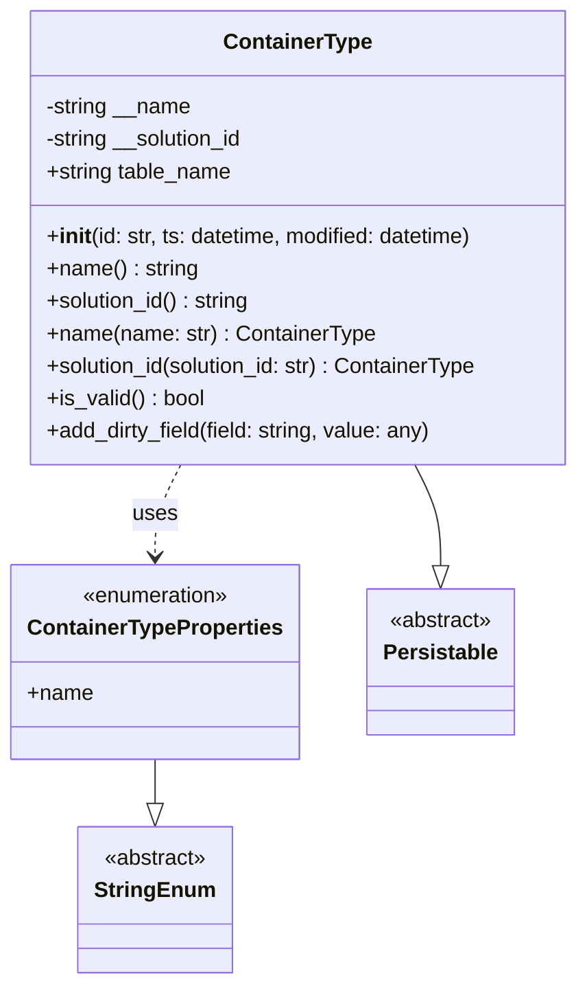

# Diagram: platform/partview_core/partview_service/partview_service/core/datamodel/ContainerType.py


> Auto-generated by Obscura crawlers

## Diagram 1



### SVG

<svg id="container" width="424.2578125" xmlns="http://www.w3.org/2000/svg" class="classDiagram" height="728" viewBox="0 0 424.2578125 728" role="graphics-document document" aria-roledescription="class"><style>#container{font-family:"trebuchet ms",verdana,arial,sans-serif;font-size:16px;fill:#333;}@keyframes edge-animation-frame{from{stroke-dashoffset:0;}}@keyframes dash{to{stroke-dashoffset:0;}}#container .edge-animation-slow{stroke-dasharray:9,5!important;stroke-dashoffset:900;animation:dash 50s linear infinite;stroke-linecap:round;}#container .edge-animation-fast{stroke-dasharray:9,5!important;stroke-dashoffset:900;animation:dash 20s linear infinite;stroke-linecap:round;}#container .error-icon{fill:#552222;}#container .error-text{fill:#552222;stroke:#552222;}#container .edge-thickness-normal{stroke-width:1px;}#container .edge-thickness-thick{stroke-width:3.5px;}#container .edge-pattern-solid{stroke-dasharray:0;}#container .edge-thickness-invisible{stroke-width:0;fill:none;}#container .edge-pattern-dashed{stroke-dasharray:3;}#container .edge-pattern-dotted{stroke-dasharray:2;}#container .marker{fill:#333333;stroke:#333333;}#container .marker.cross{stroke:#333333;}#container svg{font-family:"trebuchet ms",verdana,arial,sans-serif;font-size:16px;}#container p{margin:0;}#container g.classGroup text{fill:#9370DB;stroke:none;font-family:"trebuchet ms",verdana,arial,sans-serif;font-size:10px;}#container g.classGroup text .title{font-weight:bolder;}#container .nodeLabel,#container .edgeLabel{color:#131300;}#container .edgeLabel .label rect{fill:#ECECFF;}#container .label text{fill:#131300;}#container .labelBkg{background:#ECECFF;}#container .edgeLabel .label span{background:#ECECFF;}#container .classTitle{font-weight:bolder;}#container .node rect,#container .node circle,#container .node ellipse,#container .node polygon,#container .node path{fill:#ECECFF;stroke:#9370DB;stroke-width:1px;}#container .divider{stroke:#9370DB;stroke-width:1;}#container g.clickable{cursor:pointer;}#container g.classGroup rect{fill:#ECECFF;stroke:#9370DB;}#container g.classGroup line{stroke:#9370DB;stroke-width:1;}#container .classLabel .box{stroke:none;stroke-width:0;fill:#ECECFF;opacity:0.5;}#container .classLabel .label{fill:#9370DB;font-size:10px;}#container .relation{stroke:#333333;stroke-width:1;fill:none;}#container .dashed-line{stroke-dasharray:3;}#container .dotted-line{stroke-dasharray:1 2;}#container #compositionStart,#container .composition{fill:#333333!important;stroke:#333333!important;stroke-width:1;}#container #compositionEnd,#container .composition{fill:#333333!important;stroke:#333333!important;stroke-width:1;}#container #dependencyStart,#container .dependency{fill:#333333!important;stroke:#333333!important;stroke-width:1;}#container #dependencyStart,#container .dependency{fill:#333333!important;stroke:#333333!important;stroke-width:1;}#container #extensionStart,#container .extension{fill:transparent!important;stroke:#333333!important;stroke-width:1;}#container #extensionEnd,#container .extension{fill:transparent!important;stroke:#333333!important;stroke-width:1;}#container #aggregationStart,#container .aggregation{fill:transparent!important;stroke:#333333!important;stroke-width:1;}#container #aggregationEnd,#container .aggregation{fill:transparent!important;stroke:#333333!important;stroke-width:1;}#container #lollipopStart,#container .lollipop{fill:#ECECFF!important;stroke:#333333!important;stroke-width:1;}#container #lollipopEnd,#container .lollipop{fill:#ECECFF!important;stroke:#333333!important;stroke-width:1;}#container .edgeTerminals{font-size:11px;line-height:initial;}#container .classTitleText{text-anchor:middle;font-size:18px;fill:#333;}#container .label-icon{display:inline-block;height:1em;overflow:visible;vertical-align:-0.125em;}#container .node .label-icon path{fill:currentColor;stroke:revert;stroke-width:revert;}#container :root{--mermaid-font-family:"trebuchet ms",verdana,arial,sans-serif;}</style><g><defs><marker id="container_class-aggregationStart" class="marker aggregation class" refX="18" refY="7" markerWidth="190" markerHeight="240" orient="auto"><path d="M 18,7 L9,13 L1,7 L9,1 Z"></path></marker></defs><defs><marker id="container_class-aggregationEnd" class="marker aggregation class" refX="1" refY="7" markerWidth="20" markerHeight="28" orient="auto"><path d="M 18,7 L9,13 L1,7 L9,1 Z"></path></marker></defs><defs><marker id="container_class-extensionStart" class="marker extension class" refX="18" refY="7" markerWidth="190" markerHeight="240" orient="auto"><path d="M 1,7 L18,13 V 1 Z"></path></marker></defs><defs><marker id="container_class-extensionEnd" class="marker extension class" refX="1" refY="7" markerWidth="20" markerHeight="28" orient="auto"><path d="M 1,1 V 13 L18,7 Z"></path></marker></defs><defs><marker id="container_class-compositionStart" class="marker composition class" refX="18" refY="7" markerWidth="190" markerHeight="240" orient="auto"><path d="M 18,7 L9,13 L1,7 L9,1 Z"></path></marker></defs><defs><marker id="container_class-compositionEnd" class="marker composition class" refX="1" refY="7" markerWidth="20" markerHeight="28" orient="auto"><path d="M 18,7 L9,13 L1,7 L9,1 Z"></path></marker></defs><defs><marker id="container_class-dependencyStart" class="marker dependency class" refX="6" refY="7" markerWidth="190" markerHeight="240" orient="auto"><path d="M 5,7 L9,13 L1,7 L9,1 Z"></path></marker></defs><defs><marker id="container_class-dependencyEnd" class="marker dependency class" refX="13" refY="7" markerWidth="20" markerHeight="28" orient="auto"><path d="M 18,7 L9,13 L14,7 L9,1 Z"></path></marker></defs><defs><marker id="container_class-lollipopStart" class="marker lollipop class" refX="13" refY="7" markerWidth="190" markerHeight="240" orient="auto"><circle stroke="black" fill="transparent" cx="7" cy="7" r="6"></circle></marker></defs><defs><marker id="container_class-lollipopEnd" class="marker lollipop class" refX="1" refY="7" markerWidth="190" markerHeight="240" orient="auto"><circle stroke="black" fill="transparent" cx="7" cy="7" r="6"></circle></marker></defs><g class="root"><g class="clusters"></g><g class="edgePaths"><path d="M111.242,562L111.242,566.167C111.242,570.333,111.242,578.667,111.242,584.125C111.242,589.583,111.242,592.167,111.242,593.458L111.242,594.75" id="id_ContainerTypeProperties_StringEnum_1" class="edge-thickness-normal edge-pattern-solid relation" style=";;;" data-edge="true" data-et="edge" data-id="id_ContainerTypeProperties_StringEnum_1" data-points="W3sieCI6MTExLjI0MjE4NzUsInkiOjU2Mn0seyJ4IjoxMTEuMjQyMTg3NSwieSI6NTg3fSx7IngiOjExMS4yNDIxODc1LCJ5Ijo2MTJ9XQ==" marker-end="url(#container_class-extensionEnd)"></path><path d="M298.851,344L301.953,350.167C305.054,356.333,311.258,368.667,314.359,381.125C317.461,393.583,317.461,406.167,317.461,412.458L317.461,418.75" id="id_ContainerType_Persistable_2" class="edge-thickness-normal edge-pattern-solid relation" style=";;;" data-edge="true" data-et="edge" data-id="id_ContainerType_Persistable_2" data-points="W3sieCI6Mjk4Ljg1MDk1Mjc0MzkwMjQ0LCJ5IjozNDR9LHsieCI6MzE3LjQ2MDkzNzUsInkiOjM4MX0seyJ4IjozMTcuNDYwOTM3NSwieSI6NDM2fV0=" marker-end="url(#container_class-extensionEnd)"></path><path d="M129.852,344L126.751,350.167C123.649,356.333,117.446,368.667,114.344,380C111.242,391.333,111.242,401.667,111.242,406.833L111.242,412" id="id_ContainerType_ContainerTypeProperties_3" class="edge-thickness-normal edge-pattern-dashed relation" style=";;;" data-edge="true" data-et="edge" data-id="id_ContainerType_ContainerTypeProperties_3" data-points="W3sieCI6MTI5Ljg1MjE3MjI1NjA5NzU2LCJ5IjozNDR9LHsieCI6MTExLjI0MjE4NzUsInkiOjM4MX0seyJ4IjoxMTEuMjQyMTg3NSwieSI6NDE4fV0=" marker-end="url(#container_class-dependencyEnd)"></path></g><g class="edgeLabels"><g class="edgeLabel"><g class="label" data-id="id_ContainerTypeProperties_StringEnum_1" transform="translate(0, 0)"><foreignObject width="0" height="0"><div xmlns="http://www.w3.org/1999/xhtml" class="labelBkg" style="display: table-cell; white-space: nowrap; line-height: 1.5; max-width: 200px; text-align: center;"><span class="edgeLabel"></span></div></foreignObject></g></g><g class="edgeLabel"><g class="label" data-id="id_ContainerType_Persistable_2" transform="translate(0, 0)"><foreignObject width="0" height="0"><div xmlns="http://www.w3.org/1999/xhtml" class="labelBkg" style="display: table-cell; white-space: nowrap; line-height: 1.5; max-width: 200px; text-align: center;"><span class="edgeLabel"></span></div></foreignObject></g></g><g class="edgeLabel" transform="translate(111.2421875, 381)"><g class="label" data-id="id_ContainerType_ContainerTypeProperties_3" transform="translate(-16.4921875, -12)"><foreignObject width="32.984375" height="24"><div xmlns="http://www.w3.org/1999/xhtml" class="labelBkg" style="display: table-cell; white-space: nowrap; line-height: 1.5; max-width: 200px; text-align: center;"><span class="edgeLabel"><p>uses</p></span></div></foreignObject></g></g></g><g class="nodes"><g class="node default" id="classId-ContainerTypeProperties-0" transform="translate(111.2421875, 490)"><g class="basic label-container"><path d="M-103.2421875 -72 L103.2421875 -72 L103.2421875 72 L-103.2421875 72" stroke="none" stroke-width="0" fill="#ECECFF" style=""></path><path d="M-103.2421875 -72 C-28.061741722281667 -72, 47.118704055436666 -72, 103.2421875 -72 M-103.2421875 -72 C-25.36378221391668 -72, 52.51462307216664 -72, 103.2421875 -72 M103.2421875 -72 C103.2421875 -35.95673577292101, 103.2421875 0.08652845415798538, 103.2421875 72 M103.2421875 -72 C103.2421875 -30.523852282988763, 103.2421875 10.952295434022474, 103.2421875 72 M103.2421875 72 C58.074355013779176 72, 12.906522527558351 72, -103.2421875 72 M103.2421875 72 C21.92359106539267 72, -59.39500536921466 72, -103.2421875 72 M-103.2421875 72 C-103.2421875 22.64183977235765, -103.2421875 -26.716320455284702, -103.2421875 -72 M-103.2421875 72 C-103.2421875 33.37850662676433, -103.2421875 -5.242986746471345, -103.2421875 -72" stroke="#9370DB" stroke-width="1.3" fill="none" stroke-dasharray="0 0" style=""></path></g><g class="annotation-group text" transform="translate(-55.5546875, -48)"><g class="label" style="" transform="translate(0,-12)"><foreignObject width="111.109375" height="24"><div xmlns="http://www.w3.org/1999/xhtml" style="display: table-cell; white-space: nowrap; line-height: 1.5; max-width: 161px; text-align: center;"><span class="nodeLabel markdown-node-label" style=""><p>«enumeration»</p></span></div></foreignObject></g></g><g class="label-group text" transform="translate(-91.2421875, -24)"><g class="label" style="font-weight: bolder" transform="translate(0,-12)"><foreignObject width="182.484375" height="24"><div xmlns="http://www.w3.org/1999/xhtml" style="display: table-cell; white-space: nowrap; line-height: 1.5; max-width: 229px; text-align: center;"><span class="nodeLabel markdown-node-label" style=""><p>ContainerTypeProperties</p></span></div></foreignObject></g></g><g class="members-group text" transform="translate(-91.2421875, 24)"><g class="label" style="" transform="translate(0,-12)"><foreignObject width="48.5" height="24"><div xmlns="http://www.w3.org/1999/xhtml" style="display: table-cell; white-space: nowrap; line-height: 1.5; max-width: 106px; text-align: center;"><span class="nodeLabel markdown-node-label" style=""><p>+name</p></span></div></foreignObject></g></g><g class="methods-group text" transform="translate(-91.2421875, 72)"></g><g class="divider" style=""><path d="M-103.2421875 0 C-48.214377501978134 0, 6.813432496043731 0, 103.2421875 0 M-103.2421875 0 C-59.63922807030746 0, -16.03626864061492 0, 103.2421875 0" stroke="#9370DB" stroke-width="1.3" fill="none" stroke-dasharray="0 0" style=""></path></g><g class="divider" style=""><path d="M-103.2421875 48 C-44.570980271971045 48, 14.10022695605791 48, 103.2421875 48 M-103.2421875 48 C-39.1960371259342 48, 24.850113248131606 48, 103.2421875 48" stroke="#9370DB" stroke-width="1.3" fill="none" stroke-dasharray="0 0" style=""></path></g></g><g class="node default" id="classId-ContainerType-1" transform="translate(214.3515625, 176)"><g class="basic label-container"><path d="M-201.90625 -168 L201.90625 -168 L201.90625 168 L-201.90625 168" stroke="none" stroke-width="0" fill="#ECECFF" style=""></path><path d="M-201.90625 -168 C-103.63732352646443 -168, -5.368397052928856 -168, 201.90625 -168 M-201.90625 -168 C-88.79678074526095 -168, 24.312688509478107 -168, 201.90625 -168 M201.90625 -168 C201.90625 -74.47716545047038, 201.90625 19.04566909905924, 201.90625 168 M201.90625 -168 C201.90625 -53.302966937112416, 201.90625 61.39406612577517, 201.90625 168 M201.90625 168 C52.282872883501426 168, -97.34050423299715 168, -201.90625 168 M201.90625 168 C78.59595709755718 168, -44.71433580488565 168, -201.90625 168 M-201.90625 168 C-201.90625 62.75172154669589, -201.90625 -42.49655690660822, -201.90625 -168 M-201.90625 168 C-201.90625 68.59665793132633, -201.90625 -30.806684137347332, -201.90625 -168" stroke="#9370DB" stroke-width="1.3" fill="none" stroke-dasharray="0 0" style=""></path></g><g class="annotation-group text" transform="translate(0, -144)"></g><g class="label-group text" transform="translate(-52.9375, -144)"><g class="label" style="font-weight: bolder" transform="translate(0,-12)"><foreignObject width="105.875" height="24"><div xmlns="http://www.w3.org/1999/xhtml" style="display: table-cell; white-space: nowrap; line-height: 1.5; max-width: 154px; text-align: center;"><span class="nodeLabel markdown-node-label" style=""><p>ContainerType</p></span></div></foreignObject></g></g><g class="members-group text" transform="translate(-189.90625, -96)"><g class="label" style="" transform="translate(0,-12)"><foreignObject width="109.3125" height="24"><div xmlns="http://www.w3.org/1999/xhtml" style="display: table-cell; white-space: nowrap; line-height: 1.5; max-width: 167px; text-align: center;"><span class="nodeLabel markdown-node-label" style=""><p>-string __name</p></span></div></foreignObject></g><g class="label" style="" transform="translate(0,12)"><foreignObject width="151.03125" height="24"><div xmlns="http://www.w3.org/1999/xhtml" style="display: table-cell; white-space: nowrap; line-height: 1.5; max-width: 208px; text-align: center;"><span class="nodeLabel markdown-node-label" style=""><p>-string __solution_id</p></span></div></foreignObject></g><g class="label" style="" transform="translate(0,36)"><foreignObject width="139.578125" height="24"><div xmlns="http://www.w3.org/1999/xhtml" style="display: table-cell; white-space: nowrap; line-height: 1.5; max-width: 197px; text-align: center;"><span class="nodeLabel markdown-node-label" style=""><p>+string table_name</p></span></div></foreignObject></g></g><g class="methods-group text" transform="translate(-189.90625, 0)"><g class="label" style="" transform="translate(0,-12)"><foreignObject width="323.625" height="24"><div xmlns="http://www.w3.org/1999/xhtml" style="display: table-cell; white-space: nowrap; line-height: 1.5; max-width: 412px; text-align: center;"><span class="nodeLabel markdown-node-label" style=""><p>+<strong>init</strong>(id: str, ts: datetime, modified: datetime)</p></span></div></foreignObject></g><g class="label" style="" transform="translate(0,12)"><foreignObject width="112.828125" height="24"><div xmlns="http://www.w3.org/1999/xhtml" style="display: table-cell; white-space: nowrap; line-height: 1.5; max-width: 171px; text-align: center;"><span class="nodeLabel markdown-node-label" style=""><p>+name() : string</p></span></div></foreignObject></g><g class="label" style="" transform="translate(0,36)"><foreignObject width="154.53125" height="24"><div xmlns="http://www.w3.org/1999/xhtml" style="display: table-cell; white-space: nowrap; line-height: 1.5; max-width: 213px; text-align: center;"><span class="nodeLabel markdown-node-label" style=""><p>+solution_id() : string</p></span></div></foreignObject></g><g class="label" style="" transform="translate(0,60)"><foreignObject width="243.453125" height="24"><div xmlns="http://www.w3.org/1999/xhtml" style="display: table-cell; white-space: nowrap; line-height: 1.5; max-width: 301px; text-align: center;"><span class="nodeLabel markdown-node-label" style=""><p>+name(name: str) : ContainerType</p></span></div></foreignObject></g><g class="label" style="" transform="translate(0,84)"><foreignObject width="326.875" height="24"><div xmlns="http://www.w3.org/1999/xhtml" style="display: table-cell; white-space: nowrap; line-height: 1.5; max-width: 384px; text-align: center;"><span class="nodeLabel markdown-node-label" style=""><p>+solution_id(solution_id: str) : ContainerType</p></span></div></foreignObject></g><g class="label" style="" transform="translate(0,108)"><foreignObject width="117.984375" height="24"><div xmlns="http://www.w3.org/1999/xhtml" style="display: table-cell; white-space: nowrap; line-height: 1.5; max-width: 176px; text-align: center;"><span class="nodeLabel markdown-node-label" style=""><p>+is_valid() : bool</p></span></div></foreignObject></g><g class="label" style="" transform="translate(0,132)"><foreignObject width="290.09375" height="24"><div xmlns="http://www.w3.org/1999/xhtml" style="display: table-cell; white-space: nowrap; line-height: 1.5; max-width: 347px; text-align: center;"><span class="nodeLabel markdown-node-label" style=""><p>+add_dirty_field(field: string, value: any)</p></span></div></foreignObject></g></g><g class="divider" style=""><path d="M-201.90625 -120 C-94.36968258777672 -120, 13.166884824446555 -120, 201.90625 -120 M-201.90625 -120 C-71.63209649961766 -120, 58.64205700076468 -120, 201.90625 -120" stroke="#9370DB" stroke-width="1.3" fill="none" stroke-dasharray="0 0" style=""></path></g><g class="divider" style=""><path d="M-201.90625 -24 C-119.85674173285202 -24, -37.80723346570403 -24, 201.90625 -24 M-201.90625 -24 C-51.69614737575645 -24, 98.5139552484871 -24, 201.90625 -24" stroke="#9370DB" stroke-width="1.3" fill="none" stroke-dasharray="0 0" style=""></path></g></g><g class="node default" id="classId-Persistable-2" transform="translate(317.4609375, 490)"><g class="basic label-container"><path d="M-52.9765625 -54 L52.9765625 -54 L52.9765625 54 L-52.9765625 54" stroke="none" stroke-width="0" fill="#ECECFF" style=""></path><path d="M-52.9765625 -54 C-11.192043279579622 -54, 30.592475940840757 -54, 52.9765625 -54 M-52.9765625 -54 C-11.849619174927653 -54, 29.277324150144693 -54, 52.9765625 -54 M52.9765625 -54 C52.9765625 -19.98702132424978, 52.9765625 14.025957351500438, 52.9765625 54 M52.9765625 -54 C52.9765625 -14.40320352943612, 52.9765625 25.19359294112776, 52.9765625 54 M52.9765625 54 C25.020784214139606 54, -2.934994071720787 54, -52.9765625 54 M52.9765625 54 C30.33169626572679 54, 7.686830031453582 54, -52.9765625 54 M-52.9765625 54 C-52.9765625 16.608408417736513, -52.9765625 -20.783183164526974, -52.9765625 -54 M-52.9765625 54 C-52.9765625 18.482608893606546, -52.9765625 -17.034782212786908, -52.9765625 -54" stroke="#9370DB" stroke-width="1.3" fill="none" stroke-dasharray="0 0" style=""></path></g><g class="annotation-group text" transform="translate(-38.609375, -30)"><g class="label" style="" transform="translate(0,-12)"><foreignObject width="77.21875" height="24"><div xmlns="http://www.w3.org/1999/xhtml" style="display: table-cell; white-space: nowrap; line-height: 1.5; max-width: 127px; text-align: center;"><span class="nodeLabel markdown-node-label" style=""><p>«abstract»</p></span></div></foreignObject></g></g><g class="label-group text" transform="translate(-40.9765625, -6)"><g class="label" style="font-weight: bolder" transform="translate(0,-12)"><foreignObject width="81.953125" height="24"><div xmlns="http://www.w3.org/1999/xhtml" style="display: table-cell; white-space: nowrap; line-height: 1.5; max-width: 130px; text-align: center;"><span class="nodeLabel markdown-node-label" style=""><p>Persistable</p></span></div></foreignObject></g></g><g class="members-group text" transform="translate(-40.9765625, 42)"></g><g class="methods-group text" transform="translate(-40.9765625, 72)"></g><g class="divider" style=""><path d="M-52.9765625 18 C-11.819324337326123 18, 29.337913825347755 18, 52.9765625 18 M-52.9765625 18 C-25.843336568956218 18, 1.289889362087564 18, 52.9765625 18" stroke="#9370DB" stroke-width="1.3" fill="none" stroke-dasharray="0 0" style=""></path></g><g class="divider" style=""><path d="M-52.9765625 36 C-27.708509559651443 36, -2.4404566193028856 36, 52.9765625 36 M-52.9765625 36 C-17.10950731748155 36, 18.757547865036898 36, 52.9765625 36" stroke="#9370DB" stroke-width="1.3" fill="none" stroke-dasharray="0 0" style=""></path></g></g><g class="node default" id="classId-StringEnum-3" transform="translate(111.2421875, 666)"><g class="basic label-container"><path d="M-54.234375 -54 L54.234375 -54 L54.234375 54 L-54.234375 54" stroke="none" stroke-width="0" fill="#ECECFF" style=""></path><path d="M-54.234375 -54 C-22.974547233877164 -54, 8.285280532245672 -54, 54.234375 -54 M-54.234375 -54 C-27.536859432647983 -54, -0.8393438652959659 -54, 54.234375 -54 M54.234375 -54 C54.234375 -27.13934712968355, 54.234375 -0.2786942593671, 54.234375 54 M54.234375 -54 C54.234375 -28.174794462933455, 54.234375 -2.349588925866911, 54.234375 54 M54.234375 54 C20.33325397634362 54, -13.56786704731276 54, -54.234375 54 M54.234375 54 C23.33287966493764 54, -7.568615670124721 54, -54.234375 54 M-54.234375 54 C-54.234375 13.303119466784096, -54.234375 -27.393761066431807, -54.234375 -54 M-54.234375 54 C-54.234375 26.171124875932712, -54.234375 -1.657750248134576, -54.234375 -54" stroke="#9370DB" stroke-width="1.3" fill="none" stroke-dasharray="0 0" style=""></path></g><g class="annotation-group text" transform="translate(-38.609375, -30)"><g class="label" style="" transform="translate(0,-12)"><foreignObject width="77.21875" height="24"><div xmlns="http://www.w3.org/1999/xhtml" style="display: table-cell; white-space: nowrap; line-height: 1.5; max-width: 127px; text-align: center;"><span class="nodeLabel markdown-node-label" style=""><p>«abstract»</p></span></div></foreignObject></g></g><g class="label-group text" transform="translate(-42.234375, -6)"><g class="label" style="font-weight: bolder" transform="translate(0,-12)"><foreignObject width="84.46875" height="24"><div xmlns="http://www.w3.org/1999/xhtml" style="display: table-cell; white-space: nowrap; line-height: 1.5; max-width: 134px; text-align: center;"><span class="nodeLabel markdown-node-label" style=""><p>StringEnum</p></span></div></foreignObject></g></g><g class="members-group text" transform="translate(-42.234375, 42)"></g><g class="methods-group text" transform="translate(-42.234375, 72)"></g><g class="divider" style=""><path d="M-54.234375 18 C-32.13141596033475 18, -10.028456920669505 18, 54.234375 18 M-54.234375 18 C-20.125347915571872 18, 13.983679168856256 18, 54.234375 18" stroke="#9370DB" stroke-width="1.3" fill="none" stroke-dasharray="0 0" style=""></path></g><g class="divider" style=""><path d="M-54.234375 36 C-28.226445755641965 36, -2.21851651128393 36, 54.234375 36 M-54.234375 36 C-32.28934729577147 36, -10.344319591542941 36, 54.234375 36" stroke="#9370DB" stroke-width="1.3" fill="none" stroke-dasharray="0 0" style=""></path></g></g></g></g></g></svg>

## Diagram 2

```mermaid
flowchart TD
    A[__init__] --> B[Set __name = None]
    B --> C[Set __solution_id = None]
    C --> D[Call super().__init__]
    E[name.setter] --> F{__name != name?}
    F -->|Yes| G[Set __name]
    G --> H[add_dirty_field]
    H --> I[Return self]
    F -->|No| I
    J[solution_id.setter] --> K{__solution_id != solution_id?}
    K -->|Yes| L[Set __solution_id]
    L --> M[add_dirty_field]
    M --> N[Return self]
    K -->|No| N
    O[is_valid] --> P{isinstance __name, str?}
    P -->|Yes| Q[Return True]
    P -->|No| R[Return False]
```

> SVG rendering failed for this diagram.
