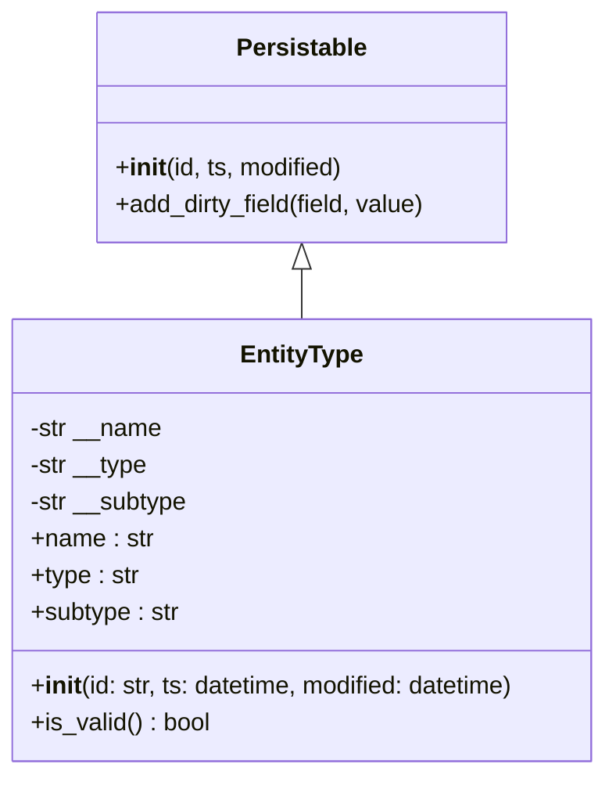

# Diagram: platform/partview_core/partview_service/partview_service/core/datamodel/EntityType.py

> Auto-generated by Obscura crawlers

## Mermaid

### SVG

<svg id="container" width="402.2421875" xmlns="http://www.w3.org/2000/svg" class="classDiagram" height="504" viewBox="0 0 402.2421875 504" role="graphics-document document" aria-roledescription="class"><g><defs><marker id="container_class-aggregationStart" class="marker aggregation class" refX="18" refY="7" markerWidth="190" markerHeight="240" orient="auto"><path d="M 18,7 L9,13 L1,7 L9,1 Z"></path></marker></defs><defs><marker id="container_class-aggregationEnd" class="marker aggregation class" refX="1" refY="7" markerWidth="20" markerHeight="28" orient="auto"><path d="M 18,7 L9,13 L1,7 L9,1 Z"></path></marker></defs><defs><marker id="container_class-extensionStart" class="marker extension class" refX="18" refY="7" markerWidth="190" markerHeight="240" orient="auto"><path d="M 1,7 L18,13 V 1 Z"></path></marker></defs><defs><marker id="container_class-extensionEnd" class="marker extension class" refX="1" refY="7" markerWidth="20" markerHeight="28" orient="auto"><path d="M 1,1 V 13 L18,7 Z"></path></marker></defs><defs><marker id="container_class-compositionStart" class="marker composition class" refX="18" refY="7" markerWidth="190" markerHeight="240" orient="auto"><path d="M 18,7 L9,13 L1,7 L9,1 Z"></path></marker></defs><defs><marker id="container_class-compositionEnd" class="marker composition class" refX="1" refY="7" markerWidth="20" markerHeight="28" orient="auto"><path d="M 18,7 L9,13 L1,7 L9,1 Z"></path></marker></defs><defs><marker id="container_class-dependencyStart" class="marker dependency class" refX="6" refY="7" markerWidth="190" markerHeight="240" orient="auto"><path d="M 5,7 L9,13 L1,7 L9,1 Z"></path></marker></defs><defs><marker id="container_class-dependencyEnd" class="marker dependency class" refX="13" refY="7" markerWidth="20" markerHeight="28" orient="auto"><path d="M 18,7 L9,13 L14,7 L9,1 Z"></path></marker></defs><defs><marker id="container_class-lollipopStart" class="marker lollipop class" refX="13" refY="7" markerWidth="190" markerHeight="240" orient="auto"><circle stroke="black" fill="transparent" cx="7" cy="7" r="6"></circle></marker></defs><defs><marker id="container_class-lollipopEnd" class="marker lollipop class" refX="1" refY="7" markerWidth="190" markerHeight="240" orient="auto"><circle stroke="black" fill="transparent" cx="7" cy="7" r="6"></circle></marker></defs><g class="root"><g class="clusters"></g><g class="edgePaths"><path d="M201.121,175.25L201.121,176.542C201.121,177.833,201.121,180.417,201.121,185.875C201.121,191.333,201.121,199.667,201.121,203.833L201.121,208" id="id_Persistable_EntityType_1" class="edge-thickness-normal edge-pattern-solid relation" style=";;;" data-edge="true" data-et="edge" data-id="id_Persistable_EntityType_1" data-points="W3sieCI6MjAxLjEyMTA5Mzc1LCJ5IjoxNTh9LHsieCI6MjAxLjEyMTA5Mzc1LCJ5IjoxODN9LHsieCI6MjAxLjEyMTA5Mzc1LCJ5IjoyMDh9XQ==" marker-start="url(#container_class-extensionStart)"></path></g><g class="edgeLabels"><g class="edgeLabel"><g class="label" data-id="id_Persistable_EntityType_1" transform="translate(0, 0)"><foreignObject width="0" height="0">

</foreignObject></g></g></g><g class="nodes"><g class="node default" id="classId-Persistable-0" transform="translate(201.12109375, 83)"><g class="basic label-container"><path d="M-135.71484375 -75 L135.71484375 -75 L135.71484375 75 L-135.71484375 75" stroke="none" stroke-width="0" fill="#ECECFF" style=""></path><path d="M-135.71484375 -75 C-79.82339178462809 -75, -23.931939819256186 -75, 135.71484375 -75 M-135.71484375 -75 C-33.061672686527686 -75, 69.59149837694463 -75, 135.71484375 -75 M135.71484375 -75 C135.71484375 -22.24441270673548, 135.71484375 30.511174586529037, 135.71484375 75 M135.71484375 -75 C135.71484375 -24.974063347450944, 135.71484375 25.051873305098113, 135.71484375 75 M135.71484375 75 C31.20964226312546 75, -73.29555922374908 75, -135.71484375 75 M135.71484375 75 C51.65025247206853 75, -32.41433880586294 75, -135.71484375 75 M-135.71484375 75 C-135.71484375 16.26809545409084, -135.71484375 -42.46380909181832, -135.71484375 -75 M-135.71484375 75 C-135.71484375 25.44692088462041, -135.71484375 -24.106158230759178, -135.71484375 -75" stroke="#9370DB" stroke-width="1.3" fill="none" stroke-dasharray="0 0" style=""></path></g><g class="annotation-group text" transform="translate(0, -51)"></g><g class="label-group text" transform="translate(-40.9765625, -51)"><g class="label" style="font-weight: bolder" transform="translate(0,-12)"><foreignObject width="81.953125" height="24">

Persistable

</foreignObject></g></g><g class="members-group text" transform="translate(-123.71484375, -3)"></g><g class="methods-group text" transform="translate(-123.71484375, 27)"><g class="label" style="" transform="translate(0,-12)"><foreignObject width="150.90625" height="24">

+<strong>init</strong>(id, ts, modified)

</foreignObject></g><g class="label" style="" transform="translate(0,12)"><foreignObject width="206.453125" height="24">

+add_dirty_field(field, value)

</foreignObject></g></g><g class="divider" style=""><path d="M-135.71484375 -27 C-30.394329727003978 -27, 74.92618429599204 -27, 135.71484375 -27 M-135.71484375 -27 C-80.39628276946053 -27, -25.07772178892104 -27, 135.71484375 -27" stroke="#9370DB" stroke-width="1.3" fill="none" stroke-dasharray="0 0" style=""></path></g><g class="divider" style=""><path d="M-135.71484375 -3 C-33.437339458014065 -3, 68.84016483397187 -3, 135.71484375 -3 M-135.71484375 -3 C-44.162013995456036 -3, 47.39081575908793 -3, 135.71484375 -3" stroke="#9370DB" stroke-width="1.3" fill="none" stroke-dasharray="0 0" style=""></path></g></g><g class="node default" id="classId-EntityType-1" transform="translate(201.12109375, 352)"><g class="basic label-container"><path d="M-193.12109375 -144 L193.12109375 -144 L193.12109375 144 L-193.12109375 144" stroke="none" stroke-width="0" fill="#ECECFF" style=""></path><path d="M-193.12109375 -144 C-81.4825871750027 -144, 30.155919399994588 -144, 193.12109375 -144 M-193.12109375 -144 C-91.5922295616927 -144, 9.936634626614591 -144, 193.12109375 -144 M193.12109375 -144 C193.12109375 -36.74918931222322, 193.12109375 70.50162137555355, 193.12109375 144 M193.12109375 -144 C193.12109375 -79.87895038987058, 193.12109375 -15.757900779741163, 193.12109375 144 M193.12109375 144 C94.44345802855983 144, -4.234177692880337 144, -193.12109375 144 M193.12109375 144 C73.70938661731553 144, -45.70232051536894 144, -193.12109375 144 M-193.12109375 144 C-193.12109375 41.14467881326212, -193.12109375 -61.710642373475764, -193.12109375 -144 M-193.12109375 144 C-193.12109375 50.795278331278894, -193.12109375 -42.40944333744221, -193.12109375 -144" stroke="#9370DB" stroke-width="1.3" fill="none" stroke-dasharray="0 0" style=""></path></g><g class="annotation-group text" transform="translate(0, -120)"></g><g class="label-group text" transform="translate(-38.6171875, -120)"><g class="label" style="font-weight: bolder" transform="translate(0,-12)"><foreignObject width="77.234375" height="24">

EntityType

</foreignObject></g></g><g class="members-group text" transform="translate(-181.12109375, -72)"><g class="label" style="" transform="translate(0,-12)"><foreignObject width="87.109375" height="24">

-str __name

</foreignObject></g><g class="label" style="" transform="translate(0,12)"><foreignObject width="78.078125" height="24">

-str __type

</foreignObject></g><g class="label" style="" transform="translate(0,36)"><foreignObject width="104.6875" height="24">

-str __subtype

</foreignObject></g><g class="label" style="" transform="translate(0,60)"><foreignObject width="80.25" height="24">

+name : str

</foreignObject></g><g class="label" style="" transform="translate(0,84)"><foreignObject width="71.453125" height="24">

+type : str

</foreignObject></g><g class="label" style="" transform="translate(0,108)"><foreignObject width="97.8125" height="24">

+subtype : str

</foreignObject></g></g><g class="methods-group text" transform="translate(-181.12109375, 96)"><g class="label" style="" transform="translate(0,-12)"><foreignObject width="323.625" height="24">

+<strong>init</strong>(id: str, ts: datetime, modified: datetime)

</foreignObject></g><g class="label" style="" transform="translate(0,12)"><foreignObject width="117.984375" height="24">

+is_valid() : bool

</foreignObject></g></g><g class="divider" style=""><path d="M-193.12109375 -96 C-96.72853510262031 -96, -0.33597645524062614 -96, 193.12109375 -96 M-193.12109375 -96 C-63.610793537162124 -96, 65.89950667567575 -96, 193.12109375 -96" stroke="#9370DB" stroke-width="1.3" fill="none" stroke-dasharray="0 0" style=""></path></g><g class="divider" style=""><path d="M-193.12109375 72 C-86.7757396065431 72, 19.569614536913804 72, 193.12109375 72 M-193.12109375 72 C-49.44863283530296 72, 94.22382807939408 72, 193.12109375 72" stroke="#9370DB" stroke-width="1.3" fill="none" stroke-dasharray="0 0" style=""></path></g></g></g></g></g></svg>
