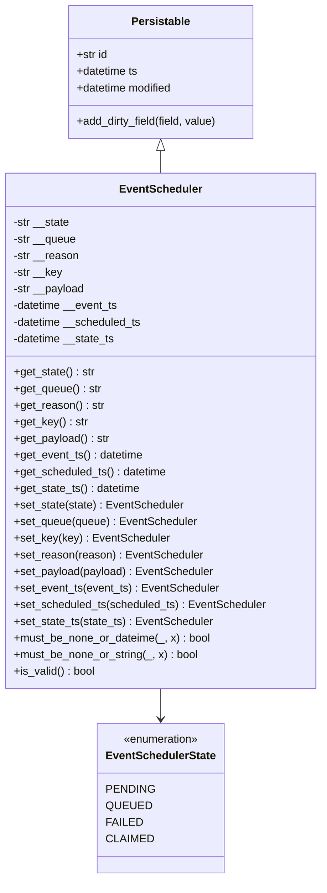
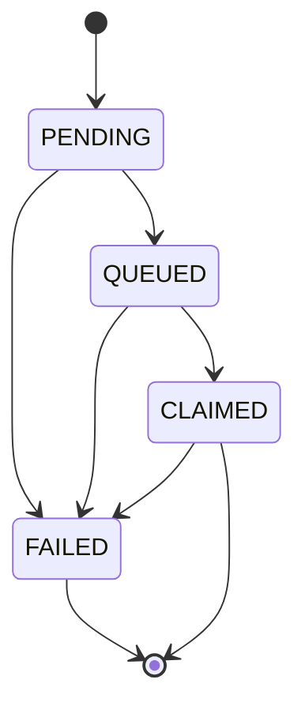

# Diagram: platform/partview_core/partview_service/partview_service/core/datamodel/EventScheduler.py

> Auto-generated by Obscura crawlers

## Diagram 1

### SVG

<svg id="container" width="463.203125" xmlns="http://www.w3.org/2000/svg" class="classDiagram" height="1268" viewBox="0 0 463.203125 1268" role="graphics-document document" aria-roledescription="class"><g><defs><marker id="container_class-aggregationStart" class="marker aggregation class" refX="18" refY="7" markerWidth="190" markerHeight="240" orient="auto"><path d="M 18,7 L9,13 L1,7 L9,1 Z"></path></marker></defs><defs><marker id="container_class-aggregationEnd" class="marker aggregation class" refX="1" refY="7" markerWidth="20" markerHeight="28" orient="auto"><path d="M 18,7 L9,13 L1,7 L9,1 Z"></path></marker></defs><defs><marker id="container_class-extensionStart" class="marker extension class" refX="18" refY="7" markerWidth="190" markerHeight="240" orient="auto"><path d="M 1,7 L18,13 V 1 Z"></path></marker></defs><defs><marker id="container_class-extensionEnd" class="marker extension class" refX="1" refY="7" markerWidth="20" markerHeight="28" orient="auto"><path d="M 1,1 V 13 L18,7 Z"></path></marker></defs><defs><marker id="container_class-compositionStart" class="marker composition class" refX="18" refY="7" markerWidth="190" markerHeight="240" orient="auto"><path d="M 18,7 L9,13 L1,7 L9,1 Z"></path></marker></defs><defs><marker id="container_class-compositionEnd" class="marker composition class" refX="1" refY="7" markerWidth="20" markerHeight="28" orient="auto"><path d="M 18,7 L9,13 L1,7 L9,1 Z"></path></marker></defs><defs><marker id="container_class-dependencyStart" class="marker dependency class" refX="6" refY="7" markerWidth="190" markerHeight="240" orient="auto"><path d="M 5,7 L9,13 L1,7 L9,1 Z"></path></marker></defs><defs><marker id="container_class-dependencyEnd" class="marker dependency class" refX="13" refY="7" markerWidth="20" markerHeight="28" orient="auto"><path d="M 18,7 L9,13 L14,7 L9,1 Z"></path></marker></defs><defs><marker id="container_class-lollipopStart" class="marker lollipop class" refX="13" refY="7" markerWidth="190" markerHeight="240" orient="auto"><circle stroke="black" fill="transparent" cx="7" cy="7" r="6"></circle></marker></defs><defs><marker id="container_class-lollipopEnd" class="marker lollipop class" refX="1" refY="7" markerWidth="190" markerHeight="240" orient="auto"><circle stroke="black" fill="transparent" cx="7" cy="7" r="6"></circle></marker></defs><g class="root"><g class="clusters"></g><g class="edgePaths"><path d="M231.602,217.25L231.602,218.542C231.602,219.833,231.602,222.417,231.602,227.875C231.602,233.333,231.602,241.667,231.602,245.833L231.602,250" id="id_Persistable_EventScheduler_1" class="edge-thickness-normal edge-pattern-solid relation" style=";;;" data-edge="true" data-et="edge" data-id="id_Persistable_EventScheduler_1" data-points="W3sieCI6MjMxLjYwMTU2MjUsInkiOjIwMH0seyJ4IjoyMzEuNjAxNTYyNSwieSI6MjI1fSx7IngiOjIzMS42MDE1NjI1LCJ5IjoyNTB9XQ==" marker-start="url(#container_class-extensionStart)"></path><path d="M231.602,994L231.602,998.167C231.602,1002.333,231.602,1010.667,231.602,1018C231.602,1025.333,231.602,1031.667,231.602,1034.833L231.602,1038" id="id_EventScheduler_EventSchedulerState_2" class="edge-thickness-normal edge-pattern-solid relation" style=";;;" data-edge="true" data-et="edge" data-id="id_EventScheduler_EventSchedulerState_2" data-points="W3sieCI6MjMxLjYwMTU2MjUsInkiOjk5NH0seyJ4IjoyMzEuNjAxNTYyNSwieSI6MTAxOX0seyJ4IjoyMzEuNjAxNTYyNSwieSI6MTA0NH1d" marker-end="url(#container_class-dependencyEnd)"></path></g><g class="edgeLabels"><g class="edgeLabel"><g class="label" data-id="id_Persistable_EventScheduler_1" transform="translate(0, 0)"><foreignObject width="0" height="0">

</foreignObject></g></g><g class="edgeLabel"><g class="label" data-id="id_EventScheduler_EventSchedulerState_2" transform="translate(0, 0)"><foreignObject width="0" height="0">

</foreignObject></g></g></g><g class="nodes"><g class="node default" id="classId-Persistable-0" transform="translate(231.6015625, 104)"><g class="basic label-container"><path d="M-135.71484375 -96 L135.71484375 -96 L135.71484375 96 L-135.71484375 96" stroke="none" stroke-width="0" fill="#ECECFF" style=""></path><path d="M-135.71484375 -96 C-36.991224230104436 -96, 61.73239528979113 -96, 135.71484375 -96 M-135.71484375 -96 C-35.86286364054304 -96, 63.98911646891392 -96, 135.71484375 -96 M135.71484375 -96 C135.71484375 -52.99700326229805, 135.71484375 -9.994006524596102, 135.71484375 96 M135.71484375 -96 C135.71484375 -22.92703384552567, 135.71484375 50.14593230894866, 135.71484375 96 M135.71484375 96 C47.19090097902732 96, -41.33304179194536 96, -135.71484375 96 M135.71484375 96 C30.653208088973585 96, -74.40842757205283 96, -135.71484375 96 M-135.71484375 96 C-135.71484375 50.520591975542146, -135.71484375 5.041183951084292, -135.71484375 -96 M-135.71484375 96 C-135.71484375 21.426979257648327, -135.71484375 -53.146041484703346, -135.71484375 -96" stroke="#9370DB" stroke-width="1.3" fill="none" stroke-dasharray="0 0" style=""></path></g><g class="annotation-group text" transform="translate(0, -72)"></g><g class="label-group text" transform="translate(-40.9765625, -72)"><g class="label" style="font-weight: bolder" transform="translate(0,-12)"><foreignObject width="81.953125" height="24">

Persistable

</foreignObject></g></g><g class="members-group text" transform="translate(-123.71484375, -24)"><g class="label" style="" transform="translate(0,-12)"><foreignObject width="45.734375" height="24">

+str id

</foreignObject></g><g class="label" style="" transform="translate(0,12)"><foreignObject width="90.734375" height="24">

+datetime ts

</foreignObject></g><g class="label" style="" transform="translate(0,36)"><foreignObject width="142.109375" height="24">

+datetime modified

</foreignObject></g></g><g class="methods-group text" transform="translate(-123.71484375, 72)"><g class="label" style="" transform="translate(0,-12)"><foreignObject width="206.453125" height="24">

+add_dirty_field(field, value)

</foreignObject></g></g><g class="divider" style=""><path d="M-135.71484375 -48 C-73.02608227414632 -48, -10.337320798292637 -48, 135.71484375 -48 M-135.71484375 -48 C-71.3161479145015 -48, -6.917452079002999 -48, 135.71484375 -48" stroke="#9370DB" stroke-width="1.3" fill="none" stroke-dasharray="0 0" style=""></path></g><g class="divider" style=""><path d="M-135.71484375 48 C-72.44260332236385 48, -9.170362894727702 48, 135.71484375 48 M-135.71484375 48 C-54.79241334818195 48, 26.130017053636095 48, 135.71484375 48" stroke="#9370DB" stroke-width="1.3" fill="none" stroke-dasharray="0 0" style=""></path></g></g><g class="node default" id="classId-EventSchedulerState-1" transform="translate(231.6015625, 1152)"><g class="basic label-container"><path d="M-88.296875 -108 L88.296875 -108 L88.296875 108 L-88.296875 108" stroke="none" stroke-width="0" fill="#ECECFF" style=""></path><path d="M-88.296875 -108 C-48.24533832485215 -108, -8.193801649704298 -108, 88.296875 -108 M-88.296875 -108 C-23.709269897802614 -108, 40.87833520439477 -108, 88.296875 -108 M88.296875 -108 C88.296875 -22.871486439484485, 88.296875 62.25702712103103, 88.296875 108 M88.296875 -108 C88.296875 -31.788468031914647, 88.296875 44.423063936170706, 88.296875 108 M88.296875 108 C32.921620285261895 108, -22.45363442947621 108, -88.296875 108 M88.296875 108 C18.811001370789995 108, -50.67487225842001 108, -88.296875 108 M-88.296875 108 C-88.296875 41.39574449993695, -88.296875 -25.208511000126094, -88.296875 -108 M-88.296875 108 C-88.296875 33.13067267279193, -88.296875 -41.73865465441614, -88.296875 -108" stroke="#9370DB" stroke-width="1.3" fill="none" stroke-dasharray="0 0" style=""></path></g><g class="annotation-group text" transform="translate(-55.5546875, -84)"><g class="label" style="" transform="translate(0,-12)"><foreignObject width="111.109375" height="24">

«enumeration»

</foreignObject></g></g><g class="label-group text" transform="translate(-76.296875, -60)"><g class="label" style="font-weight: bolder" transform="translate(0,-12)"><foreignObject width="152.59375" height="24">

EventSchedulerState

</foreignObject></g></g><g class="members-group text" transform="translate(-76.296875, -12)"><g class="label" style="" transform="translate(0,-12)"><foreignObject width="64.84375" height="24">

PENDING

</foreignObject></g><g class="label" style="" transform="translate(0,12)"><foreignObject width="59.671875" height="24">

QUEUED

</foreignObject></g><g class="label" style="" transform="translate(0,36)"><foreignObject width="47.78125" height="24">

FAILED

</foreignObject></g><g class="label" style="" transform="translate(0,60)"><foreignObject width="62.140625" height="24">

CLAIMED

</foreignObject></g></g><g class="methods-group text" transform="translate(-76.296875, 108)"></g><g class="divider" style=""><path d="M-88.296875 -36 C-49.54490452814639 -36, -10.79293405629278 -36, 88.296875 -36 M-88.296875 -36 C-36.15181271925968 -36, 15.993249561480638 -36, 88.296875 -36" stroke="#9370DB" stroke-width="1.3" fill="none" stroke-dasharray="0 0" style=""></path></g><g class="divider" style=""><path d="M-88.296875 84 C-38.389315904364445 84, 11.518243191271111 84, 88.296875 84 M-88.296875 84 C-39.54935448225662 84, 9.198166035486764 84, 88.296875 84" stroke="#9370DB" stroke-width="1.3" fill="none" stroke-dasharray="0 0" style=""></path></g></g><g class="node default" id="classId-EventScheduler-2" transform="translate(231.6015625, 622)"><g class="basic label-container"><path d="M-223.6015625 -372 L223.6015625 -372 L223.6015625 372 L-223.6015625 372" stroke="none" stroke-width="0" fill="#ECECFF" style=""></path><path d="M-223.6015625 -372 C-101.26787844165133 -372, 21.065805616697332 -372, 223.6015625 -372 M-223.6015625 -372 C-126.25451839450706 -372, -28.907474289014118 -372, 223.6015625 -372 M223.6015625 -372 C223.6015625 -99.40466244895936, 223.6015625 173.1906751020813, 223.6015625 372 M223.6015625 -372 C223.6015625 -140.2034468355222, 223.6015625 91.59310632895563, 223.6015625 372 M223.6015625 372 C112.57919571991569 372, 1.5568289398313766 372, -223.6015625 372 M223.6015625 372 C116.83690715931193 372, 10.072251818623869 372, -223.6015625 372 M-223.6015625 372 C-223.6015625 115.66634044766465, -223.6015625 -140.6673191046707, -223.6015625 -372 M-223.6015625 372 C-223.6015625 162.36646688534663, -223.6015625 -47.26706622930675, -223.6015625 -372" stroke="#9370DB" stroke-width="1.3" fill="none" stroke-dasharray="0 0" style=""></path></g><g class="annotation-group text" transform="translate(0, -348)"></g><g class="label-group text" transform="translate(-56.984375, -348)"><g class="label" style="font-weight: bolder" transform="translate(0,-12)"><foreignObject width="113.96875" height="24">

EventScheduler

</foreignObject></g></g><g class="members-group text" transform="translate(-211.6015625, -300)"><g class="label" style="" transform="translate(0,-12)"><foreignObject width="82.703125" height="24">

-str __state

</foreignObject></g><g class="label" style="" transform="translate(0,12)"><foreignObject width="91.90625" height="24">

-str __queue

</foreignObject></g><g class="label" style="" transform="translate(0,36)"><foreignObject width="95.59375" height="24">

-str __reason

</foreignObject></g><g class="label" style="" transform="translate(0,60)"><foreignObject width="71.171875" height="24">

-str __key

</foreignObject></g><g class="label" style="" transform="translate(0,84)"><foreignObject width="104.34375" height="24">

-str __payload

</foreignObject></g><g class="label" style="" transform="translate(0,108)"><foreignObject width="153.6875" height="24">

-datetime __event_ts

</foreignObject></g><g class="label" style="" transform="translate(0,132)"><foreignObject width="188.671875" height="24">

-datetime __scheduled_ts

</foreignObject></g><g class="label" style="" transform="translate(0,156)"><foreignObject width="149.453125" height="24">

-datetime __state_ts

</foreignObject></g></g><g class="methods-group text" transform="translate(-211.6015625, -84)"><g class="label" style="" transform="translate(0,-12)"><foreignObject width="117.078125" height="24">

+get_state() : str

</foreignObject></g><g class="label" style="" transform="translate(0,12)"><foreignObject width="126.296875" height="24">

+get_queue() : str

</foreignObject></g><g class="label" style="" transform="translate(0,36)"><foreignObject width="129.96875" height="24">

+get_reason() : str

</foreignObject></g><g class="label" style="" transform="translate(0,60)"><foreignObject width="105.5625" height="24">

+get_key() : str

</foreignObject></g><g class="label" style="" transform="translate(0,84)"><foreignObject width="138.734375" height="24">

+get_payload() : str

</foreignObject></g><g class="label" style="" transform="translate(0,108)"><foreignObject width="188.078125" height="24">

+get_event_ts() : datetime

</foreignObject></g><g class="label" style="" transform="translate(0,132)"><foreignObject width="223.046875" height="24">

+get_scheduled_ts() : datetime

</foreignObject></g><g class="label" style="" transform="translate(0,156)"><foreignObject width="183.828125" height="24">

+get_state_ts() : datetime

</foreignObject></g><g class="label" style="" transform="translate(0,180)"><foreignObject width="245.921875" height="24">

+set_state(state) : EventScheduler

</foreignObject></g><g class="label" style="" transform="translate(0,204)"><foreignObject width="264.6875" height="24">

+set_queue(queue) : EventScheduler

</foreignObject></g><g class="label" style="" transform="translate(0,228)"><foreignObject width="222.890625" height="24">

+set_key(key) : EventScheduler

</foreignObject></g><g class="label" style="" transform="translate(0,252)"><foreignObject width="271.71875" height="24">

+set_reason(reason) : EventScheduler

</foreignObject></g><g class="label" style="" transform="translate(0,276)"><foreignObject width="289.21875" height="24">

+set_payload(payload) : EventScheduler

</foreignObject></g><g class="label" style="" transform="translate(0,300)"><foreignObject width="296.578125" height="24">

+set_event_ts(event_ts) : EventScheduler

</foreignObject></g><g class="label" style="" transform="translate(0,324)"><foreignObject width="366.21875" height="24">

+set_scheduled_ts(scheduled_ts) : EventScheduler

</foreignObject></g><g class="label" style="" transform="translate(0,348)"><foreignObject width="287.78125" height="24">

+set_state_ts(state_ts) : EventScheduler

</foreignObject></g><g class="label" style="" transform="translate(0,372)"><foreignObject width="284.890625" height="24">

+must_be_none_or_dateime(_, x) : bool

</foreignObject></g><g class="label" style="" transform="translate(0,396)"><foreignObject width="267.375" height="24">

+must_be_none_or_string(_, x) : bool

</foreignObject></g><g class="label" style="" transform="translate(0,420)"><foreignObject width="117.984375" height="24">

+is_valid() : bool

</foreignObject></g></g><g class="divider" style=""><path d="M-223.6015625 -324 C-85.26834288557768 -324, 53.06487672884464 -324, 223.6015625 -324 M-223.6015625 -324 C-62.384176016760364 -324, 98.83321046647927 -324, 223.6015625 -324" stroke="#9370DB" stroke-width="1.3" fill="none" stroke-dasharray="0 0" style=""></path></g><g class="divider" style=""><path d="M-223.6015625 -108 C-96.32840881437488 -108, 30.944744871250236 -108, 223.6015625 -108 M-223.6015625 -108 C-79.40342062315833 -108, 64.79472125368335 -108, 223.6015625 -108" stroke="#9370DB" stroke-width="1.3" fill="none" stroke-dasharray="0 0" style=""></path></g></g></g></g></g></svg>

## Diagram 2

### SVG

<svg id="container" width="183.859375" xmlns="http://www.w3.org/2000/svg" class="statediagram" height="454" viewBox="0 0 183.859375 454" role="graphics-document document" aria-roledescription="stateDiagram"><g><defs><marker id="container_stateDiagram-barbEnd" refX="19" refY="7" markerWidth="20" markerHeight="14" markerUnits="userSpaceOnUse" orient="auto"><path d="M 19,7 L9,13 L14,7 L9,1 Z"></path></marker></defs><g class="root"><g class="clusters"></g><g class="edgePaths"><path d="M63.336,22L63.336,26.167C63.336,30.333,63.336,38.667,63.419,47.083C63.503,55.5,63.669,64,63.753,68.25L63.836,72.5" id="edge0" class="edge-thickness-normal edge-pattern-solid transition" style="fill:none;;;fill:none" data-edge="true" data-et="edge" data-id="edge0" data-points="W3sieCI6NjMuMzM1OTM3NSwieSI6MjJ9LHsieCI6NjMuMzM1OTM3NSwieSI6NDd9LHsieCI6NjMuODM1OTM3NSwieSI6NzIuNX1d" marker-end="url(#container_stateDiagram-barbEnd)"></path><path d="M80.022,112.5L83.31,116.583C86.599,120.667,93.177,128.833,96.549,137.167C99.921,145.5,100.087,154,100.171,158.25L100.254,162.5" id="edge1" class="edge-thickness-normal edge-pattern-solid transition" style="fill:none;;;fill:none" data-edge="true" data-et="edge" data-id="edge1" data-points="W3sieCI6ODAuMDIxNzAxMzg4ODg4ODksInkiOjExMi41fSx7IngiOjk5Ljc1MzkwNjI1LCJ5IjoxMzd9LHsieCI6MTAwLjI1MzkwNjI1LCJ5IjoxNjIuNX1d" marker-end="url(#container_stateDiagram-barbEnd)"></path><path d="M42.931,112.5L38.493,116.583C34.055,120.667,25.178,128.833,20.739,140.417C16.301,152,16.301,167,16.301,182C16.301,197,16.301,212,16.301,227C16.301,242,16.301,257,16.301,272C16.301,287,16.301,302,18.568,313.75C20.836,325.5,25.371,334,27.639,338.25L29.906,342.5" id="edge2" class="edge-thickness-normal edge-pattern-solid transition" style="fill:none;;;fill:none" data-edge="true" data-et="edge" data-id="edge2" data-points="W3sieCI6NDIuOTMxNDIzNjExMTExMTE0LCJ5IjoxMTIuNX0seyJ4IjoxNi4zMDA3ODEyNSwieSI6MTM3fSx7IngiOjE2LjMwMDc4MTI1LCJ5IjoxODJ9LHsieCI6MTYuMzAwNzgxMjUsInkiOjIyN30seyJ4IjoxNi4zMDA3ODEyNSwieSI6MjcyfSx7IngiOjE2LjMwMDc4MTI1LCJ5IjozMTd9LHsieCI6MjkuOTA2MjUsInkiOjM0Mi41fV0=" marker-end="url(#container_stateDiagram-barbEnd)"></path><path d="M116.714,202.5L120.06,206.583C123.406,210.667,130.097,218.833,133.527,227.167C136.956,235.5,137.122,244,137.206,248.25L137.289,252.5" id="edge3" class="edge-thickness-normal edge-pattern-solid transition" style="fill:none;;;fill:none" data-edge="true" data-et="edge" data-id="edge3" data-points="W3sieCI6MTE2LjcxMzk3NTY5NDQ0NDQ0LCJ5IjoyMDIuNX0seyJ4IjoxMzYuNzg5MDYyNSwieSI6MjI3fSx7IngiOjEzNy4yODkwNjI1LCJ5IjoyNTIuNX1d" marker-end="url(#container_stateDiagram-barbEnd)"></path><path d="M83.794,202.5L80.281,206.583C76.769,210.667,69.744,218.833,66.231,230.417C62.719,242,62.719,257,62.719,272C62.719,287,62.719,302,60.688,313.75C58.658,325.5,54.597,334,52.567,338.25L50.536,342.5" id="edge4" class="edge-thickness-normal edge-pattern-solid transition" style="fill:none;;;fill:none" data-edge="true" data-et="edge" data-id="edge4" data-points="W3sieCI6ODMuNzkzODM2ODA1NTU1NTYsInkiOjIwMi41fSx7IngiOjYyLjcxODc1LCJ5IjoyMjd9LHsieCI6NjIuNzE4NzUsInkiOjI3Mn0seyJ4Ijo2Mi43MTg3NSwieSI6MzE3fSx7IngiOjUwLjUzNjQ1ODMzMzMzMzMzNiwieSI6MzQyLjV9XQ==" marker-end="url(#container_stateDiagram-barbEnd)"></path><path d="M125.273,292.5L122.687,296.583C120.1,300.667,114.927,308.833,105.73,317.311C96.533,325.79,83.313,334.579,76.703,338.974L70.092,343.369" id="edge5" class="edge-thickness-normal edge-pattern-solid transition" style="fill:none;;;fill:none" data-edge="true" data-et="edge" data-id="edge5" data-points="W3sieCI6MTI1LjI3MzQzNzUsInkiOjI5Mi41fSx7IngiOjEwOS43NTM5MDYyNSwieSI6MzE3fSx7IngiOjcwLjA5MjMzNjAxNjkxNTY0LCJ5IjozNDMuMzY4Njc3MDUyNTY1NDN9XQ==" marker-end="url(#container_stateDiagram-barbEnd)"></path><path d="M40.391,382.5L40.307,386.583C40.224,390.667,40.057,398.833,48.922,407.7C57.787,416.567,75.684,426.133,84.632,430.917L93.581,435.7" id="edge6" class="edge-thickness-normal edge-pattern-solid transition" style="fill:none;;;fill:none" data-edge="true" data-et="edge" data-id="edge6" data-points="W3sieCI6NDAuMzkwNjI1LCJ5IjozODIuNX0seyJ4IjozOS44OTA2MjUsInkiOjQwN30seyJ4Ijo5My41ODA1NjA3MDQ5MTU1LCJ5Ijo0MzUuNzAwMDI5NTc4NzcxMTR9XQ==" marker-end="url(#container_stateDiagram-barbEnd)"></path><path d="M141.734,292.5L142.576,296.583C143.419,300.667,145.104,308.833,145.946,320.417C146.789,332,146.789,347,146.789,362C146.789,377,146.789,392,139.914,404.177C133.04,416.354,119.291,425.708,112.416,430.385L105.541,435.062" id="edge7" class="edge-thickness-normal edge-pattern-solid transition" style="fill:none;;;fill:none" data-edge="true" data-et="edge" data-id="edge7" data-points="W3sieCI6MTQxLjczMzUwNjk0NDQ0NDQ2LCJ5IjoyOTIuNX0seyJ4IjoxNDYuNzg5MDYyNSwieSI6MzE3fSx7IngiOjE0Ni43ODkwNjI1LCJ5IjozNjJ9LHsieCI6MTQ2Ljc4OTA2MjUsInkiOjQwN30seyJ4IjoxMDUuNTQxNDcwNzg5MjgwMjUsInkiOjQzNS4wNjI0NzU4MTU0ODE4fV0=" marker-end="url(#container_stateDiagram-barbEnd)"></path></g><g class="edgeLabels"><g class="edgeLabel"><g class="label" data-id="edge0" transform="translate(0, 0)"><foreignObject width="0" height="0">

</foreignObject></g></g><g class="edgeLabel"><g class="label" data-id="edge1" transform="translate(0, 0)"><foreignObject width="0" height="0">

</foreignObject></g></g><g class="edgeLabel"><g class="label" data-id="edge2" transform="translate(0, 0)"><foreignObject width="0" height="0">

</foreignObject></g></g><g class="edgeLabel"><g class="label" data-id="edge3" transform="translate(0, 0)"><foreignObject width="0" height="0">

</foreignObject></g></g><g class="edgeLabel"><g class="label" data-id="edge4" transform="translate(0, 0)"><foreignObject width="0" height="0">

</foreignObject></g></g><g class="edgeLabel"><g class="label" data-id="edge5" transform="translate(0, 0)"><foreignObject width="0" height="0">

</foreignObject></g></g><g class="edgeLabel"><g class="label" data-id="edge6" transform="translate(0, 0)"><foreignObject width="0" height="0">

</foreignObject></g></g><g class="edgeLabel"><g class="label" data-id="edge7" transform="translate(0, 0)"><foreignObject width="0" height="0">

</foreignObject></g></g></g><g class="nodes"><g class="node default" id="state-root_start-0" transform="translate(63.3359375, 15)"><circle class="state-start" r="7" width="14" height="14"></circle></g><g class="node  statediagram-state" id="state-PENDING-2" transform="translate(63.3359375, 92)"><g class="basic label-container outer-path"><path d="M-35.421875 -20 C-13.038807164360549 -20, 9.344260671278903 -20, 35.421875 -20 C35.421875 -20, 35.421875 -20, 35.421875 -20 C35.57049916729554 -19.993852858970094, 35.71912333459107 -19.987705717940187, 35.83477172736166 -19.982922465033347 C35.97882286073874 -19.964966509983554, 36.122873994115814 -19.947010554933765, 36.24484795140367 -19.931806517013612 C36.400069945735744 -19.899259887377855, 36.55529194006782 -19.8667132577421, 36.649302435703994 -19.847001329696653 C36.73797662625618 -19.820601879364105, 36.82665081680837 -19.794202429031554, 37.04537234602342 -19.729086208503173 C37.12851552001218 -19.696643641339815, 37.21165869400093 -19.664201074176457, 37.430352123264846 -19.578866633275286 C37.525182978604185 -19.532506653019468, 37.62001383394353 -19.486146672763653, 37.801611965185366 -19.397368756032446 C37.87553064874533 -19.3533227810733, 37.9494493323053 -19.309276806114152, 38.156615790612136 -19.185832391312644 C38.23137667735537 -19.132454144147623, 38.306137564098606 -19.079075896982605, 38.49293856344834 -18.94570254698197 C38.566556419784796 -18.883351403214217, 38.64017427612125 -18.821000259446464, 38.808282858128706 -18.678619553365657 C38.873175533017886 -18.613726878476477, 38.938068207907065 -18.548834203587294, 39.10049455336566 -18.386407858128706 C39.18876891202993 -18.282182519800593, 39.27704327069419 -18.17795718147248, 39.36757754698197 -18.07106356344834 C39.450592206624655 -17.954794298397577, 39.53360686626734 -17.83852503334681, 39.607707391312644 -17.734740790612136 C39.683590019793556 -17.60739330863264, 39.759472648274475 -17.48004582665315, 39.81924375603245 -17.37973696518537 C39.87295702079415 -17.26986472597574, 39.92667028555586 -17.15999248676611, 40.00074163327529 -17.008477123264846 C40.04682162350874 -16.89038422925653, 40.09290161374219 -16.77229133524821, 40.150961208503176 -16.623497346023417 C40.189807496408086 -16.493014965044516, 40.228653784312996 -16.36253258406561, 40.26887632969665 -16.227427435703994 C40.29365992543131 -16.1092290477386, 40.31844352116596 -15.99103065977321, 40.35368151701361 -15.82297295140367 C40.3733965947924 -15.664809306486047, 40.393111672571195 -15.506645661568426, 40.40479746503335 -15.412896727361662 C40.41009163537739 -15.2848954898634, 40.415385805721435 -15.156894252365136, 40.421875 -15 C40.421875 -15, 40.421875 -15, 40.421875 -15 C40.421875 -3.166903385925268, 40.421875 8.666193228149464, 40.421875 15 C40.421875 15, 40.421875 15, 40.421875 15 C40.416374430375825 15.132991511999977, 40.41087386075164 15.265983023999954, 40.40479746503335 15.412896727361662 C40.39201309309237 15.515458983866795, 40.3792287211514 15.618021240371927, 40.35368151701361 15.822972951403669 C40.32014345076709 15.982923323749036, 40.28660538452057 16.142873696094405, 40.26887632969665 16.227427435703994 C40.22185360455378 16.385373985237308, 40.17483087941091 16.54332053477062, 40.150961208503176 16.623497346023417 C40.09177527709649 16.77517788868377, 40.0325893456898 16.926858431344122, 40.00074163327529 17.008477123264846 C39.93959544429182 17.133553651987402, 39.87844925530834 17.258630180709954, 39.81924375603245 17.379736965185366 C39.77412909669333 17.455449132544523, 39.7290144373542 17.53116129990368, 39.607707391312644 17.734740790612133 C39.5269415553355 17.847860382148045, 39.44617571935835 17.96097997368396, 39.36757754698197 18.07106356344834 C39.28971723467655 18.16299306047508, 39.21185692237114 18.254922557501825, 39.10049455336566 18.386407858128706 C39.007012612538595 18.479889798955764, 38.91353067171154 18.573371739782825, 38.808282858128706 18.678619553365657 C38.709551106678845 18.76224108128624, 38.610819355228976 18.845862609206826, 38.49293856344834 18.94570254698197 C38.41296884748174 19.0027998267299, 38.332999131515145 19.059897106477827, 38.156615790612136 19.185832391312644 C38.07957634319387 19.23173793790018, 38.0025368957756 19.27764348448772, 37.801611965185366 19.397368756032446 C37.68525453462424 19.454252437658308, 37.56889710406312 19.51113611928417, 37.430352123264846 19.578866633275286 C37.31700030765748 19.62309664897601, 37.203648492050114 19.66732666467673, 37.04537234602342 19.729086208503173 C36.912096855235845 19.768764041226348, 36.77882136444827 19.808441873949523, 36.649302435703994 19.847001329696653 C36.498922374666535 19.878532712682997, 36.34854231362908 19.910064095669338, 36.24484795140367 19.931806517013612 C36.12457087516144 19.94679903893201, 36.00429379891921 19.961791560850408, 35.83477172736166 19.982922465033347 C35.69873039545332 19.988549176142005, 35.56268906354498 19.994175887250666, 35.421875 20 C35.421875 20, 35.421875 20, 35.421875 20 C15.52050284110145 20, -4.380869317797099 20, -35.421875 20 C-35.421875 20, -35.421875 20, -35.421875 20 C-35.51678874327482 19.996074338539934, -35.611702486549646 19.992148677079864, -35.83477172736166 19.982922465033347 C-35.97306417066358 19.965684329952836, -36.11135661396549 19.94844619487232, -36.24484795140367 19.931806517013612 C-36.34417610402084 19.910979593551215, -36.443504256638015 19.890152670088813, -36.649302435703994 19.847001329696653 C-36.7963997828826 19.803208552038242, -36.94349713006121 19.759415774379832, -37.04537234602342 19.729086208503173 C-37.15748566261203 19.685339456619193, -37.26959897920064 19.641592704735213, -37.430352123264846 19.578866633275286 C-37.56532272893263 19.512883524808288, -37.70029333460041 19.446900416341286, -37.801611965185366 19.397368756032446 C-37.90247607550314 19.33726679177426, -38.0033401858209 19.27716482751608, -38.156615790612136 19.185832391312644 C-38.242010170199116 19.124861976184313, -38.32740454978609 19.06389156105598, -38.49293856344834 18.94570254698197 C-38.60463934602418 18.851096810005252, -38.71634012860001 18.75649107302854, -38.808282858128706 18.67861955336566 C-38.89732199230119 18.589580419193176, -38.986361126473675 18.50054128502069, -39.10049455336566 18.386407858128706 C-39.207215176914495 18.260403056006396, -39.313935800463334 18.13439825388409, -39.36757754698197 18.07106356344834 C-39.45792868974549 17.944518914457095, -39.54827983250901 17.81797426546585, -39.607707391312644 17.734740790612133 C-39.668444812883976 17.632810245322943, -39.729182234455315 17.530879700033754, -39.81924375603244 17.37973696518537 C-39.86123477811766 17.2938429566258, -39.90322580020289 17.207948948066225, -40.00074163327528 17.00847712326485 C-40.060253809385635 16.85596048708506, -40.11976598549598 16.70344385090527, -40.150961208503176 16.623497346023417 C-40.187254181620794 16.50159139823294, -40.22354715473841 16.379685450442462, -40.26887632969665 16.227427435703994 C-40.29032346652058 16.12514134993166, -40.31177060334451 16.022855264159322, -40.35368151701361 15.82297295140367 C-40.36868767911576 15.70258644717928, -40.38369384121791 15.582199942954889, -40.40479746503335 15.412896727361664 C-40.41050324641278 15.27494365256434, -40.41620902779221 15.136990577767017, -40.421875 15 C-40.421875 15, -40.421875 15, -40.421875 15 C-40.421875 5.391580962347556, -40.421875 -4.216838075304889, -40.421875 -15 C-40.421875 -15, -40.421875 -15, -40.421875 -15 C-40.416657791441864 -15.126140473073267, -40.41144058288372 -15.252280946146534, -40.40479746503335 -15.41289672736166 C-40.38476615160101 -15.573597363722003, -40.36473483816868 -15.734298000082346, -40.35368151701361 -15.822972951403669 C-40.328640039232326 -15.94240123524548, -40.30359856145104 -16.06182951908729, -40.26887632969665 -16.227427435703994 C-40.24327671991349 -16.313415009209457, -40.217677110130325 -16.39940258271492, -40.150961208503176 -16.623497346023417 C-40.11663021426661 -16.7114801438287, -40.08229922003004 -16.799462941633983, -40.00074163327529 -17.008477123264846 C-39.95667076659259 -17.098625521948474, -39.91259989990989 -17.188773920632098, -39.81924375603245 -17.379736965185366 C-39.75327750067476 -17.490442625803468, -39.687311245317076 -17.60114828642157, -39.607707391312644 -17.734740790612133 C-39.5239980893923 -17.85198296270659, -39.440288787471964 -17.969225134801047, -39.36757754698197 -18.07106356344834 C-39.31097100605133 -18.137898780031655, -39.2543644651207 -18.20473399661497, -39.10049455336566 -18.386407858128706 C-39.036225749903316 -18.450676661591046, -38.971956946440976 -18.514945465053387, -38.808282858128706 -18.678619553365657 C-38.7001864504815 -18.770172540499445, -38.59209004283429 -18.86172552763323, -38.49293856344834 -18.945702546981966 C-38.38637985926641 -19.021783999425708, -38.27982115508449 -19.09786545186945, -38.156615790612136 -19.185832391312644 C-38.03439301018346 -19.258661360484307, -37.91217022975478 -19.331490329655974, -37.801611965185366 -19.397368756032446 C-37.70868330262911 -19.442798810901095, -37.615754640072865 -19.48822886576975, -37.430352123264846 -19.578866633275286 C-37.290492857285976 -19.633439888207207, -37.150633591307106 -19.688013143139127, -37.04537234602342 -19.729086208503173 C-36.916044133292395 -19.767588885633117, -36.78671592056137 -19.80609156276306, -36.649302435703994 -19.847001329696653 C-36.53539743154765 -19.87088469751375, -36.42149242739131 -19.89476806533084, -36.24484795140367 -19.931806517013612 C-36.12444838091192 -19.94681430782429, -36.00404881042018 -19.961822098634965, -35.83477172736166 -19.982922465033347 C-35.699978078006836 -19.988497571609873, -35.565184428652 -19.9940726781864, -35.421875 -20 C-35.421875 -20, -35.421875 -20, -35.421875 -20" stroke="none" stroke-width="0" fill="#ECECFF" style=""></path><path d="M-35.421875 -20 C-20.45385489359289 -20, -5.485834787185777 -20, 35.421875 -20 M-35.421875 -20 C-15.805181192274151 -20, 3.811512615451697 -20, 35.421875 -20 M35.421875 -20 C35.421875 -20, 35.421875 -20, 35.421875 -20 M35.421875 -20 C35.421875 -20, 35.421875 -20, 35.421875 -20 M35.421875 -20 C35.567766299094735 -19.993965891234982, 35.713657598189464 -19.98793178246996, 35.83477172736166 -19.982922465033347 M35.421875 -20 C35.50831150069453 -19.996424959886607, 35.594748001389064 -19.992849919773217, 35.83477172736166 -19.982922465033347 M35.83477172736166 -19.982922465033347 C35.994087989299395 -19.963063713692833, 36.15340425123712 -19.94320496235232, 36.24484795140367 -19.931806517013612 M35.83477172736166 -19.982922465033347 C35.98230540081918 -19.964532411815235, 36.129839074276695 -19.946142358597122, 36.24484795140367 -19.931806517013612 M36.24484795140367 -19.931806517013612 C36.358660443204855 -19.90794254699754, 36.47247293500603 -19.884078576981466, 36.649302435703994 -19.847001329696653 M36.24484795140367 -19.931806517013612 C36.39124633251537 -19.901110004513434, 36.537644713627074 -19.87041349201326, 36.649302435703994 -19.847001329696653 M36.649302435703994 -19.847001329696653 C36.74192862309378 -19.819425318928886, 36.83455481048356 -19.791849308161122, 37.04537234602342 -19.729086208503173 M36.649302435703994 -19.847001329696653 C36.74092357414127 -19.819724534966138, 36.832544712578546 -19.792447740235623, 37.04537234602342 -19.729086208503173 M37.04537234602342 -19.729086208503173 C37.184636552759926 -19.674745146408146, 37.323900759496425 -19.62040408431312, 37.430352123264846 -19.578866633275286 M37.04537234602342 -19.729086208503173 C37.19337209602549 -19.671336526848588, 37.34137184602756 -19.613586845194007, 37.430352123264846 -19.578866633275286 M37.430352123264846 -19.578866633275286 C37.50912987895791 -19.540354535230204, 37.58790763465097 -19.50184243718512, 37.801611965185366 -19.397368756032446 M37.430352123264846 -19.578866633275286 C37.573915910186095 -19.508682574476037, 37.717479697107336 -19.438498515676788, 37.801611965185366 -19.397368756032446 M37.801611965185366 -19.397368756032446 C37.89172273637465 -19.343674391087042, 37.981833507563934 -19.28998002614164, 38.156615790612136 -19.185832391312644 M37.801611965185366 -19.397368756032446 C37.875926455061126 -19.353086931701608, 37.95024094493688 -19.308805107370766, 38.156615790612136 -19.185832391312644 M38.156615790612136 -19.185832391312644 C38.28628781416597 -19.09324834602948, 38.41595983771981 -19.000664300746312, 38.49293856344834 -18.94570254698197 M38.156615790612136 -19.185832391312644 C38.24985408413338 -19.119261529280003, 38.34309237765463 -19.05269066724736, 38.49293856344834 -18.94570254698197 M38.49293856344834 -18.94570254698197 C38.5742547387705 -18.876831259627668, 38.655570914092664 -18.807959972273363, 38.808282858128706 -18.678619553365657 M38.49293856344834 -18.94570254698197 C38.5863292924174 -18.86660463435175, 38.67972002138646 -18.787506721721527, 38.808282858128706 -18.678619553365657 M38.808282858128706 -18.678619553365657 C38.885116348371234 -18.60178606312313, 38.96194983861376 -18.524952572880604, 39.10049455336566 -18.386407858128706 M38.808282858128706 -18.678619553365657 C38.87086775271251 -18.616034658781853, 38.93345264729631 -18.553449764198046, 39.10049455336566 -18.386407858128706 M39.10049455336566 -18.386407858128706 C39.20277621967438 -18.26564412291616, 39.30505788598309 -18.144880387703612, 39.36757754698197 -18.07106356344834 M39.10049455336566 -18.386407858128706 C39.18413837860676 -18.28764978028225, 39.267782203847865 -18.188891702435797, 39.36757754698197 -18.07106356344834 M39.36757754698197 -18.07106356344834 C39.4314141698377 -17.981654810166624, 39.49525079269343 -17.892246056884908, 39.607707391312644 -17.734740790612136 M39.36757754698197 -18.07106356344834 C39.445047078693726 -17.96256073328892, 39.522516610405475 -17.8540579031295, 39.607707391312644 -17.734740790612136 M39.607707391312644 -17.734740790612136 C39.65382101033054 -17.657352152600374, 39.699934629348434 -17.579963514588613, 39.81924375603245 -17.37973696518537 M39.607707391312644 -17.734740790612136 C39.658018198922576 -17.65030836129677, 39.7083290065325 -17.5658759319814, 39.81924375603245 -17.37973696518537 M39.81924375603245 -17.37973696518537 C39.87437282116572 -17.26696866002651, 39.929501886299 -17.15420035486765, 40.00074163327529 -17.008477123264846 M39.81924375603245 -17.37973696518537 C39.85604176535136 -17.304465434023335, 39.892839774670264 -17.2291939028613, 40.00074163327529 -17.008477123264846 M40.00074163327529 -17.008477123264846 C40.05258352808155 -16.875617733375012, 40.10442542288781 -16.74275834348518, 40.150961208503176 -16.623497346023417 M40.00074163327529 -17.008477123264846 C40.04094563378444 -16.905443100323787, 40.08114963429359 -16.80240907738273, 40.150961208503176 -16.623497346023417 M40.150961208503176 -16.623497346023417 C40.17861747911861 -16.53060157055751, 40.206273749734045 -16.437705795091606, 40.26887632969665 -16.227427435703994 M40.150961208503176 -16.623497346023417 C40.19047242475366 -16.490781510102245, 40.22998364100413 -16.358065674181073, 40.26887632969665 -16.227427435703994 M40.26887632969665 -16.227427435703994 C40.29903796302049 -16.08358001035661, 40.329199596344324 -15.939732585009224, 40.35368151701361 -15.82297295140367 M40.26887632969665 -16.227427435703994 C40.29185331571531 -16.117845164560386, 40.31483030173396 -16.008262893416777, 40.35368151701361 -15.82297295140367 M40.35368151701361 -15.82297295140367 C40.36541574758972 -15.728835423819689, 40.37714997816583 -15.634697896235709, 40.40479746503335 -15.412896727361662 M40.35368151701361 -15.82297295140367 C40.372348023486545 -15.67322143965393, 40.39101452995948 -15.523469927904191, 40.40479746503335 -15.412896727361662 M40.40479746503335 -15.412896727361662 C40.41004674646818 -15.285980803624614, 40.41529602790302 -15.159064879887568, 40.421875 -15 M40.40479746503335 -15.412896727361662 C40.411434960879625 -15.252416873673482, 40.418072456725895 -15.091937019985302, 40.421875 -15 M40.421875 -15 C40.421875 -15, 40.421875 -15, 40.421875 -15 M40.421875 -15 C40.421875 -15, 40.421875 -15, 40.421875 -15 M40.421875 -15 C40.421875 -4.480834475330097, 40.421875 6.038331049339806, 40.421875 15 M40.421875 -15 C40.421875 -4.26830163980169, 40.421875 6.46339672039662, 40.421875 15 M40.421875 15 C40.421875 15, 40.421875 15, 40.421875 15 M40.421875 15 C40.421875 15, 40.421875 15, 40.421875 15 M40.421875 15 C40.41672039027687 15.124626972784034, 40.41156578055374 15.249253945568068, 40.40479746503335 15.412896727361662 M40.421875 15 C40.41533989182212 15.15800434810238, 40.408804783644236 15.31600869620476, 40.40479746503335 15.412896727361662 M40.40479746503335 15.412896727361662 C40.39118638183796 15.522091251147671, 40.377575298642576 15.63128577493368, 40.35368151701361 15.822972951403669 M40.40479746503335 15.412896727361662 C40.39152447915987 15.519378875098722, 40.3782514932864 15.62586102283578, 40.35368151701361 15.822972951403669 M40.35368151701361 15.822972951403669 C40.32782102971781 15.94630727072882, 40.30196054242201 16.069641590053973, 40.26887632969665 16.227427435703994 M40.35368151701361 15.822972951403669 C40.3236271249083 15.966308919927414, 40.293572732802986 16.10964488845116, 40.26887632969665 16.227427435703994 M40.26887632969665 16.227427435703994 C40.228368203244 16.363491833967068, 40.18786007679136 16.499556232230145, 40.150961208503176 16.623497346023417 M40.26887632969665 16.227427435703994 C40.23967347461669 16.325518096812793, 40.21047061953672 16.423608757921595, 40.150961208503176 16.623497346023417 M40.150961208503176 16.623497346023417 C40.09451565592195 16.768154899647993, 40.03807010334073 16.91281245327257, 40.00074163327529 17.008477123264846 M40.150961208503176 16.623497346023417 C40.098369577053475 16.758278146259027, 40.04577794560378 16.893058946494637, 40.00074163327529 17.008477123264846 M40.00074163327529 17.008477123264846 C39.95747554161013 17.096979328338215, 39.91420944994496 17.185481533411583, 39.81924375603245 17.379736965185366 M40.00074163327529 17.008477123264846 C39.95098128507653 17.110263542405512, 39.90122093687777 17.212049961546178, 39.81924375603245 17.379736965185366 M39.81924375603245 17.379736965185366 C39.74631662329476 17.50212448533386, 39.67338949055708 17.624512005482355, 39.607707391312644 17.734740790612133 M39.81924375603245 17.379736965185366 C39.746206093949546 17.502309977508816, 39.67316843186664 17.624882989832265, 39.607707391312644 17.734740790612133 M39.607707391312644 17.734740790612133 C39.528659775687956 17.845453864812008, 39.44961216006326 17.956166939011883, 39.36757754698197 18.07106356344834 M39.607707391312644 17.734740790612133 C39.52983495837729 17.843807919045588, 39.45196252544194 17.95287504747904, 39.36757754698197 18.07106356344834 M39.36757754698197 18.07106356344834 C39.29839078433147 18.15275221974888, 39.22920402168096 18.234440876049415, 39.10049455336566 18.386407858128706 M39.36757754698197 18.07106356344834 C39.28919283957469 18.163612212601894, 39.2108081321674 18.256160861755443, 39.10049455336566 18.386407858128706 M39.10049455336566 18.386407858128706 C39.009313830271076 18.477588581223284, 38.9181331071765 18.56876930431786, 38.808282858128706 18.678619553365657 M39.10049455336566 18.386407858128706 C39.00860169344007 18.478300718054292, 38.916708833514484 18.57019357797988, 38.808282858128706 18.678619553365657 M38.808282858128706 18.678619553365657 C38.70206508940381 18.76858141449603, 38.595847320678914 18.858543275626406, 38.49293856344834 18.94570254698197 M38.808282858128706 18.678619553365657 C38.73830444598866 18.73788824513579, 38.668326033848615 18.797156936905917, 38.49293856344834 18.94570254698197 M38.49293856344834 18.94570254698197 C38.39053023208173 19.018820690192584, 38.288121900715126 19.091938833403194, 38.156615790612136 19.185832391312644 M38.49293856344834 18.94570254698197 C38.38715386239108 19.02123137181661, 38.28136916133382 19.096760196651253, 38.156615790612136 19.185832391312644 M38.156615790612136 19.185832391312644 C38.05715859735273 19.245096014970887, 37.95770140409333 19.304359638629133, 37.801611965185366 19.397368756032446 M38.156615790612136 19.185832391312644 C38.03291703669999 19.259540849782038, 37.90921828278784 19.333249308251432, 37.801611965185366 19.397368756032446 M37.801611965185366 19.397368756032446 C37.67850286842648 19.457553126136784, 37.55539377166759 19.517737496241118, 37.430352123264846 19.578866633275286 M37.801611965185366 19.397368756032446 C37.70586004303488 19.44417901841454, 37.6101081208844 19.490989280796637, 37.430352123264846 19.578866633275286 M37.430352123264846 19.578866633275286 C37.34619912527897 19.61170323498505, 37.262046127293104 19.64453983669482, 37.04537234602342 19.729086208503173 M37.430352123264846 19.578866633275286 C37.28129715477223 19.63702806246258, 37.13224218627961 19.69518949164987, 37.04537234602342 19.729086208503173 M37.04537234602342 19.729086208503173 C36.960135554362 19.754462300847056, 36.87489876270058 19.779838393190943, 36.649302435703994 19.847001329696653 M37.04537234602342 19.729086208503173 C36.96432106813001 19.75321621940953, 36.883269790236604 19.77734623031589, 36.649302435703994 19.847001329696653 M36.649302435703994 19.847001329696653 C36.50562033037386 19.877128299058104, 36.36193822504372 19.907255268419554, 36.24484795140367 19.931806517013612 M36.649302435703994 19.847001329696653 C36.52550764743874 19.87295836717606, 36.401712859173486 19.89891540465547, 36.24484795140367 19.931806517013612 M36.24484795140367 19.931806517013612 C36.14778998657042 19.943904779713208, 36.05073202173717 19.9560030424128, 35.83477172736166 19.982922465033347 M36.24484795140367 19.931806517013612 C36.131938667527585 19.945880644571332, 36.01902938365151 19.959954772129052, 35.83477172736166 19.982922465033347 M35.83477172736166 19.982922465033347 C35.71556525610336 19.987852881155007, 35.59635878484506 19.99278329727667, 35.421875 20 M35.83477172736166 19.982922465033347 C35.740712301847154 19.986812791649474, 35.64665287633265 19.990703118265603, 35.421875 20 M35.421875 20 C35.421875 20, 35.421875 20, 35.421875 20 M35.421875 20 C35.421875 20, 35.421875 20, 35.421875 20 M35.421875 20 C14.941780350349664 20, -5.538314299300673 20, -35.421875 20 M35.421875 20 C12.494833845525061 20, -10.432207308949877 20, -35.421875 20 M-35.421875 20 C-35.421875 20, -35.421875 20, -35.421875 20 M-35.421875 20 C-35.421875 20, -35.421875 20, -35.421875 20 M-35.421875 20 C-35.55990601417735 19.994290995023967, -35.697937028354694 19.98858199004793, -35.83477172736166 19.982922465033347 M-35.421875 20 C-35.549790192536236 19.99470938850191, -35.67770538507247 19.98941877700382, -35.83477172736166 19.982922465033347 M-35.83477172736166 19.982922465033347 C-35.9548034820183 19.967960522418704, -36.07483523667493 19.95299857980406, -36.24484795140367 19.931806517013612 M-35.83477172736166 19.982922465033347 C-35.97612361205875 19.965302970980634, -36.11747549675584 19.947683476927917, -36.24484795140367 19.931806517013612 M-36.24484795140367 19.931806517013612 C-36.3826471328403 19.902913067076785, -36.52044631427692 19.874019617139957, -36.649302435703994 19.847001329696653 M-36.24484795140367 19.931806517013612 C-36.33103397230003 19.913735208794932, -36.417219993196376 19.895663900576253, -36.649302435703994 19.847001329696653 M-36.649302435703994 19.847001329696653 C-36.79466896759602 19.803723838074784, -36.94003549948804 19.760446346452913, -37.04537234602342 19.729086208503173 M-36.649302435703994 19.847001329696653 C-36.797625220701505 19.802843723392677, -36.945948005699016 19.7586861170887, -37.04537234602342 19.729086208503173 M-37.04537234602342 19.729086208503173 C-37.177440633787555 19.67755300270426, -37.30950892155168 19.626019796905346, -37.430352123264846 19.578866633275286 M-37.04537234602342 19.729086208503173 C-37.12779003159617 19.69692672779819, -37.21020771716893 19.664767247093206, -37.430352123264846 19.578866633275286 M-37.430352123264846 19.578866633275286 C-37.50834925234084 19.540736160329175, -37.58634638141683 19.50260568738306, -37.801611965185366 19.397368756032446 M-37.430352123264846 19.578866633275286 C-37.528059207141126 19.531100550567828, -37.62576629101741 19.48333446786037, -37.801611965185366 19.397368756032446 M-37.801611965185366 19.397368756032446 C-37.919536151991 19.327101192691647, -38.03746033879663 19.256833629350847, -38.156615790612136 19.185832391312644 M-37.801611965185366 19.397368756032446 C-37.88592979213684 19.34712623660904, -37.97024761908831 19.296883717185633, -38.156615790612136 19.185832391312644 M-38.156615790612136 19.185832391312644 C-38.25266533827845 19.117254332400243, -38.34871488594476 19.048676273487846, -38.49293856344834 18.94570254698197 M-38.156615790612136 19.185832391312644 C-38.24085598036265 19.125686051888195, -38.32509617011317 19.065539712463746, -38.49293856344834 18.94570254698197 M-38.49293856344834 18.94570254698197 C-38.58377063804629 18.868771704061253, -38.67460271264423 18.79184086114054, -38.808282858128706 18.67861955336566 M-38.49293856344834 18.94570254698197 C-38.559698964181386 18.889159371844208, -38.62645936491443 18.832616196706446, -38.808282858128706 18.67861955336566 M-38.808282858128706 18.67861955336566 C-38.922961329685144 18.56394108180922, -39.03763980124159 18.449262610252777, -39.10049455336566 18.386407858128706 M-38.808282858128706 18.67861955336566 C-38.909456041741834 18.57744636975253, -39.01062922535496 18.476273186139398, -39.10049455336566 18.386407858128706 M-39.10049455336566 18.386407858128706 C-39.17026872409644 18.304025650418335, -39.240042894827226 18.22164344270797, -39.36757754698197 18.07106356344834 M-39.10049455336566 18.386407858128706 C-39.16437382149009 18.310985748773682, -39.228253089614526 18.235563639418654, -39.36757754698197 18.07106356344834 M-39.36757754698197 18.07106356344834 C-39.44093379573185 17.968321744524545, -39.514290044481726 17.86557992560075, -39.607707391312644 17.734740790612133 M-39.36757754698197 18.07106356344834 C-39.436326650308544 17.9747744531745, -39.50507575363512 17.87848534290066, -39.607707391312644 17.734740790612133 M-39.607707391312644 17.734740790612133 C-39.68640472273991 17.602669627601635, -39.76510205416717 17.470598464591134, -39.81924375603244 17.37973696518537 M-39.607707391312644 17.734740790612133 C-39.688931174210715 17.59842969496367, -39.77015495710879 17.462118599315207, -39.81924375603244 17.37973696518537 M-39.81924375603244 17.37973696518537 C-39.86990462986806 17.276108491412078, -39.920565503703685 17.172480017638783, -40.00074163327528 17.00847712326485 M-39.81924375603244 17.37973696518537 C-39.88763808167243 17.239834135956205, -39.95603240731241 17.099931306727044, -40.00074163327528 17.00847712326485 M-40.00074163327528 17.00847712326485 C-40.035542654059974 16.91928975065287, -40.07034367484466 16.830102378040884, -40.150961208503176 16.623497346023417 M-40.00074163327528 17.00847712326485 C-40.036372538308136 16.91716293959972, -40.07200344334098 16.82584875593459, -40.150961208503176 16.623497346023417 M-40.150961208503176 16.623497346023417 C-40.188937897913775 16.495935894897862, -40.22691458732438 16.368374443772307, -40.26887632969665 16.227427435703994 M-40.150961208503176 16.623497346023417 C-40.193439658308165 16.48081474828292, -40.235918108113154 16.338132150542425, -40.26887632969665 16.227427435703994 M-40.26887632969665 16.227427435703994 C-40.29136941101157 16.120153011917292, -40.313862492326486 16.012878588130587, -40.35368151701361 15.82297295140367 M-40.26887632969665 16.227427435703994 C-40.300012208829656 16.078933619035574, -40.33114808796266 15.930439802367157, -40.35368151701361 15.82297295140367 M-40.35368151701361 15.82297295140367 C-40.36522150571456 15.730393723681155, -40.376761494415504 15.63781449595864, -40.40479746503335 15.412896727361664 M-40.35368151701361 15.82297295140367 C-40.37278403414125 15.669723556706476, -40.391886551268875 15.516474162009283, -40.40479746503335 15.412896727361664 M-40.40479746503335 15.412896727361664 C-40.41039879472211 15.277469061607654, -40.416000124410886 15.142041395853642, -40.421875 15 M-40.40479746503335 15.412896727361664 C-40.411090902689544 15.260735433757436, -40.417384340345734 15.108574140153209, -40.421875 15 M-40.421875 15 C-40.421875 15, -40.421875 15, -40.421875 15 M-40.421875 15 C-40.421875 15, -40.421875 15, -40.421875 15 M-40.421875 15 C-40.421875 3.5463351341016214, -40.421875 -7.907329731796757, -40.421875 -15 M-40.421875 15 C-40.421875 6.3697773925928995, -40.421875 -2.260445214814201, -40.421875 -15 M-40.421875 -15 C-40.421875 -15, -40.421875 -15, -40.421875 -15 M-40.421875 -15 C-40.421875 -15, -40.421875 -15, -40.421875 -15 M-40.421875 -15 C-40.41677153281426 -15.123390460233583, -40.41166806562852 -15.246780920467167, -40.40479746503335 -15.41289672736166 M-40.421875 -15 C-40.41835259982421 -15.085163784344806, -40.41483019964843 -15.17032756868961, -40.40479746503335 -15.41289672736166 M-40.40479746503335 -15.41289672736166 C-40.39451331748443 -15.495401005531788, -40.384229169935516 -15.577905283701917, -40.35368151701361 -15.822972951403669 M-40.40479746503335 -15.41289672736166 C-40.39293887823018 -15.508031899203518, -40.38108029142701 -15.603167071045375, -40.35368151701361 -15.822972951403669 M-40.35368151701361 -15.822972951403669 C-40.33176800182108 -15.927483297607807, -40.30985448662855 -16.031993643811948, -40.26887632969665 -16.227427435703994 M-40.35368151701361 -15.822972951403669 C-40.33301371347713 -15.921542226296319, -40.312345909940646 -16.02011150118897, -40.26887632969665 -16.227427435703994 M-40.26887632969665 -16.227427435703994 C-40.243408498264984 -16.31297237352941, -40.217940666833314 -16.39851731135482, -40.150961208503176 -16.623497346023417 M-40.26887632969665 -16.227427435703994 C-40.236195131496345 -16.337201645400874, -40.203513933296044 -16.446975855097758, -40.150961208503176 -16.623497346023417 M-40.150961208503176 -16.623497346023417 C-40.116843581922886 -16.71093332938951, -40.08272595534259 -16.798369312755604, -40.00074163327529 -17.008477123264846 M-40.150961208503176 -16.623497346023417 C-40.11431744539456 -16.717407262473664, -40.07767368228595 -16.811317178923908, -40.00074163327529 -17.008477123264846 M-40.00074163327529 -17.008477123264846 C-39.959776441254256 -17.092272762888907, -39.91881124923322 -17.176068402512968, -39.81924375603245 -17.379736965185366 M-40.00074163327529 -17.008477123264846 C-39.929147206789054 -17.154925863401388, -39.85755278030281 -17.301374603537933, -39.81924375603245 -17.379736965185366 M-39.81924375603245 -17.379736965185366 C-39.744993442276716 -17.504345069599644, -39.67074312852099 -17.628953174013922, -39.607707391312644 -17.734740790612133 M-39.81924375603245 -17.379736965185366 C-39.738313002747375 -17.515556293691493, -39.6573822494623 -17.65137562219762, -39.607707391312644 -17.734740790612133 M-39.607707391312644 -17.734740790612133 C-39.51351414741989 -17.866666637050542, -39.419320903527144 -17.99859248348895, -39.36757754698197 -18.07106356344834 M-39.607707391312644 -17.734740790612133 C-39.529428051678565 -17.84437782733659, -39.451148712044485 -17.95401486406105, -39.36757754698197 -18.07106356344834 M-39.36757754698197 -18.07106356344834 C-39.28521466949016 -18.1683092291451, -39.20285179199834 -18.265554894841856, -39.10049455336566 -18.386407858128706 M-39.36757754698197 -18.07106356344834 C-39.27939318608846 -18.175182641609304, -39.191208825194956 -18.27930171977027, -39.10049455336566 -18.386407858128706 M-39.10049455336566 -18.386407858128706 C-39.04127088060384 -18.445631530890523, -38.98204720784202 -18.504855203652344, -38.808282858128706 -18.678619553365657 M-39.10049455336566 -18.386407858128706 C-39.01653185991321 -18.470370551581155, -38.93256916646076 -18.554333245033604, -38.808282858128706 -18.678619553365657 M-38.808282858128706 -18.678619553365657 C-38.68630971560804 -18.78192553541372, -38.56433657308737 -18.885231517461783, -38.49293856344834 -18.945702546981966 M-38.808282858128706 -18.678619553365657 C-38.71185577054218 -18.760289130563542, -38.61542868295565 -18.84195870776143, -38.49293856344834 -18.945702546981966 M-38.49293856344834 -18.945702546981966 C-38.38661006801717 -19.021619633536904, -38.28028157258599 -19.097536720091842, -38.156615790612136 -19.185832391312644 M-38.49293856344834 -18.945702546981966 C-38.364420557154105 -19.037462639778756, -38.23590255085987 -19.12922273257555, -38.156615790612136 -19.185832391312644 M-38.156615790612136 -19.185832391312644 C-38.020822278448335 -19.266747761396704, -37.885028766284535 -19.347663131480765, -37.801611965185366 -19.397368756032446 M-38.156615790612136 -19.185832391312644 C-38.02810554520459 -19.262407876408002, -37.89959529979704 -19.33898336150336, -37.801611965185366 -19.397368756032446 M-37.801611965185366 -19.397368756032446 C-37.69690884804594 -19.44855499099718, -37.592205730906514 -19.499741225961916, -37.430352123264846 -19.578866633275286 M-37.801611965185366 -19.397368756032446 C-37.67472913100489 -19.4593979939462, -37.54784629682442 -19.52142723185996, -37.430352123264846 -19.578866633275286 M-37.430352123264846 -19.578866633275286 C-37.306495094041146 -19.627195796049214, -37.182638064817446 -19.675524958823146, -37.04537234602342 -19.729086208503173 M-37.430352123264846 -19.578866633275286 C-37.29927016548813 -19.630014971918822, -37.16818820771142 -19.681163310562358, -37.04537234602342 -19.729086208503173 M-37.04537234602342 -19.729086208503173 C-36.950529799829496 -19.757322057875662, -36.85568725363558 -19.78555790724815, -36.649302435703994 -19.847001329696653 M-37.04537234602342 -19.729086208503173 C-36.92423908138707 -19.765149143878993, -36.80310581675072 -19.801212079254817, -36.649302435703994 -19.847001329696653 M-36.649302435703994 -19.847001329696653 C-36.52455513151851 -19.873158088761983, -36.399807827333035 -19.89931484782731, -36.24484795140367 -19.931806517013612 M-36.649302435703994 -19.847001329696653 C-36.498844654059546 -19.878549008980578, -36.348386872415105 -19.9100966882645, -36.24484795140367 -19.931806517013612 M-36.24484795140367 -19.931806517013612 C-36.08522561346937 -19.951703420687313, -35.92560327553507 -19.97160032436101, -35.83477172736166 -19.982922465033347 M-36.24484795140367 -19.931806517013612 C-36.13171908966397 -19.94590801492349, -36.018590227924264 -19.960009512833366, -35.83477172736166 -19.982922465033347 M-35.83477172736166 -19.982922465033347 C-35.73322146866897 -19.987122614801496, -35.63167120997628 -19.99132276456964, -35.421875 -20 M-35.83477172736166 -19.982922465033347 C-35.71268968547513 -19.98797181563595, -35.5906076435886 -19.99302116623856, -35.421875 -20 M-35.421875 -20 C-35.421875 -20, -35.421875 -20, -35.421875 -20 M-35.421875 -20 C-35.421875 -20, -35.421875 -20, -35.421875 -20" stroke="#9370DB" stroke-width="1.3" fill="none" stroke-dasharray="0 0" style=""></path></g><g class="label" style="" transform="translate(-32.421875, -12)"><rect></rect><foreignObject width="64.84375" height="24">

PENDING

</foreignObject></g></g><g class="node  statediagram-state" id="state-QUEUED-4" transform="translate(99.75390625, 182)"><g class="basic label-container outer-path"><path d="M-32.8359375 -20 C-12.054556374831922 -20, 8.726824750336156 -20, 32.8359375 -20 C32.8359375 -20, 32.8359375 -20, 32.8359375 -20 C33.00062645228443 -19.99318841454804, 33.16531540456886 -19.98637682909608, 33.24883422736166 -19.982922465033347 C33.41046532073937 -19.96277517025475, 33.57209641411707 -19.942627875476155, 33.65891045140367 -19.931806517013612 C33.76016221820362 -19.91057625407192, 33.861413985003566 -19.889345991130227, 34.063364935703994 -19.847001329696653 C34.15339388672507 -19.82019854969751, 34.24342283774615 -19.793395769698364, 34.45943484602342 -19.729086208503173 C34.59753673277625 -19.675198685073156, 34.735638619529084 -19.62131116164314, 34.844414623264846 -19.578866633275286 C34.99019722813725 -19.50759786047616, 35.13597983300964 -19.436329087677038, 35.215674465185366 -19.397368756032446 C35.33439058766104 -19.326629301459118, 35.45310671013671 -19.25588984688579, 35.570678290612136 -19.185832391312644 C35.69210582562901 -19.09913479770289, 35.81353336064587 -19.012437204093143, 35.90700106344834 -18.94570254698197 C36.020188749157505 -18.849837467290744, 36.133376434866676 -18.753972387599518, 36.222345358128706 -18.678619553365657 C36.288416449000266 -18.6125484624941, 36.35448753987182 -18.546477371622544, 36.51455705336566 -18.386407858128706 C36.58485611142338 -18.303405917122483, 36.655155169481105 -18.22040397611626, 36.78164004698197 -18.07106356344834 C36.87722165716291 -17.93719318903567, 36.972803267343856 -17.803322814622998, 37.021769891312644 -17.734740790612136 C37.078379788819895 -17.639737124463714, 37.134989686327145 -17.544733458315292, 37.23330625603245 -17.37973696518537 C37.27512300618858 -17.294199435554525, 37.31693975634471 -17.208661905923684, 37.41480413327529 -17.008477123264846 C37.4697374643062 -16.86769506133099, 37.52467079533711 -16.726912999397136, 37.565023708503176 -16.623497346023417 C37.6031362865532 -16.495479453004027, 37.64124886460322 -16.36746155998464, 37.68293882969665 -16.227427435703994 C37.70059938243122 -16.14320039753918, 37.7182599351658 -16.058973359374363, 37.76774401701361 -15.82297295140367 C37.77840949495832 -15.73740946109179, 37.78907497290303 -15.651845970779908, 37.81885996503335 -15.412896727361662 C37.824693732241144 -15.27184924053212, 37.83052749944895 -15.130801753702578, 37.8359375 -15 C37.8359375 -15, 37.8359375 -15, 37.8359375 -15 C37.8359375 -8.246155590955517, 37.8359375 -1.4923111819110328, 37.8359375 15 C37.8359375 15, 37.8359375 15, 37.8359375 15 C37.83075702851991 15.125252252417942, 37.825576557039824 15.250504504835884, 37.81885996503335 15.412896727361662 C37.800442999391606 15.560646304964344, 37.782026033749865 15.708395882567027, 37.76774401701361 15.822972951403669 C37.743382622964404 15.93915776720018, 37.719021228915196 16.05534258299669, 37.68293882969665 16.227427435703994 C37.65091369806333 16.33499795664817, 37.61888856643001 16.44256847759235, 37.565023708503176 16.623497346023417 C37.5257066769088 16.72425826244884, 37.48638964531441 16.82501917887426, 37.41480413327529 17.008477123264846 C37.36148807488524 17.117536863854717, 37.308172016495185 17.226596604444588, 37.23330625603245 17.379736965185366 C37.16809573873586 17.489174333691782, 37.10288522143926 17.598611702198202, 37.021769891312644 17.734740790612133 C36.92607430045683 17.868770804892684, 36.830378709601014 18.002800819173235, 36.78164004698197 18.07106356344834 C36.69198778670473 18.17691578713669, 36.60233552642749 18.282768010825038, 36.51455705336566 18.386407858128706 C36.40420914882636 18.496755762668002, 36.293861244287065 18.607103667207298, 36.222345358128706 18.678619553365657 C36.13338647007829 18.753963888208833, 36.04442758202788 18.829308223052013, 35.90700106344834 18.94570254698197 C35.78395116108855 19.033558488610254, 35.660901258728764 19.12141443023854, 35.570678290612136 19.185832391312644 C35.46993810808252 19.24586051063757, 35.36919792555292 19.305888629962492, 35.215674465185366 19.397368756032446 C35.07632610880974 19.465492016411545, 34.93697775243411 19.533615276790645, 34.844414623264846 19.578866633275286 C34.703329573786085 19.633918190413088, 34.56224452430733 19.68896974755089, 34.45943484602342 19.729086208503173 C34.33166129415866 19.767126043039717, 34.203887742293894 19.80516587757626, 34.063364935703994 19.847001329696653 C33.90302907192879 19.880620224996097, 33.74269320815359 19.914239120295537, 33.65891045140367 19.931806517013612 C33.538616820849825 19.9468011024248, 33.41832319029597 19.96179568783599, 33.24883422736166 19.982922465033347 C33.146985646353734 19.987134953503723, 33.0451370653458 19.9913474419741, 32.8359375 20 C32.8359375 20, 32.8359375 20, 32.8359375 20 C10.149257595756978 20, -12.537422308486043 20, -32.8359375 20 C-32.8359375 20, -32.8359375 20, -32.8359375 20 C-32.96780377803355 19.99454597039693, -33.099670056067104 19.989091940793866, -33.24883422736166 19.982922465033347 C-33.39253110689451 19.965010667679188, -33.536227986427356 19.94709887032503, -33.65891045140367 19.931806517013612 C-33.778539609179035 19.90672292039764, -33.8981687669544 19.88163932378167, -34.063364935703994 19.847001329696653 C-34.18283431467888 19.811433754544648, -34.30230369365376 19.775866179392647, -34.45943484602342 19.729086208503173 C-34.592987883147195 19.676973651706334, -34.72654092027097 19.624861094909498, -34.844414623264846 19.578866633275286 C-34.92592890086966 19.539016731185892, -35.00744317847447 19.4991668290965, -35.215674465185366 19.397368756032446 C-35.35063003571052 19.31695269078791, -35.48558560623569 19.236536625543373, -35.570678290612136 19.185832391312644 C-35.66710840375727 19.116982613871, -35.76353851690239 19.048132836429357, -35.90700106344834 18.94570254698197 C-36.029148240215555 18.84224916544597, -36.15129541698278 18.73879578390997, -36.222345358128706 18.67861955336566 C-36.323374170899825 18.577590740594538, -36.42440298367095 18.476561927823415, -36.51455705336566 18.386407858128706 C-36.594342822691104 18.29220497829425, -36.67412859201655 18.1980020984598, -36.78164004698197 18.07106356344834 C-36.85358142703514 17.970303391431464, -36.9255228070883 17.86954321941459, -37.021769891312644 17.734740790612133 C-37.082355819041105 17.633064484795288, -37.14294174676957 17.531388178978442, -37.23330625603244 17.37973696518537 C-37.275565921772916 17.293293437245747, -37.3178255875134 17.20684990930613, -37.41480413327528 17.00847712326485 C-37.45487168465419 16.90579278947506, -37.4949392360331 16.803108455685273, -37.565023708503176 16.623497346023417 C-37.58880365264726 16.54362192165699, -37.61258359679134 16.463746497290558, -37.68293882969665 16.227427435703994 C-37.70074689682674 16.142496869127136, -37.718554963956834 16.057566302550274, -37.76774401701361 15.82297295140367 C-37.78106502603397 15.716105539350822, -37.79438603505432 15.609238127297974, -37.81885996503335 15.412896727361664 C-37.82344938080282 15.301934884483464, -37.82803879657229 15.190973041605263, -37.8359375 15 C-37.8359375 15, -37.8359375 15, -37.8359375 15 C-37.8359375 7.486706367081598, -37.8359375 -0.026587265836804264, -37.8359375 -15 C-37.8359375 -15, -37.8359375 -15, -37.8359375 -15 C-37.82970742124519 -15.150629416604298, -37.82347734249038 -15.301258833208596, -37.81885996503335 -15.41289672736166 C-37.8021260109181 -15.547144393358645, -37.785392056802856 -15.681392059355627, -37.76774401701361 -15.822972951403669 C-37.73790038392623 -15.965303764080167, -37.70805675083885 -16.107634576756666, -37.68293882969665 -16.227427435703994 C-37.636335503550406 -16.383965248840322, -37.58973217740415 -16.540503061976654, -37.565023708503176 -16.623497346023417 C-37.52566592663971 -16.72436269643816, -37.48630814477624 -16.825228046852907, -37.41480413327529 -17.008477123264846 C-37.36269845113806 -17.115060999656677, -37.31059276900082 -17.221644876048504, -37.23330625603245 -17.379736965185366 C-37.14889801773477 -17.52139226654644, -37.064489779437096 -17.663047567907512, -37.021769891312644 -17.734740790612133 C-36.94485527542986 -17.842466412795552, -36.867940659547074 -17.950192034978976, -36.78164004698197 -18.07106356344834 C-36.725321510416066 -18.137558733920777, -36.66900297385016 -18.204053904393213, -36.51455705336566 -18.386407858128706 C-36.44191035826102 -18.459054553233344, -36.36926366315638 -18.53170124833798, -36.222345358128706 -18.678619553365657 C-36.13802552111498 -18.750034812404007, -36.05370568410126 -18.821450071442356, -35.90700106344834 -18.945702546981966 C-35.82671077189326 -19.0030287133007, -35.74642048033818 -19.06035487961943, -35.570678290612136 -19.185832391312644 C-35.429169155134794 -19.270153533648315, -35.28766001965745 -19.354474675983987, -35.215674465185366 -19.397368756032446 C-35.115236336298175 -19.446469965290543, -35.01479820741099 -19.49557117454864, -34.844414623264846 -19.578866633275286 C-34.74846445629034 -19.61630650460888, -34.65251428931584 -19.653746375942475, -34.45943484602342 -19.729086208503173 C-34.35843487345442 -19.75915520313194, -34.25743490088543 -19.78922419776071, -34.063364935703994 -19.847001329696653 C-33.96758176971336 -19.86708494762884, -33.87179860372273 -19.887168565561023, -33.65891045140367 -19.931806517013612 C-33.522557741978176 -19.94880286451858, -33.38620503255268 -19.96579921202355, -33.24883422736166 -19.982922465033347 C-33.11642526154996 -19.988398940368953, -32.98401629573827 -19.993875415704554, -32.8359375 -20 C-32.8359375 -20, -32.8359375 -20, -32.8359375 -20" stroke="none" stroke-width="0" fill="#ECECFF" style=""></path><path d="M-32.8359375 -20 C-18.22819806325151 -20, -3.6204586265030194 -20, 32.8359375 -20 M-32.8359375 -20 C-13.618585463212078 -20, 5.598766573575844 -20, 32.8359375 -20 M32.8359375 -20 C32.8359375 -20, 32.8359375 -20, 32.8359375 -20 M32.8359375 -20 C32.8359375 -20, 32.8359375 -20, 32.8359375 -20 M32.8359375 -20 C32.92414707516921 -19.996351624983877, 33.01235665033842 -19.99270324996775, 33.24883422736166 -19.982922465033347 M32.8359375 -20 C32.97116889377638 -19.994406788180275, 33.106400287552766 -19.98881357636055, 33.24883422736166 -19.982922465033347 M33.24883422736166 -19.982922465033347 C33.334735044879004 -19.97221493929633, 33.42063586239634 -19.96150741355931, 33.65891045140367 -19.931806517013612 M33.24883422736166 -19.982922465033347 C33.41046602532206 -19.96277508242861, 33.57209782328246 -19.942627699823873, 33.65891045140367 -19.931806517013612 M33.65891045140367 -19.931806517013612 C33.78395910199304 -19.90558657225194, 33.90900775258241 -19.87936662749027, 34.063364935703994 -19.847001329696653 M33.65891045140367 -19.931806517013612 C33.76995556293125 -19.908522805621413, 33.881000674458825 -19.885239094229217, 34.063364935703994 -19.847001329696653 M34.063364935703994 -19.847001329696653 C34.14679636091595 -19.82216271823213, 34.23022778612791 -19.797324106767608, 34.45943484602342 -19.729086208503173 M34.063364935703994 -19.847001329696653 C34.18544035363258 -19.81065790313293, 34.30751577156116 -19.774314476569213, 34.45943484602342 -19.729086208503173 M34.45943484602342 -19.729086208503173 C34.60854823189166 -19.67090198478518, 34.7576616177599 -19.612717761067184, 34.844414623264846 -19.578866633275286 M34.45943484602342 -19.729086208503173 C34.60075331563995 -19.673943570544978, 34.74207178525648 -19.618800932586787, 34.844414623264846 -19.578866633275286 M34.844414623264846 -19.578866633275286 C34.961154422322565 -19.521796023081826, 35.07789422138029 -19.464725412888363, 35.215674465185366 -19.397368756032446 M34.844414623264846 -19.578866633275286 C34.98311650790205 -19.511059413671333, 35.12181839253925 -19.443252194067384, 35.215674465185366 -19.397368756032446 M35.215674465185366 -19.397368756032446 C35.3079109940482 -19.34240771445336, 35.40014752291103 -19.287446672874268, 35.570678290612136 -19.185832391312644 M35.215674465185366 -19.397368756032446 C35.354642457403465 -19.314561806414684, 35.49361044962157 -19.231754856796925, 35.570678290612136 -19.185832391312644 M35.570678290612136 -19.185832391312644 C35.69863065651069 -19.094476157995896, 35.82658302240924 -19.003119924679144, 35.90700106344834 -18.94570254698197 M35.570678290612136 -19.185832391312644 C35.642814035804946 -19.134328459188897, 35.714949780997756 -19.08282452706515, 35.90700106344834 -18.94570254698197 M35.90700106344834 -18.94570254698197 C35.99933698307733 -18.867498012291332, 36.091672902706314 -18.789293477600694, 36.222345358128706 -18.678619553365657 M35.90700106344834 -18.94570254698197 C36.02462660545919 -18.846078794734154, 36.14225214747003 -18.746455042486343, 36.222345358128706 -18.678619553365657 M36.222345358128706 -18.678619553365657 C36.33186797694142 -18.569096934552945, 36.44139059575413 -18.45957431574023, 36.51455705336566 -18.386407858128706 M36.222345358128706 -18.678619553365657 C36.28893670430888 -18.612028207185485, 36.35552805048905 -18.545436861005314, 36.51455705336566 -18.386407858128706 M36.51455705336566 -18.386407858128706 C36.584541528212135 -18.303777344818137, 36.65452600305862 -18.221146831507568, 36.78164004698197 -18.07106356344834 M36.51455705336566 -18.386407858128706 C36.61454507454768 -18.268352224599955, 36.71453309572969 -18.150296591071207, 36.78164004698197 -18.07106356344834 M36.78164004698197 -18.07106356344834 C36.838914362492076 -17.990845893469228, 36.896188678002176 -17.910628223490114, 37.021769891312644 -17.734740790612136 M36.78164004698197 -18.07106356344834 C36.868019095596374 -17.950082178456707, 36.95439814421078 -17.829100793465077, 37.021769891312644 -17.734740790612136 M37.021769891312644 -17.734740790612136 C37.069231163365345 -17.65509049899137, 37.116692435418045 -17.575440207370608, 37.23330625603245 -17.37973696518537 M37.021769891312644 -17.734740790612136 C37.086158408287424 -17.626682916639112, 37.15054692526221 -17.518625042666088, 37.23330625603245 -17.37973696518537 M37.23330625603245 -17.37973696518537 C37.27709009611696 -17.290175688792594, 37.320873936201465 -17.200614412399815, 37.41480413327529 -17.008477123264846 M37.23330625603245 -17.37973696518537 C37.28699389167351 -17.26991715117995, 37.34068152731457 -17.16009733717453, 37.41480413327529 -17.008477123264846 M37.41480413327529 -17.008477123264846 C37.46356401604757 -16.88351625328825, 37.51232389881985 -16.758555383311652, 37.565023708503176 -16.623497346023417 M37.41480413327529 -17.008477123264846 C37.474806492733485 -16.854704254827862, 37.53480885219169 -16.700931386390877, 37.565023708503176 -16.623497346023417 M37.565023708503176 -16.623497346023417 C37.5945823861922 -16.524211497839087, 37.624141063881225 -16.424925649654753, 37.68293882969665 -16.227427435703994 M37.565023708503176 -16.623497346023417 C37.6018135758365 -16.499922359983554, 37.63860344316982 -16.376347373943688, 37.68293882969665 -16.227427435703994 M37.68293882969665 -16.227427435703994 C37.70063199354669 -16.143044867997805, 37.718325157396734 -16.05866230029162, 37.76774401701361 -15.82297295140367 M37.68293882969665 -16.227427435703994 C37.71408489792649 -16.078885025004535, 37.74523096615632 -15.930342614305074, 37.76774401701361 -15.82297295140367 M37.76774401701361 -15.82297295140367 C37.7855030843603 -15.680501343966673, 37.80326215170699 -15.538029736529678, 37.81885996503335 -15.412896727361662 M37.76774401701361 -15.82297295140367 C37.78598104057922 -15.676666953935628, 37.80421806414484 -15.530360956467584, 37.81885996503335 -15.412896727361662 M37.81885996503335 -15.412896727361662 C37.82252697000178 -15.324236721474202, 37.826193974970224 -15.23557671558674, 37.8359375 -15 M37.81885996503335 -15.412896727361662 C37.82257967785547 -15.32296236306501, 37.82629939067759 -15.233027998768357, 37.8359375 -15 M37.8359375 -15 C37.8359375 -15, 37.8359375 -15, 37.8359375 -15 M37.8359375 -15 C37.8359375 -15, 37.8359375 -15, 37.8359375 -15 M37.8359375 -15 C37.8359375 -8.352636304632595, 37.8359375 -1.7052726092651902, 37.8359375 15 M37.8359375 -15 C37.8359375 -4.543744926107374, 37.8359375 5.912510147785252, 37.8359375 15 M37.8359375 15 C37.8359375 15, 37.8359375 15, 37.8359375 15 M37.8359375 15 C37.8359375 15, 37.8359375 15, 37.8359375 15 M37.8359375 15 C37.83251502565675 15.082747800462302, 37.829092551313494 15.165495600924606, 37.81885996503335 15.412896727361662 M37.8359375 15 C37.83108816238456 15.117246173712898, 37.82623882476911 15.234492347425796, 37.81885996503335 15.412896727361662 M37.81885996503335 15.412896727361662 C37.807093727385556 15.507291030758417, 37.795327489737765 15.60168533415517, 37.76774401701361 15.822972951403669 M37.81885996503335 15.412896727361662 C37.80696443703565 15.508328258875036, 37.79506890903795 15.603759790388409, 37.76774401701361 15.822972951403669 M37.76774401701361 15.822972951403669 C37.738453089484075 15.962667790404016, 37.70916216195454 16.10236262940436, 37.68293882969665 16.227427435703994 M37.76774401701361 15.822972951403669 C37.74667968213922 15.92343337096399, 37.72561534726482 16.023893790524312, 37.68293882969665 16.227427435703994 M37.68293882969665 16.227427435703994 C37.64791417390208 16.3450731807036, 37.61288951810751 16.462718925703207, 37.565023708503176 16.623497346023417 M37.68293882969665 16.227427435703994 C37.649387416029825 16.340124647627352, 37.615836002363 16.452821859550713, 37.565023708503176 16.623497346023417 M37.565023708503176 16.623497346023417 C37.52745943988755 16.719766315909286, 37.48989517127192 16.816035285795156, 37.41480413327529 17.008477123264846 M37.565023708503176 16.623497346023417 C37.529136871328774 16.715467427554685, 37.49325003415437 16.807437509085954, 37.41480413327529 17.008477123264846 M37.41480413327529 17.008477123264846 C37.35106397333916 17.13885970438019, 37.28732381340302 17.26924228549554, 37.23330625603245 17.379736965185366 M37.41480413327529 17.008477123264846 C37.363966852630156 17.112466442934565, 37.31312957198502 17.216455762604284, 37.23330625603245 17.379736965185366 M37.23330625603245 17.379736965185366 C37.14973552166986 17.519986753592864, 37.066164787307265 17.660236542000362, 37.021769891312644 17.734740790612133 M37.23330625603245 17.379736965185366 C37.16886545080148 17.487882590174596, 37.104424645570525 17.596028215163827, 37.021769891312644 17.734740790612133 M37.021769891312644 17.734740790612133 C36.94734086628508 17.838985126198736, 36.87291184125752 17.94322946178534, 36.78164004698197 18.07106356344834 M37.021769891312644 17.734740790612133 C36.9322468226956 17.860125649599617, 36.84272375407857 17.9855105085871, 36.78164004698197 18.07106356344834 M36.78164004698197 18.07106356344834 C36.677497328181616 18.194024639185614, 36.57335460938127 18.316985714922883, 36.51455705336566 18.386407858128706 M36.78164004698197 18.07106356344834 C36.69120266136088 18.177842782878493, 36.600765275739796 18.284622002308645, 36.51455705336566 18.386407858128706 M36.51455705336566 18.386407858128706 C36.41539907368843 18.485565837805936, 36.31624109401119 18.58472381748317, 36.222345358128706 18.678619553365657 M36.51455705336566 18.386407858128706 C36.42968460812266 18.4712803033717, 36.34481216287967 18.556152748614696, 36.222345358128706 18.678619553365657 M36.222345358128706 18.678619553365657 C36.13675216436777 18.75111329055543, 36.05115897060683 18.823607027745204, 35.90700106344834 18.94570254698197 M36.222345358128706 18.678619553365657 C36.1350815105319 18.752528262176316, 36.04781766293509 18.826436970986975, 35.90700106344834 18.94570254698197 M35.90700106344834 18.94570254698197 C35.83149313883986 18.99961416893092, 35.75598521423137 19.053525790879863, 35.570678290612136 19.185832391312644 M35.90700106344834 18.94570254698197 C35.77398447683266 19.04067456439269, 35.64096789021698 19.135646581803407, 35.570678290612136 19.185832391312644 M35.570678290612136 19.185832391312644 C35.444451575791945 19.261047187523605, 35.31822486097175 19.336261983734566, 35.215674465185366 19.397368756032446 M35.570678290612136 19.185832391312644 C35.49533773460769 19.230725618347563, 35.419997178603246 19.275618845382482, 35.215674465185366 19.397368756032446 M35.215674465185366 19.397368756032446 C35.127579364533155 19.44043582647335, 35.039484263880944 19.483502896914256, 34.844414623264846 19.578866633275286 M35.215674465185366 19.397368756032446 C35.11879157117349 19.444731916867017, 35.02190867716161 19.492095077701585, 34.844414623264846 19.578866633275286 M34.844414623264846 19.578866633275286 C34.72471511493441 19.62557352636258, 34.60501560660397 19.672280419449873, 34.45943484602342 19.729086208503173 M34.844414623264846 19.578866633275286 C34.70210302592935 19.63439679087194, 34.559791428593854 19.68992694846859, 34.45943484602342 19.729086208503173 M34.45943484602342 19.729086208503173 C34.3240631061532 19.769388121617695, 34.18869136628297 19.809690034732217, 34.063364935703994 19.847001329696653 M34.45943484602342 19.729086208503173 C34.303710214243175 19.775447440070522, 34.14798558246292 19.82180867163787, 34.063364935703994 19.847001329696653 M34.063364935703994 19.847001329696653 C33.977034959450066 19.865102822179665, 33.890704983196144 19.883204314662677, 33.65891045140367 19.931806517013612 M34.063364935703994 19.847001329696653 C33.979447191711714 19.86459703026304, 33.89552944771944 19.88219273082943, 33.65891045140367 19.931806517013612 M33.65891045140367 19.931806517013612 C33.56021683505761 19.944108663461655, 33.461523218711555 19.956410809909695, 33.24883422736166 19.982922465033347 M33.65891045140367 19.931806517013612 C33.49905154246712 19.95173290923199, 33.339192633530566 19.971659301450366, 33.24883422736166 19.982922465033347 M33.24883422736166 19.982922465033347 C33.122849287639326 19.98813324068451, 32.99686434791699 19.993344016335666, 32.8359375 20 M33.24883422736166 19.982922465033347 C33.146632051504305 19.987149578294876, 33.04442987564695 19.991376691556404, 32.8359375 20 M32.8359375 20 C32.8359375 20, 32.8359375 20, 32.8359375 20 M32.8359375 20 C32.8359375 20, 32.8359375 20, 32.8359375 20 M32.8359375 20 C6.693585072165444 20, -19.448767355669112 20, -32.8359375 20 M32.8359375 20 C17.077073530343775 20, 1.3182095606875457 20, -32.8359375 20 M-32.8359375 20 C-32.8359375 20, -32.8359375 20, -32.8359375 20 M-32.8359375 20 C-32.8359375 20, -32.8359375 20, -32.8359375 20 M-32.8359375 20 C-32.930974351404004 19.996069246750046, -33.026011202808014 19.99213849350009, -33.24883422736166 19.982922465033347 M-32.8359375 20 C-32.94847164392533 19.995345553378183, -33.06100578785067 19.99069110675637, -33.24883422736166 19.982922465033347 M-33.24883422736166 19.982922465033347 C-33.39076253919982 19.96523111941243, -33.532690851037984 19.94753977379151, -33.65891045140367 19.931806517013612 M-33.24883422736166 19.982922465033347 C-33.38566301008359 19.965866775053865, -33.52249179280551 19.948811085074382, -33.65891045140367 19.931806517013612 M-33.65891045140367 19.931806517013612 C-33.754472522818034 19.911769257739035, -33.8500345942324 19.891731998464454, -34.063364935703994 19.847001329696653 M-33.65891045140367 19.931806517013612 C-33.77922235794305 19.90657976303613, -33.89953426448243 19.881353009058653, -34.063364935703994 19.847001329696653 M-34.063364935703994 19.847001329696653 C-34.18879768579719 19.80965838204142, -34.314230435890394 19.772315434386186, -34.45943484602342 19.729086208503173 M-34.063364935703994 19.847001329696653 C-34.22121813289183 19.800006396751176, -34.37907133007967 19.753011463805702, -34.45943484602342 19.729086208503173 M-34.45943484602342 19.729086208503173 C-34.58583948905979 19.679762963734788, -34.71224413209617 19.630439718966407, -34.844414623264846 19.578866633275286 M-34.45943484602342 19.729086208503173 C-34.54594636816163 19.695329307813374, -34.63245789029984 19.661572407123575, -34.844414623264846 19.578866633275286 M-34.844414623264846 19.578866633275286 C-34.94366517658663 19.53034599433439, -35.0429157299084 19.48182535539349, -35.215674465185366 19.397368756032446 M-34.844414623264846 19.578866633275286 C-34.98889122678004 19.50823632563518, -35.13336783029523 19.437606017995076, -35.215674465185366 19.397368756032446 M-35.215674465185366 19.397368756032446 C-35.31513267663021 19.338104525667365, -35.41459088807507 19.278840295302285, -35.570678290612136 19.185832391312644 M-35.215674465185366 19.397368756032446 C-35.298200815539154 19.34819372495652, -35.38072716589295 19.299018693880594, -35.570678290612136 19.185832391312644 M-35.570678290612136 19.185832391312644 C-35.65575444644775 19.12508918357569, -35.74083060228337 19.06434597583873, -35.90700106344834 18.94570254698197 M-35.570678290612136 19.185832391312644 C-35.6596477170699 19.122309441780178, -35.74861714352767 19.058786492247716, -35.90700106344834 18.94570254698197 M-35.90700106344834 18.94570254698197 C-36.02930915556774 18.842112877094777, -36.15161724768714 18.738523207207585, -36.222345358128706 18.67861955336566 M-35.90700106344834 18.94570254698197 C-35.98023496326847 18.883676597795276, -36.053468863088604 18.821650648608585, -36.222345358128706 18.67861955336566 M-36.222345358128706 18.67861955336566 C-36.32392856340808 18.577036348086285, -36.42551176868746 18.47545314280691, -36.51455705336566 18.386407858128706 M-36.222345358128706 18.67861955336566 C-36.32917891457112 18.571785996923243, -36.43601247101354 18.464952440480822, -36.51455705336566 18.386407858128706 M-36.51455705336566 18.386407858128706 C-36.61316919614509 18.269976721160205, -36.71178133892451 18.153545584191704, -36.78164004698197 18.07106356344834 M-36.51455705336566 18.386407858128706 C-36.60925377223018 18.27459965344092, -36.70395049109471 18.162791448753136, -36.78164004698197 18.07106356344834 M-36.78164004698197 18.07106356344834 C-36.85586490504587 17.967105181486254, -36.93008976310977 17.863146799524166, -37.021769891312644 17.734740790612133 M-36.78164004698197 18.07106356344834 C-36.84475185059049 17.98266998268591, -36.90786365419902 17.89427640192348, -37.021769891312644 17.734740790612133 M-37.021769891312644 17.734740790612133 C-37.07885961113057 17.63893187872717, -37.135949330948485 17.54312296684221, -37.23330625603244 17.37973696518537 M-37.021769891312644 17.734740790612133 C-37.08471567879261 17.62910412913557, -37.147661466272574 17.523467467659007, -37.23330625603244 17.37973696518537 M-37.23330625603244 17.37973696518537 C-37.27926599778469 17.285724810790757, -37.32522573953694 17.191712656396145, -37.41480413327528 17.00847712326485 M-37.23330625603244 17.37973696518537 C-37.29056307196963 17.262616276190915, -37.347819887906816 17.145495587196457, -37.41480413327528 17.00847712326485 M-37.41480413327528 17.00847712326485 C-37.457303394277 16.899560851809923, -37.49980265527871 16.790644580354996, -37.565023708503176 16.623497346023417 M-37.41480413327528 17.00847712326485 C-37.461401841097526 16.889057432787396, -37.50799954891978 16.76963774230994, -37.565023708503176 16.623497346023417 M-37.565023708503176 16.623497346023417 C-37.60065169796552 16.503825038957245, -37.63627968742786 16.384152731891074, -37.68293882969665 16.227427435703994 M-37.565023708503176 16.623497346023417 C-37.61124077227161 16.468256965343542, -37.65745783604004 16.313016584663668, -37.68293882969665 16.227427435703994 M-37.68293882969665 16.227427435703994 C-37.70839139937145 16.106038564720635, -37.73384396904625 15.984649693737275, -37.76774401701361 15.82297295140367 M-37.68293882969665 16.227427435703994 C-37.714091633654824 16.07885290084308, -37.74524443761299 15.930278365982165, -37.76774401701361 15.82297295140367 M-37.76774401701361 15.82297295140367 C-37.78310951228164 15.699703707182382, -37.79847500754966 15.576434462961092, -37.81885996503335 15.412896727361664 M-37.76774401701361 15.82297295140367 C-37.78434738427181 15.689772914714604, -37.80095075153001 15.556572878025538, -37.81885996503335 15.412896727361664 M-37.81885996503335 15.412896727361664 C-37.82399160030377 15.288825225630905, -37.829123235574194 15.164753723900146, -37.8359375 15 M-37.81885996503335 15.412896727361664 C-37.82429493346887 15.281491305869414, -37.82972990190439 15.150085884377164, -37.8359375 15 M-37.8359375 15 C-37.8359375 15, -37.8359375 15, -37.8359375 15 M-37.8359375 15 C-37.8359375 15, -37.8359375 15, -37.8359375 15 M-37.8359375 15 C-37.8359375 8.890708685247976, -37.8359375 2.7814173704959497, -37.8359375 -15 M-37.8359375 15 C-37.8359375 7.137426286595831, -37.8359375 -0.7251474268083378, -37.8359375 -15 M-37.8359375 -15 C-37.8359375 -15, -37.8359375 -15, -37.8359375 -15 M-37.8359375 -15 C-37.8359375 -15, -37.8359375 -15, -37.8359375 -15 M-37.8359375 -15 C-37.832241837908704 -15.089352871237605, -37.82854617581741 -15.17870574247521, -37.81885996503335 -15.41289672736166 M-37.8359375 -15 C-37.8312097609752 -15.114306190850813, -37.826482021950405 -15.228612381701629, -37.81885996503335 -15.41289672736166 M-37.81885996503335 -15.41289672736166 C-37.80336770437853 -15.537182943255534, -37.78787544372372 -15.661469159149407, -37.76774401701361 -15.822972951403669 M-37.81885996503335 -15.41289672736166 C-37.8070968224964 -15.507266200320604, -37.795333679959455 -15.601635673279548, -37.76774401701361 -15.822972951403669 M-37.76774401701361 -15.822972951403669 C-37.74873637127111 -15.913624570718135, -37.729728725528595 -16.0042761900326, -37.68293882969665 -16.227427435703994 M-37.76774401701361 -15.822972951403669 C-37.74244573107968 -15.943626009486666, -37.71714744514574 -16.06427906756966, -37.68293882969665 -16.227427435703994 M-37.68293882969665 -16.227427435703994 C-37.65225702121614 -16.33048581371622, -37.62157521273563 -16.433544191728448, -37.565023708503176 -16.623497346023417 M-37.68293882969665 -16.227427435703994 C-37.64611319666332 -16.351122556612502, -37.609287563629984 -16.47481767752101, -37.565023708503176 -16.623497346023417 M-37.565023708503176 -16.623497346023417 C-37.51865304701908 -16.742335166604416, -37.47228238553498 -16.86117298718542, -37.41480413327529 -17.008477123264846 M-37.565023708503176 -16.623497346023417 C-37.533740889739676 -16.703668339589253, -37.50245807097617 -16.78383933315509, -37.41480413327529 -17.008477123264846 M-37.41480413327529 -17.008477123264846 C-37.37276053857665 -17.09447867082401, -37.33071694387801 -17.18048021838317, -37.23330625603245 -17.379736965185366 M-37.41480413327529 -17.008477123264846 C-37.35794459524114 -17.12478516731975, -37.30108505720699 -17.241093211374654, -37.23330625603245 -17.379736965185366 M-37.23330625603245 -17.379736965185366 C-37.15633662402216 -17.50890867446352, -37.07936699201186 -17.638080383741674, -37.021769891312644 -17.734740790612133 M-37.23330625603245 -17.379736965185366 C-37.16248518272488 -17.49859006157056, -37.09166410941731 -17.61744315795576, -37.021769891312644 -17.734740790612133 M-37.021769891312644 -17.734740790612133 C-36.93048994616534 -17.86258630828133, -36.83921000101803 -17.99043182595053, -36.78164004698197 -18.07106356344834 M-37.021769891312644 -17.734740790612133 C-36.96555945627236 -17.813468403282577, -36.90934902123207 -17.89219601595302, -36.78164004698197 -18.07106356344834 M-36.78164004698197 -18.07106356344834 C-36.70722163653243 -18.158929214632995, -36.632803226082885 -18.24679486581765, -36.51455705336566 -18.386407858128706 M-36.78164004698197 -18.07106356344834 C-36.72566362693106 -18.137154797714807, -36.669687206880155 -18.203246031981276, -36.51455705336566 -18.386407858128706 M-36.51455705336566 -18.386407858128706 C-36.450604053177265 -18.450360858317097, -36.386651052988874 -18.51431385850549, -36.222345358128706 -18.678619553365657 M-36.51455705336566 -18.386407858128706 C-36.41216003412896 -18.4888048773654, -36.30976301489227 -18.591201896602094, -36.222345358128706 -18.678619553365657 M-36.222345358128706 -18.678619553365657 C-36.10157530235073 -18.780906572920216, -35.980805246572764 -18.883193592474775, -35.90700106344834 -18.945702546981966 M-36.222345358128706 -18.678619553365657 C-36.11721538619404 -18.767660097611333, -36.01208541425938 -18.85670064185701, -35.90700106344834 -18.945702546981966 M-35.90700106344834 -18.945702546981966 C-35.82958069078257 -19.00097963059863, -35.7521603181168 -19.05625671421529, -35.570678290612136 -19.185832391312644 M-35.90700106344834 -18.945702546981966 C-35.779929123876634 -19.03643016798375, -35.65285718430492 -19.12715778898553, -35.570678290612136 -19.185832391312644 M-35.570678290612136 -19.185832391312644 C-35.477924259674005 -19.241101797196293, -35.38517022873587 -19.296371203079943, -35.215674465185366 -19.397368756032446 M-35.570678290612136 -19.185832391312644 C-35.46937519393806 -19.246195934661877, -35.36807209726399 -19.306559478011106, -35.215674465185366 -19.397368756032446 M-35.215674465185366 -19.397368756032446 C-35.118830003357864 -19.444713128516934, -35.02198554153036 -19.49205750100142, -34.844414623264846 -19.578866633275286 M-35.215674465185366 -19.397368756032446 C-35.11977265942755 -19.444252292045277, -35.023870853669735 -19.49113582805811, -34.844414623264846 -19.578866633275286 M-34.844414623264846 -19.578866633275286 C-34.7235817259615 -19.62601577611216, -34.60274882865816 -19.67316491894903, -34.45943484602342 -19.729086208503173 M-34.844414623264846 -19.578866633275286 C-34.69219006280354 -19.638264841086624, -34.53996550234224 -19.69766304889796, -34.45943484602342 -19.729086208503173 M-34.45943484602342 -19.729086208503173 C-34.33245438250926 -19.766889930407725, -34.205473918995104 -19.804693652312274, -34.063364935703994 -19.847001329696653 M-34.45943484602342 -19.729086208503173 C-34.34189716785445 -19.764078691408315, -34.224359489685476 -19.79907117431346, -34.063364935703994 -19.847001329696653 M-34.063364935703994 -19.847001329696653 C-33.907986183145965 -19.879580828075945, -33.75260743058793 -19.912160326455236, -33.65891045140367 -19.931806517013612 M-34.063364935703994 -19.847001329696653 C-33.91593312882557 -19.877914528793536, -33.76850132194715 -19.908827727890415, -33.65891045140367 -19.931806517013612 M-33.65891045140367 -19.931806517013612 C-33.505542679978845 -19.950923789784955, -33.35217490855401 -19.9700410625563, -33.24883422736166 -19.982922465033347 M-33.65891045140367 -19.931806517013612 C-33.569334847535444 -19.942972104391572, -33.47975924366721 -19.95413769176953, -33.24883422736166 -19.982922465033347 M-33.24883422736166 -19.982922465033347 C-33.139734470210435 -19.987434864367458, -33.0306347130592 -19.99194726370157, -32.8359375 -20 M-33.24883422736166 -19.982922465033347 C-33.11873271938865 -19.98830350320679, -32.988631211415644 -19.993684541380237, -32.8359375 -20 M-32.8359375 -20 C-32.8359375 -20, -32.8359375 -20, -32.8359375 -20 M-32.8359375 -20 C-32.8359375 -20, -32.8359375 -20, -32.8359375 -20" stroke="#9370DB" stroke-width="1.3" fill="none" stroke-dasharray="0 0" style=""></path></g><g class="label" style="" transform="translate(-29.8359375, -12)"><rect></rect><foreignObject width="59.671875" height="24">

QUEUED

</foreignObject></g></g><g class="node  statediagram-state" id="state-FAILED-6" transform="translate(39.890625, 362)"><g class="basic label-container outer-path"><path d="M-26.890625 -20 C-7.610222312753354 -20, 11.670180374493292 -20, 26.890625 -20 C26.890625 -20, 26.890625 -20, 26.890625 -20 C27.02341458794998 -19.99450778201631, 27.156204175899955 -19.989015564032616, 27.303521727361662 -19.982922465033347 C27.398089458767096 -19.971134609606818, 27.492657190172526 -19.959346754180288, 27.71359795140367 -19.931806517013612 C27.85845048605029 -19.901434134431938, 28.003303020696915 -19.871061751850263, 28.118052435703998 -19.847001329696653 C28.271520882153546 -19.801311793604704, 28.424989328603097 -19.75562225751276, 28.514122346023417 -19.729086208503173 C28.638385453376014 -19.680598593551654, 28.762648560728607 -19.632110978600135, 28.899102123264846 -19.578866633275286 C28.983982862793322 -19.537370968235063, 29.068863602321795 -19.495875303194836, 29.27036196518537 -19.397368756032446 C29.403364978417187 -19.31811616239626, 29.536367991649005 -19.238863568760078, 29.625365790612136 -19.185832391312644 C29.7496651860519 -19.097084328772485, 29.873964581491663 -19.008336266232327, 29.96168856344834 -18.94570254698197 C30.04448008278887 -18.87558170698414, 30.127271602129394 -18.80546086698631, 30.277032858128706 -18.678619553365657 C30.387718595751466 -18.567933815742897, 30.49840433337423 -18.457248078120134, 30.569244553365657 -18.386407858128706 C30.668831619527154 -18.26882563129812, 30.768418685688655 -18.15124340446754, 30.83632754698197 -18.07106356344834 C30.91759281329145 -17.95724447620969, 30.998858079600925 -17.843425388971042, 31.076457391312644 -17.734740790612136 C31.132214964711327 -17.641167508877505, 31.18797253811001 -17.54759422714287, 31.287993756032446 -17.37973696518537 C31.346649524573376 -17.259754672901607, 31.405305293114306 -17.13977238061785, 31.469491633275286 -17.008477123264846 C31.504798682896375 -16.917992909888802, 31.54010573251746 -16.827508696512762, 31.619711208503173 -16.623497346023417 C31.644622267957047 -16.539822572304885, 31.66953332741092 -16.456147798586354, 31.737626329696653 -16.227427435703994 C31.7558677957611 -16.14042989482948, 31.774109261825547 -16.053432353954964, 31.822431517013612 -15.82297295140367 C31.841971633057327 -15.666212931977736, 31.86151174910104 -15.509452912551803, 31.873547465033347 -15.412896727361662 C31.87729873997231 -15.32219926143604, 31.881050014911274 -15.231501795510418, 31.890625 -15 C31.890625 -15, 31.890625 -15, 31.890625 -15 C31.890625 -7.3816613477582855, 31.890625 0.23667730448342894, 31.890625 15 C31.890625 15, 31.890625 15, 31.890625 15 C31.88705655573825 15.086277027704847, 31.883488111476503 15.172554055409696, 31.873547465033347 15.412896727361662 C31.860476316913356 15.517759637521731, 31.84740516879336 15.6226225476818, 31.822431517013612 15.822972951403669 C31.801991780849 15.92045452312398, 31.78155204468439 16.01793609484429, 31.737626329696653 16.227427435703994 C31.706382869156744 16.332372369728233, 31.675139408616836 16.43731730375247, 31.619711208503173 16.623497346023417 C31.563790771641596 16.766809143394394, 31.50787033478002 16.91012094076537, 31.469491633275286 17.008477123264846 C31.397426461423393 17.15588878843772, 31.3253612895715 17.303300453610593, 31.287993756032446 17.379736965185366 C31.205743377583836 17.51777091046344, 31.123492999135227 17.655804855741515, 31.076457391312644 17.734740790612133 C31.022694815199667 17.810039963538905, 30.968932239086687 17.885339136465678, 30.83632754698197 18.07106356344834 C30.75418672564262 18.16804704794131, 30.672045904303268 18.26503053243428, 30.569244553365657 18.386407858128706 C30.45406722178275 18.501585189711612, 30.338889890199848 18.616762521294515, 30.277032858128706 18.678619553365657 C30.178444248802247 18.76211984609196, 30.079855639475788 18.84562013881826, 29.96168856344834 18.94570254698197 C29.86995261826257 19.01120075292033, 29.7782166730768 19.076698958858692, 29.625365790612136 19.185832391312644 C29.49901111681334 19.26112343452499, 29.372656443014538 19.336414477737332, 29.27036196518537 19.397368756032446 C29.133004083685073 19.46451893253932, 28.995646202184776 19.531669109046195, 28.899102123264846 19.578866633275286 C28.807840475744392 19.61447703864087, 28.716578828223938 19.650087444006456, 28.514122346023417 19.729086208503173 C28.43236287034399 19.753427059025444, 28.350603394664564 19.77776790954772, 28.118052435703998 19.847001329696653 C28.017713467185516 19.868040198965517, 27.917374498667037 19.88907906823438, 27.71359795140367 19.931806517013612 C27.601167194663788 19.94582099622601, 27.488736437923905 19.959835475438407, 27.303521727361662 19.982922465033347 C27.189419835158336 19.987641754203583, 27.075317942955007 19.99236104337382, 26.890625 20 C26.890625 20, 26.890625 20, 26.890625 20 C11.677459898672684 20, -3.5357052026546327 20, -26.890625 20 C-26.890625 20, -26.890625 20, -26.890625 20 C-26.976084788743073 19.996465356991738, -27.061544577486146 19.99293071398348, -27.303521727361662 19.982922465033347 C-27.45711990867746 19.963776471699045, -27.610718089993256 19.944630478364743, -27.71359795140367 19.931806517013612 C-27.855559446061278 19.902040321771494, -27.997520940718886 19.872274126529373, -28.118052435703994 19.847001329696653 C-28.2196432616638 19.816756430392044, -28.32123408762361 19.786511531087434, -28.514122346023417 19.729086208503173 C-28.64283580617036 19.67886206050264, -28.7715492663173 19.62863791250211, -28.899102123264846 19.578866633275286 C-29.01868055450856 19.520408300366206, -29.138258985752273 19.461949967457123, -29.27036196518537 19.397368756032446 C-29.38765484282342 19.3274773713037, -29.50494772046147 19.25758598657496, -29.625365790612133 19.185832391312644 C-29.745292116849782 19.100206640169645, -29.865218443087432 19.014580889026647, -29.96168856344834 18.94570254698197 C-30.05527621588687 18.866437848680892, -30.1488638683254 18.787173150379818, -30.277032858128706 18.67861955336566 C-30.38644292338251 18.569209488111852, -30.49585298863632 18.459799422858044, -30.569244553365657 18.386407858128706 C-30.633334558680836 18.310736931842737, -30.697424563996016 18.235066005556764, -30.836327546981966 18.07106356344834 C-30.886304547555785 18.00106641895398, -30.9362815481296 17.931069274459617, -31.076457391312644 17.734740790612133 C-31.14078214456813 17.626789925967284, -31.205106897823615 17.51883906132244, -31.287993756032446 17.37973696518537 C-31.34411586219475 17.264937362134436, -31.40023796835706 17.150137759083506, -31.469491633275286 17.00847712326485 C-31.515130102180546 16.89151575144541, -31.560768571085806 16.77455437962597, -31.619711208503173 16.623497346023417 C-31.650562086384387 16.519871073904863, -31.6814129642656 16.416244801786313, -31.737626329696653 16.227427435703994 C-31.754593286711714 16.146508307207483, -31.77156024372677 16.06558917871097, -31.822431517013612 15.82297295140367 C-31.834416854718427 15.726820924095861, -31.846402192423238 15.63066889678805, -31.873547465033347 15.412896727361664 C-31.879477414274742 15.26952377336255, -31.885407363516133 15.126150819363438, -31.890625 15 C-31.890625 15, -31.890625 15, -31.890625 15 C-31.890625 4.099628587966167, -31.890625 -6.800742824067665, -31.890625 -15 C-31.890625 -15, -31.890625 -15, -31.890625 -15 C-31.885418000007785 -15.12589365270547, -31.88021100001557 -15.25178730541094, -31.873547465033347 -15.41289672736166 C-31.86034763848942 -15.518791956479857, -31.84714781194549 -15.624687185598056, -31.822431517013612 -15.822972951403669 C-31.800570605104458 -15.927232421045609, -31.778709693195307 -16.031491890687548, -31.737626329696653 -16.227427435703994 C-31.70321530034896 -16.343012045801434, -31.66880427100126 -16.458596655898873, -31.619711208503173 -16.623497346023417 C-31.566302723075548 -16.760371563591512, -31.512894237647927 -16.89724578115961, -31.46949163327529 -17.008477123264846 C-31.424493449675364 -17.100522379021015, -31.379495266075434 -17.192567634777188, -31.287993756032446 -17.379736965185366 C-31.228174558067607 -17.48012653243357, -31.168355360102765 -17.580516099681773, -31.076457391312644 -17.734740790612133 C-30.986250842785495 -17.861082922774834, -30.896044294258342 -17.98742505493754, -30.83632754698197 -18.07106356344834 C-30.732319016974 -18.193866202777837, -30.628310486966026 -18.31666884210733, -30.56924455336566 -18.386407858128706 C-30.456824904441977 -18.49882750705239, -30.344405255518293 -18.61124715597607, -30.277032858128706 -18.678619553365657 C-30.18983376373367 -18.752473419011977, -30.102634669338634 -18.826327284658298, -29.96168856344834 -18.945702546981966 C-29.881806799903682 -19.00273702990763, -29.801925036359023 -19.059771512833297, -29.625365790612136 -19.185832391312644 C-29.50192599106321 -19.259386546474015, -29.378486191514284 -19.332940701635387, -29.270361965185366 -19.397368756032446 C-29.14782285184253 -19.45727447822393, -29.025283738499695 -19.517180200415414, -28.89910212326485 -19.578866633275286 C-28.81164569393724 -19.612992237894517, -28.72418926460963 -19.64711784251375, -28.51412234602342 -19.729086208503173 C-28.409392689053963 -19.760265578287022, -28.304663032084505 -19.791444948070872, -28.118052435703994 -19.847001329696653 C-27.97350433488614 -19.877309879217066, -27.828956234068283 -19.90761842873748, -27.713597951403674 -19.931806517013612 C-27.584143471587222 -19.947943001094536, -27.454688991770773 -19.96407948517546, -27.303521727361662 -19.982922465033347 C-27.17995750507227 -19.988033119070877, -27.05639328278288 -19.99314377310841, -26.890625 -20 C-26.890625 -20, -26.890625 -20, -26.890625 -20" stroke="none" stroke-width="0" fill="#ECECFF" style=""></path><path d="M-26.890625 -20 C-7.443684284100993 -20, 12.003256431798015 -20, 26.890625 -20 M-26.890625 -20 C-6.874888356577721 -20, 13.140848286844559 -20, 26.890625 -20 M26.890625 -20 C26.890625 -20, 26.890625 -20, 26.890625 -20 M26.890625 -20 C26.890625 -20, 26.890625 -20, 26.890625 -20 M26.890625 -20 C27.00699015225585 -19.995187101701564, 27.123355304511698 -19.990374203403125, 27.303521727361662 -19.982922465033347 M26.890625 -20 C27.05290606991985 -19.993288005299313, 27.215187139839696 -19.98657601059863, 27.303521727361662 -19.982922465033347 M27.303521727361662 -19.982922465033347 C27.46108935631817 -19.96328168056663, 27.61865698527468 -19.943640896099915, 27.71359795140367 -19.931806517013612 M27.303521727361662 -19.982922465033347 C27.430899358160673 -19.96704485991247, 27.558276988959687 -19.951167254791592, 27.71359795140367 -19.931806517013612 M27.71359795140367 -19.931806517013612 C27.79527111192932 -19.914681456108113, 27.876944272454974 -19.89755639520261, 28.118052435703998 -19.847001329696653 M27.71359795140367 -19.931806517013612 C27.799276703131362 -19.913841571954542, 27.884955454859053 -19.895876626895472, 28.118052435703998 -19.847001329696653 M28.118052435703998 -19.847001329696653 C28.267098759073185 -19.802628316686533, 28.416145082442373 -19.758255303676414, 28.514122346023417 -19.729086208503173 M28.118052435703998 -19.847001329696653 C28.220437840432755 -19.816519874043284, 28.322823245161516 -19.786038418389914, 28.514122346023417 -19.729086208503173 M28.514122346023417 -19.729086208503173 C28.61667172895498 -19.68907131511255, 28.719221111886544 -19.64905642172193, 28.899102123264846 -19.578866633275286 M28.514122346023417 -19.729086208503173 C28.639032761253933 -19.680346013233905, 28.76394317648445 -19.631605817964633, 28.899102123264846 -19.578866633275286 M28.899102123264846 -19.578866633275286 C29.016457382972117 -19.52149514270424, 29.133812642679388 -19.464123652133193, 29.27036196518537 -19.397368756032446 M28.899102123264846 -19.578866633275286 C29.024917653509263 -19.517359168461915, 29.150733183753683 -19.455851703648545, 29.27036196518537 -19.397368756032446 M29.27036196518537 -19.397368756032446 C29.355668422484882 -19.34653714078838, 29.440974879784395 -19.295705525544317, 29.625365790612136 -19.185832391312644 M29.27036196518537 -19.397368756032446 C29.378980557896867 -19.33264612321138, 29.48759915060836 -19.267923490390313, 29.625365790612136 -19.185832391312644 M29.625365790612136 -19.185832391312644 C29.7374803116573 -19.10578416187296, 29.849594832702465 -19.025735932433275, 29.96168856344834 -18.94570254698197 M29.625365790612136 -19.185832391312644 C29.714466616803264 -19.1222156241738, 29.803567442994396 -19.05859885703496, 29.96168856344834 -18.94570254698197 M29.96168856344834 -18.94570254698197 C30.04279631780597 -18.877007783180108, 30.123904072163597 -18.808313019378247, 30.277032858128706 -18.678619553365657 M29.96168856344834 -18.94570254698197 C30.054003777641427 -18.867515548900993, 30.146318991834512 -18.789328550820017, 30.277032858128706 -18.678619553365657 M30.277032858128706 -18.678619553365657 C30.36366157536776 -18.5919908361266, 30.45029029260682 -18.505362118887543, 30.569244553365657 -18.386407858128706 M30.277032858128706 -18.678619553365657 C30.35469430657448 -18.600958104919883, 30.432355755020254 -18.52329665647411, 30.569244553365657 -18.386407858128706 M30.569244553365657 -18.386407858128706 C30.672952023519247 -18.263960679497593, 30.776659493672835 -18.141513500866484, 30.83632754698197 -18.07106356344834 M30.569244553365657 -18.386407858128706 C30.66627397193633 -18.2718454401023, 30.76330339050701 -18.157283022075895, 30.83632754698197 -18.07106356344834 M30.83632754698197 -18.07106356344834 C30.903429838272523 -17.977080956940572, 30.97053212956308 -17.8830983504328, 31.076457391312644 -17.734740790612136 M30.83632754698197 -18.07106356344834 C30.925344229985402 -17.946387941641127, 31.01436091298884 -17.821712319833914, 31.076457391312644 -17.734740790612136 M31.076457391312644 -17.734740790612136 C31.142047185944985 -17.6246669126088, 31.207636980577327 -17.51459303460546, 31.287993756032446 -17.37973696518537 M31.076457391312644 -17.734740790612136 C31.133548087517195 -17.638930240138986, 31.19063878372175 -17.543119689665836, 31.287993756032446 -17.37973696518537 M31.287993756032446 -17.37973696518537 C31.335144327976504 -17.283288928699566, 31.382294899920563 -17.186840892213763, 31.469491633275286 -17.008477123264846 M31.287993756032446 -17.37973696518537 C31.356229783381856 -17.240157940285087, 31.424465810731267 -17.100578915384805, 31.469491633275286 -17.008477123264846 M31.469491633275286 -17.008477123264846 C31.508033360627387 -16.90970314132539, 31.546575087979488 -16.810929159385935, 31.619711208503173 -16.623497346023417 M31.469491633275286 -17.008477123264846 C31.527869030596094 -16.85886867588104, 31.5862464279169 -16.709260228497236, 31.619711208503173 -16.623497346023417 M31.619711208503173 -16.623497346023417 C31.658998145541585 -16.491534850695977, 31.69828508258 -16.359572355368535, 31.737626329696653 -16.227427435703994 M31.619711208503173 -16.623497346023417 C31.645018197693187 -16.538492667764242, 31.6703251868832 -16.453487989505064, 31.737626329696653 -16.227427435703994 M31.737626329696653 -16.227427435703994 C31.75842642305614 -16.12822724171507, 31.779226516415623 -16.02902704772615, 31.822431517013612 -15.82297295140367 M31.737626329696653 -16.227427435703994 C31.754594246336254 -16.146503730548186, 31.771562162975854 -16.065580025392382, 31.822431517013612 -15.82297295140367 M31.822431517013612 -15.82297295140367 C31.841016214825224 -15.673877747288408, 31.859600912636836 -15.524782543173146, 31.873547465033347 -15.412896727361662 M31.822431517013612 -15.82297295140367 C31.837124628719057 -15.705097884990552, 31.8518177404245 -15.587222818577436, 31.873547465033347 -15.412896727361662 M31.873547465033347 -15.412896727361662 C31.87955040025407 -15.267759135077926, 31.885553335474796 -15.122621542794189, 31.890625 -15 M31.873547465033347 -15.412896727361662 C31.87850412993963 -15.293055619003326, 31.88346079484591 -15.173214510644987, 31.890625 -15 M31.890625 -15 C31.890625 -15, 31.890625 -15, 31.890625 -15 M31.890625 -15 C31.890625 -15, 31.890625 -15, 31.890625 -15 M31.890625 -15 C31.890625 -5.020501608306141, 31.890625 4.958996783387718, 31.890625 15 M31.890625 -15 C31.890625 -3.5487213531138266, 31.890625 7.902557293772347, 31.890625 15 M31.890625 15 C31.890625 15, 31.890625 15, 31.890625 15 M31.890625 15 C31.890625 15, 31.890625 15, 31.890625 15 M31.890625 15 C31.88432571752567 15.152302608277894, 31.878026435051336 15.30460521655579, 31.873547465033347 15.412896727361662 M31.890625 15 C31.88704189131081 15.086631580871478, 31.883458782621613 15.173263161742955, 31.873547465033347 15.412896727361662 M31.873547465033347 15.412896727361662 C31.862540209629177 15.501202117520242, 31.851532954225007 15.58950750767882, 31.822431517013612 15.822972951403669 M31.873547465033347 15.412896727361662 C31.858673458939798 15.532223013804892, 31.843799452846252 15.651549300248119, 31.822431517013612 15.822972951403669 M31.822431517013612 15.822972951403669 C31.797635339262516 15.941231345757027, 31.772839161511417 16.059489740110383, 31.737626329696653 16.227427435703994 M31.822431517013612 15.822972951403669 C31.795751224495636 15.95021710111598, 31.76907093197766 16.077461250828293, 31.737626329696653 16.227427435703994 M31.737626329696653 16.227427435703994 C31.701066408612288 16.350230045908752, 31.664506487527923 16.47303265611351, 31.619711208503173 16.623497346023417 M31.737626329696653 16.227427435703994 C31.69399390904853 16.373986153179807, 31.650361488400407 16.520544870655616, 31.619711208503173 16.623497346023417 M31.619711208503173 16.623497346023417 C31.5641994190508 16.765761869839483, 31.50868762959843 16.90802639365555, 31.469491633275286 17.008477123264846 M31.619711208503173 16.623497346023417 C31.580113040532392 16.72497875323305, 31.540514872561612 16.826460160442686, 31.469491633275286 17.008477123264846 M31.469491633275286 17.008477123264846 C31.422566160091655 17.104464712876652, 31.375640686908028 17.20045230248846, 31.287993756032446 17.379736965185366 M31.469491633275286 17.008477123264846 C31.429528299886165 17.090223428301847, 31.389564966497048 17.171969733338848, 31.287993756032446 17.379736965185366 M31.287993756032446 17.379736965185366 C31.23786334422947 17.46386665127432, 31.187732932426496 17.547996337363273, 31.076457391312644 17.734740790612133 M31.287993756032446 17.379736965185366 C31.21523515181833 17.501841657978666, 31.142476547604215 17.623946350771966, 31.076457391312644 17.734740790612133 M31.076457391312644 17.734740790612133 C31.02595021288241 17.80548049539617, 30.97544303445218 17.87622020018021, 30.83632754698197 18.07106356344834 M31.076457391312644 17.734740790612133 C31.016870032816023 17.81819807886145, 30.9572826743194 17.90165536711077, 30.83632754698197 18.07106356344834 M30.83632754698197 18.07106356344834 C30.75585795840525 18.16607382714712, 30.67538836982853 18.2610840908459, 30.569244553365657 18.386407858128706 M30.83632754698197 18.07106356344834 C30.739877993406562 18.184941336168556, 30.643428439831155 18.29881910888877, 30.569244553365657 18.386407858128706 M30.569244553365657 18.386407858128706 C30.50342517798151 18.452227233512854, 30.43760580259736 18.518046608897002, 30.277032858128706 18.678619553365657 M30.569244553365657 18.386407858128706 C30.455742121722626 18.499910289771737, 30.342239690079595 18.613412721414768, 30.277032858128706 18.678619553365657 M30.277032858128706 18.678619553365657 C30.18177474729534 18.75929905775751, 30.086516636461972 18.839978562149362, 29.96168856344834 18.94570254698197 M30.277032858128706 18.678619553365657 C30.16732816247719 18.77153469095542, 30.057623466825678 18.864449828545183, 29.96168856344834 18.94570254698197 M29.96168856344834 18.94570254698197 C29.842969492148736 19.030466334666784, 29.724250420849135 19.115230122351598, 29.625365790612136 19.185832391312644 M29.96168856344834 18.94570254698197 C29.890704641249723 18.996384093294733, 29.819720719051105 19.047065639607496, 29.625365790612136 19.185832391312644 M29.625365790612136 19.185832391312644 C29.509772551144565 19.254711011518385, 29.394179311676993 19.323589631724126, 29.27036196518537 19.397368756032446 M29.625365790612136 19.185832391312644 C29.497972903743786 19.26174207523477, 29.370580016875437 19.337651759156895, 29.27036196518537 19.397368756032446 M29.27036196518537 19.397368756032446 C29.167502947403097 19.44765346575541, 29.064643929620825 19.497938175478367, 28.899102123264846 19.578866633275286 M29.27036196518537 19.397368756032446 C29.13767862034046 19.462233690818433, 29.004995275495553 19.52709862560442, 28.899102123264846 19.578866633275286 M28.899102123264846 19.578866633275286 C28.771528668950573 19.628645949619546, 28.643955214636303 19.678425265963806, 28.514122346023417 19.729086208503173 M28.899102123264846 19.578866633275286 C28.747450323309934 19.638041349243508, 28.595798523355022 19.69721606521173, 28.514122346023417 19.729086208503173 M28.514122346023417 19.729086208503173 C28.356449567450714 19.77602742849971, 28.198776788878014 19.82296864849625, 28.118052435703998 19.847001329696653 M28.514122346023417 19.729086208503173 C28.39250149230404 19.765294305438406, 28.270880638584657 19.801502402373643, 28.118052435703998 19.847001329696653 M28.118052435703998 19.847001329696653 C28.02098221618763 19.86735481437423, 27.92391199667126 19.887708299051805, 27.71359795140367 19.931806517013612 M28.118052435703998 19.847001329696653 C28.007898434482318 19.870098194906287, 27.897744433260634 19.893195060115925, 27.71359795140367 19.931806517013612 M27.71359795140367 19.931806517013612 C27.58070392495292 19.948371740135386, 27.44780989850217 19.964936963257156, 27.303521727361662 19.982922465033347 M27.71359795140367 19.931806517013612 C27.616956934590466 19.94385280719671, 27.52031591777726 19.955899097379802, 27.303521727361662 19.982922465033347 M27.303521727361662 19.982922465033347 C27.155255460281843 19.989054803200833, 27.006989193202024 19.995187141368323, 26.890625 20 M27.303521727361662 19.982922465033347 C27.213210473726505 19.98665776611382, 27.12289922009135 19.990393067194287, 26.890625 20 M26.890625 20 C26.890625 20, 26.890625 20, 26.890625 20 M26.890625 20 C26.890625 20, 26.890625 20, 26.890625 20 M26.890625 20 C8.519934582321529 20, -9.850755835356942 20, -26.890625 20 M26.890625 20 C6.276739468446024 20, -14.337146063107951 20, -26.890625 20 M-26.890625 20 C-26.890625 20, -26.890625 20, -26.890625 20 M-26.890625 20 C-26.890625 20, -26.890625 20, -26.890625 20 M-26.890625 20 C-26.997357878270304 19.995585495500535, -27.10409075654061 19.99117099100107, -27.303521727361662 19.982922465033347 M-26.890625 20 C-26.98730788111116 19.996001166457766, -27.08399076222232 19.992002332915533, -27.303521727361662 19.982922465033347 M-27.303521727361662 19.982922465033347 C-27.436200342409027 19.966384092915003, -27.56887895745639 19.949845720796663, -27.71359795140367 19.931806517013612 M-27.303521727361662 19.982922465033347 C-27.41980288121827 19.968428034320876, -27.53608403507488 19.9539336036084, -27.71359795140367 19.931806517013612 M-27.71359795140367 19.931806517013612 C-27.816539922427502 19.91022185551442, -27.919481893451334 19.888637194015228, -28.118052435703994 19.847001329696653 M-27.71359795140367 19.931806517013612 C-27.850398692988595 19.903122417898533, -27.98719943457352 19.874438318783454, -28.118052435703994 19.847001329696653 M-28.118052435703994 19.847001329696653 C-28.250109558330553 19.807686220890698, -28.382166680957116 19.76837111208474, -28.514122346023417 19.729086208503173 M-28.118052435703994 19.847001329696653 C-28.209540331960095 19.819764202882162, -28.301028228216197 19.792527076067667, -28.514122346023417 19.729086208503173 M-28.514122346023417 19.729086208503173 C-28.610840398746664 19.69134670722063, -28.707558451469914 19.653607205938094, -28.899102123264846 19.578866633275286 M-28.514122346023417 19.729086208503173 C-28.60517285009212 19.693558191568123, -28.696223354160825 19.65803017463307, -28.899102123264846 19.578866633275286 M-28.899102123264846 19.578866633275286 C-29.033103424618073 19.513357388813034, -29.1671047259713 19.447848144350782, -29.27036196518537 19.397368756032446 M-28.899102123264846 19.578866633275286 C-29.037563173136732 19.51117715061386, -29.176024223008614 19.44348766795244, -29.27036196518537 19.397368756032446 M-29.27036196518537 19.397368756032446 C-29.39224803190592 19.324740424681185, -29.514134098626464 19.252112093329924, -29.625365790612133 19.185832391312644 M-29.27036196518537 19.397368756032446 C-29.38830559421256 19.327089607642197, -29.506249223239752 19.256810459251952, -29.625365790612133 19.185832391312644 M-29.625365790612133 19.185832391312644 C-29.692824711141373 19.137667647816993, -29.760283631670617 19.089502904321343, -29.96168856344834 18.94570254698197 M-29.625365790612133 19.185832391312644 C-29.71300726382201 19.123257582175206, -29.80064873703189 19.060682773037772, -29.96168856344834 18.94570254698197 M-29.96168856344834 18.94570254698197 C-30.083010777899048 18.842947872886793, -30.204332992349755 18.740193198791612, -30.277032858128706 18.67861955336566 M-29.96168856344834 18.94570254698197 C-30.032803454953054 18.885471306289855, -30.103918346457768 18.825240065597743, -30.277032858128706 18.67861955336566 M-30.277032858128706 18.67861955336566 C-30.342201626541765 18.6134507849526, -30.407370394954825 18.54828201653954, -30.569244553365657 18.386407858128706 M-30.277032858128706 18.67861955336566 C-30.37235108176227 18.583301329732095, -30.467669305395837 18.487983106098525, -30.569244553365657 18.386407858128706 M-30.569244553365657 18.386407858128706 C-30.634209950585834 18.309703358573568, -30.699175347806015 18.23299885901843, -30.836327546981966 18.07106356344834 M-30.569244553365657 18.386407858128706 C-30.657937814572268 18.28168792250345, -30.74663107577888 18.176967986878196, -30.836327546981966 18.07106356344834 M-30.836327546981966 18.07106356344834 C-30.89902834581505 17.983245630690476, -30.96172914464813 17.895427697932615, -31.076457391312644 17.734740790612133 M-30.836327546981966 18.07106356344834 C-30.8936407510891 17.990791426600182, -30.950953955196237 17.91051928975202, -31.076457391312644 17.734740790612133 M-31.076457391312644 17.734740790612133 C-31.135586100623694 17.635510012841255, -31.194714809934744 17.536279235070378, -31.287993756032446 17.37973696518537 M-31.076457391312644 17.734740790612133 C-31.15319739517855 17.60595444708322, -31.22993739904446 17.47716810355431, -31.287993756032446 17.37973696518537 M-31.287993756032446 17.37973696518537 C-31.32690967879427 17.300133172831288, -31.365825601556093 17.220529380477206, -31.469491633275286 17.00847712326485 M-31.287993756032446 17.37973696518537 C-31.33468978232258 17.284218716695907, -31.381385808612713 17.188700468206445, -31.469491633275286 17.00847712326485 M-31.469491633275286 17.00847712326485 C-31.50381452012394 16.92051510291409, -31.538137406972595 16.832553082563333, -31.619711208503173 16.623497346023417 M-31.469491633275286 17.00847712326485 C-31.5081854030901 16.909313489887907, -31.546879172904912 16.810149856510968, -31.619711208503173 16.623497346023417 M-31.619711208503173 16.623497346023417 C-31.646844323298694 16.532358819980477, -31.673977438094212 16.441220293937537, -31.737626329696653 16.227427435703994 M-31.619711208503173 16.623497346023417 C-31.661676868514352 16.48253717883799, -31.703642528525528 16.341577011652564, -31.737626329696653 16.227427435703994 M-31.737626329696653 16.227427435703994 C-31.768600790280328 16.079703459397823, -31.799575250864002 15.931979483091654, -31.822431517013612 15.82297295140367 M-31.737626329696653 16.227427435703994 C-31.766398475641953 16.090206779530842, -31.795170621587253 15.952986123357691, -31.822431517013612 15.82297295140367 M-31.822431517013612 15.82297295140367 C-31.84189134613271 15.666857031523222, -31.86135117525181 15.510741111642774, -31.873547465033347 15.412896727361664 M-31.822431517013612 15.82297295140367 C-31.839800004421058 15.68363476030495, -31.857168491828503 15.544296569206226, -31.873547465033347 15.412896727361664 M-31.873547465033347 15.412896727361664 C-31.878166974463237 15.301207286857345, -31.88278648389313 15.189517846353024, -31.890625 15 M-31.873547465033347 15.412896727361664 C-31.880270550852313 15.250347498925445, -31.886993636671274 15.087798270489223, -31.890625 15 M-31.890625 15 C-31.890625 15, -31.890625 15, -31.890625 15 M-31.890625 15 C-31.890625 15, -31.890625 15, -31.890625 15 M-31.890625 15 C-31.890625 6.732097387154392, -31.890625 -1.5358052256912167, -31.890625 -15 M-31.890625 15 C-31.890625 8.84813707792948, -31.890625 2.6962741558589585, -31.890625 -15 M-31.890625 -15 C-31.890625 -15, -31.890625 -15, -31.890625 -15 M-31.890625 -15 C-31.890625 -15, -31.890625 -15, -31.890625 -15 M-31.890625 -15 C-31.886831801835534 -15.09171107606572, -31.88303860367107 -15.183422152131438, -31.873547465033347 -15.41289672736166 M-31.890625 -15 C-31.885330475869445 -15.128009791267452, -31.88003595173889 -15.256019582534906, -31.873547465033347 -15.41289672736166 M-31.873547465033347 -15.41289672736166 C-31.853950975532126 -15.570109001230422, -31.834354486030904 -15.727321275099184, -31.822431517013612 -15.822972951403669 M-31.873547465033347 -15.41289672736166 C-31.858282965059008 -15.5353557397417, -31.84301846508467 -15.65781475212174, -31.822431517013612 -15.822972951403669 M-31.822431517013612 -15.822972951403669 C-31.789938558168185 -15.977938977999429, -31.75744559932276 -16.132905004595187, -31.737626329696653 -16.227427435703994 M-31.822431517013612 -15.822972951403669 C-31.799723479547737 -15.931272548082902, -31.77701544208186 -16.039572144762133, -31.737626329696653 -16.227427435703994 M-31.737626329696653 -16.227427435703994 C-31.69064770251179 -16.385225862807395, -31.643669075326926 -16.5430242899108, -31.619711208503173 -16.623497346023417 M-31.737626329696653 -16.227427435703994 C-31.690952101013757 -16.38420340626276, -31.644277872330864 -16.54097937682152, -31.619711208503173 -16.623497346023417 M-31.619711208503173 -16.623497346023417 C-31.57722028269583 -16.732392256205912, -31.534729356888487 -16.841287166388412, -31.46949163327529 -17.008477123264846 M-31.619711208503173 -16.623497346023417 C-31.578203587829048 -16.729872261121567, -31.536695967154923 -16.836247176219718, -31.46949163327529 -17.008477123264846 M-31.46949163327529 -17.008477123264846 C-31.404060653182437 -17.14231833229163, -31.338629673089585 -17.27615954131841, -31.287993756032446 -17.379736965185366 M-31.46949163327529 -17.008477123264846 C-31.427582496352095 -17.094203633048277, -31.3856733594289 -17.179930142831708, -31.287993756032446 -17.379736965185366 M-31.287993756032446 -17.379736965185366 C-31.208004021689 -17.51397706014213, -31.128014287345554 -17.64821715509889, -31.076457391312644 -17.734740790612133 M-31.287993756032446 -17.379736965185366 C-31.2374734897203 -17.464520911558587, -31.186953223408157 -17.549304857931812, -31.076457391312644 -17.734740790612133 M-31.076457391312644 -17.734740790612133 C-31.000473007291856 -17.841163542008797, -30.924488623271067 -17.94758629340546, -30.83632754698197 -18.07106356344834 M-31.076457391312644 -17.734740790612133 C-31.0262785966237 -17.805020565349853, -30.97609980193476 -17.875300340087573, -30.83632754698197 -18.07106356344834 M-30.83632754698197 -18.07106356344834 C-30.758216736809775 -18.16328882274751, -30.68010592663758 -18.25551408204668, -30.56924455336566 -18.386407858128706 M-30.83632754698197 -18.07106356344834 C-30.773191040219068 -18.145608696120963, -30.710054533456166 -18.22015382879359, -30.56924455336566 -18.386407858128706 M-30.56924455336566 -18.386407858128706 C-30.50713581621877 -18.448516595275596, -30.44502707907188 -18.510625332422485, -30.277032858128706 -18.678619553365657 M-30.56924455336566 -18.386407858128706 C-30.470787275616342 -18.48486513587802, -30.372329997867023 -18.58332241362734, -30.277032858128706 -18.678619553365657 M-30.277032858128706 -18.678619553365657 C-30.17279539702559 -18.766904179496606, -30.068557935922477 -18.855188805627552, -29.96168856344834 -18.945702546981966 M-30.277032858128706 -18.678619553365657 C-30.172686926709968 -18.76699604916764, -30.06834099529123 -18.855372544969622, -29.96168856344834 -18.945702546981966 M-29.96168856344834 -18.945702546981966 C-29.863589620146154 -19.015743846253816, -29.765490676843964 -19.085785145525662, -29.625365790612136 -19.185832391312644 M-29.96168856344834 -18.945702546981966 C-29.855929669551433 -19.02121294585828, -29.750170775654524 -19.096723344734592, -29.625365790612136 -19.185832391312644 M-29.625365790612136 -19.185832391312644 C-29.50578504579865 -19.257087048971393, -29.386204300985163 -19.328341706630145, -29.270361965185366 -19.397368756032446 M-29.625365790612136 -19.185832391312644 C-29.55200185798643 -19.229547806464957, -29.47863792536072 -19.27326322161727, -29.270361965185366 -19.397368756032446 M-29.270361965185366 -19.397368756032446 C-29.136029879686237 -19.46303971100989, -29.00169779418711 -19.528710665987337, -28.89910212326485 -19.578866633275286 M-29.270361965185366 -19.397368756032446 C-29.15512502136049 -19.453704665071175, -29.039888077535615 -19.510040574109905, -28.89910212326485 -19.578866633275286 M-28.89910212326485 -19.578866633275286 C-28.798497201521478 -19.61812279555585, -28.697892279778106 -19.65737895783641, -28.51412234602342 -19.729086208503173 M-28.89910212326485 -19.578866633275286 C-28.790699291804803 -19.6211655493693, -28.682296460344755 -19.66346446546332, -28.51412234602342 -19.729086208503173 M-28.51412234602342 -19.729086208503173 C-28.355941613258626 -19.776178653014778, -28.19776088049383 -19.823271097526383, -28.118052435703994 -19.847001329696653 M-28.51412234602342 -19.729086208503173 C-28.405490747314747 -19.76142723667379, -28.29685914860607 -19.79376826484441, -28.118052435703994 -19.847001329696653 M-28.118052435703994 -19.847001329696653 C-28.016327189045118 -19.868330870924744, -27.91460194238624 -19.889660412152836, -27.713597951403674 -19.931806517013612 M-28.118052435703994 -19.847001329696653 C-28.01242913736504 -19.869148206411758, -27.906805839026084 -19.89129508312686, -27.713597951403674 -19.931806517013612 M-27.713597951403674 -19.931806517013612 C-27.56235843961928 -19.950658502497436, -27.41111892783489 -19.96951048798126, -27.303521727361662 -19.982922465033347 M-27.713597951403674 -19.931806517013612 C-27.551713364486282 -19.951985409728977, -27.389828777568887 -19.97216430244434, -27.303521727361662 -19.982922465033347 M-27.303521727361662 -19.982922465033347 C-27.170380372463697 -19.98842923220563, -27.03723901756573 -19.99393599937791, -26.890625 -20 M-27.303521727361662 -19.982922465033347 C-27.196788815647636 -19.987336970916054, -27.090055903933614 -19.991751476798765, -26.890625 -20 M-26.890625 -20 C-26.890625 -20, -26.890625 -20, -26.890625 -20 M-26.890625 -20 C-26.890625 -20, -26.890625 -20, -26.890625 -20" stroke="#9370DB" stroke-width="1.3" fill="none" stroke-dasharray="0 0" style=""></path></g><g class="label" style="" transform="translate(-23.890625, -12)"><rect></rect><foreignObject width="47.78125" height="24">

FAILED

</foreignObject></g></g><g class="node  statediagram-state" id="state-CLAIMED-7" transform="translate(136.7890625, 272)"><g class="basic label-container outer-path"><path d="M-34.0703125 -20 C-14.98285447232939 -20, 4.104603555341221 -20, 34.0703125 -20 C34.0703125 -20, 34.0703125 -20, 34.0703125 -20 C34.17144073082826 -19.99581730543344, 34.272568961656525 -19.991634610866882, 34.48320922736166 -19.982922465033347 C34.5882212545242 -19.969832729498382, 34.69323328168673 -19.956742993963417, 34.89328545140367 -19.931806517013612 C34.990763678691785 -19.91136748210269, 35.088241905979906 -19.890928447191765, 35.297739935703994 -19.847001329696653 C35.44947225856837 -19.801828659990207, 35.60120458143275 -19.75665599028376, 35.69380984602342 -19.729086208503173 C35.79043545837316 -19.691382777566307, 35.8870610707229 -19.65367934662944, 36.078789623264846 -19.578866633275286 C36.15828740967584 -19.540002533661223, 36.23778519608684 -19.50113843404716, 36.450049465185366 -19.397368756032446 C36.53442147730014 -19.347093949259875, 36.61879348941492 -19.2968191424873, 36.805053290612136 -19.185832391312644 C36.90028363105076 -19.11783923511855, 36.99551397148938 -19.04984607892445, 37.14137606344834 -18.94570254698197 C37.213030510677704 -18.88501432590177, 37.284684957907075 -18.824326104821573, 37.456720358128706 -18.678619553365657 C37.55031484059405 -18.58502507090032, 37.64390932305938 -18.491430588434977, 37.74893205336566 -18.386407858128706 C37.81774497046173 -18.305160600440203, 37.886557887557814 -18.223913342751704, 38.01601504698197 -18.07106356344834 C38.071718990846456 -17.99304533580722, 38.12742293471095 -17.9150271081661, 38.256144891312644 -17.734740790612136 C38.31472447451725 -17.636431565353934, 38.37330405772185 -17.53812234009573, 38.46768125603245 -17.37973696518537 C38.5200490077657 -17.2726170168666, 38.57241675949895 -17.165497068547833, 38.64917913327529 -17.008477123264846 C38.684386811868116 -16.918247576008486, 38.71959449046095 -16.828018028752126, 38.799398708503176 -16.623497346023417 C38.836231496501 -16.499778192012837, 38.873064284498824 -16.37605903800226, 38.91731382969665 -16.227427435703994 C38.93976667991285 -16.120344882825194, 38.96221953012905 -16.013262329946393, 39.00211901701361 -15.82297295140367 C39.01736178999714 -15.700688243183032, 39.032604562980666 -15.578403534962396, 39.05323496503335 -15.412896727361662 C39.05714981077543 -15.318244484038015, 39.061064656517516 -15.223592240714366, 39.0703125 -15 C39.0703125 -15, 39.0703125 -15, 39.0703125 -15 C39.0703125 -8.45365795659648, 39.0703125 -1.9073159131929618, 39.0703125 15 C39.0703125 15, 39.0703125 15, 39.0703125 15 C39.06609908789585 15.101870912413661, 39.0618856757917 15.203741824827322, 39.05323496503335 15.412896727361662 C39.03688543506443 15.544060361692127, 39.020535905095514 15.675223996022593, 39.00211901701361 15.822972951403669 C38.9689469610996 15.981177740430793, 38.935774905185575 16.13938252945792, 38.91731382969665 16.227427435703994 C38.889227228355956 16.321768666596114, 38.86114062701527 16.416109897488234, 38.799398708503176 16.623497346023417 C38.76503563884464 16.7115623460902, 38.7306725691861 16.799627346156985, 38.64917913327529 17.008477123264846 C38.58886056719587 17.13186072227827, 38.52854200111645 17.255244321291688, 38.46768125603245 17.379736965185366 C38.415334051015485 17.467586910304906, 38.36298684599852 17.555436855424443, 38.256144891312644 17.734740790612133 C38.19025881986431 17.82701997524474, 38.12437274841597 17.91929915987734, 38.01601504698197 18.07106356344834 C37.91878139782132 18.185867116076672, 37.82154774866067 18.300670668705006, 37.74893205336566 18.386407858128706 C37.67858152517009 18.45675838632427, 37.60823099697453 18.52710891451984, 37.456720358128706 18.678619553365657 C37.344161374520546 18.773952149539465, 37.231602390912386 18.86928474571327, 37.14137606344834 18.94570254698197 C37.02214352199802 19.030832945307868, 36.9029109805477 19.115963343633762, 36.805053290612136 19.185832391312644 C36.70262286224398 19.246867678545517, 36.600192433875826 19.307902965778393, 36.450049465185366 19.397368756032446 C36.3486189707248 19.446955103257757, 36.247188476264235 19.496541450483065, 36.078789623264846 19.578866633275286 C35.93688138400176 19.634239400063684, 35.79497314473867 19.68961216685208, 35.69380984602342 19.729086208503173 C35.603752440620106 19.75589745973894, 35.51369503521679 19.782708710974706, 35.297739935703994 19.847001329696653 C35.17258235347308 19.873244115021663, 35.04742477124216 19.89948690034667, 34.89328545140367 19.931806517013612 C34.73703860277279 19.95128266638443, 34.58079175414192 19.97075881575525, 34.48320922736166 19.982922465033347 C34.340806895241485 19.988812269056872, 34.198404563121315 19.994702073080397, 34.0703125 20 C34.0703125 20, 34.0703125 20, 34.0703125 20 C13.623728338973986 20, -6.822855822052027 20, -34.0703125 20 C-34.0703125 20, -34.0703125 20, -34.0703125 20 C-34.188389326366995 19.99511630633665, -34.30646615273398 19.990232612673303, -34.48320922736166 19.982922465033347 C-34.64668068651972 19.962545768899464, -34.81015214567778 19.942169072765584, -34.89328545140367 19.931806517013612 C-35.004735390796625 19.90843792214432, -35.11618533018958 19.885069327275026, -35.297739935703994 19.847001329696653 C-35.39077591582908 19.819303318345685, -35.48381189595417 19.791605306994718, -35.69380984602342 19.729086208503173 C-35.781991311987795 19.694677693710375, -35.87017277795216 19.660269178917574, -36.078789623264846 19.578866633275286 C-36.19188699918551 19.523576695249265, -36.30498437510617 19.468286757223243, -36.450049465185366 19.397368756032446 C-36.59167932316776 19.312975678697686, -36.73330918115015 19.228582601362927, -36.805053290612136 19.185832391312644 C-36.93786386719112 19.09100746224098, -37.07067444377011 18.996182533169314, -37.14137606344834 18.94570254698197 C-37.23236993262692 18.868634671041544, -37.323363801805506 18.791566795101122, -37.456720358128706 18.67861955336566 C-37.571645241631096 18.56369466986327, -37.68657012513348 18.44876978636088, -37.74893205336566 18.386407858128706 C-37.83517481482141 18.28458122209204, -37.92141757627716 18.182754586055378, -38.01601504698197 18.07106356344834 C-38.09769944926403 17.956657439754945, -38.17938385154609 17.84225131606155, -38.256144891312644 17.734740790612133 C-38.30804673030213 17.647638266124872, -38.35994856929162 17.560535741637615, -38.46768125603244 17.37973696518537 C-38.50463521659619 17.304146430653226, -38.54158917715994 17.228555896121087, -38.64917913327528 17.00847712326485 C-38.682150276784 16.923979324198893, -38.71512142029271 16.839481525132932, -38.799398708503176 16.623497346023417 C-38.82337682548978 16.542956270812788, -38.84735494247639 16.462415195602162, -38.91731382969665 16.227427435703994 C-38.935111820877 16.142544923534984, -38.952909812057335 16.05766241136597, -39.00211901701361 15.82297295140367 C-39.018296234230974 15.693191691170746, -39.03447345144833 15.563410430937822, -39.05323496503335 15.412896727361664 C-39.05914874698481 15.269914662393939, -39.06506252893628 15.126932597426212, -39.0703125 15 C-39.0703125 15, -39.0703125 15, -39.0703125 15 C-39.0703125 8.608334413787036, -39.0703125 2.216668827574072, -39.0703125 -15 C-39.0703125 -15, -39.0703125 -15, -39.0703125 -15 C-39.06673188482169 -15.086571293336576, -39.06315126964339 -15.173142586673151, -39.05323496503335 -15.41289672736166 C-39.035524623948476 -15.554977429763483, -39.01781428286361 -15.697058132165303, -39.00211901701361 -15.822972951403669 C-38.975542750139 -15.949720980073481, -38.94896648326439 -16.076469008743295, -38.91731382969665 -16.227427435703994 C-38.885414789064605 -16.334574424440742, -38.853515748432564 -16.441721413177493, -38.799398708503176 -16.623497346023417 C-38.754576429354316 -16.738367002764253, -38.709754150205455 -16.85323665950509, -38.64917913327529 -17.008477123264846 C-38.59809692889374 -17.112967442445115, -38.54701472451219 -17.217457761625386, -38.46768125603245 -17.379736965185366 C-38.394321134145436 -17.502851134884555, -38.32096101225842 -17.62596530458374, -38.256144891312644 -17.734740790612133 C-38.17614973110013 -17.846780983579986, -38.09615457088762 -17.958821176547836, -38.01601504698197 -18.07106356344834 C-37.961079921348436 -18.13592534371942, -37.90614479571491 -18.2007871239905, -37.74893205336566 -18.386407858128706 C-37.67767227264754 -18.45766763884682, -37.606412491929426 -18.528927419564933, -37.456720358128706 -18.678619553365657 C-37.370225357164934 -18.751877082295, -37.28373035620116 -18.82513461122434, -37.14137606344834 -18.945702546981966 C-37.00993187800753 -19.039551891532437, -36.878487692566715 -19.13340123608291, -36.805053290612136 -19.185832391312644 C-36.72986387570833 -19.23063555779976, -36.654674460804536 -19.27543872428688, -36.450049465185366 -19.397368756032446 C-36.32951313729269 -19.456295376078387, -36.20897680940002 -19.515221996124332, -36.078789623264846 -19.578866633275286 C-35.98607676976574 -19.615043300970918, -35.89336391626663 -19.65121996866655, -35.69380984602342 -19.729086208503173 C-35.55216346111215 -19.77125616438283, -35.41051707620088 -19.81342612026249, -35.297739935703994 -19.847001329696653 C-35.18476169781549 -19.870690375062164, -35.07178345992698 -19.894379420427676, -34.89328545140367 -19.931806517013612 C-34.74241865926005 -19.950612043042664, -34.59155186711643 -19.969417569071716, -34.48320922736166 -19.982922465033347 C-34.37411506635488 -19.987434632909213, -34.265020905348095 -19.991946800785076, -34.0703125 -20 C-34.0703125 -20, -34.0703125 -20, -34.0703125 -20" stroke="none" stroke-width="0" fill="#ECECFF" style=""></path><path d="M-34.0703125 -20 C-14.470238070439077 -20, 5.129836359121846 -20, 34.0703125 -20 M-34.0703125 -20 C-12.731547806222647 -20, 8.607216887554706 -20, 34.0703125 -20 M34.0703125 -20 C34.0703125 -20, 34.0703125 -20, 34.0703125 -20 M34.0703125 -20 C34.0703125 -20, 34.0703125 -20, 34.0703125 -20 M34.0703125 -20 C34.197283444917495 -19.994748442872307, 34.324254389835 -19.989496885744614, 34.48320922736166 -19.982922465033347 M34.0703125 -20 C34.16438436582621 -19.996109158848775, 34.258456231652424 -19.992218317697546, 34.48320922736166 -19.982922465033347 M34.48320922736166 -19.982922465033347 C34.63481934821895 -19.964024283176766, 34.78642946907624 -19.94512610132018, 34.89328545140367 -19.931806517013612 M34.48320922736166 -19.982922465033347 C34.566723947790805 -19.972512365988194, 34.650238668219956 -19.962102266943045, 34.89328545140367 -19.931806517013612 M34.89328545140367 -19.931806517013612 C35.0351114007394 -19.90206874263678, 35.17693735007513 -19.87233096825994, 35.297739935703994 -19.847001329696653 M34.89328545140367 -19.931806517013612 C35.00078465340662 -19.909266304663007, 35.10828385540957 -19.8867260923124, 35.297739935703994 -19.847001329696653 M35.297739935703994 -19.847001329696653 C35.414716017235975 -19.812176041354356, 35.53169209876795 -19.77735075301206, 35.69380984602342 -19.729086208503173 M35.297739935703994 -19.847001329696653 C35.44570121311788 -19.802951348863395, 35.59366249053176 -19.75890136803014, 35.69380984602342 -19.729086208503173 M35.69380984602342 -19.729086208503173 C35.77107257022727 -19.69893819996616, 35.84833529443112 -19.668790191429146, 36.078789623264846 -19.578866633275286 M35.69380984602342 -19.729086208503173 C35.80259879400764 -19.6866366292739, 35.91138774199186 -19.644187050044625, 36.078789623264846 -19.578866633275286 M36.078789623264846 -19.578866633275286 C36.20466193488734 -19.517331409737636, 36.330534246509835 -19.455796186199986, 36.450049465185366 -19.397368756032446 M36.078789623264846 -19.578866633275286 C36.15653785570377 -19.540857838480648, 36.23428608814269 -19.50284904368601, 36.450049465185366 -19.397368756032446 M36.450049465185366 -19.397368756032446 C36.58434295123603 -19.317347207502493, 36.7186364372867 -19.23732565897254, 36.805053290612136 -19.185832391312644 M36.450049465185366 -19.397368756032446 C36.55538237465513 -19.33460396546207, 36.6607152841249 -19.27183917489169, 36.805053290612136 -19.185832391312644 M36.805053290612136 -19.185832391312644 C36.92608382281646 -19.099418252262844, 37.04711435502078 -19.013004113213043, 37.14137606344834 -18.94570254698197 M36.805053290612136 -19.185832391312644 C36.908523526114365 -19.11195606312208, 37.011993761616594 -19.03807973493151, 37.14137606344834 -18.94570254698197 M37.14137606344834 -18.94570254698197 C37.20586858824583 -18.891080164781442, 37.27036111304331 -18.83645778258092, 37.456720358128706 -18.678619553365657 M37.14137606344834 -18.94570254698197 C37.26577106116752 -18.840345358213394, 37.3901660588867 -18.734988169444815, 37.456720358128706 -18.678619553365657 M37.456720358128706 -18.678619553365657 C37.54233677740159 -18.593003134092775, 37.62795319667447 -18.507386714819894, 37.74893205336566 -18.386407858128706 M37.456720358128706 -18.678619553365657 C37.523247463569646 -18.612092447924717, 37.589774569010586 -18.54556534248378, 37.74893205336566 -18.386407858128706 M37.74893205336566 -18.386407858128706 C37.84347565783186 -18.274780435269417, 37.938019262298056 -18.163153012410124, 38.01601504698197 -18.07106356344834 M37.74893205336566 -18.386407858128706 C37.80870737767732 -18.315831266077204, 37.86848270198899 -18.245254674025702, 38.01601504698197 -18.07106356344834 M38.01601504698197 -18.07106356344834 C38.100417791530745 -17.952850164523465, 38.18482053607952 -17.83463676559859, 38.256144891312644 -17.734740790612136 M38.01601504698197 -18.07106356344834 C38.07037263244576 -17.99493102807432, 38.12473021790955 -17.918798492700297, 38.256144891312644 -17.734740790612136 M38.256144891312644 -17.734740790612136 C38.310140064647136 -17.644125197809846, 38.36413523798163 -17.55350960500756, 38.46768125603245 -17.37973696518537 M38.256144891312644 -17.734740790612136 C38.329765668145704 -17.611189185472075, 38.40338644497876 -17.48763758033201, 38.46768125603245 -17.37973696518537 M38.46768125603245 -17.37973696518537 C38.50595802090064 -17.301440591199786, 38.54423478576884 -17.223144217214198, 38.64917913327529 -17.008477123264846 M38.46768125603245 -17.37973696518537 C38.53291541591396 -17.246298358335856, 38.598149575795475 -17.112859751486347, 38.64917913327529 -17.008477123264846 M38.64917913327529 -17.008477123264846 C38.68144131388624 -16.925796240390007, 38.71370349449718 -16.84311535751517, 38.799398708503176 -16.623497346023417 M38.64917913327529 -17.008477123264846 C38.67933950475393 -16.931182715556986, 38.70949987623257 -16.853888307849125, 38.799398708503176 -16.623497346023417 M38.799398708503176 -16.623497346023417 C38.830309399477095 -16.519670165267996, 38.86122009045102 -16.415842984512572, 38.91731382969665 -16.227427435703994 M38.799398708503176 -16.623497346023417 C38.84026343764315 -16.486235140448102, 38.88112816678313 -16.348972934872787, 38.91731382969665 -16.227427435703994 M38.91731382969665 -16.227427435703994 C38.95051650228007 -16.069076629084982, 38.98371917486348 -15.910725822465974, 39.00211901701361 -15.82297295140367 M38.91731382969665 -16.227427435703994 C38.950316490700125 -16.070030528050097, 38.983319151703604 -15.9126336203962, 39.00211901701361 -15.82297295140367 M39.00211901701361 -15.82297295140367 C39.0221449992473 -15.662315084431242, 39.04217098148099 -15.501657217458815, 39.05323496503335 -15.412896727361662 M39.00211901701361 -15.82297295140367 C39.020122437245846 -15.678541029964501, 39.03812585747808 -15.534109108525332, 39.05323496503335 -15.412896727361662 M39.05323496503335 -15.412896727361662 C39.057206255763234 -15.316879770056461, 39.06117754649312 -15.220862812751259, 39.0703125 -15 M39.05323496503335 -15.412896727361662 C39.05691426916702 -15.323939355075415, 39.060593573300686 -15.234981982789167, 39.0703125 -15 M39.0703125 -15 C39.0703125 -15, 39.0703125 -15, 39.0703125 -15 M39.0703125 -15 C39.0703125 -15, 39.0703125 -15, 39.0703125 -15 M39.0703125 -15 C39.0703125 -7.647853182911644, 39.0703125 -0.29570636582328724, 39.0703125 15 M39.0703125 -15 C39.0703125 -7.440756324429473, 39.0703125 0.11848735114105402, 39.0703125 15 M39.0703125 15 C39.0703125 15, 39.0703125 15, 39.0703125 15 M39.0703125 15 C39.0703125 15, 39.0703125 15, 39.0703125 15 M39.0703125 15 C39.066831400343105 15.084165229862352, 39.06335030068622 15.168330459724702, 39.05323496503335 15.412896727361662 M39.0703125 15 C39.06582673711978 15.10845574707245, 39.061340974239556 15.216911494144899, 39.05323496503335 15.412896727361662 M39.05323496503335 15.412896727361662 C39.03355925072834 15.57074457994207, 39.01388353642333 15.728592432522479, 39.00211901701361 15.822972951403669 M39.05323496503335 15.412896727361662 C39.0347466801803 15.56121846128752, 39.01625839532725 15.709540195213377, 39.00211901701361 15.822972951403669 M39.00211901701361 15.822972951403669 C38.96927594861106 15.979608727042548, 38.93643288020852 16.136244502681425, 38.91731382969665 16.227427435703994 M39.00211901701361 15.822972951403669 C38.98299685539394 15.914170721979723, 38.96387469377427 16.005368492555778, 38.91731382969665 16.227427435703994 M38.91731382969665 16.227427435703994 C38.88785153266585 16.326389546964077, 38.858389235635045 16.42535165822416, 38.799398708503176 16.623497346023417 M38.91731382969665 16.227427435703994 C38.88911291709992 16.322152631336767, 38.860912004503184 16.416877826969536, 38.799398708503176 16.623497346023417 M38.799398708503176 16.623497346023417 C38.74940687200765 16.751615442807697, 38.69941503551211 16.87973353959198, 38.64917913327529 17.008477123264846 M38.799398708503176 16.623497346023417 C38.75413555035518 16.739496878804847, 38.708872392207184 16.855496411586277, 38.64917913327529 17.008477123264846 M38.64917913327529 17.008477123264846 C38.601948457455464 17.105089014847508, 38.55471778163563 17.201700906430172, 38.46768125603245 17.379736965185366 M38.64917913327529 17.008477123264846 C38.58326628969153 17.143303999816677, 38.51735344610776 17.278130876368508, 38.46768125603245 17.379736965185366 M38.46768125603245 17.379736965185366 C38.41051040403427 17.475682034436904, 38.3533395520361 17.571627103688442, 38.256144891312644 17.734740790612133 M38.46768125603245 17.379736965185366 C38.41848470096262 17.462299437461656, 38.3692881458928 17.544861909737946, 38.256144891312644 17.734740790612133 M38.256144891312644 17.734740790612133 C38.191236912952306 17.825650070640155, 38.12632893459196 17.916559350668177, 38.01601504698197 18.07106356344834 M38.256144891312644 17.734740790612133 C38.19602640609653 17.818941968116558, 38.13590792088041 17.903143145620984, 38.01601504698197 18.07106356344834 M38.01601504698197 18.07106356344834 C37.93036539278044 18.17218991907322, 37.8447157385789 18.273316274698097, 37.74893205336566 18.386407858128706 M38.01601504698197 18.07106356344834 C37.91658480165792 18.18846063226603, 37.81715455633387 18.305857701083717, 37.74893205336566 18.386407858128706 M37.74893205336566 18.386407858128706 C37.63707696788319 18.498262943611174, 37.52522188240072 18.610118029093645, 37.456720358128706 18.678619553365657 M37.74893205336566 18.386407858128706 C37.64858080081242 18.486759110681945, 37.54822954825918 18.587110363235183, 37.456720358128706 18.678619553365657 M37.456720358128706 18.678619553365657 C37.34926756868875 18.76962742368446, 37.2418147792488 18.86063529400327, 37.14137606344834 18.94570254698197 M37.456720358128706 18.678619553365657 C37.34991115000892 18.76908233811125, 37.24310194188913 18.85954512285684, 37.14137606344834 18.94570254698197 M37.14137606344834 18.94570254698197 C37.0292615815516 19.025750748470216, 36.91714709965486 19.105798949958462, 36.805053290612136 19.185832391312644 M37.14137606344834 18.94570254698197 C37.069865230487466 18.996760300348004, 36.9983543975266 19.047818053714035, 36.805053290612136 19.185832391312644 M36.805053290612136 19.185832391312644 C36.68710889698898 19.256111995303193, 36.569164503365826 19.326391599293743, 36.450049465185366 19.397368756032446 M36.805053290612136 19.185832391312644 C36.72196035901077 19.235345031532038, 36.6388674274094 19.284857671751432, 36.450049465185366 19.397368756032446 M36.450049465185366 19.397368756032446 C36.30209808655646 19.46969777771545, 36.15414670792756 19.54202679939845, 36.078789623264846 19.578866633275286 M36.450049465185366 19.397368756032446 C36.35934878889314 19.441709614786173, 36.268648112600914 19.4860504735399, 36.078789623264846 19.578866633275286 M36.078789623264846 19.578866633275286 C35.95386153471353 19.62761372469573, 35.82893344616222 19.676360816116176, 35.69380984602342 19.729086208503173 M36.078789623264846 19.578866633275286 C35.93483066643986 19.635039592539425, 35.79087170961486 19.691212551803563, 35.69380984602342 19.729086208503173 M35.69380984602342 19.729086208503173 C35.60266906442326 19.75621999480717, 35.5115282828231 19.78335378111117, 35.297739935703994 19.847001329696653 M35.69380984602342 19.729086208503173 C35.54706955353771 19.77277268637387, 35.400329261052 19.81645916424457, 35.297739935703994 19.847001329696653 M35.297739935703994 19.847001329696653 C35.14731069909551 19.87854302371594, 34.99688146248703 19.910084717735227, 34.89328545140367 19.931806517013612 M35.297739935703994 19.847001329696653 C35.21616459742131 19.86410587943474, 35.13458925913863 19.881210429172825, 34.89328545140367 19.931806517013612 M34.89328545140367 19.931806517013612 C34.76227218534141 19.948137303597445, 34.63125891927915 19.964468090181278, 34.48320922736166 19.982922465033347 M34.89328545140367 19.931806517013612 C34.77109755675327 19.947037222198194, 34.64890966210287 19.96226792738278, 34.48320922736166 19.982922465033347 M34.48320922736166 19.982922465033347 C34.35635651903047 19.988169131859657, 34.22950381069928 19.99341579868597, 34.0703125 20 M34.48320922736166 19.982922465033347 C34.36487565899958 19.98781677762416, 34.246542090637504 19.992711090214975, 34.0703125 20 M34.0703125 20 C34.0703125 20, 34.0703125 20, 34.0703125 20 M34.0703125 20 C34.0703125 20, 34.0703125 20, 34.0703125 20 M34.0703125 20 C8.763769331554947 20, -16.542773836890106 20, -34.0703125 20 M34.0703125 20 C17.006643718282433 20, -0.057025063435133916 20, -34.0703125 20 M-34.0703125 20 C-34.0703125 20, -34.0703125 20, -34.0703125 20 M-34.0703125 20 C-34.0703125 20, -34.0703125 20, -34.0703125 20 M-34.0703125 20 C-34.21704135692633 19.993931249586822, -34.36377021385265 19.98786249917364, -34.48320922736166 19.982922465033347 M-34.0703125 20 C-34.17300188430125 19.995752735648175, -34.2756912686025 19.99150547129635, -34.48320922736166 19.982922465033347 M-34.48320922736166 19.982922465033347 C-34.58996019413185 19.96961597090234, -34.69671116090203 19.95630947677133, -34.89328545140367 19.931806517013612 M-34.48320922736166 19.982922465033347 C-34.60298785762027 19.967992074342014, -34.72276648787888 19.95306168365068, -34.89328545140367 19.931806517013612 M-34.89328545140367 19.931806517013612 C-34.99839732839262 19.909766874078993, -35.10350920538157 19.88772723114437, -35.297739935703994 19.847001329696653 M-34.89328545140367 19.931806517013612 C-35.03762469945352 19.90154175931354, -35.18196394750337 19.87127700161347, -35.297739935703994 19.847001329696653 M-35.297739935703994 19.847001329696653 C-35.408422194125265 19.81404979367821, -35.51910445254654 19.781098257659764, -35.69380984602342 19.729086208503173 M-35.297739935703994 19.847001329696653 C-35.39997690712965 19.816564064552253, -35.50221387855531 19.786126799407853, -35.69380984602342 19.729086208503173 M-35.69380984602342 19.729086208503173 C-35.83354633810264 19.674560860095557, -35.973282830181866 19.620035511687938, -36.078789623264846 19.578866633275286 M-35.69380984602342 19.729086208503173 C-35.83874858961275 19.672530935257225, -35.98368733320208 19.61597566201128, -36.078789623264846 19.578866633275286 M-36.078789623264846 19.578866633275286 C-36.22184344961772 19.508931879006678, -36.364897275970606 19.438997124738073, -36.450049465185366 19.397368756032446 M-36.078789623264846 19.578866633275286 C-36.213824592968045 19.512852059148713, -36.348859562671244 19.44683748502214, -36.450049465185366 19.397368756032446 M-36.450049465185366 19.397368756032446 C-36.58052863386839 19.319620047320115, -36.71100780255142 19.241871338607783, -36.805053290612136 19.185832391312644 M-36.450049465185366 19.397368756032446 C-36.57588373115427 19.322387808578576, -36.70171799712318 19.247406861124706, -36.805053290612136 19.185832391312644 M-36.805053290612136 19.185832391312644 C-36.88874302798217 19.12607906733381, -36.97243276535221 19.06632574335497, -37.14137606344834 18.94570254698197 M-36.805053290612136 19.185832391312644 C-36.93576059716317 19.092509168177035, -37.0664679037142 18.99918594504142, -37.14137606344834 18.94570254698197 M-37.14137606344834 18.94570254698197 C-37.22474469087296 18.87509292137001, -37.30811331829757 18.804483295758043, -37.456720358128706 18.67861955336566 M-37.14137606344834 18.94570254698197 C-37.22222188410085 18.8772296297119, -37.303067704753346 18.808756712441824, -37.456720358128706 18.67861955336566 M-37.456720358128706 18.67861955336566 C-37.561610294141346 18.57372961735302, -37.666500230153986 18.468839681340377, -37.74893205336566 18.386407858128706 M-37.456720358128706 18.67861955336566 C-37.520658714780616 18.614681196713747, -37.584597071432526 18.550742840061837, -37.74893205336566 18.386407858128706 M-37.74893205336566 18.386407858128706 C-37.82525727461222 18.296290839690244, -37.90158249585878 18.206173821251785, -38.01601504698197 18.07106356344834 M-37.74893205336566 18.386407858128706 C-37.814780458113084 18.308660793556204, -37.88062886286051 18.230913728983698, -38.01601504698197 18.07106356344834 M-38.01601504698197 18.07106356344834 C-38.101014455819 17.952014484192112, -38.186013864656026 17.832965404935887, -38.256144891312644 17.734740790612133 M-38.01601504698197 18.07106356344834 C-38.09615579056915 17.95881946827756, -38.176296534156336 17.84657537310678, -38.256144891312644 17.734740790612133 M-38.256144891312644 17.734740790612133 C-38.330840661712585 17.60938511349107, -38.40553643211253 17.484029436370005, -38.46768125603244 17.37973696518537 M-38.256144891312644 17.734740790612133 C-38.32183155638976 17.624504343026437, -38.38751822146688 17.51426789544074, -38.46768125603244 17.37973696518537 M-38.46768125603244 17.37973696518537 C-38.53746151985175 17.236999154097546, -38.607241783671064 17.094261343009723, -38.64917913327528 17.00847712326485 M-38.46768125603244 17.37973696518537 C-38.533540554755625 17.245019616396483, -38.599399853478815 17.110302267607597, -38.64917913327528 17.00847712326485 M-38.64917913327528 17.00847712326485 C-38.693055690120666 16.89603114507038, -38.736932246966056 16.783585166875916, -38.799398708503176 16.623497346023417 M-38.64917913327528 17.00847712326485 C-38.67981209169508 16.92997157902531, -38.71044505011487 16.85146603478577, -38.799398708503176 16.623497346023417 M-38.799398708503176 16.623497346023417 C-38.834469639442354 16.505696165553037, -38.86954057038153 16.38789498508266, -38.91731382969665 16.227427435703994 M-38.799398708503176 16.623497346023417 C-38.84383070073175 16.474252914951606, -38.888262692960325 16.32500848387979, -38.91731382969665 16.227427435703994 M-38.91731382969665 16.227427435703994 C-38.94280390937962 16.105859671288638, -38.96829398906259 15.98429190687328, -39.00211901701361 15.82297295140367 M-38.91731382969665 16.227427435703994 C-38.94064774095225 16.1161429100497, -38.96398165220784 16.00485838439541, -39.00211901701361 15.82297295140367 M-39.00211901701361 15.82297295140367 C-39.01647476570563 15.707804370070749, -39.03083051439766 15.592635788737827, -39.05323496503335 15.412896727361664 M-39.00211901701361 15.82297295140367 C-39.0158622571831 15.71271820209078, -39.02960549735259 15.602463452777888, -39.05323496503335 15.412896727361664 M-39.05323496503335 15.412896727361664 C-39.056973539270665 15.322506336090214, -39.06071211350798 15.232115944818762, -39.0703125 15 M-39.05323496503335 15.412896727361664 C-39.05762211377587 15.30682525031446, -39.0620092625184 15.200753773267255, -39.0703125 15 M-39.0703125 15 C-39.0703125 15, -39.0703125 15, -39.0703125 15 M-39.0703125 15 C-39.0703125 15, -39.0703125 15, -39.0703125 15 M-39.0703125 15 C-39.0703125 5.099376621404213, -39.0703125 -4.801246757191574, -39.0703125 -15 M-39.0703125 15 C-39.0703125 5.786422281125695, -39.0703125 -3.4271554377486098, -39.0703125 -15 M-39.0703125 -15 C-39.0703125 -15, -39.0703125 -15, -39.0703125 -15 M-39.0703125 -15 C-39.0703125 -15, -39.0703125 -15, -39.0703125 -15 M-39.0703125 -15 C-39.064136514396914 -15.149321564776567, -39.05796052879383 -15.298643129553135, -39.05323496503335 -15.41289672736166 M-39.0703125 -15 C-39.064308610869794 -15.145160655688644, -39.05830472173958 -15.290321311377287, -39.05323496503335 -15.41289672736166 M-39.05323496503335 -15.41289672736166 C-39.035279370338344 -15.556944969802801, -39.01732377564334 -15.70099321224394, -39.00211901701361 -15.822972951403669 M-39.05323496503335 -15.41289672736166 C-39.03377635616297 -15.569002857831839, -39.01431774729259 -15.725108988302017, -39.00211901701361 -15.822972951403669 M-39.00211901701361 -15.822972951403669 C-38.97971212747967 -15.92983630773767, -38.95730523794573 -16.03669966407167, -38.91731382969665 -16.227427435703994 M-39.00211901701361 -15.822972951403669 C-38.97040468254583 -15.974225548065624, -38.938690348078055 -16.125478144727577, -38.91731382969665 -16.227427435703994 M-38.91731382969665 -16.227427435703994 C-38.893218774434736 -16.30836129965745, -38.869123719172826 -16.389295163610903, -38.799398708503176 -16.623497346023417 M-38.91731382969665 -16.227427435703994 C-38.88144680647177 -16.347902643025314, -38.8455797832469 -16.468377850346634, -38.799398708503176 -16.623497346023417 M-38.799398708503176 -16.623497346023417 C-38.744755070196355 -16.763536989133236, -38.69011143188953 -16.90357663224306, -38.64917913327529 -17.008477123264846 M-38.799398708503176 -16.623497346023417 C-38.751110116955225 -16.74725040010595, -38.70282152540727 -16.871003454188486, -38.64917913327529 -17.008477123264846 M-38.64917913327529 -17.008477123264846 C-38.61241610759991 -17.083677094240265, -38.57565308192453 -17.158877065215684, -38.46768125603245 -17.379736965185366 M-38.64917913327529 -17.008477123264846 C-38.58925163521461 -17.13106077986008, -38.529324137153935 -17.25364443645531, -38.46768125603245 -17.379736965185366 M-38.46768125603245 -17.379736965185366 C-38.416335648327525 -17.46590601313253, -38.3649900406226 -17.552075061079695, -38.256144891312644 -17.734740790612133 M-38.46768125603245 -17.379736965185366 C-38.40701763742762 -17.481543653115683, -38.3463540188228 -17.583350341046003, -38.256144891312644 -17.734740790612133 M-38.256144891312644 -17.734740790612133 C-38.169992665486795 -17.855404490522172, -38.083840439660946 -17.976068190432212, -38.01601504698197 -18.07106356344834 M-38.256144891312644 -17.734740790612133 C-38.16799861130363 -17.858197337175348, -38.07985233129462 -17.981653883738566, -38.01601504698197 -18.07106356344834 M-38.01601504698197 -18.07106356344834 C-37.91486200048271 -18.1904947397699, -37.81370895398345 -18.30992591609146, -37.74893205336566 -18.386407858128706 M-38.01601504698197 -18.07106356344834 C-37.919839912537924 -18.184617330112403, -37.823664778093885 -18.298171096776464, -37.74893205336566 -18.386407858128706 M-37.74893205336566 -18.386407858128706 C-37.677630265100746 -18.457709646393617, -37.606328476835834 -18.52901143465853, -37.456720358128706 -18.678619553365657 M-37.74893205336566 -18.386407858128706 C-37.68203355752733 -18.453306353967026, -37.61513506168902 -18.52020484980535, -37.456720358128706 -18.678619553365657 M-37.456720358128706 -18.678619553365657 C-37.378950600675225 -18.744487178002863, -37.301180843221736 -18.81035480264007, -37.14137606344834 -18.945702546981966 M-37.456720358128706 -18.678619553365657 C-37.33779965823455 -18.779340248385274, -37.2188789583404 -18.880060943404892, -37.14137606344834 -18.945702546981966 M-37.14137606344834 -18.945702546981966 C-37.00705780504921 -19.041603940182778, -36.87273954665007 -19.13750533338359, -36.805053290612136 -19.185832391312644 M-37.14137606344834 -18.945702546981966 C-37.01302452173443 -19.037343786352857, -36.88467298002052 -19.128985025723743, -36.805053290612136 -19.185832391312644 M-36.805053290612136 -19.185832391312644 C-36.71502846031056 -19.239475546604332, -36.625003630009 -19.293118701896017, -36.450049465185366 -19.397368756032446 M-36.805053290612136 -19.185832391312644 C-36.722880184141395 -19.234796934721878, -36.64070707767066 -19.28376147813111, -36.450049465185366 -19.397368756032446 M-36.450049465185366 -19.397368756032446 C-36.31358538273855 -19.464081980807485, -36.17712130029174 -19.53079520558252, -36.078789623264846 -19.578866633275286 M-36.450049465185366 -19.397368756032446 C-36.3204177084192 -19.4607418603106, -36.19078595165304 -19.524114964588748, -36.078789623264846 -19.578866633275286 M-36.078789623264846 -19.578866633275286 C-35.932015038710446 -19.63613825388871, -35.785240454156046 -19.693409874502134, -35.69380984602342 -19.729086208503173 M-36.078789623264846 -19.578866633275286 C-35.936446466798856 -19.63440910528287, -35.794103310332865 -19.689951577290454, -35.69380984602342 -19.729086208503173 M-35.69380984602342 -19.729086208503173 C-35.60927853216775 -19.754252271004354, -35.52474721831208 -19.779418333505532, -35.297739935703994 -19.847001329696653 M-35.69380984602342 -19.729086208503173 C-35.55056868513012 -19.771730949763636, -35.40732752423683 -19.814375691024104, -35.297739935703994 -19.847001329696653 M-35.297739935703994 -19.847001329696653 C-35.157519197719715 -19.876402526647283, -35.01729845973543 -19.905803723597913, -34.89328545140367 -19.931806517013612 M-35.297739935703994 -19.847001329696653 C-35.19225509399782 -19.869119175108768, -35.08677025229164 -19.891237020520887, -34.89328545140367 -19.931806517013612 M-34.89328545140367 -19.931806517013612 C-34.755520582299745 -19.948978890038926, -34.61775571319582 -19.96615126306424, -34.48320922736166 -19.982922465033347 M-34.89328545140367 -19.931806517013612 C-34.7388834098584 -19.95105271142102, -34.58448136831314 -19.97029890582843, -34.48320922736166 -19.982922465033347 M-34.48320922736166 -19.982922465033347 C-34.33537820827233 -19.989036801210787, -34.18754718918301 -19.995151137388227, -34.0703125 -20 M-34.48320922736166 -19.982922465033347 C-34.39012058716131 -19.986772639671877, -34.29703194696096 -19.990622814310406, -34.0703125 -20 M-34.0703125 -20 C-34.0703125 -20, -34.0703125 -20, -34.0703125 -20 M-34.0703125 -20 C-34.0703125 -20, -34.0703125 -20, -34.0703125 -20" stroke="#9370DB" stroke-width="1.3" fill="none" stroke-dasharray="0 0" style=""></path></g><g class="label" style="" transform="translate(-31.0703125, -12)"><rect></rect><foreignObject width="62.140625" height="24">

CLAIMED

</foreignObject></g></g><g class="node default" id="state-root_end-7" transform="translate(99.75390625, 439)"><g><path d="M7 0 C7 0.40517908122283747, 6.964012880168563 0.816513743121899, 6.893654271085456 1.2155372436685123 C6.823295662002349 1.6145607442151257, 6.716427752933756 2.013397210557766, 6.5778483455013586 2.394141003279681 C6.439268938068961 2.7748847960015954, 6.26476736710249 3.149104622578984, 6.062177826491071 3.4999999999999996 C5.859588285879653 3.8508953774210153, 5.622755194947063 4.189128084166967, 5.362311101832846 4.499513267805774 C5.10186700871863 4.809898451444582, 4.809898451444583 5.10186700871863, 4.499513267805775 5.362311101832846 C4.189128084166968 5.622755194947063, 3.8508953774210166 5.859588285879652, 3.500000000000001 6.06217782649107 C3.149104622578985 6.264767367102489, 2.7748847960015963 6.439268938068961, 2.3941410032796817 6.5778483455013586 C2.013397210557767 6.716427752933756, 1.6145607442151264 6.823295662002349, 1.2155372436685128 6.893654271085456 C0.8165137431218992 6.964012880168563, 0.4051790812228379 7, 4.286263797015736e-16 7 C-0.405179081222837 7, -0.8165137431218985 6.964012880168563, -1.2155372436685121 6.893654271085456 C-1.6145607442151257 6.823295662002349, -2.0133972105577667 6.716427752933756, -2.394141003279681 6.5778483455013586 C-2.774884796001595 6.439268938068961, -3.149104622578983 6.26476736710249, -3.4999999999999982 6.062177826491071 C-3.8508953774210135 5.859588285879653, -4.189128084166966 5.6227551949470636, -4.499513267805773 5.362311101832848 C-4.809898451444581 5.101867008718632, -5.101867008718628 4.809898451444586, -5.3623111018328435 4.499513267805779 C-5.622755194947059 4.189128084166971, -5.859588285879649 3.8508953774210206, -6.062177826491068 3.5000000000000053 C-6.264767367102486 3.14910462257899, -6.439268938068958 2.774884796001602, -6.577848345501356 2.394141003279688 C-6.716427752933754 2.0133972105577738, -6.823295662002347 1.614560744215134, -6.893654271085454 1.215537243668521 C-6.9640128801685615 0.816513743121908, -6.999999999999999 0.4051790812228472, -7 1.0183126166254463e-14 C-7.000000000000001 -0.40517908122282686, -6.964012880168565 -0.8165137431218878, -6.893654271085459 -1.215537243668501 C-6.823295662002352 -1.6145607442151142, -6.716427752933759 -2.0133972105577542, -6.577848345501363 -2.394141003279669 C-6.439268938068967 -2.7748847960015834, -6.264767367102496 -3.149104622578972, -6.062177826491078 -3.4999999999999876 C-5.859588285879661 -3.8508953774210033, -5.6227551949470715 -4.1891280841669545, -5.362311101832856 -4.499513267805763 C-5.10186700871864 -4.809898451444571, -4.809898451444594 -5.10186700871862, -4.499513267805787 -5.362311101832836 C-4.189128084166979 -5.622755194947053, -3.850895377421028 -5.859588285879643, -3.5000000000000133 -6.062177826491062 C-3.1491046225789985 -6.264767367102482, -2.774884796001611 -6.439268938068954, -2.3941410032796973 -6.577848345501353 C-2.0133972105577835 -6.716427752933752, -1.6145607442151435 -6.823295662002345, -1.2155372436685306 -6.893654271085453 C-0.8165137431219176 -6.9640128801685615, -0.40517908122285695 -6.999999999999999, -1.9937625952807352e-14 -7 C0.4051790812228171 -7.000000000000001, 0.8165137431218781 -6.964012880168565, 1.2155372436684913 -6.89365427108546 C1.6145607442151044 -6.823295662002354, 2.013397210557745 -6.716427752933763, 2.3941410032796595 -6.5778483455013665 C2.774884796001574 -6.43926893806897, 3.149104622578963 -6.2647673671025, 3.499999999999979 -6.062177826491083 C3.8508953774209953 -5.859588285879665, 4.189128084166947 -5.622755194947077, 4.499513267805756 -5.362311101832862 C4.809898451444564 -5.1018670087186475, 5.101867008718613 -4.809898451444602, 5.362311101832829 -4.499513267805796 C5.622755194947046 -4.189128084166989, 5.859588285879637 -3.8508953774210393, 6.062177826491056 -3.500000000000025 C6.2647673671024755 -3.1491046225790105, 6.439268938068949 -2.774884796001623, 6.577848345501348 -2.3941410032797092 C6.716427752933747 -2.0133972105577955, 6.823295662002342 -1.6145607442151562, 6.893654271085451 -1.2155372436685434 C6.96401288016856 -0.8165137431219307, 6.982275711847575 -0.2025895406114567, 7 -3.2800750208310675e-14 C7.017724288152425 0.2025895406113911, 7.017724288152424 -0.2025895406114242, 7 0" stroke="none" stroke-width="0" fill="#ECECFF" style=""></path><path d="M7 0 C7 0.40517908122283747, 6.964012880168563 0.816513743121899, 6.893654271085456 1.2155372436685123 C6.823295662002349 1.6145607442151257, 6.716427752933756 2.013397210557766, 6.5778483455013586 2.394141003279681 C6.439268938068961 2.7748847960015954, 6.26476736710249 3.149104622578984, 6.062177826491071 3.4999999999999996 C5.859588285879653 3.8508953774210153, 5.622755194947063 4.189128084166967, 5.362311101832846 4.499513267805774 C5.10186700871863 4.809898451444582, 4.809898451444583 5.10186700871863, 4.499513267805775 5.362311101832846 C4.189128084166968 5.622755194947063, 3.8508953774210166 5.859588285879652, 3.500000000000001 6.06217782649107 C3.149104622578985 6.264767367102489, 2.7748847960015963 6.439268938068961, 2.3941410032796817 6.5778483455013586 C2.013397210557767 6.716427752933756, 1.6145607442151264 6.823295662002349, 1.2155372436685128 6.893654271085456 C0.8165137431218992 6.964012880168563, 0.4051790812228379 7, 4.286263797015736e-16 7 C-0.405179081222837 7, -0.8165137431218985 6.964012880168563, -1.2155372436685121 6.893654271085456 C-1.6145607442151257 6.823295662002349, -2.0133972105577667 6.716427752933756, -2.394141003279681 6.5778483455013586 C-2.774884796001595 6.439268938068961, -3.149104622578983 6.26476736710249, -3.4999999999999982 6.062177826491071 C-3.8508953774210135 5.859588285879653, -4.189128084166966 5.6227551949470636, -4.499513267805773 5.362311101832848 C-4.809898451444581 5.101867008718632, -5.101867008718628 4.809898451444586, -5.3623111018328435 4.499513267805779 C-5.622755194947059 4.189128084166971, -5.859588285879649 3.8508953774210206, -6.062177826491068 3.5000000000000053 C-6.264767367102486 3.14910462257899, -6.439268938068958 2.774884796001602, -6.577848345501356 2.394141003279688 C-6.716427752933754 2.0133972105577738, -6.823295662002347 1.614560744215134, -6.893654271085454 1.215537243668521 C-6.9640128801685615 0.816513743121908, -6.999999999999999 0.4051790812228472, -7 1.0183126166254463e-14 C-7.000000000000001 -0.40517908122282686, -6.964012880168565 -0.8165137431218878, -6.893654271085459 -1.215537243668501 C-6.823295662002352 -1.6145607442151142, -6.716427752933759 -2.0133972105577542, -6.577848345501363 -2.394141003279669 C-6.439268938068967 -2.7748847960015834, -6.264767367102496 -3.149104622578972, -6.062177826491078 -3.4999999999999876 C-5.859588285879661 -3.8508953774210033, -5.6227551949470715 -4.1891280841669545, -5.362311101832856 -4.499513267805763 C-5.10186700871864 -4.809898451444571, -4.809898451444594 -5.10186700871862, -4.499513267805787 -5.362311101832836 C-4.189128084166979 -5.622755194947053, -3.850895377421028 -5.859588285879643, -3.5000000000000133 -6.062177826491062 C-3.1491046225789985 -6.264767367102482, -2.774884796001611 -6.439268938068954, -2.3941410032796973 -6.577848345501353 C-2.0133972105577835 -6.716427752933752, -1.6145607442151435 -6.823295662002345, -1.2155372436685306 -6.893654271085453 C-0.8165137431219176 -6.9640128801685615, -0.40517908122285695 -6.999999999999999, -1.9937625952807352e-14 -7 C0.4051790812228171 -7.000000000000001, 0.8165137431218781 -6.964012880168565, 1.2155372436684913 -6.89365427108546 C1.6145607442151044 -6.823295662002354, 2.013397210557745 -6.716427752933763, 2.3941410032796595 -6.5778483455013665 C2.774884796001574 -6.43926893806897, 3.149104622578963 -6.2647673671025, 3.499999999999979 -6.062177826491083 C3.8508953774209953 -5.859588285879665, 4.189128084166947 -5.622755194947077, 4.499513267805756 -5.362311101832862 C4.809898451444564 -5.1018670087186475, 5.101867008718613 -4.809898451444602, 5.362311101832829 -4.499513267805796 C5.622755194947046 -4.189128084166989, 5.859588285879637 -3.8508953774210393, 6.062177826491056 -3.500000000000025 C6.2647673671024755 -3.1491046225790105, 6.439268938068949 -2.774884796001623, 6.577848345501348 -2.3941410032797092 C6.716427752933747 -2.0133972105577955, 6.823295662002342 -1.6145607442151562, 6.893654271085451 -1.2155372436685434 C6.96401288016856 -0.8165137431219307, 6.982275711847575 -0.2025895406114567, 7 -3.2800750208310675e-14 C7.017724288152425 0.2025895406113911, 7.017724288152424 -0.2025895406114242, 7 0" stroke="#333333" stroke-width="2" fill="none" stroke-dasharray="0 0" style=""></path><g><path d="M2.5 0 C2.5 0.14470681472244193, 2.487147457203058 0.29161205111496386, 2.46201938253052 0.4341204441673258 C2.436891307857982 0.5766288372196877, 2.3987241974763416 0.7190704323420595, 2.3492315519647713 0.8550503583141718 C2.299738906453201 0.991030284286284, 2.2374169168223177 1.124680222349637, 2.165063509461097 1.2499999999999998 C2.092710102099876 1.3753197776503625, 2.0081268553382365 1.496117172916774, 1.915111107797445 1.6069690242163481 C1.8220953602566536 1.7178208755159223, 1.7178208755159226 1.8220953602566536, 1.6069690242163484 1.915111107797445 C1.4961171729167742 2.0081268553382365, 1.375319777650363 2.0927101020998755, 1.2500000000000002 2.1650635094610964 C1.1246802223496375 2.2374169168223172, 0.9910302842862845 2.2997389064532, 0.8550503583141721 2.349231551964771 C0.7190704323420597 2.3987241974763416, 0.576628837219688 2.436891307857982, 0.43412044416732604 2.46201938253052 C0.291612051114964 2.487147457203058, 0.14470681472244212 2.5, 1.5308084989341916e-16 2.5 C-0.1447068147224418 2.5, -0.2916120511149638 2.487147457203058, -0.43412044416732576 2.46201938253052 C-0.5766288372196877 2.436891307857982, -0.7190704323420595 2.3987241974763416, -0.8550503583141718 2.3492315519647713 C-0.991030284286284 2.299738906453201, -1.124680222349637 2.2374169168223177, -1.2499999999999996 2.165063509461097 C-1.375319777650362 2.092710102099876, -1.4961171729167733 2.008126855338237, -1.6069690242163475 1.9151111077974459 C-1.7178208755159217 1.8220953602566548, -1.822095360256653 1.7178208755159234, -1.9151111077974443 1.6069690242163495 C-2.0081268553382357 1.4961171729167755, -2.0927101020998746 1.3753197776503645, -2.1650635094610955 1.250000000000002 C-2.2374169168223164 1.1246802223496395, -2.2997389064531992 0.9910302842862865, -2.34923155196477 0.8550503583141743 C-2.3987241974763407 0.7190704323420621, -2.436891307857981 0.5766288372196907, -2.4620193825305194 0.434120444167329 C-2.487147457203058 0.29161205111496724, -2.5 0.14470681472244545, -2.5 3.636830773662308e-15 C-2.5 -0.14470681472243818, -2.4871474572030587 -0.2916120511149599, -2.4620193825305208 -0.4341204441673218 C-2.436891307857983 -0.5766288372196837, -2.398724197476343 -0.7190704323420553, -2.3492315519647726 -0.8550503583141675 C-2.2997389064532023 -0.9910302842862798, -2.23741691682232 -1.1246802223496328, -2.165063509461099 -1.2499999999999956 C-2.092710102099878 -1.3753197776503583, -2.00812685533824 -1.4961171729167695, -1.9151111077974488 -1.606969024216344 C-1.8220953602566576 -1.7178208755159183, -1.7178208755159263 -1.82209536025665, -1.6069690242163523 -1.9151111077974416 C-1.4961171729167784 -2.0081268553382334, -1.3753197776503672 -2.0927101020998724, -1.2500000000000047 -2.1650635094610937 C-1.1246802223496422 -2.237416916822315, -0.9910302842862897 -2.299738906453198, -0.8550503583141776 -2.3492315519647686 C-0.7190704323420656 -2.3987241974763394, -0.5766288372196942 -2.4368913078579806, -0.43412044416733236 -2.462019382530519 C-0.29161205111497057 -2.4871474572030574, -0.1447068147224489 -2.4999999999999996, -7.120580697431198e-15 -2.5 C0.14470681472243463 -2.5000000000000004, 0.29161205111495647 -2.487147457203059, 0.4341204441673183 -2.4620193825305217 C0.5766288372196802 -2.436891307857984, 0.7190704323420518 -2.3987241974763442, 0.8550503583141642 -2.349231551964774 C0.9910302842862766 -2.2997389064532037, 1.1246802223496295 -2.2374169168223212, 1.2499999999999925 -2.165063509461101 C1.3753197776503554 -2.0927101020998804, 1.4961171729167668 -2.008126855338242, 1.6069690242163412 -1.915111107797451 C1.7178208755159157 -1.82209536025666, 1.8220953602566472 -1.7178208755159294, 1.915111107797439 -1.6069690242163557 C2.0081268553382308 -1.496117172916782, 2.09271010209987 -1.3753197776503712, 2.1650635094610915 -1.2500000000000089 C2.237416916822313 -1.1246802223496466, 2.299738906453196 -0.9910302842862939, 2.3492315519647673 -0.855050358314182 C2.3987241974763385 -0.71907043234207, 2.4368913078579792 -0.5766288372196986, 2.462019382530518 -0.4341204441673369 C2.487147457203057 -0.29161205111497523, 2.4936698970884197 -0.07235340736123454, 2.5 -1.1714553645825241e-14 C2.5063301029115803 0.07235340736121111, 2.50633010291158 -0.07235340736122292, 2.5 0" stroke="none" stroke-width="0" fill="#9370DB" style=""></path><path d="M2.5 0 C2.5 0.14470681472244193, 2.487147457203058 0.29161205111496386, 2.46201938253052 0.4341204441673258 C2.436891307857982 0.5766288372196877, 2.3987241974763416 0.7190704323420595, 2.3492315519647713 0.8550503583141718 C2.299738906453201 0.991030284286284, 2.2374169168223177 1.124680222349637, 2.165063509461097 1.2499999999999998 C2.092710102099876 1.3753197776503625, 2.0081268553382365 1.496117172916774, 1.915111107797445 1.6069690242163481 C1.8220953602566536 1.7178208755159223, 1.7178208755159226 1.8220953602566536, 1.6069690242163484 1.915111107797445 C1.4961171729167742 2.0081268553382365, 1.375319777650363 2.0927101020998755, 1.2500000000000002 2.1650635094610964 C1.1246802223496375 2.2374169168223172, 0.9910302842862845 2.2997389064532, 0.8550503583141721 2.349231551964771 C0.7190704323420597 2.3987241974763416, 0.576628837219688 2.436891307857982, 0.43412044416732604 2.46201938253052 C0.291612051114964 2.487147457203058, 0.14470681472244212 2.5, 1.5308084989341916e-16 2.5 C-0.1447068147224418 2.5, -0.2916120511149638 2.487147457203058, -0.43412044416732576 2.46201938253052 C-0.5766288372196877 2.436891307857982, -0.7190704323420595 2.3987241974763416, -0.8550503583141718 2.3492315519647713 C-0.991030284286284 2.299738906453201, -1.124680222349637 2.2374169168223177, -1.2499999999999996 2.165063509461097 C-1.375319777650362 2.092710102099876, -1.4961171729167733 2.008126855338237, -1.6069690242163475 1.9151111077974459 C-1.7178208755159217 1.8220953602566548, -1.822095360256653 1.7178208755159234, -1.9151111077974443 1.6069690242163495 C-2.0081268553382357 1.4961171729167755, -2.0927101020998746 1.3753197776503645, -2.1650635094610955 1.250000000000002 C-2.2374169168223164 1.1246802223496395, -2.2997389064531992 0.9910302842862865, -2.34923155196477 0.8550503583141743 C-2.3987241974763407 0.7190704323420621, -2.436891307857981 0.5766288372196907, -2.4620193825305194 0.434120444167329 C-2.487147457203058 0.29161205111496724, -2.5 0.14470681472244545, -2.5 3.636830773662308e-15 C-2.5 -0.14470681472243818, -2.4871474572030587 -0.2916120511149599, -2.4620193825305208 -0.4341204441673218 C-2.436891307857983 -0.5766288372196837, -2.398724197476343 -0.7190704323420553, -2.3492315519647726 -0.8550503583141675 C-2.2997389064532023 -0.9910302842862798, -2.23741691682232 -1.1246802223496328, -2.165063509461099 -1.2499999999999956 C-2.092710102099878 -1.3753197776503583, -2.00812685533824 -1.4961171729167695, -1.9151111077974488 -1.606969024216344 C-1.8220953602566576 -1.7178208755159183, -1.7178208755159263 -1.82209536025665, -1.6069690242163523 -1.9151111077974416 C-1.4961171729167784 -2.0081268553382334, -1.3753197776503672 -2.0927101020998724, -1.2500000000000047 -2.1650635094610937 C-1.1246802223496422 -2.237416916822315, -0.9910302842862897 -2.299738906453198, -0.8550503583141776 -2.3492315519647686 C-0.7190704323420656 -2.3987241974763394, -0.5766288372196942 -2.4368913078579806, -0.43412044416733236 -2.462019382530519 C-0.29161205111497057 -2.4871474572030574, -0.1447068147224489 -2.4999999999999996, -7.120580697431198e-15 -2.5 C0.14470681472243463 -2.5000000000000004, 0.29161205111495647 -2.487147457203059, 0.4341204441673183 -2.4620193825305217 C0.5766288372196802 -2.436891307857984, 0.7190704323420518 -2.3987241974763442, 0.8550503583141642 -2.349231551964774 C0.9910302842862766 -2.2997389064532037, 1.1246802223496295 -2.2374169168223212, 1.2499999999999925 -2.165063509461101 C1.3753197776503554 -2.0927101020998804, 1.4961171729167668 -2.008126855338242, 1.6069690242163412 -1.915111107797451 C1.7178208755159157 -1.82209536025666, 1.8220953602566472 -1.7178208755159294, 1.915111107797439 -1.6069690242163557 C2.0081268553382308 -1.496117172916782, 2.09271010209987 -1.3753197776503712, 2.1650635094610915 -1.2500000000000089 C2.237416916822313 -1.1246802223496466, 2.299738906453196 -0.9910302842862939, 2.3492315519647673 -0.855050358314182 C2.3987241974763385 -0.71907043234207, 2.4368913078579792 -0.5766288372196986, 2.462019382530518 -0.4341204441673369 C2.487147457203057 -0.29161205111497523, 2.4936698970884197 -0.07235340736123454, 2.5 -1.1714553645825241e-14 C2.5063301029115803 0.07235340736121111, 2.50633010291158 -0.07235340736122292, 2.5 0" stroke="#9370DB" stroke-width="2" fill="none" stroke-dasharray="0 0" style=""></path></g></g></g></g></g></g></svg>
