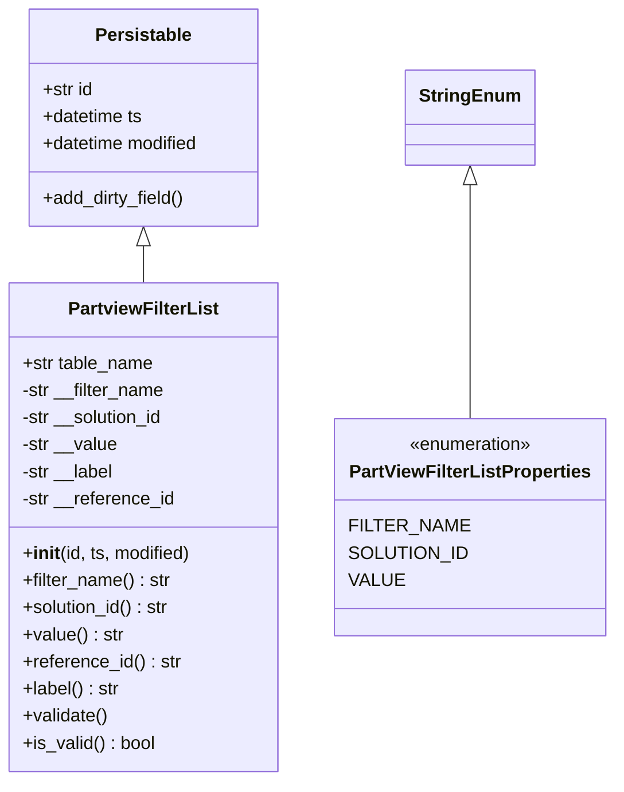
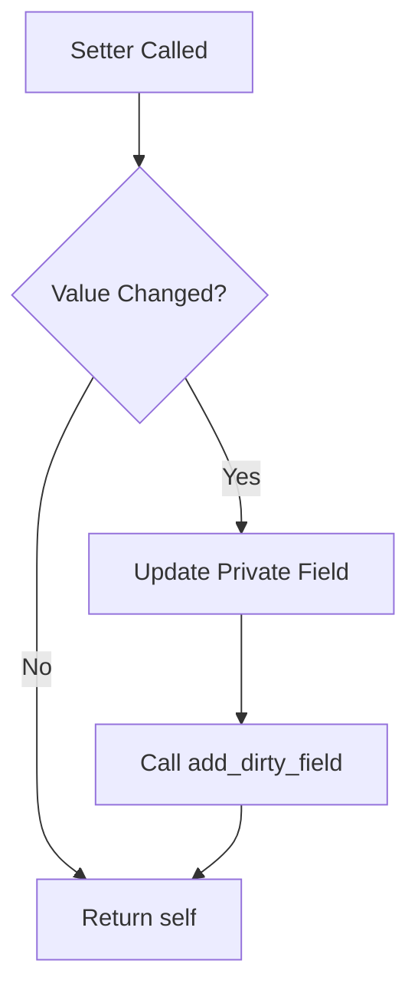
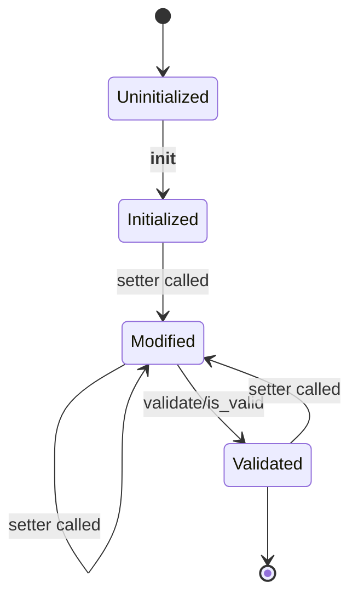

# Diagram: platform/partview_core/partview_service/partview_service/core/datamodel/FilterList.py


> Auto-generated by Obscura crawlers

## Diagram 1

```mermaid
classDiagram
      Persistable <|-- PartviewFilterList
      StringEnum <|-- PartViewFilterListProperties...
  └ 100 lines...
```

> SVG rendering failed for this diagram.

## Diagram 2



### SVG

<svg id="container" width="534.421875" xmlns="http://www.w3.org/2000/svg" class="classDiagram" height="690" viewBox="0 0 534.421875 690" role="graphics-document document" aria-roledescription="class"><style>#container{font-family:"trebuchet ms",verdana,arial,sans-serif;font-size:16px;fill:#333;}@keyframes edge-animation-frame{from{stroke-dashoffset:0;}}@keyframes dash{to{stroke-dashoffset:0;}}#container .edge-animation-slow{stroke-dasharray:9,5!important;stroke-dashoffset:900;animation:dash 50s linear infinite;stroke-linecap:round;}#container .edge-animation-fast{stroke-dasharray:9,5!important;stroke-dashoffset:900;animation:dash 20s linear infinite;stroke-linecap:round;}#container .error-icon{fill:#552222;}#container .error-text{fill:#552222;stroke:#552222;}#container .edge-thickness-normal{stroke-width:1px;}#container .edge-thickness-thick{stroke-width:3.5px;}#container .edge-pattern-solid{stroke-dasharray:0;}#container .edge-thickness-invisible{stroke-width:0;fill:none;}#container .edge-pattern-dashed{stroke-dasharray:3;}#container .edge-pattern-dotted{stroke-dasharray:2;}#container .marker{fill:#333333;stroke:#333333;}#container .marker.cross{stroke:#333333;}#container svg{font-family:"trebuchet ms",verdana,arial,sans-serif;font-size:16px;}#container p{margin:0;}#container g.classGroup text{fill:#9370DB;stroke:none;font-family:"trebuchet ms",verdana,arial,sans-serif;font-size:10px;}#container g.classGroup text .title{font-weight:bolder;}#container .nodeLabel,#container .edgeLabel{color:#131300;}#container .edgeLabel .label rect{fill:#ECECFF;}#container .label text{fill:#131300;}#container .labelBkg{background:#ECECFF;}#container .edgeLabel .label span{background:#ECECFF;}#container .classTitle{font-weight:bolder;}#container .node rect,#container .node circle,#container .node ellipse,#container .node polygon,#container .node path{fill:#ECECFF;stroke:#9370DB;stroke-width:1px;}#container .divider{stroke:#9370DB;stroke-width:1;}#container g.clickable{cursor:pointer;}#container g.classGroup rect{fill:#ECECFF;stroke:#9370DB;}#container g.classGroup line{stroke:#9370DB;stroke-width:1;}#container .classLabel .box{stroke:none;stroke-width:0;fill:#ECECFF;opacity:0.5;}#container .classLabel .label{fill:#9370DB;font-size:10px;}#container .relation{stroke:#333333;stroke-width:1;fill:none;}#container .dashed-line{stroke-dasharray:3;}#container .dotted-line{stroke-dasharray:1 2;}#container #compositionStart,#container .composition{fill:#333333!important;stroke:#333333!important;stroke-width:1;}#container #compositionEnd,#container .composition{fill:#333333!important;stroke:#333333!important;stroke-width:1;}#container #dependencyStart,#container .dependency{fill:#333333!important;stroke:#333333!important;stroke-width:1;}#container #dependencyStart,#container .dependency{fill:#333333!important;stroke:#333333!important;stroke-width:1;}#container #extensionStart,#container .extension{fill:transparent!important;stroke:#333333!important;stroke-width:1;}#container #extensionEnd,#container .extension{fill:transparent!important;stroke:#333333!important;stroke-width:1;}#container #aggregationStart,#container .aggregation{fill:transparent!important;stroke:#333333!important;stroke-width:1;}#container #aggregationEnd,#container .aggregation{fill:transparent!important;stroke:#333333!important;stroke-width:1;}#container #lollipopStart,#container .lollipop{fill:#ECECFF!important;stroke:#333333!important;stroke-width:1;}#container #lollipopEnd,#container .lollipop{fill:#ECECFF!important;stroke:#333333!important;stroke-width:1;}#container .edgeTerminals{font-size:11px;line-height:initial;}#container .classTitleText{text-anchor:middle;font-size:18px;fill:#333;}#container .label-icon{display:inline-block;height:1em;overflow:visible;vertical-align:-0.125em;}#container .node .label-icon path{fill:currentColor;stroke:revert;stroke-width:revert;}#container :root{--mermaid-font-family:"trebuchet ms",verdana,arial,sans-serif;}</style><g><defs><marker id="container_class-aggregationStart" class="marker aggregation class" refX="18" refY="7" markerWidth="190" markerHeight="240" orient="auto"><path d="M 18,7 L9,13 L1,7 L9,1 Z"></path></marker></defs><defs><marker id="container_class-aggregationEnd" class="marker aggregation class" refX="1" refY="7" markerWidth="20" markerHeight="28" orient="auto"><path d="M 18,7 L9,13 L1,7 L9,1 Z"></path></marker></defs><defs><marker id="container_class-extensionStart" class="marker extension class" refX="18" refY="7" markerWidth="190" markerHeight="240" orient="auto"><path d="M 1,7 L18,13 V 1 Z"></path></marker></defs><defs><marker id="container_class-extensionEnd" class="marker extension class" refX="1" refY="7" markerWidth="20" markerHeight="28" orient="auto"><path d="M 1,1 V 13 L18,7 Z"></path></marker></defs><defs><marker id="container_class-compositionStart" class="marker composition class" refX="18" refY="7" markerWidth="190" markerHeight="240" orient="auto"><path d="M 18,7 L9,13 L1,7 L9,1 Z"></path></marker></defs><defs><marker id="container_class-compositionEnd" class="marker composition class" refX="1" refY="7" markerWidth="20" markerHeight="28" orient="auto"><path d="M 18,7 L9,13 L1,7 L9,1 Z"></path></marker></defs><defs><marker id="container_class-dependencyStart" class="marker dependency class" refX="6" refY="7" markerWidth="190" markerHeight="240" orient="auto"><path d="M 5,7 L9,13 L1,7 L9,1 Z"></path></marker></defs><defs><marker id="container_class-dependencyEnd" class="marker dependency class" refX="13" refY="7" markerWidth="20" markerHeight="28" orient="auto"><path d="M 18,7 L9,13 L14,7 L9,1 Z"></path></marker></defs><defs><marker id="container_class-lollipopStart" class="marker lollipop class" refX="13" refY="7" markerWidth="190" markerHeight="240" orient="auto"><circle stroke="black" fill="transparent" cx="7" cy="7" r="6"></circle></marker></defs><defs><marker id="container_class-lollipopEnd" class="marker lollipop class" refX="1" refY="7" markerWidth="190" markerHeight="240" orient="auto"><circle stroke="black" fill="transparent" cx="7" cy="7" r="6"></circle></marker></defs><g class="root"><g class="clusters"></g><g class="edgePaths"><path d="M127.438,217.25L127.438,218.542C127.438,219.833,127.438,222.417,127.438,227.875C127.438,233.333,127.438,241.667,127.438,245.833L127.438,250" id="id_Persistable_PartviewFilterList_1" class="edge-thickness-normal edge-pattern-solid relation" style=";;;" data-edge="true" data-et="edge" data-id="id_Persistable_PartviewFilterList_1" data-points="W3sieCI6MTI3LjQzNzUsInkiOjIwMH0seyJ4IjoxMjcuNDM3NSwieSI6MjI1fSx7IngiOjEyNy40Mzc1LCJ5IjoyNTB9XQ==" marker-start="url(#container_class-extensionStart)"></path><path d="M411.648,163.25L411.648,173.542C411.648,183.833,411.648,204.417,411.648,238.875C411.648,273.333,411.648,321.667,411.648,345.833L411.648,370" id="id_StringEnum_PartViewFilterListProperties_2" class="edge-thickness-normal edge-pattern-solid relation" style=";;;" data-edge="true" data-et="edge" data-id="id_StringEnum_PartViewFilterListProperties_2" data-points="W3sieCI6NDExLjY0ODQzNzUsInkiOjE0Nn0seyJ4Ijo0MTEuNjQ4NDM3NSwieSI6MjI1fSx7IngiOjQxMS42NDg0Mzc1LCJ5IjozNzB9XQ==" marker-start="url(#container_class-extensionStart)"></path></g><g class="edgeLabels"><g class="edgeLabel"><g class="label" data-id="id_Persistable_PartviewFilterList_1" transform="translate(0, 0)"><foreignObject width="0" height="0"><div xmlns="http://www.w3.org/1999/xhtml" class="labelBkg" style="display: table-cell; white-space: nowrap; line-height: 1.5; max-width: 200px; text-align: center;"><span class="edgeLabel"></span></div></foreignObject></g></g><g class="edgeLabel"><g class="label" data-id="id_StringEnum_PartViewFilterListProperties_2" transform="translate(0, 0)"><foreignObject width="0" height="0"><div xmlns="http://www.w3.org/1999/xhtml" class="labelBkg" style="display: table-cell; white-space: nowrap; line-height: 1.5; max-width: 200px; text-align: center;"><span class="edgeLabel"></span></div></foreignObject></g></g></g><g class="nodes"><g class="node default" id="classId-Persistable-0" transform="translate(127.4375, 104)"><g class="basic label-container"><path d="M-103.54296875 -96 L103.54296875 -96 L103.54296875 96 L-103.54296875 96" stroke="none" stroke-width="0" fill="#ECECFF" style=""></path><path d="M-103.54296875 -96 C-56.53918187539276 -96, -9.535395000785513 -96, 103.54296875 -96 M-103.54296875 -96 C-46.03362408199474 -96, 11.475720586010524 -96, 103.54296875 -96 M103.54296875 -96 C103.54296875 -45.90295568299672, 103.54296875 4.194088634006562, 103.54296875 96 M103.54296875 -96 C103.54296875 -25.749722330908156, 103.54296875 44.50055533818369, 103.54296875 96 M103.54296875 96 C41.72522682870018 96, -20.09251509259964 96, -103.54296875 96 M103.54296875 96 C55.50624050682985 96, 7.469512263659695 96, -103.54296875 96 M-103.54296875 96 C-103.54296875 26.466212990336544, -103.54296875 -43.06757401932691, -103.54296875 -96 M-103.54296875 96 C-103.54296875 23.92327297352429, -103.54296875 -48.15345405295142, -103.54296875 -96" stroke="#9370DB" stroke-width="1.3" fill="none" stroke-dasharray="0 0" style=""></path></g><g class="annotation-group text" transform="translate(0, -72)"></g><g class="label-group text" transform="translate(-40.9765625, -72)"><g class="label" style="font-weight: bolder" transform="translate(0,-12)"><foreignObject width="81.953125" height="24"><div xmlns="http://www.w3.org/1999/xhtml" style="display: table-cell; white-space: nowrap; line-height: 1.5; max-width: 130px; text-align: center;"><span class="nodeLabel markdown-node-label" style=""><p>Persistable</p></span></div></foreignObject></g></g><g class="members-group text" transform="translate(-91.54296875, -24)"><g class="label" style="" transform="translate(0,-12)"><foreignObject width="45.734375" height="24"><div xmlns="http://www.w3.org/1999/xhtml" style="display: table-cell; white-space: nowrap; line-height: 1.5; max-width: 103px; text-align: center;"><span class="nodeLabel markdown-node-label" style=""><p>+str id</p></span></div></foreignObject></g><g class="label" style="" transform="translate(0,12)"><foreignObject width="90.734375" height="24"><div xmlns="http://www.w3.org/1999/xhtml" style="display: table-cell; white-space: nowrap; line-height: 1.5; max-width: 148px; text-align: center;"><span class="nodeLabel markdown-node-label" style=""><p>+datetime ts</p></span></div></foreignObject></g><g class="label" style="" transform="translate(0,36)"><foreignObject width="142.109375" height="24"><div xmlns="http://www.w3.org/1999/xhtml" style="display: table-cell; white-space: nowrap; line-height: 1.5; max-width: 199px; text-align: center;"><span class="nodeLabel markdown-node-label" style=""><p>+datetime modified</p></span></div></foreignObject></g></g><g class="methods-group text" transform="translate(-91.54296875, 72)"><g class="label" style="" transform="translate(0,-12)"><foreignObject width="127.40625" height="24"><div xmlns="http://www.w3.org/1999/xhtml" style="display: table-cell; white-space: nowrap; line-height: 1.5; max-width: 185px; text-align: center;"><span class="nodeLabel markdown-node-label" style=""><p>+add_dirty_field()</p></span></div></foreignObject></g></g><g class="divider" style=""><path d="M-103.54296875 -48 C-53.50033154777834 -48, -3.457694345556675 -48, 103.54296875 -48 M-103.54296875 -48 C-60.38258312848208 -48, -17.222197506964164 -48, 103.54296875 -48" stroke="#9370DB" stroke-width="1.3" fill="none" stroke-dasharray="0 0" style=""></path></g><g class="divider" style=""><path d="M-103.54296875 48 C-46.96214884338806 48, 9.618671063223886 48, 103.54296875 48 M-103.54296875 48 C-58.91719880573817 48, -14.291428861476334 48, 103.54296875 48" stroke="#9370DB" stroke-width="1.3" fill="none" stroke-dasharray="0 0" style=""></path></g></g><g class="node default" id="classId-PartviewFilterList-1" transform="translate(127.4375, 466)"><g class="basic label-container"><path d="M-119.4375 -216 L119.4375 -216 L119.4375 216 L-119.4375 216" stroke="none" stroke-width="0" fill="#ECECFF" style=""></path><path d="M-119.4375 -216 C-62.393038866816724 -216, -5.348577733633448 -216, 119.4375 -216 M-119.4375 -216 C-57.38942209105232 -216, 4.658655817895365 -216, 119.4375 -216 M119.4375 -216 C119.4375 -98.69134352081682, 119.4375 18.61731295836637, 119.4375 216 M119.4375 -216 C119.4375 -93.6281017011473, 119.4375 28.743796597705398, 119.4375 216 M119.4375 216 C31.887261645027223 216, -55.66297670994555 216, -119.4375 216 M119.4375 216 C60.96761051879243 216, 2.497721037584867 216, -119.4375 216 M-119.4375 216 C-119.4375 62.392331001948975, -119.4375 -91.21533799610205, -119.4375 -216 M-119.4375 216 C-119.4375 66.67326571074958, -119.4375 -82.65346857850085, -119.4375 -216" stroke="#9370DB" stroke-width="1.3" fill="none" stroke-dasharray="0 0" style=""></path></g><g class="annotation-group text" transform="translate(0, -192)"></g><g class="label-group text" transform="translate(-63.96875, -192)"><g class="label" style="font-weight: bolder" transform="translate(0,-12)"><foreignObject width="127.9375" height="24"><div xmlns="http://www.w3.org/1999/xhtml" style="display: table-cell; white-space: nowrap; line-height: 1.5; max-width: 174px; text-align: center;"><span class="nodeLabel markdown-node-label" style=""><p>PartviewFilterList</p></span></div></foreignObject></g></g><g class="members-group text" transform="translate(-107.4375, -144)"><g class="label" style="" transform="translate(0,-12)"><foreignObject width="117.375" height="24"><div xmlns="http://www.w3.org/1999/xhtml" style="display: table-cell; white-space: nowrap; line-height: 1.5; max-width: 175px; text-align: center;"><span class="nodeLabel markdown-node-label" style=""><p>+str table_name</p></span></div></foreignObject></g><g class="label" style="" transform="translate(0,12)"><foreignObject width="128.15625" height="24"><div xmlns="http://www.w3.org/1999/xhtml" style="display: table-cell; white-space: nowrap; line-height: 1.5; max-width: 186px; text-align: center;"><span class="nodeLabel markdown-node-label" style=""><p>-str __filter_name</p></span></div></foreignObject></g><g class="label" style="" transform="translate(0,36)"><foreignObject width="128.828125" height="24"><div xmlns="http://www.w3.org/1999/xhtml" style="display: table-cell; white-space: nowrap; line-height: 1.5; max-width: 186px; text-align: center;"><span class="nodeLabel markdown-node-label" style=""><p>-str __solution_id</p></span></div></foreignObject></g><g class="label" style="" transform="translate(0,60)"><foreignObject width="85" height="24"><div xmlns="http://www.w3.org/1999/xhtml" style="display: table-cell; white-space: nowrap; line-height: 1.5; max-width: 142px; text-align: center;"><span class="nodeLabel markdown-node-label" style=""><p>-str __value</p></span></div></foreignObject></g><g class="label" style="" transform="translate(0,84)"><foreignObject width="82.65625" height="24"><div xmlns="http://www.w3.org/1999/xhtml" style="display: table-cell; white-space: nowrap; line-height: 1.5; max-width: 140px; text-align: center;"><span class="nodeLabel markdown-node-label" style=""><p>-str __label</p></span></div></foreignObject></g><g class="label" style="" transform="translate(0,108)"><foreignObject width="136.859375" height="24"><div xmlns="http://www.w3.org/1999/xhtml" style="display: table-cell; white-space: nowrap; line-height: 1.5; max-width: 194px; text-align: center;"><span class="nodeLabel markdown-node-label" style=""><p>-str __reference_id</p></span></div></foreignObject></g></g><g class="methods-group text" transform="translate(-107.4375, 24)"><g class="label" style="" transform="translate(0,-12)"><foreignObject width="150.90625" height="24"><div xmlns="http://www.w3.org/1999/xhtml" style="display: table-cell; white-space: nowrap; line-height: 1.5; max-width: 240px; text-align: center;"><span class="nodeLabel markdown-node-label" style=""><p>+<strong>init</strong>(id, ts, modified)</p></span></div></foreignObject></g><g class="label" style="" transform="translate(0,12)"><foreignObject width="131.734375" height="24"><div xmlns="http://www.w3.org/1999/xhtml" style="display: table-cell; white-space: nowrap; line-height: 1.5; max-width: 190px; text-align: center;"><span class="nodeLabel markdown-node-label" style=""><p>+filter_name() : str</p></span></div></foreignObject></g><g class="label" style="" transform="translate(0,36)"><foreignObject width="132.328125" height="24"><div xmlns="http://www.w3.org/1999/xhtml" style="display: table-cell; white-space: nowrap; line-height: 1.5; max-width: 191px; text-align: center;"><span class="nodeLabel markdown-node-label" style=""><p>+solution_id() : str</p></span></div></foreignObject></g><g class="label" style="" transform="translate(0,60)"><foreignObject width="88.828125" height="24"><div xmlns="http://www.w3.org/1999/xhtml" style="display: table-cell; white-space: nowrap; line-height: 1.5; max-width: 147px; text-align: center;"><span class="nodeLabel markdown-node-label" style=""><p>+value() : str</p></span></div></foreignObject></g><g class="label" style="" transform="translate(0,84)"><foreignObject width="140.359375" height="24"><div xmlns="http://www.w3.org/1999/xhtml" style="display: table-cell; white-space: nowrap; line-height: 1.5; max-width: 199px; text-align: center;"><span class="nodeLabel markdown-node-label" style=""><p>+reference_id() : str</p></span></div></foreignObject></g><g class="label" style="" transform="translate(0,108)"><foreignObject width="86.328125" height="24"><div xmlns="http://www.w3.org/1999/xhtml" style="display: table-cell; white-space: nowrap; line-height: 1.5; max-width: 145px; text-align: center;"><span class="nodeLabel markdown-node-label" style=""><p>+label() : str</p></span></div></foreignObject></g><g class="label" style="" transform="translate(0,132)"><foreignObject width="76.09375" height="24"><div xmlns="http://www.w3.org/1999/xhtml" style="display: table-cell; white-space: nowrap; line-height: 1.5; max-width: 133px; text-align: center;"><span class="nodeLabel markdown-node-label" style=""><p>+validate()</p></span></div></foreignObject></g><g class="label" style="" transform="translate(0,156)"><foreignObject width="117.984375" height="24"><div xmlns="http://www.w3.org/1999/xhtml" style="display: table-cell; white-space: nowrap; line-height: 1.5; max-width: 176px; text-align: center;"><span class="nodeLabel markdown-node-label" style=""><p>+is_valid() : bool</p></span></div></foreignObject></g></g><g class="divider" style=""><path d="M-119.4375 -168 C-34.106743714330705 -168, 51.22401257133859 -168, 119.4375 -168 M-119.4375 -168 C-39.72711186270982 -168, 39.98327627458036 -168, 119.4375 -168" stroke="#9370DB" stroke-width="1.3" fill="none" stroke-dasharray="0 0" style=""></path></g><g class="divider" style=""><path d="M-119.4375 0 C-62.38845843519848 0, -5.33941687039696 0, 119.4375 0 M-119.4375 0 C-33.36137977223741 0, 52.714740455525174 0, 119.4375 0" stroke="#9370DB" stroke-width="1.3" fill="none" stroke-dasharray="0 0" style=""></path></g></g><g class="node default" id="classId-StringEnum-2" transform="translate(411.6484375, 104)"><g class="basic label-container"><path d="M-54.234375 -42 L54.234375 -42 L54.234375 42 L-54.234375 42" stroke="none" stroke-width="0" fill="#ECECFF" style=""></path><path d="M-54.234375 -42 C-13.249903765863408 -42, 27.734567468273184 -42, 54.234375 -42 M-54.234375 -42 C-17.30003324799395 -42, 19.634308504012097 -42, 54.234375 -42 M54.234375 -42 C54.234375 -19.688365768498848, 54.234375 2.6232684630023044, 54.234375 42 M54.234375 -42 C54.234375 -17.21898051858374, 54.234375 7.562038962832517, 54.234375 42 M54.234375 42 C26.993446159589208 42, -0.24748268082158376 42, -54.234375 42 M54.234375 42 C17.252149105096052 42, -19.730076789807896 42, -54.234375 42 M-54.234375 42 C-54.234375 14.526035667852994, -54.234375 -12.947928664294011, -54.234375 -42 M-54.234375 42 C-54.234375 19.601560596602784, -54.234375 -2.7968788067944317, -54.234375 -42" stroke="#9370DB" stroke-width="1.3" fill="none" stroke-dasharray="0 0" style=""></path></g><g class="annotation-group text" transform="translate(0, -18)"></g><g class="label-group text" transform="translate(-42.234375, -18)"><g class="label" style="font-weight: bolder" transform="translate(0,-12)"><foreignObject width="84.46875" height="24"><div xmlns="http://www.w3.org/1999/xhtml" style="display: table-cell; white-space: nowrap; line-height: 1.5; max-width: 134px; text-align: center;"><span class="nodeLabel markdown-node-label" style=""><p>StringEnum</p></span></div></foreignObject></g></g><g class="members-group text" transform="translate(-42.234375, 30)"></g><g class="methods-group text" transform="translate(-42.234375, 60)"></g><g class="divider" style=""><path d="M-54.234375 6 C-32.27832949855686 6, -10.322283997113715 6, 54.234375 6 M-54.234375 6 C-23.768809527883903 6, 6.696755944232194 6, 54.234375 6" stroke="#9370DB" stroke-width="1.3" fill="none" stroke-dasharray="0 0" style=""></path></g><g class="divider" style=""><path d="M-54.234375 24 C-31.12558733991997 24, -8.016799679839941 24, 54.234375 24 M-54.234375 24 C-10.945071644600525 24, 32.34423171079895 24, 54.234375 24" stroke="#9370DB" stroke-width="1.3" fill="none" stroke-dasharray="0 0" style=""></path></g></g><g class="node default" id="classId-PartViewFilterListProperties-3" transform="translate(411.6484375, 466)"><g class="basic label-container"><path d="M-114.7734375 -96 L114.7734375 -96 L114.7734375 96 L-114.7734375 96" stroke="none" stroke-width="0" fill="#ECECFF" style=""></path><path d="M-114.7734375 -96 C-41.97364840550672 -96, 30.826140688986555 -96, 114.7734375 -96 M-114.7734375 -96 C-28.963091204249608 -96, 56.847255091500784 -96, 114.7734375 -96 M114.7734375 -96 C114.7734375 -54.72141018267555, 114.7734375 -13.442820365351096, 114.7734375 96 M114.7734375 -96 C114.7734375 -29.196141352119156, 114.7734375 37.60771729576169, 114.7734375 96 M114.7734375 96 C54.81082277181157 96, -5.151791956376854 96, -114.7734375 96 M114.7734375 96 C31.113047875625128 96, -52.547341748749744 96, -114.7734375 96 M-114.7734375 96 C-114.7734375 39.485915879620045, -114.7734375 -17.02816824075991, -114.7734375 -96 M-114.7734375 96 C-114.7734375 29.156207501103324, -114.7734375 -37.68758499779335, -114.7734375 -96" stroke="#9370DB" stroke-width="1.3" fill="none" stroke-dasharray="0 0" style=""></path></g><g class="annotation-group text" transform="translate(-55.5546875, -72)"><g class="label" style="" transform="translate(0,-12)"><foreignObject width="111.109375" height="24"><div xmlns="http://www.w3.org/1999/xhtml" style="display: table-cell; white-space: nowrap; line-height: 1.5; max-width: 161px; text-align: center;"><span class="nodeLabel markdown-node-label" style=""><p>«enumeration»</p></span></div></foreignObject></g></g><g class="label-group text" transform="translate(-102.7734375, -48)"><g class="label" style="font-weight: bolder" transform="translate(0,-12)"><foreignObject width="205.546875" height="24"><div xmlns="http://www.w3.org/1999/xhtml" style="display: table-cell; white-space: nowrap; line-height: 1.5; max-width: 250px; text-align: center;"><span class="nodeLabel markdown-node-label" style=""><p>PartViewFilterListProperties</p></span></div></foreignObject></g></g><g class="members-group text" transform="translate(-102.7734375, 0)"><g class="label" style="" transform="translate(0,-12)"><foreignObject width="95.15625" height="24"><div xmlns="http://www.w3.org/1999/xhtml" style="display: table-cell; white-space: nowrap; line-height: 1.5; max-width: 145px; text-align: center;"><span class="nodeLabel markdown-node-label" style=""><p>FILTER_NAME</p></span></div></foreignObject></g><g class="label" style="" transform="translate(0,12)"><foreignObject width="96.296875" height="24"><div xmlns="http://www.w3.org/1999/xhtml" style="display: table-cell; white-space: nowrap; line-height: 1.5; max-width: 146px; text-align: center;"><span class="nodeLabel markdown-node-label" style=""><p>SOLUTION_ID</p></span></div></foreignObject></g><g class="label" style="" transform="translate(0,36)"><foreignObject width="44.5625" height="24"><div xmlns="http://www.w3.org/1999/xhtml" style="display: table-cell; white-space: nowrap; line-height: 1.5; max-width: 95px; text-align: center;"><span class="nodeLabel markdown-node-label" style=""><p>VALUE</p></span></div></foreignObject></g></g><g class="methods-group text" transform="translate(-102.7734375, 96)"></g><g class="divider" style=""><path d="M-114.7734375 -24 C-64.99547324877088 -24, -15.21750899754177 -24, 114.7734375 -24 M-114.7734375 -24 C-42.21680885717231 -24, 30.33981978565538 -24, 114.7734375 -24" stroke="#9370DB" stroke-width="1.3" fill="none" stroke-dasharray="0 0" style=""></path></g><g class="divider" style=""><path d="M-114.7734375 72 C-65.40956294477611 72, -16.045688389552225 72, 114.7734375 72 M-114.7734375 72 C-46.04975359141838 72, 22.67393031716324 72, 114.7734375 72" stroke="#9370DB" stroke-width="1.3" fill="none" stroke-dasharray="0 0" style=""></path></g></g></g></g></g></svg>

## Diagram 3



### SVG

<svg id="container" width="271.40625" xmlns="http://www.w3.org/2000/svg" class="flowchart" height="647.71875" viewBox="0.5 0 271.40625 647.71875" role="graphics-document document" aria-roledescription="flowchart-v2"><style>#container{font-family:"trebuchet ms",verdana,arial,sans-serif;font-size:16px;fill:#333;}@keyframes edge-animation-frame{from{stroke-dashoffset:0;}}@keyframes dash{to{stroke-dashoffset:0;}}#container .edge-animation-slow{stroke-dasharray:9,5!important;stroke-dashoffset:900;animation:dash 50s linear infinite;stroke-linecap:round;}#container .edge-animation-fast{stroke-dasharray:9,5!important;stroke-dashoffset:900;animation:dash 20s linear infinite;stroke-linecap:round;}#container .error-icon{fill:#552222;}#container .error-text{fill:#552222;stroke:#552222;}#container .edge-thickness-normal{stroke-width:1px;}#container .edge-thickness-thick{stroke-width:3.5px;}#container .edge-pattern-solid{stroke-dasharray:0;}#container .edge-thickness-invisible{stroke-width:0;fill:none;}#container .edge-pattern-dashed{stroke-dasharray:3;}#container .edge-pattern-dotted{stroke-dasharray:2;}#container .marker{fill:#333333;stroke:#333333;}#container .marker.cross{stroke:#333333;}#container svg{font-family:"trebuchet ms",verdana,arial,sans-serif;font-size:16px;}#container p{margin:0;}#container .label{font-family:"trebuchet ms",verdana,arial,sans-serif;color:#333;}#container .cluster-label text{fill:#333;}#container .cluster-label span{color:#333;}#container .cluster-label span p{background-color:transparent;}#container .label text,#container span{fill:#333;color:#333;}#container .node rect,#container .node circle,#container .node ellipse,#container .node polygon,#container .node path{fill:#ECECFF;stroke:#9370DB;stroke-width:1px;}#container .rough-node .label text,#container .node .label text,#container .image-shape .label,#container .icon-shape .label{text-anchor:middle;}#container .node .katex path{fill:#000;stroke:#000;stroke-width:1px;}#container .rough-node .label,#container .node .label,#container .image-shape .label,#container .icon-shape .label{text-align:center;}#container .node.clickable{cursor:pointer;}#container .root .anchor path{fill:#333333!important;stroke-width:0;stroke:#333333;}#container .arrowheadPath{fill:#333333;}#container .edgePath .path{stroke:#333333;stroke-width:2.0px;}#container .flowchart-link{stroke:#333333;fill:none;}#container .edgeLabel{background-color:rgba(232,232,232, 0.8);text-align:center;}#container .edgeLabel p{background-color:rgba(232,232,232, 0.8);}#container .edgeLabel rect{opacity:0.5;background-color:rgba(232,232,232, 0.8);fill:rgba(232,232,232, 0.8);}#container .labelBkg{background-color:rgba(232, 232, 232, 0.5);}#container .cluster rect{fill:#ffffde;stroke:#aaaa33;stroke-width:1px;}#container .cluster text{fill:#333;}#container .cluster span{color:#333;}#container div.mermaidTooltip{position:absolute;text-align:center;max-width:200px;padding:2px;font-family:"trebuchet ms",verdana,arial,sans-serif;font-size:12px;background:hsl(80, 100%, 96.2745098039%);border:1px solid #aaaa33;border-radius:2px;pointer-events:none;z-index:100;}#container .flowchartTitleText{text-anchor:middle;font-size:18px;fill:#333;}#container rect.text{fill:none;stroke-width:0;}#container .icon-shape,#container .image-shape{background-color:rgba(232,232,232, 0.8);text-align:center;}#container .icon-shape p,#container .image-shape p{background-color:rgba(232,232,232, 0.8);padding:2px;}#container .icon-shape rect,#container .image-shape rect{opacity:0.5;background-color:rgba(232,232,232, 0.8);fill:rgba(232,232,232, 0.8);}#container .label-icon{display:inline-block;height:1em;overflow:visible;vertical-align:-0.125em;}#container .node .label-icon path{fill:currentColor;stroke:revert;stroke-width:revert;}#container :root{--mermaid-font-family:"trebuchet ms",verdana,arial,sans-serif;}</style><g><marker id="container_flowchart-v2-pointEnd" class="marker flowchart-v2" viewBox="0 0 10 10" refX="5" refY="5" markerUnits="userSpaceOnUse" markerWidth="8" markerHeight="8" orient="auto"><path d="M 0 0 L 10 5 L 0 10 z" class="arrowMarkerPath" style="stroke-width: 1; stroke-dasharray: 1, 0;"></path></marker><marker id="container_flowchart-v2-pointStart" class="marker flowchart-v2" viewBox="0 0 10 10" refX="4.5" refY="5" markerUnits="userSpaceOnUse" markerWidth="8" markerHeight="8" orient="auto"><path d="M 0 5 L 10 10 L 10 0 z" class="arrowMarkerPath" style="stroke-width: 1; stroke-dasharray: 1, 0;"></path></marker><marker id="container_flowchart-v2-circleEnd" class="marker flowchart-v2" viewBox="0 0 10 10" refX="11" refY="5" markerUnits="userSpaceOnUse" markerWidth="11" markerHeight="11" orient="auto"><circle cx="5" cy="5" r="5" class="arrowMarkerPath" style="stroke-width: 1; stroke-dasharray: 1, 0;"></circle></marker><marker id="container_flowchart-v2-circleStart" class="marker flowchart-v2" viewBox="0 0 10 10" refX="-1" refY="5" markerUnits="userSpaceOnUse" markerWidth="11" markerHeight="11" orient="auto"><circle cx="5" cy="5" r="5" class="arrowMarkerPath" style="stroke-width: 1; stroke-dasharray: 1, 0;"></circle></marker><marker id="container_flowchart-v2-crossEnd" class="marker cross flowchart-v2" viewBox="0 0 11 11" refX="12" refY="5.2" markerUnits="userSpaceOnUse" markerWidth="11" markerHeight="11" orient="auto"><path d="M 1,1 l 9,9 M 10,1 l -9,9" class="arrowMarkerPath" style="stroke-width: 2; stroke-dasharray: 1, 0;"></path></marker><marker id="container_flowchart-v2-crossStart" class="marker cross flowchart-v2" viewBox="0 0 11 11" refX="-1" refY="5.2" markerUnits="userSpaceOnUse" markerWidth="11" markerHeight="11" orient="auto"><path d="M 1,1 l 9,9 M 10,1 l -9,9" class="arrowMarkerPath" style="stroke-width: 2; stroke-dasharray: 1, 0;"></path></marker><g class="root"><g class="clusters"></g><g class="edgePaths"><path d="M91.859,62L91.859,66.167C91.859,70.333,91.859,78.667,91.859,86.333C91.859,94,91.859,101,91.859,104.5L91.859,108" id="L_A_B_0" class="edge-thickness-normal edge-pattern-solid edge-thickness-normal edge-pattern-solid flowchart-link" style=";" data-edge="true" data-et="edge" data-id="L_A_B_0" data-points="W3sieCI6OTEuODU5Mzc1LCJ5Ijo2Mn0seyJ4Ijo5MS44NTkzNzUsInkiOjg3fSx7IngiOjkxLjg1OTM3NSwieSI6MTEyfV0=" marker-end="url(#container_flowchart-v2-pointEnd)"></path><path d="M61.378,249.238L54.956,260.484C48.533,271.731,35.689,294.225,29.266,316.139C22.844,338.052,22.844,359.385,22.844,380.719C22.844,402.052,22.844,423.385,22.844,444.719C22.844,466.052,22.844,487.385,22.844,506.719C22.844,526.052,22.844,543.385,27.841,555.818C32.839,568.25,42.834,575.781,47.832,579.546L52.83,583.312" id="L_B_C_0" class="edge-thickness-normal edge-pattern-solid edge-thickness-normal edge-pattern-solid flowchart-link" style=";" data-edge="true" data-et="edge" data-id="L_B_C_0" data-points="W3sieCI6NjEuMzc4MjMxMjA2Nzk3MjQsInkiOjI0OS4yMzc2MDYyMDY3OTcyNH0seyJ4IjoyMi44NDM3NSwieSI6MzE2LjcxODc1fSx7IngiOjIyLjg0Mzc1LCJ5IjozODAuNzE4NzV9LHsieCI6MjIuODQzNzUsInkiOjQ0NC43MTg3NX0seyJ4IjoyMi44NDM3NSwieSI6NTA4LjcxODc1fSx7IngiOjIyLjg0Mzc1LCJ5Ijo1NjAuNzE4NzV9LHsieCI6NTYuMDI0MzM4OTQyMzA3NjksInkiOjU4NS43MTg3NX1d" marker-end="url(#container_flowchart-v2-pointEnd)"></path><path d="M122.341,249.238L128.763,260.484C135.185,271.731,148.03,294.225,154.453,310.972C160.875,327.719,160.875,338.719,160.875,344.219L160.875,349.719" id="L_B_D_0" class="edge-thickness-normal edge-pattern-solid edge-thickness-normal edge-pattern-solid flowchart-link" style=";" data-edge="true" data-et="edge" data-id="L_B_D_0" data-points="W3sieCI6MTIyLjM0MDUxODc5MzIwMjc2LCJ5IjoyNDkuMjM3NjA2MjA2Nzk3MjR9LHsieCI6MTYwLjg3NSwieSI6MzE2LjcxODc1fSx7IngiOjE2MC44NzUsInkiOjM1My43MTg3NX1d" marker-end="url(#container_flowchart-v2-pointEnd)"></path><path d="M160.875,407.719L160.875,413.885C160.875,420.052,160.875,432.385,160.875,444.052C160.875,455.719,160.875,466.719,160.875,472.219L160.875,477.719" id="L_D_E_0" class="edge-thickness-normal edge-pattern-solid edge-thickness-normal edge-pattern-solid flowchart-link" style=";" data-edge="true" data-et="edge" data-id="L_D_E_0" data-points="W3sieCI6MTYwLjg3NSwieSI6NDA3LjcxODc1fSx7IngiOjE2MC44NzUsInkiOjQ0NC43MTg3NX0seyJ4IjoxNjAuODc1LCJ5Ijo0ODEuNzE4NzV9XQ==" marker-end="url(#container_flowchart-v2-pointEnd)"></path><path d="M160.875,535.719L160.875,539.885C160.875,544.052,160.875,552.385,155.877,560.318C150.88,568.25,140.884,575.781,135.887,579.546L130.889,583.312" id="L_E_C_0" class="edge-thickness-normal edge-pattern-solid edge-thickness-normal edge-pattern-solid flowchart-link" style=";" data-edge="true" data-et="edge" data-id="L_E_C_0" data-points="W3sieCI6MTYwLjg3NSwieSI6NTM1LjcxODc1fSx7IngiOjE2MC44NzUsInkiOjU2MC43MTg3NX0seyJ4IjoxMjcuNjk0NDExMDU3NjkyMywieSI6NTg1LjcxODc1fV0=" marker-end="url(#container_flowchart-v2-pointEnd)"></path></g><g class="edgeLabels"><g class="edgeLabel"><g class="label" data-id="L_A_B_0" transform="translate(0, 0)"><foreignObject width="0" height="0"><div xmlns="http://www.w3.org/1999/xhtml" class="labelBkg" style="display: table-cell; white-space: nowrap; line-height: 1.5; max-width: 200px; text-align: center;"><span class="edgeLabel"></span></div></foreignObject></g></g><g class="edgeLabel" transform="translate(22.84375, 444.71875)"><g class="label" data-id="L_B_C_0" transform="translate(-10.140625, -12)"><foreignObject width="20.28125" height="24"><div xmlns="http://www.w3.org/1999/xhtml" class="labelBkg" style="display: table-cell; white-space: nowrap; line-height: 1.5; max-width: 200px; text-align: center;"><span class="edgeLabel"><p>No</p></span></div></foreignObject></g></g><g class="edgeLabel" transform="translate(160.875, 316.71875)"><g class="label" data-id="L_B_D_0" transform="translate(-12.03125, -12)"><foreignObject width="24.0625" height="24"><div xmlns="http://www.w3.org/1999/xhtml" class="labelBkg" style="display: table-cell; white-space: nowrap; line-height: 1.5; max-width: 200px; text-align: center;"><span class="edgeLabel"><p>Yes</p></span></div></foreignObject></g></g><g class="edgeLabel"><g class="label" data-id="L_D_E_0" transform="translate(0, 0)"><foreignObject width="0" height="0"><div xmlns="http://www.w3.org/1999/xhtml" class="labelBkg" style="display: table-cell; white-space: nowrap; line-height: 1.5; max-width: 200px; text-align: center;"><span class="edgeLabel"></span></div></foreignObject></g></g><g class="edgeLabel"><g class="label" data-id="L_E_C_0" transform="translate(0, 0)"><foreignObject width="0" height="0"><div xmlns="http://www.w3.org/1999/xhtml" class="labelBkg" style="display: table-cell; white-space: nowrap; line-height: 1.5; max-width: 200px; text-align: center;"><span class="edgeLabel"></span></div></foreignObject></g></g></g><g class="nodes"><g class="node default" id="flowchart-A-0" transform="translate(91.859375, 35)"><rect class="basic label-container" style="" x="-76.4140625" y="-27" width="152.828125" height="54"></rect><g class="label" style="" transform="translate(-46.4140625, -12)"><rect></rect><foreignObject width="92.828125" height="24"><div xmlns="http://www.w3.org/1999/xhtml" style="display: table-cell; white-space: nowrap; line-height: 1.5; max-width: 200px; text-align: center;"><span class="nodeLabel"><p>Setter Called</p></span></div></foreignObject></g></g><g class="node default" id="flowchart-B-1" transform="translate(91.859375, 195.859375)"><polygon points="83.859375,0 167.71875,-83.859375 83.859375,-167.71875 0,-83.859375" class="label-container" transform="translate(-83.359375, 83.859375)"></polygon><g class="label" style="" transform="translate(-56.859375, -12)"><rect></rect><foreignObject width="113.71875" height="24"><div xmlns="http://www.w3.org/1999/xhtml" style="display: table-cell; white-space: nowrap; line-height: 1.5; max-width: 200px; text-align: center;"><span class="nodeLabel"><p>Value Changed?</p></span></div></foreignObject></g></g><g class="node default" id="flowchart-C-3" transform="translate(91.859375, 612.71875)"><rect class="basic label-container" style="" x="-69.640625" y="-27" width="139.28125" height="54"></rect><g class="label" style="" transform="translate(-39.640625, -12)"><rect></rect><foreignObject width="79.28125" height="24"><div xmlns="http://www.w3.org/1999/xhtml" style="display: table-cell; white-space: nowrap; line-height: 1.5; max-width: 200px; text-align: center;"><span class="nodeLabel"><p>Return self</p></span></div></foreignObject></g></g><g class="node default" id="flowchart-D-5" transform="translate(160.875, 380.71875)"><rect class="basic label-container" style="" x="-103.03125" y="-27" width="206.0625" height="54"></rect><g class="label" style="" transform="translate(-73.03125, -12)"><rect></rect><foreignObject width="146.0625" height="24"><div xmlns="http://www.w3.org/1999/xhtml" style="display: table-cell; white-space: nowrap; line-height: 1.5; max-width: 200px; text-align: center;"><span class="nodeLabel"><p>Update Private Field</p></span></div></foreignObject></g></g><g class="node default" id="flowchart-E-7" transform="translate(160.875, 508.71875)"><rect class="basic label-container" style="" x="-100.125" y="-27" width="200.25" height="54"></rect><g class="label" style="" transform="translate(-70.125, -12)"><rect></rect><foreignObject width="140.25" height="24"><div xmlns="http://www.w3.org/1999/xhtml" style="display: table-cell; white-space: nowrap; line-height: 1.5; max-width: 200px; text-align: center;"><span class="nodeLabel"><p>Call add_dirty_field</p></span></div></foreignObject></g></g></g></g></g></svg>

## Diagram 4



### SVG

<svg id="container" width="340.4771423339844" xmlns="http://www.w3.org/2000/svg" class="statediagram" height="550" viewBox="0 0 340.4771423339844 550" role="graphics-document document" aria-roledescription="stateDiagram"><style>#container{font-family:"trebuchet ms",verdana,arial,sans-serif;font-size:16px;fill:#333;}@keyframes edge-animation-frame{from{stroke-dashoffset:0;}}@keyframes dash{to{stroke-dashoffset:0;}}#container .edge-animation-slow{stroke-dasharray:9,5!important;stroke-dashoffset:900;animation:dash 50s linear infinite;stroke-linecap:round;}#container .edge-animation-fast{stroke-dasharray:9,5!important;stroke-dashoffset:900;animation:dash 20s linear infinite;stroke-linecap:round;}#container .error-icon{fill:#552222;}#container .error-text{fill:#552222;stroke:#552222;}#container .edge-thickness-normal{stroke-width:1px;}#container .edge-thickness-thick{stroke-width:3.5px;}#container .edge-pattern-solid{stroke-dasharray:0;}#container .edge-thickness-invisible{stroke-width:0;fill:none;}#container .edge-pattern-dashed{stroke-dasharray:3;}#container .edge-pattern-dotted{stroke-dasharray:2;}#container .marker{fill:#333333;stroke:#333333;}#container .marker.cross{stroke:#333333;}#container svg{font-family:"trebuchet ms",verdana,arial,sans-serif;font-size:16px;}#container p{margin:0;}#container defs #statediagram-barbEnd{fill:#333333;stroke:#333333;}#container g.stateGroup text{fill:#9370DB;stroke:none;font-size:10px;}#container g.stateGroup text{fill:#333;stroke:none;font-size:10px;}#container g.stateGroup .state-title{font-weight:bolder;fill:#131300;}#container g.stateGroup rect{fill:#ECECFF;stroke:#9370DB;}#container g.stateGroup line{stroke:#333333;stroke-width:1;}#container .transition{stroke:#333333;stroke-width:1;fill:none;}#container .stateGroup .composit{fill:white;border-bottom:1px;}#container .stateGroup .alt-composit{fill:#e0e0e0;border-bottom:1px;}#container .state-note{stroke:#aaaa33;fill:#fff5ad;}#container .state-note text{fill:black;stroke:none;font-size:10px;}#container .stateLabel .box{stroke:none;stroke-width:0;fill:#ECECFF;opacity:0.5;}#container .edgeLabel .label rect{fill:#ECECFF;opacity:0.5;}#container .edgeLabel{background-color:rgba(232,232,232, 0.8);text-align:center;}#container .edgeLabel p{background-color:rgba(232,232,232, 0.8);}#container .edgeLabel rect{opacity:0.5;background-color:rgba(232,232,232, 0.8);fill:rgba(232,232,232, 0.8);}#container .edgeLabel .label text{fill:#333;}#container .label div .edgeLabel{color:#333;}#container .stateLabel text{fill:#131300;font-size:10px;font-weight:bold;}#container .node circle.state-start{fill:#333333;stroke:#333333;}#container .node .fork-join{fill:#333333;stroke:#333333;}#container .node circle.state-end{fill:#9370DB;stroke:white;stroke-width:1.5;}#container .end-state-inner{fill:white;stroke-width:1.5;}#container .node rect{fill:#ECECFF;stroke:#9370DB;stroke-width:1px;}#container .node polygon{fill:#ECECFF;stroke:#9370DB;stroke-width:1px;}#container #statediagram-barbEnd{fill:#333333;}#container .statediagram-cluster rect{fill:#ECECFF;stroke:#9370DB;stroke-width:1px;}#container .cluster-label,#container .nodeLabel{color:#131300;}#container .statediagram-cluster rect.outer{rx:5px;ry:5px;}#container .statediagram-state .divider{stroke:#9370DB;}#container .statediagram-state .title-state{rx:5px;ry:5px;}#container .statediagram-cluster.statediagram-cluster .inner{fill:white;}#container .statediagram-cluster.statediagram-cluster-alt .inner{fill:#f0f0f0;}#container .statediagram-cluster .inner{rx:0;ry:0;}#container .statediagram-state rect.basic{rx:5px;ry:5px;}#container .statediagram-state rect.divider{stroke-dasharray:10,10;fill:#f0f0f0;}#container .note-edge{stroke-dasharray:5;}#container .statediagram-note rect{fill:#fff5ad;stroke:#aaaa33;stroke-width:1px;rx:0;ry:0;}#container .statediagram-note rect{fill:#fff5ad;stroke:#aaaa33;stroke-width:1px;rx:0;ry:0;}#container .statediagram-note text{fill:black;}#container .statediagram-note .nodeLabel{color:black;}#container .statediagram .edgeLabel{color:red;}#container #dependencyStart,#container #dependencyEnd{fill:#333333;stroke:#333333;stroke-width:1;}#container .statediagramTitleText{text-anchor:middle;font-size:18px;fill:#333;}#container :root{--mermaid-font-family:"trebuchet ms",verdana,arial,sans-serif;}</style><g><defs><marker id="container_stateDiagram-barbEnd" refX="19" refY="7" markerWidth="20" markerHeight="14" markerUnits="userSpaceOnUse" orient="auto"><path d="M 19,7 L9,13 L14,7 L9,1 Z"></path></marker></defs><g class="root"><g class="clusters"></g><g class="edgePaths"><path d="M158.426,22L158.426,26.167C158.426,30.333,158.426,38.667,158.509,47.083C158.592,55.5,158.759,64,158.842,68.25L158.926,72.5" id="edge0" class="edge-thickness-normal edge-pattern-solid transition" style="fill:none;;;fill:none" data-edge="true" data-et="edge" data-id="edge0" data-points="W3sieCI6MTU4LjQyNTc4MTI1LCJ5IjoyMn0seyJ4IjoxNTguNDI1NzgxMjUsInkiOjQ3fSx7IngiOjE1OC45MjU3ODEyNSwieSI6NzIuNX1d" marker-end="url(#container_stateDiagram-barbEnd)"></path><path d="M158.926,112.5L158.842,118.583C158.759,124.667,158.592,136.833,158.592,149.167C158.592,161.5,158.759,174,158.842,180.25L158.926,186.5" id="edge1" class="edge-thickness-normal edge-pattern-solid transition" style="fill:none;;;fill:none" data-edge="true" data-et="edge" data-id="edge1" data-points="W3sieCI6MTU4LjkyNTc4MTI1LCJ5IjoxMTIuNX0seyJ4IjoxNTguNDI1NzgxMjUsInkiOjE0OX0seyJ4IjoxNTguOTI1NzgxMjUsInkiOjE4Ni41fV0=" marker-end="url(#container_stateDiagram-barbEnd)"></path><path d="M158.926,226.5L158.842,232.583C158.759,238.667,158.592,250.833,158.592,263.167C158.592,275.5,158.759,288,158.842,294.25L158.926,300.5" id="edge2" class="edge-thickness-normal edge-pattern-solid transition" style="fill:none;;;fill:none" data-edge="true" data-et="edge" data-id="edge2" data-points="W3sieCI6MTU4LjkyNTc4MTI1LCJ5IjoyMjYuNX0seyJ4IjoxNTguNDI1NzgxMjUsInkiOjI2M30seyJ4IjoxNTguOTI1NzgxMjUsInkiOjMwMC41fV0=" marker-end="url(#container_stateDiagram-barbEnd)"></path><path d="M122.537,340.199L110.97,346.332C99.402,352.466,76.268,364.733,64.7,380.358C53.133,395.983,53.133,414.967,53.133,424.458L53.133,433.95" id="Modified-cyclic-special-1" class="edge-thickness-normal edge-pattern-solid transition" style="fill:none;;;fill:none" data-edge="true" data-et="edge" data-id="Modified-cyclic-special-1" data-points="W3sieCI6MTIyLjUzNzIyNjk0MzUwNDMxLCJ5IjozNDAuMTk4ODIzMzg4NjI0OTN9LHsieCI6NTMuMTMyODEyNSwieSI6Mzc3fSx7IngiOjUzLjEzMjgxMjUsInkiOjQzMy45NDk5OTk5OTkyNTQ5NH1d"></path><path d="M53.133,434.05L53.133,443.542C53.133,453.033,53.133,472.017,58.554,488.833C63.976,505.65,74.819,520.3,80.241,527.625L85.662,534.95" id="Modified-cyclic-special-mid" class="edge-thickness-normal edge-pattern-solid transition" style="fill:none;;;fill:none" data-edge="true" data-et="edge" data-id="Modified-cyclic-special-mid" data-points="W3sieCI6NTMuMTMyODEyNSwieSI6NDM0LjA1MDAwMDAwMDc0NTA2fSx7IngiOjUzLjEzMjgxMjUsInkiOjQ5MX0seyJ4Ijo4NS42NjIyMTE0Njk2MTkwMSwieSI6NTM0Ljk0OTk5OTk5OTI1NDl9XQ=="></path><path d="M85.736,534.95L91.158,527.625C96.579,520.3,107.422,505.65,112.844,488.825C118.266,472,118.266,453,118.266,434C118.266,415,118.266,396,122.694,380.417C127.122,364.833,135.978,352.667,140.406,346.583L144.834,340.5" id="Modified-cyclic-special-2" class="edge-thickness-normal edge-pattern-solid transition" style="fill:none;;;fill:none" data-edge="true" data-et="edge" data-id="Modified-cyclic-special-2" data-points="W3sieCI6ODUuNzM2MjI2MDMwMzgwOTksInkiOjUzNC45NDk5OTk5OTkyNTQ5fSx7IngiOjExOC4yNjU2MjUsInkiOjQ5MX0seyJ4IjoxMTguMjY1NjI1LCJ5Ijo0MzR9LHsieCI6MTE4LjI2NTYyNSwieSI6Mzc3fSx7IngiOjE0NC44MzQ0OTgzNTUyNjMxNSwieSI6MzQwLjV9XQ==" marker-end="url(#container_stateDiagram-barbEnd)"></path><path d="M173.017,340.5L177.279,346.583C181.54,352.667,190.063,364.833,201.194,377.167C212.325,389.5,226.064,402,232.934,408.25L239.803,414.5" id="edge4" class="edge-thickness-normal edge-pattern-solid transition" style="fill:none;;;fill:none" data-edge="true" data-et="edge" data-id="edge4" data-points="W3sieCI6MTczLjAxNzA2NDE0NDczNjg1LCJ5IjozNDAuNX0seyJ4IjoxOTguNTg1OTM3NSwieSI6Mzc3fSx7IngiOjIzOS44MDMxNzk4MjQ1NjE0LCJ5Ijo0MTQuNX1d" marker-end="url(#container_stateDiagram-barbEnd)"></path><path d="M283.822,414.5L290.525,408.25C297.228,402,310.633,389.5,296.432,376.11C282.23,362.72,240.422,348.44,219.518,341.3L198.613,334.159" id="edge5" class="edge-thickness-normal edge-pattern-solid transition" style="fill:none;;;fill:none" data-edge="true" data-et="edge" data-id="edge5" data-points="W3sieCI6MjgzLjgyMTgyMDE3NTQzODYsInkiOjQxNC41fSx7IngiOjMyNC4wMzkwNjI1LCJ5IjozNzd9LHsieCI6MTk4LjYxMzI4MTI1LCJ5IjozMzQuMTU5NDU3MDM3MDU0NX1d" marker-end="url(#container_stateDiagram-barbEnd)"></path><path d="M261.813,454.5L261.729,460.583C261.646,466.667,261.479,478.833,261.396,491.083C261.313,503.333,261.313,515.667,261.313,521.833L261.313,528" id="edge6" class="edge-thickness-normal edge-pattern-solid transition" style="fill:none;;;fill:none" data-edge="true" data-et="edge" data-id="edge6" data-points="W3sieCI6MjYxLjgxMjUsInkiOjQ1NC41fSx7IngiOjI2MS4zMTI1LCJ5Ijo0OTF9LHsieCI6MjYxLjMxMjUsInkiOjUyOH1d" marker-end="url(#container_stateDiagram-barbEnd)"></path></g><g class="edgeLabels"><g class="edgeLabel"><g class="label" data-id="edge0" transform="translate(0, 0)"><foreignObject width="0" height="0"><div xmlns="http://www.w3.org/1999/xhtml" class="labelBkg" style="display: table-cell; white-space: nowrap; line-height: 1.5; max-width: 200px; text-align: center;"><span class="edgeLabel"></span></div></foreignObject></g></g><g class="edgeLabel" transform="translate(158.42578125, 149)"><g class="label" data-id="edge1" transform="translate(-12.21875, -12)"><foreignObject width="24.4375" height="24"><div xmlns="http://www.w3.org/1999/xhtml" class="labelBkg" style="display: table-cell; white-space: nowrap; line-height: 1.5; max-width: 200px; text-align: center;"><span class="edgeLabel"><p><strong>init</strong></p></span></div></foreignObject></g></g><g class="edgeLabel" transform="translate(158.42578125, 263)"><g class="label" data-id="edge2" transform="translate(-45.1328125, -12)"><foreignObject width="90.265625" height="24"><div xmlns="http://www.w3.org/1999/xhtml" class="labelBkg" style="display: table-cell; white-space: nowrap; line-height: 1.5; max-width: 200px; text-align: center;"><span class="edgeLabel"><p>setter called</p></span></div></foreignObject></g></g><g class="edgeLabel"><g class="label" data-id="Modified-cyclic-special-1" transform="translate(0, 0)"><foreignObject width="0" height="0"><div xmlns="http://www.w3.org/1999/xhtml" class="labelBkg" style="display: table-cell; white-space: nowrap; line-height: 1.5; max-width: 200px; text-align: center;"><span class="edgeLabel"></span></div></foreignObject></g></g><g class="edgeLabel" transform="translate(53.1328125, 491)"><g class="label" data-id="Modified-cyclic-special-mid" transform="translate(-45.1328125, -12)"><foreignObject width="90.265625" height="24"><div xmlns="http://www.w3.org/1999/xhtml" class="labelBkg" style="display: table-cell; white-space: nowrap; line-height: 1.5; max-width: 200px; text-align: center;"><span class="edgeLabel"><p>setter called</p></span></div></foreignObject></g></g><g class="edgeLabel"><g class="label" data-id="Modified-cyclic-special-2" transform="translate(0, 0)"><foreignObject width="0" height="0"><div xmlns="http://www.w3.org/1999/xhtml" class="labelBkg" style="display: table-cell; white-space: nowrap; line-height: 1.5; max-width: 200px; text-align: center;"><span class="edgeLabel"></span></div></foreignObject></g></g><g class="edgeLabel" transform="translate(198.5859375, 377)"><g class="label" data-id="edge4" transform="translate(-60.3203125, -12)"><foreignObject width="120.640625" height="24"><div xmlns="http://www.w3.org/1999/xhtml" class="labelBkg" style="display: table-cell; white-space: nowrap; line-height: 1.5; max-width: 200px; text-align: center;"><span class="edgeLabel"><p>validate/is_valid</p></span></div></foreignObject></g></g><g class="edgeLabel" transform="translate(287.34432, 364.46651)"><g class="label" data-id="edge5" transform="translate(-45.1328125, -12)"><foreignObject width="90.265625" height="24"><div xmlns="http://www.w3.org/1999/xhtml" class="labelBkg" style="display: table-cell; white-space: nowrap; line-height: 1.5; max-width: 200px; text-align: center;"><span class="edgeLabel"><p>setter called</p></span></div></foreignObject></g></g><g class="edgeLabel"><g class="label" data-id="edge6" transform="translate(0, 0)"><foreignObject width="0" height="0"><div xmlns="http://www.w3.org/1999/xhtml" class="labelBkg" style="display: table-cell; white-space: nowrap; line-height: 1.5; max-width: 200px; text-align: center;"><span class="edgeLabel"></span></div></foreignObject></g></g></g><g class="nodes"><g class="node default" id="state-root_start-0" transform="translate(158.42578125, 15)"><circle class="state-start" r="7" width="14" height="14"></circle></g><g class="node  statediagram-state" id="state-Uninitialized-1" transform="translate(158.42578125, 92)"><g class="basic label-container outer-path"><path d="M-48.7890625 -20 C-22.40963361786615 -20, 3.9697952642677024 -20, 48.7890625 -20 C48.7890625 -20, 48.7890625 -20, 48.7890625 -20 C48.904423393166525 -19.995228638164743, 49.01978428633305 -19.990457276329487, 49.20195922736166 -19.982922465033347 C49.323898125549746 -19.967722797225424, 49.44583702373782 -19.952523129417504, 49.61203545140367 -19.931806517013612 C49.71534390968413 -19.910145011217587, 49.81865236796459 -19.888483505421558, 50.016489935703994 -19.847001329696653 C50.104103049696164 -19.82091777554281, 50.19171616368833 -19.794834221388964, 50.41255984602342 -19.729086208503173 C50.55442105826937 -19.673731791713806, 50.69628227051532 -19.61837737492444, 50.797539623264846 -19.578866633275286 C50.92879232507019 -19.514701097253866, 51.06004502687554 -19.450535561232446, 51.168799465185366 -19.397368756032446 C51.25204100667316 -19.34776756354154, 51.335282548160954 -19.298166371050637, 51.523803290612136 -19.185832391312644 C51.63559116644183 -19.106017382074143, 51.74737904227151 -19.02620237283564, 51.86012606344834 -18.94570254698197 C51.96319049413704 -18.85841142693301, 52.066254924825735 -18.77112030688405, 52.175470358128706 -18.678619553365657 C52.235389250752704 -18.618700660741656, 52.29530814337671 -18.558781768117658, 52.46768205336566 -18.386407858128706 C52.5650569642245 -18.271437518128476, 52.66243187508335 -18.156467178128246, 52.73476504698197 -18.07106356344834 C52.81159407176873 -17.963457819053644, 52.88842309655549 -17.855852074658944, 52.974894891312644 -17.734740790612136 C53.04378698688707 -17.619124936557995, 53.112679082461504 -17.50350908250385, 53.18643125603245 -17.37973696518537 C53.248722352505915 -17.252318490759617, 53.31101344897938 -17.124900016333864, 53.36792913327529 -17.008477123264846 C53.40746337527656 -16.907159544274418, 53.446997617277844 -16.805841965283992, 53.518148708503176 -16.623497346023417 C53.5604514594908 -16.481404910207317, 53.602754210478416 -16.339312474391214, 53.63606382969665 -16.227427435703994 C53.66362934945843 -16.095961443676256, 53.69119486922022 -15.964495451648519, 53.72086901701361 -15.82297295140367 C53.73650549466643 -15.697529758787741, 53.75214197231925 -15.57208656617181, 53.77198496503335 -15.412896727361662 C53.77847753393088 -15.255920884232262, 53.78497010282842 -15.098945041102862, 53.7890625 -15 C53.7890625 -15, 53.7890625 -15, 53.7890625 -15 C53.7890625 -3.945070099627717, 53.7890625 7.109859800744566, 53.7890625 15 C53.7890625 15, 53.7890625 15, 53.7890625 15 C53.78366255477146 15.130558638418888, 53.778262609542914 15.261117276837776, 53.77198496503335 15.412896727361662 C53.75985854840747 15.510180556259426, 53.747732131781596 15.607464385157192, 53.72086901701361 15.822972951403669 C53.69946476447748 15.925054512629133, 53.67806051194136 16.0271360738546, 53.63606382969665 16.227427435703994 C53.608815040698076 16.31895450454591, 53.581566251699506 16.410481573387823, 53.518148708503176 16.623497346023417 C53.485753545968876 16.706519032359797, 53.45335838343458 16.789540718696177, 53.36792913327529 17.008477123264846 C53.29855752026832 17.15037902575531, 53.229185907261346 17.292280928245773, 53.18643125603245 17.379736965185366 C53.11065956087765 17.50689827702248, 53.03488786572285 17.634059588859593, 52.974894891312644 17.734740790612133 C52.91285313076725 17.821635682816915, 52.85081137022187 17.9085305750217, 52.73476504698197 18.07106356344834 C52.64050609727221 18.182354895071793, 52.54624714756244 18.293646226695245, 52.46768205336566 18.386407858128706 C52.39694448250745 18.457145428986916, 52.32620691164924 18.527882999845126, 52.175470358128706 18.678619553365657 C52.10131876247749 18.741422751273603, 52.027167166826274 18.80422594918155, 51.86012606344834 18.94570254698197 C51.759400861748354 19.01761895870879, 51.65867566004836 19.08953537043561, 51.523803290612136 19.185832391312644 C51.424548345567246 19.244975501193274, 51.325293400522355 19.304118611073903, 51.168799465185366 19.397368756032446 C51.07631383311222 19.442582226495354, 50.98382820103909 19.487795696958262, 50.797539623264846 19.578866633275286 C50.682579637285016 19.623724159002577, 50.567619651305186 19.668581684729865, 50.41255984602342 19.729086208503173 C50.297508401364446 19.763338507622557, 50.182456956705465 19.79759080674194, 50.016489935703994 19.847001329696653 C49.905772798310714 19.87021627214457, 49.79505566091743 19.893431214592493, 49.61203545140367 19.931806517013612 C49.49652135779576 19.946205333765796, 49.38100726418784 19.960604150517984, 49.20195922736166 19.982922465033347 C49.09177271675336 19.98747981282293, 48.98158620614506 19.992037160612508, 48.7890625 20 C48.7890625 20, 48.7890625 20, 48.7890625 20 C27.258492407414202 20, 5.727922314828405 20, -48.7890625 20 C-48.7890625 20, -48.7890625 20, -48.7890625 20 C-48.89578120779071 19.995586081595906, -49.002499915581424 19.991172163191813, -49.20195922736166 19.982922465033347 C-49.34803630239729 19.964713976619176, -49.49411337743292 19.946505488205005, -49.61203545140367 19.931806517013612 C-49.74504135549719 19.903918111646007, -49.878047259590716 19.876029706278405, -50.016489935703994 19.847001329696653 C-50.12095933612934 19.815899441643026, -50.22542873655469 19.7847975535894, -50.41255984602342 19.729086208503173 C-50.50069527043866 19.694695659178592, -50.588830694853904 19.66030510985401, -50.797539623264846 19.578866633275286 C-50.884580013251764 19.53631517945983, -50.971620403238674 19.493763725644378, -51.168799465185366 19.397368756032446 C-51.26407667581683 19.340595861392806, -51.3593538864483 19.283822966753167, -51.523803290612136 19.185832391312644 C-51.63404195602083 19.10712349705438, -51.744280621429525 19.028414602796115, -51.86012606344834 18.94570254698197 C-51.97084861293258 18.851925331170744, -52.081571162416815 18.758148115359514, -52.175470358128706 18.67861955336566 C-52.26201555649886 18.59207435499551, -52.348560754869006 18.505529156625357, -52.46768205336566 18.386407858128706 C-52.54810275881572 18.291455310628507, -52.62852346426579 18.19650276312831, -52.73476504698197 18.07106356344834 C-52.82760936340472 17.94102700748247, -52.92045367982747 17.810990451516602, -52.974894891312644 17.734740790612133 C-53.051189458973624 17.606701985488456, -53.127484026634605 17.478663180364784, -53.18643125603244 17.37973696518537 C-53.227559251976515 17.29560830481391, -53.26868724792058 17.211479644442456, -53.36792913327528 17.00847712326485 C-53.424593992859414 16.863257533960184, -53.481258852443545 16.718037944655517, -53.518148708503176 16.623497346023417 C-53.55959106331514 16.48429493001718, -53.6010334181271 16.345092514010943, -53.63606382969665 16.227427435703994 C-53.66457729538942 16.09144048222576, -53.693090761082196 15.955453528747523, -53.72086901701361 15.82297295140367 C-53.73679802938141 15.695182907443522, -53.75272704174922 15.567392863483374, -53.77198496503335 15.412896727361664 C-53.77861711551745 15.252546112615223, -53.78524926600156 15.092195497868783, -53.7890625 15 C-53.7890625 15, -53.7890625 15, -53.7890625 15 C-53.7890625 6.600998352948757, -53.7890625 -1.798003294102486, -53.7890625 -15 C-53.7890625 -15, -53.7890625 -15, -53.7890625 -15 C-53.78445149566956 -15.111483806158603, -53.77984049133912 -15.222967612317204, -53.77198496503335 -15.41289672736166 C-53.761599918931324 -15.496210461274545, -53.751214872829294 -15.57952419518743, -53.72086901701361 -15.822972951403669 C-53.69819811574788 -15.931095437423126, -53.675527214482145 -16.039217923442585, -53.63606382969665 -16.227427435703994 C-53.59550245588092 -16.3636706887069, -53.554941082065184 -16.499913941709803, -53.518148708503176 -16.623497346023417 C-53.47996047753769 -16.721365394365545, -53.44177224657221 -16.81923344270767, -53.36792913327529 -17.008477123264846 C-53.30064020360959 -17.146118828888014, -53.23335127394389 -17.283760534511185, -53.18643125603245 -17.379736965185366 C-53.10469457151115 -17.51690882081972, -53.02295788698986 -17.65408067645407, -52.974894891312644 -17.734740790612133 C-52.91245398781653 -17.82219471730228, -52.85001308432041 -17.909648643992433, -52.73476504698197 -18.07106356344834 C-52.65130702224571 -18.169602267053264, -52.567848997509444 -18.268140970658187, -52.46768205336566 -18.386407858128706 C-52.395767820538175 -18.458322090956184, -52.3238535877107 -18.530236323783665, -52.175470358128706 -18.678619553365657 C-52.08977010925388 -18.75120396161174, -52.00406986037905 -18.82378836985782, -51.86012606344834 -18.945702546981966 C-51.786348007076775 -18.99837906674934, -51.71256995070521 -19.05105558651671, -51.523803290612136 -19.185832391312644 C-51.38537277492307 -19.26831907443486, -51.246942259234004 -19.35080575755708, -51.168799465185366 -19.397368756032446 C-51.072016284272834 -19.444683170103104, -50.975233103360296 -19.491997584173763, -50.797539623264846 -19.578866633275286 C-50.653280565613365 -19.635156692245292, -50.50902150796189 -19.691446751215302, -50.41255984602342 -19.729086208503173 C-50.30625064066902 -19.760735830215754, -50.19994143531463 -19.792385451928336, -50.016489935703994 -19.847001329696653 C-49.85644576008153 -19.88055906442206, -49.69640158445907 -19.914116799147465, -49.61203545140367 -19.931806517013612 C-49.50317407101861 -19.945376073927378, -49.39431269063355 -19.95894563084114, -49.20195922736166 -19.982922465033347 C-49.114518945907214 -19.98653902182607, -49.027078664452766 -19.99015557861879, -48.7890625 -20 C-48.7890625 -20, -48.7890625 -20, -48.7890625 -20" stroke="none" stroke-width="0" fill="#ECECFF" style=""></path><path d="M-48.7890625 -20 C-27.59580604019899 -20, -6.402549580397981 -20, 48.7890625 -20 M-48.7890625 -20 C-10.474620606347443 -20, 27.839821287305114 -20, 48.7890625 -20 M48.7890625 -20 C48.7890625 -20, 48.7890625 -20, 48.7890625 -20 M48.7890625 -20 C48.7890625 -20, 48.7890625 -20, 48.7890625 -20 M48.7890625 -20 C48.947229623284656 -19.99345815939078, 49.105396746569305 -19.98691631878156, 49.20195922736166 -19.982922465033347 M48.7890625 -20 C48.88317288497099 -19.99610756568516, 48.97728326994198 -19.992215131370322, 49.20195922736166 -19.982922465033347 M49.20195922736166 -19.982922465033347 C49.32293972289978 -19.967842261991155, 49.4439202184379 -19.952762058948966, 49.61203545140367 -19.931806517013612 M49.20195922736166 -19.982922465033347 C49.295068904037194 -19.97131635593936, 49.38817858071272 -19.95971024684538, 49.61203545140367 -19.931806517013612 M49.61203545140367 -19.931806517013612 C49.72306390600145 -19.908526298212315, 49.83409236059923 -19.88524607941102, 50.016489935703994 -19.847001329696653 M49.61203545140367 -19.931806517013612 C49.71026274376298 -19.911210419673807, 49.8084900361223 -19.890614322334006, 50.016489935703994 -19.847001329696653 M50.016489935703994 -19.847001329696653 C50.154875861849625 -19.805802054448062, 50.29326178799526 -19.764602779199475, 50.41255984602342 -19.729086208503173 M50.016489935703994 -19.847001329696653 C50.13326087522267 -19.812237114777837, 50.25003181474134 -19.77747289985902, 50.41255984602342 -19.729086208503173 M50.41255984602342 -19.729086208503173 C50.539537162446514 -19.679539505885877, 50.66651447886961 -19.62999280326858, 50.797539623264846 -19.578866633275286 M50.41255984602342 -19.729086208503173 C50.53627867331609 -19.68081097229007, 50.65999750060876 -19.632535736076967, 50.797539623264846 -19.578866633275286 M50.797539623264846 -19.578866633275286 C50.91492843641006 -19.521478739427955, 51.03231724955526 -19.46409084558062, 51.168799465185366 -19.397368756032446 M50.797539623264846 -19.578866633275286 C50.9411818782935 -19.508644213755815, 51.08482413332216 -19.43842179423634, 51.168799465185366 -19.397368756032446 M51.168799465185366 -19.397368756032446 C51.26940360333094 -19.337421701564793, 51.37000774147652 -19.27747464709714, 51.523803290612136 -19.185832391312644 M51.168799465185366 -19.397368756032446 C51.28330094563668 -19.329140682995238, 51.39780242608799 -19.260912609958027, 51.523803290612136 -19.185832391312644 M51.523803290612136 -19.185832391312644 C51.62847787321271 -19.111096175821537, 51.733152455813276 -19.03635996033043, 51.86012606344834 -18.94570254698197 M51.523803290612136 -19.185832391312644 C51.61920365934982 -19.117717837246374, 51.71460402808751 -19.0496032831801, 51.86012606344834 -18.94570254698197 M51.86012606344834 -18.94570254698197 C51.932592641343405 -18.884326486314816, 52.00505921923846 -18.82295042564766, 52.175470358128706 -18.678619553365657 M51.86012606344834 -18.94570254698197 C51.958932700612586 -18.862017594096628, 52.05773933777684 -18.778332641211282, 52.175470358128706 -18.678619553365657 M52.175470358128706 -18.678619553365657 C52.27801064622405 -18.576079265270316, 52.38055093431939 -18.473538977174975, 52.46768205336566 -18.386407858128706 M52.175470358128706 -18.678619553365657 C52.245599855650845 -18.608490055843514, 52.31572935317299 -18.538360558321372, 52.46768205336566 -18.386407858128706 M52.46768205336566 -18.386407858128706 C52.56780040085845 -18.26819834861559, 52.66791874835125 -18.149988839102473, 52.73476504698197 -18.07106356344834 M52.46768205336566 -18.386407858128706 C52.55278090047165 -18.28593183921264, 52.63787974757764 -18.18545582029658, 52.73476504698197 -18.07106356344834 M52.73476504698197 -18.07106356344834 C52.80811417655809 -17.96833171554778, 52.88146330613422 -17.865599867647216, 52.974894891312644 -17.734740790612136 M52.73476504698197 -18.07106356344834 C52.81233999031376 -17.96241309512908, 52.88991493364555 -17.853762626809818, 52.974894891312644 -17.734740790612136 M52.974894891312644 -17.734740790612136 C53.04179008541188 -17.622476169636204, 53.10868527951112 -17.51021154866027, 53.18643125603245 -17.37973696518537 M52.974894891312644 -17.734740790612136 C53.027116214054246 -17.647102103208812, 53.07933753679585 -17.559463415805485, 53.18643125603245 -17.37973696518537 M53.18643125603245 -17.37973696518537 C53.255915927929784 -17.237603797038236, 53.32540059982712 -17.095470628891107, 53.36792913327529 -17.008477123264846 M53.18643125603245 -17.37973696518537 C53.22597067803091 -17.29885778475762, 53.26551010002937 -17.21797860432987, 53.36792913327529 -17.008477123264846 M53.36792913327529 -17.008477123264846 C53.41090509508833 -16.898339172332534, 53.45388105690138 -16.788201221400218, 53.518148708503176 -16.623497346023417 M53.36792913327529 -17.008477123264846 C53.424391479981146 -16.86377652998748, 53.480853826687 -16.719075936710112, 53.518148708503176 -16.623497346023417 M53.518148708503176 -16.623497346023417 C53.55366044166877 -16.504215536974467, 53.58917217483437 -16.384933727925514, 53.63606382969665 -16.227427435703994 M53.518148708503176 -16.623497346023417 C53.561343106496125 -16.478409920710963, 53.604537504489066 -16.33332249539851, 53.63606382969665 -16.227427435703994 M53.63606382969665 -16.227427435703994 C53.665306989496706 -16.087960411451856, 53.69455014929675 -15.948493387199719, 53.72086901701361 -15.82297295140367 M53.63606382969665 -16.227427435703994 C53.66407950141947 -16.093814570530668, 53.69209517314229 -15.960201705357342, 53.72086901701361 -15.82297295140367 M53.72086901701361 -15.82297295140367 C53.734202091895085 -15.716008741326737, 53.747535166776565 -15.609044531249806, 53.77198496503335 -15.412896727361662 M53.72086901701361 -15.82297295140367 C53.736828835964666 -15.69493576251467, 53.752788654915726 -15.566898573625668, 53.77198496503335 -15.412896727361662 M53.77198496503335 -15.412896727361662 C53.77863255063543 -15.252172925869544, 53.7852801362375 -15.091449124377425, 53.7890625 -15 M53.77198496503335 -15.412896727361662 C53.77865141071567 -15.251716931171009, 53.78531785639799 -15.090537134980353, 53.7890625 -15 M53.7890625 -15 C53.7890625 -15, 53.7890625 -15, 53.7890625 -15 M53.7890625 -15 C53.7890625 -15, 53.7890625 -15, 53.7890625 -15 M53.7890625 -15 C53.7890625 -7.051823545404971, 53.7890625 0.8963529091900586, 53.7890625 15 M53.7890625 -15 C53.7890625 -3.1814885636405954, 53.7890625 8.63702287271881, 53.7890625 15 M53.7890625 15 C53.7890625 15, 53.7890625 15, 53.7890625 15 M53.7890625 15 C53.7890625 15, 53.7890625 15, 53.7890625 15 M53.7890625 15 C53.785016299832265 15.09782810052913, 53.780970099664536 15.195656201058261, 53.77198496503335 15.412896727361662 M53.7890625 15 C53.78386728135632 15.125608805960152, 53.77867206271264 15.251217611920305, 53.77198496503335 15.412896727361662 M53.77198496503335 15.412896727361662 C53.7596026030188 15.512233870784831, 53.74722024100425 15.611571014208, 53.72086901701361 15.822972951403669 M53.77198496503335 15.412896727361662 C53.75360385709723 15.560358637551445, 53.73522274916111 15.707820547741226, 53.72086901701361 15.822972951403669 M53.72086901701361 15.822972951403669 C53.68946472417519 15.972746891732431, 53.65806043133677 16.12252083206119, 53.63606382969665 16.227427435703994 M53.72086901701361 15.822972951403669 C53.687996210953955 15.979750552432604, 53.655123404894304 16.13652815346154, 53.63606382969665 16.227427435703994 M53.63606382969665 16.227427435703994 C53.59840976303548 16.35390521611677, 53.560755696374294 16.480382996529546, 53.518148708503176 16.623497346023417 M53.63606382969665 16.227427435703994 C53.60305702388987 16.33829534207177, 53.57005021808308 16.449163248439547, 53.518148708503176 16.623497346023417 M53.518148708503176 16.623497346023417 C53.465882693507986 16.75744366280417, 53.413616678512795 16.89138997958493, 53.36792913327529 17.008477123264846 M53.518148708503176 16.623497346023417 C53.47283180904716 16.739634605973627, 53.42751490959113 16.85577186592384, 53.36792913327529 17.008477123264846 M53.36792913327529 17.008477123264846 C53.31388964606776 17.119016661153164, 53.259850158860225 17.229556199041483, 53.18643125603245 17.379736965185366 M53.36792913327529 17.008477123264846 C53.314222243268155 17.118336322705577, 53.26051535326103 17.228195522146308, 53.18643125603245 17.379736965185366 M53.18643125603245 17.379736965185366 C53.12786090520195 17.478030696520673, 53.06929055437145 17.576324427855976, 52.974894891312644 17.734740790612133 M53.18643125603245 17.379736965185366 C53.10692568536813 17.51316452864925, 53.027420114703816 17.646592092113128, 52.974894891312644 17.734740790612133 M52.974894891312644 17.734740790612133 C52.89602214100118 17.845208950702382, 52.81714939068973 17.95567711079263, 52.73476504698197 18.07106356344834 M52.974894891312644 17.734740790612133 C52.92621025058401 17.802927872522037, 52.877525609855375 17.871114954431942, 52.73476504698197 18.07106356344834 M52.73476504698197 18.07106356344834 C52.670575842631905 18.14685161381348, 52.60638663828183 18.222639664178622, 52.46768205336566 18.386407858128706 M52.73476504698197 18.07106356344834 C52.631667028485985 18.19279116386705, 52.52856900999 18.314518764285758, 52.46768205336566 18.386407858128706 M52.46768205336566 18.386407858128706 C52.38344477419188 18.47064513730248, 52.29920749501811 18.554882416476257, 52.175470358128706 18.678619553365657 M52.46768205336566 18.386407858128706 C52.387402573345874 18.46668733814849, 52.30712309332609 18.54696681816827, 52.175470358128706 18.678619553365657 M52.175470358128706 18.678619553365657 C52.07300958622566 18.765399400503345, 51.970548814322605 18.852179247641036, 51.86012606344834 18.94570254698197 M52.175470358128706 18.678619553365657 C52.053127617553834 18.7822385689977, 51.93078487697897 18.885857584629743, 51.86012606344834 18.94570254698197 M51.86012606344834 18.94570254698197 C51.76277964269546 19.015206555480734, 51.66543322194259 19.084710563979502, 51.523803290612136 19.185832391312644 M51.86012606344834 18.94570254698197 C51.72789560499872 19.04011327967043, 51.59566514654911 19.134524012358888, 51.523803290612136 19.185832391312644 M51.523803290612136 19.185832391312644 C51.3931362367994 19.263693055261726, 51.26246918298666 19.34155371921081, 51.168799465185366 19.397368756032446 M51.523803290612136 19.185832391312644 C51.43689595284501 19.23761792426185, 51.34998861507789 19.28940345721106, 51.168799465185366 19.397368756032446 M51.168799465185366 19.397368756032446 C51.02051618632374 19.469860033852243, 50.872232907462106 19.542351311672036, 50.797539623264846 19.578866633275286 M51.168799465185366 19.397368756032446 C51.0339092286328 19.463312574433136, 50.89901899208023 19.529256392833826, 50.797539623264846 19.578866633275286 M50.797539623264846 19.578866633275286 C50.66575104484245 19.63029069615037, 50.53396246642005 19.681714759025457, 50.41255984602342 19.729086208503173 M50.797539623264846 19.578866633275286 C50.71965163363262 19.609258621139546, 50.64176364400039 19.63965060900381, 50.41255984602342 19.729086208503173 M50.41255984602342 19.729086208503173 C50.3092928426238 19.759830127452567, 50.206025839224175 19.79057404640196, 50.016489935703994 19.847001329696653 M50.41255984602342 19.729086208503173 C50.26237090484571 19.773799393573473, 50.11218196366801 19.818512578643773, 50.016489935703994 19.847001329696653 M50.016489935703994 19.847001329696653 C49.901247829766746 19.871165058274705, 49.786005723829504 19.895328786852758, 49.61203545140367 19.931806517013612 M50.016489935703994 19.847001329696653 C49.92226597959078 19.866758015697425, 49.82804202347757 19.8865147016982, 49.61203545140367 19.931806517013612 M49.61203545140367 19.931806517013612 C49.52920038716927 19.94213189700244, 49.446365322934874 19.952457276991264, 49.20195922736166 19.982922465033347 M49.61203545140367 19.931806517013612 C49.48262156747535 19.94793794082236, 49.35320768354703 19.964069364631104, 49.20195922736166 19.982922465033347 M49.20195922736166 19.982922465033347 C49.07574650207016 19.988142661965338, 48.94953377677865 19.993362858897328, 48.7890625 20 M49.20195922736166 19.982922465033347 C49.07788374110874 19.98805426510483, 48.95380825485582 19.993186065176307, 48.7890625 20 M48.7890625 20 C48.7890625 20, 48.7890625 20, 48.7890625 20 M48.7890625 20 C48.7890625 20, 48.7890625 20, 48.7890625 20 M48.7890625 20 C15.90696706533845 20, -16.9751283693231 20, -48.7890625 20 M48.7890625 20 C12.44028172376786 20, -23.90849905246428 20, -48.7890625 20 M-48.7890625 20 C-48.7890625 20, -48.7890625 20, -48.7890625 20 M-48.7890625 20 C-48.7890625 20, -48.7890625 20, -48.7890625 20 M-48.7890625 20 C-48.886148786623274 19.995984481482367, -48.983235073246554 19.99196896296473, -49.20195922736166 19.982922465033347 M-48.7890625 20 C-48.95208304984191 19.9932574201835, -49.11510359968383 19.986514840366997, -49.20195922736166 19.982922465033347 M-49.20195922736166 19.982922465033347 C-49.343766800000594 19.965246169537917, -49.485574372639526 19.94756987404249, -49.61203545140367 19.931806517013612 M-49.20195922736166 19.982922465033347 C-49.2881300522743 19.972181282909606, -49.37430087718693 19.96144010078586, -49.61203545140367 19.931806517013612 M-49.61203545140367 19.931806517013612 C-49.71700848606008 19.909795986254714, -49.82198152071649 19.887785455495816, -50.016489935703994 19.847001329696653 M-49.61203545140367 19.931806517013612 C-49.714794420955286 19.91026022688804, -49.8175533905069 19.888713936762475, -50.016489935703994 19.847001329696653 M-50.016489935703994 19.847001329696653 C-50.113161186229014 19.818221051456405, -50.20983243675403 19.78944077321616, -50.41255984602342 19.729086208503173 M-50.016489935703994 19.847001329696653 C-50.15634306858178 19.805365248078456, -50.296196201459566 19.763729166460255, -50.41255984602342 19.729086208503173 M-50.41255984602342 19.729086208503173 C-50.532868834805505 19.682141495405663, -50.65317782358759 19.635196782308157, -50.797539623264846 19.578866633275286 M-50.41255984602342 19.729086208503173 C-50.5238388814828 19.685664994125997, -50.63511791694219 19.64224377974882, -50.797539623264846 19.578866633275286 M-50.797539623264846 19.578866633275286 C-50.887390425877754 19.53494125244646, -50.97724122849067 19.491015871617634, -51.168799465185366 19.397368756032446 M-50.797539623264846 19.578866633275286 C-50.896913793584545 19.53028556166654, -50.99628796390424 19.48170449005779, -51.168799465185366 19.397368756032446 M-51.168799465185366 19.397368756032446 C-51.25756519875283 19.344475859546122, -51.34633093232029 19.291582963059795, -51.523803290612136 19.185832391312644 M-51.168799465185366 19.397368756032446 C-51.275382130352135 19.333859272706675, -51.381964795518904 19.270349789380905, -51.523803290612136 19.185832391312644 M-51.523803290612136 19.185832391312644 C-51.605157411525674 19.12774666543127, -51.68651153243921 19.069660939549898, -51.86012606344834 18.94570254698197 M-51.523803290612136 19.185832391312644 C-51.62696475026032 19.11217652484443, -51.730126209908505 19.03852065837621, -51.86012606344834 18.94570254698197 M-51.86012606344834 18.94570254698197 C-51.969303452739865 18.853234015097637, -52.0784808420314 18.7607654832133, -52.175470358128706 18.67861955336566 M-51.86012606344834 18.94570254698197 C-51.954393662126726 18.865861963591794, -52.04866126080511 18.786021380201618, -52.175470358128706 18.67861955336566 M-52.175470358128706 18.67861955336566 C-52.25685591489141 18.59723399660296, -52.33824147165411 18.515848439840255, -52.46768205336566 18.386407858128706 M-52.175470358128706 18.67861955336566 C-52.24616908701041 18.60792082448396, -52.31686781589211 18.537222095602257, -52.46768205336566 18.386407858128706 M-52.46768205336566 18.386407858128706 C-52.53226341910673 18.31015678368415, -52.5968447848478 18.233905709239597, -52.73476504698197 18.07106356344834 M-52.46768205336566 18.386407858128706 C-52.53848587802678 18.302809940320014, -52.60928970268792 18.21921202251132, -52.73476504698197 18.07106356344834 M-52.73476504698197 18.07106356344834 C-52.822680109820425 17.947930856681655, -52.91059517265888 17.82479814991497, -52.974894891312644 17.734740790612133 M-52.73476504698197 18.07106356344834 C-52.81720106316953 17.955604738981734, -52.89963707935708 17.840145914515126, -52.974894891312644 17.734740790612133 M-52.974894891312644 17.734740790612133 C-53.03975705584345 17.625888033477928, -53.10461922037425 17.517035276343726, -53.18643125603244 17.37973696518537 M-52.974894891312644 17.734740790612133 C-53.02087857451349 17.65757021303728, -53.066862257714334 17.580399635462424, -53.18643125603244 17.37973696518537 M-53.18643125603244 17.37973696518537 C-53.237197840150046 17.27589225757411, -53.287964424267656 17.172047549962848, -53.36792913327528 17.00847712326485 M-53.18643125603244 17.37973696518537 C-53.23783431523195 17.27459032698471, -53.28923737443146 17.169443688784057, -53.36792913327528 17.00847712326485 M-53.36792913327528 17.00847712326485 C-53.42157669566546 16.87099020395236, -53.475224258055626 16.733503284639866, -53.518148708503176 16.623497346023417 M-53.36792913327528 17.00847712326485 C-53.39869585028044 16.92962878514961, -53.429462567285604 16.85078044703437, -53.518148708503176 16.623497346023417 M-53.518148708503176 16.623497346023417 C-53.549552570459454 16.518013633138988, -53.580956432415725 16.412529920254556, -53.63606382969665 16.227427435703994 M-53.518148708503176 16.623497346023417 C-53.54592025666727 16.53021436009716, -53.57369180483136 16.4369313741709, -53.63606382969665 16.227427435703994 M-53.63606382969665 16.227427435703994 C-53.66538093538626 16.08760774733338, -53.694698041075874 15.947788058962761, -53.72086901701361 15.82297295140367 M-53.63606382969665 16.227427435703994 C-53.66558420690117 16.086638301025477, -53.695104584105685 15.94584916634696, -53.72086901701361 15.82297295140367 M-53.72086901701361 15.82297295140367 C-53.73673806347829 15.69566398217802, -53.75260710994298 15.56835501295237, -53.77198496503335 15.412896727361664 M-53.72086901701361 15.82297295140367 C-53.73162051452994 15.736719371550432, -53.742372012046275 15.650465791697195, -53.77198496503335 15.412896727361664 M-53.77198496503335 15.412896727361664 C-53.77680147379227 15.29644428221954, -53.78161798255119 15.179991837077415, -53.7890625 15 M-53.77198496503335 15.412896727361664 C-53.77664582648074 15.300207487253513, -53.78130668792812 15.18751824714536, -53.7890625 15 M-53.7890625 15 C-53.7890625 15, -53.7890625 15, -53.7890625 15 M-53.7890625 15 C-53.7890625 15, -53.7890625 15, -53.7890625 15 M-53.7890625 15 C-53.7890625 8.382074552965907, -53.7890625 1.764149105931816, -53.7890625 -15 M-53.7890625 15 C-53.7890625 3.127148981484691, -53.7890625 -8.745702037030618, -53.7890625 -15 M-53.7890625 -15 C-53.7890625 -15, -53.7890625 -15, -53.7890625 -15 M-53.7890625 -15 C-53.7890625 -15, -53.7890625 -15, -53.7890625 -15 M-53.7890625 -15 C-53.7830530033149 -15.145296233865984, -53.777043506629795 -15.290592467731969, -53.77198496503335 -15.41289672736166 M-53.7890625 -15 C-53.78535867488992 -15.0895502348353, -53.78165484977984 -15.1791004696706, -53.77198496503335 -15.41289672736166 M-53.77198496503335 -15.41289672736166 C-53.75896896114548 -15.51731724450423, -53.74595295725761 -15.621737761646802, -53.72086901701361 -15.822972951403669 M-53.77198496503335 -15.41289672736166 C-53.753509190296235 -15.561118099241948, -53.735033415559116 -15.709339471122234, -53.72086901701361 -15.822972951403669 M-53.72086901701361 -15.822972951403669 C-53.693740592514295 -15.952354340536653, -53.66661216801498 -16.08173572966964, -53.63606382969665 -16.227427435703994 M-53.72086901701361 -15.822972951403669 C-53.69989760903281 -15.922990182286332, -53.67892620105201 -16.023007413168994, -53.63606382969665 -16.227427435703994 M-53.63606382969665 -16.227427435703994 C-53.60433656471847 -16.333997440190274, -53.57260929974029 -16.44056744467655, -53.518148708503176 -16.623497346023417 M-53.63606382969665 -16.227427435703994 C-53.59737110190563 -16.357394017352654, -53.55867837411461 -16.487360599001313, -53.518148708503176 -16.623497346023417 M-53.518148708503176 -16.623497346023417 C-53.45858735380589 -16.77614001612, -53.3990259991086 -16.92878268621658, -53.36792913327529 -17.008477123264846 M-53.518148708503176 -16.623497346023417 C-53.46524023574854 -16.759090140932894, -53.41233176299391 -16.894682935842372, -53.36792913327529 -17.008477123264846 M-53.36792913327529 -17.008477123264846 C-53.29552675911551 -17.156578546783233, -53.22312438495573 -17.30467997030162, -53.18643125603245 -17.379736965185366 M-53.36792913327529 -17.008477123264846 C-53.32671964481495 -17.09277247924271, -53.285510156354604 -17.177067835220576, -53.18643125603245 -17.379736965185366 M-53.18643125603245 -17.379736965185366 C-53.137464615904406 -17.46191359040428, -53.08849797577636 -17.544090215623196, -52.974894891312644 -17.734740790612133 M-53.18643125603245 -17.379736965185366 C-53.13851360170029 -17.460153165094663, -53.09059594736813 -17.54056936500396, -52.974894891312644 -17.734740790612133 M-52.974894891312644 -17.734740790612133 C-52.9098554900479 -17.825834139870473, -52.84481608878316 -17.91692748912881, -52.73476504698197 -18.07106356344834 M-52.974894891312644 -17.734740790612133 C-52.88693619887127 -17.857934604439766, -52.798977506429885 -17.981128418267396, -52.73476504698197 -18.07106356344834 M-52.73476504698197 -18.07106356344834 C-52.676411253646016 -18.139961757048358, -52.61805746031007 -18.208859950648378, -52.46768205336566 -18.386407858128706 M-52.73476504698197 -18.07106356344834 C-52.65312562736013 -18.167455044052108, -52.57148620773829 -18.26384652465588, -52.46768205336566 -18.386407858128706 M-52.46768205336566 -18.386407858128706 C-52.40071256558236 -18.453377345912003, -52.33374307779906 -18.520346833695303, -52.175470358128706 -18.678619553365657 M-52.46768205336566 -18.386407858128706 C-52.384693497422504 -18.46939641407186, -52.30170494147935 -18.552384970015012, -52.175470358128706 -18.678619553365657 M-52.175470358128706 -18.678619553365657 C-52.076922426704016 -18.762085393666585, -51.97837449527933 -18.845551233967512, -51.86012606344834 -18.945702546981966 M-52.175470358128706 -18.678619553365657 C-52.051384887248076 -18.783714586274627, -51.92729941636744 -18.888809619183593, -51.86012606344834 -18.945702546981966 M-51.86012606344834 -18.945702546981966 C-51.77484180322656 -19.00659433839476, -51.689557543004774 -19.067486129807552, -51.523803290612136 -19.185832391312644 M-51.86012606344834 -18.945702546981966 C-51.73279192764596 -19.036617372494238, -51.605457791843584 -19.127532198006506, -51.523803290612136 -19.185832391312644 M-51.523803290612136 -19.185832391312644 C-51.42843588482438 -19.24265903059983, -51.33306847903663 -19.299485669887023, -51.168799465185366 -19.397368756032446 M-51.523803290612136 -19.185832391312644 C-51.40995475835041 -19.25367139167941, -51.29610622608868 -19.32151039204618, -51.168799465185366 -19.397368756032446 M-51.168799465185366 -19.397368756032446 C-51.025776584970295 -19.467288381656136, -50.88275370475522 -19.537208007279826, -50.797539623264846 -19.578866633275286 M-51.168799465185366 -19.397368756032446 C-51.079109693992876 -19.441215413396797, -50.989419922800394 -19.48506207076115, -50.797539623264846 -19.578866633275286 M-50.797539623264846 -19.578866633275286 C-50.69208993525018 -19.620013229221136, -50.586640247235515 -19.661159825166987, -50.41255984602342 -19.729086208503173 M-50.797539623264846 -19.578866633275286 C-50.69139451259243 -19.620284583984233, -50.58524940192002 -19.661702534693184, -50.41255984602342 -19.729086208503173 M-50.41255984602342 -19.729086208503173 C-50.304663011307404 -19.761208487955482, -50.19676617659138 -19.793330767407795, -50.016489935703994 -19.847001329696653 M-50.41255984602342 -19.729086208503173 C-50.26263954519629 -19.773719415875924, -50.11271924436916 -19.818352623248675, -50.016489935703994 -19.847001329696653 M-50.016489935703994 -19.847001329696653 C-49.907879890134 -19.869774461449662, -49.799269844564 -19.89254759320267, -49.61203545140367 -19.931806517013612 M-50.016489935703994 -19.847001329696653 C-49.871717239077796 -19.87735697200584, -49.72694454245159 -19.90771261431502, -49.61203545140367 -19.931806517013612 M-49.61203545140367 -19.931806517013612 C-49.486869223523854 -19.947408471048078, -49.36170299564403 -19.963010425082548, -49.20195922736166 -19.982922465033347 M-49.61203545140367 -19.931806517013612 C-49.52744838902203 -19.942350283343746, -49.442861326640376 -19.95289404967388, -49.20195922736166 -19.982922465033347 M-49.20195922736166 -19.982922465033347 C-49.07994955128305 -19.987968822563996, -48.95793987520444 -19.99301518009465, -48.7890625 -20 M-49.20195922736166 -19.982922465033347 C-49.06835996076379 -19.98844817157363, -48.93476069416593 -19.993973878113916, -48.7890625 -20 M-48.7890625 -20 C-48.7890625 -20, -48.7890625 -20, -48.7890625 -20 M-48.7890625 -20 C-48.7890625 -20, -48.7890625 -20, -48.7890625 -20" stroke="#9370DB" stroke-width="1.3" fill="none" stroke-dasharray="0 0" style=""></path></g><g class="label" style="" transform="translate(-45.7890625, -12)"><rect></rect><foreignObject width="91.578125" height="24"><div xmlns="http://www.w3.org/1999/xhtml" style="display: table-cell; white-space: nowrap; line-height: 1.5; max-width: 200px; text-align: center;"><span class="nodeLabel"><p>Uninitialized</p></span></div></foreignObject></g></g><g class="node  statediagram-state" id="state-Initialized-2" transform="translate(158.42578125, 206)"><g class="basic label-container outer-path"><path d="M-38.90625 -20 C-14.46450629249258 -20, 9.97723741501484 -20, 38.90625 -20 C38.90625 -20, 38.90625 -20, 38.90625 -20 C39.01648469224521 -19.995440659403176, 39.126719384490414 -19.990881318806352, 39.31914672736166 -19.982922465033347 C39.40935688323108 -19.971677780830927, 39.4995670391005 -19.960433096628506, 39.72922295140367 -19.931806517013612 C39.88905567872068 -19.89829311833552, 40.04888840603768 -19.864779719657427, 40.133677435703994 -19.847001329696653 C40.2373944930466 -19.816123423883205, 40.3411115503892 -19.785245518069758, 40.52974734602342 -19.729086208503173 C40.67727083474969 -19.671522364575083, 40.824794323475956 -19.613958520646992, 40.914727123264846 -19.578866633275286 C41.04368384646606 -19.515823532798443, 41.172640569667266 -19.4527804323216, 41.285986965185366 -19.397368756032446 C41.40783757534571 -19.324761552205214, 41.529688185506046 -19.252154348377985, 41.640990790612136 -19.185832391312644 C41.72334465663191 -19.12703286114527, 41.805698522651674 -19.0682333309779, 41.97731356344834 -18.94570254698197 C42.0739009319394 -18.86389721878264, 42.170488300430456 -18.78209189058331, 42.292657858128706 -18.678619553365657 C42.3939991977094 -18.577278213784965, 42.49534053729009 -18.47593687420427, 42.58486955336566 -18.386407858128706 C42.682421411379686 -18.27122859701714, 42.77997326939371 -18.156049335905575, 42.85195254698197 -18.07106356344834 C42.90481562126632 -17.997024221218656, 42.957678695550676 -17.922984878988974, 43.092082391312644 -17.734740790612136 C43.16161475080201 -17.61805043506797, 43.231147110291374 -17.50136007952381, 43.30361875603245 -17.37973696518537 C43.34201387970914 -17.3011984843873, 43.380409003385836 -17.222660003589226, 43.48511663327529 -17.008477123264846 C43.52850904123756 -16.897271912319848, 43.571901449199835 -16.78606670137485, 43.635336208503176 -16.623497346023417 C43.68194401831481 -16.466944472520538, 43.72855182812645 -16.31039159901766, 43.75325132969665 -16.227427435703994 C43.783029018616645 -16.08541112518305, 43.812806707536645 -15.943394814662103, 43.83805651701361 -15.82297295140367 C43.85467847721512 -15.689623753361266, 43.871300437416615 -15.556274555318863, 43.88917246503335 -15.412896727361662 C43.895380643238745 -15.262796817222876, 43.90158882144414 -15.11269690708409, 43.90625 -15 C43.90625 -15, 43.90625 -15, 43.90625 -15 C43.90625 -8.108769278771991, 43.90625 -1.2175385575439837, 43.90625 15 C43.90625 15, 43.90625 15, 43.90625 15 C43.90060997592576 15.136363209739752, 43.894969951851515 15.272726419479504, 43.88917246503335 15.412896727361662 C43.87752499216519 15.506338243726784, 43.86587751929704 15.599779760091904, 43.83805651701361 15.822972951403669 C43.814032641692215 15.937548066575522, 43.79000876637082 16.052123181747376, 43.75325132969665 16.227427435703994 C43.729082520158414 16.308609035904613, 43.70491371062018 16.389790636105232, 43.635336208503176 16.623497346023417 C43.57733568485321 16.77213994896498, 43.51933516120325 16.920782551906544, 43.48511663327529 17.008477123264846 C43.4185186738466 17.14470542667714, 43.35192071441791 17.280933730089433, 43.30361875603245 17.379736965185366 C43.24721871855674 17.47438844075843, 43.19081868108102 17.56903991633149, 43.092082391312644 17.734740790612133 C43.040933265799 17.80637959822826, 42.98978414028535 17.87801840584439, 42.85195254698197 18.07106356344834 C42.776228396490716 18.160470898987043, 42.700504245999454 18.24987823452575, 42.58486955336566 18.386407858128706 C42.489072565846406 18.48220484564796, 42.39327557832715 18.57800183316721, 42.292657858128706 18.678619553365657 C42.179384495458294 18.774557197741515, 42.06611113278788 18.87049484211737, 41.97731356344834 18.94570254698197 C41.84365492528645 19.041132980385584, 41.70999628712456 19.1365634137892, 41.640990790612136 19.185832391312644 C41.51809047545552 19.259065083551647, 41.39519016029892 19.33229777579065, 41.285986965185366 19.397368756032446 C41.198846624958406 19.439969072542837, 41.11170628473145 19.48256938905323, 40.914727123264846 19.578866633275286 C40.76563749454256 19.637041586926163, 40.61654786582027 19.695216540577043, 40.52974734602342 19.729086208503173 C40.4418315346626 19.755259879568147, 40.35391572330177 19.78143355063312, 40.133677435703994 19.847001329696653 C40.01570974285871 19.871736553751347, 39.89774205001343 19.89647177780604, 39.72922295140367 19.931806517013612 C39.621429329054465 19.945242978027007, 39.51363570670526 19.958679439040402, 39.31914672736166 19.982922465033347 C39.16439415370982 19.989323078825095, 39.00964158005799 19.995723692616846, 38.90625 20 C38.90625 20, 38.90625 20, 38.90625 20 C8.062984672777691 20, -22.780280654444617 20, -38.90625 20 C-38.90625 20, -38.90625 20, -38.90625 20 C-39.00182661739628 19.996046921863467, -39.09740323479256 19.992093843726934, -39.31914672736166 19.982922465033347 C-39.411977326350396 19.971351142936744, -39.50480792533912 19.95977982084014, -39.72922295140367 19.931806517013612 C-39.855908378291666 19.905243376352306, -39.98259380517966 19.878680235691, -40.133677435703994 19.847001329696653 C-40.25869980891513 19.809780556532644, -40.38372218212628 19.77255978336864, -40.52974734602342 19.729086208503173 C-40.644579377987974 19.684278610587576, -40.75941140995252 19.63947101267198, -40.914727123264846 19.578866633275286 C-41.04777888900993 19.513821588486103, -41.18083065475503 19.44877654369692, -41.285986965185366 19.397368756032446 C-41.41981758417163 19.317623016406902, -41.5536482031579 19.237877276781358, -41.640990790612136 19.185832391312644 C-41.75939847704544 19.101290928149126, -41.87780616347874 19.01674946498561, -41.97731356344834 18.94570254698197 C-42.06586390568497 18.870704232792463, -42.15441424792159 18.795705918602952, -42.292657858128706 18.67861955336566 C-42.36778090016538 18.603496511328984, -42.44290394220205 18.528373469292312, -42.58486955336566 18.386407858128706 C-42.681884832073315 18.27186213500702, -42.778900110780974 18.157316411885333, -42.85195254698197 18.07106356344834 C-42.94065337290612 17.94683032700568, -43.02935419883027 17.82259709056302, -43.092082391312644 17.734740790612133 C-43.155897456275596 17.627645293288474, -43.21971252123855 17.520549795964815, -43.30361875603244 17.37973696518537 C-43.36623639721342 17.25165053288412, -43.4288540383944 17.12356410058287, -43.48511663327528 17.00847712326485 C-43.54225710590712 16.862038642182068, -43.59939757853895 16.71560016109928, -43.635336208503176 16.623497346023417 C-43.664227828890745 16.526452103818134, -43.693119449278306 16.429406861612847, -43.75325132969665 16.227427435703994 C-43.77836474744519 16.107656054425853, -43.80347816519373 15.987884673147708, -43.83805651701361 15.82297295140367 C-43.85609087516641 15.678292831385871, -43.8741252333192 15.53361271136807, -43.88917246503335 15.412896727361664 C-43.892667838674 15.32838638439062, -43.896163212314654 15.243876041419577, -43.90625 15 C-43.90625 15, -43.90625 15, -43.90625 15 C-43.90625 4.954377135589915, -43.90625 -5.091245728820169, -43.90625 -15 C-43.90625 -15, -43.90625 -15, -43.90625 -15 C-43.901111992664944 -15.124225564049288, -43.895973985329896 -15.248451128098578, -43.88917246503335 -15.41289672736166 C-43.87644856791288 -15.514973826357178, -43.863724670792415 -15.617050925352695, -43.83805651701361 -15.822972951403669 C-43.814430243126665 -15.93565181838346, -43.79080396923972 -16.048330685363254, -43.75325132969665 -16.227427435703994 C-43.724643398059584 -16.323519784193603, -43.696035466422515 -16.419612132683216, -43.635336208503176 -16.623497346023417 C-43.57586490301862 -16.775909239766087, -43.51639359753406 -16.928321133508756, -43.48511663327529 -17.008477123264846 C-43.4156955772193 -17.15048016312859, -43.34627452116332 -17.292483202992337, -43.30361875603245 -17.379736965185366 C-43.24667675583601 -17.47529797155872, -43.189734755639584 -17.570858977932073, -43.092082391312644 -17.734740790612133 C-43.02531028584193 -17.828260943105537, -42.95853818037122 -17.92178109559894, -42.85195254698197 -18.07106356344834 C-42.755894212055864 -18.18447942518216, -42.65983587712976 -18.29789528691598, -42.58486955336566 -18.386407858128706 C-42.48437313759202 -18.48690427390234, -42.38387672181839 -18.58740068967597, -42.292657858128706 -18.678619553365657 C-42.19223628019309 -18.763672291313245, -42.09181470225749 -18.848725029260837, -41.97731356344834 -18.945702546981966 C-41.85713639743361 -19.031507394283448, -41.736959231418865 -19.117312241584926, -41.640990790612136 -19.185832391312644 C-41.514938803151594 -19.26094307261602, -41.38888681569106 -19.33605375391939, -41.285986965185366 -19.397368756032446 C-41.1917873501974 -19.443420141684516, -41.09758773520944 -19.489471527336583, -40.914727123264846 -19.578866633275286 C-40.801232821206874 -19.623152247361563, -40.687738519148894 -19.66743786144784, -40.52974734602342 -19.729086208503173 C-40.42250239965383 -19.761014412386068, -40.31525745328424 -19.792942616268963, -40.133677435703994 -19.847001329696653 C-40.010075390921834 -19.872917953117565, -39.886473346139674 -19.898834576538476, -39.72922295140367 -19.931806517013612 C-39.6167450165396 -19.945826876973058, -39.50426708167554 -19.9598472369325, -39.31914672736166 -19.982922465033347 C-39.19211385914238 -19.988176583327746, -39.06508099092311 -19.99343070162215, -38.90625 -20 C-38.90625 -20, -38.90625 -20, -38.90625 -20" stroke="none" stroke-width="0" fill="#ECECFF" style=""></path><path d="M-38.90625 -20 C-12.61062326509158 -20, 13.685003469816841 -20, 38.90625 -20 M-38.90625 -20 C-10.54481833335608 -20, 17.81661333328784 -20, 38.90625 -20 M38.90625 -20 C38.90625 -20, 38.90625 -20, 38.90625 -20 M38.90625 -20 C38.90625 -20, 38.90625 -20, 38.90625 -20 M38.90625 -20 C39.05397889154074 -19.993889887849214, 39.20170778308147 -19.98777977569843, 39.31914672736166 -19.982922465033347 M38.90625 -20 C38.990521795729315 -19.996514492746247, 39.07479359145863 -19.993028985492494, 39.31914672736166 -19.982922465033347 M39.31914672736166 -19.982922465033347 C39.426977458575195 -19.969481378404836, 39.534808189788734 -19.956040291776326, 39.72922295140367 -19.931806517013612 M39.31914672736166 -19.982922465033347 C39.40505873269778 -19.972213544736174, 39.490970738033894 -19.961504624438998, 39.72922295140367 -19.931806517013612 M39.72922295140367 -19.931806517013612 C39.815840677341626 -19.913644689766613, 39.902458403279574 -19.89548286251961, 40.133677435703994 -19.847001329696653 M39.72922295140367 -19.931806517013612 C39.88734246370081 -19.89865234174956, 40.04546197599795 -19.865498166485505, 40.133677435703994 -19.847001329696653 M40.133677435703994 -19.847001329696653 C40.288140752784585 -19.801015607785047, 40.44260406986517 -19.755029885873437, 40.52974734602342 -19.729086208503173 M40.133677435703994 -19.847001329696653 C40.2417634132378 -19.81482273998774, 40.34984939077161 -19.782644150278827, 40.52974734602342 -19.729086208503173 M40.52974734602342 -19.729086208503173 C40.68206805067943 -19.669650485110644, 40.83438875533544 -19.61021476171812, 40.914727123264846 -19.578866633275286 M40.52974734602342 -19.729086208503173 C40.677471121997485 -19.671444212248478, 40.82519489797154 -19.613802215993786, 40.914727123264846 -19.578866633275286 M40.914727123264846 -19.578866633275286 C41.05655604908803 -19.509530696387042, 41.198384974911214 -19.4401947594988, 41.285986965185366 -19.397368756032446 M40.914727123264846 -19.578866633275286 C41.03359082195848 -19.520757711818746, 41.152454520652114 -19.462648790362206, 41.285986965185366 -19.397368756032446 M41.285986965185366 -19.397368756032446 C41.42316140950461 -19.31563052898977, 41.56033585382385 -19.233892301947094, 41.640990790612136 -19.185832391312644 M41.285986965185366 -19.397368756032446 C41.37369541120909 -19.34510586617548, 41.46140385723281 -19.29284297631851, 41.640990790612136 -19.185832391312644 M41.640990790612136 -19.185832391312644 C41.71645148731552 -19.131954489439817, 41.79191218401889 -19.078076587566986, 41.97731356344834 -18.94570254698197 M41.640990790612136 -19.185832391312644 C41.7456976132549 -19.111073156873857, 41.85040443589765 -19.03631392243507, 41.97731356344834 -18.94570254698197 M41.97731356344834 -18.94570254698197 C42.100688551629325 -18.84120926222426, 42.22406353981031 -18.736715977466552, 42.292657858128706 -18.678619553365657 M41.97731356344834 -18.94570254698197 C42.06990241413879 -18.867283790609783, 42.162491264829235 -18.7888650342376, 42.292657858128706 -18.678619553365657 M42.292657858128706 -18.678619553365657 C42.36899318801093 -18.602284223483434, 42.44532851789315 -18.52594889360121, 42.58486955336566 -18.386407858128706 M42.292657858128706 -18.678619553365657 C42.35320453873895 -18.618072872755413, 42.413751219349194 -18.55752619214517, 42.58486955336566 -18.386407858128706 M42.58486955336566 -18.386407858128706 C42.647800758657354 -18.312105124445093, 42.710731963949044 -18.23780239076148, 42.85195254698197 -18.07106356344834 M42.58486955336566 -18.386407858128706 C42.68203854843217 -18.271680642445077, 42.77920754349867 -18.15695342676145, 42.85195254698197 -18.07106356344834 M42.85195254698197 -18.07106356344834 C42.91027562157339 -17.98937701498289, 42.96859869616481 -17.907690466517433, 43.092082391312644 -17.734740790612136 M42.85195254698197 -18.07106356344834 C42.90825447348609 -17.992207809009884, 42.9645563999902 -17.91335205457143, 43.092082391312644 -17.734740790612136 M43.092082391312644 -17.734740790612136 C43.17617931614419 -17.593607940658078, 43.26027624097574 -17.45247509070402, 43.30361875603245 -17.37973696518537 M43.092082391312644 -17.734740790612136 C43.147288459772845 -17.64209305358544, 43.202494528233046 -17.549445316558746, 43.30361875603245 -17.37973696518537 M43.30361875603245 -17.37973696518537 C43.34330139917432 -17.298564821226194, 43.382984042316195 -17.217392677267018, 43.48511663327529 -17.008477123264846 M43.30361875603245 -17.37973696518537 C43.36803832168532 -17.24796463746346, 43.432457887338195 -17.116192309741553, 43.48511663327529 -17.008477123264846 M43.48511663327529 -17.008477123264846 C43.53505090649928 -16.8805065485024, 43.58498517972326 -16.752535973739953, 43.635336208503176 -16.623497346023417 M43.48511663327529 -17.008477123264846 C43.54325728528274 -16.859475402120683, 43.601397937290194 -16.710473680976524, 43.635336208503176 -16.623497346023417 M43.635336208503176 -16.623497346023417 C43.67830915349312 -16.479153768235804, 43.72128209848305 -16.334810190448188, 43.75325132969665 -16.227427435703994 M43.635336208503176 -16.623497346023417 C43.67683765429092 -16.484096446928312, 43.718339100078666 -16.344695547833204, 43.75325132969665 -16.227427435703994 M43.75325132969665 -16.227427435703994 C43.77159304812915 -16.139951769362124, 43.78993476656165 -16.052476103020258, 43.83805651701361 -15.82297295140367 M43.75325132969665 -16.227427435703994 C43.77320321734468 -16.132272520246534, 43.7931551049927 -16.037117604789074, 43.83805651701361 -15.82297295140367 M43.83805651701361 -15.82297295140367 C43.85463923699959 -15.689938556862684, 43.87122195698556 -15.556904162321695, 43.88917246503335 -15.412896727361662 M43.83805651701361 -15.82297295140367 C43.8570633163672 -15.670491449798051, 43.87607011572079 -15.51800994819243, 43.88917246503335 -15.412896727361662 M43.88917246503335 -15.412896727361662 C43.89294971634729 -15.321571210593836, 43.89672696766124 -15.23024569382601, 43.90625 -15 M43.88917246503335 -15.412896727361662 C43.89393421219172 -15.29776829564961, 43.89869595935011 -15.182639863937554, 43.90625 -15 M43.90625 -15 C43.90625 -15, 43.90625 -15, 43.90625 -15 M43.90625 -15 C43.90625 -15, 43.90625 -15, 43.90625 -15 M43.90625 -15 C43.90625 -4.3609316378220875, 43.90625 6.278136724355825, 43.90625 15 M43.90625 -15 C43.90625 -7.733617930791383, 43.90625 -0.46723586158276653, 43.90625 15 M43.90625 15 C43.90625 15, 43.90625 15, 43.90625 15 M43.90625 15 C43.90625 15, 43.90625 15, 43.90625 15 M43.90625 15 C43.900721813457075 15.133659227533421, 43.89519362691416 15.267318455066842, 43.88917246503335 15.412896727361662 M43.90625 15 C43.900675649716625 15.134775363872278, 43.89510129943326 15.269550727744553, 43.88917246503335 15.412896727361662 M43.88917246503335 15.412896727361662 C43.878082236238605 15.501867769161644, 43.86699200744386 15.590838810961623, 43.83805651701361 15.822972951403669 M43.88917246503335 15.412896727361662 C43.874835442520066 15.52791507846376, 43.86049842000679 15.642933429565858, 43.83805651701361 15.822972951403669 M43.83805651701361 15.822972951403669 C43.811632511111824 15.948994814196247, 43.785208505210036 16.075016676988827, 43.75325132969665 16.227427435703994 M43.83805651701361 15.822972951403669 C43.81170747229446 15.948637307923054, 43.785358427575304 16.07430166444244, 43.75325132969665 16.227427435703994 M43.75325132969665 16.227427435703994 C43.724339103750935 16.324541890759043, 43.69542687780522 16.421656345814093, 43.635336208503176 16.623497346023417 M43.75325132969665 16.227427435703994 C43.714909927693895 16.35621393483193, 43.67656852569113 16.48500043395987, 43.635336208503176 16.623497346023417 M43.635336208503176 16.623497346023417 C43.57713676886239 16.77264972695976, 43.51893732922161 16.9218021078961, 43.48511663327529 17.008477123264846 M43.635336208503176 16.623497346023417 C43.57764196688346 16.771355015392903, 43.519947725263755 16.919212684762392, 43.48511663327529 17.008477123264846 M43.48511663327529 17.008477123264846 C43.43962362334042 17.10153456246735, 43.39413061340555 17.19459200166985, 43.30361875603245 17.379736965185366 M43.48511663327529 17.008477123264846 C43.44683884345553 17.08677559382236, 43.40856105363578 17.16507406437987, 43.30361875603245 17.379736965185366 M43.30361875603245 17.379736965185366 C43.24299521918137 17.481476387253725, 43.182371682330285 17.58321580932208, 43.092082391312644 17.734740790612133 M43.30361875603245 17.379736965185366 C43.25632571929635 17.459104921515728, 43.20903268256024 17.538472877846093, 43.092082391312644 17.734740790612133 M43.092082391312644 17.734740790612133 C43.012758720207465 17.845840504568983, 42.933435049102286 17.95694021852583, 42.85195254698197 18.07106356344834 M43.092082391312644 17.734740790612133 C42.99963403317264 17.864222772497666, 42.907185675032636 17.993704754383202, 42.85195254698197 18.07106356344834 M42.85195254698197 18.07106356344834 C42.74673830223949 18.195289787474824, 42.641524057497016 18.319516011501307, 42.58486955336566 18.386407858128706 M42.85195254698197 18.07106356344834 C42.79441592177956 18.138996928456248, 42.73687929657716 18.206930293464158, 42.58486955336566 18.386407858128706 M42.58486955336566 18.386407858128706 C42.514692543638375 18.456584867855987, 42.444515533911094 18.526761877583265, 42.292657858128706 18.678619553365657 M42.58486955336566 18.386407858128706 C42.48008469677959 18.491192714714774, 42.37529984019352 18.595977571300843, 42.292657858128706 18.678619553365657 M42.292657858128706 18.678619553365657 C42.19980825788945 18.757259153340392, 42.106958657650196 18.835898753315124, 41.97731356344834 18.94570254698197 M42.292657858128706 18.678619553365657 C42.191617246970125 18.7641965857087, 42.090576635811544 18.849773618051746, 41.97731356344834 18.94570254698197 M41.97731356344834 18.94570254698197 C41.871756347323384 19.021068950696804, 41.76619913119843 19.096435354411636, 41.640990790612136 19.185832391312644 M41.97731356344834 18.94570254698197 C41.89206263377307 19.006570540841956, 41.806811704097804 19.067438534701942, 41.640990790612136 19.185832391312644 M41.640990790612136 19.185832391312644 C41.52136778196079 19.257112232752466, 41.40174477330945 19.328392074192287, 41.285986965185366 19.397368756032446 M41.640990790612136 19.185832391312644 C41.52297028655093 19.256157347280354, 41.40494978248973 19.32648230324806, 41.285986965185366 19.397368756032446 M41.285986965185366 19.397368756032446 C41.16459053867416 19.45671585267148, 41.043194112162965 19.516062949310513, 40.914727123264846 19.578866633275286 M41.285986965185366 19.397368756032446 C41.16521773652176 19.45640923432741, 41.04444850785815 19.51544971262237, 40.914727123264846 19.578866633275286 M40.914727123264846 19.578866633275286 C40.836346859947504 19.609450706927543, 40.75796659663016 19.6400347805798, 40.52974734602342 19.729086208503173 M40.914727123264846 19.578866633275286 C40.761394455462245 19.63869722591294, 40.60806178765964 19.69852781855059, 40.52974734602342 19.729086208503173 M40.52974734602342 19.729086208503173 C40.372065010493436 19.77603027372917, 40.214382674963446 19.822974338955163, 40.133677435703994 19.847001329696653 M40.52974734602342 19.729086208503173 C40.403151457224084 19.766775437554504, 40.276555568424754 19.80446466660584, 40.133677435703994 19.847001329696653 M40.133677435703994 19.847001329696653 C40.01511869135945 19.87186048421832, 39.89655994701491 19.896719638739985, 39.72922295140367 19.931806517013612 M40.133677435703994 19.847001329696653 C40.0495325424734 19.864644658449777, 39.9653876492428 19.882287987202904, 39.72922295140367 19.931806517013612 M39.72922295140367 19.931806517013612 C39.6111125531458 19.946528962802912, 39.493002154887925 19.961251408592215, 39.31914672736166 19.982922465033347 M39.72922295140367 19.931806517013612 C39.56921724913409 19.95175120700187, 39.40921154686451 19.971695896990127, 39.31914672736166 19.982922465033347 M39.31914672736166 19.982922465033347 C39.16612758145689 19.989251383723147, 39.01310843555213 19.995580302412947, 38.90625 20 M39.31914672736166 19.982922465033347 C39.23235461332531 19.986512213423353, 39.14556249928896 19.99010196181336, 38.90625 20 M38.90625 20 C38.90625 20, 38.90625 20, 38.90625 20 M38.90625 20 C38.90625 20, 38.90625 20, 38.90625 20 M38.90625 20 C16.056657904788313 20, -6.792934190423374 20, -38.90625 20 M38.90625 20 C11.157360697644624 20, -16.591528604710753 20, -38.90625 20 M-38.90625 20 C-38.90625 20, -38.90625 20, -38.90625 20 M-38.90625 20 C-38.90625 20, -38.90625 20, -38.90625 20 M-38.90625 20 C-39.04833397158464 19.994123363465626, -39.19041794316928 19.988246726931248, -39.31914672736166 19.982922465033347 M-38.90625 20 C-38.99067104561746 19.996508319725212, -39.07509209123493 19.99301663945042, -39.31914672736166 19.982922465033347 M-39.31914672736166 19.982922465033347 C-39.41149865719285 19.97141080898501, -39.50385058702404 19.959899152936668, -39.72922295140367 19.931806517013612 M-39.31914672736166 19.982922465033347 C-39.462045684389935 19.96511012861566, -39.60494464141821 19.947297792197972, -39.72922295140367 19.931806517013612 M-39.72922295140367 19.931806517013612 C-39.86354750505928 19.903641619908473, -39.99787205871489 19.875476722803334, -40.133677435703994 19.847001329696653 M-39.72922295140367 19.931806517013612 C-39.85049178634811 19.906379116249436, -39.97176062129254 19.88095171548526, -40.133677435703994 19.847001329696653 M-40.133677435703994 19.847001329696653 C-40.259171388059784 19.8096401613384, -40.38466534041557 19.772278992980148, -40.52974734602342 19.729086208503173 M-40.133677435703994 19.847001329696653 C-40.21879493080621 19.821660753477246, -40.30391242590842 19.79632017725784, -40.52974734602342 19.729086208503173 M-40.52974734602342 19.729086208503173 C-40.60851778861798 19.698349886424502, -40.68728823121254 19.66761356434583, -40.914727123264846 19.578866633275286 M-40.52974734602342 19.729086208503173 C-40.65618789908718 19.679748951598622, -40.78262845215094 19.63041169469407, -40.914727123264846 19.578866633275286 M-40.914727123264846 19.578866633275286 C-41.05728768755995 19.509173020132927, -41.199848251855045 19.439479406990568, -41.285986965185366 19.397368756032446 M-40.914727123264846 19.578866633275286 C-41.00350317646274 19.53546666541971, -41.09227922966064 19.492066697564137, -41.285986965185366 19.397368756032446 M-41.285986965185366 19.397368756032446 C-41.394500227436126 19.33270888654282, -41.50301348968689 19.268049017053194, -41.640990790612136 19.185832391312644 M-41.285986965185366 19.397368756032446 C-41.365087173749735 19.350235262335104, -41.4441873823141 19.303101768637767, -41.640990790612136 19.185832391312644 M-41.640990790612136 19.185832391312644 C-41.76484321016145 19.09740346342426, -41.88869562971077 19.008974535535874, -41.97731356344834 18.94570254698197 M-41.640990790612136 19.185832391312644 C-41.76770157749279 19.095362628376055, -41.89441236437343 19.00489286543947, -41.97731356344834 18.94570254698197 M-41.97731356344834 18.94570254698197 C-42.04251838763579 18.890476877971977, -42.10772321182323 18.83525120896198, -42.292657858128706 18.67861955336566 M-41.97731356344834 18.94570254698197 C-42.04605559818346 18.887481013457982, -42.114797632918574 18.82925947993399, -42.292657858128706 18.67861955336566 M-42.292657858128706 18.67861955336566 C-42.35158056612842 18.619696845365947, -42.41050327412813 18.560774137366234, -42.58486955336566 18.386407858128706 M-42.292657858128706 18.67861955336566 C-42.381012963681144 18.59026444781322, -42.46936806923358 18.50190934226078, -42.58486955336566 18.386407858128706 M-42.58486955336566 18.386407858128706 C-42.658307625258935 18.299699690490222, -42.73174569715221 18.212991522851738, -42.85195254698197 18.07106356344834 M-42.58486955336566 18.386407858128706 C-42.6438124890585 18.31681406546233, -42.70275542475134 18.247220272795953, -42.85195254698197 18.07106356344834 M-42.85195254698197 18.07106356344834 C-42.91794550584753 17.97863467367333, -42.983938464713084 17.88620578389832, -43.092082391312644 17.734740790612133 M-42.85195254698197 18.07106356344834 C-42.942659513401125 17.944020552419516, -43.03336647982028 17.816977541390692, -43.092082391312644 17.734740790612133 M-43.092082391312644 17.734740790612133 C-43.147371671418334 17.64195340642592, -43.202660951524024 17.549166022239703, -43.30361875603244 17.37973696518537 M-43.092082391312644 17.734740790612133 C-43.1660833008042 17.61055124055836, -43.240084210295755 17.48636169050459, -43.30361875603244 17.37973696518537 M-43.30361875603244 17.37973696518537 C-43.37082619556163 17.242261950300733, -43.43803363509082 17.1047869354161, -43.48511663327528 17.00847712326485 M-43.30361875603244 17.37973696518537 C-43.362776959581176 17.258726925666178, -43.42193516312991 17.13771688614699, -43.48511663327528 17.00847712326485 M-43.48511663327528 17.00847712326485 C-43.5412913128672 16.864513757617612, -43.59746599245912 16.72055039197037, -43.635336208503176 16.623497346023417 M-43.48511663327528 17.00847712326485 C-43.541154819394485 16.8648635604089, -43.59719300551369 16.72124999755295, -43.635336208503176 16.623497346023417 M-43.635336208503176 16.623497346023417 C-43.65951443425515 16.542284117318374, -43.68369266000713 16.46107088861333, -43.75325132969665 16.227427435703994 M-43.635336208503176 16.623497346023417 C-43.67300406517276 16.496973245788904, -43.71067192184235 16.370449145554392, -43.75325132969665 16.227427435703994 M-43.75325132969665 16.227427435703994 C-43.78313147692098 16.084922479123154, -43.81301162414531 15.942417522542318, -43.83805651701361 15.82297295140367 M-43.75325132969665 16.227427435703994 C-43.78168970861572 16.091798587470212, -43.81012808753479 15.956169739236426, -43.83805651701361 15.82297295140367 M-43.83805651701361 15.82297295140367 C-43.853987835209544 15.695164409003606, -43.869919153405476 15.567355866603542, -43.88917246503335 15.412896727361664 M-43.83805651701361 15.82297295140367 C-43.85822370738838 15.661182246177418, -43.87839089776315 15.499391540951166, -43.88917246503335 15.412896727361664 M-43.88917246503335 15.412896727361664 C-43.89274199051313 15.32659355821484, -43.89631151599292 15.240290389068017, -43.90625 15 M-43.88917246503335 15.412896727361664 C-43.89310672809903 15.317775016437263, -43.89704099116471 15.22265330551286, -43.90625 15 M-43.90625 15 C-43.90625 15, -43.90625 15, -43.90625 15 M-43.90625 15 C-43.90625 15, -43.90625 15, -43.90625 15 M-43.90625 15 C-43.90625 7.741390917813583, -43.90625 0.4827818356271667, -43.90625 -15 M-43.90625 15 C-43.90625 7.39575035125397, -43.90625 -0.2084992974920592, -43.90625 -15 M-43.90625 -15 C-43.90625 -15, -43.90625 -15, -43.90625 -15 M-43.90625 -15 C-43.90625 -15, -43.90625 -15, -43.90625 -15 M-43.90625 -15 C-43.9021906116969 -15.098146960244092, -43.898131223393804 -15.196293920488184, -43.88917246503335 -15.41289672736166 M-43.90625 -15 C-43.902567823804084 -15.089026812349209, -43.89888564760817 -15.17805362469842, -43.88917246503335 -15.41289672736166 M-43.88917246503335 -15.41289672736166 C-43.87467497684883 -15.529202409699895, -43.86017748866431 -15.645508092038131, -43.83805651701361 -15.822972951403669 M-43.88917246503335 -15.41289672736166 C-43.87806532717652 -15.502003421626275, -43.866958189319696 -15.591110115890888, -43.83805651701361 -15.822972951403669 M-43.83805651701361 -15.822972951403669 C-43.80896990276404 -15.961693375690736, -43.77988328851447 -16.100413799977805, -43.75325132969665 -16.227427435703994 M-43.83805651701361 -15.822972951403669 C-43.81031153066431 -15.955294858834703, -43.78256654431501 -16.087616766265736, -43.75325132969665 -16.227427435703994 M-43.75325132969665 -16.227427435703994 C-43.714019722048754 -16.359204082884766, -43.674788114400855 -16.49098073006554, -43.635336208503176 -16.623497346023417 M-43.75325132969665 -16.227427435703994 C-43.72563693803823 -16.320182542232978, -43.698022546379796 -16.412937648761957, -43.635336208503176 -16.623497346023417 M-43.635336208503176 -16.623497346023417 C-43.60289423997651 -16.706638985837827, -43.57045227144984 -16.789780625652238, -43.48511663327529 -17.008477123264846 M-43.635336208503176 -16.623497346023417 C-43.59620136076821 -16.72379136523181, -43.557066513033256 -16.824085384440206, -43.48511663327529 -17.008477123264846 M-43.48511663327529 -17.008477123264846 C-43.43321996609614 -17.114633452726235, -43.38132329891699 -17.220789782187623, -43.30361875603245 -17.379736965185366 M-43.48511663327529 -17.008477123264846 C-43.43270603065683 -17.115684724470306, -43.38029542803837 -17.22289232567577, -43.30361875603245 -17.379736965185366 M-43.30361875603245 -17.379736965185366 C-43.222782988725754 -17.5153968866518, -43.141947221419066 -17.651056808118234, -43.092082391312644 -17.734740790612133 M-43.30361875603245 -17.379736965185366 C-43.22486617256975 -17.51190085307543, -43.146113589107046 -17.644064740965497, -43.092082391312644 -17.734740790612133 M-43.092082391312644 -17.734740790612133 C-43.005446564500126 -17.85608181584688, -42.9188107376876 -17.97742284108163, -42.85195254698197 -18.07106356344834 M-43.092082391312644 -17.734740790612133 C-43.02233524311438 -17.832427749702305, -42.9525880949161 -17.930114708792477, -42.85195254698197 -18.07106356344834 M-42.85195254698197 -18.07106356344834 C-42.74605539978964 -18.196096088873755, -42.64015825259732 -18.321128614299166, -42.58486955336566 -18.386407858128706 M-42.85195254698197 -18.07106356344834 C-42.77067059645488 -18.16703298108948, -42.689388645927785 -18.263002398730624, -42.58486955336566 -18.386407858128706 M-42.58486955336566 -18.386407858128706 C-42.519655340866095 -18.451622070628268, -42.45444112836653 -18.51683628312783, -42.292657858128706 -18.678619553365657 M-42.58486955336566 -18.386407858128706 C-42.497297753620245 -18.47397965787412, -42.409725953874826 -18.561551457619533, -42.292657858128706 -18.678619553365657 M-42.292657858128706 -18.678619553365657 C-42.182826611394376 -18.771641874255113, -42.072995364660045 -18.864664195144574, -41.97731356344834 -18.945702546981966 M-42.292657858128706 -18.678619553365657 C-42.21634880067866 -18.743250028207306, -42.14003974322862 -18.807880503048956, -41.97731356344834 -18.945702546981966 M-41.97731356344834 -18.945702546981966 C-41.84874252879074 -19.037500501302475, -41.72017149413313 -19.129298455622983, -41.640990790612136 -19.185832391312644 M-41.97731356344834 -18.945702546981966 C-41.90819507312618 -18.995052200534907, -41.839076582804026 -19.044401854087848, -41.640990790612136 -19.185832391312644 M-41.640990790612136 -19.185832391312644 C-41.544709047907816 -19.24320385714424, -41.4484273052035 -19.300575322975842, -41.285986965185366 -19.397368756032446 M-41.640990790612136 -19.185832391312644 C-41.56395583631089 -19.231735260583566, -41.48692088200964 -19.277638129854488, -41.285986965185366 -19.397368756032446 M-41.285986965185366 -19.397368756032446 C-41.15419055647728 -19.46180009416211, -41.0223941477692 -19.526231432291777, -40.914727123264846 -19.578866633275286 M-41.285986965185366 -19.397368756032446 C-41.166823104900935 -19.455624417549203, -41.047659244616504 -19.51388007906596, -40.914727123264846 -19.578866633275286 M-40.914727123264846 -19.578866633275286 C-40.770142660504554 -19.635283665712766, -40.62555819774426 -19.691700698150246, -40.52974734602342 -19.729086208503173 M-40.914727123264846 -19.578866633275286 C-40.83073454244656 -19.611640640012023, -40.74674196162826 -19.644414646748757, -40.52974734602342 -19.729086208503173 M-40.52974734602342 -19.729086208503173 C-40.41814221770079 -19.762312494795314, -40.30653708937817 -19.79553878108746, -40.133677435703994 -19.847001329696653 M-40.52974734602342 -19.729086208503173 C-40.44115993425517 -19.75545982367239, -40.352572522486916 -19.781833438841602, -40.133677435703994 -19.847001329696653 M-40.133677435703994 -19.847001329696653 C-39.99919195109976 -19.87519997047326, -39.864706466495534 -19.903398611249873, -39.72922295140367 -19.931806517013612 M-40.133677435703994 -19.847001329696653 C-40.040586103301365 -19.866520529479164, -39.94749477089873 -19.886039729261675, -39.72922295140367 -19.931806517013612 M-39.72922295140367 -19.931806517013612 C-39.58043846241812 -19.950352484224695, -39.431653973432574 -19.96889845143578, -39.31914672736166 -19.982922465033347 M-39.72922295140367 -19.931806517013612 C-39.64559666168 -19.942230523156823, -39.56197037195634 -19.95265452930003, -39.31914672736166 -19.982922465033347 M-39.31914672736166 -19.982922465033347 C-39.19880320153606 -19.987899910079786, -39.078459675710455 -19.992877355126225, -38.90625 -20 M-39.31914672736166 -19.982922465033347 C-39.16275827663986 -19.989390739201195, -39.00636982591807 -19.995859013369042, -38.90625 -20 M-38.90625 -20 C-38.90625 -20, -38.90625 -20, -38.90625 -20 M-38.90625 -20 C-38.90625 -20, -38.90625 -20, -38.90625 -20" stroke="#9370DB" stroke-width="1.3" fill="none" stroke-dasharray="0 0" style=""></path></g><g class="label" style="" transform="translate(-35.90625, -12)"><rect></rect><foreignObject width="71.8125" height="24"><div xmlns="http://www.w3.org/1999/xhtml" style="display: table-cell; white-space: nowrap; line-height: 1.5; max-width: 200px; text-align: center;"><span class="nodeLabel"><p>Initialized</p></span></div></foreignObject></g></g><g class="node  statediagram-state" id="state-Modified-5" transform="translate(158.42578125, 320)"><g class="basic label-container outer-path"><path d="M-34.6875 -20 C-17.31348401468194 -20, 0.060531970636120036 -20, 34.6875 -20 C34.6875 -20, 34.6875 -20, 34.6875 -20 C34.79486601850322 -19.995559308626795, 34.90223203700644 -19.99111861725359, 35.10039672736166 -19.982922465033347 C35.22522621725424 -19.967362485345216, 35.350055707146815 -19.951802505657085, 35.51047295140367 -19.931806517013612 C35.597372137376 -19.91358567380347, 35.68427132334832 -19.89536483059333, 35.914927435703994 -19.847001329696653 C36.04670843242157 -19.807768427135542, 36.178489429139134 -19.768535524574432, 36.31099734602342 -19.729086208503173 C36.44326452199902 -19.677475396283324, 36.57553169797461 -19.625864584063475, 36.695977123264846 -19.578866633275286 C36.80180008224673 -19.527132940992782, 36.90762304122861 -19.475399248710275, 37.067236965185366 -19.397368756032446 C37.14977625945533 -19.348186012056615, 37.232315553725286 -19.299003268080785, 37.422240790612136 -19.185832391312644 C37.51827665210336 -19.117264104141437, 37.61431251359458 -19.048695816970234, 37.75856356344834 -18.94570254698197 C37.82355724517911 -18.890655706510685, 37.88855092690988 -18.8356088660394, 38.073907858128706 -18.678619553365657 C38.138676746175484 -18.613850665318875, 38.20344563422227 -18.549081777272093, 38.36611955336566 -18.386407858128706 C38.46011001332578 -18.275433531753634, 38.5541004732859 -18.164459205378563, 38.63320254698197 -18.07106356344834 C38.692823123679176 -17.98755975021434, 38.75244370037638 -17.904055936980342, 38.873332391312644 -17.734740790612136 C38.91833629846166 -17.659214489409912, 38.96334020561068 -17.583688188207688, 39.08486875603245 -17.37973696518537 C39.12733742357859 -17.29286591721901, 39.16980609112473 -17.20599486925265, 39.26636663327529 -17.008477123264846 C39.31064025834542 -16.89501354642199, 39.354913883415556 -16.78154996957913, 39.416586208503176 -16.623497346023417 C39.461067436086644 -16.474087536309746, 39.50554866367011 -16.324677726596075, 39.53450132969665 -16.227427435703994 C39.55320912251651 -16.138205880552245, 39.571916915336374 -16.048984325400497, 39.61930651701361 -15.82297295140367 C39.63427259692184 -15.702908005428137, 39.64923867683007 -15.582843059452603, 39.67042246503335 -15.412896727361662 C39.67517565199812 -15.297975262049201, 39.679928838962894 -15.183053796736738, 39.6875 -15 C39.6875 -15, 39.6875 -15, 39.6875 -15 C39.6875 -4.740066992306813, 39.6875 5.5198660153863734, 39.6875 15 C39.6875 15, 39.6875 15, 39.6875 15 C39.68307318544683 15.10703050792819, 39.67864637089365 15.21406101585638, 39.67042246503335 15.412896727361662 C39.65347059139073 15.548892646504521, 39.63651871774811 15.684888565647379, 39.61930651701361 15.822972951403669 C39.586724509658765 15.9783636698148, 39.554142502303925 16.133754388225935, 39.53450132969665 16.227427435703994 C39.495606372986316 16.358073292318625, 39.456711416275986 16.488719148933253, 39.416586208503176 16.623497346023417 C39.38117396146934 16.71425115726289, 39.3457617144355 16.805004968502363, 39.26636663327529 17.008477123264846 C39.223639628447195 17.095876608587705, 39.1809126236191 17.183276093910564, 39.08486875603245 17.379736965185366 C39.0402121903576 17.454680352181697, 38.995555624682744 17.52962373917803, 38.873332391312644 17.734740790612133 C38.78306761455905 17.861164476480205, 38.69280283780545 17.987588162348278, 38.63320254698197 18.07106356344834 C38.54411152352306 18.17625313607745, 38.455020500064144 18.28144270870656, 38.36611955336566 18.386407858128706 C38.28087763282711 18.471649778667253, 38.19563571228856 18.556891699205803, 38.073907858128706 18.678619553365657 C37.95127044225826 18.782488146242045, 37.82863302638782 18.886356739118433, 37.75856356344834 18.94570254698197 C37.63590490941278 19.033279142675994, 37.51324625537722 19.120855738370018, 37.422240790612136 19.185832391312644 C37.28555292966726 19.267280677597572, 37.14886506872239 19.3487289638825, 37.067236965185366 19.397368756032446 C36.96216548141755 19.448735074468516, 36.857093997649734 19.500101392904586, 36.695977123264846 19.578866633275286 C36.553405601414994 19.634498213732165, 36.41083407956514 19.690129794189048, 36.31099734602342 19.729086208503173 C36.18925238140311 19.765331254854516, 36.0675074167828 19.80157630120586, 35.914927435703994 19.847001329696653 C35.81214309779858 19.868552939006655, 35.70935875989317 19.890104548316653, 35.51047295140367 19.931806517013612 C35.40208986013268 19.945316455251483, 35.293706768861696 19.95882639348935, 35.10039672736166 19.982922465033347 C34.96927783749309 19.988345582433254, 34.838158947624514 19.993768699833158, 34.6875 20 C34.6875 20, 34.6875 20, 34.6875 20 C16.823199303942033 20, -1.0411013921159338 20, -34.6875 20 C-34.6875 20, -34.6875 20, -34.6875 20 C-34.82936141573543 19.99413256844364, -34.971222831470854 19.988265136887275, -35.10039672736166 19.982922465033347 C-35.24736215712903 19.964603243317345, -35.394327586896395 19.946284021601343, -35.51047295140367 19.931806517013612 C-35.60880418847668 19.91118862475928, -35.707135425549694 19.89057073250495, -35.914927435703994 19.847001329696653 C-36.00147011460069 19.821236457878236, -36.08801279349739 19.795471586059815, -36.31099734602342 19.729086208503173 C-36.46193703935003 19.670189357403558, -36.612876732676646 19.611292506303943, -36.695977123264846 19.578866633275286 C-36.82163895577541 19.51743430670549, -36.94730078828597 19.456001980135692, -37.067236965185366 19.397368756032446 C-37.17436577683395 19.33353384004062, -37.281494588482545 19.269698924048793, -37.422240790612136 19.185832391312644 C-37.54090112947297 19.101110537783107, -37.6595614683338 19.01638868425357, -37.75856356344834 18.94570254698197 C-37.85332879794589 18.865440487552572, -37.948094032443436 18.785178428123178, -38.073907858128706 18.67861955336566 C-38.156282959922734 18.596244451571632, -38.23865806171676 18.5138693497776, -38.36611955336566 18.386407858128706 C-38.43984347977232 18.29936218270403, -38.51356740617898 18.212316507279358, -38.63320254698197 18.07106356344834 C-38.70926760468592 17.964527821528193, -38.78533266238986 17.85799207960805, -38.873332391312644 17.734740790612133 C-38.95766574261789 17.59321116584015, -39.04199909392314 17.451681541068165, -39.08486875603244 17.37973696518537 C-39.148872117380584 17.24881599697647, -39.21287547872872 17.117895028767574, -39.26636663327528 17.00847712326485 C-39.31658125941645 16.879788065552088, -39.36679588555762 16.751099007839326, -39.416586208503176 16.623497346023417 C-39.459952937826316 16.477831069976595, -39.50331966714946 16.332164793929774, -39.53450132969665 16.227427435703994 C-39.560640172077484 16.102765580105054, -39.58677901445832 15.978103724506115, -39.61930651701361 15.82297295140367 C-39.637176662940114 15.679610219252265, -39.65504680886661 15.53624748710086, -39.67042246503335 15.412896727361664 C-39.676509251745664 15.265731792927474, -39.68259603845799 15.118566858493285, -39.6875 15 C-39.6875 15, -39.6875 15, -39.6875 15 C-39.6875 7.448609988773999, -39.6875 -0.10278002245200213, -39.6875 -15 C-39.6875 -15, -39.6875 -15, -39.6875 -15 C-39.68246936447993 -15.121629552909276, -39.67743872895986 -15.243259105818554, -39.67042246503335 -15.41289672736166 C-39.650390815301606 -15.573600061674313, -39.63035916556987 -15.734303395986965, -39.61930651701361 -15.822972951403669 C-39.58951584255908 -15.965051192778613, -39.55972516810455 -16.107129434153556, -39.53450132969665 -16.227427435703994 C-39.49935686806546 -16.34547560141507, -39.46421240643428 -16.463523767126144, -39.416586208503176 -16.623497346023417 C-39.36839710073199 -16.746995445036614, -39.3202079929608 -16.87049354404981, -39.26636663327529 -17.008477123264846 C-39.221825968785566 -17.09958650872264, -39.17728530429584 -17.19069589418044, -39.08486875603245 -17.379736965185366 C-39.022838592771365 -17.483837010956222, -38.96080842951028 -17.587937056727082, -38.873332391312644 -17.734740790612133 C-38.810730768675555 -17.82241981846491, -38.748129146038465 -17.910098846317684, -38.63320254698197 -18.07106356344834 C-38.56135302279097 -18.155896136358923, -38.48950349859996 -18.240728709269504, -38.36611955336566 -18.386407858128706 C-38.254086292498734 -18.49844111899563, -38.14205303163181 -18.610474379862552, -38.073907858128706 -18.678619553365657 C-38.00381540357744 -18.73798483413106, -37.93372294902617 -18.797350114896464, -37.75856356344834 -18.945702546981966 C-37.68276374845861 -18.99982257465741, -37.606963933468876 -19.05394260233286, -37.422240790612136 -19.185832391312644 C-37.34931432814731 -19.22928713083028, -37.27638786568248 -19.272741870347918, -37.067236965185366 -19.397368756032446 C-36.95605233351885 -19.451723610371417, -36.84486770185234 -19.506078464710388, -36.695977123264846 -19.578866633275286 C-36.56873797484929 -19.628515503053077, -36.44149882643374 -19.678164372830867, -36.31099734602342 -19.729086208503173 C-36.17026209224412 -19.770984908892196, -36.02952683846483 -19.81288360928122, -35.914927435703994 -19.847001329696653 C-35.801576872021435 -19.87076844357156, -35.688226308338876 -19.894535557446467, -35.51047295140367 -19.931806517013612 C-35.39873590513352 -19.945734525306136, -35.28699885886337 -19.95966253359866, -35.10039672736166 -19.982922465033347 C-34.941618092236475 -19.98948959795938, -34.78283945711129 -19.996056730885414, -34.6875 -20 C-34.6875 -20, -34.6875 -20, -34.6875 -20" stroke="none" stroke-width="0" fill="#ECECFF" style=""></path><path d="M-34.6875 -20 C-13.562265569847881 -20, 7.562968860304238 -20, 34.6875 -20 M-34.6875 -20 C-8.919975984282981 -20, 16.847548031434037 -20, 34.6875 -20 M34.6875 -20 C34.6875 -20, 34.6875 -20, 34.6875 -20 M34.6875 -20 C34.6875 -20, 34.6875 -20, 34.6875 -20 M34.6875 -20 C34.81125699780656 -19.9948813727081, 34.93501399561312 -19.9897627454162, 35.10039672736166 -19.982922465033347 M34.6875 -20 C34.83579019290672 -19.99386667225299, 34.984080385813435 -19.987733344505983, 35.10039672736166 -19.982922465033347 M35.10039672736166 -19.982922465033347 C35.230333075700166 -19.966725916103787, 35.36026942403868 -19.95052936717423, 35.51047295140367 -19.931806517013612 M35.10039672736166 -19.982922465033347 C35.18258487780935 -19.97267772276394, 35.26477302825703 -19.962432980494533, 35.51047295140367 -19.931806517013612 M35.51047295140367 -19.931806517013612 C35.5983284278786 -19.913385160770854, 35.686183904353534 -19.894963804528096, 35.914927435703994 -19.847001329696653 M35.51047295140367 -19.931806517013612 C35.5994788317283 -19.913143946449463, 35.68848471205293 -19.894481375885317, 35.914927435703994 -19.847001329696653 M35.914927435703994 -19.847001329696653 C36.01064364011442 -19.818505381003828, 36.10635984452484 -19.790009432311, 36.31099734602342 -19.729086208503173 M35.914927435703994 -19.847001329696653 C36.05337028909322 -19.80578510647334, 36.19181314248246 -19.76456888325003, 36.31099734602342 -19.729086208503173 M36.31099734602342 -19.729086208503173 C36.41530209898144 -19.688386367602757, 36.519606851939464 -19.64768652670234, 36.695977123264846 -19.578866633275286 M36.31099734602342 -19.729086208503173 C36.42567472691884 -19.684338955622007, 36.54035210781426 -19.639591702740844, 36.695977123264846 -19.578866633275286 M36.695977123264846 -19.578866633275286 C36.78190435690044 -19.536859368440137, 36.86783159053604 -19.49485210360499, 37.067236965185366 -19.397368756032446 M36.695977123264846 -19.578866633275286 C36.84096929512539 -19.507984279629422, 36.98596146698594 -19.437101925983555, 37.067236965185366 -19.397368756032446 M37.067236965185366 -19.397368756032446 C37.15510152622211 -19.34501284181921, 37.242966087258864 -19.29265692760597, 37.422240790612136 -19.185832391312644 M37.067236965185366 -19.397368756032446 C37.19203932207617 -19.3230026929248, 37.316841678966966 -19.24863662981715, 37.422240790612136 -19.185832391312644 M37.422240790612136 -19.185832391312644 C37.55332695583132 -19.092238668287184, 37.68441312105049 -18.998644945261724, 37.75856356344834 -18.94570254698197 M37.422240790612136 -19.185832391312644 C37.51229916632865 -19.12153194695346, 37.60235754204517 -19.057231502594277, 37.75856356344834 -18.94570254698197 M37.75856356344834 -18.94570254698197 C37.84267665992515 -18.874462388246474, 37.926789756401945 -18.80322222951098, 38.073907858128706 -18.678619553365657 M37.75856356344834 -18.94570254698197 C37.85791809118874 -18.86155355444941, 37.95727261892915 -18.777404561916853, 38.073907858128706 -18.678619553365657 M38.073907858128706 -18.678619553365657 C38.16735751991293 -18.585169891581433, 38.26080718169715 -18.491720229797206, 38.36611955336566 -18.386407858128706 M38.073907858128706 -18.678619553365657 C38.15898068481284 -18.59354672668152, 38.24405351149698 -18.508473899997387, 38.36611955336566 -18.386407858128706 M38.36611955336566 -18.386407858128706 C38.46556289845404 -18.268995322448497, 38.56500624354242 -18.151582786768287, 38.63320254698197 -18.07106356344834 M38.36611955336566 -18.386407858128706 C38.45081785164522 -18.286404766318356, 38.53551614992478 -18.186401674508005, 38.63320254698197 -18.07106356344834 M38.63320254698197 -18.07106356344834 C38.68402827972464 -17.99987769558967, 38.73485401246731 -17.928691827730997, 38.873332391312644 -17.734740790612136 M38.63320254698197 -18.07106356344834 C38.68885656954256 -17.99311525494367, 38.74451059210315 -17.915166946438998, 38.873332391312644 -17.734740790612136 M38.873332391312644 -17.734740790612136 C38.916598281267646 -17.6621312586063, 38.959864171222655 -17.58952172660047, 39.08486875603245 -17.37973696518537 M38.873332391312644 -17.734740790612136 C38.933500052690995 -17.633766426300877, 38.993667714069346 -17.53279206198962, 39.08486875603245 -17.37973696518537 M39.08486875603245 -17.37973696518537 C39.134961034174346 -17.277271572493664, 39.185053312316235 -17.174806179801962, 39.26636663327529 -17.008477123264846 M39.08486875603245 -17.37973696518537 C39.14648577429481 -17.25369733977922, 39.20810279255718 -17.127657714373072, 39.26636663327529 -17.008477123264846 M39.26636663327529 -17.008477123264846 C39.32265233058754 -16.864229243584223, 39.37893802789978 -16.7199813639036, 39.416586208503176 -16.623497346023417 M39.26636663327529 -17.008477123264846 C39.31018869952134 -16.89617079250822, 39.35401076576739 -16.78386446175159, 39.416586208503176 -16.623497346023417 M39.416586208503176 -16.623497346023417 C39.44572879543324 -16.525609122061656, 39.4748713823633 -16.427720898099892, 39.53450132969665 -16.227427435703994 M39.416586208503176 -16.623497346023417 C39.45762301147707 -16.48565715462848, 39.49865981445097 -16.347816963233544, 39.53450132969665 -16.227427435703994 M39.53450132969665 -16.227427435703994 C39.56395779164878 -16.08694312684169, 39.59341425360091 -15.946458817979384, 39.61930651701361 -15.82297295140367 M39.53450132969665 -16.227427435703994 C39.554178440597525 -16.133582990644438, 39.57385555149839 -16.039738545584886, 39.61930651701361 -15.82297295140367 M39.61930651701361 -15.82297295140367 C39.63965469079884 -15.659730311968035, 39.660002864584065 -15.4964876725324, 39.67042246503335 -15.412896727361662 M39.61930651701361 -15.82297295140367 C39.6376012998564 -15.676203581794383, 39.65589608269918 -15.529434212185095, 39.67042246503335 -15.412896727361662 M39.67042246503335 -15.412896727361662 C39.6759151913935 -15.280094848002133, 39.68140791775365 -15.147292968642603, 39.6875 -15 M39.67042246503335 -15.412896727361662 C39.674318364904494 -15.318702552964316, 39.67821426477564 -15.22450837856697, 39.6875 -15 M39.6875 -15 C39.6875 -15, 39.6875 -15, 39.6875 -15 M39.6875 -15 C39.6875 -15, 39.6875 -15, 39.6875 -15 M39.6875 -15 C39.6875 -3.4858141772200337, 39.6875 8.028371645559933, 39.6875 15 M39.6875 -15 C39.6875 -4.113243762349766, 39.6875 6.773512475300468, 39.6875 15 M39.6875 15 C39.6875 15, 39.6875 15, 39.6875 15 M39.6875 15 C39.6875 15, 39.6875 15, 39.6875 15 M39.6875 15 C39.682367077717025 15.124102618825338, 39.67723415543404 15.248205237650675, 39.67042246503335 15.412896727361662 M39.6875 15 C39.681645533001 15.141547961638024, 39.67579106600201 15.283095923276045, 39.67042246503335 15.412896727361662 M39.67042246503335 15.412896727361662 C39.65875105387319 15.506530287986472, 39.647079642713024 15.600163848611283, 39.61930651701361 15.822972951403669 M39.67042246503335 15.412896727361662 C39.65010769541751 15.575871382808327, 39.629792925801674 15.73884603825499, 39.61930651701361 15.822972951403669 M39.61930651701361 15.822972951403669 C39.59371262124558 15.94503583743218, 39.56811872547755 16.067098723460692, 39.53450132969665 16.227427435703994 M39.61930651701361 15.822972951403669 C39.59580469471014 15.935058281565624, 39.572302872406674 16.047143611727577, 39.53450132969665 16.227427435703994 M39.53450132969665 16.227427435703994 C39.493390932517286 16.3655148256776, 39.45228053533791 16.503602215651206, 39.416586208503176 16.623497346023417 M39.53450132969665 16.227427435703994 C39.493967209133274 16.363579146645893, 39.4534330885699 16.49973085758779, 39.416586208503176 16.623497346023417 M39.416586208503176 16.623497346023417 C39.38126126205947 16.71402742502499, 39.345936315615766 16.804557504026562, 39.26636663327529 17.008477123264846 M39.416586208503176 16.623497346023417 C39.3789955151985 16.71983403658343, 39.341404821893825 16.816170727143444, 39.26636663327529 17.008477123264846 M39.26636663327529 17.008477123264846 C39.20304272172128 17.13800825470544, 39.13971881016727 17.267539386146034, 39.08486875603245 17.379736965185366 M39.26636663327529 17.008477123264846 C39.21592278392677 17.11166166635422, 39.16547893457825 17.214846209443593, 39.08486875603245 17.379736965185366 M39.08486875603245 17.379736965185366 C39.01251806453317 17.50115709211502, 38.94016737303389 17.622577219044672, 38.873332391312644 17.734740790612133 M39.08486875603245 17.379736965185366 C39.02905447678105 17.473405411619762, 38.973240197529655 17.567073858054158, 38.873332391312644 17.734740790612133 M38.873332391312644 17.734740790612133 C38.82213159796597 17.80645196353096, 38.77093080461929 17.878163136449785, 38.63320254698197 18.07106356344834 M38.873332391312644 17.734740790612133 C38.79116293418875 17.849826275881092, 38.708993477064844 17.964911761150056, 38.63320254698197 18.07106356344834 M38.63320254698197 18.07106356344834 C38.565126213105366 18.15144113897298, 38.49704987922876 18.23181871449762, 38.36611955336566 18.386407858128706 M38.63320254698197 18.07106356344834 C38.53994084539418 18.18117744643912, 38.446679143806385 18.291291329429896, 38.36611955336566 18.386407858128706 M38.36611955336566 18.386407858128706 C38.30416384143228 18.448363570062085, 38.2422081294989 18.510319281995464, 38.073907858128706 18.678619553365657 M38.36611955336566 18.386407858128706 C38.2897279267811 18.462799484713262, 38.213336300196545 18.539191111297818, 38.073907858128706 18.678619553365657 M38.073907858128706 18.678619553365657 C37.99288364979039 18.747243557298635, 37.91185944145209 18.815867561231613, 37.75856356344834 18.94570254698197 M38.073907858128706 18.678619553365657 C38.00944800738456 18.733214262054638, 37.94498815664042 18.787808970743615, 37.75856356344834 18.94570254698197 M37.75856356344834 18.94570254698197 C37.63755289871406 19.03210250093081, 37.51654223397978 19.11850245487965, 37.422240790612136 19.185832391312644 M37.75856356344834 18.94570254698197 C37.62524181681818 19.04089244445521, 37.491920070188016 19.13608234192845, 37.422240790612136 19.185832391312644 M37.422240790612136 19.185832391312644 C37.32503053164181 19.243757132747, 37.22782027267149 19.30168187418136, 37.067236965185366 19.397368756032446 M37.422240790612136 19.185832391312644 C37.31242736627178 19.25126698924822, 37.202613941931425 19.316701587183797, 37.067236965185366 19.397368756032446 M37.067236965185366 19.397368756032446 C36.97017543084911 19.444819248800083, 36.873113896512855 19.492269741567718, 36.695977123264846 19.578866633275286 M37.067236965185366 19.397368756032446 C36.933919762176636 19.462543565192703, 36.800602559167906 19.52771837435296, 36.695977123264846 19.578866633275286 M36.695977123264846 19.578866633275286 C36.606012617769636 19.61397089225199, 36.516048112274426 19.649075151228697, 36.31099734602342 19.729086208503173 M36.695977123264846 19.578866633275286 C36.57690470989497 19.625328833149656, 36.4578322965251 19.67179103302403, 36.31099734602342 19.729086208503173 M36.31099734602342 19.729086208503173 C36.195341576723806 19.763518422863235, 36.07968580742419 19.7979506372233, 35.914927435703994 19.847001329696653 M36.31099734602342 19.729086208503173 C36.199871304760805 19.762169864397823, 36.08874526349819 19.795253520292473, 35.914927435703994 19.847001329696653 M35.914927435703994 19.847001329696653 C35.77493400229817 19.876354865889144, 35.63494056889234 19.90570840208164, 35.51047295140367 19.931806517013612 M35.914927435703994 19.847001329696653 C35.80210161459263 19.87065841662472, 35.68927579348126 19.894315503552786, 35.51047295140367 19.931806517013612 M35.51047295140367 19.931806517013612 C35.3883074896966 19.947034425934724, 35.26614202798954 19.962262334855836, 35.10039672736166 19.982922465033347 M35.51047295140367 19.931806517013612 C35.35979399998289 19.95058862872098, 35.20911504856211 19.96937074042835, 35.10039672736166 19.982922465033347 M35.10039672736166 19.982922465033347 C35.01039533027201 19.986644950352296, 34.92039393318235 19.990367435671246, 34.6875 20 M35.10039672736166 19.982922465033347 C34.96572992386029 19.988492325226566, 34.831063120358905 19.994062185419786, 34.6875 20 M34.6875 20 C34.6875 20, 34.6875 20, 34.6875 20 M34.6875 20 C34.6875 20, 34.6875 20, 34.6875 20 M34.6875 20 C20.448141565387463 20, 6.2087831307749255 20, -34.6875 20 M34.6875 20 C15.847575017042601 20, -2.992349965914798 20, -34.6875 20 M-34.6875 20 C-34.6875 20, -34.6875 20, -34.6875 20 M-34.6875 20 C-34.6875 20, -34.6875 20, -34.6875 20 M-34.6875 20 C-34.82981312649208 19.994113885548543, -34.972126252984154 19.98822777109709, -35.10039672736166 19.982922465033347 M-34.6875 20 C-34.83653845162292 19.993835724043564, -34.98557690324584 19.98767144808713, -35.10039672736166 19.982922465033347 M-35.10039672736166 19.982922465033347 C-35.19719996168311 19.970855954458937, -35.29400319600456 19.958789443884527, -35.51047295140367 19.931806517013612 M-35.10039672736166 19.982922465033347 C-35.240916660225665 19.96540667366848, -35.381436593089674 19.94789088230361, -35.51047295140367 19.931806517013612 M-35.51047295140367 19.931806517013612 C-35.62571365447221 19.907643082586198, -35.740954357540744 19.88347964815878, -35.914927435703994 19.847001329696653 M-35.51047295140367 19.931806517013612 C-35.626395744011965 19.90750006344948, -35.74231853662025 19.883193609885346, -35.914927435703994 19.847001329696653 M-35.914927435703994 19.847001329696653 C-36.016123707186644 19.816873894349236, -36.11731997866929 19.786746459001822, -36.31099734602342 19.729086208503173 M-35.914927435703994 19.847001329696653 C-36.01446670569387 19.81736720506724, -36.114005975683746 19.787733080437825, -36.31099734602342 19.729086208503173 M-36.31099734602342 19.729086208503173 C-36.44080464111104 19.67843524478433, -36.57061193619867 19.627784281065487, -36.695977123264846 19.578866633275286 M-36.31099734602342 19.729086208503173 C-36.389495860985974 19.69845599291577, -36.467994375948535 19.667825777328368, -36.695977123264846 19.578866633275286 M-36.695977123264846 19.578866633275286 C-36.78251818482131 19.536559286254967, -36.86905924637777 19.494251939234648, -37.067236965185366 19.397368756032446 M-36.695977123264846 19.578866633275286 C-36.77229624173038 19.54155648973031, -36.848615360195915 19.504246346185333, -37.067236965185366 19.397368756032446 M-37.067236965185366 19.397368756032446 C-37.14208031091888 19.352771802011173, -37.216923656652384 19.308174847989896, -37.422240790612136 19.185832391312644 M-37.067236965185366 19.397368756032446 C-37.19210852576389 19.322961456477532, -37.31698008634241 19.248554156922623, -37.422240790612136 19.185832391312644 M-37.422240790612136 19.185832391312644 C-37.52658387024082 19.111332864394136, -37.6309269498695 19.036833337475624, -37.75856356344834 18.94570254698197 M-37.422240790612136 19.185832391312644 C-37.52114003785976 19.115219686006604, -37.62003928510739 19.044606980700564, -37.75856356344834 18.94570254698197 M-37.75856356344834 18.94570254698197 C-37.876959866835044 18.845425993148396, -37.99535617022175 18.745149439314826, -38.073907858128706 18.67861955336566 M-37.75856356344834 18.94570254698197 C-37.8249984778863 18.889435044674, -37.89143339232426 18.833167542366024, -38.073907858128706 18.67861955336566 M-38.073907858128706 18.67861955336566 C-38.1658165339921 18.586710877502263, -38.2577252098555 18.494802201638866, -38.36611955336566 18.386407858128706 M-38.073907858128706 18.67861955336566 C-38.18422783682182 18.568299574672547, -38.294547815514925 18.457979595979438, -38.36611955336566 18.386407858128706 M-38.36611955336566 18.386407858128706 C-38.43937232473675 18.29991847440335, -38.51262509610784 18.213429090677987, -38.63320254698197 18.07106356344834 M-38.36611955336566 18.386407858128706 C-38.4429491438778 18.295695332023662, -38.51977873438994 18.204982805918622, -38.63320254698197 18.07106356344834 M-38.63320254698197 18.07106356344834 C-38.69537318440097 17.98398816795123, -38.75754382181997 17.896912772454126, -38.873332391312644 17.734740790612133 M-38.63320254698197 18.07106356344834 C-38.72453537820581 17.94314397422026, -38.815868209429645 17.815224384992177, -38.873332391312644 17.734740790612133 M-38.873332391312644 17.734740790612133 C-38.936199594857726 17.62923600999463, -38.9990667984028 17.52373122937713, -39.08486875603244 17.37973696518537 M-38.873332391312644 17.734740790612133 C-38.95047785275587 17.605274001471958, -39.02762331419909 17.475807212331784, -39.08486875603244 17.37973696518537 M-39.08486875603244 17.37973696518537 C-39.14991355153479 17.246685709364662, -39.214958347037125 17.113634453543956, -39.26636663327528 17.00847712326485 M-39.08486875603244 17.37973696518537 C-39.13336468648129 17.2805369538919, -39.18186061693015 17.181336942598435, -39.26636663327528 17.00847712326485 M-39.26636663327528 17.00847712326485 C-39.303323885492595 16.91376380308343, -39.34028113770991 16.81905048290201, -39.416586208503176 16.623497346023417 M-39.26636663327528 17.00847712326485 C-39.3114287781762 16.892992743285358, -39.35649092307711 16.77750836330587, -39.416586208503176 16.623497346023417 M-39.416586208503176 16.623497346023417 C-39.452281257398695 16.503599790291787, -39.48797630629422 16.38370223456016, -39.53450132969665 16.227427435703994 M-39.416586208503176 16.623497346023417 C-39.44765364485651 16.51914366681947, -39.47872108120984 16.414789987615524, -39.53450132969665 16.227427435703994 M-39.53450132969665 16.227427435703994 C-39.56775681924212 16.068824733442455, -39.60101230878758 15.910222031180915, -39.61930651701361 15.82297295140367 M-39.53450132969665 16.227427435703994 C-39.55616873742615 16.12409082981215, -39.577836145155636 16.020754223920303, -39.61930651701361 15.82297295140367 M-39.61930651701361 15.82297295140367 C-39.63164862936078 15.723958709780357, -39.64399074170796 15.624944468157043, -39.67042246503335 15.412896727361664 M-39.61930651701361 15.82297295140367 C-39.63382246458473 15.7065191791669, -39.64833841215585 15.59006540693013, -39.67042246503335 15.412896727361664 M-39.67042246503335 15.412896727361664 C-39.67690326895945 15.25620533501575, -39.68338407288555 15.099513942669835, -39.6875 15 M-39.67042246503335 15.412896727361664 C-39.67549680426691 15.290210516081517, -39.68057114350048 15.167524304801372, -39.6875 15 M-39.6875 15 C-39.6875 15, -39.6875 15, -39.6875 15 M-39.6875 15 C-39.6875 15, -39.6875 15, -39.6875 15 M-39.6875 15 C-39.6875 5.241274299913327, -39.6875 -4.517451400173346, -39.6875 -15 M-39.6875 15 C-39.6875 7.520759854914781, -39.6875 0.041519709829561435, -39.6875 -15 M-39.6875 -15 C-39.6875 -15, -39.6875 -15, -39.6875 -15 M-39.6875 -15 C-39.6875 -15, -39.6875 -15, -39.6875 -15 M-39.6875 -15 C-39.68316930114532 -15.10470664459358, -39.67883860229063 -15.209413289187163, -39.67042246503335 -15.41289672736166 M-39.6875 -15 C-39.68385410399797 -15.088149638134347, -39.68020820799595 -15.176299276268695, -39.67042246503335 -15.41289672736166 M-39.67042246503335 -15.41289672736166 C-39.6545773781719 -15.540013481358885, -39.638732291310454 -15.66713023535611, -39.61930651701361 -15.822972951403669 M-39.67042246503335 -15.41289672736166 C-39.65137411261767 -15.565711587213782, -39.63232576020199 -15.718526447065901, -39.61930651701361 -15.822972951403669 M-39.61930651701361 -15.822972951403669 C-39.58959832513853 -15.964657815319141, -39.55989013326346 -16.106342679234615, -39.53450132969665 -16.227427435703994 M-39.61930651701361 -15.822972951403669 C-39.59703745594678 -15.929178973636404, -39.57476839487996 -16.035384995869137, -39.53450132969665 -16.227427435703994 M-39.53450132969665 -16.227427435703994 C-39.503379254124425 -16.331964644809013, -39.4722571785522 -16.436501853914027, -39.416586208503176 -16.623497346023417 M-39.53450132969665 -16.227427435703994 C-39.490005241264726 -16.376887162127733, -39.4455091528328 -16.52634688855147, -39.416586208503176 -16.623497346023417 M-39.416586208503176 -16.623497346023417 C-39.381739905712436 -16.712800766471226, -39.34689360292169 -16.802104186919035, -39.26636663327529 -17.008477123264846 M-39.416586208503176 -16.623497346023417 C-39.362552275884184 -16.761974447370438, -39.30851834326519 -16.90045154871746, -39.26636663327529 -17.008477123264846 M-39.26636663327529 -17.008477123264846 C-39.2167429329686 -17.109984024674617, -39.16711923266192 -17.21149092608439, -39.08486875603245 -17.379736965185366 M-39.26636663327529 -17.008477123264846 C-39.2183078947396 -17.106782844206062, -39.17024915620392 -17.205088565147275, -39.08486875603245 -17.379736965185366 M-39.08486875603245 -17.379736965185366 C-39.01456247841141 -17.497726122936296, -38.94425620079038 -17.615715280687226, -38.873332391312644 -17.734740790612133 M-39.08486875603245 -17.379736965185366 C-39.008400114700635 -17.508067903622067, -38.93193147336883 -17.636398842058767, -38.873332391312644 -17.734740790612133 M-38.873332391312644 -17.734740790612133 C-38.82067354683496 -17.808494091200195, -38.76801470235728 -17.88224739178826, -38.63320254698197 -18.07106356344834 M-38.873332391312644 -17.734740790612133 C-38.8202014915222 -17.80915524580246, -38.76707059173175 -17.883569700992787, -38.63320254698197 -18.07106356344834 M-38.63320254698197 -18.07106356344834 C-38.52652966969278 -18.197011991668408, -38.419856792403586 -18.322960419888478, -38.36611955336566 -18.386407858128706 M-38.63320254698197 -18.07106356344834 C-38.57758669708777 -18.136729073335243, -38.52197084719357 -18.202394583222144, -38.36611955336566 -18.386407858128706 M-38.36611955336566 -18.386407858128706 C-38.291943614257235 -18.460583797237124, -38.21776767514882 -18.534759736345546, -38.073907858128706 -18.678619553365657 M-38.36611955336566 -18.386407858128706 C-38.29362037612407 -18.458907035370295, -38.22112119888248 -18.531406212611888, -38.073907858128706 -18.678619553365657 M-38.073907858128706 -18.678619553365657 C-38.00635965108337 -18.735829966413934, -37.93881144403804 -18.793040379462216, -37.75856356344834 -18.945702546981966 M-38.073907858128706 -18.678619553365657 C-37.95457209734855 -18.779691787023634, -37.8352363365684 -18.880764020681607, -37.75856356344834 -18.945702546981966 M-37.75856356344834 -18.945702546981966 C-37.665771744799976 -19.011954632082503, -37.57297992615161 -19.078206717183036, -37.422240790612136 -19.185832391312644 M-37.75856356344834 -18.945702546981966 C-37.68668431242425 -18.99702334578921, -37.614805061400155 -19.048344144596452, -37.422240790612136 -19.185832391312644 M-37.422240790612136 -19.185832391312644 C-37.34924441060613 -19.229328792641876, -37.27624803060012 -19.272825193971112, -37.067236965185366 -19.397368756032446 M-37.422240790612136 -19.185832391312644 C-37.3071439906689 -19.25441519777003, -37.19204719072565 -19.322998004227415, -37.067236965185366 -19.397368756032446 M-37.067236965185366 -19.397368756032446 C-36.95743490391369 -19.451047712890816, -36.84763284264203 -19.504726669749182, -36.695977123264846 -19.578866633275286 M-37.067236965185366 -19.397368756032446 C-36.924691536602246 -19.467054969776097, -36.78214610801913 -19.536741183519748, -36.695977123264846 -19.578866633275286 M-36.695977123264846 -19.578866633275286 C-36.554678151212016 -19.634001663260516, -36.41337917915919 -19.689136693245743, -36.31099734602342 -19.729086208503173 M-36.695977123264846 -19.578866633275286 C-36.57499240979582 -19.62607501496383, -36.45400769632679 -19.67328339665238, -36.31099734602342 -19.729086208503173 M-36.31099734602342 -19.729086208503173 C-36.199485971867425 -19.762284582970576, -36.08797459771143 -19.795482957437983, -35.914927435703994 -19.847001329696653 M-36.31099734602342 -19.729086208503173 C-36.214937942924344 -19.757684331872518, -36.118878539825275 -19.786282455241864, -35.914927435703994 -19.847001329696653 M-35.914927435703994 -19.847001329696653 C-35.75885929219991 -19.879725378156568, -35.60279114869582 -19.912449426616487, -35.51047295140367 -19.931806517013612 M-35.914927435703994 -19.847001329696653 C-35.82646598933019 -19.865549744465838, -35.73800454295638 -19.884098159235027, -35.51047295140367 -19.931806517013612 M-35.51047295140367 -19.931806517013612 C-35.42466112076166 -19.94250295054819, -35.33884929011966 -19.95319938408276, -35.10039672736166 -19.982922465033347 M-35.51047295140367 -19.931806517013612 C-35.38633704519263 -19.947280041586, -35.26220113898159 -19.96275356615839, -35.10039672736166 -19.982922465033347 M-35.10039672736166 -19.982922465033347 C-34.96974267949899 -19.988326356425674, -34.839088631636315 -19.993730247818, -34.6875 -20 M-35.10039672736166 -19.982922465033347 C-34.967800047246506 -19.98840670428997, -34.83520336713135 -19.993890943546596, -34.6875 -20 M-34.6875 -20 C-34.6875 -20, -34.6875 -20, -34.6875 -20 M-34.6875 -20 C-34.6875 -20, -34.6875 -20, -34.6875 -20" stroke="#9370DB" stroke-width="1.3" fill="none" stroke-dasharray="0 0" style=""></path></g><g class="label" style="" transform="translate(-31.6875, -12)"><rect></rect><foreignObject width="63.375" height="24"><div xmlns="http://www.w3.org/1999/xhtml" style="display: table-cell; white-space: nowrap; line-height: 1.5; max-width: 200px; text-align: center;"><span class="nodeLabel"><p>Modified</p></span></div></foreignObject></g></g><g class="node  statediagram-state" id="state-Validated-6" transform="translate(261.3125, 434)"><g class="basic label-container outer-path"><path d="M-37.0546875 -20 C-10.890150236736723 -20, 15.274387026526554 -20, 37.0546875 -20 C37.0546875 -20, 37.0546875 -20, 37.0546875 -20 C37.174397294434605 -19.99504876627778, 37.29410708886921 -19.99009753255556, 37.46758422736166 -19.982922465033347 C37.56579925053347 -19.970679975162263, 37.66401427370529 -19.958437485291174, 37.87766045140367 -19.931806517013612 C37.996031841891146 -19.906986646464706, 38.11440323237861 -19.8821667759158, 38.282114935703994 -19.847001329696653 C38.439334355179916 -19.800195080551088, 38.59655377465584 -19.753388831405527, 38.67818484602342 -19.729086208503173 C38.76836725272763 -19.693896924210872, 38.858549659431844 -19.65870763991857, 39.063164623264846 -19.578866633275286 C39.17010461151623 -19.526586858658142, 39.27704459976762 -19.474307084040998, 39.434424465185366 -19.397368756032446 C39.57589681020162 -19.313069536053206, 39.71736915521787 -19.228770316073966, 39.789428290612136 -19.185832391312644 C39.903434367898036 -19.104433616675557, 40.01744044518394 -19.023034842038474, 40.12575106344834 -18.94570254698197 C40.19309347551584 -18.888666433388853, 40.260435887583334 -18.831630319795735, 40.441095358128706 -18.678619553365657 C40.51173513038722 -18.607979781107137, 40.582374902645746 -18.53734000884862, 40.73330705336566 -18.386407858128706 C40.79356991553088 -18.31525563122124, 40.853832777696105 -18.244103404313773, 41.00039004698197 -18.07106356344834 C41.06670894358709 -17.97817816946559, 41.13302784019221 -17.885292775482835, 41.240519891312644 -17.734740790612136 C41.31957756229807 -17.60206489979623, 41.39863523328351 -17.469389008980325, 41.45205625603245 -17.37973696518537 C41.509907911509906 -17.261399512463186, 41.56775956698736 -17.143062059741002, 41.63355413327529 -17.008477123264846 C41.67672251087222 -16.89784605294043, 41.71989088846915 -16.787214982616014, 41.783773708503176 -16.623497346023417 C41.81912779534468 -16.504745061642847, 41.85448188218617 -16.385992777262274, 41.90168882969665 -16.227427435703994 C41.92377799886712 -16.12207935726541, 41.945867168037594 -16.016731278826825, 41.98649401701361 -15.82297295140367 C42.000392690917174 -15.711471239425977, 42.014291364820735 -15.599969527448284, 42.03760996503335 -15.412896727361662 C42.04171749431109 -15.313585825663504, 42.045825023588826 -15.214274923965343, 42.0546875 -15 C42.0546875 -15, 42.0546875 -15, 42.0546875 -15 C42.0546875 -5.503401121327549, 42.0546875 3.993197757344902, 42.0546875 15 C42.0546875 15, 42.0546875 15, 42.0546875 15 C42.051127547426944 15.086071717601465, 42.04756759485388 15.172143435202932, 42.03760996503335 15.412896727361662 C42.02372092603856 15.524321143560648, 42.00983188704376 15.635745559759636, 41.98649401701361 15.822972951403669 C41.9653813359621 15.92366394445544, 41.94426865491059 16.024354937507212, 41.90168882969665 16.227427435703994 C41.86238050591229 16.359461767844774, 41.82307218212792 16.49149609998555, 41.783773708503176 16.623497346023417 C41.74489344964337 16.723138909862413, 41.706013190783565 16.82278047370141, 41.63355413327529 17.008477123264846 C41.56380407046595 17.151153157199357, 41.494054007656615 17.293829191133867, 41.45205625603245 17.379736965185366 C41.385439511977566 17.49153428669217, 41.318822767922676 17.60333160819897, 41.240519891312644 17.734740790612133 C41.16774433075827 17.8366693051147, 41.094968770203884 17.938597819617268, 41.00039004698197 18.07106356344834 C40.911425218744064 18.176104137661554, 40.82246039050616 18.28114471187477, 40.73330705336566 18.386407858128706 C40.62006337723904 18.499651534255317, 40.506819701112434 18.61289521038193, 40.441095358128706 18.678619553365657 C40.34669926250306 18.758568968118645, 40.25230316687741 18.838518382871637, 40.12575106344834 18.94570254698197 C40.02523855527401 19.01746709845034, 39.924726047099675 19.08923164991871, 39.789428290612136 19.185832391312644 C39.663595886069466 19.260812229597228, 39.5377634815268 19.33579206788181, 39.434424465185366 19.397368756032446 C39.32621253190577 19.450270346683865, 39.218000598626176 19.50317193733529, 39.063164623264846 19.578866633275286 C38.927852207329856 19.631665701814583, 38.792539791394866 19.68446477035388, 38.67818484602342 19.729086208503173 C38.56659808093406 19.762307027823905, 38.45501131584469 19.79552784714464, 38.282114935703994 19.847001329696653 C38.17986768479448 19.868440323706142, 38.07762043388496 19.889879317715632, 37.87766045140367 19.931806517013612 C37.742973550720826 19.948595221675355, 37.60828665003798 19.965383926337097, 37.46758422736166 19.982922465033347 C37.31507393316388 19.989230337460864, 37.1625636389661 19.995538209888384, 37.0546875 20 C37.0546875 20, 37.0546875 20, 37.0546875 20 C15.426552727160093 20, -6.201582045679814 20, -37.0546875 20 C-37.0546875 20, -37.0546875 20, -37.0546875 20 C-37.195366785277116 19.99418146172106, -37.33604607055423 19.988362923442118, -37.46758422736166 19.982922465033347 C-37.626889898813566 19.963065033795512, -37.78619557026547 19.94320760255768, -37.87766045140367 19.931806517013612 C-37.990171873246126 19.908215352679875, -38.102683295088575 19.884624188346134, -38.282114935703994 19.847001329696653 C-38.39626080376081 19.81301863241273, -38.510406671817634 19.77903593512881, -38.67818484602342 19.729086208503173 C-38.794192439456715 19.683819905079055, -38.91020003289001 19.63855360165494, -39.063164623264846 19.578866633275286 C-39.166285424510946 19.528453945415137, -39.26940622575704 19.478041257554988, -39.434424465185366 19.397368756032446 C-39.53195962510573 19.33925041565368, -39.62949478502608 19.28113207527491, -39.789428290612136 19.185832391312644 C-39.89299688493799 19.111885836271817, -39.99656547926386 19.037939281230994, -40.12575106344834 18.94570254698197 C-40.230880356872674 18.85666257740523, -40.33600965029701 18.767622607828493, -40.441095358128706 18.67861955336566 C-40.510839754443595 18.60887515705077, -40.580584150758476 18.539130760735887, -40.73330705336566 18.386407858128706 C-40.80753150958372 18.29877120827243, -40.88175596580178 18.21113455841616, -41.00039004698197 18.07106356344834 C-41.07545534362881 17.965928074011753, -41.150520640275644 17.860792584575165, -41.240519891312644 17.734740790612133 C-41.319498331158705 17.60219786680455, -41.398476771004766 17.469654942996964, -41.45205625603244 17.37973696518537 C-41.490987180164915 17.30010248703715, -41.529918104297394 17.220468008888936, -41.63355413327528 17.00847712326485 C-41.670220086869364 16.914510337474248, -41.706886040463445 16.82054355168365, -41.783773708503176 16.623497346023417 C-41.82419835142872 16.487713363984803, -41.86462299435427 16.35192938194619, -41.90168882969665 16.227427435703994 C-41.92826807804347 16.10066518774119, -41.9548473263903 15.973902939778386, -41.98649401701361 15.82297295140367 C-41.99814192672023 15.729527930514534, -42.00978983642685 15.636082909625395, -42.03760996503335 15.412896727361664 C-42.043366506655495 15.273716383046857, -42.04912304827765 15.134536038732048, -42.0546875 15 C-42.0546875 15, -42.0546875 15, -42.0546875 15 C-42.0546875 7.438595505490907, -42.0546875 -0.1228089890181856, -42.0546875 -15 C-42.0546875 -15, -42.0546875 -15, -42.0546875 -15 C-42.04805909426801 -15.160260074987852, -42.041430688536025 -15.320520149975705, -42.03760996503335 -15.41289672736166 C-42.02543391958966 -15.510578702024148, -42.013257874145964 -15.608260676686637, -41.98649401701361 -15.822972951403669 C-41.96851879998355 -15.908700692407395, -41.950543582953486 -15.99442843341112, -41.90168882969665 -16.227427435703994 C-41.86339847694019 -16.356042463436236, -41.825108124183735 -16.48465749116848, -41.783773708503176 -16.623497346023417 C-41.73057580564927 -16.759831886707207, -41.677377902795364 -16.896166427390998, -41.63355413327529 -17.008477123264846 C-41.57323043163034 -17.131871227245462, -41.512906729985396 -17.255265331226074, -41.45205625603245 -17.379736965185366 C-41.37341843423428 -17.51170825815221, -41.29478061243611 -17.64367955111906, -41.240519891312644 -17.734740790612133 C-41.167234080951744 -17.83738395443389, -41.09394827059084 -17.940027118255642, -41.00039004698197 -18.07106356344834 C-40.90012886741175 -18.189441714476597, -40.79986768784154 -18.307819865504857, -40.73330705336566 -18.386407858128706 C-40.66570511743711 -18.45400979405725, -40.59810318150857 -18.521611729985793, -40.441095358128706 -18.678619553365657 C-40.329474390970674 -18.773157690131796, -40.21785342381265 -18.867695826897936, -40.12575106344834 -18.945702546981966 C-40.00721382477142 -19.030336508669535, -39.888676586094505 -19.114970470357108, -39.789428290612136 -19.185832391312644 C-39.68699410132488 -19.246869919566876, -39.58455991203761 -19.30790744782111, -39.434424465185366 -19.397368756032446 C-39.34869824913091 -19.439277749360294, -39.26297203307646 -19.481186742688138, -39.063164623264846 -19.578866633275286 C-38.925589850487235 -19.63254847619392, -38.78801507770962 -19.686230319112557, -38.67818484602342 -19.729086208503173 C-38.58900118348266 -19.75563733521838, -38.49981752094189 -19.78218846193359, -38.282114935703994 -19.847001329696653 C-38.182201625664355 -19.867950947768083, -38.082288315624716 -19.888900565839513, -37.87766045140367 -19.931806517013612 C-37.733216771073785 -19.949811402990044, -37.588773090743906 -19.967816288966475, -37.46758422736166 -19.982922465033347 C-37.38163495194015 -19.98647735336038, -37.295685676518644 -19.99003224168742, -37.0546875 -20 C-37.0546875 -20, -37.0546875 -20, -37.0546875 -20" stroke="none" stroke-width="0" fill="#ECECFF" style=""></path><path d="M-37.0546875 -20 C-8.771277030427882 -20, 19.512133439144236 -20, 37.0546875 -20 M-37.0546875 -20 C-12.227392582223516 -20, 12.599902335552969 -20, 37.0546875 -20 M37.0546875 -20 C37.0546875 -20, 37.0546875 -20, 37.0546875 -20 M37.0546875 -20 C37.0546875 -20, 37.0546875 -20, 37.0546875 -20 M37.0546875 -20 C37.180754224049736 -19.99478584172404, 37.306820948099464 -19.989571683448077, 37.46758422736166 -19.982922465033347 M37.0546875 -20 C37.170009525783186 -19.99523024573161, 37.28533155156637 -19.99046049146322, 37.46758422736166 -19.982922465033347 M37.46758422736166 -19.982922465033347 C37.608008709404125 -19.965418571600974, 37.748433191446594 -19.9479146781686, 37.87766045140367 -19.931806517013612 M37.46758422736166 -19.982922465033347 C37.57962092848178 -19.96895710480273, 37.6916576296019 -19.95499174457211, 37.87766045140367 -19.931806517013612 M37.87766045140367 -19.931806517013612 C37.97240222714642 -19.911941255654217, 38.067144002889165 -19.892075994294824, 38.282114935703994 -19.847001329696653 M37.87766045140367 -19.931806517013612 C38.03617298219818 -19.898569934436544, 38.194685512992685 -19.865333351859473, 38.282114935703994 -19.847001329696653 M38.282114935703994 -19.847001329696653 C38.41352609595933 -19.807878532220858, 38.54493725621466 -19.768755734745064, 38.67818484602342 -19.729086208503173 M38.282114935703994 -19.847001329696653 C38.387244253256135 -19.815702975802132, 38.49237357080827 -19.784404621907612, 38.67818484602342 -19.729086208503173 M38.67818484602342 -19.729086208503173 C38.808022254105055 -19.678423494657604, 38.937859662186696 -19.627760780812036, 39.063164623264846 -19.578866633275286 M38.67818484602342 -19.729086208503173 C38.79149092610847 -19.684874038858638, 38.904797006193526 -19.640661869214103, 39.063164623264846 -19.578866633275286 M39.063164623264846 -19.578866633275286 C39.173927089354926 -19.52471816311073, 39.284689555445006 -19.47056969294617, 39.434424465185366 -19.397368756032446 M39.063164623264846 -19.578866633275286 C39.1687083117421 -19.527269468023295, 39.274252000219356 -19.475672302771304, 39.434424465185366 -19.397368756032446 M39.434424465185366 -19.397368756032446 C39.531834231866874 -19.33932513380601, 39.62924399854839 -19.281281511579575, 39.789428290612136 -19.185832391312644 M39.434424465185366 -19.397368756032446 C39.54608860517274 -19.3308313709378, 39.65775274516012 -19.26429398584316, 39.789428290612136 -19.185832391312644 M39.789428290612136 -19.185832391312644 C39.87985253079483 -19.121270724745496, 39.97027677097753 -19.056709058178345, 40.12575106344834 -18.94570254698197 M39.789428290612136 -19.185832391312644 C39.91081289029277 -19.09916545294375, 40.03219748997339 -19.012498514574858, 40.12575106344834 -18.94570254698197 M40.12575106344834 -18.94570254698197 C40.22999060480226 -18.85741615896846, 40.33423014615619 -18.76912977095495, 40.441095358128706 -18.678619553365657 M40.12575106344834 -18.94570254698197 C40.197602044266525 -18.884847870442982, 40.26945302508471 -18.823993193903995, 40.441095358128706 -18.678619553365657 M40.441095358128706 -18.678619553365657 C40.53441523450547 -18.585299676988896, 40.62773511088223 -18.49197980061214, 40.73330705336566 -18.386407858128706 M40.441095358128706 -18.678619553365657 C40.52648304643134 -18.59323186506302, 40.61187073473398 -18.507844176760386, 40.73330705336566 -18.386407858128706 M40.73330705336566 -18.386407858128706 C40.787332287147066 -18.322620385137387, 40.84135752092848 -18.25883291214607, 41.00039004698197 -18.07106356344834 M40.73330705336566 -18.386407858128706 C40.8313542942716 -18.270643699541893, 40.92940153517754 -18.15487954095508, 41.00039004698197 -18.07106356344834 M41.00039004698197 -18.07106356344834 C41.07902471140202 -17.960928863396738, 41.15765937582208 -17.85079416334514, 41.240519891312644 -17.734740790612136 M41.00039004698197 -18.07106356344834 C41.08219361461328 -17.956490538298784, 41.1639971822446 -17.841917513149223, 41.240519891312644 -17.734740790612136 M41.240519891312644 -17.734740790612136 C41.30280571140864 -17.630211697313165, 41.36509153150463 -17.525682604014193, 41.45205625603245 -17.37973696518537 M41.240519891312644 -17.734740790612136 C41.31992908049419 -17.60147497614649, 41.39933826967574 -17.468209161680846, 41.45205625603245 -17.37973696518537 M41.45205625603245 -17.37973696518537 C41.51809979524558 -17.24464274645061, 41.58414333445871 -17.109548527715848, 41.63355413327529 -17.008477123264846 M41.45205625603245 -17.37973696518537 C41.514459138008775 -17.25208982985873, 41.5768620199851 -17.124442694532085, 41.63355413327529 -17.008477123264846 M41.63355413327529 -17.008477123264846 C41.687300580733584 -16.870736783241767, 41.74104702819187 -16.73299644321869, 41.783773708503176 -16.623497346023417 M41.63355413327529 -17.008477123264846 C41.6775827314589 -16.895641496514706, 41.721611329642506 -16.78280586976457, 41.783773708503176 -16.623497346023417 M41.783773708503176 -16.623497346023417 C41.82480564241361 -16.485673509524343, 41.86583757632405 -16.347849673025273, 41.90168882969665 -16.227427435703994 M41.783773708503176 -16.623497346023417 C41.81079437122109 -16.532736539850855, 41.837815033939 -16.441975733678294, 41.90168882969665 -16.227427435703994 M41.90168882969665 -16.227427435703994 C41.925438725333564 -16.114158989563876, 41.949188620970475 -16.000890543423754, 41.98649401701361 -15.82297295140367 M41.90168882969665 -16.227427435703994 C41.92235788023247 -16.12885221359883, 41.943026930768276 -16.030276991493665, 41.98649401701361 -15.82297295140367 M41.98649401701361 -15.82297295140367 C42.00453375388446 -15.678249680774835, 42.02257349075531 -15.533526410145999, 42.03760996503335 -15.412896727361662 M41.98649401701361 -15.82297295140367 C42.00662103294562 -15.661504544489976, 42.02674804887762 -15.50003613757628, 42.03760996503335 -15.412896727361662 M42.03760996503335 -15.412896727361662 C42.04435240160261 -15.24987964091864, 42.05109483817188 -15.08686255447562, 42.0546875 -15 M42.03760996503335 -15.412896727361662 C42.04148783861963 -15.319138388349339, 42.045365712205914 -15.225380049337016, 42.0546875 -15 M42.0546875 -15 C42.0546875 -15, 42.0546875 -15, 42.0546875 -15 M42.0546875 -15 C42.0546875 -15, 42.0546875 -15, 42.0546875 -15 M42.0546875 -15 C42.0546875 -8.73840882084587, 42.0546875 -2.4768176416917385, 42.0546875 15 M42.0546875 -15 C42.0546875 -4.996278954058932, 42.0546875 5.007442091882137, 42.0546875 15 M42.0546875 15 C42.0546875 15, 42.0546875 15, 42.0546875 15 M42.0546875 15 C42.0546875 15, 42.0546875 15, 42.0546875 15 M42.0546875 15 C42.048712389820984 15.144464844801034, 42.04273727964196 15.288929689602067, 42.03760996503335 15.412896727361662 M42.0546875 15 C42.04808996616194 15.159513661410298, 42.04149243232388 15.319027322820594, 42.03760996503335 15.412896727361662 M42.03760996503335 15.412896727361662 C42.023389428612795 15.526980572132402, 42.00916889219224 15.641064416903141, 41.98649401701361 15.822972951403669 M42.03760996503335 15.412896727361662 C42.019774415515926 15.555981910815438, 42.00193886599851 15.699067094269214, 41.98649401701361 15.822972951403669 M41.98649401701361 15.822972951403669 C41.96703838000204 15.91576113905122, 41.947582742990456 16.00854932669877, 41.90168882969665 16.227427435703994 M41.98649401701361 15.822972951403669 C41.96879995290028 15.907359812662389, 41.95110588878694 15.991746673921106, 41.90168882969665 16.227427435703994 M41.90168882969665 16.227427435703994 C41.873828241021094 16.321009503436166, 41.845967652345536 16.414591571168334, 41.783773708503176 16.623497346023417 M41.90168882969665 16.227427435703994 C41.86445343634076 16.352498917274023, 41.82721804298487 16.477570398844048, 41.783773708503176 16.623497346023417 M41.783773708503176 16.623497346023417 C41.73533366283346 16.74763854375482, 41.68689361716374 16.871779741486225, 41.63355413327529 17.008477123264846 M41.783773708503176 16.623497346023417 C41.752793715856846 16.70289226276334, 41.72181372321052 16.78228717950326, 41.63355413327529 17.008477123264846 M41.63355413327529 17.008477123264846 C41.594348040793676 17.088674467267772, 41.55514194831206 17.168871811270698, 41.45205625603245 17.379736965185366 M41.63355413327529 17.008477123264846 C41.595555763212985 17.086204031572937, 41.55755739315069 17.163930939881027, 41.45205625603245 17.379736965185366 M41.45205625603245 17.379736965185366 C41.39889557319252 17.468952102239797, 41.345734890352595 17.558167239294228, 41.240519891312644 17.734740790612133 M41.45205625603245 17.379736965185366 C41.40254710619084 17.46282403917702, 41.353037956349226 17.54591111316867, 41.240519891312644 17.734740790612133 M41.240519891312644 17.734740790612133 C41.159418119762286 17.848330889193065, 41.07831634821193 17.961920987774, 41.00039004698197 18.07106356344834 M41.240519891312644 17.734740790612133 C41.16787609559569 17.83648475697739, 41.095232299878724 17.93822872334265, 41.00039004698197 18.07106356344834 M41.00039004698197 18.07106356344834 C40.9282380936037 18.156253213825583, 40.85608614022543 18.241442864202828, 40.73330705336566 18.386407858128706 M41.00039004698197 18.07106356344834 C40.92582941803344 18.15909713169745, 40.85126878908491 18.24713069994656, 40.73330705336566 18.386407858128706 M40.73330705336566 18.386407858128706 C40.63724965409082 18.482465257403536, 40.541192254815996 18.57852265667837, 40.441095358128706 18.678619553365657 M40.73330705336566 18.386407858128706 C40.64328254384743 18.476432367646936, 40.5532580343292 18.56645687716517, 40.441095358128706 18.678619553365657 M40.441095358128706 18.678619553365657 C40.33360713801508 18.769657431934334, 40.22611891790146 18.86069531050301, 40.12575106344834 18.94570254698197 M40.441095358128706 18.678619553365657 C40.31697218278394 18.783746520326783, 40.19284900743917 18.88887348728791, 40.12575106344834 18.94570254698197 M40.12575106344834 18.94570254698197 C40.03291442743909 19.011986631063134, 39.940077791429836 19.0782707151443, 39.789428290612136 19.185832391312644 M40.12575106344834 18.94570254698197 C40.03561456620953 19.01005876903598, 39.94547806897073 19.074414991089988, 39.789428290612136 19.185832391312644 M39.789428290612136 19.185832391312644 C39.66238816967442 19.261531872365904, 39.53534804873671 19.33723135341916, 39.434424465185366 19.397368756032446 M39.789428290612136 19.185832391312644 C39.65767074109733 19.264342849658398, 39.52591319158252 19.342853308004152, 39.434424465185366 19.397368756032446 M39.434424465185366 19.397368756032446 C39.302602069459 19.461812798441223, 39.170779673732625 19.52625684085, 39.063164623264846 19.578866633275286 M39.434424465185366 19.397368756032446 C39.34939442517418 19.438937409631148, 39.264364385163006 19.48050606322985, 39.063164623264846 19.578866633275286 M39.063164623264846 19.578866633275286 C38.96399318680447 19.617563447862704, 38.864821750344106 19.656260262450118, 38.67818484602342 19.729086208503173 M39.063164623264846 19.578866633275286 C38.97422050073494 19.61357273758341, 38.88527637820503 19.64827884189154, 38.67818484602342 19.729086208503173 M38.67818484602342 19.729086208503173 C38.558081650259794 19.764842479088763, 38.43797845449617 19.800598749674354, 38.282114935703994 19.847001329696653 M38.67818484602342 19.729086208503173 C38.57857849771368 19.75874030321365, 38.478972149403944 19.78839439792413, 38.282114935703994 19.847001329696653 M38.282114935703994 19.847001329696653 C38.18548330175949 19.867262852650427, 38.08885166781498 19.8875243756042, 37.87766045140367 19.931806517013612 M38.282114935703994 19.847001329696653 C38.19373571919493 19.865532502676334, 38.10535650268588 19.884063675656016, 37.87766045140367 19.931806517013612 M37.87766045140367 19.931806517013612 C37.77251597753045 19.944912762013846, 37.667371503657236 19.95801900701408, 37.46758422736166 19.982922465033347 M37.87766045140367 19.931806517013612 C37.72171039020105 19.95124567187008, 37.56576032899844 19.970684826726544, 37.46758422736166 19.982922465033347 M37.46758422736166 19.982922465033347 C37.344993544598715 19.987992853178216, 37.22240286183577 19.993063241323085, 37.0546875 20 M37.46758422736166 19.982922465033347 C37.32770687583224 19.988707835087137, 37.18782952430282 19.99449320514093, 37.0546875 20 M37.0546875 20 C37.0546875 20, 37.0546875 20, 37.0546875 20 M37.0546875 20 C37.0546875 20, 37.0546875 20, 37.0546875 20 M37.0546875 20 C8.199319303373052 20, -20.656048893253896 20, -37.0546875 20 M37.0546875 20 C16.443151646018862 20, -4.168384207962276 20, -37.0546875 20 M-37.0546875 20 C-37.0546875 20, -37.0546875 20, -37.0546875 20 M-37.0546875 20 C-37.0546875 20, -37.0546875 20, -37.0546875 20 M-37.0546875 20 C-37.14993861268998 19.996060384837705, -37.24518972537996 19.992120769675413, -37.46758422736166 19.982922465033347 M-37.0546875 20 C-37.19545688079583 19.99417773534284, -37.33622626159167 19.98835547068568, -37.46758422736166 19.982922465033347 M-37.46758422736166 19.982922465033347 C-37.607716701582554 19.965454970337976, -37.74784917580345 19.947987475642602, -37.87766045140367 19.931806517013612 M-37.46758422736166 19.982922465033347 C-37.621758968890845 19.963704603543395, -37.77593371042003 19.944486742053442, -37.87766045140367 19.931806517013612 M-37.87766045140367 19.931806517013612 C-37.988635024344866 19.908537596007637, -38.099609597286054 19.885268675001658, -38.282114935703994 19.847001329696653 M-37.87766045140367 19.931806517013612 C-37.972092932485886 19.91200610792472, -38.0665254135681 19.89220569883583, -38.282114935703994 19.847001329696653 M-38.282114935703994 19.847001329696653 C-38.41564799073283 19.807246816776544, -38.549181045761664 19.767492303856432, -38.67818484602342 19.729086208503173 M-38.282114935703994 19.847001329696653 C-38.39104255219219 19.81457217321475, -38.49997016868038 19.782143016732846, -38.67818484602342 19.729086208503173 M-38.67818484602342 19.729086208503173 C-38.762883492376965 19.69603669413965, -38.8475821387305 19.662987179776128, -39.063164623264846 19.578866633275286 M-38.67818484602342 19.729086208503173 C-38.799950749280626 19.681573005613384, -38.92171665253783 19.6340598027236, -39.063164623264846 19.578866633275286 M-39.063164623264846 19.578866633275286 C-39.20744916155727 19.508330220601156, -39.351733699849696 19.437793807927022, -39.434424465185366 19.397368756032446 M-39.063164623264846 19.578866633275286 C-39.16309252885269 19.53001485698918, -39.26302043444053 19.481163080703073, -39.434424465185366 19.397368756032446 M-39.434424465185366 19.397368756032446 C-39.53564863397214 19.337052243495727, -39.63687280275891 19.276735730959004, -39.789428290612136 19.185832391312644 M-39.434424465185366 19.397368756032446 C-39.56682817504846 19.318473269691747, -39.69923188491154 19.239577783351052, -39.789428290612136 19.185832391312644 M-39.789428290612136 19.185832391312644 C-39.87932128798701 19.12165002481985, -39.969214285361886 19.057467658327056, -40.12575106344834 18.94570254698197 M-39.789428290612136 19.185832391312644 C-39.87192015789661 19.126934330136113, -39.954412025181085 19.06803626895958, -40.12575106344834 18.94570254698197 M-40.12575106344834 18.94570254698197 C-40.20782053454975 18.876193250647667, -40.289890005651145 18.80668395431336, -40.441095358128706 18.67861955336566 M-40.12575106344834 18.94570254698197 C-40.24521168456212 18.844524562015813, -40.3646723056759 18.74334657704966, -40.441095358128706 18.67861955336566 M-40.441095358128706 18.67861955336566 C-40.539485703291284 18.58022920820308, -40.63787604845386 18.4818388630405, -40.73330705336566 18.386407858128706 M-40.441095358128706 18.67861955336566 C-40.543175081510455 18.57653982998391, -40.6452548048922 18.474460106602162, -40.73330705336566 18.386407858128706 M-40.73330705336566 18.386407858128706 C-40.793802824573824 18.314980636033873, -40.854298595782 18.243553413939043, -41.00039004698197 18.07106356344834 M-40.73330705336566 18.386407858128706 C-40.834248641070914 18.26722635073345, -40.93519022877617 18.14804484333819, -41.00039004698197 18.07106356344834 M-41.00039004698197 18.07106356344834 C-41.08089257685431 17.958312755057733, -41.161395106726644 17.845561946667125, -41.240519891312644 17.734740790612133 M-41.00039004698197 18.07106356344834 C-41.04925273528782 18.00262711039078, -41.098115423593676 17.934190657333215, -41.240519891312644 17.734740790612133 M-41.240519891312644 17.734740790612133 C-41.303575216297624 17.62892030148324, -41.36663054128261 17.523099812354353, -41.45205625603244 17.37973696518537 M-41.240519891312644 17.734740790612133 C-41.285199432922674 17.65975884502143, -41.329878974532704 17.58477689943073, -41.45205625603244 17.37973696518537 M-41.45205625603244 17.37973696518537 C-41.52393433494191 17.232708004743174, -41.59581241385138 17.08567904430098, -41.63355413327528 17.00847712326485 M-41.45205625603244 17.37973696518537 C-41.50133322209933 17.27893931999947, -41.55061018816623 17.17814167481357, -41.63355413327528 17.00847712326485 M-41.63355413327528 17.00847712326485 C-41.687372651095885 16.870552082732637, -41.74119116891649 16.732627042200424, -41.783773708503176 16.623497346023417 M-41.63355413327528 17.00847712326485 C-41.691879281592584 16.859002578601125, -41.75020442990988 16.709528033937403, -41.783773708503176 16.623497346023417 M-41.783773708503176 16.623497346023417 C-41.827478288633166 16.476696249120582, -41.87118286876316 16.329895152217745, -41.90168882969665 16.227427435703994 M-41.783773708503176 16.623497346023417 C-41.8236310111503 16.489619026387746, -41.86348831379742 16.355740706752073, -41.90168882969665 16.227427435703994 M-41.90168882969665 16.227427435703994 C-41.93552176270839 16.06607077927109, -41.969354695720135 15.904714122838188, -41.98649401701361 15.82297295140367 M-41.90168882969665 16.227427435703994 C-41.924075657857024 16.12065975644776, -41.94646248601739 16.013892077191525, -41.98649401701361 15.82297295140367 M-41.98649401701361 15.82297295140367 C-42.00180749379786 15.700121023973606, -42.017120970582106 15.577269096543542, -42.03760996503335 15.412896727361664 M-41.98649401701361 15.82297295140367 C-41.99987029371197 15.715662155992316, -42.013246570410324 15.608351360580963, -42.03760996503335 15.412896727361664 M-42.03760996503335 15.412896727361664 C-42.0422996405434 15.29951082744876, -42.04698931605345 15.186124927535857, -42.0546875 15 M-42.03760996503335 15.412896727361664 C-42.043062300497205 15.2810714098377, -42.04851463596107 15.149246092313737, -42.0546875 15 M-42.0546875 15 C-42.0546875 15, -42.0546875 15, -42.0546875 15 M-42.0546875 15 C-42.0546875 15, -42.0546875 15, -42.0546875 15 M-42.0546875 15 C-42.0546875 5.356274396212312, -42.0546875 -4.287451207575376, -42.0546875 -15 M-42.0546875 15 C-42.0546875 4.126000937315061, -42.0546875 -6.747998125369879, -42.0546875 -15 M-42.0546875 -15 C-42.0546875 -15, -42.0546875 -15, -42.0546875 -15 M-42.0546875 -15 C-42.0546875 -15, -42.0546875 -15, -42.0546875 -15 M-42.0546875 -15 C-42.050677039259 -15.096964000858721, -42.046666578518 -15.193928001717444, -42.03760996503335 -15.41289672736166 M-42.0546875 -15 C-42.05067226769799 -15.09707936656752, -42.046657035395974 -15.19415873313504, -42.03760996503335 -15.41289672736166 M-42.03760996503335 -15.41289672736166 C-42.025806883091015 -15.507586613052545, -42.01400380114868 -15.60227649874343, -41.98649401701361 -15.822972951403669 M-42.03760996503335 -15.41289672736166 C-42.02502293594405 -15.513875806510372, -42.012435906854755 -15.614854885659081, -41.98649401701361 -15.822972951403669 M-41.98649401701361 -15.822972951403669 C-41.95773615857534 -15.960125467331284, -41.92897830013707 -16.0972779832589, -41.90168882969665 -16.227427435703994 M-41.98649401701361 -15.822972951403669 C-41.954249096577044 -15.976756028584246, -41.922004176140476 -16.130539105764825, -41.90168882969665 -16.227427435703994 M-41.90168882969665 -16.227427435703994 C-41.87475071306115 -16.317910974473325, -41.847812596425634 -16.408394513242655, -41.783773708503176 -16.623497346023417 M-41.90168882969665 -16.227427435703994 C-41.860814695766194 -16.364721231413675, -41.81994056183574 -16.50201502712336, -41.783773708503176 -16.623497346023417 M-41.783773708503176 -16.623497346023417 C-41.74046704713185 -16.73448280728911, -41.69716038576052 -16.845468268554804, -41.63355413327529 -17.008477123264846 M-41.783773708503176 -16.623497346023417 C-41.745772866102044 -16.720885158632928, -41.70777202370092 -16.81827297124244, -41.63355413327529 -17.008477123264846 M-41.63355413327529 -17.008477123264846 C-41.583416734031935 -17.111034812644807, -41.53327933478858 -17.213592502024763, -41.45205625603245 -17.379736965185366 M-41.63355413327529 -17.008477123264846 C-41.58506595056238 -17.107661286311124, -41.53657776784948 -17.2068454493574, -41.45205625603245 -17.379736965185366 M-41.45205625603245 -17.379736965185366 C-41.39784671087389 -17.470712320327838, -41.34363716571534 -17.56168767547031, -41.240519891312644 -17.734740790612133 M-41.45205625603245 -17.379736965185366 C-41.39022997273968 -17.483494856221853, -41.32840368944691 -17.587252747258344, -41.240519891312644 -17.734740790612133 M-41.240519891312644 -17.734740790612133 C-41.15601560449221 -17.85309640833725, -41.071511317671785 -17.97145202606237, -41.00039004698197 -18.07106356344834 M-41.240519891312644 -17.734740790612133 C-41.17731824337053 -17.823260206193144, -41.11411659542841 -17.911779621774155, -41.00039004698197 -18.07106356344834 M-41.00039004698197 -18.07106356344834 C-40.920478989781735 -18.165414370397027, -40.8405679325815 -18.259765177345713, -40.73330705336566 -18.386407858128706 M-41.00039004698197 -18.07106356344834 C-40.90972274317104 -18.178114246772278, -40.819055439360106 -18.28516493009621, -40.73330705336566 -18.386407858128706 M-40.73330705336566 -18.386407858128706 C-40.65226526337511 -18.467449648119253, -40.57122347338456 -18.5484914381098, -40.441095358128706 -18.678619553365657 M-40.73330705336566 -18.386407858128706 C-40.64508575076392 -18.474629160730444, -40.55686444816218 -18.562850463332182, -40.441095358128706 -18.678619553365657 M-40.441095358128706 -18.678619553365657 C-40.37568493868009 -18.734019352679432, -40.31027451923146 -18.789419151993208, -40.12575106344834 -18.945702546981966 M-40.441095358128706 -18.678619553365657 C-40.348056089047816 -18.757419794654897, -40.255016819966926 -18.836220035944137, -40.12575106344834 -18.945702546981966 M-40.12575106344834 -18.945702546981966 C-40.00836403980016 -19.02951527092382, -39.89097701615198 -19.11332799486567, -39.789428290612136 -19.185832391312644 M-40.12575106344834 -18.945702546981966 C-40.048344034679886 -19.000970103239066, -39.97093700591144 -19.056237659496166, -39.789428290612136 -19.185832391312644 M-39.789428290612136 -19.185832391312644 C-39.7028300487734 -19.237433743066166, -39.61623180693466 -19.28903509481969, -39.434424465185366 -19.397368756032446 M-39.789428290612136 -19.185832391312644 C-39.65208285014434 -19.267672509943676, -39.51473740967655 -19.349512628574708, -39.434424465185366 -19.397368756032446 M-39.434424465185366 -19.397368756032446 C-39.34073777959743 -19.44316938578051, -39.2470510940095 -19.488970015528576, -39.063164623264846 -19.578866633275286 M-39.434424465185366 -19.397368756032446 C-39.32054229482969 -19.453042356679475, -39.20666012447401 -19.50871595732651, -39.063164623264846 -19.578866633275286 M-39.063164623264846 -19.578866633275286 C-38.96759584709248 -19.61615768545608, -38.87202707092012 -19.65344873763688, -38.67818484602342 -19.729086208503173 M-39.063164623264846 -19.578866633275286 C-38.9594827492584 -19.619323426054592, -38.855800875251944 -19.6597802188339, -38.67818484602342 -19.729086208503173 M-38.67818484602342 -19.729086208503173 C-38.524219632586515 -19.774923638535036, -38.37025441914962 -19.820761068566895, -38.282114935703994 -19.847001329696653 M-38.67818484602342 -19.729086208503173 C-38.546702210223216 -19.768230285170638, -38.415219574423006 -19.807374361838104, -38.282114935703994 -19.847001329696653 M-38.282114935703994 -19.847001329696653 C-38.129499584212205 -19.879001403804114, -37.976884232720415 -19.911001477911572, -37.87766045140367 -19.931806517013612 M-38.282114935703994 -19.847001329696653 C-38.13651175999174 -19.87753110515849, -37.99090858427949 -19.908060880620326, -37.87766045140367 -19.931806517013612 M-37.87766045140367 -19.931806517013612 C-37.768538816294225 -19.94540851464494, -37.65941718118477 -19.959010512276265, -37.46758422736166 -19.982922465033347 M-37.87766045140367 -19.931806517013612 C-37.74483822426379 -19.94836279036062, -37.612015997123905 -19.964919063707626, -37.46758422736166 -19.982922465033347 M-37.46758422736166 -19.982922465033347 C-37.376958509305304 -19.98667077245849, -37.28633279124894 -19.990419079883626, -37.0546875 -20 M-37.46758422736166 -19.982922465033347 C-37.34641648721775 -19.987933999836155, -37.22524874707385 -19.99294553463896, -37.0546875 -20 M-37.0546875 -20 C-37.0546875 -20, -37.0546875 -20, -37.0546875 -20 M-37.0546875 -20 C-37.0546875 -20, -37.0546875 -20, -37.0546875 -20" stroke="#9370DB" stroke-width="1.3" fill="none" stroke-dasharray="0 0" style=""></path></g><g class="label" style="" transform="translate(-34.0546875, -12)"><rect></rect><foreignObject width="68.109375" height="24"><div xmlns="http://www.w3.org/1999/xhtml" style="display: table-cell; white-space: nowrap; line-height: 1.5; max-width: 200px; text-align: center;"><span class="nodeLabel"><p>Validated</p></span></div></foreignObject></g></g><g class="node default" id="state-root_end-6" transform="translate(261.3125, 535)"><g><path d="M7 0 C7 0.40517908122283747, 6.964012880168563 0.816513743121899, 6.893654271085456 1.2155372436685123 C6.823295662002349 1.6145607442151257, 6.716427752933756 2.013397210557766, 6.5778483455013586 2.394141003279681 C6.439268938068961 2.7748847960015954, 6.26476736710249 3.149104622578984, 6.062177826491071 3.4999999999999996 C5.859588285879653 3.8508953774210153, 5.622755194947063 4.189128084166967, 5.362311101832846 4.499513267805774 C5.10186700871863 4.809898451444582, 4.809898451444583 5.10186700871863, 4.499513267805775 5.362311101832846 C4.189128084166968 5.622755194947063, 3.8508953774210166 5.859588285879652, 3.500000000000001 6.06217782649107 C3.149104622578985 6.264767367102489, 2.7748847960015963 6.439268938068961, 2.3941410032796817 6.5778483455013586 C2.013397210557767 6.716427752933756, 1.6145607442151264 6.823295662002349, 1.2155372436685128 6.893654271085456 C0.8165137431218992 6.964012880168563, 0.4051790812228379 7, 4.286263797015736e-16 7 C-0.405179081222837 7, -0.8165137431218985 6.964012880168563, -1.2155372436685121 6.893654271085456 C-1.6145607442151257 6.823295662002349, -2.0133972105577667 6.716427752933756, -2.394141003279681 6.5778483455013586 C-2.774884796001595 6.439268938068961, -3.149104622578983 6.26476736710249, -3.4999999999999982 6.062177826491071 C-3.8508953774210135 5.859588285879653, -4.189128084166966 5.6227551949470636, -4.499513267805773 5.362311101832848 C-4.809898451444581 5.101867008718632, -5.101867008718628 4.809898451444586, -5.3623111018328435 4.499513267805779 C-5.622755194947059 4.189128084166971, -5.859588285879649 3.8508953774210206, -6.062177826491068 3.5000000000000053 C-6.264767367102486 3.14910462257899, -6.439268938068958 2.774884796001602, -6.577848345501356 2.394141003279688 C-6.716427752933754 2.0133972105577738, -6.823295662002347 1.614560744215134, -6.893654271085454 1.215537243668521 C-6.9640128801685615 0.816513743121908, -6.999999999999999 0.4051790812228472, -7 1.0183126166254463e-14 C-7.000000000000001 -0.40517908122282686, -6.964012880168565 -0.8165137431218878, -6.893654271085459 -1.215537243668501 C-6.823295662002352 -1.6145607442151142, -6.716427752933759 -2.0133972105577542, -6.577848345501363 -2.394141003279669 C-6.439268938068967 -2.7748847960015834, -6.264767367102496 -3.149104622578972, -6.062177826491078 -3.4999999999999876 C-5.859588285879661 -3.8508953774210033, -5.6227551949470715 -4.1891280841669545, -5.362311101832856 -4.499513267805763 C-5.10186700871864 -4.809898451444571, -4.809898451444594 -5.10186700871862, -4.499513267805787 -5.362311101832836 C-4.189128084166979 -5.622755194947053, -3.850895377421028 -5.859588285879643, -3.5000000000000133 -6.062177826491062 C-3.1491046225789985 -6.264767367102482, -2.774884796001611 -6.439268938068954, -2.3941410032796973 -6.577848345501353 C-2.0133972105577835 -6.716427752933752, -1.6145607442151435 -6.823295662002345, -1.2155372436685306 -6.893654271085453 C-0.8165137431219176 -6.9640128801685615, -0.40517908122285695 -6.999999999999999, -1.9937625952807352e-14 -7 C0.4051790812228171 -7.000000000000001, 0.8165137431218781 -6.964012880168565, 1.2155372436684913 -6.89365427108546 C1.6145607442151044 -6.823295662002354, 2.013397210557745 -6.716427752933763, 2.3941410032796595 -6.5778483455013665 C2.774884796001574 -6.43926893806897, 3.149104622578963 -6.2647673671025, 3.499999999999979 -6.062177826491083 C3.8508953774209953 -5.859588285879665, 4.189128084166947 -5.622755194947077, 4.499513267805756 -5.362311101832862 C4.809898451444564 -5.1018670087186475, 5.101867008718613 -4.809898451444602, 5.362311101832829 -4.499513267805796 C5.622755194947046 -4.189128084166989, 5.859588285879637 -3.8508953774210393, 6.062177826491056 -3.500000000000025 C6.2647673671024755 -3.1491046225790105, 6.439268938068949 -2.774884796001623, 6.577848345501348 -2.3941410032797092 C6.716427752933747 -2.0133972105577955, 6.823295662002342 -1.6145607442151562, 6.893654271085451 -1.2155372436685434 C6.96401288016856 -0.8165137431219307, 6.982275711847575 -0.2025895406114567, 7 -3.2800750208310675e-14 C7.017724288152425 0.2025895406113911, 7.017724288152424 -0.2025895406114242, 7 0" stroke="none" stroke-width="0" fill="#ECECFF" style=""></path><path d="M7 0 C7 0.40517908122283747, 6.964012880168563 0.816513743121899, 6.893654271085456 1.2155372436685123 C6.823295662002349 1.6145607442151257, 6.716427752933756 2.013397210557766, 6.5778483455013586 2.394141003279681 C6.439268938068961 2.7748847960015954, 6.26476736710249 3.149104622578984, 6.062177826491071 3.4999999999999996 C5.859588285879653 3.8508953774210153, 5.622755194947063 4.189128084166967, 5.362311101832846 4.499513267805774 C5.10186700871863 4.809898451444582, 4.809898451444583 5.10186700871863, 4.499513267805775 5.362311101832846 C4.189128084166968 5.622755194947063, 3.8508953774210166 5.859588285879652, 3.500000000000001 6.06217782649107 C3.149104622578985 6.264767367102489, 2.7748847960015963 6.439268938068961, 2.3941410032796817 6.5778483455013586 C2.013397210557767 6.716427752933756, 1.6145607442151264 6.823295662002349, 1.2155372436685128 6.893654271085456 C0.8165137431218992 6.964012880168563, 0.4051790812228379 7, 4.286263797015736e-16 7 C-0.405179081222837 7, -0.8165137431218985 6.964012880168563, -1.2155372436685121 6.893654271085456 C-1.6145607442151257 6.823295662002349, -2.0133972105577667 6.716427752933756, -2.394141003279681 6.5778483455013586 C-2.774884796001595 6.439268938068961, -3.149104622578983 6.26476736710249, -3.4999999999999982 6.062177826491071 C-3.8508953774210135 5.859588285879653, -4.189128084166966 5.6227551949470636, -4.499513267805773 5.362311101832848 C-4.809898451444581 5.101867008718632, -5.101867008718628 4.809898451444586, -5.3623111018328435 4.499513267805779 C-5.622755194947059 4.189128084166971, -5.859588285879649 3.8508953774210206, -6.062177826491068 3.5000000000000053 C-6.264767367102486 3.14910462257899, -6.439268938068958 2.774884796001602, -6.577848345501356 2.394141003279688 C-6.716427752933754 2.0133972105577738, -6.823295662002347 1.614560744215134, -6.893654271085454 1.215537243668521 C-6.9640128801685615 0.816513743121908, -6.999999999999999 0.4051790812228472, -7 1.0183126166254463e-14 C-7.000000000000001 -0.40517908122282686, -6.964012880168565 -0.8165137431218878, -6.893654271085459 -1.215537243668501 C-6.823295662002352 -1.6145607442151142, -6.716427752933759 -2.0133972105577542, -6.577848345501363 -2.394141003279669 C-6.439268938068967 -2.7748847960015834, -6.264767367102496 -3.149104622578972, -6.062177826491078 -3.4999999999999876 C-5.859588285879661 -3.8508953774210033, -5.6227551949470715 -4.1891280841669545, -5.362311101832856 -4.499513267805763 C-5.10186700871864 -4.809898451444571, -4.809898451444594 -5.10186700871862, -4.499513267805787 -5.362311101832836 C-4.189128084166979 -5.622755194947053, -3.850895377421028 -5.859588285879643, -3.5000000000000133 -6.062177826491062 C-3.1491046225789985 -6.264767367102482, -2.774884796001611 -6.439268938068954, -2.3941410032796973 -6.577848345501353 C-2.0133972105577835 -6.716427752933752, -1.6145607442151435 -6.823295662002345, -1.2155372436685306 -6.893654271085453 C-0.8165137431219176 -6.9640128801685615, -0.40517908122285695 -6.999999999999999, -1.9937625952807352e-14 -7 C0.4051790812228171 -7.000000000000001, 0.8165137431218781 -6.964012880168565, 1.2155372436684913 -6.89365427108546 C1.6145607442151044 -6.823295662002354, 2.013397210557745 -6.716427752933763, 2.3941410032796595 -6.5778483455013665 C2.774884796001574 -6.43926893806897, 3.149104622578963 -6.2647673671025, 3.499999999999979 -6.062177826491083 C3.8508953774209953 -5.859588285879665, 4.189128084166947 -5.622755194947077, 4.499513267805756 -5.362311101832862 C4.809898451444564 -5.1018670087186475, 5.101867008718613 -4.809898451444602, 5.362311101832829 -4.499513267805796 C5.622755194947046 -4.189128084166989, 5.859588285879637 -3.8508953774210393, 6.062177826491056 -3.500000000000025 C6.2647673671024755 -3.1491046225790105, 6.439268938068949 -2.774884796001623, 6.577848345501348 -2.3941410032797092 C6.716427752933747 -2.0133972105577955, 6.823295662002342 -1.6145607442151562, 6.893654271085451 -1.2155372436685434 C6.96401288016856 -0.8165137431219307, 6.982275711847575 -0.2025895406114567, 7 -3.2800750208310675e-14 C7.017724288152425 0.2025895406113911, 7.017724288152424 -0.2025895406114242, 7 0" stroke="#333333" stroke-width="2" fill="none" stroke-dasharray="0 0" style=""></path><g><path d="M2.5 0 C2.5 0.14470681472244193, 2.487147457203058 0.29161205111496386, 2.46201938253052 0.4341204441673258 C2.436891307857982 0.5766288372196877, 2.3987241974763416 0.7190704323420595, 2.3492315519647713 0.8550503583141718 C2.299738906453201 0.991030284286284, 2.2374169168223177 1.124680222349637, 2.165063509461097 1.2499999999999998 C2.092710102099876 1.3753197776503625, 2.0081268553382365 1.496117172916774, 1.915111107797445 1.6069690242163481 C1.8220953602566536 1.7178208755159223, 1.7178208755159226 1.8220953602566536, 1.6069690242163484 1.915111107797445 C1.4961171729167742 2.0081268553382365, 1.375319777650363 2.0927101020998755, 1.2500000000000002 2.1650635094610964 C1.1246802223496375 2.2374169168223172, 0.9910302842862845 2.2997389064532, 0.8550503583141721 2.349231551964771 C0.7190704323420597 2.3987241974763416, 0.576628837219688 2.436891307857982, 0.43412044416732604 2.46201938253052 C0.291612051114964 2.487147457203058, 0.14470681472244212 2.5, 1.5308084989341916e-16 2.5 C-0.1447068147224418 2.5, -0.2916120511149638 2.487147457203058, -0.43412044416732576 2.46201938253052 C-0.5766288372196877 2.436891307857982, -0.7190704323420595 2.3987241974763416, -0.8550503583141718 2.3492315519647713 C-0.991030284286284 2.299738906453201, -1.124680222349637 2.2374169168223177, -1.2499999999999996 2.165063509461097 C-1.375319777650362 2.092710102099876, -1.4961171729167733 2.008126855338237, -1.6069690242163475 1.9151111077974459 C-1.7178208755159217 1.8220953602566548, -1.822095360256653 1.7178208755159234, -1.9151111077974443 1.6069690242163495 C-2.0081268553382357 1.4961171729167755, -2.0927101020998746 1.3753197776503645, -2.1650635094610955 1.250000000000002 C-2.2374169168223164 1.1246802223496395, -2.2997389064531992 0.9910302842862865, -2.34923155196477 0.8550503583141743 C-2.3987241974763407 0.7190704323420621, -2.436891307857981 0.5766288372196907, -2.4620193825305194 0.434120444167329 C-2.487147457203058 0.29161205111496724, -2.5 0.14470681472244545, -2.5 3.636830773662308e-15 C-2.5 -0.14470681472243818, -2.4871474572030587 -0.2916120511149599, -2.4620193825305208 -0.4341204441673218 C-2.436891307857983 -0.5766288372196837, -2.398724197476343 -0.7190704323420553, -2.3492315519647726 -0.8550503583141675 C-2.2997389064532023 -0.9910302842862798, -2.23741691682232 -1.1246802223496328, -2.165063509461099 -1.2499999999999956 C-2.092710102099878 -1.3753197776503583, -2.00812685533824 -1.4961171729167695, -1.9151111077974488 -1.606969024216344 C-1.8220953602566576 -1.7178208755159183, -1.7178208755159263 -1.82209536025665, -1.6069690242163523 -1.9151111077974416 C-1.4961171729167784 -2.0081268553382334, -1.3753197776503672 -2.0927101020998724, -1.2500000000000047 -2.1650635094610937 C-1.1246802223496422 -2.237416916822315, -0.9910302842862897 -2.299738906453198, -0.8550503583141776 -2.3492315519647686 C-0.7190704323420656 -2.3987241974763394, -0.5766288372196942 -2.4368913078579806, -0.43412044416733236 -2.462019382530519 C-0.29161205111497057 -2.4871474572030574, -0.1447068147224489 -2.4999999999999996, -7.120580697431198e-15 -2.5 C0.14470681472243463 -2.5000000000000004, 0.29161205111495647 -2.487147457203059, 0.4341204441673183 -2.4620193825305217 C0.5766288372196802 -2.436891307857984, 0.7190704323420518 -2.3987241974763442, 0.8550503583141642 -2.349231551964774 C0.9910302842862766 -2.2997389064532037, 1.1246802223496295 -2.2374169168223212, 1.2499999999999925 -2.165063509461101 C1.3753197776503554 -2.0927101020998804, 1.4961171729167668 -2.008126855338242, 1.6069690242163412 -1.915111107797451 C1.7178208755159157 -1.82209536025666, 1.8220953602566472 -1.7178208755159294, 1.915111107797439 -1.6069690242163557 C2.0081268553382308 -1.496117172916782, 2.09271010209987 -1.3753197776503712, 2.1650635094610915 -1.2500000000000089 C2.237416916822313 -1.1246802223496466, 2.299738906453196 -0.9910302842862939, 2.3492315519647673 -0.855050358314182 C2.3987241974763385 -0.71907043234207, 2.4368913078579792 -0.5766288372196986, 2.462019382530518 -0.4341204441673369 C2.487147457203057 -0.29161205111497523, 2.4936698970884197 -0.07235340736123454, 2.5 -1.1714553645825241e-14 C2.5063301029115803 0.07235340736121111, 2.50633010291158 -0.07235340736122292, 2.5 0" stroke="none" stroke-width="0" fill="#9370DB" style=""></path><path d="M2.5 0 C2.5 0.14470681472244193, 2.487147457203058 0.29161205111496386, 2.46201938253052 0.4341204441673258 C2.436891307857982 0.5766288372196877, 2.3987241974763416 0.7190704323420595, 2.3492315519647713 0.8550503583141718 C2.299738906453201 0.991030284286284, 2.2374169168223177 1.124680222349637, 2.165063509461097 1.2499999999999998 C2.092710102099876 1.3753197776503625, 2.0081268553382365 1.496117172916774, 1.915111107797445 1.6069690242163481 C1.8220953602566536 1.7178208755159223, 1.7178208755159226 1.8220953602566536, 1.6069690242163484 1.915111107797445 C1.4961171729167742 2.0081268553382365, 1.375319777650363 2.0927101020998755, 1.2500000000000002 2.1650635094610964 C1.1246802223496375 2.2374169168223172, 0.9910302842862845 2.2997389064532, 0.8550503583141721 2.349231551964771 C0.7190704323420597 2.3987241974763416, 0.576628837219688 2.436891307857982, 0.43412044416732604 2.46201938253052 C0.291612051114964 2.487147457203058, 0.14470681472244212 2.5, 1.5308084989341916e-16 2.5 C-0.1447068147224418 2.5, -0.2916120511149638 2.487147457203058, -0.43412044416732576 2.46201938253052 C-0.5766288372196877 2.436891307857982, -0.7190704323420595 2.3987241974763416, -0.8550503583141718 2.3492315519647713 C-0.991030284286284 2.299738906453201, -1.124680222349637 2.2374169168223177, -1.2499999999999996 2.165063509461097 C-1.375319777650362 2.092710102099876, -1.4961171729167733 2.008126855338237, -1.6069690242163475 1.9151111077974459 C-1.7178208755159217 1.8220953602566548, -1.822095360256653 1.7178208755159234, -1.9151111077974443 1.6069690242163495 C-2.0081268553382357 1.4961171729167755, -2.0927101020998746 1.3753197776503645, -2.1650635094610955 1.250000000000002 C-2.2374169168223164 1.1246802223496395, -2.2997389064531992 0.9910302842862865, -2.34923155196477 0.8550503583141743 C-2.3987241974763407 0.7190704323420621, -2.436891307857981 0.5766288372196907, -2.4620193825305194 0.434120444167329 C-2.487147457203058 0.29161205111496724, -2.5 0.14470681472244545, -2.5 3.636830773662308e-15 C-2.5 -0.14470681472243818, -2.4871474572030587 -0.2916120511149599, -2.4620193825305208 -0.4341204441673218 C-2.436891307857983 -0.5766288372196837, -2.398724197476343 -0.7190704323420553, -2.3492315519647726 -0.8550503583141675 C-2.2997389064532023 -0.9910302842862798, -2.23741691682232 -1.1246802223496328, -2.165063509461099 -1.2499999999999956 C-2.092710102099878 -1.3753197776503583, -2.00812685533824 -1.4961171729167695, -1.9151111077974488 -1.606969024216344 C-1.8220953602566576 -1.7178208755159183, -1.7178208755159263 -1.82209536025665, -1.6069690242163523 -1.9151111077974416 C-1.4961171729167784 -2.0081268553382334, -1.3753197776503672 -2.0927101020998724, -1.2500000000000047 -2.1650635094610937 C-1.1246802223496422 -2.237416916822315, -0.9910302842862897 -2.299738906453198, -0.8550503583141776 -2.3492315519647686 C-0.7190704323420656 -2.3987241974763394, -0.5766288372196942 -2.4368913078579806, -0.43412044416733236 -2.462019382530519 C-0.29161205111497057 -2.4871474572030574, -0.1447068147224489 -2.4999999999999996, -7.120580697431198e-15 -2.5 C0.14470681472243463 -2.5000000000000004, 0.29161205111495647 -2.487147457203059, 0.4341204441673183 -2.4620193825305217 C0.5766288372196802 -2.436891307857984, 0.7190704323420518 -2.3987241974763442, 0.8550503583141642 -2.349231551964774 C0.9910302842862766 -2.2997389064532037, 1.1246802223496295 -2.2374169168223212, 1.2499999999999925 -2.165063509461101 C1.3753197776503554 -2.0927101020998804, 1.4961171729167668 -2.008126855338242, 1.6069690242163412 -1.915111107797451 C1.7178208755159157 -1.82209536025666, 1.8220953602566472 -1.7178208755159294, 1.915111107797439 -1.6069690242163557 C2.0081268553382308 -1.496117172916782, 2.09271010209987 -1.3753197776503712, 2.1650635094610915 -1.2500000000000089 C2.237416916822313 -1.1246802223496466, 2.299738906453196 -0.9910302842862939, 2.3492315519647673 -0.855050358314182 C2.3987241974763385 -0.71907043234207, 2.4368913078579792 -0.5766288372196986, 2.462019382530518 -0.4341204441673369 C2.487147457203057 -0.29161205111497523, 2.4936698970884197 -0.07235340736123454, 2.5 -1.1714553645825241e-14 C2.5063301029115803 0.07235340736121111, 2.50633010291158 -0.07235340736122292, 2.5 0" stroke="#9370DB" stroke-width="2" fill="none" stroke-dasharray="0 0" style=""></path></g></g></g><g class="label edgeLabel" id="Modified---Modified---1" transform="translate(53.1328125, 434)"><rect width="0.1" height="0.1"></rect><g class="label" style="" transform="translate(0, 0)"><rect></rect><foreignObject width="0" height="0"><div xmlns="http://www.w3.org/1999/xhtml" style="display: table-cell; white-space: nowrap; line-height: 1.5; max-width: 10px; text-align: center;"><span class="nodeLabel"></span></div></foreignObject></g></g><g class="label edgeLabel" id="Modified---Modified---2" transform="translate(85.69921875, 535)"><rect width="0.1" height="0.1"></rect><g class="label" style="" transform="translate(0, 0)"><rect></rect><foreignObject width="0" height="0"><div xmlns="http://www.w3.org/1999/xhtml" style="display: table-cell; white-space: nowrap; line-height: 1.5; max-width: 10px; text-align: center;"><span class="nodeLabel"></span></div></foreignObject></g></g></g></g></g></svg>
