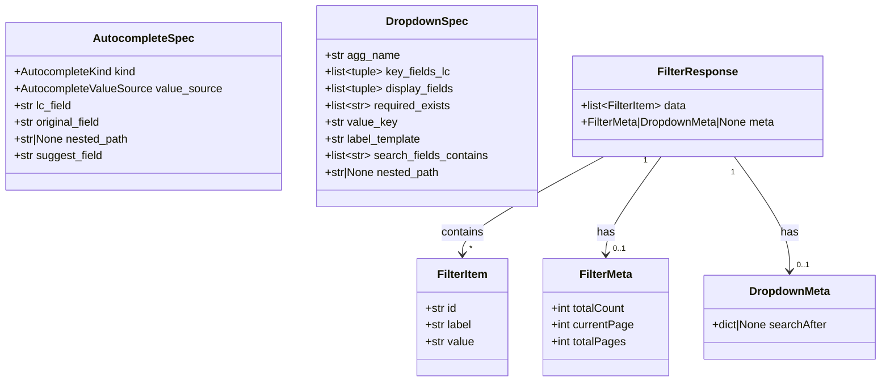

# Diagram: platform/partview_core/partview_service/partview_service/core/datamodel/FilterModels.py


> Auto-generated by Obscura crawlers

## Diagram 1

```mermaid
classDiagram
      class AutocompleteSpec {
          +AutocompleteKind kind
          +AutocompleteValueSource value_source...
  └ 89 lines...
```

> SVG rendering failed for this diagram.

## Diagram 2



### SVG

<svg id="container" width="1254.14453125" xmlns="http://www.w3.org/2000/svg" class="classDiagram" height="546" viewBox="0 0 1254.14453125 546" role="graphics-document document" aria-roledescription="class"><style>#container{font-family:"trebuchet ms",verdana,arial,sans-serif;font-size:16px;fill:#333;}@keyframes edge-animation-frame{from{stroke-dashoffset:0;}}@keyframes dash{to{stroke-dashoffset:0;}}#container .edge-animation-slow{stroke-dasharray:9,5!important;stroke-dashoffset:900;animation:dash 50s linear infinite;stroke-linecap:round;}#container .edge-animation-fast{stroke-dasharray:9,5!important;stroke-dashoffset:900;animation:dash 20s linear infinite;stroke-linecap:round;}#container .error-icon{fill:#552222;}#container .error-text{fill:#552222;stroke:#552222;}#container .edge-thickness-normal{stroke-width:1px;}#container .edge-thickness-thick{stroke-width:3.5px;}#container .edge-pattern-solid{stroke-dasharray:0;}#container .edge-thickness-invisible{stroke-width:0;fill:none;}#container .edge-pattern-dashed{stroke-dasharray:3;}#container .edge-pattern-dotted{stroke-dasharray:2;}#container .marker{fill:#333333;stroke:#333333;}#container .marker.cross{stroke:#333333;}#container svg{font-family:"trebuchet ms",verdana,arial,sans-serif;font-size:16px;}#container p{margin:0;}#container g.classGroup text{fill:#9370DB;stroke:none;font-family:"trebuchet ms",verdana,arial,sans-serif;font-size:10px;}#container g.classGroup text .title{font-weight:bolder;}#container .nodeLabel,#container .edgeLabel{color:#131300;}#container .edgeLabel .label rect{fill:#ECECFF;}#container .label text{fill:#131300;}#container .labelBkg{background:#ECECFF;}#container .edgeLabel .label span{background:#ECECFF;}#container .classTitle{font-weight:bolder;}#container .node rect,#container .node circle,#container .node ellipse,#container .node polygon,#container .node path{fill:#ECECFF;stroke:#9370DB;stroke-width:1px;}#container .divider{stroke:#9370DB;stroke-width:1;}#container g.clickable{cursor:pointer;}#container g.classGroup rect{fill:#ECECFF;stroke:#9370DB;}#container g.classGroup line{stroke:#9370DB;stroke-width:1;}#container .classLabel .box{stroke:none;stroke-width:0;fill:#ECECFF;opacity:0.5;}#container .classLabel .label{fill:#9370DB;font-size:10px;}#container .relation{stroke:#333333;stroke-width:1;fill:none;}#container .dashed-line{stroke-dasharray:3;}#container .dotted-line{stroke-dasharray:1 2;}#container #compositionStart,#container .composition{fill:#333333!important;stroke:#333333!important;stroke-width:1;}#container #compositionEnd,#container .composition{fill:#333333!important;stroke:#333333!important;stroke-width:1;}#container #dependencyStart,#container .dependency{fill:#333333!important;stroke:#333333!important;stroke-width:1;}#container #dependencyStart,#container .dependency{fill:#333333!important;stroke:#333333!important;stroke-width:1;}#container #extensionStart,#container .extension{fill:transparent!important;stroke:#333333!important;stroke-width:1;}#container #extensionEnd,#container .extension{fill:transparent!important;stroke:#333333!important;stroke-width:1;}#container #aggregationStart,#container .aggregation{fill:transparent!important;stroke:#333333!important;stroke-width:1;}#container #aggregationEnd,#container .aggregation{fill:transparent!important;stroke:#333333!important;stroke-width:1;}#container #lollipopStart,#container .lollipop{fill:#ECECFF!important;stroke:#333333!important;stroke-width:1;}#container #lollipopEnd,#container .lollipop{fill:#ECECFF!important;stroke:#333333!important;stroke-width:1;}#container .edgeTerminals{font-size:11px;line-height:initial;}#container .classTitleText{text-anchor:middle;font-size:18px;fill:#333;}#container .label-icon{display:inline-block;height:1em;overflow:visible;vertical-align:-0.125em;}#container .node .label-icon path{fill:currentColor;stroke:revert;stroke-width:revert;}#container :root{--mermaid-font-family:"trebuchet ms",verdana,arial,sans-serif;}</style><g><defs><marker id="container_class-aggregationStart" class="marker aggregation class" refX="18" refY="7" markerWidth="190" markerHeight="240" orient="auto"><path d="M 18,7 L9,13 L1,7 L9,1 Z"></path></marker></defs><defs><marker id="container_class-aggregationEnd" class="marker aggregation class" refX="1" refY="7" markerWidth="20" markerHeight="28" orient="auto"><path d="M 18,7 L9,13 L1,7 L9,1 Z"></path></marker></defs><defs><marker id="container_class-extensionStart" class="marker extension class" refX="18" refY="7" markerWidth="190" markerHeight="240" orient="auto"><path d="M 1,7 L18,13 V 1 Z"></path></marker></defs><defs><marker id="container_class-extensionEnd" class="marker extension class" refX="1" refY="7" markerWidth="20" markerHeight="28" orient="auto"><path d="M 1,1 V 13 L18,7 Z"></path></marker></defs><defs><marker id="container_class-compositionStart" class="marker composition class" refX="18" refY="7" markerWidth="190" markerHeight="240" orient="auto"><path d="M 18,7 L9,13 L1,7 L9,1 Z"></path></marker></defs><defs><marker id="container_class-compositionEnd" class="marker composition class" refX="1" refY="7" markerWidth="20" markerHeight="28" orient="auto"><path d="M 18,7 L9,13 L1,7 L9,1 Z"></path></marker></defs><defs><marker id="container_class-dependencyStart" class="marker dependency class" refX="6" refY="7" markerWidth="190" markerHeight="240" orient="auto"><path d="M 5,7 L9,13 L1,7 L9,1 Z"></path></marker></defs><defs><marker id="container_class-dependencyEnd" class="marker dependency class" refX="13" refY="7" markerWidth="20" markerHeight="28" orient="auto"><path d="M 18,7 L9,13 L14,7 L9,1 Z"></path></marker></defs><defs><marker id="container_class-lollipopStart" class="marker lollipop class" refX="13" refY="7" markerWidth="190" markerHeight="240" orient="auto"><circle stroke="black" fill="transparent" cx="7" cy="7" r="6"></circle></marker></defs><defs><marker id="container_class-lollipopEnd" class="marker lollipop class" refX="1" refY="7" markerWidth="190" markerHeight="240" orient="auto"><circle stroke="black" fill="transparent" cx="7" cy="7" r="6"></circle></marker></defs><g class="root"><g class="clusters"></g><g class="edgePaths"><path d="M857.648,224L823.927,242.167C790.207,260.333,722.765,296.667,689.045,320C655.324,343.333,655.324,353.667,655.324,358.833L655.324,364" id="id_FilterResponse_FilterItem_1" class="edge-thickness-normal edge-pattern-solid relation" style=";;;" data-edge="true" data-et="edge" data-id="id_FilterResponse_FilterItem_1" data-points="W3sieCI6ODU3LjY0Nzk0MTEyNTY5MDYsInkiOjIyNH0seyJ4Ijo2NTUuMzI0MjE4NzUsInkiOjMzM30seyJ4Ijo2NTUuMzI0MjE4NzUsInkiOjM3MH1d" marker-end="url(#container_class-dependencyEnd)"></path><path d="M938.994,224L925.799,242.167C912.603,260.333,886.212,296.667,873.016,320C859.82,343.333,859.82,353.667,859.82,358.833L859.82,364" id="id_FilterResponse_FilterMeta_2" class="edge-thickness-normal edge-pattern-solid relation" style=";;;" data-edge="true" data-et="edge" data-id="id_FilterResponse_FilterMeta_2" data-points="W3sieCI6OTM4Ljk5NDQ1MzU1NjYyOTksInkiOjIyNH0seyJ4Ijo4NTkuODIwMzEyNSwieSI6MzMzfSx7IngiOjg1OS44MjAzMTI1LCJ5IjozNzB9XQ==" marker-end="url(#container_class-dependencyEnd)"></path><path d="M1043.591,224L1056.787,242.167C1069.983,260.333,1096.374,296.667,1109.57,324C1122.766,351.333,1122.766,369.667,1122.766,378.833L1122.766,388" id="id_FilterResponse_DropdownMeta_3" class="edge-thickness-normal edge-pattern-solid relation" style=";;;" data-edge="true" data-et="edge" data-id="id_FilterResponse_DropdownMeta_3" data-points="W3sieCI6MTA0My41OTE0ODM5NDMzNzAxLCJ5IjoyMjR9LHsieCI6MTEyMi43NjU2MjUsInkiOjMzM30seyJ4IjoxMTIyLjc2NTYyNSwieSI6Mzk0fV0=" marker-end="url(#container_class-dependencyEnd)"></path></g><g class="edgeLabels"><g class="edgeLabel" transform="translate(655.32421875, 333)"><g class="label" data-id="id_FilterResponse_FilterItem_1" transform="translate(-30.890625, -12)"><foreignObject width="61.78125" height="24"><div xmlns="http://www.w3.org/1999/xhtml" class="labelBkg" style="display: table-cell; white-space: nowrap; line-height: 1.5; max-width: 200px; text-align: center;"><span class="edgeLabel"><p>contains</p></span></div></foreignObject></g></g><g class="edgeLabel" transform="translate(859.8203125, 333)"><g class="label" data-id="id_FilterResponse_FilterMeta_2" transform="translate(-12.703125, -12)"><foreignObject width="25.40625" height="24"><div xmlns="http://www.w3.org/1999/xhtml" class="labelBkg" style="display: table-cell; white-space: nowrap; line-height: 1.5; max-width: 200px; text-align: center;"><span class="edgeLabel"><p>has</p></span></div></foreignObject></g></g><g class="edgeLabel" transform="translate(1122.765625, 333)"><g class="label" data-id="id_FilterResponse_DropdownMeta_3" transform="translate(-12.703125, -12)"><foreignObject width="25.40625" height="24"><div xmlns="http://www.w3.org/1999/xhtml" class="labelBkg" style="display: table-cell; white-space: nowrap; line-height: 1.5; max-width: 200px; text-align: center;"><span class="edgeLabel"><p>has</p></span></div></foreignObject></g></g><g class="edgeTerminals" transform="translate(835.1271368224889, 219.09455195841542)"><g class="inner" transform="translate(0, 0)"><foreignObject style="width: 9px; height: 12px;"><div xmlns="http://www.w3.org/1999/xhtml" style="display: inline-block; padding-right: 1px; white-space: nowrap;"><span class="edgeLabel">1</span></div></foreignObject></g></g><g class="edgeTerminals" transform="translate(916.5735663707374, 229.34357532253577)"><g class="inner" transform="translate(0, 0)"><foreignObject style="width: 9px; height: 12px;"><div xmlns="http://www.w3.org/1999/xhtml" style="display: inline-block; padding-right: 1px; white-space: nowrap;"><span class="edgeLabel">1</span></div></foreignObject></g></g><g class="edgeTerminals" transform="translate(1041.7398520735644, 246.97436537883956)"><g class="inner" transform="translate(0, 0)"><foreignObject style="width: 9px; height: 12px;"><div xmlns="http://www.w3.org/1999/xhtml" style="display: inline-block; padding-right: 1px; white-space: nowrap;"><span class="edgeLabel">1</span></div></foreignObject></g></g><g class="edgeTerminals" transform="translate(665.324219375, 347.50000053571426)"><g class="inner" transform="translate(0, 0)"></g><foreignObject style="width: 9px; height: 12px;"><div xmlns="http://www.w3.org/1999/xhtml" style="display: inline-block; padding-right: 1px; white-space: nowrap;"><span class="edgeLabel">*</span></div></foreignObject></g><g class="edgeTerminals" transform="translate(869.82031125, 347.4999989285714)"><g class="inner" transform="translate(0, 0)"></g><foreignObject style="width: 36px; height: 12px;"><div xmlns="http://www.w3.org/1999/xhtml" style="display: inline-block; padding-right: 1px; white-space: nowrap;"><span class="edgeLabel">0..1</span></div></foreignObject></g><g class="edgeTerminals" transform="translate(1132.7656274999997, 371.50000214285717)"><g class="inner" transform="translate(0, 0)"></g><foreignObject style="width: 36px; height: 12px;"><div xmlns="http://www.w3.org/1999/xhtml" style="display: inline-block; padding-right: 1px; white-space: nowrap;"><span class="edgeLabel">0..1</span></div></foreignObject></g></g><g class="nodes"><g class="node default" id="classId-AutocompleteSpec-0" transform="translate(202.40234375, 152)"><g class="basic label-container"><path d="M-194.40234375 -120 L194.40234375 -120 L194.40234375 120 L-194.40234375 120" stroke="none" stroke-width="0" fill="#ECECFF" style=""></path><path d="M-194.40234375 -120 C-86.15981741634401 -120, 22.082708917311976 -120, 194.40234375 -120 M-194.40234375 -120 C-67.7427621108459 -120, 58.916819528308196 -120, 194.40234375 -120 M194.40234375 -120 C194.40234375 -66.33949812873777, 194.40234375 -12.678996257475532, 194.40234375 120 M194.40234375 -120 C194.40234375 -51.998800033765576, 194.40234375 16.002399932468848, 194.40234375 120 M194.40234375 120 C65.11891936470761 120, -64.16450502058478 120, -194.40234375 120 M194.40234375 120 C83.72587489926703 120, -26.950593951465947 120, -194.40234375 120 M-194.40234375 120 C-194.40234375 25.792608043022597, -194.40234375 -68.4147839139548, -194.40234375 -120 M-194.40234375 120 C-194.40234375 57.336129469773304, -194.40234375 -5.327741060453391, -194.40234375 -120" stroke="#9370DB" stroke-width="1.3" fill="none" stroke-dasharray="0 0" style=""></path></g><g class="annotation-group text" transform="translate(0, -96)"></g><g class="label-group text" transform="translate(-68.5078125, -96)"><g class="label" style="font-weight: bolder" transform="translate(0,-12)"><foreignObject width="137.015625" height="24"><div xmlns="http://www.w3.org/1999/xhtml" style="display: table-cell; white-space: nowrap; line-height: 1.5; max-width: 186px; text-align: center;"><span class="nodeLabel markdown-node-label" style=""><p>AutocompleteSpec</p></span></div></foreignObject></g></g><g class="members-group text" transform="translate(-182.40234375, -48)"><g class="label" style="" transform="translate(0,-12)"><foreignObject width="177.4375" height="24"><div xmlns="http://www.w3.org/1999/xhtml" style="display: table-cell; white-space: nowrap; line-height: 1.5; max-width: 235px; text-align: center;"><span class="nodeLabel markdown-node-label" style=""><p>+AutocompleteKind kind</p></span></div></foreignObject></g><g class="label" style="" transform="translate(0,12)"><foreignObject width="296.296875" height="24"><div xmlns="http://www.w3.org/1999/xhtml" style="display: table-cell; white-space: nowrap; line-height: 1.5; max-width: 354px; text-align: center;"><span class="nodeLabel markdown-node-label" style=""><p>+AutocompleteValueSource value_source</p></span></div></foreignObject></g><g class="label" style="" transform="translate(0,36)"><foreignObject width="84.015625" height="24"><div xmlns="http://www.w3.org/1999/xhtml" style="display: table-cell; white-space: nowrap; line-height: 1.5; max-width: 141px; text-align: center;"><span class="nodeLabel markdown-node-label" style=""><p>+str lc_field</p></span></div></foreignObject></g><g class="label" style="" transform="translate(0,60)"><foreignObject width="127.21875" height="24"><div xmlns="http://www.w3.org/1999/xhtml" style="display: table-cell; white-space: nowrap; line-height: 1.5; max-width: 185px; text-align: center;"><span class="nodeLabel markdown-node-label" style=""><p>+str original_field</p></span></div></foreignObject></g><g class="label" style="" transform="translate(0,84)"><foreignObject width="167.390625" height="24"><div xmlns="http://www.w3.org/1999/xhtml" style="display: table-cell; white-space: nowrap; line-height: 1.5; max-width: 225px; text-align: center;"><span class="nodeLabel markdown-node-label" style=""><p>+str|None nested_path</p></span></div></foreignObject></g><g class="label" style="" transform="translate(0,108)"><foreignObject width="126.890625" height="24"><div xmlns="http://www.w3.org/1999/xhtml" style="display: table-cell; white-space: nowrap; line-height: 1.5; max-width: 184px; text-align: center;"><span class="nodeLabel markdown-node-label" style=""><p>+str suggest_field</p></span></div></foreignObject></g></g><g class="methods-group text" transform="translate(-182.40234375, 120)"></g><g class="divider" style=""><path d="M-194.40234375 -72 C-68.2707418811006 -72, 57.86085998779879 -72, 194.40234375 -72 M-194.40234375 -72 C-82.36023191212287 -72, 29.68187992575426 -72, 194.40234375 -72" stroke="#9370DB" stroke-width="1.3" fill="none" stroke-dasharray="0 0" style=""></path></g><g class="divider" style=""><path d="M-194.40234375 96 C-76.67165708298668 96, 41.05902958402663 96, 194.40234375 96 M-194.40234375 96 C-96.67146484805352 96, 1.059414053892965 96, 194.40234375 96" stroke="#9370DB" stroke-width="1.3" fill="none" stroke-dasharray="0 0" style=""></path></g></g><g class="node default" id="classId-DropdownSpec-1" transform="translate(603.74609375, 152)"><g class="basic label-container"><path d="M-156.94140625 -144 L156.94140625 -144 L156.94140625 144 L-156.94140625 144" stroke="none" stroke-width="0" fill="#ECECFF" style=""></path><path d="M-156.94140625 -144 C-90.03084289356839 -144, -23.12027953713678 -144, 156.94140625 -144 M-156.94140625 -144 C-40.19471910405514 -144, 76.55196804188972 -144, 156.94140625 -144 M156.94140625 -144 C156.94140625 -66.35867828300958, 156.94140625 11.282643433980837, 156.94140625 144 M156.94140625 -144 C156.94140625 -50.50915548238717, 156.94140625 42.981689035225656, 156.94140625 144 M156.94140625 144 C57.545845166384495 144, -41.84971591723101 144, -156.94140625 144 M156.94140625 144 C74.36109458073157 144, -8.219217088536851 144, -156.94140625 144 M-156.94140625 144 C-156.94140625 77.27369305383701, -156.94140625 10.547386107674015, -156.94140625 -144 M-156.94140625 144 C-156.94140625 58.11538217311083, -156.94140625 -27.76923565377834, -156.94140625 -144" stroke="#9370DB" stroke-width="1.3" fill="none" stroke-dasharray="0 0" style=""></path></g><g class="annotation-group text" transform="translate(0, -120)"></g><g class="label-group text" transform="translate(-55.3046875, -120)"><g class="label" style="font-weight: bolder" transform="translate(0,-12)"><foreignObject width="110.609375" height="24"><div xmlns="http://www.w3.org/1999/xhtml" style="display: table-cell; white-space: nowrap; line-height: 1.5; max-width: 160px; text-align: center;"><span class="nodeLabel markdown-node-label" style=""><p>DropdownSpec</p></span></div></foreignObject></g></g><g class="members-group text" transform="translate(-144.94140625, -72)"><g class="label" style="" transform="translate(0,-12)"><foreignObject width="105.734375" height="24"><div xmlns="http://www.w3.org/1999/xhtml" style="display: table-cell; white-space: nowrap; line-height: 1.5; max-width: 163px; text-align: center;"><span class="nodeLabel markdown-node-label" style=""><p>+str agg_name</p></span></div></foreignObject></g><g class="label" style="" transform="translate(0,12)"><foreignObject width="180.359375" height="24"><div xmlns="http://www.w3.org/1999/xhtml" style="display: table-cell; white-space: nowrap; line-height: 1.5; max-width: 278px; text-align: center;"><span class="nodeLabel markdown-node-label" style=""><p>+list&lt;tuple&gt; key_fields_lc</p></span></div></foreignObject></g><g class="label" style="" transform="translate(0,36)"><foreignObject width="187.6875" height="24"><div xmlns="http://www.w3.org/1999/xhtml" style="display: table-cell; white-space: nowrap; line-height: 1.5; max-width: 285px; text-align: center;"><span class="nodeLabel markdown-node-label" style=""><p>+list&lt;tuple&gt; display_fields</p></span></div></foreignObject></g><g class="label" style="" transform="translate(0,60)"><foreignObject width="181.46875" height="24"><div xmlns="http://www.w3.org/1999/xhtml" style="display: table-cell; white-space: nowrap; line-height: 1.5; max-width: 278px; text-align: center;"><span class="nodeLabel markdown-node-label" style=""><p>+list&lt;str&gt; required_exists</p></span></div></foreignObject></g><g class="label" style="" transform="translate(0,84)"><foreignObject width="103.109375" height="24"><div xmlns="http://www.w3.org/1999/xhtml" style="display: table-cell; white-space: nowrap; line-height: 1.5; max-width: 161px; text-align: center;"><span class="nodeLabel markdown-node-label" style=""><p>+str value_key</p></span></div></foreignObject></g><g class="label" style="" transform="translate(0,108)"><foreignObject width="140.921875" height="24"><div xmlns="http://www.w3.org/1999/xhtml" style="display: table-cell; white-space: nowrap; line-height: 1.5; max-width: 198px; text-align: center;"><span class="nodeLabel markdown-node-label" style=""><p>+str label_template</p></span></div></foreignObject></g><g class="label" style="" transform="translate(0,132)"><foreignObject width="234.578125" height="24"><div xmlns="http://www.w3.org/1999/xhtml" style="display: table-cell; white-space: nowrap; line-height: 1.5; max-width: 331px; text-align: center;"><span class="nodeLabel markdown-node-label" style=""><p>+list&lt;str&gt; search_fields_contains</p></span></div></foreignObject></g><g class="label" style="" transform="translate(0,156)"><foreignObject width="167.390625" height="24"><div xmlns="http://www.w3.org/1999/xhtml" style="display: table-cell; white-space: nowrap; line-height: 1.5; max-width: 225px; text-align: center;"><span class="nodeLabel markdown-node-label" style=""><p>+str|None nested_path</p></span></div></foreignObject></g></g><g class="methods-group text" transform="translate(-144.94140625, 144)"></g><g class="divider" style=""><path d="M-156.94140625 -96 C-81.62372984673343 -96, -6.306053443466851 -96, 156.94140625 -96 M-156.94140625 -96 C-49.25878606093488 -96, 58.42383412813024 -96, 156.94140625 -96" stroke="#9370DB" stroke-width="1.3" fill="none" stroke-dasharray="0 0" style=""></path></g><g class="divider" style=""><path d="M-156.94140625 120 C-85.32534235178018 120, -13.709278453560358 120, 156.94140625 120 M-156.94140625 120 C-67.41364283194265 120, 22.114120586114694 120, 156.94140625 120" stroke="#9370DB" stroke-width="1.3" fill="none" stroke-dasharray="0 0" style=""></path></g></g><g class="node default" id="classId-FilterItem-2" transform="translate(655.32421875, 454)"><g class="basic label-container"><path d="M-64.9296875 -84 L64.9296875 -84 L64.9296875 84 L-64.9296875 84" stroke="none" stroke-width="0" fill="#ECECFF" style=""></path><path d="M-64.9296875 -84 C-19.778679759343795 -84, 25.37232798131241 -84, 64.9296875 -84 M-64.9296875 -84 C-23.58871963593188 -84, 17.75224822813624 -84, 64.9296875 -84 M64.9296875 -84 C64.9296875 -36.687292879221665, 64.9296875 10.625414241556669, 64.9296875 84 M64.9296875 -84 C64.9296875 -35.151026211329985, 64.9296875 13.697947577340031, 64.9296875 84 M64.9296875 84 C29.36583671711297 84, -6.1980140657740606 84, -64.9296875 84 M64.9296875 84 C16.177189774655375 84, -32.57530795068925 84, -64.9296875 84 M-64.9296875 84 C-64.9296875 29.800785125682502, -64.9296875 -24.398429748634996, -64.9296875 -84 M-64.9296875 84 C-64.9296875 39.78832758160621, -64.9296875 -4.423344836787578, -64.9296875 -84" stroke="#9370DB" stroke-width="1.3" fill="none" stroke-dasharray="0 0" style=""></path></g><g class="annotation-group text" transform="translate(0, -60)"></g><g class="label-group text" transform="translate(-35.328125, -60)"><g class="label" style="font-weight: bolder" transform="translate(0,-12)"><foreignObject width="70.65625" height="24"><div xmlns="http://www.w3.org/1999/xhtml" style="display: table-cell; white-space: nowrap; line-height: 1.5; max-width: 120px; text-align: center;"><span class="nodeLabel markdown-node-label" style=""><p>FilterItem</p></span></div></foreignObject></g></g><g class="members-group text" transform="translate(-52.9296875, -12)"><g class="label" style="" transform="translate(0,-12)"><foreignObject width="45.734375" height="24"><div xmlns="http://www.w3.org/1999/xhtml" style="display: table-cell; white-space: nowrap; line-height: 1.5; max-width: 103px; text-align: center;"><span class="nodeLabel markdown-node-label" style=""><p>+str id</p></span></div></foreignObject></g><g class="label" style="" transform="translate(0,12)"><foreignObject width="67.875" height="24"><div xmlns="http://www.w3.org/1999/xhtml" style="display: table-cell; white-space: nowrap; line-height: 1.5; max-width: 126px; text-align: center;"><span class="nodeLabel markdown-node-label" style=""><p>+str label</p></span></div></foreignObject></g><g class="label" style="" transform="translate(0,36)"><foreignObject width="70.53125" height="24"><div xmlns="http://www.w3.org/1999/xhtml" style="display: table-cell; white-space: nowrap; line-height: 1.5; max-width: 128px; text-align: center;"><span class="nodeLabel markdown-node-label" style=""><p>+str value</p></span></div></foreignObject></g></g><g class="methods-group text" transform="translate(-52.9296875, 84)"></g><g class="divider" style=""><path d="M-64.9296875 -36 C-33.694563365108166 -36, -2.45943923021634 -36, 64.9296875 -36 M-64.9296875 -36 C-23.877292655065 -36, 17.175102189870003 -36, 64.9296875 -36" stroke="#9370DB" stroke-width="1.3" fill="none" stroke-dasharray="0 0" style=""></path></g><g class="divider" style=""><path d="M-64.9296875 60 C-19.107260002856414 60, 26.715167494287172 60, 64.9296875 60 M-64.9296875 60 C-29.90603296181542 60, 5.11762157636916 60, 64.9296875 60" stroke="#9370DB" stroke-width="1.3" fill="none" stroke-dasharray="0 0" style=""></path></g></g><g class="node default" id="classId-FilterMeta-3" transform="translate(859.8203125, 454)"><g class="basic label-container"><path d="M-89.56640625 -84 L89.56640625 -84 L89.56640625 84 L-89.56640625 84" stroke="none" stroke-width="0" fill="#ECECFF" style=""></path><path d="M-89.56640625 -84 C-46.21060214602313 -84, -2.854798042046255 -84, 89.56640625 -84 M-89.56640625 -84 C-52.62692018291422 -84, -15.687434115828438 -84, 89.56640625 -84 M89.56640625 -84 C89.56640625 -27.6698783383421, 89.56640625 28.660243323315797, 89.56640625 84 M89.56640625 -84 C89.56640625 -38.09465670556213, 89.56640625 7.81068658887574, 89.56640625 84 M89.56640625 84 C23.71971112849144 84, -42.12698399301712 84, -89.56640625 84 M89.56640625 84 C21.736289379093833 84, -46.093827491812334 84, -89.56640625 84 M-89.56640625 84 C-89.56640625 30.703269995177237, -89.56640625 -22.593460009645526, -89.56640625 -84 M-89.56640625 84 C-89.56640625 22.316987168776024, -89.56640625 -39.36602566244795, -89.56640625 -84" stroke="#9370DB" stroke-width="1.3" fill="none" stroke-dasharray="0 0" style=""></path></g><g class="annotation-group text" transform="translate(0, -60)"></g><g class="label-group text" transform="translate(-36.9453125, -60)"><g class="label" style="font-weight: bolder" transform="translate(0,-12)"><foreignObject width="73.890625" height="24"><div xmlns="http://www.w3.org/1999/xhtml" style="display: table-cell; white-space: nowrap; line-height: 1.5; max-width: 122px; text-align: center;"><span class="nodeLabel markdown-node-label" style=""><p>FilterMeta</p></span></div></foreignObject></g></g><g class="members-group text" transform="translate(-77.56640625, -12)"><g class="label" style="" transform="translate(0,-12)"><foreignObject width="108.125" height="24"><div xmlns="http://www.w3.org/1999/xhtml" style="display: table-cell; white-space: nowrap; line-height: 1.5; max-width: 166px; text-align: center;"><span class="nodeLabel markdown-node-label" style=""><p>+int totalCount</p></span></div></foreignObject></g><g class="label" style="" transform="translate(0,12)"><foreignObject width="118.1875" height="24"><div xmlns="http://www.w3.org/1999/xhtml" style="display: table-cell; white-space: nowrap; line-height: 1.5; max-width: 176px; text-align: center;"><span class="nodeLabel markdown-node-label" style=""><p>+int currentPage</p></span></div></foreignObject></g><g class="label" style="" transform="translate(0,36)"><foreignObject width="106.890625" height="24"><div xmlns="http://www.w3.org/1999/xhtml" style="display: table-cell; white-space: nowrap; line-height: 1.5; max-width: 164px; text-align: center;"><span class="nodeLabel markdown-node-label" style=""><p>+int totalPages</p></span></div></foreignObject></g></g><g class="methods-group text" transform="translate(-77.56640625, 84)"></g><g class="divider" style=""><path d="M-89.56640625 -36 C-39.96724523110629 -36, 9.63191578778742 -36, 89.56640625 -36 M-89.56640625 -36 C-27.186087383250374 -36, 35.19423148349925 -36, 89.56640625 -36" stroke="#9370DB" stroke-width="1.3" fill="none" stroke-dasharray="0 0" style=""></path></g><g class="divider" style=""><path d="M-89.56640625 60 C-37.355075943813965 60, 14.85625436237207 60, 89.56640625 60 M-89.56640625 60 C-19.285237365723944 60, 50.99593151855211 60, 89.56640625 60" stroke="#9370DB" stroke-width="1.3" fill="none" stroke-dasharray="0 0" style=""></path></g></g><g class="node default" id="classId-DropdownMeta-4" transform="translate(1122.765625, 454)"><g class="basic label-container"><path d="M-123.37890625 -60 L123.37890625 -60 L123.37890625 60 L-123.37890625 60" stroke="none" stroke-width="0" fill="#ECECFF" style=""></path><path d="M-123.37890625 -60 C-46.24254243000942 -60, 30.893821389981156 -60, 123.37890625 -60 M-123.37890625 -60 C-31.540084389926392 -60, 60.298737470147216 -60, 123.37890625 -60 M123.37890625 -60 C123.37890625 -28.459971473817106, 123.37890625 3.080057052365788, 123.37890625 60 M123.37890625 -60 C123.37890625 -31.99917461295619, 123.37890625 -3.998349225912378, 123.37890625 60 M123.37890625 60 C34.500632051760405 60, -54.37764214647919 60, -123.37890625 60 M123.37890625 60 C39.85622731691939 60, -43.666451616161226 60, -123.37890625 60 M-123.37890625 60 C-123.37890625 34.44661078485912, -123.37890625 8.893221569718236, -123.37890625 -60 M-123.37890625 60 C-123.37890625 31.86857142498298, -123.37890625 3.737142849965963, -123.37890625 -60" stroke="#9370DB" stroke-width="1.3" fill="none" stroke-dasharray="0 0" style=""></path></g><g class="annotation-group text" transform="translate(0, -36)"></g><g class="label-group text" transform="translate(-55.7890625, -36)"><g class="label" style="font-weight: bolder" transform="translate(0,-12)"><foreignObject width="111.578125" height="24"><div xmlns="http://www.w3.org/1999/xhtml" style="display: table-cell; white-space: nowrap; line-height: 1.5; max-width: 160px; text-align: center;"><span class="nodeLabel markdown-node-label" style=""><p>DropdownMeta</p></span></div></foreignObject></g></g><g class="members-group text" transform="translate(-111.37890625, 12)"><g class="label" style="" transform="translate(0,-12)"><foreignObject width="166.96875" height="24"><div xmlns="http://www.w3.org/1999/xhtml" style="display: table-cell; white-space: nowrap; line-height: 1.5; max-width: 225px; text-align: center;"><span class="nodeLabel markdown-node-label" style=""><p>+dict|None searchAfter</p></span></div></foreignObject></g></g><g class="methods-group text" transform="translate(-111.37890625, 60)"></g><g class="divider" style=""><path d="M-123.37890625 -12 C-69.33318873735811 -12, -15.287471224716228 -12, 123.37890625 -12 M-123.37890625 -12 C-49.012796890256865 -12, 25.35331246948627 -12, 123.37890625 -12" stroke="#9370DB" stroke-width="1.3" fill="none" stroke-dasharray="0 0" style=""></path></g><g class="divider" style=""><path d="M-123.37890625 36 C-26.015143391944832 36, 71.34861946611034 36, 123.37890625 36 M-123.37890625 36 C-59.45922282948064 36, 4.460460591038725 36, 123.37890625 36" stroke="#9370DB" stroke-width="1.3" fill="none" stroke-dasharray="0 0" style=""></path></g></g><g class="node default" id="classId-FilterResponse-5" transform="translate(991.29296875, 152)"><g class="basic label-container"><path d="M-180.60546875 -72 L180.60546875 -72 L180.60546875 72 L-180.60546875 72" stroke="none" stroke-width="0" fill="#ECECFF" style=""></path><path d="M-180.60546875 -72 C-54.82383546271517 -72, 70.95779782456967 -72, 180.60546875 -72 M-180.60546875 -72 C-87.84862495600225 -72, 4.908218837995491 -72, 180.60546875 -72 M180.60546875 -72 C180.60546875 -30.18941997684727, 180.60546875 11.621160046305462, 180.60546875 72 M180.60546875 -72 C180.60546875 -15.869006681103777, 180.60546875 40.26198663779245, 180.60546875 72 M180.60546875 72 C90.8697101890573 72, 1.1339516281146018 72, -180.60546875 72 M180.60546875 72 C66.58910557902975 72, -47.4272575919405 72, -180.60546875 72 M-180.60546875 72 C-180.60546875 22.52843145913524, -180.60546875 -26.943137081729517, -180.60546875 -72 M-180.60546875 72 C-180.60546875 22.058761984060453, -180.60546875 -27.882476031879094, -180.60546875 -72" stroke="#9370DB" stroke-width="1.3" fill="none" stroke-dasharray="0 0" style=""></path></g><g class="annotation-group text" transform="translate(0, -48)"></g><g class="label-group text" transform="translate(-54.3046875, -48)"><g class="label" style="font-weight: bolder" transform="translate(0,-12)"><foreignObject width="108.609375" height="24"><div xmlns="http://www.w3.org/1999/xhtml" style="display: table-cell; white-space: nowrap; line-height: 1.5; max-width: 157px; text-align: center;"><span class="nodeLabel markdown-node-label" style=""><p>FilterResponse</p></span></div></foreignObject></g></g><g class="members-group text" transform="translate(-168.60546875, 0)"><g class="label" style="" transform="translate(0,-12)"><foreignObject width="152.9375" height="24"><div xmlns="http://www.w3.org/1999/xhtml" style="display: table-cell; white-space: nowrap; line-height: 1.5; max-width: 250px; text-align: center;"><span class="nodeLabel markdown-node-label" style=""><p>+list&lt;FilterItem&gt; data</p></span></div></foreignObject></g><g class="label" style="" transform="translate(0,12)"><foreignObject width="282.90625" height="24"><div xmlns="http://www.w3.org/1999/xhtml" style="display: table-cell; white-space: nowrap; line-height: 1.5; max-width: 340px; text-align: center;"><span class="nodeLabel markdown-node-label" style=""><p>+FilterMeta|DropdownMeta|None meta</p></span></div></foreignObject></g></g><g class="methods-group text" transform="translate(-168.60546875, 72)"></g><g class="divider" style=""><path d="M-180.60546875 -24 C-61.73410467776799 -24, 57.137259394464024 -24, 180.60546875 -24 M-180.60546875 -24 C-86.30441073382367 -24, 7.996647282352654 -24, 180.60546875 -24" stroke="#9370DB" stroke-width="1.3" fill="none" stroke-dasharray="0 0" style=""></path></g><g class="divider" style=""><path d="M-180.60546875 48 C-71.95075763235074 48, 36.70395348529851 48, 180.60546875 48 M-180.60546875 48 C-42.11568007024036 48, 96.37410860951928 48, 180.60546875 48" stroke="#9370DB" stroke-width="1.3" fill="none" stroke-dasharray="0 0" style=""></path></g></g></g></g></g></svg>
